# 

单行本

成大先主编

# 联接与紧固

# 

单行本

# 联接与紧固

主编单位中国有色工程设计研究总院

主编成大先  
副主编王德夫姬奎生韩学钰姜勇李长顺

# (京)新登字039号

# 图书在版编目(CIP)数据

机械设计手册,单行本,联接与紧固/成大先主编北京:化学工业出版社,2004.1ISBN7-5025-4953-6

I.机…I成Ⅲ①机械设计-技术手册机械元件-机械设计-技术手册JVTH122-62

中国版本图书馆CIP数据核字(2003)第104934号

# 机械设计手册

单行本

# 联接与紧固

成大先主缩责任编辑:周国庆张红兵任文斗张兴辉责任校对:蒋宇封面设计:蒋艳君

化学工业出版社出版发行(北京市醫阳区昌新里3号邮政编码L00029)发行电话:(010)64982530bttp://wcip..cn

新华书店北京发行所经北京市彩桥印刷厂印刷三河市前程装订厂装订

开本787毫米×1092毫米1/16印张19字敦665千字2004年1月第1版2004年1月北京第1次印刷BN 7-5025-4953-6/TH·160定价:37.00元

# 版权所有违者必究

该书如有缺页、倒责、脱页者,本社发行部负责退换

# 撰稿人员

成大先中国有色工程设计研究总院  
王德夫中国有色工程设计研究总院  
姬奎生中国有色工程设计研究总院  
韩学钰北京石油化工工程公司  
余梦生北京科技大学  
高淑之北京化工大学  
柯蕊珍 中国有色工程设计研究总院  
陶兆荣中国有色工程设计研究总院  
孙东辉 中国有色工程设计研究总院  
李福君中国有色工程设计研究总院  
阮忠唐西安理工大学  
熊绮华西安理工大学  
雷淑存西安理工大学  
田惠民 西安理工大学  
殷鸿梁 上海工业大学  
齐维浩 西安理工大学  
曹惟庆西安理工大学  
关天池 中国有色工程设计研究总院  
房庆久 中国有色工程设计研究总院  
李安民 机械科学研究院  
李维荣机械科学研究院  
丁宝平 机械科学研究院  
梁全贵 中国有色工程设计研究总院  
王淑兰 中国有色工程设计研究总院  
林基明 中国有色工程设计研究总院  
童祖楹上海交通大学  
刘清廉 中国有色工程设计研究总院  
许文元 天津工程机械研究所  
孔庆堂 北京新兴超越离合器有限公司  
孔炜北京新兴超越离合器有限公司  
朱春梅 北京机械工业学院  
丘大谋西安交通大学  
诸文俊 西安交通大学  
徐华西安交通大学  
陈立群西北轻工业学院  
肖治彭中国有色工程设计研究总院  
邹舜卿中国有色工程设计研究总院  
邓述慈西安理工大学  
秦毅中国有色工程设计研究总院  
周凤香中国有色工程设计研究总院  
朴树寰中国有色工程设计研究总院  
杜子英中国有色工程设计研究总院  
汪德涛广州机床研究所  
王鸿翔 中国有色工程设计研究总院  
段慧文中国有色工程设计研究总院  
姜勇中国有色工程设计研究总院  
徐永年郑州机械研究所  
梁桂明洛阳工学院  
张光辉重庆大学  
罗文军重庆大学  
沙树明中国有色工程设计研究总院  
谢佩娟太原理工大学  
余铭无锡市万向轴厂  
陈祖元广东工业大学  
陈仕贤北京航空航天大学  
王春和北方工业大学  
周朗晴中国有色工程设计研究总院  
孙夏明北方工业大学  
季泉生 济南钢铁集团  
马敬勋济南钢铁集团  
蔡学熙 连云港化工矿山设计研究院  
姚光义连云港化工矿山设计研究院  
沈益新 连云港化工矿山设计研究院  
钱亦清连云港化工矿山设计研究院  
于琴连云港化工矿山设计研究院  
蔡学坚邢台地区经济委员会  
虞培清浙江长城减速机有限公司  
项建忠 浙江通力减速机有限公司  
阮劲松宝鸡市广环机床责任有限公司  
纪盛青东北大学  
黄效国北京科技大学  
陈新华北京科技大学  
李长顺 中国有色工程设计研究总院  
崔桂芝 北方工业大学  
张若青 北方工业大学  
王侃 北方工业大学  
张常年 北方工业大学  
朱宏军 北方工业大学  
佟新 中国有色工程设计研究总院  
榻有雄 天津大学  
林少芬 集美大学  
卢长耿 集美大学  
吴根茂 浙江大学  
钟荣龙厦门海特液压机械工程有限公司  
黄畬 北京科技大学  
彭光正 北京理工大学  
张百海 北京理工大学  
王涛 北京理工大学  
陈金兵 北京理工大学  
包钢 哈尔滨工业大学  
王雄耀 费斯托(FESTO)(中国)有限公司  
蒋友谅 北京理工大学  
刘福祐 中国有色工程设计研究总院  
史习先 中国有色工程设计研究总院

# 审稿人员

余梦生 成大先 王德夫 强毅 房庆久 李福君钟云杰 郭可谦 姬奎生 王春九 韩学钰 段慧文邹舜卿 汪德涛 陈应斗 刘清廉 李继和 徐智郭长生 吴宗泽 李长顺 陈谌闻 饶振纲 季泉生林鹤 黄靖远 武其俭 洪允楣 蔡学熙 张红兵朱天仕 唐铁城 卢长耿 宋京其 黄效国 吴筠徐文灿 史习先

# 编辑人员

周国庆 张红兵 任文斗 张兴辉 刘哲 武志怡段志兵 辛田

# 《机械设计手册》单行本

# 出版说明

在我国机械设计界享有盛名的《机械设计手册》,自1969年第一版出版发行以来,已经修订了四版,累计销售量超过113万套,成为新中国成立以来,在国内影响力最强、销售量最大的机械设计工具书。作为国家级的重点科技图书,《机械设计手册》多次获得国家和省部级奖励。其中,1978年获全国科学大会科技成果奖,1983年获化工部优秀科技图书奖,1995年获全国优秀科技图书二等奖,1999年获全国化工科技进步二等奖,2002年获石油和化学工业优秀科技图书一等奖,2003年获中国石油和化学工业科技进步二等奖。1986年至2002年,连续被评为全国优秀畅销书。

《机械设计手册》第四版(5卷本),以其技术性和实用性强、标准和数据可靠、思路和方法可行、使用和核查方便等特点,受到广大机械设计工作者和工程技术人员的首肯和厚爱。自 2002年初出版发行以来,已累计销售24000多套,收到读者来信数千封。山西省太原重型机器厂设计院的一位工程技术人员在来信中说,“《机械设计手册》(第四版)赢得了我们机械设计者的好评。特别是推荐了许多实用的新技术、新产品、新材料和新工艺,扩大了相应产品的品种和规格范围,内容齐全,实用、可靠,是我们设计工作者不可缺少的好助手。”江苏省南通市的一位退休工程师说,“我从事机械设计工作40余年,最初用的是1969年的《机械设计手册》第一版,后来陆续使用第二版、第三版,现在已经退休。近来逛书店,突然发现《机械设计手册》新出的第四版,爱不释手,自已买了一套收藏,它是我一生事业中最亲密、最忠诚的伴侣。”湖南省湘潭市江麓机械集团有限公司、辽宁省鞍山焦化耐火材料设计总院的读者认为,“《机械设计手册》第四版资料全面、新颖、准确、可靠,突出了实用性,从机械人员的角度出发,反映先进性,设计方法、公式选择、参数选用都采用最新标准,实用便查。”广大读者在对《机械设计手册》第四版的内容给予充分肯定的同时,也指出了《机械设计手册》第四版(5卷本)装帧太厚、太重,不便携带和翻阅,希望出版篇幅小些的单行本。其中武汉钢铁设计研究总院、重庆钢铁设计研究总院、内蒙古包头钢铁设计研究院、哈尔滨重型机器厂研究所、沈阳铁路分局沈东机械总厂、兰州铁道学院、天津工程机械研究院等众多单位的读者都纷纷来函、来电,建议将《机械设计手册》第四版以篇为单位改编为多卷本。

根据广大读者的反映和建议,化学工业出版社组织编辑出版人员深人设计科研院所、大中专院校、机械企业和有一定影响的新华书店进行调研,广泛征求和听取各方面的意见,在与主编单位协商一致的基础上,决定编辑出版《机械设计手册》单行本。

《机械设计手册》单行本,保留了《机械设计手册》第四版(5卷本)的优势和特色,从设计工作的实际出发,结合机械设计专业的具体情况,将原来的5卷23篇调整为15分册22篇,分别为:《常用设计资料》、《机械制图、极限与配合》、《常用工程材料》、《联接与紧固》、《轴及其联接》、《轴承》、《弹簧·起重运输件·五金件》、《润滑与密封》、《机械传动》、《减(变)速器·电机与电器》、《机械振动·机架设计》、《机构》、《液压传动》、《液压控制》、《气压传动》。原第5卷第23篇中“中外金属材料、滚动轴承、液压介质等牌号对照”内容,分别编人《常用工程材料》、《轴承》、《润滑与密封》、《液压传动》、《气压传动》等单行本中。这样,全套书查阅和携带更加方便,各分册篇幅适中,利于设计人员和读者根据各自需要灵活选购。

《机械设计手册》单行本,是为了适应机械设计事业发展和广大读者的需要而编辑出版的,将与《机械设计手册》第四版(5卷本)一起,成为机械设计工作者、工程技术人员和广大读者的良师益友。

借《机械设计手册》单行本出版之际,再次向热情支持和积极参加编写工作的单位和人员表示诚挚的敬意!向长期关心、支持《机械设计手册》的广大热心读者表示衷心感谢!

由于编辑出版单行本的工作量较大,时间较紧,难免存在疏漏和缺点,恳请广大读者给予指正。

# 第四版前言

《机械设计手册》第一版于1969年问世,30多年来,共修订了三版,发行110余万套,受到了广大读者的欢迎和厚爱。

《机械设计手册》第三版于1994年出版发行,至今已有8年的时间。在这期间,我国的改革开放取得了举世瞩目的成就,以信息技术为代表的高新技术产业迅猛发展,经济建设日新月异。作为世界贸易组织的新成员,我国在进一步加强对外开放,顺应经济全球化潮流,主动参与国际竞争与合作的同时,也必将面对更为激烈的竞争和更加严峻的挑战。作为机械设计工作者,要参与激烈的竞争,迎接严峻的挑战,就必须积极快速地开发具有国际先进水平、形成自身特色的高质量的新产品。

《机械设计手册》第四版修订就是以满足新产品开发设计的需要为宗旨面进行的。因此,本版除了继续发扬前三版“实用可靠、内容齐全、简明便查”的特点外,首先着重推荐了许多实用的新技术、新产品、新材料和新工艺,并扩大了相应产品的品种和规格范围,同时全面采用了最新标准。调整了部分篇章,修改删节了不足和错误之处。全书仍分五卷出版,修订情况如下。

1.采用新技术方面:

(1)为便于设计人员充分利用通用的、先进的数字仿真软件,快速地进行液压伺服系统的数字仿真与动态分析,专门撰写了MATLAB仿真软件及其在液压控制系统仿真中的应用。气压传动进行了全面更新,包括了现代气压传动最新技术的各主要方面,推荐了阀岛技术、导杆气缸、仿生气动肌腱(一种能卷折起来的便于携带的新型气动驱动器)和模块化气动机械手等。

(2)传动方面增加了“新型非零变位锥齿轮及双曲齿轮技术”和活齿传动。新型非零变位锥齿轮及双曲齿轮技术突破了零传动设计的制约,创立了非零传动设计。用此设计制造出的齿轮,在轴交角保持不变的条件下,具有高强度、长寿命、低噪声、小体积、大速比、少齿数等优点。该技术具有国际先进或领先水平,适用于高强度正传动设计,小体积小型设计,低噪声负传动设计等,并便于引进产品国产化,新产品开发创优和老产品改进,已在国内许多产品上推广使用。

(3)介绍了金属-橡胶复合弹簧的设计计算。

(4)介绍了几种新型热处理和新型表面处理工艺。

2.采用新材料、新产品方面;

(1)材料全面采用最新国家标准、行业标准,并推荐了许多新型材料品种,扩大了相应的规格范围。

(2)联接与紧固、传动零部件、滚动轴承以及大部分或全部液压、气压传动和控制零部件都采用了最新标准及新产品,同时新增加了空气轴承、电磁轴承、膜片联轴器、膜片弹簧、盘形制动器、惯性制动器、电液推杆等,大大丰富了机械零部件的品种和规格范围。

(3)在同类手册中首次编人了锚固联接一章,锚固联接技术有利于改善和加快设备的安装,补充了多点柔性传动的动力计算,从面完善了多点柔性传动的设计内容。

4.为引起读者在新产品开发设计中重视产品的造型设计,特别在第1篇中增加了结构设计应与造型设计相结合的内容。

5.扩大了几种常用设计资料的中外对照范围,更加方便于今后的中外交流和产品开发中的国内外产品选择和配套。

6.应广大读者的要求,在介绍产品时,在备注中增加了产品生产厂名。由于市场经济的实际变化较快,读者必须结合当时的实际情况,进一步作深入调查,了解产品实际生产品种、规格及尺寸,以及产品质量和用户的实际反映,再作选择。

7.目前国家各级标准修订工作正处在向国际标准接轨时期,加之组织机构的调整,使各类标准工作未能同步进行,因此,手册中的一些名词、术语以及单位等,未能完全统一。同时,手册在引用各种标准时,也都是根据设计需要进行摘编的,请读者在使用中注意。

8.对篇章结构作了部分调整。将第1篇原第12章通用技术条件及说明,分散到该篇相关工艺性及结构要素各章,更便于查阅,原第11章变为第12章,并增加了结构设计应与造型设计相结合的内容(第11章)。第5篇联接与紧固增加了锚固联接一章。考虑机电一体化产品发展很快,原第22篇内容已无法满足产品开发设计的需要,若继续更新扩大,则手册篇幅过大,使用不便,故第四版未再将此内容编入手册,而是单独组织编写了《光机电一体化产品设计手册》一书。

为了满足新产品开发设计的需要,我们还陆续组织编写了《机械设计图册》(已出版)、《光电机一体化产品设计使用手册》(已出版)、《现代设计方法实用手册》、《新产品开发设计指南》、《技术创新专利申请策划基础》等新书目。这几套书既各自独立,又有内在联系,但其共同点都是有助于新产品的开发,强调实用性、启发性、开拓性和先进性相结合,构成一套比较系统的、风格独特的机械新产品开发设计系列工具书。

《机械设计手册》第四版是在前几版基础上重新编写而成的。借《机械设计手册》第四版出版之际,再次向参加每版编写的单位和个人表示衷心地感谢!同时也感谢给我们提供大力支持和热忱帮助的单位和各界朋友们!

由于水平有限,调查研究工作不够全面,《机械设计手册》第四版中难免存在疏漏和缺点,恳请广大读者继续给予指正。

主编2001年11月

# 内容提要

《机械设计手册》单行本共15分册22篇,涵盖了机械常规设计的所有内容。各分册分别为:《常用设计资料》、《机械制图、极限与配合》、《常用工程材料》、《联接与紧固》、《轴及其联接》、《轴承》、《弹簧·起重运输件·五金件》、《润滑与密封》、《机械传动》、《减(变)速器·电机与电器》、《机械振动·机架设计》、《机构》、《液压传动》、《液压控制》、《气压传动。

本书为《联接与紧固》。共7章,包括螺纹及螺纹联接,铆钉联接,销、键及花键联接,过盈联接,胀紧联接和型面联接,锚固联接,粘接。主要介绍联接和紧固(件)的类型、特点、强度计算、选用,以及常用标准联接与紧固件的规格、特点、尺寸、性能参数等。

本书可作为机械设计人员和有关工程技术人员的工具书,也可供大专院校有关专业师生参考

# 目 录

# 第4篇联接与紧固

第1章螺纹及螺纹联接. 4-31螺..…… . 4-31.1螺纹术语及其定义(GB/T14791—1993)… 4-31.2螺纹的分类、特点和应用…4-101.3普通螺纹. .… 4-131.4梯形螺纹. 4-181.4.1梯形螺纹牙型与基本尺寸.…4-181.4.2 梯形螺纹公差(GB/T5796.4—1986).\*\* 4-211.5锯齿形 $( 3 ^ { \circ } , ~ 3 0 ^ { \circ } )$ 螺纹… .. 4-241.5.1锯齿形 $( 3 ^ { \circ } , ~ 3 0 ^ { \circ } )$ 螺纹牙型与基本尺寸… . 4-241.5.2锯齿形 $( 3 ^ { \circ } , ~ 3 0 ^ { \circ } )$ 螺纹公差(GB/T.133576.41992). 4-271.5.3水系统 $4 5 ^ { \circ }$ 锯齿形螺纹牙型与基本尺寸(JB/T 2001.73-1999)..· 4-311.6 $5 5 ^ { \circ }$ 非螺纹密封的管螺纹(GB/T7307—2001) ·4-321.7 $5 5 ^ { \circ }$ 密封管螺纹(GB/T7306.1\~7306.2—2000) .\*\*.....\*\*..4-34圆柱内螺纹与圆锥外螺纹(GB/T7306.1—2000) . 4-34圆锥内螺纹与圆锥外螺纹(GB/T7306.2-2000) 4-341.8 $6 0 ^ { \circ }$ 圆锥管螺纹(GB/T12716-1991)..… 4-371.9管路旋人端用普通螺纹(GB/T1414—1978) 4-381.10米制锥螺纹(GB/T 1415-1992)4-391.11管螺纹 .. 4-40切制内、外螺纹前的毛坯尺寸(JB/ZQ4168-1997) 4-401.12矩形螺纹. .… 4-411.13 $3 0 ^ { \circ }$ 圆弧螺纹.....· ..-422螺纹零件结构要素 … 4-422.1紧固件. 4-42外螺纹零件的末端(GB/T21985)4-422.2普通螺纹收尾、肩距、退刀槽、倒角

(GB/T3-1997) 4-44 

2.3圆柱管螺纹收尾、退刀槽、倒角尺寸........· 4462.4螺塞与连接螺孔尺寸 ..4-472.5 地脚螺栓孔和凸缘 .472.6沿周的配.·472.7通孔与沉孔尺寸. .\*\*\* 4-482.8 普通螺纹的内、外螺纹余留长度、钻孔余留深度、螺栓突出螺母的末端长度(JB/ZQ 4247—1997).. . 4-492.9粗牙螺栓、螺钉的拧人深度、攻丝深度和钻孔深度 4-492.10扳手空间(JB/ZQ 4005-1997).. 4-502.11对边和对角宽度尺寸(JB/ZQ4263-1997) : 4-513螺纹联接. 4-533.1螺纹联接的基本类型和常用的防松方法....... 4-533.2螺.组联接设计..…·4-543.2.1螺栓组联接的结构设计..4-543.2.2螺栓组的受力分析. .… 4-543.2.3单个螺栓的强度计算 4-563.3螺纹联接的拧紧力矩计算及预紧力的控制 : 4-613.3.1螺纹联接的拧紧力矩计算4-613.3.2预紧力的控制.. . 4-623.4螺纹联接机械性能和材料 ·. 4-643.5螺纹联接的标准元件 ... 4-763.5.1紧固件的标记方法(GB/T1237—2000) 4-763.5.2..螺.栓... .. 4-763.5.3螺柱 .... 4-953.5.4螺钉. … 4-993.5.5.母. 4-1163.5.6垫圈及挡圈 4-135第2章铆钉联接 4-1621铆钉联接的类型、特点和应用 … 4-1622铆缝形式 … 4-162

3 铆钉孔间距(GB/T152.1—1988) 4-162  
4 铆钉长度计算.. · 4-163  
5铆钉孔直径(GB/T152.1-1988) .. 4-163  
6铆钉联接的强度计算 4-163  
7铆接的材料和许用应力 4-165  
8铆钉类型及标准件 4-166

# 第3章销、键及花键联接 .… 4-181

# 1销联接… 4-181

1.1销的类型、特点和应用 4-181  
1.2销的选择和联接的强度计算 … 4-182  
1.3销的标准件 4-183

# 2键联接 4-192

2.1键的类型、特点和应用 4-192  
2.2键的选择和联接的强度计算 .. 4-192  
2.3键的标准件 4-194

# 3花键联接. 4-205

3.1花键的类型、特点和应用 4-205  
3.2花键的挤压强度校核 4-205  
3.3矩形花键(GB/T1144-1987) … 4-206  
3.4圆柱直齿渐开线花键(GB/T3478.1一  
1995)… 4-209  
3.4.1术语、代号和定义 4-209  
3.4.2基本参数 4-211  
3.4.3基本齿廊 4-213  
3.4.4尺寸系列 4-214  
3.4.5公差等级及公差 · 4-221  
3.4.6渐开线花键的参数标注 … 4-228

# 第4章过盈联接 4-230

1过盈联接的方法、特点与应用 4-230  
2过盈联接的设计与计算 4-2312.1圆柱面过盈联接的计算(GB5371一1985) 4-2322.2圆柱面过盈联接的计算举例.4-2382.3圆锥过盈联接的计算(GB/T15755—1995) 4-2412.4圆锥过盈联接的计算举例 4-244  
3过盈联接的结构设计… 4-2463.1圆柱面过盈联接的合理结构 4-2463.2实现圆锥面过盈联接的一般要求(GB/T15755-1995) + 4-2473.3油压装卸结构设计规范(JB/T6136一1992) … 4-2493.4油压装卸说明(JB/T6136一1992)4-252

# 第5章胀紧联接和型面联接 .. 4-253

# 1胀紧联接 4-253

1.1联接原理与特点 .… 4-253

# 1.3胀紧联接套的选用(JB/T7934—1995)

4-257  
1.3.1按载荷选择胀套的计算 F+= 4-257  
1.3.2结合面公差及表面粗糙度 4-257  
1.3.3被联接件的尺寸… 4-257

# 1.4胀紧联接套安装和拆卸的一般要求

(JB/T7934—1995) +1 4-261 

2型面联接.· …4-261

# 第6章锚固联接 4-263

1锚固联接的作用原理 4-263  
2锚固联接失效的几种主要形式 4-264  
3锚固联接的基础与安装 4-264  
3.1锚固基础 4-264  
3.2锚栓的安装 4-265  
4锚栓的表面处理 4-268  
5锚固联接的承载力验算 4-268

# 5.1锚栓承载力验算要求及计算公式4-268

5.1.1验算方法与要求 4-268  
5.1.2受拉承载力计算 … 4-269  
5.1.3受剪承载力计算 4-269  
5.1.4拉剪共同作用下的承载力计算4-270

# 5.2例题… 4-270

5锚栓型号与规格 4-271

# 国产钢膨胀螺栓及膨胀螺母·4-289

7.1钢膨胀螺栓 4-289  
7.2膨胀螺母… 4-290

# 第7章粘接 4-291

1 胶粘剂的选择 4-291  
2粘接接头的设计 4-294  
3粘接工艺与步骤 4-296  
3.1表面处理 4-296  
3.2胶液配制和涂敷 4-297  
3.3晾置与固化 · 4-298

# 4粘接技术的应用. …4-298

参考文献 4-300

# 第4篇 联接与紧固

主要撰稿关天池 韩学钰房庆久审稿郭可谦 房庆久 姬奎生 王德夫

# 第1章 螺纹及螺纹联接

# 1螺 纹

# 1.1螺纹术语及其定义(GB/T14791—1993)

表 4-1-1

螺纹术语及其定义

<table><tr><td rowspan=3 colspan=2>序号                                  术语螺旋线                                   展开图d                                             d展开图可 P□1                          πd(a）圆柱螺旋线                    （b）圆锥螺旋线</td><td></td></tr><tr><td rowspan=1 colspan=1>定义</td></tr><tr><td rowspan=1 colspan=1>沿着圆柱或圆锥表面运动的点的轨迹，该点的轴向位移和相应的角位移成定比</td></tr><tr><td rowspan=1 colspan=1>2</td><td rowspan=1 colspan=1>螺纹凸起凸起(a)外螺纹           （b）内螺纹</td><td rowspan=1 colspan=1>在圆柱或圆锥表面上，沿着螺旋线所形成的具有规定牙型的连续凸起注：凸起是指螺纹两侧面间的实体部分，又称牙</td></tr><tr><td rowspan=1 colspan=1>3</td><td rowspan=1 colspan=1>圆柱螺纹（见序号2图）</td><td rowspan=1 colspan=1>在圆柱表面上所形成的螺纹</td></tr><tr><td rowspan=1 colspan=1>4</td><td rowspan=1 colspan=1>圆锥螺纹(a）外螺纹            (b）内螺纹</td><td rowspan=1 colspan=1>在圆锥表面上所形成的螺纹</td></tr><tr><td rowspan=1 colspan=1>5</td><td rowspan=1 colspan=1>外螺纹（见序号2和4的图a)</td><td rowspan=1 colspan=1>在圆柱或圆锥外表面上所形成的螺纹</td></tr><tr><td rowspan=1 colspan=1>6</td><td rowspan=1 colspan=1>内螺纹（见序号2和4的图b）</td><td rowspan=1 colspan=1>在圆柱或圆锥内表面上所形成的螺纹</td></tr><tr><td rowspan=1 colspan=1>7</td><td rowspan=1 colspan=1>螺纹副</td><td rowspan=1 colspan=1>内、外螺纹相互旋合形成的联接</td></tr><tr><td rowspan=1 colspan=1>8</td><td rowspan=1 colspan=1>单线螺纹</td><td rowspan=1 colspan=1>沿一条螺旋线所形成的螺纹</td></tr></table>

<table><tr><td></td><td colspan="1" rowspan="1">序号</td><td colspan="1" rowspan="1">术   语</td><td colspan="1" rowspan="1">定义</td></tr><tr><td></td><td colspan="1" rowspan="1">9</td><td colspan="1" rowspan="1">多线螺纹</td><td colspan="1" rowspan="1">沿两条或两条以上的螺旋线所形成的螺纹，该螺旋线在轴向等距分布</td></tr><tr><td></td><td colspan="1" rowspan="1">10</td><td colspan="1" rowspan="1">右施螺纹</td><td colspan="1" rowspan="1">顺时计旋转时旋人的螺纹</td></tr><tr><td></td><td colspan="1" rowspan="1">11</td><td colspan="1" rowspan="1">左旋螺纹</td><td colspan="1" rowspan="1">逆时针旋转时旋人的螺纹</td></tr><tr><td></td><td colspan="1" rowspan="1">12</td><td colspan="1" rowspan="1">完整螺纹（见序号S9图）</td><td colspan="1" rowspan="1">牙顶和牙底均具有完整形状的螺纹</td></tr><tr><td></td><td colspan="1" rowspan="1">13</td><td colspan="1" rowspan="1">不完整螺纹（见序号59图）</td><td colspan="1" rowspan="1">牙底完整而牙顶不完整的螺纹</td></tr><tr><td></td><td colspan="1" rowspan="1">14</td><td colspan="1" rowspan="1">螺尾（见序号59图）</td><td colspan="1" rowspan="1">向光滑表面过渡的牙底不完整的螺纹</td></tr><tr><td></td><td colspan="1" rowspan="1">15</td><td colspan="1" rowspan="1">有效螺纹（见序号59图）</td><td colspan="1" rowspan="1">由完书螺纹和不完整螺纹组成的螺纹，不包括螺尾</td></tr><tr><td></td><td colspan="1" rowspan="1">16</td><td colspan="1" rowspan="1">螺纹牙型</td><td colspan="1" rowspan="1">在通过螺纹轴线的剖面上，螺纹的轮廓形状</td></tr><tr><td></td><td colspan="1" rowspan="1">17</td><td colspan="1" rowspan="1">原始三角形                         </td><td colspan="1" rowspan="1">形成螺纹牙型的三角形，其底边平行于中径圆柱或圆锥的母线</td></tr><tr><td></td><td colspan="1" rowspan="1">18</td><td colspan="1" rowspan="1">原始三角形高度（见序号17图）</td><td colspan="1" rowspan="1">由原始三角形顶点沿币直于螺纹轴线方向至其底边的距离</td></tr><tr><td colspan="2" rowspan="1">19</td><td colspan="1" rowspan="1">基本牙型吧出品超3       小 州   轴线</td><td colspan="1" rowspan="1">削去原始二角形的顶部和底部所形成的内、外螺纹共有的理论牙型。它是确定螺纹设计牙型的基础</td></tr><tr><td colspan="2" rowspan="1">20</td><td colspan="1" rowspan="1">削平高度（见序号19图）</td><td colspan="1" rowspan="1">从螺纹牙型的顶部或底部到它所在原始三角形的顶点之间，在垂直于螺纹轴线方向上的原离</td></tr><tr><td colspan="2" rowspan="1">序号</td><td colspan="1" rowspan="1">术   语</td><td colspan="1" rowspan="1">定 义</td></tr><tr><td colspan="1" rowspan="1">21</td><td colspan="1" rowspan="1">设计牙型R内螺纹外螺纹GR</td><td colspan="2" rowspan="1">设计给定的牙型，该牙型相对于基本牙型规定出功能所需的各种间隙和圆弧半径，它是内、外螺纹基本偏养的起点</td></tr><tr><td colspan="1" rowspan="1">22</td><td colspan="1" rowspan="1">最大实体牙型</td><td colspan="2" rowspan="1">由设计牙型和各直径的基本偏差和公差所决定的最大实体状态下的螺纹牙型</td></tr><tr><td colspan="1" rowspan="1">23</td><td colspan="1" rowspan="1">最小实体牙型</td><td colspan="2" rowspan="1">由设计牙型和各直径的基本偏差及公差所决定的最小实体状态下的螺纹牙型</td></tr><tr><td colspan="1" rowspan="1">24</td><td colspan="1" rowspan="1">牙顶牙底          牙顶牙侧内螺纹外螺纹牙顶牙侧            牙底（a）                 ib)</td><td colspan="2" rowspan="1">在螺纹凸起的顶部，连接相邻两个牙侧的螺纹表面</td></tr><tr><td colspan="1" rowspan="1">25</td><td colspan="1" rowspan="1">牙底（见序号24图）</td><td colspan="2" rowspan="1">在螺纹沟槽的底部，连接相邻两个牙侧的螺纹表面</td></tr><tr><td colspan="1" rowspan="1">26</td><td colspan="1" rowspan="1">牙侧（见序号24图）</td><td colspan="2" rowspan="1">在通过螺纹轴线的剖面上，牙顶和牙底之间的那部分螺纹表面</td></tr><tr><td colspan="1" rowspan="1">27</td><td colspan="1" rowspan="1">承载牙侧跟随牙侧    引导牙侧跟随牙侧引导牙侧螺母承载方向承载牙侧非承载牙侧承载牙侧非承载牙侧</td><td colspan="2" rowspan="1">螺纹副中承受轴向载荷的牙侧</td></tr><tr><td colspan="1" rowspan="1">28</td><td colspan="1" rowspan="1">非承载牙侧（见序号27图）</td><td colspan="2" rowspan="1">与承载牙侧相对的牙侧</td></tr><tr><td colspan="1" rowspan="1">29</td><td colspan="1" rowspan="1">引导牙侧（见序号27图）</td><td colspan="2" rowspan="1">螺纹前进时面对前进方向的牙侧</td></tr><tr><td colspan="1" rowspan="1">30</td><td colspan="1" rowspan="1">跟随牙侧（见序号27图）</td><td colspan="2" rowspan="1">与引导牙侧相对的牙侧</td></tr><tr><td colspan="1" rowspan="1">31</td><td colspan="1" rowspan="1">牙顶高面                        到</td><td colspan="2" rowspan="1">在螺纹牙型上，由牙顶沿垂直于螺纹轴线方向到中径线的距离</td></tr><tr><td colspan="1" rowspan="1">32</td><td colspan="1" rowspan="1">牙底高（见序号31图）</td><td colspan="2" rowspan="1">在螺纹牙型上，由牙底沿垂直于螺纹轴线方向到中径线的距离</td></tr><tr><td colspan="1" rowspan="1">序号</td><td colspan="3" rowspan="1">术   语                                                     定 义</td></tr><tr><td colspan="1" rowspan="1">33</td><td colspan="1" rowspan="1">牙型高度（见序号31图）</td><td colspan="2" rowspan="1">在螺纹牙型上，牙顶到牙底在重直于螺纹轴线向的离</td></tr><tr><td colspan="1" rowspan="1">34</td><td colspan="1" rowspan="1">牙型角1    景</td><td colspan="2" rowspan="2">在螺纹牙型上，两相邻牙侧间的火角牙型角的一半</td></tr><tr><td colspan="1" rowspan="1">35</td><td colspan="2" rowspan="1">牙型半角（见序号34图）</td></tr><tr><td colspan="1" rowspan="1">36</td><td colspan="1" rowspan="1">牙侧角9        轴线</td><td colspan="2" rowspan="1">在螺纹牙型上，牙侧与螺纹轴线的更线间的火角（图中：α、α-侧角；a牙型角）</td></tr><tr><td colspan="1" rowspan="1">37</td><td colspan="1" rowspan="1">牙顶圆弧半径P槽宽中径线</td><td colspan="2" rowspan="1">牙顶上呈圆弧部分的半径</td></tr><tr><td colspan="1" rowspan="3">383940</td><td colspan="1" rowspan="1">牙底圆弧半径（见序号37图）</td><td colspan="2" rowspan="1">牙底上呈圆狐部分的半径</td></tr><tr><td colspan="1" rowspan="1">公称直径</td><td colspan="2" rowspan="1">代表螺纹尺寸的直径注：管螺纹用尺寸代号表示</td></tr><tr><td colspan="1" rowspan="1">大径H外螺纹内螺纹</td><td colspan="2" rowspan="1">与外螺纹牙顶或内螺纹牙底相切的假想圆朴或圆锥的直径</td></tr><tr><td colspan="1" rowspan="1">41</td><td colspan="1" rowspan="1">小径（见序号40图）</td><td colspan="2" rowspan="1">与外螺纹牙底或内螺纹牙顶相切的假想岗杜或圆锥的直径</td></tr><tr><td colspan="1" rowspan="1">42</td><td colspan="1" rowspan="1">顶径（见序号40图）</td><td colspan="2" rowspan="1">与外螺纹或内螺纹牙顶相切的假想圆柱或圆锥的直径，即外螺纹大径或内螺纹小径</td></tr><tr><td colspan="1" rowspan="1">43</td><td colspan="1" rowspan="1">底径（见序号40图）</td><td colspan="2" rowspan="1">与外螺纹或內螺纹牙底相切的假想圆柱或圆锥的直径，即外螺纹小径或内螺纹大径</td></tr><tr><td colspan="1" rowspan="1">44</td><td colspan="1" rowspan="1">中径P/2             中径线             P-△PY/2P-△P)/2 进</td><td colspan="2" rowspan="1">一个假想圆或圆锥的自径，该圆柱或圆锥的母线通过牙型上沟槽和凸起宽度相等的地方。该假想圆柱或圆锥称为中径圆柱或中径圆锥</td></tr><tr><td colspan="1" rowspan="1">序号</td><td colspan="1" rowspan="1">术   语</td><td colspan="2" rowspan="1">定   义</td></tr><tr><td colspan="1" rowspan="1">45</td><td colspan="1" rowspan="1">单一中径（见序号44图）</td><td colspan="2" rowspan="1">个假想圆杜或圆锥的直径，该圆柱或圆锥的母线通过牙型上沟槽宽度等于 基本螺距的地方</td></tr><tr><td colspan="1" rowspan="1">46</td><td colspan="1" rowspan="1">作用中径中出中单</td><td colspan="2" rowspan="1">在舰定的旋合长度内，恰好包容实际螺纹的-个假想螺纹的中径，这个假想螺纹具有理想的螺距、半角以及牙型高度，并另在牙顶处和牙底处留有间隙，以保证包容时不与实际螺纹的大、小径发生十涉</td></tr><tr><td colspan="1" rowspan="1">47</td><td colspan="1" rowspan="1">基准直径（见序号59图）</td><td colspan="2" rowspan="1">设计给定的内锥螺纹或外锥螺纹的基本大径</td></tr><tr><td colspan="1" rowspan="1">48</td><td colspan="1" rowspan="1">螺纹轴线双线螺纹螺纹轴线中径线  P</td><td colspan="2" rowspan="1">中径圆柱或中径阅锥的轴线</td></tr><tr><td colspan="1" rowspan="1">49</td><td colspan="1" rowspan="1">中径线（见序号48图）</td><td colspan="2" rowspan="1">中径圆柱或中径圆锥的母线</td></tr><tr><td colspan="1" rowspan="1">50</td><td colspan="1" rowspan="1">螺距（见序号48图）</td><td colspan="2" rowspan="1">相邻两牙在中径线L对应两点间的轴向助离</td></tr><tr><td colspan="1" rowspan="1">51</td><td colspan="1" rowspan="1">导程（见序号48图）</td><td colspan="2" rowspan="1">同-条螺旋线上的相邻两牙在中径线上对应两点间的轴向距离</td></tr><tr><td colspan="1" rowspan="1">52</td><td colspan="1" rowspan="1">螺纹升角dy2虹πd</td><td colspan="2" rowspan="1">在中径圆柱或中径圆锥上，螺旋线的切线与垂直于螺旋线的平面的夹角</td></tr><tr><td colspan="1" rowspan="1">53</td><td colspan="1" rowspan="1">螺纹牙厚（见序号37图）</td><td colspan="2" rowspan="1">在螺纹牙型上，·个螺纹凸起的两牙侧间在中径线上的轴向距离</td></tr><tr><td colspan="1" rowspan="1">54</td><td colspan="1" rowspan="1">螺纹槽宽（见序号37图）</td><td colspan="2" rowspan="1">在螺纹牙型上，-个螺纹沟槽的两牙侧间在中径线上的轴向距离</td></tr><tr><td colspan="1" rowspan="1">55</td><td colspan="1" rowspan="1">螺纹接触高度内螺纹1外螺纹</td><td colspan="2" rowspan="1">在两个相互配合螺纹的牙型卜，牙侧重合部分在垂直于螺纹轴线方向的距离</td></tr><tr><td colspan="1" rowspan="1">56</td><td colspan="1" rowspan="1">大径间隙（见序号21图）</td><td colspan="2" rowspan="1">在设计牙型上，同轴装配的内螺纹牙底与外螺纹牙顶之间的径向距离</td></tr><tr><td colspan="1" rowspan="1">57</td><td colspan="1" rowspan="1">小径间隙（见序号21图）</td><td colspan="2" rowspan="1">在设计牙型上，同轴装配的内螺纹牙顶与j外螺纹牙底之间的径向距离</td></tr></table>

<table><tr><td rowspan=3 colspan=4>续表序号                                  术语                                                    定义螺纹旋合长度旋合长度两个相互配合的螺纹沿螺纹轴线方向相旋58合部分的长度</td></tr><tr><td rowspan=1 colspan=1>术语</td><td rowspan=1 colspan=1>定义</td></tr><tr><td rowspan=1 colspan=1>螺纹旋合长度旋合长度</td><td rowspan=1 colspan=1>两个相互配合的螺纹沿螺纹轴线方向相旋合部分的长度</td></tr><tr><td rowspan=1 colspan=2>59</td><td rowspan=1 colspan=1>基准平面有效螺纹不完整螺纹完整螺纹         螺尾      W基准距离   旋紧余量装配余量</td><td rowspan=1 colspan=1>垂直于锥螺纹轴线，具有基准直径的平面，简称基面</td></tr><tr><td></td><td rowspan=1 colspan=1>60</td><td rowspan=1 colspan=1>基准距离（见序号59图）</td><td rowspan=1 colspan=1>从基准平面到外螺纹小端的距离，简称基配</td></tr><tr><td></td><td rowspan=1 colspan=1>61</td><td rowspan=1 colspan=1>装配余量（见序号59图）</td><td rowspan=1 colspan=1>在外锥螺纹基准平面之后的有效螺纹长度，它提供了与最小实体状态下的内螺纹配合时的余量</td></tr><tr><td></td><td rowspan=1 colspan=1>62</td><td rowspan=1 colspan=1>旋紧余量（见序号59图）</td><td rowspan=1 colspan=1>内、外锥螺纹用手旋合后所余下的有效螺纹长度，它提供了与最小实体状态下的内螺纹用手旋合之后的旋紧量注：手旋合的理想状态指内、外锥螺纹的配合处于间隙和过盈均为零的状态</td></tr><tr><td></td><td rowspan=1 colspan=1>6</td><td rowspan=1 colspan=1>行程</td><td rowspan=1 colspan=1>内、外螺纹相对转动某-角度所产生的相对轴向位移量</td></tr><tr><td></td><td rowspan=1 colspan=1>64</td><td rowspan=1 colspan=1>螺纹精度</td><td rowspan=1 colspan=1>内螺纹公差带和旋合长度共同组成的衡量螺纹质量的综合指标</td></tr><tr><td></td><td rowspan=1 colspan=1>65</td><td rowspan=1 colspan=1>螺距偏差</td><td rowspan=1 colspan=1>螺距的实际值与其基本值之差N个螺距偏差是指跨N个牙螺距的实际值与其基本值之差</td></tr><tr><td rowspan=1 colspan=2>66</td><td rowspan=1 colspan=1>螺距累积误差山牙数</td><td rowspan=1 colspan=1>在规定的螺纹长度内，任意两同名牙侧与巾径线交点间的实际轴向距离与基本值之差的最大绝对值</td></tr></table>

<table><tr><td rowspan=1 colspan=3>续表</td></tr><tr><td rowspan=1 colspan=1>序号</td><td rowspan=1 colspan=1>术    语</td><td rowspan=1 colspan=1>定义</td></tr><tr><td rowspan=1 colspan=1>67</td><td rowspan=1 colspan=1>程偏差</td><td rowspan=1 colspan=1>导程的实际值与其基本值之差</td></tr><tr><td rowspan=1 colspan=1>68</td><td rowspan=1 colspan=1>导程累积误差APM圈数</td><td rowspan=1 colspan=1>在规定的螺纹长度内，同一螺旋面上任意两同名牙侧与中径线交点间的实际轴向距离与其基本值之差的最大绝对值</td></tr><tr><td rowspan=1 colspan=1>6</td><td rowspan=1 colspan=1>螺旋线轴向误差</td><td rowspan=1 colspan=1>在规定的长度内，实际螺旋线沿轴向偏离其理想螺旋线的最大变动量</td></tr><tr><td rowspan=1 colspan=1>70</td><td rowspan=1 colspan=1>牙侧角偏差</td><td rowspan=1 colspan=1>牙侧角的实际值与其基本值之差</td></tr><tr><td rowspan=1 colspan=1>71</td><td rowspan=1 colspan=1>螺原误差中径当量</td><td rowspan=1 colspan=1>将螺距误差换算成中径的数值</td></tr><tr><td rowspan=1 colspan=1>72</td><td rowspan=1 colspan=1>牙侧角误差中径当量</td><td rowspan=1 colspan=1>将牙侧角误差换算成中径的数值</td></tr><tr><td rowspan=1 colspan=1>73</td><td rowspan=1 colspan=1>基准距离偏差基准平面五       42       2基准距离M回锥外螺纹o</td><td rowspan=1 colspan=1>基准距离的实际值与其基本值</td></tr><tr><td rowspan=1 colspan=1>74</td><td rowspan=1 colspan=1>基准平面的轴向位移偏差基准平面T      专+-2内纹国</td><td rowspan=1 colspan=1>螺纹基准平面偏离规定轴向位置的轴向量</td></tr><tr><td rowspan=1 colspan=1>75</td><td rowspan=1 colspan=1>行程偏差</td><td rowspan=1 colspan=1>行程的实际值与基本值之差</td></tr></table>

# 1.2螺纹的分类、特点和应用

表4-1-2

<table><tr><td colspan="2">种类 代号</td><td rowspan="2">牙型图</td><td colspan="3">特 点</td></tr><tr><td></td><td></td><td>应力集中 同-真径d、按螺距P</td><td>牙型角为60，自锁 用于微调机构的调整</td><td>应用 应用最广、般联 性能好，螺牙抗剪强度接多用粗牙。细牙用 商、螺纹副的小径处有于薄壁零件，也常用 间隙，外螺纹牙根允许于受变载、振动及冲 有较大的圆角，以减小击载荷的联接，还可</td></tr><tr><td>普通螺纹 GB/T192~ 197-1981</td><td>M</td><td rowspan="2">缘尺寸减小，结构紧凑，</td><td>大小分为粗牙、细牙两！ 种，细牙螺纹螺距P小、 升角小、小径d大、i 螺纹的杆身面积大、强 度商、自锁性能较好。！ 不耐磨、易脱扣。在直 径d一定时，可减少螺 i纹大径d的尺寸，使凸</td><td></td><td></td></tr><tr><td>特种细牙螺纹 ZBN 30006-1988</td><td>的细牙小</td><td>重量减轻 其牙型与普通螺纹相 同，而螺距比普通螺纹 壁零件</td><td>主要用于光学仪器 上大直径小螺距的薄</td></tr><tr><td>过渡配合螺纹 GB/T1167-1996</td><td></td><td rowspan="2">H</td><td>其牙型与普通螺纹相 同、选取普通螺纹的部 分尺寸，利用内、外螺 纹旋合后在中径上形成 产生过松或过紧而影响·机构 装配效率</td><td>主要用于双头螺柱 固定于机体的一端、 以防止当扭开螺柱另 1一端时螺柱从机体脱 过渡配合进行锁紧，易出、应采用辅助锁紧</td></tr><tr><td>过盈配合螺纹 GB/T118--1998</td><td>其牙型与普通螺纹相 锁紧螺柱，不允许采用 辅助的锁紧机构</td><td>主要用于功率大、 同，利用中径尺寸过盈|转速高、工作环境恶 劣的动力机械，如飞 |机发动机</td></tr><tr><td>短牙螺纹 JB/T5450-1991</td><td>MD</td><td>P P P A H H2 30 H 90° 螺纹轴线</td><td>满足的薄壁零件，将牙‘调焦 型高度由普通螺纹的. 5 4 H改为 H、牙型角 1 T ： 仍为60，其螺距采用了 普通螺纹的全部细牙螺 纹，公称肖径范围为8～ 160nm</td><td>用于细牙螺纹尚不能，多用子光学仪器的</td></tr></table>

续表

<table><tr><td colspan="1" rowspan="1">种  类</td><td colspan="1" rowspan="1">代号</td><td colspan="1" rowspan="1">牙型图</td><td colspan="1" rowspan="1">特   点</td><td colspan="1" rowspan="1">应   用</td></tr><tr><td colspan="1" rowspan="1">MJ螺纹CJB/T3.1~3.5-1982</td><td colspan="2" rowspan="2">P上                 H8H3180 H60HMJ品螺纹轴线p0.125P60     H  H5                        300.5P0.321P90螺纹轴线</td><td colspan="1" rowspan="1">与普通螺纹相比，加大了外螺纹的牙底圆弧半径R和小径的削平量</td><td colspan="1" rowspan="1">主要用于航空和航犬器，也称加强螺纹</td></tr><tr><td colspan="1" rowspan="1">小螺纹GB/T15054.1~15054.5-1994</td><td colspan="1" rowspan="1">5</td><td colspan="1" rowspan="1">其牙型角为60。为提高小螺纹的强度，其基本牙型上小径处的削平高度由普通螺纹的0.25H提高为0.321H</td><td colspan="1" rowspan="1">用于钟表、仪器仪表和电子产品中公称直径小于1mm的紧固联接螺纹</td></tr><tr><td colspan="1" rowspan="1">矩形螺纹</td><td colspan="1" rowspan="1"></td><td colspan="1" rowspan="1"></td><td colspan="1" rowspan="1">牙型为正方形、牙厚为螺距的一半，传动效率较其他螺纹高。但精确制造困难（为便于加工，可给出10°的牙型角），螺纹副磨损后的间隙难以补偿或修复，对中精度低，牙根强度弱</td><td colspan="1" rowspan="1">一般用于力的传递或传导螺旋，如千斤顶、小的压力机等</td></tr><tr><td colspan="1" rowspan="1">梯形螺纹GB/T 5796.1~5796.4-1986</td><td colspan="1" rowspan="1">T</td><td colspan="1" rowspan="1"></td><td colspan="1" rowspan="1">牙型角α=30，螺纹副的小径和大径处有相等的间隙。与矩形螺纹相比，效率略低，但！艺性好，牙根强度高，螺纹副对中性好，可以调整间隙（用剖分螺母时）</td><td colspan="1" rowspan="1">应用较广，用于传动螺旋，常用于丝杠、刀架丝杆等</td></tr><tr><td colspan="1" rowspan="1">锯齿形螺纹GB/T 13576.1~13576.4-1992</td><td colspan="1" rowspan="1">B</td><td colspan="1" rowspan="1"></td><td colspan="1" rowspan="1">工作面的牙型斜角为3，非工作面的牙型斜角为30，综合了矩形螺纹效率高和梯形螺纹牙强度高的特点。外螺纹的牙底有相当大的圆角，以减小应力集中。螺纹副的大径处无间隙，便于对中。液压机用锯齿形螺纹，其牙型斜角为45°</td><td colspan="1" rowspan="1">用于单向受力的传力螺旋。如轧钢机的压下螺旋、螺旋压力机、水压机、起重机的吊钩等。目前使用的牙侧角有3/30、3/45°、7/45°、045等</td></tr><tr><td colspan="6" rowspan="1">续表</td></tr><tr><td colspan="2" rowspan="1">种类</td><td colspan="1" rowspan="1">代号</td><td colspan="1" rowspan="1">牙型图</td><td colspan="1" rowspan="1">特   点</td><td colspan="1" rowspan="1">应  用</td></tr><tr><td colspan="2" rowspan="1">自攻螺钉用螺纹GB./T 5280--1985</td><td colspan="1" rowspan="1">ST</td><td colspan="1" rowspan="1"></td><td colspan="1" rowspan="1">随着螺距P的减小，滚压螺纹时所消耗的能量降低，H制造精度有所提高</td><td colspan="1" rowspan="1">主要用子金属薄板</td></tr><tr><td colspan="2" rowspan="1">圆弧螺纹</td><td colspan="1" rowspan="1"></td><td colspan="1" rowspan="1"></td><td colspan="1" rowspan="1">弧螺纹以大径和螺距表示大小，其牙型为侧弧形，楚山两阅弧一直线连接面成，牙型角α=30、牙粗、圆角大、i心L件上螺纹不易碰损积聚在螺纹凹处的尘垢和铁锈容易清除，内、外螺纹配合时有间隙。用于需要经常拆卸时有较长的寿命，对动载荷的强度较高</td><td colspan="1" rowspan="1">用于经营与污物接触和易生锈的场合，如水管闸门的螺旋导[轴等：也用于薄壁空</td></tr><tr><td colspan="1" rowspan="5">管螺纹</td><td colspan="1" rowspan="1">管联接用细牙普通螺纹</td><td colspan="1" rowspan="1"></td><td colspan="1" rowspan="1">同普通螺纹</td><td colspan="1" rowspan="1">与普通细牙螺纹相同，不需专用量刃具，制造经济，靠零件端面和密封圈密封</td><td colspan="1" rowspan="1">液压系统、气动系统、润滑附件和仪表等</td></tr><tr><td colspan="1" rowspan="1">非螺纹密封的管螺纹GB/T7307-2001</td><td colspan="1" rowspan="1">G</td><td colspan="1" rowspan="1"></td><td colspan="1" rowspan="1">牙型角α=55°、公称直径近似为管子内径。内、外螺纹公称牙型间没有间隙</td><td colspan="1" rowspan="1">多用于压力为1.568MPa（16kgf/cm²）以下的水，煤气管路、润滑和电线管路系统</td></tr><tr><td colspan="1" rowspan="1">用螺纹密封的管螺纹GB/T7306.1~7306.2—2000</td><td colspan="1" rowspan="1">R</td><td colspan="1" rowspan="1"></td><td colspan="1" rowspan="1">牙型角a=55，公称直径近似为管子内径，螺纹分布在1:16的圆锥管壁上。内、外螺纹公称牙型间没有间隙，不用填料而依靠螺纹牙的变形就可以保证联接的紧密性。当与55圆柱管螺纹配用（内螺纹为圆柱管螺纹）时，在1MP&（10kgf/cm）压力下足够紧密</td><td colspan="1" rowspan="1">用于高温、高压系统和润滑系统。适用于管子、管接头、旋塞、阀门和其他螺纹管联接的附件</td></tr><tr><td colspan="1" rowspan="1">60°圆锥管螺纹GB/T12716-1991</td><td colspan="1" rowspan="1">NPT</td><td colspan="1" rowspan="2"></td><td colspan="1" rowspan="1">与55圆锥管螺纹相似，但牙型角α=60</td><td colspan="1" rowspan="1">用于汽车，拖拉机、航空机械、机床等燃料、油、水、气输送系统的管联接</td></tr><tr><td colspan="1" rowspan="1">米制锥管螺纹GB/T1415-1992</td><td colspan="1" rowspan="1">7M</td><td colspan="1" rowspan="1">与55圆锥管螺纹相似，但牙型角a=60</td><td colspan="1" rowspan="1">用于气体、液体管路系统依靠螺纹密封的联接</td></tr></table>

# 1.3普通螺纹

普通螺纹基本尺寸(GB/T196-1981)

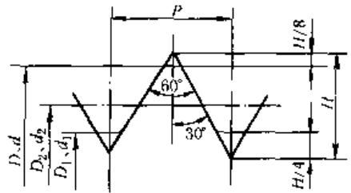

表中数值按下列公式计算,数值圆整到小数点后第三位数:$\begin{array} { l l } { { D _ { \mathrm { t } } = D - 2 \times { \displaystyle \frac { 5 } { 8 } } H ; } } & { { \qquad D _ { \mathrm { 2 } } = D - 2 \times { \displaystyle \frac { 3 } { 8 } } H ; } } \\ { { { } } } & { { { } } } \\ { { d _ { \mathrm { t } } = d - 2 \times { \displaystyle \frac { 5 } { 8 } } H ; } } & { { d _ { \mathrm { 2 } } = d - 2 \times { \displaystyle \frac { 3 } { 8 } } H ; } } \\ { { { } } } & { { { } } } \\ { { H = { \displaystyle \frac { \sqrt { 3 } } { 2 } } P = 0 . 8 6 6 0 2 5 4 0 4 P } } \end{array}$ 

D——内螺纹大径;d外螺纹大径; $\scriptstyle D _ { 2 }$ —内螺纹中径;$d _ { z }$ —外螺纹中径; $D _ { 1 }$ —内螺纹小径; $\pmb { d } _ { 1 }$ 外螺纹小径;$\pmb { P }$ —螺距; $\pmb { H }$ —原始三角形高度

/mm 

表4-1-3

<table><tr><td rowspan=1 colspan=3>公称直径D、d</td><td rowspan=2 colspan=1>螺距P</td><td rowspan=2 colspan=1>中径D或d</td><td rowspan=2 colspan=2>小径D或d</td><td rowspan=1 colspan=3>公称直径D、d</td><td rowspan=2 colspan=1>螺距P</td><td rowspan=2 colspan=1>中径D或d</td><td rowspan=2 colspan=1>小径D或d</td></tr><tr><td rowspan=1 colspan=1>第一系列</td><td rowspan=1 colspan=1>第二系列</td><td rowspan=1 colspan=1>第三系列</td><td rowspan=1 colspan=1>第一系列</td><td rowspan=1 colspan=1>第二系列</td><td rowspan=1 colspan=1>第三系列</td></tr><tr><td rowspan=1 colspan=1>1</td><td rowspan=1 colspan=1></td><td rowspan=1 colspan=1></td><td rowspan=1 colspan=1>0.250.2</td><td rowspan=1 colspan=1>0.8380.870</td><td rowspan=1 colspan=2>0.7290.783</td><td rowspan=2 colspan=1></td><td rowspan=2 colspan=1></td><td rowspan=2 colspan=1>7</td><td rowspan=2 colspan=1>10.75(0.5)</td><td rowspan=2 colspan=1>6.3506.5136.675</td><td rowspan=2 colspan=1>5.9176.1886.459</td></tr><tr><td rowspan=2 colspan=1></td><td rowspan=2 colspan=1>1.1</td><td rowspan=2 colspan=1></td><td rowspan=2 colspan=1>0.250.2</td><td rowspan=2 colspan=1>0.9380.970</td><td rowspan=2 colspan=2>0.8290.883</td></tr><tr><td rowspan=3 colspan=1>8</td><td rowspan=3 colspan=1></td><td rowspan=3 colspan=1></td><td rowspan=3 colspan=1>1.2510.75(0.5)</td><td rowspan=3 colspan=1>7.1887.3507.5137.675</td><td rowspan=3 colspan=1>6.6476.9177.1887.459</td></tr><tr><td rowspan=1 colspan=1>1.2</td><td rowspan=1 colspan=1></td><td rowspan=1 colspan=1></td><td rowspan=1 colspan=1>0.250.2</td><td rowspan=1 colspan=1>1.0381.070</td><td rowspan=1 colspan=2>0.9290.983</td></tr><tr><td rowspan=2 colspan=1></td><td rowspan=2 colspan=1>1.4</td><td rowspan=2 colspan=1></td><td rowspan=2 colspan=1>0.30.2</td><td rowspan=2 colspan=1>1.2051.270</td><td rowspan=2 colspan=2>1.0751.183</td></tr><tr><td rowspan=3 colspan=1></td><td rowspan=3 colspan=1></td><td rowspan=3 colspan=1>9</td><td rowspan=3 colspan=1>(1.25）10.75(0.5)</td><td rowspan=3 colspan=1>8.1888.3508.5138.675</td><td rowspan=3 colspan=1>7.6477.9178.1888.459</td></tr><tr><td rowspan=1 colspan=1>1.6</td><td rowspan=1 colspan=1></td><td rowspan=1 colspan=1></td><td rowspan=1 colspan=1>0.350.2</td><td rowspan=1 colspan=1>1.3731.470</td><td rowspan=1 colspan=2>1.2211.383</td></tr><tr><td rowspan=2 colspan=1></td><td rowspan=2 colspan=1>1.8</td><td rowspan=2 colspan=1></td><td rowspan=2 colspan=1>0.350.2</td><td rowspan=2 colspan=1>1.5731.670</td><td rowspan=2 colspan=2>1.4211.583</td><td rowspan=1 colspan=1>1.421</td></tr><tr><td rowspan=1 colspan=1>1.583</td><td rowspan=3 colspan=1>10</td><td rowspan=3 colspan=1></td><td rowspan=3 colspan=1></td><td rowspan=3 colspan=1>1.51.2510.75(0.5)</td><td rowspan=3 colspan=1>9.0269.1889.3509.5139.675</td><td rowspan=3 colspan=1>8.3768.6478.9179.1889.459</td></tr><tr><td rowspan=1 colspan=1>2</td><td rowspan=1 colspan=1></td><td rowspan=1 colspan=1></td><td rowspan=1 colspan=1>0.40.25</td><td rowspan=1 colspan=1>1.7401.838</td><td rowspan=1 colspan=2>1.5671.729</td></tr><tr><td rowspan=1 colspan=1></td><td rowspan=1 colspan=1>2.2</td><td rowspan=1 colspan=1></td><td rowspan=1 colspan=1>0.450.25</td><td rowspan=1 colspan=1>1.9082.038</td><td rowspan=1 colspan=2>1.7131.929</td></tr><tr><td rowspan=1 colspan=1>2.5</td><td rowspan=1 colspan=1></td><td rowspan=1 colspan=1></td><td rowspan=1 colspan=1>0.450.35</td><td rowspan=1 colspan=1>2.2082.273</td><td rowspan=1 colspan=2>2.0132.121</td><td rowspan=2 colspan=1></td><td rowspan=2 colspan=1></td><td rowspan=2 colspan=1>11</td><td rowspan=2 colspan=1>(1.5）10.75(0.5)</td><td rowspan=2 colspan=1>10.02610.35010.51310.675</td><td rowspan=2 colspan=1>9.3769.91710.188[0.459</td></tr><tr><td rowspan=1 colspan=1>3</td><td rowspan=1 colspan=1></td><td rowspan=1 colspan=1></td><td rowspan=1 colspan=1>0.50.35</td><td rowspan=1 colspan=1>2.6752.773</td><td rowspan=1 colspan=2>2.4592.621</td></tr><tr><td rowspan=2 colspan=1></td><td rowspan=2 colspan=1>3.5</td><td rowspan=2 colspan=1></td><td rowspan=2 colspan=1>（0.6）0.35</td><td rowspan=2 colspan=1>3.1103.273</td><td rowspan=2 colspan=2>2.8503.121</td><td rowspan=5 colspan=1>12</td><td rowspan=5 colspan=1></td><td rowspan=2 colspan=1></td><td rowspan=1 colspan=1>1.75</td><td rowspan=1 colspan=1>10.863</td><td rowspan=1 colspan=1>10.106</td></tr><tr><td rowspan=1 colspan=1>1.5</td><td rowspan=1 colspan=1>11 .026</td><td rowspan=1 colspan=1>10.376</td></tr><tr><td rowspan=2 colspan=1>4</td><td rowspan=2 colspan=1></td><td rowspan=2 colspan=1></td><td rowspan=2 colspan=1>0.70.5</td><td rowspan=2 colspan=1>3.5453.675</td><td rowspan=2 colspan=2>3.2423.459</td><td rowspan=3 colspan=1></td><td rowspan=3 colspan=1>1.251(0.75)(0.5）</td><td rowspan=3 colspan=1>11.18811 .35011.51311.675</td><td rowspan=1 colspan=1>10.647</td></tr><tr><td rowspan=2 colspan=1>10.91711.18811.459</td></tr><tr><td rowspan=1 colspan=1></td><td rowspan=1 colspan=1>4.5</td><td rowspan=1 colspan=1></td><td rowspan=1 colspan=1>(0.75）0.5</td><td rowspan=1 colspan=1>4.0134.175</td><td rowspan=1 colspan=2>3.6883.959</td></tr><tr><td rowspan=1 colspan=1>5</td><td rowspan=1 colspan=1></td><td rowspan=1 colspan=1></td><td rowspan=1 colspan=1>0.80.S</td><td rowspan=1 colspan=1>4.4804.675</td><td rowspan=1 colspan=2>4.1344.459</td><td rowspan=5 colspan=1></td><td rowspan=5 colspan=1>14</td><td rowspan=5 colspan=1></td><td rowspan=1 colspan=1>21.5</td><td rowspan=1 colspan=1>12.70113.026</td><td rowspan=1 colspan=1>11.83512.376</td></tr><tr><td rowspan=1 colspan=1></td><td rowspan=1 colspan=1></td><td rowspan=1 colspan=1>5.5</td><td rowspan=1 colspan=1>0.5</td><td rowspan=1 colspan=1>5.175</td><td rowspan=1 colspan=2>4.959</td><td rowspan=1 colspan=1>(1.25)</td><td rowspan=1 colspan=1>13.188</td><td rowspan=1 colspan=1>12.647</td></tr><tr><td rowspan=3 colspan=1>6</td><td rowspan=3 colspan=1></td><td rowspan=3 colspan=1></td><td rowspan=3 colspan=1>100.75(0.5)</td><td rowspan=2 colspan=1>5.3505.513</td><td rowspan=2 colspan=2>4.9175.188</td><td rowspan=2 colspan=1>1(0.75)</td><td rowspan=1 colspan=1>13.350</td><td rowspan=2 colspan=1>12.91713.188</td></tr><tr><td rowspan=1 colspan=1>13.513</td></tr><tr><td rowspan=1 colspan=1>5.675</td><td rowspan=1 colspan=2>5.459</td><td rowspan=1 colspan=1>(0.5)</td><td rowspan=1 colspan=1>13.675</td><td rowspan=1 colspan=1>13.459</td></tr></table>

<table><tr><td rowspan=1 colspan=3>公称直径D、d</td><td rowspan=1 colspan=1>螺距</td><td rowspan=2 colspan=1>中径D或d</td><td rowspan=1 colspan=1>小径</td><td rowspan=1 colspan=3>公称直径D、d</td><td rowspan=1 colspan=1>螺距</td><td rowspan=1 colspan=1>中径</td><td rowspan=2 colspan=1>小径D或d</td></tr><tr><td rowspan=1 colspan=1>第一系列</td><td rowspan=1 colspan=1>第二系列</td><td rowspan=1 colspan=1>第三系列</td><td rowspan=1 colspan=1>p</td><td rowspan=1 colspan=1>D或d</td><td rowspan=1 colspan=1>第一系列</td><td rowspan=1 colspan=1>第二系列</td><td rowspan=1 colspan=1>第三系列</td><td rowspan=1 colspan=1>P</td><td rowspan=1 colspan=1>D或d</td></tr><tr><td rowspan=1 colspan=1></td><td rowspan=1 colspan=1></td><td rowspan=1 colspan=1>15</td><td rowspan=1 colspan=1>1.5(1)</td><td rowspan=1 colspan=1>14.02614.350</td><td rowspan=1 colspan=1>13.37613.917</td><td rowspan=1 colspan=1></td><td rowspan=1 colspan=1></td><td rowspan=1 colspan=1>32</td><td rowspan=1 colspan=1>21.5</td><td rowspan=1 colspan=1>30.70131.026</td><td rowspan=1 colspan=1>29.83530.376</td></tr><tr><td rowspan=4 colspan=1>16</td><td rowspan=4 colspan=1></td><td rowspan=4 colspan=1></td><td rowspan=2 colspan=1>21.5</td><td rowspan=2 colspan=1>14.70115.026</td><td rowspan=2 colspan=1>13.83514.376</td><td rowspan=2 colspan=1></td><td rowspan=2 colspan=1></td><td rowspan=2 colspan=1></td><td rowspan=2 colspan=1>3.5(3)</td><td rowspan=1 colspan=1>30.727</td><td rowspan=1 colspan=1>29.211</td></tr><tr><td rowspan=1 colspan=1>31.051</td><td rowspan=1 colspan=1>29.752</td></tr><tr><td rowspan=2 colspan=1>一(0.75)(0.5)</td><td rowspan=2 colspan=1>15.35015.51315.675</td><td rowspan=2 colspan=1>14.91715.18815.459</td><td rowspan=3 colspan=1></td><td rowspan=3 colspan=1>33</td><td rowspan=1 colspan=1></td><td rowspan=1 colspan=1>21.5</td><td rowspan=1 colspan=1>31.70132.026</td><td rowspan=1 colspan=1>30.83531.376</td></tr><tr><td rowspan=1 colspan=1></td><td rowspan=1 colspan=1>（1）</td><td rowspan=1 colspan=1>32.350</td><td rowspan=1 colspan=1>31.917</td></tr><tr><td rowspan=2 colspan=1></td><td rowspan=2 colspan=1></td><td rowspan=2 colspan=1>17</td><td rowspan=2 colspan=1>1.5（1）</td><td rowspan=2 colspan=1>16.02616.350</td><td rowspan=2 colspan=1>15.37615.917</td><td rowspan=1 colspan=1></td><td rowspan=1 colspan=1>(0.75)</td><td rowspan=1 colspan=1>32.513</td><td rowspan=1 colspan=1>32.188</td></tr><tr><td rowspan=1 colspan=1></td><td rowspan=1 colspan=1></td><td rowspan=1 colspan=1>35</td><td rowspan=1 colspan=1>1.5</td><td rowspan=1 colspan=1>34.026</td><td rowspan=1 colspan=1>33.376</td></tr><tr><td rowspan=6 colspan=1></td><td rowspan=6 colspan=1>18</td><td rowspan=6 colspan=1></td><td rowspan=6 colspan=1>2.521.51(0.75)(0.5）</td><td rowspan=6 colspan=1>16.37616.70117.02617.35017.51317.675</td><td rowspan=6 colspan=1>15.29415.83516.37616.91717.18817.459</td><td rowspan=5 colspan=1>36</td><td rowspan=5 colspan=1></td><td rowspan=2 colspan=1></td><td rowspan=1 colspan=1>432</td><td rowspan=1 colspan=1>33.40234.051</td><td rowspan=1 colspan=1>31.67032 752</td></tr><tr><td rowspan=1 colspan=1>2</td><td rowspan=1 colspan=1>34.701</td><td rowspan=1 colspan=1>33.835</td></tr><tr><td rowspan=3 colspan=1></td><td></td><td></td><td></td></tr><tr><td rowspan=2 colspan=1>1.5（1）</td><td rowspan=1 colspan=1>35.026</td><td rowspan=1 colspan=1>34.376</td></tr><tr><td rowspan=1 colspan=1>35.350</td><td rowspan=1 colspan=1>34,917</td></tr><tr><td rowspan=2 colspan=1></td><td rowspan=2 colspan=1></td><td rowspan=2 colspan=1>38</td><td rowspan=2 colspan=1>1.5</td><td rowspan=2 colspan=1>37.026</td><td rowspan=2 colspan=1>36.376</td></tr><tr><td rowspan=4 colspan=1>20</td><td rowspan=4 colspan=1></td><td rowspan=4 colspan=1>！</td><td rowspan=4 colspan=1>2.521.5！ 1（0 75)(0.5)</td><td rowspan=4 colspan=1>18.37618.70119.02619.35019.51319.675</td><td rowspan=4 colspan=1>17.29417.83518.37618 91719.18819.459</td></tr><tr><td rowspan=3 colspan=1></td><td rowspan=3 colspan=1>39</td><td rowspan=3 colspan=1></td><td rowspan=1 colspan=1>40</td><td rowspan=1 colspan=1>36402</td><td rowspan=1 colspan=1>34.670</td></tr><tr><td rowspan=2 colspan=1>321.5（1）</td><td rowspan=2 colspan=1>37.05137.70138.02638.350</td><td rowspan=1 colspan=1>35.752</td></tr><tr><td rowspan=1 colspan=1>36.83537.37637.917</td></tr><tr><td></td><td></td><td rowspan=6 colspan=1></td><td rowspan=6 colspan=1>2.521.51(0.75)(0.5)</td><td rowspan=6 colspan=1>20.37620.70121.02621.35021.51321.675</td><td rowspan=6 colspan=1>19.29419.83520.37620.91721.18821.459</td><td rowspan=3 colspan=1></td><td rowspan=3 colspan=1></td><td rowspan=3 colspan=1>40</td><td rowspan=3 colspan=1>（3）(2）1.5</td><td rowspan=2 colspan=1>38.05138.701</td><td rowspan=2 colspan=1>36.75237.835</td></tr><tr><td rowspan=5 colspan=1></td><td rowspan=5 colspan=1>22</td></tr><tr><td rowspan=1 colspan=1>39.026</td><td rowspan=1 colspan=1>38.376</td></tr><tr><td rowspan=5 colspan=1>42</td><td rowspan=5 colspan=1></td><td rowspan=5 colspan=1></td><td rowspan=5 colspan=1>4.5（4）  1321.5(1）</td><td rowspan=1 colspan=1>39.077</td><td rowspan=1 colspan=1>37.129</td></tr><tr><td rowspan=3 colspan=1>39.40240.05140.701</td><td rowspan=1 colspan=1>37.670</td></tr><tr><td rowspan=2 colspan=1>38.75239.835</td></tr><tr><td rowspan=3 colspan=1>24</td><td rowspan=3 colspan=1></td><td rowspan=3 colspan=1></td><td rowspan=3 colspan=1>21.51(0.75)</td><td rowspan=3 colspan=1>22.05122.70123.02623.35023.513</td><td rowspan=3 colspan=1>20.75221.83522.37622.91723.188</td></tr><tr><td rowspan=1 colspan=1>41.02641.350</td><td rowspan=1 colspan=1>40.37640.917</td></tr><tr><td rowspan=5 colspan=1></td><td rowspan=5 colspan=1>45</td><td rowspan=5 colspan=1></td><td rowspan=5 colspan=1>4.5（4）321.5(1)</td><td rowspan=5 colspan=1>42.07742.40243.05143.701：44.02644.350</td><td rowspan=1 colspan=1>40.12940.670</td></tr><tr><td rowspan=3 colspan=1></td><td rowspan=3 colspan=1></td><td rowspan=3 colspan=1>25</td><td rowspan=3 colspan=1>21.5（1）</td><td rowspan=3 colspan=1>23.70124.02624.350</td><td rowspan=3 colspan=1>22.83523.37623.917</td><td></td></tr><tr><td rowspan=1 colspan=1>41.75242.835</td></tr><tr><td rowspan=1 colspan=1>43.37643.917</td></tr><tr><td rowspan=1 colspan=1></td><td rowspan=1 colspan=1></td><td rowspan=1 colspan=1>26</td><td rowspan=1 colspan=1>1.5</td><td rowspan=1 colspan=1>25.026</td><td rowspan=1 colspan=1>24.376</td><td></td></tr><tr><td></td><td></td><td></td><td rowspan=2 colspan=1>321.51(0.75)</td><td rowspan=2 colspan=1>25.05125.70126.02626.35026.513</td><td rowspan=2 colspan=1>23.75224.83525.37625.91726.188</td><td rowspan=3 colspan=1>48</td><td rowspan=3 colspan=1></td><td rowspan=3 colspan=1></td><td rowspan=3 colspan=1>5（4)321.5（1）</td><td rowspan=3 colspan=1>44.75245.40246.05146.70147.02647.350</td><td rowspan=3 colspan=1>42.58743.67044.75245.83546.37646.917</td></tr><tr><td rowspan=1 colspan=1></td><td rowspan=1 colspan=1>27</td><td rowspan=1 colspan=1></td></tr><tr><td rowspan=2 colspan=1></td><td rowspan=2 colspan=1></td><td rowspan=2 colspan=1>28</td><td rowspan=2 colspan=1>21.51</td><td rowspan=2 colspan=1>26.70127.02627.350</td><td rowspan=2 colspan=1>25.83526.37626.917</td></tr><tr><td rowspan=2 colspan=1></td><td rowspan=2 colspan=1></td><td rowspan=2 colspan=1>50</td><td rowspan=2 colspan=1>（3）(2）1.5</td><td rowspan=2 colspan=1>48.05148.70149.026</td><td rowspan=2 colspan=1>46.75247.83548.376</td></tr><tr><td rowspan=2 colspan=1>30</td><td rowspan=2 colspan=1></td><td rowspan=2 colspan=1></td><td rowspan=2 colspan=1>3.5（3）21.51(0.75）</td><td rowspan=2 colspan=1>27.72728.05128.70129.02629.35029.513</td><td rowspan=2 colspan=1>26.21126.75227.83528.37628.91729.188</td></tr><tr><td rowspan=1 colspan=1></td><td rowspan=1 colspan=1>52</td><td rowspan=1 colspan=1></td><td rowspan=1 colspan=1>5（4）321.s{1</td><td rowspan=1 colspan=1>48.75249.40250.05150.70151.02651.350</td><td rowspan=1 colspan=1>46.58747.67048.75249.83550.37650.917</td></tr></table>

续表

<table><tr><td rowspan=1 colspan=3>公称直径D、d</td><td rowspan=2 colspan=1>螺距P</td><td rowspan=2 colspan=1>中径D或d</td><td rowspan=2 colspan=1>小径D或d</td><td rowspan=2 colspan=4>公称直径D、d        螺距第一系列第二系列第系列    P</td><td rowspan=2 colspan=1>中径D或d</td><td rowspan=2 colspan=1>小径D或d</td></tr><tr><td rowspan=1 colspan=1>第一系列</td><td rowspan=1 colspan=1>第二系列</td><td rowspan=1 colspan=1>第三系列</td><td rowspan=1 colspan=1>第一系列</td><td rowspan=1 colspan=1>第二系列</td><td rowspan=1 colspan=1>第系列</td></tr><tr><td rowspan=1 colspan=1></td><td rowspan=1 colspan=1></td><td rowspan=1 colspan=1>55</td><td rowspan=1 colspan=1>（4）(3)21.5</td><td rowspan=1 colspan=1>52.40253.05153.70154.026</td><td rowspan=1 colspan=1>50.67051.75252.83553.376</td><td rowspan=1 colspan=1></td><td rowspan=1 colspan=1></td><td rowspan=1 colspan=1>75</td><td rowspan=1 colspan=1>（4）(3)21.5</td><td rowspan=1 colspan=1>72.40273.05173.70174.026</td><td rowspan=1 colspan=1>70.67071.75272.83573.376</td></tr><tr><td rowspan=1 colspan=1>56</td><td rowspan=1 colspan=1></td><td rowspan=1 colspan=1></td><td rowspan=1 colspan=1>5.54321.5（1）</td><td rowspan=1 colspan=1>52.42853.40254.05154.70155.02655.350</td><td rowspan=1 colspan=1>50.04651.67052.75253.83554.37654.917</td><td rowspan=1 colspan=1></td><td rowspan=1 colspan=1>76</td><td rowspan=1 colspan=1></td><td rowspan=1 colspan=1>64321.5（1）</td><td rowspan=1 colspan=1>72.10373.40274.05174.70175.02675.350</td><td rowspan=1 colspan=1>69.50571.67072.75273.83574.37674.917</td></tr><tr><td rowspan=2 colspan=1></td><td rowspan=2 colspan=1></td><td rowspan=2 colspan=1>58</td><td rowspan=2 colspan=1>（4）(3)21.5</td><td rowspan=2 colspan=1>55.40256.05156.70157.026</td><td rowspan=2 colspan=1>53,67054.75255.83556.376</td><td rowspan=1 colspan=1></td><td rowspan=1 colspan=1></td><td rowspan=1 colspan=1>78</td><td rowspan=1 colspan=1>2</td><td rowspan=1 colspan=1>76.701</td><td rowspan=1 colspan=1>75.835</td></tr><tr><td rowspan=2 colspan=1>80</td><td rowspan=2 colspan=1></td><td rowspan=2 colspan=1></td><td rowspan=2 colspan=1>64321.5(1）</td><td rowspan=2 colspan=1>76.10377.40278.05178.70179.02679.350</td><td rowspan=2 colspan=1>73.50575.67076.75277.83578.37678.917</td></tr><tr><td rowspan=3 colspan=1></td><td rowspan=3 colspan=1>60</td><td rowspan=3 colspan=1></td><td rowspan=3 colspan=1>(5.5）4321.5（1）</td><td rowspan=3 colspan=1>56.42857.40258.05158.70159.02659.350</td><td rowspan=3 colspan=1>54.04655.67056.75257.83558.37658.917</td></tr><tr><td rowspan=1 colspan=1></td><td rowspan=1 colspan=1></td><td rowspan=1 colspan=1>82</td><td rowspan=1 colspan=1>2</td><td rowspan=1 colspan=1>80.701</td><td rowspan=1 colspan=1>79.835</td></tr><tr><td rowspan=2 colspan=1></td><td rowspan=2 colspan=1>85</td><td rowspan=2 colspan=1></td><td rowspan=2 colspan=1>6432(1.5)</td><td rowspan=2 colspan=1>81.10382.40283.05183.70184.026</td><td rowspan=2 colspan=1>78.50580.67081.75282.83583.376</td></tr><tr><td rowspan=1 colspan=1></td><td rowspan=1 colspan=1></td><td rowspan=1 colspan=1>62</td><td rowspan=1 colspan=1>（4)（3）21.5</td><td rowspan=1 colspan=1>59.40260.05160.70161.026</td><td rowspan=1 colspan=1>57.67058.75259.83560.376</td></tr><tr><td></td><td rowspan=3 colspan=1></td><td rowspan=3 colspan=1></td><td rowspan=3 colspan=1>64321.5(1）</td><td rowspan=3 colspan=1>60.10361.40262.05162.70163.02663.350</td><td rowspan=3 colspan=1>57.50559.67060.75261.83562.37662.917</td><td rowspan=2 colspan=1>90</td><td rowspan=2 colspan=1></td><td rowspan=2 colspan=1></td><td rowspan=2 colspan=1>6432(1.5)</td><td rowspan=2 colspan=1>86.10387.40288.05188.70189.026</td><td rowspan=2 colspan=1>83.50585.67086.75287.83588.376</td></tr><tr><td rowspan=2 colspan=1>64</td></tr><tr><td rowspan=2 colspan=1></td><td rowspan=2 colspan=1>95：</td><td rowspan=2 colspan=1></td><td rowspan=2 colspan=1>6432(1.5)</td><td rowspan=2 colspan=1>91.10392.40293.05193.70194.026</td><td rowspan=2 colspan=1>88.50590.67091.75292.83593.376</td></tr><tr><td rowspan=1 colspan=1></td><td rowspan=1 colspan=1></td><td rowspan=1 colspan=1>65</td><td rowspan=1 colspan=1>（4）（3）21.5</td><td rowspan=1 colspan=1>62.40263.05163.70164.026</td><td rowspan=1 colspan=1>60.67061.75262.83563.376</td></tr><tr><td rowspan=4 colspan=1></td><td rowspan=4 colspan=1>68</td><td rowspan=4 colspan=1></td><td rowspan=4 colspan=1>04321.5(1）</td><td rowspan=4 colspan=1>64.10365.40266.05166.70167.026.67.350</td><td rowspan=4 colspan=1>61.50563.67064.75265.83566.37666.917</td><td rowspan=3 colspan=1>100</td><td rowspan=3 colspan=1></td><td rowspan=3 colspan=1></td><td rowspan=3 colspan=1>6432(1.5)</td><td rowspan=2 colspan=1>96.10397.40298.051</td><td rowspan=1 colspan=1>93.50595.670</td></tr><tr><td rowspan=2 colspan=1>96.75297.83598.376</td></tr><tr><td rowspan=1 colspan=1>98.70199.026</td></tr><tr><td rowspan=2 colspan=1></td><td rowspan=2 colspan=1>105</td><td rowspan=2 colspan=1></td><td rowspan=2 colspan=1>6432(1.5)</td><td rowspan=2 colspan=1>101.103102.402103.051103.701104.026</td><td rowspan=2 colspan=1>98.505100.670101.752102.835103.376</td></tr><tr><td rowspan=1 colspan=1></td><td rowspan=1 colspan=1></td><td rowspan=1 colspan=1>70</td><td rowspan=1 colspan=1>（6）（4）（3）21.5</td><td rowspan=1 colspan=1>66.10367.40268.05168.70169.026</td><td rowspan=1 colspan=1>63.50565.67066.75267.83568.376</td></tr><tr><td rowspan=2 colspan=1>72</td><td rowspan=2 colspan=1></td><td rowspan=2 colspan=1></td><td rowspan=2 colspan=1>64321.5（1</td><td rowspan=2 colspan=1>68.10369.40270.05170.70171.02671.350</td><td rowspan=2 colspan=1>65.50567.67068.75269.83570.37670.917</td><td rowspan=2 colspan=1>110</td><td rowspan=2 colspan=1></td><td rowspan=2 colspan=1></td><td rowspan=2 colspan=1>6432(1.5）</td><td rowspan=2 colspan=1>106.103107.402108.051108.701109.026</td><td rowspan=1 colspan=1>103.505105.670</td></tr><tr><td rowspan=1 colspan=1>106.752107.835108.376</td></tr></table>

<table><tr><td rowspan=1 colspan=3>公称直径D、d</td><td rowspan=2 colspan=1>螺P</td><td rowspan=2 colspan=1>中径D或d</td><td rowspan=2 colspan=1>小径D或d</td><td rowspan=1 colspan=3>公称直径D、d</td><td rowspan=2 colspan=1>螺P</td><td rowspan=2 colspan=2>中径D或d</td><td rowspan=2 colspan=1>小径D或d</td></tr><tr><td rowspan=1 colspan=1>第一系列</td><td rowspan=1 colspan=1>第二系列</td><td rowspan=1 colspan=1>第三系列</td><td rowspan=1 colspan=1>第一系列</td><td rowspan=1 colspan=1>第二系列</td><td rowspan=1 colspan=1>第三系列</td></tr><tr><td rowspan=3 colspan=1></td><td rowspan=3 colspan=1>115</td><td rowspan=3 colspan=1></td><td rowspan=3 colspan=1>6432(1.5)</td><td rowspan=3 colspan=1>111.103112 402113.051113.701114.026</td><td rowspan=3 colspan=1>108.505110.670111.752112.835113.376</td><td rowspan=2 colspan=1></td><td rowspan=2 colspan=1></td><td rowspan=1 colspan=1>165</td><td rowspan=1 colspan=1>643</td><td rowspan=1 colspan=2>161.103162.402163.051</td><td rowspan=2 colspan=1>158.505160.670161.752162.835</td></tr><tr><td rowspan=1 colspan=1></td><td rowspan=1 colspan=1>2</td><td rowspan=1 colspan=2>163.701</td></tr><tr><td rowspan=1 colspan=1></td><td rowspan=1 colspan=1></td><td rowspan=3 colspan=1></td><td rowspan=3 colspan=1>643(2）</td><td rowspan=1 colspan=2>166.103</td><td rowspan=1 colspan=1>163.505</td></tr><tr><td rowspan=3 colspan=1></td><td rowspan=3 colspan=1>120</td><td rowspan=3 colspan=1></td><td rowspan=3 colspan=1>6432(1.5)</td><td rowspan=2 colspan=1>116.103117.402118.051</td><td rowspan=2 colspan=1>113.505115.670116.752</td><td rowspan=2 colspan=1></td><td rowspan=2 colspan=1>170</td><td rowspan=1 colspan=2>167.402168,051</td><td rowspan=1 colspan=1>165.670166.752</td></tr><tr><td rowspan=1 colspan=2>168.701</td><td rowspan=1 colspan=1>167.835</td></tr><tr><td rowspan=1 colspan=1>118.701119.026</td><td rowspan=1 colspan=1>117.835118.376</td><td rowspan=2 colspan=1></td><td rowspan=2 colspan=1></td><td rowspan=2 colspan=1>175+</td><td rowspan=2 colspan=1>6432</td><td rowspan=2 colspan=2>171.103172.402173.051173.701</td><td rowspan=1 colspan=1>168.505170.670</td></tr><tr><td rowspan=2 colspan=1>125</td><td rowspan=2 colspan=1></td><td rowspan=2 colspan=1></td><td rowspan=2 colspan=1>6432(1.5)</td><td rowspan=2 colspan=1>121.103122.402123.051123.701124.026</td><td rowspan=1 colspan=1>118.505120.670</td><td rowspan=1 colspan=1>173.051</td><td rowspan=1 colspan=1>171.752172.835</td></tr><tr><td rowspan=1 colspan=1>121.752122.835123.376</td><td rowspan=2 colspan=1>180</td><td rowspan=2 colspan=1></td><td rowspan=2 colspan=1></td><td rowspan=2 colspan=1>643(2）</td><td rowspan=1 colspan=2>176.103177.402178.051</td><td rowspan=1 colspan=1>173.505175.670176.752</td></tr><tr><td rowspan=2 colspan=1></td><td rowspan=2 colspan=1>130</td><td rowspan=2 colspan=1></td><td rowspan=2 colspan=1>6432(1.5)</td><td rowspan=2 colspan=1>126.103127.402128.051128.701129.026</td><td rowspan=2 colspan=1>123.505125.670126.752127.835128.376</td><td rowspan=1 colspan=2>178.701</td><td rowspan=1 colspan=1>177.835</td></tr><tr><td rowspan=1 colspan=1></td><td rowspan=1 colspan=1></td><td rowspan=1 colspan=1>185</td><td rowspan=1 colspan=1>6432</td><td rowspan=1 colspan=2>181.103182.402183.051183.701</td><td rowspan=1 colspan=1>178.505180.670181.752182.835</td></tr><tr><td rowspan=2 colspan=1></td><td rowspan=2 colspan=1></td><td rowspan=2 colspan=1>135</td><td rowspan=2 colspan=1>64321.5</td><td rowspan=2 colspan=1>131.103132.402133 051133.701134.026</td><td rowspan=2 colspan=1>128.505130.670131.752132.835133.376</td><td rowspan=1 colspan=1></td><td rowspan=1 colspan=1>190</td><td rowspan=1 colspan=1></td><td rowspan=1 colspan=1>643(2)</td><td rowspan=1 colspan=2>186.103187.402188.051188.701</td><td rowspan=1 colspan=1>183.505185.670186.752187.835</td></tr><tr><td rowspan=2 colspan=1></td><td rowspan=2 colspan=1></td><td rowspan=2 colspan=1>195</td><td rowspan=2 colspan=1>6432</td><td rowspan=2 colspan=2>191.103192 402193.051193.701</td><td rowspan=2 colspan=1>188.505190.670191.752192.835</td></tr><tr><td rowspan=2 colspan=1>140</td><td rowspan=2 colspan=1></td><td rowspan=2 colspan=1></td><td rowspan=2 colspan=1>6432(1.5)</td><td rowspan=2 colspan=1>136.103137.402138.051138.701139.026</td><td rowspan=2 colspan=1>133.505135.670136.752137.835138.376</td></tr><tr><td rowspan=2 colspan=1>200</td><td rowspan=2 colspan=1></td><td rowspan=2 colspan=1></td><td rowspan=2 colspan=1>643(2）</td><td rowspan=2 colspan=2>196.103197.402198.051198.701</td><td rowspan=1 colspan=1>193.505195.670</td></tr><tr><td rowspan=2 colspan=1></td><td rowspan=2 colspan=1></td><td rowspan=2 colspan=1>145</td><td rowspan=2 colspan=1>64321.5</td><td rowspan=2 colspan=1>141.103142.402143.051143.701144.026</td><td rowspan=2 colspan=1>138.505140.670141.752142.835143.376</td><td rowspan=1 colspan=1>196.752197.835</td></tr><tr><td rowspan=1 colspan=1></td><td rowspan=1 colspan=1></td><td rowspan=1 colspan=1>205</td><td rowspan=1 colspan=1>643</td><td rowspan=1 colspan=2>201.103202.402203.051</td><td rowspan=1 colspan=1>198.505200.670201.752</td></tr><tr><td rowspan=2 colspan=1></td><td rowspan=2 colspan=1>150</td><td rowspan=2 colspan=1></td><td rowspan=2 colspan=1>6432(1.5)</td><td rowspan=2 colspan=1>146.103147.402148.051148.701149,026</td><td rowspan=1 colspan=1>143.505145.670146.752</td><td rowspan=1 colspan=1></td><td rowspan=1 colspan=1>210</td><td rowspan=1 colspan=1></td><td rowspan=1 colspan=1>643</td><td rowspan=1 colspan=2>206.103207.402208.051</td><td rowspan=1 colspan=1>203.505205.670206.752</td></tr><tr><td rowspan=1 colspan=1>147.835148.376</td><td rowspan=2 colspan=1></td><td rowspan=2 colspan=1>：</td><td rowspan=2 colspan=1>215</td><td rowspan=2 colspan=1>643</td><td rowspan=2 colspan=2>211.103212.402213.051</td><td rowspan=2 colspan=1>208.505210.670211.752</td></tr><tr><td rowspan=2 colspan=1></td><td rowspan=2 colspan=1></td><td rowspan=2 colspan=1>155</td><td rowspan=2 colspan=1>6432</td><td rowspan=2 colspan=1>151. 103152.402153.051153.701</td><td rowspan=2 colspan=1>148.505150.670151.752152.835</td></tr><tr><td rowspan=1 colspan=1>220</td><td rowspan=1 colspan=1></td><td rowspan=1 colspan=1></td><td rowspan=1 colspan=1>643</td><td rowspan=1 colspan=2>216.103217.402218.051</td><td rowspan=1 colspan=1>213.505215.670216.752</td></tr><tr><td rowspan=1 colspan=1>160</td><td rowspan=1 colspan=1></td><td rowspan=1 colspan=1></td><td rowspan=1 colspan=1>643(2)</td><td rowspan=1 colspan=1>156.103157.402158.051158.701</td><td rowspan=1 colspan=1>153.505155.670156.752157.835</td><td rowspan=1 colspan=1></td><td rowspan=1 colspan=1></td><td rowspan=1 colspan=1>225</td><td rowspan=1 colspan=1>643</td><td rowspan=1 colspan=2>221.103222.402223.051</td><td rowspan=1 colspan=1>218.505220.670221.752</td></tr></table>

续表

<table><tr><td rowspan=1 colspan=6>公称直径D、d</td><td rowspan=1 colspan=2>螺面</td><td rowspan=1 colspan=2>中径</td><td rowspan=1 colspan=2>小径</td><td rowspan=1 colspan=6>公称直径D、d</td><td rowspan=2 colspan=2>螺熙P</td><td rowspan=2 colspan=2>中径D或di</td><td rowspan=2 colspan=1>小称D或d</td></tr><tr><td rowspan=1 colspan=2>第一系列</td><td rowspan=1 colspan=2>第二系列</td><td rowspan=1 colspan=2>第三系列</td><td rowspan=1 colspan=2>P</td><td rowspan=1 colspan=2>D或d</td><td rowspan=1 colspan=2>D或d</td><td rowspan=1 colspan=2>第一系列</td><td rowspan=1 colspan=2>第二系列</td><td rowspan=1 colspan=2>第三系列！</td></tr><tr><td rowspan=2 colspan=2></td><td rowspan=2 colspan=2></td><td rowspan=1 colspan=2>230</td><td rowspan=1 colspan=2>64</td><td rowspan=1 colspan=2>226.103227.402</td><td rowspan=1 colspan=2>223.505225.670</td><td rowspan=1 colspan=2></td><td rowspan=1 colspan=2></td><td rowspan=1 colspan=2>310</td><td rowspan=1 colspan=2>64</td><td rowspan=1 colspan=2>306.103307.402</td><td rowspan=1 colspan=1>303.505305.670</td></tr><tr><td rowspan=1 colspan=2></td><td rowspan=1 colspan=2>3</td><td rowspan=1 colspan=2>228.051</td><td rowspan=1 colspan=2>226.752</td><td rowspan=2 colspan=2>320</td><td rowspan=2 colspan=2></td><td rowspan=2 colspan=2></td><td rowspan=2 colspan=2>64</td><td rowspan=2 colspan=2>316.103317.402</td><td rowspan=2 colspan=1>313.505315,670</td></tr><tr><td rowspan=2 colspan=2></td><td rowspan=2 colspan=2></td><td rowspan=2 colspan=2>235</td><td rowspan=2 colspan=2>643</td><td rowspan=2 colspan=2>231.103232.402233.051</td><td rowspan=2 colspan=2>228.505230.670231.752</td></tr><tr><td rowspan=1 colspan=2></td><td rowspan=1 colspan=2></td><td rowspan=1 colspan=2>330</td><td rowspan=1 colspan=2>64</td><td rowspan=1 colspan=2>326.103327.402</td><td rowspan=1 colspan=1>323.505325.670</td></tr><tr><td rowspan=2 colspan=2></td><td rowspan=2 colspan=2>240</td><td rowspan=2 colspan=2></td><td rowspan=2 colspan=2>641</td><td rowspan=2 colspan=2>236.103237.402238.051</td><td rowspan=1 colspan=2>233.505235.670</td><td rowspan=1 colspan=2></td><td rowspan=1 colspan=2>340</td><td rowspan=1 colspan=2></td><td rowspan=1 colspan=2>64</td><td rowspan=1 colspan=2>336.103337.402</td><td rowspan=1 colspan=1>333.505335,670</td></tr><tr><td rowspan=1 colspan=2>236.752</td><td rowspan=2 colspan=2></td><td rowspan=2 colspan=2></td><td rowspan=2 colspan=2>350</td><td rowspan=2 colspan=2>64</td><td rowspan=2 colspan=2>346.103347.402</td><td rowspan=2 colspan=1>343.505345.670</td></tr><tr><td rowspan=2 colspan=2></td><td rowspan=2 colspan=2></td><td rowspan=2 colspan=2>245</td><td rowspan=2 colspan=2>643</td><td rowspan=2 colspan=2>241.103242.402243.051</td><td rowspan=2 colspan=2>238.505240.670241.752</td></tr><tr><td rowspan=1 colspan=2>360</td><td rowspan=1 colspan=2></td><td rowspan=1 colspan=2></td><td rowspan=1 colspan=2>64</td><td rowspan=1 colspan=2>356.103357.402</td><td rowspan=1 colspan=1>353.505355,670</td></tr><tr><td rowspan=2 colspan=2>250</td><td rowspan=2 colspan=2></td><td rowspan=2 colspan=2></td><td rowspan=2 colspan=2>643</td><td rowspan=2 colspan=2>246,103247.402248.051</td><td rowspan=2 colspan=2>243.505245.670246.752</td><td rowspan=1 colspan=2></td><td rowspan=1 colspan=2></td><td rowspan=1 colspan=2>370</td><td rowspan=1 colspan=2>64</td><td rowspan=1 colspan=2>366.103367.402</td><td rowspan=1 colspan=1>363.505365.670</td></tr><tr><td rowspan=2 colspan=2></td><td rowspan=2 colspan=2>380</td><td rowspan=2 colspan=2></td><td rowspan=2 colspan=2>64</td><td rowspan=1 colspan=2>376.103</td><td rowspan=2 colspan=1>373.505375.670</td></tr><tr><td rowspan=2 colspan=1></td><td></td><td rowspan=2 colspan=2></td><td rowspan=2 colspan=2>255</td><td rowspan=2 colspan=2>64(3）</td><td rowspan=2 colspan=2>251.103252. 402253.051</td><td rowspan=2 colspan=2>248.505250.670251.752</td><td rowspan=1 colspan=2>377.402</td></tr><tr><td></td><td rowspan=1 colspan=2></td><td rowspan=1 colspan=2></td><td rowspan=1 colspan=2>390</td><td rowspan=1 colspan=2>64</td><td rowspan=1 colspan=2>386.103387.402</td><td rowspan=1 colspan=1>383.505385.670</td></tr><tr><td rowspan=2 colspan=1></td><td></td><td rowspan=2 colspan=2>260</td><td rowspan=2 colspan=2></td><td rowspan=2 colspan=2>64（3）</td><td rowspan=2 colspan=2>256.103257.402258.051</td><td rowspan=1 colspan=2>253.505255.670</td><td></td><td rowspan=1 colspan=2>400</td><td rowspan=1 colspan=2></td><td rowspan=1 colspan=2></td><td rowspan=1 colspan=2>64</td><td rowspan=1 colspan=2>396.103397.402</td><td rowspan=1 colspan=1>393.505395.670</td></tr><tr><td></td><td rowspan=1 colspan=2>256.752</td><td></td><td rowspan=1 colspan=2></td><td rowspan=1 colspan=2></td><td rowspan=1 colspan=2>410</td><td rowspan=1 colspan=2>6</td><td rowspan=1 colspan=2>406.103</td><td></td><td rowspan=1 colspan=1>403.505</td></tr><tr><td rowspan=2 colspan=1></td><td rowspan=2 colspan=2></td><td rowspan=2 colspan=2>265</td><td rowspan=2 colspan=2>64（3）</td><td></td><td rowspan=2 colspan=2>261.103262.402263.051</td><td rowspan=2 colspan=2>258.505260.670261.752</td><td></td><td rowspan=1 colspan=2></td><td rowspan=1 colspan=2>420</td><td rowspan=1 colspan=2></td><td rowspan=1 colspan=2>6</td><td rowspan=1 colspan=2>416.103</td><td rowspan=1 colspan=2>413.505</td></tr><tr><td></td><td></td><td rowspan=1 colspan=2></td><td rowspan=1 colspan=2></td><td rowspan=1 colspan=2>430</td><td rowspan=1 colspan=2>6</td><td rowspan=1 colspan=2>426.103</td><td rowspan=1 colspan=2>423.505</td></tr><tr><td rowspan=3 colspan=1></td><td rowspan=3 colspan=2></td><td rowspan=3 colspan=2>270</td><td rowspan=3 colspan=2>64（3）</td><td></td><td rowspan=3 colspan=2>266.103267.402268.051</td><td rowspan=3 colspan=2>263.505265.670266.752</td><td></td><td rowspan=1 colspan=2></td><td rowspan=1 colspan=2>440</td><td rowspan=1 colspan=2></td><td rowspan=1 colspan=2>6</td><td rowspan=1 colspan=2>436.103</td><td rowspan=1 colspan=2>433.505</td></tr><tr><td></td><td rowspan=1 colspan=2>450</td><td rowspan=1 colspan=2></td><td rowspan=1 colspan=2></td><td rowspan=1 colspan=2>6</td><td rowspan=1 colspan=2>446.103</td><td rowspan=1 colspan=2>443.505</td></tr><tr><td></td><td rowspan=1 colspan=2></td><td rowspan=1 colspan=2>460</td><td rowspan=1 colspan=2></td><td rowspan=1 colspan=2>6</td><td rowspan=1 colspan=2>456.103</td><td rowspan=1 colspan=2>453.505</td></tr><tr><td rowspan=2 colspan=1></td><td rowspan=2 colspan=2></td><td rowspan=2 colspan=2>275</td><td rowspan=2 colspan=2>64(3）</td><td rowspan=2 colspan=2>271.103272.402273.051</td><td rowspan=2 colspan=2>268.505270.670271.752</td><td rowspan=1 colspan=2></td><td rowspan=1 colspan=2></td><td rowspan=1 colspan=2>470</td><td rowspan=1 colspan=2>6</td><td rowspan=1 colspan=2>466.103</td><td rowspan=1 colspan=2>463.505</td></tr><tr><td rowspan=1 colspan=2></td><td rowspan=1 colspan=2>480</td><td rowspan=1 colspan=2></td><td rowspan=1 colspan=2>6</td><td rowspan=1 colspan=2>476.103</td><td rowspan=1 colspan=2>473.505</td></tr><tr><td rowspan=3 colspan=1>280</td><td rowspan=3 colspan=2></td><td rowspan=3 colspan=2></td><td rowspan=3 colspan=2>64（3）</td><td rowspan=3 colspan=2>276.103277.402278.051</td><td rowspan=3 colspan=2>273.505275.670276.752</td><td rowspan=1 colspan=2></td><td rowspan=1 colspan=2></td><td rowspan=1 colspan=2>490</td><td rowspan=1 colspan=2>6</td><td rowspan=1 colspan=2>486.103</td><td rowspan=1 colspan=2>483.505</td></tr><tr><td rowspan=1 colspan=2>500</td><td rowspan=1 colspan=2></td><td rowspan=1 colspan=2></td><td rowspan=1 colspan=2>6</td><td rowspan=1 colspan=2>496.103</td><td rowspan=1 colspan=2>493.505</td></tr><tr><td rowspan=2 colspan=2></td><td rowspan=2 colspan=2></td><td rowspan=2 colspan=2>510</td><td rowspan=2 colspan=2>6</td><td rowspan=2 colspan=2>506.103</td><td rowspan=2 colspan=2>503.505</td></tr><tr><td rowspan=3 colspan=2></td><td rowspan=3 colspan=2>285</td><td rowspan=3 colspan=2>64(3)</td><td rowspan=3 colspan=2>281.103282.402283.051</td><td rowspan=3 colspan=2>278.505280.670281.752</td></tr><tr><td rowspan=1 colspan=2></td><td rowspan=1 colspan=2>520</td><td rowspan=1 colspan=2></td><td rowspan=1 colspan=2>6</td><td rowspan=1 colspan=2>516.103</td><td rowspan=1 colspan=2>513.505</td></tr><tr><td rowspan=1 colspan=2></td><td rowspan=1 colspan=2></td><td rowspan=1 colspan=2>530</td><td rowspan=1 colspan=2>6</td><td rowspan=1 colspan=2>526.103</td><td rowspan=1 colspan=2>523.505</td></tr><tr><td rowspan=3 colspan=2></td><td rowspan=3 colspan=2>290</td><td rowspan=3 colspan=2>64（3）</td><td rowspan=3 colspan=2>286,103287.402288.051</td><td rowspan=3 colspan=2>283.505285.670286.752</td><td rowspan=1 colspan=2></td><td rowspan=1 colspan=2>540</td><td rowspan=1 colspan=2></td><td rowspan=1 colspan=2>6</td><td rowspan=1 colspan=2>536.103</td><td rowspan=1 colspan=2>533.505</td></tr><tr><td rowspan=1 colspan=2>550</td><td rowspan=1 colspan=2></td><td rowspan=1 colspan=2></td><td rowspan=1 colspan=2>6</td><td rowspan=1 colspan=2>546.103</td><td rowspan=1 colspan=2>543.505</td></tr><tr><td rowspan=2 colspan=2></td><td rowspan=2 colspan=2>560</td><td rowspan=2 colspan=2></td><td rowspan=2 colspan=2>6</td><td rowspan=2 colspan=2>556.103</td><td rowspan=2 colspan=2>553.505</td></tr><tr><td rowspan=3 colspan=2></td><td rowspan=3 colspan=2>295</td><td rowspan=3 colspan=2>64(3)</td><td rowspan=3 colspan=2>291.103292.402293,051</td><td rowspan=3 colspan=2>288.505290.670291.752</td></tr><tr><td rowspan=1 colspan=2></td><td rowspan=1 colspan=2></td><td rowspan=1 colspan=2>570</td><td rowspan=1 colspan=2>6</td><td rowspan=1 colspan=2>566.103</td><td rowspan=1 colspan=2>563.505</td></tr><tr><td rowspan=1 colspan=2></td><td rowspan=1 colspan=2>580</td><td rowspan=1 colspan=2></td><td rowspan=1 colspan=2>6</td><td rowspan=1 colspan=2>576.103</td><td rowspan=1 colspan=2>573.505</td></tr><tr><td rowspan=2 colspan=2>300</td><td rowspan=2 colspan=2></td><td rowspan=2 colspan=2>64(3）</td><td rowspan=2 colspan=2>296.103297.402298.051</td><td rowspan=2 colspan=2>293.505295.670296.752.</td><td rowspan=1 colspan=2></td><td rowspan=1 colspan=2></td><td rowspan=1 colspan=2>590</td><td rowspan=1 colspan=2>6</td><td rowspan=1 colspan=2>586.103</td><td rowspan=1 colspan=2>583.505</td></tr><tr><td rowspan=1 colspan=2>600</td><td rowspan=1 colspan=2></td><td rowspan=1 colspan=2></td><td rowspan=1 colspan=2>6</td><td rowspan=1 colspan=2>596.103</td><td rowspan=1 colspan=2>593.505</td></tr></table>

$\textcircled{1}$ 为粗牙螺距,其余为细牙螺距。注:1、直径优先选用第一系列,其次第二系列,第三系列尽可能不用。2.括号內的螺脚尽可能不用。3. $\mathbb { M } 1 4 \times 1 . 2 5$ 仅用于火花塞, ${ \bf M } 3 5 \times 1 . 5$ 仅用于滚动轴承锁紧螺母。4.对直径 $1 5 0 \sim 6 0 0 \mathrm { m m }$ 的螺纹,需要使用螺距大于 $\mathsf { \dag } 6 \mathsf { m m }$ 的螺纹时,应优先选用 ${ \tt 8 m m }$ 的螺距。

普通螺纹公差与配合(GB/T197—1981)

<table><tr><td rowspan=5 colspan=1>安</td><td rowspan=2 colspan=1>精度</td><td rowspan=1 colspan=3>公差带位置e</td><td rowspan=1 colspan=3>公差带位置「</td><td rowspan=1 colspan=3>公差带位置g</td><td rowspan=1 colspan=3>公差带位置h</td></tr><tr><td rowspan=1 colspan=1>S</td><td rowspan=1 colspan=1>N</td><td rowspan=1 colspan=1>1</td><td rowspan=1 colspan=1>s</td><td rowspan=1 colspan=1>N</td><td rowspan=1 colspan=1>L</td><td rowspan=1 colspan=1>s</td><td rowspan=1 colspan=1>N</td><td rowspan=1 colspan=1>1.</td><td rowspan=1 colspan=1>s</td><td rowspan=1 colspan=1>N</td><td rowspan=1 colspan=1>L</td></tr><tr><td rowspan=1 colspan=1>精密</td><td rowspan=1 colspan=1></td><td rowspan=1 colspan=1></td><td rowspan=1 colspan=1></td><td rowspan=1 colspan=1></td><td rowspan=1 colspan=1></td><td rowspan=1 colspan=1></td><td rowspan=1 colspan=1></td><td rowspan=1 colspan=1></td><td rowspan=1 colspan=1></td><td rowspan=1 colspan=1>（3h4h）</td><td rowspan=1 colspan=1>14i</td><td rowspan=1 colspan=1>（5h4h)</td></tr><tr><td rowspan=1 colspan=1>中等</td><td rowspan=1 colspan=1></td><td rowspan=1 colspan=1>6e</td><td rowspan=1 colspan=1></td><td rowspan=1 colspan=1></td><td rowspan=1 colspan=1>6f</td><td rowspan=1 colspan=1>：</td><td rowspan=1 colspan=1>（5g6g)</td><td rowspan=1 colspan=1>u</td><td rowspan=1 colspan=1>（7g6g）</td><td rowspan=1 colspan=1>（5h6h）</td><td rowspan=1 colspan=1>6h</td><td rowspan=1 colspan=1>（7h6h)</td></tr><tr><td rowspan=1 colspan=1>粗糙</td><td rowspan=1 colspan=1></td><td rowspan=1 colspan=1></td><td rowspan=1 colspan=1></td><td rowspan=1 colspan=1></td><td rowspan=1 colspan=1></td><td rowspan=1 colspan=1></td><td rowspan=1 colspan=1></td><td rowspan=1 colspan=1>8g</td><td rowspan=1 colspan=1></td><td rowspan=1 colspan=1></td><td rowspan=1 colspan=1>（8h）</td><td rowspan=1 colspan=1></td></tr><tr><td rowspan=5 colspan=1></td><td rowspan=2 colspan=1>精度</td><td rowspan=1 colspan=3>公差带位置C</td><td rowspan=1 colspan=3>公差带位置H</td><td rowspan=1 colspan=1>内</td><td rowspan=5 colspan=5>内螺纹S  斗 的01            新        过过以國团团置外螺纹</td></tr><tr><td rowspan=1 colspan=1>S</td><td rowspan=1 colspan=1>N</td><td rowspan=1 colspan=1>L</td><td rowspan=1 colspan=1>s</td><td rowspan=1 colspan=1>N</td><td rowspan=1 colspan=1>L</td><td rowspan=4 colspan=1></td></tr><tr><td rowspan=1 colspan=1>精密</td><td rowspan=1 colspan=1></td><td rowspan=1 colspan=1></td><td rowspan=1 colspan=1></td><td rowspan=1 colspan=1>4H</td><td rowspan=1 colspan=1>4H5H</td><td rowspan=1 colspan=1>5H6H</td></tr><tr><td rowspan=1 colspan=1>中等</td><td rowspan=1 colspan=1>(5C）</td><td rowspan=1 colspan=1>(6C）</td><td rowspan=1 colspan=1>（7G）</td><td rowspan=1 colspan=1>sH</td><td rowspan=1 colspan=1></td><td rowspan=2 colspan=1>7H</td></tr><tr><td rowspan=1 colspan=1>粗糙</td><td rowspan=1 colspan=1></td><td rowspan=1 colspan=1>（7G）</td><td rowspan=1 colspan=1></td><td rowspan=1 colspan=1></td><td rowspan=1 colspan=1>7H</td></tr><tr><td rowspan=4 colspan=2>R</td><td rowspan=1 colspan=3>-般联接螺纹</td><td rowspan=1 colspan=9>优先采用H/h、H/g或G/h;小于M1.4的螺纹，应选用5H/6h或更精密的配合</td></tr><tr><td rowspan=1 colspan=3>经常装拆的螺纹</td><td rowspan=1 colspan=9>推荐采用H/g</td></tr><tr><td rowspan=1 colspan=3>高温I作下的螺纹</td><td rowspan=1 colspan=9>工作温度在450℃以下.选用H/g;高于450℃时应选用H/p、G/h或G/g</td></tr><tr><td rowspan=1 colspan=3>需要涂镀的螺纹</td><td rowspan=1 colspan=9>薄镀层螺纹件选用H/g；中等腐蚀条件、中等镀层厚度的螺纹件选用H/f；严重腐蚀条件、较厚镀层的螺纹件选用H/e或G/e</td></tr><tr><td rowspan=3 colspan=1>有例</td><td rowspan=1 colspan=1>粗牙螺纹</td><td rowspan=1 colspan=10>直径10mm，螺距1.5mm，中径顶径公差带均为6H的内螺纹：M10-6H</td><td rowspan=2 colspan=2>预径指外螺纹大径和内螺纹小稀</td></tr><tr><td rowspan=1 colspan=1>细牙螺纹</td><td rowspan=1 colspan=10>直径10mm，螺距Imm，中径顶径公差带均为6g的外螺纹：M10× 1-6g</td></tr><tr><td rowspan=1 colspan=1>螺纹副</td><td rowspan=1 colspan=12>M20×2LH-6H/5gg-S旋合长度(中等旋合长度“N”不标，特殊需要时，长度可标数值）外螺纹顶径公差带-外螺纹中径公差带内螺纹中径和顶径公差带(公差带代号相同时只标一个）i            左旋LH（石旋RH不标）</td></tr></table>

$\textcircled{1}$ 为优先选用的公差带,括号内的公差带尽可能不用。  
注:1.大量生产的精制紧固件螺纹,推荐采用带方框的公差带。2.精密精度—用于精密螺纹,当要求配合性质变动较小时采用;中等精度——---般用途;粗糙精度—对精度要求不高或制造比较困难时采用。3.S—-短旋合长度;N—中等旋合长度:L—长旋合长度。

# 1.4梯形螺纹

# 1.4.1梯形螺纹牙型与基本尺寸

# 梯形螺纹牙型(GB/T5796.1--1986)

d 外螺纹大径(公称直径):  
$\pmb { \mathcal { P } }$ 螺距;  
$\mathbf { a } _ { s }$ 牙顶间隙;  
$\pmb { H } _ { 1 }$ 基本牙型高度, $H _ { 1 } = 0 . 5 P$ :  
$\hslash _ { 3 }$ 外螺纹牙高, $\hbar _ { 3 } = H _ { 1 } + \alpha _ { \mathrm { { c } } } = 0 . 5 P + \alpha _ { \mathrm { { c } } } ;$ :$\pmb { H } _ { 4 }$ 内螺纹牙高, $H _ { 4 } = H _ { 1 } + \alpha _ { \mathrm { c } } = 0 . 5 P + \alpha _ { \mathrm { c } } { \mathrm { ; } }$ Z 牙顶高, $\mathcal { Z } = 0 . 2 5 P = H _ { 1 } / 2$ ;  
$\pmb { d } _ { 2 }$ 外螺纹中径, $d _ { 2 } = d - 2 Z = d - 0 , S P$ $\pmb { D } _ { \pmb { \updownarrow } }$ 内螺纹中径, $D _ { 2 } = d - 2 Z = d - 0 . 5 P$ ;$d _ { 3 }$ -外螺纹小种, $d _ { 3 } = d - 2 h _ { 3 }$ ;  
$\pmb { \mathscr { n } } _ { \mathfrak { r } }$ 内螺纹小径、 $\pmb { \mathscr { D } } _ { 1 } = \pmb { \mathscr { d } } - 2 \pmb { \mathscr { H } } _ { 1 } = \pmb { \mathscr { d } } - \pmb { \mathscr { P } }$ :$\pmb { { \cal D } } _ { 4 }$ 内螺纹大径, $\smash { \mathcal { D } _ { 4 } = d + 2 a _ { c } }$ i  
$\pmb { R } _ { 1 }$ 外螺纹牙顶圆角, $\pmb { R } _ { 1 \pmb { \imath \imath \imath \imath } } = 0 . 5 \pmb { \imath \imath } _ { \ast } .$   
$R _ { 2 }$ -牙底圆角, $\dot { R } _ { 2 \ m \mathrm { m a x } } = \dot { \pmb { a } } .$ 

梯形螺纹最大实体牙型尺寸(GB/T5796.1—1986)

/mm 

<table><tr><td rowspan=1 colspan=1>螺P</td><td rowspan=1 colspan=1>a</td><td rowspan=1 colspan=1>H=h</td><td rowspan=1 colspan=1>R1nax</td><td rowspan=1 colspan=1>R2</td><td rowspan=1 colspan=1>距P</td><td rowspan=1 colspan=1>u</td><td rowspan=1 colspan=1>H4=h</td><td rowspan=1 colspan=1>Rmx</td><td rowspan=1 colspan=2>R2mex</td></tr><tr><td rowspan=1 colspan=1>1.5</td><td rowspan=1 colspan=1>0.15</td><td rowspan=1 colspan=1>0.9</td><td rowspan=1 colspan=1>0.075</td><td rowspan=1 colspan=1>0.15</td><td rowspan=1 colspan=1>14</td><td rowspan=1 colspan=1>1</td><td rowspan=1 colspan=1>8</td><td rowspan=1 colspan=1>0.5</td><td rowspan=1 colspan=2>1</td></tr><tr><td rowspan=1 colspan=1>2</td><td rowspan=1 colspan=1>0.25</td><td rowspan=1 colspan=1>1,25</td><td rowspan=1 colspan=1>0.125</td><td rowspan=1 colspan=1>0.25</td><td rowspan=1 colspan=1>16</td><td rowspan=1 colspan=1>1</td><td rowspan=1 colspan=1>9</td><td rowspan=1 colspan=1>0.5</td><td rowspan=1 colspan=2>1</td></tr><tr><td rowspan=1 colspan=1>3</td><td rowspan=1 colspan=1>0.25</td><td rowspan=1 colspan=1>1.75</td><td rowspan=1 colspan=1>0.125</td><td rowspan=1 colspan=1>0.25</td><td rowspan=1 colspan=1>18    i</td><td rowspan=1 colspan=1>1</td><td rowspan=1 colspan=1>10</td><td rowspan=1 colspan=1>0.5</td><td rowspan=1 colspan=2>1</td></tr><tr><td rowspan=1 colspan=1>4</td><td rowspan=1 colspan=1>0.25</td><td rowspan=1 colspan=1>2.25</td><td rowspan=1 colspan=1>0. 125</td><td rowspan=1 colspan=1>0.25</td><td rowspan=1 colspan=1>20</td><td rowspan=1 colspan=1>1</td><td rowspan=1 colspan=1>11</td><td rowspan=1 colspan=1>0.5</td><td rowspan=1 colspan=2>1</td></tr><tr><td rowspan=1 colspan=1>5</td><td rowspan=1 colspan=1>0.25</td><td rowspan=1 colspan=1>2.75</td><td rowspan=1 colspan=1>0.125</td><td rowspan=1 colspan=1>0.25</td><td rowspan=1 colspan=1>22</td><td rowspan=1 colspan=1>1</td><td rowspan=1 colspan=1>12</td><td rowspan=1 colspan=1>0.5</td><td rowspan=1 colspan=2>1</td></tr><tr><td rowspan=1 colspan=1>6</td><td rowspan=1 colspan=1>0.5</td><td rowspan=1 colspan=1>3.5</td><td rowspan=1 colspan=1>0.25</td><td rowspan=1 colspan=1>0.5</td><td rowspan=1 colspan=1>24    ·</td><td rowspan=1 colspan=1>1</td><td rowspan=1 colspan=1>13</td><td rowspan=1 colspan=1>0.5</td><td rowspan=1 colspan=2>1</td></tr><tr><td rowspan=1 colspan=1>7</td><td rowspan=1 colspan=1>0.5</td><td rowspan=1 colspan=1>4</td><td rowspan=1 colspan=1>0.25</td><td rowspan=1 colspan=1>0.5</td><td rowspan=1 colspan=1>28</td><td rowspan=1 colspan=1>1</td><td rowspan=1 colspan=1>15</td><td rowspan=1 colspan=1>0.5</td><td rowspan=1 colspan=2>1</td></tr><tr><td rowspan=1 colspan=1>8</td><td rowspan=1 colspan=1>0.5</td><td rowspan=1 colspan=1>4.5</td><td rowspan=1 colspan=1>0.25</td><td rowspan=1 colspan=1>0.5</td><td rowspan=1 colspan=1>32</td><td rowspan=1 colspan=1>1     1</td><td rowspan=1 colspan=1>17</td><td rowspan=1 colspan=1>0.5</td><td rowspan=1 colspan=1>1</td><td rowspan=1 colspan=1></td></tr><tr><td rowspan=1 colspan=1>9</td><td rowspan=1 colspan=1>0.5</td><td rowspan=1 colspan=1>5</td><td rowspan=1 colspan=1>0.25</td><td rowspan=1 colspan=1>0.5</td><td rowspan=1 colspan=1>36</td><td rowspan=1 colspan=1>1</td><td rowspan=1 colspan=1>19</td><td rowspan=1 colspan=1>0.5</td><td rowspan=1 colspan=1>1</td><td rowspan=1 colspan=1></td></tr><tr><td rowspan=1 colspan=1>10</td><td rowspan=1 colspan=1>0.5</td><td rowspan=1 colspan=1>5.5</td><td rowspan=1 colspan=1>0.25</td><td rowspan=1 colspan=1>0.5</td><td rowspan=1 colspan=1>40</td><td rowspan=1 colspan=1>1</td><td rowspan=1 colspan=1>21</td><td rowspan=1 colspan=1>0.5</td><td rowspan=1 colspan=1></td><td rowspan=1 colspan=1>1</td></tr><tr><td rowspan=1 colspan=1>12</td><td rowspan=1 colspan=1>0.5</td><td rowspan=1 colspan=1>6.5</td><td rowspan=1 colspan=1>0.25</td><td rowspan=1 colspan=1>0.5</td><td rowspan=1 colspan=1>44</td><td rowspan=1 colspan=1>1</td><td rowspan=1 colspan=1>23</td><td rowspan=1 colspan=1>0.5</td><td rowspan=1 colspan=1></td><td rowspan=1 colspan=1>1</td></tr></table>

表4-1-6

梯形螺纹基本尺寸(GB/T5796.3一1986)

/mm 

<table><tr><td rowspan=1 colspan=2>公称直径d</td><td rowspan=2 colspan=1>螺距P</td><td rowspan=2 colspan=1>中径d=D</td><td rowspan=2 colspan=1>大径D4</td><td rowspan=1 colspan=2>小径</td><td rowspan=1 colspan=2>公称直径d</td><td rowspan=2 colspan=1>螺旺P</td><td rowspan=2 colspan=1>中径d=D</td><td rowspan=2 colspan=1>大径D</td><td rowspan=1 colspan=2>小径</td></tr><tr><td rowspan=1 colspan=1>第一系列</td><td rowspan=1 colspan=1>第二系列</td><td rowspan=1 colspan=1>d</td><td rowspan=1 colspan=1>D1</td><td rowspan=1 colspan=1>第一系列</td><td rowspan=1 colspan=1>第二系列</td><td rowspan=1 colspan=1>山</td><td rowspan=1 colspan=1>D</td></tr><tr><td rowspan=1 colspan=1>8</td><td rowspan=1 colspan=1></td><td rowspan=1 colspan=1>1.5</td><td rowspan=1 colspan=1>7.25</td><td rowspan=1 colspan=1>8.3</td><td rowspan=1 colspan=1>6.2</td><td rowspan=1 colspan=1>6.5</td><td rowspan=2 colspan=1>32</td><td rowspan=2 colspan=1></td><td rowspan=2 colspan=1>3610</td><td rowspan=2 colspan=1>30.52927.</td><td rowspan=2 colspan=1>32.53333</td><td rowspan=2 colspan=1>28.52521</td><td rowspan=2 colspan=1>292622</td></tr><tr><td rowspan=1 colspan=1></td><td rowspan=1 colspan=1>9</td><td rowspan=1 colspan=1>1.52</td><td rowspan=1 colspan=1>8.258.00</td><td rowspan=1 colspan=1>9.39.5</td><td rowspan=1 colspan=1>7.26.5</td><td rowspan=1 colspan=1>7.57.0</td></tr><tr><td></td><td></td><td></td><td></td><td rowspan=3 colspan=1>10.3110.5</td><td rowspan=3 colspan=1>8.27.5</td><td rowspan=3 colspan=1>8.58.0</td><td></td><td></td><td></td><td></td><td></td><td></td><td></td></tr><tr><td></td><td></td><td></td><td></td><td rowspan=3 colspan=1></td><td rowspan=3 colspan=1>34</td><td rowspan=3 colspan=1>3610</td><td rowspan=3 colspan=1>32.53129</td><td rowspan=3 colspan=1>34.53535</td><td rowspan=3 colspan=1>30.52723</td><td rowspan=3 colspan=1>312824</td></tr><tr><td rowspan=1 colspan=1>10</td><td rowspan=1 colspan=1></td><td rowspan=1 colspan=1>1.52</td><td rowspan=1 colspan=1>9.259.00</td></tr><tr><td rowspan=2 colspan=1></td><td rowspan=2 colspan=1>11</td><td rowspan=2 colspan=1>23</td><td rowspan=2 colspan=1>10.009.50</td><td rowspan=2 colspan=1>11.511.5</td><td rowspan=2 colspan=1>8.57.5</td><td rowspan=2 colspan=1>9.08.0</td></tr><tr><td rowspan=4 colspan=1>36</td><td rowspan=4 colspan=1></td><td rowspan=4 colspan=1>3610</td><td rowspan=4 colspan=1>34.53331</td><td rowspan=4 colspan=1>26.52727</td><td rowspan=1 colspan=1>32.5</td><td rowspan=3 colspan=1>3330</td></tr><tr><td></td><td></td><td></td><td></td><td rowspan=3 colspan=1>12.512.5</td><td rowspan=3 colspan=1>9.58.5</td><td rowspan=3 colspan=1>10.09.0</td><td></td></tr><tr><td></td><td></td><td></td><td></td><td rowspan=2 colspan=1>2925</td><td rowspan=2 colspan=1>3026</td></tr><tr><td rowspan=2 colspan=1>12</td><td rowspan=1 colspan=1></td><td rowspan=1 colspan=1>23</td><td rowspan=1 colspan=1>11.0010.50</td></tr><tr><td></td><td></td><td></td><td></td><td rowspan=3 colspan=1>11.510.5</td><td rowspan=3 colspan=1>1211</td><td rowspan=4 colspan=1></td><td rowspan=4 colspan=1>38</td><td rowspan=4 colspan=1>3710</td><td rowspan=4 colspan=1>36.534.53</td><td rowspan=4 colspan=1>38.53939</td><td rowspan=4 colspan=1>34.53027</td><td rowspan=3 colspan=1>353</td></tr><tr><td rowspan=2 colspan=1></td><td rowspan=2 colspan=1>14</td><td rowspan=2 colspan=1>23</td><td rowspan=2 colspan=1>1312.5</td><td rowspan=2 colspan=1>14.514.5</td><td rowspan=1 colspan=1>35328</td></tr><tr><td rowspan=2 colspan=1>328</td></tr><tr><td rowspan=2 colspan=1>16</td><td rowspan=2 colspan=1></td><td rowspan=2 colspan=1>24</td><td rowspan=2 colspan=1>1514</td><td rowspan=2 colspan=1>16.516.5</td><td rowspan=2 colspan=1>13.511.5</td><td rowspan=2 colspan=1>412</td></tr><tr><td rowspan=4 colspan=1>40</td><td rowspan=4 colspan=1></td><td rowspan=4 colspan=1>3710</td><td rowspan=4 colspan=1>38.536.535</td><td rowspan=4 colspan=1>40.54141</td><td rowspan=1 colspan=1>36.5</td><td rowspan=1 colspan=1>37</td></tr><tr><td></td><td></td><td></td><td></td><td rowspan=3 colspan=1>18.518.5</td><td></td><td rowspan=3 colspan=1>1614</td><td></td><td></td></tr><tr><td></td><td></td><td></td><td></td><td></td><td rowspan=2 colspan=1>3229</td><td rowspan=2 colspan=1>3330</td></tr><tr><td rowspan=1 colspan=1></td><td rowspan=1 colspan=1>18</td><td rowspan=1 colspan=1>24</td><td rowspan=1 colspan=1>1716</td><td rowspan=1 colspan=1>15.513.5</td></tr><tr><td></td><td></td><td></td><td></td><td></td><td rowspan=3 colspan=1>17.515.5</td><td rowspan=3 colspan=1>1816</td><td></td><td></td><td></td><td></td><td></td><td></td><td></td></tr><tr><td></td><td></td><td></td><td></td><td></td><td rowspan=3 colspan=1></td><td rowspan=3 colspan=1>42</td><td rowspan=3 colspan=1>3710</td><td rowspan=3 colspan=1>40.538.537</td><td rowspan=3 colspan=1>42.54343</td><td rowspan=3 colspan=1>38.53431</td><td rowspan=3 colspan=1>393532</td></tr><tr><td rowspan=1 colspan=1>20</td><td rowspan=1 colspan=1></td><td rowspan=1 colspan=1>24</td><td rowspan=1 colspan=1>1918</td><td rowspan=1 colspan=1>20.520.5</td></tr><tr><td rowspan=2 colspan=1></td><td rowspan=2 colspan=1>22</td><td rowspan=2 colspan=1>358</td><td rowspan=2 colspan=1>20.519.518</td><td rowspan=2 colspan=1>22.522.523</td><td rowspan=2 colspan=1>18.516.513</td><td rowspan=2 colspan=1>191714</td></tr><tr><td rowspan=2 colspan=1>44</td><td rowspan=2 colspan=1></td><td rowspan=2 colspan=1>3712</td><td rowspan=2 colspan=1>42.540.538</td><td rowspan=2 colspan=1>44.54545</td><td rowspan=2 colspan=1>40.53631</td><td rowspan=2 colspan=1>413732</td></tr><tr><td rowspan=2 colspan=1>24</td><td rowspan=2 colspan=1></td><td rowspan=2 colspan=1>358</td><td rowspan=2 colspan=1>22.521.520</td><td rowspan=2 colspan=1>24.524.525</td><td rowspan=2 colspan=1>20.518.515</td><td rowspan=2 colspan=1>211916</td></tr><tr><td rowspan=2 colspan=1></td><td rowspan=2 colspan=1>46</td><td rowspan=2 colspan=1>3812</td><td rowspan=2 colspan=1>44.542.040.0</td><td rowspan=2 colspan=1>46.54747</td><td rowspan=2 colspan=1>42.53733</td><td rowspan=2 colspan=1>433834</td></tr><tr><td rowspan=2 colspan=1></td><td rowspan=2 colspan=1>26</td><td rowspan=2 colspan=1>358</td><td rowspan=2 colspan=1>24.523.522</td><td rowspan=2 colspan=1>26.526.527</td><td rowspan=2 colspan=1>22.520.517</td><td rowspan=2 colspan=1>232118</td></tr><tr><td rowspan=2 colspan=1>48</td><td rowspan=2 colspan=1></td><td rowspan=2 colspan=1>3812</td><td rowspan=2 colspan=1>46.54442</td><td rowspan=2 colspan=1>48.54949</td><td rowspan=2 colspan=1>44.53935</td><td rowspan=2 colspan=1>454036</td></tr><tr><td rowspan=2 colspan=1>28</td><td rowspan=2 colspan=1></td><td rowspan=2 colspan=1>358</td><td rowspan=2 colspan=1>26.525.524</td><td rowspan=2 colspan=1>28.528.529</td><td rowspan=2 colspan=1>24.522.519</td><td rowspan=2 colspan=1>252320</td></tr><tr><td rowspan=1 colspan=1></td><td rowspan=1 colspan=1>50</td><td rowspan=1 colspan=1>3812</td><td rowspan=1 colspan=1>48.54644</td><td rowspan=1 colspan=1>50.5551</td><td rowspan=1 colspan=1>46.54137</td><td rowspan=1 colspan=1>474238</td></tr><tr><td rowspan=2 colspan=1></td><td rowspan=2 colspan=1>30</td><td rowspan=2 colspan=1>3610</td><td rowspan=2 colspan=1>28.52725</td><td rowspan=2 colspan=1>30.53131</td><td rowspan=2 colspan=1>26.52319</td><td rowspan=2 colspan=1>272420</td><td></td><td></td><td></td><td></td><td></td><td></td><td></td></tr><tr><td rowspan=1 colspan=1>52</td><td rowspan=1 colspan=1></td><td rowspan=1 colspan=1>3812</td><td rowspan=1 colspan=1>50.54846</td><td rowspan=1 colspan=1>52.55353</td><td rowspan=1 colspan=1>48.54339</td><td rowspan=1 colspan=1>494440</td></tr></table>

<table><tr><td rowspan=1 colspan=2>公称直径d</td><td rowspan=2 colspan=1>螺路P</td><td rowspan=2 colspan=1>小径d=D2</td><td rowspan=2 colspan=1>大径D</td><td rowspan=1 colspan=2>小径</td><td rowspan=1 colspan=2>公称直径d</td><td rowspan=2 colspan=1>螺距P</td><td rowspan=2 colspan=1>中径d=D</td><td rowspan=2 colspan=1>大径D</td><td rowspan=1 colspan=2>小径</td></tr><tr><td rowspan=1 colspan=1>第一系列</td><td rowspan=1 colspan=1>第二系列</td><td rowspan=1 colspan=1>d</td><td rowspan=1 colspan=1>D</td><td rowspan=1 colspan=1>第一系列</td><td rowspan=1 colspan=1>第二系列</td><td rowspan=1 colspan=1>山</td><td rowspan=1 colspan=1>D</td></tr><tr><td rowspan=2 colspan=1></td><td rowspan=2 colspan=1>55</td><td rowspan=2 colspan=1>3414</td><td rowspan=2 colspan=1>53.550.548</td><td rowspan=2 colspan=1>55.55657</td><td rowspan=1 colspan=1>51.545</td><td rowspan=1 colspan=1>5246</td><td rowspan=1 colspan=1>160：</td><td rowspan=1 colspan=1></td><td rowspan=1 colspan=1>616</td><td rowspan=2 colspan=1>157152146</td><td rowspan=2 colspan=1>161162162</td><td rowspan=2 colspan=1>153142130</td><td rowspan=2 colspan=1>154144132</td></tr><tr><td rowspan=1 colspan=1>39</td><td rowspan=1 colspan=1>41</td><td rowspan=1 colspan=1></td><td rowspan=1 colspan=1></td><td rowspan=1 colspan=1>28</td></tr><tr><td rowspan=2 colspan=1>60</td><td rowspan=2 colspan=1></td><td rowspan=2 colspan=1>3914</td><td rowspan=2 colspan=1>58.555.553</td><td rowspan=2 colspan=1>60.56162</td><td rowspan=1 colspan=1>56.550</td><td rowspan=1 colspan=1>5751</td><td rowspan=1 colspan=1></td><td rowspan=1 colspan=1>170</td><td rowspan=1 colspan=1>616</td><td rowspan=1 colspan=1>167162</td><td rowspan=1 colspan=1>171172</td><td rowspan=1 colspan=1>163152</td><td rowspan=1 colspan=1>164154</td></tr><tr><td rowspan=1 colspan=1>44</td><td rowspan=1 colspan=1>46</td><td rowspan=1 colspan=1></td><td rowspan=1 colspan=1></td><td rowspan=1 colspan=1>28</td><td rowspan=1 colspan=1>156</td><td rowspan=1 colspan=1>172</td><td rowspan=1 colspan=1>140</td><td rowspan=1 colspan=1>一 142</td></tr><tr><td rowspan=1 colspan=1></td><td rowspan=1 colspan=1>65</td><td rowspan=1 colspan=1>41016</td><td rowspan=1 colspan=1>3606</td><td rowspan=1 colspan=1>65.56667</td><td rowspan=1 colspan=1>60.55447</td><td rowspan=1 colspan=1>615549</td><td rowspan=1 colspan=1>180</td><td rowspan=1 colspan=1></td><td rowspan=1 colspan=1>81828</td><td rowspan=1 colspan=1>176171166</td><td rowspan=1 colspan=1>181182182</td><td rowspan=1 colspan=1>171160160</td><td rowspan=1 colspan=1>172162152</td></tr><tr><td rowspan=1 colspan=1>70</td><td rowspan=1 colspan=1></td><td rowspan=1 colspan=1>4   1：1016</td><td rowspan=1 colspan=1>686562</td><td rowspan=1 colspan=1>70.57172</td><td rowspan=1 colspan=1>65.55952</td><td rowspan=1 colspan=1>666054</td><td rowspan=1 colspan=1></td><td rowspan=1 colspan=1>190</td><td rowspan=1 colspan=1>81832</td><td rowspan=1 colspan=1>186181174</td><td rowspan=1 colspan=1>191192192</td><td rowspan=1 colspan=1>181170156</td><td rowspan=1 colspan=1>182172158</td></tr><tr><td rowspan=1 colspan=1></td><td rowspan=1 colspan=1>75</td><td rowspan=1 colspan=1>41016</td><td rowspan=1 colspan=1>737067</td><td rowspan=1 colspan=1>75.5767</td><td rowspan=1 colspan=1>70.56457</td><td rowspan=1 colspan=1>716559</td><td rowspan=1 colspan=1>200</td><td rowspan=1 colspan=1></td><td rowspan=1 colspan=1>81832</td><td rowspan=1 colspan=1>196191184</td><td rowspan=1 colspan=1>20！202202</td><td rowspan=1 colspan=1>191180166</td><td rowspan=1 colspan=1>192182168</td></tr><tr><td rowspan=1 colspan=1>80</td><td rowspan=1 colspan=1></td><td rowspan=1 colspan=1>41016</td><td rowspan=1 colspan=1>787572</td><td rowspan=1 colspan=1>80.58182</td><td rowspan=1 colspan=1>75.56962</td><td rowspan=1 colspan=1>767064</td><td rowspan=1 colspan=1></td><td rowspan=1 colspan=1>210</td><td rowspan=1 colspan=1>82036</td><td rowspan=1 colspan=1>206200192</td><td rowspan=1 colspan=1>211212212</td><td rowspan=1 colspan=1>201188172</td><td rowspan=1 colspan=1>202190174</td></tr><tr><td rowspan=1 colspan=1></td><td rowspan=1 colspan=1>85</td><td rowspan=1 colspan=1>41218</td><td rowspan=1 colspan=1>837976</td><td rowspan=1 colspan=1>85.58687</td><td rowspan=1 colspan=1>80.57265</td><td rowspan=1 colspan=1>817367</td><td rowspan=1 colspan=1>220</td><td rowspan=1 colspan=1></td><td rowspan=1 colspan=1>82036</td><td rowspan=1 colspan=1>216210202</td><td rowspan=1 colspan=1>221222222</td><td rowspan=1 colspan=1>211198182</td><td rowspan=1 colspan=1>212200184</td></tr><tr><td rowspan=1 colspan=1>90</td><td rowspan=1 colspan=1></td><td rowspan=1 colspan=1>41218</td><td rowspan=1 colspan=1>888481</td><td rowspan=1 colspan=1>90.59192</td><td rowspan=1 colspan=1>85.57770</td><td rowspan=1 colspan=1>867872</td><td rowspan=1 colspan=1></td><td rowspan=1 colspan=1>230</td><td rowspan=1 colspan=1>82036</td><td rowspan=1 colspan=1>226220212</td><td rowspan=1 colspan=1>231232232</td><td rowspan=1 colspan=1>221208192</td><td rowspan=1 colspan=1>222210194</td></tr><tr><td rowspan=1 colspan=1></td><td rowspan=1 colspan=1>95</td><td rowspan=1 colspan=1>41218</td><td rowspan=1 colspan=1>938986</td><td rowspan=1 colspan=1>95.5%97</td><td rowspan=1 colspan=1>90.5827S</td><td rowspan=1 colspan=1>91837</td><td rowspan=1 colspan=1>240</td><td rowspan=1 colspan=1></td><td rowspan=1 colspan=1>82236</td><td rowspan=1 colspan=1>236229222</td><td rowspan=1 colspan=1>241242242</td><td rowspan=1 colspan=1>231216202</td><td rowspan=1 colspan=1>232218204</td></tr><tr><td rowspan=1 colspan=1>100</td><td rowspan=1 colspan=1></td><td rowspan=1 colspan=1>41220</td><td rowspan=1 colspan=1>989490</td><td rowspan=1 colspan=1>100.5101102</td><td rowspan=1 colspan=1>95.58778</td><td rowspan=1 colspan=1>98880</td><td rowspan=1 colspan=1></td><td rowspan=1 colspan=1>250</td><td rowspan=1 colspan=1>122240</td><td rowspan=1 colspan=1>244239230</td><td rowspan=1 colspan=1>251252252</td><td rowspan=1 colspan=1>237226208</td><td rowspan=1 colspan=1>238228210</td></tr><tr><td rowspan=1 colspan=1></td><td rowspan=1 colspan=1>110</td><td rowspan=1 colspan=1>41220</td><td rowspan=1 colspan=1>108104100</td><td rowspan=1 colspan=1>110.5110112</td><td rowspan=1 colspan=1>105.59788</td><td rowspan=1 colspan=1>1069890</td><td rowspan=1 colspan=1>260</td><td rowspan=1 colspan=1></td><td rowspan=1 colspan=1>122240</td><td rowspan=1 colspan=1>254249240</td><td rowspan=1 colspan=1>261262263</td><td rowspan=1 colspan=1>247236218</td><td rowspan=1 colspan=1>248238220</td></tr><tr><td rowspan=1 colspan=1>120</td><td rowspan=1 colspan=1></td><td rowspan=1 colspan=1>61422</td><td rowspan=1 colspan=1>117113109</td><td rowspan=1 colspan=1>121122122</td><td rowspan=1 colspan=1>11310496</td><td rowspan=1 colspan=1>11410698</td><td rowspan=1 colspan=1></td><td rowspan=1 colspan=1>270</td><td rowspan=1 colspan=1>122440</td><td rowspan=1 colspan=1>264258250</td><td rowspan=1 colspan=1>271272272</td><td rowspan=1 colspan=1>257244228</td><td rowspan=1 colspan=1>258246230</td></tr><tr><td rowspan=1 colspan=1></td><td rowspan=1 colspan=1>130</td><td rowspan=1 colspan=1>61422</td><td rowspan=1 colspan=1>127123119</td><td rowspan=1 colspan=1>131132132</td><td rowspan=1 colspan=1>123114106</td><td rowspan=1 colspan=1>124116108</td><td rowspan=1 colspan=1>280</td><td rowspan=1 colspan=1></td><td rowspan=1 colspan=1>122440</td><td rowspan=1 colspan=1>274268260</td><td rowspan=1 colspan=1>281282282</td><td rowspan=1 colspan=1>267254238</td><td rowspan=1 colspan=1>268256240</td></tr><tr><td rowspan=1 colspan=1>140</td><td rowspan=1 colspan=1></td><td rowspan=1 colspan=1>61424</td><td rowspan=1 colspan=1>137133128</td><td rowspan=1 colspan=1>141142142</td><td rowspan=1 colspan=1>153124114</td><td rowspan=1 colspan=1>134126116</td><td rowspan=1 colspan=1></td><td rowspan=1 colspan=1>290</td><td rowspan=1 colspan=1>122444</td><td rowspan=1 colspan=1>284278268</td><td rowspan=1 colspan=1>291292292</td><td rowspan=1 colspan=1>277264244</td><td rowspan=1 colspan=1>278266246</td></tr><tr><td rowspan=1 colspan=1></td><td rowspan=1 colspan=1>150</td><td rowspan=1 colspan=1>616</td><td rowspan=1 colspan=1>147142</td><td rowspan=2 colspan=1>151152152</td><td rowspan=2 colspan=1>143132124</td><td rowspan=1 colspan=1>144134</td><td rowspan=2 colspan=1>300</td><td rowspan=2 colspan=1></td><td rowspan=2 colspan=1>122444</td><td rowspan=2 colspan=1>294288278</td><td rowspan=2 colspan=1>301302302</td><td rowspan=2 colspan=1>287274254</td><td rowspan=2 colspan=1>288276256</td></tr><tr><td rowspan=1 colspan=1></td><td rowspan=1 colspan=1></td><td rowspan=1 colspan=1>24</td><td rowspan=1 colspan=1>138</td><td rowspan=1 colspan=1>126</td></tr></table>

注:优先选用第·直径系列。

# 1.4.2 梯形螺纹公差(GB/T5796.4-1986)

# 外螺纹公差带

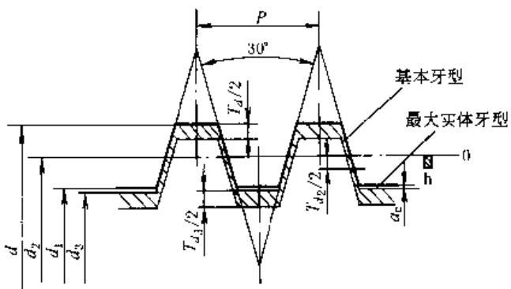

(a)大、中、小径公差带位置为h

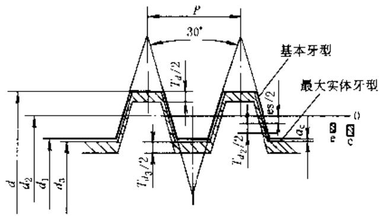

(b)大、小径公差带位置力h,中径为c、c

# 内螺纹公差带

${ \pmb { D } } _ { 4 }$ -内螺纹大径;  
T 内螺纹小径公差;  
$D _ { 2 }$ - -内螺纹中径;  
$\pmb { D } _ { \uparrow }$ - 内螺纹小径;  
$T _ { n _ { i } }$ 内螺纹中径公差;  
$P$ - 螺距;  
$\pmb { \ d }$ --外螺纹大径;  
$\pmb { d } _ { 2 }$ - -外螺纹中径;  
$d _ { 3 }$ - 外螺纹小径;  
$\looparrowright$ - 中径基本偏差:$\pmb { T } _ { \pmb { \mathscr { A } } }$ 外螺纹大径公差;  
$\pmb { \mathcal { T } } _ { \pmb { d } _ { \pmb { \hat { \lambda } } } }$ 外螺纹中径公差;  
$\pmb { T _ { d _ { \frac { 3 } { 3 } } } }$ 外螺纹小径公差。

表4-1-7/um

内、外螺纹中径基本偏差

<table><tr><td rowspan=2 colspan=1>螺距P/mm</td><td rowspan=1 colspan=1>内螺纹D</td><td rowspan=1 colspan=3>外螺d</td><td rowspan=1 colspan=1>螺距P</td><td rowspan=1 colspan=1>内螺纹D</td><td rowspan=1 colspan=3>外螺纹d</td></tr><tr><td rowspan=1 colspan=1>HFI</td><td rowspan=1 colspan=1>心e</td><td rowspan=1 colspan=1>ees</td><td rowspan=1 colspan=1>heB</td><td rowspan=1 colspan=1>P/mm</td><td rowspan=1 colspan=1>HEI</td><td rowspan=1 colspan=1>Ce</td><td rowspan=1 colspan=1>ee8</td><td rowspan=1 colspan=1>hes</td></tr><tr><td rowspan=1 colspan=1>1.5</td><td rowspan=1 colspan=1>0</td><td rowspan=1 colspan=1>-140</td><td rowspan=1 colspan=1>-67</td><td rowspan=1 colspan=1>0</td><td rowspan=1 colspan=1>14</td><td rowspan=1 colspan=1>0</td><td rowspan=1 colspan=1>- 355</td><td rowspan=1 colspan=1>- 180</td><td rowspan=1 colspan=1>0</td></tr><tr><td rowspan=1 colspan=1>2</td><td rowspan=1 colspan=1>0</td><td rowspan=1 colspan=1>-150</td><td rowspan=1 colspan=1>- 71</td><td rowspan=1 colspan=1>0</td><td rowspan=1 colspan=1>16</td><td rowspan=1 colspan=1>0</td><td rowspan=1 colspan=1>- 375</td><td rowspan=1 colspan=1>- 190</td><td rowspan=1 colspan=1>0</td></tr><tr><td rowspan=1 colspan=1>3</td><td rowspan=1 colspan=1>0</td><td rowspan=1 colspan=1>- 170</td><td rowspan=1 colspan=1>-85</td><td rowspan=1 colspan=1>0</td><td rowspan=1 colspan=1>18</td><td rowspan=1 colspan=1>0</td><td rowspan=1 colspan=1>- 400</td><td rowspan=1 colspan=1>- 200</td><td rowspan=1 colspan=1>0</td></tr><tr><td rowspan=1 colspan=1>4</td><td rowspan=1 colspan=1>0</td><td rowspan=1 colspan=1>- 190</td><td rowspan=1 colspan=1>-95</td><td rowspan=1 colspan=1>0</td><td rowspan=1 colspan=1>20</td><td rowspan=1 colspan=1>0</td><td rowspan=1 colspan=1>- 425</td><td rowspan=1 colspan=1>- 212</td><td rowspan=1 colspan=1>0</td></tr><tr><td rowspan=1 colspan=1>5</td><td rowspan=1 colspan=1>0</td><td rowspan=1 colspan=1>-212</td><td rowspan=1 colspan=1>- 106</td><td rowspan=1 colspan=1>0</td><td rowspan=1 colspan=1>22</td><td rowspan=1 colspan=1>0</td><td rowspan=1 colspan=1>- 450</td><td rowspan=1 colspan=1>- 224</td><td rowspan=1 colspan=1>0</td></tr><tr><td rowspan=1 colspan=1>6</td><td rowspan=1 colspan=1>0</td><td rowspan=1 colspan=1>- 236</td><td rowspan=1 colspan=1>- 118</td><td rowspan=1 colspan=1>0 ·</td><td rowspan=1 colspan=1>24</td><td rowspan=1 colspan=1>0</td><td rowspan=1 colspan=1>- 475</td><td rowspan=1 colspan=1>- 236</td><td rowspan=1 colspan=1>0</td></tr><tr><td rowspan=1 colspan=1>7</td><td rowspan=1 colspan=1>0</td><td rowspan=1 colspan=1>- 250</td><td rowspan=1 colspan=1>- 125</td><td rowspan=1 colspan=1>0</td><td rowspan=1 colspan=1>28</td><td rowspan=1 colspan=1>0</td><td rowspan=1 colspan=1>- 500</td><td rowspan=1 colspan=1>- 250</td><td rowspan=1 colspan=1>0</td></tr><tr><td rowspan=1 colspan=1>8</td><td rowspan=1 colspan=1>0</td><td rowspan=1 colspan=1>- 265</td><td rowspan=1 colspan=1>- 132</td><td rowspan=1 colspan=1>0</td><td rowspan=1 colspan=1>32</td><td rowspan=1 colspan=1>0</td><td rowspan=1 colspan=1>- 530</td><td rowspan=1 colspan=1>- 265</td><td rowspan=1 colspan=1>0</td></tr><tr><td rowspan=1 colspan=1>9</td><td rowspan=1 colspan=1>0</td><td rowspan=1 colspan=1>-280</td><td rowspan=1 colspan=1>- 140</td><td rowspan=1 colspan=1>0</td><td rowspan=1 colspan=1>36</td><td rowspan=1 colspan=1>0</td><td rowspan=1 colspan=1>- 560</td><td rowspan=1 colspan=1>- 280</td><td rowspan=1 colspan=1>0</td></tr><tr><td rowspan=1 colspan=1>10</td><td rowspan=1 colspan=1>0</td><td rowspan=1 colspan=1>-300</td><td rowspan=1 colspan=1>- 150</td><td rowspan=1 colspan=1>0</td><td rowspan=1 colspan=1>40</td><td rowspan=1 colspan=1>0</td><td rowspan=1 colspan=1>- 600</td><td rowspan=1 colspan=1>- 300</td><td rowspan=1 colspan=1>0</td></tr><tr><td rowspan=1 colspan=1>12</td><td rowspan=1 colspan=1>0</td><td rowspan=1 colspan=1>-335</td><td rowspan=1 colspan=1>- 160</td><td rowspan=1 colspan=1>0</td><td rowspan=1 colspan=1>44</td><td rowspan=1 colspan=1>0</td><td rowspan=1 colspan=1>-630</td><td rowspan=1 colspan=1>- 315</td><td rowspan=1 colspan=1>0</td></tr></table>

注:1.公差带的位置由基本偏差确定,本标准规定外螺纹的上偏差 $\tt ^ { \tt \tt { e 8 } }$ 及内螺纹的下偏差EI为基本偏差。2.对外径的中径 $\alpha _ { 2 }$ 规定了三种公差带位置h(图a)、e和 $\pmb { \mathrm { c } }$ (图b):对大径 $\pmb { d }$ 和小径 $\pmb { d } _ { 3 }$ ,只规定 $\hat { \boldsymbol { \varsigma } }$ 一种公差带位置 $\mathbf { h }$ ,$\mathbf { h }$ 的基本偏差为零,e和 $^ { \circ }$ 的基本偏差为负值。对内螺纹的大径 $\mathsf { p } _ { \bullet }$ 、中径 $\scriptstyle D _ { 2 }$ 及小径 $\pmb { D } _ { \pmb { \imath } }$ 规定了一种公差位置H(图c),其基本偏差为零。

<table><tr><td rowspan=1 colspan=34>表4-1-8                                         梯形螺纹公差值                                              /</td></tr><tr><td rowspan=3 colspan=2>公称直径！/mrm</td><td rowspan=3 colspan=2>螺距P/mm</td><td rowspan=2 colspan=6>内螺纹中径公差TD2</td><td rowspan=2 colspan=8>外螺纹中径公差Td</td><td rowspan=1 colspan=16>外螺纹小径公</td></tr><tr><td rowspan=1 colspan=6>中径公差带位置为</td><td rowspan=1 colspan=10>中径公差带位置为e中径公差带位置为e中行公差带位置为h</td></tr><tr><td rowspan=1 colspan=1>/mm</td><td rowspan=1 colspan=14>公</td><td rowspan=1 colspan=6>差   等  级</td><td rowspan=1 colspan=10></td></tr><tr><td rowspan=1 colspan=1>></td><td rowspan=1 colspan=1>从</td><td rowspan=1 colspan=2></td><td rowspan=1 colspan=2>7</td><td rowspan=1 colspan=2>8</td><td rowspan=1 colspan=2>9</td><td rowspan=1 colspan=2>6</td><td rowspan=1 colspan=2>7</td><td rowspan=1 colspan=2>8</td><td rowspan=1 colspan=2>9</td><td rowspan=1 colspan=2>7</td><td rowspan=1 colspan=2>8</td><td rowspan=1 colspan=2>9</td><td rowspan=1 colspan=1>7</td><td rowspan=1 colspan=1>8</td><td></td><td rowspan=1 colspan=2>9</td><td rowspan=1 colspan=2>7</td><td rowspan=1 colspan=2>8</td><td rowspan=1 colspan=1>9</td></tr><tr><td rowspan=1 colspan=1>5.6</td><td rowspan=1 colspan=1>11.2</td><td rowspan=1 colspan=2>1.523</td><td rowspan=1 colspan=2>224250280</td><td rowspan=1 colspan=2>280315355</td><td rowspan=1 colspan=2>355400450</td><td rowspan=1 colspan=2>132150170</td><td rowspan=1 colspan=2>170190212</td><td rowspan=1 colspan=2>212236265</td><td rowspan=1 colspan=2>265300335</td><td rowspan=1 colspan=2>352388435</td><td rowspan=1 colspan=2>405445501</td><td rowspan=1 colspan=2>471525589</td><td rowspan=1 colspan=1>↑279：i309350</td><td rowspan=1 colspan=1>332366416</td><td></td><td rowspan=1 colspan=2>398446504</td><td rowspan=1 colspan=2>212238265</td><td rowspan=1 colspan=2>26529531</td><td rowspan=1 colspan=1>331375419</td></tr><tr><td rowspan=2 colspan=1>11.2j</td><td rowspan=1 colspan=1>j22.4</td><td rowspan=1 colspan=2>234</td><td rowspan=1 colspan=2>265300355</td><td rowspan=1 colspan=2>335375450</td><td rowspan=1 colspan=2>425475560</td><td rowspan=1 colspan=2>160180212</td><td rowspan=1 colspan=2>200224265</td><td rowspan=1 colspan=2>250280335</td><td rowspan=1 colspan=2>315355425</td><td rowspan=1 colspan=2>400450521</td><td rowspan=1 colspan=2>462520609</td><td rowspan=1 colspan=2>544614690</td><td rowspan=1 colspan=1>321365426</td><td rowspan=1 colspan=1>383435514</td><td></td><td rowspan=1 colspan=2>465529595</td><td rowspan=1 colspan=2>250280331</td><td rowspan=1 colspan=2>312350：419</td><td rowspan=1 colspan=1>394444531</td></tr><tr><td rowspan=1 colspan=1></td><td rowspan=1 colspan=2>58</td><td rowspan=1 colspan=2>375475</td><td rowspan=1 colspan=2>475（600</td><td rowspan=1 colspan=2>600750</td><td rowspan=1 colspan=2>224280</td><td rowspan=1 colspan=2>280355</td><td rowspan=1 colspan=2>355450</td><td rowspan=1 colspan=2>i450560</td><td rowspan=1 colspan=2>562709</td><td rowspan=1 colspan=2>656828</td><td rowspan=1 colspan=2>775965</td><td rowspan=1 colspan=1>456576</td><td rowspan=1 colspan=1>550695</td><td></td><td rowspan=1 colspan=2>669832</td><td rowspan=1 colspan=2>350444</td><td rowspan=1 colspan=2>444562</td><td rowspan=1 colspan=1>562700</td></tr><tr><td rowspan=2 colspan=1>22.4</td><td rowspan=2 colspan=1>45</td><td rowspan=1 colspan=2>356</td><td rowspan=1 colspan=2>335400450</td><td rowspan=1 colspan=2>425500560</td><td rowspan=1 colspan=2>530630710</td><td rowspan=1 colspan=2>200236265</td><td rowspan=1 colspan=2>250300335</td><td rowspan=1 colspan=2>3i5375425</td><td rowspan=1 colspan=2>400475530</td><td rowspan=1 colspan=2>482587655</td><td rowspan=1 colspan=2>564681767</td><td rowspan=1 colspan=2>670i806899</td><td rowspan=1 colspan=1>397481537</td><td rowspan=1 colspan=1>4795751700649</td><td></td><td rowspan=1 colspan=2>585575170078</td><td rowspan=1 colspan=2>312375419</td><td rowspan=1 colspan=2>394469531</td><td rowspan=1 colspan=1>500594662</td></tr><tr><td rowspan=1 colspan=2>781012</td><td rowspan=1 colspan=2>475500530560</td><td rowspan=1 colspan=2>600630670710</td><td rowspan=1 colspan=2>750800850900</td><td rowspan=1 colspan=2>280300315335</td><td rowspan=1 colspan=2>355375400425</td><td rowspan=1 colspan=2>450475500530</td><td rowspan=1 colspan=2>560600630670</td><td rowspan=1 colspan=2>：694734800866</td><td rowspan=1 colspan=2>813859925998</td><td rowspan=1 colspan=2>950101510871223</td><td rowspan=1 colspan=1>569601650691</td><td rowspan=1 colspan=1>688：726775823</td><td></td><td rowspan=1 colspan=2>8258829.371048</td><td rowspan=1 colspan=2>4444695001531</td><td rowspan=1 colspan=2>562594625662</td><td rowspan=1 colspan=1>700750788838</td></tr><tr><td rowspan=3 colspan=1>45</td><td rowspan=3 colspan=1>90</td><td rowspan=1 colspan=2>348</td><td rowspan=1 colspan=2>355400530</td><td rowspan=1 colspan=2>450500670</td><td rowspan=1 colspan=2>560630850</td><td rowspan=1 colspan=2>212236315</td><td rowspan=1 colspan=2>265：300400</td><td rowspan=1 colspan=2>335375500</td><td rowspan=1 colspan=2>425475630</td><td rowspan=1 colspan=2>501565i765</td><td rowspan=1 colspan=2>589i659890</td><td rowspan=1 colspan=2>7017841052</td><td rowspan=1 colspan=1>416470632</td><td rowspan=1 colspan=1>504564757</td><td></td><td rowspan=1 colspan=2>616689919</td><td rowspan=1 colspan=2>331375500</td><td rowspan=1 colspan=2>4194g625</td><td rowspan=1 colspan=1>531594788</td></tr><tr><td rowspan=1 colspan=2>91012</td><td rowspan=1 colspan=2>560560630</td><td rowspan=1 colspan=2>710710800</td><td rowspan=1 colspan=2>9009001000</td><td rowspan=1 colspan=2>335335375</td><td rowspan=1 colspan=2>425425475</td><td rowspan=1 colspan=2>50530600</td><td rowspan=1 colspan=2>670670750</td><td rowspan=1 colspan=2>811831929</td><td rowspan=1 colspan=2>9439631085</td><td rowspan=1 colspan=2>11811381273</td><td rowspan=1 colspan=1>671681754</td><td rowspan=1 colspan=1>803813910</td><td></td><td rowspan=1 colspan=2>978988！1098</td><td rowspan=1 colspan=2>531531594</td><td rowspan=1 colspan=2>662662750</td><td rowspan=1 colspan=1>8388389.38</td></tr><tr><td rowspan=1 colspan=2>一1618</td><td rowspan=1 colspan=2>670710750</td><td rowspan=1 colspan=2>850900950</td><td rowspan=1 colspan=2>10601[201180</td><td rowspan=1 colspan=2>400425450</td><td rowspan=1 colspan=2>500530560</td><td rowspan=1 colspan=2>630670710-</td><td rowspan=1 colspan=2>800850-900</td><td rowspan=1 colspan=2>97010381100</td><td rowspan=1 colspan=2>114212131288</td><td rowspan=1 colspan=2>135514381525</td><td rowspan=1 colspan=1>805853900</td><td rowspan=1 colspan=1>96710281088</td><td rowspan=1 colspan=3>118012531320</td><td rowspan=1 colspan=2>625662700</td><td rowspan=1 colspan=2>788838888</td><td rowspan=1 colspan=1>（100010621125</td></tr><tr><td rowspan=3 colspan=1>90</td><td rowspan=3 colspan=1>180</td><td rowspan=1 colspan=2>46812</td><td rowspan=1 colspan=2>425500560670</td><td rowspan=1 colspan=2>530630710850</td><td rowspan=1 colspan=2>6708009001060</td><td rowspan=1 colspan=2>250300335400</td><td rowspan=1 colspan=2>315375425500</td><td rowspan=1 colspan=2>400475530630</td><td rowspan=1 colspan=2>500600670800</td><td rowspan=1 colspan=2>584705796！960</td><td rowspan=1 colspan=2>6908309281122</td><td rowspan=1 colspan=2>815一98611031335</td><td rowspan=1 colspan=1>一489587663785</td><td rowspan=1 colspan=1>595712795947</td><td rowspan=1 colspan=3>7208689701160</td><td rowspan=1 colspan=2>394469531625</td><td rowspan=1 colspan=2>500594662788</td><td rowspan=1 colspan=1>6257508381000</td></tr><tr><td rowspan=1 colspan=2>141618</td><td rowspan=1 colspan=2>710750800</td><td rowspan=1 colspan=2>9009501000</td><td rowspan=1 colspan=2>112011801250</td><td rowspan=1 colspan=2>425450475</td><td rowspan=1 colspan=2>530560600</td><td rowspan=1 colspan=2>670710750</td><td rowspan=1 colspan=2>850900950</td><td rowspan=1 colspan=2>101810751150</td><td rowspan=1 colspan=2>119312631338</td><td rowspan=1 colspan=2>141815001588</td><td rowspan=1 colspan=1>843890950</td><td rowspan=1 colspan=1>101810781138</td><td rowspan=1 colspan=3>124313151388</td><td rowspan=1 colspan=2>662700750</td><td rowspan=1 colspan=2>838888_938</td><td rowspan=1 colspan=1>106211251188</td></tr><tr><td rowspan=1 colspan=2>20222428</td><td rowspan=1 colspan=2>800850900950</td><td rowspan=1 colspan=2>1000106011201180</td><td rowspan=1 colspan=2>1250132014001500</td><td rowspan=1 colspan=2>475500530560</td><td rowspan=1 colspan=2>600630570710</td><td rowspan=1 colspan=2>750800850900</td><td rowspan=1 colspan=2>950100010601120</td><td rowspan=1 colspan=2>1175123213131388</td><td rowspan=1 colspan=2>1363145015381625</td><td rowspan=1 colspan=2>1613170018001900</td><td rowspan=1 colspan=1>962101110741138</td><td rowspan=1 colspan=1>1150122412991375</td><td rowspan=1 colspan=3>14001474156！1650</td><td rowspan=1 colspan=2>7507888.38888</td><td rowspan=1 colspan=2>938100010621125</td><td rowspan=1 colspan=1>1188125013251400</td></tr><tr><td rowspan=3 colspan=1>180</td><td rowspan=3 colspan=1>355</td><td rowspan=1 colspan=2>81218</td><td rowspan=1 colspan=2>600710850</td><td rowspan=1 colspan=2>7509001060</td><td rowspan=1 colspan=2>95011201320</td><td rowspan=1 colspan=2>355425500</td><td rowspan=1 colspan=2>450530630</td><td rowspan=1 colspan=2>560670800</td><td rowspan=1 colspan=2>7108501000</td><td rowspan=1 colspan=2>8289981187</td><td rowspan=1 colspan=2>96511731400</td><td rowspan=1 colspan=2>115313981650</td><td rowspan=1 colspan=1>695823987</td><td rowspan=1 colspan=1>8329981200</td><td rowspan=1 colspan=3>10201223145</td><td rowspan=1 colspan=2>562662788</td><td rowspan=1 colspan=2>7008381000</td><td rowspan=1 colspan=1>8810621250</td></tr><tr><td rowspan=1 colspan=2>202224</td><td rowspan=1 colspan=2>900900950</td><td rowspan=1 colspan=2>112011201180</td><td rowspan=1 colspan=2>140014001500</td><td rowspan=1 colspan=2>530530560</td><td rowspan=1 colspan=2>670670710</td><td rowspan=1 colspan=2>850850900</td><td rowspan=1 colspan=2>106010601120</td><td rowspan=1 colspan=2>126312881363</td><td rowspan=1 colspan=2>148815131600</td><td rowspan=1 colspan=2>175017751875</td><td rowspan=1 colspan=1>105010621124</td><td rowspan=1 colspan=1>127512871361</td><td rowspan=1 colspan=3>153715491636</td><td rowspan=1 colspan=2>838838888</td><td rowspan=1 colspan=2>106210621125</td><td rowspan=1 colspan=1>132513251400</td></tr><tr><td rowspan=1 colspan=2>32364044</td><td rowspan=1 colspan=2>1060112011201250</td><td rowspan=1 colspan=2>1320140014001500</td><td rowspan=1 colspan=2>1700180018001900</td><td rowspan=1 colspan=2>630670670710</td><td rowspan=1 colspan=2>800850850900</td><td rowspan=1 colspan=2>1000106010601120</td><td rowspan=1 colspan=2>1250132013201400</td><td rowspan=1 colspan=2>1530162316631755</td><td rowspan=1 colspan=2>1780188519252030</td><td rowspan=1 colspan=2>2092221022502380</td><td rowspan=1 colspan=1>1265134313631440</td><td rowspan=1 colspan=1>15151605162571s</td><td rowspan=1 colspan=3>1827193019502065</td><td rowspan=1 colspan=2>1000106210621125</td><td rowspan=1 colspan=2>1250132513251400</td><td rowspan=1 colspan=1>156216501651750</td></tr><tr><td rowspan=1 colspan=2>螺P/mm</td><td rowspan=1 colspan=2>mm</td><td rowspan=1 colspan=1>1.5</td><td rowspan=1 colspan=2>2</td><td rowspan=1 colspan=1>3</td><td rowspan=1 colspan=1>4</td><td rowspan=1 colspan=2>5</td><td rowspan=1 colspan=1>6</td><td rowspan=1 colspan=1>7</td><td rowspan=1 colspan=2>8</td><td rowspan=1 colspan=1>9</td><td rowspan=1 colspan=1>10</td><td rowspan=1 colspan=1>12</td><td rowspan=1 colspan=1>12</td><td rowspan=1 colspan=1>14</td><td rowspan=1 colspan=1>16</td><td rowspan=1 colspan=2>18</td><td rowspan=1 colspan=1>20</td><td rowspan=1 colspan=1>22</td><td rowspan=1 colspan=1>24</td><td rowspan=1 colspan=2>28</td><td rowspan=1 colspan=1></td><td rowspan=1 colspan=1>32</td><td rowspan=1 colspan=2>36</td><td rowspan=1 colspan=1>4</td><td rowspan=1 colspan=1>44</td></tr><tr><td rowspan=1 colspan=4>内螺纹小径公差T，（4级）</td><td rowspan=1 colspan=1>190236</td><td rowspan=1 colspan=2>190236</td><td rowspan=1 colspan=1>3t5</td><td rowspan=1 colspan=1>375</td><td rowspan=1 colspan=2>450</td><td rowspan=1 colspan=1>500</td><td rowspan=1 colspan=1>560</td><td rowspan=1 colspan=2>630670</td><td rowspan=1 colspan=1>630670</td><td rowspan=1 colspan=1>710</td><td rowspan=1 colspan=2>800</td><td rowspan=1 colspan=1>900</td><td rowspan=1 colspan=1>1000</td><td rowspan=1 colspan=2>1120</td><td rowspan=1 colspan=1>1i80</td><td rowspan=1 colspan=1>1250</td><td rowspan=1 colspan=1>1320</td><td rowspan=1 colspan=2>1500</td><td rowspan=1 colspan=2>1600</td><td rowspan=1 colspan=2>1800</td><td rowspan=1 colspan=1>1900</td><td rowspan=1 colspan=1>2000</td></tr><tr><td rowspan=1 colspan=4>外螺纹大径公差T（4级）</td><td rowspan=1 colspan=1>150</td><td rowspan=1 colspan=2>180</td><td rowspan=1 colspan=1>236</td><td rowspan=1 colspan=1>J300</td><td rowspan=1 colspan=2>335</td><td rowspan=1 colspan=1>375</td><td rowspan=1 colspan=1>[425]</td><td rowspan=1 colspan=2>450</td><td rowspan=1 colspan=1>500</td><td rowspan=1 colspan=1>530</td><td rowspan=1 colspan=2>600670</td><td rowspan=1 colspan=1>600670</td><td rowspan=1 colspan=1>710800</td><td rowspan=1 colspan=2>710800</td><td rowspan=1 colspan=1>850</td><td rowspan=1 colspan=1>900</td><td rowspan=1 colspan=1>9S0</td><td rowspan=1 colspan=2>1060</td><td rowspan=1 colspan=2>[1120]</td><td rowspan=1 colspan=2>1250</td><td rowspan=1 colspan=1>1320</td><td rowspan=1 colspan=1>1400</td></tr></table>

注:1.梯形螺纹公差带仅选择并标记中径公差带。2.6级公差值仅是为了计算7、8、9级公差值而列出的。

表4-1-9

<table><tr><td colspan="2" rowspan="2">公称自径 d</td><td rowspan="2">螺距 P</td><td colspan="3">旋合长度组</td><td rowspan="2" colspan="2">公称直径 d</td><td rowspan="2">螺距</td><td colspan="3">旋合长度组</td></tr><tr><td colspan="2">N</td><td>L</td><td colspan="2"></td><td>L</td></tr><tr><td>></td><td>n</td><td></td><td>></td><td>A</td><td>></td><td>> 小</td><td>P</td><td>N ></td><td>=</td><td>></td></tr><tr><td rowspan="2">5.6</td><td rowspan="2">11.2</td><td>1.5</td><td>5</td><td>15</td><td>15 19</td><td rowspan="9">90</td><td rowspan="9">1</td><td rowspan="2">4</td><td>24</td><td>71</td><td>71</td></tr><tr><td>2</td><td>6</td><td>19</td><td></td><td>6</td><td>36</td><td>106 106</td></tr><tr><td rowspan="5"></td><td>3</td><td>10</td><td>28</td><td>28</td><td></td><td>8</td><td>45</td><td>132</td><td>132</td></tr><tr><td>2</td><td>8</td><td>24</td><td>24</td><td></td><td>12</td><td>67</td><td>200</td><td>200</td></tr><tr><td>3</td><td>11</td><td>32</td><td>32</td><td></td><td>14</td><td>75</td><td>236</td><td>236</td></tr><tr><td>4</td><td>15</td><td>43</td><td>43</td><td>180</td><td>16</td><td>90</td><td>265</td><td>265</td></tr><tr><td>5</td><td>18</td><td>53</td><td>53</td><td>18</td><td>100</td><td></td><td>300</td><td>800</td></tr><tr><td rowspan="6">45</td><td rowspan="6"></td><td>8</td><td>30</td><td>85</td><td>85</td><td></td><td>20 22</td><td>112 118</td><td>335 355</td><td>335</td></tr><tr><td>3</td><td>12</td><td>36</td><td>36</td><td></td><td>24</td><td>132</td><td></td><td></td><td>355</td></tr><tr><td>5</td><td>21</td><td>63</td><td>63</td><td></td><td></td><td></td><td>150</td><td>400 450</td><td>400</td></tr><tr><td>6</td><td>25</td><td>75</td><td>75</td><td rowspan="9"></td><td rowspan="9"></td><td>28 8</td><td>50</td><td>150</td><td></td><td>450</td></tr><tr><td>7</td><td>30 34</td><td>85</td><td>85 100</td><td></td><td></td><td>75</td><td>224</td><td>150 224</td></tr><tr><td>8</td><td>42</td><td>100 125</td><td>125 150</td><td rowspan="11"></td><td>12 18</td><td>112</td><td></td><td>335 335</td></tr><tr><td>10 12</td><td>50</td><td></td><td>150</td><td></td><td>20</td><td>125</td><td>375</td></tr><tr><td rowspan="8">45</td><td>3</td><td>15</td><td>45</td><td>45</td><td></td><td>22</td><td>140</td><td>425</td><td>375 425</td></tr><tr><td>4</td><td>19</td><td>56</td><td>56</td><td></td><td>24</td><td>150</td><td>450</td><td>450</td></tr><tr><td>8</td><td>38</td><td>118</td><td>118</td><td>355</td><td>32</td><td>200</td><td>600</td><td>600</td></tr><tr><td>9</td><td>43</td><td>132</td><td>132</td><td>180</td><td>36</td><td>224</td><td>670</td><td>670</td></tr><tr><td></td><td>50</td><td>1 140</td><td>140</td><td></td><td>40</td><td>250</td><td>750</td><td></td></tr><tr><td>10</td><td>60</td><td>170</td><td></td><td></td><td></td><td></td><td></td><td>750</td></tr><tr><td>12</td><td></td><td></td><td>170</td><td></td><td>44</td><td>280</td><td>850</td><td>850</td></tr><tr><td>14 16</td><td>67 75</td><td>200 236</td><td>200 236</td><td></td><td></td><td></td><td></td><td></td></tr></table>

表4-1-10

梯形螺纹公差带的选用及标注

<table><tr><td rowspan=2 colspan=2>精度</td><td rowspan=1 colspan=2>内螺纹</td><td rowspan=1 colspan=2>外螺纹</td><td rowspan=2 colspan=1>应用</td></tr><tr><td rowspan=1 colspan=1>N</td><td rowspan=1 colspan=1>i</td><td rowspan=1 colspan=1>N</td><td rowspan=1 colspan=1>L</td></tr><tr><td rowspan=1 colspan=2>中等</td><td rowspan=1 colspan=1>7H</td><td rowspan=1 colspan=1>8H</td><td rowspan=1 colspan=1>7h、7e</td><td rowspan=1 colspan=1>8e</td><td rowspan=1 colspan=1>一般用途</td></tr><tr><td rowspan=1 colspan=2>粗糙</td><td rowspan=1 colspan=1>8H</td><td rowspan=1 colspan=1>9H</td><td rowspan=1 colspan=1>8e、8c</td><td rowspan=1 colspan=1>9c</td><td rowspan=1 colspan=1>对精度要求不高时采用</td></tr><tr><td rowspan=2 colspan=1>标记示例</td><td rowspan=1 colspan=1>内、外螺纹</td><td rowspan=1 colspan=2>Tr40x7-7H中径公差带螺距公称直径-螺纹种类代号</td><td rowspan=1 colspan=3>Tr 40 × 7-7eTr 40 x 7LH-7e-左旋(右旋不注）Tr40×14(P7)-8e-L（旋合长度为L组的多线螺纹，其中14为导程，P7为螺距）Tr40×7-7e-140（旋合长度为特殊需要时，可标数值）</td></tr><tr><td rowspan=1 colspan=1>螺旋副</td><td rowspan=1 colspan=5>Tr40×7-7H/7e</td></tr></table>

注:1.梯形螺纹的公差带代号只标注中径公差带(由表示公差等级的数字及公差位置的字母组成)。2.当旋合长度为N组时,不标注旋合长度代号。当旋合长度为L组时,应将组别代号L写在公差带代号的后面,并用“-"隔开。特殊需要时可用具体旋合长度数值代簪组别代号 $\mathbf { \delta L } _ { \mathcal { o } }$ 3.梯形螺纹副的公差带要分别注出内、外螺纹的公差带代号。前面的是内螺纹公差带代号,后面的是外螺纹公差带代号,中间用料线分开。

# 多线梯形螺纹中径公差系数

表 4-1-11

<table><tr><td>线 数</td><td></td><td>2</td><td>3</td><td>4</td><td>5</td></tr><tr><td>系</td><td>数</td><td>1.12</td><td>1.25</td><td>1.4</td><td>1 1.6</td></tr></table>

注:1.多线螺纹的顶径公差和底径公差与单线螺纹相同,2.多线螺纹的中径公差足在单线螺纹中径公差的基础上按线数不同分别乘以本表系数面得。

# 1.5锯齿形 $( 3 ^ { \circ } , ~ 3 0 ^ { \circ } )$ 螺纹

# 1.5.1锯齿形 $( 3 ^ { \circ } , ~ 3 0 ^ { \circ } )$ 螺纹牙型与基本尺寸锯齿形 $( 3 ^ { \circ } , ~ 3 0 ^ { \circ } )$ )螺纹牙型(GB/T13576.I—1992)

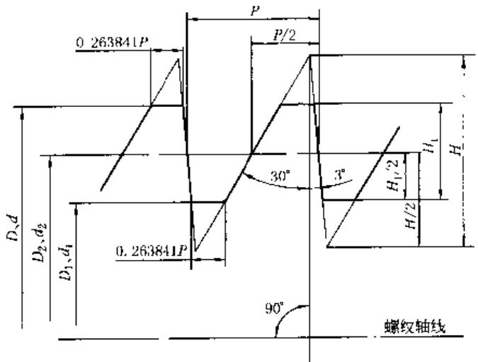

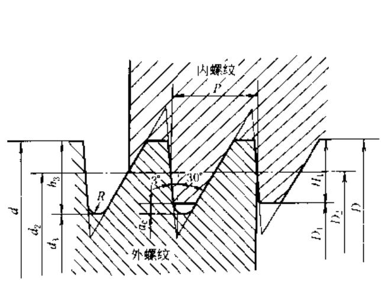

# 内、外螺纹的设计牙型

# 基本牙型

$D$ ——内螺纹大径;  
$\pmb { d }$ —外螺纹大径;  
$\pmb { D } _ { 2 }$ 内螺纹中径;  
$d _ { 2 }$ - -外螺纹中径;  
$\pmb { { \cal D } } _ { 1 }$ ——内螺纹小径;

$d _ { 1 }$ 一 -外螺纹小径;$\mathcal { P }$ - 螺距;$\pmb { H }$ - -原始二角形高度:$\pmb { H } _ { 1 }$ 一 -基本牙型高度。

${ \pmb H } _ { 1 } = 0 . 7 5 { \cal P }$   
a=0.117767P;   
h=H+Q=0.867767P; $\pmb { D } \neq \pmb { d }$ 

${ \Delta } _ { 2 } = d _ { 2 } = d - H _ { 1 } = d - 0 . 7 5 P ;$ $D _ { \iota } \simeq d - 2 H _ { \iota } = d - 1 . 5 P _ { \iota }$ $d _ { 3 } = d - 2 h _ { 3 } = d - 1 . 7 3 5 5 3 4 P ;$ R=0.124271P 

/mm 

表4-1-12

基本牙型和设计牙型尺寸(GB/T13576.1—1992)

<table><tr><td rowspan="2">螺距</td><td colspan="3">基本牙型</td><td colspan="3">设计牙型</td><td>螺距</td><td colspan="3">基本牙型</td><td colspan="3">设计牙型</td></tr><tr><td>P H</td><td>H</td><td>牙底宽 牙顶宽</td><td>a</td><td>h</td><td>R</td><td>P</td><td>H</td><td>H</td><td>牙底宽 牙顶宽</td><td>a</td><td>h</td><td>R</td></tr><tr><td>2</td><td>3.176</td><td>1.50</td><td>0.528</td><td>0.236</td><td>1.736</td><td>0.249</td><td>16</td><td>25.407</td><td>12.00</td><td>4.221</td><td>1.988</td><td>13.884</td><td>1.988</td></tr><tr><td>3</td><td>4.764</td><td>2.25</td><td>0.792</td><td>0.353</td><td>2.603</td><td>0.373</td><td>18</td><td>28.582</td><td>13.50</td><td>4.749</td><td>2.120</td><td>15.620</td><td>2.237</td></tr><tr><td>4</td><td>6.352</td><td>3.0</td><td>1.055</td><td>0.471</td><td>3.471</td><td>0.497</td><td>20</td><td>31.758</td><td>15.00</td><td>5.277</td><td>2.355</td><td>17.355</td><td>2.485</td></tr><tr><td>5</td><td>7.940</td><td>3.75</td><td>1.319</td><td>0.589</td><td>4.339</td><td>0.621</td><td>22</td><td>34.934</td><td>16.50</td><td>5.804</td><td>2.591</td><td>19.091</td><td>2.734</td></tr><tr><td>6</td><td>9.527</td><td>4.5</td><td>1.583</td><td>0.707</td><td>5.207</td><td>0.746</td><td>24</td><td>38.110</td><td>18.00</td><td>6.332</td><td>2.826</td><td>20.826</td><td>2.982</td></tr><tr><td>7</td><td>11.115</td><td>5.25</td><td>1.847</td><td>0.824</td><td>6.074</td><td>0.870</td><td>28</td><td>44.462</td><td>21.00</td><td>7.388</td><td>3.297</td><td>24.297</td><td>3.480</td></tr><tr><td>8</td><td>12.703</td><td>6.00</td><td>2.111</td><td>0.942</td><td>6.942</td><td>0.994</td><td>32</td><td>50.813</td><td>24.00</td><td>8.443</td><td>3.769</td><td>27.769</td><td>3.977</td></tr><tr><td>9</td><td>14.291</td><td>6.75</td><td>2.375</td><td>1.060</td><td>7.810</td><td>1.118</td><td>36</td><td>57.165</td><td>27.00</td><td>9.498</td><td>4.240</td><td>31.240</td><td>4.474</td></tr><tr><td>10</td><td>15.879</td><td>7.50</td><td>2.638</td><td>1.178</td><td>8.678</td><td>1.243</td><td>40</td><td>63.516</td><td>30.00</td><td>10.554</td><td>4.711</td><td>34.711</td><td>4.971</td></tr><tr><td>12</td><td>19.055</td><td>9.00</td><td>3.166</td><td>1.413</td><td>10.413</td><td>1.491</td><td>44</td><td>69.868</td><td>33.00</td><td>11.609</td><td>5.182</td><td>38.182</td><td>4.468</td></tr><tr><td>14</td><td>22.231</td><td>10.50</td><td>3.694</td><td>1.649</td><td>12.149</td><td>1.740</td><td></td><td></td><td></td><td></td><td></td><td></td><td></td></tr></table>

注:表中H=1.587911P:牙顶宽=牙底宽=0.263841P;其他符号见表图。

/mm 

<table><tr><td colspan="2" rowspan="1">公称直径d</td><td colspan="1" rowspan="1">螺距</td><td colspan="1" rowspan="1">中径</td><td colspan="2" rowspan="1">小径</td><td colspan="2" rowspan="1">公称直径d</td><td colspan="1" rowspan="1">螺距</td><td colspan="1" rowspan="1">中径</td><td colspan="15" rowspan="1">小径</td></tr><tr><td colspan="1" rowspan="1">第一系列</td><td colspan="1" rowspan="1">第二系列</td><td colspan="1" rowspan="1">P</td><td colspan="1" rowspan="1">d= D</td><td colspan="1" rowspan="1">d</td><td colspan="1" rowspan="1">D</td><td colspan="1" rowspan="1">第一系列</td><td colspan="1" rowspan="1">第二系列</td><td colspan="1" rowspan="1">P</td><td colspan="1" rowspan="1">d=D</td><td colspan="1" rowspan="1">d</td><td colspan="14" rowspan="1">D</td></tr><tr><td colspan="1" rowspan="2">10</td><td colspan="1" rowspan="2"></td><td colspan="1" rowspan="2">2</td><td colspan="1" rowspan="2">8.500</td><td colspan="1" rowspan="2">6.529</td><td colspan="1" rowspan="2">7.000</td><td colspan="1" rowspan="3"></td><td colspan="1" rowspan="3">42</td><td colspan="1" rowspan="2">37</td><td colspan="1" rowspan="2">39.75036.750</td><td colspan="1" rowspan="3">36.79329.85124.645</td><td colspan="14" rowspan="1">37.500</td></tr><tr><td colspan="14" rowspan="1">31.500</td></tr><tr><td colspan="1" rowspan="2">12</td><td colspan="1" rowspan="2"></td><td colspan="1" rowspan="2">23</td><td colspan="1" rowspan="2">10.5009.750</td><td colspan="1" rowspan="2">8.5296.793</td><td colspan="1" rowspan="1">9.000</td><td colspan="1" rowspan="1">10</td><td colspan="1" rowspan="1">34.500</td><td colspan="14" rowspan="1">27.000</td></tr><tr><td colspan="1" rowspan="1">7.500</td><td colspan="1" rowspan="3">44</td><td colspan="1" rowspan="1"></td><td colspan="1" rowspan="1">3</td><td colspan="1" rowspan="1">41.750</td><td colspan="1" rowspan="1">38.793</td><td colspan="14" rowspan="1">39.500</td></tr><tr><td colspan="1" rowspan="2"></td><td colspan="1" rowspan="2">14</td><td colspan="1" rowspan="2">23</td><td colspan="1" rowspan="2">12.50011.750</td><td colspan="1" rowspan="2">10.5298.793</td><td colspan="1" rowspan="2">11.0009.500</td><td colspan="1" rowspan="2"></td><td colspan="1" rowspan="1">7</td><td colspan="1" rowspan="1">38.750</td><td colspan="1" rowspan="1">31.851</td><td colspan="14" rowspan="1">33.500</td></tr><tr><td colspan="1" rowspan="1">12</td><td colspan="1" rowspan="1">35.000</td><td colspan="1" rowspan="1">23.174</td><td colspan="14" rowspan="1">26.000</td></tr><tr><td colspan="1" rowspan="2">16</td><td colspan="1" rowspan="2"></td><td colspan="1" rowspan="2">24</td><td colspan="1" rowspan="2">14.50013.000</td><td colspan="1" rowspan="2">12.5299.058</td><td colspan="1" rowspan="2">13.00010.000</td><td colspan="1" rowspan="2"></td><td colspan="1" rowspan="2">46</td><td colspan="1" rowspan="3">3812</td><td colspan="1" rowspan="3">43.75040.00037.000</td><td colspan="1" rowspan="3">40.79332.11625.174</td><td colspan="14" rowspan="1">41.500</td></tr><tr><td colspan="14" rowspan="1">34.000</td></tr><tr><td colspan="1" rowspan="2"></td><td colspan="1" rowspan="2">18</td><td colspan="1" rowspan="2">24</td><td colspan="1" rowspan="2">16.50015.000</td><td colspan="1" rowspan="2">14.52911.058</td><td colspan="1" rowspan="2">15.00012.000</td><td colspan="1" rowspan="1"></td><td colspan="1" rowspan="1"></td><td colspan="14" rowspan="1">28.000</td></tr><tr><td colspan="1" rowspan="1"></td><td colspan="1" rowspan="1"></td><td colspan="1" rowspan="1">3</td><td colspan="1" rowspan="1">45.750</td><td colspan="1" rowspan="1">42.793</td><td colspan="14" rowspan="1">43.500</td></tr><tr><td colspan="1" rowspan="1">20</td><td colspan="1" rowspan="1"></td><td colspan="1" rowspan="1">24</td><td colspan="1" rowspan="1">18.50017.000</td><td colspan="1" rowspan="1">16.52913.058</td><td colspan="1" rowspan="1">17.00014.000</td><td colspan="1" rowspan="1">48</td><td colspan="1" rowspan="1"></td><td colspan="1" rowspan="1">812</td><td colspan="1" rowspan="1">42.00039.000</td><td colspan="1" rowspan="1">34.11627.174</td><td colspan="14" rowspan="1">36.00030.000</td></tr><tr><td></td><td></td><td colspan="1" rowspan="2">358</td><td colspan="1" rowspan="2">19.75018.25016.000</td><td colspan="1" rowspan="2">16.79313.3228.116</td><td colspan="1" rowspan="2">17.50014.50010.000</td><td colspan="1" rowspan="2"></td><td colspan="1" rowspan="2">50</td><td colspan="1" rowspan="2">3812</td><td colspan="1" rowspan="2">47.75044.00041.000</td><td colspan="1" rowspan="2">44.79336.11629.174</td><td colspan="14" rowspan="2">45.50038.00032.000</td></tr><tr><td colspan="1" rowspan="1"></td><td colspan="14" rowspan="1">22</td></tr><tr><td></td><td></td><td></td><td colspan="1" rowspan="2">21.75020.25018.000</td><td colspan="1" rowspan="2">18.79315.32210.116</td><td colspan="1" rowspan="2">19.50016.50012.000</td><td colspan="1" rowspan="2">52</td><td colspan="1" rowspan="2"></td><td colspan="1" rowspan="2">3812</td><td colspan="1" rowspan="2">49.75046.00043.000</td><td colspan="1" rowspan="2">46.79338.11631.174</td><td colspan="14" rowspan="2">47.50040.00034.000</td></tr><tr><td colspan="1" rowspan="1">24</td><td colspan="1" rowspan="1"></td><td colspan="14" rowspan="1">358</td></tr><tr><td></td><td></td><td colspan="1" rowspan="2">358</td><td colspan="1" rowspan="2">23.75022.25020.000</td><td colspan="1" rowspan="2">20.79317.32212.116</td><td colspan="1" rowspan="2">21.50018.50014.000</td><td colspan="1" rowspan="2"></td><td colspan="1" rowspan="2">55</td><td colspan="1" rowspan="2">3914</td><td colspan="1" rowspan="2">52.75048.25044.500</td><td colspan="1" rowspan="2">49.79339.38030.702</td><td colspan="14" rowspan="2">50.00041.50034.000</td></tr><tr><td colspan="1" rowspan="1"></td><td colspan="14" rowspan="1">26</td></tr><tr><td></td><td></td><td colspan="1" rowspan="2">358</td><td colspan="1" rowspan="2">25.75024.25022.000</td><td colspan="1" rowspan="2">22.79319.32214.116</td><td colspan="1" rowspan="2">23.50020.50016.000</td><td colspan="1" rowspan="2">60</td><td colspan="1" rowspan="2"></td><td colspan="1" rowspan="2">3914</td><td colspan="1" rowspan="2">57.75053.25049.500</td><td colspan="1" rowspan="2">54.79344.38035.702</td><td colspan="14" rowspan="2">55.50046.50039.000</td></tr><tr><td colspan="1" rowspan="1">28</td><td colspan="14" rowspan="1"></td></tr><tr><td></td><td colspan="1" rowspan="2">30</td><td colspan="1" rowspan="2">3610</td><td colspan="1" rowspan="2">27.75025.50022.500</td><td colspan="1" rowspan="2">24.79319.58712.645</td><td colspan="1" rowspan="2">25.50021.00015.000</td><td colspan="1" rowspan="2"></td><td colspan="1" rowspan="2">65</td><td colspan="1" rowspan="2">41016</td><td colspan="1" rowspan="2">62.00057.50053.000</td><td colspan="1" rowspan="2">58.05847.64537.231</td><td colspan="14" rowspan="2">59.00050.00041.000</td></tr><tr><td colspan="14" rowspan="1"></td></tr><tr><td></td><td></td><td></td><td></td><td colspan="1" rowspan="2">26.79321.58714.645</td><td colspan="1" rowspan="2">27.50023.00017.000</td><td colspan="1" rowspan="2">70</td><td colspan="1" rowspan="2"></td><td colspan="1" rowspan="2">41016</td><td colspan="1" rowspan="2">67.00062.50058.000</td><td colspan="1" rowspan="2">63.05852.64542.231</td><td colspan="14" rowspan="2">64.00055.00046.000</td></tr><tr><td colspan="1" rowspan="1">32</td><td colspan="1" rowspan="1"></td><td colspan="1" rowspan="1">3610</td><td colspan="14" rowspan="1">29.75027.50024.500</td></tr><tr><td></td><td></td><td></td><td colspan="1" rowspan="2">31.75029.50026.500</td><td colspan="1" rowspan="2">28.79323.58716.645</td><td colspan="1" rowspan="2">29.50025.00019.000</td><td colspan="1" rowspan="2"></td><td colspan="1" rowspan="2">75</td><td colspan="1" rowspan="2">41016</td><td colspan="1" rowspan="2">72.00067.50063.000</td><td colspan="1" rowspan="2">68.05857.64547.231</td><td colspan="14" rowspan="2">69.00060.00051.000</td></tr><tr><td colspan="1" rowspan="1"></td><td colspan="1" rowspan="1">34</td><td colspan="14" rowspan="1">3610</td></tr><tr><td colspan="1" rowspan="1">36</td><td colspan="1" rowspan="1"></td><td colspan="1" rowspan="1">3610</td><td colspan="1" rowspan="1">33.75031.50028.500</td><td colspan="1" rowspan="1">30.79325.58718.645</td><td colspan="1" rowspan="1">31.50027.00021.000</td><td colspan="1" rowspan="1">80</td><td colspan="1" rowspan="1"></td><td colspan="1" rowspan="1">41016</td><td colspan="1" rowspan="1">77.00072.50068.000</td><td colspan="1" rowspan="1">73.05862.64552.231</td><td colspan="14" rowspan="1">74.00065.00056.000</td></tr><tr><td colspan="1" rowspan="1"></td><td colspan="1" rowspan="1">38</td><td colspan="1" rowspan="1">3710</td><td colspan="1" rowspan="1">35.75032.75030.500</td><td colspan="1" rowspan="1">32.79325.85120.645</td><td colspan="1" rowspan="1">33.50027.50023.000</td><td colspan="1" rowspan="1"></td><td colspan="1" rowspan="1">85</td><td colspan="1" rowspan="1">41218</td><td colspan="1" rowspan="1">82.00076.00071.500</td><td colspan="1" rowspan="1">78.05864.17453.760</td><td colspan="14" rowspan="1">79.00067.00058.000</td></tr><tr><td colspan="1" rowspan="2">40</td><td colspan="1" rowspan="2"></td><td colspan="1" rowspan="2">3710</td><td colspan="1" rowspan="2">37.75034.75032.500</td><td colspan="1" rowspan="1">34.79327.851</td><td colspan="1" rowspan="1">35.50029.500</td><td colspan="1" rowspan="1">90</td><td colspan="1" rowspan="1"></td><td colspan="1" rowspan="1">412</td><td colspan="1" rowspan="1">87.00081.000</td><td colspan="1" rowspan="1">83.05869.174</td><td colspan="14" rowspan="1">84.00072.000</td></tr><tr><td colspan="3" rowspan="1">22.645</td><td colspan="1" rowspan="1">25.000</td><td colspan="2" rowspan="1"></td><td colspan="6" rowspan="1"></td><td colspan="3" rowspan="1">18</td><td colspan="2" rowspan="1">76.500</td><td colspan="2" rowspan="1">58.760</td><td colspan="3" rowspan="1">63.000</td></tr><tr><td colspan="3" rowspan="1">公称直径d</td><td colspan="1" rowspan="1">螺四</td><td colspan="2" rowspan="1">中径</td><td colspan="6" rowspan="1">小径</td><td colspan="3" rowspan="1">公称直径d</td><td colspan="2" rowspan="1">螺距</td><td colspan="2" rowspan="1">中径</td><td colspan="3" rowspan="1">小径</td></tr><tr><td colspan="1" rowspan="1">第一系列</td><td colspan="2" rowspan="1">第二系列</td><td colspan="1" rowspan="1">P</td><td colspan="2" rowspan="1">d=D</td><td colspan="2" rowspan="1">d</td><td colspan="4" rowspan="1">D</td><td colspan="1" rowspan="1">第一系列第二系列</td><td colspan="2" rowspan="1">第一系列第二系列</td><td colspan="2" rowspan="1">P</td><td colspan="2" rowspan="1">d=D</td><td colspan="2" rowspan="1">d</td><td colspan="1" rowspan="1">D</td></tr><tr><td colspan="1" rowspan="3"></td><td colspan="2" rowspan="3">95</td><td colspan="1" rowspan="3">41218</td><td colspan="2" rowspan="3">92.00086.00081.500</td><td colspan="2" rowspan="3">88.05874.17463.760</td><td colspan="4" rowspan="3">89.00077.00068.000</td><td colspan="1" rowspan="2"></td><td colspan="4" rowspan="2">8230     20</td><td colspan="2" rowspan="1">224.000</td><td colspan="2" rowspan="1">216.116</td><td colspan="1" rowspan="1">218.000</td></tr><tr><td colspan="2" rowspan="1">20</td><td colspan="2" rowspan="1">215.000</td><td colspan="2" rowspan="1">195.289</td><td colspan="1" rowspan="1">200.000</td></tr><tr><td colspan="1" rowspan="1"></td><td colspan="4" rowspan="1">36</td><td colspan="2" rowspan="1">203.000</td><td colspan="2" rowspan="1">167.521</td><td colspan="1" rowspan="1">176.000</td></tr><tr><td colspan="1" rowspan="3">100</td><td colspan="2" rowspan="3">，</td><td colspan="1" rowspan="3">41220</td><td colspan="2" rowspan="3">97.00091.00085.000</td><td colspan="2" rowspan="3">93.05879.17465.289</td><td colspan="4" rowspan="1">94.000</td><td colspan="1" rowspan="1"></td><td colspan="1" rowspan="1"></td><td></td><td colspan="2" rowspan="1">8</td><td colspan="2" rowspan="1">234.000</td><td colspan="2" rowspan="1">226.116</td><td colspan="1" rowspan="1">228.000</td></tr><tr><td colspan="4" rowspan="1">82.000</td><td colspan="1" rowspan="1">240</td><td colspan="1" rowspan="1"></td><td></td><td colspan="2" rowspan="1">22</td><td colspan="2" rowspan="1">223.500</td><td colspan="2" rowspan="1">201.818</td><td colspan="1" rowspan="1">207.000</td></tr><tr><td colspan="4" rowspan="1">70.000</td><td colspan="1" rowspan="1"></td><td colspan="1" rowspan="1"></td><td></td><td colspan="2" rowspan="1">36</td><td colspan="2" rowspan="1">213.000</td><td colspan="2" rowspan="1">177.521</td><td colspan="1" rowspan="1">186.000</td></tr><tr><td colspan="1" rowspan="3"></td><td colspan="2" rowspan="3">110</td><td colspan="1" rowspan="3">41220</td><td colspan="2" rowspan="3">107.000101.00095.000</td><td colspan="2" rowspan="3">103.05889.17475.289</td><td colspan="4" rowspan="3">104.00092.00080.000</td><td colspan="1" rowspan="1"></td><td colspan="1" rowspan="1"></td><td></td><td colspan="2" rowspan="1">12</td><td colspan="2" rowspan="1">241.000</td><td colspan="2" rowspan="1">229.174</td><td colspan="1" rowspan="1">232.000</td></tr><tr><td colspan="1" rowspan="2"></td><td colspan="1" rowspan="1">250</td><td></td><td colspan="2" rowspan="1">22</td><td colspan="2" rowspan="1">233.500</td><td colspan="2" rowspan="1">211.818</td><td colspan="1" rowspan="1">217.000</td></tr><tr><td colspan="1" rowspan="1"></td><td></td><td colspan="2" rowspan="1">40</td><td colspan="2" rowspan="1">220.000</td><td colspan="2" rowspan="1">180.578</td><td colspan="1" rowspan="1">190.000</td></tr><tr><td colspan="1" rowspan="3">120</td><td colspan="2" rowspan="3"></td><td colspan="1" rowspan="3">61422</td><td colspan="2" rowspan="3">115.500109.500103.500</td><td colspan="2" rowspan="3">109.58795.70281.818</td><td colspan="4" rowspan="2">111.00099.000</td><td colspan="1" rowspan="1"></td><td colspan="1" rowspan="1"></td><td></td><td colspan="2" rowspan="1">12</td><td colspan="2" rowspan="1">251.000</td><td colspan="2" rowspan="1">239,174</td><td colspan="1" rowspan="1">242.000</td></tr><tr><td colspan="1" rowspan="1">260</td><td colspan="1" rowspan="1"></td><td></td><td colspan="2" rowspan="1">22</td><td colspan="2" rowspan="1">243.500</td><td colspan="2" rowspan="1">221.818</td><td colspan="1" rowspan="1">227.000</td></tr><tr><td colspan="4" rowspan="1">87.000</td><td colspan="1" rowspan="1"></td><td colspan="1" rowspan="1"></td><td></td><td colspan="2" rowspan="1">40</td><td colspan="2" rowspan="1">230.000</td><td colspan="2" rowspan="1">190.578</td><td colspan="1" rowspan="1">200.000</td></tr><tr><td colspan="1" rowspan="3"></td><td colspan="2" rowspan="3">130</td><td colspan="1" rowspan="3">61422</td><td colspan="2" rowspan="3">125.500119.500113.500</td><td colspan="2" rowspan="3">119.587105.70291.818</td><td colspan="4" rowspan="3">121.000109.00097.000</td><td colspan="1" rowspan="2"></td><td colspan="1" rowspan="1"></td><td></td><td colspan="2" rowspan="1">12</td><td colspan="2" rowspan="1">261.000</td><td colspan="2" rowspan="1">249.174</td><td colspan="1" rowspan="1">252.000</td></tr><tr><td colspan="1" rowspan="1">270</td><td></td><td colspan="2" rowspan="1">24</td><td colspan="2" rowspan="1">252.000</td><td colspan="2" rowspan="1">228.347</td><td colspan="1" rowspan="1">234.000</td></tr><tr><td colspan="1" rowspan="1"></td><td colspan="1" rowspan="1"></td><td colspan="2" rowspan="1">40</td><td></td><td colspan="2" rowspan="1">240.000</td><td colspan="2" rowspan="1">200.578</td><td colspan="1" rowspan="1">210.000</td></tr><tr><td colspan="1" rowspan="3">140</td><td colspan="2" rowspan="3"></td><td colspan="1" rowspan="3">61424</td><td colspan="2" rowspan="3">135.500129.500122.000</td><td colspan="2" rowspan="3">129.587115.70298.347</td><td colspan="4" rowspan="3">131.000119.000104.000</td><td colspan="1" rowspan="1"></td><td colspan="1" rowspan="1"></td><td></td><td colspan="2" rowspan="1">12</td><td colspan="2" rowspan="1">271.000</td><td colspan="2" rowspan="1">259.174</td><td colspan="1" rowspan="1">262.00</td></tr><tr><td colspan="1" rowspan="1">280</td><td colspan="1" rowspan="1"></td><td colspan="2" rowspan="1">24</td><td></td><td colspan="2" rowspan="1">262.000</td><td colspan="2" rowspan="1">238.347</td><td colspan="1" rowspan="1">244.000</td></tr><tr><td colspan="1" rowspan="1"></td><td colspan="1" rowspan="1"></td><td colspan="2" rowspan="1">40</td><td></td><td colspan="2" rowspan="1">250.000</td><td colspan="2" rowspan="1">210.578</td><td colspan="1" rowspan="1">220.000</td></tr><tr><td colspan="1" rowspan="3"></td><td colspan="2" rowspan="3">150</td><td colspan="1" rowspan="3">61624</td><td colspan="2" rowspan="3">145.500138.000132.000</td><td colspan="2" rowspan="3">139.587122.231108.347</td><td colspan="4" rowspan="3">141.000126.000114.000</td><td colspan="1" rowspan="2"></td><td colspan="2" rowspan="1"></td><td colspan="2" rowspan="1">12</td><td colspan="2" rowspan="1">281.000</td><td colspan="2" rowspan="1">269.174</td><td colspan="1" rowspan="1">272.000</td></tr><tr><td colspan="1" rowspan="1">290</td><td colspan="2" rowspan="1">24</td><td></td><td colspan="2" rowspan="1">272.000</td><td colspan="2" rowspan="1">248.347</td><td colspan="1" rowspan="1">254.000</td></tr><tr><td colspan="1" rowspan="1"></td><td colspan="1" rowspan="1"></td><td colspan="2" rowspan="1">44</td><td></td><td colspan="2" rowspan="1">257.000</td><td colspan="2" rowspan="1">213.636</td><td colspan="2" rowspan="1">224.000</td></tr><tr><td colspan="1" rowspan="3">160</td><td colspan="2" rowspan="3"></td><td colspan="1" rowspan="3">61628</td><td colspan="2" rowspan="3">155.500148.000139.000</td><td colspan="2" rowspan="3">149.587132.231111.405</td><td colspan="4" rowspan="2">151.000136.000</td><td colspan="1" rowspan="1"></td><td colspan="1" rowspan="1"></td><td colspan="2" rowspan="1">12</td><td></td><td colspan="2" rowspan="1">291.000</td><td colspan="2" rowspan="1">279.174</td><td colspan="2" rowspan="1">282.000</td></tr><tr><td colspan="1" rowspan="1">0</td><td colspan="1" rowspan="1">300</td><td colspan="2" rowspan="1"></td><td colspan="2" rowspan="1">24</td><td></td><td colspan="2" rowspan="1">282.000</td><td colspan="2" rowspan="1">258.347</td><td colspan="2" rowspan="1">264.00x]</td></tr><tr><td colspan="4" rowspan="1">118.000</td><td colspan="2" rowspan="1"></td><td colspan="1" rowspan="1"></td><td colspan="2" rowspan="1">44</td><td></td><td colspan="2" rowspan="1">267.000</td><td colspan="2" rowspan="1">223.636</td><td colspan="2" rowspan="1">234.000</td></tr><tr><td colspan="1" rowspan="3"></td><td colspan="2" rowspan="3">170</td><td colspan="1" rowspan="3">61628</td><td colspan="2" rowspan="3">165.500158.000149.000</td><td colspan="2" rowspan="2">159.587142.231</td><td colspan="4" rowspan="2">161.000146.000</td><td colspan="1" rowspan="2"></td><td colspan="2" rowspan="2">320</td><td colspan="2" rowspan="2">1244</td><td colspan="2" rowspan="2">311.000287.000</td><td colspan="2" rowspan="2">299,174243.636</td><td colspan="1" rowspan="1">302.000</td></tr><tr><td colspan="2" rowspan="1">254.000</td></tr><tr><td colspan="2" rowspan="1">121.405</td><td colspan="4" rowspan="1">128.000</td><td colspan="2" rowspan="3">340</td><td colspan="2" rowspan="3"></td><td colspan="2" rowspan="3">1244</td><td colspan="2" rowspan="3">331.000307.000</td><td colspan="2" rowspan="1">319.174</td><td colspan="2" rowspan="1">322.000</td></tr><tr><td colspan="1" rowspan="4">180</td><td colspan="2" rowspan="4"></td><td colspan="1" rowspan="4">81828</td><td colspan="2" rowspan="4">174.000166.500159.000</td><td colspan="2" rowspan="4">166.116148.760131.405</td><td colspan="4" rowspan="3">168.000153.000</td><td></td><td></td><td></td><td></td></tr><tr><td colspan="2" rowspan="1">263.636</td><td colspan="2" rowspan="1">274.000</td></tr><tr><td colspan="2" rowspan="1"></td><td colspan="1" rowspan="1">360</td><td colspan="2" rowspan="1">12</td><td colspan="2" rowspan="1">351.000</td><td colspan="2" rowspan="1">339.174</td><td colspan="2" rowspan="1">342.000</td></tr><tr><td colspan="4" rowspan="1">138.000</td><td colspan="2" rowspan="1">380</td><td colspan="2" rowspan="1"></td><td colspan="2" rowspan="1">12</td><td colspan="2" rowspan="1">371.000</td><td colspan="2" rowspan="1">359.174</td><td colspan="2" rowspan="1">362.000</td></tr><tr><td colspan="1" rowspan="3"></td><td colspan="2" rowspan="3">190</td><td colspan="1" rowspan="2">818</td><td colspan="2" rowspan="2">184.000176.500</td><td colspan="2" rowspan="2">176.116158.760</td><td colspan="4" rowspan="2">178.000163.000</td><td colspan="1" rowspan="1"></td><td colspan="2" rowspan="1">400</td><td colspan="2" rowspan="1">12</td><td colspan="2" rowspan="1">391.000</td><td colspan="2" rowspan="1">379.174</td><td colspan="1" rowspan="1">382.000</td></tr><tr><td colspan="2" rowspan="1">420</td><td colspan="1" rowspan="1"></td><td colspan="2" rowspan="1">18</td><td colspan="2" rowspan="1">406.500</td><td colspan="2" rowspan="1">388.760</td><td colspan="2" rowspan="1">393.000</td></tr><tr><td colspan="2" rowspan="1">32</td><td colspan="2" rowspan="1">166.000</td><td colspan="2" rowspan="1">134.463</td><td colspan="4" rowspan="1">142.000</td><td colspan="2" rowspan="1"></td><td colspan="2" rowspan="1">440</td><td colspan="2" rowspan="1">18</td><td colspan="2" rowspan="1">426.500</td><td colspan="2" rowspan="1">408.760</td><td colspan="2" rowspan="1">413.000</td></tr><tr><td colspan="1" rowspan="3">200</td><td colspan="2" rowspan="3"></td><td colspan="1" rowspan="3">81832</td><td colspan="2" rowspan="3">194.000186.500176.000</td><td colspan="2" rowspan="2">186.116168.760</td><td colspan="4" rowspan="1">188.000</td><td colspan="1" rowspan="1">460</td><td colspan="2" rowspan="1"></td><td colspan="2" rowspan="1">18</td><td colspan="2" rowspan="1">446.500</td><td colspan="2" rowspan="1">428.760</td><td colspan="1" rowspan="1">433.000</td></tr><tr><td colspan="4" rowspan="1">173.000</td><td colspan="2" rowspan="1"></td><td colspan="2" rowspan="1">480</td><td colspan="2" rowspan="1">18</td><td colspan="2" rowspan="1">466.500</td><td colspan="2" rowspan="1">448.760</td><td colspan="2" rowspan="1">453.000</td></tr><tr><td colspan="2" rowspan="1">144.463</td><td colspan="4" rowspan="1">152.000</td><td colspan="2" rowspan="1">500</td><td colspan="2" rowspan="1"></td><td colspan="2" rowspan="1">18</td><td colspan="2" rowspan="1">486.500</td><td colspan="2" rowspan="1">468.760</td><td colspan="2" rowspan="1">473.000</td></tr><tr><td colspan="1" rowspan="3"></td><td colspan="2" rowspan="3">210</td><td colspan="1" rowspan="3">82036</td><td colspan="2" rowspan="3">204.000195.000183.000</td><td colspan="2" rowspan="2">196.116175.289</td><td colspan="4" rowspan="1">198.000</td><td colspan="1" rowspan="1"></td><td colspan="2" rowspan="1">520</td><td colspan="2" rowspan="1">24</td><td colspan="2" rowspan="1">502.000</td><td colspan="2" rowspan="1">478.347</td><td colspan="1" rowspan="1">484.000</td></tr><tr><td colspan="4" rowspan="1">180.000</td><td colspan="2" rowspan="1">540</td><td colspan="2" rowspan="1"></td><td colspan="2" rowspan="1">24</td><td colspan="2" rowspan="1">522.000</td><td colspan="2" rowspan="1">498.347</td><td colspan="2" rowspan="1">504.000</td></tr><tr><td colspan="2" rowspan="1">147.521</td><td colspan="4" rowspan="1">156.000</td><td colspan="2" rowspan="1"></td><td colspan="2" rowspan="1">560</td><td colspan="2" rowspan="1">24</td><td colspan="2" rowspan="1">542.000</td><td colspan="2" rowspan="1">518.347</td><td colspan="2" rowspan="1">524.000</td></tr><tr><td colspan="1" rowspan="3">220</td><td colspan="2" rowspan="3"></td><td colspan="1" rowspan="3">82036</td><td colspan="2" rowspan="3">214.000205.000193.000</td><td colspan="2" rowspan="3">206.116185.289157.521</td><td colspan="4" rowspan="3">208.000190.000166.000</td><td colspan="1" rowspan="1">580</td><td colspan="2" rowspan="1"></td><td colspan="2" rowspan="1">24</td><td colspan="2" rowspan="1">562.000</td><td colspan="2" rowspan="1">538.347</td><td colspan="1" rowspan="1">544.000</td></tr><tr><td colspan="2" rowspan="1"></td><td colspan="2" rowspan="1">600</td><td colspan="2" rowspan="1">24</td><td colspan="2" rowspan="1">582.000</td><td colspan="2" rowspan="1">558.347</td><td colspan="2" rowspan="1">564.000</td></tr><tr><td colspan="2" rowspan="1">620</td><td colspan="2" rowspan="1"></td><td colspan="2" rowspan="1">24</td><td colspan="2" rowspan="1">602.000</td><td colspan="2" rowspan="1">578.347</td><td colspan="2" rowspan="1">584.000</td></tr></table>

# 1.5.2锯齿形 $( 3 ^ { \circ } , 3 0 ^ { \circ } )$ 螺纹公差(GB/T13576.4—1992)

# 锯齿形螺纹基本偏差

内螺纹公差带外螺纹公差带

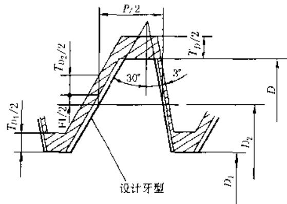

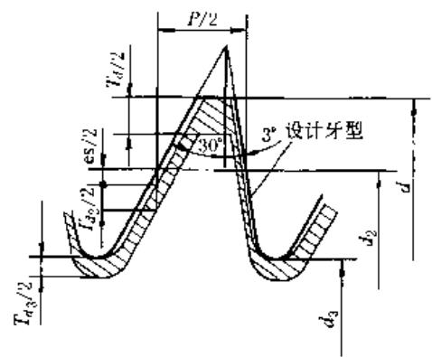

$\pmb { D }$ —-内螺纹大径; $\mathbf { \mathcal { T } _ { D } }$ 内螺纹大径公差;  
$D _ { 2 }$ -内螺纹中径; $\pmb { T _ { D _ { 2 } } }$ 内螺纹中径公差;  
$D _ { 1 }$ 内螺纹小径; $T _ { \boldsymbol { \vartheta } _ { \mathfrak { r } } }$ 内螺纹小径公差;  
$\pmb { P }$ —螺距; EI 中径基本偏差。d——外螺纹大径;  
$\tilde { d } _ { 2 }$ - -外螺纹中径;  
$\vec { a } _ { 3 }$ -外螺纹小径;  
$\pmb { p }$ 螺距;

$\pmb { T _ { \phi } }$ 外螺纹大径公差:$T _ { d _ { 2 } }$ 外螺纹中径公差;$T _ { d _ { 3 } }$ 外螺纹小径公差;e 中径基本偏差。

$/ \mu \mathbf { m }$ /um /um /um 

表4-1-14

内、外螺纹中径的基本偏差

<table><tr><td>螺距 P /mm</td><td>外螺纹 山 </td><td>内螺纹 D A EI</td><td>螺距 P /mm</td><td>外螺纹 d ：</td><td>内螺纹 D A</td><td>螺距 P /mm</td><td>外螺纹 & C</td><td>内螺纹 D2 A</td></tr><tr><td>2</td><td>es - 150</td><td>+ 560</td><td>9</td><td>es - 280</td><td>EJ + 800</td><td>22</td><td>P ~ 450</td><td>EI + 1220</td></tr><tr><td>3</td><td>-170</td><td>+ 600</td><td>10</td><td>- 300</td><td>+ 850</td><td>24</td><td>- 475</td><td>+ 1280</td></tr><tr><td>4</td><td>- 190</td><td>+ 630</td><td>12</td><td>- 335</td><td>+ 900</td><td>28</td><td>- 500</td><td>+ 1450</td></tr><tr><td>S</td><td>- 212</td><td>+ 670</td><td>14</td><td>- 355</td><td>+ 950</td><td>32</td><td>- 530</td><td>+ 1550</td></tr><tr><td>6</td><td>- 236</td><td>+ 710</td><td>16</td><td>- 375</td><td>+ 1030</td><td>36</td><td>- 560</td><td>+ 1650</td></tr><tr><td>7</td><td>- 250</td><td>+ 750</td><td>18</td><td>- 400</td><td>+ 1090</td><td>40</td><td>-600</td><td>+ 1850</td></tr><tr><td>8</td><td>- 265</td><td>+ 750</td><td>20</td><td>- 425</td><td>+ 1150</td><td>44</td><td>- 630</td><td>+ 1950</td></tr></table>

注:1.公差带位置由基本偏差确定,本标准规定外螺纹的上偏差es及下偏差EI为基本偏差。2.内螺纹大径 $\pmb { D }$ 和小径 $\pmb { D } _ { 1 }$ 的公差带位置为H,基本偏差为零;外螺纹大径 $\pmb { d }$ 和小径 ${ \hat { d } } _ { 3 }$ 的公差带位置为 $\mathbf { h }$ ,其基本偏差为零。3.内螺纹中径 $D _ { 2 }$ 的公差带位置为A,其基本偏差为正值;外螺纹中径 $\bar { d } _ { 2 }$ 的公差带位置为 $\pmb { c }$ ,其基本偏差为负值。

表4-1-15

内螺纹小径公差 $T _ { p _ { \mathrm { i } } }$ (公差等级4级)

<table><tr><td rowspan=1 colspan=1>螺P/mm</td><td rowspan=1 colspan=1>2</td><td rowspan=1 colspan=1>3</td><td rowspan=1 colspan=1>4</td><td rowspan=1 colspan=1>5</td><td rowspan=1 colspan=1>6</td><td rowspan=1 colspan=1>7</td><td rowspan=1 colspan=1>8</td><td rowspan=1 colspan=1>9</td><td rowspan=1 colspan=1>10</td><td rowspan=1 colspan=1>12</td><td rowspan=1 colspan=1>14</td><td rowspan=1 colspan=1>16</td><td rowspan=1 colspan=1>18</td><td rowspan=1 colspan=1>20</td><td rowspan=1 colspan=1>22</td><td rowspan=1 colspan=1>24</td><td rowspan=1 colspan=1>28</td><td rowspan=1 colspan=1>32</td><td rowspan=1 colspan=1>36</td><td rowspan=1 colspan=1>40</td><td rowspan=1 colspan=1>44</td></tr><tr><td rowspan=1 colspan=1>T</td><td rowspan=1 colspan=1>236</td><td rowspan=1 colspan=1>315</td><td rowspan=1 colspan=1>375</td><td rowspan=1 colspan=1>450</td><td rowspan=1 colspan=1>500</td><td rowspan=1 colspan=1>560</td><td rowspan=1 colspan=1>630</td><td rowspan=1 colspan=1>670</td><td rowspan=1 colspan=1>710</td><td rowspan=1 colspan=1>800</td><td rowspan=1 colspan=1>900</td><td rowspan=1 colspan=1>1000</td><td rowspan=1 colspan=1>1120</td><td rowspan=1 colspan=1>1180</td><td rowspan=1 colspan=1>1250</td><td rowspan=1 colspan=1>1320</td><td rowspan=1 colspan=1>1500</td><td rowspan=1 colspan=1>1600</td><td rowspan=1 colspan=1>1800</td><td rowspan=1 colspan=1>1900</td><td rowspan=1 colspan=1>2000</td></tr></table>

表4-1-16

<table><tr><td colspan="2" rowspan="2">公称直径d /mm</td><td rowspan="2">螺距 P</td><td colspan="3" rowspan="2">心</td><td rowspan="2">公称直径d</td><td rowspan="2">/mm</td><td rowspan="2">螺距</td><td colspan="3">宝02</td><td rowspan="2">公称直径d</td><td colspan="2" rowspan="2">：螺距</td><td rowspan="2"></td><td colspan="3">02</td></tr><tr><td colspan="3">P 公差等级</td><td>/mm P</td></tr><tr><td rowspan="2">></td><td rowspan="2">热</td><td rowspan="2">/mm</td><td rowspan="2">7</td><td rowspan="2">8</td><td rowspan="2">9</td><td rowspan="2">></td><td rowspan="2">A</td><td rowspan="2">/mm 7</td><td colspan="2">8</td><td rowspan="2">></td><td rowspan="2"></td><td rowspan="2">/mm</td><td colspan="3">公差等级</td></tr><tr><td>9 850</td><td>场</td><td>7</td><td>8</td><td></td></tr><tr><td rowspan="2">5.6</td><td rowspan="2">11.2</td><td rowspan="2">2 3</td><td>250</td><td>315</td><td>400</td><td rowspan="6"></td><td rowspan="6">45</td><td></td><td>8</td><td>530</td><td>670</td><td rowspan="2">90</td><td rowspan="2">！</td><td>180</td><td>24</td><td>900 1120</td><td></td><td>1400</td></tr><tr><td>280</td><td>355</td><td>450</td><td></td><td>9</td><td>560</td><td>710</td><td>900</td><td>28</td><td>950</td><td>1180</td><td>1500</td></tr><tr><td rowspan="6">11.2</td><td rowspan="5">22.4</td><td>2</td><td>265</td><td>335</td><td>425</td><td></td><td>10</td><td>560</td><td>710</td><td>900</td><td rowspan="6">180</td><td></td><td>8</td><td>600</td><td>750</td><td>950</td></tr><tr><td>3</td><td>300</td><td>375</td><td>475</td><td>90</td><td>12</td><td>630</td><td>800</td><td>1000</td><td></td><td>12</td><td>710</td><td>900</td><td>1120</td></tr><tr><td>4</td><td>355</td><td>450</td><td>1 560</td><td></td><td>14</td><td>670</td><td>850</td><td>1060</td><td></td><td>18</td><td>850</td><td>1060</td><td>1320</td></tr><tr><td>5</td><td>375</td><td>475</td><td>600</td><td></td><td>16</td><td></td><td>710</td><td>900 1120</td><td></td><td>20</td><td>900</td><td>1120 1</td><td>1400</td></tr><tr><td>8 i</td><td>475</td><td>600</td><td>750</td><td></td><td>18 4</td><td>750 425</td><td></td><td>950 1180</td><td>355</td><td>22 24</td><td>900 ：</td><td>1120</td><td>1400 1500</td></tr><tr><td rowspan="6">22.4 45</td><td rowspan="6">45</td><td>3 5</td><td>335 400</td><td>425 500</td><td>530 630</td><td></td><td rowspan="6"></td><td rowspan="6"></td><td>6 8</td><td>500</td><td>530 630</td><td>670 800</td><td></td><td>32</td><td>950 1060</td><td>1180 1320</td><td>1700 二</td></tr><tr><td>6</td><td>450</td><td>560</td><td>710</td><td rowspan="6"></td><td></td><td>560</td><td>710</td><td>900</td><td></td><td>36</td><td>1120</td><td>1400</td><td>1800</td></tr><tr><td>7</td><td>475</td><td>600</td><td>750</td><td></td><td>12</td><td></td><td></td><td></td><td>40</td><td>1120</td><td>1400</td><td>1800</td></tr><tr><td>8</td><td>500</td><td>630</td><td></td><td>90 180</td><td>14</td><td>670 710</td><td>850 900</td><td>1060 1120</td><td>44</td><td>1250</td><td>1500</td><td>1900</td></tr><tr><td>10</td><td>530</td><td>670</td><td>800 850</td><td>16</td><td>750</td><td>950</td><td>1180</td><td></td><td>12</td><td>760</td><td>950</td><td>1200</td></tr><tr><td>12</td><td>560</td><td>710</td><td>900</td><td>18</td><td>800</td><td></td><td>1000 1250</td><td>355 640</td><td>18</td><td>900</td><td>1120</td><td>1400)</td></tr><tr><td rowspan="3"></td><td rowspan="3">90</td><td rowspan="3"></td><td>3 4</td><td>355</td><td>450</td><td>560 630</td><td></td><td></td><td>20</td><td>800</td><td>1000 1250</td><td rowspan="3"></td><td rowspan="3"></td><td rowspan="3"></td><td>24 44</td><td>950 1290</td><td>1180</td><td>1480</td></tr><tr><td></td><td>400</td><td></td><td>500</td><td></td><td>22</td><td>850</td><td>1060</td><td>1320</td><td></td><td>：</td><td>1610</td><td>2000</td></tr><tr><td></td><td></td><td></td><td></td><td></td><td></td><td></td><td></td><td></td><td></td><td></td><td></td><td></td></tr></table>

表4-1-17

<table><tr><td colspan="2" rowspan="2">公称直径d /mm p</td><td rowspan="2">螺距</td><td colspan="3" rowspan="2">心 公差等级</td><td rowspan="2">公称直径d ·</td><td rowspan="2">/mm</td><td rowspan="2">螺距 ！ P</td><td colspan="3"></td><td rowspan="2">公称直径d</td><td colspan="2" rowspan="2">螺距</td><td rowspan="2"></td><td colspan="3">3</td></tr><tr><td colspan="3">公差等级</td><td colspan="3">/mm p</td><td colspan="3">公差等级</td></tr><tr><td rowspan="2">></td><td rowspan="2">执</td><td rowspan="2">/mm</td><td rowspan="2">7</td><td rowspan="2">8</td><td rowspan="2">9</td><td rowspan="2">></td><td rowspan="2"></td><td rowspan="2">/mm A</td><td>7</td><td></td><td>8</td><td>9</td><td>></td><td>A</td><td>/mm</td><td>8</td><td></td><td>9</td></tr><tr><td>8</td><td>500</td><td></td><td></td><td></td><td>24</td><td>670</td><td>7</td><td>850</td><td>1060</td></tr><tr><td rowspan="2">5.6</td><td rowspan="2">11.2</td><td rowspan="2">2 3</td><td>190 212</td><td></td><td>236 300</td><td rowspan="6">335</td><td rowspan="6">45</td><td></td><td>9 ：</td><td>400 425</td><td>530</td><td>630 670</td><td>90</td><td>180</td><td>28</td><td>710</td><td>900</td><td>1120</td></tr><tr><td>2</td><td>200</td><td>265 250</td><td>315</td><td rowspan="6">90</td><td>10</td><td>425</td><td>530</td><td>670</td><td rowspan="10">180</td><td rowspan="10"></td><td rowspan="10"></td><td rowspan="10">20 22</td><td rowspan="10"></td><td rowspan="10">一 450</td><td>670</td><td>560 710 850</td></tr><tr><td rowspan="4">22.4</td><td>3</td><td>224</td><td>280</td><td>355</td><td>1 ： 12</td><td>475</td><td>600 750</td><td>8 12</td><td>530</td></tr><tr><td></td><td></td><td></td><td></td><td></td><td></td><td></td><td></td><td></td><td></td></tr><tr><td>4</td><td>265</td><td>335 355</td><td>425 450</td><td>14</td><td>500</td><td>630 670</td><td>18</td><td>630 670</td><td>800 1000 850 1060</td></tr><tr><td>5 8</td><td>280 355</td><td>450</td><td>560</td><td>16 18</td><td>530 560</td><td>850 710 900</td><td></td><td>670</td><td>850 1060</td></tr><tr><td rowspan="6">22.4</td><td rowspan="6">45</td><td>3</td><td>250</td><td>315</td><td>400</td><td></td><td>180</td><td>4 6</td><td>315</td><td>400</td><td>500</td><td>355</td><td>24</td><td>710</td><td>900</td><td>1120</td></tr><tr><td>5</td><td>300</td><td>375</td><td>475</td><td rowspan="11"></td><td></td><td rowspan="11"></td><td>8</td><td>375</td><td>475</td><td>600</td><td></td><td>32</td><td>800</td><td>1000</td><td>1250</td></tr><tr><td>6</td><td>335</td><td>425</td><td>530</td><td></td><td></td><td>425</td><td>530</td><td>670</td><td>36</td><td>850</td><td>1060</td><td>1320</td></tr><tr><td>7</td><td>355</td><td>450</td><td>560</td><td></td><td></td><td>500</td><td></td><td></td><td></td><td>40</td><td>850</td><td>1060</td><td>1320</td></tr><tr><td>8</td><td>375</td><td>475</td><td>600</td><td>90</td><td>12 14</td><td>530</td><td>630</td><td>800 670 850</td><td></td><td>44</td><td>900</td><td>1120</td><td>1400</td></tr><tr><td>10</td><td>400</td><td>500</td><td>630</td><td></td><td>16</td><td>560</td><td>710</td><td>900</td><td></td><td>12</td><td>560</td><td>710</td><td>900</td></tr><tr><td rowspan="3">45</td><td rowspan="3">90</td><td rowspan="3"></td><td>12</td><td>425</td><td>530</td><td>670</td><td></td><td></td><td>18</td><td>600</td><td>750 950</td><td rowspan="3">355</td><td rowspan="3">640</td><td>24</td><td>18</td><td>670</td><td>850</td><td>1060 1120</td></tr><tr><td>3</td><td>265</td><td>335</td><td>425</td><td></td><td>20</td><td>600</td><td>750</td><td>950</td><td></td><td>44</td><td>710</td><td>900</td><td></td></tr><tr><td>4</td><td>300</td><td>375</td><td>475</td><td></td><td>22</td><td>630</td><td>800</td><td>1000</td><td></td><td></td><td>950</td><td>1220</td><td>1520</td></tr></table>

<table><tr><td colspan="2" rowspan="2">公称直径d /mm</td><td rowspan="2">螺路 P</td><td colspan="3">3</td><td rowspan="2" colspan="2">公称直径d</td><td rowspan="2">螺距</td><td colspan="3"></td><td rowspan="2" colspan="2">公称直径d /mm</td><td rowspan="2">螺距 P</td><td colspan="3">了</td></tr><tr><td colspan="3">/mm P</td><td colspan="3">公差等级</td><td colspan="3">公差等级</td></tr><tr><td>V</td><td>A</td><td>/mm</td><td>7</td><td>公差等级 8</td><td>9</td><td>></td><td>心</td><td>/mm ：</td><td>7</td><td>8</td><td>9</td><td>></td><td>s</td><td>/mm</td><td>7 8</td><td>9</td></tr><tr><td rowspan="2">5.6</td><td rowspan="2">11.2</td><td rowspan="2">2</td><td>388</td><td>445</td><td>525</td><td rowspan="6">45</td><td rowspan="6"></td><td>8 9</td><td>765</td><td>890</td><td rowspan="2">1052</td><td>90</td><td>180</td><td>24</td><td>1313 1538</td><td>1800</td></tr><tr><td>435</td><td>501</td><td>589</td><td></td><td>811</td><td>943</td><td>1118</td><td></td><td>28</td><td>1388</td><td>1625 1900</td></tr><tr><td rowspan="4">11.2 22.4</td><td>3 2</td><td>400</td><td>462</td><td>544</td><td>90</td><td>10</td><td>831</td><td>963 1138</td><td rowspan="4"></td><td></td><td>8</td><td>828 965</td><td>1153</td></tr><tr><td>3</td><td>450</td><td>520</td><td>614</td><td>12</td><td>929</td><td>1085</td><td>1273</td><td>12</td><td>998</td><td>1173</td><td>1398</td></tr><tr><td>4</td><td>521</td><td>609</td><td>690</td><td>14</td><td>970</td><td>1142</td><td>1355</td><td></td><td>18</td><td>1187 1400</td><td>1650</td></tr><tr><td>5</td><td>562</td><td>656 775</td><td></td><td>16</td><td>1038</td><td>1213 1438</td><td></td><td>20</td><td>1263</td><td>1488</td><td>1750</td></tr><tr><td rowspan="6"></td><td rowspan="4">45</td><td>8 3</td><td>709</td><td>828</td><td>965 670</td><td></td><td>4</td><td>18 1100 584</td><td>1288</td><td>1525</td><td>180 355</td><td>22 24</td><td>1288 1363</td><td>1513 1600</td><td>1775 1875</td></tr><tr><td>5</td><td>482 587</td><td>564</td><td>806</td><td rowspan="10"></td><td rowspan="10"></td><td>6</td><td>705</td><td>690 830</td><td>815 986</td><td></td><td>32</td><td>1530</td><td></td><td>2092</td></tr><tr><td>6</td><td>655</td><td>681</td><td>899</td><td>180</td><td>8</td><td></td><td></td><td>36</td><td></td><td>1780 1885</td><td></td></tr><tr><td>7</td><td></td><td>767</td><td>950</td><td></td><td></td><td>796 928</td><td>1103</td><td></td><td>1623</td><td></td><td>2210</td></tr><tr><td>8</td><td>694</td><td>813</td><td>90</td><td>12 14</td><td>960</td><td>1122</td><td>1335</td><td>40 44</td><td>1663</td><td>1925</td><td>2250</td></tr><tr><td>10</td><td>734 800</td><td>859 925</td><td>1015 1087</td><td>16</td><td>1075</td><td>1018</td><td>1193 1418 1263 1500</td><td></td><td>12</td><td>1755 1035</td><td>2030 1223</td><td>2380 1460</td></tr><tr><td rowspan="3">45</td><td rowspan="3">90</td><td>12</td><td>866</td><td>998</td><td>1223</td><td></td><td></td><td>18</td><td>1150</td><td>1338 1588</td><td rowspan="3">355</td><td rowspan="3">640</td><td>18</td><td>1238</td><td>1462</td><td>1725</td></tr><tr><td>3</td><td>501</td><td></td><td>589 701</td><td></td><td>20</td><td>1175</td><td>1363</td><td>1613</td><td>24 44</td><td>1363 1818</td><td>1600 1875</td></tr><tr><td>4</td><td>565</td><td>659</td><td>784</td><td>22</td><td>1232</td><td>1450</td><td>1700</td><td></td><td></td><td>2155</td><td>2530</td></tr></table>

表4-1-19

大径公差

<table><tr><td colspan="4">中径定心用外螺纹大径公差T</td><td colspan="4">大径定心用大径公差</td></tr><tr><td>螺 地 p</td><td>公差等级 4</td><td>螺距 p</td><td>公差等级 4</td><td colspan="2">公称直径d/mm</td><td rowspan="2">内螺纹大径 公差T</td><td rowspan="2">外螺纹大径 公差T</td></tr><tr><td>/mm</td><td></td><td>/mm</td><td></td><td>></td><td>场</td></tr><tr><td>2 3</td><td>180</td><td>18</td><td>800</td><td>6</td><td>10</td><td>58</td><td>36</td></tr><tr><td>4</td><td>236</td><td>20</td><td>850</td><td>10</td><td>18</td><td>70</td><td>43</td></tr><tr><td>5</td><td>300 335</td><td>22</td><td>900</td><td>18 30</td><td>30 50</td><td>&4</td><td>52</td></tr><tr><td></td><td></td><td></td><td></td><td></td><td></td><td>100</td><td>62</td></tr><tr><td>6</td><td>375</td><td>24</td><td>950</td><td>50</td><td>80</td><td>120</td><td>74</td></tr><tr><td>7</td><td>425 450</td><td>28</td><td>1060</td><td>80</td><td>120</td><td>140</td><td>87</td></tr><tr><td>8</td><td>500</td><td>32</td><td>1120</td><td>120</td><td>180</td><td>160</td><td>100</td></tr><tr><td>9</td><td>·</td><td></td><td></td><td>180</td><td>250</td><td>185</td><td>115</td></tr><tr><td>10</td><td>530 600</td><td>36</td><td>1250</td><td>250</td><td>315</td><td>210 230</td><td>130</td></tr><tr><td>12</td><td>670</td><td>40</td><td>1320</td><td>315</td><td>400</td><td></td><td>140</td></tr><tr><td>14</td><td></td><td>44</td><td>1400</td><td>400</td><td>500</td><td>250</td><td>155</td></tr><tr><td>16</td><td>710</td><td></td><td></td><td>500 630</td><td>630 800</td><td>280 320</td><td>175 200</td></tr></table>

注:关于定心方式,中径定心时内螺纹大径公差带的位置为 $\mathbf { H }$ ,没有规定其公差值,其尺寸由刀具来控制。制造较为简单。使用大径定心时所需要的大径公差值相当于 $\mathrm { H } 1 0 / \hbar 9$ 、内螺纹大径的加工和测量均较困难。需要配制大径塞规。但大径定心具有定位准确、受力均匀、传动平稳、紧固后不易松动等优点,设计者可根据性能要求来选取所需的定心方式。

# 内、外螺纹直径公差等级

<table><tr><td rowspan=2 colspan=1>直径</td><td rowspan=1 colspan=2>内螺纹</td><td rowspan=1 colspan=3>外螺纹</td></tr><tr><td rowspan=1 colspan=1>中径D</td><td rowspan=1 colspan=1>小径D</td><td rowspan=1 colspan=1>大径d1</td><td rowspan=1 colspan=1>中径d</td><td rowspan=1 colspan=1>小径d</td></tr><tr><td rowspan=1 colspan=1>公差等级</td><td rowspan=1 colspan=1>7、8、9</td><td rowspan=1 colspan=1>4</td><td rowspan=1 colspan=1>4</td><td rowspan=1 colspan=1>7、8、9</td><td rowspan=1 colspan=1>7、8.9</td></tr></table>

注:外螺纹小径 $\dot { \mathbf { d } } _ { 3 }$ 所选取的公差等级必须与其中径 $\mathbf { d _ { 2 } }$ 的公差等级相同。

表4-1-21

锯齿形螺纹公差带的选用及标注

<table><tr><td rowspan=2 colspan=2>精度</td><td rowspan=1 colspan=2>内螺纹</td><td rowspan=1 colspan=2>外螺纹</td><td rowspan=2 colspan=1>应用</td></tr><tr><td rowspan=1 colspan=1>N</td><td rowspan=1 colspan=1>L</td><td rowspan=1 colspan=1>Y</td><td rowspan=1 colspan=1>L</td></tr><tr><td rowspan=1 colspan=2>中等</td><td rowspan=1 colspan=1>7A</td><td rowspan=1 colspan=1>8A</td><td rowspan=1 colspan=1>Tc</td><td rowspan=1 colspan=1>8c</td><td rowspan=1 colspan=1>一般用途</td></tr><tr><td rowspan=1 colspan=2>粗糙</td><td rowspan=1 colspan=1>8A</td><td rowspan=1 colspan=1>9A</td><td rowspan=1 colspan=1>&c</td><td rowspan=1 colspan=1>9c</td><td rowspan=1 colspan=1>对精度要求不高时采用</td></tr><tr><td rowspan=2 colspan=1>标记示例</td><td rowspan=1 colspan=1>零件</td><td rowspan=1 colspan=2>B40× 7-7A一中径公差带-螺距公称直径螺纹种类代号</td><td rowspan=2 colspan=3>B40 × 7-7cB40× 7-7A一中径公差带           B40 × 7LH-7c左旋(右旋不注）-螺距                  B40×14（P7)-8c-L（旋合长度为L组的多线螺纹）公称直径                                螺距导程螺纹种类代号B40×7-7c-140（旋合长度为特殊需要时的螺纹）B40× 7-7A/7c</td></tr><tr><td rowspan=1 colspan=1>螺纹副</td><td></td><td></td></tr></table>

注:当买用大径定心时,其螺纹的标记还需在公差带代号之后加注大径的代号“ $\mathbf { \nabla } \mathcal { D } ^ { \mathbf { \nu } }$ (对内螺纹)或“d”(对外螺纹)并用括号将其括上。示例如下:

(1)采用大径定心的长组内螺纹: $1 8 4 0 \times 7 - 7 \mathrm { A } ( \square ) - L$ ;  
(2)采用大径定心的双线左旋外螺纹; $\mathbf { B 4 0 } \times 1 4 \left( \mathbf { \nabla } P \mathbf { 7 } \right) \mathbf { f . H . B c } ( \mathbf { \nabla } d )$ 

表4-1-22

多线锯齿形螺纹中径公差系数

<table><tr><td rowspan=1 colspan=1>线数</td><td rowspan=1 colspan=1>2</td><td rowspan=1 colspan=1>3</td><td rowspan=1 colspan=1>4</td><td rowspan=1 colspan=1>>5</td></tr><tr><td rowspan=1 colspan=1>系数</td><td rowspan=1 colspan=1>1.12</td><td rowspan=1 colspan=1>1.25</td><td rowspan=1 colspan=1>1.4</td><td rowspan=1 colspan=1>1.6</td></tr></table>

注:1.多线锯齿形螺纹的顶径和底径的公差与单线锯齿形螺纹相同。2.多线锯齿形螺纹的中径公差是在单线锯齿形螺纹的基础上按线数不同分別乘以本表系数而得其系数值如上表。

螺纹旋合长度

<table><tr><td colspan="2" rowspan="2">公称直径d</td><td rowspan="2">螺距 P</td><td colspan="3">旋合长度组</td><td rowspan="2">公称直径d</td><td rowspan="2"></td><td rowspan="3">螺距 P</td><td colspan="3">旋合长度组</td><td rowspan="2">公称直径d</td><td rowspan="2">螺距</td><td colspan="3">N</td><td colspan="3">旋合长度组</td></tr><tr><td colspan="2">N</td><td colspan="2">L</td><td colspan="3">N</td><td colspan="3"></td></tr><tr><td>> A</td><td></td><td>></td><td>的</td><td>></td><td>></td><td>从</td><td></td><td>></td><td>州</td><td>A ></td><td>></td><td>三</td><td>P</td><td>></td><td>M</td><td>[ ></td></tr><tr><td rowspan="2">5.6</td><td>11.2</td><td>2</td><td>6</td><td></td><td>19 19</td><td rowspan="9"></td><td rowspan="9"></td><td rowspan="9"></td><td>8</td><td>38</td><td>118 118</td><td rowspan="2"></td><td rowspan="2">90</td><td rowspan="2">180</td><td>24</td><td>132</td><td>400</td><td>400 450</td></tr><tr><td>3</td><td>10</td><td>28</td><td>28</td><td>9</td><td>43</td><td>132</td><td>132</td><td>28</td><td>150</td><td>450</td></tr><tr><td rowspan="6">11.2 22.4</td><td>2 3</td><td>8</td><td>24</td><td>24</td><td>45</td><td>10</td><td>50</td><td>140</td><td>140 170</td><td rowspan="6"></td><td></td><td>8</td><td>50</td><td>150 224</td><td>150</td></tr><tr><td></td><td>11</td><td>32</td><td>32</td><td>90</td><td>12</td><td>60</td><td>170</td><td></td><td></td><td>12</td><td>75</td><td></td><td>224</td></tr><tr><td>4</td><td>15</td><td>43</td><td>43</td><td></td><td>14</td><td>67</td><td>200</td><td>200</td><td></td><td>18</td><td>112</td><td>335</td><td>335</td></tr><tr><td>5</td><td>18</td><td>53</td><td>53</td><td></td><td>16</td><td>75</td><td>236</td><td>236</td><td></td><td>20</td><td>125</td><td>375</td><td></td><td>375</td></tr><tr><td>8</td><td>30</td><td>85</td><td>85</td><td></td><td></td><td>18</td><td>85</td><td>265</td><td>265 180</td><td>355</td><td>22</td><td>140</td><td>425</td><td>425</td></tr><tr><td>3</td><td>12</td><td>36</td><td>36</td><td></td><td>4 6</td><td></td><td>24</td><td>71 71</td><td></td><td></td><td>24</td><td>150</td><td>450</td><td>450</td></tr><tr><td rowspan="6">22.4</td><td rowspan="5">45</td><td>5</td><td>21</td><td></td><td>63 6</td><td rowspan="9"></td><td></td><td rowspan="9"></td><td rowspan="9"></td><td></td><td>36</td><td>106</td><td>106</td><td rowspan="4"></td><td>32</td><td></td><td>200</td><td>600</td><td>600</td></tr><tr><td>6</td><td>25</td><td>75</td><td>75</td><td>180</td><td>8</td><td>45</td><td>132</td><td>132</td><td>36</td><td></td><td>224</td><td>670 670</td></tr><tr><td>7</td><td>30</td><td>85</td><td>85</td><td></td><td>12</td><td>67</td><td>200</td><td>200</td><td></td><td>40</td><td>250</td><td>750</td><td>750</td></tr><tr><td>8</td><td>34</td><td>100</td><td>100</td><td>90</td><td>14</td><td>75</td><td>236</td><td>236</td><td></td><td>44</td><td>280</td><td></td><td>850 850</td></tr><tr><td>10</td><td>42</td><td>125</td><td>125</td><td></td><td>16</td><td>90</td><td>265</td><td>265</td><td></td><td>12 18</td><td>87</td><td>260</td><td>260</td></tr><tr><td>12</td><td></td><td>50</td><td>150</td><td>150</td><td></td><td>18</td><td>100</td><td>300</td><td>300</td><td rowspan="3">355</td><td rowspan="3">640</td><td>24</td><td>132</td><td>390</td><td>390</td></tr><tr><td rowspan="2">45</td><td rowspan="2">90</td><td>3</td><td>15</td><td></td><td>45</td><td>45</td><td>20</td><td>112</td><td>335</td><td>335</td><td></td><td>44</td><td>174</td><td>520</td><td>520</td></tr><tr><td>4</td><td>19</td><td>56</td><td>56</td><td></td><td>22</td><td>118</td><td>355</td><td>355</td><td></td><td></td><td></td><td>319 950</td><td>950</td></tr></table>

# 1.5.3水系统 $4 5 ^ { \circ }$ 锯齿形螺纹牙型与基本尺寸(JB/T2001.73--1999)

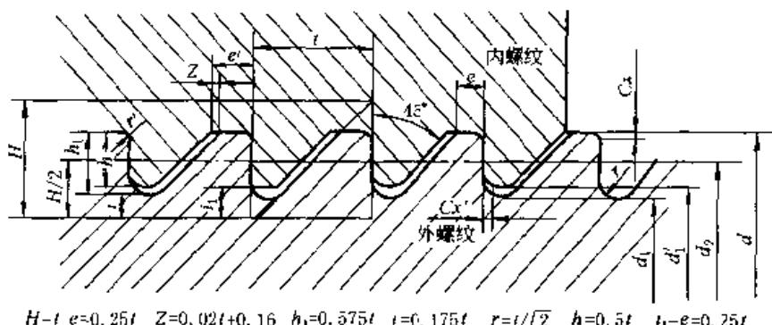

标记示例:

例1:螺纹外径 $\bf { 2 5 0 m m }$ ,螺距 $\textrm { \textbf { z m m } }$ 左旋单线锯齿形螺纹:

YS $\mathbf { 2 5 0 \times 8 L H }$ JB/T2001.73—1999 

例2:螺纹外径 ${ 3 0 0 } \mathrm { { m m } }$ ,螺距 $1 0 \ m m$ 右旋单线锯齿形螺纹:

例3:螺纹外径 $\pmb { 5 2 0 } \mathbf { m m }$ ,螺距 $2 0 \mathrm { \ m m }$ 右旋单线锯齿形螺纹:

YS $S 2 0 \times 2 0$ JB/T 2001.73-1999 

表 4-1-24

牙型尺寸

<table><tr><td rowspan="2">螺 题 P</td><td colspan="4">外螺纹</td><td rowspan="2">间 隙 2</td><td colspan="4">内螺纹</td></tr><tr><td>螺纹高度 h</td><td>齿顶宽度</td><td>圆角半径</td><td>倒角 C</td><td>螺纹高度 h</td><td>齿顶宽度 e</td><td>圆角半径 广</td><td>倒 角 C</td></tr><tr><td>6</td><td>3.45</td><td>e 1.50</td><td>， 0.74</td><td>0.5</td><td>0.28</td><td>3.0</td><td>1.78</td><td>0.4</td><td>0.5</td></tr><tr><td>8</td><td>4.60</td><td>2.0</td><td>0.99</td><td>0.5</td><td>0.32</td><td>4.0</td><td>2.32</td><td>0.4</td><td>0.5</td></tr><tr><td></td><td></td><td></td><td></td><td></td><td></td><td></td><td></td><td></td><td></td></tr><tr><td>10</td><td>5.75</td><td>2.50</td><td>1.24</td><td>1.0</td><td>0.36</td><td>5.0</td><td>2.86</td><td>0.8</td><td>1.0</td></tr><tr><td>12</td><td>6.90</td><td>3.0</td><td>1.49</td><td>1.0</td><td>0.40</td><td>6.0</td><td>3.40</td><td>0.8</td><td>1.0</td></tr><tr><td>16</td><td>9.20</td><td>4.0</td><td>1.98</td><td>1.0</td><td>0.48</td><td>8.0</td><td>4.48</td><td>0.8</td><td>1.0</td></tr><tr><td>20</td><td>11.50</td><td>5.0</td><td>2.48</td><td>1.5</td><td>0.56</td><td>10.0</td><td>5.56</td><td>1.2</td><td>1.5</td></tr><tr><td>24</td><td>13.80</td><td>6.0</td><td>2.97</td><td>1.5</td><td>0.64</td><td>12.0</td><td>6.64</td><td>1.2</td><td></td></tr><tr><td></td><td></td><td></td><td></td><td></td><td></td><td></td><td></td><td></td><td>1.5</td></tr><tr><td>32 40</td><td>18.40 23.00</td><td>8.0 10.0</td><td>3.96 4.95</td><td>1.5 1.5</td><td>0.80 0.96</td><td>16.0 20.0</td><td>8.80 10.96</td><td>1.2 1.2</td><td>1.8 2.0</td></tr></table>

/mm 

表4-1-25

<table><tr><td rowspan="2">螺距 P</td><td colspan="2">内、外螺纹</td><td>外螺纹</td><td>内螺纹</td><td rowspan="2">外螺纹截面积</td><td rowspan="2">螺距 P</td><td colspan="2">内、外螺纹</td><td>外螺纹</td><td>内螺纹</td><td rowspan="2">外螺纹截面积 F</td></tr><tr><td>大径 d</td><td>内径 d</td><td>内径 内径 d di</td><td>F cm²</td><td>大径 d</td><td>内径 d</td><td>内径 山</td><td>内径 州</td></tr><tr><td rowspan="5">6</td><td>150</td><td>147</td><td>143.1</td><td>144</td><td>160.8</td><td rowspan="2"></td><td></td><td>600 590</td><td>577.0</td><td>580</td><td>cm² 2614.8</td></tr><tr><td>160</td><td>157</td><td>153.1</td><td>154</td><td>184.1</td><td>20</td><td>610</td><td>597.0</td><td>600</td><td></td></tr><tr><td>170</td><td>167</td><td>163.1</td><td>164</td><td>208.9</td><td rowspan="5">24</td><td>620 650</td><td>638</td><td></td><td></td><td>2797.8</td></tr><tr><td>180</td><td>177</td><td>173.1</td><td>174</td><td>236.3</td><td></td><td></td><td>622.4</td><td>626</td><td>3040.9</td></tr><tr><td>190</td><td>187</td><td>183.1</td><td>184</td><td>263.3</td><td>680</td><td>668</td><td>652.4</td><td>656</td><td>3341.2</td></tr><tr><td>200</td><td>196</td><td>190.8</td><td>192</td><td>285.9</td><td>700</td><td>688</td><td>672.4</td><td>676</td><td>3549.2</td></tr><tr><td rowspan="4">8</td><td>210</td><td>206</td><td>200.8</td><td>202</td><td>316.5</td><td rowspan="3"></td><td>720</td><td>708</td><td>692.4</td><td>696</td><td>3763.3</td></tr><tr><td>220</td><td>216</td><td>210.8</td><td>212</td><td>348</td><td>750</td><td>738</td><td>722.4</td><td>726</td><td>4098.7</td></tr><tr><td>250</td><td>246</td><td>240.8</td><td>242</td><td>455.4</td><td>780</td><td>768</td><td>752.4</td><td>756</td><td>4443.9</td></tr><tr><td>280</td><td>275</td><td>268.5</td><td>270</td><td>566.2</td><td rowspan="11"></td><td>800</td><td>784</td><td></td><td>763.2</td><td>768</td><td>4572.6</td></tr><tr><td rowspan="3">10</td><td>300</td><td>295</td><td>288.5</td><td>290</td><td>653.7</td><td rowspan="7"></td><td>820</td><td>804</td><td>783.2</td><td>738</td><td>4815.2</td></tr><tr><td>320</td><td>315</td><td>308.5</td><td>310</td><td>747.1</td><td>850</td><td>834</td><td>813.2</td><td>818</td><td>5193.8</td></tr><tr><td>350</td><td>344</td><td>336.2</td><td>338</td><td>887.3</td><td>880</td><td>864</td><td>843.2</td><td>848</td><td>5580.6</td></tr><tr><td>12 380</td><td>374</td><td>366.2</td><td></td><td></td><td>32 1052.7</td><td>900</td><td>884</td><td>863.2</td><td>868</td><td>5852.1</td></tr><tr><td rowspan="5">16</td><td>400</td><td>392</td><td>381.6</td><td>368 384</td><td>1143.7</td><td>920</td><td>904</td><td>883.2</td><td>888</td><td>6123.0</td></tr><tr><td>420</td><td>412</td><td></td><td></td><td>1266. 1</td><td>950</td><td>9.34</td><td>923.2</td><td>918</td><td>6549.7</td></tr><tr><td>450</td><td></td><td>401.6</td><td>404</td><td></td><td>980</td><td>964</td><td>943.2</td><td>948</td><td>6981.8</td></tr><tr><td>480</td><td>442</td><td>431.6</td><td>434</td><td>1463.0</td><td>1000</td><td>984</td><td>963.2</td><td>968</td><td>7286.6</td></tr><tr><td></td><td>472</td><td>461.6</td><td>464 484</td><td>1672.6</td><td>1060</td><td>1040</td><td>1014.0</td><td>1020</td><td>8075.4</td></tr><tr><td rowspan="3">20</td><td>500 520</td><td>492</td><td>481.6</td><td></td><td>1821.6</td><td rowspan="3"></td><td>1120</td><td>1100</td><td>1074.0</td><td>1080</td><td>9059.4</td></tr><tr><td>550</td><td>510</td><td>497.0</td><td>500</td><td>1939.0</td><td>40</td><td>1180</td><td>1160</td><td>1134.0</td><td>1140</td><td>10099.9</td></tr><tr><td>580</td><td>540 570</td><td>527.0 557.0</td><td>530 560</td><td>2180.2 2436.7</td><td>1250</td><td></td><td>1230</td><td>1204.0</td><td>1210</td><td>11385.3</td></tr></table>

注:1、本标准规定了 $4 5 ^ { \circ }$ 锯齿螺纹牙型与基本尺寸,适用于玉力机立杜用 $4 5 ^ { \circ }$ 锯齿形螺纹。2.液压机用45锯齿形螺纹用“YS直径 $\times$ 螺距/线数螺旋方向”表示,单线螺纹不必注明线数,右旋螺纹不必注明螺旋方向。

# 1.6 $5 5 ^ { \circ }$ 非螺纹密封的管螺纹(GB/T 7307—2001)

# 牙 型

基本牙型

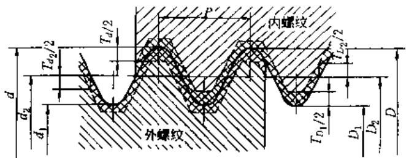

螺纹公差带

$\displaystyle { I ^ { \prime } = \frac { 2 5 . 4 } { \pi } ; }$ $\frac { H } { 6 } = 0 . 1 6 0 0 8 2 P ;$ $H \cong 0 . 9 6 0 4 9 1 P$ ; $D _ { 2 } \equiv d _ { 2 } = d - 0 . 6 4 0 3 2 7 P ;$ $h _ { t } = 0 . 6 4 0 3 2 7 P$ ; $D _ { 1 } = d _ { 1 } = d - 1 . 2 8 0 6 5 4 P$ $\pmb { r } = \mathbf { 0 } , 1 3 7 3 2 \mathbf { 9 } P$ ; 

标记示例:

代号为 $1 \%$ 的左旋圆柱内螺纹G1-LH(右旋不标);代号为1的A级圆柱外螺纹 G1A(A、B表示外螺纹公差等级代号,内螺纹则不标)代号为1的B级圆柱外螺纹GIB;

代号为内外螺纹装配 $( 1 ) ^ { 1 } / ( G ) ^ { 1 } / ( 2 A$ (仅需标注外螺纹的标记代号)

<table><tr><td rowspan=4 colspan=1>尺寸代号</td><td rowspan=4 colspan=1>每25.4mm内的牙数B</td><td rowspan=4 colspan=1>螺距P</td><td rowspan=4 colspan=1>牙高h</td><td rowspan=4 colspan=1>回弧半径，u</td><td rowspan=4 colspan=3>基本直径大径  中径  小径d=D   d=D  d=D、</td><td rowspan=1 colspan=5>外   螺  纹</td><td rowspan=1 colspan=4>内螺纹</td><td rowspan=6 colspan=1></td></tr><tr><td rowspan=3 colspan=1>中径d=D</td><td rowspan=3 colspan=1>小径d=D、</td><td rowspan=1 colspan=2>大径公差T</td><td rowspan=1 colspan=3>中径公差 Td2①</td><td rowspan=1 colspan=2>中径公差</td><td rowspan=1 colspan=2>小径公差Tp</td></tr><tr><td rowspan=2 colspan=1>下偏差</td><td rowspan=2 colspan=1>上偏差</td><td rowspan=1 colspan=2>下偏差</td><td rowspan=2 colspan=1>上偏差</td><td rowspan=2 colspan=1>下偏差</td><td rowspan=2 colspan=1>上偏差</td><td rowspan=2 colspan=1>下偏差</td><td rowspan=2 colspan=1>上偏差</td></tr><tr><td rowspan=1 colspan=1>A级</td><td rowspan=1 colspan=1>B级</td></tr><tr><td rowspan=2 colspan=1>1/161/8</td><td rowspan=2 colspan=1>2828</td><td rowspan=1 colspan=1>0.907</td><td rowspan=1 colspan=1>0.581</td><td rowspan=1 colspan=1>0.125</td><td rowspan=1 colspan=1>7.723</td><td rowspan=1 colspan=1>7.142</td><td rowspan=1 colspan=1>6.561</td><td rowspan=1 colspan=1>-0.214</td><td rowspan=1 colspan=1>0</td><td rowspan=1 colspan=1>-0.107</td><td rowspan=1 colspan=1>-0.214</td><td rowspan=1 colspan=1>0</td><td rowspan=1 colspan=1>0</td><td rowspan=1 colspan=1>+0.107</td><td rowspan=1 colspan=1>0</td><td rowspan=1 colspan=1>+ 0.282</td></tr><tr><td rowspan=1 colspan=1>0.907</td><td rowspan=1 colspan=1>0.581</td><td rowspan=1 colspan=1>0.125</td><td rowspan=1 colspan=1>9.728</td><td rowspan=1 colspan=1>9.147</td><td rowspan=1 colspan=1>8.566</td><td rowspan=1 colspan=1>-0.214</td><td rowspan=1 colspan=1>0</td><td rowspan=1 colspan=1>-0.107</td><td rowspan=1 colspan=1>-0.214</td><td rowspan=1 colspan=1>0</td><td rowspan=1 colspan=1>0</td><td rowspan=1 colspan=1>+0.107</td><td rowspan=1 colspan=1>0</td><td rowspan=1 colspan=1>+0.282</td></tr><tr><td rowspan=1 colspan=1>1/4</td><td rowspan=1 colspan=1>19</td><td rowspan=1 colspan=1>1.337</td><td rowspan=1 colspan=1>0.856</td><td rowspan=1 colspan=1>0.184</td><td rowspan=1 colspan=1>13.157</td><td rowspan=1 colspan=1>12.301</td><td rowspan=1 colspan=1>11.445</td><td rowspan=1 colspan=1>- 0.250</td><td rowspan=1 colspan=1>0</td><td rowspan=1 colspan=1>- 0.125</td><td rowspan=1 colspan=1>-0.250</td><td rowspan=1 colspan=1>0</td><td rowspan=1 colspan=1>0</td><td rowspan=1 colspan=1>+ 0.125</td><td rowspan=1 colspan=1>0</td><td rowspan=1 colspan=1>+ 0.445</td><td rowspan=1 colspan=1></td></tr><tr><td rowspan=1 colspan=1>3/8</td><td rowspan=1 colspan=1>19</td><td rowspan=1 colspan=1>1.337</td><td rowspan=1 colspan=1>0.856</td><td rowspan=1 colspan=1>0.184</td><td rowspan=1 colspan=1>16.662</td><td rowspan=1 colspan=1>15.806</td><td rowspan=1 colspan=1>14.950</td><td rowspan=1 colspan=1>- 0.250</td><td rowspan=1 colspan=1>0</td><td rowspan=1 colspan=1>- 0.125</td><td rowspan=1 colspan=1>- 0.250</td><td rowspan=1 colspan=1>0</td><td rowspan=1 colspan=1>0</td><td rowspan=1 colspan=1>+ 0.125</td><td rowspan=1 colspan=1>0</td><td rowspan=1 colspan=1>+ 0.445</td><td rowspan=1 colspan=1></td></tr><tr><td rowspan=1 colspan=1>1/2</td><td rowspan=1 colspan=1>14</td><td rowspan=1 colspan=1>1.814</td><td rowspan=1 colspan=1>1.162</td><td rowspan=1 colspan=1>0.249</td><td rowspan=1 colspan=1>20.955</td><td rowspan=1 colspan=1>19.793</td><td rowspan=1 colspan=1>18.631</td><td rowspan=1 colspan=1>-0.284</td><td rowspan=1 colspan=1>0</td><td rowspan=1 colspan=1>- 0.142</td><td rowspan=1 colspan=1>-0.284</td><td rowspan=1 colspan=1>0</td><td rowspan=1 colspan=1>0</td><td rowspan=1 colspan=1>+ 0.142</td><td rowspan=1 colspan=1>0</td><td rowspan=1 colspan=1>+0 541</td><td rowspan=1 colspan=1></td></tr><tr><td rowspan=1 colspan=1>5/8</td><td rowspan=1 colspan=1>14</td><td rowspan=1 colspan=1>1.814</td><td rowspan=1 colspan=1>1.162</td><td rowspan=1 colspan=1>0.249</td><td rowspan=1 colspan=1>22.911</td><td rowspan=1 colspan=1>21.749</td><td rowspan=1 colspan=1>20.587</td><td rowspan=1 colspan=1>-0.284</td><td rowspan=1 colspan=1>0</td><td rowspan=1 colspan=1>-0.142</td><td rowspan=1 colspan=1>-0.284</td><td rowspan=1 colspan=1>0</td><td rowspan=1 colspan=1>0</td><td rowspan=1 colspan=1>+ 0.142</td><td rowspan=1 colspan=1>0</td><td rowspan=1 colspan=1>+ 0.541</td><td rowspan=1 colspan=1></td></tr><tr><td rowspan=1 colspan=1>3/4</td><td rowspan=1 colspan=1>14</td><td rowspan=1 colspan=1>1.814</td><td rowspan=1 colspan=1>1.162</td><td rowspan=1 colspan=1>0.249</td><td rowspan=1 colspan=1>26.441</td><td rowspan=1 colspan=1>25.279</td><td rowspan=1 colspan=1>24.117</td><td rowspan=1 colspan=1>-0.284</td><td rowspan=1 colspan=1>1</td><td rowspan=1 colspan=1>- 0.142</td><td rowspan=1 colspan=1>-0.284</td><td rowspan=1 colspan=1>0</td><td rowspan=1 colspan=1>0</td><td rowspan=1 colspan=1>+ 0.142</td><td rowspan=1 colspan=1>0</td><td rowspan=1 colspan=1>+ 0.541</td><td rowspan=1 colspan=1></td></tr><tr><td rowspan=1 colspan=1>7/8</td><td rowspan=1 colspan=1>14</td><td rowspan=1 colspan=1>1.814</td><td rowspan=1 colspan=1>1.162</td><td rowspan=1 colspan=1>0.249</td><td rowspan=1 colspan=1>30.201</td><td rowspan=1 colspan=1>29.039</td><td rowspan=1 colspan=1>27.877</td><td rowspan=1 colspan=1>-0.284</td><td rowspan=1 colspan=1>v</td><td rowspan=1 colspan=1>-0.142</td><td rowspan=1 colspan=1>-0.284</td><td rowspan=1 colspan=1>0</td><td rowspan=1 colspan=1>0</td><td rowspan=1 colspan=1>+ 0.142</td><td rowspan=1 colspan=1>0</td><td rowspan=1 colspan=1>+ 0.541</td><td rowspan=1 colspan=1></td></tr><tr><td rowspan=1 colspan=1>1</td><td rowspan=1 colspan=1>11</td><td rowspan=1 colspan=1>2.309</td><td rowspan=1 colspan=1>1.479</td><td rowspan=1 colspan=1>0.317</td><td rowspan=1 colspan=1>33.249</td><td rowspan=1 colspan=1>31.770</td><td rowspan=1 colspan=1>30.291</td><td rowspan=1 colspan=1>-0.360</td><td rowspan=1 colspan=1>0</td><td rowspan=1 colspan=1>- 0.180</td><td rowspan=1 colspan=1>- 0.360</td><td rowspan=1 colspan=1>0</td><td rowspan=1 colspan=1>0</td><td rowspan=1 colspan=1>+0.180</td><td rowspan=1 colspan=1>0</td><td rowspan=1 colspan=1>+0.640</td><td rowspan=1 colspan=1></td></tr><tr><td rowspan=1 colspan=1>1</td><td rowspan=1 colspan=1>11</td><td rowspan=1 colspan=1>2.309</td><td rowspan=1 colspan=1>1.479</td><td rowspan=1 colspan=1>0.317</td><td rowspan=1 colspan=1>37.897</td><td rowspan=1 colspan=1>36.418</td><td rowspan=1 colspan=1>34.939</td><td rowspan=1 colspan=1>- 0.360</td><td rowspan=1 colspan=1>0</td><td rowspan=1 colspan=1>-0.180</td><td rowspan=1 colspan=1>-0.360</td><td rowspan=1 colspan=1>0</td><td rowspan=1 colspan=1>0</td><td rowspan=1 colspan=1>+ 0.180</td><td rowspan=1 colspan=1>0</td><td rowspan=1 colspan=1>+ 0.640</td><td rowspan=1 colspan=1></td></tr><tr><td rowspan=1 colspan=1>1</td><td rowspan=1 colspan=1>11</td><td rowspan=1 colspan=1>2.309</td><td rowspan=1 colspan=1>1.479</td><td rowspan=1 colspan=1>0.317</td><td rowspan=1 colspan=1>41.910</td><td rowspan=1 colspan=1>40.431</td><td rowspan=1 colspan=1>38.952</td><td rowspan=1 colspan=1>- 0.360</td><td rowspan=1 colspan=1>0</td><td rowspan=1 colspan=1>-0.180</td><td rowspan=1 colspan=1>-0.360</td><td rowspan=1 colspan=1>0</td><td rowspan=1 colspan=1>0</td><td rowspan=1 colspan=1>+0.180</td><td rowspan=1 colspan=1>0</td><td rowspan=1 colspan=1>+0.640</td><td rowspan=1 colspan=1></td></tr><tr><td rowspan=1 colspan=1></td><td rowspan=1 colspan=1>11</td><td rowspan=1 colspan=1>2.309</td><td rowspan=1 colspan=1>1.479</td><td rowspan=1 colspan=1>0.317</td><td rowspan=1 colspan=1>47.803</td><td rowspan=1 colspan=1>46.324</td><td rowspan=1 colspan=1>44.845</td><td rowspan=1 colspan=1>- 0.360</td><td rowspan=1 colspan=1>0</td><td rowspan=1 colspan=1>-0.180</td><td rowspan=1 colspan=1>- 0.360</td><td rowspan=1 colspan=1>0</td><td rowspan=1 colspan=1>0</td><td rowspan=1 colspan=1>+0.180</td><td rowspan=1 colspan=1>0</td><td rowspan=1 colspan=1>+0.640</td><td rowspan=1 colspan=1></td></tr><tr><td rowspan=1 colspan=1>13</td><td rowspan=1 colspan=1>11</td><td rowspan=1 colspan=1>2.309</td><td rowspan=1 colspan=1>1.479</td><td rowspan=1 colspan=1>0.317</td><td rowspan=1 colspan=1>53.746</td><td rowspan=1 colspan=1>52.267</td><td rowspan=1 colspan=1>50.788</td><td rowspan=1 colspan=1>-0.360</td><td rowspan=1 colspan=1>0</td><td rowspan=1 colspan=1>-0.180</td><td rowspan=1 colspan=1>-0.360</td><td rowspan=1 colspan=1>0</td><td rowspan=1 colspan=1>0</td><td rowspan=1 colspan=1>+ 0.180</td><td rowspan=1 colspan=1>0</td><td rowspan=1 colspan=1>+ 0.640</td><td rowspan=1 colspan=1></td></tr><tr><td rowspan=1 colspan=1>2</td><td rowspan=1 colspan=1>11</td><td rowspan=1 colspan=1>2.309</td><td rowspan=1 colspan=1>1.479</td><td rowspan=1 colspan=1>0.317</td><td rowspan=1 colspan=1>59.614</td><td rowspan=1 colspan=1>58.135</td><td rowspan=1 colspan=1>56.656</td><td rowspan=1 colspan=1>- 0.360</td><td rowspan=1 colspan=1>0</td><td rowspan=1 colspan=1>-0.180</td><td rowspan=1 colspan=1>-0.360</td><td rowspan=1 colspan=1>0</td><td rowspan=1 colspan=1>0</td><td rowspan=1 colspan=1>+0.180</td><td rowspan=1 colspan=1>0</td><td rowspan=1 colspan=1>+0.640</td><td rowspan=1 colspan=1></td></tr><tr><td rowspan=1 colspan=1>2</td><td rowspan=1 colspan=1>11</td><td rowspan=1 colspan=1>2.309</td><td rowspan=1 colspan=1>1.479</td><td rowspan=1 colspan=1>0.317</td><td rowspan=1 colspan=1>65.710</td><td rowspan=1 colspan=1>64.231</td><td rowspan=1 colspan=1>62.752</td><td rowspan=1 colspan=1>-0.434</td><td rowspan=1 colspan=1>0</td><td rowspan=1 colspan=1>- 0.217</td><td rowspan=1 colspan=1>- 0.434</td><td rowspan=1 colspan=1>0</td><td rowspan=1 colspan=1>0</td><td rowspan=1 colspan=1>+ 0.217</td><td rowspan=1 colspan=1>0</td><td rowspan=1 colspan=1>+0.640</td><td rowspan=1 colspan=1></td></tr><tr><td rowspan=1 colspan=1>2</td><td rowspan=1 colspan=1>1</td><td rowspan=1 colspan=1>2.309</td><td rowspan=1 colspan=1>1.479</td><td rowspan=1 colspan=1>0.317</td><td rowspan=1 colspan=1>75.184</td><td rowspan=1 colspan=1>73.705</td><td rowspan=1 colspan=1>72.226</td><td rowspan=1 colspan=1>-0.434</td><td rowspan=1 colspan=1>0</td><td rowspan=1 colspan=1>-0.217</td><td rowspan=1 colspan=1>- 0.434</td><td rowspan=1 colspan=1>0</td><td rowspan=1 colspan=1>0</td><td rowspan=1 colspan=1>+ 0.217</td><td rowspan=1 colspan=1>0</td><td rowspan=1 colspan=1>+ 0.640</td><td rowspan=1 colspan=1></td></tr><tr><td rowspan=1 colspan=1>2</td><td rowspan=1 colspan=1>1</td><td rowspan=1 colspan=1>2.309</td><td rowspan=1 colspan=1>1.479</td><td rowspan=1 colspan=1>0.317</td><td rowspan=1 colspan=1>81.534</td><td rowspan=1 colspan=1>80.055</td><td rowspan=1 colspan=1>78.576</td><td rowspan=1 colspan=1>- 0.434</td><td rowspan=1 colspan=1>0</td><td rowspan=1 colspan=1>-0.217</td><td rowspan=1 colspan=1>-0.434</td><td rowspan=1 colspan=1>0</td><td rowspan=1 colspan=1>0</td><td rowspan=1 colspan=1>+ 0.217</td><td rowspan=1 colspan=1>0</td><td rowspan=1 colspan=1>+ 0.640</td><td rowspan=1 colspan=1></td></tr><tr><td rowspan=1 colspan=1>3</td><td rowspan=1 colspan=1>11</td><td rowspan=1 colspan=1>2.309</td><td rowspan=1 colspan=1>1.479</td><td rowspan=1 colspan=1>0.317</td><td rowspan=1 colspan=1>87.884</td><td rowspan=1 colspan=1>86.405</td><td rowspan=1 colspan=1>84.926</td><td rowspan=1 colspan=1>- 0.434</td><td rowspan=1 colspan=1>0</td><td rowspan=1 colspan=1>-0.217</td><td rowspan=1 colspan=1>- 0.434</td><td rowspan=1 colspan=1>0</td><td rowspan=1 colspan=1>0</td><td rowspan=1 colspan=1>+ 0.217</td><td rowspan=1 colspan=1>0</td><td rowspan=1 colspan=1>+ 0.640</td><td rowspan=1 colspan=1></td></tr><tr><td rowspan=1 colspan=1>3%</td><td rowspan=1 colspan=1>11</td><td rowspan=1 colspan=1>2.309</td><td rowspan=1 colspan=1>1.479</td><td rowspan=1 colspan=1>0.317</td><td rowspan=1 colspan=1>100.330</td><td rowspan=1 colspan=1>98.851</td><td rowspan=1 colspan=1>97.372</td><td rowspan=1 colspan=1>-0.434</td><td rowspan=1 colspan=1>0</td><td rowspan=1 colspan=1>-0.217</td><td rowspan=1 colspan=1>-0.434</td><td rowspan=1 colspan=1>0</td><td rowspan=1 colspan=1>0</td><td rowspan=1 colspan=1>+ 0.217</td><td rowspan=1 colspan=1>0</td><td rowspan=1 colspan=1>+ 0.640</td><td rowspan=1 colspan=1></td></tr><tr><td rowspan=1 colspan=1>4</td><td rowspan=1 colspan=1>1</td><td rowspan=1 colspan=1>2.309</td><td rowspan=1 colspan=1>1.479</td><td rowspan=1 colspan=1>0.317</td><td rowspan=1 colspan=1>113.030</td><td rowspan=1 colspan=1>111.551</td><td rowspan=1 colspan=1>110.072</td><td rowspan=1 colspan=1>- 0.434</td><td rowspan=1 colspan=1>0</td><td rowspan=1 colspan=1>-0.217</td><td rowspan=1 colspan=1>- 0.434</td><td rowspan=1 colspan=1>0</td><td rowspan=1 colspan=1>0</td><td rowspan=1 colspan=1>+ 0.217</td><td rowspan=1 colspan=1>0</td><td rowspan=1 colspan=1>+ 0.640</td><td rowspan=1 colspan=1></td></tr><tr><td rowspan=1 colspan=1>4</td><td rowspan=1 colspan=1>I</td><td rowspan=1 colspan=1>2.309</td><td rowspan=1 colspan=1>1.479</td><td rowspan=1 colspan=1>0.317</td><td rowspan=1 colspan=1>125.730</td><td rowspan=1 colspan=1>124.251</td><td rowspan=1 colspan=1>122.772</td><td rowspan=1 colspan=1>- 0.434</td><td rowspan=1 colspan=1>0</td><td rowspan=1 colspan=1>-0.217</td><td rowspan=1 colspan=1>-0.434</td><td rowspan=1 colspan=1>0</td><td rowspan=1 colspan=1>0</td><td rowspan=1 colspan=1>+ 0.217</td><td rowspan=1 colspan=1>0</td><td rowspan=1 colspan=1>+ 0.640</td><td rowspan=1 colspan=1></td></tr><tr><td rowspan=1 colspan=1>5</td><td rowspan=1 colspan=1>1</td><td rowspan=1 colspan=1>2.309</td><td rowspan=1 colspan=1>1.479</td><td rowspan=1 colspan=1>0.317</td><td rowspan=1 colspan=1>138.430</td><td rowspan=1 colspan=1>136.951</td><td rowspan=1 colspan=1>135.472</td><td rowspan=1 colspan=1>-0.434</td><td rowspan=1 colspan=1>0</td><td rowspan=1 colspan=1>-0.217</td><td rowspan=1 colspan=1>- 0.434</td><td rowspan=1 colspan=1>0</td><td rowspan=1 colspan=1>0</td><td rowspan=1 colspan=1>+ 0.217</td><td rowspan=1 colspan=1>0</td><td rowspan=1 colspan=2>+ 0.640</td></tr><tr><td rowspan=1 colspan=1>51/</td><td rowspan=1 colspan=1>11</td><td rowspan=1 colspan=1>2.309</td><td rowspan=1 colspan=1>1.479</td><td rowspan=1 colspan=1>0.317</td><td rowspan=1 colspan=1>151. 130</td><td rowspan=1 colspan=1>149.651</td><td rowspan=1 colspan=1>148.172</td><td rowspan=1 colspan=1>-0.434</td><td rowspan=1 colspan=1>0</td><td rowspan=1 colspan=1>-0.217</td><td rowspan=1 colspan=1>-0.434</td><td rowspan=1 colspan=1>0</td><td rowspan=1 colspan=1>0</td><td rowspan=1 colspan=1>+ 0.217</td><td rowspan=1 colspan=1>0</td><td rowspan=1 colspan=2>+ 0.640</td></tr><tr><td rowspan=1 colspan=1>6</td><td rowspan=1 colspan=1>11</td><td rowspan=1 colspan=1>2.309</td><td rowspan=1 colspan=1>1.479</td><td rowspan=1 colspan=1>0.317</td><td rowspan=1 colspan=1>163.830</td><td rowspan=1 colspan=1>162.351</td><td rowspan=1 colspan=1>160.872</td><td rowspan=1 colspan=1>-0.434</td><td rowspan=1 colspan=1>0</td><td rowspan=1 colspan=1>-0.217</td><td rowspan=1 colspan=1>- 0.434</td><td rowspan=1 colspan=1>0</td><td rowspan=1 colspan=1>0</td><td rowspan=1 colspan=1>+ 0.217</td><td rowspan=1 colspan=1>0</td><td rowspan=1 colspan=2>+0.640</td></tr></table>

# 1.7 $5 5 ^ { \circ }$ 密封管螺纹(GB/T 7306.1\~7306.2—2000)

圆柱内螺纹与圆锥外螺纹(GB/T7306.1—2000)圆锥内螺纹与圆锥外螺纹(GB/T7306.2—2000)

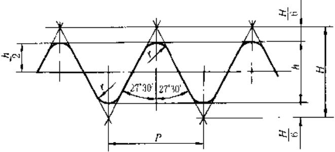

H=0.960491P h=0.640327P $r = 0 . 1 3 7 3 2 9 P$ 

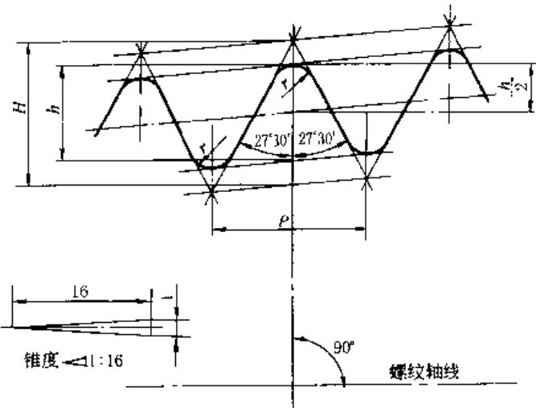

圆柱内螺纹的设计牙型

H=0.960237P h=0.640327P r=0.137278P 

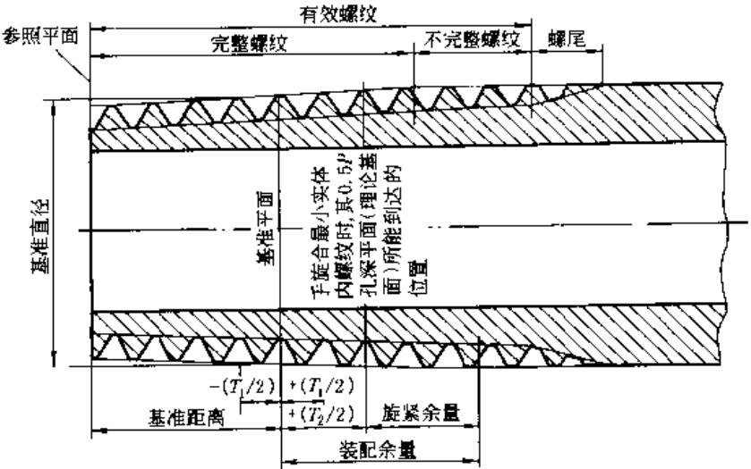

圆锥内、外螺纹的设计牙型(GB/T7306.1、GB/T7306.2)

圆锥外螺纹上各主要尺寸的分布位置(GB/T7306.1、GB/T7306.2)

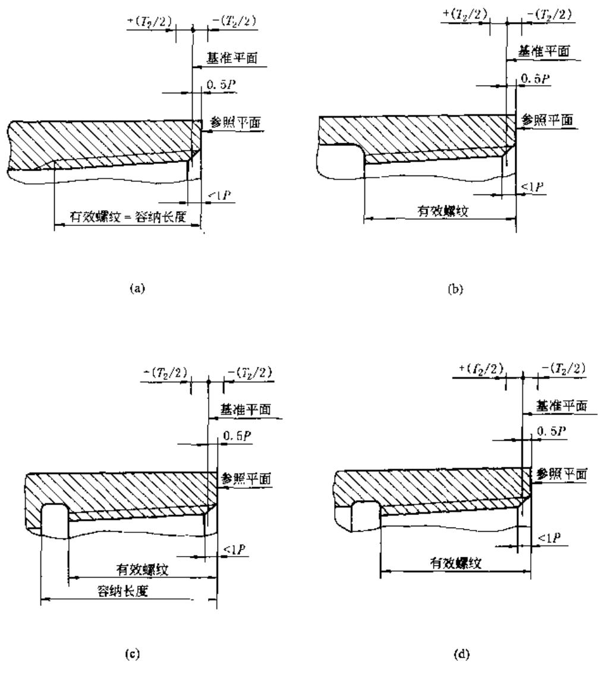

# 圆柱(锥)内螺纹上各主要尺寸的分布位置

管螺纹的标记由特征代号与尺寸代号组成。

螺纹特征代号: $\mathbf { R _ { p } }$ 一圆柱内螺纹;$\mathtt { R } _ { c }$ 圆锥内螺纹;$\mathbf { R } _ { 1 }$ 一与圆柱内螺纹相配合的圆锥外螺纹;$\mathbf { R _ { 2 } }$ 一与圆锥内螺纹相配合的圆锥外螺纹。尺寸代号见表4-1-27。

标记示例:右旋圆柱内螺纹 $\mathtt { R } _ { \mathtt { p } } 3 / 4$ 右旋圆锥内螺纹 ${ \tt R } _ { \tt c } 3 / 4$ ;右旋圆锥外螺纹 $\mathrm { R } _ { 1 } 3$ 或 $\mathbb { R } _ { 2 } 3$ ;螺纹左旋时,尺寸代号后加注 $" \mathbf { L } \mathbf { H } "$ ,如 $\mathbb { R } _ { \mathbb { P } } 3 / 4 . 1 \mathrm { H }$ 或 $\bar { \mathbf { R } } _ { \circ } 3 / 4 . \mathbf { I } \mathbf { \mathbf { J } }$ ;螺纹副时,特征代号为 $" \mathrm { \mathbf { R } } _ { \mathrm { p } } / \mathrm { \mathbf { R } } _ { \mathrm { I } } "$ 或 $\ " \mathrm { R } _ { \mathrm { c } } / \mathrm { R } _ { 2 } \ \ " $ ,如 $\mathtt { R _ { p } } / \mathtt { R } _ { 1 } 3$ 或 $\mathbf { R _ { c } } / \mathbf { R _ { 2 } } 3 ,$ 

<table><tr><td rowspan=5 colspan=1>尺寸代号</td><td rowspan=5 colspan=1>每25.4mm内的螺纹牙数n</td><td rowspan=5 colspan=1>螺原P</td><td rowspan=5 colspan=1>牙高h</td><td rowspan=5 colspan=1>回弧半径，u</td><td rowspan=2 colspan=3>基面上的基本直径</td><td rowspan=2 colspan=5>基准距离</td><td rowspan=2 colspan=2>装配余量</td><td rowspan=2 colspan=3>外螺纹的有效螺纹长度≥</td><td rowspan=2 colspan=2>圆柱内螺纹直径</td><td rowspan=3 colspan=2>圆锥内螺纹基面轴向位移的极限偏差±T/2</td><td></td></tr><tr><td rowspan=6 colspan=1></td></tr><tr><td rowspan=3 colspan=1>大径（基准直径）d=D</td><td rowspan=3 colspan=1>中径d=D</td><td rowspan=3 colspan=1>小径d=D</td><td rowspan=3 colspan=1>基本</td><td rowspan=2 colspan=2>极限偏差± T1/2</td><td rowspan=3 colspan=1>最大</td><td rowspan=3 colspan=1>最小</td><td rowspan=3 colspan=1>长度Ⅱ</td><td rowspan=3 colspan=1>圈数</td><td rowspan=1 colspan=2>基准距离</td><td rowspan=1 colspan=1></td><td rowspan=1 colspan=2>的极限偏差±</td></tr><tr><td rowspan=2 colspan=1>基本</td><td rowspan=2 colspan=1>最大</td><td rowspan=2 colspan=1>最小</td><td rowspan=2 colspan=1>径向</td><td rowspan=2 colspan=1>轴向圈数T22</td><td rowspan=2 colspan=1>u</td><td rowspan=2 colspan=1>圈数</td></tr><tr><td rowspan=1 colspan=1>n</td><td rowspan=1 colspan=1>圈数</td></tr><tr><td rowspan=1 colspan=1>1/16</td><td rowspan=1 colspan=1>28</td><td rowspan=1 colspan=1>0.907</td><td rowspan=1 colspan=1>0.581</td><td rowspan=1 colspan=1>0.125</td><td rowspan=1 colspan=1>7.723</td><td rowspan=1 colspan=1>7.142</td><td rowspan=1 colspan=1>6.561</td><td rowspan=1 colspan=1>4.0</td><td rowspan=1 colspan=1>0.9</td><td rowspan=1 colspan=1>：</td><td rowspan=1 colspan=1>4.9</td><td rowspan=1 colspan=1>3.1</td><td rowspan=1 colspan=1>2.5</td><td rowspan=1 colspan=1>23</td><td rowspan=1 colspan=1>6.5</td><td rowspan=1 colspan=1>7.4</td><td rowspan=1 colspan=1>5.6</td><td rowspan=1 colspan=1>0.071</td><td rowspan=1 colspan=1>1</td><td rowspan=1 colspan=1>1.1</td><td rowspan=1 colspan=1>1</td></tr><tr><td rowspan=1 colspan=1>1/8</td><td rowspan=1 colspan=1>28</td><td rowspan=1 colspan=1>0.907</td><td rowspan=1 colspan=1>0.581</td><td rowspan=1 colspan=1>0.125</td><td rowspan=1 colspan=1>9.728</td><td rowspan=1 colspan=1>9.147</td><td rowspan=1 colspan=1>8.566</td><td rowspan=1 colspan=1>4.0</td><td rowspan=1 colspan=1>0.9</td><td rowspan=1 colspan=1>1</td><td rowspan=1 colspan=1>4.9</td><td rowspan=1 colspan=1>3.1</td><td rowspan=1 colspan=1>2.5</td><td rowspan=1 colspan=1>23</td><td rowspan=1 colspan=1>6.5</td><td rowspan=1 colspan=1>7.4</td><td rowspan=1 colspan=1>5.6</td><td rowspan=1 colspan=1>0.071</td><td rowspan=1 colspan=1>1</td><td rowspan=1 colspan=1>1.1</td><td rowspan=1 colspan=1>1</td></tr><tr><td rowspan=1 colspan=1>1/4</td><td rowspan=1 colspan=1>19</td><td rowspan=1 colspan=1>1.337</td><td rowspan=1 colspan=1>0.856</td><td rowspan=1 colspan=1>0.184</td><td rowspan=1 colspan=1>13.157</td><td rowspan=1 colspan=1>12.301</td><td rowspan=1 colspan=1>11.445</td><td rowspan=1 colspan=1>6.0</td><td rowspan=1 colspan=1>1.3</td><td rowspan=1 colspan=1>1</td><td rowspan=1 colspan=1>7.3</td><td rowspan=1 colspan=1>4.7</td><td rowspan=1 colspan=1>3.7</td><td rowspan=1 colspan=1>2%</td><td rowspan=1 colspan=1>9.7</td><td rowspan=1 colspan=1>11.0</td><td rowspan=1 colspan=1>8.4</td><td rowspan=1 colspan=1>0.104</td><td rowspan=1 colspan=1>1</td><td rowspan=1 colspan=1>1.7</td><td rowspan=1 colspan=1>1/</td><td rowspan=1 colspan=1></td></tr><tr><td rowspan=1 colspan=1>3/8</td><td rowspan=1 colspan=1>19</td><td rowspan=1 colspan=1>1.337</td><td rowspan=1 colspan=1>0 856</td><td rowspan=1 colspan=1>0.184</td><td rowspan=1 colspan=1>16.662</td><td rowspan=1 colspan=1>15.806</td><td rowspan=1 colspan=1>14.950</td><td rowspan=1 colspan=1>6.4</td><td rowspan=1 colspan=1>1.3</td><td rowspan=1 colspan=1>1</td><td rowspan=1 colspan=1>7.7</td><td rowspan=1 colspan=1>5.1</td><td rowspan=1 colspan=1>3.7</td><td rowspan=1 colspan=1>2</td><td rowspan=1 colspan=1>10.1</td><td rowspan=1 colspan=1>11.4</td><td rowspan=1 colspan=1>8.8</td><td rowspan=1 colspan=1>0.104</td><td rowspan=1 colspan=1>1/</td><td rowspan=1 colspan=1>1.7</td><td rowspan=1 colspan=1>1</td><td rowspan=1 colspan=1></td></tr><tr><td rowspan=1 colspan=1>1/2</td><td rowspan=1 colspan=1>14</td><td rowspan=1 colspan=1>1.814</td><td rowspan=1 colspan=1>1.162</td><td rowspan=1 colspan=1>0.249</td><td rowspan=1 colspan=1>20.955</td><td rowspan=1 colspan=1>19.793</td><td rowspan=1 colspan=1>18.631</td><td rowspan=1 colspan=1>8.2</td><td rowspan=1 colspan=1>1.8</td><td rowspan=1 colspan=1>1</td><td rowspan=1 colspan=1>10.0</td><td rowspan=1 colspan=1>6.4</td><td rowspan=1 colspan=1>5.0</td><td rowspan=1 colspan=1>23</td><td rowspan=1 colspan=1>13.2</td><td rowspan=1 colspan=1>15.0</td><td rowspan=1 colspan=1>11.4</td><td rowspan=1 colspan=1>0.142</td><td rowspan=1 colspan=1>1</td><td rowspan=1 colspan=1>2.3</td><td rowspan=1 colspan=1>1</td><td rowspan=1 colspan=1></td></tr><tr><td rowspan=1 colspan=1>3/4</td><td rowspan=1 colspan=1>14</td><td rowspan=1 colspan=1>1.814</td><td rowspan=1 colspan=1>1.162</td><td rowspan=1 colspan=1>0.249</td><td rowspan=1 colspan=1>26.441</td><td rowspan=1 colspan=1>25.279</td><td rowspan=1 colspan=1>24.117</td><td rowspan=1 colspan=1>9.5</td><td rowspan=1 colspan=1>1.8</td><td rowspan=1 colspan=1>1</td><td rowspan=1 colspan=1>11.3</td><td rowspan=1 colspan=1>7.7</td><td rowspan=1 colspan=1>5.0</td><td rowspan=1 colspan=1>23</td><td rowspan=1 colspan=1>14.5</td><td rowspan=1 colspan=1>16.3</td><td rowspan=1 colspan=1>12.7</td><td rowspan=1 colspan=1>0.142</td><td rowspan=1 colspan=1>1</td><td rowspan=1 colspan=1>2.3</td><td rowspan=1 colspan=1>灵</td><td rowspan=1 colspan=1></td></tr><tr><td rowspan=1 colspan=1>一</td><td rowspan=1 colspan=1>1</td><td rowspan=1 colspan=1>2.309</td><td rowspan=1 colspan=1>1.479</td><td rowspan=1 colspan=1>0.317</td><td rowspan=1 colspan=1>33.249</td><td rowspan=1 colspan=1>31.770</td><td rowspan=1 colspan=1>30.291</td><td rowspan=1 colspan=1>10.4</td><td rowspan=1 colspan=1>2.3</td><td rowspan=1 colspan=1>1</td><td rowspan=1 colspan=1>12.7</td><td rowspan=1 colspan=1>8.1</td><td rowspan=1 colspan=1>6.4</td><td rowspan=1 colspan=1>23</td><td rowspan=1 colspan=1>16.8</td><td rowspan=1 colspan=1>19.</td><td rowspan=1 colspan=1>t4.5</td><td rowspan=1 colspan=1>0.180</td><td rowspan=1 colspan=1>14</td><td rowspan=1 colspan=1>2.9</td><td rowspan=1 colspan=1>1</td><td rowspan=1 colspan=1></td></tr><tr><td rowspan=1 colspan=1>1</td><td rowspan=1 colspan=1>=</td><td rowspan=1 colspan=1>2.309</td><td rowspan=1 colspan=1>1.479</td><td rowspan=1 colspan=1>0.317</td><td rowspan=1 colspan=1>41.910</td><td rowspan=1 colspan=1>40.431</td><td rowspan=1 colspan=1>38.952</td><td rowspan=1 colspan=1>12.7</td><td rowspan=1 colspan=1>2.3</td><td rowspan=1 colspan=1>1</td><td rowspan=1 colspan=1>15.0</td><td rowspan=1 colspan=1>10.4</td><td rowspan=1 colspan=1>6.4</td><td rowspan=1 colspan=1>23</td><td rowspan=1 colspan=1>19.1</td><td rowspan=1 colspan=1>21.4</td><td rowspan=1 colspan=1>16.8</td><td rowspan=1 colspan=1>0.180</td><td rowspan=1 colspan=1>1</td><td rowspan=1 colspan=1>2.9</td><td rowspan=1 colspan=1>1</td><td rowspan=1 colspan=1></td></tr><tr><td rowspan=1 colspan=1>1</td><td rowspan=1 colspan=1>11</td><td rowspan=1 colspan=1>2.309</td><td rowspan=1 colspan=1>1.479</td><td rowspan=1 colspan=1>0.317</td><td rowspan=1 colspan=1>47.803</td><td rowspan=1 colspan=1>46.324</td><td rowspan=1 colspan=1>44.845</td><td rowspan=1 colspan=1>12.7</td><td rowspan=1 colspan=1>2.3</td><td rowspan=1 colspan=1>1</td><td rowspan=1 colspan=1>15.0</td><td rowspan=1 colspan=1>10.4</td><td rowspan=1 colspan=1>6.4</td><td rowspan=1 colspan=1>23</td><td rowspan=1 colspan=1>19.1</td><td rowspan=1 colspan=1>21.4</td><td rowspan=1 colspan=1>16.8</td><td rowspan=1 colspan=1>0.180</td><td rowspan=1 colspan=1>1</td><td rowspan=1 colspan=1>2.9</td><td rowspan=1 colspan=1>1</td><td rowspan=1 colspan=1></td></tr><tr><td rowspan=1 colspan=1>2</td><td rowspan=1 colspan=1>1</td><td rowspan=1 colspan=1>2.309</td><td rowspan=1 colspan=1>1.479</td><td rowspan=1 colspan=1>0.317</td><td rowspan=1 colspan=1>59.614</td><td rowspan=1 colspan=1>58.135</td><td rowspan=1 colspan=1>56.656</td><td rowspan=1 colspan=1>15.9</td><td rowspan=1 colspan=1>2.3</td><td rowspan=1 colspan=1>1</td><td rowspan=1 colspan=1>18.2</td><td rowspan=1 colspan=1>13.6</td><td rowspan=1 colspan=1>7.5</td><td rowspan=1 colspan=1>3%</td><td rowspan=1 colspan=1>23.4</td><td rowspan=1 colspan=1>25.7</td><td rowspan=1 colspan=1>21.1</td><td rowspan=1 colspan=1>0.180</td><td rowspan=1 colspan=1>1</td><td rowspan=1 colspan=1>2.9</td><td rowspan=1 colspan=1>1</td><td rowspan=1 colspan=1></td></tr><tr><td rowspan=1 colspan=1>21</td><td rowspan=1 colspan=1>1</td><td rowspan=1 colspan=1>2.309</td><td rowspan=1 colspan=1>1.479</td><td rowspan=1 colspan=1>0.317</td><td rowspan=1 colspan=1>75.184</td><td rowspan=1 colspan=1>73.705</td><td rowspan=1 colspan=1>72.226</td><td rowspan=1 colspan=1>17.5</td><td rowspan=1 colspan=1>3.5</td><td rowspan=1 colspan=1>1</td><td rowspan=1 colspan=1>21.0</td><td rowspan=1 colspan=1>14.0</td><td rowspan=1 colspan=1>9.2</td><td rowspan=1 colspan=1>4</td><td rowspan=1 colspan=1>26.7</td><td rowspan=1 colspan=1>30.2</td><td rowspan=1 colspan=1>23.2</td><td rowspan=1 colspan=1>0.216</td><td rowspan=1 colspan=1>区</td><td rowspan=1 colspan=1>3.5</td><td rowspan=1 colspan=1>1</td><td rowspan=1 colspan=1></td></tr><tr><td rowspan=1 colspan=1>3</td><td rowspan=1 colspan=1>11</td><td rowspan=1 colspan=1>2.309</td><td rowspan=1 colspan=1>1.479</td><td rowspan=1 colspan=1>0.317</td><td rowspan=1 colspan=1>87.884</td><td rowspan=1 colspan=1>86.405</td><td rowspan=1 colspan=1>84.926</td><td rowspan=1 colspan=1>20.6</td><td rowspan=1 colspan=1>3.5</td><td rowspan=1 colspan=1>1</td><td rowspan=1 colspan=1>24.1</td><td rowspan=1 colspan=1>17.1</td><td rowspan=1 colspan=1>9.2</td><td rowspan=1 colspan=1>4</td><td rowspan=1 colspan=1>29.8</td><td rowspan=1 colspan=1>333</td><td rowspan=1 colspan=1>26.3</td><td rowspan=1 colspan=1>0.216</td><td rowspan=1 colspan=1>1%</td><td rowspan=1 colspan=1>3.5</td><td rowspan=1 colspan=1>1</td><td rowspan=1 colspan=1></td></tr><tr><td rowspan=1 colspan=1>4</td><td rowspan=1 colspan=1>1</td><td rowspan=1 colspan=1>2.309</td><td rowspan=1 colspan=1>1.479</td><td rowspan=1 colspan=1>0.317</td><td rowspan=1 colspan=1>113.030</td><td rowspan=1 colspan=1>111.551</td><td rowspan=1 colspan=1>110.072.</td><td rowspan=1 colspan=1>25.4</td><td rowspan=1 colspan=1>3.5</td><td rowspan=1 colspan=1></td><td rowspan=1 colspan=1>28.9</td><td rowspan=1 colspan=1>21.9</td><td rowspan=1 colspan=1>10.4</td><td rowspan=1 colspan=1>4</td><td rowspan=1 colspan=1>358</td><td rowspan=1 colspan=1>39.3</td><td rowspan=1 colspan=1>32.3</td><td rowspan=1 colspan=1>0.216</td><td rowspan=1 colspan=1>1</td><td rowspan=1 colspan=1>3.5</td><td rowspan=1 colspan=1>1</td><td rowspan=1 colspan=1></td></tr><tr><td rowspan=1 colspan=1>5</td><td rowspan=1 colspan=1>11</td><td rowspan=1 colspan=1>2.309</td><td rowspan=1 colspan=1>1.479</td><td rowspan=1 colspan=1>0.317</td><td rowspan=1 colspan=1>138.430</td><td rowspan=1 colspan=1>136.951</td><td rowspan=1 colspan=1>135.472</td><td rowspan=1 colspan=1>28.6</td><td rowspan=1 colspan=1>3.5</td><td rowspan=1 colspan=1>1</td><td rowspan=1 colspan=1>32.1</td><td rowspan=1 colspan=1>25.1</td><td rowspan=1 colspan=1>11.5</td><td rowspan=1 colspan=1>5</td><td rowspan=1 colspan=1>40.1</td><td rowspan=1 colspan=1>43.6</td><td rowspan=1 colspan=1>36.6</td><td rowspan=1 colspan=1>0.216</td><td rowspan=1 colspan=1>1</td><td rowspan=1 colspan=1>3.5</td><td rowspan=1 colspan=1>1</td><td rowspan=1 colspan=1></td></tr><tr><td rowspan=1 colspan=1>6</td><td rowspan=1 colspan=1>1</td><td rowspan=1 colspan=1>2.309</td><td rowspan=1 colspan=1>1.479</td><td rowspan=1 colspan=1>0.317</td><td rowspan=1 colspan=1>163.830</td><td rowspan=1 colspan=1>162.351</td><td rowspan=1 colspan=1>160.872</td><td rowspan=1 colspan=1>28.6</td><td rowspan=1 colspan=1>3.5</td><td rowspan=1 colspan=1>1</td><td rowspan=1 colspan=1>32.1</td><td rowspan=1 colspan=1>25.</td><td rowspan=1 colspan=1>11.5</td><td rowspan=1 colspan=1>5</td><td rowspan=1 colspan=1>40.1</td><td rowspan=1 colspan=1>43.6</td><td rowspan=1 colspan=1>36.6</td><td rowspan=1 colspan=1>0.216</td><td rowspan=1 colspan=1>1</td><td rowspan=1 colspan=1>3.5</td><td rowspan=1 colspan=2>1</td></tr></table>

# 1.8 ${ \bf 6 0 ^ { \circ } }$ 圆锥管螺纹(GB/T12716—1991)

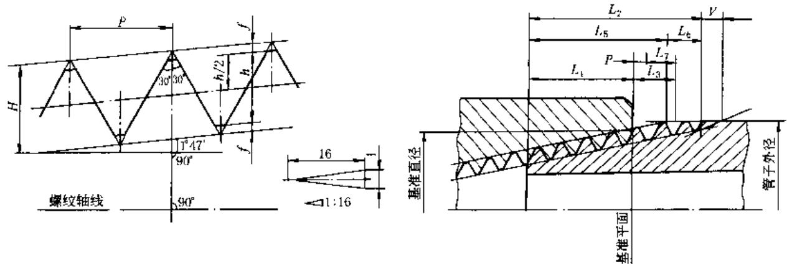

标记示例:

${ \bf 6 0 ^ { \circ } }$ 圆锥管螺纹基本牙型$P = 2 5 . 4 / n$ ;$H = 0 , 8 6 6 0 2 5 P$ :$\hbar = 0 , 8 0 0 0 0 0 P$ i$\begin{array} { r } { \hat { f } = 0 . 0 3 3 \bar { P } } \end{array}$ 

NPT 3/8-LH左旋(右旋不标)螺纹尺寸代号$\mathbf { \delta } ^ { 6 0 ^ { \circ } }$ 牙型角的圆锥管螺纹

表4-1-28

<table><tr><td rowspan=7 colspan=1></td><td rowspan=3 colspan=1>螺纹的尺寸代号</td><td rowspan=3 colspan=1>每25.4mm内的螺纹牙数R</td><td rowspan=1 colspan=3>基面上的基本直径</td><td rowspan=2 colspan=2>基准距离L</td><td rowspan=2 colspan=2>装配余量L</td></tr><tr><td rowspan=2 colspan=1>大径（基准直径）d = D/mm</td><td rowspan=2 colspan=1>中径d =D/mm</td><td rowspan=2 colspan=1>小径d1= D/mm</td></tr><tr><td rowspan=1 colspan=1>/mm</td><td rowspan=1 colspan=1>牙数</td><td rowspan=1 colspan=1>/mm</td><td rowspan=1 colspan=1>牙数</td></tr><tr><td rowspan=4 colspan=1>1/161/81/43/8</td><td rowspan=4 colspan=1>27271818</td><td rowspan=1 colspan=1>7.895</td><td rowspan=1 colspan=1>7. 142</td><td rowspan=1 colspan=1>6.389</td><td rowspan=1 colspan=1>4.064</td><td rowspan=1 colspan=1>4.32</td><td rowspan=2 colspan=1>2.8222.822</td><td rowspan=2 colspan=1>33</td></tr><tr><td rowspan=1 colspan=1>10.242</td><td rowspan=1 colspan=1>9.489</td><td rowspan=1 colspan=1>8.736</td><td rowspan=1 colspan=1>4.102</td><td rowspan=1 colspan=1>4.36</td></tr><tr><td rowspan=1 colspan=1>13.616</td><td rowspan=1 colspan=1>12.487</td><td rowspan=1 colspan=1>11.358</td><td rowspan=1 colspan=1>5.786</td><td rowspan=1 colspan=1>4.10</td><td rowspan=1 colspan=1>4.234</td><td rowspan=17 colspan=1>33333333222222222</td></tr><tr><td rowspan=1 colspan=1>17.055</td><td rowspan=1 colspan=1>15.926</td><td rowspan=1 colspan=1>14.797</td><td rowspan=1 colspan=1>6.096</td><td rowspan=1 colspan=1>4.32</td><td rowspan=1 colspan=1>4.234</td></tr><tr><td rowspan=3 colspan=1></td><td rowspan=2 colspan=1>1/23/4</td><td rowspan=1 colspan=1>14</td><td rowspan=1 colspan=1>21.223</td><td rowspan=1 colspan=1>19.772</td><td rowspan=1 colspan=1>18.321</td><td rowspan=1 colspan=1>8.128</td><td rowspan=1 colspan=1>4.48</td><td rowspan=1 colspan=1>5.443</td></tr><tr><td rowspan=1 colspan=1>14</td><td rowspan=1 colspan=1>26.568</td><td rowspan=1 colspan=1>25.117</td><td rowspan=1 colspan=1>23.666</td><td rowspan=1 colspan=1>8.611</td><td rowspan=1 colspan=1>4.75</td><td rowspan=1 colspan=1>5.443</td></tr><tr><td rowspan=1 colspan=1>1</td><td rowspan=1 colspan=1>11.5</td><td rowspan=1 colspan=1>33.228</td><td rowspan=1 colspan=1>31.461</td><td rowspan=1 colspan=1>29.694</td><td rowspan=1 colspan=1>10.160</td><td rowspan=1 colspan=1>4.60</td><td rowspan=1 colspan=1>6.627</td></tr><tr><td rowspan=1 colspan=1>纹</td><td rowspan=1 colspan=1>1</td><td rowspan=1 colspan=1>11.5</td><td rowspan=1 colspan=1>41.985</td><td rowspan=1 colspan=1>40.218</td><td rowspan=1 colspan=1>38.451</td><td rowspan=1 colspan=1>10.668</td><td rowspan=1 colspan=1>4.83</td><td rowspan=1 colspan=1>6.627</td></tr><tr><td rowspan=2 colspan=1></td><td rowspan=1 colspan=1>1</td><td rowspan=1 colspan=1>11.5</td><td rowspan=1 colspan=1>48.054</td><td rowspan=1 colspan=1>46.287</td><td rowspan=1 colspan=1>44.520</td><td rowspan=1 colspan=1>10.668</td><td rowspan=1 colspan=1>4.83</td><td rowspan=1 colspan=1>6.627</td></tr><tr><td rowspan=1 colspan=1>2</td><td rowspan=1 colspan=1>11.5</td><td rowspan=1 colspan=1>60.092</td><td rowspan=1 colspan=1>58.325</td><td rowspan=1 colspan=1>56.558</td><td rowspan=1 colspan=1>11.074</td><td rowspan=1 colspan=1>5.01</td><td rowspan=1 colspan=1>6.627</td><td rowspan=1 colspan=1>3</td></tr><tr><td rowspan=1 colspan=1>尺</td><td rowspan=1 colspan=1>2/</td><td rowspan=1 colspan=1>8</td><td rowspan=1 colspan=1>72. 699</td><td rowspan=1 colspan=1>70.159</td><td rowspan=1 colspan=1>67.619</td><td rowspan=1 colspan=1>17.323</td><td rowspan=1 colspan=1>5.46</td><td rowspan=1 colspan=1>6.350</td><td rowspan=1 colspan=1>2</td></tr><tr><td rowspan=8 colspan=1></td><td rowspan=1 colspan=1>3</td><td rowspan=1 colspan=1>8</td><td rowspan=1 colspan=1>88.608</td><td rowspan=1 colspan=1>86.068</td><td rowspan=1 colspan=1>83.528</td><td rowspan=1 colspan=1>19.456</td><td rowspan=1 colspan=1>6.13</td><td rowspan=1 colspan=1>6.350</td><td rowspan=1 colspan=1>2</td></tr><tr><td rowspan=4 colspan=1>3%456</td><td rowspan=1 colspan=1>8</td><td rowspan=1 colspan=1>101.316</td><td rowspan=1 colspan=1>98.776</td><td rowspan=1 colspan=1>96.236</td><td rowspan=1 colspan=1>20.853</td><td rowspan=1 colspan=1>6.57</td><td rowspan=1 colspan=1>6.350</td><td rowspan=1 colspan=1>2</td></tr><tr><td rowspan=1 colspan=1>8</td><td rowspan=1 colspan=1>113.973</td><td rowspan=1 colspan=1>111.433</td><td rowspan=1 colspan=1>108.893</td><td rowspan=1 colspan=1>21.438</td><td rowspan=1 colspan=1>6.75</td><td rowspan=1 colspan=1>6.350</td><td rowspan=1 colspan=1>2</td></tr><tr><td rowspan=1 colspan=1>8</td><td rowspan=1 colspan=1>140.952</td><td rowspan=1 colspan=1>138.412</td><td rowspan=1 colspan=1>135.872</td><td rowspan=1 colspan=1>23.800</td><td rowspan=1 colspan=1>7.50</td><td rowspan=1 colspan=1>6.350</td><td rowspan=1 colspan=1>2</td></tr><tr><td rowspan=1 colspan=1>8</td><td rowspan=1 colspan=1>167.792</td><td rowspan=1 colspan=1>165.252</td><td rowspan=1 colspan=1>162.712</td><td rowspan=1 colspan=1>24.333</td><td rowspan=1 colspan=1>7.66</td><td rowspan=1 colspan=1>6.350</td></tr><tr><td rowspan=3 colspan=1>81012</td><td rowspan=1 colspan=1>8</td><td rowspan=1 colspan=1>.218.441</td><td rowspan=1 colspan=1>215,901</td><td rowspan=1 colspan=1>213.361</td><td rowspan=1 colspan=1>27.000</td><td rowspan=1 colspan=1>8.50</td><td rowspan=1 colspan=1>6.350</td></tr><tr><td rowspan=1 colspan=1>8</td><td rowspan=1 colspan=1>272.312</td><td rowspan=1 colspan=1>269.772</td><td rowspan=1 colspan=1>267.232</td><td rowspan=1 colspan=1>30.734</td><td rowspan=1 colspan=1>9.68</td><td rowspan=1 colspan=1>6.350</td></tr><tr><td rowspan=1 colspan=1>8</td><td rowspan=1 colspan=1>323.032</td><td rowspan=1 colspan=1>320.492</td><td rowspan=1 colspan=1>317.952</td><td rowspan=1 colspan=1>34.544</td><td rowspan=1 colspan=1>10.88</td><td rowspan=1 colspan=1>6.350</td></tr></table>

续表

<table><tr><td rowspan=8 colspan=1></td><td rowspan=1 colspan=1>螺纹的尺寸代号</td><td rowspan=1 colspan=1>管子外径/mm</td><td rowspan=1 colspan=1>有效外螺纹的长度L/mm</td><td rowspan=1 colspan=1>螺尾V/mm</td><td rowspan=1 colspan=1>完整外螺纹长度L/</td><td rowspan=1 colspan=1>螺纹的尺寸代号</td><td rowspan=1 colspan=1>骨子外径/mm</td><td rowspan=1 colspan=1>有效外螺纹的长度/mm</td><td rowspan=1 colspan=1>螺尾V/mm</td><td rowspan=1 colspan=1>完整外螺纹长度/mm</td></tr><tr><td rowspan=1 colspan=1>1/16</td><td rowspan=1 colspan=1>7.938</td><td rowspan=1 colspan=1>6.632</td><td rowspan=1 colspan=1>3.264</td><td rowspan=1 colspan=1>4.750</td><td rowspan=1 colspan=1>2%</td><td rowspan=1 colspan=1>73.025</td><td rowspan=1 colspan=1>28.892</td><td rowspan=1 colspan=1>11 016</td><td rowspan=1 colspan=1>22 542</td></tr><tr><td rowspan=1 colspan=1>1/8</td><td rowspan=1 colspan=1>10.287</td><td rowspan=1 colspan=1>6.703</td><td rowspan=1 colspan=1>3.264</td><td rowspan=1 colspan=1>4.821</td><td rowspan=1 colspan=1>3</td><td rowspan=1 colspan=1>88.900</td><td rowspan=1 colspan=1>30.480</td><td rowspan=1 colspan=1>11.016</td><td rowspan=1 colspan=1>24.130</td></tr><tr><td rowspan=1 colspan=1>1/4</td><td rowspan=1 colspan=1>13.716</td><td rowspan=1 colspan=1>10.206</td><td rowspan=1 colspan=1>4.897</td><td rowspan=1 colspan=1>7.384</td><td rowspan=1 colspan=1>3</td><td rowspan=1 colspan=1>101.600</td><td rowspan=1 colspan=1>31.750</td><td rowspan=1 colspan=1>11.016</td><td rowspan=1 colspan=1>25.400</td></tr><tr><td rowspan=1 colspan=1>3/8</td><td rowspan=1 colspan=1>17. 145</td><td rowspan=1 colspan=1>10.358</td><td rowspan=1 colspan=1>4.897</td><td rowspan=1 colspan=1>7.536</td><td rowspan=1 colspan=1>4</td><td rowspan=1 colspan=1>114.300</td><td rowspan=1 colspan=1>33.020</td><td rowspan=1 colspan=1>11.016</td><td rowspan=1 colspan=1>26.670</td></tr><tr><td rowspan=1 colspan=1>1/2</td><td rowspan=1 colspan=1>21.336</td><td rowspan=1 colspan=1>13.556</td><td rowspan=1 colspan=1>6.294</td><td rowspan=1 colspan=1>9.928</td><td rowspan=1 colspan=1>5</td><td rowspan=1 colspan=1>141.300</td><td rowspan=1 colspan=1>35.720</td><td rowspan=1 colspan=1>11.016</td><td rowspan=1 colspan=1>29.370</td></tr><tr><td rowspan=1 colspan=1>3/4</td><td rowspan=1 colspan=1>26.670</td><td rowspan=1 colspan=1>13.861</td><td rowspan=1 colspan=1>6.294</td><td rowspan=1 colspan=1>10.233</td><td rowspan=1 colspan=1>6</td><td rowspan=1 colspan=1>168.275</td><td rowspan=1 colspan=1>38.418</td><td rowspan=1 colspan=1>11.016</td><td rowspan=1 colspan=1>32.068</td></tr><tr><td rowspan=1 colspan=1>1</td><td rowspan=1 colspan=1>33.401</td><td rowspan=1 colspan=1>17.343</td><td rowspan=1 colspan=1>7.663</td><td rowspan=1 colspan=1>12.925</td><td rowspan=1 colspan=1>8</td><td rowspan=1 colspan=1>219.075</td><td rowspan=1 colspan=1>43.498</td><td rowspan=1 colspan=1>11.016</td><td rowspan=1 colspan=1>37.148</td></tr><tr><td rowspan=1 colspan=1></td><td rowspan=1 colspan=1>1</td><td rowspan=1 colspan=1>42.164</td><td rowspan=1 colspan=1>17.953</td><td rowspan=1 colspan=1>7.663</td><td rowspan=1 colspan=1>13.535</td><td rowspan=1 colspan=1>10</td><td rowspan=1 colspan=1>273.050</td><td rowspan=1 colspan=1>48.895</td><td rowspan=1 colspan=1>11.016</td><td rowspan=1 colspan=1>42.545</td></tr><tr><td rowspan=2 colspan=1></td><td rowspan=1 colspan=1>1</td><td rowspan=1 colspan=1>48.260</td><td rowspan=1 colspan=1>18.377</td><td rowspan=1 colspan=1>7.663</td><td rowspan=1 colspan=1>13.959</td><td rowspan=1 colspan=1>12</td><td rowspan=1 colspan=1>323.850</td><td rowspan=1 colspan=1>53.975</td><td rowspan=1 colspan=1>11.016</td><td rowspan=2 colspan=1>47.625</td></tr><tr><td rowspan=1 colspan=1>2</td><td rowspan=1 colspan=1>60.325</td><td rowspan=1 colspan=1>19.215</td><td rowspan=1 colspan=1>7663</td><td rowspan=1 colspan=1>14.797</td><td rowspan=1 colspan=1></td><td rowspan=1 colspan=1></td><td rowspan=1 colspan=1></td><td rowspan=1 colspan=1></td></tr><tr><td rowspan=5 colspan=1>牙型尺寸</td><td rowspan=1 colspan=3>每25.4mm内的螺纹牙数n</td><td rowspan=1 colspan=2>螺距P/mm</td><td rowspan=1 colspan=2>原始三角形高度H/mm</td><td rowspan=1 colspan=3>牙型高度h/mm</td></tr><tr><td rowspan=4 colspan=3>27181411.58</td><td rowspan=1 colspan=2>0.941</td><td rowspan=1 colspan=2>0.815</td><td rowspan=1 colspan=2>0 753</td><td rowspan=1 colspan=1></td></tr><tr><td rowspan=3 colspan=2>1.4111.8142.2093.175</td><td rowspan=1 colspan=2>1.222</td><td rowspan=2 colspan=3>1. 1291.451</td><td rowspan=1 colspan=1></td></tr><tr><td rowspan=1 colspan=2>1.571</td><td rowspan=1 colspan=1></td></tr><tr><td rowspan=1 colspan=2>1.9132.750</td><td rowspan=1 colspan=2>1.7672.540</td><td rowspan=1 colspan=1></td></tr></table>

$\textcircled{1}$ 本表中1/16、1/8、 $^ { 1 / 2 }$ 、3/4小尺寸螺纹的有效螺纹长度 $\mathbf { L } _ { 2 }$ 略小于标准正文中的 $J _ { \cdot 1 } + \bar { l } _ { \cdot 3 }$ ,不影响使用。注:1.本标准规定了牙型角为 $6 0 ^ { \circ }$ 、螺纹本身具有密封性的圆锥管螺纹(NPT)的尺寸、牙型和标记2.本标准适子一般用途管螺纹的密封及机械联接。为保证螺纹联接的密封性,可在螺纹副内加人密封物。

# 1.9管路旋入端用普通螺纹(GB/T1414一1978)

/mm 

表4-1-29

<table><tr><td rowspan=2 colspan=1>螺纹代号</td><td rowspan=1 colspan=2>螺纹尺寸</td><td rowspan=2 colspan=1>螺纹代号</td><td rowspan=1 colspan=2>螺纹尺寸</td><td rowspan=2 colspan=1>螺纹代号</td><td rowspan=1 colspan=2>螺纹尺寸</td></tr><tr><td rowspan=1 colspan=1>公称直径d</td><td rowspan=1 colspan=1>螺距P</td><td rowspan=1 colspan=1>公称直径d</td><td rowspan=1 colspan=1>螺距P</td><td rowspan=1 colspan=1>公称自径d</td><td rowspan=1 colspan=1>螺路iP</td></tr><tr><td rowspan=1 colspan=1>M6</td><td rowspan=1 colspan=1>6</td><td rowspan=1 colspan=1></td><td rowspan=1 colspan=1>M27×2</td><td rowspan=1 colspan=1>27</td><td rowspan=1 colspan=1></td><td rowspan=1 colspan=1>M60×2</td><td rowspan=5 colspan=1>6064687276</td><td rowspan=5 colspan=1>2</td></tr><tr><td rowspan=1 colspan=1>M8×t</td><td rowspan=1 colspan=1>8</td><td rowspan=1 colspan=1>1</td><td rowspan=1 colspan=1>M30 × 2</td><td rowspan=1 colspan=1>30</td><td rowspan=1 colspan=1></td><td rowspan=1 colspan=1>M64 × 2</td></tr><tr><td rowspan=1 colspan=1>M10×1</td><td rowspan=1 colspan=1>1D</td><td rowspan=1 colspan=1></td><td rowspan=1 colspan=1>M33 × 2</td><td rowspan=1 colspan=1>33</td><td rowspan=1 colspan=1></td><td rowspan=1 colspan=1>M68× 2</td></tr><tr><td rowspan=1 colspan=1>M12 × 1.5</td><td rowspan=1 colspan=1>12</td><td rowspan=1 colspan=1></td><td rowspan=1 colspan=1>M36×2</td><td rowspan=1 colspan=1>36</td><td rowspan=1 colspan=1>2</td><td rowspan=1 colspan=1>M72 ×2</td></tr><tr><td rowspan=1 colspan=1>M14 × 1.5</td><td rowspan=1 colspan=1>14</td><td rowspan=1 colspan=1></td><td rowspan=1 colspan=1>M39×2</td><td rowspan=1 colspan=1>39</td><td rowspan=1 colspan=1></td><td rowspan=1 colspan=1>M76× 2</td></tr><tr><td rowspan=1 colspan=1>M16 × 1.5</td><td rowspan=1 colspan=1>16</td><td rowspan=1 colspan=1></td><td rowspan=1 colspan=1>M42 × 2</td><td rowspan=1 colspan=1>42</td><td rowspan=1 colspan=1></td><td rowspan=1 colspan=1>M80×3</td><td rowspan=1 colspan=1>80</td><td rowspan=5 colspan=1>3：！</td></tr><tr><td rowspan=1 colspan=1>M18 ×1.5</td><td rowspan=1 colspan=1>18</td><td rowspan=1 colspan=1></td><td rowspan=1 colspan=1>M45×2</td><td rowspan=1 colspan=1>45</td><td rowspan=1 colspan=1></td><td rowspan=1 colspan=1>M85x3</td><td rowspan=1 colspan=1>85</td></tr><tr><td rowspan=1 colspan=1></td><td rowspan=1 colspan=1>M20 ×1.5</td><td rowspan=1 colspan=1>20</td><td rowspan=1 colspan=1>1.5</td><td rowspan=1 colspan=1>M48×2</td><td rowspan=1 colspan=1>48</td><td rowspan=1 colspan=1></td><td rowspan=1 colspan=1>M90x 3</td><td rowspan=3 colspan=1>90！i</td></tr><tr><td rowspan=1 colspan=1></td><td rowspan=1 colspan=1>M22 × 1.5</td><td rowspan=1 colspan=1>22</td><td rowspan=1 colspan=1></td><td rowspan=1 colspan=1>M52 ×2</td><td rowspan=1 colspan=1>52</td><td rowspan=1 colspan=1></td><td rowspan=2 colspan=1></td></tr><tr><td rowspan=1 colspan=1>M24 × 1.5</td><td rowspan=1 colspan=1>24</td><td rowspan=1 colspan=1></td><td rowspan=1 colspan=1>M56 ×2</td><td rowspan=1 colspan=1>56</td><td rowspan=1 colspan=1></td><td></td></tr></table>

注:1.本标准适用于管路中附件旋人机体的连接螺纹,例如液压与气动元件管接头、润滑附件和仪表及其他附件的旋入端螺纹,2.螺纹的牙型、基本尺寸及公差符合CB/T192—198I、GB/T196\~197--1981的规定。

# 1.10米制锥螺纹(GB/T1415—1992)

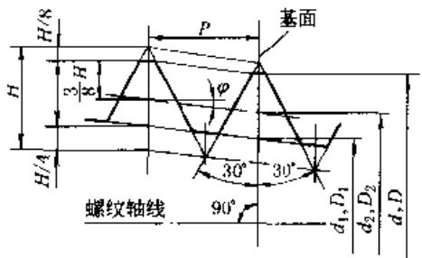

φ=1°47'24"锥度2tan-1:16

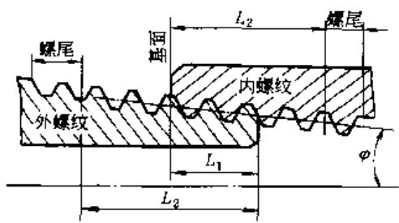

标记示例:

公称直径为 $1 0 \mathrm { m m }$ 标准基准距离的米制锥螺纹、其代号为:ZM10;  
公称直径为 $1 0 \mathrm { m m }$ 短基准距离的米制锥螺纹,其代号为:ZM10-S;  
与米制锥螺纹配合的公称直径为 $1 0 \mathrm { m m }$ 、螺距 $\mathbf { i m } \mathbf { m }$ 的圆柱内螺纹,其代号为 $\mathbf { M } \mathbf { 1 0 } \times \mathbf { 1 } { \cdot } \mathbf { G } \mathbf { B } / \mathsf { T } ~ 1 4 \mathbf { 1 } \mathsf { S } _ { \circ }$ 

/mm 

表4-1-30

米制锥螺纹的基本尺寸

<table><tr><td rowspan="2">螺纹公称直径 d、D</td><td rowspan="2">螺距 P</td><td colspan="3">基面上螺纹直径</td><td colspan="2">基准距离L；</td><td colspan="2">有效螺纹长度L</td></tr><tr><td>大径 d=D</td><td>中径 d=D</td><td>小径 d=D</td><td>标准基 准距离</td><td>短基准 距离</td><td>标准有效 螺纹长度</td><td>短有效 螺纹长度</td></tr><tr><td>6 8</td><td rowspan="2">1</td><td>6.000 8.000</td><td>5.350 7.350</td><td>4,917 6.917</td><td rowspan="2">5.5</td><td rowspan="2">2.5</td><td rowspan="2">8</td><td rowspan="2">5</td></tr><tr><td>10 12</td><td>10.000 12.000</td><td>9.350</td><td>8.917</td></tr><tr><td>14</td><td rowspan="6">1.5</td><td>14.000</td><td>11.026 13.026</td><td>10.376 12.376</td><td rowspan="6">7.5</td><td rowspan="6">3.5</td><td rowspan="6">11</td><td rowspan="6">7</td></tr><tr><td>16</td><td>16.000</td><td>15.026</td><td>14.376</td></tr><tr><td></td><td></td><td></td><td></td></tr><tr><td>18</td><td>18.000</td><td>17.026</td><td>16.376</td></tr><tr><td>20</td><td>20.000</td><td>19.026</td><td>18.376</td></tr><tr><td>22</td><td>22.000 24.000</td><td>21.026 23.026</td><td>20.376</td></tr><tr><td>27</td><td></td><td colspan="2">27.000 25.701</td><td>22.376 24.835</td><td rowspan="6"></td><td rowspan="6"></td><td rowspan="6">16</td><td rowspan="6">10</td></tr><tr><td>30 33</td><td>30.000 33.000</td><td rowspan="4">31.701</td><td>27.835 30.835</td><td></td></tr><tr><td></td><td></td><td></td></tr><tr><td>36</td><td>36.000</td><td>33.835</td></tr><tr><td>39</td><td>39.000 42.000</td><td>36.835</td></tr><tr><td>42</td><td>45.000</td><td>39.835</td></tr><tr><td>45</td><td>48.000</td><td colspan="2">43.701</td><td>42.835</td></tr><tr><td>48</td><td>52.000</td><td colspan="2">50.701</td><td>45.835 49.835</td></tr><tr><td>52 56</td><td></td><td>56.000 54.701</td><td></td><td>53.835</td><td></td><td></td></tr><tr><td>60</td><td></td><td colspan="2">60.000 58.701 外螺纹基准距</td><td colspan="2">57,835</td><td colspan="2"></td><td colspan="2">内螺纹极限偏差</td></tr><tr><td>螺纹公称直径 d，D</td><td>螺距 P</td><td colspan="2">离的极限偏差 （± T/2）</td><td colspan="2">内螺纹基面轴 向位移量极限</td><td colspan="2">外螺纹极限偏差 小径</td><td colspan="2">大径 小径</td></tr><tr><td>6~10</td><td>1</td><td colspan="2">±0.9</td><td colspan="2">偏差（±T/2） ± 1.2</td><td>大径 0</td><td>+0.100</td><td>±0.060</td><td>±0.060</td></tr><tr><td>> 10~24</td><td>1.5</td><td colspan="2">±1.1</td><td colspan="2">± 1.5</td><td>-0.064 0</td><td>+0.030 +0.130 +0.040</td><td>±0.080</td><td>± 0.080</td></tr><tr><td>> 24~60</td><td>2</td><td colspan="2">± 1.4</td><td colspan="2">+1.8</td><td>-0.096 0 0.128</td><td>+0.170 +0.060</td><td>±0.100</td><td>±0.100</td></tr></table>

注:i.本标准规定了米制锥螺纹的牙型、尺寸、标记、公差与校验。它包括圆锥内螺纹与圆锥外螺纹、国柱内螺纹和圆锥外螺纹两种联接型式。本标准适用于气体或液体管路系统依靠螺纹密封的联接螺纹。必要时,允许在螺纹配合间加密封填料提高其嚮封性。2.与圆锥螺纹配合的圆柱内螺纹采用普通螺纹,有效螺纹长度不得小于相应规格 $\pmb { \mathrm { f } } _ { 2 }$ 的 $80 \%$ a

1.11管螺纹

切制内、外螺纹前的毛坯尺寸(JB/7Q4168—1997)

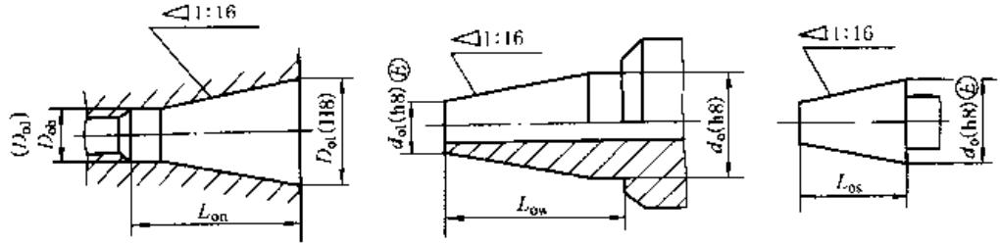

用干GB/T7306.1\~730f.2及GB/T12716毛坯尺

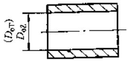

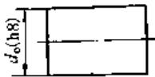

用于GB/T7:07毛坏尺寸

/mm 

表4-1-31

<table><tr><td rowspan="3">尺寸代号 (GB/T 7306.1~</td><td colspan="2">圆柱内螺纹Rp</td><td colspan="4">圆锥内螺纹R.</td><td colspan="4">圆锥外螺纹R</td></tr><tr><td rowspan="2">钻(扩）孔 底径</td><td rowspan="2">车（锂）孔 底径 D</td><td rowspan="2">柱孔坯 底径</td><td colspan="2">锥孔坏</td><td rowspan="2">底孔深 1</td><td rowspan="2">圆锥大端 （圆柱）</td><td rowspan="2">圆锥小端 直径</td><td rowspan="2">端肩距 Law max</td><td rowspan="2">螺塞长 L</td></tr><tr><td>底径 D</td><td>锥孔大径 D</td></tr><tr><td>7306.2) 1/16</td><td>D 6.60</td><td>6.55</td><td>Db 6.40</td><td>6.20</td><td></td><td>6.56</td><td>max 15</td><td>d。 7.8</td><td>d 7.45</td><td>12.5</td><td>9</td></tr><tr><td>1/8</td><td>8.60</td><td>8.55</td><td>8.40</td><td></td><td>8.20</td><td>8.57</td><td>15</td><td>9.8</td><td>9.45</td><td>12.5</td><td>9</td></tr><tr><td>1/4</td><td>11.50 15.00</td><td>11.45 14.95</td><td>11.20 14.75</td><td></td><td>11.00 14.50</td><td>11.45 14.95</td><td>22 22</td><td>13.5 16.8</td><td>13.00</td><td>18.5 19.0</td><td>1</td></tr><tr><td>3/8</td><td>18.75</td><td>18.65</td><td>18.25</td><td></td><td>18.00</td><td>18.63</td><td>30</td><td>21.1</td><td>16.25 20.40</td><td>25.0</td><td>12 15</td></tr><tr><td>1/2</td><td>24.25</td><td>24.15</td><td>23.75</td><td></td><td>23.50</td><td>24.12</td><td>31</td><td>26.5</td><td>25.80</td><td>26.5</td><td>17</td></tr><tr><td>3/4</td><td>30.50</td><td>30.35</td><td>29.75</td><td></td><td>29.50</td><td>30.29</td><td>38</td><td>33.4</td><td>32.55</td><td>31.8</td><td>19</td></tr><tr><td>1 1</td><td>39.00</td><td>39.00</td><td>38.30</td><td>38.00</td><td></td><td>38.95</td><td>40</td><td>42.1</td><td>41.10</td><td>34.2</td><td>22</td></tr><tr><td>1%</td><td>45.00</td><td>44.90</td><td>44.20</td><td>44.00</td><td></td><td>44.85</td><td>40</td><td>48.0</td><td>47.00</td><td>34.2</td><td>23</td></tr><tr><td>2</td><td></td><td>56.70</td><td>55.80</td><td>55.50</td><td></td><td>56.66</td><td>45</td><td>59.8</td><td>58.60</td><td>38.5</td><td>26</td></tr><tr><td>21</td><td></td><td>72.30</td><td>71.20</td><td>70.90</td><td></td><td>72.23</td><td>50</td><td>75.4</td><td>74.05</td><td>43.0</td><td>30</td></tr><tr><td>3</td><td></td><td>85.00</td><td>83.70</td><td>83.50</td><td></td><td>84.93</td><td>53</td><td>88.1</td><td>86.55</td><td>46.0</td><td>32</td></tr><tr><td>3</td><td></td><td>97.45</td><td>96.10</td><td>95.80</td><td></td><td>97.37</td><td>55</td><td>100.6</td><td>98.90</td><td>47.8</td><td>35</td></tr><tr><td>4</td><td></td><td>110.15</td><td>108.60</td><td>108.3</td><td></td><td>110.10</td><td>59</td><td>113.3</td><td>111.40</td><td>52.0</td><td>38</td></tr><tr><td>5</td><td></td><td>135.50</td><td>133.80 159.20</td><td>133.5</td><td></td><td>135.50</td><td>63</td><td>138.8</td><td>136.60</td><td>56.5</td><td>42</td></tr><tr><td>6</td><td>内</td><td>160.90 螺</td><td>纹</td><td>158.8 外</td><td>螺纹</td><td>160.90 尺寸代号</td><td>63</td><td>164.2 内螺 纹</td><td>162.00</td><td>56.5</td><td>42</td></tr><tr><td>尺寸代号 (GB/T 7307）</td><td>钻(扩）孔底径 D</td><td></td><td>车(镗）孔底径 Dr</td><td>坏径</td><td></td><td>(GB/T 7307）</td><td>钻(扩)孔底经</td><td></td><td>车（）孔底径</td><td>外 螺 坏径</td><td>纹</td></tr><tr><td>1/16 1/8</td><td>6.80 8.80</td><td></td><td>6.75 8.75</td><td>7.7</td><td>d, 9.7</td><td>13 2</td><td>D 51.00 57.00</td><td></td><td>D 51.30 57.15</td><td>d 53.7</td><td></td></tr><tr><td>1/4</td><td>11.80</td><td></td><td>11.80</td><td>13.1</td><td></td><td>2</td><td></td><td></td><td>63.25</td><td></td><td>59.6 65.7</td></tr><tr><td>3/8</td><td>15.25 19.00</td><td></td><td>15.30 19.00</td><td>16.6 20.9</td><td></td><td>2 23</td><td></td><td></td><td>72.70</td><td></td><td>75.1</td></tr><tr><td>1/2</td><td>21.00</td><td></td><td></td><td></td><td></td><td></td><td></td><td></td><td>79.00</td><td>81.5</td><td></td></tr><tr><td>5/8</td><td></td><td></td><td>21.00</td><td>22.9</td><td></td><td>3</td><td></td><td></td><td>85.40</td><td>87.8</td><td></td></tr><tr><td></td><td>24.50</td><td></td><td>24.55</td><td>26.4</td><td></td><td>3%</td><td></td><td></td><td></td><td>100.3</td><td></td></tr><tr><td>3/4</td><td></td><td></td><td></td><td></td><td></td><td></td><td></td><td></td><td>97.85</td><td></td><td></td></tr><tr><td></td><td></td><td></td><td></td><td></td><td></td><td></td><td></td><td></td><td></td><td></td><td></td></tr><tr><td>7/8</td><td>28.25</td><td></td><td>28.30</td><td></td><td>30.2</td><td>4</td><td></td><td></td><td>110.50</td><td>113.0</td><td></td></tr><tr><td></td><td></td><td></td><td>30.80</td><td></td><td></td><td></td><td></td><td></td><td>123.20</td><td></td><td></td></tr><tr><td>1</td><td>30.75</td><td></td><td></td><td></td><td>33.2</td><td>4</td><td></td><td></td><td></td><td>125.7</td><td></td></tr><tr><td></td><td>35.50</td><td></td><td>35.45</td><td></td><td>37.8</td><td>5</td><td></td><td></td><td>135.90</td><td></td><td></td></tr><tr><td>1</td><td></td><td></td><td></td><td></td><td></td><td></td><td></td><td></td><td></td><td>138.4</td><td></td></tr><tr><td></td><td>39.50</td><td></td><td>39.45</td><td></td><td>41.9</td><td>5%</td><td></td><td></td><td>148.60</td><td>151.1</td><td></td></tr><tr><td>1</td><td></td><td></td><td></td><td></td><td>47.8</td><td>6</td><td></td><td></td><td>161.30</td><td>163.8</td><td></td></tr><tr><td>1</td><td>45.00</td><td></td><td>45.35</td><td></td></table>

续表

<table><tr><td rowspan="3">尺寸代号 (GB/T 12716)</td><td colspan="4">圆锥内螺纹</td><td colspan="4">圆锥外螺纹</td></tr><tr><td rowspan="2">柱孔坯 底径 D</td><td colspan="2">锥孔坯</td><td rowspan="2">底孔深 Lon</td><td rowspan="2">圆锥大 （圆柱）直径</td><td rowspan="2">圆锥小 直径</td><td rowspan="2">端肩距 L</td><td rowspan="2">螺塞长 L</td></tr><tr><td>底径 D</td><td>锥孔大径 D</td></tr><tr><td></td><td>6.20</td><td>6.00</td><td>6.39</td><td>max</td><td>d。 8.00</td><td>d 7.62</td><td>max 13</td><td>9</td></tr><tr><td>1/16</td><td>8.60</td><td>8.40</td><td>8.74</td><td>15 15</td><td>10.30</td><td>9.95</td><td>13</td><td>9</td></tr><tr><td>1/8</td><td>11.10</td><td>10.80</td><td>11.36</td><td>23</td><td>13.80</td><td>1.3.25</td><td>19</td><td>12</td></tr><tr><td>1/4 3/8</td><td>14.50</td><td>14.25</td><td>14.80</td><td>23</td><td>17.20</td><td>16.65</td><td>20</td><td>12</td></tr><tr><td>1/2</td><td>18.00</td><td>17.60</td><td>18.32</td><td>30</td><td>21.40</td><td>20.70</td><td>25</td><td>15</td></tr><tr><td>3/4</td><td>23.25</td><td>23.00</td><td>23.67</td><td>30</td><td>26.70</td><td>26.00</td><td>26</td><td>15</td></tr><tr><td>1</td><td>29.25</td><td>28.75</td><td>29.69</td><td>37</td><td>33.40</td><td>32.50</td><td>32</td><td>19</td></tr><tr><td>1</td><td>38.00</td><td>37.50</td><td>38.45</td><td>38</td><td>42.20</td><td>41.30</td><td>32</td><td>19</td></tr><tr><td>1</td><td>44.00</td><td>43.50</td><td>44.52</td><td>38</td><td>48.30</td><td>47.30</td><td>33</td><td>20</td></tr><tr><td>2</td><td>56.00</td><td>55.50</td><td>56.56</td><td>39</td><td>60.40</td><td>59.40</td><td>34</td><td>20</td></tr><tr><td>2</td><td></td><td>66.10</td><td>67.62</td><td>57</td><td>73.10</td><td>71.60</td><td>50</td><td>30</td></tr><tr><td>3</td><td></td><td>81.90</td><td>83.53</td><td>59</td><td>89.00</td><td>87.30</td><td>51</td><td>34</td></tr><tr><td>3</td><td></td><td>94.50</td><td>96.24</td><td>0</td><td>101.70</td><td>100.00</td><td>52</td><td>34</td></tr><tr><td>4</td><td></td><td>107.10</td><td>108.90</td><td>61</td><td>114.40</td><td>112.50</td><td>54</td><td>37</td></tr><tr><td>5</td><td></td><td>133.90</td><td>135.90</td><td>64</td><td>141.40</td><td>139.40</td><td>56</td><td>38</td></tr><tr><td>6</td><td></td><td>160.50</td><td>162.70</td><td>67</td><td>168.40</td><td>166. 20</td><td>59</td><td>42</td></tr><tr><td>8</td><td></td><td>210.90</td><td>213.40</td><td>72</td><td>219.20</td><td>216.70</td><td>64</td><td>46</td></tr><tr><td>10</td><td></td><td>264.40</td><td>267.20</td><td>77</td><td>273.10</td><td>270.30</td><td>70</td><td>51</td></tr><tr><td>12</td><td></td><td>314.80</td><td>318.00</td><td>82</td><td>324.00</td><td>320.80</td><td>75</td><td>58</td></tr></table>

注:1.本标准适用于切制管螺纹或圆锥管螺纹前的毛坏尺寸。2.引用标准: $\mathrm { G B } / \mathrm { T } \ 7 3 0 6 , 1 \sim 7 3 0 6 , 2$ $5 5 ^ { \circ }$ 密封管螺纹;CB/T7307 非螺纹密封的管螺纹;GB/T12716 $\pmb { \ 6 0 } ^ { \circ } \pmb { \mathbb { B } }$ 锥管螺纹。3.当内螺纹底径由车(镗)削制出时,其公差代号规定为 $\mathrm { H } 1 0 _ { \circ }$ 4.本标准中各项尺寸均不包括螺纹倒角。

# 1.12矩形螺纹

/mm 

表41-32

<table><tr><td rowspan="2">矩形螺纹牙型</td><td colspan="4">尺寸计算</td></tr><tr><td>名称</td><td>代号</td><td>公式</td><td></td></tr><tr><td>P</td><td>计算小径</td><td>d</td><td>由强度确定</td><td></td></tr><tr><td></td><td>大径（公称）</td><td>d</td><td>5 d d（取整） 4</td><td></td></tr><tr><td></td><td>螺距</td><td>P</td><td>P= 1 d（取整）</td><td></td></tr><tr><td>T W</td><td>实际牙型高度</td><td>h</td><td>h=0.5P+(0.1-0.2)</td><td></td></tr><tr><td></td><td>小径</td><td>d</td><td></td><td></td></tr><tr><td></td><td></td><td>W</td><td>d=d-2h</td><td></td></tr><tr><td></td><td>牙底宽</td><td></td><td>W=0.5P+(0.03~0.05)</td><td></td></tr><tr><td></td><td>牙顶宽</td><td>f</td><td>f=P-W</td><td></td></tr></table>

注:矩形螺纹没有标准,对公制矩形螺纹的直径与螺距可按梯形螺纹的直径与螺距选择。

# 1.13 $3 0 ^ { \circ }$ 圆弧螺纹

表4-1-33

<table><tr><td rowspan=2 colspan=1>实体牙型</td><td rowspan=1 colspan=4>尺寸计算</td></tr><tr><td rowspan=1 colspan=3>名称</td><td rowspan=1 colspan=1>计   算</td></tr><tr><td rowspan=9 colspan=1>1880内螺纹h140.683P外螺纹P</td><td rowspan=1 colspan=3>牙形角α</td><td rowspan=1 colspan=1>α = 30°</td></tr><tr><td rowspan=1 colspan=3>螺路iP</td><td rowspan=1 colspan=1>p=25.4n</td></tr><tr><td rowspan=1 colspan=1>牙形高度</td><td rowspan=1 colspan=2>原始三角形商度H实际商度h接触高度h</td><td rowspan=1 colspan=1>H = 1.866Ph=0.5ph=0 0835P</td></tr><tr><td rowspan=1 colspan=3>间隙</td><td rowspan=1 colspan=1>a=0.05P</td></tr><tr><td rowspan=1 colspan=1>大径</td><td rowspan=1 colspan=2>外螺纹d内螺纹D</td><td rowspan=1 colspan=1>d（公称直径）D=d+2uc</td></tr><tr><td rowspan=1 colspan=3>中径d</td><td rowspan=1 colspan=1>d=d-0.45P</td></tr><tr><td rowspan=1 colspan=1>小径</td><td rowspan=1 colspan=2>外螺纹d内螺纹D</td><td rowspan=1 colspan=1>d=d-2hD=d-2（h-g）</td></tr><tr><td rowspan=2 colspan=1>圆弧半径</td><td rowspan=1 colspan=2>外螺纹r</td><td rowspan=1 colspan=1>r = 0.2385P</td></tr><tr><td rowspan=1 colspan=1>内螺纹</td><td rowspan=1 colspan=1>RR</td><td rowspan=1 colspan=1>R=0.256PR,=0.211P</td></tr></table>

注:30圆瓠螺纹以外径和螺距表示大小,牙形角 $\alpha = 3 0 ^ { \circ }$ ,内外螺纹配合时有间隙,通常用于经常和污物接触或容易生锈的场合。

表4-1-34

$3 0 ^ { \circ }$ 圆弧螺纹的直径和每英寸牙数

<table><tr><td rowspan=1 colspan=1>螺纹直径d/mm</td><td rowspan=1 colspan=1>8</td><td rowspan=1 colspan=1>9</td><td rowspan=1 colspan=1>10</td><td rowspan=1 colspan=1>12</td><td rowspan=1 colspan=1>14</td><td rowspan=1 colspan=1>16</td><td rowspan=1 colspan=1>18</td><td rowspan=1 colspan=1>20</td><td rowspan=1 colspan=1>22</td><td rowspan=1 colspan=1>24</td><td rowspan=1 colspan=1>26</td><td rowspan=1 colspan=1>28</td><td rowspan=1 colspan=1>30</td><td rowspan=1 colspan=1>32</td><td rowspan=1 colspan=1>36</td><td rowspan=1 colspan=1>40</td><td rowspan=1 colspan=1>44</td><td rowspan=1 colspan=1>48</td><td rowspan=1 colspan=1>52</td><td rowspan=1 colspan=1>55</td><td rowspan=1 colspan=1>60</td><td rowspan=1 colspan=1>65</td><td rowspan=1 colspan=1>68</td><td rowspan=1 colspan=1>i70 75</td><td rowspan=1 colspan=1>70 75</td><td rowspan=1 colspan=1>80</td><td rowspan=1 colspan=1>85</td><td rowspan=1 colspan=1>90</td><td rowspan=1 colspan=1>1951</td><td rowspan=2 colspan=1>1006</td></tr><tr><td rowspan=1 colspan=1>每英寸牙数n</td><td rowspan=1 colspan=1>10</td><td rowspan=1 colspan=1>10</td><td rowspan=1 colspan=1>10</td><td rowspan=1 colspan=1>10</td><td rowspan=1 colspan=1>10</td><td rowspan=1 colspan=1>8</td><td rowspan=1 colspan=1>8</td><td rowspan=1 colspan=1>8</td><td rowspan=1 colspan=1>8</td><td rowspan=1 colspan=1>8</td><td rowspan=1 colspan=1>8</td><td rowspan=1 colspan=1>8</td><td rowspan=1 colspan=1>8</td><td rowspan=1 colspan=1>8</td><td rowspan=1 colspan=1>8</td><td rowspan=1 colspan=1></td><td rowspan=1 colspan=1>6</td><td rowspan=1 colspan=1></td><td rowspan=1 colspan=1></td><td rowspan=1 colspan=1></td><td rowspan=1 colspan=1>6</td><td rowspan=1 colspan=1>6</td><td rowspan=1 colspan=1>6</td><td rowspan=1 colspan=1>6</td><td rowspan=1 colspan=1>6</td><td rowspan=1 colspan=1>6</td><td rowspan=1 colspan=1>6</td><td rowspan=1 colspan=1>6</td><td rowspan=1 colspan=1>6</td></tr></table>

注:直径 $1 0 5 \sim 2 0 0 \mathrm { m m }$ 的螺纹为每英寸4牙。

# 2螺纹零件结构要素

# 2.1紧固件

# 外螺纹零件的末端(GB/T2—1985)

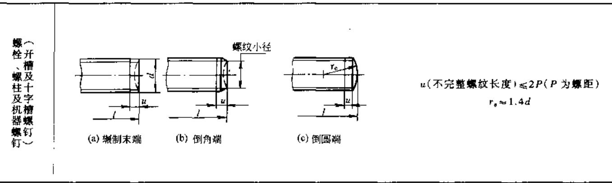

表4-1-35

$d _ { \mathrm { { o } } } = d - 1 , 6 P$ (P为螺距)  
d,=0.5d±0.5  
L=3P±0.5  
L,=5P±0.5

<table><tr><td colspan="2">蝶</td><td colspan="2">i</td><td colspan="3"></td></tr><tr><td></td><td>刮削端</td><td>螺纹直径</td><td>d</td><td>d，</td><td>d，</td><td>21+m 2+</td></tr><tr><td rowspan="12">紧 定</td><td>d</td><td>h14</td><td>h16 0.1</td><td>h14 ／</td><td>i</td><td></td></tr><tr><td>1</td><td>0.5</td><td></td><td>1</td><td></td><td></td></tr><tr><td>1.2</td><td>0.6</td><td>0.12</td><td>0.7</td><td>0.35</td><td>0.7</td></tr><tr><td>1.4</td><td>0.7</td><td>0.14 0.16</td><td>0.8</td><td>0.4</td><td>0.8</td></tr><tr><td>1.6</td><td>0.8</td><td>0.18</td><td>0.9</td><td>0.45</td><td>0.9</td></tr><tr><td>1.8</td><td>0.9 1</td><td>0.2</td><td>1</td><td>0.5</td><td>1</td></tr><tr><td>2 2.2</td><td>1.2</td><td>0.22</td><td>1.1</td><td>0.55</td><td>1.1</td></tr><tr><td>2.5</td><td>1.5</td><td>0.25</td><td>1.2</td><td>0.63</td><td>1.25</td></tr><tr><td>3</td><td>2</td><td>0.3</td><td>1.4</td><td>0.75</td><td>1.5</td></tr><tr><td>倒</td><td>3.5 2.2</td><td>0.35</td><td>1.7</td><td>0.88</td><td>1.75</td></tr><tr><td></td><td>2.5</td><td>0.4</td><td>2</td><td>1</td><td>2</td></tr><tr><td>中</td><td>4.5 3</td><td>0.45</td><td>2.2</td><td>1.12</td><td>2.25</td></tr><tr><td>螺</td><td>5</td><td>3.5</td><td>0.5</td><td>2.5</td><td>1.25</td><td>2.5</td></tr><tr><td>钉</td><td>6</td><td>4</td><td>1.5</td><td>3</td><td>1.5</td><td>3</td></tr><tr><td>902+20</td><td>7</td><td>5</td><td>2</td><td>4</td><td>1.75</td><td>3.5</td></tr><tr><td>Id)锥端</td><td>8</td><td>5.5</td><td>2</td><td>5</td><td>2</td><td>4</td></tr><tr><td></td><td>10</td><td>7</td><td>2.5</td><td>6</td><td>2.5</td><td>5</td></tr><tr><td></td><td>12</td><td>8.5</td><td>3</td><td>7</td><td>3</td><td>6</td></tr><tr><td></td><td>14</td><td>10</td><td>4</td><td>8.5</td><td>3.5</td><td>7</td></tr><tr><td></td><td>16</td><td>12</td><td>4</td><td>10</td><td>4</td><td>8</td></tr><tr><td></td><td>18</td><td>13</td><td>5</td><td>11</td><td>4.5</td><td>9</td></tr><tr><td></td><td>20</td><td>15</td><td>5</td><td>13</td><td>5</td><td>10</td></tr><tr><td></td><td>22</td><td>17</td><td>6</td><td>15</td><td>5.5</td><td>1</td></tr><tr><td></td><td>24</td><td>18</td><td>6</td><td>16</td><td>6</td><td>12</td></tr></table>

<table><tr><td rowspan=10 colspan=1>紧定螺钉</td><td rowspan=10 colspan=1>90"+2（c）截锥端452~12H(f）凹端</td><td rowspan=1 colspan=1>螺纹直径d</td><td rowspan=1 colspan=1>dh14</td><td rowspan=1 colspan=1>dh16</td><td rowspan=1 colspan=1>d，h14</td><td rowspan=1 colspan=1>2+T14</td><td rowspan=1 colspan=1></td></tr><tr><td rowspan=7 colspan=1>27302336394245</td><td rowspan=1 colspan=1>21</td><td rowspan=1 colspan=1>8</td><td rowspan=1 colspan=1></td><td rowspan=1 colspan=1>6.7</td><td rowspan=1 colspan=1>13.5</td></tr><tr><td rowspan=2 colspan=1>2326</td><td rowspan=1 colspan=1>8</td><td rowspan=1 colspan=1></td><td rowspan=1 colspan=1>7.5</td><td rowspan=1 colspan=1>15</td></tr><tr><td rowspan=1 colspan=1>10</td><td rowspan=1 colspan=1></td><td rowspan=1 colspan=1>8.2</td><td rowspan=1 colspan=1>16.5</td></tr><tr><td rowspan=1 colspan=1>28</td><td rowspan=1 colspan=1>10</td><td rowspan=1 colspan=1></td><td rowspan=1 colspan=1>9</td><td rowspan=1 colspan=1>18</td></tr><tr><td rowspan=1 colspan=1>30</td><td rowspan=1 colspan=1>12</td><td rowspan=1 colspan=1></td><td rowspan=1 colspan=1>9.7</td><td rowspan=1 colspan=1>19.5</td></tr><tr><td rowspan=1 colspan=1>32</td><td rowspan=1 colspan=1>12</td><td rowspan=1 colspan=1></td><td rowspan=1 colspan=1>10.5</td><td rowspan=1 colspan=1>21</td></tr><tr><td rowspan=1 colspan=1>35</td><td rowspan=1 colspan=1>14</td><td rowspan=1 colspan=1></td><td rowspan=1 colspan=1>11.2</td><td rowspan=1 colspan=1>22.5</td></tr><tr><td rowspan=2 colspan=1>4852</td><td rowspan=1 colspan=1>38</td><td rowspan=1 colspan=1>14</td><td rowspan=1 colspan=1></td><td rowspan=1 colspan=1>12</td><td rowspan=1 colspan=1>24</td></tr><tr><td rowspan=1 colspan=1>42</td><td rowspan=1 colspan=1>16</td><td rowspan=1 colspan=1></td><td rowspan=1 colspan=1>13</td><td rowspan=1 colspan=1>26</td></tr></table>

①对短螺钉为120±2,按相应产品标准的规定;②45仪指螺纹小径以下的末端部分。注: $d \leqslant \mathsf { M S }$ 的截锥端上没有平面(d)部分,但其端部可以倒。

# 2.2普通螺纹收尾、肩距、退刀槽、倒角(GB/T3一1997)

表4-1-36

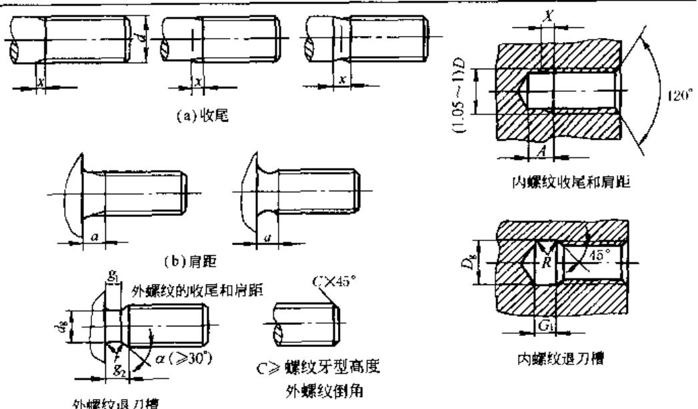

/mm 

外螺纹的收尾、肩距和退刀槽

<table><tr><td rowspan="2">螺距P</td><td colspan="2">收尾x max</td><td colspan="3">肩距a ax</td><td colspan="5">退月 槽</td></tr><tr><td>般</td><td>短的</td><td>一般</td><td>长的</td><td>短的</td><td></td><td>81 min</td><td>g2 max</td><td>d</td><td>， 以</td></tr><tr><td>0.2</td><td>0.5</td><td>0.25</td><td></td><td>0.6</td><td>0.8</td><td>0.4</td><td></td><td></td><td></td><td></td></tr><tr><td>0.25</td><td>0.6</td><td>0.3</td><td>0.75</td><td>1</td><td></td><td>0.5</td><td>0.4</td><td>0.75</td><td>d-0.4</td><td>0.12</td></tr><tr><td>0.3</td><td>0.75</td><td>0.4</td><td>0.9</td><td>1.2</td><td></td><td>0.6</td><td>0.5</td><td>0.9</td><td>d-0.5</td><td>0.16</td></tr><tr><td>0.35</td><td>0.9</td><td>0.45</td><td>1.05</td><td>1.4</td><td></td><td>0.7</td><td>0.6</td><td>1.05</td><td>d-0.6</td><td>0.16</td></tr><tr><td>0.4</td><td>1</td><td>0.5</td><td>1.2</td><td>1.6</td><td></td><td>0.8</td><td>0.6</td><td>1.2</td><td>d-0.7</td><td>0.2</td></tr><tr><td>0.45</td><td>1.1</td><td>0.6</td><td>1.35</td><td>1.8</td><td></td><td>0.9</td><td>0.7</td><td>1.35</td><td>d-0.7 d-0.8</td><td>0.2</td></tr><tr><td>0.5</td><td>1.25</td><td>0.7</td><td>1.5</td><td>2</td><td>1</td><td></td><td>0.8</td><td>1.5</td><td>d-1</td><td>0.2 0.4</td></tr><tr><td>0.6</td><td>1.5</td><td>0.75</td><td>1.8</td><td>2.4</td><td></td><td>1.2</td><td>0.9</td><td>1.8</td><td>d-1.1</td><td></td></tr><tr><td>0.7</td><td>1.75</td><td>0.9</td><td>2.1</td><td>2.8</td><td></td><td>1.4</td><td>1.1</td><td>2.1</td><td>d-1.2</td><td>0.4</td></tr><tr><td>0.75</td><td>1.9</td><td>1</td><td>2.25</td><td>3</td><td></td><td>1.5</td><td>1.2</td><td>2.25</td><td></td><td>0.4</td></tr></table>

续表

<table><tr><td rowspan="2">螺距P</td><td colspan="2">收尾x max</td><td colspan="3">肩距a max</td><td colspan="4">退刀槽</td></tr><tr><td>一般</td><td>短的</td><td>一般</td><td>长的</td><td>短的</td><td>g1 min</td><td>g2 mAx</td><td>d</td><td>1 B</td></tr><tr><td>0.8</td><td>2</td><td>1</td><td>2.4</td><td>3.2</td><td>1.6</td><td>13</td><td>2.4</td><td>d-1.3</td><td>0.4</td></tr><tr><td>1</td><td>2.5</td><td>1.25</td><td>3</td><td>4</td><td>2</td><td>1.6</td><td>3</td><td>d-1.6</td><td>0.6</td></tr><tr><td>1.25</td><td>3.2</td><td>1.6</td><td>4</td><td>5</td><td>2.5</td><td>2</td><td>3.75</td><td>d-2</td><td>0.6</td></tr><tr><td>1.5</td><td>3.8</td><td>1.9</td><td>4.5</td><td>6</td><td>3</td><td>2.5</td><td>4.5</td><td>d-2.3</td><td>0.8</td></tr><tr><td>1.75</td><td>4.3</td><td>2.2</td><td>5.3</td><td>7</td><td>3.5</td><td>3</td><td>5.25</td><td>d-2.6</td><td>1</td></tr><tr><td>2</td><td>5</td><td>2.5</td><td>6</td><td>8</td><td>4</td><td>3.4</td><td>6</td><td>d-3</td><td>1</td></tr><tr><td>2.5</td><td>6.3</td><td>3.2</td><td>7.5</td><td>10</td><td>5</td><td>4.4</td><td>7.5</td><td>d-3.6</td><td>1.2</td></tr><tr><td>3</td><td>7.5</td><td>3.8</td><td>9</td><td>12</td><td>6</td><td>5.2</td><td>9</td><td>d-4.4</td><td>1.6</td></tr><tr><td>3.5</td><td>9</td><td>4.5</td><td>10.5</td><td>14</td><td>7</td><td>6.2</td><td>10.5</td><td>d-5</td><td>1.6</td></tr><tr><td>4</td><td>10</td><td>5</td><td>12</td><td>16</td><td>8</td><td>7</td><td>12</td><td>d-5.7</td><td>2</td></tr><tr><td>4.5</td><td>11</td><td>5.5</td><td>13.5</td><td>18</td><td>9</td><td>8</td><td>13.5</td><td>d-6.4</td><td>2.5</td></tr><tr><td>S</td><td>12.5</td><td>6.3</td><td>15</td><td>20</td><td>10</td><td>9</td><td>15</td><td>d-7</td><td>2.5</td></tr><tr><td>5.5</td><td>14</td><td>7</td><td>16.5</td><td>22</td><td>11</td><td>11</td><td>17.5</td><td>d-7.7</td><td>3.2</td></tr><tr><td>6</td><td>15</td><td>7.5</td><td>18</td><td>24</td><td>12 = 2P</td><td>11</td><td>18 3P</td><td>d-8.3</td><td>3.2</td></tr><tr><td>参考值</td><td>2.5P</td><td>1.25P</td><td>3P</td><td>=4P</td><td></td><td>1</td><td></td><td></td><td>I</td></tr></table>

说明:1.应优先选用“一般”长度的收尾和肩距;“短”收尾和“短”肩距仅用于结构受限制的螺纹件上;产品等级为B或C级的螺纹紧固件可采用“长”肩距。2.d为螺纹公称直径代号。3. $\vec { \mathbf { d } } _ { \bar { \mathbf { \theta } } }$ 公差为:h13( $d > 3 m m \rangle$ 、h12( $d \leqslant 3 \mathrm { m m } )$ 

内螺纹的收尾、肩距和退刀糟

<table><tr><td rowspan=3 colspan=1>螺距P</td><td rowspan=2 colspan=2>收尾Xmax</td><td rowspan=2 colspan=2>肩距A</td><td rowspan=1 colspan=4>退刀槽</td></tr><tr><td rowspan=1 colspan=2>G</td><td rowspan=2 colspan=1>D</td><td rowspan=2 colspan=1>RR</td></tr><tr><td rowspan=1 colspan=1>一般</td><td rowspan=1 colspan=1>短的</td><td rowspan=1 colspan=1>一般</td><td rowspan=1 colspan=1>长的</td><td rowspan=1 colspan=1>一般</td><td rowspan=1 colspan=1>短的</td></tr><tr><td rowspan=1 colspan=1>0.25</td><td rowspan=1 colspan=1>1</td><td rowspan=1 colspan=1>0.5</td><td rowspan=1 colspan=1>1.5</td><td rowspan=1 colspan=1>2</td><td rowspan=5 colspan=1></td><td rowspan=5 colspan=1></td><td rowspan=10 colspan=1>D+0.3</td><td rowspan=5 colspan=1></td></tr><tr><td rowspan=1 colspan=1>0.3</td><td rowspan=1 colspan=1>1.2</td><td rowspan=1 colspan=1>0.6</td><td rowspan=1 colspan=1>1.8</td><td rowspan=1 colspan=1>2.4</td></tr><tr><td rowspan=1 colspan=1>0.35</td><td rowspan=1 colspan=1>1.4</td><td rowspan=1 colspan=1>0.7</td><td rowspan=1 colspan=1>2.2</td><td rowspan=1 colspan=1>2.8</td></tr><tr><td rowspan=1 colspan=1>0.4</td><td rowspan=1 colspan=1>1.6</td><td rowspan=1 colspan=1>0.8</td><td rowspan=1 colspan=1>2.5</td><td rowspan=1 colspan=1>3.2</td></tr><tr><td rowspan=1 colspan=1>0.45</td><td rowspan=1 colspan=1>1.8</td><td rowspan=1 colspan=1>0.9</td><td rowspan=1 colspan=1>2.8</td><td rowspan=1 colspan=1>3.6</td></tr><tr><td rowspan=1 colspan=1>0.5</td><td rowspan=1 colspan=1>2</td><td rowspan=1 colspan=1>1</td><td rowspan=1 colspan=1>3</td><td rowspan=1 colspan=1>4</td><td rowspan=1 colspan=1>2</td><td rowspan=1 colspan=1>1</td><td rowspan=1 colspan=1>0.2</td></tr><tr><td rowspan=1 colspan=1>0.6</td><td rowspan=1 colspan=1>2.4</td><td rowspan=1 colspan=1>1.2</td><td rowspan=1 colspan=1>3.2</td><td rowspan=1 colspan=1>4.8</td><td rowspan=1 colspan=1>2.4</td><td rowspan=1 colspan=1>1.2</td><td rowspan=1 colspan=1>0.3</td></tr><tr><td rowspan=1 colspan=1>0.7</td><td rowspan=1 colspan=1>2.8</td><td rowspan=1 colspan=1>1.4</td><td rowspan=1 colspan=1>3.5</td><td rowspan=1 colspan=1>5.6</td><td rowspan=1 colspan=1>2.8</td><td rowspan=1 colspan=1>1.4</td><td rowspan=1 colspan=1>0.4</td></tr><tr><td rowspan=1 colspan=1>0.75</td><td rowspan=1 colspan=1>3</td><td rowspan=1 colspan=1>1.5</td><td rowspan=1 colspan=1>3.8</td><td rowspan=1 colspan=1>6</td><td rowspan=1 colspan=1>3</td><td rowspan=1 colspan=1>1.5</td><td rowspan=1 colspan=1>0.4</td></tr><tr><td rowspan=1 colspan=1>0.8</td><td rowspan=1 colspan=1>3.2</td><td rowspan=1 colspan=1>1.6</td><td rowspan=1 colspan=1>4</td><td rowspan=1 colspan=1>6.4</td><td rowspan=1 colspan=1>3.2</td><td rowspan=1 colspan=1>1.6</td><td rowspan=1 colspan=1>0.4</td></tr><tr><td rowspan=1 colspan=1>1</td><td rowspan=1 colspan=1>4</td><td rowspan=1 colspan=1>2</td><td rowspan=1 colspan=1>5</td><td rowspan=1 colspan=1>8</td><td rowspan=1 colspan=1>4</td><td rowspan=1 colspan=1>2</td><td rowspan=13 colspan=1>D+0.5</td><td rowspan=1 colspan=1>0.5</td></tr><tr><td rowspan=1 colspan=1>1.25</td><td rowspan=1 colspan=1>5</td><td rowspan=1 colspan=1>2.5</td><td rowspan=1 colspan=1>6</td><td rowspan=1 colspan=1>10</td><td rowspan=1 colspan=1>5</td><td rowspan=1 colspan=1>2.5</td><td rowspan=1 colspan=1>0.6</td></tr><tr><td rowspan=1 colspan=1>1.5</td><td rowspan=1 colspan=1>6</td><td rowspan=1 colspan=1>3</td><td rowspan=1 colspan=1>7</td><td rowspan=1 colspan=1>12</td><td rowspan=1 colspan=1>6</td><td rowspan=1 colspan=1>3</td><td rowspan=1 colspan=1>0.8</td></tr><tr><td rowspan=1 colspan=1>1.75</td><td rowspan=1 colspan=1>7</td><td rowspan=1 colspan=1>3.5</td><td rowspan=1 colspan=1>9</td><td rowspan=1 colspan=1>4</td><td rowspan=1 colspan=1>7</td><td rowspan=1 colspan=1>3.5</td><td rowspan=1 colspan=1>0.9</td></tr><tr><td rowspan=1 colspan=1>2</td><td rowspan=1 colspan=1>8</td><td rowspan=1 colspan=1>4</td><td rowspan=1 colspan=1>10</td><td rowspan=1 colspan=1>16</td><td rowspan=1 colspan=1>8</td><td rowspan=1 colspan=1>4</td><td rowspan=1 colspan=1>1</td></tr><tr><td rowspan=1 colspan=1>2.5</td><td rowspan=1 colspan=1>10</td><td rowspan=1 colspan=1>5</td><td rowspan=1 colspan=1>12</td><td rowspan=1 colspan=1>18</td><td rowspan=1 colspan=1>10</td><td rowspan=1 colspan=1>5</td><td rowspan=1 colspan=1>1.2</td></tr><tr><td rowspan=1 colspan=1>3</td><td rowspan=1 colspan=1>12</td><td rowspan=1 colspan=1>6</td><td rowspan=1 colspan=1>14</td><td rowspan=1 colspan=1>22</td><td rowspan=1 colspan=1>12</td><td rowspan=1 colspan=1>6</td><td rowspan=1 colspan=1>1.5</td></tr><tr><td rowspan=1 colspan=1>3.5</td><td rowspan=1 colspan=1>14</td><td rowspan=1 colspan=1>7</td><td rowspan=1 colspan=1>16</td><td rowspan=1 colspan=1>24</td><td rowspan=1 colspan=1>14</td><td rowspan=1 colspan=1>7</td><td rowspan=1 colspan=1>1.8</td></tr><tr><td rowspan=1 colspan=1>4</td><td rowspan=1 colspan=1>16</td><td rowspan=1 colspan=1>8</td><td rowspan=1 colspan=1>18</td><td rowspan=1 colspan=1>26</td><td rowspan=1 colspan=1>16</td><td rowspan=1 colspan=1>8</td><td rowspan=1 colspan=1>2</td></tr><tr><td rowspan=1 colspan=1>4.5</td><td rowspan=1 colspan=1>18</td><td rowspan=1 colspan=1>9</td><td rowspan=1 colspan=1>21</td><td rowspan=1 colspan=1>29</td><td rowspan=1 colspan=1>18</td><td rowspan=1 colspan=1>9</td><td rowspan=1 colspan=1>2.2</td></tr><tr><td rowspan=1 colspan=1>5</td><td rowspan=1 colspan=1>20</td><td rowspan=1 colspan=1>10</td><td rowspan=1 colspan=1>23</td><td rowspan=1 colspan=1>32</td><td rowspan=1 colspan=1>20</td><td rowspan=1 colspan=1>10</td><td rowspan=1 colspan=1>2.5</td></tr><tr><td rowspan=1 colspan=1>5.5</td><td rowspan=1 colspan=1>22</td><td rowspan=1 colspan=1>11</td><td rowspan=1 colspan=1>25</td><td rowspan=1 colspan=1>35</td><td rowspan=1 colspan=1>22</td><td rowspan=1 colspan=1>1</td><td rowspan=1 colspan=1>2.8</td></tr><tr><td rowspan=1 colspan=1>6</td><td rowspan=1 colspan=1>24</td><td rowspan=1 colspan=1>12</td><td rowspan=1 colspan=1>28</td><td rowspan=1 colspan=1>38</td><td rowspan=1 colspan=1>24</td><td rowspan=1 colspan=1>12</td><td rowspan=1 colspan=1>3</td></tr><tr><td rowspan=1 colspan=1>参考值</td><td rowspan=1 colspan=1>= 4P</td><td rowspan=1 colspan=1>= 2P</td><td rowspan=1 colspan=1>(6~5)P</td><td rowspan=1 colspan=1>(8-6.5)P</td><td rowspan=1 colspan=1>= 4P</td><td rowspan=1 colspan=1>=2P</td><td rowspan=1 colspan=1>1</td><td rowspan=1 colspan=1>0.5P</td></tr></table>

说明:1.应优先选用"一般”长度的收尾和肩距;容屑需要较大空间时可选用“长”肩距,结构受限制时可选用“短”收尾。2.“短”退刀槽仅在结构受限制时采用。3. $D _ { \pmb { \xi } }$ 公差为H13。4. $\pmb { D }$ 为螺纹公称直径代号。

# 2.3圆柱管螺纹收尾、退刀槽、倒角尺寸

表4-1-37

<table><tr><td rowspan=1 colspan=16>/thit</td></tr><tr><td rowspan=1 colspan=16>外螺纹                                          内螺纹倒角：收尾                    退刀槽                    收尾                  退刀槽2b=2                                                      h力小db>3h>3力1120T    3路45°</td></tr><tr><td rowspan=2 colspan=1>公称直径d</td><td rowspan=2 colspan=2>每英寸牙数n</td><td rowspan=1 colspan=5>外螺纹</td><td rowspan=1 colspan=6>内螺纹</td><td></td><td rowspan=1 colspan=1></td></tr><tr><td rowspan=1 colspan=1>不大于 =25时</td><td rowspan=1 colspan=1>B</td><td rowspan=1 colspan=1>d</td><td rowspan=1 colspan=1>R</td><td rowspan=1 colspan=1>1</td><td rowspan=1 colspan=1>1不大子</td><td rowspan=1 colspan=1>山</td><td rowspan=1 colspan=1>4</td><td rowspan=1 colspan=2>R</td><td rowspan=1 colspan=1>1</td><td></td><td rowspan=1 colspan=1>G</td></tr><tr><td rowspan=1 colspan=1>G1/8"</td><td rowspan=1 colspan=2>28</td><td rowspan=1 colspan=1>1.5</td><td rowspan=1 colspan=1>2</td><td rowspan=1 colspan=1>8</td><td rowspan=1 colspan=1>0.5</td><td rowspan=1 colspan=1></td><td rowspan=1 colspan=1>2</td><td rowspan=1 colspan=1>2</td><td rowspan=1 colspan=1>10</td><td rowspan=1 colspan=2>0.5</td><td rowspan=1 colspan=1></td><td></td><td rowspan=1 colspan=1>0.6</td></tr><tr><td rowspan=1 colspan=1>G1/4G3/8</td><td rowspan=1 colspan=2>19</td><td rowspan=1 colspan=1>2</td><td rowspan=1 colspan=1>3</td><td rowspan=1 colspan=1>1114</td><td rowspan=1 colspan=1></td><td rowspan=1 colspan=1></td><td rowspan=1 colspan=1>3</td><td rowspan=1 colspan=1>3</td><td rowspan=1 colspan=1>13.517</td><td rowspan=1 colspan=2></td><td rowspan=1 colspan=1></td><td rowspan=15 colspan=2>11.5</td></tr><tr><td rowspan=1 colspan=1>G1/2"G5/8"G3/4"</td><td rowspan=1 colspan=2>14</td><td rowspan=1 colspan=1>2.5</td><td rowspan=1 colspan=1>4</td><td rowspan=1 colspan=1>182023.5</td><td rowspan=1 colspan=1>1</td><td rowspan=1 colspan=1>0.5</td><td rowspan=1 colspan=1>4</td><td rowspan=1 colspan=1>4</td><td rowspan=1 colspan=1>21.523.527</td><td rowspan=1 colspan=2>1</td><td rowspan=1 colspan=1>0.5</td></tr><tr><td rowspan=1 colspan=1>G1G1</td><td rowspan=5 colspan=2></td><td rowspan=4 colspan=1></td><td rowspan=1 colspan=1></td><td rowspan=1 colspan=1>29.538</td><td rowspan=4 colspan=1></td><td rowspan=4 colspan=1></td><td rowspan=4 colspan=1>5</td><td rowspan=4 colspan=1>6</td><td rowspan=4 colspan=1>3442.54B.554.560.5</td><td rowspan=4 colspan=2>1.5</td><td rowspan=13 colspan=1>1</td></tr><tr><td rowspan=1 colspan=1>G1</td><td rowspan=3 colspan=1></td><td rowspan=3 colspan=1>445056</td></tr><tr><td rowspan=1 colspan=1>G13"</td></tr><tr><td rowspan=2 colspan=1>G2G2X</td></tr><tr><td rowspan=1 colspan=1></td><td rowspan=1 colspan=1></td><td rowspan=1 colspan=1>62</td><td rowspan=9 colspan=1>1.5</td><td rowspan=9 colspan=1>0.5</td><td rowspan=3 colspan=1>6</td><td rowspan=3 colspan=1>B</td><td rowspan=3 colspan=1>66.57682.5</td><td rowspan=3 colspan=2>2</td></tr><tr><td rowspan=1 colspan=1>G21</td><td rowspan=1 colspan=1>1</td><td rowspan=2 colspan=1>1</td><td rowspan=1 colspan=1>3.5</td><td rowspan=1 colspan=1>5</td><td rowspan=1 colspan=1>71</td></tr><tr><td rowspan=1 colspan=1>G23</td><td></td><td rowspan=1 colspan=1></td><td rowspan=1 colspan=1></td><td rowspan=1 colspan=1>78</td></tr><tr><td rowspan=1 colspan=1>G3</td><td rowspan=5 colspan=2></td><td rowspan=6 colspan=1></td><td rowspan=2 colspan=1></td><td rowspan=2 colspan=1>8496</td><td rowspan=6 colspan=1>8</td><td rowspan=6 colspan=1>10</td><td rowspan=6 colspan=1>88.5101114139.5165</td><td rowspan=6 colspan=2>3</td></tr><tr><td rowspan=1 colspan=1>G3/</td></tr><tr><td rowspan=1 colspan=1>G4</td><td rowspan=3 colspan=1></td><td rowspan=1 colspan=1>109</td></tr><tr><td rowspan=3 colspan=1>G5C6</td><td></td></tr><tr><td rowspan=2 colspan=1></td><td rowspan=1 colspan=1>134.5</td></tr><tr><td rowspan=1 colspan=2></td><td rowspan=1 colspan=1>160</td></tr></table>

注:1.外螺纹的螺尾角 $\alpha = 2 5 ^ { \circ }$ 的螺尾数值系列为基本的。内螺纹的螺尾角不予规定,依螺尾长度 $\ell _ { 1 }$ 与螺纹牙型高度来确定。2.对辗制和铣制的螺尾角不予规定,而螺尾长度!不超过表中对 $\pmb { \alpha } = \pmb { 2 5 } ^ { \circ }$ 时所规定的数值。3.螺纹倒角的宽度是指在切制螺纹前的数值。4.在必要的情况下, $\flat$ (或 $\pmb { b _ { 1 } }$ )的退刀槽宽度两种型式可以采用本表规定以外的退刀糟宽度,但不得小于1.2倍螺距和不大于3倍螺距。5.在结构有特殊要求时,允许不按本表规定的退刀槽直径 $d _ { 2 }$ 与 $\pmb { d } _ { 3 }$ 

# 2.4螺塞与连接螺孔尺寸

表4-1-38

<table><tr><td colspan="4"></td><td colspan="2">螺纹直径d</td><td rowspan="2">1</td><td rowspan="2">£</td><td colspan="3">螺纹直径d ！</td><td rowspan="2"></td><td rowspan="2">1</td></tr><tr><td></td><td></td><td>公制</td><td>管牙/in</td><td></td><td></td><td>公制</td><td>管牙/in</td></tr><tr><td></td><td></td><td></td><td>M10 × 1</td><td>G1/8</td><td>10</td><td>16</td><td></td><td>M33x 1.5</td><td>G1</td><td>20</td><td>30</td></tr><tr><td></td><td></td><td></td><td>M12 × 1.25</td><td>G1/4"</td><td></td><td>12</td><td>18</td><td>M36× 1.5</td><td>G1/</td><td>20</td><td>30</td></tr><tr><td></td><td></td><td></td><td>M14 × 1.5</td><td>G1/4"</td><td></td><td>12</td><td>18</td><td>M39× 1.5</td><td>G1</td><td>20</td><td>30</td></tr><tr><td></td><td></td><td></td><td>M16 × 1.5</td><td>C3/8"</td><td>12</td><td></td><td>18</td><td>M42× 1.5</td><td>G1”</td><td>25</td><td>35</td></tr><tr><td></td><td></td><td></td><td>M18 × 1.5</td><td>G3/8</td><td></td><td>12</td><td>18</td><td>M45×1.5</td><td>(G1%"）</td><td>25</td><td>35</td></tr><tr><td colspan="3" rowspan="8"></td><td>M20 × 1.5</td><td>C1/2</td><td></td><td>15</td><td>23</td><td>M48×1.5</td><td>G1</td><td>25</td><td>35</td></tr><tr><td>M22 × 1.5</td><td></td><td>G5/8</td><td>15</td><td>23</td><td>M52×2</td><td>C1%</td><td>30</td><td>40</td></tr><tr><td>M24 ×1.5</td><td></td><td>G5/8</td><td>15</td><td>23</td><td>M56 × 2</td><td>C1/</td><td>30</td><td>40</td></tr><tr><td></td><td>M27 × 1.5</td><td>G3/4"</td><td>18</td><td>26</td><td>M60× 2</td><td></td><td>G2"</td><td>30 40</td></tr><tr><td></td><td>M30 × 1.5</td><td>(G7/8）</td><td>18</td><td>26</td><td>M64×2</td><td></td><td>（G2/） 30</td><td>40</td></tr></table>

# 2.5地脚螺栓孔和凸缘

/mm 

表4-1-39

<table><tr><td></td><td></td><td></td><td></td><td></td><td></td><td>16 20</td><td>24</td><td>30</td><td>36 42</td><td>48</td><td>56</td><td>64</td><td>76</td><td>90j100</td><td></td><td>115</td><td>130</td></tr><tr><td rowspan="8"></td><td colspan="2"></td><td></td><td></td><td rowspan="2">d</td><td rowspan="2">25</td><td rowspan="2">3040</td><td rowspan="2"></td><td rowspan="2"></td><td rowspan="2"></td><td rowspan="2">65</td><td rowspan="2">80</td><td rowspan="2">95</td><td rowspan="2"></td><td rowspan="2">145</td><td rowspan="2">165185</td></tr><tr><td></td><td></td><td></td><td>20</td></tr><tr><td rowspan="2"></td><td rowspan="2"></td><td></td><td rowspan="2"></td><td rowspan="2"></td><td rowspan="2"></td><td rowspan="2">50</td><td rowspan="2">55</td><td rowspan="2"></td><td rowspan="2"></td><td rowspan="2"></td><td rowspan="2">110</td><td rowspan="2">135</td><td rowspan="2"></td></tr><tr><td></td><td></td></tr><tr><td rowspan="2"></td><td></td><td></td><td rowspan="2">D 45</td><td rowspan="2"></td><td rowspan="2"></td><td rowspan="2"></td><td rowspan="2"></td><td rowspan="2"></td><td rowspan="2"></td><td rowspan="2"></td><td rowspan="2"></td><td rowspan="2"></td><td rowspan="2"></td></tr><tr><td></td><td></td></tr><tr><td></td><td></td><td></td><td>48</td><td></td><td></td><td></td><td></td><td></td><td></td><td></td><td>6085100110130170200220280280330370</td><td></td></tr><tr><td></td><td></td><td></td><td></td><td></td><td></td><td></td><td></td><td></td><td></td><td></td><td></td><td></td><td></td></tr><tr><td colspan="2">d</td><td></td><td>i 25 30</td><td></td><td rowspan="2">355055607095110120150150175200</td><td></td><td></td><td></td><td></td><td></td><td></td><td></td><td></td><td></td></tr><tr><td colspan="2"></td><td></td><td></td><td></td><td rowspan="2"></td><td rowspan="2"></td><td rowspan="2"></td><td rowspan="2"></td><td rowspan="2"></td><td rowspan="2"></td><td rowspan="2"></td><td rowspan="2"></td></tr><tr><td rowspan="2"></td><td rowspan="2">M4采用钻孔</td><td rowspan="2"></td><td rowspan="2"></td><td rowspan="2">22 25</td><td rowspan="2">60 70</td></tr><tr><td>≥M56采用铸孔</td><td>E</td><td>30 50 55</td><td></td><td></td><td></td><td></td><td></td><td></td><td></td></tr></table>

注:根据结构和工艺要求,必要时尺寸 $\scriptstyle L$ 及 $\pmb { L } _ { 1 }$ 可以变动。

# 2.6孔沿圆周的配置

/mm 

表4-1-40

<table><tr><td rowspan=5 colspan=1>A1</td><td rowspan=1 colspan=1>D</td><td rowspan=1 colspan=1>D</td><td rowspan=1 colspan=1>d</td><td rowspan=1 colspan=1>A</td><td rowspan=1 colspan=1>P/k</td><td rowspan=1 colspan=1>D</td><td rowspan=1 colspan=1>D</td><td rowspan=1 colspan=1>d</td><td rowspan=1 colspan=1>R</td><td rowspan=1 colspan=1>p/kN</td><td rowspan=1 colspan=1>D</td><td rowspan=1 colspan=1>D</td><td rowspan=1 colspan=1>d</td><td rowspan=1 colspan=1>n</td><td rowspan=1 colspan=1>P/kN</td></tr><tr><td rowspan=1 colspan=1>420430440</td><td rowspan=1 colspan=1>480</td><td rowspan=1 colspan=1>M20</td><td rowspan=1 colspan=1>8</td><td rowspan=1 colspan=1>93</td><td rowspan=1 colspan=1>560580</td><td rowspan=1 colspan=1>640</td><td rowspan=1 colspan=1>M24</td><td rowspan=1 colspan=1>10</td><td rowspan=1 colspan=1>t67</td><td rowspan=1 colspan=1>800810820</td><td rowspan=1 colspan=1>880</td><td rowspan=1 colspan=1>M30</td><td rowspan=1 colspan=1>12</td><td rowspan=1 colspan=1>319</td></tr><tr><td rowspan=1 colspan=1>485500530</td><td rowspan=1 colspan=1>570</td><td rowspan=1 colspan=1>M20</td><td rowspan=1 colspan=1>8</td><td rowspan=1 colspan=1>93</td><td rowspan=1 colspan=1>600620640</td><td rowspan=1 colspan=1>700</td><td rowspan=1 colspan=1>M30</td><td rowspan=1 colspan=1>12</td><td rowspan=1 colspan=1>319</td><td rowspan=1 colspan=1>915930945</td><td rowspan=1 colspan=1>1020</td><td rowspan=1 colspan=1>M36</td><td rowspan=1 colspan=1>12</td><td rowspan=1 colspan=1>471</td></tr><tr><td rowspan=2 colspan=1>535540545550</td><td rowspan=2 colspan=1>600</td><td rowspan=2 colspan=1>M24</td><td rowspan=2 colspan=1>10</td><td rowspan=2 colspan=1>167</td><td rowspan=1 colspan=1>650680</td><td rowspan=1 colspan=1>470</td><td rowspan=1 colspan=1>M30</td><td rowspan=1 colspan=1>12</td><td rowspan=1 colspan=1>319</td><td rowspan=1 colspan=1>10301070</td><td rowspan=1 colspan=1>1140</td><td rowspan=1 colspan=1>M36</td><td rowspan=1 colspan=1>12</td><td rowspan=1 colspan=1>471</td></tr><tr><td rowspan=1 colspan=1>730740</td><td rowspan=1 colspan=1>800</td><td rowspan=1 colspan=1>M30</td><td rowspan=1 colspan=1>12</td><td rowspan=1 colspan=1>319</td><td rowspan=1 colspan=1>11301200</td><td rowspan=1 colspan=1>11301200</td><td rowspan=1 colspan=1>M36</td><td rowspan=1 colspan=1>12</td><td rowspan=1 colspan=1>471</td></tr></table>

注:螺栓上允许最大载荷(Px)是以螺栓承受拉应力54N/mm计算得出来的。

27 

<table><tr><td colspan="3">螺纹规格d 精装配</td><td>M1 M1.2</td><td>M1.4</td><td>M1.6</td><td>M1.8</td><td>M2</td><td>M2.5</td><td></td><td>M3</td><td>M3.5</td><td>M4 M4.5</td><td>M5</td><td>M6</td><td>M7 M8</td><td>M10</td><td>M12</td><td>M14</td><td></td><td>M16</td><td>M18</td><td>M20</td><td></td><td>M22</td><td>M24</td><td>M27</td><td>M3</td></tr><tr><td colspan="3">螺孔直径</td><td>1. 1.2</td><td>1.7 1.8</td><td>1.5 1.6</td><td>1.7 2</td><td>2 2.</td><td>2.2 2.4</td><td>2.7</td><td>3.2</td><td>3.7</td><td>4.3</td><td>4.8</td><td>5.3</td><td>6.4</td><td>7.4 8.4</td><td>10.5</td><td>13</td><td>15</td><td></td><td>17</td><td>19</td><td>21</td><td>23</td><td>25</td><td>28</td></tr><tr><td>(CR/T5277-1985）</td><td>中等装配 根装配</td><td>1.3</td><td>2</td><td>1.8</td><td>2.2</td><td></td><td>2.4</td><td>32 2.6 3.</td><td>34 3.6</td><td>3.9 4.2</td><td>45 4.8</td><td>5 5.3</td><td>5.5 5.8</td><td>6.6 7</td><td>7.6 9 8 10</td><td>i 12</td><td>13.5 14.5</td><td>15.s 16.5</td><td></td><td>17.5 18.5</td><td>20 21</td><td>22 24</td><td>24 26</td><td>3</td><td>3</td><td>31 3</td></tr><tr><td colspan="3">螺纹规格d</td><td>M33</td><td>M36</td><td>M39</td><td>M42</td><td>M45</td><td>M48</td><td>M52</td><td>M56</td><td>M60</td><td>M64</td><td>M68</td><td>M76 M80</td><td>M85</td><td>M90</td><td>M95</td><td>M100</td><td>M105</td><td></td><td>M110M115</td><td>M120</td><td>M125</td><td></td><td></td><td>35</td></tr><tr><td colspan="3">螺孔直径</td><td></td><td>37</td><td>40</td><td>43</td><td>46</td><td>50</td><td>54</td><td>58</td><td>62</td><td>66</td><td>70</td><td>78 82</td><td>87</td><td>93</td><td></td><td></td><td></td><td></td><td></td><td></td><td></td><td>M130</td><td>M140</td><td>M15</td></tr><tr><td colspan="3">(GB/T5277-1985）</td><td>3 中等装配 粗装配</td><td>34 42</td><td>42 45</td><td>45 48</td><td>48 52</td><td>52 56</td><td>56 62</td><td>62 6</td><td>66 70</td><td>70 74</td><td>74 78</td><td>82 86</td><td>86 9 91 96</td><td>96 101</td><td>98 101 107 112</td><td>104 107</td><td>109 112</td><td>114 11</td><td></td><td>119 122 127</td><td>124 127</td><td>129 134 132 137</td><td>144 147</td><td>155 158</td></tr></table>

<table><tr><td rowspan=1 colspan=6>(GB/T5277-1985）螺孔良径</td><td rowspan=1 colspan=1>中等装配粗装配</td><td></td><td rowspan=1 colspan=1>38</td><td rowspan=1 colspan=2>3442</td><td rowspan=1 colspan=2>4245</td><td rowspan=1 colspan=1>4548</td><td rowspan=1 colspan=2>4852</td><td rowspan=1 colspan=2>5</td><td></td><td rowspan=1 colspan=2>5662</td><td rowspan=1 colspan=2>8</td><td></td><td rowspan=1 colspan=2>670</td><td rowspan=1 colspan=2>7074</td><td rowspan=1 colspan=4>74  8278  86</td><td></td><td rowspan=1 colspan=1>8691</td><td rowspan=1 colspan=6>9  96  10196  101 107</td><td rowspan=1 colspan=2>107112</td><td rowspan=1 colspan=1>112117</td><td rowspan=1 colspan=5>11 122 127122 127 32</td><td rowspan=1 colspan=7>355132 137 14 158137 144 155 165</td></tr><tr><td rowspan=1 colspan=1></td><td rowspan=1 colspan=54>表41-42                                                六角螺栓和六角螺母用沉孔（CB/T152.4---1988）                                                     /m</td></tr><tr><td rowspan=4 colspan=7>d</td><td rowspan=1 colspan=5>螺纹规格d</td><td rowspan=1 colspan=1>M1.6</td><td rowspan=1 colspan=1>M2</td><td rowspan=1 colspan=2>M2.5</td><td rowspan=1 colspan=2>M3</td><td rowspan=1 colspan=2>M4</td><td rowspan=1 colspan=2>M5</td><td rowspan=1 colspan=2>M6</td><td rowspan=1 colspan=2>M8</td><td rowspan=1 colspan=2>M10</td><td rowspan=1 colspan=1>M12</td><td rowspan=1 colspan=2>M14</td><td rowspan=1 colspan=2>M16</td><td rowspan=1 colspan=1>M18</td><td rowspan=1 colspan=2>M201</td><td rowspan=1 colspan=2>M22</td><td rowspan=1 colspan=1>M24</td><td rowspan=1 colspan=1>M27</td><td rowspan=1 colspan=2>M30</td><td rowspan=1 colspan=1>M33</td><td rowspan=1 colspan=1>M36]</td><td rowspan=1 colspan=2>M39</td><td rowspan=1 colspan=1>M42j</td><td rowspan=1 colspan=1>M45</td><td rowspan=1 colspan=2>|M48]</td><td rowspan=1 colspan=1>M52</td><td rowspan=1 colspan=1>M56]</td><td rowspan=1 colspan=2>[M60]</td><td rowspan=1 colspan=1>M64</td></tr><tr><td rowspan=1 colspan=5>d(HI5）</td><td rowspan=1 colspan=1>5</td><td rowspan=1 colspan=1>6</td><td rowspan=1 colspan=2>8</td><td rowspan=1 colspan=2>9</td><td rowspan=1 colspan=2>10</td><td rowspan=1 colspan=2>1</td><td rowspan=1 colspan=2>13</td><td rowspan=1 colspan=2>18</td><td rowspan=1 colspan=2>22</td><td rowspan=1 colspan=1>26</td><td rowspan=1 colspan=2>30</td><td rowspan=1 colspan=2>3</td><td rowspan=1 colspan=1>36</td><td rowspan=1 colspan=2>40</td><td rowspan=1 colspan=2>43</td><td rowspan=1 colspan=1>48</td><td rowspan=1 colspan=1>53</td><td rowspan=1 colspan=2>61</td><td rowspan=1 colspan=1>66</td><td rowspan=1 colspan=1>7</td><td rowspan=1 colspan=2>76</td><td rowspan=1 colspan=1>82</td><td rowspan=1 colspan=1>89</td><td rowspan=1 colspan=2>98</td><td rowspan=1 colspan=1>107</td><td rowspan=1 colspan=1>112</td><td rowspan=1 colspan=2>118</td><td rowspan=1 colspan=1>12s</td></tr><tr><td rowspan=1 colspan=5>山</td><td rowspan=1 colspan=1></td><td rowspan=1 colspan=1></td><td rowspan=1 colspan=2></td><td rowspan=1 colspan=2></td><td rowspan=1 colspan=2></td><td rowspan=1 colspan=2></td><td rowspan=1 colspan=2></td><td rowspan=1 colspan=2></td><td rowspan=1 colspan=2></td><td rowspan=1 colspan=1>16</td><td rowspan=1 colspan=2>18</td><td rowspan=1 colspan=2>20</td><td rowspan=1 colspan=1>22</td><td rowspan=1 colspan=2>24</td><td rowspan=1 colspan=2>26</td><td rowspan=1 colspan=1>28</td><td rowspan=1 colspan=1>33</td><td rowspan=1 colspan=2>36</td><td rowspan=1 colspan=1>39</td><td rowspan=1 colspan=1>42</td><td rowspan=1 colspan=2>45</td><td rowspan=1 colspan=1>48</td><td rowspan=1 colspan=1>51</td><td rowspan=1 colspan=2>56</td><td rowspan=1 colspan=1>60</td><td rowspan=1 colspan=1>68</td><td rowspan=1 colspan=2>72:76</td><td rowspan=1 colspan=1>72:76</td></tr><tr><td rowspan=1 colspan=5>d（H13）</td><td rowspan=1 colspan=1>1.8</td><td rowspan=1 colspan=1>2.4</td><td rowspan=1 colspan=2>2.9</td><td rowspan=1 colspan=2>13.4</td><td rowspan=1 colspan=2>4.5</td><td rowspan=1 colspan=2>5.5</td><td rowspan=1 colspan=2>6.6</td><td rowspan=1 colspan=2>9.0</td><td rowspan=1 colspan=2>11.0</td><td rowspan=1 colspan=1>13.5</td><td rowspan=1 colspan=2>15.5</td><td rowspan=1 colspan=2>17.5</td><td rowspan=1 colspan=1>20.0</td><td rowspan=1 colspan=2>22.0</td><td rowspan=1 colspan=2>24</td><td rowspan=1 colspan=1>26</td><td rowspan=1 colspan=1>30</td><td rowspan=1 colspan=2>33</td><td rowspan=1 colspan=1>36</td><td rowspan=1 colspan=1>39</td><td rowspan=1 colspan=2>42</td><td rowspan=1 colspan=1>45</td><td rowspan=1 colspan=1>48</td><td rowspan=1 colspan=2>52</td><td rowspan=1 colspan=1>56</td><td rowspan=1 colspan=1>62</td><td rowspan=1 colspan=2>66</td><td rowspan=1 colspan=1>70</td></tr><tr><td rowspan=1 colspan=1></td><td rowspan=1 colspan=54>表4-1-43                                                        圆柱头用沉孔（GB/T152.3--1988)                                                              /mm</td></tr><tr><td rowspan=6 colspan=5>d4</td><td rowspan=2 colspan=2>螺纹规格d</td><td rowspan=1 colspan=17>适用于GB/T70</td><td rowspan=1 colspan=5></td><td rowspan=1 colspan=5></td><td rowspan=1 colspan=3></td><td rowspan=1 colspan=2>适</td><td rowspan=1 colspan=8>适用于GB/T6190、GB/T 6191、</td><td rowspan=1 colspan=8>GB/T65</td></tr><tr><td rowspan=1 colspan=2>M4</td><td rowspan=1 colspan=2>M5</td><td></td><td rowspan=1 colspan=1>M6</td><td rowspan=1 colspan=2>M8</td><td rowspan=1 colspan=3>M30</td><td rowspan=1 colspan=3>M12</td><td rowspan=1 colspan=3>M4</td><td rowspan=1 colspan=3>M16</td><td rowspan=1 colspan=2>M20</td><td rowspan=1 colspan=3>M24</td><td rowspan=1 colspan=2>M30</td><td rowspan=1 colspan=3>M36</td><td rowspan=1 colspan=1></td><td rowspan=1 colspan=1>M4</td><td rowspan=1 colspan=2>M5</td><td rowspan=1 colspan=2>M6</td><td rowspan=1 colspan=2>M8</td><td rowspan=1 colspan=2>M10</td><td rowspan=1 colspan=2>M12</td><td rowspan=1 colspan=2>M14</td><td rowspan=1 colspan=2>M16</td><td rowspan=1 colspan=2>M20</td></tr><tr><td rowspan=1 colspan=1></td><td rowspan=1 colspan=1></td><td rowspan=1 colspan=1></td><td rowspan=1 colspan=2>d(H13)</td><td rowspan=1 colspan=2>8.0</td><td rowspan=1 colspan=2>10.0</td><td></td><td rowspan=1 colspan=1>11.0</td><td rowspan=1 colspan=2>15.0</td><td rowspan=1 colspan=3>18.0</td><td rowspan=1 colspan=3>20.0</td><td rowspan=1 colspan=3>24.0</td><td rowspan=1 colspan=3>26.0</td><td rowspan=1 colspan=2>33.0</td><td rowspan=1 colspan=3>40.0</td><td rowspan=1 colspan=2>48.0</td><td rowspan=1 colspan=3>57.0</td><td rowspan=1 colspan=1></td><td rowspan=1 colspan=1>8</td><td rowspan=1 colspan=2>10</td><td rowspan=1 colspan=2>1</td><td rowspan=1 colspan=2>15</td><td rowspan=1 colspan=2>18</td><td rowspan=1 colspan=2>20</td><td rowspan=1 colspan=2>24</td><td rowspan=1 colspan=2>26</td><td rowspan=1 colspan=2>33</td></tr><tr><td rowspan=3 colspan=3>4</td><td rowspan=1 colspan=2>（H13）</td><td rowspan=1 colspan=2>4.6</td><td rowspan=1 colspan=2>5.7</td><td></td><td rowspan=1 colspan=1>6.8</td><td rowspan=1 colspan=2>9.0</td><td rowspan=1 colspan=3>1.0</td><td rowspan=1 colspan=3>13.0</td><td rowspan=1 colspan=3>15.0</td><td rowspan=1 colspan=3>17.5</td><td rowspan=1 colspan=2>21.5</td><td rowspan=1 colspan=3>25.5</td><td rowspan=1 colspan=2>32.0</td><td rowspan=1 colspan=3>38.0</td><td rowspan=1 colspan=2>3.2</td><td rowspan=1 colspan=2>4.0</td><td rowspan=1 colspan=2>4.7</td><td rowspan=1 colspan=2>6.0</td><td rowspan=1 colspan=2>7.0</td><td rowspan=1 colspan=2>8.0</td><td rowspan=1 colspan=2>9.0</td><td rowspan=1 colspan=2>10.5</td><td rowspan=1 colspan=2>12.5</td></tr><tr><td rowspan=1 colspan=2>山</td><td rowspan=1 colspan=2>1</td><td rowspan=1 colspan=2></td><td></td><td rowspan=1 colspan=1></td><td rowspan=1 colspan=2></td><td rowspan=1 colspan=3>1</td><td rowspan=1 colspan=3>16</td><td rowspan=1 colspan=3>18</td><td rowspan=1 colspan=3>20</td><td rowspan=1 colspan=2>24</td><td rowspan=1 colspan=3>28</td><td rowspan=1 colspan=2>6</td><td rowspan=1 colspan=3>42</td><td rowspan=1 colspan=2>1</td><td rowspan=1 colspan=2>~</td><td rowspan=1 colspan=2></td><td rowspan=1 colspan=2>1</td><td rowspan=1 colspan=2></td><td rowspan=1 colspan=2>16</td><td rowspan=1 colspan=2>18</td><td rowspan=1 colspan=2>20</td><td rowspan=1 colspan=2>24</td></tr><tr><td rowspan=1 colspan=2>d，(H13)</td><td rowspan=1 colspan=2>4.5</td><td rowspan=1 colspan=2>5.5</td><td></td><td rowspan=1 colspan=1>6.6</td><td rowspan=1 colspan=2>9.0</td><td rowspan=1 colspan=3>11.0</td><td rowspan=1 colspan=3>13.5</td><td rowspan=1 colspan=3>15.5</td><td rowspan=1 colspan=3>17.5</td><td rowspan=1 colspan=2>22.0</td><td rowspan=1 colspan=3>26.0</td><td rowspan=1 colspan=2>33.0</td><td rowspan=1 colspan=3>39.0</td><td rowspan=1 colspan=2>4.5</td><td rowspan=1 colspan=2>5.5</td><td rowspan=1 colspan=2>6.6</td><td rowspan=1 colspan=2>9.0</td><td rowspan=1 colspan=2>11.0</td><td rowspan=1 colspan=2>13.5</td><td rowspan=1 colspan=2>15.5</td><td rowspan=1 colspan=2>17.5</td><td rowspan=1 colspan=2>22.0</td></tr><tr><td rowspan=1 colspan=55>表4-1-44                                                          沉头用沉孔（GB/T152.2--1988)                                                               /mm</td></tr><tr><td rowspan=5 colspan=6>0d</td><td rowspan=2 colspan=1>螺纹规格d</td><td></td><td rowspan=1 colspan=30>适用于沉头螺钉及半凯头螺钉</td><td rowspan=1 colspan=17>适用于沉头木螺钉及半沉头螺钉</td></tr><tr><td></td><td rowspan=1 colspan=2>M1.6</td><td rowspan=1 colspan=1>M2</td><td></td><td rowspan=1 colspan=1>M2.5</td><td rowspan=1 colspan=1>M3</td><td rowspan=1 colspan=2>M3.5</td><td></td><td rowspan=1 colspan=2>M4</td><td rowspan=1 colspan=2>M5</td><td rowspan=1 colspan=2>M6</td><td rowspan=1 colspan=2>M8</td><td rowspan=1 colspan=3>M10</td><td rowspan=1 colspan=2>M12</td><td rowspan=1 colspan=3>M14</td><td rowspan=1 colspan=2>M16</td><td rowspan=1 colspan=3>M20</td><td rowspan=1 colspan=1>1.6</td><td rowspan=1 colspan=1>2</td><td rowspan=1 colspan=2>2.5</td><td rowspan=1 colspan=1>3</td><td rowspan=1 colspan=1>3.5</td><td rowspan=1 colspan=2>4</td><td rowspan=1 colspan=1>4.s</td><td rowspan=1 colspan=1>5</td><td rowspan=1 colspan=2>s.5</td><td rowspan=1 colspan=1>6</td><td rowspan=1 colspan=1>7</td><td rowspan=1 colspan=2>8</td><td rowspan=1 colspan=1>10</td></tr><tr><td rowspan=1 colspan=1>d（H13）</td><td></td><td rowspan=1 colspan=2>3.7</td><td rowspan=1 colspan=1>4.5</td><td></td><td rowspan=1 colspan=1>5.6</td><td rowspan=1 colspan=1>6.4</td><td rowspan=1 colspan=2>8.4</td><td></td><td rowspan=1 colspan=2>9.6</td><td rowspan=1 colspan=2>10.612.8</td><td rowspan=1 colspan=2>10.612.8</td><td rowspan=1 colspan=2>17.6</td><td rowspan=1 colspan=3>20.3</td><td rowspan=1 colspan=2>24.4</td><td rowspan=1 colspan=3>28.4</td><td rowspan=1 colspan=2>32.4</td><td rowspan=1 colspan=3>40.4</td><td rowspan=1 colspan=1>3.7</td><td rowspan=1 colspan=1>4.5</td><td rowspan=1 colspan=2>5.4</td><td rowspan=1 colspan=1>6.6</td><td rowspan=1 colspan=1>7.7</td><td rowspan=1 colspan=2>8.6</td><td rowspan=1 colspan=1>[10.1]</td><td rowspan=1 colspan=1>11.21</td><td rowspan=1 colspan=2>12.</td><td rowspan=1 colspan=1>13.21</td><td rowspan=1 colspan=1>15.3</td><td rowspan=1 colspan=2>17.321.9</td><td rowspan=1 colspan=1>17.321.9</td></tr><tr><td rowspan=1 colspan=1>：</td><td></td><td rowspan=1 colspan=2>1</td><td rowspan=1 colspan=1>1.2</td><td></td><td rowspan=1 colspan=1>1.5</td><td rowspan=1 colspan=1>1.6</td><td rowspan=1 colspan=2>2.4</td><td></td><td rowspan=1 colspan=2>2.7</td><td rowspan=1 colspan=2>2.7</td><td rowspan=1 colspan=2>3.3</td><td rowspan=1 colspan=2>4.6</td><td rowspan=1 colspan=3>5.0</td><td rowspan=1 colspan=2>6.0</td><td rowspan=1 colspan=3>7.0</td><td rowspan=1 colspan=2>8.0</td><td rowspan=1 colspan=3>10.0</td><td rowspan=1 colspan=1>.0]</td><td rowspan=1 colspan=1>1.2！</td><td rowspan=1 colspan=2>.4</td><td rowspan=1 colspan=1>1.7</td><td rowspan=1 colspan=1>2.0</td><td rowspan=1 colspan=2>2.2</td><td rowspan=1 colspan=1>2.7</td><td rowspan=1 colspan=1>3.0</td><td rowspan=1 colspan=2>3.2</td><td rowspan=1 colspan=1>3.5</td><td rowspan=1 colspan=1>4.0</td><td rowspan=1 colspan=2>4.5</td><td rowspan=1 colspan=1>5.8</td></tr><tr><td rowspan=1 colspan=1>d（H13）</td><td></td><td rowspan=1 colspan=2>1.8</td><td rowspan=1 colspan=1>2.4</td><td></td><td rowspan=1 colspan=1>2.9</td><td rowspan=1 colspan=1>3.4</td><td rowspan=1 colspan=2>3.9</td><td></td><td rowspan=1 colspan=2>-4.5</td><td rowspan=1 colspan=2>5.5</td><td rowspan=1 colspan=2>6.6</td><td rowspan=1 colspan=2>9</td><td rowspan=1 colspan=3>1</td><td rowspan=1 colspan=2>13.5</td><td rowspan=1 colspan=3>15.5</td><td rowspan=1 colspan=2>17.5</td><td rowspan=1 colspan=3>22</td><td rowspan=1 colspan=1>1.8</td><td rowspan=1 colspan=1>2.4</td><td rowspan=1 colspan=2>2.9j</td><td rowspan=1 colspan=1>j3.4</td><td rowspan=1 colspan=1>3.9</td><td rowspan=1 colspan=2>4.5</td><td rowspan=1 colspan=1>5.0</td><td rowspan=1 colspan=1>5.5</td><td rowspan=1 colspan=2>6.0</td><td rowspan=1 colspan=1>6.6</td><td rowspan=1 colspan=1>7.6</td><td rowspan=1 colspan=2>9.0</td><td rowspan=1 colspan=1>11.0</td></tr><tr><td></td><td></td><td></td><td></td><td></td><td></td><td></td><td></td><td rowspan=1 colspan=3></td><td></td><td rowspan=1 colspan=1></td><td></td><td></td><td></td><td></td><td></td><td></td><td></td><td></td><td></td><td></td><td></td><td></td><td></td><td></td><td></td><td></td><td></td><td></td><td></td><td></td><td></td><td></td><td></td><td></td><td></td><td></td><td></td><td></td><td></td><td></td><td></td><td></td><td></td><td></td><td></td><td></td><td></td><td></td><td></td><td></td><td></td><td></td></tr></table>

2.8普通螺纹的内、外螺纹余留长度、钻孔余留深度、螺栓突出螺母的末端长度(JB/ZQ4247-1997)

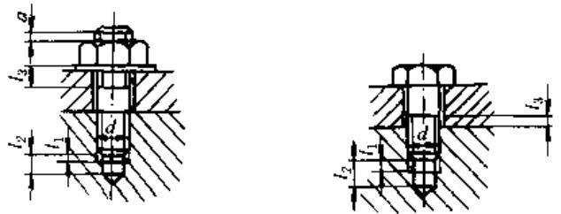

业

/mm 

表4-1-45

<table><tr><td rowspan=3 colspan=1>螺距P</td><td rowspan=1 colspan=3>螺纹直径d</td><td rowspan=1 colspan=4>余留长度</td><td rowspan=2 colspan=1>末端长度</td></tr><tr><td rowspan=2 colspan=2>粗牙</td><td rowspan=2 colspan=1>细牙</td><td rowspan=1 colspan=2>内螺纹</td><td rowspan=1 colspan=1>钻孔</td><td rowspan=1 colspan=1>外螺纹</td></tr><tr><td rowspan=1 colspan=2>1</td><td rowspan=1 colspan=1>1</td><td rowspan=1 colspan=1>1</td><td rowspan=1 colspan=1>“</td></tr><tr><td rowspan=1 colspan=1>0.5</td><td rowspan=1 colspan=2>3</td><td rowspan=1 colspan=1>s</td><td rowspan=1 colspan=2>1</td><td rowspan=1 colspan=1>4</td><td rowspan=1 colspan=1>2</td><td rowspan=1 colspan=1>1~2</td></tr><tr><td rowspan=1 colspan=1>0.7</td><td rowspan=1 colspan=2>4</td><td rowspan=1 colspan=1></td><td rowspan=1 colspan=2></td><td rowspan=1 colspan=1>5</td><td rowspan=3 colspan=1>2.5</td><td rowspan=3 colspan=1>2~3</td></tr><tr><td rowspan=1 colspan=1>0.75</td><td rowspan=1 colspan=2></td><td rowspan=1 colspan=1>6</td><td rowspan=1 colspan=1>1.5</td><td rowspan=2 colspan=2>1.5</td><td rowspan=2 colspan=1>6</td></tr><tr><td rowspan=1 colspan=1>0.8</td><td rowspan=1 colspan=2>5</td><td rowspan=1 colspan=1></td><td></td></tr><tr><td rowspan=1 colspan=1>1</td><td rowspan=1 colspan=2>6</td><td rowspan=1 colspan=1>8；10；14；16；18</td><td rowspan=1 colspan=2>2</td><td rowspan=1 colspan=1>7</td><td rowspan=1 colspan=1>3.5</td><td rowspan=2 colspan=1>2.5~4</td></tr><tr><td rowspan=1 colspan=1>1.25</td><td rowspan=1 colspan=2>8</td><td rowspan=1 colspan=1>12</td><td rowspan=1 colspan=2>2.5</td><td rowspan=1 colspan=1>9</td><td rowspan=1 colspan=1>4</td></tr><tr><td rowspan=1 colspan=1>1.5</td><td rowspan=1 colspan=1>10</td><td rowspan=1 colspan=1></td><td rowspan=1 colspan=1>14；16；18；20；22；24；27；30:33</td><td rowspan=1 colspan=2>3</td><td rowspan=1 colspan=1>10</td><td rowspan=1 colspan=1>4.5</td><td rowspan=2 colspan=1>3.5-5</td></tr><tr><td rowspan=1 colspan=1>1.75</td><td rowspan=1 colspan=2>12</td><td rowspan=1 colspan=1></td><td rowspan=1 colspan=2>3.5</td><td rowspan=1 colspan=1>13</td><td rowspan=1 colspan=1>5.5</td></tr><tr><td rowspan=1 colspan=1>2</td><td rowspan=1 colspan=2>14；16</td><td rowspan=1 colspan=1>24；27；30；33；36；39；45；48；52</td><td rowspan=1 colspan=2>4</td><td rowspan=1 colspan=1>14</td><td rowspan=1 colspan=1>6</td><td rowspan=2 colspan=1>4.5~6.5</td></tr><tr><td rowspan=1 colspan=1>2.5</td><td rowspan=1 colspan=2>18: 20；22</td><td rowspan=1 colspan=1></td><td rowspan=1 colspan=2>5</td><td rowspan=1 colspan=1>17</td><td rowspan=1 colspan=1>7</td></tr><tr><td rowspan=1 colspan=1>3</td><td rowspan=1 colspan=2>24； 27</td><td rowspan=1 colspan=1>36；39；42；45；48；56；60；64；72；76</td><td rowspan=1 colspan=2>6</td><td rowspan=1 colspan=1>20</td><td rowspan=1 colspan=1>8</td><td rowspan=2 colspan=1>5.5~8</td></tr><tr><td rowspan=1 colspan=1>3.5</td><td rowspan=1 colspan=2>30</td><td rowspan=1 colspan=1></td><td rowspan=1 colspan=2>？</td><td rowspan=1 colspan=1>23</td><td rowspan=1 colspan=1>9</td></tr><tr><td rowspan=1 colspan=1>4</td><td rowspan=1 colspan=2>36</td><td rowspan=1 colspan=1>56；60；64；68；72；76</td><td rowspan=1 colspan=2>8</td><td rowspan=1 colspan=1>26</td><td rowspan=1 colspan=1>10</td><td rowspan=2 colspan=1>7-11</td></tr><tr><td rowspan=1 colspan=1>4.5</td><td rowspan=1 colspan=2>42</td><td rowspan=1 colspan=1></td><td rowspan=1 colspan=2>9</td><td rowspan=1 colspan=1>30</td><td rowspan=1 colspan=1>11</td></tr><tr><td rowspan=1 colspan=1>5</td><td rowspan=1 colspan=2>48</td><td rowspan=1 colspan=1></td><td rowspan=1 colspan=2>10</td><td rowspan=1 colspan=1>33</td><td rowspan=1 colspan=1>13</td><td rowspan=3 colspan=1>10~15</td></tr><tr><td rowspan=1 colspan=1>5.5</td><td rowspan=1 colspan=2>56</td><td rowspan=1 colspan=1></td><td rowspan=1 colspan=2>11</td><td rowspan=1 colspan=1>36</td><td rowspan=1 colspan=1>16</td></tr><tr><td rowspan=1 colspan=1>6</td><td rowspan=1 colspan=2>64: 72；76</td><td rowspan=1 colspan=1></td><td rowspan=1 colspan=2>12</td><td rowspan=1 colspan=1>40</td><td rowspan=1 colspan=1>18</td></tr></table>

2.9粗牙螺栓、螺钉的拧人深度、攻丝深度和钻孔深度

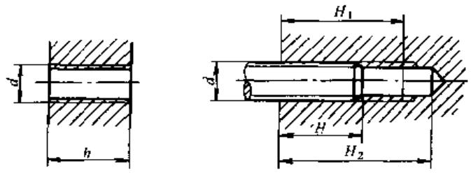

表4-1-46

<table><tr><td rowspan=2 colspan=1>公称直径d</td><td rowspan=1 colspan=4>钢和青铜</td><td rowspan=1 colspan=4>铸   铁</td><td rowspan=1 colspan=3>铝</td><td rowspan=2 colspan=1>钻孔深度，</td></tr><tr><td rowspan=1 colspan=1>通孔拧人深度h</td><td rowspan=1 colspan=1>百孔拧人深度H</td><td rowspan=1 colspan=1>改丝深度钻孔深度H</td><td rowspan=1 colspan=1>改丝深度钻孔深度H</td><td rowspan=1 colspan=1>通孔拧入深度1</td><td rowspan=1 colspan=1>育孔拧人深度H</td><td rowspan=1 colspan=1>攻丝深度钻孔深度H</td><td rowspan=1 colspan=1>攻丝深度钻孔深度H</td><td rowspan=1 colspan=1>通孔拧人深度1</td><td rowspan=1 colspan=1>育孔拧入深度H</td><td rowspan=1 colspan=1>改丝深度H</td></tr><tr><td rowspan=5 colspan=1>34568</td><td rowspan=3 colspan=1>45.57</td><td rowspan=1 colspan=1>3</td><td rowspan=1 colspan=1>4</td><td rowspan=2 colspan=1>79</td><td rowspan=2 colspan=1>68</td><td rowspan=2 colspan=1>56</td><td rowspan=2 colspan=1>67.5</td><td rowspan=1 colspan=1>9</td><td rowspan=1 colspan=1>8</td><td rowspan=1 colspan=1>6</td><td rowspan=1 colspan=1>7</td><td rowspan=2 colspan=1>1014</td></tr><tr><td rowspan=2 colspan=1>45</td><td rowspan=1 colspan=1>5.5</td><td rowspan=1 colspan=1>11</td><td rowspan=1 colspan=1>10</td><td rowspan=1 colspan=1>8</td><td rowspan=1 colspan=1>10</td></tr><tr><td rowspan=1 colspan=1>7</td><td rowspan=1 colspan=1>11</td><td rowspan=1 colspan=1>10</td><td rowspan=1 colspan=1>8</td><td rowspan=1 colspan=1>10</td><td rowspan=1 colspan=1>14</td><td rowspan=1 colspan=1>12  i</td><td rowspan=1 colspan=1>10</td><td rowspan=1 colspan=1>12</td><td rowspan=1 colspan=1>16</td></tr><tr><td rowspan=1 colspan=1>8</td><td rowspan=1 colspan=1>6</td><td rowspan=1 colspan=1>8</td><td rowspan=1 colspan=1>13</td><td rowspan=1 colspan=1>12</td><td rowspan=1 colspan=1>10</td><td rowspan=1 colspan=1>12</td><td rowspan=1 colspan=1>17</td><td rowspan=1 colspan=1>15</td><td rowspan=1 colspan=1>12</td><td rowspan=1 colspan=1>15</td><td rowspan=1 colspan=1>20</td></tr><tr><td rowspan=1 colspan=1>10</td><td rowspan=1 colspan=1>8</td><td rowspan=1 colspan=1>10</td><td rowspan=1 colspan=1>16</td><td rowspan=1 colspan=1>15</td><td rowspan=1 colspan=1>12</td><td rowspan=1 colspan=1>14</td><td rowspan=1 colspan=1>20</td><td rowspan=1 colspan=1>20</td><td rowspan=1 colspan=1>16</td><td rowspan=1 colspan=1>18</td><td rowspan=1 colspan=1>24</td></tr><tr><td rowspan=1 colspan=1>10</td><td rowspan=1 colspan=1>12</td><td rowspan=1 colspan=1>10</td><td rowspan=1 colspan=1>13</td><td rowspan=1 colspan=1>20</td><td rowspan=1 colspan=1>18</td><td rowspan=1 colspan=1>15</td><td rowspan=1 colspan=1>18</td><td rowspan=1 colspan=1>25</td><td rowspan=1 colspan=1>24</td><td rowspan=1 colspan=1>20</td><td rowspan=1 colspan=1>23</td><td rowspan=1 colspan=1>30</td></tr><tr><td rowspan=2 colspan=1>1216</td><td rowspan=1 colspan=1>15</td><td rowspan=1 colspan=1>12</td><td rowspan=1 colspan=1>15</td><td rowspan=1 colspan=1>24</td><td rowspan=1 colspan=1>22</td><td rowspan=1 colspan=1>18</td><td rowspan=1 colspan=1>21</td><td rowspan=1 colspan=1>30</td><td rowspan=1 colspan=1>28</td><td rowspan=1 colspan=1>24</td><td rowspan=1 colspan=1>27</td><td rowspan=1 colspan=1>36</td></tr><tr><td rowspan=1 colspan=1>20</td><td rowspan=1 colspan=1>16</td><td rowspan=1 colspan=1>20</td><td rowspan=1 colspan=1>30</td><td rowspan=1 colspan=1>28</td><td rowspan=1 colspan=1>24</td><td rowspan=1 colspan=1>28</td><td rowspan=1 colspan=1>33</td><td rowspan=1 colspan=1>36</td><td rowspan=1 colspan=1>32</td><td rowspan=1 colspan=1>36</td><td rowspan=1 colspan=1>46</td></tr><tr><td rowspan=1 colspan=1>20</td><td rowspan=1 colspan=1>25</td><td rowspan=1 colspan=1>20</td><td rowspan=1 colspan=1>24</td><td rowspan=1 colspan=1>36</td><td rowspan=1 colspan=1>35</td><td rowspan=1 colspan=1>30</td><td rowspan=1 colspan=1>35</td><td rowspan=1 colspan=1>47</td><td rowspan=1 colspan=1>45</td><td rowspan=1 colspan=1>40</td><td rowspan=1 colspan=1>45</td><td rowspan=1 colspan=1>57</td></tr><tr><td rowspan=1 colspan=1>24</td><td rowspan=1 colspan=1>30</td><td rowspan=1 colspan=1>24</td><td rowspan=1 colspan=1>30</td><td rowspan=1 colspan=1>44</td><td rowspan=1 colspan=1>42</td><td rowspan=1 colspan=1>35</td><td rowspan=1 colspan=1>42</td><td rowspan=1 colspan=1>55</td><td rowspan=1 colspan=1>55</td><td rowspan=1 colspan=1>48</td><td rowspan=1 colspan=1>54</td><td rowspan=1 colspan=1>68</td></tr><tr><td rowspan=1 colspan=1>30</td><td rowspan=1 colspan=1>36</td><td rowspan=1 colspan=1>30</td><td rowspan=1 colspan=1>36</td><td rowspan=1 colspan=1>52</td><td rowspan=1 colspan=1>50</td><td rowspan=1 colspan=1>45</td><td rowspan=1 colspan=1>52</td><td rowspan=1 colspan=1>68</td><td rowspan=1 colspan=1>70</td><td rowspan=1 colspan=1>60</td><td rowspan=1 colspan=1>67</td><td rowspan=1 colspan=1>84</td></tr><tr><td rowspan=1 colspan=1>36</td><td rowspan=1 colspan=1>45</td><td rowspan=1 colspan=1>36</td><td rowspan=1 colspan=1>44</td><td rowspan=1 colspan=1>62</td><td rowspan=1 colspan=1>65</td><td rowspan=1 colspan=1>55</td><td rowspan=1 colspan=1>64</td><td rowspan=1 colspan=1>82</td><td rowspan=1 colspan=1>80</td><td rowspan=1 colspan=1>72</td><td rowspan=1 colspan=1>80</td><td rowspan=1 colspan=1>98</td></tr><tr><td rowspan=1 colspan=1>42</td><td rowspan=1 colspan=1>50</td><td rowspan=1 colspan=1>42</td><td rowspan=1 colspan=1>50</td><td rowspan=1 colspan=1>72</td><td rowspan=1 colspan=1>75</td><td rowspan=1 colspan=1>65</td><td rowspan=1 colspan=1>74</td><td rowspan=1 colspan=1>95</td><td rowspan=1 colspan=1>95</td><td rowspan=1 colspan=1>85</td><td rowspan=1 colspan=1>94</td><td rowspan=1 colspan=1>115</td></tr><tr><td rowspan=1 colspan=1>48</td><td rowspan=1 colspan=1>60</td><td rowspan=1 colspan=1>48</td><td rowspan=1 colspan=1>58</td><td rowspan=1 colspan=1>82</td><td rowspan=1 colspan=1>85</td><td rowspan=1 colspan=1>75</td><td rowspan=1 colspan=1>85</td><td rowspan=1 colspan=1>108</td><td rowspan=1 colspan=1>105</td><td rowspan=1 colspan=1>95</td><td rowspan=1 colspan=1>105</td><td rowspan=1 colspan=1>128</td></tr></table>

# 2.10扳手空间(JB/ZQ4005—1997)

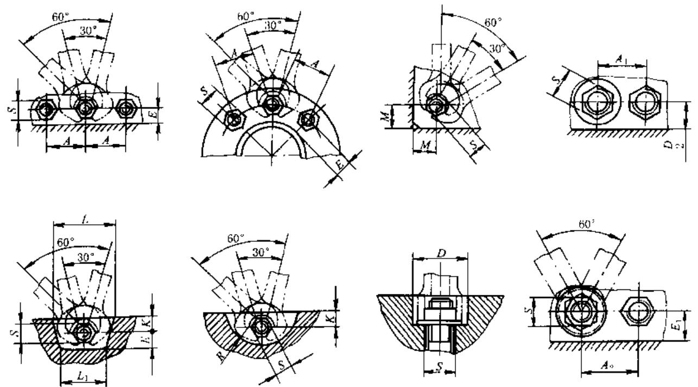

表4-1-47

/mm 

<table><tr><td rowspan=1 colspan=1>螺纹直径d</td><td rowspan=1 colspan=4>S</td><td rowspan=1 colspan=1>A</td><td rowspan=1 colspan=1>A</td><td rowspan=1 colspan=1>A</td><td rowspan=1 colspan=1>E</td><td rowspan=1 colspan=1>E</td><td rowspan=1 colspan=1>M</td><td rowspan=1 colspan=1>[</td><td rowspan=1 colspan=2>L</td><td rowspan=1 colspan=1>R</td><td rowspan=1 colspan=1>D</td></tr><tr><td rowspan=2 colspan=1>3</td><td rowspan=2 colspan=4>5.5</td><td rowspan=2 colspan=1>18</td><td rowspan=2 colspan=1>12</td><td rowspan=2 colspan=1>12</td><td rowspan=2 colspan=1>5</td><td rowspan=2 colspan=1>7</td><td rowspan=2 colspan=1>11</td><td rowspan=2 colspan=1>30</td><td rowspan=2 colspan=2>24</td><td rowspan=2 colspan=1>15</td><td rowspan=2 colspan=1>14</td></tr><tr><td rowspan=1 colspan=1></td></tr><tr><td rowspan=5 colspan=1>45</td><td rowspan=1 colspan=4>7</td><td rowspan=1 colspan=1>20</td><td rowspan=1 colspan=1>16</td><td rowspan=1 colspan=1>14</td><td rowspan=1 colspan=1>6</td><td rowspan=1 colspan=1>7</td><td rowspan=1 colspan=1>12</td><td rowspan=1 colspan=1>34</td><td rowspan=1 colspan=1>28</td><td rowspan=1 colspan=1></td><td rowspan=1 colspan=1>16</td><td rowspan=1 colspan=1>16</td></tr><tr><td></td><td></td><td></td><td></td><td></td><td></td><td></td><td></td><td rowspan=4 colspan=1>10</td><td rowspan=4 colspan=1>13</td><td rowspan=4 colspan=1>36</td><td rowspan=5 colspan=2>3038</td><td></td><td></td></tr><tr><td></td><td></td><td></td><td></td><td></td><td></td><td></td><td></td><td rowspan=1 colspan=1></td><td></td><td></td></tr><tr><td rowspan=2 colspan=3>8</td><td rowspan=1 colspan=1></td><td rowspan=2 colspan=1>22</td><td rowspan=2 colspan=1>16</td><td rowspan=2 colspan=1>15</td><td rowspan=2 colspan=1>7</td><td rowspan=2 colspan=1>18</td><td rowspan=3 colspan=1>2024</td></tr><tr><td rowspan=1 colspan=2></td></tr><tr><td rowspan=2 colspan=1>68</td><td rowspan=1 colspan=2>10</td><td rowspan=1 colspan=2>10</td><td rowspan=1 colspan=1>26</td><td rowspan=1 colspan=1>18</td><td rowspan=1 colspan=1>18</td><td rowspan=1 colspan=1>8</td><td rowspan=1 colspan=1>12</td><td rowspan=1 colspan=1>15</td><td rowspan=1 colspan=1>46</td><td rowspan=1 colspan=1>20</td></tr><tr><td rowspan=2 colspan=4>1316</td><td rowspan=1 colspan=1>32</td><td rowspan=1 colspan=1>24</td><td rowspan=1 colspan=1>22</td><td rowspan=1 colspan=1>11</td><td rowspan=1 colspan=1>14</td><td rowspan=1 colspan=1>18</td><td rowspan=1 colspan=1>55</td><td rowspan=1 colspan=2>44</td><td rowspan=1 colspan=1>25</td><td rowspan=1 colspan=1>28</td></tr><tr><td rowspan=1 colspan=1>10</td><td rowspan=1 colspan=1>38</td><td rowspan=1 colspan=1>28</td><td rowspan=1 colspan=1>26</td><td rowspan=1 colspan=1>13</td><td rowspan=1 colspan=1>16</td><td rowspan=1 colspan=1>22</td><td rowspan=1 colspan=1>62</td><td rowspan=1 colspan=2>50</td><td rowspan=1 colspan=1>30</td><td rowspan=1 colspan=1>30</td></tr></table>

续表

<table><tr><td rowspan=1 colspan=2>螺纹肖行d</td><td rowspan=1 colspan=1>S</td><td rowspan=1 colspan=1>A</td><td rowspan=1 colspan=1>d</td><td rowspan=1 colspan=1>A</td><td rowspan=1 colspan=1>E</td><td rowspan=1 colspan=1>E</td><td rowspan=1 colspan=1>M</td><td rowspan=1 colspan=1>L</td><td rowspan=1 colspan=1>，</td><td rowspan=1 colspan=1>R</td><td rowspan=1 colspan=1>D</td></tr><tr><td rowspan=1 colspan=2>12</td><td rowspan=1 colspan=1>18</td><td rowspan=1 colspan=1>42</td><td rowspan=1 colspan=1>1</td><td rowspan=1 colspan=1>30</td><td rowspan=1 colspan=1>14</td><td rowspan=1 colspan=1>18</td><td rowspan=1 colspan=1>24</td><td rowspan=1 colspan=1>70</td><td rowspan=2 colspan=1>5565</td><td rowspan=2 colspan=1>3236</td><td rowspan=3 colspan=1>14045</td></tr><tr><td rowspan=1 colspan=2>14</td><td rowspan=1 colspan=1>21</td><td rowspan=1 colspan=1>48</td><td rowspan=1 colspan=1>36</td><td rowspan=1 colspan=1>34</td><td rowspan=1 colspan=1>15</td><td rowspan=1 colspan=1>20</td><td rowspan=1 colspan=1>26</td><td rowspan=1 colspan=1>80</td></tr><tr><td rowspan=1 colspan=2>16</td><td rowspan=1 colspan=1>24</td><td rowspan=1 colspan=1>55</td><td rowspan=1 colspan=1>38</td><td rowspan=1 colspan=1>38</td><td rowspan=1 colspan=1>16</td><td rowspan=1 colspan=1>24</td><td rowspan=1 colspan=1>30</td><td rowspan=1 colspan=1>85</td><td rowspan=1 colspan=1>70</td><td rowspan=1 colspan=1>42</td></tr><tr><td rowspan=1 colspan=2>18</td><td rowspan=1 colspan=1>27</td><td rowspan=1 colspan=1>62</td><td rowspan=1 colspan=1>45</td><td rowspan=1 colspan=1>42</td><td rowspan=1 colspan=1>19</td><td rowspan=1 colspan=1>25</td><td rowspan=1 colspan=1>32</td><td rowspan=1 colspan=1>95</td><td rowspan=1 colspan=1>75</td><td rowspan=1 colspan=1>46</td><td rowspan=1 colspan=1>52</td></tr><tr><td rowspan=1 colspan=2>20</td><td rowspan=1 colspan=1>30</td><td rowspan=1 colspan=1>68</td><td rowspan=1 colspan=1>48</td><td rowspan=1 colspan=1>46</td><td rowspan=1 colspan=1>20</td><td rowspan=1 colspan=1>28</td><td rowspan=1 colspan=1>35</td><td rowspan=1 colspan=1>105</td><td rowspan=1 colspan=1>85</td><td rowspan=1 colspan=1>50</td><td rowspan=1 colspan=1>56</td></tr><tr><td rowspan=1 colspan=2>22</td><td rowspan=1 colspan=1>34</td><td rowspan=1 colspan=1>76</td><td rowspan=1 colspan=1>55</td><td rowspan=1 colspan=1>52</td><td rowspan=1 colspan=1>24</td><td rowspan=1 colspan=1>32</td><td rowspan=1 colspan=1>40</td><td rowspan=1 colspan=1>120</td><td rowspan=1 colspan=1>95</td><td rowspan=1 colspan=1>58</td><td rowspan=1 colspan=1>60</td></tr><tr><td rowspan=1 colspan=2>24</td><td rowspan=1 colspan=1>36</td><td rowspan=1 colspan=1>80</td><td rowspan=1 colspan=1>58</td><td rowspan=1 colspan=1>55</td><td rowspan=1 colspan=1>24</td><td rowspan=1 colspan=1>34</td><td rowspan=1 colspan=1>42</td><td rowspan=1 colspan=1>125</td><td rowspan=1 colspan=1>100</td><td rowspan=1 colspan=1>6</td><td rowspan=1 colspan=1>70</td></tr><tr><td rowspan=1 colspan=2>27</td><td rowspan=1 colspan=1>41</td><td rowspan=1 colspan=1>9</td><td rowspan=1 colspan=1>65</td><td rowspan=1 colspan=1>62</td><td rowspan=1 colspan=1>26</td><td rowspan=1 colspan=1>36</td><td rowspan=1 colspan=1>46</td><td rowspan=1 colspan=1>135</td><td rowspan=1 colspan=1>110</td><td rowspan=1 colspan=1>.65</td><td rowspan=1 colspan=1>76</td></tr><tr><td rowspan=1 colspan=2>30</td><td rowspan=1 colspan=1>46</td><td rowspan=1 colspan=1>100</td><td rowspan=1 colspan=1>72</td><td rowspan=1 colspan=1>70</td><td rowspan=1 colspan=1>30</td><td rowspan=1 colspan=1>40</td><td rowspan=1 colspan=1>50</td><td rowspan=1 colspan=1>155</td><td rowspan=1 colspan=1>125</td><td rowspan=1 colspan=1>75</td><td rowspan=1 colspan=1>82</td></tr><tr><td rowspan=1 colspan=2>33</td><td rowspan=1 colspan=1>50</td><td rowspan=1 colspan=1>108</td><td rowspan=1 colspan=1>76</td><td rowspan=1 colspan=1>75</td><td rowspan=1 colspan=1>32</td><td rowspan=1 colspan=1>44</td><td rowspan=1 colspan=1>55</td><td rowspan=1 colspan=1>165</td><td rowspan=1 colspan=1>130</td><td rowspan=1 colspan=1>80</td><td rowspan=1 colspan=1>88</td></tr><tr><td rowspan=1 colspan=2>36</td><td rowspan=1 colspan=1>55</td><td rowspan=1 colspan=1>118</td><td rowspan=1 colspan=1>85</td><td rowspan=1 colspan=1>82</td><td rowspan=1 colspan=1>36</td><td rowspan=1 colspan=1>48</td><td rowspan=1 colspan=1>60</td><td rowspan=1 colspan=1>180</td><td rowspan=1 colspan=1>145</td><td rowspan=1 colspan=1>88</td><td rowspan=1 colspan=1>95</td></tr><tr><td rowspan=1 colspan=2>39</td><td rowspan=1 colspan=1>60</td><td rowspan=1 colspan=1>125</td><td rowspan=1 colspan=1>90</td><td rowspan=1 colspan=1>88</td><td rowspan=1 colspan=1>38</td><td rowspan=1 colspan=1>52</td><td rowspan=1 colspan=1>65</td><td rowspan=1 colspan=1>190</td><td rowspan=1 colspan=1>155</td><td rowspan=1 colspan=1>92</td><td rowspan=1 colspan=1>100</td></tr><tr><td rowspan=1 colspan=2>42</td><td rowspan=1 colspan=1>65</td><td rowspan=1 colspan=1>135</td><td rowspan=1 colspan=1>%</td><td rowspan=1 colspan=1>9</td><td rowspan=1 colspan=1>42</td><td rowspan=1 colspan=1>55</td><td rowspan=1 colspan=1>70</td><td rowspan=1 colspan=1>205</td><td rowspan=1 colspan=1>165</td><td rowspan=1 colspan=1>100</td><td rowspan=1 colspan=1>106</td></tr><tr><td rowspan=1 colspan=1></td><td rowspan=1 colspan=1>45</td><td rowspan=1 colspan=1>70</td><td rowspan=1 colspan=1>145</td><td rowspan=1 colspan=1>105</td><td rowspan=1 colspan=1>102</td><td rowspan=1 colspan=1>45</td><td rowspan=1 colspan=1>60</td><td rowspan=1 colspan=1>75</td><td rowspan=1 colspan=1>220</td><td rowspan=1 colspan=1>175</td><td rowspan=1 colspan=1>105</td><td rowspan=1 colspan=1>112</td></tr><tr><td rowspan=1 colspan=1></td><td rowspan=1 colspan=1>48</td><td rowspan=1 colspan=1>75</td><td rowspan=1 colspan=1>160</td><td rowspan=1 colspan=1>115</td><td rowspan=1 colspan=1>112</td><td rowspan=1 colspan=1>48</td><td rowspan=1 colspan=1>65</td><td rowspan=1 colspan=1>80</td><td rowspan=1 colspan=1>235</td><td rowspan=1 colspan=1>185</td><td rowspan=1 colspan=1>115</td><td rowspan=1 colspan=1>126</td></tr><tr><td rowspan=1 colspan=1></td><td rowspan=1 colspan=1>52</td><td rowspan=1 colspan=1>80</td><td rowspan=1 colspan=1>170</td><td rowspan=1 colspan=1>120</td><td rowspan=1 colspan=1>120</td><td rowspan=1 colspan=1>48</td><td rowspan=1 colspan=1>70</td><td rowspan=1 colspan=1>84</td><td rowspan=1 colspan=1>245</td><td rowspan=1 colspan=1>195</td><td rowspan=1 colspan=1>125</td><td rowspan=1 colspan=1>132</td></tr><tr><td rowspan=1 colspan=1></td><td rowspan=1 colspan=1>56</td><td rowspan=1 colspan=1>85</td><td rowspan=1 colspan=1>180</td><td rowspan=1 colspan=1>126</td><td rowspan=1 colspan=1>1</td><td rowspan=1 colspan=1>52</td><td rowspan=1 colspan=1>1</td><td rowspan=1 colspan=1>90</td><td rowspan=1 colspan=1>260</td><td rowspan=1 colspan=1>205</td><td rowspan=1 colspan=1>130</td><td rowspan=1 colspan=1>138</td></tr><tr><td rowspan=1 colspan=1></td><td rowspan=1 colspan=1>60</td><td rowspan=1 colspan=1>90</td><td rowspan=1 colspan=1>185</td><td rowspan=1 colspan=1>134</td><td rowspan=1 colspan=1></td><td rowspan=1 colspan=1>58</td><td rowspan=1 colspan=1>1</td><td rowspan=1 colspan=1>95</td><td rowspan=1 colspan=1>275</td><td rowspan=1 colspan=1>215</td><td rowspan=1 colspan=1>135</td><td rowspan=1 colspan=1>145</td></tr><tr><td rowspan=1 colspan=1></td><td rowspan=1 colspan=1>64</td><td rowspan=1 colspan=1>95</td><td rowspan=1 colspan=1>195</td><td rowspan=1 colspan=1>140</td><td rowspan=1 colspan=1></td><td rowspan=1 colspan=1>58</td><td rowspan=1 colspan=1>1</td><td rowspan=1 colspan=1>100</td><td rowspan=1 colspan=1>285</td><td rowspan=1 colspan=1>225</td><td rowspan=1 colspan=1>140</td><td rowspan=1 colspan=1>152</td></tr><tr><td rowspan=1 colspan=1></td><td rowspan=1 colspan=1>68</td><td rowspan=1 colspan=1>100</td><td rowspan=1 colspan=1>205</td><td rowspan=1 colspan=1>145</td><td rowspan=1 colspan=1>[</td><td rowspan=1 colspan=1>65</td><td rowspan=1 colspan=1>1</td><td rowspan=1 colspan=1>105</td><td rowspan=1 colspan=1>300</td><td rowspan=1 colspan=1>235</td><td rowspan=1 colspan=1>150</td><td rowspan=1 colspan=1>158</td></tr><tr><td rowspan=1 colspan=1></td><td rowspan=1 colspan=1>72</td><td rowspan=1 colspan=1>105</td><td rowspan=1 colspan=1>215</td><td rowspan=1 colspan=1>155</td><td rowspan=1 colspan=1></td><td rowspan=1 colspan=1>68</td><td rowspan=1 colspan=1>1</td><td rowspan=1 colspan=1>110</td><td rowspan=1 colspan=1>320</td><td rowspan=1 colspan=1>250</td><td rowspan=1 colspan=1>160</td><td rowspan=1 colspan=1>168</td></tr><tr><td rowspan=1 colspan=1></td><td rowspan=1 colspan=1>76</td><td rowspan=1 colspan=1>110</td><td rowspan=1 colspan=1>225</td><td rowspan=1 colspan=1>1</td><td rowspan=1 colspan=1></td><td rowspan=1 colspan=1>70</td><td rowspan=1 colspan=1>丨</td><td rowspan=1 colspan=1>115</td><td rowspan=1 colspan=1>335</td><td rowspan=1 colspan=1>265</td><td rowspan=1 colspan=1>165</td><td rowspan=1 colspan=1>1</td></tr><tr><td rowspan=1 colspan=1></td><td rowspan=1 colspan=1>80</td><td rowspan=1 colspan=1>115</td><td rowspan=1 colspan=1>235</td><td rowspan=1 colspan=1>165</td><td rowspan=1 colspan=1></td><td rowspan=1 colspan=1>72</td><td rowspan=1 colspan=1></td><td rowspan=1 colspan=1>120</td><td rowspan=1 colspan=1>245</td><td rowspan=1 colspan=1>275</td><td rowspan=1 colspan=1>170</td><td rowspan=1 colspan=1>178</td></tr><tr><td rowspan=1 colspan=1></td><td rowspan=1 colspan=1>85</td><td rowspan=1 colspan=1>120</td><td rowspan=1 colspan=1>245</td><td rowspan=1 colspan=1>175</td><td rowspan=1 colspan=1>1</td><td rowspan=1 colspan=1>75</td><td rowspan=1 colspan=1></td><td rowspan=1 colspan=1>125</td><td rowspan=1 colspan=1>360</td><td rowspan=1 colspan=1>285</td><td rowspan=1 colspan=1>180</td><td rowspan=1 colspan=1>188</td></tr><tr><td rowspan=1 colspan=1></td><td rowspan=1 colspan=1>90</td><td rowspan=1 colspan=1>130</td><td rowspan=1 colspan=1>260</td><td rowspan=1 colspan=1>190</td><td rowspan=1 colspan=1>|</td><td rowspan=1 colspan=1>80</td><td rowspan=1 colspan=1></td><td rowspan=1 colspan=1>135</td><td rowspan=1 colspan=1>390</td><td rowspan=1 colspan=1>310</td><td rowspan=1 colspan=1>190</td><td rowspan=1 colspan=1>208</td></tr><tr><td rowspan=1 colspan=1></td><td rowspan=1 colspan=1>95</td><td rowspan=1 colspan=1>135</td><td rowspan=1 colspan=1>270</td><td rowspan=1 colspan=1>1</td><td rowspan=1 colspan=1>1</td><td rowspan=1 colspan=1>85</td><td rowspan=1 colspan=1></td><td rowspan=1 colspan=1>140</td><td rowspan=1 colspan=1>405</td><td rowspan=1 colspan=1>320</td><td rowspan=1 colspan=1>200</td><td rowspan=1 colspan=1>1</td></tr><tr><td rowspan=1 colspan=1></td><td rowspan=1 colspan=1>100</td><td rowspan=1 colspan=1>145</td><td rowspan=1 colspan=1>290</td><td rowspan=1 colspan=1>215</td><td rowspan=1 colspan=1>1</td><td rowspan=1 colspan=1>95</td><td rowspan=1 colspan=1>1</td><td rowspan=1 colspan=1>150</td><td rowspan=1 colspan=1>435</td><td rowspan=1 colspan=1>340</td><td rowspan=1 colspan=1>215</td><td rowspan=1 colspan=1>238</td></tr><tr><td rowspan=1 colspan=2>105</td><td rowspan=1 colspan=1>150</td><td rowspan=1 colspan=1>300</td><td rowspan=1 colspan=1>1</td><td rowspan=1 colspan=1></td><td rowspan=1 colspan=1>98</td><td rowspan=1 colspan=1>、</td><td rowspan=1 colspan=1>155</td><td rowspan=1 colspan=1>450</td><td rowspan=1 colspan=1>350</td><td rowspan=1 colspan=1>220</td><td rowspan=1 colspan=1>一</td></tr><tr><td rowspan=1 colspan=2>110</td><td rowspan=1 colspan=1>155</td><td rowspan=1 colspan=1>310</td><td rowspan=1 colspan=1></td><td rowspan=1 colspan=1></td><td rowspan=1 colspan=1>100</td><td rowspan=1 colspan=1></td><td rowspan=1 colspan=1>160</td><td rowspan=1 colspan=1>460</td><td rowspan=1 colspan=1>360</td><td rowspan=1 colspan=1>225</td><td rowspan=1 colspan=1>1</td></tr><tr><td rowspan=1 colspan=2>115</td><td rowspan=1 colspan=1>165</td><td rowspan=1 colspan=1>330</td><td rowspan=1 colspan=1>1</td><td rowspan=1 colspan=1></td><td rowspan=1 colspan=1>108</td><td rowspan=1 colspan=1>1</td><td rowspan=1 colspan=1>170</td><td rowspan=1 colspan=1>495</td><td rowspan=1 colspan=1>385</td><td rowspan=1 colspan=1>245</td><td rowspan=1 colspan=1></td></tr><tr><td rowspan=1 colspan=2>120</td><td rowspan=1 colspan=1>170</td><td rowspan=1 colspan=1>340</td><td rowspan=1 colspan=1>1</td><td rowspan=1 colspan=1></td><td rowspan=1 colspan=1>108</td><td rowspan=1 colspan=1></td><td rowspan=1 colspan=1>175</td><td rowspan=1 colspan=1>505</td><td rowspan=1 colspan=1>400</td><td rowspan=1 colspan=1>250</td><td rowspan=1 colspan=1></td></tr><tr><td rowspan=1 colspan=2>125</td><td rowspan=1 colspan=1>180</td><td rowspan=1 colspan=1>360</td><td rowspan=1 colspan=1>1</td><td rowspan=1 colspan=1></td><td rowspan=1 colspan=1>115</td><td rowspan=1 colspan=1>1</td><td rowspan=1 colspan=1>185</td><td rowspan=1 colspan=1>535</td><td rowspan=1 colspan=1>420</td><td rowspan=1 colspan=1>270</td><td rowspan=1 colspan=1>1</td></tr><tr><td rowspan=2 colspan=2>130140</td><td rowspan=1 colspan=1>185</td><td rowspan=1 colspan=1>370</td><td rowspan=1 colspan=1>1</td><td rowspan=1 colspan=1></td><td rowspan=1 colspan=1>115</td><td rowspan=1 colspan=1></td><td rowspan=1 colspan=1>190</td><td rowspan=1 colspan=1>545</td><td rowspan=1 colspan=1>430</td><td rowspan=1 colspan=1>275</td><td rowspan=1 colspan=1></td></tr><tr><td rowspan=1 colspan=1>200</td><td rowspan=1 colspan=1>385</td><td rowspan=1 colspan=1></td><td rowspan=1 colspan=1>■</td><td rowspan=1 colspan=1>120</td><td rowspan=1 colspan=1></td><td rowspan=1 colspan=1>205</td><td rowspan=1 colspan=1>585</td><td rowspan=1 colspan=1>465</td><td rowspan=1 colspan=1>295</td><td rowspan=1 colspan=1>1</td></tr><tr><td rowspan=1 colspan=2>150</td><td rowspan=1 colspan=1>210</td><td rowspan=1 colspan=1>420</td><td rowspan=1 colspan=1>310</td><td rowspan=1 colspan=1>1</td><td rowspan=1 colspan=1>130</td><td rowspan=1 colspan=1></td><td rowspan=1 colspan=1>215</td><td rowspan=1 colspan=1>625</td><td rowspan=1 colspan=1>495</td><td rowspan=1 colspan=1>310</td><td rowspan=1 colspan=1>350</td></tr></table>

# 2.11对边和对角宽度尺寸(JB/ZQ4263—1997)

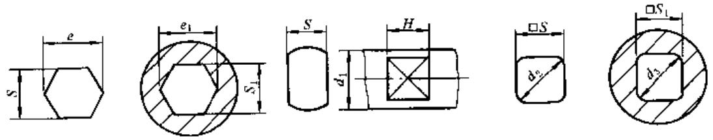

表4-1-48

<table><tr><td>对边基本</td><td colspan="2"></td><td colspan="2">外六角对角宽</td><td colspan="2">内六角对</td><td colspan="3"></td></tr><tr><td rowspan="2">宽度 s、s</td><td colspan="2">偏 美</td><td colspan="2">e</td><td rowspan="2">角宽 e</td><td rowspan="2">d min</td><td rowspan="2">H</td><td rowspan="2">山 （h11）</td><td rowspan="2">小 min</td></tr><tr><td colspan="2">△S</td><td>min</td><td></td></tr><tr><td>5</td><td></td><td>△s</td><td>max 5.60</td><td>5.35</td><td>min 5.80</td><td>6</td><td>7</td><td>6.5</td><td>6.6</td></tr><tr><td>5.5</td><td></td><td></td><td>6.10</td><td>5.90</td><td>6.30</td><td>7</td><td>8</td><td>7</td><td>7.1</td></tr><tr><td>7</td><td></td><td></td><td>7.80</td><td>7.55</td><td>8.05</td><td>8</td><td>8</td><td>9</td><td>9.1</td></tr><tr><td>8</td><td>h14</td><td>E12</td><td>8.90</td><td>8.65</td><td>9.15</td><td>9</td><td>8</td><td>10</td><td>10.1</td></tr><tr><td>10</td><td></td><td>11.20</td><td></td><td>10.90</td><td>11.45</td><td>12</td><td>10</td><td>13</td><td>13.1</td></tr><tr><td>13</td><td></td><td></td><td>14.60</td><td>14.25</td><td>14.90</td><td>15</td><td>10</td><td>17</td><td>17.1</td></tr><tr><td>16</td><td></td><td></td><td>18.00</td><td>17.60</td><td>18.30</td><td>18</td><td>12</td><td>21</td><td>21.2</td></tr><tr><td>18</td><td></td><td></td><td>20.30</td><td>19.90</td><td>20.60</td><td>20</td><td>12</td><td>23</td><td>： 23.2</td></tr><tr><td>21</td><td></td><td></td><td>23.50</td><td>22.80</td><td>24.10</td><td>24</td><td>14</td><td>27</td><td>27.2</td></tr><tr><td>24</td><td></td><td>26.90</td><td></td><td>26.20</td><td>27.50</td><td>28</td><td>14</td><td>32</td><td>32.2</td></tr><tr><td>27</td><td></td><td>30.30</td><td></td><td>29.60</td><td>30.90</td><td>32</td><td>16</td><td>36</td><td>36.2</td></tr><tr><td>30</td><td></td><td></td><td>33.70</td><td>33.00</td><td>34.30</td><td>36</td><td>18</td><td>40</td><td>40.2</td></tr><tr><td>34</td><td>h15</td><td></td><td>38.10</td><td>37.30</td><td>38.90</td><td>40</td><td>20</td><td>45</td><td>45.2</td></tr><tr><td>36</td><td></td><td>40.40</td><td></td><td>39.60</td><td>41.20</td><td>42</td><td>22</td><td>48</td><td>48.2</td></tr><tr><td>41</td><td></td><td></td><td>46.10</td><td>45.20</td><td>46 90</td><td>48</td><td>2</td><td>54</td><td>54.2</td></tr><tr><td>46</td><td></td><td></td><td>51.80</td><td>50.90</td><td>52.60</td><td>55</td><td>25</td><td>60</td><td>60.2</td></tr><tr><td>50</td><td></td><td></td><td>56.30</td><td>55.40</td><td>57.10</td><td>60</td><td>25</td><td>65</td><td>65.2</td></tr><tr><td>55</td><td></td><td></td><td>61.90</td><td>60.80</td><td>62.90</td><td>65</td><td>28</td><td>71</td><td>71.2</td></tr><tr><td>6</td><td></td><td>72.90</td><td>67.60</td><td>66.50</td><td>68.60</td><td>70</td><td>30</td><td>80</td><td>80.2</td></tr><tr><td>65</td><td></td><td></td><td></td><td>71.40</td><td>74.30</td><td>75</td><td>32</td><td>85</td><td>85.2</td></tr><tr><td>70</td><td></td><td></td><td>78.50</td><td>77.00</td><td>80.00</td><td>85</td><td>35</td><td>92</td><td>92.2</td></tr><tr><td>75</td><td></td><td>84.20 D12</td><td></td><td>82.70</td><td>85.70</td><td>90</td><td>35</td><td>98</td><td>98.2</td></tr><tr><td>80</td><td></td><td>89.90</td><td>88.30</td><td></td><td>91.50</td><td>95</td><td>38</td><td>105</td><td>105.2</td></tr><tr><td>85</td><td></td><td>95.40</td><td></td><td>93.60</td><td>97.10</td><td>100</td><td>40</td><td>112</td><td>112.2</td></tr><tr><td>90</td><td></td><td></td><td>101.20</td><td>99.30</td><td>102.80</td><td>105</td><td>42</td><td>118</td><td>118.2</td></tr><tr><td>95</td><td></td><td>106.70</td><td></td><td>104.90</td><td>108.50</td><td>110</td><td>45</td><td>125</td><td>125.2</td></tr><tr><td>100</td><td></td><td></td><td>112.40</td><td>110.60</td><td>114.20</td><td>115</td><td>45</td><td>132</td><td>132.2</td></tr><tr><td>105</td><td></td><td></td><td>118.10</td><td>116.20</td><td>119.90</td><td>120</td><td>48</td><td>138</td><td>138.2</td></tr><tr><td>110</td><td>h16</td><td>129.40</td><td>123.80</td><td>121.90</td><td>125.60</td><td>130</td><td>50</td><td>145</td><td>145.2</td></tr><tr><td>115</td><td></td><td>135.10</td><td></td><td>127.50</td><td>131.30</td><td>135</td><td>52</td><td>152</td><td>152.2</td></tr><tr><td>120</td><td></td><td>146.40</td><td></td><td>133.20</td><td>137.00</td><td>140</td><td>55</td><td>160</td><td>160.2</td></tr><tr><td>130</td><td></td><td>152.00</td><td></td><td>144.20</td><td>148.50</td><td>1 1</td><td>1</td><td>1</td><td>一 1</td></tr><tr><td>135</td><td></td><td>163.40</td><td>149.80</td><td></td><td>154.20</td><td></td><td>i</td><td>1</td><td>1</td></tr><tr><td>145</td><td></td><td>169.00</td><td>161.20</td><td></td><td>165.50</td><td></td><td>1</td><td>1</td><td></td></tr><tr><td>150</td><td></td><td></td><td>166.80</td><td></td><td>171.20</td><td></td><td>1</td><td></td><td></td></tr><tr><td>155</td><td></td><td>174.80</td><td>172.50</td><td></td><td>177.00</td><td>1 1</td><td>1 1</td><td>1 ：</td><td></td></tr><tr><td>165</td><td></td><td>186.20 191.80</td><td>183.80 189.50</td><td></td><td>188.50 194.00</td></table>

# 3螺纹联接

# 3.1螺纹联接的基本类型和常用的防松方法

表4-1-49

<table><tr><td rowspan=2 colspan=1></td><td rowspan=1 colspan=1>结构</td><td rowspan=1 colspan=2>螺   栓A</td><td rowspan=1 colspan=1>双头螺柱</td><td rowspan=1 colspan=1>螺   钉</td><td rowspan=1 colspan=1>紧定</td></tr><tr><td rowspan=1 colspan=1>应用</td><td rowspan=1 colspan=2>用于通孔，损坏后容易更换</td><td rowspan=1 colspan=1>多用于被联接件需经常拆卸的言孔</td><td rowspan=1 colspan=1>多用于被联接件很少拆卸的盲孔</td><td rowspan=1 colspan=1>用以固定两位置，可传递转矩</td></tr><tr><td rowspan=6 colspan=1>防松方法</td><td rowspan=4 colspan=1>增大摩擦力</td><td rowspan=1 colspan=1>结构</td><td rowspan=1 colspan=1>弹簧垫圈</td><td rowspan=1 colspan=1>双螺母</td><td rowspan=1 colspan=1>金属锁紧垫圈</td><td rowspan=6 colspan=1>栓杆末1.5）P长紫后铆死铆冲法（防松可莊、但拆卸后联接零件不能再用，用于特殊需要的联接）   深（1~1.5端面冲在螺纹的小头直径的8mm时冲4时冲3点侧面冲点冲3点，2点涂粘粘合在旋合整厌气性粘合母后，粘合着，效果良</td></tr><tr><td rowspan=1 colspan=1>应用</td><td rowspan=1 colspan=1>靠垫圈压平后产生的弹力。结构简单，但由于弹力不均，不十分可靠，多用于不甚重要的联接</td><td rowspan=1 colspan=1>利用螺母拧紧后的对顶作用。重量增大，不甚经济；副螺母采用薄型，拧紧不便。用于低速重载或较平稳的场合</td><td rowspan=1 colspan=1>螺母一端非圆形收口或开缝后径向收口，拧紧后张开，利用旋台螺纹间的弹性。简单、可靠且可多次拆卸，可用于较重要的联接</td></tr><tr><td rowspan=1 colspan=1>结构</td><td rowspan=1 colspan=1>扣紧螺母</td><td rowspan=1 colspan=1>齿形锁紧垫圈</td><td rowspan=1 colspan=1>尼龙嵌件锁紧尼龙</td></tr><tr><td rowspan=1 colspan=1>应用</td><td rowspan=1 colspan=1>利用扣紧螺母的弹力。受振动载荷时，效果良好。一般月于不常拆卸的联接</td><td rowspan=1 colspan=1>靠垫圈翘齿压平后产生的间弹力。弹力均匀，效果良好。外齿应用较多，内齿用于尺寸较小的钉头下，锥形用于沉孔中。常拆卸或材料较软的联接不宜使用</td><td rowspan=1 colspan=1>在螺纹旋合处嵌人一锦纶环或块，使该处摩擦力增大。效果良好。用于工作温度低于100℃的联接</td><td rowspan=3 colspan=1>铆冲法（防松可莊、但拆卸后联接零件不能再用，用于特殊需要的联接）</td></tr><tr><td rowspan=2 colspan=1>机械方法</td><td rowspan=1 colspan=1>结构</td><td rowspan=1 colspan=1>开槽螺母</td><td rowspan=1 colspan=1>开口销</td><td rowspan=1 colspan=1>止动垫圈</td></tr><tr><td rowspan=1 colspan=1>应用</td><td rowspan=1 colspan=1>六角槽形螺母配以开口销。防松可靠。螺杆上的销孔位置不易与螺母最佳销紧位置的槽口吻合，装配较难。用于变载、振动易松之处</td><td rowspan=1 colspan=1>普通螺母配以开11销，为便于装配，销孔待螺母拧紧后配钻。适用于单件或零星生产的重要联接</td><td rowspan=1 colspan=1>利用单耳或双耳止动垫圈把螺母或钉头锁住。防松可靠，只能用于联接部分有容纳弯耳的场合</td></tr></table>

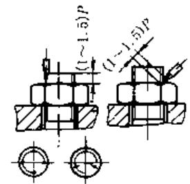

端面冲点,冲点中心在螺纹的小径处或在钉头直径的圆周卜:d>$d \leqslant 8 \mathsf { m m }$ 

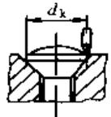

$\mathbf { d } > \mathbf { 8 } \mathbf { m m }$ 时$\dot { \alpha } \leqslant 8 \mathsf { m m }$ 时冲

在旋合螺纹表面涂以厌气性粘合剂,拧紧螺母后,粘合剂硬化、固

<table><tr><td rowspan=3 colspan=1>防松方法</td><td rowspan=3 colspan=3>！模压紧结构机械方法        利用能自锁的横樱楔人螺杆横孔压紧螺母。防松良好。一般应用于大直径的螺拴联接用</td><td rowspan=1 colspan=4>：双联止动垫圈             钢丝串接                翘形垫圈         锥面锁紧垫圈</td></tr><tr><td rowspan=2 colspan=1>应用</td><td rowspan=2 colspan=1>利用能自锁的横樱楔人螺杆横孔压紧螺母。防松良好。一般用于大直径的螺拴联接</td><td rowspan=2 colspan=1>利用双联止动垫圈把成对螺母或螺栓锁住，使之彼此制约，不得转动。防松良好</td><td rowspan=2 colspan=1>用低碳钢丝穿入·组！螺栓头部的专用孔后使其相互制约。防松可：靠。但钢丝的缠绕方向必须正确（图中为右旋螺纹的绕向）</td><td rowspan=2 colspan=1>带翅垫圈的内翅卡在螺纹杆的纵向槽內，圆閲锥休，拧紧螺：螺母拧紧后，将对应的，时时，楔入垫圈外翅锁在螺母的槽「内，防松可靠。多用于较大直径的联接和滚动防松效果良好，轴承的紧固</td><td rowspan=1 colspan=1>螺母一端为外螺纹杆的纵向槽內，圆閲锥休，拧紧螺螺母拧紧后，将对应的，时时，楔入垫圈相应的凹锥内，增大了摩擦力，</td></tr><tr><td rowspan=1 colspan=1>较大直径的联接和滚动防松效果良好，用于重载或有动的联接</td></tr></table>

# 3.2螺栓组联接的设计

设计时根据受力情况及结构尺寸要求,先进行结构设计,即确定螺栓的布置方式、数量及联接结合面几何形状,然后进行受力分析,找出一组中受力最大的螺栓及其受力大小,进行强度计算。

# 3.2.1螺栓组联接的结构设计

(1)联接结合面的几何形状要合理,如成轴对称的形状;结合接触面合理;便于加T制造(2)螺栓组的形心与结合面形心尽量重合。(3)螺栓的位置应该使受力合理,应使螺栓靠近结合面边缘,以减少螺栓受力。如螺栓同时承受较大轴向及横向载荷时,可采用销、套筒或键等零件来承受横向载荷。(4)同一组螺栓的直径和长度应尽量相同。(5)应避免螺栓受附加弯曲载荷。(6)各螺栓中心间的最小距离应不小于扳手空间的最小尺寸,最大距离应按联接用途及结构尺寸大小而定.

# 3.2.2螺栓组的受力分析

螺栓组受力分析时,假设螺栓为弹性体,其变形在弹性范围内;每个螺栓预紧力相同;结合面的压强均布;被联接件为刚体;受载后结合面应保持平面接触。典型预紧螺栓组联接受力分析见表4-1-50

表4-1-50

典型预紧联接螺栓组的受力分析

<table><tr><td rowspan=1 colspan=2>联接的载荷和螺栓的布置</td><td rowspan=1 colspan=1>工作要求</td><td rowspan=1 colspan=1>螺栓的载荷</td></tr><tr><td rowspan=1 colspan=1>载荷垂直于联接的结合面，其合力通过螺栓组截面的形心</td><td rowspan=1 colspan=1>HHp</td><td rowspan=1 colspan=1>联接应预紧，受载后应保证紧密性</td><td rowspan=1 colspan=1>当各螺栓截面直径一样时，各螺栓均等拉力p;bZ式中—联接的外载荷-—螺检的数量预紧力P应满足紧密性要求P=KP，K见表4-1-54</td></tr></table>

续表

<table><tr><td rowspan=1 colspan=2>联接的载荷和螺栓的布置</td><td rowspan=1 colspan=1>工作要求</td><td rowspan=1 colspan=1>螺栓的载荷</td></tr><tr><td rowspan=2 colspan=1>载荷作用在联接的结合面内，并通过螺栓组的形心</td><td rowspan=1 colspan=1>g</td><td rowspan=2 colspan=1>联接应预紧，受横向载荷后，被联接件不得有相对滑动</td><td rowspan=1 colspan=1>普通螺栓联接，各螺栓受拉力均等，即等于预紧力P=Kzm式中K—可靠性系数，通常取1.1~1.3m摩擦面数量（图例m=1）——联接摩擦副的摩擦因数，查表4-1-52</td></tr><tr><td rowspan=1 colspan=1></td><td rowspan=1 colspan=1>铰制孔螺栓联接，各螺栓受横向剪力均等R=bZ</td></tr><tr><td rowspan=2 colspan=1>作用在联接结合面内的转矩T</td><td rowspan=1 colspan=1></td><td rowspan=2 colspan=1>联接应预紧，受转矩后，被联接件不得有相对滑动</td><td rowspan=1 colspan=1>普通螺栓联接，各螺栓的预紧力KP=铰制孔螺栓联接，各螺栓受横向剪力均等R=I“</td></tr><tr><td rowspan=1 colspan=1></td><td rowspan=1 colspan=1>普通螺栓联接，各螺栓的预紧力KT铰制孔螺栓联接，断离螺栓组形心最远的螺栓受横向剪力最大TR=++.+</td></tr><tr><td rowspan=1 colspan=3>倾覆力矩M                                                   联接应预紧，受载后，结合面不允许开缝和压渍办K向L  K山L2h</td><td rowspan=1 colspan=1>距结合面对称轴最远的螺栓受力最大ML螺栓预紧力P出下二条件决定：（1）结合面无缝隙PMAWz(2)结合面不被压溃A_MAP，-式中：—每行螺栓数量(图例（=2)Pp  -结合面许用挤压应力见表4-1-59A=ab-ab-a6W=6b</td></tr></table>

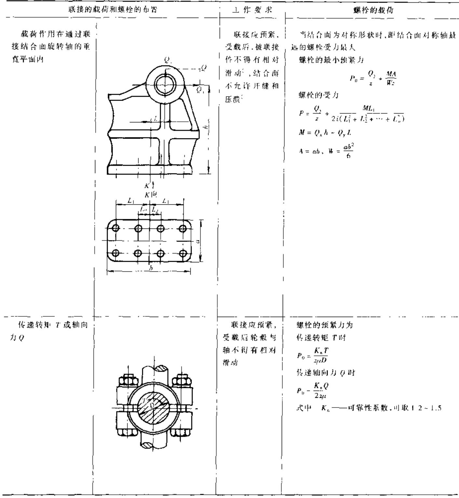

注:1.表中①若保证底板不滑动,需满足

$$
\mu \left( z P _ { 0 } - Q _ { y } \right) > \ell _ { x }
$$

名此条件不能满足,应采用卸载装置(如采用销、键、档块和套筒等卸载装置)

2表中 $\textcircled{2}$ 若保证被联接件最大受压处不被卡溃,需满足

$$
\frac { z l ^ { \mathrm { p } } \varsigma _ { 0 } } { A } - \begin{array} { l } { Q _ { \mathrm { y } } } \\ { A } \end{array} + \frac { M } { B } \Leftarrow \sigma _ { \mathsf { p p } }
$$

式中 $\sigma _ { \mathfrak { p p } }$ 一结合而的许用挤压应力,MPa(查表4-1-59)。变载时按静载 ${ \pmb { \sigma } } _ { \mathfrak { p p } }$ (表4-1-59中数)}按本表确定受力最大的螺检及所需的恢紧方,然后按表4-1-5l进 ${ \dot { \boldsymbol { \mathfrak { f } } } } { \boldsymbol { \mathfrak { f } } }$ 强度计算。

# 3.2.3单个螺栓的强度计算

(1)不预紧螺栓联接、预紧螺栓联接

<table><tr><td rowspan=3 colspan=7>                         GR（中1有#子蓝国</td></tr><tr><td rowspan=1 colspan=2>有</td></tr><tr><td rowspan=1 colspan=2>#子</td><td rowspan=1 colspan=2></td><td rowspan=1 colspan=1>蓝国</td></tr><tr><td rowspan=1 colspan=1>1R皖校核螺</td><td rowspan=1 colspan=1>中</td><td rowspan=1 colspan=1>1小者为 新中中（取8、</td><td rowspan=1 colspan=1>南有有</td><td rowspan=1 colspan=1>计算螺</td><td rowspan=1 colspan=1>理</td><td rowspan=1 colspan=1></td></tr><tr><td rowspan=1 colspan=1>√P+3(R+0.5P）</td><td rowspan=1 colspan=1></td><td rowspan=1 colspan=1></td><td rowspan=1 colspan=1>山+</td><td rowspan=1 colspan=1>或d≥p阁</td><td rowspan=1 colspan=1></td><td rowspan=1 colspan=1>“?</td></tr><tr><td rowspan=1 colspan=2>公</td><td rowspan=1 colspan=2>美N1B（见</td><td rowspan=1 colspan=2>5A</td><td rowspan=1 colspan=1></td></tr><tr><td rowspan=1 colspan=2>3D           大   2            □江GR当量应力，MPaRGRG1RGRGR</td><td rowspan=1 colspan=2>山  螺检的许用剪应4   9  P   3GDGDG</td><td rowspan=1 colspan=2>9     ：4GGRA</td><td rowspan=1 colspan=1>GR</td></tr><tr><td rowspan=2 colspan=2>压压强、卸载装置的剪切和被       求出当量应力     拧紧时扭转切应力0.5P力P:/义有横向载AG+</td><td rowspan=1 colspan=2>表4-3-17有相对转动时（即使很小）当被联接件（板）与螺栓间</td><td rowspan=2 colspan=2></td><td rowspan=2 colspan=1>出旺</td></tr><tr><td rowspan=1 colspan=2></td></tr></table>

<table><tr><td rowspan=1 colspan=4>螺栓的受载情况</td><td rowspan=1 colspan=1>简  图</td><td rowspan=1 colspan=1>计算内容</td><td rowspan=1 colspan=1>计算公式</td><td rowspan=1 colspan=2>许用应力</td><td rowspan=1 colspan=1>符号意义及系数选择</td><td rowspan=1 colspan=1>附</td></tr><tr><td rowspan=13 colspan=1>R</td><td rowspan=3 colspan=1>轴</td><td rowspan=3 colspan=2>静载荷</td><td rowspan=7 colspan=1></td><td rowspan=1 colspan=1>螺栓的总拉力</td><td rowspan=1 colspan=1>P=（Kn+K）P</td><td rowspan=3 colspan=1>-1p=nK</td><td rowspan=3 colspan=1>控制预紧：力时n=1.5~2.5不控制预紧力时n.=2.5~5</td><td rowspan=6 colspan=1>m    -尺寸系数，查表4-1-55或下图1.00.80.1224361860dmm-   材料在拉压对称循环下的疲劳极限，MPa，查表4-1-56K    有效应力集中系数，查表4-1-58出    螺栓的许用应力幅，MPa</td><td rowspan=6 colspan=1>若螺栓的局部(如退刀槽等)直径小于d（螺纹小径)或为空心螺栓时，式中4.应为其最小截面积。当受变载荷确定螺栓直径d时，应取两种计算结果的大值</td></tr><tr><td rowspan=1 colspan=1>校核螺栓的拉伸强度</td><td rowspan=1 colspan=1>1.3P= A 执</td></tr><tr><td rowspan=1 colspan=1>计算螺栓直径d</td><td rowspan=1 colspan=1>1.3P或d≥/1.66PA,o品</td></tr><tr><td rowspan=4 colspan=1>向载何</td><td rowspan=4 colspan=1>安</td><td rowspan=4 colspan=1></td><td rowspan=1 colspan=1>校核强度</td><td rowspan=1 colspan=1>KP,=</td><td rowspan=3 colspan=1>1op=n</td><td rowspan=3 colspan=1>控制预紧力时n = 1.2~ 1.5不控制预紧力时n查表4-1-53</td></tr><tr><td rowspan=1 colspan=1>计算螺栓直径d</td><td rowspan=1 colspan=1>A20K.P</td></tr><tr><td rowspan=1 colspan=1>校核强度</td><td rowspan=1 colspan=1>=A</td></tr><tr><td rowspan=1 colspan=1>计算螺栓直径</td><td rowspan=1 colspan=1>1.3P或d≥11.66PA20a</td><td rowspan=4 colspan=1>p=！</td><td rowspan=4 colspan=1>n = 1.2~1.5</td><td rowspan=4 colspan=1>K   可靠性系数，通心常取1.1~1.3m    摩擦面的数量结合面间的摩擦因数，查表4-1-52计算对象的接触厚度，mm</td><td rowspan=4 colspan=1>此时横向载荷靠摩擦力传递，螺栓只承受预紧力，预紧力P的大小根据联接不发生相对滑动的条件确定对于重载、变载荷的预紧联接，当横向载荷大于预紧力的1/5时，建议用卸载装置传递，如通过铰制孔用螺栓传递，仅校核螺栓的剪切应力和联接的挤压应力</td></tr><tr><td rowspan=6 colspan=1>横向载荷</td><td rowspan=3 colspan=2>普通孔螺栓</td><td rowspan=3 colspan=1>安R</td><td rowspan=1 colspan=1>所需预紧力P</td><td rowspan=1 colspan=1>P0=KRm</td></tr><tr><td rowspan=1 colspan=1>校核螺栓的拉伸强度</td><td rowspan=1 colspan=1>1.3P0a=     A</td></tr><tr><td rowspan=1 colspan=1>计算螺栓直径d</td><td rowspan=1 colspan=1>1.3P0        1.66P或d≥A≥p  </td></tr><tr><td rowspan=3 colspan=2>铰制孔螺栓</td><td rowspan=3 colspan=1>同</td><td rowspan=1 colspan=1>校核螺栓剪切强度</td><td rowspan=1 colspan=1>RT==mπd/45</td><td rowspan=3 colspan=1>福rp=       2n或pp=nn</td><td rowspan=1 colspan=1>静载n=2.5变载n=3.5~5</td><td rowspan=3 colspan=1>b    材料的抗拉强度，MPao，    材料的屈服极限、MPa</td><td rowspan=3 colspan=1></td></tr><tr><td rowspan=2 colspan=1>校核螺杆与孔壁的挤压应力</td><td rowspan=2 colspan=1>Rop=m</td><td></td></tr><tr><td rowspan=1 colspan=1>2</td></tr></table>

表4-1-52预紧联接结合面的摩攘因数 $\pmb { \mu }$ 值

<table><tr><td rowspan=1 colspan=1>被联接件</td><td rowspan=1 colspan=1>表面状态</td><td rowspan=1 colspan=1>值</td><td rowspan=1 colspan=1></td></tr><tr><td rowspan=1 colspan=1>钢或铸铁零件</td><td rowspan=1 colspan=1>干燥的加工表面有油的加工表面</td><td rowspan=1 colspan=1>0.1~0.160.06~0.10</td><td rowspan=1 colspan=1></td></tr><tr><td rowspan=1 colspan=1>钢结构</td><td rowspan=1 colspan=1>喷砂处理涂覆锌漆轧制表面，钢丝刷清理浮锈</td><td rowspan=1 colspan=2>0.45 - 0.550.40~0.500.30~0.35</td></tr></table>

表4-1-53预紧联接螺栓的安全系数 $\pmb { n }$ 值(不控制预紧力)

<table><tr><td rowspan=2 colspan=1>钢种</td><td rowspan=1 colspan=3>静裁荷</td><td rowspan=1 colspan=3>变裁荷</td></tr><tr><td rowspan=1 colspan=1>M6~M16</td><td rowspan=1 colspan=1>M16~M30</td><td rowspan=1 colspan=1>M30~M60</td><td rowspan=1 colspan=1>M6~M16</td><td rowspan=1 colspan=1>M16-M30</td><td rowspan=1 colspan=1>M30~M60</td></tr><tr><td rowspan=1 colspan=1>碳钢</td><td rowspan=1 colspan=1>4-3</td><td rowspan=1 colspan=1>3-2</td><td rowspan=1 colspan=1>2~1.3</td><td rowspan=1 colspan=1>10~6.5</td><td rowspan=1 colspan=1>6.5</td><td rowspan=1 colspan=1>6.5~10</td></tr><tr><td rowspan=1 colspan=1>合金钢</td><td rowspan=1 colspan=1>5-4</td><td rowspan=1 colspan=1>4~2.5·</td><td rowspan=1 colspan=1>2.5</td><td rowspan=1 colspan=1>7.5-5</td><td rowspan=1 colspan=1>5</td><td rowspan=1 colspan=1>5~7.5</td></tr></table>

表4-1-54 预紧系数 $\mathbf { K _ { 0 } }$ 值

<table><tr><td rowspan=1 colspan=2>联接的情况</td><td rowspan=1 colspan=1>K值</td></tr><tr><td rowspan=1 colspan=1>紧固</td><td rowspan=1 colspan=1>静载荷变裁荷</td><td rowspan=1 colspan=1>1.2~2.02.0~4.0</td></tr><tr><td rowspan=1 colspan=1>紧斑</td><td rowspan=1 colspan=1>软垫金属成型垫金属平垫</td><td rowspan=1 colspan=1>1.5- 2.52.5~ 3.53.0~4.5</td></tr></table>

表4-1-55 螺栓的相对刚度系数 $\pmb { K } _ { \epsilon }$ 值

<table><tr><td>联接型式</td><td>K值</td></tr><tr><td></td><td></td></tr><tr><td>连杆螺栓</td><td>0.2</td></tr><tr><td>钢板联接+金属垫（或无垫）</td><td>0.2~0.3</td></tr><tr><td>钢板联接+皮革垫</td><td>0.7</td></tr><tr><td>钢板联接+铜皮石棉垫</td><td>0.8</td></tr><tr><td>钢板联接+橡胶垫</td><td>0.9</td></tr></table>

表4-1-56 尺寸系数&

<table><tr><td rowspan=1 colspan=1>螺纹直径d/mm</td><td rowspan=1 colspan=1>s12</td><td rowspan=1 colspan=1>16</td><td rowspan=1 colspan=1>20</td><td rowspan=1 colspan=1>24</td><td rowspan=1 colspan=1>30</td><td rowspan=1 colspan=1>36</td><td rowspan=1 colspan=1>42</td><td rowspan=1 colspan=1>481</td><td rowspan=1 colspan=1>56</td><td rowspan=1 colspan=1>64</td></tr><tr><td rowspan=1 colspan=1>m</td><td rowspan=1 colspan=1>1</td><td rowspan=1 colspan=1>0.87</td><td rowspan=1 colspan=1>0.80</td><td rowspan=1 colspan=1>0.74</td><td rowspan=1 colspan=1>0.68</td><td rowspan=1 colspan=1>0.65</td><td rowspan=1 colspan=1>0.62</td><td rowspan=1 colspan=1>0.58</td><td rowspan=1 colspan=1>0.55</td><td rowspan=1 colspan=1>510.53</td></tr></table>

表 4-1-58 $d = 1 2 \mathrm { m m }$ 螺纹的有效应力集中系数 $\pmb { \ K } _ { \pmb { \sigma } }$ 

<table><tr><td rowspan=1 colspan=1>抗拉强度o/MPa</td><td rowspan=1 colspan=1>400</td><td rowspan=1 colspan=1>600</td><td rowspan=1 colspan=1>800</td><td rowspan=1 colspan=1>1000</td></tr><tr><td rowspan=1 colspan=1>K</td><td rowspan=1 colspan=1>3</td><td rowspan=1 colspan=1>3.9</td><td rowspan=1 colspan=1>4.8</td><td rowspan=1 colspan=1>5.2</td></tr></table>

注;辗压螺纹的 $K _ { \circ }$ 降低 $2 0 \% - 3 0 \%$ □

表4-1-57螺纹联接件常用材料及机械性能

<table><tr><td rowspan="2">钢号</td><td rowspan="2">抗拉强度 b</td><td rowspan="2">屈服点 中</td><td colspan="2">疲劳强度</td></tr><tr><td>弯曲-</td><td>拉压-u</td></tr><tr><td>10</td><td>335~ 400</td><td>205</td><td>160~ 220</td><td>120 - 150</td></tr><tr><td>Q235-A</td><td>375 - 460</td><td>235</td><td>170 - 220</td><td>120 - 160</td></tr><tr><td>35</td><td>530</td><td>315</td><td>220~ 300</td><td>170~220</td></tr><tr><td>45</td><td>600</td><td>355</td><td>250~340</td><td>190~ 250</td></tr><tr><td>40Cr</td><td>980</td><td>785</td><td>320~ 440</td><td>240~340</td></tr></table>

表4-1.59

底板螺栓联接结合面的许用挤压应力 $\sigma _ { p \mathrm { \pm } }$ 

<table><tr><td>结合面材料</td><td>app</td><td>结合面材料</td><td>pp</td></tr><tr><td>钢</td><td>i</td><td>混凝土</td><td>2~3</td></tr><tr><td>铸铁</td><td>四 2~2.5</td><td>水泥浆砖砌面 木材</td><td>1.2~2 2~4</td></tr></table>

/MPa 

(2)受偏心载荷的预紧螺栓联接

图4-1-1所示钩头螺栓联接,螺栓除受轴向拉力 $\boldsymbol { \mathscr { F } } _ { \boldsymbol { \Sigma } }$ 外,还受偏心弯矩 $F _ { \mathrm { ~ \tiny ~  ~ } } \pmb { \mathscr { s } } ^ { \mathrm { ~ \tiny ~ \mathcal ~ { ~ e ~ } ~ } }$ 的作用,螺纹部分危险截面上的最大拉应力为

$$
\sigma _ { \mathrm { m a x } } = \mathit { \Pi } _ { \bar { A } _ { s } } ^ { F _ { \sum } } + \mathit { \Pi } _ { \bar { W } } ^ { F _ { \sum } e } = \frac { F _ { \sum } e } { A _ { s } } \bigg ( 1 + \frac { 8 e } { d _ { s } } \bigg ) \leqslant \sigma _ { i p }
$$

式中A---螺纹公称应力截面积, $\mathbf { m } \mathbf { m } ^ { 2 }$ :$\pmb { W }$ --螺纹危险截面系数, $\mathbf { m } \mathbf { m } ^ { 3 }$ $\pmb { e }$ 偏心距, $\mathbf { m m }$ :${ \boldsymbol { F } } _ { \mathrm { 2 } }$ ——受轴向拉力,N;$d _ { \ast }$ .螺纹危险截面的计算直径, $\mathrm { m m } , d _ { \mathrm { s } } \approx d$ ;$\sigma _ { \ell \mathsf { p } }$ 许用应力, $\mathbb { M P a }$ ,查表。

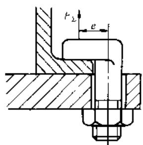

图4-1-]偏心载荷

# (3)高温螺栓联接

在高温下T作的联接,要考虑下列问题:温差载荷;螺栓和被联接件性能的变化;力松弛。

当螺栓和被联接件的线膨胀系数不同,或工作温度不同,或两者都不同时,由于热变形不一致而使螺栓受到的温差载荷为

$$
F _ { \mathrm { t } } = \frac { \mathrm { C _ { L } C _ { \hbar } } } { C _ { \mathrm { L } } + \mathrm { C _ { \hbar } } } \left( \alpha _ { \mathrm { F } } \Delta t _ { \mathrm { F } } \vec { l } _ { \mathrm { F } } - \alpha _ { \mathrm { L } } \Delta t _ { \mathrm { l } } \vec { l } _ { \mathrm { l } } \right)
$$

$C _ { 1 } \setminus C _ { \ell }$ $\frac { 1 } { C _ { 1 } } = \frac { 1 } { E _ { 3 } } \bigg ( \frac { L _ { 1 } } { A } + \frac { L _ { 2 } + L _ { 3 } } { A } \bigg )$ $\mathrm { \Delta } ( { \it C } _ { \mathrm { \Delta } } )$ 

$\alpha$ ----线膨胀系数, $1 / \mathcal { C }$ ;$\Delta t$ 一 温升, $\mathfrak { C }$ ;-常温时的装配长度, $\mathbf { m m }$ 

下脚标L代表螺栓,F代表被联接件:

考虑温差载荷后,螺栓的总载荷为

$$
\smash { \xi _ { \perp } = F _ { \mathrm { 0 } } + K _ { \mathrm { c } } F + F _ { \mathrm { i } } }
$$

并按受轴向载荷的预紧联接和高温时材料的性能数据进行强度计算,

为了防止旋合螺纹在高温下咬死,除了合理选择螺栓和螺母材料外,宜采用粗牙螺纹,并适当加大中径隙。热强度钢和合金钢在高温时对缺口敏感性增强,必须注意减少螺栓应力集中。

钢螺栓长期在 $3 0 0 \sim 5 0 0  { \mathrm { ‰} }$ 高温下工作,经过-段工作时间后,会产生应力松弛,使联接的紧固作用减小。设计时,必须使剩余预紧力始终大于所要求的值,以保证联接的坚固与紧密。

# (4)低温螺栓联接

常用的螺栓钢材在低温下的静强度虽然有所提高,但其塑性却急剧降低,所以,在低温下T作的螺栓可能生脆性破坏。

辗压螺纹能提高螺纹的常温强度,但其冷硬层会降低螺栓的低温塑性。

设计低温联接螺栓时,应注意以下两点:

$\textcircled{1}$ 材料应有较好的低温塑性,即在给定的工作温度下,有一定的冲击韧度(·般应使冲击值 $\alpha _ { \mathrm { k } } > 0 . 3 \mathrm { N } \cdot \mathrm { m } ^ { \prime }$ $\mathbf { m m ^ { 2 } }$ ;$\textcircled{2}$ 材料在低温时对应力集中敏感性增强,必须减少应力集中。

(5)钢结构用高强度螺栓联接

钢结构用高强度螺栓联接足靠摩擦力来传递载荷。具有应力集中小,刚性好,应力传递比较均匀,承载能大大等优点。目前,在钢结构中被广泛应用。

为保证传递的载荷,可对被联接件结合面进行喷砂、敷以涂料等特殊处理,以增大摩擦力,要严格控制预紧力[预紧应力可达 $\left. \mathbf { 0 . 7 } \sim 0 . 8 \right. \ \sigma _ { \circ } ]$ 。高强度螺栓计算与普通螺栓相同。

# 3.3螺纹联接的拧紧力矩计算及预紧力的控制

# 3.3.1螺纹联接的拧紧力矩计算

为了增强螺纹联接的刚性、紧密性、防松能力以及防止受横向载荷螺栓联接的滑动,多数螺纹联接在装配时都要预紧。其拧紧扳手力矩 $\pmb { T }$ 是用于克服螺纹副的螺纹阻力矩 $\pmb { \bar { \tau } } _ { 1 }$ 及螺母与被联接件(或垫圈)支承面间的端面摩擦力矩 $\pmb { T } _ { 2 }$ 。施加拧紧力矩时,如何控制预紧力,可用力矩扳手法、螺母转角法、指示垫圈法、测定螺栓伸长法和螺栓预伸长法。后两种方法较准确但使用不便。

$$
T = T _ { 1 } + \ T _ { 2 } = F _ { 0 } \mathrm { t a n } ( \varphi + \rho _ { \mathrm { v } } ) { \frac { d _ { 2 } } { 2 } } + F _ { 0 } \mu \ { \frac { 1 } { 3 } } \times { \frac { D _ { \mathrm { w } } ^ { 3 } - d _ { 0 } ^ { 3 } } { D _ { \mathrm { w } } ^ { 2 } - d _ { 0 } ^ { 2 } } } = K F _ { 0 } d ( \mathrm { N } \cdot \mathbf { m } \mathrm { m } )
$$

$$
K = \frac { d _ { 2 } } { 2 d } \mathrm { t a n } \left( \varphi + \rho _ { v } \right) + \frac { \mu } { 3 d } \frac { D _ { v } ^ { 3 } - d _ { 0 } ^ { 3 } } { D _ { v } ^ { 2 } - d _ { 0 } ^ { 2 } }
$$

式中 $\pmb { d }$ 螺纹公称直径, $\mathbf { m m }$ ;

$\pmb { F } _ { \mathbf { 0 } }$ 一一预紧力,N;  
$\pmb { K }$ 一 -拧紧力矩系数;  
$\pmb { T }$ 1 拧紧力矩;  
$d _ { 2 }$ 一 螺纹中径, $\mathbf { m m }$ ;  
---螺纹升角;  
${ \pmb \rho } ,$ 螺纹当量摩擦角, $\rho _ { \mathrm { v } } = \arctan _ { f ^ { \pm } \mathrm { v } } , \mu ,$ 为螺纹当量摩擦因数;  
p—-螺母与被联接件支承面间的摩擦因数,见表4-1-52;  
$\dot { d } _ { 0 }$ —见图4-1-2, $\mathbf { m n n }$ 

表4-1-52荐用的 $\pmb { \mu }$ 值供参考使用,较精确的数值应通过实验取得。

对于普通粗牙M12\~M64螺纹,当量摩擦因数μ、=0.10\~0.20,取μ=0.15,则拧紧力矩系数K在0.1\~0.:范围内变动,表4-1-60荐用 $\pmb { \ K }$ 值可供设计计算时参考。

表4-1-60 拧紧力矩系数 $\pmb { K }$ 

<table><tr><td rowspan="2">摩擦表面状态</td><td colspan="2">K值</td></tr><tr><td>有润滑</td><td>无润滑</td></tr><tr><td>精加工表面</td><td>0.10</td><td>0.12</td></tr><tr><td>一般加表面</td><td>0.13~0.15</td><td>0.18~0.21</td></tr><tr><td>表面氧化</td><td>0.20</td><td>0.24</td></tr><tr><td>镀锌</td><td>0.18</td><td>0.22</td></tr><tr><td>干燥粗加工表面</td><td></td><td>0.26~0.30</td></tr></table>

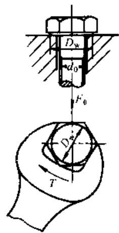

图4-1-2拧紧力矩

一般说来,K值主要取决于两个摩擦副的摩擦因数μ、μ,对标准螺栓来说,尺寸大小对K值的影响是很小的。为了进一步简化,一般机械中常假设μv=μ=μ(此条件常近似地符合工程实际),这样前面拧紧力矩的公式可简化如下:

(1)-般标准六角螺栓

$$
K = 1 . 2 5 \mu ^ { \prime } , T = 1 . 2 5 \mu ^ { \prime } F _ { 0 } d
$$

(2)小六角螺栓或圆柱头内六角螺钉

$$
K = 1 . 2 \mu ^ { \prime } , T = 1 . 2 \mu ^ { \prime } F _ { 0 } d
$$

(1)、(2)中的公式,当 $\mu _ { \mathrm { ~ v ~ } } \neq \mu$ 时,取 $\boldsymbol { \mu } ^ { \prime } = \frac { 1 } { 2 } \big ( \boldsymbol { \mu } _ { v } + \boldsymbol { \mu } \big ) ,$ 

# 3.3.2预紧力的控制

预紧力的大小根据螺栓组受力的大小和联接的工作要求决定。设计时首先保证所需的预紧力,又不应使联接的结构尺寸过大。一般规定拧紧后螺纹联接件预紧应力不得大于其材料的屈服点 $\pmb { \sigma } _ { \parallel }$ 的 $80 \%$ 。对于·般联接用钢制螺栓,推荐用预紧力限值如下:

$$
\begin{array} { r } { F _ { 0 } = \left( 0 . 6 \sim 0 . 7 \right) \sigma _ { \circ } , A , } \\ { F _ { 0 } = \left( 0 . 5 - 0 . 6 \right) \sigma _ { \circ } A , } \end{array}
$$

式中 $\sigma _ { \mathfrak { s } }$ ——螺栓材料的屈服点, $\mathbb { M P a }$ i

A。—螺栓公称应力截面积, ${ \mathfrak { m } } { \mathfrak { n } } ^ { 2 }$ ;

$$
A _ { \mathrm { s } } = \frac { \pi } { 4 } \bigg ( \frac { d _ { 2 } + d _ { 3 } } { 2 } \bigg ) ^ { \frac { \gamma } { 2 } }
$$

$d _ { 1 }$ -外螺纹小径, $\mathbf { m m }$ ;  
$d _ { 2 }$ -外螺纹中径, $\mathbf { m m }$ ;  
$d _ { 3 }$ —-螺纹的计算直经 $d _ { 3 } \equiv d _ { \parallel } - H / 6 , \mathrm { m m }$ i$\pmb { H }$ —螺纹原始三角性高度, $\mathbf { \nabla } ^ { \mathsf { m m } }$ 。

对于重要的螺纹联接,必须有-套控制和测量预紧力的方法、常用的空制方法有以下几种。

(1)力矩法

用力矩扳手正规测定拧紧力矩时,一般取预紧系数 $Q = 1 . 4$ ,则力矩扳手所需指示值为:

$$
\mathcal { F } _ { 1 } = 0 , 1 2 \sigma _ { s } A _ { s } d
$$

(2)螺母转角法

将螺母拧到与被联接件贴紧后,再旋转一定的角度获得所需的预紧力,螺母转角 $\varphi$ 为:

$$
\varphi = 3 6 0 \ \frac { { \cal F } _ { \mathrm { 0 } } } { p } \bigg \{ \frac { 1 } { C _ { \mathrm { L } } } + \frac { 1 } { C _ { \mathrm { F } } } \bigg \}
$$

式中 $\pmb { p }$ —螺距(单头螺栓), $\mathbf { m n } \mathbf { n } \mathbf { \mathbf { \mathbf { \mathbf { m } } } }$ 

$F _ { \parallel }$ 预紧力,N;$\pmb { C } _ { \mathrm { l . } }$ 螺栓的刚度, $\mathbf { N } / \mathbf { m m }$ ;$C _ { \mathtt { F } }$ 1 被联接件的刚度, $\mathbf { N } / \mathbf { m m }$ 

用螺母转角法控制预紧力时,取预紧系数 $Q = 2$ 时,预紧力为:

$$
\bar { \pmb { F } } _ { 0 } = 0 . 5 2 5 \sigma _ { \bullet } A _ { s }
$$

对于普通螺栓,其刚度 $c _ { \mathbf { \imath } }$ 为:

$$
\displaystyle \frac { 1 } { C _ { \mathrm { t } } } = \frac { 1 } { E _ { \mathrm { L } } } \bigg \{ \frac { L _ { \mathrm { t } } } { A } + \frac { L _ { 2 } + L _ { 3 } } { A _ { \mathrm { s } } } \bigg \}
$$

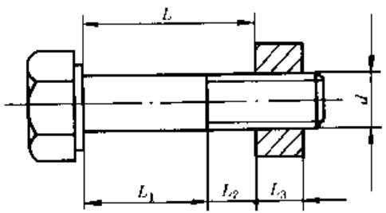

图4-1-3刚度订算

式中 $\pmb { { \cal E } } _ { \mathrm { L } }$ -—螺栓材料的弹性模量, ${ \bf M P a }$ ;$A$ —螺栓光杆部分截面积, $\mathbf { m } \mathbf { m } ^ { 2 }$ ;A.-螺纹的公称应力面积, $\mathrm { { \ m m } ^ { 2 } }$ ;$\pmb { d }$ 1 螺栓公称直径, $\mathbf { m m }$ ;$\pmb { \mathrm { L } } _ { 1 } , \pmb { \mathrm { L } } _ { 2 } , \pmb { \mathrm { L } } _ { 3 }$ —见图4-1-3,其中对 $\pmb { L } _ { 3 }$ :钢螺栓与钢内螺纹孔 $\bar { L } _ { 3 } =$ $0 . 5 d$ ;钢螺栓与铸铁螺纹孔 $\tilde { L } _ { 3 } = 0 . 6 d$ a

被联接件的刚度与材料及结构尺寸有关, $C _ { \mathtt { F } }$ 值计算式见表4-1-61、螺母转角法,在有自动旋转设备时,可得到精确度的预紧力。

(3)螺栓预伸长法

通过液力、电力或蒸汽加热使螺栓预伸长到所要求的变形量,再拧紧螺母,冷却后螺栓缩短即联接预紧。此法螺栓不受拧紧力矩作用,螺栓强度得以提高,但需预变形装置。

<table><tr><td>表4-1-61</td><td></td><td></td><td></td><td></td><td></td><td></td></tr><tr><td>联接型式</td><td>a.薄圆筒D=dw</td><td rowspan="6">d D</td><td rowspan="6">[1-(3-）] b.厚圆筒</td><td rowspan="6">C计算式 b.厚圆筒D=（1~3）d</td><td rowspan="6"></td><td rowspan="6">平板 D</td></tr><tr><td></td></tr><tr><td>螺 栓</td></tr><tr><td>联 接</td></tr><tr><td></td></tr><tr><td>螺 柱 及 螺</td><td</table>

# 3.4螺纹联接机械性能和材料

表4-1-62

<table><tr><td rowspan=4 colspan=2>性能等级</td><td rowspan=1 colspan=25>机   城   性   能</td></tr><tr><td rowspan=2 colspan=2>抗拉强度中/N:mn-2</td><td rowspan=2 colspan=4>维氏硬度F≥98NHV3</td><td rowspan=2 colspan=4>布氏硬度HBP= 30D²（HB140时P=10D²）</td><td rowspan=2 colspan=7>洛氏硬度HRmin         max</td><td rowspan=2 colspan=1>表面硬度HVu.3</td><td rowspan=2 colspan=2>屈服点中/N·mm-2</td><td rowspan=2 colspan=2>规定非比例伸长应力p0.2/N·mm-2</td><td rowspan=1 colspan=2>保证应力</td><td rowspan=3 colspan=1>集就度</td></tr><tr><td rowspan=2 colspan=1>udss</td><td rowspan=2 colspan=1>_ww-Ns</td></tr><tr><td rowspan=1 colspan=1>公称</td><td rowspan=1 colspan=1>min</td><td rowspan=1 colspan=1>min</td><td rowspan=1 colspan=3>max</td><td rowspan=1 colspan=1>min</td><td rowspan=1 colspan=3>max</td><td rowspan=1 colspan=1>HRB</td><td rowspan=1 colspan=1>HRC</td><td rowspan=1 colspan=4>HRB</td><td rowspan=1 colspan=1>HRC</td><td rowspan=1 colspan=1>niax</td><td rowspan=1 colspan=1>公称</td><td rowspan=1 colspan=1>min</td><td rowspan=1 colspan=1>公称</td><td rowspan=1 colspan=1>min</td></tr><tr><td rowspan=1 colspan=2>3.6</td><td rowspan=1 colspan=1>300</td><td rowspan=1 colspan=1>330</td><td rowspan=1 colspan=1>95</td><td rowspan=1 colspan=3></td><td rowspan=1 colspan=1>90</td><td rowspan=1 colspan=3></td><td rowspan=1 colspan=1>52</td><td rowspan=1 colspan=1></td><td rowspan=1 colspan=4></td><td rowspan=1 colspan=1></td><td rowspan=1 colspan=1></td><td rowspan=1 colspan=1>180</td><td rowspan=1 colspan=1>190</td><td rowspan=1 colspan=1></td><td rowspan=1 colspan=1></td><td rowspan=1 colspan=1>0.94</td><td rowspan=1 colspan=1>180</td><td rowspan=1 colspan=1>25</td></tr><tr><td rowspan=2 colspan=2>4.6</td><td rowspan=2 colspan=1>400</td><td rowspan=2 colspan=1>400</td><td rowspan=2 colspan=1>120</td><td rowspan=2 colspan=2></td><td rowspan=1 colspan=1></td><td rowspan=2 colspan=1></td><td rowspan=2 colspan=3>114</td><td></td><td rowspan=1 colspan=1></td><td rowspan=2 colspan=2></td><td rowspan=2 colspan=2>67</td><td rowspan=2 colspan=1></td><td rowspan=2 colspan=1></td><td rowspan=1 colspan=1></td><td rowspan=2 colspan=1></td><td rowspan=2 colspan=1></td><td rowspan=2 colspan=1></td><td rowspan=2 colspan=1>240</td><td rowspan=2 colspan=1>240</td><td rowspan=2 colspan=1></td></tr><tr><td rowspan=1 colspan=2></td><td rowspan=1 colspan=2></td><td></td><td></td><td rowspan=1 colspan=2></td><td></td></tr><tr><td rowspan=2 colspan=2>4.8</td><td rowspan=2 colspan=1>400</td><td rowspan=2 colspan=1>420</td><td rowspan=2 colspan=1>130</td><td rowspan=2 colspan=3>220</td><td rowspan=2 colspan=1>124j</td><td rowspan=2 colspan=2>209</td><td rowspan=1 colspan=1>209</td><td rowspan=2 colspan=1>9</td><td rowspan=2 colspan=1>71</td><td rowspan=2 colspan=4></td><td rowspan=2 colspan=1>95.0</td><td rowspan=2 colspan=1>95.0</td><td rowspan=2 colspan=1></td><td rowspan=2 colspan=1></td><td rowspan=2 colspan=1>320</td><td rowspan=2 colspan=1>340</td><td rowspan=2 colspan=1></td><td rowspan=2 colspan=1></td><td rowspan=2 colspan=1>0.91</td></tr><tr><td rowspan=1 colspan=1></td><td></td></tr><tr><td rowspan=4 colspan=2>5.6</td><td rowspan=4 colspan=1></td><td rowspan=4 colspan=1>500</td><td rowspan=4 colspan=1>155</td><td rowspan=4 colspan=3></td><td rowspan=4 colspan=1>147</td><td rowspan=4 colspan=2></td><td rowspan=1 colspan=1></td><td rowspan=4 colspan=1></td><td rowspan=4 colspan=1>79</td><td rowspan=4 colspan=4></td><td rowspan=4 colspan=1></td><td></td><td></td><td></td><td></td><td></td><td></td><td></td><td></td></tr><tr><td></td><td rowspan=3 colspan=4></td><td></td><td></td><td></td><td></td><td></td><td></td><td></td><td></td></tr><tr><td></td><td rowspan=2 colspan=2></td><td rowspan=2 colspan=1></td><td rowspan=2 colspan=1></td><td rowspan=2 colspan=1>300</td><td rowspan=2 colspan=1>300</td><td rowspan=2 colspan=1></td><td rowspan=2 colspan=1></td><td rowspan=2 colspan=1>0.93</td><td rowspan=2 colspan=1>280</td><td rowspan=2 colspan=1>20</td></tr><tr><td rowspan=1 colspan=2></td></tr><tr><td rowspan=1 colspan=2>5.8</td><td rowspan=1 colspan=1>500</td><td rowspan=1 colspan=1>520</td><td rowspan=1 colspan=1>160</td><td rowspan=1 colspan=3></td><td rowspan=1 colspan=1>152</td><td rowspan=1 colspan=3></td><td rowspan=1 colspan=1>82</td><td rowspan=1 colspan=1></td><td rowspan=1 colspan=4></td><td rowspan=1 colspan=1></td><td rowspan=1 colspan=1></td><td rowspan=1 colspan=1>400</td><td rowspan=1 colspan=1>420</td><td rowspan=1 colspan=1></td><td rowspan=1 colspan=1></td><td rowspan=1 colspan=1>0.90</td><td rowspan=1 colspan=1>380</td><td rowspan=1 colspan=1></td></tr><tr><td rowspan=1 colspan=2>6.8</td><td rowspan=1 colspan=1>600</td><td rowspan=1 colspan=1>600</td><td rowspan=1 colspan=1>190</td><td rowspan=1 colspan=3>250</td><td rowspan=1 colspan=1>181</td><td rowspan=1 colspan=3>238</td><td rowspan=1 colspan=1>89</td><td rowspan=1 colspan=1></td><td rowspan=1 colspan=4>99.5</td><td rowspan=1 colspan=1></td><td rowspan=1 colspan=1></td><td rowspan=1 colspan=1>480</td><td rowspan=1 colspan=1>480</td><td rowspan=1 colspan=1></td><td rowspan=1 colspan=1></td><td rowspan=1 colspan=1>0.92</td><td rowspan=1 colspan=1>440</td><td rowspan=1 colspan=1></td></tr><tr><td rowspan=2 colspan=1>8.8</td><td rowspan=1 colspan=1>d16mm</td><td rowspan=1 colspan=1>800</td><td rowspan=1 colspan=1>00</td><td rowspan=1 colspan=1>250</td><td rowspan=1 colspan=3>320</td><td rowspan=1 colspan=1>238</td><td rowspan=1 colspan=3>304</td><td rowspan=1 colspan=1>1</td><td rowspan=1 colspan=1>22</td><td rowspan=1 colspan=4>：</td><td rowspan=1 colspan=1>32</td><td rowspan=1 colspan=1>木</td><td rowspan=1 colspan=1></td><td rowspan=1 colspan=1></td><td rowspan=1 colspan=1>640</td><td rowspan=1 colspan=1>640</td><td rowspan=1 colspan=1></td><td rowspan=1 colspan=1>580</td><td rowspan=1 colspan=1>12</td></tr><tr><td rowspan=1 colspan=1>d>16mm</td><td rowspan=1 colspan=1>800</td><td rowspan=1 colspan=1>830</td><td rowspan=1 colspan=1>255</td><td rowspan=1 colspan=3>335</td><td rowspan=1 colspan=1>242</td><td rowspan=1 colspan=3>318</td><td rowspan=1 colspan=1></td><td rowspan=1 colspan=1>23</td><td rowspan=1 colspan=4></td><td rowspan=1 colspan=1>34</td><td rowspan=1 colspan=1>H</td><td rowspan=1 colspan=1></td><td rowspan=1 colspan=1></td><td rowspan=1 colspan=1>640</td><td rowspan=1 colspan=1>660</td><td rowspan=1 colspan=1>0.91</td><td rowspan=1 colspan=1>600</td><td rowspan=1 colspan=1>12</td></tr><tr><td rowspan=1 colspan=2>8.8</td><td rowspan=1 colspan=10></td><td rowspan=1 colspan=8></td><td rowspan=1 colspan=1></td><td rowspan=1 colspan=3></td><td rowspan=1 colspan=1></td><td rowspan=1 colspan=1></td><td rowspan=1 colspan=1></td></tr><tr><td rowspan=1 colspan=2>9.8</td><td rowspan=1 colspan=1>900</td><td rowspan=1 colspan=1>900</td><td rowspan=1 colspan=1>290</td><td rowspan=1 colspan=3>360</td><td rowspan=1 colspan=1>276</td><td rowspan=1 colspan=3>342</td><td rowspan=1 colspan=1></td><td rowspan=1 colspan=1>28</td><td rowspan=1 colspan=4></td><td rowspan=1 colspan=1>37</td><td rowspan=1 colspan=1>*</td><td rowspan=1 colspan=1></td><td rowspan=1 colspan=1></td><td rowspan=1 colspan=1>720</td><td rowspan=1 colspan=1>720</td><td rowspan=1 colspan=1>0.90</td><td rowspan=1 colspan=1>660</td><td rowspan=1 colspan=1>10</td></tr><tr><td rowspan=1 colspan=2>9.8</td><td rowspan=1 colspan=1></td><td rowspan=1 colspan=2></td><td rowspan=1 colspan=3></td><td rowspan=1 colspan=1></td><td rowspan=1 colspan=3></td><td rowspan=1 colspan=1></td><td rowspan=1 colspan=1></td><td rowspan=1 colspan=4></td><td rowspan=1 colspan=1></td><td rowspan=1 colspan=1></td><td rowspan=1 colspan=1></td><td rowspan=1 colspan=1></td><td rowspan=1 colspan=1></td><td rowspan=1 colspan=1></td><td rowspan=1 colspan=1></td><td rowspan=1 colspan=1></td><td rowspan=1 colspan=1></td></tr><tr><td rowspan=1 colspan=2>10.9</td><td rowspan=1 colspan=1>1000</td><td rowspan=1 colspan=1>1040</td><td rowspan=1 colspan=1>320</td><td rowspan=1 colspan=3>380</td><td rowspan=1 colspan=1>304</td><td rowspan=1 colspan=3>361</td><td rowspan=1 colspan=1></td><td rowspan=1 colspan=1>32</td><td rowspan=1 colspan=4>：</td><td rowspan=1 colspan=1>39</td><td rowspan=1 colspan=1>★</td><td rowspan=1 colspan=1></td><td rowspan=1 colspan=1></td><td rowspan=1 colspan=1>900</td><td rowspan=1 colspan=1>940</td><td rowspan=1 colspan=1>：.0.88:830</td><td rowspan=1 colspan=1></td><td rowspan=1 colspan=1>9</td></tr><tr><td rowspan=1 colspan=2>10.9</td><td rowspan=1 colspan=10></td><td rowspan=2 colspan=15>39           44    *               108011000.88970  8</td></tr><tr><td rowspan=1 colspan=2>12.9</td><td rowspan=1 colspan=1>1200</td><td rowspan=1 colspan=1>1220</td><td rowspan=1 colspan=1>385</td><td rowspan=1 colspan=3>435</td><td rowspan=1 colspan=1>366</td><td rowspan=1 colspan=3>414</td><td rowspan=1 colspan=1></td><td rowspan=1 colspan=1>39</td><td rowspan=1 colspan=4></td><td rowspan=1 colspan=1>44</td><td rowspan=1 colspan=1>*</td><td rowspan=1 colspan=1></td><td rowspan=1 colspan=1></td><td rowspan=1 colspan=1>1080</td><td rowspan=1 colspan=1>1100</td><td rowspan=1 colspan=1>0.88</td><td rowspan=1 colspan=1>970</td></tr></table>

注:1、本标准规定了有碳钢或合金钢制造的、在环境温度为 $1 0 \sim 3 5 \mathfrak { C }$ 条件下进行试验时,螺栓、螺钉和螺柱的机械性能,T197的规定。本标准不适合于紧定螺钉及类似的不受拉力的螺纹紧固件。

2.本标准未规定以下性能要求;可焊接性;耐腐蚀性;工作温度高于 $3 0 0 \mathfrak { C }$ (对10.9级为 $2 5 0 \%$ )或低于 $- 5 0 \Upsilon$ 的性

3.性能等级的标准代号、由两部分数字组成:第一部分数字表示公称抗拉强度( ${ \mathbf { \beta } } _ { n }$ 的 $1 / 1 0 0$ ;第二部分数字表示公称点的 $1 / 1 0 ,$ 

4.表中规定的最低回火温度足必须遵守的。

5.对10.9、12.9级材料应具有良好的淬透性,以保证紧固件螺纹截面的芯部在淬火后、可火前获得约 $9 0 \%$ 的马氏体组织。

6.合金钢至少应含有以下元素中的一种元素,其最小含量为:铬 $0 . 3 0 \%$ ;镍 $0 . 3 0 \%$ ;钼 $0 , 2 0 \%$ ;钒 $0 . 1 0 \%$ 

.考虑承受拉力,12.9级的表面不允许有金相能测出的白色磷聚集层。

8.对于8.8级,为保证良好的淬透性,螺纹直径超过 ${ 2 0 m m }$ 的紧固,需要采用对10.9级规定的钢。

9.9.8级仅适用于螺纹直径 $d \leqslant 1 6 \pi \pi$ ,8.8级对钢结构螺栓为 $1 2 \mathrm { m m }$ 

10.表中 $\star$ 表面硬度不应比芯部硬度高出30个硬度值。对10.9级的表面硬度不应大于390HV0.3.

11.在螺栓和螺钉末端测试的硬度的最大值为:250HV、238HB或 $9 9 . { \pmb S } \mathrm { H R B }$ 

12.某些紧固件,因其头部尺寸造成头部剪切面积小于螺纹应力面积,可达不到本标准关于抗拉或扭矩的要求,如沉

<table><tr><td rowspan=1 colspan=8></td><td rowspan=1 colspan=7>材               料</td></tr><tr><td rowspan=3 colspan=1>冲击吸收功A小min</td><td rowspan=3 colspan=4>1性</td><td rowspan=3 colspan=1>螺纹未脱碳层的最小高度E</td><td rowspan=3 colspan=1>全脱碳层的最大深度G/mm</td><td rowspan=3 colspan=2>：材料和热处理</td><td rowspan=1 colspan=5>：化学成分/%</td><td rowspan=3 colspan=1>回火度/</td></tr><tr><td rowspan=1 colspan=2>0</td><td rowspan=1 colspan=1>P</td><td rowspan=1 colspan=1>5</td><td rowspan=1 colspan=1>8</td></tr><tr><td rowspan=1 colspan=1>min</td><td rowspan=1 colspan=1>max</td><td rowspan=1 colspan=1>max</td><td rowspan=1 colspan=1>max</td><td rowspan=1 colspan=1>max</td></tr><tr><td rowspan=1 colspan=1>-</td><td rowspan=1 colspan=4></td><td rowspan=1 colspan=1>1</td><td rowspan=1 colspan=1>1</td><td rowspan=11 colspan=2>碳钢</td><td rowspan=1 colspan=1></td><td rowspan=1 colspan=1>0.20</td><td rowspan=1 colspan=1>0.05</td><td rowspan=1 colspan=1>0.06</td><td rowspan=1 colspan=1>0.003</td><td rowspan=1 colspan=1></td></tr><tr><td rowspan=2 colspan=1></td><td rowspan=2 colspan=2></td><td rowspan=1 colspan=2></td><td rowspan=2 colspan=1></td><td rowspan=2 colspan=1>:</td><td rowspan=2 colspan=1>1</td><td rowspan=4 colspan=1></td><td rowspan=4 colspan=1>0.55</td><td rowspan=4 colspan=1>0.05</td><td rowspan=4 colspan=1>0.06</td><td rowspan=4 colspan=1>0.003</td><td rowspan=4 colspan=1></td></tr><tr><td rowspan=1 colspan=3></td></tr><tr><td rowspan=2 colspan=1>一</td><td rowspan=2 colspan=2></td><td rowspan=1 colspan=2></td><td rowspan=2 colspan=1></td><td rowspan=2 colspan=1></td><td rowspan=2 colspan=1>1</td></tr><tr><td rowspan=1 colspan=2></td><td></td></tr><tr><td rowspan=2 colspan=1>25</td><td rowspan=2 colspan=2></td><td rowspan=1 colspan=2></td><td rowspan=2 colspan=1></td><td rowspan=2 colspan=1>1</td><td rowspan=2 colspan=1>!</td><td rowspan=3 colspan=1></td><td rowspan=2 colspan=1>0.13</td><td rowspan=2 colspan=1>0.55</td><td rowspan=2 colspan=1>0.05</td><td rowspan=2 colspan=1>0.06</td><td rowspan=6 colspan=1>0.003</td><td rowspan=6 colspan=1></td></tr><tr><td rowspan=1 colspan=2>在</td><td></td></tr><tr><td rowspan=2 colspan=1>1</td><td rowspan=2 colspan=2></td><td rowspan=1 colspan=2>头</td><td rowspan=2 colspan=1></td><td rowspan=2 colspan=1></td><td rowspan=2 colspan=1></td><td rowspan=4 colspan=1>！</td><td rowspan=4 colspan=1>0.55</td><td rowspan=4 colspan=1>0.05</td><td rowspan=4 colspan=1>0.06</td></tr><tr><td rowspan=1 colspan=3>部</td></tr><tr><td rowspan=2 colspan=1>1</td><td rowspan=2 colspan=2></td><td rowspan=1 colspan=2>及</td><td rowspan=2 colspan=1></td><td rowspan=2 colspan=1>/</td><td rowspan=2 colspan=1></td></tr><tr><td rowspan=1 colspan=2>钉</td><td></td></tr><tr><td rowspan=1 colspan=1>30</td><td rowspan=2 colspan=4></td><td rowspan=2 colspan=1></td><td rowspan=2 colspan=1>0.015</td><td rowspan=2 colspan=2>中碳钢，淬火非回火或</td><td rowspan=2 colspan=1>0.25</td><td rowspan=2 colspan=1>0.55</td><td rowspan=2 colspan=1>0.035</td><td rowspan=2 colspan=1>0.035</td><td rowspan=5 colspan=1>0.003</td><td rowspan=5 colspan=1>425</td></tr><tr><td rowspan=1 colspan=1>30</td></tr><tr><td rowspan=3 colspan=1></td><td rowspan=3 colspan=2></td><td rowspan=2 colspan=2>圆</td><td rowspan=3 colspan=1></td><td rowspan=3 colspan=1></td><td rowspan=3 colspan=1></td><td></td><td></td><td></td><td></td><td></td></tr><tr><td rowspan=2 colspan=2>或低碳合金钢（如硼或锰或铬），淬火并回火</td><td rowspan=2 colspan=1>0.15</td><td rowspan=2 colspan=1>0.40</td><td rowspan=2 colspan=1>0.035</td><td rowspan=2 colspan=1>0.035</td></tr><tr><td rowspan=1 colspan=3>角</td></tr><tr><td rowspan=2 colspan=1>25</td><td rowspan=2 colspan=2></td><td rowspan=1 colspan=2>处</td><td rowspan=2 colspan=1></td><td rowspan=2 colspan=1>2</td><td rowspan=2 colspan=1>0.015</td><td rowspan=2 colspan=1>中碳钢，淬火并回火</td><td rowspan=2 colspan=1>0.25</td><td rowspan=2 colspan=1>0.55</td><td rowspan=2 colspan=1>0.035</td><td rowspan=2 colspan=1>0.035</td><td rowspan=4 colspan=1>0.003</td><td rowspan=4 colspan=1>425</td></tr><tr><td rowspan=1 colspan=2>不</td><td></td></tr><tr><td rowspan=2 colspan=1></td><td rowspan=2 colspan=2></td><td rowspan=1 colspan=2>应</td><td rowspan=2 colspan=1></td><td rowspan=2 colspan=2></td><td rowspan=2 colspan=1>低碳合金钢(如翻或锰或铬)，淬火并回火</td><td rowspan=2 colspan=1>0.15</td><td rowspan=2 colspan=1>0.35</td><td rowspan=2 colspan=1>0.035</td><td rowspan=2 colspan=1>0.035</td></tr><tr><td rowspan=1 colspan=2>产</td><td></td></tr><tr><td rowspan=3 colspan=1>20</td><td rowspan=3 colspan=4></td><td rowspan=3 colspan=1>H</td><td rowspan=3 colspan=1>0.015</td><td rowspan=3 colspan=2>中碳钢，淬火并回火或低、中碳合金钢（如硼或锰或铬），淬火并回火或合金锅，淬火并回火</td><td rowspan=1 colspan=1>0.25</td><td rowspan=1 colspan=1>0.55</td><td rowspan=2 colspan=1>0.035</td><td rowspan=2 colspan=1>0.035</td><td rowspan=3 colspan=1>0.003</td><td rowspan=3 colspan=1>425</td></tr><tr><td rowspan=1 colspan=1>0.20</td><td rowspan=1 colspan=1>0.55</td></tr><tr><td rowspan=1 colspan=1>0.20</td><td rowspan=1 colspan=1>0.55</td><td rowspan=1 colspan=1>0.035</td><td rowspan=1 colspan=1>0.035</td></tr><tr><td rowspan=1 colspan=1></td><td rowspan=1 colspan=4></td><td rowspan=1 colspan=2></td><td rowspan=1 colspan=2>低碳合金钢（如砸或锰或铬），淬火并回火</td><td rowspan=1 colspan=1>0.15</td><td rowspan=1 colspan=1>0.35</td><td rowspan=1 colspan=1>0.035</td><td rowspan=1 colspan=1>0.035</td><td rowspan=1 colspan=1>0.003</td><td rowspan=1 colspan=1>340</td></tr><tr><td rowspan=1 colspan=1>15</td><td rowspan=1 colspan=4></td><td rowspan=1 colspan=1>3H4</td><td rowspan=1 colspan=1>0.015</td><td rowspan=1 colspan=2>合金钢，淬火并回火</td><td rowspan=1 colspan=1>0.28</td><td rowspan=1 colspan=1>0.50</td><td rowspan=1 colspan=1>0.035</td><td rowspan=1 colspan=1>0.035</td><td rowspan=1 colspan=1>0.003</td><td rowspan=1 colspan=1>380</td></tr></table>

本标准适用的螺栓、螺钉和螺柱:粗牙螺纹 $\mathbb { M } \ \mathbf { i } \ . 6 \sim \ \mathbb { M } \mathbf { 3 9 }$ ;细牙螺纹 $\mathbb { M } \mathbb { R } \times 1 \sim \mathbb { M } \times 3 \mathbb { 9 } \times 3$ ;符合GB/TI92、GB/T193、GB/T196和GB

能要求,耐剪切应力和耐疲劳性。屈服点 $( \pmb { \sigma _ { \bullet } } )$ 或公称规定非比例伸长应力 $( \sigma _ { p , 0 . 2 } )$ )与公称抗拉强度( $( \sigma _ { b }$ )比值(屈服比)的10倍。这两部分的乘积为公称屈服

# 头、半沉头和圆柱头。

螺栓的保证载荷(GB/T3098.1--2000)

<table><tr><td rowspan=3 colspan=1>螺纹直径d/mm</td><td rowspan=3 colspan=1>螺町P/mm1</td><td rowspan=3 colspan=1>公称应力截面积A/mm²</td><td rowspan=1 colspan=10>性   能   等   级</td></tr><tr><td rowspan=1 colspan=1>3.6</td><td rowspan=1 colspan=1>4.6</td><td rowspan=1 colspan=1>4.8</td><td rowspan=1 colspan=1>5.6</td><td rowspan=1 colspan=1>5.8</td><td rowspan=1 colspan=1>6.8</td><td rowspan=1 colspan=1>8.8</td><td rowspan=1 colspan=1>9.8</td><td rowspan=1 colspan=1>10.9</td><td rowspan=1 colspan=1>12.9</td></tr><tr><td rowspan=1 colspan=10>保证载荷（A,×s）/N</td></tr></table>

粗牙螺纹

<table><tr><td></td><td></td><td></td><td></td><td></td><td></td><td></td><td></td><td></td><td></td><td></td><td></td><td></td><td></td></tr><tr><td>3</td><td>0.5</td><td>5.03</td><td></td><td>910</td><td>1130</td><td>1560</td><td>1410</td><td>1910</td><td>2210</td><td>2920</td><td>3270</td><td>4180</td><td>4880</td></tr><tr><td>3.5</td><td>0.6</td><td>6.78</td><td>1220</td><td></td><td>1530</td><td>2100</td><td>1900</td><td>2580</td><td>2980</td><td>3940</td><td>4410</td><td>5630</td><td>6580</td></tr><tr><td>4</td><td>0.7</td><td>8.78</td><td></td><td>1580</td><td>1980</td><td>2720</td><td>2460</td><td>3340</td><td>3R60</td><td>5100</td><td>5710</td><td>7290</td><td>8520</td></tr><tr><td>5</td><td>0.8</td><td>14.2</td><td>2560</td><td></td><td>3200</td><td>4400</td><td>3980</td><td>5400</td><td>6250</td><td>8230</td><td>9230</td><td>11800</td><td>13800</td></tr><tr><td>6</td><td>1 *v</td><td>20.1</td><td>3620</td><td>4520</td><td></td><td>6230</td><td>5630</td><td>7640</td><td>8840</td><td>11600</td><td>13100</td><td>16700</td><td>19.500</td></tr><tr><td>7</td><td>1</td><td>28.9</td><td>5200</td><td>6500</td><td></td><td>8960</td><td>8090</td><td>11000</td><td>12700</td><td>16800</td><td>1800</td><td>24000</td><td>28000</td></tr><tr><td>8</td><td>1.25</td><td>36.6</td><td>6590</td><td>8240</td><td>11400</td><td></td><td>10200</td><td>13900</td><td>16100</td><td>21200</td><td>23800</td><td>30400</td><td>35500</td></tr><tr><td>10</td><td>1.5</td><td>58.0</td><td>10400</td><td>13000</td><td>18000</td><td></td><td>16200</td><td>22000</td><td>25500</td><td>33700</td><td>37700</td><td>48100</td><td>56300</td></tr><tr><td>12</td><td>1.75</td><td>84.3 ！</td><td>15200</td><td>19000</td><td>26100</td><td>23600</td><td></td><td>32000</td><td>37100</td><td>48900</td><td>54800</td><td>70000</td><td>81800</td></tr><tr><td>14</td><td>2</td><td>115</td><td>20700</td><td>25900</td><td>35600</td><td></td><td>32200</td><td>43700</td><td>50600</td><td>66700</td><td>74800</td><td>95500</td><td>II2000</td></tr><tr><td>16</td><td>2</td><td>157</td><td>28300</td><td>35300</td><td>48700</td><td></td><td>44000</td><td>59700</td><td>69100</td><td>91000</td><td>102000</td><td>130K00</td><td>152000</td></tr><tr><td>18</td><td>2.5</td><td>192</td><td>34600</td><td>43200</td><td>59500</td><td></td><td>53800</td><td>73000</td><td>84500</td><td>115000</td><td></td><td>159000</td><td>186000</td></tr><tr><td>20</td><td>2.5</td><td>245</td><td>44100</td><td>55100</td><td>76000</td><td></td><td>68600</td><td>93100</td><td>108000</td><td>147000</td><td>:</td><td>203000</td><td>238000</td></tr><tr><td>22</td><td>2.5</td><td>303</td><td>54500</td><td>68200</td><td>9.3900</td><td></td><td>84800</td><td>115000</td><td>133000</td><td>182000</td><td></td><td>252000</td><td>294000</td></tr><tr><td>24</td><td>3</td><td>353</td><td>63500</td><td>79400</td><td>109000</td><td></td><td>98800</td><td>134000</td><td>155000</td><td>212000</td><td></td><td>293000</td><td>34200XI</td></tr><tr><td>27</td><td>3</td><td>459</td><td>82600</td><td>103000</td><td>142000</td><td></td><td>128000</td><td>174000</td><td>202000</td><td>275000</td><td></td><td>381000</td><td>445000</td></tr><tr><td>30</td><td>3.5</td><td>561</td><td>101000</td><td>126000</td><td>174000</td><td></td><td>157000</td><td>213000</td><td>247000</td><td>337000</td><td></td><td>466000</td><td>544000</td></tr><tr><td>33</td><td>3.5</td><td>694</td><td>125000</td><td>156000</td><td>215000</td><td></td><td>194000</td><td>264000</td><td>305000</td><td>416000</td><td></td><td>576000</td><td>673000</td></tr><tr><td>36</td><td>4</td><td>817</td><td>147000</td><td>184000</td><td>253000</td><td></td><td>229000</td><td>310000</td><td>359000</td><td>490000</td><td></td><td>678000</td><td>792000</td></tr><tr><td>39</td><td>4</td><td>976</td><td>176000</td><td>220000</td><td>303000</td><td></td><td>273000</td><td>371000</td><td>429000</td><td>586000</td><td></td><td>810000</td><td>947000</td></tr></table>

细牙螺纹

<table><tr><td></td><td></td><td></td><td></td><td></td><td></td><td></td><td></td><td></td><td></td><td></td><td></td><td></td></tr><tr><td>8</td><td>1</td><td>39.2</td><td>7060</td><td>8820</td><td>12200</td><td>11000</td><td>14900</td><td>17200</td><td>22700</td><td>25500</td><td>32500</td><td>38000</td></tr><tr><td>10</td><td>1</td><td>64.5</td><td>11600</td><td>14500</td><td>20000</td><td>18100</td><td>24500</td><td>28400</td><td>37400</td><td>41900</td><td>53500</td><td>62700</td></tr><tr><td>10</td><td>1.25</td><td>61.2</td><td>11000</td><td>13800</td><td>19000</td><td>17100</td><td>23300</td><td>26900</td><td>35500</td><td>39800</td><td>50800</td><td>59400</td></tr><tr><td>12</td><td>1.25</td><td>92.1</td><td>16600</td><td>20700</td><td>28600</td><td>25800</td><td>35000</td><td>40500</td><td>53400</td><td>59900</td><td>76400</td><td>89300</td></tr><tr><td>12</td><td>1.5</td><td>88.1</td><td>15900</td><td>19800</td><td>27300</td><td>24700</td><td>33500</td><td>38800</td><td>51100</td><td>57300</td><td>73100</td><td>85500</td></tr><tr><td>14</td><td>1.5</td><td>125</td><td>22500</td><td>28100</td><td>38800</td><td>35000</td><td>47500</td><td>55000</td><td>72500</td><td>81200</td><td>104000</td><td>121000</td></tr><tr><td>6</td><td>[.5</td><td>167</td><td>30100</td><td>37600</td><td>51800</td><td>46800</td><td>63500</td><td>73500</td><td>96900</td><td>109000</td><td>139000</td><td>162000</td></tr><tr><td>18</td><td>1.5</td><td>216</td><td>38900</td><td>48600</td><td>67000</td><td>60500</td><td>82100</td><td>95000</td><td>130000</td><td></td><td>179000</td><td>210000</td></tr><tr><td>20</td><td>1.5</td><td>272</td><td>49000</td><td>61200</td><td>84300</td><td>76200</td><td>103000</td><td>120000</td><td>163000</td><td></td><td>226000</td><td>264000</td></tr><tr><td>22</td><td>1.5</td><td>333</td><td>59900</td><td>74700</td><td>103000</td><td>93200</td><td>126000</td><td>[46000</td><td>200000</td><td></td><td>276000</td><td>323000</td></tr><tr><td>24</td><td>2</td><td>384</td><td>69100</td><td>86400</td><td>[19000</td><td>108000</td><td>146000</td><td>169000</td><td>230000</td><td>一</td><td>319000</td><td>372000</td></tr><tr><td>27</td><td>2</td><td>496</td><td>89300</td><td>112000</td><td>154000</td><td>139000</td><td>188000</td><td>218000</td><td>298000</td><td></td><td>412000</td><td>481000</td></tr><tr><td>30</td><td>2</td><td>621</td><td>112000</td><td>140000</td><td>192000</td><td>174000</td><td>236000</td><td>273000</td><td>373000</td><td></td><td>515000</td><td>602000</td></tr><tr><td>33</td><td>2</td><td>761</td><td>137000</td><td>171000</td><td>236000</td><td>213000</td><td>289000</td><td>335000</td><td>457000</td><td>一</td><td>632000</td><td>738000</td></tr><tr><td>36</td><td>3</td><td>865</td><td>156000</td><td>195000</td><td>268000</td><td>242000</td><td>329000</td><td>381000</td><td>519000</td><td>一</td><td>718000</td><td>839000</td></tr><tr><td>39</td><td>3</td><td>1030</td><td>185000</td><td>232000</td><td>319000</td><td>288000</td><td>391000</td><td>453000</td><td>618000</td><td></td><td>855000</td><td>999000</td></tr></table>

$\textcircled{1}$ 对钢结构用螺栓,分别以50700、68800及94500代替。注:1.同表4-1-62注1、2。2.保证载荷,即螺栓受载后,不发生永久变形的最大载荷。其值等于公称应力截面积A. $\times$ 保证应力 $s _ { \pmb { \rho } }$ ,

螺母的机械性能

<table><tr><td colspan="7" rowspan="1">粗牙螺纹（GB/T3098.2—2000）</td><td colspan="8" rowspan="1">细牙螺纹（GB/T3098.4-2000）</td></tr><tr><td colspan="1" rowspan="2">中</td><td colspan="1" rowspan="2">螺纹规格D</td><td colspan="1" rowspan="2">保证应力S/N·mm²</td><td colspan="2" rowspan="1">维氏硬度HV</td><td colspan="2" rowspan="1">螺   母</td><td colspan="1" rowspan="2"></td><td colspan="1" rowspan="2">螺纹直径Dmm</td><td colspan="1" rowspan="2">保证应力5N·mm</td><td colspan="2" rowspan="1">维氏硬度HV</td><td colspan="3" rowspan="1">螺   母</td></tr><tr><td colspan="1" rowspan="1">min</td><td colspan="1" rowspan="1">max</td><td colspan="1" rowspan="1">热处理</td><td colspan="1" rowspan="1">型式</td><td colspan="1" rowspan="1">min</td><td colspan="1" rowspan="1">max</td><td colspan="1" rowspan="1">热处理</td><td colspan="2" rowspan="1">型式</td></tr><tr><td colspan="1" rowspan="6">04</td><td colspan="1" rowspan="1">M4</td><td colspan="1" rowspan="5">380</td><td colspan="1" rowspan="5">188</td><td colspan="1" rowspan="5">302</td><td colspan="1" rowspan="5">不淬火回火</td><td colspan="1" rowspan="5">薄型</td><td colspan="1" rowspan="2">04</td><td colspan="1" rowspan="5">8D≤39</td><td colspan="1" rowspan="2">370</td><td colspan="1" rowspan="2">188</td><td colspan="1" rowspan="2">302</td><td colspan="1" rowspan="2">不淬火回火</td><td colspan="2" rowspan="5">薄型</td></tr><tr><td colspan="2" rowspan="1">M4~M7</td></tr><tr><td colspan="1" rowspan="1">M7~M10</td><td colspan="1" rowspan="3">05</td><td colspan="1" rowspan="3">500</td><td colspan="1" rowspan="3">272</td><td colspan="1" rowspan="2">353</td><td colspan="2" rowspan="2">淬火并回火</td></tr><tr><td colspan="2" rowspan="1">M10~M16</td></tr><tr><td colspan="1" rowspan="1">M16~M39</td><td></td><td colspan="2"></td></tr><tr><td></td><td></td><td></td><td></td><td colspan="1" rowspan="6">淬火并回火</td><td colspan="1" rowspan="6">薄型</td><td colspan="1" rowspan="6">5</td><td colspan="1" rowspan="3">8D16</td><td colspan="1" rowspan="3">690</td><td colspan="1" rowspan="3">175</td><td colspan="1" rowspan="20">302</td><td colspan="1" rowspan="20">不淬火回火</td><td colspan="2" rowspan="20">1</td></tr><tr><td colspan="1" rowspan="5">05</td><td colspan="1" rowspan="1">M4</td><td colspan="1" rowspan="5">500</td><td colspan="1" rowspan="5">272</td><td colspan="2" rowspan="5">353</td></tr><tr><td colspan="2" rowspan="1">M4~M7</td></tr><tr><td colspan="1" rowspan="1">M7~ M10</td><td colspan="1" rowspan="2">16<D≤39</td><td colspan="1" rowspan="2">720</td><td colspan="2" rowspan="2">190</td></tr><tr><td colspan="2" rowspan="1">M10~M16</td></tr><tr><td colspan="1" rowspan="1">M16~M39</td><td></td><td></td><td colspan="2"></td></tr><tr><td></td><td colspan="1" rowspan="3">≤M4</td><td colspan="1" rowspan="4"></td><td colspan="1" rowspan="6"></td><td colspan="1" rowspan="6"></td><td colspan="1" rowspan="6"></td><td colspan="1" rowspan="6"></td><td></td><td></td><td></td><td colspan="2"></td></tr><tr><td></td><td colspan="1" rowspan="5"></td><td colspan="1" rowspan="3">8D≤10</td><td colspan="1" rowspan="6">770780</td><td colspan="2" rowspan="6">188</td></tr><tr><td colspan="2" rowspan="5">4</td></tr><tr><td colspan="2" rowspan="1">M4~M7</td></tr><tr><td colspan="1" rowspan="1">M7~M10</td><td colspan="1" rowspan="2"></td><td colspan="2" rowspan="2">10<D≤16</td></tr><tr><td colspan="2" rowspan="1">M10~M16</td></tr><tr><td colspan="1" rowspan="1">M16~ M39</td><td colspan="1" rowspan="1">510</td><td colspan="1" rowspan="1">117</td><td colspan="1" rowspan="1">302</td><td colspan="1" rowspan="1">不淬火回火</td><td colspan="1" rowspan="1">1</td><td colspan="1" rowspan="1">6</td><td colspan="2"></td></tr><tr><td></td><td colspan="1" rowspan="3">/M4</td><td colspan="1" rowspan="3">520</td><td colspan="1" rowspan="6">130</td><td colspan="1" rowspan="7">302</td><td colspan="1" rowspan="7">不淬火回火</td><td colspan="1" rowspan="7">1</td><td></td><td></td><td></td><td colspan="2"></td></tr><tr><td></td><td colspan="1" rowspan="6"></td><td colspan="1" rowspan="3">16<D≤33</td><td colspan="1" rowspan="3">870</td><td colspan="2" rowspan="6">233</td></tr><tr><td colspan="2" rowspan="5">5</td></tr><tr><td colspan="8" rowspan="1">M4~M7</td><td colspan="7" rowspan="1">580</td></tr><tr><td colspan="1" rowspan="1">M7~ M10</td><td colspan="1" rowspan="1">590</td><td colspan="1" rowspan="3">33<D≤39</td><td colspan="2" rowspan="2">930</td></tr><tr><td colspan="8" rowspan="1">M10~ M16</td><td colspan="7" rowspan="1">610</td></tr><tr><td colspan="1" rowspan="1">M16~ M39</td><td colspan="1" rowspan="1">630</td><td colspan="1" rowspan="1">146</td><td colspan="2"></td></tr><tr><td></td><td></td><td></td><td></td><td></td><td colspan="1" rowspan="7">不淬火回火</td><td colspan="1" rowspan="7">1</td><td></td><td></td><td></td><td></td><td></td><td></td><td colspan="2"></td></tr><tr><td></td><td></td><td></td><td></td><td></td><td colspan="1" rowspan="6"></td><td colspan="1" rowspan="12">8D≤1010<D≤1616<D≤3333<D≤39</td><td colspan="1" rowspan="12">93510301090</td><td colspan="1" rowspan="6">250</td><td colspan="1" rowspan="12">353</td><td colspan="1" rowspan="12">淬火并回火</td><td colspan="2" rowspan="12">1</td></tr><tr><td colspan="1" rowspan="5">6</td><td colspan="1" rowspan="1">M4</td><td colspan="1" rowspan="1">600</td><td colspan="1" rowspan="4">150</td><td colspan="2" rowspan="5">302</td></tr><tr><td colspan="8" rowspan="1">M4~M7</td><td colspan="7" rowspan="1">670</td></tr><tr><td colspan="8" rowspan="1">M7~M10</td><td colspan="7" rowspan="1">680</td></tr><tr><td colspan="8" rowspan="1">M10~ M16</td><td colspan="7" rowspan="1">700</td></tr><tr><td colspan="1" rowspan="1">M16~ M39</td><td colspan="1" rowspan="1">720</td><td colspan="2" rowspan="1">170</td></tr><tr><td></td><td></td><td></td><td colspan="1" rowspan="2">180</td><td colspan="1" rowspan="5">302</td><td colspan="1" rowspan="5">不淬火回火</td><td colspan="1" rowspan="6">1</td><td colspan="1" rowspan="6">8</td><td colspan="2" rowspan="6">295</td></tr><tr><td colspan="1" rowspan="8">8</td><td colspan="1" rowspan="1">M4</td><td colspan="2" rowspan="1">800</td></tr><tr><td colspan="1" rowspan="1">M4~ M7</td><td colspan="1" rowspan="1">855</td><td colspan="2" rowspan="3">200</td></tr><tr><td colspan="8" rowspan="1">M7~M10</td><td colspan="7" rowspan="1">870</td></tr><tr><td colspan="8" rowspan="1">M10~M16</td><td colspan="7" rowspan="1">880</td></tr><tr><td colspan="1" rowspan="1">M16~ M39</td><td colspan="1" rowspan="1">920</td><td colspan="1" rowspan="1">233</td><td colspan="1" rowspan="1">353</td><td colspan="2" rowspan="1">淬火井回火</td></tr><tr><td></td><td></td><td></td><td></td><td></td><td colspan="1" rowspan="3">2</td><td></td><td></td><td></td><td></td><td></td><td></td><td colspan="2"></td></tr><tr><td></td><td></td><td></td><td></td><td></td><td colspan="1" rowspan="3"></td><td colspan="1" rowspan="4">8≤D≤10</td><td colspan="1" rowspan="8">890</td><td colspan="1" rowspan="8">188</td><td colspan="1" rowspan="8">302</td><td colspan="1" rowspan="8">不淬火回火</td><td colspan="2" rowspan="8">2</td></tr><tr><td colspan="1" rowspan="1">M16~ M39</td><td colspan="1" rowspan="1">890</td><td colspan="1" rowspan="1">180</td><td colspan="1" rowspan="1">302</td><td colspan="2" rowspan="1">不淬火回火</td></tr><tr><td colspan="1" rowspan="6">9</td><td colspan="1" rowspan="1">M4</td><td colspan="1" rowspan="1">900</td><td colspan="1" rowspan="1">170</td><td colspan="1" rowspan="6">302</td><td colspan="1" rowspan="6">不淬火回火</td><td colspan="1" rowspan="6">2</td><td colspan="2" rowspan="6"></td></tr><tr><td colspan="1" rowspan="2">M4~M7</td><td colspan="1" rowspan="2">915</td><td colspan="2" rowspan="5">188</td></tr><tr><td colspan="2" rowspan="4">10<D≤39</td></tr><tr><td colspan="8" rowspan="1">M7~M10</td><td colspan="7" rowspan="1">940</td></tr><tr><td colspan="8" rowspan="1">M10~M16</td><td colspan="7" rowspan="1">950</td></tr><tr><td colspan="8" rowspan="1">M16139</td><td colspan="7" rowspan="1">920</td></tr><tr><td colspan="8" rowspan="1">粗牙螺纹（GB/T3098.2—2000）</td><td colspan="7" rowspan="1">细牙螺纹（CR/T3098.4--2000）</td></tr><tr><td colspan="1" rowspan="2">中</td><td colspan="1" rowspan="2">螺纹规格D</td><td colspan="1" rowspan="2">保证应力S/Nmm-2</td><td colspan="3" rowspan="1">维氏硬度！HV</td><td colspan="2" rowspan="1">螺   母</td><td colspan="1" rowspan="2">性能等级</td><td colspan="1" rowspan="2">螺纹直径Dmm</td><td colspan="1" rowspan="2">保证应力s/N·mm-2</td><td colspan="4" rowspan="1">维氏硬度螺   母HV</td></tr><tr><td colspan="2" rowspan="1">min</td><td colspan="1" rowspan="1">max</td><td colspan="1" rowspan="1">热处理</td><td colspan="1" rowspan="1">型式</td><td colspan="1" rowspan="1">min</td><td colspan="1" rowspan="1">max</td><td colspan="1" rowspan="1">热处理</td><td colspan="1" rowspan="1">型式</td></tr><tr><td colspan="1" rowspan="5">10</td><td colspan="1" rowspan="1">AM4</td><td colspan="1" rowspan="1">1040</td><td colspan="2" rowspan="2"></td><td colspan="1" rowspan="5">353</td><td colspan="1" rowspan="5">淬火并回火</td><td colspan="1" rowspan="5">1</td><td colspan="1" rowspan="5">10</td><td colspan="1" rowspan="2">8D≤10</td><td colspan="1" rowspan="2">1100</td><td colspan="1" rowspan="4">295</td><td colspan="1" rowspan="4">353</td><td colspan="1" rowspan="4">淬火川回火；</td><td colspan="1" rowspan="4">1</td></tr><tr><td colspan="1" rowspan="1">M4~M7</td><td colspan="1" rowspan="1">1040</td><td colspan="1" rowspan="2">272</td></tr><tr><td colspan="1" rowspan="1">M7~M10</td><td colspan="1" rowspan="1">1040</td><td colspan="2" rowspan="3">272</td><td colspan="1" rowspan="2">10<D≤16</td><td colspan="1" rowspan="2">1110</td></tr><tr><td colspan="1" rowspan="1">M10~M16</td><td colspan="1" rowspan="1">1050</td></tr><tr><td colspan="1" rowspan="1">M16-M39</td><td colspan="1" rowspan="1">1060</td><td colspan="1" rowspan="6">10</td><td colspan="1" rowspan="4">8D1010<D≤16</td><td colspan="1" rowspan="4">1055</td><td colspan="1" rowspan="4">250</td><td colspan="1" rowspan="6">353</td><td colspan="1" rowspan="6">淬火并阿火</td><td colspan="1" rowspan="4">1</td></tr><tr><td colspan="1" rowspan="11">12</td><td colspan="1" rowspan="1">M4</td><td colspan="1" rowspan="1">1140</td><td colspan="2" rowspan="5">295</td><td colspan="1" rowspan="5"></td><td colspan="1" rowspan="5">淬火并回火</td><td colspan="1" rowspan="5">1</td></tr><tr><td colspan="1" rowspan="1">M4~M7</td><td colspan="1" rowspan="1">1140</td></tr><tr><td colspan="1" rowspan="2">M7~M10</td><td colspan="1" rowspan="2">1140</td></tr><tr><td colspan="1" rowspan="2">16<D≤39</td><td colspan="1" rowspan="2">1080</td><td colspan="1" rowspan="2">260</td><td colspan="1" rowspan="2">2</td></tr><tr><td colspan="1" rowspan="1">M10~M16</td><td colspan="1" rowspan="1">1170</td></tr><tr><td colspan="1" rowspan="1">M4</td><td colspan="1" rowspan="1">1150</td><td colspan="2" rowspan="6">272</td><td colspan="1" rowspan="6">353</td><td colspan="1" rowspan="6">淬火并回火</td><td colspan="1" rowspan="6">2</td><td colspan="1" rowspan="6">12：</td><td colspan="1" rowspan="2">8D10</td><td colspan="1" rowspan="4">1200</td><td colspan="1" rowspan="4">295</td><td colspan="1" rowspan="4">353</td><td colspan="1" rowspan="4">淬火并回火！</td><td colspan="1" rowspan="4">2</td></tr><tr><td colspan="1" rowspan="2">M4~M7</td><td colspan="1" rowspan="2">1150</td></tr><tr><td colspan="1" rowspan="2">10<D≤16</td></tr><tr><td colspan="1" rowspan="1">M7~M10</td><td colspan="1" rowspan="1">1160</td></tr><tr><td colspan="1" rowspan="1">M10~M16</td><td colspan="1" rowspan="1">1190</td><td colspan="1" rowspan="2">16<D≤39</td><td colspan="1" rowspan="2"></td><td colspan="1" rowspan="2"></td><td colspan="1" rowspan="2">1</td><td colspan="1" rowspan="2"></td><td colspan="1" rowspan="2"></td></tr><tr><td colspan="1" rowspan="1">M16~ M39</td><td colspan="1" rowspan="1">1200</td></tr></table>

注:1.本标准规定了在环境温度为 $1 0 \sim 3 5 \mathcal { C }$ 条件下进行试验时,规定保证载荷值的螺母机械性能。该环境温度条件下判定为符合本标准的产品,在较高或较低温度下,机械和物理性能可能不同,使用者应了注意。本标准适合用的螺母:螺纹直径 $D \leqslant 3 9 \mathrm { m m } |$ :符合GB/T192、GB/T193、CB/T196和GB/T197的规定;有规定的机械要求;对边宽度符合$\mathbf { G B } / \uparrow 3 1 \mathbb { M }$ 或相当的;公称高度 $\approx 0 . 5 D$ :山碳钢或合金钢制造的。

2.本标准不适合于特殊性能要求的螺母,如:锁紧性能(CB/T3098.9);可焊接性;耐腐蚀性(见CB/T3098.15):.1.作温度高于 $\mathfrak { Z } \mathfrak { R } \mathfrak { P } \mathfrak { C }$ 或低 $\Gamma ^ { \prime } - 5 0 \mathfrak { C }$ 

3.最低温度仅对经热处理的螺母或规格太大而不能进行保证载荷试验时,才是强制的;对其他螺母是指导性的。对不淬火回火,而又能满足保证载荷试验的螺母,最低硬度应不作为拒收理由。

4.对易切钢制造的螺母不能用于250℃以上;对特殊产品,如用于高强度螺栓和热浸镀锌的螺母,有关数据见产品标准。

5.配合件的螺纹公差 $> 6 \mathrm { H } / 6 \mathrm { g }$ 时,将增加脱扣危险。

6.在其他公差或大于6H的情况下,应考虑降低脱扣强度,见表4-1-65。

表4-1-65

螺纹强度的降低(GB/T3098.2,CB/T3098.4)

<table><tr><td colspan="2">螺 纹</td><td colspan="11">试验载荷比率/%</td></tr><tr><td rowspan="2">2</td><td rowspan="2">A</td><td colspan="11">螺纹 公差</td></tr><tr><td>6H</td><td>7H</td><td colspan="9">6G</td></tr><tr><td></td><td>M2.5</td><td colspan="3">100</td><td colspan="4">i</td><td colspan="4">95.5</td></tr><tr><td>M2.5</td><td>M7</td><td colspan="3">100</td><td colspan="4">95.5</td><td colspan="4">97</td></tr><tr><td>M7</td><td>M16</td><td colspan="3">100</td><td colspan="4">%</td><td colspan="4">97.5</td></tr><tr><td>M16</td><td>M39</td><td colspan="3">100</td><td colspan="4">98</td><td colspan="4">98.5</td></tr><tr><td colspan="1" rowspan="4">公称高度</td><td colspan="1" rowspan="4">螺母性能等级</td><td colspan="3" rowspan="2">相配的螺栓、螺钉和螺柱</td><td colspan="4" rowspan="1">螺        母</td><td colspan="4" rowspan="1">材料化学成分/%</td></tr><tr><td colspan="2" rowspan="1">1型</td><td colspan="2" rowspan="1">2型</td><td colspan="1" rowspan="1">C</td><td colspan="1" rowspan="1">Mn</td><td colspan="1" rowspan="1">P</td><td colspan="1" rowspan="1">s</td></tr><tr><td colspan="1" rowspan="2">性能等级</td><td colspan="2" rowspan="1">螺纹规格范围</td><td colspan="4" rowspan="1">螺纹规格范围</td><td colspan="1" rowspan="1">max</td><td colspan="1" rowspan="1">mi.</td><td colspan="1" rowspan="1">mAX</td><td colspan="1" rowspan="1">mAX</td></tr><tr><td colspan="1" rowspan="1">粗牙</td><td colspan="1" rowspan="1">细牙</td><td colspan="1" rowspan="1">粗牙</td><td colspan="1" rowspan="1">细牙</td><td colspan="1" rowspan="1">粗牙</td><td colspan="1" rowspan="1">细牙</td><td colspan="1" rowspan="1"></td><td colspan="1" rowspan="1"></td><td colspan="1" rowspan="1">：</td><td colspan="1" rowspan="1"></td></tr><tr><td colspan="1" rowspan="8">≥0.8D</td><td colspan="1" rowspan="1">4</td><td colspan="1" rowspan="1">3.6.4.6.4.8</td><td colspan="1" rowspan="1">> M16</td><td colspan="1" rowspan="1"></td><td colspan="1" rowspan="1">> M16</td><td colspan="1" rowspan="1"></td><td colspan="1" rowspan="1">1</td><td colspan="1" rowspan="1"></td><td colspan="1" rowspan="4">0.50</td><td colspan="1" rowspan="4">！</td><td colspan="1" rowspan="4">0.060</td><td colspan="1" rowspan="4">0.150</td></tr><tr><td colspan="1" rowspan="2">5</td><td colspan="1" rowspan="1">3.6.4.6.4.8</td><td colspan="1" rowspan="1">M16</td><td colspan="1" rowspan="2">M39</td><td colspan="1" rowspan="2">M39</td><td colspan="1" rowspan="2">sM39</td><td colspan="1" rowspan="2">1</td><td colspan="1" rowspan="2">1</td></tr><tr><td colspan="1" rowspan="1">5.6.5.8</td><td colspan="1" rowspan="1">M39</td></tr><tr><td colspan="1" rowspan="1">6</td><td colspan="1" rowspan="1">6.8</td><td colspan="1" rowspan="1">M39</td><td colspan="1" rowspan="1">M39</td><td colspan="1" rowspan="1">M39</td><td colspan="1" rowspan="1">M39</td><td colspan="1" rowspan="1">一</td><td colspan="1" rowspan="1">一</td></tr><tr><td colspan="1" rowspan="1">8</td><td colspan="1" rowspan="1">8.8</td><td colspan="1" rowspan="1">M39</td><td colspan="1" rowspan="1">M39</td><td colspan="1" rowspan="1">M39</td><td colspan="1" rowspan="1">M39</td><td colspan="1" rowspan="1">> M16M39</td><td colspan="1" rowspan="1">M16</td><td colspan="1" rowspan="2">0.58</td><td colspan="1" rowspan="2">0.25</td><td colspan="1" rowspan="2">0.060</td><td colspan="1" rowspan="2">0.150</td></tr><tr><td colspan="1" rowspan="1">9</td><td colspan="1" rowspan="1">9.8</td><td colspan="1" rowspan="1">M16</td><td colspan="1" rowspan="1">1</td><td colspan="1" rowspan="1"></td><td colspan="1" rowspan="1"></td><td colspan="1" rowspan="1">M16</td><td colspan="1" rowspan="1">：</td></tr><tr><td colspan="1" rowspan="1">10</td><td colspan="1" rowspan="1">10.9</td><td colspan="1" rowspan="1">M39</td><td colspan="1" rowspan="1">M39</td><td colspan="1" rowspan="1">M39</td><td colspan="1" rowspan="1">M16</td><td colspan="1" rowspan="1">1</td><td colspan="1" rowspan="1">≤M39</td><td colspan="1" rowspan="1">0.58 [</td><td colspan="1" rowspan="1">0.30</td><td colspan="1" rowspan="1">0.048</td><td colspan="1" rowspan="1">0.058</td></tr><tr><td colspan="1" rowspan="1">12</td><td colspan="1" rowspan="1">12.9</td><td colspan="1" rowspan="1">M39</td><td colspan="1" rowspan="1">M16</td><td colspan="1" rowspan="1">M16</td><td colspan="1" rowspan="1">一</td><td colspan="1" rowspan="1">M39</td><td colspan="1" rowspan="1">MM16</td><td colspan="1" rowspan="1">0.58</td><td colspan="1" rowspan="1">0.45</td><td colspan="1" rowspan="1">0.048</td><td colspan="1" rowspan="1">0.058</td></tr><tr><td colspan="1" rowspan="2">≥0.5D<0.8D</td><td colspan="1" rowspan="1">04</td><td colspan="1" rowspan="1">公称保证应</td><td colspan="2" rowspan="1">400</td><td colspan="1" rowspan="1">实际保证</td><td colspan="3" rowspan="1">380</td><td colspan="1" rowspan="1">0.58</td><td colspan="1" rowspan="1">0.25</td><td colspan="1" rowspan="1">0.060</td><td colspan="1" rowspan="1">0.150</td></tr><tr><td colspan="1" rowspan="1">05</td><td colspan="1" rowspan="1">力/MPa</td><td colspan="2" rowspan="1">500</td><td colspan="1" rowspan="1">应力/MP</td><td colspan="3" rowspan="1">500</td><td colspan="1" rowspan="1">0.58</td><td colspan="1" rowspan="1">0.30</td><td colspan="1" rowspan="1">0.048</td><td colspan="1" rowspan="1">0.058</td></tr></table>

注:1.同表4-1-62注1、2。2.公称商度 $\geqslant 0 . 8 D$ (螺纹有效长度 $\approx 0 . 6 D$ )的螺母,用螺栓性能等级标记的第一部分数字标记;该螺栓应为可与螺母相配螺栓中性能等级最商的(表4-1-64)。

3.公称商度 $\approx 0 . 6 D$ 而 $< 0 . 8 \mathcal { D }$ (螺栓有效长度 $\approx 0 . 4 D$ ,而 $< 0 . 6 D$ )的螺母,由两位数字标记:第2位数字表示用淬硬试验芯棒测出的公称应力的 $1 / \Omega 0 0$ (以MPa计):而第-位数字 $" 0 "$ 则表示这种螺栓-螺母组合件的承载能力要小,同时也比注2规定的螺栓-螺母组合件的承载能力小。

4、--般米说,性能等级较高的螺母,可以替换性能等级较低的螺母,螺栓-螺母组合件的应力高于螺栓的屈服强度或保证应力是可行的。

5、性能等级4、5、6允许用易切钢制造,其硫、磷及铅的最大含量为:硫 $0 . 3 4 \%$ ,磷 $0 , 1 1 \%$ ;铅 $0 . 3 5 \%$ a

6.对于性能等级为10、12的螺母,为改善其机械性能,必要时,可增添合金元素。性能等级为05、8(>M16.1型)、10和12级螺母应进行淬火并回火处理。

7.粗牙螺母的2型高度比1型高 $10 \%$ (1型为公称高度 $\approx 0 . 8 D$ 的螺母,般常用1型)。

表4-1-67

螺母的保证裁荷 粗牙螺纹保证载荷(GB/T3098.2—2000)

<table><tr><td rowspan="2">螺纹</td><td>螺</td><td rowspan="2">螺纹的</td><td colspan="11">能 等 级</td></tr><tr><td>应力截</td><td>04</td><td>05</td><td>4</td><td>5</td><td>性 6</td><td colspan="2">8</td><td>9</td><td>10</td><td colspan="2">12</td></tr><tr><td rowspan="2">规格</td><td rowspan="2">/mm</td><td rowspan="2">面积 A</td><td colspan="7">保证载荷（A,×S）/N</td><td rowspan="2"></td><td rowspan="2"></td><td colspan="2" rowspan="2"></td></tr><tr><td rowspan="2">薄型</td><td colspan="8"></td></tr><tr><td></td><td>/mm</td><td></td><td>薄型</td><td>1型</td><td>1型</td><td>1型</td><td>1型</td><td>2型</td><td>2型</td><td>1型</td><td>1型</td><td>2型</td></tr><tr><td>M3</td><td>0.5</td><td>5.03</td><td>1910</td><td>2500</td><td></td><td>2600</td><td>3000</td><td>4000</td><td>一</td><td>4500</td><td>5200</td><td>5700</td><td>5800</td></tr><tr><td>M3.5</td><td>0.6 0.7</td><td>6.78 8.78</td><td>2580 3340</td><td>3400 4400</td><td></td><td>3550 4550</td><td>4050 5250</td><td>5400 7000</td><td>一 一</td><td>6100 7900</td><td>7050 9150</td><td>7700 10000</td><td>7800 10100</td></tr><tr><td>M4</td><td></td><td></td><td></td><td></td><td></td><td></td><td></td><td></td><td></td><td></td><td></td><td>16200</td><td></td></tr><tr><td>M5</td><td>0.B</td><td>14.2 20.1</td><td>5400 7640</td><td>7100 10000</td><td>1</td><td>8250 11700</td><td>9500 13500</td><td>12140 17200</td><td>一</td><td>13000 18400</td><td>14800 20900</td><td>22900</td><td>16300 23100</td></tr><tr><td>M6 M7</td><td>1 1</td><td>28.9</td><td>11000</td><td>14500</td><td></td><td>16800</td><td>19400</td><td>24700</td><td>1</td><td>26400</td><td>30100</td><td>32900</td><td>33200</td></tr><tr><td></td><td></td><td></td><td></td><td></td><td></td><td></td><td></td><td></td><td></td><td></td><td></td><td></td><td></td></tr><tr><td>M8 Mi0</td><td>1.25 1.5</td><td>36.6 58</td><td>13900 22000</td><td>18300 29000</td><td></td><td>21600 34200</td><td>24900 39400</td><td>31800 50500</td><td></td><td>34400 54500</td><td>38100 60300</td><td>41700 66100</td><td>42500 67300</td></tr><tr><td>M12</td><td>1.75</td><td>84.3</td><td>32000</td><td>42200</td><td>!</td><td>51400</td><td>59000</td><td>74200</td><td></td><td>80100</td><td>88500</td><td>98600</td><td>100300</td></tr><tr><td></td><td></td><td></td><td></td><td></td><td></td><td></td><td></td><td></td><td></td><td></td><td></td><td></td><td></td></tr></table>

<table><tr><td rowspan="3">螺纹</td><td rowspan="3">螺距</td><td colspan="5">螺纹的：</td><td rowspan="2">性</td><td colspan="2">能 等</td><td rowspan="2">级</td><td colspan="4"></td></tr><tr><td>应力截 面积</td><td>04</td><td>05</td><td>4</td><td></td><td colspan="2">8</td><td>9</td><td rowspan="2">10 1</td><td rowspan="2"></td><td rowspan="2">12</td></tr><tr><td></td><td></td><td></td><td></td><td></td><td>6</td><td colspan="2">保证载荷（A.×Sp）/N</td></tr><tr><td rowspan="2">规格</td><td rowspan="2">/mm</td><td rowspan="2">A， /mm</td><td colspan="9"></td><td rowspan="2">1型 1型</td><td rowspan="2"></td><td rowspan="2">2型</td></tr><tr><td></td><td>薄型</td><td>薄型</td><td>1型</td><td>1型 1型</td><td>1型</td><td>2型</td><td>2型</td></tr><tr><td>M14</td><td>2</td><td>115</td><td>43700</td><td>57500</td><td></td><td>70200</td><td>80500</td><td>101200</td><td></td><td>109300</td><td>120800</td><td>134600</td><td></td><td>136900</td></tr><tr><td>M16</td><td>2</td><td>157</td><td>59700</td><td>78500</td><td></td><td>95800</td><td>109900</td><td>138200</td><td></td><td>149200</td><td></td><td>164900</td><td>183700</td><td>186800</td></tr><tr><td>M18</td><td>2.5</td><td>192</td><td>73000</td><td>96000</td><td>9790X</td><td>121000</td><td>138200</td><td>176600</td><td></td><td>170900</td><td>176600</td><td>203500</td><td></td><td>230400</td></tr><tr><td>M20</td><td>2.5</td><td>245</td><td>93:00</td><td>122500</td><td>12500</td><td>154400</td><td>176400</td><td>225400</td><td>218100</td><td></td><td>225400</td><td>259700</td><td></td><td>294000</td></tr><tr><td>.M22</td><td>2.5</td><td>303</td><td>115100</td><td>151500</td><td>154500</td><td>190900</td><td>218200</td><td>278800</td><td></td><td>269700</td><td>278800</td><td>321200</td><td></td><td>363600</td></tr><tr><td>M24</td><td>3</td><td>353</td><td>134100</td><td>176500</td><td>180000</td><td>222400</td><td>254200</td><td>324800</td><td></td><td>314200</td><td>324800</td><td>374200</td><td></td><td>423600</td></tr><tr><td>M27</td><td>3</td><td>459</td><td>174400</td><td>229500</td><td>234100</td><td>289200</td><td>330500</td><td>422300</td><td></td><td>408500</td><td>422300</td><td>486500</td><td></td><td>550800</td></tr><tr><td>M30</td><td>3.5</td><td>561</td><td>213200</td><td>280500</td><td>286100</td><td>353400</td><td>403900</td><td>516100</td><td></td><td>499300</td><td>516100</td><td>594700</td><td></td><td>673200</td></tr><tr><td>M33</td><td>3.5</td><td>694</td><td>263700</td><td>347000</td><td>353900</td><td>437200</td><td>499700</td><td>638500</td><td></td><td>617700</td><td>638500</td><td>735600</td><td></td><td>832800</td></tr><tr><td>M36</td><td>4</td><td>817</td><td>310500</td><td>408500</td><td>416700</td><td>514700</td><td>588200</td><td>751600</td><td></td><td>727100</td><td>751600</td><td>866000</td><td></td><td>980400</td></tr><tr><td>M39</td><td>4</td><td>976</td><td>370900</td><td>488000</td><td>497800</td><td>614900</td><td>702700</td><td></td><td>897900</td><td>B68600</td><td>897900</td><td>1035000</td><td></td><td>1171000</td></tr></table>

注:同表4-1-62注1、2。

表4-1-68

螺母的保证载荷细牙螺纹保证载荷(GB/T3098.4--2000)

<table><tr><td rowspan="3">螺纹规格 D × P</td><td rowspan="3">螺纹的应 力截面积 A</td><td colspan="11">性 能 等 级</td></tr><tr><td>04</td><td>05</td><td></td><td>5</td><td>6</td><td></td><td>8</td><td colspan="2">10</td><td></td><td>12</td></tr><tr><td colspan="11">保证载荷（A×S）/N</td></tr><tr><td>M8 ×1</td><td>/mm² 39.2</td><td>14900</td><td></td><td>1型 27000</td><td>型</td><td></td><td>1型</td><td>2型</td><td>1型</td><td>2型</td><td>2型</td></tr><tr><td>M10 x1</td><td>64.5</td><td>24500</td><td>19600 32200</td><td>44500</td><td>30200 49700</td><td></td><td>37400 61600</td><td>34900 57400</td><td>43100 71000</td><td>41400 68000</td><td>47000 77400</td></tr><tr><td>M10 x1.25 M12 × 1.25</td><td>61.2 92.[</td><td>23300 35000</td><td>30600 46000</td><td>44200 63500</td><td>47100 71800</td><td>58400</td><td></td><td>54500</td><td>67300</td><td>64600</td><td>73400</td></tr><tr><td>M12 x 1.5</td><td>88.1</td><td>33500</td><td>44000</td><td>60800</td><td>68700</td><td>88000 84100</td><td></td><td>82000 78400</td><td>102200 97800</td><td>97200 92900</td><td>110500 105700</td></tr><tr><td>M14x1.5</td><td>125</td><td>47500</td><td>62500</td><td>86300</td><td>97500</td><td>119400</td><td>111200</td><td></td><td>138800</td><td>131900</td><td>150000</td></tr><tr><td>M16 × 1.5</td><td>167</td><td>63500</td><td>83500</td><td>115200</td><td>130300</td><td>159500</td><td></td><td>148600</td><td>185400</td><td>176200</td><td>200400</td></tr><tr><td>M18 x 1.5</td><td>215</td><td>81700</td><td>107500</td><td>154800</td><td>187000</td><td>221500</td><td></td><td></td><td></td><td>232200</td><td></td></tr><tr><td></td><td>204</td><td>77500</td><td>102000</td><td>146900</td><td></td><td></td><td></td><td>1</td><td>1</td><td></td><td>1</td></tr><tr><td>M18x2</td><td></td><td></td><td></td><td></td><td>177500</td><td>210100</td><td></td><td>1</td><td>二</td><td>220300</td><td>---</td></tr><tr><td>M20 × 1.5</td><td>272</td><td>103400</td><td>136000</td><td>195800</td><td>236600</td><td>280200</td><td></td><td>1</td><td>一</td><td>293800</td><td>1</td></tr><tr><td>M20 × 2</td><td>258</td><td>98000</td><td>129000</td><td>185800</td><td>224500</td><td>265700</td><td></td><td>1i</td><td>1</td><td>278600</td><td>1</td></tr><tr><td>M22 x 1.5</td><td>333</td><td>126500</td><td>166500</td><td>239800</td><td>289700</td><td>343000</td><td></td><td>二</td><td>-</td><td>359600</td><td>二</td></tr><tr><td>M22 × 2</td><td>318</td><td>120800</td><td>159000</td><td>229000</td><td>276700</td><td>327500</td><td></td><td>:</td><td>1</td><td>343400</td><td>1</td></tr><tr><td>M24 x 2</td><td>384</td><td>145900</td><td>192000</td><td>276500</td><td>334100</td><td>395500</td><td></td><td>1</td><td>1</td><td>414700</td><td>1</td></tr><tr><td>M27 × 2</td><td>496</td><td>188500</td><td>248000</td><td>351100</td><td>431500</td><td>510900</td><td></td><td>二</td><td>二</td><td>535700</td><td>一</td></tr><tr><td>M30 x 2</td><td>621</td><td>236000</td><td>310500</td><td>447100</td><td>540300</td><td>639600</td><td></td><td>1</td><td>1</td><td>670700</td><td>1</td></tr><tr><td>M33 × 2</td><td>761</td><td>289200</td><td>380500</td><td>547900</td><td>662100</td><td>783800</td><td></td><td>1</td><td></td><td>821900</td><td>-</td></tr><tr><td>M36×3</td><td>865</td><td>328700</td><td>432500</td><td>622800</td><td>804400</td><td>942800</td><td></td><td>二</td><td></td><td>934200</td><td>1</td></tr><tr><td></td><td></td><td></td><td></td><td></td><td></td><td></td><td></td><td></td><td></td><td></td><td></td></tr><tr><td>M39 x 3</td><td>1030</td><td>391400</td><td>515000</td><td>741600</td><td>957900</td><td>1123000</td><td></td><td>！</td><td></td><td>1112000</td><td>1</td></tr></table>

注:同表4-1-62注1、 $\scriptstyle { \mathfrak { z } } _ { \mathfrak { s } }$ 

<table><tr><td rowspan="3">性能 等级</td><td colspan="9">机 械 性 能</td><td colspan="7"></td><td colspan="4">料</td></tr><tr><td colspan="2">维氏硬度</td><td colspan="2">布氏硬度HB</td><td colspan="4">洛氏硬度</td><td rowspan="3">螺纹未脱 碳层的最 小高度 E</td><td rowspan="3">min</td><td rowspan="3">全脱碳层 的最大深</td><td rowspan="3"></td><td rowspan="3"></td><td rowspan="3"></td><td colspan="4">化学成分/%</td></tr><tr><td colspan="2" rowspan="2">HV10 min</td><td colspan="2">P =30D²</td><td colspan="3">HRB HRC</td><td colspan="2"></td><td rowspan="2">表面硬度 1Vo.3</td><td rowspan="2">钢的类别 热处理</td><td colspan="2">C s</td></tr><tr><td>min max</td><td>ma</td><td>mn max</td><td>min</td><td>mx</td><td>品 /mm max</td><td>max</td><td>min</td><td>P max</td><td></td></tr><tr><td>14H</td><td>140</td><td>290</td><td>133</td><td>276</td><td>75</td><td></td><td>105</td><td></td><td>一</td><td>1</td><td></td><td>1</td><td>碳钢</td><td></td><td>0.50</td><td>一</td><td></td><td>0.11</td><td>max 0.15</td></tr><tr><td>22H</td><td>220</td><td>300</td><td>209</td><td>285</td><td>95</td><td></td><td></td><td></td><td>30</td><td></td><td>0.015</td><td>320</td><td>碳钢</td><td>淬火并回火</td><td>0.50</td><td></td><td>0.05</td><td>0.05</td><td></td></tr><tr><td>33H</td><td>330</td><td>440</td><td>314</td><td>418</td><td>1</td><td></td><td></td><td>38</td><td>44</td><td>州</td><td>0.015</td><td>450</td><td>碳钢</td><td>淬火并回火</td><td>0.50</td><td></td><td>0.05</td><td></td><td>0.05</td></tr><tr><td>45H</td><td>450</td><td>560</td><td>428</td><td>532</td><td>一</td><td></td><td></td><td>45</td><td>53</td><td>小</td><td>1</td><td>580</td><td>合金钢</td><td>淬火并回火</td><td>0.50</td><td>0.19</td><td>0.05</td><td></td><td>0.05</td></tr></table>

<table><tr><td rowspan=6 colspan=1>机械性能</td><td rowspan=1 colspan=6>渗碳层深度</td><td rowspan=1 colspan=1>表面硬度</td><td rowspan=1 colspan=1>芯部硬度</td><td rowspan=1 colspan=12>最小破坏扭矩/N:m</td></tr><tr><td rowspan=2 colspan=2>螺纹规格</td><td rowspan=2 colspan=1>ST2.2、ST2.6</td><td rowspan=2 colspan=1>ST2.9,ST3.3,ST3.5</td><td rowspan=2 colspan=1>ST3.9.ST4.2,ST4.8,sT5.5</td><td rowspan=2 colspan=1>ST6.3、ST8</td><td rowspan=5 colspan=1>热处理后表面硬度≥450HVo.1</td><td rowspan=5 colspan=1>ST3.9270~390HV5,≥ST4.2270~390HV10</td><td rowspan=1 colspan=1>螺纹规格</td><td rowspan=1 colspan=1>ST2.2</td><td rowspan=1 colspan=1>ST2.6</td><td rowspan=1 colspan=1>ST2.9</td><td rowspan=1 colspan=1>ST3.3</td><td rowspan=1 colspan=1>ST3.5</td><td rowspan=1 colspan=1>ST3.9</td><td rowspan=1 colspan=1>ST4.2</td><td rowspan=1 colspan=1>ST4.8</td><td rowspan=1 colspan=1>ST5.5</td><td rowspan=1 colspan=1>ST6.3</td><td rowspan=1 colspan=1>ST8</td></tr><tr><td rowspan=2 colspan=1>螺纹大径max/mm</td><td rowspan=2 colspan=1>2.24</td><td rowspan=2 colspan=1>2.57</td><td rowspan=2 colspan=1>2.90</td><td rowspan=2 colspan=1>3.30</td><td rowspan=2 colspan=1>3.53</td><td rowspan=2 colspan=1>3.91</td><td rowspan=2 colspan=1>4.22</td><td rowspan=2 colspan=1>4.80</td><td rowspan=2 colspan=1>5.46</td><td rowspan=2 colspan=1>6.25</td><td rowspan=2 colspan=1>8.00</td></tr><tr><td rowspan=3 colspan=1>/mm</td><td rowspan=2 colspan=1>min</td><td rowspan=2 colspan=1>0.04</td><td rowspan=2 colspan=1>0.05</td><td rowspan=2 colspan=1>0.10</td><td rowspan=2 colspan=1>0.15</td></tr><tr><td rowspan=2 colspan=1>破坏扭矩min/N·m</td><td rowspan=2 colspan=1>0.45</td><td rowspan=2 colspan=1>0.90</td><td rowspan=2 colspan=1>1.5</td><td rowspan=2 colspan=1>2.0</td><td rowspan=2 colspan=1>2.7</td><td rowspan=2 colspan=1>3.4</td><td rowspan=2 colspan=1>4.4</td><td rowspan=2 colspan=1>6.3</td><td rowspan=2 colspan=1>10.0</td><td rowspan=2 colspan=1>13.6</td><td rowspan=2 colspan=1>30.5</td></tr><tr><td rowspan=1 colspan=1>max</td><td rowspan=1 colspan=1>0.10</td><td rowspan=1 colspan=1>0.18</td><td rowspan=1 colspan=1>0.23</td><td rowspan=1 colspan=1>0.28</td></tr></table>

<table><tr><td rowspan=1 colspan=8>性  能   标   记</td><td rowspan=1 colspan=8>机   械   性   能</td><td rowspan=5 colspan=2>组别</td><td rowspan=18 colspan=5>化学成分/%C      Si  Mn   P       s0.12     1  6.5  0.2 0.15-0.350.1      】    2  0.05    0.030.08     1    2  0045    0030.08     1    2  0.045   0.030.08     1    2  0.045    0.030.09-0.15  1    1   0.05    0.030.17~0.25        1  0.04    0.030.08~0.15  1  1.5 0.06 015~0.350.12     1    1  0.04    0.03</td></tr><tr><td rowspan=1 colspan=2>材  料</td><td rowspan=1 colspan=2>性</td><td rowspan=1 colspan=3>能   等  级</td><td rowspan=1 colspan=1></td><td rowspan=1 colspan=4>性能等级</td><td rowspan=1 colspan=3>螺栓、螺钉和螺柱</td><td rowspan=2 colspan=1>螺栓、螺钉和螺柱</td></tr><tr><td rowspan=3 colspan=1>类别</td><td rowspan=3 colspan=1>组别</td><td rowspan=3 colspan=1>45</td><td rowspan=3 colspan=1>50</td><td rowspan=3 colspan=1>6</td><td rowspan=3 colspan=1>70</td><td rowspan=3 colspan=1>80</td><td rowspan=3 colspan=1>110</td><td rowspan=3 colspan=2>组别</td><td rowspan=3 colspan=1></td><td rowspan=3 colspan=1>螺纹直径！/mm</td><td rowspan=3 colspan=1>抗拉强度minN·mm</td><td rowspan=3 colspan=1>规定非比例伸长应力p0.2min/N·mm</td><td rowspan=3 colspan=1>断后伸长量心min</td></tr><tr><td rowspan=2 colspan=1>硬度HV</td></tr><tr><td rowspan=1 colspan=1>C</td><td rowspan=1 colspan=1>Si</td><td rowspan=1 colspan=1>Mn</td><td rowspan=1 colspan=1>P</td><td rowspan=1 colspan=1>s</td></tr><tr><td rowspan=13 colspan=1></td><td rowspan=3 colspan=1>A1</td><td rowspan=3 colspan=1></td><td rowspan=3 colspan=1>A1-50</td><td rowspan=3 colspan=1>;</td><td rowspan=3 colspan=1>A1-70</td><td rowspan=3 colspan=1>A1-80</td><td rowspan=3 colspan=1></td><td rowspan=3 colspan=2></td><td rowspan=3 colspan=1>50</td><td rowspan=3 colspan=1>39</td><td rowspan=3 colspan=1>500</td><td rowspan=4 colspan=1>210</td><td rowspan=4 colspan=1>0.6d</td><td rowspan=3 colspan=1></td><td rowspan=3 colspan=1></td><td rowspan=1 colspan=1>A1</td><td rowspan=1 colspan=1>0.12</td><td rowspan=1 colspan=1>1</td><td rowspan=1 colspan=1>6.5</td><td rowspan=1 colspan=1>0.2</td><td rowspan=1 colspan=1>0.15-0.35</td></tr><tr><td rowspan=2 colspan=1>A2</td><td rowspan=2 colspan=1>0.1</td><td rowspan=2 colspan=1>】</td><td rowspan=2 colspan=1>2</td><td rowspan=2 colspan=1>0.05</td><td rowspan=2 colspan=1>0.03</td></tr><tr><td rowspan=1 colspan=2></td></tr><tr><td rowspan=2 colspan=1>A2</td><td rowspan=2 colspan=1></td><td rowspan=2 colspan=1>A2-50</td><td rowspan=2 colspan=1></td><td rowspan=2 colspan=1>A2-70</td><td rowspan=2 colspan=1>A2-80</td><td rowspan=2 colspan=1></td><td rowspan=2 colspan=2>A1</td><td rowspan=1 colspan=1></td><td rowspan=1 colspan=1></td><td rowspan=1 colspan=1></td><td rowspan=1 colspan=1></td><td rowspan=1 colspan=1>A</td><td rowspan=1 colspan=1>A3</td><td rowspan=1 colspan=1>0.08</td><td rowspan=1 colspan=1>1</td><td rowspan=1 colspan=1>2</td><td rowspan=1 colspan=1>0045</td><td rowspan=1 colspan=1>003</td></tr><tr><td rowspan=6 colspan=2>A1A2A3A4A5</td><td rowspan=6 colspan=1>70</td><td rowspan=6 colspan=1>24</td><td rowspan=6 colspan=1>700</td><td rowspan=6 colspan=1>450</td><td rowspan=6 colspan=1>0.4d</td><td rowspan=6 colspan=1></td><td rowspan=3 colspan=1></td><td rowspan=2 colspan=1>A4</td><td rowspan=2 colspan=1>0.08</td><td rowspan=2 colspan=1>1</td><td rowspan=2 colspan=1>2</td><td rowspan=2 colspan=1>0.045</td><td rowspan=2 colspan=1>0.03</td></tr><tr><td rowspan=2 colspan=1>A3</td><td rowspan=2 colspan=1></td><td rowspan=2 colspan=1>A3-50</td><td rowspan=2 colspan=1></td><td rowspan=2 colspan=1>A3-70</td><td rowspan=2 colspan=1>A3-80</td><td rowspan=2 colspan=1></td></tr><tr><td rowspan=1 colspan=1>A5</td><td rowspan=1 colspan=1>0.08</td><td rowspan=1 colspan=1>1</td><td rowspan=1 colspan=1>2</td><td rowspan=1 colspan=1>0.045</td><td rowspan=1 colspan=1>0.03</td></tr><tr><td></td><td></td><td></td><td></td><td rowspan=4 colspan=1>A4-70</td><td rowspan=4 colspan=1>A4-80</td><td rowspan=4 colspan=1></td><td rowspan=4 colspan=2>A5</td><td></td><td></td></tr><tr><td></td><td></td><td></td><td></td><td rowspan=2 colspan=1></td><td rowspan=2 colspan=1>C1</td><td rowspan=2 colspan=1>0.09-0.15</td><td rowspan=2 colspan=1>1</td><td rowspan=2 colspan=1>1</td><td rowspan=2 colspan=1>0.05</td><td rowspan=2 colspan=1>0.03</td></tr><tr><td rowspan=2 colspan=1>A4</td><td rowspan=2 colspan=1></td><td rowspan=2 colspan=1>A4-50</td><td rowspan=2 colspan=1></td></tr><tr><td rowspan=1 colspan=2></td><td rowspan=1 colspan=1></td><td rowspan=1 colspan=1></td><td rowspan=1 colspan=1></td><td rowspan=1 colspan=1></td><td rowspan=1 colspan=1></td><td rowspan=1 colspan=1></td><td rowspan=1 colspan=1>C</td><td rowspan=1 colspan=1>C3</td><td rowspan=1 colspan=1>0.17~0.25</td><td rowspan=1 colspan=1></td><td rowspan=1 colspan=1>1</td><td rowspan=1 colspan=1>0.04</td><td rowspan=1 colspan=1>0.03</td></tr><tr><td rowspan=2 colspan=1>A5</td><td rowspan=2 colspan=1></td><td rowspan=2 colspan=1>--A5-50</td><td rowspan=2 colspan=1></td><td rowspan=2 colspan=1>A5-70</td><td rowspan=2 colspan=1>A5-80</td><td rowspan=2 colspan=1></td><td rowspan=2 colspan=2></td><td rowspan=2 colspan=1>80</td><td rowspan=2 colspan=1>24</td><td rowspan=2 colspan=1>800</td><td rowspan=2 colspan=1>600</td><td rowspan=2 colspan=1>0.3d</td><td rowspan=2 colspan=1></td><td rowspan=1 colspan=1></td><td rowspan=1 colspan=1>C4</td><td rowspan=1 colspan=1>0.08~0.15</td><td rowspan=1 colspan=1>1</td><td rowspan=1 colspan=1>1.5</td><td rowspan=1 colspan=1>0.06</td><td rowspan=1 colspan=1>015~0.35</td></tr><tr><td rowspan=1 colspan=1>F</td><td rowspan=1 colspan=1>F1</td><td rowspan=1 colspan=1>0.12</td><td rowspan=1 colspan=1>1</td><td rowspan=1 colspan=1>1</td><td rowspan=1 colspan=1>0.04</td><td rowspan=1 colspan=1>0.03</td></tr></table>

1 

<table><tr><td rowspan=1 colspan=25>机  械  性  能</td><td rowspan=1 colspan=3>材     料</td></tr><tr><td rowspan=1 colspan=12>表面渗碳层深度</td><td rowspan=1 colspan=1>表面硬度</td><td rowspan=1 colspan=1>芯部硬度</td><td rowspan=1 colspan=1>扭</td><td rowspan=1 colspan=10>最小破坏扭矩(A)，最大拧人扭矩(B)/N·m</td><td rowspan=1 colspan=2>化学成分/%（极限）</td><td rowspan=1 colspan=1>注：通过</td></tr><tr><td rowspan=2 colspan=2>螺纹公称直径/mm</td><td rowspan=2 colspan=1>2</td><td rowspan=2 colspan=1>2.5</td><td rowspan=2 colspan=1>3</td><td rowspan=2 colspan=1>3.5</td><td rowspan=2 colspan=1>4</td><td rowspan=2 colspan=1>5</td><td rowspan=2 colspan=1>6</td><td rowspan=2 colspan=1>8</td><td rowspan=2 colspan=1>10</td><td rowspan=2 colspan=1>12</td><td rowspan=4 colspan=1>最低450HVo.3</td><td rowspan=4 colspan=1>290~370HV10</td><td rowspan=2 colspan=1>有</td><td rowspan=1 colspan=1>短分</td><td rowspan=1 colspan=10>螺纹公称直径/mm</td><td rowspan=2 colspan=1>分析</td><td rowspan=2 colspan=1>碳</td></tr><tr><td rowspan=1 colspan=1>2</td><td rowspan=1 colspan=1>2.5</td><td rowspan=1 colspan=1>3</td><td rowspan=1 colspan=1>3.5</td><td rowspan=1 colspan=1>4</td><td rowspan=1 colspan=1>5</td><td rowspan=1 colspan=1>6</td><td rowspan=1 colspan=1>8</td><td rowspan=1 colspan=1>10</td><td rowspan=1 colspan=1>12</td><td></td></tr><tr><td rowspan=2 colspan=1>/m</td><td rowspan=1 colspan=1>min</td><td rowspan=1 colspan=2>0.04</td><td rowspan=1 colspan=2>0.05</td><td rowspan=1 colspan=2>0.10</td><td rowspan=1 colspan=2>0.15</td><td rowspan=1 colspan=2>0.15</td><td rowspan=1 colspan=1>A</td><td rowspan=1 colspan=1>0.5</td><td rowspan=1 colspan=1>1.2</td><td rowspan=1 colspan=1>2.1</td><td rowspan=1 colspan=1>3.4</td><td rowspan=1 colspan=1>4.9</td><td rowspan=1 colspan=1>10</td><td rowspan=1 colspan=1>17</td><td rowspan=1 colspan=1>42</td><td rowspan=1 colspan=1>85</td><td rowspan=1 colspan=1>150</td><td rowspan=1 colspan=1>桶样</td><td rowspan=1 colspan=1>0.15~0.25</td><td rowspan=1 colspan=1>0.70~1.65</td></tr><tr><td rowspan=1 colspan=1>max</td><td rowspan=1 colspan=2>0.12</td><td rowspan=1 colspan=2>0.18</td><td rowspan=1 colspan=2>0.25</td><td rowspan=1 colspan=2>0.28</td><td rowspan=1 colspan=2>0.32</td><td rowspan=1 colspan=1>B</td><td rowspan=1 colspan=1>0.3</td><td rowspan=1 colspan=1>0.6</td><td rowspan=1 colspan=1>1.1</td><td rowspan=1 colspan=1>1.7</td><td rowspan=1 colspan=1>2.5</td><td rowspan=1 colspan=1>5</td><td rowspan=1 colspan=1>8.5</td><td rowspan=1 colspan=1>21</td><td rowspan=1 colspan=1>43</td><td rowspan=1 colspan=1>75</td><td rowspan=1 colspan=1>检验</td><td rowspan=1 colspan=1>0.13~0.27</td><td rowspan=1 colspan=1>0.64-1.71</td></tr></table>

5 

<table><tr><td rowspan=1 colspan=8>性  能   标  记</td><td rowspan=1 colspan=7>机  械   性   能</td><td rowspan=4 colspan=2>纽别</td><td rowspan=4 colspan=4>化学成分/%</td></tr><tr><td rowspan=1 colspan=2>材   料</td><td rowspan=1 colspan=6>性   能   等   缴</td><td rowspan=1 colspan=3>性能等级</td><td rowspan=1 colspan=1>螺梓</td><td rowspan=1 colspan=2>螺栓、螺钉和螺柱</td><td rowspan=2 colspan=1>螺栓、螺钉和螺柱</td></tr><tr><td rowspan=2 colspan=1>类别</td><td rowspan=2 colspan=1>组别</td><td rowspan=2 colspan=1>45</td><td rowspan=2 colspan=1>50</td><td rowspan=2 colspan=1>60</td><td rowspan=2 colspan=1>7</td><td rowspan=2 colspan=1>80</td><td rowspan=2 colspan=1>10</td><td rowspan=2 colspan=1>组别</td><td rowspan=2 colspan=1></td><td rowspan=2 colspan=1>螺纹育径d/mm</td><td rowspan=2 colspan=1>抗拉强度minN·mm~2</td><td rowspan=2 colspan=1>规定非比例伸长应力ap0.minVN·mm</td><td rowspan=2 colspan=1>断后伸长8mi</td></tr><tr><td rowspan=1 colspan=1>硬度HV</td></tr><tr><td rowspan=9 colspan=1></td><td rowspan=3 colspan=1>C1</td><td rowspan=3 colspan=1></td><td rowspan=3 colspan=1>C1-50</td><td rowspan=3 colspan=1></td><td rowspan=3 colspan=1>C1-70</td><td rowspan=3 colspan=1>~</td><td rowspan=3 colspan=1>C1-110</td><td rowspan=3 colspan=3>5070110</td><td rowspan=3 colspan=1>5007001100</td><td rowspan=3 colspan=1>250410820</td><td rowspan=3 colspan=1>0.2d0.2d0.2d</td><td rowspan=1 colspan=1>155 - 220</td><td rowspan=1 colspan=2></td><td rowspan=1 colspan=1>Cr</td><td rowspan=1 colspan=1>Mo</td><td rowspan=1 colspan=1>Ni</td><td rowspan=1 colspan=1>Cu</td></tr><tr><td rowspan=2 colspan=1>220~330350~440</td><td rowspan=2 colspan=1></td><td rowspan=1 colspan=1>Ai</td><td rowspan=1 colspan=1>16~19</td><td rowspan=1 colspan=1>0.7</td><td rowspan=1 colspan=1>5~10</td><td rowspan=1 colspan=1>1.75~2.25</td></tr><tr><td rowspan=2 colspan=1></td><td rowspan=2 colspan=1>A2</td><td rowspan=2 colspan=1>15~20</td><td rowspan=2 colspan=1></td><td rowspan=2 colspan=1>8~19</td><td rowspan=2 colspan=1>4</td></tr><tr><td rowspan=3 colspan=1>C3</td><td rowspan=3 colspan=1></td><td rowspan=3 colspan=1></td><td rowspan=3 colspan=1></td><td rowspan=3 colspan=1></td><td rowspan=3 colspan=1>C3-80</td><td rowspan=3 colspan=1>~</td><td rowspan=3 colspan=3>80</td><td rowspan=3 colspan=1>800</td><td rowspan=3 colspan=1>640</td><td rowspan=3 colspan=1>0.2d</td><td rowspan=3 colspan=1>240-340</td><td rowspan=2 colspan=1>A</td></tr><tr><td rowspan=1 colspan=1>A3</td><td rowspan=1 colspan=1>17~19</td><td rowspan=1 colspan=1></td><td rowspan=1 colspan=1>9~12</td><td rowspan=1 colspan=1>1</td></tr><tr><td rowspan=1 colspan=1></td><td rowspan=1 colspan=1>A4</td><td rowspan=1 colspan=1>16~18.5</td><td rowspan=1 colspan=1>2~3</td><td rowspan=1 colspan=1>J0~15</td><td rowspan=1 colspan=1>1</td></tr><tr><td rowspan=3 colspan=1>C4</td><td rowspan=3 colspan=1></td><td rowspan=3 colspan=1>C4-50</td><td rowspan=3 colspan=1></td><td rowspan=3 colspan=1>C4-70</td><td rowspan=3 colspan=1></td><td rowspan=3 colspan=1></td><td rowspan=3 colspan=3>507</td><td rowspan=3 colspan=1>500700</td><td rowspan=3 colspan=1>250410</td><td rowspan=3 colspan=1>0.2d0.2d</td><td rowspan=3 colspan=1>355~220220~330</td><td rowspan=1 colspan=1></td><td rowspan=1 colspan=1>A5</td><td rowspan=1 colspan=1>16-18.5</td><td rowspan=1 colspan=1>2-3</td><td rowspan=1 colspan=1>10.5-14</td><td rowspan=1 colspan=1>1</td></tr><tr><td rowspan=2 colspan=1>C</td><td rowspan=1 colspan=1>C</td><td rowspan=1 colspan=1>31.5~4</td><td rowspan=1 colspan=1>j</td><td rowspan=1 colspan=1>1</td><td rowspan=1 colspan=1></td></tr><tr><td rowspan=1 colspan=1>C3</td><td rowspan=1 colspan=1>16~18</td><td rowspan=1 colspan=1>一</td><td rowspan=1 colspan=1>1.5~2.5</td><td rowspan=1 colspan=1>~</td></tr><tr><td rowspan=2 colspan=1>F教体</td><td rowspan=2 colspan=1>F1</td><td rowspan=2 colspan=1>F1-45</td><td rowspan=2 colspan=1></td><td rowspan=2 colspan=1>F1-60</td><td rowspan=2 colspan=1></td><td rowspan=2 colspan=1>1</td><td rowspan=2 colspan=1>~</td><td rowspan=2 colspan=3>4560</td><td rowspan=2 colspan=1>450600</td><td rowspan=2 colspan=1>250410</td><td rowspan=2 colspan=1>0.2d0.2d</td><td rowspan=1 colspan=1>135-220</td><td rowspan=1 colspan=1></td><td rowspan=1 colspan=1>C4</td><td rowspan=1 colspan=1>12-34</td><td rowspan=1 colspan=1>0.5</td><td rowspan=1 colspan=1>1</td><td rowspan=1 colspan=1></td></tr><tr><td rowspan=1 colspan=1>180~285</td><td rowspan=1 colspan=1>珍</td><td rowspan=1 colspan=1>F</td><td rowspan=1 colspan=1>15~18</td><td rowspan=1 colspan=1></td><td rowspan=1 colspan=1>：</td><td rowspan=1 colspan=1></td></tr></table>

<table><tr><td rowspan=2 colspan=1>类别</td><td rowspan=2 colspan=1>组别</td><td rowspan=1 colspan=4>性能 等级</td><td rowspan=1 colspan=4>保证应力S/MPa</td><td rowspan=1 colspan=5>硬度</td><td></td><td rowspan=1 colspan=1>螺纹直径范</td></tr><tr><td rowspan=1 colspan=2>一型螺母（m≥0.8D）</td><td rowspan=1 colspan=2>薄螺母(0.5D≤m<0.8D</td><td rowspan=1 colspan=2>1型螺母（m≥0.8D）</td><td rowspan=1 colspan=2>薄螺母(0.5D≤m<0.8D）</td><td rowspan=1 colspan=2>HB</td><td rowspan=1 colspan=1>HRC</td><td rowspan=1 colspan=2>HV    1</td><td></td><td rowspan=1 colspan=1>D/m</td></tr><tr><td rowspan=3 colspan=1>奥氏体</td><td rowspan=1 colspan=1>A1</td><td rowspan=1 colspan=2>50</td><td rowspan=1 colspan=2>0.25</td><td rowspan=1 colspan=2>500</td><td rowspan=1 colspan=2>250</td><td rowspan=1 colspan=2></td><td rowspan=1 colspan=1></td><td rowspan=1 colspan=2></td><td></td><td rowspan=1 colspan=1>39</td></tr><tr><td rowspan=1 colspan=1>A2、A3</td><td rowspan=1 colspan=2>70</td><td rowspan=1 colspan=2>0.35</td><td rowspan=1 colspan=2>700</td><td rowspan=1 colspan=2>350</td><td rowspan=1 colspan=2></td><td rowspan=1 colspan=1></td><td rowspan=1 colspan=2></td><td></td><td rowspan=1 colspan=1>S24</td></tr><tr><td rowspan=1 colspan=1>A4、A5</td><td rowspan=1 colspan=2>80</td><td rowspan=1 colspan=2>0.40</td><td rowspan=1 colspan=2>800</td><td rowspan=1 colspan=2>400</td><td rowspan=1 colspan=2></td><td rowspan=1 colspan=1></td><td rowspan=1 colspan=2>1</td><td></td><td rowspan=1 colspan=1>24</td></tr><tr><td rowspan=6 colspan=1>马氏体</td><td rowspan=3 colspan=1>C1</td><td rowspan=1 colspan=2>50</td><td rowspan=1 colspan=2>0.25</td><td rowspan=1 colspan=2>500</td><td rowspan=1 colspan=2>250</td><td rowspan=1 colspan=2>147~ 209</td><td rowspan=1 colspan=1></td><td rowspan=1 colspan=2>155- 220</td><td rowspan=6 colspan=2></td></tr><tr><td rowspan=1 colspan=2>70</td><td rowspan=1 colspan=2></td><td rowspan=1 colspan=2>700</td><td rowspan=1 colspan=2>1</td><td rowspan=1 colspan=2>209~ 314</td><td rowspan=1 colspan=1>20~34</td><td rowspan=1 colspan=2>220~ 330</td></tr><tr><td rowspan=1 colspan=2>110</td><td rowspan=1 colspan=2>0.55@</td><td rowspan=1 colspan=2>1100</td><td rowspan=1 colspan=2>550</td><td rowspan=1 colspan=2>-</td><td rowspan=1 colspan=1>36~45</td><td rowspan=1 colspan=2>350~440</td></tr><tr><td rowspan=1 colspan=1>3</td><td rowspan=1 colspan=2>80</td><td rowspan=1 colspan=2>0.40</td><td rowspan=1 colspan=2>800</td><td rowspan=1 colspan=2>400</td><td rowspan=1 colspan=2>228 - 323</td><td rowspan=1 colspan=1>21~35</td><td rowspan=1 colspan=2>240~340</td></tr><tr><td rowspan=2 colspan=1>C4</td><td rowspan=1 colspan=2>50</td><td rowspan=1 colspan=2></td><td rowspan=1 colspan=2>500</td><td rowspan=1 colspan=2>一</td><td rowspan=1 colspan=2>147~ 209</td><td rowspan=1 colspan=1>一</td><td rowspan=1 colspan=2>155~220</td></tr><tr><td rowspan=1 colspan=2>70</td><td rowspan=1 colspan=2>0.35</td><td rowspan=1 colspan=2>700</td><td rowspan=1 colspan=2>350</td><td rowspan=1 colspan=2>209-314</td><td rowspan=1 colspan=1>20~34</td><td rowspan=1 colspan=2>220~330</td><td rowspan=1 colspan=1></td></tr><tr><td rowspan=2 colspan=1>铁素体</td><td rowspan=2 colspan=1>F1</td><td rowspan=1 colspan=2>45</td><td rowspan=1 colspan=2>0.20</td><td rowspan=1 colspan=2>450</td><td rowspan=1 colspan=2>200</td><td rowspan=1 colspan=2>128~ 209</td><td rowspan=1 colspan=1></td><td rowspan=1 colspan=2>135~ 220</td><td rowspan=2 colspan=2></td></tr><tr><td rowspan=1 colspan=2>60</td><td rowspan=1 colspan=2>0.30</td><td rowspan=1 colspan=2>000</td><td rowspan=1 colspan=2>300</td><td rowspan=1 colspan=2>171~271</td><td rowspan=1 colspan=1></td><td rowspan=1 colspan=2>180~285</td></tr><tr><td rowspan=2 colspan=1>类别</td><td rowspan=2 colspan=1>组别</td><td rowspan=1 colspan=15>化学成分/%</td></tr><tr><td rowspan=1 colspan=1>C</td><td rowspan=1 colspan=2>Si</td><td rowspan=1 colspan=2>Mn</td><td rowspan=1 colspan=2>P</td><td rowspan=1 colspan=2>s</td><td rowspan=1 colspan=1>G</td><td rowspan=1 colspan=1>Mo</td><td rowspan=1 colspan=4>Ni         Cu</td></tr><tr><td rowspan=5 colspan=1>奥氏体</td><td rowspan=1 colspan=1>A1</td><td rowspan=1 colspan=1>0.12</td><td rowspan=1 colspan=2>1</td><td rowspan=1 colspan=2>6.5</td><td rowspan=1 colspan=2>0.2</td><td rowspan=1 colspan=2>0.15~0.35</td><td rowspan=1 colspan=1>16-19</td><td rowspan=1 colspan=1>0.7</td><td rowspan=1 colspan=1>5~10</td><td rowspan=1 colspan=3>1.75~2.25</td></tr><tr><td rowspan=1 colspan=1>A2</td><td rowspan=1 colspan=3>0.1       1</td><td rowspan=1 colspan=2>2</td><td rowspan=1 colspan=2>0.05   ：</td><td rowspan=1 colspan=2>0.03</td><td rowspan=1 colspan=1>15~20</td><td rowspan=1 colspan=1></td><td rowspan=1 colspan=1>8~19</td><td rowspan=1 colspan=3>4</td></tr><tr><td rowspan=1 colspan=1>A3</td><td rowspan=1 colspan=1>0.08</td><td rowspan=1 colspan=2>1</td><td rowspan=1 colspan=2>2</td><td rowspan=1 colspan=2>0.045</td><td rowspan=1 colspan=2>0.03</td><td rowspan=1 colspan=1>17~19</td><td rowspan=1 colspan=1></td><td rowspan=1 colspan=1>9~12</td><td rowspan=1 colspan=3>1</td></tr><tr><td rowspan=1 colspan=1>A4</td><td rowspan=1 colspan=1>0.08</td><td rowspan=1 colspan=2>1</td><td rowspan=1 colspan=2>2</td><td rowspan=1 colspan=2>0.045</td><td rowspan=1 colspan=2>0.03</td><td rowspan=1 colspan=1>16~18.5</td><td rowspan=1 colspan=1>2~3</td><td rowspan=1 colspan=1>10~15</td><td rowspan=1 colspan=3>1</td></tr><tr><td rowspan=1 colspan=1>A5</td><td rowspan=1 colspan=1>0.08</td><td rowspan=1 colspan=2>1</td><td rowspan=1 colspan=2>2</td><td rowspan=1 colspan=2>0.045</td><td rowspan=1 colspan=2>0.03</td><td rowspan=1 colspan=1>16~18.5</td><td rowspan=1 colspan=1>2~3</td><td rowspan=1 colspan=1>10.5- 14</td><td rowspan=1 colspan=3>1</td></tr><tr><td rowspan=3 colspan=1>马氏体</td><td rowspan=1 colspan=1>C1</td><td rowspan=1 colspan=1>0.09-0.15</td><td rowspan=1 colspan=2>1</td><td rowspan=1 colspan=2>1</td><td rowspan=1 colspan=2>0.05</td><td rowspan=1 colspan=2>0.03</td><td rowspan=1 colspan=1>11.5- 14</td><td rowspan=1 colspan=1></td><td rowspan=1 colspan=4>！</td></tr><tr><td rowspan=1 colspan=1>3</td><td rowspan=1 colspan=1>0.17~ 0.25</td><td rowspan=1 colspan=2>1</td><td rowspan=1 colspan=2>1</td><td rowspan=1 colspan=2>0.04</td><td rowspan=1 colspan=2>0.03</td><td rowspan=1 colspan=1>16-18</td><td rowspan=1 colspan=1>一</td><td rowspan=1 colspan=1>15~2.5</td><td rowspan=1 colspan=3>:</td></tr><tr><td rowspan=1 colspan=1>C4</td><td rowspan=1 colspan=1>0.08~0.15</td><td rowspan=1 colspan=2>1</td><td rowspan=1 colspan=2>1.5</td><td rowspan=1 colspan=2>0.06</td><td rowspan=1 colspan=2>0.15~ 0.35</td><td rowspan=1 colspan=1>12 ~14</td><td rowspan=1 colspan=1>0.6</td><td rowspan=1 colspan=1>1</td><td rowspan=1 colspan=3></td></tr><tr><td rowspan=1 colspan=1>铁素体</td><td rowspan=1 colspan=1>F1</td><td rowspan=1 colspan=1>0.12</td><td rowspan=1 colspan=2>： 1</td><td rowspan=1 colspan=2>1</td><td rowspan=1 colspan=2>0.04</td><td rowspan=1 colspan=2>0.03</td><td rowspan=1 colspan=1>15-18</td><td rowspan=1 colspan=1>1</td><td rowspan=1 colspan=1>1</td><td rowspan=1 colspan=3></td></tr></table>

$\textcircled{1}$ 螺纹公称直径 $ { p } > 2 4  { \mathrm { m m } }$ 的紧固件,其机械性能由供需双方协议,可按本表给出的组别和性能等级标志。$\mathfrak { Q }$ 螺纹公称直径 $\pmb { D } \leqslant 2 4 \mathrm { m m } _ { \mathrm { c } }$ $\textcircled{3}$ 淬火并回火,最低回火温度为 $2 7 5 \mathrm { ‰}$ 

注:1.本标准规定了由奥氏体、马氏体和铁素体耐腐不锈钢制造的,在环境温度为 $1 5 \sim 2 5 \mathrm { \ P }$ 条件下进行试验时,螺母的机械性能。在较高或较低温度下,性能可能不同。本标准适合的螺母:螺纹公称直径 $\bar { \mathbf { \xi } } \mathbf { \leq } 3 9 \mathbf { m } \mathbf { m }$ :符合CB/T192规定的普通螺纹;符合GB/T193的直径与螺距组合:符合GB/T196现定的基本尺寸;符合GB/TI97规定的公差;任何形状的:对边宽度符合GB/T3104;公称高度 $\approx 0 . 5 \mathcal { D }$ ,本标准未规定以下性能要求:锁紧性能;可焊接作;特殊环境下的耐腐蚀性和耐氧化性。

2.螺母的不锈钢组别和性能等级的标记制度为材料标记由短划隔开的两部分组成:第一部分标记钢的组别,第二部分标记性能等级。钢的组别由字母和一个数字组成,A为奥氏体钢:C为马氏体钢:F为铁素体钢。数字表示化学成分范围。性能等级标记:对 $\pmb { m } \geqslant 0 . 8 D$ (1型)螺母,由两个数字组成,并表示保证载荷应力的1/10;对高度 $0 . 5 \bar { D } \leqslant m$ $< 0 . 8 \mathcal { D }$ 的薄型螺母,由3个数字组成,第I位表示降低承载能力的螺母,后两位表示保证载荷应力的 $\pmb { \downarrow } / 1 \pmb { 0 } .$ 

3.A1为机械加工专门设计的。A2为最广泛使用的不锈钢,用于厨房和化工装置,A3为稳定型的不锈钢,与A2同。A4为耐酸钢含 $\mathbf { M o }$ 元素、AS为稳定型的耐酸钢。F1不能淬硬,即使在某些情况下有可能,也不应淬火,该组有磁性。C1耐腐蚀性有限、用于涡轮、泵和刀。C3耐腐蚀比CI好,用于泵和阀、C4用干机械加工材料,与C1类似。

4.其化学成分的详细说明请见国标GB/T3098.15— ${ \mathfrak { Z } } 0 { \mathfrak { A } } 0 _ { \mathfrak { c } }$ 

5.含碳量低于 $0 . 0 3 \%$ 低碳不锈钢,可增加标记“L",如A4L-80。

6.螺纹公称直径 $\bar { D } > 2 4 \mathrm { m m }$ 的紧固件,其机械性能由供需双方协议,可按本表给出的组别和性能等级标志。

<table><tr><td rowspan=1 colspan=17>保证扭   期</td></tr><tr><td rowspan=3 colspan=2>螺纹公称直径d/mm</td><td rowspan=1 colspan=11>紧定螺钉试件的最小长度/mm</td><td rowspan=1 colspan=4>保证扭短/Nm</td></tr><tr><td rowspan=2 colspan=3>平端</td><td rowspan=2 colspan=3>锥端</td><td rowspan=2 colspan=2>圆柱端</td><td rowspan=2 colspan=3>凹</td><td rowspan=1 colspan=4>性能等级</td></tr><tr><td rowspan=1 colspan=2>12H</td><td rowspan=1 colspan=2>21H</td></tr><tr><td rowspan=1 colspan=2>1.6</td><td rowspan=1 colspan=3>2.5</td><td rowspan=1 colspan=3>3</td><td rowspan=1 colspan=2>3</td><td rowspan=1 colspan=2>2.5</td><td></td><td rowspan=1 colspan=2>0.03</td><td rowspan=1 colspan=2>0.05</td></tr><tr><td rowspan=1 colspan=2>2</td><td rowspan=1 colspan=3>4</td><td rowspan=1 colspan=3>4</td><td rowspan=1 colspan=2>4</td><td rowspan=1 colspan=3>3</td><td rowspan=1 colspan=2>0.06</td><td rowspan=1 colspan=2>0.1</td></tr><tr><td rowspan=1 colspan=2>2.5</td><td rowspan=1 colspan=3>4</td><td rowspan=1 colspan=3>4</td><td rowspan=1 colspan=2>5</td><td rowspan=1 colspan=3>4</td><td rowspan=1 colspan=2>0.18</td><td rowspan=1 colspan=2>0.3</td></tr><tr><td rowspan=1 colspan=2>3</td><td rowspan=1 colspan=3>4</td><td rowspan=1 colspan=3>5</td><td rowspan=1 colspan=2>6</td><td rowspan=1 colspan=3>S</td><td rowspan=1 colspan=2>0.25</td><td rowspan=1 colspan=2>0.42</td></tr><tr><td rowspan=1 colspan=2>4</td><td rowspan=1 colspan=3>5</td><td rowspan=1 colspan=3>6</td><td rowspan=1 colspan=2>8</td><td rowspan=1 colspan=2>6</td><td></td><td rowspan=1 colspan=2>0.8</td><td rowspan=1 colspan=2>1.4</td></tr><tr><td rowspan=1 colspan=2>5</td><td rowspan=1 colspan=3>6</td><td rowspan=1 colspan=3>8</td><td rowspan=1 colspan=2>8</td><td rowspan=1 colspan=3>6</td><td rowspan=1 colspan=2>1.7</td><td rowspan=1 colspan=2>2.8</td></tr><tr><td rowspan=1 colspan=2>6</td><td rowspan=1 colspan=3>8</td><td rowspan=1 colspan=3>8</td><td rowspan=1 colspan=2>10</td><td rowspan=1 colspan=3>8</td><td rowspan=1 colspan=2>3</td><td rowspan=1 colspan=2>5</td></tr><tr><td rowspan=1 colspan=2>8</td><td rowspan=1 colspan=3>10</td><td rowspan=1 colspan=3>10</td><td rowspan=1 colspan=2>12</td><td rowspan=1 colspan=2>10</td><td></td><td rowspan=1 colspan=2>7</td><td rowspan=1 colspan=2>12</td></tr><tr><td rowspan=1 colspan=2>10</td><td rowspan=1 colspan=3>12</td><td rowspan=1 colspan=3>12</td><td rowspan=1 colspan=2>16</td><td rowspan=1 colspan=2>12</td><td></td><td rowspan=1 colspan=2>14</td><td rowspan=1 colspan=2>24</td></tr><tr><td rowspan=1 colspan=2>12</td><td rowspan=1 colspan=3>16</td><td rowspan=1 colspan=3>16</td><td rowspan=1 colspan=2>20</td><td rowspan=1 colspan=3>16</td><td rowspan=1 colspan=2>25</td><td rowspan=1 colspan=2>42</td></tr><tr><td rowspan=1 colspan=2>16</td><td rowspan=1 colspan=3>20</td><td rowspan=1 colspan=3>20</td><td rowspan=1 colspan=2>25</td><td rowspan=1 colspan=2>20</td><td></td><td rowspan=1 colspan=2>6</td><td rowspan=1 colspan=2>105</td></tr><tr><td rowspan=1 colspan=2>20</td><td rowspan=1 colspan=3>25</td><td rowspan=1 colspan=3>25</td><td rowspan=1 colspan=2>30</td><td rowspan=1 colspan=2>25</td><td></td><td rowspan=1 colspan=2>126</td><td rowspan=1 colspan=2>210</td></tr><tr><td rowspan=1 colspan=2>24</td><td rowspan=1 colspan=3>30</td><td rowspan=1 colspan=3>30</td><td rowspan=1 colspan=2>35</td><td rowspan=1 colspan=2>30</td><td></td><td rowspan=1 colspan=2>200</td><td rowspan=1 colspan=2>332</td></tr><tr><td rowspan=2 colspan=1>类别</td><td rowspan=2 colspan=2>组别</td><td rowspan=1 colspan=14>化学成分/%</td></tr><tr><td rowspan=1 colspan=1>C</td><td rowspan=1 colspan=2>Si</td><td rowspan=1 colspan=1>Mn</td><td rowspan=1 colspan=2>P</td><td rowspan=1 colspan=2>s</td><td rowspan=1 colspan=1>Cr</td><td rowspan=1 colspan=2>Mo</td><td rowspan=1 colspan=2>Ni</td><td rowspan=1 colspan=1>Cu</td></tr><tr><td rowspan=5 colspan=1>奥氏体</td><td rowspan=1 colspan=2>A1</td><td rowspan=1 colspan=1>0.12</td><td rowspan=1 colspan=2>1</td><td rowspan=1 colspan=1>6.5</td><td rowspan=1 colspan=2>0.2</td><td rowspan=1 colspan=2>0.15~0.35</td><td rowspan=1 colspan=1>16~19</td><td rowspan=1 colspan=2>0.7</td><td rowspan=1 colspan=2>5-10</td><td rowspan=1 colspan=1>1.75 ~ 2.25</td></tr><tr><td rowspan=1 colspan=2>A2</td><td rowspan=1 colspan=1>0.1</td><td rowspan=1 colspan=2>1</td><td rowspan=1 colspan=1>2</td><td rowspan=1 colspan=2>0.05</td><td rowspan=1 colspan=2>0.03</td><td rowspan=1 colspan=1>15~20</td><td rowspan=1 colspan=2>二</td><td rowspan=1 colspan=2>8~19</td><td rowspan=1 colspan=1>4</td></tr><tr><td rowspan=1 colspan=2>A3</td><td rowspan=1 colspan=1>0.08</td><td rowspan=1 colspan=2>1</td><td rowspan=1 colspan=1>2</td><td rowspan=1 colspan=2>0.045</td><td rowspan=1 colspan=2>0.03</td><td rowspan=1 colspan=1>17~19</td><td rowspan=1 colspan=2>二</td><td rowspan=1 colspan=2>9~12</td><td rowspan=1 colspan=1>1</td></tr><tr><td rowspan=1 colspan=2>A4</td><td rowspan=1 colspan=1>0.08</td><td rowspan=1 colspan=2>1</td><td rowspan=1 colspan=1>2</td><td rowspan=1 colspan=2>0.045</td><td rowspan=1 colspan=2>0.03</td><td rowspan=1 colspan=1>16~ 18.5</td><td rowspan=1 colspan=2>2-3</td><td rowspan=1 colspan=2>10- 15</td><td rowspan=1 colspan=1>1</td></tr><tr><td rowspan=1 colspan=2>AS</td><td rowspan=1 colspan=1>0.08</td><td rowspan=1 colspan=2>1</td><td rowspan=1 colspan=1>2</td><td rowspan=1 colspan=2>0.045</td><td rowspan=1 colspan=2>0.03</td><td rowspan=1 colspan=1>16~ 18.5</td><td rowspan=1 colspan=2>2~3</td><td rowspan=1 colspan=2>10.5-14</td><td rowspan=1 colspan=1>i</td></tr></table>

<table><tr><td rowspan=2 colspan=1>硬度</td><td rowspan=1 colspan=2>性能等级</td></tr><tr><td rowspan=1 colspan=1>12H</td><td rowspan=1 colspan=1>21H</td></tr><tr><td rowspan=1 colspan=1>维氏硬度HV</td><td rowspan=1 colspan=1>125 - 209</td><td rowspan=1 colspan=1>210min</td></tr><tr><td rowspan=1 colspan=1>有氏硬度HB</td><td rowspan=1 colspan=1>123 ~ 213</td><td rowspan=1 colspan=1>214min</td></tr><tr><td rowspan=1 colspan=1>洛氏硬度HRB</td><td rowspan=1 colspan=1>70~ 95</td><td rowspan=1 colspan=1>96min</td></tr></table>

$\textcircled{1}$ 试件的最小长度是产品标准中阶梯虚线下方的长度。

注:1.本标准规定了由奥氏体、马氏体和铁索体耐腐不锈钢制造的,在环境温度为 $1 5 \sim 2 5 \mathrm { \mathfrak { C } }$ 条件下进行试验时,紧定螺钉及类似的不受拉应力的紧固件的机械性能:在较高或较低温度下,性能可能不同。本标准适合的紧定螺钉及类似的不受拉应力的紧固件:螺纹公称直径 $d = 1 . 6 - 2 4 \mathrm { m m }$ ;符合GB/T192规定的普通螺纹;符合GB/T193的直径与螺距组合;符合 $\mathbf { G B } / \mathrm { T } ~ 1 9 6$ 规定的基本尺寸;符合GB/T197规定的公差(任何形状的)。本标准不适合于有特殊要求(如焊接性)的紧固件。本标准未规定特殊环境下的耐腐蚀性和耐氧化性。

2.紧定螺钉的不锈钢组别和性能等级的标记制度为材料标记由短划隔开的两部分组成。第一部分标记钢的组别,第二部分标记性能等级。钢的组别由字母和---个数字组成, $\mathbf { A }$ 为奥氏体钢。数字表示化学成分范围。性能等级标记由表示最小的维氏硬度1/10和表示硬度的字母H组成。含碳量低于 $0 . 0 3 \%$ 的低碳不锈钢,可增加标记“L”,如A4[—21H.

3、A1为机械加.C专门设计的,A2为最广泛使用的不锈钢,用于厨房和化工装置。A3为稳定型的不锈钢,与A2回。A4为耐酸钢含Mo元素。A5为稳定型的耐酸钢。

4.其化学成分的详细说明详见国标GB/T3098.16一2000。

5.表中列出奥氏体不锈钢的化学成分,其他类别及特性见CB/T3098.1附录A。

# 3.5螺纹联接的标准元件

# 3.5.1紧固件的标记方法(GB/T1237—2000)

(1)紧固件的完整标记内容及顺序如下:

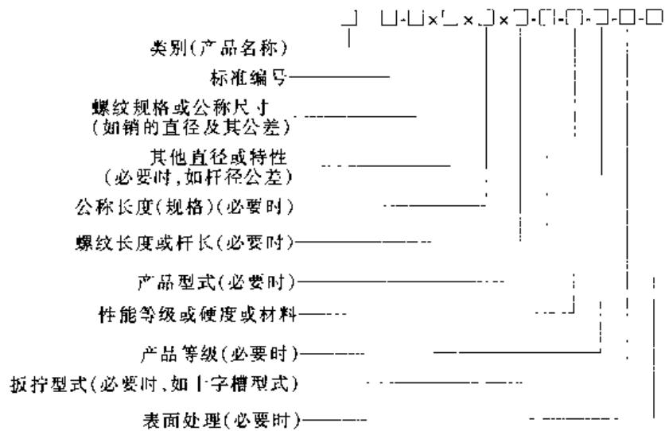

(2)标记示例:

螺纹规格 $\pmb { d } = \mathbf { M } \mathbf { l } 2$ 、公称长度 $l = 8 0 \mathrm { m m }$ 、性能等级为10.9级、表面氧化、产品等级为A级的六角头螺栓的弥记:GB/T5783-2000- $\yen 123,456,70,9-456$ (完整标记)

(3)紧固件名称、标记编号、型式与尺寸的标记方法按相应紧固件产品回家标准的规定、(4)紧固件性能等级或材料、热处理(硬度)产品等级、扳拧型式的标记方法按有关紧固件基础标准的规定。.

(5)紧固件表面的处理标记方法,按GB/T13911的规定。

(6)标记的简化原则:①类别(名称)、标准年代号及其前面的“-”,允许全部或部分省略,省略年代的标准应以现行标准为准。标记中的“”,允许金部或部分省略:标记中的“其他直径或特性”前面的“×”,允许省略。省略后不应造成对标记的误解,一般以空字代替为宜。②当产品标准中规定一种产品型式、性能等级或硬度或材料、产品等级、扳拧型式及表面处理时,允许全部或部分省略、当产品标准中规定两种及其以上的产品型式、性能等级或硬度或材料、产品等级、扳拧型式及表面处理时,应规定可以省略其中-种,并在产品标准的标记示例下给出省略后的简化标记。

(7)在后面各标准件中的标记示例,其标记方法均属省略后的简化标记,它代表了标准件的全部特征。

# 3.5.2螺栓

表4-1-75

螺栓汇总表

<table><tr><td rowspan="2"></td><td rowspan="2">名 称</td><td rowspan="2">标准号</td><td colspan="2">规格范围/mm</td><td rowspan="2">主要用途</td><td rowspan="2"></td></tr><tr><td>d</td><td>！</td></tr><tr><td rowspan="6">六</td><td>六角头螺栓C级</td><td>CB/T 5780-2000</td><td>M5-M64</td><td>10~500</td><td rowspan="6">六角头螺栓应用普遍，产 品等级分为A、B和C级，A</td><td>4-78</td></tr><tr><td>六角头螺栓全螺纹C级</td><td>GB/T 5781—2000</td><td>M5~ M64</td><td>10~500</td><td>级最精确，C级最不精确、A</td></tr><tr><td>六角头螺栓</td><td>GB/T 5782-2000</td><td>M1.6~M64</td><td>2~500</td><td>级用于重要的、装配精度高</td></tr><tr><td>六角头螺栓全螺纹</td><td>GB/T5783-2000</td><td>M1.6~M64</td><td>2-500</td><td>的以及受较大冲击、振动或 4-79 变载荷的地方。A级用于d=</td></tr><tr><td>六角头螺栓-细杆B级</td><td>GB/T 5784-1986</td><td>M3~ M20</td><td>20~150</td><td>4-81 1.6~24mm和l≤10d或l 150mm的螺栓，B级用于d</td></tr><tr><td>六角头螺栓细牙</td><td>CR/T 5785-2000</td><td>M8×1~M64×4</td><td>35~500</td><td>>24mm或l>10d或≥ 4-82</td></tr><tr><td rowspan="5">角 头</td><td>六角头螺检细牙全螺纹</td><td>GB/T 5786-2000</td><td>M8×1~M64×4</td><td>16~500</td><td>150mm的螺栓，C级为M5~ M64，细杆B级为M3~M20</td><td></td></tr><tr><td>六角法兰面螺栓B级</td><td>CB/T 5787-1986</td><td>M5~M16</td><td>10-200</td><td>六角法兰面螺栓，防公性 能好</td><td></td></tr><tr><td>六角法兰面螺栓细杆B级</td><td>CB/T5788-1986</td><td>M5~M16</td><td>30~200</td><td>钢结构用高强度六角头螺</td><td></td></tr><tr><td>六角法兰面螺栓-加大系列-B级</td><td>CB/T5789-1986</td><td>M5~M20</td><td>10~200</td><td>栓用于高强度联接；主要用</td><td></td></tr><tr><td>六角法兰面螺栓-加大系列-细杆-B 级</td><td>GB/T 5790-1986</td><td>M5-M20</td><td>30-200</td><td>于公路与铁路桥梁、工业与 民用建筑、塔架、起重机</td><td></td></tr></table>

续表

<table><tr><td colspan="8">续表</td></tr><tr><td>茶</td><td colspan="7"></td></tr><tr><td></td><td>名 称</td><td>标准号</td><td colspan="2">规格范围/mm i</td><td>主要用途 ！</td><td></td><td>页 次</td></tr><tr><td></td><td>六角头头部带槽螺栓A和B级 六角头螺杆带孔螺栓A和B级</td><td>GB/T 29.1—1988 GB/T 31.1—1988</td><td>M1.6~M64</td><td>2~500 2~500</td><td></td><td>需要锁定时用栓接结构大六</td><td>4.79</td></tr><tr><td></td><td>六角头螺杆带孔螺栓细杆B级</td><td>GB/T31.2—1988</td><td>M1.6~M64 M6 - M20</td><td></td><td>25~150</td><td>角螺栓与栓接结构大六角螺</td><td>4-81</td></tr><tr><td></td><td>六角头螺杆带孔螺栓细牙A和</td><td>GB/T 31.3—1988</td><td>M8×1~M48×3</td><td></td><td>35~300</td><td>母、栓接结构与平垫圈配套使</td><td>4-82</td></tr><tr><td>六</td><td>B级 六角头头部带孔螺栓A和B级</td><td>GB/T32.1—1988</td><td></td><td></td><td>2~500</td><td>用，可使连接副具有高水平的</td><td>4-79</td></tr><tr><td></td><td>六角头头部带孔螺栓细杆B级</td><td>CB/T32.2-1988</td><td>MI.6~M64 M6~M20</td><td></td><td>25~150</td><td>防止因超拧而引起的螺纹脱扣</td><td>4.81</td></tr><tr><td>角</td><td>六角头头部带孔螺栓细牙A和 B级</td><td>CB/T 32.3-1988</td><td>M8×1~M48×3</td><td></td><td>35-400</td><td></td><td>4-82</td></tr><tr><td>头</td><td>钢结构用高强度大六角头螺栓 钢结构用扭剪型高强度螺栓</td><td>CB/T1228-1991 CB/T3632-1995</td><td>M12~ M30 M16~ M24</td><td></td><td>35~260 40~180</td><td></td><td>4-84 4-85</td></tr><tr><td></td><td>栓接结构用大六角螺栓</td><td>GB/T 18230.1 (.2)-2000</td><td>M12~M36</td><td></td><td>30~200</td><td></td><td>4-86</td></tr><tr><td></td><td>六角头铰制孔用螺栓A和B级 六角头螺杆带孔铰制孔用螺栓A</td><td>GB/T27-1988 CB/T28-1988</td><td>M6- M48 M6~M48</td><td></td><td>25~300 25~300</td><td>能精确地固定被联接件的相 可位置，并能承受由横向力产</td><td>4-83</td></tr><tr><td></td><td>和B级 方头螺栓C级</td><td>GB/T8-1988</td><td>MI0~ M48</td><td></td><td></td><td>生的剪切和挤压 方头有较大的尺寸，便于扳 手卡作或靠住其他零件，起</td><td></td></tr><tr><td>女</td><td>小方头螺栓B级</td><td>GR/T35-1988</td><td>M5~ M48</td><td></td><td>20-300</td><td>止转作用，有时也用于T形槽 中，便于螺栓在糟中松动调整 位置。常用在一比较租精的</td><td>4-87</td></tr><tr><td>沉</td><td>沉头方颈螺栓</td><td>GB/T 10-1988</td><td>M6~ M20</td><td></td><td>20~300 结构上 25~200</td><td>多用于零件表面要求平坦或 光滑不阻挂东西的地方（方领</td><td>4-89</td></tr><tr><td>头</td><td>沉头带樓螺栓 半圆头方领螺栓</td><td>GB/T11—1988 GB/T12-1988</td><td>M6~ M24 M6~ M20</td><td>16~200</td><td>25~200</td><td>或橡起止转作用） 多用于结构受限制（不能用</td><td></td></tr><tr><td>半 圆</td><td>加强半圆头方径螺栓 大半圆头方颈螺栓C级</td><td>GB/T794-1993 GB/T14-1988</td><td>M6~M20 M6~ M24</td><td></td><td>20~200 20-200</td><td>其他螺栓头）或零件表面要求 较光滑的地方，半圆头方颈多 用于金属零件，大圆实用于木</td><td>4-88</td></tr><tr><td>头</td><td>大半圈头带榫螺性C级 半圆头带螺栓C级</td><td>CB/T 15-1988 CB/T13-1988</td><td>M6 - M24 M6~ M24</td><td></td><td>20~200 20~200</td><td>制零件，加强半圆买则用于受 冲击、振动及变载荷的地方</td><td></td></tr><tr><td>T 形</td><td>T形槽用螺栓</td><td>CB/T 37-1988</td><td>M5~ M48</td><td></td><td>25~300</td><td>多用于螺栓只能从被联接件 一边进行联接的地方，此时螺 栓从被联接件的T形孔中插人</td><td>4-89</td></tr><tr><td>铰链用</td><td></td><td></td><td></td><td></td><td></td><td>将螺栓转动90，也用于结构 要求紧凑的地方 多用于需经常拆开联接的地</td><td></td></tr><tr><td>地</td><td>活节螺栓 地脚螺栓</td><td>GB/T798-1988 CB/T 799-1988</td><td>M4~ M36</td><td></td><td>20~300</td><td>方和工装上</td><td>4-90</td></tr><tr><td>脚</td><td>地脚螺栓 直角地脚螺栓</td><td>JB/ZQ4363-1986 JB/ZQ 4364-1997</td><td></td><td>M6~M48 M8~M72</td><td>80~1500 80~3200</td><td>用于水泥基础中固定机架</td><td>4-90 二</td></tr><tr><td></td><td>T形头地脚螺栓</td><td></td><td>JB/ZQ4362-1997</td><td>M16~M56 M24~M160</td><td>300~2600 按设计要求</td><td></td><td>4-94 4-91</td></tr><tr><td></td><td>等长双头螺柱-C级</td><td></td><td></td><td></td><td></td><td>多用于被联接件太厚而不便</td><td></td></tr><tr><td></td><td></td><td></td><td>CB/T 953-1988</td><td>M8~M48</td><td>100~2500</td><td>使用螺栓联接或因拆卸频繁不</td><td>4.97</td></tr><tr><td></td><td>等长双头螺柱-B级</td><td></td><td>GB/T 901—1988</td><td>M2~M56</td><td>10~500</td><td>宜使用螺钉联接的地方，或使</td><td></td></tr><tr><td>双</td><td></td><td></td><td></td><td></td><td></td><td>用在结构要求比较紧凑的地方</td><td></td></tr><tr><td></td><td>b=1d</td><td></td><td>CB/T 897-1988</td><td>M5~ M48</td><td>16~300</td><td>一般双头螺柱用于-端需拧</td><td></td></tr><tr><td></td><td>b=1.25d</td><td></td><td>CB/T898-1988</td><td>M5~M48</td><td>16~300</td><td>人螺孔固定死的地方，等长双</td><td></td></tr><tr><td></td><td>G</td><td></td><td></td><td></td><td></td><td></td><td></td></tr><tr><td></td><td>b=1.5d</td><td></td><td>GB/T 899-1988</td><td>M2~M48</td><td>12-300</td><td>头螺柱则两端都配带螺母来联</td><td>4-95</td></tr><tr><td>头</td><td>b=2d</td><td></td><td>GB/T900--1988</td><td>M2- M48</td><td>12~300</td><td>接零件</td><td></td></tr><tr><td></td><td></td><td></td><td></td><td></td><td></td><td></td><td></td></tr><tr><td></td><td></td><td></td><td></td><td></td><td></td><td>用于固定管子</td><td></td></tr><tr><td></td><td>U形螺栓</td><td></td><td>JB/ZQ 4321--1997</td><td>M6~ M16</td><td>98-680</td><td></td><td></td></tr><tr><td></td><td></td><td></td><td></td><td></td><td></td><td></td><td></td></tr><tr><td></td><td></td><td></td><td></td><td></td><td></td><td></td><td></td></tr><tr><td></td><td></td><td></td><td></td><td></td><td></td><td></td><td></td></tr><tr><td></td><td></td><td></td><td></td><td></td><td></td><td></td><td></td></tr><tr><td>机动弧焊用焊接螺栓</td><td></td><td></td><td></td><td></td><td></td><td></td><td></td></tr><tr><td></td><td></td><td></td><td></td><td></td><td></td><td></td><td></td></tr><tr><td></td><td></td><td></td><td></td><td></td><td></td><td></td><td></td></tr><tr><td></td><td></td><td></td><td></td><td></td><td></td><td></td><td></td></tr><tr><td></td><td></td><td></td><td></td><td></td><td></td><td></td><td></td></tr><tr><td></td><td></td><td></td><td>GB/T 902.1-1989</td><td></td><td></td><td></td><td></td></tr><tr><td></td><td></td><td></td><td></td><td></td><td></td><td></td><td></td></tr><tr><td></td><td></td><td></td><td></td><td></td><td></td><td></td><td></td></tr><tr><td></td><td></td><td></td><td></td><td></td><td></td><td></td><td></td></tr><tr><td></td><td></td><td></td><td></td><td></td><td>10~300</td><td></td><td></td></tr><tr><td></td><td></td><td></td><td></td><td>M3~ M20</td><td></td><td>用于焊接</td><td>!4-98</td></tr><tr><td></td><td>手工型用焊接螺栓</td><td></td><td></td></table>

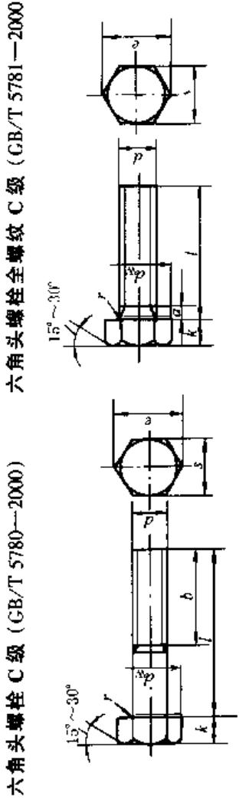

<table><tr><td></td><td>螺纹规格d</td><td>M5</td><td>M6</td><td>M8</td><td>M10</td><td>M12</td><td>（M14）</td><td>M16</td><td>（M18）</td><td>M20</td><td>（M22）</td><td>M24</td><td>（M27）</td><td>M30</td><td>M36</td><td>M42</td><td>M48</td><td>M56</td><td>M64</td></tr><tr><td colspan="2">（公称）</td><td>8</td><td>10</td><td>13</td><td>16</td><td>18</td><td></td><td>21</td><td>24</td><td>27</td><td>30</td><td>34</td><td>36</td><td>41</td><td>46</td><td>55</td><td>65 75</td><td>85</td><td>95</td></tr><tr><td colspan="2">k（公称）</td><td>3.5</td><td>4</td><td>5.3</td><td>6.4</td><td>7.5</td><td>8.8</td><td>10</td><td>11.5</td><td>12.5</td><td>14</td><td>15</td><td>17</td><td>18.7</td><td>22.5</td><td>26</td><td>30</td><td>35</td><td>40</td></tr><tr><td colspan="2">（最小）</td><td>0.2</td><td>0.25</td><td></td><td>0.4</td><td></td><td></td><td>0.6</td><td></td><td></td><td>0.8</td><td></td><td></td><td>1</td><td></td><td>1.2</td><td>1.6</td><td></td><td>2</td></tr><tr><td colspan="2">e（最小）</td><td>8.6</td><td>10.9</td><td>14.2</td><td>17.6</td><td>19.9</td><td>22.8</td><td>26.2</td><td>29.6</td><td>33</td><td>37.3</td><td>39.6</td><td>45.2</td><td>50.9</td><td>60.8</td><td>71.3</td><td>82.6</td><td>93.6</td><td>104.9</td></tr><tr><td colspan="2">a（最大）</td><td>2.4</td><td>3</td><td>4</td><td>4.5</td><td>5.3</td><td></td><td>6</td><td></td><td></td><td>7.5</td><td></td><td>9</td><td>10.5</td><td>12</td><td>13.5</td><td>15</td><td>16.5</td><td>18</td></tr><tr><td colspan="2">d（最小）</td><td>6.7</td><td>8.7</td><td>11.5</td><td>14.5</td><td>16.5</td><td>19.2</td><td>22</td><td>24.9</td><td>27.7</td><td>31.4</td><td></td><td>33.3 38</td><td>42.8</td><td></td><td>51.1 60</td><td>69.5</td><td>78.7</td><td>88.2</td></tr><tr><td rowspan="3">b（参考）</td><td>1≤125</td><td>16</td><td>18</td><td>22</td><td>26</td><td>30</td><td>34</td><td>38</td><td></td><td>42 46</td><td>50</td><td>54</td><td>60</td><td>66</td><td></td><td>78</td><td></td><td></td><td></td></tr><tr><td>125<≤200</td><td>：</td><td>1</td><td>28</td><td>32</td><td></td><td>36</td><td>40</td><td>44</td><td>48</td><td>52</td><td>56</td><td>60</td><td>66</td><td>72</td><td>84 %</td><td>108</td><td>124</td><td>140</td></tr><tr><td>1>200 （公称）</td><td></td><td></td><td></td><td></td><td></td><td></td><td>53</td><td>57</td><td>61</td><td>65</td><td>69</td><td>73</td><td>79</td><td>85</td><td>97 109</td><td>121 ：</td><td>137</td><td>153</td></tr><tr><td colspan="2">GB/T5780-2000</td><td>25-50</td><td>30~60</td><td>40-80</td><td>45~</td><td>55~</td><td>60~140</td><td>65~</td><td>80~</td><td>80~</td><td>90-</td><td>100~</td><td>110~</td><td>120~</td><td>140~</td><td>180~</td><td>200~</td><td>240</td><td>260~</td></tr><tr><td colspan="2"></td><td>1</td><td></td><td></td><td>100</td><td>120</td><td></td><td></td><td>160</td><td>180</td><td>200</td><td>220</td><td>240</td><td>260 300</td><td>360</td><td>420</td><td>480</td><td>500</td><td>500</td></tr><tr><td colspan="2">全螺纹长度！</td><td>10~50</td><td>12~60</td><td>16~80</td><td>20~1002</td><td></td><td></td><td></td><td></td><td></td><td>25~12030~140|35~16035~18040~200|45~220i50~240</td><td></td><td></td><td>55-28060~300</td><td></td><td>70~360|80~420</td><td>100</td><td>110~</td><td>120~</td></tr><tr><td colspan="2">GB/T 5781—2000</td><td></td><td></td><td></td><td></td><td></td><td>0.090 0.127</td><td></td><td>0.172</td><td>0.223</td><td></td><td></td><td></td><td></td><td></td><td></td><td>480</td><td>500</td><td>500</td></tr><tr><td colspan="2">100mm长的质量/kg</td><td>0.013</td><td>0.020</td><td>0.037</td><td>0.063</td><td></td><td></td><td></td><td></td><td></td><td>0.282</td><td>0.359</td><td>0.424</td><td>0.566</td><td>0.721</td><td>1.100 1.594</td><td>2.174</td><td>3.226</td><td>4.87</td></tr></table>

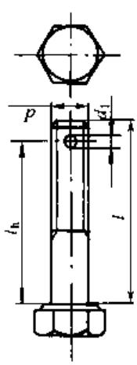

<table><tr><td>螺纹规格d</td><td></td><td>M1.6</td><td>M2</td><td>M2.5</td><td>M3</td><td>M4</td><td>M5</td><td>M6</td><td>M8</td><td>M10</td><td>M12</td><td>（(M14)</td><td>M16</td><td>(M18）</td><td>M20</td><td>（M22）</td><td></td><td>M24</td><td>（M27）</td><td>M30</td><td>M36</td><td>M42</td><td>M48</td><td>M56</td></tr><tr><td colspan="2">s公称</td><td>3.2</td><td>4</td><td>5</td><td>5.5</td><td>7</td><td>8</td><td>10</td><td>13</td><td>16</td><td>18</td><td>21</td><td></td><td>24</td><td>27</td><td>30</td><td>34</td><td>36</td><td>41</td><td>46</td><td>5</td><td>65</td><td>75</td><td>85</td></tr><tr><td colspan="2">公称</td><td>1.1</td><td>1.4</td><td>1.7</td><td>2</td><td>2.8 0.2</td><td>3.5</td><td>4 0.25</td><td>5.3</td><td>6.4 0.4</td><td>7.5</td><td>8.8</td><td>10</td><td></td><td>11.5</td><td>12.5</td><td>14</td><td>15</td><td>17</td><td>18.7</td><td>22.5</td><td>26</td><td>30</td><td>35</td></tr><tr><td colspan="2"> min</td><td colspan="10">0.1</td><td>0.6</td><td></td><td></td><td></td><td>0.8</td><td></td><td></td><td>1</td><td></td><td>1.2</td><td>1.6</td><td>2</td></tr><tr><td>emin A</td><td></td><td>3.41</td><td>4.32</td><td>5.45 6.01</td><td>7.66</td><td></td><td>8.79</td><td>11.05</td><td>14.38</td><td>17.77</td><td>20.03</td><td>23.36</td><td>26.75</td><td>30.14</td><td>33.53</td><td>37.72</td><td>39.98</td><td></td><td></td><td></td><td></td><td></td><td></td><td></td></tr><tr><td></td><td>B</td><td>3.28</td><td>4.18</td><td>5.31</td><td>5.88</td><td>7.50</td><td>8.63</td><td>10.89</td><td>14.20</td><td>17.59</td><td>19.85</td><td>22.78</td><td>26.17</td><td>29.56</td><td>32.95</td><td>37.29</td><td>39.55</td><td>45.2</td><td>50.85</td><td>60.79</td><td>71.3</td><td>82.6</td><td>93.56</td><td>104</td></tr><tr><td>dwmin A</td><td></td><td>2.27</td><td>3.07</td><td>4.07</td><td>4.57</td><td>5.88</td><td>6.88</td><td>8.88</td><td>11.63</td><td>14.63</td><td>16.63</td><td>19.64</td><td>22.49</td><td>25.34</td><td>28.19</td><td>31.71</td><td>33.61</td><td>丨</td><td></td><td>一</td><td></td><td></td><td>1</td><td></td></tr><tr><td></td><td>B</td><td>2.3</td><td>2.95</td><td>3.95</td><td>4.45</td><td>5.74</td><td>6.74</td><td>8.74</td><td>11.47</td><td>14.47</td><td>16.47</td><td>19.15</td><td>22</td><td>24.85</td><td>27.7</td><td>31.35</td><td>33.25</td><td>38</td><td></td><td>42.75</td><td>51.11</td><td>59.95</td><td>69.45</td><td>78.86 88</td></tr><tr><td></td><td>≤125</td><td>9</td><td>10</td><td>11</td><td>12</td><td>14</td><td>16</td><td>18</td><td>22</td><td>26</td><td>30</td><td>34</td><td>38</td><td>42</td><td>46</td><td>50</td><td>54</td><td>60</td><td>66</td><td></td><td></td><td>一</td><td>一</td><td></td></tr><tr><td rowspan="2">D</td><td>125<1200</td><td>15</td><td>16</td><td>17</td><td>18</td><td>20</td><td>22</td><td>24</td><td>28</td><td>32</td><td>36</td><td>40</td><td>44</td><td>48</td><td>52</td><td>56</td><td>60</td><td>6</td><td>72</td><td>84</td><td></td><td>%</td><td>108</td><td></td></tr><tr><td>1>200</td><td>28</td><td>29</td><td>30</td><td>31</td><td>33</td><td>35</td><td>37</td><td>41</td><td>45</td><td>49</td><td>53</td><td>57</td><td>6</td><td>65</td><td>6</td><td>7</td><td>79</td><td>85</td><td></td><td>97</td><td>109</td><td>121</td><td>137</td></tr><tr><td rowspan="2"></td><td></td><td>丨</td><td>1</td><td>一</td><td>1.5</td><td>2.1</td><td>2.4</td><td>3</td><td>3.75</td><td>4.5</td><td>5.25</td><td></td><td></td><td></td><td>7.5</td><td></td><td></td><td>9</td><td>10.5</td><td></td><td>12</td><td>13.5</td><td>15</td><td>16.5</td></tr><tr><td>B h</td><td></td><td></td><td></td><td>0.8</td><td>1.2</td><td></td><td>1.6</td><td>2</td><td>2.5</td><td>3</td><td></td><td></td><td></td><td></td><td></td><td></td><td></td><td></td><td></td><td></td><td></td><td></td><td></td></tr></table>

<table><tr><td rowspan="2">螺纹规格d</td><td rowspan="2">M1.6</td><td rowspan="2">M2</td><td rowspan="2">M2.5</td><td rowspan="2">M3</td><td rowspan="2">M4</td><td rowspan="2">M5</td><td rowspan="2">M6</td><td rowspan="2">M8</td><td rowspan="2">M10</td><td rowspan="2">M12</td><td rowspan="2">（M14） M16</td><td rowspan="2">（M18）</td><td rowspan="2">M20</td><td rowspan="2">（M22）</td><td rowspan="2">M24</td><td rowspan="2">（M27）</td><td rowspan="2">M30</td><td rowspan="2">M36</td><td rowspan="2">M42</td><td rowspan="2"></td><td rowspan="2">M48</td><td rowspan="2">M6</td><td rowspan="2">M56</td></tr><tr><td></td></tr><tr><td>一</td><td rowspan="6"></td><td rowspan="6"></td><td rowspan="6"></td><td rowspan="6">0.7</td><td>1</td><td>1.2</td><td>1.4</td><td>1.9</td><td>2.4</td><td>3</td><td></td><td></td><td></td><td></td><td></td><td></td><td></td><td></td><td></td><td></td><td></td><td></td></tr><tr><td>d</td><td></td><td></td><td></td><td>1.6</td><td>2.0 2.5</td><td></td><td>3.2</td><td></td><td>4</td><td></td><td></td><td>5</td><td></td><td>6.3</td><td></td><td>8.0</td><td></td><td></td></tr><tr><td>h</td><td></td><td></td><td></td><td></td><td>2.0</td><td>2.6</td><td>3.2</td><td>3.7 4.4</td><td>5.0</td><td>5.7</td><td>6.2</td><td>7.0</td><td>7.5</td><td>8.5</td><td>9.3 ！ ！</td><td>11.2</td><td>13</td><td>15</td><td></td></tr><tr><td>L</td><td></td><td></td><td></td><td></td><td>27~57</td><td>31~763</td><td>36~96</td><td>40~ 45~</td><td>49</td><td>54~</td><td>59~</td><td>63~</td><td>73~</td><td>82~</td><td>1</td><td></td><td></td><td></td><td></td></tr><tr><td></td><td></td><td></td><td></td><td></td><td></td><td></td><td></td><td>115</td><td>135 154</td><td>174</td><td>194</td><td>213</td><td>233</td><td>292</td><td>81~:100~ 291</td><td>290</td><td>118~ 288</td><td>128~ 288</td><td></td></tr><tr><td rowspan="3">i</td><td rowspan="3"></td><td rowspan="3">4-20</td><td rowspan="3">5-25</td><td rowspan="3"></td><td rowspan="3"></td><td rowspan="3"></td><td rowspan="3">12~1616~2016~2520~3025-4025~5030~6040(35) ~80</td><td rowspan="3">45(40) ~100</td><td rowspan="3">50(45） ~120</td><td rowspan="3">60(50） 65(55)</td><td rowspan="3">70(60）</td><td rowspan="3">80(65） ~ 200</td><td rowspan="3">90（70）</td><td rowspan="3"></td><td rowspan="3">100-</td><td rowspan="3">110 （90）</td><td rowspan="3"></td><td></td><td></td><td></td><td rowspan="3"></td><td rowspan="3">220 260</td></tr><tr><td>80（90）</td><td>260</td><td>360</td><td>160 440</td><td>180 480</td></tr><tr><td>~140</td><td>~160 ~180</td><td>~220</td><td>240（90~ 300）</td><td>~300 (110~ 300）</td><td>(130~ 300）</td><td>(140~</td></tr><tr><td rowspan="2">全螺纹长度！</td><td rowspan="2">2~16</td><td rowspan="2"></td><td rowspan="2"></td><td rowspan="2">6~30</td><td rowspan="2"></td><td rowspan="2"></td><td rowspan="2"></td><td rowspan="2">8~4010~5012~6016~80</td><td rowspan="2">20~ 100</td><td rowspan="2">25~</td><td rowspan="2">30~</td><td rowspan="2">30</td><td rowspan="2">35 40~ 180 1</td><td rowspan="2">150</td><td rowspan="2">45~</td><td rowspan="2">50~ ：</td><td rowspan="2">55~ 200</td><td rowspan="2">60~ 200</td><td rowspan="2">： 70</td><td>80~</td><td>300) 100~</td><td rowspan="2"></td><td>120</td></tr><tr><td>200</td><td>200</td><td>200</td><td>110~ 200</td></tr><tr><td>100mm的质量/kg</td><td></td><td></td><td></td><td></td><td>0.008</td><td>0.013</td><td>0.020</td><td>0.037</td><td>0.066</td><td>120 0.094</td><td>140 0.132</td><td>150 0.178</td><td>0.229</td><td>10.289</td><td>200 0.366</td><td>150 ： 0.431</td><td>0.569</td><td>1 0.722</td><td>1.099</td><td>1.611</td><td>2.254</td><td>3.224</td><td>200 4.42</td></tr></table>

1 1 

<table><tr><td rowspan="2"></td><td colspan="2">材</td><td rowspan="2">料</td><td rowspan="2">钢</td><td rowspan="2">不锈钢</td><td rowspan="2">有色金属</td><td rowspan="4"></td><td rowspan="4">产品等级：</td></tr><tr><td></td><td></td></tr><tr><td rowspan="2">禁本</td><td>性能 等级</td><td colspan="2">GB/T5782</td><td>3≤d≤39:5.6.8.8.10.9 3ds16:9.8</td><td rowspan="2">d≤24:A2-70、A4-70 24<d≤39:A2-50、A4-50</td><td rowspan="2">CU2、CU3、AIA</td><td rowspan="2">螺纹公差：6g A、R</td></tr><tr><td rowspan="2"></td><td colspan="2">GB/T5783 表面处理</td><td>d<3和d>39:按协议</td><td>d>39:按协议</td></tr><tr><td colspan="3"></td><td>氧化</td><td>简单处理</td><td></td><td>简单处理</td></tr></table>

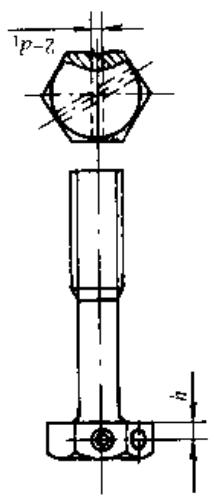

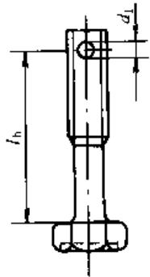

1钢锈不钢料

<table><tr><td colspan="2">螺纹规格d</td><td rowspan="2">M3</td><td rowspan="2">M4</td><td rowspan="2">M5</td><td rowspan="2">M6</td><td rowspan="2">M8</td><td rowspan="2">M10</td><td rowspan="2">M12</td><td rowspan="2">（M14）</td><td rowspan="2">M16</td><td rowspan="2">M20</td></tr><tr><td></td><td></td></tr><tr><td rowspan="4"></td><td>s</td><td>5.5</td><td>7</td><td>8</td><td>10</td><td>13</td><td>16</td><td>18</td><td>21</td><td>24</td><td>30</td></tr><tr><td>A</td><td>2</td><td>2.8</td><td>3.5</td><td>1</td><td>5.3 0.4</td><td>6.4</td><td>75</td><td>8.8</td><td>10</td><td>12.5 0.8</td></tr><tr><td>，</td><td>0.1</td><td>0.2</td><td></td><td>0.25</td><td></td><td></td><td></td><td>0.6 22.8</td><td></td><td>3</td></tr><tr><td>e</td><td>6</td><td>7.5</td><td>8.6</td><td>10.9</td><td>14.2</td><td>17.6</td><td>19.9</td><td></td><td>26.2</td><td></td></tr><tr><td rowspan="3">b（参考）</td><td>1≤125</td><td>12</td><td>14</td><td>16</td><td>18</td><td>22</td><td>26</td><td>30</td><td>34</td><td>38</td><td>46</td></tr><tr><td>1251200</td><td>1</td><td>1</td><td>1</td><td></td><td>28</td><td>32</td><td>36</td><td>40</td><td>44</td><td>52</td></tr><tr><td>GB/T32.2</td><td>一</td><td>丨</td><td></td><td>1.6</td><td>2.0</td><td>2.0</td><td>2.0</td><td>3.2</td><td>3.0</td><td>3.0</td></tr><tr><td>d CR/T31.2</td><td></td><td></td><td></td><td>一</td><td>1.6</td><td>2.0</td><td>2.5</td><td>3.2</td><td>3.2</td><td>4.0</td><td>4.0</td></tr><tr><td>1</td><td></td><td></td><td></td><td></td><td>22-67</td><td>26~76</td><td>36-96</td><td>40~115</td><td>45~135</td><td>49~144</td><td>59-144</td></tr><tr><td colspan="2">h</td><td></td><td></td><td></td><td>2.0</td><td>2.6</td><td>3.2</td><td>3.7</td><td>4.4</td><td>5.0</td><td>6.2</td></tr><tr><td colspan="2">商品规格长度 100mm长的质量=/kg</td><td>20~30 0.005</td><td>20-40 0.008</td><td>25-50 0.014</td><td>25 - 70 0.020</td><td>30-80 0.038</td><td>40~100 0.061</td><td>45~ 120 0.089</td><td>50~ 140 0.125</td><td>55~150 0.172</td><td>65~150 0.287</td></tr></table>

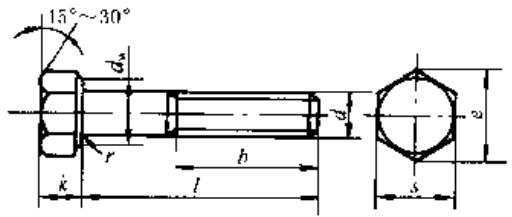

六角头螺栓细牙(GB/T5785—2000)

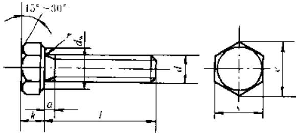

六角头螺栓细牙全螺纹(GB/T5786—2000)

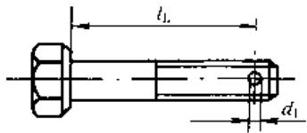

六角头螺杆带孔螺栓细牙A和B级(GB/T31.3—1988)

其余的型式与尺寸按GB/TS785规定

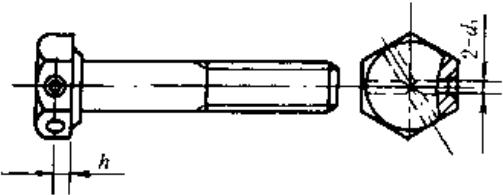

六角头头部带孔螺栓细牙A和B级(GB/T32.3-1988)

其余的型式与尺寸按CB/T5785规定

标记示例:

螺纹规格 $d = \mathbb { M } \mathbb { 1 2 \times 1 . 5 }$ 公称长度 $\mathbf { \ell } : = 8 0 \mathbf { m } \mathbf { m }$ 、性能等级为8.8级、衣面氧化、A级的六角头螺栓:

螺栓GB/T5785 $\mathbf { M } 1 2 \times 1 . 5 \times 8 0$ 

表4-1-79

/mm 

<table><tr><td rowspan=3 colspan=1>螺纹规格dxP</td><td rowspan=2 colspan=1>CB/T 5785GB/T 5786GB/T 32.3</td><td rowspan=1 colspan=1>M8x1</td><td rowspan=1 colspan=1>M10×1</td><td rowspan=1 colspan=1>M12×1.5</td><td rowspan=1 colspan=1>（M14x1.5)</td><td rowspan=1 colspan=1>M16×1.5</td><td rowspan=1 colspan=1>（M181.5）</td><td rowspan=1 colspan=1>M20×1.s</td><td rowspan=1 colspan=1>（M22x1.5)</td><td rowspan=1 colspan=1>M24×2</td><td rowspan=1 colspan=1>（M27×2）</td><td rowspan=1 colspan=1>M30×2</td><td rowspan=1 colspan=1>M36×3</td><td rowspan=1 colspan=1>M42×3</td><td rowspan=1 colspan=1>M48x3</td><td rowspan=1 colspan=1>M56×4</td><td rowspan=1 colspan=1>M64×4</td></tr><tr><td rowspan=1 colspan=1></td><td rowspan=1 colspan=1>(M10× 1.25)</td><td rowspan=1 colspan=1>(M12×1.25）</td><td rowspan=1 colspan=1></td><td rowspan=1 colspan=1></td><td rowspan=1 colspan=1></td><td rowspan=1 colspan=1>（M20×2）</td><td rowspan=1 colspan=1></td><td rowspan=1 colspan=1></td><td rowspan=1 colspan=1></td><td rowspan=1 colspan=1></td><td rowspan=1 colspan=1></td><td rowspan=1 colspan=1></td><td rowspan=1 colspan=1></td><td rowspan=1 colspan=1></td><td rowspan=1 colspan=1>!</td></tr><tr><td rowspan=1 colspan=1>GB/T 31.3</td><td rowspan=1 colspan=1>M8x1</td><td rowspan=1 colspan=1>M10×1.25</td><td rowspan=1 colspan=1>M12×1.5</td><td rowspan=1 colspan=1>（M14×1.5）</td><td rowspan=1 colspan=1>M16x 1.5</td><td rowspan=1 colspan=1>（M18x1.5)</td><td rowspan=1 colspan=1>M20×2</td><td rowspan=1 colspan=1>（M22×1.5）</td><td rowspan=1 colspan=1>M24×2</td><td rowspan=1 colspan=1>（M27×2）</td><td rowspan=1 colspan=1>M30×2</td><td rowspan=1 colspan=1>M36×3</td><td rowspan=1 colspan=1>M42×3</td><td rowspan=1 colspan=1>M48×3</td><td rowspan=1 colspan=1></td><td rowspan=1 colspan=1></td></tr><tr><td rowspan=3 colspan=2>5Ar</td><td rowspan=2 colspan=1>135.3</td><td rowspan=2 colspan=1>166.4</td><td rowspan=2 colspan=1>187.5</td><td rowspan=2 colspan=1>218.8</td><td rowspan=2 colspan=1>2410</td><td rowspan=2 colspan=1>2711.5</td><td rowspan=2 colspan=1>3012.5</td><td rowspan=2 colspan=1>3414</td><td rowspan=2 colspan=1>3615</td><td rowspan=2 colspan=1>4117</td><td rowspan=2 colspan=1>4618.7</td><td rowspan=2 colspan=1>5522.5</td><td rowspan=2 colspan=1>6526</td><td rowspan=2 colspan=1>7530</td><td rowspan=2 colspan=1>8535</td><td rowspan=1 colspan=1>95</td></tr><tr><td rowspan=2 colspan=1>352</td><td rowspan=2 colspan=1>402</td></tr><tr><td rowspan=1 colspan=1>r</td><td rowspan=1 colspan=1></td><td rowspan=1 colspan=1>0.4</td><td rowspan=1 colspan=1></td><td rowspan=1 colspan=1>0.6</td><td rowspan=1 colspan=1></td><td rowspan=1 colspan=1></td><td rowspan=1 colspan=1>0.8</td><td rowspan=1 colspan=1>1</td><td rowspan=1 colspan=1>0.8</td><td rowspan=1 colspan=1></td><td rowspan=1 colspan=1>1</td><td rowspan=1 colspan=1></td><td rowspan=1 colspan=1>1.2</td><td rowspan=1 colspan=1>1.6</td></tr><tr><td rowspan=1 colspan=1></td><td rowspan=1 colspan=1>emin AB</td><td rowspan=1 colspan=1>14.3814.2</td><td rowspan=1 colspan=1>17.7717.59</td><td rowspan=1 colspan=1>20.0319.85</td><td rowspan=1 colspan=1>23.3622.78</td><td rowspan=1 colspan=1>26.7526.17</td><td rowspan=1 colspan=1>30.1429.56</td><td rowspan=1 colspan=1>33.5332.95</td><td rowspan=1 colspan=1>37.7237.29</td><td rowspan=1 colspan=1>39.8839.55</td><td rowspan=1 colspan=1>45.2</td><td rowspan=1 colspan=1>一50.85</td><td rowspan=1 colspan=1>60.79</td><td rowspan=1 colspan=1>一71.3</td><td rowspan=1 colspan=1>一82.6</td><td rowspan=1 colspan=1>93.561104.86</td><td rowspan=1 colspan=1>93.561104.86</td></tr><tr><td rowspan=1 colspan=2>d,minAB</td><td rowspan=1 colspan=1>11.6311.47</td><td rowspan=1 colspan=1>14.6314.47</td><td rowspan=1 colspan=1>16.6316.47</td><td rowspan=1 colspan=1>19.6419.15</td><td rowspan=1 colspan=1>22.4922</td><td rowspan=1 colspan=1>25.3424.85</td><td rowspan=1 colspan=1>28.1927.7</td><td rowspan=1 colspan=1>31.7131.35</td><td rowspan=1 colspan=1>33.6133.25</td><td rowspan=1 colspan=1>一38</td><td rowspan=1 colspan=1>142.75</td><td rowspan=1 colspan=1>151.1</td><td rowspan=1 colspan=1>159.95</td><td rowspan=1 colspan=1>169.45</td><td rowspan=1 colspan=1>178.66</td><td rowspan=1 colspan=1>1188.16</td></tr><tr><td rowspan=2 colspan=1>b（参考）</td><td rowspan=2 colspan=1>≤125125<200>200</td><td rowspan=2 colspan=1>222841</td><td rowspan=2 colspan=1>263245</td><td rowspan=2 colspan=1>303649</td><td rowspan=2 colspan=1>344057</td><td rowspan=2 colspan=1>384457</td><td rowspan=2 colspan=1>424861</td><td rowspan=2 colspan=1>45265</td><td rowspan=2 colspan=1>50566</td><td rowspan=2 colspan=1>546073</td><td rowspan=1 colspan=1>60</td><td rowspan=1 colspan=1>66</td><td rowspan=1 colspan=1>78</td><td rowspan=2 colspan=1>196109</td><td rowspan=2 colspan=1>1108121</td><td rowspan=2 colspan=1>：124137i</td><td rowspan=1 colspan=1>1</td></tr><tr><td rowspan=1 colspan=1>6679</td><td rowspan=1 colspan=1>7285</td><td rowspan=1 colspan=1>8497</td><td rowspan=1 colspan=1>140153</td></tr><tr><td rowspan=1 colspan=2>a</td><td rowspan=1 colspan=1>3</td><td rowspan=1 colspan=1>3.75</td><td rowspan=1 colspan=2></td><td rowspan=1 colspan=1>4.5</td><td rowspan=1 colspan=2></td><td rowspan=1 colspan=2>6</td><td rowspan=1 colspan=2></td><td rowspan=1 colspan=1></td><td rowspan=1 colspan=1>9</td><td rowspan=1 colspan=1></td><td rowspan=1 colspan=2>12</td></tr><tr><td rowspan=2 colspan=1>d</td><td rowspan=1 colspan=1>GB/T 31.3</td><td rowspan=1 colspan=1>2</td><td rowspan=1 colspan=1>2.5</td><td rowspan=1 colspan=2>3.2</td><td rowspan=1 colspan=1></td><td rowspan=1 colspan=1>4</td><td rowspan=1 colspan=1></td><td rowspan=1 colspan=1></td><td rowspan=1 colspan=1>5</td><td rowspan=1 colspan=1></td><td rowspan=1 colspan=2>6.3</td><td rowspan=1 colspan=1>8</td><td rowspan=1 colspan=1></td><td rowspan=1 colspan=1></td><td rowspan=2 colspan=1></td></tr><tr><td rowspan=1 colspan=1>CB/T 32.3</td><td rowspan=1 colspan=1></td><td rowspan=1 colspan=3>2</td><td rowspan=1 colspan=7>3</td><td rowspan=1 colspan=2>4</td><td rowspan=1 colspan=1></td><td rowspan=1 colspan=1></td></tr><tr><td rowspan=1 colspan=2>h</td><td rowspan=1 colspan=1>2.6</td><td rowspan=1 colspan=1>3.2</td><td rowspan=1 colspan=1>3.7</td><td rowspan=1 colspan=1>4.4</td><td rowspan=1 colspan=1>5.0</td><td rowspan=1 colspan=1>5.7</td><td rowspan=1 colspan=1>6.2</td><td rowspan=1 colspan=1>7.0</td><td rowspan=1 colspan=1>7.5</td><td rowspan=1 colspan=1>8.5</td><td rowspan=1 colspan=1>9.3</td><td rowspan=1 colspan=1>11.2</td><td rowspan=1 colspan=1>13</td><td rowspan=1 colspan=1>15</td><td rowspan=1 colspan=1>1</td><td rowspan=1 colspan=1>1</td></tr><tr><td rowspan=2 colspan=2>i</td><td rowspan=2 colspan=1>31~76</td><td rowspan=2 colspan=1>36-96</td><td rowspan=2 colspan=1>40~115</td><td rowspan=2 colspan=1>45135</td><td rowspan=1 colspan=1>49~</td><td rowspan=2 colspan=1>54174</td><td rowspan=2 colspan=1>59194</td><td rowspan=1 colspan=1>63~</td><td rowspan=2 colspan=1>73~233</td><td rowspan=2 colspan=1>82~252</td><td rowspan=2 colspan=1>81~291</td><td rowspan=2 colspan=1>100~290</td><td rowspan=2 colspan=1>118~288</td><td rowspan=2 colspan=1>128~288</td><td rowspan=2 colspan=1></td><td rowspan=2 colspan=1>-</td></tr><tr><td rowspan=1 colspan=1>154</td><td rowspan=1 colspan=1>213</td></tr><tr><td rowspan=1 colspan=2>(CB/T 31.3)</td><td rowspan=1 colspan=1>3580</td><td rowspan=1 colspan=1>40~100</td><td rowspan=1 colspan=1>45120</td><td rowspan=1 colspan=1>50~140</td><td rowspan=1 colspan=1>55~160</td><td rowspan=1 colspan=1>60~180</td><td rowspan=1 colspan=1>65~200</td><td rowspan=1 colspan=1>70~220</td><td rowspan=1 colspan=1>80~240</td><td rowspan=1 colspan=1>90~260</td><td rowspan=1 colspan=1>90~300</td><td rowspan=1 colspan=1>110~300</td><td rowspan=1 colspan=1>130~300</td><td rowspan=1 colspan=1>140~300</td><td rowspan=1 colspan=1>1</td><td rowspan=1 colspan=1></td></tr><tr><td rowspan=1 colspan=2>1(GB/T 5785）</td><td rowspan=1 colspan=1>40~80</td><td rowspan=1 colspan=1>45~100</td><td rowspan=1 colspan=1>50~120</td><td rowspan=1 colspan=1>60~140</td><td rowspan=1 colspan=1>65~160</td><td rowspan=1 colspan=1>70180</td><td rowspan=1 colspan=1>80200</td><td rowspan=1 colspan=1>90220</td><td rowspan=1 colspan=1>100240</td><td rowspan=1 colspan=1>110~260</td><td rowspan=1 colspan=1>120300</td><td rowspan=1 colspan=1>140~360</td><td rowspan=1 colspan=1>160~440</td><td rowspan=1 colspan=1>200~480</td><td rowspan=1 colspan=1>220~500</td><td rowspan=1 colspan=1>260~500</td></tr></table>

续表

<table><tr><td rowspan="5">螺纹 规格 dxP</td><td>GB/T 5785</td><td>M8×</td><td>M10×</td><td>M12</td><td>(M14</td><td>M16</td><td>（M18</td><td>M20</td><td>(M22</td><td>M24</td><td>（M27</td><td>M30</td><td>M36</td><td>M42</td><td>M48</td><td>M56</td><td>M64</td></tr><tr><td>CB/T 5786</td><td>1</td><td>1 （M10</td><td>x1.5 （W12</td><td>x1.5</td><td>x 1.5</td><td>x1.5)</td><td>×1.5 （M20</td><td>x1.5）</td><td>×2</td><td>×2）</td><td>×2</td><td>x3</td><td>×3</td><td>×3</td><td>×4</td><td>×4</td></tr><tr><td>CB/T32.3</td><td></td><td> 1.25）j</td><td>x1.25）</td><td></td><td></td><td></td><td>×2）</td><td></td><td></td><td></td><td></td><td></td><td></td><td></td><td></td><td>1</td></tr><tr><td>GB/T31.3</td><td>M8x 1</td><td>M10× 1.25</td><td>M12× 1.5</td><td>（M14 1.5</td><td>M16 x 1.5</td><td>（M18 ×1.5）</td><td>M20 x2</td><td>（M22 ×1.5）</td><td>M24 x2</td><td>（M27 ×2）</td><td>M30 ×2</td><td>M36</td><td>M42</td><td>M48</td><td></td><td></td></tr><tr><td>全螺栓长度！</td><td>16~</td><td>20~</td><td>25</td><td>30</td><td>35</td><td>40~</td><td>40~</td><td>45</td><td>40~</td><td>55</td><td>40~200</td><td>×3</td><td>×3 90~</td><td>×3 100</td><td>120~</td><td>130~</td></tr><tr><td colspan="2">100mm长的重量 =/kg</td><td>80 0.039</td><td>100 0.067</td><td>120 0.096</td><td>140 0.125</td><td>160 0.181</td><td>180 0.237</td><td>200 0.295</td><td>220 0.372</td><td>200 0.445</td><td>260 0.586</td><td>0.753</td><td>1.131</td><td>420 1.652</td><td>480 1.898</td><td>500 3.295</td><td>500 4.534</td></tr></table>

16,20,25、30,35,40,45,50、55,60,65,70,80,90、100,110,120.130,140,150,160,180, 200,220,240,260,280,300,320、340,360,380,400、420,440,460,480,500 

<table><tr><td rowspan=3 colspan=1>技术条件</td><td rowspan=1 colspan=1>材料</td><td rowspan=1 colspan=1>钢</td><td rowspan=1 colspan=1>不锈钢</td><td rowspan=1 colspan=1>有色金属</td><td rowspan=3 colspan=1>螺纹公差：6g</td><td rowspan=3 colspan=1>产品等级：A、B</td></tr><tr><td rowspan=1 colspan=1>性能等级</td><td rowspan=1 colspan=1>d≤39:5.6、8.8、10.93<d≤16:9.8d>39：按协议</td><td rowspan=1 colspan=1>d≤24:A2-70、A4-7024<d≤39:A2-50.A4-50d>39:按协议</td><td rowspan=1 colspan=1>CU2、CU3、AL4</td></tr><tr><td rowspan=1 colspan=1>表面处理</td><td rowspan=1 colspan=1>氧化</td><td rowspan=1 colspan=1>简单处理</td><td rowspan=1 colspan=1>简单处理</td></tr></table>

注:1.A、B级区别见表4-1-77注l。

2. $\mathbb { M } \mathbb { S } \times 1 \sim \mathbb { M } \mathbb { 3 } \mathbb { 6 } \times 3$ 为商品规格; $1 4 2 \times 3 \sim 1 4 6 4 \times 4$ 为通用规格。GB/T32.3中 ${ \bf { M } } 2 0 \times 2 \mathrm { ~ }$ 为优选, $M 2 0 \times 1 . 5$ 为非优选

3. ${ \pmb { i } } _ { \pmb { \nu } _ { 0 } }$ 随 $\pmb { \mathscr { t } }$ 变化,相同螺纹直径变量相等。 ${ \boldsymbol { \imath } } _ { \mathbf { b } }$ 的公差按 $\bf { + \Pi \Pi \Pi 1 4 }$ 

4.末端按CB/T-2规定。

5.表面处理见表4-1-76注 $\daleth _ { \circ }$ 

6.括号内为非优选规格,GB/T5785除表中所列的非优选螺纹规格外,还有( $\mathbf { M } 3 3 \ \mathbf { x } \ 2 $ . $\mathbb { M } \mathbb { 3 9 } \times 3$ . $M 4 5 \times 3$ . $\mathbb { M } \mathbb { S } 2 \times 4 )$ ,$( M 6 0 \times 4 )$ 

7.A级用于 $d = 8 \sim 2 4 \mathrm { m m }$ 和 $\ l \ l \ l \ l \ l \ l \ l \ l \ l \ l \ l \ l \ l \ l \ l \ l \ l \ l \ l \ l \ l \ l \ l \ l \ l \ l \ l \ l \ l \ l \ l \ l \ l \ l \ l \ l \ l \ l \ l \ l \ l \ l \ l \ l \ l \ l \ l \ l \ l \ l \ l \ l \ l \ l \ l \ l \ l \ l \ l \ l \ l \ l \ l \ l \ l \ l \ l \ l \ l \ l \ l \ l \ l \ l \ l \ l \ l \ l \ l \ l \ l \ l \ l \ l \ l \ l \ l \ l \ l \ l \ l \ l \ l \ l \ l \ l \ l \ l \ l \ l \ l \ l \ l \ l \ l \ l \ l \ l \ l \ l \ l \ l \ l \ l \ l \ l \ l \ l \ l \ l \ l \ l \ l \ l \ l \ l \ l \ l \ l \ l \ l \ l \ l \ l \ l \ l \ l \ l \ l \ l \ l \ l \ l \ l \ l \ l \ l \ l \ l \ l \ l \ l \ l \ l \ l \ l \ l \ l \ l \ l \ l \ l \ l \ l \ l \ l \ l \ l \ l \ l \ l \ l \ l \ l \ l \ l \ l \ l \ l \ l \ l \ l \ l \ l \ l \ l \ l \ l \ l \ l \ l \ l \ l \ l \ l \ l \ l \ l \ l \ l \ l \ l \ l \ l \ l \ l \ l \ l \ l \ l \ l \ l \ l \ l \ l \ l \ l \ l \ l \ l \ l \ l \ l \ l \ l \ l \ l \ l \ l \ l \ l \ l \ l \ l \ l \ l \ l \ l \ l \ l \ l \ l \ l \ l \ l \ l \ l \ l \ l \ l \ l \ l \ l \ l \ l \ l \ l \ l \ l \ l \ l \ l \ l \ l \ l \ l \ l \ l \ l \ l \ l \ l \ l \ l \ l \ l \ l \ l \ l \ l \ l \ l \ l \ l \ l \ l \ l \ l \ l \ l \ l \ l \ l \ l \ l \ l \ l \ l \ l \ l \ l \ l \ l \ l \ l \ l \ l \ l \ l \ l \ l \ l \ l \ l \ l \ l \ l \ l \ l \ l \ l \ l \ l \ l \ l \ l \ l \ l \ l \ l \ l \ l \ l \ l \ l \ l \ l \ l \ l \ l \ l \ l \ l \ l \ l \ l \ l \ l \ l \ l \ l \ l \ l \ l \ l \ l \ l \ l \ l \ l \ l \ l \ l \ l \ l \ l \ l \ l \ l \ l \ l \ l \ l \ l \ l \ l \ l \ l \ l \ l \ l \ l \ l \ l$ 或 $l \leqslant 1 \mathsf { S O m m }$ (按较小值);B级用于 $d > 2 4 \mathrm { m m }$ 和 $\ell > 1 0 d$ 或 $\smash { i > 1 5 0 m m }$ (按较小值)的螺栓。

# 六角头铰制孔用螺栓A和B级(GB/T27-1988)

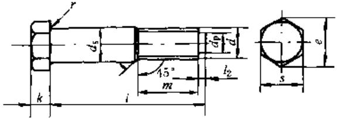

六角头螺杆带孔铰制孔用螺栓A和B级(GB/T28—1988)

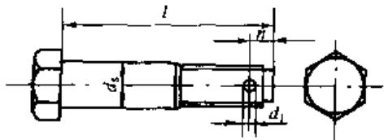

其余的型式与尺寸按GB/T27规定

标记示例:

螺纹规格 $d = \mathbb { M } \mathbb { 1 } 2$ 、d尺寸按本表规定、公称长度 $l = 8 0 \mathrm { m m }$ 、性能等级为8.8级、表面氧化处理、A级的六角头铰制孔用螺栓:螺栓GB/T27 $\mathbb { M } \mathbb { 1 2 } \times \mathbb { 8 0 }$ 

$\pmb { d } _ { s }$ 按 $\mathtt { m } 6$ 制造时应加标记 $\mathtt { m 6 }$ : 螺栓GB/T27 $\mathbb { M } \mathbb { 1 } \mathbb { 2 } \times \mathbb { m } \ 6 \times \mathbb { 8 } 0$ 

/mm 

表4-1-80

<table><tr><td colspan="2">螺纹规格d</td><td>M6</td><td>M8</td><td>M10</td><td>M12</td><td>(M14）</td><td>M16</td><td>（M18）</td><td>M20</td><td>（M22）</td><td>M24</td><td>（M27）</td><td>M30</td><td>M36</td><td>M42</td><td>M48</td></tr><tr><td rowspan="2">d</td><td>max</td><td>7</td><td>9</td><td>1</td><td>13</td><td>15</td><td>17</td><td>19</td><td>21</td><td>23</td><td>25</td><td>28</td><td>32</td><td>38</td><td>4</td><td>50</td></tr><tr><td>min</td><td>6.964</td><td>8.964</td><td>10.9.57</td><td>12.957</td><td>14.957</td><td>16.957</td><td>18.948</td><td>20.948</td><td>22.948</td><td>24.948</td><td>27.948</td><td>31.938,</td><td>37.938</td><td>43.938</td><td>49.938</td></tr><tr><td>（h9) s</td><td>max</td><td>10</td><td>13</td><td>16</td><td>18</td><td>21</td><td>24</td><td>27</td><td>30</td><td>34</td><td>36</td><td>41</td><td>46</td><td>55</td><td>65</td><td>75</td></tr><tr><td>H</td><td>公称</td><td>4</td><td>5</td><td>6</td><td>7</td><td>8</td><td>9</td><td>10</td><td>11</td><td>12</td><td>13</td><td>15</td><td>17</td><td>20</td><td>23</td><td>26</td></tr><tr><td></td><td>，min</td><td>0.25</td><td colspan="2">0.4</td><td colspan="3">0.6</td><td colspan="2"></td><td colspan="2">0.8</td><td colspan="2">1</td><td>1.2</td><td>1.6</td></tr><tr><td></td><td>e</td><td>11.05</td><td>14.38</td><td>17.77</td><td>20.03</td><td>23.35</td><td>26.75</td><td>30.14</td><td>33.53</td><td>37.72</td><td>39.98</td><td></td><td></td><td></td><td></td><td>r1</td></tr><tr><td></td><td>d</td><td>4</td><td>5.5</td><td>7</td><td>8.5</td><td>10</td><td>12</td><td>13</td><td>15</td><td>17</td><td>18</td><td>21</td><td>23</td><td>28</td><td>33</td><td>38</td></tr><tr><td colspan="2">h</td><td>1.5</td><td></td><td>2</td><td></td><td></td><td>3</td><td></td><td></td><td>4</td><td></td><td></td><td>5</td><td>6</td><td>7</td><td>8</td></tr><tr><td colspan="2">d min</td><td>1.6</td><td>2</td><td>2.5</td><td>3.2</td><td></td><td></td><td>4</td><td></td><td></td><td>5</td><td></td><td>6.3</td><td></td><td></td><td>8</td></tr></table>

续表

<table><tr><td>螺纹规格d</td><td>M6</td><td>M8 ：</td><td>M10</td><td>M12</td><td>(M14)</td><td>M16</td><td>(M18）j</td><td>M20</td><td>（M22）</td><td>M24</td><td>（M27)</td><td>M0</td><td></td><td>M36 M42</td><td></td><td>M48</td></tr><tr><td>i</td><td colspan="2">25~652</td><td>525~80 30</td><td>35~</td><td>40~</td><td>45</td><td>50</td><td></td><td>55~</td><td>60-</td><td>65-</td><td>75</td><td>80~</td><td>90</td><td>110~</td><td>120~</td></tr><tr><td></td><td colspan="2"></td><td>120</td><td>180</td><td>180</td><td>20U</td><td>200</td><td>200</td><td></td><td>200</td><td>200</td><td>200</td><td>230</td><td>300</td><td>300</td><td>300</td></tr><tr><td>用</td><td>12</td><td>15</td><td>18</td><td>22</td><td>25</td><td>28</td><td>30</td><td></td><td>32</td><td>35</td><td>38</td><td>42</td><td>50</td><td>55</td><td>65</td><td>70</td></tr><tr><td>n</td><td>4.5</td><td>5.5</td><td>6</td><td>7</td><td>8</td><td>9</td><td>9</td><td></td><td>10</td><td>11</td><td>11</td><td>13</td><td>14</td><td>16</td><td>19</td><td>20</td></tr><tr><td>100mm长重量/kg</td><td>0.020</td><td>0.036</td><td>0.078</td><td></td><td>0.1100.148</td><td>0.195</td><td>0.247</td><td></td><td>0.303 （55），60.</td><td>0.381 （65），</td><td>0.450</td><td>0.587</td><td>0.762</td><td>1.132</td><td>1.515</td><td>2.091</td></tr><tr><td>系列</td><td colspan="14">25， （28），30，（32），35，（38），40、45、50，</td><td>（75），80， （85） 90，</td><td colspan="2">（95）， 100，110，120，130，140，150，160，170，180，190，200，210，220.230，240、250，260，280，300</td></tr><tr><td>技术条件</td><td></td><td>材料：钢，螺纹公差：6g</td><td></td><td></td><td></td><td></td><td></td><td></td><td></td><td></td><td></td><td></td><td>表面处理：氧化</td><td></td><td></td><td colspan="2"></td></tr><tr><td></td><td colspan="2"></td><td colspan="2"></td><td colspan="9">性能等级；d≤39时为8.8;d>39时按协议</td><td colspan="4">产品等级：A.B</td></tr></table>

注:1.A、B级区别见表4-1-77注1。

2.根据使用要求,螺杆上无螺纹部分杆径(d.)允许按 $_ { \textsf { m } 6 }$ 、u8制造,按 $^ { \mathrm { ~ t r ~ } \mathrm { ~ \bf ~ 6 ~ } }$ 制造的螺栓,螺杆上尤螺纹部分的衣面粗糙度为 $\underbrace { 1 . 6 } _ { \phantom { 0 } }$ ;螺杆上无螺纹部分(d,)末端倒角 $4 5 ^ { \circ }$ ,根据制造上艺,允许制成大于 $4 5 ^ { r }$ ,小于1.5P(螺)的领部。

3. ${ \boldsymbol { i } } _ { \flat }$ 的公差按 $\bf { + \delta I T 1 4 . }$ 

4.尽可能不采用括号内的规格。

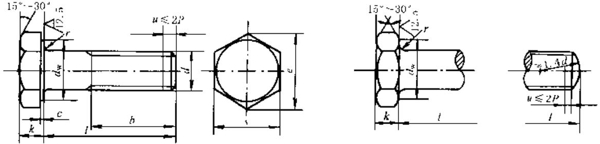

钢结构用高强度大六角头螺栓(GB/T1228—1991)

头部可选择的型式末端可选择的型式

螺纹规格 $d = \mathbb { M } 2 0$ 、公称长度 $l = \mathrm { i 0 0 m m }$ 、性能等级为I0.9S级的钢结构用高强度大六角头螺栓;

螺纹规格 $\pmb { d } = \pmb { M } \pmb { 2 0 }$ 、公称长度 $\ell = 1 0 0 \mathrm { { m m } }$ 、性能等级为8.8S级的钢结构用高强度大六角头螺栓:

螺栓GB/T1228 $\mathrm { M } 2 0 \times 1 0 0 { - } 8 . 8 5$ 

表4-1-81

/mm 

<table><tr><td rowspan=1 colspan=2>螺纹规格d</td><td rowspan=1 colspan=1>M12</td><td rowspan=1 colspan=1>M16</td><td rowspan=1 colspan=1>M20</td><td rowspan=1 colspan=1>(M22）</td><td rowspan=1 colspan=1>M24</td><td rowspan=1 colspan=1>（M27）</td><td rowspan=1 colspan=1>M30</td></tr><tr><td rowspan=4 colspan=1>dek15：</td><td rowspan=4 colspan=1>minmin公称minmxmax</td><td rowspan=3 colspan=1>19.222.787.51.021</td><td rowspan=3 colspan=1>24.929.56101.027</td><td rowspan=1 colspan=1>31.4</td><td rowspan=1 colspan=1>33.3</td><td rowspan=1 colspan=1>38.0</td><td rowspan=1 colspan=1>428</td><td rowspan=1 colspan=1>46.5</td></tr><tr><td rowspan=1 colspan=1>37.29</td><td rowspan=1 colspan=1>39.55</td><td rowspan=1 colspan=1>45.20</td><td rowspan=1 colspan=1>50.85</td><td rowspan=1 colspan=1>55.3</td></tr><tr><td rowspan=1 colspan=1>12.51.534</td><td rowspan=1 colspan=1>141.536</td><td rowspan=1 colspan=1>151.541</td><td rowspan=1 colspan=1>172.046</td><td rowspan=1 colspan=1>18.72.050</td></tr><tr><td rowspan=1 colspan=1></td><td rowspan=1 colspan=1></td><td rowspan=1 colspan=1></td><td rowspan=1 colspan=1>0.8</td><td rowspan=1 colspan=2></td><td rowspan=1 colspan=1></td></tr><tr><td rowspan=1 colspan=2></td><td rowspan=1 colspan=1>2535~4030.45~75</td><td rowspan=1 colspan=1>3045~503555~130</td><td rowspan=1 colspan=1>3550~604065~160</td><td rowspan=1 colspan=1>4055~654570-220</td><td rowspan=1 colspan=1>4560~705075~240</td><td rowspan=1 colspan=1>15065-755580-260</td><td rowspan=1 colspan=1>5570-806085~260</td></tr><tr><td rowspan=1 colspan=2>100mm长的重量/kg</td><td rowspan=1 colspan=1>0.108</td><td rowspan=1 colspan=1>0.203</td><td rowspan=1 colspan=1>0.334</td><td rowspan=1 colspan=1>0.407</td><td rowspan=1 colspan=1>0.502</td><td rowspan=1 colspan=1>0.666</td><td rowspan=1 colspan=1>0.828</td></tr><tr><td rowspan=1 colspan=2>1系列公称</td><td rowspan=1 colspan=1></td><td rowspan=1 colspan=5>35-100（按5进级）、110~200（按10进级）、220、240、260</td><td rowspan=1 colspan=1></td></tr><tr><td rowspan=1 colspan=2>公称应力截面积A，/mm</td><td rowspan=1 colspan=1>84.3</td><td rowspan=1 colspan=1>157</td><td rowspan=1 colspan=1>245</td><td rowspan=1 colspan=1>303</td><td rowspan=1 colspan=1>353</td><td rowspan=1 colspan=1>459</td><td rowspan=1 colspan=1>561</td></tr><tr><td rowspan=1 colspan=2>拉力载荷/</td><td rowspan=1 colspan=7>等于A,×ob</td></tr></table>

续表

<table><tr><td rowspan=8 colspan=1>D</td><td rowspan=1 colspan=1>螺纹规格d</td><td rowspan=1 colspan=1>M12</td><td rowspan=1 colspan=1>M16</td><td rowspan=1 colspan=1>M20</td><td rowspan=1 colspan=1>（M22）</td><td rowspan=1 colspan=1>M24</td><td rowspan=1 colspan=1>（M27）</td><td rowspan=1 colspan=1>M30</td></tr><tr><td rowspan=7 colspan=1>技术条件</td><td rowspan=2 colspan=1>性能等级</td><td rowspan=1 colspan=1>抗拉强度</td><td rowspan=1 colspan=1>屈服强度00.2</td><td rowspan=2 colspan=1>推荐材料</td><td rowspan=2 colspan=1>洛氏硬度HRC</td><td rowspan=2 colspan=1>通用规格</td><td rowspan=2 colspan=1>产品等级</td></tr><tr><td rowspan=1 colspan=1></td><td rowspan=1 colspan=1>Pa</td></tr><tr><td rowspan=2 colspan=1>10.9s</td><td rowspan=2 colspan=1>1040~1240</td><td rowspan=2 colspan=1>940</td><td rowspan=1 colspan=1>2OMnTiB</td><td rowspan=2 colspan=1>33~39</td><td rowspan=1 colspan=1>M24</td><td rowspan=5 colspan=1>C</td></tr><tr><td rowspan=1 colspan=1>35VB</td><td rowspan=1 colspan=1>M30</td></tr><tr><td rowspan=3 colspan=1>8.8s</td><td rowspan=3 colspan=1>830~1030</td><td rowspan=3 colspan=1>660</td><td rowspan=1 colspan=1>40B</td><td rowspan=3 colspan=1>24-31</td><td rowspan=1 colspan=1>M24</td></tr><tr><td rowspan=1 colspan=1>45</td><td rowspan=1 colspan=1>M22</td></tr><tr><td rowspan=1 colspan=1>35</td><td rowspan=1 colspan=1>M20</td></tr></table>

钢结构用扭剪型高强度螺栓联接副螺栓(GB/T3632—1995)

/mm 

<table><tr><td rowspan=1 colspan=1>d</td><td rowspan=1 colspan=1>M16</td><td rowspan=1 colspan=2>M20</td><td rowspan=1 colspan=2>（M22）</td><td rowspan=1 colspan=1>M24</td></tr><tr><td rowspan=1 colspan=1>d公称</td><td rowspan=1 colspan=1>10.9</td><td rowspan=1 colspan=2>13.6</td><td rowspan=1 colspan=2>15.1</td><td rowspan=1 colspan=1>16.4</td></tr><tr><td rowspan=1 colspan=1>d公称</td><td rowspan=1 colspan=1>16</td><td rowspan=1 colspan=2>20</td><td rowspan=1 colspan=2>22</td><td rowspan=1 colspan=1>24</td></tr><tr><td rowspan=1 colspan=1>dmin</td><td rowspan=1 colspan=1>27.9</td><td rowspan=1 colspan=2>34.5</td><td rowspan=1 colspan=2>38.5</td><td rowspan=1 colspan=1>41.5</td></tr><tr><td rowspan=1 colspan=1>d?</td><td rowspan=1 colspan=1>13</td><td rowspan=1 colspan=2>17</td><td rowspan=1 colspan=2>18</td><td rowspan=1 colspan=1>20</td></tr><tr><td rowspan=1 colspan=1>dmax</td><td rowspan=1 colspan=1>18.83</td><td rowspan=1 colspan=2>24.4</td><td rowspan=1 colspan=2>26.4</td><td rowspan=1 colspan=1>28.4</td></tr><tr><td rowspan=1 colspan=1>d公称</td><td rowspan=1 colspan=1>11.1</td><td rowspan=1 colspan=2>13.4</td><td rowspan=1 colspan=2>15.4</td><td rowspan=1 colspan=1>16.7</td></tr><tr><td rowspan=1 colspan=1>d</td><td rowspan=1 colspan=1>12.8</td><td rowspan=1 colspan=2>16.1</td><td rowspan=1 colspan=2>17.8</td><td rowspan=1 colspan=1>19.3</td></tr><tr><td rowspan=1 colspan=1>dmax</td><td rowspan=1 colspan=1>30</td><td rowspan=1 colspan=2>37</td><td rowspan=1 colspan=2>41</td><td rowspan=1 colspan=1>44</td></tr><tr><td rowspan=1 colspan=1>公称</td><td rowspan=1 colspan=1>10</td><td rowspan=1 colspan=2>1</td><td rowspan=1 colspan=2>14</td><td rowspan=1 colspan=1>15</td></tr><tr><td rowspan=1 colspan=1>公称</td><td rowspan=1 colspan=1>12</td><td rowspan=1 colspan=2>14</td><td rowspan=1 colspan=2>15</td><td rowspan=1 colspan=1>16</td></tr><tr><td rowspan=1 colspan=1>max</td><td rowspan=1 colspan=1>17</td><td rowspan=1 colspan=2>19</td><td rowspan=1 colspan=2>21</td><td rowspan=1 colspan=1>23</td></tr><tr><td rowspan=1 colspan=1>min</td><td rowspan=1 colspan=1>1.2</td><td rowspan=1 colspan=2>1.2</td><td rowspan=1 colspan=2>1.2</td><td rowspan=1 colspan=1>1.6</td></tr><tr><td rowspan=1 colspan=1></td><td rowspan=1 colspan=1>4</td><td rowspan=1 colspan=2>5</td><td rowspan=1 colspan=2>5.5</td><td rowspan=1 colspan=1>6</td></tr><tr><td rowspan=1 colspan=1>范围</td><td rowspan=1 colspan=1>40~130</td><td rowspan=1 colspan=2>45~ 160</td><td rowspan=1 colspan=2>50~ 180</td><td rowspan=1 colspan=1>55~180</td></tr><tr><td rowspan=2 colspan=1>小</td><td rowspan=2 colspan=1>3040~603555-120</td><td rowspan=1 colspan=2>3545-6640</td><td rowspan=1 colspan=2>4050~6545</td><td rowspan=1 colspan=1>4555~7055</td></tr><tr><td rowspan=1 colspan=2>65~140</td><td rowspan=1 colspan=2>70-160</td><td rowspan=1 colspan=1>75~180</td></tr><tr><td rowspan=1 colspan=1>系列公称</td><td rowspan=1 colspan=6>40~100（5进位），110~180（10进位）</td></tr><tr><td rowspan=1 colspan=1>100mm长重量/g</td><td rowspan=1 colspan=1>0.227</td><td rowspan=1 colspan=2>0.379</td><td rowspan=1 colspan=2>0.474</td><td rowspan=1 colspan=1>0.574</td></tr><tr><td rowspan=7 colspan=1>技术条件1</td><td rowspan=1 colspan=2>性能等级</td><td rowspan=1 colspan=2>30.9s</td><td rowspan=3 colspan=1></td><td rowspan=7 colspan=1>产品公差等级：C</td></tr><tr><td rowspan=1 colspan=2>推荐材料</td><td rowspan=1 colspan=2>20Mn</td></tr><tr><td rowspan=1 colspan=2>抗拉强度/MPa</td><td rowspan=1 colspan=2>1040~1240</td></tr><tr><td rowspan=1 colspan=2>屈服强度0./MPa</td><td rowspan=1 colspan=2>940</td><td rowspan=4 colspan=1>螺纹公差：6g</td></tr><tr><td rowspan=1 colspan=2>伸长率8min/%</td><td rowspan=1 colspan=2>10</td></tr><tr><td rowspan=1 colspan=2>收缩率min/%</td><td rowspan=1 colspan=2>42</td></tr><tr><td rowspan=1 colspan=2>冲击值min/Jm</td><td rowspan=1 colspan=2>59</td></tr></table>

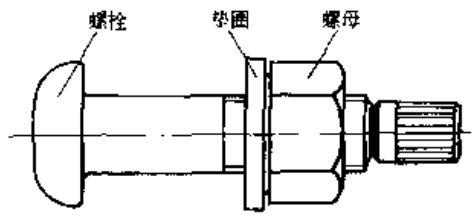

螺栓连接副型式

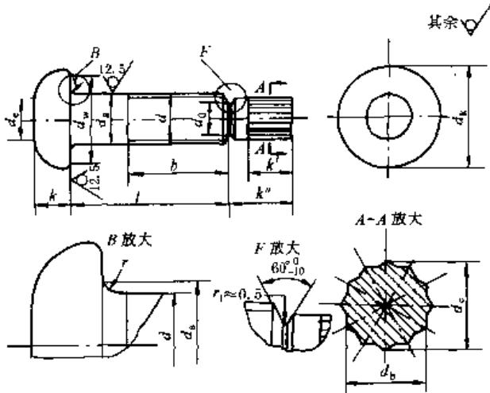

标记示例:

粗牙普通螺纹, $d = \mathbb { M } 2 0$ 、 $\downarrow = 1 0 0 \mathrm { m m }$ 、性能等级为10.9S、表面防锈处理钢结构用扭剪型高强度螺纹联接:

螺纹联接副GB/T3632 $\mathbf { M } 2 0 \times \mathbf { l } \mathbf { 0 } 0$ 

栓接结构用大六角头螺栓  
螺纹长度按GB/T3160C级8.8和10.9级  
(GB/T18230.1-2000)

栓接结构用大六角头螺栓短螺纹长度C级8.8和10.9级(GB/T18230.2—2000)

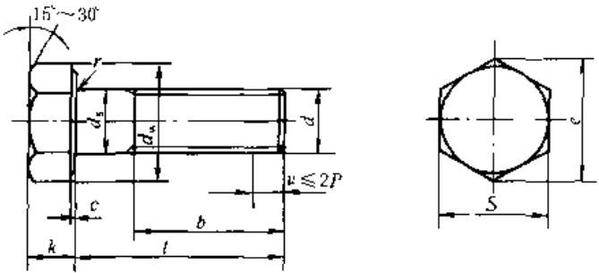

标记示例:

螺纹规格 $\alpha = M 1 6$ 公称长度 $\bar { \ell } = 8 0 \mathbf { \bar { m } } m \mathbf { \bar { m } }$ 、性能等级为8.8级表面氧化、螺纹长度按GB/T3I06(短螺纹长度)的栓接结构用大六角螺的标记:

螺栓GB/T18230.1(GB/T18230.2) $\mathbf { M } \mathbf { 1 6 \times 8 0 }$ 

注:如需要镀前按 ${ \delta } \mathfrak { a } \mathfrak { z }$ 规定制造,则标记中增加字母“U":螺母CB/T18230.1(.2) $\mathbb { M } \mathbb { 1 } 6 \times \mathbb { 8 } \mathbb { 0 } \ 8 . 8 \mathbb { S } \mathbb { U } _ { : }$ ,见GB/T1823.1(.2)第7章,

/mm 

表4-1-83

<table><tr><td rowspan=1 colspan=2>螺纹规格d</td><td rowspan=1 colspan=1>M12</td><td rowspan=1 colspan=1>M16</td><td rowspan=1 colspan=1>M20</td><td rowspan=1 colspan=1>（M22）</td><td rowspan=1 colspan=1>M24</td><td rowspan=1 colspan=1>(M27)</td><td rowspan=1 colspan=1>M30</td><td rowspan=1 colspan=1>M36</td></tr><tr><td rowspan=1 colspan=2>螺距P</td><td rowspan=1 colspan=1>1.75</td><td rowspan=1 colspan=1>2</td><td rowspan=1 colspan=1>2.5</td><td rowspan=1 colspan=1>2.5</td><td rowspan=1 colspan=1>3</td><td rowspan=1 colspan=1>3</td><td rowspan=1 colspan=1>3.5</td><td rowspan=1 colspan=1>4</td></tr><tr><td rowspan=3 colspan=1></td><td rowspan=1 colspan=1>！</td><td rowspan=1 colspan=1>30</td><td rowspan=1 colspan=1>38</td><td rowspan=1 colspan=1>46</td><td rowspan=1 colspan=1>50</td><td rowspan=1 colspan=1>54</td><td rowspan=1 colspan=1>60</td><td rowspan=1 colspan=1>66</td><td rowspan=1 colspan=1>78</td></tr><tr><td rowspan=1 colspan=1>2</td><td rowspan=2 colspan=1>1125</td><td rowspan=1 colspan=1>44</td><td rowspan=1 colspan=1>52</td><td rowspan=1 colspan=1>56</td><td rowspan=1 colspan=1>60</td><td rowspan=1 colspan=1>66</td><td rowspan=1 colspan=1>72</td><td rowspan=1 colspan=1>84</td></tr><tr><td rowspan=1 colspan=1>34</td><td rowspan=1 colspan=1>131</td><td rowspan=1 colspan=1>6536</td><td rowspan=1 colspan=1>638</td><td rowspan=1 colspan=1>7341</td><td rowspan=1 colspan=1>7944</td><td rowspan=1 colspan=1>8549</td><td rowspan=1 colspan=1>9756</td></tr><tr><td rowspan=1 colspan=1></td><td rowspan=1 colspan=1>5</td><td rowspan=1 colspan=1>32</td><td rowspan=1 colspan=1>38</td><td rowspan=1 colspan=1>43</td><td rowspan=1 colspan=1>45</td><td rowspan=1 colspan=1>48</td><td rowspan=1 colspan=1>51</td><td rowspan=1 colspan=1>56</td><td rowspan=1 colspan=1>63</td></tr><tr><td rowspan=1 colspan=2>Cm8x</td><td rowspan=1 colspan=1>0.8</td><td rowspan=1 colspan=1>0.8</td><td rowspan=1 colspan=1>0.8</td><td rowspan=1 colspan=1>0.8</td><td rowspan=1 colspan=1>0.8</td><td rowspan=1 colspan=1>0.8</td><td rowspan=1 colspan=1>0.8</td><td rowspan=1 colspan=1>0.8</td></tr><tr><td rowspan=1 colspan=2>dmax</td><td rowspan=1 colspan=1></td><td rowspan=1 colspan=1></td><td rowspan=1 colspan=1></td><td rowspan=1 colspan=1>d(max）</td><td rowspan=1 colspan=1>=S实际</td><td rowspan=1 colspan=1></td><td rowspan=1 colspan=1></td><td rowspan=1 colspan=1></td></tr><tr><td rowspan=1 colspan=2> nun</td><td rowspan=1 colspan=1>22.78</td><td rowspan=1 colspan=1>29.56</td><td rowspan=1 colspan=1>37.29</td><td rowspan=1 colspan=1>39.55</td><td rowspan=1 colspan=1>45.2</td><td rowspan=1 colspan=1>50.85</td><td rowspan=1 colspan=1>55.37</td><td rowspan=1 colspan=1>66.44</td></tr><tr><td rowspan=1 colspan=2>公称</td><td rowspan=1 colspan=1>7.5</td><td rowspan=1 colspan=1>10</td><td rowspan=1 colspan=1>12.5</td><td rowspan=1 colspan=1>14</td><td rowspan=1 colspan=1>15</td><td rowspan=1 colspan=1>17</td><td rowspan=1 colspan=1>187</td><td rowspan=1 colspan=1>22.5</td></tr><tr><td rowspan=1 colspan=2>/ mun</td><td rowspan=1 colspan=1>1.2</td><td rowspan=1 colspan=1>1.2</td><td rowspan=1 colspan=1>1.5</td><td rowspan=1 colspan=1>1.5</td><td rowspan=1 colspan=1>1.5</td><td rowspan=1 colspan=1>2.0</td><td rowspan=1 colspan=1>2.0</td><td rowspan=1 colspan=1>2.0</td></tr><tr><td rowspan=1 colspan=2>S max</td><td rowspan=1 colspan=1>21</td><td rowspan=1 colspan=1>22</td><td rowspan=1 colspan=1>34</td><td rowspan=1 colspan=1>36</td><td rowspan=1 colspan=1>41</td><td rowspan=1 colspan=1>46</td><td rowspan=1 colspan=1>50</td><td rowspan=1 colspan=1>60</td></tr><tr><td rowspan=1 colspan=2>系列</td><td rowspan=1 colspan=8>30~100(按5进级）、100~200(按10进级）</td></tr><tr><td rowspan=2 colspan=2>GB/T18230.2</td><td rowspan=1 colspan=1>35~100</td><td rowspan=1 colspan=1>40~150</td><td rowspan=1 colspan=1>45~ 150</td><td rowspan=1 colspan=1>50~ 150</td><td rowspan=1 colspan=1>55~200</td><td rowspan=1 colspan=1>60 - 200</td><td rowspan=1 colspan=1>70~ 200</td><td rowspan=1 colspan=1>85~200</td></tr><tr><td rowspan=1 colspan=1>40~100</td><td rowspan=1 colspan=1>45~ 100</td><td rowspan=1 colspan=1>55~150</td><td rowspan=1 colspan=1>60-150</td><td rowspan=1 colspan=1>65~200</td><td rowspan=1 colspan=1>70- 200</td><td rowspan=1 colspan=1>80~200</td><td rowspan=1 colspan=1>90~ 200</td></tr><tr><td rowspan=3 colspan=2>技术条件</td><td rowspan=1 colspan=1>名称</td><td rowspan=1 colspan=1>材料</td><td rowspan=1 colspan=1>螺纹公差</td><td rowspan=1 colspan=1>性能等级</td><td rowspan=1 colspan=1>产品等级</td><td rowspan=1 colspan=1>表面处理</td><td rowspan=1 colspan=1>配套螺母</td><td rowspan=1 colspan=1>配套垫圈</td></tr><tr><td rowspan=1 colspan=1>GB/T 18230.1</td><td rowspan=1 colspan=1>钢</td><td rowspan=1 colspan=1>6</td><td rowspan=1 colspan=1>8.8.10.9</td><td rowspan=1 colspan=1>C级</td><td rowspan=1 colspan=1>氧化常规</td><td rowspan=1 colspan=1>CB/T18230.3</td><td rowspan=1 colspan=1>GB/T 18230.5</td></tr><tr><td rowspan=1 colspan=1>GB/T18230.2</td><td rowspan=1 colspan=1>钢</td><td rowspan=1 colspan=1>6</td><td rowspan=1 colspan=1>8.8.10.9</td><td rowspan=1 colspan=1>C级</td><td rowspan=1 colspan=1>氧化常规</td><td rowspan=1 colspan=1>GB/T18230.4</td><td rowspan=1 colspan=1>CB/T 18230.5</td></tr></table>

$\textcircled{1}$ b中:1用于公称长度 $l _ { 4 ; 4 4 } \leqslant 1 0 0 \mathrm { m m } ; 2$ 用于公称长度 $1 0 0 \mathrm { m m } < \ell _ { \mathrm { A B E } } \leqslant 2 0 0 \mathrm { m m } ; 3$ 用于公称长度 $l _ { \ddot { z } \dot { \ m } } > 2 0 0 \mathrm { m m }$ (以上为GB/1$1 8 2 3 0 . 1 \mathrm { - } 2 9 0 0 \rangle$ :4用于公称长度 $l _ { 2 , 4 4 } \leqslant 1 0 0 \mathrm { m m } ; S$ 用于公称长度 $l _ { \mathrm { \Delta \beta \ a \beta } } > 1 0 0 \mathrm { m m }$ (以上为GB/T18230.2-2000)。

$\textcircled{2}$ 商品规格长度。

注:1、产品等级除 $\mathrm { ~ c ~ } , d _ { \mathrm { ~ s ~ } } \operatorname* { m i n } \{ 0 . 9 5 \ S _ { \mathrm { r a m } } \}$ $\boldsymbol { r }$ 和长度大于 $1 5 0 \mathrm { m m }$ 的公差按 $\pm 4 . 0 \mathrm { { m m } }$ 外,其余按C级。

2.表面处理除常规外,可选择的有镀锌钝化(CB 5267)、镀镉钝化(GB 5267)、热浸镀锌(GB/T13912)和粉木机械镀锌(JR/T5067),粉末机械镀锌必须有驱氢措施;其他表面处理由供需双方协议,但不应损伤机械性能。

3.螺纹的公差适用于电镀或热浸镀锌前的螺纹。热浸镀锌螺栓也可按供需双方的协议供货,详见GB/T18230.1(.2)—2000 附录A

4.对于电镀或热镀锌的紧固件,制造者应在螺栓或相配的螺母上涂适当的润滑剂,以保证装配时不会咬死,有关润滑剂涂层效果的试验资料,详见CB/T18230.1(.2)—2000附录B。

5.配套螺母与配套垫圖为推荐。

# 方头螺栓C级(GB/T8—1988)

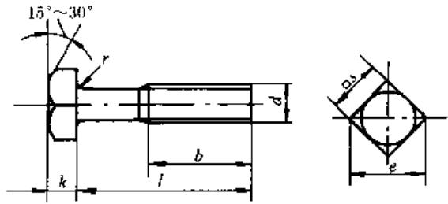

标记示例:

螺纹规格 $d = \mathbb { M } \mathbb { 1 } 2$ 、公称长度 $\ell = 8 0 \mathrm { m } \mathrm { m }$ 、性能等级为4.8级、不经表面处理的方头螺栓:

螺栓GB/T8 $\mathbf { M } \mathbf { 1 } 2 \times \mathbf { 8 0 }$ 

表4-1-84

/mm 

<table><tr><td colspan="2">螺纹规格d</td><td>M10</td><td>M12</td><td>（M14）</td><td>M16</td><td>（M18）</td><td>M20</td><td>（M22）</td><td>M24</td><td>（M27）</td><td>M30</td><td>M36</td><td>M42</td><td>M48</td></tr><tr><td rowspan="3">b</td><td>1≤200</td><td>26</td><td>30</td><td>34</td><td>38</td><td>42</td><td>46</td><td>50</td><td>54</td><td>60</td><td>66</td><td>78</td><td>1</td><td>1</td></tr><tr><td>125≤200</td><td>32</td><td>36</td><td>40</td><td>44</td><td>48</td><td>52</td><td>56</td><td>60</td><td>66</td><td>72</td><td>84</td><td>96</td><td>108</td></tr><tr><td>1> 200 min</td><td>1 20.24</td><td>一 22.84</td><td>53 26.21</td><td>57 30.11</td><td>61 34.01</td><td>65 37.91</td><td>6 42.9</td><td>73 45.5</td><td>79 52.0</td><td>85 58.5</td><td>97 69.94</td><td>109 82.03</td><td>121 95.03</td></tr><tr><td colspan="2">公称 rmin</td><td>7 0.4</td><td>8 0.6</td><td>9 0.6</td><td>10</td><td>12</td><td>13</td><td>14</td><td>15</td><td>17</td><td>19</td><td>23</td><td>26</td><td>30</td></tr><tr><td colspan="2">max</td><td>16</td><td>18</td><td>21</td><td>0.6 24</td><td>0.8 27</td><td>0.8 30</td><td>0.8 34</td><td>0.8 36</td><td>1 41</td><td>1 46</td><td>1 55</td><td>1.2</td><td>1.6 75</td></tr><tr><td colspan="2">商品规格长度！</td><td>20~</td><td>25~</td><td>25</td><td>30~</td><td>35~</td><td>35~</td><td>50</td><td>55~</td><td>60-</td><td>60</td><td>80~</td><td>65 80</td><td>110-</td></tr><tr><td colspan="2">100mm长重量/kg</td><td>100 0.060</td><td>120 0.087</td><td>140 0.122</td><td>160</td><td>180</td><td>200</td><td>220</td><td>240</td><td>260</td><td>300</td><td>300</td><td>300</td><td>300</td></tr><tr><td colspan="2">！系列</td><td>20， 180,200，220,240,260,280，300</td><td>25、30、</td><td>35、40，</td><td>0.166 45，50，</td><td>0.216 (55），</td><td>0.277 60,</td><td>0.353 （65）， 70,</td><td>0.416 80， 90,</td><td>0.560 100， 110，</td><td>0.721 120，</td><td>1.117 130， 140，</td><td>1.611 150,</td><td>2.276 160,</td></tr><tr><td colspan="2">技术条件</td><td colspan="8"></td><td colspan="5"></td></tr><tr><td rowspan="2"></td><td rowspan="2"></td><td>材料</td><td>螺纹公差</td><td colspan="4">性能等级 d39:4.8级；d>39:按协议</td><td colspan="2">产品等级 C</td><td colspan="5">表面处理</td></tr><tr><td>钢</td><td>8g</td><td colspan="4"></td><td colspan="2"></td><td colspan="5">①不经处理；②氧化；③镀锌钝化</td></tr></table>

# 小方头螺栓B级(GB/T35—1988)

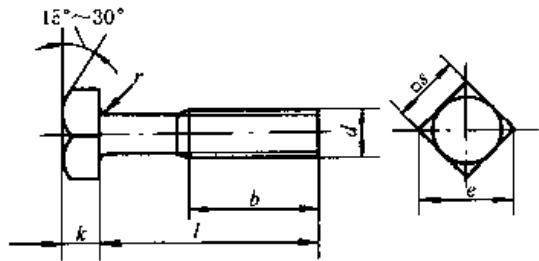

标记示例:

螺纹规格 $\pmb { d } = \mathbf { M } \mathbf { l } 2$ 、公称长度 $\pmb { \downarrow } = \mathbf { 8 0 } \mathbf { m m }$ 、性能等级为5.8级、不经表面处理的小方头螺栓:

螺栓GB/T35 $\yen 12 \times80$ 

/mm 

表4-1-85

<table><tr><td colspan="2">螺纹规格d</td><td>M5</td><td>M6</td><td>M8</td><td>M10</td><td>M12</td><td>（M14）</td><td>M16</td><td>(M18）</td><td>M20</td><td>（M22）</td><td>M24</td><td>(M27)</td><td>M30</td><td>M36</td><td>M42</td><td>M48</td></tr><tr><td rowspan="3">b</td><td>125</td><td>16</td><td>18</td><td>22</td><td>26</td><td>30</td><td>34</td><td>38</td><td>42</td><td>46</td><td>50</td><td>54</td><td>60</td><td>66</td><td>78</td><td></td><td>1</td></tr><tr><td>125≤200</td><td>一</td><td>1</td><td>28</td><td>32</td><td>36</td><td>40</td><td>44</td><td>48</td><td>52</td><td>56</td><td>60</td><td>66</td><td>72</td><td>84</td><td>9</td><td>108</td></tr><tr><td>>200</td><td>一</td><td>丨</td><td>1</td><td>1</td><td></td><td>1</td><td>57</td><td>6</td><td>65</td><td>69</td><td>73</td><td>79</td><td>85</td><td>97</td><td>109</td><td>121</td></tr><tr><td colspan="2">emin</td><td>9.93</td><td>12.53</td><td>16.34</td><td>20.24 6</td><td>22.84</td><td>26.21</td><td>30.11</td><td>34.01</td><td>37.91</td><td>42.9</td><td>45.5</td><td>52</td><td>58.5</td><td>69.94</td><td>82.03</td><td>95.05</td></tr><tr><td colspan="2">公称</td><td>3.5</td><td>4</td><td colspan="2">5</td><td>7</td><td>8</td><td>9</td><td>10</td><td>11</td><td>12</td><td>13</td><td>15</td><td>17</td><td>20</td><td>23</td><td>26</td></tr><tr><td colspan="2">，min</td><td>0.2</td><td>0.25</td><td colspan="2">0.4</td><td></td><td>0.6</td><td></td><td></td><td>0.8</td><td></td><td></td><td></td><td>1</td><td></td><td>1.2</td><td>1.6</td></tr><tr><td colspan="2">smax 通用规格长度！</td><td>8</td><td>10</td><td>13</td><td>16</td><td>18</td><td>21</td><td>24</td><td>27</td><td>30</td><td>34</td><td>36</td><td>41</td><td>46</td><td>55</td><td>65</td><td>75</td></tr><tr><td colspan="2"></td><td>20 50</td><td>30- 60</td><td>35 80</td><td>40~ 100</td><td>45~ 120</td><td>55~ 140</td><td>55~ 160</td><td>60 180</td><td>65~ 200</td><td>70 220</td><td>80~ 240</td><td>90 260</td><td>90- 300</td><td>110~ 300</td><td>130~ 300</td><td>140~ 300</td></tr><tr><td colspan="2">100mm长重量</td><td>0.013</td><td>0.020</td><td>0.036</td><td>0.059</td><td>0.085</td><td>0.119</td><td>0.163</td><td>0.208</td><td>0.266</td><td>0.338</td><td>0.400</td><td>0.539</td><td>0.694</td><td>1.060</td><td>1.611</td><td>2.276</td></tr><tr><td colspan="2">/kg ！系列</td><td>20，25，30.35，40，45，50，</td><td colspan="10"></td><td>（55），60，（65），70、80,90，100，110， 120，130，140，150，160，</td><td colspan="5">180,</td></tr><tr><td colspan="2" rowspan="2">技术条件</td><td rowspan="2">材料</td><td colspan="3">200，220，240,260，280，300 螺纹公差</td><td colspan="5">性能等级</td><td colspan="2">产品等级</td><td colspan="5">表面处理</td></tr><tr><td colspan="2">钢</td><td colspan="7">6g d39:5.8、8.8；d>39：按协议</td><td colspan="5">B ①不经处理；②镀锌钝化</td></tr></table>

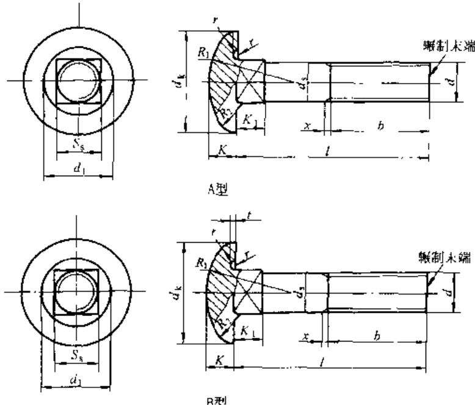

B型

标记示例:

螺纹规格 $d = \mathbf { M } 1 0$ 、公称直径 $\smash { \ell = 7 0 \mathrm { m m } }$ 、性能等级为4.8级、不经表面处理的半圆头方颈螺栓:

螺栓GB/T12 $\mathbf { M } \mathbf { 1 0 } \times \mathbf { 7 0 }$ 

标记示例:

螺纹规格 $d = \mathbb { M } \mathbb { 1 0 }$ 、公称直径 $\ l { \dot { \ell } } = 7 0 \mathrm { m m }$ ,性能等级为8.8级、不经表面氧化处理的A型加强半圆头力领螺栓:

螺栓GB/T794 $\mathbb { M } 1 0 \times 7 0$ 

表4-1-86

/m 

<table><tr><td rowspan=1 colspan=4>螺纹规格d</td><td rowspan=1 colspan=3>M6</td><td rowspan=1 colspan=2>M8</td><td rowspan=1 colspan=2>M10</td><td rowspan=1 colspan=2>M12</td><td rowspan=1 colspan=1>（M14）</td><td rowspan=1 colspan=1>M16</td><td rowspan=1 colspan=1>M20</td></tr><tr><td rowspan=1 colspan=4><125125<1<200</td><td rowspan=1 colspan=3>181</td><td rowspan=1 colspan=2>2228</td><td rowspan=1 colspan=2>2632</td><td rowspan=1 colspan=2>3036</td><td rowspan=1 colspan=1>3440</td><td rowspan=1 colspan=1>3844</td><td rowspan=1 colspan=1>4652</td></tr><tr><td rowspan=6 colspan=4>d mx CB/T12CB/T 794K maxK max CB/T 12GB/T7945s max</td><td rowspan=4 colspan=3>13.115.14.44.08</td><td rowspan=1 colspan=2>17.1</td><td rowspan=1 colspan=2>21.3</td><td rowspan=1 colspan=2>25.3</td><td rowspan=1 colspan=1>29.3</td><td rowspan=1 colspan=1>33.6</td><td rowspan=1 colspan=1>41.6</td></tr><tr><td rowspan=1 colspan=2>19.1</td><td rowspan=1 colspan=2>24.3</td><td rowspan=1 colspan=2>29.3</td><td rowspan=1 colspan=1>33.6</td><td rowspan=1 colspan=1>36.6</td><td rowspan=1 colspan=1>45.6</td></tr><tr><td rowspan=2 colspan=2>5.45.28</td><td rowspan=2 colspan=2>6.46.48</td><td rowspan=1 colspan=2>8.45</td><td rowspan=1 colspan=1>9.45</td><td rowspan=1 colspan=1>10.45</td><td rowspan=3 colspan=1>12.5513.111.9</td></tr><tr><td rowspan=2 colspan=3>4.083.98</td><td rowspan=1 colspan=2>8.9</td><td rowspan=1 colspan=1>9.9</td><td rowspan=1 colspan=1>10.9</td></tr><tr><td rowspan=1 colspan=2>3.98</td><td rowspan=1 colspan=2>4.98</td><td rowspan=1 colspan=2>6.28</td><td rowspan=1 colspan=2>7.48</td><td rowspan=1 colspan=1>8.9</td><td rowspan=1 colspan=1>9.9</td></tr><tr><td rowspan=1 colspan=3>6.3</td><td rowspan=1 colspan=2>8.36</td><td rowspan=1 colspan=2>10.36</td><td rowspan=1 colspan=2>12.43</td><td rowspan=1 colspan=1>14.43</td><td rowspan=1 colspan=1>16.43</td><td rowspan=1 colspan=1>20.52</td></tr><tr><td rowspan=3 colspan=4>，min GB/T12GB/T794R</td><td rowspan=5 colspan=3>0.50.2572.510</td><td rowspan=1 colspan=2>0.5</td><td rowspan=1 colspan=2>0.5</td><td rowspan=1 colspan=2>0.8</td><td rowspan=1 colspan=1>0.8</td><td rowspan=1 colspan=1>1</td><td rowspan=1 colspan=1>1</td></tr><tr><td rowspan=4 colspan=2>0.493.213.5</td><td rowspan=1 colspan=2>0.4</td><td rowspan=1 colspan=2>0.6</td><td rowspan=1 colspan=1>0.6</td><td rowspan=1 colspan=1>0.6</td><td rowspan=1 colspan=1>0.8</td></tr><tr><td rowspan=3 colspan=2>113.816.5</td><td rowspan=1 colspan=2>13</td><td rowspan=1 colspan=1>15</td><td rowspan=1 colspan=1>18</td><td rowspan=1 colspan=1>22</td></tr><tr><td rowspan=2 colspan=3>xmaxdCB/T794</td><td rowspan=1 colspan=2></td><td rowspan=1 colspan=2>4.3</td><td rowspan=1 colspan=1>5</td><td rowspan=1 colspan=1>5</td><td rowspan=1 colspan=1>6.3</td></tr><tr><td rowspan=1 colspan=2></td><td rowspan=1 colspan=2>20</td><td rowspan=1 colspan=1>23</td><td rowspan=1 colspan=1>26</td><td rowspan=1 colspan=1>32</td></tr><tr><td rowspan=2 colspan=3>RR</td><td rowspan=1 colspan=2></td><td rowspan=1 colspan=3>14</td><td rowspan=1 colspan=2>18</td><td rowspan=1 colspan=2>24</td><td rowspan=1 colspan=2>26</td><td rowspan=1 colspan=1>30</td><td rowspan=1 colspan=1>34</td></tr><tr><td rowspan=3 colspan=4>Rd,maxGB/T 974-A商品舰    GB/T12格长度    GB/T794</td><td rowspan=2 colspan=3>4.56</td><td rowspan=2 colspan=2>58</td><td rowspan=1 colspan=2>7</td><td rowspan=1 colspan=2>9</td><td rowspan=1 colspan=1>10</td><td rowspan=2 colspan=1>10.516</td><td rowspan=2 colspan=1>1420</td></tr><tr><td rowspan=1 colspan=2>10</td><td rowspan=1 colspan=2>12</td><td rowspan=1 colspan=1>14</td></tr><tr><td rowspan=1 colspan=3>16~6020~60</td><td rowspan=1 colspan=2>16~8025~80</td><td rowspan=1 colspan=2>25~10040-100</td><td rowspan=1 colspan=2>30~11045~120</td><td rowspan=1 colspan=1>40~14050~140</td><td rowspan=1 colspan=1>45~16055~160</td><td rowspan=1 colspan=1>60~20065~200</td></tr><tr><td rowspan=1 colspan=2>系列</td><td rowspan=1 colspan=2>GB/T12GB/T 794</td><td rowspan=1 colspan=12>16,20,25，30,35，40，45，50， （55），60, （65），70，80，90，100，110.120，130,140，150，160，180，20020，25，30，35,40，45,50，(55)，60，(65)，70，(75)，80，(85)，90，(95)，100，110,120，130，140，150，160，（170)，180，200</td></tr><tr><td rowspan=3 colspan=2>技术条件</td><td rowspan=1 colspan=2>标准</td><td rowspan=1 colspan=2>材料</td><td rowspan=1 colspan=2>螺纹公差</td><td rowspan=1 colspan=2>机械性能等级</td><td rowspan=1 colspan=2>产品等级</td><td rowspan=1 colspan=4>表面处理</td></tr><tr><td rowspan=1 colspan=2>GB/T12</td><td rowspan=1 colspan=2>钢</td><td rowspan=1 colspan=2>8g</td><td rowspan=1 colspan=2>3.6.4.6、4.8</td><td rowspan=1 colspan=2>C</td><td rowspan=1 colspan=4>①不经处理；②氧化；③镀锌钝化</td></tr><tr><td rowspan=1 colspan=2>GB/T 794</td><td rowspan=1 colspan=2>钢钢</td><td rowspan=1 colspan=2>A型：6gB型：8g</td><td rowspan=1 colspan=2>8.B3.6、4.8号</td><td rowspan=1 colspan=2>BC</td><td rowspan=1 colspan=4>氰化①不经处理；②氧化</td></tr></table>

注:1、长度l不能满足表中规定螺纹长度的螺栓,制成全螺纹(GB/T794)。2.允许制成无螺纹部分杆径 $\left( d _ { \nu } \right)$ 约等于螺纹中径的型式(GB/T794-A型)。

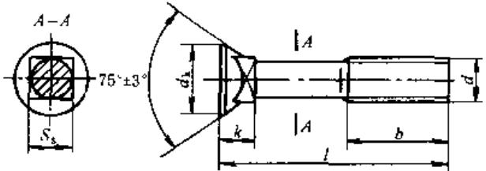

沉头方颈螺栓(GB/T10—1988)

标记示例:

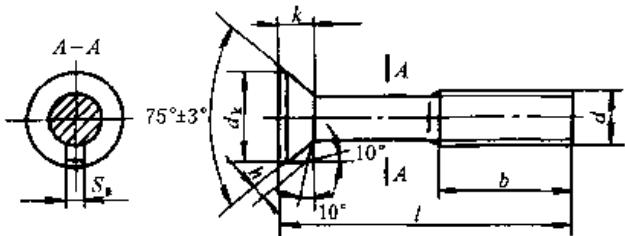

螺纹规格 $d \approx \mathbb { M } \mathbb { I } 0$ 公称长度 $\ell = 7 0 \mathrm { m m }$ 、性能等级为4.8级、不经表面处理的沉头方颈螺栓:

螺栓GB/T10 $M 1 0 \times 7 0$ 

表4-1-87

/mm 

<table><tr><td rowspan=1 colspan=3>螺纹规格d</td><td rowspan=1 colspan=1>M6</td><td rowspan=1 colspan=1>M8</td><td rowspan=1 colspan=2>M10</td><td rowspan=1 colspan=1>M12</td><td rowspan=1 colspan=1>（M14)</td><td rowspan=1 colspan=2>M16</td><td rowspan=1 colspan=2>M20</td><td rowspan=1 colspan=3>（M22）</td><td rowspan=1 colspan=1>M24</td></tr><tr><td rowspan=1 colspan=1>i</td><td rowspan=1 colspan=2>125125<≤200</td><td rowspan=1 colspan=1>18一</td><td rowspan=1 colspan=1>2228</td><td rowspan=1 colspan=2>2632</td><td rowspan=1 colspan=1>3036</td><td rowspan=1 colspan=1>3440</td><td rowspan=1 colspan=2>3844</td><td rowspan=1 colspan=2>4652</td><td rowspan=1 colspan=3>5056</td><td rowspan=1 colspan=1>5460</td></tr><tr><td rowspan=2 colspan=1></td><td rowspan=1 colspan=2>dmax</td><td rowspan=1 colspan=1>11.05</td><td rowspan=1 colspan=1>14.55</td><td rowspan=3 colspan=2>17.553.82.1</td><td rowspan=3 colspan=1>21.653.82.4</td><td rowspan=3 colspan=1>24.654.32.9</td><td rowspan=3 colspan=2>28.654.83.3</td><td rowspan=3 colspan=2>36.804.84.2</td><td rowspan=3 colspan=3>40.806.34.5</td><td rowspan=3 colspan=1>45.806.35</td></tr><tr><td rowspan=2 colspan=3>Smaxhmax</td><td rowspan=1 colspan=1>Smax</td><td rowspan=2 colspan=1>1.2</td><td rowspan=1 colspan=2></td></tr><tr><td></td><td rowspan=1 colspan=1>1.6</td></tr><tr><td rowspan=2 colspan=1>*</td><td rowspan=2 colspan=2>GB/T11GB/T 10max</td><td rowspan=2 colspan=1>4.16.1</td><td rowspan=1 colspan=1>5.3</td><td rowspan=1 colspan=2>6.2</td><td rowspan=1 colspan=1>8.5</td><td rowspan=1 colspan=1>8.9</td><td rowspan=1 colspan=2>10.2</td><td rowspan=2 colspan=2>1315.05</td><td rowspan=2 colspan=3>14.31</td><td rowspan=2 colspan=1>16.51</td></tr><tr><td rowspan=1 colspan=1>7.25</td><td rowspan=1 colspan=2>8.45</td><td rowspan=1 colspan=1>11.05</td><td rowspan=1 colspan=1>1</td><td rowspan=1 colspan=2>13.05</td></tr><tr><td rowspan=1 colspan=3>smax</td><td rowspan=1 colspan=1>6.36</td><td rowspan=1 colspan=1>8.36</td><td rowspan=1 colspan=2>10.36</td><td rowspan=1 colspan=1>12.43</td><td rowspan=1 colspan=1>1</td><td rowspan=1 colspan=2>16.43</td><td rowspan=1 colspan=2>20.52</td><td rowspan=1 colspan=3>1</td><td rowspan=1 colspan=1>1</td></tr><tr><td rowspan=2 colspan=2>商品规格长度</td><td rowspan=2 colspan=1>GB/T10GB/T 11</td><td rowspan=1 colspan=1>25~60</td><td rowspan=1 colspan=1>25~80</td><td rowspan=1 colspan=2>30~100</td><td rowspan=1 colspan=1>30-120</td><td rowspan=1 colspan=1>1</td><td rowspan=1 colspan=2>45~160</td><td rowspan=1 colspan=2>55~200</td><td rowspan=1 colspan=3></td><td rowspan=1 colspan=1>一</td></tr><tr><td rowspan=1 colspan=1>25~60</td><td rowspan=1 colspan=1>30~80</td><td rowspan=1 colspan=2>35~100</td><td rowspan=1 colspan=1>40~120</td><td rowspan=1 colspan=1>45~140</td><td rowspan=1 colspan=2>50~160</td><td rowspan=1 colspan=2>60~200</td><td rowspan=1 colspan=3>65~200</td><td rowspan=1 colspan=1>80~200</td></tr><tr><td rowspan=1 colspan=3>100mm长重量/kg</td><td rowspan=1 colspan=1>0.018</td><td rowspan=1 colspan=1>0.034</td><td rowspan=1 colspan=2>0.054</td><td rowspan=1 colspan=1>0.080</td><td rowspan=1 colspan=1>0.105</td><td rowspan=1 colspan=2>0.150</td><td rowspan=1 colspan=2>0.242</td><td rowspan=1 colspan=3>0.290</td><td rowspan=1 colspan=1>0.354</td></tr><tr><td rowspan=1 colspan=3>！系列</td><td rowspan=1 colspan=14>25，30,35，40，45，50，（55），60, （65)，70，80，90，100，110，120，130，140，150，160，180、200</td></tr><tr><td rowspan=3 colspan=3>技术条件</td><td rowspan=1 colspan=1>材料</td><td rowspan=1 colspan=2>螺纹公差</td><td rowspan=1 colspan=2>性能等级</td><td rowspan=1 colspan=6>表面处理</td><td rowspan=3 colspan=3>产品等级：C</td></tr><tr><td rowspan=2 colspan=1>钳</td><td rowspan=2 colspan=2>8g</td><td rowspan=2 colspan=2>3.6、4.6、4.8</td><td rowspan=2 colspan=2>①不经处理；</td><td rowspan=2 colspan=2>CB/T10@CB/T11</td><td rowspan=1 colspan=2>氧化</td><td rowspan=1 colspan=1>产</td></tr><tr><td rowspan=1 colspan=2>镀锌钝化</td></tr></table>

# T形槽用螺栓(GB/T37—1988)

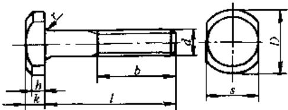

标记示例:

螺纹规格 $\pmb { d } = \pmb { \mathbb { M } } \pmb { \mathbb { 1 0 } }$ 、公称长度 $\pmb { i } = 1 0 0 \mathrm { m m }$ 、性能等级为8.8级、表面氧化的T形槽用螺栓:

表4-1-88

<table><tr><td></td><td>螺纹规格d</td><td>M5</td><td>M6</td><td>M8</td><td>M10</td><td>M12</td><td>M16</td><td>M20</td><td>M24</td><td>M30</td><td>M36</td><td>M42</td><td>M48</td></tr><tr><td rowspan="3">b</td><td>125</td><td>16</td><td>18</td><td>22</td><td>26</td><td>30</td><td>38</td><td>46</td><td>54</td><td>66</td><td>78</td><td>1</td><td>1</td></tr><tr><td>125<≤200</td><td>1</td><td>1</td><td>28</td><td>32</td><td>36</td><td>44</td><td>52</td><td>60</td><td>72</td><td>84</td><td>%</td><td>108</td></tr><tr><td>>200</td><td></td><td></td><td>1</td><td>1</td><td>1</td><td>57</td><td>65</td><td>73</td><td>85</td><td>97</td><td>109</td><td>121</td></tr><tr><td colspan="2">D</td><td>12</td><td>16</td><td>20</td><td>25</td><td>30</td><td>38</td><td>46</td><td>58</td><td>7</td><td>85</td><td>95</td><td>105</td></tr></table>

螺栓GB/T37 $\mathbf { M } 1 \pmb { 0 } \times \mathbf { \ell } \mathbf { M } \mathbf { 0 } \mathbf { 0 }$ 

/mm 

续表

<table><tr><td></td><td>螺纹规格d</td><td>M5</td><td>M6 M8</td><td></td><td>M10</td><td>M12</td><td>M16</td><td>M20</td><td>M24</td><td>M30</td><td>M36</td><td>M42</td><td>M48</td></tr><tr><td>A max</td><td></td><td>4.24</td><td>5.24</td><td>6.24</td><td>7.29</td><td>8.89</td><td>11 95</td><td>14.35</td><td>16.35</td><td>20.42</td><td>24 42</td><td>28.42</td><td>32.50</td></tr><tr><td>min ，</td><td></td><td>0.20</td><td>0.25</td><td>0.40</td><td></td><td>0.60</td><td></td><td>0.80</td><td></td><td>1.00</td><td></td><td>1.20</td><td>1.60</td></tr><tr><td>h</td><td></td><td>2.8</td><td>3.4</td><td>4.1</td><td>4.8</td><td>6.5</td><td>9</td><td>10.4</td><td>11.8</td><td>14.5</td><td>18.5</td><td>22.0</td><td>26.0</td></tr><tr><td>：公称</td><td></td><td>9</td><td>12</td><td>14</td><td>18</td><td>22</td><td>28</td><td>34</td><td>44</td><td>56</td><td>67</td><td>76</td><td>86</td></tr><tr><td>通用规格长度</td><td></td><td>25~50</td><td>30~6035~80</td><td></td><td>40~100</td><td>45~120</td><td>55~160</td><td>65-200</td><td>80~240</td><td>90~300</td><td>110~300</td><td>130~300</td><td>140~300</td></tr><tr><td colspan="2">100mm长重量=/kg</td><td>0.016 0.027</td><td>0.046</td><td>0.075</td><td>0.117</td><td>0.225</td><td></td><td>0.363</td><td>0.580</td><td>1.045</td><td>1.587</td><td>2.256</td><td>3.088</td></tr><tr><td colspan="2">系列</td><td>220,240，260,280，300</td><td></td><td></td><td>25,30,35,40.45,50、(55）.60，(65），70.80,90，100，110，120，130，</td><td></td><td></td><td></td><td></td><td></td><td></td><td>140，150，160，180，200，</td><td></td></tr><tr><td rowspan="2">技术条件</td><td></td><td>材料</td><td>螺纹公差</td><td></td><td></td><td>性能等级</td><td></td><td></td><td></td><td>产品等级</td><td></td><td>表面处理</td><td></td></tr><tr><td>钢</td><td></td><td>6g</td><td></td><td>d39:8.8级；d>39:按协议</td><td></td><td></td><td></td><td>B</td><td></td><td></td><td>①氧化；②镀锌饨化</td><td></td></tr></table>

注:末端按GB/T2的规定。

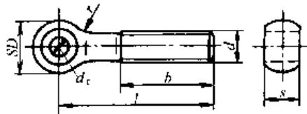

活节螺栓(GB/T798-1988)

标记示例:

螺纹规格 $d = \mathbb { M } \mathbb { 1 0 }$ 公称长度 $\dot { t } = 1 0 0 \mathrm { m m }$ 、性能等级为4.6级、不经表面处理的活节螺栓:

螺栓GB/T798 $\mathbb { M } \mathbb { \Lambda } \times \mathbb { \Lambda } \mathbb { \infty }$ 

/mm 

表4-1-89

<table><tr><td>螺纹规格d</td><td>M4</td><td>M5</td><td>M6</td><td>M8</td><td>M10</td><td>M12</td><td>M16</td><td>M20</td><td>M24</td><td>M30</td><td>M36</td></tr><tr><td>d</td><td>3</td><td>4</td><td>501</td><td>6:0</td><td>8</td><td>108</td><td>128</td><td>160</td><td>208</td><td>25:8</td><td>30:</td></tr><tr><td></td><td>58</td><td>6-0</td><td>808</td><td>100</td><td>12-0.0</td><td>14-0</td><td>180</td><td>22:8</td><td>268</td><td>34-0 05</td><td>40-52 1</td></tr><tr><td>b</td><td>14</td><td>16</td><td>18</td><td>22</td><td>26</td><td>30</td><td>38</td><td>52</td><td>60</td><td>72</td><td>84</td></tr><tr><td>SD</td><td>8</td><td>10</td><td>12</td><td>14</td><td>18</td><td>20</td><td>28</td><td>34</td><td>42</td><td>52</td><td>64</td></tr><tr><td>，min</td><td>3</td><td>4</td><td>5</td><td></td><td>6</td><td>8</td><td>10</td><td>12</td><td>16</td><td>20</td><td>22</td></tr><tr><td>商品规格长度1</td><td>20~35</td><td>25~ 45</td><td>30~55</td><td>35-70</td><td>40~110</td><td>50~ 130</td><td>60~ 160</td><td>70~ 180</td><td>90~260</td><td>110~300</td><td>130~300</td></tr><tr><td>100mm长重量/kg</td><td>0.009</td><td>0.014</td><td>0.021</td><td>0.037 （55），60,</td><td>0.060 （65），</td><td>0.084 70,80,</td><td>0.171 90，100，</td><td>0.270 110，120,</td><td>0.414 130，140，150,160，180，</td><td>0.698</td><td>1.114</td></tr><tr><td>！系列</td><td colspan="14">20,25,30、35,40,45、50， 200,220，240,260，280,300</td></tr><tr><td>技术条件</td><td>材料：钢</td><td colspan="2">螺纹公差：8g</td><td colspan="2">性能等级：4.6.5.6</td><td></td><td colspan="6">产品等级：C 表面处理：0不经处理：②镀锌钝化</td></tr></table>

注:山于结构原因,不进行楔负载及头杆结合强度试验。

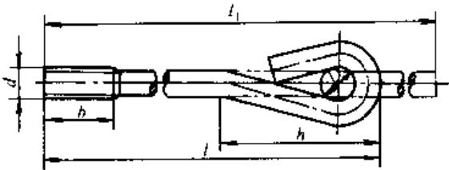

地脚螺栓(GB/T799-1988)

标记示例:

螺纹规格 $d = M 2 0$ 公称长度 $l = 4 0 0 \mathrm { m m }$ 、性能等级为3.6级、不经表

面处理

的地脚螺栓:

螺栓GB/T799 $\mathbb { M } 2 0 \times 4 0 0$ 

/mm 

表 4-1-90

<table><tr><td rowspan=2 colspan=1>技术条件</td><td rowspan=1 colspan=1>材料</td><td rowspan=1 colspan=1>螺纹公差</td><td rowspan=1 colspan=1>性能等级</td><td rowspan=1 colspan=1>产品等级</td><td rowspan=1 colspan=1>衣面处理</td></tr><tr><td rowspan=1 colspan=1>钢</td><td rowspan=1 colspan=1>8g</td><td rowspan=1 colspan=1>d≤39:3.6级；d>39:按协议</td><td rowspan=1 colspan=1>C</td><td rowspan=1 colspan=1>①不经处理；②氧化；③镀锌钝化</td></tr></table>

80,120,160,220,300,400,500,630,800,1000,1250,1500 

注:由于结构的原因,地脚螺栓不进行楔承载及头杆结合强度试验。

<table><tr><td rowspan="16">缺口用于标记螺栓 头部的方向</td><td rowspan="4">8×45</td><td></td><td colspan="2"></td><td colspan="2"></td><td></td><td></td><td>日</td><td>1放大</td><td></td><td>其余</td><td>标记示例：</td><td></td><td></td><td></td><td>螺纹直径d=M48、长度i=2000mm、产品等级C级的</td></tr><tr><td></td><td></td><td></td><td></td><td>4</td><td>山</td><td></td><td></td><td>15</td><td></td><td>T形头地脚螺栓；</td><td></td><td>螺栓M48×2000JB/ZQ4362</td><td></td><td></td></tr><tr><td>45 K</td><td>A</td><td colspan="2"></td><td colspan="2"></td><td>的 2×45°</td><td></td><td>产</td><td></td><td></td><td></td><td></td><td></td><td></td><td></td></tr><tr><td>斜度1：20</td><td>2</td><td></td><td></td><td>h</td><td></td><td></td><td></td><td></td><td></td><td></td><td></td><td></td><td></td><td></td><td></td></tr><tr><td></td><td>K</td><td></td><td></td><td>！</td><td></td><td></td><td></td><td></td><td></td><td></td><td></td><td></td><td></td><td></td><td>/mm</td></tr><tr><td>表4-1-91 d</td><td></td><td>M24 M30</td><td>M36</td><td>M42</td><td></td><td>M48</td><td>M56 M64</td><td>M72 × 6</td><td>M80×6</td><td>M90 × 6</td><td>M100×6</td><td>M110×6</td><td>M125x 6</td><td>M140×6</td><td>M160× 6</td></tr><tr><td>b</td><td>100</td><td>120</td><td>160</td><td>180</td><td>210</td><td></td><td>250 280</td><td>300</td><td>326</td><td>360</td><td>400</td><td>440</td><td>500</td><td>560</td><td>620</td></tr><tr><td>d</td><td></td><td></td><td></td><td>M12</td><td></td><td></td><td>M16</td><td></td><td></td><td></td><td></td><td>M20</td><td></td><td></td><td></td></tr><tr><td>k</td><td>15</td><td>19</td><td>23</td><td>26</td><td>30</td><td>35</td><td>40</td><td>45</td><td>50</td><td>55</td><td>62</td><td>67</td><td>75</td><td>85</td><td>90</td></tr><tr><td>s</td><td>24</td><td>30</td><td>36</td><td>42</td><td>48</td><td>56</td><td>64</td><td>72</td><td>80</td><td>90</td><td>100</td><td>110</td><td>125</td><td>140</td><td>160</td></tr><tr><td>B</td><td>48</td><td>56</td><td>66 ，</td><td>80 18</td><td>88</td><td></td><td>102 112 24</td><td>122</td><td>140</td><td>155</td><td>170</td><td>190 29</td><td>215</td><td>240</td><td>270</td></tr><tr><td>一</td><td colspan="2"></td><td colspan="2"></td><td colspan="2"></td><td colspan="2"></td><td></td><td></td><td></td><td>8</td><td></td><td></td><td></td></tr><tr><td>8 f</td><td colspan="2"></td><td colspan="2">2.5</td><td colspan="2"></td><td colspan="2">4</td><td></td><td></td><td></td><td>5</td><td></td><td>7</td><td></td></tr><tr><td>h</td><td colspan="2"></td><td colspan="2">0.2</td><td colspan="2"></td><td colspan="2">0.3</td><td colspan="2"></td><td colspan="2">0.4</td><td colspan="2"></td><td colspan="2">0.5</td></tr><tr><td>1</td><td colspan="2"></td><td colspan="2">一</td><td colspan="2"></td><td colspan="2">1.6</td><td colspan="2"></td><td colspan="2">2.5</td><td colspan="2"></td><td colspan="2">4</td></tr><tr><td>Z</td><td colspan="2">3</td><td colspan="2">5</td><td colspan="2">6</td><td colspan="2">27.4 34.9</td><td colspan="2">43.5 55.4</td><td colspan="2">8 69.2 84.6</td><td colspan="2">110.7</td><td colspan="2"></td></tr><tr><td>1000mm长重量/kg</td><td colspan="2">3.66</td><td colspan="2">8.38</td><td colspan="2">11.5 15.1 20.7</td><td colspan="2"></td><td colspan="2">3.9</td><td colspan="2"></td><td colspan="2"></td><td>141</td><td>185.7 15.8</td></tr><tr><td>每增加100mm长的重量/kg</td><td>0.35</td><td>0.56</td><td>0.8</td><td>1.08</td><td>1.42</td><td>1.9</td><td>2.5</td><td>3.2</td><td></td><td>5.0</td><td>6.2</td><td>7.5</td><td>9.6</td><td>12.1</td><td></td></tr><tr><td>技术条件</td><td>材料：钢</td><td>螺纹公差：8g</td><td></td><td></td><td></td><td>性能等级：5.6级</td><td></td><td></td><td>产品等级：C</td><td></td><td></td><td></td><td></td><td></td><td></td></tr></table>

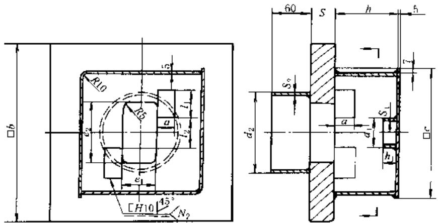

T形头地脚螺栓用锚板(JB/ZQ4172-1997)

表4-1-92

/mm 

<table><tr><td rowspan=1 colspan=1>T形头地脚螺栓</td><td rowspan=1 colspan=1>s</td><td rowspan=1 colspan=1>b</td><td rowspan=1 colspan=1>e1+20</td><td rowspan=1 colspan=1>8+20</td><td rowspan=1 colspan=1>a</td><td rowspan=1 colspan=1>1</td><td rowspan=1 colspan=1>i</td><td rowspan=1 colspan=1></td><td rowspan=1 colspan=1>h</td><td rowspan=1 colspan=1>h</td><td rowspan=1 colspan=1>支承管d×s</td><td rowspan=1 colspan=1>锚板园管d×S2</td><td rowspan=1 colspan=1>每件重量/kg</td><td rowspan=1 colspan=1>基础孔护管外径×管厚</td></tr><tr><td rowspan=1 colspan=1>M24</td><td rowspan=1 colspan=1>20</td><td rowspan=1 colspan=1>180</td><td rowspan=1 colspan=1>28</td><td rowspan=1 colspan=1>58</td><td rowspan=3 colspan=1>20</td><td rowspan=3 colspan=1>40</td><td rowspan=1 colspan=1>28</td><td rowspan=1 colspan=1>130</td><td rowspan=1 colspan=1>45</td><td rowspan=1 colspan=1>15</td><td rowspan=5 colspan=1>$42×5</td><td rowspan=1 colspan=1>89×4</td><td rowspan=1 colspan=1>7.2</td><td rowspan=1 colspan=1>$102×4</td></tr><tr><td rowspan=1 colspan=1>M30</td><td rowspan=1 colspan=1>25</td><td rowspan=1 colspan=1>210</td><td rowspan=1 colspan=1>35</td><td rowspan=1 colspan=1>68</td><td rowspan=1 colspan=1>34</td><td rowspan=1 colspan=1>140</td><td rowspan=1 colspan=1>55</td><td rowspan=1 colspan=1>22</td><td rowspan=1 colspan=1>$102×4</td><td rowspan=1 colspan=1>11.0</td><td rowspan=1 colspan=1>$114×4</td></tr><tr><td rowspan=1 colspan=1>M38</td><td rowspan=1 colspan=1>30</td><td rowspan=1 colspan=1>240</td><td rowspan=1 colspan=1>42</td><td rowspan=1 colspan=1>80</td><td rowspan=1 colspan=1>40</td><td rowspan=1 colspan=1>160</td><td rowspan=1 colspan=1>70</td><td rowspan=1 colspan=1>32</td><td rowspan=1 colspan=1>$114×4</td><td rowspan=1 colspan=1>17.0</td><td rowspan=1 colspan=1>127×4</td></tr><tr><td rowspan=1 colspan=1>M42</td><td rowspan=1 colspan=1></td><td rowspan=1 colspan=1>270</td><td rowspan=1 colspan=1>48i</td><td rowspan=1 colspan=1>94</td><td rowspan=4 colspan=1>30</td><td rowspan=4 colspan=1>60</td><td rowspan=1 colspan=1>46</td><td rowspan=1 colspan=1>180</td><td rowspan=1 colspan=1>85</td><td rowspan=1 colspan=1>35</td><td rowspan=1 colspan=1>$127×4</td><td rowspan=1 colspan=1>21.4</td><td rowspan=1 colspan=1>$140×4.5</td></tr><tr><td rowspan=1 colspan=1>M48</td><td rowspan=1 colspan=1>35</td><td rowspan=1 colspan=1>300</td><td rowspan=1 colspan=1>54</td><td rowspan=1 colspan=1>102</td><td rowspan=1 colspan=1>52</td><td rowspan=1 colspan=1>200</td><td rowspan=1 colspan=1>95</td><td rowspan=1 colspan=1>40</td><td rowspan=1 colspan=1>$140× 4.5</td><td rowspan=1 colspan=1>29.5</td><td rowspan=1 colspan=1>152×4.5</td></tr><tr><td rowspan=1 colspan=1>M56</td><td rowspan=1 colspan=1></td><td rowspan=1 colspan=1>330</td><td rowspan=1 colspan=1>65</td><td rowspan=1 colspan=1>116</td><td rowspan=1 colspan=1>60</td><td rowspan=1 colspan=1>220</td><td rowspan=1 colspan=1>105</td><td rowspan=1 colspan=1>45</td><td rowspan=5 colspan=1>$83×5</td><td rowspan=1 colspan=1>$159× 4.5</td><td rowspan=1 colspan=1>35.5</td><td rowspan=1 colspan=1>$180×5</td></tr><tr><td rowspan=1 colspan=1>M64</td><td rowspan=1 colspan=1></td><td rowspan=1 colspan=1>370</td><td rowspan=1 colspan=1>74</td><td rowspan=1 colspan=1>126</td><td rowspan=1 colspan=1>68</td><td rowspan=1 colspan=1>240</td><td rowspan=1 colspan=1>125</td><td rowspan=1 colspan=1>：60</td><td rowspan=1 colspan=1>168×5</td><td rowspan=1 colspan=1>49.5</td><td rowspan=1 colspan=1>$180×5</td></tr><tr><td rowspan=1 colspan=1>M72×6</td><td rowspan=1 colspan=1>40</td><td rowspan=1 colspan=1>410</td><td rowspan=1 colspan=1>82</td><td rowspan=1 colspan=1>136</td><td rowspan=4 colspan=1>40</td><td rowspan=4 colspan=1>80</td><td rowspan=1 colspan=1>76</td><td rowspan=1 colspan=1>280</td><td rowspan=1 colspan=1>140</td><td rowspan=1 colspan=1>60</td><td rowspan=1 colspan=1>$180×5</td><td rowspan=1 colspan=1>62.2</td><td rowspan=1 colspan=1>$194×5</td></tr><tr><td rowspan=1 colspan=1>M80x6</td><td rowspan=1 colspan=1></td><td rowspan=1 colspan=1>450</td><td rowspan=1 colspan=1>90</td><td rowspan=1 colspan=1>154</td><td rowspan=1 colspan=1>84</td><td rowspan=1 colspan=1>300</td><td rowspan=1 colspan=1>155</td><td rowspan=1 colspan=1>70</td><td rowspan=1 colspan=1>$203×6</td><td rowspan=1 colspan=1>74.2</td><td rowspan=1 colspan=1>$219x6</td></tr><tr><td rowspan=1 colspan=1>M90 × 6</td><td rowspan=1 colspan=1>50</td><td rowspan=1 colspan=1>500</td><td rowspan=1 colspan=1>100</td><td rowspan=1 colspan=1>170</td><td rowspan=1 colspan=1>94</td><td rowspan=1 colspan=1>320</td><td rowspan=1 colspan=1>175</td><td rowspan=1 colspan=1>85</td><td rowspan=1 colspan=1>$219×6</td><td rowspan=1 colspan=1>108.7</td><td rowspan=1 colspan=1>$245×6.5</td></tr><tr><td rowspan=1 colspan=1>M100 × 6</td><td rowspan=1 colspan=1></td><td rowspan=1 colspan=1>550</td><td rowspan=1 colspan=1>110</td><td rowspan=1 colspan=1>185</td><td rowspan=1 colspan=1>104</td><td rowspan=1 colspan=1>350</td><td rowspan=1 colspan=1>195</td><td rowspan=1 colspan=1>100</td><td rowspan=1 colspan=1>108×5</td><td rowspan=1 colspan=1>$245×6.5</td><td rowspan=1 colspan=1>131.5</td><td rowspan=1 colspan=1>$273×6.5</td></tr><tr><td rowspan=1 colspan=1>M110× 6</td><td rowspan=1 colspan=1>60</td><td rowspan=1 colspan=1>600</td><td rowspan=1 colspan=1>120</td><td rowspan=1 colspan=1>205</td><td rowspan=2 colspan=1>50</td><td rowspan=2 colspan=1>100</td><td rowspan=1 colspan=1>14</td><td rowspan=1 colspan=1>380</td><td rowspan=1 colspan=1>215</td><td rowspan=1 colspan=1>105</td><td rowspan=1 colspan=1></td><td rowspan=1 colspan=1>$273×6.5</td><td rowspan=1 colspan=1>183.9</td><td rowspan=1 colspan=1>$299 ×7.5</td></tr><tr><td rowspan=1 colspan=1>M125 × 6</td><td rowspan=1 colspan=1></td><td rowspan=1 colspan=1>660</td><td rowspan=1 colspan=1>135</td><td rowspan=1 colspan=1>230</td><td rowspan=1 colspan=1>129</td><td rowspan=1 colspan=1>400</td><td rowspan=1 colspan=1>235</td><td rowspan=1 colspan=1>120</td><td rowspan=3 colspan=1>d146×5</td><td rowspan=1 colspan=1>$299×7.5</td><td rowspan=1 colspan=1>220.4</td><td rowspan=1 colspan=1>$325× 7.5</td></tr><tr><td rowspan=1 colspan=1>M140 x 6</td><td rowspan=1 colspan=1>80</td><td rowspan=1 colspan=1>750</td><td rowspan=1 colspan=1>155</td><td rowspan=1 colspan=1>255</td><td rowspan=2 colspan=1>60</td><td rowspan=2 colspan=1>120</td><td rowspan=1 colspan=1>144</td><td rowspan=1 colspan=1>460</td><td rowspan=1 colspan=1>265</td><td rowspan=1 colspan=1>130</td><td rowspan=1 colspan=1>325 × 7.5</td><td rowspan=1 colspan=1>369.6</td><td rowspan=1 colspan=1>$351×8</td></tr><tr><td rowspan=1 colspan=1>M160 × 6</td><td rowspan=1 colspan=1>80</td><td rowspan=1 colspan=1>850</td><td rowspan=1 colspan=1>175</td><td rowspan=1 colspan=1>285</td><td rowspan=1 colspan=1>164</td><td rowspan=1 colspan=1>500</td><td rowspan=1 colspan=1>285</td><td rowspan=1 colspan=1>145</td><td rowspan=1 colspan=1>$377 ×9</td><td rowspan=1 colspan=1>468.3</td><td rowspan=1 colspan=1>$402×9</td></tr></table>

注:1.本标准代替JB/ZQ4368及JB/ZQ4369。2.锚板材质一般用 $0 2 3 5 { \cdot }$ 3.T形头地脚螺栓按IB/ZQ4362选用。4.锚板围管及基础孔护管按GB/T8162《结构用无缝钢管》选用。材质·-般采用10或20号钢,也可用钢板弯制。

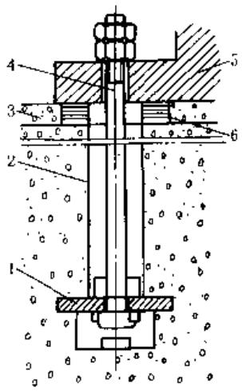

图4-1-4T形头地脚螺栓用锚板在基础内的预埋形式

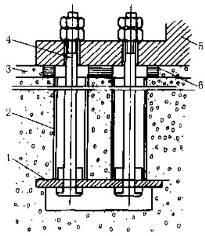

图4-1-5T形头地脚螺栓用双联锚板在基础内的预埋形式1—双联锚板;2、3、4、5、6同图4-1-4

1—锚板;2—护管:3—二次灌浆层;4—T形头地脚螺栓;5—底座;6-调整垫板

通常在设备底座的四周备有一圈地脚螺栓孔,当设计采用内、外双圈地脚螺栓孔时,在基础孔中的T形头地脚螺栓可利用双联锚板进行固定,其锚板形式如下图,尺寸见表4-1-92和表41-93。预埋形式见T形头地脚螺栓用双联锚板在基础内预埋形式(图4-1-4和图4-1-5)。

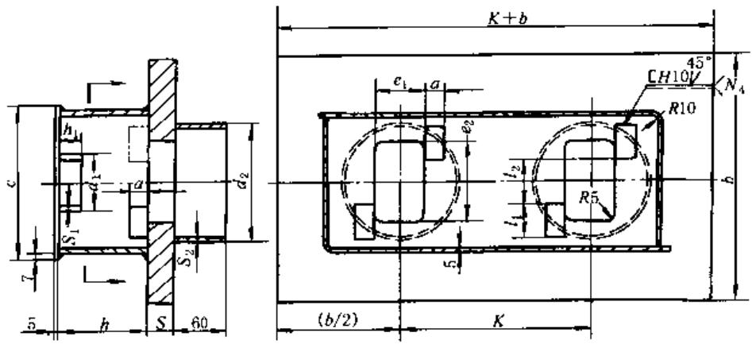

表4-1-93

/mm 

<table><tr><td rowspan=1 colspan=1>T形头地脚螺栓</td><td rowspan=1 colspan=1>K</td><td rowspan=1 colspan=1>每件重量/kg</td><td rowspan=1 colspan=1>T形头地脚螺栓</td><td rowspan=1 colspan=1>K</td><td rowspan=1 colspan=1>每件重量/kg</td><td rowspan=1 colspan=1>T形头地脚螺栓</td><td rowspan=1 colspan=1>K</td><td rowspan=1 colspan=1>每件重量/kg</td><td rowspan=1 colspan=1>T形头地脚螺栓</td><td rowspan=1 colspan=1>K</td><td rowspan=1 colspan=1>每件重量/kg</td></tr><tr><td rowspan=3 colspan=1>M24</td><td rowspan=1 colspan=1>100</td><td rowspan=1 colspan=1>11.7</td><td rowspan=3 colspan=1>M30</td><td rowspan=1 colspan=1>130</td><td rowspan=1 colspan=1>18.3</td><td rowspan=3 colspan=1>M36</td><td rowspan=1 colspan=1>150</td><td rowspan=1 colspan=1>27.9</td><td rowspan=3 colspan=1>M42</td><td rowspan=1 colspan=1>160</td><td rowspan=1 colspan=1>34.7</td></tr><tr><td rowspan=1 colspan=1>125</td><td rowspan=1 colspan=1>12.5</td><td rowspan=1 colspan=1>160</td><td rowspan=1 colspan=1>19.6</td><td rowspan=1 colspan=1>170</td><td rowspan=1 colspan=1>29.4</td><td rowspan=1 colspan=1>210</td><td rowspan=1 colspan=1>38.2</td></tr><tr><td rowspan=1 colspan=1>160</td><td rowspan=1 colspan=1>13.6</td><td rowspan=1 colspan=1></td><td rowspan=1 colspan=1>200</td><td rowspan=1 colspan=1>21.5</td><td rowspan=1 colspan=1>220</td><td rowspan=1 colspan=1>32.5</td><td rowspan=1 colspan=1>240</td><td rowspan=1 colspan=1>40.3</td></tr></table>

<table><tr><td rowspan=1 colspan=1>T形头地脚螺栓</td><td rowspan=1 colspan=1>K</td><td rowspan=1 colspan=2>每件重量~/kg</td><td rowspan=1 colspan=2>T形头地脚螺栓</td><td rowspan=1 colspan=1>K</td><td rowspan=1 colspan=1>每件重量/kg</td><td rowspan=1 colspan=1>T形头地脚螺栓</td><td rowspan=1 colspan=1>K</td><td rowspan=1 colspan=1>每件重量/kg</td><td rowspan=1 colspan=1>T形头地脚螺栓</td><td rowspan=1 colspan=1>K</td><td rowspan=1 colspan=1>每件重康/kg</td></tr><tr><td rowspan=4 colspan=1>M48</td><td rowspan=1 colspan=1>170</td><td rowspan=1 colspan=2>47.0</td><td rowspan=4 colspan=2>M72×6</td><td rowspan=1 colspan=1>220</td><td rowspan=1 colspan=1>96.9</td><td rowspan=4 colspan=1>M100×6</td><td rowspan=1 colspan=1>320</td><td rowspan=1 colspan=1>209.1</td><td rowspan=4 colspan=1>M140×6</td><td rowspan=1 colspan=1>460</td><td rowspan=1 colspan=1>595.7</td></tr><tr><td rowspan=1 colspan=1>210</td><td rowspan=1 colspan=2>50.6</td><td rowspan=1 colspan=1>270</td><td rowspan=1 colspan=1>103.9</td><td rowspan=1 colspan=1>390</td><td rowspan=1 colspan=1>225.2</td><td rowspan=1 colspan=1>560</td><td rowspan=1 colspan=1>644.8</td></tr><tr><td rowspan=1 colspan=1>250</td><td rowspan=1 colspan=2>54.2</td><td rowspan=1 colspan=1>320</td><td rowspan=1 colspan=1>110.9</td><td rowspan=1 colspan=1>460</td><td rowspan=1 colspan=1>241.4</td><td rowspan=1 colspan=1>670</td><td rowspan=1 colspan=1>698.9</td></tr><tr><td rowspan=1 colspan=1>290</td><td rowspan=1 colspan=2>57.8</td><td rowspan=1 colspan=1>400</td><td rowspan=1 colspan=1>122.1</td><td rowspan=1 colspan=1>540</td><td rowspan=1 colspan=1>259.9</td><td rowspan=1 colspan=1>780</td><td rowspan=1 colspan=1>753.0</td></tr><tr><td rowspan=4 colspan=2>180220M56260300</td><td rowspan=1 colspan=1>180</td><td rowspan=1 colspan=3>55.8</td><td rowspan=4 colspan=1>M80× 6</td><td rowspan=1 colspan=1>250</td><td rowspan=1 colspan=1>116.9</td><td rowspan=4 colspan=1>M110 × 6</td><td rowspan=1 colspan=1>360</td><td rowspan=1 colspan=1>295.0</td><td rowspan=4 colspan=1>M160× 6</td><td rowspan=1 colspan=1>500</td></tr><tr><td rowspan=1 colspan=1>220</td><td rowspan=1 colspan=2>59.8</td><td></td><td></td><td rowspan=1 colspan=1>300</td><td rowspan=1 colspan=1>124.6</td><td></td><td rowspan=1 colspan=1>430</td><td rowspan=1 colspan=1>315.9</td><td></td><td rowspan=1 colspan=1>600</td><td rowspan=1 colspan=1>797.3</td></tr><tr><td rowspan=1 colspan=1>260</td><td rowspan=1 colspan=2>63.7</td><td></td><td></td><td rowspan=1 colspan=1>360</td><td rowspan=1 colspan=1>133.8</td><td></td><td rowspan=1 colspan=1>520</td><td rowspan=1 colspan=1>342.9</td><td></td><td rowspan=1 colspan=1>720</td><td rowspan=1 colspan=1>864.0</td></tr><tr><td rowspan=1 colspan=2>67.7</td><td></td><td></td><td rowspan=1 colspan=1>450</td><td rowspan=1 colspan=1>147.6</td><td></td><td rowspan=1 colspan=1>600</td><td rowspan=1 colspan=1>366.8</td><td></td><td rowspan=1 colspan=1>840</td><td rowspan=1 colspan=1>930.7</td></tr><tr><td rowspan=6 colspan=1>M64</td><td rowspan=1 colspan=1>200</td><td rowspan=1 colspan=2>77.2</td><td rowspan=1 colspan=2></td><td rowspan=1 colspan=1>290</td><td rowspan=1 colspan=1>172.5</td><td rowspan=6 colspan=1>M125×6</td><td rowspan=1 colspan=1>400</td><td rowspan=1 colspan=1>355.2</td><td rowspan=6 colspan=1></td><td rowspan=6 colspan=1></td><td rowspan=6 colspan=1></td></tr><tr><td rowspan=3 colspan=1>250</td><td rowspan=3 colspan=2>83.5</td><td></td><td></td><td></td><td></td><td></td><td></td></tr><tr><td></td><td></td><td></td><td></td><td></td><td></td></tr><tr><td rowspan=3 colspan=2>M90×6</td><td rowspan=1 colspan=1>340</td><td rowspan=1 colspan=1>183.0</td><td rowspan=1 colspan=1>470</td><td rowspan=1 colspan=1>378.2</td></tr><tr><td rowspan=1 colspan=1>300</td><td rowspan=1 colspan=2>89.8</td><td rowspan=1 colspan=1>410</td><td rowspan=1 colspan=1>197.7</td><td rowspan=1 colspan=1>570</td><td rowspan=1 colspan=1>411.1</td></tr><tr><td rowspan=1 colspan=1>350</td><td rowspan=1 colspan=2>96.1</td><td rowspan=1 colspan=1>480</td><td rowspan=1 colspan=1>212.4</td><td rowspan=1 colspan=1>660</td><td rowspan=1 colspan=1>440.8</td></tr></table>

# 直角地脚螺栓(JB/7Q4364—1997)

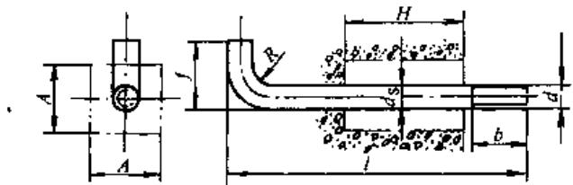

标记示例:

螺纹直径 $d = 4 2 \mathrm { m m }$ 、长 $\mathit { l } = 1 4 0 0 \mathrm { m m }$ 的直角地脚螺栓:螺栓 $\mathbf { M } 4 2 \times \mathbf { l 4 0 0 }$ JB/ZQ 4364

/mm 

表 4-1-94

<table><tr><td>d</td><td>M16</td><td>M20</td><td>M24</td><td>M30</td><td>M36</td><td>M42</td><td>M48</td><td>M56</td></tr><tr><td>d</td><td>16</td><td>20</td><td>24</td><td>30</td><td>36</td><td>42</td><td>48</td><td>56</td></tr><tr><td>bmin</td><td>45</td><td>60</td><td>75</td><td>90</td><td>110</td><td>120</td><td>140</td><td>160</td></tr><tr><td>f</td><td>65</td><td>80</td><td>100</td><td>120</td><td>150</td><td>170</td><td>190</td><td>220</td></tr><tr><td>R=</td><td>12</td><td>15</td><td>20</td><td>25</td><td>30</td><td>35</td><td>40</td><td>45</td></tr><tr><td>A</td><td>1</td><td>100</td><td></td><td></td><td>130</td><td>160</td><td></td><td>180</td></tr><tr><td>H</td><td colspan="6">二 200 300</td><td></td><td>500</td></tr><tr><td>！</td><td colspan="6">每个重量=/kg</td><td>400</td><td></td></tr><tr><td>300</td><td>0.54 0.70</td><td></td><td></td><td></td><td></td><td></td><td></td><td></td></tr><tr><td>400 600</td><td></td><td>1.1 1.6</td><td>2.3</td><td></td><td></td><td></td><td></td><td></td></tr><tr><td>800</td><td></td><td>2.1</td><td>3.0</td><td></td><td></td><td></td><td></td><td></td></tr><tr><td>1000</td><td></td><td>2.6</td><td>3.7</td><td>5.9</td><td>8.6</td><td></td><td></td><td></td></tr><tr><td>1200</td><td></td><td></td><td>4.4</td><td>7.0</td><td>10.3</td><td></td><td></td><td></td></tr><tr><td>1400</td><td></td><td></td><td>5.2</td><td>8.1</td><td>11.8</td><td>16.1</td><td>21.2</td><td></td></tr><tr><td>1600</td><td></td><td></td><td></td><td>9.2</td><td>13.4</td><td>18.3</td><td>24.0</td><td></td></tr><tr><td>1800</td><td></td><td></td><td></td><td></td><td>15.0</td><td>20.5</td><td>27.0</td><td></td></tr><tr><td>2000</td><td></td><td></td><td></td><td></td><td>16.7</td><td>22.7</td><td>29.6</td><td>41.3</td></tr><tr><td>2300</td><td></td><td></td><td></td><td></td><td></td><td>26.0</td><td>34.0</td><td>47.2</td></tr><tr><td>2600</td><td></td><td></td><td></td><td></td><td></td><td></td><td>38.0</td><td>53.0</td></tr><tr><td>技术条件</td><td>材料：Q235</td><td colspan="2">螺纹公差：8g</td><td colspan="2">机械性能等级：36</td><td colspan="4">产品等级：C级</td></tr></table>

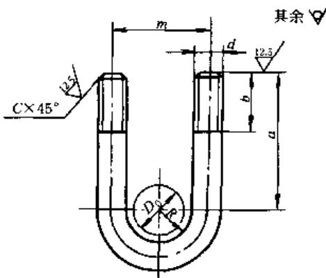

# U形螺栓(JB/ZQ 4321--1997)

标记示例:

螺栓:

/mm 

表4-1-95

<table><tr><td rowspan=1 colspan=1>管子外径D</td><td rowspan=1 colspan=1>R</td><td rowspan=1 colspan=1>d</td><td rowspan=1 colspan=1>毛坯长1</td><td rowspan=1 colspan=1>a</td><td rowspan=1 colspan=1>b</td><td rowspan=1 colspan=1>m</td><td rowspan=1 colspan=1>C</td><td rowspan=1 colspan=1>1000件重量/kg</td></tr><tr><td rowspan=1 colspan=1>1418</td><td rowspan=1 colspan=1>810</td><td rowspan=1 colspan=1>M6</td><td rowspan=1 colspan=1>98108</td><td rowspan=1 colspan=1>3335</td><td rowspan=1 colspan=1>22</td><td rowspan=1 colspan=1>2226</td><td rowspan=1 colspan=1>i</td><td rowspan=1 colspan=1>2224</td></tr><tr><td rowspan=1 colspan=1>222533</td><td rowspan=1 colspan=1>121418</td><td rowspan=1 colspan=1>M10</td><td rowspan=1 colspan=1>135143160</td><td rowspan=1 colspan=1>424448</td><td rowspan=1 colspan=1>28</td><td rowspan=1 colspan=1>343846</td><td rowspan=1 colspan=1>1.5</td><td rowspan=1 colspan=1>838899</td></tr><tr><td rowspan=1 colspan=1>38424548515760768389</td><td rowspan=1 colspan=1>20222425273132404346</td><td rowspan=1 colspan=1>M12</td><td rowspan=1 colspan=1>192202210220225240250289310325</td><td rowspan=1 colspan=1>55575960626667757881</td><td rowspan=1 colspan=1>32</td><td rowspan=1 colspan=1>525660626674769298104</td><td rowspan=1 colspan=1>2</td><td rowspan=1 colspan=1>171180188L96200214223256276290</td></tr><tr><td rowspan=1 colspan=1>102108114133140159165219</td><td rowspan=1 colspan=1>5356596728285112</td><td rowspan=1 colspan=1>M16</td><td rowspan=1 colspan=1>365390405450470520538680</td><td rowspan=1 colspan=1>93999109112122125152</td><td rowspan=1 colspan=1>38</td><td rowspan=1 colspan=1>122128134[54160180186240</td><td rowspan=1 colspan=1></td><td rowspan=1 colspan=1>5756166407127528228501075</td></tr></table>

注:1.螺栓的螺纹长度允差为: $\star z P$ (螺距)。2.螺纹基本尺寸按GB/T196—1981规定的粗牙普通螺纹;其公差按GB/T197—1981的 ${ \mathfrak { f } } _ { \mathtt { B } }$ 级制造。3.材料:Q235-A·F。4.产品等级按GB/T3103.1—1982规定的B级。

外径 $D _ { 0 } = 2 5 \mathrm { m m }$ 管子用的U形螺栓:${ \mathfrak { U } }$ 形螺栓JB/ZQ4321外径 $D _ { 0 } = 2 5 \mathrm { m m }$ 管子用的表面镀锌U形

$\mathfrak { v }$ 形螺栓25-ZnJD/ZQ4321

# 3.5.3螺 柱

# 双头螺柱

GB/T897-1988( $\pmb { b _ { \infty } = 1 d }$ ) 

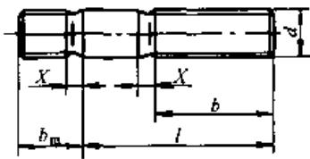

A型

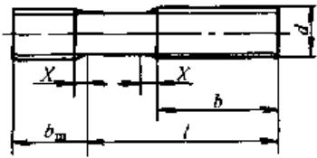

B型

$\pmb { \chi } _ { \mathrm { e } } = 1 , 5 \pmb { P }$ (粗牙螺距)

GB/T 898-1988( $b _ { \infty } = 1 . 2 5 d$ GB/T899-1988( $\pmb { b _ { \perp } } = \pmb { 1 } . \pmb { \mathcal { S } } d$ GB/T900-1988(b=2d) 

标记示例:

<table><tr><td rowspan=1 colspan=1>两端型式</td><td rowspan=1 colspan=1>d/mm</td><td rowspan=1 colspan=1>i/mm</td><td rowspan=1 colspan=1>性能等级</td><td rowspan=1 colspan=1>表面处理型号</td><td rowspan=1 colspan=1>型号</td><td rowspan=1 colspan=1>b/mm</td><td rowspan=1 colspan=1>标记</td></tr><tr><td rowspan=1 colspan=1>两端均为粗牙普通螺纹</td><td rowspan=1 colspan=1>10</td><td rowspan=1 colspan=1>50</td><td rowspan=1 colspan=1>4.8</td><td rowspan=1 colspan=1>不处理</td><td rowspan=1 colspan=1>B</td><td rowspan=1 colspan=1>1d</td><td rowspan=1 colspan=1>螺柱GB/T897M10×50</td></tr><tr><td rowspan=1 colspan=1>旋人机体一端为粗牙普通螺纹，旋螺母一端为螺距P=1mm的细牙普通螺纹</td><td rowspan=1 colspan=1>10</td><td rowspan=1 colspan=1>50</td><td rowspan=1 colspan=1></td><td rowspan=1 colspan=1>4.8不处理</td><td rowspan=1 colspan=1>A</td><td rowspan=1 colspan=1>1d</td><td rowspan=1 colspan=1>螺柱GB/T897AM10-M10×1x 50</td></tr><tr><td rowspan=1 colspan=1>旋人机体一端为过渡配合螺纹的第一种配合，旋螺母一端为粗牙普通螺纹</td><td rowspan=1 colspan=1>10</td><td rowspan=1 colspan=1>50</td><td rowspan=1 colspan=1></td><td rowspan=1 colspan=1>8.8镀锌钝化</td><td rowspan=1 colspan=1>B</td><td rowspan=1 colspan=1>1d</td><td rowspan=1 colspan=1>螺柱GB/T897GM10-M10× 50-8.8-Zn·D</td></tr><tr><td rowspan=1 colspan=1>旋入机体一端为过盈配合螺纹，旋螺母一端为粗牙普通螺纹</td><td rowspan=1 colspan=1>10</td><td rowspan=1 colspan=1>50</td><td rowspan=1 colspan=1>8.8</td><td rowspan=1 colspan=1>8.8镀锌钝化</td><td rowspan=1 colspan=1>A</td><td rowspan=1 colspan=1>2d</td><td rowspan=1 colspan=1>螺柱GB/T900AYM10-M10   50-8.8-Zn·D</td></tr></table>

<table><tr><td rowspan=3 colspan=1>螺纹规格d</td><td rowspan=3 colspan=3>M2</td><td rowspan=3 colspan=3>M2.5</td><td rowspan=3 colspan=2>M3</td><td rowspan=3 colspan=1>M4</td><td rowspan=3 colspan=1>M5</td><td rowspan=3 colspan=1>M6</td><td rowspan=3 colspan=1>M8</td><td rowspan=3 colspan=1>M10</td><td rowspan=3 colspan=1>M12</td><td rowspan=3 colspan=1>（M14)</td><td rowspan=3 colspan=1>M16</td><td rowspan=3 colspan=1>（M18）</td><td rowspan=3 colspan=1>M20</td><td rowspan=3 colspan=1>（M22）</td><td rowspan=3 colspan=1>M24</td><td rowspan=3 colspan=1>（M27）</td><td rowspan=3 colspan=1>M30</td><td rowspan=3 colspan=2>（M33）</td><td rowspan=3 colspan=1>M36</td><td rowspan=3 colspan=1>（M39）</td><td rowspan=3 colspan=1>M42</td><td rowspan=3 colspan=2>M48</td><td></td></tr><tr><td rowspan=47 colspan=1>！14050160170180190200210220230240250260280300产品等级：B</td></tr><tr><td rowspan=1 colspan=1></td></tr><tr><td rowspan=1 colspan=1>GB/T 897GB/T 898bGB/T 899CB/T 900</td><td rowspan=1 colspan=3>34</td><td rowspan=1 colspan=3>:3.55</td><td rowspan=1 colspan=2>4.56</td><td rowspan=1 colspan=1>68</td><td rowspan=1 colspan=1>56810</td><td rowspan=1 colspan=1>681012</td><td rowspan=1 colspan=1>8101216</td><td rowspan=1 colspan=1>10121520</td><td rowspan=1 colspan=1>12151824</td><td rowspan=1 colspan=1>14228</td><td rowspan=1 colspan=1>16202432</td><td rowspan=1 colspan=1>182736</td><td rowspan=1 colspan=1>20253040</td><td rowspan=1 colspan=1>22334</td><td rowspan=1 colspan=1>24303648</td><td rowspan=1 colspan=1>274054</td><td rowspan=1 colspan=1>30384560</td><td rowspan=1 colspan=2>334966</td><td rowspan=1 colspan=1>36455472</td><td rowspan=1 colspan=1>39一5878</td><td rowspan=1 colspan=1>42526384</td><td rowspan=1 colspan=2>486072%</td><td rowspan=1 colspan=1></td></tr><tr><td rowspan=1 colspan=1>i</td><td rowspan=1 colspan=3></td><td rowspan=1 colspan=3></td><td rowspan=1 colspan=2></td><td rowspan=1 colspan=1></td><td rowspan=1 colspan=1></td><td rowspan=1 colspan=1></td><td rowspan=1 colspan=1></td><td rowspan=1 colspan=1></td><td rowspan=1 colspan=1></td><td rowspan=1 colspan=1></td><td rowspan=1 colspan=1></td><td rowspan=1 colspan=1>b</td><td rowspan=1 colspan=1></td><td rowspan=1 colspan=1></td><td rowspan=1 colspan=1></td><td rowspan=1 colspan=1></td><td rowspan=1 colspan=1></td><td rowspan=1 colspan=2></td><td rowspan=1 colspan=1></td><td rowspan=1 colspan=1></td><td rowspan=1 colspan=1></td><td rowspan=1 colspan=2></td><td rowspan=1 colspan=1>！</td></tr><tr><td rowspan=1 colspan=1>12</td><td rowspan=6 colspan=3>6</td><td rowspan=1 colspan=3></td><td rowspan=6 colspan=2></td><td rowspan=6 colspan=1></td><td rowspan=6 colspan=1></td><td rowspan=8 colspan=1></td><td rowspan=8 colspan=1></td><td rowspan=10 colspan=1></td><td rowspan=10 colspan=1>36</td><td rowspan=11 colspan=1>40</td><td rowspan=11 colspan=1>44</td><td rowspan=11 colspan=1>48</td><td rowspan=11 colspan=1>52</td><td rowspan=11 colspan=1>56</td><td rowspan=11 colspan=1>60</td><td rowspan=11 colspan=1>66</td><td rowspan=11 colspan=1>72</td><td rowspan=11 colspan=2>78</td><td rowspan=11 colspan=1>84</td><td></td><td></td><td></td><td></td></tr><tr><td rowspan=5 colspan=1>（14）</td><td></td><td></td><td></td><td></td><td></td><td></td><td></td></tr><tr><td></td><td></td><td></td><td rowspan=9 colspan=1>90</td><td rowspan=9 colspan=1>96</td><td></td><td></td></tr><tr><td rowspan=4 colspan=2>8</td><td rowspan=3 colspan=1></td><td></td><td></td></tr><tr><td rowspan=7 colspan=2>108</td><td rowspan=7 colspan=1>14050160170180190200</td></tr><tr><td rowspan=2 colspan=3>6</td></tr><tr><td rowspan=1 colspan=1>16</td><td rowspan=1 colspan=1></td><td rowspan=1 colspan=2></td><td rowspan=2 colspan=1>8</td><td rowspan=3 colspan=2>6</td><td rowspan=4 colspan=1>8</td><td rowspan=4 colspan=1>10</td></tr><tr><td rowspan=1 colspan=1>（18)</td><td rowspan=2 colspan=3></td><td></td><td></td><td rowspan=1 colspan=1></td></tr><tr><td rowspan=1 colspan=1>20</td><td rowspan=3 colspan=3>10</td><td rowspan=7 colspan=3>11</td><td rowspan=1 colspan=1></td><td rowspan=1 colspan=1>一</td><td rowspan=2 colspan=1>10</td><td rowspan=2 colspan=1>12</td></tr><tr><td rowspan=1 colspan=1>22</td><td rowspan=10 colspan=2>12</td></tr><tr><td rowspan=1 colspan=1>25</td><td rowspan=9 colspan=1>14</td><td rowspan=11 colspan=1>16</td><td rowspan=18 colspan=1>1418</td><td rowspan=23 colspan=1>1622</td><td rowspan=28 colspan=1>141626</td><td rowspan=28 colspan=1>162030</td><td rowspan=28 colspan=1>182534</td></tr><tr><td rowspan=1 colspan=1>28</td><td rowspan=4 colspan=3></td><td rowspan=1 colspan=3></td><td rowspan=27 colspan=1>203038</td><td rowspan=27 colspan=1>223542</td><td rowspan=13 colspan=1>2535</td><td rowspan=27 colspan=1>304050</td><td rowspan=27 colspan=1>304554</td><td rowspan=13 colspan=1>35</td><td rowspan=13 colspan=1>85</td><td></td><td></td><td></td><td></td><td></td><td></td><td></td></tr><tr><td rowspan=3 colspan=1>30</td><td></td><td></td><td></td><td></td><td></td><td></td><td></td></tr><tr><td rowspan=8 colspan=2>91</td><td rowspan=8 colspan=1>97</td><td rowspan=8 colspan=1>103</td><td rowspan=8 colspan=1>109</td><td rowspan=8 colspan=2>↑121</td><td rowspan=8 colspan=1>210220230240250260280300</td></tr><tr><td rowspan=2 colspan=3></td></tr><tr><td rowspan=1 colspan=1>32）</td><td rowspan=24 colspan=3></td><td rowspan=24 colspan=3></td></tr><tr><td rowspan=1 colspan=1>35</td></tr><tr><td rowspan=1 colspan=1>38）</td></tr><tr><td rowspan=1 colspan=1>40</td></tr><tr><td rowspan=1 colspan=1>45</td><td rowspan=20 colspan=2>5</td><td rowspan=20 colspan=1></td><td rowspan=2 colspan=1></td></tr><tr><td rowspan=1 colspan=1>50</td></tr><tr><td rowspan=1 colspan=1>（55）</td><td rowspan=18 colspan=1></td><td></td><td></td><td></td><td></td><td></td><td></td><td></td></tr><tr><td rowspan=2 colspan=1>60</td><td></td><td></td><td></td><td></td><td></td><td></td><td></td></tr><tr><td rowspan=1 colspan=1>40</td><td rowspan=1 colspan=2></td><td rowspan=1 colspan=1></td><td rowspan=1 colspan=1></td><td rowspan=1 colspan=1></td><td rowspan=5 colspan=2></td></tr><tr><td rowspan=1 colspan=1>（65）</td><td rowspan=14 colspan=1>46</td><td rowspan=14 colspan=1>5060</td><td rowspan=14 colspan=1>405066</td><td></td><td></td><td></td><td></td><td></td></tr><tr><td rowspan=2 colspan=1>70</td><td></td><td></td><td></td><td></td><td></td></tr><tr><td rowspan=8 colspan=2>458</td><td rowspan=2 colspan=1>45</td><td rowspan=3 colspan=1>50</td><td rowspan=3 colspan=1>50</td></tr><tr><td rowspan=1 colspan=1>75</td></tr><tr><td rowspan=1 colspan=1>80</td><td rowspan=11 colspan=1></td><td rowspan=1 colspan=1></td><td rowspan=1 colspan=1></td><td></td></tr><tr><td rowspan=2 colspan=1>85）</td><td></td><td></td><td></td><td></td></tr><tr><td></td><td></td><td rowspan=4 colspan=2>60</td></tr><tr><td rowspan=2 colspan=1>90</td><td></td><td></td></tr><tr><td rowspan=3 colspan=1>65</td><td rowspan=3 colspan=1>70</td></tr><tr><td rowspan=1 colspan=1>95）</td><td rowspan=6 colspan=1></td></tr><tr><td rowspan=1 colspan=1>100</td><td rowspan=4 colspan=2>72</td><td rowspan=1 colspan=1></td><td rowspan=1 colspan=2>80</td></tr><tr><td rowspan=1 colspan=1>110</td><td></td><td></td><td></td><td></td><td></td></tr><tr><td rowspan=2 colspan=1>120</td><td></td><td></td><td></td><td></td><td></td></tr><tr><td rowspan=1 colspan=1>78</td><td rowspan=1 colspan=1>84</td><td rowspan=1 colspan=1>90</td><td rowspan=1 colspan=2>102</td></tr><tr><td rowspan=1 colspan=1>130</td><td rowspan=1 colspan=1>32</td><td rowspan=1 colspan=1></td><td rowspan=1 colspan=1></td><td rowspan=1 colspan=1></td><td rowspan=1 colspan=1></td><td rowspan=1 colspan=1></td><td rowspan=1 colspan=1></td><td rowspan=1 colspan=1></td><td rowspan=1 colspan=1></td><td rowspan=1 colspan=1>[</td><td rowspan=1 colspan=2></td><td rowspan=1 colspan=1></td><td rowspan=1 colspan=1></td><td rowspan=1 colspan=1></td><td rowspan=1 colspan=2></td></tr><tr><td rowspan=1 colspan=1>100mm长重量/kg</td><td rowspan=1 colspan=3>0.002</td><td rowspan=1 colspan=3>0.003</td><td rowspan=1 colspan=2>0.005</td><td rowspan=1 colspan=1>0.009</td><td rowspan=1 colspan=1>0.015</td><td rowspan=1 colspan=1>0.022</td><td rowspan=1 colspan=1>0.041</td><td rowspan=1 colspan=1>0.065</td><td rowspan=1 colspan=1>0.096</td><td rowspan=1 colspan=1>0.134</td><td rowspan=1 colspan=1>0.183</td><td rowspan=1 colspan=1>0.235</td><td rowspan=1 colspan=1>0.301</td><td rowspan=1 colspan=1>0.377</td><td rowspan=1 colspan=1>0.454</td><td rowspan=1 colspan=1>0.604</td><td rowspan=1 colspan=1>0.766</td><td rowspan=1 colspan=2>0.968</td><td rowspan=1 colspan=1>1.197</td><td rowspan=1 colspan=1>1.463</td><td rowspan=1 colspan=1>1.737</td><td rowspan=1 colspan=2>2.409</td><td rowspan=1 colspan=1></td></tr><tr><td rowspan=2 colspan=1>技术条件</td><td rowspan=1 colspan=8>材料</td><td rowspan=1 colspan=4>性能等级</td><td rowspan=1 colspan=4>过渡及过盈配合螺纹</td><td rowspan=1 colspan=3>螺纹公差</td><td rowspan=1 colspan=5>表面处理（GB/T897、GB/T898）</td><td rowspan=1 colspan=4>表面处理（GB/T899、GB/T900）</td><td></td></tr><tr><td rowspan=1 colspan=8>钢</td><td rowspan=1 colspan=4>4.8、5.8.6.8.8.8.10.9.12.9</td><td rowspan=1 colspan=4>GM,G3M、M(GB/T900)</td><td rowspan=2 colspan=3>g</td><td rowspan=2 colspan=5>①不经处理；②氰化；③镀锌钝化</td><td rowspan=2 colspan=4>不经处理：②氧化；镀锌钝化不经处理</td><td></td></tr><tr><td rowspan=1 colspan=1></td><td rowspan=1 colspan=8>不锈钢</td><td rowspan=1 colspan=4>A2-50,A2-70</td><td rowspan=1 colspan=4>GM、G2M(GB/T897、CB/T898、GB/T899)</td><td></td></tr></table>

<table><tr><td>螺纹规格d</td><td>M2</td><td>M2.5</td><td>M3</td><td>M4</td><td></td><td>M5</td><td>M6</td><td>M8</td><td>M10</td><td>M12</td><td>（M14)</td><td>M16</td><td>（M18）</td><td>M20</td><td>（M22）</td><td>M24</td><td>（M27）</td><td>M30</td><td>（M33）</td><td></td><td>M36</td><td>（M39）</td><td>M42</td><td>M48</td></tr><tr><td></td><td>10</td><td>11</td><td>12</td><td>14</td><td></td><td>16</td><td>18</td><td>28</td><td>32</td><td>36</td><td>40</td><td>44</td><td>48</td><td></td><td></td><td></td><td>60</td><td></td><td>72</td><td>78</td><td>84</td><td>89</td><td>96</td><td>108</td></tr><tr><td></td><td>10~</td><td>10~</td><td>12</td><td>16~</td><td></td><td>20</td><td>25</td><td>32</td><td>40</td><td>50~</td><td>60</td><td>60~</td><td>60</td><td>70~</td><td></td><td>80</td><td>90</td><td>66 100</td><td>120</td><td>140~</td><td></td><td></td><td></td><td>150</td></tr><tr><td>！</td><td>60</td><td>80</td><td>250</td><td></td><td>300</td><td>300</td><td>300</td><td>300</td><td>300</td><td>300</td><td>300</td><td>300</td><td>300</td><td>300</td><td>300</td><td>300</td><td>300</td><td>400</td><td></td><td>400</td><td></td><td>140~500</td><td></td><td>500</td></tr><tr><td>100mm长的 重量/kg</td><td>0.002</td><td>0.003</td><td>0.004</td><td></td><td>0.007</td><td>0.012</td><td>0.017</td><td>0.031</td><td>0.049</td><td>0.071</td><td>0.097</td><td>0.131</td><td>0.162</td><td>0.205</td><td>0.252</td><td>0.295</td><td>0.381</td><td>0.467</td><td>0.574</td><td></td><td>0.678</td><td>0.806</td><td>0.929</td><td>1.219</td></tr></table>

<table><tr><td rowspan=1 colspan=2>螺纹规格d</td><td rowspan=1 colspan=1>M8</td><td rowspan=1 colspan=1>M10</td><td rowspan=1 colspan=1>M12</td><td rowspan=1 colspan=1>(M14)</td><td rowspan=1 colspan=1>M16</td><td rowspan=1 colspan=1>（M18）</td><td rowspan=1 colspan=1>M20</td><td rowspan=1 colspan=1>(M22)</td><td rowspan=1 colspan=1>M24</td><td rowspan=1 colspan=1>（M27)</td><td rowspan=1 colspan=1>M30</td><td rowspan=1 colspan=1>（M33）</td><td rowspan=1 colspan=1>M36</td><td rowspan=1 colspan=1>（M39）</td><td rowspan=1 colspan=1>M42</td><td rowspan=1 colspan=1>M48</td></tr><tr><td rowspan=1 colspan=1>6</td><td rowspan=1 colspan=1>标准加长</td><td rowspan=1 colspan=1>2241</td><td rowspan=1 colspan=1>2645</td><td rowspan=1 colspan=1>3049</td><td rowspan=1 colspan=1>3453</td><td rowspan=1 colspan=1>3857</td><td rowspan=1 colspan=1>4261</td><td rowspan=1 colspan=1>4665</td><td rowspan=1 colspan=1>5069</td><td rowspan=1 colspan=1>5473</td><td rowspan=1 colspan=1>6079</td><td rowspan=1 colspan=1>6685</td><td rowspan=1 colspan=1>7291</td><td rowspan=1 colspan=1>7897</td><td rowspan=1 colspan=1>84103</td><td rowspan=1 colspan=1>90109</td><td rowspan=1 colspan=1>102121</td></tr><tr><td rowspan=1 colspan=2>通用规格长度1</td><td rowspan=1 colspan=1>100~600</td><td rowspan=1 colspan=1>100~800</td><td rowspan=1 colspan=2>150 ~ 1200</td><td rowspan=1 colspan=2>200~1500</td><td rowspan=1 colspan=1>260~1500</td><td rowspan=1 colspan=1>260-1800</td><td rowspan=1 colspan=1>300-1800</td><td rowspan=1 colspan=5>300~2000           350-2500</td><td rowspan=1 colspan=2>500-2500</td></tr></table>

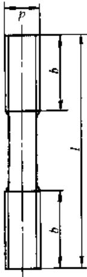

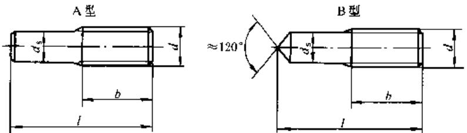

标记示例:螺纹规格 $d = \mathbb { M } \mathbb { 1 0 }$ 公称长度 $\dot { \ell } = 5 0 \mathrm { m m }$ 螺纹长度 ${ 2 6 } \mathbf { m } \mathbf { m }$ 、性能等级4.8级、不经衣面处理、按 $\pmb { \Lambda }$ 型制造的手工焊用焊接螺柱:螺柱GB/T902.1 $\mathbb { M } \mathbb { 1 0 } \times 5 0$ ;需要加长螺纹时应加标记Q:螺柱GB/T902.1 $\mathsf { M } 1 0 \times \mathsf { S } 0 . 0$ ;按B型制造时应加标记B:螺柱GB/T902.1 $\bf { M I D } \times \bf { S 0 } { - } \Re$ 

/mm 

表 4-1-99

+2P(P为螺距)0

<table><tr><td rowspan=1 colspan=2>螺纹规格</td><td rowspan=1 colspan=1>M3</td><td rowspan=1 colspan=1>M4</td><td rowspan=1 colspan=1>M5</td><td rowspan=1 colspan=1>M6</td><td rowspan=1 colspan=1>M8</td><td rowspan=1 colspan=1>M10</td><td rowspan=1 colspan=1>M12</td><td rowspan=1 colspan=1>(M14)</td><td rowspan=1 colspan=1>M16</td><td rowspan=1 colspan=1>(M18)</td><td rowspan=1 colspan=1>M20</td></tr><tr><td rowspan=2 colspan=1>b</td><td rowspan=1 colspan=1>标准</td><td rowspan=1 colspan=1>12</td><td rowspan=1 colspan=1>14</td><td rowspan=1 colspan=1>16</td><td rowspan=1 colspan=1>18</td><td rowspan=1 colspan=1>22</td><td rowspan=1 colspan=1>26</td><td rowspan=1 colspan=1>30</td><td rowspan=1 colspan=1>34</td><td rowspan=1 colspan=1>38</td><td rowspan=1 colspan=1>42</td><td rowspan=1 colspan=1>46</td></tr><tr><td rowspan=1 colspan=1>加长</td><td rowspan=1 colspan=1>15</td><td rowspan=1 colspan=1>20</td><td rowspan=1 colspan=1>22</td><td rowspan=1 colspan=1>24</td><td rowspan=1 colspan=1>28</td><td rowspan=1 colspan=1>45</td><td rowspan=1 colspan=1>49</td><td rowspan=1 colspan=1>53</td><td rowspan=1 colspan=1>57</td><td rowspan=1 colspan=1>6</td><td rowspan=1 colspan=1>65</td></tr></table>

极限偏差

机动弧焊用焊接螺柱(GB/T902.2—1989)

<table><tr><td rowspan=1 colspan=1>商品规格长度！</td><td rowspan=1 colspan=1>10~80</td><td rowspan=1 colspan=1>10~80</td><td rowspan=1 colspan=1>12~90</td><td rowspan=1 colspan=1>16~100</td><td rowspan=1 colspan=1>20~ 200</td><td rowspan=1 colspan=1>25- 240</td><td rowspan=1 colspan=1>30~240</td><td rowspan=1 colspan=1>35~ 280</td><td rowspan=1 colspan=1>45~280</td><td rowspan=1 colspan=1>50-300</td><td rowspan=1 colspan=1>60~300</td></tr><tr><td rowspan=1 colspan=1>系列</td><td rowspan=1 colspan=11>10、12、16,20,25，30，35，40，45，50,（55），60，（65），70，80,90,100，110，120，130，140，150,160,180,200、220，240，260，280，300</td></tr><tr><td rowspan=1 colspan=1>技术条件</td><td rowspan=1 colspan=1>材料</td><td rowspan=1 colspan=1>普碳钢</td><td rowspan=1 colspan=1>公差等级</td><td rowspan=1 colspan=1>g</td><td rowspan=1 colspan=2>性能等级</td><td rowspan=1 colspan=2>4.8级</td><td rowspan=1 colspan=1>表面处理</td><td rowspan=1 colspan=2>表面处理不经处理；镀锌钝化</td></tr></table>

注:d.约等于螺纹中径;末端按GB/T2的规定制成倒角端,如需方同意也可制成辗制末端。

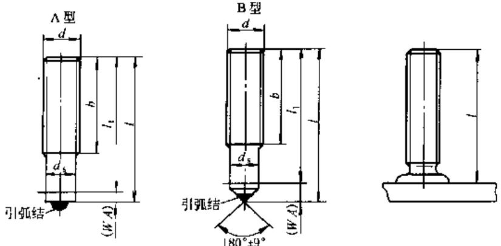

标记示例:螺纹规格 $\pmb { d } = \pmb { M } \ i 0$ 、公称长度 $\pmb { i } = 5 \pmb { 0 } \mathbf { m } \mathbf { m }$ 、性能等级4.8级、不经表面处理、按 $\pmb { A }$ 型制造的机动弧焊用焊接螺柱:螺柱GR/T902.2 $\mathbf { M } \mathbf { l } \mathbf { 0 } \times 5 \mathbf { 0 }$ ;按B型制造时应加标记B:螺社GB/T902.2 $\mathbf { M } \mathbf { l } \mathbf { 0 } \times \mathbf { 5 } \mathbf { 0 } \mathbf { - } \mathbf { \beta }$ 

/mm 

表 4-1-100

<table><tr><td rowspan=1 colspan=2>螺纹规格</td><td rowspan=1 colspan=1>M3</td><td rowspan=1 colspan=1>M4</td><td rowspan=1 colspan=1>M5</td><td rowspan=1 colspan=1>M6</td><td rowspan=1 colspan=1>M8</td><td rowspan=1 colspan=1>M10</td><td rowspan=1 colspan=1>M12</td><td rowspan=1 colspan=1>M16</td><td rowspan=1 colspan=1>M20</td></tr><tr><td rowspan=2 colspan=1>b</td><td rowspan=1 colspan=1>max</td><td rowspan=1 colspan=1>13</td><td rowspan=1 colspan=1>15.5</td><td rowspan=1 colspan=1>17.6</td><td rowspan=1 colspan=1>20</td><td rowspan=1 colspan=1>24.5</td><td rowspan=1 colspan=1>29</td><td rowspan=1 colspan=1>33.5</td><td rowspan=1 colspan=1>42</td><td rowspan=1 colspan=1>51</td></tr><tr><td rowspan=1 colspan=1>min</td><td rowspan=1 colspan=1>12</td><td rowspan=1 colspan=1>14</td><td rowspan=1 colspan=1>16</td><td rowspan=1 colspan=1>18</td><td rowspan=1 colspan=1>22</td><td rowspan=1 colspan=1>26</td><td rowspan=1 colspan=1>30</td><td rowspan=1 colspan=1>38</td><td rowspan=1 colspan=1>46</td></tr><tr><td rowspan=1 colspan=2>W</td><td rowspan=1 colspan=1>2</td><td rowspan=1 colspan=1>2</td><td rowspan=1 colspan=1>3</td><td rowspan=1 colspan=1>3</td><td rowspan=1 colspan=1>4</td><td rowspan=1 colspan=1>4</td><td rowspan=1 colspan=1>5</td><td rowspan=1 colspan=1>5</td><td rowspan=1 colspan=1>6</td></tr><tr><td rowspan=1 colspan=2>商品规格长度！</td><td rowspan=1 colspan=1>12~30</td><td rowspan=1 colspan=1>12~40</td><td rowspan=1 colspan=1>12~50</td><td rowspan=1 colspan=1>12~60</td><td rowspan=1 colspan=1>16 - 80</td><td rowspan=1 colspan=1>20~100</td><td rowspan=1 colspan=1>25~100</td><td rowspan=1 colspan=1>30~100</td><td rowspan=1 colspan=1>35~100</td></tr><tr><td rowspan=1 colspan=2>1系列</td><td rowspan=1 colspan=9>12,16,20,25，30,35，40，45,50,55,60，70,80，90，100</td></tr><tr><td rowspan=1 colspan=2>技术条件</td><td rowspan=1 colspan=1>材料</td><td rowspan=1 colspan=1>普通碳素钢</td><td rowspan=1 colspan=1>公差等级</td><td rowspan=1 colspan=1>g</td><td rowspan=1 colspan=1>性能等级</td><td rowspan=1 colspan=1>4.8级</td><td rowspan=1 colspan=1>表面处理</td><td rowspan=1 colspan=2>①不经处理；②镀铜；③镀锌钝化</td></tr></table>

注: $\pmb { \ W _ { \pmb { \mathscr { \kappa } } } }$ 为焊接螺柱的熔化长度。d,约等于螺纹中径; $\vec { \ell } = \vec { \ell } , + \boldsymbol { \ W } _ { \Lambda }$ ;末端按GB/T2的规定制成倒角端,如需方同意亦可制成辗制术端。

# 3.5.4螺钉

表4-1-101

螺钉汇总表

<table><tr><td colspan="3"></td><td colspan="2">规 格/mm</td><td rowspan="2">特性和用途</td><td rowspan="2">页次</td></tr><tr><td>类别</td><td>名 称</td><td>标准号</td><td>d</td><td>L或</td></tr><tr><td rowspan="12">机螺钉</td><td>十字槽盘头螺钉</td><td>GB/T818-2000</td><td>M1.6~M10</td><td>3-60</td><td>开槽(一字槽)多用于较小零</td><td></td></tr><tr><td>十字槽半沉头螺钉</td><td>CB/T820-2000</td><td>M1.6~M10</td><td>3~60</td><td>件的联接</td><td>4-100</td></tr><tr><td>十字槽沉头螺钉</td><td>GB/T819.1—2000</td><td>M1.6~M10</td><td>3~60</td><td>十字糟螺钉旋拧时对中性</td><td></td></tr><tr><td>十字槽沉头螺钉</td><td>GB/T819.2-1997</td><td>M1.6~M10</td><td>3~60</td><td>好，易实现自动化装配，外形美</td><td>4-101</td></tr><tr><td>十字槽圆柱头螺钉</td><td>GB/T822--2000</td><td>M2.5~M8</td><td>2~80</td><td>观，生产效率高，槽的强度高，</td><td></td></tr><tr><td>开槽圆柱头螺钉</td><td>GB/T65-2000</td><td>M1.6~M10</td><td>2~80 卸</td><td>不易拧秃、打滑，需专用旋具装</td><td></td></tr><tr><td>开槽盘头螺钉</td><td>GB/T67--2000</td><td>M1.6~M10</td><td>2-80</td><td>内六角可施加较大的拧紧</td><td>4-102</td></tr><tr><td>开槽沉头螺钉</td><td>CB/T68-2000</td><td>M1.6~M10</td><td>2.5~80</td><td>力矩，联接强度高，一般能代替</td><td></td></tr><tr><td>开槽半沉头螺钉</td><td>CB/T69-2000</td><td>M1.6~M10</td><td>2.5~80</td><td>六角螺栓，头部能埋人零件内，</td><td>4-103</td></tr><tr><td>内六角圆柱头螺钉</td><td>GB/T70.1—2000</td><td>M1.6~ M64</td><td>2.5~300</td><td>用于结构要求紧凑、外形平滑 的联接处</td><td>4-104</td></tr><tr><td>内六角平画头螺钉 内六角沉头螺钉</td><td>CB/T70.2—2000</td><td>M3-M16 M3~M20</td><td>6~50 8~100</td><td>方头可施加更大的拧紧力</td><td>4-105</td></tr><tr><td></td><td>GB/T70.3-2000</td><td></td><td></td><td>矩，顶紧力大，不易拧秃，但头</td><td></td></tr><tr><td rowspan="12">紧定螺钉</td><td>开槽锥端紧定螺钉</td><td>GB/T71-1985</td><td>M1.2~M12</td><td>2~60</td><td>部较大，不便埋人零件内，不安 全，特别是运动部位不宜使用</td><td>4-106</td></tr><tr><td>开槽平端紧定螺钉</td><td>GB/T73-1985</td><td>M1.2~M12</td><td>2~60</td><td>紧定螺钉</td><td></td></tr><tr><td>开槽凹端紧定螺钉</td><td>GB/T74-1985</td><td>M1.6~M12</td><td>2~60</td><td>锥端（有尖）凹端借锐利的</td><td>4-107</td></tr><tr><td>开槽长圆柱端紧定螺钉</td><td>CB/T75-1985</td><td>M1.6~M12</td><td>2~60</td><td>端头直接项紧零件，一般用于</td><td></td></tr><tr><td>内六角平端紧定螺钉</td><td>CB/T77-2000</td><td>M1.6~M24</td><td>2~60</td><td>安装后不常拆卸处，或顶紧硬</td><td></td></tr><tr><td>内六角锥端紧定螺钉</td><td>GB/T78-2000</td><td>M1.6~ M24</td><td>2-60</td><td>度小的零件</td><td>4-108</td></tr><tr><td>内六角凹端紧定螺钉</td><td>GB/T80-2000</td><td>M1.6~M24</td><td>2~60 件</td><td>尖端—适于硬度较小的零</td><td></td></tr><tr><td>内六角圆柱端紧定螺钉</td><td>GB/T79-2000</td><td>M1.6~M24</td><td>2-60</td><td>凹端—-适于硬度较大的零</td><td></td></tr><tr><td>方头长圆柱球面端紧定螺钉</td><td>CB/T83-1988</td><td>M8~M20</td><td>16~100 件</td><td></td><td></td></tr><tr><td>方头凹端紧定螺钉</td><td>CB/T84-1988</td><td>M5~ M20</td><td>10~100</td><td>锥端（无尖）在零件的顶紧</td><td></td></tr><tr><td>方头长圆柱端紧定螺钉</td><td>CB/T85-1988</td><td>M5~M20</td><td>12~100</td><td>面上要打坑眼，使锥面压在坑</td><td>4-109</td></tr><tr><td>方头倒角端紧定螺钉</td><td>GB/T821--1988</td><td>M5~ M20</td><td>8~100</td><td>眼边上，锥端压在坑中能大大 增加传递载荷的能力</td><td></td></tr><tr><td></td><td>方头短圆柱锥端紧定螺钉</td><td>GB/T86-1988</td><td>M5- M20</td><td>12 - 100</td><td>平端圆尖端端头平滑，顶</td><td></td></tr><tr><td>定位螺钉</td><td>开槽锥端定位螺钉</td><td>GB/T72-1988</td><td>M3~ M12</td><td>4-50</td><td>紧后不伤零件表面，多用于常 调节位置的联接处，传递载荷 较小</td><td>4-106</td></tr><tr><td rowspan="4">不脱出螺钉</td><td></td><td></td><td></td><td></td><td>平端一接触面积大，可用</td><td>4-110</td></tr><tr><td>六角头不脱出螺钉</td><td>GB/T838-1988</td><td>M5~M16</td><td>14- 100</td><td>于顶硬度大的零件，顶紧面应 是平面</td><td></td></tr><tr><td>开槽沉头不脱出螺钉</td><td>GB/T948-1988</td><td>M3~M10</td><td>10-60</td><td>圆尖端—圆弧头除顶压平</td><td>4-111</td></tr><tr><td></td><td></td><td></td><td></td><td>面外，还可压在零件表面的U 形沟、V形糟或圆窝中</td><td></td></tr><tr><td rowspan="16">自攻螺钉和 木螺钉</td><td>十字槽盘头自攻螺钉 十字槽沉头自攻螺钉</td><td>GB/T845-1985</td><td>ST2.2~M9.5</td><td>4.5~50</td><td>圆柱端用于经常调节位置 或固定装在管轴(薄壁件)上的</td><td>4-111</td></tr><tr><td>十字槽半沉头自攻螺钉</td><td>GB/T846-1985</td><td>ST2.2~ M9.5</td><td>4.5-50</td><td>零件，圆柱端头进人在管轴上</td><td></td></tr><tr><td>六角头自攻螺钉</td><td>GB/T847-1985</td><td>S12.2~ M9.5</td><td>4.5~50</td><td>打的孔眼中，端头靠剪切作用</td><td></td></tr><tr><td></td><td>GB/T5285-1985</td><td>ST2.2~ M9.5</td><td>4.5~50</td><td>可传递较大的裁荷，使用这种</td><td>4-112</td></tr><tr><td>十字槽盘头自攻锁紧螺钉</td><td>GB/T6560-1986</td><td>M2~M6</td><td>4~40</td><td>螺钉应有防止松脱的装置</td><td>一</td></tr><tr><td>十字槽沉头自攻锁紧螺钉</td><td>GB/T6561-1986</td><td>M2.5~M6</td><td>6~40</td><td>紧定螺钉硬度应比被紧定 零件高，一般紧定螺钉热处理</td><td>4-113</td></tr><tr><td>六角头自攻锁紧螺钉</td><td>GB/T6563-1986</td><td>M3~M12</td><td>6~80</td><td>硬度为28~38HRC</td><td>4-114</td></tr><tr><td>十字槽沉头木螺钉</td><td>GB/T951-1986</td><td>2~10</td><td>6-120</td><td>不脱出螺钉多用于振动较</td><td></td></tr><tr><td>十字槽半沉头木螺钉</td><td>GB/T952--1986</td><td>2~10</td><td>6~120</td><td>大需不脱出的场合，可在细的</td><td></td></tr><tr><td>十字槽圆头木螺钉</td><td>GB/T950--1986</td><td>2-10</td><td>6-120</td><td>螺钉杆处装上防脱零件</td><td></td></tr><tr><td>开槽圆头木螺钉</td><td>GB/T99-1986</td><td>1.6~10</td><td>6~120</td><td>自攻螺钉多用于联接较薄</td><td>4-114</td></tr><tr><td>开槽沉头木螺钉</td><td>CB/T100-1986</td><td>1.6~10</td><td>6- 120</td><td>的钢板和有色金属板。螺钉较 硬，一般热处理硬度50～</td><td></td></tr><tr><td>开槽半沉头木螺钉</td><td>GB/T101-1986</td><td>1.6-10</td><td>6~120</td><td>58HRC，在被联接件上可不预</td><td></td></tr><tr><td>六角头木螺钉</td><td>GB/T102-1986</td><td>6~20</td><td>35 - 250</td><td>先制出螺纹，在联接时利用螺</td><td></td></tr><tr><td></td><td>CB/T825-1988</td><td></td><td></td><td>钉直接攻出螺纹</td><td>4-115</td></tr><tr><td>吊环螺钉</td><td>JB/ZQ 4353-1986</td><td>M8~M100 56~100</td><td>16-[40 95~150</td><td>吊环用螺钉安装和运输时 起重用</td><td></td></tr></table>

# 十字槽盘头螺钉(GB/T818—2000)

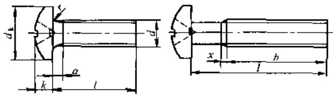

十字槽沉头螺钉(GB/T819.1—2000)

十字槽半沉头螺钉(GB/T820—2000)

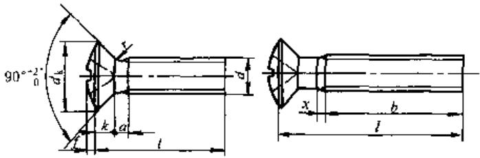

标记示例:

螺纹规格 $\pmb { d } = \mathbf { M } \pmb { \xi }$ 、公称长度 $\ell = 2 0 \mathrm { m m }$ 、性能等级为4.8级、不经表面处理的 $\mathsf { H }$ 型十字槽盘头螺钉:

表4-1-102

/mm 

<table><tr><td colspan="2">螺纹规格d</td><td>M1.6</td><td>M2</td><td>M2.5</td><td>M3</td><td>（M3.5)</td><td>M4</td><td>M5</td><td>M6</td><td>M8</td><td>M10</td></tr><tr><td colspan="2">4 max</td><td>0.7</td><td>0.8</td><td>0.9</td><td>1</td><td colspan="2">1.2 1.4</td><td>1.6</td><td>2</td><td>2.5</td><td>3</td></tr><tr><td colspan="2">min</td><td colspan="4">25</td><td colspan="7">38</td></tr><tr><td colspan="2">xmax</td><td>0.9</td><td>1</td><td>1.1</td><td>1.25</td><td>1.5</td><td>1.75.</td><td>2</td><td>2.5</td><td>3.2</td><td>3.8</td></tr><tr><td colspan="2">商品规格长度！</td><td>3~16</td><td>3~20</td><td>3~25</td><td>4~30</td><td>5-30</td><td>5-40</td><td>6-45</td><td>8-60</td><td>10~60</td><td>12~60</td></tr><tr><td rowspan="4">GB/T 818</td><td>dmax k max</td><td>3.2 1.3</td><td>4 1.6</td><td>5 2.1</td><td>5.6 2.4</td><td>7 2.6</td><td>8 3.1</td><td>9.5 3.7</td><td>12 4.6</td><td>16 6</td><td>20</td></tr><tr><td>r nun</td><td></td><td></td><td>0.1</td><td></td><td></td><td>0.2</td><td></td><td>0.25</td><td></td><td>7.5</td></tr><tr><td>全螺纹</td><td></td><td></td><td></td><td></td><td></td><td></td><td></td><td></td><td>0.4</td><td></td></tr><tr><td>长度b</td><td></td><td>3~25</td><td></td><td>4~25</td><td>5~40</td><td></td><td>6~40</td><td>8-40</td><td>10~40</td><td>12~40</td></tr></table>

续表

<table><tr><td colspan="2">螺纹规格d</td><td>M1.6</td><td>M2</td><td>M2.5</td><td>M3</td><td>（M3.5）</td><td>M4</td><td>M5</td><td>M6</td><td>M8</td><td>M10</td></tr><tr><td rowspan="4">GB/T 819.1 CB/T820</td><td rowspan="4">d max f k max rmax 全螺纹</td><td>3</td><td>3.8</td><td>4.7</td><td>5.5</td><td>7.3</td><td>8.4</td><td>9.3</td><td>11.3</td><td>15.8</td><td>18.3</td></tr><tr><td>0.4</td><td>0.5</td><td>0.6</td><td>0.7</td><td>0.8</td><td>1</td><td>1.2</td><td>1.4 ！</td><td>2</td><td>2.3</td></tr><tr><td>1</td><td>1.2</td><td>1.5</td><td>1.65</td><td>2.35</td><td>2.7</td><td></td><td>3.3</td><td>4.65</td><td>5</td></tr><tr><td>0.4</td><td>0.5</td><td>0.6</td><td>0.8</td><td>0.9</td><td>1</td><td>1.3</td><td>1.5</td><td>2</td><td>2.5</td></tr><tr><td colspan="2">长度b 1系列</td><td colspan="7">3~30 4~30 5~45 6~45</td><td colspan="2">8~45 10~45</td><td>12~45</td></tr><tr><td colspan="2" rowspan="2"></td><td colspan="8">3，4，5，6，8，10，12，（14)，16，20，25，30、35、40、45，50，（55)，60</td><td colspan="2"></td></tr><tr><td>材料 性能等级</td><td colspan="2">钢</td><td colspan="2">不锈钢</td><td colspan="2">有色金属 CU2、CU3、AL4</td><td colspan="2">螺纹公差：6g</td><td colspan="2"></td></tr><tr><td colspan="2" rowspan="2">技术条件</td><td>表面处理</td><td colspan="2">4.8</td><td colspan="2">A2-50，A2-70</td><td colspan="2"></td><td colspan="2"></td><td colspan="2">产品等级：A</td></tr><tr><td></td><td colspan="2">不经处理</td><td colspan="2">简单处理</td><td colspan="2">简单处理</td><td colspan="2"></td><td colspan="2"></td></tr></table>

注:1.GB/T819.1-2000仅有钢制。4.8级螺钉。2.全螺纹长度 $\dot { \pmb { b } } = \pmb { { \cal L } } - \pmb { \alpha }$ 

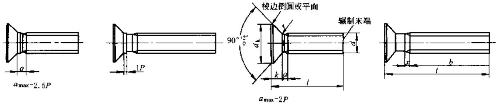

十字槽沉头螺钉(GB/T819.2—1997)

头下带台肩的螺钉(见GB/T5279.2),用于插人深度系列1(深的)

头下不带台肩的螺钉(见GH/T5279.2),用于插人深度系列2(浅的)

标记示例:

螺纹规格 $\pmb { \mathrm { \acute { d } } } = \pmb { \mathrm { M } } 5$ 、公称长度 $\ell = 2 0 \mathrm { m m }$ 、性能等级为8.8、不经表面处理的十字槽沉头螺钉:螺钉GB/T819.2 $M S \times 2 0$ 

表4-1-103

/mm 

<table><tr><td rowspan=1 colspan=1>螺纹规格d</td><td rowspan=1 colspan=1>M2</td><td rowspan=1 colspan=1>M2.5</td><td rowspan=1 colspan=1>M3</td><td rowspan=1 colspan=1>(M3.5)</td><td rowspan=1 colspan=1>M4</td><td rowspan=1 colspan=1>M5</td><td rowspan=1 colspan=1>M6</td><td rowspan=1 colspan=1>M8</td><td rowspan=1 colspan=1>M10</td></tr><tr><td rowspan=1 colspan=1>P（螺距）</td><td rowspan=1 colspan=1>0.4</td><td rowspan=1 colspan=1>0.45</td><td rowspan=1 colspan=1>0.5</td><td rowspan=1 colspan=1>0.6</td><td rowspan=1 colspan=1>0.7</td><td rowspan=1 colspan=1>0.8</td><td rowspan=1 colspan=1>1</td><td rowspan=1 colspan=1>1.25</td><td rowspan=1 colspan=1>1.5</td></tr><tr><td rowspan=1 colspan=1>bmin</td><td rowspan=1 colspan=1>25</td><td rowspan=1 colspan=1>25</td><td rowspan=1 colspan=1>25</td><td rowspan=1 colspan=1>38</td><td rowspan=1 colspan=1>38</td><td rowspan=1 colspan=1>38</td><td rowspan=1 colspan=1>38</td><td rowspan=1 colspan=1>38</td><td rowspan=1 colspan=1>38</td></tr><tr><td rowspan=1 colspan=1>dmax</td><td rowspan=1 colspan=1>4.4</td><td rowspan=1 colspan=1>5.5</td><td rowspan=1 colspan=1>6.3</td><td rowspan=1 colspan=1>8.2</td><td rowspan=1 colspan=1>9.4</td><td rowspan=1 colspan=1>10.4</td><td rowspan=1 colspan=1>12.6</td><td rowspan=1 colspan=1>17.3</td><td rowspan=1 colspan=1>20</td></tr><tr><td rowspan=1 colspan=1>Kmax</td><td rowspan=1 colspan=1>1.2</td><td rowspan=1 colspan=1>1.5</td><td rowspan=1 colspan=1>1.65</td><td rowspan=1 colspan=1>2.35</td><td rowspan=1 colspan=1>2.7</td><td rowspan=1 colspan=1>2.7</td><td rowspan=1 colspan=1>3.3</td><td rowspan=1 colspan=1>4.65</td><td rowspan=1 colspan=1>5</td></tr><tr><td rowspan=1 colspan=1>，min</td><td rowspan=1 colspan=1>0.5</td><td rowspan=1 colspan=1>0.6</td><td rowspan=1 colspan=1>0.8</td><td rowspan=1 colspan=1>0.9</td><td rowspan=1 colspan=1>1</td><td rowspan=1 colspan=1>1.3</td><td rowspan=1 colspan=1>1.5</td><td rowspan=1 colspan=1>2</td><td rowspan=1 colspan=1>2.5</td></tr><tr><td rowspan=1 colspan=1>商品长度1</td><td rowspan=1 colspan=1>3~20</td><td rowspan=1 colspan=1>3~25</td><td rowspan=1 colspan=1>4~30</td><td rowspan=1 colspan=1>5~35</td><td rowspan=1 colspan=1>5~40</td><td rowspan=1 colspan=1>6-50</td><td rowspan=1 colspan=1>8~60</td><td rowspan=1 colspan=1>10~60</td><td rowspan=1 colspan=1>12-60</td></tr><tr><td rowspan=1 colspan=1>系列</td><td rowspan=1 colspan=9>3,4.5,6.8,10,12,(14），16，20，25、30，35，40，45.50.(55).60</td></tr><tr><td rowspan=3 colspan=1>技术条件</td><td rowspan=1 colspan=1>材料</td><td rowspan=1 colspan=1>钢</td><td rowspan=1 colspan=1>不锈钢</td><td rowspan=1 colspan=1>有色金属</td><td rowspan=2 colspan=1>螺纹公差</td><td rowspan=2 colspan=1>6g</td><td rowspan=2 colspan=1>产品等级</td><td rowspan=2 colspan=1>A</td><td rowspan=2 colspan=1></td></tr><tr><td rowspan=1 colspan=1>性能等级</td><td rowspan=1 colspan=1>8.8</td><td rowspan=1 colspan=1>A2-70</td><td rowspan=1 colspan=1>CU2、CU3</td></tr><tr><td rowspan=1 colspan=1>表面处理</td><td rowspan=1 colspan=7>不经处理或简单处理；镀锌钝化；如需不同电镀技术要求或需其他的表面处理，应由供需双方协议</td><td rowspan=1 colspan=1></td></tr></table>

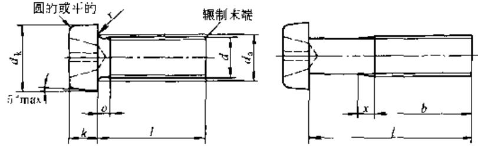

十字槽圆柱头螺钉(GB/T822—2000)

标记示例:

螺纹规格 $d = \Re \bar { s }$ 、公称长度 $\smash { \ell = 2 0 m m }$ 、性能等级为4.8级、不经表面处理的 $\textbf { H }$ 型十字槽圆柱头螺钉:螺钉GB/T822$1 1 5 \times 2 0$ 

表4-1-104

/mm 

<table><tr><td rowspan=1 colspan=1>螺纹规格d</td><td rowspan=1 colspan=1>M2.5</td><td rowspan=1 colspan=1>M3</td><td rowspan=1 colspan=1>(M3.5)</td><td rowspan=1 colspan=1>M4</td><td rowspan=1 colspan=1>MS</td><td rowspan=1 colspan=1>M6</td><td rowspan=1 colspan=1>M8</td></tr><tr><td rowspan=1 colspan=1>u max</td><td rowspan=1 colspan=1>0.9</td><td rowspan=1 colspan=1>-</td><td rowspan=1 colspan=1>1.2</td><td rowspan=1 colspan=1>1.4</td><td rowspan=1 colspan=1>1.6</td><td rowspan=1 colspan=1>2</td><td rowspan=1 colspan=1>2.5</td></tr><tr><td rowspan=1 colspan=1>bmin</td><td rowspan=1 colspan=2>25</td><td rowspan=1 colspan=1></td><td rowspan=1 colspan=4>38</td></tr><tr><td rowspan=1 colspan=1>d.max</td><td rowspan=1 colspan=1>3.1</td><td rowspan=1 colspan=1>3.5</td><td rowspan=1 colspan=1>4.</td><td rowspan=1 colspan=1>4.7</td><td rowspan=1 colspan=1>5.7</td><td rowspan=1 colspan=1>6.8</td><td rowspan=1 colspan=1>9.2</td></tr><tr><td rowspan=1 colspan=1>dmax</td><td rowspan=1 colspan=1>4.S</td><td rowspan=1 colspan=1>5.5</td><td rowspan=1 colspan=1>6</td><td rowspan=1 colspan=1>7</td><td rowspan=1 colspan=1>8.5</td><td rowspan=1 colspan=1>10</td><td rowspan=1 colspan=1>13</td></tr><tr><td rowspan=1 colspan=1>kmax</td><td rowspan=1 colspan=1>1.8</td><td rowspan=1 colspan=1>2</td><td rowspan=1 colspan=1>2.4</td><td rowspan=1 colspan=1>2.6</td><td rowspan=1 colspan=1>3.3</td><td rowspan=1 colspan=1>3.9</td><td rowspan=1 colspan=1>5</td></tr><tr><td rowspan=1 colspan=1>× max</td><td rowspan=1 colspan=1>1.1</td><td rowspan=1 colspan=1>1.25</td><td rowspan=1 colspan=1>1.5</td><td rowspan=1 colspan=1>1.75</td><td rowspan=1 colspan=1>2</td><td rowspan=1 colspan=1>2.5</td><td rowspan=1 colspan=1>3.2</td></tr><tr><td rowspan=1 colspan=1>，</td><td rowspan=1 colspan=2>0.1</td><td rowspan=1 colspan=1></td><td rowspan=1 colspan=2>0.2</td><td rowspan=1 colspan=1>0.25</td><td rowspan=1 colspan=1>3.2</td></tr><tr><td rowspan=1 colspan=1>通用规格长度</td><td rowspan=1 colspan=1>3~25</td><td rowspan=1 colspan=1>4~30</td><td rowspan=1 colspan=1>5-35</td><td rowspan=1 colspan=1>5~40</td><td rowspan=1 colspan=1>6~45</td><td rowspan=1 colspan=1>8-60</td><td rowspan=1 colspan=1>10 - 80</td></tr><tr><td rowspan=1 colspan=1>全螺纹长度！</td><td rowspan=1 colspan=1>3-30</td><td rowspan=1 colspan=1>4~30</td><td rowspan=1 colspan=1>5-40</td><td rowspan=1 colspan=1>5-40</td><td rowspan=1 colspan=1>6-40</td><td rowspan=1 colspan=1>8-40</td><td rowspan=1 colspan=1>10~40</td></tr><tr><td rowspan=4 colspan=1>！系列技术条件</td><td rowspan=1 colspan=7>2,3,4、5、6,8,10,12,16,20,25，30，35,40，45，50,60,70.80</td></tr><tr><td rowspan=1 colspan=1>材料</td><td rowspan=1 colspan=1>钢</td><td rowspan=1 colspan=1>不锈钢</td><td rowspan=1 colspan=1>有色金属</td><td rowspan=3 colspan=2>螺纹公差：6g</td><td rowspan=3 colspan=1>产品等级：A</td></tr><tr><td rowspan=1 colspan=1>性能等级</td><td rowspan=1 colspan=1>4.8、5.8</td><td rowspan=1 colspan=1>A2-70</td><td rowspan=1 colspan=1>CU2、CU3、AL4</td></tr><tr><td rowspan=1 colspan=1>表面处理</td><td rowspan=1 colspan=1>不经处理</td><td rowspan=1 colspan=1>简单处理</td><td rowspan=1 colspan=1>简单处理</td></tr></table>

# 开槽圆柱头螺钉(GB/T65—2000)开槽盘头螺钉(GB/T67—2000)

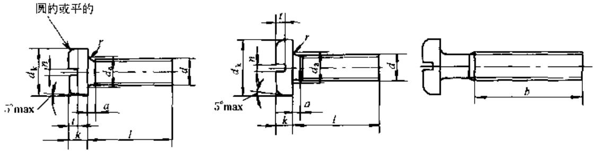

开槽沉头螺钉(GB/T68—2000)

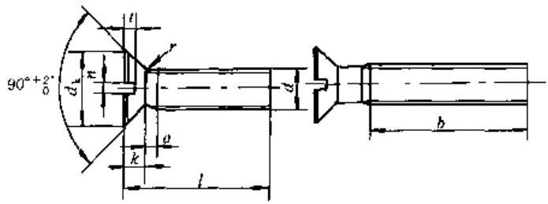

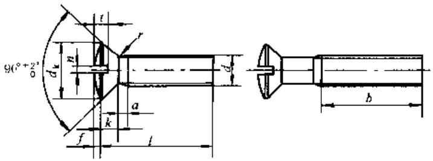

标记示例:

螺纹规格 $\pmb { d } = \mathbf { M } 5$ 、公称长度 $\bar { t } = 2 0 \mathbf { m } \mathbf { m }$ 、性能等级为4.8级、不经表面处理的开槽圆柱头螺钉:

螺钉CB/T65 $M S \times 2 0$ 

表4-1-105

/mm 

<table><tr><td colspan="2">螺纹规格d</td><td></td><td>M1.6</td><td>M2</td><td>M2.5</td><td>M3</td><td>（M3.5）</td><td>M4</td><td>M5</td><td>M6</td><td>M8</td><td>M10</td></tr><tr><td colspan="2">max B</td><td></td><td colspan="2">0.7 0.8</td><td>0.9</td><td>1</td><td>1.2 1.4</td><td colspan="2">1.6</td><td>2</td><td>2.5</td><td>3</td></tr><tr><td colspan="2">b min</td><td colspan="4">25</td><td>38</td><td colspan="5"></td></tr><tr><td colspan="2">n 公称</td><td></td><td>0.4</td><td>0.5</td><td>0.6</td><td>0.8 1</td><td></td><td>1.2</td><td>1.6</td><td>2</td><td>2.5</td></tr><tr><td rowspan="6">GB/T 65</td><td>d max</td><td></td><td>3</td><td>3.8</td><td>4.5 5.5</td><td>6</td><td>？</td><td>8.5</td><td>10</td><td>13</td><td>16</td></tr><tr><td>kmax</td><td></td><td>1.1</td><td>1.4</td><td>1.8</td><td>2</td><td>2.4 2.6</td><td>3.3</td><td>3.9</td><td>5</td><td>6</td></tr><tr><td>min</td><td></td><td>0.45</td><td>0.6 0.7</td><td>0.85</td><td>1</td><td>1.1</td><td>1.3</td><td>1.6</td><td>2</td><td>2.4</td></tr><tr><td>d.mAx</td><td></td><td>2</td><td>2.6</td><td>3.1</td><td>3.6 4.1</td><td>4.7</td><td>5.7</td><td>6.8</td><td>9.2</td><td>11.2</td></tr><tr><td>rmin</td><td colspan="4">0.1</td><td colspan="2"></td><td colspan="2">0.2</td><td colspan="2">0.4</td></tr><tr><td>商品规格</td><td></td><td>2~16</td><td>3~20</td><td>3-25</td><td>4~30 5~35</td><td>5~40</td><td>6~50</td><td>0.25 8~60</td><td>10~80</td><td>12~80</td></tr><tr><td colspan="2">长度 全螺纹长度！</td><td>2~30</td><td>3~30</td><td>3~30</td><td>4~30</td><td>5~40</td><td>5~40</td><td>6~40</td><td>8~40</td><td>10~40</td><td>12~40</td></tr><tr><td rowspan="6">GB/T 67</td><td>dmax</td><td>3.2</td><td>4</td><td>5</td><td>5.6</td><td>7</td><td>8</td><td>9.5</td><td>12</td><td>6</td><td>20</td></tr><tr><td>k max</td><td></td><td>1</td><td>1.3</td><td>1.5 1.8</td><td>2.1</td><td>2.4</td><td>3</td><td>3.6</td><td>4.8</td><td>6</td></tr><tr><td>min</td><td></td><td>0.35</td><td>0.6</td><td>0.7</td><td>0.8</td><td>1</td><td>1.2</td><td>1.4</td><td>1.9</td><td>2.4</td></tr><tr><td>d.mex</td><td></td><td>2</td><td>0.5 2.6</td><td>3.1 3.6</td><td>4.1</td><td>4.7</td><td>5.7</td><td>6.8</td><td>9.2</td><td>11.2</td></tr><tr><td>rmin</td><td></td><td></td><td>0.1</td><td></td><td></td><td>0.2</td><td></td><td>0.25</td><td></td><td></td></tr><tr><td>商品规格</td><td colspan="4"></td><td colspan="2"></td><td colspan="2"></td><td colspan="2">0.4</td></tr><tr><td colspan="2"></td><td>2~16 长度</td><td>2.5~20</td><td>3~25</td><td>4~ 30</td><td>5~35 5~40</td><td>5~40 5-40</td><td>6-50 6-40</td><td>8-60 8~40</td><td>10-80 10- 40</td><td>12~80 12~40</td></tr><tr><td rowspan="6">GB/T 68 CB/T 69</td><td>山</td><td>全螺纹长度 max</td><td>2~30 3</td><td>2.5~30 3.8</td><td>3~30 4.7</td><td>4~30 5.5</td><td>7.3</td><td>8.4 9.3</td><td>11.3</td><td>15.8</td><td>18.3</td></tr><tr><td>k max ，</td><td></td><td>1</td><td>1.2</td><td>1.5</td><td>1.65</td><td>2.35</td><td>2.7 1.3</td><td>3.3</td><td>4.65</td><td>5</td></tr><tr><td>i</td><td>max GB/T 68</td><td>0.4</td><td>0.5</td><td>0.6</td><td>0.8</td><td>0.9</td><td>1</td><td>1.5</td><td>2</td><td>2.5</td></tr><tr><td>min</td><td>GB/T 69</td><td>0.32</td><td>0.4 0.8</td><td>0.5 1</td><td>0.6 1.2</td><td>0.9 1.45</td><td>1 1.1 1.6 2</td><td>1.2 2.4</td><td>1.8 3.2</td><td>2</td></tr><tr><td>f</td><td></td><td>0.64 0.4</td><td>0.5</td><td>0.6</td><td>0.7</td><td>0.8</td><td>1 1.2</td><td>1.4</td><td>2</td><td>3.8 2.3</td></tr><tr><td>长度 全螺纹长度</td><td>商品规格 2.5-30</td><td>2.5~16</td><td>3~20</td><td>4~25</td><td>5~30</td><td>6~35 6~40</td><td>8~50</td><td>8-60</td><td>10~80</td><td>12-80</td></tr></table>

注:技术条件间表4-1-102,但材料为钢时的性能等级多一个5.8级。

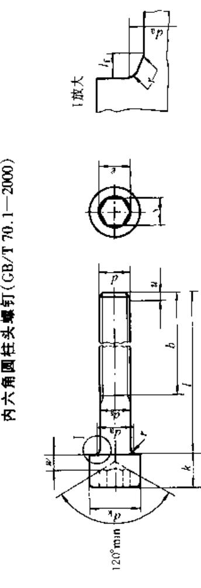

<table><tr><td rowspan=2 colspan=1></td><td rowspan=2 colspan=1>6</td><td rowspan=2 colspan=1>4</td><td rowspan=2 colspan=1>6</td><td rowspan=2 colspan=1>大</td><td rowspan=2 colspan=1>1</td><td rowspan=2 colspan=1>6</td><td rowspan=2 colspan=1>5</td><td rowspan=2 colspan=1>5</td><td rowspan=2 colspan=1>8</td><td rowspan=2 colspan=1>2</td><td rowspan=2 colspan=1>4</td><td rowspan=2 colspan=1>2</td><td rowspan=2 colspan=1></td><td rowspan=2 colspan=1></td><td rowspan=7 colspan=1>0000000000000090</td><td rowspan=7 colspan=1>他其</td><td></td><td></td></tr><tr><td rowspan=6 colspan=2>G 2）580G</td></tr><tr><td rowspan=1 colspan=1>5</td><td rowspan=1 colspan=1>5</td><td rowspan=1 colspan=1>4</td><td rowspan=1 colspan=1>品</td><td rowspan=1 colspan=1>34</td><td rowspan=1 colspan=1>6</td><td rowspan=1 colspan=1>5</td><td rowspan=1 colspan=1></td><td rowspan=1 colspan=1>5</td><td rowspan=1 colspan=1>5</td><td rowspan=1 colspan=1>2</td><td rowspan=1 colspan=1>4</td><td rowspan=1 colspan=1>1</td><td rowspan=1 colspan=1></td><td rowspan=1 colspan=1></td></tr><tr><td rowspan=1 colspan=1>08</td><td rowspan=1 colspan=1>5</td><td rowspan=1 colspan=1>三</td><td rowspan=1 colspan=1>2</td><td rowspan=1 colspan=1>3</td><td rowspan=1 colspan=1>5</td><td rowspan=1 colspan=1>好</td><td rowspan=1 colspan=1>0</td><td rowspan=1 colspan=1>3</td><td rowspan=1 colspan=1>4</td><td rowspan=1 colspan=1>1</td><td rowspan=1 colspan=1>3</td><td rowspan=1 colspan=1>1</td><td rowspan=1 colspan=1>1</td><td rowspan=1 colspan=1></td></tr><tr><td rowspan=1 colspan=1>2</td><td rowspan=1 colspan=1>4</td><td rowspan=1 colspan=1>8</td><td rowspan=1 colspan=1>3</td><td rowspan=1 colspan=1>5</td><td rowspan=1 colspan=1>36</td><td rowspan=1 colspan=1>4</td><td rowspan=1 colspan=1>5</td><td rowspan=1 colspan=1>8</td><td rowspan=1 colspan=1>42</td><td rowspan=1 colspan=1>2</td><td rowspan=1 colspan=1>2</td><td rowspan=1 colspan=1>3</td><td rowspan=1 colspan=1></td><td rowspan=1 colspan=1></td></tr><tr><td rowspan=1 colspan=1>3</td><td rowspan=1 colspan=1>4</td><td rowspan=1 colspan=1>4</td><td rowspan=1 colspan=1>54</td><td rowspan=1 colspan=1></td><td rowspan=1 colspan=1>4</td><td rowspan=1 colspan=1>3</td><td rowspan=1 colspan=1>38</td><td rowspan=1 colspan=1>12</td><td rowspan=1 colspan=1>3</td><td rowspan=1 colspan=1></td><td rowspan=1 colspan=1>7</td><td rowspan=1 colspan=1>£s</td><td rowspan=2 colspan=1></td><td rowspan=2 colspan=1></td></tr><tr><td rowspan=1 colspan=1>0</td><td rowspan=1 colspan=1>3</td><td rowspan=1 colspan=1>72</td><td rowspan=1 colspan=1>45</td><td rowspan=1 colspan=1>39</td><td rowspan=1 colspan=1>34</td><td rowspan=1 colspan=1>3</td><td rowspan=1 colspan=1>3</td><td rowspan=1 colspan=1>8</td><td rowspan=1 colspan=1>3</td><td rowspan=1 colspan=1></td><td rowspan=1 colspan=1>2</td><td rowspan=1 colspan=1>1</td></tr><tr><td rowspan=1 colspan=1></td><td rowspan=1 colspan=1>3</td><td rowspan=1 colspan=1>8</td><td rowspan=1 colspan=1>30</td><td rowspan=1 colspan=1>39</td><td rowspan=1 colspan=1>4</td><td rowspan=1 colspan=1>2</td><td rowspan=1 colspan=1></td><td rowspan=1 colspan=1>2</td><td rowspan=1 colspan=1>24</td><td rowspan=1 colspan=1>88</td><td rowspan=1 colspan=1>1</td><td rowspan=1 colspan=1>10</td><td rowspan=1 colspan=1></td><td rowspan=1 colspan=1></td><td rowspan=2 colspan=1></td><td rowspan=2 colspan=1></td><td rowspan=2 colspan=2>A</td></tr><tr><td rowspan=1 colspan=1>8</td><td rowspan=1 colspan=1>3</td><td rowspan=1 colspan=1>5</td><td rowspan=1 colspan=1>3</td><td rowspan=1 colspan=1>南</td><td rowspan=1 colspan=1></td><td rowspan=1 colspan=1>2</td><td rowspan=1 colspan=1>专</td><td rowspan=1 colspan=1>12</td><td rowspan=1 colspan=1>8</td><td rowspan=1 colspan=1>8</td><td rowspan=1 colspan=1>7</td><td rowspan=1 colspan=1>8</td><td rowspan=1 colspan=1></td><td rowspan=1 colspan=1>18</td></tr><tr><td rowspan=1 colspan=1>6</td><td rowspan=1 colspan=1>2</td><td rowspan=1 colspan=1>4</td><td rowspan=1 colspan=1>24</td><td rowspan=1 colspan=1>3</td><td rowspan=1 colspan=1>E</td><td rowspan=1 colspan=1>15</td><td rowspan=1 colspan=1>10</td><td rowspan=1 colspan=1>4</td><td rowspan=1 colspan=1>10</td><td rowspan=1 colspan=1>0</td><td rowspan=1 colspan=1>4</td><td rowspan=1 colspan=1>8</td><td rowspan=1 colspan=1></td><td rowspan=1 colspan=1></td><td rowspan=2 colspan=1></td><td rowspan=2 colspan=1>G</td><td rowspan=2 colspan=2>99:6：财</td></tr><tr><td rowspan=1 colspan=1></td><td rowspan=1 colspan=1>2</td><td rowspan=1 colspan=1>4</td><td rowspan=1 colspan=1>2</td><td rowspan=1 colspan=1>13</td><td rowspan=1 colspan=1>5</td><td rowspan=1 colspan=1>4</td><td rowspan=1 colspan=1>E</td><td rowspan=1 colspan=1>14</td><td rowspan=1 colspan=1>4</td><td rowspan=1 colspan=1>00</td><td rowspan=1 colspan=1>2</td><td rowspan=1 colspan=1>5</td><td rowspan=1 colspan=1></td><td rowspan=1 colspan=1>3</td></tr><tr><td rowspan=1 colspan=1>2</td><td rowspan=1 colspan=1></td><td rowspan=1 colspan=1>3</td><td rowspan=1 colspan=1>18</td><td rowspan=1 colspan=1>1</td><td rowspan=1 colspan=1>5</td><td rowspan=1 colspan=1>2</td><td rowspan=1 colspan=1>E</td><td rowspan=1 colspan=1>1</td><td rowspan=1 colspan=1>2</td><td rowspan=1 colspan=1>0</td><td rowspan=1 colspan=1>10</td><td rowspan=1 colspan=1>4</td><td rowspan=1 colspan=1></td><td rowspan=1 colspan=1></td><td rowspan=2 colspan=1></td><td rowspan=2 colspan=1></td><td rowspan=2 colspan=1>G</td><td rowspan=8 colspan=1>）025</td></tr><tr><td rowspan=1 colspan=1>10</td><td rowspan=1 colspan=1>2</td><td rowspan=1 colspan=1>3j</td><td rowspan=1 colspan=1>16</td><td rowspan=1 colspan=1></td><td rowspan=1 colspan=1>E</td><td rowspan=1 colspan=1>1</td><td rowspan=1 colspan=1>5</td><td rowspan=1 colspan=1>10</td><td rowspan=1 colspan=1>1</td><td rowspan=1 colspan=1>4</td><td rowspan=1 colspan=1>8</td><td rowspan=1 colspan=1>4</td><td rowspan=1 colspan=1></td><td rowspan=1 colspan=1></td></tr><tr><td rowspan=1 colspan=1>8</td><td rowspan=1 colspan=1>2</td><td rowspan=1 colspan=1>28</td><td rowspan=1 colspan=1>B</td><td rowspan=1 colspan=1>5</td><td rowspan=1 colspan=1>2</td><td rowspan=1 colspan=1>8</td><td rowspan=1 colspan=1>3</td><td rowspan=1 colspan=1></td><td rowspan=1 colspan=1>3</td><td rowspan=1 colspan=1>44</td><td rowspan=1 colspan=1>6</td><td rowspan=1 colspan=1>3</td><td rowspan=1 colspan=1>8</td><td rowspan=1 colspan=1>3</td><td rowspan=4 colspan=1>22</td><td rowspan=4 colspan=1></td><td rowspan=4 colspan=1>0040-20:60P20-40L-V:PD</td></tr><tr><td rowspan=1 colspan=1></td><td rowspan=1 colspan=1></td><td rowspan=1 colspan=1>24</td><td rowspan=1 colspan=1>1</td><td rowspan=1 colspan=1>2</td><td rowspan=1 colspan=1>8</td><td rowspan=1 colspan=1>6</td><td rowspan=1 colspan=1>5</td><td rowspan=1 colspan=1>8</td><td rowspan=1 colspan=1>6</td><td rowspan=1 colspan=1>1</td><td rowspan=1 colspan=1>5</td><td rowspan=1 colspan=1>3</td><td rowspan=1 colspan=1>8</td><td rowspan=1 colspan=1></td></tr><tr><td rowspan=1 colspan=1>B</td><td rowspan=1 colspan=1>8</td><td rowspan=1 colspan=1>2</td><td rowspan=1 colspan=1>8</td><td rowspan=1 colspan=1>家</td><td rowspan=1 colspan=1>5</td><td rowspan=1 colspan=1>5</td><td rowspan=1 colspan=1>8</td><td rowspan=1 colspan=1>0</td><td rowspan=1 colspan=1>5</td><td rowspan=1 colspan=1>2</td><td rowspan=1 colspan=1>4</td><td rowspan=1 colspan=1>1</td><td rowspan=1 colspan=1>~8</td><td rowspan=1 colspan=1>02-8</td></tr><tr><td rowspan=1 colspan=1>4</td><td rowspan=1 colspan=1>5</td><td rowspan=1 colspan=1>20</td><td rowspan=1 colspan=1>了</td><td rowspan=1 colspan=1>E</td><td rowspan=1 colspan=1>4</td><td rowspan=1 colspan=1>4</td><td rowspan=1 colspan=1>3</td><td rowspan=1 colspan=1>0</td><td rowspan=1 colspan=1>4</td><td rowspan=1 colspan=1>m</td><td rowspan=1 colspan=1>3</td><td rowspan=1 colspan=1>4</td><td rowspan=1 colspan=1></td><td rowspan=1 colspan=1>02~9</td></tr><tr><td rowspan=1 colspan=1>8</td><td rowspan=1 colspan=1>8</td><td rowspan=1 colspan=1>18</td><td rowspan=1 colspan=1>3</td><td rowspan=1 colspan=1>8</td><td rowspan=1 colspan=1>3</td><td rowspan=1 colspan=1>3</td><td rowspan=1 colspan=1>2</td><td rowspan=1 colspan=1>5</td><td rowspan=1 colspan=1>3</td><td rowspan=1 colspan=1>1</td><td rowspan=1 colspan=1>2</td><td rowspan=1 colspan=1>1</td><td rowspan=1 colspan=1>0</td><td rowspan=1 colspan=1>5</td><td rowspan=2 colspan=1></td><td rowspan=2 colspan=1>钢</td><td rowspan=2 colspan=1>
p  6p1</td></tr><tr><td rowspan=1 colspan=1>2</td><td rowspan=1 colspan=1>信</td><td rowspan=1 colspan=1>n</td><td rowspan=1 colspan=1>4</td><td rowspan=1 colspan=1>66</td><td rowspan=1 colspan=1>3</td><td rowspan=1 colspan=1>1</td><td rowspan=1 colspan=1>2</td><td rowspan=1 colspan=1>3</td><td rowspan=1 colspan=1>2</td><td rowspan=1 colspan=1>8</td><td rowspan=1 colspan=1>2</td><td rowspan=1 colspan=1>8</td><td rowspan=1 colspan=1>1</td><td rowspan=1 colspan=1>4</td></tr><tr><td rowspan=1 colspan=1>M</td><td rowspan=1 colspan=1>4</td><td rowspan=1 colspan=1>6</td><td rowspan=1 colspan=1>3</td><td rowspan=1 colspan=1>3</td><td rowspan=1 colspan=1>26</td><td rowspan=1 colspan=1>2</td><td rowspan=1 colspan=1>1</td><td rowspan=1 colspan=1>5</td><td rowspan=1 colspan=1>2</td><td rowspan=1 colspan=1></td><td rowspan=1 colspan=1>3</td><td rowspan=1 colspan=1>8</td><td rowspan=1 colspan=1>8</td><td rowspan=1 colspan=1></td><td rowspan=2 colspan=1></td><td rowspan=2 colspan=1>料材</td><td rowspan=2 colspan=1>中</td><td rowspan=2 colspan=1>彩</td></tr><tr><td rowspan=1 colspan=1>1</td><td rowspan=1 colspan=1>5</td><td rowspan=1 colspan=1>15</td><td rowspan=1 colspan=1>3</td><td rowspan=1 colspan=1>1</td><td rowspan=1 colspan=1>2</td><td rowspan=1 colspan=1>16</td><td rowspan=1 colspan=1>1</td><td rowspan=1 colspan=1></td><td rowspan=1 colspan=1>1</td><td rowspan=1 colspan=1>：</td><td rowspan=1 colspan=1>1</td><td rowspan=1 colspan=1>5</td><td rowspan=1 colspan=1>2</td><td rowspan=1 colspan=1></td></tr><tr><td rowspan=1 colspan=1></td><td rowspan=1 colspan=1></td><td rowspan=1 colspan=1>5</td><td rowspan=1 colspan=1>grd</td><td rowspan=1 colspan=1>XBd</td><td rowspan=1 colspan=1>4</td><td rowspan=1 colspan=1></td><td rowspan=1 colspan=1>e</td><td rowspan=1 colspan=1>红</td><td rowspan=1 colspan=1></td><td rowspan=1 colspan=1></td><td rowspan=1 colspan=1>数</td><td rowspan=1 colspan=1>司</td><td rowspan=1 colspan=1></td><td rowspan=1 colspan=1></td><td rowspan=1 colspan=4>7            </td></tr></table>

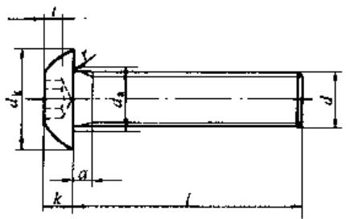

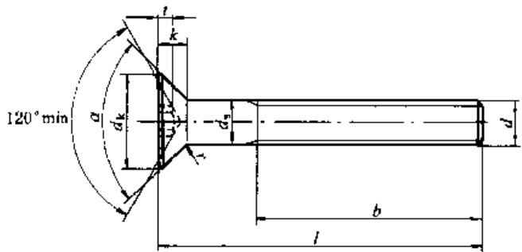

@ 

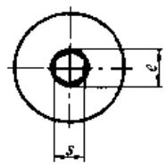

标记示例:

螺纹规格 ${ \vec { d } } = \mathbb { M } 1 2$ 、公称长度 $\bar { \ell } = 4 0 \mathrm { m m }$ 、性能等级为12.9级、表面氰化的A级内六角平圆头螺钉:

螺钉GB/T70.2 $\mathbf { M } \mathbf { l } 2 \times 4 0$ 

标记示例:

螺纹规格 $d = \mathbb { M } 1 2$ 、公称长度 $\bar { \iota } = 4 0 \mathrm { m m }$ 、性能等级为8.8级、表面氧化的A级内六角沉头螺钉:

螺钉GB/T70.3 ${ \bf M } 1 2 \times 4 0$ 

表4-1-107

/mm 

<table><tr><td colspan="2" rowspan="1">螺纹规格d</td><td colspan="1" rowspan="1">M3</td><td colspan="1" rowspan="1">M4</td><td colspan="1" rowspan="1">M5</td><td colspan="1" rowspan="1">M6</td><td colspan="1" rowspan="1">M8</td><td colspan="1" rowspan="1">M10</td><td colspan="1" rowspan="1">M12</td><td colspan="1" rowspan="1">（M14）</td><td colspan="1" rowspan="1">M16</td><td colspan="1" rowspan="1">M20</td></tr><tr><td colspan="2" rowspan="1">螺距P</td><td colspan="1" rowspan="1">0.5</td><td colspan="1" rowspan="1">0.7</td><td colspan="1" rowspan="1">0.8</td><td colspan="1" rowspan="1">1</td><td colspan="1" rowspan="1">1.25</td><td colspan="1" rowspan="1">1.5</td><td colspan="1" rowspan="1">1.75</td><td colspan="1" rowspan="1">2</td><td colspan="1" rowspan="1">2</td><td colspan="1" rowspan="1">2.5</td></tr><tr><td colspan="2" rowspan="1">公称</td><td colspan="1" rowspan="1">2</td><td colspan="1" rowspan="1">2.5</td><td colspan="1" rowspan="1">3</td><td colspan="1" rowspan="1">4</td><td colspan="1" rowspan="1">5</td><td colspan="1" rowspan="1">6</td><td colspan="1" rowspan="1">8</td><td colspan="1" rowspan="1">10</td><td colspan="1" rowspan="1">10</td><td colspan="1" rowspan="1">12</td></tr><tr><td colspan="2" rowspan="1">maxの</td><td colspan="1" rowspan="1">2.045</td><td colspan="1" rowspan="1">2.56</td><td colspan="1" rowspan="1">3.071</td><td colspan="1" rowspan="1">4.084</td><td colspan="1" rowspan="1">5.084</td><td colspan="1" rowspan="1">6.095</td><td colspan="1" rowspan="1">8.15</td><td colspan="1" rowspan="1">10. 115</td><td colspan="1" rowspan="1">10.115</td><td colspan="1" rowspan="1">12.142</td></tr><tr><td colspan="2" rowspan="1">max</td><td colspan="1" rowspan="1">2.06</td><td colspan="1" rowspan="1">2.58</td><td colspan="1" rowspan="1">3.08</td><td colspan="1" rowspan="1">4.095</td><td colspan="1" rowspan="1">5.14</td><td colspan="1" rowspan="1">6.14</td><td colspan="1" rowspan="1">8.175</td><td colspan="1" rowspan="1">10.175</td><td colspan="1" rowspan="1">10.175</td><td colspan="1" rowspan="1">12.212</td></tr><tr><td colspan="1" rowspan="8">G</td><td colspan="1" rowspan="1">emin</td><td colspan="1" rowspan="1">2.3</td><td colspan="1" rowspan="1">2.87</td><td colspan="1" rowspan="1">3.44</td><td colspan="1" rowspan="1">4.58</td><td colspan="1" rowspan="1">5.72</td><td colspan="1" rowspan="1">6.86</td><td colspan="1" rowspan="1">9.15</td><td colspan="1" rowspan="1">一</td><td colspan="1" rowspan="1">11.43</td><td colspan="1" rowspan="1"></td></tr><tr><td colspan="1" rowspan="1">，min</td><td colspan="1" rowspan="1">0.1</td><td colspan="1" rowspan="1">0.2</td><td colspan="1" rowspan="1">0.2</td><td colspan="1" rowspan="1">0.25</td><td colspan="1" rowspan="1">0.4</td><td colspan="1" rowspan="1">0.4</td><td colspan="1" rowspan="1">0.6</td><td colspan="1" rowspan="1"></td><td colspan="1" rowspan="1">0.6</td><td colspan="1" rowspan="1"></td></tr><tr><td colspan="1" rowspan="1">Q max</td><td colspan="1" rowspan="1">1</td><td colspan="1" rowspan="1">1.4</td><td colspan="1" rowspan="1">1.6</td><td colspan="1" rowspan="1">2</td><td colspan="1" rowspan="1">2.5</td><td colspan="1" rowspan="1">3</td><td colspan="1" rowspan="1">3.5</td><td colspan="1" rowspan="1"></td><td colspan="1" rowspan="1">4</td><td colspan="1" rowspan="1"></td></tr><tr><td colspan="1" rowspan="1">d.max</td><td colspan="1" rowspan="1">3.6</td><td colspan="1" rowspan="1">4.7</td><td colspan="1" rowspan="1">5.7</td><td colspan="1" rowspan="1">6.8</td><td colspan="1" rowspan="1">9.2</td><td colspan="1" rowspan="1">11.2</td><td colspan="1" rowspan="1">14.2</td><td colspan="1" rowspan="1"></td><td colspan="1" rowspan="1">18.2</td><td colspan="1" rowspan="1">:</td></tr><tr><td colspan="1" rowspan="1">dmax</td><td colspan="1" rowspan="1">5.7</td><td colspan="1" rowspan="1">7.6</td><td colspan="1" rowspan="1">9.5</td><td colspan="1" rowspan="1">10.5</td><td colspan="1" rowspan="1">14</td><td colspan="1" rowspan="1">17.5</td><td colspan="1" rowspan="1">21</td><td colspan="1" rowspan="1"></td><td colspan="1" rowspan="1">28</td><td colspan="1" rowspan="1"></td></tr><tr><td colspan="1" rowspan="1">kmax</td><td colspan="1" rowspan="1">1.65</td><td colspan="1" rowspan="1">2.2</td><td colspan="1" rowspan="1">2.75</td><td colspan="1" rowspan="1">3.3</td><td colspan="1" rowspan="1">4.4</td><td colspan="1" rowspan="1">5.5</td><td colspan="1" rowspan="1">6.6</td><td colspan="1" rowspan="1"></td><td colspan="1" rowspan="1">8.8</td><td colspan="1" rowspan="1"></td></tr><tr><td colspan="1" rowspan="1">min</td><td colspan="1" rowspan="1">1.04</td><td colspan="1" rowspan="1">1.3</td><td colspan="1" rowspan="1">1.56</td><td colspan="1" rowspan="1">2.08</td><td colspan="1" rowspan="1">2.6</td><td colspan="1" rowspan="1">3.12</td><td colspan="1" rowspan="1">4.16</td><td colspan="1" rowspan="1">1</td><td colspan="1" rowspan="1">5.2</td><td colspan="1" rowspan="1"></td></tr><tr><td colspan="1" rowspan="1">商品规格长度！</td><td colspan="1" rowspan="1">6~12</td><td colspan="1" rowspan="1">8~16</td><td colspan="1" rowspan="1">10~30</td><td colspan="1" rowspan="1">10~30</td><td colspan="1" rowspan="1">10~40</td><td colspan="1" rowspan="1">16~40</td><td colspan="1" rowspan="1">16~50</td><td colspan="1" rowspan="1">一</td><td colspan="1" rowspan="1">20-50</td><td colspan="1" rowspan="1"></td></tr><tr><td colspan="1" rowspan="6">G</td><td colspan="1" rowspan="1">（参考）</td><td colspan="1" rowspan="1">18</td><td colspan="1" rowspan="1">20</td><td colspan="1" rowspan="1">22</td><td colspan="1" rowspan="1">24</td><td colspan="1" rowspan="1">28</td><td colspan="1" rowspan="1">32</td><td colspan="1" rowspan="1">36</td><td colspan="1" rowspan="1">40</td><td colspan="1" rowspan="1">44</td><td colspan="1" rowspan="1">52</td></tr><tr><td colspan="1" rowspan="1">山max</td><td colspan="1" rowspan="1">3</td><td colspan="1" rowspan="1">4</td><td colspan="1" rowspan="1">5</td><td colspan="1" rowspan="1">6</td><td colspan="1" rowspan="1">8</td><td colspan="1" rowspan="1">10</td><td colspan="1" rowspan="1">12</td><td colspan="1" rowspan="1">14</td><td colspan="1" rowspan="1">16</td><td colspan="1" rowspan="1">20</td></tr><tr><td colspan="1" rowspan="1">dmax</td><td colspan="1" rowspan="1">6.72</td><td colspan="1" rowspan="1">8.96</td><td colspan="1" rowspan="1">11.2</td><td colspan="1" rowspan="1">13.44：</td><td colspan="1" rowspan="1">17.92</td><td colspan="1" rowspan="1">22.4</td><td colspan="1" rowspan="1">26.88</td><td colspan="1" rowspan="1">30.8</td><td colspan="1" rowspan="1">336</td><td colspan="1" rowspan="1">40.32</td></tr><tr><td colspan="1" rowspan="1">kmax</td><td colspan="1" rowspan="1">1.86</td><td colspan="1" rowspan="1">2.48</td><td colspan="1" rowspan="1">3.1</td><td colspan="1" rowspan="1">3.72</td><td colspan="1" rowspan="1">4.96</td><td colspan="1" rowspan="1">6.2</td><td colspan="1" rowspan="1">7.44</td><td colspan="1" rowspan="1">8.4</td><td colspan="1" rowspan="1">8.8</td><td colspan="1" rowspan="1">10.16</td></tr><tr><td colspan="1" rowspan="1">min</td><td colspan="1" rowspan="1">1.1</td><td colspan="1" rowspan="1">1.5</td><td colspan="1" rowspan="1">1.9</td><td colspan="1" rowspan="1">2.2</td><td colspan="1" rowspan="1">3</td><td colspan="1" rowspan="1">3.6</td><td colspan="1" rowspan="1">4.3</td><td colspan="1" rowspan="1">4.5</td><td colspan="1" rowspan="1">48</td><td colspan="1" rowspan="1">5.6</td></tr><tr><td colspan="1" rowspan="1">商品规格长度！</td><td colspan="1" rowspan="1">8~30</td><td colspan="1" rowspan="1">8~40</td><td colspan="1" rowspan="1">8~50</td><td colspan="1" rowspan="1">8~60</td><td colspan="1" rowspan="1">10~ 80</td><td colspan="1" rowspan="1">12~100</td><td colspan="1" rowspan="1">20~100</td><td colspan="1" rowspan="1">25~100</td><td colspan="1" rowspan="1">30~100：</td><td colspan="1" rowspan="1">35-100</td></tr><tr><td colspan="2" rowspan="1">全螺纹长度！</td><td colspan="1" rowspan="1">8~25</td><td colspan="1" rowspan="1">8~25</td><td colspan="1" rowspan="1">8~30</td><td colspan="1" rowspan="1">8~35</td><td colspan="1" rowspan="1">10~45</td><td colspan="1" rowspan="1">12-50</td><td colspan="1" rowspan="1">20~60</td><td colspan="1" rowspan="1">25-65</td><td colspan="1" rowspan="1">30~80</td><td colspan="1" rowspan="1">35~90</td></tr><tr><td colspan="2" rowspan="1">！系列</td><td colspan="7" rowspan="1">6，8，10，12，16,20，25，30，35，40，45，50,55、60,65，70.80.</td><td colspan="3" rowspan="1">90.100</td></tr><tr><td colspan="2" rowspan="3">技术性能</td><td colspan="2" rowspan="1">材料</td><td colspan="3" rowspan="1">钢</td><td colspan="1" rowspan="1">螺纹公</td><td colspan="1" rowspan="1">产品等级</td><td colspan="3" rowspan="1">其   他</td></tr><tr><td colspan="2" rowspan="1">性能等级</td><td colspan="3" rowspan="1">8.8、10.9、12.9</td><td colspan="1" rowspan="2">12.9级；5g、6g其他级别：g</td><td colspan="1" rowspan="2">A</td><td colspan="3" rowspan="2">出于头部结构的原因，该螺钉可能达不到8.8、10.9、12.9级的最小拉力载荷(GB/T3098.1，B类试验项日），但这些螺钉仍应符合GB/T3098.1规定的材料和其他要求</td></tr><tr><td colspan="2" rowspan="1">衣面处理</td><td colspan="3" rowspan="1">（1）氧化(2）电镀技术要求按GB/T 5267(3）非电解锌粉覆盖层技术要求按[SO10863（4）如需其他表面处理层或表面处理，应由供需双方协议</td></tr></table>

$\textcircled{1}$ 用于12.9级。 $\textcircled{2}$ 用于其他性能等级。注:1. $\alpha = 9 0 ^ { \circ } \sim 9 2 ^ { \circ }$ 2.1系列中 $\textstyle 6 \sim 5 0$ 用于CB/T70.2,6\~100用于GB/T70.3。

# 开槽锥端紧定螺钉(GB/T71—1985)

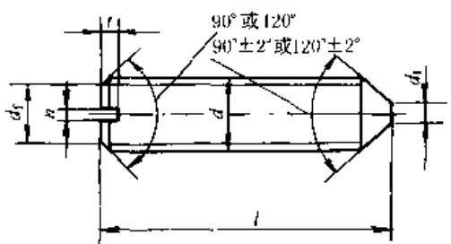

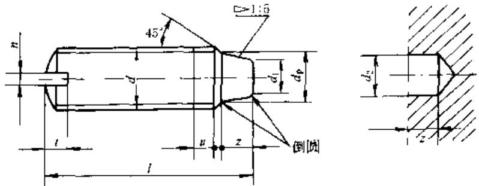

开槽锥端定位螺钉(GB/T72-1988)

$\pmb { \mathscr { H } }$ (不完整螺纹的长度) $\lesssim 2 P$ ${ \pmb \mathcal { P } }$ 为螺距

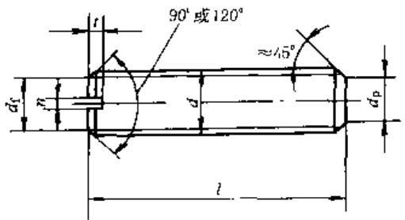

开槽平端紧定螺钉(GB/T73—1985)

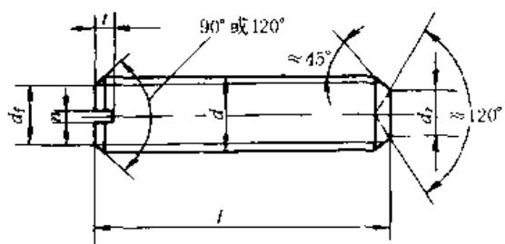

开槽凹端紧定螺钉(GB/T74--1985)

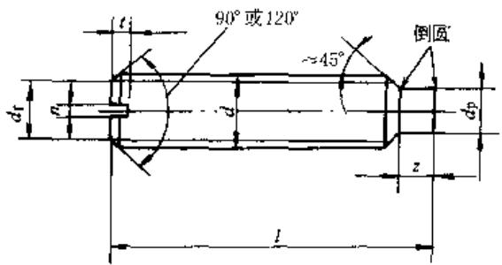

标记示例:

螺纹规格 $\begin{array} { r } { d = \mathbb { M } \boldsymbol { \mathsf { s } } } \end{array}$ 、公称长度 $\textit { t - } 1 2 \mathbf { m } \mathbf { m }$ 、性能等级为14H级、表面氧化的开槽锥端紧定螺钉:

螺钉GB/T71 $\Re \Im \times 1 2$ 

表4-1-108

/mm 

<table><tr><td colspan="2">螺纹规格d</td><td>M1.2D</td><td>M1.6</td><td>M2</td><td>M2.5</td><td>M3</td><td>M4</td><td>M5</td><td>M6</td><td>M8 ；</td><td>M10</td><td>M12</td></tr><tr><td colspan="2">螺距P</td><td>0.25</td><td>0.35</td><td>0.4</td><td>0.45</td><td>0.5</td><td>0.7</td><td>0.8</td><td>1</td><td>1.25</td><td>1.5</td><td>1.75</td></tr><tr><td colspan="2">d</td><td colspan="10">螺纹小 径</td></tr><tr><td colspan="2">n公称</td><td>0.2</td><td colspan="2">0.25</td><td colspan="2">0.4</td><td>0.6</td><td>0.8</td><td>1</td><td>1.2</td><td>1.6</td><td>2</td></tr><tr><td colspan="2">tmax</td><td>0.52</td><td>0.74</td><td>0.84</td><td>0.95</td><td>1.05</td><td>1.42</td><td>1.63</td><td>2</td><td>2.5</td><td>3</td><td>3.6</td></tr><tr><td colspan="2">dn</td><td></td><td>1</td><td>√</td><td>1</td><td>1.7</td><td>2.1</td><td>2.5</td><td>3.4</td><td>4.7</td><td>6</td><td>7.3</td></tr><tr><td colspan="2">d（推荐）</td><td>1</td><td>1</td><td>/</td><td>一</td><td>1.8</td><td>2.2</td><td>2.6</td><td>3.5</td><td>5</td><td>65</td><td>8</td></tr><tr><td colspan="2">d，max</td><td>1</td><td>0.8</td><td>1</td><td>1.2 ，</td><td>1.4</td><td>2</td><td>2.5</td><td>：</td><td>5</td><td>6</td><td>8</td></tr><tr><td colspan="2">d max</td><td>0.12</td><td>0.16</td><td>0.2</td><td>0.25</td><td>0.3</td><td>0.4</td><td>0.5</td><td>1.5</td><td>2</td><td>2.5</td><td>3</td></tr><tr><td colspan="2">d mx</td><td>0.6</td><td>0.8</td><td>1</td><td>1.5</td><td>2</td><td>2.5</td><td>3.5</td><td>4</td><td>5.5</td><td>7</td><td>8.5</td></tr><tr><td rowspan="2">7</td><td>GB/T 75</td><td>1</td><td>1 05</td><td>1.25</td><td>1.5</td><td>1.75</td><td>2.25</td><td>2.75</td><td>3.25</td><td>4.3</td><td>5.3</td><td>6.3</td></tr><tr><td>GB/T 72</td><td>1</td><td>1</td><td></td><td>1</td><td>1.5</td><td>2</td><td>2.5</td><td>3</td><td>4</td><td>5</td><td>6</td></tr><tr><td rowspan="6">商品规格 长度！</td><td>GB/T 71</td><td>2~6</td><td>2-8</td><td>3~10</td><td>3~12</td><td>4~16</td><td>6-20</td><td>8~25</td><td>8-30</td><td>10~40</td><td>12~50</td><td>14~60</td></tr><tr><td>GB/T 72</td><td>1</td><td>1</td><td>一</td><td>一</td><td>4~16</td><td>4~20</td><td>5~20</td><td>6-25</td><td>8~35</td><td>10~45</td><td>12~50</td></tr><tr><td>GB/T73</td><td>2-6</td><td>2~8</td><td>2~10</td><td>2.5~12</td><td>3~16</td><td>4~20</td><td>5~25</td><td>6-30</td><td>8~40</td><td>10~50</td><td>12~60</td></tr><tr><td>GB/T 74</td><td>1</td><td>2~8</td><td>2.5~10</td><td>3~12</td><td>3~16</td><td>4~20</td><td>5~2s</td><td>6~30</td><td>8-40</td><td>10~50</td><td>12~60</td></tr><tr><td>CB/T 75</td><td></td><td>2.5~8</td><td>3~10</td><td>4~12</td><td>5-16</td><td>6~20</td><td>8~25</td><td>8~30</td><td>10~40</td><td>12~50</td><td>14~60</td></tr><tr><td></td><td></td><td></td><td></td><td></td><td></td><td></td><td></td><td></td><td></td><td></td><td></td></tr></table>

2,2.5,3,4,5,6,8,10,12,(14),16,20、25,30.35.40,45、50,(55),60 

!系列

<table><tr><td rowspan=4 colspan=1>技术条件</td><td rowspan=1 colspan=2>材料</td><td rowspan=1 colspan=1>钢</td><td rowspan=1 colspan=1>不锈钢</td><td rowspan=4 colspan=1>螺纹公差：g</td><td rowspan=4 colspan=1>产品等级：A</td></tr><tr><td rowspan=1 colspan=1>性能等级</td><td rowspan=1 colspan=1>GB/T 72其他</td><td rowspan=1 colspan=1>14H、33H14H、22H</td><td rowspan=1 colspan=1>A1-50、C4-50A1-50</td></tr><tr><td rowspan=2 colspan=1>表面处理</td><td rowspan=2 colspan=1>CB/T 72其他</td><td rowspan=1 colspan=1>(1)不经处理；(2）氧化：（3）镀锌钝化</td><td rowspan=2 colspan=1>不经处理</td></tr><tr><td rowspan=1 colspan=1>(1）氧化；(2）镀锌钝化</td></tr></table>

$\mathfrak { D }$ 表示GB/T72无此规格;GB/T74、75没有M1.2规格。

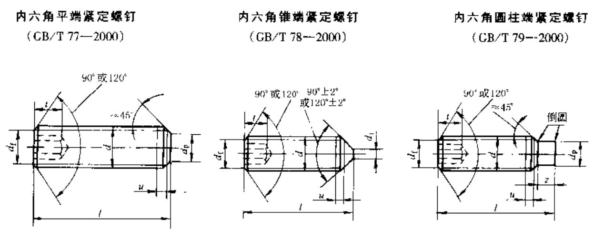

内六角凹端紧定螺钉(GB/T80-2000)

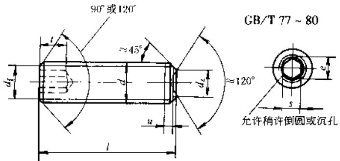

标记示例:

螺纹规格 $d = \pmb { \mathscr { M } } \pmb { \mathscr { 6 } }$ 、公称长度 $i = 1 2 \mathrm { m m }$ 、性能等级为 $\mathbf { 3 3 H }$ 、衣面氧化的内六角平端紧定螺钉:

螺钉GB/T77 $\ M \in \times 1 2$ 

/mm 

表4-1-109

<table><tr><td colspan="2">螺纹规格d</td><td>M1.6</td><td>M2</td><td>M2.5</td><td>M3</td><td>M4</td><td>M5</td><td>M6</td><td>M8</td><td>M10</td><td>M12</td><td>M16</td><td>M20</td><td>M24</td></tr><tr><td colspan="2">螺距P</td><td>0.35</td><td>0.4</td><td>0.45</td><td>0.5</td><td>0.7</td><td>0.8</td><td>1.0</td><td>1.25</td><td>1.5</td><td>1.75</td><td>2.0</td><td>2.5</td><td>3.0</td></tr><tr><td colspan="2">u（不完 郭螺纹长度）</td><td colspan="10">2P</td></tr><tr><td colspan="2">d</td><td colspan="10">螺纹小 径</td></tr><tr><td colspan="2">dpmax</td><td>0.8</td><td>1</td><td>1.5</td><td>2</td><td>2.5</td><td>3.5</td><td>4</td><td>5.5</td><td>7</td><td>8.5 12</td><td>15</td><td>18</td></tr><tr><td colspan="2">d，max</td><td>0.4</td><td>0.5</td><td>0.65</td><td>0.75</td><td>1</td><td>1.25</td><td>1.5</td><td>2</td><td>2.5 3</td><td>4</td><td>5</td><td>6</td></tr><tr><td colspan="2">dmax</td><td>0.8</td><td>1</td><td>1.2</td><td>1.4</td><td>2</td><td>2.5</td><td>3</td><td>5</td><td>6</td><td>8 10</td><td>14</td><td>16</td></tr><tr><td colspan="2">emin</td><td>0.8</td><td>1</td><td>1.43</td><td>1.73</td><td>2.3</td><td>2.87</td><td>3.44</td><td>4.58</td><td>5.72</td><td>6.86 9.15</td><td>11.43</td><td>13.72</td></tr><tr><td colspan="2">，公称</td><td>0.7</td><td>0.9</td><td>1.3</td><td>1.5</td><td>2</td><td>2.5</td><td>3</td><td>4</td><td>5</td><td>6 8</td><td>10</td><td>12</td></tr><tr><td rowspan="2">2max</td><td>短圆柱端</td><td>0.65</td><td>0.75</td><td>0.88</td><td>！</td><td>1.25</td><td>1.5</td><td>1.75</td><td>2.25</td><td>2.75 3.25</td><td>4.3</td><td>53</td><td>6.3</td></tr><tr><td>长圆柱端</td><td>1.05</td><td>1.25</td><td>1.5</td><td>1.75</td><td>2.25</td><td>2.75</td><td>3.25</td><td>4.3</td><td>5.3</td><td>6.3 8.36</td><td>10.36</td><td>12.43</td></tr><tr><td rowspan="4">规格 长度！</td><td>GB/T 77</td><td>2~8</td><td>2~10</td><td>2~12</td><td>2~16</td><td>2.5~20</td><td>3-25</td><td>4~30</td><td>5~40 6~50</td><td>8~60</td><td>10-60</td><td>12~60</td><td>16-60</td></tr><tr><td>GB/T 78</td><td>2~8</td><td>2~10</td><td>2.5~12</td><td>2.5~16</td><td>3~20</td><td>4~25 5-30</td><td>6-40</td><td>8~50</td><td>10~60</td><td>12~60</td><td>14~60</td><td>20~60</td></tr><tr><td>GB/T 79</td><td>2-8</td><td>2.5~10 3-12</td><td>4~16</td><td>5~20</td><td>6~25</td><td>8-30</td><td>8-40</td><td>10~50</td><td>12~60</td><td>14~60</td><td>20~60</td><td>25~60</td></tr><tr><td>GB/T 80</td><td>2~8</td><td>2~10</td><td>2~12 2.5~16</td><td>3~20</td><td>4~25</td><td>5-30</td><td>6~40</td><td>8~50</td><td>10~60</td><td>12~60</td><td>14-60</td><td>20-60</td></tr><tr><td colspan="2">！系列</td><td colspan="10">2，2.5.3，4，5.6，8，10，12、16，20，25,30,35,40,45,50,(55)，60</td></tr><tr><td colspan="2" rowspan="4">技术条件</td><td>材料</td><td></td><td>钢</td><td colspan="2">不锈钢</td><td colspan="2">有色金属</td><td colspan="2" rowspan="2">螺纹公差：45H 级为5g、6g，其他 等级为6g</td><td rowspan="4"></td><td rowspan="4"></td><td rowspan="2">产品等级：A</td></tr><tr><td>性能等级</td><td></td><td>45H</td><td colspan="2">A1、A2</td><td colspan="2">CU2、CU3、AIA</td></tr><tr><td colspan="2">表面处理</td><td>氧化</td><td colspan="2">简单处理</td><td colspan="2">简单处理</td></tr><tr><td colspan="2"></td><td></td><td colspan="2"></td><td colspan="2"></td></tr></table>

注:表面处理电镀技术要求按CB/T5267。如需其他表面镀层或表面处理,应由供需双方协议。

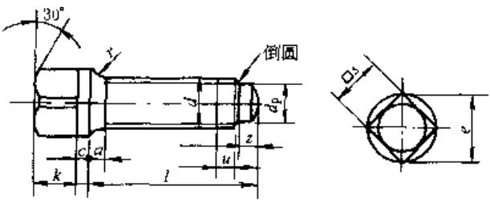

方头长圖柱球面端紧定螺钉(GB/T83—1988)

方头凹端紧定螺钉(GB/T84—1988)

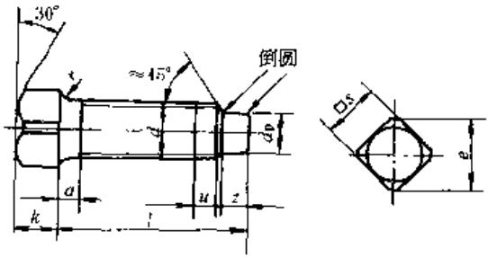

方头长圆柱端紧定螺钉(GB/T85-1988)

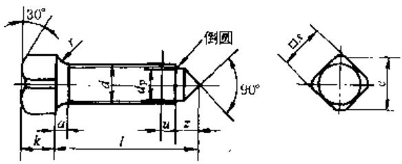

方头短圖柱锥端紧定螺钉(GB/T86---1988)

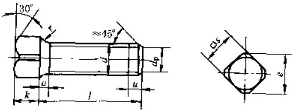

方头倒角端聚定螺钉(GB/T821-1988)

标记示例:

螺纹规格 $d = M \mathbb { i } 0$ 、公称长度 $\mathit { i } \equiv 3 0 \mathrm { m m }$ 、性能等级为 $3 3 \mathsf { H }$ 表面氧化的方头长圆柱球面端紧定螺钉:

螺钉GB/T83 $\bf { M I O } \times \bf { 3 0 }$ 

/mm 

表 4-1-110

<table><tr><td colspan="2">螺纹规格d</td><td>M5</td><td>M6</td><td>M8</td><td>M10</td><td>M12</td><td>M16</td><td>M20</td></tr><tr><td colspan="2">dmax</td><td>3.5</td><td>4</td><td>5.5</td><td>7.0</td><td>8.5</td><td>12</td><td>15</td></tr><tr><td colspan="2">d,max</td><td>2.5</td><td>3</td><td>5</td><td>6</td><td>7</td><td>10</td><td>13</td></tr><tr><td colspan="2">emin</td><td>6</td><td>7.3</td><td>9.7</td><td>12.2</td><td>14.7</td><td>20.9</td><td>27.1</td></tr><tr><td colspan="2">公称</td><td>5</td><td>6</td><td>8</td><td>10</td><td>12</td><td>17</td><td>22</td></tr><tr><td rowspan="2">k公称</td><td>CB/T 83</td><td>1</td><td>二</td><td>9</td><td>1</td><td>13</td><td>18</td><td>23</td></tr><tr><td>其他</td><td>5</td><td>6</td><td>7</td><td>8</td><td>10</td><td>14</td><td>18</td></tr><tr><td> min</td><td>GB/T 86 其他</td><td>3.5 2.5</td><td>4 3</td><td>5 4</td><td>6 5</td><td>7 6</td><td>9 8</td><td>11 10</td></tr><tr><td rowspan="2"></td><td>GB/T 83</td><td>0.2</td><td>0.25</td><td>0.4</td><td>0.5</td><td colspan="2">0.6</td><td>0.8</td></tr><tr><td>GB/T 84 其他</td><td>0.2</td><td>0.25</td><td>0.4</td><td></td><td colspan="2">0.6</td><td></td></tr><tr><td colspan="2">Ci</td><td>1</td><td>1</td><td>2</td><td colspan="2">3</td><td>4</td><td>0.8 5</td></tr></table>

续表

<table><tr><td rowspan=1 colspan=2>螺纹规格d</td><td rowspan=1 colspan=1>M5</td><td rowspan=1 colspan=2>M6</td><td rowspan=1 colspan=1>M8</td><td rowspan=1 colspan=2>M10   ！</td><td rowspan=1 colspan=1>M12</td><td rowspan=1 colspan=2>M16</td><td rowspan=1 colspan=1>M20</td></tr><tr><td rowspan=3 colspan=1>通用规格长度！</td><td rowspan=1 colspan=1>GB/T83GB/T 84</td><td rowspan=1 colspan=1>10~30</td><td rowspan=1 colspan=2>12~30</td><td rowspan=1 colspan=1>16-4014~ 40</td><td rowspan=1 colspan=2>20~50  ：20-50</td><td rowspan=1 colspan=1>25~6025-60</td><td rowspan=1 colspan=2>30-8030~80</td><td rowspan=1 colspan=1>35~10040~100</td></tr><tr><td rowspan=1 colspan=1>GB/T85GB/T86</td><td rowspan=1 colspan=1>12-30</td><td rowspan=1 colspan=2>12~30</td><td rowspan=1 colspan=1>14~40</td><td rowspan=1 colspan=2>20~50</td><td rowspan=1 colspan=1>25~60</td><td rowspan=1 colspan=2>25-80</td><td rowspan=1 colspan=1>40-100</td></tr><tr><td rowspan=1 colspan=1>GB/T 821</td><td rowspan=1 colspan=1>8~30</td><td rowspan=1 colspan=2>8-30</td><td rowspan=1 colspan=1>10-40</td><td rowspan=1 colspan=2>12-50</td><td rowspan=1 colspan=1>14~60</td><td rowspan=1 colspan=2>20~80</td><td rowspan=1 colspan=1>40~100</td></tr><tr><td rowspan=1 colspan=2>系列</td><td rowspan=1 colspan=10>8，10，12，(14)，16，20，25，30,35，40，45，50,(55）,60,70，80,90,100</td></tr><tr><td rowspan=1 colspan=2>技术条件</td><td rowspan=1 colspan=2>材料螺纹公差性能等级表面处理</td><td rowspan=1 colspan=3>钢45H级为5g、6g：33H级为6g33H、45H①氧化；②镀锌钝化</td><td rowspan=1 colspan=3>不锈钢6gA1-50、C4-50不经处理</td><td rowspan=1 colspan=2>产品等级：A</td></tr></table>

$\textcircled{1}$ 表示 $\mathbb { G } \mathbb { 3 } \mathrm { { \textrm { ‰} } } \ 8 3$ 无此规格。注: $a \leqslant 4 P$ ; $\pmb { \mathscr { u } }$ (不完整螺纹的长度) $\leqslant 2 P$ ( $\mathbf { \delta } _ { \mathbf { { \vec { P } } } }$ 为螺卧)

# 六角头不脱出螺钉(GB/T838—1988)

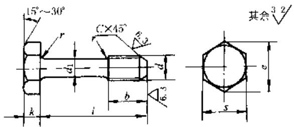

标记示例:

螺纹规格 $d = M { \bf 6 }$ 、公称长度 $\mathbf { \delta } _ { t } ^ { t } = 2 0 \mathbf { m } \mathbf { m }$ 、性能等级为4.8级不经表面处理的六角头不脱出螺钉;

螺钉GB/T838 $M 6 \times 2 0$ 

/mm 

表4-1-111

<table><tr><td rowspan=1 colspan=1>螺纹规格d</td><td rowspan=1 colspan=1>M5</td><td rowspan=1 colspan=2>M6</td><td rowspan=1 colspan=1>M8</td><td rowspan=1 colspan=1>M10</td><td rowspan=1 colspan=2>M12</td><td rowspan=1 colspan=2>（M14)</td><td rowspan=1 colspan=1>M16</td></tr><tr><td rowspan=1 colspan=1>dmax</td><td rowspan=1 colspan=1>3.5</td><td rowspan=1 colspan=2>4.5</td><td rowspan=1 colspan=1>5.5</td><td rowspan=1 colspan=1>7</td><td rowspan=1 colspan=2>9</td><td rowspan=1 colspan=2>11</td><td rowspan=1 colspan=1>12</td></tr><tr><td rowspan=1 colspan=1>smax</td><td rowspan=1 colspan=1>8</td><td rowspan=1 colspan=2>10</td><td rowspan=1 colspan=1>13</td><td rowspan=1 colspan=1>16</td><td rowspan=1 colspan=2>18</td><td rowspan=1 colspan=2>21</td><td rowspan=1 colspan=1>· 24</td></tr><tr><td rowspan=1 colspan=1>公称</td><td rowspan=1 colspan=1>3.5</td><td rowspan=1 colspan=2>4</td><td rowspan=1 colspan=1>5.3</td><td rowspan=1 colspan=1>6.4</td><td rowspan=1 colspan=2>7.5</td><td rowspan=1 colspan=2>8.8</td><td rowspan=1 colspan=1>10</td></tr><tr><td rowspan=3 colspan=1>6，minC</td><td rowspan=1 colspan=1>8</td><td rowspan=1 colspan=2>10</td><td rowspan=1 colspan=1>12</td><td rowspan=1 colspan=1>15</td><td rowspan=1 colspan=2>18</td><td rowspan=1 colspan=2>20</td><td rowspan=1 colspan=1>24</td></tr><tr><td rowspan=1 colspan=1>0.2</td><td rowspan=1 colspan=2>0.25</td><td rowspan=1 colspan=1>0.4</td><td rowspan=1 colspan=1></td><td rowspan=1 colspan=2></td><td rowspan=1 colspan=2>0.6</td><td rowspan=1 colspan=1></td></tr><tr><td rowspan=1 colspan=1>1.6</td><td rowspan=1 colspan=2>2</td><td rowspan=1 colspan=1>2.5</td><td rowspan=1 colspan=1>3</td><td rowspan=1 colspan=2>4</td><td rowspan=1 colspan=2>5</td><td rowspan=1 colspan=1>6</td></tr><tr><td rowspan=2 colspan=1>emin通用规格长度</td><td rowspan=1 colspan=1>8.79</td><td rowspan=1 colspan=2>11.05</td><td rowspan=1 colspan=1>14.38</td><td rowspan=1 colspan=1>17.77</td><td rowspan=1 colspan=2>20.03</td><td rowspan=1 colspan=2>23.35</td><td rowspan=1 colspan=1>26.75</td></tr><tr><td rowspan=1 colspan=1>14~ 40</td><td rowspan=1 colspan=2>20-50</td><td rowspan=1 colspan=1>25~65</td><td rowspan=1 colspan=1>30~80</td><td rowspan=1 colspan=2>30~100</td><td rowspan=1 colspan=2>35~100</td><td rowspan=1 colspan=1>40-100</td></tr><tr><td rowspan=1 colspan=1>系列</td><td rowspan=1 colspan=10>（14)，16，20，25.30，35，40.45，50，（55)，60，(65)，70、75，80.90．100</td></tr><tr><td rowspan=3 colspan=1>技术条件</td><td rowspan=1 colspan=2>材料</td><td rowspan=1 colspan=2>钢</td><td rowspan=1 colspan=2>不锈钢</td><td rowspan=3 colspan=2>螺纹公差：6g</td><td rowspan=3 colspan=2>产品等级：A</td></tr><tr><td rowspan=1 colspan=2>性能等级</td><td rowspan=1 colspan=2>4.8</td><td rowspan=1 colspan=2>A1-50;C4-50</td></tr><tr><td rowspan=1 colspan=2>表面处理</td><td rowspan=1 colspan=2>①不经处理；②镀锌钝化</td><td rowspan=1 colspan=2>不经处理</td></tr></table>

# 开槽沉头不脱出螺钉(GB/T948—1988)

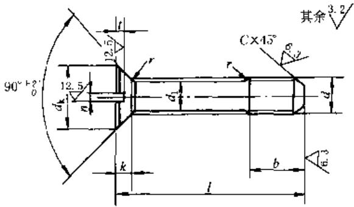

标记示例:

螺纹规格 $\begin{array} { r } { d = M \boldsymbol { \mathsf { S } } } \end{array}$ 、公称长度 $\textit { \textbf { i } } = 1 6 \operatorname { m m }$ 、性能等级为48级、不经表面处理的开槽沉头不脱出螺钉:

螺钉GB/T948 $M 5 \times 1 6$ 

表4-1-112

/mm 

<table><tr><td rowspan=1 colspan=1>螺纹规格d</td><td rowspan=1 colspan=1>M3</td><td rowspan=1 colspan=1>M4</td><td rowspan=1 colspan=1>M5</td><td rowspan=1 colspan=1>M6</td><td rowspan=1 colspan=1>M8</td><td rowspan=1 colspan=1>M10</td></tr><tr><td rowspan=9 colspan=1>dmaxmaxn公称tmakdmaxb”mxC通用规格长度</td><td rowspan=1 colspan=1>5.5</td><td rowspan=1 colspan=1>8.4</td><td rowspan=1 colspan=1>9.3</td><td rowspan=1 colspan=1>11.3</td><td rowspan=1 colspan=1>15.8</td><td rowspan=1 colspan=1>18.3</td></tr><tr><td rowspan=1 colspan=1>1.65</td><td rowspan=1 colspan=1>2.7</td><td rowspan=1 colspan=1></td><td rowspan=1 colspan=1>3.3</td><td rowspan=1 colspan=1>4.65</td><td rowspan=1 colspan=1>5.0</td></tr><tr><td rowspan=1 colspan=1>0.8</td><td rowspan=1 colspan=1>1.2</td><td rowspan=1 colspan=1></td><td rowspan=1 colspan=1>1.6</td><td rowspan=1 colspan=1>2.0</td><td rowspan=1 colspan=1>2.5</td></tr><tr><td rowspan=1 colspan=1>0.85</td><td rowspan=1 colspan=1>1.3</td><td rowspan=1 colspan=1>1.4</td><td rowspan=1 colspan=1>1.6</td><td rowspan=1 colspan=1>2.3</td><td rowspan=1 colspan=1>2.6</td></tr><tr><td rowspan=1 colspan=1>2.0</td><td rowspan=1 colspan=1>2.8</td><td rowspan=1 colspan=1>3.5</td><td rowspan=1 colspan=1>4.5</td><td rowspan=1 colspan=1>5.5</td><td rowspan=1 colspan=1>7.0</td></tr><tr><td rowspan=1 colspan=1>4</td><td rowspan=1 colspan=1>6</td><td rowspan=1 colspan=1>8</td><td rowspan=1 colspan=1>10</td><td rowspan=1 colspan=1>12</td><td rowspan=1 colspan=1>15</td></tr><tr><td rowspan=1 colspan=1>0.8</td><td rowspan=1 colspan=1>1.0</td><td rowspan=1 colspan=1>1.3</td><td rowspan=1 colspan=1>1.5</td><td rowspan=1 colspan=1>2.0</td><td rowspan=1 colspan=1>2.5</td></tr><tr><td rowspan=1 colspan=1>1.0</td><td rowspan=1 colspan=1>1.2</td><td rowspan=1 colspan=1>1.6</td><td rowspan=1 colspan=1>2.0</td><td rowspan=1 colspan=1>2.5</td><td rowspan=1 colspan=1>3.0</td></tr><tr><td rowspan=1 colspan=1>10 ~ 25</td><td rowspan=1 colspan=1>12- 30</td><td rowspan=1 colspan=1>14 - 40</td><td rowspan=1 colspan=1>20~50</td><td rowspan=1 colspan=1>25 - 60</td><td rowspan=1 colspan=1>30-60</td></tr><tr><td rowspan=1 colspan=1>系列</td><td rowspan=1 colspan=6>10，12，（14)，16，20，25，30，35，40，45，50，（55)，60</td></tr></table>

十字槽盘头自攻螺钉(GB/T845-1985)C型一锥端

十字槽半沉头自攻螺钉(GB/T847-1985)C型-锥端 F型—平端(GB/T845\~GB/T847)

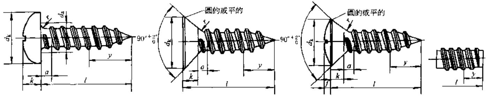

标记示例:

螺纹规格 ST3.5、公称长度 $\bar { \iota } = 1 6 \mathsf { m m } . \mathsf { H }$ 型槽镀锌钝化的C型士字槽盘头自攻螺钉:自攻螺钉GB/T845ST $_ { 3 . 5 \times }$ 16

表4-1-113

/mm 

<table><tr><td colspan="2">螺纹规格</td><td>ST2.2</td><td>ST2.9</td><td>ST3.5</td><td>ST4.2</td><td>ST4.8</td><td>ST5.5</td><td>ST6.3</td><td>ST8</td><td>ST9.5</td></tr><tr><td colspan="2">QmAx</td><td>0.8</td><td>1.1</td><td>1.3</td><td>1.4</td><td>1.6</td><td colspan="2">1.8</td><td colspan="2">2.1</td></tr><tr><td rowspan="2">（参考）</td><td>C型</td><td>2</td><td>2.6</td><td>3.2</td><td>3.7</td><td>4.3</td><td>5</td><td>6</td><td>7.5</td><td>8</td></tr><tr><td>F型</td><td>1.6</td><td>2.1</td><td>2.5</td><td>2.8</td><td>3.2</td><td>3.6</td><td></td><td>4.2</td><td></td></tr><tr><td rowspan="4">GB/T845</td><td>山 mAx k</td><td>4</td><td>5.6</td><td>7</td><td>8</td><td>9.5</td><td>1</td><td>12</td><td>16</td><td>20</td></tr><tr><td>mx</td><td>1.6</td><td>2.4</td><td>2.6</td><td>3.1</td><td>3.7</td><td>4</td><td>4.6</td><td>6</td><td>7.5</td></tr><tr><td>山 max</td><td>2.8</td><td>3.5</td><td>4.1</td><td>4.9</td><td>5.6</td><td>6.3 0.25</td><td>7.1</td><td>9.2</td><td>10.7</td></tr><tr><td>rmin</td><td></td><td>0.1</td><td></td><td>0.2</td><td></td><td></td><td></td><td>0.4</td><td></td></tr><tr><td></td><td>商品规格 长度！</td><td>4.5~16</td><td>6.5-19</td><td>9.5- 25</td><td>9.5~32</td><td>9.5~38</td><td>13 ~ 38</td><td></td><td>16-50</td><td></td></tr></table>

续表

<table><tr><td rowspan=1 colspan=2>螺纹规格</td><td rowspan=1 colspan=1>ST2.2</td><td rowspan=1 colspan=1>ST2.9</td><td rowspan=1 colspan=1>ST3.5</td><td rowspan=1 colspan=1>ST4.2</td><td rowspan=1 colspan=1>ST4.8</td><td rowspan=1 colspan=1>ST5.5</td><td rowspan=1 colspan=1>ST6.3</td><td rowspan=1 colspan=1>ST8</td><td rowspan=1 colspan=1>ST9.5</td></tr><tr><td rowspan=1 colspan=1></td><td rowspan=1 colspan=1>dmax</td><td rowspan=1 colspan=1>3.8</td><td rowspan=1 colspan=1>5.5</td><td rowspan=1 colspan=1>7.3</td><td rowspan=1 colspan=1>8.4</td><td rowspan=1 colspan=1>9.3</td><td rowspan=1 colspan=1>10.3</td><td rowspan=1 colspan=1>11.3</td><td rowspan=1 colspan=1>15.8</td><td rowspan=1 colspan=1>18.3</td></tr><tr><td rowspan=1 colspan=1>GB/T 846：</td><td rowspan=1 colspan=1>：Amax</td><td rowspan=1 colspan=1>1.1</td><td rowspan=1 colspan=1>1.7</td><td rowspan=1 colspan=1>2.35</td><td rowspan=1 colspan=1>2.6</td><td rowspan=1 colspan=1>2.8</td><td rowspan=1 colspan=1>3</td><td rowspan=1 colspan=1>3.15</td><td rowspan=1 colspan=1>4.65</td><td rowspan=1 colspan=1>5.25</td></tr><tr><td rowspan=4 colspan=1>GB/T 847</td><td rowspan=4 colspan=1>i，商品规格长度！</td><td rowspan=1 colspan=1>0.5</td><td rowspan=1 colspan=1>0.7</td><td rowspan=1 colspan=1>0.8</td><td rowspan=1 colspan=1>1</td><td rowspan=1 colspan=1>1.2</td><td rowspan=1 colspan=1>1.3</td><td rowspan=1 colspan=1>1.4</td><td rowspan=2 colspan=1>23.2</td><td rowspan=4 colspan=1>2.3416~50</td></tr><tr><td rowspan=3 colspan=1>0.84.5-16</td><td rowspan=3 colspan=1>1.26.5~19</td><td rowspan=1 colspan=1>1.4</td><td rowspan=1 colspan=1>1.6</td><td rowspan=1 colspan=1>2</td><td rowspan=1 colspan=1>2.2</td><td rowspan=1 colspan=1>2.4</td></tr><tr><td rowspan=2 colspan=1>9.5~25</td><td rowspan=2 colspan=1>9.5~32</td><td rowspan=1 colspan=1></td><td rowspan=2 colspan=2>13~38</td><td rowspan=2 colspan=1>16~50</td></tr><tr><td rowspan=1 colspan=1></td><td rowspan=1 colspan=1></td></tr><tr><td rowspan=1 colspan=2>1系列</td><td rowspan=1 colspan=9>4.5，6.5，9.5、13、16、19，22，25,32，38，45，50</td></tr></table>

注:1.螺纹规格中数字表示螺纹公称外径。十字檀有H型和Z型。2.自攻螺钉安装前需预制孔,在实际使用时,应根据具体条件,经过适当的工艺验证,确定最佳顶制孔尺寸。3.自攻螺钉应由渗碳钢制造。其表面硬度 $\cong 4 5 \mathrm { { H R C } }$ 4.产品等级为A级。5.自攻螺钉用板厚 $\mathfrak { H } = 1 . 2 \prec 5 . \mathfrak { k } .$ 

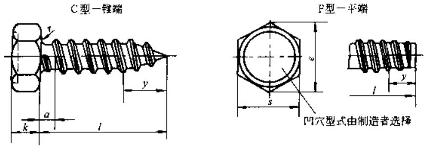

六角头自攻螺钉(GB/T5285—1985)

标记示例:

螺纹规格ST3.5、公称长度 $\lambda = 1 6 \mathrm { m m }$ 、表面镀锌钝化的C型六角头自攻螺钉:

自攻螺钉GB/T5285 $\mathsf { S T } 3 . 5 \times 1 6 . 5$ 

/mm 

表 4-1-114

<table><tr><td colspan="2">螺纹规格</td><td>·ST2.2</td><td>ST2.9</td><td>ST3.5</td><td>ST4.2</td><td>ST4.8</td><td>ST5.5</td><td>ST6.3</td><td>ST8</td><td>ST9.5</td></tr><tr><td colspan="2">max</td><td>0.8</td><td>1.1</td><td>1.3</td><td>1.4</td><td>1.6</td><td>1.8</td><td>1.8</td><td>2.1</td><td>2.1</td></tr><tr><td colspan="2">1 max</td><td>3.2</td><td>5</td><td>5.5</td><td>7</td><td>8</td><td>8</td><td>10</td><td>13</td><td>16</td></tr><tr><td colspan="2">emin</td><td>3.38</td><td>5.4</td><td>5.96</td><td>7.59</td><td>8.71</td><td>8.71</td><td>10.95</td><td>14.26</td><td>17.62</td></tr><tr><td colspan="2">k mAX</td><td>1.6</td><td>2.3</td><td>2.6</td><td>3</td><td>3.8</td><td>4.1</td><td>4.7</td><td>6</td><td>7.5</td></tr><tr><td colspan="2">min 1</td><td>0.1</td><td>0.1</td><td>0.1</td><td>0.2</td><td>0.2</td><td>0.25</td><td>0.25</td><td>0.4</td><td>0.4</td></tr><tr><td>（参考）</td><td>C型 F型</td><td>2 1.6</td><td>2.6 2.1</td><td>3.2 2.5</td><td>3.7 2.8</td><td>4.3 3.2</td><td>5 3.6</td><td>6 3.6</td><td>7.5 4.2</td><td>8 4.2</td></tr><tr><td>i</td><td>通用规格 特殊规格</td><td>4.5~16</td><td>6.5-19</td><td>6.5-22</td><td>9.5~25</td><td>9.5-32</td><td>13~ 32</td><td>13~38</td><td>13-50</td><td>16~50</td></tr><tr><td colspan="2">！系列</td><td>19~50</td><td>22~50</td><td>25~50</td><td>32~50 25,32,</td><td>38~50</td><td>38~50</td><td>45~50</td><td>1</td><td>1</td></tr><tr><td colspan="2">技术条件</td><td colspan="2">4.5, 6.5, 9.5,13, 16、 螺纹：GB/T5280</td><td colspan="2">19， 22、 产品等级：A</td><td colspan="2">38，45，50 表面处理：镀锌钝化</td><td colspan="3">机械性能：按CB/T3098.5</td></tr></table>

注:同表4-1-113注1、2。

# 十宇槽沉头自攻锁紧螺钉(GB/T6561—1986)

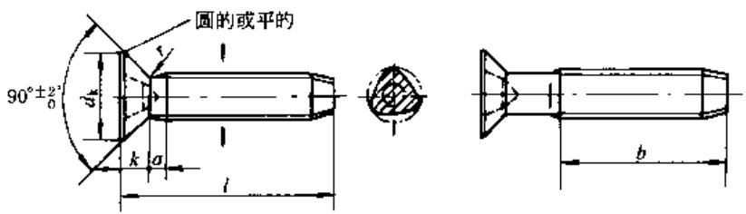

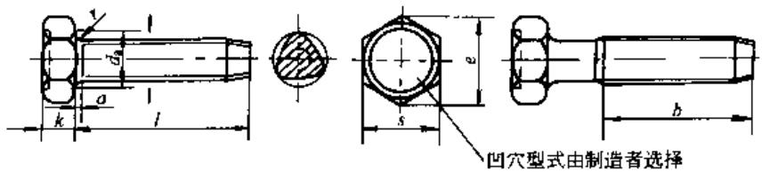

六角头自攻锁紧螺钉(GB/T6563-1986)

标记示例:

螺纹规格 $\pmb { d } = \pmb { M } 5$ 、公称长度 $\pmb { l } = 2 \pmb { 0 } \mathbf { m } \mathbf { m }$ 性能等级为B级、表面镀锌钝化的十字糟沉头自攻锁紧螺钉:自攻螺钉GB/T6561 $\mathbb { M } \mathbb { S } \times 2 0$ 

/mm 

表4-1-115

<table><tr><td colspan="6">GB/T 6561-1986</td><td colspan="6">GB/T 6563-1986</td></tr><tr><td>螺纹规格d</td><td>M2.5</td><td>M3</td><td>M4</td><td>MS</td><td>M6</td><td>螺纹规格d</td><td></td><td>M5 M6</td><td>M8</td><td>M10</td><td>M12</td></tr><tr><td>a max</td><td>0.9</td><td>1</td><td>1.4</td><td>1.6</td><td>2</td><td>amax bmin</td><td>2.4 30</td><td>3 35</td><td>3.75 35</td><td>4.5 35</td><td>5.25 35</td></tr><tr><td>in</td><td>12</td><td>18</td><td>24</td><td>30</td><td>35</td><td>： max</td><td>8</td><td>10</td><td>13</td><td>16</td><td>18</td></tr><tr><td>d max</td><td>4.7</td><td>5.5</td><td>8.4</td><td>9.3</td><td>11.3</td><td>emin</td><td>8.79</td><td>11.05</td><td>14.38</td><td>17.77</td><td>20.03</td></tr><tr><td>kmax</td><td>1.5</td><td>1.65</td><td>2.7</td><td>2.7</td><td>3.3</td><td>A 公称</td><td>3.5</td><td>4</td><td>5.3</td><td>6.4</td><td>7.5</td></tr><tr><td>，min</td><td>0.6</td><td>0.8</td><td>1</td><td>1.3</td><td>1.5</td><td>d,max r</td><td>s.7 0.2</td><td>6.8 0.25</td><td>9.2 0.4</td><td>11.2 0.4</td><td>13.7 0.6</td></tr><tr><td>商品规格长度！</td><td>6~16</td><td>8-20</td><td>10~30</td><td>12 ~ 35</td><td>14~40</td><td>商品规格长度</td><td>10~50</td><td>12-60</td><td>16~80</td><td>20~80</td><td>25~80</td></tr><tr><td>全螺纹长度1</td><td>6~12</td><td>8~16</td><td>10~25</td><td>12~30</td><td>14~30</td><td>全螺纹长度！</td><td>10~30</td><td>12~35</td><td>16~35</td><td></td><td>25-35</td></tr><tr><td></td><td></td><td></td><td></td><td></td><td></td><td></td><td></td><td></td><td></td><td>20~35</td><td></td></tr><tr><td colspan="2">！系列</td><td colspan="8">6，8，10，12，(14)，16,20，25，30，35、40，45，50，(55)，60，(65)，70，80</td><td colspan="2" rowspan="7">产品等级：A</td></tr><tr><td rowspan="4">技术条件</td><td colspan="2">螺杆尺寸</td><td colspan="4">GB/T 6559</td><td rowspan="3" colspan="3">公差标准：</td></tr><tr><td colspan="2">性能等级</td><td colspan="3">A、B</td><td colspan="2" rowspan="3">GB/T 3103.1</td></tr><tr><td colspan="2">表面处理</td><td colspan="3">镀锌钝化</td></tr></table>

注:1.同表4-1-113注1、2。2.GB/T6561{系列范围为 $6 \sim 4 0 _ { \mathfrak { s } }$ 

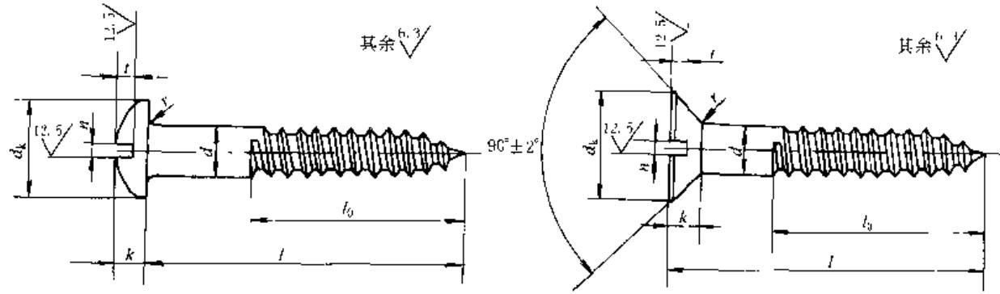

开槽圆头木螺钉(GB/T99-1986)

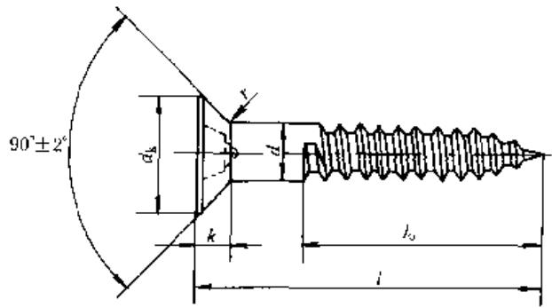

十字植沉头木螺钉(GB/T951—1986)

标记示例:

公称直径 $1 0 \mathrm { m m }$ 、长度 $\mathbf { \boldsymbol { \mathbf { \mathit { I } } } } ( \mathbf { \boldsymbol { \mathbf { \hat { K } } } } \mathbf { \boldsymbol { \mathbf { \hat { \Pi } } } } \mathbf { \mathit { I n m } }$ 、材料为Q235、不经衣面处理的开糟圆头木螺钉:

木螺钉GB/T99 $1 0 \times 1 0 0$ 

表 4-1-116

/mm 

<table><tr><td colspan="3">d</td><td>1.6</td><td>2</td><td>2.5</td><td>3</td><td>3.5</td><td>4</td><td>（4.5）</td><td>5</td><td>(5.5)</td><td>6</td><td>7</td><td>8</td><td>10</td></tr><tr><td colspan="3">n公称</td><td>0.4</td><td>0.5</td><td>0.6</td><td>0.8</td><td colspan="7">0.9 ！ 1.2</td><td>1.8 2</td><td>2.5</td></tr><tr><td colspan="3">！ 1</td><td colspan="4">0.2</td><td colspan="5">0.4</td><td colspan="2">1.6</td><td colspan="2">0.5</td></tr><tr><td rowspan="4">1 CB/T 99</td><td>山</td><td>max</td><td>3.2</td><td>3.9</td><td>4.6</td><td>5.8</td><td>6.8</td><td>7.7</td><td>8.6</td><td>8.5</td><td>10.5</td><td>11.1</td><td>13.4</td><td>15.2</td><td>18.9</td></tr><tr><td>k</td><td>max</td><td>1.4</td><td>1.6</td><td>2</td><td>2.4</td><td>2.7</td><td>3</td><td>3.3</td><td>3.5</td><td>4</td><td>4.3</td><td>4.9</td><td>5.5</td><td>6.8</td></tr><tr><td>一 商品规格</td><td>max</td><td>1</td><td>1.</td><td>1.3</td><td>1.5</td><td>1.7</td><td>2</td><td>2.2</td><td>2.5</td><td>2.7</td><td>2.8</td><td>3.1</td><td>3.7</td><td>4.3</td></tr><tr><td colspan="2">长度</td><td>6~12</td><td>6~14</td><td>6~22</td><td>8~25</td><td>8-38</td><td>12~65</td><td>14~80</td><td>16-90</td><td>22~90</td><td>22 ~ 120</td><td colspan="2">38~120</td><td>65-120</td></tr><tr><td rowspan="4">GB/T100 CB/T 951</td><td>dmax k</td><td></td><td>3.2</td><td>4</td><td>5</td><td>6</td><td>7</td><td>8</td><td>9</td><td>10</td><td>11</td><td>12</td><td>14</td><td>16</td><td>20</td></tr><tr><td></td><td></td><td>1</td><td>1.2</td><td>1.4</td><td>1.7</td><td>2</td><td>2.2</td><td>2.7</td><td>3</td><td>3.2</td><td>3.5</td><td>4</td><td>4.5</td><td>5.8</td></tr><tr><td>！ max 商品规格</td><td>0.7</td><td></td><td>0.8</td><td>1</td><td>1.1</td><td>1.4</td><td>1.5</td><td>1.7</td><td>1.9</td><td>2.1</td><td>2.2</td><td>2.6</td><td>2.8</td><td>3.5</td></tr><tr><td>长度 ！</td><td>6~12</td><td>6~16</td><td></td><td>6~25</td><td>8~30</td><td>8~40</td><td>12~70</td><td>16~85</td><td></td><td>18~10025~10025~120</td><td></td><td>40-120</td><td></td><td>75~ 120</td></tr><tr><td>山 ！系列</td><td colspan="15">4,5,6,8,9,10,12,13,14,17,20,21,23,25,26,30,33,36,40,43,46,50,52,56,60,66,80</td></tr><tr><td></td><td colspan="10">6,8,10,12,14,16,18,20,(22),25,30.(32).35,(38),40,45,50.(55),60,(65),70,(75),80,(85).90,100,120</td></tr></table>

注:1.GB/T951无直径1.6规格。2.标记示例中的材料为最常用的主要材料,其他材料详见GB/T922、

# 吊环螺钉(GB/T825-1988)

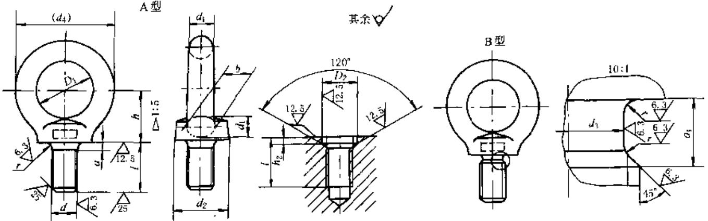

适用于A型

标记示例:

/mm 

规格为 $\mathtt { 2 0 m m }$ 、材料为20钢,经正火处理,不经表面处理的A型吊环螺钉:螺钉GB/T825M20表4-1-117

<table><tr><td colspan="2">规格d</td><td></td><td>M8</td><td>M10</td><td>M12</td><td>M16</td><td>M20</td><td>M24</td><td>M30</td><td>M36</td><td>M42</td><td>M48</td><td>M56</td><td>M64</td><td>M72 ×6</td><td>M80 x6</td><td>M100 ×6</td></tr><tr><td colspan="2">D</td><td>公称</td><td>20</td><td>24</td><td>13.1 28 29.1</td><td>15.2 34 35.2</td><td>17.4 40</td><td>21.4 48 49.4</td><td>25.7 56</td><td>30 67</td><td>34.4 80</td><td>40.7 95</td><td>44.7 112</td><td></td><td>51.4 125</td><td>63.8 140</td><td>71.8 79.2 160 200</td></tr><tr><td colspan="2">dmax ！公称</td><td>21.1</td><td>25.1</td><td></td><td></td><td>41.4</td><td></td><td>40</td><td>57.7 45</td><td>69 55</td><td>82.4 65</td><td>97.7 70</td><td>114.7 80</td><td>128.4</td><td>143.8</td><td>163.8</td><td>204.2 140</td></tr><tr><td colspan="2">d（参考）</td><td>16 36</td><td>20 44</td><td>22 52</td><td>28 62</td><td>35 72</td><td></td><td>88</td><td>104</td><td>123</td><td>144</td><td>171</td><td></td><td>90</td><td>100</td><td>115</td><td>350</td></tr><tr><td colspan="2">h</td><td>18</td><td>22</td><td>26</td><td>31</td><td>36</td><td>44</td><td></td><td>53</td><td>63</td><td>74</td><td>87</td><td>1% 100</td><td>221 115</td><td>260 130</td><td>29 150</td><td>175</td></tr><tr><td colspan="2">，min 4 ax</td><td></td><td></td><td></td><td></td><td></td><td></td><td>2</td><td></td><td></td><td>3</td><td></td><td></td><td>4</td><td></td><td></td><td>5</td></tr><tr><td colspan="2">d a b</td><td>3.75 6 2.5 10</td><td>4.5 7.7 3</td><td>12</td><td>5.25 9.4 3.5 14</td><td>6 13 4 16</td><td>7.5 16.4 5 19</td><td>9 19.6 6 24</td><td>10.5 25 7 28</td><td>12 30.8 8 32</td><td>13.5 35.6 9 38</td><td>15 41 10 46</td><td>16.5 48.3 11 50</td><td>55.7</td><td>18 63.7 12</td><td>71.7</td><td>91.7</td></tr><tr><td colspan="2"></td><td>D公称 公称 每1000个的重量/kg 轴向保证载荷/</td><td>13 2.5 40.5 3.2</td><td>15 3 77.9 5</td><td>17 3.5 131.7 8</td><td>22 4.5 233.7 12.5</td><td>28 5 385.2 20</td><td>32 7 705.3 32</td><td>38 8 1205 50</td><td>45 9.5 1998 80</td><td>52 10.5 3070 125</td><td>60 11.5 4947 160</td><td>68 12.5 7155 200</td><td>58 75 13.5 10382 320</td><td>72 85 17758 400</td><td>80 95 14 25892 500</td><td>88 115 40273 800</td></tr><tr><td>D</td><td>单螺钉起吊</td><td>max</td><td>0.16</td><td>0.25</td><td>0.4</td><td>0.63 1</td><td></td><td>1.6</td><td>2.5</td><td>4 6.3</td><td>8</td><td>10</td><td></td><td>16</td><td>20</td><td>25</td><td>40</td></tr><tr><td></td><td>45°max</td><td>min</td><td>0.08</td><td>0.125</td><td>0.2</td><td>0.32</td><td>0.5</td><td>0.8</td><td>1.25</td><td>2</td><td>3.2</td><td>4</td><td>5</td><td>8</td><td>10</td><td>12.5</td><td>20</td></tr><tr><td></td><td></td><td>技术条件</td><td></td><td>材料：20或25钢</td><td></td><td></td><td>螺纹公差 Bg</td><td></td><td>热处理：整体铸造，</td><td>正火处理</td><td></td><td></td><td>表面处理：①不处理；②镀锌钝 化；③镀铬按GB/T5267规定</td><td></td><td></td><td></td><td></td></tr></table>

注:M8\~M36为商品规格。吊环螺钉应进行硬度试验,其硬度值应符合 $6 7 \sim 9 5 \mathrm { H R B }$ 。

# 3.5.5螺 母

表4-1-118

螺母汇总表

<table><tr><td rowspan=46 colspan=1>类方形及六角形易形</td><td></td><td></td><td></td><td></td><td></td><td></td><td></td><td></td><td></td></tr><tr><td rowspan=3 colspan=1>名        称</td><td rowspan=3 colspan=1>标   准</td><td rowspan=3 colspan=1>规d或D</td><td rowspan=3 colspan=5>特性和用途</td><td></td></tr><tr><td rowspan=44 colspan=1>页次4-1174-1214-J2[4-1244-1214-1234-1244-124-1254-1174-1184-1264-1314-1184-1194-1194.12041274-1324-1334-1344-1294-130</td></tr><tr><td rowspan=1 colspan=1>页次</td></tr><tr><td rowspan=1 colspan=1>方螺母C级</td><td rowspan=1 colspan=1>CB/T39--1988</td><td rowspan=1 colspan=1>M3~M24</td><td rowspan=1 colspan=5>方螺母扳手卡仕不易打滑</td><td rowspan=1 colspan=1>4-117</td></tr><tr><td rowspan=1 colspan=1>六角螺母C级</td><td rowspan=1 colspan=1>GB/T41-2000</td><td rowspan=1 colspan=1>M5-M64</td><td rowspan=1 colspan=5>用于粗糙、简单的结构六角螺母应用普遍</td><td rowspan=1 colspan=1>4-121</td></tr><tr><td rowspan=1 colspan=1>1型六角螺母</td><td rowspan=1 colspan=1>GB/T 6170--2000</td><td rowspan=1 colspan=1>M1.6~M64</td><td rowspan=1 colspan=5>六角螺母应用普遍扁螺母 一般用于螺检承受</td><td rowspan=1 colspan=1>4-J2[</td></tr><tr><td rowspan=1 colspan=1>1型六角螺母细牙</td><td rowspan=1 colspan=1>CB/T6171-2000</td><td rowspan=1 colspan=1>M8×1~M64×4</td><td rowspan=1 colspan=5>剪力为主，或结构，位置要求紧</td><td rowspan=1 colspan=1>4-124</td></tr><tr><td rowspan=1 colspan=1>六角薄螺母</td><td rowspan=1 colspan=1>GB/T 6172.1--2000</td><td rowspan=1 colspan=1>M1.6~ M64</td><td rowspan=1 colspan=2>凑的地方</td><td rowspan=2 colspan=5>凑的地方薄螺母较扁螺在防松装置中用作副螺母，起锁紧作用</td></tr><tr><td rowspan=1 colspan=1>非金属嵌件六角锁紧薄螺母</td><td rowspan=1 colspan=1>GB/T 6172.2-2000</td><td rowspan=1 colspan=1>M13~M36</td><td></td><td rowspan=1 colspan=1>4-123</td></tr><tr><td rowspan=1 colspan=1>六角薄螺母细牙</td><td rowspan=1 colspan=1>GB/T6173-2000</td><td rowspan=1 colspan=1>M8×1~M64×4</td><td rowspan=1 colspan=5>厚蜂母用于常拆卸的联接糟形螺母用于振动、变载荷</td><td rowspan=1 colspan=1>4-124</td></tr><tr><td rowspan=1 colspan=1>六角薄螺母无倒角</td><td rowspan=1 colspan=1>GB/T6174-2000</td><td rowspan=1 colspan=1>M1.6~M10</td><td rowspan=1 colspan=5>糟形螺母用于振动、变载荷等松动的地方，配以月销防松</td><td rowspan=1 colspan=1>4-12</td></tr><tr><td rowspan=1 colspan=1>2型六角螺母</td><td rowspan=1 colspan=1>GB/T6175-2000</td><td rowspan=1 colspan=1>M5~M36</td><td rowspan=2 colspan=5>六角法兰面螺母防松性能好，不需再用弹赞垫圈带嵌件的六角锁紧螺母 嵌</td><td rowspan=2 colspan=1>4-125</td></tr><tr><td rowspan=1 colspan=1>2型六角螺母细牙</td><td rowspan=1 colspan=1>GB/T6176-2000</td><td rowspan=1 colspan=1>M8x1~M36×3</td></tr><tr><td rowspan=1 colspan=1>六角厚螺母</td><td rowspan=1 colspan=1>GB/TS6-1988</td><td rowspan=1 colspan=1>M16~M48</td><td rowspan=1 colspan=5>带嵌件的六角锁紧螺母 嵌件最靠拧紧时攻出螺纹、所以防</td><td rowspan=1 colspan=1>4-117</td></tr><tr><td rowspan=1 colspan=1>小六角特扁细牙螺母</td><td rowspan=1 colspan=1>CB/T808~1988</td><td rowspan=1 colspan=1>M4×0.5~M24×1</td><td rowspan=1 colspan=5>松性能好，弹性也好</td><td rowspan=1 colspan=1>4-118</td></tr><tr><td rowspan=3 colspan=1>六角法兰面螺母</td><td rowspan=3 colspan=1>CB/T6177.1~2000</td><td rowspan=3 colspan=1>M5~M20</td><td rowspan=3 colspan=2></td><td></td><td></td><td></td></tr><tr><td rowspan=2 colspan=3></td><td></td></tr><tr><td rowspan=1 colspan=3>作锁母，与六角</td><td rowspan=1 colspan=1></td></tr><tr><td rowspan=1 colspan=1>型六角开槽螺母A和B级</td><td rowspan=1 colspan=1>GB/T6178-1986</td><td rowspan=1 colspan=1>M4~ M36</td><td rowspan=1 colspan=5>防松效果粒好</td><td rowspan=1 colspan=1></td></tr><tr><td rowspan=1 colspan=1>型六角开槽爆母C级</td><td rowspan=1 colspan=1>GB/T6179--1986</td><td rowspan=1 colspan=1>M5~ M36</td><td rowspan=4 colspan=5>螺母多为细牙螺纹，常用于直径较大的联接，这种螺母便于使用钩头扳手装拆、般配用圆螺母止动垫圈，常与滚动轴</td><td rowspan=2 colspan=1>4-126</td></tr><tr><td rowspan=2 colspan=1>2型六角开糟螺母A和B级</td><td rowspan=2 colspan=1>GH/T 6180--1986</td><td rowspan=2 colspan=1>M5~M36</td></tr><tr><td rowspan=2 colspan=1></td></tr><tr><td rowspan=1 colspan=1>六角开槽薄螺母人和B级</td><td rowspan=1 colspan=1>GD/T6181-1986</td><td rowspan=1 colspan=1>M5~ M36</td></tr><tr><td rowspan=1 colspan=1>2型非金属嵌件六角锁紧螺母</td><td rowspan=1 colspan=1>G8/T6182-2000</td><td rowspan=1 colspan=1>M5~M36</td><td rowspan=2 colspan=5>承配套使用。小圆螺母由亍外径和厚度较小，绿构紧凑、适用于两件成组使用，可作轴向微量</td><td rowspan=1 colspan=1></td></tr><tr><td rowspan=1 colspan=1>非金属嵌件大角法兰面锁紧螺母</td><td rowspan=1 colspan=1>CB/T6183--2000</td><td rowspan=1 colspan=1>M5~M20</td><td rowspan=1 colspan=1></td></tr><tr><td rowspan=1 colspan=1>1型全金属六角锁紧振母</td><td rowspan=1 colspan=1>CB/T6184-2000</td><td rowspan=1 colspan=1>M5~M36</td><td rowspan=2 colspan=5>调整盖形蟾母用在端部螺扣需要盖的地方</td><td rowspan=1 colspan=1></td></tr><tr><td rowspan=1 colspan=1>2型全金属六角锁紧绿母</td><td rowspan=1 colspan=1>GB/T6185.1--2000</td><td rowspan=1 colspan=1>M5~M36</td><td rowspan=1 colspan=1></td></tr><tr><td rowspan=1 colspan=1>2型全金属六角额紧螺9级</td><td rowspan=1 colspan=1>GR/T6186-2000</td><td rowspan=1 colspan=1>MS~M36</td><td rowspan=1 colspan=5>蝶形、环形螺母--般不用</td><td rowspan=1 colspan=1></td></tr><tr><td rowspan=1 colspan=1>全金属六角法兰面锁紧螺母</td><td rowspan=1 colspan=1>CH/T6187.1--2000</td><td rowspan=1 colspan=1>MS~ M20</td><td rowspan=1 colspan=5>具即可装拆，通常用于需经常拆开和受力不大的场合</td><td rowspan=1 colspan=1></td></tr><tr><td rowspan=1 colspan=1>扣紧螺母</td><td rowspan=1 colspan=1>CB/T805--1988</td><td rowspan=1 colspan=1>M6x1-M48x5</td><td rowspan=1 colspan=5>开和受力不大的场合滾花螺母、带槽画螺母多用</td><td rowspan=1 colspan=1>4-131</td></tr><tr><td rowspan=1 colspan=1>钢结构用高强度大六角螺母</td><td rowspan=1 colspan=1>CB/T1229-1991</td><td rowspan=1 colspan=1>M12~M30</td><td rowspan=1 colspan=5>于工装上</td><td rowspan=1 colspan=1>4-118</td></tr><tr><td rowspan=1 colspan=1>钢结构用扭剪型高强度螺母</td><td rowspan=1 colspan=1>GB/T3632-1995</td><td rowspan=1 colspan=1>M16~M24</td><td rowspan=1 colspan=5>钢结构用高强度大六角建母与帮应的钢结构用高强度大六</td><td rowspan=1 colspan=1>4-119</td></tr><tr><td rowspan=1 colspan=1>检接结构用大六角螺母</td><td rowspan=1 colspan=1>GH/T18230.3(.4)--2000</td><td rowspan=1 colspan=1>M12~M36</td><td rowspan=1 colspan=5>角头螺栓、垫圈配套使用，用于</td><td rowspan=1 colspan=1>4-119</td></tr><tr><td rowspan=1 colspan=1>栓接结构用型六角螺母</td><td rowspan=1 colspan=1>GB/T1823.6(.7)-2000</td><td rowspan=1 colspan=1>M10~M36</td><td rowspan=1 colspan=5>钢结构件六角开槽螺母配以开口销</td><td rowspan=1 colspan=1>4.120</td></tr><tr><td rowspan=1 colspan=1>1型六角开槽螺母细牙A和B级</td><td rowspan=1 colspan=1>GE/T 9457--1988</td><td rowspan=1 colspan=1>M8×1~M36×3</td><td rowspan=1 colspan=2>机械防松，工作可靠、用于振动</td><td rowspan=1 colspan=2></td><td rowspan=1 colspan=2>机械防松，工作可靠、用于振动</td><td rowspan=3 colspan=1>4127</td></tr><tr><td rowspan=1 colspan=1>2型六角开槽螺每细牙A和B级</td><td rowspan=1 colspan=1>CH/T9458-1988</td><td rowspan=1 colspan=1>M8×1~M36×3</td><td rowspan=1 colspan=4>变载荷等处</td><td rowspan=2 colspan=2>六角螺母产品等级A.B、C分</td></tr><tr><td rowspan=1 colspan=1>六角开槽薄螺母细牙A和B级</td><td rowspan=1 colspan=1>C/T9459-1988</td><td rowspan=1 colspan=1>M8×1~M36×3</td><td rowspan=2 colspan=2>六角螺母产品等级A.B、C分别与相对应精度的螺栓、螺钉及垫圈相配。A级用于D≤16mm</td><td></td></tr><tr><td rowspan=1 colspan=1>滚花高螺母</td><td rowspan=1 colspan=1>CB/T806-1988</td><td rowspan=1 colspan=1>M1.4-M10</td><td rowspan=2 colspan=5>别与相对应精度的螺栓、螺钉及垫圈相配。A级用于D≤16mm的螺母，B级用于D>i6mm的</td><td rowspan=2 colspan=1>4-132</td></tr><tr><td rowspan=1 colspan=1>滚花薄螺母</td><td rowspan=1 colspan=1>GB/T807-1988</td><td rowspan=1 colspan=1>M1.4~M10</td></tr><tr><td rowspan=1 colspan=1>小圆螺母</td><td rowspan=1 colspan=1>GB/T 810-1988</td><td rowspan=1 colspan=1>M10×1-M200×3</td><td rowspan=2 colspan=5>螺母，C级为M5~M64螺母2型六角螺母较1型六角螺母约高10%，性能等级稍高</td><td rowspan=1 colspan=1>4-133</td></tr><tr><td rowspan=1 colspan=1>圆螺母</td><td rowspan=1 colspan=1>GB/T812--1988</td><td rowspan=1 colspan=1>M10x1~M200×3</td><td rowspan=1 colspan=1>4-134</td></tr><tr><td rowspan=1 colspan=1>组合式盖形螺母</td><td rowspan=1 colspan=1>GB/T802-1988</td><td rowspan=1 colspan=1>M5~M24</td><td rowspan=3 colspan=5>桂接结构用六角螺每相应的栓接结构大六角头螺栓、平换圈配套使用，使联接副具有高水平的防止因超拧而引起的螺</td></tr><tr><td rowspan=1 colspan=1>盖形螺母</td><td rowspan=1 colspan=1>CB/T923-1988</td><td rowspan=1 colspan=1>M3~M24</td></tr><tr><td rowspan=1 colspan=1>环形螺母</td><td rowspan=1 colspan=1>GB/T63-1988</td><td rowspan=1 colspan=1>M12~M24</td></tr><tr><td rowspan=1 colspan=1>蝶形螺母</td><td rowspan=1 colspan=1>CH/T62-1988</td><td rowspan=1 colspan=1>M3x0.5~M16×1.5</td><td rowspan=1 colspan=5>纹脱扣</td></tr></table>

# 方螺母C级(CB/T39-1988)

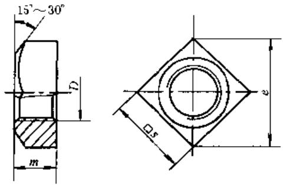

标记示例:

螺纹规格 $\pmb { D } = \mathbb { M } \mathbb { 1 } \pmb { 6 }$ 、性能等级为5级、不经表面处理、C级的方螺母:

螺母GB/T39M16

表4-1-119

/mm 

<table><tr><td>螺纹规格D</td><td>M3</td><td>M4</td><td>M5</td><td>M6</td><td>M8</td><td>M10</td><td>Mi2</td><td>（M14）</td><td>M16</td><td>（M18）</td><td>M20</td><td>（M22）</td><td>M24</td></tr><tr><td>S max</td><td>5.5</td><td>7</td><td>8</td><td>10</td><td>13</td><td>16</td><td>18</td><td>21</td><td>24</td><td>27</td><td>30</td><td>34</td><td>36</td></tr><tr><td>mmin</td><td>2.4</td><td>3.2</td><td>4</td><td>5</td><td>6.5</td><td>8</td><td>10</td><td>11</td><td>13</td><td>15</td><td>16</td><td>18</td><td>19</td></tr><tr><td>emin</td><td>6.76</td><td>8.63</td><td>9.93</td><td>12.53</td><td>16.34</td><td>20.24</td><td>22.84</td><td>26.21</td><td>30.11</td><td>34.01</td><td>37.91</td><td>42.9</td><td>45.5</td></tr><tr><td>每1000个的重量/kg</td><td>0.22</td><td>0.49</td><td>0.85</td><td>1.92</td><td>4.2</td><td>8.31</td><td>12.97</td><td>18.12</td><td>29.29</td><td>44.26</td><td>59.38</td><td>89.57</td><td>101.9</td></tr><tr><td>技术条件</td><td colspan="2">材料：钢</td><td colspan="2">螺纹公差：7H</td><td colspan="4">性能等级：4、5</td><td colspan="2">产品等级：C</td><td colspan="3">表面处理：①不经处 理；②镀锌钝化</td></tr></table>

# 六角厚螺母(GB/T56-1988)

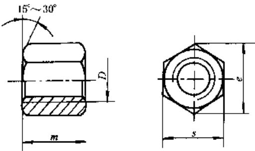

标记示例:

螺纹规格 $\pmb { D } = \pmb { M } 2 0$ 、性能等级为5级、不经表面处理的六角厚螺母:

螺母GB/T56M20

/mm 

表4-1-120

<table><tr><td>螺纹规格D</td><td>M16</td><td>（M18）</td><td>M20</td><td>(M22）</td><td>M24</td><td>（M27）</td><td>M30</td><td>M36</td><td>M42</td><td>M48</td></tr><tr><td>： max</td><td>24</td><td>27</td><td>30</td><td>34</td><td>36</td><td>41</td><td>46</td><td>55</td><td>65</td><td>75</td></tr><tr><td>emin</td><td>26.17</td><td>29.56</td><td>32.95</td><td>37.29</td><td>39.55</td><td>45.2</td><td>50.85</td><td>60.79</td><td>72.09</td><td>82.6</td></tr><tr><td>m ax</td><td>25</td><td>28</td><td>32</td><td>35</td><td>38</td><td>42</td><td>48</td><td>55</td><td>65</td><td>75</td></tr><tr><td>每1000个的重量/kg</td><td>45.94</td><td>66.33</td><td>92.72</td><td>136.3</td><td>160</td><td>237.7</td><td>352</td><td>572.6</td><td>979.5</td><td>1495</td></tr><tr><td>技术条件</td><td>材料：钢</td><td colspan="2">螺纹公差：6H</td><td colspan="3">性能等级：5、8、10</td><td>产品等级 B</td><td colspan="3">表面处理：①不经处理； ②氧化</td></tr></table>

# 小六角特扁细牙螺母(GB/T808--1988)

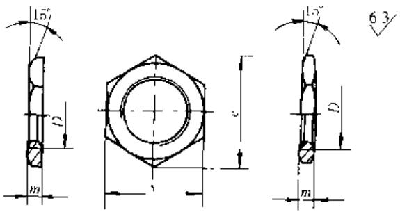

允许制造的型式

标记示例:

螺纹规格 $\vartheta = \mathbb { M } \mathbb { 1 0 } \times 1$ 、材料为Q235、不经衣面处理的小六角特扁细牙螺母:

螺母GB/T808 $\mathbb { M } \mathbb { 1 0 } \times 1$ 

表4-1-121

/mm 

<table><tr><td rowspan=1 colspan=1>螺纹规格D×P</td><td rowspan=1 colspan=4>M4× 0.5 M5×0.5：M6 ×0.75</td><td rowspan=1 colspan=1>18 ×1</td><td rowspan=1 colspan=1>MB×0.75</td><td rowspan=1 colspan=1>M10×I</td><td rowspan=1 colspan=1>M10× 0.75</td><td rowspan=1 colspan=1>M12 ×1.25</td><td rowspan=1 colspan=1>M12×1</td></tr><tr><td rowspan=2 colspan=1>：maxctmin</td><td rowspan=1 colspan=1>7</td><td rowspan=1 colspan=2>8</td><td rowspan=2 colspan=1>1011.1</td><td rowspan=1 colspan=1>12</td><td rowspan=1 colspan=1></td><td rowspan=1 colspan=1></td><td rowspan=2 colspan=1>1415.5</td><td rowspan=2 colspan=2>：718.9</td></tr><tr><td rowspan=1 colspan=1>7.7</td><td rowspan=1 colspan=2>8.8</td><td rowspan=1 colspan=1>13.3</td><td rowspan=1 colspan=1>13.3</td><td rowspan=1 colspan=1></td></tr><tr><td rowspan=1 colspan=1>mmaY</td><td rowspan=1 colspan=1></td><td rowspan=1 colspan=2></td><td rowspan=1 colspan=1>2.4</td><td rowspan=1 colspan=1>3.0</td><td rowspan=1 colspan=1>2.4</td><td rowspan=1 colspan=1>30</td><td rowspan=1 colspan=1>2.4</td><td rowspan=2 colspan=1>3.73.4</td><td rowspan=2 colspan=1>3.02.65</td></tr><tr><td rowspan=1 colspan=1>每1000个的重量=/kg</td><td rowspan=1 colspan=1>0.28</td><td rowspan=1 colspan=2>0.33</td><td rowspan=1 colspan=1>0.86</td><td rowspan=1 colspan=1>1.45</td><td rowspan=1 colspan=1>1.09</td><td rowspan=1 colspan=1>1.78</td><td rowspan=1 colspan=1>1.33</td></tr><tr><td rowspan=1 colspan=1>螺纹规格D×P</td><td rowspan=1 colspan=1>M14 × I</td><td rowspan=1 colspan=2>M16 ×1.5</td><td rowspan=1 colspan=1>M16×</td><td rowspan=1 colspan=1>M18× 1.5</td><td rowspan=1 colspan=1>M18×1</td><td rowspan=1 colspan=1>M20×1</td><td rowspan=1 colspan=1>M22×1</td><td rowspan=1 colspan=1>M24 × 1.5</td><td rowspan=1 colspan=1>M24×1</td></tr><tr><td rowspan=4 colspan=1>smax心um每1000个的重量/kg</td><td rowspan=1 colspan=1>19</td><td rowspan=1 colspan=3>22</td><td rowspan=1 colspan=1>24</td><td rowspan=1 colspan=1></td><td rowspan=1 colspan=1>27</td><td rowspan=2 colspan=1>3033.5</td><td rowspan=2 colspan=1>3235.7</td><td rowspan=2 colspan=1></td></tr><tr><td rowspan=1 colspan=1>21.1</td><td rowspan=1 colspan=3>24.5</td><td rowspan=1 colspan=1>26.8</td><td rowspan=1 colspan=1>26.8</td><td rowspan=1 colspan=1>30.1</td></tr><tr><td rowspan=2 colspan=1>3.23.26</td><td rowspan=1 colspan=2>4.2</td><td rowspan=1 colspan=1>3.2</td><td rowspan=1 colspan=1>4.2  1</td><td rowspan=1 colspan=1>3.4</td><td rowspan=1 colspan=1></td><td rowspan=1 colspan=1>3.7</td><td rowspan=1 colspan=1>4.2</td><td rowspan=1 colspan=1>3.7</td></tr><tr><td rowspan=1 colspan=2>6.22</td><td rowspan=1 colspan=1>4.47</td><td rowspan=1 colspan=1>6.95</td><td rowspan=1 colspan=1>5.27</td><td rowspan=1 colspan=1>7.53</td><td rowspan=1 colspan=1>9.47.</td><td rowspan=1 colspan=1>12.07</td><td rowspan=1 colspan=1>10.18</td></tr><tr><td rowspan=2 colspan=1>技术条件</td><td rowspan=1 colspan=4>材料</td><td rowspan=1 colspan=1>螺纹公差</td><td rowspan=1 colspan=2>产品等级</td><td rowspan=1 colspan=3>衣面处理</td></tr><tr><td rowspan=1 colspan=2>Q215、0235</td><td rowspan=1 colspan=2>HPL59-1</td><td rowspan=1 colspan=1>61</td><td rowspan=1 colspan=2>A用于D≤16；B用于D>16</td><td rowspan=1 colspan=3>①不经处理：镀锌钝化CB/T5267</td></tr></table>

# 钢结构用高强度大六角螺母(GB/T1229—1991)

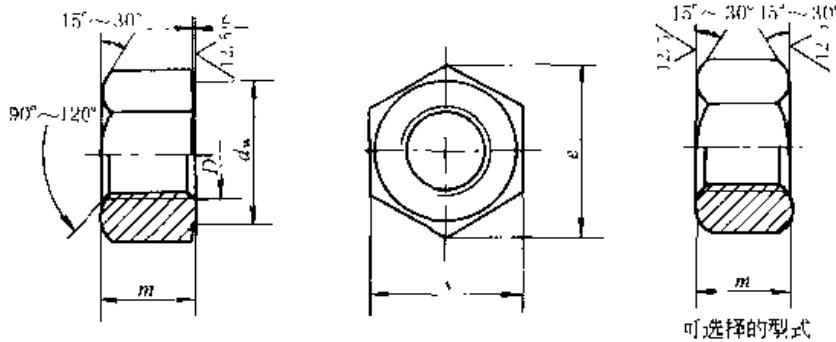

标记示例:

螺纹规格 $\pmb { \mathcal { D } } \ = \ \pmb { \ M } 2 0$ 、能等级为10H级的钢结构用高强度大六角头螺母:

螺母GB/T1229M20

螺纹规格 $\pmb { \it D } = \pmb { \mathbb { M } } 2 0$ 、性能等级为8H级的钢结构用高强度大六角头螺母:

螺母GB/T1229 M20-8H

/mm 

表4-1-122

<table><tr><td rowspan=1 colspan=2>螺纹规格D</td><td rowspan=1 colspan=1>M12</td><td rowspan=1 colspan=2>M16</td><td rowspan=1 colspan=1>M20</td><td rowspan=1 colspan=1>M(22)</td><td rowspan=1 colspan=1>M24</td><td rowspan=1 colspan=2>M(27)</td><td rowspan=1 colspan=1>M30</td></tr><tr><td rowspan=6 colspan=2>dw mine minm maxC maxsmax每1000个的重量=/kg</td><td rowspan=1 colspan=1>19.2</td><td rowspan=1 colspan=2>24.9</td><td rowspan=1 colspan=1>31.4</td><td rowspan=1 colspan=1>33.3</td><td rowspan=1 colspan=1>38.0</td><td rowspan=1 colspan=2>42.8</td><td rowspan=1 colspan=1>46.6</td></tr><tr><td rowspan=1 colspan=1>22.78</td><td rowspan=1 colspan=2>29 56</td><td rowspan=1 colspan=1>37.29</td><td rowspan=1 colspan=1>39.55</td><td rowspan=1 colspan=1>45.20</td><td rowspan=1 colspan=2>50.85</td><td rowspan=1 colspan=1>55.37</td></tr><tr><td rowspan=1 colspan=1>12.3</td><td rowspan=1 colspan=2>17.1</td><td rowspan=1 colspan=1>20.7</td><td rowspan=1 colspan=1>23.6</td><td rowspan=1 colspan=1>24.2</td><td rowspan=1 colspan=2>27.6</td><td rowspan=1 colspan=1>30.7</td></tr><tr><td rowspan=1 colspan=1></td><td rowspan=1 colspan=2></td><td rowspan=1 colspan=1></td><td rowspan=1 colspan=1>0.8</td><td rowspan=1 colspan=1></td><td rowspan=1 colspan=2></td><td rowspan=1 colspan=1></td></tr><tr><td rowspan=2 colspan=1>2127.68</td><td rowspan=2 colspan=2>2761.51</td><td rowspan=2 colspan=1>34118.77</td><td rowspan=1 colspan=1>36</td><td rowspan=1 colspan=1>41</td><td rowspan=1 colspan=2>46</td><td rowspan=1 colspan=1>50</td></tr><tr><td rowspan=1 colspan=1>146.59</td><td rowspan=1 colspan=1>202.67</td><td rowspan=1 colspan=2>288.51</td><td rowspan=1 colspan=1>374.01</td></tr><tr><td rowspan=1 colspan=1>保证载荷/N</td><td rowspan=1 colspan=1>10H8H</td><td rowspan=1 colspan=1>8770070000</td><td rowspan=1 colspan=2>163000130000</td><td rowspan=1 colspan=1>255000203000</td><td rowspan=1 colspan=1>315000251000</td><td rowspan=1 colspan=1>367000293000</td><td rowspan=1 colspan=2>477000381000</td><td rowspan=1 colspan=1>583000466000</td></tr><tr><td rowspan=2 colspan=2>技术条件(GB/T 1231—1991）</td><td rowspan=1 colspan=2>性能等级</td><td rowspan=2 colspan=2>10H45.35、15MnVB</td><td rowspan=1 colspan=1></td><td rowspan=2 colspan=1>8H35</td><td rowspan=2 colspan=2>螺纹公差：6H</td><td rowspan=2 colspan=1>产品等级：C</td></tr><tr><td rowspan=1 colspan=2>推荐材料</td><td></td></tr></table>

# 钢结构用扭剪型高强度螺栓联接副 螺母(CB/T3632—1995)

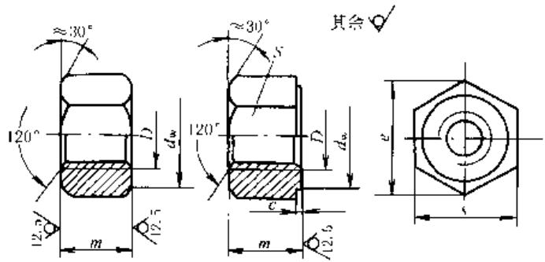

标记示例:

螺纹规格 $D = \mathbb { M } 2 0$ 、性能等级为10S级,表面防锈处理的钢结构用扭剪型高强度螺母:

螺母GB/T3632M20

/mm 

表4-1-123

<table><tr><td rowspan=1 colspan=1>螺纹规格D</td><td rowspan=1 colspan=1>M16</td><td rowspan=1 colspan=1>M20</td><td rowspan=1 colspan=1>（M22）</td><td rowspan=1 colspan=1>M24</td></tr><tr><td rowspan=1 colspan=1>5m8x</td><td rowspan=1 colspan=1>27</td><td rowspan=1 colspan=1>34</td><td rowspan=1 colspan=1>36</td><td rowspan=1 colspan=1>41</td></tr><tr><td rowspan=1 colspan=1>m max</td><td rowspan=1 colspan=1>17.1</td><td rowspan=1 colspan=1>20.7</td><td rowspan=1 colspan=1>23.6</td><td rowspan=1 colspan=1>24.2</td></tr><tr><td rowspan=1 colspan=1>e in</td><td rowspan=1 colspan=1>29.56</td><td rowspan=1 colspan=1>37.29</td><td rowspan=1 colspan=1>39.55</td><td rowspan=1 colspan=1>45.2</td></tr><tr><td rowspan=1 colspan=1>r mBx</td><td rowspan=1 colspan=1>0.8</td><td rowspan=1 colspan=1>0.8</td><td rowspan=1 colspan=1>0.8</td><td rowspan=1 colspan=1>0.8</td></tr><tr><td rowspan=1 colspan=1>dmin</td><td rowspan=1 colspan=1>24.9</td><td rowspan=1 colspan=1>31.4</td><td rowspan=1 colspan=1>33.3</td><td rowspan=2 colspan=1>380.57</td></tr><tr><td rowspan=1 colspan=1>支承面与螺纹轴心线垂直度</td><td rowspan=1 colspan=1>0.38</td><td rowspan=1 colspan=1>0.47</td><td rowspan=1 colspan=1>0.50</td></tr><tr><td rowspan=1 colspan=1>最小保证载荷（A,×S）/N</td><td rowspan=1 colspan=1>183000</td><td rowspan=1 colspan=1>255000</td><td rowspan=1 colspan=1>315000</td><td rowspan=1 colspan=1>367000</td></tr><tr><td rowspan=1 colspan=1>每1000个钢螺母重量=/kg</td><td rowspan=1 colspan=1>57.27</td><td rowspan=1 colspan=1>92.12</td><td rowspan=1 colspan=1>135.96</td><td rowspan=1 colspan=1>189.3</td></tr><tr><td rowspan=3 colspan=1>技术条件</td><td rowspan=1 colspan=1>性能等级</td><td rowspan=1 colspan=1>10S</td><td rowspan=3 colspan=1>螺纹公差：6H</td><td rowspan=3 colspan=1>公差产品等级：C</td></tr><tr><td rowspan=1 colspan=1>保证应力S/MPa</td><td rowspan=1 colspan=1>1040</td></tr><tr><td rowspan=1 colspan=1>推荐材料</td><td rowspan=1 colspan=1>14.35、15MnVB</td></tr></table>

注:1.d $\begin{array} { r l } { ( { \tt m a x } ) } & { { } = \ s } \end{array}$ 实际尺寸。2、括号内规格尽可能不用。3.该螺母用于钢结构用扭剪型高强度螺栓联接副,与螺栓及垫圈配合使用,本表仅为螺母,与之相配的螺栓见表4-1-82,垫圈见表4-1-143。

栓接结构用大六角螺母B级,8和10级

栓接结构用大六角螺母B级,10级(GB/T 18230.4—2000)

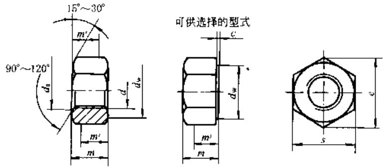

标记示例:

螺纹规格 $D = \mathbb { M } 2 0$ 、性能等级为8级、表面氧化的栓接结构用大六角螺母的标记:

螺母CB/T18230.3(GB/T18230.4)M20

/mm 

表4-1-124

<table><tr><td rowspan=1 colspan=1>螺纹规格d</td><td rowspan=1 colspan=1>M12</td><td rowspan=1 colspan=1>M16</td><td rowspan=1 colspan=1>M20</td><td rowspan=1 colspan=1>（M22）</td><td rowspan=1 colspan=1>M24</td><td rowspan=1 colspan=1>(M27)</td><td rowspan=1 colspan=1>M30</td><td rowspan=1 colspan=1>M36</td></tr><tr><td rowspan=1 colspan=1>螺距P</td><td rowspan=1 colspan=1>1.75</td><td rowspan=1 colspan=1>2</td><td rowspan=1 colspan=1>2.5</td><td rowspan=1 colspan=1>2.5</td><td rowspan=1 colspan=1>3</td><td rowspan=1 colspan=1>3</td><td rowspan=1 colspan=1>3.5</td><td rowspan=1 colspan=1>4</td></tr><tr><td rowspan=1 colspan=1>dm&x</td><td rowspan=1 colspan=1>13</td><td rowspan=1 colspan=1>17.3</td><td rowspan=1 colspan=1>21.6</td><td rowspan=1 colspan=1>238</td><td rowspan=1 colspan=1>25.9</td><td rowspan=1 colspan=1>29.1</td><td rowspan=1 colspan=1>32.4</td><td rowspan=1 colspan=1>38.9</td></tr></table>

续表

<table><tr><td rowspan=1 colspan=1>螺纹规格d</td><td rowspan=1 colspan=1>M12</td><td rowspan=1 colspan=1>M16</td><td rowspan=1 colspan=1>M20</td><td rowspan=1 colspan=1>（M22）</td><td rowspan=1 colspan=1>M24</td><td rowspan=1 colspan=1>（M27)</td><td rowspan=1 colspan=1>M30</td><td rowspan=1 colspan=1>M36</td></tr><tr><td rowspan=1 colspan=1>C max</td><td rowspan=1 colspan=1>0.8(0.6)</td><td rowspan=1 colspan=1>0.8</td><td rowspan=1 colspan=1>0.8</td><td rowspan=1 colspan=1>0.8</td><td rowspan=1 colspan=1>0.8</td><td rowspan=1 colspan=1>0.8</td><td rowspan=1 colspan=1>0.8</td><td rowspan=1 colspan=1>0.8</td></tr><tr><td rowspan=1 colspan=1>山 max</td><td rowspan=1 colspan=8>d（max）=s实际</td></tr><tr><td rowspan=1 colspan=1>min</td><td rowspan=1 colspan=1>2.78</td><td rowspan=1 colspan=1>29.56</td><td rowspan=1 colspan=1>37.29</td><td rowspan=1 colspan=1>39.55</td><td rowspan=1 colspan=1>45.2</td><td rowspan=1 colspan=1>50.85</td><td rowspan=1 colspan=1>55 .37</td><td rowspan=1 colspan=1>66.44</td></tr><tr><td rowspan=2 colspan=1>m1max2</td><td rowspan=2 colspan=1>12.310.8</td><td rowspan=2 colspan=1>17.114.8</td><td rowspan=2 colspan=1>20.718</td><td rowspan=2 colspan=1>23.619.4</td><td rowspan=1 colspan=1>24.2</td><td rowspan=1 colspan=1>27.6</td><td rowspan=2 colspan=1>30.725.6</td><td rowspan=2 colspan=1>36.631</td></tr><tr><td rowspan=1 colspan=1>21.5</td><td rowspan=1 colspan=1>23.8</td></tr><tr><td rowspan=1 colspan=1>m1min2</td><td rowspan=1 colspan=1>9.58.3</td><td rowspan=1 colspan=1>13.111.28</td><td rowspan=1 colspan=1>15.513.52</td><td rowspan=1 colspan=1>17.814.48</td><td rowspan=1 colspan=1>18.316.16</td><td rowspan=1 colspan=1>21.018</td><td rowspan=1 colspan=1>23.319.44</td><td rowspan=1 colspan=1>28.023.52</td></tr><tr><td rowspan=1 colspan=1>$ max</td><td rowspan=1 colspan=1>21</td><td rowspan=1 colspan=1>27</td><td rowspan=1 colspan=1>34</td><td rowspan=1 colspan=1>36</td><td rowspan=1 colspan=1>41</td><td rowspan=1 colspan=1>46</td><td rowspan=1 colspan=1>50</td><td rowspan=1 colspan=1>60</td></tr><tr><td rowspan=3 colspan=1>技术条件</td><td rowspan=1 colspan=1>名称</td><td rowspan=1 colspan=1>材料</td><td rowspan=1 colspan=1>螺纹公差</td><td rowspan=1 colspan=1>性能等级</td><td rowspan=1 colspan=1>产品等级</td><td rowspan=1 colspan=1>表面处理</td><td rowspan=1 colspan=1>配套螺栓</td><td rowspan=1 colspan=1>配套垫圈</td></tr><tr><td rowspan=1 colspan=1>CB/T 18230.3</td><td rowspan=1 colspan=1>钢</td><td rowspan=1 colspan=1>6H或6AX</td><td rowspan=1 colspan=1>8、10</td><td rowspan=1 colspan=1>B级</td><td rowspan=1 colspan=1>氧化常规</td><td rowspan=1 colspan=1>CB/T 18230.1</td><td rowspan=1 colspan=1>GB/T 18230.5</td></tr><tr><td rowspan=1 colspan=1>GB/T 18230.4</td><td rowspan=1 colspan=1>钢</td><td rowspan=1 colspan=1>6H或6AZ</td><td rowspan=1 colspan=1>10</td><td rowspan=1 colspan=1>B级</td><td rowspan=1 colspan=1>氧化常规</td><td rowspan=1 colspan=1>CB/T 18230.2</td><td rowspan=1 colspan=1>GB/T 18230.5</td></tr></table>

$\textcircled{1}$ 用于GB/T18230.3--2000。 $\textcircled{2}$ 用于 $\mathrm { G B / T } 1 8 2 3 0 . 4 - 2 0 0 0 \ 。$ 注:1.产品等级除 $\pmb { \mathscr { m } }$ 、 $\pmb { c }$ 和支承面垂直度公差外,其余按B级。

2.表面处理除常规外,可选择的有镀锌钝化(GB/T5267)、镀镉钝化(GB/T5267)、热浸镀锌(CB/T13912)和粉末机械镀锌(JB/TS067),粉末机械镀锌必须有驱氢措施;其他表面处理由供需双方协议,但不应损伤机械性能。

3.对热浸镶锌螺母为镀前尺寸。为加大热浸镀锌螺母的攻丝尺寸,可采用6AH(6AZ)螺纹公差带〔详见GB/T18230.3(.4)—2000附录A],或按供需双方协议提供镀后为6H的螺纹。6H热浸镀锌螺母仅与8.8或10.9SU的螺栓配套使用。

4.对于电镀或热镀锌的紧固件,制造者应在螺母或相配的螺栓上涂适当的润滑剂,以保证装配时不会咬死,有关润滑剂涂层效果的试验资料,详见GB/T18230.3(.4)—2000 附录B。

5.保证载荷,详见GB/T18230.3(.4)—2000第6章。

6.由于技术原因,M12不是优选规格;尽可能不采用括号内的尺寸。

7.配套螺栓和配套垫圈为推荐的。

栓接结构用1型六角螺母热浸镀锌(加大攻丝尺寸)A和B级,5、6和8级

栓接结构用2型六角螺母热浸镀锌(加大攻丝尺寸)B级,10级(GB/T18230.7--2000)

(GB/T18230.6-2000) 

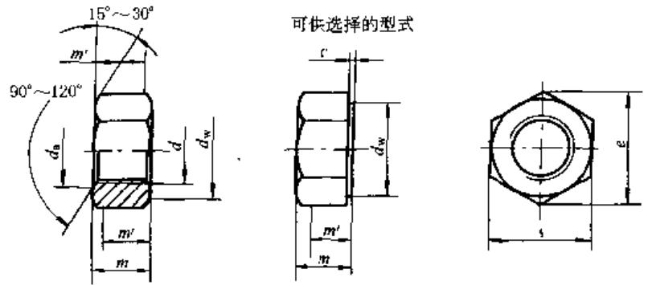

标记示例:

螺纹规格 $\pmb { D } = \mathbf { M } 1 2$ 、性能等级为8级、6AX螺纹、表面热浸镀锌的栓接结构用1(2)型六角螺母的标记:

螺母GB/T18230.6(GB/T18230.7)M12

/mm 

表4-1-125

<table><tr><td rowspan=1 colspan=1>螺纹规格d</td><td rowspan=1 colspan=1>M10</td><td rowspan=1 colspan=1>M12</td><td rowspan=1 colspan=1>(M14)</td><td rowspan=1 colspan=1>Ml6</td><td rowspan=1 colspan=1>M20</td><td rowspan=1 colspan=1>M24</td><td rowspan=1 colspan=1>M30</td><td rowspan=1 colspan=1>M36</td></tr><tr><td rowspan=1 colspan=1>螺距P</td><td rowspan=1 colspan=1>1.5</td><td rowspan=1 colspan=1>1.5</td><td rowspan=1 colspan=1>2</td><td rowspan=1 colspan=1>2</td><td rowspan=1 colspan=1>2.5</td><td rowspan=1 colspan=1>3</td><td rowspan=1 colspan=1>3.5</td><td rowspan=1 colspan=1>4</td></tr><tr><td rowspan=1 colspan=1>dmax</td><td rowspan=1 colspan=1>10.8</td><td rowspan=1 colspan=1>13</td><td rowspan=1 colspan=1>15.1</td><td rowspan=1 colspan=1>17.3</td><td rowspan=1 colspan=1>21.6</td><td rowspan=1 colspan=1>25.9</td><td rowspan=1 colspan=1>32.4</td><td rowspan=1 colspan=1>38.9</td></tr></table>

续表

<table><tr><td rowspan=1 colspan=1>螺纹规格d</td><td rowspan=1 colspan=1>M10</td><td rowspan=1 colspan=1>M12</td><td rowspan=1 colspan=1>(M14)</td><td rowspan=1 colspan=1>M16</td><td rowspan=1 colspan=1>M20</td><td rowspan=1 colspan=1>M24</td><td rowspan=1 colspan=1>M30</td><td rowspan=1 colspan=1>M36</td></tr><tr><td rowspan=1 colspan=1>广max</td><td rowspan=1 colspan=1>0.6</td><td rowspan=1 colspan=1>0.6</td><td rowspan=1 colspan=1>0.6</td><td rowspan=1 colspan=1>0.B</td><td rowspan=1 colspan=1>0.8</td><td rowspan=1 colspan=1>0.8</td><td rowspan=1 colspan=1>0.8</td><td rowspan=1 colspan=1>0.8</td></tr><tr><td rowspan=1 colspan=1>dmin</td><td rowspan=1 colspan=1>14.6</td><td rowspan=1 colspan=1>16.6</td><td rowspan=1 colspan=1>19.6</td><td rowspan=1 colspan=1>22.5</td><td rowspan=1 colspan=1>27.7</td><td rowspan=1 colspan=1>33.2</td><td rowspan=1 colspan=1>42.7</td><td rowspan=1 colspan=1>51.1</td></tr><tr><td rowspan=1 colspan=1>一m</td><td rowspan=1 colspan=1>17.77</td><td rowspan=1 colspan=1>20.03</td><td rowspan=1 colspan=1>23.35</td><td rowspan=1 colspan=1>26.75</td><td rowspan=1 colspan=1>32.95</td><td rowspan=1 colspan=1>39.55</td><td rowspan=1 colspan=1>50.85</td><td rowspan=1 colspan=1>60.79</td></tr><tr><td rowspan=1 colspan=1>m</td><td rowspan=1 colspan=1>8.4</td><td rowspan=1 colspan=1>10.8</td><td rowspan=1 colspan=1>12.8</td><td rowspan=1 colspan=1>14.8</td><td rowspan=1 colspan=1>18</td><td rowspan=1 colspan=1>21.5</td><td rowspan=1 colspan=1>25.6</td><td rowspan=1 colspan=1>31</td></tr><tr><td rowspan=1 colspan=1>max 2</td><td rowspan=1 colspan=1>9.3</td><td rowspan=1 colspan=1>12</td><td rowspan=1 colspan=1>14.1</td><td rowspan=1 colspan=1>16.4</td><td rowspan=1 colspan=1>二</td><td rowspan=1 colspan=1>二</td><td rowspan=1 colspan=1>二</td><td rowspan=1 colspan=1>二</td></tr><tr><td rowspan=1 colspan=1>m 1</td><td rowspan=1 colspan=1>6.43</td><td rowspan=1 colspan=1>8.3</td><td rowspan=1 colspan=1>9.68</td><td rowspan=1 colspan=1>11.28</td><td rowspan=1 colspan=1>13.52</td><td rowspan=1 colspan=1>16.16</td><td rowspan=1 colspan=1>19.44</td><td rowspan=1 colspan=1>23.52</td></tr><tr><td rowspan=1 colspan=1>muin2</td><td rowspan=1 colspan=1>7.15</td><td rowspan=1 colspan=1>9.26</td><td rowspan=1 colspan=1>10.7</td><td rowspan=1 colspan=1>12.6</td><td rowspan=1 colspan=1>二</td><td rowspan=1 colspan=1>二</td><td rowspan=1 colspan=1>二</td><td rowspan=1 colspan=1>二</td></tr><tr><td rowspan=1 colspan=1>5 max</td><td rowspan=1 colspan=1>16</td><td rowspan=1 colspan=1>18</td><td rowspan=1 colspan=1>21</td><td rowspan=1 colspan=1>24</td><td rowspan=1 colspan=1>30</td><td rowspan=1 colspan=1>36</td><td rowspan=1 colspan=1>46</td><td rowspan=1 colspan=1>55</td></tr><tr><td rowspan=3 colspan=1>技术条件</td><td rowspan=1 colspan=1>名称</td><td rowspan=1 colspan=1>材料</td><td rowspan=1 colspan=1>螺纹公差</td><td rowspan=1 colspan=1>性能等级</td><td rowspan=1 colspan=1>产品等级</td><td rowspan=3 colspan=3>表面处理热浸镀锌GB/T13912粉术机械镀锌 JB/T5067</td></tr><tr><td rowspan=1 colspan=1>GB/T 18230.6</td><td rowspan=1 colspan=1>钢</td><td rowspan=1 colspan=1>6AX</td><td rowspan=1 colspan=1>5、6.8</td><td rowspan=1 colspan=1>B级</td></tr><tr><td rowspan=1 colspan=1>GB/T 18230.7</td><td rowspan=1 colspan=1>钢</td><td rowspan=1 colspan=1>6AX</td><td rowspan=1 colspan=1>9</td><td rowspan=1 colspan=1>B级</td></tr></table>

$\textcircled{1}$ 用于GB/T18230.6-2000。 $\textcircled{2}$ 用于GB/T 18230.7--2000。注:1.产品等级CB/T18230.6--2000中除3章规定外,其余按A用于 $D \leqslant \mathbf { M } 1 6$ ;B用于 $D > \mathbb { M } 1 6$ 。CB/T 18230.7--2000中除第3章规定外,其余按A级。2.为加大热浸镀锌螺母的攻丝尺寸,可采用6AX(6AZ)螺纹公差带【详见GB/T18230.6(.7)—2000附录A],或特殊需要,由供需双方协议提供镀后为6H的螺纹。3.保证载荷,详见GB/T18230.6(.7)—2000第5章。

4.尽可能不采用括号内的规格。

# 六角螺母C级(GB/T41—2000)

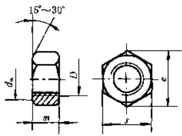

标记示例:

螺纹规格 $\pmb { \mathrm { \mathcal { D } } } = \pmb { \mathrm { \mathbb { M } } } \pmb { \mathrm { 1 } } 2$ 、性能等级为5级、不经表面处理、产品等级为C级的六角螺母:

螺母GB/T41M12

1型六角螺母(GB/T6170-2000)六角薄螺母(GB/T6172.1—2000)

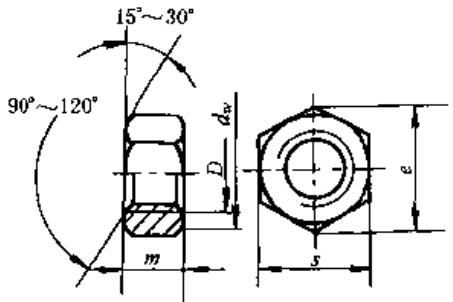

标记示例:

螺纹规格 $\pmb { D } = \pmb { M } \pmb { \mathrm { l } } 2$ 、性能等级为10级、不经表面处理、A级的1型六角螺母:

螺母GB/T6170M12

螺纹规格 $\pmb { D } = \pmb { M } \pmb { 1 2 }$ 、性能等级为04级、不经表面处理、A级的六角薄螺母:

螺母GB/T6172.1M12

# 六角薄螺母无倒角(GB/T6174—2000)

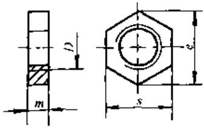

标记示例:

螺纹规格 $\pmb { \mathcal { D } } = \pmb { \mathcal { M } } \pmb { \mathcal { 6 } }$ 、机械性能为HV1I0、不经表面处理、B级的六角薄螺母:

螺母CB/T6174 M6

<table><tr><td rowspan=1 colspan=4>螺纹规格D</td><td rowspan=1 colspan=1>M1.6</td><td rowspan=1 colspan=1>M2</td><td rowspan=1 colspan=1>M2.5</td><td rowspan=1 colspan=1>M</td><td rowspan=1 colspan=1>M3.5）</td><td rowspan=1 colspan=1>4</td><td rowspan=1 colspan=1>M5</td><td rowspan=1 colspan=1>M8</td><td rowspan=1 colspan=1>M8</td><td rowspan=1 colspan=2>M10</td><td rowspan=1 colspan=2>M12</td><td rowspan=1 colspan=2>[（M14）</td><td rowspan=1 colspan=2>M16</td><td rowspan=1 colspan=1>(M18）</td><td rowspan=1 colspan=1>M20</td><td rowspan=1 colspan=2>j（M22）</td><td rowspan=1 colspan=1>M24</td><td rowspan=1 colspan=1>（M21）</td><td rowspan=1 colspan=1>M30</td><td rowspan=1 colspan=1>M36</td><td rowspan=1 colspan=2>M42</td><td rowspan=1 colspan=1>：M48</td><td rowspan=1 colspan=2>M56</td><td rowspan=1 colspan=1>M64</td></tr><tr><td rowspan=1 colspan=4>emin12</td><td rowspan=1 colspan=1>3.33.4</td><td rowspan=1 colspan=1>4.24.3</td><td rowspan=1 colspan=1>5.35.5</td><td rowspan=1 colspan=1>5.96</td><td rowspan=1 colspan=1>6.46.6</td><td rowspan=1 colspan=1>7.57.7</td><td rowspan=1 colspan=1>8.68.8</td><td rowspan=1 colspan=1>10.91</td><td rowspan=1 colspan=1>14.214.4</td><td rowspan=1 colspan=2>17.617.8</td><td rowspan=1 colspan=2>19.920</td><td rowspan=1 colspan=2>22.823.4</td><td rowspan=1 colspan=2>26.226.8</td><td rowspan=1 colspan=1>29.629.6</td><td rowspan=1 colspan=1>3333</td><td rowspan=1 colspan=2>37.337.3</td><td rowspan=1 colspan=1>39.639.6</td><td rowspan=1 colspan=1>45.245.2</td><td rowspan=1 colspan=1>50.950.9</td><td rowspan=1 colspan=1>60.860.8</td><td rowspan=1 colspan=2>[71.3（71.3</td><td rowspan=1 colspan=1>82.682.6</td><td rowspan=1 colspan=2>93.693.6</td><td rowspan=1 colspan=1>104.9104.9</td></tr><tr><td rowspan=1 colspan=4>：公称</td><td rowspan=1 colspan=1>3.2</td><td rowspan=1 colspan=1>4</td><td rowspan=1 colspan=1>5</td><td rowspan=1 colspan=1>5.5</td><td rowspan=1 colspan=1>6</td><td rowspan=1 colspan=1>7</td><td rowspan=1 colspan=1>8</td><td rowspan=1 colspan=1>10</td><td rowspan=1 colspan=1>13</td><td rowspan=1 colspan=2>6</td><td rowspan=1 colspan=2>18</td><td rowspan=1 colspan=2>2</td><td rowspan=1 colspan=2>24</td><td rowspan=1 colspan=1>27</td><td rowspan=1 colspan=1>30</td><td rowspan=1 colspan=2>34</td><td rowspan=1 colspan=1>36</td><td rowspan=1 colspan=1>4</td><td rowspan=1 colspan=1>46</td><td rowspan=1 colspan=1>：55</td><td rowspan=1 colspan=2>65</td><td rowspan=1 colspan=1>75</td><td rowspan=1 colspan=2>85</td><td rowspan=1 colspan=1>95</td></tr><tr><td rowspan=2 colspan=4>山mn12</td><td rowspan=2 colspan=1>-12.4</td><td rowspan=2 colspan=1>3.1</td><td rowspan=2 colspan=1>4.1</td><td rowspan=2 colspan=1>4.6</td><td rowspan=2 colspan=1>5.1</td><td rowspan=2 colspan=1>5.9</td><td rowspan=2 colspan=1>6.76.9</td><td rowspan=2 colspan=1>8.78.9</td><td rowspan=2 colspan=1>11.511.6</td><td rowspan=2 colspan=2>14.5146</td><td rowspan=1 colspan=2>16.5</td><td rowspan=2 colspan=2>19.219.6</td><td rowspan=2 colspan=2>2222.5</td><td rowspan=2 colspan=1>24.924.9</td><td rowspan=2 colspan=1>27.727.7</td><td rowspan=2 colspan=2>31.431.4</td><td rowspan=2 colspan=1>33.333.3</td><td rowspan=1 colspan=1>38</td><td rowspan=2 colspan=1>42.842.8</td><td rowspan=2 colspan=1>51.151.</td><td rowspan=1 colspan=2>60</td><td rowspan=2 colspan=1>69.569.5</td><td rowspan=2 colspan=2>78.7：78.7</td><td rowspan=2 colspan=1>88.2·88.2</td></tr><tr><td rowspan=1 colspan=2>16.6</td><td rowspan=1 colspan=1>38</td><td rowspan=1 colspan=2>60</td></tr><tr><td rowspan=1 colspan=1>mmax</td><td rowspan=1 colspan=3>GB/T6170GB/T6172.1CB/T 6174GB/T41</td><td rowspan=1 colspan=1>1.31</td><td rowspan=1 colspan=1>1.61.2</td><td rowspan=1 colspan=1>21.6</td><td rowspan=1 colspan=1>2.41.8</td><td rowspan=1 colspan=1>2.82</td><td rowspan=1 colspan=1>3.22.2</td><td rowspan=1 colspan=1>4.72.75.6</td><td rowspan=1 colspan=1>5.23.26.4</td><td rowspan=1 colspan=1>6.847.9</td><td rowspan=1 colspan=2>8.459.5</td><td rowspan=1 colspan=2>10.8612.2</td><td rowspan=1 colspan=2>12.8713.9</td><td rowspan=1 colspan=2>14.8815.9</td><td rowspan=1 colspan=1>15.8916.9</td><td rowspan=1 colspan=1>181019</td><td rowspan=1 colspan=2>19.421.5120.2</td><td rowspan=1 colspan=1>19.421.51222.3</td><td rowspan=1 colspan=1>23.813.5：24.7</td><td rowspan=1 colspan=1>25.61526.4</td><td rowspan=1 colspan=1>311831.9</td><td rowspan=1 colspan=2>342134.9</td><td rowspan=1 colspan=1>382438.9</td><td rowspan=1 colspan=2>45 ！2845.9</td><td rowspan=1 colspan=1>！513252.4</td></tr><tr><td rowspan=1 colspan=1>每1000个的重量/kg</td><td rowspan=1 colspan=3>CB/T6170GB/T 41GB/T6172.1GB/T6174</td><td rowspan=1 colspan=1>0.050.03</td><td rowspan=1 colspan=1>10.090.07</td><td rowspan=1 colspan=1>0.20.tsj</td><td rowspan=1 colspan=1>0.270.2</td><td rowspan=1 colspan=1>0.360.26</td><td rowspan=1 colspan=1>10.580.39</td><td rowspan=1 colspan=1>1.050.58i1.15</td><td rowspan=1 colspan=1>1.95 4.22：0.58i1.15</td><td rowspan=1 colspan=1>1.95 4.222.43</td><td rowspan=1 colspan=2>7.944.64</td><td rowspan=1 colspan=2>11.936.56</td><td rowspan=1 colspan=2>18.8910.03</td><td rowspan=1 colspan=2>2915.2620.56</td><td rowspan=1 colspan=1>36.8715.2620.56</td><td rowspan=1 colspan=1>51.5527.76</td><td rowspan=1 colspan=2>73.8540.43</td><td rowspan=1 colspan=1>88.847.92</td><td rowspan=1 colspan=1>132.472.97</td><td rowspan=1 colspan=1>1844105.5</td><td rowspan=1 colspan=1>317182.5</td><td rowspan=1 colspan=2>.502.9305.8</td><td rowspan=1 colspan=1>744.4464.3</td><td rowspan=1 colspan=2>1091671.1</td><td rowspan=1 colspan=1>1053930.7</td></tr><tr><td rowspan=6 colspan=2>技性能等级术条件</td><td rowspan=1 colspan=12>                                 钢</td><td rowspan=1 colspan=2>公等级</td><td rowspan=1 colspan=2>产品等级</td><td rowspan=1 colspan=2></td><td rowspan=1 colspan=4>钢</td><td rowspan=1 colspan=5>不锈钢</td><td rowspan=1 colspan=4>有色金属</td><td rowspan=1 colspan=1>公差等级</td><td rowspan=1 colspan=1>产品等级</td></tr><tr><td rowspan=1 colspan=12>         D≤M16:5:M16<D≤M39:4.5；D>M39:按协议不经处理</td><td rowspan=1 colspan=2>7H</td><td rowspan=1 colspan=2>C</td><td rowspan=1 colspan=2>GU</td><td rowspan=1 colspan=4>DM3：按协议D>M39:按协议</td><td rowspan=1 colspan=9>DM24:A2-035、A4-035         CU2、CU3、A1AM3<D≤M39:04、05 M24<D≤M39:A2-035、A4-025D>M39：按协议</td><td rowspan=2 colspan=1>6</td><td rowspan=2 colspan=1>AB</td></tr><tr><td rowspan=4 colspan=1>G</td><td rowspan=1 colspan=3>钢</td><td rowspan=1 colspan=5>不锈钢</td><td rowspan=1 colspan=3>有色金属</td><td rowspan=1 colspan=2>公差等级等级</td><td rowspan=1 colspan=2>产品等级等级</td><td rowspan=1 colspan=2></td><td rowspan=1 colspan=4>不经处理</td><td rowspan=1 colspan=6>简单处理心</td><td rowspan=1 colspan=3>简单处理</td></tr><tr><td rowspan=2 colspan=3>D≤M3：按协议M3<D≤M39:6.8、10D>M39：按协议</td><td rowspan=2 colspan=5>DM24:A2-70、A4-70M24<D≤M39:A2-50、A4-50D>M39:按协议</td><td rowspan=2 colspan=3>CU2、CU3、AL4</td><td rowspan=3 colspan=2>6H</td><td rowspan=3 colspan=2>AB</td><td rowspan=3 colspan=2>U</td><td rowspan=1 colspan=6>钢</td><td rowspan=1 colspan=4>有色金</td><td rowspan=1 colspan=3>公差等级</td><td rowspan=1 colspan=2>产品等级</td></tr><tr><td rowspan=1 colspan=6>硬度110H30.n</td><td rowspan=2 colspan=9>CU2、CL3、AIA6H         B简单处理</td></tr><tr><td rowspan=1 colspan=3>不经处理</td><td rowspan=1 colspan=5>简单处理</td><td rowspan=1 colspan=3>简单处理</td><td rowspan=1 colspan=6>不经处理</td><td rowspan=1 colspan=4>简单处理</td></tr></table>

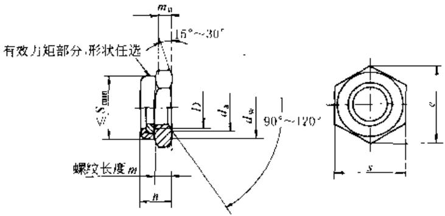

标记示例:

螺母规格 $D = \mathbf { M } \mathbf { 1 } 2$ 、性能等级为04级、不经表面处理、产品等级为A级的非金属嵌件六角锁紧薄螺母的标记:螺母GB/T6172.2M12

表4-1-127

/mm 

<table><tr><td rowspan=1 colspan=4>螺纹规格D</td><td rowspan=1 colspan=1>M3</td><td rowspan=1 colspan=1>M4</td><td rowspan=1 colspan=1>M5</td><td rowspan=1 colspan=2>M6</td><td rowspan=1 colspan=1>M8</td><td rowspan=1 colspan=2>M10</td><td rowspan=1 colspan=1>M12</td><td rowspan=1 colspan=1>(M14)</td><td rowspan=1 colspan=2>M16</td><td rowspan=1 colspan=1>M20</td><td rowspan=1 colspan=1>M24</td><td rowspan=1 colspan=1>M30：</td><td rowspan=1 colspan=1>：M36</td></tr><tr><td rowspan=1 colspan=4>螺距P    min</td><td rowspan=1 colspan=1>0.5</td><td rowspan=1 colspan=1>0.7</td><td rowspan=1 colspan=1>0.8</td><td rowspan=1 colspan=2>1</td><td rowspan=1 colspan=1>1.25</td><td rowspan=1 colspan=2>1.5</td><td rowspan=1 colspan=1>1.75</td><td rowspan=1 colspan=1>2</td><td rowspan=1 colspan=2>2</td><td rowspan=1 colspan=1>2.5</td><td rowspan=1 colspan=1>3</td><td rowspan=1 colspan=1>3.5</td><td rowspan=1 colspan=1>4</td></tr><tr><td rowspan=2 colspan=2>d</td><td rowspan=1 colspan=2>max</td><td rowspan=1 colspan=1>3.45</td><td rowspan=1 colspan=1>4.6</td><td rowspan=1 colspan=1>5.75</td><td rowspan=1 colspan=2>6.75</td><td rowspan=1 colspan=1>8.75</td><td rowspan=1 colspan=2>10.8</td><td rowspan=1 colspan=1>13</td><td rowspan=1 colspan=1>15.1</td><td rowspan=1 colspan=2>17.3</td><td rowspan=1 colspan=1>21.6</td><td rowspan=1 colspan=1>25.9</td><td rowspan=1 colspan=1>32.4</td><td rowspan=1 colspan=1>38.9</td></tr><tr><td rowspan=1 colspan=2>min</td><td rowspan=1 colspan=1>3.00</td><td rowspan=1 colspan=1>4.0</td><td rowspan=1 colspan=1>5.00</td><td rowspan=1 colspan=2>6.00</td><td rowspan=1 colspan=1>8.00</td><td rowspan=1 colspan=2>10.0</td><td rowspan=1 colspan=1>12</td><td rowspan=1 colspan=1>14.0</td><td rowspan=1 colspan=2>16.0</td><td rowspan=1 colspan=1>20.0</td><td rowspan=1 colspan=1>：24.0</td><td rowspan=1 colspan=1>30.0</td><td rowspan=1 colspan=1>36.0</td></tr><tr><td rowspan=1 colspan=2>山</td><td rowspan=1 colspan=2>min</td><td rowspan=1 colspan=1>4.6</td><td rowspan=1 colspan=1>5.9</td><td rowspan=1 colspan=1>6.9</td><td rowspan=1 colspan=2>8.9</td><td rowspan=1 colspan=1>11.6</td><td rowspan=1 colspan=2>14.6</td><td rowspan=1 colspan=1>16.6</td><td rowspan=1 colspan=1>19.6</td><td rowspan=1 colspan=2>22.5</td><td rowspan=1 colspan=1>27.7</td><td rowspan=1 colspan=1>33.2</td><td rowspan=1 colspan=1>42.8</td><td rowspan=1 colspan=1>51.1</td></tr><tr><td rowspan=1 colspan=2>：</td><td rowspan=1 colspan=2>min</td><td rowspan=1 colspan=1>6.01</td><td rowspan=1 colspan=1>7.66</td><td rowspan=1 colspan=1>8.79</td><td rowspan=1 colspan=2>11.05</td><td rowspan=1 colspan=1>14.38</td><td rowspan=1 colspan=2>17.77</td><td rowspan=1 colspan=1>20.03</td><td rowspan=1 colspan=1>23.35</td><td rowspan=1 colspan=2>26.75</td><td rowspan=1 colspan=1>32.95</td><td rowspan=1 colspan=1>39.55</td><td rowspan=1 colspan=1>50.85</td><td rowspan=1 colspan=1>60.79</td></tr><tr><td rowspan=2 colspan=2>h</td><td rowspan=1 colspan=2>max</td><td rowspan=1 colspan=1>3.90</td><td rowspan=1 colspan=1>5.00</td><td rowspan=1 colspan=1>5.00</td><td rowspan=1 colspan=2>6.00</td><td rowspan=1 colspan=1>6.76</td><td rowspan=1 colspan=2>8.56</td><td rowspan=1 colspan=1>10.23</td><td rowspan=1 colspan=1>11.32</td><td rowspan=1 colspan=2>12.42</td><td rowspan=1 colspan=1>14.9</td><td rowspan=1 colspan=1>17.8</td><td rowspan=1 colspan=1>22.2</td><td rowspan=1 colspan=1>25.5</td></tr><tr><td rowspan=1 colspan=2>min</td><td rowspan=1 colspan=1>3.42</td><td rowspan=1 colspan=1>4.52</td><td rowspan=1 colspan=1>4.52</td><td rowspan=1 colspan=2>5.52</td><td rowspan=1 colspan=1>6.18</td><td rowspan=1 colspan=2>7.98</td><td rowspan=1 colspan=1>9.53</td><td rowspan=1 colspan=1>10.22</td><td rowspan=1 colspan=2>11.32</td><td rowspan=1 colspan=1>13.1</td><td rowspan=1 colspan=1>16.0</td><td rowspan=1 colspan=1>20.1</td><td rowspan=1 colspan=1>23.4</td></tr><tr><td rowspan=1 colspan=4>m       min</td><td rowspan=1 colspan=1>1.55</td><td rowspan=1 colspan=1>1.95</td><td rowspan=1 colspan=1>2.45</td><td rowspan=1 colspan=2>2.9</td><td rowspan=1 colspan=1>3.7</td><td rowspan=1 colspan=2>4.7</td><td rowspan=1 colspan=1>5.7</td><td rowspan=1 colspan=1>6.42</td><td rowspan=1 colspan=2>7.42</td><td rowspan=1 colspan=1>9.1</td><td rowspan=1 colspan=1>10.9</td><td rowspan=1 colspan=1>13.9</td><td rowspan=1 colspan=1>16.9</td></tr><tr><td rowspan=1 colspan=4>mw       min</td><td rowspan=1 colspan=1>1.24</td><td rowspan=1 colspan=1>1.56</td><td rowspan=1 colspan=1>1.96</td><td rowspan=1 colspan=2>2.32</td><td rowspan=1 colspan=1>2.96</td><td rowspan=1 colspan=2>3.76</td><td rowspan=1 colspan=1>4.56</td><td rowspan=1 colspan=1>5.14</td><td rowspan=1 colspan=2>5.94</td><td rowspan=1 colspan=1>7.28</td><td rowspan=1 colspan=1>8.72</td><td rowspan=1 colspan=1>11.12</td><td rowspan=1 colspan=1>13.52</td></tr><tr><td rowspan=2 colspan=2>S</td><td rowspan=1 colspan=2>nax</td><td rowspan=1 colspan=1>5.50</td><td rowspan=1 colspan=1>7.00</td><td rowspan=1 colspan=1>8.00</td><td rowspan=1 colspan=2>10.00</td><td rowspan=1 colspan=1>13.00</td><td rowspan=1 colspan=2>16.00</td><td rowspan=1 colspan=1>18.00</td><td rowspan=1 colspan=1>21.00</td><td rowspan=1 colspan=2>24.00</td><td rowspan=1 colspan=1>30.00</td><td rowspan=1 colspan=1>36</td><td rowspan=1 colspan=1>48</td><td rowspan=1 colspan=1>55.0：1</td></tr><tr><td rowspan=1 colspan=2>min</td><td rowspan=1 colspan=1>5.32</td><td rowspan=1 colspan=1>6.78</td><td rowspan=1 colspan=1>7.78</td><td rowspan=1 colspan=2>9.78</td><td rowspan=1 colspan=1>12.73</td><td rowspan=1 colspan=2>15.73</td><td rowspan=1 colspan=1>17.73</td><td rowspan=1 colspan=1>20.67</td><td rowspan=1 colspan=2>23.67</td><td rowspan=1 colspan=1>29.16</td><td rowspan=1 colspan=1>35</td><td rowspan=1 colspan=1>45</td><td rowspan=1 colspan=1>53.8</td></tr><tr><td rowspan=3 colspan=1>中</td><td rowspan=1 colspan=4>材   料</td><td rowspan=1 colspan=3>公差等级</td><td rowspan=1 colspan=3>性能等级</td><td rowspan=1 colspan=4>产品等级</td><td rowspan=1 colspan=5>表面处理</td></tr><tr><td rowspan=1 colspan=2>螺母体</td><td rowspan=1 colspan=2>嵌件</td><td rowspan=2 colspan=3>6H</td><td rowspan=2 colspan=3>04、05</td><td rowspan=2 colspan=4>D≤16mm:AD > 16mm:B</td><td rowspan=2 colspan=5>①不经处理;②电镀技术要求按GB/T5267;③如需其他表面镀层或表面处理，应由供需双方协义</td></tr><tr><td rowspan=1 colspan=2>钢</td><td rowspan=1 colspan=2>尼龙66（推荐）</td></tr></table>

注:尽可能不采用括号内的规格。

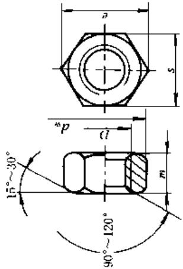

<table><tr><td rowspan=3 colspan=4>螺纹规格D×P</td><td rowspan=3 colspan=1>M8x1</td><td rowspan=2 colspan=2>M10×1</td><td rowspan=2 colspan=1>M12×1.5</td><td rowspan=3 colspan=2>(M14x1.5)</td><td rowspan=3 colspan=1>M16×1.5</td><td rowspan=3 colspan=1>（M18x1.5)</td><td rowspan=2 colspan=1>M20 x 1.5</td><td rowspan=3 colspan=1>(M22 ×1.5)</td><td rowspan=3 colspan=1>M24×2</td><td rowspan=3 colspan=1>(M27×2）</td><td rowspan=3 colspan=1>M30x2</td><td rowspan=3 colspan=2>(M33x2）</td><td rowspan=3 colspan=1>(M36x3）</td><td rowspan=2 colspan=1>M42×</td><td rowspan=3 colspan=2>M48×3</td><td rowspan=3 colspan=1>M56×4</td><td rowspan=3 colspan=1>M64x4</td></tr><tr></tr><tr><td rowspan=1 colspan=2>（M10×1.25）</td><td rowspan=1 colspan=1>（M12×1.25）</td><td rowspan=1 colspan=1>（M20×2）</td><td rowspan=1 colspan=1>3</td></tr><tr><td rowspan=3 colspan=4>min；公称d，min</td><td rowspan=3 colspan=1>14.41311.6</td><td rowspan=2 colspan=2>17.816</td><td rowspan=2 colspan=1>2018</td><td rowspan=1 colspan=2>23.4</td><td rowspan=1 colspan=1>26.8</td><td rowspan=1 colspan=1>29.6</td><td rowspan=1 colspan=1>33</td><td rowspan=1 colspan=1>37.3</td><td rowspan=1 colspan=1>39.6</td><td rowspan=1 colspan=1>45.2</td><td rowspan=1 colspan=1>50.9</td><td rowspan=1 colspan=2>55.4</td><td rowspan=2 colspan=1>60.855</td><td rowspan=2 colspan=1>72.365</td><td rowspan=1 colspan=2>82.6</td><td rowspan=2 colspan=1>：93.685</td><td rowspan=2 colspan=1>104.995</td></tr><tr><td rowspan=1 colspan=2>21</td><td rowspan=1 colspan=1>24</td><td rowspan=1 colspan=1>27</td><td rowspan=1 colspan=1>30</td><td rowspan=1 colspan=1>34</td><td rowspan=1 colspan=1>36</td><td rowspan=1 colspan=1>41</td><td rowspan=1 colspan=1>46</td><td rowspan=1 colspan=2>50</td><td rowspan=1 colspan=2>75</td></tr><tr><td rowspan=1 colspan=2>14.6</td><td rowspan=1 colspan=1>16.6</td><td rowspan=1 colspan=2>19.6</td><td rowspan=1 colspan=1>22.5</td><td rowspan=1 colspan=1>24.9</td><td rowspan=1 colspan=1>27.7</td><td rowspan=1 colspan=1>31.4</td><td rowspan=1 colspan=1>33.3</td><td rowspan=1 colspan=1>38</td><td rowspan=1 colspan=1>42.8</td><td rowspan=1 colspan=2>46.6</td><td rowspan=1 colspan=1>51.1</td><td rowspan=1 colspan=1>60</td><td rowspan=1 colspan=2>69.5</td><td rowspan=1 colspan=1>78.7</td><td rowspan=1 colspan=1>88.2</td></tr><tr><td rowspan=2 colspan=2>mmax</td><td rowspan=2 colspan=2>CB/T 6171CB/T 6173</td><td rowspan=2 colspan=1>6.84</td><td rowspan=2 colspan=2>8.45</td><td rowspan=2 colspan=1>10.86</td><td rowspan=1 colspan=2>12.8</td><td rowspan=1 colspan=1>14.8</td><td rowspan=1 colspan=1>15.8</td><td rowspan=1 colspan=1>18</td><td rowspan=1 colspan=1>19.4</td><td rowspan=1 colspan=1>21.5</td><td rowspan=1 colspan=1>23.8</td><td rowspan=1 colspan=1>25.6</td><td rowspan=1 colspan=2>28.7</td><td rowspan=1 colspan=1>31</td><td rowspan=1 colspan=1>34</td><td rowspan=1 colspan=2>38</td><td rowspan=1 colspan=1>45</td><td rowspan=1 colspan=1>51</td></tr><tr><td rowspan=1 colspan=2>7</td><td rowspan=1 colspan=1>8</td><td rowspan=1 colspan=1>9</td><td rowspan=1 colspan=1>10</td><td rowspan=1 colspan=1>11</td><td rowspan=1 colspan=1>12</td><td rowspan=1 colspan=1>13.5</td><td rowspan=1 colspan=1>15</td><td rowspan=1 colspan=2>16.5</td><td rowspan=1 colspan=1>18</td><td rowspan=1 colspan=1>21</td><td rowspan=1 colspan=2>24</td><td rowspan=1 colspan=1>28</td><td rowspan=1 colspan=1>32</td></tr><tr><td rowspan=2 colspan=2>每1000个的重量/g</td><td rowspan=2 colspan=2>GB/T6171—1986GB/T6173-1986</td><td rowspan=2 colspan=1>4.222.43</td><td rowspan=2 colspan=2>7.944.64</td><td rowspan=2 colspan=1>11.936.56</td><td rowspan=1 colspan=2>18.89</td><td rowspan=2 colspan=1>2915.26</td><td rowspan=2 colspan=1>36.8720 56</td><td rowspan=2 colspan=1>51.5527 76</td><td rowspan=2 colspan=1>73.8540.39</td><td rowspan=2 colspan=1>88.847.92</td><td rowspan=2 colspan=1>132.472.97</td><td rowspan=2 colspan=1>184.487.76</td><td rowspan=2 colspan=2>232105.5</td><td rowspan=2 colspan=1>317182.2</td><td rowspan=2 colspan=1>502.9305.8</td><td rowspan=2 colspan=2>744.4464.3</td><td rowspan=2 colspan=1>1091671.1</td><td rowspan=2 colspan=1>1503930.7</td></tr><tr><td rowspan=1 colspan=2>10.03</td></tr><tr><td rowspan=4 colspan=1>技术条件</td><td rowspan=1 colspan=2></td><td rowspan=1 colspan=9>CB/T 6171</td><td rowspan=1 colspan=2></td><td rowspan=1 colspan=7>GB/T 6173</td><td rowspan=2 colspan=4></td></tr><tr><td rowspan=1 colspan=2>材料</td><td rowspan=1 colspan=3>钢</td><td rowspan=1 colspan=3>不锈钢铁</td><td rowspan=1 colspan=3>有色金属</td><td rowspan=1 colspan=2>钢</td><td rowspan=1 colspan=4>不锈钢铁</td><td rowspan=1 colspan=3>有色金属</td><td rowspan=1 colspan=2></td></tr><tr><td rowspan=1 colspan=2>性能等级</td><td rowspan=1 colspan=3>D≤M39:6.8D≤M16:10D>M39:按协议</td><td rowspan=1 colspan=3>D≤M24:A2-70、A4-70M24<D≤M24:A2-50、A4-50D>M39:按协议</td><td rowspan=1 colspan=3>CU2.CU3、ALA</td><td rowspan=1 colspan=2>D≤M39:04、05D>M39:按协议</td><td rowspan=1 colspan=4>D≤M24:A2-035、A4-035M24<DM24:A2-025、A4-025D>M39:按协议</td><td rowspan=1 colspan=3>CU2、CU3、AL4</td><td rowspan=2 colspan=4>螺纹公差：6H</td></tr><tr><td rowspan=1 colspan=2>表面处理</td><td rowspan=1 colspan=3>不经处理</td><td rowspan=1 colspan=3>简单处理</td><td rowspan=1 colspan=3>简单处理</td><td rowspan=1 colspan=2>不经处理</td><td rowspan=1 colspan=4>简单处理</td><td rowspan=1 colspan=3>简单处理</td></tr></table>

# 2型六角螺母(GB/T6175-2000)

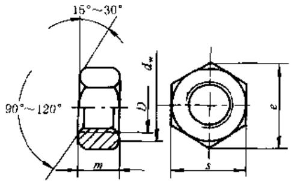

标记示例:

螺纹规格 $\pmb { D } = \mathbb { M } \mathbb { 1 6 }$ 、性能等级为9级、不经表面处理、A级的2型六角螺母:

螺母CB/T6175M16

表4-1-129

/mm 

<table><tr><td rowspan=1 colspan=1>螺纹规格D</td><td rowspan=1 colspan=1>M5</td><td rowspan=1 colspan=1>M6</td><td rowspan=1 colspan=1>M8</td><td rowspan=1 colspan=1>M10</td><td rowspan=1 colspan=1>M12</td><td rowspan=1 colspan=1>（M14）</td><td rowspan=1 colspan=1>M16</td><td rowspan=1 colspan=1>M20</td><td rowspan=1 colspan=1>M24</td><td rowspan=1 colspan=2>M30</td><td rowspan=1 colspan=1>M36</td></tr><tr><td rowspan=5 colspan=1>minmaxmmaxdmin每1000个的重量/kg</td><td rowspan=1 colspan=1>8.8</td><td rowspan=1 colspan=1>11.1</td><td rowspan=1 colspan=1>14.4</td><td rowspan=1 colspan=1>17.8</td><td rowspan=1 colspan=1>20.1</td><td rowspan=1 colspan=1>23.4</td><td rowspan=1 colspan=1>26.8</td><td rowspan=1 colspan=1>33</td><td rowspan=2 colspan=1>39.636</td><td rowspan=2 colspan=2>50.946</td><td rowspan=4 colspan=1>60.85534.736.0</td></tr><tr><td rowspan=1 colspan=1>8</td><td rowspan=1 colspan=1>10</td><td rowspan=1 colspan=1>13</td><td rowspan=1 colspan=1>16</td><td rowspan=1 colspan=1>18</td><td rowspan=1 colspan=1>21</td><td rowspan=1 colspan=1>24</td><td rowspan=1 colspan=1>30</td></tr><tr><td rowspan=2 colspan=1>5.16.9</td><td rowspan=1 colspan=1>5.7</td><td rowspan=1 colspan=1>7.5</td><td rowspan=1 colspan=1>9.3</td><td rowspan=1 colspan=1>12</td><td rowspan=1 colspan=1>14.1</td><td rowspan=1 colspan=1>16.4</td><td rowspan=1 colspan=1>20.3</td><td rowspan=1 colspan=1>23.9</td><td rowspan=2 colspan=2>28.630.0</td><td rowspan=1 colspan=2>28.6</td></tr><tr><td rowspan=1 colspan=1>8.9</td><td rowspan=1 colspan=1>11.6</td><td rowspan=1 colspan=1>14.6</td><td rowspan=1 colspan=1>16.6</td><td rowspan=1 colspan=1>19.6</td><td rowspan=1 colspan=1>22.5</td><td rowspan=1 colspan=1>27.7</td><td rowspan=1 colspan=1>33.2</td></tr><tr><td rowspan=1 colspan=1>1.14</td><td rowspan=1 colspan=1>2.15</td><td rowspan=1 colspan=1>4.68</td><td rowspan=1 colspan=1>8.83</td><td rowspan=1 colspan=1>13.31</td><td rowspan=1 colspan=1>20.92</td><td rowspan=1 colspan=1>32.29</td><td rowspan=1 colspan=1>57.95</td><td rowspan=1 colspan=1>99.35</td><td rowspan=1 colspan=2>207.1</td><td rowspan=1 colspan=1>356.9</td></tr></table>

<table><tr><td>技术条件</td><td>材料： 钢</td><td>性能等级： 9、12</td><td>螺纹公差： 6H</td><td>表面处理：氧化；电镀技术要求GB/T5267；非电解锌粉覆盖层技术要求按 ISO10683;如需其他表面镀层或表面处理，应有供需双方协议</td></tr></table>

注:A级用于 $\bar { D } \leqslant 1 6 \mathrm { m m }$ ; $\pmb { \mathrm { \delta } }$ 级用于 $\begin{array} { r } { D > 1 6 \mathrm { m m } , } \end{array}$ 

# 2型六角螺母细牙(GB/T6176—2000)

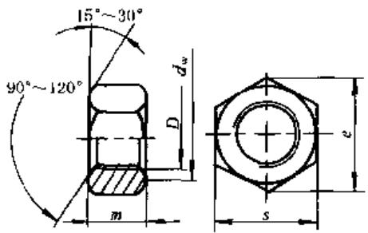

标记示例:

螺纹规格 ${ \pmb { D } } = { \bf M } { \bf 1 6 } \times { \bf \sigma } { \bf 1 } . { \pmb { 5 } }$ 、性能等级为10级、不经表面处理、 $\pmb { \cal A }$ 级的2型六角螺母:

螺母GB/T6176 $\mathbf { M } \mathbf { I } \mathbf { 6 } \times \mathbf { 1 } \ldots \mathbf { 5 }$ 

/mm 

表4-1-130

<table><tr><td colspan="2" rowspan="2">螺纹规格D×P</td><td>M8 ×1</td><td>M10x1</td><td colspan="2">M12 × 1.5</td><td>(M14×1.5)</td><td>M16× 1.5</td><td>M20 × 1.5</td><td>M24 x2</td><td>M30× 2</td><td>M36× 3</td></tr><tr><td>1</td><td>(M10 × 1.25)</td><td colspan="2">(M12×1.25)</td><td>1</td><td>1</td><td>（M20×2）</td><td></td><td></td><td></td></tr><tr><td colspan="2">min</td><td>14.4</td><td>17.8</td><td colspan="2">20</td><td>23.4</td><td>26.8</td><td>33</td><td>39.6</td><td>50.9</td><td>60.8</td></tr><tr><td colspan="2">： max</td><td>13</td><td>16</td><td colspan="2">18</td><td>21</td><td>24</td><td>30</td><td>36 ：</td><td>46</td><td>55</td></tr><tr><td colspan="2">mmax</td><td>7.5</td><td>9.3</td><td colspan="2">12</td><td>14.1</td><td>16.4</td><td>20.3</td><td>23.9</td><td>28.6</td><td>34.7</td></tr><tr><td colspan="2">dmin</td><td>11.63</td><td>14.63</td><td colspan="2">16.63</td><td>19.64</td><td>22.49</td><td>27.7</td><td>33.25</td><td>42.75</td><td>51.11</td></tr><tr><td colspan="2" rowspan="2">每1000个的 重量/kg</td><td colspan="2">4.68</td><td colspan="2">8.83 13.31</td><td>20.92</td><td>32.29</td><td>57.95</td><td>99.35</td><td>207.1</td><td>356.9</td></tr><tr><td colspan="2">性能等级： D≤M16:8、12</td><td colspan="2">螺纹公差： 6H</td><td colspan="7">表面处理;氧化;电镀技术要求GB/T5267;非电解锌粉覆盖层技术 要求按ISO10683；如需其他表面镀层或表面处理，应有供需双方协议</td></tr></table>

注:1.A级用于 $\mathcal { D } \leqslant 1 6 \mathrm { m m }$ ;B级用于 $D > 1 6 m m _ { \circ }$ 2.非优选的螺纹规格还有 $\mathbb { M } 1 8 \times 1 . 5$ , $\mathbf { M } 2 2 \times 1 . 5$ 、M27 ×2、 $M 3 3 \times 2 0$ 

1型六角开槽螺母A和B级(GR/T6178—1986)  
2型六角开槽螺母A和B级(GR/T6180---1986)

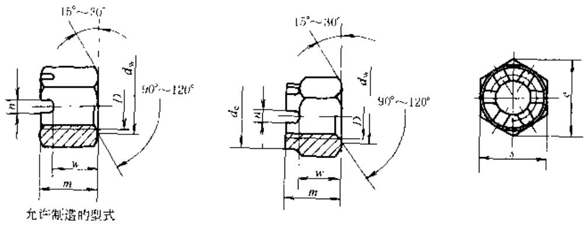

标记示例:

螺纹规格D=MS、性能等级为8级、不经表面处理、A级的1型六角槽螺母:

螺母GB/T6178 M5

1型六角开槽螺母C级(GB/T6179—1986)

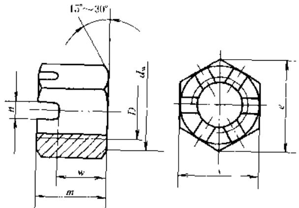

标记示例:

螺纹规格D=M5、性能等级为5级、不经表面处理、C级的1型六角开槽螺母:

螺母GB/T6179M5

六角开槽薄螺母A和B级(GB/T6181—1986)

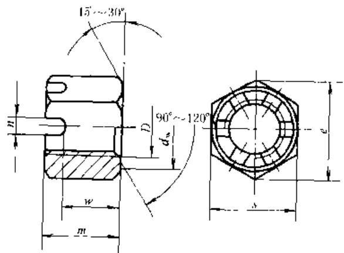

标记示例:

螺纹规格D=M12、性能等级为04级、不经表面处理、A级的六角开槽薄螺母:

螺母GB/T6181 M12

表4-1-131

/trm 

<table><tr><td colspan="3">螺纹规格D</td><td>M4</td><td>M5</td><td>M6</td><td>M8</td><td>M10</td><td>M12</td><td>（M14）</td><td>M16</td><td>M20</td><td>M24</td><td>M30</td><td>M36</td></tr><tr><td colspan="3">n max</td><td>1.8</td><td>2</td><td>2.6</td><td>3.1</td><td>3.4</td><td colspan="2">4.3</td><td></td><td>5.7</td><td>6.7</td><td>8.5</td><td></td></tr><tr><td>d</td><td colspan="2">max</td><td></td><td></td><td></td><td></td><td></td><td colspan="2"></td><td></td><td>28</td><td>34</td><td>42</td><td>50</td></tr><tr><td>smax</td><td colspan="2"></td><td>7</td><td>8</td><td>10</td><td>13</td><td>16</td><td>18</td><td>21</td><td>24</td><td>30</td><td>36</td><td>46</td><td>55</td></tr><tr><td></td><td colspan="2">min</td><td>7.7</td><td>8.8</td><td>11</td><td>14.4</td><td>17.8</td><td>20</td><td>23.4</td><td>26.8</td><td></td><td></td><td></td><td></td></tr><tr><td colspan="2"></td><td>2</td><td>1</td><td>8.6</td><td>10.9</td><td>14.2</td><td>17.6</td><td>19.9</td><td>22.8</td><td>26.2</td><td>33</td><td>39.6</td><td>50.9 1</td><td>60.8</td></tr><tr><td colspan="3">mine 2</td><td>5.9</td><td>6.9</td><td>8.9</td><td>11.6</td><td>14.6</td><td>16.6</td><td>19.6</td><td>22.5</td><td></td><td></td><td></td><td></td></tr><tr><td colspan="3"></td><td>1</td><td></td><td>8.7</td><td>11.5</td><td>14.5</td><td>16.5</td><td>19.2</td><td>22</td><td>27.7</td><td>33.2</td><td>42.7</td><td>51.1</td></tr><tr><td rowspan="4">m max</td><td>GB/T6178</td><td></td><td>5</td><td>6.7</td><td>7.7</td><td>9.8</td><td>12.4</td><td>15.8</td><td>17.8</td><td>20.8</td><td>24</td><td>29.5</td><td></td><td></td></tr><tr><td>GB/T6179</td><td>1</td><td></td><td></td><td></td><td></td><td></td><td></td><td></td><td></td><td></td><td></td><td>34.6</td><td>40</td></tr><tr><td>CB/T 6180 CB/T6181</td><td>1</td><td>6.9</td><td>8.3</td><td></td><td>10</td><td>12.3</td><td>16</td><td>19.1</td><td>21.1</td><td>26.3</td><td>31.9</td><td>37.6</td><td>43.7</td></tr><tr><td></td><td></td><td></td><td>5.1 4.7</td><td>5.7</td><td>7.5</td><td>9.3</td><td>12</td><td>14.1</td><td>16.4</td><td>20.3</td><td>23.9</td><td>28.6</td><td>34.7</td></tr><tr><td rowspan="2">W max</td><td>一型</td><td>3.2</td><td></td><td></td><td>5.2</td><td>6.8</td><td>8.4</td><td>10.8</td><td>12.8</td><td>14.8</td><td>18</td><td>21.5</td><td>25.6</td><td>31</td></tr><tr><td>2型</td><td></td><td></td><td>5.1</td><td>5.7</td><td>7.5</td><td>9.3</td><td>12</td><td>14.！</td><td>16.4</td><td>20.3</td><td>23.9</td><td>28.6</td><td>34.7</td></tr><tr><td></td><td></td><td>薄</td><td>1</td><td>3.1</td><td>3.2</td><td>4.5</td><td>5.3</td><td>7</td><td>9.1</td><td>10.4</td><td>14.3</td><td>15.9</td><td>19.6</td><td>23.7</td></tr></table>

续表

<table><tr><td rowspan=1 colspan=2>螺纹规格D</td><td rowspan=1 colspan=1>M4</td><td rowspan=1 colspan=1>M5</td><td rowspan=1 colspan=1>M6</td><td rowspan=1 colspan=1>M8</td><td rowspan=1 colspan=1>M10</td><td rowspan=1 colspan=1>M12</td><td rowspan=1 colspan=3>（M14）</td><td rowspan=1 colspan=1>M16</td><td rowspan=1 colspan=1>M20</td><td rowspan=1 colspan=1>M24</td><td rowspan=1 colspan=2>M30</td><td rowspan=1 colspan=1>M36</td></tr><tr><td rowspan=2 colspan=1>每1000个的重量/g</td><td rowspan=1 colspan=1>GB/T6178GB/T 6179GB/T6180</td><td rowspan=1 colspan=1>0.81一</td><td rowspan=1 colspan=1>1.43</td><td rowspan=1 colspan=1>2.69</td><td rowspan=1 colspan=1>5.79</td><td rowspan=1 colspan=1>11.23</td><td rowspan=1 colspan=1>16.72</td><td rowspan=1 colspan=3>26.33</td><td rowspan=1 colspan=1>40.23：</td><td rowspan=1 colspan=1>71.87</td><td rowspan=1 colspan=1>124.7</td><td rowspan=1 colspan=2>256</td><td rowspan=1 colspan=1>434.2</td></tr><tr><td rowspan=1 colspan=1>GB/T 6181</td><td rowspan=1 colspan=1></td><td rowspan=1 colspan=1>0.%</td><td rowspan=1 colspan=1>1.71</td><td rowspan=1 colspan=1>3.87</td><td rowspan=1 colspan=1>7.35</td><td rowspan=1 colspan=1>11</td><td rowspan=1 colspan=3>18.38</td><td rowspan=1 colspan=1>27.67</td><td rowspan=1 colspan=1>52.71</td><td rowspan=1 colspan=1>88.88</td><td rowspan=1 colspan=2>186.1</td><td rowspan=1 colspan=1>332.9</td></tr><tr><td rowspan=1 colspan=2>开□销</td><td rowspan=1 colspan=1>1× 10</td><td rowspan=1 colspan=1>1.2×12</td><td rowspan=1 colspan=1>1.6x14</td><td rowspan=1 colspan=1>2×16：</td><td rowspan=1 colspan=1>2.5×20</td><td rowspan=1 colspan=1>3.2×22</td><td rowspan=1 colspan=3>3.2×26</td><td rowspan=1 colspan=1>4 × 28</td><td rowspan=1 colspan=1>4×36</td><td rowspan=1 colspan=1>5×40</td><td rowspan=1 colspan=2>6.3×50</td><td rowspan=1 colspan=1>6.3x63</td></tr><tr><td rowspan=5 colspan=1>技术条件</td><td rowspan=1 colspan=1>GB/T 6179</td><td rowspan=2 colspan=1></td><td rowspan=2 colspan=1>钢</td><td rowspan=1 colspan=1>4、5</td><td rowspan=1 colspan=2>螺纹公差：7H</td><td rowspan=2 colspan=3>表面处理</td><td rowspan=1 colspan=7>(1)不经处理；(2)镀锌钝化</td></tr><tr><td rowspan=1 colspan=1>GB/T 6178</td><td rowspan=1 colspan=1>6.8、10</td><td rowspan=4 colspan=2>螺纹公差：6H</td><td rowspan=1 colspan=7>（1）氧化；(2)不经处理；(3）镀锌钝化</td></tr><tr><td rowspan=1 colspan=1>CB/T 6180</td><td rowspan=1 colspan=1>性能等级</td><td rowspan=1 colspan=1></td><td rowspan=1 colspan=1>9、12</td><td rowspan=1 colspan=3></td><td rowspan=1 colspan=7>（1）氧化；(2）镀锌钝化</td></tr><tr><td rowspan=2 colspan=1>CB/T 6181</td><td rowspan=2 colspan=1></td><td rowspan=1 colspan=1>钢</td><td rowspan=1 colspan=1>不锈钢</td><td rowspan=2 colspan=2>表面处理</td><td rowspan=1 colspan=6>钢</td><td rowspan=1 colspan=2>不锈钢</td></tr><tr><td rowspan=1 colspan=1>04、05</td><td rowspan=1 colspan=1>A2-50</td><td rowspan=1 colspan=6>（1）不经处理；(2）镀锌钝化：(3）氧化</td><td rowspan=1 colspan=2>不经处理</td></tr></table>

$\textcircled{1}$ 为GB/T6178—1986、GB/T6180-1986、GB/T6181—1986的尺寸。②为GB/T6179—1986的尺寸,

1型六角开槽螺母 细牙A和B级(GB/T9457—1988)  
2型六角开槽螺母 细牙A和B级(GB/T9458—1988)

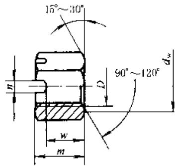

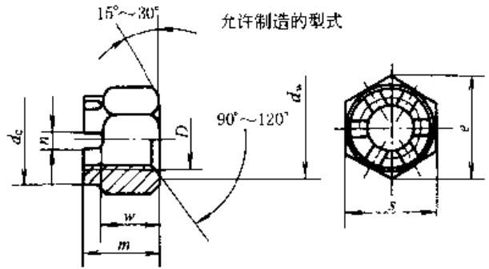

标记示例:

螺纹规格 $\boldsymbol { \mathit { \Omega } } \mathbf { \mathcal { D } } = \mathbf { \mathcal { M } } \mathbf { \mathcal { E } } \times \mathbf { \mathcal { \Lambda } }$ 、性能等级为8级、不经表面处理A级的1型六角开槽螺母:

螺母GB/T9457 $\mathbf { M } \mathbf { 8 } \times 1$ 

六角开槽薄螺母 细牙 A和B级(GB/T9459-1988)

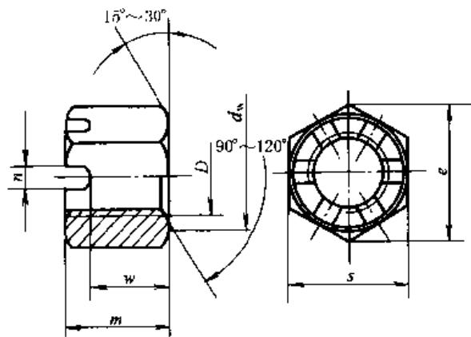

标记示例:

螺纹规格 $D = { \bf M } { \bf 1 0 } \times { \bf 1 }$ 、性能等级为04级、不经表面处理A级的六角开槽薄螺母:

螺母CB/T9459 $\mathbf { M } \mathbf { 1 0 \times 1 }$ 

<table><tr><td>螺纹规格D×P</td><td>M8×1</td><td></td><td>M10×1 （M10× 1.25）</td><td>M12 × 1.5 （M12× 1.25）</td><td>(M14× 1.5)</td><td>M16× 1.5</td><td>(M18×1.5)</td><td>M20 × 2 (M20 × 1.5)</td><td>M22 × 1.5</td><td>M24× 2</td><td>（M27×2）</td><td>M30×2</td><td>（M33×2）</td><td>M36×3</td></tr><tr><td>dmax</td><td></td><td></td><td colspan="2"></td><td></td><td></td><td>25</td><td>28</td><td>30</td><td>34</td><td>38</td><td>42</td><td>46</td><td>50</td></tr><tr><td>emin</td><td></td><td>14.38</td><td>17.77</td><td>20.03</td><td>23.35</td><td>26.75</td><td>29.56</td><td>32.95</td><td>37.29</td><td>39.55</td><td>45.2</td><td>50.85</td><td>55.37</td><td>60.79</td></tr><tr><td>max</td><td></td><td>13</td><td>16</td><td>18</td><td>21</td><td>24</td><td>27</td><td>30</td><td>34</td><td>36</td><td>41</td><td>46</td><td>50</td><td>55</td></tr><tr><td>R max</td><td></td><td>3.1</td><td>3.4 4.25</td><td colspan="5">5.7</td><td colspan="3">6.7</td><td colspan="3">8.5</td></tr><tr><td colspan="2">d</td><td>11.6</td><td>14.6</td><td>16.6</td><td>19.6</td><td>22.5</td><td>24.8</td><td>27.7</td><td>31.4</td><td>33.2</td><td>38</td><td>42.7</td><td>46.6</td><td>51.1</td></tr><tr><td rowspan="3">m mgx</td><td>1型</td><td>9.8</td><td>12.4</td><td>15.8</td><td>17.8</td><td>20.8</td><td>21.8</td><td>24</td><td>27.4</td><td>29.5</td><td>31.8</td><td>34.6</td><td>37.7</td><td>40</td></tr><tr><td>2型</td><td>10.5</td><td>13.3</td><td>17</td><td>19.1</td><td>22.4</td><td>23.6</td><td>26.3</td><td>29.8</td><td>31.9</td><td>34.7</td><td>37.6</td><td>41.5</td><td>43.7</td></tr><tr><td>薄型</td><td>7.5</td><td>9.3</td><td>12</td><td>14.1</td><td>16.4</td><td>17.6</td><td>20.3</td><td>21.8</td><td>23.9</td><td>26.7</td><td>28.6</td><td>32.5</td><td>34.7</td></tr><tr><td rowspan="3">W max</td><td>1型</td><td>6.8</td><td>8.4</td><td>10.8</td><td>12.8</td><td>14.8</td><td>15.8</td><td>18</td><td>19.4</td><td>21.5</td><td>23.8</td><td>25.6</td><td>28.7</td><td>31</td></tr><tr><td>2型</td><td>7.5</td><td>9.3</td><td>12</td><td>14.1</td><td>16.4</td><td>17.6</td><td>20.3</td><td>21.8</td><td>23.9</td><td>26.7</td><td>28.6</td><td>32.5</td><td>34.7</td></tr><tr><td>薄型</td><td>4.5</td><td>5.3</td><td>7</td><td>9.1</td><td>10.4</td><td>11.6</td><td>14.3</td><td>14.8</td><td>15.9</td><td>18.7</td><td>19.6</td><td>23.5</td><td>25.7</td></tr><tr><td rowspan="3">每1000 个的重量</td><td>型</td><td>5.21</td><td>10.34</td><td>15.34</td><td>24.87</td><td>36.94</td><td>46.15</td><td>64.99</td><td>97.04</td><td>114.7</td><td>168.1</td><td>233.2</td><td>302</td><td>394.3</td></tr><tr><td>2型</td><td>5.79</td><td>11.23</td><td>16.72</td><td>26.38</td><td>40.23</td><td>50.55</td><td>71.81</td><td>106.2</td><td>124.7</td><td>184.4</td><td>256</td><td>333.7</td><td>434.2</td></tr><tr><td>薄型</td><td>3.87</td><td>7.35</td><td>11</td><td>18.41</td><td>27.67</td><td>36.11</td><td>52.74</td><td>73.16</td><td>88.88</td><td>136.9</td><td>186.1</td><td>252.2</td><td>332.9</td></tr><tr><td colspan="2">/kg 开口销</td><td>2×16</td><td>2.5× 20</td><td>3.2 × 22</td><td>3.2 x 26</td><td>4×28</td><td>4x32</td><td>4x36</td><td>5×40</td><td></td><td>5×45</td><td>6.3×50</td><td>6.3x 60</td><td>6.3×65</td></tr><tr><td colspan="2" rowspan="2"></td><td colspan="3">材料</td><td rowspan="2">螺纹公差</td><td colspan="3">性能等级</td><td colspan="3">产品等级</td><td colspan="4">表面处理(GB/T9459）</td></tr><tr><td colspan="3">钢</td><td colspan="2">1型</td><td colspan="2">薄型</td><td colspan="2"></td><td colspan="3"></td></tr><tr><td rowspan="2">技术条件</td><td colspan="3" rowspan="2"></td><td rowspan="2">6H</td><td></td><td>2型 8、10</td><td></td><td></td><td colspan="3" rowspan="2">A级用于D≤16；B级用于 D>16</td><td rowspan="2">①不经处理(不适用2型）； ②镀锌钝化；③氧化</td><td rowspan="2"></td></tr><tr><td></td><td>6、8、10</td><td>04、05</td></tr></table>

# 组合式盖形螺母(GB/T802—1988)

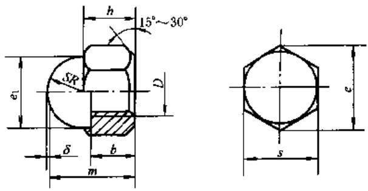

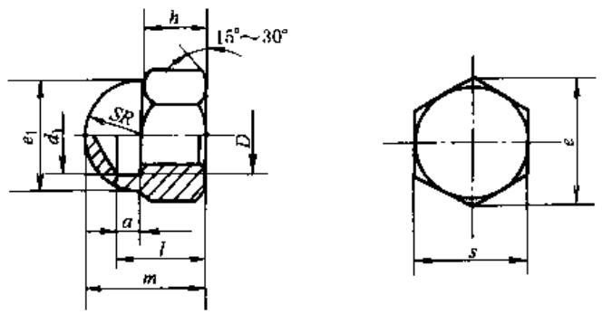

盖型螺母(GB/T923—1988)

标记示例:

螺纹规格 $D = \mathbb { M } \mathbb { 1 } 2$ 、性能等级为6级、表面氧化的组合式盖形螺母;

螺母GB/T802M12

表4-1-133

/mm 

<table><tr><td colspan="3">螺纹规格D</td><td>M3</td><td>M4</td><td>M5</td><td>M6</td><td>M8</td><td>M10</td><td>M12</td><td>(M14）</td><td>M16</td><td>（M18）</td><td>M20</td><td>（M22）</td><td>M24</td></tr><tr><td colspan="3">min</td><td>6.01 7.66</td><td>8.79</td><td>11.05</td><td></td><td>14.38</td><td>17.77</td><td>20.03</td><td>23.36</td><td>26.75</td><td>29.56</td><td>32.95</td><td>37.29</td><td>39.55</td></tr><tr><td colspan="3">心</td><td>5 6</td><td>7.2</td><td></td><td>9.2</td><td>13</td><td>16</td><td>18</td><td>20</td><td>22</td><td>25</td><td>28</td><td>30</td><td>34</td></tr><tr><td colspan="3">mmin</td><td>7 6</td><td>9</td><td></td><td>11</td><td>15</td><td>18</td><td>22</td><td>24</td><td>26</td><td>29（30)</td><td>32(35)</td><td>35(38)</td><td>38(40)</td></tr><tr><td colspan="3">sDax</td><td>5.5 7</td><td>8</td><td></td><td>10</td><td>13</td><td>16</td><td>18</td><td>21</td><td>24</td><td>2</td><td>30</td><td>34</td><td>36</td></tr><tr><td colspan="3">SR</td><td>2.5 3</td><td>3.6</td><td></td><td>4.6</td><td>6.5</td><td>8</td><td>9</td><td>10</td><td>11.5</td><td>12.5</td><td>14</td><td>15</td><td>17</td></tr><tr><td rowspan="3">GB/T 802</td><td>h</td><td></td><td></td><td>5.5</td><td>6.5</td><td>8</td><td>10</td><td>12</td><td>13</td><td>15</td><td></td><td>17</td><td>19</td><td>21</td><td>22</td></tr><tr><td>b</td><td>1</td><td></td><td>4</td><td>5</td><td>6</td><td>8</td><td></td><td>10</td><td>11</td><td>13</td><td>14</td><td>16</td><td>18</td><td>19</td></tr><tr><td>8</td><td></td><td>1</td><td>0.5</td><td></td><td colspan="3">0.8</td><td></td><td>1</td><td></td><td></td><td>1.2</td><td></td><td></td></tr><tr><td rowspan="4">CB/T 923</td><td>h</td><td>2.5</td><td>3 1</td><td>4</td><td>5</td><td>6</td><td>8 4</td><td>10 4.5</td><td>11</td><td>13 1</td><td>14</td><td></td><td>16</td><td>18</td><td>19</td></tr><tr><td>αmin</td><td>l</td><td></td><td>2</td><td>2.5</td><td>3</td><td></td><td></td><td></td><td>5</td><td></td><td></td><td>6</td><td></td><td>7</td></tr><tr><td>d ！</td><td></td><td>5</td><td>5.5 6</td><td>6.5 7</td><td></td><td>8.5</td><td>10.5 13</td><td>13</td><td>15 17 19</td><td></td><td>19 22</td><td>21 25</td><td>23 26</td><td>25 28</td></tr><tr><td>每1000</td><td></td><td></td><td></td><td></td><td></td><td>11 6.71</td><td></td><td>16</td><td>17</td><td>36.79</td><td>49.85</td><td>68.52</td><td>97.88</td><td></td></tr><tr><td>个的重量 /g</td><td>GB/T 802 GB/T923</td><td>0.57</td><td>1.04</td><td>1.59 1.25</td><td>3.28 2.77</td><td>6.73</td><td>12.14 12.88</td><td>17.35 17.46</td><td>24.76 24.66</td><td>39.84</td><td>48.78</td><td>71.%6</td><td></td><td>102</td><td>112.5 127.8</td></tr><tr><td colspan="2" rowspan="2">技术条件</td><td colspan="3">材料</td><td colspan="2">螺纹公差</td><td colspan="3">产品等级</td><td colspan="3">表面处理</td><td colspan="3">性能等级</td></tr><tr><td colspan="3">钢</td><td colspan="2">6H</td><td colspan="3">A级用于D≤16；B级 用于D>16</td><td colspan="2">①氧化 ②镀锌钝化</td><td colspan="2">CB/T 802 6.8</td><td colspan="2">CB/T 923 5.6</td></tr></table>

注: $\pmb { m }$ 括号中的尺寸为 $\mathbf { G B } / \hat { \mathbf { T } } \ \mathbf { 8 0 2 } ,$ ,

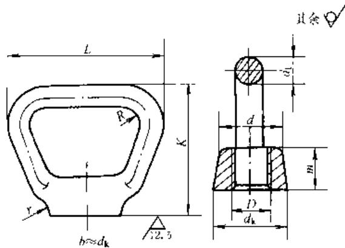

标记示例:

螺纹规格 $D = \mathbb { M } \mathbb { I } \boldsymbol { \mathfrak { b } }$ 、材料为 $\mathbf { Z } \mathbb { C } \mathbf { u } \mathbf { Z } \mathbf { n } 4 0 \mathbf { M } \mathbf { n } 2$ 、不经表面处理的环形螺母:

螺母GB/T63M16

表4-1-134

/mm 

<table><tr><td rowspan=1 colspan=1>螺纹规格D</td><td rowspan=1 colspan=1>山</td><td rowspan=1 colspan=1>d</td><td rowspan=1 colspan=1>m</td><td rowspan=1 colspan=1>K</td><td rowspan=1 colspan=1>[</td><td rowspan=1 colspan=1>山</td><td rowspan=1 colspan=1>R</td><td rowspan=1 colspan=1>1</td><td rowspan=1 colspan=1>每1000个的重=/kg</td></tr><tr><td rowspan=1 colspan=1>M12(M14)</td><td rowspan=1 colspan=1>24</td><td rowspan=1 colspan=1>20</td><td rowspan=1 colspan=1>15</td><td rowspan=1 colspan=1>52</td><td rowspan=1 colspan=1>66</td><td rowspan=1 colspan=1>10</td><td rowspan=1 colspan=1></td><td rowspan=1 colspan=1>6</td><td rowspan=1 colspan=1>153.91493</td></tr><tr><td rowspan=1 colspan=1>M16(M18)</td><td rowspan=1 colspan=1>30</td><td rowspan=1 colspan=1>26</td><td rowspan=1 colspan=1>18</td><td rowspan=1 colspan=1>60</td><td rowspan=1 colspan=1>76</td><td rowspan=1 colspan=1>12</td><td rowspan=1 colspan=1>6</td><td rowspan=1 colspan=1>8</td><td rowspan=1 colspan=1>262.9256.3</td></tr><tr><td rowspan=1 colspan=1>M20（M22）</td><td rowspan=1 colspan=1>36</td><td rowspan=1 colspan=1>30</td><td rowspan=1 colspan=1>22</td><td rowspan=1 colspan=1>72</td><td rowspan=1 colspan=1>86</td><td rowspan=1 colspan=1>:-13</td><td rowspan=1 colspan=1>8</td><td rowspan=1 colspan=1>1</td><td rowspan=1 colspan=1>370358.1</td></tr><tr><td rowspan=1 colspan=1>M24</td><td rowspan=1 colspan=1>46</td><td rowspan=1 colspan=1>38</td><td rowspan=1 colspan=1>26</td><td rowspan=1 colspan=1>84</td><td rowspan=1 colspan=1>98</td><td rowspan=1 colspan=1>14</td><td rowspan=1 colspan=1>10</td><td rowspan=1 colspan=1>14</td><td rowspan=1 colspan=1>568.9</td></tr><tr><td rowspan=1 colspan=1>技术条件</td><td rowspan=1 colspan=3>材料：ZCuZn40Mn2</td><td rowspan=1 colspan=6>螺纹公差：6H</td></tr></table>

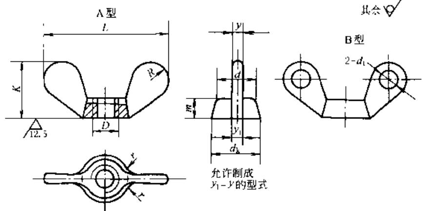

蝶形螺母(GB/T62-1988)

标记示例:

螺纹规格 $D = \mathbb { M } \mathbb { I } \mathbb { I }$ 、材料为Q235、不经表面处理、A型蝶形螺母;

螺母CH/T62M10

表4-1-135

/mm 

<table><tr><td rowspan="2">螺纹规格D×P</td><td rowspan="2">M3 ×0.5</td><td rowspan="2">M4 ×0.7</td><td rowspan="2">MS ×0.8</td><td rowspan="2">M6</td><td rowspan="2">M8 ×1</td><td rowspan="2"></td><td rowspan="2">M8 M10 x 1.25</td><td rowspan="2">M10 ×1.5</td><td rowspan="2"></td><td rowspan="2">M12</td><td rowspan="2">M12 （M14 ×1.5</td><td rowspan="2">× 2）</td><td rowspan="2">（M14 ×1.5）</td><td rowspan="2">M16 M16 ×2</td></tr><tr><td>1.25 × 1.75</td></tr><tr><td>d</td><td>7</td><td>8</td><td>10</td><td>×1 12</td><td></td><td>15</td><td></td><td>18</td><td></td><td>22</td><td></td><td>26</td><td></td><td>× 1.5 30</td></tr><tr><td>d</td><td>6</td><td>7</td><td>8</td><td>10</td><td></td><td>13</td><td></td><td>15</td><td></td><td>19</td><td></td><td>23</td><td></td><td>26</td></tr><tr><td>L</td><td>20</td><td>24</td><td>28</td><td>32</td><td></td><td>40</td><td></td><td>48</td><td></td><td>58</td><td></td><td>64</td><td></td><td>72</td></tr><tr><td>K</td><td>8</td><td>10</td><td>12</td><td>14</td><td></td><td>18</td><td></td><td>22</td><td></td><td>27</td><td></td><td>30</td><td></td><td>32</td></tr></table>

续表

扣紧螺母(GB/T805-1988)

<table><tr><td rowspan=1 colspan=2>螺纹规格D×P</td><td rowspan=1 colspan=1>M3x0.51</td><td rowspan=1 colspan=1>M4×0.7</td><td rowspan=1 colspan=1>M5×0.8</td><td rowspan=1 colspan=1>M6×1</td><td rowspan=1 colspan=1>M8x1</td><td rowspan=1 colspan=1>M8×1.25</td><td rowspan=1 colspan=1>M10×1.5</td><td rowspan=1 colspan=1>M10×1.25</td><td rowspan=1 colspan=1>M12×1.75</td><td rowspan=1 colspan=1>M12×1.5</td><td rowspan=1 colspan=1>(M14×2）</td><td rowspan=1 colspan=1>（M14x1.5）</td><td rowspan=1 colspan=1>M16x2</td><td rowspan=1 colspan=1>M16× 1.5</td></tr><tr><td rowspan=1 colspan=1></td><td rowspan=1 colspan=1>m</td><td rowspan=1 colspan=1>3.5</td><td rowspan=1 colspan=1>4</td><td rowspan=1 colspan=1>5</td><td rowspan=1 colspan=1>6</td><td rowspan=1 colspan=1></td><td rowspan=1 colspan=1>8</td><td rowspan=1 colspan=1></td><td rowspan=1 colspan=1>10</td><td rowspan=1 colspan=2>12</td><td rowspan=1 colspan=2>14</td><td rowspan=1 colspan=2></td></tr><tr><td rowspan=1 colspan=1></td><td rowspan=1 colspan=1>d</td><td rowspan=1 colspan=1>3</td><td rowspan=1 colspan=1>4</td><td rowspan=1 colspan=1>4</td><td rowspan=1 colspan=1>5</td><td rowspan=1 colspan=1></td><td rowspan=1 colspan=1>6</td><td rowspan=1 colspan=1></td><td rowspan=1 colspan=1>7</td><td rowspan=1 colspan=1>8</td><td rowspan=1 colspan=1></td><td rowspan=1 colspan=1></td><td rowspan=1 colspan=1>9</td><td rowspan=1 colspan=2>10</td></tr><tr><td rowspan=1 colspan=1></td><td rowspan=1 colspan=1>y</td><td rowspan=1 colspan=1>1.25</td><td rowspan=1 colspan=1>1.5</td><td rowspan=1 colspan=1>2</td><td rowspan=1 colspan=1>2.5</td><td rowspan=1 colspan=1></td><td rowspan=1 colspan=1>3</td><td rowspan=1 colspan=1></td><td rowspan=1 colspan=1>3.5</td><td rowspan=1 colspan=1>4</td><td rowspan=1 colspan=1></td><td rowspan=1 colspan=1></td><td rowspan=1 colspan=1>5</td><td rowspan=1 colspan=2>6</td></tr><tr><td rowspan=1 colspan=2>y</td><td rowspan=1 colspan=1>1.5</td><td rowspan=1 colspan=1>2</td><td rowspan=1 colspan=1>2.5</td><td rowspan=1 colspan=1>3</td><td rowspan=1 colspan=2>3.5</td><td rowspan=1 colspan=2>4</td><td rowspan=1 colspan=2>5</td><td rowspan=1 colspan=2>6</td><td rowspan=1 colspan=2>7</td></tr><tr><td rowspan=2 colspan=2>R1</td><td rowspan=1 colspan=1>3</td><td rowspan=1 colspan=1>3.5</td><td rowspan=1 colspan=1>4.5</td><td rowspan=1 colspan=1>5</td><td rowspan=1 colspan=2>6</td><td rowspan=1 colspan=2>7</td><td rowspan=2 colspan=2>8.56</td><td rowspan=2 colspan=2>97</td><td rowspan=2 colspan=2>108</td></tr><tr><td rowspan=2 colspan=2>1每1000个的重量/kg</td><td rowspan=2 colspan=1>21.72</td><td rowspan=2 colspan=1>2.52.72</td><td rowspan=2 colspan=1>35.12</td><td rowspan=2 colspan=1>3.58.421</td><td rowspan=2 colspan=2>416.04</td><td rowspan=1 colspan=2>5</td></tr><tr><td rowspan=1 colspan=2>26.28</td><td rowspan=1 colspan=2>46.55</td><td rowspan=1 colspan=2>7164</td><td rowspan=1 colspan=2>98.86</td></tr><tr><td rowspan=1 colspan=2>技术条件</td><td rowspan=1 colspan=6>材料：Q215、Q235、KT30-6</td><td rowspan=1 colspan=8>螺纹公差：6H</td></tr></table>

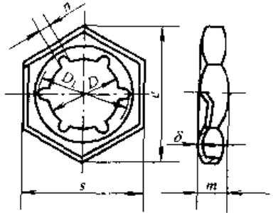

标记示例:

螺纹规格 $\mathcal { D } = \mathbb { M } \mathbb { 1 } 2$ 、材料为 $6 5 M n$ 、热处理硬度 $3 0 \sim 4 0 \mathrm { { H P G } }$ 、表面氧化的扣紧螺母:

螺母GB/T805M12

表4-1-136

/mm 

<table><tr><td rowspan=2 colspan=1>螺纹规格DxP</td><td rowspan=2 colspan=1>M6×1</td><td rowspan=2 colspan=1>M8×1.25</td><td rowspan=1 colspan=1>M10</td><td rowspan=1 colspan=1>M12</td><td rowspan=1 colspan=1>（M14</td><td rowspan=1 colspan=1>M16</td><td rowspan=1 colspan=1>（M18</td><td rowspan=1 colspan=1>M20</td><td rowspan=1 colspan=1>(M22</td><td rowspan=1 colspan=1>M24</td><td rowspan=1 colspan=1>（M27</td><td rowspan=1 colspan=2>M30</td><td rowspan=1 colspan=1>M.36</td><td rowspan=2 colspan=1>M42x4.5</td><td rowspan=2 colspan=1>M48×5</td></tr><tr><td rowspan=1 colspan=1>×1.5</td><td rowspan=1 colspan=1>×1.75</td><td rowspan=1 colspan=1>×2）</td><td rowspan=1 colspan=1>×2</td><td rowspan=1 colspan=1>×2.5)</td><td rowspan=1 colspan=1>×2.5</td><td rowspan=1 colspan=1>× 2.5)</td><td rowspan=1 colspan=1>x3</td><td rowspan=1 colspan=1>×3）</td><td rowspan=1 colspan=2>×3.5</td><td rowspan=1 colspan=1>×4</td></tr><tr><td rowspan=1 colspan=1>min</td><td rowspan=2 colspan=1>510</td><td rowspan=2 colspan=1>6.813</td><td rowspan=1 colspan=1>8.5</td><td rowspan=1 colspan=1>10.3</td><td rowspan=1 colspan=1>12</td><td rowspan=1 colspan=1>14</td><td rowspan=1 colspan=1>15.5</td><td rowspan=1 colspan=1>17.5</td><td rowspan=1 colspan=1>19.5</td><td rowspan=1 colspan=1>21</td><td rowspan=1 colspan=1>24</td><td rowspan=2 colspan=2>26.546</td><td rowspan=1 colspan=1>32</td><td rowspan=2 colspan=1>37.565</td><td rowspan=2 colspan=1>4375</td></tr><tr><td rowspan=2 colspan=1>smaxD</td><td rowspan=1 colspan=1>16</td><td rowspan=1 colspan=1>18</td><td rowspan=1 colspan=1>21</td><td rowspan=1 colspan=1>24</td><td rowspan=1 colspan=1>27</td><td rowspan=1 colspan=1>30</td><td rowspan=1 colspan=1>34</td><td rowspan=1 colspan=1>36</td><td rowspan=1 colspan=1>41</td><td rowspan=1 colspan=1></td><td rowspan=1 colspan=1>55</td></tr><tr><td rowspan=1 colspan=1>7.5</td><td rowspan=1 colspan=1>9.5</td><td rowspan=1 colspan=1>12</td><td rowspan=1 colspan=1>14</td><td rowspan=1 colspan=1>16</td><td rowspan=1 colspan=1>18</td><td rowspan=1 colspan=1>20.5</td><td rowspan=1 colspan=1>22.5</td><td rowspan=1 colspan=1>25</td><td rowspan=1 colspan=1>27</td><td rowspan=1 colspan=1>30</td><td rowspan=1 colspan=2>34</td><td rowspan=1 colspan=1>40</td><td rowspan=1 colspan=1>47</td><td rowspan=1 colspan=1>54</td></tr><tr><td rowspan=1 colspan=1>n</td><td rowspan=1 colspan=1></td><td rowspan=1 colspan=1>1</td><td rowspan=1 colspan=1></td><td rowspan=1 colspan=1></td><td rowspan=1 colspan=2>1.5</td><td rowspan=1 colspan=3>2</td><td rowspan=1 colspan=2>2.5</td><td rowspan=1 colspan=2></td><td rowspan=1 colspan=3>3</td></tr><tr><td rowspan=1 colspan=1>…</td><td rowspan=1 colspan=1>11.5</td><td rowspan=1 colspan=1>16.2</td><td rowspan=1 colspan=1>19.6</td><td rowspan=1 colspan=1>21.9</td><td rowspan=1 colspan=1>25.4</td><td rowspan=1 colspan=1>27.7</td><td rowspan=1 colspan=1>31.2</td><td rowspan=1 colspan=1>34.6</td><td rowspan=1 colspan=1>36.9</td><td rowspan=1 colspan=1>41.6</td><td rowspan=1 colspan=1>47.3</td><td rowspan=1 colspan=2>53.1</td><td rowspan=1 colspan=1>63.5</td><td rowspan=1 colspan=1>75</td><td rowspan=1 colspan=1>86.5</td></tr><tr><td rowspan=1 colspan=1>m</td><td rowspan=1 colspan=1>3</td><td rowspan=1 colspan=1>4</td><td rowspan=1 colspan=2>5</td><td rowspan=1 colspan=2>6</td><td rowspan=1 colspan=3>7</td><td rowspan=1 colspan=4>9</td><td rowspan=1 colspan=2>12</td><td rowspan=1 colspan=1>14</td></tr><tr><td rowspan=1 colspan=1>8</td><td rowspan=1 colspan=1>0.4</td><td rowspan=1 colspan=1>0.5</td><td rowspan=1 colspan=1>0.6</td><td rowspan=1 colspan=1>0.7</td><td rowspan=1 colspan=2>0.8</td><td rowspan=1 colspan=2>1</td><td rowspan=1 colspan=1></td><td rowspan=1 colspan=2>1.2</td><td rowspan=1 colspan=3>1.4</td><td rowspan=1 colspan=2>1.8</td></tr><tr><td rowspan=1 colspan=1>每100个的重量/kg</td><td rowspan=1 colspan=1>0.52</td><td rowspan=1 colspan=1>1.26</td><td rowspan=1 colspan=1>2.24</td><td rowspan=1 colspan=1>2.99</td><td rowspan=1 colspan=1>4.58</td><td rowspan=1 colspan=1>5.16</td><td rowspan=1 colspan=1>8.4</td><td rowspan=1 colspan=1>9.66</td><td rowspan=1 colspan=1>10.4</td><td rowspan=1 colspan=1>17.46</td><td rowspan=1 colspan=1>20.94</td><td rowspan=1 colspan=2>29.06</td><td rowspan=1 colspan=1>43.99</td><td rowspan=1 colspan=1>72.37</td><td rowspan=1 colspan=1>97.16</td></tr><tr><td rowspan=1 colspan=1>技术条件</td><td rowspan=1 colspan=2>材料：65Mn</td><td rowspan=1 colspan=7>热处理：淬火并回火30~40HRC</td><td rowspan=1 colspan=7>表面处理：氧化镀锌钝化</td></tr></table>

滚花高螺母(GB/T806-1988)、滚花薄螺母(GB/T807—1988)

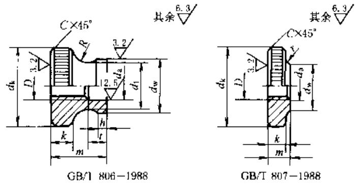

标记示例:

螺纹规格 $\mathbf { \mathcal { P } } = \mathbf { \mathcal { M } } \boldsymbol { \Xi }$ 、性能等级为5级、不经表面处理的滚花高螺母:

螺母GB/T806-1988M5

螺纹规格 $\pmb { D } = \pmb { M } \pmb { \Sigma }$ 、性能等级为5级、不经表面处理的滚花薄螺母:

螺母GB/T807-1988M5

表4-1-137

/mm 

<table><tr><td rowspan=1 colspan=2>螺纹规格D</td><td rowspan=1 colspan=1>M1.4</td><td rowspan=1 colspan=1>M1.6</td><td rowspan=1 colspan=1>M2：</td><td rowspan=1 colspan=1>M2.5</td><td rowspan=1 colspan=2>M3</td><td rowspan=1 colspan=1>M4</td><td rowspan=1 colspan=2>M5</td><td rowspan=1 colspan=2>M6</td><td rowspan=1 colspan=1>M8</td><td rowspan=1 colspan=1>M10</td></tr><tr><td rowspan=1 colspan=2>d（滚花前）max</td><td rowspan=1 colspan=1>6</td><td rowspan=1 colspan=1>7</td><td rowspan=1 colspan=1>8</td><td rowspan=1 colspan=1>9</td><td rowspan=1 colspan=2>11</td><td rowspan=1 colspan=1>12</td><td rowspan=1 colspan=2>16</td><td rowspan=1 colspan=2>20</td><td rowspan=1 colspan=1>24</td><td rowspan=1 colspan=1>30</td></tr><tr><td rowspan=1 colspan=2>A</td><td rowspan=1 colspan=1>1.5</td><td rowspan=1 colspan=2>2</td><td rowspan=1 colspan=1>2.2</td><td rowspan=1 colspan=2>2.8</td><td rowspan=1 colspan=1>3</td><td rowspan=1 colspan=2>4</td><td rowspan=1 colspan=2>5</td><td rowspan=1 colspan=1>6</td><td rowspan=1 colspan=1>8</td></tr><tr><td rowspan=1 colspan=2>d、max</td><td rowspan=1 colspan=1>3.5</td><td rowspan=1 colspan=1>4</td><td rowspan=1 colspan=1>4.5</td><td rowspan=1 colspan=1>5</td><td rowspan=1 colspan=2>6</td><td rowspan=1 colspan=1>8</td><td rowspan=1 colspan=2>10</td><td rowspan=1 colspan=2>12</td><td rowspan=1 colspan=1>16</td><td rowspan=1 colspan=1>20</td></tr><tr><td rowspan=1 colspan=2>C</td><td rowspan=1 colspan=4>0.2</td><td rowspan=1 colspan=3>0.3</td><td rowspan=1 colspan=4>0.5</td><td rowspan=1 colspan=2>0.8</td></tr><tr><td rowspan=6 colspan=1>GB/T 806-1988</td><td rowspan=1 colspan=1>m max</td><td rowspan=1 colspan=1>1</td><td rowspan=1 colspan=1>4.7</td><td rowspan=1 colspan=1>5</td><td rowspan=1 colspan=1>5.5</td><td rowspan=1 colspan=2>7</td><td rowspan=1 colspan=1>8</td><td rowspan=1 colspan=2>10</td><td rowspan=1 colspan=2>12</td><td rowspan=1 colspan=1>16</td><td rowspan=1 colspan=1>20</td></tr><tr><td rowspan=1 colspan=1>dmin</td><td rowspan=1 colspan=1>1</td><td rowspan=1 colspan=1>1.8</td><td rowspan=1 colspan=1>2.2</td><td rowspan=1 colspan=1>2.7</td><td rowspan=1 colspan=2>3.2</td><td rowspan=1 colspan=1>4.2</td><td rowspan=1 colspan=2>5.2</td><td rowspan=1 colspan=2>6.2</td><td rowspan=1 colspan=1>8.5</td><td rowspan=1 colspan=1>10.5</td></tr><tr><td rowspan=1 colspan=1>tmax</td><td rowspan=1 colspan=1>1</td><td rowspan=1 colspan=2>1.5</td><td rowspan=1 colspan=1>2</td><td rowspan=1 colspan=2></td><td rowspan=1 colspan=1>2.5</td><td rowspan=1 colspan=2>3</td><td rowspan=1 colspan=2>4</td><td rowspan=1 colspan=1>5</td><td rowspan=1 colspan=1>6.5</td></tr><tr><td rowspan=1 colspan=1>Rmin</td><td rowspan=1 colspan=1>1</td><td rowspan=1 colspan=2>1.25</td><td rowspan=1 colspan=1>1.5</td><td rowspan=1 colspan=3>2</td><td rowspan=1 colspan=2>2.5</td><td rowspan=1 colspan=2>3</td><td rowspan=1 colspan=1>4</td><td rowspan=1 colspan=1>5</td></tr><tr><td rowspan=1 colspan=1>h</td><td rowspan=1 colspan=1>1</td><td rowspan=1 colspan=1>0.8</td><td rowspan=1 colspan=1>1</td><td rowspan=1 colspan=1></td><td rowspan=1 colspan=2>1.2</td><td rowspan=1 colspan=1>1.5</td><td rowspan=1 colspan=2>2</td><td rowspan=1 colspan=2>2.5</td><td rowspan=1 colspan=1>3</td><td rowspan=1 colspan=1>3.8</td></tr><tr><td rowspan=1 colspan=1>山</td><td rowspan=1 colspan=1>二</td><td rowspan=1 colspan=1>3.6</td><td rowspan=1 colspan=1>3.8</td><td rowspan=1 colspan=1>4.4</td><td rowspan=1 colspan=2>5.2</td><td rowspan=1 colspan=1>6.4</td><td rowspan=1 colspan=2>9</td><td rowspan=1 colspan=2>“</td><td rowspan=1 colspan=1>13</td><td rowspan=1 colspan=1>17.5</td></tr><tr><td rowspan=3 colspan=1>GB/T 807—1988</td><td rowspan=1 colspan=1>mmax</td><td rowspan=1 colspan=1>2</td><td rowspan=1 colspan=1>2.5</td><td rowspan=1 colspan=1>2.5</td><td rowspan=1 colspan=1>2.5</td><td rowspan=1 colspan=2>3</td><td rowspan=1 colspan=1>3</td><td rowspan=1 colspan=2>4</td><td rowspan=1 colspan=2>5</td><td rowspan=1 colspan=1>6</td><td rowspan=1 colspan=1>8</td></tr><tr><td rowspan=1 colspan=1>d,min</td><td rowspan=1 colspan=1>1.4</td><td rowspan=1 colspan=1>1.6</td><td rowspan=1 colspan=1>2</td><td rowspan=1 colspan=1>2.5</td><td rowspan=1 colspan=2>3</td><td rowspan=1 colspan=1>4</td><td rowspan=1 colspan=2>5</td><td rowspan=1 colspan=2>6</td><td rowspan=1 colspan=1>8</td><td rowspan=1 colspan=1>10</td></tr><tr><td rowspan=1 colspan=1>广</td><td rowspan=1 colspan=9>0.5</td><td rowspan=1 colspan=2>1</td><td rowspan=1 colspan=1></td><td rowspan=1 colspan=1>2</td></tr><tr><td rowspan=2 colspan=1>1000个钢螺母重量=/kg</td><td rowspan=1 colspan=1>CR/T806-1988</td><td rowspan=1 colspan=1>1</td><td rowspan=1 colspan=1>0.77</td><td rowspan=1 colspan=1>0.99</td><td rowspan=1 colspan=1>1.34</td><td rowspan=1 colspan=2>2.51</td><td rowspan=1 colspan=1>3.54</td><td rowspan=1 colspan=2>8.25</td><td rowspan=1 colspan=2>15.68</td><td rowspan=1 colspan=1>24.91</td><td rowspan=1 colspan=1>54.89</td></tr><tr><td rowspan=1 colspan=1>GB/T 807-- 1988</td><td rowspan=1 colspan=1>0.32</td><td rowspan=1 colspan=1>0.59</td><td rowspan=1 colspan=1>0.77</td><td rowspan=1 colspan=1>0.96</td><td rowspan=1 colspan=2>1.76</td><td rowspan=1 colspan=1>2.10</td><td rowspan=1 colspan=2>5.15</td><td rowspan=1 colspan=2>9.63</td><td rowspan=1 colspan=1>16.97</td><td rowspan=1 colspan=1>32.69</td></tr><tr><td rowspan=2 colspan=2>技术条件</td><td rowspan=1 colspan=2>材   料</td><td rowspan=1 colspan=1>钢</td><td rowspan=2 colspan=2>螺纹公差：6H</td><td rowspan=2 colspan=3>公差产品等级：A级</td><td rowspan=2 colspan=2>滚花：直纹</td><td rowspan=2 colspan=3>(1）不经处理表面处理：(2）镀锌钝化</td></tr><tr><td rowspan=1 colspan=2>性能等级</td><td rowspan=1 colspan=1>5</td></tr></table>

# 小圆螺母(GB/T810--1988)

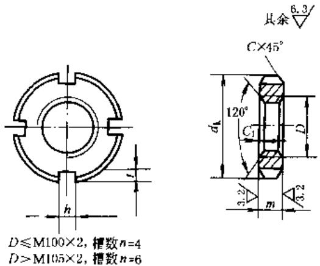

标记示例:

螺纹规格 $\pmb { \mathcal { D } } = \mathbb { M } 1 6 \times 1 . 5$ 、材料为45钢、槽或全部热处理后硬度35\~45HRC、表面氧化的小圆螺母;

螺母CB/T810 $\mathbb { M } 1 6 \times 1 . 5$ 

/mm 

表4-1-138

<table><tr><td rowspan=1 colspan=2>螺纹规格D×P</td><td rowspan=1 colspan=1>d</td><td rowspan=1 colspan=1>m</td><td rowspan=1 colspan=2>h in</td><td rowspan=1 colspan=1>： min</td><td rowspan=1 colspan=1>C</td><td rowspan=1 colspan=2>C</td><td rowspan=1 colspan=1>每1000个的重量/kg</td></tr><tr><td rowspan=1 colspan=1>M10x1</td><td rowspan=1 colspan=1></td><td rowspan=1 colspan=1>20</td><td rowspan=6 colspan=1>6</td><td rowspan=4 colspan=2>4</td><td rowspan=4 colspan=1>2</td><td rowspan=40 colspan=1>0.51</td><td rowspan=8 colspan=2>0.5</td><td rowspan=1 colspan=1>9.53</td></tr><tr><td rowspan=1 colspan=1>M12×1.25</td><td rowspan=1 colspan=1>,25</td><td rowspan=1 colspan=1>22</td><td rowspan=1 colspan=1>1</td></tr><tr><td rowspan=1 colspan=2>M14×1.5</td><td rowspan=1 colspan=1>25</td><td rowspan=1 colspan=1>14.27</td></tr><tr><td rowspan=1 colspan=2>M16×1.5</td><td rowspan=1 colspan=1>28</td><td rowspan=1 colspan=1>17.91</td></tr><tr><td rowspan=1 colspan=2>M18x1.5</td><td rowspan=1 colspan=1>30</td><td rowspan=7 colspan=2>5</td><td rowspan=7 colspan=1>2.5</td><td rowspan=1 colspan=1>18.83</td></tr><tr><td rowspan=1 colspan=2>M20x1.5</td><td rowspan=1 colspan=1>32</td><td rowspan=1 colspan=1>20.6</td></tr><tr><td rowspan=1 colspan=2>M22×1.5</td><td rowspan=1 colspan=1>35</td><td rowspan=9 colspan=1>8</td><td rowspan=1 colspan=1>33.2</td></tr><tr><td rowspan=1 colspan=2>M24x1.5</td><td rowspan=1 colspan=1>38</td><td rowspan=1 colspan=1>39.42</td></tr><tr><td rowspan=1 colspan=2>M27×1.5</td><td rowspan=1 colspan=1>42</td><td rowspan=15 colspan=2></td><td rowspan=1 colspan=1>47.6</td></tr><tr><td rowspan=1 colspan=2>M30x1.5</td><td rowspan=1 colspan=1>45</td><td rowspan=1 colspan=1>52.01</td></tr><tr><td rowspan=1 colspan=2>M33×1.5</td><td rowspan=1 colspan=1>48</td><td rowspan=1 colspan=1>56.43</td></tr><tr><td rowspan=1 colspan=2>M36x1.5</td><td rowspan=1 colspan=1>52</td><td rowspan=11 colspan=2>68</td><td rowspan=11 colspan=1>33.5</td><td rowspan=1 colspan=1>64.51</td></tr><tr><td rowspan=1 colspan=2>M39×1.5</td><td rowspan=1 colspan=1>55</td><td rowspan=1 colspan=1>69.22</td></tr><tr><td rowspan=1 colspan=2>M42×1.5</td><td rowspan=1 colspan=1>58</td><td rowspan=1 colspan=1>73.92</td></tr><tr><td rowspan=1 colspan=2>M45×1.5</td><td rowspan=1 colspan=1>62</td><td rowspan=1 colspan=1>84.65</td></tr><tr><td rowspan=1 colspan=2>M48x1.5</td><td rowspan=1 colspan=1>68</td><td rowspan=6 colspan=1>10</td><td rowspan=1 colspan=1></td><td rowspan=1 colspan=1>136.5</td></tr><tr><td rowspan=1 colspan=2>M52×1.5</td><td rowspan=1 colspan=1>72</td><td rowspan=1 colspan=1>143.2</td></tr><tr><td rowspan=1 colspan=2>M56×2</td><td rowspan=1 colspan=1>78</td><td rowspan=1 colspan=1>171.9</td></tr><tr><td rowspan=1 colspan=2>M60×2</td><td rowspan=1 colspan=1>80</td><td rowspan=1 colspan=1>162.8</td></tr><tr><td rowspan=1 colspan=2>M64×2</td><td rowspan=1 colspan=1>85</td><td rowspan=1 colspan=1>183</td></tr><tr><td rowspan=1 colspan=2>M68x2</td><td rowspan=1 colspan=1>90</td><td rowspan=1 colspan=1>204.2</td></tr><tr><td rowspan=1 colspan=2>M72×2</td><td rowspan=1 colspan=1>95</td><td rowspan=11 colspan=1>12</td><td rowspan=1 colspan=1>271.9</td></tr><tr><td rowspan=1 colspan=2>M76×2</td><td rowspan=1 colspan=1>100</td><td rowspan=9 colspan=2>10</td><td rowspan=9 colspan=1>4</td><td rowspan=1 colspan=1></td><td></td></tr><tr><td></td><td></td><td></td><td></td><td></td><td></td></tr><tr><td></td><td></td><td></td><td></td><td></td><td rowspan=1 colspan=1>295.5</td></tr><tr><td rowspan=3 colspan=2>M80x2</td><td rowspan=3 colspan=1>105</td><td rowspan=15 colspan=2>1.5</td><td rowspan=3 colspan=1></td><td></td></tr><tr><td rowspan=1 colspan=1></td><td></td></tr><tr><td rowspan=1 colspan=1>325</td></tr><tr><td rowspan=1 colspan=2>M85x2</td><td rowspan=1 colspan=1>110</td><td rowspan=1 colspan=1>343.4</td></tr><tr><td rowspan=1 colspan=2>M90×2</td><td rowspan=1 colspan=1>115</td><td rowspan=1 colspan=1>361.8</td></tr><tr><td rowspan=1 colspan=2>M95×2</td><td rowspan=1 colspan=1>120</td><td rowspan=1 colspan=1>380.2</td></tr><tr><td rowspan=1 colspan=2>M100×2</td><td rowspan=1 colspan=1>125</td><td rowspan=4 colspan=2>12</td><td rowspan=4 colspan=1>5</td><td rowspan=1 colspan=1>391,1</td></tr><tr><td rowspan=1 colspan=2>M105×2</td><td rowspan=1 colspan=1>130</td><td rowspan=6 colspan=1>15</td><td rowspan=1 colspan=1>497.7</td></tr><tr><td rowspan=1 colspan=2>M110×2</td><td rowspan=1 colspan=1>135</td><td rowspan=1 colspan=1>520.7</td></tr><tr><td rowspan=1 colspan=2>M115×2</td><td rowspan=1 colspan=1>140</td><td rowspan=1 colspan=1>543.7</td></tr><tr><td rowspan=1 colspan=2>M120×2</td><td rowspan=1 colspan=1>145</td><td rowspan=6 colspan=2>14</td><td rowspan=6 colspan=1>6</td><td rowspan=1 colspan=1>549.8</td></tr><tr><td rowspan=1 colspan=2>M125×2</td><td rowspan=1 colspan=1>150</td><td rowspan=1 colspan=1>572.8</td></tr><tr><td rowspan=1 colspan=2>M130x2</td><td rowspan=1 colspan=1>160</td><td rowspan=1 colspan=1>740.5</td></tr><tr><td rowspan=1 colspan=2>M140x2</td><td rowspan=1 colspan=1>170</td><td rowspan=4 colspan=1>18</td><td rowspan=1 colspan=1>954.8</td></tr><tr><td rowspan=1 colspan=2>M150×2</td><td rowspan=1 colspan=1>180</td><td rowspan=1 colspan=1>1021</td></tr><tr><td rowspan=1 colspan=2>M160×3</td><td rowspan=1 colspan=1>195</td><td rowspan=5 colspan=1>1.5</td><td rowspan=5 colspan=2>2</td><td rowspan=1 colspan=1>1299</td></tr><tr><td rowspan=1 colspan=2>M170×3</td><td rowspan=1 colspan=1>205</td><td rowspan=4 colspan=2>16</td><td rowspan=4 colspan=1>7</td><td rowspan=1 colspan=1>1353</td></tr><tr><td rowspan=1 colspan=2>M180×3</td><td rowspan=1 colspan=1>220</td><td rowspan=3 colspan=1>22</td><td rowspan=1 colspan=1>2041</td></tr><tr><td rowspan=1 colspan=2>M190×3</td><td rowspan=1 colspan=1>230</td><td rowspan=1 colspan=1>2149</td></tr><tr><td rowspan=1 colspan=2>M200×3</td><td rowspan=1 colspan=1>240</td><td rowspan=1 colspan=1>2257</td></tr><tr><td rowspan=2 colspan=2>技术条件</td><td rowspan=1 colspan=1>材料</td><td rowspan=1 colspan=3>螺纹公差</td><td rowspan=1 colspan=5>热处理及表面处理</td></tr><tr><td rowspan=1 colspan=1>45钢</td><td rowspan=1 colspan=3>6H</td><td rowspan=1 colspan=5>①槽或全部热处理后35~45HRC；②调质24-30HRC；③氧化</td></tr></table>

# 圖螺母(GB/T812--1988)

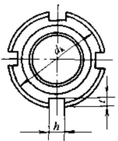

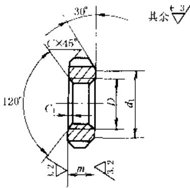

标记示例:

螺纹规格 $D = \mathbb { M } 1 6 \times 1 . 5$ 、材料为45钢、槽或全部热处理后硬度35-451RC、表面氧化的圆螺母:

螺母GB/T812 $\mathbf { M } \mathbf { 1 } 6 \times \mathbf { 1 } . 5$ 

表4-1-139

<table><tr><td rowspan=1 colspan=2>螺纹规格D×P</td><td rowspan=1 colspan=1>山</td><td rowspan=1 colspan=1>山</td><td rowspan=1 colspan=1>m</td><td rowspan=1 colspan=1>hmin</td><td rowspan=12 colspan=1>t min22.5</td><td rowspan=8 colspan=1>C0.5</td><td rowspan=1 colspan=1>每1000个的G重=/kg</td></tr><tr><td rowspan=1 colspan=1>M10x1</td><td rowspan=1 colspan=1></td><td rowspan=1 colspan=1>22</td><td rowspan=1 colspan=1>16</td><td rowspan=6 colspan=1>8</td><td rowspan=11 colspan=1>45</td><td rowspan=2 colspan=1>16.8221.58</td></tr><tr><td rowspan=1 colspan=1>M12×1.25</td><td rowspan=1 colspan=1>.25</td><td rowspan=1 colspan=1>25</td><td rowspan=1 colspan=1>19</td></tr><tr><td rowspan=1 colspan=1>M14×1.5</td><td rowspan=1 colspan=1></td><td rowspan=1 colspan=1>28</td><td rowspan=1 colspan=1>20</td><td rowspan=1 colspan=1>26.82</td></tr><tr><td rowspan=1 colspan=1>M16×1.5</td><td rowspan=1 colspan=1></td><td rowspan=1 colspan=1>30</td><td rowspan=1 colspan=1>22</td><td rowspan=2 colspan=1>28.4431.19</td></tr><tr><td rowspan=1 colspan=2>M18×1.5</td><td rowspan=1 colspan=1>32</td><td rowspan=1 colspan=1>24</td></tr><tr><td rowspan=1 colspan=2>M20×1.5</td><td rowspan=1 colspan=1>35</td><td rowspan=1 colspan=1>27</td><td rowspan=2 colspan=1>37.3154.91</td></tr><tr><td rowspan=1 colspan=2>M22x1.5</td><td rowspan=1 colspan=1>38</td><td rowspan=1 colspan=1>30</td><td rowspan=12 colspan=1>10</td></tr><tr><td rowspan=1 colspan=2>M24×1.5</td><td rowspan=2 colspan=1>42</td><td rowspan=2 colspan=1>34</td><td rowspan=41 colspan=1>1.52</td><td rowspan=1 colspan=1>68.88</td></tr><tr><td rowspan=1 colspan=2>M25x1.5</td><td rowspan=1 colspan=1>65.88</td></tr><tr><td rowspan=1 colspan=1>M27×1.5</td><td rowspan=1 colspan=1></td><td rowspan=1 colspan=1>45</td><td rowspan=1 colspan=1>37</td><td rowspan=1 colspan=1>75.49</td></tr><tr><td rowspan=1 colspan=1>M30×1.5</td><td rowspan=1 colspan=1></td><td rowspan=1 colspan=1>48</td><td rowspan=1 colspan=1>40</td><td rowspan=1 colspan=1>82.11</td></tr><tr><td rowspan=1 colspan=2>M33×1.5</td><td rowspan=2 colspan=1>52</td><td rowspan=2 colspan=1>43</td><td rowspan=7 colspan=1>6</td><td rowspan=7 colspan=1>3</td><td rowspan=1 colspan=1>92.32</td></tr><tr><td rowspan=1 colspan=2>M35x1.5</td><td rowspan=1 colspan=1>84.99</td></tr><tr><td rowspan=1 colspan=2>M36×1.5</td><td rowspan=1 colspan=1>55</td><td rowspan=1 colspan=1>46</td><td rowspan=1 colspan=1>100.3</td></tr><tr><td rowspan=1 colspan=2>M39×1.5</td><td rowspan=2 colspan=1>58</td><td rowspan=2 colspan=1>49</td><td rowspan=1 colspan=1>107.3</td></tr><tr><td rowspan=1 colspan=2>M40x1.5</td><td rowspan=1 colspan=1>102.5</td></tr><tr><td rowspan=1 colspan=2>M42×1.5</td><td rowspan=1 colspan=1>62</td><td rowspan=1 colspan=1>53</td><td rowspan=1 colspan=1>121.8</td></tr><tr><td rowspan=1 colspan=2>M45×1.5</td><td rowspan=1 colspan=1>68</td><td rowspan=1 colspan=1>59</td><td rowspan=1 colspan=1>153.6</td></tr><tr><td rowspan=1 colspan=2>M48×1.5</td><td rowspan=2 colspan=1>72</td><td rowspan=2 colspan=1>61</td><td rowspan=9 colspan=1>12</td><td rowspan=8 colspan=1>8</td><td rowspan=8 colspan=1>3.5</td><td rowspan=1 colspan=1>201.2</td></tr><tr><td rowspan=1 colspan=2>M50x1.5</td><td rowspan=2 colspan=1>186.8238</td></tr><tr><td rowspan=1 colspan=2>M52×1.5</td><td rowspan=2 colspan=1>78</td><td rowspan=2 colspan=1>67</td></tr><tr><td rowspan=1 colspan=2>M55x2</td><td rowspan=1 colspan=1>214.4</td></tr><tr><td rowspan=1 colspan=2>M56x2</td><td rowspan=1 colspan=1>85</td><td rowspan=1 colspan=1>74</td><td rowspan=1 colspan=1>290.1</td></tr><tr><td rowspan=1 colspan=2>M60x2</td><td rowspan=1 colspan=1>90</td><td rowspan=1 colspan=1>79</td><td rowspan=1 colspan=1>320.3</td></tr><tr><td rowspan=1 colspan=2>M64×2</td><td rowspan=2 colspan=1>95</td><td rowspan=2 colspan=1>84</td><td rowspan=1 colspan=1>351.9</td></tr><tr><td rowspan=1 colspan=2>M65×2</td><td rowspan=1 colspan=1>342.4</td></tr><tr><td rowspan=1 colspan=2>M68×2</td><td rowspan=1 colspan=1>100</td><td rowspan=1 colspan=1>88</td><td rowspan=6 colspan=1>10</td><td rowspan=6 colspan=1>4</td><td rowspan=1 colspan=1>380.2</td></tr><tr><td rowspan=1 colspan=2>M72×2</td><td rowspan=2 colspan=1>105</td><td rowspan=2 colspan=1>93</td><td rowspan=5 colspan=1>15</td><td rowspan=1 colspan=1>518</td></tr><tr><td rowspan=1 colspan=2>M75x2</td><td rowspan=1 colspan=1>4775</td></tr><tr><td rowspan=1 colspan=2>M76×2</td><td rowspan=1 colspan=1>110</td><td rowspan=1 colspan=1>98</td><td rowspan=1 colspan=1>562.4</td></tr><tr><td rowspan=1 colspan=2>M80×2</td><td rowspan=1 colspan=1>115</td><td rowspan=1 colspan=1>103</td><td rowspan=1 colspan=1>608.4</td></tr><tr><td rowspan=1 colspan=2>M85×2</td><td rowspan=1 colspan=1>120</td><td rowspan=1 colspan=1>108</td><td rowspan=1 colspan=1>640.6</td></tr><tr><td rowspan=1 colspan=2>M90×2</td><td rowspan=1 colspan=1>125</td><td rowspan=1 colspan=1>112</td><td rowspan=5 colspan=1>18</td><td rowspan=4 colspan=1>12</td><td rowspan=4 colspan=1>5</td><td rowspan=1 colspan=1>796.1</td></tr><tr><td rowspan=1 colspan=2>M95×2</td><td rowspan=1 colspan=1>130</td><td rowspan=1 colspan=1>117</td><td rowspan=2 colspan=1>834.7873.3</td></tr><tr><td rowspan=1 colspan=2>M100x2</td><td rowspan=1 colspan=1>135</td><td rowspan=1 colspan=1>122</td></tr><tr><td rowspan=1 colspan=2>M105x2</td><td rowspan=1 colspan=1>140</td><td rowspan=1 colspan=1>127</td><td rowspan=1 colspan=1>895</td></tr><tr><td rowspan=1 colspan=2>M110x2</td><td rowspan=1 colspan=1>150</td><td rowspan=1 colspan=1>135</td><td rowspan=6 colspan=1>14</td><td rowspan=6 colspan=1>6</td><td rowspan=1 colspan=1>1076</td></tr><tr><td rowspan=1 colspan=2>M115x2</td><td rowspan=1 colspan=1>155</td><td rowspan=1 colspan=1>140</td><td rowspan=4 colspan=1>22</td><td rowspan=1 colspan=1>1369</td></tr><tr><td rowspan=1 colspan=2>M120×2</td><td rowspan=1 colspan=1>160</td><td rowspan=1 colspan=1>145</td><td rowspan=1 colspan=1>1423</td></tr><tr><td rowspan=1 colspan=2>M125×2</td><td rowspan=1 colspan=1>165</td><td rowspan=1 colspan=1>150</td><td rowspan=1 colspan=1>1477</td></tr><tr><td rowspan=1 colspan=2>M130×2</td><td rowspan=1 colspan=1>170</td><td rowspan=1 colspan=1>155</td></tr><tr><td rowspan=1 colspan=2>M140x2</td><td rowspan=1 colspan=1>180</td><td rowspan=1 colspan=1>165</td><td rowspan=4 colspan=1>26</td></tr><tr><td rowspan=1 colspan=2>M150×2</td><td rowspan=1 colspan=1>200</td><td rowspan=1 colspan=1>180</td><td rowspan=6 colspan=1>16</td><td rowspan=6 colspan=1>7</td></tr><tr><td rowspan=1 colspan=2>M160×3</td><td rowspan=1 colspan=1>210</td><td rowspan=1 colspan=1>190</td></tr><tr><td rowspan=1 colspan=2>M170x3</td><td rowspan=1 colspan=1>220</td><td rowspan=1 colspan=1>200</td></tr><tr><td rowspan=1 colspan=2>M180x3</td><td rowspan=1 colspan=1>230</td><td rowspan=1 colspan=1>210</td><td rowspan=3 colspan=1>30</td></tr><tr><td rowspan=1 colspan=2>M190x3</td><td rowspan=1 colspan=1>240</td><td rowspan=1 colspan=1>220</td></tr><tr><td rowspan=1 colspan=2>M200x3</td><td rowspan=1 colspan=1>250</td><td rowspan=1 colspan=1>230</td></tr><tr><td rowspan=2 colspan=2>技术条件</td><td rowspan=1 colspan=1>材料</td><td rowspan=1 colspan=2>螺纹公差</td><td rowspan=2 colspan=4>热处理及表面处理(1）槽或全部热处理后35~45HRC;(2）调质24~30HRC;(3）氧化</td></tr><tr><td rowspan=1 colspan=1>45钢</td><td rowspan=1 colspan=2>6H</td></tr></table>

# 3.5.6垫圈及挡圈

表4-1-140

垫圈及挡圈汇总表

<table><tr><td>类</td><td></td><td>标准号</td><td>特性和用途</td><td>页次</td><td>类 名称</td><td>标准号</td><td>特性和用途</td><td>页次</td></tr><tr><td rowspan="12">别 形</td><td>名称 平垫圈</td><td>规格 CB/T95-1985 5~36</td><td rowspan="5">一般用于金属零件，</td><td rowspan="5">别 弹簧及弹性垫圈 4-136</td><td rowspan="5">锥形锁紧</td><td>规格 GB/T 956.1~</td><td rowspan="2">圆周上具有许多翘 齿、刺压在支承面上，</td><td rowspan="2"></td></tr><tr><td>C级</td><td>以增加支承面，遮盖较 大的孔眼，以及防止损</td><td>2-1987</td></tr><tr><td>大垫圈</td><td>CB/T96-1985</td><td>垫 圈</td><td></td><td rowspan="3">4-143 能极其可靠地阻止紧 固件松动，弹力均匀，</td></tr><tr><td>A和C级 平垫圈</td><td>3~36 伤零件表面。大垫圈</td><td>内齿锁紧</td><td>3-12 CB/T861.1~</td></tr><tr><td>A级</td><td>CB/T97.1-1985 多用于木制零件 1.6-36</td><td>围</td><td>防松效果良好，不宜用 手材料较软或常拆 2-1987 处</td></tr><tr><td>平垫圈</td><td>GB/T97.2-1985 倒</td><td></td><td></td><td>垫 垫</td><td></td><td>内齿用于头部尺寸 4-142</td></tr><tr><td rowspan="10">圆 圈A级</td><td>角型A级</td><td>5~36</td><td rowspan="3">4-140</td><td rowspan="3"></td><td rowspan="2">外齿锁紧</td><td>2-20</td><td rowspan="3">较小的螺钉头下，外齿 应用较多，多用于螺栓 头和螺母下，锥形用于</td></tr><tr><td>销轴用</td><td>GB/T97.3-2000</td><td>GB/T 862.1~</td></tr><tr><td>平垫圈</td><td>3~100</td><td>2-1987 圈 2~20</td></tr><tr><td>小垫</td><td>GB/T848-1985 1.6~36</td><td>单耳止动 4-136 垫</td><td>CB/T854-1988</td><td>沉孔中 意位置加以锁定</td><td>允许螺母拧紧在任</td></tr><tr><td>钢结构用</td><td>CB/T 3632-1995</td><td rowspan="4">与本类高强度螺栓、 4-137</td><td rowspan="4">双耳止动 止动垫圈</td><td>图 GB/T855-1988</td><td>2.5~48</td><td rowspan="4">4-143</td></tr><tr><td>高强度扭 剪型垫圈</td><td>16-24</td><td>垫 圈</td><td>2.5-48 GB/T856-1988</td></tr><tr><td>钢结构用高</td><td>螺母配套使用 GB/T1230-1991</td><td>外舌止动 垫 圈</td><td>与圆螺母配合使用，</td></tr><tr><td>强度垫圈 栓接结构</td><td>12~36 GB/T18230.5</td><td>圆螺母用</td><td>GB/T 858--1988 主要用于滚动轴承的</td></tr><tr><td></td><td>用平垫圈 高强度螺栓JB/ZQ4080-1997</td><td>与本类栓接结构用 12~36 螺栓螺母配套使用</td><td rowspan="4">用来将槽钢、工字钢</td><td rowspan="4"></td><td>止动垫圈 锥销锁紧 挡</td><td>10~200 固定 GB/T883-1986</td><td rowspan="2">4-145 配合销钉、螺钉固定 4-146</td></tr><tr><td>专用垫圈</td><td>36~160</td><td>4-137</td><td>圈 d=8~130</td><td>在轴上，防止轴肩零件 轴向位移</td></tr><tr><td rowspan="2">工.字钢用 方斜垫圈</td><td>GB/T852-1988 （轻型）</td><td rowspan="5">翼缘之类倾斜面垫平， 使螺母支承面垂直于 螺杆，使螺杆免受弯曲</td><td rowspan="2">螺钉锁紧 挡 圈 带锁的螺 钉锁紧挡围</td><td>GB/T884-1986 d=8~200</td><td rowspan="2">4-148</td></tr><tr><td>6~36</td><td></td><td>GB/T885-1986</td></tr><tr><td rowspan="4">牌 形</td><td rowspan="4">槽钢用 方斜垫圈</td><td>CB/T853-1988</td><td rowspan="4">球面垫圈和锥面垫</td><td rowspan="4">4-139 挡</td><td></td><td>d =8~200</td><td rowspan="4">用来锁紧制定在轴 4-151</td></tr><tr><td>（轻型）</td><td>螺钉紧固 轴端挡围</td><td>CB/T891--1986 D=20~100</td></tr><tr><td>6~36</td><td>螺栓紧固 GB/T892-1986 轴端挡围</td><td>端的零件</td></tr><tr><td>CB/T 849-1988</td><td>钢丝锁圈</td><td>D=20~100 CB/T921-1986</td></tr><tr><td rowspan="2">锥面垫圈</td><td rowspan="2">球面垫圈</td><td>圈配合使用，具有自动 6~48</td><td rowspan="2">调位的作用，使螺母支</td><td rowspan="2"></td><td rowspan="2">轴肩挡圈</td><td>D=1S~100</td><td rowspan="2">套在轴上用以加大 原有轴肩的支承面，多 用于滚动轴承的安</td><td rowspan="2">4-150</td></tr><tr><td>承面与螺杆垂直，消除 螺杆受的弯曲，多用于</td><td>GB/T 886-1986 d =30~120</td></tr><tr><td rowspan="10">垫 </td><td rowspan="4">重型弹簧 垫 圈 轻型弹簧</td><td rowspan="2">6-48 GB/T7244-1987</td><td>广泛用于经常拆开</td><td rowspan="4">圈 4-141</td><td rowspan="4">孔用弹性 挡圈A型 孔用弹性 档圈B型</td><td>装上 GB/T893.1--1986 d=8~200 GB/T893.2-1986</td><td rowspan="4">卡在轴槽或孔糟中 供滚动轴承装入后止 退用，钢丝挡圈也可定 位其他零件，挡圈靠本 身弹性便于装卸</td><td rowspan="4">4-154</td></tr><tr><td>工装</td><td></td></tr><tr><td>6~36</td><td>的联接处，靠弹性及斜</td><td>d=20~200</td></tr><tr><td>CB/T859--1987</td><td>口摩擦防止紧固件的</td><td>CB/T894.1--1986 轴用弹性</td></tr><tr><td>国 标准弹簧</td><td>3-36 CB/T93--1987</td><td>松动</td><td></td><td>挡圈A型</td><td>d=3~g d=10~200</td><td rowspan="4">4-157</td></tr><tr><td>垫 圈</td><td>2-48</td><td>靠本身的弹性变形</td><td>轴用弹性 挡圈B型</td><td>GB/T894.2-1986 d=20~200</td></tr><tr><td rowspan="2">波形弹性 垫 圈</td><td>GB/T955-1987</td><td>压紧紧固件不使松动</td><td>孔用钢丝 4-142 挡</td><td>GB/T895.1-1986 d=7~125</td></tr><tr><td></td><td></td><td>圈</td><td></td></tr><tr><td rowspan="4">鞍形弹性 垫</td><td rowspan="4">圈</td><td></td><td>形小，着力均匀</td><td rowspan="4"></td><td rowspan="4">轴用钢丝 挡 围</td><td>GB/T895.2-1986</td><td>4-160</td></tr><tr><td>3~30</td><td>波形—弹力大，变</td><td></td><td></td></tr><tr><td></td><td></td><td>d=4~125</td><td>卡在轴槽中起轴肩</td></tr><tr><td>CR/T860-1987 2~10</td><td>鞍形——变形大，支 承面积小</td><td>CB/T 960-1986 夹紧挡圈 d=1.5~10</td><td>作用，装人后收口装死 不拆</td></tr></table>

平垫圈C级(GB/T95-1985)大垫圈A和C级(GB/T96-1985)特大垫圈C级(GB/T5287—1985)小垫圈A级(GB/T848-1985)平垫圈A级(GB/T97.1—1985)

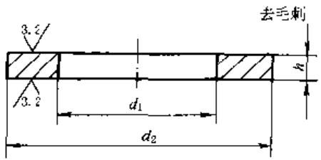

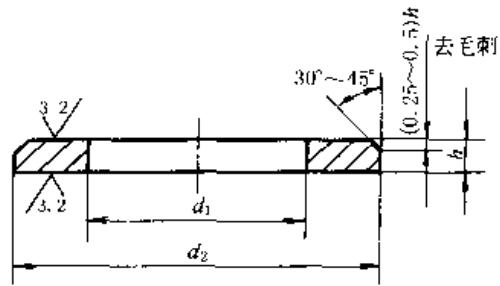

标记示例:

标准系列、规格 ${ \mathfrak { s m m } }$ 、性能等级为100HV级、不经表面处理的平垫圈:

垫圈GB/T958标记示例:

标准系列、规格 $\kappa \mathrm { m m }$ 、性能等级为140HV级、倒角型、不经表面处理的平垫圈:

垫圈GB/T97.28

/mm标记示例:

表4-1-141

<table><tr><td></td><td rowspan=2 colspan=3>规格（螺纹大径）</td><td rowspan=1 colspan=3>GB/T95GB/T 97.1GB/T 97.2</td><td rowspan=1 colspan=3>GB/T 95（标准系列）</td><td rowspan=1 colspan=3>CB/T 97.1CB/T 97.2（标准系列）</td><td rowspan=1 colspan=6>GB/T96(大系列）</td><td rowspan=1 colspan=6>GB/T848（小系列）</td><td rowspan=1 colspan=6>GB/T5287（特大系列）</td><td></td></tr><tr><td></td><td rowspan=1 colspan=1>山</td><td rowspan=1 colspan=2>h</td><td rowspan=1 colspan=1>d</td><td rowspan=1 colspan=2>每1000个的重量/kg</td><td rowspan=1 colspan=2>山</td><td rowspan=1 colspan=1>每1000个的重量/kg</td><td rowspan=1 colspan=1>d</td><td rowspan=1 colspan=1>山</td><td rowspan=1 colspan=2>h</td><td rowspan=1 colspan=2>每1000个的重量/g</td><td rowspan=1 colspan=1>d</td><td rowspan=1 colspan=2>d</td><td rowspan=1 colspan=1>A</td><td rowspan=1 colspan=2>每1000个的重量/g</td><td rowspan=1 colspan=2>d</td><td rowspan=1 colspan=2>d</td><td rowspan=1 colspan=1>h</td><td rowspan=1 colspan=1>每1000个的重量/kg</td><td rowspan=1 colspan=1></td></tr><tr><td rowspan=13 colspan=4>1.622.5345681012141620243036</td><td rowspan=2 colspan=2>1.622.53</td><td rowspan=2 colspan=1>4567</td><td rowspan=1 colspan=1>0.3</td><td rowspan=2 colspan=2>1</td><td rowspan=2 colspan=2>11</td><td rowspan=2 colspan=1>1.72.22.73.2</td><td rowspan=2 colspan=1>0.020.030.080.1</td><td rowspan=2 colspan=2>3.2</td><td rowspan=1 colspan=2></td><td rowspan=1 colspan=1>二</td><td rowspan=1 colspan=1>1</td><td rowspan=1 colspan=2>1.72.2</td><td rowspan=1 colspan=1>3.54.5</td><td rowspan=1 colspan=1>0.3</td><td rowspan=2 colspan=2>0.010.020.050.07</td><td rowspan=2 colspan=3>1</td><td rowspan=3 colspan=1></td><td rowspan=3 colspan=1></td><td rowspan=3 colspan=1>1一！一</td></tr><tr><td rowspan=1 colspan=2>0.5</td><td></td><td rowspan=1 colspan=1>9</td><td rowspan=1 colspan=2>0.8</td><td rowspan=1 colspan=2>10.32</td><td rowspan=1 colspan=1>2.73.2</td><td rowspan=1 colspan=2>56</td><td rowspan=1 colspan=1>0.5</td><td></td></tr><tr><td rowspan=1 colspan=1>9</td><td rowspan=1 colspan=2>0.8</td><td rowspan=1 colspan=1>、</td><td rowspan=1 colspan=2>、</td><td rowspan=1 colspan=2>4.3</td><td rowspan=1 colspan=1>0.28</td><td rowspan=1 colspan=1>4.3</td><td rowspan=1 colspan=1>12</td><td rowspan=1 colspan=2>1</td><td rowspan=1 colspan=2>0.71</td><td rowspan=1 colspan=1>4.3</td><td rowspan=1 colspan=2>8</td><td rowspan=1 colspan=1></td><td rowspan=1 colspan=2>0.12</td><td rowspan=1 colspan=2>！</td><td></td><td></td></tr><tr><td rowspan=1 colspan=1>10</td><td rowspan=1 colspan=2>1</td><td rowspan=1 colspan=1>5.5</td><td rowspan=1 colspan=2>0.32</td><td rowspan=1 colspan=2>5.3</td><td rowspan=1 colspan=1>0.4</td><td rowspan=1 colspan=1>5.3</td><td rowspan=1 colspan=1>15</td><td rowspan=1 colspan=2>1.2</td><td rowspan=1 colspan=2>1.35</td><td rowspan=1 colspan=1>5.3</td><td rowspan=1 colspan=2>9</td><td rowspan=1 colspan=1>[</td><td rowspan=1 colspan=2>0.29</td><td rowspan=1 colspan=2>5.5</td><td rowspan=1 colspan=2>8</td><td rowspan=1 colspan=1>2</td><td rowspan=1 colspan=1>3.13</td><td rowspan=1 colspan=1></td></tr><tr><td rowspan=2 colspan=1>1216</td><td rowspan=2 colspan=2>1.6</td><td rowspan=2 colspan=1>6.69</td><td rowspan=2 colspan=2>0.741.38</td><td rowspan=1 colspan=2>6.4</td><td rowspan=1 colspan=1>0.91</td><td rowspan=1 colspan=1>6.4</td><td rowspan=1 colspan=1>18</td><td rowspan=1 colspan=2>1.6</td><td rowspan=1 colspan=2>2.62</td><td rowspan=1 colspan=1>6.4</td><td rowspan=1 colspan=2>1</td><td rowspan=1 colspan=1></td><td rowspan=1 colspan=2>0.69</td><td rowspan=1 colspan=2>6.6</td><td rowspan=1 colspan=2>22</td><td rowspan=1 colspan=1>2</td><td rowspan=1 colspan=1>4.72</td><td rowspan=1 colspan=1></td></tr><tr><td rowspan=1 colspan=2>8.4</td><td rowspan=1 colspan=1>1.68</td><td rowspan=1 colspan=1>8.4</td><td rowspan=1 colspan=1>24</td><td rowspan=1 colspan=1>2</td><td></td><td rowspan=1 colspan=2>5.89</td><td rowspan=1 colspan=1>8.4</td><td rowspan=1 colspan=2>15</td><td rowspan=1 colspan=1>1.6</td><td rowspan=1 colspan=2>1.39</td><td rowspan=1 colspan=2>9</td><td rowspan=1 colspan=2>28</td><td rowspan=1 colspan=1>3</td><td rowspan=1 colspan=1>11.61</td><td rowspan=2 colspan=1></td></tr><tr><td rowspan=1 colspan=1>20</td><td rowspan=1 colspan=2>2</td><td rowspan=1 colspan=1>11</td><td rowspan=1 colspan=2>2.8</td><td rowspan=1 colspan=2>10.5</td><td rowspan=1 colspan=1>3.3</td><td rowspan=1 colspan=1>10.5</td><td rowspan=1 colspan=1>30</td><td rowspan=1 colspan=1>[2.5</td><td></td><td rowspan=1 colspan=2>11.62</td><td rowspan=1 colspan=1>10.5</td><td rowspan=1 colspan=2>18</td><td rowspan=1 colspan=1></td><td rowspan=1 colspan=2>1.95</td><td rowspan=1 colspan=2>11</td><td rowspan=1 colspan=2>34</td><td rowspan=1 colspan=1>3</td><td rowspan=1 colspan=1>17.07</td></tr><tr><td rowspan=2 colspan=1>2428</td><td rowspan=2 colspan=2>2.5</td><td rowspan=2 colspan=1>13.515.5</td><td rowspan=2 colspan=2>5.17.24</td><td rowspan=2 colspan=2>1315</td><td rowspan=2 colspan=1>5.868.12</td><td rowspan=1 colspan=1>13</td><td rowspan=1 colspan=1>37</td><td rowspan=1 colspan=1></td><td></td><td rowspan=1 colspan=2>21.22</td><td rowspan=1 colspan=1>13</td><td rowspan=1 colspan=2>20</td><td rowspan=1 colspan=1>2</td><td rowspan=1 colspan=2>2.58</td><td rowspan=1 colspan=2>13.5</td><td rowspan=2 colspan=2>4450</td><td rowspan=2 colspan=1>4</td><td rowspan=2 colspan=2>39.5y51.52</td></tr><tr><td rowspan=1 colspan=1>15</td><td rowspan=1 colspan=1>44</td><td rowspan=1 colspan=1>3</td><td></td><td rowspan=1 colspan=2>30.45</td><td rowspan=1 colspan=1>15</td><td rowspan=1 colspan=2>24</td><td rowspan=1 colspan=1></td><td rowspan=1 colspan=2>5</td><td rowspan=1 colspan=2>15.5</td></tr><tr><td rowspan=2 colspan=1>3037</td><td rowspan=1 colspan=2>3</td><td rowspan=1 colspan=1>17.5</td><td rowspan=1 colspan=2>9.51</td><td rowspan=1 colspan=2>17</td><td rowspan=1 colspan=1>10.66</td><td rowspan=1 colspan=1>17</td><td rowspan=1 colspan=1>50</td><td rowspan=1 colspan=1></td><td rowspan=1 colspan=3>39.5</td><td rowspan=1 colspan=1>17</td><td rowspan=1 colspan=2>28</td><td rowspan=1 colspan=1>2.5</td><td rowspan=1 colspan=2>7.14</td><td rowspan=1 colspan=2>17.5</td><td rowspan=1 colspan=2>56</td><td rowspan=1 colspan=1>5</td><td rowspan=4 colspan=2>81.27162.8227.2348.4660.9</td></tr><tr><td rowspan=1 colspan=2>3</td><td rowspan=1 colspan=1>22</td><td rowspan=1 colspan=2>14.41</td><td rowspan=1 colspan=2>21</td><td rowspan=1 colspan=1>16.22</td><td rowspan=1 colspan=1>22</td><td rowspan=1 colspan=1>60</td><td rowspan=1 colspan=1>4</td><td rowspan=1 colspan=3>70.86</td><td rowspan=1 colspan=1>21</td><td rowspan=1 colspan=2>34</td><td rowspan=1 colspan=1>3</td><td rowspan=1 colspan=2>12.37</td><td rowspan=1 colspan=2>22</td><td rowspan=1 colspan=2>72</td><td rowspan=1 colspan=1></td></tr><tr><td rowspan=2 colspan=1>445666</td><td rowspan=1 colspan=2>4</td><td rowspan=2 colspan=1>263339</td><td rowspan=2 colspan=2>27.4945.0379.27</td><td rowspan=2 colspan=2>253137</td><td rowspan=2 colspan=1>30.851.2886.69</td><td rowspan=2 colspan=1>263339</td><td rowspan=2 colspan=1>7292110</td><td rowspan=1 colspan=1>56</td><td rowspan=1 colspan=3>129.8256.4</td><td rowspan=1 colspan=1>2531</td><td rowspan=1 colspan=2>3950</td><td rowspan=1 colspan=1>4</td><td rowspan=1 colspan=2>20.7836.2</td><td rowspan=1 colspan=2>2633</td><td rowspan=1 colspan=2>85105</td><td rowspan=1 colspan=1>6</td></tr><tr><td rowspan=1 colspan=2>5</td><td rowspan=1 colspan=1>8</td><td rowspan=1 colspan=3>495</td><td rowspan=1 colspan=1>37</td><td rowspan=1 colspan=2>60</td><td rowspan=1 colspan=1>5</td><td rowspan=1 colspan=2>63.97</td><td rowspan=1 colspan=2>39</td><td rowspan=1 colspan=2>12s</td><td rowspan=1 colspan=1>8</td></tr><tr><td rowspan=4 colspan=2>中</td><td rowspan=1 colspan=4>材料</td><td rowspan=1 colspan=3>钢</td><td rowspan=1 colspan=2>奥氏体不锈钢</td><td rowspan=1 colspan=1></td><td rowspan=1 colspan=2>钢</td><td rowspan=1 colspan=2>奥氏体不锈钢</td><td rowspan=1 colspan=5>材   料</td><td rowspan=1 colspan=3>钢</td><td rowspan=1 colspan=2>奥氏体不锈钢</td><td rowspan=1 colspan=2></td><td rowspan=1 colspan=2>钢</td><td rowspan=1 colspan=1>奥氏体不锈钢</td><td></td></tr><tr><td rowspan=3 colspan=1>性能等级</td><td rowspan=1 colspan=3>GB/T 95</td><td rowspan=2 colspan=3>100HV</td><td rowspan=2 colspan=2>1</td><td rowspan=2 colspan=1>有</td><td rowspan=1 colspan=1>不经处理</td><td rowspan=1 colspan=1>不经处理</td><td rowspan=1 colspan=2>丨</td><td rowspan=1 colspan=2></td><td rowspan=1 colspan=3>CB/T 848</td><td rowspan=3 colspan=3>140HV、200HV、300HV</td><td rowspan=3 colspan=2>A140A200A350</td><td rowspan=3 colspan=2>表面处理</td><td rowspan=3 colspan=2>①本经处理②镀锌纯化</td><td rowspan=3 colspan=1>不经处理</td><td></td></tr><tr><td rowspan=1 colspan=3>GB/T 5287</td><td rowspan=2 colspan=1>有</td><td rowspan=2 colspan=2>①不经处理②镀锌钝化</td><td rowspan=2 colspan=2>不经处理</td><td rowspan=1 colspan=2>能</td><td rowspan=1 colspan=3>GB/T 97.1</td><td></td></tr><tr><td rowspan=1 colspan=3>GB/T 96</td><td rowspan=1 colspan=3>A级：140HVC级：100HV</td><td rowspan=1 colspan=2>A140</td><td rowspan=1 colspan=3>CB/T 97.2</td><td></td></tr></table>

注:1.CB/T97.2规格d为 $5 \sim 3 6 \textcircled { ‰}$ 2.C级垫圈没有和去毛刺。3.CB/848主要用于带圖柱头的螺钉,其他用于标准六角的螺栓、螺钉和螺母。4.精装配系列适用于A级垫圈;中等装配系列适用于C级垫圈。5.有色金属和其他材料垫圈、由协议规定(不包括GB/T5287)。300HV级垫圈应经淬火并回火处理。

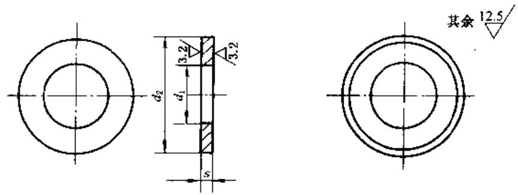

倒角尺寸不大于 $_ { 0 , 3 \mathrm { m m } }$ 

规格 $3 6 \pi \mathrm { m }$ 的高强度螺栓专用垫圈的标记:

垫圈36JB/ZQ4080

表4-1-142

<table><tr><td>规格 （螺纹大径）</td><td>d</td><td>d</td><td>S</td><td>每1000个的 重量/kg</td><td>规格 （螺纹大径）</td><td>d</td><td>d</td><td>s</td><td>每1000个的 重量/kg</td></tr><tr><td>36</td><td>37</td><td>66</td><td>7</td><td>129</td><td>90</td><td>93</td><td>160</td><td>16</td><td>1672</td></tr><tr><td>42</td><td>43</td><td>78</td><td>8</td><td>209</td><td>100</td><td>104</td><td>175</td><td>16</td><td>1954</td></tr><tr><td>48</td><td>50</td><td>92</td><td>10</td><td>368</td><td>110</td><td>114</td><td>185</td><td>16</td><td>2094</td></tr><tr><td>56</td><td>58</td><td>105</td><td>11</td><td>520</td><td>(120)</td><td>(124)</td><td>210</td><td>16</td><td>2833</td></tr><tr><td>64</td><td>66</td><td>115</td><td>11</td><td>601</td><td>125</td><td>129</td><td>220</td><td>22</td><td>4308</td></tr><tr><td>72</td><td>74</td><td>125</td><td>12</td><td>751</td><td>140</td><td>144</td><td>240</td><td>22</td><td>5000</td></tr><tr><td>80</td><td>82</td><td>140</td><td>14</td><td>11</td><td>160</td><td>164</td><td>270</td><td>22</td><td>6240</td></tr></table>

注:1.规格 $6 \sim 3 0$ 从略。2.材料为钢, $\sigma _ { \mathrm { { b } } } { \approx } 7 0 0 0 \mathrm { { M P a _ { \circ } } }$ 

# 钢结构用高强度垫圈(GB/T1230-1991)钢结构用高强度扭剪型螺栓联接副 垫圈(GB/T3632—1995)

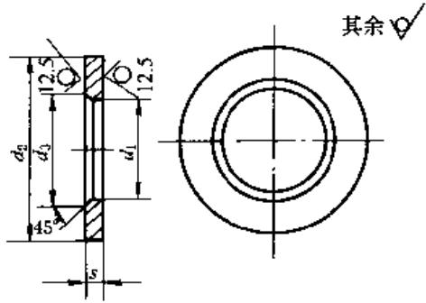

标记示例:

规格为 $\mathsf { 2 0 m m }$ 、热处理硬度为35\~45HRC的钢结构用高强度垫圈:

垫圈GB/T123020

/mm 

表4-1-143

<table><tr><td>规格(螺纹大径)</td><td>12</td><td>16</td><td>20</td><td>(22)</td><td>24</td><td>(27)</td><td>30</td></tr><tr><td>出 min</td><td>13</td><td>17</td><td>21</td><td>23</td><td>25</td><td>28</td><td>31</td></tr><tr><td>d max</td><td>25</td><td>33</td><td>40</td><td>42</td><td>47</td><td>52</td><td>56</td></tr><tr><td>d min</td><td>16.03</td><td>19.23</td><td>24.32</td><td>26.32</td><td>28.32</td><td>32.84</td><td>35.84</td></tr><tr><td>d</td><td>1</td><td>19.6</td><td>24.7</td><td>26.7</td><td>28.7</td><td>1</td><td>1</td></tr><tr><td colspan="1" rowspan="1">规格(螺纹大径)</td><td colspan="1" rowspan="1">12</td><td colspan="1" rowspan="1">16</td><td colspan="1" rowspan="1">20</td><td colspan="1" rowspan="1">i(22）</td><td colspan="1" rowspan="1">24</td><td colspan="1" rowspan="1">127)</td><td colspan="1" rowspan="1">30</td></tr><tr><td colspan="1" rowspan="1">:max</td><td colspan="1" rowspan="1">3.8</td><td colspan="2" rowspan="1">4.8</td><td colspan="4" rowspan="1">5.8</td></tr><tr><td colspan="1" rowspan="1">每1000个的重量/kg</td><td colspan="1" rowspan="1">10.47</td><td colspan="2" rowspan="1">23.40       33.55</td><td colspan="1" rowspan="1">43.34</td><td colspan="2" rowspan="1">55.76       66 52   ：</td><td colspan="1" rowspan="1">75.42</td></tr><tr><td colspan="1" rowspan="1">技术条件(GB/T1231—1991)</td><td colspan="2" rowspan="1">推荐材料：45、35</td><td colspan="3" rowspan="1">性能等级：35-45HRC</td><td colspan="2" rowspan="1">产品等级：C</td></tr></table>

注:1.GB/T3632—1995垫圈用于钢结构用扭剪型高强度螺栓联接副,与螺栓和螺母配合使用,本表父为垫圈尺寸,‘j之相配的螺栓见表4-1-82,螺母见表4-1-123。2、GB/T1230的表面全部为 $\mathcal { Y }$ 

# 栓接结构用平垫圈淬火并回火(GB/T18230.5—2000)

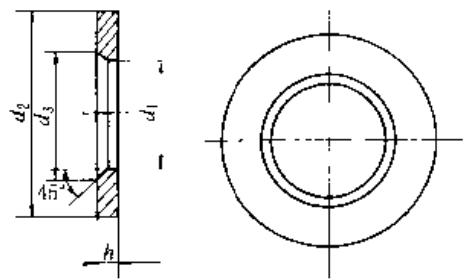

标记示例:

规格 $1 6 \mathrm { m m }$ 淬火并回火的栓接结构用平垫圈的标记:垫圈GB/TI8230.516

表4-1-144

<table><tr><td rowspan=1 colspan=2>规格</td><td rowspan=1 colspan=1>12</td><td rowspan=1 colspan=2>16</td><td rowspan=1 colspan=1>20</td><td rowspan=1 colspan=1>(22）</td><td rowspan=1 colspan=1>24</td><td rowspan=1 colspan=1>(27）</td><td rowspan=1 colspan=1>30</td><td rowspan=1 colspan=1>36</td></tr><tr><td rowspan=2 colspan=1>d</td><td rowspan=1 colspan=1>rin</td><td rowspan=1 colspan=1>13</td><td rowspan=1 colspan=2>17</td><td rowspan=1 colspan=1>21</td><td rowspan=1 colspan=1>23</td><td rowspan=1 colspan=1>25</td><td rowspan=1 colspan=1>28</td><td rowspan=1 colspan=1>31</td><td rowspan=1 colspan=1>37</td></tr><tr><td rowspan=1 colspan=1>max</td><td rowspan=1 colspan=1>13.43</td><td rowspan=1 colspan=2>17.43</td><td rowspan=1 colspan=1>21.52   i</td><td rowspan=1 colspan=1>23.52</td><td rowspan=1 colspan=1>25.52</td><td rowspan=1 colspan=1>28.52</td><td rowspan=1 colspan=1>31.62</td><td rowspan=1 colspan=1>37.62</td></tr><tr><td rowspan=2 colspan=1>d</td><td rowspan=1 colspan=1>min</td><td rowspan=1 colspan=1>23.7</td><td rowspan=1 colspan=2>31.4</td><td rowspan=1 colspan=1>38.4</td><td rowspan=1 colspan=1>40.4</td><td rowspan=1 colspan=1>45.4</td><td rowspan=1 colspan=1>50.1</td><td rowspan=1 colspan=1>54.1</td><td rowspan=1 colspan=1>64.1</td></tr><tr><td rowspan=1 colspan=1>max</td><td rowspan=1 colspan=1>25</td><td rowspan=1 colspan=2>33</td><td rowspan=1 colspan=1>40</td><td rowspan=1 colspan=1>42</td><td rowspan=1 colspan=1>47</td><td rowspan=1 colspan=1>52</td><td rowspan=1 colspan=1>56</td><td rowspan=1 colspan=1>66</td></tr><tr><td rowspan=3 colspan=1>h</td><td rowspan=1 colspan=1>公称</td><td rowspan=1 colspan=1>3.0</td><td rowspan=1 colspan=2>4.0</td><td rowspan=1 colspan=1>4.0</td><td rowspan=1 colspan=1>5.0</td><td rowspan=1 colspan=1>5.0</td><td rowspan=1 colspan=1>5.0</td><td rowspan=1 colspan=1>5.0</td><td rowspan=1 colspan=1>5.0</td></tr><tr><td rowspan=1 colspan=1>min</td><td rowspan=1 colspan=1>2.5</td><td rowspan=1 colspan=2>3.5</td><td rowspan=1 colspan=1>3.5</td><td rowspan=1 colspan=1>4.5</td><td rowspan=1 colspan=1>4.5</td><td rowspan=1 colspan=1>4.5</td><td rowspan=1 colspan=1>4.5</td><td rowspan=1 colspan=1>4.5</td></tr><tr><td rowspan=1 colspan=1>max</td><td rowspan=1 colspan=1>3.8</td><td rowspan=1 colspan=2>4.8</td><td rowspan=1 colspan=1>4.8</td><td rowspan=1 colspan=1>5.8</td><td rowspan=1 colspan=1>5.8</td><td rowspan=1 colspan=1>5.8</td><td rowspan=1 colspan=1>5.8</td><td rowspan=1 colspan=1>5.8</td></tr><tr><td rowspan=2 colspan=1>d</td><td rowspan=1 colspan=1>min</td><td rowspan=1 colspan=1>15.2</td><td rowspan=1 colspan=2>19.2</td><td rowspan=1 colspan=1>24.4</td><td rowspan=1 colspan=1>26.4</td><td rowspan=1 colspan=1>28.4</td><td rowspan=1 colspan=1>32.4</td><td rowspan=1 colspan=1>35.4</td><td rowspan=1 colspan=1>42.4</td></tr><tr><td rowspan=1 colspan=1>max</td><td rowspan=1 colspan=1>16.04</td><td rowspan=1 colspan=2>20.04</td><td rowspan=1 colspan=1>25.24</td><td rowspan=1 colspan=1>27.44</td><td rowspan=1 colspan=1>29.44  i</td><td rowspan=1 colspan=1>33.4</td><td rowspan=1 colspan=1>36.4</td><td rowspan=1 colspan=1>43.4</td></tr><tr><td rowspan=3 colspan=2>技术条件</td><td rowspan=1 colspan=1>材料</td><td rowspan=1 colspan=1>硬度</td><td rowspan=1 colspan=2>产品等级</td><td rowspan=2 colspan=5>表   面   处   理常规的                           可选择的</td></tr><tr><td rowspan=2 colspan=1>钢</td><td rowspan=2 colspan=1>35~45HRC</td><td rowspan=2 colspan=2>d:A;dd:c；h:IT17</td><td rowspan=1 colspan=1>常规的</td></tr><tr><td rowspan=1 colspan=1>氧化</td><td rowspan=1 colspan=1>电镀锌GB/T 5267</td><td rowspan=1 colspan=1>电镀镉GB/T 5267</td><td rowspan=1 colspan=1>热浸镀锌GB/T 13912</td><td rowspan=1 colspan=1>粉末渗锌JR/T5067</td></tr></table>

注:1.热浸镀锌垫圈的最低硬度为26HRC。2.尽可能不采用括号内的尺寸。3.可选择的四种热处理必须有驱氢措施,

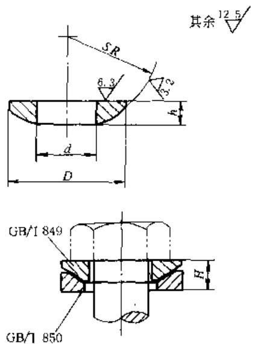

# 锥面垫圈(GB/T850-1988)

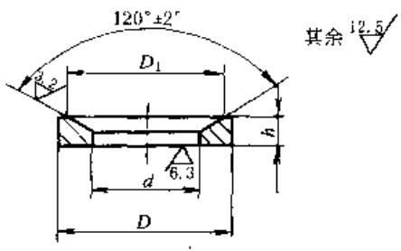

标记示例:

规格为 $1 6 \mathrm { m m }$ 、材料为45钢、热处理硬度40\~48HRC、表面氧化的球面垫圈:

垫圈CB/TB4916

表4-1-145

/mm 

<table><tr><td colspan="3">规格（螺纹大径）</td><td>6</td><td>8</td><td>10</td><td>12</td><td>16</td><td>20</td><td>24</td><td>30</td><td>36</td><td>42</td><td>48</td></tr><tr><td colspan="3">H</td><td>4</td><td>5</td><td>6</td><td>7</td><td>8</td><td>10</td><td>13</td><td>16</td><td>19</td><td>24</td><td>30</td></tr><tr><td colspan="3">Dmax</td><td>12.5</td><td>17</td><td>21</td><td>24</td><td>30</td><td>37</td><td>44</td><td>56</td><td>66</td><td>78</td><td>92</td></tr><tr><td rowspan="3">GB/T 849</td><td>d</td><td>min</td><td>6.4</td><td>8.4</td><td>10.5</td><td>13</td><td>17</td><td>21</td><td>25</td><td>31</td><td>37</td><td>43</td><td>50</td></tr><tr><td>h</td><td>max</td><td>3</td><td>4</td><td></td><td>5</td><td>6</td><td>6.6</td><td>9.6</td><td>9.8</td><td>12</td><td>16</td><td>20</td></tr><tr><td>SR</td><td></td><td>10</td><td>12</td><td>16</td><td>20</td><td>25</td><td>32</td><td>36</td><td>40</td><td>50</td><td>63</td><td>70</td></tr><tr><td rowspan="2">每1000个的重量/kg</td><td></td><td></td><td>0.97</td><td>2.52</td><td>3.71</td><td>5.93</td><td>10.88</td><td>17.86</td><td>38.79</td><td>63.95</td><td>108.7</td><td>211.9</td><td>376.5</td></tr><tr><td>d</td><td>min</td><td>8</td><td>10</td><td>12.5</td><td>16</td><td>20</td><td>25</td><td>30</td><td>36</td><td>43</td><td>50</td><td>60</td></tr><tr><td rowspan="3">GB/T850</td><td>h</td><td>max</td><td>2.6</td><td>3.2</td><td>4 1</td><td>4.7</td><td>5.1</td><td>6.6</td><td>6.8</td><td>9.9</td><td>14.3</td><td>14.4</td><td></td></tr><tr><td>D</td><td></td><td>12</td><td>16</td><td>18</td><td>23.5</td><td>29</td><td>34</td><td>38.5</td><td>45.2</td><td></td><td></td><td>17.4</td></tr><tr><td>每1000个的重量/g</td><td></td><td>0.91</td><td>2.34</td><td>5.2</td><td>6.12</td><td>10.5</td><td></td><td></td><td></td><td>64</td><td>69</td><td>78.6</td></tr><tr><td colspan="3">技术条件</td><td></td><td></td><td></td><td>性能等级：40-48HRC</td><td></td><td>22.69</td><td>34.54</td><td>96.88</td><td>165.8</td><td>260.9</td><td>448.6</td></tr><tr><td></td><td></td><td></td><td>材料：45</td><td></td><td></td><td></td><td></td><td></td><td>表面处理：氧化</td><td></td><td></td><td></td><td></td></tr></table>

注:GB/T849球面、GB/T850锥面( $! 2 0 ^ { \circ } .$ 如需抛光应在订单中注明。

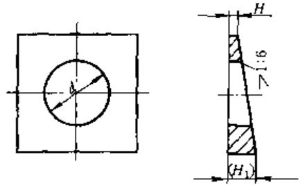

工字钢用方斜垫图(GB/T852—1988)

标记示例:

规格为 $\uparrow6 \mathrm { m m }$ 、材料为Q235、不经表面处理的工字钢用方斜垫圈:

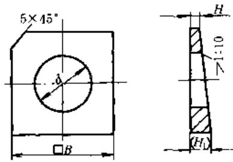

槽钢用方斜垫圈(GB/T853—1988)

垫圈CB/T85216

表4-1-146

/mm 

<table><tr><td colspan="2">规格（螺纹大径）</td><td>6</td><td>8</td><td>10</td><td>12</td><td>16</td><td>（18）</td><td>20</td><td>(22）</td><td>24</td><td>(27）</td><td>30</td><td>36</td></tr><tr><td colspan="2">d min</td><td>6.6</td><td>9</td><td>11</td><td>13.5</td><td>17.5</td><td>20</td><td>2</td><td>24</td><td>26</td><td>30</td><td>33</td><td>39 70</td></tr><tr><td colspan="2">B</td><td>16</td><td>18</td><td>22 2</td><td>28</td><td>35</td><td colspan="7">40 50 6</td></tr><tr><td colspan="2">H</td><td colspan="4"></td><td></td><td colspan="4">3</td><td></td><td></td><td></td></tr><tr><td rowspan="2">H</td><td>GB/T852 GB/T853</td><td>4.7 3.6</td><td>5</td><td>5.7</td><td>6.7</td><td>7.8</td><td colspan="3">9.7</td><td></td><td>11.3</td><td>13</td><td>14.7</td></tr><tr><td></td><td></td><td>3.8</td><td>4.2</td><td>4.8</td><td>5.4</td><td></td><td>7</td><td></td><td></td><td>8</td><td>9</td><td>10</td></tr><tr><td>每1000个</td><td>GB/T852</td><td>5.8</td><td>7.11</td><td>11.69</td><td>21.76</td><td>37.6</td><td>63.73</td><td>60.47</td><td>56.9</td><td>109.8</td><td>99.91</td><td>171.3</td><td>255.9</td></tr><tr><td>的重/kg</td><td>GB/T853</td><td>4.75</td><td>5.79</td><td>9.31</td><td>16.9</td><td>28.22</td><td>50</td><td>47.43</td><td>44.61</td><td>84.33</td><td>76.78</td><td>128.3</td><td>187.7</td></tr></table>

注:1.材料:Q235,2.全部为商品规格。尽可能不采用括号内的规格。

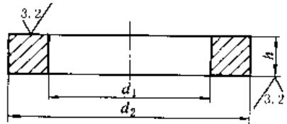

销轴用平垫圈(GB/T97.3—2000)

标记示例:

公称规格d=8mm、性能等级为160HV、不经表面处理的销轴用一垫圈的标记:

垫圈CB/T97.38

表 4-1-147

/mm 

<table><tr><td rowspan="3">公称规格 d</td><td colspan="2">内径</td><td colspan="2">外径</td><td rowspan="2"></td><td colspan="2">厚度 h</td><td></td></tr><tr><td colspan="2">山</td><td colspan="2">d</td><td colspan="3"></td></tr><tr><td>公称（min）</td><td>mIaX</td><td>公称（max）</td><td>min</td><td>公称</td><td>max</td><td></td><td>min</td></tr><tr><td>3</td><td colspan="2">3</td><td>3.14</td><td>6</td><td>5.70</td><td>0.8</td><td>0.9</td><td></td><td>0.7</td></tr><tr><td>4</td><td colspan="2">4</td><td>4.18</td><td>8</td><td>7.64</td><td>0.8</td><td></td><td>0.9</td><td>0.7</td></tr><tr><td>5</td><td colspan="2">5</td><td>5.18</td><td>10</td><td>9.64</td><td>1</td><td>1.I</td><td></td><td>0.9</td></tr><tr><td>6</td><td colspan="2">6</td><td>6.18</td><td>12</td><td>11.57</td><td>1.6</td><td></td><td>1.8</td><td>1.4</td></tr><tr><td>8</td><td colspan="2">8</td><td>8.22</td><td>15</td><td>14.57</td><td>2</td><td>2.2</td><td></td><td>18</td></tr><tr><td>10 12</td><td colspan="2">10</td><td>10.22</td><td>18</td><td>17.57</td><td>2.5</td><td></td><td>2.7</td><td>2.3</td></tr><tr><td>14</td><td colspan="2">12 14</td><td>12.27</td><td>20</td><td>19.48</td><td>3</td><td></td><td>3.3</td><td>2.7</td></tr><tr><td>16</td><td colspan="2">16</td><td>14.27</td><td>22</td><td>21.48</td><td>3</td><td></td><td>3.3</td><td>2.7</td></tr><tr><td>18</td><td colspan="2">18</td><td>16,27</td><td>24 28</td><td>23.48</td><td>3</td><td></td><td>3.3</td><td>2.7</td></tr><tr><td>20</td><td colspan="2">20</td><td>18.27</td><td>30</td><td>27.48</td><td>4</td><td></td><td>4.3</td><td>3.7</td></tr><tr><td>22</td><td colspan="2">22</td><td>20.33</td><td>34</td><td>29.48</td><td>4</td><td></td><td>4.3</td><td>3.7</td></tr><tr><td>24</td><td colspan="2">24</td><td>22.33 24.33</td><td>37</td><td>33.38</td><td>4</td><td></td><td>4.3</td><td>3.7</td></tr><tr><td>25</td><td colspan="2">25</td><td>25.33</td><td>38</td><td>36.38 37.38</td><td>4</td><td></td><td>4.3</td><td>3.7</td></tr><tr><td>27</td><td colspan="2">27</td><td>27.52</td><td>39</td><td></td><td>4</td><td></td><td>4.3</td><td>3.7</td></tr><tr><td>28</td><td colspan="2">28</td><td>28.52</td><td>40</td><td>38</td><td>5</td><td></td><td>5.6</td><td>4.4</td></tr><tr><td>30</td><td colspan="2"></td><td></td><td></td><td>39</td><td>5</td><td></td><td>5.6</td><td>4.4</td></tr><tr><td colspan="2">32</td><td colspan="2">30</td><td>30.52</td><td>44</td><td>43</td><td>5</td><td>5.6</td><td>4.4</td></tr><tr><td colspan="2">33</td><td>32</td><td>32.62</td><td>46</td><td>45</td><td>5</td><td></td><td>5.6</td><td>4.4</td></tr><tr><td colspan="2">36</td><td>33</td><td>33.62</td><td>47</td><td>46</td><td>5</td><td></td><td>5.6</td><td>4.4</td></tr><tr><td colspan="2">40</td><td>36</td><td>36.62</td><td>50</td><td>49</td><td>6</td><td></td><td>6.6</td><td>5.4</td></tr><tr><td colspan="2">45</td><td colspan="2">40</td><td>40.62</td><td>56</td><td>54.8</td><td>6</td><td>6.6</td><td>5.4</td></tr><tr><td colspan="2">50</td><td colspan="2">45</td><td>45.62</td><td>60</td><td>58.8</td><td>6</td><td>6.6</td><td>5.4</td></tr><tr><td colspan="2">55</td><td colspan="2">50</td><td>50.62</td><td>66</td><td>64.8</td><td>8</td><td>9</td><td>7</td></tr><tr><td colspan="2">60</td><td colspan="2">55</td><td>55.74</td><td>72</td><td>70.8</td><td>8</td><td>9</td><td>7</td></tr><tr><td colspan="2">70</td><td colspan="2">60</td><td>60.74</td><td>78</td><td>76.8</td><td>10</td><td>11</td><td>9</td></tr><tr><td colspan="2">80</td><td colspan="2">70</td><td>70.74</td><td>92</td><td>90.6</td><td>10</td><td>1</td><td>9</td></tr><tr><td colspan="2">90</td><td colspan="2">80</td><td>80.74</td><td>98</td><td>96.6</td><td>12</td><td>13.2</td><td>10.8</td></tr><tr><td colspan="2">100</td><td colspan="2">90 100</td><td>90.87 100.87</td><td>110 120</td><td>108.6 118.6</td><td>12 12</td><td>13.2 13.2</td><td>10.8</td></tr><tr><td rowspan="4">技术条</td><td colspan="2">材 料</td><td colspan="7">钢</td><td>10.8</td></tr><tr><td colspan="2">性能等级</td><td colspan="7"></td><td></td></tr><tr><td colspan="2">公差等级</td><td colspan="7">160HV A</td></tr></table>

标准型弹簧垫圈(GB/T93-1987)、轻型弹簧垫圈(GB/T859—1987)、重型弹簧垫圈(GB/T7244—1987)

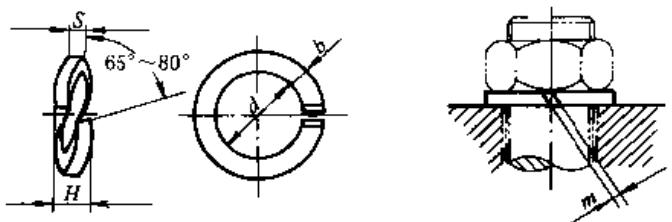

标记示例:

规格 $1 6 \mathrm { m m }$ 、材料为 $6 5 \mathbb { M } \mathfrak { n }$ 、表面氧化的标准型弹簧垫圈:

垫圈GB/T9316

/mm 

表4-1-148

<table><tr><td rowspan=2 colspan=1>规格(螺纹大径）</td><td rowspan=2 colspan=1>dmin</td><td rowspan=1 colspan=4>GB/T 93</td><td rowspan=1 colspan=5>GB/T 859</td><td rowspan=1 colspan=5>GB/T 7244</td></tr><tr><td rowspan=1 colspan=1>s(b)公称</td><td rowspan=1 colspan=1>Hmax</td><td rowspan=1 colspan=1>m</td><td rowspan=1 colspan=1>每1000个的重量/kg</td><td rowspan=1 colspan=1>s公称</td><td rowspan=1 colspan=1>b公称</td><td rowspan=1 colspan=1>Hmax</td><td rowspan=1 colspan=1>m</td><td rowspan=1 colspan=1>每1000个的重量/g</td><td rowspan=1 colspan=1>s公称</td><td rowspan=1 colspan=1>b公称</td><td rowspan=1 colspan=1>Hmx</td><td rowspan=1 colspan=1>m</td><td rowspan=1 colspan=1>每1000个的重量/kg</td></tr><tr><td rowspan=2 colspan=1>22.5</td><td rowspan=2 colspan=1>2.12.6</td><td rowspan=2 colspan=1>0.50.65</td><td rowspan=2 colspan=1>1.251.63</td><td rowspan=1 colspan=1>0.25</td><td rowspan=1 colspan=1>0.01</td><td rowspan=1 colspan=1>1</td><td rowspan=1 colspan=1>1</td><td rowspan=2 colspan=1>1一</td><td rowspan=2 colspan=1>11</td><td rowspan=2 colspan=1></td><td rowspan=2 colspan=1></td><td rowspan=3 colspan=1></td><td rowspan=3 colspan=1></td><td rowspan=3 colspan=1>1</td><td rowspan=3 colspan=1>1</td></tr><tr><td rowspan=1 colspan=1>0.33</td><td rowspan=1 colspan=1>0.01</td><td rowspan=1 colspan=1>1</td><td rowspan=1 colspan=1></td></tr><tr><td rowspan=1 colspan=1>3</td><td rowspan=1 colspan=1>3.1</td><td rowspan=1 colspan=1>0.8</td><td rowspan=1 colspan=1>2</td><td rowspan=1 colspan=1>0.4</td><td rowspan=1 colspan=1>0.02</td><td rowspan=1 colspan=1>0.6</td><td rowspan=1 colspan=1>1</td><td rowspan=1 colspan=1>1.5</td><td rowspan=1 colspan=1>0.3</td><td rowspan=1 colspan=1>0.03</td><td rowspan=1 colspan=1></td></tr><tr><td rowspan=1 colspan=1>4</td><td rowspan=1 colspan=1>4.1</td><td rowspan=1 colspan=1>1.1</td><td rowspan=1 colspan=1>2.75</td><td rowspan=1 colspan=1>0.55</td><td rowspan=1 colspan=1>0.05</td><td rowspan=1 colspan=1>0.8</td><td rowspan=1 colspan=1>1.2</td><td rowspan=1 colspan=1>2</td><td rowspan=1 colspan=1>0.4</td><td rowspan=1 colspan=1>0.05</td><td rowspan=1 colspan=1>1</td><td rowspan=1 colspan=1>|</td><td rowspan=1 colspan=1></td><td rowspan=1 colspan=1></td><td rowspan=1 colspan=1></td></tr><tr><td rowspan=1 colspan=1>5</td><td rowspan=1 colspan=1>5.1</td><td rowspan=1 colspan=1>1.3</td><td rowspan=1 colspan=1>3.25</td><td rowspan=1 colspan=1>0.65</td><td rowspan=1 colspan=1>0.08</td><td rowspan=1 colspan=1>1.1</td><td rowspan=1 colspan=1>1.5</td><td rowspan=1 colspan=1>2.75</td><td rowspan=1 colspan=1>0.55</td><td rowspan=1 colspan=1>0.11</td><td rowspan=1 colspan=1>1</td><td rowspan=1 colspan=1>1</td><td rowspan=1 colspan=1></td><td rowspan=1 colspan=1>1</td><td rowspan=2 colspan=1>-0.39</td></tr><tr><td rowspan=2 colspan=1>68</td><td rowspan=1 colspan=1>6.1</td><td rowspan=1 colspan=1>1.6</td><td rowspan=1 colspan=1>4</td><td rowspan=1 colspan=1>0.8</td><td rowspan=1 colspan=1>0.15</td><td rowspan=1 colspan=1>1.3</td><td rowspan=1 colspan=1>2</td><td rowspan=1 colspan=1>3.25</td><td rowspan=1 colspan=1>0.65</td><td rowspan=1 colspan=1>0.21</td><td rowspan=1 colspan=1>1.8</td><td rowspan=1 colspan=1>2.6</td><td rowspan=1 colspan=1>4.5</td><td rowspan=1 colspan=1>0.9</td></tr><tr><td rowspan=1 colspan=1>8.1</td><td rowspan=1 colspan=1>2.1</td><td rowspan=1 colspan=1>5.25</td><td rowspan=1 colspan=1>1.05</td><td rowspan=1 colspan=1>0.35</td><td rowspan=1 colspan=1>1.6</td><td rowspan=1 colspan=1>2.5</td><td rowspan=1 colspan=1>4</td><td rowspan=1 colspan=1>0.8</td><td rowspan=1 colspan=1>0.43</td><td rowspan=1 colspan=1>2.4</td><td rowspan=1 colspan=1>3.2</td><td rowspan=1 colspan=1>6</td><td rowspan=1 colspan=1>1.2</td><td rowspan=1 colspan=1>0.84</td></tr><tr><td rowspan=1 colspan=1>10</td><td rowspan=1 colspan=1>10.2</td><td rowspan=1 colspan=1>2.6</td><td rowspan=1 colspan=1>6.5</td><td rowspan=1 colspan=1>1.3</td><td rowspan=1 colspan=1>0.68</td><td rowspan=1 colspan=1>2</td><td rowspan=1 colspan=1>3</td><td rowspan=1 colspan=1>5</td><td rowspan=1 colspan=1>1</td><td rowspan=1 colspan=1>0.81</td><td rowspan=1 colspan=1>3</td><td rowspan=1 colspan=1>3.8</td><td rowspan=1 colspan=1>7.5</td><td rowspan=1 colspan=1>1.5</td><td rowspan=1 colspan=1>1.56</td></tr><tr><td rowspan=1 colspan=1>12</td><td rowspan=1 colspan=1>12.2</td><td rowspan=1 colspan=1>3.1</td><td rowspan=1 colspan=1>7.75</td><td rowspan=1 colspan=1>1.55</td><td rowspan=1 colspan=1>1.15</td><td rowspan=1 colspan=1>2.5</td><td rowspan=1 colspan=1>3.5</td><td rowspan=1 colspan=1>6.25</td><td rowspan=1 colspan=1>1.25</td><td rowspan=1 colspan=1>1.41</td><td rowspan=1 colspan=1>3.5</td><td rowspan=1 colspan=1>4.3</td><td rowspan=1 colspan=1>8.75</td><td rowspan=1 colspan=1>1.75</td><td rowspan=1 colspan=1>2.44</td></tr><tr><td rowspan=1 colspan=1>(14)</td><td rowspan=1 colspan=1>14.2</td><td rowspan=1 colspan=1>3.6</td><td rowspan=1 colspan=1>9</td><td rowspan=1 colspan=1>1.8</td><td rowspan=1 colspan=1>1.81</td><td rowspan=1 colspan=1>3</td><td rowspan=1 colspan=1>4</td><td rowspan=1 colspan=1>7.5</td><td rowspan=1 colspan=1>1.5</td><td rowspan=1 colspan=1>2.24</td><td rowspan=1 colspan=1>4.1</td><td rowspan=1 colspan=1>4.8</td><td rowspan=1 colspan=1>10.25</td><td rowspan=1 colspan=1>2.05</td><td rowspan=1 colspan=1>3.69</td></tr><tr><td rowspan=1 colspan=1>16</td><td rowspan=1 colspan=1>16.2</td><td rowspan=1 colspan=1>4.1</td><td rowspan=1 colspan=1>10.25</td><td rowspan=1 colspan=1>2.05</td><td rowspan=1 colspan=1>2.68</td><td rowspan=1 colspan=1>3.2</td><td rowspan=1 colspan=1>4.5</td><td rowspan=1 colspan=1>8</td><td rowspan=1 colspan=1>1.6</td><td rowspan=1 colspan=1>3.08</td><td rowspan=1 colspan=1>4.8</td><td rowspan=1 colspan=1>5.3</td><td rowspan=1 colspan=1>12</td><td rowspan=1 colspan=1>2.4</td><td rowspan=1 colspan=1>5.4</td></tr><tr><td rowspan=1 colspan=1>(18）</td><td rowspan=1 colspan=1>18.2</td><td rowspan=1 colspan=1>4.5</td><td rowspan=1 colspan=1>11.25</td><td rowspan=1 colspan=1>2.25</td><td rowspan=1 colspan=1>3.65</td><td rowspan=1 colspan=1>3.6</td><td rowspan=1 colspan=1>5</td><td rowspan=1 colspan=1>9</td><td rowspan=1 colspan=1>1.8</td><td rowspan=1 colspan=1>4.31</td><td rowspan=1 colspan=1>5.3</td><td rowspan=1 colspan=1>5.8</td><td rowspan=1 colspan=1>13.25</td><td rowspan=1 colspan=1>2.65</td><td rowspan=1 colspan=1>7.31</td></tr><tr><td rowspan=1 colspan=1>20</td><td rowspan=1 colspan=1>20.2</td><td rowspan=1 colspan=1>5</td><td rowspan=1 colspan=1>12.5</td><td rowspan=1 colspan=1>2.5</td><td rowspan=1 colspan=1>5</td><td rowspan=1 colspan=1>4</td><td rowspan=1 colspan=1>5.5</td><td rowspan=1 colspan=1>10</td><td rowspan=1 colspan=1>2</td><td rowspan=1 colspan=1>5.84</td><td rowspan=1 colspan=1>6</td><td rowspan=1 colspan=1>6.4</td><td rowspan=1 colspan=1>15</td><td rowspan=1 colspan=1>3</td><td rowspan=1 colspan=1>10.11</td></tr><tr><td rowspan=1 colspan=1>(22）</td><td rowspan=1 colspan=1>22.5</td><td rowspan=1 colspan=1>5.5</td><td rowspan=1 colspan=1>13.75</td><td rowspan=1 colspan=1>2.75</td><td rowspan=1 colspan=1>6.76</td><td rowspan=1 colspan=1>4.5</td><td rowspan=1 colspan=1>6</td><td rowspan=1 colspan=1>11.25</td><td rowspan=1 colspan=1>2.25</td><td rowspan=1 colspan=1>7.96</td><td rowspan=1 colspan=1>6.6</td><td rowspan=1 colspan=1>7.2</td><td rowspan=1 colspan=1>16.5</td><td rowspan=1 colspan=1>3.3</td><td rowspan=1 colspan=1>13.97</td></tr><tr><td rowspan=1 colspan=1>24</td><td rowspan=1 colspan=1>24.5</td><td rowspan=1 colspan=1>6</td><td rowspan=1 colspan=1>15</td><td rowspan=1 colspan=1>3</td><td rowspan=1 colspan=1>8.76</td><td rowspan=1 colspan=1>5</td><td rowspan=1 colspan=1>7</td><td rowspan=1 colspan=1>12.5</td><td rowspan=1 colspan=1>2.5</td><td rowspan=1 colspan=1>11.2</td><td rowspan=1 colspan=1>7.1</td><td rowspan=1 colspan=1>7.5</td><td rowspan=1 colspan=1>17.75</td><td rowspan=1 colspan=1>3.55</td><td rowspan=1 colspan=1>16.96</td></tr><tr><td rowspan=1 colspan=1>（27）</td><td rowspan=1 colspan=1>27.5</td><td rowspan=1 colspan=1>6.8</td><td rowspan=1 colspan=1>17</td><td rowspan=1 colspan=1>3.4</td><td rowspan=1 colspan=1>12.6</td><td rowspan=1 colspan=1>5.5</td><td rowspan=1 colspan=1>8</td><td rowspan=1 colspan=1>13.75</td><td rowspan=1 colspan=1>2.75</td><td rowspan=1 colspan=1>16.04</td><td rowspan=1 colspan=1>8</td><td rowspan=1 colspan=1>8.5</td><td rowspan=1 colspan=1>20</td><td rowspan=1 colspan=1>4</td><td rowspan=1 colspan=1>24.33</td></tr><tr><td rowspan=1 colspan=1>30</td><td rowspan=1 colspan=1>30.5</td><td rowspan=1 colspan=1>7.5</td><td rowspan=1 colspan=1>18.75</td><td rowspan=1 colspan=1>3.75</td><td rowspan=1 colspan=1>17.02</td><td rowspan=1 colspan=1>6</td><td rowspan=1 colspan=1>9</td><td rowspan=1 colspan=1>15</td><td rowspan=1 colspan=1>3</td><td rowspan=1 colspan=1>21.89</td><td rowspan=1 colspan=1>9</td><td rowspan=1 colspan=1>9.3</td><td rowspan=1 colspan=1>22.5</td><td rowspan=1 colspan=1>4.5</td><td rowspan=1 colspan=1>33.11</td></tr><tr><td rowspan=1 colspan=1>(33）</td><td rowspan=1 colspan=1>33.5</td><td rowspan=1 colspan=1>8.5</td><td rowspan=1 colspan=1>21.25</td><td rowspan=1 colspan=1>4.25</td><td rowspan=1 colspan=1>23.84</td><td rowspan=1 colspan=1></td><td rowspan=1 colspan=1></td><td rowspan=1 colspan=1></td><td rowspan=1 colspan=1></td><td rowspan=1 colspan=1>丨</td><td rowspan=1 colspan=1>9.9</td><td rowspan=1 colspan=1>10.2</td><td rowspan=1 colspan=1>24.75</td><td rowspan=1 colspan=1>4.95</td><td rowspan=1 colspan=1>43.86</td></tr><tr><td rowspan=1 colspan=1>36</td><td rowspan=1 colspan=1>36.5</td><td rowspan=1 colspan=1>9</td><td rowspan=1 colspan=1>22.5</td><td rowspan=1 colspan=1>4.5</td><td rowspan=1 colspan=1>29.32</td><td rowspan=1 colspan=1>1</td><td rowspan=1 colspan=1>1</td><td rowspan=1 colspan=1></td><td rowspan=1 colspan=1></td><td rowspan=1 colspan=1></td><td rowspan=1 colspan=1>10.8</td><td rowspan=1 colspan=1>11</td><td rowspan=1 colspan=1>27</td><td rowspan=1 colspan=1>5.4</td><td rowspan=1 colspan=1>56.13</td></tr><tr><td rowspan=1 colspan=1>(39)</td><td rowspan=1 colspan=1>39.5</td><td rowspan=1 colspan=1>10</td><td rowspan=1 colspan=1>25</td><td rowspan=1 colspan=1>5</td><td rowspan=1 colspan=1>38.92</td><td rowspan=1 colspan=1></td><td rowspan=1 colspan=1></td><td rowspan=1 colspan=1></td><td rowspan=1 colspan=1></td><td rowspan=1 colspan=1></td><td rowspan=1 colspan=1></td><td rowspan=1 colspan=1></td><td rowspan=1 colspan=1></td><td rowspan=1 colspan=1></td><td rowspan=1 colspan=1></td></tr><tr><td rowspan=1 colspan=1>42</td><td rowspan=1 colspan=1>42.5</td><td rowspan=1 colspan=1>10.5</td><td rowspan=1 colspan=1>26.25</td><td rowspan=1 colspan=1>5.25</td><td rowspan=1 colspan=1>46.44</td><td rowspan=1 colspan=1>1</td><td rowspan=1 colspan=1>一</td><td rowspan=1 colspan=1></td><td rowspan=1 colspan=1></td><td rowspan=1 colspan=1></td><td rowspan=1 colspan=1></td><td rowspan=1 colspan=1></td><td rowspan=1 colspan=1></td><td rowspan=1 colspan=1></td><td rowspan=1 colspan=1></td></tr><tr><td rowspan=1 colspan=1>(45）</td><td rowspan=1 colspan=1>45.5</td><td rowspan=1 colspan=1>1</td><td rowspan=1 colspan=1>27.5</td><td rowspan=1 colspan=1>5.5</td><td rowspan=1 colspan=1>54.84</td><td rowspan=1 colspan=1>1</td><td rowspan=1 colspan=1></td><td rowspan=1 colspan=1></td><td rowspan=1 colspan=1></td><td rowspan=1 colspan=1></td><td rowspan=1 colspan=1></td><td rowspan=1 colspan=1></td><td rowspan=1 colspan=1></td><td rowspan=1 colspan=1></td><td rowspan=1 colspan=1></td></tr><tr><td rowspan=1 colspan=1>48</td><td rowspan=1 colspan=1>48.5</td><td rowspan=1 colspan=1>12</td><td rowspan=1 colspan=1>30</td><td rowspan=1 colspan=1>6</td><td rowspan=1 colspan=1>69.2</td><td rowspan=1 colspan=1></td><td rowspan=1 colspan=1></td><td rowspan=1 colspan=1></td><td rowspan=1 colspan=1></td><td rowspan=1 colspan=1></td><td rowspan=1 colspan=1></td><td rowspan=1 colspan=1></td><td rowspan=1 colspan=1></td><td rowspan=1 colspan=1></td><td rowspan=1 colspan=1></td></tr></table>

注:1.标记示例中的材料为最常用的主要材料,其他技术条件按 $\mathsf { G B } / \mathsf { T } \thinspace \Re . 1$ 规定。2.为商品紧固件品种,应优先选用。尽量不采用括号内的规格。3. $\pmb { \mathscr { P } } ^ { 2 }$ 应大于零。

内齿锁紧垫圈(GB/T86I.1—1987)内锯齿锁紧垫圈(GB/T861.2—1987)

外齿锁紧垫圈(GB/T862.1—1987)外锯齿锁紧垫圈(GB/T862.2—1987)

标记示例:

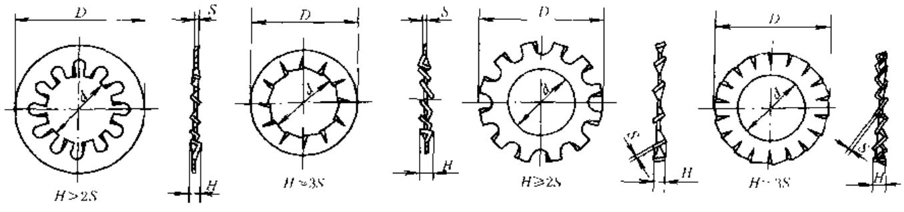

GB/T 861. 1 

GB/T 861.2 

GBT 2 

规格 $\scriptstyle 6 \mathbf { m m }$ 、材料为 $6 5 \mathrm { { M n } }$ 、表面氧化的内齿锁紧垫圈:垫圈GB/T861.16表4-1-149

/m 

<table><tr><td colspan="2">规格（螺纹大径）</td><td>2</td><td>2.5</td><td>3</td><td>4</td><td>5</td><td>6</td><td>8</td><td>10</td><td>12</td><td>（14</td><td>16</td><td>（18）</td><td>20</td></tr><tr><td>d D</td><td>min mAX</td><td>2.2 4.5</td><td>2.7 5.5</td><td>3.2</td><td>4.3 8</td><td>5.3</td><td>6.4</td><td>8.4</td><td>10.5 13</td><td>12.5 20.5</td><td>14.5</td><td>16.5</td><td>19</td><td>21</td></tr><tr><td colspan="2">S</td><td>0.3</td><td></td><td>6 0.4</td><td>0.5</td><td>10 0.6</td><td>1</td><td>15 0.8</td><td>1.0</td><td></td><td>24 1.2</td><td>26</td><td>30 1.5</td><td>33</td></tr><tr><td rowspan="3">齿数</td><td>GB/T861.1 GB/T 862.1</td><td colspan="7">6</td><td colspan="4">9</td><td colspan="3">12</td></tr><tr><td>CB/T861.2</td><td colspan="3">7</td><td colspan="2">8</td><td colspan="2">9 10 14</td><td colspan="3">12</td><td colspan="3">14</td></tr><tr><td>CB/T862.2</td><td colspan="3">9</td><td colspan="2">1</td><td colspan="2">12</td><td colspan="2">16</td><td colspan="2">18</td><td colspan="2"></td></tr><tr><td>每1000</td><td>CB/T861.2 GB/T 862.2</td><td>0.02</td><td>0.04</td><td>0.05</td><td>0.12</td><td>0.24</td><td>0.26</td><td>0.69</td><td>1.22</td><td>1.49</td><td>2.51</td><td>2 77</td><td>467</td><td>5.58</td></tr><tr><td>个的重属</td><td>CB/T 861.1</td><td colspan="2"></td><td>0.04</td><td>0.09</td><td>0.18</td><td>0.19</td><td>0.54</td><td>0.92</td><td></td><td>1.94</td><td></td><td></td><td></td></tr><tr><td rowspan="2">/kg</td><td>GB/T 862.1</td><td colspan="2">0.02</td><td></td><td></td><td>0.18</td><td></td><td>0.47</td><td></td><td>1.08</td><td></td><td>2.07</td><td>3.66</td><td>4.34</td></tr><tr><td></td><td colspan="2">0.02 0.03</td><td>0.04</td><td>0.1</td><td></td><td>0.21</td><td></td><td>08</td><td>1.12</td><td>1.69</td><td>2.1</td><td>3.14</td><td>3.8</td></tr></table>

注:1.标记示例中的材料为最常用的主要材料,其他技术条件见CR/T94.2规定。2.本表为商品紧固件品种,应优先选用。尽量不采用括号内的规格。

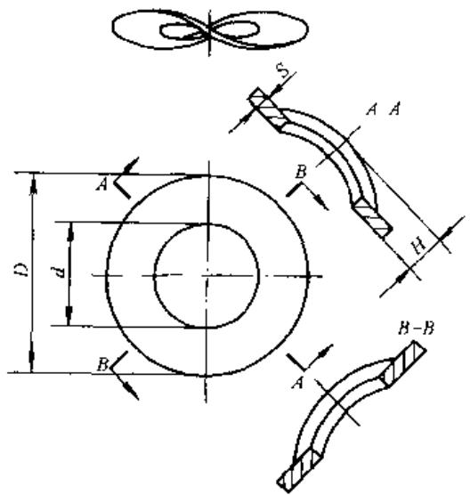

波形弹性垫圈(GB/T955-1987)

标记示例:

规格 ${ \mathfrak { o m m } }$ 、材料为 $\mathfrak { 6 5 } \mathbb { M } \mathfrak { n }$ 、表面氧化的波形弹性垫圈:

垫圈GB/T9556

表4-1-150

/mm 

<table><tr><td colspan="2">规格（螺纹大径）</td><td>3</td><td>4</td><td>5</td><td>6</td><td>8</td><td>10</td><td>12</td><td>（14）</td><td>16</td><td>（18）</td><td>20</td><td>（22）</td><td>24</td><td>（27）</td><td>30</td></tr><tr><td>d</td><td>min</td><td>3.2</td><td>4.3</td><td>53</td><td>6.4</td><td>8.4</td><td>10.5</td><td>13</td><td>15</td><td>17</td><td>19</td><td>21</td><td>23</td><td>25</td><td>28</td><td>31</td></tr><tr><td>D</td><td>max</td><td>8</td><td>9</td><td>11</td><td>12</td><td>15</td><td>2</td><td>24</td><td>28</td><td>30</td><td>34</td><td>36</td><td>40</td><td>44</td><td>50</td><td>56</td></tr><tr><td>H max</td><td></td><td>1.6</td><td>2</td><td>2.2</td><td>2.6</td><td>3</td><td>4.2</td><td>5</td><td>5.9</td><td>6.3</td><td>6.5</td><td>7.4</td><td>7.8</td><td>8.2</td><td>9.4</td><td>10</td></tr><tr><td colspan="2">S</td><td></td><td>0.5</td><td></td><td></td><td>0.8</td><td>1.0</td><td>1.2</td><td></td><td>1.5</td><td></td><td>1.6</td><td></td><td>1.8</td><td></td><td>2</td></tr><tr><td colspan="2">每1000个的重量/kg</td><td>0.14</td><td>0.16</td><td>0.24</td><td>0.27</td><td>0.66</td><td>1.8</td><td>2.7</td><td>4.71</td><td>5.07</td><td>6.69</td><td>7.68</td><td>10.94</td><td>13.5</td><td>19.81</td><td>25.02</td></tr></table>

注:标记示例中的材料为最常用的主要材料,其他技术条件按GB/T94.3规定。尽量不采用括号内的规格。

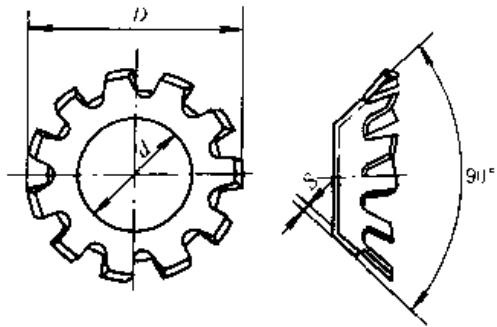

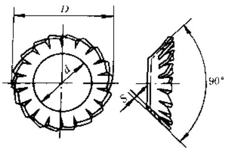

锥形锯齿锁紧垫圈(GB/T956.2—1987)

标记示例:

# 规格 $\scriptstyle 6 n =$ 、材料为 $6 5 \mathsf { M } \bar { \boldsymbol { \mathsf { n } } }$ 、表面氧化的锥形锁紧垫圈:垫圈GB/T956.16

表 4-1-151

/m 

<table><tr><td colspan="2">规格(螺纹大径）</td><td>3</td><td>4</td><td>5</td><td>6</td><td>8</td><td>10</td><td>12</td></tr><tr><td colspan="2" rowspan="2">d min D~</td><td>3.2</td><td>4.3</td><td>53</td><td>6.4</td><td>8.4</td><td>10.5</td><td>12.5</td></tr><tr><td>6</td><td>8</td><td>9.8</td><td>11.8</td><td>15.3</td><td>19</td><td>23</td></tr><tr><td rowspan="2">S 齿数</td><td>GB/T 956.1</td><td>0.4</td><td>0.5</td><td></td><td>0.6</td><td>0.8</td><td>1.0</td><td></td></tr><tr><td>GB/T 956.2</td><td>6 12</td><td>8 14</td><td></td><td>16</td><td>10</td><td></td><td></td></tr></table>

注:同表4-1-148注1。

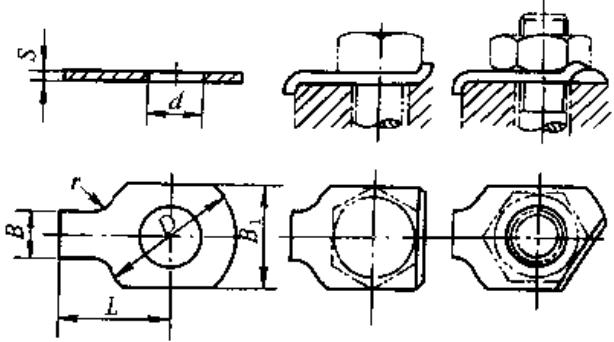

单耳止动垫圈(GB/T854--1988)

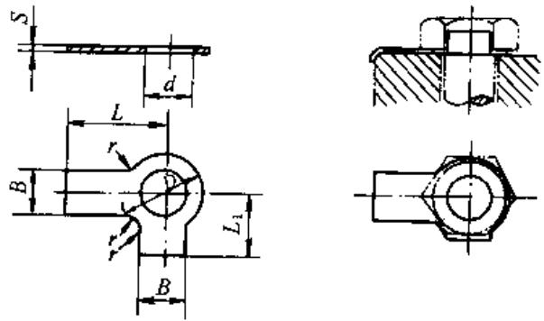

双耳止动垫圈(GB/T855—1988)

标记示例:

# 规格为 $1 0 \mathrm { m m }$ 、材料为Q215、经退火、不经表面处理的单耳止动垫圈:垫圈CB/T85410表4-1-152

/mm 

<table><tr><td rowspan="2">规格 （螺纹大径）</td><td rowspan="2">d min</td><td rowspan="2">L 公称</td><td rowspan="2">L</td><td rowspan="2">s</td><td rowspan="2">B</td><td rowspan="2">B</td><td colspan="2">D max</td><td colspan="2">每1000个的重量/kg</td></tr><tr><td>单耳</td><td>双耳</td><td>单耳</td><td>双耳</td></tr><tr><td>2.5</td><td>2.7</td><td>10</td><td>4</td><td>0.4</td><td>3</td><td>6</td><td>8</td><td></td><td>0.17</td><td>0.12</td></tr><tr><td>3</td><td>3.2</td><td>12</td><td>5</td><td></td><td>4</td><td>7</td><td>10</td><td>5</td><td>0.25</td><td>0.17</td></tr><tr><td>4</td><td>4.2</td><td>14</td><td>7</td><td></td><td>5</td><td>9</td><td>14</td><td>8</td><td>0.42</td><td>0.3</td></tr><tr><td>5</td><td>5.3</td><td>16</td><td>8</td><td></td><td>6</td><td>11</td><td>17</td><td>9</td><td>0.74</td><td>0.48</td></tr><tr><td>6</td><td>6.4</td><td>18</td><td>9</td><td>0.5</td><td>7</td><td>12</td><td>19</td><td>1</td><td>0.91</td><td>0.64</td></tr><tr><td>8</td><td>8.4</td><td>20</td><td>1</td><td></td><td>8</td><td>16</td><td>22</td><td>14</td><td>1.27</td><td>0.81</td></tr><tr><td>10</td><td>10.5</td><td>22</td><td>13</td><td></td><td>10</td><td>19</td><td>26</td><td>17</td><td>1.7</td><td>1.11</td></tr><tr><td>12</td><td>13 15</td><td>28</td><td>16</td><td></td><td>12</td><td>21 25</td><td>32</td><td>22</td><td>4.8 5.12</td><td>3.78</td></tr><tr><td>(14) 16</td><td>17</td><td>32</td><td>20</td><td></td><td>15</td><td>32</td><td>40</td><td>27</td><td>8.21</td><td>3.43 5.32</td></tr><tr><td>(18）</td><td>19</td><td></td><td></td><td>1</td><td></td><td></td><td></td><td></td><td>10.93</td><td>7.27</td></tr><tr><td>20</td><td>21</td><td>36</td><td>22</td><td></td><td>18</td><td>38</td><td>45</td><td>32</td><td>11.83</td><td>6.78</td></tr><tr><td>(22) 24</td><td>23 25</td><td>42</td><td>25</td><td></td><td>20</td><td>39 42</td><td>50</td><td>36</td><td>12.61 12.68</td><td>9.01 8.43</td></tr></table>

外舌止动垫圈(GB/T856—1988)

<table><tr><td rowspan=2 colspan=1>规格（螺纹大径）</td><td rowspan=2 colspan=2>d   一min</td><td rowspan=2 colspan=1>L公称</td><td rowspan=2 colspan=1>L</td><td rowspan=2 colspan=1>S</td><td rowspan=2 colspan=1>B</td><td rowspan=2 colspan=1>B</td><td rowspan=1 colspan=2>Dmax</td><td rowspan=1 colspan=2>每1000个的重量/g</td></tr><tr><td rowspan=1 colspan=1>单耳</td><td rowspan=1 colspan=1>双耳</td><td rowspan=1 colspan=1>单4</td><td rowspan=1 colspan=1>双耳</td></tr><tr><td rowspan=1 colspan=1>(27)</td><td rowspan=1 colspan=2>28</td><td rowspan=1 colspan=1>48</td><td rowspan=6 colspan=1>30323844</td><td rowspan=6 colspan=1>1.5</td><td rowspan=1 colspan=1>24</td><td rowspan=1 colspan=1>48</td><td rowspan=1 colspan=1>58</td><td rowspan=1 colspan=1>41</td><td rowspan=1 colspan=1>25.81</td><td rowspan=1 colspan=1>17.54</td></tr><tr><td rowspan=5 colspan=1>303642</td><td rowspan=5 colspan=2>313743</td><td></td><td></td><td></td><td></td><td></td><td></td><td></td></tr><tr><td rowspan=1 colspan=1></td><td></td><td></td><td></td><td></td><td></td><td></td><td></td></tr><tr><td rowspan=1 colspan=1>52</td><td rowspan=2 colspan=1>2630</td><td rowspan=2 colspan=1>5565</td><td rowspan=1 colspan=1>63</td><td rowspan=1 colspan=1>46</td><td rowspan=1 colspan=1>31 17</td><td rowspan=2 colspan=1>20.9529.39</td></tr><tr><td rowspan=2 colspan=1>6270</td><td rowspan=1 colspan=1>75</td><td rowspan=1 colspan=1>55</td><td rowspan=1 colspan=1>43.81</td></tr><tr><td rowspan=1 colspan=1>35</td><td rowspan=1 colspan=1>78</td><td rowspan=1 colspan=1>88</td><td rowspan=1 colspan=1>65</td><td rowspan=1 colspan=1>60.28</td><td rowspan=1 colspan=1>39.81</td></tr><tr><td rowspan=1 colspan=1>48</td><td rowspan=1 colspan=2>50</td><td rowspan=1 colspan=1>80</td><td rowspan=1 colspan=1>50</td><td rowspan=1 colspan=1></td><td rowspan=1 colspan=1>40</td><td rowspan=1 colspan=1>90</td><td rowspan=1 colspan=1>100</td><td rowspan=1 colspan=1>75</td><td rowspan=1 colspan=1>77.9</td><td rowspan=1 colspan=1>51.84</td></tr></table>

注:全部为商品规格。尽量不采用括号内的规格,

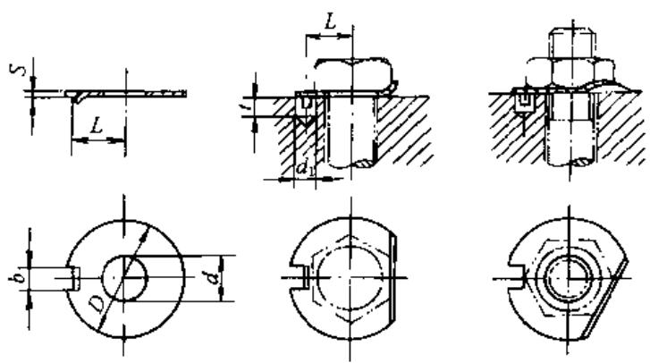

标记示例:

规格为I0mm、材料为Q235、经退火、不经表面处理的外舌止动垫圈:垫圈CB/T85610

表4-1-153

/mm 

<table><tr><td rowspan=1 colspan=1>规格（螺纹大径）</td><td rowspan=1 colspan=1>dmn</td><td rowspan=1 colspan=1>Dmax</td><td rowspan=1 colspan=1>bmx</td><td rowspan=1 colspan=1>L公称</td><td rowspan=1 colspan=1>s</td><td rowspan=1 colspan=1>山</td><td rowspan=1 colspan=1>【</td><td rowspan=1 colspan=1>每1000个的重量=/kg</td></tr><tr><td rowspan=1 colspan=1>2.5</td><td rowspan=1 colspan=1>2.7</td><td rowspan=1 colspan=1>10</td><td rowspan=1 colspan=1>2</td><td rowspan=1 colspan=1>3.5</td><td rowspan=3 colspan=1>0.4</td><td rowspan=1 colspan=1>2.5</td><td rowspan=3 colspan=1>3</td><td rowspan=1 colspan=1>0.21</td></tr><tr><td rowspan=1 colspan=1>3</td><td rowspan=1 colspan=1>3.2</td><td rowspan=1 colspan=1>12</td><td rowspan=1 colspan=1>2.5</td><td rowspan=1 colspan=1>4.5</td><td rowspan=2 colspan=1>3</td><td rowspan=1 colspan=1>0.3</td></tr><tr><td rowspan=1 colspan=1>4</td><td rowspan=1 colspan=1>4.2</td><td rowspan=1 colspan=1>14</td><td rowspan=1 colspan=1>2.5</td><td rowspan=1 colspan=1>5.5</td><td rowspan=1 colspan=1>0.41</td></tr><tr><td rowspan=1 colspan=1>5</td><td rowspan=1 colspan=1>5.3</td><td rowspan=1 colspan=1>17</td><td rowspan=1 colspan=1>3.5</td><td rowspan=1 colspan=1>7</td><td rowspan=3 colspan=1>0.5</td><td rowspan=3 colspan=1>4</td><td rowspan=3 colspan=1>4</td><td rowspan=1 colspan=1>0.75</td></tr><tr><td rowspan=1 colspan=1>6</td><td rowspan=1 colspan=1>6.4</td><td rowspan=1 colspan=1>19</td><td rowspan=1 colspan=1>3.5</td><td rowspan=1 colspan=1>7.5</td><td rowspan=1 colspan=1>0.92</td></tr><tr><td rowspan=1 colspan=1>8</td><td rowspan=1 colspan=1>8.4</td><td rowspan=1 colspan=1>22</td><td rowspan=1 colspan=1>3.5</td><td rowspan=1 colspan=1>8.5</td><td rowspan=1 colspan=1>1.2</td></tr><tr><td rowspan=1 colspan=1>10</td><td rowspan=1 colspan=1>10.5</td><td rowspan=1 colspan=1>26</td><td rowspan=1 colspan=1>4.5</td><td rowspan=1 colspan=1>10</td><td rowspan=1 colspan=1></td><td rowspan=1 colspan=1></td><td rowspan=1 colspan=1>S</td><td rowspan=1 colspan=1>1.65</td></tr><tr><td rowspan=1 colspan=1>12</td><td rowspan=1 colspan=1>13</td><td rowspan=1 colspan=1>32</td><td rowspan=1 colspan=1>4.5</td><td rowspan=1 colspan=1>12</td><td rowspan=2 colspan=1></td><td rowspan=2 colspan=1>5</td><td rowspan=2 colspan=1>6</td><td rowspan=1 colspan=1>5</td></tr><tr><td rowspan=1 colspan=1>(14)</td><td rowspan=1 colspan=1>15</td><td rowspan=1 colspan=1>32</td><td rowspan=1 colspan=1>4.5</td><td rowspan=1 colspan=1>12</td><td rowspan=1 colspan=1>4.65</td></tr><tr><td rowspan=1 colspan=1>16</td><td rowspan=1 colspan=1>17</td><td rowspan=1 colspan=1>40</td><td rowspan=1 colspan=1>5.5</td><td rowspan=1 colspan=1>15</td><td rowspan=5 colspan=1>1</td><td rowspan=1 colspan=1>6</td><td rowspan=1 colspan=1></td><td rowspan=1 colspan=1>7.73</td></tr><tr><td rowspan=1 colspan=1>(18）</td><td rowspan=1 colspan=1>19</td><td rowspan=1 colspan=1>45</td><td rowspan=1 colspan=1>6</td><td rowspan=1 colspan=1>18</td><td rowspan=2 colspan=1>7</td><td rowspan=4 colspan=1>7</td><td rowspan=3 colspan=1>9.859.3611.7</td></tr><tr><td rowspan=1 colspan=1>20</td><td rowspan=1 colspan=1>21</td><td rowspan=1 colspan=1>45</td><td rowspan=1 colspan=1>6</td><td rowspan=1 colspan=1>18</td></tr><tr><td rowspan=1 colspan=1>(22）</td><td rowspan=1 colspan=1>23</td><td rowspan=1 colspan=1>50</td><td rowspan=1 colspan=1>7</td><td rowspan=1 colspan=1>20</td><td rowspan=2 colspan=1>8</td></tr><tr><td rowspan=1 colspan=1>24</td><td rowspan=1 colspan=1>25</td><td rowspan=1 colspan=1>50</td><td rowspan=1 colspan=1>7</td><td rowspan=1 colspan=1>20</td><td rowspan=1 colspan=1>11.11</td></tr><tr><td rowspan=1 colspan=1>(27)</td><td rowspan=1 colspan=1>28</td><td rowspan=1 colspan=1>58</td><td rowspan=1 colspan=1>8</td><td rowspan=1 colspan=1>23</td><td rowspan=5 colspan=1>1.5</td><td rowspan=2 colspan=1>9</td><td rowspan=2 colspan=1>10</td><td rowspan=1 colspan=1>22.92</td></tr><tr><td rowspan=1 colspan=1>30</td><td rowspan=1 colspan=1>31</td><td rowspan=1 colspan=1>63</td><td rowspan=1 colspan=1>8</td><td rowspan=1 colspan=1>25</td><td rowspan=1 colspan=1>26.79</td></tr><tr><td rowspan=1 colspan=1>36</td><td rowspan=1 colspan=1>37</td><td rowspan=1 colspan=1>75</td><td rowspan=1 colspan=1>11</td><td rowspan=1 colspan=1>31</td><td rowspan=2 colspan=1>12</td><td rowspan=1 colspan=1></td><td rowspan=1 colspan=1>38.09</td></tr><tr><td rowspan=1 colspan=1>42</td><td rowspan=1 colspan=1>43</td><td rowspan=1 colspan=1>88</td><td rowspan=1 colspan=1>11</td><td rowspan=1 colspan=1>36</td><td rowspan=1 colspan=1>12</td><td rowspan=1 colspan=1>52.77</td></tr><tr><td rowspan=1 colspan=1>48</td><td rowspan=1 colspan=1>50</td><td rowspan=1 colspan=1>100</td><td rowspan=1 colspan=1>13</td><td rowspan=1 colspan=1>40</td><td rowspan=1 colspan=1>14</td><td rowspan=1 colspan=1>13</td><td rowspan=1 colspan=1>67.33</td></tr></table>

注:尽量不采用括号内的规格。

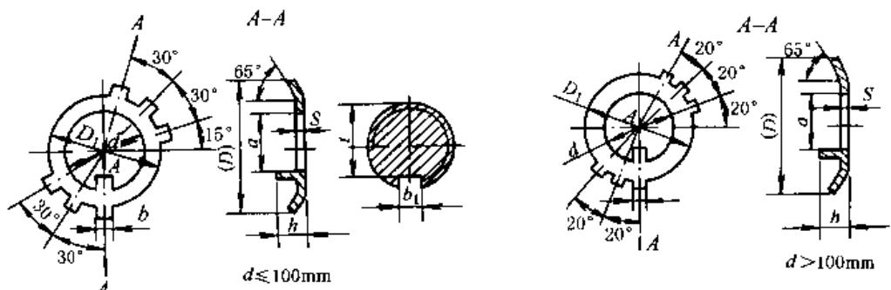

标记示例:

规格为 $\scriptstyle 1 6 = 1 0 \pmb { \operatorname { m } }$ 、材料为Q215、经退火、表面氧化的圆螺母用止动垫圈:垫圈GB/T85816

表4-1-154

<table><tr><td rowspan=2 colspan=1>规格（螺纹大径）</td><td rowspan=2 colspan=1>d</td><td rowspan=2 colspan=1>D（参考）</td><td rowspan=2 colspan=2>D</td><td rowspan=2 colspan=1>s</td><td rowspan=2 colspan=1>6</td><td rowspan=2 colspan=1>4</td><td rowspan=2 colspan=3>h</td><td rowspan=2 colspan=1>每1000个的重量=/kg</td><td rowspan=1 colspan=4>轴端</td><td rowspan=2 colspan=1>规格（螺纹大径）</td><td rowspan=2 colspan=1>d</td><td rowspan=2 colspan=1>D（参考）</td><td rowspan=2 colspan=1>D</td><td rowspan=2 colspan=2>s</td><td rowspan=2 colspan=1>b</td><td rowspan=2 colspan=1>a</td><td rowspan=2 colspan=3>h</td><td rowspan=2 colspan=1>每1000个的重量/g</td><td rowspan=1 colspan=4>轴端</td></tr><tr><td rowspan=1 colspan=3>b</td><td rowspan=1 colspan=1>t</td><td rowspan=1 colspan=3>b</td><td rowspan=1 colspan=1>：</td></tr><tr><td rowspan=1 colspan=1>10</td><td rowspan=1 colspan=1>10.5</td><td rowspan=1 colspan=1>25</td><td rowspan=1 colspan=2>16</td><td rowspan=1 colspan=1></td><td rowspan=1 colspan=1></td><td rowspan=1 colspan=1>8</td><td rowspan=1 colspan=3></td><td rowspan=1 colspan=1>1.91</td><td rowspan=1 colspan=3></td><td rowspan=1 colspan=1>7</td><td rowspan=1 colspan=1>64</td><td rowspan=1 colspan=1>65</td><td rowspan=5 colspan=1>100</td><td rowspan=5 colspan=1>84</td><td rowspan=5 colspan=2></td><td rowspan=5 colspan=1>7.7</td><td rowspan=1 colspan=1>61</td><td rowspan=1 colspan=3></td><td rowspan=1 colspan=1>31.55</td><td rowspan=1 colspan=3>8</td><td rowspan=1 colspan=1>60</td></tr><tr><td rowspan=4 colspan=1>12</td><td rowspan=4 colspan=1>12.5</td><td rowspan=4 colspan=1>28</td><td rowspan=4 colspan=2>19</td><td rowspan=4 colspan=1></td><td rowspan=4 colspan=1>3.8</td><td rowspan=4 colspan=1>9</td><td rowspan=4 colspan=2></td><td rowspan=1 colspan=1></td><td rowspan=4 colspan=1></td><td rowspan=4 colspan=4>2.3</td><td rowspan=4 colspan=1>4</td><td rowspan=4 colspan=1>4</td><td rowspan=4 colspan=1>8</td><td rowspan=4 colspan=1>65</td><td rowspan=4 colspan=2>6</td><td rowspan=4 colspan=1>62</td><td rowspan=4 colspan=2>6</td><td rowspan=1 colspan=2>6</td><td></td><td></td><td></td><td></td><td></td></tr><tr><td rowspan=3 colspan=1></td><td></td><td></td><td></td><td></td><td></td><td></td><td></td></tr><tr><td></td><td rowspan=2 colspan=1></td><td rowspan=2 colspan=1>30.35</td><td rowspan=2 colspan=3></td><td rowspan=2 colspan=1>二</td></tr><tr><td rowspan=1 colspan=2>3</td><td rowspan=1 colspan=2></td></tr><tr><td rowspan=2 colspan=1>14</td><td rowspan=2 colspan=1>14.5</td><td rowspan=2 colspan=1>32</td><td rowspan=2 colspan=2>20</td><td rowspan=2 colspan=1></td><td rowspan=2 colspan=1></td><td rowspan=2 colspan=1></td><td rowspan=2 colspan=3>11</td><td rowspan=2 colspan=1></td><td rowspan=1 colspan=3></td><td rowspan=2 colspan=1></td><td rowspan=2 colspan=1>2.5</td><td rowspan=2 colspan=1></td><td rowspan=2 colspan=1>10</td><td rowspan=2 colspan=1>68</td><td rowspan=2 colspan=2>69</td><td rowspan=2 colspan=1>105</td><td rowspan=2 colspan=3>88</td><td rowspan=2 colspan=1></td><td rowspan=2 colspan=1></td><td rowspan=2 colspan=3></td><td rowspan=2 colspan=1></td></tr><tr><td rowspan=1 colspan=2></td><td></td><td></td><td></td></tr><tr><td rowspan=2 colspan=1>16</td><td rowspan=2 colspan=1>16.5</td><td rowspan=2 colspan=1>34</td><td rowspan=2 colspan=2>22</td><td rowspan=2 colspan=1></td><td rowspan=2 colspan=1></td><td rowspan=2 colspan=1>13</td><td rowspan=2 colspan=3></td><td rowspan=2 colspan=1>2.99</td><td rowspan=2 colspan=3></td><td rowspan=2 colspan=1>12</td><td rowspan=2 colspan=1>72</td><td rowspan=2 colspan=1>73</td><td rowspan=4 colspan=1>110</td><td rowspan=4 colspan=1>93</td><td rowspan=4 colspan=2>1.5</td><td rowspan=4 colspan=1>9.6</td><td rowspan=2 colspan=1>69</td><td rowspan=2 colspan=3></td><td rowspan=2 colspan=1>37.9</td><td rowspan=2 colspan=2></td><td rowspan=1 colspan=1></td><td rowspan=2 colspan=1></td></tr><tr><td rowspan=1 colspan=2></td></tr><tr><td rowspan=2 colspan=1>18</td><td rowspan=2 colspan=1>18.5</td><td rowspan=2 colspan=1>35</td><td rowspan=2 colspan=2>24</td><td rowspan=2 colspan=1></td><td rowspan=2 colspan=1></td><td rowspan=2 colspan=1>15</td><td rowspan=2 colspan=3></td><td rowspan=2 colspan=1>3.04</td><td rowspan=2 colspan=2></td><td rowspan=1 colspan=1></td><td rowspan=2 colspan=1></td><td rowspan=2 colspan=1>14</td><td rowspan=2 colspan=1>75</td><td rowspan=2 colspan=1>76</td><td rowspan=2 colspan=1>71</td><td rowspan=1 colspan=3></td><td rowspan=2 colspan=1></td><td rowspan=2 colspan=1>33.9</td><td rowspan=2 colspan=2></td><td rowspan=1 colspan=2></td><td rowspan=1 colspan=1></td></tr><tr><td rowspan=1 colspan=2></td><td rowspan=1 colspan=2></td><td rowspan=1 colspan=2>10</td><td></td></tr><tr><td rowspan=2 colspan=1>20</td><td rowspan=2 colspan=1>20.5</td><td rowspan=2 colspan=1>38</td><td rowspan=2 colspan=2>27</td><td rowspan=2 colspan=1>1</td><td rowspan=2 colspan=1></td><td rowspan=2 colspan=1>17</td><td rowspan=2 colspan=2></td><td rowspan=1 colspan=1></td><td rowspan=2 colspan=1></td><td rowspan=2 colspan=4>3.5</td><td rowspan=2 colspan=1></td><td rowspan=1 colspan=1></td><td rowspan=2 colspan=1></td><td rowspan=2 colspan=1>16</td><td rowspan=2 colspan=2>76</td><td rowspan=2 colspan=1>77</td><td rowspan=2 colspan=3>115</td><td rowspan=2 colspan=1>98</td><td rowspan=2 colspan=1></td><td rowspan=2 colspan=3></td><td rowspan=2 colspan=1>72</td></tr><tr><td rowspan=1 colspan=2></td><td rowspan=1 colspan=2></td><td></td><td rowspan=1 colspan=2></td><td rowspan=1 colspan=2></td></tr><tr><td rowspan=2 colspan=1>2</td><td rowspan=2 colspan=1>22.5</td><td rowspan=2 colspan=1>42</td><td rowspan=2 colspan=2>30</td><td rowspan=2 colspan=1></td><td rowspan=2 colspan=1>4.8</td><td rowspan=2 colspan=1>19</td><td rowspan=2 colspan=2>4</td><td rowspan=1 colspan=1>4</td><td rowspan=2 colspan=1></td><td rowspan=2 colspan=4>4.14</td><td rowspan=2 colspan=1></td><td rowspan=1 colspan=1></td><td rowspan=2 colspan=1></td><td rowspan=2 colspan=1>18</td><td rowspan=2 colspan=2>80</td><td rowspan=2 colspan=1>81</td><td rowspan=2 colspan=3>120</td><td rowspan=2 colspan=1>103</td><td rowspan=4 colspan=1></td><td rowspan=4 colspan=3></td><td rowspan=2 colspan=1>76</td></tr><tr><td rowspan=1 colspan=2></td><td rowspan=1 colspan=2>5</td><td></td><td rowspan=1 colspan=2></td></tr><tr><td rowspan=2 colspan=1>24</td><td rowspan=2 colspan=1>24.5</td><td rowspan=2 colspan=1>45</td><td rowspan=2 colspan=2>34</td><td rowspan=2 colspan=1></td><td rowspan=2 colspan=1>4:0</td><td rowspan=2 colspan=1>21</td><td rowspan=2 colspan=2></td><td rowspan=1 colspan=1></td><td rowspan=2 colspan=1></td><td rowspan=2 colspan=4>5.01</td><td rowspan=2 colspan=1></td><td rowspan=1 colspan=1></td><td rowspan=2 colspan=1></td><td rowspan=2 colspan=1>20</td><td rowspan=2 colspan=2>85</td><td rowspan=2 colspan=1>86</td><td rowspan=2 colspan=3>125</td><td rowspan=2 colspan=1>108</td><td rowspan=2 colspan=1>81</td><td rowspan=2 colspan=2></td><td rowspan=2 colspan=1></td></tr><tr><td rowspan=1 colspan=2></td><td rowspan=1 colspan=2></td><td></td><td rowspan=1 colspan=2></td></tr><tr><td rowspan=2 colspan=1>25</td><td rowspan=2 colspan=1>25.5</td><td rowspan=2 colspan=1>45</td><td rowspan=2 colspan=2>34</td><td rowspan=2 colspan=1></td><td rowspan=2 colspan=1></td><td rowspan=2 colspan=1>22</td><td rowspan=2 colspan=3></td><td rowspan=2 colspan=1>4.7</td><td rowspan=2 colspan=2></td><td rowspan=1 colspan=1></td><td rowspan=2 colspan=1></td><td rowspan=2 colspan=1>/</td><td rowspan=2 colspan=1>90</td><td rowspan=2 colspan=1>91</td><td rowspan=2 colspan=1>130</td><td rowspan=2 colspan=2>112</td><td rowspan=2 colspan=1></td><td rowspan=2 colspan=1></td><td rowspan=2 colspan=3>86</td><td rowspan=2 colspan=1></td><td rowspan=1 colspan=2></td><td rowspan=2 colspan=1></td><td rowspan=2 colspan=1>64.82</td></tr><tr><td rowspan=1 colspan=2></td><td rowspan=1 colspan=2></td><td></td><td></td></tr><tr><td rowspan=2 colspan=1>27</td><td rowspan=2 colspan=1>27.5</td><td rowspan=2 colspan=1>48</td><td rowspan=2 colspan=2>37</td><td rowspan=2 colspan=1></td><td rowspan=2 colspan=1></td><td rowspan=2 colspan=1>24</td><td rowspan=2 colspan=3></td><td rowspan=2 colspan=1>5.4</td><td rowspan=2 colspan=2></td><td rowspan=2 colspan=1></td><td rowspan=2 colspan=1>23</td><td rowspan=2 colspan=1>95</td><td rowspan=2 colspan=1>%</td><td rowspan=2 colspan=1>135</td><td rowspan=2 colspan=1>117</td><td rowspan=2 colspan=2></td><td rowspan=2 colspan=1></td><td rowspan=2 colspan=1>91</td><td rowspan=2 colspan=2></td><td rowspan=1 colspan=1></td><td rowspan=2 colspan=1></td><td rowspan=2 colspan=4>67.4</td></tr><tr><td rowspan=1 colspan=2></td><td rowspan=1 colspan=2></td><td rowspan=1 colspan=2>12</td></tr><tr><td rowspan=2 colspan=1>30</td><td rowspan=2 colspan=1>30.5</td><td rowspan=2 colspan=1>52</td><td rowspan=2 colspan=2>40</td><td rowspan=2 colspan=1></td><td rowspan=2 colspan=1></td><td rowspan=2 colspan=1>27</td><td rowspan=2 colspan=2></td><td rowspan=1 colspan=1></td><td rowspan=2 colspan=1></td><td rowspan=2 colspan=4>5.87</td><td rowspan=2 colspan=1></td><td rowspan=2 colspan=1>26</td><td rowspan=2 colspan=1>100</td><td rowspan=2 colspan=1>101</td><td rowspan=2 colspan=2>140</td><td rowspan=2 colspan=1>122</td><td rowspan=2 colspan=1></td><td rowspan=2 colspan=3>11.0</td><td rowspan=2 colspan=1>96</td><td rowspan=2 colspan=2></td><td rowspan=1 colspan=1></td><td rowspan=2 colspan=1></td></tr><tr><td rowspan=1 colspan=3></td><td rowspan=1 colspan=2>7</td><td rowspan=1 colspan=2></td></tr><tr><td rowspan=2 colspan=1>33</td><td rowspan=2 colspan=1>33.5</td><td rowspan=2 colspan=1>56</td><td rowspan=2 colspan=2>43</td><td rowspan=2 colspan=1></td><td rowspan=2 colspan=1></td><td rowspan=2 colspan=1>30</td><td rowspan=2 colspan=2></td><td rowspan=1 colspan=1></td><td rowspan=2 colspan=1></td><td rowspan=2 colspan=4>10.01</td><td rowspan=2 colspan=1></td><td rowspan=2 colspan=1>29</td><td rowspan=2 colspan=1>105</td><td rowspan=2 colspan=1>106</td><td rowspan=2 colspan=2>145</td><td rowspan=2 colspan=1>127</td><td rowspan=1 colspan=2></td><td rowspan=2 colspan=2></td><td rowspan=2 colspan=1></td><td rowspan=2 colspan=3>101</td><td rowspan=2 colspan=1></td></tr><tr><td></td><td></td><td rowspan=1 colspan=3></td></tr><tr><td rowspan=2 colspan=1>35</td><td rowspan=2 colspan=1>35.5</td><td rowspan=2 colspan=1>56</td><td rowspan=2 colspan=2>43</td><td rowspan=2 colspan=1></td><td rowspan=2 colspan=1></td><td rowspan=2 colspan=1>32</td><td rowspan=2 colspan=2></td><td rowspan=1 colspan=1></td><td rowspan=2 colspan=1></td><td rowspan=2 colspan=4>8.75</td><td rowspan=2 colspan=1></td><td rowspan=1 colspan=1></td><td rowspan=2 colspan=1></td><td rowspan=2 colspan=1></td><td rowspan=2 colspan=2>110</td><td rowspan=2 colspan=1>111</td><td rowspan=2 colspan=3>156</td><td rowspan=2 colspan=1>135</td><td rowspan=2 colspan=1>2</td><td rowspan=2 colspan=3>2</td><td rowspan=2 colspan=1></td></tr><tr><td rowspan=1 colspan=3></td><td rowspan=1 colspan=2></td><td></td></tr><tr><td rowspan=2 colspan=1>36</td><td rowspan=2 colspan=1>36.5</td><td rowspan=2 colspan=1>60</td><td rowspan=2 colspan=2>46</td><td rowspan=2 colspan=1></td><td rowspan=2 colspan=1></td><td rowspan=2 colspan=1>33</td><td rowspan=2 colspan=2>5</td><td rowspan=1 colspan=1>5</td><td rowspan=2 colspan=1></td><td rowspan=2 colspan=4>10.76</td><td rowspan=2 colspan=1></td><td rowspan=1 colspan=1></td><td rowspan=2 colspan=1></td><td rowspan=2 colspan=1>32</td><td rowspan=2 colspan=2>115</td><td rowspan=2 colspan=1>116</td><td rowspan=2 colspan=3>160</td><td rowspan=2 colspan=1>140</td><td rowspan=2 colspan=1></td><td rowspan=2 colspan=3></td><td rowspan=2 colspan=1>111</td></tr><tr><td rowspan=1 colspan=2></td><td rowspan=1 colspan=2></td><td></td><td rowspan=1 colspan=2></td></tr><tr><td rowspan=2 colspan=1>39</td><td rowspan=2 colspan=1>39.5</td><td rowspan=2 colspan=1>62</td><td rowspan=2 colspan=2>49</td><td rowspan=2 colspan=1></td><td rowspan=2 colspan=1>5.7</td><td rowspan=2 colspan=1>36</td><td rowspan=2 colspan=2></td><td rowspan=1 colspan=1></td><td rowspan=2 colspan=1></td><td rowspan=2 colspan=4>11.06</td><td rowspan=2 colspan=1>6</td><td rowspan=1 colspan=1>6</td><td rowspan=2 colspan=1></td><td rowspan=2 colspan=1>35</td><td rowspan=2 colspan=2>120</td><td rowspan=2 colspan=1>121</td><td rowspan=2 colspan=3>166</td><td rowspan=2 colspan=1>145</td><td rowspan=2 colspan=1></td><td rowspan=2 colspan=3>13.5</td><td rowspan=2 colspan=1>116</td></tr><tr><td rowspan=1 colspan=3></td><td rowspan=1 colspan=2></td><td></td><td rowspan=1 colspan=2></td></tr><tr><td rowspan=2 colspan=1>40</td><td rowspan=2 colspan=1>40.5</td><td rowspan=2 colspan=1>62</td><td rowspan=2 colspan=2>49</td><td rowspan=2 colspan=1></td><td rowspan=2 colspan=1></td><td rowspan=2 colspan=1>37</td><td rowspan=2 colspan=2></td><td rowspan=1 colspan=1></td><td rowspan=2 colspan=1></td><td rowspan=2 colspan=4>10.33</td><td rowspan=2 colspan=1></td><td rowspan=2 colspan=1></td><td rowspan=2 colspan=1></td><td rowspan=2 colspan=1>125</td><td rowspan=2 colspan=2>126</td><td rowspan=2 colspan=1>170</td><td rowspan=2 colspan=3>150</td><td rowspan=2 colspan=1></td><td rowspan=2 colspan=1></td><td rowspan=2 colspan=3>121</td><td rowspan=2 colspan=1></td></tr><tr><td rowspan=1 colspan=2></td><td rowspan=1 colspan=2></td></tr><tr><td rowspan=2 colspan=1>42</td><td rowspan=2 colspan=1>42.5</td><td rowspan=2 colspan=1>66</td><td rowspan=2 colspan=2>53</td><td rowspan=2 colspan=1></td><td rowspan=2 colspan=1></td><td rowspan=2 colspan=1>39</td><td rowspan=2 colspan=2></td><td rowspan=1 colspan=1></td><td rowspan=2 colspan=1></td><td rowspan=2 colspan=4>12.55</td><td rowspan=2 colspan=1></td><td rowspan=2 colspan=1></td><td rowspan=2 colspan=1>38</td><td rowspan=2 colspan=1>130</td><td rowspan=2 colspan=2>131</td><td rowspan=2 colspan=1>176</td><td rowspan=2 colspan=3>155</td><td rowspan=2 colspan=1></td><td rowspan=2 colspan=1></td><td rowspan=2 colspan=3>126</td><td rowspan=2 colspan=1></td></tr><tr><td rowspan=1 colspan=3></td><td rowspan=1 colspan=2></td><td rowspan=1 colspan=2></td></tr><tr><td rowspan=2 colspan=1>45</td><td rowspan=2 colspan=1>45.5</td><td rowspan=2 colspan=1>72</td><td rowspan=2 colspan=2>59</td><td rowspan=2 colspan=1>1.5</td><td rowspan=2 colspan=1>1.5</td><td rowspan=2 colspan=1></td><td rowspan=2 colspan=3>42</td><td rowspan=2 colspan=1></td><td rowspan=2 colspan=4>16.3</td><td rowspan=2 colspan=1></td><td rowspan=2 colspan=1>41</td><td rowspan=2 colspan=1>140</td><td rowspan=2 colspan=1>141</td><td rowspan=2 colspan=2>186</td><td rowspan=2 colspan=1>165</td><td rowspan=2 colspan=1></td><td rowspan=2 colspan=3></td><td rowspan=2 colspan=1>136</td><td rowspan=2 colspan=2></td><td rowspan=1 colspan=1></td><td rowspan=2 colspan=1></td></tr><tr><td rowspan=1 colspan=3></td><td></td></tr><tr><td rowspan=1 colspan=1>48</td><td rowspan=1 colspan=1>48.5</td><td rowspan=1 colspan=1>76</td><td rowspan=3 colspan=2>61</td><td rowspan=3 colspan=1></td><td rowspan=3 colspan=1></td><td rowspan=1 colspan=1>45</td><td rowspan=1 colspan=3></td><td rowspan=1 colspan=1>17.68</td><td rowspan=1 colspan=3></td><td rowspan=1 colspan=1>44</td><td rowspan=1 colspan=1>150</td><td rowspan=1 colspan=1>151</td><td rowspan=1 colspan=1>206</td><td rowspan=1 colspan=1>180</td><td rowspan=1 colspan=2></td><td rowspan=1 colspan=1></td><td rowspan=1 colspan=1>146</td><td rowspan=1 colspan=3>146</td><td rowspan=1 colspan=1></td><td rowspan=1 colspan=4>175.9</td></tr><tr><td rowspan=2 colspan=1>50</td><td rowspan=2 colspan=1>50.5</td><td rowspan=2 colspan=1>76</td><td rowspan=2 colspan=1>47</td><td rowspan=1 colspan=3></td><td rowspan=2 colspan=1></td><td rowspan=2 colspan=1>15.86</td><td rowspan=2 colspan=2></td><td rowspan=1 colspan=2></td><td rowspan=2 colspan=1></td><td rowspan=2 colspan=1></td><td rowspan=2 colspan=1>160</td><td rowspan=2 colspan=1>161</td><td rowspan=2 colspan=1>216</td><td rowspan=2 colspan=2>190</td><td rowspan=2 colspan=1></td><td rowspan=2 colspan=1></td><td rowspan=2 colspan=3>156</td><td rowspan=2 colspan=1></td><td rowspan=2 colspan=4>185.1</td></tr><tr><td rowspan=1 colspan=2></td><td rowspan=1 colspan=2></td><td rowspan=1 colspan=2></td></tr><tr><td rowspan=2 colspan=1>52</td><td rowspan=2 colspan=1>52.5</td><td rowspan=4 colspan=1>82</td><td rowspan=4 colspan=2>67</td><td rowspan=4 colspan=1></td><td rowspan=4 colspan=1>7.7</td><td rowspan=4 colspan=1>4952</td><td rowspan=4 colspan=3>6</td><td rowspan=2 colspan=1>6</td><td rowspan=2 colspan=4>21.12</td><td rowspan=2 colspan=1></td><td rowspan=1 colspan=1></td><td rowspan=2 colspan=1></td><td rowspan=2 colspan=1>48</td><td rowspan=2 colspan=2>170</td><td rowspan=2 colspan=1>171</td><td rowspan=2 colspan=3>226</td><td rowspan=2 colspan=1>200</td><td rowspan=4 colspan=1>2.5</td><td rowspan=4 colspan=3>15.5</td><td rowspan=2 colspan=1>166</td></tr><tr><td rowspan=1 colspan=2>8</td><td></td><td rowspan=1 colspan=2>16</td></tr><tr><td rowspan=2 colspan=1>55</td><td rowspan=2 colspan=1>56</td><td rowspan=2 colspan=2></td><td rowspan=2 colspan=1>17.67</td><td rowspan=2 colspan=2></td><td rowspan=1 colspan=2>8</td><td rowspan=2 colspan=1></td><td rowspan=2 colspan=1></td><td rowspan=2 colspan=1>180</td><td rowspan=2 colspan=1>181</td><td rowspan=2 colspan=1>236</td><td rowspan=2 colspan=1>210</td><td></td><td></td><td></td><td rowspan=2 colspan=1>176</td><td rowspan=2 colspan=2>8</td><td rowspan=2 colspan=1></td><td rowspan=2 colspan=1>202.9</td><td rowspan=2 colspan=2></td><td rowspan=1 colspan=2></td><td rowspan=2 colspan=1></td><td rowspan=2 colspan=1>169</td></tr><tr><td rowspan=1 colspan=2></td><td></td><td></td><td></td><td rowspan=1 colspan=2></td><td rowspan=1 colspan=2></td></tr><tr><td rowspan=2 colspan=1>56</td><td rowspan=2 colspan=1>57</td><td rowspan=2 colspan=1>90</td><td rowspan=2 colspan=2>74</td><td rowspan=2 colspan=1></td><td rowspan=2 colspan=1></td><td rowspan=2 colspan=1>53</td><td rowspan=2 colspan=2></td><td rowspan=1 colspan=1></td><td rowspan=2 colspan=1></td><td rowspan=2 colspan=4>26</td><td rowspan=2 colspan=1></td><td rowspan=1 colspan=1></td><td rowspan=2 colspan=1></td><td rowspan=2 colspan=1>52</td><td rowspan=2 colspan=2>190</td><td rowspan=2 colspan=1>191</td><td rowspan=2 colspan=3>246</td><td rowspan=2 colspan=1>220</td><td rowspan=2 colspan=1></td><td rowspan=2 colspan=3></td><td rowspan=2 colspan=1>186</td></tr><tr><td rowspan=1 colspan=3></td><td rowspan=1 colspan=2></td><td></td><td rowspan=1 colspan=2></td></tr><tr><td rowspan=1 colspan=1>6</td><td rowspan=1 colspan=1>61</td><td rowspan=1 colspan=1>94</td><td rowspan=1 colspan=2>79</td><td rowspan=1 colspan=1></td><td rowspan=1 colspan=1></td><td rowspan=1 colspan=1>57</td><td rowspan=1 colspan=3></td><td rowspan=1 colspan=1>28.4</td><td rowspan=1 colspan=3></td><td rowspan=1 colspan=1>56</td><td rowspan=1 colspan=1>200</td><td rowspan=1 colspan=1>201</td><td rowspan=1 colspan=1>256</td><td rowspan=1 colspan=1>230</td><td rowspan=1 colspan=2></td><td rowspan=1 colspan=1></td><td rowspan=1 colspan=1>196</td><td rowspan=1 colspan=3></td><td></td><td rowspan=1 colspan=4>220.6</td></tr></table>

/mm 

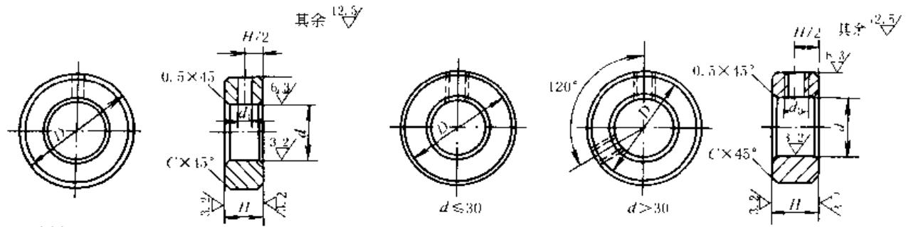

标记示例:

公称直径 $a = 2 0 \mathsf { m m }$ 、材料为Q215、不经衣面处理的锥销锁紧挡圈:挡圈CB/T88320

表4-1-155

<table><tr><td rowspan=1 colspan=3>公称直径d</td><td rowspan=1 colspan=5>H</td><td rowspan=1 colspan=1></td><td rowspan=1 colspan=4>CB/T 883</td><td rowspan=1 colspan=5>CR/T884</td></tr><tr><td rowspan=1 colspan=1>基本尺寸</td><td rowspan=1 colspan=2>极限偏差</td><td rowspan=1 colspan=1>基本尺寸</td><td rowspan=1 colspan=4>极限偏差</td><td rowspan=1 colspan=1>D</td><td rowspan=1 colspan=1>d一</td><td rowspan=1 colspan=1>C</td><td rowspan=1 colspan=1>圆锥销GB/T117（推荐）</td><td rowspan=1 colspan=1>每1000个的重量/kg</td><td rowspan=1 colspan=1>山1</td><td rowspan=1 colspan=1>C</td><td rowspan=1 colspan=2>螺钉CB/T71（推荐）</td><td rowspan=1 colspan=1>每1000个的重量=/kg</td></tr><tr><td rowspan=1 colspan=1>8</td><td rowspan=1 colspan=2></td><td rowspan=1 colspan=1>10</td><td rowspan=1 colspan=4></td><td rowspan=1 colspan=1>20</td><td rowspan=5 colspan=1>3</td><td rowspan=6 colspan=1>0.5</td><td rowspan=3 colspan=1>3× 22</td><td rowspan=1 colspan=1>20.25</td><td rowspan=1 colspan=1></td><td rowspan=3 colspan=1>0.5</td><td rowspan=3 colspan=2>1M5 x 8</td><td rowspan=1 colspan=1>19.85</td></tr><tr><td rowspan=1 colspan=1>（9）</td><td rowspan=2 colspan=2>+ 0.0360</td><td rowspan=1 colspan=1>10</td><td rowspan=2 colspan=4>00.36</td><td rowspan=2 colspan=1>22</td><td rowspan=2 colspan=1>24.3323.19</td><td rowspan=2 colspan=1>M5</td><td rowspan=1 colspan=1>23.89</td></tr><tr><td rowspan=1 colspan=1>10</td><td rowspan=1 colspan=1>10</td><td rowspan=1 colspan=1>22.79</td></tr><tr><td rowspan=1 colspan=1>12</td><td rowspan=1 colspan=2></td><td rowspan=1 colspan=1>10</td><td rowspan=2 colspan=4></td><td rowspan=2 colspan=1>25</td><td rowspan=2 colspan=1>3 × 25</td><td rowspan=2 colspan=1>29.1127.6</td><td rowspan=2 colspan=1></td><td rowspan=2 colspan=1></td><td rowspan=2 colspan=2></td><td rowspan=1 colspan=1>28.67</td></tr><tr><td rowspan=1 colspan=1>(13)</td><td rowspan=3 colspan=2>+ 0.0430</td><td rowspan=1 colspan=1>10</td><td rowspan=1 colspan=1>27.2</td></tr><tr><td rowspan=1 colspan=1>14</td><td rowspan=1 colspan=1>12</td><td rowspan=1 colspan=4></td><td rowspan=1 colspan=1>28</td><td rowspan=8 colspan=1>4</td><td rowspan=8 colspan=1>0.5</td><td rowspan=1 colspan=1>4×28</td><td rowspan=1 colspan=1>42.54</td><td rowspan=10 colspan=1>！M6</td><td rowspan=10 colspan=1>1</td><td rowspan=6 colspan=2>M6x10</td><td rowspan=1 colspan=1>42</td></tr><tr><td rowspan=1 colspan=1>(15)</td><td rowspan=1 colspan=1>12</td><td rowspan=3 colspan=4></td><td rowspan=3 colspan=1>30</td><td rowspan=5 colspan=1>4×32</td><td rowspan=1 colspan=1>48.89</td><td rowspan=1 colspan=1>48.31</td></tr><tr><td rowspan=2 colspan=1>16</td><td rowspan=2 colspan=2></td><td rowspan=2 colspan=1>12</td><td rowspan=2 colspan=1>46.66</td><td rowspan=2 colspan=1>46.12</td></tr><tr><td rowspan=1 colspan=1></td></tr><tr><td rowspan=1 colspan=1>（17）</td><td rowspan=1 colspan=2></td><td rowspan=1 colspan=1>12</td><td rowspan=2 colspan=4></td><td rowspan=2 colspan=1>32</td><td rowspan=1 colspan=1>53.3</td><td rowspan=1 colspan=1>52.72</td></tr><tr><td rowspan=1 colspan=1>18</td><td rowspan=1 colspan=2></td><td rowspan=1 colspan=1>12</td><td rowspan=1 colspan=1>50.77</td><td rowspan=1 colspan=1>50.23</td></tr><tr><td rowspan=1 colspan=1>(19)</td><td rowspan=1 colspan=2></td><td rowspan=1 colspan=1>12</td><td rowspan=2 colspan=4></td><td rowspan=2 colspan=1>35</td><td rowspan=2 colspan=1>4×35</td><td rowspan=1 colspan=1>62.73</td><td rowspan=4 colspan=2></td><td rowspan=1 colspan=1>62.11</td></tr><tr><td rowspan=1 colspan=1>20</td><td rowspan=1 colspan=2></td><td rowspan=1 colspan=1>12：</td><td rowspan=1 colspan=1>59.91</td><td rowspan=1 colspan=1>5933</td></tr><tr><td rowspan=2 colspan=1>22</td><td rowspan=2 colspan=1>+ 0.052</td><td rowspan=2 colspan=2>+ 0.052</td><td rowspan=2 colspan=4>12</td><td rowspan=2 colspan=1>0-0.43</td><td rowspan=2 colspan=1>0-0.43</td><td rowspan=2 colspan=1>38</td><td rowspan=4 colspan=1>5</td><td rowspan=4 colspan=1></td><td rowspan=2 colspan=2>5×40</td><td rowspan=2 colspan=1>69.35</td><td rowspan=2 colspan=1>69.17</td></tr><tr><td rowspan=1 colspan=3>-0.43</td></tr><tr><td rowspan=1 colspan=1>25</td><td rowspan=1 colspan=1>0</td><td rowspan=1 colspan=2>0</td><td rowspan=1 colspan=4>14</td><td rowspan=1 colspan=1></td><td rowspan=1 colspan=1>42</td><td></td><td rowspan=2 colspan=1>5×45</td><td rowspan=1 colspan=1>96.39</td><td rowspan=4 colspan=1>M8</td><td rowspan=4 colspan=1></td><td rowspan=4 colspan=2>M8 × 12</td><td rowspan=1 colspan=1>95</td></tr><tr><td rowspan=1 colspan=1>28</td><td rowspan=1 colspan=2></td><td rowspan=1 colspan=1>14</td><td rowspan=1 colspan=4></td><td rowspan=1 colspan=1>45</td><td></td><td></td><td rowspan=1 colspan=1>105.1</td><td rowspan=2 colspan=1>103.7117.6</td></tr><tr><td rowspan=1 colspan=1>30</td><td rowspan=1 colspan=2></td><td rowspan=1 colspan=1>14</td><td rowspan=1 colspan=4></td><td rowspan=1 colspan=1>48</td><td rowspan=5 colspan=1>6</td><td rowspan=5 colspan=1>1</td><td rowspan=1 colspan=1>1</td><td rowspan=1 colspan=2>6×50</td><td rowspan=1 colspan=1>118.4</td></tr><tr><td rowspan=1 colspan=1>32</td><td rowspan=1 colspan=2></td><td rowspan=1 colspan=1>14</td><td rowspan=1 colspan=4></td><td rowspan=1 colspan=1>52</td><td rowspan=2 colspan=1>6×55</td><td rowspan=1 colspan=1>141.9</td><td rowspan=1 colspan=1>137.8</td></tr><tr><td rowspan=1 colspan=1>35</td><td rowspan=1 colspan=2>+ 0.062</td><td rowspan=1 colspan=1>16</td><td rowspan=1 colspan=4></td><td rowspan=1 colspan=1>56</td><td rowspan=1 colspan=1>185</td><td rowspan=3 colspan=1>M10</td><td rowspan=3 colspan=1></td><td rowspan=3 colspan=2>M10 × 16</td><td rowspan=1 colspan=1>176.8</td></tr><tr><td rowspan=1 colspan=1>40</td><td rowspan=1 colspan=2>0</td><td rowspan=1 colspan=1>16</td><td rowspan=1 colspan=4></td><td rowspan=1 colspan=1>62</td><td rowspan=1 colspan=1>6× 60</td><td rowspan=1 colspan=1>217.5</td><td rowspan=1 colspan=1>209</td></tr><tr><td rowspan=1 colspan=1>45</td><td rowspan=1 colspan=2></td><td rowspan=1 colspan=1>18</td><td rowspan=1 colspan=4></td><td rowspan=1 colspan=1>70</td><td rowspan=1 colspan=1>6×70</td><td rowspan=1 colspan=1>314.3</td><td rowspan=1 colspan=1>304.6</td></tr></table>

/mm 

<table><tr><td rowspan=1 colspan=4>公称直径d</td><td rowspan=1 colspan=6>H</td><td rowspan=1 colspan=1></td><td rowspan=1 colspan=5>CB/T 883</td><td rowspan=1 colspan=4>GB/T 884</td></tr><tr><td rowspan=1 colspan=1>基本尺寸</td><td rowspan=1 colspan=3>极限偏差</td><td rowspan=1 colspan=2>基本尺寸</td><td rowspan=1 colspan=4>极限偏差</td><td rowspan=1 colspan=1>B</td><td rowspan=1 colspan=1>d</td><td rowspan=1 colspan=2>C</td><td rowspan=1 colspan=1>圆锥销GB/T117（推荐）</td><td rowspan=1 colspan=1>每1000个的重量/kg</td><td rowspan=1 colspan=1>d</td><td rowspan=1 colspan=1>c</td><td rowspan=1 colspan=1>螺钉CB/T71（推荐）</td><td rowspan=1 colspan=1>每1000个的重量/kg</td></tr><tr><td rowspan=1 colspan=1>50</td><td rowspan=1 colspan=3>+0.0620</td><td rowspan=1 colspan=2>18</td><td rowspan=1 colspan=4>0</td><td rowspan=1 colspan=1>80</td><td rowspan=3 colspan=1>8</td><td rowspan=3 colspan=2></td><td rowspan=1 colspan=1>8×80</td><td rowspan=1 colspan=1>424.2</td><td rowspan=6 colspan=1>M10</td><td rowspan=6 colspan=1>1</td><td rowspan=6 colspan=1>M10 × 20</td><td rowspan=1 colspan=1>415.1</td></tr><tr><td rowspan=1 colspan=1>55</td><td rowspan=1 colspan=3></td><td rowspan=1 colspan=2>18</td><td rowspan=1 colspan=4>-0.43</td><td rowspan=1 colspan=1>85</td><td rowspan=2 colspan=1>8x90</td><td rowspan=1 colspan=1>457.3</td><td rowspan=1 colspan=1>448.2</td></tr><tr><td rowspan=1 colspan=1>60</td><td rowspan=1 colspan=3></td><td rowspan=1 colspan=2>20</td><td rowspan=1 colspan=4></td><td rowspan=1 colspan=1>90</td><td rowspan=1 colspan=1>545.5</td><td rowspan=1 colspan=1>536.4</td></tr><tr><td rowspan=1 colspan=1>65</td><td rowspan=1 colspan=3>+ 0.074</td><td rowspan=1 colspan=2>20</td><td rowspan=1 colspan=4></td><td rowspan=1 colspan=1>95</td><td rowspan=3 colspan=1></td><td rowspan=3 colspan=2>1</td><td rowspan=3 colspan=1>10 ×100</td><td rowspan=1 colspan=1>578.9</td><td rowspan=1 colspan=1>573.1</td></tr><tr><td rowspan=2 colspan=1>70</td><td rowspan=2 colspan=3>0</td><td rowspan=2 colspan=2>20</td><td rowspan=1 colspan=4></td><td rowspan=2 colspan=1></td><td rowspan=2 colspan=1>100</td><td rowspan=2 colspan=1>615.7</td><td rowspan=2 colspan=1>609.9</td></tr><tr><td rowspan=1 colspan=2></td><td></td><td></td><td></td><td></td></tr><tr><td rowspan=1 colspan=1>75</td><td rowspan=2 colspan=3></td><td></td><td></td><td rowspan=1 colspan=4>22</td><td rowspan=1 colspan=1></td><td rowspan=1 colspan=1></td><td rowspan=1 colspan=2>110</td><td rowspan=1 colspan=1></td><td rowspan=1 colspan=1></td><td rowspan=1 colspan=2>10× 110</td><td rowspan=1 colspan=1>861.9</td><td rowspan=6 colspan=1></td></tr><tr><td rowspan=1 colspan=1>80</td><td rowspan=1 colspan=2>22：</td><td></td><td rowspan=1 colspan=3></td><td rowspan=1 colspan=1>115</td><td rowspan=1 colspan=1></td><td rowspan=1 colspan=1></td><td rowspan=4 colspan=1>10 × 120</td><td rowspan=1 colspan=1>909.1</td><td></td><td></td><td></td><td rowspan=1 colspan=1>894.7</td></tr><tr><td></td><td></td><td></td><td></td><td rowspan=3 colspan=2>22</td><td rowspan=3 colspan=4></td><td></td><td></td><td></td><td></td><td></td><td></td></tr><tr><td></td><td></td><td></td><td></td><td></td><td rowspan=2 colspan=1>10</td><td></td><td></td><td></td><td></td></tr><tr><td rowspan=1 colspan=1>85</td><td rowspan=1 colspan=3></td><td rowspan=1 colspan=1>120</td><td rowspan=1 colspan=1>956.3</td><td></td><td></td><td></td><td rowspan=1 colspan=1>941.7</td></tr><tr><td rowspan=1 colspan=1>90</td><td rowspan=5 colspan=3>+ 0.0870</td><td rowspan=1 colspan=2>22</td><td></td><td rowspan=1 colspan=3></td><td rowspan=1 colspan=1>125</td><td rowspan=1 colspan=1></td><td rowspan=1 colspan=2></td><td rowspan=1 colspan=1></td><td rowspan=1 colspan=1>1004</td><td rowspan=1 colspan=1></td><td></td><td></td><td rowspan=1 colspan=1>988.9</td></tr><tr><td rowspan=1 colspan=1>95</td><td rowspan=1 colspan=2>25</td><td></td><td rowspan=1 colspan=3></td><td rowspan=1 colspan=1>130</td><td rowspan=1 colspan=1></td><td rowspan=1 colspan=2></td><td rowspan=1 colspan=1>10 × 130</td><td rowspan=1 colspan=1>1195</td><td rowspan=1 colspan=1></td><td rowspan=17 colspan=1>1.5</td><td></td><td rowspan=1 colspan=1>1181</td></tr><tr><td rowspan=1 colspan=1>100</td><td rowspan=1 colspan=2>25</td><td rowspan=1 colspan=4></td><td rowspan=1 colspan=1>135</td><td rowspan=2 colspan=1></td><td rowspan=2 colspan=2></td><td rowspan=2 colspan=1>10 × 140</td><td rowspan=1 colspan=1>1249</td><td></td><td rowspan=1 colspan=1>1234</td></tr><tr><td rowspan=1 colspan=1>105</td><td rowspan=1 colspan=2>25</td><td rowspan=1 colspan=4></td><td rowspan=1 colspan=1>140</td><td rowspan=1 colspan=1>1303</td><td></td><td rowspan=1 colspan=1>1288</td></tr><tr><td rowspan=1 colspan=1>110</td><td rowspan=1 colspan=2>30</td><td></td><td rowspan=4 colspan=3>0-0.52</td><td rowspan=1 colspan=1>150</td><td rowspan=2 colspan=1></td><td rowspan=2 colspan=2>1.5</td><td rowspan=2 colspan=1>12 × 150</td><td rowspan=1 colspan=1>1894</td><td></td><td rowspan=1 colspan=1>1882</td></tr><tr><td rowspan=1 colspan=1>115</td><td rowspan=1 colspan=3></td><td rowspan=1 colspan=2>30</td><td></td><td rowspan=1 colspan=1>155</td><td rowspan=1 colspan=1>1967</td><td></td><td rowspan=1 colspan=1>1956</td></tr><tr><td rowspan=1 colspan=1>120</td><td rowspan=1 colspan=3></td><td rowspan=1 colspan=2>30</td><td></td><td rowspan=1 colspan=1>160</td><td rowspan=3 colspan=1>12</td><td rowspan=3 colspan=2></td><td rowspan=2 colspan=1>12 × 160</td><td rowspan=1 colspan=1>2041</td><td></td><td rowspan=1 colspan=1>2030</td></tr><tr><td rowspan=1 colspan=1>(125)</td><td rowspan=1 colspan=3></td><td rowspan=1 colspan=2>30</td><td></td><td rowspan=1 colspan=1>165</td><td rowspan=1 colspan=1>2114</td><td></td><td rowspan=1 colspan=1>2103</td></tr><tr><td rowspan=1 colspan=1>130</td><td rowspan=2 colspan=3></td><td rowspan=1 colspan=2>30</td><td></td><td rowspan=1 colspan=3></td><td rowspan=1 colspan=1>170</td><td rowspan=1 colspan=1>12 × 180</td><td rowspan=1 colspan=1>2188</td><td></td><td rowspan=1 colspan=1>2177</td></tr><tr><td rowspan=1 colspan=1>(135)</td><td rowspan=1 colspan=2>30</td><td></td><td rowspan=1 colspan=3></td><td rowspan=1 colspan=1>175</td><td rowspan=9 colspan=1></td><td rowspan=9 colspan=2></td><td rowspan=3 colspan=1></td><td rowspan=1 colspan=1></td><td></td><td rowspan=1 colspan=1>2250</td></tr><tr><td rowspan=1 colspan=1>140</td><td rowspan=1 colspan=3></td><td rowspan=1 colspan=2>30</td><td></td><td rowspan=4 colspan=3></td><td rowspan=1 colspan=1>180</td><td rowspan=1 colspan=1></td><td></td><td rowspan=1 colspan=1>2324</td></tr><tr><td rowspan=1 colspan=1>(145）</td><td rowspan=1 colspan=3>+ 0.100</td><td rowspan=1 colspan=2>30</td><td></td><td rowspan=1 colspan=1>190</td><td rowspan=1 colspan=1></td><td rowspan=7 colspan=1>M12 × 30</td><td rowspan=1 colspan=1>2738</td></tr><tr><td rowspan=1 colspan=1>150</td><td rowspan=1 colspan=3></td><td rowspan=1 colspan=2>30</td><td></td><td rowspan=1 colspan=1>200</td><td rowspan=3 colspan=1></td><td rowspan=1 colspan=1></td><td rowspan=1 colspan=1>3180</td></tr><tr><td rowspan=1 colspan=1>160</td><td rowspan=1 colspan=3></td><td rowspan=1 colspan=2>30</td><td></td><td rowspan=1 colspan=1>210</td><td rowspan=1 colspan=1></td><td rowspan=1 colspan=1>3364</td></tr><tr><td rowspan=1 colspan=1>170</td><td rowspan=2 colspan=3></td><td rowspan=1 colspan=2>30</td><td></td><td rowspan=2 colspan=3></td><td rowspan=1 colspan=1>220</td><td rowspan=1 colspan=1></td><td rowspan=1 colspan=1>3548</td></tr><tr><td rowspan=1 colspan=1>180</td><td rowspan=1 colspan=2>30</td><td></td><td rowspan=1 colspan=1>230</td><td rowspan=3 colspan=1></td><td rowspan=1 colspan=1></td><td rowspan=1 colspan=1>3731</td></tr><tr><td rowspan=1 colspan=1>190</td><td rowspan=1 colspan=3>+ 0.115</td><td rowspan=1 colspan=2>30</td><td></td><td rowspan=1 colspan=3></td><td rowspan=1 colspan=1>240</td><td rowspan=1 colspan=1></td><td rowspan=1 colspan=1>3915</td></tr><tr><td rowspan=1 colspan=1>200</td><td rowspan=1 colspan=3>0</td><td rowspan=1 colspan=2>30</td><td></td><td rowspan=1 colspan=3></td><td rowspan=1 colspan=1>250</td><td rowspan=1 colspan=1></td><td rowspan=1 colspan=1>4099</td></tr></table>

注:1.锥销锁紧挡圈的di孔在加工时只钻一面,如图示,在装配时钻透并铰孔。2.标记示例中的材料为最常用的主要材料,其他技术条件按CB/T959.3规定。3.尽量不采用括号内的规格。

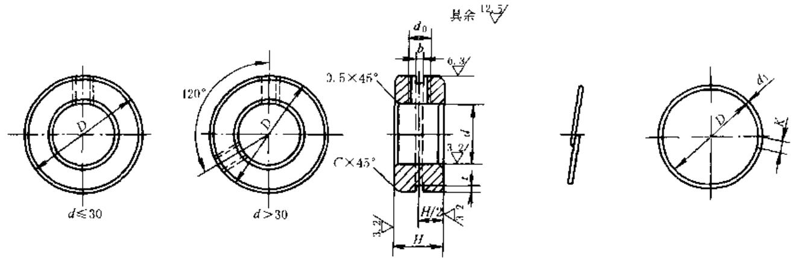

标记示例:

公称直径 $d = 2 0 \mathrm { m m }$ 、材料为Q215、不经表面处理的带锁圈的螺钉锁紧挡圈:

挡圈GB/T88520

表4-1-156

标记示例:

公称直径 $\Omega = 3 0 \mathrm { m m }$ 、材料为碳素弹簧钢丝、经低温回火及表面氧化处理的锁圈;

锁圈GB/T92130

/mm 

<table><tr><td rowspan=1 colspan=17>CB/T 885</td><td rowspan=1 colspan=4>CA/T 921</td></tr><tr><td rowspan=1 colspan=2>公称直径d</td><td rowspan=1 colspan=4>H</td><td rowspan=1 colspan=4>b</td><td rowspan=1 colspan=2>t</td><td rowspan=2 colspan=1>D</td><td rowspan=2 colspan=1>中</td><td rowspan=2 colspan=1>C</td><td rowspan=2 colspan=1>螺钉CB/T71（推荐）</td><td rowspan=2 colspan=1>每1000个的重量/kg</td><td rowspan=2 colspan=1>公称直径D</td><td rowspan=2 colspan=1>d</td><td rowspan=2 colspan=1>K</td><td rowspan=2 colspan=1>每1000个的重量/kg</td></tr><tr><td rowspan=1 colspan=1>基本尺寸</td><td rowspan=1 colspan=1>极限偏差</td><td rowspan=1 colspan=1>基本尺寸</td><td rowspan=1 colspan=3>极限偏差</td><td rowspan=1 colspan=1>基本尺寸</td><td rowspan=1 colspan=3>极限偏差</td><td rowspan=1 colspan=1>基本尺寸</td><td rowspan=1 colspan=1>极限偏差</td></tr><tr><td rowspan=1 colspan=1>8</td><td rowspan=3 colspan=1>+00360</td><td rowspan=1 colspan=1>10</td><td rowspan=1 colspan=3></td><td rowspan=1 colspan=1>1</td><td rowspan=1 colspan=3></td><td rowspan=1 colspan=1>1.8</td><td rowspan=1 colspan=1></td><td rowspan=1 colspan=1>20</td><td rowspan=5 colspan=1>M50.5</td><td rowspan=5 colspan=1>M50.5</td><td rowspan=5 colspan=1>M5×8</td><td rowspan=1 colspan=1>19</td><td rowspan=1 colspan=1>15</td><td rowspan=3 colspan=1>0.7</td><td rowspan=3 colspan=1>2</td><td rowspan=1 colspan=1>0.15</td></tr><tr><td rowspan=1 colspan=1>（9)</td><td rowspan=1 colspan=1>10</td><td rowspan=1 colspan=3></td><td rowspan=1 colspan=1>1</td><td rowspan=1 colspan=3></td><td rowspan=1 colspan=1>1.8</td><td rowspan=2 colspan=1>±0.18</td><td rowspan=2 colspan=1>22</td><td rowspan=2 colspan=1>2322</td><td rowspan=2 colspan=1>17</td><td rowspan=2 colspan=1>0.17</td></tr><tr><td rowspan=1 colspan=1>10</td><td rowspan=1 colspan=1>10</td><td rowspan=1 colspan=3>0-0.36</td><td rowspan=1 colspan=2>0-0.36</td><td rowspan=1 colspan=2>1</td><td rowspan=1 colspan=2></td><td rowspan=1 colspan=1>1.8</td></tr><tr><td rowspan=1 colspan=1>12</td><td rowspan=1 colspan=1></td><td rowspan=1 colspan=1>10</td><td rowspan=1 colspan=2></td><td rowspan=1 colspan=2></td><td rowspan=1 colspan=2>1</td><td rowspan=1 colspan=2></td><td rowspan=1 colspan=1>1.8</td><td rowspan=2 colspan=2></td><td rowspan=2 colspan=1>25</td><td rowspan=2 colspan=1>2826</td><td rowspan=2 colspan=1>20</td><td rowspan=2 colspan=1></td><td rowspan=2 colspan=1></td><td rowspan=2 colspan=1>0.2</td></tr><tr><td rowspan=1 colspan=1>(13)</td><td rowspan=1 colspan=1></td><td rowspan=1 colspan=1>10</td><td rowspan=1 colspan=3></td><td rowspan=1 colspan=1>i</td><td rowspan=1 colspan=3></td><td rowspan=1 colspan=1>1.8</td><td></td></tr><tr><td rowspan=1 colspan=1>14</td><td rowspan=1 colspan=1></td><td rowspan=1 colspan=1>12</td><td rowspan=3 colspan=3></td><td rowspan=1 colspan=1>1</td><td rowspan=1 colspan=3></td><td rowspan=1 colspan=1>2</td><td rowspan=3 colspan=1></td><td rowspan=1 colspan=1>28</td><td rowspan=8 colspan=1>M6</td><td rowspan=8 colspan=1>1</td><td rowspan=8 colspan=1>M6 x 10</td><td rowspan=1 colspan=1>41</td><td rowspan=1 colspan=1>23</td><td rowspan=1 colspan=1></td><td rowspan=1 colspan=1></td><td rowspan=1 colspan=1>0.3</td></tr><tr><td rowspan=1 colspan=1>15</td><td rowspan=1 colspan=1>+0.0430</td><td rowspan=1 colspan=1>12</td><td rowspan=1 colspan=1>1</td><td rowspan=2 colspan=3>+0.20+0.06</td><td rowspan=1 colspan=1>2</td><td rowspan=2 colspan=1>30</td><td rowspan=2 colspan=1>4745</td><td rowspan=2 colspan=1>：25</td><td rowspan=7 colspan=1>0.8</td><td rowspan=7 colspan=1>3</td><td rowspan=2 colspan=1>0.33</td></tr><tr><td rowspan=1 colspan=1>16</td><td rowspan=2 colspan=1></td><td rowspan=1 colspan=1>12</td><td rowspan=1 colspan=1>！</td><td rowspan=1 colspan=1>2</td></tr><tr><td rowspan=1 colspan=1>17</td><td rowspan=1 colspan=1>12</td><td rowspan=1 colspan=3></td><td rowspan=1 colspan=1>1</td><td rowspan=1 colspan=3></td><td rowspan=1 colspan=1>2</td><td rowspan=2 colspan=1>±0.20</td><td rowspan=2 colspan=1>32</td><td rowspan=2 colspan=1>549</td><td rowspan=2 colspan=1>27</td><td rowspan=2 colspan=1>0.35</td></tr><tr><td rowspan=1 colspan=1>18</td><td rowspan=1 colspan=1></td><td rowspan=1 colspan=1>12</td><td rowspan=1 colspan=3></td><td rowspan=1 colspan=1>1</td><td rowspan=1 colspan=3></td><td rowspan=1 colspan=1>2</td></tr><tr><td rowspan=1 colspan=1>(19)</td><td rowspan=1 colspan=1></td><td rowspan=1 colspan=1>12</td><td rowspan=1 colspan=3>0</td><td rowspan=1 colspan=1>1</td><td rowspan=1 colspan=3></td><td rowspan=1 colspan=1>2</td><td rowspan=2 colspan=1></td><td rowspan=2 colspan=1>35</td><td rowspan=1 colspan=1>61</td><td rowspan=2 colspan=1>30</td><td rowspan=3 colspan=1>0.390.42</td></tr><tr><td rowspan=1 colspan=1>20</td><td rowspan=1 colspan=1></td><td rowspan=1 colspan=1>12</td><td rowspan=1 colspan=3>-0.43</td><td rowspan=1 colspan=1>1</td><td rowspan=1 colspan=3></td><td rowspan=1 colspan=1>2</td><td rowspan=1 colspan=1>58</td></tr><tr><td rowspan=1 colspan=1>22</td><td rowspan=3 colspan=1>+ 0.0520</td><td rowspan=1 colspan=1>12</td><td rowspan=3 colspan=3></td><td rowspan=1 colspan=1>1</td><td rowspan=1 colspan=3></td><td rowspan=1 colspan=1>2</td><td rowspan=1 colspan=1></td><td rowspan=1 colspan=1>38</td><td rowspan=1 colspan=1>67</td><td rowspan=1 colspan=1>32</td></tr><tr><td rowspan=1 colspan=1>25</td><td rowspan=1 colspan=1>14</td><td rowspan=1 colspan=1>1.21</td><td rowspan=2 colspan=3>+ 0.31</td><td rowspan=1 colspan=1>2.5</td><td rowspan=3 colspan=1>+0.25</td><td rowspan=1 colspan=1>42</td><td rowspan=4 colspan=1>M8</td><td rowspan=4 colspan=1></td><td rowspan=4 colspan=1>M8× 12</td><td rowspan=1 colspan=1>92</td><td rowspan=1 colspan=1>35</td><td rowspan=1 colspan=1></td><td rowspan=1 colspan=1></td><td rowspan=1 colspan=1>0.73</td></tr><tr><td rowspan=1 colspan=1>28</td><td rowspan=1 colspan=1>14</td><td rowspan=1 colspan=1>1.2</td><td rowspan=1 colspan=3></td><td rowspan=1 colspan=1>2.5</td><td rowspan=2 colspan=1>4548</td><td rowspan=1 colspan=1>101</td><td rowspan=1 colspan=1>38</td><td rowspan=2 colspan=1>1</td><td rowspan=2 colspan=1>6</td><td rowspan=2 colspan=1>0.790.85</td></tr><tr><td rowspan=1 colspan=1>30</td><td rowspan=1 colspan=1></td><td rowspan=1 colspan=1>14</td><td rowspan=1 colspan=3></td><td rowspan=1 colspan=1>1.2</td><td rowspan=1 colspan=2>+0.06</td><td rowspan=1 colspan=2>+0.06</td><td rowspan=1 colspan=1>2.5</td><td rowspan=1 colspan=1>114</td><td rowspan=1 colspan=1>41</td></tr><tr><td rowspan=1 colspan=1>32</td><td rowspan=1 colspan=1>+0.0620</td><td rowspan=1 colspan=1>14</td><td rowspan=1 colspan=3></td><td rowspan=1 colspan=1>1.2</td><td rowspan=1 colspan=3></td><td rowspan=1 colspan=1>2.5</td><td rowspan=1 colspan=1></td><td rowspan=1 colspan=1>52</td><td rowspan=1 colspan=1>134</td><td rowspan=1 colspan=1>44</td><td rowspan=1 colspan=1></td><td rowspan=1 colspan=1></td><td rowspan=1 colspan=1>0.9</td></tr></table>

续表

<table><tr><td rowspan=1 colspan=15>GB/T 885</td><td rowspan=1 colspan=7>GB/T 921</td></tr><tr><td rowspan=1 colspan=2>公称直径d</td><td rowspan=1 colspan=2>H</td><td rowspan=1 colspan=2>b</td><td rowspan=1 colspan=4>一</td><td rowspan=2 colspan=1>D</td><td rowspan=2 colspan=1>d</td><td rowspan=2 colspan=1>C</td><td rowspan=2 colspan=1>螺钉GB/T71（推荐）</td><td rowspan=2 colspan=1>每1000个的重量/kg</td><td rowspan=2 colspan=2>公称直径D</td><td rowspan=2 colspan=2>d</td><td rowspan=2 colspan=2>K</td><td rowspan=2 colspan=1>每1000个的重量/kg</td></tr><tr><td rowspan=1 colspan=1>基本尺寸</td><td rowspan=1 colspan=1>极限偏差</td><td rowspan=1 colspan=1>基本尺寸</td><td rowspan=1 colspan=1>极限偏差</td><td rowspan=1 colspan=1>基本尺寸</td><td rowspan=1 colspan=1>极限偏差</td><td rowspan=1 colspan=2>基本尺寸</td><td rowspan=1 colspan=2>极限偏差</td></tr><tr><td rowspan=1 colspan=1>35</td><td rowspan=1 colspan=1></td><td rowspan=1 colspan=1>16</td><td rowspan=1 colspan=1></td><td rowspan=1 colspan=1>1.6</td><td rowspan=1 colspan=1></td><td rowspan=1 colspan=2>3</td><td rowspan=1 colspan=2></td><td rowspan=1 colspan=1>56</td><td rowspan=3 colspan=1></td><td rowspan=3 colspan=1></td><td rowspan=3 colspan=1>M10 x 16</td><td rowspan=1 colspan=1>171</td><td rowspan=1 colspan=2>47</td><td rowspan=1 colspan=2></td><td rowspan=1 colspan=2></td><td rowspan=1 colspan=1>1.9</td></tr><tr><td rowspan=1 colspan=1>40</td><td rowspan=5 colspan=1>+0.0620</td><td rowspan=1 colspan=1>16</td><td rowspan=1 colspan=1></td><td rowspan=1 colspan=1>1.6</td><td rowspan=1 colspan=1></td><td rowspan=1 colspan=2>3</td><td rowspan=5 colspan=2>± 0.30</td><td rowspan=1 colspan=1>62</td><td rowspan=1 colspan=1>202</td><td rowspan=1 colspan=2>54</td><td rowspan=1 colspan=2></td><td rowspan=1 colspan=2>6</td><td rowspan=1 colspan=1>2.16</td></tr><tr><td rowspan=1 colspan=1>45</td><td rowspan=1 colspan=1>18</td><td rowspan=1 colspan=1>0-0.43</td><td rowspan=1 colspan=1>1.6</td><td rowspan=1 colspan=1></td><td rowspan=1 colspan=2>3</td><td rowspan=1 colspan=1>70</td><td rowspan=1 colspan=1>297</td><td rowspan=1 colspan=2>62</td><td rowspan=1 colspan=2></td><td rowspan=1 colspan=2></td><td rowspan=1 colspan=1>2.46</td></tr><tr><td rowspan=2 colspan=1>50</td><td rowspan=2 colspan=1>18</td><td rowspan=3 colspan=1></td><td rowspan=2 colspan=1>1.6</td><td rowspan=2 colspan=1></td><td rowspan=2 colspan=2>3</td><td rowspan=3 colspan=1>8085</td><td rowspan=6 colspan=1>M10</td><td rowspan=6 colspan=1>1</td><td rowspan=6 colspan=1>M10×20</td><td rowspan=2 colspan=1>406</td><td rowspan=2 colspan=2>71</td><td rowspan=6 colspan=2>1.4</td><td rowspan=6 colspan=2>9</td><td rowspan=2 colspan=1>2.84</td></tr><tr></tr><tr><td rowspan=1 colspan=1>55</td><td rowspan=1 colspan=1>18</td><td rowspan=1 colspan=1>1.6</td><td rowspan=2 colspan=1></td><td rowspan=1 colspan=2>3</td><td rowspan=1 colspan=1>439</td><td rowspan=1 colspan=2>76</td><td rowspan=1 colspan=1>3.03</td></tr><tr><td rowspan=1 colspan=1>6</td><td rowspan=1 colspan=1></td><td rowspan=1 colspan=1>20</td><td rowspan=1 colspan=1></td><td rowspan=1 colspan=1>1.6</td><td rowspan=1 colspan=2>3</td><td rowspan=1 colspan=2></td><td rowspan=1 colspan=1>90</td><td rowspan=1 colspan=1>526</td><td rowspan=1 colspan=2>81</td><td rowspan=1 colspan=1>3.22</td></tr><tr><td rowspan=1 colspan=1>65</td><td rowspan=1 colspan=1>+0.0740</td><td rowspan=1 colspan=1>20</td><td rowspan=1 colspan=1></td><td rowspan=1 colspan=1>1.6</td><td rowspan=1 colspan=1></td><td rowspan=1 colspan=2>3</td><td rowspan=1 colspan=2></td><td rowspan=1 colspan=1>95</td><td rowspan=1 colspan=1>562</td><td rowspan=1 colspan=2>86</td><td rowspan=1 colspan=1>3.4</td></tr><tr><td rowspan=1 colspan=1>70</td><td rowspan=1 colspan=1>0</td><td rowspan=1 colspan=1>20</td><td rowspan=1 colspan=1></td><td rowspan=1 colspan=1>1.6</td><td rowspan=1 colspan=1></td><td rowspan=1 colspan=2>3</td><td rowspan=1 colspan=2></td><td rowspan=1 colspan=1>100</td><td rowspan=1 colspan=1>599</td><td rowspan=1 colspan=2>91</td><td rowspan=1 colspan=2>9</td><td rowspan=1 colspan=1>3.59</td></tr><tr><td rowspan=3 colspan=1>75</td><td rowspan=4 colspan=1></td><td rowspan=3 colspan=1>22</td><td rowspan=3 colspan=1></td><td rowspan=3 colspan=1>2</td><td rowspan=3 colspan=1></td><td></td><td></td><td></td><td></td><td></td><td></td><td rowspan=6 colspan=1></td><td></td><td></td><td></td><td></td><td></td><td></td><td></td><td></td><td></td></tr><tr><td></td><td></td><td></td><td></td><td></td><td></td><td></td><td></td><td></td><td></td><td></td><td></td><td></td><td rowspan=1 colspan=1>9</td><td></td></tr><tr><td rowspan=1 colspan=2>3.6</td><td rowspan=1 colspan=2></td><td rowspan=1 colspan=1>110</td><td rowspan=4 colspan=1></td><td rowspan=16 colspan=1>M12 × 25</td><td rowspan=1 colspan=1>829</td><td rowspan=1 colspan=2>100</td><td rowspan=1 colspan=2></td><td rowspan=1 colspan=2></td><td rowspan=1 colspan=1>6.53</td></tr><tr><td rowspan=1 colspan=1>80</td><td rowspan=1 colspan=1>22</td><td rowspan=2 colspan=1></td><td rowspan=1 colspan=1>2</td><td rowspan=2 colspan=1></td><td rowspan=1 colspan=2>3.6</td><td rowspan=3 colspan=2>±0.36</td><td rowspan=1 colspan=1>115</td><td rowspan=1 colspan=1>875</td><td rowspan=1 colspan=2>105</td><td rowspan=4 colspan=4></td><td rowspan=1 colspan=1>6.84</td></tr><tr><td rowspan=1 colspan=1>85</td><td rowspan=2 colspan=1></td><td rowspan=1 colspan=1>22</td><td rowspan=1 colspan=1>2</td><td rowspan=1 colspan=2>3.6</td><td rowspan=1 colspan=1>120]</td><td rowspan=1 colspan=1>921</td><td rowspan=1 colspan=2>110</td><td rowspan=1 colspan=1>7.15</td></tr><tr><td rowspan=1 colspan=1>90</td><td rowspan=1 colspan=1>22</td><td rowspan=1 colspan=1>0</td><td rowspan=1 colspan=1>2</td><td rowspan=1 colspan=1></td><td rowspan=1 colspan=2>3.6</td><td rowspan=1 colspan=1>125</td><td rowspan=1 colspan=1>968</td><td rowspan=1 colspan=2>115</td><td rowspan=1 colspan=1>7.46</td></tr><tr><td rowspan=1 colspan=1>95</td><td rowspan=1 colspan=1></td><td rowspan=1 colspan=1>25</td><td rowspan=1 colspan=1>-0.52</td><td rowspan=1 colspan=1>2</td><td rowspan=2 colspan=1></td><td rowspan=1 colspan=2>3.6</td><td rowspan=2 colspan=2></td><td rowspan=1 colspan=1>130</td><td rowspan=12 colspan=1>M12</td><td rowspan=12 colspan=1>1.5</td><td rowspan=1 colspan=1>1159</td><td rowspan=1 colspan=2>120</td><td rowspan=1 colspan=3></td><td rowspan=1 colspan=1>7.77</td></tr><tr><td rowspan=1 colspan=1>100</td><td rowspan=1 colspan=1>+ 0.087</td><td rowspan=1 colspan=1>25</td><td rowspan=1 colspan=1></td><td rowspan=1 colspan=1>2</td><td rowspan=1 colspan=2>3.6</td><td rowspan=1 colspan=1>135</td><td rowspan=1 colspan=1>1211</td><td rowspan=1 colspan=2>124</td><td rowspan=1 colspan=2></td><td rowspan=2 colspan=2></td><td rowspan=1 colspan=1>8.08</td></tr><tr><td rowspan=1 colspan=1>105</td><td rowspan=1 colspan=1>0</td><td rowspan=1 colspan=1>25</td><td rowspan=1 colspan=1></td><td rowspan=1 colspan=1>2</td><td rowspan=1 colspan=1>+ 0.31+0.06</td><td rowspan=1 colspan=2>3.6</td><td rowspan=1 colspan=2></td><td rowspan=1 colspan=1>140</td><td rowspan=1 colspan=1>1264</td><td rowspan=1 colspan=2>129</td><td rowspan=1 colspan=1>8.39</td></tr><tr><td rowspan=1 colspan=1>110</td><td rowspan=1 colspan=1></td><td rowspan=1 colspan=1>30</td><td rowspan=1 colspan=1></td><td rowspan=1 colspan=1>2</td><td rowspan=1 colspan=1></td><td rowspan=1 colspan=2>4.5</td><td rowspan=1 colspan=2></td><td rowspan=1 colspan=1>150</td><td rowspan=1 colspan=1>1850</td><td rowspan=1 colspan=2>136</td><td rowspan=1 colspan=4></td><td rowspan=1 colspan=1>8.83</td></tr><tr><td rowspan=3 colspan=1>115</td><td rowspan=3 colspan=1></td><td rowspan=3 colspan=1>30</td><td rowspan=3 colspan=1></td><td rowspan=3 colspan=1>2</td><td rowspan=3 colspan=1></td><td rowspan=3 colspan=2>4.5</td><td></td><td></td><td></td><td></td><td></td><td></td><td></td><td></td><td></td><td></td><td></td></tr><tr><td></td><td></td><td></td><td></td><td></td><td></td><td></td><td></td><td></td><td></td><td></td></tr><tr><td rowspan=2 colspan=2></td><td rowspan=1 colspan=1>155</td><td rowspan=1 colspan=1>1923</td><td rowspan=1 colspan=2>142</td><td rowspan=1 colspan=4></td><td rowspan=1 colspan=1>9.2</td></tr><tr><td rowspan=1 colspan=1>120</td><td rowspan=1 colspan=1></td><td rowspan=1 colspan=1>30</td><td rowspan=2 colspan=1></td><td rowspan=1 colspan=1>2</td><td rowspan=2 colspan=1></td><td rowspan=1 colspan=2>4.5</td><td rowspan=1 colspan=1></td><td rowspan=1 colspan=1>160</td><td rowspan=1 colspan=1>1995</td><td rowspan=1 colspan=2>147</td><td rowspan=1 colspan=4></td><td rowspan=1 colspan=1>9.52</td></tr><tr><td rowspan=1 colspan=1>(125)</td><td rowspan=1 colspan=1></td><td rowspan=1 colspan=1>30</td><td rowspan=1 colspan=1>2</td><td rowspan=1 colspan=2>4.5</td><td rowspan=1 colspan=2></td><td rowspan=1 colspan=1>165</td><td rowspan=1 colspan=1>2068</td><td rowspan=1 colspan=2>152</td><td rowspan=1 colspan=4>1.8</td><td rowspan=1 colspan=1>9.83</td></tr><tr><td rowspan=1 colspan=1>130</td><td rowspan=1 colspan=1></td><td rowspan=1 colspan=1>30</td><td rowspan=1 colspan=1></td><td rowspan=1 colspan=1>2</td><td rowspan=1 colspan=1></td><td rowspan=1 colspan=2>4.5</td><td rowspan=2 colspan=2></td><td rowspan=2 colspan=1>170175</td><td rowspan=1 colspan=1>2140</td><td rowspan=1 colspan=2>156</td><td rowspan=1 colspan=4></td><td rowspan=1 colspan=1>10.08</td></tr><tr><td rowspan=1 colspan=1>(135)</td><td rowspan=1 colspan=1></td><td rowspan=1 colspan=1>30</td><td rowspan=1 colspan=1></td><td rowspan=1 colspan=1>2</td><td rowspan=1 colspan=1></td><td rowspan=1 colspan=2>4.5</td><td rowspan=1 colspan=1>2212</td><td rowspan=1 colspan=2>162</td><td rowspan=3 colspan=4>12</td><td rowspan=1 colspan=1>10.45</td></tr><tr><td rowspan=1 colspan=1>140</td><td rowspan=2 colspan=1>+0.100</td><td rowspan=1 colspan=1>30</td><td rowspan=1 colspan=1></td><td rowspan=1 colspan=1>2</td><td rowspan=1 colspan=1></td><td rowspan=1 colspan=2>4.5</td><td rowspan=2 colspan=2>±0.45</td><td rowspan=1 colspan=1>180</td><td rowspan=1 colspan=1>2285</td><td rowspan=1 colspan=2>166</td><td rowspan=1 colspan=1>10.7</td></tr><tr><td rowspan=1 colspan=1>(145）</td><td rowspan=1 colspan=1>30</td><td rowspan=1 colspan=1></td><td rowspan=1 colspan=1>2</td><td rowspan=1 colspan=1></td><td rowspan=1 colspan=2>4.5</td><td rowspan=1 colspan=1>190</td><td rowspan=7 colspan=1></td><td rowspan=7 colspan=1></td><td rowspan=7 colspan=1>M12 × 30</td><td rowspan=1 colspan=1>2697</td><td rowspan=1 colspan=2>176</td><td rowspan=1 colspan=1>11.33</td></tr><tr><td rowspan=1 colspan=1>150</td><td rowspan=2 colspan=1></td><td rowspan=1 colspan=1>30</td><td rowspan=1 colspan=1></td><td rowspan=1 colspan=1>2</td><td rowspan=1 colspan=1></td><td rowspan=1 colspan=2>4.5</td><td rowspan=1 colspan=2></td><td rowspan=1 colspan=1>200</td><td rowspan=1 colspan=1>3137</td><td rowspan=1 colspan=2>186</td><td rowspan=1 colspan=4></td><td rowspan=1 colspan=1>11.95</td></tr><tr><td rowspan=1 colspan=1>160</td><td rowspan=1 colspan=1>30</td><td rowspan=1 colspan=1></td><td rowspan=1 colspan=1>2</td><td rowspan=1 colspan=1></td><td rowspan=1 colspan=2>4.5</td><td rowspan=1 colspan=2></td><td rowspan=1 colspan=1>210</td><td rowspan=1 colspan=1>3319</td><td rowspan=1 colspan=2>196</td><td rowspan=2 colspan=4></td><td rowspan=1 colspan=1>12.57</td></tr><tr><td rowspan=1 colspan=1>170</td><td rowspan=2 colspan=1></td><td rowspan=1 colspan=1>30</td><td rowspan=2 colspan=1></td><td rowspan=1 colspan=1>2</td><td rowspan=1 colspan=1></td><td rowspan=1 colspan=2>4.5</td><td rowspan=1 colspan=2></td><td rowspan=1 colspan=1>220</td><td rowspan=1 colspan=1>3500</td><td rowspan=1 colspan=2>206</td><td rowspan=1 colspan=1>13.2</td></tr><tr><td rowspan=1 colspan=1>180</td><td rowspan=1 colspan=1>30</td><td rowspan=1 colspan=1>2</td><td rowspan=1 colspan=1></td><td rowspan=1 colspan=2>4.5</td><td rowspan=1 colspan=2></td><td rowspan=1 colspan=1>230</td><td rowspan=1 colspan=1>3682</td><td rowspan=1 colspan=2>216</td><td rowspan=1 colspan=4></td><td rowspan=1 colspan=1>13.82</td></tr><tr><td rowspan=1 colspan=1>190</td><td rowspan=1 colspan=1>+ 0.115</td><td rowspan=1 colspan=1>30</td><td rowspan=1 colspan=1></td><td rowspan=1 colspan=1>2</td><td rowspan=1 colspan=1></td><td rowspan=1 colspan=2>4.5</td><td rowspan=1 colspan=2></td><td rowspan=1 colspan=1>240</td><td rowspan=1 colspan=1>3863</td><td rowspan=1 colspan=2>226</td><td rowspan=1 colspan=4></td><td rowspan=1 colspan=1>14.44</td></tr><tr><td rowspan=1 colspan=1>200</td><td rowspan=1 colspan=1>0</td><td rowspan=1 colspan=1>30</td><td rowspan=1 colspan=1></td><td rowspan=1 colspan=1>2</td><td rowspan=1 colspan=1></td><td rowspan=1 colspan=2>4.5</td><td rowspan=1 colspan=2></td><td rowspan=1 colspan=1>250</td><td rowspan=1 colspan=1>4045</td><td rowspan=1 colspan=2>236</td><td rowspan=1 colspan=4></td><td rowspan=1 colspan=1>15.07</td></tr></table>

注:1.同表4-1-155注 ${ \bf 2 } _ { \bullet }$ 2.钢丝锁圈(CB/T921—1986)与螺钉锁紧挡图(GB/T885—1986)配套使用。3.尽量不采用括号内的规格。

<table><tr><td rowspan=1 colspan=14>轻紫列径向轴承用</td><td></td><td></td><td></td><td></td><td></td><td></td><td></td><td></td><td></td><td></td><td></td><td></td><td></td><td></td><td></td><td></td><td></td><td></td><td></td><td></td><td></td><td></td><td></td><td></td><td></td><td></td><td rowspan=37 colspan=1></td></tr><tr><td rowspan=1 colspan=1></td><td rowspan=1 colspan=5>公称直径d</td><td rowspan=1 colspan=1></td><td rowspan=1 colspan=6>H</td><td rowspan=1 colspan=1></td><td rowspan=1 colspan=1>每1000</td><td rowspan=1 colspan=4>公称直径d</td><td rowspan=1 colspan=1></td><td rowspan=1 colspan=6>H</td><td rowspan=1 colspan=1></td><td rowspan=1 colspan=1>每1000</td><td rowspan=1 colspan=4>公称直径d</td><td rowspan=1 colspan=1></td><td rowspan=1 colspan=6>H</td><td rowspan=1 colspan=1></td><td rowspan=1 colspan=1>每1000</td></tr><tr><td rowspan=1 colspan=1></td><td rowspan=1 colspan=4>基本尺寸</td><td rowspan=1 colspan=1>极限偏差</td><td rowspan=1 colspan=1>D</td><td rowspan=1 colspan=5>基本尺寸</td><td rowspan=1 colspan=1>极限偏差</td><td rowspan=1 colspan=1>d≥1</td><td rowspan=1 colspan=1>个的重量/g</td><td rowspan=1 colspan=3>基本尺寸</td><td rowspan=1 colspan=1>极限偏差</td><td rowspan=1 colspan=1>D</td><td rowspan=1 colspan=5>基本尺寸</td><td rowspan=1 colspan=1>极限偏差</td><td rowspan=1 colspan=1>4≥1</td><td rowspan=1 colspan=1>个的重量/kg</td><td rowspan=1 colspan=3>基本尺寸</td><td rowspan=1 colspan=1>极限偏差</td><td rowspan=1 colspan=1>D</td><td rowspan=1 colspan=5>基本尺寸</td><td rowspan=1 colspan=1>极限偏差</td><td rowspan=1 colspan=1>d≥</td><td rowspan=1 colspan=1>个的重量/kg</td></tr><tr><td rowspan=1 colspan=1>30</td><td rowspan=1 colspan=4>+0.130</td><td rowspan=1 colspan=1>36</td><td rowspan=1 colspan=1>4</td><td rowspan=1 colspan=4></td><td></td><td rowspan=1 colspan=1>32</td><td rowspan=1 colspan=1>9.7</td><td rowspan=1 colspan=1>20</td><td rowspan=1 colspan=3>+ 0.13</td><td rowspan=1 colspan=1>27</td><td rowspan=1 colspan=1>4</td><td rowspan=1 colspan=5></td><td rowspan=1 colspan=1>22</td><td rowspan=1 colspan=1>8.06</td><td rowspan=1 colspan=1>20</td><td rowspan=1 colspan=3>+ 0.13</td><td rowspan=1 colspan=1>30</td><td rowspan=1 colspan=1>5</td><td rowspan=4 colspan=5></td><td rowspan=1 colspan=1>2</td><td rowspan=1 colspan=1>15.32</td></tr><tr><td rowspan=3 colspan=1>35</td><td rowspan=3 colspan=4></td><td rowspan=3 colspan=1>42</td><td rowspan=3 colspan=1>4</td><td rowspan=3 colspan=4></td><td rowspan=3 colspan=2></td><td rowspan=3 colspan=1>37</td><td rowspan=3 colspan=1>13.21</td><td rowspan=3 colspan=3>25</td><td rowspan=3 colspan=1></td><td rowspan=3 colspan=1></td><td rowspan=3 colspan=4>32</td><td rowspan=3 colspan=2>4</td><td rowspan=3 colspan=1></td><td></td><td></td><td></td><td></td><td></td><td></td><td></td><td></td></tr><tr><td rowspan=2 colspan=2></td><td></td><td></td><td></td><td></td><td></td><td></td><td></td><td></td></tr><tr><td rowspan=1 colspan=1>27</td><td rowspan=1 colspan=1>9.78</td><td rowspan=1 colspan=1>25</td><td rowspan=1 colspan=3>0</td><td rowspan=1 colspan=1>35</td><td rowspan=1 colspan=1>5</td><td rowspan=1 colspan=1>27</td><td rowspan=1 colspan=1>18.38</td></tr><tr><td rowspan=2 colspan=1>40</td><td rowspan=2 colspan=4>+0.16</td><td rowspan=2 colspan=1>47</td><td rowspan=2 colspan=1>4</td><td></td><td></td><td></td><td></td><td rowspan=2 colspan=2></td><td rowspan=2 colspan=1>42</td><td rowspan=2 colspan=1>14.92</td><td rowspan=2 colspan=3>30</td><td rowspan=2 colspan=1>0</td><td rowspan=2 colspan=1>38</td><td rowspan=2 colspan=5>4</td><td rowspan=2 colspan=1></td><td rowspan=1 colspan=1></td><td rowspan=2 colspan=1></td><td rowspan=2 colspan=2>32</td><td rowspan=2 colspan=2>13.33</td><td rowspan=2 colspan=1>30</td><td rowspan=2 colspan=5></td><td rowspan=2 colspan=1>40</td><td rowspan=2 colspan=1>5</td><td rowspan=2 colspan=1></td></tr><tr><td></td><td></td><td></td><td></td><td></td><td rowspan=1 colspan=2></td></tr><tr><td rowspan=3 colspan=1>45</td><td rowspan=3 colspan=4>0</td><td rowspan=3 colspan=1>52</td><td rowspan=3 colspan=1>4</td><td rowspan=3 colspan=1></td><td rowspan=1 colspan=4></td><td rowspan=3 colspan=1></td><td rowspan=3 colspan=1>47</td><td rowspan=3 colspan=1>16.64</td><td rowspan=3 colspan=3>35</td><td rowspan=3 colspan=1></td><td rowspan=3 colspan=1>45</td><td rowspan=3 colspan=5>4</td><td rowspan=3 colspan=1></td><td rowspan=3 colspan=1></td><td rowspan=3 colspan=1></td><td rowspan=3 colspan=2>37</td><td rowspan=3 colspan=2>19.6</td><td rowspan=3 colspan=1>35</td><td rowspan=3 colspan=5></td><td rowspan=3 colspan=1>47</td><td rowspan=3 colspan=1>5</td><td rowspan=3 colspan=1></td></tr><tr><td></td><td></td><td></td><td></td><td rowspan=2 colspan=2></td></tr><tr><td></td><td></td><td></td><td></td><td rowspan=1 colspan=1>37</td><td rowspan=1 colspan=1>30.14</td></tr><tr><td rowspan=1 colspan=1>50</td><td rowspan=1 colspan=4></td><td rowspan=1 colspan=1>58</td><td rowspan=1 colspan=1>4</td><td rowspan=1 colspan=2></td><td></td><td rowspan=1 colspan=2></td><td rowspan=1 colspan=1>s2</td><td rowspan=1 colspan=1>21.17</td><td rowspan=1 colspan=1>40</td><td rowspan=1 colspan=3>+0.16</td><td rowspan=1 colspan=1>50</td><td rowspan=1 colspan=1>4</td><td rowspan=1 colspan=3></td><td rowspan=1 colspan=2></td><td rowspan=1 colspan=1>42</td><td rowspan=1 colspan=1>22.05</td><td rowspan=1 colspan=1>40</td><td rowspan=1 colspan=3>+0.17</td><td rowspan=1 colspan=1>52</td><td rowspan=1 colspan=1>5</td><td rowspan=1 colspan=5>0</td><td rowspan=1 colspan=1>42</td><td rowspan=1 colspan=1>33.82</td></tr><tr><td rowspan=1 colspan=1>55</td><td rowspan=1 colspan=4></td><td rowspan=1 colspan=1>65</td><td rowspan=1 colspan=1>5</td><td rowspan=1 colspan=4>0</td><td></td><td rowspan=1 colspan=1>58</td><td rowspan=1 colspan=1>36.76</td><td rowspan=1 colspan=1>45</td><td rowspan=1 colspan=3>+0.16</td><td rowspan=1 colspan=1>55</td><td rowspan=1 colspan=1>4</td><td rowspan=1 colspan=2></td><td></td><td rowspan=1 colspan=2></td><td rowspan=1 colspan=1>47</td><td rowspan=1 colspan=1>24.5</td><td rowspan=1 colspan=1>45</td><td rowspan=1 colspan=3>0</td><td rowspan=1 colspan=1>58</td><td rowspan=1 colspan=1>5</td><td rowspan=1 colspan=5>-0.30</td><td rowspan=1 colspan=1>47</td><td rowspan=1 colspan=1>41.01</td></tr><tr><td rowspan=1 colspan=1>60</td><td rowspan=1 colspan=4></td><td rowspan=1 colspan=1>70</td><td rowspan=1 colspan=1>5</td><td rowspan=1 colspan=4>- 0.30</td><td></td><td rowspan=1 colspan=1>63</td><td rowspan=1 colspan=1>39.82</td><td rowspan=1 colspan=1>50</td><td rowspan=1 colspan=3>0</td><td rowspan=1 colspan=1>60</td><td rowspan=1 colspan=1>4</td><td></td><td rowspan=1 colspan=4>0</td><td rowspan=1 colspan=1>52</td><td rowspan=1 colspan=1>26.95</td><td rowspan=1 colspan=1>50</td><td rowspan=1 colspan=3></td><td rowspan=1 colspan=1>65</td><td rowspan=1 colspan=1>5</td><td rowspan=1 colspan=2>-V</td><td></td><td></td><td rowspan=1 colspan=1></td><td rowspan=1 colspan=1>52</td><td rowspan=1 colspan=1>52.84</td></tr><tr><td rowspan=1 colspan=1>65</td><td rowspan=1 colspan=4>+0.19</td><td rowspan=1 colspan=1>75</td><td rowspan=1 colspan=1>5</td><td rowspan=1 colspan=4>- 0.30</td><td></td><td rowspan=1 colspan=1>68</td><td rowspan=1 colspan=1>42.88</td><td rowspan=1 colspan=1>55</td><td rowspan=1 colspan=3></td><td rowspan=1 colspan=1>68</td><td rowspan=1 colspan=1>S</td><td></td><td rowspan=1 colspan=4>~0.30</td><td rowspan=1 colspan=1>58</td><td rowspan=1 colspan=1>48.98</td><td rowspan=1 colspan=1>55</td><td rowspan=1 colspan=3></td><td rowspan=1 colspan=1>70</td><td rowspan=1 colspan=1>6</td><td rowspan=7 colspan=5></td><td rowspan=1 colspan=1></td><td rowspan=1 colspan=1>58</td><td rowspan=1 colspan=1>68.92</td></tr><tr><td rowspan=1 colspan=1>70</td><td rowspan=1 colspan=4>0</td><td rowspan=1 colspan=1>80</td><td rowspan=1 colspan=1>5</td><td rowspan=1 colspan=2></td><td></td><td rowspan=1 colspan=2></td><td rowspan=1 colspan=2></td><td rowspan=1 colspan=1>73</td><td rowspan=1 colspan=1>45.95</td><td rowspan=1 colspan=3>60</td><td rowspan=1 colspan=1></td><td rowspan=1 colspan=1></td><td rowspan=1 colspan=4>72</td><td rowspan=1 colspan=2>5</td><td rowspan=1 colspan=1>~0.30</td><td rowspan=1 colspan=1>63</td><td rowspan=1 colspan=3>48.52</td><td rowspan=1 colspan=1>60</td><td rowspan=1 colspan=1></td><td rowspan=1 colspan=4>75</td><td rowspan=1 colspan=2>6</td><td rowspan=1 colspan=1>63</td><td rowspan=1 colspan=1>74.43</td></tr><tr><td></td><td rowspan=6 colspan=4></td><td rowspan=5 colspan=1>85</td><td rowspan=5 colspan=1>5</td><td></td><td></td><td></td><td></td><td></td><td></td><td></td><td></td><td></td><td></td><td></td><td></td><td></td><td></td><td></td><td></td><td></td><td></td><td></td><td></td><td></td><td></td><td></td><td></td><td></td><td></td><td></td><td></td></tr><tr><td></td><td rowspan=5 colspan=4></td><td></td><td></td><td></td><td></td><td></td><td></td><td></td><td></td><td></td><td></td><td></td><td></td><td></td><td></td><td></td><td></td><td></td><td></td><td></td><td></td><td></td><td></td><td></td><td></td></tr><tr><td rowspan=3 colspan=1>75</td><td rowspan=3 colspan=3></td><td></td><td rowspan=3 colspan=1>78</td><td rowspan=3 colspan=1>49.01</td><td rowspan=3 colspan=1>65</td><td rowspan=3 colspan=3>+ 0.19</td><td rowspan=3 colspan=1>78</td><td rowspan=3 colspan=1>5</td><td></td><td rowspan=3 colspan=2></td><td></td><td></td><td></td><td></td><td></td><td></td><td></td><td></td><td></td><td></td><td></td><td></td></tr><tr><td></td><td></td><td></td><td></td><td></td><td></td><td></td><td></td><td></td><td></td><td></td><td></td><td></td><td></td></tr><tr><td></td><td></td><td></td><td></td><td rowspan=1 colspan=1>68</td><td rowspan=1 colspan=1>56.94</td><td rowspan=1 colspan=1>65</td><td rowspan=1 colspan=3>+0.19</td><td rowspan=1 colspan=1>80</td><td rowspan=1 colspan=1>6</td><td rowspan=1 colspan=4></td><td rowspan=1 colspan=1>68</td><td rowspan=1 colspan=1>79.95</td></tr><tr><td rowspan=1 colspan=1>80</td><td rowspan=1 colspan=1>90</td><td rowspan=1 colspan=1>6</td><td></td><td rowspan=1 colspan=1>83</td><td rowspan=1 colspan=1>62.49</td><td rowspan=1 colspan=1>70</td><td rowspan=1 colspan=3>0</td><td rowspan=1 colspan=1>82</td><td rowspan=1 colspan=1>5</td><td></td><td rowspan=1 colspan=2></td><td></td><td rowspan=1 colspan=1></td><td rowspan=1 colspan=1>73</td><td rowspan=1 colspan=1>55.87</td><td rowspan=1 colspan=1>70</td><td rowspan=1 colspan=3>0</td><td rowspan=1 colspan=1>85</td><td rowspan=1 colspan=1>6</td><td rowspan=2 colspan=5></td><td rowspan=1 colspan=4></td><td rowspan=1 colspan=1>73</td><td rowspan=1 colspan=1>85.46</td></tr><tr><td rowspan=1 colspan=1>85</td><td rowspan=2 colspan=4></td><td rowspan=1 colspan=1>95</td><td rowspan=1 colspan=1>6</td><td rowspan=1 colspan=4></td><td rowspan=1 colspan=2></td><td rowspan=1 colspan=1>88</td><td rowspan=1 colspan=1>66.16</td><td rowspan=1 colspan=3>75</td><td rowspan=1 colspan=1></td><td rowspan=1 colspan=1>88</td><td rowspan=1 colspan=5>5</td><td rowspan=1 colspan=1></td><td rowspan=1 colspan=1></td><td rowspan=1 colspan=1>78</td><td rowspan=1 colspan=3>64.91</td><td rowspan=1 colspan=1>75</td><td rowspan=1 colspan=1></td><td rowspan=1 colspan=3>90</td><td rowspan=1 colspan=3>6</td><td rowspan=1 colspan=1>78</td><td rowspan=1 colspan=1>90.97</td></tr><tr><td rowspan=1 colspan=1>90</td><td rowspan=1 colspan=3></td><td rowspan=1 colspan=1>100</td><td rowspan=1 colspan=1>6</td><td rowspan=1 colspan=4></td><td rowspan=4 colspan=3></td><td rowspan=1 colspan=1>93</td><td rowspan=1 colspan=1>69.84</td><td rowspan=1 colspan=3>80</td><td rowspan=1 colspan=1></td><td rowspan=1 colspan=1>95</td><td rowspan=1 colspan=5>5</td><td rowspan=1 colspan=1></td><td rowspan=1 colspan=1></td><td rowspan=1 colspan=1>83</td><td rowspan=1 colspan=3>96.49</td><td rowspan=1 colspan=1>80</td><td rowspan=1 colspan=1></td><td rowspan=1 colspan=3>100</td><td rowspan=1 colspan=3>8</td><td rowspan=2 colspan=1></td><td rowspan=1 colspan=1>83</td></tr><tr><td rowspan=3 colspan=1>95</td><td rowspan=3 colspan=2></td><td rowspan=3 colspan=2></td><td rowspan=3 colspan=1>110</td><td rowspan=3 colspan=1>6</td><td></td><td></td><td></td><td rowspan=3 colspan=1>98</td><td rowspan=3 colspan=1>113</td><td rowspan=3 colspan=1>85</td><td rowspan=3 colspan=3></td><td rowspan=3 colspan=1>100</td><td rowspan=3 colspan=1>6</td><td></td><td rowspan=3 colspan=2></td><td></td><td></td><td></td><td></td><td></td><td></td><td></td><td></td><td></td><td></td><td></td><td></td><td></td><td></td><td></td><td></td></tr><tr><td></td><td></td><td></td><td></td><td></td><td></td><td></td><td></td><td></td><td></td><td></td><td></td><td></td><td></td><td></td><td></td><td></td><td></td><td></td><td></td><td></td></tr><tr><td></td><td></td><td></td><td></td><td></td><td></td><td rowspan=1 colspan=1>88</td><td rowspan=1 colspan=1>102</td><td rowspan=1 colspan=1>85</td><td rowspan=1 colspan=3></td><td rowspan=1 colspan=1>105</td><td rowspan=1 colspan=1>8</td><td rowspan=1 colspan=1></td><td></td><td></td><td rowspan=1 colspan=2></td><td rowspan=1 colspan=1>88</td><td rowspan=1 colspan=1>186.2</td></tr><tr><td rowspan=2 colspan=1>100</td><td rowspan=2 colspan=2>+</td><td></td><td rowspan=2 colspan=1></td><td></td><td></td><td></td><td></td><td></td><td></td><td></td><td></td><td></td><td></td><td></td><td></td><td></td><td></td><td></td><td></td><td></td><td></td><td></td><td></td><td></td><td></td><td></td><td></td><td></td><td></td><td></td><td></td><td></td><td></td><td></td><td></td><td></td><td></td><td></td></tr><tr><td></td><td rowspan=1 colspan=1>115</td><td rowspan=1 colspan=1>8</td><td rowspan=1 colspan=4></td><td></td><td rowspan=1 colspan=1>103</td><td rowspan=1 colspan=1>158.1</td><td rowspan=1 colspan=1>90</td><td rowspan=1 colspan=3></td><td rowspan=1 colspan=1>105</td><td rowspan=1 colspan=1>6</td><td></td><td rowspan=1 colspan=2></td><td></td><td rowspan=1 colspan=1></td><td rowspan=1 colspan=1>93</td><td rowspan=1 colspan=1>107.5</td><td rowspan=1 colspan=1>90</td><td rowspan=1 colspan=3></td><td rowspan=1 colspan=1>110</td><td rowspan=1 colspan=1>8</td><td rowspan=1 colspan=2></td><td></td><td rowspan=1 colspan=2></td><td rowspan=1 colspan=1>93</td><td rowspan=1 colspan=1>196</td></tr><tr><td rowspan=3 colspan=1>105</td><td rowspan=3 colspan=2>0</td><td></td><td rowspan=1 colspan=1></td><td></td><td></td><td></td><td></td><td></td><td></td><td></td><td></td><td></td><td></td><td></td><td></td><td></td><td></td><td></td><td></td><td></td><td></td><td></td><td></td><td></td><td></td><td></td><td></td><td></td><td></td><td></td><td></td><td></td><td></td><td></td><td></td><td></td><td></td><td></td></tr><tr><td rowspan=2 colspan=3></td><td></td><td></td><td></td><td></td><td></td><td></td><td></td><td></td><td></td><td></td><td></td><td></td><td></td><td></td><td></td><td></td><td></td><td></td><td></td><td></td><td></td><td></td><td></td><td></td><td></td><td></td><td></td><td></td><td></td><td></td><td></td><td></td><td></td><td></td><td></td></tr><tr><td rowspan=1 colspan=1>120</td><td rowspan=1 colspan=1>8</td><td rowspan=1 colspan=4>0</td><td></td><td rowspan=1 colspan=1>109</td><td rowspan=1 colspan=1>165.4</td><td rowspan=1 colspan=1>95</td><td rowspan=1 colspan=3></td><td rowspan=1 colspan=1>110</td><td rowspan=1 colspan=1>6</td><td></td><td rowspan=1 colspan=2></td><td rowspan=1 colspan=2></td><td rowspan=1 colspan=1>98</td><td rowspan=1 colspan=1>113</td><td rowspan=1 colspan=1>95</td><td rowspan=1 colspan=3>+0.22</td><td rowspan=1 colspan=1>115</td><td rowspan=1 colspan=1>8</td><td rowspan=1 colspan=2>0</td><td rowspan=1 colspan=4>0</td><td rowspan=1 colspan=1>98</td><td rowspan=1 colspan=1>205.8</td></tr><tr><td rowspan=1 colspan=1>110</td><td rowspan=1 colspan=4></td><td rowspan=1 colspan=1></td><td rowspan=1 colspan=1>125</td><td rowspan=1 colspan=4>8</td><td rowspan=1 colspan=2>-0.36</td><td rowspan=1 colspan=1>114</td><td rowspan=1 colspan=1>172.8</td><td rowspan=1 colspan=3>100</td><td rowspan=2 colspan=1>+0.220</td><td rowspan=1 colspan=1>115</td><td rowspan=1 colspan=5>8</td><td rowspan=1 colspan=1></td><td rowspan=1 colspan=1>一</td><td rowspan=1 colspan=1>103</td><td rowspan=1 colspan=3>158.1</td><td rowspan=1 colspan=1>100</td><td rowspan=1 colspan=1>+0.22</td><td rowspan=1 colspan=3>120</td><td rowspan=1 colspan=3>10</td><td rowspan=1 colspan=1>-0.36</td><td rowspan=1 colspan=1></td></tr><tr><td rowspan=1 colspan=1>120</td><td rowspan=1 colspan=4></td><td rowspan=1 colspan=1>135</td><td rowspan=1 colspan=1>8</td><td rowspan=1 colspan=4></td><td></td><td rowspan=1 colspan=1>124</td><td rowspan=1 colspan=1>187.5</td><td rowspan=1 colspan=1>105</td><td rowspan=1 colspan=2>0</td><td></td><td rowspan=1 colspan=1>120</td><td rowspan=1 colspan=1>8</td><td></td><td rowspan=1 colspan=2></td><td rowspan=1 colspan=2></td><td rowspan=1 colspan=1>109</td><td rowspan=1 colspan=1>1654</td><td rowspan=1 colspan=1>105</td><td rowspan=1 colspan=2>0</td><td rowspan=1 colspan=2></td><td rowspan=1 colspan=1>130</td><td rowspan=1 colspan=1>10</td><td rowspan=1 colspan=4></td><td rowspan=3 colspan=4></td><td rowspan=1 colspan=1>109</td><td rowspan=1 colspan=1>399.5</td></tr><tr><td rowspan=1 colspan=1></td><td rowspan=1 colspan=4></td><td rowspan=1 colspan=1></td><td rowspan=1 colspan=1></td><td rowspan=1 colspan=4></td><td></td><td rowspan=1 colspan=1></td><td rowspan=1 colspan=1></td><td rowspan=1 colspan=1>110</td><td></td><td rowspan=1 colspan=2></td><td rowspan=1 colspan=1>130</td><td rowspan=1 colspan=1>8</td><td></td><td rowspan=1 colspan=4>-0.36</td><td rowspan=1 colspan=1>114</td><td rowspan=1 colspan=1>235.2</td><td rowspan=1 colspan=1>110</td><td rowspan=1 colspan=3></td><td rowspan=1 colspan=1>135</td><td rowspan=1 colspan=1>10</td><td></td><td></td><td rowspan=1 colspan=1>114</td><td rowspan=1 colspan=1>375.2</td></tr><tr><td rowspan=1 colspan=1></td><td rowspan=1 colspan=4></td><td rowspan=1 colspan=1></td><td rowspan=1 colspan=1></td><td rowspan=1 colspan=4></td><td></td><td rowspan=1 colspan=1></td><td rowspan=1 colspan=1></td><td rowspan=1 colspan=1>120</td><td rowspan=1 colspan=3></td><td rowspan=1 colspan=1>140</td><td rowspan=1 colspan=1>8</td><td></td><td rowspan=1 colspan=4></td><td rowspan=1 colspan=1>124</td><td rowspan=1 colspan=1>254.9</td><td rowspan=1 colspan=1>120</td><td rowspan=1 colspan=3></td><td rowspan=1 colspan=1>145</td><td rowspan=1 colspan=1>10</td><td></td><td></td><td rowspan=1 colspan=1>124</td><td rowspan=1 colspan=1>405.9</td></tr></table>

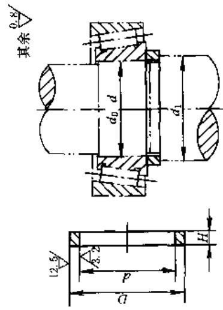

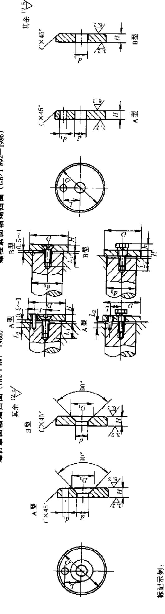

<table><tr><td rowspan="2">轴径</td><td rowspan="2">公称</td><td colspan="2">H</td><td colspan="2"></td><td rowspan="2"></td><td rowspan="2">d</td><td rowspan="2">C</td><td colspan="4">CB/T891</td><td colspan="4">螺栓</td><td rowspan="2"></td><td rowspan="2">安装尺寸</td><td rowspan="2"></td><td rowspan="2"></td><td rowspan="2"></td></tr><tr><td>直径 D</td><td>基本 尺寸</td><td>极限 基本 偏差 尺寸</td><td>极限 偏差</td><td>d</td><td>D</td><td>螺钉 CB/T819 （推荐）</td><td>圆柱销 G8/T119 （推荐）</td><td>每1000个的 重量/kg A型 B型</td><td>圆柱销 GB/T5783 GB/T119 （推荐）</td><td>垫圈 CB/T93 （推荐）</td><td>每1000个的 重量/kg</td><td>L</td></tr><tr><td>4 16</td><td>2</td><td></td><td rowspan="9"></td><td rowspan="9"></td><td></td><td></td><td></td><td></td><td>11</td><td></td><td></td><td>8.27 10.33</td><td rowspan="4">（推荐） 8.38 10.44 13.89</td><td></td><td></td><td>A型 8.95</td><td>B型 8.61</td><td rowspan="4"></td><td rowspan="4">6</td><td rowspan="4">16 5.1</td></tr><tr><td>18</td><td>2s</td><td>4 4</td><td></td><td></td><td>5.5</td><td>0.5</td><td>M5 × 12</td><td></td><td>13.79</td><td>M5×16</td><td></td><td>11.01</td><td>11.12</td><td></td></tr><tr><td>20</td><td>28</td><td>4 4</td><td>7.5</td><td>+0.1</td><td></td><td></td><td></td><td></td><td></td><td>17.68 17.78 20.64</td><td></td><td>5</td><td>14.47 18.36</td><td>14.58</td><td>14</td></tr><tr><td>22 25</td><td>30</td><td></td><td>7.5</td><td></td><td>2.1</td><td></td><td></td><td></td><td>A2 × 10</td><td>20.53</td><td></td><td>A2× 10</td><td>21.2</td><td>18.47 21.31</td><td></td></tr><tr><td>28</td><td>32 35</td><td></td><td>10 10</td><td></td><td></td><td>1</td><td></td><td></td><td></td><td>28.62 34.78</td><td>28.94 35.09</td><td></td><td></td><td>29.72 35.87</td><td>30.04 36.19</td><td></td><td></td></tr><tr><td>30 32</td><td>38</td><td>0 -0.30</td><td>10</td><td></td><td>6.6 3.2</td><td></td><td>13</td><td>M6 × 16</td><td>A3 x 12</td><td>41.49 46.27</td><td>41.81 46.59</td><td>M6 x 20</td><td>A3 × 12</td><td>6</td><td>42.58 42.9</td><td></td><td>？</td></tr><tr><td>35</td><td>40 45</td><td>G</td><td>12 12</td><td></td><td></td><td></td><td></td><td></td><td></td><td>59.28</td><td>59.6</td><td></td><td></td><td>47.36 60.38</td><td>47.68</td><td>18</td><td></td></tr><tr><td>40 45</td><td>50</td><td>5</td><td>12</td><td>±0.135</td><td></td><td></td><td></td><td></td><td></td><td>73.83 105.3</td><td>74.15 105.9</td><td></td><td></td><td>74.93</td><td></td><td>60.7 75.25</td><td></td></tr><tr><td>50</td><td>55</td><td>6</td><td>16 16</td><td></td><td></td><td></td><td></td><td></td><td></td><td></td><td>126.4</td><td>127.05</td><td></td><td></td><td>107.6</td><td>108.25</td><td></td></tr><tr><td>55</td><td>60 65</td><td>6</td><td></td><td></td><td rowspan="4">9</td><td>4.2</td><td>1.5</td><td>17</td><td>M8 x 20</td><td>A4×14</td><td>149.4 174.2</td><td>150.05 174.85</td><td>M8× 25</td><td>A4×14</td><td>8</td><td>128.7 151.7</td><td>129.35 152.35</td><td>22</td><td></td><td></td></tr><tr><td>60</td><td>70</td><td>6</td><td></td><td></td><td></td><td></td><td></td><td></td><td></td><td></td><td>200.8</td><td></td><td></td><td></td><td></td><td>176.5</td><td>77.15</td><td>8</td><td>24</td></tr><tr><td>65 70</td><td>75</td><td>6 6</td><td></td><td>±0.165</td><td></td><td></td><td></td><td></td><td></td><td></td><td>229.3</td><td>201.45 229.95</td><td></td><td></td><td></td><td>203. 203.75</td><td></td><td></td><td></td></tr><tr><td>75</td><td>80 90</td><td></td><td></td><td>8</td><td>13</td><td>5.2</td><td>2</td><td>25</td><td></td><td></td><td>379.9</td><td>381.23</td><td></td><td></td><td></td><td>231.6</td><td>232.25</td><td></td><td>28</td></tr><tr><td></td><td></td><td>8</td><td>0 -0.36</td><td></td><td></td><td></td><td></td><td></td><td></td><td></td><td>A5×16</td><td>473.0</td><td>474.33</td><td></td><td>A5 x 16</td><td></td><td>387.4</td><td>388.73 481.83</td><td>26</td><td></td><td>11.5</td></tr><tr><td>85</td><td>100</td><td>8</td><td></td><td>25</td><td></td><td></td><td></td><td></td><td></td><td>M12 × 25</td><td></td><td></td><td></td><td>M12 × 30</td><td></td><td>12</td><td>480.5</td><td></td><td>10</td><td></td><td></td></tr><tr><td></td><td></td><td></td><td></td><td></td><td></td><td></td><td></td><td></td><td></td><td></td><td></td><td></td><td></td><td></td><td></td><td></td><td></td><td></td><td></td><td></td><td></td></tr><tr><td></td><td></td><td></td><td></td><td></td><td></td><td></td><td></td><td></td><td></td><td></td><td></td><td></td><td></td><td></td><td></td><td></td><td></td><td></td><td></td><td></td><td></td></tr><tr><td></td><td></td><td></td><td></td><td></td><td></td><td></td><td></td><td></td><td></td><td></td><td></td><td></td><td></td><td></td><td></td><td></td><td></td><td></td><td></td><td></td><td></td></tr><tr><td></td><td></td><td></td><td></td><td></td><td></td><td></td><td></td><td></td><td></td><td></td><td></td><td></td><td></td><td></td><td></td><td></td><td></td></table>

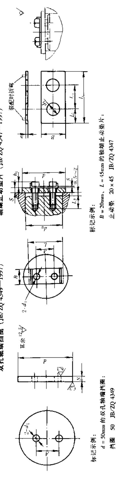

<table><tr><td rowspan=3 colspan=1>d</td><td rowspan=3 colspan=1>A</td><td rowspan=3 colspan=2>d</td><td rowspan=1 colspan=8>JB/ZQ 4349-1997</td><td rowspan=1 colspan=10>JB/ZQ 4347-1997</td><td rowspan=1 colspan=2>安装尺寸</td></tr><tr><td rowspan=1 colspan=3>s</td><td rowspan=1 colspan=1>每个重量</td><td rowspan=2 colspan=1>螺栓尺寸</td><td rowspan=1 colspan=3>轴       径</td><td rowspan=2 colspan=3>B</td><td rowspan=2 colspan=1>L</td><td rowspan=2 colspan=1>S</td><td rowspan=2 colspan=1>山</td><td rowspan=2 colspan=3>1</td><td rowspan=2 colspan=1>每个重量/g</td><td rowspan=2 colspan=1>，</td><td rowspan=2 colspan=1>h</td></tr><tr><td rowspan=1 colspan=1>基本尺寸极限偏差</td><td rowspan=1 colspan=2>基本尺寸极限偏差</td><td rowspan=1 colspan=1>/kg</td><td rowspan=1 colspan=1>球轴承</td><td rowspan=1 colspan=1>柱轴承</td><td rowspan=1 colspan=1>联轴器</td></tr><tr><td rowspan=1 colspan=1>40</td><td rowspan=3 colspan=1>20</td><td rowspan=3 colspan=2>7</td><td rowspan=3 colspan=1>5</td><td rowspan=3 colspan=2></td><td rowspan=1 colspan=1>0.05</td><td rowspan=5 colspan=1>M6× 16</td><td rowspan=1 colspan=1></td><td rowspan=1 colspan=1>一</td><td rowspan=1 colspan=1>35</td><td rowspan=3 colspan=3>15</td><td rowspan=3 colspan=1>40</td><td rowspan=9 colspan=1>1</td><td rowspan=3 colspan=1>20</td><td rowspan=3 colspan=3>10</td><td rowspan=3 colspan=1>0.004</td><td rowspan=5 colspan=1>18</td><td rowspan=5 colspan=1>：5</td></tr><tr><td rowspan=1 colspan=1>45</td><td rowspan=1 colspan=1>0.06</td><td rowspan=1 colspan=1>1</td><td rowspan=1 colspan=1>1</td><td rowspan=1 colspan=1>40</td></tr><tr><td rowspan=1 colspan=1>50</td><td rowspan=1 colspan=1></td><td rowspan=1 colspan=1>0.07</td><td rowspan=1 colspan=1>35</td><td rowspan=1 colspan=1>35</td><td rowspan=1 colspan=1>45</td></tr><tr><td rowspan=2 colspan=1>60</td><td rowspan=3 colspan=1>25</td><td rowspan=2 colspan=1></td><td rowspan=2 colspan=1></td><td rowspan=7 colspan=1>6</td><td rowspan=13 colspan=2>+0.5-1.0</td><td rowspan=2 colspan=1></td><td rowspan=2 colspan=1>0.125</td><td rowspan=2 colspan=1>40,45,50</td><td rowspan=2 colspan=1>40</td><td rowspan=2 colspan=1>>45-50</td><td rowspan=2 colspan=3>20</td><td rowspan=2 colspan=1>45</td><td rowspan=3 colspan=1>25</td><td rowspan=2 colspan=3></td><td rowspan=2 colspan=1>0.006</td></tr><tr><td rowspan=1 colspan=2></td></tr><tr><td rowspan=1 colspan=1>70</td><td rowspan=1 colspan=2>12</td><td rowspan=1 colspan=1>0.17</td><td rowspan=1 colspan=1>M10× 20</td><td rowspan=1 colspan=1>55,60</td><td rowspan=1 colspan=1>45,50</td><td rowspan=1 colspan=1>> 50~60</td><td rowspan=1 colspan=3>25</td><td rowspan=1 colspan=1>s</td><td rowspan=1 colspan=3>15</td><td rowspan=1 colspan=1>0.009</td><td rowspan=1 colspan=1>24</td><td rowspan=1 colspan=1>8</td></tr><tr><td rowspan=3 colspan=1>80</td><td rowspan=3 colspan=1>30</td><td rowspan=4 colspan=2></td><td rowspan=3 colspan=1>0.22</td><td rowspan=5 colspan=1>M12 × 25</td><td rowspan=3 colspan=1>65,70</td><td rowspan=3 colspan=1>55,60</td><td rowspan=3 colspan=1>> 60-70</td><td rowspan=3 colspan=3></td><td rowspan=3 colspan=1>70</td><td rowspan=3 colspan=1>30</td><td rowspan=3 colspan=3></td><td></td><td></td><td></td></tr><tr><td rowspan=2 colspan=2></td><td></td><td></td><td></td></tr><tr><td rowspan=1 colspan=1>0.014</td><td rowspan=2 colspan=1>30</td><td rowspan=8 colspan=1>9</td></tr><tr><td rowspan=1 colspan=1>90</td><td rowspan=2 colspan=1>40</td><td rowspan=2 colspan=2>14</td><td rowspan=1 colspan=1>0.28</td><td rowspan=1 colspan=1>75,80</td><td rowspan=1 colspan=1>65,70</td><td rowspan=1 colspan=1>> 70~80</td><td rowspan=2 colspan=3>30</td><td rowspan=2 colspan=1>80</td><td rowspan=6 colspan=1></td><td rowspan=2 colspan=1>40</td><td rowspan=2 colspan=3></td><td rowspan=1 colspan=1>0.016</td></tr><tr><td rowspan=1 colspan=1>100</td><td rowspan=6 colspan=2>14</td><td rowspan=6 colspan=1>8</td><td rowspan=1 colspan=1>0.47</td><td rowspan=1 colspan=1>85,90</td><td rowspan=1 colspan=1>75,80</td><td rowspan=1 colspan=1>> 80~90</td><td rowspan=1 colspan=3></td><td rowspan=1 colspan=1>0.016</td><td rowspan=6 colspan=1>28</td></tr><tr><td></td><td></td><td rowspan=4 colspan=1>0.74</td><td rowspan=5 colspan=1></td><td rowspan=4 colspan=1>100,110</td><td rowspan=4 colspan=1>90</td><td rowspan=4 colspan=1>>90~110</td><td rowspan=4 colspan=2></td><td rowspan=1 colspan=2></td><td rowspan=4 colspan=1></td><td rowspan=4 colspan=1>90</td><td rowspan=4 colspan=1>125</td><td rowspan=4 colspan=3>50</td><td></td></tr><tr><td></td><td></td><td rowspan=3 colspan=3></td><td rowspan=3 colspan=1></td><td></td></tr><tr><td></td><td></td><td rowspan=2 colspan=1>0.019</td></tr><tr><td></td><td></td><td rowspan=1 colspan=2></td></tr><tr><td></td><td></td><td rowspan=1 colspan=1>1.08</td><td rowspan=1 colspan=1>120,130</td><td rowspan=1 colspan=1>100,110</td><td rowspan=1 colspan=1>> 110~130</td><td rowspan=1 colspan=3></td><td rowspan=1 colspan=1>150</td><td rowspan=1 colspan=1>60</td><td rowspan=1 colspan=1>60</td><td rowspan=1 colspan=3></td><td rowspan=1 colspan=1></td><td rowspan=1 colspan=1>0.021</td></tr><tr><td rowspan=1 colspan=1>180</td><td rowspan=1 colspan=1>80</td><td rowspan=5 colspan=2>18</td><td rowspan=5 colspan=1>12</td><td rowspan=5 colspan=2>+0.5-1.5</td><td rowspan=1 colspan=1>2.33</td><td rowspan=1 colspan=1></td><td rowspan=1 colspan=1>140,150,160</td><td rowspan=1 colspan=1>120,140</td><td rowspan=1 colspan=1>>130-160</td><td rowspan=2 colspan=3></td><td rowspan=1 colspan=1>130</td><td rowspan=5 colspan=1>2</td><td rowspan=1 colspan=1>80</td><td rowspan=1 colspan=3></td><td rowspan=1 colspan=1>0.063</td><td rowspan=5 colspan=1>30</td><td rowspan=5 colspan=1>12</td></tr><tr><td rowspan=3 colspan=1>220</td><td rowspan=3 colspan=1>110</td><td rowspan=3 colspan=1>3.57</td><td rowspan=4 colspan=1>M16× 30</td><td rowspan=3 colspan=1>180,200</td><td rowspan=3 colspan=1>160</td><td rowspan=3 colspan=1>>160-200</td><td rowspan=3 colspan=2></td><td></td><td></td><td></td><td></td><td></td><td></td></tr><tr><td rowspan=2 colspan=2></td><td></td><td></td><td></td><td></td><td></td><td></td></tr><tr><td rowspan=1 colspan=1></td><td rowspan=1 colspan=1>160</td><td rowspan=1 colspan=1>10</td><td rowspan=1 colspan=3></td><td rowspan=1 colspan=1>0.08</td></tr><tr><td rowspan=1 colspan=1>260</td><td rowspan=1 colspan=1>140</td><td rowspan=1 colspan=1>4.93</td><td rowspan=1 colspan=1></td><td rowspan=1 colspan=1>180,200</td><td rowspan=1 colspan=1>>200~240</td><td rowspan=1 colspan=3></td><td rowspan=1 colspan=1>190</td><td rowspan=1 colspan=1>140</td><td rowspan=1 colspan=3>25</td><td rowspan=1 colspan=1>0.09</td></tr></table>

轴直径 $\pmb { d } = \pmb { \ 5 0 } \mathbf { m } \mathbf { m }$ 的轴端挡板:

标记示例:

挡板50 JB/ZQ 4348

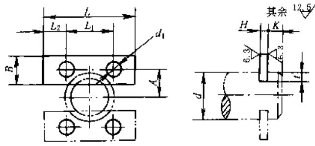

<table><tr><td rowspan=1 colspan=1>d</td><td rowspan=1 colspan=1>L</td><td rowspan=1 colspan=1>B</td><td rowspan=1 colspan=1>L</td><td rowspan=1 colspan=1>L</td><td rowspan=1 colspan=1>H</td><td rowspan=1 colspan=1>d</td><td rowspan=1 colspan=1></td><td rowspan=1 colspan=1>螺栓直径</td><td rowspan=1 colspan=1>一</td><td rowspan=1 colspan=1>Kmn</td><td rowspan=1 colspan=1>A</td><td rowspan=1 colspan=1>每个重量/kg</td></tr><tr><td rowspan=1 colspan=1>40455055</td><td rowspan=1 colspan=1>100</td><td rowspan=1 colspan=1>30</td><td rowspan=1 colspan=1>60</td><td rowspan=1 colspan=1>20</td><td rowspan=1 colspan=1>6</td><td rowspan=1 colspan=1>14</td><td rowspan=1 colspan=1>1</td><td rowspan=1 colspan=1>M12</td><td rowspan=1 colspan=1>5678</td><td rowspan=1 colspan=1>10！101212</td><td rowspan=1 colspan=1>3031.53334.5</td><td rowspan=1 colspan=1>0.13</td></tr><tr><td rowspan=1 colspan=1>6065707580</td><td rowspan=1 colspan=1>130</td><td rowspan=1 colspan=1>40</td><td rowspan=1 colspan=1>90</td><td rowspan=1 colspan=1>20</td><td rowspan=1 colspan=1>8</td><td rowspan=1 colspan=1>18</td><td rowspan=1 colspan=1>1</td><td rowspan=1 colspan=1>M16</td><td rowspan=1 colspan=1>9901112</td><td rowspan=1 colspan=1>1414141415</td><td rowspan=1 colspan=1>4143.54546.548</td><td rowspan=1 colspan=1>0.30</td></tr><tr><td rowspan=1 colspan=1>90100110</td><td rowspan=1 colspan=1>170</td><td rowspan=1 colspan=1>50</td><td rowspan=1 colspan=1>120</td><td rowspan=1 colspan=1>25</td><td rowspan=1 colspan=1>10</td><td rowspan=1 colspan=1>22</td><td rowspan=1 colspan=1>1</td><td rowspan=1 colspan=1>M20</td><td rowspan=1 colspan=1>131416</td><td rowspan=1 colspan=1>151520</td><td rowspan=1 colspan=1>57664</td><td rowspan=1 colspan=1>0.52</td></tr><tr><td rowspan=1 colspan=1>120130140</td><td rowspan=1 colspan=1>200</td><td rowspan=1 colspan=1>6</td><td rowspan=1 colspan=1>150</td><td rowspan=1 colspan=1>25</td><td rowspan=1 colspan=1>12</td><td rowspan=1 colspan=1>22</td><td rowspan=1 colspan=1>2</td><td rowspan=1 colspan=1>M20</td><td rowspan=1 colspan=1>171920</td><td rowspan=1 colspan=1>202020</td><td rowspan=1 colspan=1>737680</td><td rowspan=1 colspan=1>1.07</td></tr><tr><td rowspan=1 colspan=1>150160170</td><td rowspan=1 colspan=1>240</td><td rowspan=1 colspan=1>7</td><td rowspan=1 colspan=1>180</td><td rowspan=1 colspan=1>30</td><td rowspan=1 colspan=1>12</td><td rowspan=1 colspan=1>22</td><td rowspan=1 colspan=1>2</td><td rowspan=1 colspan=1>M20</td><td rowspan=1 colspan=1>222325</td><td rowspan=1 colspan=1>202525</td><td rowspan=1 colspan=1>89295</td><td rowspan=1 colspan=1>1.50</td></tr><tr><td rowspan=1 colspan=1>180190200210220</td><td rowspan=2 colspan=1>280</td><td rowspan=2 colspan=1>80</td><td rowspan=2 colspan=1>210</td><td rowspan=2 colspan=1>35</td><td rowspan=1 colspan=1>14</td><td rowspan=1 colspan=1>22</td><td rowspan=2 colspan=1>2</td><td rowspan=2 colspan=1>M20</td><td rowspan=2 colspan=1>262830303030</td><td rowspan=2 colspan=1>25</td><td rowspan=2 colspan=1>104107110115120135</td><td rowspan=2 colspan=1>2.40</td></tr><tr><td rowspan=1 colspan=1>250</td><td rowspan=1 colspan=1>19</td><td rowspan=1 colspan=1></td></tr><tr><td rowspan=1 colspan=1>280300320</td><td rowspan=1 colspan=1>320</td><td rowspan=1 colspan=1>80</td><td rowspan=1 colspan=1>240</td><td rowspan=1 colspan=1>40</td><td rowspan=1 colspan=1>22</td><td rowspan=1 colspan=1>26</td><td rowspan=1 colspan=1>2</td><td rowspan=1 colspan=1>M24</td><td rowspan=1 colspan=1>30</td><td rowspan=1 colspan=1>25</td><td rowspan=1 colspan=1>t50160170</td><td rowspan=1 colspan=1>4.24</td></tr><tr><td rowspan=1 colspan=1>350400</td><td rowspan=1 colspan=1>370</td><td rowspan=1 colspan=1>90</td><td rowspan=1 colspan=1>280</td><td rowspan=1 colspan=1>45</td><td rowspan=1 colspan=1>25</td><td rowspan=1 colspan=1>33</td><td rowspan=1 colspan=1>21</td><td rowspan=1 colspan=1>M30</td><td rowspan=1 colspan=1>35</td><td rowspan=1 colspan=1>25</td><td rowspan=1 colspan=1>185210</td><td rowspan=1 colspan=1>6.20</td></tr></table>

# 孔用弹性挡圈(GB/T893.1--1986)

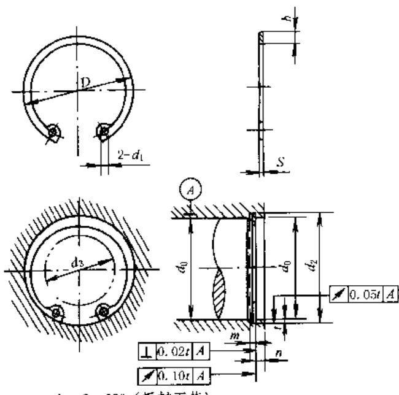

A型

$\dot { \mathbf { d } } _ { 0 } = 8 \sim 2 0 0 $ (板材工艺)

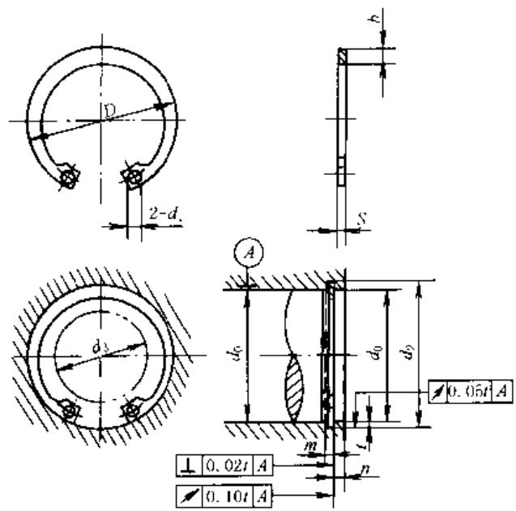

B型

$d _ { 0 } = 2 0 \sim 2 0 0$ (线材I艺)

标记示例:

孔径 $\pmb { d } _ { \tilde { \mathbf { \omega } } } = 5 0 \mathbf { m m }$ 、材料为 $6 5  { \mathtt { M n } }$ 、热处理硬度44\~5IHRC、经表面氧化处理的 $\pmb { \mathsf { A } }$ 型孔用弹性挡圈:

挡圈GB/T893.150

标记示例:

孔径 $\mathcal { d } _ { \mathrm { 0 } } = 4 0 \mathrm { m m }$ 、材料为 $6 5  { \mathbb { M } }  { \mathbf { n } }$ 、热处理硬度47\~54HRC、经表面氧化处理的B型孔用弹性挡圈:

挡圈 $\mathbf { G B / T } \ 8 9 3 . 2$ 40

/mm 

表 4-1-161

<table><tr><td rowspan=3 colspan=1>孔径d</td><td rowspan=1 colspan=9>挡        圈</td><td rowspan=1 colspan=6>沟槽（推荐）</td><td rowspan=1 colspan=1>轴</td><td rowspan=1 colspan=1>每1000个</td></tr><tr><td rowspan=1 colspan=3>D</td><td rowspan=1 colspan=2>S</td><td rowspan=2 colspan=1>b</td><td rowspan=2 colspan=3>d</td><td rowspan=1 colspan=3>d</td><td rowspan=1 colspan=2>m</td><td rowspan=2 colspan=1>n</td><td rowspan=2 colspan=1>山</td><td rowspan=2 colspan=1>的重量≈/kg</td></tr><tr><td rowspan=1 colspan=1>基本尺寸</td><td rowspan=1 colspan=2>极限偏差</td><td rowspan=1 colspan=1>基本尺寸</td><td rowspan=1 colspan=1>极限偏差</td><td rowspan=1 colspan=2>基本尺寸</td><td rowspan=1 colspan=1>极限偏差</td><td rowspan=1 colspan=1>基本尺寸</td><td rowspan=1 colspan=1>极限偏差</td></tr><tr><td rowspan=1 colspan=1>8</td><td rowspan=1 colspan=1>8.7</td><td rowspan=2 colspan=2></td><td rowspan=2 colspan=1>0.6</td><td rowspan=2 colspan=1>+ 0.04-0.07</td><td rowspan=1 colspan=1>1</td><td rowspan=1 colspan=3>1</td><td rowspan=1 colspan=2>8.4</td><td rowspan=2 colspan=1>+0.090</td><td rowspan=2 colspan=1>07</td><td rowspan=3 colspan=1></td><td rowspan=3 colspan=1>0.6</td><td rowspan=3 colspan=1>2</td><td rowspan=2 colspan=1>0.090.1</td></tr><tr><td rowspan=1 colspan=1>9</td><td rowspan=1 colspan=1>9.8</td><td rowspan=1 colspan=1>1.2</td><td rowspan=1 colspan=3>1</td><td rowspan=1 colspan=2>9.4</td></tr><tr><td rowspan=1 colspan=1>10</td><td rowspan=1 colspan=1>10.8</td><td rowspan=4 colspan=2>+0.36-0.10</td><td rowspan=4 colspan=1>0.8</td><td rowspan=4 colspan=1>+0.04-0.10</td><td rowspan=4 colspan=1>1.7</td><td rowspan=3 colspan=3>1.5</td><td rowspan=1 colspan=2>10.4</td><td rowspan=4 colspan=1>+0.11</td><td rowspan=4 colspan=1>0.9</td><td rowspan=4 colspan=1></td><td rowspan=1 colspan=1>0.23</td></tr><tr><td rowspan=1 colspan=1>11</td><td rowspan=1 colspan=1>11.8</td><td rowspan=1 colspan=2>11.4</td><td rowspan=1 colspan=1></td><td rowspan=1 colspan=1>3</td><td rowspan=1 colspan=1>0.26</td></tr><tr><td rowspan=1 colspan=1>12</td><td rowspan=1 colspan=1>13</td><td rowspan=1 colspan=2>12.5</td><td rowspan=2 colspan=1>0.9</td><td rowspan=2 colspan=1>4</td><td rowspan=1 colspan=1>0.28</td></tr><tr><td rowspan=1 colspan=1>13</td><td rowspan=1 colspan=1>14.1</td><td rowspan=1 colspan=1></td><td rowspan=1 colspan=3></td><td rowspan=1 colspan=2>13.6</td><td rowspan=1 colspan=1>0.31</td></tr><tr><td rowspan=1 colspan=1>14</td><td rowspan=1 colspan=1>15.1</td><td rowspan=1 colspan=2></td><td rowspan=1 colspan=1></td><td rowspan=3 colspan=1></td><td rowspan=3 colspan=1>2.1</td><td rowspan=3 colspan=3>1.7</td><td rowspan=1 colspan=2>14.6</td><td rowspan=5 colspan=1>0</td><td rowspan=5 colspan=1></td><td rowspan=10 colspan=1>+0.140</td><td rowspan=1 colspan=1></td><td rowspan=1 colspan=1>5</td><td rowspan=1 colspan=1>0.5</td></tr><tr><td rowspan=1 colspan=1>15</td><td rowspan=1 colspan=1>16.2</td><td rowspan=2 colspan=2></td><td rowspan=2 colspan=1></td><td rowspan=1 colspan=2>15.7</td><td rowspan=2 colspan=1>1.2</td><td rowspan=1 colspan=1>6</td><td rowspan=1 colspan=1>0.54</td></tr><tr><td rowspan=1 colspan=1>16</td><td rowspan=1 colspan=1>17.3</td><td rowspan=1 colspan=2>16.8</td><td rowspan=1 colspan=1>7</td><td rowspan=1 colspan=1>0.57</td></tr><tr><td rowspan=2 colspan=1>17</td><td rowspan=2 colspan=1>18.3</td><td rowspan=3 colspan=2></td><td rowspan=7 colspan=1>1</td><td rowspan=7 colspan=1>+ 0.05- 0.13</td><td rowspan=3 colspan=1></td><td rowspan=2 colspan=2></td><td rowspan=1 colspan=2></td><td></td><td rowspan=2 colspan=1></td><td rowspan=2 colspan=1>17.8</td><td rowspan=2 colspan=1></td><td rowspan=2 colspan=1>8</td><td rowspan=2 colspan=1>0.61</td></tr><tr><td rowspan=1 colspan=2></td><td></td><td></td></tr><tr><td rowspan=1 colspan=1>18</td><td rowspan=1 colspan=1>19.5</td><td rowspan=1 colspan=3></td><td rowspan=1 colspan=2>19</td><td rowspan=4 colspan=1>+0.130</td><td rowspan=5 colspan=1>11</td><td rowspan=5 colspan=1>1.5</td><td rowspan=1 colspan=1>9</td><td rowspan=1 colspan=1>0.64</td></tr><tr><td rowspan=1 colspan=1>19</td><td rowspan=1 colspan=1>20.5</td><td rowspan=1 colspan=2>+ 0.42</td><td rowspan=4 colspan=1>2.5</td><td rowspan=4 colspan=3>2</td><td rowspan=1 colspan=2>20</td><td rowspan=2 colspan=1>10</td><td rowspan=1 colspan=1>0.8</td></tr><tr><td rowspan=1 colspan=1>20</td><td rowspan=1 colspan=1>21.5</td><td rowspan=1 colspan=2>- 0.13</td><td rowspan=1 colspan=2>21</td><td rowspan=1 colspan=1>0.84</td></tr><tr><td rowspan=1 colspan=1>21</td><td rowspan=1 colspan=1>22.5</td><td rowspan=2 colspan=2></td><td rowspan=1 colspan=2>22</td><td rowspan=1 colspan=1>1</td><td rowspan=1 colspan=1>0.88</td></tr><tr><td rowspan=1 colspan=1>22</td><td rowspan=1 colspan=1>23.5</td><td rowspan=1 colspan=2>23</td><td rowspan=1 colspan=1></td><td rowspan=1 colspan=1>12</td><td rowspan=1 colspan=1>0.92</td></tr></table>

续表

<table><tr><td rowspan=3 colspan=1></td><td rowspan=3 colspan=1>孔径d</td><td rowspan=1 colspan=8>挡        圈</td><td rowspan=1 colspan=7>沟榨(推荐)</td><td rowspan=1 colspan=1>轴</td><td rowspan=3 colspan=1>每1000个的重量/kg</td></tr><tr><td rowspan=1 colspan=2>D</td><td rowspan=1 colspan=2>s</td><td rowspan=2 colspan=2>b江</td><td rowspan=2 colspan=2>d</td><td rowspan=1 colspan=4>d</td><td rowspan=1 colspan=2>m</td><td rowspan=2 colspan=1>n</td><td rowspan=2 colspan=1>d</td></tr><tr><td rowspan=1 colspan=1>基本尺业</td><td rowspan=1 colspan=1>极限偏差</td><td rowspan=1 colspan=1>基本尺寸</td><td rowspan=1 colspan=1>极限偏差</td><td rowspan=1 colspan=2>基本尺寸</td><td rowspan=1 colspan=2>极限偏差</td><td rowspan=1 colspan=1>基本尺寸</td><td rowspan=1 colspan=1>极限偏差</td></tr><tr><td></td><td rowspan=2 colspan=1>24</td><td rowspan=2 colspan=1>25.9</td><td rowspan=4 colspan=1>+ 0.42-0.21</td><td rowspan=8 colspan=1>1.2</td><td rowspan=8 colspan=1>+0.05-0.13</td><td rowspan=2 colspan=2>2.5</td><td rowspan=2 colspan=2></td><td rowspan=2 colspan=2>25.2</td><td rowspan=5 colspan=2>+0.210</td><td rowspan=8 colspan=1>1.3</td><td rowspan=20 colspan=1>+0.140</td><td rowspan=4 colspan=1>1.8</td><td rowspan=2 colspan=1>13</td><td rowspan=2 colspan=1>1.21</td></tr><tr><td></td><td rowspan=1 colspan=2></td></tr><tr><td></td><td rowspan=1 colspan=1>25</td><td rowspan=1 colspan=1>26.9</td><td rowspan=2 colspan=2>2.8</td><td rowspan=2 colspan=2>2</td><td rowspan=1 colspan=2>26.2</td><td rowspan=1 colspan=1>14</td><td rowspan=1 colspan=1>1.39</td></tr><tr><td></td><td rowspan=1 colspan=1>26</td><td rowspan=1 colspan=1>27.9</td><td rowspan=1 colspan=2>2</td><td rowspan=1 colspan=2>27.2</td><td rowspan=1 colspan=1>15</td><td rowspan=1 colspan=1>1.45</td></tr><tr><td></td><td rowspan=1 colspan=1>28</td><td rowspan=1 colspan=1>30.1</td><td rowspan=4 colspan=1></td><td rowspan=4 colspan=2>3.2</td><td rowspan=1 colspan=2></td><td rowspan=1 colspan=2>29.4</td><td rowspan=2 colspan=1>2.1</td><td rowspan=1 colspan=1>17</td><td rowspan=1 colspan=1>1.63</td></tr><tr><td></td><td rowspan=1 colspan=1>30</td><td rowspan=1 colspan=1>32.1</td><td rowspan=1 colspan=2>31.4</td><td rowspan=3 colspan=2></td><td rowspan=1 colspan=1>18</td><td rowspan=1 colspan=1>1.91</td></tr><tr><td></td><td rowspan=1 colspan=1>31</td><td rowspan=1 colspan=1>33.4</td><td rowspan=2 colspan=2></td><td rowspan=1 colspan=2>32.7</td><td rowspan=3 colspan=1>2.6</td><td rowspan=1 colspan=1>19</td><td rowspan=1 colspan=1>1.97</td></tr><tr><td></td><td rowspan=1 colspan=1>32</td><td rowspan=1 colspan=1>34.4</td><td rowspan=1 colspan=2>33.7</td><td rowspan=1 colspan=1></td><td rowspan=1 colspan=1>20</td><td rowspan=1 colspan=1>2.02</td></tr><tr><td></td><td rowspan=1 colspan=1>34</td><td rowspan=1 colspan=1>36.5</td><td rowspan=1 colspan=1>+ 0.50- 0.25</td><td rowspan=12 colspan=1>1.5</td><td rowspan=12 colspan=1>+ 0.06-0.15</td><td rowspan=5 colspan=2>3.6</td><td rowspan=5 colspan=2>2.5</td><td rowspan=1 colspan=2>35.7</td><td rowspan=11 colspan=2>+ 0.250</td><td rowspan=12 colspan=1>1.7</td><td rowspan=1 colspan=1>22</td><td rowspan=1 colspan=1>3.04</td></tr><tr><td></td><td rowspan=1 colspan=1>35</td><td rowspan=1 colspan=1>37.8</td><td rowspan=4 colspan=1></td><td rowspan=1 colspan=2>37</td><td rowspan=4 colspan=1>3</td><td rowspan=1 colspan=1>23</td><td rowspan=1 colspan=1>3.13</td></tr><tr><td></td><td rowspan=1 colspan=1>36</td><td rowspan=1 colspan=1>38.8</td><td rowspan=1 colspan=2>38</td><td rowspan=1 colspan=1>24</td><td rowspan=1 colspan=1>3.22</td></tr><tr><td></td><td rowspan=1 colspan=1>37</td><td rowspan=1 colspan=1>39.8</td><td rowspan=1 colspan=2>39</td><td rowspan=1 colspan=1>25</td><td rowspan=1 colspan=1>3.31</td></tr><tr><td></td><td rowspan=1 colspan=1>38</td><td rowspan=1 colspan=1>40.8</td><td rowspan=1 colspan=2>40</td><td rowspan=1 colspan=1>26</td><td rowspan=1 colspan=1>3.39</td></tr><tr><td></td><td rowspan=1 colspan=1>40</td><td rowspan=1 colspan=1>43.5</td><td rowspan=5 colspan=1>+ 0.90-0.39</td><td rowspan=2 colspan=2>4</td><td rowspan=1 colspan=2></td><td rowspan=1 colspan=2>42.5</td><td rowspan=2 colspan=1></td><td rowspan=1 colspan=1>27</td><td rowspan=1 colspan=1>4.13</td></tr><tr><td></td><td rowspan=1 colspan=1>42</td><td rowspan=1 colspan=1>45.5</td><td rowspan=1 colspan=2></td><td rowspan=1 colspan=2>44.5</td><td rowspan=1 colspan=1>29</td><td rowspan=1 colspan=1>4.33</td></tr><tr><td></td><td rowspan=3 colspan=1>45</td><td rowspan=3 colspan=1>48.5</td><td rowspan=8 colspan=2>4.7</td><td></td><td></td><td></td><td></td><td></td><td></td><td></td></tr><tr><td></td><td></td><td></td><td></td><td></td><td></td><td></td><td></td></tr><tr><td></td><td rowspan=1 colspan=2></td><td rowspan=1 colspan=2>47.5</td><td rowspan=3 colspan=1>3.8</td><td rowspan=1 colspan=1>31</td><td rowspan=1 colspan=1>5.24</td></tr><tr><td></td><td rowspan=1 colspan=1>47</td><td rowspan=1 colspan=1>50.5</td><td rowspan=2 colspan=1></td><td rowspan=1 colspan=2></td><td rowspan=1 colspan=2>49.5</td><td rowspan=1 colspan=1>32</td><td rowspan=1 colspan=1>5.47</td></tr><tr><td></td><td rowspan=1 colspan=1>48</td><td rowspan=1 colspan=1>51.5</td><td rowspan=1 colspan=2>50.5</td><td rowspan=9 colspan=2>+0.300</td><td rowspan=1 colspan=1>33</td><td rowspan=1 colspan=1>5.56</td></tr><tr><td></td><td rowspan=1 colspan=1>50</td><td rowspan=1 colspan=1>54.2</td><td rowspan=8 colspan=1>+0.10-0.46</td><td rowspan=8 colspan=1>2</td><td rowspan=8 colspan=1>+ 0.06-0.18</td><td rowspan=1 colspan=2>53</td><td rowspan=8 colspan=1>2.2</td><td rowspan=14 colspan=1></td><td rowspan=14 colspan=1>4.5</td><td rowspan=1 colspan=1>36</td><td rowspan=1 colspan=1>7.4</td></tr><tr><td></td><td rowspan=1 colspan=1>52</td><td rowspan=1 colspan=1>56.2</td><td rowspan=1 colspan=2>55</td><td rowspan=1 colspan=1>38</td><td rowspan=1 colspan=1>7.68</td></tr><tr><td></td><td rowspan=1 colspan=1>55</td><td rowspan=1 colspan=1>59.2</td><td rowspan=1 colspan=2>58</td><td rowspan=1 colspan=1>40</td><td rowspan=1 colspan=1>8.49</td></tr><tr><td rowspan=1 colspan=2>56</td><td rowspan=1 colspan=1>60.2</td><td rowspan=6 colspan=2>5.2</td><td rowspan=1 colspan=2></td><td></td><td rowspan=1 colspan=1>59</td><td rowspan=1 colspan=1>41</td><td rowspan=1 colspan=1>9.67</td></tr><tr><td rowspan=1 colspan=2>58</td><td rowspan=1 colspan=1>62.2</td><td rowspan=1 colspan=2>61</td><td rowspan=1 colspan=1>43</td><td rowspan=1 colspan=1>10.28</td></tr><tr><td rowspan=1 colspan=2>60</td><td rowspan=1 colspan=1>64.2</td><td rowspan=1 colspan=2>63</td><td rowspan=1 colspan=1>44</td><td rowspan=1 colspan=1>10.62</td></tr><tr><td rowspan=1 colspan=2>62</td><td rowspan=1 colspan=1>66.2</td><td rowspan=1 colspan=2>65</td><td rowspan=1 colspan=1>45</td><td rowspan=1 colspan=1>10.97</td></tr><tr><td rowspan=1 colspan=2>63</td><td rowspan=1 colspan=1>67.2</td><td rowspan=1 colspan=2>66</td><td rowspan=1 colspan=1>46</td><td rowspan=1 colspan=1>11.48</td></tr><tr><td rowspan=1 colspan=2>65</td><td rowspan=1 colspan=1>69.2</td><td rowspan=6 colspan=1></td><td rowspan=6 colspan=1>2.5</td><td rowspan=6 colspan=1>+0.07- 0.22</td><td rowspan=1 colspan=2>68</td><td rowspan=6 colspan=2></td><td rowspan=6 colspan=1>2.7</td><td rowspan=1 colspan=1>48</td><td rowspan=1 colspan=1>14.63</td></tr><tr><td rowspan=1 colspan=2>68</td><td rowspan=1 colspan=1>72.5</td><td rowspan=4 colspan=2>5.7</td><td rowspan=1 colspan=2></td><td></td><td rowspan=1 colspan=1>71</td><td rowspan=1 colspan=1>50</td><td rowspan=1 colspan=1>16.89</td></tr><tr><td rowspan=1 colspan=2>70</td><td rowspan=1 colspan=1>74.5</td><td rowspan=1 colspan=2>73</td><td rowspan=1 colspan=1>53</td><td rowspan=1 colspan=1>17.37</td></tr><tr><td rowspan=2 colspan=2>72</td><td rowspan=2 colspan=1>76.5</td><td rowspan=1 colspan=2></td><td rowspan=2 colspan=1></td><td rowspan=2 colspan=2>75</td><td rowspan=2 colspan=1>55</td><td rowspan=2 colspan=1>17.84</td></tr><tr><td rowspan=1 colspan=2></td></tr><tr><td rowspan=1 colspan=2>75</td><td rowspan=1 colspan=1>79.5</td><td rowspan=1 colspan=2>6.3</td><td rowspan=1 colspan=2></td><td rowspan=1 colspan=2>78</td><td rowspan=1 colspan=1>56</td><td rowspan=1 colspan=1>20.2</td></tr></table>

<table><tr><td rowspan=3 colspan=1>孔径d</td><td rowspan=1 colspan=8>拌        圈</td><td rowspan=1 colspan=6>沟槽（推荐）</td><td rowspan=1 colspan=1>轴</td><td rowspan=1 colspan=1>每1000个</td></tr><tr><td rowspan=1 colspan=2>D</td><td rowspan=1 colspan=2>s</td><td rowspan=2 colspan=4>bdR</td><td rowspan=1 colspan=3>d</td><td rowspan=1 colspan=2>m</td><td rowspan=2 colspan=1>n≥</td><td rowspan=2 colspan=1>·d</td><td rowspan=2 colspan=1>的重量/kg</td></tr><tr><td rowspan=1 colspan=1>基本尺寸极限偏差</td><td rowspan=1 colspan=1>基本尺寸极限偏差</td><td rowspan=1 colspan=1>基本尺寸极限偏差</td><td rowspan=1 colspan=1>基本尺寸极限偏差</td><td rowspan=1 colspan=2>基本尺寸</td><td rowspan=1 colspan=1>极限偏差基本尺寸</td><td rowspan=1 colspan=1>极限偏差基本尺寸</td><td rowspan=1 colspan=1>极限偏差</td></tr><tr><td rowspan=1 colspan=1>78</td><td rowspan=1 colspan=1>82.5</td><td rowspan=10 colspan=1>+ 1.30-0.54</td><td rowspan=10 colspan=2>2.5</td><td rowspan=1 colspan=1>6.3</td><td rowspan=2 colspan=3></td><td rowspan=1 colspan=2>81</td><td rowspan=4 colspan=1></td><td rowspan=4 colspan=1></td><td rowspan=4 colspan=1></td><td rowspan=1 colspan=1>4.5</td><td rowspan=1 colspan=1>60</td><td rowspan=1 colspan=1>20.84</td></tr><tr><td rowspan=1 colspan=1>80</td><td rowspan=1 colspan=1>85.5</td><td rowspan=3 colspan=1>6.8</td><td rowspan=3 colspan=3></td><td rowspan=1 colspan=2>83.5</td><td rowspan=3 colspan=1></td><td rowspan=1 colspan=1>63</td><td rowspan=1 colspan=1>23.34</td></tr><tr><td rowspan=1 colspan=1>82</td><td rowspan=1 colspan=1>87.5</td><td rowspan=1 colspan=2>85.5</td><td rowspan=1 colspan=1>65</td><td rowspan=1 colspan=1>24.32</td></tr><tr><td rowspan=1 colspan=1>85</td><td rowspan=1 colspan=1>90.5</td><td rowspan=1 colspan=2>88.5</td><td rowspan=1 colspan=1>68</td><td rowspan=1 colspan=1>25.18： </td></tr><tr><td rowspan=1 colspan=1>88</td><td rowspan=1 colspan=1>93.5</td><td rowspan=2 colspan=1>7.3</td><td rowspan=2 colspan=3>3</td><td rowspan=1 colspan=2>91.5</td><td rowspan=1 colspan=1>+0.35</td><td rowspan=6 colspan=1>2.7</td><td rowspan=6 colspan=1>+0.140</td><td rowspan=2 colspan=1>5.3</td><td rowspan=1 colspan=1>70</td><td rowspan=1 colspan=1>27.82</td></tr><tr><td rowspan=1 colspan=1>90</td><td rowspan=1 colspan=1>95.5</td><td rowspan=1 colspan=2></td><td rowspan=1 colspan=2>93.5</td><td rowspan=1 colspan=1>0</td><td rowspan=1 colspan=1>72</td><td rowspan=1 colspan=1>28.7</td></tr><tr><td rowspan=1 colspan=1>92</td><td rowspan=1 colspan=1>97.5</td><td rowspan=4 colspan=1>7.7</td><td rowspan=1 colspan=2></td><td rowspan=1 colspan=2>95.5</td><td rowspan=1 colspan=1></td><td rowspan=4 colspan=1></td><td rowspan=1 colspan=1>73</td><td rowspan=1 colspan=1>30.64</td></tr><tr><td rowspan=1 colspan=1>95</td><td rowspan=1 colspan=1>100.5</td><td rowspan=1 colspan=2>98.5</td><td rowspan=1 colspan=1></td><td rowspan=1 colspan=1>75</td><td rowspan=1 colspan=1>31.89</td></tr><tr><td rowspan=1 colspan=1>98</td><td rowspan=1 colspan=1>103.5</td><td rowspan=1 colspan=2>101.5</td><td rowspan=2 colspan=1></td><td rowspan=1 colspan=1>78</td><td rowspan=1 colspan=1>33.26</td></tr><tr><td rowspan=1 colspan=1>100</td><td rowspan=1 colspan=1>105.5</td><td rowspan=1 colspan=2>103.5</td><td rowspan=1 colspan=1>80</td><td rowspan=1 colspan=1>34.2</td></tr><tr><td rowspan=1 colspan=1>102</td><td rowspan=1 colspan=1>108</td><td rowspan=5 colspan=1></td><td rowspan=12 colspan=2>+0.07-0.22</td><td rowspan=2 colspan=1>8.1</td><td rowspan=2 colspan=3></td><td rowspan=1 colspan=2>106</td><td rowspan=1 colspan=1></td><td rowspan=1 colspan=1></td><td rowspan=14 colspan=1>·+ 0.180</td><td rowspan=14 colspan=1>6</td><td rowspan=1 colspan=1>82</td><td rowspan=1 colspan=1>43.49</td></tr><tr><td rowspan=1 colspan=1>105</td><td rowspan=1 colspan=1>112</td><td rowspan=1 colspan=2>109</td><td rowspan=1 colspan=1></td><td rowspan=13 colspan=1>3.2</td><td rowspan=1 colspan=1>83</td><td rowspan=1 colspan=1>45.82</td></tr><tr><td rowspan=1 colspan=1>108</td><td rowspan=1 colspan=1>115</td><td rowspan=2 colspan=1>8.8</td><td rowspan=1 colspan=2></td><td></td><td></td><td rowspan=1 colspan=1>112</td><td rowspan=1 colspan=1>+0.54</td><td rowspan=1 colspan=1>86</td><td rowspan=1 colspan=1>50.09</td></tr><tr><td rowspan=1 colspan=1>110</td><td rowspan=1 colspan=1>117</td><td rowspan=1 colspan=2></td><td rowspan=1 colspan=2>114</td><td rowspan=1 colspan=1>0</td><td rowspan=1 colspan=1>88</td><td rowspan=1 colspan=1>50.99</td></tr><tr><td rowspan=1 colspan=1>112</td><td rowspan=1 colspan=1>:19</td><td rowspan=3 colspan=1>9.3</td><td rowspan=1 colspan=2></td><td rowspan=1 colspan=2>116</td><td rowspan=1 colspan=1></td><td rowspan=1 colspan=1>89</td><td rowspan=1 colspan=1>54.61</td></tr><tr><td rowspan=1 colspan=1>115</td><td rowspan=1 colspan=1>122</td><td rowspan=7 colspan=1></td><td rowspan=1 colspan=2>119</td><td rowspan=1 colspan=1></td><td rowspan=1 colspan=1>90</td><td rowspan=1 colspan=1>56.43</td></tr><tr><td rowspan=1 colspan=1>120</td><td rowspan=1 colspan=1>127</td><td rowspan=1 colspan=2>124</td><td rowspan=1 colspan=1></td><td rowspan=1 colspan=1>95</td><td rowspan=1 colspan=1>58.77</td></tr><tr><td rowspan=2 colspan=1>125</td><td rowspan=2 colspan=1>132</td><td rowspan=2 colspan=1>10</td><td rowspan=2 colspan=1></td><td rowspan=2 colspan=1></td><td></td><td rowspan=2 colspan=2>129</td><td rowspan=2 colspan=1></td><td rowspan=2 colspan=1>100</td><td rowspan=2 colspan=1>65.48</td></tr><tr><td rowspan=1 colspan=2></td><td></td></tr><tr><td rowspan=2 colspan=1>130</td><td rowspan=2 colspan=1>137</td><td rowspan=2 colspan=1></td><td rowspan=1 colspan=2></td><td></td><td rowspan=2 colspan=2>134</td><td rowspan=2 colspan=1></td><td rowspan=2 colspan=1>105</td><td rowspan=2 colspan=1>72 78</td></tr><tr><td rowspan=1 colspan=2></td></tr><tr><td rowspan=1 colspan=1>135</td><td rowspan=1 colspan=1>142</td><td rowspan=1 colspan=1>10.7</td><td rowspan=1 colspan=3></td><td rowspan=1 colspan=2>139</td><td rowspan=1 colspan=1></td><td rowspan=1 colspan=1>110</td><td rowspan=1 colspan=1>75.55</td></tr><tr><td rowspan=1 colspan=1>140</td><td rowspan=1 colspan=1>147</td><td rowspan=1 colspan=1>+ 1.50</td><td rowspan=18 colspan=2>3</td><td rowspan=1 colspan=1></td><td rowspan=1 colspan=3></td><td rowspan=1 colspan=2>144</td><td rowspan=1 colspan=1></td><td rowspan=1 colspan=1>115</td><td rowspan=1 colspan=1>78.31</td></tr><tr><td rowspan=1 colspan=1>145</td><td rowspan=1 colspan=1>152</td><td rowspan=8 colspan=1>-0.63</td><td rowspan=1 colspan=1>10.9</td><td rowspan=1 colspan=3>4</td><td rowspan=1 colspan=2>149</td><td rowspan=1 colspan=1>+0.63</td><td rowspan=1 colspan=1>118</td><td rowspan=1 colspan=1>83.27u</td></tr><tr><td rowspan=1 colspan=1>150</td><td rowspan=1 colspan=1>158</td><td rowspan=1 colspan=1>11.2</td><td rowspan=1 colspan=3></td><td rowspan=1 colspan=2>155</td><td rowspan=1 colspan=1>0</td><td rowspan=16 colspan=1></td><td rowspan=16 colspan=1></td><td rowspan=16 colspan=1>7.5</td><td rowspan=1 colspan=1>121</td><td rowspan=1 colspan=1>88.67</td></tr><tr><td rowspan=1 colspan=1>155</td><td rowspan=1 colspan=1>164</td><td rowspan=2 colspan=1>11.6</td><td rowspan=1 colspan=2></td><td></td><td rowspan=1 colspan=2>160</td><td rowspan=1 colspan=1></td><td rowspan=1 colspan=1>125</td><td rowspan=1 colspan=1>95.53</td></tr><tr><td rowspan=1 colspan=1>160</td><td rowspan=1 colspan=1>169</td><td></td><td rowspan=1 colspan=2>165</td><td rowspan=1 colspan=1></td><td rowspan=1 colspan=1>130</td><td rowspan=1 colspan=1>98.53</td></tr><tr><td rowspan=2 colspan=1>165</td><td rowspan=2 colspan=1>174.5</td><td rowspan=2 colspan=1>11.8</td><td rowspan=1 colspan=2></td><td></td><td rowspan=2 colspan=1></td><td rowspan=2 colspan=1>170</td><td rowspan=6 colspan=1></td><td rowspan=2 colspan=1>136</td><td rowspan=2 colspan=1>104.2</td></tr><tr><td rowspan=1 colspan=2></td><td></td></tr><tr><td rowspan=2 colspan=1>170</td><td rowspan=2 colspan=1>179.5</td><td rowspan=2 colspan=1>12.3</td><td rowspan=1 colspan=2></td><td rowspan=2 colspan=1></td><td></td><td rowspan=2 colspan=2>175</td><td rowspan=2 colspan=1>140</td><td rowspan=2 colspan=1>111.3</td></tr><tr><td rowspan=1 colspan=2></td><td></td></tr><tr><td rowspan=2 colspan=1>175</td><td rowspan=2 colspan=1>184.5</td><td rowspan=4 colspan=1></td><td rowspan=2 colspan=1>12.7</td><td rowspan=1 colspan=2></td><td rowspan=2 colspan=1></td><td></td><td rowspan=2 colspan=2>180</td><td rowspan=2 colspan=1>142</td><td rowspan=2 colspan=1>117.5</td></tr><tr><td rowspan=1 colspan=2></td><td></td></tr><tr><td rowspan=2 colspan=1>180</td><td rowspan=2 colspan=1>189.5</td><td rowspan=2 colspan=1>12.8</td><td rowspan=1 colspan=2></td><td rowspan=2 colspan=1></td><td></td><td rowspan=2 colspan=2>185</td><td rowspan=2 colspan=1></td><td rowspan=2 colspan=1>145</td><td rowspan=2 colspan=1>121.9</td></tr><tr><td rowspan=1 colspan=2></td><td></td></tr><tr><td rowspan=2 colspan=1>185</td><td rowspan=2 colspan=1>194.5</td><td rowspan=5 colspan=1>+ 1.70-0.72</td><td rowspan=2 colspan=1>12.9</td><td rowspan=1 colspan=2></td><td rowspan=2 colspan=1></td><td></td><td rowspan=2 colspan=2>190</td><td rowspan=5 colspan=1>+ 0.720</td><td rowspan=2 colspan=1>150</td><td rowspan=2 colspan=1>124.6</td></tr><tr><td rowspan=1 colspan=2></td><td></td></tr><tr><td rowspan=1 colspan=1>190</td><td rowspan=1 colspan=1>199.5</td><td rowspan=2 colspan=1>13.1</td><td rowspan=1 colspan=2></td><td></td><td rowspan=1 colspan=2>195</td><td rowspan=1 colspan=1>155</td><td rowspan=1 colspan=1>129.9</td></tr><tr><td rowspan=1 colspan=1>195</td><td rowspan=1 colspan=1>204.5</td><td></td><td rowspan=1 colspan=2>200</td><td rowspan=1 colspan=1>157</td><td rowspan=1 colspan=1>133.9</td></tr><tr><td rowspan=1 colspan=1>200</td><td rowspan=1 colspan=1>209.5</td><td rowspan=1 colspan=1>13.2</td><td rowspan=1 colspan=2></td><td></td><td rowspan=1 colspan=2>205</td><td rowspan=1 colspan=1>165</td><td rowspan=1 colspan=1>138.7</td></tr></table>

注:1.GB/T893.1, $d _ { 0 } = 8 \sim 2 0 0 \mathrm { m m }$ ; $\mathbf { G B } / \mathbf { T } \ 8 9 3 . 2$ $d _ { 0 } = 2 0 \sim 2 0 0 \mathrm { m m } _ { \mathrm { ~ r ~ } }$ 2.A型是采用板材-冲切T艺制成;B型是采用线材-冲制工艺制成。A、B型互为通用。B型性能优于A型。3. $\mathbf { d } _ { 3 }$ 为允许套入的最大轴径。4.标记示例中的材料为最常用的主要材料,其他技术条件按 $\mathbb { C } \mathbb { H } \mathcal { T } \thinspace 9 5 9 . 1$ 规定。

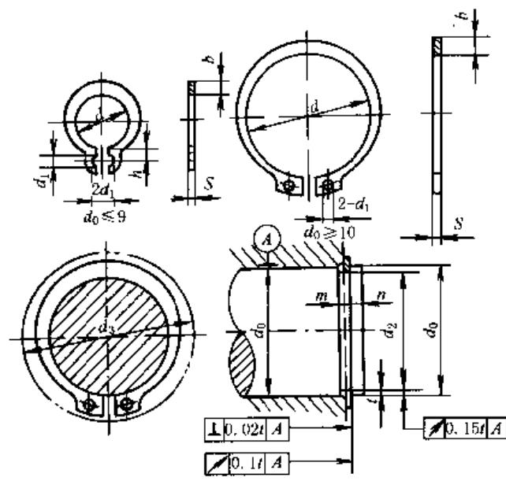

A型

$d _ { 0 } = 3 \sim 2 0 0$ (板材工艺)

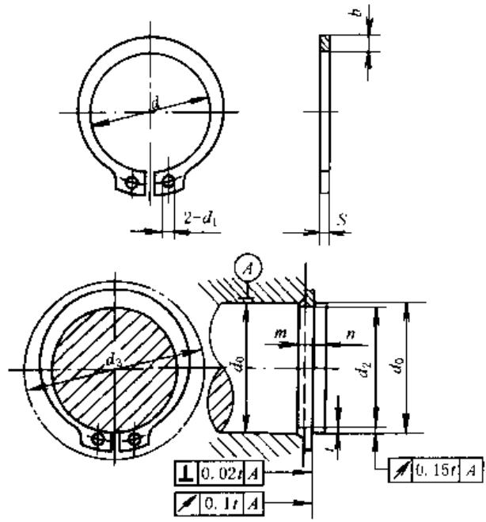

B型

$d _ { 0 } = 2 0 \sim 2 0 0$ (线材I艺)

标记示例:

轴径 $\pmb { d } _ { 0 } = 5 0 \mathbf { m m }$ 、材料为 $6 5 \mathbb { M } \mathbf { n }$ 、热处理44\~51HRC、经表面氧化处理的A型(B型)轴用弹性挡圈:

挡圈GB/T894.150

/mm 

表4-1-162

<table><tr><td rowspan=3 colspan=1>轴径d</td><td rowspan=1 colspan=7>挡        座</td><td rowspan=1 colspan=5>沟槽(推荐）</td><td rowspan=1 colspan=1>孔</td><td rowspan=3 colspan=1>每1000个的重量/g</td></tr><tr><td rowspan=1 colspan=2>1</td><td rowspan=1 colspan=2>s</td><td rowspan=2 colspan=1>bR</td><td rowspan=2 colspan=1>d</td><td rowspan=2 colspan=1>h</td><td rowspan=1 colspan=2>d</td><td rowspan=1 colspan=2>m</td><td rowspan=2 colspan=1>n</td><td rowspan=2 colspan=1>d</td></tr><tr><td rowspan=1 colspan=1>基本尺寸</td><td rowspan=1 colspan=1>极限偏差</td><td rowspan=1 colspan=1>基本尺寸</td><td rowspan=1 colspan=1>极限偏差</td><td rowspan=1 colspan=1>基本尺寸</td><td rowspan=1 colspan=1>极限偏差</td><td rowspan=1 colspan=1>基本尺寸</td><td rowspan=1 colspan=1>极限偏差</td></tr><tr><td rowspan=1 colspan=1>3</td><td rowspan=1 colspan=1>2.7</td><td rowspan=2 colspan=1>+0.04</td><td rowspan=2 colspan=1>0.4</td><td rowspan=2 colspan=1>+0.03-0.06</td><td rowspan=1 colspan=1>0.8</td><td rowspan=1 colspan=1></td><td rowspan=1 colspan=1>0.95</td><td rowspan=1 colspan=1>2.8</td><td rowspan=1 colspan=1>0-0.04</td><td rowspan=2 colspan=1>0.5</td><td rowspan=5 colspan=1>+0.140</td><td rowspan=3 colspan=1>0.3</td><td rowspan=1 colspan=1>7.2</td><td rowspan=7 colspan=1>略</td></tr><tr><td rowspan=1 colspan=1>4</td><td rowspan=1 colspan=1>3.7</td><td rowspan=1 colspan=1>0.88</td><td rowspan=1 colspan=1>1</td><td rowspan=1 colspan=1>1.1</td><td rowspan=1 colspan=1>3.8</td><td rowspan=1 colspan=1></td><td rowspan=1 colspan=1>8.8</td></tr><tr><td rowspan=1 colspan=1>5</td><td rowspan=1 colspan=1>4.7</td><td rowspan=2 colspan=1>-0.15</td><td rowspan=3 colspan=1>0.6</td><td rowspan=3 colspan=1>+0.04-0.07</td><td rowspan=1 colspan=1>1.12</td><td rowspan=1 colspan=1></td><td rowspan=1 colspan=1>1.25</td><td rowspan=1 colspan=1>4.8</td><td rowspan=2 colspan=1>0-0.048</td><td rowspan=3 colspan=1>0.7</td><td rowspan=1 colspan=1>10.7</td></tr><tr><td rowspan=1 colspan=1>6</td><td rowspan=1 colspan=1>5.6</td><td rowspan=3 colspan=1>1.32</td><td rowspan=3 colspan=1>1.2</td><td rowspan=1 colspan=1>1.35</td><td rowspan=1 colspan=1>5.7</td><td rowspan=2 colspan=1>0.5</td><td rowspan=1 colspan=1>12.2</td></tr><tr><td rowspan=1 colspan=1>7</td><td rowspan=1 colspan=1>6.5</td><td rowspan=1 colspan=1></td><td rowspan=1 colspan=1>1.55</td><td rowspan=1 colspan=1>6.7</td><td rowspan=1 colspan=1></td><td rowspan=1 colspan=1>13.8</td></tr><tr><td rowspan=1 colspan=1>8</td><td rowspan=1 colspan=1>7.4</td><td rowspan=2 colspan=1>+ 0.06-0.18</td><td rowspan=2 colspan=1>0.8</td><td rowspan=2 colspan=1>+0.04-0.10</td><td rowspan=1 colspan=1>1.60</td><td rowspan=1 colspan=1>7.6</td><td rowspan=2 colspan=1>0- 0.058</td><td rowspan=2 colspan=1>0.9</td><td rowspan=2 colspan=1></td><td rowspan=2 colspan=1>0.6</td><td rowspan=1 colspan=1>15.2</td></tr><tr><td rowspan=1 colspan=1>9</td><td rowspan=1 colspan=1>8.4</td><td rowspan=1 colspan=1>1.44</td><td rowspan=1 colspan=1></td><td rowspan=1 colspan=1>1.65</td><td rowspan=1 colspan=1>8.6</td><td rowspan=1 colspan=1>16.4</td></tr></table>

<table><tr><td rowspan=3 colspan=1>轴径中</td><td rowspan=1 colspan=6>拌        图</td><td rowspan=1 colspan=7>沟槽（推荐）</td><td rowspan=1 colspan=1>孔·</td><td rowspan=3 colspan=1>每1000个的重量/kg</td></tr><tr><td rowspan=1 colspan=2>立</td><td rowspan=1 colspan=2>S</td><td rowspan=1 colspan=1>b</td><td rowspan=2 colspan=1>山</td><td rowspan=1 colspan=4>山</td><td rowspan=1 colspan=2>州</td><td rowspan=2 colspan=1>W</td><td rowspan=2 colspan=1>山</td></tr><tr><td rowspan=1 colspan=1>基本尺寸极</td><td rowspan=1 colspan=1>极附偏差</td><td rowspan=1 colspan=1>限偏差基本尺寸</td><td rowspan=1 colspan=1>极限偏差</td><td rowspan=1 colspan=1>1</td><td rowspan=1 colspan=1>基本尺</td><td rowspan=1 colspan=3>极限偏差</td><td rowspan=1 colspan=1>基本只寸</td><td rowspan=1 colspan=1>极限偏</td></tr><tr><td rowspan=1 colspan=1>10</td><td rowspan=1 colspan=1>9.3</td><td rowspan=10 colspan=1>+0.10-0.36</td><td rowspan=13 colspan=1>1</td><td rowspan=13 colspan=1>+0.05-0.13</td><td rowspan=1 colspan=1>1.44</td><td rowspan=3 colspan=1>1.5</td><td rowspan=1 colspan=1>9.6</td><td rowspan=1 colspan=3>0-0.058</td><td rowspan=13 colspan=1>1.1</td><td rowspan=29 colspan=1>+0.140</td><td rowspan=1 colspan=1>0.6</td><td rowspan=1 colspan=1>17.6</td><td rowspan=1 colspan=1>0.24</td></tr><tr><td rowspan=1 colspan=1>1</td><td rowspan=1 colspan=1>10.2</td><td rowspan=1 colspan=1>1.52</td><td rowspan=1 colspan=1>10.5</td><td rowspan=9 colspan=3>0-0.11</td><td rowspan=2 colspan=1>0.B</td><td rowspan=1 colspan=1>18.6</td><td rowspan=1 colspan=1>0.28</td></tr><tr><td rowspan=1 colspan=1>12</td><td rowspan=1 colspan=1>！</td><td rowspan=1 colspan=1>1.72</td><td rowspan=1 colspan=1>11.5</td><td rowspan=1 colspan=1>19.6</td><td rowspan=1 colspan=1>D 35</td></tr><tr><td rowspan=1 colspan=1>13</td><td rowspan=1 colspan=1>11.9</td><td rowspan=2 colspan=1>1.88</td><td rowspan=6 colspan=1>1.7</td><td rowspan=1 colspan=1>12.4</td><td rowspan=2 colspan=1>0.9</td><td rowspan=1 colspan=1>20.8</td><td rowspan=1 colspan=1>0.41</td></tr><tr><td rowspan=1 colspan=1>14</td><td rowspan=1 colspan=1>12.9</td><td rowspan=1 colspan=1>13.4</td><td rowspan=1 colspan=1>22</td><td rowspan=1 colspan=1>0.44</td></tr><tr><td rowspan=1 colspan=1>15</td><td rowspan=1 colspan=1>13.8</td><td rowspan=1 colspan=1>2.00</td><td rowspan=1 colspan=1>14.3</td><td rowspan=1 colspan=1>1.</td><td rowspan=1 colspan=1>23.2</td><td rowspan=1 colspan=1>0.51</td></tr><tr><td rowspan=1 colspan=1>16</td><td rowspan=1 colspan=1>14、7</td><td rowspan=1 colspan=1>2.32</td><td rowspan=1 colspan=1>15.2</td><td rowspan=2 colspan=1>1.2</td><td rowspan=1 colspan=1>24.4</td><td rowspan=1 colspan=1>0.65</td></tr><tr><td rowspan=1 colspan=1>17</td><td rowspan=1 colspan=1>1S.7</td><td rowspan=3 colspan=1>2.48</td><td rowspan=1 colspan=1>16.2</td><td rowspan=1 colspan=1>25.6</td><td rowspan=1 colspan=1>0.74</td></tr><tr><td rowspan=1 colspan=1>8</td><td rowspan=1 colspan=1>16.5</td><td rowspan=1 colspan=1>17</td><td rowspan=5 colspan=1>1.5</td><td rowspan=1 colspan=1>27</td><td rowspan=1 colspan=1>0.78</td></tr><tr><td rowspan=1 colspan=1>19</td><td rowspan=1 colspan=1>125</td><td rowspan=1 colspan=1></td><td rowspan=10 colspan=1>2</td><td rowspan=1 colspan=1>18</td><td rowspan=1 colspan=1>28</td><td rowspan=1 colspan=1>08</td></tr><tr><td rowspan=1 colspan=1>20</td><td rowspan=1 colspan=1>18.5</td><td rowspan=3 colspan=1>+0.13-0.42</td><td rowspan=3 colspan=1>2.68</td><td rowspan=1 colspan=1>19</td><td rowspan=3 colspan=3>0-0.13</td><td rowspan=1 colspan=1>29</td><td rowspan=1 colspan=1>1.12</td></tr><tr><td rowspan=1 colspan=1>2</td><td rowspan=1 colspan=1>19.5</td><td rowspan=1 colspan=1>20</td><td rowspan=1 colspan=1>3</td><td rowspan=1 colspan=1>1.16</td></tr><tr><td rowspan=1 colspan=1>22</td><td rowspan=1 colspan=1>20.5</td><td rowspan=1 colspan=1>21</td><td rowspan=1 colspan=1>32</td><td rowspan=1 colspan=1>1.2</td></tr><tr><td rowspan=1 colspan=1>24</td><td rowspan=1 colspan=1>22.2</td><td rowspan=7 colspan=1>+0.21-0.42</td><td rowspan=7 colspan=1>1.2</td><td rowspan=7 colspan=1></td><td rowspan=3 colspan=1>3.32</td><td rowspan=1 colspan=1>22.9</td><td rowspan=3 colspan=3>0</td><td rowspan=7 colspan=1>1.3</td><td rowspan=3 colspan=1>1.7</td><td rowspan=1 colspan=1>34：</td><td rowspan=1 colspan=1>1.92</td></tr><tr><td rowspan=1 colspan=1>25</td><td rowspan=1 colspan=1>23.2</td><td rowspan=1 colspan=1>23.9</td><td rowspan=1 colspan=1>35</td><td rowspan=1 colspan=1>2</td></tr><tr><td rowspan=1 colspan=1>26</td><td rowspan=1 colspan=1>24.2</td><td rowspan=1 colspan=1>24.9</td><td rowspan=1 colspan=2></td><td rowspan=1 colspan=1>36</td><td rowspan=1 colspan=1>2.06</td></tr><tr><td rowspan=1 colspan=1>28</td><td rowspan=1 colspan=1>25.9</td><td rowspan=1 colspan=1>3.60</td><td rowspan=1 colspan=1>26.6</td><td rowspan=3 colspan=3>-0.21</td><td rowspan=3 colspan=1>2.1</td><td rowspan=1 colspan=1>38.4</td><td rowspan=1 colspan=1>2.51</td></tr><tr><td rowspan=1 colspan=1>29</td><td rowspan=1 colspan=1>26.9</td><td rowspan=2 colspan=1>3.72</td><td rowspan=1 colspan=1>27.6</td><td rowspan=1 colspan=1>39.8</td><td rowspan=1 colspan=1>2.66</td></tr><tr><td rowspan=1 colspan=1>30</td><td rowspan=1 colspan=1>27.9</td><td rowspan=1 colspan=1>28.6</td><td rowspan=1 colspan=1>42</td><td rowspan=1 colspan=1>2.73</td></tr><tr><td rowspan=1 colspan=1>32</td><td rowspan=1 colspan=1>29.6</td><td rowspan=1 colspan=1>3.92</td><td rowspan=7 colspan=1>2.5</td><td rowspan=1 colspan=1>30.3</td><td rowspan=1 colspan=3></td><td rowspan=2 colspan=1>2.6</td><td rowspan=1 colspan=1>44</td><td rowspan=1 colspan=1>2.98</td></tr><tr><td rowspan=1 colspan=1>34</td><td rowspan=1 colspan=1>31.5</td><td rowspan=5 colspan=1>+ 0.25-0.50</td><td rowspan=9 colspan=1>1.5</td><td rowspan=9 colspan=1>+0.06-0.15</td><td rowspan=1 colspan=1>4.32</td><td rowspan=1 colspan=1>32.3</td><td rowspan=9 colspan=3>0- 0.25</td><td rowspan=9 colspan=1>1.7</td><td rowspan=1 colspan=1>46</td><td rowspan=1 colspan=1>4.31</td></tr><tr><td rowspan=1 colspan=1>35</td><td rowspan=1 colspan=1>32.2</td><td rowspan=3 colspan=1>4.52</td><td rowspan=1 colspan=1>33</td><td rowspan=4 colspan=1>3</td><td rowspan=1 colspan=1>48</td><td rowspan=1 colspan=1>4.75</td></tr><tr><td rowspan=1 colspan=1>36</td><td rowspan=1 colspan=1>33.2</td><td rowspan=1 colspan=1>34</td><td rowspan=1 colspan=1>49</td><td rowspan=1 colspan=1>4.88</td></tr><tr><td rowspan=1 colspan=1>37</td><td rowspan=1 colspan=1>34.2</td><td rowspan=1 colspan=1>35</td><td rowspan=1 colspan=1>50</td><td rowspan=1 colspan=1>5</td></tr><tr><td rowspan=1 colspan=1>38</td><td rowspan=1 colspan=1>35.2</td><td rowspan=5 colspan=1>5.0</td><td rowspan=1 colspan=1>36</td><td rowspan=1 colspan=1>51</td><td rowspan=1 colspan=1>5.65</td></tr><tr><td rowspan=1 colspan=1>40</td><td rowspan=1 colspan=1>36.5</td><td rowspan=4 colspan=1>+0.39~0.90</td><td rowspan=1 colspan=1>37.5</td><td rowspan=4 colspan=1>3.8</td><td rowspan=1 colspan=1>53</td><td rowspan=1 colspan=1>5.99</td></tr><tr><td rowspan=1 colspan=1>42</td><td rowspan=1 colspan=1>38.5</td><td rowspan=4 colspan=1>?</td><td rowspan=1 colspan=1>39.5</td><td rowspan=1 colspan=1>56</td><td rowspan=1 colspan=1>6.18</td></tr><tr><td rowspan=1 colspan=1>45</td><td rowspan=1 colspan=1>41.5</td><td rowspan=1 colspan=1>42.5</td><td rowspan=1 colspan=1>59.4</td><td rowspan=1 colspan=1>6.57</td></tr><tr><td rowspan=1 colspan=1>48</td><td rowspan=1 colspan=1>44.5</td><td rowspan=1 colspan=1>45.5</td><td rowspan=1 colspan=1>62.8·</td><td rowspan=1 colspan=1>6.96</td></tr><tr><td rowspan=1 colspan=1>50</td><td rowspan=1 colspan=1>45.8</td><td rowspan=1 colspan=1></td><td rowspan=1 colspan=1>2</td><td rowspan=1 colspan=1>+0.06-0.18</td><td rowspan=1 colspan=1>5.48</td><td rowspan=1 colspan=1>47</td><td rowspan=1 colspan=3></td><td rowspan=1 colspan=1>2.2</td><td rowspan=1 colspan=1></td><td rowspan=1 colspan=1>4.5</td><td rowspan=1 colspan=1>64.8</td><td rowspan=1 colspan=1>10.37</td></tr></table>

续表

<table><tr><td rowspan=3 colspan=1>轴径d</td><td rowspan=1 colspan=8>挡        圈</td><td rowspan=1 colspan=7>沟槽（推荐）</td><td rowspan=1 colspan=1>孔</td><td rowspan=1 colspan=1>每1000个</td></tr><tr><td rowspan=1 colspan=4>d</td><td rowspan=1 colspan=2>5</td><td rowspan=2 colspan=1>bH</td><td rowspan=2 colspan=1>d</td><td rowspan=1 colspan=4>d</td><td rowspan=1 colspan=2>m</td><td rowspan=2 colspan=1>nW</td><td rowspan=2 colspan=1>d</td><td rowspan=2 colspan=1>的重量/kg</td></tr><tr><td rowspan=1 colspan=1>基本尺寸</td><td rowspan=1 colspan=3>极限偏差基本尺寸</td><td rowspan=1 colspan=1>极限偏差基本尺寸</td><td rowspan=1 colspan=1>极限偏差</td><td rowspan=1 colspan=1>基本尺寸</td><td rowspan=1 colspan=3>极限偏差</td><td rowspan=1 colspan=1>基本尺寸</td><td rowspan=1 colspan=1>极限偏差</td></tr><tr><td rowspan=1 colspan=1>52</td><td rowspan=1 colspan=1>47.8</td><td rowspan=1 colspan=3>+0.39-0.90</td><td rowspan=6 colspan=1>2</td><td rowspan=6 colspan=1>+0.06-0.18</td><td rowspan=2 colspan=1>5.48</td><td rowspan=21 colspan=1>3</td><td rowspan=1 colspan=1>49</td><td rowspan=1 colspan=3>0-0.25</td><td rowspan=6 colspan=1>2.2</td><td rowspan=20 colspan=1>+0.140</td><td rowspan=13 colspan=1>4.5</td><td rowspan=1 colspan=1>67</td><td rowspan=1 colspan=1>10.77</td></tr><tr><td rowspan=1 colspan=1>55</td><td rowspan=1 colspan=1>50.8</td><td rowspan=5 colspan=3>+0.46-1.10</td><td rowspan=1 colspan=1>52</td><td rowspan=5 colspan=3></td><td rowspan=1 colspan=1>70.4</td><td rowspan=1 colspan=1>11.34</td></tr><tr><td rowspan=1 colspan=1>56</td><td rowspan=1 colspan=1>51.8</td><td rowspan=6 colspan=1>6.12</td><td rowspan=1 colspan=1>53</td><td rowspan=1 colspan=1>71.7</td><td rowspan=1 colspan=1>12.99</td></tr><tr><td rowspan=1 colspan=1>58</td><td rowspan=1 colspan=1>53.8</td><td rowspan=1 colspan=1>55</td><td rowspan=1 colspan=1>73.6</td><td rowspan=1 colspan=1>13.44</td></tr><tr><td rowspan=1 colspan=1>60</td><td rowspan=1 colspan=1>55.8</td><td rowspan=1 colspan=1>57</td><td rowspan=1 colspan=1>75.8</td><td rowspan=1 colspan=1>14.17</td></tr><tr><td rowspan=1 colspan=1>62</td><td rowspan=1 colspan=1>57.8</td><td rowspan=1 colspan=1>59</td><td rowspan=1 colspan=2></td><td rowspan=1 colspan=1>79</td><td rowspan=1 colspan=1>14.59</td></tr><tr><td rowspan=1 colspan=1>63</td><td rowspan=1 colspan=1>58.8</td><td rowspan=3 colspan=3></td><td rowspan=3 colspan=1>2.5</td><td rowspan=3 colspan=1>+ 0.07- 0.22</td><td rowspan=1 colspan=1>60</td><td rowspan=9 colspan=3>0- 0.30</td><td rowspan=1 colspan=2></td><td rowspan=14 colspan=1>2.7</td><td rowspan=1 colspan=1>79.6</td><td rowspan=1 colspan=1>18.51</td></tr><tr><td rowspan=1 colspan=1>65</td><td rowspan=1 colspan=1>60.8</td><td rowspan=1 colspan=1>62</td><td rowspan=1 colspan=1>81.6</td><td rowspan=1 colspan=1>19.04</td></tr><tr><td rowspan=1 colspan=1>68</td><td rowspan=1 colspan=1>63.5</td><td rowspan=1 colspan=1></td><td rowspan=1 colspan=1>65</td><td rowspan=1 colspan=1>85</td><td rowspan=1 colspan=1>20.41</td></tr><tr><td rowspan=1 colspan=1>70</td><td rowspan=1 colspan=1>65.5</td><td rowspan=7 colspan=3>+0.46-1.10</td><td rowspan=11 colspan=1>2.5</td><td rowspan=21 colspan=1>+0.07-0.22</td><td rowspan=1 colspan=1>67</td><td rowspan=1 colspan=1>87.2</td><td rowspan=1 colspan=1>20.98</td></tr><tr><td rowspan=1 colspan=1>72</td><td rowspan=1 colspan=1>67.5</td><td rowspan=1 colspan=1>69</td><td rowspan=1 colspan=1>89.4</td><td rowspan=1 colspan=1>21.72</td></tr><tr><td rowspan=1 colspan=1>75</td><td rowspan=1 colspan=1>70.5</td><td rowspan=1 colspan=1>72</td><td rowspan=1 colspan=1>92.8</td><td rowspan=1 colspan=1>22.56</td></tr><tr><td rowspan=1 colspan=1>78</td><td rowspan=1 colspan=1>73.5</td><td rowspan=1 colspan=1>75</td><td rowspan=1 colspan=1>96.2</td><td rowspan=1 colspan=1>23.39</td></tr><tr><td rowspan=1 colspan=1>80</td><td rowspan=1 colspan=1>74.5</td><td rowspan=4 colspan=1>7.0</td><td rowspan=1 colspan=1>76.5</td><td rowspan=7 colspan=1>5.3</td><td rowspan=1 colspan=1>98.2</td><td rowspan=1 colspan=1>26.27</td></tr><tr><td rowspan=1 colspan=1>B2</td><td rowspan=1 colspan=1>76.5</td><td rowspan=1 colspan=1>78.5</td><td rowspan=1 colspan=1>101</td><td rowspan=1 colspan=1>27</td></tr><tr><td rowspan=1 colspan=1>B5</td><td rowspan=1 colspan=1>79.5</td><td rowspan=1 colspan=1>81.5</td><td rowspan=1 colspan=3></td><td rowspan=1 colspan=1>104</td><td rowspan=1 colspan=1>28.02</td></tr><tr><td rowspan=1 colspan=1>88</td><td rowspan=1 colspan=1>82.5</td><td rowspan=4 colspan=3></td><td rowspan=1 colspan=1>84.5</td><td rowspan=4 colspan=3>0-0.35</td><td rowspan=1 colspan=1>107.3</td><td rowspan=1 colspan=1>28.93</td></tr><tr><td rowspan=1 colspan=1>90</td><td rowspan=1 colspan=1>84.5</td><td rowspan=1 colspan=1>7.6</td><td rowspan=1 colspan=1>86.5</td><td rowspan=1 colspan=1>110</td><td rowspan=1 colspan=1>32.5</td></tr><tr><td rowspan=1 colspan=1>95</td><td rowspan=1 colspan=1>89.5</td><td rowspan=2 colspan=1>9.2</td><td rowspan=1 colspan=1>91.5</td><td rowspan=1 colspan=1>115</td><td rowspan=1 colspan=1>41.31</td></tr><tr><td rowspan=1 colspan=1>100</td><td rowspan=1 colspan=1>94.5</td><td rowspan=1 colspan=2></td><td rowspan=1 colspan=1>96.5</td><td rowspan=1 colspan=1>121</td><td rowspan=1 colspan=1>44.94</td></tr><tr><td rowspan=1 colspan=1>105</td><td rowspan=1 colspan=1>98</td><td rowspan=1 colspan=2>+</td><td rowspan=5 colspan=2>+ 0.54- 1.30</td><td rowspan=10 colspan=1>3</td><td rowspan=1 colspan=1>10.7</td><td rowspan=1 colspan=1>101</td><td rowspan=4 colspan=3>0- 0.54</td><td rowspan=10 colspan=1>3.2</td><td rowspan=10 colspan=1>+0.180</td><td rowspan=9 colspan=1>6</td><td rowspan=1 colspan=1>132</td><td rowspan=1 colspan=1>63.95</td></tr><tr><td rowspan=1 colspan=1>110</td><td rowspan=1 colspan=1>103</td><td></td><td></td><td rowspan=1 colspan=1>11.3</td><td rowspan=9 colspan=1>4</td><td rowspan=1 colspan=1>106</td><td rowspan=1 colspan=1>136</td><td rowspan=1 colspan=1>70.97</td></tr><tr><td rowspan=1 colspan=1>115</td><td rowspan=1 colspan=1>108</td><td></td><td></td><td rowspan=2 colspan=1>12</td><td rowspan=1 colspan=1>111</td><td rowspan=1 colspan=1>142</td><td rowspan=1 colspan=1>78.58</td></tr><tr><td rowspan=1 colspan=1>120</td><td rowspan=1 colspan=1>113</td><td></td><td></td><td rowspan=1 colspan=1>116</td><td rowspan=1 colspan=1>145</td><td rowspan=1 colspan=1>81.77</td></tr><tr><td rowspan=1 colspan=1>125</td><td rowspan=1 colspan=1>118</td><td></td><td></td><td rowspan=2 colspan=1>12.6</td><td rowspan=1 colspan=1>121</td><td rowspan=3 colspan=3>0</td><td rowspan=1 colspan=1>151</td><td rowspan=1 colspan=1>89.97</td></tr><tr><td rowspan=1 colspan=1>130</td><td rowspan=1 colspan=1>123</td><td rowspan=5 colspan=3>+0.63- 1.50</td><td></td><td rowspan=1 colspan=1>126</td><td rowspan=1 colspan=1>158</td><td rowspan=1 colspan=1>93.87</td></tr><tr><td rowspan=1 colspan=1>135</td><td rowspan=1 colspan=1>128</td><td></td><td rowspan=3 colspan=1>13.2</td><td rowspan=1 colspan=1>131</td><td rowspan=1 colspan=1>162.8</td><td rowspan=1 colspan=1>102.7</td></tr><tr><td rowspan=1 colspan=1>140</td><td rowspan=1 colspan=1>133</td><td></td><td rowspan=1 colspan=1>136</td><td rowspan=3 colspan=3>-0.63</td><td rowspan=1 colspan=1>168</td><td rowspan=1 colspan=1>106.3</td></tr><tr><td rowspan=1 colspan=1>145</td><td rowspan=1 colspan=1>138</td><td></td><td rowspan=1 colspan=1>141</td><td rowspan=1 colspan=1>174.4</td><td rowspan=1 colspan=1>110</td></tr><tr><td rowspan=1 colspan=1>150</td><td rowspan=1 colspan=1>142</td><td></td><td rowspan=1 colspan=1>14</td><td rowspan=1 colspan=1>145</td><td rowspan=1 colspan=1>7.5</td><td rowspan=1 colspan=1>180</td><td rowspan=1 colspan=1>112.7</td></tr></table>

<table><tr><td rowspan=3 colspan=1>轴径d</td><td rowspan=1 colspan=6>挡        圈</td><td rowspan=1 colspan=7>沟槽(推荐）</td><td rowspan=1 colspan=2>孔</td><td rowspan=3 colspan=1>每1000个的重量/kg</td></tr><tr><td rowspan=1 colspan=2>d</td><td rowspan=1 colspan=2>s</td><td rowspan=2 colspan=1>b1</td><td rowspan=2 colspan=1>d</td><td rowspan=1 colspan=2>d</td><td rowspan=1 colspan=2>m</td><td rowspan=2 colspan=3>nW</td><td rowspan=2 colspan=2>d</td></tr><tr><td rowspan=1 colspan=1>基本尺寸</td><td rowspan=1 colspan=1>极限偏差</td><td rowspan=1 colspan=1>基本尺寸</td><td rowspan=1 colspan=1>极限偏差</td><td rowspan=1 colspan=1>基本尺寸</td><td rowspan=1 colspan=1>极限偏差</td><td rowspan=1 colspan=1>基本尺寸</td><td rowspan=1 colspan=1>极限偏差</td></tr><tr><td rowspan=1 colspan=1>155</td><td rowspan=1 colspan=1>146</td><td rowspan=4 colspan=1>+0.63-1.50</td><td rowspan=4 colspan=1></td><td rowspan=4 colspan=1></td><td rowspan=2 colspan=1>14</td><td rowspan=12 colspan=1>4</td><td rowspan=1 colspan=1>150</td><td rowspan=2 colspan=1></td><td rowspan=4 colspan=1></td><td rowspan=4 colspan=1></td><td rowspan=4 colspan=3></td><td rowspan=1 colspan=2>186</td><td rowspan=1 colspan=1>122.7</td></tr><tr><td rowspan=1 colspan=1>160</td><td rowspan=1 colspan=1>151</td><td rowspan=1 colspan=1>155</td><td rowspan=1 colspan=2>190</td><td rowspan=1 colspan=1>126.4</td></tr><tr><td rowspan=1 colspan=1>165</td><td rowspan=1 colspan=1>155.5</td><td rowspan=2 colspan=1>14.4</td><td rowspan=1 colspan=1>160</td><td rowspan=2 colspan=1>0-0.63</td><td rowspan=1 colspan=2>195</td><td rowspan=1 colspan=1>133.7</td></tr><tr><td rowspan=1 colspan=1>170</td><td rowspan=1 colspan=1>160.5</td><td rowspan=1 colspan=1>165</td><td rowspan=1 colspan=2>200</td><td rowspan=1 colspan=1>137</td></tr><tr><td rowspan=1 colspan=1>175</td><td rowspan=1 colspan=1>165.5</td><td rowspan=4 colspan=1></td><td rowspan=8 colspan=1>3</td><td rowspan=8 colspan=1>+ 0.07-0.22</td><td rowspan=4 colspan=1>15</td><td rowspan=1 colspan=1>170</td><td rowspan=4 colspan=1></td><td rowspan=4 colspan=1>3.2</td><td rowspan=4 colspan=1>+0.180</td><td rowspan=4 colspan=3>7.5</td><td rowspan=1 colspan=1>7.5</td><td></td><td></td><td rowspan=1 colspan=1>206</td></tr><tr><td rowspan=3 colspan=1>180</td><td rowspan=3 colspan=1>170.5</td><td rowspan=3 colspan=1>175</td><td rowspan=3 colspan=3></td><td></td><td></td><td></td></tr><tr><td rowspan=2 colspan=2></td><td></td><td></td></tr><tr><td rowspan=1 colspan=2>212</td><td rowspan=1 colspan=1>152</td></tr><tr><td rowspan=1 colspan=1>185</td><td rowspan=1 colspan=1>175.5</td><td rowspan=1 colspan=1></td><td rowspan=2 colspan=1>15.2</td><td rowspan=1 colspan=1>180 ；</td><td rowspan=1 colspan=1></td><td rowspan=4 colspan=1></td><td rowspan=4 colspan=1></td><td rowspan=4 colspan=3></td><td rowspan=1 colspan=2>218</td><td rowspan=1 colspan=1>158.1</td></tr><tr><td rowspan=1 colspan=1>190</td><td rowspan=1 colspan=1>180.5</td><td rowspan=2 colspan=1>+ 0.72-1.70</td><td rowspan=1 colspan=1>185</td><td rowspan=3 colspan=1>0-0.72</td><td rowspan=1 colspan=2>223</td><td rowspan=1 colspan=1>162.5</td></tr><tr><td rowspan=1 colspan=1>195</td><td rowspan=1 colspan=1>185.5</td><td rowspan=2 colspan=1>15.6</td><td rowspan=1 colspan=1>190</td><td rowspan=1 colspan=2>229</td><td rowspan=1 colspan=1>171.8</td></tr><tr><td rowspan=1 colspan=1>200</td><td rowspan=1 colspan=1>190.5</td><td rowspan=1 colspan=1></td><td rowspan=1 colspan=1>195</td><td rowspan=1 colspan=2>235</td><td rowspan=1 colspan=1>176.4</td></tr></table>

注:1GB/T894.1,轴径 $d _ { \odot } = 3 \sim 2 0 0 \mathrm { m m }$ :GB/T894.2,轴径 $d _ { 0 } = 2 0 \sim 2 0 0 \mathrm { m m } _ { \odot }$ 2 $\pmb { \Lambda }$ 型是采用板材-冲切T艺制成;B型是采用线材-冲制工艺制成。3. $d _ { 3 }$ 为允许套人的最小孔径。4.标记示例中材料说明同表4-1-161注4。

# 孔用钢丝挡圈(GB/T895.1—1986)

# 轴用钢丝挡圈(GB/T895.2—1986)

标记示例:

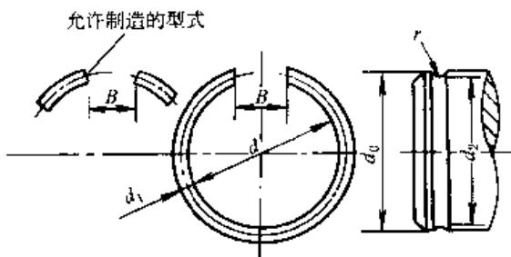

孔径do=40mm、材料为碳素弹簧钢丝、经低温回火及表面氧化处理的孔用钢丝挡圈:

挡圈GB/T895.140

/mm 

表4-1-163

<table><tr><td rowspan=4 colspan=1>孔径轴径山</td><td rowspan=1 colspan=8>挡          围</td><td rowspan=1 colspan=4>沟增（推荐）</td></tr><tr><td rowspan=3 colspan=1>d</td><td rowspan=3 colspan=1>r</td><td rowspan=1 colspan=3>GB/T 895.1</td><td rowspan=1 colspan=3>GB/T 895.2</td><td rowspan=1 colspan=2>GB/T 895.1</td><td rowspan=1 colspan=2>CB/T 895.2</td></tr><tr><td rowspan=1 colspan=2>D</td><td rowspan=1 colspan=1>B</td><td rowspan=1 colspan=2>d</td><td rowspan=1 colspan=1>B</td><td rowspan=1 colspan=2>d</td><td rowspan=1 colspan=2>d</td></tr><tr><td rowspan=1 colspan=1>基本尺寸</td><td rowspan=1 colspan=1>极限偏差</td><td rowspan=1 colspan=1>B</td><td rowspan=1 colspan=1>基本尺寸</td><td rowspan=1 colspan=1>极限偏差</td><td rowspan=1 colspan=1>B</td><td rowspan=1 colspan=1>基本尺寸</td><td rowspan=1 colspan=1>极限偏差</td><td rowspan=1 colspan=1>基本尺寸</td><td rowspan=1 colspan=1>极限偏差</td></tr><tr><td rowspan=1 colspan=1>4</td><td rowspan=3 colspan=1>0.6</td><td rowspan=3 colspan=1>0.4</td><td rowspan=1 colspan=1></td><td rowspan=3 colspan=1></td><td rowspan=3 colspan=1>1</td><td rowspan=1 colspan=1>3</td><td rowspan=3 colspan=1>0-0.18</td><td rowspan=3 colspan=1>！</td><td rowspan=1 colspan=1></td><td rowspan=3 colspan=1></td><td rowspan=1 colspan=1>3.4</td><td rowspan=3 colspan=1>±0.037</td></tr><tr><td rowspan=1 colspan=1>5</td><td rowspan=1 colspan=1>1</td><td rowspan=1 colspan=1>4</td><td rowspan=1 colspan=1></td><td rowspan=1 colspan=1>4.4：</td></tr><tr><td rowspan=1 colspan=1>6</td><td rowspan=1 colspan=1></td><td rowspan=1 colspan=1>5</td><td rowspan=1 colspan=1></td><td rowspan=1 colspan=1>：5.4</td></tr></table>

续表

<table><tr><td rowspan=4 colspan=1>孔径轴径d</td><td rowspan=1 colspan=3></td><td rowspan=1 colspan=10>挡           圈</td><td rowspan=1 colspan=7>沟槽（推荐）</td></tr><tr><td rowspan=3 colspan=1>d</td><td rowspan=3 colspan=2>，</td><td rowspan=1 colspan=4>GB/T 895.1</td><td rowspan=1 colspan=6>GB/T 895.2</td><td rowspan=1 colspan=5>CB/T 895.1</td><td rowspan=1 colspan=2>GR/T 895.2</td></tr><tr><td rowspan=1 colspan=2>D</td><td rowspan=1 colspan=2>B</td><td rowspan=1 colspan=3>d</td><td rowspan=1 colspan=3>B</td><td rowspan=1 colspan=5>d</td><td rowspan=1 colspan=2>山</td></tr><tr><td rowspan=1 colspan=1>基本尺寸</td><td rowspan=1 colspan=1>极限偏差</td><td rowspan=1 colspan=2>B</td><td rowspan=1 colspan=2>基本尺寸</td><td rowspan=1 colspan=1>极限偏差</td><td rowspan=1 colspan=3>B</td><td rowspan=1 colspan=1>基本尺寸</td><td rowspan=1 colspan=4>极限偏差</td><td rowspan=1 colspan=1>基本尺寸</td><td rowspan=1 colspan=1>极限偏差</td></tr><tr><td rowspan=1 colspan=1>7</td><td rowspan=3 colspan=1>0.8</td><td rowspan=3 colspan=2>0.5</td><td rowspan=1 colspan=1>8.0</td><td rowspan=2 colspan=1>+0.220</td><td rowspan=2 colspan=2>4</td><td rowspan=1 colspan=2>6</td><td rowspan=3 colspan=1>0- 0.22</td><td rowspan=3 colspan=3>2</td><td rowspan=1 colspan=1>7.8</td><td rowspan=2 colspan=4>±0.045</td><td rowspan=1 colspan=1>6.2</td><td rowspan=2 colspan=1>±0.045</td></tr><tr><td rowspan=1 colspan=1>8</td><td rowspan=1 colspan=1>9.0</td><td rowspan=2 colspan=2>4</td><td rowspan=1 colspan=2>7</td><td rowspan=1 colspan=1>8.8</td><td rowspan=1 colspan=1>7.2</td></tr><tr><td rowspan=1 colspan=1>10</td><td rowspan=1 colspan=1>11.0</td><td rowspan=4 colspan=1>+0.430</td><td rowspan=1 colspan=2>9</td><td rowspan=1 colspan=1>10.8</td><td rowspan=4 colspan=4>± 0.055</td><td rowspan=1 colspan=1>9.2</td><td rowspan=1 colspan=1></td></tr><tr><td rowspan=1 colspan=1>12</td><td rowspan=2 colspan=1>1.0</td><td rowspan=2 colspan=2>0.6</td><td rowspan=1 colspan=1>13.5</td><td rowspan=2 colspan=2>6</td><td rowspan=1 colspan=2>10.5</td><td rowspan=5 colspan=1>0- 0.47</td><td rowspan=5 colspan=3></td><td rowspan=1 colspan=1>13.0</td><td rowspan=1 colspan=1>11.0</td><td rowspan=4 colspan=1>±0.055</td></tr><tr><td rowspan=1 colspan=1>14</td><td rowspan=1 colspan=1>15.5</td><td rowspan=1 colspan=2>12.5</td><td rowspan=1 colspan=1>15.0</td><td rowspan=1 colspan=1>13.0</td></tr><tr><td rowspan=1 colspan=1>16</td><td rowspan=2 colspan=1>1.6</td><td rowspan=2 colspan=2>0.9</td><td rowspan=1 colspan=1>18.0</td><td rowspan=1 colspan=2>8</td><td rowspan=1 colspan=2>14.0</td><td rowspan=1 colspan=1>17.6</td><td rowspan=1 colspan=1>14.4</td></tr><tr><td rowspan=1 colspan=1>18</td><td rowspan=1 colspan=1>20.0</td><td rowspan=3 colspan=1>+0.52</td><td rowspan=1 colspan=2>8</td><td rowspan=1 colspan=2>16.0</td><td rowspan=1 colspan=1>19.6</td><td rowspan=1 colspan=4>± 0.065</td><td rowspan=1 colspan=1>16.4</td></tr><tr><td rowspan=1 colspan=1>20</td><td rowspan=6 colspan=1>2.0</td><td rowspan=6 colspan=2>1.1</td><td rowspan=1 colspan=1>22.5</td><td rowspan=2 colspan=2></td><td rowspan=1 colspan=2>17.5</td><td rowspan=1 colspan=1>22.0</td><td rowspan=2 colspan=4></td><td rowspan=1 colspan=1>18.0</td><td rowspan=1 colspan=1>±0.09</td></tr><tr><td rowspan=1 colspan=1>22</td><td rowspan=1 colspan=1>24.5</td><td rowspan=1 colspan=2>19.5</td><td rowspan=10 colspan=1>0-0.52</td><td rowspan=9 colspan=3>3</td><td rowspan=1 colspan=1>24.0</td><td rowspan=1 colspan=2></td><td rowspan=1 colspan=2></td><td rowspan=1 colspan=1>20.0</td><td rowspan=10 colspan=1>±0.105</td></tr><tr><td></td><td></td><td></td><td rowspan=6 colspan=2>10</td><td rowspan=3 colspan=2>21.5</td><td rowspan=3 colspan=1>26.0</td><td rowspan=3 colspan=1></td><td rowspan=2 colspan=2></td><td></td><td></td></tr><tr><td rowspan=2 colspan=1>24</td><td rowspan=2 colspan=1>26.5</td><td rowspan=5 colspan=1>0</td><td rowspan=2 colspan=2></td><td rowspan=2 colspan=1>22.0</td></tr><tr><td rowspan=1 colspan=2></td></tr><tr><td rowspan=1 colspan=1>25</td><td rowspan=1 colspan=1>27.5</td><td rowspan=1 colspan=2>22.5</td><td rowspan=1 colspan=1>27.0</td><td rowspan=1 colspan=4></td><td rowspan=1 colspan=1>23.0</td></tr><tr><td rowspan=2 colspan=1>26</td><td rowspan=4 colspan=1></td><td rowspan=4 colspan=2></td><td rowspan=2 colspan=1>28.5</td><td rowspan=2 colspan=2></td><td rowspan=2 colspan=2>23.5</td><td rowspan=2 colspan=1>28.0</td><td rowspan=3 colspan=4></td><td rowspan=2 colspan=1>24.0</td></tr><tr><td rowspan=1 colspan=2></td></tr><tr><td rowspan=1 colspan=1>28</td><td rowspan=1 colspan=1>30.5</td><td rowspan=2 colspan=1>+ 0.620</td><td rowspan=2 colspan=2></td><td rowspan=1 colspan=2>25.5</td><td rowspan=1 colspan=1>30.0</td><td rowspan=1 colspan=1>26.0</td></tr><tr><td rowspan=1 colspan=1>30</td><td rowspan=1 colspan=1>32.5</td><td rowspan=1 colspan=2>27.5</td><td rowspan=1 colspan=1>32.0</td><td rowspan=4 colspan=4>± 0.125</td><td rowspan=1 colspan=1>28.0</td></tr><tr><td rowspan=1 colspan=1>32</td><td rowspan=3 colspan=1></td><td rowspan=3 colspan=2></td><td rowspan=1 colspan=1>35.0</td><td rowspan=1 colspan=1></td><td rowspan=1 colspan=2></td><td rowspan=1 colspan=2>29.0</td><td rowspan=1 colspan=3></td><td rowspan=1 colspan=1>34.5</td><td rowspan=1 colspan=1>29.5</td></tr><tr><td rowspan=1 colspan=1>35</td><td rowspan=1 colspan=1>38.0</td><td rowspan=5 colspan=1>+ 1.000</td><td rowspan=1 colspan=2>12</td><td rowspan=1 colspan=2>32.0</td><td rowspan=7 colspan=1>0-0.00</td><td rowspan=7 colspan=3>4</td><td rowspan=1 colspan=1></td><td rowspan=1 colspan=1>37.6</td><td rowspan=1 colspan=1>32.5</td><td rowspan=4 colspan=1>± 0.125</td></tr><tr><td rowspan=1 colspan=1>38</td><td rowspan=1 colspan=1></td><td rowspan=1 colspan=1>41.0</td><td rowspan=1 colspan=2>35.0</td><td rowspan=1 colspan=1>40.6</td><td rowspan=1 colspan=1>35.5</td></tr><tr><td rowspan=1 colspan=1>40</td><td rowspan=5 colspan=1>2.5</td><td rowspan=5 colspan=2>1.4</td><td rowspan=1 colspan=1></td><td rowspan=1 colspan=1>43.0</td><td rowspan=1 colspan=2>37.0</td><td rowspan=1 colspan=1>42.6</td><td rowspan=3 colspan=4></td><td rowspan=1 colspan=1>37.5</td></tr><tr><td rowspan=1 colspan=1>42</td><td rowspan=1 colspan=1>45.0</td><td rowspan=2 colspan=2>16</td><td rowspan=1 colspan=2>39.0</td><td rowspan=1 colspan=1>44.5</td><td rowspan=1 colspan=1>39.5</td></tr><tr><td rowspan=1 colspan=1>45</td><td rowspan=1 colspan=1>48.0</td><td rowspan=1 colspan=2>16</td><td rowspan=1 colspan=2>42.0</td><td rowspan=1 colspan=1>47.5</td><td rowspan=1 colspan=1>42.5</td><td rowspan=3 colspan=1></td></tr><tr><td rowspan=1 colspan=1>48</td><td rowspan=1 colspan=1>51.0</td><td rowspan=9 colspan=1>+ 1.200</td><td rowspan=1 colspan=2>16</td><td rowspan=1 colspan=2>45.0</td><td rowspan=1 colspan=1>50.5</td><td rowspan=3 colspan=4></td><td rowspan=1 colspan=1>45.5</td></tr><tr><td rowspan=1 colspan=1>50</td><td rowspan=1 colspan=1>53.0</td><td rowspan=1 colspan=2>47.0</td><td rowspan=1 colspan=1>52.5</td><td rowspan=1 colspan=1>47.5</td></tr><tr><td rowspan=1 colspan=1>55</td><td rowspan=17 colspan=1>3.2</td><td rowspan=17 colspan=2>1.8</td><td rowspan=1 colspan=1>59.0</td><td rowspan=5 colspan=2>20</td><td rowspan=1 colspan=2>51.0</td><td rowspan=5 colspan=1>0</td><td rowspan=5 colspan=3></td><td rowspan=1 colspan=1></td><td></td><td rowspan=1 colspan=4>58.2</td><td rowspan=1 colspan=1></td><td rowspan=1 colspan=1>51.8</td></tr><tr><td></td><td></td><td rowspan=3 colspan=2>56.0</td><td rowspan=3 colspan=1>63.2</td><td rowspan=3 colspan=3>± 0.150</td><td rowspan=2 colspan=3>± 0.150</td><td></td><td></td></tr><tr><td rowspan=2 colspan=1>60</td><td rowspan=2 colspan=1>64.0</td><td rowspan=2 colspan=1>50</td><td rowspan=2 colspan=1>56.8</td><td></td></tr><tr><td rowspan=1 colspan=3></td><td></td></tr><tr><td rowspan=1 colspan=1>65</td><td rowspan=1 colspan=1>69.0</td><td rowspan=1 colspan=2>61.0</td><td rowspan=1 colspan=1>68.2</td><td rowspan=3 colspan=4></td><td rowspan=1 colspan=3></td><td rowspan=1 colspan=1>61.8</td><td></td></tr><tr><td rowspan=1 colspan=1>70</td><td rowspan=1 colspan=1>74.0</td><td rowspan=2 colspan=2></td><td rowspan=1 colspan=2>66.0</td><td rowspan=3 colspan=1>- 1.20</td><td rowspan=3 colspan=3></td><td rowspan=1 colspan=1>73.2</td><td rowspan=1 colspan=1>66.8</td><td></td></tr><tr><td rowspan=1 colspan=1>75</td><td rowspan=1 colspan=1>79.0</td><td rowspan=1 colspan=1></td><td rowspan=1 colspan=2>71.0</td><td rowspan=1 colspan=1>78.2</td><td rowspan=1 colspan=1>71.8</td><td></td></tr><tr><td rowspan=1 colspan=1>80</td><td rowspan=1 colspan=1>84.0</td><td rowspan=8 colspan=1>+ 1.400</td><td rowspan=1 colspan=2>25</td><td rowspan=1 colspan=2>76.0</td><td rowspan=1 colspan=1>83.2</td><td rowspan=8 colspan=4>±0.175</td><td rowspan=1 colspan=1>76.8</td><td></td></tr><tr><td rowspan=1 colspan=1>85</td><td rowspan=1 colspan=1>89.0</td><td rowspan=1 colspan=2>81.0</td><td rowspan=4 colspan=1>0</td><td rowspan=4 colspan=3>s</td><td rowspan=1 colspan=2></td><td rowspan=1 colspan=1>88.2</td><td rowspan=1 colspan=1>81.8</td><td rowspan=8 colspan=1></td></tr><tr><td rowspan=1 colspan=1>90</td><td rowspan=1 colspan=1>94.0</td><td rowspan=1 colspan=2>86.0</td><td rowspan=1 colspan=1>93.2</td><td rowspan=1 colspan=1>86.8</td></tr><tr><td rowspan=1 colspan=1>95</td><td rowspan=1 colspan=1>99.0</td><td rowspan=1 colspan=2>91.0</td><td rowspan=1 colspan=1>98.2</td><td rowspan=1 colspan=1>91.8</td></tr><tr><td rowspan=1 colspan=1>100</td><td rowspan=1 colspan=1>104.0</td><td rowspan=4 colspan=2>32</td><td rowspan=1 colspan=2>%.0</td><td rowspan=1 colspan=1>103.2</td><td rowspan=1 colspan=1>96.8</td></tr><tr><td rowspan=1 colspan=1>105</td><td rowspan=1 colspan=1>109.0</td><td rowspan=1 colspan=2>101.0</td><td rowspan=1 colspan=1>-1.40</td><td></td><td rowspan=1 colspan=2></td><td rowspan=1 colspan=1>108.2</td><td rowspan=1 colspan=1>101.8</td></tr><tr><td rowspan=1 colspan=1>110</td><td rowspan=1 colspan=1>114.0</td><td rowspan=1 colspan=2>106.0</td><td rowspan=3 colspan=1></td><td></td><td rowspan=1 colspan=2></td><td rowspan=1 colspan=1>113.2</td><td rowspan=1 colspan=1>106.8</td></tr><tr><td rowspan=1 colspan=1>115</td><td rowspan=1 colspan=1>119.0</td><td rowspan=1 colspan=2>111.0</td><td></td><td rowspan=1 colspan=1>118.2</td><td rowspan=1 colspan=1>111.8</td></tr><tr><td rowspan=1 colspan=1>120</td><td rowspan=1 colspan=1>124.0</td><td rowspan=2 colspan=1>+ 1.600</td><td rowspan=2 colspan=2></td><td rowspan=1 colspan=1></td><td rowspan=1 colspan=2>116.0</td><td></td><td rowspan=1 colspan=1></td><td rowspan=1 colspan=1>123.2</td><td rowspan=2 colspan=4>+ 0.200</td><td rowspan=1 colspan=1>116.8</td></tr><tr><td rowspan=1 colspan=1>125</td><td rowspan=1 colspan=1>129.0</td><td rowspan=1 colspan=2>121.0</td><td rowspan=1 colspan=1>0-1.60</td><td></td><td rowspan=1 colspan=2></td><td rowspan=1 colspan=1>128.2</td><td rowspan=1 colspan=1>121.8</td><td rowspan=1 colspan=1>±0.20</td></tr></table>

# 第2章 铆钉联接

# 1铆钉联接的类型、特点和应用

铆钉联接是利用铆钉将两个或两个以上的元件(·般为板材或型材)联接在·起的-种不可拆卸的联接,简称铆接。

铆接分冷铆和热铆两种。热铆紧密性较好,但铆杆与钉孔间有间隙,不能参与传力。冷铆时钉杆镦粗,涨满钉孔,钉杆与钉孔间无间隙,直径大于 $1 0 \mathrm { m m }$ 的钢铆钉加热到 $1 0 0 0 \sim 1 1 0 0 \%$ 进行热铆,钉杆上的单位面积锤击力为 $6 5 0 \sim 8 0 0 \mathrm { M P a } .$ ,直径小于 $\scriptstyle 1 0 = { \mathrm { m m } }$ 的钢铆钉和塑性较好的有色金属、轻金属及合金制造的铆钉,常用冷铆。

铆接在建筑、锅炉制造、铁路桥梁和金属结构等方面均有应用。

铆接的主要特点是;工艺简单、联接可靠、抗震、耐冲击。与焊接相比,其缺点是:结构笨重,铆孔削弱被联接件截面强度 $1 5 \% \sim 2 0 \%$ ,铆接操作劳动强度大,噪声大,生产效率低。因此,铆接经济性和紧密性不如焊接。

# 2铆缝形式

铆缝形式见图4-2-1,分搭接、单盖板对接和双盖板对接三种形式。

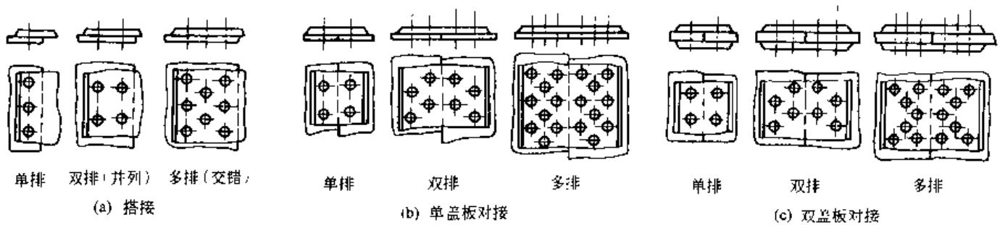

图4-2-1铆缝形式

# 3铆钉孔间距(GB/T152.1—1988)

表4-2-1

<table><tr><td rowspan=9 colspan=1>1BF                           Fer</td><td rowspan=2 colspan=1>名称</td><td rowspan=2 colspan=3>位置与方向</td><td rowspan=1 colspan=3>允许距离</td><td rowspan=2 colspan=1>注</td></tr><tr><td rowspan=1 colspan=1>最大（取两者之小值）</td><td rowspan=1 colspan=2>最   小</td></tr><tr><td rowspan=4 colspan=1>间距：</td><td rowspan=1 colspan=3>外排</td><td rowspan=1 colspan=1>8d或128</td><td rowspan=2 colspan=1>钉并列</td><td rowspan=2 colspan=1>3d</td><td rowspan=4 colspan=1>山  -钉孔直径8   外层较薄板件的厚度</td></tr><tr><td rowspan=3 colspan=1>中间排</td><td rowspan=2 colspan=2>构件受压</td><td rowspan=2 colspan=1>12d或188</td></tr><tr><td rowspan=2 colspan=1>钉错列</td><td rowspan=2 colspan=1>3.5d</td></tr><tr><td rowspan=1 colspan=2>构件受拉</td><td rowspan=1 colspan=1>16d或248</td></tr><tr><td rowspan=3 colspan=1>边距</td><td rowspan=1 colspan=3>平行于载荷的方向e</td><td rowspan=3 colspan=1>4d或86</td><td rowspan=1 colspan=2>2d</td><td rowspan=3 colspan=1></td></tr><tr><td rowspan=2 colspan=2>垂直于载荷的方向e</td><td rowspan=1 colspan=1>切割边</td><td rowspan=1 colspan=2>1.5do</td></tr><tr><td rowspan=1 colspan=1>轧制边</td><td rowspan=1 colspan=2>1.2d</td></tr></table>

# 4铆钉长度计算

表4-2-2

<table><tr><td rowspan=1 colspan=1>名称</td><td rowspan=1 colspan=1>简      图</td><td rowspan=1 colspan=8>计算公式</td></tr><tr><td rowspan=1 colspan=1>半圆头铆钉</td><td rowspan=1 colspan=1>餐</td><td rowspan=1 colspan=8>=1.12≥δ+1.4d（钢制）=≥8+1.4d（有色金属）≥-被联接件的总厚度-般取≤5dd—锦钉直径</td></tr><tr><td rowspan=3 colspan=1>沉头铆钉</td><td rowspan=3 colspan=1>可</td><td rowspan=1 colspan=8>A=d/d²（D²+Dd-2d）1=A∑δ+B+C,B=3d</td></tr><tr><td rowspan=1 colspan=1>铆钉直径/mm</td><td rowspan=1 colspan=1>12~14</td><td rowspan=1 colspan=1>16</td><td rowspan=1 colspan=1>18~20</td><td rowspan=1 colspan=1>22</td><td rowspan=1 colspan=1>24</td><td rowspan=1 colspan=1>27</td><td rowspan=1 colspan=1>30</td></tr><tr><td rowspan=1 colspan=1>c</td><td rowspan=1 colspan=1>4~7</td><td rowspan=1 colspan=1>5~9</td><td rowspan=1 colspan=1>5-10</td><td rowspan=1 colspan=2>6~11</td><td rowspan=1 colspan=2>7~12</td></tr></table>

注:对于沉头铆钉的左图,计算公式中的 $\pmb { D }$ 和h为相应直径的沉头铆钉头的尺寸(如右图)。

# 5铆钉孔直径(GB/T152.1—1988)

/mm 

表4-2-3

<table><tr><td rowspan=1 colspan=3>铆钉直径d           2</td><td rowspan=1 colspan=1>2.5</td><td rowspan=1 colspan=1>3</td><td rowspan=1 colspan=1>3.5</td><td rowspan=1 colspan=1>4</td><td rowspan=1 colspan=1>5</td><td rowspan=1 colspan=1>6</td><td rowspan=1 colspan=1>8</td><td rowspan=1 colspan=1>10</td><td rowspan=1 colspan=1>12</td><td rowspan=1 colspan=1>14</td><td rowspan=1 colspan=1>16</td><td rowspan=1 colspan=1>18</td><td rowspan=1 colspan=1>20</td><td rowspan=1 colspan=1>22</td><td rowspan=1 colspan=1>24</td><td rowspan=1 colspan=1>27</td><td rowspan=1 colspan=1>30</td><td rowspan=1 colspan=1>36</td></tr><tr><td rowspan=2 colspan=1>铆钉孔直径d</td><td rowspan=1 colspan=1>精装配</td><td rowspan=1 colspan=1>2.1</td><td rowspan=1 colspan=1>2.6</td><td rowspan=1 colspan=1>3.1</td><td rowspan=1 colspan=1>3.6</td><td rowspan=1 colspan=1>4.1</td><td rowspan=1 colspan=1>5.2</td><td rowspan=1 colspan=1>6.2</td><td rowspan=1 colspan=2>8.210.3</td><td rowspan=1 colspan=1>12.4</td><td rowspan=1 colspan=1>14.5</td><td rowspan=1 colspan=1>16.5</td><td rowspan=1 colspan=1></td><td rowspan=1 colspan=1></td><td rowspan=1 colspan=1></td><td rowspan=1 colspan=1></td><td rowspan=1 colspan=1></td><td rowspan=1 colspan=1></td><td rowspan=1 colspan=1></td></tr><tr><td rowspan=1 colspan=1>粗装配</td><td rowspan=1 colspan=1></td><td rowspan=1 colspan=1></td><td rowspan=1 colspan=1></td><td rowspan=1 colspan=1></td><td rowspan=1 colspan=1></td><td rowspan=1 colspan=1></td><td rowspan=1 colspan=1></td><td rowspan=1 colspan=2>11</td><td rowspan=1 colspan=1>13</td><td rowspan=1 colspan=1>15</td><td rowspan=1 colspan=1>17</td><td rowspan=1 colspan=1>19</td><td rowspan=1 colspan=1>21.5</td><td rowspan=1 colspan=1>23.5</td><td rowspan=1 colspan=1>25.5</td><td rowspan=1 colspan=1>28.5</td><td rowspan=1 colspan=1>32</td><td rowspan=1 colspan=1>38</td></tr></table>

# 6铆钉联接的强度计算

进行铆接强度计算时,假设: $\textcircled{1}$ 联接的横向力 $\pmb { F }$ 通过铆钉组形心,一组铆钉中的各个铆钉受力均等,受旋转力矩 $M$ 或偏心力作用时,要根据变形协调原理求出受力最大的铆钉所受的最大载荷; $\textcircled{2}$ 铆钉不受弯矩作用;$\textcircled{3}$ 被铆件结合面上摩擦力略去不计; $\textcircled{4}$ 被铆件危险截面上的拉(压)应力、铆钉的剪应力、工作结合面上的挤压应力都是均匀分布。有关计算见表4-2-4\~表4-2-8。

表4-2-4

受拉(压)构件的铆接计算

<table><tr><td rowspan=1 colspan=1>计算内容</td><td rowspan=1 colspan=1>公      式</td><td rowspan=1 colspan=2>说      明</td></tr><tr><td rowspan=1 colspan=1>被铆件的横截面面积A/mm</td><td rowspan=1 colspan=1>受拉构件A=F中F受压构件A=可c</td><td rowspan=2 colspan=1>按A确定被铆件厚度或构件尺寸，选定后再定δ值，受力图见表4-2-！</td><td rowspan=3 colspan=1>F-作用于构件上的拉（压）外载荷，N缝的强度系数，=[时可取=0.6~0.8-  -压杆纵弯曲系数，见表4-2-58—被铆件中较薄板的厚度，对于双盖板为两盖板厚度之和，mmd—铆钉孔直径、mm-每个铆钉的抗剪面数量g和被铆件的许用抗应力、许用压应力和许用挤压应力p   铆钉许用剪应力，见表4-2-8，MPa</td></tr><tr><td rowspan=1 colspan=1>铆钉直径d/mm</td><td rowspan=1 colspan=1>当8≤Smm，d=28当δ=6~20mm，d=(1.1~1.6)8被联接件的厚度较大时，取δ前系数的较小值</td></tr><tr><td rowspan=1 colspan=1>铆钉数量z</td><td rowspan=1 colspan=1>4F按铆钉剪切强度z=m元d按被铆件挤压强度x= Fd</td><td rowspan=1 colspan=1>取两式计算所得的大值，但铆钉数不得少于2个</td></tr></table>

表4-2-5

系 数

<table><tr><td rowspan=1 colspan=1></td><td rowspan=1 colspan=1>10</td><td rowspan=1 colspan=1>20</td><td rowspan=1 colspan=1>30</td><td rowspan=1 colspan=1>40</td><td rowspan=1 colspan=1>50</td><td rowspan=1 colspan=1>60</td><td rowspan=1 colspan=1>70</td><td rowspan=1 colspan=1>80</td><td rowspan=1 colspan=1>90</td><td rowspan=1 colspan=1>100</td><td rowspan=1 colspan=1>110</td><td rowspan=1 colspan=1>120</td><td rowspan=1 colspan=1>140</td><td rowspan=1 colspan=1>160</td><td rowspan=1 colspan=1>180</td><td rowspan=1 colspan=1>200</td></tr><tr><td rowspan=1 colspan=1>5</td><td rowspan=1 colspan=1>0.99</td><td rowspan=1 colspan=1>0.96</td><td rowspan=1 colspan=1>0.94</td><td rowspan=1 colspan=1>0.92</td><td rowspan=1 colspan=1>0.89</td><td rowspan=1 colspan=1>0.86</td><td rowspan=1 colspan=1>0.81</td><td rowspan=1 colspan=1>0.75</td><td rowspan=1 colspan=1>0.69</td><td rowspan=1 colspan=1>0.6</td><td rowspan=1 colspan=1>0.52</td><td rowspan=1 colspan=1>0.45</td><td rowspan=1 colspan=1>0.36.0.291</td><td rowspan=1 colspan=1>0.36.0.29</td><td rowspan=1 colspan=1>0.23</td><td rowspan=1 colspan=1>0.19</td></tr><tr><td rowspan=1 colspan=1>说明</td><td rowspan=1 colspan=16>表中—度、=三 从   柱端系数；—-构件计算长度，m；imn1-构件截面最小惯性半径，m</td></tr></table>

表4-2-6

# 受力矩铆接的铆钉最大载荷计算

<table><tr><td colspan="4">4-2-0 曼力是娜接的协罚最大最何计算</td></tr><tr><td>形式和图例</td><td>计算公式 按横惯性矩计算（当>3)，水平行列 的最外一排铆钉承受的最人力为</td><td>说 铆钉纸高度，mm b</td><td>明 -铆钉组宽度，nm M-.弯曲力矩，Nmm —最外一排（单侧）的铆钉 数，图例=2</td></tr><tr><td>受弯出力矩的剪力铆钉 M</td><td>1.仅有力矩M作用时 Rnx =Pnax P M 前 1 心 的 合作用时 按极惯性矩计算</td><td>Me （N） me 2.当有力矩M和横向力Q联合作用时 P (N） n 3.当有力矩M和横向力Q及纵向力N联 =√（Pm+）+（） （N) （当≤3） 距铆钉组形 心最远的铆钉所承受的最大力为 Mem Ee</td><td>铆钉力偶臂或铆钉至铆钉 组形心的距离，mm 铆钉总数，图例n=14 i=1、2、3、. —靠近力P的排铆钉数</td></tr><tr><td>受偏心载街的拉力铆钉</td><td>XEZ h emax e2- N N 1 Nax</td><td>P= +y =M （N） （x²+x） P Puem N (N) n + ne</td><td></td></tr></table>

# 7铆接的材料和许用应力

被铆件的材料通常是低碳钢或铝合金型材或板材,在机器的部件联接上,被铆件则是各种不同材料的成型零件。

铆钉材料必须具有高的塑性和不可淬性。铆钉常用材料及热处理工艺见表4-2-7;钢铆钉联接的许用应力5表4-2-8。

表4-2-7

铆钉常用材料及热处理

<table><tr><td rowspan=3 colspan=1>材料</td><td rowspan=1 colspan=1>牌号</td><td rowspan=1 colspan=4>Q215、Q235ML3、ML2</td><td rowspan=1 colspan=3>10.15ML10、ML15</td><td rowspan=1 colspan=4>1Cr18Ni9Ti</td><td rowspan=1 colspan=6>T3</td></tr><tr><td rowspan=1 colspan=1>热处理</td><td rowspan=1 colspan=4>退火(冷镦产品）</td><td rowspan=1 colspan=3>退火（冷镦产品）</td><td rowspan=1 colspan=2>不处理</td><td rowspan=1 colspan=2>淬火</td><td rowspan=1 colspan=4>不处理</td><td rowspan=1 colspan=2>退  火</td></tr><tr><td rowspan=1 colspan=1>表面处理</td><td rowspan=1 colspan=2>不处理</td><td rowspan=1 colspan=2>镀锌钝化</td><td rowspan=1 colspan=1>不处理</td><td rowspan=1 colspan=2>镀锌钝化</td><td rowspan=1 colspan=4>不处理</td><td rowspan=1 colspan=2>不处理</td><td rowspan=1 colspan=2>钝化</td><td rowspan=1 colspan=1>不处理</td><td rowspan=1 colspan=1>钝化</td></tr><tr><td rowspan=3 colspan=1>材料</td><td rowspan=1 colspan=1>牌号</td><td rowspan=1 colspan=4>H62HP659-1</td><td rowspan=1 colspan=1>1050A,1035(13,L4)</td><td rowspan=1 colspan=3>2A01（LY1）</td><td rowspan=1 colspan=4>2A10(LY10)</td><td rowspan=1 colspan=4>5B05（LF10)</td><td rowspan=1 colspan=1>3A21（LF21）</td></tr><tr><td rowspan=1 colspan=1>热处理</td><td rowspan=1 colspan=2>不处理</td><td rowspan=1 colspan=2>退火</td><td rowspan=1 colspan=1>不处理</td><td rowspan=1 colspan=3>淬火并时效</td><td rowspan=1 colspan=4>淬火并时效</td><td rowspan=1 colspan=4>退火</td><td rowspan=1 colspan=1>不处理</td></tr><tr><td rowspan=1 colspan=1>表面处理</td><td rowspan=1 colspan=1>不处理</td><td rowspan=1 colspan=1>钝化</td><td rowspan=1 colspan=1>不处理</td><td rowspan=1 colspan=1>钝化</td><td rowspan=1 colspan=1>不处理</td><td rowspan=1 colspan=1>不处理</td><td rowspan=1 colspan=2>阳极氧化</td><td rowspan=1 colspan=2>不处理</td><td rowspan=1 colspan=2>阳极氧化</td><td rowspan=1 colspan=2>不处理</td><td rowspan=1 colspan=2>阳极氧化</td><td rowspan=1 colspan=1>不处理</td></tr></table>

注:括号中的牌号为旧牌号。

表4-2-8

钢铆钉联接的许用应力

<table><tr><td rowspan=1 colspan=2></td><td rowspan=1 colspan=3>被铆件</td><td rowspan=1 colspan=3>铆   钉</td></tr><tr><td rowspan=1 colspan=2>材料</td><td rowspan=1 colspan=1>Q215</td><td rowspan=1 colspan=1>Q235</td><td rowspan=1 colspan=1>16Mn</td><td rowspan=1 colspan=3>ML2、ML3</td></tr><tr><td rowspan=1 colspan=2>A</td><td rowspan=2 colspan=1>140 - 155</td><td rowspan=2 colspan=1>155~170</td><td rowspan=2 colspan=1>215- 240</td><td rowspan=1 colspan=2>中</td><td rowspan=1 colspan=1>95</td></tr><tr><td rowspan=1 colspan=2>印</td><td rowspan=1 colspan=2>1</td><td rowspan=1 colspan=1>二</td></tr><tr><td rowspan=2 colspan=1></td><td rowspan=1 colspan=1>钻孔</td><td rowspan=1 colspan=1>280-310</td><td rowspan=1 colspan=1>310~ 340</td><td rowspan=1 colspan=1>430~ 480</td><td rowspan=2 colspan=1>tp</td><td rowspan=1 colspan=1>钻孔</td><td rowspan=1 colspan=1>145</td></tr><tr><td rowspan=1 colspan=1>冲孔</td><td rowspan=1 colspan=1>240 - 265</td><td rowspan=1 colspan=1>265 ~ 290</td><td rowspan=1 colspan=1>365~ 410</td><td rowspan=1 colspan=1>冲孔</td><td rowspan=1 colspan=1>115</td></tr><tr><td rowspan=1 colspan=1>说明</td><td></td><td></td><td></td><td></td><td></td><td></td><td></td></tr></table>

/MPa 

# 8铆钉类型及标准件

<table><tr><td rowspan=1 colspan=7>表4-2-9                                              铆钉汇总表                                                  /mm</td></tr><tr><td rowspan=25 colspan=1>柳钉种类</td><td rowspan=1 colspan=1>名称</td><td rowspan=1 colspan=1>半圆头铆钉（粗制）</td><td rowspan=1 colspan=1>小半圈头铆钉（粗制）</td><td rowspan=1 colspan=1>半囤头铆钉</td><td rowspan=1 colspan=1>沉头铆钉（粗制）</td><td rowspan=1 colspan=1>沉头柳钉</td></tr><tr><td rowspan=1 colspan=1>图形</td><td rowspan=1 colspan=3>4广</td><td rowspan=1 colspan=2>过</td></tr><tr><td rowspan=1 colspan=1>标准</td><td rowspan=1 colspan=1>GB/T 863.1-1986D</td><td rowspan=1 colspan=1>GB/T863.2--1986</td><td rowspan=1 colspan=1>GB/T867-1986</td><td rowspan=1 colspan=1>CB/T 865-1986</td><td rowspan=1 colspan=1>CB/T 869--19861</td></tr><tr><td rowspan=1 colspan=1>规格</td><td rowspan=1 colspan=1>d =12~36= 20-200</td><td rowspan=1 colspan=1>d=10-36=20~200</td><td rowspan=1 colspan=1>d=0.6~161=1~110</td><td rowspan=1 colspan=1>d=12-36=20~200</td><td rowspan=1 colspan=1>d =)-161=2~100</td></tr><tr><td rowspan=1 colspan=1>页次</td><td rowspan=1 colspan=1>4-169</td><td rowspan=1 colspan=1>4-169</td><td rowspan=1 colspan=1>4-170</td><td rowspan=1 colspan=1>4-169</td><td rowspan=1 colspan=1>4-170</td></tr><tr><td rowspan=1 colspan=1>名称</td><td rowspan=1 colspan=1>平锥头铆钉</td><td rowspan=1 colspan=1>平锥头铆钉（粗制）</td><td rowspan=1 colspan=1>半沉头铆钉(粗制）</td><td rowspan=1 colspan=1>半沉头铆钉</td><td rowspan=1 colspan=1>扁平头铆钉</td></tr><tr><td rowspan=1 colspan=1>图形</td><td rowspan=1 colspan=2>国1</td><td rowspan=1 colspan=2>国/</td><td rowspan=1 colspan=1>国！</td></tr><tr><td rowspan=1 colspan=1>标准</td><td rowspan=1 colspan=1>GB/T 868--1986</td><td rowspan=1 colspan=1>GB/T864-1986</td><td rowspan=1 colspan=1>GB/T866-1986</td><td rowspan=1 colspan=1>GB/T870-1986</td><td rowspan=1 colspan=1>CB/T872--1986</td></tr><tr><td rowspan=1 colspan=1>规格</td><td rowspan=1 colspan=1>d=2-16{=3~110</td><td rowspan=1 colspan=1>d=12~36= 20~200</td><td rowspan=1 colspan=1>d=12~36=20~200</td><td rowspan=1 colspan=1>d =1-16=2~100</td><td rowspan=1 colspan=1>d= 1.2~10=1.5~50</td></tr><tr><td rowspan=1 colspan=1>页次</td><td rowspan=1 colspan=1></td><td rowspan=1 colspan=1></td><td rowspan=1 colspan=1></td><td rowspan=1 colspan=1>（</td><td rowspan=1 colspan=1></td></tr><tr><td rowspan=1 colspan=1>名称</td><td rowspan=1 colspan=1>扁圆头铆钉</td><td rowspan=1 colspan=1>120沉头铆钉</td><td rowspan=1 colspan=1>扁平头半空心铆钉</td><td rowspan=1 colspan=1>扁圆头半空心铆钉</td><td rowspan=1 colspan=1>120沉头半空心铆钉</td></tr><tr><td rowspan=1 colspan=1>图形</td><td rowspan=1 colspan=1>5</td><td rowspan=1 colspan=1>Ti</td><td rowspan=1 colspan=1></td><td rowspan=1 colspan=1>！</td><td rowspan=1 colspan=1>！</td></tr><tr><td rowspan=1 colspan=1>标准</td><td rowspan=1 colspan=1>GB/T871--1986</td><td rowspan=1 colspan=1>GR/T 9S4-1986</td><td rowspan=1 colspan=1>GB/T875-1986</td><td rowspan=1 colspan=1>GB/T 873-1986</td><td rowspan=1 colspan=1>GB/T 874-1986</td></tr><tr><td rowspan=1 colspan=1>规格</td><td rowspan=1 colspan=1>d=1.2~10=1.5~50</td><td rowspan=1 colspan=1>d =1.2~8=1.5~50</td><td rowspan=1 colspan=1>d=1.2~10=1.5~50</td><td rowspan=1 colspan=1>d =1.2~10l=1.5~50</td><td rowspan=1 colspan=1>d=1.2~8= 1.5 - 50</td></tr><tr><td rowspan=1 colspan=1>页次</td><td rowspan=1 colspan=1></td><td rowspan=1 colspan=1></td><td rowspan=1 colspan=1>4-171</td><td rowspan=1 colspan=1>（</td><td rowspan=1 colspan=1></td></tr><tr><td rowspan=1 colspan=1>名称</td><td rowspan=1 colspan=1>空心铆钉</td><td rowspan=1 colspan=1>管状铆钉</td><td rowspan=1 colspan=1>标牌用钉</td><td rowspan=1 colspan=1>大扁国头铆钉</td><td rowspan=1 colspan=1>120半沉头铆钉</td></tr><tr><td rowspan=1 colspan=1>图形</td><td rowspan=1 colspan=1>！</td><td rowspan=1 colspan=1>44！</td><td rowspan=1 colspan=1>s</td><td rowspan=1 colspan=1>豆</td><td rowspan=1 colspan=1>国！</td></tr><tr><td rowspan=1 colspan=1>标准</td><td rowspan=1 colspan=1>GB/T876-1986</td><td rowspan=1 colspan=1>GB/T975-1986</td><td rowspan=1 colspan=1>CB/T 827-1986</td><td rowspan=1 colspan=1>GB/T1011—1986</td><td rowspan=1 colspan=1>GB/T 1012--1986</td></tr><tr><td rowspan=1 colspan=1>规格</td><td rowspan=1 colspan=1>d=1.4~6=1.5-15</td><td rowspan=1 colspan=1>d=0.7~20=1~40</td><td rowspan=1 colspan=1>d=1.6-51=3~20</td><td rowspan=1 colspan=1>d=2-8=3.5-50</td><td rowspan=1 colspan=1>d=3--6=5~40</td></tr><tr><td rowspan=1 colspan=1>页次</td><td rowspan=1 colspan=1>4-171</td><td rowspan=1 colspan=1></td><td rowspan=1 colspan=1>4-171</td><td rowspan=1 colspan=1></td><td rowspan=1 colspan=1></td></tr><tr><td rowspan=1 colspan=1>名称</td><td rowspan=1 colspan=1>平锥头半空心铆钉</td><td rowspan=1 colspan=1>大扁圆头半空心铆钉</td><td rowspan=1 colspan=1>沉头半空心铆钉</td><td rowspan=1 colspan=1>无头铆钉</td><td rowspan=1 colspan=1>平头铆钉</td></tr><tr><td rowspan=1 colspan=1>图形</td><td rowspan=1 colspan=1>：</td><td rowspan=1 colspan=1>W！</td><td rowspan=1 colspan=1> H</td><td rowspan=1 colspan=1>5</td><td rowspan=1 colspan=1>过/</td></tr><tr><td rowspan=1 colspan=1>标准</td><td rowspan=1 colspan=1>GB/T 1013-1986</td><td rowspan=1 colspan=1>GB/T1014—1986</td><td rowspan=1 colspan=1>CB/T 1015-1986</td><td rowspan=1 colspan=1>GB/T 1016-1986</td><td rowspan=1 colspan=1>GB/T 109-1986</td></tr><tr><td rowspan=1 colspan=1>规格</td><td rowspan=1 colspan=1>d=1.4-10=3~50</td><td rowspan=1 colspan=1>d=2-81=4~40</td><td rowspan=1 colspan=1>d=1.4~10=3~50</td><td rowspan=1 colspan=1>d =1.4~10=6-60</td><td rowspan=1 colspan=1>d=2~10=4~30</td></tr><tr><td rowspan=1 colspan=1>页次</td><td rowspan=1 colspan=1></td><td rowspan=1 colspan=1>1</td><td rowspan=1 colspan=1></td><td rowspan=1 colspan=1>！</td><td rowspan=1 colspan=1>4-171</td></tr></table>

续表

<table><tr><td rowspan=15 colspan=1>铆订种类</td><td rowspan=1 colspan=1>名称</td><td rowspan=1 colspan=1>封闭型扁圆头抽芯铆钉</td><td rowspan=1 colspan=3>封闭型沉头抽芯铆钉</td><td rowspan=1 colspan=3>开口型沉头抽芯铆钉</td><td rowspan=1 colspan=1>开口型扁圆头抽芯铆钉</td></tr><tr><td rowspan=1 colspan=1>图形</td><td rowspan=1 colspan=1>A年</td><td rowspan=1 colspan=3>T中</td><td rowspan=1 colspan=3>d中            商</td><td rowspan=1 colspan=1>中</td></tr><tr><td rowspan=1 colspan=1>标准</td><td rowspan=1 colspan=1>GB/T12615-1990GB 12615</td><td rowspan=1 colspan=3>GB/T12616—1990GB 12616</td><td rowspan=1 colspan=3>CB/T12617-1990GB/T 126172</td><td rowspan=1 colspan=1>GB/T12618-1990CB 12618</td></tr><tr><td rowspan=1 colspan=1>规格</td><td rowspan=1 colspan=1>d=3-6.4=7~38</td><td rowspan=1 colspan=3>d=3-6.4=7~28</td><td rowspan=1 colspan=3>d =3-6.4=6-38</td><td rowspan=1 colspan=1>d =2.4~6.4=6~38</td></tr><tr><td rowspan=1 colspan=1>页次</td><td rowspan=1 colspan=8>4-172</td></tr><tr><td rowspan=1 colspan=1>名称</td><td rowspan=1 colspan=3>开口型大帽沿抽芯铆钉</td><td rowspan=1 colspan=3>封闭型大帽沿抽芯铆钉</td><td rowspan=1 colspan=2>环槽铆钉</td></tr><tr><td rowspan=1 colspan=1>图形</td><td rowspan=1 colspan=6>1                                                                        J</td><td rowspan=1 colspan=2>L120 DD</td></tr><tr><td rowspan=1 colspan=1>标准</td><td rowspan=1 colspan=3>GB 12618②</td><td rowspan=1 colspan=3>CB 12615</td><td rowspan=1 colspan=2>上海安字实业有限公司</td></tr><tr><td rowspan=1 colspan=1>规格</td><td rowspan=2 colspan=8>d =3.4                             d=3.2~4.8= 11-26                             =8-254-173                                                        4-176</td></tr><tr><td rowspan=1 colspan=1>页次</td><td rowspan=1 colspan=2>4-176</td></tr><tr><td rowspan=1 colspan=1>名称</td><td rowspan=1 colspan=2>击芯铆钉</td><td rowspan=1 colspan=6>沟槽型抽芯铆钉                         双鼓型抽芯铆钉</td></tr><tr><td rowspan=1 colspan=1>图形</td><td rowspan=1 colspan=8>4 5专 4i专 d              120T                        120°      4</td></tr><tr><td rowspan=1 colspan=1>标准</td><td rowspan=1 colspan=8>上海安字实业有限公司</td></tr><tr><td rowspan=1 colspan=1>规格</td><td rowspan=1 colspan=2></td><td rowspan=1 colspan=3>d =5.6.41=4~16;H=6.8</td><td rowspan=1 colspan=3>d=5~9、M3~M6= 10~20</td></tr><tr><td rowspan=1 colspan=1>页次</td><td rowspan=1 colspan=2>4-176</td><td rowspan=1 colspan=6>4-177</td></tr></table>

<table><tr><td></td><td>名称</td><td>双鼓型大幅沿抽芯铆钉</td><td>铆螺母</td><td></td></tr><tr><td>铆 钉 种 类</td><td>图形</td><td></td><td>M 5 山 90 山 H</td><td>图形（略）</td></tr><tr><td>标准</td><td colspan="2">上海安字实业有限公司</td><td></td><td>GR/T 17880.1~ GB/T 17880.5</td></tr><tr><td>规格</td><td></td><td></td><td></td><td>d= M3~M12 1= 7.5~25 5</td></tr><tr><td>页次</td><td>4-177</td><td></td><td>4-178</td><td></td></tr></table>

铆钉用于少数受严重冲击或振动载荷的金属结构、某些异性金属的联接以及铝合金等焊接性能不良的金属联接

实心铆钉—多用于受剪力大的金属联接处

空心铆钉一一用于受剪力不大处,常用于联接塑料、皮革、木料、帆布等

半空心铆钉—多用于金属薄板与其他非金属材料零件,可承受和实心铆订一样的剪力

半圆头铆钉-应用最普遍,多作强固接缝和强密接缝用

帆布、木料、塑料等

抽芯铆钉应用很广,适用于各种车辆、船舶、锅炉、印染、机械、电信器材及建筑等行业、使用方便、高效、牢固、抗震,能铆接复杂件及管件,并具有水密、气密性

铆螺母一一工件被铆接后,能将相应规格的螺钉旋人铆螺母螺纹孔内,起到联接其他构件的作用

沟槽型抽芯铆钉——言面铆接紧固件。铆钉表面带沟槽,在肓孔内膨胀后,沟槽嵌人被铆构件的孔壁内,起铆接作用,本产品适用于硬质纤维、胶合板、玻璃纤维、塑料、石棉板、木块等非金属构件铆接

双鼓型抽芯铆钉——铆接以后呈二个鼓形。具有对各种薄如纸的构件进行铆接不松动、不变形的特点,适用各种铆接领域(被铆接件厚度增加,只出现一个鼓形)

击芯铆钉—广泛应用于各种客车、航空、船舶、机械制造、电信器材、铁木家具等环槽铆钉一机械强度高,铆接牢固,最大特点是抗震性好

1 

<table><tr><td rowspan=2 colspan=1>d公称</td><td rowspan=2 colspan=1>，mAx</td><td rowspan=1 colspan=5>CB 863.1—1986</td><td rowspan=1 colspan=5>CB 865-1986</td><td rowspan=1 colspan=6>GB 863.2-1986</td><td rowspan=2 colspan=2>系列</td></tr><tr><td rowspan=1 colspan=1>dmax</td><td rowspan=1 colspan=1>Amax</td><td rowspan=1 colspan=1>R</td><td rowspan=1 colspan=1>！</td><td rowspan=1 colspan=1>100mm长的重量~/kg</td><td rowspan=1 colspan=1>山max</td><td rowspan=1 colspan=1>bmax</td><td rowspan=1 colspan=1>k</td><td rowspan=1 colspan=1>！</td><td rowspan=1 colspan=1>100mm长的重量/kg</td><td rowspan=1 colspan=1>dmax</td><td rowspan=1 colspan=1>kmgx</td><td rowspan=1 colspan=1>R</td><td rowspan=1 colspan=1>，max</td><td rowspan=1 colspan=1>！</td><td rowspan=1 colspan=1>100mm长的重量~/kg</td></tr><tr><td rowspan=7 colspan=1>1012（14)16(18)</td><td rowspan=2 colspan=1></td><td rowspan=3 colspan=1>22</td><td rowspan=3 colspan=1>8.5</td><td rowspan=7 colspan=1>1112.515.516.5</td><td rowspan=3 colspan=1>20~90</td><td rowspan=3 colspan=1>0.1</td><td rowspan=3 colspan=1>19.6</td><td rowspan=1 colspan=1></td><td rowspan=1 colspan=1></td><td rowspan=1 colspan=1></td><td rowspan=1 colspan=1></td><td rowspan=1 colspan=1>16</td><td rowspan=1 colspan=1>7.4</td><td rowspan=1 colspan=1>8</td><td rowspan=1 colspan=1>0.5</td><td rowspan=3 colspan=1>12~5016-60</td><td rowspan=3 colspan=1>0.0670.098</td><td rowspan=4 colspan=2>12,14,16,18,20,22,25,28,30.32,35,38,40,42.45,</td></tr><tr><td rowspan=2 colspan=1></td><td rowspan=2 colspan=1>6</td><td rowspan=2 colspan=1>20~75</td><td rowspan=2 colspan=1>0.096</td><td rowspan=2 colspan=1>19</td><td rowspan=2 colspan=1>8.4</td><td rowspan=2 colspan=1>9.5</td><td rowspan=2 colspan=1>0.6</td></tr><tr><td rowspan=4 colspan=1>0.5</td><td rowspan=5 colspan=1>22253033.4</td></tr><tr><td rowspan=4 colspan=1>9.510.513.3</td><td rowspan=2 colspan=1>22~10026 - 110</td><td rowspan=1 colspan=1>0.137</td><td rowspan=1 colspan=1>22.5</td><td rowspan=1 colspan=1>0.6</td><td rowspan=1 colspan=1>7</td><td rowspan=1 colspan=1>20~100</td><td rowspan=1 colspan=1>0.132</td><td rowspan=1 colspan=1>22</td><td rowspan=1 colspan=1>9.9</td><td rowspan=1 colspan=1>11</td><td rowspan=1 colspan=1>0.6</td><td rowspan=1 colspan=1>20~70</td><td rowspan=1 colspan=1>0.136</td></tr><tr><td rowspan=1 colspan=1>0.184</td><td rowspan=1 colspan=1>25.7</td><td rowspan=1 colspan=1></td><td rowspan=1 colspan=1>8</td><td rowspan=1 colspan=1>24~100]</td><td rowspan=1 colspan=1>0.175</td><td rowspan=1 colspan=1>25</td><td rowspan=1 colspan=1>10.9</td><td rowspan=1 colspan=1>13</td><td rowspan=1 colspan=1>0.8</td><td rowspan=1 colspan=1>25-80</td><td rowspan=1 colspan=1>0.181</td><td rowspan=1 colspan=1>48,50,52,55,58,</td><td rowspan=1 colspan=1></td></tr><tr><td rowspan=2 colspan=1>32~150</td><td rowspan=2 colspan=1>0.241</td><td rowspan=2 colspan=1>29</td><td rowspan=2 colspan=1></td><td rowspan=2 colspan=1>9</td><td rowspan=2 colspan=1>28~150</td><td rowspan=2 colspan=1>0.225</td><td rowspan=2 colspan=1>28</td><td rowspan=2 colspan=1>12.6</td><td rowspan=2 colspan=1>14.5</td><td rowspan=2 colspan=1>0.8</td><td rowspan=2 colspan=1>28~90</td><td rowspan=2 colspan=1>0.233</td><td rowspan=3 colspan=2>60,62,65,68,70,75,80,85,90,95,100,110,120,130,</td></tr><tr><td rowspan=2 colspan=1>(18)20</td><td rowspan=1 colspan=1></td></tr><tr><td rowspan=1 colspan=1></td><td rowspan=1 colspan=1>36.4</td><td rowspan=1 colspan=1>14.8</td><td rowspan=1 colspan=1>18</td><td rowspan=1 colspan=1>32~150</td><td rowspan=1 colspan=1>0.303</td><td rowspan=1 colspan=1>33.4</td><td rowspan=1 colspan=1></td><td rowspan=1 colspan=1>11</td><td rowspan=1 colspan=1>30~150</td><td rowspan=1 colspan=1>0.286</td><td rowspan=1 colspan=1>32</td><td rowspan=1 colspan=1>14.1</td><td rowspan=1 colspan=1>16.5</td><td rowspan=1 colspan=1>i</td><td rowspan=1 colspan=1>30~200</td><td rowspan=1 colspan=1>0.295</td></tr><tr><td rowspan=1 colspan=1>(22）</td><td rowspan=1 colspan=1></td><td rowspan=1 colspan=1>40.4</td><td rowspan=1 colspan=1>16.3</td><td rowspan=1 colspan=1>20</td><td rowspan=1 colspan=1>38~180</td><td rowspan=1 colspan=1>0.377</td><td rowspan=1 colspan=1>37.4</td><td rowspan=1 colspan=1></td><td rowspan=1 colspan=1>12</td><td rowspan=1 colspan=1>38~180</td><td rowspan=1 colspan=1>0.354</td><td rowspan=1 colspan=1>36</td><td rowspan=1 colspan=1>15.1</td><td rowspan=1 colspan=1>18.5</td><td rowspan=1 colspan=1>i</td><td rowspan=1 colspan=1>35~200</td><td rowspan=1 colspan=1>0.363</td><td rowspan=2 colspan=2>140,150,160,170,180,190,200</td></tr><tr><td rowspan=2 colspan=1>24(27）</td><td rowspan=1 colspan=1></td><td rowspan=1 colspan=1>44.4</td><td rowspan=1 colspan=1>17.8</td><td rowspan=1 colspan=1>22</td><td rowspan=1 colspan=1>52~180</td><td rowspan=1 colspan=1>0.460</td><td rowspan=1 colspan=1>40.4</td><td rowspan=1 colspan=1>0.8</td><td rowspan=1 colspan=1>13</td><td rowspan=1 colspan=1>50~180</td><td rowspan=1 colspan=1>0.427</td><td rowspan=1 colspan=1>40</td><td rowspan=1 colspan=1>17.1</td><td rowspan=1 colspan=1>20.5</td><td rowspan=1 colspan=1>1.2</td><td rowspan=1 colspan=1>38~200</td><td rowspan=1 colspan=1>0.448</td></tr><tr><td rowspan=1 colspan=1>0.8</td><td rowspan=1 colspan=1>49.4</td><td rowspan=1 colspan=1>20.2</td><td rowspan=1 colspan=1>26</td><td rowspan=1 colspan=1>55~180</td><td rowspan=1 colspan=1>0.602</td><td rowspan=1 colspan=1>44.4</td><td rowspan=1 colspan=1></td><td rowspan=1 colspan=1>14</td><td rowspan=1 colspan=1>55~180</td><td rowspan=1 colspan=1>0.545</td><td rowspan=1 colspan=1>43</td><td rowspan=1 colspan=1>18.1</td><td rowspan=1 colspan=1>22</td><td rowspan=1 colspan=1>1.2</td><td rowspan=1 colspan=1>40~200</td><td rowspan=1 colspan=1>0.562</td><td rowspan=1 colspan=2></td></tr><tr><td rowspan=1 colspan=1>30</td><td rowspan=1 colspan=1></td><td rowspan=1 colspan=1>54.8</td><td rowspan=1 colspan=1>22.2</td><td rowspan=1 colspan=1>27</td><td rowspan=1 colspan=1>55~180</td><td rowspan=1 colspan=1>0.747</td><td rowspan=1 colspan=1>51.4</td><td rowspan=1 colspan=1></td><td rowspan=1 colspan=1>17</td><td rowspan=1 colspan=1>60~200</td><td rowspan=1 colspan=1>0.711</td><td rowspan=1 colspan=1>48</td><td rowspan=1 colspan=1>20.3</td><td rowspan=1 colspan=1>24.5</td><td rowspan=1 colspan=1>1.6</td><td rowspan=1 colspan=1>42~200</td><td rowspan=1 colspan=1>0.712</td><td rowspan=2 colspan=3></td></tr><tr><td rowspan=1 colspan=1>36</td><td rowspan=1 colspan=1></td><td rowspan=1 colspan=1>63.8</td><td rowspan=1 colspan=1>26.2</td><td rowspan=1 colspan=1>28</td><td rowspan=1 colspan=1>58-200</td><td rowspan=1 colspan=1>1.128</td><td rowspan=1 colspan=1>59.8</td><td rowspan=1 colspan=1></td><td rowspan=1 colspan=1>19</td><td rowspan=1 colspan=1>65~200</td><td rowspan=1 colspan=1>1.037</td><td rowspan=1 colspan=1>58</td><td rowspan=1 colspan=1>24.3</td><td rowspan=1 colspan=1>30</td><td rowspan=1 colspan=1>2</td><td rowspan=1 colspan=1>48~200</td><td rowspan=1 colspan=1>1.084</td></tr></table>

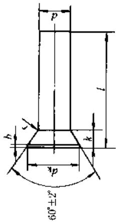

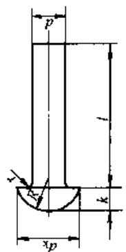

<table><tr><td rowspan=1 colspan=2>d公称</td><td rowspan=1 colspan=1>0.6</td><td rowspan=1 colspan=1>0.8</td><td rowspan=1 colspan=1>1</td><td rowspan=1 colspan=1>(1.2)</td><td rowspan=1 colspan=1>1.4</td><td rowspan=1 colspan=1>(1.6)</td><td rowspan=1 colspan=1>2</td><td rowspan=1 colspan=1>2.5</td><td rowspan=1 colspan=1>3</td><td rowspan=1 colspan=1>(3.5)</td><td rowspan=1 colspan=1>4</td><td rowspan=1 colspan=1>5</td><td rowspan=1 colspan=1>6</td><td rowspan=1 colspan=1>8</td><td rowspan=1 colspan=1>10</td><td rowspan=1 colspan=1>12</td><td rowspan=1 colspan=1>（14）</td><td rowspan=1 colspan=1>16</td></tr><tr><td rowspan=4 colspan=1>GB/T 867</td><td rowspan=1 colspan=1>dmax</td><td rowspan=1 colspan=1>1.3</td><td rowspan=1 colspan=1>1.6</td><td rowspan=1 colspan=1>2</td><td rowspan=1 colspan=1>2.3</td><td rowspan=1 colspan=1>2.7</td><td rowspan=1 colspan=1>3.2</td><td rowspan=1 colspan=1>3.74</td><td rowspan=1 colspan=1>4.84</td><td rowspan=1 colspan=1>5.54</td><td rowspan=1 colspan=1>6.59</td><td rowspan=1 colspan=1>7.39</td><td rowspan=1 colspan=1>9.09</td><td rowspan=1 colspan=1>11.35</td><td rowspan=1 colspan=1>14.35</td><td rowspan=1 colspan=1>17.35</td><td rowspan=1 colspan=1>21.42</td><td rowspan=1 colspan=1>24.42</td><td rowspan=1 colspan=1>29.42</td></tr><tr><td rowspan=1 colspan=1>kmax</td><td rowspan=1 colspan=1>0.5</td><td rowspan=1 colspan=1>0.6</td><td rowspan=1 colspan=1>0.7</td><td rowspan=1 colspan=1>0.8</td><td rowspan=1 colspan=1>0.9</td><td rowspan=1 colspan=1>1.2</td><td rowspan=1 colspan=1>1.4</td><td rowspan=1 colspan=1>1.8</td><td rowspan=1 colspan=1>2</td><td rowspan=1 colspan=1>2.3</td><td rowspan=1 colspan=1>2.6</td><td rowspan=1 colspan=1>3.2</td><td rowspan=1 colspan=1>3.84</td><td rowspan=1 colspan=1>5.04</td><td rowspan=1 colspan=1>6.24</td><td rowspan=1 colspan=1>8.29</td><td rowspan=1 colspan=1>9.29</td><td rowspan=1 colspan=1>10.29</td></tr><tr><td rowspan=1 colspan=1>R</td><td rowspan=1 colspan=1>0.58</td><td rowspan=1 colspan=1>0.74</td><td rowspan=1 colspan=1>1</td><td rowspan=1 colspan=1>1.2</td><td rowspan=1 colspan=1>1.4</td><td rowspan=1 colspan=1>1.6</td><td rowspan=1 colspan=1>1.9</td><td rowspan=1 colspan=1>2.5</td><td rowspan=1 colspan=1>2.9</td><td rowspan=1 colspan=1>3.4</td><td rowspan=1 colspan=1>3.8</td><td rowspan=1 colspan=1>4.7</td><td rowspan=1 colspan=1>6</td><td rowspan=1 colspan=1>8</td><td rowspan=1 colspan=1>9</td><td rowspan=1 colspan=1>11</td><td rowspan=1 colspan=1>12.5</td><td rowspan=1 colspan=1>15.5</td></tr><tr><td rowspan=1 colspan=1>！</td><td rowspan=1 colspan=1>1~6</td><td rowspan=1 colspan=1>1.5~8</td><td rowspan=1 colspan=1>2~8</td><td rowspan=1 colspan=1>2.5-8</td><td rowspan=1 colspan=1>3~12</td><td rowspan=1 colspan=1>3~12</td><td rowspan=1 colspan=1>3-16</td><td rowspan=1 colspan=1>5~20</td><td rowspan=1 colspan=1>5~26</td><td rowspan=1 colspan=1>7~26</td><td rowspan=1 colspan=1>7-50</td><td rowspan=1 colspan=1>7~55</td><td rowspan=1 colspan=1>8-60</td><td rowspan=1 colspan=1>16~65</td><td rowspan=1 colspan=1>16~85</td><td rowspan=1 colspan=1>20~90</td><td rowspan=1 colspan=1>22~100</td><td rowspan=1 colspan=1>26~110</td></tr><tr><td rowspan=2 colspan=1></td><td rowspan=1 colspan=1>dmax</td><td rowspan=1 colspan=1></td><td rowspan=1 colspan=1></td><td rowspan=1 colspan=1>2.03</td><td rowspan=1 colspan=1>2.23</td><td rowspan=1 colspan=1>2.83</td><td rowspan=1 colspan=1>3.03</td><td rowspan=1 colspan=1>4.05</td><td rowspan=1 colspan=1>4.75</td><td rowspan=1 colspan=1>5.35</td><td rowspan=1 colspan=1>6.28</td><td rowspan=1 colspan=1>7.18</td><td rowspan=1 colspan=1>8.98</td><td rowspan=1 colspan=1>10.62</td><td rowspan=1 colspan=1>14.22</td><td rowspan=1 colspan=1>17.82</td><td rowspan=1 colspan=1>18.86</td><td rowspan=1 colspan=1>21.76</td><td rowspan=1 colspan=1>24.96</td></tr><tr><td rowspan=1 colspan=1>k</td><td rowspan=1 colspan=1>1</td><td rowspan=1 colspan=1></td><td rowspan=1 colspan=1>0.5</td><td rowspan=1 colspan=1>0.5</td><td rowspan=1 colspan=1>0.7</td><td rowspan=1 colspan=1>0.7</td><td rowspan=1 colspan=1>1</td><td rowspan=1 colspan=1>1.1</td><td rowspan=1 colspan=1>1.2</td><td rowspan=1 colspan=1>1.4</td><td rowspan=1 colspan=1>1.6</td><td rowspan=1 colspan=1>2</td><td rowspan=1 colspan=1>2.4</td><td rowspan=1 colspan=1>3.2</td><td rowspan=1 colspan=1>4</td><td rowspan=1 colspan=1>6</td><td rowspan=1 colspan=1>7</td><td rowspan=1 colspan=1>8</td></tr><tr><td rowspan=3 colspan=1>CB/T 869</td><td rowspan=1 colspan=1>Q</td><td rowspan=1 colspan=15>90</td><td rowspan=1 colspan=3>600</td></tr><tr><td rowspan=1 colspan=1>6max</td><td rowspan=1 colspan=9>0.2</td><td rowspan=1 colspan=6>0.4</td><td rowspan=1 colspan=3>0.5</td></tr><tr><td rowspan=1 colspan=1>！</td><td rowspan=1 colspan=1></td><td rowspan=1 colspan=1></td><td rowspan=1 colspan=1>2~8</td><td rowspan=1 colspan=1>2.5~8</td><td rowspan=1 colspan=1>3-12</td><td rowspan=1 colspan=1>3~12</td><td rowspan=1 colspan=1>3.5~16</td><td rowspan=1 colspan=1>5~18</td><td rowspan=1 colspan=1>5-22</td><td rowspan=1 colspan=1>6-24</td><td rowspan=1 colspan=1>6~30</td><td rowspan=1 colspan=1>6~50</td><td rowspan=1 colspan=1>6~50</td><td rowspan=1 colspan=1>12~60</td><td rowspan=1 colspan=1>16~75</td><td rowspan=1 colspan=1>18~75</td><td rowspan=1 colspan=1>20~100</td><td rowspan=1 colspan=1>24~100</td></tr><tr><td rowspan=1 colspan=2>1     1</td><td rowspan=1 colspan=2>0.05</td><td rowspan=1 colspan=7>0.1</td><td rowspan=1 colspan=6>0.3</td><td rowspan=1 colspan=3>0.4</td></tr></table>

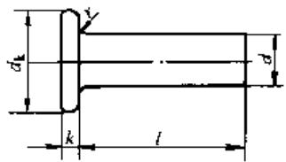

平头铆钉(GB/T109-1986)

标记示例:

公称直径 $\tilde { d } = 6 m \mathrm { { m } }$ 、公称长度 $\ell = 1 5 \mathrm { m m }$ 、材料为BL2、不经表面处理的平头铆钉:

铆钉CB/T109 $6 \times 1 5$ 

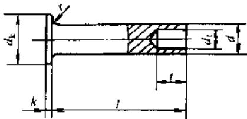

扁平头半空心铆钉(GB/T875-1986)

标记示例:

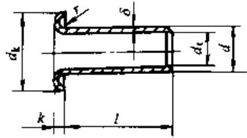

空心柳钉(GB/T876-1986)

公称直径 $d = 3 \mathbf { m } \mathbf { m }$ 、公称长度 $\pmb { \ell } = 1 0 \mathbf { m } \mathbf { m }$ 、材料为H62、不经表面处理的空心铆钉:

铆钉GB/T876 ${ \bf 3 \times 1 0 }$ 

/mm 

表 4-2-12

<table><tr><td rowspan=2 colspan=1>4公称</td><td rowspan=1 colspan=7>GB/T109</td><td rowspan=1 colspan=9>GB/T 875</td><td rowspan=1 colspan=7>GB/T 876</td></tr><tr><td rowspan=1 colspan=1>dmax</td><td rowspan=1 colspan=1>kmax</td><td rowspan=1 colspan=4>，max</td><td rowspan=1 colspan=1>！</td><td rowspan=1 colspan=1>dmax</td><td rowspan=1 colspan=1>kmax</td><td rowspan=1 colspan=1>dmai</td><td rowspan=1 colspan=1>：nax</td><td rowspan=1 colspan=4>，max</td><td rowspan=1 colspan=1>！</td><td rowspan=1 colspan=1>dmax</td><td rowspan=1 colspan=1>kmAx</td><td rowspan=1 colspan=1>dmax</td><td rowspan=1 colspan=2>8</td><td rowspan=1 colspan=1>，mg</td><td rowspan=1 colspan=1>！</td></tr><tr><td rowspan=1 colspan=1>(1.2)</td><td rowspan=1 colspan=1>1</td><td rowspan=1 colspan=1>丨</td><td rowspan=1 colspan=4>1</td><td rowspan=1 colspan=1>1</td><td rowspan=1 colspan=1>2.4</td><td rowspan=1 colspan=1></td><td rowspan=1 colspan=1>0.66</td><td rowspan=1 colspan=1>1.44</td><td rowspan=1 colspan=4></td><td rowspan=1 colspan=1>1.5~6</td><td rowspan=1 colspan=1>1</td><td rowspan=1 colspan=1>1</td><td rowspan=1 colspan=1>1</td><td rowspan=1 colspan=2>1</td><td rowspan=1 colspan=1>1</td><td rowspan=1 colspan=1></td></tr><tr><td rowspan=2 colspan=1>1.4</td><td rowspan=2 colspan=1></td><td rowspan=2 colspan=1>1</td><td rowspan=2 colspan=4>i</td><td rowspan=2 colspan=1>1</td><td rowspan=2 colspan=1>2.7</td><td rowspan=2 colspan=1>0.58</td><td rowspan=2 colspan=1>0.77</td><td rowspan=2 colspan=1>1.64</td><td rowspan=2 colspan=2></td><td rowspan=1 colspan=2></td><td rowspan=2 colspan=1></td><td rowspan=2 colspan=1>2~？</td><td rowspan=2 colspan=1>2.6</td><td rowspan=2 colspan=1>0.5</td><td rowspan=2 colspan=2>0.8</td><td rowspan=2 colspan=1>0.2</td><td rowspan=2 colspan=1>0.15</td></tr><tr><td rowspan=1 colspan=2></td><td></td></tr><tr><td rowspan=1 colspan=1>(1.6)</td><td rowspan=1 colspan=1>1</td><td rowspan=1 colspan=1>1</td><td rowspan=1 colspan=4>1</td><td rowspan=1 colspan=1>1</td><td rowspan=1 colspan=1>3.2</td><td rowspan=1 colspan=1></td><td rowspan=1 colspan=1>0.87</td><td rowspan=1 colspan=1>1.84</td><td rowspan=1 colspan=2></td><td rowspan=1 colspan=2></td><td rowspan=1 colspan=1></td><td rowspan=1 colspan=1>2-8</td><td rowspan=1 colspan=1>2.8</td><td rowspan=1 colspan=1>0.5</td><td rowspan=1 colspan=2>0.9</td><td rowspan=1 colspan=1>0.22</td><td rowspan=1 colspan=1>0.2</td></tr><tr><td></td><td></td><td rowspan=2 colspan=3>2</td><td rowspan=2 colspan=2>4.24</td><td rowspan=2 colspan=1>1.2</td><td rowspan=2 colspan=1></td><td rowspan=2 colspan=1>4~8</td><td rowspan=2 colspan=1>3.74</td><td rowspan=2 colspan=1>0.68</td><td rowspan=2 colspan=4>1.12</td><td rowspan=2 colspan=1>2.24</td><td rowspan=2 colspan=1></td><td rowspan=2 colspan=1></td><td rowspan=2 colspan=2>2-13</td><td rowspan=2 colspan=2>3.5</td><td rowspan=2 colspan=1>0.6</td></tr><tr><td></td><td></td><td rowspan=1 colspan=2></td></tr><tr><td rowspan=2 colspan=1>2.5</td><td rowspan=2 colspan=1>5.24</td><td rowspan=2 colspan=1>1.4</td><td rowspan=2 colspan=4>0.1</td><td rowspan=2 colspan=1>5-10</td><td rowspan=2 colspan=1>4.74</td><td rowspan=2 colspan=1>0.68</td><td rowspan=2 colspan=1>1.62</td><td rowspan=2 colspan=1>2.74</td><td rowspan=2 colspan=2></td><td rowspan=1 colspan=2></td><td rowspan=2 colspan=1></td><td rowspan=2 colspan=1>3~15</td><td rowspan=2 colspan=1>4</td><td rowspan=2 colspan=1>0.6</td><td rowspan=2 colspan=2>1.7</td><td rowspan=2 colspan=1>0.25</td><td rowspan=2 colspan=1>2-8</td></tr><tr><td rowspan=1 colspan=2></td><td></td></tr><tr><td rowspan=1 colspan=1>3</td><td rowspan=1 colspan=1>6.24</td><td rowspan=1 colspan=1>1.6</td><td rowspan=1 colspan=4></td><td rowspan=1 colspan=1>6~14</td><td rowspan=1 colspan=1>5.74</td><td rowspan=1 colspan=1>0.88</td><td rowspan=1 colspan=1>2.12</td><td rowspan=1 colspan=1>3.24</td><td rowspan=1 colspan=4></td><td rowspan=1 colspan=1>3.5-30</td><td rowspan=1 colspan=1>5</td><td rowspan=1 colspan=1>0.7</td><td rowspan=1 colspan=1>2</td><td rowspan=1 colspan=2>0.3</td><td rowspan=1 colspan=1></td><td rowspan=1 colspan=1>2~10</td></tr><tr><td rowspan=1 colspan=1>(3.5)</td><td rowspan=1 colspan=1>7.29</td><td rowspan=1 colspan=1>1.8</td><td rowspan=1 colspan=4></td><td rowspan=1 colspan=1>6~18</td><td rowspan=1 colspan=1>6.79</td><td rowspan=1 colspan=1>0.88</td><td rowspan=1 colspan=1>2.32</td><td rowspan=1 colspan=1>3.79</td><td rowspan=1 colspan=4></td><td rowspan=1 colspan=1>5-36</td><td rowspan=1 colspan=1>5.5</td><td rowspan=1 colspan=1>0.7</td><td rowspan=1 colspan=1>2.5</td><td rowspan=1 colspan=2>0.3</td><td rowspan=1 colspan=1>0.3</td><td rowspan=1 colspan=1>2.5~10</td></tr><tr><td rowspan=2 colspan=1>4</td><td rowspan=2 colspan=1>8.29</td><td rowspan=2 colspan=1>2</td><td rowspan=2 colspan=2></td><td rowspan=1 colspan=2></td><td rowspan=2 colspan=1></td><td rowspan=2 colspan=1>8~22</td><td rowspan=2 colspan=1>7.79</td><td rowspan=2 colspan=1>1.13</td><td rowspan=2 colspan=1>2.62</td><td rowspan=2 colspan=4>4.29</td><td rowspan=2 colspan=1></td><td rowspan=1 colspan=1></td><td rowspan=1 colspan=1></td><td rowspan=2 colspan=2>5~40</td><td rowspan=2 colspan=2>6</td><td rowspan=2 colspan=1>0.82</td></tr><tr><td rowspan=1 colspan=2>0.3</td><td></td><td></td><td></td></tr><tr><td rowspan=2 colspan=1>5</td><td rowspan=2 colspan=1>10.29</td><td rowspan=2 colspan=1>2.2</td><td rowspan=2 colspan=2></td><td rowspan=1 colspan=2>0.3</td><td rowspan=1 colspan=1></td><td rowspan=2 colspan=1>10~26</td><td rowspan=2 colspan=1>9.79</td><td rowspan=2 colspan=1>1.13</td><td rowspan=2 colspan=1>3.66</td><td rowspan=2 colspan=4>5.29</td><td rowspan=2 colspan=1></td><td></td><td rowspan=2 colspan=1></td><td rowspan=2 colspan=2>6~50</td><td rowspan=2 colspan=2>8</td><td rowspan=2 colspan=1>1.12</td></tr><tr><td rowspan=1 colspan=2></td><td></td><td></td><td rowspan=1 colspan=2>0.3</td><td></td><td rowspan=1 colspan=2>0.35</td></tr><tr><td rowspan=2 colspan=1>6</td><td rowspan=2 colspan=1>12.35</td><td rowspan=2 colspan=1>2.6</td><td rowspan=2 colspan=4></td><td rowspan=2 colspan=1>12~30</td><td rowspan=2 colspan=1>11.85</td><td rowspan=2 colspan=1>1.33</td><td rowspan=2 colspan=1>4.66</td><td rowspan=2 colspan=1>6.29</td><td rowspan=2 colspan=2></td><td rowspan=1 colspan=2>0.3</td><td rowspan=2 colspan=1></td><td rowspan=2 colspan=1>7~50</td><td rowspan=2 colspan=1>10</td><td rowspan=2 colspan=1>1.12</td><td rowspan=2 colspan=2>5</td><td rowspan=2 colspan=1></td><td rowspan=2 colspan=1>0.7</td></tr><tr><td rowspan=1 colspan=2></td><td></td></tr><tr><td rowspan=2 colspan=1>8</td><td rowspan=2 colspan=1>16.35</td><td rowspan=2 colspan=1>3</td><td rowspan=2 colspan=4>0.5</td><td rowspan=2 colspan=1>16~30</td><td rowspan=2 colspan=1>15.85</td><td rowspan=2 colspan=1>1.33</td><td rowspan=2 colspan=1>6.16</td><td rowspan=2 colspan=1>8.35</td><td rowspan=2 colspan=2></td><td rowspan=1 colspan=2></td><td rowspan=2 colspan=1></td><td rowspan=2 colspan=1>9-50</td><td rowspan=2 colspan=1></td><td rowspan=2 colspan=1></td><td rowspan=2 colspan=2></td><td rowspan=2 colspan=1></td><td rowspan=2 colspan=1></td></tr><tr><td rowspan=1 colspan=2></td><td></td></tr><tr><td rowspan=1 colspan=1>10</td><td rowspan=1 colspan=1>20.42</td><td rowspan=1 colspan=1>3.44</td><td rowspan=1 colspan=4>0.5</td><td rowspan=1 colspan=1>20~30</td><td rowspan=1 colspan=1>19.42</td><td rowspan=1 colspan=1>1.63</td><td rowspan=1 colspan=1>7.7</td><td rowspan=1 colspan=1>10.35</td><td rowspan=1 colspan=4></td><td rowspan=1 colspan=1>10~50</td><td rowspan=1 colspan=1>一</td><td rowspan=1 colspan=1>1</td><td rowspan=1 colspan=1>1</td><td rowspan=1 colspan=2>一</td><td rowspan=1 colspan=1>1</td><td rowspan=1 colspan=1>1</td></tr><tr><td rowspan=1 colspan=1>系列</td><td rowspan=1 colspan=23>1.5,2,2.5,3,3.5,4,5,6,7,8,9,0,11,12,13,4,15,16,1718,19,20,22,24,26,28,30,3,34,36,38,0,42,44,46,48,50</td></tr></table>

注:1.全部为商品规格。2.同表4-2-10注2。

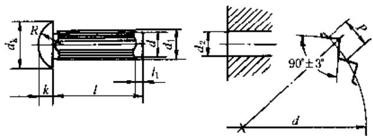

标记示例:

公称直径 $d = 3 \mathsf { m m }$ 公称长度 $\ell = 1 0 \mathrm { m m }$ 、材料为BL2、不经表面处理的标牌铆钉:

/mm 

表4-2-13

<table><tr><td rowspan=1 colspan=1>d公称</td><td rowspan=1 colspan=1>(1.6)</td><td rowspan=1 colspan=1>2</td><td rowspan=1 colspan=1>2.5</td><td rowspan=1 colspan=1>3</td><td rowspan=1 colspan=1>4</td><td rowspan=1 colspan=1>5</td></tr><tr><td rowspan=2 colspan=1>dmaxkmaxdmin</td><td rowspan=1 colspan=1>3.2</td><td rowspan=2 colspan=1>3.741.42.15</td><td rowspan=2 colspan=1>4.841.82.65</td><td rowspan=2 colspan=1>5.542.03.15</td><td rowspan=2 colspan=1>7.392.64.15</td><td rowspan=2 colspan=1>9.093.25.15</td></tr><tr><td rowspan=1 colspan=1>1.21.75</td></tr><tr><td rowspan=1 colspan=1>P</td><td rowspan=1 colspan=4>0.72</td><td rowspan=1 colspan=1>0.84</td><td rowspan=1 colspan=1>0.92</td></tr><tr><td rowspan=1 colspan=1>1</td><td rowspan=1 colspan=4>！</td><td rowspan=1 colspan=2>1.5</td></tr><tr><td rowspan=1 colspan=1>Rd（推荐）max！</td><td rowspan=1 colspan=1>1.61.563~6</td><td rowspan=1 colspan=1>1.9！1.96！3-8</td><td rowspan=1 colspan=1>2.52.463-10</td><td rowspan=1 colspan=1>2.92.964~12</td><td rowspan=1 colspan=1>3.83.966~18</td><td rowspan=1 colspan=1>4.74.968~20</td></tr><tr><td rowspan=1 colspan=1>系列</td><td rowspan=1 colspan=6>3,4,5,6,8,10,12,15,18,20</td></tr></table>

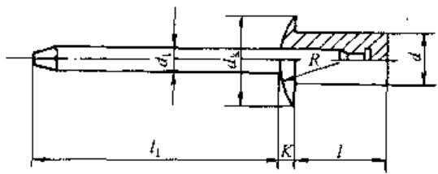

封闭型扁圖头抽芯铆钉(GB/T12615--1990)

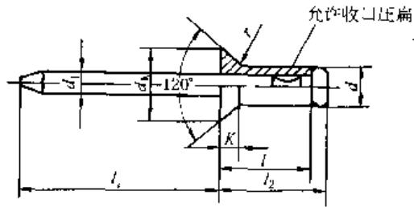

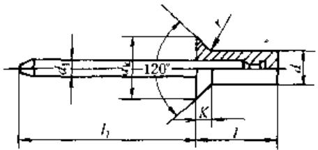

封闭型沉头抽芯铆钉(GB/T12616—1990)

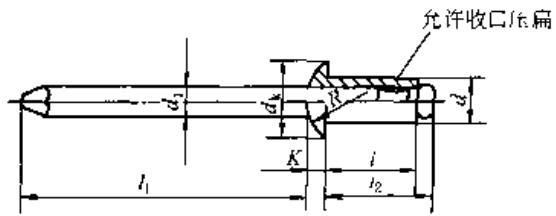

开口型扁圆头抽芯铆钉(GB/T12618—1990)

标记示例:

公称直径 $d = 5 \mathrm { m m }$ 、公称长度 $\ell = 1 0 \mathsf { m m }$ 、性能等级为10级的封闭型扁圆头(封闭型沉头、开口型沉头、开I型扁圆头)抽芯铆钉:

抽芯铆钉GB/T12615(1261612617\12618) ${ 5 \times 1 0 }$ 

表4-2-14

<table><tr><td rowspan=3 colspan=1>d</td><td rowspan=1 colspan=1>公称</td><td rowspan=1 colspan=1>3</td><td rowspan=1 colspan=1>(3.2)</td><td rowspan=1 colspan=1>4</td><td rowspan=1 colspan=1>5</td><td rowspan=1 colspan=1>6</td></tr><tr><td rowspan=1 colspan=1>min</td><td rowspan=1 colspan=1>2.93</td><td rowspan=1 colspan=1>3.11</td><td rowspan=1 colspan=1>3.91</td><td rowspan=1 colspan=1>4.91</td><td rowspan=1 colspan=1>5.91</td></tr><tr><td rowspan=1 colspan=1>mAx</td><td rowspan=1 colspan=1>3.07</td><td rowspan=1 colspan=1>3.29</td><td rowspan=1 colspan=1>4.09</td><td rowspan=1 colspan=1>5.09</td><td rowspan=1 colspan=1>6.09</td></tr><tr><td rowspan=2 colspan=1>d</td><td rowspan=1 colspan=1>max</td><td rowspan=1 colspan=1>6.24</td><td rowspan=1 colspan=1>6.24</td><td rowspan=1 colspan=1>8.29</td><td rowspan=1 colspan=1>9.89</td><td rowspan=1 colspan=1>12.35</td></tr><tr><td rowspan=1 colspan=1>min</td><td rowspan=1 colspan=1>5.76</td><td rowspan=1 colspan=1>5.76</td><td rowspan=1 colspan=1>7.71</td><td rowspan=1 colspan=1>9.31</td><td rowspan=1 colspan=1>11.65</td></tr><tr><td rowspan=1 colspan=2>d</td><td rowspan=1 colspan=1>1.8</td><td rowspan=1 colspan=1>1.8</td><td rowspan=1 colspan=1>2.18</td><td rowspan=1 colspan=1>2.8</td><td rowspan=1 colspan=1>3.6</td></tr><tr><td rowspan=1 colspan=1></td><td rowspan=1 colspan=1>1min</td><td rowspan=1 colspan=1>26</td><td rowspan=1 colspan=1>26</td><td rowspan=1 colspan=1>27</td><td rowspan=1 colspan=1>27</td><td rowspan=1 colspan=1>31</td></tr><tr><td rowspan=1 colspan=1></td><td rowspan=1 colspan=1>R</td><td rowspan=1 colspan=1>5</td><td rowspan=1 colspan=1>5</td><td rowspan=1 colspan=1>6.8</td><td rowspan=1 colspan=1>7.6</td><td rowspan=1 colspan=1>9.3</td></tr><tr><td rowspan=1 colspan=2>，max</td><td rowspan=1 colspan=1>0.5</td><td rowspan=1 colspan=1>0.5</td><td rowspan=1 colspan=1>0.5</td><td rowspan=1 colspan=1>0.7</td><td rowspan=1 colspan=1>0.7</td></tr><tr><td rowspan=2 colspan=1>K max</td><td rowspan=1 colspan=1>GR/T 12615GB/T12618</td><td rowspan=1 colspan=1>1.4</td><td rowspan=1 colspan=1>1.4</td><td rowspan=1 colspan=1>1.7</td><td rowspan=1 colspan=1>2.0</td><td rowspan=1 colspan=1>2.5</td></tr><tr><td rowspan=1 colspan=1>CB/T 12616CB/T 12617</td><td rowspan=1 colspan=1>1.2</td><td rowspan=1 colspan=1>1.2</td><td rowspan=1 colspan=1>1.4</td><td rowspan=1 colspan=1>1.6</td><td rowspan=1 colspan=1>2.0</td></tr><tr><td rowspan=1 colspan=1> max</td><td rowspan=1 colspan=1>GB/T 12617GB/T12618</td><td rowspan=1 colspan=1>1+ 3.4</td><td rowspan=1 colspan=1>1+3.5</td><td rowspan=1 colspan=1>1 + 3.5</td><td rowspan=1 colspan=1>1 + 4.0</td><td rowspan=1 colspan=1>1 + 4.5</td></tr><tr><td rowspan=1 colspan=2>商品规格</td><td rowspan=1 colspan=1>6~12</td><td rowspan=1 colspan=1>6~12</td><td rowspan=1 colspan=1>6~14</td><td rowspan=1 colspan=1>6~14</td><td rowspan=1 colspan=1>7~18</td></tr><tr><td rowspan=1 colspan=2>商品规格</td><td rowspan=1 colspan=1>7~19</td><td rowspan=1 colspan=1>7~19</td><td rowspan=1 colspan=1>8-20</td><td rowspan=1 colspan=1>9- 34</td><td rowspan=1 colspan=1>10~40</td></tr><tr><td rowspan=1 colspan=2>系列</td><td rowspan=1 colspan=5>6，7,8、9、10，11，12，13，14，15，16，17.18、19.20，22，24、26，28，30，32,34，36，38、40</td></tr></table>

$\textcircled{1}$ 为CB/T12615及CB/T12616。$\textcircled{2}$ 为CB/T12617及GB/T12618。注:技术条件按GB/T12619的规定。

# 抽芯铆钉

封闭型抽芯铆钉(GB 12615、GB 12616)

开口型抽芯铆钉(GB 12617、GB12618)

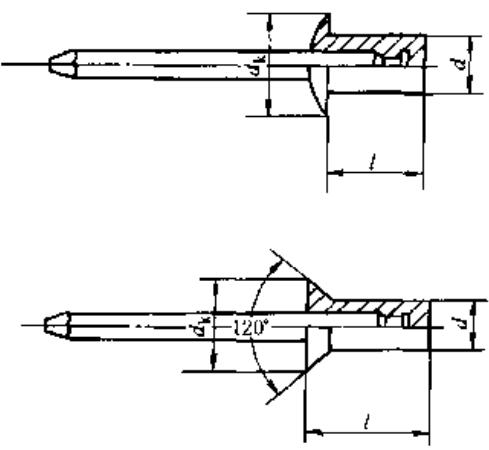

封闭型大帽沿抽芯铆钉(GB 12615)

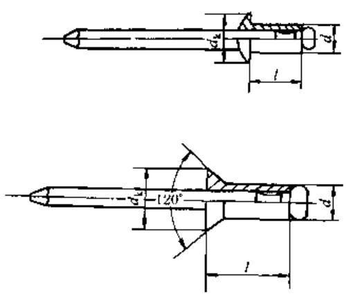

开口型大帽沿抽芯铆钉(GB12618)

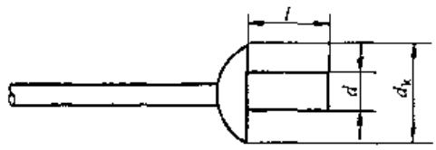

开口型铆钉铆接示例

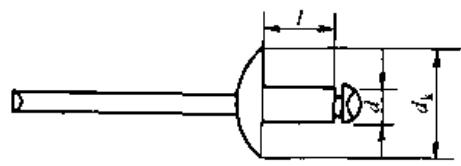

封闭型铆钉铆接示例

T 

7mm 

表4-2-15

<table><tr><td rowspan=1 colspan=1>基本尺寸d</td><td rowspan=1 colspan=1>2.4</td><td rowspan=1 colspan=1>3</td><td rowspan=1 colspan=1>3.2</td><td rowspan=1 colspan=1>4</td><td rowspan=1 colspan=1>4.8</td><td rowspan=1 colspan=1>5</td><td rowspan=1 colspan=1>6</td><td rowspan=1 colspan=1>6.4</td></tr><tr><td rowspan=1 colspan=1>d</td><td rowspan=1 colspan=1>4.8</td><td rowspan=1 colspan=1>6</td><td rowspan=1 colspan=1>6</td><td rowspan=1 colspan=1>8</td><td rowspan=1 colspan=1>9.5</td><td rowspan=1 colspan=1>9.5</td><td rowspan=1 colspan=1>12</td><td rowspan=1 colspan=1>12.7</td></tr><tr><td rowspan=1 colspan=1>大帽沿d</td><td rowspan=1 colspan=1></td><td rowspan=1 colspan=1></td><td rowspan=1 colspan=1>9</td><td rowspan=1 colspan=1>12</td><td rowspan=1 colspan=1>14 (16)</td><td rowspan=1 colspan=1>14 (16)</td><td rowspan=1 colspan=1></td><td rowspan=1 colspan=1></td></tr><tr><td rowspan=1 colspan=1>钻孔直径</td><td rowspan=1 colspan=1>2.5</td><td rowspan=1 colspan=1>3.1</td><td rowspan=1 colspan=1>3.3</td><td rowspan=1 colspan=1>4.1</td><td rowspan=1 colspan=1>4.9</td><td rowspan=1 colspan=1>5.1</td><td rowspan=1 colspan=1>6.1</td><td rowspan=1 colspan=1>6.5</td></tr></table>

注:1.基本尺寸 $\pmb { d }$ 对应于不同的材料代号(见表4-2-16),有不同的规格范圈:封闭型抽芯铆钉 $d = 3 . 2$ 、4、4.8、5、6.4;开口型铆钉 $d = 2 . 4$ 、3、3.2、4、4.8、5、6、6.4;封闭型大帽沿抽芯铆钉 $\dot { \mathbf { d } } = 3 . 2$ 、4、4.8、5;开口型大帽沿抽芯铆钉 $\pmb { d = 3 . 2 }$ 、4、4.8、5。

2.本表数据主要取自上海安字实业有限公司产品。

表4-2-16

<table><tr><td rowspan=2 colspan=1>分类</td><td rowspan=2 colspan=1>铆钉材料、国标及标记</td><td rowspan=2 colspan=1>载荷</td><td rowspan=1 colspan=8>铆钉直径d/mm</td></tr><tr><td rowspan=1 colspan=1>2.4</td><td rowspan=1 colspan=1>3</td><td rowspan=1 colspan=1>3.2</td><td rowspan=1 colspan=1>4</td><td rowspan=1 colspan=1>4.8</td><td rowspan=1 colspan=1>5</td><td rowspan=1 colspan=1>6</td><td rowspan=1 colspan=1>6.4</td></tr><tr><td rowspan=7 colspan=1>封闭型抽芯铆钉</td><td rowspan=1 colspan=1>铜/钢GB12615 dx:20(CGF）.GB 12616 d×120（CGF2）</td><td rowspan=1 colspan=1>LG</td><td rowspan=1 colspan=1></td><td rowspan=1 colspan=1></td><td rowspan=1 colspan=1>1300B50</td><td rowspan=1 colspan=1>20001350</td><td rowspan=1 colspan=1>28001950</td><td rowspan=1 colspan=1></td><td rowspan=1 colspan=1></td><td rowspan=1 colspan=1></td></tr><tr><td rowspan=1 colspan=1>铜/不锈钢GB12615 d×-21(CBF),CB12616dx1-21（CBF2）</td><td rowspan=1 colspan=1>1G</td><td rowspan=1 colspan=1></td><td rowspan=1 colspan=1></td><td rowspan=1 colspan=1>1300850</td><td rowspan=1 colspan=1>2000：1350</td><td rowspan=1 colspan=1>：28001950</td><td rowspan=1 colspan=1></td><td rowspan=1 colspan=1></td><td rowspan=1 colspan=1></td></tr><tr><td rowspan=1 colspan=1>钢/钢GB12615d×i:30(GF),GB12616d×I:30(GF2)</td><td rowspan=1 colspan=1>C</td><td rowspan=1 colspan=1></td><td rowspan=1 colspan=1></td><td rowspan=1 colspan=1>12001100</td><td rowspan=1 colspan=1>18601700</td><td rowspan=1 colspan=1>28402400</td><td rowspan=1 colspan=1></td><td rowspan=1 colspan=1></td><td rowspan=1 colspan=1></td></tr><tr><td rowspan=1 colspan=1>不锈钢/不锈钢CB12615d×l·5I（QBF），GB 12616d × 1:51(QBF2)</td><td rowspan=1 colspan=1>LG</td><td rowspan=1 colspan=1></td><td rowspan=1 colspan=1></td><td rowspan=1 colspan=1>25002000</td><td rowspan=1 colspan=1>40003000</td><td rowspan=1 colspan=1>50004500</td><td rowspan=1 colspan=1></td><td rowspan=1 colspan=1></td><td rowspan=1 colspan=1></td></tr><tr><td rowspan=1 colspan=1>铝/铝   GB 12615d×l·06(QLF),GB12616dx1:06（QLF2）</td><td rowspan=1 colspan=1>1G</td><td rowspan=1 colspan=1></td><td rowspan=1 colspan=1></td><td rowspan=1 colspan=1>490450</td><td rowspan=1 colspan=1>712580</td><td rowspan=1 colspan=1>1120900</td><td rowspan=1 colspan=1></td><td rowspan=1 colspan=1></td><td rowspan=1 colspan=1></td></tr><tr><td rowspan=1 colspan=1>铝合金/钢GB12615dxI·11(HF).CB 12616dx1-11（HF2）</td><td rowspan=1 colspan=1>1C</td><td rowspan=1 colspan=1></td><td rowspan=1 colspan=1></td><td rowspan=1 colspan=1>12401070</td><td rowspan=1 colspan=1>21301560</td><td rowspan=1 colspan=1>30702230</td><td rowspan=1 colspan=1>35002420</td><td rowspan=1 colspan=1></td><td rowspan=1 colspan=1>50003950</td></tr><tr><td rowspan=1 colspan=1>铝合金/不锈钢GB 12615d×l-11(HBF）,GB 12616dx:11（HBF2)</td><td rowspan=1 colspan=1>LC</td><td rowspan=1 colspan=1></td><td rowspan=1 colspan=1></td><td rowspan=1 colspan=1>12401070</td><td rowspan=1 colspan=1>21301560</td><td rowspan=1 colspan=1>30702230</td><td rowspan=1 colspan=1>35002420</td><td rowspan=1 colspan=1></td><td rowspan=1 colspan=1>50003950</td></tr><tr><td rowspan=11 colspan=1>R</td><td rowspan=1 colspan=1>铝合金/钢G812618dx1.08(K）,GB 12617 dx1.08（K2）</td><td rowspan=1 colspan=1>LC</td><td rowspan=1 colspan=1>258172</td><td rowspan=1 colspan=1>380300：</td><td rowspan=1 colspan=1>450360</td><td rowspan=1 colspan=1>750540</td><td rowspan=1 colspan=1>1050935</td><td rowspan=1 colspan=1>isu990</td><td rowspan=1 colspan=1></td><td rowspan=1 colspan=1>20501460</td></tr><tr><td rowspan=1 colspan=1>铝合金/钢GB12618dxl-10(H2K),GB 12617 d×1.10（H2K2）</td><td rowspan=1 colspan=1>[C</td><td rowspan=1 colspan=1>353314</td><td rowspan=1 colspan=1>595475</td><td rowspan=1 colspan=1>670530</td><td rowspan=1 colspan=1>1020850</td><td rowspan=1 colspan=1>14251160</td><td rowspan=1 colspan=1>15251280</td><td rowspan=1 colspan=1></td><td rowspan=1 colspan=1>24952050</td></tr><tr><td rowspan=1 colspan=1>铝合金/钢GB12618 dx1·I1(HK),GB12617 dxl:1（HK2）</td><td rowspan=1 colspan=1>LG</td><td rowspan=1 colspan=1></td><td rowspan=1 colspan=1>870680</td><td rowspan=1 colspan=1>980760</td><td rowspan=1 colspan=1>16001200</td><td rowspan=1 colspan=1>22301690</td><td rowspan=1 colspan=1>25002000</td><td rowspan=1 colspan=1></td><td rowspan=1 colspan=1>40903120</td></tr><tr><td rowspan=1 colspan=1>铝合金/不锈钢GB12618d×1:11(HBK),GB12617 dx1.11（HBK2）</td><td rowspan=1 colspan=1>LC</td><td rowspan=1 colspan=1></td><td rowspan=1 colspan=1>870680</td><td rowspan=1 colspan=1>980760</td><td rowspan=1 colspan=1>16001200</td><td rowspan=1 colspan=1>22301690</td><td rowspan=1 colspan=1>：25002000</td><td rowspan=1 colspan=1></td><td rowspan=1 colspan=1>40903120</td></tr><tr><td rowspan=1 colspan=1>铝/铝GB12618d×l·12（HLK）、GB12617 d×1·12（HLK2）</td><td rowspan=1 colspan=1>G</td><td rowspan=1 colspan=1></td><td rowspan=1 colspan=1>1</td><td rowspan=1 colspan=1>670530</td><td rowspan=1 colspan=1>1020850</td><td rowspan=1 colspan=1>14251160</td><td rowspan=1 colspan=1>15251280</td><td rowspan=1 colspan=1>·</td><td rowspan=1 colspan=1>24952050</td></tr><tr><td rowspan=1 colspan=1>铜/钢GB12618 d×l:20(CGK）,GB 12617 dx1.20（CGK2）</td><td rowspan=1 colspan=1>LC</td><td rowspan=1 colspan=1></td><td rowspan=1 colspan=1>700600</td><td rowspan=1 colspan=1>800700</td><td rowspan=1 colspan=1>15001000</td><td rowspan=1 colspan=1>20001500</td><td rowspan=1 colspan=1>:</td><td rowspan=1 colspan=1></td><td rowspan=1 colspan=1></td></tr><tr><td rowspan=1 colspan=1>铜/不锈钢GB12618dx1:21(CBK),GB12617 dx1:21（CBK2）</td><td rowspan=1 colspan=1>LG</td><td rowspan=1 colspan=1></td><td rowspan=1 colspan=1>700600</td><td rowspan=1 colspan=1>800700</td><td rowspan=1 colspan=1>15001000</td><td rowspan=1 colspan=1>20001500</td><td rowspan=1 colspan=1></td><td rowspan=1 colspan=1></td><td rowspan=1 colspan=1></td></tr><tr><td rowspan=1 colspan=1>钢/钢GR12618d× t·30(GK),CR 12617d×1.30(GK2)</td><td rowspan=1 colspan=1>LG</td><td rowspan=1 colspan=1></td><td rowspan=1 colspan=1>12251015</td><td rowspan=1 colspan=1>13851160</td><td rowspan=1 colspan=1>20901650</td><td rowspan=1 colspan=1>30202405</td><td rowspan=1 colspan=1>33552675</td><td rowspan=1 colspan=1>50204040</td><td rowspan=1 colspan=1>55154455</td></tr><tr><td rowspan=1 colspan=1>蒙乃尔/钢CB12618dx1:40(NTK).GB 12617 dx1.40（NTK2）</td><td rowspan=1 colspan=1>LG</td><td rowspan=1 colspan=1></td><td rowspan=1 colspan=1>！</td><td rowspan=1 colspan=1>20001560</td><td rowspan=1 colspan=1>31152450</td><td rowspan=1 colspan=1>44503560</td><td rowspan=1 colspan=1>:</td><td rowspan=1 colspan=1></td><td rowspan=1 colspan=1>1</td></tr><tr><td rowspan=1 colspan=1>不锈钢/钢GB12618dx1.50(BK），GR 12617 d×1.50（BK2）</td><td rowspan=1 colspan=1>1G</td><td rowspan=1 colspan=1></td><td rowspan=1 colspan=1>20001600</td><td rowspan=1 colspan=1>23601875</td><td rowspan=1 colspan=1>36502895</td><td rowspan=1 colspan=1>53354230</td><td rowspan=1 colspan=1>55504250</td><td rowspan=1 colspan=1>-</td><td rowspan=1 colspan=1>93547572</td></tr><tr><td rowspan=1 colspan=1>不锈钢/不锈钢CB12618d×.51(QBK）,GB12617dx1:20(QBK2）</td><td rowspan=1 colspan=1>1C</td><td rowspan=1 colspan=1></td><td rowspan=1 colspan=1>20001600</td><td rowspan=1 colspan=1>23601875</td><td rowspan=1 colspan=1>36502895</td><td rowspan=1 colspan=1>53354230</td><td rowspan=1 colspan=1>55504250</td><td rowspan=1 colspan=1></td><td rowspan=1 colspan=1>93547512</td></tr><tr><td rowspan=4 colspan=1>A</td><td rowspan=1 colspan=1>铝合金/钢GB12618 d×i×dk·08（K）</td><td rowspan=1 colspan=1>LC</td><td rowspan=1 colspan=1></td><td rowspan=1 colspan=1></td><td rowspan=1 colspan=1>450360</td><td rowspan=1 colspan=1>750540</td><td rowspan=1 colspan=1>1050935</td><td rowspan=1 colspan=1>1150990</td><td rowspan=1 colspan=1></td><td rowspan=1 colspan=1>一</td></tr><tr><td rowspan=1 colspan=1>铝合金/钢CBl2618d×i×dk-10（H2K）</td><td rowspan=1 colspan=1>LC</td><td rowspan=1 colspan=1></td><td rowspan=1 colspan=1></td><td rowspan=1 colspan=1>670530</td><td rowspan=1 colspan=1>1020850</td><td rowspan=1 colspan=1>14251160</td><td rowspan=1 colspan=1>15251280</td><td rowspan=1 colspan=1></td><td rowspan=1 colspan=1></td></tr><tr><td rowspan=1 colspan=1>铝合金/钢GB12618d×I×d·11(H3K）</td><td rowspan=1 colspan=1>LG</td><td rowspan=1 colspan=1></td><td rowspan=1 colspan=1></td><td rowspan=1 colspan=1>980760</td><td rowspan=1 colspan=1>16001200</td><td rowspan=1 colspan=1>22301690</td><td rowspan=1 colspan=1>25002000</td><td rowspan=1 colspan=1></td><td rowspan=1 colspan=1></td></tr><tr><td rowspan=1 colspan=1>铝/铝CR 12618d×l×d·12(HLK)</td><td rowspan=1 colspan=1>1G</td><td rowspan=1 colspan=1></td><td rowspan=1 colspan=1></td><td rowspan=1 colspan=1>670530</td><td rowspan=1 colspan=1>1020850</td><td rowspan=1 colspan=1>14251160</td><td rowspan=1 colspan=1>15251280</td><td rowspan=1 colspan=1></td><td rowspan=1 colspan=1></td></tr><tr><td rowspan=2 colspan=1>B</td><td rowspan=1 colspan=1>铝合金/钢GB I2615d×I×d·11(HF)</td><td rowspan=1 colspan=1>[G</td><td rowspan=1 colspan=1></td><td rowspan=1 colspan=1></td><td rowspan=1 colspan=1>12401070</td><td rowspan=1 colspan=1>21301560</td><td rowspan=1 colspan=1>30702230</td><td rowspan=1 colspan=1>35002420</td><td rowspan=1 colspan=1></td><td rowspan=1 colspan=1></td></tr><tr><td rowspan=1 colspan=1>铝合金/不锈钢GB12615d×l×d·11（HBF)</td><td rowspan=1 colspan=1>LG</td><td rowspan=1 colspan=1></td><td rowspan=1 colspan=1></td><td rowspan=1 colspan=1>12401070</td><td rowspan=1 colspan=1>21301560</td><td rowspan=1 colspan=1>30702230</td><td rowspan=1 colspan=1>35002420</td><td rowspan=1 colspan=1></td><td rowspan=1 colspan=1></td></tr></table>

注:1.L为最小抗拉载荷,G为最小抗剪载荷。2.铆钉材料斜线前为铆钉钉体材料,斜线后为铆钉钉芯材料,如铜(钉休材料)/钢(钉芯材料)。3.本友的数据取自上海安字实业有限公司产品。4.A为开口型大帽沿抽芯铆钉, $\mathbf { \delta B }$ 为封闭型大帽沿抽芯铆钉。

<table><tr><td rowspan=1 colspan=34>表4-2-17                                         抽芯铆钉铆接厚度                                              /mm</td></tr><tr><td rowspan=3 colspan=3>铆钉长度</td><td rowspan=1 colspan=15>开口型大帽沿抽芯铆钉K、HK、HK、HLK</td><td rowspan=3 colspan=5>铆钉长度</td><td rowspan=1 colspan=11>开口型大帽沿抽芯铆钉K、HK、HK、HLK</td></tr><tr><td rowspan=1 colspan=15>柳钉直径d</td><td rowspan=1 colspan=11>铆钉直径d</td></tr><tr><td rowspan=1 colspan=3>3.2</td><td rowspan=1 colspan=5>4</td><td rowspan=1 colspan=3>4.8</td><td rowspan=1 colspan=4>5</td><td rowspan=1 colspan=3>3.2</td><td rowspan=1 colspan=3>4</td><td rowspan=1 colspan=3>4.8</td><td rowspan=1 colspan=2>5</td></tr><tr><td rowspan=2 colspan=3>810121416</td><td rowspan=1 colspan=3>3-55-7</td><td rowspan=2 colspan=5>2.5~4.54.5-6.56.5-8.58.5~10.510.5~12.5</td><td rowspan=2 colspan=3>4~66~88~1010~12</td><td rowspan=2 colspan=4>14~66-88~1010~12</td><td rowspan=2 colspan=5>18202224</td><td rowspan=2 colspan=3>一</td><td rowspan=2 colspan=3>12.5-14.514.5~16.5一</td><td rowspan=2 colspan=3>12~1414~1616~1818~20</td><td rowspan=2 colspan=2>12~1414-1616~1818-20</td></tr><tr><td rowspan=1 colspan=3>7~99~1111~13</td></tr><tr><td rowspan=4 colspan=3>铆钉长度</td><td rowspan=1 colspan=31>封   闭   型</td></tr><tr><td rowspan=1 colspan=10>CCF、CGF、CBF、CBF、CF、GF、QBF、QBF</td><td rowspan=1 colspan=13>QLF、QLF、HF、HF、HBF、HBF</td><td rowspan=1 colspan=8>HF、HBF(大帽沿）</td></tr><tr><td rowspan=1 colspan=10>铆钉直径d</td><td rowspan=1 colspan=13>铆钉直径d</td><td rowspan=1 colspan=8>铆钉直径d</td></tr><tr><td rowspan=1 colspan=3>3.2</td><td rowspan=1 colspan=4>4</td><td rowspan=1 colspan=3>4.8</td><td rowspan=1 colspan=2>3.2</td><td rowspan=1 colspan=4>4</td><td rowspan=1 colspan=2>4.8</td><td rowspan=1 colspan=3>5</td><td rowspan=1 colspan=2>6.4</td><td rowspan=1 colspan=2>3.2</td><td rowspan=1 colspan=3>4</td><td rowspan=1 colspan=2>4.8</td><td rowspan=1 colspan=1>5</td></tr><tr><td rowspan=12 colspan=3>6789101112131415161718202223252830</td><td rowspan=1 colspan=3>2.5</td><td rowspan=1 colspan=4>1R2</td><td rowspan=1 colspan=3>1</td><td rowspan=1 colspan=2>21~3</td><td rowspan=1 colspan=4>1.5</td><td rowspan=1 colspan=2>1</td><td rowspan=1 colspan=3>1</td><td rowspan=1 colspan=2></td><td rowspan=1 colspan=2>2</td><td rowspan=1 colspan=3>1.5</td><td rowspan=1 colspan=2>1</td><td rowspan=1 colspan=1>B1</td></tr><tr><td rowspan=6 colspan=3>1.5~2.52.5-4.53.5~5.55.5~7.57.5~9.5</td><td rowspan=1 colspan=4>1~3</td><td rowspan=1 colspan=3>2.5</td><td rowspan=1 colspan=2>2~4</td><td rowspan=2 colspan=4>1.5~3.5</td><td rowspan=2 colspan=2>1~3</td><td rowspan=4 colspan=3>1~33-5l6-8</td><td rowspan=4 colspan=2>1~34-6</td><td rowspan=4 colspan=2>2~44~6</td><td rowspan=3 colspan=3>1.5~3.53.5~5.55.5~7.5</td><td rowspan=3 colspan=2>1~33-55~7</td><td rowspan=3 colspan=1>1~33~55~7</td></tr><tr><td rowspan=1 colspan=4>2-4</td><td rowspan=1 colspan=3>1.5-3.5</td><td rowspan=1 colspan=2>3-5</td></tr><tr><td rowspan=4 colspan=4>3~55~7！7~99-11</td><td rowspan=4 colspan=3>2.5-4.54.5~6.56.5-8.58.5~10.5</td><td rowspan=4 colspan=2>4-65~76~88~1011~13</td><td rowspan=3 colspan=4>3.5-5.516.5-8.59.5~ 11.5</td><td rowspan=2 colspan=2>3~55~7</td></tr><tr><td rowspan=2 colspan=2></td><td rowspan=2 colspan=3></td><td rowspan=2 colspan=2>7-99~11</td><td rowspan=4 colspan=1>7~g9~1111~13</td></tr><tr><td rowspan=1 colspan=2>7~99~11</td><td rowspan=1 colspan=3>8-10</td><td rowspan=1 colspan=2>6-8</td></tr><tr><td rowspan=1 colspan=4></td><td rowspan=1 colspan=2>1</td><td rowspan=1 colspan=3></td><td rowspan=1 colspan=2></td><td rowspan=1 colspan=2></td><td rowspan=1 colspan=3></td><td rowspan=2 colspan=2>11~ 13</td></tr><tr><td rowspan=5 colspan=3></td><td rowspan=5 colspan=4></td><td rowspan=5 colspan=3>10.5~ 12.512.5~ 14.5</td><td rowspan=5 colspan=2></td><td rowspan=1 colspan=4>11.5~13.5</td><td rowspan=1 colspan=2>1~13</td><td rowspan=1 colspan=3>10-13</td><td rowspan=1 colspan=2>9-11</td><td rowspan=1 colspan=2></td><td rowspan=1 colspan=3></td></tr><tr><td rowspan=4 colspan=4></td><td rowspan=3 colspan=2>13 ~ 15</td><td></td><td></td><td></td><td></td><td></td><td></td><td></td><td></td><td></td><td></td><td></td><td></td><td></td></tr><tr><td rowspan=2 colspan=1></td><td></td><td></td><td></td><td></td><td></td><td></td><td></td><td></td><td></td><td></td><td></td><td></td><td></td></tr><tr><td rowspan=1 colspan=3></td><td rowspan=1 colspan=2>1~13</td><td rowspan=1 colspan=2></td><td rowspan=2 colspan=3></td><td rowspan=2 colspan=2>13~15</td><td rowspan=2 colspan=1>13~15</td></tr><tr><td rowspan=1 colspan=2>15~1718~20</td><td rowspan=1 colspan=3>_16~1821~2323 - 25</td><td rowspan=1 colspan=2></td><td rowspan=1 colspan=2></td></tr><tr><td rowspan=3 colspan=1>G</td><td rowspan=1 colspan=18>，                                                      开   □</td><td rowspan=1 colspan=14>型</td><td rowspan=1 colspan=1></td></tr><tr><td rowspan=1 colspan=15>K,K、HK、HK、HK、HK、HBK、HBK、HLK、HLK</td><td rowspan=1 colspan=18>CCK,CGK,CBK,CBK,GK,GK,NTK,NTK,BK,BK2,QBK,QBK</td></tr><tr><td rowspan=1 colspan=4></td><td rowspan=1 colspan=5>铆钉直径d</td><td rowspan=1 colspan=6></td><td rowspan=1 colspan=3></td><td rowspan=1 colspan=2></td><td rowspan=1 colspan=4></td><td rowspan=1 colspan=5>铆钉直径d</td><td rowspan=1 colspan=3></td><td rowspan=1 colspan=1></td></tr><tr><td rowspan=1 colspan=1>！</td><td rowspan=1 colspan=1>2.4</td><td rowspan=1 colspan=2>3</td><td rowspan=1 colspan=1>3.2</td><td rowspan=1 colspan=5>4</td><td rowspan=1 colspan=2>4.8</td><td rowspan=1 colspan=2>5</td><td rowspan=1 colspan=2>6.4</td><td rowspan=1 colspan=3>3</td><td rowspan=1 colspan=2>3.2</td><td rowspan=1 colspan=1></td><td rowspan=1 colspan=3>4</td><td rowspan=1 colspan=2>4.8</td><td rowspan=1 colspan=3>5</td><td rowspan=1 colspan=3>6</td><td rowspan=1 colspan=1>6.4</td></tr><tr><td rowspan=1 colspan=1>56</td><td rowspan=1 colspan=1>0.5~2.5</td><td rowspan=1 colspan=2>2</td><td rowspan=1 colspan=1>2</td><td rowspan=1 colspan=5>0.5~2.5</td><td rowspan=1 colspan=2>二</td><td rowspan=1 colspan=2>1~3</td><td rowspan=1 colspan=2>1</td><td rowspan=1 colspan=3>1.5</td><td rowspan=1 colspan=3>1.5</td><td rowspan=1 colspan=3>2</td><td rowspan=1 colspan=2></td><td rowspan=1 colspan=3></td><td rowspan=1 colspan=3></td><td rowspan=5 colspan=1></td></tr><tr><td rowspan=1 colspan=1>7</td><td rowspan=1 colspan=1>2.5~4.5</td><td rowspan=1 colspan=2>2~4</td><td rowspan=1 colspan=1>2-4</td><td rowspan=1 colspan=5></td><td rowspan=1 colspan=2>1~3</td><td rowspan=1 colspan=2></td><td rowspan=1 colspan=2></td><td rowspan=1 colspan=3>1.5~3.5</td><td rowspan=1 colspan=3>1.5~3.5</td><td rowspan=1 colspan=3></td><td rowspan=2 colspan=2>2.5</td><td rowspan=2 colspan=3>2.5</td><td rowspan=2 colspan=3></td></tr><tr><td rowspan=4 colspan=1>891011</td><td rowspan=1 colspan=1></td><td rowspan=1 colspan=2></td><td rowspan=1 colspan=1></td><td rowspan=1 colspan=5>2.5~4.5</td><td rowspan=1 colspan=2></td><td rowspan=1 colspan=2></td><td rowspan=1 colspan=2></td><td rowspan=1 colspan=3></td><td rowspan=1 colspan=2></td><td rowspan=1 colspan=1></td><td rowspan=1 colspan=3>2~4</td></tr><tr><td rowspan=1 colspan=1>4.5~6.5</td><td rowspan=1 colspan=2>4-6</td><td rowspan=1 colspan=1>4~6</td><td rowspan=1 colspan=5></td><td rowspan=1 colspan=2>3~5</td><td rowspan=1 colspan=2>3-5</td><td rowspan=1 colspan=2></td><td rowspan=1 colspan=3>3.5~ 5.5</td><td rowspan=2 colspan=3>3.5~5.5</td><td rowspan=1 colspan=4>3.5~5.5</td><td rowspan=2 colspan=1>4-6</td><td rowspan=2 colspan=3>2.5-4.5</td><td rowspan=2 colspan=3>2.5~ 4.5</td><td rowspan=2 colspan=2>1.5~3.5</td></tr><tr><td rowspan=1 colspan=1></td><td rowspan=1 colspan=2></td><td rowspan=1 colspan=1></td><td rowspan=1 colspan=5>4.5~6.5</td><td rowspan=1 colspan=2></td><td rowspan=1 colspan=2></td><td rowspan=1 colspan=2>0.5-4</td><td rowspan=1 colspan=3></td><td></td><td></td><td></td></tr><tr><td rowspan=1 colspan=1></td><td rowspan=1 colspan=2>6-8</td><td rowspan=1 colspan=1>6-8</td><td rowspan=1 colspan=5></td><td rowspan=1 colspan=2>5~7</td><td rowspan=2 colspan=2>5~7</td><td rowspan=2 colspan=2></td><td rowspan=2 colspan=3>5.5 - 7.5</td><td rowspan=3 colspan=3>5.5~7.57.5~9.5</td><td rowspan=2 colspan=3>6~8</td><td rowspan=3 colspan=2>4.5-6.56.5~8.5</td><td rowspan=3 colspan=3>4.5-6.56.5~8.5</td><td rowspan=3 colspan=3>一4.5~6.54.5~ 6.5</td><td rowspan=3 colspan=1>4.5</td></tr><tr><td rowspan=2 colspan=1>1213</td><td rowspan=1 colspan=1></td><td rowspan=1 colspan=2></td><td rowspan=1 colspan=1></td><td rowspan=1 colspan=1></td><td rowspan=1 colspan=3></td><td rowspan=1 colspan=2></td><td rowspan=1 colspan=2></td></tr><tr><td rowspan=1 colspan=1></td><td rowspan=1 colspan=2>8~10</td><td rowspan=1 colspan=1>8~10</td><td rowspan=1 colspan=5>7.5~9.5</td><td rowspan=1 colspan=2>7~9</td><td rowspan=1 colspan=2>7~9</td><td rowspan=1 colspan=2>3~7</td><td rowspan=1 colspan=3>]7.5~ 9.5]</td><td rowspan=1 colspan=3></td></tr><tr><td rowspan=1 colspan=1>14</td><td rowspan=1 colspan=1></td><td rowspan=1 colspan=2></td><td rowspan=1 colspan=1></td><td rowspan=2 colspan=5></td><td rowspan=2 colspan=2>9~12</td><td rowspan=2 colspan=2>9~12</td><td rowspan=2 colspan=2>5~9</td><td rowspan=2 colspan=3>！</td><td rowspan=2 colspan=3>9.5~11.5</td><td rowspan=1 colspan=3>8-10</td><td rowspan=4 colspan=2>8.5-10.512 ~ 1411.5~ 13.5</td><td rowspan=4 colspan=3>8.5-10.511.5~ 13.5</td><td rowspan=4 colspan=3>6.5~8.56.5-8.59.511.5</td><td rowspan=2 colspan=1>6.5~8.56.5-8.5</td></tr><tr><td rowspan=1 colspan=1>15</td><td rowspan=1 colspan=1></td><td rowspan=1 colspan=2>10~12</td><td rowspan=1 colspan=1>10~ 12</td><td rowspan=1 colspan=2></td><td rowspan=1 colspan=3></td></tr><tr><td rowspan=1 colspan=1>1617</td><td rowspan=1 colspan=1></td><td rowspan=1 colspan=2></td><td rowspan=1 colspan=1>12~14</td><td rowspan=1 colspan=5>10.5~ 12.5</td><td rowspan=1 colspan=2></td><td rowspan=1 colspan=2></td><td rowspan=1 colspan=2></td><td rowspan=1 colspan=3></td><td rowspan=1 colspan=3>11.5~ 13.5</td><td rowspan=1 colspan=3>10~12</td><td rowspan=8 colspan=1>9.5~11.5</td></tr><tr><td rowspan=7 colspan=1>1820222426283035</td><td rowspan=1 colspan=1></td><td rowspan=1 colspan=2></td><td rowspan=1 colspan=1></td><td rowspan=1 colspan=5>12.5~14.5</td><td rowspan=1 colspan=2>12~1412~14</td><td rowspan=1 colspan=2>12~1412~14</td><td rowspan=1 colspan=2>8-12</td><td rowspan=1 colspan=3></td><td rowspan=1 colspan=3></td><td rowspan=1 colspan=3>12~ 14</td></tr><tr><td rowspan=1 colspan=1></td><td rowspan=1 colspan=2></td><td rowspan=1 colspan=1></td><td rowspan=1 colspan=5>14.5~16.5</td><td rowspan=1 colspan=2>14~16</td><td rowspan=1 colspan=2>14 ~ 16</td><td rowspan=1 colspan=2>10 - 14</td><td rowspan=1 colspan=3></td><td rowspan=1 colspan=3></td><td rowspan=1 colspan=3></td><td rowspan=1 colspan=2>13.5~15.5</td><td rowspan=1 colspan=3>13.5~15.5</td><td rowspan=1 colspan=3></td></tr><tr><td rowspan=5 colspan=1></td><td rowspan=5 colspan=2></td><td rowspan=2 colspan=1></td><td rowspan=1 colspan=4>16.5~18</td><td rowspan=1 colspan=1>5</td><td rowspan=1 colspan=2>16~18</td><td rowspan=1 colspan=2>16~18</td><td rowspan=1 colspan=2>12- 16</td><td rowspan=1 colspan=3></td><td rowspan=1 colspan=3></td><td rowspan=1 colspan=3></td><td rowspan=1 colspan=2>15.5 ~ 17.5</td><td rowspan=1 colspan=3>15.5~17.5</td><td rowspan=1 colspan=3>1</td></tr><tr><td rowspan=1 colspan=4></td><td rowspan=1 colspan=2></td><td rowspan=1 colspan=2>18~ 20</td><td rowspan=1 colspan=2>18-20</td><td rowspan=1 colspan=2>14~18</td><td rowspan=1 colspan=3></td><td rowspan=1 colspan=3></td><td rowspan=1 colspan=3></td><td rowspan=1 colspan=2>17.5~ 19.5</td><td rowspan=1 colspan=3>17.5-19.5</td><td rowspan=1 colspan=3></td></tr><tr><td rowspan=3 colspan=1></td><td rowspan=3 colspan=5></td><td rowspan=1 colspan=1></td><td rowspan=1 colspan=2>20~22</td><td rowspan=1 colspan=2>20-22</td><td rowspan=1 colspan=2>16-20</td><td rowspan=1 colspan=3></td><td rowspan=1 colspan=3></td><td rowspan=1 colspan=3></td><td rowspan=1 colspan=2>19.5~21.5</td><td rowspan=2 colspan=3>19.5-21.5</td><td rowspan=3 colspan=3></td></tr><tr><td rowspan=1 colspan=2>22~2A</td><td rowspan=1 colspan=2>22~24</td><td rowspan=1 colspan=2>18~22</td><td rowspan=2 colspan=3></td><td rowspan=2 colspan=3></td><td rowspan=2 colspan=3></td><td rowspan=2 colspan=2></td><td rowspan=1 colspan=1></td></tr><tr><td rowspan=1 colspan=2>24~26</td><td rowspan=1 colspan=2>24~26</td><td rowspan=1 colspan=2>25-29</td><td rowspan=1 colspan=3>1</td></tr></table>

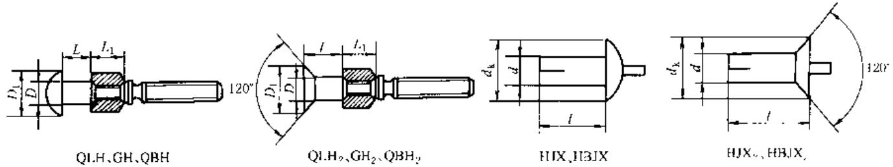

/mm 

表4-2-18

<table><tr><td rowspan=1 colspan=1>铆钉</td><td rowspan=1 colspan=1>D(d）</td><td rowspan=1 colspan=1>（）</td><td rowspan=1 colspan=1>D(d）</td><td rowspan=1 colspan=1>铆孔直径</td><td rowspan=1 colspan=1>铆接厚度</td><td rowspan=1 colspan=1>抗拉载荷/N</td><td rowspan=1 colspan=1>抗剪载荷/N</td><td rowspan=1 colspan=1>1</td><td rowspan=1 colspan=1>材料和标记方法</td></tr><tr><td rowspan=3 colspan=1>环槽铆钉</td><td rowspan=1 colspan=1>5</td><td rowspan=1 colspan=1>4681012141618</td><td rowspan=1 colspan=1>9</td><td rowspan=1 colspan=1>3.4</td><td rowspan=1 colspan=1>3.5~4.55.5-6.57.5-8.59.5-10.511.5~12.513.5~14.515.5~16.517.5~18.5</td><td rowspan=1 colspan=1>2360（A）5000(B）7000(C）</td><td rowspan=1 colspan=1>3450(A)7000（B）9000(C）</td><td rowspan=1 colspan=1>6！</td><td rowspan=3 colspan=1>环槽铆钉/□铝/铝QLH D×L、QLHD× L(A)钢/钢CHD×I、CHD× L(B)不锈钢/不锈钢QBH D×L、QBHD×L(C)</td></tr><tr><td rowspan=1 colspan=1>6.4</td><td rowspan=1 colspan=1>48</td><td rowspan=1 colspan=1>12.5</td><td rowspan=1 colspan=1>6.5</td><td rowspan=1 colspan=1>3.5-4.55.5~6.57.5~8.59.5~10.511.5-12.513.5~14.515.5~16.517.5-18.519.5~20.521.5-22.523.5~24.525.5-26.5</td><td rowspan=1 colspan=1>4340（A）8500(B）</td><td rowspan=1 colspan=1>6120(A)10000(B）</td><td rowspan=1 colspan=1>8</td></tr><tr><td rowspan=1 colspan=1>10</td><td rowspan=1 colspan=1>8101214161820</td><td rowspan=1 colspan=1>19</td><td rowspan=1 colspan=1>10.1</td><td rowspan=1 colspan=1>7.5~8.59.5~10.511.5~12.513.5~14.515.5~16.517.5~18.519.5~20.5</td><td rowspan=1 colspan=1>10000(A)20000(R)21500(C)</td><td rowspan=1 colspan=1>18000(A)25000(B）30000(C）</td><td rowspan=1 colspan=1>11.4</td></tr><tr><td rowspan=3 colspan=1>击芯铆钉</td><td rowspan=1 colspan=1>4.8</td><td rowspan=1 colspan=1>79111315171921</td><td rowspan=1 colspan=1>6.5</td><td rowspan=1 colspan=1>4.9</td><td rowspan=1 colspan=1>4-56~78~910~1112~1314~1516~1718~19</td><td rowspan=1 colspan=1>2000</td><td rowspan=1 colspan=1>3500</td><td rowspan=1 colspan=1></td><td rowspan=3 colspan=1>击心铆钉铝合金/钢HJXd×、HJXd×l铝合金/不锈钢HBJXd×！HBJXd× /□</td></tr><tr><td rowspan=1 colspan=1>5</td><td rowspan=1 colspan=1>7911311921</td><td rowspan=1 colspan=1>9.5</td><td rowspan=1 colspan=1>5.1</td><td rowspan=1 colspan=1>4-56~78-910~1112~1314~1516~1718~19</td><td rowspan=1 colspan=1>2940</td><td rowspan=1 colspan=1>4900</td><td rowspan=1 colspan=1></td></tr><tr><td rowspan=1 colspan=1>6.4</td><td rowspan=1 colspan=1></td><td rowspan=1 colspan=1>13</td><td rowspan=1 colspan=1>6.5</td><td rowspan=1 colspan=1>20~2122~ 2324~2526~2728~2930~3132~3334~ 3536~3738~3940~4142~43</td><td rowspan=1 colspan=1>4760</td><td rowspan=1 colspan=1>7640</td><td rowspan=1 colspan=1></td></tr></table>

注:1.抗拉载荷和抗剪载荷均为最小值,环槽铆钉分A、B、C一种,相对应的载荷值有三种。2.选自上海安字实业有限公司产品样本。

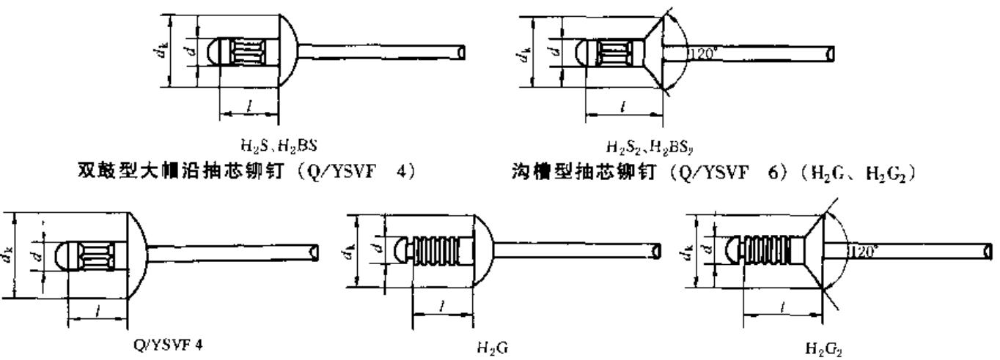

双鼓型抽芯铆钉(GS、 ${ \sf G S } _ { 2 }$ )

/mm 

表4-2-19

<table><tr><td rowspan=1 colspan=1>铆钉</td><td rowspan=1 colspan=1>d</td><td rowspan=1 colspan=1>！</td><td rowspan=1 colspan=1>d</td><td rowspan=1 colspan=1>铆孔直径</td><td rowspan=1 colspan=1>铆接厚度</td><td rowspan=1 colspan=1>抗拉载荷/N</td><td rowspan=1 colspan=1>抗剪载荷/N</td><td rowspan=1 colspan=1>材料和标记方法</td></tr><tr><td rowspan=3 colspan=1>双鼓型抽芯铆钉，双鼓型大帽沿抽芯铆钉</td><td rowspan=1 colspan=1>3.2</td><td rowspan=1 colspan=1>810121416</td><td rowspan=1 colspan=1>9（6)</td><td rowspan=1 colspan=1>3.4</td><td rowspan=1 colspan=1>0.5~52.5-74.5~96.5~118.5~13</td><td rowspan=1 colspan=1>670</td><td rowspan=1 colspan=1>530</td><td rowspan=3 colspan=1>双鼓型抽芯铆钉铝合金/钢HSd×、HSdx铝合金/不锈钢HBSd×、HBSdx钢/钢GSdxlGSdxl双鼓型大帽沿抽芯铆钉铝合金/钢HSd×l铝合金/不锈钢HRSd×</td></tr><tr><td rowspan=1 colspan=1>4.0</td><td rowspan=1 colspan=1>1012141618</td><td rowspan=1 colspan=1>12（8）</td><td rowspan=1 colspan=1>4.2</td><td rowspan=1 colspan=1>1-6.53~8.55~10.57~ 12.59~14.5</td><td rowspan=1 colspan=1>1020(2225)</td><td rowspan=1 colspan=1>845(1890)</td></tr><tr><td rowspan=1 colspan=1>4.8</td><td rowspan=1 colspan=1>101214161820222426</td><td rowspan=1 colspan=1>14(9.5)、16</td><td rowspan=1 colspan=1>5</td><td rowspan=1 colspan=1>0.5~52~74~96~118~1310~1512~1714~1915~21</td><td rowspan=1 colspan=1>1425(3115)</td><td rowspan=1 colspan=1>1160(3335）</td></tr><tr><td rowspan=3 colspan=1>沟槽型抽芯铆钉</td><td rowspan=1 colspan=1>3.2</td><td rowspan=1 colspan=1>1012141618</td><td rowspan=1 colspan=1>6</td><td rowspan=1 colspan=1>3.6</td><td rowspan=1 colspan=1>max 6max 8max 10max 12max 14</td><td rowspan=1 colspan=1>930</td><td rowspan=1 colspan=1>525</td><td rowspan=3 colspan=1>沟槽型抽芯铆钉铝合金/钢铁HGdxHG2dxi</td></tr><tr><td rowspan=1 colspan=1>4</td><td rowspan=1 colspan=1>1012141618</td><td rowspan=1 colspan=1>8</td><td rowspan=1 colspan=1>4.4</td><td rowspan=1 colspan=1>max 6mx 8max 10max 12max 14</td><td rowspan=1 colspan=1>1410</td><td rowspan=1 colspan=1>885</td></tr><tr><td rowspan=1 colspan=1>4.8</td><td rowspan=1 colspan=1>101214161820222426</td><td rowspan=1 colspan=1>9.5</td><td rowspan=1 colspan=1>5.2</td><td rowspan=1 colspan=1>max 6ax 8mAx 10max 12max 14max16max 18ax 20max 22</td><td rowspan=1 colspan=1>1575</td><td rowspan=1 colspan=1>1185</td></tr></table>

注:1. $d _ { \pm }$ 括号内的数据为双鼓型抽芯铆钉(GS、 $\mathsf { G S } _ { 2 }$ 无 $\pmb { d = 3 . 2 }$ 规格)。2.抗拉载荷和抗剪载荷均为最小值。括号外的数据用于双鼓型抽芯铆钉( $\mathbb { H } _ { 2 } \mathbb { S }$ 、 $\mathbf { H } _ { 2 } \mathbf { B } \mathbf { S }$ 、 $\mathbf { H _ { 2 } S _ { 2 } }$ 、 $\mathbf { H _ { 2 } } \mathbf { \mathbb { B } } \mathbf { S _ { 2 } }$ )和沟槽型抽芯铆钉(Q/YSVF6) $\left( \mathbb { H } _ { 2 } \mathbb { G } , \mathbb { H } _ { 2 } \mathbb { G } _ { 2 } \right)$ ,括号内的数据用于双敛型抽芯铆钉(GS、 $G \mathbb { S } _ { 2 }$ )。3.选自上海安字实业有限公司产品样本。

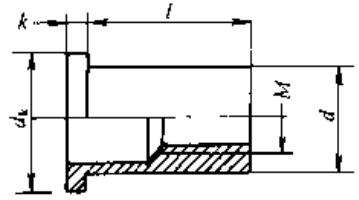

HM.GM 

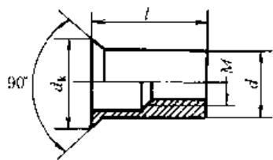

HM2、GM2 

表4-2-20

<table><tr><td rowspan=2 colspan=1>螺纹规格M</td><td rowspan=2 colspan=1>d/mm</td><td rowspan=2 colspan=1>！/mm</td><td rowspan=2 colspan=1>d/mm</td><td rowspan=2 colspan=1>k/mm</td><td rowspan=2 colspan=1>铆孔直径/mm</td><td rowspan=2 colspan=1>铆接厚度/mm</td><td rowspan=1 colspan=2>最小抗拉载荷/N</td><td rowspan=1 colspan=2>最小抗剪载荷N</td><td rowspan=2 colspan=1>材料和标记方法</td></tr><tr><td rowspan=1 colspan=1>铝合金</td><td rowspan=1 colspan=1>钢</td><td rowspan=1 colspan=1>铝合金</td><td rowspan=1 colspan=1>钢</td></tr><tr><td rowspan=3 colspan=1>M3</td><td rowspan=3 colspan=1>$5.0</td><td rowspan=1 colspan=1>7.5(9)</td><td rowspan=3 colspan=1>$8.0</td><td rowspan=3 colspan=1>0.8</td><td rowspan=3 colspan=1>5.1</td><td rowspan=1 colspan=1>0.25(1.7)~1.0(2.5)</td><td rowspan=3 colspan=1>1330</td><td rowspan=3 colspan=1>1920</td><td rowspan=3 colspan=1>1030</td><td rowspan=3 colspan=1>1520</td><td rowspan=23 colspan=1>铝合金HM d×lHMdxl钢GMdxGMdxl</td></tr><tr><td rowspan=1 colspan=1>8.5(10)9.5(11)</td><td rowspan=1 colspan=1>1.0(2.5)~2.0(3.5)2.0(3.5)~3.0(4.5)</td></tr><tr><td rowspan=1 colspan=1>10.5</td><td rowspan=1 colspan=1>3.0~4.0</td></tr><tr><td rowspan=4 colspan=1>M4</td><td rowspan=4 colspan=1>$6.0</td><td rowspan=1 colspan=1>90(10.5)</td><td rowspan=4 colspan=1>$9.0</td><td rowspan=4 colspan=1>0.8</td><td rowspan=4 colspan=1>6.1</td><td rowspan=1 colspan=1>0.25(1.7)~1.0(2.5)</td><td rowspan=4 colspan=1>2100</td><td rowspan=4 colspan=1>3200</td><td rowspan=4 colspan=1>1300</td><td rowspan=4 colspan=1>2000</td></tr><tr><td rowspan=2 colspan=1>10.0(11.5)11.0(12.5)</td><td rowspan=1 colspan=1>1.0(2.5)~2.0(3.5)</td></tr><tr><td rowspan=1 colspan=1>2.0(3.5)~3.0(4.5)</td></tr><tr><td rowspan=1 colspan=1>12.0</td><td rowspan=1 colspan=1>3.0~4.0</td></tr><tr><td rowspan=4 colspan=1>M5</td><td rowspan=4 colspan=1>$7.0</td><td rowspan=1 colspan=1>11.0(12.5)</td><td rowspan=4 colspan=1>$10.0</td><td rowspan=4 colspan=1>1.0</td><td rowspan=4 colspan=1>7.1</td><td rowspan=1 colspan=1>0.25(1.7)~1.0(2.5)</td><td rowspan=4 colspan=1>2700</td><td rowspan=4 colspan=1>4200</td><td rowspan=4 colspan=1>1750</td><td rowspan=4 colspan=1>2800</td></tr><tr><td rowspan=1 colspan=1>12.0(13.5)</td><td rowspan=2 colspan=1>1.0(2.5)~2.0(3.5)2.0(3.5)~3.0(4.5)</td></tr><tr><td rowspan=1 colspan=1>13.0(14.s)</td></tr><tr><td rowspan=1 colspan=1>14.0</td><td rowspan=1 colspan=1>3.0~4.0</td></tr><tr><td rowspan=4 colspan=1>M6</td><td rowspan=4 colspan=1>9.0</td><td rowspan=1 colspan=1>13.5(15)</td><td rowspan=4 colspan=1>$12.0</td><td rowspan=4 colspan=1>1.5</td><td rowspan=4 colspan=1>$9.1</td><td rowspan=1 colspan=1>0.5(1.7)~1.5(3)</td><td rowspan=4 colspan=1>4100</td><td rowspan=4 colspan=1>6300</td><td rowspan=4 colspan=1>2600</td><td rowspan=4 colspan=1>4750</td></tr><tr><td rowspan=1 colspan=1>15.0(16.5)</td><td rowspan=2 colspan=1>1.5(3)~3.0(4.5)3.0(4.5)-4.5(6)</td></tr><tr><td rowspan=1 colspan=1>16.5(18)</td></tr><tr><td rowspan=1 colspan=1>18.0</td><td rowspan=1 colspan=1>4.5~6.0</td></tr><tr><td rowspan=4 colspan=1>M8</td><td rowspan=4 colspan=1>$11.0</td><td rowspan=1 colspan=1>15.0(16.5)</td><td rowspan=4 colspan=1>$14.0</td><td rowspan=4 colspan=1>1.5</td><td rowspan=4 colspan=1>$11.1</td><td rowspan=1 colspan=1>0.5(1.7)~1.5(3)</td><td rowspan=4 colspan=1>5600</td><td rowspan=4 colspan=1>8500</td><td rowspan=4 colspan=1>3600</td><td rowspan=4 colspan=1>6500</td></tr><tr><td rowspan=1 colspan=1>16.5(18)</td><td rowspan=1 colspan=1>1.5(3)-3.0(4.5)</td></tr><tr><td rowspan=1 colspan=1>18.0(19.5)</td><td rowspan=1 colspan=1>3.0(4.5)~4.5(6)</td></tr><tr><td rowspan=1 colspan=1>19.5</td><td rowspan=1 colspan=1>4.5-6.0</td></tr><tr><td rowspan=4 colspan=1>M10</td><td rowspan=4 colspan=1>$13.0</td><td rowspan=1 colspan=1>18.0(19.5)</td><td rowspan=4 colspan=1>16.0</td><td rowspan=4 colspan=1>1.8</td><td rowspan=4 colspan=1>$13.1</td><td rowspan=1 colspan=1>0.5(1.7)~1.5(3)</td><td rowspan=4 colspan=1>6500</td><td rowspan=4 colspan=1>10000</td><td rowspan=4 colspan=1>4300</td><td rowspan=4 colspan=1>7800</td></tr><tr><td rowspan=1 colspan=1>19.5(21)</td><td rowspan=1 colspan=1>1.5(3)~3.0(4.5)</td></tr><tr><td rowspan=1 colspan=1>21.0(22.5)</td><td rowspan=1 colspan=1>3.0(4.5)~4.5(6)</td></tr><tr><td rowspan=1 colspan=1>22.5(24)</td><td rowspan=1 colspan=1>4.5(6)~6.0(7.5)</td></tr></table>

注:1选自上海安字实业有限公司产品样本。2.括号内的数字为 $\mathbf { H M } _ { 2 }$ 、 $\mathbf { G } \mathbf { M } _ { 2 }$ 的。

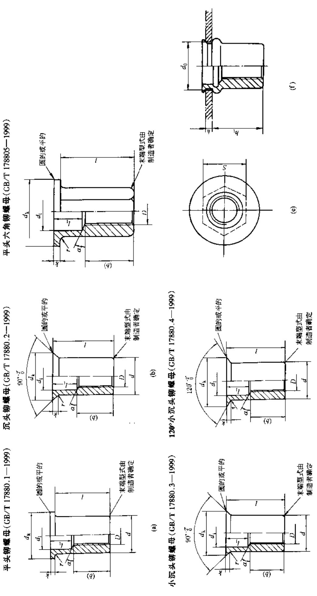

<table><tr><td rowspan=1 colspan=2>螺纹规格</td><td rowspan=2 colspan=1>d-0.03-0.10</td><td rowspan=2 colspan=1>Y</td><td rowspan=1 colspan=2>dH12</td><td rowspan=1 colspan=3>新</td><td rowspan=1 colspan=3>dmax</td><td rowspan=1 colspan=1>山</td><td rowspan=1 colspan=3>mx</td><td rowspan=1 colspan=3>铆接厚度k（推荐）</td><td rowspan=1 colspan=1>4</td><td rowspan=2 colspan=1>h参考</td></tr><tr><td rowspan=1 colspan=1>粗牙</td><td rowspan=1 colspan=1>细牙</td><td rowspan=1 colspan=1>图b.cd</td><td rowspan=1 colspan=1>图e</td><td rowspan=1 colspan=1>图a</td><td rowspan=1 colspan=1>图b、e</td><td rowspan=1 colspan=1>图c、d</td><td rowspan=1 colspan=1>图a、b、e</td><td rowspan=1 colspan=1>图c</td><td rowspan=1 colspan=1>图d</td><td rowspan=1 colspan=1>+0.159</td><td rowspan=1 colspan=1>图a、e</td><td rowspan=1 colspan=1>图b</td><td rowspan=1 colspan=1>图c、d</td><td rowspan=1 colspan=1>图8、</td><td rowspan=1 colspan=1>图b</td><td rowspan=1 colspan=1>图cd</td><td rowspan=1 colspan=1>+0.15@</td></tr><tr><td rowspan=1 colspan=1>M3</td><td rowspan=1 colspan=1></td><td rowspan=1 colspan=1>5</td><td rowspan=1 colspan=1>0.2</td><td rowspan=1 colspan=1>4</td><td rowspan=1 colspan=1></td><td rowspan=1 colspan=1>0.8</td><td rowspan=1 colspan=1>1.5</td><td rowspan=1 colspan=1>0.35</td><td rowspan=1 colspan=1>8</td><td rowspan=1 colspan=1>5.5</td><td rowspan=1 colspan=1>6.5</td><td rowspan=1 colspan=1>5</td><td rowspan=1 colspan=1>7.58.59.510.5</td><td rowspan=1 colspan=1>g0！</td><td rowspan=1 colspan=1>7.58.59.5</td><td rowspan=1 colspan=1>0.25-1.01.0~2.02.0-3.03.0~4.0</td><td rowspan=1 colspan=1>1.7-2.52.5~3.53.5-4.5</td><td rowspan=1 colspan=1>0.5~1.01.0-2.02.0-3.0</td><td rowspan=1 colspan=1>5</td><td rowspan=1 colspan=1>5.8</td></tr><tr><td rowspan=1 colspan=1>M4</td><td rowspan=1 colspan=1></td><td rowspan=1 colspan=1>6</td><td rowspan=1 colspan=1>0.2</td><td rowspan=1 colspan=1>4.8</td><td rowspan=1 colspan=1></td><td rowspan=1 colspan=1>0.8</td><td rowspan=1 colspan=1>1.5</td><td rowspan=1 colspan=1>0.5</td><td rowspan=1 colspan=1>9</td><td rowspan=1 colspan=1>6.7s</td><td rowspan=1 colspan=1>8</td><td rowspan=1 colspan=1>6</td><td rowspan=1 colspan=1>910！12</td><td rowspan=1 colspan=1>1511.512.5</td><td rowspan=1 colspan=1>9011</td><td rowspan=1 colspan=1>0.25-1.01.0~2.02.0~3.03.0~4.0</td><td rowspan=1 colspan=1>1.7~2.52.5~3.53.5~4.5</td><td rowspan=1 colspan=1>0.5~1.01.0~2.02.0~3.0</td><td rowspan=1 colspan=1>6</td><td rowspan=1 colspan=1>7.5</td></tr><tr><td rowspan=1 colspan=1>M5</td><td rowspan=1 colspan=1></td><td rowspan=1 colspan=1>7</td><td rowspan=1 colspan=1>0.2</td><td rowspan=1 colspan=1>5.6</td><td rowspan=1 colspan=1></td><td rowspan=1 colspan=1>1</td><td rowspan=1 colspan=1>1.5</td><td rowspan=1 colspan=1>0.6</td><td rowspan=1 colspan=1>10</td><td rowspan=1 colspan=1>8</td><td rowspan=1 colspan=1>9</td><td rowspan=1 colspan=1>7</td><td rowspan=1 colspan=1>11121314</td><td rowspan=1 colspan=1>12.513.514.5</td><td rowspan=1 colspan=1>13213</td><td rowspan=1 colspan=1>0.25~1.01.0~2.02.0-3.03.0~4.0</td><td rowspan=1 colspan=1>1.7~2.52.5-3.53.5-4.5</td><td rowspan=1 colspan=1>0.5~1.01.0~2.02.0~3.0</td><td rowspan=1 colspan=1>7</td><td rowspan=1 colspan=1>9.3</td></tr><tr><td rowspan=1 colspan=1>M6</td><td rowspan=1 colspan=1></td><td rowspan=1 colspan=1>9</td><td rowspan=1 colspan=1>0.2</td><td rowspan=1 colspan=1>7.5</td><td rowspan=1 colspan=1>8</td><td rowspan=1 colspan=1>1.5</td><td rowspan=1 colspan=1>1.5</td><td rowspan=1 colspan=1>0.6</td><td rowspan=1 colspan=1>12</td><td rowspan=1 colspan=1>0</td><td rowspan=1 colspan=1>11</td><td rowspan=1 colspan=1>9</td><td rowspan=1 colspan=1>13i51618</td><td rowspan=1 colspan=1>1516.518</td><td rowspan=1 colspan=1>13.51516.5</td><td rowspan=1 colspan=1>0.5~1.51.5-3.03.0~4.54.5~6.0</td><td rowspan=1 colspan=1>1.7~3.03.0~4.54.5~6.0</td><td rowspan=1 colspan=1>0.5~1.51.5~3.03.0~4.5</td><td rowspan=1 colspan=1>9</td><td rowspan=1 colspan=1>i1.0</td></tr><tr><td rowspan=1 colspan=1>M8</td><td rowspan=1 colspan=1></td><td rowspan=1 colspan=1>11</td><td rowspan=1 colspan=1>0.3</td><td rowspan=1 colspan=1>9.2</td><td rowspan=1 colspan=1>10</td><td rowspan=1 colspan=1>1.5</td><td rowspan=1 colspan=1>1.5</td><td rowspan=1 colspan=1>0.6</td><td rowspan=1 colspan=1>14</td><td rowspan=1 colspan=1>12</td><td rowspan=1 colspan=1>13</td><td rowspan=1 colspan=1>1</td><td rowspan=1 colspan=1>15161819</td><td rowspan=1 colspan=1>16.5819.5</td><td rowspan=1 colspan=1>1516.518</td><td rowspan=1 colspan=1>0.5~1.51.5~3.03.0~4.54.5~6.0</td><td rowspan=1 colspan=1>1.7-3.03.0-4.54.5-6.0</td><td rowspan=1 colspan=1>0.5~1.51.5~3.03.0~4.5</td><td rowspan=1 colspan=1>i1</td><td rowspan=1 colspan=1>12.3</td></tr><tr><td rowspan=1 colspan=1>M10</td><td rowspan=1 colspan=1>M0×</td><td rowspan=1 colspan=1>13</td><td rowspan=1 colspan=1>0.3</td><td rowspan=1 colspan=1>i</td><td rowspan=1 colspan=1>11.5</td><td rowspan=1 colspan=1>18</td><td rowspan=1 colspan=1>5</td><td rowspan=1 colspan=1>5</td><td rowspan=1 colspan=1>16</td><td rowspan=1 colspan=1>245</td><td rowspan=1 colspan=1>16</td><td rowspan=1 colspan=1>13</td><td rowspan=1 colspan=1>1819.52122.5</td><td rowspan=1 colspan=1>19.52122.524</td><td rowspan=1 colspan=1>1819.521</td><td rowspan=1 colspan=1>0.5-1.51.5-3.03.0~4.54.5~6.0</td><td rowspan=1 colspan=1>1.7-3.03.0~4.54.5~6.06.0~7.5</td><td rowspan=1 colspan=1>0.5~1.51.5~3.03.0~4.5</td><td rowspan=1 colspan=1></td><td rowspan=1 colspan=1>15.0</td></tr><tr><td rowspan=1 colspan=1>M12</td><td rowspan=1 colspan=1>M12x1.5</td><td rowspan=1 colspan=1>5</td><td rowspan=1 colspan=1>0.3</td><td rowspan=1 colspan=1>13</td><td rowspan=1 colspan=1>13.5</td><td rowspan=1 colspan=1>1.8</td><td rowspan=1 colspan=1>1.5</td><td rowspan=1 colspan=1>0.85</td><td rowspan=1 colspan=1>18</td><td rowspan=1 colspan=1>16.5</td><td rowspan=1 colspan=1>18</td><td rowspan=1 colspan=1>15</td><td rowspan=1 colspan=1>2122.53A25</td><td rowspan=1 colspan=1>22.52425.527</td><td rowspan=1 colspan=1>2122.524</td><td rowspan=1 colspan=1>0.5~1.51.5~3.03.0~4.54.5-6.0</td><td rowspan=1 colspan=1>1.7~3.030-4.54.5-6.06.0~7.5</td><td rowspan=1 colspan=1>0.5-1.51.5-3.03.0~4.5</td><td rowspan=1 colspan=1>i5</td><td rowspan=1 colspan=1>17.5</td></tr></table>

# 第3章 销、键及花键联接

# 1销联接

# 1.1销的类型、特点和应用

销主要用作装配定位,也可用作联接零件,还可作为安全装置中的过载剪断元件。销的类型、特点和应用见表4-3-1。

表4-3-1

销的类型、特点和应用

<table><tr><td rowspan=2 colspan=2>类型</td><td rowspan=2 colspan=1>图</td><td rowspan=1 colspan=1>标准</td><td rowspan=2 colspan=2>特点</td><td rowspan=2 colspan=1>应用</td></tr><tr><td rowspan=1 colspan=1>规格/mm</td></tr><tr><td rowspan=8 colspan=1>圆柱销</td><td rowspan=2 colspan=1>圆柱销</td><td rowspan=2 colspan=1></td><td rowspan=1 colspan=1>CB/T119.1—2000GR/T119.2—2000</td><td rowspan=6 colspan=1>销孔需铰制，多次装拆后会降低定位的精度和联接的紧固。只能传递不大的载荷</td><td rowspan=2 colspan=1>直径公差带有m6、h8、hl1和u8四种，以满足不同的使用要求</td><td rowspan=2 colspan=1>主要用于定位，也可用于联接</td></tr><tr><td rowspan=1 colspan=1>d=0.6-501=2~200</td></tr><tr><td rowspan=2 colspan=1>内螺纹圆柱销</td><td rowspan=2 colspan=1></td><td rowspan=1 colspan=1>GB/T120.1—2000CB/T 120.2--2000</td><td rowspan=2 colspan=1>直径偏差只有m6一种，内螺纹供拆卸用</td><td rowspan=2 colspan=1>B型用下盲孔</td></tr><tr><td rowspan=1 colspan=1>d=6~50= 16~200</td></tr><tr><td rowspan=2 colspan=1>螺纹圆桂销</td><td rowspan=2 colspan=1></td><td rowspan=1 colspan=1>GB/T 878-1986</td><td rowspan=2 colspan=1>直径偏差较大，定位精度低</td><td rowspan=2 colspan=1>用于精度要求不高的场合</td></tr><tr><td rowspan=1 colspan=1>d=4~20=10~60</td></tr><tr><td rowspan=2 colspan=1>弹性圆柱销</td><td rowspan=2 colspan=1>e</td><td rowspan=1 colspan=1>GB/T 897.1—2000~GB/T 897.5-2000</td><td rowspan=2 colspan=2>具有弹性，装人销孔后与孔壁压紧，不易松脱。销孔精度要求较低，可不铰制，互换性好，可多次装拆。刚性较差，不适于高精度定位，载荷大时几个套在一起使用，相邻内外两销的缺口应错开180°</td><td rowspan=2 colspan=1>用于有冲击、振动的场合，可代善部分圆柱销、圆锥销、开销或销轴</td></tr><tr><td rowspan=1 colspan=1>d=0.8-50=4~200</td></tr><tr><td rowspan=8 colspan=1>园锥销</td><td rowspan=2 colspan=1>圆锥销</td><td rowspan=2 colspan=1>150</td><td rowspan=1 colspan=1>GB/T117--2000</td><td rowspan=8 colspan=2>有1:50的锥度，便于安装。定位精度比国柱销高在受横向力时能自锁。销孔需铰制螺纹供拆卸用，螺尾圆锥销制造不便开尾圆锥销打人销孔后，末端可稍张开，以防止松脱</td><td rowspan=2 colspan=1>主要用于定位，也可用以固定零件，传递动力。多用于经常装卸的场合</td></tr><tr><td rowspan=1 colspan=1>d=0.6~50=2~200</td></tr><tr><td rowspan=2 colspan=1>内螺纹圆锥销</td><td rowspan=2 colspan=1>1:50</td><td rowspan=1 colspan=1>GB/T118-2000</td><td rowspan=2 colspan=1>用于自孔</td></tr><tr><td rowspan=1 colspan=1>d=6-50=16~200</td></tr><tr><td rowspan=2 colspan=1>螺尾锥销</td><td rowspan=2 colspan=1>1:50</td><td rowspan=1 colspan=1>GR/T881—2000</td><td rowspan=2 colspan=1>用于拆卸困难的场合，如自孔</td></tr><tr><td rowspan=1 colspan=1>d=5~50= 40~400</td></tr><tr><td rowspan=2 colspan=1>开尾网锥销</td><td rowspan=2 colspan=1>1:50</td><td rowspan=1 colspan=1>CR/T877-1986</td><td rowspan=2 colspan=1>用于有冲击、振动的场合</td></tr><tr><td rowspan=1 colspan=1>d =3~161=30~200</td></tr><tr><td rowspan=2 colspan=2>槽销</td><td rowspan=2 colspan=1>:60</td><td rowspan=2 colspan=1></td><td rowspan=2 colspan=2>销上有辗压或模锻出的三条纵向沟槽，打人销孔后与孔壁压紧，不易松脱。能承受振动和变载荷。销孔不需铰制，可多次装拆</td><td rowspan=1 colspan=1>与圆锥销相间</td></tr><tr><td rowspan=1 colspan=1>用丁有严重掀动和冲击载荷的场合</td></tr><tr><td rowspan=2 colspan=2>销轴</td><td rowspan=2 colspan=1></td><td rowspan=1 colspan=1>GB/T 882-1986</td><td rowspan=4 colspan=2>用开口销锁定，拆卸方便</td><td rowspan=4 colspan=1>用于铰接处</td></tr><tr><td rowspan=1 colspan=1>d=3~601=6~200</td></tr><tr><td rowspan=2 colspan=2>带孔销</td><td rowspan=2 colspan=1></td><td rowspan=1 colspan=1>CB/T880-1986</td></tr><tr><td rowspan=1 colspan=1>d=3-251=8-200</td></tr></table>

<table><tr><td rowspan="2">类型</td><td rowspan="2">图 形</td><td>标 准</td><td rowspan="2">特 点</td><td rowspan="2">应用</td></tr><tr><td>规格/mm</td></tr><tr><td rowspan="4">开口销</td><td></td><td>GB/T91-2000 d=0.6-20</td><td rowspan="2">作可靠、拆卸方便</td><td rowspan="2">用于锁定其他紧固 件</td></tr><tr><td></td><td>=4~280</td></tr><tr><td></td><td>JB/ZQ 4355-1997</td><td></td><td>用F尺寸较大时</td></tr><tr><td></td><td>d=15~18 = 180~290</td><td></td><td></td></tr><tr><td>安全销</td><td></td><td></td><td>结构简甲，形式多样。必要时在销上 切出槽口。为防止断销时损坏孔壁，可 在孔内加销套</td><td>用子传动装置和机 器的过载保护，如安 全联轴器等的过载剪 断元件</td></tr></table>

# 1.2销的选择和联接的强度计算

用于联接的销,其直径可根据联接的结构特点按经验确定,必要时再作强度校核

用了定位的销通常不受载荷或只受很小的载荷,其直径可按结构确定,数目不得少于2,且分布在紧固螺钉的对称方向上。销在每一被联接件内的长度,约为销直径的1\~2倍。

设计安全销时应考虑销剪断后不易飞出和易于更换。

销的常用材料为35及45号钢,其他材料有30CrMnSiA、H62、HPb59--1、QSi3-1、1Crl3、2Crl3、Cr17Ni2、[Crl8Ni9Ti等,其热处理和表面处理见GB/T121。

安全销的材料常用35、45及S0号钢,或者用T8A及T10A等,热处理后的硬度为30\~36HRC.

销套的材料常用45、35SiMn及40Cr钢等,热处理后的硬度为 $4 0 \sim 5 0 \mathrm { H R C }$ :

销的强度验算公式见表4-3-2。

表4-3-2

销的强度验算公式

<table><tr><td colspan="1" rowspan="1">销的类型</td><td colspan="1" rowspan="1">受力简图</td><td colspan="1" rowspan="1">计算内容</td><td colspan="1" rowspan="1">计算公式</td><td colspan="1" rowspan="1">符号意义及系数选择</td></tr><tr><td colspan="1" rowspan="3">圆柱销</td><td colspan="1" rowspan="1">F</td><td colspan="1" rowspan="1">销的剪切</td><td colspan="1" rowspan="1">4F=d²2tp</td><td colspan="1" rowspan="1">F--—横向力，Nd-—销的直径，mm7-  销数t   销的许用剪应力，MPa，对于销的常用材料取=80MPa</td></tr><tr><td colspan="1" rowspan="2">d</td><td colspan="1" rowspan="1">销或被联接零件的挤压</td><td colspan="1" rowspan="1">47=DdLpp</td><td colspan="1" rowspan="2">T—转知，N·mmD—轴的真径，mmd—销的直径，mm，d=(0.13~0.16)DL-销的长度，mm，/.=（1~1.5）D销联接的许用挤压应力，MPa查表4-3-17</td></tr><tr><td colspan="1" rowspan="1">销的剪切</td><td colspan="1" rowspan="1">2=D</td></tr><tr><td colspan="1" rowspan="1">圆锥销</td><td colspan="1" rowspan="1"></td><td colspan="1" rowspan="1">销的剪切</td><td colspan="1" rowspan="1">4TdDp</td><td colspan="1" rowspan="1">d—圆锥销的平均直径，mm，d=（0.2-0.3)D</td></tr><tr><td colspan="1" rowspan="3">销轴</td><td colspan="1" rowspan="3">□上9a=(1.5~1.7）db=(2.0~3.5)d</td><td colspan="1" rowspan="1">销或拉杆工作面的抗压</td><td colspan="1" rowspan="1">F=2或Fp=bPp</td><td colspan="1" rowspan="3">d—销轴直径，mma—连杆头尺寸.mmb连杆头尺寸，mm当抗压时，若销与拉杆有相对转动，则应以许用挤压压强pp代智许用挤压应力opp计算，Ppp见表4-3-17。</td></tr><tr><td colspan="1" rowspan="1">销轴的抗剪</td><td colspan="1" rowspan="1">F=2×4</td></tr><tr><td colspan="1" rowspan="1">销轴的抗弯</td><td colspan="1" rowspan="1">F(a+0.5b） 4x0.1d opp</td></tr><tr><td colspan="1" rowspan="1">安全销</td><td colspan="1" rowspan="1"></td><td colspan="1" rowspan="1">销的直径</td><td colspan="1" rowspan="1">Td=1.62D2t （mm）</td><td colspan="1" rowspan="1">Do安全销中心圆的直径，mm剪切强度极限，MPu，rb=(0.6~0.7)ab 抗拉强度，MPa</td></tr></table>

注:弹性圆柱销的剪切强度略高于同一尺寸的实心冷轧钢销。当两个弹性圆柱销套在一起使用时,其剪切强度为两个销的剪切强度和。

# 1.3销的标准件

# 圆锥销(GB/T117—2000)

A型(磨削):锥面表面粗糙度 $R _ { \circ } = 0 . 8 \mu m$ B型(切削或冷镦):锥面表面粗糙度 $R _ { \bullet } = 3 . 2 \mu \mathrm { m }$ 

$$
r _ { 2 } = \frac { a } { 2 } + d + \frac { ( 0 . 0 2 l ) ^ { 2 } } { 8 a }
$$

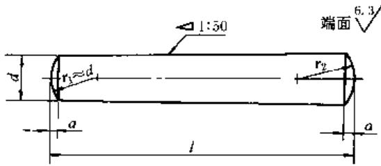

标记示例:

公称直径 $\pmb { d } = 6 \mathsf { m m }$ 、公称长度 $\pmb { l } = \pmb { 3 0 } \mathbf { m } \mathbf { m }$ 、材料为35钢、热处理硬度28\~38HRC、表面氧化处理 $\mathbf { A }$ 型圆锥销的标记:销GB/T117 $6 \times 3 0$ 

/mm 

表4-3-3

<table><tr><td rowspan=1 colspan=2>dh10</td><td rowspan=1 colspan=1>0.6</td><td rowspan=1 colspan=1>0.8</td><td rowspan=1 colspan=1>1</td><td rowspan=1 colspan=1>1.2</td><td rowspan=1 colspan=1>1.5</td><td rowspan=1 colspan=1>2</td><td rowspan=1 colspan=1>2.5</td><td rowspan=1 colspan=1>3</td><td rowspan=1 colspan=1>4</td><td rowspan=1 colspan=1>5</td><td rowspan=1 colspan=1>6</td><td rowspan=1 colspan=1>8</td><td rowspan=1 colspan=1>10</td><td rowspan=1 colspan=1>12</td><td rowspan=1 colspan=1>16</td><td rowspan=1 colspan=1>20</td><td rowspan=1 colspan=1>25</td><td rowspan=1 colspan=1>30</td><td rowspan=1 colspan=1>40</td><td rowspan=1 colspan=1>50</td></tr><tr><td rowspan=1 colspan=2>心限</td><td rowspan=1 colspan=1>0.08</td><td rowspan=1 colspan=1>0.1</td><td rowspan=1 colspan=1>0.12</td><td rowspan=1 colspan=1>0.16</td><td rowspan=1 colspan=1>0.2</td><td rowspan=1 colspan=1>0.25</td><td rowspan=1 colspan=1>0.3</td><td rowspan=1 colspan=1>0.4</td><td rowspan=1 colspan=1>0.5</td><td rowspan=1 colspan=1>0.63</td><td rowspan=1 colspan=1>0.8</td><td rowspan=1 colspan=1>1</td><td rowspan=1 colspan=1>1.2</td><td rowspan=1 colspan=1>1.6</td><td rowspan=1 colspan=1>2</td><td rowspan=1 colspan=1>2.5</td><td rowspan=1 colspan=1>3</td><td rowspan=1 colspan=1>4</td><td rowspan=1 colspan=1>5</td><td rowspan=1 colspan=1>6.3</td></tr><tr><td rowspan=2 colspan=2>商品规格！</td><td rowspan=2 colspan=1>4-8</td><td rowspan=2 colspan=1>5~12</td><td rowspan=2 colspan=1>6~16</td><td rowspan=2 colspan=1>620</td><td rowspan=2 colspan=1>824</td><td rowspan=2 colspan=1>10~35</td><td rowspan=2 colspan=1>10-35</td><td rowspan=2 colspan=1>12~45</td><td rowspan=2 colspan=1>14~55</td><td rowspan=2 colspan=1>1860</td><td rowspan=1 colspan=1>22~</td><td rowspan=2 colspan=1>22~120</td><td rowspan=2 colspan=1>26160</td><td rowspan=2 colspan=1>32~180</td><td rowspan=2 colspan=1>40~200</td><td rowspan=2 colspan=1>45~200</td><td rowspan=2 colspan=1>50~200</td><td rowspan=2 colspan=1>55~200</td><td rowspan=2 colspan=1>60~200</td><td rowspan=2 colspan=1>65200</td></tr><tr><td rowspan=1 colspan=1>90</td></tr><tr><td rowspan=1 colspan=2>1m长的重量/g</td><td rowspan=1 colspan=1>0.003</td><td rowspan=1 colspan=1>0.005</td><td rowspan=1 colspan=1>0.007</td><td rowspan=1 colspan=1>1</td><td rowspan=1 colspan=1>0.0150.027</td><td rowspan=1 colspan=1>0.0150.027</td><td rowspan=1 colspan=1>0.040.062</td><td rowspan=1 colspan=1>0.040.062</td><td rowspan=1 colspan=1>0.11</td><td rowspan=1 colspan=1>0.16</td><td rowspan=1 colspan=1>0.30</td><td rowspan=1 colspan=1>0.50</td><td rowspan=1 colspan=1>0.74</td><td rowspan=1 colspan=1>1.03</td><td rowspan=1 colspan=1>1.77</td><td rowspan=1 colspan=1>2.66</td><td rowspan=1 colspan=1>4.09</td><td rowspan=1 colspan=1>5.85</td><td rowspan=1 colspan=1>10.1</td><td rowspan=1 colspan=1>15.7</td></tr><tr><td rowspan=1 colspan=2>！系列</td><td rowspan=1 colspan=20>2、3，4.5,6，8，10，12，14，16，18、20，22，24，26,28、30,32、35,40.45,50,5560,65、70，75，80，85，90，95，100，120、140，160，180，200</td></tr><tr><td rowspan=2 colspan=1>技术条件</td><td rowspan=1 colspan=1>材料</td><td rowspan=1 colspan=20>易切钢：Y12、Y15；碳素钢：35、45；合金钢：30CrMnSiA；不锈钢：1Cr13、2Cr13、Cr17Ni2、0Cr18Ni9Ti</td></tr><tr><td rowspan=1 colspan=1>表面处理</td><td rowspan=1 colspan=20>①钢：不经处理；氧化；磷化；镀锌钝化。②不锈钢：简单处理。③其他表面镀层或表面处理，由供需双方协议。④所有公差仅适用于涂、镀前的公差</td></tr></table>

注:1.d的其他公差,如al1、c11、f8由供需双方协议。2.公称长度大于 ${ \bf 2 0 0 } \bf { m m }$ ,按 $\bf { 2 0 m m }$ 递增。

A型(磨削):锥表面粗糙度 $R _ { \mathfrak { s } } \ : \approx$ $0 , 8 _ { I } \iota m$ 

$\mathfrak { B }$ 型(切削或冷镦):锥表面粗糙度$R _ { \bullet } = 3 . 2 \mu m$ 

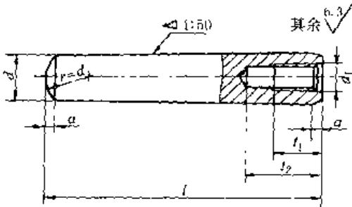

标记示例:

公称直径 $\alpha = 6 \sqrt { \pi } \ m$ 、公称长度 $\smash { \ell = 3 0 m m }$ 、材料为35钢、热处理硬度 $2 8 \sim 3 8 \mathsf { H R C }$ 、表面氧化处理 $\mathbf { A }$ 型内螺纹圆锥销的标记:

销GB/T118 $6 \times 3 0$ 

# 内螺纹圆锥销(GB/T118-2000)

表4-3-4

/mm 

<table><tr><td rowspan=1 colspan=2>dh10  1</td><td rowspan=1 colspan=1>6</td><td rowspan=1 colspan=1>8</td><td rowspan=1 colspan=1>10</td><td rowspan=1 colspan=1>12！</td><td rowspan=1 colspan=1>16</td><td rowspan=1 colspan=1>20</td><td rowspan=1 colspan=1>25</td><td rowspan=1 colspan=1>30</td><td rowspan=1 colspan=1>40</td><td rowspan=1 colspan=1>5</td></tr><tr><td rowspan=1 colspan=2>a气</td><td rowspan=1 colspan=1>0.8</td><td rowspan=1 colspan=1>i</td><td rowspan=1 colspan=1>1.2</td><td rowspan=1 colspan=1>1.6</td><td rowspan=1 colspan=1>2</td><td rowspan=1 colspan=1>2.5</td><td rowspan=1 colspan=1>3</td><td rowspan=1 colspan=1>4</td><td rowspan=1 colspan=1>5</td><td rowspan=1 colspan=1>6.3</td></tr><tr><td rowspan=1 colspan=2>d</td><td rowspan=1 colspan=1>M4</td><td rowspan=1 colspan=1>M5</td><td rowspan=1 colspan=1>M6</td><td rowspan=1 colspan=1>M8</td><td rowspan=1 colspan=1>M10</td><td rowspan=1 colspan=1>M12</td><td rowspan=1 colspan=1>M25</td><td rowspan=1 colspan=1>320</td><td rowspan=1 colspan=1>20</td><td rowspan=1 colspan=1>M24</td></tr><tr><td rowspan=1 colspan=2>螺距P</td><td rowspan=1 colspan=1>0.7</td><td rowspan=1 colspan=1>0.8</td><td rowspan=1 colspan=1>！</td><td rowspan=1 colspan=1>1.25</td><td rowspan=1 colspan=1>1.5</td><td rowspan=1 colspan=1>1.75</td><td rowspan=1 colspan=1>2</td><td rowspan=1 colspan=1>2.5</td><td rowspan=1 colspan=1>2.5</td><td rowspan=1 colspan=1>1</td></tr><tr><td rowspan=1 colspan=2>t</td><td rowspan=1 colspan=1>6</td><td rowspan=1 colspan=1>8</td><td rowspan=1 colspan=1>10</td><td rowspan=1 colspan=1>12</td><td rowspan=1 colspan=1>16</td><td rowspan=1 colspan=1>18</td><td rowspan=1 colspan=1>24</td><td rowspan=1 colspan=1>30</td><td rowspan=1 colspan=1>30</td><td rowspan=1 colspan=1>36</td></tr><tr><td rowspan=1 colspan=2>min</td><td rowspan=1 colspan=1>10</td><td rowspan=1 colspan=1>12</td><td rowspan=1 colspan=1>16</td><td rowspan=1 colspan=1>20</td><td rowspan=1 colspan=1>25</td><td rowspan=1 colspan=1>28</td><td rowspan=1 colspan=1>35</td><td rowspan=1 colspan=1>4</td><td rowspan=1 colspan=1>40</td><td rowspan=1 colspan=1>50</td></tr><tr><td rowspan=2 colspan=2>商品规格：</td><td rowspan=2 colspan=1>16-60</td><td rowspan=2 colspan=1>18~80</td><td rowspan=2 colspan=1>22~100</td><td rowspan=2 colspan=1>26120</td><td rowspan=2 colspan=1>32~160</td><td rowspan=1 colspan=1>40~</td><td rowspan=1 colspan=1>50</td><td rowspan=1 colspan=1>~</td><td rowspan=1 colspan=1>80</td><td rowspan=1 colspan=1>100~</td></tr><tr><td rowspan=1 colspan=1>200</td><td rowspan=1 colspan=1>200</td><td rowspan=1 colspan=1>200_200</td><td rowspan=1 colspan=1>200</td><td rowspan=1 colspan=1>200</td></tr><tr><td rowspan=1 colspan=2>1m长的重量/kg</td><td rowspan=1 colspan=1></td><td rowspan=1 colspan=1></td><td rowspan=1 colspan=1>J</td><td rowspan=1 colspan=1>0.98</td><td rowspan=1 colspan=1>1.66</td><td rowspan=1 colspan=1>2.48</td><td rowspan=1 colspan=1>3.67</td><td rowspan=1 colspan=1>5.01</td><td rowspan=1 colspan=1>9.25</td><td rowspan=1 colspan=1>14.12</td></tr><tr><td rowspan=1 colspan=2>系列</td><td rowspan=1 colspan=5>16，18，20，22，24.26，28，30.32，35、40，45、50，55,60，65，70，75，80，85、90，95，100，120，140，160、180，200</td><td rowspan=1 colspan=5>16，18，20，22，24.26，28，30.32，35、40，45、50，55,60，65，70，75，80，85、90，95，100，120，140，160、180，200</td></tr><tr><td rowspan=2 colspan=1>技术条件</td><td rowspan=1 colspan=1>材料</td><td rowspan=1 colspan=10>易切钢：Y2、Y13：碳素钢：35、45；合金钢；30CrMuSiA；不锈钢：1Cr13、2Cr13、Cr17N12、0Cr18Ni9Ti</td></tr><tr><td rowspan=1 colspan=1>表面处理</td><td rowspan=1 colspan=10>①钢：不经处理；氧化：磷化：镀锌钝化，②不锈钢：简单处理，③其他表面镀层或表面处理，由供需双方协议、①所有公差仅适用于涂、镀前的公差</td></tr></table>

注:1.d的其他公差,如al、1、8由供需双方协议。2.公称长度大于200mm,按 $2 0 \mathtt { e m m }$ 递增,

圆柱销不淬硬钢和奥氏体不锈钢(GB/T119.1-2000)

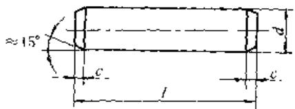

标记示例:

公称直径 $\pmb { d } = \delta \pmb { \mathrm { m m } }$ 、其公差为 $\mathtt { m 6 }$ 、公称长度 $\ l = 3 0 \mathrm { m m }$ 、材料为钢、不经淬火、不经表面处理的圆柱销:

销GB/T119.1 $6 \pi 6 \times 3 0$ 

公称直径 $\alpha = 6 \eta \eta \eta$ 、其公差为 $\mathtt { m 6 }$ 、公称长度 $\pmb { \downarrow } = 3 0 \pmb { m } \pmb { \mathrm { x } }$ 、材料为A1绝类氏体不锈钢、表面简单处理的圆柱销:

销CB/T119.1 $\mathbf { 6 } \pi \mathbf { 6 } \times 3 0 - A l$ 

# 圆柱销淬硬钢和马氏体不锈钢( $\boldsymbol { \mathrm { G B / T } } 1 1 9 . 2 \substack { - 2 0 0 0 } )$ 

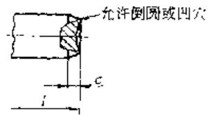

末端形状,由制造者确定

标记示例:

公称直径 $\mathcal { A } = \delta \mathfrak { m } \mathfrak { m }$ 、其公差为 $\mathbf { m } { \big / } 6$ 、公称长度 $\mathit { i } \ \approx \ 3 0 \mathbf { \eta } _ { \mathrm { 5 } }$ 、材料为钢,普通淬火(A型)、表面氰化处理的圆忙销:

销GB/T119.2 $6 \times 3 0$ 

公称直径 $\smash { d = 6 \mathrm { m m } }$ 、其公差为 $\infty$ 公称长度 $\smash { \ell = 3 0 \mathrm { e a t r } }$ 材料为C组马氏体不锈钢、表面简单处理的圆柱销;

销CB/T119.2 $\phantom { - } 6 \times 3 0 ^ { - } \mathcal { L } 1$ 

表4-3-5

/mm 

<table><tr><td rowspan=1 colspan=2>dm6/h8</td><td rowspan=1 colspan=1>0.6</td><td rowspan=1 colspan=1>0.8</td><td rowspan=1 colspan=1>1</td><td rowspan=1 colspan=1>1.2</td><td rowspan=1 colspan=1>1.5</td><td rowspan=1 colspan=1>2</td><td rowspan=1 colspan=1>2.5</td><td rowspan=1 colspan=1>3</td><td rowspan=1 colspan=1>4</td><td rowspan=1 colspan=1>5</td><td rowspan=1 colspan=1>6</td><td rowspan=1 colspan=1>8</td><td rowspan=1 colspan=1>10</td><td rowspan=1 colspan=1>12</td><td rowspan=1 colspan=1>16</td><td rowspan=1 colspan=1>20</td><td rowspan=1 colspan=1>25</td><td rowspan=1 colspan=1>30</td><td rowspan=1 colspan=1>40</td><td rowspan=1 colspan=1>50</td></tr><tr><td rowspan=1 colspan=2></td><td rowspan=1 colspan=1>0.12</td><td rowspan=1 colspan=1>0.16</td><td rowspan=1 colspan=1>0.2</td><td rowspan=1 colspan=1>0.25</td><td rowspan=1 colspan=1>0.3</td><td rowspan=1 colspan=1>0.35</td><td rowspan=1 colspan=1>0.4</td><td rowspan=1 colspan=1>0.5</td><td rowspan=1 colspan=1>0.63</td><td rowspan=1 colspan=1>0.8</td><td rowspan=1 colspan=1>1.2</td><td rowspan=1 colspan=1>1.6</td><td rowspan=1 colspan=1>2：</td><td rowspan=1 colspan=1>2.5</td><td rowspan=1 colspan=1>3</td><td rowspan=1 colspan=1>3.5</td><td rowspan=1 colspan=1>4</td><td rowspan=1 colspan=1>5</td><td rowspan=1 colspan=1>6.3</td><td rowspan=1 colspan=1>8</td></tr><tr><td rowspan=1 colspan=2>商品规格</td><td rowspan=1 colspan=1>{2~6|2-8]</td><td rowspan=1 colspan=1>{2~6|2-8]</td><td rowspan=1 colspan=1>4~10</td><td rowspan=1 colspan=1>4~12</td><td rowspan=1 colspan=1>416</td><td rowspan=1 colspan=1>620</td><td rowspan=1 colspan=1>624</td><td rowspan=1 colspan=1>830</td><td rowspan=1 colspan=1>8~40</td><td rowspan=1 colspan=1>10~50</td><td rowspan=1 colspan=1>12~60</td><td rowspan=1 colspan=1>4~80</td><td rowspan=1 colspan=1>18~95</td><td rowspan=1 colspan=1>122~140</td><td rowspan=1 colspan=1>{26180</td><td rowspan=1 colspan=1>35200</td><td rowspan=1 colspan=1>50200</td><td rowspan=1 colspan=1>50200</td><td rowspan=1 colspan=1>80~200</td><td rowspan=1 colspan=1>95200</td></tr><tr><td rowspan=1 colspan=2>1m长的重量/kg</td><td rowspan=1 colspan=1>0.002</td><td rowspan=1 colspan=1>0.004</td><td rowspan=1 colspan=1>0.00</td><td rowspan=1 colspan=1>1</td><td rowspan=1 colspan=1>0.014</td><td rowspan=1 colspan=1>0.024</td><td rowspan=1 colspan=1>0.037</td><td rowspan=1 colspan=1>0.054</td><td rowspan=1 colspan=1>0.097</td><td rowspan=1 colspan=1>0.147</td><td rowspan=1 colspan=1>0.221</td><td rowspan=1 colspan=1>0.395</td><td rowspan=1 colspan=1>0.61</td><td rowspan=1 colspan=1>0.887)</td><td rowspan=1 colspan=1>1.57</td><td rowspan=1 colspan=1>2.42</td><td rowspan=1 colspan=1>3.83</td><td rowspan=1 colspan=1>5.52</td><td rowspan=1 colspan=1>9.64</td><td rowspan=1 colspan=1>15.2</td></tr><tr><td rowspan=1 colspan=2>系列</td><td rowspan=1 colspan=20>2,3，4，5、6.8，10，12，14，16，18、20，22，24,26，28,30、32、35、40，45,50，55，60.65，70、75，80，85,90,95，100，120、140,160、180，200</td></tr><tr><td rowspan=3 colspan=1>技术条件</td><td rowspan=1 colspan=1>材料</td><td rowspan=1 colspan=20>GB/T119.1钢：奥氏体不锈钢A。GB/T119.2钢：A型，普通淬火；B型，表面淬火；马氏体不锈钢CI</td></tr><tr><td rowspan=1 colspan=1>表面湘糖度</td><td rowspan=1 colspan=20>CB/T119.1公差m6:R.≤0.8μm;h8：R.≤i.6y。CB/T119.2R≤0.8m</td></tr><tr><td rowspan=1 colspan=1>表面处理</td><td rowspan=1 colspan=20>①钢：不经处理；氧化；磷化；镀锌钝化。②不诱钢：简单处理，③其他表面镀层或表面处理，应由供需双方协议。④所有公差仅适用于涂、镀前的公差</td></tr></table>

注:5.d的其他公差由供需双方协议:2.CB/T19.2d的尺寸范围为1\~20mm:3.公称长度大于200mm(GB/T119.)和大于 $1 0 0 0 0$ (GB/T119.2),按20mm递增。

# 内螺纹圆柱销不淬硬钢和奥氏体不锈钢(GB/T120.1—2000)

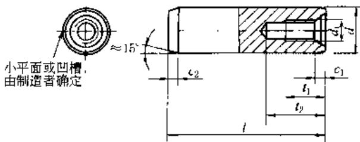

标记示例:

公称直径 $\pmb { d } = 6 \mathbf { m m }$ 、其公差为 $\mathtt { m 6 }$ 、公称长度 $\pmb { \mathit { l } } = 3 0 \mathbf { m } \mathbf { m }$ 、材料为钢、不经淬火、不经表面处理的内螺纹圆柱销:

销GB/T120.1 $6 \times 3 0$ 

公称直径 $\pmb { d } = \pmb { 6 } \mathbf { m } \mathbf { u }$ 、其公差为 $\Join$ 、公称长度 $\ell \equiv 3 0 \mathrm { m m }$ 、材料为A1组奥氏体不锈钢、表面简单处理的内螺纹圆柱销:

销GB/T120.1 $\phantom { - } 6 \times 3 0$ 一A1

# 内螺纹圆柱销淬硬钢和马氏体不锈钢(GB/T120.2—2000)

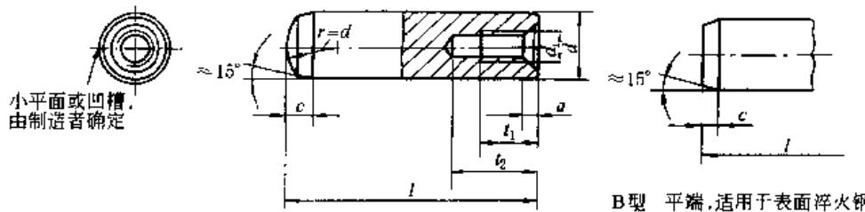

A型球面圆柱端,适用于普通淬火钢和马氏体不锈钢

标记示例:

公称直径 $\alpha = 6 m m$ 、其公差为 $\scriptstyle { \mathsf { m } } 6$ 、公称长度 $\smash { i = 3 0 \mathrm { m m } }$ 、材料为钢、普通淬火(A型)、表面氧化处理的内螺纹圆柱销:

销GB/T120.2 $6 \times 3 0 { \mathrm { - } } \mathbf { A }$ 

公称直径 $\dot { \mathbf { d } } = 6 \mathbf { m m }$ 、其公差为 $\mathtt { m 6 }$ 、公称长度 $\ell = 3 0 \mathrm { m m }$ 、材料为C1组马氏体不锈钢、表面简单处理的内螺纹圆柱销:

销GB/T120.2 $\mathbf { 6 \times 3 0 - - } \mathbf { \vec { C } } \mathbf { l }$ 

/mm 

表4-3-6

<table><tr><td rowspan=1 colspan=2>d m6</td><td rowspan=1 colspan=1>6</td><td rowspan=1 colspan=1>8</td><td rowspan=1 colspan=1>10</td><td rowspan=1 colspan=1>12</td><td rowspan=1 colspan=1>16</td><td rowspan=1 colspan=1>20</td><td rowspan=1 colspan=1>25</td><td rowspan=1 colspan=1>30</td><td rowspan=1 colspan=1>40</td><td rowspan=1 colspan=1>50</td></tr><tr><td rowspan=1 colspan=2></td><td rowspan=1 colspan=1>0.8</td><td rowspan=1 colspan=1>1</td><td rowspan=1 colspan=1>1.2</td><td rowspan=1 colspan=1>1.6</td><td rowspan=1 colspan=1>2</td><td rowspan=1 colspan=1>2.5</td><td rowspan=1 colspan=1>3</td><td rowspan=1 colspan=1>4</td><td rowspan=1 colspan=1>5</td><td rowspan=1 colspan=1>6.3</td></tr><tr><td rowspan=1 colspan=2>e2</td><td rowspan=1 colspan=1>1.2</td><td rowspan=1 colspan=1>1.6</td><td rowspan=1 colspan=1>2</td><td rowspan=1 colspan=1>2.5</td><td rowspan=1 colspan=1>3</td><td rowspan=1 colspan=1>3.5</td><td rowspan=1 colspan=1>4</td><td rowspan=1 colspan=1>5</td><td rowspan=1 colspan=1>6.3</td><td rowspan=1 colspan=1>8</td></tr><tr><td rowspan=1 colspan=2>d</td><td rowspan=1 colspan=1>M4</td><td rowspan=1 colspan=1>M5</td><td rowspan=1 colspan=1>M6</td><td rowspan=1 colspan=1>M6</td><td rowspan=1 colspan=1>M8</td><td rowspan=1 colspan=1>M10</td><td rowspan=1 colspan=1>M16</td><td rowspan=1 colspan=1>M20</td><td rowspan=1 colspan=1>M20</td><td rowspan=1 colspan=1>M24</td></tr><tr><td rowspan=1 colspan=2>1</td><td rowspan=1 colspan=1>6</td><td rowspan=1 colspan=1>X</td><td rowspan=1 colspan=1>10</td><td rowspan=1 colspan=1>12</td><td rowspan=1 colspan=1>16</td><td rowspan=1 colspan=1>18</td><td rowspan=1 colspan=1>24</td><td rowspan=1 colspan=1>30</td><td rowspan=1 colspan=1>30</td><td rowspan=1 colspan=1>36</td></tr><tr><td rowspan=1 colspan=2>t min</td><td rowspan=1 colspan=1>10</td><td rowspan=1 colspan=1>12</td><td rowspan=1 colspan=1>16</td><td rowspan=1 colspan=1>20</td><td rowspan=1 colspan=1>25</td><td rowspan=1 colspan=1>28</td><td rowspan=1 colspan=1>35</td><td rowspan=1 colspan=1>40</td><td rowspan=1 colspan=1>40</td><td rowspan=1 colspan=1>50</td></tr><tr><td rowspan=1 colspan=2>商品规格！</td><td rowspan=1 colspan=1>16-60</td><td rowspan=1 colspan=1>18~80</td><td rowspan=1 colspan=1>22~100</td><td rowspan=1 colspan=1>26~120</td><td rowspan=1 colspan=1>32~160</td><td rowspan=1 colspan=1>40-200</td><td rowspan=1 colspan=1>50~200</td><td rowspan=1 colspan=1>60~200</td><td rowspan=1 colspan=1>80~200</td><td rowspan=1 colspan=1>100~200</td></tr><tr><td rowspan=1 colspan=2>1系列</td><td rowspan=1 colspan=10>16，18，20，22，24，26，28，30，32，35，40，45，50、55，60，65，70，75，80，85，90、95，100，120,140，160，180，200</td></tr><tr><td rowspan=3 colspan=1>技术条件</td><td rowspan=1 colspan=1>材料</td><td rowspan=1 colspan=10>GB/T120.1钢：奥氏体不锈钢A1。GB/T120.2钢：A型，普通淬火；B型，表面淬火；马氏体不锈钢一C</td></tr><tr><td rowspan=1 colspan=1>表面粗糙度</td><td rowspan=1 colspan=10>GB/T120.1:R,≤0.8μm。GB/T120.2:R≤0.8m</td></tr><tr><td rowspan=1 colspan=1>表面处理</td><td rowspan=1 colspan=10>①钢：不经处理；氧化；磷化；镀锌钝化。②不锈钢：简单处理。③其他表面镀层或表面处理，由供需双方协议。④所有公差仅适用于涂、镀前的公差</td></tr></table>

注:1. $\pmb { d }$ 的其他公差由供需双方协议;2.公称长度大于 $\mathsf { 2 0 0 } \mathsf { m m }$ ,按 $\mathsf { \Omega } ^ { 2 0 } \mathsf { m m }$ 递增。

标记示例:

公称直径 $d = 1 0 m m$ 、长度 $\smash { \ell = 6 0 \mathrm { m m } }$ 、材料为35钢、不经热处理及表面处理的开尾圆锥销:

销CB/T877 $1 0 \times 6 0$ 

<table><tr><td rowspan=1 colspan=1>d公称</td><td rowspan=1 colspan=1>3</td><td rowspan=1 colspan=1>4</td><td rowspan=1 colspan=1>5</td><td rowspan=1 colspan=1>6</td><td rowspan=1 colspan=1>8</td><td rowspan=1 colspan=1>10</td><td rowspan=1 colspan=1>12</td><td rowspan=1 colspan=1>16</td></tr><tr><td rowspan=1 colspan=1>公称</td><td rowspan=1 colspan=2>0.8     ：</td><td rowspan=1 colspan=2>1</td><td rowspan=1 colspan=2>1.6</td><td rowspan=1 colspan=2>2</td></tr><tr><td rowspan=1 colspan=1>1</td><td rowspan=1 colspan=2>10</td><td rowspan=1 colspan=1>12</td><td rowspan=1 colspan=1>15：</td><td rowspan=1 colspan=1>20</td><td rowspan=1 colspan=1>25</td><td rowspan=1 colspan=1>30</td><td rowspan=1 colspan=1>40</td></tr><tr><td rowspan=1 colspan=1>Ci</td><td rowspan=1 colspan=2>0.5</td><td rowspan=1 colspan=3>1</td><td rowspan=1 colspan=3>1.5</td></tr><tr><td rowspan=1 colspan=1>i</td><td rowspan=1 colspan=1>30~55</td><td rowspan=1 colspan=1>35~6040~80</td><td rowspan=1 colspan=1>35~6040~80</td><td rowspan=1 colspan=1>50~100</td><td rowspan=1 colspan=1>60-120</td><td rowspan=1 colspan=1>70160</td><td rowspan=1 colspan=1>80~200</td><td rowspan=1 colspan=1>100200</td></tr><tr><td rowspan=1 colspan=1>系列</td><td rowspan=1 colspan=8>30，32.35，40，45，50，55，60，65，70，75,80，85,90，95，100，120，140，160，180．200</td></tr></table>

注:标记示例材料为常用材料,其他材料有45、30CrMn.SiA,H62、HFb59—1、QSi3—1、1Cr3、2Gr3、Cr17Ni2、1Cr18Ni9Ti等,热处理及表面处理见GB/T121。

# 螺纹圆柱销(GB/T878—1986)

标记示例:

公称直径 $d = \operatorname { I } \mathbf { 0 } \operatorname { m } \operatorname { m }$ 、长度 $\ell = 3 0 \mathrm { m m }$ 、材料为35钢、热处理硬度28-38HRC、衣面氧化处理的螺纹圆柱销:

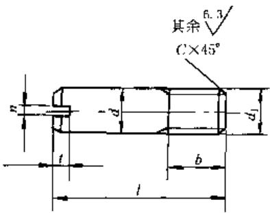

销CB878 $1 0 \times 3 0$ 

表4-3-8

<table><tr><td>d</td><td>48</td><td>6-8.18</td><td>8.8.</td><td>10-8.22</td><td>12.8</td><td>16.8n</td><td>2083</td></tr><tr><td>d</td><td>M4</td><td>M6</td><td>M8</td><td>M10</td><td>M12</td><td>M16</td><td>M20</td></tr><tr><td>b max</td><td>4.4</td><td>6.6</td><td>8.8</td><td>11</td><td>13.2</td><td>17.6</td><td>22</td></tr><tr><td>n公称</td><td>0.6</td><td>1</td><td>1.2</td><td>1.6</td><td>2</td><td>2.5</td><td>3</td></tr><tr><td>max</td><td>2.05</td><td>2.9</td><td>3.6</td><td>4.25</td><td>4.8</td><td>5.5</td><td>6.8</td></tr><tr><td>C</td><td>0.6</td><td>1</td><td>1.2</td><td>1.5</td><td>2</td><td></td><td>2.5</td></tr><tr><td>商品规格！</td><td>10~14</td><td>12-20</td><td>14- 28</td><td>18- 35</td><td>22~-40</td><td>24-50 1</td><td>30~60</td></tr><tr><td>10mm长的重量/kg</td><td>0.001</td><td>0.002</td><td>0.004</td><td>0.005</td><td>0.008</td><td>0.014</td><td>0.022</td></tr></table>

系列 10,12、14,18,20,22,24、26,28,30,32,35,40,45,50,55,60

科

槽 面

<table><tr><td rowspan=3 colspan=1>d</td><td rowspan=1 colspan=1>公称</td><td rowspan=1 colspan=1>1</td><td rowspan=1 colspan=1>1.5</td><td rowspan=1 colspan=1>2</td><td rowspan=1 colspan=1>2.5</td><td rowspan=1 colspan=1>3</td><td rowspan=1 colspan=1>3.5</td><td rowspan=1 colspan=1>4</td><td rowspan=1 colspan=1>4.5</td><td rowspan=1 colspan=1>5</td><td rowspan=1 colspan=1>6</td><td rowspan=1 colspan=1>8</td><td rowspan=1 colspan=1>10</td><td rowspan=1 colspan=1>12</td><td rowspan=1 colspan=1>13</td><td rowspan=1 colspan=1>14</td><td rowspan=1 colspan=1>16</td><td rowspan=1 colspan=1>18</td><td rowspan=1 colspan=1>20</td><td rowspan=1 colspan=1>21</td><td rowspan=1 colspan=1>25</td><td rowspan=1 colspan=1>28</td><td rowspan=1 colspan=1>30</td><td rowspan=1 colspan=1>32</td><td rowspan=1 colspan=1>35</td><td rowspan=1 colspan=1>38</td><td rowspan=1 colspan=1>40</td><td rowspan=1 colspan=1>45</td><td rowspan=1 colspan=1>50</td></tr><tr><td rowspan=1 colspan=1>max</td><td rowspan=1 colspan=1>1.3</td><td rowspan=1 colspan=1>1.8</td><td rowspan=1 colspan=1>2.4</td><td rowspan=1 colspan=1>2.9</td><td rowspan=1 colspan=1>3.4</td><td rowspan=1 colspan=1>4.0</td><td rowspan=1 colspan=1>4.6</td><td rowspan=1 colspan=1>5.1</td><td rowspan=1 colspan=1>5.6</td><td rowspan=1 colspan=1>6.7</td><td rowspan=1 colspan=1>8.5</td><td rowspan=1 colspan=1>10.8</td><td rowspan=1 colspan=1>12.8</td><td rowspan=1 colspan=1>13.8</td><td rowspan=1 colspan=1>14.8</td><td rowspan=1 colspan=1>16.8</td><td rowspan=1 colspan=1>18.9</td><td rowspan=1 colspan=1>20.9</td><td rowspan=1 colspan=1>219</td><td rowspan=1 colspan=1>25.9</td><td rowspan=1 colspan=1>28.9</td><td rowspan=1 colspan=1>30.9</td><td rowspan=1 colspan=1>32.9</td><td rowspan=1 colspan=1>35.9</td><td rowspan=1 colspan=1>38.9</td><td rowspan=1 colspan=1>40.9</td><td rowspan=1 colspan=1>45.9</td><td rowspan=1 colspan=1>50.9</td></tr><tr><td rowspan=1 colspan=1>min</td><td rowspan=1 colspan=1>1.2</td><td rowspan=1 colspan=1>1.7</td><td rowspan=1 colspan=1>2.3</td><td rowspan=1 colspan=1>2.8</td><td rowspan=1 colspan=1>3.3</td><td rowspan=1 colspan=1>3.8</td><td rowspan=1 colspan=1>4.4</td><td rowspan=1 colspan=1>4.9</td><td rowspan=1 colspan=1>5.4</td><td rowspan=1 colspan=1>6.4</td><td rowspan=1 colspan=1>8.5</td><td rowspan=1 colspan=1>10.5</td><td rowspan=1 colspan=1>12.5</td><td rowspan=1 colspan=1>13.5</td><td rowspan=1 colspan=1>14.5</td><td rowspan=1 colspan=1>16.5</td><td rowspan=1 colspan=1>18.5</td><td rowspan=1 colspan=1>20.5</td><td rowspan=1 colspan=1>21.5</td><td rowspan=1 colspan=1>25.1</td><td rowspan=1 colspan=1>28.5</td><td rowspan=1 colspan=1>30.5</td><td rowspan=1 colspan=1>32.5</td><td rowspan=1 colspan=1>35.5</td><td rowspan=1 colspan=1>38.5</td><td rowspan=1 colspan=1>40.5</td><td rowspan=1 colspan=1>45.5</td><td rowspan=1 colspan=1>50.5</td></tr><tr><td rowspan=4 colspan=1>G</td><td rowspan=1 colspan=1>d</td><td rowspan=1 colspan=1>0.8</td><td rowspan=1 colspan=1>1.1</td><td rowspan=1 colspan=1>1.5</td><td rowspan=1 colspan=1>1.8</td><td rowspan=1 colspan=1>2.1</td><td rowspan=1 colspan=1>2.3</td><td rowspan=1 colspan=1>2.8</td><td rowspan=1 colspan=1>2.9</td><td rowspan=1 colspan=1>3.4</td><td rowspan=1 colspan=1>4</td><td rowspan=1 colspan=1>5.5</td><td rowspan=1 colspan=1>6.5</td><td rowspan=1 colspan=1>7.5</td><td rowspan=1 colspan=1>8.5</td><td rowspan=1 colspan=1>8.5</td><td rowspan=1 colspan=1>10.5</td><td rowspan=1 colspan=1>11.5</td><td rowspan=1 colspan=1>12.5</td><td rowspan=1 colspan=1>13.5</td><td rowspan=1 colspan=1>15.5</td><td rowspan=1 colspan=1>17.5</td><td rowspan=1 colspan=1>18.5</td><td rowspan=1 colspan=1>20.5</td><td rowspan=1 colspan=1>21.5</td><td rowspan=1 colspan=1>23.5</td><td rowspan=1 colspan=1>25.5</td><td rowspan=1 colspan=1>28.5</td><td rowspan=1 colspan=1>31.5</td></tr><tr><td rowspan=1 colspan=1>□nx</td><td rowspan=1 colspan=1>0.35</td><td rowspan=1 colspan=1>0.45</td><td rowspan=1 colspan=1>0.5s</td><td rowspan=1 colspan=1>0.6</td><td rowspan=1 colspan=1>0.7</td><td rowspan=1 colspan=1>0.8</td><td rowspan=1 colspan=1>0.85</td><td rowspan=1 colspan=1>1.0</td><td rowspan=1 colspan=1>1.1</td><td rowspan=1 colspan=1>1.4</td><td rowspan=1 colspan=1>2.0</td><td rowspan=1 colspan=1>2.4</td><td rowspan=1 colspan=1>2.4</td><td rowspan=1 colspan=1>2.4</td><td rowspan=1 colspan=1>2.4</td><td rowspan=1 colspan=1>2.4</td><td rowspan=1 colspan=1>2.4</td><td rowspan=1 colspan=1>3.4</td><td rowspan=1 colspan=1>3.4</td><td rowspan=1 colspan=1>3.4</td><td rowspan=1 colspan=1>3.4</td><td rowspan=1 colspan=1>3.4</td><td rowspan=1 colspan=1>3.6</td><td rowspan=1 colspan=1>3.6</td><td rowspan=1 colspan=1>4.6</td><td rowspan=1 colspan=1>4.6</td><td rowspan=1 colspan=1>4.6</td><td rowspan=1 colspan=1>4.6</td></tr><tr><td rowspan=1 colspan=1>1</td><td rowspan=1 colspan=1>0.2</td><td rowspan=1 colspan=1>0.3</td><td rowspan=1 colspan=1>0.4</td><td rowspan=1 colspan=1>0.5</td><td rowspan=1 colspan=1>0.6</td><td rowspan=1 colspan=1>0.75</td><td rowspan=1 colspan=1>0.8</td><td rowspan=1 colspan=1>一</td><td rowspan=1 colspan=1>1</td><td rowspan=1 colspan=1>1.2</td><td rowspan=1 colspan=1>1.5</td><td rowspan=1 colspan=1>2</td><td rowspan=1 colspan=1>2.5</td><td rowspan=1 colspan=1>2.5</td><td rowspan=1 colspan=1>3</td><td rowspan=1 colspan=1>3</td><td rowspan=1 colspan=1>3.5</td><td rowspan=1 colspan=1>4</td><td rowspan=1 colspan=1>4</td><td rowspan=1 colspan=1>5</td><td rowspan=1 colspan=1>5.5</td><td rowspan=1 colspan=1>6</td><td rowspan=1 colspan=1>6</td><td rowspan=1 colspan=1>7</td><td rowspan=1 colspan=1>7.5</td><td rowspan=1 colspan=1>7.5</td><td rowspan=1 colspan=1>8.5</td><td rowspan=1 colspan=1>9.5</td></tr><tr><td rowspan=1 colspan=1>C/kN</td><td rowspan=1 colspan=1>0.7</td><td rowspan=1 colspan=1>1.5</td><td rowspan=1 colspan=1>2.82</td><td rowspan=1 colspan=1>4.38</td><td rowspan=1 colspan=1>6.32</td><td rowspan=1 colspan=1>9.06</td><td rowspan=1 colspan=1>11.24</td><td rowspan=1 colspan=1>15.361</td><td rowspan=1 colspan=1>17.54</td><td rowspan=1 colspan=1>26.04</td><td rowspan=1 colspan=1>42.76</td><td rowspan=1 colspan=1>70.16</td><td rowspan=1 colspan=1>104.1</td><td rowspan=1 colspan=1>115.1</td><td rowspan=1 colspan=1>144.7</td><td rowspan=1 colspan=1>171</td><td rowspan=1 colspan=1>222.5</td><td rowspan=1 colspan=1>280.6</td><td rowspan=1 colspan=1>298.2</td><td rowspan=1 colspan=1>438.5</td><td rowspan=1 colspan=1>452.6</td><td rowspan=1 colspan=1>631.4</td><td rowspan=1 colspan=1>684</td><td rowspan=1 colspan=1>859</td><td rowspan=1 colspan=1>1003</td><td rowspan=1 colspan=1>1068</td><td rowspan=1 colspan=1>1360</td><td rowspan=1 colspan=1>1685</td></tr><tr><td rowspan=3 colspan=1>G</td><td rowspan=2 colspan=1>d@max</td><td rowspan=1 colspan=1></td><td rowspan=1 colspan=1></td><td rowspan=1 colspan=1>1.9</td><td rowspan=1 colspan=1>2.3</td><td rowspan=1 colspan=1>2.7</td><td rowspan=1 colspan=1>3.1</td><td rowspan=1 colspan=1>3.4</td><td rowspan=1 colspan=1>3.9</td><td rowspan=1 colspan=1>4.4</td><td rowspan=1 colspan=1>4.9</td><td rowspan=1 colspan=1>7</td><td rowspan=1 colspan=1>8.5</td><td rowspan=1 colspan=1>10.5</td><td rowspan=1 colspan=1>1</td><td rowspan=1 colspan=1>11.5</td><td rowspan=1 colspan=1>13.5</td><td rowspan=1 colspan=1>15</td><td rowspan=1 colspan=1>16.5</td><td rowspan=1 colspan=1>17.5</td><td rowspan=1 colspan=1>21.5</td><td rowspan=1 colspan=1>23.5</td><td rowspan=1 colspan=1>25.5</td><td rowspan=1 colspan=1></td><td rowspan=1 colspan=1>28.5</td><td rowspan=1 colspan=1></td><td rowspan=1 colspan=1>32.5</td><td rowspan=1 colspan=1>37.s</td><td rowspan=1 colspan=1>40.5</td></tr><tr><td rowspan=1 colspan=1></td><td rowspan=1 colspan=1></td><td rowspan=1 colspan=1>0.4</td><td rowspan=1 colspan=1>0.45</td><td rowspan=1 colspan=1>0.45</td><td rowspan=1 colspan=1>0.5</td><td rowspan=1 colspan=1>0.7</td><td rowspan=1 colspan=1>0.7</td><td rowspan=1 colspan=1>0.7</td><td rowspan=1 colspan=1>0.9</td><td rowspan=1 colspan=1>1.8</td><td rowspan=1 colspan=1>2.4</td><td rowspan=1 colspan=1>2.4</td><td rowspan=1 colspan=1>2.4</td><td rowspan=1 colspan=1>2.4</td><td rowspan=1 colspan=1>2.4</td><td rowspan=1 colspan=1>2.4</td><td rowspan=1 colspan=1>2.4</td><td rowspan=1 colspan=1>2.4</td><td rowspan=1 colspan=1>3.4</td><td rowspan=1 colspan=1>3.4</td><td rowspan=1 colspan=1>3.4</td><td rowspan=1 colspan=1></td><td rowspan=1 colspan=1>3.4</td><td rowspan=1 colspan=1></td><td rowspan=1 colspan=1>4.6</td><td rowspan=1 colspan=1>4.6</td><td rowspan=1 colspan=1>4.6</td></tr><tr><td rowspan=1 colspan=1>s</td><td rowspan=1 colspan=1></td><td rowspan=1 colspan=1></td><td rowspan=1 colspan=1>0.2</td><td rowspan=1 colspan=1>0.25</td><td rowspan=1 colspan=1>0.3</td><td rowspan=1 colspan=1>0.35</td><td rowspan=1 colspan=1>0.5</td><td rowspan=1 colspan=1>0.5</td><td rowspan=1 colspan=1>0.5</td><td rowspan=1 colspan=1>0.75</td><td rowspan=1 colspan=1>0.75</td><td rowspan=1 colspan=1>1</td><td rowspan=1 colspan=1>1</td><td rowspan=1 colspan=1>1.2</td><td rowspan=1 colspan=1>1.5</td><td rowspan=1 colspan=1>1.5</td><td rowspan=1 colspan=1>1.7</td><td rowspan=1 colspan=1>2</td><td rowspan=1 colspan=1>2</td><td rowspan=1 colspan=1>2</td><td rowspan=1 colspan=1>2.5</td><td rowspan=1 colspan=1>2.5</td><td rowspan=1 colspan=1>F</td><td rowspan=1 colspan=1>3.5</td><td rowspan=1 colspan=1></td><td rowspan=1 colspan=1>4</td><td rowspan=1 colspan=1>4</td><td rowspan=1 colspan=1>5</td></tr><tr><td rowspan=1 colspan=1></td><td rowspan=1 colspan=1>/kN</td><td rowspan=1 colspan=1>1</td><td rowspan=1 colspan=1></td><td rowspan=1 colspan=1>1.5</td><td rowspan=1 colspan=1>2.4</td><td rowspan=1 colspan=1>3.5</td><td rowspan=1 colspan=1>4.6</td><td rowspan=1 colspan=1>8</td><td rowspan=1 colspan=1>8.8</td><td rowspan=1 colspan=1>10.4</td><td rowspan=1 colspan=1>18</td><td rowspan=1 colspan=1>24</td><td rowspan=1 colspan=1>40</td><td rowspan=1 colspan=1>48</td><td rowspan=1 colspan=1>6</td><td rowspan=1 colspan=1>84</td><td rowspan=1 colspan=1>98</td><td rowspan=1 colspan=1>126</td><td rowspan=1 colspan=1>158</td><td rowspan=1 colspan=1>168</td><td rowspan=1 colspan=1>202</td><td rowspan=1 colspan=1>280</td><td rowspan=1 colspan=1>302</td><td rowspan=1 colspan=1></td><td rowspan=1 colspan=1>490</td><td rowspan=1 colspan=1></td><td rowspan=1 colspan=1>634</td><td rowspan=1 colspan=1>720</td><td rowspan=1 colspan=1>1000</td></tr><tr><td rowspan=2 colspan=2>商品规格！</td><td rowspan=2 colspan=1>420</td><td rowspan=2 colspan=1>420</td><td rowspan=2 colspan=1>430</td><td rowspan=2 colspan=1>430</td><td rowspan=2 colspan=1>440</td><td rowspan=2 colspan=1>440</td><td rowspan=1 colspan=1>4</td><td rowspan=1 colspan=1>5</td><td rowspan=2 colspan=1>5~80</td><td rowspan=2 colspan=1>10~100</td><td rowspan=2 colspan=1>10120</td><td rowspan=2 colspan=1>10160</td><td rowspan=2 colspan=1>10~180</td><td rowspan=2 colspan=1>10~180</td><td rowspan=2 colspan=1>10~200</td><td rowspan=2 colspan=1>10~200</td><td rowspan=2 colspan=1>10-200</td><td rowspan=2 colspan=1>10~200</td><td rowspan=2 colspan=1>14~200</td><td rowspan=2 colspan=1>14200</td><td rowspan=2 colspan=1>14~200</td><td rowspan=2 colspan=1>14~200</td><td rowspan=2 colspan=1>20~200</td><td rowspan=2 colspan=1>20~200</td><td rowspan=2 colspan=1>20~200</td><td rowspan=2 colspan=1>20~200</td><td rowspan=2 colspan=1>20~200</td><td rowspan=2 colspan=1>20200</td></tr><tr><td rowspan=1 colspan=1>50</td><td rowspan=1 colspan=1>50</td></tr></table>

1 1 

技术 条

<table><tr><td rowspan=1 colspan=3>d公称</td><td rowspan=1 colspan=1>0.8</td><td rowspan=1 colspan=1>1</td><td rowspan=1 colspan=1>1.2</td><td rowspan=1 colspan=1>1.5</td><td rowspan=1 colspan=1>2</td><td rowspan=1 colspan=1>2.5</td><td rowspan=1 colspan=1>3</td><td rowspan=1 colspan=1>3.5</td><td rowspan=1 colspan=1>4</td><td rowspan=1 colspan=1>5</td><td rowspan=1 colspan=1>6</td><td rowspan=1 colspan=1>8</td><td rowspan=1 colspan=1>10</td><td rowspan=1 colspan=1>12</td><td rowspan=1 colspan=1>14</td><td rowspan=1 colspan=1>16</td><td rowspan=1 colspan=1>20</td></tr><tr><td rowspan=2 colspan=1>3</td><td rowspan=2 colspan=1>d装配前</td><td rowspan=1 colspan=1>max</td><td rowspan=1 colspan=1>1</td><td rowspan=1 colspan=1>1</td><td rowspan=1 colspan=1>1</td><td rowspan=1 colspan=1>1.71</td><td rowspan=1 colspan=1>2.21</td><td rowspan=1 colspan=1>2.73</td><td rowspan=1 colspan=1>3.25</td><td rowspan=1 colspan=1>3.79</td><td rowspan=1 colspan=1>4.3</td><td rowspan=1 colspan=1>5.35</td><td rowspan=1 colspan=1>6.4</td><td rowspan=1 colspan=1>8.55</td><td rowspan=1 colspan=1>10.65</td><td rowspan=1 colspan=1>12.75</td><td rowspan=1 colspan=1>14.85</td><td rowspan=1 colspan=1>16.9</td><td rowspan=1 colspan=1>21</td></tr><tr><td rowspan=1 colspan=1>min</td><td rowspan=1 colspan=1>二</td><td rowspan=1 colspan=1></td><td rowspan=1 colspan=1></td><td rowspan=1 colspan=1>1.61</td><td rowspan=1 colspan=1>2.11</td><td rowspan=1 colspan=1>2.62</td><td rowspan=1 colspan=1>3.12</td><td rowspan=1 colspan=1>3.46</td><td rowspan=1 colspan=1>4.15</td><td rowspan=1 colspan=1>5.15</td><td rowspan=1 colspan=1>6.18</td><td rowspan=1 colspan=1>8.25</td><td rowspan=1 colspan=1>10.3</td><td rowspan=1 colspan=1>11.7</td><td rowspan=1 colspan=1>13.6</td><td rowspan=1 colspan=1>16.4</td><td rowspan=1 colspan=1>20.4</td></tr><tr><td rowspan=1 colspan=1></td><td rowspan=1 colspan=1></td><td rowspan=1 colspan=1>s</td><td rowspan=1 colspan=1></td><td rowspan=1 colspan=1>-</td><td rowspan=1 colspan=1></td><td rowspan=1 colspan=1>0.17</td><td rowspan=1 colspan=1>0.22</td><td rowspan=1 colspan=1>0.28</td><td rowspan=1 colspan=1>0.33</td><td rowspan=1 colspan=1>0.39</td><td rowspan=1 colspan=1>0.45</td><td rowspan=1 colspan=1>0.56</td><td rowspan=1 colspan=1>0.67</td><td rowspan=1 colspan=1>0.9</td><td rowspan=1 colspan=1>1.1</td><td rowspan=1 colspan=1>1.3</td><td rowspan=1 colspan=1>1.6</td><td rowspan=1 colspan=1>1.8</td><td rowspan=1 colspan=1>2.2</td></tr><tr><td rowspan=2 colspan=1>GR</td><td rowspan=2 colspan=1>Gm/KkN</td><td rowspan=1 colspan=1>T</td><td rowspan=1 colspan=1></td><td rowspan=1 colspan=1>-</td><td rowspan=1 colspan=1></td><td rowspan=1 colspan=1>1.9</td><td rowspan=1 colspan=1>3.5</td><td rowspan=1 colspan=1>5.5</td><td rowspan=1 colspan=1>7.6</td><td rowspan=1 colspan=1>10</td><td rowspan=1 colspan=1>13.5</td><td rowspan=1 colspan=1>20</td><td rowspan=1 colspan=1>30</td><td rowspan=1 colspan=1>53</td><td rowspan=1 colspan=1>84</td><td rowspan=1 colspan=1>120</td><td rowspan=1 colspan=1>165</td><td rowspan=1 colspan=1>210</td><td rowspan=1 colspan=1>340</td></tr><tr><td rowspan=1 colspan=1>：</td><td rowspan=1 colspan=1>1</td><td rowspan=1 colspan=1>丨</td><td rowspan=1 colspan=1>1</td><td rowspan=1 colspan=1>1.45</td><td rowspan=1 colspan=1>2.5</td><td rowspan=1 colspan=1>3.8</td><td rowspan=1 colspan=1>5.7</td><td rowspan=1 colspan=1>7.6</td><td rowspan=1 colspan=1>10</td><td rowspan=1 colspan=1>15.5</td><td rowspan=1 colspan=1>23</td><td rowspan=1 colspan=1>41</td><td rowspan=1 colspan=1>64</td><td rowspan=1 colspan=1>9</td><td rowspan=1 colspan=1>-</td><td rowspan=1 colspan=1>1</td><td rowspan=1 colspan=1>1</td></tr><tr><td rowspan=2 colspan=1>4</td><td rowspan=2 colspan=1>d装配前</td><td rowspan=1 colspan=1>max</td><td rowspan=1 colspan=1>0.91</td><td rowspan=1 colspan=1>1.15</td><td rowspan=1 colspan=1>1.35</td><td rowspan=1 colspan=1>1.73</td><td rowspan=1 colspan=1>2.25</td><td rowspan=1 colspan=1>2.78</td><td rowspan=1 colspan=1>3.3</td><td rowspan=1 colspan=1>3.85</td><td rowspan=1 colspan=1>4.4</td><td rowspan=1 colspan=1>5.5</td><td rowspan=1 colspan=1>6.5</td><td rowspan=1 colspan=1>8.83</td><td rowspan=1 colspan=1>10.8</td><td rowspan=1 colspan=1>12.85</td><td rowspan=1 colspan=1>14.95</td><td rowspan=1 colspan=1>17</td><td rowspan=1 colspan=1>21.1</td></tr><tr><td rowspan=1 colspan=1>min</td><td rowspan=1 colspan=1>0.85</td><td rowspan=1 colspan=1>1.05</td><td rowspan=1 colspan=1>1.25</td><td rowspan=1 colspan=1>1.62</td><td rowspan=1 colspan=1>2.13</td><td rowspan=1 colspan=1>2.65</td><td rowspan=1 colspan=1>3.15</td><td rowspan=1 colspan=1>3.67</td><td rowspan=1 colspan=1>4.2</td><td rowspan=1 colspan=1>5.25</td><td rowspan=1 colspan=1>6.25</td><td rowspan=1 colspan=1>8.3</td><td rowspan=1 colspan=1>10.35</td><td rowspan=1 colspan=1>12.4</td><td rowspan=1 colspan=1>14.45</td><td rowspan=1 colspan=1>16.45</td><td rowspan=1 colspan=1>20.4</td></tr><tr><td rowspan=1 colspan=1></td><td rowspan=1 colspan=1></td><td rowspan=1 colspan=1>S</td><td rowspan=1 colspan=1>0.07</td><td rowspan=1 colspan=1>0.08</td><td rowspan=1 colspan=1>0.1</td><td rowspan=1 colspan=1>0.13</td><td rowspan=1 colspan=1>0.17</td><td rowspan=1 colspan=1>0.21</td><td rowspan=1 colspan=1>0.25</td><td rowspan=1 colspan=1>0.29</td><td rowspan=1 colspan=1>0.33</td><td rowspan=1 colspan=1>0.42</td><td rowspan=1 colspan=1>0.5</td><td rowspan=1 colspan=1>0.67</td><td rowspan=1 colspan=1>0.84</td><td rowspan=1 colspan=1></td><td rowspan=1 colspan=1>1.2</td><td rowspan=1 colspan=1>1.3</td><td rowspan=1 colspan=1>1.7</td></tr><tr><td rowspan=2 colspan=1>G</td><td rowspan=2 colspan=1>Gm/kN</td><td rowspan=1 colspan=1>①</td><td rowspan=1 colspan=1>0.4</td><td rowspan=1 colspan=1>0.6</td><td rowspan=1 colspan=1>0.9</td><td rowspan=1 colspan=1>1.45</td><td rowspan=1 colspan=1>2.5</td><td rowspan=1 colspan=1>3.9</td><td rowspan=1 colspan=1>5.5</td><td rowspan=1 colspan=1>7.5</td><td rowspan=1 colspan=1>9.6</td><td rowspan=1 colspan=1>15</td><td rowspan=1 colspan=1>22</td><td rowspan=1 colspan=1>39</td><td rowspan=1 colspan=1>62</td><td rowspan=1 colspan=1>89</td><td rowspan=1 colspan=1>120</td><td rowspan=1 colspan=1>155</td><td rowspan=1 colspan=1>250</td></tr><tr><td rowspan=1 colspan=1>?</td><td rowspan=1 colspan=1>0.3</td><td rowspan=1 colspan=1>0.45</td><td rowspan=1 colspan=1>0.65</td><td rowspan=1 colspan=1>1.05</td><td rowspan=1 colspan=1>1.9</td><td rowspan=1 colspan=1>2.9</td><td rowspan=1 colspan=1>4.2</td><td rowspan=1 colspan=1>5.7</td><td rowspan=1 colspan=1>7.6</td><td rowspan=1 colspan=1>11.5</td><td rowspan=1 colspan=1>16.8</td><td rowspan=1 colspan=1>30</td><td rowspan=1 colspan=1>48</td><td rowspan=1 colspan=1>67</td><td rowspan=1 colspan=1>二</td><td rowspan=1 colspan=1>丨</td><td rowspan=1 colspan=1>二</td></tr><tr><td rowspan=5 colspan=1>GR</td><td rowspan=2 colspan=1>d装配前</td><td rowspan=1 colspan=1>max</td><td rowspan=1 colspan=1></td><td rowspan=1 colspan=1></td><td rowspan=1 colspan=1></td><td rowspan=1 colspan=1>1.75</td><td rowspan=1 colspan=1>2.28</td><td rowspan=1 colspan=1>2.82</td><td rowspan=1 colspan=1>3.35</td><td rowspan=1 colspan=1>3.87</td><td rowspan=1 colspan=1>4.45</td><td rowspan=1 colspan=1>5.5</td><td rowspan=1 colspan=1>6.55</td><td rowspan=1 colspan=1>8.65</td><td rowspan=1 colspan=1></td><td rowspan=1 colspan=1></td><td rowspan=1 colspan=1></td><td rowspan=1 colspan=1>一</td><td rowspan=1 colspan=1></td></tr><tr><td rowspan=1 colspan=1>min</td><td rowspan=1 colspan=1></td><td rowspan=1 colspan=1>11</td><td rowspan=1 colspan=1>：</td><td rowspan=1 colspan=1>1.62</td><td rowspan=1 colspan=1>2.13</td><td rowspan=1 colspan=1>2.65</td><td rowspan=1 colspan=1>315</td><td rowspan=1 colspan=1>3.67</td><td rowspan=1 colspan=1>4.2</td><td rowspan=1 colspan=1>5.2</td><td rowspan=1 colspan=1>6.25</td><td rowspan=1 colspan=1>83</td><td rowspan=1 colspan=1></td><td rowspan=1 colspan=1></td><td rowspan=1 colspan=1></td><td rowspan=1 colspan=1>1</td><td rowspan=1 colspan=1></td></tr><tr><td rowspan=1 colspan=1></td><td rowspan=1 colspan=1>8</td><td rowspan=1 colspan=1>一</td><td rowspan=1 colspan=1>1</td><td rowspan=1 colspan=1></td><td rowspan=1 colspan=1>0.08</td><td rowspan=1 colspan=1>0.11</td><td rowspan=1 colspan=1>0.14</td><td rowspan=1 colspan=1>0.17</td><td rowspan=1 colspan=1>0.19</td><td rowspan=1 colspan=1>0.22</td><td rowspan=1 colspan=1>0.28</td><td rowspan=1 colspan=1>0.33</td><td rowspan=1 colspan=1>0.45</td><td rowspan=1 colspan=1>二</td><td rowspan=1 colspan=1></td><td rowspan=1 colspan=1></td><td rowspan=1 colspan=1>:-</td><td rowspan=1 colspan=1>1</td></tr><tr><td rowspan=2 colspan=1>Cmm/kN</td><td rowspan=1 colspan=1>①</td><td rowspan=1 colspan=1>1</td><td rowspan=1 colspan=1>1</td><td rowspan=1 colspan=1>一</td><td rowspan=1 colspan=1>0.8</td><td rowspan=1 colspan=1>1.5</td><td rowspan=1 colspan=1>2.3</td><td rowspan=1 colspan=1>3.3</td><td rowspan=1 colspan=1>4.5</td><td rowspan=1 colspan=1>5.7</td><td rowspan=1 colspan=1>9</td><td rowspan=1 colspan=1>13</td><td rowspan=1 colspan=1>23</td><td rowspan=1 colspan=1></td><td rowspan=1 colspan=1></td><td rowspan=1 colspan=1>一</td><td rowspan=1 colspan=1>1</td><td rowspan=1 colspan=1>一</td></tr><tr><td rowspan=1 colspan=1>山</td><td rowspan=1 colspan=1>1</td><td rowspan=1 colspan=1>一</td><td rowspan=1 colspan=1>一</td><td rowspan=1 colspan=1>0.65</td><td rowspan=1 colspan=1>i</td><td rowspan=1 colspan=1>18</td><td rowspan=1 colspan=1>2.5</td><td rowspan=1 colspan=1>3.4</td><td rowspan=1 colspan=1>4.4</td><td rowspan=1 colspan=1>7</td><td rowspan=1 colspan=1>10</td><td rowspan=1 colspan=1>18</td><td rowspan=1 colspan=1></td><td rowspan=1 colspan=1></td><td rowspan=1 colspan=1></td><td rowspan=1 colspan=1>一</td><td rowspan=1 colspan=1>一</td></tr><tr><td rowspan=1 colspan=1></td><td rowspan=1 colspan=2>装配前</td><td rowspan=1 colspan=1>0.75</td><td rowspan=1 colspan=1>0.95</td><td rowspan=1 colspan=1>1.15</td><td rowspan=1 colspan=1>1.4</td><td rowspan=1 colspan=1>1.9</td><td rowspan=1 colspan=1>2.4</td><td rowspan=1 colspan=1>2.9</td><td rowspan=1 colspan=1>3.4</td><td rowspan=1 colspan=1>3.9</td><td rowspan=1 colspan=1>4.85</td><td rowspan=1 colspan=1>5.85</td><td rowspan=1 colspan=1>7.8</td><td rowspan=1 colspan=1>975</td><td rowspan=1 colspan=1>11.7</td><td rowspan=1 colspan=1>13.6</td><td rowspan=1 colspan=1>15.6</td><td rowspan=1 colspan=1>19.6</td></tr><tr><td rowspan=2 colspan=3>白商品规格！</td><td rowspan=1 colspan=1>0.3</td><td rowspan=1 colspan=1>0.3</td><td rowspan=1 colspan=1>0.4</td><td rowspan=1 colspan=1>0.5</td><td rowspan=1 colspan=1>0.7</td><td rowspan=1 colspan=1>0.7</td><td rowspan=1 colspan=1>0.9</td><td rowspan=1 colspan=1>1</td><td rowspan=1 colspan=1>1.1</td><td rowspan=1 colspan=1>1.3</td><td rowspan=1 colspan=1>1.5</td><td rowspan=1 colspan=1>2</td><td rowspan=1 colspan=1>2.5</td><td rowspan=1 colspan=1>3</td><td rowspan=1 colspan=1>3.5</td><td rowspan=1 colspan=1>4</td><td rowspan=1 colspan=1>4.5</td></tr><tr><td rowspan=1 colspan=3>4~16</td><td rowspan=1 colspan=1>4~24</td><td rowspan=1 colspan=1>4-40</td><td rowspan=1 colspan=1>5~45</td><td rowspan=1 colspan=1>6</td><td rowspan=1 colspan=1>50</td><td rowspan=1 colspan=1>8~60</td><td rowspan=1 colspan=1>10~60</td><td rowspan=1 colspan=1>12~75</td><td rowspan=1 colspan=1>16~120</td><td rowspan=1 colspan=1>20~120</td><td rowspan=1 colspan=1>24~160</td><td rowspan=1 colspan=1>28~200</td><td rowspan=1 colspan=1>32~200</td><td rowspan=1 colspan=1>45~200</td></tr><tr><td rowspan=1 colspan=3>系列</td><td rowspan=1 colspan=15>4,5,6,8,10，12，14，16，18,20，22，24，26，28，30，32，35，40，45，50，55，60，65，70，75，80，85.90.95，100,140,</td><td rowspan=1 colspan=1>160，180,</td><td rowspan=1 colspan=1>200</td></tr></table>

开

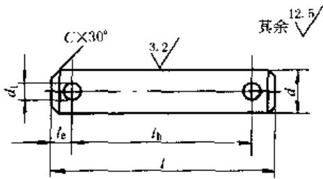

带孔销(GB/T880--1986)

标记示例:

公称直径 $\ r _ { d } ^ { \prime } = 1 0 \mathrm { m m }$ 、长度 $\smash { l = 6 0 \mathrm { m m } }$ 、材料为35钢、经热处理硬度28\~38HRC、表面氧化处理的带孔销:

销GB/T880 $1 0 \times 6 0$ 

表 4-3-11

/mm 

<table><tr><td rowspan=1 colspan=1>d</td><td rowspan=1 colspan=1>3.806</td><td rowspan=1 colspan=1>48.07</td><td rowspan=1 colspan=1>5.8075</td><td rowspan=1 colspan=1>6.8.07</td><td rowspan=1 colspan=1>880</td><td rowspan=1 colspan=1>108.0</td><td rowspan=1 colspan=1>12.8.</td><td rowspan=1 colspan=1>(14.8]</td><td rowspan=1 colspan=1>16.8</td><td rowspan=1 colspan=1>（188</td><td rowspan=1 colspan=1>20.8</td><td rowspan=1 colspan=1>22.83</td><td rowspan=1 colspan=1>25-8</td></tr><tr><td rowspan=1 colspan=1>山min</td><td rowspan=1 colspan=1>0.8</td><td rowspan=1 colspan=1>1</td><td rowspan=1 colspan=2>1.6</td><td rowspan=1 colspan=1>2</td><td rowspan=1 colspan=1>3.2</td><td rowspan=1 colspan=2>4</td><td rowspan=1 colspan=1></td><td rowspan=1 colspan=2>5</td><td rowspan=1 colspan=1></td><td rowspan=1 colspan=1>6.3</td></tr><tr><td rowspan=1 colspan=1>！R</td><td rowspan=1 colspan=1>1.5</td><td rowspan=1 colspan=1>2</td><td rowspan=1 colspan=1>2</td><td rowspan=1 colspan=1>2.5</td><td rowspan=1 colspan=1>3</td><td rowspan=1 colspan=1>4</td><td rowspan=1 colspan=1>5</td><td rowspan=1 colspan=1>5</td><td rowspan=1 colspan=1>5</td><td rowspan=1 colspan=1>6.5</td><td rowspan=1 colspan=1>6.5</td><td rowspan=1 colspan=1>6.5</td><td rowspan=1 colspan=1>8</td></tr><tr><td rowspan=1 colspan=1>C</td><td rowspan=1 colspan=1>1</td><td rowspan=1 colspan=1>i</td><td rowspan=1 colspan=1>2</td><td rowspan=1 colspan=1>2</td><td rowspan=1 colspan=1>2</td><td rowspan=1 colspan=1>2</td><td rowspan=1 colspan=1>3</td><td rowspan=1 colspan=1>3</td><td rowspan=1 colspan=1>3</td><td rowspan=1 colspan=1>3</td><td rowspan=1 colspan=1>4</td><td rowspan=1 colspan=1>4</td><td rowspan=1 colspan=1>4</td></tr><tr><td rowspan=1 colspan=1>开口销</td><td rowspan=1 colspan=1>0.8×6</td><td rowspan=1 colspan=1>1x8</td><td rowspan=1 colspan=2>1.6× 10</td><td rowspan=1 colspan=1>2×12</td><td rowspan=1 colspan=2>3.2×164× 20</td><td rowspan=1 colspan=2>4× 25</td><td rowspan=1 colspan=2>5×30</td><td rowspan=1 colspan=1>5× 35</td><td rowspan=1 colspan=1>6.3× 40</td></tr><tr><td rowspan=1 colspan=1>商品规格</td><td rowspan=1 colspan=2>8~50</td><td rowspan=1 colspan=2>12~60</td><td rowspan=1 colspan=1>16 ~ 80l</td><td rowspan=1 colspan=1>20~100</td><td rowspan=1 colspan=2>30-120</td><td rowspan=1 colspan=1></td><td rowspan=1 colspan=1>40~160</td><td rowspan=1 colspan=2>40~200</td><td rowspan=1 colspan=1>50~200</td></tr><tr><td rowspan=1 colspan=1>1</td><td rowspan=1 colspan=1>1.3</td><td rowspan=1 colspan=2>-4</td><td rowspan=1 colspan=1>.5</td><td rowspan=1 colspan=1>1-6</td><td rowspan=1 colspan=1>1-8</td><td rowspan=1 colspan=3>1-10</td><td rowspan=1 colspan=3>1-13</td><td rowspan=1 colspan=1>1-16</td></tr><tr><td rowspan=1 colspan=1>100mm长的重量/kg</td><td rowspan=1 colspan=1>0.0048</td><td rowspan=1 colspan=1>0.0086</td><td rowspan=1 colspan=1>0.0104</td><td rowspan=1 colspan=1>0.0203</td><td rowspan=1 colspan=1>0.035</td><td rowspan=1 colspan=2>0.060j0.085</td><td rowspan=1 colspan=1>0.115</td><td rowspan=1 colspan=1>0.153</td><td rowspan=1 colspan=1>0.191</td><td rowspan=1 colspan=1>0.237</td><td rowspan=1 colspan=1>0.288</td><td rowspan=1 colspan=1>0.368</td></tr><tr><td rowspan=1 colspan=1>系列</td><td rowspan=1 colspan=13>8,10,12,14,16,18,20,22,24,26,28,30,32,35,4,45,50,55,60,65,70,75,80,85,90,95,00,120,140,160,80,200</td></tr></table>

注:同表4-3-7注。

# 螺尾锥销(GB/T881-2000)

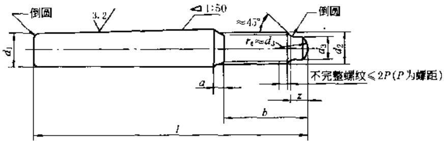

标记示例:

公称直径 $\alpha = 6 \mathrm { { m m } }$ 、公称长度 $\smash { \ell = 6 0 } \mathbf { m } \mathbf { m }$ 、材料为Y12或Y15、不经热处理、不经表面处理的螺尾锥销:

销GB/T881 $6 \times 5 0$ 

/mm 

表 4-3-12

<table><tr><td rowspan=1 colspan=2>dh10</td><td rowspan=1 colspan=1>5</td><td rowspan=1 colspan=1>6</td><td rowspan=1 colspan=1>8</td><td rowspan=1 colspan=1>10</td><td rowspan=1 colspan=1>12</td><td rowspan=1 colspan=1>16</td><td rowspan=1 colspan=1>20</td><td rowspan=1 colspan=1>25</td><td rowspan=1 colspan=1>30</td><td rowspan=1 colspan=1>40</td><td rowspan=1 colspan=1>50</td></tr><tr><td rowspan=1 colspan=2>a ax</td><td rowspan=1 colspan=1>2.4</td><td rowspan=1 colspan=1>3</td><td rowspan=1 colspan=1>4</td><td rowspan=1 colspan=1>4.5</td><td rowspan=1 colspan=1>5.3</td><td rowspan=1 colspan=1>6</td><td rowspan=1 colspan=1>6</td><td rowspan=1 colspan=1>7.5</td><td rowspan=1 colspan=1>9</td><td rowspan=1 colspan=1>10.5</td><td rowspan=1 colspan=1>12</td></tr><tr><td rowspan=1 colspan=2>b max</td><td rowspan=1 colspan=1>15.6</td><td rowspan=1 colspan=1>20</td><td rowspan=1 colspan=1>24.5</td><td rowspan=1 colspan=1>27</td><td rowspan=1 colspan=1>30.5</td><td rowspan=1 colspan=1>39</td><td rowspan=1 colspan=1>39</td><td rowspan=1 colspan=1>45</td><td rowspan=1 colspan=1>52</td><td rowspan=1 colspan=1>65</td><td rowspan=1 colspan=1>78</td></tr><tr><td rowspan=1 colspan=2>山</td><td rowspan=1 colspan=1>M5</td><td rowspan=1 colspan=1>M6</td><td rowspan=1 colspan=1>M8</td><td rowspan=1 colspan=1>M10</td><td rowspan=1 colspan=1>M12</td><td rowspan=1 colspan=1>M16</td><td rowspan=1 colspan=1>M16</td><td rowspan=1 colspan=1>M20</td><td rowspan=1 colspan=1>M24</td><td rowspan=1 colspan=1>M30</td><td rowspan=1 colspan=1>M36</td></tr><tr><td rowspan=1 colspan=2>dmax</td><td rowspan=1 colspan=1>3.5</td><td rowspan=1 colspan=1>4</td><td rowspan=1 colspan=1>5.5</td><td rowspan=1 colspan=1>7</td><td rowspan=1 colspan=1>8.5</td><td rowspan=1 colspan=1>12</td><td rowspan=1 colspan=1>12</td><td rowspan=1 colspan=1>15</td><td rowspan=1 colspan=1>18</td><td rowspan=1 colspan=1>23</td><td rowspan=1 colspan=1>28</td></tr><tr><td rowspan=1 colspan=2> max</td><td rowspan=1 colspan=1>1.5</td><td rowspan=1 colspan=1>1.75</td><td rowspan=1 colspan=1>2.25</td><td rowspan=1 colspan=1>2.75</td><td rowspan=1 colspan=1>3.25</td><td rowspan=1 colspan=1>4.3</td><td rowspan=1 colspan=1>4.3</td><td rowspan=1 colspan=1>5.3</td><td rowspan=1 colspan=1>6.3</td><td rowspan=1 colspan=1>7.5</td><td rowspan=1 colspan=1>9.4</td></tr><tr><td rowspan=1 colspan=2>商品规格</td><td rowspan=1 colspan=1>40-50</td><td rowspan=1 colspan=1>45-60</td><td rowspan=1 colspan=1>55~75</td><td rowspan=1 colspan=1>65~100</td><td rowspan=1 colspan=1>85~120</td><td rowspan=1 colspan=1>100~160</td><td rowspan=1 colspan=1>120~ 190</td><td rowspan=1 colspan=1>140~250</td><td rowspan=1 colspan=1>160-280</td><td rowspan=1 colspan=1>190-360</td><td rowspan=1 colspan=1>220~400</td></tr><tr><td rowspan=1 colspan=2>100mm长的重量/kg</td><td rowspan=1 colspan=1>0.027</td><td rowspan=1 colspan=1>0.031</td><td rowspan=1 colspan=1>0.057</td><td rowspan=1 colspan=1>0.078</td><td rowspan=1 colspan=1>0.116</td><td rowspan=1 colspan=1>0.203</td><td rowspan=1 colspan=1>0.318</td><td rowspan=1 colspan=1>0.509</td><td rowspan=1 colspan=1>0.753</td><td rowspan=1 colspan=1>1.34</td><td rowspan=1 colspan=1>2.122</td></tr><tr><td rowspan=1 colspan=2>系列</td><td rowspan=1 colspan=11>40,45,50,55,60,65,75,85,100,120,140,160,180,190,220,250,280,320,360,400</td></tr><tr><td rowspan=1 colspan=1>技术</td><td rowspan=1 colspan=1>材料</td><td rowspan=1 colspan=11>易切钢：Y12、Y13。碳素钢:35、45;35(28~38HRC)、45(38~41HRC)合金钢：30CrMnSiA，不锈钢：1Cr13、2Cr13、Cr17Ni2、0Cr18Ni9T</td></tr><tr><td rowspan=1 colspan=1>条件</td><td rowspan=1 colspan=1>表面处理</td><td rowspan=1 colspan=11>①钢：不经处理；氧化；磷化；镀锌钝化。②不锈钢：简单处理。③其他表面镀层或表面处理，由供需双方协议。④所有公差仅适用于涂、镀前的公差</td></tr></table>

注:1.其他公差由供需双方协议。2.公称长度大于 $4 0 0 \mathrm { m m }$ ,按 $\pmb { 4 0 } \pmb { \mathrm { n m } } \pmb { \mathrm { n } }$ 递增。

列

<table><tr><td rowspan=1 colspan=1>d(h11）  公称</td><td rowspan=1 colspan=1>?</td><td rowspan=1 colspan=1>4</td><td rowspan=1 colspan=1>5</td><td rowspan=1 colspan=1>6</td><td rowspan=1 colspan=1>8</td><td rowspan=1 colspan=1>10</td><td rowspan=1 colspan=1>12</td><td rowspan=1 colspan=1>14</td><td rowspan=1 colspan=1>16</td><td rowspan=1 colspan=1>18</td><td rowspan=1 colspan=1>20</td><td rowspan=1 colspan=1>22</td><td rowspan=1 colspan=1>25</td><td rowspan=1 colspan=1>28</td><td rowspan=1 colspan=1>30</td><td rowspan=1 colspan=1>32</td><td rowspan=1 colspan=1>36</td><td rowspan=1 colspan=1>40</td><td rowspan=1 colspan=1>45</td><td rowspan=1 colspan=1>50</td><td rowspan=1 colspan=1>55</td><td rowspan=1 colspan=1>60</td></tr><tr><td rowspan=1 colspan=1>山max</td><td rowspan=1 colspan=1>5</td><td rowspan=1 colspan=1>6</td><td rowspan=1 colspan=1>8</td><td rowspan=1 colspan=1>10</td><td rowspan=1 colspan=1>12</td><td rowspan=1 colspan=1>14</td><td rowspan=1 colspan=1>16</td><td rowspan=1 colspan=1>18</td><td rowspan=1 colspan=1>20</td><td rowspan=1 colspan=1>22</td><td rowspan=1 colspan=1>25</td><td rowspan=1 colspan=1>28</td><td rowspan=1 colspan=1>32</td><td rowspan=1 colspan=1>36</td><td rowspan=1 colspan=1>38</td><td rowspan=1 colspan=1>40</td><td rowspan=1 colspan=1>45</td><td rowspan=1 colspan=1>50</td><td rowspan=1 colspan=1>55</td><td rowspan=1 colspan=1>60</td><td rowspan=1 colspan=1>65</td><td rowspan=1 colspan=1>70</td></tr><tr><td rowspan=1 colspan=1>k公称</td><td rowspan=1 colspan=2>1.5</td><td rowspan=1 colspan=2>2</td><td rowspan=1 colspan=2>2.5</td><td rowspan=1 colspan=2>3</td><td rowspan=1 colspan=2>3.5</td><td rowspan=1 colspan=1></td><td rowspan=1 colspan=1>4</td><td rowspan=1 colspan=3>5</td><td rowspan=1 colspan=3>6</td><td rowspan=1 colspan=1></td><td rowspan=1 colspan=1>7</td><td rowspan=1 colspan=2>8</td></tr><tr><td rowspan=1 colspan=1>dmin</td><td rowspan=1 colspan=2>1.6</td><td rowspan=1 colspan=2>2</td><td rowspan=1 colspan=2>3.2</td><td rowspan=1 colspan=3>4</td><td rowspan=1 colspan=3>5</td><td rowspan=1 colspan=4>6.3</td><td rowspan=1 colspan=3>8</td><td rowspan=1 colspan=2>10</td><td rowspan=1 colspan=1></td></tr><tr><td rowspan=1 colspan=1>广</td><td rowspan=1 colspan=1>0.2</td><td rowspan=1 colspan=1></td><td rowspan=1 colspan=9>0.5</td><td rowspan=1 colspan=5>1</td><td rowspan=1 colspan=3></td><td rowspan=1 colspan=3>1.5</td></tr><tr><td rowspan=1 colspan=1>Cn</td><td rowspan=1 colspan=2>0.5</td><td rowspan=1 colspan=2>1</td><td rowspan=1 colspan=1></td><td rowspan=1 colspan=4>1.5</td><td rowspan=1 colspan=8>3</td><td rowspan=1 colspan=5>5</td></tr><tr><td rowspan=1 colspan=1>Cn</td><td rowspan=1 colspan=1>0.2</td><td rowspan=1 colspan=3>0.3</td><td rowspan=1 colspan=1></td><td rowspan=1 colspan=4>0.5</td><td rowspan=1 colspan=9>1</td><td rowspan=1 colspan=4>1.5</td></tr><tr><td rowspan=1 colspan=1>商品规格</td><td rowspan=1 colspan=1>6~ 22</td><td rowspan=1 colspan=1>6~30</td><td rowspan=1 colspan=1>8~40</td><td rowspan=1 colspan=1>12~60</td><td rowspan=1 colspan=1>12~80</td><td rowspan=1 colspan=1>14~120</td><td rowspan=1 colspan=1>20~120</td><td rowspan=1 colspan=1>20~120</td><td rowspan=1 colspan=1>20~140</td><td rowspan=1 colspan=1>24140</td><td rowspan=1 colspan=1>24160</td><td rowspan=1 colspan=1>24~160</td><td rowspan=1 colspan=1>40~180</td><td rowspan=1 colspan=1>40180</td><td rowspan=1 colspan=1>50200</td><td rowspan=1 colspan=1>50~200</td><td rowspan=1 colspan=1>60~200</td><td rowspan=1 colspan=1>70200</td><td rowspan=1 colspan=1>70200</td><td rowspan=1 colspan=1>70~200</td><td rowspan=1 colspan=1>80200</td><td rowspan=1 colspan=1>90-200</td></tr><tr><td rowspan=1 colspan=1></td><td rowspan=1 colspan=1>1-2</td><td rowspan=1 colspan=3>1-3</td><td rowspan=1 colspan=2>1-4</td><td rowspan=1 colspan=4>1-5</td><td rowspan=1 colspan=3>1-6</td><td rowspan=1 colspan=3>1-7</td><td rowspan=1 colspan=3>-10</td><td rowspan=1 colspan=3>-12</td></tr><tr><td rowspan=1 colspan=1>100mm长重量=/kg</td><td rowspan=1 colspan=1>0.007</td><td rowspan=1 colspan=1>0.013</td><td rowspan=1 colspan=1>0.019</td><td rowspan=1 colspan=1>0.023</td><td rowspan=1 colspan=1>0.043</td><td rowspan=1 colspan=1>0.064</td><td rowspan=1 colspan=1>0.093&#x27;0.124</td><td rowspan=1 colspan=1>0.093&#x27;0.124</td><td rowspan=1 colspan=1>0.166</td><td rowspan=1 colspan=1>0.205</td><td rowspan=1 colspan=1>0.257</td><td rowspan=1 colspan=1>0.314</td><td rowspan=1 colspan=1>0.412</td><td rowspan=1 colspan=1>0.517.</td><td rowspan=1 colspan=1>.0.593</td><td rowspan=1 colspan=1>0.683</td><td rowspan=1 colspan=1>0.862</td><td rowspan=1 colspan=1>1.067</td><td rowspan=1 colspan=1>1365</td><td rowspan=1 colspan=1>1663</td><td rowspan=1 colspan=1>2.043</td><td rowspan=1 colspan=1>2.47</td></tr></table>

# 开口销(GB/T91—2000)

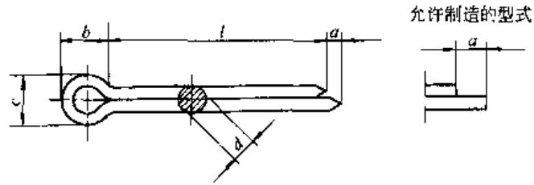

标记示例:

公称规格为 $\mathsf { \pmb { 5 } m m }$ 、公称长度 $\pmb { \mathit { i } } = \pmb { \mathcal { S } } 0 \mathbf { m } \mathbf { m }$ 、材料为Q215或Q235、不经表面处理的开口销:

销GB/T91 $\Im \times \Im \emptyset$ 

表4-3-14

/mm 

<table><tr><td rowspan=1 colspan=3>公称规格</td><td rowspan=1 colspan=1>0.6</td><td rowspan=1 colspan=1>0.8</td><td rowspan=1 colspan=1>1</td><td rowspan=1 colspan=1>1.2</td><td rowspan=1 colspan=1>1.6</td><td rowspan=1 colspan=1>2</td><td rowspan=1 colspan=1>2.5</td><td rowspan=1 colspan=1>3.2</td><td rowspan=1 colspan=1>4</td><td rowspan=1 colspan=1>5</td><td rowspan=1 colspan=1>6.3</td><td rowspan=1 colspan=1>8</td><td rowspan=1 colspan=1>10</td><td rowspan=1 colspan=1>13</td><td rowspan=1 colspan=1>16</td><td rowspan=1 colspan=1>20</td></tr><tr><td rowspan=2 colspan=3>maxdmin</td><td rowspan=1 colspan=1>0.5</td><td rowspan=1 colspan=1>0.7</td><td rowspan=1 colspan=1>0.9</td><td rowspan=1 colspan=1>1.0</td><td rowspan=1 colspan=1>1.4</td><td rowspan=1 colspan=1>1.8</td><td rowspan=1 colspan=1>2.3</td><td rowspan=1 colspan=1>2.9</td><td rowspan=1 colspan=1>3.7</td><td rowspan=1 colspan=1>4.6</td><td rowspan=1 colspan=1>5.9</td><td rowspan=1 colspan=1>7.5</td><td rowspan=1 colspan=1>9.5</td><td rowspan=1 colspan=1>12.4</td><td rowspan=1 colspan=1>15.4</td><td rowspan=1 colspan=1>19.3</td></tr><tr><td rowspan=1 colspan=1>0.4</td><td rowspan=1 colspan=1>0.6</td><td rowspan=1 colspan=1>0.8</td><td rowspan=1 colspan=1>0.9</td><td rowspan=1 colspan=1>1.3</td><td rowspan=1 colspan=1>1.7</td><td rowspan=1 colspan=1>2.1</td><td rowspan=1 colspan=1>2.7</td><td rowspan=1 colspan=1>3.5</td><td rowspan=1 colspan=1>4.4</td><td rowspan=1 colspan=1>5.7</td><td rowspan=1 colspan=1>7.3</td><td rowspan=1 colspan=1>9.3</td><td rowspan=1 colspan=1>12.1</td><td rowspan=1 colspan=1>15.1</td><td rowspan=1 colspan=1>19.0</td></tr><tr><td rowspan=1 colspan=3>a Hax</td><td rowspan=1 colspan=1>1.6</td><td rowspan=1 colspan=1>1.6</td><td rowspan=1 colspan=1>1.6</td><td rowspan=1 colspan=1>2.5</td><td rowspan=1 colspan=1>2.5</td><td rowspan=1 colspan=1>2.5</td><td rowspan=1 colspan=1>2.5</td><td rowspan=1 colspan=1>3.2</td><td rowspan=1 colspan=1>4</td><td rowspan=1 colspan=1>4</td><td rowspan=1 colspan=1>4</td><td rowspan=1 colspan=1>4</td><td rowspan=1 colspan=1>6.3</td><td rowspan=1 colspan=1>6.3</td><td rowspan=1 colspan=1>6.3</td><td rowspan=1 colspan=1>6.3</td></tr><tr><td rowspan=1 colspan=3>6H</td><td rowspan=1 colspan=1>2</td><td rowspan=1 colspan=1>2.4</td><td rowspan=1 colspan=1>3</td><td rowspan=1 colspan=1>3</td><td rowspan=1 colspan=1>3.2</td><td rowspan=1 colspan=1>4</td><td rowspan=1 colspan=1>5</td><td rowspan=1 colspan=1>6.4</td><td rowspan=1 colspan=1>8</td><td rowspan=1 colspan=1>10</td><td rowspan=1 colspan=1>12.6</td><td rowspan=1 colspan=1>16</td><td rowspan=1 colspan=1>20</td><td rowspan=1 colspan=1>26</td><td rowspan=1 colspan=1>32</td><td rowspan=1 colspan=1>40</td></tr><tr><td rowspan=1 colspan=3>cmax</td><td rowspan=1 colspan=1>1</td><td rowspan=1 colspan=1>1.4</td><td rowspan=1 colspan=1>1.8</td><td rowspan=1 colspan=1>2</td><td rowspan=1 colspan=1>2.8</td><td rowspan=1 colspan=1>3.6</td><td rowspan=1 colspan=1>4.6</td><td rowspan=1 colspan=1>5.8</td><td rowspan=1 colspan=1>7.4</td><td rowspan=1 colspan=1>9.2</td><td rowspan=1 colspan=1>11.8</td><td rowspan=1 colspan=1>15</td><td rowspan=1 colspan=1>19</td><td rowspan=1 colspan=1>24.8</td><td rowspan=1 colspan=1>30.8</td><td rowspan=1 colspan=1>38.5</td></tr><tr><td rowspan=1 colspan=3>商品规格！</td><td rowspan=1 colspan=1>4~12</td><td rowspan=1 colspan=1>516</td><td rowspan=1 colspan=1>620</td><td rowspan=1 colspan=1>825</td><td rowspan=1 colspan=1>8~32</td><td rowspan=1 colspan=1>10~40</td><td rowspan=1 colspan=1>12~50</td><td rowspan=1 colspan=1>14~63</td><td rowspan=1 colspan=1>18~80</td><td rowspan=1 colspan=1>22-100</td><td rowspan=1 colspan=1>32~125</td><td rowspan=1 colspan=1>40-160</td><td rowspan=1 colspan=1>45200</td><td rowspan=1 colspan=1>7~250</td><td rowspan=1 colspan=1>112-280</td><td rowspan=1 colspan=1>160280</td></tr><tr><td rowspan=4 colspan=1>中</td><td rowspan=1 colspan=1>螺</td><td rowspan=1 colspan=1>></td><td rowspan=1 colspan=1></td><td rowspan=1 colspan=1>2.5</td><td rowspan=1 colspan=1>3.5</td><td rowspan=1 colspan=1>4.5</td><td rowspan=1 colspan=1>5.5</td><td rowspan=1 colspan=1>7</td><td rowspan=1 colspan=1>9</td><td rowspan=1 colspan=1>11</td><td rowspan=1 colspan=1>14</td><td rowspan=1 colspan=1>20</td><td rowspan=1 colspan=1>27</td><td rowspan=1 colspan=1>39</td><td rowspan=1 colspan=1>56</td><td rowspan=1 colspan=1>80</td><td rowspan=1 colspan=1>120</td><td rowspan=1 colspan=1>170</td></tr><tr><td rowspan=1 colspan=1>栓</td><td rowspan=1 colspan=1>S</td><td rowspan=1 colspan=1>2.5</td><td rowspan=1 colspan=1>3.5</td><td rowspan=1 colspan=1>4.5</td><td rowspan=1 colspan=1>5.5</td><td rowspan=1 colspan=1>7</td><td rowspan=1 colspan=1>9</td><td rowspan=1 colspan=1>11</td><td rowspan=1 colspan=1>14</td><td rowspan=1 colspan=1>20</td><td rowspan=1 colspan=1>27</td><td rowspan=1 colspan=1>39</td><td rowspan=1 colspan=1>56</td><td rowspan=1 colspan=1>80</td><td rowspan=1 colspan=1>120</td><td rowspan=1 colspan=1>170</td><td rowspan=1 colspan=1>1</td></tr><tr><td rowspan=2 colspan=1></td><td rowspan=1 colspan=1>></td><td rowspan=1 colspan=1>1</td><td rowspan=1 colspan=1>2</td><td rowspan=1 colspan=1>3</td><td rowspan=1 colspan=1>4</td><td rowspan=1 colspan=1>5</td><td rowspan=1 colspan=1>6</td><td rowspan=1 colspan=1>8</td><td rowspan=1 colspan=1>9</td><td rowspan=1 colspan=1>12</td><td rowspan=1 colspan=1>17</td><td rowspan=1 colspan=1>23</td><td rowspan=1 colspan=1>29</td><td rowspan=1 colspan=1>44</td><td rowspan=1 colspan=1>69</td><td rowspan=1 colspan=1>110</td><td rowspan=1 colspan=1>160</td></tr><tr><td rowspan=1 colspan=1>S</td><td rowspan=1 colspan=1>2</td><td rowspan=1 colspan=1></td><td rowspan=1 colspan=1>4</td><td rowspan=1 colspan=1>5</td><td rowspan=1 colspan=1>6</td><td rowspan=1 colspan=1>8</td><td rowspan=1 colspan=1>9</td><td rowspan=1 colspan=1>12</td><td rowspan=1 colspan=1>7</td><td rowspan=1 colspan=1>23</td><td rowspan=1 colspan=1>29</td><td rowspan=1 colspan=1>44</td><td rowspan=1 colspan=1>6</td><td rowspan=1 colspan=1>110</td><td rowspan=1 colspan=1>160</td><td rowspan=1 colspan=1>1</td></tr><tr><td rowspan=1 colspan=3>100mm长的重量/kg</td><td rowspan=1 colspan=1>0.0004</td><td rowspan=1 colspan=1>0.00040.0007</td><td rowspan=1 colspan=1>0.00040.0007</td><td rowspan=1 colspan=1></td><td rowspan=1 colspan=1>0.0016</td><td rowspan=1 colspan=1>0.0033</td><td rowspan=1 colspan=1>0.005</td><td rowspan=1 colspan=1>0.0054</td><td rowspan=1 colspan=1>0.010</td><td rowspan=1 colspan=1>0.017</td><td rowspan=1 colspan=1>0.023</td><td rowspan=1 colspan=1>0.041</td><td rowspan=1 colspan=1></td><td rowspan=1 colspan=1></td><td rowspan=1 colspan=1></td><td rowspan=1 colspan=1></td></tr><tr><td rowspan=1 colspan=3>！系列</td><td rowspan=1 colspan=16>4，5，6，8，10，12，14，16，18,20,22，25，28,32,36,40,45,50、56，63、71，80．90，100，112，125.140，160，180，200，224，250，280</td></tr><tr><td rowspan=1 colspan=3>材料</td><td rowspan=1 colspan=16>①碳素钢：Q215、Q235；②铜合金：H63；③不锈钢：1Cr17N7、0Cr18Ni9Ti；④其他材料由供需双方协议</td></tr><tr><td rowspan=1 colspan=3>表面处理</td><td rowspan=1 colspan=16>钢：不经处理、镀锌钝化、磷化。铜、不锈钢；简单处理。其他表面镀层或表面处理由供需双方协议</td></tr><tr><td rowspan=1 colspan=3>工作质量</td><td rowspan=1 colspan=16>①眼圈应尽可能制成圆形；②开口销两脚的横截面应为圆形，但允许开口销两脚平面与圆周交接处有圆角「=(0.05~0.1)d；③开口销两脚的间隙和两脚的错移量，应不大于开口销公称规格与d的差值；④开口销允许制成开口的（一两脚内平面的夹角）：公称规格≤1.6时，a≤8；2-6.3时，α≤4；≥8时，α≤2°</td></tr></table>

注;1.公称规格等于开口销孔直径。对销孔直径推荐的公差:公称规格 $\mathfrak { s } 1 . 2$ :H13;公称规格 $> 1 . 2$ :H14。根据供需双方协议,允许采用公称规格为 $\Im \mathrm { m m }$ 、 $\delta \mathsf { m m }$ 和 $1 2 \tt m m$ 的开口销。2.用于铁道和在 $\pmb { U }$ 形销中开口销承受交变横向力的场合,推荐使用的开口销规格,应较本表规定的规格加大一档。

# 2键联接

# 2.1键的类型、特点和应用

键联接是通过键实现轴和轴上零件间的周向固定以传递运动和转矩。其中,有些类型还可实现轴向固定和传递轴向力,有些类型并能实现轴向动联接,

# 2.2键的选择和联接的强度计算

键的类型可根据使用要求、工作条件和联接的结构特点按表4-3-15选定

表4-3-15

<table><tr><td rowspan=1 colspan=2>类型</td><td rowspan=1 colspan=1>图形</td><td rowspan=1 colspan=1>标准</td><td rowspan=1 colspan=2>特点</td><td rowspan=1 colspan=1>应用</td></tr><tr><td rowspan=3 colspan=1>平键</td><td rowspan=1 colspan=1>普通平键</td><td rowspan=1 colspan=1>A-BC</td><td rowspan=1 colspan=1>GB/T1096-1979CB/T1567-1979（薄型）</td><td rowspan=2 colspan=1>靠侧面传递转矩。对中良好，装拆方便。不能实现轴上零件</td><td rowspan=1 colspan=1>A型用于端铣刀加工的轴槽，精度、高速或承受变载、键在槽中轴向固定良好，但槽在轴上引起的应力集中较大；B型用于盘铣刀加工的轴槽，轴的应转零件力集中较小；C型用于轴端</td><td rowspan=1 colspan=1>应用最厂，也适用于窃A型用于端铣刀加工的轴槽，精度、高速或承受变载、冲击的场合，如在轴上固定齿轮、链轮和凸轮等间薄型平键适用于薄壁结构</td></tr><tr><td rowspan=1 colspan=1>导向平键</td><td rowspan=1 colspan=1>AB</td><td rowspan=1 colspan=1>GB/T 1097-1979</td><td rowspan=1 colspan=1>键用螺钉固定在轴上，键与毂槽为动配合，轴上零件能作轴向移动。为了拆卸方便，设有起键螺孔</td><td rowspan=1 colspan=1>币于轴上零件轴向移动量不大的场合，如变速箱中的滑移齿轮</td></tr><tr><td rowspan=1 colspan=1>滑键</td><td rowspan=1 colspan=1></td><td rowspan=1 colspan=1></td><td rowspan=1 colspan=1>的轴向固定</td><td rowspan=1 colspan=1>键固定在轮毂上，轴上零件能带键作轴向移动</td><td rowspan=1 colspan=1>用于轴上零件轴向移动较大的场合</td></tr><tr><td rowspan=1 colspan=2>半圆键</td><td rowspan=1 colspan=1>0</td><td rowspan=1 colspan=1>CB/T1099-1979</td><td rowspan=1 colspan=2>靠侧面传递转矩。键在轴槽中能绕槽底网弧曲率中心摆动，装配方便。键槽较深，对轴的削弱较大</td><td rowspan=1 colspan=1>一般川于轻载，适用于轴的锥形端部</td></tr><tr><td rowspan=3 colspan=1>樱键</td><td rowspan=1 colspan=1>普通模键</td><td rowspan=1 colspan=1>斜度1:100</td><td rowspan=1 colspan=1>GB/T1564-1979</td><td rowspan=2 colspan=2>键的上下两面是工作面。键的上表面和毂槽的底面各有1:100的斜度，装配时需打人，靠楔紧作用传递转矩。能轴向固定零件和传递单向轴向力。但使轴上零件与轴的配合产生偏心与偏斜</td><td rowspan=2 colspan=1>用于精度要求不高、转速较低时传递较大的，双向的或有振动的转。如在外部轴端上固定带轮，电机轴上固定带轮等一些结构简单紧凑的地方。有钩头的用于不能从另--端将键打出的场合。钩头供拆卸用，应注意加保护罩</td></tr><tr><td rowspan=1 colspan=1>钩头樱键</td><td rowspan=1 colspan=1>斜度1:100</td><td rowspan=1 colspan=1>GB/T 156S-1979</td></tr><tr><td rowspan=1 colspan=1>切向键</td><td rowspan=1 colspan=1>斜度1:100</td><td rowspan=1 colspan=1>G8/T1974-1980</td><td rowspan=1 colspan=2>由两个斜度为1:100的楔键组成，其上下两面（窄面）为工作面，其中之·面在通过轴心线的平面内。键从两边打入。工作面上的压力沿轴的切线方向作用，能传递很大的转矩，-个切向键只传递一个方向的转矩，传递双向转矩时须用两个，成120~135，两个不够可用四个</td><td rowspan=1 colspan=1>用于载荷很大，对中要求不严的场合，常用于直径大于100mm的轴上</td></tr></table>

注:除滑键及切向键外,其他标准均在1990年确认。

键的剖面尺寸通常根据轴的直径已制定标准。对于薄壁空心轴、阶梯轴、传递转矩较小以及用于定位等特殊情况的,允许选用剖面尺寸较标准规定为小的键;有时,由于工艺需要也可选用较标准规定为大的键、键的长度按轮毂长度从标准中选取,并按传递的转矩对长度进行验算。

键联接的强度验算公式见表4-3-16。如单键强度不够采用双键时,应考虑键的合理布置。两个平键最好相隔$1 8 0 ^ { \circ }$ ;两个半圆键则应沿轴心线布置在一条直线上;两个楔键夹角一般为 $9 0 ^ { \circ } \sim 1 2 0 ^ { \circ }$ ,两个切向键间夹角-般为$1 2 0 ^ { \circ } \sim 1 3 5 ^ { \circ }$ 。双键联接的强度按1.5个键计算。

当键联接的轴与毂为过盈配合时,如过盈量较小,则在校核强度时可不考虑过盈联接。

表4-3-16

键联接的强度验算公式

<table><tr><td rowspan=1 colspan=1>键的类型</td><td rowspan=1 colspan=2>受力简图</td><td rowspan=1 colspan=2>计算内容</td><td rowspan=1 colspan=2>计算公式</td><td rowspan=1 colspan=2>符号意义及系数选择</td></tr><tr><td rowspan=2 colspan=1>平键</td><td rowspan=2 colspan=2>上  火p</td><td rowspan=1 colspan=2>健或键槽工作面的挤压或磨损</td><td rowspan=1 colspan=2>2P=D≤p或Pp（MPa）</td><td rowspan=3 colspan=2>T-   转知，N·mmD-一轴的直径，mmk-  键与轮毂的接触高度，mm，h4-3-23{-   键的二作长度，对于A型键l=-bLb—-键的宽度，mmpp、Pp  键联接的许用挤压应力及许用挤压压强，MPa，查表4-3-17Tp   键联接的许用剪应力，MPa，查表4-3-17</td></tr><tr><td rowspan=1 colspan=4>2T键的剪切        T=D（MPa）</td></tr><tr><td rowspan=1 colspan=1>中理</td><td rowspan=1 colspan=2>h              LP        D</td><td rowspan=1 colspan=4>同平键联同平键联接接</td></tr><tr><td rowspan=1 colspan=1>模键</td><td rowspan=1 colspan=2>xHNA2uNy景  X</td><td rowspan=1 colspan=4>键或键槽          127工作面的挤. P=bl（6D+b）≤pP压                        (MPa)</td><td rowspan=1 colspan=2>f    摩擦因数，对钢和铸铁，p=0.12~0.17</td></tr><tr><td rowspan=1 colspan=1>切向键</td><td rowspan=1 colspan=2>120yμNNy-    =品</td><td rowspan=1 colspan=2>键或键槽工作面的挤压</td><td rowspan=1 colspan=2>TP=（0.5f+0.45）Dl(-C）p或Ppp（MPa）</td><td rowspan=1 colspan=2>C-  切向键倒角的宽度，mm切向键工作面的宽度，mm</td></tr><tr><td rowspan=1 colspan=9>表4-3-17                   键联接的许用挤压应力、许用挤压压强和许用剪应力                        /MPa</td></tr><tr><td rowspan=2 colspan=2>许用应力及许用压强</td><td rowspan=2 colspan=2>联接.作方式</td><td rowspan=2 colspan=2>被联接零件材料</td><td rowspan=1 colspan=3>不同载荷性质的许用值</td></tr><tr><td rowspan=1 colspan=1>静载</td><td rowspan=1 colspan=1>轻微冲击</td><td rowspan=1 colspan=1>冲击</td></tr><tr><td rowspan=2 colspan=2>w</td><td rowspan=2 colspan=2>静联接</td><td rowspan=1 colspan=2>钢</td><td rowspan=1 colspan=1>125~150</td><td rowspan=1 colspan=1>100~ 120</td><td rowspan=1 colspan=1>60~90</td></tr><tr><td rowspan=1 colspan=2>铸铁</td><td rowspan=1 colspan=1>70~80</td><td rowspan=1 colspan=1>50-60</td><td rowspan=1 colspan=1>30~45</td></tr><tr><td rowspan=1 colspan=2>PpP</td><td rowspan=1 colspan=2>动联接</td><td rowspan=1 colspan=2>钢</td><td rowspan=1 colspan=1>50</td><td rowspan=1 colspan=1>40</td><td rowspan=1 colspan=1>30</td></tr><tr><td rowspan=1 colspan=2>5</td><td rowspan=1 colspan=2></td><td rowspan=1 colspan=2></td><td rowspan=1 colspan=1>120</td><td rowspan=1 colspan=1>90</td><td rowspan=1 colspan=1>60</td></tr><tr><td></td><td></td><td></td><td></td><td></td><td></td><td></td><td rowspan=1 colspan=1></td><td rowspan=1 colspan=1></td></tr></table>

注:1."pp及ppp应按联接中材料力学性能较弱的零件选取。2.如与键有相对滑动的被联接件表面经过表面硬化,则动联接的 $p _ { \mathsf { P } }$ 可提高2\~3倍。

# 2.3键的标准件

# 平键和键槽的剖面尺寸(GB/T1095—1979)

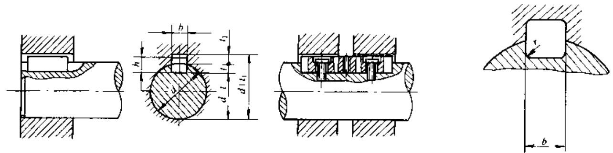

/mm 

注;在工作图中,轴槽深用t或(d-t)标注,轮毂槽深用( $\alpha + \iota _ { \iota } ]$ 标注,

表4-3-18

<table><tr><td rowspan=1 colspan=1>轴径</td><td rowspan=1 colspan=1>键</td><td rowspan=1 colspan=13>键           槽</td></tr><tr><td rowspan=4 colspan=1>公称直径d</td><td rowspan=4 colspan=1>公称尺寸bxh</td><td rowspan=1 colspan=6>宽      度</td><td rowspan=1 colspan=5>深   度</td><td rowspan=3 colspan=2>半径，</td></tr><tr><td rowspan=1 colspan=1>公称</td><td rowspan=1 colspan=5>偏     养</td><td rowspan=2 colspan=2>轴</td><td rowspan=2 colspan=3>i毂</td></tr><tr><td rowspan=2 colspan=1>尺寸b</td><td rowspan=1 colspan=2>较松键联接</td><td rowspan=1 colspan=2>一般键联接</td><td rowspan=1 colspan=1>较紧键联接</td></tr><tr><td rowspan=1 colspan=1>轴H9</td><td rowspan=1 colspan=1>教D10</td><td rowspan=1 colspan=1>轴N9</td><td rowspan=1 colspan=1>载JS9</td><td rowspan=1 colspan=1>轴和毂P9</td><td rowspan=1 colspan=1>！</td><td rowspan=1 colspan=1>极限偏差</td><td rowspan=1 colspan=1></td><td rowspan=1 colspan=2>极限偏差最小最大</td><td rowspan=1 colspan=1>最小</td><td rowspan=1 colspan=1>最大</td></tr><tr><td rowspan=1 colspan=1>6-8</td><td rowspan=1 colspan=1>2x2</td><td rowspan=1 colspan=1>2</td><td rowspan=2 colspan=1>+ 0.0250</td><td rowspan=2 colspan=1>+0.060+0.020</td><td rowspan=2 colspan=1>-0.004-0.029</td><td rowspan=2 colspan=1>±0.0125</td><td rowspan=2 colspan=1>-0.006-0.031</td><td rowspan=2 colspan=1>国L8</td><td rowspan=2 colspan=1>+0.1</td><td rowspan=2 colspan=1>114</td><td rowspan=5 colspan=2>+ 0.1u</td><td rowspan=3 colspan=1>0.080.16</td><td rowspan=3 colspan=1>0.080.16</td></tr><tr><td rowspan=1 colspan=1>>8~10</td><td rowspan=1 colspan=1>3x3</td><td rowspan=1 colspan=1>3</td></tr><tr><td rowspan=1 colspan=1>>10~12</td><td rowspan=1 colspan=1>4x4</td><td rowspan=1 colspan=1>4</td><td rowspan=3 colspan=1>+ 0.0300</td><td rowspan=3 colspan=1>+ 0.078+0.030</td><td rowspan=3 colspan=1>0-0.030</td><td rowspan=3 colspan=1>±0.015</td><td rowspan=3 colspan=1>-0.012-0.042</td><td rowspan=2 colspan=1>2.53.0</td><td rowspan=3 colspan=1>0</td><td rowspan=1 colspan=1>1.8</td></tr><tr><td rowspan=1 colspan=1>>12~17</td><td rowspan=1 colspan=1>5x5</td><td rowspan=1 colspan=1>5 [</td><td rowspan=2 colspan=1>32.8</td><td rowspan=3 colspan=1>0.160.25</td><td rowspan=3 colspan=1>0.160.25</td></tr><tr><td rowspan=1 colspan=1>>17~22</td><td rowspan=1 colspan=1>6x6</td><td rowspan=1 colspan=1>6</td><td rowspan=1 colspan=1>3.5</td></tr><tr><td rowspan=1 colspan=1>>22~30</td><td rowspan=1 colspan=1>8x7</td><td rowspan=1 colspan=1>8</td><td rowspan=2 colspan=1>+0.0360</td><td rowspan=2 colspan=1>+0.098+0.040</td><td rowspan=2 colspan=1>0-0.036</td><td rowspan=2 colspan=1>±0.018</td><td rowspan=2 colspan=1>-0.015-0.051</td><td rowspan=1 colspan=1>4.0</td><td rowspan=2 colspan=1></td><td rowspan=1 colspan=1>③3</td><td rowspan=11 colspan=2>+0.20</td></tr><tr><td rowspan=1 colspan=1>>30-38</td><td rowspan=1 colspan=1>10×8</td><td rowspan=1 colspan=1>10</td><td rowspan=1 colspan=1>5.0</td><td rowspan=1 colspan=1>33</td><td rowspan=5 colspan=1>0.250.40</td><td rowspan=5 colspan=1>0.250.40</td></tr><tr><td rowspan=1 colspan=1>>38~44</td><td rowspan=1 colspan=1>12×8</td><td rowspan=1 colspan=1>12</td><td rowspan=4 colspan=1>+ 0.0430</td><td rowspan=4 colspan=1>+ 0.120+ 0.050</td><td rowspan=4 colspan=1>0-0.043</td><td rowspan=4 colspan=1>±0.0215</td><td rowspan=4 colspan=1>-0.0180.061</td><td rowspan=1 colspan=1>5.0</td><td rowspan=4 colspan=1>+0.2</td><td rowspan=1 colspan=1>国</td></tr><tr><td rowspan=1 colspan=1>>44-50</td><td rowspan=1 colspan=1>14×9</td><td rowspan=1 colspan=1>14</td><td rowspan=2 colspan=1>国</td><td rowspan=2 colspan=1>3.8国</td></tr><tr><td rowspan=1 colspan=1>>50~58</td><td rowspan=1 colspan=1>16x10</td><td rowspan=1 colspan=1>16</td></tr><tr><td rowspan=1 colspan=1>>58~65</td><td rowspan=1 colspan=1>18×11</td><td rowspan=1 colspan=1>18</td><td rowspan=1 colspan=1>2</td><td rowspan=1 colspan=1>4.4</td></tr><tr><td rowspan=1 colspan=1>>65~75</td><td rowspan=1 colspan=1>20x12</td><td rowspan=1 colspan=1>20</td><td rowspan=4 colspan=1>+ 0.0520</td><td rowspan=4 colspan=1>+ 0.149+0.065</td><td rowspan=4 colspan=1>0-0.052</td><td rowspan=4 colspan=1>± 0.026</td><td rowspan=4 colspan=1>-0.022-0.074</td><td rowspan=2 colspan=1>国国</td><td rowspan=5 colspan=1>0</td><td rowspan=4 colspan=1>4.95.45.46.4</td><td rowspan=5 colspan=1>0.400.60</td><td rowspan=5 colspan=1>0.400.60</td></tr><tr><td rowspan=1 colspan=1>>75~85</td><td rowspan=1 colspan=1>22×14</td><td rowspan=1 colspan=1>22</td></tr><tr><td rowspan=1 colspan=1>>85~95</td><td rowspan=1 colspan=1>25×14</td><td rowspan=1 colspan=1>25</td><td rowspan=1 colspan=1></td></tr><tr><td rowspan=1 colspan=1>>95~110</td><td rowspan=1 colspan=1>28×16</td><td rowspan=1 colspan=1>28</td><td rowspan=1 colspan=1>10.0</td></tr><tr><td rowspan=1 colspan=1>>110~130</td><td rowspan=1 colspan=1>32×18</td><td rowspan=1 colspan=1>32</td><td rowspan=5 colspan=1>+ 0.0620</td><td rowspan=5 colspan=1>+0.180+0.080</td><td rowspan=5 colspan=1>0：-0.062</td><td rowspan=5 colspan=1>±0.031</td><td rowspan=5 colspan=1>-0.026-0.088</td><td></td><td rowspan=1 colspan=1>1.0</td><td rowspan=1 colspan=1>7.4</td></tr><tr><td rowspan=1 colspan=1>>130~150</td><td rowspan=1 colspan=1>36×20</td><td rowspan=1 colspan=1>36</td><td rowspan=4 colspan=1>12.015.国</td><td rowspan=10 colspan=1>+0.30</td><td rowspan=1 colspan=1>8.4</td><td rowspan=4 colspan=2>+0.3</td><td rowspan=4 colspan=1>0.701.0</td><td rowspan=4 colspan=1>0.701.0</td></tr><tr><td rowspan=1 colspan=1>>150~170</td><td rowspan=1 colspan=1>40×22</td><td rowspan=1 colspan=1>40</td><td rowspan=3 colspan=1>9.441</td></tr><tr><td rowspan=1 colspan=1>>170~200</td><td rowspan=1 colspan=1>45× 25</td><td rowspan=1 colspan=1>45</td></tr><tr><td rowspan=1 colspan=1>>200~230</td><td rowspan=1 colspan=1>50×28</td><td rowspan=1 colspan=1>50</td></tr><tr><td rowspan=1 colspan=1>>230~260</td><td rowspan=1 colspan=1>56× 32</td><td rowspan=1 colspan=1>56</td><td rowspan=4 colspan=1>+0.0740</td><td rowspan=4 colspan=1>+ 0.220+ 0.100</td><td rowspan=4 colspan=1>0-0.074</td><td rowspan=4 colspan=1>±0.037</td><td rowspan=4 colspan=1>-0.032-0.106</td><td rowspan=1 colspan=1>20.</td><td rowspan=1 colspan=1>12.4</td><td rowspan=6 colspan=2>0</td><td rowspan=3 colspan=1>1.2</td><td rowspan=3 colspan=1>1.6</td></tr><tr><td rowspan=1 colspan=1>>260~290</td><td rowspan=1 colspan=1>63×32</td><td rowspan=1 colspan=1>63</td><td rowspan=3 colspan=1>20.22.25.0</td><td rowspan=5 colspan=1>12.44.44国9.5</td></tr><tr><td rowspan=1 colspan=1>>290~330</td><td rowspan=1 colspan=1>70×36</td><td rowspan=1 colspan=1>70</td></tr><tr><td rowspan=1 colspan=1>>330-380</td><td rowspan=1 colspan=1>80×40</td><td rowspan=1 colspan=1>80</td><td rowspan=3 colspan=1>2.02.5</td><td rowspan=3 colspan=1>2.02.5</td></tr><tr><td rowspan=1 colspan=1>>380~440</td><td rowspan=1 colspan=1>90×45</td><td rowspan=1 colspan=1>90</td><td rowspan=2 colspan=1>+0.0870</td><td rowspan=2 colspan=1>+0.260+0.120</td><td rowspan=2 colspan=1>0-0.087</td><td rowspan=2 colspan=1>±0.0435</td><td rowspan=2 colspan=1>-0.037-0.124</td><td rowspan=2 colspan=1>28.031.0</td></tr><tr><td rowspan=1 colspan=1>>440~500</td><td rowspan=1 colspan=1>100× 50</td><td rowspan=1 colspan=1>100</td></tr></table>

注:1、普通平键、导向平键和键槽尺寸及公差应符合本标准的规定。

2.导向平键的轴槽与轮毂槽用较松键联结的公差。

3.除轴外伸外,在保证传递所需扭矩条件下,允许采用较小面的键,但;和t的数值必要时应重新计算,使键侧‘轮毅槽接触高度各为 $\hbar / 2$ 

4.平键轴槽的长度公差用 $\mathbf { H 1 4 }$ 0

5.健槽表面粗糙度一般按如下的规定:轴槽、轮毂槽宽度两侧面粗糙度R.=1.6\~3.2um;轴槽底面、轮毂槽底面的表面粗糙度 $R _ { \bullet } = 6 . 3 \mu \mathbf { m } ,$ 

6.键槽的对称度公差;为便于装配,轴槽及轮毂槽对轴及轮毂轴心的对称度公差根据不同要求,·般可按CB/T1184一1996中附表对称度公差7\~9级选取。键槽(轴槽及轮毂槽)的对称度公差的公称尺寸是指键宽b。

7.表中(d-t)和(d+ti)两组组合尺寸的极限偏差按相应的:和t,的极限偏差选取,但(d-t)的极限偏差值应取负号(-)。

<table><tr><td rowspan=2 colspan=1>宽度</td><td rowspan=1 colspan=1>公称</td><td rowspan=1 colspan=2>2     3</td><td rowspan=1 colspan=5>4   5   6</td><td rowspan=1 colspan=4>8   10</td><td rowspan=1 colspan=4>12 14</td><td rowspan=1 colspan=4>6  18</td><td rowspan=1 colspan=4>20  22  25  28</td><td rowspan=1 colspan=5>32  36  40  45 50</td><td rowspan=1 colspan=2>56 63</td><td rowspan=1 colspan=2>80</td><td rowspan=1 colspan=1>90</td><td rowspan=1 colspan=1>100</td><td rowspan=1 colspan=1>公</td><td rowspan=2 colspan=1>南厦</td></tr><tr><td rowspan=1 colspan=1>美）</td><td rowspan=1 colspan=2>0-0.025</td><td rowspan=1 colspan=5>00.030</td><td rowspan=1 colspan=4>0-0.036</td><td rowspan=1 colspan=4>0-0.043</td><td rowspan=1 colspan=4>043</td><td rowspan=1 colspan=4>0-0.052</td><td rowspan=1 colspan=5>0-0.062</td><td rowspan=1 colspan=2>0-0.074</td><td rowspan=1 colspan=2></td><td rowspan=1 colspan=1>00.087</td><td rowspan=1 colspan=1>0.087</td><td rowspan=1 colspan=1>极差（9）</td></tr><tr><td rowspan=2 colspan=1>商</td><td rowspan=1 colspan=1>公称</td><td rowspan=1 colspan=1>2</td><td rowspan=1 colspan=1>3</td><td rowspan=1 colspan=3>4   5</td><td rowspan=1 colspan=2>6</td><td rowspan=1 colspan=4>7   8</td><td rowspan=1 colspan=4>8   9</td><td rowspan=1 colspan=2>10</td><td rowspan=1 colspan=2>11</td><td rowspan=1 colspan=1>12</td><td rowspan=1 colspan=3>14 14</td><td rowspan=1 colspan=1>18</td><td rowspan=1 colspan=4>2022  25  28</td><td rowspan=1 colspan=2>32  32</td><td rowspan=1 colspan=1>36</td><td rowspan=1 colspan=1>4</td><td rowspan=1 colspan=1>45</td><td rowspan=1 colspan=1>50</td><td rowspan=1 colspan=1>公称</td><td rowspan=2 colspan=1>高度</td></tr><tr><td rowspan=1 colspan=1>极限信送（h11）</td><td rowspan=1 colspan=2>6    0-0.06(-0.025）</td><td rowspan=1 colspan=3>0-0.075(-0.030）</td><td rowspan=1 colspan=2>0</td><td rowspan=1 colspan=10>0-0.090</td><td rowspan=1 colspan=7>0-0.110</td><td rowspan=1 colspan=4>0-0.130</td><td rowspan=1 colspan=3>0</td><td rowspan=1 colspan=2>-0.16</td><td rowspan=1 colspan=1></td><td rowspan=1 colspan=1>极</td></tr><tr><td rowspan=1 colspan=1>一</td><td rowspan=1 colspan=1>C</td><td rowspan=1 colspan=2>0.16-0.25</td><td rowspan=1 colspan=3></td><td></td><td></td><td></td><td></td><td></td><td></td><td></td><td></td><td></td><td></td><td></td><td></td><td></td><td></td><td></td><td></td><td></td><td></td><td></td><td rowspan=1 colspan=4>1.0~1.2</td><td rowspan=1 colspan=3>1.6-2.0</td><td rowspan=1 colspan=2>2.5-3.0</td><td rowspan=1 colspan=1>0</td><td rowspan=1 colspan=1></td><td rowspan=1 colspan=1></td></tr><tr><td rowspan=1 colspan=1></td><td rowspan=2 colspan=1>长度极限信公差（h14）</td><td rowspan=2 colspan=34>平头普通平键（B型）1000件的重量/kg</td><td rowspan=1 colspan=1></td><td rowspan=2 colspan=1>限偏差（）</td></tr><tr><td rowspan=1 colspan=1>公</td><td rowspan=1 colspan=1>L公称</td></tr><tr><td rowspan=15 colspan=1>6810121416182022252832364045505663</td><td rowspan=3 colspan=1>0-0.36</td><td rowspan=15 colspan=1>0.1880.2510.3140.3770.4400.5020.5650.628</td><td rowspan=15 colspan=1>0.4240.5650.7070.8480.9891.131.271.411.551.771.982.262.54</td><td rowspan=1 colspan=1></td><td rowspan=2 colspan=2></td><td rowspan=4 colspan=2>19.8</td><td rowspan=5 colspan=2>30.835.239.6</td><td rowspan=7 colspan=2>44.050.256.562.869.1</td><td rowspan=9 colspan=2>52.860.367.875.482.994.2106</td><td rowspan=11 colspan=2>69.279.189.098.9109124138159</td><td rowspan=12 colspan=2>87.9101113126138157176201226</td><td rowspan=13 colspan=2>109124140155171194218249280311</td><td rowspan=14 colspan=1>132151170188207236264301339377414</td><td rowspan=15 colspan=1>169193218242266302338387435484532604152</td><td rowspan=15 colspan=1>192220247275302343385440495550604686769</td><td rowspan=15 colspan=1>2813173523374404925636337037748799851125</td><td rowspan=15 colspan=1>4074524975656337238149049951130126614471628</td><td rowspan=15 colspan=1>56562270779190410171130124314131583180920352261</td><td rowspan=15 colspan=1>691760864967110512431381152017271934221124872763</td><td rowspan=15 colspan=1>971110412361413159017661943220824732826317925333974</td><td rowspan=15 colspan=1>1375154017601980220024202750308035173956440049455495</td><td rowspan=15 colspan=1>197022502532281330953517394045025064562763307033</td><td rowspan=15 colspan=1>25322850316534853956443150645697633071227913</td><td rowspan=15 colspan=1>3560395643524946553963307121791389029891</td><td rowspan=15 colspan=1>502455266280703380389043100481130412560</td><td rowspan=15 colspan=1>6994794889021017411445127171430715896</td><td rowspan=15 colspan=1>981310990125601413015700]1766319625</td><td rowspan=15 colspan=1>708090100110125140160180200220250280320360400450500</td><td rowspan=8 colspan=1>00.740-0.870-1.0</td></tr><tr><td rowspan=1 colspan=1>1.01</td></tr><tr><td rowspan=13 colspan=2>1.92.362.753.143.533.934.324.915.506.287.077.858.839.8111.0</td><td rowspan=2 colspan=1>1.9</td><td rowspan=1 colspan=2></td></tr><tr><td rowspan=3 colspan=1>0- 0.43</td></tr><tr><td rowspan=1 colspan=2>3.964.52</td><td rowspan=1 colspan=2>7.91</td></tr><tr><td rowspan=2 colspan=2>7.91</td><td rowspan=1 colspan=2>13.8</td></tr><tr><td rowspan=4 colspan=1>00.52</td><td rowspan=1 colspan=2>13.85.7</td></tr><tr><td rowspan=8 colspan=2>13.85.717.620.122.625.28.331.435.239.6</td><td rowspan=1 colspan=2>2</td></tr><tr><td rowspan=1 colspan=2>2</td><td rowspan=7 colspan=1>0-1.1501.300- 1.400-1.55</td></tr><tr><td rowspan=6 colspan=2>224.127.30.133.937.742.247.5</td><td rowspan=1 colspan=3>35.6</td></tr><tr><td rowspan=4 colspan=1>0-0.62</td><td rowspan=1 colspan=3>35.6</td></tr><tr><td rowspan=4 colspan=2>35.639.644.549.555.462.3</td><td rowspan=1 colspan=2></td></tr><tr><td rowspan=3 colspan=2>56.562.870.379.1</td><td rowspan=1 colspan=1></td></tr><tr><td rowspan=2 colspan=2>77.78797.9</td><td rowspan=1 colspan=1></td></tr><tr><td rowspan=1 colspan=1>0-0.74</td><td rowspan=1 colspan=1>10619</td></tr><tr><td rowspan=1 colspan=1>/kg</td><td rowspan=1 colspan=1>对A型应减去的重量</td><td rowspan=1 colspan=1>0.013</td><td rowspan=1 colspan=1>0.045</td><td rowspan=1 colspan=1>0.11</td><td rowspan=1 colspan=2>0.21</td><td rowspan=1 colspan=2>0.36</td><td rowspan=1 colspan=2>0.76</td><td rowspan=1 colspan=2>1.4</td><td rowspan=1 colspan=2>2.0</td><td rowspan=1 colspan=2>3.0</td><td rowspan=1 colspan=2>4.3</td><td rowspan=1 colspan=2>6.0</td><td rowspan=1 colspan=1>8.0</td><td rowspan=1 colspan=1>11.0</td><td rowspan=1 colspan=1>15</td><td rowspan=1 colspan=1>21</td><td rowspan=1 colspan=1>31</td><td rowspan=1 colspan=1>44</td><td rowspan=1 colspan=1>59</td><td rowspan=1 colspan=1>85</td><td rowspan=1 colspan=1>118</td><td rowspan=1 colspan=1>169</td><td rowspan=1 colspan=1>214</td><td rowspan=1 colspan=1>297</td><td rowspan=1 colspan=1>431</td><td rowspan=1 colspan=1>614</td><td rowspan=1 colspan=1>842</td><td rowspan=1 colspan=2>对A型应减去的重量/g</td></tr><tr><td rowspan=1 colspan=1>/g</td><td rowspan=1 colspan=1>对C型应减夫的重量</td><td rowspan=1 colspan=1>0.007</td><td rowspan=1 colspan=1>0.023</td><td rowspan=1 colspan=1>0.05510.105</td><td rowspan=1 colspan=2>0.05510.105</td><td rowspan=1 colspan=2>0.18</td><td rowspan=1 colspan=2>0.33</td><td rowspan=1 colspan=2>0.7</td><td rowspan=1 colspan=2>1.0</td><td rowspan=1 colspan=2>1.5</td><td rowspan=1 colspan=2>2.15</td><td rowspan=1 colspan=2>3.0</td><td rowspan=1 colspan=1>4.0</td><td rowspan=1 colspan=1>5.5</td><td rowspan=1 colspan=1>7.5</td><td rowspan=1 colspan=1>10.5</td><td rowspan=1 colspan=1>15.5</td><td rowspan=1 colspan=1>22</td><td rowspan=1 colspan=1>29.5</td><td rowspan=1 colspan=1>42.5</td><td rowspan=1 colspan=1>59</td><td rowspan=1 colspan=1>84.5</td><td rowspan=1 colspan=1>107</td><td rowspan=1 colspan=1>{148.5215.5</td><td rowspan=1 colspan=1>{148.5215.5</td><td rowspan=1 colspan=1>307</td><td rowspan=1 colspan=1>421</td><td rowspan=1 colspan=2>附C型应减去的重/kg</td></tr></table>

# 注:在工作图中,轴槽深用:或(d-t)标注,轮毂槽深用( $\textit { d } + \textit { t } _ { i }$ )标注。

/mm 

表4-3-20

<table><tr><td rowspan=1 colspan=1>轴   径</td><td rowspan=1 colspan=1>键</td><td rowspan=1 colspan=16>键        槽</td></tr><tr><td rowspan=4 colspan=1>公称直径d</td><td rowspan=4 colspan=1>公称尺寸bxh</td><td rowspan=1 colspan=7>宽     度</td><td rowspan=1 colspan=7>深  度</td><td rowspan=3 colspan=2>半径，</td></tr><tr><td rowspan=3 colspan=1>b公称</td><td rowspan=1 colspan=6>极限 偏差</td><td rowspan=1 colspan=4>轴</td><td rowspan=1 colspan=3>毂</td></tr><tr><td rowspan=1 colspan=3>较松键联接</td><td rowspan=1 colspan=2>.般键联接</td><td rowspan=1 colspan=1>较紧键联接</td><td rowspan=1 colspan=1>！</td><td></td><td rowspan=2 colspan=2>极限偏差</td><td rowspan=2 colspan=2>1公称</td><td rowspan=1 colspan=1>极限</td></tr><tr><td rowspan=1 colspan=2>轴H9</td><td rowspan=1 colspan=1>载D10</td><td rowspan=1 colspan=1>轴N9</td><td rowspan=1 colspan=1>毂Js9</td><td rowspan=1 colspan=1>轴和毂19</td><td rowspan=1 colspan=1>公称</td><td></td><td rowspan=1 colspan=1>偏差</td><td rowspan=1 colspan=1>最小</td><td rowspan=1 colspan=1>最人</td></tr><tr><td rowspan=1 colspan=1>12-17</td><td rowspan=1 colspan=1>5×3</td><td rowspan=1 colspan=1>5</td><td rowspan=1 colspan=2>+0.030</td><td rowspan=2 colspan=1>+ 0.078+ 0.030</td><td rowspan=2 colspan=1>0- 0.030</td><td rowspan=2 colspan=1>±0.015</td><td rowspan=2 colspan=1>-0.012-0.042</td><td rowspan=1 colspan=1>1.8</td><td></td><td rowspan=1 colspan=2></td><td rowspan=1 colspan=2>1.4</td><td rowspan=4 colspan=1>+0.1</td><td rowspan=4 colspan=1>0.16</td><td rowspan=4 colspan=1>0.25</td></tr><tr><td rowspan=1 colspan=1>>17~22</td><td rowspan=1 colspan=1>6x4</td><td rowspan=1 colspan=1>6</td><td rowspan=1 colspan=2>0</td><td rowspan=1 colspan=1>2.5</td><td></td><td rowspan=1 colspan=2></td><td rowspan=1 colspan=2>1.8</td></tr><tr><td rowspan=2 colspan=1>> 22~30</td><td rowspan=2 colspan=1>8×5</td><td rowspan=2 colspan=1>8</td><td rowspan=2 colspan=2>+ 0.036</td><td rowspan=5 colspan=1>+ 0.098+0.040</td><td rowspan=5 colspan=1>0-0.036</td><td rowspan=5 colspan=1>±0.018</td><td rowspan=5 colspan=1>-0.015-0.051</td><td rowspan=2 colspan=1>：3</td><td></td><td rowspan=1 colspan=2></td><td rowspan=1 colspan=1></td><td rowspan=2 colspan=2>2.3</td><td rowspan=2 colspan=1>+0.1</td></tr><tr><td></td><td rowspan=1 colspan=2>+0.1</td><td></td></tr><tr><td rowspan=3 colspan=1>>30~38</td><td rowspan=3 colspan=1>10×6</td><td rowspan=3 colspan=1>10</td><td rowspan=3 colspan=2>0</td><td rowspan=3 colspan=1>3.5</td><td></td><td rowspan=1 colspan=2>0</td><td rowspan=3 colspan=1></td><td rowspan=3 colspan=2>2.8</td><td rowspan=6 colspan=1>0</td><td rowspan=8 colspan=1>0.25</td><td rowspan=8 colspan=1>0.40</td></tr><tr><td></td><td rowspan=2 colspan=2></td></tr><tr><td></td></tr><tr><td rowspan=2 colspan=1>>38~44</td><td rowspan=2 colspan=1>12 ×6</td><td rowspan=2 colspan=1>12</td><td rowspan=2 colspan=2></td><td rowspan=2 colspan=1></td><td rowspan=2 colspan=1></td><td rowspan=2 colspan=1></td><td rowspan=2 colspan=1></td><td rowspan=2 colspan=1>3.5</td><td></td><td rowspan=1 colspan=2></td><td rowspan=2 colspan=1></td><td rowspan=2 colspan=2>2.8</td></tr><tr><td></td><td rowspan=1 colspan=2></td></tr><tr><td rowspan=1 colspan=1>> 44~50</td><td rowspan=1 colspan=1>14x6</td><td rowspan=1 colspan=1>14</td><td rowspan=1 colspan=2>+ 0.043</td><td rowspan=2 colspan=1>+ 0.120+ 0.050</td><td rowspan=2 colspan=1>0-0.043</td><td rowspan=3 colspan=1>±0.0215</td><td rowspan=3 colspan=1>-0.018- 0.061</td><td rowspan=1 colspan=1>3.5</td><td rowspan=1 colspan=3></td><td rowspan=1 colspan=2>2.8</td></tr><tr><td rowspan=1 colspan=1>>50~58</td><td rowspan=1 colspan=1>16×7</td><td rowspan=1 colspan=1>16</td><td rowspan=1 colspan=2>0</td><td rowspan=1 colspan=1>4</td><td rowspan=1 colspan=3></td><td rowspan=1 colspan=2>3.3</td><td rowspan=2 colspan=1>：</td></tr><tr><td rowspan=1 colspan=1>>58~65</td><td rowspan=1 colspan=1>18×7</td><td rowspan=1 colspan=1>18</td><td rowspan=1 colspan=2></td><td rowspan=1 colspan=1></td><td rowspan=1 colspan=1></td><td rowspan=1 colspan=1>4</td><td rowspan=1 colspan=3></td><td rowspan=1 colspan=2>3.3</td></tr><tr><td rowspan=1 colspan=1>>65~75</td><td rowspan=1 colspan=1>20×8</td><td rowspan=1 colspan=1>20</td><td rowspan=2 colspan=2>+ 0.052</td><td rowspan=4 colspan=1>+ 0.149+ 0.065</td><td rowspan=4 colspan=1>0- 0.052</td><td rowspan=4 colspan=1>±0.026</td><td rowspan=4 colspan=1>- 0.022-0.074</td><td rowspan=1 colspan=1>5</td><td rowspan=1 colspan=3></td><td rowspan=1 colspan=2></td><td rowspan=1 colspan=1>3.3</td><td rowspan=5 colspan=1>+0.20</td><td rowspan=5 colspan=1>0.400.60·：：：</td></tr><tr><td rowspan=1 colspan=1>>75~85</td><td rowspan=1 colspan=1>22 ×9</td><td rowspan=1 colspan=1>22</td><td rowspan=1 colspan=1></td><td rowspan=1 colspan=1>5.5</td><td rowspan=2 colspan=3>+0.20</td><td rowspan=2 colspan=2>3.83.8</td><td></td></tr><tr><td rowspan=1 colspan=1>>85~95</td><td rowspan=1 colspan=1>25x9</td><td rowspan=1 colspan=1>25</td><td rowspan=2 colspan=2>0</td><td rowspan=1 colspan=1>0</td><td rowspan=1 colspan=1>5.5</td><td></td></tr><tr><td rowspan=1 colspan=1>> 95~110</td><td rowspan=1 colspan=1>28× 10</td><td rowspan=1 colspan=1>28</td><td rowspan=1 colspan=1>6</td><td rowspan=1 colspan=3></td><td rowspan=1 colspan=2>4.3</td><td></td></tr><tr><td rowspan=1 colspan=1>>110~130</td><td rowspan=1 colspan=1>32 ×11</td><td rowspan=1 colspan=1>32</td><td rowspan=1 colspan=2>+0.062</td><td rowspan=1 colspan=1>+0.180</td><td rowspan=2 colspan=1>0-0.062</td><td rowspan=2 colspan=1>±0.031</td><td rowspan=2 colspan=1>-0.026-0.088</td><td rowspan=1 colspan=1>7</td><td rowspan=1 colspan=3></td><td rowspan=1 colspan=2></td><td rowspan=1 colspan=1>4.4</td><td rowspan=1 colspan=1></td></tr><tr><td rowspan=1 colspan=1>> 130~150</td><td rowspan=1 colspan=1>36 × 12</td><td rowspan=1 colspan=1>36</td><td rowspan=1 colspan=2>0</td><td rowspan=1 colspan=1>+ 0.080</td><td rowspan=1 colspan=1>7.5</td><td rowspan=1 colspan=3></td><td rowspan=1 colspan=2>4.9</td><td rowspan=1 colspan=1></td><td rowspan=1 colspan=1>0.70</td><td rowspan=1 colspan=1>1.0</td></tr></table>

:1.薄型平键适用于薄壁结构和其他特殊用途的场合。薄型平键的轴槽长度公差用H14。

2.键槽表面粗糙度-殷按如下的规定:轴槽、轮毂糟宽度两侧面粗糙度 $R _ { \mathrm { ~ s ~ } }$ 值推荐为 $1 . 6 \sim 3 . 2 \mu \mathrm { m }$ :轴槽底面、轮毂槽底面的表面粗糙度 $\pmb { R }$ 值为 $6 . 3 \mu \mathrm { m } _ { \circ }$ 

3.键槽的对称度公差:为使于装配,轴槽及轮毂槽对轴及轮毂轴心的对称度公差根据不同要求,一般可按GH/T1184--1996中附表对称度公差7\~9级选取。键槽(轴槽及轮毂槽)的对称度公差的公称尺寸是指键宽 $\pmb { b }$ 

4.表中 $( \tilde { d } - t )$ 和 $\textit { \textbf { ( d + \iota _ { l } } }$ )两组组合尺寸的极限偏差按相应的 $\pmb { \tau }$ 和 $\mathbf { t } _ { 1 }$ 的极限偏差选取,但(d-t)的极限偏差值应取负号(-)。

<table><tr><td colspan="14">y/</td></tr><tr><td rowspan="2">4</td><td rowspan="2">子发</td><td rowspan="2">8</td><td rowspan="2">s6</td><td rowspan="2">5&#x27;9 84</td><td rowspan="2"></td><td rowspan="2">L L</td><td rowspan="2">6</td><td rowspan="2">s1 01</td><td rowspan="2">SL&#x27;0</td><td rowspan="2"></td><td rowspan="2">s0</td><td rowspan="2">L0</td><td rowspan="2">“7</td><td rowspan="2"></td><td rowspan="2"></td><td rowspan="2">/</td><td colspan="2"></td></tr><tr><td></td><td>00</td></tr><tr><td colspan="3">/ 重子</td><td>6</td><td>I</td><td>s6</td><td>p</td><td>4s</td><td>8</td><td>0</td><td>0</td><td>s</td><td>0&#x27;1</td><td>t&#x27;0</td><td>0</td><td>£1&#x27;0</td><td>重子发 /</td><td></td></tr><tr><td colspan="3"></td><td>9 9555 11 566 488 bL</td><td>£0L</td><td></td><td>86</td><td>1&#x27;6L 宝0L</td><td>79 55</td><td>tSS 64</td><td>SI4 69</td><td>L5E L1</td><td>L&#x27;62 492</td><td>861 91</td><td>61 901</td><td></td><td>再重子型</td><td>9</td></tr><tr><td rowspan="2"></td><td rowspan="2">09 2 08 20 0z 00 081 091 0 01 001</td><td rowspan="2">S801 0S6 8 9L 829 019 t 544</td><td>69 809 t</td><td>519 555</td><td>564 68€ 5 8I</td><td>688 2</td><td>92</td><td></td><td>0 96€</td><td>0 6 49</td><td>82 42 9</td><td>9 712 88</td><td>LsI t 9275</td><td>6 88</td><td>099 68 005 44 LLE</td><td>29&#x27;0- 0</td><td></td></tr><tr><td>555 L6b</td><td>囍 96 323</td><td>1 082 82 84</td><td>5 9</td><td>861 8L1</td><td>81</td><td></td><td>0 6081 E85</td><td>0 L0&#x27;51 61&#x27;31</td><td>E 50&#x27;01 68</td><td>t2 89 09 8&#x27;2 1</td><td>008</td><td>70-</td><td></td></tr><tr><td colspan="2">（14） 游</td><td>5 ELE 666</td><td>L8 t 500 9LZ 6 861 9L1</td><td>800 SL 2 0 651</td><td>L 1 t6 LLI</td><td>812 561 I t</td><td>10 91 LSI 81 9 0&#x27;66</td><td>81 81 601</td><td>4 I 0 96</td><td>901 76 48 皖2L</td><td>0&#x27;6 L0L 229</td><td>8L1 901 81s</td><td>S8L 069 82&#x27;9 9s</td><td>4 9 660 10 92</td><td>6 65 s2 17 88 91</td><td>0 0- 0 4</td><td></td></tr><tr><td colspan="2">室 格</td><td>0 </td><td colspan="9">9&#x27;2</td><td>0</td><td>7E1</td><td>1 （014） 深游</td><td colspan="2">90- 2 0 01 </td></tr><tr><td colspan="2">邮运</td><td colspan="3">1-01 0I1&#x27;0-</td><td colspan="3">08&#x27;0~09&#x27;0</td><td></td><td colspan="2">/（）本 090~000</td><td colspan="3"></td><td>00.0-250</td><td></td><td colspan="2">无 4 </td></tr><tr><td colspan="2"></td><td colspan="3">0</td><td colspan="3"></td><td colspan="3">060&#x27;0- 0</td><td colspan="3"></td><td colspan="2">E</td><td colspan="3">强出 出地 </td></tr><tr><td rowspan="4"></td><td rowspan="4"></td><td colspan="3"></td><td colspan="3">s0&#x27;0-</td><td colspan="3"></td><td colspan="3"></td><td colspan="2">5400-</td><td>090&#x27;0- （114）</td></tr><tr><td colspan="2">美商 新 2</td><td colspan="3">I 0I 6 6</td><td colspan="3">8 L L</td><td colspan="3">9 9 9 t00</td><td colspan="2">0 s 寸</td><td colspan="2">0</td></tr><tr><td>（6） 湘</td><td>790&#x27;0- 0</td><td></td><td colspan="3"></td><td colspan="3"></td><td colspan="3">0</td><td colspan="2">0000 0</td><td>（64） 美雄</td></tr><tr><td>9</td><td>9 2</td><td>8</td><td>s</td><td colspan="2">0 2 0</td><td colspan="3">8 9</td><td colspan="3">z 0</td><td>9 s</td><td></td><td></td><td></td></tr><tr><td colspan="3" rowspan="8">7</td><td></td><td colspan="3"></td><td colspan="3"></td><td colspan="3"></td><td colspan="3"></td><td>7</td><td>44</td><td></td></tr><tr><td colspan="3"</table>

A型

# 导向平镀型式尺寸(GB/T1097-1979)

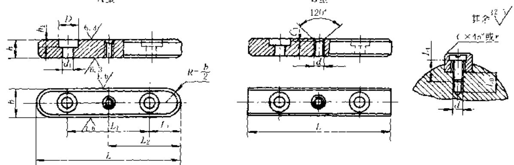

B型

标记示例:

国头导向平健(A) $\hat { t } \mathrm { ~  ~ \ s ~ } 1 6 \mathrm { m m }$ 、 $\hbar \approx 1 0 \mathrm { { m o n } }$ 、 $\pmb { \mathrm { \mathit { L } } } = 1 0 { \pmb { \mathrm { 0 } } } \mathbf { \mathrm { m m } }$ 键 $1 6 \times 1 0 0$ GB/T1097--1979  
平头导向平键(B型) $\dot { \boldsymbol { \ b } } = 1 6 \mathrm { m } \mathrm { m }$ 、 $\pmb { \hbar } = 1 0 \mathbf { m } \mathbf { m }$ 、 $\smash { \ell = 1 0 0 \mathrm { m m } }$ 键B16×100GB/T1097-1979

# 表4-3-22

/mm 

<table><tr><td rowspan=2 colspan=2>8</td><td rowspan=1 colspan=2>公称尺寸</td><td rowspan=1 colspan=1>8</td><td rowspan=1 colspan=1>10</td><td rowspan=1 colspan=1>12</td><td rowspan=1 colspan=1>14</td><td rowspan=1 colspan=1>16</td><td rowspan=1 colspan=1>18</td><td rowspan=1 colspan=1>20</td><td rowspan=1 colspan=1>22</td><td rowspan=1 colspan=1>25</td><td rowspan=1 colspan=1>28</td><td rowspan=1 colspan=1>32</td><td rowspan=1 colspan=1>36</td><td rowspan=1 colspan=1>40</td><td rowspan=1 colspan=1>45</td><td rowspan=1 colspan=2>公称尺寸</td><td rowspan=2 colspan=2>6</td></tr><tr><td rowspan=1 colspan=2>极限偏差（h9)</td><td rowspan=1 colspan=3>0-0.036</td><td rowspan=1 colspan=4>0-0.043</td><td rowspan=1 colspan=4>0-0.052</td><td rowspan=1 colspan=3>0-0.062</td><td rowspan=1 colspan=2>极限偏差（h9）</td></tr><tr><td rowspan=2 colspan=2>1</td><td rowspan=1 colspan=2>公称尺寸</td><td rowspan=1 colspan=1>7</td><td rowspan=1 colspan=1>8</td><td rowspan=1 colspan=1>8</td><td rowspan=1 colspan=1>9</td><td rowspan=1 colspan=1>10</td><td rowspan=1 colspan=1>1</td><td rowspan=1 colspan=1>12</td><td rowspan=1 colspan=1>14</td><td rowspan=1 colspan=1>14</td><td rowspan=1 colspan=1>16</td><td rowspan=1 colspan=1>18</td><td rowspan=1 colspan=1>20</td><td rowspan=1 colspan=2>2225</td><td rowspan=1 colspan=2>公称尺寸</td><td rowspan=2 colspan=2>h</td></tr><tr><td rowspan=1 colspan=2>极限偏差（h11）</td><td rowspan=1 colspan=5>0-0.090</td><td rowspan=1 colspan=6>0-0.110</td><td rowspan=1 colspan=3>0- 0.130</td><td rowspan=1 colspan=2>极限偏（h11）</td></tr><tr><td rowspan=1 colspan=4>C或</td><td rowspan=1 colspan=1>0.25~0.40</td><td rowspan=1 colspan=5>0.40-0.60</td><td rowspan=1 colspan=5>0.60~0.80</td><td rowspan=1 colspan=3>1.0~1.2</td><td rowspan=1 colspan=4>C或r</td></tr><tr><td rowspan=1 colspan=4>H，</td><td rowspan=1 colspan=2>2.4</td><td rowspan=1 colspan=1>3.0</td><td rowspan=1 colspan=2>3.5</td><td rowspan=1 colspan=1></td><td rowspan=1 colspan=2>4.5</td><td rowspan=1 colspan=2>6</td><td rowspan=1 colspan=1>7</td><td rowspan=1 colspan=3>8</td><td rowspan=1 colspan=4>h</td></tr><tr><td rowspan=1 colspan=4>d</td><td rowspan=1 colspan=2>M3</td><td rowspan=1 colspan=1>M4</td><td rowspan=1 colspan=2>M5</td><td rowspan=1 colspan=1></td><td rowspan=1 colspan=1>M6</td><td rowspan=1 colspan=1></td><td rowspan=1 colspan=2>M8</td><td rowspan=1 colspan=1>M10]</td><td rowspan=1 colspan=3>M10</td><td rowspan=1 colspan=4>d</td></tr><tr><td rowspan=1 colspan=4>a</td><td rowspan=1 colspan=2>3.4</td><td rowspan=1 colspan=1>4.5</td><td rowspan=1 colspan=2>5.5</td><td rowspan=1 colspan=1></td><td rowspan=1 colspan=1>6.6</td><td rowspan=1 colspan=1></td><td rowspan=1 colspan=2>9</td><td rowspan=1 colspan=1>1</td><td rowspan=1 colspan=3>1</td><td rowspan=1 colspan=4>山</td></tr><tr><td rowspan=1 colspan=4>D</td><td rowspan=1 colspan=2>6</td><td rowspan=1 colspan=1>8.s</td><td rowspan=1 colspan=2>10</td><td rowspan=1 colspan=1></td><td rowspan=1 colspan=1>12</td><td rowspan=1 colspan=1></td><td rowspan=1 colspan=2>15</td><td rowspan=1 colspan=1>18</td><td rowspan=1 colspan=3>18</td><td rowspan=1 colspan=4>D</td></tr><tr><td rowspan=1 colspan=2></td><td rowspan=1 colspan=2>G</td><td rowspan=1 colspan=2>0.3</td><td rowspan=1 colspan=3>0.5</td><td rowspan=1 colspan=1></td><td rowspan=1 colspan=2>0.5</td><td rowspan=1 colspan=2>0.5</td><td rowspan=1 colspan=1>0.5</td><td rowspan=1 colspan=3>0.5</td><td rowspan=1 colspan=4>G</td></tr><tr><td rowspan=1 colspan=2></td><td rowspan=1 colspan=2>L</td><td rowspan=1 colspan=1>7</td><td rowspan=1 colspan=1>8</td><td rowspan=1 colspan=3>10</td><td rowspan=1 colspan=1></td><td rowspan=1 colspan=2>12</td><td rowspan=1 colspan=2>15  T</td><td rowspan=1 colspan=1>18</td><td rowspan=1 colspan=3>22</td><td rowspan=1 colspan=4>L</td></tr><tr><td rowspan=1 colspan=4>螺钉（d×L）</td><td rowspan=1 colspan=1>M3x8</td><td rowspan=1 colspan=1>M3x10</td><td rowspan=1 colspan=1>M4</td><td rowspan=1 colspan=1>M5</td><td rowspan=1 colspan=1>M5</td><td rowspan=1 colspan=1>M6</td><td rowspan=1 colspan=1>M6x12</td><td rowspan=1 colspan=1>M6</td><td rowspan=1 colspan=1>M8</td><td rowspan=1 colspan=1>M8</td><td rowspan=1 colspan=1>M10M10</td><td rowspan=1 colspan=1>M10</td><td rowspan=1 colspan=1>M10</td><td rowspan=1 colspan=1>M10</td><td rowspan=1 colspan=4>螺钉（d×L）</td></tr><tr><td rowspan=1 colspan=1>L</td><td rowspan=1 colspan=1>L</td><td rowspan=1 colspan=1>L</td><td rowspan=1 colspan=1>L</td><td rowspan=1 colspan=2></td><td rowspan=1 colspan=1>向平</td><td rowspan=1 colspan=2>键（B型</td><td rowspan=1 colspan=1>）每</td><td rowspan=1 colspan=2>1000件的</td><td rowspan=1 colspan=2>重量=/</td><td rowspan=1 colspan=1>g</td><td rowspan=1 colspan=3></td><td rowspan=1 colspan=1>L</td><td rowspan=1 colspan=1>L</td><td rowspan=1 colspan=1>1</td><td rowspan=1 colspan=1>L</td></tr><tr><td rowspan=1 colspan=1>25</td><td rowspan=1 colspan=1>13</td><td rowspan=1 colspan=1>12.5</td><td rowspan=1 colspan=1>6</td><td rowspan=1 colspan=1>8.6</td><td rowspan=1 colspan=1>13.1</td><td rowspan=1 colspan=1>100</td><td rowspan=1 colspan=1>131</td><td rowspan=1 colspan=1>164:205</td><td rowspan=1 colspan=1>164:205</td><td rowspan=1 colspan=1>250</td><td rowspan=1 colspan=1>323</td><td rowspan=1 colspan=1>358</td><td rowspan=1 colspan=1>464</td><td rowspan=1 colspan=1>583</td><td rowspan=1 colspan=1>741</td><td rowspan=1 colspan=1>882</td><td rowspan=1 colspan=1>1143</td><td rowspan=1 colspan=1>80</td><td rowspan=1 colspan=1>70</td><td rowspan=1 colspan=1>30</td><td rowspan=1 colspan=1>140</td></tr><tr><td rowspan=1 colspan=1>28</td><td rowspan=1 colspan=1>14</td><td rowspan=1 colspan=1>14</td><td rowspan=1 colspan=1>7</td><td rowspan=1 colspan=1>9.9</td><td rowspan=1 colspan=1>15.0</td><td rowspan=1 colspan=1>16.5</td><td rowspan=1 colspan=1>151</td><td rowspan=1 colspan=1>189</td><td rowspan=1 colspan=1>236</td><td rowspan=1 colspan=1>288</td><td rowspan=1 colspan=1>372</td><td rowspan=1 colspan=1>410</td><td rowspan=1 colspan=1>534</td><td rowspan=1 colspan=1>673</td><td rowspan=1 colspan=1>854</td><td rowspan=1 colspan=1>{1021]</td><td rowspan=1 colspan=1>1319</td><td rowspan=1 colspan=1>90</td><td rowspan=1 colspan=1>80</td><td rowspan=1 colspan=1>35</td><td rowspan=1 colspan=1>160</td></tr><tr><td rowspan=1 colspan=1>32</td><td rowspan=1 colspan=1>16</td><td rowspan=1 colspan=1>16</td><td rowspan=1 colspan=1>8</td><td rowspan=1 colspan=1>11.7</td><td rowspan=1 colspan=1>17.5</td><td rowspan=1 colspan=1>20.6</td><td rowspan=1 colspan=1>11</td><td rowspan=1 colspan=1>214</td><td rowspan=1 colspan=1>267</td><td rowspan=1 colspan=1>326</td><td rowspan=1 colspan=1>420</td><td rowspan=1 colspan=1>475</td><td rowspan=1 colspan=1>604</td><td rowspan=1 colspan=1>764</td><td rowspan=1 colspan=1>967</td><td rowspan=1 colspan=1>1159</td><td rowspan=1 colspan=1>1496</td><td rowspan=1 colspan=1>100</td><td rowspan=1 colspan=1>90</td><td rowspan=1 colspan=1>40</td><td rowspan=1 colspan=1>180</td></tr><tr><td rowspan=1 colspan=1>36</td><td rowspan=1 colspan=1>18</td><td rowspan=1 colspan=1>18</td><td rowspan=1 colspan=1>9</td><td rowspan=1 colspan=1>13.4</td><td rowspan=1 colspan=1>20.0</td><td rowspan=1 colspan=1>23.1</td><td rowspan=1 colspan=1>27.6</td><td rowspan=1 colspan=1></td><td rowspan=1 colspan=1>298</td><td rowspan=1 colspan=1>364</td><td rowspan=1 colspan=1>469</td><td rowspan=1 colspan=1>519</td><td rowspan=1 colspan=1>675</td><td rowspan=1 colspan=1>854</td><td rowspan=1 colspan=1>1080</td><td rowspan=1 colspan=1>10801297</td><td rowspan=1 colspan=1>1673</td><td rowspan=1 colspan=1>110</td><td rowspan=1 colspan=1>100</td><td rowspan=1 colspan=1>45</td><td rowspan=1 colspan=1>200</td></tr><tr><td rowspan=1 colspan=1>40</td><td rowspan=1 colspan=1>20</td><td rowspan=1 colspan=1>20</td><td rowspan=1 colspan=1>10</td><td rowspan=1 colspan=1>15.2</td><td rowspan=1 colspan=1>22.5</td><td rowspan=1 colspan=1>26.2</td><td rowspan=1 colspan=1>32.0</td><td rowspan=1 colspan=1>~</td><td rowspan=1 colspan=1>~</td><td rowspan=1 colspan=1>401</td><td rowspan=1 colspan=1>517</td><td rowspan=1 colspan=1>574</td><td rowspan=1 colspan=1>746</td><td rowspan=1 colspan=1>945</td><td rowspan=1 colspan=1>1193</td><td rowspan=1 colspan=1>1435</td><td rowspan=1 colspan=1>1849</td><td rowspan=1 colspan=1>120</td><td rowspan=1 colspan=1>110</td><td rowspan=1 colspan=1>50</td><td rowspan=1 colspan=1>220</td></tr><tr><td rowspan=1 colspan=1>45</td><td rowspan=1 colspan=1>23</td><td rowspan=1 colspan=1>22.5</td><td rowspan=1 colspan=1>11</td><td rowspan=1 colspan=1>17.4</td><td rowspan=1 colspan=1>25.6</td><td rowspan=1 colspan=1>29.9</td><td rowspan=1 colspan=1>37.1</td><td rowspan=1 colspan=1>44.4</td><td rowspan=1 colspan=1></td><td rowspan=1 colspan=1></td><td rowspan=1 colspan=1>590</td><td rowspan=1 colspan=1>656</td><td rowspan=1 colspan=1>851</td><td rowspan=1 colspan=1>1080</td><td rowspan=1 colspan=1>136.3</td><td rowspan=1 colspan=1>1642</td><td rowspan=1 colspan=1>2114</td><td rowspan=1 colspan=1>140</td><td rowspan=1 colspan=1>125</td><td rowspan=1 colspan=1>55</td><td rowspan=1 colspan=1>250</td></tr><tr><td rowspan=1 colspan=1>50</td><td rowspan=1 colspan=1>26</td><td rowspan=1 colspan=1>25</td><td rowspan=1 colspan=1>12</td><td rowspan=1 colspan=1>19.6</td><td rowspan=1 colspan=1>28.8</td><td rowspan=1 colspan=1>33.7</td><td rowspan=1 colspan=1>41.9</td><td rowspan=1 colspan=1>51.1</td><td rowspan=1 colspan=1>64.4</td><td rowspan=1 colspan=1></td><td rowspan=1 colspan=1></td><td rowspan=1 colspan=1>738</td><td rowspan=1 colspan=1>956</td><td rowspan=1 colspan=1>1216</td><td rowspan=1 colspan=1>1533</td><td rowspan=1 colspan=1>18492</td><td rowspan=1 colspan=1>2379]</td><td rowspan=1 colspan=1>160</td><td rowspan=1 colspan=1>140</td><td rowspan=1 colspan=1>60</td><td rowspan=1 colspan=1>20</td></tr><tr><td rowspan=1 colspan=1>56</td><td rowspan=1 colspan=1>30</td><td rowspan=1 colspan=1>28</td><td rowspan=1 colspan=1>13</td><td rowspan=1 colspan=1>22.2</td><td rowspan=1 colspan=1>32.5</td><td rowspan=1 colspan=1>38.4</td><td rowspan=1 colspan=1>47.7</td><td rowspan=1 colspan=1>58.1</td><td rowspan=1 colspan=1>74.5</td><td rowspan=1 colspan=1>93.1</td><td rowspan=1 colspan=1></td><td rowspan=1 colspan=1></td><td rowspan=1 colspan=1>1097</td><td rowspan=1 colspan=1>1388</td><td rowspan=1 colspan=1>17592112</td><td rowspan=1 colspan=1>17592112</td><td rowspan=1 colspan=1>2715</td><td rowspan=1 colspan=1>180</td><td rowspan=1 colspan=1>160</td><td rowspan=1 colspan=1>70</td><td rowspan=1 colspan=1>320</td></tr><tr><td rowspan=1 colspan=1>63</td><td rowspan=1 colspan=1>35</td><td rowspan=1 colspan=1>31.5</td><td rowspan=1 colspan=1>14</td><td rowspan=1 colspan=1>25.2</td><td rowspan=1 colspan=1>36.9</td><td rowspan=1 colspan=1>43.3</td><td rowspan=1 colspan=1>54.3</td><td rowspan=1 colspan=1>66.9</td><td rowspan=1 colspan=1>84.7</td><td rowspan=1 colspan=1>106</td><td rowspan=1 colspan=1>137</td><td rowspan=1 colspan=1></td><td rowspan=1 colspan=1></td><td rowspan=1 colspan=1>1578</td><td rowspan=1 colspan=1>1985</td><td rowspan=1 colspan=1>19852387</td><td rowspan=1 colspan=1>|3066</td><td rowspan=1 colspan=1>200</td><td rowspan=1 colspan=1>180</td><td rowspan=1 colspan=1>8</td><td rowspan=1 colspan=1>360</td></tr><tr><td rowspan=1 colspan=1>70</td><td rowspan=1 colspan=1>40</td><td rowspan=1 colspan=1>35</td><td rowspan=1 colspan=1>15</td><td rowspan=1 colspan=1>28.4</td><td rowspan=1 colspan=1>41.4</td><td rowspan=1 colspan=1>48.8</td><td rowspan=1 colspan=1>61.6</td><td rowspan=1 colspan=1>76.2</td><td rowspan=1 colspan=1>96.3</td><td rowspan=1 colspan=1>119</td><td rowspan=1 colspan=1>154</td><td rowspan=1 colspan=1>165</td><td rowspan=1 colspan=1></td><td rowspan=1 colspan=1></td><td rowspan=1 colspan=1>2211</td><td rowspan=1 colspan=1>221126783</td><td rowspan=1 colspan=1>3439</td><td rowspan=1 colspan=1>220</td><td rowspan=1 colspan=1>200</td><td rowspan=1 colspan=1>9</td><td rowspan=1 colspan=1>400</td></tr><tr><td rowspan=1 colspan=1>80</td><td rowspan=1 colspan=1>48</td><td rowspan=1 colspan=1>40</td><td rowspan=1 colspan=1>16</td><td rowspan=1 colspan=1>32.6</td><td rowspan=1 colspan=1>47.6</td><td rowspan=1 colspan=1>56.3</td><td rowspan=1 colspan=1>71.5</td><td rowspan=1 colspan=1>88.8</td><td rowspan=1 colspan=1>112</td><td rowspan=1 colspan=1>137</td><td rowspan=1 colspan=1>177</td><td rowspan=1 colspan=1>194</td><td rowspan=1 colspan=1>253</td><td rowspan=1 colspan=1></td><td rowspan=1 colspan=1></td><td rowspan=1 colspan=1></td><td rowspan=1 colspan=1>3856</td><td rowspan=1 colspan=1>250</td><td rowspan=5 colspan=1>225</td><td rowspan=5 colspan=1>100</td><td rowspan=5 colspan=1>450</td></tr><tr><td rowspan=1 colspan=1>90</td><td rowspan=1 colspan=1>54</td><td rowspan=1 colspan=1>45</td><td rowspan=1 colspan=1>18</td><td rowspan=1 colspan=1>37.0</td><td rowspan=1 colspan=1>52.6</td><td rowspan=1 colspan=1>63.9</td><td rowspan=1 colspan=1>81.4</td><td rowspan=1 colspan=1>101</td><td rowspan=1 colspan=1>127</td><td rowspan=1 colspan=1>156</td><td rowspan=1 colspan=1>203</td><td rowspan=1 colspan=1>219</td><td rowspan=1 colspan=1>289</td><td rowspan=1 colspan=1>357</td><td rowspan=1 colspan=1></td><td rowspan=1 colspan=1></td><td rowspan=1 colspan=1></td><td rowspan=4 colspan=1></td></tr><tr><td rowspan=1 colspan=1>100</td><td rowspan=1 colspan=1>60</td><td rowspan=1 colspan=1>50</td><td rowspan=1 colspan=1>20</td><td rowspan=1 colspan=1>1</td><td rowspan=1 colspan=1>60.1</td><td rowspan=1 colspan=1>171.4</td><td rowspan=1 colspan=1>491.4</td><td rowspan=1 colspan=1>114</td><td rowspan=1 colspan=1>143</td><td rowspan=1 colspan=1>175</td><td rowspan=1 colspan=1>228</td><td rowspan=1 colspan=1>250</td><td rowspan=1 colspan=1>324</td><td rowspan=1 colspan=1>402</td><td rowspan=1 colspan=1>s1s</td><td rowspan=1 colspan=1>602</td><td rowspan=1 colspan=1></td></tr><tr><td rowspan=1 colspan=1>110</td><td rowspan=1 colspan=1>66</td><td rowspan=1 colspan=1>55</td><td rowspan=1 colspan=1>22</td><td rowspan=1 colspan=1>{</td><td rowspan=1 colspan=1>166.3</td><td rowspan=1 colspan=1>78.9</td><td rowspan=1 colspan=1>101</td><td rowspan=1 colspan=1>126</td><td rowspan=2 colspan=1>158181</td><td rowspan=2 colspan=1>194222</td><td rowspan=2 colspan=1>251287</td><td rowspan=2 colspan=1>274316</td><td rowspan=2 colspan=1>358410</td><td rowspan=2 colspan=1>447514</td><td rowspan=2 colspan=1>572657</td><td rowspan=2 colspan=1>675775</td><td rowspan=2 colspan=1>881014</td></tr><tr><td rowspan=1 colspan=1>125</td><td rowspan=1 colspan=1>75</td><td rowspan=1 colspan=1>62</td><td rowspan=1 colspan=1>25</td><td rowspan=1 colspan=1></td><td rowspan=1 colspan=1></td><td rowspan=1 colspan=1>89.2</td><td rowspan=1 colspan=1>116</td><td rowspan=1 colspan=1>145</td></tr><tr><td rowspan=1 colspan=4>对A型应或去的重量/kg</td><td rowspan=1 colspan=1>0.76</td><td rowspan=1 colspan=1>1.4</td><td rowspan=1 colspan=1>2.0</td><td rowspan=1 colspan=1>3.0</td><td rowspan=1 colspan=1>4.3</td><td rowspan=1 colspan=1>6.0</td><td rowspan=1 colspan=1>8</td><td rowspan=1 colspan=1>11</td><td rowspan=1 colspan=1>15</td><td rowspan=1 colspan=1>21</td><td rowspan=1 colspan=1>31</td><td rowspan=1 colspan=1>44</td><td rowspan=1 colspan=1>5g</td><td rowspan=1 colspan=1>85</td><td rowspan=1 colspan=4></td></tr></table>

注:1.左边的L系列查粗黑线下方的重量,右边的L系列查粗黑线上方的重量,2.当键长大于 $4 5 0 \mathrm { m m }$ 时,其长度按 $\{ \mathfrak { I B } / \mathbb { T } 3 2 \} - 1 9 8 0$ (优先数和优先数系)的K20系列选取,3.固定用螺钉应符合GB/T822--2000{十字槽网柱头螺钉或CB/T65-2000[开槽圆柱头螺钉」的规定、

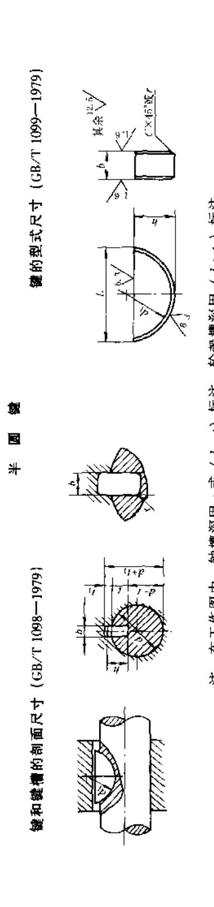

<table><tr><td rowspan=1 colspan=1>轴</td><td rowspan=1 colspan=1>d</td><td rowspan=1 colspan=1>键</td><td rowspan=1 colspan=13>键        植</td><td rowspan=1 colspan=1></td><td rowspan=1 colspan=3>键极限偏差</td><td rowspan=1 colspan=1>差</td><td rowspan=1 colspan=2></td><td rowspan=1 colspan=1></td><td rowspan=1 colspan=1>C</td><td rowspan=5 colspan=1>每1000件的重量/g</td></tr><tr><td rowspan=4 colspan=1>键传递扣矩</td><td rowspan=4 colspan=1>键定用</td><td rowspan=4 colspan=1>公称尺寸bxhxd</td><td rowspan=1 colspan=4>宽度</td><td rowspan=1 colspan=5>深</td><td rowspan=1 colspan=2>度</td><td rowspan=3 colspan=2>半径，</td><td rowspan=4 colspan=1>键宽b（h9）</td><td rowspan=4 colspan=3>高度h（h11）</td><td rowspan=4 colspan=1>直径d（h12）</td><td rowspan=4 colspan=2></td><td rowspan=4 colspan=1></td><td rowspan=4 colspan=1>最小最大</td></tr><tr><td rowspan=3 colspan=1>公</td><td rowspan=1 colspan=2>极限偏差</td><td rowspan=1 colspan=1></td><td rowspan=2 colspan=5>轴：</td><td rowspan=2 colspan=1></td><td rowspan=2 colspan=1>毂</td></tr><tr><td rowspan=1 colspan=1>般</td><td rowspan=1 colspan=1>联接</td><td rowspan=1 colspan=1>较紧键联接</td></tr><tr><td rowspan=1 colspan=1>轴N9</td><td rowspan=1 colspan=1>毂JS9</td><td rowspan=1 colspan=1>轴和毂P9</td><td rowspan=1 colspan=2>公称</td><td rowspan=1 colspan=3>极限偏差</td><td rowspan=1 colspan=1>公称守</td><td rowspan=1 colspan=1>极限偏差</td><td rowspan=1 colspan=1>最小最大</td><td rowspan=1 colspan=1>最大</td></tr><tr><td rowspan=1 colspan=1>自3~4</td><td rowspan=1 colspan=1>自3~4</td><td rowspan=1 colspan=1>1.0x 1.4×4</td><td rowspan=1 colspan=1>1.0</td><td rowspan=3 colspan=1>-0.004</td><td rowspan=4 colspan=1>±0.012</td><td rowspan=4 colspan=1>-0.006- 0.031</td><td rowspan=1 colspan=2>1.0</td><td rowspan=5 colspan=2>+0.10</td><td rowspan=5 colspan=1></td><td rowspan=3 colspan=1>0.60.8L</td><td rowspan=13 colspan=1>+0.10</td><td rowspan=1 colspan=1></td><td rowspan=1 colspan=1></td><td rowspan=1 colspan=1></td><td rowspan=1 colspan=3>0</td><td rowspan=1 colspan=1>00.120</td><td rowspan=1 colspan=2>3.9</td><td rowspan=7 colspan=1>0.160.25</td><td rowspan=7 colspan=1>0.160.25</td><td rowspan=1 colspan=1>0.031</td></tr><tr><td rowspan=1 colspan=1>>4~5</td><td rowspan=1 colspan=1>>4~6</td><td rowspan=1 colspan=1>1.5×2.6×7</td><td rowspan=1 colspan=1>1.5</td><td rowspan=2 colspan=2>2.01.8</td><td rowspan=5 colspan=1>0.080.16</td><td rowspan=5 colspan=1>0.080.16</td><td rowspan=6 colspan=1>0-0.025</td><td rowspan=2 colspan=3>-0.060</td><td rowspan=4 colspan=1>0-0.150</td><td rowspan=1 colspan=2>6.8</td><td rowspan=1 colspan=1>0153</td></tr><tr><td rowspan=1 colspan=1>5-6</td><td rowspan=1 colspan=1>26~8</td><td rowspan=1 colspan=1>2.0×2.6x7</td><td rowspan=1 colspan=1>2.0</td><td rowspan=1 colspan=2>6.8</td><td rowspan=1 colspan=1>0.204</td></tr><tr><td rowspan=1 colspan=1>>6~7</td><td rowspan=1 colspan=1>>8-10</td><td rowspan=1 colspan=1>2.0×3.7×10</td><td rowspan=1 colspan=1>2.0</td><td rowspan=1 colspan=1>-0.029</td><td rowspan=1 colspan=2>2.9</td><td rowspan=9 colspan=1></td><td rowspan=10 colspan=1>T国1.41.41.81.82.312.3国2.8</td><td rowspan=3 colspan=3>0-0.075</td><td rowspan=1 colspan=2>9.7</td><td rowspan=1 colspan=1>0.414</td></tr><tr><td rowspan=1 colspan=1>>7-8</td><td rowspan=1 colspan=1>>10-12]</td><td rowspan=1 colspan=1>2.5x3.7x10</td><td rowspan=1 colspan=1>2.5</td><td rowspan=2 colspan=1></td><td rowspan=3 colspan=1></td><td rowspan=3 colspan=1></td><td rowspan=1 colspan=2>2.7</td><td rowspan=1 colspan=1>2.7</td><td rowspan=1 colspan=2></td><td rowspan=1 colspan=2>9.7</td><td rowspan=1 colspan=1>0.518</td></tr><tr><td rowspan=1 colspan=1>>8~10</td><td rowspan=1 colspan=1>>12~15</td><td rowspan=1 colspan=1>3.0x5.0x13</td><td rowspan=1 colspan=1>3.0</td><td rowspan=1 colspan=2>3.8</td><td rowspan=7 colspan=2>+0.20</td><td rowspan=3 colspan=1>0-0.180</td><td rowspan=1 colspan=2>12.7</td><td rowspan=1 colspan=1></td><td rowspan=1 colspan=1>1.10</td></tr><tr><td rowspan=1 colspan=1>10~12</td><td rowspan=1 colspan=1>215-18</td><td rowspan=1 colspan=1>3.0×6.5×16</td><td rowspan=1 colspan=1>30</td><td rowspan=1 colspan=1></td><td rowspan=1 colspan=2>5.3</td><td rowspan=1 colspan=1></td><td rowspan=4 colspan=1>0.160.25</td><td rowspan=4 colspan=1>0.160.25</td><td rowspan=8 colspan=3>0-0.090</td><td rowspan=1 colspan=2>15.7</td><td rowspan=1 colspan=1>1.80</td></tr><tr><td rowspan=1 colspan=1>>12~14</td><td rowspan=1 colspan=1>>18-20</td><td rowspan=1 colspan=1>4.0×6.5×16</td><td rowspan=1 colspan=1>4.0</td><td rowspan=5 colspan=1>0-0.030</td><td rowspan=5 colspan=1>±0.015</td><td rowspan=2 colspan=1></td><td rowspan=1 colspan=2>5.0</td><td rowspan=7 colspan=1>0-0.030</td><td rowspan=1 colspan=2>15.7</td><td rowspan=3 colspan=1></td><td rowspan=3 colspan=1></td><td rowspan=1 colspan=1>2.40</td></tr><tr><td rowspan=1 colspan=1>>14-16>20~22</td><td rowspan=1 colspan=1>>14-16>20~22</td><td rowspan=1 colspan=1>4.0×7.5× 19</td><td rowspan=1 colspan=1>4.0</td><td rowspan=1 colspan=2>6.0</td><td rowspan=1 colspan=1>0-0.210</td><td rowspan=1 colspan=2>18.6</td><td rowspan=1 colspan=1>3.27</td></tr><tr><td rowspan=1 colspan=1>>16-18</td><td rowspan=1 colspan=1>> 22~25</td><td rowspan=1 colspan=1>5.0×6.5× 16</td><td rowspan=1 colspan=1>5.0</td><td rowspan=3 colspan=1>-0.012-0.042</td><td rowspan=1 colspan=2>4.5</td><td rowspan=1 colspan=1>0-0.180</td><td rowspan=1 colspan=2>15.7</td><td rowspan=1 colspan=1>0.40</td><td rowspan=1 colspan=1>3.01</td></tr><tr><td rowspan=1 colspan=1>>18-20</td><td rowspan=1 colspan=1>>25~28</td><td rowspan=1 colspan=1>5.0×7.5×19</td><td rowspan=1 colspan=1>5.0</td><td rowspan=2 colspan=2>5.57.0</td><td rowspan=3 colspan=1></td><td rowspan=3 colspan=1></td><td rowspan=5 colspan=1>0-0 210</td><td rowspan=1 colspan=2>18.6</td><td rowspan=4 colspan=1></td><td rowspan=1 colspan=1></td><td rowspan=1 colspan=1>4.09</td></tr><tr><td rowspan=1 colspan=1>>20~22</td><td rowspan=1 colspan=1>>28~32</td><td rowspan=1 colspan=1>5.0×9.0×22</td><td rowspan=1 colspan=1>5.0</td><td rowspan=1 colspan=2>21.6</td><td rowspan=3 colspan=1></td><td rowspan=1 colspan=1>5.73</td></tr><tr><td rowspan=1 colspan=1>22~25</td><td rowspan=1 colspan=1>>32-36</td><td rowspan=1 colspan=1>6.0x9.0x22</td><td rowspan=1 colspan=1>6.0</td><td rowspan=2 colspan=1></td><td rowspan=2 colspan=1></td><td rowspan=2 colspan=1></td><td rowspan=1 colspan=2>6.5</td><td rowspan=4 colspan=2>+0.30</td><td rowspan=4 colspan=1></td><td rowspan=1 colspan=2>21.6</td><td rowspan=1 colspan=1>6.88</td></tr><tr><td rowspan=1 colspan=1>25</td><td rowspan=1 colspan=1>>36-40</td><td rowspan=1 colspan=1>6.0×10.0×25</td><td rowspan=1 colspan=1>6.0</td><td rowspan=1 colspan=2>7.5</td><td rowspan=3 colspan=1>2.8[3.33.3</td><td rowspan=3 colspan=1>+0.20</td><td rowspan=3 colspan=1>0.250.40</td><td rowspan=3 colspan=1>0.40</td><td rowspan=1 colspan=2>24.5</td><td rowspan=1 colspan=1>8.64</td></tr><tr><td rowspan=1 colspan=1>28-32</td><td rowspan=1 colspan=1>40</td><td rowspan=1 colspan=1>8.0×11.0×28</td><td rowspan=1 colspan=1>8.0</td><td rowspan=1 colspan=1>0</td><td rowspan=2 colspan=1>±0.018</td><td rowspan=2 colspan=1>-0.015-0.05]</td><td rowspan=1 colspan=2>8.0</td><td rowspan=2 colspan=1>0-0.036</td><td rowspan=2 colspan=3>00.110</td><td rowspan=2 colspan=2>27.431.4</td><td rowspan=2 colspan=1>10.400.60</td><td rowspan=2 colspan=1>10.400.60</td><td rowspan=1 colspan=1>14.1</td></tr><tr><td rowspan=1 colspan=1>>32~38</td><td rowspan=1 colspan=1></td><td rowspan=1 colspan=1>10.0× 13.0× 32</td><td rowspan=1 colspan=1>10.0</td><td rowspan=1 colspan=1>-0.036</td><td rowspan=1 colspan=2>10.0</td><td rowspan=1 colspan=1>00.250</td><td rowspan=1 colspan=1>19.3</td></tr></table>

厦公称 和度对 的面 12 3

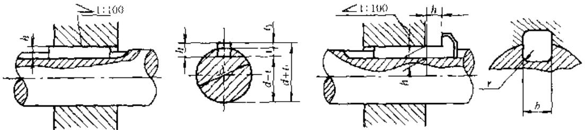

楔键和键槽的剖面尺寸(GB/T1563—1979)

表4-3-24

<table><tr><td rowspan=1 colspan=1>轴经</td><td rowspan=1 colspan=1>捷</td><td rowspan=1 colspan=11>键      槽</td></tr><tr><td rowspan=3 colspan=1>d</td><td rowspan=3 colspan=1>bxh</td><td rowspan=1 colspan=4>宽     度</td><td rowspan=1 colspan=5>深      度</td><td rowspan=2 colspan=2>半稀广</td></tr><tr><td rowspan=2 colspan=1>3</td><td rowspan=2 colspan=3>轴和毂极限偏差（D10)</td><td rowspan=1 colspan=2>毯</td><td rowspan=1 colspan=3>毂</td></tr><tr><td rowspan=1 colspan=1>：</td><td rowspan=1 colspan=1>极限偏差</td><td rowspan=1 colspan=1>1</td><td rowspan=1 colspan=2>极限偏差</td><td rowspan=1 colspan=2>最小       最大</td></tr><tr><td rowspan=1 colspan=1>6~8</td><td rowspan=1 colspan=1>2x2</td><td rowspan=1 colspan=1>2</td><td rowspan=1 colspan=3>+0.060</td><td rowspan=1 colspan=1>1.2</td><td rowspan=2 colspan=1></td><td rowspan=1 colspan=1>0.5</td><td rowspan=3 colspan=2>+0.10</td><td rowspan=5 colspan=1>0.080.16</td><td rowspan=6 colspan=1>0.160.25</td></tr><tr><td rowspan=1 colspan=1>>8~10</td><td rowspan=1 colspan=1>3x3</td><td rowspan=1 colspan=1>3</td><td rowspan=1 colspan=3>+ 0.020</td><td rowspan=1 colspan=1>1.8</td><td rowspan=1 colspan=1>0.9</td></tr><tr><td rowspan=1 colspan=1>> 10~12</td><td rowspan=1 colspan=1>4×4</td><td rowspan=1 colspan=1>4</td><td rowspan=1 colspan=3>+0.078</td><td rowspan=1 colspan=1>25</td><td rowspan=3 colspan=1>+0.10</td><td rowspan=1 colspan=1>1.2</td><td rowspan=1 colspan=1>+0.10</td></tr><tr><td rowspan=1 colspan=1>> 12~17</td><td rowspan=1 colspan=1>5×5</td><td rowspan=1 colspan=1>5</td><td rowspan=1 colspan=3>+0.078- 0.030</td><td rowspan=1 colspan=1>3.0</td><td rowspan=1 colspan=1>1.?</td><td rowspan=2 colspan=2></td><td rowspan=1 colspan=1></td></tr><tr><td rowspan=1 colspan=1>> 17~22</td><td rowspan=1 colspan=1>6xb</td><td rowspan=1 colspan=1>6</td><td rowspan=1 colspan=3></td><td rowspan=1 colspan=1>3.5</td><td rowspan=1 colspan=1>2.2</td></tr><tr><td rowspan=1 colspan=1>> 22~30</td><td rowspan=1 colspan=1>8x7</td><td rowspan=1 colspan=1>8</td><td rowspan=1 colspan=3>+ 0.098</td><td rowspan=1 colspan=1>4.0</td><td rowspan=4 colspan=1></td><td rowspan=1 colspan=1>2.4</td><td rowspan=11 colspan=2>+0.20</td><td rowspan=1 colspan=1></td></tr><tr><td rowspan=1 colspan=1>>30~38</td><td rowspan=1 colspan=1>10×8</td><td rowspan=1 colspan=1>10</td><td rowspan=1 colspan=3>+ 0.040</td><td rowspan=1 colspan=1>5.0</td><td rowspan=1 colspan=1>2.4</td><td rowspan=5 colspan=1>0.25</td><td rowspan=5 colspan=1>0.40</td></tr><tr><td rowspan=1 colspan=1>>38~44</td><td rowspan=1 colspan=1>12 ×8</td><td rowspan=1 colspan=1>12</td><td rowspan=1 colspan=3></td><td rowspan=1 colspan=1>5.0</td><td rowspan=1 colspan=1>2.4</td></tr><tr><td rowspan=1 colspan=1>> 44~50</td><td rowspan=1 colspan=1>14x9</td><td rowspan=1 colspan=1>l4</td><td rowspan=1 colspan=3>+0.120</td><td rowspan=1 colspan=1>5.5</td><td rowspan=1 colspan=1>2.9</td></tr><tr><td rowspan=1 colspan=1>> 50~58</td><td rowspan=1 colspan=1>16 × 10</td><td rowspan=1 colspan=1>16</td><td rowspan=1 colspan=3>+ 0.050</td><td rowspan=1 colspan=1>6.0</td><td rowspan=4 colspan=1>+0.20</td><td rowspan=1 colspan=1>3.4</td></tr><tr><td rowspan=1 colspan=1>> 58~65</td><td rowspan=1 colspan=1>18×11</td><td rowspan=1 colspan=1>18</td><td rowspan=1 colspan=3></td><td rowspan=1 colspan=1>7.0</td><td rowspan=1 colspan=1>3.4</td></tr><tr><td rowspan=1 colspan=1>>65~75</td><td rowspan=1 colspan=1>20×12</td><td rowspan=1 colspan=1>20</td><td rowspan=1 colspan=3></td><td rowspan=1 colspan=1>7.5</td><td rowspan=1 colspan=1>3.9</td><td rowspan=5 colspan=1>0.40</td><td rowspan=5 colspan=1>0.60</td></tr><tr><td rowspan=1 colspan=1>>75~85</td><td rowspan=1 colspan=1>22 x 14</td><td rowspan=1 colspan=1>22</td><td rowspan=1 colspan=3>+0.149</td><td rowspan=1 colspan=1>9.0</td><td rowspan=1 colspan=1>4.4</td></tr><tr><td rowspan=1 colspan=1>>85~95</td><td rowspan=1 colspan=1>25 ×14</td><td rowspan=1 colspan=1>25</td><td rowspan=1 colspan=3>+ 0.065</td><td rowspan=1 colspan=1>9.0</td><td rowspan=3 colspan=1></td><td rowspan=1 colspan=1>4.4</td></tr><tr><td rowspan=1 colspan=1>>95~110</td><td rowspan=1 colspan=1>28×16</td><td rowspan=1 colspan=1>28</td><td rowspan=1 colspan=3></td><td rowspan=1 colspan=1>10.0</td><td rowspan=1 colspan=1>5.4</td></tr><tr><td rowspan=1 colspan=1>>110~130</td><td rowspan=1 colspan=1>32 × 18</td><td rowspan=1 colspan=1>32</td><td rowspan=1 colspan=3></td><td rowspan=1 colspan=1>11.0</td><td rowspan=1 colspan=1>6.4</td></tr><tr><td rowspan=1 colspan=1>> 130~150</td><td rowspan=1 colspan=1>36× 20</td><td rowspan=1 colspan=1>36</td><td rowspan=1 colspan=3>+0.180</td><td rowspan=1 colspan=1>12 0</td><td rowspan=3 colspan=1></td><td rowspan=1 colspan=1>7.</td><td rowspan=4 colspan=2></td><td rowspan=4 colspan=1>0.70</td><td rowspan=4 colspan=1>1.0</td></tr><tr><td rowspan=1 colspan=1>> 150~170</td><td rowspan=1 colspan=1>40× 22</td><td rowspan=1 colspan=1>40</td><td rowspan=1 colspan=2>+ 0.080</td><td rowspan=1 colspan=1>+0.180+ 0.080</td><td rowspan=1 colspan=1>13.0</td><td rowspan=1 colspan=1>8.1</td></tr><tr><td rowspan=1 colspan=1>> 170~200</td><td rowspan=1 colspan=1>45 x 25</td><td rowspan=1 colspan=1>45</td><td rowspan=2 colspan=3></td><td rowspan=1 colspan=1>13.0</td><td rowspan=1 colspan=1>9.1</td></tr><tr><td rowspan=1 colspan=1>>200~230</td><td rowspan=1 colspan=1>50× 28</td><td rowspan=1 colspan=1>50</td><td rowspan=1 colspan=1>17.0</td><td rowspan=1 colspan=1></td><td rowspan=1 colspan=1>10.1</td></tr><tr><td rowspan=1 colspan=1>>230~260</td><td rowspan=1 colspan=1>56 × 32</td><td rowspan=1 colspan=1>56</td><td rowspan=1 colspan=3></td><td rowspan=1 colspan=1>20.0</td><td rowspan=2 colspan=1>+0.30</td><td rowspan=1 colspan=1>11.1</td><td rowspan=6 colspan=2>+0.30</td><td rowspan=3 colspan=1>1.2</td><td rowspan=3 colspan=1>1.6</td></tr><tr><td rowspan=1 colspan=1>>260~290</td><td rowspan=1 colspan=1>63×32</td><td rowspan=1 colspan=1>63</td><td rowspan=1 colspan=3>+ 0.220</td><td rowspan=1 colspan=1>20.0</td><td rowspan=1 colspan=1>11.1</td></tr><tr><td rowspan=1 colspan=1>>290~330</td><td rowspan=1 colspan=1>70x 36</td><td rowspan=1 colspan=1>70</td><td rowspan=1 colspan=3>+ 0.100</td><td rowspan=1 colspan=1>22.0</td><td rowspan=4 colspan=1></td><td rowspan=1 colspan=1>131</td></tr><tr><td rowspan=1 colspan=1>> 330~380</td><td rowspan=1 colspan=1>80× 40</td><td rowspan=1 colspan=1>80</td><td rowspan=1 colspan=3></td><td rowspan=1 colspan=1>25.0</td><td rowspan=1 colspan=1>14.1</td><td rowspan=3 colspan=1>2.0</td><td rowspan=3 colspan=1>2.5</td></tr><tr><td rowspan=1 colspan=1>> 380~440</td><td rowspan=1 colspan=1>90×45</td><td rowspan=1 colspan=1>90</td><td rowspan=1 colspan=3>+ 0.260</td><td rowspan=1 colspan=1>28.0</td><td rowspan=1 colspan=1>16.1</td></tr><tr><td rowspan=1 colspan=1>> 440~500</td><td rowspan=1 colspan=1>100× 50</td><td rowspan=1 colspan=1>100</td><td rowspan=1 colspan=3>+ 0.120</td><td rowspan=1 colspan=1>31.0</td><td rowspan=1 colspan=1>18.1</td></tr></table>

注;1、在工作图中,轴携深用:或(d-x)标注,轮毅槽深用(d+r)标注。2. $( \pmb { d } + \pmb { \ t } _ { 1 } )$ 及 $\ell _ { \parallel }$ 表示大端轮毂槽深度,3.表中(d-t)和(d+t)两组组合尺寸的极限偏差按相应的:和t,的极限偏差选取,但(d-t)的极限偏差值应取负号(-)。

<table><tr><td rowspan=4 colspan=1>宽</td><td rowspan=1 colspan=1></td><td rowspan=1 colspan=1>h</td><td rowspan=1 colspan=1>2</td><td rowspan=1 colspan=1>3</td><td rowspan=1 colspan=1>4</td><td rowspan=1 colspan=2>5    6</td><td rowspan=1 colspan=2>8</td><td rowspan=1 colspan=1>10</td><td rowspan=1 colspan=2>12  14</td><td rowspan=1 colspan=3>1  18</td><td rowspan=1 colspan=6>20 22  25</td><td rowspan=1 colspan=3>3236</td><td rowspan=1 colspan=2>4550</td><td rowspan=1 colspan=1>56</td><td rowspan=1 colspan=2>63 70</td><td rowspan=1 colspan=1>80</td><td rowspan=1 colspan=2>90100</td><td rowspan=1 colspan=2>h</td><td></td></tr><tr><td rowspan=3 colspan=1>极限</td><td rowspan=3 colspan=1>（h9）</td><td rowspan=3 colspan=1>0-0.025</td><td rowspan=3 colspan=1>-0.025</td><td rowspan=3 colspan=1>0</td><td rowspan=3 colspan=2>-0.030</td><td rowspan=3 colspan=2>0-0.036</td><td></td><td></td><td></td><td></td><td></td><td></td><td></td><td></td><td></td><td></td><td></td><td></td><td></td><td></td><td></td><td></td><td></td><td></td><td></td><td></td><td></td><td></td><td></td><td></td><td></td><td></td></tr><tr><td></td><td></td><td></td><td></td><td></td><td></td><td></td><td></td><td></td><td></td><td></td><td></td><td></td><td></td><td></td><td></td><td></td><td></td><td></td><td></td><td></td><td></td><td></td><td></td><td></td><td rowspan=2 colspan=1>商厦</td></tr><tr><td rowspan=1 colspan=1>-0.036</td><td rowspan=1 colspan=2>0-0.043</td><td rowspan=1 colspan=3></td><td rowspan=1 colspan=6>0-0.052</td><td rowspan=1 colspan=3>0-0.062</td><td rowspan=1 colspan=2></td><td rowspan=1 colspan=1></td><td rowspan=1 colspan=2>00.074</td><td rowspan=1 colspan=1></td><td rowspan=1 colspan=2>0-0.087</td><td rowspan=1 colspan=2>极限偏（9）</td></tr><tr><td rowspan=2 colspan=1>高度</td><td rowspan=1 colspan=1></td><td rowspan=1 colspan=1>h</td><td rowspan=1 colspan=1>2</td><td rowspan=1 colspan=1>3</td><td rowspan=1 colspan=1>4</td><td rowspan=1 colspan=1>5</td><td rowspan=1 colspan=1>6</td><td rowspan=1 colspan=2>7</td><td rowspan=1 colspan=1>8</td><td rowspan=1 colspan=2>8   9</td><td rowspan=1 colspan=1>10</td><td rowspan=1 colspan=2>11</td><td rowspan=1 colspan=2>12</td><td rowspan=1 colspan=3>4 14</td><td rowspan=1 colspan=1>16</td><td rowspan=1 colspan=1>18</td><td rowspan=1 colspan=1>20</td><td rowspan=1 colspan=1>22</td><td rowspan=1 colspan=2>25 28</td><td rowspan=1 colspan=1>32</td><td rowspan=1 colspan=1>32</td><td rowspan=1 colspan=1>36</td><td rowspan=1 colspan=1>40</td><td rowspan=1 colspan=1>45</td><td rowspan=1 colspan=1>50</td><td rowspan=1 colspan=2>h</td><td rowspan=2 colspan=1>高</td></tr><tr><td rowspan=1 colspan=2>极限偏差（h11）</td><td rowspan=1 colspan=1>0</td><td rowspan=1 colspan=1>-0.060</td><td rowspan=1 colspan=1>0</td><td rowspan=1 colspan=2>-0.075</td><td rowspan=1 colspan=2></td><td rowspan=1 colspan=4>0-0.090</td><td rowspan=1 colspan=7>0-0.510</td><td rowspan=1 colspan=2></td><td rowspan=1 colspan=1></td><td rowspan=1 colspan=1>0-0.130</td><td rowspan=1 colspan=2></td><td rowspan=1 colspan=1></td><td rowspan=1 colspan=1></td><td rowspan=1 colspan=1>00.160</td><td rowspan=1 colspan=1></td><td rowspan=1 colspan=2></td><td rowspan=1 colspan=2>极限偏（hi</td></tr><tr><td rowspan=1 colspan=1></td><td rowspan=1 colspan=2>C或</td><td rowspan=1 colspan=1></td><td rowspan=1 colspan=1>16~0.</td><td rowspan=1 colspan=1>25</td><td rowspan=1 colspan=2>0.25~0.40</td><td rowspan=1 colspan=2>40</td><td rowspan=1 colspan=4>0.40-0.60</td><td rowspan=1 colspan=7>0.60-0.80</td><td rowspan=1 colspan=2>80</td><td rowspan=1 colspan=1></td><td rowspan=1 colspan=1>1.0</td><td rowspan=1 colspan=2>1.2</td><td rowspan=1 colspan=1></td><td rowspan=1 colspan=1>6~2</td><td rowspan=1 colspan=1>D</td><td rowspan=1 colspan=1>2</td><td rowspan=1 colspan=2>2.5-3.0</td><td rowspan=1 colspan=2></td><td rowspan=1 colspan=1>，</td></tr><tr><td rowspan=1 colspan=1></td><td rowspan=2 colspan=2>长度极偏差（h14）</td><td rowspan=2 colspan=30>平头普通模键（B型）1000件的重量=/kg0.1850.418</td><td rowspan=1 colspan=2>长</td><td rowspan=1 colspan=1>度</td></tr><tr><td rowspan=1 colspan=1>L</td><td rowspan=1 colspan=2>L</td><td rowspan=1 colspan=1>极限偏（b14）</td></tr><tr><td rowspan=21 colspan=1>681012141618203236404550</td><td rowspan=3 colspan=2>00.36</td><td rowspan=3 colspan=1>0.146</td><td rowspan=2 colspan=1>0.418</td><td rowspan=1 colspan=1></td><td rowspan=2 colspan=1></td><td rowspan=5 colspan=1>8.8</td><td rowspan=5 colspan=2>28.333.237.0</td><td rowspan=5 colspan=1>42.147.753.358.8</td><td rowspan=5 colspan=1>50.557.364.070.7</td><td rowspan=5 colspan=1>66.575.684.610893.4120</td><td rowspan=18 colspan=1>84.9984.610893.412013048164185206</td><td rowspan=19 colspan=2>06319134148162183204231257282</td><td rowspan=21 colspan=2>128146164180198224249281314346376</td><td rowspan=22 colspan=2>165187211233256289321365407449490549</td><td rowspan=23 colspan=1>186213243264288325368410460507552610689</td><td rowspan=23 colspan=1>274308341374423470535s976597218118991014</td><td rowspan=23 colspan=1>3974394825466086917738549341052116813091455</td><td rowspan=23 colspan=1>5516056847638689741074117213221469166318392021</td><td rowspan=23 colspan=1>675741840936106511891317144416321807203622682509</td><td rowspan=23 colspan=1>947[107412051365153316991855[2100233226282931|32483614</td><td rowspan=23 colspan=1>1346150217081916212123252627292632943678408645525009</td><td rowspan=23 colspan=1>190821802445270429693361374242454748524158576442</td><td rowspan=23 colspan=1>2453275030463340378042104780534258966589_7248</td><td rowspan=23 colspan=1>3471385442194771532460006722747183469203</td><td rowspan=23 colspan=1>48955369608467847667858195501066411775</td><td rowspan=23 colspan=1>6819772786239749j10917]1215513585</td><td rowspan=23 colspan=1>95651064312080135341507216870</td><td rowspan=23 colspan=2>708090100110125140160180200220250280320360400450500</td><td rowspan=2 colspan=1>0~D.74</td></tr><tr><td rowspan=1 colspan=1>0.99</td></tr><tr><td rowspan=21 colspan=1>0.3650.8310.4240.9660.480.5391.230.7861.36</td><td rowspan=21 colspan=1>0.3650.8310.4240.9661.100.5391.230.7861.361.491.6911.882.242.49</td><td rowspan=21 colspan=1>1.241.481.731.972.212.442.683.043.393.864.324.95.35</td><td rowspan=3 colspan=1>1.942.32</td><td rowspan=3 colspan=1></td><td></td></tr><tr><td rowspan=7 colspan=2>0-0.43</td><td></td></tr><tr><td rowspan=3 colspan=1>0~0.87</td></tr><tr><td rowspan=18 colspan=1>23.093.473.844.2214.795.356.086.817.548.439.710.4</td><td rowspan=18 colspan=1>3.894.465.015.566.16.917.738.799.910.812.213.515.16.9</td><td rowspan=1 colspan=2></td><td rowspan=2 colspan=1></td><td></td><td></td><td></td></tr><tr><td rowspan=6 colspan=1>64.3</td><td rowspan=9 colspan=1>77.286.897.0</td><td rowspan=11 colspan=1>102115127145</td></tr><tr><td rowspan=1 colspan=2></td><td></td></tr><tr><td rowspan=4 colspan=2>7.818.67</td><td rowspan=4 colspan=1></td><td></td></tr><tr><td rowspan=4 colspan=1>0-1.0</td></tr><tr><td rowspan=6 colspan=2>四-0.52</td></tr><tr><td rowspan=12 colspan=2>7.818.679.5210.812.113.715.417.119.2[21.223.626.5</td></tr><tr><td rowspan=1 colspan=1>13.615.5</td><td rowspan=1 colspan=1></td></tr><tr><td rowspan=4 colspan=1>20.723.4</td><td rowspan=4 colspan=1></td><td></td></tr><tr><td rowspan=3 colspan=1>0-1.15</td></tr><tr><td rowspan=8 colspan=1>20.723.426.529.332.936.540.6455</td></tr><tr><td rowspan=5 colspan=2>0- 0.62</td></tr><tr><td rowspan=1 colspan=1>34938.7</td><td rowspan=1 colspan=1></td><td rowspan=1 colspan=1>0-1.30</td></tr><tr><td rowspan=1 colspan=1>55.2</td><td rowspan=1 colspan=1></td><td></td></tr><tr><td rowspan=4 colspan=2>75.984.795.2</td><td rowspan=2 colspan=1>.9</td><td rowspan=2 colspan=1></td><td></td></tr><tr><td rowspan=3 colspan=1>0-1.400155.</td></tr><tr><td rowspan=2 colspan=1>5663</td><td rowspan=2 colspan=2>0-0.74</td><td rowspan=2 colspan=2>102.8115.s</td><td rowspan=1 colspan=2></td></tr><tr><td rowspan=1 colspan=2>148</td></tr><tr><td rowspan=1 colspan=1></td><td rowspan=1 colspan=2>对A型应减去的重/g</td><td rowspan=1 colspan=1>0.0130.045</td><td rowspan=1 colspan=1>0.0130.045</td><td rowspan=1 colspan=1>0.1</td><td rowspan=1 colspan=1>0.21</td><td rowspan=1 colspan=1>0.36</td><td rowspan=1 colspan=2>0.76</td><td rowspan=1 colspan=1>i.4</td><td rowspan=1 colspan=1>2.0</td><td rowspan=1 colspan=1>3</td><td rowspan=1 colspan=1>4.3</td><td rowspan=1 colspan=2>6.0</td><td rowspan=1 colspan=2>8.0</td><td rowspan=1 colspan=2>11</td><td rowspan=1 colspan=1>15</td><td rowspan=1 colspan=1>21</td><td rowspan=1 colspan=1>31</td><td rowspan=1 colspan=1>44</td><td rowspan=1 colspan=1>59</td><td rowspan=1 colspan=1>85：</td><td rowspan=1 colspan=1>118</td><td rowspan=1 colspan=1>169</td><td rowspan=1 colspan=1>214</td><td rowspan=1 colspan=1>297</td><td rowspan=1 colspan=1>431</td><td rowspan=1 colspan=1>614</td><td rowspan=1 colspan=1>842</td><td></td><td rowspan=1 colspan=2>对A型应去的重量/kg</td></tr><tr><td rowspan=1 colspan=3>对C型应去的重/kg</td><td rowspan=1 colspan=1>0.007</td><td rowspan=1 colspan=1>0.023</td><td rowspan=1 colspan=1>0.055</td><td rowspan=1 colspan=1>0.105</td><td rowspan=1 colspan=1>0.18</td><td rowspan=1 colspan=2>0.38</td><td rowspan=1 colspan=1>0.7</td><td rowspan=1 colspan=1>1.0</td><td rowspan=1 colspan=1>1.5</td><td rowspan=1 colspan=1>2.15</td><td rowspan=1 colspan=2>3.0</td><td rowspan=1 colspan=2>4.0</td><td rowspan=1 colspan=2>5.s</td><td rowspan=1 colspan=1>7.5</td><td rowspan=1 colspan=1>10.5</td><td rowspan=1 colspan=1>15.5</td><td rowspan=1 colspan=1>22</td><td rowspan=1 colspan=1>29.5</td><td rowspan=1 colspan=1>42.5</td><td rowspan=1 colspan=1>59</td><td rowspan=1 colspan=1>84.5</td><td rowspan=1 colspan=1>107</td><td rowspan=1 colspan=1>148.5</td><td rowspan=1 colspan=1>215.5</td><td rowspan=1 colspan=1>307</td><td rowspan=1 colspan=1>421</td><td></td><td rowspan=1 colspan=2>对C型应去的重量/kg</td></tr><tr><td rowspan=1 colspan=3></td><td rowspan=1 colspan=1></td><td rowspan=1 colspan=1></td><td rowspan=1 colspan=1></td><td rowspan=1 colspan=1></td><td></td><td></td><td></td><td></td><td></td><td></td><td></td><td></td><td></td><td></td><td></td><td></td><td></td><td></td><td></td><td></td><td></td><td></td><td></td><td></td><td></td><td></td><td></td><td></td><td></td><td></td><td></td><td></td><td></td></tr></table>

<table><tr><td>宽度</td><td>b</td><td>4</td><td>5</td><td>6 8 0</td><td>10</td><td>12</td><td>14</td><td>16</td><td>18 20</td><td>222528</td><td>32</td><td>36</td><td>40</td><td>45</td><td>50 56</td><td>63</td><td></td><td>70 80</td><td></td><td>90 100</td><td></td><td></td><td></td><td>b</td></tr><tr><td></td><td>极限偏差</td><td colspan="3">0</td><td></td><td colspan="2">0</td><td></td><td colspan="2"></td><td></td><td></td><td>0</td><td></td><td></td><td></td><td></td><td>0</td><td></td><td></td><td>0 -0.037</td><td></td><td></td><td></td><td>宽</td></tr><tr><td></td><td>（h9） h</td><td>-0.030 4</td><td colspan="2">5 6</td><td>-0.036 7</td><td colspan="2">8 8</td><td>-0.043 9</td><td colspan="2">10 11</td><td>-0.052 1214</td><td>14 16 18</td><td>20</td><td>0.062 22</td><td>25</td><td>28</td><td>32 32</td><td>-0.074 36</td><td colspan="6">40</td><td>h</td><td></td><td>50</td><td></td><td></td></tr><tr><td>商</td><td>极限偏差</td><td></td><td>0 -0.075</td><td></td><td></td><td>0</td><td></td><td></td><td></td><td></td><td>0</td><td></td><td></td><td></td><td>0</td><td></td><td></td><td></td><td></td><td>0</td><td></td><td></td><td></td><td>45</td><td></td><td></td><td>极限偏</td><td>高度</td></tr><tr><td></td><td>（ht1）</td><td></td><td>7 8 10</td><td></td><td></td><td>-0.090</td><td>12</td><td></td><td>16</td><td>18</td><td>-0.110 22</td><td>22</td><td></td><td></td><td>- 0.130</td><td></td><td></td><td></td><td></td><td>- 0.160</td><td></td><td></td><td></td><td></td><td></td><td>差（h11）</td></tr><tr><td></td><td>h C或</td><td></td><td>0.16~0.25 0.25~0.40</td><td></td><td>11</td><td>12</td><td>0.40~0.60</td><td>14</td><td></td><td>20</td><td>0.60~0.80</td><td>25</td><td>28 32</td><td>36</td><td>40</td><td>45</td><td>50</td><td>50</td><td>56</td><td>63</td><td colspan="2">70 2.5~3.0</td><td>80</td><td>h</td><td></td><td colspan="2">C或，</td></tr><tr><td></td><td>长度</td><td></td><td></td><td></td><td></td><td></td><td></td><td></td><td></td><td></td><td></td><td></td><td></td><td></td><td>1.0~1.2</td><td></td><td></td><td></td><td>1.6~2.0</td><td></td><td></td><td colspan="2"></td><td></td><td></td><td>长度</td><td></td><td></td></tr><tr><td>i</td><td>极限偏差</td><td></td><td></td><td></td><td></td><td></td><td></td><td></td><td></td><td></td><td>平头普通平键（B型）1000件的重量/kg</td><td></td><td></td><td></td><td></td><td></td><td></td><td></td><td></td><td></td><td></td><td></td><td></td><td></td><td></td><td></td><td>极限偏</td></tr><tr><td>14</td><td>（h14）</td><td></td><td></td><td></td><td>42 62.1</td><td></td><td>76.8</td><td>104.8</td><td>138 176</td><td>222</td><td>289</td><td>345</td><td></td><td></td><td></td><td></td><td></td><td></td><td></td><td></td><td></td><td></td><td></td><td></td><td>1 （h14）</td></tr><tr><td>16</td><td>0</td><td>2.47</td><td>4. 6.4</td><td>7.0</td><td>67.6</td><td></td><td>83.6</td><td>113.6 150</td><td>190</td><td>238</td><td>311 366</td><td>453 609 486 651</td><td></td><td></td><td></td><td></td><td></td><td></td><td></td><td></td><td></td><td></td><td></td><td>90</td><td>0</td></tr><tr><td>18</td><td>-0.43</td><td>2.71 2.95</td><td>1</td><td>7.5 12.6</td><td>73.</td><td>90</td><td>122.2</td><td>160</td><td>204</td><td>256</td><td>334 390</td><td>519</td><td>856 694 910</td><td>1096 1162</td><td></td><td></td><td></td><td></td><td></td><td></td><td></td><td></td><td></td><td>100</td><td>-0.81</td></tr><tr><td>20 22</td><td></td><td>3.18</td><td>5.2 8.1</td><td>13.7</td><td></td><td>99.6</td><td>135</td><td>.2 178</td><td>225</td><td>282</td><td>367</td><td>407 568j</td><td>758 989</td><td>1261</td><td>1543 1670</td><td>2173</td><td></td><td></td><td></td><td></td><td></td><td></td><td></td><td>110 125</td><td></td></tr><tr><td>25</td><td>0</td><td>3.42</td><td>5.6 8.6 9.4</td><td>14.5</td><td>22.4</td><td>109.8</td><td>147.2 165.2</td><td>194</td><td>246 273</td><td>307 339</td><td>399 470</td><td>615 820</td><td>1068</td><td>1357 1801</td><td></td><td>2329</td><td>3067</td><td></td><td></td><td></td><td></td><td></td><td></td><td>140</td><td>0</td></tr><tr><td>28</td><td>-0.52</td><td>3.78 4.13</td><td>6.2 6.81 10.2</td><td>15.8 17.1</td><td>24.3 26.4</td><td>33.5</td><td></td><td>2</td><td>299</td><td>372</td><td>443 512 485 562</td><td>690 903</td><td>1173</td><td>1486</td><td>1961</td><td>2535</td><td>3339</td><td>3930</td><td></td><td></td><td></td><td></td><td></td><td></td><td>-1.0</td><td>160</td></tr><tr><td>32</td><td></td><td>4.60</td><td>7.5 11.3</td><td>18.7</td><td>28.3</td><td>36.2</td><td></td><td></td><td></td><td>324404</td><td>527</td><td>740 609 804</td><td>985 1279</td><td>1610</td><td>2129</td><td>2742 2947</td><td>3604</td><td></td><td>4227</td><td>5515</td><td></td><td></td><td></td><td></td><td>180</td><td></td></tr><tr><td>36</td><td>0</td><td>5.06</td><td>8.212.4</td><td>20.4</td><td>30.9</td><td>39.3</td><td>55.1</td><td></td><td></td><td>434</td><td>568</td><td>654 866</td><td>1066 1379 1146 1477</td><td>1738 1865</td><td>2295</td><td></td><td>3863</td><td></td><td>4523 4817</td><td>5898 6263</td><td>7894 8368</td><td>11049</td><td></td><td>200</td><td>220</td><td>U</td></tr><tr><td>40 45</td><td>-0.62</td><td>5.7 6.1</td><td>8.913.3 9.8 14.7</td><td>22.1 24.2</td><td>33.3 36.3</td><td>42.1 45.7</td><td>58.9 63.6</td><td>85.2</td><td></td><td></td><td>627 791</td><td>712 956 1044</td><td>1264 1627</td><td>2053</td><td>2451 2696</td><td>3151 3457</td><td>4128 4520</td><td>5257</td></table>

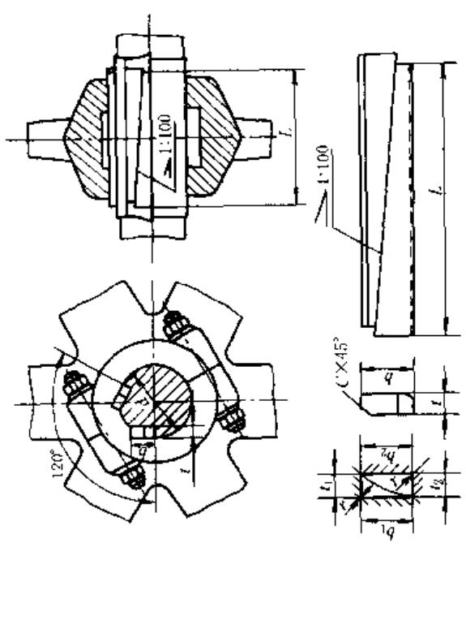

<table><tr><td rowspan=1 colspan=14>费通切向键及键槽尺寸</td><td rowspan=1 colspan=21>强力切向键及键槽尺寸</td></tr><tr><td rowspan=5 colspan=1></td><td rowspan=1 colspan=5>键</td><td rowspan=1 colspan=8>键     槽</td><td rowspan=1 colspan=1></td><td rowspan=1 colspan=8>键</td><td rowspan=1 colspan=5></td><td rowspan=1 colspan=7>键      精</td></tr><tr><td rowspan=2 colspan=2>厚度【</td><td rowspan=2 colspan=1>计算宽度</td><td rowspan=2 colspan=2>倒</td><td rowspan=1 colspan=4>深     度</td><td rowspan=1 colspan=2>计算宽度</td><td rowspan=2 colspan=2>半径，</td><td rowspan=2 colspan=1></td><td rowspan=2 colspan=5>厚度：</td><td rowspan=2 colspan=1></td><td rowspan=2 colspan=2>倒角C</td><td rowspan=1 colspan=5>深</td><td rowspan=1 colspan=3>度</td><td rowspan=1 colspan=2>计算宽度</td><td rowspan=2 colspan=2>半径，</td></tr><tr><td rowspan=2 colspan=2>轮毂i</td><td rowspan=2 colspan=2>轴t2</td><td rowspan=3 colspan=1>轮毂6</td><td rowspan=3 colspan=1>油</td><td rowspan=2 colspan=5>轮毂t</td><td rowspan=2 colspan=3>轴</td><td rowspan=3 colspan=1>轮毂山</td><td rowspan=3 colspan=1>出</td></tr><tr><td rowspan=2 colspan=1>尺寸</td><td rowspan=2 colspan=1>偏差（h1）</td><td rowspan=2 colspan=1>宽度b</td><td rowspan=2 colspan=1>最小</td><td rowspan=2 colspan=1>最大</td><td rowspan=2 colspan=1>大最小</td><td rowspan=2 colspan=1>大最小</td><td rowspan=2 colspan=1></td><td rowspan=2 colspan=1>尺寸</td><td rowspan=2 colspan=4>偏龙（h11）</td><td rowspan=2 colspan=1>b</td><td rowspan=2 colspan=1>最小</td><td rowspan=2 colspan=1>最大</td><td rowspan=2 colspan=1>最大最小</td><td rowspan=2 colspan=1>最大最小</td></tr><tr><td rowspan=1 colspan=2>寸偏差</td><td rowspan=1 colspan=1>尺寸</td><td rowspan=1 colspan=1>偏差</td><td rowspan=1 colspan=1>尺寸</td><td rowspan=1 colspan=4>偏差</td><td rowspan=1 colspan=1>尺寸</td><td rowspan=1 colspan=2>偏差</td></tr><tr><td rowspan=1 colspan=1>60</td><td rowspan=4 colspan=1>7</td><td rowspan=21 colspan=1>00.090</td><td rowspan=1 colspan=1>19.3</td><td rowspan=21 colspan=1>0.6</td><td rowspan=21 colspan=1>0.8</td><td rowspan=4 colspan=1>7</td><td rowspan=4 colspan=1></td><td rowspan=4 colspan=1>7.3</td><td rowspan=4 colspan=1></td><td rowspan=1 colspan=1>19.3</td><td rowspan=1 colspan=1>19.6</td><td rowspan=6 colspan=1></td><td rowspan=6 colspan=1></td><td rowspan=2 colspan=1>100</td><td rowspan=2 colspan=1>10</td><td rowspan=2 colspan=4>0-0.090</td><td rowspan=2 colspan=1>30</td><td rowspan=11 colspan=1>1.0</td><td rowspan=11 colspan=1>1.2</td><td rowspan=2 colspan=1>10</td><td rowspan=2 colspan=4>0.2</td><td rowspan=2 colspan=1>10.3</td><td rowspan=2 colspan=2>+0.20</td><td rowspan=2 colspan=1>30</td><td rowspan=2 colspan=1>30.4</td><td rowspan=11 colspan=1>1.0</td><td rowspan=11 colspan=1>0.7</td></tr><tr><td rowspan=1 colspan=1>65</td><td rowspan=1 colspan=1>20.1</td><td rowspan=1 colspan=1>20.1</td><td rowspan=1 colspan=1>20.5</td></tr><tr><td></td><td></td><td rowspan=2 colspan=1>21.0</td><td rowspan=2 colspan=1>21.4</td><td rowspan=2 colspan=1>m</td><td rowspan=2 colspan=1>11</td><td rowspan=2 colspan=4></td><td rowspan=2 colspan=1>3</td><td rowspan=2 colspan=1>1</td><td rowspan=2 colspan=4></td><td rowspan=2 colspan=1>11.4</td><td rowspan=2 colspan=2></td><td rowspan=2 colspan=1>33</td><td rowspan=2 colspan=1>33.5</td></tr><tr><td rowspan=1 colspan=1>70</td><td rowspan=1 colspan=1>21.0</td><td rowspan=1 colspan=2></td></tr><tr><td></td><td></td><td></td><td rowspan=10 colspan=1>8</td><td rowspan=10 colspan=1>0-0.2</td><td rowspan=10 colspan=1>8.3</td><td rowspan=2 colspan=1></td><td rowspan=2 colspan=1>23.2</td><td rowspan=2 colspan=1>23.5</td><td rowspan=2 colspan=1>20</td><td rowspan=2 colspan=1>12</td><td rowspan=2 colspan=4></td><td rowspan=2 colspan=1>36</td><td rowspan=2 colspan=1>12</td><td rowspan=2 colspan=4></td><td rowspan=2 colspan=1>12.4</td><td rowspan=2 colspan=2></td><td rowspan=2 colspan=1>36</td><td rowspan=2 colspan=1>36.5</td></tr><tr><td rowspan=1 colspan=1>75</td><td rowspan=9 colspan=1>8</td><td rowspan=1 colspan=1>23.2</td></tr><tr><td></td><td></td><td rowspan=2 colspan=1>24.0</td><td rowspan=2 colspan=1>24.4</td><td rowspan=15 colspan=1>0.6</td><td rowspan=15 colspan=1>0.4</td><td rowspan=2 colspan=1>130</td><td rowspan=2 colspan=1>13</td><td rowspan=2 colspan=2></td><td rowspan=1 colspan=3></td><td rowspan=2 colspan=1></td><td rowspan=2 colspan=1>39</td><td rowspan=2 colspan=1>13</td><td rowspan=2 colspan=2></td><td></td><td rowspan=2 colspan=1></td><td rowspan=2 colspan=1>13.4</td><td rowspan=2 colspan=1></td><td></td><td rowspan=2 colspan=1>39</td><td rowspan=2 colspan=1>39.5</td></tr><tr><td rowspan=1 colspan=1>80</td><td rowspan=1 colspan=1>24.0</td><td></td><td rowspan=1 colspan=3></td><td rowspan=1 colspan=2></td><td rowspan=1 colspan=1></td></tr><tr><td></td><td></td><td rowspan=3 colspan=1>24.8</td><td rowspan=3 colspan=1>25.2</td><td rowspan=3 colspan=1>140</td><td rowspan=3 colspan=1>14</td><td rowspan=3 colspan=2>0</td><td rowspan=1 colspan=3></td><td rowspan=3 colspan=2></td><td rowspan=3 colspan=1>42</td><td rowspan=3 colspan=1>14</td><td rowspan=2 colspan=1></td><td rowspan=3 colspan=2></td><td rowspan=3 colspan=1>14.4</td><td rowspan=1 colspan=2></td><td></td><td></td></tr><tr><td></td><td rowspan=2 colspan=1>24.8</td><td></td><td rowspan=2 colspan=1></td><td rowspan=2 colspan=1>42</td><td rowspan=2 colspan=1>42.5</td></tr><tr><td rowspan=1 colspan=1>85</td><td></td><td></td></tr><tr><td></td><td></td><td rowspan=3 colspan=1>25.6</td><td rowspan=3 colspan=1>26.0</td><td rowspan=3 colspan=1>150</td><td rowspan=3 colspan=1>15</td><td rowspan=3 colspan=4>-0.110</td><td rowspan=3 colspan=1>45</td><td rowspan=10 colspan=1>1.6</td><td rowspan=10 colspan=1>2.0</td><td rowspan=3 colspan=1>15</td><td rowspan=3 colspan=2></td><td rowspan=3 colspan=1></td><td></td><td rowspan=3 colspan=1>15.4</td><td rowspan=3 colspan=1>+0</td><td rowspan=3 colspan=1>3</td><td rowspan=3 colspan=1>45</td><td rowspan=3 colspan=1>45.5</td><td></td><td></td></tr><tr><td rowspan=2 colspan=1>90</td><td rowspan=2 colspan=1>25.6</td><td rowspan=2 colspan=3></td><td rowspan=2 colspan=2>0</td><td></td><td></td></tr><tr><td rowspan=8 colspan=1>1.61.2</td><td rowspan=8 colspan=1>1.61.2</td></tr><tr><td></td><td></td><td></td><td></td><td></td><td></td><td></td><td></td><td></td><td rowspan=7 colspan=1>9</td><td rowspan=7 colspan=2></td><td rowspan=7 colspan=3>9.3</td><td rowspan=7 colspan=1></td><td rowspan=2 colspan=1></td><td rowspan=2 colspan=1>27.8</td><td rowspan=2 colspan=1>28.2</td><td rowspan=2 colspan=1></td><td></td><td></td><td rowspan=2 colspan=1></td><td rowspan=2 colspan=1>16.4</td><td rowspan=1 colspan=2>0</td><td rowspan=2 colspan=1></td><td rowspan=2 colspan=1>48</td><td rowspan=2 colspan=1>48.5</td></tr><tr><td rowspan=1 colspan=1>95</td><td rowspan=6 colspan=1>9</td><td rowspan=1 colspan=1>27.8</td><td></td><td></td><td></td><td></td><td></td><td></td><td></td><td></td></tr><tr><td></td><td></td><td></td><td></td><td></td><td></td><td></td><td></td><td rowspan=3 colspan=3></td><td></td><td></td><td></td><td></td><td></td><td></td><td></td><td></td><td></td><td></td></tr><tr><td></td><td></td><td></td><td></td><td></td><td></td><td></td><td></td><td></td><td></td><td rowspan=1 colspan=2></td><td></td><td></td><td></td><td></td><td></td><td></td></tr><tr><td></td><td></td><td></td><td></td><td></td><td></td><td></td><td></td><td rowspan=2 colspan=1>28.6</td><td rowspan=2 colspan=1>29.0</td><td rowspan=2 colspan=1>17</td><td rowspan=2 colspan=2></td><td rowspan=2 colspan=1></td><td rowspan=2 colspan=1>51</td><td rowspan=2 colspan=1>17</td><td rowspan=2 colspan=2></td><td></td><td rowspan=1 colspan=1></td><td rowspan=2 colspan=1>17.4</td><td rowspan=1 colspan=2></td><td rowspan=1 colspan=1></td><td rowspan=2 colspan=1>51</td><td rowspan=2 colspan=1>51.5</td></tr><tr><td rowspan=2 colspan=1>100110</td><td rowspan=1 colspan=1>28.6</td><td></td><td></td><td></td><td></td><td></td><td></td><td rowspan=1 colspan=3></td><td></td><td rowspan=1 colspan=2></td></tr><tr><td rowspan=1 colspan=1>30.1</td><td></td><td></td><td></td><td></td><td rowspan=1 colspan=1>30.1</td><td rowspan=1 colspan=1>30.6</td><td rowspan=1 colspan=1>180</td><td rowspan=1 colspan=1>18</td><td rowspan=1 colspan=4></td><td rowspan=1 colspan=1>54</td><td rowspan=1 colspan=1>18</td><td rowspan=1 colspan=4></td><td rowspan=1 colspan=1>18.4</td><td rowspan=1 colspan=2></td><td rowspan=1 colspan=1>54</td><td rowspan=1 colspan=1>54.4</td></tr></table>

1 

<table><tr><td rowspan=1 colspan=26>普通切向健及键槽尺寸</td><td rowspan=1 colspan=23>强力切向键及键槽尺寸</td></tr><tr><td rowspan=6 colspan=1>独</td><td rowspan=1 colspan=8>键</td><td rowspan=1 colspan=17>键     槽</td><td rowspan=1 colspan=1></td><td rowspan=1 colspan=11>键</td><td rowspan=1 colspan=11>键      槽</td></tr><tr><td rowspan=3 colspan=5>厚度【</td><td rowspan=3 colspan=1>计算宽度</td><td rowspan=3 colspan=2>倒角C</td><td rowspan=1 colspan=3>深</td><td rowspan=1 colspan=8>度</td><td rowspan=2 colspan=2>计算宽度</td><td rowspan=3 colspan=4>半径1</td><td rowspan=3 colspan=1></td><td rowspan=3 colspan=6>厚度·</td><td rowspan=3 colspan=1>计算宽度</td><td rowspan=3 colspan=4>倒</td><td rowspan=1 colspan=5>深</td><td rowspan=1 colspan=4>度</td><td rowspan=2 colspan=1>计算宽度</td><td rowspan=3 colspan=1>半径r</td></tr><tr><td rowspan=3 colspan=3>轮毂！</td><td rowspan=3 colspan=8>轴2</td><td rowspan=3 colspan=5>轮毂</td><td rowspan=3 colspan=4>轴</td></tr><tr><td rowspan=3 colspan=1>轮毂b</td><td rowspan=3 colspan=1>轴b</td><td rowspan=3 colspan=1>轮毂</td><td rowspan=3 colspan=1></td></tr><tr><td rowspan=2 colspan=1>尺斗</td><td rowspan=2 colspan=4>偏差（h1）</td><td rowspan=2 colspan=1>宽度b</td><td rowspan=2 colspan=1>最小</td><td rowspan=2 colspan=1>最大</td><td rowspan=2 colspan=2>最大最小</td><td rowspan=2 colspan=2>最大最小</td><td rowspan=2 colspan=1></td><td rowspan=2 colspan=1>尺寸</td><td rowspan=2 colspan=5>德养</td><td rowspan=2 colspan=1>品</td><td rowspan=2 colspan=2>最小</td><td rowspan=2 colspan=2>最大</td><td rowspan=2 colspan=1>最大最小</td></tr><tr><td rowspan=1 colspan=1>尺寸</td><td rowspan=1 colspan=2>偏差</td><td rowspan=1 colspan=3>尺寸</td><td rowspan=1 colspan=5>偏差</td><td rowspan=1 colspan=1>尺寸</td><td rowspan=1 colspan=4>偏差</td><td rowspan=1 colspan=1>尺寸</td><td rowspan=1 colspan=3>偏差</td></tr><tr><td rowspan=2 colspan=1>120130</td><td rowspan=2 colspan=1>10</td><td rowspan=2 colspan=4>00.090</td><td rowspan=2 colspan=1>33.234.6</td><td rowspan=9 colspan=1>1</td><td rowspan=9 colspan=1>1.2</td><td rowspan=2 colspan=1>10</td><td rowspan=2 colspan=2>0</td><td rowspan=2 colspan=3>10.3</td><td rowspan=2 colspan=5>+0.2</td><td rowspan=2 colspan=1>33.234.6</td><td rowspan=1 colspan=1>33.6</td><td rowspan=4 colspan=2></td><td rowspan=4 colspan=2></td><td rowspan=1 colspan=1>190</td><td rowspan=1 colspan=1>19</td><td rowspan=4 colspan=5>0</td><td rowspan=1 colspan=1>57</td><td rowspan=4 colspan=2>2.5</td><td rowspan=4 colspan=2>3.0</td><td rowspan=1 colspan=1>~19</td><td rowspan=1 colspan=4></td><td rowspan=1 colspan=1>19.4</td><td rowspan=1 colspan=3></td><td rowspan=1 colspan=1>57</td><td rowspan=1 colspan=1>57.5</td></tr><tr><td rowspan=1 colspan=3>0</td><td rowspan=1 colspan=1>35.1</td><td rowspan=1 colspan=1>200</td><td rowspan=1 colspan=1>20</td><td rowspan=1 colspan=1>60</td><td rowspan=1 colspan=1>20</td><td></td><td></td><td></td><td></td><td rowspan=1 colspan=1>20.4</td><td rowspan=1 colspan=1></td><td></td><td></td><td rowspan=1 colspan=1>60</td><td rowspan=1 colspan=1>60.5</td></tr><tr><td rowspan=2 colspan=1>140150</td><td rowspan=2 colspan=1>1</td><td rowspan=2 colspan=4></td><td rowspan=2 colspan=1>37.739.1</td><td rowspan=2 colspan=1>11</td><td rowspan=2 colspan=2>0.02</td><td rowspan=2 colspan=3>11.4</td><td rowspan=2 colspan=5>0</td><td rowspan=1 colspan=1>37.7</td><td rowspan=1 colspan=1>38.3</td><td rowspan=1 colspan=1>220</td><td rowspan=1 colspan=1>22</td><td rowspan=1 colspan=1>66</td><td rowspan=1 colspan=1>22</td><td></td><td></td><td></td><td></td><td rowspan=1 colspan=1>22.4</td><td></td><td></td><td></td><td rowspan=1 colspan=1>6</td><td rowspan=1 colspan=1>66.5</td></tr><tr><td rowspan=1 colspan=1>39.1</td><td rowspan=1 colspan=1>39.7</td><td rowspan=1 colspan=1>240</td><td rowspan=1 colspan=1>24</td><td></td><td></td><td></td><td></td><td></td><td></td><td></td><td></td><td></td><td></td><td></td><td></td></tr><tr><td></td><td></td><td></td><td></td><td></td><td></td><td></td><td></td><td></td><td></td><td></td><td></td><td></td><td></td><td></td><td></td><td></td><td></td><td></td><td></td><td></td><td></td><td></td><td></td><td></td><td></td><td></td><td></td><td></td><td></td><td></td><td></td><td></td><td></td><td></td><td></td><td></td><td></td><td></td><td></td><td></td><td></td><td></td><td></td><td></td><td></td><td></td></tr><tr><td></td><td></td><td></td><td></td><td></td><td></td><td></td><td></td><td></td><td></td><td></td><td></td><td></td><td></td><td></td><td></td><td></td><td></td><td></td><td></td><td></td><td></td><td></td><td></td><td></td><td></td><td></td><td></td><td rowspan=1 colspan=3></td><td rowspan=1 colspan=1>72</td><td></td><td></td><td></td><td></td><td rowspan=1 colspan=1>24</td><td></td><td></td><td></td><td></td><td rowspan=1 colspan=1>24.4</td><td></td><td></td><td></td><td rowspan=1 colspan=1>72</td><td rowspan=1 colspan=1>72.5</td></tr><tr><td rowspan=3 colspan=1>160170180</td><td rowspan=3 colspan=1>12</td><td rowspan=3 colspan=4></td><td rowspan=1 colspan=1>42.</td><td rowspan=3 colspan=1>12</td><td rowspan=3 colspan=2></td><td rowspan=3 colspan=3>12.4</td><td rowspan=3 colspan=5></td><td rowspan=1 colspan=1>42.1</td><td rowspan=1 colspan=1>42.8</td><td rowspan=1 colspan=2>1.0</td><td rowspan=1 colspan=2>0.7</td><td rowspan=1 colspan=1>250</td><td rowspan=1 colspan=1>25</td><td rowspan=1 colspan=3>-0.</td><td rowspan=1 colspan=3>.130</td><td rowspan=1 colspan=1>75</td><td rowspan=1 colspan=2></td><td rowspan=1 colspan=2></td><td rowspan=1 colspan=1>25</td><td></td><td></td><td></td><td></td><td rowspan=1 colspan=1>25.4</td><td></td><td></td><td></td><td rowspan=1 colspan=1>75</td><td rowspan=1 colspan=1>75.5</td></tr><tr><td rowspan=2 colspan=1>43.544.9</td><td rowspan=1 colspan=1>43.5</td><td rowspan=1 colspan=1>44.2</td><td rowspan=1 colspan=2></td><td rowspan=1 colspan=2></td><td rowspan=1 colspan=1>260</td><td rowspan=1 colspan=1>26</td><td rowspan=1 colspan=4></td><td rowspan=1 colspan=1></td><td></td><td rowspan=1 colspan=1>78</td><td rowspan=1 colspan=2></td><td rowspan=1 colspan=2></td><td rowspan=1 colspan=1>26</td><td></td><td></td><td></td><td></td><td rowspan=1 colspan=1>26.4</td><td></td><td></td><td></td><td rowspan=1 colspan=1>78</td><td rowspan=1 colspan=1>78.5</td></tr><tr><td rowspan=1 colspan=4></td><td></td><td></td><td></td><td></td><td></td><td></td><td></td><td></td><td></td><td></td><td></td><td></td><td></td><td></td><td></td><td></td><td></td><td></td><td></td><td></td><td></td><td></td><td></td><td></td><td></td><td></td><td></td><td></td><td></td></tr><tr><td></td><td></td><td></td><td></td><td></td><td></td><td></td><td></td><td></td><td></td><td></td><td></td><td></td><td></td><td></td><td></td><td></td><td></td><td></td><td></td><td></td><td></td><td></td><td></td><td></td><td></td><td></td><td></td><td></td><td></td><td></td><td></td><td></td><td></td><td></td><td></td><td></td><td></td><td></td><td></td><td></td><td></td><td></td><td></td><td></td><td></td><td></td><td></td><td></td></tr><tr><td></td><td></td><td></td><td></td><td></td><td></td><td></td><td></td><td></td><td></td><td></td><td></td><td></td><td></td><td></td><td></td><td></td><td></td><td></td><td></td><td rowspan=1 colspan=1>44.9</td><td rowspan=1 colspan=1>45.6</td><td rowspan=1 colspan=2></td><td rowspan=1 colspan=2></td><td rowspan=1 colspan=1></td><td rowspan=1 colspan=1>280</td><td rowspan=1 colspan=1>28</td><td rowspan=1 colspan=3></td><td rowspan=1 colspan=1></td><td></td><td rowspan=1 colspan=1>84</td><td rowspan=2 colspan=2></td><td rowspan=2 colspan=2></td><td rowspan=1 colspan=1>28</td><td rowspan=1 colspan=2></td><td></td><td></td><td rowspan=1 colspan=1>28.4</td><td rowspan=1 colspan=1></td><td></td><td rowspan=1 colspan=1></td><td rowspan=1 colspan=1>84</td><td rowspan=11 colspan=1>2.5</td></tr><tr><td rowspan=2 colspan=1>190200</td><td rowspan=2 colspan=1>14</td><td rowspan=2 colspan=3>00.110</td><td rowspan=2 colspan=2>00.110</td><td rowspan=2 colspan=1>49.651.0</td><td rowspan=2 colspan=1></td><td rowspan=2 colspan=1></td><td rowspan=2 colspan=2>14</td><td rowspan=2 colspan=2></td><td rowspan=1 colspan=4></td><td rowspan=2 colspan=2>14.4</td><td rowspan=1 colspan=1></td><td rowspan=1 colspan=1></td><td rowspan=1 colspan=3>49.6</td><td rowspan=1 colspan=2>50.3</td><td rowspan=1 colspan=1></td><td rowspan=1 colspan=3></td><td rowspan=1 colspan=2>300</td><td rowspan=1 colspan=1>30</td><td rowspan=1 colspan=1></td><td rowspan=1 colspan=2></td><td rowspan=1 colspan=1>90</td><td rowspan=1 colspan=1></td><td rowspan=1 colspan=4>30</td><td rowspan=1 colspan=1></td><td rowspan=1 colspan=2></td><td rowspan=1 colspan=1>30.4</td><td rowspan=1 colspan=1></td><td rowspan=1 colspan=1></td></tr><tr><td rowspan=1 colspan=2></td><td></td><td></td><td></td><td></td><td rowspan=1 colspan=1></td><td rowspan=1 colspan=1>51.0</td><td rowspan=1 colspan=1>51.7</td><td rowspan=1 colspan=2></td><td rowspan=1 colspan=2></td><td rowspan=1 colspan=1>320</td><td rowspan=1 colspan=1>32</td><td rowspan=1 colspan=4></td><td rowspan=1 colspan=1></td><td></td><td rowspan=1 colspan=1>96</td><td rowspan=1 colspan=2></td><td rowspan=1 colspan=2></td><td rowspan=1 colspan=1>32</td><td rowspan=1 colspan=2></td><td rowspan=1 colspan=3></td><td rowspan=1 colspan=1></td><td rowspan=1 colspan=1>32.4</td><td rowspan=1 colspan=3></td><td rowspan=1 colspan=1></td><td rowspan=1 colspan=1>96.</td><td rowspan=6 colspan=1>3.0</td></tr><tr><td rowspan=5 colspan=1>220240</td><td rowspan=5 colspan=1>16</td><td rowspan=7 colspan=4></td><td rowspan=5 colspan=1>57.159.9</td><td rowspan=7 colspan=1>1.6</td><td rowspan=7 colspan=1>2.0</td><td rowspan=5 colspan=1>16</td><td rowspan=5 colspan=1></td><td rowspan=2 colspan=2></td><td rowspan=5 colspan=3>：16.4</td><td></td><td></td><td></td><td rowspan=2 colspan=1></td><td rowspan=2 colspan=1>57.1</td><td rowspan=2 colspan=1>57.8</td><td rowspan=2 colspan=2></td><td rowspan=2 colspan=2></td><td rowspan=2 colspan=1>340</td><td rowspan=2 colspan=1>34</td><td rowspan=2 colspan=4></td><td></td><td rowspan=2 colspan=1>102</td><td rowspan=5 colspan=2>3.0</td><td rowspan=2 colspan=1></td><td rowspan=2 colspan=1>34</td><td rowspan=4 colspan=2></td><td rowspan=4 colspan=2></td><td></td><td></td><td></td><td></td><td></td></tr><tr><td></td><td></td><td></td><td></td><td rowspan=1 colspan=1>34.4</td><td rowspan=1 colspan=2></td><td rowspan=1 colspan=1></td><td></td></tr><tr><td></td><td></td><td></td><td></td><td></td><td></td><td></td><td></td><td></td><td></td><td></td><td></td><td></td><td></td><td></td><td></td><td></td><td></td><td></td><td></td><td></td><td></td><td></td><td></td><td></td><td></td></tr><tr><td></td><td></td><td></td><td></td><td></td><td></td><td></td><td></td><td></td><td></td><td></td><td></td><td></td><td></td><td></td><td></td><td></td><td></td><td></td><td></td><td></td><td></td><td></td><td></td><td></td><td rowspan=1 colspan=1>102</td><td rowspan=1 colspan=1>102.5</td></tr><tr><td rowspan=1 colspan=2></td><td></td><td></td><td></td><td></td><td></td><td rowspan=1 colspan=1>59.9</td><td rowspan=1 colspan=1>60.6</td><td></td><td></td><td rowspan=1 colspan=2></td><td rowspan=1 colspan=1>360</td><td rowspan=1 colspan=1>36</td><td></td><td rowspan=1 colspan=4></td><td rowspan=1 colspan=1>108</td><td rowspan=1 colspan=1>36</td><td rowspan=1 colspan=2></td><td rowspan=1 colspan=3></td><td rowspan=1 colspan=1></td><td rowspan=1 colspan=1>36.4</td><td rowspan=1 colspan=2></td><td rowspan=1 colspan=1></td><td rowspan=1 colspan=1>108</td><td rowspan=1 colspan=1>108.5</td></tr><tr><td rowspan=2 colspan=1>250260</td><td rowspan=2 colspan=1>18</td><td rowspan=2 colspan=1>64.666.0</td><td rowspan=2 colspan=1>18</td><td rowspan=2 colspan=2></td><td rowspan=2 colspan=3>18.4</td><td rowspan=2 colspan=4></td><td rowspan=1 colspan=1></td><td rowspan=1 colspan=1>64.6</td><td rowspan=1 colspan=1>65.3</td><td></td><td></td><td rowspan=1 colspan=2>1.2</td><td rowspan=1 colspan=1>380</td><td rowspan=1 colspan=1>38</td><td rowspan=1 colspan=3>0</td><td rowspan=1 colspan=4>0</td><td rowspan=1 colspan=1>114</td><td rowspan=2 colspan=2></td><td rowspan=2 colspan=2></td><td rowspan=1 colspan=1>38</td><td rowspan=1 colspan=2></td><td rowspan=1 colspan=3>0</td><td rowspan=1 colspan=1></td><td rowspan=1 colspan=1>38.4</td><td rowspan=1 colspan=3>+0.3</td><td rowspan=1 colspan=1>114</td><td rowspan=3 colspan=1></td></tr><tr><td rowspan=1 colspan=4></td><td rowspan=1 colspan=1>66.0</td><td rowspan=1 colspan=1>66.7</td><td rowspan=1 colspan=2></td><td rowspan=1 colspan=1></td><td rowspan=1 colspan=1>400</td><td rowspan=1 colspan=1>40</td><td rowspan=1 colspan=2></td><td></td><td></td><td rowspan=1 colspan=1></td><td rowspan=1 colspan=1>120</td><td rowspan=1 colspan=1>40</td><td rowspan=1 colspan=2></td><td rowspan=1 colspan=3>0</td><td rowspan=1 colspan=1>40.4</td><td rowspan=1 colspan=2></td><td rowspan=1 colspan=1></td><td rowspan=1 colspan=1>120</td><td rowspan=1 colspan=1>[20.5</td></tr><tr><td rowspan=2 colspan=1>280300</td><td rowspan=2 colspan=1>20</td><td rowspan=2 colspan=4></td><td rowspan=2 colspan=1>72.174.8</td><td rowspan=2 colspan=1></td><td rowspan=2 colspan=1></td><td rowspan=2 colspan=1>20</td><td rowspan=2 colspan=2></td><td rowspan=2 colspan=3>20.4</td><td rowspan=2 colspan=4></td><td rowspan=1 colspan=2></td><td rowspan=1 colspan=1></td><td rowspan=1 colspan=3>72.1</td><td rowspan=1 colspan=2>72.8</td><td rowspan=1 colspan=1>一</td><td rowspan=1 colspan=2>一</td><td rowspan=1 colspan=2></td><td rowspan=1 colspan=1>420</td><td rowspan=1 colspan=1>42</td><td rowspan=1 colspan=1>-v</td><td rowspan=1 colspan=1></td><td rowspan=1 colspan=2>126</td><td rowspan=1 colspan=1></td><td rowspan=1 colspan=4></td><td rowspan=1 colspan=1>42</td><td rowspan=1 colspan=2>-</td><td rowspan=1 colspan=1>-0.3</td><td rowspan=1 colspan=1>.5</td><td rowspan=1 colspan=1>42.4</td></tr><tr><td></td><td rowspan=1 colspan=1>74.8</td><td rowspan=1 colspan=1>75.5</td><td rowspan=1 colspan=2></td><td rowspan=1 colspan=2></td><td rowspan=1 colspan=1>450</td><td rowspan=1 colspan=1>45</td><td rowspan=1 colspan=3></td><td></td><td rowspan=1 colspan=1></td><td rowspan=1 colspan=1>135</td><td rowspan=1 colspan=2></td><td rowspan=1 colspan=2></td><td rowspan=1 colspan=1>45</td><td rowspan=1 colspan=2></td><td></td><td rowspan=1 colspan=1></td><td rowspan=1 colspan=1>45.5</td><td rowspan=1 colspan=1></td><td></td><td rowspan=1 colspan=1></td><td rowspan=1 colspan=1>135</td><td rowspan=2 colspan=1></td></tr><tr><td rowspan=2 colspan=1>320340</td><td rowspan=2 colspan=1>22</td><td rowspan=1 colspan=2></td><td rowspan=1 colspan=2></td><td rowspan=2 colspan=1></td><td rowspan=2 colspan=1>81.083.6</td><td rowspan=2 colspan=1>2.5</td><td rowspan=2 colspan=1>3.0</td><td rowspan=2 colspan=2>22</td><td rowspan=2 colspan=3>-83</td><td rowspan=2 colspan=5>22.4</td><td rowspan=2 colspan=1>+0.30</td><td rowspan=1 colspan=1>81.0</td><td rowspan=2 colspan=3>81.684.3</td><td rowspan=2 colspan=1>2.5</td><td rowspan=2 colspan=1>2.0</td><td rowspan=1 colspan=1>480</td><td rowspan=1 colspan=3>48</td><td rowspan=2 colspan=3></td><td rowspan=1 colspan=1></td><td rowspan=1 colspan=3>144</td><td rowspan=1 colspan=1></td><td rowspan=1 colspan=4></td><td rowspan=1 colspan=1>48</td><td rowspan=1 colspan=2></td><td rowspan=1 colspan=1></td><td rowspan=1 colspan=1></td><td rowspan=1 colspan=1>48.5</td></tr><tr><td></td><td rowspan=1 colspan=2></td><td></td><td rowspan=1 colspan=1>83.6</td><td></td><td rowspan=1 colspan=1>[500</td><td rowspan=1 colspan=1>50</td><td></td><td></td><td></td><td rowspan=1 colspan=1>150</td><td rowspan=1 colspan=1>4.0</td><td></td><td rowspan=1 colspan=2>5.0</td><td rowspan=1 colspan=1>50</td><td rowspan=1 colspan=2></td><td rowspan=1 colspan=3></td><td rowspan=1 colspan=1></td><td rowspan=1 colspan=1>50.5</td><td rowspan=1 colspan=3></td><td rowspan=1 colspan=1>150</td><td rowspan=3 colspan=1>3.0</td></tr><tr><td rowspan=3 colspan=1>360380400</td><td rowspan=3 colspan=1>26</td><td rowspan=5 colspan=4>0-0.130</td><td rowspan=3 colspan=1>93.295.998.6</td><td rowspan=3 colspan=1></td><td rowspan=3 colspan=1></td><td rowspan=3 colspan=1>26</td><td rowspan=3 colspan=2></td><td></td><td></td><td></td><td rowspan=3 colspan=5>26.4</td><td rowspan=1 colspan=1></td><td rowspan=1 colspan=1>93.2</td><td rowspan=1 colspan=3>93.8</td><td rowspan=1 colspan=1></td><td rowspan=1 colspan=1></td><td rowspan=1 colspan=1>530</td><td rowspan=1 colspan=3>53</td><td rowspan=1 colspan=3></td><td rowspan=1 colspan=2>159</td><td rowspan=1 colspan=2></td><td rowspan=1 colspan=1></td><td rowspan=1 colspan=4>53</td><td rowspan=1 colspan=1></td><td rowspan=1 colspan=3>53.5</td><td rowspan=1 colspan=1></td><td rowspan=1 colspan=1>159</td></tr><tr><td></td><td></td><td rowspan=2 colspan=5></td><td rowspan=1 colspan=1>95.9</td><td rowspan=1 colspan=1>96.6</td><td rowspan=1 colspan=2></td><td rowspan=1 colspan=2></td><td rowspan=1 colspan=1>560</td><td rowspan=1 colspan=1>56</td><td rowspan=1 colspan=5></td><td rowspan=1 colspan=1>168</td><td rowspan=1 colspan=2></td><td rowspan=1 colspan=2></td><td rowspan=1 colspan=1>56</td><td rowspan=1 colspan=4></td><td rowspan=1 colspan=1>56.5</td><td rowspan=1 colspan=3></td><td rowspan=1 colspan=1>168</td><td rowspan=1 colspan=1>168.7</td></tr><tr><td></td><td></td><td rowspan=1 colspan=4></td><td rowspan=1 colspan=1>98.6</td><td rowspan=1 colspan=1>99.3</td><td rowspan=1 colspan=2></td><td rowspan=1 colspan=2></td><td rowspan=1 colspan=1>600</td><td rowspan=1 colspan=1>60</td><td rowspan=1 colspan=5>0</td><td rowspan=1 colspan=1>180</td><td rowspan=1 colspan=2>，</td><td rowspan=1 colspan=2></td><td rowspan=1 colspan=1>60</td><td rowspan=1 colspan=4></td><td rowspan=1 colspan=1>60.5</td><td rowspan=1 colspan=3></td><td rowspan=1 colspan=1>180</td><td rowspan=4 colspan=1>4.0</td></tr><tr><td rowspan=2 colspan=1>420450</td><td rowspan=2 colspan=1>30</td><td rowspan=2 colspan=1>108.2112.3</td><td rowspan=8 colspan=1>3.0</td><td rowspan=8 colspan=1>4.0</td><td rowspan=2 colspan=1>30</td><td rowspan=1 colspan=2></td><td rowspan=2 colspan=1></td><td rowspan=2 colspan=3>30.4</td><td rowspan=2 colspan=3></td><td></td><td rowspan=1 colspan=1></td><td rowspan=1 colspan=1>108.2</td><td rowspan=1 colspan=1>108.8</td><td rowspan=2 colspan=2></td><td rowspan=2 colspan=2></td><td rowspan=1 colspan=1>630</td><td rowspan=1 colspan=1>63</td><td rowspan=1 colspan=5>-0.190</td><td rowspan=1 colspan=1>189</td><td rowspan=2 colspan=2>5.0</td><td rowspan=2 colspan=2>7.0</td><td rowspan=1 colspan=1>63</td><td rowspan=1 colspan=2></td><td></td><td></td><td rowspan=1 colspan=1>63.5</td><td rowspan=1 colspan=1></td><td></td><td rowspan=1 colspan=1></td><td rowspan=1 colspan=1>189</td><td rowspan=1 colspan=1>189.7</td></tr><tr><td rowspan=1 colspan=2></td><td></td><td rowspan=1 colspan=1></td><td rowspan=1 colspan=1>12.3</td><td rowspan=1 colspan=1>112.9</td><td rowspan=1 colspan=1>710</td><td rowspan=1 colspan=1>71</td><td rowspan=1 colspan=5></td><td rowspan=1 colspan=1>213</td><td rowspan=1 colspan=1>71</td><td rowspan=1 colspan=2></td><td></td><td></td><td rowspan=1 colspan=1></td><td rowspan=1 colspan=2></td><td></td><td rowspan=1 colspan=1>213</td><td rowspan=1 colspan=1>213.7</td></tr><tr><td rowspan=2 colspan=1>480500</td><td rowspan=2 colspan=1>34</td><td rowspan=3 colspan=4>0</td><td rowspan=2 colspan=1>123.1125.9</td><td rowspan=2 colspan=1>34</td><td rowspan=1 colspan=2></td><td rowspan=2 colspan=1></td><td rowspan=2 colspan=3>34.4</td><td rowspan=2 colspan=3></td><td></td><td rowspan=1 colspan=1></td><td rowspan=1 colspan=1>123.1</td><td rowspan=1 colspan=1>123.8</td><td rowspan=1 colspan=2></td><td rowspan=1 colspan=2></td><td rowspan=1 colspan=1>800</td><td rowspan=1 colspan=1>80</td><td rowspan=1 colspan=5></td><td rowspan=1 colspan=1>240</td><td rowspan=1 colspan=2></td><td rowspan=1 colspan=2></td><td rowspan=1 colspan=1>80</td><td rowspan=1 colspan=2></td><td rowspan=1 colspan=3></td><td rowspan=1 colspan=1></td><td rowspan=1 colspan=3>80.5</td><td rowspan=1 colspan=1></td><td rowspan=1 colspan=1></td></tr><tr><td rowspan=1 colspan=2></td><td></td><td rowspan=1 colspan=1></td><td rowspan=1 colspan=1>125.9</td><td rowspan=1 colspan=1>126.6</td><td rowspan=5 colspan=2>3.0</td><td rowspan=5 colspan=2>2.5</td><td rowspan=1 colspan=1>900</td><td rowspan=1 colspan=1>90</td><td rowspan=1 colspan=5>0</td><td rowspan=1 colspan=1>270</td><td rowspan=2 colspan=2>7.0</td><td rowspan=2 colspan=2>90</td><td rowspan=1 colspan=1>90</td><td rowspan=1 colspan=2></td><td rowspan=1 colspan=3></td><td rowspan=1 colspan=1></td><td rowspan=1 colspan=1>90.5</td><td rowspan=1 colspan=3></td><td rowspan=1 colspan=1>270</td><td rowspan=2 colspan=1>5.0</td></tr><tr><td rowspan=2 colspan=1>530560</td><td rowspan=2 colspan=1>38</td><td rowspan=2 colspan=2>0</td><td rowspan=2 colspan=2>160</td><td rowspan=2 colspan=1>136.2140.8</td><td rowspan=2 colspan=1>38</td><td rowspan=1 colspan=2></td><td rowspan=2 colspan=1></td><td rowspan=2 colspan=3>38.4</td><td rowspan=2 colspan=3></td><td rowspan=1 colspan=2></td><td rowspan=2 colspan=1></td><td rowspan=2 colspan=1>136.7140.8</td><td rowspan=1 colspan=3>127.1</td><td rowspan=1 colspan=1>1000</td><td rowspan=1 colspan=1>100</td><td rowspan=1 colspan=5>- 0.220</td><td rowspan=1 colspan=1>300</td><td rowspan=1 colspan=1>100</td><td rowspan=1 colspan=4></td><td rowspan=1 colspan=1>100.5</td><td rowspan=1 colspan=3></td><td rowspan=1 colspan=1>300</td><td rowspan=1 colspan=1>300.7</td></tr><tr><td rowspan=1 colspan=2></td><td rowspan=1 colspan=4></td><td rowspan=1 colspan=1>141.5</td><td rowspan=3 colspan=1></td><td></td><td></td><td></td><td></td><td></td><td></td><td></td><td></td><td></td><td></td><td></td><td></td><td></td><td></td><td></td><td></td><td></td><td></td><td></td><td></td><td></td><td></td></tr><tr><td rowspan=2 colspan=1>600630</td><td rowspan=2 colspan=1>42</td><td rowspan=2 colspan=4></td><td rowspan=2 colspan=1>153.1157.1</td><td rowspan=2 colspan=1>42</td><td rowspan=2 colspan=2></td><td rowspan=2 colspan=3>42.4</td><td rowspan=2 colspan=5></td><td rowspan=1 colspan=2></td><td rowspan=1 colspan=1>153.1</td><td rowspan=1 colspan=1>153.8</td><td></td><td></td><td></td><td></td><td></td><td></td><td></td><td></td><td></td><td></td><td></td><td></td><td></td><td></td><td></td><td></td><td></td><td></td><td></td><td></td><td></td><td></td></tr><tr><td rowspan=1 colspan=1>157.1</td><td rowspan=1 colspan=1>157.8</td><td></td><td></td><td></td><td></td><td></td><td></td><td></td><td></td><td></td><td></td><td></td><td></td><td></td><td></td><td></td><td></td><td></td><td></td><td></td><td></td><td></td><td></td></tr></table>

# 3花键联接

# 3.1花键的类型、特点和应用

表4-3-28

<table><tr><td rowspan=1 colspan=1>类     型</td><td rowspan=1 colspan=1>特     点</td><td rowspan=1 colspan=1>应     用</td></tr><tr><td rowspan=1 colspan=1>矩形花键（GB/T1144--1987）</td><td rowspan=3 colspan=1>花键联接为多齿」作，承载能力高，对中性、导向性好，齿根较浅，应力集中较小，轴与毂强度削弱小矩形花键加工方便，能用磨削方法获得较商的精度。标准中规定两个系列：轻系列，用于载荷较轻的静联接，中系列用于中等裁荷渐开线花键的齿廓为渐开线，受载时齿上有径向力，能起自动定心作用，使各齿受力均匀，强度高、寿命长。加工T艺与齿轮相同，易获得较高精度和互换性渐开线花键标准玉力角αp有30和37.5及45三种</td><td rowspan=1 colspan=1>应用广泛。如飞机、汽车，拖拉机、机床制造业、农业机械及一般机械传动装置等</td></tr><tr><td rowspan=2 colspan=1>渐开线花键（GB/T3478.1—1995）</td><td></td></tr><tr><td rowspan=1 colspan=1>用于载銜较大，定心精度要求较高，以及尺寸较大的联接</td></tr></table>

# 3.2花键的挤压强度校核

$$
p = \frac { 2 T } { \psi k h { l } D _ { \mathbf { m } } } \leqslant p _ { \mathsf { p p } }
$$

式中 $\pmb { T }$ —-转矩, $\mathbf { N } { \cdot } _ { \mathbf { m m } }$ ;-各齿载荷不均匀系数,一般取 $\phi = 0 . 7 \sim 0 . 8$ ;$\pmb { z }$ 齿数;$\imath$ —齿的工作(配合)长度, $\mathbf { m m }$ ;

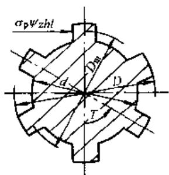

图4-3-1

$\smash { D _ { \overline { { \mathbf { \delta \varepsilon } } } } }$ ——平均直径, $\mathbf { m m }$ ,矩形花键 $\pmb { \mathscr { D } _ { \mathrm { m } } } = \frac { \pmb { \mathscr { D } } + \pmb { \mathscr { d } } } { 2 }$ D+d,渐开线花键Dm=D;  
$\pmb { D }$ -一矩形花键为大径,渐开线为分度圆直径;  
$\hbar$ 齿的工作高度, $\mathbf { m m }$ ,矩形花键 D-d-2C(C为倒角尺寸);渐开线花键 $\alpha = 3 0 ^ { \circ }$ 时 $\hbar = m$ , $\alpha = 3 7 . 5 ^ { \circ }$ 时 $\pmb { \mathscr { h } } = \pmb { 0 } . 9 m$ , $\alpha = 4 5 ^ { \circ }$ 时 $h = 0 . 8 m$ ( $\pmb { m }$ 为模数);  
$\pmb { p _ { p p } }$ —许用压强, ${ \bf { M P a } }$ ,查表4-3-29;  
花键几何尺寸见图4-3-1。

表4-3-29

花键联接的许用压强 $p _ { p p }$ 

<table><tr><td rowspan="2">联接方式</td><td rowspan="2">使用和制造情况</td><td colspan="2">PPp MP</td></tr><tr><td>齿面未经热处理</td><td>齿面经热处理</td></tr><tr><td rowspan="2">静联接</td><td>中 </td><td>35~50</td><td>40-70</td></tr><tr><td></td><td>60-100</td><td>100 - 140</td></tr><tr><td rowspan="2">不在载荷作用下移动的动联接</td><td>良</td><td>80~120 15-20</td><td>120~200 20- 35</td></tr><tr><td>不 等</td><td>20~30</td><td>30- 60</td></tr><tr><td rowspan="2"></td><td>良 好</td><td>25~40</td><td>40-70</td></tr><tr><td>良</td><td></td><td>3~10</td></tr><tr><td rowspan="2">在载荷作用下移动的动联接</td><td>不 等</td><td></td><td>5~15</td></tr><tr><td>良 好</td><td></td><td>10-20</td></tr></table>

注:1.使用和制造情况不良是指受变载、有双向冲击、振动频率高和振幅大、润滑不好(对动联接)、材料硬度不高和精度不高等。2.同一情况下, $p _ { \mathbf { m } }$ 的较小值用于工作时间长和较重要的场合。3、材料:内、外花键用抗拉强度不低于 ${ \mathfrak { K } } { \mathfrak { O } } { \mathfrak { O } } { \mathbf { M } } { \mathbf { P } } { \mathbf { a } }$ 的钢制造。

# 3.3矩形花键(GB/T1144--1987)

矩形花键的优点为:定心精度高,定心的稳定性好,能用磨削的方法消除热处理变形,定心直径尺寸公差和位置公差都能获得较高的精度。按GB/T1144—1987规定,矩形花键的定心方式为小径定心。

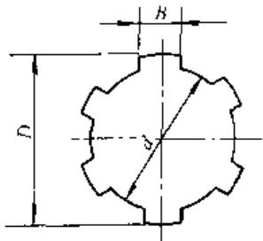

矩形花键基本尺寸系列

/mm 

表4-3-30

矩形内花键长度系列(GB/T10081-1988)

<table><tr><td rowspan="2">小径 d</td><td colspan="4">轻系列</td><td colspan="4">中系列</td></tr><tr><td>规格 NxdxD×R</td><td>键数 N</td><td>大径 D</td><td>键宽 B</td><td>规格 NxdxDxB</td><td>键数 M</td><td>大径 D</td><td>键宽 B</td></tr><tr><td>11 13</td><td>6x23×26×6 6×26×30×6 6x28×32×7 8×32×36×6 8x36×40×7</td><td>6</td><td></td><td>6６７６7８910</td><td>6×11×14×3 6x13×16×3.5 6×16×20×4 6×13×22×5 6×21×25×5 6×23×28×6 6×26×32×6 6×2B×34×7 8×32×38×6 8×36×42×7</td><td>6</td><td>14 162022528324322485460622</td><td>3 3.5 4 5 5 6 6 7 6 7</td></tr><tr><td></td><td>8×42×46×8 8x46×50x9 8×52×58×10 8×56×62×10 8×62×68×12 10× 72×78×12</td><td>8</td><td>2630236404650586268 78</td><td>10122</td><td>8×42×48×8 8x46×54×9 8× 52×60×10 8×56×65×10 8×62×12×12 10× 72×82 x12</td><td>8</td><td></td><td>8 9 10 10 12 12</td></tr><tr><td>112</td><td>10×82×88×12 10×92×98×14 10×102×108×16 10×112×120×18</td><td>10</td><td>88 98 108 120</td><td>12 14 16 18</td><td>10×82×92×12 10×92×102×14 10×102×112×16 10x112×125×18</td><td>10</td><td>92 102 112 125</td><td>12 14 16 18</td></tr></table>

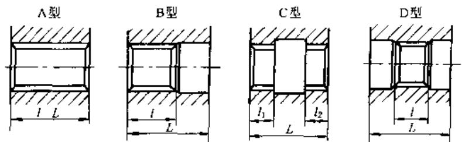

/mm 

表4-3-31

<table><tr><td rowspan=1 colspan=1>花键小径d</td><td rowspan=1 colspan=1>11</td><td rowspan=1 colspan=1>13</td><td rowspan=1 colspan=1>16</td><td rowspan=1 colspan=1>1821</td><td rowspan=1 colspan=1>1821</td><td rowspan=1 colspan=1></td><td rowspan=1 colspan=1>26</td><td rowspan=1 colspan=1>28</td><td rowspan=1 colspan=1></td><td rowspan=1 colspan=1>36</td><td rowspan=1 colspan=1>42</td><td rowspan=1 colspan=1>46</td><td rowspan=1 colspan=1></td><td rowspan=1 colspan=1>56</td><td rowspan=1 colspan=1>62</td><td rowspan=1 colspan=1>72</td><td rowspan=1 colspan=1>82</td><td rowspan=1 colspan=1></td><td rowspan=1 colspan=1>102</td><td rowspan=1 colspan=1>[12</td></tr><tr><td rowspan=1 colspan=1>花键长度或1+1</td><td rowspan=1 colspan=2>10~50</td><td rowspan=1 colspan=7>10-80</td><td rowspan=1 colspan=6>22~120</td><td rowspan=1 colspan=1>32~120</td><td rowspan=1 colspan=4>32~200</td></tr><tr><td rowspan=1 colspan=1>孔的最大长度L</td><td rowspan=1 colspan=1>50</td><td rowspan=1 colspan=4>80</td><td rowspan=1 colspan=4>120</td><td rowspan=1 colspan=4>200</td><td rowspan=1 colspan=5>250</td><td rowspan=1 colspan=2>300</td></tr><tr><td rowspan=1 colspan=1>1或+系列</td><td rowspan=1 colspan=20>10，12，15，18，22，25，28，30,32，36，38，42，45、48，50.56，60、63，71，75，80，85,90，95，100，110，120，130，140，160，180，200</td></tr></table>

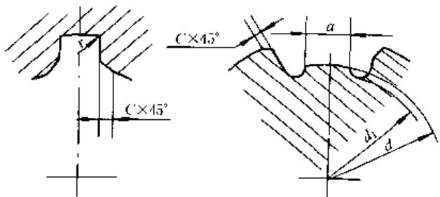

表4-3-32

/mm 

<table><tr><td colspan="5">轻系列</td><td colspan="5">中系列</td></tr><tr><td rowspan="2">规格</td><td rowspan="2">C</td><td rowspan="2">！</td><td colspan="2">参 考</td><td rowspan="2">规格 NxdxD×B</td><td rowspan="2">C</td><td colspan="2">参 考</td></tr><tr><td colspan="2">e mu</td><td>，</td><td>dmn</td><td>Qamn</td></tr><tr><td></td><td></td><td>0.1</td><td colspan="3" rowspan="8"></td><td>6x11x14×3 6×13×[6×3.5</td><td>0.2</td><td>0.1</td><td></td><td>1.0</td></tr><tr><td></td><td>0.2</td><td></td><td>6×16×20×4 6×18×22×5 6×21×25×5</td><td>0.3</td><td>0.2</td><td>14.4 16.6 19.5</td><td>1.0 2.0</td></tr><tr><td>6×23×26×6</td><td rowspan="3">0.3</td><td rowspan="3">0.2</td><td>3.5</td><td>6×23×28×6 6×26×32x6 6×28×34×7</td><td></td><td></td><td>21.2</td><td>1.2 1.2</td></tr><tr><td>6x26×30×6 6x28×32×7</td><td>26.6</td><td>3.8 4.0</td><td></td><td></td><td>23.6 25.8</td><td>1.4</td></tr><tr><td>8×32×36×6</td><td>30.3 2.7</td><td>8×32×38x6</td><td>0.4</td><td>0.3</td><td>29.4 33.4</td><td>1.0</td></tr><tr><td>8×36×40×7</td><td rowspan="4"></td><td rowspan="4"></td><td>34.4 40.5</td><td>3.5 5.0</td><td>8×36×42×7 8×42×48×8</td><td rowspan="2"></td><td rowspan="2"></td><td></td><td>1.0</td></tr><tr><td>8×42×46×&</td><td></td><td></td><td></td><td>39.4</td><td>2.5</td></tr><tr><td>8×46×50×9</td><td>44.6</td><td>5.7</td><td>8×46×54×9</td><td>0.5</td><td>42.6 0.4</td><td>1.4</td></tr><tr><td>8×52×58×10</td><td>49.6</td><td>4.8</td><td>8×52×60×10</td><td></td><td>48.6 52.0</td><td>2.5</td></tr><tr><td>8×56×62×10</td><td rowspan="5">0.4</td><td rowspan="5">0.3</td><td>53.5 59.7</td><td>6.5 7.3</td><td>8×56×65×10 8×62×72×12</td><td rowspan="2"></td><td rowspan="2"></td><td>57.7</td><td>2.5</td></tr><tr><td>8×62×68×12</td><td></td><td></td><td></td><td></td><td>2.4</td></tr><tr><td>10×72×78×12</td><td></td><td>69.6 5.4</td><td>10×72×82×12</td><td></td><td></td><td>67.4</td><td>1.0</td></tr><tr><td>10× 82×88×12</td><td>79.3</td><td>8.5</td><td>10×82×92×12</td><td></td><td>0.5</td><td>77.0</td><td>2.9</td></tr><tr><td>10×92×98×14</td><td></td><td>89.6</td><td>9.9</td><td>10×92×102×14</td><td>0.6</td><td>87.3</td><td>4.5</td></tr><tr><td>10×102×108×16</td><td>0.5</td><td></td><td>99.6</td><td>11.3</td><td>J0×102×112×16</td><td></td><td></td><td>97.7</td><td>6.2</td></tr><tr><td>10×112×120×18</td><td></td><td>0.4</td><td>108.8</td><td>10.5</td><td>10×112×125×18</td><td></td><td></td><td>106.2</td><td>4.1</td></tr><tr><td></td><td></td><td></td><td></td><td></td><td></td><td></td><td></td><td></td><td></td></tr></table>

注: $d _ { 1 }$ 和 $\pmb { \alpha }$ 值仅适用于展成法加工。

表4-3-33

矩形内、外花键的尺寸公差带

般用

<table><tr><td rowspan=1 colspan=4>内花键</td><td rowspan=1 colspan=3>外花键</td><td rowspan=3 colspan=1>装配型式</td></tr><tr><td rowspan=2 colspan=1>d</td><td rowspan=2 colspan=1>D</td><td rowspan=1 colspan=2>B</td><td rowspan=2 colspan=1>d</td><td rowspan=2 colspan=1>D</td><td rowspan=2 colspan=1>B</td></tr><tr><td rowspan=1 colspan=1>拉削后不热处理</td><td rowspan=1 colspan=1>拉削后热处理</td></tr></table>

精密传动用

<table><tr><td rowspan=3 colspan=1>H7</td><td rowspan=3 colspan=1>H10</td><td rowspan=3 colspan=1>H9</td><td rowspan=3 colspan=1>H11</td><td rowspan=1 colspan=1>f7</td><td rowspan=3 colspan=1>a11</td><td rowspan=1 colspan=1>d10</td><td rowspan=1 colspan=1>滑动</td></tr><tr><td rowspan=1 colspan=1>87</td><td rowspan=1 colspan=1>f9</td><td rowspan=1 colspan=1>紧滑动</td></tr><tr><td rowspan=1 colspan=1>h</td><td rowspan=1 colspan=1>hl0</td><td rowspan=1 colspan=1>固定</td></tr></table>

<table><tr><td rowspan=3 colspan=1>H5</td><td rowspan=6 colspan=1>H10</td><td rowspan=6 colspan=1>H7,H9</td><td rowspan=1 colspan=1>f5</td><td rowspan=6 colspan=1>al1</td><td rowspan=1 colspan=1>d8</td><td rowspan=1 colspan=1>滑动</td></tr><tr><td rowspan=1 colspan=1>心</td><td rowspan=1 colspan=1>7</td><td rowspan=1 colspan=1>紧滑动</td></tr><tr><td rowspan=1 colspan=1>h5</td><td rowspan=1 colspan=1>h8</td><td rowspan=1 colspan=1>固定</td></tr><tr><td rowspan=3 colspan=1>H6</td><td rowspan=1 colspan=1>f6</td><td rowspan=1 colspan=1>d8</td><td rowspan=1 colspan=1>滑动</td></tr><tr><td rowspan=1 colspan=1>6</td><td rowspan=1 colspan=1>f7</td><td rowspan=1 colspan=1>紧滑动</td></tr><tr><td rowspan=1 colspan=1>h6</td><td rowspan=1 colspan=1>h8</td><td rowspan=1 colspan=1>固定</td></tr></table>

注:1.精密传动用的内花键,当需要控制键侧配合间隙时,槽宽可选用 $\mathbf { \delta } \mathbf { \mathbf { \mathbf { \mathbf { H } } } } \mathbf { \mathbf { \Xi } } ^ { \prime }$ ,一般情况下可选用 $\mathbf { H 9 }$ □2.d为 $\yen 6$ 和 H7的内花键,允许与提高一级的外花键配合。3.小径的极限尺寸遵守包容原则。

# 矩形花键的位置度公差

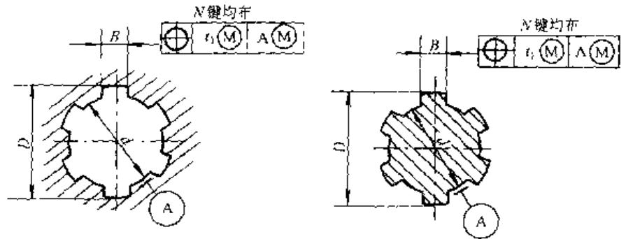

/mm 

表4-3-34

矩形花键的对称度和等分度公差(参考)

<table><tr><td rowspan=2 colspan=2>键槽宽或键宽B</td><td rowspan=1 colspan=1>3</td><td rowspan=1 colspan=1>3.5-6</td><td rowspan=1 colspan=2>7~10        I        12~18</td></tr><tr><td rowspan=1 colspan=4>位置度公差</td></tr><tr><td rowspan=1 colspan=2>键   槽</td><td rowspan=1 colspan=1>0.010</td><td rowspan=1 colspan=1>0.015</td><td rowspan=1 colspan=1>0.020</td><td rowspan=1 colspan=1>0.025</td></tr><tr><td rowspan=2 colspan=1>键</td><td rowspan=1 colspan=1>滑动、固定</td><td rowspan=1 colspan=1>0.010</td><td rowspan=1 colspan=1>0.015</td><td rowspan=1 colspan=1>0.020</td><td rowspan=1 colspan=1>0.025</td></tr><tr><td rowspan=1 colspan=1>紧滑动</td><td rowspan=1 colspan=1>0.006</td><td rowspan=1 colspan=1>0.010</td><td rowspan=1 colspan=1>0.013</td><td rowspan=1 colspan=1>0.016</td></tr></table>

注:对较长的花健,可报据产品性能自行规定键侧对轴线的平行度公差。

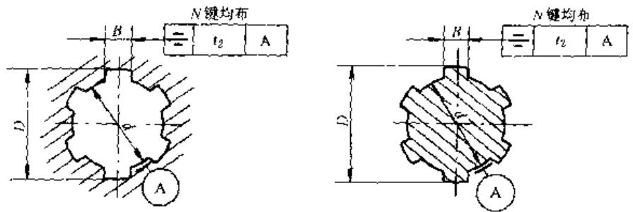

/mm 

表4-3-35

矩形花键标记

<table><tr><td rowspan=2 colspan=1>键槽宽或键宽B</td><td rowspan=1 colspan=1>3</td><td rowspan=1 colspan=1>3.5-6</td><td rowspan=1 colspan=1>7-10</td><td rowspan=1 colspan=1>12-18</td></tr><tr><td rowspan=1 colspan=4>健宽对称度公差12</td></tr><tr><td rowspan=1 colspan=1>一般用</td><td rowspan=1 colspan=1>0.010</td><td rowspan=1 colspan=1>0.012</td><td rowspan=1 colspan=1>0.015</td><td rowspan=1 colspan=1>0.018</td></tr><tr><td rowspan=1 colspan=1>精密传动用</td><td rowspan=1 colspan=1>0.006</td><td rowspan=1 colspan=1>0.008</td><td rowspan=1 colspan=1>0.009</td><td rowspan=1 colspan=1>0.011</td></tr></table>

注:1.花键的对称度和等分度公差一般适用于单项检验方法。2.花键的等分度公差值等于键宽的对称度公差。

表4-3-36

矩形花键的标记代号应按次序包括下列项目:键数 $\pmb { \mathscr { N } }$ 、小径 $\pmb { d }$ 、大径 $\pmb { \eta }$ 、键宽 $\pmb { \beta }$ 、花键公称代号示例: $N = 6$ 、 $d = 2 3$ 、 ${ \pmb { \mathscr { D } } } = 2 { \pmb { \mathscr { b } } }$ 、 $\pmb { B } = 6$ 的标记如下

<table><tr><td rowspan=1 colspan=1>花键规格</td><td rowspan=1 colspan=1>NxdxD×B   例如6×23×26×6</td></tr><tr><td rowspan=1 colspan=1>花键副</td><td rowspan=1 colspan=1>H7    H10  H6×23  ×26   ×6     GB/T1144-19877    a1   d1</td></tr><tr><td rowspan=1 colspan=1>内花键</td><td rowspan=1 colspan=1>6×23H7×26H10×6H1GB/T1144-1987</td></tr><tr><td rowspan=1 colspan=1>外花键</td><td rowspan=1 colspan=1>6×23f7×26a11×6d10GB/T1144-1987</td></tr></table>

# 3.4圆柱直齿渐开线花键(GB/T3478.1—1995)

本标准规定了圆柱直齿渐开线花键的模数系列、基本齿廊、公差和齿侧配合类别等内容。本标准用于压力角为 $3 0 ^ { \circ }$ 和 $3 7 . 5 ^ { \circ }$ (模数为 $0 . 5 \sim 1 0 \mathrm { m m }$ 以及 $4 5 ^ { \circ }$ (模数为 $0 . 2 5 \sim 2 . 5 \mathrm { m m }$ )齿侧配合的圆柱直齿渐升线花键。

# 3.4.1术语、代号和定义

本标准采用的术语、代号和定义见表4-3-37和图4-3-2( $3 0 ^ { \circ }$ 压力角平齿根,以下简称 $3 0 ^ { \circ }$ 平齿根; $3 0 ^ { \circ }$ 压力角圆齿根,以下简称 $3 0 ^ { \circ }$ 圆齿根; $3 7 . 5 ^ { \circ }$ 压力角圆齿根,以下简称 $3 7 , 5 ^ { \circ }$ 圆齿根; $4 5 ^ { \circ }$ 压力角圆齿根,以下简称 $4 5 ^ { \circ }$ 圆齿根)。

表4-3-37

术语、代号和定义

<table><tr><td colspan="1" rowspan="1">序号</td><td colspan="1" rowspan="1">术语</td><td colspan="1" rowspan="1">代号</td><td colspan="1" rowspan="1">定     义</td></tr><tr><td colspan="1" rowspan="1">1</td><td colspan="1" rowspan="1">花键联接</td><td colspan="1" rowspan="1"></td><td colspan="1" rowspan="1">两零件上借助内、外圆柱表面上等距分布且齿数相同的键齿相互联接、传递转矩或运动的同轴偶件。在内圆柱表面上的花键为内花键，在外圆柱表面上的花键为外花键</td></tr><tr><td colspan="1" rowspan="1">2</td><td colspan="1" rowspan="1">渐开线花键</td><td colspan="1" rowspan="1"></td><td colspan="1" rowspan="1">具有渐开线齿形的花键</td></tr><tr><td colspan="1" rowspan="1">3</td><td colspan="1" rowspan="1">齿根圆弧齿根圆孤最小曲率半径内花键外花键</td><td colspan="1" rowspan="1">RRun</td><td colspan="1" rowspan="1">联接渐开线齿形与齿根圆的过渡曲线</td></tr><tr><td colspan="1" rowspan="1">4</td><td colspan="1" rowspan="1">平齿根花键</td><td colspan="1" rowspan="1"></td><td colspan="1" rowspan="1">在花键间一齿槽上，两侧渐开线齿形各由一段过渡曲线与齿根圆相联接的花键</td></tr><tr><td colspan="1" rowspan="1">5</td><td colspan="1" rowspan="1">圆齿根花键</td><td colspan="1" rowspan="1"></td><td colspan="1" rowspan="1">在花键同一齿槽上，两侧渐开线齿形各由一段过渡曲线与齿根圆相联接的花键</td></tr><tr><td colspan="1" rowspan="1">6</td><td colspan="1" rowspan="1">模数</td><td colspan="1" rowspan="1">m</td><td colspan="1" rowspan="1"></td></tr><tr><td colspan="1" rowspan="1">7</td><td colspan="1" rowspan="1">齿数</td><td colspan="1" rowspan="1">7</td><td colspan="1" rowspan="1"></td></tr><tr><td colspan="1" rowspan="1">8</td><td colspan="1" rowspan="1">分度圆</td><td colspan="1" rowspan="1"></td><td colspan="1" rowspan="1">计算花键尺寸用的基准圆，在此圆上的压力角为标准值</td></tr><tr><td colspan="1" rowspan="1">9</td><td colspan="1" rowspan="1">分度圆直径</td><td colspan="1" rowspan="1">D</td><td colspan="1" rowspan="1"></td></tr><tr><td colspan="1" rowspan="1">10</td><td colspan="1" rowspan="1">齿距</td><td colspan="1" rowspan="1">P</td><td colspan="1" rowspan="1">分度圆上两相邻同侧齿形之间的弧长，其值为圆周率π乘以模数m</td></tr><tr><td colspan="1" rowspan="1">11</td><td colspan="1" rowspan="1">压力角</td><td colspan="1" rowspan="1">m</td><td colspan="1" rowspan="1">齿形上任意点的压力角，为过该点花键的径向线与齿形在该点的切线所夹锐角</td></tr><tr><td colspan="1" rowspan="1">12</td><td colspan="1" rowspan="1">标准压力角</td><td colspan="1" rowspan="1">αD</td><td colspan="1" rowspan="1">规定在分度圆上的压力角</td></tr><tr><td colspan="1" rowspan="1">13</td><td colspan="1" rowspan="1">基圆</td><td colspan="1" rowspan="1"></td><td colspan="1" rowspan="1">展成渐开线齿形的假想圆</td></tr><tr><td colspan="1" rowspan="1">14</td><td colspan="1" rowspan="1">基圆直径</td><td colspan="1" rowspan="1">D</td><td colspan="1" rowspan="1"></td></tr><tr><td colspan="1" rowspan="1">15</td><td colspan="1" rowspan="1">大径内花键外花键</td><td colspan="1" rowspan="1">DD</td><td colspan="1" rowspan="1">内花键的齿根圆（大圆）或外花键的齿顶圆（大圆）的直径</td></tr><tr><td colspan="1" rowspan="1">16</td><td colspan="1" rowspan="1">小径内花键外花键</td><td colspan="1" rowspan="1">DD</td><td colspan="1" rowspan="1">内花键的齿顶圆（小圆）或外花键的齿根圆（小圆）的直径</td></tr><tr><td colspan="1" rowspan="1">17</td><td colspan="1" rowspan="1">渐开线终止圆</td><td colspan="1" rowspan="1"></td><td colspan="1" rowspan="1">渐开线花键内花键齿形终止点的圆，此圆与小圆共同形成渐开线齿形的控制界限</td></tr><tr><td colspan="1" rowspan="1">18</td><td colspan="1" rowspan="1">渐开线终止圆直径</td><td colspan="1" rowspan="1">D</td><td colspan="1" rowspan="1"></td></tr><tr><td colspan="1" rowspan="1">19</td><td colspan="1" rowspan="1">渐开线起始圆</td><td colspan="1" rowspan="1"></td><td colspan="1" rowspan="1">渐开线花键外花键齿形起始点的圆，此圆与大圆共同形成漸开线齿形的控制界限</td></tr><tr><td colspan="1" rowspan="1">20</td><td colspan="1" rowspan="1">渐开线起始圆直径</td><td colspan="1" rowspan="1">Dre</td><td colspan="1" rowspan="1"></td></tr><tr><td colspan="1" rowspan="1">21</td><td colspan="1" rowspan="1">基本齿槽宽</td><td colspan="1" rowspan="1">E</td><td colspan="1" rowspan="1">内花键分度圆上弧齿槽宽，其值为齿距之半</td></tr><tr><td>序号</td><td>术语</td><td>代号</td><td>读衣 定 义</td></tr><tr><td></td><td>实际齿槽宽</td><td></td><td></td></tr><tr><td>22</td><td>最大值</td><td>Emx</td><td>在内花键分度圆上实际测得的单个齿槽的弧齿槽宽</td></tr><tr><td></td><td>最小值</td><td>Eom</td><td></td></tr><tr><td></td><td></td><td>E</td><td></td></tr><tr><td>23</td><td>作用齿槽宽 最大值</td><td>Evmax</td><td>等于一与之在全齿长上配合（无间隙且尤过盈）的理想全齿外花键分度圆！的弧</td></tr><tr><td></td><td>最小值</td><td>Evu</td><td>齿厚</td></tr><tr><td>24</td><td>基本齿厚</td><td>s</td><td></td></tr><tr><td></td><td></td><td></td><td>外花键分度园上弧齿厚，其值为齿距之半</td></tr><tr><td>25</td><td>实际齿厚 最大值</td><td>Smex</td><td></td></tr><tr><td></td><td>最小值</td><td>Sm</td><td>在外花键分度圆卜实际测得的单个花键齿的弧齿厚</td></tr><tr><td></td><td></td><td></td><td></td></tr><tr><td>26</td><td>作用齿厚 最大值</td><td>S Svau</td><td>等于一与之在全齿长上配合（无间隙且无过盈）的理想全齿内花键分度圆上的弧</td></tr><tr><td></td><td>最小值</td><td>Svoun</td><td>齿槽宽</td></tr><tr><td>27</td><td>作用侧隙</td><td>Cv</td><td>内花键作用齿槽宽减去与之相配合的外化键作用齿厚。正值为间隙，负值为过盈</td></tr><tr><td>28</td><td>（全齿侧） 理论侧隙</td><td></td><td>内花键实际齿槽宽减去与之相配合的外化键实际齿厚</td></tr><tr><td>29</td><td>（单齿侧隙）</td><td>G</td><td>在花键联接中，渐开线齿形超过结合部分的径向距离</td></tr><tr><td>30</td><td>齿形裕度 总公差</td><td>C</td><td>加工公差与综合公差之和</td></tr><tr><td></td><td></td><td>T+x</td><td>实际齿增宽或实际齿厚的允许变动量</td></tr><tr><td>31</td><td>加工公差</td><td>T</td><td></td></tr><tr><td>32</td><td>综合误差 综合公差</td><td>A</td><td>花键齿（或齿槽）的形状和位置误差的综合 允许的综合误差</td></tr><tr><td>33</td><td>齿距累积误差</td><td>△F</td><td>在分度圆上任意两个同侧齿面间的实际弧长与理论弧长之差的最大绝对值</td></tr><tr><td></td><td>齿距累积公差 齿形误差</td><td>F f</td><td>允许的齿距累积误差 在齿形1作部分（包括齿形裕度部分、不包括齿顶倒棱）包容实际齿形的两条理</td></tr><tr><td>34</td><td></td><td></td><td>论齿形之间的法向距离 允许的齿形误差</td></tr><tr><td></td><td>齿形公差 齿向误差</td><td>s F</td><td>在花键长度范围内，包容实际齿线的两条理论齿线之间的分度圆弧长</td></tr><tr><td>35</td><td>齿向公差</td><td></td><td>齿线是分度圆杜面与齿面的交线 允许的齿向误差</td></tr><tr><td>36</td><td>棒间距</td><td>F M</td><td>借助两量棒测量内花键实际齿槽宽时两量棒间的内侧距离，统称为M俏</td></tr><tr><td>37</td><td>跨棒距</td><td>M</td><td>借助两量棒测量外花键实际齿厚时两量棒间的外侧距离，统称为M值</td></tr><tr><td></td><td></td><td></td><td>相隔K个齿的两外侧齿面各与两平行平面之中的一个平面相切，此两平行平面</td></tr><tr><td>38</td><td>公法线长度</td><td></td><td>之间的垂直距离 必须指明两平行平面所跨的齿数</td></tr><tr><td></td><td>公法线平均长度</td><td>W</td><td>同一花键上实际澳得的公法线长度的平均值</td></tr><tr><td>39</td><td>基本尺寸</td><td></td><td>设计给定的尺寸，该尺寸是规定公差的基础</td></tr><tr><td></td><td></td><td></td><td></td></tr><tr><td></td><td></td><td></td><td></td></tr><tr><td>40</td><td>辅助尺寸</td><td></td><td>仅在必要时供生产和控制用的尺寸</td></tr></table>

注: $\Delta F _ { p }$ 和 $\Delta { \cal F } _ { \beta }$ 允许在分度圆附近测量。

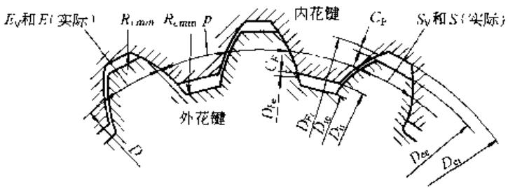

(a)30平齿根

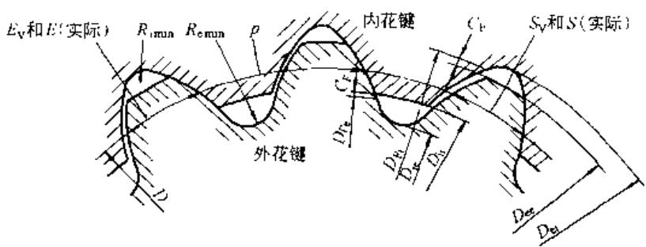

(b)30國齿根

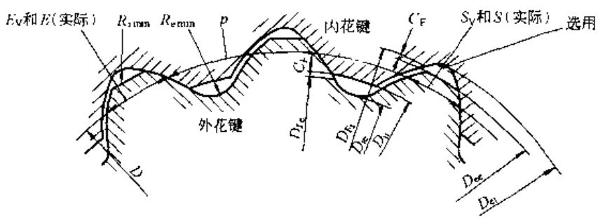

(c)37.5°圆齿根

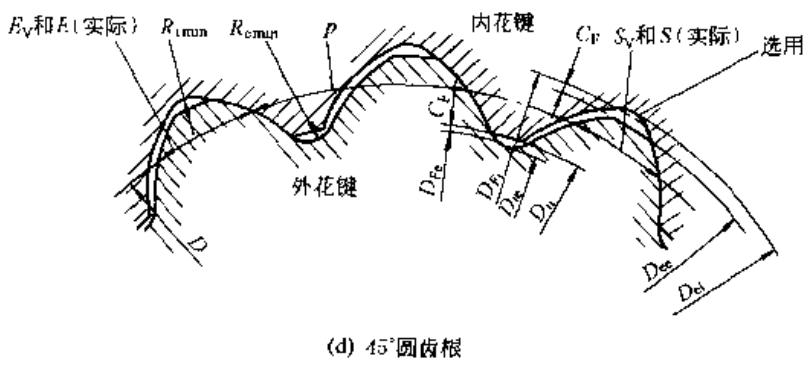

图4-3-2渐开线花键联接

# 3.4.2基本参数

(1)基本参数见表4-3-38,

(2)标准压力角 $\pmb { \alpha _ { \parallel } }$ 是基本齿廓的齿形角。压力角适用范围见表4-3-39。

(3)模数 $\pmb { m }$ 分为两个系列,共15种。优先采用第1系列。

花键的压力角大,则键齿强度大,在传递的圆周力相同时,大压力角花键的正压力也大,故摩擦力大。选择压力角时,主要应从构件的工作特点即有无滑动、浮动以及配合性质和工艺方法等方面考虑。

<table><tr><td rowspan=1 colspan=6>表4-3-38                                          基本参数                                               /mm</td></tr><tr><td rowspan=2 colspan=1>齿</td><td rowspan=1 colspan=2>模数m</td><td rowspan=2 colspan=1>齿距p</td><td rowspan=2 colspan=2>基本齿槽宽E和基本齿厚Sa□30°、37.5°            45</td></tr><tr><td rowspan=1 colspan=1>第1系列</td><td rowspan=1 colspan=1>第2系列</td></tr><tr><td rowspan=1 colspan=1>></td><td rowspan=1 colspan=1>0.25</td><td rowspan=1 colspan=1></td><td rowspan=1 colspan=1>0.785</td><td rowspan=1 colspan=1></td><td rowspan=1 colspan=1>0.393</td></tr><tr><td rowspan=1 colspan=1>}}sy</td><td rowspan=1 colspan=1>0.5</td><td rowspan=1 colspan=1></td><td rowspan=1 colspan=1>1.571</td><td rowspan=1 colspan=1>0.785</td><td rowspan=1 colspan=1>0.785</td></tr><tr><td rowspan=1 colspan=1>~55</td><td rowspan=1 colspan=1></td><td rowspan=1 colspan=1>0.75</td><td rowspan=1 colspan=1>2.356</td><td rowspan=1 colspan=1>1.178</td><td rowspan=1 colspan=1>1.178</td></tr><tr><td rowspan=1 colspan=1>4?553</td><td rowspan=1 colspan=1></td><td rowspan=1 colspan=1></td><td rowspan=1 colspan=1>3.142</td><td rowspan=1 colspan=1>1.571</td><td rowspan=1 colspan=1>1.571</td></tr><tr><td rowspan=1 colspan=1>5>55</td><td rowspan=1 colspan=1></td><td rowspan=1 colspan=1>1.25</td><td rowspan=1 colspan=1>3.927</td><td rowspan=1 colspan=1>1.963</td><td rowspan=1 colspan=1>1.963</td></tr><tr><td rowspan=1 colspan=1>$Ss</td><td rowspan=1 colspan=1>1.5</td><td rowspan=1 colspan=1></td><td rowspan=1 colspan=1>4.712</td><td rowspan=1 colspan=1>2.356</td><td rowspan=1 colspan=1>2.356</td></tr><tr><td rowspan=1 colspan=1>~s</td><td rowspan=1 colspan=1></td><td rowspan=1 colspan=1>1.75</td><td rowspan=1 colspan=1>5.498</td><td rowspan=1 colspan=1>2.749</td><td rowspan=1 colspan=1>2.749</td></tr><tr><td rowspan=1 colspan=1>>></td><td rowspan=1 colspan=1>2</td><td rowspan=1 colspan=1></td><td rowspan=1 colspan=1>6.283</td><td rowspan=1 colspan=1>3.142</td><td rowspan=1 colspan=1>3.142</td></tr><tr><td rowspan=1 colspan=1>>></td><td rowspan=1 colspan=1>2.5</td><td rowspan=1 colspan=1></td><td rowspan=1 colspan=1>7.854</td><td rowspan=1 colspan=1>3.927</td><td rowspan=1 colspan=1>3.927</td></tr><tr><td rowspan=1 colspan=1></td><td rowspan=1 colspan=1>3</td><td rowspan=1 colspan=1></td><td rowspan=1 colspan=1>9.425</td><td rowspan=1 colspan=1>4.712</td><td rowspan=1 colspan=1></td></tr><tr><td rowspan=1 colspan=1></td><td rowspan=1 colspan=1></td><td rowspan=1 colspan=1>4</td><td rowspan=1 colspan=1>12.566</td><td rowspan=1 colspan=1>6.283</td><td rowspan=1 colspan=1></td></tr><tr><td rowspan=1 colspan=1></td><td rowspan=1 colspan=1>5</td><td rowspan=1 colspan=1></td><td rowspan=1 colspan=1>15.708</td><td rowspan=1 colspan=1>7.854</td><td rowspan=1 colspan=1></td></tr><tr><td rowspan=1 colspan=1></td><td rowspan=1 colspan=1></td><td rowspan=1 colspan=1>6</td><td rowspan=1 colspan=1>18.850</td><td rowspan=1 colspan=1>9.425</td><td rowspan=1 colspan=1></td></tr><tr><td rowspan=1 colspan=1></td><td rowspan=1 colspan=1></td><td rowspan=1 colspan=1>8</td><td rowspan=1 colspan=1>25.133</td><td rowspan=1 colspan=1>12.566</td><td rowspan=1 colspan=1></td></tr><tr><td rowspan=1 colspan=1></td><td rowspan=1 colspan=1>10</td><td rowspan=1 colspan=1></td><td rowspan=1 colspan=1>31.416</td><td rowspan=1 colspan=1>15.708</td><td rowspan=1 colspan=1></td></tr></table>

压力角适用范围

<table><tr><td rowspan=1 colspan=1>压力角</td><td rowspan=1 colspan=1>适用范围</td></tr><tr><td rowspan=1 colspan=1>30</td><td rowspan=1 colspan=1>应用广泛，适用于传递运动、动力，常用于滑动、浮动和固定联接</td></tr><tr><td rowspan=1 colspan=1>37.50</td><td rowspan=1 colspan=1>传递运动、动力，常用于滑动及过渡配合，适用于冷成型工艺</td></tr><tr><td rowspan=1 colspan=1>45</td><td rowspan=1 colspan=1>适用于壁较厚足以防止破裂的零件、常用于过渡和较小间隙配合，适用于冷成型L艺</td></tr></table>

# 3.4.3基本齿廊

(1)本标准按三种齿形角和两种齿根规定了四种基本齿廓,见图4-3-3。

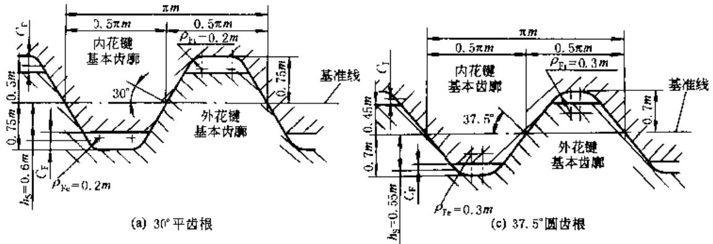

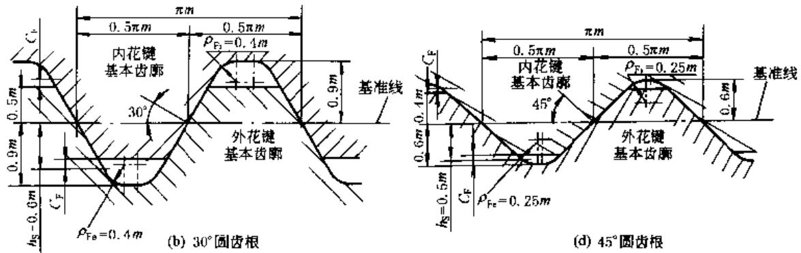

图4-3-3基本齿廓

(2)渐开线花键的基本齿廓是指基本齿条的法向齿廓,基本齿条是指直径无穷大的无误差的理想花键。

(3)基本齿廓是决定渐开线花键尺寸的依据。

(4)基准线是贯穿基本齿廓的一条直线,以此线为基准,确定基本齿廓的尺寸。

(5)允许平齿根和圆齿根的基本齿廓在内、外花键上混合使用。

(6)基本齿廓的应用:基本齿廓的选择主要取决于花键的用途。花键的用途大致如下。

1) $3 0 ^ { \circ }$ 平齿根适用于零件的壁厚较薄,不能采用圆齿根的场合,或强度足够的花键,或花键的工作长度紧靠轴肩。从刀具制造看,加工平齿根花键的刀具由于切削深度较小,因而拉刀全长较短,较经济,易制造。这种齿形应用广泛。

2) $3 0 ^ { \circ }$ 圓齿根比平齿根花键弯曲强度大(齿根应力集中较小),承载能力较高,通常用于大载荷的传动轴上。

3) $3 7 . 5 ^ { \circ }$ 圆齿根花键的压力角和齿形参数恰好是 $3 0 ^ { \circ }$ 和 $4 5 ^ { \circ }$ 压力角花键的折衷,常用于联轴器。它的外花键用冷成型工艺,特别是 $4 5 ^ { \circ }$ 压力角的花键不能满足功能需要,以及轴材料硬度超过 $3 0 ^ { \circ } .$ 压力角冷成型刀具所允许的硬度极限时。

4) $4 5 ^ { \circ }$ 圆齿根齿矮、压力角大,故弯曲强度好,适用于壁较厚足以防止破裂的零件。适用于冷成型工艺。

# 3.4.4尺寸系列

花键尺寸计算公式见表4-3-40.

表4-3-40

花键尺寸计算公式

<table><tr><td>项 H</td><td>代</td><td>号</td><td></td><td>公式或说明</td></tr><tr><td>分度圆直径</td><td>D</td><td></td><td>D=m</td><td></td></tr><tr><td>基圆直径</td><td>Db</td><td></td><td>Db= mzcosuD.αu</td><td>一标准压刀角</td></tr><tr><td>齿距</td><td>p</td><td></td><td>p=πm</td><td></td></tr><tr><td>内花键大径基本尺寸</td><td></td><td></td><td></td><td></td></tr><tr><td>30平齿根</td><td>D</td><td></td><td>D=m (x+1.5）</td><td></td></tr><tr><td>30齿根</td><td>D</td><td></td><td>D=m （z+1.8）</td><td></td></tr><tr><td>37.5圆齿根</td><td>D</td><td></td><td>D=m(z+1.4）</td><td></td></tr><tr><td>45圆齿根</td><td>D</td><td></td><td>D=m（z+1.2）（见注1）</td><td></td></tr><tr><td>内化键大径下偏差</td><td></td><td></td><td>0</td><td></td></tr><tr><td>内花键大径公差</td><td></td><td></td><td>从IT12、ITI3或IT14中选取</td><td></td></tr><tr><td>内花键渐开线终止圆直径最小值</td><td></td><td></td><td></td><td></td></tr><tr><td>30平齿根和圆齿根</td><td>DFmu</td><td></td><td>Dmn=m（z+1）+2Cr</td><td></td></tr><tr><td>37.5齿根</td><td>Drumm</td><td></td><td>DFm=m（z+0.9）+2CF</td><td></td></tr><tr><td>45°圆齿根</td><td>Drmn</td><td></td><td>DFn=m（z+0.8）+2C,</td><td></td></tr><tr><td>内花键小径基本尺寸</td><td>D</td><td></td><td>D,=Dtemm+2C、（见注2）</td><td></td></tr><tr><td>内花键小径极限偏差</td><td></td><td></td><td>见表4-3-46</td><td></td></tr><tr><td>基本齿槽宽</td><td>E</td><td></td><td>E=0.5πm</td><td></td></tr><tr><td>作用齿槽宽</td><td>E</td><td></td><td></td><td></td></tr><tr><td>作用齿槽宽最小值</td><td>Evm</td><td></td><td>Evmn =0.5元m</td><td></td></tr><tr><td>实际齿槽宽最大值</td><td>Emex</td><td></td><td>Eoax=Evmn+（T+）</td><td></td></tr><tr><td>实际齿槽宽最小值</td><td>Emu</td><td></td><td>En = Evr+λ</td><td></td></tr><tr><td>作用齿槽宽最大值</td><td>EYmax</td><td></td><td>Evx=Ex-</td><td></td></tr><tr><td>外花键作用齿厚上偏差</td><td>Py</td><td></td><td>e8v见表4-3-52</td><td></td></tr><tr><td>外花键大径基本尺寸</td><td></td><td></td><td></td><td></td></tr><tr><td>30平齿根和圆齿根</td><td>D</td><td></td><td>D=m(z+1）</td><td></td></tr><tr><td>37.5圆齿根</td><td>D</td><td></td><td>D=m（z+0.9） D=m（z+08）</td><td></td></tr><tr><td>45圆齿根 外花键大径上偏差</td><td>D</td><td></td><td></td><td></td></tr><tr><td>外花键大径公差</td><td></td><td></td><td>esy/tana p</td><td></td></tr><tr><td>外花键渐开线起始圖直径最大值</td><td>Draax</td><td></td><td>Dfema=2 (0.5D）</td><td>0.5ey h,- tanau 0.5Dgina- sinup</td></tr><tr><td>外花键小径基本尺寸</td><td></td><td></td><td>（见注3）</td><td></td></tr><tr><td>30平齿根</td><td>D</td><td></td><td>D=m（z-1.5）</td><td></td></tr><tr><td>30齿根</td><td>Die</td><td></td><td>D=m（z-1.8）</td><td></td></tr><tr><td>37.5圆齿根</td><td>D</td><td></td><td>D,= m (z-1.4）</td><td></td></tr><tr><td>45圆齿根</td><td>De</td><td></td><td>D=m（-1.2）</td><td></td></tr><tr><td>外花键小径上偏差</td><td></td><td></td><td>esv/tanap，见表4-3-50</td><td></td></tr><tr><td>外花键小径公差</td><td></td><td></td><td>从IT12、ITI3和IT14中选取</td><td></td></tr><tr><td>基本齿厚</td><td>s</td><td></td><td>S=0.5πm</td><td></td></tr><tr><td>作用齿厚最大值</td><td>SY</td><td></td><td>Sv = S + eBv</td><td></td></tr><tr><td>实际齿厚最小值</td><td>Sin</td><td></td><td>Sin=Svma-（T+λ）</td><td></td></tr><tr><td>实际齿厚最大值</td><td>Su</td><td></td><td>Sm=Svmax-</td><td></td></tr><tr><td>作用齿厚最小值</td><td>Symup</td><td></td><td>Symn = Son+A</td><td></td></tr><tr><td></td><td></td><td></td><td></td><td></td></tr><tr><td>齿形裕度</td><td>CF</td><td></td><td>C=0.1m（见注4）</td><td></td></tr></table>

注:1 $3 7 . 5 ^ { \circ }$ 和 $4 5 ^ { \circ }$ 圆齿根内花键允许选用平齿根,此时,内花键大径基本尺寸 $\smash {  { n _ { \star } } }$ 应大于内花键渐开线终止圆直径最小值$D _ { \mathtt { F } _ { \mathtt { M O D } } \circ }$ 2.对所有花键齿侧配合类别、均按H/h配合类别取 $D _ { F \otimes \mathbf { a } }$ 值。3. $D _ { \mathtt { F e m a } }$ 公式是按齿条形 $\mathcal { I }$ 具加T原理推导的,式中 $\hbar _ { * } = 0 . 6 m$ ${ } ^ { 3 0 ^ { \circ } }$ 平长根、圆齿根); $h _ { \ast } = 0 . 5 5 m$ (37 $. 5 ^ { \circ }$ 圆齿根);$\bar { \mathbf { h } } _ { \bullet } = \mathbf { 0 } \lrcorner \bar { \mathsf { s } } m$ $4 5 ^ { \circ }$ 圆齿恨)。4.除 $\mathsf { H } _ { \ell } \gamma _ { \ell }$ 配合类别 $C _ { F }$ 均等于 $0 . 1 m$ 外,其他各种配合类别的齿形裕度均有变化。

$3 0 ^ { \circ }$ 外花键大径基本尺寸系列

<table><tr><td rowspan=2 colspan=1>齿数：</td><td rowspan=1 colspan=16>模     数-</td></tr><tr><td rowspan=1 colspan=1>0.5</td><td rowspan=1 colspan=1>（0.75）</td><td rowspan=1 colspan=1>1</td><td rowspan=1 colspan=1>(1.25)</td><td rowspan=1 colspan=1>1.5</td><td rowspan=1 colspan=1>(1.75)</td><td rowspan=1 colspan=1>2</td><td rowspan=1 colspan=1>2.5</td><td rowspan=1 colspan=2>3</td><td rowspan=1 colspan=1>（4）</td><td rowspan=1 colspan=1>5</td><td rowspan=1 colspan=1>（6）</td><td rowspan=1 colspan=2>（8）</td><td rowspan=1 colspan=1>10</td></tr><tr><td rowspan=1 colspan=1>10</td><td rowspan=1 colspan=1>5.5</td><td rowspan=1 colspan=1>8.25</td><td rowspan=1 colspan=1>11</td><td rowspan=1 colspan=1>13.75</td><td rowspan=1 colspan=1>165</td><td rowspan=1 colspan=1>19 25</td><td rowspan=1 colspan=1>22</td><td rowspan=1 colspan=1>27.5</td><td rowspan=1 colspan=2>3</td><td rowspan=1 colspan=1>44</td><td rowspan=1 colspan=1>55</td><td rowspan=1 colspan=1>66</td><td rowspan=1 colspan=2>88</td><td rowspan=1 colspan=1>110</td></tr><tr><td rowspan=1 colspan=1>11</td><td rowspan=1 colspan=1>6.0</td><td rowspan=1 colspan=1>9.00</td><td rowspan=1 colspan=1>12</td><td rowspan=1 colspan=1>15.00</td><td rowspan=1 colspan=1>18.0</td><td rowspan=1 colspan=1>21.00</td><td rowspan=1 colspan=1>24</td><td rowspan=1 colspan=1>30.0</td><td rowspan=1 colspan=2>36</td><td rowspan=1 colspan=1>48</td><td rowspan=1 colspan=1>60</td><td rowspan=1 colspan=1>72</td><td rowspan=1 colspan=2>96</td><td rowspan=6 colspan=1>120130140150160170</td></tr><tr><td rowspan=1 colspan=1>12</td><td rowspan=1 colspan=1>6.5</td><td rowspan=1 colspan=1>9.75</td><td rowspan=1 colspan=1>13</td><td rowspan=1 colspan=1>16.25</td><td rowspan=1 colspan=1>19.5</td><td rowspan=1 colspan=1>22.75</td><td rowspan=1 colspan=1>26</td><td rowspan=1 colspan=1>32.5</td><td rowspan=1 colspan=2>39</td><td rowspan=1 colspan=1>52</td><td rowspan=1 colspan=1>65</td><td rowspan=1 colspan=1>78</td><td rowspan=1 colspan=2>104</td></tr><tr><td rowspan=1 colspan=1>13</td><td rowspan=1 colspan=1>7.0</td><td rowspan=1 colspan=1>10.50</td><td rowspan=1 colspan=1>14</td><td rowspan=1 colspan=1>17.50</td><td rowspan=1 colspan=1>21.0</td><td rowspan=1 colspan=1>24.50</td><td rowspan=1 colspan=1>28</td><td rowspan=1 colspan=1>35.0</td><td rowspan=1 colspan=2>42</td><td rowspan=1 colspan=1>56</td><td rowspan=1 colspan=1>70</td><td rowspan=1 colspan=1>84</td><td rowspan=1 colspan=2>112</td></tr><tr><td rowspan=1 colspan=1>14</td><td rowspan=1 colspan=1>7.5</td><td rowspan=1 colspan=1>11.25</td><td rowspan=1 colspan=1>15</td><td rowspan=1 colspan=1>18.75</td><td rowspan=1 colspan=1>22.5</td><td rowspan=1 colspan=1>26.25</td><td rowspan=1 colspan=1>30</td><td rowspan=1 colspan=1>37.5</td><td rowspan=1 colspan=2>45</td><td rowspan=1 colspan=1>60</td><td rowspan=1 colspan=1>75</td><td rowspan=1 colspan=1>90</td><td rowspan=1 colspan=2>120</td></tr><tr><td rowspan=1 colspan=1>15</td><td rowspan=1 colspan=1>8.0</td><td rowspan=1 colspan=1>12.00</td><td rowspan=1 colspan=1>16</td><td rowspan=1 colspan=1>20.00</td><td rowspan=1 colspan=1>24.0</td><td rowspan=1 colspan=1>28.00</td><td rowspan=1 colspan=1>32</td><td rowspan=1 colspan=1>40.0</td><td rowspan=1 colspan=2>48</td><td rowspan=1 colspan=1>64</td><td rowspan=1 colspan=1>80</td><td rowspan=1 colspan=1>96</td><td rowspan=2 colspan=2>128136</td></tr><tr><td rowspan=1 colspan=1>16</td><td rowspan=1 colspan=1>8.5</td><td rowspan=1 colspan=1>12.75</td><td rowspan=1 colspan=1>17</td><td rowspan=1 colspan=1>21.25</td><td rowspan=1 colspan=1>25.5</td><td rowspan=1 colspan=1>29.75</td><td rowspan=1 colspan=1>34</td><td rowspan=1 colspan=1>42.5</td><td rowspan=1 colspan=2>51</td><td rowspan=1 colspan=1>68</td><td rowspan=1 colspan=1>85</td><td rowspan=1 colspan=1>102</td></tr><tr><td rowspan=1 colspan=1>17</td><td rowspan=1 colspan=1>9.0</td><td rowspan=1 colspan=1>13.50</td><td rowspan=1 colspan=1></td><td rowspan=1 colspan=1>22.50</td><td rowspan=1 colspan=1>27.0</td><td rowspan=1 colspan=1>31.50</td><td rowspan=1 colspan=1>36</td><td rowspan=1 colspan=1>45.0</td><td rowspan=1 colspan=2>54</td><td rowspan=1 colspan=1>72</td><td rowspan=1 colspan=1>90</td><td rowspan=1 colspan=1>108</td><td rowspan=2 colspan=2>144152</td><td rowspan=2 colspan=1>180190</td></tr><tr><td rowspan=1 colspan=1>18</td><td rowspan=1 colspan=1>9.5</td><td rowspan=1 colspan=1>14.25</td><td rowspan=1 colspan=1>19</td><td rowspan=1 colspan=1>23.75</td><td rowspan=1 colspan=1>28.5</td><td rowspan=1 colspan=1>33.25</td><td rowspan=1 colspan=1>38</td><td rowspan=1 colspan=1>47.5</td><td rowspan=1 colspan=2>57</td><td rowspan=1 colspan=1>76</td><td rowspan=1 colspan=1>95</td><td rowspan=1 colspan=1>114</td></tr><tr><td rowspan=1 colspan=1>19</td><td rowspan=1 colspan=1>10.0</td><td rowspan=1 colspan=1>15.00</td><td rowspan=1 colspan=1>20</td><td rowspan=1 colspan=1>25.00</td><td rowspan=1 colspan=1>30.0</td><td rowspan=1 colspan=1>35.00</td><td rowspan=1 colspan=1>40</td><td rowspan=1 colspan=1>50.0</td><td rowspan=1 colspan=2>60</td><td rowspan=1 colspan=1>80</td><td rowspan=1 colspan=1>100</td><td rowspan=1 colspan=1>120</td><td rowspan=1 colspan=2>160</td><td rowspan=1 colspan=1>200</td></tr><tr><td rowspan=1 colspan=1>20</td><td rowspan=1 colspan=1>10.5</td><td rowspan=1 colspan=1>15.75</td><td rowspan=1 colspan=1>21</td><td rowspan=1 colspan=1>26.25</td><td rowspan=1 colspan=1>31.5</td><td rowspan=1 colspan=1>36.75</td><td rowspan=1 colspan=1>42</td><td rowspan=1 colspan=1>52.5</td><td rowspan=1 colspan=2>63</td><td rowspan=1 colspan=1>84</td><td rowspan=1 colspan=1>105</td><td rowspan=2 colspan=1>126132</td><td rowspan=2 colspan=2>168176</td><td rowspan=5 colspan=1>210220230240250</td></tr><tr><td rowspan=1 colspan=1>21</td><td rowspan=1 colspan=1>11.0</td><td rowspan=1 colspan=1>16.50</td><td rowspan=1 colspan=1>22</td><td rowspan=1 colspan=1>27.50</td><td rowspan=1 colspan=1>33.0</td><td rowspan=1 colspan=1>38.50</td><td rowspan=1 colspan=1>44</td><td rowspan=1 colspan=1>55.0</td><td rowspan=1 colspan=2>66</td><td rowspan=1 colspan=1>88</td><td rowspan=1 colspan=1>110</td></tr><tr><td rowspan=1 colspan=1>22</td><td rowspan=1 colspan=1>11.5</td><td rowspan=1 colspan=1>17.25</td><td rowspan=1 colspan=1>23</td><td rowspan=1 colspan=1>28.75</td><td rowspan=1 colspan=1>34.5</td><td rowspan=1 colspan=1>40.25</td><td rowspan=1 colspan=1>46</td><td rowspan=1 colspan=1>57.5</td><td rowspan=1 colspan=2>69</td><td rowspan=1 colspan=1>92</td><td rowspan=1 colspan=1>115</td><td rowspan=1 colspan=1>138</td><td rowspan=1 colspan=2>184</td></tr><tr><td rowspan=1 colspan=1>23</td><td rowspan=1 colspan=1>12.0</td><td rowspan=1 colspan=1>18.00</td><td rowspan=1 colspan=1>24</td><td rowspan=1 colspan=1>30.00</td><td rowspan=1 colspan=1>36.0</td><td rowspan=1 colspan=1>42.00</td><td rowspan=1 colspan=1>48</td><td rowspan=1 colspan=1>60.0</td><td rowspan=1 colspan=2>72</td><td rowspan=1 colspan=1>96</td><td rowspan=1 colspan=1>120</td><td rowspan=1 colspan=1>144</td><td rowspan=1 colspan=2>192</td></tr><tr><td rowspan=1 colspan=1>24</td><td rowspan=1 colspan=1>12.5</td><td rowspan=1 colspan=1>18.75</td><td rowspan=1 colspan=1>25</td><td rowspan=1 colspan=1>3125</td><td rowspan=1 colspan=1>37.5</td><td rowspan=1 colspan=1>43.75</td><td rowspan=1 colspan=1>50</td><td rowspan=1 colspan=1>62.5</td><td rowspan=1 colspan=2>75</td><td rowspan=1 colspan=1>100</td><td rowspan=1 colspan=1>125</td><td rowspan=1 colspan=1>150</td><td rowspan=1 colspan=2>200</td></tr><tr><td rowspan=1 colspan=1>25</td><td rowspan=1 colspan=1>13.0</td><td rowspan=1 colspan=1>19.50</td><td rowspan=1 colspan=1>26</td><td rowspan=1 colspan=1>32.50</td><td rowspan=1 colspan=1>39.0</td><td rowspan=1 colspan=1>45.50</td><td rowspan=1 colspan=1>52</td><td rowspan=1 colspan=1>65.0</td><td rowspan=1 colspan=2>78</td><td rowspan=1 colspan=1>104</td><td rowspan=1 colspan=1>130</td><td rowspan=1 colspan=1>156</td><td rowspan=1 colspan=2>208</td><td rowspan=30 colspan=1>260270280290300310320330340350360370380390400410420430440450460470480490500510520530540550560</td></tr><tr><td rowspan=1 colspan=1>26</td><td rowspan=1 colspan=1>13.50</td><td rowspan=1 colspan=1>20.25</td><td rowspan=1 colspan=1>27</td><td rowspan=1 colspan=1>33.75</td><td rowspan=1 colspan=1>40.5</td><td rowspan=1 colspan=1>47.25</td><td rowspan=1 colspan=1>54</td><td rowspan=1 colspan=1>67.5</td><td rowspan=1 colspan=2>81</td><td rowspan=1 colspan=1>108</td><td rowspan=1 colspan=1>135</td><td rowspan=1 colspan=1>162</td><td rowspan=1 colspan=2>216</td></tr><tr><td rowspan=1 colspan=1>27</td><td rowspan=1 colspan=1>14.0</td><td rowspan=1 colspan=1>21.00</td><td rowspan=1 colspan=1>28</td><td rowspan=1 colspan=1>35.00</td><td rowspan=1 colspan=1>42.0</td><td rowspan=1 colspan=1>49.00</td><td rowspan=1 colspan=1>56</td><td rowspan=1 colspan=1>70.0</td><td rowspan=1 colspan=2>84</td><td rowspan=1 colspan=1>112</td><td rowspan=1 colspan=1>140</td><td rowspan=28 colspan=1>168174180186192198204210216222228234240246252258264270276282288294300306312318324330336</td><td rowspan=28 colspan=2>224232240248256264272280288296304312320328336344352360368376384392400408416424432440448</td></tr><tr><td rowspan=1 colspan=1>28</td><td rowspan=1 colspan=1>14.5</td><td rowspan=1 colspan=1>21.75</td><td rowspan=1 colspan=1>29</td><td rowspan=1 colspan=1>36.25</td><td rowspan=1 colspan=1>43.5</td><td rowspan=1 colspan=1>50.75</td><td rowspan=1 colspan=1>58</td><td rowspan=1 colspan=1>72.5</td><td rowspan=1 colspan=2>87</td><td rowspan=1 colspan=1>116</td><td rowspan=1 colspan=1>145</td></tr><tr><td rowspan=1 colspan=1>29</td><td rowspan=1 colspan=1>15.0</td><td rowspan=1 colspan=1>22.50</td><td rowspan=1 colspan=1>30</td><td rowspan=1 colspan=1>37 50</td><td rowspan=1 colspan=1>450</td><td rowspan=1 colspan=1>52.50</td><td rowspan=1 colspan=1>60</td><td rowspan=1 colspan=1>75.0</td><td rowspan=1 colspan=2>90</td><td rowspan=1 colspan=1>120</td><td rowspan=1 colspan=1>150</td></tr><tr><td rowspan=1 colspan=1>30</td><td rowspan=1 colspan=1>15.5</td><td rowspan=1 colspan=1>23.25</td><td rowspan=1 colspan=1>31</td><td rowspan=1 colspan=1>38.75</td><td rowspan=1 colspan=1>46.5</td><td rowspan=1 colspan=1>54.25</td><td rowspan=1 colspan=1>62</td><td rowspan=1 colspan=1>77.5</td><td rowspan=1 colspan=2>93</td><td rowspan=1 colspan=1>124</td><td rowspan=1 colspan=1>155</td></tr><tr><td rowspan=1 colspan=1>31</td><td rowspan=1 colspan=1>16.0</td><td rowspan=1 colspan=1>24.00</td><td rowspan=1 colspan=1>32</td><td rowspan=1 colspan=1>40.00</td><td rowspan=1 colspan=1>48.0</td><td rowspan=1 colspan=1>56.00</td><td rowspan=1 colspan=1>64</td><td rowspan=1 colspan=1>80.0</td><td rowspan=1 colspan=2>96</td><td rowspan=1 colspan=1>128</td><td rowspan=3 colspan=1>160165170</td></tr><tr><td rowspan=1 colspan=1>32</td><td rowspan=1 colspan=1>16.5</td><td rowspan=1 colspan=1>24.75</td><td rowspan=1 colspan=1>33</td><td rowspan=1 colspan=1>41.25</td><td rowspan=1 colspan=1>49.5</td><td rowspan=1 colspan=1>57.75</td><td rowspan=1 colspan=1>66</td><td rowspan=1 colspan=1>82.5</td><td rowspan=1 colspan=2>99</td><td rowspan=2 colspan=1>132136</td></tr><tr><td rowspan=1 colspan=1>33</td><td rowspan=1 colspan=1>17.0</td><td rowspan=1 colspan=1>25.50</td><td rowspan=1 colspan=1>34</td><td rowspan=1 colspan=1>42.50</td><td rowspan=1 colspan=1>51.0</td><td rowspan=1 colspan=1>59.50</td><td rowspan=1 colspan=1>68</td><td rowspan=1 colspan=1>85.0</td><td rowspan=1 colspan=2>102</td></tr><tr><td rowspan=1 colspan=1>34</td><td rowspan=1 colspan=1>17.5</td><td rowspan=1 colspan=1>26.25</td><td rowspan=1 colspan=1>35</td><td rowspan=1 colspan=1>43.75</td><td rowspan=1 colspan=1>52.5</td><td rowspan=1 colspan=1>61.25</td><td rowspan=1 colspan=1>70</td><td rowspan=1 colspan=1>87.5</td><td rowspan=1 colspan=2>105</td><td rowspan=1 colspan=1>140</td><td rowspan=21 colspan=1>175180185190195200205210215220225230235240245250255260265270275280</td></tr><tr><td rowspan=1 colspan=1>35</td><td rowspan=1 colspan=1>18.0</td><td rowspan=1 colspan=1>27.00</td><td rowspan=1 colspan=1>36</td><td rowspan=1 colspan=1>45.00</td><td rowspan=1 colspan=1>54.0</td><td rowspan=1 colspan=1>63.00</td><td rowspan=1 colspan=1>72</td><td rowspan=1 colspan=1>90.0</td><td rowspan=1 colspan=2>108</td><td rowspan=2 colspan=1>144148</td></tr><tr><td rowspan=1 colspan=1>36</td><td rowspan=1 colspan=1>18.5</td><td rowspan=1 colspan=1>27.75</td><td rowspan=1 colspan=1>37</td><td rowspan=1 colspan=1>46.25</td><td rowspan=1 colspan=1>55.5</td><td rowspan=1 colspan=1>64.75</td><td rowspan=1 colspan=1>74</td><td rowspan=1 colspan=1>92.5</td><td rowspan=1 colspan=2>11</td></tr><tr><td rowspan=1 colspan=1>37</td><td rowspan=1 colspan=1>19.0</td><td rowspan=1 colspan=1>28.50</td><td rowspan=1 colspan=1>38</td><td rowspan=1 colspan=1>47.50</td><td rowspan=1 colspan=1>57.0</td><td rowspan=1 colspan=1>66.50</td><td rowspan=1 colspan=1>76</td><td rowspan=1 colspan=1>95.0</td><td rowspan=2 colspan=2>114117</td><td rowspan=4 colspan=1>152156160164168</td></tr><tr><td rowspan=1 colspan=1>38</td><td rowspan=1 colspan=1>19.5</td><td rowspan=1 colspan=1>29.25</td><td rowspan=1 colspan=1>39</td><td rowspan=1 colspan=1>48.75</td><td rowspan=1 colspan=1>58.5</td><td rowspan=1 colspan=1>68.25</td><td rowspan=1 colspan=1>78</td><td rowspan=1 colspan=1>97.5</td></tr><tr><td rowspan=1 colspan=1>39</td><td rowspan=1 colspan=1>20.0</td><td rowspan=1 colspan=1>30.00</td><td rowspan=1 colspan=1>40</td><td rowspan=1 colspan=1>50.00</td><td rowspan=1 colspan=1>60.0</td><td rowspan=1 colspan=1>70.00</td><td rowspan=1 colspan=1>80</td><td rowspan=2 colspan=1>100.0102.5105.0</td><td rowspan=2 colspan=2>120123126</td></tr><tr><td rowspan=1 colspan=1>4041</td><td rowspan=1 colspan=1>20.521.0</td><td rowspan=1 colspan=1>30.7531.50</td><td rowspan=1 colspan=1>4142</td><td rowspan=1 colspan=1>51.2552.50</td><td rowspan=1 colspan=1>61.563.0</td><td rowspan=1 colspan=1>71.7573.50</td><td rowspan=1 colspan=1>8284</td></tr><tr><td rowspan=1 colspan=1>42</td><td rowspan=1 colspan=1>21.5</td><td rowspan=1 colspan=1>32.25</td><td rowspan=1 colspan=1>43</td><td rowspan=1 colspan=1>53.75</td><td rowspan=1 colspan=1>64.5</td><td rowspan=1 colspan=1>75.25</td><td rowspan=1 colspan=1>86</td><td rowspan=1 colspan=1>107.5</td><td rowspan=1 colspan=2>129</td><td rowspan=14 colspan=1>1721761801841881921%200204208212216220224</td></tr><tr><td rowspan=1 colspan=1>43</td><td rowspan=1 colspan=1>22.0</td><td rowspan=1 colspan=1>33.00</td><td rowspan=1 colspan=1>44</td><td rowspan=1 colspan=1>55.00</td><td rowspan=1 colspan=1>66.0</td><td rowspan=1 colspan=1>77.00</td><td rowspan=1 colspan=1>88</td><td rowspan=1 colspan=1>110.0</td><td rowspan=2 colspan=2>132135</td></tr><tr><td rowspan=1 colspan=1>44</td><td rowspan=1 colspan=1>22.5</td><td rowspan=1 colspan=1>33.75</td><td rowspan=1 colspan=1>45</td><td rowspan=1 colspan=1>56.25</td><td rowspan=1 colspan=1>67.5</td><td rowspan=1 colspan=1>78.75</td><td rowspan=1 colspan=1>90</td><td rowspan=1 colspan=1>112.5</td></tr><tr><td rowspan=2 colspan=1>4546</td><td rowspan=1 colspan=1>23.0</td><td rowspan=1 colspan=1>34.50</td><td rowspan=1 colspan=1>46</td><td rowspan=1 colspan=1>57.50</td><td rowspan=1 colspan=1>69.0</td><td rowspan=1 colspan=1>80.50</td><td rowspan=1 colspan=1>92</td><td rowspan=1 colspan=1>115.0</td><td rowspan=1 colspan=2>138</td></tr><tr><td rowspan=1 colspan=1>23.5</td><td rowspan=1 colspan=1>35.25</td><td rowspan=1 colspan=1>47</td><td rowspan=1 colspan=1>58.75</td><td rowspan=1 colspan=1>70.5</td><td rowspan=1 colspan=1>82.25</td><td rowspan=1 colspan=1>94</td><td rowspan=1 colspan=1>117.5</td><td rowspan=4 colspan=2>141144147150</td></tr><tr><td rowspan=2 colspan=1>4748</td><td rowspan=1 colspan=1>24.0</td><td rowspan=1 colspan=1>36.00</td><td rowspan=1 colspan=1>48</td><td rowspan=1 colspan=1>60.00</td><td rowspan=1 colspan=1>72.0</td><td rowspan=1 colspan=1>84.00</td><td rowspan=1 colspan=1>96</td><td rowspan=2 colspan=1>120.0122.5</td></tr><tr><td rowspan=1 colspan=1>24.5</td><td rowspan=1 colspan=1>36.75</td><td rowspan=1 colspan=1>49</td><td rowspan=1 colspan=1>61.25</td><td rowspan=1 colspan=1>73.5</td><td rowspan=1 colspan=1>85.75</td><td rowspan=1 colspan=1>98</td></tr><tr><td rowspan=1 colspan=1>49</td><td rowspan=1 colspan=1>25.0</td><td rowspan=1 colspan=1>37.50</td><td rowspan=1 colspan=1>50</td><td rowspan=1 colspan=1>62.50</td><td rowspan=1 colspan=1>75.0</td><td rowspan=1 colspan=1>87.50</td><td rowspan=1 colspan=1>100</td><td rowspan=1 colspan=1>125.0</td></tr><tr><td rowspan=2 colspan=1>5051</td><td rowspan=2 colspan=1>25.526.0</td><td rowspan=2 colspan=1>38.2539.00</td><td rowspan=2 colspan=1>5152</td><td rowspan=2 colspan=1>63.7565.00</td><td rowspan=1 colspan=1>76.5</td><td rowspan=1 colspan=1>89.25</td><td rowspan=2 colspan=1>102104</td><td rowspan=2 colspan=1>127.5130.0</td><td rowspan=2 colspan=2>153156</td></tr><tr><td rowspan=1 colspan=1>78.0</td><td rowspan=1 colspan=1>91.00</td></tr><tr><td rowspan=1 colspan=1>52</td><td rowspan=1 colspan=1>26.5</td><td rowspan=1 colspan=1>39.75</td><td rowspan=1 colspan=1>53</td><td rowspan=1 colspan=1>66.25</td><td rowspan=1 colspan=1>79.5</td><td rowspan=1 colspan=1>92.75</td><td rowspan=1 colspan=1>106</td><td rowspan=1 colspan=1>132.5</td><td rowspan=1 colspan=1>159</td><td rowspan=2 colspan=2>159162</td></tr><tr><td rowspan=1 colspan=1>53</td><td rowspan=1 colspan=1>27.0</td><td rowspan=1 colspan=1>40.50</td><td rowspan=1 colspan=1>54</td><td rowspan=1 colspan=1>67.50</td><td rowspan=1 colspan=1>81.0</td><td rowspan=1 colspan=1>94.50</td><td rowspan=1 colspan=1>108</td><td rowspan=1 colspan=1>135.0</td><td></td></tr><tr><td rowspan=1 colspan=1>54</td><td rowspan=1 colspan=1>27.5</td><td rowspan=1 colspan=1>41.25</td><td rowspan=1 colspan=1>55</td><td rowspan=1 colspan=1>68.75</td><td rowspan=1 colspan=1>82.5</td><td rowspan=1 colspan=1>96.25</td><td rowspan=1 colspan=1>110</td><td rowspan=1 colspan=1>137.5</td><td rowspan=2 colspan=2>165168</td></tr><tr><td rowspan=1 colspan=1>55</td><td rowspan=1 colspan=1>28.0</td><td rowspan=1 colspan=1>42.00</td><td rowspan=1 colspan=1>56</td><td rowspan=1 colspan=1>70.00</td><td rowspan=1 colspan=1>84.0</td><td rowspan=1 colspan=1>98.00</td><td rowspan=1 colspan=1>112</td><td rowspan=1 colspan=1>140.0</td></tr></table>

<table><tr><td rowspan=2 colspan=1>齿数2</td><td rowspan=1 colspan=14>模     数</td></tr><tr><td rowspan=1 colspan=1>0.5</td><td rowspan=1 colspan=1>（0.75)</td><td rowspan=1 colspan=1>1</td><td rowspan=1 colspan=1>(1.25)</td><td rowspan=1 colspan=1>1.5</td><td rowspan=1 colspan=1>(1.75)</td><td rowspan=1 colspan=1>2</td><td rowspan=1 colspan=1>2.5</td><td rowspan=1 colspan=1>3</td><td rowspan=1 colspan=1>（4）</td><td rowspan=1 colspan=1>5</td><td rowspan=1 colspan=1>(6）</td><td rowspan=1 colspan=1>（8）</td><td rowspan=1 colspan=1>10</td></tr><tr><td rowspan=1 colspan=1>56</td><td rowspan=1 colspan=1>28.5</td><td rowspan=1 colspan=1>42.75</td><td rowspan=1 colspan=1>57</td><td rowspan=1 colspan=1>71.25</td><td rowspan=1 colspan=1>85.5</td><td rowspan=1 colspan=1>99.75</td><td rowspan=1 colspan=1>114</td><td rowspan=1 colspan=1>142.5</td><td rowspan=1 colspan=1>171</td><td rowspan=1 colspan=1>228</td><td rowspan=1 colspan=1>285</td><td rowspan=1 colspan=1>342</td><td rowspan=1 colspan=1>456</td><td rowspan=1 colspan=1>570</td></tr><tr><td rowspan=1 colspan=1>57</td><td rowspan=1 colspan=1>29.0</td><td rowspan=1 colspan=1>43.50</td><td rowspan=1 colspan=1>58</td><td rowspan=1 colspan=1>72.50</td><td rowspan=1 colspan=1>87.0</td><td rowspan=1 colspan=1>101.50</td><td rowspan=1 colspan=1>116</td><td rowspan=1 colspan=1>145.0</td><td rowspan=1 colspan=1>174</td><td rowspan=1 colspan=1>232</td><td rowspan=1 colspan=1>290</td><td rowspan=1 colspan=1>348</td><td rowspan=1 colspan=1>464</td><td rowspan=1 colspan=1>580</td></tr><tr><td rowspan=1 colspan=1>58</td><td rowspan=1 colspan=1>29.5</td><td rowspan=1 colspan=1>44.25</td><td rowspan=1 colspan=1>59</td><td rowspan=1 colspan=1>73.75</td><td rowspan=1 colspan=1>88.5</td><td rowspan=1 colspan=1>103.25</td><td rowspan=1 colspan=1>118</td><td rowspan=1 colspan=1>147.5</td><td rowspan=1 colspan=1>177</td><td rowspan=1 colspan=1>236</td><td rowspan=1 colspan=1>295</td><td rowspan=1 colspan=1>354</td><td rowspan=1 colspan=1>472</td><td rowspan=1 colspan=1>590</td></tr><tr><td rowspan=1 colspan=1>59</td><td rowspan=1 colspan=1>30.0</td><td rowspan=1 colspan=1>45.00</td><td rowspan=1 colspan=1>60</td><td rowspan=1 colspan=1>75.00</td><td rowspan=1 colspan=1>90.0</td><td rowspan=1 colspan=1>105.00</td><td rowspan=1 colspan=1>120</td><td rowspan=1 colspan=1>150.0</td><td rowspan=1 colspan=1>180</td><td rowspan=1 colspan=1>240</td><td rowspan=1 colspan=1>300</td><td rowspan=1 colspan=1>360</td><td rowspan=1 colspan=1>480</td><td rowspan=1 colspan=1>600</td></tr><tr><td rowspan=1 colspan=1>60</td><td rowspan=1 colspan=1>30.5</td><td rowspan=1 colspan=1>45.75</td><td rowspan=1 colspan=1>61</td><td rowspan=1 colspan=1>76.25</td><td rowspan=1 colspan=1>91.5</td><td rowspan=1 colspan=1>106.75</td><td rowspan=1 colspan=1>122</td><td rowspan=1 colspan=1>152.5</td><td rowspan=1 colspan=1>183</td><td rowspan=1 colspan=1>244</td><td rowspan=1 colspan=1>305</td><td rowspan=2 colspan=1>366372</td><td rowspan=2 colspan=1>488496</td><td rowspan=2 colspan=1>610620</td></tr><tr><td rowspan=1 colspan=1>61</td><td rowspan=1 colspan=1>31.0</td><td rowspan=1 colspan=1>46.50</td><td rowspan=1 colspan=1>62</td><td rowspan=1 colspan=1>77.50</td><td rowspan=1 colspan=1>93.0</td><td rowspan=1 colspan=1>108.50</td><td rowspan=1 colspan=1>124</td><td rowspan=1 colspan=1>：155.0</td><td rowspan=1 colspan=1>186</td><td rowspan=1 colspan=1>248</td><td rowspan=1 colspan=1>310</td></tr><tr><td rowspan=1 colspan=1>62</td><td rowspan=1 colspan=1>31.5</td><td rowspan=1 colspan=1>47.25</td><td rowspan=1 colspan=1>63</td><td rowspan=1 colspan=1>78.75</td><td rowspan=1 colspan=1>94.5</td><td rowspan=1 colspan=1>110.25</td><td rowspan=1 colspan=1>126</td><td rowspan=1 colspan=1>157.5</td><td rowspan=1 colspan=1>189</td><td rowspan=1 colspan=1>252</td><td rowspan=1 colspan=1>315</td><td rowspan=1 colspan=1>378</td><td rowspan=1 colspan=1>504</td><td rowspan=1 colspan=1>630</td></tr><tr><td rowspan=1 colspan=1>63</td><td rowspan=1 colspan=1>32.0</td><td rowspan=1 colspan=1>48.00</td><td rowspan=1 colspan=1>64</td><td rowspan=1 colspan=1>80.00</td><td rowspan=1 colspan=1>96.0</td><td rowspan=1 colspan=1>112.00</td><td rowspan=1 colspan=1>128</td><td rowspan=1 colspan=1>160.0</td><td rowspan=1 colspan=1>192</td><td rowspan=1 colspan=1>256</td><td rowspan=1 colspan=1>320</td><td rowspan=1 colspan=1>384</td><td rowspan=1 colspan=1>512</td><td rowspan=1 colspan=1>640</td></tr><tr><td rowspan=1 colspan=1>64</td><td rowspan=1 colspan=1>32.5</td><td rowspan=1 colspan=1>48.75</td><td rowspan=1 colspan=1>65</td><td rowspan=1 colspan=1>81.25</td><td rowspan=1 colspan=1>97.5</td><td rowspan=1 colspan=1>113.75</td><td rowspan=1 colspan=1>130</td><td rowspan=1 colspan=1>162.5</td><td rowspan=1 colspan=1>195</td><td rowspan=1 colspan=1>260</td><td rowspan=1 colspan=1>325</td><td rowspan=1 colspan=1>390</td><td rowspan=1 colspan=1>520</td><td rowspan=1 colspan=1>650</td></tr><tr><td rowspan=1 colspan=1>65</td><td rowspan=1 colspan=1>33.0</td><td rowspan=1 colspan=1>49.50</td><td rowspan=1 colspan=1>66</td><td rowspan=1 colspan=1>82.50</td><td rowspan=1 colspan=1>99.0</td><td rowspan=1 colspan=1>115.50</td><td rowspan=1 colspan=1>132</td><td rowspan=1 colspan=1>165.0</td><td rowspan=1 colspan=1>198</td><td rowspan=1 colspan=1>264</td><td rowspan=1 colspan=1>330</td><td rowspan=2 colspan=1>396402</td><td rowspan=2 colspan=1>528536</td><td rowspan=2 colspan=1>660670</td></tr><tr><td rowspan=1 colspan=1>66</td><td rowspan=1 colspan=1>33.5</td><td rowspan=1 colspan=1>50.25</td><td rowspan=1 colspan=1>67</td><td rowspan=1 colspan=1>83.75</td><td rowspan=1 colspan=1>100.5</td><td rowspan=1 colspan=1>117.25</td><td rowspan=1 colspan=1>134</td><td rowspan=1 colspan=1>167.5</td><td rowspan=1 colspan=1>201</td><td rowspan=1 colspan=1>268</td><td rowspan=1 colspan=1>335</td></tr><tr><td rowspan=1 colspan=1>67</td><td rowspan=1 colspan=1>34.0</td><td rowspan=1 colspan=1>51.00</td><td rowspan=1 colspan=1>68</td><td rowspan=1 colspan=1>85.00</td><td rowspan=1 colspan=1>102.0</td><td rowspan=1 colspan=1>119.00</td><td rowspan=1 colspan=1>136</td><td rowspan=1 colspan=1>170.0</td><td rowspan=1 colspan=1>204</td><td rowspan=1 colspan=1>272</td><td rowspan=1 colspan=1>340</td><td rowspan=1 colspan=1>408</td><td rowspan=1 colspan=1>544</td><td rowspan=1 colspan=1>680</td></tr><tr><td rowspan=1 colspan=1>68</td><td rowspan=1 colspan=1>34.5</td><td rowspan=1 colspan=1>51.75</td><td rowspan=1 colspan=1>69</td><td rowspan=1 colspan=1>86.25</td><td rowspan=1 colspan=1>103.5</td><td rowspan=1 colspan=1>120.75</td><td rowspan=1 colspan=1>138</td><td rowspan=1 colspan=1>172.5</td><td rowspan=1 colspan=1>207</td><td rowspan=1 colspan=1>276</td><td rowspan=1 colspan=1>345</td><td rowspan=1 colspan=1>414</td><td rowspan=1 colspan=1>552</td><td rowspan=1 colspan=1>690</td></tr><tr><td rowspan=1 colspan=1>69</td><td rowspan=1 colspan=1>35.0</td><td rowspan=1 colspan=1>52.50</td><td rowspan=1 colspan=1>70</td><td rowspan=1 colspan=1>87.50</td><td rowspan=1 colspan=1>105.0</td><td rowspan=1 colspan=1>122.50</td><td rowspan=1 colspan=1>140</td><td rowspan=1 colspan=1>175.0</td><td rowspan=1 colspan=1>210</td><td rowspan=1 colspan=1>280</td><td rowspan=1 colspan=1>350</td><td rowspan=1 colspan=1>420</td><td rowspan=1 colspan=1>560</td><td rowspan=1 colspan=1>700</td></tr><tr><td rowspan=1 colspan=1>70</td><td rowspan=1 colspan=1>35.5</td><td rowspan=1 colspan=1>53.25</td><td rowspan=1 colspan=1>71</td><td rowspan=1 colspan=1>88.75</td><td rowspan=1 colspan=1>106.5</td><td rowspan=1 colspan=1>124.25</td><td rowspan=1 colspan=1>142</td><td rowspan=1 colspan=1>177.5</td><td rowspan=1 colspan=1>213</td><td rowspan=1 colspan=1>284</td><td rowspan=1 colspan=1>355</td><td rowspan=1 colspan=1>426</td><td rowspan=1 colspan=1>568</td><td rowspan=1 colspan=1>710</td></tr><tr><td rowspan=1 colspan=1>71</td><td rowspan=1 colspan=1>36.0</td><td rowspan=1 colspan=1>54.00</td><td rowspan=1 colspan=1>72</td><td rowspan=1 colspan=1>90.00</td><td rowspan=1 colspan=1>108.0</td><td rowspan=1 colspan=1>126.00</td><td rowspan=1 colspan=1>144</td><td rowspan=1 colspan=1>180.0</td><td rowspan=1 colspan=1>216</td><td rowspan=1 colspan=1>288</td><td rowspan=1 colspan=1>360</td><td rowspan=1 colspan=1>432</td><td rowspan=1 colspan=1>576</td><td rowspan=1 colspan=1>720</td></tr><tr><td rowspan=1 colspan=1>72</td><td rowspan=1 colspan=1>36.5</td><td rowspan=1 colspan=1>54.75</td><td rowspan=1 colspan=1>73</td><td rowspan=1 colspan=1>91.25</td><td rowspan=1 colspan=1>109.5</td><td rowspan=1 colspan=1>127.75</td><td rowspan=1 colspan=1>146</td><td rowspan=1 colspan=1>182.5</td><td rowspan=1 colspan=1>219</td><td rowspan=1 colspan=1>292</td><td rowspan=1 colspan=1>365</td><td rowspan=1 colspan=1>438</td><td rowspan=1 colspan=1>584</td><td rowspan=1 colspan=1>730</td></tr><tr><td rowspan=1 colspan=1>73</td><td rowspan=1 colspan=1>37.0</td><td rowspan=1 colspan=1>55.50</td><td rowspan=1 colspan=1>74</td><td rowspan=1 colspan=1>92.50</td><td rowspan=1 colspan=1>111.0</td><td rowspan=1 colspan=1>129.50</td><td rowspan=1 colspan=1>148</td><td rowspan=1 colspan=1>185.0</td><td rowspan=1 colspan=1>222</td><td rowspan=1 colspan=1>296</td><td rowspan=1 colspan=1>370</td><td rowspan=1 colspan=1>444</td><td rowspan=1 colspan=1>592</td><td rowspan=1 colspan=1>740</td></tr><tr><td rowspan=1 colspan=1>74</td><td rowspan=1 colspan=1>37.5</td><td rowspan=1 colspan=1>56.25</td><td rowspan=1 colspan=1>75</td><td rowspan=1 colspan=1>93.75</td><td rowspan=1 colspan=1>112.5</td><td rowspan=1 colspan=1>131.25</td><td rowspan=1 colspan=1>150</td><td rowspan=1 colspan=1>187.5</td><td rowspan=1 colspan=1>225</td><td rowspan=1 colspan=1>300</td><td rowspan=1 colspan=1>375</td><td rowspan=1 colspan=1>450</td><td rowspan=1 colspan=1>600</td><td rowspan=1 colspan=1>750</td></tr><tr><td rowspan=1 colspan=1>75</td><td rowspan=1 colspan=1>38.0</td><td rowspan=1 colspan=1>57.00</td><td rowspan=1 colspan=1>76</td><td rowspan=1 colspan=1>95.00</td><td rowspan=1 colspan=1>114.0</td><td rowspan=1 colspan=1>133.00</td><td rowspan=1 colspan=1>152</td><td rowspan=1 colspan=1>190.0</td><td rowspan=1 colspan=1>228</td><td rowspan=1 colspan=1>304</td><td rowspan=1 colspan=1>380</td><td rowspan=2 colspan=1>456462</td><td rowspan=2 colspan=1>608616</td><td rowspan=2 colspan=1>760770</td></tr><tr><td rowspan=1 colspan=1>76</td><td rowspan=1 colspan=1>38.5</td><td rowspan=1 colspan=1>57.75</td><td rowspan=1 colspan=1>77</td><td rowspan=1 colspan=1>96.25</td><td rowspan=1 colspan=1>115.5</td><td rowspan=1 colspan=1>134.75</td><td rowspan=1 colspan=1>154</td><td rowspan=1 colspan=1>192.5</td><td rowspan=1 colspan=1>231</td><td rowspan=1 colspan=1>308</td><td rowspan=1 colspan=1>385</td></tr><tr><td rowspan=1 colspan=1>77</td><td rowspan=1 colspan=1>39.0</td><td rowspan=1 colspan=1>58.50</td><td rowspan=1 colspan=1>78</td><td rowspan=1 colspan=1>97.50</td><td rowspan=1 colspan=1>117.0</td><td rowspan=1 colspan=1>136.50</td><td rowspan=1 colspan=1>156</td><td rowspan=1 colspan=1>195.0</td><td rowspan=1 colspan=1>234</td><td rowspan=1 colspan=1>312</td><td rowspan=1 colspan=1>390</td><td rowspan=1 colspan=1>468</td><td rowspan=1 colspan=1>624</td><td rowspan=1 colspan=1>780</td></tr><tr><td rowspan=1 colspan=1>78</td><td rowspan=1 colspan=1>39.5</td><td rowspan=1 colspan=1>59.25</td><td rowspan=1 colspan=1>79</td><td rowspan=1 colspan=1>98.75</td><td rowspan=1 colspan=1>118.5</td><td rowspan=1 colspan=1>138.25</td><td rowspan=1 colspan=1>158</td><td rowspan=1 colspan=1>197.5</td><td rowspan=1 colspan=1>237</td><td rowspan=1 colspan=1>316</td><td rowspan=1 colspan=1>395</td><td rowspan=1 colspan=1>474</td><td rowspan=1 colspan=1>632</td><td rowspan=1 colspan=1>790</td></tr><tr><td rowspan=1 colspan=1>79</td><td rowspan=1 colspan=1>40.0</td><td rowspan=1 colspan=1>60.00</td><td rowspan=1 colspan=1>80</td><td rowspan=1 colspan=1>100.00</td><td rowspan=1 colspan=1>120.0</td><td rowspan=1 colspan=1>140.00</td><td rowspan=1 colspan=1>160</td><td rowspan=1 colspan=1>200.0</td><td rowspan=1 colspan=1>240</td><td rowspan=1 colspan=1>320</td><td rowspan=1 colspan=1>400</td><td rowspan=1 colspan=1>480</td><td rowspan=1 colspan=1>640</td><td rowspan=1 colspan=1>800</td></tr><tr><td rowspan=2 colspan=1>8081</td><td rowspan=1 colspan=1>40.5</td><td rowspan=1 colspan=1>60.75</td><td rowspan=1 colspan=1>81</td><td rowspan=1 colspan=1>101.25</td><td rowspan=1 colspan=1>121.5</td><td rowspan=1 colspan=1>141.75</td><td rowspan=1 colspan=1>162</td><td rowspan=1 colspan=1>202.5</td><td rowspan=1 colspan=1>243</td><td rowspan=1 colspan=1>324</td><td rowspan=1 colspan=1>405</td><td rowspan=1 colspan=1>486</td><td rowspan=1 colspan=1>648</td><td rowspan=1 colspan=1>810</td></tr><tr><td rowspan=1 colspan=1>41.0</td><td rowspan=1 colspan=1>61.50</td><td rowspan=1 colspan=1>82</td><td rowspan=1 colspan=1>102.50</td><td rowspan=1 colspan=1>123.0</td><td rowspan=1 colspan=1>143.50</td><td rowspan=1 colspan=1>164</td><td rowspan=1 colspan=1>205.0</td><td rowspan=1 colspan=1>246</td><td rowspan=1 colspan=1>328</td><td rowspan=1 colspan=1>410</td><td rowspan=1 colspan=1>492</td><td rowspan=1 colspan=1>656</td><td rowspan=1 colspan=1>820</td></tr><tr><td rowspan=1 colspan=1>82</td><td rowspan=1 colspan=1>41.5</td><td rowspan=1 colspan=1>62.25</td><td rowspan=1 colspan=1>83</td><td rowspan=1 colspan=1>103.75</td><td rowspan=1 colspan=1>124.5</td><td rowspan=1 colspan=1>145.25</td><td rowspan=1 colspan=1>166</td><td rowspan=1 colspan=1>207.5</td><td rowspan=1 colspan=1>249</td><td rowspan=1 colspan=1>332</td><td rowspan=1 colspan=1>415</td><td rowspan=1 colspan=1>498</td><td rowspan=1 colspan=1>664</td><td rowspan=1 colspan=1>830</td></tr><tr><td rowspan=1 colspan=1>83</td><td rowspan=1 colspan=1>42.0</td><td rowspan=1 colspan=1>63.00</td><td rowspan=1 colspan=1>84</td><td rowspan=1 colspan=1>105.00</td><td rowspan=1 colspan=1>126.0</td><td rowspan=1 colspan=1>147.00</td><td rowspan=1 colspan=1>168</td><td rowspan=1 colspan=1>210.0</td><td rowspan=1 colspan=1>252</td><td rowspan=1 colspan=1>336</td><td rowspan=1 colspan=1>420</td><td rowspan=1 colspan=1>504</td><td rowspan=1 colspan=1>672</td><td rowspan=1 colspan=1>840</td></tr><tr><td rowspan=1 colspan=1>84</td><td rowspan=1 colspan=1>42.5</td><td rowspan=1 colspan=1>63.75</td><td rowspan=1 colspan=1>85</td><td rowspan=1 colspan=1>106.25</td><td rowspan=1 colspan=1>127.5</td><td rowspan=1 colspan=1>148.75</td><td rowspan=1 colspan=1>170</td><td rowspan=1 colspan=1>212.5</td><td rowspan=1 colspan=1>255</td><td rowspan=1 colspan=1>340</td><td rowspan=1 colspan=1>425</td><td rowspan=1 colspan=1>510</td><td rowspan=1 colspan=1>680</td><td rowspan=1 colspan=1>850</td></tr><tr><td rowspan=1 colspan=1>85</td><td rowspan=1 colspan=1>43.0</td><td rowspan=1 colspan=1>64.50</td><td rowspan=1 colspan=1>86</td><td rowspan=1 colspan=1>107.50</td><td rowspan=1 colspan=1>129.0</td><td rowspan=1 colspan=1>150.50</td><td rowspan=1 colspan=1>172</td><td rowspan=1 colspan=1>215.0</td><td rowspan=1 colspan=1>258</td><td rowspan=1 colspan=1>344</td><td rowspan=1 colspan=1>430</td><td rowspan=1 colspan=1>516</td><td rowspan=1 colspan=1>688</td><td rowspan=2 colspan=1>860870</td></tr><tr><td rowspan=1 colspan=1>86</td><td rowspan=1 colspan=1>43.5</td><td rowspan=1 colspan=1>65.25</td><td rowspan=1 colspan=1>87</td><td rowspan=1 colspan=1>108.75</td><td rowspan=1 colspan=1>130.5</td><td rowspan=1 colspan=1>152.25</td><td rowspan=1 colspan=1>174</td><td rowspan=1 colspan=1>217.5</td><td rowspan=1 colspan=1>261</td><td rowspan=1 colspan=1>348</td><td rowspan=1 colspan=1>435</td><td rowspan=1 colspan=1>522</td><td rowspan=1 colspan=1>696</td></tr><tr><td rowspan=1 colspan=1>87</td><td rowspan=1 colspan=1>44.0</td><td rowspan=1 colspan=1>66.00</td><td rowspan=1 colspan=1>88</td><td rowspan=1 colspan=1>110.00</td><td rowspan=1 colspan=1>132.0</td><td rowspan=1 colspan=1>154.00.</td><td rowspan=1 colspan=1>176</td><td rowspan=1 colspan=1>220.0</td><td rowspan=1 colspan=1>264</td><td rowspan=1 colspan=1>352</td><td rowspan=1 colspan=1>440</td><td rowspan=1 colspan=1>528</td><td rowspan=1 colspan=1>704</td><td rowspan=1 colspan=1>880</td></tr><tr><td rowspan=1 colspan=1>88</td><td rowspan=1 colspan=1>44.5</td><td rowspan=1 colspan=1>66.75</td><td rowspan=1 colspan=1>89</td><td rowspan=1 colspan=1>111.25</td><td rowspan=1 colspan=1>133.5</td><td rowspan=1 colspan=1>155.75</td><td rowspan=1 colspan=1>178</td><td rowspan=1 colspan=1>222.5</td><td rowspan=1 colspan=1>267</td><td rowspan=1 colspan=1>356</td><td rowspan=1 colspan=1>445</td><td rowspan=1 colspan=1>534</td><td rowspan=1 colspan=1>712</td><td rowspan=1 colspan=1>890</td></tr><tr><td rowspan=1 colspan=1>89</td><td rowspan=1 colspan=1>45.0</td><td rowspan=1 colspan=1>67.50</td><td rowspan=1 colspan=1>90</td><td rowspan=1 colspan=1>112.50</td><td rowspan=1 colspan=1>135.0</td><td rowspan=1 colspan=1>157.50</td><td rowspan=1 colspan=1>180</td><td rowspan=1 colspan=1>225.0</td><td rowspan=1 colspan=1>270</td><td rowspan=1 colspan=1>360</td><td rowspan=1 colspan=1>450</td><td rowspan=1 colspan=1>540</td><td rowspan=1 colspan=1>720</td><td rowspan=1 colspan=1>900</td></tr><tr><td rowspan=1 colspan=1>90</td><td rowspan=1 colspan=1>45.5</td><td rowspan=1 colspan=1>68.25</td><td rowspan=1 colspan=1>91</td><td rowspan=1 colspan=1>113.75</td><td rowspan=1 colspan=1>136.5</td><td rowspan=1 colspan=1>159.25</td><td rowspan=1 colspan=1>182</td><td rowspan=1 colspan=1>227.5</td><td rowspan=1 colspan=1>273</td><td rowspan=1 colspan=1>364</td><td rowspan=1 colspan=1>455</td><td rowspan=2 colspan=1>546552</td><td rowspan=2 colspan=1>728736</td><td rowspan=2 colspan=1>910920</td></tr><tr><td rowspan=1 colspan=1>9</td><td rowspan=1 colspan=1>46.0</td><td rowspan=1 colspan=1>69.00</td><td rowspan=1 colspan=1>92</td><td rowspan=1 colspan=1>115.00</td><td rowspan=1 colspan=1>138.0</td><td rowspan=1 colspan=1>161.00</td><td rowspan=1 colspan=1>184</td><td rowspan=1 colspan=1>230.0</td><td rowspan=1 colspan=1>276</td><td rowspan=1 colspan=1>368</td><td rowspan=1 colspan=1>460</td></tr><tr><td rowspan=1 colspan=1>92</td><td rowspan=1 colspan=1>46.5</td><td rowspan=1 colspan=1>69.75</td><td rowspan=1 colspan=1>93</td><td rowspan=1 colspan=1>116.25</td><td rowspan=1 colspan=1>139.5</td><td rowspan=1 colspan=1>162.75</td><td rowspan=1 colspan=1>186</td><td rowspan=1 colspan=1>232.5</td><td rowspan=1 colspan=1>279</td><td rowspan=1 colspan=1>372</td><td rowspan=1 colspan=1>465</td><td rowspan=1 colspan=1>558</td><td rowspan=1 colspan=1>744</td><td rowspan=1 colspan=1>930</td></tr><tr><td rowspan=1 colspan=1>93</td><td rowspan=1 colspan=1>47.0</td><td rowspan=1 colspan=1>70.50</td><td rowspan=1 colspan=1>94</td><td rowspan=1 colspan=1>117.50</td><td rowspan=1 colspan=1>141.0</td><td rowspan=1 colspan=1>164.50</td><td rowspan=1 colspan=1>188</td><td rowspan=1 colspan=1>235.0</td><td rowspan=1 colspan=1>282</td><td rowspan=1 colspan=1>376</td><td rowspan=1 colspan=1>470</td><td rowspan=1 colspan=1>564</td><td rowspan=1 colspan=1>752</td><td rowspan=1 colspan=1>940</td></tr><tr><td rowspan=1 colspan=1>94</td><td rowspan=1 colspan=1>47.5</td><td rowspan=1 colspan=1>71.25</td><td rowspan=1 colspan=1>95</td><td rowspan=1 colspan=1>118.75</td><td rowspan=1 colspan=1>142.5</td><td rowspan=1 colspan=1>166.25</td><td rowspan=1 colspan=1>190</td><td rowspan=1 colspan=1>237.5</td><td rowspan=1 colspan=1>285</td><td rowspan=1 colspan=1>380</td><td rowspan=1 colspan=1>475</td><td rowspan=1 colspan=1>570</td><td rowspan=1 colspan=1>760</td><td rowspan=1 colspan=1>950</td></tr><tr><td rowspan=2 colspan=1>95%</td><td rowspan=1 colspan=1>48.0</td><td rowspan=1 colspan=1>72.00</td><td rowspan=1 colspan=1>96</td><td rowspan=1 colspan=1>120.00</td><td rowspan=1 colspan=1>144.0</td><td rowspan=1 colspan=1>168.00</td><td rowspan=1 colspan=1>192</td><td rowspan=1 colspan=1>240.0</td><td rowspan=1 colspan=1>288</td><td rowspan=1 colspan=1>384</td><td rowspan=1 colspan=1>480</td><td rowspan=1 colspan=1>576</td><td rowspan=2 colspan=1>768776</td><td rowspan=2 colspan=1>960970</td></tr><tr><td rowspan=1 colspan=1>48.5</td><td rowspan=1 colspan=1>72.75</td><td rowspan=1 colspan=1>97</td><td rowspan=1 colspan=1>121.25</td><td rowspan=1 colspan=1>145.5</td><td rowspan=1 colspan=1>169.75</td><td rowspan=1 colspan=1>194</td><td rowspan=1 colspan=1>242.5</td><td rowspan=1 colspan=1>291</td><td rowspan=1 colspan=1>388</td><td rowspan=1 colspan=1>485</td><td rowspan=1 colspan=1>582</td></tr><tr><td rowspan=1 colspan=1>97</td><td rowspan=1 colspan=1>49.0</td><td rowspan=1 colspan=1>73.50</td><td rowspan=1 colspan=1>98</td><td rowspan=1 colspan=1>122.50</td><td rowspan=1 colspan=1>147.0</td><td rowspan=1 colspan=1>171.50</td><td rowspan=1 colspan=1>196</td><td rowspan=1 colspan=1>245.0</td><td rowspan=1 colspan=1>294</td><td rowspan=1 colspan=1>392</td><td rowspan=1 colspan=1>490</td><td rowspan=1 colspan=1>588</td><td rowspan=1 colspan=1>784</td><td rowspan=1 colspan=1>980</td></tr><tr><td rowspan=1 colspan=1>98</td><td rowspan=1 colspan=1>49.5</td><td rowspan=1 colspan=1>74.25</td><td rowspan=1 colspan=1>99</td><td rowspan=1 colspan=1>123.75</td><td rowspan=1 colspan=1>148.5</td><td rowspan=1 colspan=1>173.25</td><td rowspan=1 colspan=1>198</td><td rowspan=1 colspan=1>247.5</td><td rowspan=1 colspan=1>297</td><td rowspan=1 colspan=1>396</td><td rowspan=1 colspan=1>495</td><td rowspan=1 colspan=1>594</td><td rowspan=1 colspan=1>792</td><td rowspan=1 colspan=1>990</td></tr><tr><td rowspan=1 colspan=1>99</td><td rowspan=1 colspan=1>50.0</td><td rowspan=1 colspan=1>75.00</td><td rowspan=1 colspan=1>100</td><td rowspan=1 colspan=1>125.00</td><td rowspan=1 colspan=1>150.0</td><td rowspan=1 colspan=1>175.00</td><td rowspan=1 colspan=1>200</td><td rowspan=1 colspan=1>250.0</td><td rowspan=1 colspan=1>300</td><td rowspan=1 colspan=1>400</td><td rowspan=1 colspan=1>500</td><td rowspan=1 colspan=1>600</td><td rowspan=1 colspan=1>800</td><td rowspan=2 colspan=1>10001010</td></tr><tr><td rowspan=1 colspan=1>100</td><td rowspan=1 colspan=1>50.5</td><td rowspan=1 colspan=1>75.75</td><td rowspan=1 colspan=1>101</td><td rowspan=1 colspan=1>126,25</td><td rowspan=1 colspan=1>151.5</td><td rowspan=1 colspan=1>176.75</td><td rowspan=1 colspan=1>202</td><td rowspan=1 colspan=1>252.5</td><td rowspan=1 colspan=1>303</td><td rowspan=1 colspan=1>404</td><td rowspan=1 colspan=1>505</td><td rowspan=1 colspan=1>606</td><td rowspan=1 colspan=1>808</td></tr></table>

# $3 7 . 5 ^ { \circ }$ 外花键大径基本尺寸系列

$$
{ \pmb { D } } _ { \infty } = m \left( \pmb { z } + \pmb { 0 } . 9 \right)
$$

<table><tr><td rowspan=2 colspan=2>齿数：</td><td rowspan=1 colspan=24>模      数</td></tr><tr><td rowspan=1 colspan=2>0.5</td><td rowspan=1 colspan=2>(0.75)</td><td rowspan=1 colspan=2>1</td><td rowspan=1 colspan=2>(1.25)</td><td rowspan=1 colspan=2>1.5</td><td rowspan=1 colspan=2>(1.7s)</td><td rowspan=1 colspan=2>2</td><td rowspan=1 colspan=1>2.5</td><td rowspan=1 colspan=2>3</td><td rowspan=1 colspan=1>（4）</td><td rowspan=1 colspan=1>5</td><td rowspan=1 colspan=2>(6）</td><td rowspan=1 colspan=2>（8）</td><td rowspan=1 colspan=1>10</td></tr><tr><td rowspan=1 colspan=2>10</td><td rowspan=1 colspan=2>5.45</td><td rowspan=1 colspan=2>8.18</td><td rowspan=1 colspan=2>10.9</td><td rowspan=1 colspan=2>13.62</td><td rowspan=1 colspan=2>16.35</td><td rowspan=1 colspan=2>19.07</td><td rowspan=1 colspan=2>21.8</td><td rowspan=1 colspan=1>27.25</td><td rowspan=1 colspan=2>32.7</td><td rowspan=1 colspan=1>43.6</td><td rowspan=1 colspan=1>54.5</td><td rowspan=1 colspan=2>65.4</td><td rowspan=1 colspan=2>87.2</td><td rowspan=1 colspan=1>109</td></tr><tr><td rowspan=2 colspan=2>1112</td><td rowspan=2 colspan=2>5.956.45</td><td rowspan=1 colspan=2>8.93</td><td rowspan=1 colspan=2>11.9</td><td rowspan=1 colspan=2>14.87</td><td rowspan=1 colspan=2>17.85</td><td rowspan=1 colspan=2>20.82</td><td rowspan=1 colspan=2>23.8</td><td rowspan=1 colspan=1>29.75</td><td rowspan=1 colspan=2>35.7</td><td rowspan=1 colspan=1>47.6</td><td rowspan=1 colspan=1>59.5</td><td rowspan=1 colspan=2>71.4</td><td rowspan=1 colspan=2>95.2</td><td rowspan=1 colspan=1>119</td></tr><tr><td rowspan=1 colspan=2>9.68</td><td rowspan=1 colspan=2>12.9</td><td rowspan=1 colspan=2>16.12</td><td rowspan=1 colspan=2>19.35</td><td rowspan=1 colspan=2>22.57</td><td rowspan=1 colspan=2>25.8</td><td rowspan=1 colspan=1>32.25</td><td rowspan=1 colspan=2>38.7</td><td rowspan=1 colspan=1>51.6</td><td rowspan=1 colspan=1>64.5</td><td rowspan=1 colspan=2>77.4</td><td rowspan=1 colspan=2>103.2</td><td rowspan=1 colspan=1>129</td></tr><tr><td rowspan=1 colspan=2>13</td><td rowspan=1 colspan=2>6.95</td><td rowspan=1 colspan=2>10.43</td><td rowspan=1 colspan=2>13.9</td><td rowspan=1 colspan=2>17.37</td><td rowspan=1 colspan=2>20.85</td><td rowspan=1 colspan=2>24.32</td><td rowspan=1 colspan=2>27.8</td><td rowspan=1 colspan=1>34.75</td><td rowspan=1 colspan=2>41.7</td><td rowspan=1 colspan=1>55.6</td><td rowspan=1 colspan=1>69.5</td><td rowspan=1 colspan=2>83.4</td><td rowspan=1 colspan=2>111.2</td><td rowspan=1 colspan=1>139</td></tr><tr><td rowspan=1 colspan=2>14</td><td rowspan=1 colspan=2>7.45</td><td rowspan=1 colspan=2>11.18</td><td rowspan=1 colspan=2>14.9</td><td rowspan=1 colspan=2>18.62</td><td rowspan=1 colspan=2>22.35</td><td rowspan=1 colspan=2>26.07</td><td rowspan=1 colspan=2>29.8</td><td rowspan=1 colspan=1>37.25</td><td rowspan=1 colspan=2>44.7</td><td rowspan=1 colspan=1>59.6</td><td rowspan=1 colspan=1>74.5</td><td rowspan=1 colspan=2>89.4</td><td rowspan=1 colspan=2>119.2</td><td rowspan=1 colspan=1>149</td></tr><tr><td rowspan=1 colspan=2>15</td><td rowspan=1 colspan=2>7.95</td><td rowspan=1 colspan=2>11.93</td><td rowspan=1 colspan=2>15.9</td><td rowspan=1 colspan=2>19.87</td><td rowspan=1 colspan=2>23.85</td><td rowspan=1 colspan=2>27.82</td><td rowspan=1 colspan=2>31.8</td><td rowspan=1 colspan=1>39.75</td><td rowspan=1 colspan=2>47.7</td><td rowspan=1 colspan=1>63.6</td><td rowspan=1 colspan=1>79.5</td><td rowspan=2 colspan=2>95.4101.4</td><td rowspan=2 colspan=2>127.2135.2</td><td rowspan=2 colspan=1>159169</td></tr><tr><td rowspan=1 colspan=2>16</td><td rowspan=1 colspan=2>8.45</td><td rowspan=1 colspan=2>12.67</td><td rowspan=1 colspan=2>16.9</td><td rowspan=1 colspan=2>21.12</td><td rowspan=1 colspan=2>25.35</td><td rowspan=1 colspan=2>29.57</td><td rowspan=1 colspan=2>33.8</td><td rowspan=1 colspan=1>42.25</td><td rowspan=1 colspan=2>50.7</td><td rowspan=1 colspan=1>67.6</td><td rowspan=1 colspan=1>84.5</td></tr><tr><td rowspan=1 colspan=1>17</td><td></td><td rowspan=1 colspan=2>8.95</td><td rowspan=1 colspan=2>13.42</td><td rowspan=1 colspan=2>17.9</td><td rowspan=1 colspan=2>22.37</td><td rowspan=1 colspan=2>26.85</td><td rowspan=1 colspan=2>31.32</td><td rowspan=1 colspan=2>35.8</td><td rowspan=1 colspan=1>44.75</td><td rowspan=1 colspan=2>53.7</td><td rowspan=1 colspan=1>71.6</td><td rowspan=1 colspan=1>89.5</td><td rowspan=1 colspan=2>107.4</td><td rowspan=1 colspan=2>143.2</td><td rowspan=1 colspan=1>179</td></tr><tr><td rowspan=1 colspan=1>18</td><td></td><td rowspan=1 colspan=2>9.45</td><td rowspan=1 colspan=2>14.17</td><td rowspan=1 colspan=2>18.9</td><td rowspan=1 colspan=2>23.62</td><td rowspan=1 colspan=2>28.35</td><td rowspan=1 colspan=2>33.07</td><td rowspan=1 colspan=2>37.8</td><td rowspan=1 colspan=1>47.25</td><td rowspan=1 colspan=2>56.7</td><td rowspan=1 colspan=1>75.6</td><td rowspan=1 colspan=1>94.5</td><td rowspan=1 colspan=2>113.4</td><td rowspan=1 colspan=2>151.2</td><td rowspan=1 colspan=1>189</td></tr><tr><td rowspan=1 colspan=1>19</td><td></td><td rowspan=1 colspan=2>9.95</td><td rowspan=1 colspan=2>14.92</td><td rowspan=1 colspan=2>19.9</td><td rowspan=1 colspan=2>24.87</td><td rowspan=1 colspan=2>29.85</td><td rowspan=1 colspan=2>34.82</td><td rowspan=1 colspan=2>39.8</td><td rowspan=1 colspan=1>49.75</td><td rowspan=1 colspan=2>59.7</td><td rowspan=1 colspan=1>79.6</td><td rowspan=1 colspan=1>99.5</td><td rowspan=1 colspan=2>119.4</td><td rowspan=1 colspan=2>159.2</td><td rowspan=1 colspan=1>199</td></tr><tr><td rowspan=1 colspan=1>20</td><td></td><td rowspan=1 colspan=2>10.45</td><td rowspan=1 colspan=2>15.67</td><td rowspan=1 colspan=2>20.9</td><td rowspan=1 colspan=2>26.12</td><td rowspan=1 colspan=2>31.35</td><td rowspan=1 colspan=2>36.57</td><td rowspan=1 colspan=2>41.8</td><td rowspan=1 colspan=1>52.25</td><td rowspan=1 colspan=2>62.7</td><td rowspan=1 colspan=1>83.6</td><td rowspan=2 colspan=1>104.5109.5</td><td rowspan=2 colspan=2>125.4131.4</td><td rowspan=2 colspan=2>167.2175.2</td><td rowspan=2 colspan=1>209219</td></tr><tr><td rowspan=1 colspan=1>21</td><td></td><td rowspan=1 colspan=2>10.95</td><td rowspan=1 colspan=2>16.43</td><td rowspan=1 colspan=2>21.9</td><td rowspan=1 colspan=2>27.37</td><td rowspan=1 colspan=2>32.85</td><td rowspan=1 colspan=2>38.32</td><td rowspan=1 colspan=2>43.8</td><td rowspan=1 colspan=1>54.75</td><td rowspan=1 colspan=2>65.7</td><td rowspan=1 colspan=1>87.6</td></tr><tr><td rowspan=1 colspan=1>22</td><td></td><td rowspan=1 colspan=2>11.45</td><td rowspan=1 colspan=2>17.18</td><td rowspan=1 colspan=2>22.9</td><td rowspan=1 colspan=2>28.62</td><td rowspan=1 colspan=2>34.35</td><td rowspan=1 colspan=2>40.07</td><td rowspan=1 colspan=2>45.8</td><td rowspan=1 colspan=1>57.25</td><td rowspan=1 colspan=2>68.7</td><td rowspan=1 colspan=1>91.6</td><td rowspan=1 colspan=1>114.5</td><td rowspan=1 colspan=2>137.4</td><td rowspan=1 colspan=2>183.2</td><td rowspan=1 colspan=1>229</td></tr><tr><td rowspan=1 colspan=1>23</td><td></td><td rowspan=1 colspan=2>11.95</td><td rowspan=1 colspan=2>17.93</td><td rowspan=1 colspan=2>23.9</td><td rowspan=1 colspan=2>29.87</td><td rowspan=1 colspan=2>35.85</td><td rowspan=1 colspan=2>41.82</td><td rowspan=1 colspan=2>47.8</td><td rowspan=1 colspan=1>59.75</td><td rowspan=1 colspan=2>71.7</td><td rowspan=1 colspan=1>95.6</td><td rowspan=1 colspan=1>119.5</td><td rowspan=1 colspan=2>143.4</td><td rowspan=1 colspan=2>191.2</td><td rowspan=1 colspan=1>239</td></tr><tr><td rowspan=1 colspan=1>24</td><td></td><td rowspan=1 colspan=2>12.45</td><td rowspan=1 colspan=2>18.68</td><td rowspan=1 colspan=2>24.9</td><td rowspan=1 colspan=2>31.12</td><td rowspan=1 colspan=2>37.35</td><td rowspan=1 colspan=2>43.57</td><td rowspan=1 colspan=2>49.8</td><td rowspan=1 colspan=1>62.25</td><td rowspan=1 colspan=2>74.7</td><td rowspan=1 colspan=1>99.6</td><td rowspan=1 colspan=1>124.5</td><td rowspan=1 colspan=2>149.4</td><td rowspan=1 colspan=2>199.2</td><td rowspan=1 colspan=1>249</td></tr><tr><td rowspan=1 colspan=1>25</td><td></td><td rowspan=1 colspan=2>12.95</td><td rowspan=1 colspan=2>19.43</td><td rowspan=1 colspan=2>25.9</td><td rowspan=1 colspan=2>32.37</td><td rowspan=1 colspan=2>38.85</td><td rowspan=1 colspan=2>45.32</td><td rowspan=1 colspan=2>51.8</td><td rowspan=1 colspan=1>64.75</td><td rowspan=1 colspan=2>77.7</td><td rowspan=1 colspan=1>103.6</td><td rowspan=1 colspan=1>129.5</td><td rowspan=2 colspan=2>155.4161.4</td><td rowspan=2 colspan=2>207.2215.2</td><td rowspan=2 colspan=1>259269</td></tr><tr><td rowspan=1 colspan=1>26</td><td></td><td rowspan=1 colspan=2>13.45</td><td rowspan=1 colspan=2>20.18</td><td rowspan=1 colspan=2>26.9</td><td rowspan=1 colspan=2>33.62</td><td rowspan=1 colspan=2>40.35</td><td rowspan=1 colspan=2>47.07</td><td rowspan=1 colspan=2>53.8</td><td rowspan=1 colspan=1>67.25</td><td rowspan=1 colspan=2>80.7</td><td rowspan=1 colspan=1>107.6</td><td rowspan=1 colspan=1>134.5</td></tr><tr><td rowspan=1 colspan=1>27</td><td></td><td rowspan=1 colspan=2>13.95</td><td rowspan=1 colspan=2>20.93</td><td rowspan=1 colspan=2>27.9</td><td rowspan=1 colspan=2>34.87</td><td rowspan=1 colspan=2>41.85</td><td rowspan=1 colspan=2>48.82</td><td rowspan=1 colspan=2>55.8</td><td rowspan=1 colspan=1>69.75</td><td rowspan=1 colspan=2>83.7</td><td rowspan=1 colspan=1>111.6</td><td rowspan=1 colspan=1>139.5</td><td rowspan=1 colspan=2>167.4</td><td rowspan=1 colspan=2>223.2</td><td rowspan=1 colspan=1>279</td></tr><tr><td rowspan=1 colspan=1>28</td><td></td><td rowspan=1 colspan=2>14.45</td><td rowspan=1 colspan=2>21.68</td><td rowspan=1 colspan=2>28.9</td><td rowspan=1 colspan=2>36.12</td><td rowspan=1 colspan=2>43.35</td><td rowspan=1 colspan=2>50.57</td><td rowspan=1 colspan=2>57.8</td><td rowspan=1 colspan=1>72.25</td><td rowspan=1 colspan=2>86.7</td><td rowspan=1 colspan=1>115.6</td><td rowspan=1 colspan=1>144.5</td><td rowspan=1 colspan=2>173.4</td><td rowspan=1 colspan=2>231.2</td><td rowspan=1 colspan=1>289</td></tr><tr><td rowspan=1 colspan=1>29</td><td></td><td rowspan=1 colspan=2>14.95</td><td rowspan=1 colspan=2>22.43</td><td rowspan=1 colspan=2>29.9</td><td rowspan=1 colspan=2>37.37</td><td rowspan=1 colspan=2>44.85</td><td rowspan=1 colspan=2>52.32</td><td rowspan=1 colspan=2>59.8</td><td rowspan=1 colspan=1>74.75</td><td rowspan=1 colspan=2>89.7</td><td rowspan=1 colspan=1>119.6</td><td rowspan=1 colspan=1>149.5</td><td rowspan=1 colspan=2>179.4</td><td rowspan=1 colspan=2>239.2</td><td rowspan=1 colspan=1>299</td></tr><tr><td rowspan=2 colspan=1>3031</td><td></td><td rowspan=1 colspan=2>15.45</td><td rowspan=1 colspan=2>23.18</td><td rowspan=1 colspan=2>30.9</td><td rowspan=1 colspan=2>38.62</td><td rowspan=1 colspan=2>46.35</td><td rowspan=1 colspan=2>54.07</td><td rowspan=1 colspan=2>61.8</td><td rowspan=1 colspan=1>77.25</td><td rowspan=1 colspan=2>92.7</td><td rowspan=1 colspan=1>123.6</td><td rowspan=1 colspan=1>154.5</td><td rowspan=1 colspan=2>185.4</td><td rowspan=1 colspan=2>247.2</td><td rowspan=1 colspan=1>309</td></tr><tr><td></td><td rowspan=1 colspan=2>15.95</td><td rowspan=1 colspan=2>23.93</td><td></td><td rowspan=1 colspan=2>31.9</td><td rowspan=1 colspan=2>39.87</td><td rowspan=1 colspan=2>47.85</td><td></td><td rowspan=1 colspan=2>55.82</td><td rowspan=1 colspan=2>63.8</td><td rowspan=1 colspan=1>79.75</td><td rowspan=1 colspan=2>95.7</td><td rowspan=1 colspan=1>127.6</td><td rowspan=1 colspan=1>159.5</td><td rowspan=1 colspan=2>191.4</td><td rowspan=1 colspan=2>255.2</td><td rowspan=1 colspan=1>319</td></tr><tr><td rowspan=2 colspan=1>3233</td><td></td><td rowspan=1 colspan=2>16.45</td><td rowspan=1 colspan=2>24.68</td><td rowspan=1 colspan=2>32.9</td><td rowspan=1 colspan=2>41.12</td><td rowspan=1 colspan=2>49.35</td><td></td><td rowspan=1 colspan=2>57.57</td><td rowspan=1 colspan=2>65.8</td><td rowspan=1 colspan=1>82.25</td><td rowspan=1 colspan=2>98.7</td><td rowspan=1 colspan=1>131.6</td><td rowspan=1 colspan=1>164.5</td><td rowspan=1 colspan=2>197.4</td><td rowspan=1 colspan=2>263.2</td><td rowspan=1 colspan=1>329</td></tr><tr><td></td><td rowspan=1 colspan=2>16.95</td><td rowspan=1 colspan=2>25.43</td><td rowspan=1 colspan=2>33.9</td><td rowspan=1 colspan=2>42.37</td><td rowspan=1 colspan=2>50.85</td><td></td><td rowspan=1 colspan=2>59.32</td><td rowspan=1 colspan=2>67.8</td><td rowspan=1 colspan=1>84.75</td><td rowspan=1 colspan=2>101.7</td><td rowspan=1 colspan=1>135.6</td><td rowspan=1 colspan=1>169.5</td><td rowspan=1 colspan=2>203.4</td><td rowspan=1 colspan=2>271.2</td><td rowspan=1 colspan=1>339</td></tr><tr><td rowspan=1 colspan=1>34</td><td></td><td rowspan=1 colspan=2>17.45</td><td rowspan=1 colspan=2>26.18</td><td></td><td rowspan=1 colspan=2>34.9</td><td rowspan=1 colspan=2>43.62</td><td rowspan=1 colspan=2>52.35</td><td rowspan=1 colspan=2>61.07</td><td></td><td rowspan=1 colspan=2>69.8</td><td rowspan=1 colspan=2>87.25</td><td rowspan=1 colspan=2>104.7</td><td rowspan=1 colspan=1>139.6</td><td rowspan=1 colspan=1>174.5</td><td rowspan=1 colspan=2>209.4</td><td rowspan=1 colspan=2>279.2</td><td rowspan=1 colspan=1>349</td></tr><tr><td rowspan=2 colspan=1>3536</td><td rowspan=1 colspan=2>17.95</td><td rowspan=1 colspan=2>26.93</td><td></td><td rowspan=1 colspan=2>35.9</td><td rowspan=1 colspan=2>44.87</td><td rowspan=1 colspan=2>53.85</td><td></td><td rowspan=1 colspan=2>62.82</td><td rowspan=1 colspan=2>71.8</td><td rowspan=1 colspan=2>89.75</td><td rowspan=1 colspan=2>107.7</td><td rowspan=1 colspan=1>143.6</td><td rowspan=1 colspan=1>179.5</td><td rowspan=1 colspan=2>215.4</td><td rowspan=1 colspan=2>287.2</td><td rowspan=2 colspan=1>359369</td></tr><tr><td rowspan=1 colspan=2>18.45</td><td rowspan=1 colspan=2>27.68</td><td rowspan=1 colspan=2>36.9</td><td rowspan=1 colspan=2>46.12</td><td rowspan=1 colspan=2>55.35</td><td rowspan=1 colspan=2>64.58</td><td rowspan=1 colspan=2>73.8</td><td></td><td rowspan=1 colspan=1>92.25</td><td rowspan=1 colspan=2>110.7</td><td rowspan=1 colspan=2>147.6</td><td rowspan=1 colspan=1>184.5</td><td rowspan=1 colspan=2>221.4</td><td rowspan=1 colspan=2>295.2</td><td></td></tr><tr><td rowspan=1 colspan=1>37</td><td rowspan=1 colspan=2>18.95</td><td rowspan=1 colspan=2>28.43</td><td rowspan=1 colspan=2>37.9</td><td rowspan=1 colspan=2>47.37</td><td rowspan=1 colspan=2>56.85</td><td rowspan=1 colspan=2>66.33</td><td rowspan=1 colspan=2>75.8</td><td rowspan=1 colspan=2>94.75</td><td rowspan=1 colspan=2>113.7</td><td rowspan=1 colspan=1>151.6</td><td rowspan=1 colspan=1>189.5</td><td rowspan=1 colspan=2>227.4</td><td rowspan=1 colspan=2>303.2</td><td rowspan=1 colspan=1>379</td></tr><tr><td rowspan=1 colspan=1>38</td><td rowspan=1 colspan=2>19.45</td><td rowspan=1 colspan=2>29.18</td><td rowspan=1 colspan=2>38.9</td><td rowspan=1 colspan=2>48.62</td><td rowspan=1 colspan=2>58.35</td><td rowspan=1 colspan=2>68.08</td><td rowspan=1 colspan=2>77.8</td><td rowspan=1 colspan=2>97.25</td><td rowspan=1 colspan=2>116.7</td><td rowspan=1 colspan=1>155.6</td><td rowspan=1 colspan=1>194.5</td><td rowspan=1 colspan=2>233.4</td><td rowspan=1 colspan=2>311.2</td><td rowspan=1 colspan=1>389</td></tr><tr><td rowspan=1 colspan=1>39</td><td rowspan=1 colspan=2>19.95</td><td rowspan=1 colspan=2>29.93</td><td rowspan=1 colspan=2>39.9</td><td rowspan=1 colspan=2>49.87</td><td rowspan=1 colspan=2>59.85</td><td rowspan=1 colspan=2>69.83</td><td rowspan=1 colspan=2>79.8</td><td rowspan=1 colspan=2>99.75</td><td rowspan=1 colspan=2>119.7</td><td rowspan=1 colspan=1>159.6</td><td rowspan=1 colspan=1>199.5</td><td rowspan=1 colspan=2>239.4</td><td rowspan=1 colspan=2>319.2</td><td rowspan=1 colspan=1>399</td></tr><tr><td rowspan=1 colspan=1>40</td><td rowspan=1 colspan=2>20.45</td><td rowspan=1 colspan=2>30.68</td><td rowspan=1 colspan=2>40.9</td><td rowspan=1 colspan=2>51.12</td><td rowspan=1 colspan=2>61.35</td><td rowspan=1 colspan=2>71.58</td><td rowspan=1 colspan=2>81.8</td><td rowspan=1 colspan=2>102.25</td><td rowspan=1 colspan=2>122.7</td><td rowspan=1 colspan=1>163.6</td><td rowspan=1 colspan=1>204.5</td><td rowspan=1 colspan=2>245.4</td><td rowspan=2 colspan=2>327.2335.2</td><td rowspan=2 colspan=1>409419</td></tr><tr><td rowspan=2 colspan=1>4142</td><td rowspan=1 colspan=2>20.95</td><td rowspan=1 colspan=2>31.43</td><td rowspan=1 colspan=2>41.9</td><td rowspan=1 colspan=2>52.37</td><td rowspan=1 colspan=2>62.85</td><td rowspan=1 colspan=2>73.33</td><td rowspan=1 colspan=2>83.8</td><td rowspan=1 colspan=2>104.75</td><td rowspan=1 colspan=2>125.7</td><td rowspan=1 colspan=1>167.6</td><td rowspan=1 colspan=1>209.5</td><td rowspan=1 colspan=2>251.4</td></tr><tr><td rowspan=1 colspan=2>21.45</td><td rowspan=1 colspan=2>32.17</td><td rowspan=1 colspan=2>42.9</td><td rowspan=1 colspan=2>53.62</td><td rowspan=1 colspan=2>64.35</td><td rowspan=1 colspan=2>75.08</td><td rowspan=1 colspan=2>85.8</td><td rowspan=1 colspan=2>107.25</td><td rowspan=1 colspan=2>128.7</td><td rowspan=1 colspan=2>171.6</td><td rowspan=1 colspan=1>214.5</td><td rowspan=1 colspan=2>257.4</td><td rowspan=1 colspan=2>343.2</td><td rowspan=1 colspan=1>429</td></tr><tr><td rowspan=2 colspan=1>4344</td><td rowspan=1 colspan=2>21.95</td><td rowspan=1 colspan=2>32.92</td><td rowspan=1 colspan=2>43.9</td><td rowspan=1 colspan=2>54.87</td><td rowspan=1 colspan=2>65.85</td><td rowspan=1 colspan=2>76.83</td><td rowspan=1 colspan=2>87.8</td><td rowspan=1 colspan=2>109.75</td><td rowspan=1 colspan=2>131.7</td><td rowspan=1 colspan=1>175.6</td><td rowspan=1 colspan=1>219.5</td><td rowspan=1 colspan=2>263.4</td><td rowspan=1 colspan=2>351.2</td><td rowspan=2 colspan=1>439449</td></tr><tr><td rowspan=1 colspan=2>22.45</td><td rowspan=1 colspan=2>33.67</td><td rowspan=1 colspan=2>44.9</td><td rowspan=1 colspan=2>56.12</td><td rowspan=1 colspan=2>67.35</td><td rowspan=1 colspan=2>78.58</td><td rowspan=1 colspan=2>89.8</td><td rowspan=1 colspan=2>112.25</td><td rowspan=1 colspan=2>134.7</td><td rowspan=1 colspan=2>179.6</td><td rowspan=1 colspan=1>224.5</td><td rowspan=1 colspan=2>269.4</td><td rowspan=1 colspan=2>359.2</td></tr><tr><td rowspan=2 colspan=1>4546</td><td rowspan=2 colspan=2>22.9523.45</td><td rowspan=2 colspan=2>34.4235.17</td><td rowspan=2 colspan=2>45.946.9</td><td rowspan=1 colspan=2>57.37</td><td rowspan=1 colspan=2>68.85</td><td rowspan=1 colspan=2>80.33</td><td rowspan=1 colspan=2>91.8</td><td rowspan=1 colspan=2>114.75</td><td rowspan=1 colspan=2>137.7</td><td rowspan=1 colspan=1>183.6</td><td rowspan=1 colspan=1>229.5</td><td rowspan=1 colspan=2>275.4</td><td rowspan=1 colspan=2>367.2</td><td rowspan=3 colspan=1>459469479</td></tr><tr><td rowspan=1 colspan=2>58.62</td><td rowspan=1 colspan=2>70.35</td><td rowspan=1 colspan=2>82.08</td><td rowspan=1 colspan=2>93.8</td><td rowspan=1 colspan=2>117.25</td><td rowspan=1 colspan=2>140.7</td><td rowspan=1 colspan=2>187.6</td><td rowspan=1 colspan=1>234.5</td><td rowspan=1 colspan=2>281.4</td><td rowspan=1 colspan=2>375.2</td><td></td></tr><tr><td rowspan=2 colspan=1>4748</td><td rowspan=1 colspan=2>23.95</td><td rowspan=1 colspan=2>35.92</td><td rowspan=1 colspan=2>47.9</td><td rowspan=1 colspan=2>59.87</td><td rowspan=1 colspan=2>71.85</td><td rowspan=1 colspan=2>83.83</td><td rowspan=1 colspan=2>95.8</td><td rowspan=1 colspan=2>119.75</td><td rowspan=1 colspan=2>143.7</td><td rowspan=1 colspan=1>191.6</td><td rowspan=1 colspan=1>239.5</td><td rowspan=1 colspan=2>287.4</td><td rowspan=1 colspan=2>383.2</td></tr><tr><td rowspan=1 colspan=2>24.45</td><td rowspan=1 colspan=2>36.67</td><td rowspan=1 colspan=2>48.9</td><td rowspan=1 colspan=2>61.12</td><td rowspan=1 colspan=2>73.35</td><td rowspan=1 colspan=2>85.58</td><td rowspan=1 colspan=2>97.8</td><td rowspan=1 colspan=2>122.25</td><td rowspan=1 colspan=2>146.7</td><td rowspan=1 colspan=2>195.6</td><td rowspan=1 colspan=1>244.5</td><td rowspan=1 colspan=2>293.4</td><td rowspan=1 colspan=2>391.2</td><td rowspan=1 colspan=1>489</td></tr><tr><td rowspan=1 colspan=1>49</td><td rowspan=1 colspan=2>24.95</td><td rowspan=1 colspan=2>37.42</td><td rowspan=1 colspan=2>49.9</td><td rowspan=1 colspan=2>62.37</td><td rowspan=1 colspan=2>74.85</td><td rowspan=1 colspan=2>87.33</td><td rowspan=1 colspan=2>99.8</td><td rowspan=1 colspan=2>124.75</td><td rowspan=1 colspan=2>149.7</td><td rowspan=1 colspan=1>199.6</td><td rowspan=1 colspan=1>249.5</td><td rowspan=1 colspan=2>299.4</td><td rowspan=1 colspan=2>399.2</td><td rowspan=1 colspan=1>499</td></tr><tr><td rowspan=2 colspan=1>5051</td><td rowspan=2 colspan=2>25.4525.95</td><td rowspan=1 colspan=2>38.17</td><td rowspan=1 colspan=2>50.9</td><td rowspan=1 colspan=2>63.62</td><td rowspan=1 colspan=2>76.35</td><td rowspan=1 colspan=2>89.08</td><td rowspan=1 colspan=2>101.8</td><td rowspan=1 colspan=2>127.25</td><td rowspan=1 colspan=2>152.7</td><td rowspan=1 colspan=1>203.6</td><td rowspan=1 colspan=1>254.5</td><td rowspan=1 colspan=2>305.4</td><td rowspan=1 colspan=2>407.2</td><td rowspan=6 colspan=1>509519529539549559</td></tr><tr><td rowspan=1 colspan=2>38.92</td><td rowspan=1 colspan=2>51.9</td><td rowspan=1 colspan=2>64.87</td><td rowspan=1 colspan=2>77.85</td><td rowspan=1 colspan=2>90.83</td><td rowspan=1 colspan=2>103.8</td><td rowspan=1 colspan=2>129.75</td><td rowspan=1 colspan=2>155.7</td><td rowspan=1 colspan=2>207.6</td><td rowspan=1 colspan=1>259.5</td><td rowspan=1 colspan=2>311.4</td><td rowspan=1 colspan=2>415.2</td><td></td></tr><tr><td rowspan=1 colspan=1>52</td><td rowspan=1 colspan=2>26.45</td><td rowspan=1 colspan=2>39.67</td><td rowspan=1 colspan=2>52.9</td><td rowspan=1 colspan=2>66.12</td><td rowspan=1 colspan=2>79.35</td><td rowspan=1 colspan=2>92.58</td><td rowspan=1 colspan=2>105.8</td><td rowspan=1 colspan=2>132.25</td><td rowspan=1 colspan=2>158.7</td><td rowspan=1 colspan=1>211.6</td><td rowspan=1 colspan=1>264.5</td><td rowspan=1 colspan=2>317.4</td><td rowspan=1 colspan=2>423.2</td></tr><tr><td rowspan=1 colspan=1>53</td><td rowspan=1 colspan=2>26.95</td><td rowspan=1 colspan=2>40.42</td><td rowspan=1 colspan=2>53.9</td><td rowspan=1 colspan=2>67.37</td><td rowspan=1 colspan=2>80.85</td><td rowspan=1 colspan=2>94.33</td><td rowspan=1 colspan=2>107.8</td><td rowspan=1 colspan=2>134.75</td><td rowspan=1 colspan=2>161.7</td><td rowspan=1 colspan=1>215.6</td><td rowspan=1 colspan=1>269.5</td><td rowspan=1 colspan=2>323.4</td><td rowspan=1 colspan=2>431.2</td></tr><tr><td rowspan=2 colspan=1>5455</td><td rowspan=1 colspan=2>27.45</td><td rowspan=1 colspan=2>41.17</td><td rowspan=1 colspan=2>54.9</td><td rowspan=1 colspan=2>68.62</td><td rowspan=1 colspan=2>82.35</td><td rowspan=1 colspan=2>96.08</td><td rowspan=1 colspan=2>109.8</td><td rowspan=1 colspan=2>137.25</td><td rowspan=1 colspan=2>164.7</td><td rowspan=1 colspan=1>219.6</td><td rowspan=1 colspan=1>274.5</td><td rowspan=2 colspan=2>329.4335.4</td><td rowspan=2 colspan=2>439.2447.2</td></tr><tr><td rowspan=1 colspan=2>27.95</td><td rowspan=1 colspan=2>41.92</td><td rowspan=1 colspan=2>55.9</td><td rowspan=1 colspan=2>69.87</td><td rowspan=1 colspan=2>83.85</td><td rowspan=1 colspan=2>97.83</td><td rowspan=1 colspan=2>111.8</td><td rowspan=1 colspan=2>139.75</td><td rowspan=1 colspan=2>167.7</td><td rowspan=1 colspan=2>223.6</td><td rowspan=1 colspan=1>279.5</td></tr></table>

<table><tr><td rowspan=1 colspan=1>齿数</td><td rowspan=1 colspan=14>模      数</td></tr><tr><td rowspan=1 colspan=1>2</td><td rowspan=1 colspan=1>0.5</td><td rowspan=1 colspan=1>（0.75）</td><td rowspan=1 colspan=1>1</td><td rowspan=1 colspan=1>(1.25)</td><td rowspan=1 colspan=1>1.5</td><td rowspan=1 colspan=1>（1.75)</td><td rowspan=1 colspan=1>2</td><td rowspan=1 colspan=1>2.5</td><td rowspan=1 colspan=1>3</td><td rowspan=1 colspan=1>(4)</td><td rowspan=1 colspan=1>：5</td><td rowspan=1 colspan=1>(6）</td><td rowspan=1 colspan=1>(x）</td><td rowspan=1 colspan=1>10</td></tr><tr><td rowspan=1 colspan=1>56</td><td rowspan=1 colspan=1>28.45</td><td rowspan=1 colspan=1>42.67</td><td rowspan=1 colspan=1>56.9</td><td rowspan=1 colspan=1>71.12</td><td rowspan=1 colspan=1>85.35</td><td rowspan=1 colspan=1>99.58</td><td rowspan=1 colspan=1>:13.8</td><td rowspan=1 colspan=1>142.25</td><td rowspan=1 colspan=1>170.7</td><td rowspan=1 colspan=1>227.6</td><td rowspan=1 colspan=1>284.5</td><td rowspan=1 colspan=1>341.4</td><td rowspan=1 colspan=1>4552</td><td rowspan=1 colspan=1>569</td></tr><tr><td rowspan=1 colspan=1>57</td><td rowspan=1 colspan=1>28.95</td><td rowspan=1 colspan=1>43.42</td><td rowspan=1 colspan=1>57.9</td><td rowspan=1 colspan=1>72.37</td><td rowspan=1 colspan=1>86.85</td><td rowspan=1 colspan=1>101.33</td><td rowspan=1 colspan=1>115.8</td><td rowspan=1 colspan=1>144.75</td><td rowspan=1 colspan=1>173.7</td><td rowspan=1 colspan=1>231.6</td><td rowspan=1 colspan=1>289.5</td><td rowspan=1 colspan=1>347.4</td><td rowspan=1 colspan=1>463.2</td><td rowspan=1 colspan=1>579</td></tr><tr><td rowspan=1 colspan=1>58</td><td rowspan=1 colspan=1>29.45</td><td rowspan=1 colspan=1>44.17</td><td rowspan=1 colspan=1>58.9</td><td rowspan=1 colspan=1>73.62</td><td rowspan=1 colspan=1>88.35</td><td rowspan=1 colspan=1>103.08</td><td rowspan=1 colspan=1>117.8</td><td rowspan=1 colspan=1>147.25</td><td rowspan=1 colspan=1>176.7</td><td rowspan=1 colspan=1>235.6</td><td rowspan=1 colspan=1>294.5</td><td rowspan=1 colspan=1>353.4</td><td rowspan=1 colspan=1>471.2</td><td rowspan=1 colspan=1>589</td></tr><tr><td rowspan=1 colspan=1>59</td><td rowspan=1 colspan=1>29.95</td><td rowspan=1 colspan=1>44.92</td><td rowspan=1 colspan=1>59.9</td><td rowspan=1 colspan=1>74.87</td><td rowspan=1 colspan=1>89.85</td><td rowspan=1 colspan=1>104.83</td><td rowspan=1 colspan=1>119.8</td><td rowspan=1 colspan=1>149.75</td><td rowspan=1 colspan=1>179.7；</td><td rowspan=1 colspan=1>239.6</td><td rowspan=1 colspan=1>299.5</td><td rowspan=1 colspan=1>359.4</td><td rowspan=1 colspan=1>479.2</td><td rowspan=1 colspan=1>599</td></tr><tr><td rowspan=2 colspan=1>6061</td><td rowspan=1 colspan=1>30.45</td><td rowspan=1 colspan=1>45.67</td><td rowspan=1 colspan=1>60.9</td><td rowspan=1 colspan=1>176.12</td><td rowspan=1 colspan=1>91.35</td><td rowspan=1 colspan=1>106.58</td><td rowspan=1 colspan=1>121.8</td><td rowspan=1 colspan=1>152.25</td><td rowspan=1 colspan=1>182.7</td><td rowspan=1 colspan=1>243.6</td><td rowspan=1 colspan=1>304.5</td><td rowspan=1 colspan=1>365.4</td><td rowspan=1 colspan=1>487.2</td><td rowspan=1 colspan=1>i 609</td></tr><tr><td rowspan=1 colspan=1>30.95</td><td rowspan=1 colspan=1>46.42</td><td rowspan=1 colspan=1>61.9</td><td rowspan=1 colspan=1>77.37</td><td rowspan=1 colspan=1>92.85</td><td rowspan=1 colspan=1>108.33</td><td rowspan=1 colspan=1>123.8</td><td rowspan=1 colspan=1>154.75</td><td rowspan=1 colspan=1>185.7</td><td rowspan=1 colspan=1>247.6</td><td rowspan=1 colspan=1>309.5. 371.4</td><td rowspan=1 colspan=1>309.5. 371.4</td><td rowspan=1 colspan=1>495.2</td><td rowspan=1 colspan=1>619</td></tr><tr><td rowspan=1 colspan=1>62</td><td rowspan=1 colspan=1>31.45</td><td rowspan=1 colspan=1>47.17</td><td rowspan=1 colspan=1>62.9</td><td rowspan=1 colspan=1>78.62</td><td rowspan=1 colspan=1>94.35</td><td rowspan=1 colspan=1>110.08</td><td rowspan=1 colspan=1>125.8</td><td rowspan=1 colspan=1>157.25</td><td rowspan=1 colspan=1>188.7</td><td rowspan=1 colspan=1>251.6</td><td rowspan=1 colspan=1>314.5</td><td rowspan=1 colspan=1>377.4</td><td rowspan=1 colspan=1>503.2</td><td rowspan=1 colspan=1>629</td></tr><tr><td rowspan=1 colspan=1>63</td><td rowspan=1 colspan=1>31.95</td><td rowspan=1 colspan=1>47.92</td><td rowspan=1 colspan=1>63.9</td><td rowspan=1 colspan=1>79.87</td><td rowspan=1 colspan=1>95.85</td><td rowspan=1 colspan=1>111.83</td><td rowspan=1 colspan=1>127.8</td><td rowspan=1 colspan=1>159 75</td><td rowspan=1 colspan=1>191.7</td><td rowspan=1 colspan=1>255.6</td><td rowspan=1 colspan=1>319.5</td><td rowspan=1 colspan=1>383.4</td><td rowspan=1 colspan=1>5112</td><td rowspan=1 colspan=1>639</td></tr><tr><td rowspan=1 colspan=1>64</td><td rowspan=1 colspan=1>32.45</td><td rowspan=1 colspan=1>48.68</td><td rowspan=1 colspan=1>64.9</td><td rowspan=1 colspan=1>81.13</td><td rowspan=1 colspan=1>97.35</td><td rowspan=1 colspan=1>113.58</td><td rowspan=1 colspan=1>129.8</td><td rowspan=1 colspan=1>162.25</td><td rowspan=1 colspan=1>194.7</td><td rowspan=1 colspan=1>259.6</td><td rowspan=1 colspan=1>324.5</td><td rowspan=1 colspan=1>3894</td><td rowspan=1 colspan=1>519.2</td><td rowspan=1 colspan=1>649</td></tr><tr><td rowspan=1 colspan=1>65</td><td rowspan=1 colspan=1>32.95</td><td rowspan=1 colspan=1>49.43</td><td rowspan=1 colspan=1>65.9</td><td rowspan=1 colspan=1>82.38</td><td rowspan=1 colspan=1>98.85</td><td rowspan=1 colspan=1>115.33</td><td rowspan=1 colspan=1>131.8</td><td rowspan=1 colspan=1>164.75</td><td rowspan=1 colspan=1>197.7</td><td rowspan=1 colspan=1>263.6</td><td rowspan=1 colspan=1>.329.5</td><td rowspan=1 colspan=1>395.4</td><td rowspan=1 colspan=1>527.2</td><td rowspan=1 colspan=1>659</td></tr><tr><td rowspan=1 colspan=1>66</td><td rowspan=1 colspan=1>33.45</td><td rowspan=1 colspan=1>50.18</td><td rowspan=1 colspan=1>66.9</td><td rowspan=1 colspan=1>83.63</td><td rowspan=1 colspan=1>100.35</td><td rowspan=1 colspan=1>117.08</td><td rowspan=1 colspan=1>133.8</td><td rowspan=1 colspan=1>167.25</td><td rowspan=1 colspan=1>200.7</td><td rowspan=1 colspan=1>267.6</td><td rowspan=1 colspan=1>334.5</td><td rowspan=1 colspan=1>401.4</td><td rowspan=1 colspan=1>535.2</td><td rowspan=1 colspan=1>669</td></tr><tr><td rowspan=1 colspan=1>67</td><td rowspan=1 colspan=1>33.95</td><td rowspan=1 colspan=1>50.93</td><td rowspan=1 colspan=1>679</td><td rowspan=1 colspan=1>84.88</td><td rowspan=1 colspan=1>101.85</td><td rowspan=1 colspan=1>118.83</td><td rowspan=1 colspan=1>135.8</td><td rowspan=1 colspan=1>169.75</td><td rowspan=1 colspan=1>203.7</td><td rowspan=1 colspan=1>271.6</td><td rowspan=1 colspan=1>339.5</td><td rowspan=1 colspan=1>407.4</td><td rowspan=1 colspan=1>543.2</td><td rowspan=1 colspan=1>679</td></tr><tr><td rowspan=1 colspan=1>68</td><td rowspan=1 colspan=1>34.45</td><td rowspan=1 colspan=1>51.68</td><td rowspan=1 colspan=1>68.9</td><td rowspan=1 colspan=1>86.13</td><td rowspan=1 colspan=1>103.35</td><td rowspan=1 colspan=1>120.58</td><td rowspan=1 colspan=1>137.8</td><td rowspan=1 colspan=1>172.25</td><td rowspan=1 colspan=1>206.7</td><td rowspan=1 colspan=1>275.6</td><td rowspan=1 colspan=1>344.5</td><td rowspan=1 colspan=1>413.4</td><td rowspan=1 colspan=1>551.2</td><td rowspan=1 colspan=1>689</td></tr><tr><td rowspan=1 colspan=1>69</td><td rowspan=1 colspan=1>34.95</td><td rowspan=1 colspan=1>52.43</td><td rowspan=1 colspan=1>69.9</td><td rowspan=1 colspan=1>87.38</td><td rowspan=1 colspan=1>104.85</td><td rowspan=1 colspan=1>122.33</td><td rowspan=1 colspan=1>139.8</td><td rowspan=1 colspan=1>174.75</td><td rowspan=1 colspan=1>209.7</td><td rowspan=1 colspan=1>279.6</td><td rowspan=1 colspan=1>349.5</td><td rowspan=1 colspan=1>419.4</td><td rowspan=1 colspan=1>559.2</td><td rowspan=1 colspan=1>699</td></tr><tr><td rowspan=1 colspan=1>70</td><td rowspan=1 colspan=1>35.45</td><td rowspan=1 colspan=1>53.18</td><td rowspan=1 colspan=1>70.9</td><td rowspan=1 colspan=1>88.63</td><td rowspan=1 colspan=1>106.35</td><td rowspan=1 colspan=1>124.08</td><td rowspan=1 colspan=1>：141.8</td><td rowspan=1 colspan=1>177.25</td><td rowspan=1 colspan=1>212.7</td><td rowspan=1 colspan=1>283.6</td><td rowspan=1 colspan=1>354.5</td><td rowspan=1 colspan=1>425.4</td><td rowspan=1 colspan=1>567.2</td><td rowspan=1 colspan=1>709</td></tr><tr><td rowspan=1 colspan=1>71</td><td rowspan=1 colspan=1>35.95</td><td rowspan=1 colspan=1>53.93</td><td rowspan=1 colspan=1>71.9</td><td rowspan=1 colspan=1>89.88</td><td rowspan=1 colspan=1>107.85</td><td rowspan=1 colspan=1>125.83</td><td rowspan=1 colspan=1>143.8</td><td rowspan=1 colspan=1>179.75</td><td rowspan=1 colspan=1>215.7</td><td rowspan=1 colspan=1>287.6</td><td rowspan=1 colspan=1>359.5</td><td rowspan=1 colspan=1>431.4</td><td rowspan=1 colspan=1>：575.2</td><td rowspan=1 colspan=1>719</td></tr><tr><td rowspan=1 colspan=1>72</td><td rowspan=1 colspan=1>36.45</td><td rowspan=1 colspan=1>54.68</td><td rowspan=1 colspan=1>72.9</td><td rowspan=1 colspan=1>91.13</td><td rowspan=1 colspan=1>109.35</td><td rowspan=1 colspan=1>127.58</td><td rowspan=1 colspan=1>145.8</td><td rowspan=1 colspan=1>182.25</td><td rowspan=1 colspan=1>218.7</td><td rowspan=1 colspan=1>291.6</td><td rowspan=1 colspan=1>364.5</td><td rowspan=1 colspan=1>437.4</td><td rowspan=1 colspan=1>583.2</td><td rowspan=1 colspan=1>729</td></tr><tr><td rowspan=1 colspan=1>73</td><td rowspan=1 colspan=1>36.95</td><td rowspan=1 colspan=1>55.43</td><td rowspan=1 colspan=1>73.9</td><td rowspan=1 colspan=1>92.38</td><td rowspan=1 colspan=1>110.85</td><td rowspan=1 colspan=1>129.33</td><td rowspan=1 colspan=1>147.8</td><td rowspan=1 colspan=1>184.75</td><td rowspan=1 colspan=1>221.7</td><td rowspan=1 colspan=1>295.6</td><td rowspan=1 colspan=1>369.5</td><td rowspan=1 colspan=1>443.4</td><td rowspan=1 colspan=1>591.2</td><td rowspan=1 colspan=1>739</td></tr><tr><td rowspan=1 colspan=1>74</td><td rowspan=1 colspan=1>37.45</td><td rowspan=1 colspan=1>56.18</td><td rowspan=1 colspan=1>74.9</td><td rowspan=1 colspan=1>93.63</td><td rowspan=1 colspan=1>112.35</td><td rowspan=1 colspan=1>131.08</td><td rowspan=1 colspan=1>149.8</td><td rowspan=1 colspan=1>187.25</td><td rowspan=1 colspan=1>224.7</td><td rowspan=1 colspan=1>299.6</td><td rowspan=1 colspan=1>374.5</td><td rowspan=1 colspan=1>449.4</td><td rowspan=1 colspan=1>599.2</td><td rowspan=1 colspan=1>749</td></tr><tr><td rowspan=1 colspan=1>75</td><td rowspan=1 colspan=1>37.95</td><td rowspan=1 colspan=1>56.93</td><td rowspan=1 colspan=1>75.9</td><td rowspan=1 colspan=1>94.88</td><td rowspan=1 colspan=1>113.85</td><td rowspan=1 colspan=1>132.83</td><td rowspan=1 colspan=1>151.8</td><td rowspan=1 colspan=1>189.75</td><td rowspan=1 colspan=1>227.7</td><td rowspan=1 colspan=1>3036</td><td rowspan=1 colspan=1>379.5</td><td rowspan=1 colspan=1>455.4</td><td rowspan=1 colspan=1>607.2</td><td rowspan=1 colspan=1>759</td></tr><tr><td rowspan=1 colspan=1>76</td><td rowspan=1 colspan=1>38.45</td><td rowspan=1 colspan=1>57.68</td><td rowspan=1 colspan=1>76.9</td><td rowspan=1 colspan=1>9%.13</td><td rowspan=1 colspan=1>115.35</td><td rowspan=1 colspan=1>134.58</td><td rowspan=1 colspan=1>153.8</td><td rowspan=1 colspan=1>192.25</td><td rowspan=1 colspan=1>230.7</td><td rowspan=1 colspan=1>307 6</td><td rowspan=1 colspan=1>384.5</td><td rowspan=1 colspan=1>461.4</td><td rowspan=1 colspan=1>615 2</td><td rowspan=1 colspan=1>769</td></tr><tr><td rowspan=1 colspan=1>77</td><td rowspan=1 colspan=1>38.95</td><td rowspan=1 colspan=1>58.43</td><td rowspan=1 colspan=1>77.9</td><td rowspan=1 colspan=1>97.38</td><td rowspan=1 colspan=1>: 116.85</td><td rowspan=1 colspan=1>136.33</td><td rowspan=1 colspan=1>155.8</td><td rowspan=1 colspan=1>194.75</td><td rowspan=1 colspan=1>233.7</td><td rowspan=1 colspan=1>311.6</td><td rowspan=1 colspan=1>389.5</td><td rowspan=1 colspan=1>467.4</td><td rowspan=1 colspan=1>6232</td><td rowspan=1 colspan=1>779</td></tr><tr><td rowspan=1 colspan=1>78</td><td rowspan=1 colspan=1>39.45</td><td rowspan=1 colspan=1>59.18</td><td rowspan=1 colspan=1>78.9</td><td rowspan=1 colspan=1>98.63</td><td rowspan=1 colspan=1> 118.35</td><td rowspan=1 colspan=1>138.08</td><td rowspan=1 colspan=1>157.8</td><td rowspan=1 colspan=1>197.25</td><td rowspan=1 colspan=1>236.7</td><td rowspan=1 colspan=1>315.6</td><td rowspan=1 colspan=1>394.5</td><td rowspan=1 colspan=1>473.4</td><td rowspan=1 colspan=1>631.2</td><td rowspan=1 colspan=1>789</td></tr><tr><td rowspan=1 colspan=1>79</td><td rowspan=1 colspan=1>39.95</td><td rowspan=1 colspan=1>59.93</td><td rowspan=1 colspan=1>79.9</td><td rowspan=1 colspan=1>99.88</td><td rowspan=1 colspan=1>; 119.85</td><td rowspan=1 colspan=1>139.83</td><td rowspan=1 colspan=1>159.8</td><td rowspan=1 colspan=1>199.75</td><td rowspan=1 colspan=1>239.7</td><td rowspan=1 colspan=1>319.6</td><td rowspan=1 colspan=1>399.5</td><td rowspan=1 colspan=1>479.4</td><td rowspan=1 colspan=1>639.2</td><td rowspan=1 colspan=1>799</td></tr><tr><td rowspan=1 colspan=1>80</td><td rowspan=1 colspan=1>40.45</td><td rowspan=1 colspan=1>60.68</td><td rowspan=1 colspan=1>80.9</td><td rowspan=1 colspan=1>; 101.13</td><td rowspan=1 colspan=1>121.35</td><td rowspan=1 colspan=1>141.58</td><td rowspan=1 colspan=1>161.8</td><td rowspan=1 colspan=1>202.25</td><td rowspan=1 colspan=1>242.7</td><td rowspan=1 colspan=1>323.6</td><td rowspan=1 colspan=1>404.5</td><td rowspan=1 colspan=1>485.4</td><td rowspan=1 colspan=1>647.2</td><td rowspan=1 colspan=1>809</td></tr><tr><td rowspan=1 colspan=1>81</td><td rowspan=1 colspan=1>40.95</td><td rowspan=1 colspan=1>61.43</td><td rowspan=1 colspan=1>81.9</td><td rowspan=1 colspan=1>102.38</td><td rowspan=1 colspan=1>122.85</td><td rowspan=1 colspan=1>143.33</td><td rowspan=1 colspan=1>163.8</td><td rowspan=1 colspan=1>204.75</td><td rowspan=1 colspan=1>245.7</td><td rowspan=1 colspan=1>327.6</td><td rowspan=1 colspan=1>409.5</td><td rowspan=1 colspan=1>491.4</td><td rowspan=1 colspan=1>655.2</td><td rowspan=1 colspan=1>819</td></tr><tr><td rowspan=1 colspan=1>82</td><td rowspan=1 colspan=1>41.45</td><td rowspan=1 colspan=1>62.18</td><td rowspan=1 colspan=1>82.9</td><td rowspan=1 colspan=1>103.63</td><td rowspan=1 colspan=1>124.35</td><td rowspan=1 colspan=1>145.08</td><td rowspan=1 colspan=1>165.8</td><td rowspan=1 colspan=1>207.25</td><td rowspan=1 colspan=1>248.7</td><td rowspan=1 colspan=1>331.6</td><td rowspan=1 colspan=1>414.5</td><td rowspan=1 colspan=1>497 4</td><td rowspan=1 colspan=1>663.2</td><td rowspan=1 colspan=1>829</td></tr><tr><td rowspan=1 colspan=1>83</td><td rowspan=1 colspan=1>41.95</td><td rowspan=1 colspan=1>62.93</td><td rowspan=1 colspan=1>83.9</td><td rowspan=1 colspan=1>104.88</td><td rowspan=1 colspan=1>125.85</td><td rowspan=1 colspan=1>146.83</td><td rowspan=1 colspan=1>167.8</td><td rowspan=1 colspan=1>209.75</td><td rowspan=1 colspan=1>251.7</td><td rowspan=1 colspan=1>335.6</td><td rowspan=1 colspan=1>335.6  419.5</td><td rowspan=1 colspan=1>503.4</td><td rowspan=1 colspan=1>671.2</td><td rowspan=1 colspan=1>839</td></tr><tr><td rowspan=1 colspan=1>84</td><td rowspan=1 colspan=1>42.45</td><td rowspan=1 colspan=1>63.68</td><td rowspan=1 colspan=1>84.9</td><td rowspan=1 colspan=1>106.13</td><td rowspan=1 colspan=1>127.35</td><td rowspan=1 colspan=1>148.58</td><td rowspan=1 colspan=1>169.8</td><td rowspan=1 colspan=1>212.25</td><td rowspan=1 colspan=1>254.7</td><td rowspan=1 colspan=1>339.6</td><td rowspan=1 colspan=1>339.6424.5</td><td rowspan=1 colspan=1>509.4</td><td rowspan=1 colspan=1>679.2</td><td rowspan=1 colspan=1>849</td></tr><tr><td rowspan=1 colspan=1>85</td><td rowspan=1 colspan=1>42.95</td><td rowspan=1 colspan=1>64.43</td><td rowspan=1 colspan=1>85.9</td><td rowspan=1 colspan=1>107.38</td><td rowspan=1 colspan=1>128.85</td><td rowspan=1 colspan=1>150.33</td><td rowspan=1 colspan=1>171.8</td><td rowspan=1 colspan=1>214.75</td><td rowspan=1 colspan=1>257.7</td><td rowspan=1 colspan=1>343.6</td><td rowspan=1 colspan=1>429.5</td><td rowspan=1 colspan=1>515.4</td><td rowspan=1 colspan=1>687.2</td><td rowspan=2 colspan=1>859869</td></tr><tr><td rowspan=1 colspan=1>86</td><td rowspan=1 colspan=1>43.45</td><td rowspan=1 colspan=1>65.18</td><td rowspan=1 colspan=1>86.9</td><td rowspan=1 colspan=1>108.63</td><td rowspan=1 colspan=1>130.35</td><td rowspan=1 colspan=1>152.08</td><td rowspan=1 colspan=1>173.8</td><td rowspan=1 colspan=1>217.25</td><td rowspan=1 colspan=1>260.7</td><td rowspan=1 colspan=1>347.6</td><td rowspan=1 colspan=1>434.5</td><td rowspan=1 colspan=1>521.4</td><td rowspan=1 colspan=1>695.2</td></tr><tr><td rowspan=1 colspan=1>87</td><td rowspan=1 colspan=1>43 95</td><td rowspan=1 colspan=1>65.93</td><td rowspan=1 colspan=1>87.9</td><td rowspan=1 colspan=1>109.88</td><td rowspan=1 colspan=1>131.85</td><td rowspan=1 colspan=1>153.83</td><td rowspan=1 colspan=1>175.8</td><td rowspan=1 colspan=1>219.75</td><td rowspan=1 colspan=1>263.7</td><td rowspan=1 colspan=1>351.6</td><td rowspan=1 colspan=1>439.5</td><td rowspan=1 colspan=1>527.4</td><td rowspan=1 colspan=1>703.2</td><td rowspan=1 colspan=1>879</td></tr><tr><td rowspan=1 colspan=1>88</td><td rowspan=1 colspan=1>44.45</td><td rowspan=1 colspan=1>66.68</td><td rowspan=1 colspan=1>88.9</td><td rowspan=1 colspan=1>111.13</td><td rowspan=1 colspan=1>133.35</td><td rowspan=1 colspan=1>155.58</td><td rowspan=1 colspan=1>177.8</td><td rowspan=1 colspan=1>222.25</td><td rowspan=1 colspan=1>266 7</td><td rowspan=1 colspan=1>355.6</td><td rowspan=1 colspan=1>444.5</td><td rowspan=1 colspan=1>5334</td><td rowspan=1 colspan=1>711.2</td><td rowspan=1 colspan=1>889</td></tr><tr><td rowspan=1 colspan=1>89</td><td rowspan=1 colspan=1>44.95</td><td rowspan=1 colspan=1>67.43</td><td rowspan=1 colspan=1>89.9</td><td rowspan=1 colspan=1>112.38</td><td rowspan=1 colspan=1>134.85</td><td rowspan=1 colspan=1>157.33</td><td rowspan=1 colspan=1>179.8</td><td rowspan=1 colspan=1>224.75</td><td rowspan=1 colspan=1>269.7</td><td rowspan=1 colspan=1>359.6</td><td rowspan=1 colspan=1>449.5</td><td rowspan=1 colspan=1>539.4</td><td rowspan=1 colspan=1>719.2</td><td rowspan=1 colspan=1>899</td></tr><tr><td rowspan=2 colspan=1>9091</td><td rowspan=1 colspan=1>45.45</td><td rowspan=1 colspan=1>68.18</td><td rowspan=1 colspan=1>90.9</td><td rowspan=1 colspan=1>113.63</td><td rowspan=1 colspan=1>136.35</td><td rowspan=1 colspan=1>159.08</td><td rowspan=1 colspan=1>181.8</td><td rowspan=1 colspan=1>227.25</td><td rowspan=1 colspan=1>272.7</td><td rowspan=1 colspan=1>363.6</td><td rowspan=1 colspan=1>454.5</td><td rowspan=1 colspan=1>545.4</td><td rowspan=1 colspan=1>727.2</td><td rowspan=1 colspan=1>909</td></tr><tr><td rowspan=1 colspan=1>45.95</td><td rowspan=1 colspan=1>68.93</td><td rowspan=1 colspan=1>91.9</td><td rowspan=1 colspan=1>114.88</td><td rowspan=1 colspan=1>137.85</td><td rowspan=1 colspan=1>160.83</td><td rowspan=1 colspan=1>183.8</td><td rowspan=1 colspan=1>229.75</td><td rowspan=1 colspan=1>275.7</td><td rowspan=1 colspan=1>367.6</td><td rowspan=1 colspan=1>459.5</td><td rowspan=1 colspan=1>551.4</td><td rowspan=1 colspan=1>735.2</td><td rowspan=1 colspan=1>919</td></tr><tr><td rowspan=1 colspan=1>92</td><td rowspan=1 colspan=1>46.45</td><td rowspan=1 colspan=1>69.68</td><td rowspan=1 colspan=1>92.9</td><td rowspan=1 colspan=1>116.13</td><td rowspan=1 colspan=1>139.35</td><td rowspan=1 colspan=1>162.58</td><td rowspan=1 colspan=1>185.8</td><td rowspan=1 colspan=1>232.25</td><td rowspan=1 colspan=1>278.7</td><td rowspan=1 colspan=1>371.6</td><td rowspan=1 colspan=1>464.5</td><td rowspan=1 colspan=1>557.4</td><td rowspan=1 colspan=1>743.2</td><td rowspan=1 colspan=1>929</td></tr><tr><td rowspan=1 colspan=1>93</td><td rowspan=1 colspan=1>46.95</td><td rowspan=1 colspan=1>70.43</td><td rowspan=1 colspan=1>93.9</td><td rowspan=1 colspan=1>117.38</td><td rowspan=1 colspan=1>140.85</td><td rowspan=1 colspan=1>164.33</td><td rowspan=1 colspan=1>187.8</td><td rowspan=1 colspan=1>234.75</td><td rowspan=1 colspan=1>281.7</td><td rowspan=1 colspan=1>375.6</td><td rowspan=1 colspan=1>469.5</td><td rowspan=1 colspan=1>563.4</td><td rowspan=1 colspan=1>751.2</td><td rowspan=1 colspan=1>939</td></tr><tr><td rowspan=1 colspan=1>94</td><td rowspan=1 colspan=1>47.45</td><td rowspan=1 colspan=1>71.18</td><td rowspan=1 colspan=1>94.9</td><td rowspan=1 colspan=1>118.63</td><td rowspan=1 colspan=1>142.35</td><td rowspan=1 colspan=1>166.08</td><td rowspan=1 colspan=1>189.8</td><td rowspan=1 colspan=1>237.25</td><td rowspan=1 colspan=1>284.7</td><td rowspan=1 colspan=1>379.6</td><td rowspan=1 colspan=1>474.5</td><td rowspan=1 colspan=1>569.4</td><td rowspan=1 colspan=1>759.2</td><td rowspan=1 colspan=1>949</td></tr><tr><td rowspan=1 colspan=1>95</td><td rowspan=1 colspan=1>47.95</td><td rowspan=1 colspan=1>71.93</td><td rowspan=1 colspan=1>95.9</td><td rowspan=1 colspan=1>119.88</td><td rowspan=1 colspan=1>143.85</td><td rowspan=1 colspan=1>167.83</td><td rowspan=1 colspan=1>191.8</td><td rowspan=1 colspan=1>239.75</td><td rowspan=1 colspan=1>287.7</td><td rowspan=1 colspan=1>383.6</td><td rowspan=1 colspan=1>479.5</td><td rowspan=2 colspan=1>575.4581.4</td><td rowspan=2 colspan=1>7672775.2</td><td rowspan=2 colspan=1>959969</td></tr><tr><td rowspan=1 colspan=1>96</td><td rowspan=1 colspan=1>48.45</td><td rowspan=1 colspan=1>72.68</td><td rowspan=1 colspan=1>96.9</td><td rowspan=1 colspan=1>121.13</td><td rowspan=1 colspan=1>145.35</td><td rowspan=1 colspan=1>169.58</td><td rowspan=1 colspan=1>193.8</td><td rowspan=1 colspan=1>242.25</td><td rowspan=1 colspan=1>290.7</td><td rowspan=1 colspan=1>387.6</td><td rowspan=1 colspan=1>484.5</td></tr><tr><td rowspan=1 colspan=1>97</td><td rowspan=1 colspan=1>48.95</td><td rowspan=1 colspan=1>73.43</td><td rowspan=1 colspan=1>97.9</td><td rowspan=1 colspan=1>122.38</td><td rowspan=1 colspan=1>146.85</td><td rowspan=1 colspan=1>171.33</td><td rowspan=1 colspan=1>195.8</td><td rowspan=1 colspan=1>244.75</td><td rowspan=1 colspan=1>293.7</td><td rowspan=1 colspan=1>391.6</td><td rowspan=1 colspan=1>489.5</td><td rowspan=1 colspan=1>587.4</td><td rowspan=1 colspan=1>783.2</td><td rowspan=1 colspan=1>979</td></tr><tr><td rowspan=1 colspan=1>98</td><td rowspan=1 colspan=1>49.45</td><td rowspan=1 colspan=1>74.18</td><td rowspan=1 colspan=1>98.9</td><td rowspan=1 colspan=1>123.63</td><td rowspan=1 colspan=1>148.35</td><td rowspan=1 colspan=1>173.08</td><td rowspan=1 colspan=1>197.8</td><td rowspan=1 colspan=1>247.25</td><td rowspan=1 colspan=1>296.7</td><td rowspan=1 colspan=1>395.6</td><td rowspan=1 colspan=1>494.5</td><td rowspan=1 colspan=1>593.4</td><td rowspan=1 colspan=1>791.2</td><td rowspan=1 colspan=1>989</td></tr><tr><td rowspan=1 colspan=1>99</td><td rowspan=1 colspan=1>49.95</td><td rowspan=1 colspan=1>74.93</td><td rowspan=1 colspan=1>99.9</td><td rowspan=1 colspan=1>124.88</td><td rowspan=1 colspan=1>149.85</td><td rowspan=1 colspan=1>174.83</td><td rowspan=1 colspan=1>199.8</td><td rowspan=1 colspan=1>249.75</td><td rowspan=1 colspan=1>299.7</td><td rowspan=1 colspan=1>399.6</td><td rowspan=1 colspan=1>499.5</td><td rowspan=1 colspan=1>599.4</td><td rowspan=1 colspan=1>799.2</td><td rowspan=1 colspan=1>999</td></tr><tr><td rowspan=1 colspan=1>100</td><td rowspan=1 colspan=1>50.45</td><td rowspan=1 colspan=1>75.68</td><td rowspan=1 colspan=1>100.9</td><td rowspan=1 colspan=1>126.13</td><td rowspan=1 colspan=1>151.35</td><td rowspan=1 colspan=1>176.58</td><td rowspan=1 colspan=1>201.8</td><td rowspan=1 colspan=1>252.25</td><td rowspan=1 colspan=1>302.7</td><td rowspan=1 colspan=1>403.6</td><td rowspan=1 colspan=1>504.5</td><td rowspan=1 colspan=1>605.4</td><td rowspan=1 colspan=1>807.2</td><td rowspan=1 colspan=1>1009</td></tr></table>

<table><tr><td colspan="1" rowspan="1">齿数</td><td colspan="9" rowspan="1">模      数</td></tr><tr><td colspan="1" rowspan="1">1</td><td colspan="1" rowspan="1">0.25</td><td colspan="1" rowspan="1">0.5</td><td colspan="1" rowspan="1">（0.75）</td><td colspan="1" rowspan="1">1</td><td colspan="1" rowspan="1">(1.25)</td><td colspan="1" rowspan="1">1.5</td><td colspan="1" rowspan="1">(1.75)</td><td colspan="1" rowspan="1">2</td><td colspan="1" rowspan="1">2.5</td></tr><tr><td colspan="1" rowspan="1">10</td><td colspan="1" rowspan="1">2.70</td><td colspan="1" rowspan="1">5.40</td><td colspan="1" rowspan="1">8.10</td><td colspan="1" rowspan="1">10.80</td><td colspan="1" rowspan="1">13.50</td><td colspan="1" rowspan="1">16.20</td><td colspan="1" rowspan="1">18.90</td><td colspan="1" rowspan="1">21.60</td><td colspan="1" rowspan="1">27.00</td></tr><tr><td colspan="1" rowspan="1">11</td><td colspan="1" rowspan="1">2.95</td><td colspan="1" rowspan="1">5.90</td><td colspan="1" rowspan="1">8.85</td><td colspan="1" rowspan="1">11.80</td><td colspan="1" rowspan="1">14.75</td><td colspan="1" rowspan="1">17.70</td><td colspan="1" rowspan="1">20.65</td><td colspan="1" rowspan="1">23.60</td><td colspan="1" rowspan="1">29.50</td></tr><tr><td colspan="1" rowspan="1">12</td><td colspan="1" rowspan="1">3.20</td><td colspan="1" rowspan="1">6.40</td><td colspan="1" rowspan="1">9.60</td><td colspan="1" rowspan="1">12.80</td><td colspan="1" rowspan="1">16.00</td><td colspan="1" rowspan="1">19.20</td><td colspan="1" rowspan="1">22.40</td><td colspan="1" rowspan="1">25.60</td><td colspan="1" rowspan="1">32.00</td></tr><tr><td colspan="1" rowspan="1">13</td><td colspan="1" rowspan="1">3.45</td><td colspan="1" rowspan="1">6.90</td><td colspan="1" rowspan="1">10.35</td><td colspan="1" rowspan="1">13.80</td><td colspan="1" rowspan="1">17.25</td><td colspan="1" rowspan="1">20.70</td><td colspan="1" rowspan="1">24.15</td><td colspan="1" rowspan="1">27.60</td><td colspan="1" rowspan="1">34.50</td></tr><tr><td colspan="1" rowspan="1">14</td><td colspan="1" rowspan="1">3.70</td><td colspan="1" rowspan="1">7.40</td><td colspan="1" rowspan="1">11.10</td><td colspan="1" rowspan="1">14.80</td><td colspan="1" rowspan="1">18.50</td><td colspan="1" rowspan="1">22.20</td><td colspan="1" rowspan="1">25.90</td><td colspan="1" rowspan="1">29.60</td><td colspan="1" rowspan="1">37.00</td></tr><tr><td colspan="1" rowspan="1">15</td><td colspan="1" rowspan="1">3.95</td><td colspan="1" rowspan="1">7.90</td><td colspan="1" rowspan="1">11.85</td><td colspan="1" rowspan="1">15.80</td><td colspan="1" rowspan="1">19.75</td><td colspan="1" rowspan="1">23.70</td><td colspan="1" rowspan="1">27.65</td><td colspan="1" rowspan="1">31.60</td><td colspan="1" rowspan="1">39.50</td></tr><tr><td colspan="1" rowspan="1">16</td><td colspan="1" rowspan="1">4.20</td><td colspan="1" rowspan="1">8.40</td><td colspan="1" rowspan="1">12.60</td><td colspan="1" rowspan="1">16.80</td><td colspan="1" rowspan="1">21.00</td><td colspan="1" rowspan="1">25.20</td><td colspan="1" rowspan="1">29.40</td><td colspan="1" rowspan="1">33.60</td><td colspan="1" rowspan="1">42.00</td></tr><tr><td colspan="1" rowspan="1">17</td><td colspan="1" rowspan="1">4.45</td><td colspan="1" rowspan="1">8.90</td><td colspan="1" rowspan="1">13.35</td><td colspan="1" rowspan="1">17.80</td><td colspan="1" rowspan="1">22.25</td><td colspan="1" rowspan="1">26.70</td><td colspan="1" rowspan="1">31.15</td><td colspan="1" rowspan="1">35.60</td><td colspan="1" rowspan="1">44.50</td></tr><tr><td colspan="1" rowspan="1">18</td><td colspan="1" rowspan="1">4.70</td><td colspan="1" rowspan="1">9.40</td><td colspan="1" rowspan="1">14.10</td><td colspan="1" rowspan="1">18.80</td><td colspan="1" rowspan="1">23.50</td><td colspan="1" rowspan="1">28.20</td><td colspan="1" rowspan="1">32.90</td><td colspan="1" rowspan="1">37.60</td><td colspan="1" rowspan="1">47.00</td></tr><tr><td colspan="1" rowspan="1">9</td><td colspan="1" rowspan="1">4.95</td><td colspan="1" rowspan="1">9.90</td><td colspan="1" rowspan="1">14.85</td><td colspan="1" rowspan="1">19.80</td><td colspan="1" rowspan="1">24.75</td><td colspan="1" rowspan="1">29.70</td><td colspan="1" rowspan="1">34.65</td><td colspan="1" rowspan="1">39.60</td><td colspan="1" rowspan="1">49.50</td></tr><tr><td colspan="1" rowspan="1">20</td><td colspan="1" rowspan="1">5.20</td><td colspan="1" rowspan="1">10.40</td><td colspan="1" rowspan="1">15.60</td><td colspan="1" rowspan="1">20.80</td><td colspan="1" rowspan="1">26.00</td><td colspan="1" rowspan="1">31.20</td><td colspan="1" rowspan="1">36.40</td><td colspan="1" rowspan="1">41.60</td><td colspan="1" rowspan="2">52.0054.50</td></tr><tr><td colspan="1" rowspan="1">21</td><td colspan="1" rowspan="1">5.45</td><td colspan="1" rowspan="1">10.90</td><td colspan="1" rowspan="1">16.35</td><td colspan="1" rowspan="1">21.80</td><td colspan="1" rowspan="1">27.25</td><td colspan="1" rowspan="1">32.70</td><td colspan="1" rowspan="1">38.15</td><td colspan="1" rowspan="1">43.60</td></tr><tr><td colspan="1" rowspan="1">22</td><td colspan="1" rowspan="1">5.70</td><td colspan="1" rowspan="1">11.40</td><td colspan="1" rowspan="1">17.10</td><td colspan="1" rowspan="1">22.80</td><td colspan="1" rowspan="1">28.50</td><td colspan="1" rowspan="1">34.20</td><td colspan="1" rowspan="1">39.90</td><td colspan="1" rowspan="1">45.60</td><td colspan="1" rowspan="1">57.00</td></tr><tr><td colspan="1" rowspan="1">23</td><td colspan="1" rowspan="1">5.95</td><td colspan="1" rowspan="1">11.90</td><td colspan="1" rowspan="1">17.85</td><td colspan="1" rowspan="1">23.80</td><td colspan="1" rowspan="1">29.75</td><td colspan="1" rowspan="1">35.70</td><td colspan="1" rowspan="1">41.65</td><td colspan="1" rowspan="1">47.60</td><td colspan="1" rowspan="1">59.50</td></tr><tr><td colspan="1" rowspan="1">24</td><td colspan="1" rowspan="1">6.20</td><td colspan="1" rowspan="1">12.40</td><td colspan="1" rowspan="1">18.60</td><td colspan="1" rowspan="1">24.80</td><td colspan="1" rowspan="1">31.00</td><td colspan="1" rowspan="1">37.20</td><td colspan="1" rowspan="1">43.40</td><td colspan="1" rowspan="1">49.60</td><td colspan="1" rowspan="1">62.00</td></tr><tr><td colspan="1" rowspan="1">25</td><td colspan="1" rowspan="1">6.45</td><td colspan="1" rowspan="1">12.90</td><td colspan="1" rowspan="1">19.35</td><td colspan="1" rowspan="1">25.80</td><td colspan="1" rowspan="1">32.25</td><td colspan="1" rowspan="1">38.70</td><td colspan="1" rowspan="1">45.15</td><td colspan="1" rowspan="1">51.60</td><td colspan="1" rowspan="1">64.50</td></tr><tr><td colspan="1" rowspan="1">26</td><td colspan="1" rowspan="1">6.70</td><td colspan="1" rowspan="1">13.40</td><td colspan="1" rowspan="1">20.10</td><td colspan="1" rowspan="1">26.80</td><td colspan="1" rowspan="1">33.50</td><td colspan="1" rowspan="1">40.20</td><td colspan="1" rowspan="1">46.90</td><td colspan="1" rowspan="1">53.60</td><td colspan="1" rowspan="1">67.00</td></tr><tr><td colspan="1" rowspan="1">27</td><td colspan="1" rowspan="1">6.95</td><td colspan="1" rowspan="1">13.90</td><td colspan="1" rowspan="1">20.85</td><td colspan="1" rowspan="1">27.80</td><td colspan="1" rowspan="1">34.75</td><td colspan="1" rowspan="1">41.70</td><td colspan="1" rowspan="1">48.65</td><td colspan="1" rowspan="1">55.60</td><td colspan="1" rowspan="1">69.50</td></tr><tr><td colspan="1" rowspan="1">28</td><td colspan="1" rowspan="1">7.20</td><td colspan="1" rowspan="1">14.40</td><td colspan="1" rowspan="1">21.60</td><td colspan="1" rowspan="1">28.80</td><td colspan="1" rowspan="1">36.00</td><td colspan="1" rowspan="1">43.20</td><td colspan="1" rowspan="1">50.40</td><td colspan="1" rowspan="1">57.60</td><td colspan="1" rowspan="1">72.00</td></tr><tr><td colspan="1" rowspan="1">29</td><td colspan="1" rowspan="1">7.45</td><td colspan="1" rowspan="1">14.90</td><td colspan="1" rowspan="1">22.35</td><td colspan="1" rowspan="1">29.80</td><td colspan="1" rowspan="1">37.25</td><td colspan="1" rowspan="1">44.70</td><td colspan="1" rowspan="1">52.15</td><td colspan="1" rowspan="1">59.60</td><td colspan="1" rowspan="1">74.50</td></tr><tr><td colspan="1" rowspan="1">30</td><td colspan="1" rowspan="1">7.70</td><td colspan="1" rowspan="1">15.40</td><td colspan="1" rowspan="1">23.10</td><td colspan="1" rowspan="1">30.80</td><td colspan="1" rowspan="1">38.50</td><td colspan="1" rowspan="1">46.20</td><td colspan="1" rowspan="1">53.90</td><td colspan="1" rowspan="1">61.60</td><td colspan="1" rowspan="1">77.00</td></tr><tr><td colspan="1" rowspan="1">31</td><td colspan="1" rowspan="1">7.95</td><td colspan="1" rowspan="1">15.90</td><td colspan="1" rowspan="1">23.85</td><td colspan="1" rowspan="1">31.80</td><td colspan="1" rowspan="1">39.75</td><td colspan="1" rowspan="1">47.70</td><td colspan="1" rowspan="1">55.65</td><td colspan="1" rowspan="1">63.60</td><td colspan="1" rowspan="1">79.50</td></tr><tr><td colspan="1" rowspan="1">32</td><td colspan="1" rowspan="1">8.20</td><td colspan="1" rowspan="1">16.40</td><td colspan="1" rowspan="1">24.60</td><td colspan="1" rowspan="1">32.80</td><td colspan="1" rowspan="1">41.00</td><td colspan="1" rowspan="1">49.20</td><td colspan="1" rowspan="1">57.40</td><td colspan="1" rowspan="1">65.60</td><td colspan="1" rowspan="1">82.00</td></tr><tr><td colspan="1" rowspan="1">33</td><td colspan="1" rowspan="1">8.45</td><td colspan="1" rowspan="1">16.90</td><td colspan="1" rowspan="1">25.35</td><td colspan="1" rowspan="1">33.80</td><td colspan="1" rowspan="1">42.25</td><td colspan="1" rowspan="1">50.70</td><td colspan="1" rowspan="1">59.15</td><td colspan="1" rowspan="1">67.60</td><td colspan="1" rowspan="1">84.50</td></tr><tr><td colspan="1" rowspan="1">34</td><td colspan="1" rowspan="1">8.70</td><td colspan="1" rowspan="1">17.40</td><td colspan="1" rowspan="1">26.10</td><td colspan="1" rowspan="1">34.80</td><td colspan="1" rowspan="1">43.50</td><td colspan="1" rowspan="1">52.20</td><td colspan="1" rowspan="1">60.90</td><td colspan="1" rowspan="1">69.60</td><td colspan="1" rowspan="1">87.00</td></tr><tr><td colspan="1" rowspan="2">3536</td><td colspan="1" rowspan="1">8.95</td><td colspan="1" rowspan="1">17.90</td><td colspan="1" rowspan="1">26.85</td><td colspan="1" rowspan="1">35.80</td><td colspan="1" rowspan="1">44.75</td><td colspan="1" rowspan="1">53.70</td><td colspan="1" rowspan="1">62.65</td><td colspan="1" rowspan="1">71.60</td><td colspan="1" rowspan="1">89.50</td></tr><tr><td colspan="1" rowspan="1">9.20</td><td colspan="1" rowspan="1">18.40</td><td colspan="1" rowspan="1">27.60</td><td colspan="1" rowspan="1">36.80</td><td colspan="1" rowspan="1">46.00</td><td colspan="1" rowspan="1">55.20</td><td colspan="1" rowspan="1">64.40</td><td colspan="1" rowspan="1">73.60</td><td colspan="1" rowspan="1">92.00</td></tr><tr><td colspan="1" rowspan="1">37</td><td colspan="1" rowspan="1">9.45</td><td colspan="1" rowspan="1">18.90</td><td colspan="1" rowspan="1">28.35</td><td colspan="1" rowspan="1">37.80</td><td colspan="1" rowspan="1">47.25</td><td colspan="1" rowspan="1">56.70</td><td colspan="1" rowspan="1">66.15</td><td colspan="1" rowspan="1">75.60</td><td colspan="1" rowspan="1">94.50</td></tr><tr><td colspan="1" rowspan="1">38</td><td colspan="1" rowspan="1">9.70</td><td colspan="1" rowspan="1">19.40</td><td colspan="1" rowspan="1">29.10</td><td colspan="1" rowspan="1">38.80</td><td colspan="1" rowspan="1">48.50</td><td colspan="1" rowspan="1">58.20</td><td colspan="1" rowspan="1">67.90</td><td colspan="1" rowspan="1">77.60</td><td colspan="1" rowspan="1">97.00</td></tr><tr><td colspan="1" rowspan="1">39</td><td colspan="1" rowspan="1">9.95</td><td colspan="1" rowspan="1">19.90</td><td colspan="1" rowspan="1">29.85</td><td colspan="1" rowspan="1">39.80</td><td colspan="1" rowspan="1">49.75</td><td colspan="1" rowspan="1">59.70</td><td colspan="1" rowspan="1">69.65</td><td colspan="1" rowspan="1">79.60</td><td colspan="1" rowspan="1">99.50</td></tr><tr><td colspan="1" rowspan="1">40</td><td colspan="1" rowspan="1">10.20</td><td colspan="1" rowspan="1">20.40</td><td colspan="1" rowspan="1">30.60</td><td colspan="1" rowspan="1">40.80</td><td colspan="1" rowspan="1">51.00</td><td colspan="1" rowspan="1">61.20</td><td colspan="1" rowspan="1">71.40</td><td colspan="1" rowspan="1">81.60</td><td colspan="1" rowspan="1">102.00</td></tr><tr><td colspan="1" rowspan="1">41</td><td colspan="1" rowspan="1">10.45</td><td colspan="1" rowspan="1">20.90</td><td colspan="1" rowspan="1">31.35</td><td colspan="1" rowspan="1">41.80</td><td colspan="1" rowspan="1">52.25</td><td colspan="1" rowspan="1">62.70</td><td colspan="1" rowspan="1">73.15</td><td colspan="1" rowspan="1">83.60</td><td colspan="1" rowspan="1">104.50</td></tr><tr><td colspan="1" rowspan="1">42</td><td colspan="1" rowspan="1">10.70</td><td colspan="1" rowspan="1">21.40</td><td colspan="1" rowspan="1">32.10</td><td colspan="1" rowspan="1">42.80</td><td colspan="1" rowspan="1">53.50</td><td colspan="1" rowspan="1">64.20</td><td colspan="1" rowspan="1">74.90</td><td colspan="1" rowspan="1">85.60</td><td colspan="1" rowspan="1">107.00</td></tr><tr><td colspan="1" rowspan="1">43</td><td colspan="1" rowspan="1">10.95</td><td colspan="1" rowspan="1">21.90</td><td colspan="1" rowspan="1">32.85</td><td colspan="1" rowspan="1">43.80</td><td colspan="1" rowspan="1">54.75</td><td colspan="1" rowspan="1">65.70</td><td colspan="1" rowspan="1">76.65</td><td colspan="1" rowspan="1">87.60</td><td colspan="1" rowspan="1">109.50</td></tr><tr><td colspan="1" rowspan="1">44</td><td colspan="1" rowspan="1">11.20</td><td colspan="1" rowspan="1">22.40</td><td colspan="1" rowspan="1">33.60</td><td colspan="1" rowspan="1">44.80</td><td colspan="1" rowspan="1">56.00</td><td colspan="1" rowspan="1">67.20</td><td colspan="1" rowspan="1">78.40</td><td colspan="1" rowspan="1">89.60</td><td colspan="1" rowspan="1">112.00</td></tr><tr><td colspan="1" rowspan="1">45</td><td colspan="1" rowspan="1">11.45</td><td colspan="1" rowspan="1">22.90</td><td colspan="1" rowspan="1">34.35</td><td colspan="1" rowspan="1">45.80</td><td colspan="1" rowspan="1">57.25</td><td colspan="1" rowspan="1">68.70</td><td colspan="1" rowspan="1">80.15</td><td colspan="1" rowspan="1">91.60</td><td colspan="1" rowspan="1">114.50</td></tr><tr><td colspan="1" rowspan="1">46</td><td colspan="1" rowspan="1">11.70</td><td colspan="1" rowspan="1">23.40</td><td colspan="1" rowspan="1">35.10</td><td colspan="1" rowspan="1">46.80</td><td colspan="1" rowspan="1">58.50</td><td colspan="1" rowspan="1">70.20</td><td colspan="1" rowspan="1">81.90</td><td colspan="1" rowspan="1">93.60</td><td colspan="1" rowspan="1">117.00</td></tr><tr><td colspan="1" rowspan="1">47</td><td colspan="1" rowspan="1">11.95</td><td colspan="1" rowspan="1">23.90</td><td colspan="1" rowspan="1">35.85</td><td colspan="1" rowspan="1">47.80</td><td colspan="1" rowspan="1">59.75</td><td colspan="1" rowspan="1">71.70</td><td colspan="1" rowspan="1">83.65</td><td colspan="1" rowspan="1">95.60</td><td colspan="1" rowspan="1">119.50</td></tr><tr><td colspan="1" rowspan="1">48</td><td colspan="1" rowspan="1">12.20</td><td colspan="1" rowspan="1">24.40</td><td colspan="1" rowspan="1">36.60</td><td colspan="1" rowspan="1">48.80</td><td colspan="1" rowspan="1">61.00</td><td colspan="1" rowspan="1">73.20</td><td colspan="1" rowspan="1">85.40</td><td colspan="1" rowspan="1">97.60</td><td colspan="1" rowspan="1">122.00</td></tr><tr><td colspan="1" rowspan="1">49</td><td colspan="1" rowspan="1">12.45</td><td colspan="1" rowspan="1">24.90</td><td colspan="1" rowspan="1">37.35</td><td colspan="1" rowspan="1">49.80</td><td colspan="1" rowspan="1">62.25</td><td colspan="1" rowspan="1">74.70</td><td colspan="1" rowspan="1">87.15</td><td colspan="1" rowspan="1">99.60</td><td colspan="1" rowspan="1">124.50</td></tr><tr><td colspan="1" rowspan="1">50</td><td colspan="1" rowspan="1">12.70</td><td colspan="1" rowspan="1">25.40</td><td colspan="1" rowspan="1">38.10</td><td colspan="1" rowspan="1">50.80</td><td colspan="1" rowspan="1">63.50</td><td colspan="1" rowspan="1">76.20</td><td colspan="1" rowspan="1">88.90</td><td colspan="1" rowspan="1">101.60</td><td colspan="1" rowspan="1">127.00</td></tr><tr><td colspan="1" rowspan="1">51</td><td colspan="1" rowspan="1">12.95</td><td colspan="1" rowspan="1">25.90</td><td colspan="1" rowspan="1">38.85</td><td colspan="1" rowspan="1">51.80</td><td colspan="1" rowspan="1">64.75</td><td colspan="1" rowspan="1">77.70</td><td colspan="1" rowspan="1">90.65</td><td colspan="1" rowspan="1">103.60</td><td colspan="1" rowspan="1">129.50</td></tr><tr><td colspan="1" rowspan="1">52</td><td colspan="1" rowspan="1">13.20</td><td colspan="1" rowspan="1">26.40</td><td colspan="1" rowspan="1">39.60</td><td colspan="1" rowspan="1">52.80</td><td colspan="1" rowspan="1">66.00</td><td colspan="1" rowspan="1">79.20</td><td colspan="1" rowspan="1">92.40</td><td colspan="1" rowspan="1">105.60</td><td colspan="1" rowspan="1">132.00</td></tr><tr><td colspan="1" rowspan="1">53</td><td colspan="1" rowspan="1">13.45</td><td colspan="1" rowspan="1">26.90</td><td colspan="1" rowspan="1">40.35</td><td colspan="1" rowspan="1">53.80</td><td colspan="1" rowspan="1">67.25</td><td colspan="1" rowspan="1">80.70</td><td colspan="1" rowspan="1">94.15</td><td colspan="1" rowspan="1">107.60</td><td colspan="1" rowspan="1">134.50</td></tr><tr><td colspan="1" rowspan="1">54</td><td colspan="1" rowspan="1">13.70</td><td colspan="1" rowspan="1">27.40</td><td colspan="1" rowspan="1">41.10</td><td colspan="1" rowspan="1">54.80</td><td colspan="1" rowspan="1">68.50</td><td colspan="1" rowspan="1">82.20</td><td colspan="1" rowspan="1">95.90</td><td colspan="1" rowspan="1">109.60</td><td colspan="1" rowspan="1">137.00</td></tr><tr><td colspan="1" rowspan="1">55</td><td colspan="1" rowspan="1">13.95</td><td colspan="1" rowspan="1">27.90</td><td colspan="1" rowspan="1">41.85</td><td colspan="1" rowspan="1">55.80</td><td colspan="1" rowspan="1">69.75</td><td colspan="1" rowspan="1">83.70</td><td colspan="1" rowspan="1">97.65</td><td colspan="1" rowspan="1">111.60</td><td colspan="1" rowspan="1">139.50</td></tr><tr><td colspan="1" rowspan="2">齿数×</td><td colspan="9" rowspan="1">模     数</td></tr><tr><td colspan="1" rowspan="1">0.25</td><td colspan="1" rowspan="1">0.5</td><td colspan="1" rowspan="1">（0.75)</td><td colspan="1" rowspan="1">1</td><td colspan="1" rowspan="1">(1.25)</td><td colspan="1" rowspan="1">1.5</td><td colspan="1" rowspan="1">(1.75）</td><td colspan="1" rowspan="1">2</td><td colspan="1" rowspan="1">2.5</td></tr><tr><td colspan="1" rowspan="2">5657</td><td colspan="1" rowspan="1">14.20</td><td colspan="1" rowspan="1">28.40</td><td colspan="1" rowspan="1">42.60</td><td colspan="1" rowspan="1">56.80</td><td colspan="1" rowspan="1">71.00</td><td colspan="1" rowspan="1">85.20</td><td colspan="1" rowspan="1">99.40</td><td colspan="1" rowspan="1">113.60</td><td colspan="1" rowspan="1">142.00</td></tr><tr><td colspan="1" rowspan="1">14.45</td><td colspan="1" rowspan="1">28.90</td><td colspan="1" rowspan="1">43.35</td><td colspan="1" rowspan="1">57.80</td><td colspan="1" rowspan="1">72.25</td><td colspan="1" rowspan="1">86.70</td><td colspan="1" rowspan="1">101.15</td><td colspan="1" rowspan="1">115.60</td><td colspan="1" rowspan="1">144.50</td></tr><tr><td colspan="1" rowspan="1">58</td><td colspan="1" rowspan="1">14.70</td><td colspan="1" rowspan="1">29.40</td><td colspan="1" rowspan="1">44.10</td><td colspan="1" rowspan="1">58.80</td><td colspan="1" rowspan="1">73.50</td><td colspan="1" rowspan="1">88.20</td><td colspan="1" rowspan="1">102.90</td><td colspan="1" rowspan="1">117.60</td><td colspan="1" rowspan="1">147.00</td></tr><tr><td colspan="1" rowspan="3">596061</td><td colspan="1" rowspan="1">14.95</td><td colspan="1" rowspan="1">29.90</td><td colspan="1" rowspan="1">44.85</td><td colspan="1" rowspan="1">59.80</td><td colspan="1" rowspan="1">74.75</td><td colspan="1" rowspan="1">89.70</td><td colspan="1" rowspan="1">104.65</td><td colspan="1" rowspan="1">119.60</td><td colspan="1" rowspan="1">149.50</td></tr><tr><td colspan="1" rowspan="2">15.2015.45</td><td colspan="1" rowspan="2">30.4030.90</td><td colspan="1" rowspan="1">45.60</td><td colspan="1" rowspan="1">60.80</td><td colspan="1" rowspan="1">76.00</td><td colspan="1" rowspan="1">91.20</td><td colspan="1" rowspan="1">106.40</td><td colspan="1" rowspan="1">121.60</td><td colspan="1" rowspan="1">152.00</td></tr><tr><td colspan="1" rowspan="1">46.35</td><td colspan="1" rowspan="1">61.80</td><td colspan="1" rowspan="1">77.25</td><td colspan="1" rowspan="1">92.70</td><td colspan="1" rowspan="1">108.15</td><td colspan="1" rowspan="1">123.60</td><td colspan="1" rowspan="1">154.50</td></tr><tr><td colspan="1" rowspan="1">62</td><td colspan="1" rowspan="1">15.70</td><td colspan="1" rowspan="1">31.40</td><td colspan="1" rowspan="1">47.10</td><td colspan="1" rowspan="1">62.80</td><td colspan="1" rowspan="1">78.50</td><td colspan="1" rowspan="1">94.20</td><td colspan="1" rowspan="1">109.90</td><td colspan="1" rowspan="1">125.60</td><td colspan="1" rowspan="1">157.00</td></tr><tr><td colspan="1" rowspan="1">63</td><td colspan="1" rowspan="1">15.95</td><td colspan="1" rowspan="1">31.90</td><td colspan="1" rowspan="1">47.85</td><td colspan="1" rowspan="1">63.80</td><td colspan="1" rowspan="1">79.75</td><td colspan="1" rowspan="1">95.70</td><td colspan="1" rowspan="1">111.65</td><td colspan="1" rowspan="1">127.60</td><td colspan="1" rowspan="1">159.50</td></tr><tr><td colspan="1" rowspan="1">64</td><td colspan="1" rowspan="1">16.20</td><td colspan="1" rowspan="1">32.40</td><td colspan="1" rowspan="1">48.60</td><td colspan="1" rowspan="1">64.80</td><td colspan="1" rowspan="1">81.00</td><td colspan="1" rowspan="1">97.20</td><td colspan="1" rowspan="1">113.40</td><td colspan="1" rowspan="1">129.60</td><td colspan="1" rowspan="1">162.00</td></tr><tr><td colspan="1" rowspan="2">6566</td><td colspan="1" rowspan="1">16.45</td><td colspan="1" rowspan="1">32.90</td><td colspan="1" rowspan="1">49.35</td><td colspan="1" rowspan="1">65.80</td><td colspan="1" rowspan="1">82.25</td><td colspan="1" rowspan="1">98.70</td><td colspan="1" rowspan="1">115.15</td><td colspan="1" rowspan="1">131.60</td><td colspan="1" rowspan="1">164.50</td></tr><tr><td colspan="1" rowspan="1">16.70</td><td colspan="1" rowspan="1">33.40</td><td colspan="1" rowspan="1">50.10</td><td colspan="1" rowspan="1">66.80</td><td colspan="1" rowspan="1">83.50</td><td colspan="1" rowspan="1">100.20</td><td colspan="1" rowspan="1">116.90</td><td colspan="1" rowspan="1">133.60</td><td colspan="1" rowspan="1">167.00</td></tr><tr><td colspan="1" rowspan="1">67</td><td colspan="1" rowspan="1">16.95</td><td colspan="1" rowspan="1">33.90</td><td colspan="1" rowspan="1">50.85</td><td colspan="1" rowspan="1">67.80</td><td colspan="1" rowspan="1">84.75</td><td colspan="1" rowspan="1">101.70</td><td colspan="1" rowspan="1">118.65</td><td colspan="1" rowspan="1">135.60</td><td colspan="1" rowspan="1">169.50</td></tr><tr><td colspan="1" rowspan="1">68</td><td colspan="1" rowspan="1">17.20</td><td colspan="1" rowspan="1">34.40</td><td colspan="1" rowspan="1">51.60</td><td colspan="1" rowspan="1">68.80</td><td colspan="1" rowspan="1">86.00</td><td colspan="1" rowspan="1">103.20</td><td colspan="1" rowspan="1">120.40</td><td colspan="1" rowspan="1">137.60</td><td colspan="1" rowspan="1">172.00</td></tr><tr><td colspan="1" rowspan="1">69</td><td colspan="1" rowspan="1">17.45</td><td colspan="1" rowspan="1">34.90</td><td colspan="1" rowspan="1">52.35</td><td colspan="1" rowspan="1">69.80</td><td colspan="1" rowspan="1">87.25</td><td colspan="1" rowspan="1">104.70</td><td colspan="1" rowspan="1">122.15</td><td colspan="1" rowspan="1">139.60</td><td colspan="1" rowspan="1">174.50</td></tr><tr><td colspan="1" rowspan="1">70</td><td colspan="1" rowspan="1">17.70</td><td colspan="1" rowspan="1">35.40</td><td colspan="1" rowspan="1">53.10</td><td colspan="1" rowspan="1">70.80</td><td colspan="1" rowspan="1">88.50</td><td colspan="1" rowspan="1">106.20</td><td colspan="1" rowspan="1">123.90</td><td colspan="1" rowspan="1">141.60</td><td colspan="1" rowspan="1">177.00</td></tr><tr><td colspan="1" rowspan="1">71</td><td colspan="1" rowspan="1">17.95</td><td colspan="1" rowspan="1">35.90</td><td colspan="1" rowspan="1">53.85</td><td colspan="1" rowspan="1">71.80</td><td colspan="1" rowspan="1">89.75</td><td colspan="1" rowspan="1">107.70</td><td colspan="1" rowspan="1">125.65</td><td colspan="1" rowspan="1">143.60</td><td colspan="1" rowspan="1">179.50</td></tr><tr><td colspan="1" rowspan="1">72</td><td colspan="1" rowspan="1">18.20</td><td colspan="1" rowspan="1">36.40</td><td colspan="1" rowspan="1">54.60</td><td colspan="1" rowspan="1">72.80</td><td colspan="1" rowspan="1">91.00</td><td colspan="1" rowspan="1">109.20</td><td colspan="1" rowspan="1">127.40</td><td colspan="1" rowspan="1">145.60</td><td colspan="1" rowspan="1">182.(</td></tr><tr><td colspan="1" rowspan="1">73</td><td colspan="1" rowspan="1">18.45</td><td colspan="1" rowspan="1">36.90</td><td colspan="1" rowspan="1">55.35</td><td colspan="1" rowspan="1">73.80</td><td colspan="1" rowspan="1">92.25</td><td colspan="1" rowspan="1">110.70</td><td colspan="1" rowspan="1">129.15</td><td colspan="1" rowspan="1">147.60</td><td colspan="1" rowspan="1">184.50</td></tr><tr><td colspan="1" rowspan="1">74</td><td colspan="1" rowspan="1">18.70</td><td colspan="1" rowspan="1">37.40</td><td colspan="1" rowspan="1">56.10</td><td colspan="1" rowspan="1">74.80</td><td colspan="1" rowspan="1">93.50</td><td colspan="1" rowspan="1">112.20</td><td colspan="1" rowspan="1">130.90</td><td colspan="1" rowspan="1">149.60</td><td colspan="1" rowspan="1">187.00</td></tr><tr><td colspan="1" rowspan="1">75</td><td colspan="1" rowspan="1">18.95</td><td colspan="1" rowspan="1">37.90</td><td colspan="1" rowspan="1">56.85</td><td colspan="1" rowspan="1">75.80</td><td colspan="1" rowspan="1">94.75</td><td colspan="1" rowspan="1">113.70</td><td colspan="1" rowspan="1">132.65</td><td colspan="1" rowspan="1">151.60</td><td colspan="1" rowspan="1">189.50</td></tr><tr><td colspan="1" rowspan="1">76</td><td colspan="1" rowspan="1">19.20</td><td colspan="1" rowspan="1">38.40</td><td colspan="1" rowspan="1">57.60</td><td colspan="1" rowspan="1">76.80</td><td colspan="1" rowspan="1">96.00</td><td colspan="1" rowspan="1">115.20</td><td colspan="1" rowspan="1">134.40</td><td colspan="1" rowspan="1">153.60</td><td colspan="1" rowspan="1">192.00</td></tr><tr><td colspan="1" rowspan="1">77</td><td colspan="1" rowspan="1">19.45</td><td colspan="1" rowspan="1">38.90</td><td colspan="1" rowspan="1">58.35</td><td colspan="1" rowspan="1">77.80</td><td colspan="1" rowspan="1">97.25</td><td colspan="1" rowspan="1">116.70</td><td colspan="1" rowspan="1">136.15</td><td colspan="1" rowspan="1">155.60</td><td colspan="1" rowspan="1">194.50</td></tr><tr><td colspan="1" rowspan="1">78</td><td colspan="1" rowspan="1">19.70</td><td colspan="1" rowspan="1">39.40</td><td colspan="1" rowspan="1">59.10</td><td colspan="1" rowspan="1">78.80</td><td colspan="1" rowspan="1">98.50</td><td colspan="1" rowspan="1">118.20</td><td colspan="1" rowspan="1">137.90</td><td colspan="1" rowspan="1">157.60</td><td colspan="1" rowspan="1">197.00</td></tr><tr><td colspan="1" rowspan="1">79</td><td colspan="1" rowspan="1">19.95</td><td colspan="1" rowspan="1">39.90</td><td colspan="1" rowspan="1">59.85</td><td colspan="1" rowspan="1">79.80</td><td colspan="1" rowspan="1">99.75</td><td colspan="1" rowspan="1">119.70</td><td colspan="1" rowspan="1">139.65</td><td colspan="1" rowspan="1">159.60</td><td colspan="1" rowspan="1">199.50</td></tr><tr><td colspan="1" rowspan="1">80</td><td colspan="1" rowspan="1">20.20</td><td colspan="1" rowspan="1">40.40</td><td colspan="1" rowspan="1">60.60</td><td colspan="1" rowspan="1">80.80</td><td colspan="1" rowspan="1">101.00</td><td colspan="1" rowspan="1">121.20</td><td colspan="1" rowspan="1">141.40</td><td colspan="1" rowspan="1">161.60</td><td colspan="1" rowspan="1">202.00</td></tr><tr><td colspan="1" rowspan="1">81</td><td colspan="1" rowspan="1">20.45</td><td colspan="1" rowspan="1">40.90</td><td colspan="1" rowspan="1">61.35</td><td colspan="1" rowspan="1">81.80</td><td colspan="1" rowspan="1">102.25</td><td colspan="1" rowspan="1">122.70</td><td colspan="1" rowspan="1">143.15</td><td colspan="1" rowspan="1">163.60</td><td colspan="1" rowspan="1">204.50</td></tr><tr><td colspan="1" rowspan="1">82</td><td colspan="1" rowspan="1">20.70</td><td colspan="1" rowspan="1">41.40</td><td colspan="1" rowspan="1">62.10</td><td colspan="1" rowspan="1">82.80</td><td colspan="1" rowspan="1">103.50</td><td colspan="1" rowspan="1">124.20</td><td colspan="1" rowspan="1">144.90</td><td colspan="1" rowspan="1">165.60</td><td colspan="1" rowspan="1">207.00</td></tr><tr><td colspan="1" rowspan="1">83</td><td colspan="1" rowspan="1">20.95</td><td colspan="1" rowspan="1">41.90</td><td colspan="1" rowspan="1">62.85</td><td colspan="1" rowspan="1">83.80</td><td colspan="1" rowspan="1">104.75</td><td colspan="1" rowspan="1">125.70</td><td colspan="1" rowspan="1">146.65</td><td colspan="1" rowspan="1">167.60</td><td colspan="1" rowspan="1">209.50</td></tr><tr><td colspan="1" rowspan="1">84</td><td colspan="1" rowspan="1">21.20</td><td colspan="1" rowspan="1">42.40</td><td colspan="1" rowspan="1">63.60</td><td colspan="1" rowspan="1">84.80</td><td colspan="1" rowspan="1">106.00</td><td colspan="1" rowspan="1">127.20</td><td colspan="1" rowspan="1">148.40</td><td colspan="1" rowspan="1">169.60</td><td colspan="1" rowspan="1">212.00</td></tr><tr><td colspan="1" rowspan="2">8586</td><td colspan="1" rowspan="1">21.45</td><td colspan="1" rowspan="1">42.90</td><td colspan="1" rowspan="1">64.35</td><td colspan="1" rowspan="1">85.80</td><td colspan="1" rowspan="1">107.25</td><td colspan="1" rowspan="1">128.70</td><td colspan="1" rowspan="1">150.15</td><td colspan="1" rowspan="1">171.60</td><td colspan="1" rowspan="1">214.50</td></tr><tr><td colspan="1" rowspan="1">21.70</td><td colspan="1" rowspan="1">43.40</td><td colspan="1" rowspan="1">65.10</td><td colspan="1" rowspan="1">86.80</td><td colspan="1" rowspan="1">108.50</td><td colspan="1" rowspan="1">130.20</td><td colspan="1" rowspan="1">151.90</td><td colspan="1" rowspan="1">173.60</td><td colspan="1" rowspan="1">217.00</td></tr><tr><td colspan="1" rowspan="1">87</td><td colspan="1" rowspan="1">21.95</td><td colspan="1" rowspan="1">43.90</td><td colspan="1" rowspan="1">65.85</td><td colspan="1" rowspan="1">87.80</td><td colspan="1" rowspan="1">109.75</td><td colspan="1" rowspan="1">131.70</td><td colspan="1" rowspan="1">153.65</td><td colspan="1" rowspan="1">175.60</td><td colspan="1" rowspan="1">219.50</td></tr><tr><td colspan="1" rowspan="1">88</td><td colspan="1" rowspan="1">22.20</td><td colspan="1" rowspan="1">44.40</td><td colspan="1" rowspan="1">66.60</td><td colspan="1" rowspan="1">88.80</td><td colspan="1" rowspan="1">111.00</td><td colspan="1" rowspan="1">133.20</td><td colspan="1" rowspan="1">155.40</td><td colspan="1" rowspan="1">177.60</td><td colspan="1" rowspan="1">222.00</td></tr><tr><td colspan="1" rowspan="1">89</td><td colspan="1" rowspan="1">22.45</td><td colspan="1" rowspan="1">44.90</td><td colspan="1" rowspan="1">67.35</td><td colspan="1" rowspan="1">89.80</td><td colspan="1" rowspan="1">112.25</td><td colspan="1" rowspan="1">134.70</td><td colspan="1" rowspan="1">157.15</td><td colspan="1" rowspan="1">179.60</td><td colspan="1" rowspan="1">224.50</td></tr><tr><td colspan="1" rowspan="2">9091</td><td colspan="1" rowspan="1">22.70</td><td colspan="1" rowspan="1">45.40</td><td colspan="1" rowspan="1">68.10</td><td colspan="1" rowspan="1">90.80</td><td colspan="1" rowspan="1">113.50</td><td colspan="1" rowspan="1">136.20</td><td colspan="1" rowspan="1">158.90</td><td colspan="1" rowspan="1">181.60</td><td colspan="1" rowspan="1">227.00</td></tr><tr><td colspan="1" rowspan="1">22.95</td><td colspan="1" rowspan="1">45.90</td><td colspan="1" rowspan="1">68.85</td><td colspan="1" rowspan="1">91.80</td><td colspan="1" rowspan="1">114.75</td><td colspan="1" rowspan="1">137.70</td><td colspan="1" rowspan="1">160.65</td><td colspan="1" rowspan="1">183.60</td><td colspan="1" rowspan="1">229.50</td></tr><tr><td colspan="1" rowspan="1">92</td><td colspan="1" rowspan="1">23.20</td><td colspan="1" rowspan="1">46.40</td><td colspan="1" rowspan="1">69.60</td><td colspan="1" rowspan="1">92.80</td><td colspan="1" rowspan="1">116.00</td><td colspan="1" rowspan="1">139.20</td><td colspan="1" rowspan="1">162.40</td><td colspan="1" rowspan="1">185.60</td><td colspan="1" rowspan="1">232.00</td></tr><tr><td colspan="1" rowspan="1">93</td><td colspan="1" rowspan="1">23.45</td><td colspan="1" rowspan="1">46.90</td><td colspan="1" rowspan="1">70.35</td><td colspan="1" rowspan="1">93.80</td><td colspan="1" rowspan="1">117.25</td><td colspan="1" rowspan="1">140.70</td><td colspan="1" rowspan="1">164.15</td><td colspan="1" rowspan="1">187.60</td><td colspan="1" rowspan="1">234.50</td></tr><tr><td colspan="1" rowspan="1">94</td><td colspan="1" rowspan="1">23.70</td><td colspan="1" rowspan="1">47.40</td><td colspan="1" rowspan="1">71.10</td><td colspan="1" rowspan="1">94.80</td><td colspan="1" rowspan="1">118.50</td><td colspan="1" rowspan="1">142.20</td><td colspan="1" rowspan="1">165.90</td><td colspan="1" rowspan="1">189.60</td><td colspan="1" rowspan="1">237.00</td></tr><tr><td colspan="1" rowspan="2">95%</td><td colspan="1" rowspan="1">23.95</td><td colspan="1" rowspan="1">47.90</td><td colspan="1" rowspan="1">71.85</td><td colspan="1" rowspan="1">95.80</td><td colspan="1" rowspan="1">119.75</td><td colspan="1" rowspan="1">143.70</td><td colspan="1" rowspan="1">167.65</td><td colspan="1" rowspan="1">191.60</td><td colspan="1" rowspan="1">239.50</td></tr><tr><td colspan="1" rowspan="1">24.20</td><td colspan="1" rowspan="1">48.40</td><td colspan="1" rowspan="1">72.60</td><td colspan="1" rowspan="1">96.80</td><td colspan="1" rowspan="1">121.00</td><td colspan="1" rowspan="1">145.20</td><td colspan="1" rowspan="1">169.40</td><td colspan="1" rowspan="1">193.60</td><td colspan="1" rowspan="1">242.00</td></tr><tr><td colspan="1" rowspan="1">97</td><td colspan="1" rowspan="1">24.45</td><td colspan="1" rowspan="1">48.90</td><td colspan="1" rowspan="1">73.35</td><td colspan="1" rowspan="1">97.80</td><td colspan="1" rowspan="1">122.25</td><td colspan="1" rowspan="1">146.70</td><td colspan="1" rowspan="1">171.15</td><td colspan="1" rowspan="1">195.60</td><td colspan="1" rowspan="1">244.50</td></tr><tr><td colspan="1" rowspan="1">98</td><td colspan="1" rowspan="1">24.70</td><td colspan="1" rowspan="1">49.40</td><td colspan="1" rowspan="1">74.10</td><td colspan="1" rowspan="1">98.80</td><td colspan="1" rowspan="1">123.50</td><td colspan="1" rowspan="1">148.20</td><td colspan="1" rowspan="1">172.90</td><td colspan="1" rowspan="1">197.60</td><td colspan="1" rowspan="1">247.00</td></tr><tr><td colspan="1" rowspan="1">99</td><td colspan="1" rowspan="1">24.95</td><td colspan="1" rowspan="1">49.90</td><td colspan="1" rowspan="1">74.85</td><td colspan="1" rowspan="1">99.80</td><td colspan="1" rowspan="1">124.75</td><td colspan="1" rowspan="1">149.70</td><td colspan="1" rowspan="1">174.65</td><td colspan="1" rowspan="1">199.60</td><td colspan="1" rowspan="1">249.50</td></tr><tr><td colspan="1" rowspan="1">100</td><td colspan="1" rowspan="1">25.20</td><td colspan="1" rowspan="1">50.40</td><td colspan="1" rowspan="1">75.60</td><td colspan="1" rowspan="1">100.80</td><td colspan="1" rowspan="1">126.00</td><td colspan="1" rowspan="1">151.20</td><td colspan="1" rowspan="1">176.40</td><td colspan="1" rowspan="1">201.60</td><td colspan="1" rowspan="1">252.00</td></tr></table>

<table><tr><td rowspan=4 colspan=1>模数m</td><td rowspan=1 colspan=4>标准压力角αp</td><td rowspan=1 colspan=2></td><td rowspan=1 colspan=4>标准压力角aD</td></tr><tr><td rowspan=2 colspan=2>30°</td><td rowspan=2 colspan=1>37.5°</td><td rowspan=2 colspan=1>45°</td><td rowspan=1 colspan=2>模数</td><td rowspan=2 colspan=1></td><td rowspan=2 colspan=2>30</td><td rowspan=2 colspan=1>37.5</td></tr><tr><td rowspan=1 colspan=2>m</td></tr><tr><td rowspan=1 colspan=1>平齿根0.2m</td><td rowspan=1 colspan=1>圆齿根0.4m</td><td rowspan=1 colspan=1>0.3m</td><td rowspan=1 colspan=1>0.25m</td><td rowspan=1 colspan=2>m</td><td rowspan=1 colspan=1>平齿根0.2m</td><td rowspan=1 colspan=1>圆齿根0.4m</td><td rowspan=1 colspan=1>0.3m</td><td rowspan=1 colspan=1>0.25m</td></tr><tr><td rowspan=2 colspan=1>0.250.5</td><td rowspan=2 colspan=1>0.10</td><td rowspan=2 colspan=1>0.20</td><td rowspan=1 colspan=1></td><td rowspan=1 colspan=1>0.06</td><td rowspan=1 colspan=2>2.5</td><td rowspan=1 colspan=1>0.50</td><td rowspan=1 colspan=1>1.00</td><td rowspan=1 colspan=1>0.75</td><td rowspan=1 colspan=1>0.62</td></tr><tr><td rowspan=1 colspan=1>0.15</td><td rowspan=1 colspan=1>0.12</td><td rowspan=1 colspan=2>3</td><td rowspan=1 colspan=1>0.60</td><td rowspan=1 colspan=1>1.20</td><td rowspan=1 colspan=1>0.90</td><td rowspan=3 colspan=1></td></tr><tr><td rowspan=1 colspan=1>0.75</td><td rowspan=1 colspan=1>0.15</td><td rowspan=1 colspan=1>0.30</td><td rowspan=1 colspan=1>0.22</td><td rowspan=1 colspan=1>0.19</td><td rowspan=1 colspan=2>4</td><td rowspan=1 colspan=1>0.80</td><td rowspan=1 colspan=1>1.60</td><td rowspan=1 colspan=1>1.20</td></tr><tr><td rowspan=1 colspan=1>1</td><td rowspan=1 colspan=1>0.20</td><td rowspan=1 colspan=1>0.40</td><td rowspan=1 colspan=1>0.30</td><td rowspan=1 colspan=1>0.25</td><td rowspan=1 colspan=2>5</td><td rowspan=1 colspan=1>1.00</td><td rowspan=1 colspan=1>2.00</td><td rowspan=1 colspan=1>1.50</td></tr><tr><td rowspan=1 colspan=1>1.25</td><td rowspan=1 colspan=1>0.25</td><td rowspan=1 colspan=1>0.50</td><td rowspan=1 colspan=1>0.38</td><td rowspan=1 colspan=1>0.31</td><td rowspan=1 colspan=2>6</td><td rowspan=1 colspan=1>1.20</td><td rowspan=1 colspan=1>2.40</td><td rowspan=1 colspan=1>1.80</td><td rowspan=2 colspan=1></td></tr><tr><td rowspan=1 colspan=1>1.5</td><td rowspan=1 colspan=1>0.30</td><td rowspan=1 colspan=1>0.60</td><td rowspan=1 colspan=1>0.45</td><td rowspan=1 colspan=1>0.38</td><td rowspan=1 colspan=2>8</td><td rowspan=1 colspan=1>1.60</td><td rowspan=1 colspan=1>3.20</td><td rowspan=1 colspan=1>2.40</td></tr><tr><td rowspan=1 colspan=1>1.75</td><td rowspan=1 colspan=1>0.35</td><td rowspan=1 colspan=1>0.70</td><td rowspan=1 colspan=1>0.52</td><td rowspan=1 colspan=1>0.44</td><td rowspan=1 colspan=2>10</td><td rowspan=1 colspan=1>2.00</td><td rowspan=2 colspan=1>4.00</td><td rowspan=2 colspan=1>3.00</td><td rowspan=2 colspan=1></td></tr><tr><td rowspan=1 colspan=1>2</td><td rowspan=1 colspan=1>0.40</td><td rowspan=1 colspan=1>0.80</td><td rowspan=1 colspan=1>0.60</td><td rowspan=1 colspan=1>0.50</td><td rowspan=1 colspan=2></td><td rowspan=1 colspan=1></td></tr></table>

注:在产品设计允许的情况下,对平齿根花键,齿根圆弧曲率半径可小于表中数值。

# 3.4.5公差等级及公差

表4-3-45

渐开线花键公差等级

<table><tr><td>压力角αp=30、37.5°、40°</td><td>公差等级：4、5、6、7</td></tr></table>

表4-3-46

渐开线花键公差计算式

<table><tr><td>公差等级</td><td>齿槽宽和齿厚的总公差 (T+λ）</td><td>综合公差 A</td><td>齿距累积公差 F,</td><td>齿形公差 f</td><td>齿向公差 F</td></tr><tr><td>4</td><td>10+40i@</td><td></td><td>2.5√L+6.3</td><td>1.6 + 10</td><td>0.8√g+4</td></tr><tr><td>5</td><td>16 +64@</td><td>=0.6√（F）²+（f）²+（F）²</td><td>3.55L+9</td><td>2.5+ 16</td><td>1.0g+5</td></tr><tr><td>6</td><td>25+100</td><td></td><td>5 +12.5</td><td>4+ 25</td><td>1.25g + 6.3</td></tr><tr><td>7</td><td>40+ 160②</td><td></td><td>7.1L +18</td><td>6.3φ+40</td><td>2.0+10</td></tr></table>

说明」 $\pmb { I _ { \pmb { \mathscr { \Delta } } } }$ ——分度圓周长之半,即 $\pmb { \mathcal { L } } = \pi m \pmb { \mathcal { L } } / 2 , \pmb { \mathrm { m m } }$ ; $\varphi _ { \uparrow }$ ——公差因数, $\varphi _ { i } = \pi + 0 . 0 1 2 5 D , \mathrm { m m }$ : $\pmb { \mathrm { g } }$ —花键长度, $\mathbf { m m }$ 

$\textcircled{1}$ 是以分度圆直径 $\pmb { D }$ 为基础的公差,其公差单位i为:

当 $\mathcal { D } \leqslant 5 0 0 \mathrm { m m }$ 时, $i = 0 . 4 5 \sqrt { \mathscr { D } } + 0 . 0 0 1 D$ 当 $\pmb { D } > 5 0 0 \mathbf { m m }$ 时, $i = 0 . 0 0 4 D + 2 . 1$ 

$\textcircled{2}$ 是以基本齿糟宽 $\pmb { \cal E }$ 或基本齿厚 $\pmb { S }$ 为基础的公差,其公差单位:为:

$i = 0 . 4 5 \sqrt { \cal E } + 0 . 0 0 1 { \cal E }$ 或 $i = 0 , 4 5 \sqrt [ 3 ] { S } + 0 , 0 0 1 S$ 

式中 $\pmb { D }$ 、 $\pmb { \cal E }$ 和 $\pmb { S }$ 的单位为 $\mathbf { m } \mathbf { m }$ 。

注:1、加工公差 $\pmb { \mathscr { T } }$ 为总公差 $( \pmb { \tau } + \lambda$ )与综合公差 $\lambda$ 之差,即 $( 7 + 3 ) - 3$ 。

2.综合公差是根据齿距累积误差、齿形误差和齿向误差对花键配台的综合影响给定的。考虑到各单项误差不大可能同时以最大值出现在同一花键上,而且二项单项误差不大可能相互无补偿地影响花键配合等等情况,所以将三项公差按统计法相加并取其 $60 \%$ 为综合公差。当花键长度 $\pmb { \mathscr { E } }$ 不同时,会影响 $\lambda$ 值的变化,但总公差 $( T + \lambda )$ 不变。

表4-3-47

齿向公差 ${ \pmb { F } } _ { \pmb { \ p } }$ 

<table><tr><td colspan="2">花键长度 g/mum</td><td>g5</td><td>>5 ~10</td><td>>10 ~15</td><td>>15 ~20</td><td>>20 ~25</td><td>>25 ~30</td><td>>30 ~35</td><td>>35 ~40</td><td>>40 ~45</td><td>>45 ~50</td><td>>50 ~55</td><td>>55 ~60</td><td>>60 ~70</td><td>>70 -80</td><td>>80 ~90</td><td></td><td>>90 ~100</td></tr><tr><td>公</td><td>4</td><td>6</td><td>7</td><td>7</td><td></td><td>8</td><td>8</td><td>8</td><td>4</td><td>9</td><td>9</td><td>10</td><td>10</td><td>10</td><td>11</td><td>1</td><td>12</td><td>12</td></tr><tr><td>差</td><td>5</td><td>7</td><td>8</td><td>9</td><td>9</td><td>10</td><td>10</td><td>11</td><td>11</td><td>12</td><td>12</td><td></td><td>12</td><td>13</td><td>13</td><td>14</td><td>14</td><td>15</td></tr><tr><td>等</td><td>6</td><td>9</td><td>10</td><td>1</td><td>12</td><td>13</td><td>13</td><td></td><td>14</td><td>14</td><td>15</td><td>15</td><td>16</td><td>16</td><td>17</td><td>17</td><td>18</td><td>19</td></tr><tr><td>级</td><td>7</td><td>14</td><td>16</td><td>18</td><td>19</td><td>20</td><td>21</td><td>22</td><td>23</td><td>23</td><td>24</td><td></td><td>25</td><td>25</td><td>27</td><td>28</td><td>29</td><td>30</td></tr></table>

注:当花键长度不为表中数值时,可按表4-3-46中给出的计算式计算。

表4-3-48

<table><tr><td rowspan=3 colspan=1>公差模数等级</td><td rowspan=3 colspan=1>公差模数m</td><td rowspan=1 colspan=16>分度圆直径D/mm</td></tr><tr><td rowspan=1 colspan=3>.25</td><td rowspan=1 colspan=1></td><td rowspan=1 colspan=8>> 125~400                >400~800</td><td rowspan=1 colspan=4>> 800</td></tr><tr><td rowspan=1 colspan=1>A</td><td rowspan=1 colspan=1>B</td><td rowspan=1 colspan=1>G！</td><td rowspan=1 colspan=1>D</td><td rowspan=1 colspan=1>A</td><td rowspan=1 colspan=1>B</td><td rowspan=1 colspan=1>C</td><td rowspan=1 colspan=2>D   A</td><td rowspan=1 colspan=1>B</td><td rowspan=1 colspan=1>C</td><td rowspan=1 colspan=1>D</td><td rowspan=1 colspan=1>A</td><td rowspan=1 colspan=1>B</td><td rowspan=1 colspan=1>C</td><td rowspan=1 colspan=1>·D</td></tr><tr><td rowspan=1 colspan=1></td><td rowspan=1 colspan=1>A3</td><td rowspan=1 colspan=1>10</td><td rowspan=1 colspan=1>16</td><td rowspan=1 colspan=1>25</td><td rowspan=1 colspan=1>36</td><td rowspan=1 colspan=1>15</td><td rowspan=1 colspan=1>22</td><td rowspan=1 colspan=1>36</td><td rowspan=1 colspan=1>50</td><td rowspan=1 colspan=1>18</td><td rowspan=1 colspan=1>28</td><td rowspan=1 colspan=1>45</td><td rowspan=1 colspan=1>63</td><td rowspan=1 colspan=1>20</td><td rowspan=1 colspan=1>32：</td><td rowspan=1 colspan=1>50</td><td rowspan=1 colspan=1>71</td></tr><tr><td rowspan=2 colspan=1>4</td><td rowspan=1 colspan=1>4~6</td><td rowspan=1 colspan=1>1</td><td rowspan=1 colspan=1>18</td><td rowspan=1 colspan=1>28</td><td rowspan=1 colspan=1>40</td><td rowspan=1 colspan=1>16</td><td rowspan=1 colspan=1>25</td><td rowspan=1 colspan=1>40</td><td rowspan=1 colspan=1>56</td><td rowspan=1 colspan=1>20</td><td rowspan=1 colspan=1>32</td><td rowspan=1 colspan=1>50</td><td rowspan=1 colspan=1>71 1</td><td rowspan=1 colspan=1>22</td><td rowspan=1 colspan=1>36</td><td rowspan=1 colspan=1>·56</td><td rowspan=1 colspan=1>80</td></tr><tr><td rowspan=1 colspan=1>8和10</td><td rowspan=1 colspan=1>13</td><td rowspan=1 colspan=1>20</td><td rowspan=1 colspan=1>32</td><td rowspan=1 colspan=1>45</td><td rowspan=1 colspan=1>18</td><td rowspan=1 colspan=1>28</td><td rowspan=1 colspan=1>45</td><td rowspan=1 colspan=1>63</td><td rowspan=1 colspan=1>22</td><td rowspan=1 colspan=1>36</td><td rowspan=1 colspan=1>56</td><td rowspan=1 colspan=1>80</td><td rowspan=1 colspan=1>25</td><td rowspan=1 colspan=1>40</td><td rowspan=1 colspan=1>6</td><td rowspan=1 colspan=1>9</td></tr><tr><td rowspan=3 colspan=1>5</td><td rowspan=2 colspan=1>34~6</td><td rowspan=1 colspan=1>16</td><td rowspan=1 colspan=1>251</td><td rowspan=1 colspan=1>36</td><td rowspan=1 colspan=1>45</td><td rowspan=1 colspan=1>22</td><td rowspan=1 colspan=1>36</td><td rowspan=1 colspan=1>50</td><td rowspan=1 colspan=1>63</td><td rowspan=1 colspan=1>28</td><td rowspan=1 colspan=1>45</td><td rowspan=1 colspan=1>63</td><td rowspan=1 colspan=1>80</td><td rowspan=1 colspan=1>32</td><td rowspan=1 colspan=1>50</td><td rowspan=1 colspan=1>7</td><td rowspan=1 colspan=1>90</td></tr><tr><td rowspan=2 colspan=1>4~68和10</td><td rowspan=2 colspan=1>1820</td><td rowspan=1 colspan=1>28，</td><td rowspan=1 colspan=1>40</td><td rowspan=1 colspan=1>50</td><td rowspan=1 colspan=1>25</td><td rowspan=1 colspan=1>40</td><td rowspan=1 colspan=1>56</td><td rowspan=1 colspan=1>71</td><td rowspan=1 colspan=1>32 1</td><td rowspan=1 colspan=1>50</td><td rowspan=1 colspan=1>7</td><td rowspan=1 colspan=1>90</td><td rowspan=1 colspan=1>36</td><td rowspan=1 colspan=1>56</td><td rowspan=1 colspan=1>80</td><td rowspan=1 colspan=1>100</td></tr><tr><td rowspan=1 colspan=1>32</td><td rowspan=1 colspan=1>45</td><td rowspan=1 colspan=1>56</td><td rowspan=1 colspan=1>28</td><td rowspan=1 colspan=1>45</td><td rowspan=1 colspan=1>63</td><td rowspan=1 colspan=1>86</td><td rowspan=1 colspan=1>36</td><td rowspan=1 colspan=1>56</td><td rowspan=1 colspan=1>80</td><td rowspan=1 colspan=1>100</td><td rowspan=1 colspan=1>40</td><td rowspan=1 colspan=1>63</td><td rowspan=1 colspan=1>90</td><td rowspan=1 colspan=1>112</td></tr><tr><td rowspan=1 colspan=1></td><td rowspan=1 colspan=1>3</td><td rowspan=1 colspan=1>25</td><td rowspan=1 colspan=1>36</td><td rowspan=1 colspan=1>45</td><td rowspan=1 colspan=1>71</td><td rowspan=1 colspan=1>36</td><td rowspan=1 colspan=1>50</td><td rowspan=1 colspan=1>63</td><td rowspan=1 colspan=1>80</td><td rowspan=1 colspan=1>45</td><td rowspan=1 colspan=1>63</td><td rowspan=1 colspan=1>80</td><td rowspan=1 colspan=1>100</td><td rowspan=1 colspan=1>50</td><td rowspan=1 colspan=1>71</td><td rowspan=1 colspan=1>90</td><td rowspan=1 colspan=1>112</td></tr><tr><td rowspan=1 colspan=1>6</td><td rowspan=1 colspan=1>4~6</td><td rowspan=1 colspan=1>28</td><td rowspan=1 colspan=1>40</td><td rowspan=1 colspan=1>50</td><td rowspan=1 colspan=1>80</td><td rowspan=1 colspan=1>40</td><td rowspan=1 colspan=1>56</td><td rowspan=1 colspan=1>71</td><td rowspan=1 colspan=1>100</td><td rowspan=1 colspan=1>50</td><td rowspan=1 colspan=1>71</td><td rowspan=1 colspan=1>90</td><td rowspan=1 colspan=1>112</td><td rowspan=1 colspan=1>56</td><td rowspan=1 colspan=1>80</td><td rowspan=1 colspan=1>1001</td><td rowspan=1 colspan=1>125</td></tr><tr><td rowspan=1 colspan=1></td><td rowspan=1 colspan=1>8和10</td><td rowspan=1 colspan=1>32</td><td rowspan=1 colspan=1>45</td><td rowspan=1 colspan=1>56</td><td rowspan=1 colspan=1>90</td><td rowspan=1 colspan=1>45</td><td rowspan=1 colspan=1>63</td><td rowspan=1 colspan=1>86</td><td rowspan=1 colspan=1>112</td><td rowspan=1 colspan=1>56</td><td rowspan=1 colspan=1>80</td><td rowspan=1 colspan=1>100</td><td rowspan=1 colspan=1>125</td><td rowspan=1 colspan=1>63·</td><td rowspan=1 colspan=1>90</td><td rowspan=1 colspan=1>112</td><td rowspan=1 colspan=1>140</td></tr><tr><td rowspan=1 colspan=1></td><td rowspan=1 colspan=1>s3</td><td rowspan=1 colspan=1>36</td><td rowspan=1 colspan=1>45</td><td rowspan=1 colspan=1>71</td><td rowspan=1 colspan=1>100</td><td rowspan=1 colspan=1>50</td><td rowspan=1 colspan=1>63</td><td rowspan=1 colspan=1>80</td><td rowspan=1 colspan=1>112</td><td rowspan=1 colspan=1>63</td><td rowspan=1 colspan=1>80</td><td rowspan=1 colspan=1>100</td><td rowspan=1 colspan=1>125</td><td rowspan=1 colspan=1>7</td><td rowspan=1 colspan=2>90  112</td><td rowspan=1 colspan=1>140</td></tr><tr><td rowspan=1 colspan=1>7</td><td rowspan=1 colspan=1>4~6</td><td rowspan=1 colspan=1>40</td><td rowspan=1 colspan=1>50</td><td rowspan=1 colspan=1>80</td><td rowspan=1 colspan=1>125</td><td rowspan=1 colspan=1>71</td><td rowspan=1 colspan=1>90</td><td rowspan=1 colspan=1>112</td><td rowspan=1 colspan=1>140</td><td rowspan=1 colspan=1>7</td><td rowspan=1 colspan=1>90</td><td rowspan=1 colspan=1>112</td><td rowspan=1 colspan=1>140</td><td rowspan=1 colspan=1>80</td><td rowspan=1 colspan=2>100  125</td><td rowspan=1 colspan=1>160</td></tr><tr><td rowspan=1 colspan=1></td><td rowspan=1 colspan=1>8和10</td><td rowspan=1 colspan=1>45</td><td rowspan=1 colspan=1>56</td><td rowspan=1 colspan=1>90</td><td rowspan=1 colspan=1>140</td><td rowspan=1 colspan=1>80</td><td rowspan=1 colspan=1>100</td><td rowspan=1 colspan=1>125</td><td rowspan=1 colspan=1>160</td><td rowspan=1 colspan=1>80</td><td rowspan=1 colspan=1>100</td><td rowspan=1 colspan=1>125</td><td rowspan=1 colspan=1>160</td><td rowspan=1 colspan=1>90</td><td rowspan=1 colspan=2>112  140</td><td rowspan=1 colspan=1>180</td></tr></table>

<table><tr><td rowspan="5">1</td><td></td><td></td><td></td><td></td><td></td><td></td><td>公</td><td>差</td><td>等</td><td>级</td><td></td><td></td><td></td><td></td><td></td><td></td><td></td></tr><tr><td rowspan="2"></td><td colspan="5">4</td><td colspan="2">5</td><td colspan="2"></td><td colspan="2">6</td><td colspan="2"></td><td colspan="2">7</td></tr><tr><td>T+λ</td><td>A</td><td></td><td>f</td><td>T+</td><td>入</td><td>F</td><td>f</td><td>T+λ</td><td>A</td><td></td><td>f</td><td>T+</td><td>1</td><td>F,</td><td>f</td></tr></table>

<table><tr><td rowspan=1 colspan=15>m=1</td><td rowspan=1 colspan=3></td></tr><tr><td rowspan=1 colspan=1>1</td><td rowspan=1 colspan=1>31</td><td rowspan=1 colspan=1>13</td><td rowspan=1 colspan=1>17</td><td rowspan=1 colspan=1>12</td><td rowspan=1 colspan=2>50</td><td rowspan=1 colspan=1>19</td><td rowspan=1 colspan=1>24</td><td rowspan=1 colspan=1>19</td><td rowspan=1 colspan=1>78</td><td rowspan=1 colspan=1>27</td><td rowspan=1 colspan=1>33</td><td rowspan=1 colspan=1>30</td><td rowspan=1 colspan=1>124</td><td rowspan=1 colspan=1>41</td><td rowspan=1 colspan=1>48</td><td rowspan=1 colspan=1>47</td></tr><tr><td rowspan=1 colspan=1>12</td><td rowspan=1 colspan=1>31</td><td rowspan=1 colspan=1>13</td><td rowspan=1 colspan=1>17</td><td rowspan=1 colspan=1>12</td><td rowspan=1 colspan=2>50</td><td rowspan=1 colspan=1>19</td><td rowspan=1 colspan=1>24</td><td rowspan=1 colspan=1>19</td><td rowspan=1 colspan=1>79</td><td rowspan=1 colspan=1>28</td><td rowspan=1 colspan=1>34</td><td rowspan=1 colspan=1>30</td><td rowspan=1 colspan=1>126</td><td rowspan=1 colspan=1>：42</td><td rowspan=1 colspan=1>49</td><td rowspan=1 colspan=1>47</td></tr><tr><td rowspan=1 colspan=1>13</td><td rowspan=1 colspan=1>32</td><td rowspan=1 colspan=1>13</td><td rowspan=1 colspan=1>18</td><td rowspan=1 colspan=1>.12</td><td rowspan=1 colspan=2>51</td><td rowspan=1 colspan=1>19</td><td rowspan=1 colspan=1>25</td><td rowspan=1 colspan=1>19</td><td rowspan=1 colspan=1>79</td><td rowspan=1 colspan=1>28</td><td rowspan=1 colspan=1>35</td><td rowspan=1 colspan=1>30</td><td rowspan=1 colspan=1>127</td><td rowspan=1 colspan=1>42</td><td rowspan=1 colspan=1>50</td><td rowspan=1 colspan=1>47</td></tr><tr><td rowspan=1 colspan=1>14</td><td rowspan=1 colspan=1>32</td><td rowspan=1 colspan=1>13</td><td rowspan=1 colspan=1>18</td><td rowspan=1 colspan=1>12</td><td rowspan=1 colspan=2>51</td><td rowspan=1 colspan=1>20</td><td rowspan=1 colspan=1>26</td><td rowspan=1 colspan=1>19</td><td rowspan=1 colspan=1>80</td><td rowspan=1 colspan=1>29</td><td rowspan=1 colspan=1>36</td><td rowspan=1 colspan=1>30</td><td rowspan=1 colspan=1>128</td><td rowspan=1 colspan=1>43</td><td rowspan=1 colspan=1>51</td><td rowspan=1 colspan=1>47</td></tr><tr><td rowspan=2 colspan=1>1516</td><td rowspan=2 colspan=1>3232</td><td rowspan=2 colspan=1>1414</td><td rowspan=2 colspan=1>1819</td><td rowspan=2 colspan=1>1212</td><td rowspan=2 colspan=2>5252</td><td rowspan=2 colspan=1>2020</td><td rowspan=2 colspan=1>2627</td><td rowspan=2 colspan=1>1919</td><td rowspan=2 colspan=1>8181</td><td rowspan=1 colspan=1>29</td><td rowspan=2 colspan=1>3738</td><td rowspan=2 colspan=1>3030</td><td rowspan=2 colspan=1>129130</td><td rowspan=1 colspan=1>43</td><td rowspan=2 colspan=1>52：54</td><td rowspan=2 colspan=1>4748</td></tr><tr><td rowspan=1 colspan=1>29</td><td rowspan=1 colspan=1>44：</td></tr><tr><td rowspan=1 colspan=1>17</td><td rowspan=1 colspan=1>33</td><td rowspan=1 colspan=1>14</td><td rowspan=1 colspan=1>19</td><td rowspan=1 colspan=1>12</td><td rowspan=1 colspan=2>52</td><td rowspan=1 colspan=1>20</td><td rowspan=1 colspan=1>27</td><td rowspan=1 colspan=1>19</td><td rowspan=1 colspan=1>82</td><td rowspan=1 colspan=1>30：</td><td rowspan=1 colspan=1>38</td><td rowspan=1 colspan=1>30</td><td rowspan=1 colspan=1>131</td><td rowspan=1 colspan=1>45</td><td rowspan=1 colspan=1>55</td><td rowspan=1 colspan=1>48</td></tr><tr><td rowspan=1 colspan=1>18</td><td rowspan=1 colspan=1>3</td><td rowspan=1 colspan=1>14</td><td rowspan=1 colspan=1>20</td><td rowspan=1 colspan=1>12</td><td rowspan=1 colspan=2>53</td><td rowspan=1 colspan=1>21</td><td rowspan=1 colspan=1>28</td><td rowspan=1 colspan=1>19</td><td rowspan=1 colspan=1>82</td><td rowspan=1 colspan=1>30</td><td rowspan=1 colspan=1>i39</td><td rowspan=1 colspan=1>30</td><td rowspan=1 colspan=1>132</td><td rowspan=1 colspan=1>45</td><td rowspan=1 colspan=1>56</td><td rowspan=1 colspan=1>48</td></tr><tr><td rowspan=1 colspan=1>19</td><td rowspan=1 colspan=1>3</td><td rowspan=1 colspan=1>14</td><td rowspan=1 colspan=1>20</td><td rowspan=1 colspan=1>12</td><td rowspan=1 colspan=2>53</td><td rowspan=1 colspan=1>21</td><td rowspan=1 colspan=1>28</td><td rowspan=1 colspan=1>19</td><td rowspan=1 colspan=1>83</td><td rowspan=1 colspan=1>31</td><td rowspan=1 colspan=1>40</td><td rowspan=1 colspan=1>30</td><td rowspan=1 colspan=1>133</td><td rowspan=1 colspan=1>46</td><td rowspan=1 colspan=1>57</td><td rowspan=1 colspan=1>48</td></tr><tr><td rowspan=1 colspan=1>20</td><td rowspan=1 colspan=1>33</td><td rowspan=1 colspan=1>15</td><td rowspan=1 colspan=1>20</td><td rowspan=1 colspan=1>12</td><td rowspan=1 colspan=2>53</td><td rowspan=1 colspan=1>21</td><td rowspan=1 colspan=1>29</td><td rowspan=1 colspan=1>19</td><td rowspan=1 colspan=1>84</td><td rowspan=1 colspan=1>31</td><td rowspan=1 colspan=1>4</td><td rowspan=1 colspan=1>30</td><td rowspan=1 colspan=1>134</td><td rowspan=1 colspan=1>46</td><td rowspan=1 colspan=1>58</td><td rowspan=2 colspan=1>4848</td></tr><tr><td rowspan=1 colspan=1>21</td><td rowspan=1 colspan=1>34</td><td rowspan=1 colspan=1>15</td><td rowspan=1 colspan=1>21</td><td rowspan=1 colspan=1>12</td><td rowspan=1 colspan=2>54</td><td rowspan=1 colspan=1>21</td><td rowspan=1 colspan=1>29</td><td rowspan=1 colspan=1>19</td><td rowspan=1 colspan=1>84</td><td rowspan=1 colspan=1>31</td><td rowspan=1 colspan=1>41</td><td rowspan=1 colspan=1>30</td><td rowspan=1 colspan=1>134</td><td rowspan=1 colspan=1>47</td><td rowspan=1 colspan=1>59</td></tr><tr><td rowspan=1 colspan=1>22</td><td rowspan=1 colspan=1>34</td><td rowspan=1 colspan=1>15</td><td rowspan=1 colspan=1>21</td><td rowspan=1 colspan=1>12</td><td rowspan=1 colspan=2>54</td><td rowspan=1 colspan=1>22</td><td rowspan=1 colspan=1>30</td><td rowspan=1 colspan=1>19</td><td rowspan=1 colspan=1>85</td><td rowspan=1 colspan=1>32</td><td rowspan=1 colspan=1>42</td><td rowspan=1 colspan=1>30</td><td rowspan=1 colspan=1>135</td><td rowspan=1 colspan=1>47</td><td rowspan=1 colspan=1>60</td><td rowspan=1 colspan=1>48</td></tr><tr><td rowspan=1 colspan=1>23</td><td rowspan=1 colspan=1>34</td><td rowspan=1 colspan=1>15</td><td rowspan=1 colspan=1>21</td><td rowspan=1 colspan=1>12</td><td rowspan=1 colspan=2>54</td><td rowspan=1 colspan=1>22</td><td rowspan=1 colspan=1>30</td><td rowspan=1 colspan=1>19</td><td rowspan=1 colspan=1>85</td><td rowspan=1 colspan=1>32</td><td rowspan=1 colspan=1>43</td><td rowspan=1 colspan=1>30</td><td rowspan=1 colspan=1>136</td><td rowspan=1 colspan=1>48</td><td rowspan=1 colspan=1>61</td><td rowspan=1 colspan=1>48</td></tr><tr><td rowspan=1 colspan=1>24</td><td rowspan=1 colspan=1>34</td><td rowspan=1 colspan=1>15</td><td rowspan=1 colspan=1>22</td><td rowspan=1 colspan=1>12</td><td rowspan=1 colspan=2>55</td><td rowspan=1 colspan=1>22</td><td rowspan=1 colspan=1>31</td><td rowspan=1 colspan=1>19</td><td rowspan=1 colspan=1>86</td><td rowspan=1 colspan=1>32</td><td rowspan=1 colspan=1>43</td><td rowspan=1 colspan=1>30</td><td rowspan=1 colspan=1>137</td><td rowspan=1 colspan=1>48</td><td rowspan=1 colspan=1>62</td><td rowspan=1 colspan=1>48</td></tr><tr><td rowspan=1 colspan=1>25</td><td rowspan=1 colspan=1>34</td><td rowspan=1 colspan=1>16</td><td rowspan=1 colspan=1>22</td><td rowspan=1 colspan=1>12</td><td rowspan=1 colspan=2>55</td><td rowspan=1 colspan=1>22</td><td rowspan=1 colspan=1>31</td><td rowspan=1 colspan=1>19</td><td rowspan=1 colspan=1>86</td><td rowspan=2 colspan=1>3333</td><td rowspan=2 colspan=1>4444</td><td rowspan=2 colspan=1>3030</td><td rowspan=2 colspan=1>138138</td><td rowspan=2 colspan=1>4849</td><td rowspan=2 colspan=1>6263</td><td rowspan=2 colspan=1>4848</td></tr><tr><td rowspan=1 colspan=1>26</td><td rowspan=1 colspan=1>35</td><td rowspan=1 colspan=1>16</td><td rowspan=1 colspan=1>22</td><td rowspan=1 colspan=1>12</td><td rowspan=1 colspan=2>55</td><td rowspan=1 colspan=1>23</td><td rowspan=1 colspan=1>32</td><td rowspan=1 colspan=1>19</td><td rowspan=1 colspan=1>86</td></tr><tr><td rowspan=1 colspan=1>27</td><td rowspan=1 colspan=1>35</td><td rowspan=1 colspan=1>16</td><td rowspan=1 colspan=1>23</td><td rowspan=1 colspan=1>12</td><td rowspan=1 colspan=1></td><td rowspan=1 colspan=1>56</td><td rowspan=1 colspan=1>23</td><td rowspan=1 colspan=1>32</td><td rowspan=1 colspan=1>19</td><td rowspan=1 colspan=1>87</td><td rowspan=1 colspan=1>33</td><td rowspan=1 colspan=1>45</td><td rowspan=1 colspan=1>30</td><td rowspan=1 colspan=1>139</td><td rowspan=1 colspan=1>49</td><td rowspan=1 colspan=1>64</td><td rowspan=1 colspan=1>48</td></tr><tr><td rowspan=1 colspan=1>28</td><td rowspan=1 colspan=1>35</td><td rowspan=1 colspan=1>16</td><td rowspan=1 colspan=1>23</td><td rowspan=1 colspan=1>12</td><td rowspan=1 colspan=1></td><td rowspan=1 colspan=1>56</td><td rowspan=1 colspan=1>23</td><td rowspan=1 colspan=1>33</td><td rowspan=1 colspan=1>19</td><td rowspan=1 colspan=1>87</td><td rowspan=1 colspan=1>34</td><td rowspan=1 colspan=1>46</td><td rowspan=1 colspan=1>30</td><td rowspan=1 colspan=1>140</td><td rowspan=1 colspan=1>50</td><td rowspan=1 colspan=1>6</td><td rowspan=1 colspan=1>48</td></tr><tr><td rowspan=1 colspan=1>29</td><td rowspan=1 colspan=1>35</td><td rowspan=1 colspan=1>16</td><td rowspan=1 colspan=1>23</td><td rowspan=1 colspan=1>12</td><td rowspan=1 colspan=2>56</td><td rowspan=1 colspan=1>23</td><td rowspan=1 colspan=1>33</td><td rowspan=1 colspan=1>19</td><td rowspan=1 colspan=1>8</td><td rowspan=1 colspan=1>34</td><td rowspan=1 colspan=1>46</td><td rowspan=1 colspan=1>30</td><td rowspan=1 colspan=1>140</td><td rowspan=1 colspan=1>50</td><td rowspan=1 colspan=1>66</td><td rowspan=1 colspan=1>49</td></tr><tr><td rowspan=2 colspan=1>3031</td><td rowspan=2 colspan=1>3535</td><td rowspan=2 colspan=1>1617</td><td rowspan=1 colspan=1>23</td><td rowspan=1 colspan=1>12</td><td rowspan=2 colspan=2>5657</td><td rowspan=1 colspan=1>24</td><td rowspan=1 colspan=1>33</td><td rowspan=1 colspan=1>19</td><td rowspan=1 colspan=1>88</td><td rowspan=1 colspan=1>34</td><td rowspan=1 colspan=1>47</td><td rowspan=1 colspan=1>30</td><td rowspan=2 colspan=1>141142</td><td rowspan=2 colspan=1>5151</td><td rowspan=2 colspan=1>6768</td><td rowspan=2 colspan=1>4949</td></tr><tr><td rowspan=1 colspan=1>24</td><td rowspan=1 colspan=1>12</td><td rowspan=1 colspan=1>！24</td><td rowspan=1 colspan=1>34</td><td rowspan=1 colspan=1>19</td><td rowspan=1 colspan=1>89</td><td rowspan=1 colspan=1>34</td><td rowspan=1 colspan=1>47</td><td rowspan=1 colspan=1>3</td></tr><tr><td rowspan=1 colspan=1>32</td><td rowspan=1 colspan=1>36</td><td rowspan=1 colspan=1>17</td><td rowspan=1 colspan=1>24</td><td rowspan=1 colspan=1>12</td><td rowspan=1 colspan=2>：  57</td><td rowspan=1 colspan=1>24</td><td rowspan=1 colspan=1>34</td><td rowspan=1 colspan=1>20</td><td rowspan=1 colspan=1>89</td><td rowspan=1 colspan=1>35</td><td rowspan=1 colspan=1>48</td><td rowspan=1 colspan=1>31</td><td rowspan=1 colspan=1>142</td><td rowspan=1 colspan=1>52</td><td rowspan=1 colspan=1>68</td><td rowspan=1 colspan=1>49</td></tr><tr><td rowspan=1 colspan=1>33</td><td rowspan=1 colspan=1>36</td><td rowspan=1 colspan=1>17</td><td rowspan=1 colspan=1>24</td><td rowspan=1 colspan=1>12</td><td rowspan=1 colspan=2>57</td><td rowspan=1 colspan=1>24</td><td rowspan=1 colspan=1>35</td><td rowspan=1 colspan=1>20</td><td rowspan=1 colspan=1>89</td><td rowspan=1 colspan=1>35</td><td rowspan=1 colspan=1>：48</td><td rowspan=1 colspan=1>31</td><td rowspan=1 colspan=1>143</td><td rowspan=1 colspan=1>52</td><td rowspan=1 colspan=1>6</td><td rowspan=1 colspan=1>49</td></tr><tr><td rowspan=1 colspan=1>34</td><td rowspan=1 colspan=1>36</td><td rowspan=1 colspan=1>17</td><td rowspan=1 colspan=1>25</td><td rowspan=1 colspan=1>12</td><td rowspan=1 colspan=2>57</td><td rowspan=1 colspan=1>24</td><td rowspan=1 colspan=1>35</td><td rowspan=1 colspan=1>20</td><td rowspan=1 colspan=1>90</td><td rowspan=1 colspan=1>35</td><td rowspan=1 colspan=1>49</td><td rowspan=1 colspan=1>3</td><td rowspan=1 colspan=1>144</td><td rowspan=1 colspan=1>52</td><td rowspan=1 colspan=1>70</td><td rowspan=1 colspan=1>49</td></tr><tr><td rowspan=1 colspan=1>35</td><td rowspan=1 colspan=1>36</td><td rowspan=1 colspan=1>17</td><td rowspan=1 colspan=1>25</td><td rowspan=1 colspan=1>12</td><td rowspan=1 colspan=2>58</td><td rowspan=1 colspan=1>25</td><td rowspan=1 colspan=1>35</td><td rowspan=1 colspan=1>20</td><td rowspan=1 colspan=1>90</td><td rowspan=1 colspan=1>36</td><td rowspan=1 colspan=1>50</td><td rowspan=1 colspan=1>31</td><td rowspan=1 colspan=1>144</td><td rowspan=1 colspan=1>53</td><td rowspan=1 colspan=1>71</td><td rowspan=1 colspan=1>49</td></tr></table>

<table><tr><td rowspan="4"></td><td colspan="11">公差 等级</td></tr><tr><td rowspan="2">2</td><td colspan="3">4</td><td colspan="4">5</td><td colspan="4">6</td><td colspan="4"></td></tr><tr><td rowspan="2">r+</td><td rowspan="2">i F</td><td rowspan="2">f</td><td rowspan="2"></td><td rowspan="2">T+</td><td rowspan="2">A F</td><td rowspan="2">f</td><td rowspan="2">T+x</td><td rowspan="2">1</td><td rowspan="2">F</td><td rowspan="2">f</td><td rowspan="2">T+</td><td rowspan="2">7 A</td><td rowspan="2">F</td><td rowspan="2">f</td></tr><tr><td></td></tr><tr><td>36</td><td>36</td><td>17</td><td>25</td><td>12</td><td>58</td><td>25</td><td>36</td><td>20</td><td>91</td><td>36</td><td>50</td><td>31</td><td>145</td><td>53</td><td>71</td><td>49</td></tr><tr><td>37</td><td>36</td><td>18</td><td>25</td><td>12</td><td>58</td><td>25</td><td>36</td><td>20</td><td>： 91</td><td>36</td><td>51</td><td>31</td><td>145</td><td>54</td><td>72</td><td>49</td></tr><tr><td>38</td><td>36</td><td>18</td><td>26</td><td>12</td><td>58</td><td>25</td><td>36</td><td>20</td><td>91</td><td>37</td><td>51</td><td>3</td><td>146</td><td>54</td><td>73</td><td>49</td></tr><tr><td>39</td><td>37</td><td>18</td><td>26</td><td>12</td><td>59</td><td>25</td><td>37</td><td>20</td><td>92</td><td>37</td><td>52</td><td>31</td><td>147</td><td>54</td><td>74</td><td>49</td></tr><tr><td>40</td><td>37</td><td>18</td><td>26</td><td>12</td><td>59</td><td>26</td><td>37</td><td>20</td><td>92</td><td>37</td><td>52</td><td>31</td><td>147</td><td>55</td><td>74</td><td>49</td></tr></table>

$\pmb { m } = 2$ 

$m = 2 , 5$ 

<table><tr><td>11</td><td>39</td><td>16</td><td>21</td><td>14</td><td>63</td><td>23</td><td>30</td><td>22</td><td>98</td><td>33</td><td>42</td><td>34</td><td>157</td><td></td><td>49</td><td>60</td><td>54</td></tr><tr><td>12</td><td>40</td><td>16</td><td></td><td>14</td><td>64</td><td>23</td><td>31</td><td>22</td><td>99</td><td></td><td>34</td><td>43</td><td>34</td><td>159</td><td>50</td><td>62</td><td>54</td></tr><tr><td>13</td><td>40</td><td>16</td><td>22</td><td>14</td><td>64</td><td>23</td><td>32</td><td>22</td><td>100</td><td></td><td>34</td><td>44</td><td>34</td><td>160</td><td>51</td><td>6</td><td>55</td></tr><tr><td>14</td><td>40</td><td>17</td><td>23</td><td>14</td><td>65</td><td>24</td><td>33</td><td>22</td><td>101</td><td></td><td>35</td><td>46</td><td>34</td><td>162</td><td>52</td><td>65</td><td>55</td></tr><tr><td>15</td><td>41</td><td>17</td><td>23</td><td>14</td><td>65</td><td>24</td><td>33</td><td>22</td><td>102</td><td></td><td>36</td><td>47</td><td>34</td><td>163</td><td>53</td><td>67</td><td>55</td></tr><tr><td></td><td>41</td><td>17</td><td>24</td><td>14</td><td>66</td><td>25</td><td>34</td><td>22</td><td>103</td><td></td><td></td><td></td><td></td><td>164</td><td>54</td><td></td><td>55</td></tr><tr><td>16 17</td><td>11</td><td>17</td><td>25</td><td>14</td><td>！ 66</td><td>25</td><td>35</td><td>22</td><td></td><td>104</td><td>36 37</td><td>48 49</td><td>35 35</td><td>166</td><td>55</td><td>68 70</td><td>55</td></tr><tr><td>18</td><td>42</td><td>18</td><td>25</td><td>14</td><td>6</td><td>26</td><td>36</td><td>22</td><td></td><td>104</td><td>37</td><td></td><td></td><td>167</td><td>55</td><td></td><td>55</td></tr><tr><td>19</td><td>42</td><td>18</td><td>26</td><td>14</td><td>67</td><td>26</td><td>36</td><td>22</td><td></td><td>105</td><td>38</td><td>50 51</td><td>35 35</td><td>168</td><td>56</td><td>71 73</td><td>56</td></tr><tr><td>20</td><td>42</td><td>18</td><td>26</td><td>14</td><td>68</td><td>26</td><td>37</td><td>22</td><td></td><td>106</td><td>38</td><td>52</td><td>35</td><td>169</td><td>57</td><td>74</td><td>56</td></tr><tr><td></td><td></td><td></td><td></td><td></td><td></td><td></td><td></td><td></td><td></td><td></td><td></td><td></td><td></td><td></td><td></td><td></td><td></td></tr><tr><td>21</td><td>43</td><td>19 19</td><td>27 27</td><td>14</td><td>68 69</td><td>27 27</td><td>38 39</td><td>22 22</td><td></td><td>106 107</td><td>39</td><td>53</td><td>35</td><td>170</td><td>58</td><td>76</td><td>56</td></tr><tr><td>22</td><td>43</td><td></td><td>28</td><td>14</td><td></td><td>28</td><td>39</td><td>22</td><td></td><td>108</td><td>39</td><td>54</td><td>35</td><td>171</td><td>58</td><td>77</td><td>56</td></tr><tr><td>23</td><td>43</td><td>19</td><td>28</td><td>14</td><td>69</td><td>28</td><td>40</td><td>23</td><td></td><td>108</td><td>40</td><td>55</td><td>35</td><td>172</td><td>59</td><td>78</td><td>56</td></tr><tr><td>24</td><td>43</td><td>19 20</td><td>28</td><td>14 14</td><td>69 70</td><td>28</td><td>40</td><td>23</td><td></td><td>109</td><td>40 41</td><td>56 57</td><td>35 35</td><td>173 174</td><td>60 60</td><td>80 ：</td><td>56</td></tr><tr><td>25</td><td>44</td><td></td><td></td><td></td><td></td><td></td><td></td><td></td><td></td><td></td><td></td><td></td><td></td><td></td><td></td><td>81</td><td>57</td></tr><tr><td>26</td><td>44</td><td>20</td><td>29</td><td>14</td><td>70</td><td>29</td><td>41</td><td>23</td><td></td><td>110</td><td>41</td><td>58</td><td>36</td><td>175</td><td>61</td><td>82</td><td>57</td></tr><tr><td>27</td><td>44</td><td>20</td><td>29</td><td>14</td><td>70</td><td>29</td><td>42</td><td>23</td><td></td><td>110</td><td>42</td><td>59</td><td>36</td><td>176</td><td>62</td><td>83</td><td>57</td></tr><tr><td>28</td><td>44</td><td>20</td><td>30</td><td>14</td><td>71</td><td>29</td><td>42</td><td>23</td><td></td><td>111</td><td>42</td><td>59</td><td>36</td><td>177</td><td>62</td><td>85</td><td>57</td></tr><tr><td>29</td><td>44</td><td>21</td><td>30</td><td>14</td><td>71</td><td>30</td><td>43</td><td>23</td><td></td><td>11</td><td>43</td><td>60</td><td>36</td><td>178</td><td>63</td><td>86</td><td>57</td></tr><tr><td>30</td><td>45</td><td>21</td><td>31</td><td>14</td><td>72</td><td>30</td><td>43</td><td>23</td><td></td><td>112</td><td>43</td><td>61</td><td>36</td><td>179</td><td>64</td><td>87</td><td>57</td></tr><tr><td>31</td><td>45</td><td>21</td><td>31</td><td>14</td><td>72</td><td>30</td><td>44</td><td></td><td>23</td><td>112</td><td>44</td><td>62</td><td>36</td><td>180</td><td>64</td><td>88</td><td>57</td></tr><tr><td>32</td><td>45</td><td>21</td><td>31</td><td>14</td><td>72</td><td>31</td><td>45</td><td></td><td>23</td><td>113</td><td>44</td><td>63</td><td>36</td><td>181</td><td>65</td><td>89</td><td>58</td></tr><tr><td>33</td><td>45</td><td>22</td><td>32</td><td>15</td><td>73</td><td>31</td><td>45</td><td></td><td>23</td><td>113</td><td>45</td><td>63</td><td></td><td>181</td><td>66</td><td>90</td><td>58</td></tr><tr><td>34 35</td><td>46 46</td><td>22 22</td><td>32 33</td><td>15 15</td><td>73 73</td><td>31 31</td><td>46 46</td><td></td><td>23 23</td><td>114 114</td><td>45 45</td><td>64 65</td><td>36 36</td><td>182 183</td><td>66 67</td><td>91 92</td><td>58 58</td></tr></table>

<table><tr><td>11</td><td>42</td><td>17</td><td>23</td><td>1s</td><td>68</td><td></td><td>24 32</td><td>23</td><td>106</td><td></td><td>35 45</td><td></td><td>36</td><td>170</td><td>53</td><td>65</td><td>58</td></tr><tr><td>12</td><td>43</td><td>17</td><td>23</td><td>15</td><td></td><td>69</td><td>25</td><td>33</td><td>23</td><td>107</td><td>36</td><td>47</td><td>37</td><td>171</td><td>54</td><td>67</td><td>58</td></tr><tr><td>13</td><td>43</td><td>17</td><td>24</td><td>15</td><td></td><td>69</td><td>25</td><td>34</td><td>23</td><td>108</td><td>37</td><td>48</td><td>37</td><td>173</td><td>55</td><td>69</td><td>58</td></tr><tr><td>14</td><td>44</td><td>18</td><td>25</td><td>15</td><td></td><td>70</td><td>26</td><td>35</td><td>23</td><td>109</td><td>38</td><td>50</td><td>37</td><td>174</td><td>56</td><td>71</td><td>59</td></tr><tr><td>15</td><td>44</td><td>18</td><td>25</td><td>15</td><td></td><td>70</td><td>26</td><td>36</td><td>23</td><td>110</td><td>38</td><td>51</td><td>37</td><td>176</td><td>57</td><td>72</td><td>59</td></tr><tr><td>16</td><td>44</td><td>19</td><td>26</td><td>15</td><td>71</td><td></td><td>27</td><td>37</td><td>23</td><td>111</td><td>39</td><td>52</td><td>37</td><td>177</td><td>58</td><td>74</td><td>59</td></tr><tr><td>17</td><td>45</td><td>19</td><td>27</td><td>15</td><td>71</td><td></td><td>27 38</td><td></td><td>24</td><td>112</td><td>40</td><td>53</td><td>37</td><td>179</td><td>59</td><td>76</td><td>59</td></tr><tr><td>18</td><td>45</td><td>19</td><td>27</td><td>15</td><td>72</td><td></td><td>28 39</td><td></td><td>24</td><td>112</td><td>40</td><td>55</td><td>.37</td><td>180</td><td>60</td><td>78</td><td>59</td></tr><tr><td></td><td></td><td></td><td></td><td></td><td></td><td></td><td></td><td></td><td></td><td></td><td></td><td></td><td></td><td></td><td></td><td></td><td></td></tr></table>

$\pmb { m } = 3$ 

<table><tr><td rowspan=3 colspan=1>：</td><td rowspan=1 colspan=16>公差等级</td></tr><tr><td rowspan=1 colspan=4>4</td><td rowspan=1 colspan=4>5</td><td rowspan=1 colspan=4>6</td><td rowspan=1 colspan=4>7</td></tr><tr><td rowspan=1 colspan=1>T+</td><td rowspan=1 colspan=1>A</td><td rowspan=1 colspan=1>F</td><td rowspan=1 colspan=1>f</td><td rowspan=1 colspan=1>T+</td><td rowspan=1 colspan=1>双</td><td rowspan=1 colspan=1>F</td><td rowspan=1 colspan=1>f</td><td rowspan=1 colspan=1>T+</td><td rowspan=1 colspan=1>i</td><td rowspan=1 colspan=1>F</td><td rowspan=1 colspan=1>f</td><td rowspan=1 colspan=1>T+</td><td rowspan=1 colspan=1>?</td><td rowspan=1 colspan=1>F,</td><td rowspan=1 colspan=1>f</td></tr><tr><td rowspan=1 colspan=1>19</td><td rowspan=1 colspan=1>45</td><td rowspan=1 colspan=1>20</td><td rowspan=1 colspan=1>28</td><td rowspan=1 colspan=1>15</td><td rowspan=1 colspan=1>72</td><td rowspan=1 colspan=1>28</td><td rowspan=1 colspan=1>40</td><td rowspan=1 colspan=1>24</td><td rowspan=1 colspan=1>113</td><td rowspan=1 colspan=1>41</td><td rowspan=1 colspan=1>56</td><td rowspan=1 colspan=1>37</td><td rowspan=1 colspan=1>181</td><td rowspan=1 colspan=1>61</td><td rowspan=1 colspan=1>79</td><td rowspan=1 colspan=1>59</td></tr><tr><td rowspan=3 colspan=1>202122</td><td rowspan=2 colspan=1>4646</td><td rowspan=2 colspan=1>2020</td><td rowspan=1 colspan=1>28</td><td rowspan=1 colspan=1>15</td><td rowspan=1 colspan=1>73</td><td rowspan=2 colspan=1>2929</td><td rowspan=2 colspan=1>4041</td><td rowspan=2 colspan=1>2424</td><td rowspan=2 colspan=1>114115</td><td rowspan=2 colspan=1>4242</td><td rowspan=2 colspan=1>5758</td><td rowspan=2 colspan=1>3738</td><td rowspan=2 colspan=1>182184</td><td rowspan=2 colspan=1>6262</td><td rowspan=1 colspan=1>81</td><td rowspan=2 colspan=1>6060</td></tr><tr><td rowspan=1 colspan=1>29</td><td rowspan=1 colspan=1>15</td><td rowspan=1 colspan=1>73</td><td rowspan=1 colspan=1>82</td></tr><tr><td rowspan=1 colspan=1>46</td><td rowspan=1 colspan=1>21</td><td rowspan=1 colspan=1>30</td><td rowspan=1 colspan=1>15：</td><td rowspan=1 colspan=1>74</td><td rowspan=1 colspan=1>29</td><td rowspan=1 colspan=1>42</td><td rowspan=1 colspan=1>24</td><td rowspan=1 colspan=1>115</td><td rowspan=1 colspan=1>43</td><td rowspan=1 colspan=1>59</td><td rowspan=1 colspan=1>38</td><td rowspan=1 colspan=1>185</td><td rowspan=1 colspan=1>63</td><td rowspan=1 colspan=1>84</td><td rowspan=1 colspan=1>60</td></tr><tr><td rowspan=1 colspan=1>23</td><td rowspan=1 colspan=1>46</td><td rowspan=1 colspan=1>21</td><td rowspan=1 colspan=1>30</td><td rowspan=1 colspan=1>15</td><td rowspan=1 colspan=1>74</td><td rowspan=1 colspan=1>30</td><td rowspan=1 colspan=1>43</td><td rowspan=1 colspan=1>24</td><td rowspan=1 colspan=1>116</td><td rowspan=1 colspan=1>43</td><td rowspan=1 colspan=1>60</td><td rowspan=1 colspan=1>38</td><td rowspan=1 colspan=1>186</td><td rowspan=1 colspan=1>64</td><td rowspan=1 colspan=1>85</td><td rowspan=1 colspan=1>60</td></tr><tr><td rowspan=1 colspan=1>24</td><td rowspan=1 colspan=1>47</td><td rowspan=1 colspan=1>21</td><td rowspan=1 colspan=1>31</td><td rowspan=1 colspan=1>15</td><td rowspan=1 colspan=1>75</td><td rowspan=1 colspan=1>30</td><td rowspan=1 colspan=1>43</td><td rowspan=1 colspan=1>24</td><td rowspan=1 colspan=1>117</td><td rowspan=1 colspan=1>44</td><td rowspan=1 colspan=1>61</td><td rowspan=1 colspan=1>38</td><td rowspan=1 colspan=1>187</td><td rowspan=1 colspan=1>65</td><td rowspan=1 colspan=1>87</td><td rowspan=1 colspan=1>60</td></tr><tr><td rowspan=2 colspan=1>2526</td><td rowspan=2 colspan=1>4747</td><td rowspan=2 colspan=1>2122</td><td rowspan=1 colspan=1>31</td><td rowspan=1 colspan=1>15</td><td rowspan=1 colspan=1>75</td><td rowspan=1 colspan=1>31</td><td rowspan=1 colspan=1>44</td><td rowspan=1 colspan=1>24</td><td rowspan=1 colspan=1>118</td><td rowspan=1 colspan=1>44</td><td rowspan=1 colspan=1>62</td><td rowspan=1 colspan=1>38</td><td rowspan=1 colspan=1>188</td><td rowspan=1 colspan=1>66</td><td rowspan=1 colspan=1>88</td><td rowspan=1 colspan=1>61</td></tr><tr><td rowspan=1 colspan=1>32</td><td rowspan=1 colspan=1>15</td><td rowspan=1 colspan=1>76</td><td rowspan=1 colspan=1>31</td><td rowspan=1 colspan=1>45</td><td rowspan=1 colspan=1>24</td><td rowspan=1 colspan=1>118</td><td rowspan=1 colspan=1>45</td><td rowspan=1 colspan=1>6</td><td rowspan=1 colspan=1>38</td><td rowspan=1 colspan=1>189</td><td rowspan=1 colspan=1>66</td><td rowspan=1 colspan=1>90</td><td rowspan=1 colspan=1>61</td></tr><tr><td rowspan=1 colspan=1>27</td><td rowspan=1 colspan=1>48</td><td rowspan=1 colspan=1>22</td><td rowspan=1 colspan=1>32</td><td rowspan=1 colspan=1>15</td><td rowspan=1 colspan=1>76</td><td rowspan=1 colspan=1>31</td><td rowspan=1 colspan=1>46</td><td rowspan=1 colspan=1>24</td><td rowspan=1 colspan=1>119</td><td rowspan=1 colspan=1>45</td><td rowspan=1 colspan=1>64</td><td rowspan=1 colspan=1>38</td><td rowspan=1 colspan=1>190</td><td rowspan=1 colspan=1>67</td><td rowspan=1 colspan=1>91</td><td rowspan=1 colspan=1>61</td></tr><tr><td rowspan=1 colspan=1>28</td><td rowspan=1 colspan=1>48</td><td rowspan=1 colspan=1>22</td><td rowspan=1 colspan=1>33</td><td rowspan=1 colspan=1>15</td><td rowspan=1 colspan=1>76</td><td rowspan=1 colspan=1>32：</td><td rowspan=1 colspan=1>46</td><td rowspan=1 colspan=1>24</td><td rowspan=1 colspan=1>119</td><td rowspan=1 colspan=1>46</td><td rowspan=1 colspan=1>65</td><td rowspan=1 colspan=1>39</td><td rowspan=1 colspan=1>191</td><td rowspan=1 colspan=1>68</td><td rowspan=1 colspan=1>92</td><td rowspan=1 colspan=1>61</td></tr><tr><td rowspan=1 colspan=1>29</td><td rowspan=1 colspan=1>48</td><td rowspan=1 colspan=1>22</td><td rowspan=1 colspan=1>33</td><td rowspan=1 colspan=1>15</td><td rowspan=1 colspan=1>77</td><td rowspan=1 colspan=1>32</td><td rowspan=1 colspan=1>47</td><td rowspan=1 colspan=1>25</td><td rowspan=1 colspan=1>120</td><td rowspan=1 colspan=1>47</td><td rowspan=1 colspan=1>66</td><td rowspan=1 colspan=1>39</td><td rowspan=1 colspan=1>192</td><td rowspan=1 colspan=1>69</td><td rowspan=1 colspan=1>94</td><td rowspan=1 colspan=1>61</td></tr><tr><td rowspan=2 colspan=1>3031</td><td rowspan=2 colspan=1>449</td><td rowspan=2 colspan=1>2323</td><td rowspan=1 colspan=1>33</td><td rowspan=1 colspan=1>15</td><td rowspan=1 colspan=1>77</td><td rowspan=2 colspan=1>333</td><td rowspan=1 colspan=1>48</td><td rowspan=1 colspan=1>25</td><td rowspan=1 colspan=1>121</td><td rowspan=1 colspan=1>47</td><td rowspan=1 colspan=1>67</td><td rowspan=1 colspan=1>39</td><td rowspan=2 colspan=1>193194</td><td rowspan=2 colspan=1>670</td><td rowspan=2 colspan=1>959</td><td rowspan=2 colspan=1>6262</td></tr><tr><td rowspan=1 colspan=1>34</td><td rowspan=1 colspan=1>16</td><td rowspan=1 colspan=1>78</td><td rowspan=1 colspan=1>48</td><td rowspan=1 colspan=1>25</td><td rowspan=1 colspan=1>121</td><td rowspan=1 colspan=1>48</td><td rowspan=1 colspan=1>68</td><td rowspan=1 colspan=1>39</td></tr><tr><td rowspan=1 colspan=1>32</td><td rowspan=1 colspan=1>49</td><td rowspan=1 colspan=1>23</td><td rowspan=1 colspan=1>34</td><td rowspan=1 colspan=1>16</td><td rowspan=1 colspan=1>78</td><td rowspan=1 colspan=1>3</td><td rowspan=1 colspan=1>49</td><td rowspan=1 colspan=1>25</td><td rowspan=1 colspan=1>122</td><td rowspan=1 colspan=1>48</td><td rowspan=1 colspan=1>69</td><td rowspan=1 colspan=1>39</td><td rowspan=1 colspan=1>195</td><td rowspan=1 colspan=1>71</td><td rowspan=1 colspan=1>98</td><td rowspan=1 colspan=1>62</td></tr><tr><td rowspan=1 colspan=1>33</td><td rowspan=1 colspan=1>49</td><td rowspan=1 colspan=1>24</td><td rowspan=1 colspan=1>35</td><td rowspan=1 colspan=1>16</td><td rowspan=1 colspan=1>78</td><td rowspan=1 colspan=1>34</td><td rowspan=1 colspan=1>49</td><td rowspan=1 colspan=1>25</td><td rowspan=1 colspan=1>122</td><td rowspan=1 colspan=1>49</td><td rowspan=1 colspan=1>69</td><td rowspan=1 colspan=1>39</td><td rowspan=1 colspan=1>196</td><td rowspan=1 colspan=1>71</td><td rowspan=1 colspan=1>99</td><td rowspan=1 colspan=1>62</td></tr><tr><td rowspan=1 colspan=1>34</td><td rowspan=1 colspan=1>49</td><td rowspan=1 colspan=1>24</td><td rowspan=1 colspan=1>35</td><td rowspan=1 colspan=1>16</td><td rowspan=1 colspan=1>79</td><td rowspan=1 colspan=1>34</td><td rowspan=1 colspan=1>50</td><td rowspan=1 colspan=1>25</td><td rowspan=1 colspan=1>123</td><td rowspan=1 colspan=1>49</td><td rowspan=1 colspan=1>70</td><td rowspan=1 colspan=1>39</td><td rowspan=1 colspan=1>197</td><td rowspan=1 colspan=1>72</td><td rowspan=1 colspan=1>100</td><td rowspan=1 colspan=1>62</td></tr><tr><td rowspan=2 colspan=1>3536</td><td rowspan=2 colspan=1>4950</td><td rowspan=2 colspan=1>2424</td><td rowspan=1 colspan=1>36</td><td rowspan=1 colspan=1>16</td><td rowspan=1 colspan=1>79</td><td rowspan=1 colspan=1>34</td><td rowspan=1 colspan=1>51</td><td rowspan=1 colspan=1>25</td><td rowspan=1 colspan=1>123</td><td rowspan=1 colspan=1>50</td><td rowspan=1 colspan=1>71</td><td rowspan=1 colspan=1>39</td><td rowspan=2 colspan=1>198198</td><td rowspan=2 colspan=1>7373</td><td rowspan=2 colspan=1>10102</td><td rowspan=2 colspan=1>6363</td></tr><tr><td rowspan=1 colspan=1>36</td><td rowspan=1 colspan=1>16</td><td rowspan=1 colspan=1>79</td><td rowspan=1 colspan=1>35</td><td rowspan=1 colspan=1>s1</td><td rowspan=1 colspan=1>25</td><td rowspan=1 colspan=1>124</td><td rowspan=1 colspan=1>50</td><td rowspan=1 colspan=1>72</td><td rowspan=1 colspan=1>39</td></tr><tr><td rowspan=1 colspan=1>37</td><td rowspan=1 colspan=1>50</td><td rowspan=1 colspan=1>25</td><td rowspan=1 colspan=1>36</td><td rowspan=1 colspan=1>16</td><td rowspan=1 colspan=1>80</td><td rowspan=1 colspan=1>35</td><td rowspan=1 colspan=1>52</td><td rowspan=1 colspan=1>25</td><td rowspan=1 colspan=1>125</td><td rowspan=1 colspan=1>51</td><td rowspan=1 colspan=1>73</td><td rowspan=1 colspan=1>40</td><td rowspan=1 colspan=1>199</td><td rowspan=1 colspan=1>74</td><td rowspan=1 colspan=1>104</td><td rowspan=1 colspan=1>63</td></tr><tr><td rowspan=1 colspan=1>38</td><td rowspan=1 colspan=1>50</td><td rowspan=1 colspan=1>25</td><td rowspan=1 colspan=1>37</td><td rowspan=1 colspan=1>16</td><td rowspan=1 colspan=1>80</td><td rowspan=1 colspan=1>35</td><td rowspan=1 colspan=1>52</td><td rowspan=1 colspan=1>25</td><td rowspan=1 colspan=1>125</td><td rowspan=1 colspan=1>51</td><td rowspan=1 colspan=1>74</td><td rowspan=1 colspan=1>40</td><td rowspan=1 colspan=1>200</td><td rowspan=1 colspan=1>75</td><td rowspan=1 colspan=1>105</td><td rowspan=1 colspan=1>63</td></tr><tr><td rowspan=1 colspan=1>39</td><td rowspan=1 colspan=1>50</td><td rowspan=1 colspan=1>25</td><td rowspan=1 colspan=1>37</td><td rowspan=1 colspan=1>16</td><td rowspan=1 colspan=1>80</td><td rowspan=1 colspan=1>36</td><td rowspan=1 colspan=1>53</td><td rowspan=1 colspan=1>25</td><td rowspan=1 colspan=1>126</td><td rowspan=1 colspan=1>51</td><td rowspan=1 colspan=1>74</td><td rowspan=1 colspan=1>40</td><td rowspan=1 colspan=1>201</td><td rowspan=1 colspan=1>75</td><td rowspan=1 colspan=1>106</td><td rowspan=1 colspan=1>63</td></tr><tr><td rowspan=1 colspan=1>40</td><td rowspan=1 colspan=1>50</td><td rowspan=1 colspan=1>25</td><td rowspan=1 colspan=1>38</td><td rowspan=1 colspan=1>16</td><td rowspan=1 colspan=1>81</td><td rowspan=1 colspan=1>36</td><td rowspan=1 colspan=1>53</td><td rowspan=1 colspan=1>25</td><td rowspan=1 colspan=1>126</td><td rowspan=1 colspan=1>52</td><td rowspan=1 colspan=1>75</td><td rowspan=1 colspan=1>40</td><td rowspan=1 colspan=1>202</td><td rowspan=1 colspan=1>76</td><td rowspan=1 colspan=1>107</td><td rowspan=1 colspan=1>64</td></tr></table>

<table><tr><td>11</td><td>45</td><td>18</td><td>24</td><td>15</td><td>72</td><td>26</td><td>35</td><td>25</td><td>113</td><td>38</td><td>48</td><td>39</td><td>181</td><td>57</td><td>69</td><td>61</td></tr><tr><td>12</td><td>46</td><td>18</td><td>25</td><td>16</td><td>73</td><td>26</td><td>36</td><td>25</td><td>114</td><td>39</td><td>50</td><td>39</td><td>182</td><td>58</td><td>71</td><td>62</td></tr><tr><td>13</td><td>46</td><td>19</td><td>26</td><td>16</td><td>74</td><td>27</td><td>37</td><td>25</td><td>115</td><td>39</td><td>52</td><td>39</td><td>184</td><td>59</td><td>74</td><td>62</td></tr><tr><td>14</td><td>46</td><td>19</td><td>27</td><td>16</td><td>74</td><td>28</td><td>38</td><td>25</td><td>116</td><td>40</td><td>53</td><td>39</td><td>186</td><td>60</td><td>76</td><td>62</td></tr><tr><td>15</td><td>47</td><td>19</td><td>27</td><td>16</td><td>75</td><td>28</td><td>39</td><td>25</td><td>117</td><td>41</td><td>55</td><td>39</td><td>187</td><td>61</td><td>78</td><td>62</td></tr><tr><td>16</td><td>47</td><td>20</td><td>28</td><td>16</td><td>76</td><td>29</td><td>40</td><td>25</td><td>118</td><td>42</td><td>56</td><td>39</td><td>189</td><td>62</td><td>80</td><td>6</td></tr><tr><td>17</td><td>48</td><td>20</td><td>29</td><td>16</td><td>76</td><td>29</td><td>41</td><td>25</td><td>119</td><td>42</td><td>57</td><td>40</td><td>190</td><td>63</td><td>82</td><td>63</td></tr><tr><td>18</td><td>48</td><td>21</td><td>29</td><td>16</td><td>77</td><td>30</td><td>42</td><td>25</td><td>120</td><td>43</td><td>59</td><td>40</td><td>19</td><td>64</td><td>83</td><td>6</td></tr><tr><td>19</td><td>48</td><td>21</td><td>30</td><td>16</td><td>77</td><td>30</td><td>43</td><td>25</td><td>121</td><td>44</td><td>60</td><td>40</td><td>193</td><td>65</td><td>85</td><td>63</td></tr><tr><td>20</td><td>49</td><td>21</td><td>31</td><td>16</td><td>78</td><td>31</td><td>44</td><td>25</td><td>121</td><td>44</td><td>61</td><td>40</td><td>194</td><td>66</td><td>87</td><td>64</td></tr><tr><td>21</td><td>49</td><td>22</td><td>31</td><td>16</td><td>78</td><td>31</td><td>44</td><td>25</td><td>122</td><td>45</td><td>62</td><td>40</td><td>196</td><td>67</td><td>89</td><td>64</td></tr><tr><td>22</td><td>49</td><td>22</td><td>32</td><td>16</td><td>79</td><td>32</td><td>45</td><td>26</td><td>123</td><td>46</td><td>63</td><td>40</td><td>197</td><td>68</td><td>90</td><td>64</td></tr><tr><td>23</td><td>50</td><td>22</td><td>32</td><td>16</td><td>79</td><td>32</td><td>46</td><td>26</td><td>124</td><td>46</td><td>65</td><td>40</td><td>198</td><td>69</td><td>92</td><td>64</td></tr><tr><td>24</td><td>50</td><td>23</td><td>33</td><td>16</td><td>80</td><td>32</td><td>47</td><td>26</td><td>125</td><td>47</td><td>66</td><td>41</td><td>199</td><td>69</td><td>93</td><td>65</td></tr><tr><td>25</td><td>50</td><td>23</td><td>33</td><td>16</td><td>80</td><td>33</td><td>48</td><td>26</td><td>125</td><td>48</td><td>67</td><td>41</td><td>200</td><td>70</td><td>95</td><td>65</td></tr><tr><td>26</td><td>50</td><td>23</td><td>34</td><td>16</td><td>81</td><td>33</td><td>48</td><td>26</td><td>126</td><td>48</td><td>68</td><td>4</td><td>201</td><td>71</td><td>97</td><td>65</td></tr><tr><td>27</td><td>51</td><td>24</td><td>34</td><td>16</td><td>81</td><td>34</td><td>49</td><td>26</td><td>127</td><td>49</td><td>69</td><td>41</td><td>203</td><td>72</td><td>98</td><td>65</td></tr><tr><td>28</td><td>51</td><td>24</td><td>35</td><td>16</td><td>81</td><td>34</td><td>50</td><td>26</td><td>127</td><td>49</td><td>70</td><td>41</td><td>204</td><td>73</td><td>100</td><td>66</td></tr><tr><td>29</td><td>51</td><td>24</td><td>36</td><td>17</td><td>82</td><td>35</td><td>50</td><td>26</td><td>128</td><td>50</td><td>71</td><td>41</td><td>205</td><td>74</td><td>101</td><td>6</td></tr><tr><td>30</td><td>51</td><td>24</td><td>36</td><td>17</td><td>82</td><td>35</td><td>51</td><td>26</td><td>129</td><td>51</td><td>72</td><td>41</td><td>206</td><td>74</td><td>102</td><td>66</td></tr></table>

$m = 5$ 

<table><tr><td rowspan="3"></td><td colspan="11">公差等级</td></tr><tr><td rowspan="2">2</td><td colspan="3">4</td><td colspan="4">5</td><td colspan="4">6</td><td colspan="4">7</td></tr><tr><td rowspan="2">T+</td><td rowspan="2">双</td><td rowspan="2">F</td><td rowspan="2">f</td><td rowspan="2">T+</td><td rowspan="2">双 F</td><td rowspan="2">f</td><td rowspan="2">T+</td><td rowspan="2">入</td><td rowspan="2">F</td><td rowspan="2">s</td><td rowspan="2">T+</td><td rowspan="2">双</td><td rowspan="2">F</td><td rowspan="2">f</td></tr><tr><td></td><td></td></tr><tr><td>31</td><td>52</td><td>25</td><td>37</td><td>17</td><td>83</td><td>35</td><td>52</td><td>26</td><td>129</td><td>51</td><td>73</td><td>42</td><td>207</td><td>75</td><td>104</td><td>66</td></tr><tr><td>32</td><td>52</td><td>25</td><td>37</td><td>17</td><td>83</td><td>36</td><td>53</td><td>27</td><td>130</td><td>52</td><td>74</td><td>42</td><td>208</td><td>76</td><td>105</td><td>66</td></tr><tr><td>33</td><td>52</td><td>25</td><td>37</td><td>17</td><td>83</td><td>36</td><td>53</td><td>27</td><td>130</td><td>52</td><td>75</td><td>42</td><td>209</td><td>77</td><td>107</td><td>67</td></tr><tr><td>34</td><td>52</td><td>26</td><td>38</td><td>17</td><td>84</td><td>37</td><td>54</td><td>27</td><td>131</td><td>53</td><td>76</td><td>42</td><td>210</td><td>78</td><td>108</td><td>67</td></tr><tr><td>35</td><td>53</td><td>26</td><td>38</td><td>17</td><td>84</td><td>37</td><td>55</td><td>27</td><td>132</td><td>53</td><td>77</td><td>42</td><td>210</td><td>78</td><td>109</td><td>6</td></tr><tr><td>36</td><td>53</td><td>26</td><td>39</td><td>17</td><td>85</td><td>37</td><td>55</td><td>27</td><td>132</td><td>54</td><td>78</td><td>42</td><td>211</td><td>79</td><td>110</td><td>67</td></tr><tr><td>37</td><td>53</td><td>26</td><td>39</td><td>17</td><td>85</td><td>38</td><td>56</td><td>27</td><td>133</td><td>54</td><td>79</td><td>42</td><td>212</td><td>80</td><td>112</td><td>68</td></tr><tr><td>38</td><td>53</td><td>27</td><td>40</td><td>17</td><td>85</td><td>38</td><td>57</td><td>27</td><td>133</td><td>55</td><td>79</td><td>43</td><td>213</td><td>81</td><td>113</td><td>68</td></tr><tr><td>39</td><td>54</td><td>27</td><td>40</td><td>17</td><td>86</td><td>38</td><td>57</td><td>27</td><td>134</td><td>55</td><td>80</td><td>43</td><td>214</td><td>81</td><td>114</td><td>68</td></tr><tr><td>40</td><td>54</td><td>27</td><td>41</td><td>17</td><td>86</td><td>39</td><td>58</td><td>27</td><td>134</td><td>56</td><td>81</td><td>43</td><td>215</td><td>82</td><td>115</td><td>68</td></tr></table>

<table><tr><td>11</td><td>54</td><td>22</td><td>30</td><td>19</td><td>86</td><td>31</td><td>42</td><td>30</td><td>134</td><td>46</td><td>59</td><td>48</td><td>215</td><td></td><td>69</td><td>B4</td><td>76</td></tr><tr><td>12</td><td>54</td><td>22</td><td>31</td><td>19</td><td>87</td><td></td><td>32</td><td>43</td><td>30</td><td>136</td><td>47</td><td>61</td><td>48</td><td>217</td><td>70</td><td>87</td><td>76</td></tr><tr><td>13</td><td>55</td><td>23</td><td>32</td><td>19</td><td>88</td><td>3</td><td>45</td><td>30</td><td></td><td>137</td><td>48</td><td>63</td><td>48</td><td>219</td><td>72</td><td>90</td><td>77</td></tr><tr><td>14</td><td>55</td><td>23</td><td>33</td><td>19</td><td>89</td><td></td><td>34</td><td>46</td><td>31</td><td>138</td><td>49</td><td>65</td><td>48</td><td>221</td><td>73</td><td>92</td><td>77</td></tr><tr><td>15</td><td>56</td><td>24</td><td>3</td><td>20</td><td>89</td><td></td><td>34</td><td>48</td><td>31</td><td>140</td><td>50</td><td>67</td><td>49</td><td>223</td><td>75</td><td>95</td><td>77</td></tr><tr><td>16</td><td>56</td><td>24</td><td>34</td><td>20</td><td>90</td><td></td><td>35</td><td>49</td><td>31</td><td>141</td><td>51</td><td>68</td><td>49</td><td>225</td><td>76</td><td>98</td><td>78</td></tr><tr><td>17</td><td>57</td><td>25</td><td>35</td><td>20</td><td>91</td><td></td><td>36</td><td>50</td><td>31</td><td>142</td><td>52</td><td>70</td><td>49</td><td>227</td><td>77</td><td>100</td><td>78</td></tr><tr><td>18</td><td>57</td><td>25</td><td>36</td><td>20</td><td>91</td><td></td><td>36</td><td>51</td><td>31</td><td>143</td><td>53</td><td>72</td><td>50</td><td>229</td><td>79</td><td>102</td><td>78</td></tr><tr><td>19</td><td>58</td><td>26</td><td>37</td><td>20</td><td>9</td><td></td><td>37</td><td>52</td><td>31</td><td>144</td><td>54</td><td>74</td><td>50</td><td>230</td><td>80</td><td>10s</td><td>79</td></tr><tr><td>20</td><td>58</td><td>26</td><td>38</td><td>20</td><td>93</td><td></td><td>38</td><td>53</td><td>32</td><td>145</td><td>55</td><td>75</td><td>50</td><td>232</td><td>81</td><td>107</td><td>79</td></tr><tr><td></td><td></td><td></td><td>38</td><td>20</td><td>93</td><td></td><td>38</td><td>54</td><td>32</td><td>146</td><td>56</td><td>77</td><td>50</td><td>233</td><td>82</td><td></td><td></td></tr><tr><td>21</td><td>58</td><td>27 27</td><td>39</td><td>20</td><td>94</td><td></td><td>39</td><td>56</td><td>32</td><td>147</td><td>57</td><td>78</td><td>50</td><td>235</td><td>84</td><td>109 111</td><td>80 80</td></tr><tr><td>22</td><td>59 59</td><td>28</td><td>40</td><td>20</td><td>95</td><td></td><td>39</td><td>57</td><td>32</td><td>148</td><td>57</td><td>80</td><td>51</td><td>237</td><td>85</td><td>113</td><td>80</td></tr><tr><td>23</td><td></td><td>28</td><td>41</td><td>20</td><td>95</td><td></td><td>40</td><td>58</td><td>32</td><td>149</td><td>58</td><td>81</td><td>51</td><td>238</td><td>86</td><td>115</td><td>81</td></tr><tr><td>24</td><td>59</td><td>28</td><td>41</td><td>20</td><td>%</td><td></td><td>41</td><td>59</td><td>32</td><td>150</td><td>59</td><td>82</td><td>51</td><td>239</td><td>87</td><td>117</td><td>81</td></tr><tr><td>25</td><td>60</td><td></td><td></td><td></td><td></td><td></td><td></td><td></td><td></td><td></td><td></td><td></td><td></td><td></td><td></td><td></td><td></td></tr><tr><td>26</td><td>60</td><td>29</td><td>42</td><td>21</td><td>9</td><td></td><td>41 42</td><td>60 61</td><td>32 33</td><td>150</td><td>60</td><td>84</td><td>52</td><td>241</td><td>88</td><td>119</td><td>82</td></tr><tr><td>27</td><td>61</td><td>29</td><td>43</td><td>21</td><td>97</td><td></td><td>42</td><td>62</td><td>33</td><td>151</td><td>61</td><td>85</td><td>52</td><td>242</td><td>89</td><td>121</td><td>82</td></tr><tr><td>28</td><td>61</td><td>30</td><td>43</td><td>21</td><td>97</td><td></td><td>43</td><td>63</td><td></td><td>152</td><td>61</td><td>87</td><td>52 52</td><td>243</td><td>90</td><td>123</td><td>82</td></tr><tr><td>29</td><td>61</td><td>30</td><td>44</td><td>21 21</td><td>98 98</td><td></td><td>43</td><td>63</td><td>33 33</td><td>153 154</td><td>62 63</td><td>88 89</td><td>52</td><td>245 246</td><td>92 93</td><td>125</td><td>83</td></tr><tr><td>30</td><td>61</td><td>30</td><td>45</td><td></td><td></td><td></td><td></td><td></td><td></td><td></td><td></td><td></td><td></td><td></td><td></td><td>127</td><td>83</td></tr><tr><td>31</td><td>62</td><td>31</td><td>45</td><td>21</td><td>99 99</td><td></td><td>44 44</td><td>64 65</td><td>33 34</td><td>155 155</td><td>64 64</td><td>90 92</td><td>53 53</td><td>247 248</td><td>94 95</td><td>129 130</td><td>84</td></tr><tr><td>32</td><td>62</td><td>31 31</td><td>46 46</td><td>21 21</td><td>100</td><td></td><td>45</td><td>66</td><td>34</td><td>156</td><td>65</td><td>93</td><td>53</td><td>250</td><td>%</td><td>132</td><td>84 84</td></tr><tr><td>33 34</td><td>62 63</td><td>32</td><td>47</td><td>21</td><td>100</td><td></td><td>45</td><td>67</td><td>34</td><td>157</td><td>66</td><td>94</td><td>54</td><td>251</td><td>97</td><td>134</td><td>85</td></tr><tr><td>35</td><td>63</td><td>32</td><td>48</td><td>22</td><td>101</td><td>101</td><td>46 46 6</td><td>68 34</td><td>34</td><td>158</td><td>67</td><td>95</td><td>54</td><td>252</td><td>98</td><td>136</td><td>85</td></tr></table>

注:当模数 $\pmb { m }$ 及齿数:超出表中数值时,上述公差可用表4-3-46中的公式计算。

外花键小径 $\pmb { D } _ { \mathbf { i } \hat { \mathbf { e } } }$ 和大径 $\pmb { D } _ { \pmb { \pi } }$ 的上偏差 $\cos _ { \mathrm { V } } / \tan \alpha _ { \mathrm { p } }$ 

<table><tr><td rowspan="4">分度直径 D/m</td><td colspan="3">小</td><td colspan="3">e</td><td colspan="3">5</td><td>： h</td><td>js</td><td colspan="2">k</td></tr><tr><td colspan="10">标准压力角au</td><td colspan="4"></td></tr><tr><td>30°</td><td>37.5</td><td>45</td><td></td><td>3</td><td>37.5°</td><td>45</td><td>30</td><td>37.5</td><td>45</td><td colspan="4">30.37.5、45</td></tr><tr><td colspan="10">es/tan Jm</td><td colspan="3"></td></tr><tr><td>≤6</td><td>-52</td><td>-39</td><td>-30</td><td>-35</td><td>-26</td><td>-20</td><td>-17</td><td>-13</td><td>-10</td><td colspan="2" rowspan="4">-13 -16</td><td rowspan="4"></td><td rowspan="4"></td><td rowspan="20"></td></tr><tr><td>>6~10</td><td>-69</td><td>-52</td><td>- 40</td><td>-43</td><td>-33</td><td>-25</td><td>-23</td><td>-17</td></tr><tr><td>>10-18</td><td>-87</td><td>-65</td><td>-50</td><td>-55</td><td>-42</td><td>：-32</td><td>-28</td><td>-21</td></tr><tr><td>>18~30</td><td>-113</td><td>-85</td><td>-65</td><td>-69</td><td>~52</td><td>-40 /</td><td>-35</td><td>-26</td></tr><tr><td>>30-50</td><td>- 139</td><td>-104</td><td>-80</td><td>-87</td><td>-65</td><td>-50</td><td>-43</td><td>-33</td><td>-20 -25</td><td rowspan="6">0</td><td rowspan="6"></td><td rowspan="6"></td><td rowspan="6">+(T+x）/ +（7+a）/ 2tanu"</td></tr><tr><td>>50~80</td><td>-173 - 208</td><td>- 130 - 156</td><td>-100</td><td>- 104</td><td>-78</td><td>-60</td><td>-52</td><td>-39</td><td>-30</td></tr><tr><td>>80~120</td><td></td><td></td><td>- 120</td><td>-125</td><td>-94</td><td>- 72</td><td>-62</td><td>-47</td><td>-36</td></tr><tr><td>>120~180</td><td>- 251</td><td>-189</td><td>- 145</td><td>147</td><td>-11</td><td>-85</td><td>-74</td><td>-56</td><td>-43</td></tr><tr><td>>180~250</td><td>- 294</td><td>- 222</td><td>-170</td><td>-173</td><td>-130</td><td>-100</td><td>-87</td><td>-65</td><td>-50</td></tr><tr><td>> 250~315</td><td>- 329</td><td>- 248</td><td>- 190</td><td>-191</td><td>-143</td><td>-110</td><td>-97</td><td>-73</td><td>-56</td></tr><tr><td>>315~400</td><td>- 364</td><td>- 274</td><td>-210</td><td>-217</td><td>-163</td><td></td><td>-125</td><td>-107</td><td>-81</td><td>-52</td><td></td><td rowspan="4"></td></tr><tr><td>> 400~ 500</td><td>- 398</td><td>- 300</td><td>-230</td><td>-234</td><td>-176</td><td>-135</td><td></td><td>-118</td><td>-89</td><td>-68</td><td></td></tr><tr><td>> 500~630</td><td>- 450</td><td>-339</td><td>- 260</td><td>- 251</td><td>-189</td><td>- 145</td><td></td><td>- 132</td><td>-99</td><td>-76</td><td></td></tr><tr><td>> 630-800</td><td>- 502</td><td>- 378</td><td>- 290</td><td>- 277</td><td>~209</td><td>- 160</td><td>- 139</td><td>- 104</td><td></td><td>-80</td><td></td></tr><tr><td>> 800~1000</td><td>- 554</td><td>-417</td><td>-320</td><td></td><td>-294</td><td>-222</td><td>- 170</td><td>-149</td><td>-112</td><td>-86</td><td></td><td colspan="2"></td></tr></table>

$\textcircled{3}$ 对于大径,取值为零。

内花键小径 $\mathbf { \delta _ { \mathbf { D _ { i j } } } }$ 极限傯差和外花键大径 $\pmb { D } _ { \pmb { \mathrm { e } } } \pmb { \tilde { \mathrm { z } } }$ 差

<table><tr><td rowspan="4">直径 D和D/mm</td><td colspan="2">内花键小径D极限偏差</td><td colspan="3">外花键大径D公差</td></tr><tr><td colspan="6">模数m</td></tr><tr><td rowspan="2">0.25~0.75</td><td>1~1.75</td><td>2-10</td><td>0.25~0.75</td><td>1 - 1.75</td><td>2~10</td></tr><tr><td>H10</td><td>H12</td><td>IT10</td><td>IT</td><td>T12</td></tr><tr><td><6</td><td rowspan="4">+48 0 + 58 0</td><td rowspan="4">H11 + 90 ！ + 110</td><td rowspan="4">+180 0</td><td rowspan="4">48 58 70</td><td rowspan="4">110</td><td rowspan="4"></td></tr><tr><td>>6~10</td></tr><tr><td>>10~18</td></tr><tr><td>>18-30</td><td>+ 70 0 0 +84 + 130</td></tr><tr><td></td><td rowspan="4">0 + 100 0</td><td rowspan="4"></td><td>+210 0 + 250 0 +300</td><td>84 130</td><td>210</td></tr><tr><td>>30-50</td><td>0 + 160 0</td><td>100 160</td><td>250</td></tr><tr><td>>50-80</td><td>+ 190 0</td><td>120</td><td>300</td></tr><tr><td>> 80-120</td><td>+ 220 +350 0</td><td>220</td><td>350</td></tr><tr><td>>120~180</td><td></td><td>0 + 250 0</td><td>+400 0</td><td></td><td>250</td><td>400</td></tr><tr><td>>180~250</td><td></td><td></td><td>+460 0</td><td></td><td></td><td>460</td></tr><tr><td>>250~315</td><td></td><td></td><td>+ 520</td><td></td><td></td><td>520</td></tr><tr><td>> 315~400</td><td></td><td></td><td>心 +570</td><td></td><td></td><td></td></tr><tr><td>>400~500</td><td></td><td></td><td>0 + 630</td><td></td><td></td><td>570</td></tr><tr><td></td><td></td><td></td><td>0 + 700</td><td></td><td></td><td>6.30</td></tr><tr><td>> 500-630</td><td></td><td></td><td>0 +800</td><td></td><td></td><td>700</td></tr><tr><td>>630-800</td><td></td><td></td><td>0</td><td></td><td></td><td>800</td></tr><tr><td>>800-1000</td><td></td><td></td><td>+ 900 {</td><td></td><td></td><td>900</td></tr></table>

注:若花键尺寸直出表中数值时,按GB/T1800—1979(公差与配合中的总论和标准公差与基本偏差)取值。

<table><tr><td rowspan=3 colspan=1>分度圆直径D/mm</td><td rowspan=1 colspan=1>作用齿槽宽Ey下偏差</td><td rowspan=1 colspan=6>作用齿厚S、上偏差eSy</td></tr><tr><td rowspan=1 colspan=7>基本偏差</td></tr><tr><td rowspan=1 colspan=1>H</td><td rowspan=1 colspan=1>d</td><td rowspan=1 colspan=1>2</td><td rowspan=1 colspan=1>f</td><td rowspan=1 colspan=1>h</td><td rowspan=1 colspan=1>js</td><td rowspan=1 colspan=1>k</td></tr><tr><td rowspan=1 colspan=1>6</td><td rowspan=1 colspan=1>0</td><td rowspan=1 colspan=1>-30</td><td rowspan=1 colspan=1>-20</td><td rowspan=1 colspan=1>-10</td><td rowspan=1 colspan=1>0</td><td rowspan=15 colspan=1>（T+2）+2</td><td rowspan=15 colspan=1>+（T+λ）</td></tr><tr><td rowspan=1 colspan=1>>6~10</td><td rowspan=1 colspan=1>0</td><td rowspan=1 colspan=1>-40</td><td rowspan=1 colspan=1>-25</td><td rowspan=1 colspan=1>-13</td><td rowspan=1 colspan=1>0</td></tr><tr><td rowspan=1 colspan=1>>10~18</td><td rowspan=1 colspan=1>0</td><td rowspan=1 colspan=1>- 50</td><td rowspan=1 colspan=1>-32</td><td rowspan=1 colspan=1>-16</td><td rowspan=1 colspan=1>0</td></tr><tr><td rowspan=1 colspan=1>>18~30</td><td rowspan=1 colspan=1>0</td><td rowspan=1 colspan=1>-65</td><td rowspan=1 colspan=1>-40</td><td rowspan=1 colspan=1>-20</td><td rowspan=5 colspan=1>00000</td></tr><tr><td rowspan=1 colspan=1>>30~50</td><td rowspan=1 colspan=1>0</td><td rowspan=1 colspan=1>-80</td><td rowspan=1 colspan=1>-50</td><td rowspan=1 colspan=1>-25</td></tr><tr><td rowspan=1 colspan=1>>50~80</td><td rowspan=1 colspan=1>0</td><td rowspan=1 colspan=1>- 100</td><td rowspan=1 colspan=1>-60</td><td rowspan=1 colspan=1>-30</td></tr><tr><td rowspan=1 colspan=1>>80~120</td><td rowspan=1 colspan=1>0</td><td rowspan=1 colspan=1>- 120</td><td rowspan=1 colspan=1>- 72</td><td rowspan=1 colspan=1>-36</td></tr><tr><td rowspan=1 colspan=1>>120-180</td><td rowspan=1 colspan=1>0</td><td rowspan=1 colspan=1>- 145</td><td rowspan=1 colspan=1>-85</td><td rowspan=1 colspan=1>- 43</td></tr><tr><td rowspan=1 colspan=1>>180~250</td><td rowspan=1 colspan=1>0</td><td rowspan=1 colspan=1>- 170</td><td rowspan=1 colspan=1>- 100</td><td rowspan=1 colspan=1>-50</td><td rowspan=2 colspan=1>00</td></tr><tr><td rowspan=1 colspan=1>> 250~315</td><td rowspan=1 colspan=1>0</td><td rowspan=1 colspan=1>- 190</td><td rowspan=1 colspan=1>-110</td><td rowspan=1 colspan=1>-56</td></tr><tr><td rowspan=1 colspan=1>> 315~400</td><td rowspan=1 colspan=1>0</td><td rowspan=1 colspan=1>-210</td><td rowspan=1 colspan=1>- 125</td><td rowspan=1 colspan=1>-62</td><td rowspan=1 colspan=1>0</td></tr><tr><td rowspan=1 colspan=1>>400~500</td><td rowspan=1 colspan=1>0</td><td rowspan=1 colspan=1>-230</td><td rowspan=1 colspan=1>- 135</td><td rowspan=1 colspan=1>-68</td><td rowspan=1 colspan=1>0</td></tr><tr><td rowspan=1 colspan=1>> 500~630</td><td rowspan=1 colspan=1>0</td><td rowspan=1 colspan=1>- 260</td><td rowspan=1 colspan=1>- 145</td><td rowspan=1 colspan=1>-76</td><td rowspan=1 colspan=1>0</td></tr><tr><td rowspan=1 colspan=1>>630~800</td><td rowspan=1 colspan=1>0</td><td rowspan=1 colspan=1>- 290</td><td rowspan=1 colspan=1>- 160</td><td rowspan=2 colspan=1>-80-86</td><td rowspan=2 colspan=1>00</td></tr><tr><td rowspan=1 colspan=1>>800~1000</td><td rowspan=1 colspan=1>0</td><td rowspan=1 colspan=1>- 320</td><td rowspan=1 colspan=1>- 170</td></tr></table>

注:当表中的作用齿厚上偏差 $\tt e s v$ 值不能满足需要时,对 $3 0 ^ { \circ }$ 压力角花键允许采用GB/T1800—1979(公差与配合中的总论和标准公差与基△偏差)中的基本偏差c或b;对 $4 5 ^ { \circ }$ 压力角花键,允许采用 $\mathbf { e }$ 或 ${ \mathsf { d } } _ { \mathsf { o } }$ 总公差( $\mathbf { \lambda } _ { T + \lambda }$ )的数值按表4-3-45计算,

表4-3-53

渐开线花键齿侧配合

<table><tr><td colspan="4"></td><td colspan="9"></td></tr><tr><td></td><td>内花键</td><td colspan="3"></td><td colspan="2">美 本</td><td>外花键 偏 差</td><td></td><td></td><td></td><td colspan="2"></td></tr><tr><td colspan="3" rowspan="4"></td><td>H</td><td colspan="2" rowspan="4">k</td><td colspan="2" rowspan="4"></td><td></td><td></td><td>h</td><td>f</td><td></td><td>e</td><td colspan="2">d</td></tr><tr><td></td><td rowspan="2"></td><td rowspan="2"></td><td rowspan="2">D</td><td rowspan="2"></td><td rowspan="2"></td><td rowspan="2"></td><td rowspan="2"></td><td rowspan="2"></td><td rowspan="2"></td></tr><tr><td></td><td></td></tr><tr><td>4 DR</td><td>← H</td><td></td><td colspan="2" rowspan="4"></td><td colspan="2" rowspan="3"></td><td></td><td></td><td></td><td></td><td></td><td rowspan="2"></td><td rowspan="2"></td></tr><tr><td></td><td></td><td>1</td><td>A</td><td></td><td>T</td><td>L</td></tr><tr><td rowspan="2"></td><td rowspan="2"></td><td rowspan="2">esv k+(7&#x27;-)</td><td rowspan="2">esv=</td><td rowspan="2"></td><td rowspan="2"></td><td rowspan="2">esvh 无最大作用</td><td rowspan="2">过盈和最小</td><td rowspan="2">esv=f</td><td rowspan="2">H WZ esy= e</td><td rowspan="2">N esy=d</td><td rowspan="2"></td></tr><tr><td colspan="2" rowspan="2">(a) 2</td></tr><tr><td></td><td colspan="4"></td><td colspan="2">有最大作用过盈</td><td colspan="4">有最小作用间隙 作用间隙</td></tr></table>

注:1.花键齿侧配合的性质取决于最小作用侧隙。本标准规定花键联接有6种齿侧配合类别(见:H/k、H/js、H/h、H/f、$\mathrm { H } e \mathbf { \Psi } e$ 和 $\mathbf { H } / \mathsf { d } _ { \mathsf { S } }$ 对 $4 5 ^ { \circ }$ 标准压力角的花键联接,应优先选用 $\mathbf { \nabla } \mathbf { H } / \mathbf { k }$ 、 $\mathbf { H } / \mathbf { h }$ 和H/f,2.渐开线花键联接的齿侧配合采用基孔制,即仅用改变外花键作用齿厚上偏差的方法实现不同的配合。3.在渐开线花键联接中,键齿侧面既起驱动作用,又有自动定心作用,在结构设计时应考虑到这一特点。4.当内、外花键对其安装基准有同轴度误差时,将影响花键齿侧的最小作用间隙,因此应适当调整齿侧配合类别予以补偿。5.允许不同公差等级的内、外花键相互配合。6.齿距累积误差、齿形误差和齿向误差都会减小作用间隙或增大作用过盈。

# 3.4.6渐开线花键的参数标注

(1)在零件图样上,应给出制造花键时所需的全部尺寸、公差和参数,列出参数表,表中应给出齿数、模数、压力角、公差等级和配合类别、渐开线终止圆直径最小值或渐开线起始圆直径最大值、齿跟圆弧最小径及其偏差、 $\pmb { M }$ 值和W值等项目。必要时画出齿形放大图。

(2)花键的检验方法见 $\mathbf { G B / T } 3 4 7 8 . 5$ 。其中对花键的齿槽宽和齿厚规定了三种综合检验法和一种单项检验法(详见GB/T3478.5),花键的参数标注与采取检验方法有关。

(3)在有关图样和技术文件中,需要标记时,应符合如下规定:

内花键:INT

外花键:EXT

花键副:[NT/EXT

齿数: $_ z$ (前面加齿数值)

模数: $\pmb { m }$ (前面加模数值)

$3 0 °$ 平齿根: $3 0 P$ 

$3 0 ^ { \circ }$ 圆齿根:30R

37.5圆齿根:37.5

$4 5 ^ { \circ }$ 圆齿根:45

$4 5 ^ { \circ }$ 直线齿形圆齿根:45ST

公差等级:4、5、6或7

配合类别:H(内花键); $\mathbf { k }$ 、js、h、f、e或d(外花键)

标准号:GB/F3478.1—1995

标记示例:

花键副,齿数24,模数2.5, $3 0 ^ { \circ }$ 圆齿根,公差等级为5级,配合类别为 $\mathbf { H } / \mathbf { h }$ ,标记为:

花键副:INT/EXT $2 4 z \times 2 . 5 m \times 3 0 R \times 5 4 / 5 h$ GB/T3478.1--1995

内花键:INT $2 4 z \times 2 . 5 m \times 3 0 R \times 5 \mathrm { H }$ GB/T3478.1-1995

外花键:EXT $2 4 z \times 2 . 5 m \times 3 0 R \times 5 h$ GB/T3478.1-1995

花键副,齿数24,模数2.5,内花键为 $3 0 ^ { \circ }$ 平齿根,公差等级为6级,外花键为 $3 0 ^ { \circ }$ 圆齿根,公差等级为5级,配合类别为 $\mathbf { H } / \mathbf { h }$ ,标记为:

花键副:INT/EXT $2 4 z \times 2 . 5 \pi \times 3 0 P / R \times 6 4 L / 5 \mathrm { h }$ GB/T3478.1--1995

内花键:INT $2 4 z \times 2 . 5 \pi \times 3 0 P \times 6 \mathsf { H }$ GB/T3478.1—1995

外花键:EXT $2 4 z \times 2 . 5 m \times 3 0 R \times 5 \mathrm { h }$ GB/T3478.1-1995

花键副,齿数24,模数2.5, $3 7 . 5 ^ { \circ }$ 圆齿根,公差等级6级,配合类别为H/h,标记为:

花键副:INT/EXT $2 4 z \times 2 . 5 m \times 3 7 . 5 \times 6 1 1 / 6 \mathrm { h }$ GB/T3478.1-1995

内花键:INT $2 4 z \times 2 . 5 \pi \times 3 7 . 5 \times 6 1 1$ GB/T3478.1-1995

外花键:EXT $2 4 z \times 2 . 5 m \times 3 7 . 5 \times 6 6$ GB/T3478.1—1995

花键副,齿数24、模数2.5,45圆齿根,内花键公差等级为6级,外花键公差等级为7级,配合类别为H/h,标记为

花键副:INT/EXT $2 4 5 \times 2 . 5 m \times 4 5 \times 6 4 1 =$ GB/T3478.1-1995

内花键:INT $2 4 z \times 2 . 5 m \times 4 5 \times 6 \mathrm { H }$ GB/T3478.1—1995

外花键:EXT $2 4 z \times 2 . 5 m \times 4 5 \times 7 6$ GB/T3478.1—1995

花键副,齿数24,模数2.5,内花键为45°直线齿形圆齿根,公差等级为6级,外花键为45°渐开线齿形圆齿根,公差等级为7级,配合类别为 $\mathtt { H } / \mathtt { h }$ ,标记为

花键副:INT/EXT $2 4 z \times 2 . 5 m \times 4 5 5 \mathrm { T } \times 6 \mathsf { H } / 7 \hbar$ GB/T3478.1-1995

内花键:INT $2 4 z \times 2 . 5 m \times 4 5 5 \mathrm { T } \times 6 \mathrm { H }$ GB/T3478.1-1995

外花键;EXT $2 4 z \times 2 . 5 m \times 4 5 \times 7 \mathbf { h }$ GB/T3478.1-1995

(4)表4-3-54和表4-3-55列出齿数为24,模数为2.5,公差等级为5级,配合类别为H/h,选用基本方法时的参数表。

内花键参数

<table><tr><td rowspan=1 colspan=1>项    日</td><td rowspan=1 colspan=2>代号</td><td rowspan=1 colspan=3></td><td rowspan=1 colspan=1>数    值</td></tr><tr><td rowspan=1 colspan=1>齿数</td><td rowspan=1 colspan=2>：</td><td rowspan=1 colspan=3>24</td><td rowspan=10 colspan=1>242.5305H GB/T3478.1-199563.75+8.3063$57.74+930□R0.53.9274.0024.7552.467</td></tr><tr><td rowspan=9 colspan=1>模数压力角公差等级和配合类别大径渐开线终止国直径小径齿根圆弧最小曲率半径作用齿槽宽最小值实际齿槽宽最大值凤棒直径棒间距最大值</td><td rowspan=1 colspan=2>m</td><td rowspan=1 colspan=3>2.5</td></tr><tr><td rowspan=1 colspan=2>up</td><td></td><td></td><td></td></tr><tr><td rowspan=1 colspan=2>5HD</td><td></td><td></td><td></td></tr><tr><td rowspan=2 colspan=2>DDFunuDRunn</td><td rowspan=1 colspan=2>63.75+8.30</td><td></td></tr><tr><td rowspan=1 colspan=1>Runn</td><td></td><td></td><td></td></tr><tr><td rowspan=1 colspan=2>Em</td><td></td><td></td><td></td></tr><tr><td rowspan=1 colspan=2>Em</td><td rowspan=1 colspan=3>4.002</td></tr><tr><td rowspan=1 colspan=2>D</td><td></td><td></td><td></td></tr><tr><td rowspan=1 colspan=2>M Rum</td><td></td><td></td><td></td></tr></table>

注:当用非全齿止端量规检验时, $D _ { \{ \} }$ 和 $M _ { \perp \mid \parallel \parallel \parallel }$ 可不列出,

表4-3-55

外花键参数

<table><tr><td rowspan=1 colspan=1></td><td rowspan=1 colspan=1>项    日</td><td rowspan=1 colspan=1>代号</td><td rowspan=1 colspan=1>数   值</td></tr><tr><td rowspan=1 colspan=1>齿数模数</td><td rowspan=1 colspan=1></td><td rowspan=2 colspan=1>：ma5hDeDFemaDRemnSvmuSKW</td><td rowspan=2 colspan=1>242.5305h GB/T3478.1-199562.50-8 3057.24$56.25_.30R0.53.9273.852533.336</td></tr><tr><td rowspan=1 colspan=2>压力角公差等级和配合类别大径渐开线起始圆直径小径齿根圆弧最小曲率半径作用齿厚最大值实际齿厚最小值跨齿数公法线平均长度最小值</td></tr></table>

注:1,根据产品要求,可增加齿形公差、齿向公差和齿距累积公差的要求。2.也可选用跨梓距代替公法线平均长度测量。3.当用非全齿止端量规检验时, $\pmb { K }$ 和 $\smash { \mathbf { W } _ { \mathbf { m } ( 1 ) } }$ 可不列出。

# 第4章过盈联接

# 1过盈联接的方法、特点与应用[1]

表4-4-1

<table><tr><td rowspan=1 colspan=2>装配方法</td><td rowspan=1 colspan=1></td><td rowspan=1 colspan=1>配合面刑式</td><td rowspan=1 colspan=1>特点应用</td></tr><tr><td rowspan=1 colspan=2>机械压人法</td><td rowspan=1 colspan=1>利用工其（如螺旋式、杠杆式、气动式）或压力机（压力范围通常为1~1000t）将被包容件装人包容件内</td><td rowspan=3 colspan=1>圆杜、圆锥</td><td rowspan=1 colspan=1>易擦伤结合表面，降低传递载荷的能力，适用于小或中等过盈量，传递载荷较小的场合、如齿轮、车轮、飞轮、液动轴承与轴的配合</td></tr><tr><td rowspan=2 colspan=1>胀缩法</td><td rowspan=1 colspan=1>热胀法</td><td rowspan=1 colspan=1>利用火焰（如氧乙炔，液化气可加热至350℃）、加热介质（如沸水可加热到100℃、蒸汽可加热至120℃、油品可加热至320℃）、电阻（如电阻炉可加热至400℃）、感应（可加热至400℃）等加热方式将包容件加热到一定温度，使包容件内孔直径加大，形成装配间，然后将被包容件装人包容件内。也可同时加热包容件和冷却被包容件</td><td rowspan=2 colspan=1>不易擦伤结合表面，传递载荷能力高火焰加热操作简便，但有局部过热的危险。适用于局部受热和膨胀尺寸要求严格控制的中型和大型联接件，如汽轮机、鼓风机、离心缩机的叶轮与轴配合介质加热包容件热胀均匀，适用于过盈量小的场合，如滚动轴承、连补衬套、齿轮等电阻加热热胀均匀，加热温度易于自动控制，适用于中小型联接件感应加热的加热时间短，调节温度方便，热效率高，适用于过盈量大的大型联接件、如汽轮机叶轮、大型玉榨机等干冰冷缩适用于过盈量小的小型零件低温箱冷缩适用于结合面精度较高的联接，如发动机气门座圈等液氮冷缩适用于过盈量中等的场合，如发动机主、副村套等</td></tr><tr><td rowspan=1 colspan=1>冷缩法</td><td rowspan=1 colspan=1>利用十冰（可冷至-78℃）、低温箱（可冷至-140℃）、液氮（可冷至-195℃）等冷缩方式将被包容件冷却到一定温度，使被包容件外径藏小，形成装配间隙，然后装人包容件内</td></tr><tr><td rowspan=1 colspan=2>油压法</td><td rowspan=1 colspan=1>在包容件与被包容件之间的结合面上，压入商压油（油玉达200MPa），使包容件和被包容件在结合处发生弹性变形，形成间隙，B力油在结合面间形成油膜，户用液压装置（图4-4-13）或机械压推装置（图44-14）等方法给以轴向推力，当配合件达到所要求位置后，卸去高压油，即可形成过盈联接。对于圆锥形结合面，过盈量是靠被联接件彼此相对轴向移动而获得；对于圆柱形结合面，过盈量大小取决于选出的配合</td><td rowspan=1 colspan=1>阶梯圆柱及阅锥圆锥圆柱仅用于拆卸和调整位置</td><td rowspan=1 colspan=1>不易擦伤结合表面，便于安装和拆卸，方便维修，装拆时轴向力较小，但制造精度要求高，多用于圆锥轴的装拆。适用于过盈量大的大、中型或需要经常拆卸的联接件，如大型联轴器、船舶螺旋桨、化机械、机车车轮和轧钢设备：特别适用于联接定位要求严格的联接件，如大型凸轮与轴的联接。一般仅用于钢制零件对于圆柱面联接，因装配困难，故-般用于拆卸或调整结合位置，如车轮与轴的联接，用温差法或压人法装配，用油压法拆卸，但阶梯圆柱形可用油法装拆</td></tr><tr><td rowspan=1 colspan=2>螺母压紧法</td><td rowspan=1 colspan=1>拧紧螺母，使结合面压紧形成过盈配合（见图）。联接计算参照表4-4-2#     5U</td><td rowspan=1 colspan=1>圆链</td><td rowspan=1 colspan=1>结合面锥度-般取（1:30）～（1:8），锥度小时，所需轴向力小，但不易拆卸；锥度大时，则反之。多用于轴端联接，有时可作为轴端保护装置</td></tr></table>

# 2过盈联接的设计与计算

以下介绍的过盈联接的计算和选用,只适用于被联接件材料在弹性范围内的过盈联接计算。联接的承载能力主要取决于联接的摩擦力和联接件的强度。

当设计的已知条件为传递的载荷、被联接件的材料、摩擦因数、尺寸和表面粗糙度等时,过盈联接设计的内容如下:

(1)根据所需的传递载荷确定最小结合压强 $\pmb { \mathcal { P } } \mathrm { f } _ { \mathbf { m i n } }$ 及相应的最小过盈量 $\delta _ { \mathrm { m i n } }$ ;

(2)根据已知被联接件的材料和尺寸,确定不产生塑性变形的最大结合压强 $p _ { \mathrm { f o u r } }$ 及相应的最大有效过盈量 $\delta _ { e m s x }$ ;

(3)根据最小过盈量 $\delta _ { \mathfrak { m } \mathfrak { n } }$ 和最大有效过盈量 $\delta _ { e m s z }$ 的计算结果,确定基本过盈量,选出配合的最大过盈量$[ \delta _ { \mathrm { m a x } } ]$ 和最小过盈量 $[ \delta _ { \mathbf { m } \mathbf { n } } ]$ 

(4)必要时再作校核计算及被联接件直径变化量的计算;

(5)计算过盈联接的装拆参数;

(6)确定被联接件的合理结构和装配方法。

过盈联接计算假设:

(1)零件的应变在弹性范围内,即被联接件的应力低于其材料的屈服极限;

(2)被联接件是两个等长厚壁圆筒,其配合面间的压强均匀分布;

(3)包容件与被包容件处于平面应力状态,即轴向应力 $\sigma _ { \mathfrak { r } } = 0$ ,圆柱面过盈配合的应力分布见图4-4-1,图中假设、结合面压强为 $p _ { f }$ ,包容件与被包容件切向应力为 $\sigma _ { \mathbf { l } }$ ,径向应力为 $\sigma _ { \parallel }$ ;

(4)材料弹性模量为常数;

(5)计算的强度理论按变形能理论。

圆锥面过盈联接的计算与圖柱面过盈联接相同,但还应注意下列各点。

(1)结合直径 $d _ { t }$ 应以平均直径 $d _ { \mathbf { m } }$ 代替。

(2)通常装拆油压高于实际结合压强,因此,计算材料是否产生塑性变形时,应以装拆油压进行计算。装拆油压是实际结合压强 $\scriptstyle { p _ { \mathrm { f m i n } } }$ 与油压增量 $U _ { P \mathrm { f o i n } }$ 之和, $\pmb { U }$ 是油压增加系数,见图4-4-2。油压增加系数 $\pmb { U }$ 根据 $\frac { d _ { a } } { d _ { \mathfrak { m } } }$ 在图中阴影部分确定,由于 $\pmb { U }$ 与结合面的几何形状误差、表面粗糙度、表面质量、安装的正确性等因素有关,所以图中 $\pmb { U }$ 是一个范围,一般装配时取较小值,拆卸时取较大值。

(3)油压拆装时,因结合面间存在油膜,因此装拆时的摩擦因数与联接工作时的摩擦因数不同,计算压人力和压出力时应按装拆时的摩擦因数进行计算。

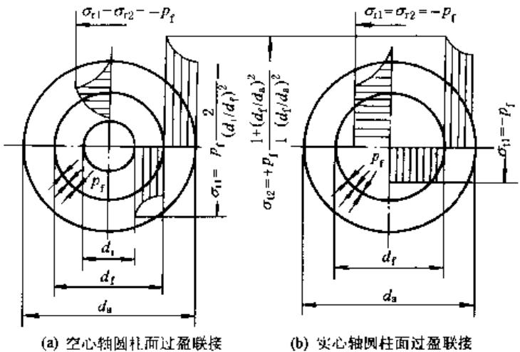

图4-4-1过盈联接配合面应力分布

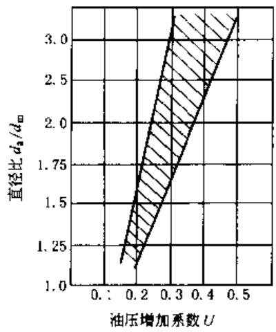

图4-4-2拆装时的油压增加系数

圆锥面过盈联接有不带中间套(图4-4-3)和带中间套(图4-4-4)两种型式。不带中间套的联接用于中、小尺寸的联接,或不需多次装拆的联接;带中间套的联接多用于大型、重载和需要多次装拆,或配合件之一是铸件(可能有砂眼、气孔等)的联接。

中间套小端内径小于 $\mathbf { i } 0 0 \mathbf { m m }$ 者,其小端厚度一般为 $2 . 5 \mathrm { m m }$ 左右;小端内径在 $1 0 0 \sim 3 0 0 \mathrm { m m }$ 者,其小端厚度一

般为 $2 . 5 \sim 6 \mathrm { { m m } } _ { \odot }$ 

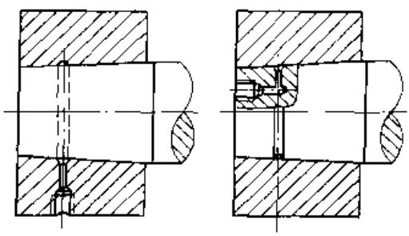

图4-4-3不带中间套的过盈联接

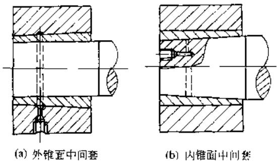

图4-4-4带中间套的过盈联接

# 2.1圆柱面过盈联接的计算(GB5371—1985)

表4-4-2

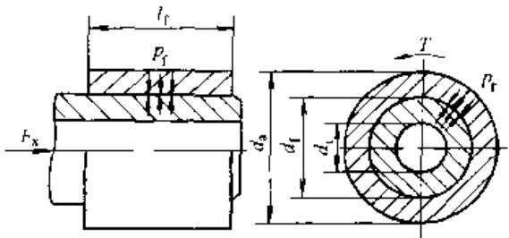

<table><tr><td rowspan=1 colspan=1>序号</td><td rowspan=1 colspan=1>计算项目</td><td rowspan=1 colspan=1>计算公式</td><td rowspan=1 colspan=1>单位</td><td rowspan=1 colspan=1>说    明</td></tr></table>

# 一、传递载荷所需的最小过盈量

<table><tr><td rowspan=3 colspan=1></td><td rowspan=3 colspan=1>传递载荷所需的最小结合压强</td><td rowspan=1 colspan=2>传递转矩</td><td rowspan=1 colspan=1>2TPin =πd</td><td rowspan=1 colspan=1>MPa（N/mm）</td><td rowspan=3 colspan=1>T   传递的转矩，Nnmid  一接合直径，mm   接合长度，mm一般取l,=(0.9~1.6)d！   被联接件摩擦副的摩擦因数，见表44-3、表4-4-4传递的轴向力，NF   传递力，N</td></tr><tr><td rowspan=1 colspan=2>承受轴向力</td><td rowspan=1 colspan=1>FPmin=d</td><td rowspan=1 colspan=1>MPa</td></tr><tr><td rowspan=1 colspan=2>传递力</td><td rowspan=1 colspan=1>FPim =πdF√+（）</td><td rowspan=1 colspan=1>MPaN</td></tr><tr><td rowspan=1 colspan=1>2</td><td rowspan=1 colspan=1>我</td><td rowspan=1 colspan=2>包容件</td><td rowspan=1 colspan=1>dq=T</td><td rowspan=1 colspan=1></td><td rowspan=2 colspan=1>d.  包容件外径，mmd.-—被包容件内径,mm对于实心轴q：=0</td></tr><tr><td rowspan=1 colspan=1>3</td><td rowspan=1 colspan=1>比</td><td rowspan=1 colspan=2>被包容件</td><td rowspan=1 colspan=1>d4=d</td><td rowspan=1 colspan=1></td></tr><tr><td rowspan=1 colspan=1>4</td><td rowspan=2 colspan=2>传递载荷所需的最小直径变化量</td><td rowspan=1 colspan=1>包容件</td><td rowspan=1 colspan=1>emin= Pnd宝E1+c.=      +1</td><td rowspan=1 colspan=1>m</td><td rowspan=2 colspan=1>E—-破联接件材料的弹性模量，MPa，见表44-6   -被联接件材料的泊松比，见表4-4-6下标a表示包容件下标i表示被包容件（下同），C值可查表4-4-5</td></tr><tr><td rowspan=1 colspan=1>5</td><td rowspan=1 colspan=1>被包容件</td><td rowspan=1 colspan=1>CP0=PidE1C,=     -v,1-</td><td rowspan=1 colspan=1>mm</td></tr><tr><td rowspan=1 colspan=1>6</td><td rowspan=1 colspan=3>传递载荷所需的最小有效过盈量</td><td rowspan=1 colspan=1>= + eau</td><td rowspan=1 colspan=1>mm</td><td rowspan=1 colspan=1>有效过盈量是指过盈联接中起作用的过盈量</td></tr><tr><td rowspan=1 colspan=1>7</td><td rowspan=1 colspan=3>考虑压平量的所需最小过盈量</td><td rowspan=1 colspan=1>用胀缩法装配8n=8用压人法装配8=+2(S.+S,）取S=0.4R.S=0.4R。或S.=1.6RS,=1.6R</td><td rowspan=1 colspan=1>mm</td><td rowspan=1 colspan=1>s   压平深度(结合面的表面粗糙度被压平部分的深度，见图44-5）.mmR   微观不平度十点高度，mmR-轮廓算术平均偏差.mm</td></tr></table>

续表

<table><tr><td rowspan=1 colspan=1>号</td><td rowspan=1 colspan=1>计算项目</td><td rowspan=1 colspan=1>计算公式</td><td rowspan=1 colspan=1>单 位</td><td rowspan=1 colspan=1>说   明</td></tr></table>

# 二、不产生塑性变形所允许的最大有效过盈量

<table><tr><td rowspan=1 colspan=1></td><td rowspan=3 colspan=1>不产生塑性变形所允许的最大结合压强</td><td rowspan=1 colspan=1>包容件</td><td rowspan=1 colspan=1>塑性材料Pex= 1ga=3脆性材料Pi=bb2~31-4b=1+g</td><td rowspan=1 colspan=1>MPaMPa</td><td rowspan=3 colspan=1>a—包容件与被包容件材料的油服点，MPab—-包容件与被包容件材料的抗拉强度，MPaa、b、c系数、可查图4-4-8</td></tr><tr><td rowspan=1 colspan=1>9</td><td rowspan=1 colspan=1>被包容件</td><td rowspan=1 colspan=1>塑性材料Pfix=o1c=2实心轴q=0,此时c=0.5脆性材料Pf=c2~3</td><td rowspan=1 colspan=1>MPaMPa</td></tr><tr><td rowspan=1 colspan=1>10</td><td rowspan=1 colspan=1>被联接件</td><td rowspan=1 colspan=1>P取P和Pr中的较小者</td><td rowspan=1 colspan=1></td></tr><tr><td rowspan=1 colspan=1>11</td><td rowspan=1 colspan=2>被联接件不产生塑性变形的传递力</td><td rowspan=1 colspan=1>F=PmRd</td><td rowspan=1 colspan=1>N</td><td rowspan=1 colspan=1></td></tr><tr><td rowspan=1 colspan=1>12</td><td rowspan=1 colspan=1>不产生塑性变形所允</td><td rowspan=1 colspan=1>包容件</td><td rowspan=1 colspan=1>Cex=PfmdE</td><td rowspan=1 colspan=1>mm</td><td rowspan=2 colspan=1></td></tr><tr><td rowspan=1 colspan=1>13</td><td rowspan=1 colspan=1>许的最大直径变化量</td><td rowspan=1 colspan=1>被包容件</td><td rowspan=1 colspan=1>会Pmx=PdE</td><td rowspan=1 colspan=1>mm</td></tr><tr><td rowspan=1 colspan=1>14</td><td rowspan=1 colspan=2>被联接件不产生塑性变形所容许的最大有效过盈量</td><td rowspan=1 colspan=1>8x = e+emx</td><td rowspan=1 colspan=1>mm</td><td rowspan=1 colspan=1></td></tr></table>

# 三、配合选择

<table><tr><td rowspan=1 colspan=1>15</td><td rowspan=1 colspan=1>初选基本过盈量</td><td rowspan=1 colspan=1>一般情况下，取mun+要求有较多的联接强2度储备时，取δ>δb；要求有较多的被联接件材料强度储备时，取δ<b</td><td rowspan=1 colspan=1></td><td rowspan=1 colspan=1>8b—基本过盈量(选择过盈配合的基准值。基孔制时，其值等于轴的基本偏差的绝对值；基轴制时，其值等于孔的基本偏差的绝对值），mm，见图4-4-6</td></tr><tr><td rowspan=1 colspan=1>16</td><td rowspan=1 colspan=1>确定基本偏差代号</td><td rowspan=1 colspan=1>按及d由图4-4-7查出</td><td rowspan=1 colspan=1></td><td rowspan=1 colspan=1></td></tr><tr><td rowspan=1 colspan=1>17</td><td rowspan=1 colspan=1>选定配合</td><td rowspan=1 colspan=1>按基本偏差代号和8x查CB/T1801—1999确定选用的配合。要求选出配合的最大和最小过盈量[8max]≤b[8mn]>8mn</td><td rowspan=1 colspan=1></td><td rowspan=1 colspan=1>选择配合种类时，在过盈量的上、下限范围内常有几种配合可供选用，一般应选择其最小过盈δ]等于或稍大于所需过盈8m的配合；{8过大会增加装配困难。选择较高精度的配合，其实际过盈变动范围较小，联接性能较稳定，但加工要求较高。配合精度较低时，虽可降低加工精度要求，但实际配合过盈变动范围较大，如成批生产，则各联接的承载能力和装配性能相差较大，这时，宜分配选择装配，既可保证加工的经济性，又可使各联接的过盈量接近当包容件和被包容件的工作温度不同时，应计人温差引起的过盈量的变化，见表注1当工作角速度很高时，应考虑由于离心力使配合过盈减小而引起联接可靠性降低的情况，详见本手册“极限与配合"</td></tr></table>

四、校核计算(需要时进行)

<table><tr><td rowspan=1 colspan=1>序号</td><td rowspan=1 colspan=1>计算项目</td><td rowspan=1 colspan=1>计算公式</td><td rowspan=1 colspan=1>单位</td><td rowspan=1 colspan=1>说明</td></tr></table>

<table><tr><td rowspan=1 colspan=1>18</td><td rowspan=1 colspan=2>允许最小传递力</td><td rowspan=1 colspan=1>Fbou=[ptmn]ndl≥Fm]-2（5+s）[pimun]=GE</td><td rowspan=1 colspan=1>NMPa</td></tr><tr><td rowspan=1 colspan=1>19</td><td rowspan=3 colspan=1>实际最大应力</td><td rowspan=1 colspan=1>包容件</td><td rowspan=1 colspan=1>塑性材料=[Pimax]Aaa[pou]脆性材料m=h8m][Pim]=    C  C（+）d</td><td rowspan=1 colspan=1>MPaMPaMPa</td></tr><tr><td rowspan=2 colspan=1>20</td><td></td><td></td><td></td></tr><tr><td rowspan=1 colspan=1>被包容件</td><td rowspan=1 colspan=1>[pEax]=      “</td><td rowspan=1 colspan=1>MPa</td></tr></table>

五、被联接件的直径变化量(需要时求)

<table><tr><td rowspan=1 colspan=1>21</td><td rowspan=1 colspan=1>包容件的外径增大量</td><td rowspan=1 colspan=1>2pid△d.=1-q</td><td rowspan=1 colspan=1>mm</td><td rowspan=2 colspan=1>p取[Ptm与Ptm]分别计算，其结果为最大增大(减小）量和最小增大(减小）量</td></tr><tr><td rowspan=1 colspan=1>22</td><td rowspan=1 colspan=1>被包容件的内径减小量</td><td rowspan=1 colspan=1>2prdi△d,=E.-g</td><td rowspan=1 colspan=1>mm</td></tr></table>

六、过盈联接的装配参数

<table><tr><td rowspan=1 colspan=1>23</td><td rowspan=2 colspan=1>采用压人法时</td><td rowspan=1 colspan=1>需要的压人力</td><td rowspan=1 colspan=1>Fx1=[pt]ndl</td><td rowspan=1 colspan=1>N</td><td rowspan=4 colspan=1>△—装配的最小间隙，mm，见表4-4-7a材料的线膨胀素数，见表4-4-6e-被包容件的冷缩量，为实际过盈量与冷装的最小间隙之和，mm—装配环境的温度，℃包容件加热温度计算见图4-4-9</td></tr><tr><td rowspan=1 colspan=1>24</td><td rowspan=1 colspan=1>需要的压出力</td><td rowspan=1 colspan=1>F=(1.3~1.5）F</td><td rowspan=1 colspan=1>N</td></tr><tr><td rowspan=1 colspan=1>25</td><td rowspan=2 colspan=1>采用胀缩法时</td><td rowspan=1 colspan=1>包容件加热温度</td><td rowspan=1 colspan=1>8]+△t2=          +ad</td><td rowspan=1 colspan=1>q</td></tr><tr><td rowspan=1 colspan=1>26</td><td rowspan=1 colspan=1>被包容件冷却温度</td><td rowspan=1 colspan=1>e=   +tad</td><td rowspan=1 colspan=1>℃</td></tr></table>

注:1.包容件和被包容件的工作温度不同时温差引起的过盈量变化为;

$$
\delta _ { \parallel } = \left[ \alpha _ { \bullet } ( \mathrm { \Delta } t _ { \bullet } - \mathrm { \Delta } t _ { \bullet } ) - \alpha _ { \circ } ( \mathrm { \Delta } t _ { \bullet } - \mathrm { \Delta } t _ { \bullet } ) \right] d _ { \mathrm { \scriptsize { t } } }
$$

式中 $t _ { \mathrm { i } } \setminus \ell _ { \star }$ ——被包容件和包容件的.[作温度, $\mathfrak { C }$ i$\pmb { \varepsilon } _ { \pmb { \xi } }$ —-工作环境温度, $\mathfrak { C }$ a

2.压装设备应有足够的压力吨位,该值约为压出力的2.5倍。

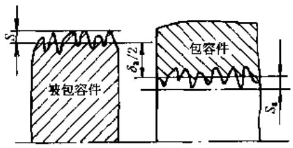

图4-4-5过盈联接压平深度

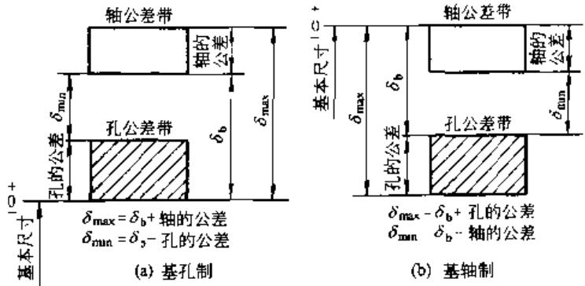

图4-4-6公差带

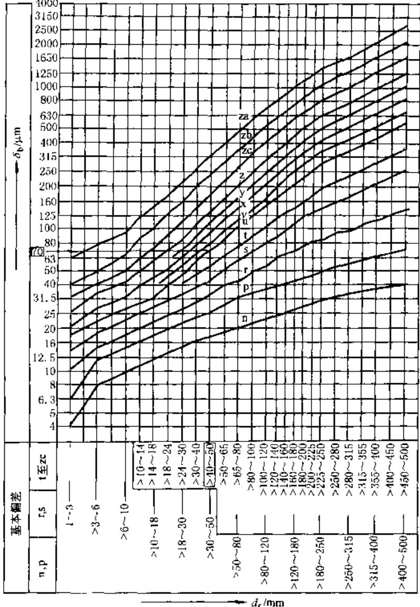

图4-4-7配合选择

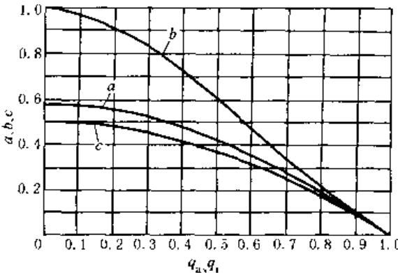

图 $4 { - } 4 { - } 8 a , b , c$ 线图

a一用于塑性材料包容件;b一用于脆性材料包容件;c一用于塑性或脆性材料被包容件

表4-4-3压入法过盈联接的摩擦因数 $\pmb { \mu }$ 

<table><tr><td rowspan="2">材 料</td><td rowspan="2"></td><td colspan="2">摩擦因数p</td></tr><tr><td>无润滑</td><td>有润滑</td></tr><tr><td>钢-钢</td><td rowspan="6"></td><td>0.07 -0.16</td><td>0.05~0.13</td></tr><tr><td>钢-铸钢</td><td>0.11</td><td>0.08</td></tr><tr><td>钢-结构钢</td><td>0.10</td><td>0.07</td></tr><tr><td>钢-优质结构钢</td><td>0.11</td><td>0.08</td></tr><tr><td></td><td></td><td></td></tr><tr><td>钢-青铜 钢-铸铁</td><td>0.15-0.2 0.12~0.15 0.15~0.25</td><td>0.03~0.06 0.05-0.10 0.05~0.10</td></tr></table>

表4-4-4

胀缩法过盈联接的摩擦因数 $\pmb { \mathscr { P } }$ 

<table><tr><td rowspan=1 colspan=1>材料</td><td rowspan=1 colspan=1>结合方式、润滑</td><td rowspan=1 colspan=1>摩擦因数</td></tr><tr><td rowspan=4 colspan=1>钢-钢</td><td rowspan=1 colspan=1>油压扩径，压力油为矿物油</td><td rowspan=1 colspan=1>0.125</td></tr><tr><td rowspan=1 colspan=1>油压扩径，压力泊为甘油,结合面排油干净</td><td rowspan=1 colspan=1>0.18</td></tr><tr><td rowspan=1 colspan=1>在电炉中加热包容件至300℃</td><td rowspan=1 colspan=1>0.14</td></tr><tr><td rowspan=1 colspan=1>在电炉中加热包容件至300℃以后，结合面脱脂</td><td rowspan=1 colspan=1>0.2</td></tr><tr><td rowspan=1 colspan=1>钢-铸铁</td><td rowspan=1 colspan=1>油压扩径，压力油为矿物油</td><td rowspan=1 colspan=1>0.1</td></tr><tr><td rowspan=1 colspan=1>钢-铝镁合金</td><td rowspan=1 colspan=1>无润滑</td><td rowspan=1 colspan=1>0.10~0.15</td></tr></table>

表 4-4-5

系数 $c _ { \bullet }$ 和 $c _ { 1 }$ 

<table><tr><td rowspan="2">q.或q</td><td colspan="2">C</td><td colspan="2">C</td><td rowspan="2">q或q.</td><td colspan="2">G</td><td colspan="2">C.</td></tr><tr><td>=0.30</td><td>=0.25</td><td>=0.3</td><td>=0.25</td><td>=0.30</td><td>=0.25</td><td>.=03</td><td>=0.25</td></tr><tr><td>0</td><td>--</td><td>一</td><td>0.700</td><td>0.750</td><td>0.53</td><td>2.081</td><td>2.031</td><td>1.481</td><td>1.531</td></tr><tr><td>0.10</td><td>1.320</td><td>1.270</td><td>0.720</td><td>0.770</td><td>056</td><td>2.214</td><td>2.164</td><td>.614</td><td>1. 664</td></tr><tr><td>0.14</td><td>1.340</td><td>1.290</td><td>0.740</td><td>0.790</td><td>0.60</td><td>2.425</td><td>2.375</td><td>1.825</td><td>1.875</td></tr><tr><td>0.20</td><td>1.383</td><td>1.333</td><td>0.783</td><td>0.833</td><td>0.63</td><td>2.616</td><td>2.566</td><td>2.016</td><td>2.066</td></tr><tr><td>0.25</td><td>1.433</td><td>1.383</td><td>0.833</td><td>0.883</td><td>0.67</td><td>2.929</td><td>2 879</td><td>2.329</td><td>2.379</td></tr><tr><td>0.28</td><td>1.470</td><td>1.420</td><td>0.870</td><td>0.920</td><td>0.71</td><td>3.333</td><td>3.283</td><td>2.733</td><td>2.783</td></tr><tr><td>0.31</td><td>1.512</td><td>1.426</td><td>0.912</td><td>0.962</td><td>0.75</td><td>3.871</td><td>3 821</td><td>3.271</td><td>3.321</td></tr><tr><td>0.35</td><td>1.579</td><td>1.529</td><td>0 979</td><td>1.029</td><td>0.80</td><td>4.855</td><td>4.805</td><td>4 255</td><td>4.305</td></tr><tr><td>0.40</td><td>1.681</td><td>1.631</td><td>1.081</td><td>1.131</td><td>0.85</td><td>6.517</td><td>6.457</td><td>5.907</td><td>5.957</td></tr><tr><td>0.45</td><td>1.808</td><td>1.758</td><td>1.208</td><td>1.258</td><td>0.90</td><td>9.826</td><td>9 776</td><td>9.226</td><td>9.276</td></tr><tr><td>0.50</td><td>1.967</td><td>1.917</td><td>1.367</td><td>1,417</td><td></td><td></td><td></td><td></td><td></td></tr></table>

表4-46

常用材料的弹性模量、泊松比和线膨胀系数

<table><tr><td rowspan="2">材料</td><td rowspan="2">弹性模量E ~ /MPa</td><td rowspan="2">泊松比 R</td><td colspan="4">线膨胀系数a/×10-6C- 冷</td></tr><tr><td>加热</td><td></td><td>却 1</td><td></td></tr><tr><td>碳钢、低合金钢、合金结构钢</td><td>200000-235000</td><td>0.3~0.31</td><td>与 11</td><td></td><td>-8.5</td><td></td></tr><tr><td>灰11铸铁HT150、HT200</td><td>70000~80000</td><td>0 24~0.25</td><td>10</td><td></td><td>-8</td><td></td></tr><tr><td>灰口铸铁、HT250、HT300</td><td>105000~130000</td><td>0.24~0.26</td><td></td><td>10</td><td>18</td><td></td></tr><tr><td>可锻铸铁</td><td>90000~100000</td><td>0.25</td><td></td><td>10</td><td>18</td><td></td></tr><tr><td>非合金球墨铸铁</td><td>160000~180000</td><td>0.28~0.29</td><td></td><td>10</td><td>-8</td><td></td></tr><tr><td>青 铜</td><td>85000</td><td>0.35</td><td></td><td>17</td><td>- 15</td><td></td></tr><tr><td>黄铜</td><td>80000</td><td>0.36~0.37</td><td></td><td>18</td><td>-16</td><td></td></tr><tr><td>合金</td><td>69000</td><td>0.32~0.36</td><td></td><td>21</td><td>-20</td><td></td></tr><tr><td>镁合金</td><td>40000</td><td>0.25-0.3</td><td></td><td>25.5</td><td>- 25</td><td></td></tr></table>

表4-47

热装的最小间隙

/mm 

<table><tr><td rowspan=1 colspan=1>结合直径d</td><td rowspan=1 colspan=1>3</td><td rowspan=1 colspan=1>>3~6</td><td rowspan=1 colspan=1>>6~10</td><td rowspan=1 colspan=1>> 10~18</td><td rowspan=1 colspan=1>>18~30</td><td rowspan=1 colspan=1>>30~50</td><td rowspan=1 colspan=1>> 50~80</td></tr><tr><td rowspan=1 colspan=1>最小间隙</td><td rowspan=1 colspan=1>0.003</td><td rowspan=1 colspan=1>0.006</td><td rowspan=1 colspan=1>0.010</td><td rowspan=1 colspan=1>0.018</td><td rowspan=1 colspan=1>0.030</td><td rowspan=1 colspan=1>0.055</td><td rowspan=1 colspan=1>0.059</td></tr><tr><td rowspan=1 colspan=1>结合直径</td><td rowspan=1 colspan=1>> 80~120</td><td rowspan=1 colspan=1>> 120~180</td><td rowspan=1 colspan=1>>180~250</td><td rowspan=1 colspan=1>> 250~315</td><td rowspan=1 colspan=1>>315~400</td><td rowspan=1 colspan=1>> 400~500</td><td rowspan=1 colspan=1></td></tr><tr><td rowspan=1 colspan=1>最小间隙</td><td rowspan=1 colspan=1>0.069</td><td rowspan=1 colspan=1>0.079</td><td rowspan=1 colspan=1>0.090</td><td rowspan=1 colspan=1>0.101</td><td rowspan=1 colspan=1>0.11</td><td rowspan=1 colspan=2>0.123</td></tr></table>

注:表中 $d _ { f } > 3 0 m m$ 的最小间隙是按间隙配合 $\mathrm { H } 7 / \mathrm { g } 6$ 的最人间隙列出。

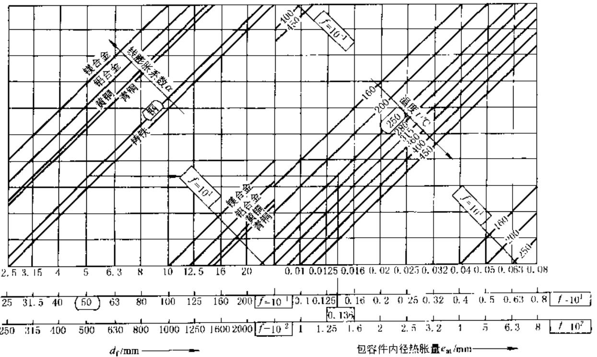

图4-4-9包容件加热温度计算

(计算结果应乘以图表中与所用各参数数列相对应的以10为底的幂)

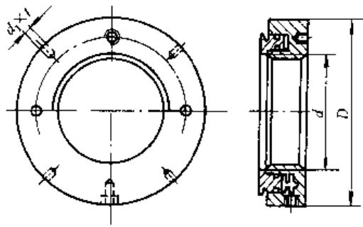

表4-4-8

液压螺栓拉伸器的规格与参数

<table><tr><td rowspan=1 colspan=7>表 4-4-8                                   液压螺桂拉仰器的烧格与参数</td></tr><tr><td rowspan=1 colspan=2>连接螺纹直径d/mm</td><td rowspan=1 colspan=1>外径D/mm</td><td rowspan=1 colspan=1>活塞面积F/em</td><td rowspan=1 colspan=1>最大T.作压力p/MPa</td><td rowspan=1 colspan=1>最大拉伸力/N</td><td rowspan=1 colspan=1>扳手孔d × t/mm</td></tr><tr><td rowspan=1 colspan=2>M36 x 4-6H</td><td rowspan=1 colspan=1>105</td><td rowspan=1 colspan=1>20.4</td><td rowspan=1 colspan=1>32</td><td rowspan=1 colspan=1>65340</td><td rowspan=4 colspan=1>6×66×66x66×6</td></tr><tr><td rowspan=1 colspan=2>M42 × 4.5-6H</td><td rowspan=1 colspan=1>115</td><td rowspan=1 colspan=1>23.56</td><td rowspan=1 colspan=1>37</td><td rowspan=1 colspan=1>87180</td></tr><tr><td rowspan=1 colspan=2>M48 x 5-6H</td><td rowspan=1 colspan=1>125</td><td rowspan=1 colspan=1>26.70</td><td rowspan=1 colspan=1>45</td><td rowspan=1 colspan=1>120170</td></tr><tr><td rowspan=1 colspan=2>M52 × 5-6H</td><td rowspan=1 colspan=1>130</td><td rowspan=1 colspan=1>28.27</td><td rowspan=1 colspan=1>50</td><td rowspan=1 colspan=1>141370</td></tr><tr><td rowspan=1 colspan=2>M56 × 5.5-6H</td><td rowspan=1 colspan=1>140</td><td rowspan=1 colspan=1>38.28</td><td rowspan=1 colspan=1>42</td><td rowspan=1 colspan=1>160800</td><td rowspan=1 colspan=1>6x6</td></tr><tr><td rowspan=1 colspan=2>M64 x 6-6H</td><td rowspan=1 colspan=1>150</td><td rowspan=1 colspan=1>49.48</td><td rowspan=1 colspan=1>42</td><td rowspan=1 colspan=1>207820</td><td rowspan=1 colspan=1>7×7</td></tr><tr><td rowspan=1 colspan=2>M68 x 6-6H</td><td rowspan=1 colspan=1>160</td><td rowspan=1 colspan=1>54.19</td><td rowspan=1 colspan=1>45</td><td rowspan=1 colspan=1>243860</td><td rowspan=1 colspan=1>7×7</td></tr><tr><td rowspan=1 colspan=2>M72 × 6-6H</td><td rowspan=1 colspan=1>170</td><td rowspan=1 colspan=1>58.90</td><td rowspan=1 colspan=1>45</td><td rowspan=1 colspan=1>265070</td><td rowspan=1 colspan=1>7x7</td></tr><tr><td rowspan=1 colspan=2>M76 x 6-6H</td><td rowspan=1 colspan=1>170</td><td rowspan=1 colspan=1>58.90</td><td rowspan=1 colspan=1>50</td><td rowspan=1 colspan=1>294530</td><td rowspan=1 colspan=1>7×7</td></tr><tr><td rowspan=1 colspan=2>M80 × 6-6H</td><td rowspan=1 colspan=1>185</td><td rowspan=1 colspan=1>63.61</td><td rowspan=1 colspan=1>55</td><td rowspan=1 colspan=1>349890</td><td rowspan=1 colspan=1>8x8</td></tr><tr><td rowspan=1 colspan=2>M90 x 6-6H</td><td rowspan=1 colspan=1>195</td><td rowspan=1 colspan=1>68.33</td><td rowspan=1 colspan=1>65</td><td rowspan=1 colspan=1>444150</td><td rowspan=2 colspan=1>8x88x8</td></tr><tr><td rowspan=1 colspan=1></td><td rowspan=1 colspan=1>M95 x 6-6H</td><td rowspan=1 colspan=1>210</td><td rowspan=1 colspan=1>73.04</td><td rowspan=1 colspan=1>70</td><td rowspan=1 colspan=1>511280</td></tr><tr><td rowspan=1 colspan=1></td><td rowspan=1 colspan=1>M100 × 6-6H</td><td rowspan=1 colspan=1>220</td><td rowspan=1 colspan=1>77.75</td><td rowspan=1 colspan=1>70</td><td rowspan=1 colspan=1>544280</td><td rowspan=2 colspan=1>8x88×8</td></tr><tr><td rowspan=1 colspan=1></td><td rowspan=1 colspan=1>M105 x 6-6H</td><td rowspan=1 colspan=1>240</td><td rowspan=1 colspan=1>82.46</td><td rowspan=1 colspan=1>75</td><td rowspan=1 colspan=1>618500</td></tr><tr><td rowspan=1 colspan=1></td><td rowspan=1 colspan=1>M110 x 6-6H</td><td rowspan=1 colspan=1>240</td><td rowspan=1 colspan=1>82.46</td><td rowspan=1 colspan=1>80</td><td rowspan=1 colspan=1>659730</td><td rowspan=1 colspan=1>8x8</td></tr><tr><td rowspan=1 colspan=1></td><td rowspan=1 colspan=1>MI15 × 6-6H</td><td rowspan=1 colspan=1>250</td><td rowspan=1 colspan=1>87.18</td><td rowspan=1 colspan=1>85</td><td rowspan=1 colspan=1>741020</td><td rowspan=1 colspan=1>8×8</td></tr><tr><td rowspan=1 colspan=1></td><td rowspan=1 colspan=1>M120 x 6-6H</td><td rowspan=1 colspan=1>260</td><td rowspan=1 colspan=1>91.89</td><td rowspan=1 colspan=1>85</td><td rowspan=1 colspan=1>781080</td><td rowspan=1 colspan=1>10 × 10</td></tr><tr><td rowspan=1 colspan=2>M125 × 6-6H</td><td rowspan=1 colspan=1>270</td><td rowspan=1 colspan=1>96.60</td><td rowspan=1 colspan=1>85</td><td rowspan=1 colspan=1>821130</td><td rowspan=1 colspan=1>10 x 10</td></tr><tr><td rowspan=1 colspan=2>M130 × 6-6H</td><td rowspan=1 colspan=1>290</td><td rowspan=1 colspan=1>138. 23</td><td rowspan=1 colspan=1>70</td><td rowspan=1 colspan=1>967610</td><td rowspan=1 colspan=1>10 × 10</td></tr><tr><td rowspan=1 colspan=2>M140 x 6-6H</td><td rowspan=1 colspan=1>310</td><td rowspan=1 colspan=1>150.79</td><td rowspan=1 colspan=1>75</td><td rowspan=1 colspan=1>1130980</td><td rowspan=1 colspan=1>12 × 12</td></tr><tr><td rowspan=1 colspan=2>M150 x 6-6H</td><td rowspan=1 colspan=1>315</td><td rowspan=1 colspan=1>171.41</td><td rowspan=1 colspan=1>75</td><td rowspan=1 colspan=1>1285600</td><td rowspan=1 colspan=1>12 x 12</td></tr><tr><td rowspan=1 colspan=2>M160 × 6-6H</td><td rowspan=1 colspan=1>330</td><td rowspan=1 colspan=1>235.62</td><td rowspan=1 colspan=1>65</td><td rowspan=1 colspan=1>1531530</td><td rowspan=1 colspan=1>12 x 12</td></tr><tr><td rowspan=1 colspan=2>M170 x 6-6H</td><td rowspan=1 colspan=1>380</td><td rowspan=1 colspan=1>287.26</td><td rowspan=1 colspan=1>60</td><td rowspan=1 colspan=1>1723560</td><td rowspan=1 colspan=1>15 × 15</td></tr><tr><td rowspan=1 colspan=2>M175 x 6-6H</td><td rowspan=1 colspan=1>400</td><td rowspan=1 colspan=1>292. 17</td><td rowspan=1 colspan=1>60</td><td rowspan=1 colspan=1>1753010</td><td rowspan=1 colspan=1>15 x 15</td></tr><tr><td rowspan=1 colspan=2>M180 x 6-6H</td><td rowspan=1 colspan=1>400</td><td rowspan=1 colspan=1>292. 17</td><td rowspan=1 colspan=1>65</td><td rowspan=1 colspan=1>1899100</td><td rowspan=1 colspan=1>15 × 15</td></tr><tr><td rowspan=1 colspan=2>M190× 6-6H</td><td rowspan=1 colspan=1>410</td><td rowspan=1 colspan=1>292.17</td><td rowspan=1 colspan=1>70</td><td rowspan=1 colspan=1>2045180</td><td rowspan=1 colspan=1>15 × 15</td></tr><tr><td></td><td></td><td></td><td></td><td></td><td rowspan=1 colspan=1></td><td rowspan=1 colspan=1></td></tr></table>

<table><tr><td>连接螺纹直径d /mm</td><td>外径D /mm</td><td>活塞面积 F</td><td>最大工作压力 P</td><td>最大拉伸力 /N</td><td>扳手孔 d×t/mm</td></tr><tr><td>M200× 6-6H</td><td>430</td><td>/cm²</td><td>/MPa 70</td><td>2177130</td><td>15 × 15</td></tr><tr><td>M220 × 6-6H</td><td>470</td><td>311.00 362.44</td><td>70</td><td>2537130</td><td>18×18</td></tr><tr><td>M250x6-6H</td><td>520</td><td>431.87</td><td>70</td><td>3021340</td><td>18 ×18</td></tr></table>

注:液压螺栓拉伸器的应用示例见图 $4 . 4 \times 1 0 _ { \circ }$ 

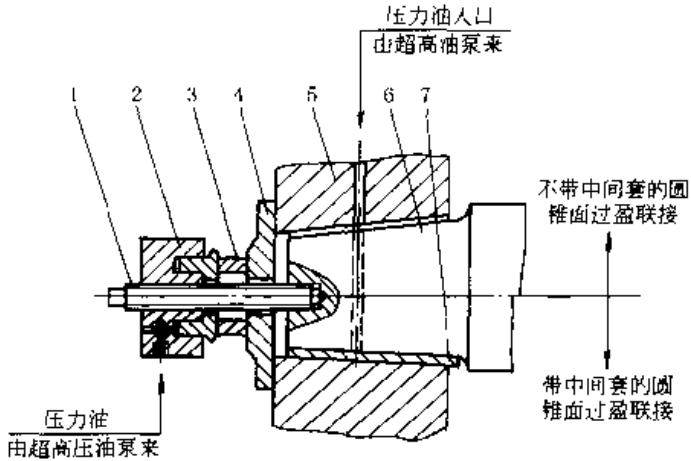

图4-4-10液压螺栓拉伸器

1—螺杆;2一液压螺栓拉伸器;3-隔套;4一压板;5-包容件; $$ 被包容件;7-中间套

# 2.2圆柱面过盈联接的计算举例

表4-4-9已知条件:

装配方式:压入法或热装法材料:包容件 45被包容件35

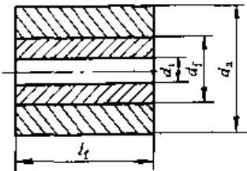

包容件外径 $d _ { \bullet } = 1 0 0 \mathrm { m m }$   
结合直径 $d _ { \mathrm { f } } = 5 0 \mathrm { m m }$   
被包容件内径 $d _ { \mathrm { {  a } } } = \mathrm { { i } } 0 \mathrm { { m m } }$   
结合长度 $\ell _ { \mathrm { f } } = 8 0 \mathrm { m m }$   
表面粗糙度微观不平度十点高度

$$
R _ { \mathrm { z o } } + R _ { \mathrm { z } _ { 1 } } = 0 . 0 0 6 3 \mathrm { m m }
$$

被联接件摩擦副的摩擦因数(钢-钢,无润滑)

$$
\mu = 0 . 1 1
$$

包容件和被包容件材料的弹性模量

$$
E _ { \bullet } = E _ { \bullet } = 2 1 0 0 0 0 1 ~ \mathbb { M } \mathbb { P } \mathbf { a }
$$

包容件和被包容件材料的泊松比

$$
\pmb { \nu } _ { \bullet } = \pmb { \nu } _ { \bullet } = \pmb { 0 } . 3
$$

包容件材料的用服强度 $\sigma _ { \mathrm { { s u } } } = 4 0 0 \mathrm { { M P a } }$ 被包容件材料的屈服强度

$$
\sigma _ { \mathrm { { s t } } } = 3 2 0 \mathrm { { M P a } }
$$

传递力 $F _ { \mathrm { 1 } } = 7 0 0 0 0 \mathrm { N }$ 

<table><tr><td colspan="1" rowspan="1">序号</td><td colspan="3" rowspan="1">计算内容</td><td colspan="1" rowspan="1">计算公式和计算结果</td></tr><tr><td colspan="1" rowspan="1">1</td><td colspan="1" rowspan="1"></td><td colspan="2" rowspan="1">传递载荷所需的最小接合压强</td><td colspan="1" rowspan="1">F         70000Ptroan=πd×50×80×0.11=50.6MPa</td></tr><tr><td colspan="1" rowspan="1">2</td><td colspan="1" rowspan="2">传递裁荷所需的最小过</td><td colspan="1" rowspan="2">直径比</td><td colspan="1" rowspan="1">包容件</td><td colspan="1" rowspan="1">山  50q=        = 0.5100d</td></tr><tr><td colspan="1" rowspan="1">3</td><td colspan="1" rowspan="1">被包容件</td><td colspan="1" rowspan="1">d  109,=        = 0.250d</td></tr><tr><td colspan="1" rowspan="1">4</td><td colspan="1" rowspan="1">盈量</td><td colspan="1" rowspan="1">传递载荷所需的最小直径变化量</td><td colspan="1" rowspan="1">包容件</td><td colspan="1" rowspan="1">emn = PfmnE山C=50.6×50×1.97=0.024mm210000查表4-4-5得C,=1.967</td></tr><tr><td colspan="1" rowspan="1">5</td><td colspan="1" rowspan="1">传递载荷</td><td colspan="1" rowspan="1">传递裁荷所需的最小直径变化量</td><td colspan="1" rowspan="1">被包容件</td><td colspan="1" rowspan="1">eimn = PmnE,画            50查表4-4-5得C=0.783</td></tr><tr><td colspan="1" rowspan="1">6</td><td colspan="1" rowspan="1">所需的最小过</td><td colspan="2" rowspan="1">传递载荷所需的最小有效过盈量</td><td colspan="1" rowspan="1">e=em+em=0.024+0.009=0.033mm</td></tr><tr><td colspan="1" rowspan="1">7</td><td colspan="1" rowspan="1">盈量</td><td colspan="2" rowspan="1">考虑压平后的最小过盈量</td><td colspan="1" rowspan="1">m=δmn+2（5+ S）=0.033+2× （0.4×0.0063+0.4×0.0063)=0.043mm</td></tr><tr><td colspan="1" rowspan="1">8</td><td colspan="1" rowspan="3">不产生塑性变</td><td colspan="1" rowspan="3">不产生塑性变形所允许的最大接合压强</td><td colspan="1" rowspan="1">包容件</td><td colspan="1" rowspan="1">Plx=g=0.428×400=171.2MPa查图4-4-8得α=0.428</td></tr><tr><td colspan="1" rowspan="1">9</td><td colspan="1" rowspan="1">被包容件</td><td colspan="1" rowspan="1">Plim=C0u=0.48×320=153.6MPa查图44-8得c=0.48</td></tr><tr><td colspan="1" rowspan="1">10</td><td colspan="1" rowspan="1">被联接件</td><td colspan="1" rowspan="1">取Pl和Pm中的较小者，则Pmax=153.6MPg</td></tr><tr><td colspan="1" rowspan="1">11</td><td colspan="1" rowspan="1">形的最大</td><td colspan="2" rowspan="1">被联接件不产生塑性变形的最大传递力</td><td colspan="1" rowspan="1">F=Ptπdμ= 153.6×× 50×80×0.11=212321N查表4-4-3得μ=0.11</td></tr><tr><td colspan="1" rowspan="1">12</td><td colspan="1" rowspan="1">有效过盈量</td><td colspan="1" rowspan="1">不产生塑性变形所允</td><td colspan="1" rowspan="1">包容件</td><td colspan="1" rowspan="1">153.6× 50x1.967=0.072mmE       210000</td></tr><tr><td colspan="1" rowspan="1">13</td><td colspan="1" rowspan="1"></td><td colspan="1" rowspan="1">许的最大直径变化量</td><td colspan="1" rowspan="1">被包容件</td><td colspan="1" rowspan="1">153.6× 50×0.783=0.029mmema=E      210000</td></tr><tr><td colspan="1" rowspan="1">14</td><td colspan="1" rowspan="1"></td><td colspan="2" rowspan="1">被联接件不产生塑性变形的最大有效过盈量</td><td colspan="1" rowspan="1">=em+ei=0.072+0.029=0.101</td></tr><tr><td colspan="1" rowspan="1">15</td><td colspan="1" rowspan="1"></td><td colspan="2" rowspan="1">选择配合的要求</td><td colspan="1" rowspan="1">[δmn]>0.043mm,[δm]≤0.101mm胀缩法装配时：m=8=0.033mm.则[δ]>0.033mm</td></tr><tr><td colspan="1" rowspan="1">16</td><td colspan="1" rowspan="1"></td><td colspan="2" rowspan="1">初选基本过盈量</td><td colspan="1" rowspan="1">（δi+δcm）/2=（0.043+0.101）/2=0.072mm若要求较多的联接强度储备时，可取（δmin+/2<b<δ此时取δb=0.081mm，在图4-4-7可得到配合为H7/v6胀缩法装配时δb（0.033+0.101）/2=0.067mm</td></tr><tr><td colspan="1" rowspan="1">17</td><td colspan="1" rowspan="1">选择配合</td><td colspan="2" rowspan="1">确定基本偏差代号</td><td colspan="1" rowspan="1">取8b=0.07mm根据δ和dr,在图4-4-7中查出相应的基本偏差代号"u"</td></tr><tr><td colspan="1" rowspan="1">18</td><td colspan="1" rowspan="1"></td><td colspan="1" rowspan="1"></td><td colspan="1" rowspan="1">确定公差等级</td><td colspan="1" rowspan="1">采用的公差：孔为IT7，轴为IT6</td></tr><tr><td colspan="1" rowspan="1">19</td><td colspan="1" rowspan="1"></td><td colspan="2" rowspan="1">选定配合</td><td colspan="1" rowspan="1">H7/u6</td></tr><tr><td colspan="1" rowspan="1">20</td><td colspan="1" rowspan="1"></td><td colspan="2" rowspan="1">：对选定配合进行复核计算</td><td colspan="1" rowspan="1">根据GB1801一1999查出：代号"u"的基本偏差为0.07mmIT7=0.025mm I6=0.016mm[δx]=0.07+0.016=0.086mm<0.101mm{8]=0.07-0.025=0.045mm>0.043mm</td></tr></table>

<table><tr><td rowspan=1 colspan=6>续衣</td></tr><tr><td rowspan=1 colspan=1>序号</td><td rowspan=1 colspan=4>计算内容</td><td rowspan=2 colspan=1>计算公式和计算结果P=[ptmx]πd(μ = 131.3× π× 50× 80× 0.11 = 181.5k\[pfoms]=L/d(C 业= 0.086/50× 1.967 0.783+131.3MPaEE210000210000</td></tr><tr><td rowspan=1 colspan=1>21</td><td rowspan=1 colspan=2></td><td rowspan=1 colspan=2>需要的压人力</td></tr><tr><td rowspan=1 colspan=1>22</td><td rowspan=1 colspan=2></td><td rowspan=1 colspan=1>装</td><td rowspan=1 colspan=1>需要的儿出力</td><td rowspan=1 colspan=1>P=(1.3~1.5)P=(1.3~1.5）×181.5=235 95~272.25k</td></tr><tr><td rowspan=1 colspan=1>23</td><td rowspan=1 colspan=2>R</td><td rowspan=1 colspan=2>采用热装法时，包容件的加热温度</td><td rowspan=1 colspan=1>e  0.0R6 +0.05=247.27e=[δna]+△,[δmgx]=0.086mm,日表4-4-7查热装的最小间△=0.050mm；由表4-4-6查线膨胀系数α=11×10-1/℃也可根据dr=50mm,e=0.136mm，由图4-4-9查出=250×10-x10=250℃</td></tr><tr><td rowspan=1 colspan=1>24</td><td rowspan=1 colspan=2>R</td><td rowspan=1 colspan=2>允许最小传递力</td><td rowspan=1 colspan=1>Fmn=Pm]πdlμ =53.3×π×50×80×0.11=73676N73kN∴Fu>F,满足设计要求m:-2（S+S）0.045-2×(0.4×0.0063+0.4×0.0063)Pm       宝                    1.967  0.78350x前E                   （210000+210000）53.3MPa</td></tr><tr><td rowspan=1 colspan=1>25</td><td rowspan=2 colspan=2></td><td rowspan=2 colspan=1>实际最大应</td><td rowspan=1 colspan=1>包容件</td><td rowspan=1 colspan=1>[ptonex] 131.3= 306.8MPa<0.428 =  u</td></tr><tr><td rowspan=1 colspan=1>26</td><td rowspan=1 colspan=1>被包容件</td><td rowspan=1 colspan=1>[Pimua] 131.3==273.5MPa<mx=      0.48</td></tr><tr><td rowspan=1 colspan=1>27</td><td rowspan=1 colspan=2>DR</td><td rowspan=1 colspan=2>包容件的外径增大量</td><td rowspan=1 colspan=1>Adma2LPidE.(1-）2× 131.3×100×0.5²=0.0417mm210000×(1-0.52）2.ptld△dn=E(1-g）2× 53.3×100×0.5²= 0.0169mm210000×(1-0.5）</td></tr><tr><td rowspan=1 colspan=1>28</td><td rowspan=1 colspan=2>DR</td><td rowspan=1 colspan=2>被包容件的内径减小量</td><td rowspan=1 colspan=1>△dim=2[Ptm]d，E(1-2x131.3x 10= 0.013mm210000×(1-0.2）2PtddiinE,(1-）2×53.3×10</td></tr></table>

# 2.3圆锥过盈联接的计算(GB/T15755—1995)

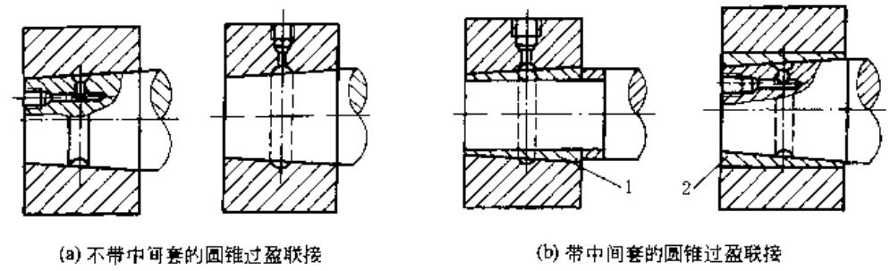

(用于中、小尺寸,或不需多次装拆的联接)

(用于大型、重载和需多次装拆的联接)—带外锥面中间套;2一带内锥面中间套

表4-4-10

<table><tr><td rowspan=1 colspan=7>表4-4-10</td></tr><tr><td rowspan=1 colspan=1>序号</td><td rowspan=1 colspan=3>计算内容</td><td rowspan=1 colspan=1>计算公式</td><td rowspan=1 colspan=1>单位</td><td rowspan=1 colspan=1>说明</td></tr><tr><td rowspan=1 colspan=5>一、传递载荷所需的最小过盈量</td><td rowspan=1 colspan=1></td><td rowspan=21 colspan=1>T-  传递的转矩，N·mmF   传递的轴向力，Ndm-圆锥面结合平均直径，mm，d=（d+d）dn，dn  -圆锥结合面小端和大端直径，mm结合长度，推荐≤1.5dmμ   被联接件摩擦副的摩擦因数，见表4-4-3、表4-4-4，推荐=0.12K   -安全系数，根据联接的重要程度决定，推荐K=1.2~3F-   传递力，N，F=√F+(2T/d）包容件外径（最大外径），mmd一-被包容件内径(最小直径）.mmE. 一包容件材料的弹性模量，MPa,查表4-4-6E   被包容件材料的弹性模量，MPa,查表4-4-61+v,C.值可查表4-4-5c.=1-1+4v,C,值可查表4-4-5C,=1-4S.=1.6R(不带中间套）S.=1.6(R+R(带中间套）S=1.6R（不带中间套）S=1.6(R.+R）（不带中间套）1   被联接件材料的波松比，有表4-4-61-    ！，6=Q=3   1+a、b值可查图4-4-81-,c值可查图4-4-8;当实心轴c= 29i=0时，c=0.5i-包容件和被包容件材料的屈服强度，MPab、b   包容件和被包容件材料的屈服点，MPa[8m]、[δmn].  满足联接要求的最大过盈量和最小过盈量</td></tr><tr><td rowspan=3 colspan=1>1</td><td rowspan=3 colspan=2>传递载荷所需的最小结合压强</td><td rowspan=1 colspan=1>传递转矩T时</td><td rowspan=1 colspan=1>2TKPen =πdu</td><td rowspan=3 colspan=1>MPa(N/mm²）</td></tr><tr><td rowspan=1 colspan=1>传递轴向力F时</td><td rowspan=1 colspan=1>FKPmn=πd</td></tr><tr><td rowspan=1 colspan=1>同时传递T和F时</td><td rowspan=1 colspan=1>FKPr=πdl</td></tr><tr><td rowspan=1 colspan=1>2</td><td rowspan=2 colspan=1>直径比</td><td rowspan=1 colspan=2>包容件</td><td rowspan=1 colspan=1>dq.=a</td><td rowspan=1 colspan=1></td></tr><tr><td rowspan=1 colspan=1>3</td><td rowspan=1 colspan=2>被包容件</td><td rowspan=1 colspan=1>d，实心轴q=0qi=d</td><td rowspan=1 colspan=1></td></tr><tr><td rowspan=1 colspan=1>4</td><td rowspan=2 colspan=2>传递载荷所需的最小直径变化量</td><td rowspan=1 colspan=1>包容件</td><td rowspan=1 colspan=1>智Cemn=PfE.</td><td rowspan=1 colspan=1>mm</td></tr><tr><td rowspan=1 colspan=1>5</td><td rowspan=1 colspan=1>被包容件</td><td rowspan=1 colspan=1>e=Ptc、</td><td rowspan=1 colspan=1>mm</td></tr><tr><td rowspan=1 colspan=1>6</td><td rowspan=1 colspan=3>传递载荷所需的最小有效过盈量</td><td rowspan=1 colspan=1>nin=eann+e</td><td rowspan=1 colspan=1>mm</td></tr><tr><td rowspan=1 colspan=1>7</td><td rowspan=1 colspan=3>考虑压平量后的所需最小过盈量</td><td rowspan=1 colspan=1>8=δun+2x（S,+S）</td><td rowspan=1 colspan=1>mm</td></tr><tr><td rowspan=1 colspan=1></td><td rowspan=1 colspan=4>二、不产生塑性变形所允许的最大过盈量</td><td rowspan=1 colspan=1></td></tr><tr><td rowspan=1 colspan=1>8</td><td rowspan=3 colspan=2>不产生塑性变形所允许的最大接合压强</td><td rowspan=1 colspan=1>包容件</td><td rowspan=1 colspan=1>塑性材料：p=脆性材料：Pfamax=bb2~3</td><td rowspan=2 colspan=1>MPa</td></tr><tr><td rowspan=1 colspan=1>9</td><td rowspan=1 colspan=1>被包容件</td><td rowspan=1 colspan=1>塑性材料：pfim=脆性材料：plmx=cb2~3</td></tr><tr><td rowspan=1 colspan=1>10</td><td rowspan=1 colspan=1>被联接件</td><td rowspan=1 colspan=1>Pt取P和pl中较小者</td><td rowspan=1 colspan=1>MPa</td></tr><tr><td rowspan=1 colspan=1>11</td><td rowspan=1 colspan=3>被联接件不产生塑性变彩的传递力</td><td rowspan=1 colspan=1>F=Pmd</td><td rowspan=1 colspan=1>N</td></tr><tr><td rowspan=1 colspan=1>12</td><td rowspan=2 colspan=2>不产生塑性变形所允许的最大直径变化量</td><td rowspan=1 colspan=1>包容件</td><td rowspan=1 colspan=1>eu = E</td><td rowspan=1 colspan=1>mm</td></tr><tr><td rowspan=1 colspan=1>13</td><td rowspan=1 colspan=1>被包容件</td><td rowspan=1 colspan=1>PdCe=E</td><td rowspan=1 colspan=1>mm</td></tr><tr><td rowspan=1 colspan=1>14</td><td rowspan=1 colspan=3>传递载荷所需的最小有效过盈量</td><td rowspan=1 colspan=1>8 =e+ex</td><td rowspan=1 colspan=1>mm</td></tr><tr><td rowspan=1 colspan=5>三、选择配合</td><td rowspan=1 colspan=1></td></tr><tr><td rowspan=2 colspan=1>15</td><td rowspan=2 colspan=2>满足联接要求的过盈量</td><td rowspan=1 colspan=1>保证过盈联接传递给定的载荷</td><td rowspan=1 colspan=1>[8mn]>8mn</td><td rowspan=2 colspan=1>mm</td></tr><tr><td rowspan=1 colspan=1>保证被联接件不产生塑性变形</td><td rowspan=1 colspan=1>[8m]8e</td></tr></table>

四、油压装拆参数

<table><tr><td colspan="2"></td><td>：算内容</td><td>计算公式</td><td>单位</td><td>说明</td></tr><tr><td rowspan="4">D</td><td></td><td>一般情况</td><td>Sb(omn +8）/2</td><td rowspan="4"></td><td rowspan="4">山 基本过盈量（选择过盈配合的 基准值。基孔制时，基值等于 轴的基本偏差的绝对值；基轴</td></tr><tr><td rowspan="2">TR</td><td>要求有较多的联接强度储 备</td><td>em>6>（om+ox）/2</td><td>mm 制时，其俏等于孔的基本偏差 的绝对值）,mm，见图4-4-6</td></tr><tr><td>要求有较多的被联接件强 度储备</td><td>8un<b<（o+8）/2</td><td>选择配合种类时，在过盈量的上、 下限范围内常有儿种配合可供选用， 一般应选择其最小过盈等于或 稍大于所需过盈的配合；mn</td></tr><tr><td rowspan="2"></td><td>确定配合基本偏差代号</td><td>根据基本过盈量δ和基本 圆锥直径（一般取最大圆锥直 径d）为基本尺寸由图4-4-7 查出</td><td>过大会增加装配困难。选择较高精 度的配合，其实际过盈变动范围较 小，联接性能较稳定，但加工要求较 高。配合精度较低时，虽可降低加」</td></tr><tr><td rowspan="2">差</td><td colspan="2">选取内外圆锥直径的配合和公</td><td>根据基本偏差代号、基本圆 锥直径和a、min由GB 1801-1999确定</td><td rowspan="2">精度要求，但实际配合过盈变动范围 较大，如成批生产，则各联接的承载 能力和装配性能相差较大，这时，宜</td></tr><tr><td rowspan="2">差 DR</td><td colspan="2">选取内外圆锥直径的配合和公</td><td>按CB1800和GB1801选 取，推荐选用IT7、IT6公差等 级的H、h、JS、js配合</td><td>分配选择装配，既可保证加工的经济 性，又可使各联接的过盈量接近 当包容件和被包容件的I作温度 不同时，应计入温差引起的过盈量的 变化，见表4-4-2注1</td></tr><tr><td colspan="2">合</td><td>对基面距有要求的回锥过盈配</td><td>根据基面距的尺寸公差要 求，按GB12360附录C计算选 取内外圆锥直径公差带</td><td>离心力使配合过盈减小而引起联接</td></tr><tr><td rowspan="2"></td><td colspan="2">所选配合的最大过盈量[δ.]和</td><td>按GB1801—1999给出的极</td><td>mm</td><td rowspan="2">可靠性降低的情况，详见本手册“极 限与配合”</td></tr><tr><td colspan="2">最小过盈量[δn]</td><td>限偏差计算</td><td></td></tr></table>

<table><tr><td rowspan=2 colspan=1>17</td><td rowspan=2 colspan=1>中间套尺寸（不带中间套不需计算）</td><td rowspan=1 colspan=1>外锥面中间套</td><td rowspan=1 colspan=1>df =1.03d +3dt=d+Cl</td><td rowspan=2 colspan=1>mm</td><td rowspan=3 colspan=1>d—中间套圆柱面直径.mmdm、d被包容件结合面的小端、大端直径，mmC—圆锥过盈联接锥度，推荐选用1:20、1:30、1:50</td></tr><tr><td rowspan=1 colspan=1>内锥面中间套</td><td rowspan=1 colspan=1>dm2=0.9Td-3d=dm-Cl</td></tr><tr><td rowspan=1 colspan=1>18</td><td rowspan=1 colspan=2>中间套与相关件圆柱面配合</td><td rowspan=1 colspan=1>外锥面中间套：推荐：d≤100mm时按C6h5100mm<d200mm时按h6d>200m时按Gh7内锥面中间套；推荐：d≤100mm时按H6n5H7d>100mm时按p6</td><td rowspan=1 colspan=1></td></tr></table>

<table><tr><td rowspan=1 colspan=6>续表</td></tr><tr><td rowspan=1 colspan=1>序号</td><td rowspan=1 colspan=2>计算内容</td><td rowspan=1 colspan=1>计算公式</td><td rowspan=1 colspan=1>单位</td><td rowspan=1 colspan=1>说明</td></tr><tr><td rowspan=1 colspan=1>19</td><td rowspan=1 colspan=2>中间套与相关件圆柱面配合极限间隙</td><td rowspan=1 colspan=1>按GB/T1801—1999的规定计算Xun、Xmx</td><td rowspan=1 colspan=1>mm</td><td rowspan=1 colspan=1>计算中间套变形所需压力时，按最大间隙</td></tr><tr><td rowspan=2 colspan=1>20</td><td rowspan=2 colspan=1>轴向位移的极限值（压人行程）</td><td rowspan=1 colspan=1>不带中间套</td><td rowspan=1 colspan=1>Eur=                  ·E =]1</td><td rowspan=2 colspan=1>mm</td><td rowspan=2 colspan=1>轴向位移公差T=Ema-Em</td></tr><tr><td rowspan=1 colspan=1>带中间套</td><td rowspan=1 colspan=1>Emin =1C1[8mn]+XmxEx=ia]+xm</td></tr><tr><td rowspan=1 colspan=1>2</td><td rowspan=1 colspan=2>装配时，中间套变形所需压强</td><td rowspan=1 colspan=1>EX△p1=-(）2d</td><td rowspan=1 colspan=1>MPa</td><td rowspan=1 colspan=1>E -中间套材料的弹性模量，MPa</td></tr><tr><td rowspan=2 colspan=1>22</td><td rowspan=2 colspan=1>实际最大结合压强</td><td rowspan=1 colspan=1>不带中间套</td><td rowspan=1 colspan=1>[8]ptom）</td><td rowspan=2 colspan=1>MPa</td><td rowspan=2 colspan=1></td></tr><tr><td rowspan=1 colspan=1>带中间套</td><td rowspan=1 colspan=1>6[pma]=   +△pi会</td></tr><tr><td rowspan=1 colspan=1>23</td><td rowspan=1 colspan=2>需要的装拆油压</td><td rowspan=1 colspan=1>p=1.1[pt]</td><td rowspan=1 colspan=1>MPa</td><td rowspan=1 colspan=1>应使p<Ptx否则应重新选择材料</td></tr><tr><td rowspan=1 colspan=1>24</td><td rowspan=1 colspan=2>需要的压人力</td><td rowspan=1 colspan=1>P=pd(+）</td><td rowspan=1 colspan=1>N</td><td rowspan=1 colspan=1>1  油压装配时的摩擦因数，推荐=0.02</td></tr><tr><td rowspan=1 colspan=1>25</td><td rowspan=1 colspan=2>需要的压出力</td><td rowspan=1 colspan=1>P=pnd（x-）</td><td rowspan=1 colspan=1>N</td><td rowspan=1 colspan=1>   油压拆卸时的摩擦因数，推荐=0.02.当（-C/2）出现负数时，其压出力为负值。应注意来用安全措施，防止弹出</td></tr><tr><td rowspan=1 colspan=1></td><td rowspan=1 colspan=4>五、校核计算（需要时进行）</td><td rowspan=2 colspan=1></td></tr><tr><td rowspan=1 colspan=1>26</td><td rowspan=1 colspan=2>实际最小结合压强</td><td rowspan=1 colspan=1>[pmn]=m]-2(S+S） ≥Pmnd</td><td rowspan=1 colspan=1>MPa</td></tr><tr><td rowspan=2 colspan=1>27</td><td rowspan=2 colspan=1>允许最小传递载荷</td><td rowspan=1 colspan=1>传递转矩</td><td rowspan=1 colspan=1>2</td><td rowspan=2 colspan=1>N·mN</td><td rowspan=2 colspan=1>-联接工作时的摩擦因数，查表4-4-3和表4-4-4,推荐μ=0.12</td></tr><tr><td rowspan=1 colspan=1>传递力</td><td rowspan=1 colspan=1>Fmn=[pn]ndl≥F</td></tr><tr><td rowspan=1 colspan=1>28</td><td rowspan=2 colspan=1>装拆时实际最大应力</td><td rowspan=1 colspan=1>包容件</td><td rowspan=1 colspan=1>塑性材料：=1脆性材料：=b</td><td rowspan=1 colspan=1>MPa</td><td rowspan=2 colspan=1>P—装拆油压,MPaa、b、f—见序号8.9</td></tr><tr><td rowspan=1 colspan=1>29</td><td rowspan=1 colspan=1>被包容件</td><td rowspan=1 colspan=1>=c</td><td rowspan=1 colspan=1>MP</td></tr><tr><td rowspan=1 colspan=6>六、被联接件直径变化量</td></tr></table>

<table><tr><td rowspan=1 colspan=1>30</td><td rowspan=1 colspan=1>包容件的外径增大量</td><td rowspan=1 colspan=1>2pd△d.=E(1-</td><td rowspan=1 colspan=1>mm</td><td rowspan=2 colspan=1>Pr取[p]与[ptm]分别计算，其结果为最大增大(减小)量和最小增大(减小）量</td></tr><tr><td rowspan=1 colspan=1>31</td><td rowspan=1 colspan=1>被包容件的内径减小量</td><td rowspan=1 colspan=1>△d= 2pidE(1-）</td><td rowspan=1 colspan=1>mm</td></tr></table>

注:同表4-4-2注1、2。

# 2.4圆锥过盈联接的计算举例

# 表4-4-11

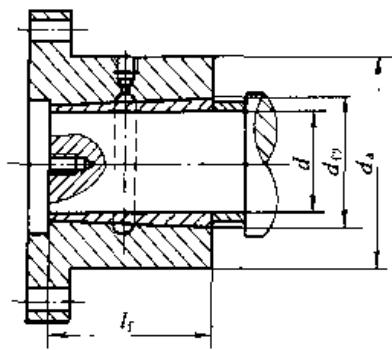

已知条件:  
材料:包容件 $3 5 ( \dot { \mathbf { \xi } } _ { x } \mathbf { M } \mathbf { f } _ { 0 }$ ,调质硬度269302HB被包容件 $3 5 \mathrm { C r M n }$ ,调质硬度269\~302HB中间会45,调质硬度241\~2B6HB  
包容件外径 $\ell _ { \bullet } = 4 6 0 \mathrm { m m }$   
被包容件内径 $d , \ u = 0$   
结合面最大圆锥直径 $\dot { u _ { \tt G } } = 3 2 0 \mathrm { m m }$   
结合面长度 $\dot { t } _ { \uparrow } = 4 0 0 m \mathrm { m m }$   
结合面锥度 $C = \mathtt { j } : 5 0$   
外锥中间套圆柱面直径 $d = 3 0 0 \mathrm { { m m } }$   
包容件与被包容件材料的屈服强度 ${ \mathfrak { a } } _ { \mathfrak { s } \mathfrak { u } } =$ $\sigma _ { \mathrm { { s } 2 } } = 5 4 0 \mathrm { { M P a } }$   
包容件与被包容件材料的弹性模量 $\hbar _ { \mathrm { \ast } } =$ $E _ { \mathrm { { s } } } = 2 1 0 0 0 0 0 \mathsf { M P a }$   
中间套材料的弹性模量E=210000MPa  
包容件 $^ 1 { \bf \Phi } _ { \bf J }$ 被包容件材料的波松比。"$\nu _ { 1 } = 0 . 3$   
传递转矩 $\bar { T } = 3 7 0 \vert k \vert \cdot _ { \mathsf { m } }$   
承受轴向力 $\boldsymbol { F } _ { \star } = 4 7 0 \boldsymbol { \mathsf { k N } }$   
圆锥结合面轮廓算术平均偏关 $R _ { \ast } { _ { = } }$ $R _ { \mathrm { a } } = 0 . 0 0 1 6 \mathrm { m m }$   
圆杜结合面轮廓算术平均偏美 $R _ { \bf { \alpha } \omega } =$ $R _ { \mathrm { a u } } = 0 . 0 0 1 6 \mathrm { t m m }$ 

<table><tr><td>序号</td><td></td><td>计算内容</td><td></td><td>计算公式和结果</td></tr><tr><td></td><td>强</td><td colspan="2">传递载荷所需的最小结合</td><td>Pmn=Rdl 根据联接特性，取K=1.5;套表4-4-3得μ=0.12 2T 2 F= + 4700002+ 2×370000000 2 J =2388472X 316 1 × 400 C 50 = 320-</td></tr><tr><td>2</td><td rowspan="2"></td><td rowspan="2">直径比</td><td>包容件</td><td>dn=dp- 2 2 d 316 9.= = 0 687 面 460</td></tr><tr><td>3</td><td>被包容件 q=</td><td>d 0 =0（对实心轴q,=0） d 316</td></tr><tr><td>4</td><td rowspan="3">GR 变化量</td><td rowspan="3">传递载荷所 需的最小直径</td><td>包容件</td><td>en = Pimn E. d 316 C=75.2× ×3.0877=0.3494mm 210000 查表4-4-5得C.=3.0877（内插法） 1+g 或C.= 1+0.6872 +y= +0.3=3.0877</td></tr><tr><td>5</td><td>被包容件</td><td>1- 1-0.687 山m emn=PfnE， 316 C,=75.2× ×0.7=0.0792mm 210000 查表4-4-5得C.=0.7</td></tr><tr><td></td><td>或C= 传递载荷所需的最小有效过盈量</td><td>1+g 1- v=1-0.3=0.7 =emn+ €mn=0.3494+0.0792=0.4286mm</td></tr><tr><td>6</td><td rowspan="2"></td><td colspan="2">考虑压平量后的所需最小过盈量</td><td>δmu =δmm +2（S+S,)=0.4286+2x[1.6×(0.0016+0.0016)+ 1.6x (0.0016+ 0.0016)=0.4491mm</td></tr><tr><td>7</td><td></td><td>S=1.6(R+Rs） S,=1.6(R+R） Pfm=a=0.2941×540=158.8MPH</td></tr><tr><td>8</td><td></td><td>不产生塑性 变形所允许的 最大结合压强</td><td>包容件 1-4 @= 3+g</td><td>1-0.687² =0.2941或查图4-4-8 3+0.687</td></tr><tr><td colspan="1" rowspan="1">序号</td><td colspan="3" rowspan="1">计算内容</td><td colspan="1" rowspan="1">计算公式和结果</td></tr><tr><td colspan="1" rowspan="1">9</td><td colspan="1" rowspan="2"></td><td colspan="1" rowspan="2">不产生塑性变形所允许的最大结合压强</td><td colspan="1" rowspan="1">被包容件</td><td colspan="1" rowspan="1">Pimax=cg=0.5×540=270MPa11-0c= 0.52   2</td></tr><tr><td colspan="1" rowspan="1">10</td><td colspan="1" rowspan="1">被联接件</td><td colspan="1" rowspan="1">Pim=158.8MP取Pim和Pr中的较小者</td></tr><tr><td colspan="1" rowspan="1">=</td><td colspan="1" rowspan="1"></td><td colspan="2" rowspan="1">被联接件不产生塑性变形所允许的传递力</td><td colspan="1" rowspan="1">F= PmxdI =158.8×3.14×316×400×0.12= 7563250N</td></tr><tr><td colspan="1" rowspan="1">12</td><td colspan="1" rowspan="2">不产生塑性变形所允许的最大过盈量</td><td colspan="1" rowspan="2">不产生塑性变形或破裂所允许的最大直径变化量</td><td colspan="1" rowspan="1">包容件</td><td colspan="1" rowspan="1">158.8× 316×3.0877=0.7378mm210000EC.=3.0877见序号4</td></tr><tr><td colspan="1" rowspan="1">13</td><td colspan="1" rowspan="1">被包容件</td><td colspan="1" rowspan="1">158.8×316x0.7=0.1673mm210000EC.=0.7见序号5</td></tr><tr><td colspan="1" rowspan="1">14</td><td colspan="1" rowspan="1"></td><td colspan="2" rowspan="1">被联接件不产生塑性变形所允许的最大有效过盈量</td><td colspan="1" rowspan="1">8=e+e=0.7378+0.1673=0.9051mm</td></tr><tr><td colspan="1" rowspan="1">1</td><td colspan="1" rowspan="1">选</td><td colspan="2" rowspan="1">满足联接要求的最小和最大过盈量</td><td colspan="1" rowspan="1">[8min]>0.4491 mm[8x]<0.9051 mm</td></tr><tr><td colspan="1" rowspan="1">16</td><td colspan="1" rowspan="1">选择</td><td colspan="2" rowspan="1">选取内、外圆锥直径公差及配合</td><td colspan="1" rowspan="1">选取：内锥H7；外锥x6</td></tr><tr><td colspan="1" rowspan="1">17</td><td colspan="1" rowspan="1">配合</td><td colspan="2" rowspan="1">所选配合的实际最小和最大过盈量</td><td colspan="1" rowspan="1">根据配合H7/x6,在d =316mm上的偏差为H7(+0.057,0）;x6(+0.626，+0.590)[8]=0.590-0.057=0.533mm[8]=0.626-0=0.626mm已考虑了安全系数，故使[δ]接近δmin</td></tr><tr><td colspan="1" rowspan="1">18</td><td colspan="1" rowspan="1"></td><td colspan="2" rowspan="1">外锥中间套与相关件圆柱面配合间隙</td><td colspan="1" rowspan="1">G    +0.069.0选定配合d=300    G7:前               -0.052/最大间隙Xm=0.069-（-0.052）=0.121mum最小间隙Xmin=0.017-0=0.017mm</td></tr><tr><td colspan="1" rowspan="1">19</td><td colspan="1" rowspan="1">油压装拆</td><td colspan="2" rowspan="1">轴向位移的极限值(压入行程）</td><td colspan="1" rowspan="1">E=]+Xm0.533+0.121= 32.7（mm）C1/50Emax=[8m]+Xm0.626+0.121= 37.35（mm）C1/50</td></tr><tr><td colspan="1" rowspan="1">20</td><td colspan="1" rowspan="1">参数</td><td colspan="2" rowspan="1">装配时，中间套变形所需的压强</td><td colspan="1" rowspan="1">△p1=EXm     /         210000×0.121！- [1-（）× = 4.18MPa2d2 × 300</td></tr><tr><td colspan="1" rowspan="1">21</td><td colspan="1" rowspan="1"></td><td colspan="2" rowspan="1">实际最大结合压强</td><td colspan="1" rowspan="1">[]                     0.626+△p=         +4.1B = 114MPa3.08770.7[pm]=   （d       316x210000210000</td></tr><tr><td colspan="1" rowspan="1">22</td><td colspan="1" rowspan="1"></td><td colspan="2" rowspan="1">需要的装拆油压</td><td colspan="1" rowspan="1">p= 1.1[pm]=1.1× 114=125.4MPa</td></tr><tr><td colspan="1" rowspan="1">23</td><td colspan="1" rowspan="1">GR</td><td colspan="2" rowspan="1">需要的人力</td><td colspan="1" rowspan="1">白=125.4× x× 316×400×0.02+  = 1493.88kN2P=Pdml(μ+云</td></tr><tr><td colspan="1" rowspan="1">24</td><td colspan="1" rowspan="1">GR</td><td colspan="2" rowspan="1">需要的压出力</td><td colspan="1" rowspan="1">1                                      50Px=Pπdml-） = 125.4× π × 316× 400 ×0.02  = 497.96kN2</td></tr><tr><td colspan="1" rowspan="1">25</td><td colspan="1" rowspan="1"></td><td colspan="2" rowspan="1">实际最小结合压强</td><td colspan="1" rowspan="1">[δ]-2(S.+ S.）0.533-2×(0.00512+0.00512）=89.92MP8[ptmn]=d     C       316×30877  0.7（210000+210000）S,=1.6× (0.0016+0.0016)= 0.00512mmS,=1.6x（0.0016+0.0016)=0.00512mm</td></tr><tr><td colspan="1" rowspan="2">26</td><td colspan="1" rowspan="2">校楼计</td><td colspan="1" rowspan="2">允许传递最小载荷</td><td colspan="1" rowspan="1">传递转矩</td><td colspan="1" rowspan="1">pm89.92×π×316²×400×0.12=677kNmTmun =22取μ=0.12</td></tr><tr><td colspan="1" rowspan="1">传递力</td><td colspan="1" rowspan="1">Fmn=[Ptmm]πdmμ =89.92×π×316× 400×0.12=4284.84N</td></tr><tr><td colspan="1" rowspan="1">27</td><td colspan="1" rowspan="2"></td><td colspan="1" rowspan="2">装拆时实际最大应力</td><td colspan="1" rowspan="1">包容件</td><td colspan="1" rowspan="1">P  125.4= 426.4MPa <    ∴安全a值见序号80.2941  旺</td></tr><tr><td colspan="1" rowspan="1">28</td><td colspan="1" rowspan="1">被包容件</td><td colspan="1" rowspan="1">P 125.4=250.8MPg<m    ：安全c值见序号9uar =6  0.5</td></tr><tr><td colspan="1" rowspan="1">29</td><td colspan="1" rowspan="1"></td><td colspan="2" rowspan="1">包容件外径增大量</td><td colspan="1" rowspan="1">2[P]2×114×460×0.6872=0.4464mm△dmax=E(1- 210000×（1-0.687）2[pmin]dg²2×89.92×460×0.687²= 0.3521mm△dmun=E.-210000×(1-0.6872）</td></tr><tr><td colspan="1" rowspan="1">30</td><td colspan="1" rowspan="1"></td><td colspan="2" rowspan="1">被包容件内径减小量</td><td colspan="1" rowspan="1">因为是实心轴，d,=△d,=0</td></tr></table>

# 3过盈联接的结构设计

# 3.1圆柱面过盈联接的合理结构

过盈联接的结合面沿轴向压力分布不均匀(图4-4-11),为了改篝压力不均,以减少应力集中,结构上可采取下列措施:

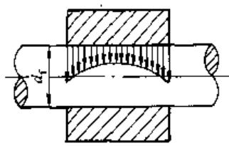

图4-4-11结合面沿轴向压力分布

(1)使非配合部分的直径小于配合直径(图4-4-12a),并以较大圆弧过渡,配合直径 $d _ { \uparrow }$ 与非配合直径 $\pmb { d } ^ { \prime }$ 之比通常取 $\frac { d _ { t } } { d ^ { \prime } } \geqslant 1 . 0 5$ ,圆弧半径可取 $r \geqslant \left\{ 0 . 1 \sim 0 . 2 \right\} d _ { t }$ 

(2)在被包容件上加工出卸载槽(图 $4 - 4 - 1 2 b , c )$ ,必要时卸载槽应经滚压处理,以

提高疲劳强度;

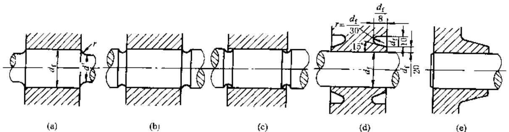

图4-4-12改善应力状态的结构

较广。

为了便于装配,对结构的要求:

(1)包容件的孔端和被包容件的进人端应有倒角,通常取倒角 $\pmb { \alpha }$ 为 ${ \mathfrak { s o } }$ 或 $1 0 ^ { \circ }$ ,倒角尺寸可按表4-4-12选定;(2)当轴承受较大的变载荷时,包容件的孔端应倒圆角,以提高轴的疲劳强度;(3)结合长度一般不宣超过结合直径 $\pmb { d } _ { \mathrm { f } }$ 的1.6倍,如结合长度过长,结合直径宜制成阶梯形,以改善装配工艺;(4)轴与盲孔的过盈配合,应有排气孔;(5)结合面的粗糙度一般不宜大于 $R , 6 . 3 \mu \mathrm { m }$ :(6)结合材料相同时,为避免压人时发生粘着现象,包容面与被包容面应有不同的硬度。有关其他装配要求请查阅GB/T5371--1985附录 $\mathbf { D }$ u

表4-4-12/mm

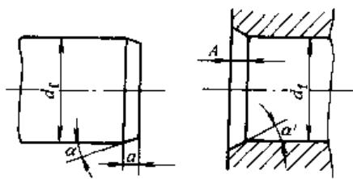

α'=30°\~45°≤10(或5°)

过盈联接零件孔端和进入端倒角尺寸

<table><tr><td rowspan=2 colspan=1>结合直径d</td><td rowspan=2 colspan=1>倒角尺寸</td><td rowspan=1 colspan=4>配合种类</td></tr><tr><td rowspan=1 colspan=1>B7，86，r6</td><td rowspan=1 colspan=1>x7</td><td rowspan=1 colspan=1>y7</td><td rowspan=1 colspan=1>27</td></tr><tr><td rowspan=1 colspan=1>50</td><td rowspan=1 colspan=1>aA</td><td rowspan=1 colspan=1>0.51</td><td rowspan=1 colspan=1>11.5</td><td rowspan=1 colspan=1>1.52</td><td rowspan=1 colspan=1>22.5</td></tr><tr><td rowspan=1 colspan=1>50~100</td><td rowspan=1 colspan=1>&A</td><td rowspan=1 colspan=1>11.5</td><td rowspan=1 colspan=1>22.5</td><td rowspan=1 colspan=1>22.5</td><td rowspan=1 colspan=1>33.5</td></tr><tr><td rowspan=1 colspan=1>100 ~ 250</td><td rowspan=1 colspan=1>aA</td><td rowspan=1 colspan=1>22.5</td><td rowspan=1 colspan=1>33.5</td><td rowspan=1 colspan=1>44.5</td><td rowspan=1 colspan=1>56</td></tr><tr><td rowspan=1 colspan=1>250~ 500</td><td rowspan=1 colspan=1>@A</td><td rowspan=1 colspan=1>3.54</td><td rowspan=1 colspan=1>4.55.5</td><td rowspan=1 colspan=1>7B</td><td rowspan=1 colspan=1>8.510</td></tr></table>

# 3.2实现圆锥面过盈联接的一般要求(GB/T15755—1995)

表44-13

<table><tr><td>结构要求</td><td>（1）为降低圆锥面过盈联接两端的压力集中，在包容件或被包容件端部可采用卸载槽、过渡圆弧 等结构形式（见图4-4-12） (2）被联接件材料相同时、为避免粘着和装拆时表面擦伤，包容件和被包容件的结合面应具有不 同的表面硬度 (3）为便于装拆，在包容件结合面的两端加工成15的倒角，或在被包容件两端加工成过渡圆槽 (4）进油孔和进油环槽，可以设在包容件上，也可以设在被包容件上，以结构设计允许和装拆方 便为准。进油环槽的位置，应放在大约位于包容件的质心处，但不能商两端太近，以免影响密封性 (5）进油环槽的边缘必须倒圆，以免影响结合面压力油的挤出 (6）为使油压分布均匀，并能迅速建立油压和释放油压，应在包容件或被包容件结合面上刻排油</td></tr></table>

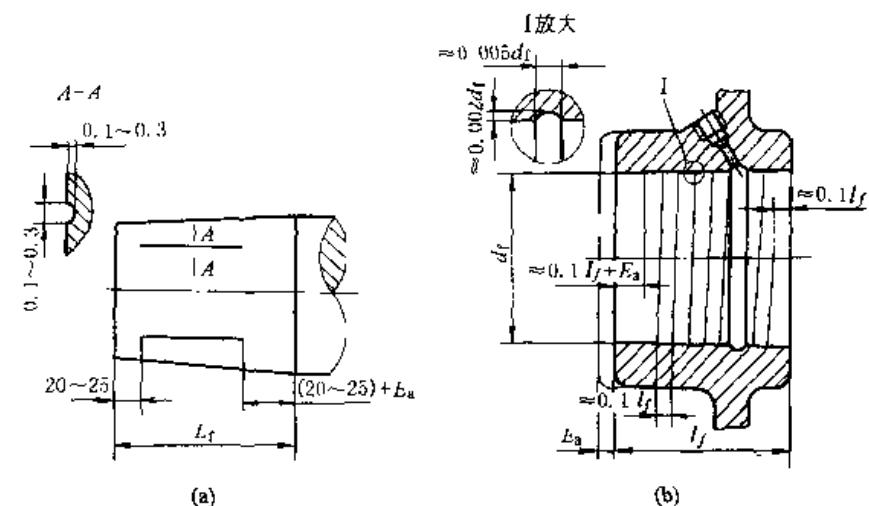

<table><tr><td rowspan=1 colspan=1>结构要求</td><td rowspan=1 colspan=1>A山A                             0.1+Ec20~25                （20~25）+buL                                 La          1（a)                                          (b)（7）需多次装拆或大尺寸圆锥过盈联接，应采用中间套。中间套一般采用45碳素结构钢，并经调质处理，其硬度241~286HB（8）经多次装拆的圆锥过盈联接，由于表面压平过盈量减小，设计压人行程应比计算值加大0.5～Jmm</td></tr><tr><td rowspan=1 colspan=1>对结合面的要求</td><td rowspan=1 colspan=1>（1）尺寸精度包容件最大圆锥直径公差按GB/T1800规定的TT6或I7选取；被包容件的最大圆锥直径公差按GB/T1800规定的IT5或IT6选取(2）表面粗糙度对圆锥面：当dm≤180mm时，R≤0.8um；dm>180mm时，R1.6μm对圆柱面：R.1.6m（3）接触精度圆锥面接触率，应不低于80%</td></tr><tr><td rowspan=1 colspan=1>压力油的选择</td><td rowspan=1 colspan=1>通常使用矿物油，推荐油在50℃时的运动粘度为30~45mm/B。油应清洁，不得含有杂质和污物</td></tr><tr><td rowspan=1 colspan=1>装配和拆卸</td><td rowspan=1 colspan=1>（1）装配①将被联接件的结合面擦净，并涂以润滑油②将被联接件装在一起，用手推移包容件，直至推不动时为止，以此状态下的位置为压人行程的起点③压装开始时，轴向压力不能过大。以后随着油压的加大而逐步提高，但不能超过最大轴向压力④压装之后，轴向压力应继续保持t5-30inin，以免包容件脱出③压装后应放置3h才可承受载荷⑥压装速度-般为2~5mm/s(2）拆卸①拆卸时高压油应缓慢注人，需5~10min才可将套脱开②拆卸时油的压力一般不超过规定值。当拆卸困难时，可适当提高油压，但最大不得超过规定值的10%止包容件自动弹出</td></tr></table>

# 3.3油压装卸结构设计规范(JB/T6136—1992)

表4-4-14

<table><tr><td rowspan=1 colspan=1>油孔接口螺纹d</td><td rowspan=1 colspan=1>a/（</td><td rowspan=1 colspan=1>d小</td><td rowspan=1 colspan=1>1</td><td rowspan=1 colspan=1>1</td><td rowspan=1 colspan=1>适用轴径范围d</td></tr><tr><td rowspan=1 colspan=1>M10 × 1-6H</td><td rowspan=1 colspan=1>120</td><td rowspan=1 colspan=1>5</td><td rowspan=1 colspan=1>10</td><td rowspan=1 colspan=1>12</td><td rowspan=1 colspan=1>200</td></tr><tr><td rowspan=1 colspan=1>M14 ×1.5-6H</td><td rowspan=1 colspan=1>120</td><td rowspan=1 colspan=1>8</td><td rowspan=1 colspan=1>12</td><td rowspan=1 colspan=1>15</td><td rowspan=1 colspan=1>500</td></tr><tr><td rowspan=1 colspan=1>M18 × 1.5-6H</td><td rowspan=1 colspan=1>120</td><td rowspan=1 colspan=1>8</td><td rowspan=1 colspan=1>16</td><td rowspan=1 colspan=1>19</td><td rowspan=1 colspan=1>≤500</td></tr><tr><td rowspan=1 colspan=1>M27 × 2-6H</td><td rowspan=1 colspan=1>120</td><td rowspan=1 colspan=1>12</td><td rowspan=1 colspan=1>18</td><td rowspan=1 colspan=1>22</td><td rowspan=1 colspan=1>> 250~ 1000</td></tr></table>

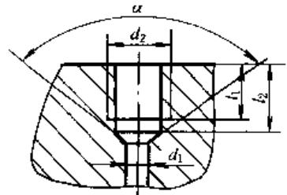

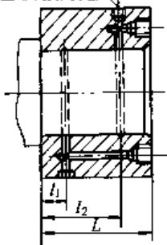

环形糟分布尺寸

<table><tr><td rowspan=1 colspan=1>图号</td><td rowspan=1 colspan=1>L</td><td rowspan=1 colspan=1>1</td><td rowspan=1 colspan=1>4</td><td rowspan=1 colspan=1>环形槽数量</td></tr><tr><td rowspan=1 colspan=1>图a、图b</td><td rowspan=1 colspan=1>100</td><td rowspan=1 colspan=1>(0.3~0.4)L</td><td rowspan=1 colspan=1>1</td><td rowspan=1 colspan=1>1</td></tr><tr><td rowspan=3 colspan=1>图c、图d</td><td rowspan=1 colspan=1>> 100~300</td><td rowspan=1 colspan=1>0.25L</td><td rowspan=3 colspan=1>(0.5~0.6)L</td><td rowspan=1 colspan=1>2</td></tr><tr><td rowspan=1 colspan=1>> 300~600</td><td rowspan=1 colspan=1>0.20L</td><td rowspan=1 colspan=1>3</td></tr><tr><td rowspan=1 colspan=1>> 600</td><td rowspan=1 colspan=1>0.15L</td><td rowspan=1 colspan=1>4</td></tr></table>

注:当环形槽的数量为3或4个时,其第3和第4个环形槽应均匀布置在,至 $\ell _ { 2 }$ 区间

环形槽的布置应能改善压力分布,环形增应布置在辐板和凸缘的下方

布置一个环形槽, $\begin{array} { r l } { \smash { i _ { 1 } } } & { { } = } \end{array}$ (0.3\~0.4)L

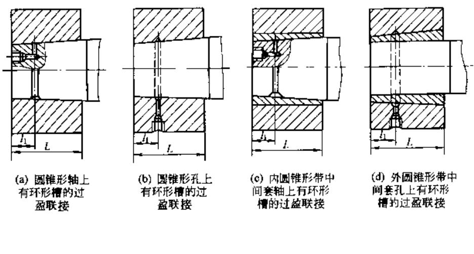

<table><tr><td rowspan=1 colspan=1>D</td><td rowspan=1 colspan=1></td><td rowspan=1 colspan=2>滚动轴承（图a、b）布置一个环形槽，l =(0.3 ~0.4）B，当包容件（图c）壁厚变化时，应布置两个环形槽</td><td></td><td></td><td></td><td></td><td></td><td></td></tr><tr><td rowspan=1 colspan=2>DR</td><td rowspan=1 colspan=2>为了便于拆卸，包容件的结合表面应超出被包容件的结合表面，见图a、b阶梯圆柱形过盈联接的结合长度为和（图c），安装油压是通过包容件的10导向锥与被包容件的a锥体良好接触形成密封而获得的、两个零件的尺寸应符合要求</td><td></td><td></td><td></td><td></td><td></td><td></td></tr><tr><td rowspan=1 colspan=2></td><td rowspan=1 colspan=2>装配完成后，为了使结合面间高压油排出，圆锥包容件或被包容件的结合面上应有与环形槽相通的螺旋油槽，但油槽不得延伸到结合面外</td><td></td><td></td><td></td><td></td><td></td><td></td></tr><tr><td rowspan=8 colspan=2>中</td><td rowspan=3 colspan=2>项   目</td><td rowspan=1 colspan=2>圆柱面过盈联接</td><td rowspan=2 colspan=4>圆锥面过盈联接中间套与相关圆柱面        园锥结合面（平均直径）</td></tr><tr><td rowspan=2 colspan=1>d≤180mm</td><td rowspan=2 colspan=1>d >180mm</td><td rowspan=1 colspan=2>中间套与相关圆柱面</td></tr><tr><td rowspan=1 colspan=1>L≤180mm</td><td rowspan=1 colspan=1>L>180mm</td><td rowspan=1 colspan=1>d180mm</td><td rowspan=1 colspan=1>d>180mm</td></tr><tr><td rowspan=2 colspan=1>基轴制</td><td rowspan=1 colspan=1>被包容件</td><td rowspan=1 colspan=1>h6</td><td rowspan=1 colspan=1>b7</td><td rowspan=4 colspan=1>H7/h7</td><td rowspan=4 colspan=1>外锥套：品内锥套：H</td><td rowspan=1 colspan=1>6</td><td rowspan=1 colspan=1>b7</td></tr><tr><td rowspan=1 colspan=1>包容件</td><td rowspan=1 colspan=1>r16</td><td rowspan=1 colspan=1>7</td><td rowspan=1 colspan=1>rT6</td><td rowspan=1 colspan=1>m7</td></tr><tr><td rowspan=2 colspan=1>基孔制</td><td rowspan=1 colspan=1>被包容件</td><td rowspan=1 colspan=1>T6</td><td rowspan=1 colspan=1>m7</td><td rowspan=2 colspan=1></td><td rowspan=2 colspan=1></td></tr><tr><td rowspan=1 colspan=1>包容件</td><td rowspan=1 colspan=1>H6</td><td rowspan=1 colspan=1>H7</td></tr><tr><td rowspan=1 colspan=2>粗糙度R,</td><td rowspan=1 colspan=1>孔：0.8um轴：0.8m</td><td rowspan=1 colspan=1>孔：1.6m轴：0.8μm</td><td rowspan=1 colspan=2></td><td rowspan=1 colspan=2>孔：0.4μm轴：0.4um</td></tr></table>

注:1.圆锥结合面的圆锥角公差为AT5,接触率不小于 $7 5 \%$ □2.环形槽圆角处的表面粗糙度 $R _ { \bullet } = 3 . 2 \mu \Pi \diamond$ 

# 3.4油压装卸说明(JB/T6136—1992)

(1)安装说明

过盈联接安装时,对于圆柱面配合,根据其尺寸,一般情况下加热孔或冷缩轴,或同时加热孔和冷缩轴后进行安装:对于圆锥形和阶梯形圆柱形过盈联接,不必加热孔和冷缩轴,而用压力油的方法进行快速安装。在采用油压安装时,应注意以下事项:安装表面不允许有破坏压力油膜形成的杂质、划痕和缺陷;应清除结合面上的油孔和环形油槽的毛刺;如果没有特殊要求,结合孔选用H7的公差带;对于未注公差的尺寸,按切削加工件有关技术要求的规定;对于结合面,应按照包容原则设计和制造;

通过加热或冷缩方法安装的过盈联接,在常温状态下,还没有达到预先要求的位置时,可通过油压重新调整到要求位置;安装好后,用螺塞将管路连接工艺用螺孔堵死。

图4-4-13、图4-4-14表示油压装配时的情况。油压拆卸时和装配时--样,通以高压油,同时用·个适当的T.具将被联接件卸出。对于圆锥被联接件,当高压油在配合处产生足够大的轴向分力时,被联接件被自动推出,可不另用T具。

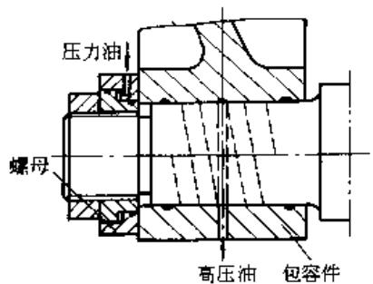

图4-4-13油压装配简图

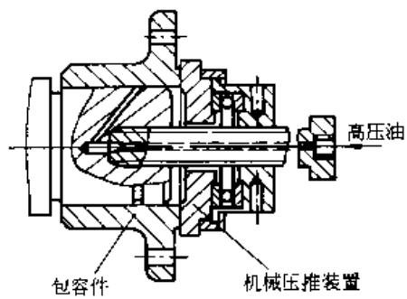

图4-4-14油压装配简图

# (2)拆卸说明

在拆卸之前,应先检查油路部分是否清洁,如不清洁应清理干净,通入压力油后,应保持压力油从过盈联接面溢出。这时用拆卸工具或压力机,将包容件不间断地拉出。在用拆卸工具或压力机拆卸过程中,应使压力油的压力保持不变。对于简单的圆柱面过盈联接,当拆卸离开最后一个环形槽之后,拆卸过程不能中断,如果中断会使油从结合面压出,并且轮毂(轴套)仍固定在轴上。

拆卸完成后应用螺塞将管路连接工艺用螺孔堵死。

拆卸用的介质,推荐采用运动粘度为 $4 6 \sim 6 8 \mathrm { m m } ^ { 2 } / \mathrm { s }$ ( $4 0 \%$ 时)的矿物油(不是液压油)。

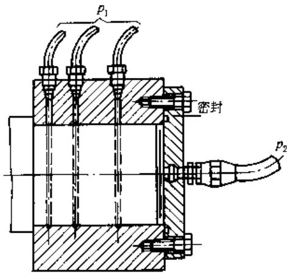

图4-4-15圆柱形过盈联接的拆卸

圆柱形过盈联接拆卸时,可同时向圆柱面和轴向加压,但轴向的油压力 ${ \pmb { p } } _ { 2 }$ 约为圆柱面油压力 ${ \pmb { p } } _ { 1 }$ 的1/5,当圆柱面的油压力达到计算的拆卸压力时,即可将包容件(或被包容件)不间断地拉出,在拉出过程中应特别注意安全,同时应保持油的压力稳定(见图4-4-15)。

阶梯圆柱形过盈联接拆卸时,当压力油使两个零件产生变形形成油膜后,在轴向力的作用下轴开始移动,这时应特别注意由于阶梯形圆柱直径 $\pmb { d } _ { 1 }$ 、 $\pmb { d } _ { 2 }$ 不同,在轴向产生的力将大于开始施加的轴向力,所以在拆卸时,事先应采取好的安全措施,防止拆卸结束后,轴(或轴套)被弹出。

# (3)安全注意事项

对油压拆卸(或安装)的操作,事先必须制订出安全操作规程,并且由有经验的人员进行操作。

意安全,防止圆锥形过盈联接在拆卸过程自动脱出,

# 第5章 胀紧联接和型面联接

# 1胀紧联接

# 1.1联接原理与特点

胀紧联接是在轴和毂孔之间放置一对或数对与内、外锥面贴合的胀紧联接套(简称胀套),在轴向力作用下,内环缩小,外环胀大,与轴和轮毂紧密贴合,产生足够的摩擦力,以传递转矩、轴向力或两者的复合载荷。

胀紧联接的定心性好,装拆或调整轴与轮毂的相对位置方便,没有应力集中,承载能力高,可避免零件因键槽等原因而削弱,又有密封作用。

图4-5-1为胀紧联接示例、弹性胀接套的锥面半锥角 $\pmb { \alpha }$ 愈小,结合面的压强愈大,因而所能传递的载荷也愈大,但 $\pmb { \alpha }$ 太小时,拆卸不方便,通常取 $\alpha = 1 0 ^ { \circ } \sim 1 4 ^ { \circ }$ 。胀套的材料多为65、65Mn、55Cr2或60Cr2等。胀套可用螺母压紧,也可在轴端或毂端用多个螺钉压紧。当采用多对胀套时,如采用同一轴向夹紧力(压紧力),各对胀套传递的转矩应递减。

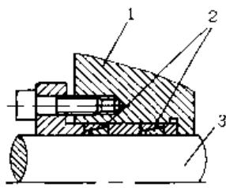

图4-5-1

1—齿轮;2一胀套;3-轴

# 1.2胀紧联接套的型式与基本尺寸(JB/T7934—1995)

# 1.2.1 Z2型胀紧联接套

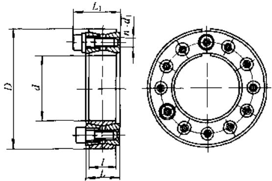

与胀紧联接套联接的轴、孔公差;轴为 $\mathbf { h } 7$ 或 $\mathbf { \hat { h 8 } }$ ;孔为H7或 $\mathbf { H 8 }$ 、表面粗糙度均为 $R _ { z } \leqslant 1 6 f ^ { \prime \prime \eta _ { 0 } } ,$ 

$\mathbf { Z } 2$ 型胀紧联接套螺钉的性能等级为12.9级。

标记示例:

内径 $\pmb { d } = 1 . 3 0 \mathbf { m m }$ 、外径 $\pmb { \mathcal { D } } = 1 8 0 \mathsf { m m }$ 的Z2型胀紧联

接套:

胀套 $2 2 - 1 3 0 \times 1 8 0$ JB/T 7934-1995

表 4-5-1

<table><tr><td rowspan=1 colspan=7>基本尺寸</td><td rowspan=1 colspan=2>额定载荷</td><td rowspan=3 colspan=1>胀套与轴结合面上的压强P/MPa</td><td rowspan=3 colspan=1>螺钉的拧紧力矩M/N·m</td><td rowspan=3 colspan=1>重量/kg</td></tr><tr><td rowspan=1 colspan=1>d</td><td rowspan=1 colspan=1>D</td><td rowspan=1 colspan=1>！</td><td rowspan=1 colspan=1>b</td><td rowspan=1 colspan=1>1</td><td rowspan=1 colspan=1>d1</td><td rowspan=2 colspan=1>A</td><td rowspan=2 colspan=1>轴向力F/kN</td><td rowspan=2 colspan=1>转矩M:/kN·m</td></tr><tr><td rowspan=1 colspan=6>/mm</td></tr><tr><td rowspan=2 colspan=1>2022</td><td rowspan=2 colspan=1>47</td><td rowspan=8 colspan=1>17</td><td rowspan=8 colspan=1>20</td><td rowspan=8 colspan=1>27.5</td><td rowspan=8 colspan=1>M6</td><td rowspan=2 colspan=1>8</td><td rowspan=2 colspan=1>27</td><td rowspan=1 colspan=1>0.27</td><td rowspan=1 colspan=1>210</td><td rowspan=8 colspan=1>14</td><td rowspan=1 colspan=1>0.24</td></tr><tr><td rowspan=1 colspan=1>0.30</td><td rowspan=1 colspan=1>195</td><td rowspan=1 colspan=1>0.23</td></tr><tr><td rowspan=1 colspan=1>25</td><td rowspan=1 colspan=1>50</td><td rowspan=1 colspan=1>9</td><td rowspan=1 colspan=1>30</td><td rowspan=1 colspan=1>0.38</td><td rowspan=1 colspan=1>190</td><td rowspan=1 colspan=1>0.25</td></tr><tr><td rowspan=2 colspan=1>2830</td><td rowspan=2 colspan=1>55</td><td rowspan=2 colspan=1>10</td><td rowspan=2 colspan=1>33</td><td rowspan=1 colspan=1>0.47</td><td rowspan=1 colspan=1>185</td><td rowspan=1 colspan=1>0.30</td></tr><tr><td rowspan=1 colspan=1>0.50</td><td rowspan=1 colspan=1>175</td><td rowspan=1 colspan=1>0.29</td></tr><tr><td rowspan=1 colspan=1>35</td><td rowspan=1 colspan=1>60</td><td rowspan=1 colspan=1>12</td><td rowspan=1 colspan=1>40</td><td rowspan=1 colspan=1>0.70</td><td rowspan=1 colspan=1>180</td><td rowspan=1 colspan=1>0.32</td></tr><tr><td rowspan=1 colspan=1>38</td><td rowspan=1 colspan=1>63</td><td rowspan=2 colspan=1>14</td><td rowspan=2 colspan=1>46</td><td rowspan=1 colspan=1>0.88</td><td rowspan=1 colspan=1>185</td><td rowspan=1 colspan=1>0.33</td></tr><tr><td rowspan=1 colspan=1>40</td><td rowspan=1 colspan=1>65</td><td rowspan=1 colspan=1>0.92</td><td rowspan=1 colspan=1>180</td><td rowspan=1 colspan=1>0.34</td></tr></table>

<table><tr><td rowspan=1 colspan=15>续表</td></tr><tr><td rowspan=1 colspan=10>基本尺寸</td><td rowspan=1 colspan=2>额定载荷</td><td rowspan=3 colspan=1>胀套轴结合面卜的压强pMPa</td><td rowspan=3 colspan=1>螺钉的拧紧力M/N·</td><td rowspan=3 colspan=1>币量/kg</td></tr><tr><td rowspan=1 colspan=1>d</td><td rowspan=1 colspan=1>D</td><td rowspan=2 colspan=2>i    1/mm</td><td rowspan=2 colspan=1>L</td><td rowspan=2 colspan=3>d</td><td rowspan=2 colspan=2>A</td><td rowspan=2 colspan=1>轴向力F/k</td><td rowspan=2 colspan=1>转矩M/kN·m</td></tr><tr><td rowspan=1 colspan=2></td></tr><tr><td rowspan=1 colspan=1>42</td><td rowspan=1 colspan=1>72</td><td rowspan=1 colspan=1></td><td rowspan=1 colspan=1></td><td rowspan=6 colspan=1>33.5</td><td rowspan=6 colspan=3>M8</td><td rowspan=3 colspan=2>12</td><td rowspan=1 colspan=1>65</td><td rowspan=1 colspan=1>1.36</td><td rowspan=1 colspan=1>200</td><td rowspan=6 colspan=1>35</td><td rowspan=1 colspan=1>0.48</td></tr><tr><td rowspan=1 colspan=1>45</td><td rowspan=1 colspan=1>75</td><td rowspan=5 colspan=1>20</td><td rowspan=5 colspan=1>24</td><td rowspan=1 colspan=1>72</td><td rowspan=1 colspan=1>1.62</td><td rowspan=1 colspan=1>210</td><td rowspan=1 colspan=1>0.57</td></tr><tr><td rowspan=1 colspan=1>50</td><td rowspan=1 colspan=1>80</td><td rowspan=1 colspan=1>71</td><td rowspan=1 colspan=1>1.77</td><td rowspan=1 colspan=1>190</td><td rowspan=1 colspan=1>0.60</td></tr><tr><td rowspan=1 colspan=1>55</td><td rowspan=1 colspan=1>85</td><td rowspan=2 colspan=2>14</td><td rowspan=2 colspan=1>83</td><td rowspan=1 colspan=1>2.27</td><td rowspan=1 colspan=1>200</td><td rowspan=1 colspan=1>0.63</td></tr><tr><td rowspan=1 colspan=1>60</td><td rowspan=1 colspan=1>90</td><td rowspan=1 colspan=1>2.47</td><td rowspan=1 colspan=1>180</td><td rowspan=1 colspan=1>0.69</td></tr><tr><td rowspan=1 colspan=1>65</td><td rowspan=1 colspan=1>95</td><td rowspan=1 colspan=2>16</td><td rowspan=1 colspan=1>93</td><td rowspan=1 colspan=1>3.04</td><td rowspan=1 colspan=1>190</td><td rowspan=1 colspan=1>073</td></tr><tr><td rowspan=1 colspan=1>70</td><td rowspan=1 colspan=1>110</td><td rowspan=6 colspan=1>24</td><td rowspan=6 colspan=1>28</td><td rowspan=6 colspan=1>：39.5</td><td rowspan=6 colspan=3>：M10</td><td rowspan=3 colspan=2>4</td><td rowspan=1 colspan=1>132</td><td rowspan=1 colspan=1>4.60</td><td rowspan=1 colspan=1>210</td><td rowspan=6 colspan=1>70</td><td rowspan=1 colspan=1>1.26</td></tr><tr><td rowspan=1 colspan=1>75</td><td rowspan=1 colspan=1>115</td><td rowspan=2 colspan=1>131</td><td rowspan=1 colspan=1>4.90</td><td rowspan=1 colspan=1>195</td><td rowspan=1 colspan=1>1.33</td></tr><tr><td rowspan=1 colspan=1>80</td><td rowspan=1 colspan=1>120</td><td rowspan=1 colspan=1>5.20</td><td rowspan=1 colspan=1>180</td><td rowspan=1 colspan=1>1.40</td></tr><tr><td rowspan=1 colspan=1>85</td><td rowspan=1 colspan=1>125</td><td rowspan=2 colspan=2>16</td><td rowspan=1 colspan=1>148</td><td rowspan=1 colspan=1>6.30</td><td rowspan=1 colspan=1>195</td><td rowspan=1 colspan=1>1.49</td></tr><tr><td rowspan=1 colspan=1>90</td><td rowspan=1 colspan=1>130</td><td rowspan=1 colspan=1>147</td><td rowspan=1 colspan=1>6.60</td><td rowspan=1 colspan=1>180</td><td rowspan=1 colspan=1>1.53</td></tr><tr><td rowspan=1 colspan=1>95</td><td rowspan=1 colspan=1>135</td><td rowspan=1 colspan=2>18</td><td rowspan=1 colspan=1>167</td><td rowspan=1 colspan=1>7.90</td><td rowspan=1 colspan=1>195</td><td rowspan=1 colspan=1>1.62</td></tr><tr><td rowspan=1 colspan=1>100</td><td rowspan=1 colspan=1>145</td><td rowspan=5 colspan=1>29</td><td rowspan=5 colspan=1>33</td><td rowspan=5 colspan=1>47.0</td><td rowspan=5 colspan=3>M12</td><td rowspan=2 colspan=2>14</td><td rowspan=1 colspan=1>192</td><td rowspan=1 colspan=1>9.60</td><td rowspan=1 colspan=1></td><td rowspan=9 colspan=1>125</td><td rowspan=1 colspan=1>2.01</td></tr><tr><td rowspan=1 colspan=1>105</td><td rowspan=1 colspan=1>150</td><td rowspan=1 colspan=1>190</td><td rowspan=1 colspan=1>9.98</td><td rowspan=1 colspan=1>185</td><td rowspan=1 colspan=1>2.10</td></tr><tr><td rowspan=1 colspan=1>10</td><td rowspan=1 colspan=1>155</td><td rowspan=1 colspan=2></td><td rowspan=1 colspan=1>191</td><td rowspan=1 colspan=1>10.50</td><td rowspan=1 colspan=1>180</td><td rowspan=1 colspan=1>2.15</td></tr><tr><td rowspan=1 colspan=1>120</td><td rowspan=1 colspan=1>165</td><td rowspan=1 colspan=2>16</td><td rowspan=1 colspan=1>218</td><td rowspan=1 colspan=1>13.10</td><td rowspan=1 colspan=1>185</td><td rowspan=1 colspan=1>2.35</td></tr><tr><td rowspan=1 colspan=1>125</td><td rowspan=1 colspan=1>170</td><td rowspan=1 colspan=2>18</td><td rowspan=1 colspan=1>220</td><td rowspan=1 colspan=1>13.78</td><td rowspan=1 colspan=1>180</td><td rowspan=1 colspan=1>2.95</td></tr><tr><td rowspan=1 colspan=1>130</td><td rowspan=1 colspan=1>180</td><td rowspan=4 colspan=1>34</td><td rowspan=4 colspan=1>38</td><td rowspan=4 colspan=1>520</td><td rowspan=4 colspan=3></td><td></td><td></td><td rowspan=1 colspan=1></td><td rowspan=1 colspan=1>20</td><td rowspan=1 colspan=1>272</td><td rowspan=1 colspan=1>17.60</td><td rowspan=1 colspan=1>165</td></tr><tr><td rowspan=1 colspan=1>140</td><td rowspan=1 colspan=1>190</td><td rowspan=1 colspan=2>22</td><td rowspan=1 colspan=1>298</td><td rowspan=1 colspan=1>20.90</td><td rowspan=1 colspan=1>165</td><td rowspan=1 colspan=1>3.85</td></tr><tr><td rowspan=1 colspan=1>150</td><td rowspan=1 colspan=1>200</td><td rowspan=1 colspan=2>24</td><td rowspan=1 colspan=1>324</td><td rowspan=1 colspan=1>24.20</td><td rowspan=2 colspan=1>170</td><td rowspan=1 colspan=1>4.07</td></tr><tr><td rowspan=1 colspan=1>160</td><td rowspan=1 colspan=1>210</td><td rowspan=1 colspan=2>26</td><td rowspan=1 colspan=1>350</td><td rowspan=1 colspan=1>28.00</td><td rowspan=1 colspan=1>4.30</td></tr><tr><td rowspan=1 colspan=1>170</td><td rowspan=1 colspan=1>225</td><td rowspan=2 colspan=1>38</td><td rowspan=2 colspan=1>44</td><td rowspan=2 colspan=1>60</td><td></td><td rowspan=2 colspan=2>M14</td><td rowspan=1 colspan=2>22</td><td rowspan=1 colspan=1>386</td><td rowspan=1 colspan=1>32.80</td><td rowspan=1 colspan=1>160</td><td rowspan=4 colspan=1>190</td><td rowspan=1 colspan=1>5.78</td></tr><tr><td rowspan=1 colspan=1>180</td><td rowspan=1 colspan=1>235</td><td></td><td rowspan=1 colspan=2>24</td><td rowspan=1 colspan=1>420</td><td rowspan=1 colspan=1>37.80</td><td rowspan=1 colspan=1>165</td><td rowspan=1 colspan=1>6.05</td></tr><tr><td rowspan=1 colspan=1>190</td><td rowspan=1 colspan=1>250</td><td rowspan=2 colspan=1>46</td><td rowspan=2 colspan=1>52</td><td rowspan=2 colspan=1>6</td><td rowspan=2 colspan=3></td><td rowspan=1 colspan=2></td><td></td><td rowspan=1 colspan=1>28</td><td rowspan=1 colspan=1>490</td><td rowspan=1 colspan=1>46.50</td><td rowspan=1 colspan=1>150</td></tr><tr><td rowspan=1 colspan=1>200</td><td rowspan=1 colspan=1>260</td><td rowspan=1 colspan=2>30</td><td rowspan=1 colspan=1>525</td><td rowspan=1 colspan=1>52.50</td><td rowspan=1 colspan=1>150</td><td rowspan=1 colspan=1>8.65</td></tr><tr><td rowspan=1 colspan=1>210</td><td rowspan=1 colspan=1>275</td><td rowspan=5 colspan=1>50</td><td rowspan=5 colspan=1>56</td><td rowspan=5 colspan=1>74</td><td></td><td rowspan=5 colspan=2>M16</td><td rowspan=1 colspan=2>24</td><td rowspan=1 colspan=1>599</td><td rowspan=1 colspan=1>62.89</td><td rowspan=1 colspan=1>151</td><td rowspan=5 colspan=1>295</td><td rowspan=1 colspan=1>10.10</td></tr><tr><td rowspan=1 colspan=1>220</td><td rowspan=1 colspan=1>285</td><td></td><td rowspan=1 colspan=2>26</td><td rowspan=1 colspan=1>620</td><td rowspan=1 colspan=1>68.00</td><td rowspan=1 colspan=1>150</td><td rowspan=1 colspan=1>11.22</td></tr><tr><td rowspan=1 colspan=1>240</td><td rowspan=1 colspan=1>305</td><td></td><td rowspan=1 colspan=2>30</td><td rowspan=1 colspan=1>715</td><td rowspan=1 colspan=1>85.50</td><td rowspan=1 colspan=1>160</td><td rowspan=1 colspan=1>12.20</td></tr><tr><td rowspan=1 colspan=1>250</td><td rowspan=1 colspan=1>315</td><td></td><td rowspan=1 colspan=2>32</td><td rowspan=1 colspan=1>768</td><td rowspan=1 colspan=1>96.00</td><td rowspan=1 colspan=1>162</td><td rowspan=1 colspan=1>12.70</td></tr><tr><td rowspan=1 colspan=1>260</td><td rowspan=1 colspan=1>325</td><td></td><td rowspan=1 colspan=2>34</td><td rowspan=1 colspan=1>800</td><td rowspan=1 colspan=1>104.00</td><td rowspan=1 colspan=1>165</td><td rowspan=1 colspan=1>13.20</td></tr><tr><td rowspan=1 colspan=1>280</td><td rowspan=1 colspan=1>355</td><td rowspan=2 colspan=1>60</td><td rowspan=2 colspan=1>66</td><td rowspan=2 colspan=1>86.5</td><td></td><td></td><td rowspan=2 colspan=1>M18</td><td rowspan=1 colspan=2>32</td><td rowspan=1 colspan=1>915</td><td rowspan=1 colspan=1>128.00</td><td rowspan=1 colspan=1>145</td><td rowspan=2 colspan=1>405</td><td rowspan=1 colspan=1>19.20</td></tr><tr><td rowspan=1 colspan=1>300</td><td rowspan=1 colspan=1>375</td><td></td><td></td><td rowspan=1 colspan=2></td><td rowspan=1 colspan=1>1020</td><td rowspan=1 colspan=1>153.00</td><td rowspan=1 colspan=1>150</td><td rowspan=1 colspan=1>20.50</td></tr><tr><td rowspan=1 colspan=1>320</td><td rowspan=1 colspan=1>405</td><td rowspan=3 colspan=1>72</td><td rowspan=3 colspan=1>78</td><td rowspan=3 colspan=1>100.5</td><td></td><td></td><td rowspan=3 colspan=1>M20</td><td rowspan=3 colspan=2>36</td><td rowspan=3 colspan=1>1310</td><td rowspan=1 colspan=1>210.00</td><td rowspan=1 colspan=1>150</td><td rowspan=3 colspan=1>580</td><td rowspan=1 colspan=1>29.60</td></tr><tr><td rowspan=2 colspan=1>340</td><td rowspan=2 colspan=1>425</td><td></td><td></td><td></td><td></td><td></td></tr><tr><td></td><td></td><td rowspan=1 colspan=1>224.00</td><td rowspan=2 colspan=1>145</td><td rowspan=1 colspan=1>31.10</td></tr><tr><td rowspan=1 colspan=1>360</td><td rowspan=1 colspan=1>455</td><td rowspan=1 colspan=1>84</td><td rowspan=1 colspan=1>90</td><td rowspan=1 colspan=1>116.0</td><td></td><td></td><td rowspan=1 colspan=1>M22</td><td rowspan=1 colspan=2></td><td rowspan=1 colspan=1>1630</td><td rowspan=1 colspan=1>294.00</td><td rowspan=1 colspan=1>780</td><td rowspan=1 colspan=1>42.20</td></tr></table>

续表

<table><tr><td rowspan=1 colspan=7>基本尺寸</td><td rowspan=1 colspan=2>额定载荷</td><td rowspan=3 colspan=1>胀套与轴结合面上的压强P/MPa</td><td rowspan=3 colspan=4>螺钉的拧紧力M/N·m</td><td rowspan=3 colspan=1>重量/kg</td></tr><tr><td rowspan=1 colspan=1>d</td><td rowspan=1 colspan=1>D</td><td rowspan=1 colspan=1>i</td><td rowspan=1 colspan=1>L</td><td rowspan=1 colspan=1>L</td><td rowspan=1 colspan=1>d</td><td rowspan=2 colspan=1>n</td><td rowspan=2 colspan=1>轴向力FkN</td><td rowspan=2 colspan=1>转矩M/kN+m</td></tr><tr><td rowspan=1 colspan=4>/mm</td><td rowspan=1 colspan=2></td></tr><tr><td rowspan=1 colspan=1>380</td><td rowspan=1 colspan=1>475</td><td rowspan=1 colspan=1></td><td rowspan=3 colspan=1>90</td><td rowspan=3 colspan=1>116.0</td><td rowspan=3 colspan=1>M22</td><td rowspan=2 colspan=1>36</td><td rowspan=1 colspan=1>1620</td><td rowspan=1 colspan=1>308.00</td><td rowspan=1 colspan=1>135</td><td rowspan=3 colspan=4>780</td><td rowspan=1 colspan=1>44.00</td></tr><tr><td rowspan=1 colspan=1>400</td><td rowspan=1 colspan=1>495</td><td rowspan=1 colspan=1>84</td><td rowspan=1 colspan=1>1610</td><td rowspan=1 colspan=1>322.00</td><td rowspan=1 colspan=1>130</td><td rowspan=1 colspan=1>46.00</td></tr><tr><td rowspan=1 colspan=1>420</td><td rowspan=1 colspan=1>515</td><td rowspan=1 colspan=1></td><td rowspan=1 colspan=1></td><td rowspan=1 colspan=1>1780</td><td rowspan=1 colspan=1>374.00</td><td rowspan=1 colspan=1>135</td><td rowspan=1 colspan=1>50.00</td></tr><tr><td rowspan=1 colspan=1>450</td><td rowspan=1 colspan=1>555</td><td rowspan=1 colspan=1></td><td rowspan=2 colspan=1></td><td rowspan=5 colspan=1></td><td rowspan=4 colspan=1></td><td rowspan=1 colspan=1>40</td><td rowspan=1 colspan=1>2050</td><td rowspan=1 colspan=1>461.25</td><td rowspan=2 colspan=1>124</td><td rowspan=6 colspan=4></td><td rowspan=1 colspan=1>65.00</td></tr><tr><td rowspan=1 colspan=1>480</td><td rowspan=1 colspan=1>585</td><td rowspan=1 colspan=1></td><td rowspan=1 colspan=1>42</td><td rowspan=1 colspan=1>2160</td><td rowspan=1 colspan=1>518.40</td><td rowspan=1 colspan=1>71.00</td></tr><tr><td rowspan=1 colspan=1>500</td><td rowspan=1 colspan=1>605</td><td rowspan=1 colspan=1></td><td rowspan=2 colspan=1></td><td rowspan=1 colspan=1>44</td><td rowspan=1 colspan=1>2240</td><td rowspan=1 colspan=1>560.00</td><td rowspan=1 colspan=1>123</td><td rowspan=1 colspan=1>72.60</td></tr><tr><td rowspan=1 colspan=1>530</td><td rowspan=1 colspan=1>640</td><td rowspan=1 colspan=1></td><td rowspan=1 colspan=1>45</td><td rowspan=1 colspan=1>2330</td><td rowspan=1 colspan=1>617.00</td><td rowspan=1 colspan=1>121</td><td rowspan=1 colspan=1>83.60</td></tr><tr><td rowspan=1 colspan=1>560</td><td rowspan=1 colspan=1>670</td><td rowspan=1 colspan=1></td><td rowspan=1 colspan=1></td><td rowspan=3 colspan=1></td><td rowspan=2 colspan=1></td><td rowspan=1 colspan=1>48</td><td rowspan=1 colspan=1>2440</td><td rowspan=1 colspan=1>680.00</td><td rowspan=1 colspan=1>120</td><td rowspan=1 colspan=1>85.00</td></tr><tr><td rowspan=1 colspan=1>600</td><td rowspan=1 colspan=1>710</td><td rowspan=1 colspan=1></td><td rowspan=2 colspan=1></td><td rowspan=1 colspan=1>50</td><td rowspan=1 colspan=1>2580</td><td rowspan=1 colspan=1>775.00</td><td rowspan=1 colspan=1>118</td><td rowspan=1 colspan=1></td><td rowspan=1 colspan=1>91.00</td></tr><tr><td rowspan=1 colspan=1>630</td><td rowspan=1 colspan=1>740</td><td rowspan=1 colspan=1></td><td rowspan=1 colspan=1></td><td rowspan=1 colspan=1>52</td><td rowspan=1 colspan=1>2680</td><td rowspan=1 colspan=1>844.00</td><td rowspan=1 colspan=1>117</td><td rowspan=3 colspan=4>1000</td><td rowspan=1 colspan=2></td><td rowspan=1 colspan=1>94.00</td></tr><tr><td rowspan=2 colspan=1>670</td><td rowspan=2 colspan=1>780</td><td rowspan=2 colspan=1>96</td><td rowspan=2 colspan=1>102</td><td rowspan=2 colspan=1>130.0</td><td rowspan=2 colspan=1>M24</td><td rowspan=2 colspan=1>56</td><td rowspan=2 colspan=1>2820</td><td rowspan=2 colspan=1>944.00</td><td rowspan=2 colspan=1>116</td><td rowspan=2 colspan=2></td><td rowspan=2 colspan=1>101.00</td></tr><tr><td rowspan=1 colspan=1></td></tr><tr><td rowspan=1 colspan=1>710</td><td rowspan=1 colspan=1>820</td><td rowspan=1 colspan=1></td><td rowspan=2 colspan=1></td><td rowspan=4 colspan=1></td><td rowspan=1 colspan=1></td><td rowspan=1 colspan=1>60</td><td rowspan=1 colspan=1>2970</td><td rowspan=1 colspan=1>1054.00</td><td rowspan=1 colspan=1>115</td><td rowspan=7 colspan=4></td><td rowspan=1 colspan=1>106.00</td></tr><tr><td rowspan=1 colspan=1>750</td><td rowspan=1 colspan=1>860</td><td rowspan=1 colspan=1></td><td rowspan=1 colspan=1></td><td rowspan=1 colspan=1>62</td><td rowspan=1 colspan=1>3130</td><td rowspan=1 colspan=1>1173.00</td><td rowspan=1 colspan=1>115</td><td rowspan=1 colspan=1>112.00</td></tr><tr><td rowspan=1 colspan=1>800</td><td rowspan=1 colspan=1>910</td><td rowspan=2 colspan=1></td><td rowspan=2 colspan=1></td><td rowspan=2 colspan=1></td><td rowspan=1 colspan=1>66</td><td rowspan=1 colspan=1>3260</td><td rowspan=1 colspan=1>1300.00</td><td rowspan=1 colspan=1>112</td><td rowspan=1 colspan=1>118.00</td></tr><tr><td rowspan=1 colspan=1>850</td><td rowspan=1 colspan=1>960</td><td rowspan=1 colspan=1>70</td><td rowspan=1 colspan=1>3500</td><td rowspan=1 colspan=1>1487.00</td><td rowspan=1 colspan=1>113</td><td rowspan=1 colspan=1>125.00</td></tr><tr><td rowspan=1 colspan=1>900</td><td rowspan=1 colspan=1>1010</td><td rowspan=3 colspan=1></td><td rowspan=3 colspan=1></td><td rowspan=3 colspan=1></td><td rowspan=3 colspan=1></td><td rowspan=1 colspan=1>75</td><td rowspan=1 colspan=1>3680</td><td rowspan=1 colspan=1>1650.00</td><td rowspan=2 colspan=1>112</td><td rowspan=1 colspan=1>132.00</td></tr><tr><td rowspan=1 colspan=1>950</td><td rowspan=1 colspan=1>1060</td><td rowspan=1 colspan=1>80</td><td rowspan=1 colspan=1>3870</td><td rowspan=1 colspan=1>1838.00</td><td rowspan=1 colspan=1>139.00</td></tr><tr><td rowspan=1 colspan=1>1000</td><td rowspan=1 colspan=1>1110</td><td rowspan=1 colspan=1>82</td><td rowspan=1 colspan=1>4000</td><td rowspan=1 colspan=1>2000.00</td><td rowspan=1 colspan=1>110</td><td rowspan=1 colspan=1>146.00</td></tr></table>

注:主要生产厂家:二重基础件厂(四川德阳市)、沈阳三环机械厂、沈阳重矿机械厂、二重传动机械厂(四川德阳市)、洛阳轴承附件厂、沈阳市东方液压件厂、武汉数控集团股份有限公司。

# 1.2.2Z5型胀紧联接套

与胀紧联接套联接的轴、孔公差:轴为 $\mathbf { h } \pmb { 8 }$ ,孔为 $\yen 8$ 。表面粗糙度均为 $R _ { \mathrm { { r } } } \leqslant 1 6 \mu \mathrm { { m } }$ 

7.5型胀紧联接套螺钉的性能等级为12.9级。

标记示例:

内径 $d = 3 0 0 \mathbf { m } \mathbf { n }$ 、外径 $\vec { D } = 3 7 5 \mathrm { n m }$ 的Z5型胀紧联接套:

胀套 ${ \bf { Z 5 - 3 0 0 \times 3 7 5 } }$ JB/T7934-1995

表4-5-2

<table><tr><td rowspan=1 colspan=7>基本尺寸</td><td rowspan=1 colspan=2>额定载荷</td><td rowspan=3 colspan=1>胀套与轴结合面上的压强P/MPa</td><td rowspan=3 colspan=1>螺钉的拧紧力矩M/N·m</td><td rowspan=3 colspan=1>重量/g</td></tr><tr><td rowspan=1 colspan=1>d</td><td rowspan=1 colspan=1>D</td><td rowspan=1 colspan=1>！</td><td rowspan=1 colspan=1>L</td><td rowspan=1 colspan=1>L</td><td rowspan=1 colspan=1>d</td><td rowspan=2 colspan=1>n</td><td rowspan=2 colspan=1>轴向力F,/N</td><td rowspan=2 colspan=1>转矩M,/N·m</td></tr><tr><td rowspan=1 colspan=6>/mm</td></tr><tr><td rowspan=1 colspan=1>100</td><td rowspan=1 colspan=1>145</td><td rowspan=3 colspan=1>60</td><td rowspan=3 colspan=1>65</td><td rowspan=3 colspan=1>77</td><td rowspan=3 colspan=1>M12</td><td rowspan=2 colspan=1>10</td><td rowspan=2 colspan=1>288</td><td rowspan=1 colspan=1>14.4</td><td rowspan=1 colspan=1>192</td><td rowspan=3 colspan=1>145</td><td rowspan=1 colspan=1>4.1</td></tr><tr><td rowspan=1 colspan=1>110</td><td rowspan=1 colspan=1>155</td><td rowspan=1 colspan=1>15.8</td><td rowspan=1 colspan=1>175</td><td rowspan=1 colspan=1>4.4</td></tr><tr><td rowspan=1 colspan=1>120</td><td rowspan=1 colspan=1>165</td><td rowspan=1 colspan=1>12</td><td rowspan=1 colspan=1>346</td><td rowspan=1 colspan=1>20.8</td><td rowspan=1 colspan=1>192</td><td rowspan=1 colspan=1>4.8</td></tr></table>

<table><tr><td rowspan=1 colspan=9>基本尺寸</td><td rowspan=1 colspan=2>额定载荷</td><td rowspan=3 colspan=1>胀套与轴结合面上的压强P/MP</td><td rowspan=3 colspan=1>螺钉的拧紧力处M/N·m</td><td rowspan=3 colspan=1>重康/kg</td></tr><tr><td rowspan=1 colspan=1></td><td rowspan=1 colspan=1>d</td><td rowspan=1 colspan=1>D</td><td rowspan=1 colspan=1>！</td><td rowspan=1 colspan=1>！</td><td rowspan=1 colspan=2>L</td><td rowspan=1 colspan=2>d</td><td rowspan=2 colspan=1>A</td><td rowspan=2 colspan=1>轴向力F/N</td><td rowspan=2 colspan=1>转矩M/kN·i</td></tr><tr><td rowspan=3 colspan=1></td><td rowspan=1 colspan=4>/mm</td><td rowspan=1 colspan=2></td><td rowspan=1 colspan=2></td></tr><tr><td rowspan=1 colspan=1>130</td><td rowspan=1 colspan=1>180</td><td rowspan=4 colspan=1>68</td><td rowspan=4 colspan=1>74</td><td rowspan=4 colspan=1>86：</td><td></td><td rowspan=4 colspan=1>W12</td><td rowspan=1 colspan=2>15</td><td rowspan=1 colspan=1>433</td><td rowspan=1 colspan=1>281</td><td rowspan=1 colspan=1>193</td><td rowspan=3 colspan=1>145</td><td rowspan=1 colspan=1>6.5</td></tr><tr><td rowspan=1 colspan=1>140</td><td rowspan=1 colspan=1>190</td><td></td><td rowspan=2 colspan=2>18</td><td rowspan=2 colspan=1>519</td><td rowspan=1 colspan=1>36.3</td><td rowspan=1 colspan=1>214</td><td rowspan=1 colspan=1>7.0</td></tr><tr><td rowspan=1 colspan=1>150</td><td rowspan=1 colspan=1>200</td><td></td><td rowspan=1 colspan=1>39.0</td><td rowspan=1 colspan=1>200</td><td rowspan=1 colspan=1>7.4</td></tr><tr><td rowspan=1 colspan=1>160</td><td rowspan=1 colspan=1>210</td><td></td><td rowspan=1 colspan=2>21</td><td rowspan=1 colspan=1>606</td><td rowspan=1 colspan=1>48.5</td><td rowspan=1 colspan=1>219，</td><td rowspan=1 colspan=1></td><td rowspan=1 colspan=1>7.8</td></tr><tr><td rowspan=1 colspan=1>170</td><td rowspan=2 colspan=1>225235</td><td rowspan=2 colspan=1>75</td><td rowspan=2 colspan=1>81</td><td rowspan=2 colspan=1>95</td><td rowspan=2 colspan=2>W14</td><td rowspan=2 colspan=2>18</td><td rowspan=2 colspan=1>712</td><td rowspan=1 colspan=1>60.6</td><td rowspan=1 colspan=1>215</td><td rowspan=1 colspan=1>230</td><td rowspan=1 colspan=1>10.0</td></tr><tr><td rowspan=1 colspan=1>180</td><td rowspan=1 colspan=1>54.1</td><td rowspan=1 colspan=1>203</td><td rowspan=2 colspan=1>230</td><td rowspan=1 colspan=1>10.6</td></tr><tr><td rowspan=1 colspan=1>190</td><td rowspan=1 colspan=1>250</td><td rowspan=2 colspan=1>88</td><td rowspan=2 colspan=1>94</td><td rowspan=2 colspan=1>108！</td><td rowspan=2 colspan=2></td><td rowspan=1 colspan=2>29</td><td rowspan=1 colspan=1>792</td><td rowspan=1 colspan=1>75.2</td><td rowspan=1 colspan=1>178</td><td rowspan=1 colspan=1>14.3</td></tr><tr><td rowspan=1 colspan=1>200</td><td rowspan=1 colspan=1>260</td><td rowspan=1 colspan=2>24</td><td rowspan=1 colspan=1>950</td><td rowspan=1 colspan=1>95.0</td><td rowspan=1 colspan=1>203</td><td rowspan=1 colspan=1></td><td rowspan=1 colspan=1>15.0</td></tr><tr><td rowspan=1 colspan=1>210</td><td rowspan=1 colspan=1>275</td><td rowspan=2 colspan=1></td><td rowspan=2 colspan=1></td><td rowspan=5 colspan=1>120</td><td rowspan=5 colspan=2>M16</td><td></td><td></td><td rowspan=2 colspan=1>18</td><td rowspan=1 colspan=1>970</td><td rowspan=1 colspan=1>102.0</td><td rowspan=1 colspan=1>187</td><td rowspan=2 colspan=1></td></tr><tr><td rowspan=1 colspan=1>220</td><td rowspan=1 colspan=1>285</td><td></td><td></td><td rowspan=1 colspan=1>990</td><td rowspan=1 colspan=1>109.0</td><td rowspan=1 colspan=1>183</td><td></td><td rowspan=1 colspan=1>19.8</td></tr><tr><td rowspan=1 colspan=1>240</td><td rowspan=1 colspan=1>305</td><td rowspan=3 colspan=1>98</td><td rowspan=3 colspan=1>104</td><td rowspan=2 colspan=2>24</td><td rowspan=1 colspan=1>1318</td><td rowspan=1 colspan=1>158.0</td><td rowspan=1 colspan=1>222</td><td rowspan=3 colspan=1>355</td><td rowspan=1 colspan=1>21.4</td></tr><tr><td rowspan=1 colspan=1>250</td><td rowspan=1 colspan=1>315</td><td rowspan=1 colspan=1>1340</td><td rowspan=1 colspan=1>167.5</td><td rowspan=2 colspan=1>215</td><td rowspan=1 colspan=1>22.0</td></tr><tr><td rowspan=1 colspan=1>260</td><td rowspan=1 colspan=1>325</td><td rowspan=1 colspan=2>25</td><td rowspan=1 colspan=1>1370</td><td rowspan=1 colspan=1>178.0</td><td rowspan=1 colspan=1>23.0</td></tr><tr><td rowspan=1 colspan=1>280</td><td rowspan=1 colspan=1>355</td><td rowspan=2 colspan=1>120</td><td rowspan=2 colspan=1>126</td><td rowspan=2 colspan=1>144</td><td rowspan=2 colspan=2>M18</td><td rowspan=1 colspan=2>24</td><td rowspan=1 colspan=1>1590</td><td rowspan=1 colspan=1>222.5</td><td rowspan=1 colspan=1>188</td><td rowspan=2 colspan=1>485</td><td rowspan=1 colspan=1>30.2</td></tr><tr><td rowspan=1 colspan=1>300</td><td rowspan=1 colspan=1>375</td><td rowspan=1 colspan=2></td><td rowspan=1 colspan=1>1650</td><td rowspan=1 colspan=1>248.0</td><td rowspan=1 colspan=1>183</td><td rowspan=1 colspan=1>37.4</td></tr><tr><td rowspan=1 colspan=1>320</td><td rowspan=1 colspan=1>405</td><td rowspan=2 colspan=1>135</td><td rowspan=2 colspan=1>142</td><td rowspan=2 colspan=1>162</td><td rowspan=2 colspan=2>M20</td><td rowspan=2 colspan=2>25</td><td rowspan=2 colspan=1>2140</td><td rowspan=1 colspan=1>344.0</td><td rowspan=1 colspan=1>192</td><td rowspan=2 colspan=1>690</td><td rowspan=1 colspan=1>51.3</td></tr><tr><td rowspan=1 colspan=1>340</td><td rowspan=1 colspan=1>425</td><td rowspan=1 colspan=1>365.0</td><td rowspan=1 colspan=1>181</td><td rowspan=1 colspan=1>54.1</td></tr><tr><td rowspan=1 colspan=1>360</td><td rowspan=1 colspan=1>455</td><td rowspan=4 colspan=1>158</td><td rowspan=4 colspan=1>165</td><td rowspan=4 colspan=1>187</td><td rowspan=4 colspan=2>M22</td><td rowspan=3 colspan=2>25</td><td rowspan=3 colspan=1>2670</td><td rowspan=1 colspan=1>480.0</td><td rowspan=1 colspan=1>176</td><td rowspan=4 colspan=1>930</td><td rowspan=1 colspan=1>75.4</td></tr><tr><td rowspan=1 colspan=1>380</td><td rowspan=1 colspan=1>475</td><td rowspan=1 colspan=1>508.0</td><td rowspan=1 colspan=1>166</td><td rowspan=1 colspan=1>79.0</td></tr><tr><td rowspan=1 colspan=1>400</td><td rowspan=1 colspan=1>495</td><td rowspan=1 colspan=1>535.0</td><td rowspan=1 colspan=1>158</td><td rowspan=1 colspan=1>82.8</td></tr><tr><td rowspan=1 colspan=1>420</td><td rowspan=1 colspan=1>515</td><td rowspan=1 colspan=2>30</td><td rowspan=1 colspan=1>3200</td><td rowspan=1 colspan=1>673.0</td><td rowspan=1 colspan=1>181</td><td rowspan=1 colspan=1>86.5</td></tr><tr><td rowspan=1 colspan=1>450</td><td rowspan=1 colspan=1>555</td><td rowspan=3 colspan=1>172</td><td rowspan=3 colspan=1>180</td><td rowspan=3 colspan=1>204</td><td rowspan=3 colspan=2>M24</td><td rowspan=1 colspan=2>30</td><td rowspan=1 colspan=1>3700</td><td rowspan=1 colspan=1>832.5</td><td rowspan=2 colspan=1>175</td><td rowspan=3 colspan=1>1200</td><td rowspan=1 colspan=1>112.0</td></tr><tr><td rowspan=1 colspan=1>480</td><td rowspan=1 colspan=1>585</td><td rowspan=2 colspan=2>32</td><td rowspan=2 colspan=1>3950</td><td rowspan=1 colspan=1>948.0</td><td rowspan=1 colspan=1>119.0</td></tr><tr><td rowspan=1 colspan=1>500</td><td rowspan=1 colspan=1>605</td><td rowspan=1 colspan=1>988.0</td><td rowspan=1 colspan=1>168</td><td rowspan=1 colspan=1>123.0</td></tr><tr><td rowspan=1 colspan=1>530</td><td rowspan=1 colspan=1>640</td><td rowspan=3 colspan=1>190</td><td rowspan=3 colspan=1>200</td><td rowspan=3 colspan=1>227</td><td rowspan=3 colspan=2>M27</td><td rowspan=2 colspan=2>30</td><td rowspan=2 colspan=1>4320</td><td rowspan=1 colspan=1>1145.0</td><td rowspan=1 colspan=1>157</td><td rowspan=3 colspan=1>1600</td><td rowspan=1 colspan=1>151.0</td></tr><tr><td rowspan=1 colspan=1>560</td><td rowspan=1 colspan=1>670</td><td rowspan=1 colspan=1>1210.0</td><td rowspan=1 colspan=1>148</td><td rowspan=1 colspan=1>160.0</td></tr><tr><td rowspan=1 colspan=1>600</td><td rowspan=1 colspan=1>710</td><td rowspan=1 colspan=2>32</td><td rowspan=1 colspan=1>1610</td><td rowspan=1 colspan=1>1380.0</td><td rowspan=1 colspan=1>147</td><td rowspan=1 colspan=1>170.0</td></tr></table>

注:主要生产厂家:二重基础件)(四川德阳市)、沈阳三环机械厂、沈阳重矿机械厂,二重传动机械厂(四川德阳市)、洛阳轴承附件厂、沈阳市东方液压件厂、武汉数控集闭股份有限公司。

# 1.3胀紧联接套的选用(JB/T7934—1995)

# 1.3.1按载荷选择胀套的计算

表4-5-3

<table><tr><td rowspan=1 colspan=1></td><td rowspan=1 colspan=1>计算式</td><td rowspan=1 colspan=4>说明</td></tr><tr><td rowspan=1 colspan=1>选择胀套应满足的条件</td><td rowspan=1 colspan=1>传递转矩：M≥M承受轴向力：F≥F，传递力：F≥P.²+（Md2承受径向力：p≥F×10d</td><td rowspan=2 colspan=4>M——需传递的转矩，kN·mF——需承受的轴向力，kNM,——张套的额定转矩，k&#x27;mF-一胀套的额定轴向力，kNF.—需承受的径向力，kd、—张套内径和内环宽度，mmPr胀套与轴结合面上的压强，MPaM—个胀套总额定载荷载荷系数</td></tr><tr><td rowspan=3 colspan=1>一个联接采用数个胀套时的额定载荷</td><td rowspan=3 colspan=1>一个胀套的额定载荷小于需传递的载荷时，可用两个以上的胀套串联使用，其总额定载荷为：M=mM</td></tr><tr><td rowspan=1 colspan=1>联接中胀套的数量n</td><td rowspan=1 colspan=1>1</td><td rowspan=1 colspan=1>2</td><td rowspan=1 colspan=1>3</td></tr><tr><td rowspan=1 colspan=1>Z2、Z5型胀套m</td><td rowspan=1 colspan=1>1.0</td><td rowspan=1 colspan=1>1.8</td><td rowspan=1 colspan=1>2.7</td></tr></table>

# 1.3.2结合面公差及表面粗糙度

表4-5-4

<table><tr><td rowspan=2 colspan=1>胀套型式</td><td rowspan=1 colspan=3>结合面公差</td><td rowspan=1 colspan=2>结合面表面粗糙度R/um</td></tr><tr><td rowspan=1 colspan=1>胀套内径d/mm</td><td rowspan=1 colspan=1>与胀套结合的轴的公差带</td><td rowspan=1 colspan=1>与胀套结合的孔的公差带</td><td rowspan=1 colspan=1>与胀套结合的轴</td><td rowspan=1 colspan=1>与胀套结合的孔</td></tr><tr><td rowspan=1 colspan=1>22</td><td rowspan=1 colspan=1>所有直径</td><td rowspan=1 colspan=1>h7或h8</td><td rowspan=1 colspan=1>H7或H8</td><td rowspan=1 colspan=1>16</td><td rowspan=1 colspan=1>m16</td></tr><tr><td rowspan=1 colspan=1>75</td><td rowspan=1 colspan=1>所有直径</td><td rowspan=1 colspan=1>h8</td><td rowspan=1 colspan=1>H8</td><td rowspan=1 colspan=1>16</td><td rowspan=1 colspan=1>16</td></tr></table>

# 1.3.3被联接件的尺寸

表4-5-5

<table><tr><td>B b</td><td rowspan="8">d≤d 1-2pC 中，</td><td colspan="3">与胀套联接的空心轴内径d</td></tr><tr><td colspan="5">（mm） 空心轴的屈服强度，MPa Pr—胀套与轴结合面上的压强，MPa d—胀套内径，mm</td></tr><tr><td rowspan="3">4 L</td><td rowspan="3">胀套型式</td><td colspan="2">72</td><td rowspan="3">25</td></tr><tr><td>一个联接中的胀套数</td><td></td></tr><tr><td>1</td><td>2</td></tr><tr><td>系数C</td><td>0.6</td><td>0.8</td><td>0.9</td></tr><tr><td></td><td colspan="3">轮毂外径d.≥/mm</td></tr></table>

<table><tr><td rowspan=2 colspan=1>胀套结构型式</td><td rowspan=2 colspan=1>txD/mm</td><td rowspan=1 colspan=9>轮毂材料的屈服极限a/MPa</td></tr><tr><td rowspan=1 colspan=1>200</td><td rowspan=1 colspan=1>225</td><td rowspan=1 colspan=1>250</td><td rowspan=1 colspan=1>280</td><td rowspan=1 colspan=1>315</td><td rowspan=1 colspan=1>355</td><td rowspan=1 colspan=1>400</td><td rowspan=1 colspan=1>450</td><td rowspan=1 colspan=1>500</td></tr><tr><td rowspan=49 colspan=1>与一个22型胀套联接B≥2Lb≥</td><td rowspan=1 colspan=1>20× 47</td><td rowspan=1 colspan=1>62</td><td rowspan=1 colspan=1>60</td><td rowspan=1 colspan=1>59</td><td rowspan=1 colspan=1>58</td><td rowspan=1 colspan=1>56</td><td rowspan=1 colspan=1>55</td><td rowspan=1 colspan=1>54</td><td rowspan=1 colspan=1>53</td><td rowspan=1 colspan=1>52</td></tr><tr><td rowspan=1 colspan=1>22 × 47</td><td rowspan=1 colspan=1>62</td><td rowspan=1 colspan=1>60</td><td rowspan=1 colspan=1>59</td><td rowspan=1 colspan=1>58</td><td rowspan=1 colspan=1>56</td><td rowspan=1 colspan=1>55</td><td rowspan=1 colspan=1>54</td><td rowspan=1 colspan=1>53</td><td rowspan=1 colspan=1>52</td></tr><tr><td rowspan=1 colspan=1>25× 50</td><td rowspan=1 colspan=1>67</td><td rowspan=1 colspan=1>64</td><td rowspan=1 colspan=1>63</td><td rowspan=1 colspan=1>61</td><td rowspan=1 colspan=1>59</td><td rowspan=1 colspan=1>58</td><td rowspan=1 colspan=1>58</td><td rowspan=1 colspan=1>57</td><td rowspan=1 colspan=1>55</td></tr><tr><td rowspan=1 colspan=1>28 × 55</td><td rowspan=1 colspan=1>74</td><td rowspan=1 colspan=1>70</td><td rowspan=1 colspan=1>69</td><td rowspan=1 colspan=1>67</td><td rowspan=1 colspan=1>65</td><td rowspan=1 colspan=1>64</td><td rowspan=1 colspan=1>64</td><td rowspan=1 colspan=1>62</td><td rowspan=1 colspan=1>61</td></tr><tr><td rowspan=1 colspan=1>30×55</td><td rowspan=1 colspan=1>74</td><td rowspan=1 colspan=1>72</td><td rowspan=1 colspan=1>69</td><td rowspan=1 colspan=1>68</td><td rowspan=1 colspan=1>67</td><td rowspan=1 colspan=1>65</td><td rowspan=1 colspan=1>64</td><td rowspan=1 colspan=1>6</td><td rowspan=1 colspan=1>62</td></tr><tr><td rowspan=1 colspan=1>35 × 60</td><td rowspan=1 colspan=1>84</td><td rowspan=1 colspan=1>80</td><td rowspan=1 colspan=1>78</td><td rowspan=1 colspan=1>76</td><td rowspan=1 colspan=1>74</td><td rowspan=1 colspan=1>72</td><td rowspan=1 colspan=1>71</td><td rowspan=1 colspan=1>69</td><td rowspan=1 colspan=1>68</td></tr><tr><td rowspan=1 colspan=1>38 × 63</td><td rowspan=1 colspan=1>89</td><td rowspan=1 colspan=1>85</td><td rowspan=1 colspan=1>83</td><td rowspan=1 colspan=1>80</td><td rowspan=1 colspan=1>79</td><td rowspan=1 colspan=1>75</td><td rowspan=1 colspan=1>74</td><td rowspan=1 colspan=1>73</td><td rowspan=1 colspan=1>71</td></tr><tr><td rowspan=1 colspan=1>40 x 65</td><td rowspan=1 colspan=1>92</td><td rowspan=1 colspan=1>88</td><td rowspan=1 colspan=1>85</td><td rowspan=1 colspan=1>82</td><td rowspan=1 colspan=1>80</td><td rowspan=1 colspan=1>78</td><td rowspan=1 colspan=1>77</td><td rowspan=1 colspan=1>76</td><td rowspan=1 colspan=1>74</td></tr><tr><td rowspan=1 colspan=1>42 × 72</td><td rowspan=1 colspan=1>95</td><td rowspan=1 colspan=1>92</td><td rowspan=1 colspan=1>90</td><td rowspan=1 colspan=1>88</td><td rowspan=1 colspan=1>87</td><td rowspan=1 colspan=1>86</td><td rowspan=1 colspan=1>85</td><td rowspan=1 colspan=1>84</td><td rowspan=1 colspan=1>83</td></tr><tr><td rowspan=1 colspan=1>45 × 75</td><td rowspan=1 colspan=1>111</td><td rowspan=1 colspan=1>106</td><td rowspan=1 colspan=1>103</td><td rowspan=1 colspan=1>99</td><td rowspan=1 colspan=1>9</td><td rowspan=1 colspan=1>93</td><td rowspan=1 colspan=1>91</td><td rowspan=1 colspan=1>89</td><td rowspan=1 colspan=1>87</td></tr><tr><td rowspan=1 colspan=1>50×80</td><td rowspan=1 colspan=1>114</td><td rowspan=1 colspan=1>110</td><td rowspan=1 colspan=1>106</td><td rowspan=1 colspan=1>103</td><td rowspan=1 colspan=1>100</td><td rowspan=1 colspan=1>97</td><td rowspan=1 colspan=1>95</td><td rowspan=1 colspan=1>93</td><td rowspan=1 colspan=1>92</td></tr><tr><td rowspan=1 colspan=1>55 × 85</td><td rowspan=1 colspan=1>128</td><td rowspan=1 colspan=1>123</td><td rowspan=1 colspan=1>118</td><td rowspan=1 colspan=1>114</td><td rowspan=1 colspan=1>110</td><td rowspan=1 colspan=1>107</td><td rowspan=1 colspan=1>104</td><td rowspan=1 colspan=1>102</td><td rowspan=1 colspan=1>100</td></tr><tr><td rowspan=1 colspan=1>60× 90</td><td rowspan=1 colspan=1>131</td><td rowspan=1 colspan=1>126</td><td rowspan=1 colspan=1>121</td><td rowspan=1 colspan=1>117</td><td rowspan=1 colspan=1>115</td><td rowspan=1 colspan=1>112</td><td rowspan=1 colspan=1>108</td><td rowspan=1 colspan=1>106</td><td rowspan=1 colspan=1>104</td></tr><tr><td rowspan=1 colspan=1>65 × 95</td><td rowspan=1 colspan=1>145</td><td rowspan=1 colspan=1>130</td><td rowspan=1 colspan=1>125</td><td rowspan=1 colspan=1>123</td><td rowspan=1 colspan=1>119</td><td rowspan=1 colspan=1>115</td><td rowspan=1 colspan=1>112</td><td rowspan=1 colspan=1>110</td><td rowspan=1 colspan=1>108</td></tr><tr><td rowspan=1 colspan=1>70× 110</td><td rowspan=1 colspan=1>167</td><td rowspan=1 colspan=1>159</td><td rowspan=1 colspan=1>152</td><td rowspan=1 colspan=1>147</td><td rowspan=1 colspan=1>142</td><td rowspan=1 colspan=1>138</td><td rowspan=1 colspan=1>134</td><td rowspan=1 colspan=1>131</td><td rowspan=1 colspan=1>129</td></tr><tr><td rowspan=1 colspan=1>75 × 115</td><td rowspan=1 colspan=1>171</td><td rowspan=1 colspan=1>163</td><td rowspan=1 colspan=1>157</td><td rowspan=1 colspan=1>151</td><td rowspan=1 colspan=1>146</td><td rowspan=1 colspan=1>142</td><td rowspan=1 colspan=1>139</td><td rowspan=1 colspan=1>136</td><td rowspan=1 colspan=1>133</td></tr><tr><td rowspan=1 colspan=1>80× 120</td><td rowspan=1 colspan=1>175</td><td rowspan=1 colspan=1>167</td><td rowspan=1 colspan=1>161</td><td rowspan=1 colspan=1>156</td><td rowspan=1 colspan=1>151</td><td rowspan=1 colspan=1>147</td><td rowspan=1 colspan=1>144</td><td rowspan=1 colspan=1>141</td><td rowspan=1 colspan=1>138</td></tr><tr><td rowspan=1 colspan=1>85 × 125</td><td rowspan=1 colspan=1>189</td><td rowspan=1 colspan=1>179</td><td rowspan=1 colspan=1>173</td><td rowspan=1 colspan=1>166</td><td rowspan=1 colspan=1>161</td><td rowspan=1 colspan=1>i 156</td><td rowspan=1 colspan=1>152</td><td rowspan=1 colspan=1>149</td><td rowspan=1 colspan=1>146</td></tr><tr><td rowspan=1 colspan=1>90 × 130</td><td rowspan=1 colspan=1>192</td><td rowspan=1 colspan=1>183</td><td rowspan=1 colspan=1>177</td><td rowspan=1 colspan=1>171</td><td rowspan=1 colspan=1>165</td><td rowspan=1 colspan=1>161</td><td rowspan=1 colspan=1>157</td><td rowspan=1 colspan=1>153</td><td rowspan=1 colspan=1>151</td></tr><tr><td rowspan=1 colspan=1>95 × 135</td><td rowspan=1 colspan=1>203</td><td rowspan=1 colspan=1>197</td><td rowspan=1 colspan=1>180</td><td rowspan=1 colspan=1>182</td><td rowspan=1 colspan=1>176</td><td rowspan=1 colspan=1>170</td><td rowspan=1 colspan=1>166</td><td rowspan=1 colspan=1>162</td><td rowspan=1 colspan=1>159</td></tr><tr><td rowspan=1 colspan=1>100 × 145</td><td rowspan=1 colspan=1>222</td><td rowspan=1 colspan=1>211</td><td rowspan=1 colspan=1>202</td><td rowspan=1 colspan=1>195</td><td rowspan=1 colspan=1>188</td><td rowspan=1 colspan=1>182</td><td rowspan=1 colspan=1>178</td><td rowspan=1 colspan=1>173</td><td rowspan=1 colspan=1>170</td></tr><tr><td rowspan=1 colspan=1>105 × 150</td><td rowspan=1 colspan=1>225</td><td rowspan=1 colspan=1>214</td><td rowspan=1 colspan=1>206</td><td rowspan=1 colspan=1>199</td><td rowspan=1 colspan=1>192</td><td rowspan=1 colspan=1>187</td><td rowspan=1 colspan=1>182</td><td rowspan=1 colspan=1>178</td><td rowspan=1 colspan=1>175</td></tr><tr><td rowspan=1 colspan=1>110 × 155</td><td rowspan=1 colspan=1>2.30</td><td rowspan=1 colspan=1>219</td><td rowspan=1 colspan=1>211</td><td rowspan=1 colspan=1>204</td><td rowspan=1 colspan=1>197</td><td rowspan=1 colspan=1>192</td><td rowspan=1 colspan=1>187</td><td rowspan=1 colspan=1>133</td><td rowspan=1 colspan=1>180</td></tr><tr><td rowspan=1 colspan=1>120 × 165</td><td rowspan=1 colspan=1>229</td><td rowspan=1 colspan=1>220</td><td rowspan=1 colspan=1>214</td><td rowspan=1 colspan=1>208</td><td rowspan=1 colspan=1>202</td><td rowspan=1 colspan=1>199</td><td rowspan=1 colspan=1>193</td><td rowspan=1 colspan=1>190</td><td rowspan=1 colspan=1>187</td></tr><tr><td rowspan=1 colspan=1>125 × 170</td><td rowspan=1 colspan=1>247</td><td rowspan=1 colspan=1>237</td><td rowspan=1 colspan=1>228</td><td rowspan=1 colspan=1>221</td><td rowspan=1 colspan=1>214</td><td rowspan=1 colspan=1>209</td><td rowspan=1 colspan=1>203</td><td rowspan=1 colspan=1>200</td><td rowspan=1 colspan=1>196</td></tr><tr><td rowspan=1 colspan=1>130 × 180</td><td rowspan=1 colspan=1>260</td><td rowspan=1 colspan=1>249</td><td rowspan=1 colspan=1>240</td><td rowspan=1 colspan=1>233</td><td rowspan=1 colspan=1>226</td><td rowspan=1 colspan=1>220</td><td rowspan=1 colspan=1>215</td><td rowspan=1 colspan=1>210</td><td rowspan=1 colspan=1>207</td></tr><tr><td rowspan=1 colspan=1>140 × 190</td><td rowspan=1 colspan=1>279</td><td rowspan=1 colspan=1>266</td><td rowspan=1 colspan=1>257</td><td rowspan=1 colspan=1>248</td><td rowspan=1 colspan=1>240</td><td rowspan=1 colspan=1>234</td><td rowspan=1 colspan=1>228</td><td rowspan=1 colspan=1>224</td><td rowspan=1 colspan=1>220</td></tr><tr><td rowspan=1 colspan=1>150 × 200</td><td rowspan=1 colspan=1>298</td><td rowspan=1 colspan=1>284</td><td rowspan=1 colspan=1>273</td><td rowspan=1 colspan=1>264</td><td rowspan=1 colspan=1>255</td><td rowspan=1 colspan=1>248</td><td rowspan=1 colspan=1>242</td><td rowspan=1 colspan=1>237</td><td rowspan=1 colspan=1>233</td></tr><tr><td rowspan=1 colspan=1>160 × 210</td><td rowspan=1 colspan=1>317</td><td rowspan=1 colspan=1>301</td><td rowspan=1 colspan=1>290</td><td rowspan=1 colspan=1>279</td><td rowspan=1 colspan=1>270</td><td rowspan=1 colspan=1>262</td><td rowspan=1 colspan=1>255</td><td rowspan=1 colspan=1>250</td><td rowspan=1 colspan=1>245</td></tr><tr><td rowspan=1 colspan=1>170 × 225</td><td rowspan=1 colspan=1>327</td><td rowspan=1 colspan=1>313</td><td rowspan=1 colspan=1>302</td><td rowspan=1 colspan=1>292</td><td rowspan=1 colspan=1>283</td><td rowspan=1 colspan=1>276</td><td rowspan=1 colspan=1>269</td><td rowspan=1 colspan=1>264</td><td rowspan=1 colspan=1>260</td></tr><tr><td rowspan=1 colspan=1>180 × 235</td><td rowspan=1 colspan=1>348</td><td rowspan=1 colspan=1>332</td><td rowspan=1 colspan=1>320</td><td rowspan=1 colspan=1>309</td><td rowspan=1 colspan=1>299</td><td rowspan=1 colspan=1>291</td><td rowspan=1 colspan=1>283</td><td rowspan=1 colspan=1>277</td><td rowspan=1 colspan=1>273</td></tr><tr><td rowspan=1 colspan=1>190 × 250</td><td rowspan=1 colspan=1>355</td><td rowspan=1 colspan=1>341</td><td rowspan=1 colspan=1>330</td><td rowspan=1 colspan=1>320</td><td rowspan=1 colspan=1>311</td><td rowspan=1 colspan=1>303</td><td rowspan=1 colspan=1>299</td><td rowspan=1 colspan=1>290</td><td rowspan=1 colspan=1>286</td></tr><tr><td rowspan=1 colspan=1>200 × 260</td><td rowspan=1 colspan=1>374</td><td rowspan=1 colspan=1>358</td><td rowspan=1 colspan=1>346</td><td rowspan=1 colspan=1>335</td><td rowspan=1 colspan=1>325</td><td rowspan=1 colspan=1>317</td><td rowspan=1 colspan=1>310</td><td rowspan=1 colspan=1>304</td><td rowspan=1 colspan=1>299</td></tr><tr><td rowspan=1 colspan=1>210x 275</td><td rowspan=1 colspan=1>394</td><td rowspan=1 colspan=1>378</td><td rowspan=1 colspan=1>365</td><td rowspan=1 colspan=1>354</td><td rowspan=1 colspan=1>343</td><td rowspan=1 colspan=1>335</td><td rowspan=1 colspan=1>327</td><td rowspan=1 colspan=1>321</td><td rowspan=1 colspan=1>316</td></tr><tr><td rowspan=1 colspan=1>220 × 285</td><td rowspan=1 colspan=1>408</td><td rowspan=1 colspan=1>391</td><td rowspan=1 colspan=1>378</td><td rowspan=1 colspan=1>366</td><td rowspan=1 colspan=1>356</td><td rowspan=1 colspan=1>347</td><td rowspan=1 colspan=1>339</td><td rowspan=1 colspan=1>332</td><td rowspan=1 colspan=1>327</td></tr><tr><td rowspan=1 colspan=1>240 × 305</td><td rowspan=1 colspan=1>451</td><td rowspan=1 colspan=1>430</td><td rowspan=1 colspan=1>414</td><td rowspan=1 colspan=1>400</td><td rowspan=1 colspan=1>388</td><td rowspan=1 colspan=1>377</td><td rowspan=1 colspan=1>368</td><td rowspan=1 colspan=1>360</td><td rowspan=1 colspan=1>354</td></tr><tr><td rowspan=1 colspan=1>250 × 315</td><td rowspan=1 colspan=1>474</td><td rowspan=1 colspan=1>451</td><td rowspan=1 colspan=1>434</td><td rowspan=1 colspan=1>418</td><td rowspan=1 colspan=1>405</td><td rowspan=1 colspan=1>393</td><td rowspan=1 colspan=1>383</td><td rowspan=1 colspan=1>374</td><td rowspan=1 colspan=1>368</td></tr><tr><td rowspan=1 colspan=1>260 × 325</td><td rowspan=1 colspan=1>491</td><td rowspan=1 colspan=1>467</td><td rowspan=1 colspan=1>449</td><td rowspan=1 colspan=1>433</td><td rowspan=1 colspan=1>419</td><td rowspan=1 colspan=1>406</td><td rowspan=1 colspan=1>396</td><td rowspan=1 colspan=1>387</td><td rowspan=1 colspan=1>390</td></tr><tr><td rowspan=1 colspan=1>280× 335</td><td rowspan=1 colspan=1>489</td><td rowspan=1 colspan=1>467</td><td rowspan=1 colspan=1>451</td><td rowspan=1 colspan=1>436</td><td rowspan=1 colspan=1>423</td><td rowspan=1 colspan=1>412</td><td rowspan=1 colspan=1>402</td><td rowspan=1 colspan=1>394</td><td rowspan=1 colspan=1>387</td></tr><tr><td rowspan=1 colspan=1>300× 375</td><td rowspan=1 colspan=1>547</td><td rowspan=1 colspan=1>522</td><td rowspan=1 colspan=1>504</td><td rowspan=1 colspan=1>488</td><td rowspan=1 colspan=1>473</td><td rowspan=1 colspan=1>460</td><td rowspan=1 colspan=1>450</td><td rowspan=1 colspan=1>440</td><td rowspan=1 colspan=1>433</td></tr><tr><td rowspan=1 colspan=1>320 × 405</td><td rowspan=1 colspan=1>588</td><td rowspan=1 colspan=1>562</td><td rowspan=1 colspan=1>543</td><td rowspan=1 colspan=1>525</td><td rowspan=1 colspan=1>510</td><td rowspan=1 colspan=1>496</td><td rowspan=1 colspan=1>485</td><td rowspan=1 colspan=1>475</td><td rowspan=1 colspan=1>467</td></tr><tr><td rowspan=1 colspan=1>340 × 425</td><td rowspan=1 colspan=1>605</td><td rowspan=1 colspan=1>581</td><td rowspan=1 colspan=1>561</td><td rowspan=1 colspan=1>543</td><td rowspan=1 colspan=1>528</td><td rowspan=1 colspan=1>515</td><td rowspan=1 colspan=1>504</td><td rowspan=1 colspan=1>494</td><td rowspan=1 colspan=1>486</td></tr><tr><td rowspan=1 colspan=1>360× 455</td><td rowspan=1 colspan=1>647</td><td rowspan=1 colspan=1>621</td><td rowspan=1 colspan=1>601</td><td rowspan=1 colspan=1>582</td><td rowspan=1 colspan=1>566</td><td rowspan=1 colspan=1>552</td><td rowspan=1 colspan=1>540</td><td rowspan=1 colspan=1>529</td><td rowspan=1 colspan=1>521</td></tr><tr><td rowspan=1 colspan=1>380 x 475</td><td rowspan=1 colspan=1>664</td><td rowspan=1 colspan=1>638</td><td rowspan=1 colspan=1>618</td><td rowspan=1 colspan=1>600</td><td rowspan=1 colspan=1>584</td><td rowspan=1 colspan=1>571</td><td rowspan=1 colspan=1>559</td><td rowspan=1 colspan=1>548</td><td rowspan=1 colspan=1>540</td></tr><tr><td rowspan=1 colspan=1>400 × 495</td><td rowspan=1 colspan=1>680</td><td rowspan=1 colspan=1>655</td><td rowspan=1 colspan=1>636</td><td rowspan=1 colspan=1>619</td><td rowspan=1 colspan=1>603</td><td rowspan=1 colspan=1>589</td><td rowspan=1 colspan=1>578</td><td rowspan=1 colspan=1>568</td><td rowspan=1 colspan=1>560</td></tr><tr><td rowspan=1 colspan=1>420 × 515</td><td rowspan=1 colspan=1>723</td><td rowspan=1 colspan=1>694</td><td rowspan=1 colspan=1>673</td><td rowspan=1 colspan=1>653</td><td rowspan=1 colspan=1>635</td><td rowspan=1 colspan=1>620</td><td rowspan=1 colspan=1>607</td><td rowspan=1 colspan=1>596</td><td rowspan=1 colspan=1>587</td></tr><tr><td rowspan=1 colspan=1>450 × 555</td><td rowspan=1 colspan=1>757</td><td rowspan=1 colspan=1>731</td><td rowspan=1 colspan=1>709</td><td rowspan=1 colspan=1>690</td><td rowspan=1 colspan=1>673</td><td rowspan=1 colspan=1>659</td><td rowspan=1 colspan=1>645</td><td rowspan=1 colspan=1>634</td><td rowspan=1 colspan=1>627</td></tr><tr><td rowspan=1 colspan=1>480× 585</td><td rowspan=1 colspan=1>802</td><td rowspan=1 colspan=1>773</td><td rowspan=1 colspan=1>751</td><td rowspan=1 colspan=1>730</td><td rowspan=1 colspan=1>712</td><td rowspan=1 colspan=1>696</td><td rowspan=1 colspan=1>682</td><td rowspan=1 colspan=1>670</td><td rowspan=1 colspan=1>661</td></tr><tr><td rowspan=1 colspan=1>500× 605</td><td rowspan=1 colspan=1>830</td><td rowspan=1 colspan=1>800</td><td rowspan=1 colspan=1>777</td><td rowspan=1 colspan=1>756</td><td rowspan=1 colspan=1>737</td><td rowspan=1 colspan=1>720</td><td rowspan=1 colspan=1>706</td><td rowspan=1 colspan=1>694</td><td rowspan=1 colspan=1>684</td></tr></table>

<table><tr><td rowspan=1 colspan=15>续表</td></tr><tr><td rowspan=2 colspan=4>胀套结构型式</td><td rowspan=2 colspan=1>d×D/mm</td><td rowspan=1 colspan=10>轮毂材料的屈服极限o/MPa</td></tr><tr><td rowspan=1 colspan=1>200</td><td rowspan=1 colspan=1>225</td><td rowspan=1 colspan=1>250</td><td rowspan=1 colspan=1>280</td><td rowspan=1 colspan=1>315</td><td rowspan=1 colspan=1>355</td><td rowspan=1 colspan=1>400</td><td rowspan=1 colspan=1>450</td><td rowspan=1 colspan=1>500</td><td></td></tr><tr><td rowspan=12 colspan=4>与一个Z2型胀套联接B≥2Lb≥L</td><td rowspan=2 colspan=1>530× 640560× 670</td><td rowspan=2 colspan=1>871914</td><td rowspan=1 colspan=1>841</td><td rowspan=1 colspan=1>817</td><td rowspan=1 colspan=1>795</td><td rowspan=1 colspan=1>776</td><td rowspan=1 colspan=1>759</td><td rowspan=1 colspan=1>744</td><td rowspan=1 colspan=1>731</td><td rowspan=1 colspan=1>722</td><td></td></tr><tr><td rowspan=1 colspan=1>882</td><td rowspan=1 colspan=1>857</td><td rowspan=1 colspan=1>834</td><td rowspan=1 colspan=1>813</td><td rowspan=1 colspan=1>795</td><td rowspan=1 colspan=1>780</td><td rowspan=1 colspan=1>766</td><td rowspan=1 colspan=1>756</td><td rowspan=1 colspan=1></td></tr><tr><td rowspan=2 colspan=1>600×710630× 740</td><td rowspan=1 colspan=1>968</td><td rowspan=1 colspan=1>934</td><td rowspan=1 colspan=1>907</td><td rowspan=1 colspan=1>883</td><td rowspan=1 colspan=1>861</td><td rowspan=1 colspan=1>842</td><td rowspan=1 colspan=1>826</td><td rowspan=1 colspan=1>812</td><td rowspan=1 colspan=1>801</td><td rowspan=1 colspan=1></td></tr><tr><td rowspan=1 colspan=1>1008</td><td rowspan=1 colspan=1>972</td><td rowspan=1 colspan=1>945</td><td rowspan=1 colspan=1>920</td><td rowspan=1 colspan=1>897</td><td rowspan=1 colspan=1>877</td><td rowspan=1 colspan=1>860</td><td rowspan=1 colspan=1>846</td><td rowspan=1 colspan=1>834</td><td rowspan=1 colspan=1></td></tr><tr><td rowspan=1 colspan=1>670× 780</td><td rowspan=1 colspan=1>1062</td><td rowspan=1 colspan=1>1024</td><td rowspan=1 colspan=1>996</td><td rowspan=1 colspan=1>969</td><td rowspan=1 colspan=1>945</td><td rowspan=1 colspan=1>924</td><td rowspan=1 colspan=1>907</td><td rowspan=1 colspan=1>891</td><td rowspan=1 colspan=1>879</td><td rowspan=1 colspan=1></td></tr><tr><td rowspan=1 colspan=1>710× 820</td><td rowspan=1 colspan=1>1117</td><td rowspan=1 colspan=1>1077</td><td rowspan=1 colspan=1>1047</td><td rowspan=1 colspan=1>1019</td><td rowspan=1 colspan=1>994</td><td rowspan=1 colspan=1>972</td><td rowspan=1 colspan=1>953</td><td rowspan=1 colspan=1>937</td><td rowspan=1 colspan=1>925</td><td rowspan=1 colspan=1></td></tr><tr><td rowspan=1 colspan=1>750× 860</td><td rowspan=1 colspan=1>1174</td><td rowspan=1 colspan=1>1132</td><td rowspan=1 colspan=1>1100</td><td rowspan=1 colspan=1>1070</td><td rowspan=1 colspan=1>1044</td><td rowspan=1 colspan=1>1021</td><td rowspan=1 colspan=1>1001</td><td rowspan=1 colspan=1>984</td><td rowspan=1 colspan=1>970</td><td rowspan=1 colspan=1></td></tr><tr><td rowspan=3 colspan=1>800× 910850× 960900 × 1010</td><td rowspan=1 colspan=1>1235</td><td rowspan=1 colspan=1>1192</td><td rowspan=1 colspan=1>1159</td><td rowspan=1 colspan=1>1128</td><td rowspan=1 colspan=1>1101</td><td rowspan=1 colspan=1>1077</td><td rowspan=1 colspan=1>1056</td><td rowspan=1 colspan=1>1039</td><td rowspan=1 colspan=1>1025</td><td rowspan=1 colspan=1></td></tr><tr><td rowspan=2 colspan=1>13111379</td><td rowspan=1 colspan=1>1264</td><td rowspan=1 colspan=1>1228</td><td rowspan=1 colspan=1>1195</td><td rowspan=1 colspan=1>1165</td><td rowspan=1 colspan=1>1140</td><td rowspan=1 colspan=1>1117</td><td rowspan=1 colspan=1>1098</td><td rowspan=1 colspan=1>1084</td><td rowspan=1 colspan=1></td></tr><tr><td rowspan=1 colspan=1>1329</td><td rowspan=1 colspan=1>1292</td><td rowspan=1 colspan=1>1257</td><td rowspan=1 colspan=1>1226</td><td rowspan=1 colspan=1>1199</td><td rowspan=1 colspan=1>1176</td><td rowspan=1 colspan=1>1156</td><td rowspan=1 colspan=1>1140</td><td rowspan=1 colspan=1></td></tr><tr><td rowspan=2 colspan=1>950× 10601000×1100</td><td rowspan=1 colspan=1>1448</td><td rowspan=1 colspan=1>1396</td><td rowspan=1 colspan=1>1357</td><td rowspan=1 colspan=1>1320</td><td rowspan=1 colspan=1>1287</td><td rowspan=1 colspan=1>1259</td><td rowspan=1 colspan=1>1234</td><td rowspan=1 colspan=1>1213</td><td rowspan=1 colspan=1>1197</td><td rowspan=2 colspan=1></td></tr><tr><td rowspan=1 colspan=1>1501</td><td rowspan=1 colspan=1>1447</td><td rowspan=1 colspan=1>1406</td><td rowspan=1 colspan=1>1368</td><td rowspan=1 colspan=1>1335</td><td rowspan=1 colspan=1>1305</td><td rowspan=1 colspan=1>1280</td><td rowspan=1 colspan=1>1258</td><td rowspan=1 colspan=1>1241</td></tr><tr><td rowspan=9 colspan=4>与两个Z2型胀套联接B≥3L</td><td rowspan=2 colspan=1>20× 4722 × 47</td><td rowspan=2 colspan=1>6868</td><td rowspan=1 colspan=1>65</td><td rowspan=1 colspan=1>63</td><td rowspan=1 colspan=1>61</td><td rowspan=1 colspan=1>59</td><td rowspan=1 colspan=1>57</td><td rowspan=1 colspan=1>56</td><td rowspan=1 colspan=1>55</td><td rowspan=1 colspan=1>54</td><td rowspan=1 colspan=1></td></tr><tr><td rowspan=1 colspan=1>65</td><td rowspan=1 colspan=1>63</td><td rowspan=1 colspan=1>61</td><td rowspan=1 colspan=1>59</td><td rowspan=1 colspan=1>57</td><td rowspan=1 colspan=1>56</td><td rowspan=1 colspan=1>55</td><td rowspan=1 colspan=1>54</td><td rowspan=1 colspan=1></td></tr><tr><td rowspan=1 colspan=2></td><td rowspan=1 colspan=1>25×50</td><td rowspan=1 colspan=1>74</td><td rowspan=1 colspan=1>70</td><td rowspan=1 colspan=1>68</td><td rowspan=1 colspan=1>65</td><td rowspan=1 colspan=1>63</td><td rowspan=1 colspan=1>6</td><td rowspan=1 colspan=1>60</td><td rowspan=1 colspan=1>59</td><td rowspan=1 colspan=2>58</td></tr><tr><td rowspan=1 colspan=1>28×55</td><td rowspan=1 colspan=1>81</td><td rowspan=1 colspan=1>77</td><td rowspan=1 colspan=1>74</td><td rowspan=1 colspan=1>72</td><td rowspan=1 colspan=1>70</td><td rowspan=1 colspan=1>68</td><td rowspan=1 colspan=1>66</td><td rowspan=1 colspan=1>65</td><td rowspan=1 colspan=2>63</td></tr><tr><td rowspan=1 colspan=1>30 × 55</td><td rowspan=1 colspan=1>81</td><td rowspan=1 colspan=1>80</td><td rowspan=1 colspan=1>77</td><td rowspan=1 colspan=1>75</td><td rowspan=1 colspan=1>71</td><td rowspan=1 colspan=1>70</td><td rowspan=1 colspan=1>68</td><td rowspan=1 colspan=1>67</td><td rowspan=1 colspan=2>65</td></tr><tr><td rowspan=1 colspan=1>35 × 60</td><td rowspan=1 colspan=1>94</td><td rowspan=1 colspan=1>89</td><td rowspan=1 colspan=1>86</td><td rowspan=1 colspan=1>82</td><td rowspan=1 colspan=1>79</td><td rowspan=1 colspan=1>77</td><td rowspan=1 colspan=1>75</td><td rowspan=1 colspan=1>72</td><td rowspan=1 colspan=1>71</td><td rowspan=1 colspan=1></td></tr><tr><td rowspan=1 colspan=1>38 × 63</td><td rowspan=1 colspan=1>9</td><td rowspan=1 colspan=1>94</td><td rowspan=1 colspan=1>91</td><td rowspan=1 colspan=1>88</td><td rowspan=1 colspan=1>B4</td><td rowspan=1 colspan=1>81</td><td rowspan=1 colspan=1>78</td><td rowspan=1 colspan=1>74</td><td rowspan=1 colspan=1>73</td><td rowspan=2 colspan=1></td></tr><tr><td rowspan=1 colspan=1>40× 65</td><td rowspan=1 colspan=1>104</td><td rowspan=1 colspan=1>98</td><td rowspan=1 colspan=1>94</td><td rowspan=1 colspan=1>90</td><td rowspan=1 colspan=1>B6</td><td rowspan=1 colspan=1>83</td><td rowspan=1 colspan=1>81</td><td rowspan=1 colspan=1>79</td><td rowspan=1 colspan=1>77</td></tr><tr><td rowspan=1 colspan=1>42 × 72</td><td rowspan=1 colspan=1>118</td><td rowspan=1 colspan=1>112</td><td rowspan=1 colspan=1>107</td><td rowspan=1 colspan=1>102</td><td rowspan=1 colspan=1>99</td><td rowspan=1 colspan=1>90</td><td rowspan=1 colspan=1>86</td><td rowspan=1 colspan=1>85</td><td rowspan=1 colspan=1>83</td><td rowspan=1 colspan=1></td></tr><tr><td rowspan=28 colspan=4></td><td rowspan=1 colspan=1>45 × 75</td><td rowspan=1 colspan=1>131</td><td rowspan=1 colspan=1>122</td><td rowspan=1 colspan=1>115</td><td rowspan=1 colspan=1>109</td><td rowspan=1 colspan=1>104</td><td rowspan=1 colspan=1>100</td><td rowspan=1 colspan=1>97</td><td rowspan=1 colspan=1>94</td><td rowspan=1 colspan=1>92</td><td rowspan=1 colspan=1></td></tr><tr><td rowspan=1 colspan=1>50× 80</td><td rowspan=1 colspan=1>133</td><td rowspan=1 colspan=1>124</td><td rowspan=1 colspan=1>118</td><td rowspan=1 colspan=1>113</td><td rowspan=1 colspan=1>108</td><td rowspan=1 colspan=1>104</td><td rowspan=1 colspan=1>101</td><td rowspan=1 colspan=1>98</td><td rowspan=1 colspan=1>96</td><td rowspan=1 colspan=1></td></tr><tr><td rowspan=1 colspan=1>55 × 85</td><td rowspan=1 colspan=1>151</td><td rowspan=1 colspan=1>138</td><td rowspan=1 colspan=1>131</td><td rowspan=1 colspan=1>123</td><td rowspan=1 colspan=1>122</td><td rowspan=1 colspan=1>114</td><td rowspan=1 colspan=1>110</td><td rowspan=1 colspan=1>107</td><td rowspan=1 colspan=1>103</td><td rowspan=1 colspan=1></td></tr><tr><td rowspan=1 colspan=1>60×90</td><td rowspan=1 colspan=1>153</td><td rowspan=1 colspan=1>143</td><td rowspan=1 colspan=1>136</td><td rowspan=1 colspan=1>129</td><td rowspan=1 colspan=1>124</td><td rowspan=1 colspan=1>119</td><td rowspan=1 colspan=1>i1s</td><td rowspan=1 colspan=1>112</td><td rowspan=1 colspan=1>109</td><td rowspan=1 colspan=1></td></tr><tr><td rowspan=1 colspan=1>65 × 95</td><td rowspan=1 colspan=1>163</td><td rowspan=1 colspan=1>150</td><td rowspan=1 colspan=1>142</td><td rowspan=1 colspan=1>135</td><td rowspan=1 colspan=1>128</td><td rowspan=1 colspan=1>123</td><td rowspan=1 colspan=1>120</td><td rowspan=1 colspan=1>115</td><td rowspan=1 colspan=1>112</td><td rowspan=1 colspan=1></td></tr><tr><td rowspan=1 colspan=1>70x 110</td><td rowspan=1 colspan=1>198</td><td rowspan=1 colspan=1>184</td><td rowspan=1 colspan=1>174</td><td rowspan=1 colspan=1>164</td><td rowspan=1 colspan=1>158</td><td rowspan=1 colspan=1>150</td><td rowspan=1 colspan=1>145</td><td rowspan=1 colspan=1>140</td><td rowspan=1 colspan=1>138</td><td rowspan=1 colspan=1></td></tr><tr><td rowspan=1 colspan=1>75×115</td><td rowspan=1 colspan=1>201</td><td rowspan=1 colspan=1>186</td><td rowspan=1 colspan=1>176</td><td rowspan=1 colspan=1>167</td><td rowspan=1 colspan=1>160</td><td rowspan=1 colspan=1>153</td><td rowspan=1 colspan=1>148</td><td rowspan=1 colspan=1>144</td><td rowspan=1 colspan=1>141</td><td rowspan=1 colspan=1></td></tr><tr><td rowspan=1 colspan=1></td><td rowspan=1 colspan=1>80 × 120</td><td rowspan=1 colspan=1>203</td><td rowspan=1 colspan=1>189</td><td rowspan=1 colspan=1>180</td><td rowspan=1 colspan=1>71</td><td rowspan=1 colspan=1>164</td><td rowspan=1 colspan=1>158</td><td rowspan=1 colspan=1>153</td><td rowspan=1 colspan=1>149</td><td rowspan=1 colspan=1>145</td><td rowspan=1 colspan=1></td></tr><tr><td rowspan=1 colspan=1></td><td rowspan=1 colspan=1>85× 125</td><td rowspan=1 colspan=1>223</td><td rowspan=1 colspan=1>206</td><td rowspan=1 colspan=1>195</td><td rowspan=1 colspan=1>185</td><td rowspan=1 colspan=1>176</td><td rowspan=1 colspan=1>169</td><td rowspan=1 colspan=1>163</td><td rowspan=1 colspan=1>158</td><td rowspan=1 colspan=1>154</td><td rowspan=1 colspan=1></td></tr><tr><td rowspan=1 colspan=1></td><td rowspan=1 colspan=1>90× 130</td><td rowspan=1 colspan=1>225</td><td rowspan=1 colspan=1>209</td><td rowspan=1 colspan=1>198</td><td rowspan=1 colspan=1>188</td><td rowspan=1 colspan=1>180</td><td rowspan=1 colspan=1>173</td><td rowspan=1 colspan=1>167</td><td rowspan=1 colspan=1>162</td><td rowspan=1 colspan=1>159</td><td rowspan=1 colspan=1></td></tr><tr><td rowspan=1 colspan=1></td><td rowspan=1 colspan=1>95 x 135</td><td rowspan=1 colspan=1>249</td><td rowspan=1 colspan=1>229</td><td rowspan=1 colspan=1>215</td><td rowspan=1 colspan=1>203</td><td rowspan=1 colspan=1>193</td><td rowspan=1 colspan=1>185</td><td rowspan=1 colspan=1>178</td><td rowspan=1 colspan=1>173</td><td rowspan=1 colspan=1>168</td><td rowspan=1 colspan=1></td></tr><tr><td rowspan=1 colspan=1>100 × 145</td><td rowspan=1 colspan=1>265</td><td rowspan=1 colspan=1>244</td><td rowspan=1 colspan=1>230</td><td rowspan=1 colspan=1>217</td><td rowspan=1 colspan=1>207</td><td rowspan=1 colspan=1>198</td><td rowspan=1 colspan=1>19</td><td rowspan=1 colspan=1>185</td><td rowspan=1 colspan=1>180</td><td rowspan=1 colspan=1></td></tr><tr><td rowspan=1 colspan=1>105× 150</td><td rowspan=1 colspan=1>265</td><td rowspan=1 colspan=1>246</td><td rowspan=1 colspan=1>232</td><td rowspan=1 colspan=1>220</td><td rowspan=1 colspan=1>210</td><td rowspan=1 colspan=1>202</td><td rowspan=1 colspan=1>195</td><td rowspan=1 colspan=1>189</td><td rowspan=1 colspan=1>185</td><td rowspan=1 colspan=1></td></tr><tr><td rowspan=1 colspan=1>110 × 155</td><td rowspan=1 colspan=1>269</td><td rowspan=1 colspan=1>250</td><td rowspan=1 colspan=1>237</td><td rowspan=1 colspan=1>225</td><td rowspan=1 colspan=1>215</td><td rowspan=1 colspan=1>207</td><td rowspan=1 colspan=1>200</td><td rowspan=1 colspan=1>194</td><td rowspan=1 colspan=1>190</td><td rowspan=1 colspan=1></td></tr><tr><td rowspan=1 colspan=1>120 x 165</td><td rowspan=1 colspan=1>259</td><td rowspan=1 colspan=1>245</td><td rowspan=1 colspan=1>235</td><td rowspan=1 colspan=1>225</td><td rowspan=1 colspan=1>217</td><td rowspan=1 colspan=1>207</td><td rowspan=1 colspan=1>204</td><td rowspan=1 colspan=1>199</td><td rowspan=1 colspan=1>195</td><td rowspan=1 colspan=1></td></tr><tr><td rowspan=1 colspan=1>125 × 170</td><td rowspan=1 colspan=1>285</td><td rowspan=1 colspan=1>266</td><td rowspan=1 colspan=1>253</td><td rowspan=1 colspan=1>242</td><td rowspan=1 colspan=1>232</td><td rowspan=1 colspan=1>223</td><td rowspan=1 colspan=1>216</td><td rowspan=1 colspan=1>210</td><td rowspan=1 colspan=1>205</td><td rowspan=1 colspan=1></td></tr><tr><td rowspan=1 colspan=1>130 × 180</td><td rowspan=1 colspan=1>300</td><td rowspan=1 colspan=1>281</td><td rowspan=1 colspan=1>267</td><td rowspan=1 colspan=1>255</td><td rowspan=1 colspan=1>245</td><td rowspan=1 colspan=1>236</td><td rowspan=1 colspan=1>228</td><td rowspan=1 colspan=1>222</td><td rowspan=1 colspan=1>217</td><td rowspan=1 colspan=1></td></tr><tr><td rowspan=1 colspan=1>140 × 190</td><td rowspan=1 colspan=1>324</td><td rowspan=1 colspan=1>302</td><td rowspan=1 colspan=1>287</td><td rowspan=1 colspan=1>273</td><td rowspan=1 colspan=1>262</td><td rowspan=1 colspan=1>252</td><td rowspan=1 colspan=1>243</td><td rowspan=1 colspan=1>237</td><td rowspan=1 colspan=2>231</td></tr><tr><td rowspan=1 colspan=1>150 × 200</td><td rowspan=1 colspan=1>348</td><td rowspan=1 colspan=1>324</td><td rowspan=1 colspan=1>307</td><td rowspan=1 colspan=1>291</td><td rowspan=1 colspan=1>278</td><td rowspan=1 colspan=1>268</td><td rowspan=1 colspan=1>258</td><td rowspan=1 colspan=1>251</td><td rowspan=1 colspan=1>245</td><td rowspan=1 colspan=1></td></tr><tr><td rowspan=1 colspan=1>160 × 210</td><td rowspan=1 colspan=1>373</td><td rowspan=1 colspan=1>346</td><td rowspan=1 colspan=1>327</td><td rowspan=1 colspan=1>310</td><td rowspan=1 colspan=1>296</td><td rowspan=1 colspan=1>284</td><td rowspan=1 colspan=1>274</td><td rowspan=1 colspan=1>265</td><td rowspan=1 colspan=1>259</td><td rowspan=2 colspan=1></td></tr><tr><td rowspan=1 colspan=1>170 x 225</td><td rowspan=1 colspan=1>379</td><td rowspan=1 colspan=1>354</td><td rowspan=1 colspan=1>336</td><td rowspan=1 colspan=1>321</td><td rowspan=1 colspan=1>308</td><td rowspan=1 colspan=1>296</td><td rowspan=1 colspan=1>287</td><td rowspan=1 colspan=1>279</td><td rowspan=1 colspan=1>273</td></tr><tr><td rowspan=1 colspan=1>180 × 235</td><td rowspan=1 colspan=1>406</td><td rowspan=1 colspan=1>378</td><td rowspan=1 colspan=1>358</td><td rowspan=1 colspan=1>341</td><td rowspan=1 colspan=1>326</td><td rowspan=1 colspan=1>313</td><td rowspan=1 colspan=1>303</td><td rowspan=1 colspan=1>294</td><td rowspan=1 colspan=1>287</td><td rowspan=1 colspan=1></td></tr><tr><td rowspan=1 colspan=1>190 × 250</td><td rowspan=1 colspan=1>406</td><td rowspan=1 colspan=1>382</td><td rowspan=1 colspan=1>365</td><td rowspan=1 colspan=1>349</td><td rowspan=1 colspan=1>335</td><td rowspan=1 colspan=1>324</td><td rowspan=1 colspan=1>314</td><td rowspan=1 colspan=1>306</td><td rowspan=1 colspan=1>300</td><td rowspan=1 colspan=1></td></tr><tr><td rowspan=1 colspan=1>200× 260</td><td rowspan=1 colspan=1>430</td><td rowspan=1 colspan=1>403</td><td rowspan=1 colspan=1>384</td><td rowspan=1 colspan=1>367</td><td rowspan=1 colspan=1>352</td><td rowspan=1 colspan=1>340</td><td rowspan=1 colspan=1>329</td><td rowspan=1 colspan=1>320</td><td rowspan=1 colspan=1>313</td><td rowspan=1 colspan=1></td></tr><tr><td rowspan=2 colspan=1>210× 275220 × 285</td><td rowspan=1 colspan=1>453</td><td rowspan=1 colspan=1>426</td><td rowspan=1 colspan=1>405</td><td rowspan=1 colspan=1>387</td><td rowspan=1 colspan=1>372</td><td rowspan=1 colspan=1>358</td><td rowspan=1 colspan=1>347</td><td rowspan=2 colspan=1>338350</td><td rowspan=2 colspan=1>331343</td><td rowspan=2 colspan=1></td></tr><tr><td rowspan=1 colspan=1>469</td><td rowspan=1 colspan=1>440</td><td rowspan=1 colspan=1>419</td><td rowspan=1 colspan=1>401</td><td rowspan=1 colspan=1>385</td><td rowspan=1 colspan=1>371</td><td rowspan=1 colspan=1>360</td></tr><tr><td rowspan=2 colspan=1>240 × 305250 × 315</td><td rowspan=1 colspan=1>526</td><td rowspan=1 colspan=1>490</td><td rowspan=1 colspan=1>464</td><td rowspan=1 colspan=1>442</td><td rowspan=1 colspan=1>422</td><td rowspan=1 colspan=1>406</td><td rowspan=1 colspan=1>393</td><td rowspan=1 colspan=1>381</td><td rowspan=2 colspan=2>373388</td></tr><tr><td rowspan=1 colspan=1>556</td><td rowspan=1 colspan=1>517</td><td rowspan=1 colspan=1>489</td><td rowspan=1 colspan=1>464</td><td rowspan=1 colspan=1>443</td><td rowspan=1 colspan=1>425</td><td rowspan=1 colspan=1>410</td><td rowspan=1 colspan=1>398</td></tr></table>

<table><tr><td rowspan=2 colspan=2>胀套结构型式</td><td rowspan=2 colspan=1>d×D/mm</td><td rowspan=1 colspan=9>轮毂材料的出服极限a/MPa</td></tr><tr><td rowspan=1 colspan=1>200</td><td rowspan=1 colspan=1>225</td><td rowspan=1 colspan=1>250</td><td rowspan=1 colspan=1>280</td><td rowspan=1 colspan=1>315</td><td rowspan=1 colspan=1>355</td><td rowspan=1 colspan=1>400</td><td rowspan=1 colspan=1>450</td><td rowspan=1 colspan=1>500</td></tr><tr><td rowspan=2 colspan=2>与两个22型胀套联接B≥3L</td><td rowspan=1 colspan=1>260× 325</td><td rowspan=1 colspan=1>580</td><td rowspan=1 colspan=1>537</td><td rowspan=1 colspan=1>507</td><td rowspan=1 colspan=1>480</td><td rowspan=1 colspan=1>458</td><td rowspan=1 colspan=1>440</td><td rowspan=1 colspan=1>424</td><td rowspan=1 colspan=1>411</td><td rowspan=1 colspan=1>401</td></tr><tr><td rowspan=1 colspan=1>280× 335</td><td rowspan=1 colspan=1>567</td><td rowspan=1 colspan=1>530</td><td rowspan=1 colspan=1>503</td><td rowspan=1 colspan=1>480</td><td rowspan=1 colspan=1>459</td><td rowspan=1 colspan=1>442</td><td rowspan=1 colspan=1>428</td><td rowspan=1 colspan=1>416</td><td rowspan=1 colspan=1>407</td></tr><tr><td rowspan=1 colspan=2></td><td rowspan=1 colspan=1>300 × 375</td><td rowspan=1 colspan=1>633</td><td rowspan=1 colspan=1>592</td><td rowspan=1 colspan=1>562</td><td rowspan=1 colspan=1>536</td><td rowspan=1 colspan=1>514</td><td rowspan=1 colspan=1>95</td><td rowspan=1 colspan=1>479</td><td rowspan=1 colspan=1>465</td><td rowspan=1 colspan=1>455</td></tr><tr><td rowspan=2 colspan=2></td><td rowspan=1 colspan=1>320 × 405</td><td rowspan=1 colspan=1>680</td><td rowspan=1 colspan=1>636</td><td rowspan=1 colspan=1>605</td><td rowspan=1 colspan=1>577</td><td rowspan=1 colspan=1>553</td><td rowspan=1 colspan=1>533</td><td rowspan=1 colspan=1>516</td><td rowspan=1 colspan=1>502</td><td rowspan=1 colspan=1>491</td></tr><tr><td rowspan=1 colspan=1>340× 425</td><td rowspan=1 colspan=1>692</td><td rowspan=1 colspan=1>650</td><td rowspan=1 colspan=1>620</td><td rowspan=1 colspan=1>594</td><td rowspan=1 colspan=1>570</td><td rowspan=1 colspan=1>551</td><td rowspan=1 colspan=1>534</td><td rowspan=1 colspan=1>520</td><td rowspan=1 colspan=1>510</td></tr><tr><td rowspan=1 colspan=2></td><td rowspan=1 colspan=1>360 × 455</td><td rowspan=1 colspan=1>741</td><td rowspan=1 colspan=1>696</td><td rowspan=1 colspan=1>664</td><td rowspan=1 colspan=1>636</td><td rowspan=1 colspan=1>611</td><td rowspan=1 colspan=1>590</td><td rowspan=1 colspan=1>572</td><td rowspan=1 colspan=1>557</td><td rowspan=1 colspan=1>546</td></tr><tr><td rowspan=1 colspan=2></td><td rowspan=1 colspan=1>380 × 475</td><td rowspan=1 colspan=1>753</td><td rowspan=1 colspan=1>711</td><td rowspan=1 colspan=1>680</td><td rowspan=1 colspan=1>652</td><td rowspan=1 colspan=1>628</td><td rowspan=1 colspan=1>608</td><td rowspan=1 colspan=1>591</td><td rowspan=1 colspan=1>576</td><td rowspan=1 colspan=1>565</td></tr><tr><td rowspan=1 colspan=2></td><td rowspan=1 colspan=1>400 × 495</td><td rowspan=1 colspan=1>： 765</td><td rowspan=1 colspan=1>725</td><td rowspan=1 colspan=1>696</td><td rowspan=1 colspan=1>669</td><td rowspan=1 colspan=1>646</td><td rowspan=1 colspan=1>626</td><td rowspan=1 colspan=1>609</td><td rowspan=1 colspan=1>595</td><td rowspan=1 colspan=1>584</td></tr><tr><td rowspan=1 colspan=2></td><td rowspan=1 colspan=1>420 × 515</td><td rowspan=1 colspan=1>822</td><td rowspan=1 colspan=1>775</td><td rowspan=1 colspan=1>741</td><td rowspan=1 colspan=1>711</td><td rowspan=1 colspan=1>684</td><td rowspan=1 colspan=1>662</td><td rowspan=1 colspan=1>642</td><td rowspan=1 colspan=1>626</td><td rowspan=1 colspan=1>614</td></tr><tr><td rowspan=1 colspan=2></td><td rowspan=1 colspan=1>450 × 555</td><td rowspan=1 colspan=1>849</td><td rowspan=1 colspan=1>806</td><td rowspan=1 colspan=1>774</td><td rowspan=1 colspan=1>745</td><td rowspan=1 colspan=1>720</td><td rowspan=1 colspan=1>698</td><td rowspan=1 colspan=1>680</td><td rowspan=1 colspan=1>664</td><td rowspan=1 colspan=1>652</td></tr><tr><td rowspan=1 colspan=2></td><td rowspan=1 colspan=1>480 × 585</td><td rowspan=1 colspan=1>902</td><td rowspan=1 colspan=1>855</td><td rowspan=1 colspan=1>820</td><td rowspan=1 colspan=1>789</td><td rowspan=1 colspan=1>762</td><td rowspan=1 colspan=1>739</td><td rowspan=1 colspan=1>719</td><td rowspan=1 colspan=1>702</td><td rowspan=1 colspan=1>689</td></tr><tr><td rowspan=2 colspan=2></td><td rowspan=1 colspan=1>500 × 605</td><td rowspan=1 colspan=1>934</td><td rowspan=1 colspan=1>885</td><td rowspan=1 colspan=1>849</td><td rowspan=1 colspan=1>820</td><td rowspan=1 colspan=1>790</td><td rowspan=1 colspan=1>763</td><td rowspan=1 colspan=1>740</td><td rowspan=1 colspan=1>732</td><td rowspan=1 colspan=1>720</td></tr><tr><td rowspan=1 colspan=1>530× 640</td><td rowspan=1 colspan=1>978</td><td rowspan=1 colspan=1>929</td><td rowspan=1 colspan=1>892</td><td rowspan=1 colspan=1>859</td><td rowspan=1 colspan=1>830</td><td rowspan=1 colspan=1>805</td><td rowspan=1 colspan=1>74</td><td rowspan=1 colspan=1>765</td><td rowspan=1 colspan=1>753</td></tr><tr><td rowspan=1 colspan=2></td><td rowspan=1 colspan=1>560× 670</td><td rowspan=1 colspan=1>1026</td><td rowspan=1 colspan=1>974</td><td rowspan=1 colspan=1>935</td><td rowspan=1 colspan=1>900</td><td rowspan=1 colspan=1>870</td><td rowspan=1 colspan=1>843</td><td rowspan=1 colspan=1>821</td><td rowspan=1 colspan=1>802</td><td rowspan=1 colspan=1>788</td></tr><tr><td rowspan=1 colspan=2></td><td rowspan=1 colspan=1>600× 710</td><td rowspan=1 colspan=1>1086</td><td rowspan=1 colspan=1>1031</td><td rowspan=1 colspan=1>990</td><td rowspan=1 colspan=1>953</td><td rowspan=1 colspan=1>921</td><td rowspan=1 colspan=1>1 893</td><td rowspan=1 colspan=1>870</td><td rowspan=1 colspan=1>850</td><td rowspan=1 colspan=1>834</td></tr><tr><td rowspan=1 colspan=2></td><td rowspan=1 colspan=1>630 × 740</td><td rowspan=1 colspan=1>1130</td><td rowspan=1 colspan=1>1073</td><td rowspan=1 colspan=1>1031</td><td rowspan=1 colspan=1>993</td><td rowspan=1 colspan=1>959</td><td rowspan=1 colspan=1>930</td><td rowspan=1 colspan=1>906</td><td rowspan=1 colspan=1>885</td><td rowspan=1 colspan=1>869</td></tr><tr><td rowspan=1 colspan=2></td><td rowspan=1 colspan=1>670×780</td><td rowspan=1 colspan=1>1190</td><td rowspan=1 colspan=1>1130</td><td rowspan=1 colspan=1>1086</td><td rowspan=1 colspan=1>1046</td><td rowspan=1 colspan=1>1010</td><td rowspan=1 colspan=1>980</td><td rowspan=1 colspan=1>955</td><td rowspan=1 colspan=1>933</td><td rowspan=1 colspan=1>916</td></tr><tr><td rowspan=1 colspan=2></td><td rowspan=1 colspan=1>710 × 820</td><td rowspan=1 colspan=1>1253</td><td rowspan=1 colspan=1>1189</td><td rowspan=1 colspan=1>1142</td><td rowspan=1 colspan=1>1100</td><td rowspan=1 colspan=1>1063</td><td rowspan=1 colspan=1>1031</td><td rowspan=1 colspan=1>1004</td><td rowspan=1 colspan=1>981</td><td rowspan=1 colspan=1>963</td></tr><tr><td rowspan=1 colspan=2></td><td rowspan=1 colspan=1>750× 860</td><td rowspan=1 colspan=1>1317</td><td rowspan=1 colspan=1>1250</td><td rowspan=1 colspan=1>1200</td><td rowspan=1 colspan=1>1155</td><td rowspan=1 colspan=1>1116</td><td rowspan=1 colspan=1>1083</td><td rowspan=1 colspan=1>1054</td><td rowspan=1 colspan=1>1030</td><td rowspan=1 colspan=1>1011</td></tr><tr><td rowspan=5 colspan=2></td><td rowspan=1 colspan=1>800× 910</td><td rowspan=1 colspan=1>1383</td><td rowspan=1 colspan=1>1314</td><td rowspan=1 colspan=1>1263</td><td rowspan=1 colspan=1>1217</td><td rowspan=1 colspan=1>1176</td><td rowspan=1 colspan=1>1141</td><td rowspan=1 colspan=1>1112</td><td rowspan=1 colspan=1>1087</td><td rowspan=1 colspan=1>1067</td></tr><tr><td rowspan=1 colspan=1>850× 960</td><td rowspan=1 colspan=1>1471</td><td rowspan=1 colspan=1>1396</td><td rowspan=1 colspan=1>1341</td><td rowspan=1 colspan=1>1290</td><td rowspan=1 colspan=1>1247</td><td rowspan=1 colspan=1>1209</td><td rowspan=1 colspan=1>1177</td><td rowspan=1 colspan=1>1150</td><td rowspan=1 colspan=1>1129</td></tr><tr><td rowspan=1 colspan=1>900×1010</td><td rowspan=1 colspan=1>1547</td><td rowspan=1 colspan=1>1468</td><td rowspan=1 colspan=1>1410</td><td rowspan=1 colspan=1>1357</td><td rowspan=1 colspan=1>1311</td><td rowspan=1 colspan=1>1272</td><td rowspan=1 colspan=1>1238</td><td rowspan=1 colspan=1>1210</td><td rowspan=1 colspan=1>1188</td></tr><tr><td rowspan=1 colspan=1>950× 1060</td><td rowspan=1 colspan=1>1625</td><td rowspan=1 colspan=1>1542</td><td rowspan=1 colspan=1>1481</td><td rowspan=1 colspan=1>1426</td><td rowspan=1 colspan=1>1377</td><td rowspan=1 colspan=1>1335</td><td rowspan=1 colspan=1>1300</td><td rowspan=1 colspan=1>1270</td><td rowspan=1 colspan=1>1247</td></tr><tr><td rowspan=1 colspan=1>1000× 1100</td><td rowspan=1 colspan=1>1684</td><td rowspan=1 colspan=1>1598</td><td rowspan=1 colspan=1>1535</td><td rowspan=1 colspan=1>1477</td><td rowspan=1 colspan=1>1427</td><td rowspan=1 colspan=1>1385</td><td rowspan=1 colspan=1>1348</td><td rowspan=1 colspan=1>1317</td><td rowspan=1 colspan=1>1293</td></tr><tr><td rowspan=25 colspan=2>与一个75型胀套联接</td><td rowspan=2 colspan=1>100 × 145110 × 155</td><td rowspan=2 colspan=1></td><td rowspan=1 colspan=1></td><td rowspan=1 colspan=1>232</td><td rowspan=1 colspan=1>219</td><td rowspan=1 colspan=1>209</td><td rowspan=1 colspan=1>201</td><td rowspan=1 colspan=1>194</td><td rowspan=2 colspan=1>189197</td><td rowspan=2 colspan=1>185194</td></tr><tr><td rowspan=1 colspan=1></td><td rowspan=1 colspan=1>237</td><td rowspan=1 colspan=1>225</td><td rowspan=1 colspan=1>216</td><td rowspan=1 colspan=1>208</td><td rowspan=1 colspan=1>202</td></tr><tr><td rowspan=2 colspan=1>120 × 165130×180</td><td rowspan=1 colspan=1></td><td rowspan=1 colspan=1></td><td rowspan=1 colspan=1>275</td><td rowspan=1 colspan=1>258</td><td rowspan=1 colspan=1>244</td><td rowspan=1 colspan=1>234</td><td rowspan=1 colspan=1>225</td><td rowspan=1 colspan=1>219</td><td rowspan=1 colspan=1>214</td></tr><tr><td rowspan=1 colspan=1></td><td rowspan=1 colspan=1></td><td rowspan=1 colspan=1>304</td><td rowspan=1 colspan=1>284</td><td rowspan=1 colspan=1>269</td><td rowspan=1 colspan=1>257</td><td rowspan=1 colspan=1>247</td><td rowspan=1 colspan=1>240</td><td rowspan=1 colspan=1>234</td></tr><tr><td rowspan=1 colspan=1>140 × 190</td><td rowspan=1 colspan=1></td><td rowspan=1 colspan=1></td><td rowspan=1 colspan=1>365</td><td rowspan=1 colspan=1>331</td><td rowspan=1 colspan=1>307</td><td rowspan=1 colspan=1>290</td><td rowspan=1 colspan=1>276</td><td rowspan=1 colspan=1>266</td><td rowspan=1 colspan=1>258</td></tr><tr><td rowspan=1 colspan=1>150 × 200</td><td rowspan=1 colspan=1></td><td rowspan=1 colspan=1></td><td rowspan=1 colspan=1>364</td><td rowspan=1 colspan=1>335</td><td rowspan=1 colspan=1>313</td><td rowspan=1 colspan=1>297</td><td rowspan=1 colspan=1>284</td><td rowspan=1 colspan=1>275</td><td rowspan=1 colspan=1>267</td></tr><tr><td rowspan=1 colspan=1>160 × 210</td><td rowspan=1 colspan=1></td><td rowspan=1 colspan=1></td><td rowspan=1 colspan=1>440</td><td rowspan=1 colspan=1>391</td><td rowspan=1 colspan=1>358</td><td rowspan=1 colspan=1>334</td><td rowspan=1 colspan=1>316</td><td rowspan=1 colspan=1>303</td><td rowspan=1 colspan=1>293</td></tr><tr><td rowspan=1 colspan=1>170 × 225</td><td rowspan=1 colspan=1></td><td rowspan=1 colspan=1></td><td rowspan=1 colspan=1>449</td><td rowspan=1 colspan=1>404</td><td rowspan=1 colspan=1>373</td><td rowspan=1 colspan=1>350</td><td rowspan=1 colspan=1>333</td><td rowspan=1 colspan=1>319</td><td rowspan=1 colspan=1>310</td></tr><tr><td rowspan=1 colspan=1></td><td rowspan=1 colspan=1>180 × 235</td><td rowspan=1 colspan=1></td><td rowspan=1 colspan=1></td><td rowspan=1 colspan=1>434</td><td rowspan=1 colspan=1>396</td><td rowspan=1 colspan=1>368</td><td rowspan=1 colspan=1>348</td><td rowspan=1 colspan=1>332</td><td rowspan=1 colspan=1>320</td><td rowspan=1 colspan=1>311</td></tr><tr><td rowspan=1 colspan=1></td><td rowspan=1 colspan=1>190 × 250</td><td rowspan=1 colspan=1></td><td rowspan=1 colspan=1></td><td rowspan=1 colspan=1>423</td><td rowspan=1 colspan=1>395</td><td rowspan=1 colspan=1>374</td><td rowspan=1 colspan=1>357</td><td rowspan=1 colspan=1>344</td><td rowspan=1 colspan=1>333</td><td rowspan=1 colspan=1>326</td></tr><tr><td rowspan=1 colspan=1></td><td rowspan=1 colspan=1>200× 260</td><td rowspan=1 colspan=1></td><td rowspan=1 colspan=1></td><td rowspan=1 colspan=1>515</td><td rowspan=1 colspan=1>464</td><td rowspan=1 colspan=1>429</td><td rowspan=1 colspan=1>403</td><td rowspan=1 colspan=1>383</td><td rowspan=1 colspan=1>368</td><td rowspan=1 colspan=1>357</td></tr><tr><td rowspan=1 colspan=1>210 × 275</td><td rowspan=1 colspan=1></td><td rowspan=1 colspan=1></td><td rowspan=1 colspan=1>492</td><td rowspan=1 colspan=1>455</td><td rowspan=1 colspan=1>426</td><td rowspan=1 colspan=1>405</td><td rowspan=1 colspan=1>388</td><td rowspan=1 colspan=1>375</td><td rowspan=1 colspan=1>366</td></tr><tr><td rowspan=1 colspan=1>220 × 285</td><td rowspan=1 colspan=1></td><td rowspan=1 colspan=1></td><td rowspan=1 colspan=1>503</td><td rowspan=1 colspan=1>466</td><td rowspan=1 colspan=1>438</td><td rowspan=1 colspan=1>417</td><td rowspan=1 colspan=1>400</td><td rowspan=1 colspan=1>387</td><td rowspan=1 colspan=1>377</td></tr><tr><td rowspan=1 colspan=1>240× 305</td><td rowspan=1 colspan=1></td><td rowspan=1 colspan=1></td><td rowspan=1 colspan=1>756</td><td rowspan=1 colspan=1>637</td><td rowspan=1 colspan=1>566</td><td rowspan=1 colspan=1>519</td><td rowspan=1 colspan=1>486</td><td rowspan=1 colspan=1>461</td><td rowspan=1 colspan=1>444</td></tr><tr><td rowspan=1 colspan=1>250 × 315</td><td rowspan=1 colspan=1></td><td rowspan=1 colspan=1></td><td rowspan=1 colspan=1>723</td><td rowspan=1 colspan=1>625</td><td rowspan=1 colspan=1>563</td><td rowspan=1 colspan=1>520</td><td rowspan=1 colspan=1>490</td><td rowspan=1 colspan=1>467</td><td rowspan=1 colspan=1>450</td></tr><tr><td rowspan=1 colspan=1>260 × 325</td><td rowspan=1 colspan=1></td><td rowspan=1 colspan=1></td><td rowspan=1 colspan=1>764</td><td rowspan=1 colspan=1>656</td><td rowspan=1 colspan=1>588</td><td rowspan=1 colspan=1>542</td><td rowspan=1 colspan=1>509</td><td rowspan=1 colspan=1>485</td><td rowspan=1 colspan=1>467</td></tr><tr><td rowspan=1 colspan=1>280 × 355</td><td rowspan=1 colspan=1></td><td rowspan=1 colspan=1></td><td rowspan=1 colspan=1>682</td><td rowspan=1 colspan=1>620</td><td rowspan=1 colspan=1>575</td><td rowspan=1 colspan=1>542</td><td rowspan=1 colspan=1>517</td><td rowspan=1 colspan=1>497</td><td rowspan=1 colspan=1>483</td></tr><tr><td rowspan=1 colspan=1>300 × 375</td><td rowspan=1 colspan=1></td><td rowspan=1 colspan=1></td><td rowspan=1 colspan=1>702</td><td rowspan=1 colspan=1>642</td><td rowspan=1 colspan=1>598</td><td rowspan=1 colspan=1>566</td><td rowspan=1 colspan=1>540</td><td rowspan=1 colspan=1>521</td><td rowspan=1 colspan=1>507</td></tr><tr><td rowspan=1 colspan=1>320 × 405</td><td rowspan=1 colspan=1></td><td rowspan=1 colspan=1></td><td rowspan=1 colspan=1>798</td><td rowspan=1 colspan=1>721</td><td rowspan=1 colspan=1>666</td><td rowspan=1 colspan=1>626</td><td rowspan=1 colspan=1>596</td><td rowspan=1 colspan=1>573</td><td rowspan=1 colspan=1>556</td></tr><tr><td rowspan=1 colspan=1>340 × 425</td><td rowspan=1 colspan=1></td><td rowspan=1 colspan=1></td><td rowspan=1 colspan=1>784</td><td rowspan=1 colspan=1>719</td><td rowspan=1 colspan=1>672</td><td rowspan=1 colspan=1>636</td><td rowspan=1 colspan=1>608</td><td rowspan=1 colspan=1>587</td><td rowspan=1 colspan=1>571</td></tr><tr><td rowspan=1 colspan=1>360 × 455</td><td rowspan=1 colspan=1></td><td rowspan=1 colspan=1></td><td rowspan=1 colspan=1>820</td><td rowspan=1 colspan=1>756</td><td rowspan=1 colspan=1>709</td><td rowspan=1 colspan=1>673</td><td rowspan=1 colspan=1>645</td><td rowspan=1 colspan=1>623</td><td rowspan=1 colspan=1>607</td></tr><tr><td rowspan=2 colspan=1>380 × 475400 × 495</td><td rowspan=1 colspan=1></td><td rowspan=1 colspan=1></td><td rowspan=1 colspan=1>819</td><td rowspan=1 colspan=1>763</td><td rowspan=1 colspan=1>719</td><td rowspan=1 colspan=1>686</td><td rowspan=1 colspan=1>660</td><td rowspan=1 colspan=1>639</td><td rowspan=1 colspan=1>624</td></tr><tr><td rowspan=1 colspan=1></td><td rowspan=1 colspan=1></td><td rowspan=1 colspan=1>826</td><td rowspan=1 colspan=1>774</td><td rowspan=1 colspan=1>733</td><td rowspan=1 colspan=1>702</td><td rowspan=1 colspan=1>677</td><td rowspan=1 colspan=1>657</td><td rowspan=1 colspan=1>642</td></tr><tr><td rowspan=2 colspan=1>420 ×515450×555</td><td rowspan=1 colspan=1></td><td rowspan=1 colspan=1></td><td rowspan=1 colspan=1>990</td><td rowspan=1 colspan=1>899</td><td rowspan=1 colspan=1>835</td><td rowspan=1 colspan=1>787</td><td rowspan=1 colspan=1>750</td><td rowspan=1 colspan=1>722</td><td rowspan=1 colspan=1>702</td></tr><tr><td rowspan=1 colspan=1></td><td rowspan=1 colspan=1></td><td rowspan=1 colspan=1>1021</td><td rowspan=1 colspan=1>937</td><td rowspan=1 colspan=1>876</td><td rowspan=1 colspan=1>829</td><td rowspan=1 colspan=1>794</td><td rowspan=1 colspan=1>766</td><td rowspan=1 colspan=1>745</td></tr></table>

<table><tr><td rowspan="2">胀套结构型式</td><td rowspan="2">dxD /mm</td><td colspan="9">轮毂材料的屈服极限/MPa</td></tr><tr><td>200</td><td>225</td><td>250</td><td>280</td><td>315</td><td>355</td><td>400</td><td>450</td><td>500</td></tr><tr><td rowspan="5">与-个Z5型胀套联接</td><td>480× 585</td><td></td><td></td><td>1085</td><td>994</td><td>928</td><td>878</td><td>840</td><td>810</td><td>788</td></tr><tr><td>500 x 605</td><td></td><td></td><td>1087</td><td>1004</td><td>941</td><td>893</td><td>857</td><td>828</td><td>806</td></tr><tr><td>530× 640</td><td></td><td></td><td>1073</td><td>1005</td><td>951</td><td>910</td><td>877</td><td>851</td><td>831</td></tr><tr><td>560 × 670</td><td></td><td></td><td>1082</td><td>1020</td><td>971</td><td>932</td><td>901</td><td>876</td><td>858</td></tr><tr><td>600×710</td><td></td><td></td><td>1146</td><td>1081</td><td>1029</td><td>988</td><td>955</td><td>929</td><td>909</td></tr></table>

# 1.4胀紧联接套安装和拆卸的一般要求(JB/T7934—-1995)

# (1)胀接前的准备工作

被联接件的尺寸应使用符合GB/T1957—1990《光滑极限量规》规定的量规,或按GB/T3179—1992《光滑工件尺寸的检验》所规定的方法进行检验。

结合表面必须无污物、无腐蚀和无损伤。

在清洗干净的胀套表面和被联接件的结合表面上,均匀涂一层薄润滑油(不应含二硫化钼添加剂)。

(2)胀套的安装

把被联接件推移到轴上,使到达设计规定的位置。

将拧松螺钉的胀套平滑地装入联接孔处,要防止被联接件的倾斜,然后用手将螺钉拧紧。

(3)拧紧胀套螺钉的方法

胀套螺钉应使用力矩扳手按对角、交叉、均匀地拧紧。

螺钉的拧紧力矩 $M _ { \mathbf { A } }$ 值按表4-5-1和表4-5-2的规定,并按步骤:①以 $1 / 3 M _ { \mathrm { A } }$ 值拧紧; $\textcircled{2}$ 以 $1 / 2 M _ { \mathbf { A } }$ 值拧紧; $\textcircled{3}$ 以 ${ \pmb { M } } _ { \mathrm { A } }$ 值拧紧; $\textcircled{4}$ 以 $M _ { \pmb { \Lambda } }$ 值检查全部螺钉。

# (4)胀套的拆卸

拆卸时先松开全部螺钉,但不要将螺钉全部拧出。

取下镀锌的螺钉和垫圈,将拉出螺钉旋入前压环的辅助螺孔中,轻轻敲击拉出螺钉的头部,使胀套松动,然后拉动螺钉,即可将胀套拉出。

# (5)防护

安装完毕后,在胀套外露端面及螺钉头部涂上一层防锈油脂。

在露天作业或工作环境较差的机器,应定期在外露的胀套端面上涂防锈油脂。

需在腐蚀介质中工作的胀套,应采用专门的防护(例如加盖板)以防止胀套锈蚀。

# 2型面联接[5]

型面联接是由轴与相应的轮毂沿光滑的非圆表面接触而成。表面可做成柱形或锥形。柱形只能传递转矩,锥形除传递转矩外,还能传递轴向力。型面联接的优点是:装拆方便,能保持良好的对中;被联接件上没有像键联接那样的应力集中。其缺点是:被联接件上挤压应力较高;加工较复杂。

图4-5-2为三边形联接,图4-5-3为方形联接。二者均采用 $\mathrm { H 7 / g 6 } \sim \mathrm { H 7 / k 6 }$ 配合,其尺寸可参考表4-5-6。图4-5-4为风机叶片三边形联接的实例。

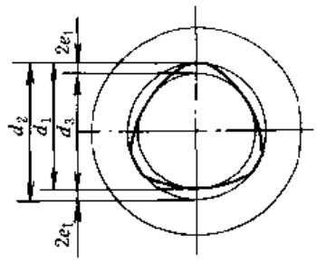

图4-5-2三边形联接

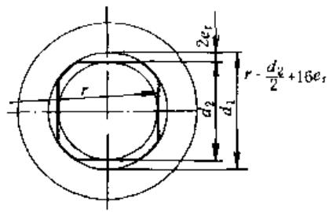

图4-5-3方形联接

<table><tr><td rowspan=1 colspan=8>“边形联接</td><td rowspan=1 colspan=8>力形联接</td></tr><tr><td rowspan=1 colspan=1>d</td><td rowspan=1 colspan=1>d</td><td rowspan=1 colspan=1>d</td><td rowspan=1 colspan=1>e1</td><td rowspan=1 colspan=1>d</td><td rowspan=1 colspan=1>山</td><td rowspan=1 colspan=1>d</td><td rowspan=1 colspan=1>e</td><td rowspan=1 colspan=1>d</td><td rowspan=1 colspan=1>d</td><td rowspan=1 colspan=1>e</td><td rowspan=1 colspan=1>e，</td><td rowspan=1 colspan=1>d</td><td rowspan=1 colspan=1>山1</td><td rowspan=1 colspan=1>e</td><td rowspan=1 colspan=1>e</td></tr><tr><td rowspan=1 colspan=1>14</td><td rowspan=1 colspan=1>14.88</td><td rowspan=1 colspan=1>13.12</td><td rowspan=1 colspan=1>0.44</td><td rowspan=1 colspan=1>50</td><td rowspan=1 colspan=1>53.6</td><td rowspan=1 colspan=1>46.4</td><td rowspan=1 colspan=1>1.8</td><td rowspan=1 colspan=1>14</td><td rowspan=1 colspan=1>1</td><td rowspan=1 colspan=1>1.6</td><td rowspan=1 colspan=1>0.75</td><td rowspan=1 colspan=1>50</td><td rowspan=1 colspan=1>43</td><td rowspan=1 colspan=1>6</td><td rowspan=1 colspan=1>1.75</td></tr><tr><td rowspan=1 colspan=1>16</td><td rowspan=1 colspan=1>17</td><td rowspan=1 colspan=1>15</td><td rowspan=1 colspan=1>0.5</td><td rowspan=1 colspan=1>55</td><td rowspan=1 colspan=1>59</td><td rowspan=1 colspan=1>51</td><td rowspan=1 colspan=1>2</td><td rowspan=1 colspan=1>16</td><td rowspan=1 colspan=1>13</td><td rowspan=1 colspan=1>2</td><td rowspan=1 colspan=1>0.75</td><td rowspan=1 colspan=1>55</td><td rowspan=1 colspan=1>48</td><td rowspan=1 colspan=1>6</td><td rowspan=1 colspan=1>1.75</td></tr><tr><td rowspan=1 colspan=1>18</td><td rowspan=1 colspan=1>19.12</td><td rowspan=1 colspan=1>16.88</td><td rowspan=1 colspan=1>0.56</td><td rowspan=1 colspan=1>多</td><td rowspan=1 colspan=1>64.5</td><td rowspan=1 colspan=1>55.5</td><td rowspan=1 colspan=1>2.25</td><td rowspan=1 colspan=1>18</td><td rowspan=1 colspan=1>15</td><td rowspan=1 colspan=1>2</td><td rowspan=1 colspan=1>0.75</td><td rowspan=1 colspan=1>60</td><td rowspan=1 colspan=1>53</td><td rowspan=1 colspan=1>6</td><td rowspan=1 colspan=1>175</td></tr><tr><td rowspan=1 colspan=1>20</td><td rowspan=1 colspan=1>21.26</td><td rowspan=1 colspan=1>18.74</td><td rowspan=1 colspan=1>0.63</td><td rowspan=1 colspan=1>65</td><td rowspan=1 colspan=1>69.9</td><td rowspan=1 colspan=1>60.1</td><td rowspan=1 colspan=1>2.45</td><td rowspan=1 colspan=1>20</td><td rowspan=1 colspan=1>7</td><td rowspan=1 colspan=1>3</td><td rowspan=1 colspan=1>0.75</td><td rowspan=1 colspan=1>65</td><td rowspan=1 colspan=1>58</td><td rowspan=1 colspan=1>6</td><td rowspan=1 colspan=1>1.75</td></tr><tr><td rowspan=1 colspan=1>22</td><td rowspan=1 colspan=1>23.4</td><td rowspan=1 colspan=1>20.6</td><td rowspan=1 colspan=1>0.7</td><td rowspan=1 colspan=1>70</td><td rowspan=1 colspan=1>75.6</td><td rowspan=1 colspan=1>64.4</td><td rowspan=1 colspan=1>2.8</td><td rowspan=1 colspan=1>22</td><td rowspan=1 colspan=1>18</td><td rowspan=1 colspan=1>3</td><td rowspan=1 colspan=1>1</td><td rowspan=1 colspan=1>70</td><td rowspan=1 colspan=1>60</td><td rowspan=1 colspan=1>6</td><td rowspan=1 colspan=1>2.5</td></tr><tr><td rowspan=1 colspan=1>25</td><td rowspan=1 colspan=1>26.6</td><td rowspan=1 colspan=1>23.4</td><td rowspan=1 colspan=1>0.8</td><td rowspan=1 colspan=1>75</td><td rowspan=1 colspan=1>81.3</td><td rowspan=1 colspan=1>68.7</td><td rowspan=1 colspan=1>3.15</td><td rowspan=1 colspan=1>25</td><td rowspan=1 colspan=1>21</td><td rowspan=1 colspan=1>5</td><td rowspan=1 colspan=1>1</td><td rowspan=1 colspan=1>75</td><td rowspan=1 colspan=1>65</td><td rowspan=1 colspan=1>6</td><td rowspan=1 colspan=1>2.5</td></tr><tr><td rowspan=1 colspan=1>28</td><td rowspan=1 colspan=1>29.8</td><td rowspan=1 colspan=1>26.2</td><td rowspan=1 colspan=1>0.9</td><td rowspan=1 colspan=1>80</td><td rowspan=1 colspan=1>86.7</td><td rowspan=1 colspan=1>73.3</td><td rowspan=1 colspan=1>3.35</td><td rowspan=1 colspan=1>28</td><td rowspan=1 colspan=1>24</td><td rowspan=1 colspan=1>5</td><td rowspan=1 colspan=1>1</td><td rowspan=1 colspan=1>80</td><td rowspan=1 colspan=1>70</td><td rowspan=1 colspan=1>8</td><td rowspan=1 colspan=1>2.5</td></tr><tr><td rowspan=1 colspan=1>30</td><td rowspan=1 colspan=1>32</td><td rowspan=1 colspan=1>28</td><td rowspan=1 colspan=1>1</td><td rowspan=1 colspan=1>85</td><td rowspan=1 colspan=1>92.1</td><td rowspan=1 colspan=1>77.9</td><td rowspan=1 colspan=1>3.55</td><td rowspan=1 colspan=1>30</td><td rowspan=1 colspan=1>25</td><td rowspan=1 colspan=1>5</td><td rowspan=1 colspan=1>1.25</td><td rowspan=1 colspan=1>85</td><td rowspan=1 colspan=1>75</td><td rowspan=1 colspan=1>8</td><td rowspan=1 colspan=1>2.5</td></tr><tr><td rowspan=1 colspan=1>32</td><td rowspan=1 colspan=1>34.24</td><td rowspan=1 colspan=1>29.76</td><td rowspan=1 colspan=1>1.12</td><td rowspan=1 colspan=1>90</td><td rowspan=1 colspan=1>98</td><td rowspan=1 colspan=1>82</td><td rowspan=1 colspan=1>4</td><td rowspan=1 colspan=1>32</td><td rowspan=1 colspan=1>27</td><td rowspan=1 colspan=1>5</td><td rowspan=1 colspan=1>1.25</td><td rowspan=1 colspan=1>90！</td><td rowspan=1 colspan=1>！80</td><td rowspan=1 colspan=1>8  ：</td><td rowspan=1 colspan=1>：2.5</td></tr><tr><td rowspan=1 colspan=1>35</td><td rowspan=1 colspan=1>375</td><td rowspan=1 colspan=1>32.5</td><td rowspan=1 colspan=1>1.25</td><td rowspan=1 colspan=1>95</td><td rowspan=1 colspan=1>103.5</td><td rowspan=1 colspan=1>86.5</td><td rowspan=1 colspan=1>4.25</td><td rowspan=1 colspan=1>35</td><td rowspan=1 colspan=1>30</td><td rowspan=1 colspan=1>5</td><td rowspan=1 colspan=1>1.25</td><td rowspan=1 colspan=1>95</td><td rowspan=1 colspan=1>85</td><td rowspan=1 colspan=1>8</td><td rowspan=1 colspan=1>i2.5</td></tr><tr><td rowspan=1 colspan=1>40</td><td rowspan=1 colspan=1>42.8</td><td rowspan=1 colspan=1>37.2</td><td rowspan=1 colspan=1>1.4</td><td rowspan=1 colspan=1>10</td><td rowspan=1 colspan=1>109</td><td rowspan=1 colspan=1>91</td><td rowspan=1 colspan=1>4.5</td><td rowspan=1 colspan=1>40</td><td rowspan=1 colspan=1>35</td><td rowspan=1 colspan=1>6</td><td rowspan=1 colspan=1>1.25</td><td rowspan=1 colspan=1>100</td><td rowspan=1 colspan=1>90一</td><td rowspan=1 colspan=1>一 8</td><td rowspan=2 colspan=1>2.5</td></tr><tr><td rowspan=1 colspan=1>45</td><td rowspan=1 colspan=1>48.2</td><td rowspan=1 colspan=1>41.8</td><td rowspan=1 colspan=1>1.6</td><td rowspan=1 colspan=1></td><td rowspan=1 colspan=1></td><td rowspan=1 colspan=1></td><td rowspan=1 colspan=1></td><td rowspan=1 colspan=1>45</td><td rowspan=1 colspan=1>40</td><td rowspan=1 colspan=1>6</td><td rowspan=1 colspan=1>1.25</td><td rowspan=1 colspan=1></td><td rowspan=1 colspan=1></td><td rowspan=1 colspan=1></td></tr></table>

注:三边形联接尺寸摘自DIN32711,方形联接尺寸摘门DIN32712。

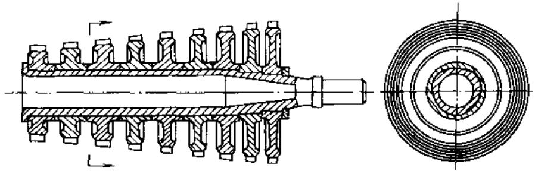

图4-5-4风机叶片三边形联接

多边形联接中轴和毂孔在转矩作用下,其结合面产生的最大压强应满足下式:

三边形轴时

$$
p = \frac { T } { l _ { 1 } ( 2 . 3 6 d _ { 1 } e _ { 1 } + 0 . 0 5 d _ { 1 } ^ { 2 } ) } \leqslant p _ { \mathsf { p } }
$$

方形轴时

$$
p = \frac { T } { \bar { i } _ { \parallel } ( \pi d _ { \mathrm { r } } e _ { \mathrm { r } } + 0 , 0 5 d _ { \mathrm { r } } ^ { 2 } ) } \leqslant p _ { \mathrm { p } }
$$

式中T—-传递的转矩, $\mathbf { N } \cdot \mathbf { m } \mathbf { m }$ ;${ \mathbf { } } _ { t } .$ —结合长度, $\mathbf { m m }$ ;$d _ { 1 }$ —等距直径, $\mathbf { r m }$ ;$\pmb { d }$ —计算直径, $\mathbf { m m }$ , $d _ { \mathrm { r } } = d _ { \mathrm { 2 } } + 2 e$ ;$e _ { 1 } \cdot e _ { \tau }$ 剖面的偏心度, $\mathbf { m m }$ ;$p _ { \textsf { p } } .$ 许用压强,见表4-5-7。

表4-5-7

多边形轴许用压强 ${ \pmb { p } } _ { \pmb { p } }$ 

<table><tr><td rowspan=2 colspan=1></td><td rowspan=1 colspan=3>轴单向旋转</td><td rowspan=1 colspan=2>轴双向旋转</td><td rowspan=2 colspan=1>说      明</td></tr><tr><td rowspan=1 colspan=1>静载荷</td><td rowspan=1 colspan=1>较轻冲击</td><td rowspan=1 colspan=1>较大冲击</td><td rowspan=1 colspan=1>较轻冲击</td><td rowspan=1 colspan=1>较大冲击</td></tr><tr><td rowspan=1 colspan=1>Pp</td><td rowspan=1 colspan=1>1.1po</td><td rowspan=1 colspan=1>1.0po</td><td rowspan=1 colspan=1>0.75po</td><td rowspan=1 colspan=1>0.6po</td><td rowspan=1 colspan=1>0.45pu</td><td rowspan=1 colspan=1>Po表示基本E强，对子钢和铸钢P=150MPa，当钢制件的结合面淬火后则p=200MPa</td></tr></table>

注:表中数据来自参考文献[5]。

# 第6章锚固联接

锚固连接是通过特种锚固件(如锚栓等)将被安装的构架或机器固定连接到基础上的一种安装联接方式,它避免了预埋地脚螺栓安装施工复杂的缺点,具有快捷方便(可以立即承载)的优点,已普遍应用在建筑业和设备安装工程中。本章介绍的德国慧鱼(太仓)建筑锚栓有限公司和国内部分厂商提供的产品资料供设计选用参考。锚栓承载力验算方法是由慧鱼公司根据目前国际通用的验算方法经过实验提出的,可供参考,如遇特殊使用条件时可直接向慧鱼公司技术咨询,以保证合理选用。

# 1锚固联接的作用原理

锚固联接按作用原理可分为凸型结合(机械嵌固结合)、摩擦结合和材料结合,见表4-6-1,

表4-6-1

<table><tr><td rowspan=1 colspan=3>表4-6-1</td></tr><tr><td rowspan=1 colspan=1>类      型</td><td rowspan=1 colspan=1>作用原理</td><td rowspan=1 colspan=1>图         示</td></tr><tr><td rowspan=1 colspan=1>凸型结合</td><td rowspan=1 colspan=1>凸形结合时，载荷通过锚栓与锚固基础间的机械啮合来传递。此类结合的钻孔须使用专门与锚栓匹配的钻头进行拓孔，锚栓在拓孔部分与锚固基础形成凸型结合，通过啮合将载荷传给锚固基础。此类锚栓在混凝土结构中具有良好的抗震、抗冲击性能。慧鱼后扩底柱锥式锚栓FZA及后扩底柱锥式浅埋型锚栓FZEA等的作用原理均属于凸型结合</td><td rowspan=1 colspan=1>A自</td></tr><tr><td rowspan=1 colspan=1>摩擦结合</td><td rowspan=1 colspan=1>摩擦结合为外力作用于锚栓上，使锚栓的膨胀片张开，在锚栓与孔壁间形成摩擦力。膨胀力可由扭矩控制（力控）或位移控制。扭矩控制是用力矩扳手拧到规定的力矩使锥体压人膨胀套管内，把膨胀片挤向孔壁。位移控制是把扩充锥体敲人膨胀套管内，达到规定的打人行程后，膨胀片张开，挤向孔壁。慧鱼后继膨胀套管锚栓FH、后继膨胀螺杆锚栓FAZ、螺杆锚栓FBN、敲击式螺杆锚栓FNA及重载锚栓SLM-N等的作用原理均属于摩擦结合。后继膨胀锚栓是指当锚固区混凝土出现裂缝时，锚栓的锥体继续滑人膨胀套筒内使膨胀套管继续张开，增大锚栓与基材（混凝土)的膨胀压力，补偿因裂缝而损失的承载力</td><td rowspan=1 colspan=1>N有</td></tr><tr><td rowspan=1 colspan=1>材料结合</td><td rowspan=1 colspan=1>通过胶合体将载荷传递给锚固基础。例如慧鱼高强化学锚栓R，其结合材料由合成树脂及内部粗细骨料-石英颗粒及石英砂组成，锚固时，形成具有良好亲和力的胶体将锚杆与基材联为一体</td><td rowspan=1 colspan=1>N</td></tr></table>

# 2锚固联接失效的几种主要形式

表4-6-2

<table><tr><td rowspan=1 colspan=2>头效类别</td><td rowspan=1 colspan=1>说明</td><td rowspan=1 colspan=1>图    示</td></tr><tr><td rowspan=4 colspan=1>受拉头效</td><td rowspan=1 colspan=1>钢材失效</td><td rowspan=1 colspan=1>锚栓本身钢材拉断，主要发生在锚固深度过深或混凝土强度过高或锚固区钢筋密集或锚栓材质强度较低或截面积偏小的地方，这种失效--般具有明显的塑性变形，失效载荷离散性小</td><td rowspan=1 colspan=1>N</td></tr><tr><td rowspan=1 colspan=1>混凝土锥体失效</td><td rowspan=1 colspan=1>通常表现为以锚栓膨胀区或柱锥区为顶点的混凝土锥体受拉失效，此种失效形式为锚固失效的基本形式</td><td rowspan=4 colspan=1>NA         A</td></tr><tr><td rowspan=1 colspan=1>锚栓拔出或穿出头效</td><td rowspan=1 colspan=1>表现为锚栓从锚孔中拔出或从套筒中穿出，锚栓从锚孔拔出上要由于锚栓安装方法不当，如钻孔过大、清孔不净、锚栓预紧力不够或粘结剂强度过低或失效等，一般情况下，此种失效是种不正常的失效现象，一般不允许发生，一旦发牛应按锥固质量不会格处理。锚栓从套筒中穿出是在受控：条件下，如对锚固基材施加约束，限制混凝土锥体失效，则可能发生此种失效，似其承载力较高，数值较为稳定</td></tr><tr><td rowspan=1 colspan=1>混凝土劈裂失效</td><td rowspan=1 colspan=1>此种失效是不常见的失效形式，多发生于膨胀锚栓群锚区域，主要是由于锚栓布置及施工安装所造成，一般可通过控制边距、间距，构件厚度及裂缝宽度防止</td></tr><tr><td rowspan=3 colspan=1>受剪失效</td><td rowspan=1 colspan=1>钢材失效</td><td rowspan=1 colspan=1>当锚栓距离混凝上构件边缘较远，且锚栓剪切强度不够时通常出现此种头效</td></tr><tr><td rowspan=1 colspan=1>混凝土樱形体失效</td><td rowspan=1 colspan=1>如果锚栓距离混凝土构件边缘较近，可能出现此种头效</td><td rowspan=2 colspan=1>1W</td></tr><tr><td rowspan=1 colspan=1>沿剪力反向混凝土撬坏</td><td rowspan=1 colspan=1>当采用短而粗、刚性较大的锚栓，或锚栓的间距较小时，可能出现此种失效</td></tr></table>

# 3锚固联接的基础与安装

# 3.1锚固基础

设备安装基础有普通混凝土、钢筋混凝土及其他砌体材料等多种类型,不同类型锚固基础的特性和强度直接影响锚栓联接的承载性能。锚固联接的混凝土破坏载荷随着混凝上强度的提高而升高。适用的混凝土标号为C15\~ C55.,

锚固基础混凝土又分为开裂和非开裂两类,当 $\sigma _ { \downarrow } + \sigma _ { \mathsf { R } } \leqslant 0$ 时,可判定为非开裂混凝士,否则视为开裂混凝土:其中o为外载荷及锚固载荷在混凝土中产生的标准应力,拉为正,压为负;on为由于混凝土收缩、温度变化及支座位移在混凝土中产生的标准应力,可近似取oR=3MPa。在混凝土中通常使用钢制锚栓作锚固件,在承载力不大的情况下也可使用尼龙型锚栓。在砌体材料中通常选用尼龙锚栓或高强度化学锚栓。

3 

<table><tr><td rowspan=4 colspan=1>安装型式</td><td rowspan=1 colspan=1>齐平式安装</td><td rowspan=1 colspan=1>预先钻孔，插入锚栓后再安装被安装件，并拧紧螺母。锚固基础的孔径大于被安装件的孔径</td><td rowspan=1 colspan=1>Oo00□</td></tr><tr><td rowspan=1 colspan=1>穿透式安装</td><td rowspan=1 colspan=1>锚栓通过被安装设备的地脚孔直接插入钻孔中并拧紧螺母。被安装件的孔径至少等于锚固基础上的钻孔直径</td><td rowspan=1 colspan=1>0□   心00</td></tr><tr><td rowspan=1 colspan=1>悬挑式安装</td><td rowspan=1 colspan=1>被安装物体与锚固基础表面相隔一段距离。此种安装方式多采用内螺纹锚栓及化学锚栓</td><td rowspan=2 colspan=1>T002 990</td></tr><tr><td rowspan=1 colspan=1></td><td></td></tr></table>

<table><tr><td rowspan="3">安</td><td>FZA型后扩施柱 式栓</td><td>配 </td><td>医 国</td><td>清</td><td></td><td>装管 8 H</td><td></td><td>装按安装件并紧固</td><td></td></tr><tr><td>FZEA型后扩饰 理整控</td><td colspan="8">□ 将错控盾入经过清除灰尘后的孔中，套香藏击至与被因定作表面齐平或进入药1mm 钻孔 扩底孔 请孔 人销柱 扩套 用螺打安装被安技作开紧</td></tr><tr><td>装 程 扭柜控制型 后影张管错</td><td colspan="6">t d 把检插入经过清除灰尘的孔中，然后用击支裴工具使扩充套管充分张开，恼检与孔安现凸型结合 螺</td><td>□ 5</td><td></td></tr><tr><td></td><td rowspan="3"></td><td></td><td rowspan="3">清礼</td><td rowspan="3"></td><td colspan="2" rowspan="3">插入银检 P</td><td rowspan="3">装毕 已 点</td><td rowspan="3">清除钻孔甲的质 生近人链栓， 按规定的扭矩Tm 值拧紧，垫应紧 贴被固定的构</td></tr><tr><td>导 用</td><td>请孔</td></tr><tr><td>前 &</td><td></td></tr><tr><td rowspan="4">时</td><td>FAZ扭矩控制塑 维医螺杆栓</td><td>H</td><td></td><td></td><td></td><td></td><td></td><td>□</td><td></td></tr><tr><td>FBN型拍更控制型 杆镇</td><td></td><td></td><td></td><td></td><td></td><td></td><td></td><td></td></tr><tr><td></td><td></td><td></td><td></td><td>T</td><td></td><td></td><td></td><td></td></tr></table>

<table><tr><td rowspan="4">SLM-N型扭矩控制 型重载锚栓</td><td colspan="6"></td></tr><tr><td>钻孔</td><td>插入锚栓</td><td>装被安装件</td><td>拧紧螺钉</td><td>安装完毕</td><td></td></tr><tr><td>nu</td><td>高前</td><td></td><td></td><td></td><td></td></tr><tr><td></td><td></td><td>m</td><td></td><td>2</td><td></td></tr></table>

<table><tr><td rowspan="5"></td><td rowspan="4">R型高强化学黏结</td><td colspan="12"></td></tr><tr><td colspan="8"></td></tr><tr><td>型普通螺杆锚栓</td><td></td><td>插入胶管</td><td>锚栓旋入就位</td><td></td><td></td><td>胶管破裂充填孔隙</td><td></td><td></td><td></td></tr><tr><td></td><td>清孔 80</td><td></td><td></td><td></td><td></td><td>00</td><td></td><td>装被安装件并紧固 0</td><td></td></tr><tr><td></td><td></td><td></td><td>品</td><td></td><td></td><td></td><td>品</td><td></td><td></td><td>-20℃ {20min</td></tr><tr><td></td><td></td><td>+</td><td></td><td></td><td></td><td></td><td></td><td></td><td></td><td>30min 10℃</td></tr><tr><td></td><td></td><td></td><td></td><td></td><td></td><td></td><td></td><td></td><td>℃</td><td>60min </td></tr><tr><td></td><td></td><td>品 Q</td><td>2</td><td></td><td></td><td></td><td></td><td></td><td>-5℃</td><td></td></tr></table>

<table><tr><td rowspan="5">FLSV360S型高强 树脂砂浆</td><td colspan="7"></td></tr><tr><td colspan="6"></td></tr><tr><td colspan="3">钻孔</td><td colspan="3"></td></tr><tr><td></td><td>清孔</td><td>注人树脂砂浆</td><td>施入螺杆固化</td><td>装被安装件并紧固</td></tr><tr><td></td><td></td><td></td><td></td><td>40℃</td></tr><tr><td></td><td></td><td></td><td></td><td></td></tr><tr><td></td><td></td><td></td><td></td><td>45mun 5℃ 1.5h</td></tr><tr><td></td><td></td><td></td><td>U</td><td>3</td></tr><tr><td></td><td></td><td></td><td></td><td>0℃ -5 6h</td></tr></table>

# 4锚栓的表面处理

锚栓通常采用刷防锈涂料、电镀锌或热镀锌等较经济的方法,但防锈层厚度有限,而且防锈层不允许破坏才可以保证材料的长期防锈性能。锚栓最低电镀锌层厚度为 $5 \mu \mathbf { m }$ ,并在镀锌层表面再钝化镀铬,可以满足产品在最不利气候条件下运输,在干燥环境下可起到长期保护作用。热镀锌层厚度至少为 $4 0 _ { \xi } \mathrm { { r m } }$ 

比涂(镀)层防锈更为有效的措施是锚栓采用奥氏体不锈钢或特殊合金钢,不锈钢材料在通常环境条件下和工业环境中均具有最佳防锈性能,不同环境条件下的防锈措施见表4-6-4。

表4-6-4

<table><tr><td rowspan=1 colspan=1>适用环境条件</td><td rowspan=1 colspan=1>产品防锈措施</td></tr><tr><td rowspan=1 colspan=1>非特別潮湿的室内；有足够的混凝上覆盖</td><td rowspan=1 colspan=1>电镀锌5~10μm，并钝化镀铬</td></tr><tr><td rowspan=1 colspan=1>室内潮湿，偶有凝结物；有少许大气污染</td><td rowspan=1 colspan=1>热镀锌，镀层厚大于40m</td></tr><tr><td rowspan=1 colspan=1>极度潮湿，甚至水蒸气凝结成水滴：有明显腐蚀性大气污染</td><td rowspan=1 colspan=1>采用奥氏体不锈钢</td></tr></table>

# 5锚固联接的承载力验算

影响锚固联接强度的因素很多,除了锚栓的强度外,混凝上强度、锚栓间距,边距、锚固深度及基础状态(开裂或术开裂)都是重要的影响因素。外载荷(拉力、剪力和拉剪力合力)作用方向不同对锚固承载能力的影响也不一样,例如裂缝使远离边缘且受拉力作用的锚栓承载能力比受剪力作用的明显降低,基础自由边缘尺寸对指向边缘的剪力作用下的锚栓承载能力的影响比对受拉力时锚栓承载能力影响大。

此外,以上影响因素是互相牵制的,即多个参数共同对锚栓的承载能力起影响作用。例如在拉力作用下,大间距锚栓在高强度混凝土中通常是钢材失效;若减小间距,承载力并不立即变化,即间距对承载力变化不起作用,只有当间距减小到混凝土破坏块交错干扰时,尽管混凝土强度很高,且其失效载荷小于钢材破坏值,但会导致承载力降低,使间距影响起作用。

下面介绍的锚固联接强度的验算方法,其中考虑到以上多种参数的影响。此方法适用于柱锥式、拉力膨胀式钢锚栓及化学黏结式锚栓。

# 5.1锚栓承载力验算要求及计算公式

# 5.1.1验算方法与要求

将锚栓组的锚固区域按锚栓个数平均划分,如图4-6-1定义锚栓边距 $c _ { 1 } , c _ { 2 } , c _ { 3 } , c _ { 4 }$ ,取群锚中受力最大的单个锚栓进行验算。

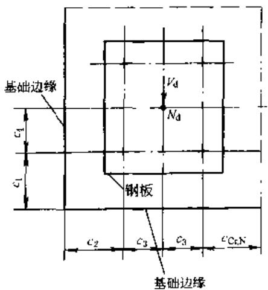

图4-6-1锚栓分布

Ccr.v—特征边距;一沿剪力方向的锚栓边距;c4-沿剪力反方向的锚栓边距:c2、c一垂直于剪力方向的锚栓边;虚线一表示非实际锚固基础边缘;Nd-轴向拉力;Vd-横向剪力

表4-6-5

锚栓承载力验算要求

<table><tr><td rowspan=1 colspan=1>锚栓受力</td><td rowspan=1 colspan=1>失效类型</td><td rowspan=1 colspan=1>承载力要求</td><td rowspan=1 colspan=1>说        明</td></tr><tr><td rowspan=4 colspan=1>拉力</td><td rowspan=1 colspan=1>钢材失效</td><td rowspan=1 colspan=1>NNd</td><td rowspan=8 colspan=1>N——群锚中受拉最大的锚栓的拉力设计值，kNNAd. 锚栓钢材失效时的受拉承载力设计值（已考虑材料的分项系数或称安全系数，下同），kNNRd.——锚栓在混凝土锥体失效时的受拉承载力设计值（已考虑材料的分项系数）：kNV—-群锚中最大受剪锚栓的锚栓剪力设计值,kNVRd.——锚栓钢材失效时的受剪承载力设计值（已考虑材料的分项系数），kNVade-锚栓在混凝土楔形体失效时的受剪承载力设计值（已考虑材料的分项系数），kNVAd, -锚栓在沿剪力反向混凝土撬坏时的受剪承载力设计值(已考虑材料的分项系数）,kNN  -取各种失效类型计算结果的最小值NdV</td></tr><tr><td rowspan=1 colspan=1>混凝土链体失效</td><td rowspan=1 colspan=1>NNd,e</td></tr><tr><td rowspan=1 colspan=1>锚栓穿出失效</td><td rowspan=1 colspan=1>若锚栓从套简中穿出，其承载力由试验确定</td></tr><tr><td rowspan=1 colspan=1>混凝土劈裂失效</td><td rowspan=1 colspan=1>通过限制裂缝宽度（W0.3mm）等条件避免此种失效发生</td></tr><tr><td rowspan=3 colspan=1>剪力</td><td rowspan=1 colspan=1>钢材失效</td><td rowspan=1 colspan=1>V≤VRd.</td></tr><tr><td rowspan=1 colspan=1>混凝土楔形体失效</td><td rowspan=1 colspan=1>VVRd</td></tr><tr><td rowspan=1 colspan=1>沿剪力反向混凝土撬坏</td><td rowspan=1 colspan=1>VVRcp</td></tr><tr><td rowspan=1 colspan=1>拉剪合力</td><td rowspan=1 colspan=1></td><td rowspan=1 colspan=1>N  V1.2NAdVd</td></tr></table>

# 5.1.2受拉承载力计算

(1)锚栓受拉承载力 $N _ { \mathbb { R } \mathrm { d } }$ .在产品性能数据表中直接查得。(2)混凝土锥体失效时受拉承载力设计值 $\pmb { N _ { \mathrm { R d , \mathfrak { c } } } }$ 应按式(4-6-1)计算:

$$
N _ { \mathrm { R d , c } } = N _ { \mathrm { R d , c } } ^ { 0 } \phi _ { 1 } \psi _ { 2 } \psi _ { 3 } \psi _ { 4 } \varphi \psi _ { \mathrm { w c r } } , \mathrm { y }
$$

式中 $N _ { \mathrm { R d } , \epsilon } ^ { 0 }$ -混凝土锥体失效时受拉承载力特征设计值, $\mathbf { k } \mathbf { N }$ ;  
、4(φ)—-分别为锚栓各边距c1、C2、C、c4(c,)对混凝土锥体失效时的受拉承载力的影响系数,分别查表;$\varphi$ —-构件边缘对中心对称应力的影响系数,取锚栓最小边距 $\mathbf { c } _ { 1 , \mathrm { m i n } }$ 所对应的值、查表;$\psi _ { { \bf u c r } , \ N }$ -混凝土基材状况影响系数。用于开裂混凝土时 $\phi _ { \tt u c r , N } = 1 . 0$ ;用于未开裂混凝士时 $\psi _ { { \bf u c r } , { \bf N } } \geqslant$ 1.40

# 5.1.3受剪承载力计算

(1)锚栓受剪承载力 $V _ { \widehat { \mathbf { \Pi } } \widehat { \mathbf { \Pi } } }$ ,在产品性能数据表中直接查得。

(2)锚栓在混凝土楔形体失效时的受剪承载力设计值应按式(4-6-2)计算:

$$
V _ { \mathrm { R d , e } } = V _ { \mathrm { R d , e } } ^ { 0 } { \frac { \epsilon _ { 2 } + c _ { 3 } } { 4 5 0 0 c _ { \downarrow } ^ { 0 . 5 } } } h \psi _ { \mathrm { u c r , } \star }
$$

式中 $V _ { \mathrm { { R d } } } ^ { 0 } ,$ ——罐栓在混凝土楔形体失效时的受剪承载力特征设计值, $\mathbf { N } _ { : }$ c、c2、c—如图4-6-1所定义的锚栓的边距,mm,c为沿剪力方向的锚栓边距,c2、c3为垂直于剪力方向的边距,如 $c _ { 2 } ( \mathfrak { c } _ { 3 } ) \geqslant 1 . 5 \mathfrak { c } _ { 1 }$ ,则取 $1 . 5 \mathbf { c _ { 1 } }$ 代人式中;

$\boldsymbol { k }$ 构件厚度, $\pmb { \operatorname { \pmb { m } } } \pmb { \operatorname { \pmb { m } } }$ ,如 $h \geqslant 1 . 5 c _ { 1 }$ ,则取 $1 . 5 \mathfrak { c } _ { \mathfrak { s } }$ 代人式中;$\phi _ { \mathrm { u c r } , \star }$ —未开裂混凝土及锚固区配筋对受剪承载力的提高 $\bigstar$ 响系数。开裂混凝士,无边缘配筋, $\phi _ { \mathrm { { u r r } , \ast } } \simeq$ 1.0;开裂混凝土,边缘配置 $\geqslant \varphi 1 2 \mathbf { m } \mathbf { m }$ 直筋, $\phi _ { \parallel \epsilon \mathbf { r } , v } = \mathbf { 1 } . 2$ ;开裂混凝土,边缘直钢筋 $\approx \$ 123,456$ ,且箍筋间隔 $\leqslant 1 0 \mathrm { m m }$ 或焊接筋网 $\geq 8 m m$ ,且间距 $\leqslant 1 0 0 \mathsf { m m }$ , $\phi _ { \mathrm { u c r , v } } = 1 . 4$ ;未开裂混凝土, $\psi _ { \mathrm { { \bf { s c r } } , \psi } } = 1 . 4 ,$ (3)沿剪力反向混凝土撬坏时的受剪承载力设计值应按式(4-6-3)计算:

式中 $N _ { \mathsf { H } , \mathsf { d } , \mathsf { r } }$ 混凝土锥体失效时受拉承载力设计值, $\mathbf { k N }$ $\gamma _ { \mathbf { \{ \mathbf { \psi } } } _ { \mathbf { \{ \mathbf { \psi } } }  $ (拉) 锚栓在拉力作用下混凝上失效时的材料分项系数,查表;$\gamma _ { \mathfrak { u } _ { \mathfrak { c } } }$ (剪) 锚栓在剪力作用下混凝土失效时的材料分项系数,查表;$k$ 1 一锚固深度 $\hslash _ { \mathrm { e f } }$ 对 $V _ { \mathbb { H } _ { \mathrm { d } _ { \ast } \mathrm { e } _ { \mathrm { J } } } }$ 的影响系数,查表。

# 5.1.4拉剪共同作用下的承载力计算

在拉剪共同作用下,除应分别满足表4-6-5中拉力和剪力作用下的承载力要求外,还应满足表中规定的拉剪合力承载力要求。

# 5.2例题

如图4-6-2所示,一轴承底座用锚栓紧固联接在正常配筋的C30混凝土基础上,基础厚 $\hbar = 1 0 0 \mathrm { { r a m } }$ ,根据受力计算,锚栓1和2受力最大,其轴向拉力设计值 $N _ { \mathrm { s d } } = 3 \mathbf { k } \mathbf { V }$ ,横向剪力设计值 $V _ { \mathbf { \Phi } ^ { \mathbf { u } } } = 0 . 9 \mathbf { k } \mathbf { N }$ 。初选4个 $\mathbf { \mathbf { k } } \mathbf { \mathbf { Z } } \mathbf { A } \mathbf { I } 0 \times 4 0 \mathbf { \mathbf { 3 } } 6 \mathbf { / }$ 10慧鱼后扩底螺杆锚栓,材质为电镀锌钢,取锚栓1按表4-6-5的要求进行验算,

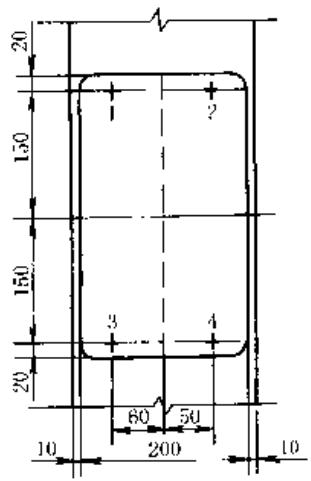

图4-6-2轴承底架锚栓布置及锚栓1的受力图

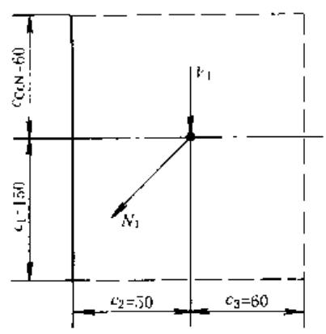

(1)锚栓受拉承载力的验算

$\textcircled{1}$ 钢材失效时的承载力由表4-6-8直接查得 $N _ { \mathrm { R } { \pmb \alpha } , \mathrm { s } } = 1 0 . 8 \mathrm { k N } _ { \mathrm { s } }$ 

$\textcircled{2}$ 混凝土锥体失效时的承载力,由式(4-6-1)

$$
N _ { { \mathbb { R } } d , c } = N _ { { \mathbb { R } } d , c } ^ { 0 } \varphi _ { 1 } \psi _ { 2 } \psi _ { 3 } \psi _ { 4 } \varphi \psi _ { \mathrm { w c r } , N }
$$

由表4-6-8先查得C25及C35的 $N _ { \mathbb { R } d , } ^ { 0 }$ 值,再用线性插值法求C30的 $N _ { { \mathbb { R } } 4 , \varepsilon } ^ { 0 }$ ,即

$$
N _ { { \mathrm { R d , \thinspace c } } } ^ { 0 } = { \frac { 4 \thinspace . 9 \mathrm { - } 4 \thinspace . 1 } { 2 } } + 4 . 1 = 4 \thinspace . 5 { \mathrm { k N } }
$$

$\mathfrak { c } _ { 1 } = 1 5 0 \mathrm { m m }$ 时,由表4-6-8, $\phi _ { 1 } = 1 . 0$ $c _ { 2 } = 6 0 \mathrm { m m }$ 时,由表4-6-8, $\phi _ { 2 } = 1 . 0$ ; $c _ { 3 } = 5 0 \mathrm { m m }$ 时,由表4-6-8, $\psi _ { 3 } =$ 0.92;c4=cN=60mm时,由表4-6-8,44=1.0;最小达距cmin=50mm,由表4-6-8,φ=0.95;由于为开裂混凝土, $\psi _ { \mathrm { u c r } , N } = 1 . 0$ 。

$$
N _ { \mathrm { { R d } , \it { e } } } = 4 . 5 \times 1 . 0 \times 1 . 0 \times 0 . 9 2 \times 1 . 0 \times 0 . 9 5 = 3 . 9 4 \mathrm { { k N } }
$$

③验算N.d=3kN<3.9kN(NRd.和NRd.中的较小值),受拉时联接强度满足要求。

(2)锚栓受剪承载力的验算

$\textcircled{1}$ 钢材失效时的承载力由表4-6-8直接查得 $V _ { \mathrm { R d , \bullet } } = 6 . 4 \mathrm { k N }$ 

$\textcircled{2}$ 混凝土楔形体失效时的承载力由式(4-6-2)

$$
V _ { \mathrm { R d , c } } = V _ { \mathrm { R d , c } } ^ { \mathrm { 0 } } \frac { \mathrm { c } _ { 2 } + c _ { 3 } } { 4 5 0 0 c _ { \mathrm { l } } ^ { \mathrm { 0 , 5 } } } \hbar \psi _ { \mathrm { u e r , } } ,
$$

由表4-6-8,先查得C25及C35的 $V _ { R d , } ^ { 0 }$ 值,再用线性插值法求得C30的 $\mathcal { V } _ { \mathbb { H } d , r } ^ { 0 }$ ,即

$$
V _ { \mathrm { R d , c } } ^ { \Omega } = \frac { 6 . 5 - 5 . 2 } { 2 } + 5 . 2 = 5 . 7 \mathrm { k N }
$$

立柱为正常配筋:

$$
\psi _ { \mathrm { u c r } , \mathrm { v } } = 1 , 2
$$

$$
V _ { \kappa , \Theta , \hat { \mathbf { \pi } } } = \pmb { \ 5 . 7 } \times \frac { 6 0 } { 4 5 0 0 } + 5 0  \\  \frac { 1 } { 4 5 0 0 } \times 1 5 0 ^ { \bar { \Theta } ^ { - } \bar { \mathbf { 5 } } } \times 1 0 0 \times 1 . 2 = 1 . 4 \mathbf { k } \mathbf { . } \mathrm { ~ }
$$

沿剪力方向混凝土反向撬坏,由式(4-6-3)

$$
V _ { \mathrm { R d , c p } } = k \mathcal { N } _ { \mathrm { R d , c } } \gamma _ { \mathsf { M e } } ( \ddag { \bf \frac { \omega } { 2 L } } ) / \gamma _ { \mathsf { M e } } (
$$

由表4-6-8查得; $\not \varepsilon = 1 . 3$ $\gamma _ { \mathsf { M } \mathrm { c } }$ (拉) $^ { \dag } = 2 . 1 5$ , $\gamma _ { M \mathfrak { c } }$ (剪) $= 1 . 8$ 

由(1)得:

$$
N _ { \mathrm { R d , \it c } } = 3 . 9 \mathrm { k N }
$$

$$
V _ { \mathrm { { R d } , \mathrm { { c p } } } } = 1 . 3 \times 3 . 9 \times 2 . 1 5 / 1 . 8 = 6 . 1 \mathrm { { k N } }
$$

$\textcircled{3}$ 验算 $V _ { \mathrm { s d } } = 0 . 9 \mathrm { k N } < 1 . 4 \mathrm { k N }$ ( $\boldsymbol { V } _ { \mathbb { R } \mathrm { d } , }$ 和 $V _ { \hat { \mathbb { R } } \ll \nu }$ 中较小值),受剪时,联接强度满足要求。

(3)拉剪复合受力验算

相对钢材破坏:

相对混凝土破坏:

(4)结论

所选锚栓满足承载力及构造要求。

# 6锚栓型号与规格

表4-6-6

锚栓的类型、主要特点及使用范围

<table><tr><td rowspan=2 colspan=1>锚栓类型</td><td rowspan=1 colspan=7>锚固基础</td><td rowspan=2 colspan=1>螺纹直径</td><td rowspan=1 colspan=2>材质</td><td rowspan=1 colspan=2>材质安装方式</td><td rowspan=2 colspan=1>主要特点</td><td rowspan=2 colspan=1>使用范围</td></tr><tr><td rowspan=1 colspan=1></td><td rowspan=1 colspan=2>石材</td><td rowspan=1 colspan=1>实心砖</td><td rowspan=1 colspan=1></td><td rowspan=1 colspan=1></td><td rowspan=1 colspan=1>空心砖</td><td rowspan=1 colspan=1>无</td><td rowspan=1 colspan=1>不</td><td rowspan=1 colspan=1></td><td rowspan=1 colspan=1>TR</td></tr><tr><td rowspan=1 colspan=1>后扩底柱锥式锚栓FZA</td><td rowspan=1 colspan=1>·</td><td rowspan=1 colspan=1>·</td><td rowspan=1 colspan=1>-</td><td rowspan=1 colspan=1>-</td><td rowspan=1 colspan=1></td><td rowspan=1 colspan=1></td><td rowspan=1 colspan=1></td><td rowspan=1 colspan=1>M6~M16</td><td rowspan=1 colspan=1></td><td rowspan=1 colspan=1></td><td rowspan=1 colspan=1>·</td><td rowspan=1 colspan=1></td><td rowspan=1 colspan=1>无膨胀压力，边间距要求小，抗震性能好</td><td rowspan=1 colspan=1>各种机器设备、电梯、骨道、传送装置、支架等，特别适用于安装动载荷设备</td></tr><tr><td rowspan=1 colspan=1>后扩底柱锥式浅埋型锚栓FZEA</td><td rowspan=1 colspan=1>·</td><td rowspan=1 colspan=1>·</td><td rowspan=1 colspan=1></td><td rowspan=1 colspan=1></td><td rowspan=1 colspan=1></td><td rowspan=1 colspan=1></td><td rowspan=1 colspan=1></td><td rowspan=1 colspan=1>M8~ M12</td><td rowspan=1 colspan=1></td><td rowspan=1 colspan=1></td><td rowspan=1 colspan=1>·</td><td rowspan=1 colspan=1></td><td rowspan=1 colspan=1>尤膨胀压力，埋深浅、边间距要求小，抗震性能好，可目测安装结果</td><td rowspan=1 colspan=1>各种机器设备、电梯、管道、传送装置、支架等，特别适用于安装动载荷设备</td></tr><tr><td rowspan=1 colspan=1>扭矩控制型后继膨胀套管锚栓FH自3门</td><td rowspan=1 colspan=1>·</td><td rowspan=1 colspan=1>·</td><td rowspan=1 colspan=1>·</td><td rowspan=1 colspan=1></td><td rowspan=1 colspan=1></td><td rowspan=1 colspan=1></td><td rowspan=1 colspan=1></td><td rowspan=1 colspan=1>M6~M16（电镀锌钢）M6~ M12（不锈钢A4）</td><td rowspan=1 colspan=1>，</td><td rowspan=1 colspan=1>，</td><td rowspan=1 colspan=1></td><td rowspan=1 colspan=1>·</td><td rowspan=1 colspan=1>良好的后继膨胀功能，边间距要求小，安装后可拆卸</td><td rowspan=1 colspan=1>各种机器设备、轨道、支架、管道等</td></tr><tr><td rowspan=1 colspan=1>扭矩控制型后继膨胀螺杆锚栓FAZ2</td><td rowspan=1 colspan=1>·</td><td rowspan=1 colspan=1>·</td><td rowspan=1 colspan=1></td><td rowspan=1 colspan=1></td><td rowspan=1 colspan=1></td><td rowspan=1 colspan=1></td><td rowspan=1 colspan=1></td><td rowspan=1 colspan=1>M8~M16</td><td rowspan=1 colspan=1>A</td><td rowspan=1 colspan=1></td><td rowspan=1 colspan=1></td><td rowspan=1 colspan=1>·</td><td rowspan=1 colspan=1>良好的后继胀功能，边间距要求小</td><td rowspan=1 colspan=1>各种机器设备、轨道、支架、管道等</td></tr><tr><td rowspan=1 colspan=1>扭矩控制型螺杆锚栓FBN</td><td rowspan=1 colspan=1></td><td rowspan=1 colspan=1>·</td><td rowspan=1 colspan=1>·</td><td rowspan=1 colspan=1></td><td rowspan=1 colspan=1></td><td rowspan=1 colspan=1></td><td rowspan=1 colspan=1></td><td rowspan=1 colspan=1>M6~M20</td><td rowspan=1 colspan=1>▲</td><td rowspan=1 colspan=1></td><td rowspan=1 colspan=1></td><td rowspan=1 colspan=1>·</td><td rowspan=1 colspan=1>双锚深选择，使用范围广</td><td rowspan=1 colspan=1>各种机器设备、轨道、支架、管道等</td></tr></table>

续表

<table><tr><td rowspan=2 colspan=1>借型</td><td rowspan=1 colspan=7>情国基</td><td rowspan=2 colspan=1>螺校首径</td><td rowspan=1 colspan=2>材质</td><td rowspan=1 colspan=2>安装方式</td><td rowspan=2 colspan=1>主要特</td><td rowspan=2 colspan=1>楚州范围</td></tr><tr><td rowspan=1 colspan=1>出</td><td rowspan=1 colspan=1>T土</td><td rowspan=1 colspan=1>H</td><td rowspan=1 colspan=1></td><td rowspan=1 colspan=1>加气电王</td><td rowspan=1 colspan=1>尾</td><td rowspan=1 colspan=1>中</td><td rowspan=1 colspan=1>中</td><td rowspan=1 colspan=1></td><td rowspan=1 colspan=1>DR</td><td rowspan=1 colspan=1>式安装</td></tr><tr><td rowspan=2 colspan=1>矩挖制型重背锅控SLM-N高强化学黏培型曹通螺軒精程</td><td rowspan=1 colspan=1></td><td rowspan=1 colspan=1>中</td><td rowspan=1 colspan=1></td><td rowspan=1 colspan=1></td><td rowspan=1 colspan=1></td><td rowspan=1 colspan=1></td><td rowspan=1 colspan=1></td><td rowspan=1 colspan=1>M6-M24</td><td rowspan=1 colspan=1>1</td><td rowspan=1 colspan=1>A</td><td rowspan=1 colspan=1>中</td><td rowspan=1 colspan=1></td><td rowspan=1 colspan=1>可控制北可自有配置所需杆</td><td rowspan=1 colspan=1>各种机器备支额管道等</td></tr><tr><td rowspan=1 colspan=1></td><td rowspan=1 colspan=1>中</td><td rowspan=1 colspan=1></td><td rowspan=1 colspan=1>国</td><td rowspan=1 colspan=1></td><td rowspan=1 colspan=1></td><td rowspan=1 colspan=1></td><td rowspan=1 colspan=1>M8M30</td><td rowspan=1 colspan=1>血</td><td rowspan=1 colspan=1>血</td><td rowspan=1 colspan=1>+</td><td rowspan=1 colspan=1></td><td rowspan=1 colspan=1>无账力安装，可在潮湿状与F施工，边间距要求小固化时间</td><td rowspan=1 colspan=1>各种肌器设备轨道支望.管直以及市F安装等</td></tr><tr><td rowspan=1 colspan=1>射式融结验-高强乙基聚FISV WS (FS)品Jg</td><td rowspan=1 colspan=1></td><td rowspan=1 colspan=1></td><td rowspan=1 colspan=1></td><td rowspan=1 colspan=1></td><td rowspan=1 colspan=1></td><td rowspan=1 colspan=1>中</td><td rowspan=1 colspan=1></td><td rowspan=1 colspan=1></td><td rowspan=1 colspan=1></td><td rowspan=1 colspan=1></td><td rowspan=1 colspan=1></td><td rowspan=1 colspan=1></td><td rowspan=1 colspan=1>可用于几平所有的基材，无腰胀力安装，国业时间知，可在南块态下工</td><td rowspan=1 colspan=1>各种机器设备轨面支望，营道以及水下安装工程等，适用于安装动藏药改备</td></tr></table>

注:一表示最壮匹配,一表示可医配。一表系存在

FZA型后扩底柱镍式栓

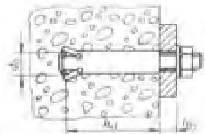

适用范围:通过专用的具有底部扩孔功能的钻头进行钴孔,便罐栓与基材实现凸型结合,达到无膨航力安装,可满足小边距和小间距的安装要求。适用于≥C15的开裂和未开裂混凝土以及致密的天然石材,可用于安装设备机器等,特别适用于在囊动区使用。

表467

FZA型错栓规格,材料及安装尺寸

<table><tr><td rowspan=2 colspan=1>里      1</td><td rowspan=2 colspan=3>国重</td><td rowspan=2 colspan=1>估头程dmm</td><td rowspan=2 colspan=1>错保度A/m</td><td rowspan=2 colspan=1>安装扭矩T/m</td><td rowspan=2 colspan=1>固定件最大原度i/m</td><td rowspan=2 colspan=1>固定作中储孔直径/mm</td><td rowspan=1 colspan=5>基础要求</td></tr><tr><td rowspan=1 colspan=1>最小阿/m</td><td rowspan=1 colspan=1>最小边距T/mm</td><td rowspan=1 colspan=1>晨小基出厚度A/mm</td><td rowspan=1 colspan=1>特证间,7</td><td rowspan=1 colspan=1>特近C/mm</td></tr><tr><td rowspan=1 colspan=1>FZA1040M6/10</td><td rowspan=1 colspan=3></td><td rowspan=1 colspan=1>10</td><td rowspan=1 colspan=1>d</td><td rowspan=1 colspan=1>.5</td><td rowspan=1 colspan=1>1</td><td rowspan=1 colspan=1>≤</td><td rowspan=1 colspan=1>50</td><td rowspan=1 colspan=1>50</td><td rowspan=1 colspan=1>100</td><td rowspan=1 colspan=1>120</td><td rowspan=1 colspan=1>60</td></tr><tr><td rowspan=2 colspan=1>FZA12×40M8/15</td><td rowspan=2 colspan=2></td><td rowspan=1 colspan=1></td><td rowspan=2 colspan=1></td><td rowspan=2 colspan=1>12</td><td rowspan=2 colspan=1>40</td><td rowspan=2 colspan=1>20</td><td rowspan=2 colspan=1>15</td><td rowspan=2 colspan=2>5</td><td rowspan=2 colspan=1>5</td><td rowspan=2 colspan=1>50</td><td rowspan=2 colspan=1>100</td></tr><tr><td rowspan=1 colspan=2></td></tr><tr><td rowspan=2 colspan=1>17A12.850M8/15</td><td rowspan=2 colspan=2></td><td rowspan=1 colspan=1></td><td rowspan=2 colspan=1></td><td rowspan=2 colspan=1>12</td><td rowspan=2 colspan=1>50</td><td rowspan=2 colspan=1>2</td><td rowspan=2 colspan=1>15</td><td rowspan=2 colspan=2>S</td><td rowspan=2 colspan=1>5</td><td rowspan=2 colspan=1>50</td><td rowspan=2 colspan=1>0</td></tr><tr><td rowspan=1 colspan=2></td></tr><tr><td rowspan=2 colspan=1>FZA14x40M10/25</td><td rowspan=2 colspan=2></td><td rowspan=1 colspan=1></td><td rowspan=2 colspan=1></td><td rowspan=2 colspan=1>1</td><td rowspan=2 colspan=1>40</td><td rowspan=2 colspan=1>40</td><td rowspan=2 colspan=1>25</td><td rowspan=2 colspan=2>12</td><td rowspan=2 colspan=1>5</td><td rowspan=2 colspan=1>50</td><td rowspan=2 colspan=1>国</td></tr><tr><td rowspan=1 colspan=2></td></tr><tr><td rowspan=2 colspan=1>FZA14x60M10/20</td><td rowspan=2 colspan=2></td><td rowspan=1 colspan=1></td><td rowspan=2 colspan=1></td><td rowspan=2 colspan=1>1</td><td rowspan=2 colspan=1>5</td><td rowspan=2 colspan=1>4</td><td rowspan=2 colspan=1>2</td><td rowspan=2 colspan=2>12</td><td rowspan=2 colspan=1>60</td><td rowspan=2 colspan=1>60</td><td rowspan=2 colspan=1>110</td></tr><tr><td rowspan=1 colspan=2></td></tr><tr><td rowspan=2 colspan=1>FZA18.x80M12/25</td><td rowspan=2 colspan=2></td><td rowspan=1 colspan=1></td><td rowspan=2 colspan=1></td><td rowspan=2 colspan=1>18</td><td rowspan=2 colspan=1>8</td><td rowspan=2 colspan=1>B</td><td rowspan=2 colspan=1>25</td><td rowspan=2 colspan=2>2</td><td rowspan=2 colspan=1>R</td><td rowspan=2 colspan=1>8</td><td rowspan=2 colspan=1>(50</td></tr><tr><td rowspan=1 colspan=2></td></tr><tr><td rowspan=2 colspan=1>FZA22  100M16/61</td><td rowspan=2 colspan=2></td><td rowspan=1 colspan=1></td><td rowspan=2 colspan=1></td><td rowspan=2 colspan=1>22</td><td rowspan=2 colspan=1>100</td><td rowspan=2 colspan=1>130</td><td rowspan=2 colspan=1>6</td><td rowspan=2 colspan=2>18</td><td rowspan=2 colspan=1>面</td><td rowspan=2 colspan=1>100</td><td rowspan=2 colspan=1>30</td></tr><tr><td rowspan=1 colspan=2></td></tr><tr><td rowspan=1 colspan=1>FZA22  125M16/60</td><td rowspan=1 colspan=3></td><td rowspan=1 colspan=1>22</td><td rowspan=1 colspan=1>125</td><td rowspan=1 colspan=1>130</td><td rowspan=1 colspan=1>6</td><td rowspan=1 colspan=1>18</td><td rowspan=1 colspan=1>125</td><td rowspan=1 colspan=1>125</td><td rowspan=1 colspan=1>250</td><td rowspan=1 colspan=1>3</td><td rowspan=1 colspan=1>19</td></tr></table>

续表

<table><tr><td rowspan=2 colspan=1>型      号</td><td rowspan=2 colspan=3>材质</td><td rowspan=2 colspan=1>钻头直径品/mm</td><td rowspan=2 colspan=1>锚固深度h/mm</td><td rowspan=2 colspan=1>安装扭矩Tm/N·m</td><td rowspan=2 colspan=1>固定件最大厚度f/mm</td><td rowspan=2 colspan=1>固定件中钻孔直径/mm</td><td rowspan=1 colspan=5>基础要求</td></tr><tr><td rowspan=1 colspan=1>最小间距n/mm</td><td rowspan=1 colspan=1>最小边m/mm</td><td rowspan=1 colspan=1>最小基础厚度hun/mm</td><td rowspan=1 colspan=1>特征间LN/mm</td><td rowspan=1 colspan=1>特征边Ccr/mm</td></tr><tr><td rowspan=1 colspan=1>FZA10×40M6/10A4</td><td rowspan=1 colspan=3></td><td rowspan=1 colspan=1>10</td><td rowspan=1 colspan=1>40</td><td rowspan=1 colspan=1>8.5</td><td rowspan=1 colspan=1>10</td><td rowspan=1 colspan=1>7</td><td rowspan=1 colspan=1>50</td><td rowspan=1 colspan=1>50</td><td rowspan=1 colspan=1>100</td><td rowspan=1 colspan=1>120</td><td rowspan=1 colspan=1>60</td></tr><tr><td rowspan=2 colspan=1>FZA10×40M6/35A4</td><td rowspan=2 colspan=2></td><td rowspan=1 colspan=1></td><td rowspan=2 colspan=1></td><td rowspan=2 colspan=1>10</td><td rowspan=2 colspan=1>40</td><td rowspan=2 colspan=1>8.5</td><td rowspan=2 colspan=1>35</td><td rowspan=2 colspan=2>≤7</td><td rowspan=2 colspan=1>50</td><td rowspan=2 colspan=1>50</td><td rowspan=2 colspan=1>100</td></tr><tr><td rowspan=1 colspan=2></td></tr><tr><td rowspan=2 colspan=1>FZA12×40M8/15A4</td><td rowspan=2 colspan=2></td><td rowspan=1 colspan=1></td><td rowspan=2 colspan=1></td><td rowspan=2 colspan=1>12</td><td rowspan=2 colspan=1>40</td><td rowspan=2 colspan=1>20</td><td rowspan=2 colspan=1>15</td><td rowspan=2 colspan=2>≤9</td><td rowspan=2 colspan=1>50</td><td rowspan=2 colspan=1>50</td><td rowspan=2 colspan=1>100</td></tr><tr><td rowspan=1 colspan=2></td></tr><tr><td rowspan=2 colspan=1>FZA12×50M8/15A4</td><td rowspan=2 colspan=2></td><td rowspan=1 colspan=1></td><td rowspan=2 colspan=1></td><td rowspan=2 colspan=1>12</td><td rowspan=2 colspan=1>50</td><td rowspan=2 colspan=1>20</td><td rowspan=2 colspan=1>15</td><td rowspan=2 colspan=2>9</td><td rowspan=2 colspan=1>50</td><td rowspan=2 colspan=1>50</td><td rowspan=2 colspan=1>100</td></tr><tr><td rowspan=1 colspan=2></td></tr><tr><td rowspan=2 colspan=1>FZA12×50M8/50A4</td><td rowspan=2 colspan=2></td><td rowspan=1 colspan=1></td><td rowspan=2 colspan=1></td><td rowspan=2 colspan=1>12</td><td rowspan=2 colspan=1>50</td><td rowspan=2 colspan=1>20</td><td rowspan=2 colspan=1>50</td><td rowspan=2 colspan=2>≤9</td><td rowspan=2 colspan=1>50</td><td rowspan=2 colspan=1>50</td><td rowspan=2 colspan=1>100</td></tr><tr><td rowspan=1 colspan=2></td></tr><tr><td rowspan=2 colspan=1>FZA14×40M10/25A4</td><td rowspan=2 colspan=2></td><td rowspan=1 colspan=1>不</td><td rowspan=2 colspan=1></td><td rowspan=2 colspan=1>14</td><td rowspan=2 colspan=1>40</td><td rowspan=2 colspan=1>40</td><td rowspan=2 colspan=1>25</td><td rowspan=2 colspan=2>≤12</td><td rowspan=2 colspan=1>50</td><td rowspan=2 colspan=1>50</td><td rowspan=2 colspan=1>100</td></tr><tr><td rowspan=1 colspan=2></td></tr><tr><td rowspan=2 colspan=1>FZA14×60M10/20A4</td><td rowspan=2 colspan=2></td><td rowspan=1 colspan=1></td><td rowspan=2 colspan=1></td><td rowspan=2 colspan=1>14</td><td rowspan=2 colspan=1>60</td><td rowspan=2 colspan=1>40</td><td rowspan=2 colspan=1>20</td><td rowspan=2 colspan=2>≤12</td><td rowspan=2 colspan=1>60</td><td rowspan=2 colspan=1>60</td><td rowspan=2 colspan=1>110</td></tr><tr><td rowspan=1 colspan=2>钢</td></tr><tr><td rowspan=2 colspan=1>FZA14×60M10/50A4</td><td rowspan=2 colspan=2></td><td rowspan=1 colspan=1>钢</td><td rowspan=2 colspan=1></td><td rowspan=2 colspan=1>14</td><td rowspan=2 colspan=1>60</td><td rowspan=2 colspan=1>40</td><td rowspan=2 colspan=1>50</td><td rowspan=2 colspan=2>≤12</td><td rowspan=2 colspan=1>60</td><td rowspan=2 colspan=1>60</td><td rowspan=2 colspan=1>110</td></tr><tr><td rowspan=1 colspan=2></td></tr><tr><td rowspan=2 colspan=1>FZA18×80M12/25A4</td><td rowspan=2 colspan=2></td><td rowspan=1 colspan=1></td><td rowspan=2 colspan=1></td><td rowspan=2 colspan=1>18</td><td rowspan=2 colspan=1>80</td><td rowspan=2 colspan=1>60</td><td rowspan=2 colspan=1>25</td><td rowspan=2 colspan=2>≤14</td><td rowspan=2 colspan=1>80</td><td rowspan=2 colspan=1>80</td><td rowspan=2 colspan=1>150</td></tr><tr><td rowspan=1 colspan=2></td></tr><tr><td rowspan=2 colspan=1>FZA18×80M12/55A4</td><td rowspan=2 colspan=2></td><td rowspan=1 colspan=1></td><td rowspan=2 colspan=1></td><td rowspan=2 colspan=1>18</td><td rowspan=2 colspan=1>80</td><td rowspan=2 colspan=1>6</td><td rowspan=2 colspan=1>55</td><td rowspan=2 colspan=2>≤14</td><td rowspan=2 colspan=1>80</td><td rowspan=2 colspan=1>80</td><td rowspan=2 colspan=1>150</td></tr><tr><td rowspan=1 colspan=2></td></tr><tr><td rowspan=2 colspan=1>FZA22×100M16/60A4</td><td rowspan=2 colspan=2></td><td rowspan=1 colspan=1></td><td rowspan=2 colspan=1></td><td rowspan=2 colspan=1>22</td><td rowspan=2 colspan=1>100</td><td rowspan=2 colspan=1>130</td><td rowspan=2 colspan=1>60</td><td rowspan=2 colspan=2>≤18</td><td rowspan=2 colspan=1>100</td><td rowspan=2 colspan=1>100</td><td rowspan=2 colspan=1>200</td></tr><tr><td rowspan=1 colspan=2></td></tr><tr><td rowspan=1 colspan=1>FZA22×125M16/60A4</td><td rowspan=1 colspan=3></td><td rowspan=1 colspan=1>22</td><td rowspan=1 colspan=1>125</td><td rowspan=1 colspan=1>130</td><td rowspan=1 colspan=1>60</td><td rowspan=1 colspan=1>≤18</td><td rowspan=1 colspan=1>125</td><td rowspan=1 colspan=1>125</td><td rowspan=1 colspan=1>250</td><td rowspan=1 colspan=1>380</td><td rowspan=1 colspan=1>190</td></tr></table>

表4-6-8

FZA型锚栓的设计承载力及边距影响系数

<table><tr><td rowspan=2 colspan=4>锚栓型号受力状态</td><td rowspan=2 colspan=1>10 x 40M6</td><td rowspan=2 colspan=1>12 × 40M8</td><td rowspan=1 colspan=1>14× 40</td><td rowspan=2 colspan=1>12 × 50M8</td><td rowspan=2 colspan=1>14 x 60M10</td><td rowspan=2 colspan=1>18 × 80M12</td><td rowspan=2 colspan=1>22 × 100M16</td><td rowspan=2 colspan=1>22 × 125M16</td></tr><tr><td rowspan=1 colspan=1>M10</td></tr><tr><td rowspan=4 colspan=1>钢材失效时承载力设计值/kN</td><td rowspan=2 colspan=1>拉力</td><td rowspan=2 colspan=1>NRd</td><td rowspan=1 colspan=1>电镀锌钢</td><td rowspan=1 colspan=1>10.8</td><td rowspan=1 colspan=1>19.5</td><td rowspan=1 colspan=1>30.9</td><td rowspan=1 colspan=1>19.5</td><td rowspan=1 colspan=1>30.9</td><td rowspan=1 colspan=1>45</td><td rowspan=1 colspan=1>83.8</td><td rowspan=1 colspan=1>83.8</td></tr><tr><td rowspan=1 colspan=1>不锈钢</td><td rowspan=1 colspan=1>7.5</td><td rowspan=1 colspan=1>13.8</td><td rowspan=1 colspan=1>21.8</td><td rowspan=1 colspan=1>13.8</td><td rowspan=1 colspan=1>21.8</td><td rowspan=1 colspan=1>31.6</td><td rowspan=1 colspan=1>58.9</td><td rowspan=1 colspan=1>58.9</td></tr><tr><td rowspan=2 colspan=1>剪力</td><td rowspan=2 colspan=1>Vad</td><td rowspan=1 colspan=1>电镀锌钢</td><td rowspan=1 colspan=1>6.4</td><td rowspan=1 colspan=1>11.8</td><td rowspan=1 colspan=1>18.6</td><td rowspan=1 colspan=1>11.8</td><td rowspan=1 colspan=1>18.6</td><td rowspan=1 colspan=1>27</td><td rowspan=1 colspan=1>50.3</td><td rowspan=1 colspan=1>50.3</td></tr><tr><td rowspan=1 colspan=1>不锈钢</td><td rowspan=1 colspan=1>4.5</td><td rowspan=1 colspan=1>8.3</td><td rowspan=1 colspan=1>13.1</td><td rowspan=1 colspan=1>8.3</td><td rowspan=1 colspan=1>13.1</td><td rowspan=1 colspan=1>19.0</td><td rowspan=1 colspan=1>35.3</td><td rowspan=1 colspan=1>25.3</td></tr><tr><td rowspan=14 colspan=1>混凝土失效时承载力设计值</td><td rowspan=7 colspan=1>拉力</td><td rowspan=5 colspan=1>Nd/kN</td><td rowspan=1 colspan=1>C15</td><td rowspan=1 colspan=1>3.2</td><td rowspan=1 colspan=1>3.8</td><td rowspan=1 colspan=1>3.8</td><td rowspan=1 colspan=1>4.5</td><td rowspan=1 colspan=1>7</td><td rowspan=1 colspan=1>10.8</td><td rowspan=1 colspan=1>15.1</td><td rowspan=1 colspan=1>21. 1</td></tr><tr><td rowspan=1 colspan=1>C25</td><td rowspan=1 colspan=1>4.1</td><td rowspan=1 colspan=1>4.9</td><td rowspan=1 colspan=1>4.9</td><td rowspan=1 colspan=1>5.8</td><td rowspan=1 colspan=1>9.1</td><td rowspan=1 colspan=1>13.9</td><td rowspan=1 colspan=1>19.4</td><td rowspan=1 colspan=1>27.2</td></tr><tr><td rowspan=1 colspan=1>C35</td><td rowspan=1 colspan=1>4.9</td><td rowspan=1 colspan=1>5.8</td><td rowspan=1 colspan=1>5.8</td><td rowspan=1 colspan=1>6.8</td><td rowspan=1 colspan=1>10.7</td><td rowspan=1 colspan=1>16.4</td><td rowspan=1 colspan=1>23</td><td rowspan=1 colspan=1>32.2</td></tr><tr><td rowspan=1 colspan=1>C45</td><td rowspan=1 colspan=1>5.5</td><td rowspan=1 colspan=1>6.6</td><td rowspan=1 colspan=1>6.6</td><td rowspan=1 colspan=1>7.7</td><td rowspan=1 colspan=1>12.1</td><td rowspan=1 colspan=1>18.7</td><td rowspan=1 colspan=1>26.1</td><td rowspan=1 colspan=1>36.4</td></tr><tr><td rowspan=1 colspan=1>C55</td><td rowspan=1 colspan=1>6.1</td><td rowspan=1 colspan=1>7.3</td><td rowspan=1 colspan=1>7.3</td><td rowspan=1 colspan=1>8.6</td><td rowspan=1 colspan=1>13.4</td><td rowspan=1 colspan=1>20.6</td><td rowspan=1 colspan=1>28.8</td><td rowspan=1 colspan=1>40.3</td></tr><tr><td rowspan=1 colspan=1></td><td rowspan=1 colspan=1>Ywc</td><td rowspan=1 colspan=1>2.15</td><td rowspan=1 colspan=1>1.8</td><td rowspan=1 colspan=1>1.8</td><td rowspan=1 colspan=1>2.15</td><td rowspan=1 colspan=1>1.8</td><td rowspan=1 colspan=1>1.8</td><td rowspan=1 colspan=1>1.8</td><td rowspan=1 colspan=1>1.8</td></tr><tr><td rowspan=1 colspan=1></td><td rowspan=1 colspan=1>u，N</td><td rowspan=1 colspan=1>1.54</td><td rowspan=1 colspan=1>1.54</td><td rowspan=1 colspan=1>1.54</td><td rowspan=1 colspan=1>1.54</td><td rowspan=1 colspan=1>1.54</td><td rowspan=1 colspan=1>1.54</td><td rowspan=1 colspan=1>1.54</td><td rowspan=1 colspan=1>1.54</td></tr><tr><td rowspan=7 colspan=1>剪力</td><td rowspan=5 colspan=1>Vd/N</td><td rowspan=1 colspan=1>C15</td><td rowspan=1 colspan=1>4.1</td><td rowspan=1 colspan=1>4.3</td><td rowspan=1 colspan=1>4.4</td><td rowspan=1 colspan=1>4.4</td><td rowspan=1 colspan=1>4.8</td><td rowspan=1 colspan=1>5.6</td><td rowspan=1 colspan=1>6.2</td><td rowspan=1 colspan=1>6.4</td></tr><tr><td rowspan=1 colspan=1>C25</td><td rowspan=1 colspan=1>5.2</td><td rowspan=1 colspan=1>5.5</td><td rowspan=1 colspan=1>5.8</td><td rowspan=1 colspan=1>5.8</td><td rowspan=1 colspan=1>6.3</td><td rowspan=1 colspan=1>7.2</td><td rowspan=1 colspan=1>7.9</td><td rowspan=1 colspan=1>8.3</td></tr><tr><td rowspan=1 colspan=1>C35</td><td rowspan=1 colspan=1>6.2</td><td rowspan=1 colspan=1>6.5</td><td rowspan=1 colspan=1>6.8</td><td rowspan=1 colspan=1>6.8</td><td rowspan=1 colspan=1>7.4</td><td rowspan=1 colspan=1>8.4</td><td rowspan=1 colspan=1>9.4</td><td rowspan=1 colspan=1>9.8</td></tr><tr><td rowspan=1 colspan=1>C45</td><td rowspan=1 colspan=1>7</td><td rowspan=1 colspan=1>7.4</td><td rowspan=1 colspan=1>7.7</td><td rowspan=1 colspan=1>7.7</td><td rowspan=1 colspan=1>8.4</td><td rowspan=1 colspan=1>9.6</td><td rowspan=1 colspan=1>10.7</td><td rowspan=1 colspan=1>11.1</td></tr><tr><td rowspan=1 colspan=1>C55</td><td rowspan=1 colspan=1>7.7</td><td rowspan=1 colspan=1>8.2</td><td rowspan=1 colspan=1>8.6</td><td rowspan=1 colspan=1>8.6</td><td rowspan=1 colspan=1>9.3</td><td rowspan=1 colspan=1>10.6</td><td rowspan=1 colspan=1>11.8</td><td rowspan=1 colspan=1>12.3</td></tr><tr><td rowspan=1 colspan=2>Ye</td><td rowspan=1 colspan=1>1.8</td><td rowspan=1 colspan=1>1.8</td><td rowspan=1 colspan=1>1.8</td><td rowspan=1 colspan=1>1.8</td><td rowspan=1 colspan=1>1.8</td><td rowspan=1 colspan=1>1.8</td><td rowspan=1 colspan=1>1.8</td><td rowspan=1 colspan=1>1.8</td></tr><tr><td rowspan=1 colspan=1></td><td rowspan=1 colspan=1>k</td><td rowspan=1 colspan=1>1.3</td><td rowspan=1 colspan=1>1.3</td><td rowspan=1 colspan=1>1.3</td><td rowspan=1 colspan=1>1.3</td><td rowspan=1 colspan=1>2</td><td rowspan=1 colspan=1>2</td><td rowspan=1 colspan=1>2</td><td rowspan=1 colspan=1>2</td></tr></table>

续表

<table><tr><td></td><td></td><td></td><td></td><td></td><td rowspan=2 colspan=3>边跑/mm</td><td rowspan=1 colspan=2>10× 40W6</td><td rowspan=1 colspan=2>12× 40M8</td><td rowspan=1 colspan=2>14× 40M10</td><td rowspan=1 colspan=2>12× 50M8</td><td rowspan=1 colspan=3>14× 60M1C</td></tr><tr><td></td><td></td><td rowspan=1 colspan=1>4</td><td rowspan=1 colspan=1>中·</td><td rowspan=1 colspan=1></td><td rowspan=1 colspan=1>9</td><td rowspan=1 colspan=1>+</td><td rowspan=1 colspan=1>Y·</td><td rowspan=1 colspan=1>！心</td><td rowspan=1 colspan=1>母</td><td rowspan=1 colspan=1>心</td><td rowspan=1 colspan=1>4</td><td rowspan=1 colspan=1></td><td rowspan=1 colspan=1>+</td><td rowspan=1 colspan=1>$</td><td rowspan=1 colspan=1>4-</td><td rowspan=1 colspan=2>·</td><td rowspan=1 colspan=1>p</td></tr><tr><td rowspan=20 colspan=1>锚栓受拉时的边断彰响系数</td><td rowspan=1 colspan=1>25</td><td rowspan=1 colspan=1>0.71</td><td rowspan=1 colspan=1>0.83</td><td rowspan=1 colspan=1>0.71</td><td rowspan=1 colspan=1>0.83</td><td rowspan=1 colspan=1>0.71</td><td rowspan=1 colspan=1>n.83</td><td rowspan=1 colspan=1>0.67</td><td rowspan=1 colspan=1>0.8</td><td rowspan=1 colspan=1></td><td rowspan=1 colspan=1></td><td rowspan=1 colspan=1></td><td rowspan=1 colspan=1></td><td rowspan=1 colspan=1></td><td rowspan=1 colspan=1></td><td rowspan=1 colspan=2></td><td rowspan=1 colspan=1></td></tr><tr><td rowspan=1 colspan=1>30</td><td rowspan=1 colspan=1>0.75</td><td rowspan=1 colspan=1>0.85</td><td rowspan=1 colspan=1>0.75</td><td rowspan=1 colspan=1>0.85</td><td rowspan=1 colspan=1>0.75</td><td rowspan=1 colspan=1>0.85</td><td rowspan=1 colspan=1>0.70</td><td rowspan=1 colspan=1>0.82</td><td rowspan=1 colspan=1>067</td><td rowspan=1 colspan=1>0.80</td><td rowspan=1 colspan=1></td><td rowspan=1 colspan=1></td><td rowspan=1 colspan=1></td><td rowspan=1 colspan=1>：</td><td rowspan=1 colspan=2></td><td rowspan=1 colspan=1></td></tr><tr><td rowspan=1 colspan=1>40</td><td rowspan=1 colspan=1>0.83</td><td rowspan=1 colspan=1>0.900.83</td><td rowspan=1 colspan=1>0.900.83</td><td rowspan=1 colspan=1>0.90</td><td rowspan=1 colspan=1>0.83</td><td rowspan=1 colspan=1>0.90</td><td rowspan=1 colspan=1>0.77</td><td rowspan=1 colspan=1>0.86</td><td rowspan=1 colspan=1>0.72</td><td rowspan=1 colspan=1>0.83</td><td rowspan=1 colspan=1>0.67</td><td rowspan=1 colspan=1>0.80</td><td rowspan=1 colspan=1></td><td rowspan=1 colspan=1></td><td rowspan=1 colspan=2></td><td rowspan=1 colspan=1></td></tr><tr><td rowspan=1 colspan=1>50</td><td rowspan=1 colspan=1>0.92</td><td rowspan=1 colspan=1>0.95.0.92</td><td rowspan=1 colspan=1>0.95.0.92</td><td rowspan=1 colspan=1>0.95</td><td rowspan=1 colspan=1>0.92</td><td rowspan=1 colspan=1>0.95</td><td rowspan=1 colspan=1>0.83</td><td rowspan=1 colspan=1>0.90</td><td rowspan=1 colspan=1>0.78</td><td rowspan=1 colspan=1>0.87</td><td rowspan=1 colspan=1>0.71</td><td rowspan=1 colspan=1>0.83</td><td rowspan=1 colspan=1>0.67</td><td rowspan=1 colspan=1>0.80</td><td rowspan=1 colspan=2></td><td rowspan=1 colspan=1></td></tr><tr><td rowspan=1 colspan=1>60</td><td rowspan=1 colspan=1>1.00</td><td rowspan=1 colspan=1>1.00</td><td rowspan=1 colspan=1>1.00</td><td rowspan=1 colspan=1>1.00</td><td rowspan=1 colspan=1>1.00</td><td rowspan=1 colspan=1>1.00</td><td rowspan=1 colspan=1>0.90</td><td rowspan=1 colspan=1>0.94</td><td rowspan=1 colspan=1>0.83</td><td rowspan=1 colspan=1>0.90</td><td rowspan=1 colspan=1>0.75</td><td rowspan=1 colspan=1>10.85</td><td rowspan=1 colspan=1>0.70</td><td rowspan=1 colspan=1>：0.82</td><td rowspan=1 colspan=2></td><td rowspan=1 colspan=1></td></tr><tr><td rowspan=1 colspan=1>62.5</td><td rowspan=1 colspan=1>1.00</td><td rowspan=1 colspan=1>1.00</td><td rowspan=1 colspan=1>1.00</td><td rowspan=1 colspan=1>1.00</td><td rowspan=1 colspan=1>1.00</td><td rowspan=1 colspan=1>1.00</td><td rowspan=1 colspan=1>0.92</td><td rowspan=1 colspan=1>0.95</td><td rowspan=1 colspan=1>0.85</td><td rowspan=1 colspan=1>0.9</td><td rowspan=1 colspan=1>0.76</td><td rowspan=1 colspan=1>0.86</td><td rowspan=1 colspan=1>0.71</td><td rowspan=1 colspan=1>0.83</td><td rowspan=1 colspan=2>0.66</td><td rowspan=1 colspan=1>0.80</td></tr><tr><td rowspan=1 colspan=1>70</td><td rowspan=1 colspan=1>1.00</td><td rowspan=1 colspan=1>1.00</td><td rowspan=1 colspan=1>1.00</td><td rowspan=1 colspan=1>1.00</td><td rowspan=1 colspan=1>1.00</td><td rowspan=1 colspan=1>1.00</td><td rowspan=1 colspan=1>0.97</td><td rowspan=1 colspan=1>0.98</td><td rowspan=1 colspan=1>0.89</td><td rowspan=1 colspan=1>0.93</td><td rowspan=1 colspan=1>0.79</td><td rowspan=1 colspan=1>0.88</td><td rowspan=1 colspan=1>0.73</td><td rowspan=1 colspan=1>0.84</td><td rowspan=1 colspan=2>0.68</td><td rowspan=1 colspan=1>0.81</td></tr><tr><td rowspan=1 colspan=1>75</td><td rowspan=1 colspan=1>1.00</td><td rowspan=1 colspan=1>1.00</td><td rowspan=1 colspan=1>1.00</td><td rowspan=1 colspan=1>1.00</td><td rowspan=1 colspan=1>1.00</td><td rowspan=1 colspan=1>1.00</td><td rowspan=1 colspan=1>1.00</td><td rowspan=1 colspan=1>：1.00</td><td rowspan=1 colspan=1>0.92</td><td rowspan=1 colspan=1>0.95</td><td rowspan=1 colspan=1>0.81</td><td rowspan=1 colspan=1>0.89</td><td rowspan=1 colspan=1>0.75</td><td rowspan=1 colspan=1>0.85</td><td rowspan=1 colspan=2>0.70</td><td rowspan=1 colspan=1>0.82</td></tr><tr><td rowspan=1 colspan=1>80</td><td rowspan=1 colspan=1>1.00</td><td rowspan=1 colspan=1>1.00</td><td rowspan=1 colspan=1>1.00</td><td rowspan=1 colspan=1>1.00</td><td rowspan=1 colspan=1>1.00</td><td rowspan=1 colspan=1>1.00</td><td rowspan=1 colspan=1>1.00</td><td rowspan=1 colspan=1>1.00</td><td rowspan=1 colspan=1>0.94</td><td rowspan=1 colspan=1>0.97</td><td rowspan=1 colspan=1>0.83</td><td rowspan=1 colspan=1>0.90</td><td rowspan=1 colspan=1>0.77</td><td rowspan=1 colspan=1>0.86</td><td rowspan=1 colspan=2>0.71</td><td rowspan=1 colspan=1>0.83</td></tr><tr><td rowspan=1 colspan=1>90</td><td rowspan=1 colspan=1>1.00</td><td rowspan=1 colspan=1>1.00</td><td rowspan=1 colspan=1>1.00</td><td rowspan=1 colspan=1>1.00</td><td rowspan=1 colspan=1>1.00</td><td rowspan=1 colspan=1>1.00</td><td rowspan=1 colspan=1>1.00</td><td rowspan=1 colspan=1>i1.00</td><td rowspan=1 colspan=1>1.00</td><td rowspan=1 colspan=1>1.00</td><td rowspan=1 colspan=1>0.88</td><td rowspan=1 colspan=1>0.93：</td><td rowspan=1 colspan=1>0.80</td><td rowspan=1 colspan=1>0.88</td><td rowspan=1 colspan=2>0.74</td><td rowspan=1 colspan=1>0.84</td></tr><tr><td rowspan=1 colspan=1>100</td><td rowspan=1 colspan=1>1.00</td><td rowspan=1 colspan=1>1.00</td><td rowspan=1 colspan=1>1.00</td><td rowspan=1 colspan=1>1.00</td><td rowspan=1 colspan=1>1.00</td><td rowspan=1 colspan=1>1.00</td><td rowspan=1 colspan=1>1.00</td><td rowspan=1 colspan=1>1.00</td><td rowspan=1 colspan=1>1.00</td><td rowspan=1 colspan=1>1.00</td><td rowspan=1 colspan=1>092</td><td rowspan=1 colspan=1>0.95</td><td rowspan=1 colspan=1>0.83</td><td rowspan=1 colspan=1>0.90</td><td rowspan=1 colspan=2>0.76</td><td rowspan=1 colspan=2>0.86</td></tr><tr><td rowspan=1 colspan=1>110</td><td rowspan=1 colspan=1>1.001</td><td rowspan=1 colspan=1>1.00</td><td rowspan=1 colspan=1>1.00</td><td rowspan=1 colspan=1>1.00</td><td rowspan=1 colspan=1>1.00</td><td rowspan=1 colspan=1>1.00</td><td rowspan=1 colspan=1>1.00</td><td rowspan=1 colspan=1>1.00</td><td rowspan=1 colspan=1>1.00</td><td rowspan=1 colspan=1>1.00</td><td rowspan=1 colspan=1>0.9</td><td rowspan=1 colspan=1>0.98</td><td rowspan=1 colspan=1>0.87</td><td rowspan=1 colspan=1>0.92</td><td rowspan=1 colspan=2>0.79</td><td rowspan=1 colspan=2>0.87</td></tr><tr><td rowspan=1 colspan=1>120</td><td rowspan=1 colspan=1>1.00</td><td rowspan=1 colspan=1>1.00</td><td rowspan=1 colspan=1>1.00</td><td rowspan=1 colspan=1>1.00</td><td rowspan=1 colspan=1>1.00</td><td rowspan=1 colspan=1>1.00</td><td rowspan=1 colspan=1>1.00</td><td rowspan=1 colspan=1>1.00</td><td rowspan=1 colspan=1>1.00</td><td rowspan=1 colspan=1>1.00</td><td rowspan=1 colspan=1>1.00</td><td rowspan=1 colspan=1>1.00</td><td rowspan=1 colspan=1>0.90</td><td rowspan=1 colspan=1>1：0.94</td><td rowspan=1 colspan=2>0.82</td><td rowspan=1 colspan=2>0.89</td></tr><tr><td rowspan=1 colspan=1>130</td><td rowspan=1 colspan=1>1.00</td><td rowspan=1 colspan=1>1.00</td><td rowspan=1 colspan=1>1.00</td><td rowspan=1 colspan=1>1.00</td><td rowspan=1 colspan=1>1.00</td><td rowspan=1 colspan=1>1.00</td><td rowspan=1 colspan=1>1.00</td><td rowspan=1 colspan=1>1.00</td><td rowspan=1 colspan=1>1.00</td><td rowspan=1 colspan=1>1.00</td><td rowspan=1 colspan=1>1.00</td><td rowspan=1 colspan=1>1.00</td><td rowspan=1 colspan=1>0.93</td><td rowspan=1 colspan=1>0.96</td><td rowspan=1 colspan=2>0.84</td><td rowspan=1 colspan=2>0.91</td></tr><tr><td rowspan=1 colspan=1>140</td><td rowspan=1 colspan=1>1.00</td><td rowspan=1 colspan=1>1.00</td><td rowspan=1 colspan=1>1.00</td><td rowspan=1 colspan=1>1.00</td><td rowspan=1 colspan=1>1.00</td><td rowspan=1 colspan=1>1.00</td><td rowspan=1 colspan=1>1.00</td><td rowspan=1 colspan=1>1.00</td><td rowspan=1 colspan=1>1.00</td><td rowspan=1 colspan=1>1.00</td><td rowspan=1 colspan=1>1.00</td><td rowspan=1 colspan=1>1.00</td><td rowspan=1 colspan=1>0.97</td><td rowspan=1 colspan=1>0.98</td><td rowspan=1 colspan=2>0.87</td><td rowspan=1 colspan=2>0.92</td></tr><tr><td rowspan=1 colspan=1>150</td><td rowspan=1 colspan=1>1.00</td><td rowspan=1 colspan=1>1.00</td><td rowspan=1 colspan=1>1.00</td><td rowspan=1 colspan=1>1.00</td><td rowspan=1 colspan=1>1.00</td><td rowspan=1 colspan=1>1.00</td><td rowspan=1 colspan=1>1.00</td><td rowspan=1 colspan=1>1.00</td><td rowspan=1 colspan=1>1.00</td><td rowspan=1 colspan=1>1.00</td><td rowspan=1 colspan=1>1.00</td><td rowspan=1 colspan=1>1.00</td><td rowspan=1 colspan=1>1.00</td><td rowspan=1 colspan=1>1.00</td><td rowspan=1 colspan=1>0.90</td><td rowspan=1 colspan=2>0.94</td></tr><tr><td rowspan=1 colspan=1>160</td><td rowspan=1 colspan=1>1.00</td><td rowspan=1 colspan=1>1.00</td><td rowspan=1 colspan=1>1.00</td><td rowspan=1 colspan=1>1.00</td><td rowspan=1 colspan=1>1.00</td><td rowspan=1 colspan=1>1.00</td><td rowspan=1 colspan=1>1.00</td><td rowspan=1 colspan=1>1.00</td><td rowspan=1 colspan=1>1.00</td><td rowspan=1 colspan=1>1.00</td><td rowspan=1 colspan=1>1.00</td><td rowspan=1 colspan=1>1.00</td><td rowspan=1 colspan=1>1.00</td><td rowspan=1 colspan=1>1.00</td><td rowspan=1 colspan=2>0.92</td><td rowspan=1 colspan=2>0.95</td></tr><tr><td rowspan=1 colspan=1>170</td><td rowspan=1 colspan=1>1.00</td><td rowspan=1 colspan=1>1.00</td><td rowspan=1 colspan=1>1.00</td><td rowspan=1 colspan=1>1.00</td><td rowspan=1 colspan=1>1.00</td><td rowspan=1 colspan=1>1.00</td><td rowspan=1 colspan=1>1.00</td><td rowspan=1 colspan=1>1.00</td><td rowspan=1 colspan=1>1.00</td><td rowspan=1 colspan=1>1.00</td><td rowspan=1 colspan=1>1.00</td><td rowspan=1 colspan=1>1.00</td><td rowspan=1 colspan=1>1.00</td><td rowspan=1 colspan=1>1.00</td><td rowspan=1 colspan=1>0.95</td><td rowspan=1 colspan=2>0.97</td></tr><tr><td rowspan=1 colspan=1>180</td><td rowspan=1 colspan=1>1.00</td><td rowspan=1 colspan=1>1.00</td><td rowspan=1 colspan=1>1.00</td><td rowspan=1 colspan=1>1.00</td><td rowspan=1 colspan=1>1.00</td><td rowspan=1 colspan=1>1.00</td><td rowspan=1 colspan=1>1.00</td><td rowspan=1 colspan=1>1.00</td><td rowspan=1 colspan=1>1.00</td><td rowspan=1 colspan=1>1.00</td><td rowspan=1 colspan=1>1.00</td><td rowspan=1 colspan=1>1.00</td><td rowspan=1 colspan=1>1.00</td><td rowspan=1 colspan=1>1.00</td><td rowspan=1 colspan=1>0.97</td><td rowspan=1 colspan=2>0.98</td></tr><tr><td rowspan=1 colspan=1>190</td><td rowspan=1 colspan=1>1.00</td><td rowspan=1 colspan=1>1.00</td><td rowspan=1 colspan=1>1.00</td><td rowspan=1 colspan=1>1.00</td><td rowspan=1 colspan=1>1.00</td><td rowspan=1 colspan=1>1.00</td><td rowspan=1 colspan=1>1.00</td><td rowspan=1 colspan=1>1.00</td><td rowspan=1 colspan=1>1.00</td><td rowspan=1 colspan=1>1.00</td><td rowspan=1 colspan=1>，1.00</td><td rowspan=1 colspan=1>1.00</td><td rowspan=1 colspan=1>1.00</td><td rowspan=1 colspan=1>1.00</td><td rowspan=1 colspan=1>1.00</td><td rowspan=1 colspan=2>1.00</td></tr><tr><td rowspan=1 colspan=1></td><td rowspan=1 colspan=1></td><td rowspan=1 colspan=1></td><td rowspan=1 colspan=1></td><td rowspan=1 colspan=1></td><td rowspan=1 colspan=1></td><td rowspan=1 colspan=1></td><td rowspan=1 colspan=1></td><td rowspan=1 colspan=3></td><td rowspan=1 colspan=1></td><td rowspan=1 colspan=1></td><td rowspan=1 colspan=1></td><td rowspan=1 colspan=2></td><td rowspan=1 colspan=3></td></tr></table>

注: ${ \cal N } _ { \mathrm { R } \parallel , * }$ 锚栓钢材失效时的受拉承载力设计值,已考虑材料分项系数;$\begin{array}{c} V _ { \substack { \scriptscriptstyle \ R \mathrm { { d } } , \mathrm { ~ \bullet ~ } } } \end{array}$ —锚栓钢材失效时的受剪承载力设计值,已考虑材料分项系数;N -混凝土锥体失效时受拉承载力特征设计值,已考虑材料分项系数;${ \gamma _ { \mathsf { s q c } } }$ (拉)一-锚栓在拉力作用下混凝土失效时的材料分项系数;ur.N--混凝土基材状况影响系数;$V _ { \perp \mathsf { d } , } ^ { \mathsf { \pmb { \upsilon } } }$ ——-锚栓在混凝上楔形体失效时的受剪承载力特征设计值,已考虑材料分项系数;${ \boldsymbol { \gamma } } _ { \boldsymbol { \mathsf { M } } }$ (剪) 锚栓在剪力作用下混凝土失效时的材料分项系数;$\pmb { k }$ - 锚固深度 $h _ { \mathrm { e f } } X \cdot Y ^ { \prime } \mid ^ { \prime } _ { \mathrm { R d , e p } }$ 的影响系数;$\dot { \psi }$ 锚栓边距 $\mathbf { c }$ 对混凝土锥体失效时的受拉承载力的影响系数;$\varphi$ 一-构件边缘对中心对称应力的影响系数,取锚栓最小边距 $c _ { m n }$ 所对应的值。

# FZEA型后扩底浅埋型锚栓

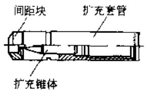

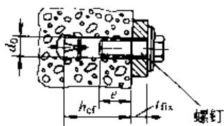

适用范围:锚栓是在没有膨胀应力作用下被安装在圆锥形钻孔中,并经凸型结合实现锚固,可达到最小的边距和间距,h值小。适用于≥C15的开裂和未开裂混凝土以及致密的天然石材的薄构件,用于安装机器设备等。可用于震动区。

表4-6-9

FZEA型锚栓规格、材料及安装尺寸

表4-6-10

FZEA型锚栓的设计承载力及边距影响系数

<table><tr><td rowspan=2 colspan=1>型      号</td><td rowspan=2 colspan=2>材质</td><td rowspan=2 colspan=1>钻头直径山/mm</td><td rowspan=2 colspan=1>锚固深度h/mm</td><td rowspan=2 colspan=1>安装扭矩T/N·m</td><td rowspan=1 colspan=2>旋人深度/mm</td><td rowspan=2 colspan=1>固定件中钻孔直径/mm</td><td rowspan=1 colspan=5>基础婚求</td></tr><tr><td rowspan=1 colspan=1>eu</td><td rowspan=1 colspan=1>eB</td><td rowspan=1 colspan=1>最小简距Sm/mm</td><td rowspan=1 colspan=1>最小边m/mm</td><td rowspan=1 colspan=1>最小基础厚度hm/mn</td><td rowspan=1 colspan=1>特征间距5./mm</td><td rowspan=1 colspan=1>特征边距e/mm</td></tr><tr><td rowspan=1 colspan=1>FZEA10×40M8</td><td rowspan=1 colspan=2>电镀</td><td rowspan=1 colspan=1>10</td><td rowspan=1 colspan=1>40</td><td rowspan=1 colspan=1>8.5</td><td rowspan=1 colspan=1>11</td><td rowspan=1 colspan=1>17</td><td rowspan=1 colspan=1>9</td><td rowspan=10 colspan=1>50</td><td rowspan=10 colspan=1>50</td><td rowspan=10 colspan=1>100</td><td rowspan=10 colspan=1>120</td><td rowspan=10 colspan=1>：6</td></tr><tr><td rowspan=3 colspan=1>FZEA12×40M10</td><td rowspan=3 colspan=1></td><td rowspan=1 colspan=1>电最</td><td></td><td></td><td></td><td></td><td></td><td></td></tr><tr><td rowspan=2 colspan=2></td><td></td><td></td><td></td><td></td><td></td><td></td></tr><tr><td rowspan=1 colspan=1></td><td rowspan=1 colspan=1>12</td><td rowspan=1 colspan=1>40</td><td rowspan=1 colspan=1>1s</td><td rowspan=1 colspan=1>13</td><td rowspan=1 colspan=1>19</td><td rowspan=1 colspan=1>12</td></tr><tr><td rowspan=1 colspan=1>FZEA14×40M12</td><td rowspan=1 colspan=2>锌钢</td><td rowspan=1 colspan=1>14</td><td rowspan=1 colspan=1>40</td><td rowspan=1 colspan=1>30</td><td rowspan=1 colspan=1>15</td><td rowspan=1 colspan=1>21</td><td rowspan=1 colspan=1>14</td></tr><tr><td rowspan=1 colspan=1>FZEA10×40M8A4</td><td rowspan=1 colspan=2></td><td rowspan=1 colspan=1>10</td><td rowspan=1 colspan=1>40</td><td rowspan=1 colspan=1>8.5</td><td rowspan=1 colspan=1>11</td><td rowspan=1 colspan=1>17</td><td rowspan=1 colspan=1>≤9</td></tr><tr><td rowspan=3 colspan=1>FZEA12×40M10A4</td><td rowspan=1 colspan=1>不</td><td></td><td></td><td></td><td></td><td></td><td></td><td></td></tr><tr><td rowspan=2 colspan=2>不访谢</td><td></td><td></td><td></td><td></td><td></td><td></td></tr><tr><td rowspan=1 colspan=1>钢</td><td rowspan=1 colspan=1>12</td><td rowspan=1 colspan=1>40</td><td rowspan=1 colspan=1>15</td><td rowspan=1 colspan=1>13</td><td rowspan=1 colspan=1>19</td><td rowspan=1 colspan=1>12</td></tr><tr><td rowspan=1 colspan=1>FZEA14×40M12A4</td><td rowspan=1 colspan=2></td><td rowspan=1 colspan=1>14</td><td rowspan=1 colspan=1>40</td><td rowspan=1 colspan=1>30</td><td rowspan=1 colspan=1>15</td><td rowspan=1 colspan=1>21</td><td rowspan=1 colspan=1>≤14</td></tr></table>

<table><tr><td></td><td rowspan=1 colspan=4>锚栓型号受力状态</td><td rowspan=1 colspan=3>10 x 40M8</td><td rowspan=1 colspan=3>12×40M10</td><td rowspan=1 colspan=1>14 × 40M12</td></tr><tr><td rowspan=4 colspan=1></td><td rowspan=4 colspan=1>钢材失效时承载力设计值/kN</td><td rowspan=2 colspan=1>拉力</td><td rowspan=2 colspan=1>NRd.</td><td rowspan=1 colspan=1>电镀锌钢</td><td rowspan=1 colspan=3>11.8</td><td rowspan=1 colspan=3>14.4</td><td rowspan=1 colspan=1>17.5</td></tr><tr><td rowspan=1 colspan=1>不锈钢</td><td rowspan=1 colspan=3>9.5</td><td rowspan=1 colspan=3>12.4</td><td rowspan=1 colspan=1>15.2</td></tr><tr><td rowspan=2 colspan=1>剪力</td><td rowspan=2 colspan=1>VAd:</td><td rowspan=1 colspan=1>电镀锌钢</td><td rowspan=1 colspan=3>7.1</td><td rowspan=1 colspan=3>8.7</td><td rowspan=1 colspan=1>10.5</td></tr><tr><td rowspan=1 colspan=1>不锈钢</td><td rowspan=1 colspan=3>5.8</td><td rowspan=1 colspan=3>7.5</td><td rowspan=1 colspan=1>9.1</td></tr><tr><td rowspan=14 colspan=2>混凝土失效时承载力设计值</td><td rowspan=7 colspan=1>拉力</td><td rowspan=5 colspan=1>Nde/kN</td><td rowspan=1 colspan=1>C15</td><td rowspan=1 colspan=3>3.2</td><td rowspan=1 colspan=3>3.8</td><td rowspan=1 colspan=1>3.8</td></tr><tr><td rowspan=1 colspan=1>C25</td><td rowspan=1 colspan=3>4.1</td><td rowspan=1 colspan=3>4.9</td><td rowspan=1 colspan=1>4.9</td></tr><tr><td rowspan=1 colspan=1>C35</td><td rowspan=1 colspan=3>4.9</td><td rowspan=1 colspan=3>5.8</td><td rowspan=1 colspan=1>5.8</td></tr><tr><td rowspan=1 colspan=1>C45</td><td rowspan=1 colspan=3>5.5</td><td rowspan=1 colspan=3>6.6</td><td rowspan=1 colspan=1>6.6</td></tr><tr><td rowspan=1 colspan=1>C55</td><td rowspan=1 colspan=3>6.1</td><td rowspan=1 colspan=3>7.3</td><td rowspan=1 colspan=1>7.3</td></tr><tr><td rowspan=1 colspan=1></td><td rowspan=1 colspan=1>Yc</td><td rowspan=1 colspan=3></td><td rowspan=1 colspan=4>2.15</td></tr><tr><td rowspan=1 colspan=1></td><td rowspan=1 colspan=1>uer.N</td><td rowspan=1 colspan=7>1.54</td></tr><tr><td rowspan=7 colspan=1>剪力</td><td rowspan=5 colspan=1>Vd/N</td><td rowspan=1 colspan=1>C15</td><td rowspan=1 colspan=3>4.1</td><td rowspan=1 colspan=3>4.3</td><td rowspan=1 colspan=1>4.4</td></tr><tr><td rowspan=1 colspan=1>C25</td><td rowspan=1 colspan=3>5.2</td><td rowspan=1 colspan=3>5.5</td><td rowspan=1 colspan=1>5.8</td></tr><tr><td rowspan=1 colspan=1>C35</td><td rowspan=1 colspan=3>6.2</td><td rowspan=1 colspan=3>6.5</td><td rowspan=1 colspan=1>6.8</td></tr><tr><td rowspan=1 colspan=1>C45</td><td rowspan=1 colspan=3>7</td><td rowspan=1 colspan=3>7.4</td><td rowspan=1 colspan=1>7.7</td></tr><tr><td rowspan=1 colspan=1>C55</td><td rowspan=1 colspan=3>7.7</td><td rowspan=1 colspan=3>8.2</td><td rowspan=1 colspan=1>8.6</td></tr><tr><td rowspan=1 colspan=2>Yw</td><td rowspan=1 colspan=7>1.8</td></tr><tr><td rowspan=1 colspan=2>k</td><td rowspan=1 colspan=7>1.0</td></tr><tr><td rowspan=2 colspan=4>边距e/mm</td><td rowspan=1 colspan=3>10×40M8</td><td rowspan=1 colspan=3>12×40M10</td><td rowspan=1 colspan=1>14×4</td><td rowspan=1 colspan=1>0M12</td></tr><tr><td rowspan=1 colspan=2>中</td><td rowspan=1 colspan=1>巴</td><td rowspan=1 colspan=2>业</td><td rowspan=1 colspan=1>里</td><td rowspan=1 colspan=1>业</td><td rowspan=1 colspan=1>中</td></tr><tr><td rowspan=5 colspan=2>锚栓受拉时的边距影响系数</td><td rowspan=1 colspan=2>25   ·</td><td rowspan=1 colspan=2>0.71</td><td rowspan=1 colspan=1>0.83</td><td rowspan=1 colspan=2>0.71</td><td rowspan=1 colspan=1>0.83</td><td rowspan=1 colspan=1>0.71</td><td rowspan=1 colspan=1>0.83</td></tr><tr><td rowspan=1 colspan=2>30</td><td rowspan=1 colspan=2>0.75</td><td rowspan=1 colspan=1>0.85</td><td rowspan=1 colspan=2>0.75</td><td rowspan=1 colspan=1>0.85</td><td rowspan=1 colspan=1>0.75</td><td rowspan=1 colspan=1>0.85</td></tr><tr><td rowspan=1 colspan=2>40</td><td rowspan=1 colspan=2>0.83</td><td rowspan=1 colspan=1>0.90</td><td rowspan=1 colspan=2>0.83</td><td rowspan=1 colspan=1>0.90</td><td rowspan=1 colspan=1>0.83</td><td rowspan=1 colspan=1>0.90</td></tr><tr><td rowspan=1 colspan=2>50</td><td rowspan=1 colspan=2>0.92</td><td rowspan=1 colspan=1>0.95</td><td rowspan=1 colspan=2>0.92</td><td rowspan=1 colspan=1>0.95</td><td rowspan=1 colspan=1>0.92</td><td rowspan=1 colspan=1>0.95</td></tr><tr><td rowspan=1 colspan=2>60</td><td rowspan=1 colspan=2>1.00</td><td rowspan=1 colspan=1>1.00</td><td rowspan=1 colspan=2>1.00</td><td rowspan=1 colspan=1>1.00</td><td rowspan=1 colspan=1>1.00</td><td rowspan=1 colspan=1>1.00</td></tr></table>

注:同表4-6-8注。

# FH型扭矩控制性后继膨胀套管锚栓

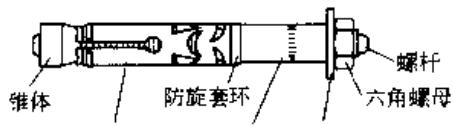

膨胀套簡 间距套管垫圈

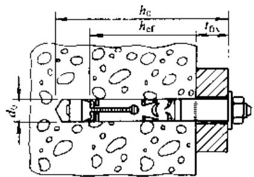

适用范围:锚栓的双层膨胀片设计使载荷分布更均匀,有利于在小边距、小间距情况下安装。锚栓可拆卸,可实现锚栓的再利用,适用于≥C15的开裂和未开裂混凝土以及致密的天然石材,可用于震动区。可用于安装设备等。

表4-6-11

FH型锚栓规格、材料及安装尺寸

<table><tr><td rowspan=1 colspan=14>表4-0-11</td></tr><tr><td rowspan=2 colspan=1>型号</td><td rowspan=2 colspan=1>钻头直径山/mm</td><td rowspan=2 colspan=1>穿透式安装需要的最小钻孔深度（含固定件厚度）加/mm</td><td rowspan=2 colspan=1>锚固深度h/mm</td><td rowspan=2 colspan=3>安装扭矩Tmet/Nm</td><td rowspan=2 colspan=1>固定件最大厚度/mm</td><td rowspan=2 colspan=1>固定件中钻孔直径/mm</td><td rowspan=1 colspan=5>基础要求</td></tr><tr><td rowspan=1 colspan=1>最小间距目/mm</td><td rowspan=1 colspan=1>最小边距C/mm</td><td rowspan=1 colspan=1>最小基础厚度h/mm</td><td rowspan=1 colspan=1>特征间5N會</td><td rowspan=1 colspan=1>特征边距maN/mm</td></tr><tr><td rowspan=1 colspan=1>FH10/10B</td><td rowspan=1 colspan=1>10</td><td rowspan=1 colspan=1>80</td><td rowspan=1 colspan=1>50</td><td rowspan=1 colspan=3></td><td rowspan=1 colspan=1>10</td><td rowspan=1 colspan=1>12</td><td rowspan=6 colspan=1>50</td><td rowspan=6 colspan=1>50</td><td rowspan=6 colspan=1>100</td><td rowspan=6 colspan=1>150</td><td rowspan=6 colspan=1>75</td></tr><tr><td rowspan=2 colspan=1>FH10/25B</td><td rowspan=2 colspan=1>10</td><td rowspan=2 colspan=1>95</td><td rowspan=2 colspan=1>50</td><td rowspan=2 colspan=2></td><td rowspan=1 colspan=1></td><td rowspan=2 colspan=1></td><td rowspan=2 colspan=1>25</td><td rowspan=2 colspan=1>12</td></tr><tr><td rowspan=1 colspan=2>10</td></tr><tr><td rowspan=2 colspan=1>FHI0/50B</td><td rowspan=2 colspan=1>10</td><td rowspan=2 colspan=1>120</td><td rowspan=2 colspan=1>50</td><td rowspan=2 colspan=2></td><td rowspan=1 colspan=1></td><td rowspan=2 colspan=1></td><td rowspan=2 colspan=1>50</td><td rowspan=2 colspan=1>12</td></tr><tr><td rowspan=1 colspan=2></td></tr><tr><td rowspan=1 colspan=1>FH10/100B</td><td rowspan=1 colspan=1>10</td><td rowspan=1 colspan=1>170</td><td rowspan=1 colspan=1>50</td><td rowspan=1 colspan=3></td><td rowspan=1 colspan=1>100</td><td rowspan=1 colspan=1>≤12</td></tr><tr><td rowspan=1 colspan=1>FH12/10B</td><td rowspan=1 colspan=1>12</td><td rowspan=1 colspan=1>90</td><td rowspan=1 colspan=1>60</td><td rowspan=1 colspan=3></td><td rowspan=1 colspan=1>10</td><td rowspan=1 colspan=1>≤14</td><td rowspan=6 colspan=1>60</td><td rowspan=6 colspan=1>60</td><td rowspan=6 colspan=1>130</td><td rowspan=6 colspan=1>180</td><td rowspan=6 colspan=1>90</td></tr><tr><td rowspan=2 colspan=1>FH12/25B</td><td rowspan=2 colspan=1>12</td><td rowspan=2 colspan=1>105</td><td rowspan=2 colspan=1>60</td><td rowspan=2 colspan=2></td><td rowspan=1 colspan=1></td><td rowspan=2 colspan=1></td><td rowspan=2 colspan=1>25</td><td rowspan=2 colspan=1>14</td></tr><tr><td rowspan=1 colspan=2>25</td></tr><tr><td rowspan=2 colspan=1>FH12/50B</td><td rowspan=2 colspan=1>12</td><td rowspan=2 colspan=1>130</td><td rowspan=2 colspan=1>60</td><td rowspan=2 colspan=2></td><td rowspan=1 colspan=1>25</td><td rowspan=2 colspan=1></td><td rowspan=2 colspan=1>50</td><td rowspan=2 colspan=1>≤14</td></tr><tr><td rowspan=1 colspan=2></td></tr><tr><td rowspan=1 colspan=1>FH12/100B</td><td rowspan=1 colspan=1>12</td><td rowspan=1 colspan=1>180</td><td rowspan=1 colspan=1>60</td><td rowspan=1 colspan=3></td><td rowspan=1 colspan=1>100</td><td rowspan=1 colspan=1>≤14</td></tr><tr><td rowspan=1 colspan=1>FH15/10B</td><td rowspan=1 colspan=1>15</td><td rowspan=1 colspan=1>100</td><td rowspan=1 colspan=1>70</td><td rowspan=1 colspan=3></td><td rowspan=1 colspan=1>10</td><td rowspan=1 colspan=1>18</td><td rowspan=6 colspan=1>70</td><td rowspan=6 colspan=1>80</td><td rowspan=6 colspan=1>140</td><td rowspan=6 colspan=1>210</td><td rowspan=6 colspan=1>105</td></tr><tr><td rowspan=2 colspan=1>FH15/25B</td><td rowspan=2 colspan=1>15</td><td rowspan=2 colspan=1>115</td><td rowspan=2 colspan=1>70</td><td rowspan=2 colspan=2></td><td rowspan=1 colspan=1></td><td rowspan=2 colspan=1></td><td rowspan=2 colspan=1>25</td><td rowspan=2 colspan=1>≤18</td></tr><tr><td rowspan=1 colspan=2>40</td></tr><tr><td rowspan=2 colspan=1>FH15/50B</td><td rowspan=2 colspan=1>15</td><td rowspan=2 colspan=1>140</td><td rowspan=2 colspan=1>70</td><td rowspan=2 colspan=2></td><td rowspan=1 colspan=1></td><td rowspan=2 colspan=1></td><td rowspan=2 colspan=1>50</td><td rowspan=2 colspan=1>18</td></tr><tr><td rowspan=1 colspan=2></td></tr><tr><td rowspan=1 colspan=1>FH1S/100B</td><td rowspan=1 colspan=1>15</td><td rowspan=1 colspan=1>190</td><td rowspan=1 colspan=1>70</td><td rowspan=1 colspan=3></td><td rowspan=1 colspan=1>100</td><td rowspan=1 colspan=1>18</td></tr><tr><td rowspan=1 colspan=1>FH18× 80/10B</td><td rowspan=1 colspan=1>18</td><td rowspan=1 colspan=1>115</td><td rowspan=1 colspan=1>80</td><td rowspan=1 colspan=3></td><td rowspan=1 colspan=1>10</td><td rowspan=1 colspan=1>≤20</td><td rowspan=7 colspan=1>80</td><td rowspan=7 colspan=1>80</td><td rowspan=7 colspan=1>160</td><td rowspan=7 colspan=1>240</td><td rowspan=7 colspan=1>120</td></tr><tr><td rowspan=2 colspan=1>FH18× 80/25B</td><td rowspan=2 colspan=1>18</td><td rowspan=2 colspan=1>130</td><td rowspan=2 colspan=1>80</td><td rowspan=2 colspan=2></td><td rowspan=1 colspan=1></td><td rowspan=2 colspan=1></td><td rowspan=2 colspan=1>25</td><td rowspan=2 colspan=1>≤20</td></tr><tr><td rowspan=1 colspan=2></td></tr><tr><td rowspan=2 colspan=1>FH18× 80/50B</td><td rowspan=2 colspan=1>18</td><td rowspan=2 colspan=1>155</td><td rowspan=2 colspan=1>80</td><td rowspan=2 colspan=2></td><td rowspan=1 colspan=1></td><td rowspan=2 colspan=1></td><td rowspan=2 colspan=1>50</td><td rowspan=2 colspan=1>20</td></tr><tr><td rowspan=1 colspan=2></td></tr><tr><td rowspan=2 colspan=1>FH18×80/100B</td><td rowspan=2 colspan=1>18</td><td rowspan=2 colspan=1>205</td><td rowspan=2 colspan=1>80</td><td rowspan=2 colspan=2></td><td rowspan=1 colspan=1></td><td rowspan=2 colspan=1></td><td rowspan=2 colspan=1>100</td><td rowspan=2 colspan=1>≤20</td></tr><tr><td rowspan=1 colspan=2>80</td></tr><tr><td rowspan=2 colspan=1>FH18×100/10B</td><td rowspan=2 colspan=1>18</td><td rowspan=2 colspan=1>135</td><td rowspan=2 colspan=1>100</td><td rowspan=2 colspan=2></td><td rowspan=1 colspan=1></td><td rowspan=2 colspan=1></td><td rowspan=2 colspan=1>10</td><td rowspan=2 colspan=1>≤20</td><td rowspan=7 colspan=1>80</td><td rowspan=7 colspan=1>80</td><td rowspan=7 colspan=1>200</td><td rowspan=7 colspan=1>300</td></tr><tr><td rowspan=1 colspan=2></td></tr><tr><td rowspan=2 colspan=1>FH18× 100/25B</td><td rowspan=2 colspan=1>18</td><td rowspan=2 colspan=1>150</td><td rowspan=2 colspan=1>100</td><td rowspan=2 colspan=2></td><td rowspan=1 colspan=1></td><td rowspan=2 colspan=1></td><td rowspan=2 colspan=1>25</td><td rowspan=2 colspan=1>≤20</td></tr><tr><td rowspan=1 colspan=2></td></tr><tr><td rowspan=2 colspan=1>FH18×100/50B</td><td rowspan=2 colspan=1>18</td><td rowspan=2 colspan=1>175</td><td rowspan=2 colspan=1>100</td><td rowspan=2 colspan=2></td><td rowspan=1 colspan=1></td><td rowspan=2 colspan=1></td><td rowspan=2 colspan=1>50</td><td rowspan=2 colspan=1>≤20</td></tr><tr><td rowspan=1 colspan=2></td></tr><tr><td rowspan=1 colspan=1>FH18×100/100B</td><td rowspan=1 colspan=1>18</td><td rowspan=1 colspan=1>225</td><td rowspan=1 colspan=1>100</td><td rowspan=1 colspan=3></td><td rowspan=1 colspan=1>100</td><td rowspan=1 colspan=1>20</td><td></td></tr><tr><td rowspan=1 colspan=1>FH24/10B</td><td rowspan=1 colspan=1>24</td><td rowspan=1 colspan=1>160</td><td rowspan=1 colspan=1>125</td><td rowspan=1 colspan=3></td><td rowspan=1 colspan=1>10</td><td rowspan=1 colspan=1>26</td><td rowspan=6 colspan=1>125</td><td rowspan=6 colspan=1>125</td><td rowspan=6 colspan=1>250</td><td rowspan=6 colspan=1>380</td><td rowspan=6 colspan=1>190</td></tr><tr><td rowspan=2 colspan=1>FH24/25B</td><td rowspan=2 colspan=1>24</td><td rowspan=2 colspan=1>175</td><td rowspan=2 colspan=1>125</td><td rowspan=2 colspan=2></td><td rowspan=1 colspan=1></td><td rowspan=2 colspan=1></td><td rowspan=2 colspan=1>25</td><td rowspan=2 colspan=1>≤26</td></tr><tr><td rowspan=1 colspan=2>120</td></tr><tr><td rowspan=2 colspan=1>FH24/50B</td><td rowspan=2 colspan=1>24</td><td rowspan=2 colspan=1>200</td><td rowspan=2 colspan=1>125</td><td rowspan=2 colspan=2></td><td rowspan=1 colspan=1>125</td><td rowspan=2 colspan=1></td><td rowspan=2 colspan=1>50</td><td rowspan=2 colspan=1>≤26</td></tr><tr><td rowspan=1 colspan=2></td></tr><tr><td rowspan=1 colspan=1>FH24/100B</td><td rowspan=1 colspan=1>24</td><td rowspan=1 colspan=1>250</td><td rowspan=1 colspan=1>125</td><td rowspan=1 colspan=3></td><td rowspan=1 colspan=1>100</td><td rowspan=1 colspan=1>≤26</td></tr></table>

注:材质全为电镀锌钢。

FH型锚栓的设计承载力及边距影响系数

<table><tr><td rowspan=1 colspan=8>锚栓型号受力状态</td><td rowspan=1 colspan=2>FH10</td><td rowspan=1 colspan=2>FH12</td><td rowspan=1 colspan=2>FH15</td><td rowspan=1 colspan=2>FH18× 80</td><td rowspan=1 colspan=2>FH18×100</td><td rowspan=1 colspan=2>FH24</td></tr><tr><td rowspan=4 colspan=2>钢材失效时承载力设计值/kN</td><td rowspan=2 colspan=2>拉力</td><td rowspan=2 colspan=2>NRd:</td><td rowspan=1 colspan=2>电镀锌钢</td><td rowspan=1 colspan=2>10.7</td><td rowspan=1 colspan=2>19.3</td><td rowspan=1 colspan=2>30.7</td><td rowspan=1 colspan=2>44.7</td><td rowspan=1 colspan=2>44.7</td><td rowspan=1 colspan=2>83.3</td></tr><tr><td rowspan=1 colspan=2>不锈钢</td><td rowspan=1 colspan=2>7.5</td><td rowspan=1 colspan=2>13.7</td><td rowspan=1 colspan=2>21.7</td><td rowspan=1 colspan=2>1</td><td rowspan=1 colspan=2>31.6</td><td rowspan=1 colspan=2>1</td></tr><tr><td rowspan=2 colspan=2>剪力</td><td rowspan=2 colspan=2>Vad:</td><td rowspan=1 colspan=2>电镀锌钢</td><td rowspan=1 colspan=2>9</td><td rowspan=1 colspan=2>15.7</td><td rowspan=1 colspan=2>25.3</td><td rowspan=1 colspan=2>37.3</td><td rowspan=1 colspan=2>37.3</td><td rowspan=1 colspan=2>78</td></tr><tr><td rowspan=1 colspan=2>不锈钢</td><td rowspan=1 colspan=2>7.5</td><td rowspan=1 colspan=2>11.2</td><td rowspan=1 colspan=2>18.3</td><td rowspan=1 colspan=2>1</td><td rowspan=1 colspan=2>27.1</td><td rowspan=1 colspan=2>1</td></tr><tr><td rowspan=14 colspan=2>混凝土失效时承载力设计值</td><td rowspan=7 colspan=2>拉力</td><td rowspan=5 colspan=2>Nd/kN</td><td rowspan=1 colspan=2>C15</td><td rowspan=1 colspan=2>5.3</td><td rowspan=1 colspan=2>7</td><td rowspan=1 colspan=2>8.8</td><td rowspan=1 colspan=2>10.8</td><td rowspan=1 colspan=2>15.7</td><td rowspan=1 colspan=2>21.1</td></tr><tr><td rowspan=1 colspan=2>C25</td><td rowspan=1 colspan=2>6.9</td><td rowspan=1 colspan=2>9.1</td><td rowspan=1 colspan=2>11.4</td><td rowspan=1 colspan=2>13.9</td><td rowspan=1 colspan=2>19.4</td><td rowspan=1 colspan=2>27.2</td></tr><tr><td rowspan=1 colspan=2>C35</td><td rowspan=1 colspan=2>8.1</td><td rowspan=1 colspan=2>10.7</td><td rowspan=1 colspan=2>13.5</td><td rowspan=1 colspan=2>16.4</td><td rowspan=1 colspan=2>23</td><td rowspan=1 colspan=2>32.2</td></tr><tr><td rowspan=1 colspan=2>C45</td><td rowspan=1 colspan=2>9.2</td><td rowspan=1 colspan=2>12.1</td><td rowspan=1 colspan=2>15.3</td><td rowspan=1 colspan=2>18.7</td><td rowspan=1 colspan=2>26.1</td><td rowspan=1 colspan=2>36.4</td></tr><tr><td rowspan=1 colspan=2>C55</td><td rowspan=1 colspan=2>10.2</td><td rowspan=1 colspan=2>13.4</td><td rowspan=1 colspan=2>16.9</td><td rowspan=1 colspan=2>20.7</td><td rowspan=1 colspan=2>28.8</td><td rowspan=1 colspan=2>40.3</td></tr><tr><td rowspan=1 colspan=4>Yc</td><td rowspan=1 colspan=2>1.8</td><td rowspan=1 colspan=2>1.8</td><td rowspan=1 colspan=2>1.8</td><td rowspan=1 colspan=2>1.8</td><td rowspan=1 colspan=2>1.8</td><td rowspan=1 colspan=2>1.8</td></tr><tr><td rowspan=1 colspan=4>o</td><td rowspan=1 colspan=2>1.54</td><td rowspan=1 colspan=2>1.54</td><td rowspan=1 colspan=2>1.54</td><td rowspan=1 colspan=2>1.54</td><td rowspan=1 colspan=2>1.54</td><td rowspan=1 colspan=2>1.54</td></tr><tr><td rowspan=7 colspan=2>剪力</td><td rowspan=5 colspan=2>Vd./N</td><td rowspan=1 colspan=2>C15</td><td rowspan=1 colspan=2>3.3</td><td rowspan=1 colspan=2>3.5</td><td rowspan=1 colspan=2>3.9</td><td rowspan=1 colspan=2>4.3</td><td rowspan=1 colspan=2>4.9</td><td rowspan=1 colspan=2>6.1</td></tr><tr><td rowspan=1 colspan=2>C25</td><td rowspan=1 colspan=2>4.3</td><td rowspan=1 colspan=2>4.6</td><td rowspan=1 colspan=2>5.1</td><td rowspan=1 colspan=2>5.6</td><td rowspan=1 colspan=2>6.3</td><td rowspan=1 colspan=2>7.2</td></tr><tr><td rowspan=1 colspan=2>C35</td><td rowspan=1 colspan=2>5.1</td><td rowspan=1 colspan=2>5.3</td><td rowspan=1 colspan=2>6</td><td rowspan=1 colspan=2>6.6</td><td rowspan=1 colspan=2>7.4</td><td rowspan=1 colspan=2>8.5</td></tr><tr><td rowspan=1 colspan=2>C45</td><td rowspan=1 colspan=2>5.8</td><td rowspan=1 colspan=2>6.1</td><td rowspan=1 colspan=2>6.8</td><td rowspan=1 colspan=2>7.5</td><td rowspan=1 colspan=2>8.4</td><td rowspan=1 colspan=2>9.6</td></tr><tr><td rowspan=1 colspan=2>C55</td><td rowspan=1 colspan=2>6.3</td><td rowspan=1 colspan=2>6.7</td><td rowspan=1 colspan=2>7.6</td><td rowspan=1 colspan=2>8.3</td><td rowspan=1 colspan=2>9.4</td><td rowspan=1 colspan=2>10.7</td></tr><tr><td rowspan=1 colspan=4>YM</td><td rowspan=1 colspan=2>1.8</td><td rowspan=1 colspan=2>1.8</td><td rowspan=1 colspan=2>1.8</td><td rowspan=1 colspan=2>1.8</td><td rowspan=1 colspan=2>1.8</td><td rowspan=1 colspan=2>1.8</td></tr><tr><td rowspan=1 colspan=4>i</td><td rowspan=1 colspan=2>1</td><td rowspan=1 colspan=2>2</td><td rowspan=1 colspan=2>2</td><td rowspan=1 colspan=2>2</td><td rowspan=1 colspan=2>2</td><td rowspan=1 colspan=2>2</td></tr><tr><td rowspan=2 colspan=3>边距/mm</td><td rowspan=1 colspan=4>FH10</td><td rowspan=1 colspan=1>FE</td><td rowspan=1 colspan=1>FH12</td><td rowspan=1 colspan=3>FH15</td><td rowspan=1 colspan=3>FH18x80</td><td rowspan=1 colspan=1>FH18</td><td rowspan=1 colspan=1>FH18×100</td><td rowspan=1 colspan=3>FH24</td></tr><tr><td rowspan=1 colspan=2>山</td><td rowspan=1 colspan=2>日</td><td rowspan=1 colspan=1>?</td><td rowspan=1 colspan=1>中</td><td rowspan=1 colspan=2>电</td><td rowspan=1 colspan=1>甲</td><td rowspan=1 colspan=1>上</td><td rowspan=1 colspan=2>中</td><td rowspan=1 colspan=1>4</td><td rowspan=1 colspan=1>申</td><td rowspan=1 colspan=2></td><td rowspan=1 colspan=1>4</td></tr><tr><td rowspan=22 colspan=1>FH型锚栓受拉时的边距影响系数</td><td rowspan=1 colspan=2>25</td><td rowspan=1 colspan=2>0.67</td><td rowspan=1 colspan=2>0.8</td><td rowspan=1 colspan=1></td><td rowspan=1 colspan=1></td><td rowspan=1 colspan=2></td><td rowspan=1 colspan=1></td><td rowspan=1 colspan=1></td><td rowspan=1 colspan=2></td><td rowspan=1 colspan=1></td><td rowspan=1 colspan=1></td><td rowspan=1 colspan=2></td><td rowspan=1 colspan=1></td></tr><tr><td rowspan=1 colspan=2>30</td><td rowspan=1 colspan=2>0.7</td><td rowspan=1 colspan=2>0.82</td><td rowspan=1 colspan=1>0.67</td><td rowspan=1 colspan=1>0.8</td><td rowspan=1 colspan=2></td><td rowspan=1 colspan=1></td><td rowspan=1 colspan=1></td><td rowspan=1 colspan=2></td><td rowspan=1 colspan=1></td><td rowspan=1 colspan=1></td><td rowspan=1 colspan=2></td><td rowspan=1 colspan=1></td></tr><tr><td rowspan=1 colspan=2>35</td><td rowspan=1 colspan=2>0.74</td><td rowspan=1 colspan=2>0.84</td><td rowspan=1 colspan=1>0.7</td><td rowspan=1 colspan=1>0.82</td><td rowspan=1 colspan=2>0.67</td><td rowspan=1 colspan=1>0.8</td><td rowspan=1 colspan=1></td><td rowspan=1 colspan=2></td><td rowspan=1 colspan=1></td><td rowspan=1 colspan=1></td><td rowspan=1 colspan=2></td><td rowspan=1 colspan=1></td></tr><tr><td rowspan=1 colspan=2>40</td><td rowspan=1 colspan=2>0.77</td><td rowspan=1 colspan=2>0.86</td><td rowspan=1 colspan=1>0.72</td><td rowspan=1 colspan=1>0.83</td><td rowspan=1 colspan=2>0.69</td><td rowspan=1 colspan=1>0.81</td><td rowspan=1 colspan=1>0.67</td><td rowspan=1 colspan=2>0.8</td><td rowspan=1 colspan=1>0.63</td><td rowspan=1 colspan=1>0.71</td><td rowspan=1 colspan=2></td><td rowspan=1 colspan=1></td></tr><tr><td rowspan=1 colspan=2>50</td><td rowspan=1 colspan=2>0.83</td><td rowspan=1 colspan=2>0.9</td><td rowspan=1 colspan=1>0.78</td><td rowspan=1 colspan=1>0.87</td><td rowspan=1 colspan=2>0.74</td><td rowspan=1 colspan=1>0.96</td><td rowspan=1 colspan=1>0.71</td><td rowspan=1 colspan=2>0.83</td><td rowspan=1 colspan=1>0.67</td><td rowspan=1 colspan=1>0.8</td><td rowspan=1 colspan=2></td><td rowspan=1 colspan=1></td></tr><tr><td rowspan=1 colspan=2>60</td><td rowspan=1 colspan=2>0.9</td><td rowspan=1 colspan=2>0.94</td><td rowspan=1 colspan=1>0.83</td><td rowspan=1 colspan=1>0.9</td><td rowspan=1 colspan=2>0.79</td><td rowspan=1 colspan=1>0.87</td><td rowspan=1 colspan=1>0.75</td><td rowspan=1 colspan=2>0.85</td><td rowspan=1 colspan=1>0.7</td><td rowspan=1 colspan=1>0.82</td><td rowspan=1 colspan=2></td><td rowspan=1 colspan=1></td></tr><tr><td rowspan=1 colspan=2>62.5</td><td rowspan=1 colspan=2>0.92</td><td rowspan=1 colspan=2>0.95</td><td rowspan=1 colspan=1>0.85</td><td rowspan=1 colspan=1>0.91</td><td rowspan=1 colspan=2>0.8</td><td rowspan=1 colspan=1>0.88</td><td rowspan=1 colspan=1>0.76</td><td rowspan=1 colspan=2>0.86</td><td rowspan=1 colspan=1>0.71</td><td rowspan=1 colspan=1>0.83</td><td rowspan=1 colspan=2>0.66</td><td rowspan=1 colspan=1>0.8</td></tr><tr><td rowspan=1 colspan=2>70</td><td rowspan=1 colspan=2>0.97</td><td rowspan=1 colspan=2>0.98</td><td rowspan=1 colspan=1>0.89</td><td rowspan=1 colspan=1>0.93</td><td rowspan=1 colspan=2>0.83</td><td rowspan=1 colspan=1>0.9</td><td rowspan=1 colspan=1>0.79</td><td rowspan=1 colspan=2>0.88</td><td rowspan=1 colspan=1>0.73</td><td rowspan=1 colspan=1>0.84</td><td rowspan=1 colspan=2>0.68</td><td rowspan=1 colspan=1>0.81</td></tr><tr><td rowspan=1 colspan=2>75</td><td rowspan=1 colspan=2>1.00</td><td rowspan=1 colspan=2>1.00</td><td rowspan=1 colspan=1>0.92</td><td rowspan=1 colspan=1>0.95</td><td rowspan=1 colspan=2>0.86</td><td rowspan=1 colspan=1>0.92</td><td rowspan=1 colspan=1>0.81</td><td rowspan=1 colspan=2>0.89</td><td rowspan=1 colspan=1>0.75</td><td rowspan=1 colspan=1>0.85</td><td rowspan=1 colspan=2>0.7</td><td rowspan=1 colspan=1>0.82</td></tr><tr><td rowspan=1 colspan=2>80</td><td rowspan=1 colspan=2>1.00</td><td rowspan=1 colspan=2>1.00</td><td rowspan=1 colspan=1>0.94</td><td rowspan=1 colspan=1>0.97</td><td rowspan=1 colspan=2>0.88</td><td rowspan=1 colspan=1>0.93</td><td rowspan=1 colspan=1>0.83</td><td rowspan=1 colspan=2>0.9</td><td rowspan=1 colspan=1>0.7</td><td rowspan=1 colspan=1>0.86</td><td rowspan=1 colspan=2>0.71</td><td rowspan=1 colspan=1>0.83</td></tr><tr><td rowspan=1 colspan=2>90</td><td rowspan=1 colspan=2>1.00</td><td rowspan=1 colspan=2>1.00</td><td rowspan=1 colspan=1>1.00</td><td rowspan=1 colspan=1>1.00</td><td rowspan=1 colspan=2>0.93</td><td rowspan=1 colspan=1>0.96</td><td rowspan=1 colspan=1>0.88</td><td rowspan=1 colspan=2>0.93</td><td rowspan=1 colspan=1>0.8</td><td rowspan=1 colspan=1>0.88</td><td rowspan=1 colspan=2>0.74</td><td rowspan=1 colspan=1>0.84</td></tr><tr><td rowspan=1 colspan=2>100</td><td rowspan=1 colspan=2>1.00</td><td rowspan=1 colspan=2>1.00</td><td rowspan=1 colspan=1>1.00</td><td rowspan=1 colspan=1>1.00</td><td rowspan=1 colspan=2>0.98</td><td rowspan=1 colspan=1>0.99</td><td rowspan=1 colspan=1>0.92</td><td rowspan=1 colspan=2>0.95</td><td rowspan=1 colspan=1>0.83</td><td rowspan=1 colspan=1>0.9</td><td rowspan=1 colspan=2>0.76</td><td rowspan=1 colspan=1>0.86</td></tr><tr><td rowspan=1 colspan=2>105</td><td rowspan=1 colspan=2>1.00</td><td rowspan=1 colspan=2>1.00</td><td rowspan=1 colspan=1>1.00</td><td rowspan=1 colspan=1>1.00</td><td rowspan=1 colspan=2>1.00</td><td rowspan=1 colspan=1>1.00</td><td rowspan=1 colspan=1>0.94</td><td rowspan=1 colspan=2>0.97</td><td rowspan=1 colspan=1>0.85</td><td rowspan=1 colspan=1>0.91</td><td rowspan=1 colspan=2>0.78</td><td rowspan=1 colspan=1>0.865</td></tr><tr><td rowspan=1 colspan=2>110</td><td rowspan=1 colspan=2>1.00</td><td rowspan=1 colspan=2>1.00</td><td rowspan=1 colspan=1>1.00</td><td rowspan=1 colspan=1>1.00</td><td rowspan=1 colspan=2>1.00</td><td rowspan=1 colspan=1>1.00</td><td rowspan=1 colspan=1>0.96</td><td rowspan=1 colspan=2>0.98</td><td rowspan=1 colspan=1>0.87</td><td rowspan=1 colspan=1>0.92</td><td rowspan=1 colspan=2>0.79</td><td rowspan=1 colspan=1>0.87</td></tr><tr><td rowspan=1 colspan=2>120</td><td rowspan=1 colspan=2>1.00</td><td rowspan=1 colspan=2>1.00</td><td rowspan=1 colspan=1>1.00</td><td rowspan=1 colspan=1>1.00</td><td rowspan=1 colspan=2>1.00</td><td rowspan=1 colspan=1>1.00</td><td rowspan=1 colspan=1>1.00</td><td rowspan=1 colspan=2>1.00</td><td rowspan=1 colspan=1>0.9</td><td rowspan=1 colspan=1>0.94</td><td rowspan=1 colspan=2>0.82</td><td rowspan=1 colspan=1>0.89</td></tr><tr><td rowspan=1 colspan=2>130</td><td rowspan=1 colspan=2>1.00</td><td rowspan=1 colspan=2>1.00</td><td rowspan=1 colspan=1>1.00</td><td rowspan=1 colspan=1>1.00</td><td rowspan=1 colspan=2>1.00</td><td rowspan=1 colspan=1>1.00</td><td rowspan=1 colspan=1>1.00</td><td rowspan=1 colspan=2>1.00</td><td rowspan=1 colspan=1>0.93</td><td rowspan=1 colspan=1>0.96</td><td rowspan=1 colspan=2>0.84</td><td rowspan=1 colspan=1>0.91</td></tr><tr><td rowspan=1 colspan=2>140</td><td rowspan=1 colspan=2>1.00</td><td rowspan=1 colspan=2>1.00</td><td rowspan=1 colspan=1>1.00</td><td rowspan=1 colspan=1>1.00</td><td rowspan=1 colspan=2>1.00</td><td rowspan=1 colspan=1>1.00</td><td rowspan=1 colspan=1>1.00</td><td rowspan=1 colspan=2>1.00</td><td rowspan=1 colspan=1>0.97</td><td rowspan=1 colspan=1>0.98</td><td rowspan=1 colspan=2>0.97</td><td rowspan=1 colspan=1>0.92</td></tr><tr><td rowspan=1 colspan=2>150</td><td rowspan=1 colspan=2>1.00</td><td rowspan=1 colspan=2>1.00</td><td rowspan=1 colspan=1>1.00</td><td rowspan=1 colspan=1>1.00</td><td rowspan=1 colspan=2>1.00</td><td rowspan=1 colspan=1>1.00</td><td rowspan=1 colspan=1>1.00</td><td rowspan=1 colspan=2>1.00</td><td rowspan=1 colspan=1>1.00</td><td rowspan=1 colspan=1>1.00</td><td rowspan=1 colspan=2>0.9</td><td rowspan=1 colspan=1>0.94</td></tr><tr><td rowspan=1 colspan=2>160</td><td rowspan=1 colspan=2>1.00</td><td rowspan=1 colspan=2>1.00</td><td rowspan=1 colspan=1>1.00</td><td rowspan=1 colspan=1>1.00</td><td rowspan=1 colspan=2>1.00</td><td rowspan=1 colspan=1>1.00</td><td rowspan=1 colspan=1>1.00</td><td rowspan=1 colspan=2>1.00</td><td rowspan=1 colspan=1>1.00</td><td rowspan=1 colspan=1>1.00</td><td rowspan=1 colspan=2>0.92</td><td rowspan=1 colspan=1>0.95</td></tr><tr><td rowspan=1 colspan=2>170</td><td rowspan=1 colspan=2>1.00</td><td rowspan=1 colspan=2>1.00</td><td rowspan=1 colspan=1>1.00</td><td rowspan=1 colspan=1>1.00</td><td rowspan=1 colspan=2>1.00</td><td rowspan=1 colspan=1>1.00</td><td rowspan=1 colspan=1>1.00</td><td rowspan=1 colspan=2>1.00</td><td rowspan=1 colspan=1>1.00</td><td rowspan=1 colspan=1>1.00</td><td rowspan=1 colspan=2>0.95</td><td rowspan=1 colspan=1>0.97</td></tr><tr><td rowspan=1 colspan=2>180</td><td rowspan=1 colspan=2>1.00</td><td rowspan=1 colspan=2>1.00</td><td rowspan=1 colspan=1>1.00</td><td rowspan=1 colspan=1>1.00</td><td rowspan=1 colspan=2>1.00</td><td rowspan=1 colspan=1>1.00</td><td rowspan=1 colspan=1>1.00</td><td rowspan=1 colspan=2>1.00</td><td rowspan=1 colspan=1>1.00</td><td rowspan=1 colspan=1>1.00</td><td rowspan=1 colspan=2>0.97</td><td rowspan=1 colspan=1>0.98</td></tr><tr><td rowspan=1 colspan=2>190</td><td rowspan=1 colspan=2>1.00</td><td rowspan=1 colspan=2>1.00</td><td rowspan=1 colspan=1>1.00</td><td rowspan=1 colspan=1>1.00</td><td rowspan=1 colspan=2>1.00</td><td rowspan=1 colspan=1>1.00</td><td rowspan=1 colspan=1>1.00</td><td rowspan=1 colspan=2>1.00</td><td rowspan=1 colspan=1>1.00</td><td rowspan=1 colspan=1>1.00</td><td rowspan=1 colspan=2>1.00</td><td rowspan=1 colspan=1>1.00</td></tr></table>

注:同表4-6-8注。

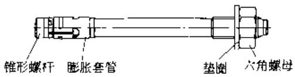

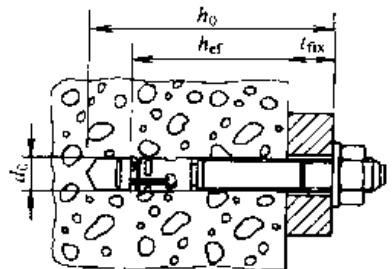

适用范围:锚栓配置有优质不锈钢A4制的膨胀套环,它具有高强弹簧的后继膨胀功能,能保证最佳的可控后膨胀,双层的膨胀片设计使载荷分布更均匀,有利于小边距安装。可用于设备安装及管道支架等的固定。适用于 $\gtrapprox 6 1 5$ 的开裂和未开裂混凝土以及致密的天然石材。可用于震动区。

表4-6-13

FAZ型锚栓规格、材料及安装尺寸

<table><tr><td rowspan=1 colspan=12>表4-0-13</td></tr><tr><td rowspan=2 colspan=1>型号</td><td rowspan=2 colspan=1>钻头直径山/mm</td><td rowspan=2 colspan=1>穿透式安装需要的最小钻孔深度（含固定件厚度）h/mm</td><td rowspan=2 colspan=1>锚固深度h/m</td><td rowspan=2 colspan=1>安装扭矩T/N·m</td><td rowspan=2 colspan=1>固定件最大厚度管/mm</td><td rowspan=2 colspan=1>固定件中钻孔直径/mm</td><td rowspan=1 colspan=5>基础要求</td></tr><tr><td rowspan=1 colspan=1>最小简吧mup/mm</td><td rowspan=1 colspan=1>最小边距mn/m</td><td rowspan=1 colspan=1>最小基础厚度hin/mm</td><td rowspan=1 colspan=1>特征间配5rN/mm</td><td rowspan=1 colspan=1>特征边距CQ/mm</td></tr><tr><td rowspan=1 colspan=1>FA28/10</td><td rowspan=1 colspan=1>8</td><td rowspan=1 colspan=1>75</td><td rowspan=1 colspan=1>45</td><td rowspan=1 colspan=1></td><td rowspan=1 colspan=1>10</td><td rowspan=1 colspan=1>≤9</td><td rowspan=5 colspan=1>50</td><td rowspan=5 colspan=1>50</td><td rowspan=5 colspan=1>100</td><td rowspan=5 colspan=1>140</td><td rowspan=5 colspan=1>70</td></tr><tr><td rowspan=1 colspan=1>FAZ8/30</td><td rowspan=1 colspan=1>8</td><td rowspan=1 colspan=1>95</td><td rowspan=1 colspan=1>45</td><td rowspan=1 colspan=1></td><td rowspan=1 colspan=1>30</td><td rowspan=1 colspan=1>9</td></tr><tr><td rowspan=1 colspan=1>FAZ8/50</td><td rowspan=1 colspan=1>8</td><td rowspan=1 colspan=1>115</td><td rowspan=1 colspan=1>45</td><td rowspan=1 colspan=1>20</td><td rowspan=1 colspan=1>50</td><td rowspan=1 colspan=1>s9</td></tr><tr><td rowspan=1 colspan=1>FAZ8/100</td><td rowspan=1 colspan=1>8</td><td rowspan=1 colspan=1>165</td><td rowspan=1 colspan=1>45</td><td rowspan=1 colspan=1></td><td rowspan=1 colspan=1>100</td><td rowspan=1 colspan=1>9</td></tr><tr><td rowspan=1 colspan=1>FAZ8/150</td><td rowspan=1 colspan=1>8</td><td rowspan=1 colspan=1>215</td><td rowspan=1 colspan=1>45</td><td rowspan=1 colspan=1></td><td rowspan=1 colspan=1>150</td><td rowspan=1 colspan=1>m9</td></tr><tr><td rowspan=1 colspan=1>FAZ10/10</td><td rowspan=1 colspan=1>10</td><td rowspan=1 colspan=1>90</td><td rowspan=1 colspan=1>60</td><td rowspan=1 colspan=1></td><td rowspan=1 colspan=1>10</td><td rowspan=1 colspan=1>≤12</td><td rowspan=6 colspan=1>55</td><td rowspan=6 colspan=1>55·</td><td rowspan=6 colspan=1>120</td><td rowspan=6 colspan=1>180</td><td rowspan=6 colspan=1>90</td></tr><tr><td rowspan=1 colspan=1>FAZ10/30</td><td rowspan=1 colspan=1>10</td><td rowspan=1 colspan=1>110</td><td rowspan=1 colspan=1>60</td><td rowspan=2 colspan=1>45</td><td rowspan=1 colspan=1>30</td><td rowspan=1 colspan=1>≤12</td></tr><tr><td rowspan=1 colspan=1>FAZ10/50</td><td rowspan=1 colspan=1>10</td><td rowspan=1 colspan=1>130</td><td rowspan=1 colspan=1>60</td><td rowspan=1 colspan=1>50</td><td rowspan=1 colspan=1>12</td></tr><tr><td rowspan=1 colspan=1>FAZ10/80</td><td rowspan=1 colspan=1>10</td><td rowspan=1 colspan=1>160</td><td rowspan=1 colspan=1>60</td><td rowspan=1 colspan=1>45</td><td rowspan=1 colspan=1>80</td><td rowspan=1 colspan=1>≤12</td></tr><tr><td rowspan=1 colspan=1>FAZ10/100</td><td rowspan=1 colspan=1>10</td><td rowspan=1 colspan=1>180</td><td rowspan=1 colspan=1>60</td><td rowspan=1 colspan=1></td><td rowspan=1 colspan=1>100</td><td rowspan=1 colspan=1>12</td></tr><tr><td rowspan=1 colspan=1>FAZ10/150</td><td rowspan=1 colspan=1>10</td><td rowspan=1 colspan=1>230</td><td rowspan=1 colspan=1>60</td><td rowspan=1 colspan=1></td><td rowspan=1 colspan=1>150</td><td rowspan=1 colspan=1>12</td></tr><tr><td rowspan=1 colspan=1>FAZ12/10</td><td rowspan=1 colspan=1>12</td><td rowspan=1 colspan=1>105</td><td rowspan=1 colspan=1>70</td><td rowspan=1 colspan=1></td><td rowspan=1 colspan=1>10</td><td rowspan=1 colspan=1>14</td><td rowspan=3 colspan=1></td><td rowspan=7 colspan=1>65</td><td rowspan=7 colspan=1>，140</td><td rowspan=7 colspan=1>210</td><td rowspan=7 colspan=1>105</td></tr><tr><td rowspan=1 colspan=1>FAZ12/30</td><td rowspan=1 colspan=1>12</td><td rowspan=1 colspan=1>125</td><td rowspan=1 colspan=1>70</td><td rowspan=1 colspan=1></td><td rowspan=1 colspan=1>30</td><td rowspan=1 colspan=1>A14</td></tr><tr><td rowspan=1 colspan=1>FAZ12/50</td><td rowspan=1 colspan=1>12</td><td rowspan=1 colspan=1>145</td><td rowspan=1 colspan=1>70</td><td rowspan=1 colspan=1></td><td rowspan=1 colspan=1>50</td><td rowspan=1 colspan=1>≤14</td></tr><tr><td rowspan=1 colspan=1>FAZ12/80</td><td rowspan=1 colspan=1>12</td><td rowspan=1 colspan=1>170</td><td rowspan=1 colspan=1>70</td><td rowspan=1 colspan=1>60</td><td rowspan=1 colspan=1>80</td><td rowspan=1 colspan=1>14</td><td rowspan=4 colspan=1>65</td></tr><tr><td rowspan=1 colspan=1>FAZI2/100</td><td rowspan=1 colspan=1>12</td><td rowspan=1 colspan=1>195</td><td rowspan=1 colspan=1>70</td><td rowspan=1 colspan=1></td><td rowspan=1 colspan=1>100</td><td rowspan=1 colspan=1>≤14</td></tr><tr><td rowspan=1 colspan=1>FAZ12/150</td><td rowspan=1 colspan=1>12</td><td rowspan=1 colspan=1>245</td><td rowspan=1 colspan=1>70</td><td rowspan=1 colspan=1></td><td rowspan=1 colspan=1>150</td><td rowspan=1 colspan=1>14</td></tr><tr><td rowspan=1 colspan=1>FAZ12/200</td><td rowspan=1 colspan=1>12</td><td rowspan=1 colspan=1>295</td><td rowspan=1 colspan=1>70</td><td rowspan=1 colspan=1></td><td rowspan=1 colspan=1>200</td><td rowspan=1 colspan=1>≤14</td></tr><tr><td rowspan=1 colspan=1>FAZ16/25</td><td rowspan=1 colspan=1>16</td><td rowspan=1 colspan=1>140</td><td rowspan=1 colspan=1>85</td><td rowspan=1 colspan=1></td><td rowspan=1 colspan=1>25</td><td rowspan=1 colspan=1>18</td><td rowspan=7 colspan=1>75</td><td rowspan=7 colspan=1>75</td><td rowspan=7 colspan=1>170</td><td rowspan=7 colspan=1>260</td><td rowspan=7 colspan=1>130</td></tr><tr><td rowspan=1 colspan=1>FAZ16/50</td><td rowspan=1 colspan=1>16</td><td rowspan=1 colspan=1>165</td><td rowspan=1 colspan=1>85</td><td rowspan=1 colspan=1></td><td rowspan=1 colspan=1>50</td><td rowspan=1 colspan=1>≤18</td></tr><tr><td rowspan=1 colspan=1>FAZ16/100</td><td rowspan=1 colspan=1>16</td><td rowspan=1 colspan=1>215</td><td rowspan=1 colspan=1>85</td><td rowspan=1 colspan=1></td><td rowspan=1 colspan=1>100</td><td rowspan=1 colspan=1>≤18</td></tr><tr><td rowspan=1 colspan=1>FAZ16/150</td><td rowspan=1 colspan=1>16</td><td rowspan=1 colspan=1>265</td><td rowspan=1 colspan=1>85</td><td rowspan=1 colspan=1>110</td><td rowspan=1 colspan=1>150</td><td rowspan=1 colspan=1>m18</td></tr><tr><td rowspan=1 colspan=1>FAZ16/200</td><td rowspan=1 colspan=1>16</td><td rowspan=1 colspan=1>315</td><td rowspan=1 colspan=1>85</td><td rowspan=1 colspan=1></td><td rowspan=1 colspan=1>200</td><td rowspan=1 colspan=1>18</td></tr><tr><td rowspan=1 colspan=1>FAZ16/250</td><td rowspan=1 colspan=1>16</td><td rowspan=1 colspan=1>365</td><td rowspan=1 colspan=1>85</td><td rowspan=1 colspan=1></td><td rowspan=1 colspan=1>250</td><td rowspan=1 colspan=1>18</td></tr><tr><td rowspan=1 colspan=1>FAZ16/300</td><td rowspan=1 colspan=1>16</td><td rowspan=1 colspan=1>415</td><td rowspan=1 colspan=1>85</td><td rowspan=1 colspan=1></td><td rowspan=1 colspan=1>300</td><td rowspan=1 colspan=1>≤18</td></tr></table>

<table><tr><td rowspan=2 colspan=1>型号</td><td rowspan=2 colspan=1>钻头直径d/mm</td><td rowspan=2 colspan=1>穿透式安装需要的最小钻孔深度（含固定件厚度）h/mm</td><td rowspan=2 colspan=1>锚固深度h/mm</td><td rowspan=2 colspan=1>安装扭矩T/N·m</td><td rowspan=2 colspan=1>固定件最大厚度/mm</td><td rowspan=2 colspan=1>固定件中钻孔直径/mm</td><td rowspan=1 colspan=5>基础要求</td></tr><tr><td rowspan=1 colspan=1>最小间距“冒/mm</td><td rowspan=1 colspan=1>最小边距m/mm</td><td rowspan=1 colspan=1>最小基础厚度h/mm</td><td rowspan=1 colspan=1>特征间Sr.N/mm</td><td rowspan=1 colspan=1>特征边距C/mrn</td></tr><tr><td rowspan=1 colspan=1>FAZ20/30</td><td rowspan=1 colspan=1>20</td><td rowspan=1 colspan=1>160</td><td rowspan=1 colspan=1>100</td><td rowspan=3 colspan=1>200</td><td rowspan=1 colspan=1>30</td><td rowspan=1 colspan=1>22</td><td rowspan=3 colspan=1>95</td><td rowspan=3 colspan=1>100</td><td rowspan=3 colspan=1>200</td><td rowspan=3 colspan=1>300</td><td rowspan=3 colspan=1>150</td></tr><tr><td rowspan=1 colspan=1>FAZ20/60</td><td rowspan=1 colspan=1>20</td><td rowspan=1 colspan=1>190</td><td rowspan=1 colspan=1>100</td><td rowspan=1 colspan=1>60</td><td rowspan=1 colspan=1>22</td></tr><tr><td rowspan=1 colspan=1>FAZ20/150</td><td rowspan=1 colspan=1>20</td><td rowspan=1 colspan=1>280</td><td rowspan=1 colspan=1>100</td><td rowspan=1 colspan=1>150</td><td rowspan=1 colspan=1>22</td></tr><tr><td rowspan=1 colspan=1>FAZ24/30</td><td rowspan=1 colspan=1>24</td><td rowspan=1 colspan=1>185</td><td rowspan=1 colspan=1>125</td><td rowspan=2 colspan=1>270</td><td rowspan=1 colspan=1>30</td><td rowspan=1 colspan=1>26</td><td rowspan=2 colspan=1>120</td><td rowspan=2 colspan=1>120</td><td rowspan=2 colspan=1>250</td><td rowspan=2 colspan=1>380</td><td rowspan=2 colspan=1>190</td></tr><tr><td rowspan=1 colspan=1>FAZ24/60</td><td rowspan=1 colspan=1>24</td><td rowspan=1 colspan=1>215</td><td rowspan=1 colspan=1>125</td><td rowspan=1 colspan=1>60</td><td rowspan=1 colspan=1>26</td></tr></table>

注:材质全为电镀锌钢。

FAZ型锚栓的设计承载力及边距影响系数

<table><tr><td rowspan=1 colspan=5>锚栓型号受力状态</td><td rowspan=1 colspan=3>FA78</td><td rowspan=1 colspan=2>FAZ10</td><td rowspan=1 colspan=2>FAZ12</td><td rowspan=1 colspan=2>FAZ16</td><td rowspan=1 colspan=3>FAZ20</td><td rowspan=1 colspan=2>FAZ24</td></tr><tr><td rowspan=2 colspan=1>钢材失效时承载力设计值/N</td><td rowspan=1 colspan=1>拉力</td><td rowspan=1 colspan=1>NAd</td><td rowspan=1 colspan=2>电镀锌钢</td><td rowspan=1 colspan=3>12.6</td><td rowspan=1 colspan=2>21</td><td rowspan=1 colspan=2>28.1</td><td rowspan=1 colspan=2>52.9</td><td rowspan=1 colspan=3>63.3</td><td rowspan=1 colspan=2>91.7</td></tr><tr><td rowspan=1 colspan=1>剪力</td><td rowspan=1 colspan=1>Vd.</td><td rowspan=1 colspan=2>电镀锌钢</td><td rowspan=1 colspan=3>8.7</td><td rowspan=1 colspan=2>13.3</td><td rowspan=1 colspan=2>20</td><td rowspan=1 colspan=2>26.7</td><td rowspan=1 colspan=3>41.6</td><td rowspan=1 colspan=2>57.3</td></tr><tr><td rowspan=14 colspan=1>混凝土失效时承载力设计值</td><td rowspan=7 colspan=1>拉力</td><td rowspan=5 colspan=1>Nd.c/N</td><td rowspan=1 colspan=2>C15</td><td rowspan=1 colspan=3>4.6</td><td rowspan=1 colspan=2>7</td><td rowspan=1 colspan=2>8.8</td><td rowspan=1 colspan=2>11.8</td><td rowspan=1 colspan=3>15.1</td><td rowspan=1 colspan=2>21.1</td></tr><tr><td rowspan=1 colspan=2>C25</td><td rowspan=1 colspan=3>5.9</td><td rowspan=1 colspan=2>9.1</td><td rowspan=1 colspan=2>11.4</td><td rowspan=1 colspan=2>15.2</td><td rowspan=1 colspan=3>19.4</td><td rowspan=1 colspan=2>27.2</td></tr><tr><td rowspan=1 colspan=2>C35</td><td rowspan=1 colspan=3>6.9</td><td rowspan=1 colspan=2>10.7</td><td rowspan=1 colspan=2>13.5</td><td rowspan=1 colspan=2>18.1</td><td rowspan=1 colspan=3>22.8</td><td rowspan=1 colspan=2>32.2</td></tr><tr><td rowspan=1 colspan=2>C45</td><td rowspan=1 colspan=3>7.9</td><td rowspan=1 colspan=2>12.1</td><td rowspan=1 colspan=2>15.3</td><td rowspan=1 colspan=2>20.4</td><td rowspan=1 colspan=3>26.1</td><td rowspan=1 colspan=2>36.4</td></tr><tr><td rowspan=1 colspan=2>C55</td><td rowspan=1 colspan=3>8.7</td><td rowspan=1 colspan=2>13.4</td><td rowspan=1 colspan=2>16.9</td><td rowspan=1 colspan=2>22.6</td><td rowspan=1 colspan=3>28.8</td><td rowspan=1 colspan=2>40.3</td></tr><tr><td rowspan=1 colspan=1></td><td rowspan=1 colspan=2>7</td><td rowspan=1 colspan=3>1.8</td><td rowspan=1 colspan=2>1.8</td><td rowspan=1 colspan=2>1.8</td><td rowspan=1 colspan=2>1.8</td><td rowspan=1 colspan=3>1.8</td><td rowspan=1 colspan=2>1.8</td></tr><tr><td rowspan=1 colspan=3>erN</td><td rowspan=1 colspan=3>1.54</td><td rowspan=1 colspan=2>1.54</td><td rowspan=1 colspan=2>1.54</td><td rowspan=1 colspan=2>1.54</td><td rowspan=1 colspan=3>1.54</td><td rowspan=1 colspan=2>1.54</td></tr><tr><td rowspan=7 colspan=1>剪力</td><td rowspan=5 colspan=1>V/N</td><td rowspan=1 colspan=2>C15</td><td rowspan=1 colspan=3>3.9</td><td rowspan=1 colspan=2>4.4</td><td rowspan=1 colspan=2>4.8</td><td rowspan=1 colspan=2>5.4</td><td rowspan=1 colspan=3>6</td><td rowspan=1 colspan=2>6.6</td></tr><tr><td rowspan=1 colspan=2>C25</td><td rowspan=1 colspan=3>5</td><td rowspan=1 colspan=2>5.7</td><td rowspan=1 colspan=2>6.2</td><td rowspan=1 colspan=2>7</td><td rowspan=1 colspan=3>7.7</td><td rowspan=1 colspan=2>8.5</td></tr><tr><td rowspan=1 colspan=2>C35</td><td rowspan=1 colspan=3>5.9</td><td rowspan=1 colspan=2>6.7</td><td rowspan=1 colspan=2>7.3</td><td rowspan=1 colspan=2>8.3</td><td rowspan=1 colspan=3>9.1</td><td rowspan=1 colspan=2>10.1</td></tr><tr><td rowspan=1 colspan=2>C45</td><td rowspan=1 colspan=3>6.7</td><td rowspan=1 colspan=2>7.6</td><td rowspan=1 colspan=2>8.3</td><td rowspan=1 colspan=2>9.4</td><td rowspan=1 colspan=3>10.3</td><td rowspan=1 colspan=2>11.4</td></tr><tr><td rowspan=1 colspan=2>C55</td><td rowspan=1 colspan=3>7.9</td><td rowspan=1 colspan=2>8.4</td><td rowspan=1 colspan=2>9.2</td><td rowspan=1 colspan=2>10.3</td><td rowspan=1 colspan=3>11.4</td><td rowspan=1 colspan=2>12.6</td></tr><tr><td rowspan=1 colspan=1></td><td rowspan=1 colspan=2>YMc</td><td rowspan=1 colspan=3>1.8</td><td rowspan=1 colspan=2>1.8</td><td rowspan=1 colspan=2>1.8</td><td rowspan=1 colspan=2>1.8</td><td rowspan=1 colspan=3>1.8</td><td rowspan=1 colspan=2>1.8</td></tr><tr><td rowspan=1 colspan=1></td><td rowspan=1 colspan=2>k</td><td rowspan=1 colspan=3>1</td><td rowspan=1 colspan=2>2</td><td rowspan=1 colspan=2>2</td><td rowspan=1 colspan=2>2</td><td rowspan=1 colspan=3>2</td><td rowspan=1 colspan=2>2</td></tr><tr><td rowspan=2 colspan=3>边距c/mm</td><td rowspan=1 colspan=3>FAZ8</td><td rowspan=1 colspan=3>FAZ10</td><td rowspan=1 colspan=2>FAZ12</td><td rowspan=1 colspan=2>FAZ16</td><td rowspan=1 colspan=3>FAZ20</td><td rowspan=1 colspan=3>FAZ24</td></tr><tr><td rowspan=1 colspan=1>?</td><td rowspan=1 colspan=2>四</td><td rowspan=1 colspan=1>+</td><td rowspan=1 colspan=2>4</td><td rowspan=1 colspan=1>4</td><td rowspan=1 colspan=1>中</td><td rowspan=1 colspan=1>4</td><td rowspan=1 colspan=1>4</td><td rowspan=1 colspan=2>?</td><td rowspan=1 colspan=1>9</td><td rowspan=1 colspan=2>+</td><td rowspan=1 colspan=1>P</td></tr><tr><td rowspan=7 colspan=1>FAZ 锚栓受拉时的边距影响系数</td><td rowspan=1 colspan=2>25</td><td rowspan=1 colspan=1>0.68</td><td rowspan=1 colspan=2>0.81</td><td rowspan=1 colspan=1></td><td rowspan=1 colspan=2></td><td rowspan=1 colspan=1></td><td rowspan=1 colspan=1></td><td rowspan=1 colspan=1></td><td rowspan=1 colspan=1></td><td rowspan=1 colspan=2></td><td rowspan=1 colspan=1></td><td rowspan=1 colspan=2></td><td rowspan=1 colspan=1></td></tr><tr><td rowspan=1 colspan=2>27.5</td><td rowspan=1 colspan=1>0.67</td><td rowspan=1 colspan=2>0.82</td><td rowspan=1 colspan=1>0.65</td><td rowspan=1 colspan=2>0.79</td><td rowspan=1 colspan=1></td><td rowspan=1 colspan=1></td><td rowspan=1 colspan=1></td><td rowspan=1 colspan=1></td><td rowspan=1 colspan=2>一</td><td rowspan=1 colspan=1></td><td rowspan=1 colspan=2></td><td rowspan=1 colspan=1></td></tr><tr><td rowspan=1 colspan=2>30</td><td rowspan=1 colspan=1>0.71</td><td rowspan=1 colspan=2>0.83</td><td rowspan=1 colspan=1>0.67</td><td rowspan=1 colspan=2>0.8</td><td rowspan=1 colspan=1></td><td rowspan=1 colspan=1></td><td rowspan=1 colspan=1></td><td rowspan=1 colspan=1></td><td rowspan=1 colspan=2></td><td rowspan=1 colspan=1></td><td rowspan=1 colspan=2></td><td rowspan=1 colspan=1></td></tr><tr><td rowspan=1 colspan=2>32.5</td><td rowspan=1 colspan=1>0.73</td><td rowspan=1 colspan=2>0.84</td><td rowspan=1 colspan=1>0.68</td><td rowspan=1 colspan=2>0.81</td><td rowspan=1 colspan=1>0.66</td><td rowspan=1 colspan=1>0.79</td><td rowspan=1 colspan=1></td><td rowspan=1 colspan=1></td><td rowspan=1 colspan=2></td><td rowspan=1 colspan=1></td><td rowspan=1 colspan=2></td><td rowspan=1 colspan=1></td></tr><tr><td rowspan=1 colspan=2>37.5</td><td rowspan=1 colspan=1>0.77</td><td rowspan=1 colspan=2>0.86</td><td rowspan=1 colspan=1>0.7</td><td rowspan=1 colspan=2>0.82</td><td rowspan=1 colspan=1>0.68</td><td rowspan=1 colspan=1>0.8</td><td rowspan=1 colspan=1>0.64</td><td rowspan=1 colspan=1>0.79</td><td rowspan=1 colspan=2></td><td rowspan=1 colspan=1></td><td rowspan=1 colspan=2></td><td rowspan=1 colspan=1></td></tr><tr><td rowspan=1 colspan=2>40</td><td rowspan=1 colspan=1>0.79</td><td rowspan=1 colspan=2>0.87</td><td rowspan=1 colspan=1>0.72</td><td rowspan=1 colspan=2>0.83</td><td rowspan=1 colspan=1>0.69</td><td rowspan=1 colspan=1>0.81</td><td rowspan=1 colspan=1>0.65</td><td rowspan=1 colspan=1>0.79</td><td rowspan=1 colspan=2></td><td rowspan=1 colspan=1></td><td rowspan=1 colspan=2></td><td rowspan=1 colspan=1></td></tr><tr><td rowspan=1 colspan=2>47.5</td><td rowspan=1 colspan=1>0.84</td><td rowspan=1 colspan=2>0.9</td><td rowspan=1 colspan=1>0.77</td><td rowspan=1 colspan=2>0.86</td><td rowspan=1 colspan=1>0.73</td><td rowspan=1 colspan=1>0.83</td><td rowspan=1 colspan=1>0.68</td><td rowspan=1 colspan=1>0.81</td><td rowspan=1 colspan=2>0.66</td><td rowspan=1 colspan=1>0.79</td><td rowspan=1 colspan=2></td><td rowspan=1 colspan=1></td></tr></table>

续表

<table><tr><td rowspan=2 colspan=2>边距c/mm</td><td rowspan=1 colspan=2>FAZ8</td><td rowspan=1 colspan=2>FAZ10</td><td rowspan=1 colspan=2>i    FAZ12</td><td rowspan=1 colspan=2>FA716</td><td rowspan=1 colspan=2>FAZ20</td><td rowspan=1 colspan=2>FAZ24</td></tr><tr><td rowspan=1 colspan=1>$</td><td rowspan=1 colspan=1>中</td><td rowspan=1 colspan=1>+</td><td rowspan=1 colspan=1>母</td><td rowspan=1 colspan=1>中</td><td rowspan=1 colspan=1>宝</td><td rowspan=1 colspan=1></td><td rowspan=1 colspan=1>p</td><td rowspan=1 colspan=1>4</td><td rowspan=1 colspan=1>p</td><td rowspan=1 colspan=1></td><td rowspan=1 colspan=1></td></tr><tr><td rowspan=16 colspan=1>FAZ锚栓受拉时的边距影响系数</td><td rowspan=1 colspan=1>50</td><td rowspan=1 colspan=1>0.86</td><td rowspan=1 colspan=1>0.91</td><td rowspan=1 colspan=1>0.78</td><td rowspan=1 colspan=1>0.87</td><td rowspan=1 colspan=1>0.74</td><td rowspan=1 colspan=1>0.84</td><td rowspan=1 colspan=1>0.69</td><td rowspan=1 colspan=1>0.82</td><td rowspan=1 colspan=1>0.67</td><td rowspan=1 colspan=1>0.8</td><td rowspan=1 colspan=1></td><td rowspan=1 colspan=1></td></tr><tr><td rowspan=1 colspan=1>60</td><td rowspan=1 colspan=1>0.93</td><td rowspan=1 colspan=1>0.96</td><td rowspan=1 colspan=1>0.83</td><td rowspan=1 colspan=1>0.9</td><td rowspan=1 colspan=1>0.79</td><td rowspan=1 colspan=1>0.87</td><td rowspan=1 colspan=1>0.73</td><td rowspan=1 colspan=1>0.84</td><td rowspan=1 colspan=1>0.7</td><td rowspan=1 colspan=1>0.82</td><td rowspan=1 colspan=1>0.66</td><td rowspan=1 colspan=1>0.8</td></tr><tr><td rowspan=1 colspan=1>70</td><td rowspan=1 colspan=1>1.00</td><td rowspan=1 colspan=1>1.00</td><td rowspan=1 colspan=1>0.89</td><td rowspan=1 colspan=1>0.93</td><td rowspan=1 colspan=1>0.83</td><td rowspan=1 colspan=1>0.9</td><td rowspan=1 colspan=1>0.77</td><td rowspan=1 colspan=1>0.86</td><td rowspan=1 colspan=1>0.73</td><td rowspan=1 colspan=1>0.84</td><td rowspan=1 colspan=1>0.68</td><td rowspan=1 colspan=1>10.81</td></tr><tr><td rowspan=1 colspan=1>80</td><td rowspan=1 colspan=1>1.00</td><td rowspan=1 colspan=1>1.00</td><td rowspan=1 colspan=1>0.94</td><td rowspan=1 colspan=1>0.97</td><td rowspan=1 colspan=1>0.88</td><td rowspan=1 colspan=1>0.93</td><td rowspan=1 colspan=1>0.81</td><td rowspan=1 colspan=1>0.89</td><td rowspan=1 colspan=1>0.77</td><td rowspan=1 colspan=1>0.86</td><td rowspan=1 colspan=1>0.71</td><td rowspan=1 colspan=1>0.83</td></tr><tr><td rowspan=1 colspan=1>90</td><td rowspan=1 colspan=1>1.00</td><td rowspan=1 colspan=1>1.00</td><td rowspan=1 colspan=1>1.00</td><td rowspan=1 colspan=1>1.00</td><td rowspan=1 colspan=1>0.93</td><td rowspan=1 colspan=1>0.96</td><td rowspan=1 colspan=1>0.85</td><td rowspan=1 colspan=1>0.91</td><td rowspan=1 colspan=1>0.8</td><td rowspan=1 colspan=1>0.88</td><td rowspan=1 colspan=1>0.74</td><td rowspan=1 colspan=1>0.84</td></tr><tr><td rowspan=1 colspan=1>100</td><td rowspan=1 colspan=1>1.00</td><td rowspan=1 colspan=1>1.00</td><td rowspan=1 colspan=1>1.00</td><td rowspan=1 colspan=1>1.00</td><td rowspan=1 colspan=1>0.98</td><td rowspan=1 colspan=1>0.99</td><td rowspan=1 colspan=1>0.89</td><td rowspan=1 colspan=1>0.93</td><td rowspan=1 colspan=1>0.83</td><td rowspan=1 colspan=1>0.9</td><td rowspan=1 colspan=1>0.76</td><td rowspan=1 colspan=1>0.86</td></tr><tr><td rowspan=1 colspan=1>105</td><td rowspan=1 colspan=1>1.00</td><td rowspan=1 colspan=1>1.00</td><td rowspan=1 colspan=1>1.00</td><td rowspan=1 colspan=1>1.00</td><td rowspan=1 colspan=1>1.00</td><td rowspan=1 colspan=1>1.00</td><td rowspan=1 colspan=1>0.91</td><td rowspan=1 colspan=1>0.92</td><td rowspan=1 colspan=1>0.85</td><td rowspan=1 colspan=1>0.91</td><td rowspan=1 colspan=1>0.78</td><td rowspan=1 colspan=1>0.865</td></tr><tr><td rowspan=1 colspan=1>110</td><td rowspan=1 colspan=1>1.00</td><td rowspan=1 colspan=1>1.00</td><td rowspan=1 colspan=1>1.00</td><td rowspan=1 colspan=1>1.00</td><td rowspan=1 colspan=1>1.00</td><td rowspan=1 colspan=1>1.00</td><td rowspan=1 colspan=1>0.92</td><td rowspan=1 colspan=1>0.95</td><td rowspan=1 colspan=1>0.87</td><td rowspan=1 colspan=1>0.92</td><td rowspan=1 colspan=1>0.79</td><td rowspan=1 colspan=1>0.87</td></tr><tr><td rowspan=1 colspan=1>120</td><td rowspan=1 colspan=1>1.00</td><td rowspan=1 colspan=1>1.00</td><td rowspan=1 colspan=1>1.00</td><td rowspan=1 colspan=1>1.00</td><td rowspan=1 colspan=1>1.00</td><td rowspan=1 colspan=1>1.00</td><td rowspan=1 colspan=1>0.96</td><td rowspan=1 colspan=1>0.98</td><td rowspan=1 colspan=1>0.9</td><td rowspan=1 colspan=1>0.94</td><td rowspan=1 colspan=1>0.82</td><td rowspan=1 colspan=1>0.89</td></tr><tr><td rowspan=1 colspan=1>130</td><td rowspan=1 colspan=1>1.00</td><td rowspan=1 colspan=1>1.00</td><td rowspan=1 colspan=1>1.00</td><td rowspan=1 colspan=1>1.00</td><td rowspan=1 colspan=1>1.00</td><td rowspan=1 colspan=1>1.00</td><td rowspan=1 colspan=1>1.00</td><td rowspan=1 colspan=1>1.00</td><td rowspan=1 colspan=1>0.93</td><td rowspan=1 colspan=1>0.96</td><td rowspan=1 colspan=1>0.84</td><td rowspan=1 colspan=1>0.91</td></tr><tr><td rowspan=1 colspan=1>140</td><td rowspan=1 colspan=1>1.00</td><td rowspan=1 colspan=1>1.00</td><td rowspan=1 colspan=1>1.00</td><td rowspan=1 colspan=1>1.00</td><td rowspan=1 colspan=1>1.00</td><td rowspan=1 colspan=1>1.00</td><td rowspan=1 colspan=1>1.00</td><td rowspan=1 colspan=1>1.00</td><td rowspan=1 colspan=1>0.97</td><td rowspan=1 colspan=1>0.98</td><td rowspan=1 colspan=1>0.87</td><td rowspan=1 colspan=1>0.92</td></tr><tr><td rowspan=1 colspan=1>150</td><td rowspan=1 colspan=1>1.00</td><td rowspan=1 colspan=1>1.00</td><td rowspan=1 colspan=1>1.00</td><td rowspan=1 colspan=1>1.00</td><td rowspan=1 colspan=1>1.00</td><td rowspan=1 colspan=1>1.00</td><td rowspan=1 colspan=1>1.00</td><td rowspan=1 colspan=1>1.00</td><td rowspan=1 colspan=1>1.00</td><td rowspan=1 colspan=1>1.00</td><td rowspan=1 colspan=1>0.9</td><td rowspan=1 colspan=1>0.94</td></tr><tr><td rowspan=1 colspan=1>160</td><td rowspan=1 colspan=1>1.00</td><td rowspan=1 colspan=1>1.00</td><td rowspan=1 colspan=1>1.00</td><td rowspan=1 colspan=1>1.00</td><td rowspan=1 colspan=1>1.00</td><td rowspan=1 colspan=1>1.00</td><td rowspan=1 colspan=1>1.00</td><td rowspan=1 colspan=1>1.00</td><td rowspan=1 colspan=1>1.00</td><td rowspan=1 colspan=1>1.00</td><td rowspan=1 colspan=1>0.92</td><td rowspan=1 colspan=1>0.95</td></tr><tr><td rowspan=1 colspan=1>170</td><td rowspan=1 colspan=1>1.00</td><td rowspan=1 colspan=1>1.00</td><td rowspan=1 colspan=1>1.00</td><td rowspan=1 colspan=1>1.00</td><td rowspan=1 colspan=1>1.00</td><td rowspan=1 colspan=1>1.00</td><td rowspan=1 colspan=1>1.00</td><td rowspan=1 colspan=1>1.00</td><td rowspan=1 colspan=1>1.00</td><td rowspan=1 colspan=1>1.00</td><td rowspan=1 colspan=1>0.95</td><td rowspan=1 colspan=1>0.97</td></tr><tr><td rowspan=1 colspan=1>180</td><td rowspan=1 colspan=1>1.00</td><td rowspan=1 colspan=1>1.00</td><td rowspan=1 colspan=1>1.00</td><td rowspan=1 colspan=1>1.00</td><td rowspan=1 colspan=1>1.00</td><td rowspan=1 colspan=1>1.00</td><td rowspan=1 colspan=1>1.00</td><td rowspan=1 colspan=1>1.00</td><td rowspan=1 colspan=1>1.00</td><td rowspan=1 colspan=1>1.00</td><td rowspan=1 colspan=1>0.97</td><td rowspan=1 colspan=1>0.98</td></tr><tr><td rowspan=1 colspan=1>190</td><td rowspan=1 colspan=1>1.00</td><td rowspan=1 colspan=1>1.00</td><td rowspan=1 colspan=1>1.00</td><td rowspan=1 colspan=1>1.00</td><td rowspan=1 colspan=1>1.00</td><td rowspan=1 colspan=1>1.00</td><td rowspan=1 colspan=1>1.00</td><td rowspan=1 colspan=1>1.00</td><td rowspan=1 colspan=1>1.00</td><td rowspan=1 colspan=1>1.00</td><td rowspan=1 colspan=1>1.00</td><td rowspan=1 colspan=1>1.00</td></tr></table>

注:同友4-6-8注。

# FBN型扭矩控制型螺杆锚栓

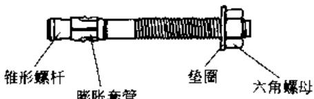

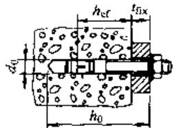

适用范围;锚栓具有可靠的膨胀功能并有两种锚深选择,螺纹部分加长设计,易于调整绘构误差。适用于 $\geqslant \mathbf { \mathscr { C } } . \mathbf { \mathscr { I } } \mathscr { S }$ 的开裂未开裂混凝土。可用于安装机电设备等。不宜在震动区使用。

表4-6-15

FBN型锚栓规格、材料及安装尺寸

<table><tr><td rowspan=2 colspan=1>型   号</td><td rowspan=2 colspan=1>钻头直径山/mm</td><td rowspan=2 colspan=1>穿透式安装需要的最小钻孔深度（含固定件厚度）ho/mm</td><td rowspan=2 colspan=1>锚固深度h/mm</td><td rowspan=2 colspan=1>安装扭矩Ti/Nm</td><td rowspan=2 colspan=1>固定件最大厚度/mm</td><td rowspan=2 colspan=1>固定件中钻孔直径/mm</td><td rowspan=1 colspan=5>基础要求</td></tr><tr><td rowspan=1 colspan=1>最小间距smm/mm</td><td rowspan=1 colspan=1>最小边/mm</td><td rowspan=1 colspan=1>最小基础厚度bun/mm</td><td rowspan=1 colspan=1>特征间Lr/mm</td><td rowspan=1 colspan=1>特征边Cr，N/mm</td></tr><tr><td rowspan=1 colspan=1>FBN8/10 + 23</td><td rowspan=1 colspan=1>8</td><td rowspan=1 colspan=1>73</td><td rowspan=1 colspan=1>48</td><td rowspan=4 colspan=1>15</td><td rowspan=1 colspan=1>10</td><td rowspan=1 colspan=1>s9</td><td rowspan=4 colspan=1>50</td><td rowspan=4 colspan=1>50</td><td rowspan=4 colspan=1>100</td><td rowspan=4 colspan=1>144</td><td rowspan=4 colspan=1>72</td></tr><tr><td rowspan=1 colspan=1>FBN8/30 + 43</td><td rowspan=1 colspan=1>8</td><td rowspan=1 colspan=1>93</td><td rowspan=1 colspan=1>48</td><td rowspan=1 colspan=1>30</td><td rowspan=1 colspan=1>$9</td></tr><tr><td rowspan=1 colspan=1>FBN8/50 + 63</td><td rowspan=1 colspan=1>8</td><td rowspan=1 colspan=1>113</td><td rowspan=1 colspan=1>48</td><td rowspan=1 colspan=1>50</td><td rowspan=1 colspan=1>9</td></tr><tr><td rowspan=1 colspan=1>FBN8/100 + 113</td><td rowspan=1 colspan=1>8</td><td rowspan=1 colspan=1>163</td><td rowspan=1 colspan=1>48</td><td rowspan=1 colspan=1>100</td><td rowspan=1 colspan=1>9</td></tr><tr><td rowspan=1 colspan=1>FBN10/5</td><td rowspan=1 colspan=1>10</td><td rowspan=1 colspan=1>65</td><td rowspan=1 colspan=1>42</td><td rowspan=2 colspan=1>30</td><td rowspan=1 colspan=1>5</td><td rowspan=1 colspan=1>12</td><td rowspan=1 colspan=1>45</td><td rowspan=1 colspan=1>55</td><td rowspan=1 colspan=1>100</td><td rowspan=1 colspan=1>126</td><td rowspan=1 colspan=1>63</td></tr><tr><td rowspan=1 colspan=1>FBN10/15 + 23</td><td rowspan=1 colspan=1>10</td><td rowspan=1 colspan=1>83</td><td rowspan=1 colspan=1>50/42</td><td rowspan=1 colspan=1>15/23</td><td rowspan=1 colspan=1>≤12</td><td rowspan=2 colspan=1>55/45</td><td rowspan=2 colspan=1>65/55</td><td rowspan=2 colspan=1>100</td><td rowspan=2 colspan=1>150/126</td><td rowspan=2 colspan=1>75/63</td></tr><tr><td rowspan=1 colspan=1>FBN10/35 + 43</td><td rowspan=1 colspan=1>10</td><td rowspan=1 colspan=1>109</td><td rowspan=1 colspan=1>50/42</td><td rowspan=1 colspan=1></td><td rowspan=1 colspan=1>35/43</td><td rowspan=1 colspan=1>12</td></tr></table>

续表

<table><tr><td rowspan=2 colspan=1>型   专</td><td rowspan=2 colspan=1>钻头直径du/mm</td><td rowspan=2 colspan=1>穿透式安装需要的最小钻孔深度（含固定件厚度）h/mm</td><td rowspan=2 colspan=1>锚固深度h/mm</td><td rowspan=2 colspan=1>安装扭矩T/N·m</td><td rowspan=2 colspan=1>固定件最大厚度u/mm</td><td rowspan=2 colspan=1>固定件中钻孔直径/mm</td><td rowspan=1 colspan=5>基础要求</td></tr><tr><td rowspan=1 colspan=1>最小间距m/mm</td><td rowspan=1 colspan=1>最小边距mm/mm</td><td rowspan=1 colspan=1>最小基础厚度hmu/mm</td><td rowspan=1 colspan=1>特征间距，N/mm</td><td rowspan=1 colspan=1>特征边mer/mm</td></tr><tr><td rowspan=1 colspan=1>FBN10/50 + 58</td><td rowspan=1 colspan=1>10</td><td rowspan=1 colspan=1>118</td><td rowspan=1 colspan=1>50/42</td><td rowspan=1 colspan=1></td><td rowspan=1 colspan=1>50/58</td><td rowspan=1 colspan=1>/12</td><td rowspan=4 colspan=1>55/45</td><td rowspan=4 colspan=1>65/55</td><td rowspan=4 colspan=1>100</td><td rowspan=4 colspan=1>150/126</td><td rowspan=4 colspan=1>75/63</td></tr><tr><td rowspan=1 colspan=1>FBN10/100+108</td><td rowspan=1 colspan=1>10</td><td rowspan=1 colspan=1>168</td><td rowspan=1 colspan=1>50/42</td><td rowspan=3 colspan=1>30</td><td rowspan=1 colspan=1>100/108</td><td rowspan=1 colspan=1>12</td></tr><tr><td rowspan=1 colspan=1>FBN10/140 + 148</td><td rowspan=1 colspan=1>10</td><td rowspan=1 colspan=1>208</td><td rowspan=1 colspan=1>50/42</td><td rowspan=1 colspan=1>140/148</td><td rowspan=1 colspan=1>≤12</td></tr><tr><td rowspan=1 colspan=1>FBN10/160 + 168</td><td rowspan=1 colspan=1>10</td><td rowspan=1 colspan=1>228</td><td rowspan=1 colspan=1>50/42</td><td rowspan=1 colspan=1>160/168</td><td rowspan=1 colspan=1>≤12</td></tr><tr><td rowspan=1 colspan=1>FBN12/5</td><td rowspan=1 colspan=1>12</td><td rowspan=1 colspan=1>75</td><td rowspan=1 colspan=1>50</td><td rowspan=1 colspan=1></td><td rowspan=1 colspan=1>5</td><td rowspan=1 colspan=1>/14</td><td rowspan=1 colspan=1>100</td><td rowspan=1 colspan=1>100</td><td rowspan=1 colspan=1>100</td><td rowspan=1 colspan=1>150</td><td rowspan=5 colspan=1>75105/75</td></tr><tr><td rowspan=1 colspan=1>FBN12/15 + 35</td><td rowspan=1 colspan=1>12</td><td rowspan=1 colspan=1>105</td><td rowspan=1 colspan=1>70/50</td><td rowspan=2 colspan=1>50</td><td rowspan=1 colspan=1>15/35</td><td rowspan=1 colspan=1>≤14</td><td rowspan=4 colspan=1>75/100</td><td rowspan=4 colspan=1>90/100</td><td rowspan=4 colspan=1>140/100</td><td rowspan=4 colspan=1>210/150</td></tr><tr><td rowspan=1 colspan=1>FBV12/30 + 50</td><td rowspan=1 colspan=1>12</td><td rowspan=1 colspan=1>120</td><td rowspan=1 colspan=1>70/50</td><td rowspan=1 colspan=1>30/50</td><td rowspan=1 colspan=1>14</td></tr><tr><td rowspan=1 colspan=1>FBN12/45 + 65</td><td rowspan=1 colspan=1>12</td><td rowspan=1 colspan=1>135</td><td rowspan=1 colspan=1>70/50</td><td rowspan=1 colspan=1></td><td rowspan=1 colspan=1>45/65</td><td rowspan=1 colspan=1>≤14</td></tr><tr><td rowspan=1 colspan=1>FBN12/100 + 120</td><td rowspan=1 colspan=1>12</td><td rowspan=1 colspan=1>190</td><td rowspan=1 colspan=1>70/50</td><td rowspan=1 colspan=1></td><td rowspan=1 colspan=1>100/120</td><td rowspan=1 colspan=1>≤14</td></tr><tr><td rowspan=1 colspan=1>FBN16/10</td><td rowspan=1 colspan=1>16</td><td rowspan=1 colspan=1>98</td><td rowspan=1 colspan=1>64</td><td rowspan=4 colspan=1>100</td><td rowspan=1 colspan=1>10</td><td rowspan=1 colspan=1>18</td><td rowspan=1 colspan=1>140</td><td rowspan=1 colspan=1>100</td><td rowspan=1 colspan=1>130</td><td rowspan=1 colspan=1>192</td><td rowspan=1 colspan=1>%</td></tr><tr><td rowspan=1 colspan=1>FBN16/25 + 45</td><td rowspan=1 colspan=1>16</td><td rowspan=1 colspan=1>133</td><td rowspan=1 colspan=1>84/64</td><td rowspan=1 colspan=1>25/45</td><td rowspan=1 colspan=1>≤18</td><td rowspan=3 colspan=1>90/140</td><td rowspan=3 colspan=1>105/100</td><td rowspan=3 colspan=1>170/130</td><td rowspan=3 colspan=1>252/192</td><td rowspan=3 colspan=1>126/96</td></tr><tr><td rowspan=1 colspan=1>FBN16/50 + 70</td><td rowspan=1 colspan=1>16</td><td rowspan=1 colspan=1>158</td><td rowspan=1 colspan=1>84/64</td><td rowspan=1 colspan=1>50/70</td><td rowspan=1 colspan=1>18</td></tr><tr><td rowspan=1 colspan=1>FBN16/100 + 120</td><td rowspan=1 colspan=1>16</td><td rowspan=1 colspan=1>208</td><td rowspan=1 colspan=1>84/64</td><td rowspan=1 colspan=1>100/120</td><td rowspan=1 colspan=1>≤18</td></tr><tr><td rowspan=1 colspan=1>FBN20/20</td><td rowspan=1 colspan=1>20</td><td rowspan=1 colspan=1>151</td><td rowspan=1 colspan=1>100</td><td rowspan=1 colspan=1></td><td rowspan=1 colspan=1>20</td><td rowspan=1 colspan=1>≤22</td><td rowspan=4 colspan=1>170</td><td rowspan=4 colspan=1>150</td><td rowspan=4 colspan=1>200</td><td rowspan=4 colspan=1>300</td><td rowspan=4 colspan=1>150</td></tr><tr><td rowspan=1 colspan=1>FBN20/60</td><td rowspan=1 colspan=1>20</td><td rowspan=1 colspan=1>191</td><td rowspan=1 colspan=1>100</td><td rowspan=3 colspan=1>200</td><td rowspan=1 colspan=1>60</td><td rowspan=1 colspan=1>22</td></tr><tr><td rowspan=1 colspan=1>FBN20/120</td><td rowspan=1 colspan=1>20</td><td rowspan=1 colspan=1>251</td><td rowspan=1 colspan=1>100</td><td rowspan=1 colspan=1>120</td><td rowspan=1 colspan=1>≤22</td></tr><tr><td rowspan=1 colspan=1>FBN20/250</td><td rowspan=1 colspan=1>20</td><td rowspan=1 colspan=1>381</td><td rowspan=1 colspan=1>100</td><td rowspan=1 colspan=1>250</td><td rowspan=1 colspan=1>≤22</td></tr></table>

注:材质全为电镀锌钢。

表46-16 FBN型锚栓的设计承载力及边距影响系数

<table><tr><td rowspan=1 colspan=4>锚栓型号受力状态</td><td rowspan=1 colspan=1>FBN8</td><td rowspan=1 colspan=2>FBN10</td><td rowspan=1 colspan=2>FBN12</td><td rowspan=1 colspan=2>FBN16</td><td rowspan=1 colspan=1>FBN20</td></tr><tr><td rowspan=1 colspan=4>锚固深度h/mm</td><td rowspan=1 colspan=1>48</td><td rowspan=1 colspan=1>42</td><td rowspan=1 colspan=1>50</td><td rowspan=1 colspan=1>50</td><td rowspan=1 colspan=1>70</td><td rowspan=1 colspan=1>64</td><td rowspan=1 colspan=1>84</td><td rowspan=1 colspan=1>100</td></tr><tr><td rowspan=2 colspan=1>钢材失效时承载力设计值/N</td><td rowspan=1 colspan=1>拉力</td><td rowspan=1 colspan=1>Nd</td><td rowspan=2 colspan=1>电镀锌钢</td><td rowspan=1 colspan=1>9.5</td><td rowspan=1 colspan=1>15.5</td><td rowspan=1 colspan=1>15.5</td><td rowspan=1 colspan=1>23.6</td><td rowspan=1 colspan=1>23.6</td><td rowspan=1 colspan=1>35</td><td rowspan=1 colspan=1>35</td><td rowspan=1 colspan=1>64.3</td></tr><tr><td rowspan=1 colspan=1>剪力</td><td rowspan=1 colspan=1>VRd</td><td rowspan=1 colspan=1>7.3</td><td rowspan=1 colspan=1>11.3</td><td rowspan=1 colspan=1>11.3</td><td rowspan=1 colspan=1>18</td><td rowspan=1 colspan=1>18</td><td rowspan=1 colspan=1>23.7</td><td rowspan=1 colspan=1>23.7</td><td rowspan=1 colspan=1>51.1</td></tr><tr><td rowspan=7 colspan=1>混凝土失效时承载力设计值</td><td rowspan=7 colspan=1>拉力</td><td rowspan=5 colspan=1>Nd/kN</td><td rowspan=1 colspan=1>C15</td><td rowspan=1 colspan=1>4.2</td><td rowspan=1 colspan=1>3.4</td><td rowspan=1 colspan=1>4.4</td><td rowspan=1 colspan=1>5.3</td><td rowspan=1 colspan=1>8.8</td><td rowspan=1 colspan=1>7.7</td><td rowspan=1 colspan=1>11.6</td><td rowspan=1 colspan=1>15.1</td></tr><tr><td rowspan=1 colspan=1>C25</td><td rowspan=1 colspan=1>5.4</td><td rowspan=1 colspan=1>4.4</td><td rowspan=1 colspan=1>5.7</td><td rowspan=1 colspan=1>6.9</td><td rowspan=1 colspan=1>11.4</td><td rowspan=1 colspan=1>9.9</td><td rowspan=1 colspan=1>15</td><td rowspan=1 colspan=1>19.4</td></tr><tr><td rowspan=1 colspan=1>C35</td><td rowspan=1 colspan=1>6.4</td><td rowspan=1 colspan=1>5.2</td><td rowspan=1 colspan=1>6.8</td><td rowspan=1 colspan=1>8.1</td><td rowspan=1 colspan=1>13.5</td><td rowspan=1 colspan=1>11.8</td><td rowspan=1 colspan=1>17.7</td><td rowspan=1 colspan=1>23</td></tr><tr><td rowspan=1 colspan=1>C45</td><td rowspan=1 colspan=1>7.2</td><td rowspan=1 colspan=1>5.9</td><td rowspan=1 colspan=1>7.7</td><td rowspan=1 colspan=1>9.2</td><td rowspan=1 colspan=1>15.3</td><td rowspan=1 colspan=1>13.3</td><td rowspan=1 colspan=1>20.1</td><td rowspan=1 colspan=1>26.1</td></tr><tr><td rowspan=1 colspan=1>C55</td><td rowspan=1 colspan=1>8</td><td rowspan=1 colspan=1>6.5</td><td rowspan=1 colspan=1>8.5</td><td rowspan=1 colspan=1>10.2</td><td rowspan=1 colspan=1>16.9</td><td rowspan=1 colspan=1>14.8</td><td rowspan=1 colspan=1>22.2</td><td rowspan=1 colspan=1>28.8</td></tr><tr><td rowspan=1 colspan=2>Y</td><td rowspan=1 colspan=1>2.16</td><td rowspan=1 colspan=1>2.16</td><td rowspan=1 colspan=1>2.16</td><td rowspan=1 colspan=1>1.8</td><td rowspan=1 colspan=1>1.8</td><td rowspan=1 colspan=1>1.8</td><td rowspan=1 colspan=1>1.8</td><td rowspan=1 colspan=1>1.8</td></tr><tr><td rowspan=1 colspan=2>u.N</td><td rowspan=1 colspan=1>1.4</td><td rowspan=1 colspan=1>1.4</td><td rowspan=1 colspan=1>1.4</td><td rowspan=1 colspan=1>1.4</td><td rowspan=1 colspan=1>1.4</td><td rowspan=1 colspan=1>1.4</td><td rowspan=1 colspan=1>1.4</td><td rowspan=1 colspan=1>1.4</td></tr></table>

<table><tr><td rowspan=1 colspan=25>续表</td></tr><tr><td rowspan=1 colspan=8>锚栓型号受力状态</td><td rowspan=1 colspan=2>FBN8</td><td rowspan=1 colspan=4>FBN10</td><td rowspan=1 colspan=5>FBN12</td><td rowspan=1 colspan=4>FRN16</td><td rowspan=1 colspan=2>FBN20</td></tr><tr><td rowspan=1 colspan=8>锚固深度h/mm</td><td rowspan=1 colspan=2>48</td><td rowspan=1 colspan=2>42</td><td rowspan=1 colspan=2>50</td><td rowspan=1 colspan=3>50</td><td rowspan=1 colspan=2>70</td><td rowspan=1 colspan=2>64</td><td rowspan=1 colspan=2>84</td><td rowspan=1 colspan=2>100</td></tr><tr><td rowspan=7 colspan=3>混凝土失效时承载  剪力力设计值</td><td rowspan=5 colspan=2>Vd./N</td><td rowspan=1 colspan=3>C15</td><td rowspan=1 colspan=2>3.9</td><td rowspan=1 colspan=2>4.1</td><td rowspan=1 colspan=2>4.2</td><td rowspan=1 colspan=3>4.4</td><td rowspan=1 colspan=2>4.8</td><td rowspan=1 colspan=2>5.1</td><td rowspan=1 colspan=2>5.4</td><td rowspan=1 colspan=2>6</td></tr><tr><td rowspan=1 colspan=3>C25</td><td rowspan=1 colspan=2>5.1</td><td rowspan=1 colspan=2>5.3</td><td rowspan=1 colspan=2>5.4</td><td rowspan=1 colspan=3>5.8</td><td rowspan=1 colspan=2>6.2</td><td rowspan=1 colspan=2>6.6</td><td rowspan=1 colspan=2>6.9</td><td rowspan=1 colspan=2>7.7</td></tr><tr><td rowspan=1 colspan=3>C35</td><td rowspan=1 colspan=2>6</td><td rowspan=1 colspan=2>6.2</td><td rowspan=1 colspan=2>6.4</td><td rowspan=1 colspan=3>6.8</td><td rowspan=1 colspan=2>7.3</td><td rowspan=1 colspan=2>7.8</td><td rowspan=1 colspan=2>8.2</td><td rowspan=1 colspan=2>9.1</td></tr><tr><td rowspan=1 colspan=3>C45</td><td rowspan=1 colspan=2>6.8</td><td rowspan=1 colspan=2>7.1</td><td rowspan=1 colspan=2>7.3</td><td rowspan=1 colspan=3>7.7</td><td rowspan=1 colspan=2>8.3</td><td rowspan=1 colspan=2>8.8</td><td rowspan=1 colspan=2>9.3</td><td rowspan=1 colspan=2>10.3</td></tr><tr><td rowspan=1 colspan=3>055</td><td rowspan=1 colspan=2>7.5</td><td rowspan=1 colspan=2>7.8</td><td rowspan=1 colspan=2>8.1</td><td rowspan=1 colspan=3>8.6</td><td rowspan=1 colspan=2>9.2</td><td rowspan=1 colspan=2>98</td><td rowspan=1 colspan=2>10.3</td><td rowspan=1 colspan=2>11.4</td></tr><tr><td rowspan=1 colspan=5>YMc</td><td rowspan=1 colspan=2>1.8</td><td rowspan=1 colspan=2>1.8</td><td rowspan=1 colspan=2>1.8</td><td rowspan=1 colspan=3>1.8</td><td rowspan=1 colspan=2>1.8</td><td rowspan=1 colspan=2>1.8</td><td rowspan=1 colspan=2>1.8</td><td rowspan=1 colspan=2>1.8</td></tr><tr><td rowspan=1 colspan=5>k</td><td rowspan=1 colspan=2>1</td><td rowspan=1 colspan=2>1</td><td rowspan=1 colspan=2>1</td><td rowspan=1 colspan=3>1</td><td rowspan=1 colspan=2>2</td><td rowspan=1 colspan=2>2</td><td rowspan=1 colspan=2>2</td><td rowspan=1 colspan=2>2</td></tr><tr><td rowspan=3 colspan=2>边c/mm</td><td rowspan=2 colspan=2>FBN8（h=48mm）</td><td rowspan=1 colspan=6>FBN10</td><td rowspan=1 colspan=6>FBN12</td><td rowspan=1 colspan=9>FBN16               FBN20</td></tr><tr><td rowspan=1 colspan=3>（ =42mm）</td><td rowspan=1 colspan=3>（h=50mm）</td><td rowspan=1 colspan=3>（het=50mm）</td><td rowspan=1 colspan=3>（h =70mm）</td><td rowspan=1 colspan=3>（et = 64mm）</td><td rowspan=1 colspan=6>（h =84mm）（h=100mm）</td></tr><tr><td rowspan=1 colspan=1>+</td><td rowspan=1 colspan=1>+</td><td rowspan=1 colspan=2>中</td><td rowspan=1 colspan=1>4</td><td rowspan=1 colspan=2>4</td><td rowspan=1 colspan=1>+</td><td rowspan=1 colspan=1>+</td><td rowspan=1 colspan=2></td><td rowspan=1 colspan=2>中</td><td rowspan=1 colspan=1></td><td rowspan=1 colspan=2>专</td><td rowspan=1 colspan=1>中</td><td rowspan=1 colspan=1>1</td><td rowspan=1 colspan=2>：</td><td rowspan=1 colspan=2>心</td><td rowspan=1 colspan=1>f</td></tr><tr><td rowspan=24 colspan=1>锚栓受拉时的边距影响系数（c.）</td><td rowspan=1 colspan=1>22.5</td><td rowspan=1 colspan=1></td><td rowspan=1 colspan=1></td><td rowspan=1 colspan=2>0.68</td><td rowspan=1 colspan=1>0.81</td><td rowspan=1 colspan=2></td><td rowspan=1 colspan=1></td><td rowspan=1 colspan=1></td><td rowspan=1 colspan=2></td><td rowspan=1 colspan=2></td><td rowspan=1 colspan=1></td><td rowspan=1 colspan=2></td><td rowspan=1 colspan=1></td><td rowspan=1 colspan=1></td><td rowspan=1 colspan=2></td><td rowspan=1 colspan=2></td><td rowspan=1 colspan=1></td></tr><tr><td rowspan=1 colspan=1>25</td><td rowspan=1 colspan=1>0.67</td><td rowspan=1 colspan=1>0.8</td><td rowspan=1 colspan=2>0.7</td><td rowspan=1 colspan=1>0.82</td><td rowspan=1 colspan=2></td><td rowspan=1 colspan=1></td><td rowspan=1 colspan=1></td><td rowspan=1 colspan=2></td><td rowspan=1 colspan=2></td><td rowspan=1 colspan=1></td><td rowspan=1 colspan=2></td><td rowspan=1 colspan=1></td><td rowspan=1 colspan=1></td><td rowspan=1 colspan=2></td><td rowspan=1 colspan=2></td><td rowspan=1 colspan=1></td></tr><tr><td rowspan=1 colspan=1>27.5</td><td rowspan=1 colspan=1>0.69</td><td rowspan=1 colspan=1>0.81</td><td rowspan=1 colspan=2>0.72</td><td rowspan=1 colspan=1>0.83</td><td rowspan=1 colspan=2>0.68</td><td rowspan=1 colspan=1>0.81</td><td rowspan=1 colspan=1></td><td rowspan=1 colspan=2></td><td rowspan=1 colspan=2></td><td rowspan=1 colspan=1></td><td rowspan=1 colspan=2></td><td rowspan=1 colspan=1></td><td rowspan=1 colspan=1></td><td rowspan=1 colspan=2></td><td rowspan=1 colspan=2></td><td rowspan=1 colspan=1></td></tr><tr><td rowspan=1 colspan=1>30</td><td rowspan=1 colspan=1>0.71</td><td rowspan=1 colspan=1>0.83</td><td rowspan=1 colspan=2>0.74</td><td rowspan=1 colspan=1>0.84</td><td rowspan=1 colspan=2>0.7</td><td rowspan=1 colspan=1>0.82</td><td rowspan=1 colspan=1></td><td rowspan=1 colspan=2></td><td rowspan=1 colspan=2></td><td rowspan=1 colspan=1></td><td rowspan=1 colspan=2></td><td rowspan=1 colspan=1></td><td rowspan=1 colspan=1></td><td rowspan=1 colspan=2></td><td rowspan=1 colspan=2></td><td rowspan=1 colspan=1></td></tr><tr><td rowspan=1 colspan=1>37.5</td><td rowspan=1 colspan=1>0.74</td><td rowspan=1 colspan=1>0.85</td><td rowspan=1 colspan=2>0.78</td><td rowspan=1 colspan=1>0.87</td><td rowspan=1 colspan=2>0.74</td><td rowspan=1 colspan=1>0.84</td><td rowspan=1 colspan=1></td><td rowspan=1 colspan=2></td><td rowspan=1 colspan=2>0.68</td><td rowspan=1 colspan=1>0.8</td><td rowspan=1 colspan=2></td><td rowspan=1 colspan=1></td><td rowspan=1 colspan=1></td><td rowspan=1 colspan=2></td><td rowspan=1 colspan=2></td><td rowspan=1 colspan=1></td></tr><tr><td rowspan=1 colspan=1>书</td><td rowspan=1 colspan=1>0.78</td><td rowspan=1 colspan=1>0.87</td><td rowspan=1 colspan=2>0.82</td><td rowspan=1 colspan=1>0.89</td><td rowspan=1 colspan=2>0.77</td><td rowspan=1 colspan=1>0.86</td><td rowspan=1 colspan=1></td><td rowspan=1 colspan=2></td><td rowspan=1 colspan=2>0.69</td><td rowspan=1 colspan=1>0.81</td><td rowspan=1 colspan=2></td><td rowspan=1 colspan=1></td><td rowspan=1 colspan=1></td><td rowspan=1 colspan=2></td><td rowspan=1 colspan=2></td><td rowspan=1 colspan=1></td></tr><tr><td rowspan=1 colspan=1>50</td><td rowspan=1 colspan=1>0.85</td><td rowspan=1 colspan=1>0.91</td><td rowspan=1 colspan=2>0.9</td><td rowspan=1 colspan=1>0.94</td><td rowspan=1 colspan=2>0.83</td><td rowspan=1 colspan=1>0.9</td><td rowspan=1 colspan=1>0.83</td><td rowspan=1 colspan=2>0.9</td><td rowspan=1 colspan=2>0.74</td><td rowspan=1 colspan=1>0.84</td><td rowspan=1 colspan=2></td><td rowspan=1 colspan=1></td><td rowspan=1 colspan=1>0.7</td><td rowspan=1 colspan=2>0.82</td><td rowspan=1 colspan=2></td><td rowspan=1 colspan=1></td></tr><tr><td rowspan=1 colspan=1>60</td><td rowspan=1 colspan=1>0.92</td><td rowspan=1 colspan=1>0.95</td><td rowspan=1 colspan=2>0.98</td><td rowspan=1 colspan=1>0.99</td><td rowspan=1 colspan=2>0.9</td><td rowspan=1 colspan=1>0.94</td><td rowspan=1 colspan=1>0.9</td><td rowspan=1 colspan=2>0.94</td><td rowspan=1 colspan=2>0.79</td><td rowspan=1 colspan=1>0.87</td><td rowspan=1 colspan=2></td><td rowspan=1 colspan=1></td><td rowspan=1 colspan=1>0.74</td><td rowspan=1 colspan=2>0.84</td><td rowspan=1 colspan=2></td><td rowspan=1 colspan=1></td></tr><tr><td rowspan=1 colspan=1>63</td><td rowspan=1 colspan=1>0.94</td><td rowspan=1 colspan=1>0.96</td><td rowspan=1 colspan=2>1.00</td><td rowspan=1 colspan=1>1.00</td><td rowspan=1 colspan=2>0.92</td><td rowspan=1 colspan=1>0.95:0.92</td><td rowspan=1 colspan=1>0.95:0.92</td><td rowspan=1 colspan=2>0.95</td><td rowspan=1 colspan=2>0.8</td><td rowspan=1 colspan=1>0.88</td><td rowspan=1 colspan=2></td><td rowspan=1 colspan=1></td><td rowspan=1 colspan=1>0.75</td><td rowspan=1 colspan=2>0.85</td><td rowspan=1 colspan=2></td><td rowspan=1 colspan=1></td></tr><tr><td rowspan=1 colspan=1>70</td><td rowspan=1 colspan=1>0.99</td><td rowspan=1 colspan=1>0.99</td><td rowspan=1 colspan=2>1.00</td><td rowspan=1 colspan=1>1.00</td><td rowspan=1 colspan=2>0.97</td><td rowspan=1 colspan=1>0.98</td><td rowspan=1 colspan=1>0.97</td><td rowspan=1 colspan=2>0.98</td><td rowspan=1 colspan=2>0.83</td><td rowspan=1 colspan=1>0.9</td><td rowspan=1 colspan=2>0.87</td><td rowspan=1 colspan=1>0.92</td><td rowspan=1 colspan=1>0.78</td><td rowspan=1 colspan=2>0.87</td><td rowspan=1 colspan=2></td><td rowspan=1 colspan=1></td></tr><tr><td rowspan=1 colspan=1>72</td><td rowspan=1 colspan=1>1.00</td><td rowspan=1 colspan=1>1.00</td><td rowspan=1 colspan=2>1.00</td><td rowspan=1 colspan=1>1.00</td><td rowspan=1 colspan=2>0.98</td><td rowspan=1 colspan=1>0.99</td><td rowspan=1 colspan=1>0.98</td><td rowspan=1 colspan=2>0.99</td><td rowspan=1 colspan=2>0.84</td><td rowspan=1 colspan=1>0.91</td><td rowspan=1 colspan=2>0.89</td><td rowspan=1 colspan=1>0.93</td><td rowspan=1 colspan=1>0.79</td><td rowspan=1 colspan=2>0.87</td><td rowspan=1 colspan=2></td><td rowspan=1 colspan=1></td></tr><tr><td rowspan=1 colspan=1>75</td><td rowspan=1 colspan=1>1.00</td><td rowspan=1 colspan=1>1.00</td><td rowspan=1 colspan=2>1.00</td><td rowspan=1 colspan=1>1.00</td><td rowspan=1 colspan=2>1.00</td><td rowspan=1 colspan=1>1.00</td><td rowspan=1 colspan=1>1.00</td><td rowspan=1 colspan=2>1.00</td><td rowspan=1 colspan=2>0.86</td><td rowspan=1 colspan=1>0.92</td><td rowspan=1 colspan=2>0.9</td><td rowspan=1 colspan=1>0.94</td><td rowspan=1 colspan=1>0.8</td><td rowspan=1 colspan=2>0.88</td><td rowspan=1 colspan=2></td><td rowspan=1 colspan=1></td></tr><tr><td rowspan=1 colspan=1>80</td><td rowspan=1 colspan=1>1.00</td><td rowspan=1 colspan=1>1.00</td><td rowspan=1 colspan=2>1.00</td><td rowspan=1 colspan=1>1.00</td><td rowspan=1 colspan=2>1.00</td><td rowspan=1 colspan=1>1.00</td><td rowspan=1 colspan=1>1.00</td><td rowspan=1 colspan=2>1.00</td><td rowspan=1 colspan=2>0.88</td><td rowspan=1 colspan=1>0.93</td><td rowspan=1 colspan=2>0.92</td><td rowspan=1 colspan=1>0.95</td><td rowspan=1 colspan=1>0.82</td><td rowspan=1 colspan=2>：0.89</td><td rowspan=1 colspan=2></td><td rowspan=1 colspan=1></td></tr><tr><td rowspan=1 colspan=1>85</td><td rowspan=1 colspan=1>1.00</td><td rowspan=1 colspan=1>1.00</td><td rowspan=1 colspan=2>1.00</td><td rowspan=1 colspan=1>1.00</td><td rowspan=1 colspan=2>1.00</td><td rowspan=1 colspan=1>1.00</td><td rowspan=1 colspan=1>1.00</td><td rowspan=1 colspan=2>1.00</td><td rowspan=1 colspan=2>0.91</td><td rowspan=1 colspan=1>0.94</td><td rowspan=1 colspan=2>0.95</td><td rowspan=1 colspan=1>0.97</td><td rowspan=1 colspan=1>0.84</td><td rowspan=1 colspan=2>0.9</td><td rowspan=1 colspan=2>0.78</td><td rowspan=1 colspan=1>0.87</td></tr><tr><td rowspan=1 colspan=1>90</td><td rowspan=1 colspan=1>1.00</td><td rowspan=1 colspan=1>1.00</td><td rowspan=1 colspan=2>1.00</td><td rowspan=1 colspan=1>1.00</td><td rowspan=1 colspan=2>1.00</td><td rowspan=1 colspan=1>1.00</td><td rowspan=1 colspan=1>1.00</td><td rowspan=1 colspan=2>1.00</td><td rowspan=1 colspan=2>0.93</td><td rowspan=1 colspan=1>0.96</td><td rowspan=1 colspan=2>0.97</td><td rowspan=1 colspan=1>0.98</td><td rowspan=1 colspan=1>0.86</td><td rowspan=1 colspan=2>0.91</td><td rowspan=1 colspan=2>0.8</td><td rowspan=1 colspan=1>0.88</td></tr><tr><td rowspan=1 colspan=1>%</td><td rowspan=1 colspan=1>1.00</td><td rowspan=1 colspan=1>1.00</td><td rowspan=1 colspan=2>1.00</td><td rowspan=1 colspan=1>1.00</td><td rowspan=1 colspan=2>1.00</td><td rowspan=1 colspan=1>1.00</td><td rowspan=1 colspan=1>1.00</td><td rowspan=1 colspan=2>1.00</td><td rowspan=1 colspan=2>0.96</td><td rowspan=1 colspan=1>0.98</td><td rowspan=1 colspan=2>1.00</td><td rowspan=1 colspan=1>1.00</td><td rowspan=1 colspan=1>0.88</td><td rowspan=1 colspan=2>0.93</td><td rowspan=1 colspan=2>0.82</td><td rowspan=1 colspan=1>0.89</td></tr><tr><td rowspan=1 colspan=1>100</td><td rowspan=1 colspan=1>1.00</td><td rowspan=1 colspan=1>1.00</td><td rowspan=1 colspan=2>1.00</td><td rowspan=1 colspan=1>1.00</td><td rowspan=1 colspan=2>1.00</td><td rowspan=1 colspan=1>1.00</td><td rowspan=1 colspan=1>1.00</td><td rowspan=1 colspan=2>1.00</td><td rowspan=1 colspan=2>0.98</td><td rowspan=1 colspan=1>0.99</td><td rowspan=1 colspan=2>1.00</td><td rowspan=1 colspan=1>1.00</td><td rowspan=1 colspan=1>0.9</td><td rowspan=1 colspan=2>0.94</td><td rowspan=1 colspan=2>0.83</td><td rowspan=1 colspan=1>0.9</td></tr><tr><td rowspan=1 colspan=1>105</td><td rowspan=1 colspan=1>1.00</td><td rowspan=1 colspan=1>1.00</td><td rowspan=1 colspan=2>1.00</td><td rowspan=1 colspan=1>1.00</td><td rowspan=1 colspan=2>1.00</td><td rowspan=1 colspan=1>1.00</td><td rowspan=1 colspan=1>1.00</td><td rowspan=1 colspan=2>1.00</td><td rowspan=1 colspan=2>1.00</td><td rowspan=1 colspan=1>1.00</td><td rowspan=1 colspan=2>1.00</td><td rowspan=1 colspan=1>1.00</td><td rowspan=1 colspan=1>0.92</td><td rowspan=1 colspan=2>0.95</td><td rowspan=1 colspan=2>0.85</td><td rowspan=1 colspan=1>0.91</td></tr><tr><td rowspan=1 colspan=1>110</td><td rowspan=1 colspan=1>1.00</td><td rowspan=1 colspan=1>1.00</td><td rowspan=1 colspan=2>1.00</td><td rowspan=1 colspan=1>1.00</td><td rowspan=1 colspan=2>1.00</td><td rowspan=1 colspan=1>1.00</td><td rowspan=1 colspan=1>1.00</td><td rowspan=1 colspan=2>1.00</td><td rowspan=1 colspan=2>1.00</td><td rowspan=1 colspan=1>1.00</td><td rowspan=1 colspan=2>1.00</td><td rowspan=1 colspan=1>1.00</td><td rowspan=1 colspan=1>0.94</td><td rowspan=1 colspan=2>0.96</td><td rowspan=1 colspan=2>0.87</td><td rowspan=1 colspan=1>0.92</td></tr><tr><td rowspan=1 colspan=1>120</td><td rowspan=1 colspan=1>1.00</td><td rowspan=1 colspan=1>1.00</td><td rowspan=1 colspan=2>1.00</td><td rowspan=1 colspan=1>1.00</td><td rowspan=1 colspan=2>1.00</td><td rowspan=1 colspan=1>1.00</td><td rowspan=1 colspan=1>1.00</td><td rowspan=1 colspan=2>1.00</td><td rowspan=1 colspan=2>1.00</td><td rowspan=1 colspan=1>1.00</td><td rowspan=1 colspan=2>1.00</td><td rowspan=1 colspan=1>1.00</td><td rowspan=1 colspan=1>0.98</td><td rowspan=1 colspan=2>0.99</td><td rowspan=1 colspan=2>0.9</td><td rowspan=1 colspan=1>0.94</td></tr><tr><td rowspan=1 colspan=1>126</td><td rowspan=1 colspan=1>1.00</td><td rowspan=1 colspan=1>1.00</td><td rowspan=1 colspan=2>1.00</td><td rowspan=1 colspan=1>1.00</td><td rowspan=1 colspan=2>1.00</td><td rowspan=1 colspan=1>1.00</td><td rowspan=1 colspan=1>1.00</td><td rowspan=1 colspan=2>1.00</td><td rowspan=1 colspan=2>1.00</td><td rowspan=1 colspan=1>1.00</td><td rowspan=1 colspan=2>1.00</td><td rowspan=1 colspan=1>1.00</td><td rowspan=1 colspan=1>1.00</td><td rowspan=1 colspan=2>1.00</td><td rowspan=1 colspan=2>0.92</td><td rowspan=1 colspan=1>0.95</td></tr><tr><td rowspan=1 colspan=1>130</td><td rowspan=1 colspan=1>1.00</td><td rowspan=1 colspan=1>1.00</td><td rowspan=1 colspan=2>1.00</td><td rowspan=1 colspan=1>1.00</td><td rowspan=1 colspan=2>1.00</td><td rowspan=1 colspan=1>1.00</td><td rowspan=1 colspan=1>1.00</td><td rowspan=1 colspan=2>1.00</td><td rowspan=1 colspan=2>1.00</td><td rowspan=1 colspan=1>1.00</td><td rowspan=1 colspan=2>1.00</td><td rowspan=1 colspan=1>1.00</td><td rowspan=1 colspan=1>1.00</td><td rowspan=1 colspan=2>1.00</td><td rowspan=1 colspan=2>0.93</td><td rowspan=1 colspan=1>0.96</td></tr><tr><td rowspan=1 colspan=1>140</td><td rowspan=1 colspan=1>1.00</td><td rowspan=1 colspan=1>1.00</td><td rowspan=1 colspan=2>1.00</td><td rowspan=1 colspan=1>1.00</td><td rowspan=1 colspan=2>1.00</td><td rowspan=1 colspan=1>1.00</td><td rowspan=1 colspan=1>1.00</td><td rowspan=1 colspan=2>1.00</td><td rowspan=1 colspan=2>1.00</td><td rowspan=1 colspan=1>1.00</td><td rowspan=1 colspan=2>1.00</td><td rowspan=1 colspan=1>1.00</td><td rowspan=1 colspan=1>1.00</td><td rowspan=1 colspan=2>1.00</td><td rowspan=1 colspan=2>0.97</td><td rowspan=1 colspan=1>0.98</td></tr><tr><td rowspan=1 colspan=1>150</td><td rowspan=1 colspan=1>1.00</td><td rowspan=1 colspan=1>1.00</td><td rowspan=1 colspan=2>1.00</td><td rowspan=1 colspan=1>1.00</td><td rowspan=1 colspan=2>1.00</td><td rowspan=1 colspan=1>1.00</td><td rowspan=1 colspan=1>1.00</td><td rowspan=1 colspan=2>1.00</td><td rowspan=1 colspan=2>1.00</td><td rowspan=1 colspan=1>1.00</td><td rowspan=1 colspan=2>1.00</td><td rowspan=1 colspan=1>1.00</td><td rowspan=1 colspan=1>1.00</td><td rowspan=1 colspan=2>1.00</td><td rowspan=1 colspan=2>1.00</td><td rowspan=1 colspan=1>1.00</td></tr></table>

注:同表4-6-8。

# SLM-N型扭矩控制型重载锚栓

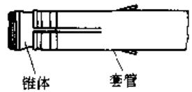

hhe fix7 。 + □ 身76 4 0

适用范围:力控强制膨胀锚栓,它由·个锚栓套管和一个带内螺纹的锥体组成,可自行配用M6\~M24的螺钉。适用于 $\geqslant 0 . 1 5$ 的未开裂混凝土以及致密的天然石材。可用于安装各种机器设备等,

表4-6-17

SLM-N型锚栓规格、材料及安装尺寸

<table><tr><td rowspan=2 colspan=1>型   号</td><td rowspan=2 colspan=3>材质</td><td rowspan=2 colspan=1>钻头直径d/mm</td><td rowspan=2 colspan=1>最小钻孔深度h/mm</td><td rowspan=2 colspan=1>锚固深度hr/m</td><td rowspan=2 colspan=1>连接螺纹</td><td rowspan=2 colspan=1>最大安装扭矩Ta/Nm</td><td rowspan=2 colspan=1>固定件中钻孔直径/mm</td><td rowspan=1 colspan=5>基础要求</td></tr><tr><td rowspan=1 colspan=1>最小间距S mu/mm</td><td rowspan=1 colspan=1>最小边距em/mm</td><td rowspan=1 colspan=1>最小基材厚度h/mm</td><td rowspan=1 colspan=1>特征间距8，N/mm</td><td rowspan=1 colspan=1>特征边地rer.N/mm</td></tr><tr><td rowspan=1 colspan=1>SLM 6N</td><td rowspan=1 colspan=3></td><td rowspan=1 colspan=1>10</td><td rowspan=1 colspan=1>50</td><td rowspan=1 colspan=1>35</td><td rowspan=1 colspan=1>M6</td><td rowspan=1 colspan=1>10</td><td rowspan=1 colspan=1>7</td><td rowspan=1 colspan=1>50</td><td rowspan=1 colspan=1>70</td><td rowspan=1 colspan=1>100</td><td rowspan=1 colspan=1>105</td><td rowspan=1 colspan=1>52</td></tr><tr><td rowspan=2 colspan=1>SLM 8N</td><td rowspan=2 colspan=2></td><td rowspan=1 colspan=1></td><td rowspan=2 colspan=1></td><td rowspan=2 colspan=1>12</td><td rowspan=2 colspan=1>60</td><td rowspan=2 colspan=1>45</td><td rowspan=2 colspan=1>M8</td><td rowspan=2 colspan=1>25</td><td rowspan=2 colspan=1>≤9</td><td rowspan=2 colspan=1>50</td><td rowspan=2 colspan=1>90</td><td rowspan=2 colspan=1>100</td><td rowspan=2 colspan=1>135</td></tr><tr><td rowspan=1 colspan=2></td></tr><tr><td rowspan=2 colspan=1>SLM 10N</td><td rowspan=2 colspan=2></td><td rowspan=1 colspan=1></td><td rowspan=2 colspan=1></td><td rowspan=2 colspan=1>16</td><td rowspan=2 colspan=1>70</td><td rowspan=2 colspan=1>50</td><td rowspan=2 colspan=1>M10</td><td rowspan=2 colspan=1>50</td><td rowspan=2 colspan=1>12</td><td rowspan=2 colspan=1>50</td><td rowspan=2 colspan=1>100</td><td rowspan=2 colspan=1>100</td><td rowspan=2 colspan=1>150</td></tr><tr><td rowspan=1 colspan=2></td></tr><tr><td rowspan=2 colspan=1>SLM 12N</td><td rowspan=2 colspan=2></td><td rowspan=1 colspan=1></td><td rowspan=2 colspan=1></td><td rowspan=2 colspan=1>18</td><td rowspan=2 colspan=1>85</td><td rowspan=2 colspan=1>60</td><td rowspan=2 colspan=1>M12</td><td rowspan=2 colspan=1>80</td><td rowspan=2 colspan=1>14</td><td rowspan=2 colspan=1>60</td><td rowspan=2 colspan=1>120</td><td rowspan=2 colspan=1>120</td><td rowspan=2 colspan=1>180</td></tr><tr><td rowspan=1 colspan=2>锌</td></tr><tr><td rowspan=2 colspan=1>SLM 16</td><td rowspan=2 colspan=2></td><td rowspan=1 colspan=1>制</td><td rowspan=2 colspan=1></td><td rowspan=2 colspan=1>24</td><td rowspan=2 colspan=1>110</td><td rowspan=2 colspan=1>62</td><td rowspan=2 colspan=1>M16</td><td rowspan=2 colspan=1>100</td><td rowspan=2 colspan=1>≤18</td><td rowspan=2 colspan=1>60</td><td rowspan=2 colspan=1>120</td><td rowspan=2 colspan=1>130</td><td rowspan=2 colspan=1>180</td></tr><tr><td rowspan=1 colspan=2></td></tr><tr><td rowspan=2 colspan=1>SLM 20</td><td rowspan=2 colspan=2></td><td rowspan=1 colspan=1></td><td rowspan=1 colspan=1></td><td rowspan=2 colspan=1>30</td><td rowspan=2 colspan=1>130</td><td rowspan=2 colspan=1>77</td><td rowspan=2 colspan=1>M20</td><td rowspan=2 colspan=1>150</td><td rowspan=2 colspan=1>22</td><td rowspan=2 colspan=1>80</td><td rowspan=2 colspan=1>160</td><td rowspan=2 colspan=1>150</td><td rowspan=2 colspan=1>230</td></tr><tr><td rowspan=1 colspan=2></td><td></td></tr><tr><td rowspan=1 colspan=1>SLM 24</td><td rowspan=1 colspan=3></td><td rowspan=1 colspan=1>35</td><td rowspan=1 colspan=1>150</td><td rowspan=1 colspan=1>90</td><td rowspan=1 colspan=1>M24</td><td rowspan=1 colspan=1>200</td><td rowspan=1 colspan=1>26</td><td rowspan=1 colspan=1>9</td><td rowspan=1 colspan=1>180</td><td rowspan=1 colspan=1>200</td><td rowspan=1 colspan=1>270</td><td rowspan=1 colspan=1>135</td></tr><tr><td rowspan=1 colspan=1>SLM 8N A4</td><td rowspan=1 colspan=3></td><td rowspan=1 colspan=1>12</td><td rowspan=1 colspan=1>60</td><td rowspan=1 colspan=1>45</td><td rowspan=1 colspan=1>M8</td><td rowspan=1 colspan=1>24</td><td rowspan=1 colspan=1>≤9</td><td rowspan=1 colspan=1>50</td><td rowspan=1 colspan=1>90</td><td rowspan=1 colspan=1>100</td><td rowspan=1 colspan=1>135</td><td rowspan=1 colspan=1>68</td></tr><tr><td rowspan=1 colspan=1>SLM ION A4</td><td rowspan=1 colspan=3></td><td rowspan=1 colspan=1>16</td><td rowspan=1 colspan=1>70</td><td rowspan=1 colspan=1>50</td><td rowspan=1 colspan=1>M10</td><td rowspan=1 colspan=1>45</td><td rowspan=1 colspan=1>≤12</td><td rowspan=1 colspan=1>50</td><td rowspan=1 colspan=1>100</td><td rowspan=1 colspan=1>100</td><td rowspan=1 colspan=1>150</td><td rowspan=1 colspan=1>75</td></tr></table>

SLM-N型锚栓的设计承载力及边距影响系数

<table><tr><td rowspan=1 colspan=4>锚栓型号受力状态</td><td rowspan=1 colspan=1>SLM 6V</td><td rowspan=1 colspan=1>SLM 8N</td><td rowspan=1 colspan=1>SLM 10N</td><td rowspan=1 colspan=1>SLM 12N</td><td rowspan=1 colspan=1>SLM 16N</td><td rowspan=1 colspan=1>SLM 20N</td><td rowspan=1 colspan=1>SLM 24N</td></tr><tr><td rowspan=4 colspan=1>钢材失效时承载力设计值/kX</td><td rowspan=2 colspan=1>拉力</td><td rowspan=2 colspan=1>Nd:</td><td rowspan=1 colspan=1>电镀锌钢</td><td rowspan=1 colspan=1>10.8</td><td rowspan=1 colspan=1>19.5</td><td rowspan=1 colspan=1>30.9</td><td rowspan=1 colspan=1>45</td><td rowspan=1 colspan=1>83.8</td><td rowspan=1 colspan=1>130.7</td><td rowspan=1 colspan=1>188.3</td></tr><tr><td rowspan=1 colspan=1>不锈钢</td><td rowspan=1 colspan=1>1</td><td rowspan=1 colspan=1>13.8</td><td rowspan=1 colspan=1>21.8</td><td rowspan=1 colspan=1>1</td><td rowspan=1 colspan=1>1</td><td rowspan=1 colspan=1>1</td><td rowspan=1 colspan=1>1</td></tr><tr><td rowspan=2 colspan=1>剪力</td><td rowspan=2 colspan=1>VRd.</td><td rowspan=1 colspan=1>电镀锌钢</td><td rowspan=1 colspan=1>6.4</td><td rowspan=1 colspan=1>11.8</td><td rowspan=1 colspan=1>18.6</td><td rowspan=1 colspan=1>27</td><td rowspan=1 colspan=1>50.3</td><td rowspan=1 colspan=1>78.4</td><td rowspan=1 colspan=1>113</td></tr><tr><td rowspan=1 colspan=1>不锈钢</td><td rowspan=1 colspan=1>1</td><td rowspan=1 colspan=1>8.3</td><td rowspan=1 colspan=1>13.1</td><td rowspan=1 colspan=1>二</td><td rowspan=1 colspan=1>二</td><td rowspan=1 colspan=1>二</td><td rowspan=1 colspan=1>二</td></tr><tr><td rowspan=7 colspan=1>混凝土失效时承载力特征设计值</td><td rowspan=7 colspan=1>拉力</td><td rowspan=5 colspan=1>Y/kN</td><td rowspan=1 colspan=1>C15</td><td rowspan=1 colspan=1>2.6</td><td rowspan=1 colspan=1>3.8</td><td rowspan=1 colspan=1>4.5</td><td rowspan=1 colspan=1>5.9</td><td rowspan=1 colspan=1>6.1</td><td rowspan=1 colspan=1>8.5</td><td rowspan=1 colspan=1>10.7</td></tr><tr><td rowspan=1 colspan=1>C25</td><td rowspan=1 colspan=1>3.4</td><td rowspan=1 colspan=1>4.9</td><td rowspan=1 colspan=1>5.8</td><td rowspan=1 colspan=1>7.6</td><td rowspan=1 colspan=1>8</td><td rowspan=1 colspan=1>11</td><td rowspan=1 colspan=1>13.9</td></tr><tr><td rowspan=1 colspan=1>C35</td><td rowspan=1 colspan=1>4</td><td rowspan=1 colspan=1>5.8</td><td rowspan=1 colspan=1>6.8</td><td rowspan=1 colspan=1>8.9</td><td rowspan=1 colspan=1>9.4</td><td rowspan=1 colspan=1>13</td><td rowspan=1 colspan=1>16.4</td></tr><tr><td rowspan=1 colspan=1>C45</td><td rowspan=1 colspan=1>4.5</td><td rowspan=1 colspan=1>6.6</td><td rowspan=1 colspan=1>7.7</td><td rowspan=1 colspan=1>10.1</td><td rowspan=1 colspan=1>10.7</td><td rowspan=1 colspan=1>14.7</td><td rowspan=1 colspan=1>18.7</td></tr><tr><td rowspan=1 colspan=1>C55</td><td rowspan=1 colspan=1>5</td><td rowspan=1 colspan=1>7.3</td><td rowspan=1 colspan=1>8.6</td><td rowspan=1 colspan=1>11.2</td><td rowspan=1 colspan=1>11.8</td><td rowspan=1 colspan=1>16.3</td><td rowspan=1 colspan=1>20.6</td></tr><tr><td rowspan=1 colspan=2>Y</td><td rowspan=1 colspan=7>2.15</td></tr><tr><td rowspan=1 colspan=2>uer，N</td><td rowspan=1 colspan=7>1.4</td></tr></table>

<table><tr><td rowspan=1 colspan=22>续表</td></tr><tr><td rowspan=1 colspan=7>锚栓型号受力状态</td><td rowspan=1 colspan=2>SLM 6N</td><td rowspan=1 colspan=2>SLM 8N</td><td rowspan=1 colspan=2>SLM ION</td><td rowspan=1 colspan=2>SLM I2N</td><td rowspan=1 colspan=2>SLM 16N</td><td></td><td rowspan=1 colspan=2>SLM 20N</td><td rowspan=1 colspan=2>SLM 24N</td></tr><tr><td rowspan=7 colspan=2>混凝土失效时承载力特征设计值</td><td rowspan=7 colspan=2>剪力</td><td rowspan=5 colspan=1>V/N</td><td rowspan=1 colspan=2>C15</td><td rowspan=1 colspan=2>3.9</td><td rowspan=1 colspan=2>4.4</td><td rowspan=1 colspan=2>4.9</td><td rowspan=1 colspan=2>5.2</td><td rowspan=1 colspan=2>5.7</td><td></td><td rowspan=1 colspan=2>6.4</td><td rowspan=1 colspan=2>6.9</td></tr><tr><td rowspan=1 colspan=2>C25</td><td rowspan=1 colspan=2>5.1</td><td rowspan=1 colspan=2>5.7</td><td rowspan=1 colspan=2>6.3</td><td rowspan=1 colspan=2>6.7</td><td rowspan=1 colspan=2>7.4</td><td></td><td rowspan=1 colspan=2>8.3</td><td rowspan=1 colspan=2>8.9</td></tr><tr><td rowspan=1 colspan=2>c35</td><td rowspan=1 colspan=2>6</td><td rowspan=1 colspan=2>6.7</td><td rowspan=1 colspan=2>7.3</td><td rowspan=1 colspan=2>8</td><td rowspan=1 colspan=2>8.8</td><td></td><td rowspan=1 colspan=2>9.8</td><td rowspan=1 colspan=2>10.6</td></tr><tr><td rowspan=1 colspan=2>C45</td><td rowspan=1 colspan=2>6.8</td><td rowspan=1 colspan=2>7.6</td><td rowspan=1 colspan=2>8.4</td><td rowspan=1 colspan=2>；  91</td><td rowspan=1 colspan=2>9.9</td><td></td><td rowspan=1 colspan=2>1.1</td><td rowspan=1 colspan=2>12</td></tr><tr><td rowspan=1 colspan=2>C55</td><td rowspan=1 colspan=2>7.6</td><td rowspan=1 colspan=2>8.4</td><td rowspan=1 colspan=2>9.3</td><td rowspan=1 colspan=2>10</td><td rowspan=1 colspan=2>1</td><td></td><td rowspan=1 colspan=2>12.3</td><td rowspan=1 colspan=2>13.2</td></tr><tr><td rowspan=1 colspan=1></td><td rowspan=1 colspan=2>YM</td><td rowspan=1 colspan=15>1.8</td></tr><tr><td rowspan=1 colspan=1></td><td rowspan=1 colspan=2>A</td><td rowspan=1 colspan=2>1</td><td rowspan=1 colspan=2>1</td><td rowspan=1 colspan=2>1</td><td rowspan=1 colspan=2>2</td><td rowspan=1 colspan=2>2</td><td></td><td rowspan=1 colspan=4>2         2.</td></tr><tr><td rowspan=2 colspan=3>边距：/mm</td><td rowspan=1 colspan=2>SLM 6N</td><td rowspan=1 colspan=2>SI.M 8N</td><td rowspan=1 colspan=3>SLM 10N</td><td rowspan=1 colspan=2>SLM 12N</td><td rowspan=1 colspan=7>SLM 16N       SLM 20N</td><td rowspan=1 colspan=3>SI M 24N</td></tr><tr><td rowspan=1 colspan=1>?</td><td rowspan=1 colspan=1>f</td><td rowspan=1 colspan=1>4</td><td rowspan=1 colspan=1>4</td><td rowspan=1 colspan=1>+</td><td rowspan=1 colspan=2>4</td><td rowspan=1 colspan=1>+</td><td rowspan=1 colspan=1>4</td><td rowspan=1 colspan=2>业</td><td rowspan=1 colspan=2>母</td><td rowspan=1 colspan=1>山</td><td rowspan=1 colspan=2>母</td><td rowspan=1 colspan=2>?</td><td rowspan=1 colspan=1>4</td></tr><tr><td rowspan=17 colspan=1>锚栓受拉时的边距影响系数</td><td rowspan=1 colspan=2>25</td><td rowspan=1 colspan=1>0.74</td><td rowspan=1 colspan=1>0.84</td><td rowspan=1 colspan=1>0.69</td><td rowspan=1 colspan=1>0.81</td><td rowspan=1 colspan=1>0.68</td><td rowspan=1 colspan=2>0.8</td><td rowspan=1 colspan=1></td><td rowspan=1 colspan=1></td><td rowspan=1 colspan=2></td><td rowspan=1 colspan=2></td><td rowspan=1 colspan=1></td><td rowspan=1 colspan=2></td><td rowspan=1 colspan=2></td><td rowspan=1 colspan=1></td></tr><tr><td rowspan=1 colspan=2>30</td><td rowspan=1 colspan=1>0.79</td><td rowspan=1 colspan=1>0.87</td><td rowspan=1 colspan=1>0.72</td><td rowspan=1 colspan=1>0.83</td><td rowspan=1 colspan=1>0.7</td><td rowspan=1 colspan=2>0.82</td><td rowspan=1 colspan=1>0.67</td><td rowspan=1 colspan=1>0.8</td><td rowspan=1 colspan=2>0.67</td><td rowspan=1 colspan=2>0.8</td><td rowspan=1 colspan=1></td><td rowspan=1 colspan=2></td><td rowspan=1 colspan=2></td><td rowspan=1 colspan=1></td></tr><tr><td rowspan=1 colspan=2>40</td><td rowspan=1 colspan=1>0.88</td><td rowspan=1 colspan=1>0.93</td><td rowspan=1 colspan=1>0.8</td><td rowspan=1 colspan=1>0.88</td><td rowspan=1 colspan=1>0.7</td><td rowspan=1 colspan=2>0.86</td><td rowspan=1 colspan=1>0.72</td><td rowspan=1 colspan=1>0.83</td><td rowspan=1 colspan=2>0.72</td><td rowspan=1 colspan=2>0.83</td><td rowspan=1 colspan=1>0.67</td><td rowspan=1 colspan=2>0.8</td><td rowspan=1 colspan=2>0.65</td><td rowspan=1 colspan=1>0.79</td></tr><tr><td rowspan=1 colspan=2>50</td><td rowspan=1 colspan=1>0.98</td><td rowspan=1 colspan=1>0.99</td><td rowspan=1 colspan=1>0.87</td><td rowspan=1 colspan=1>0.92</td><td rowspan=1 colspan=1>0.83</td><td rowspan=1 colspan=2>0.9</td><td rowspan=1 colspan=1>0.78</td><td rowspan=1 colspan=1>0.87</td><td rowspan=1 colspan=2>0.78</td><td rowspan=1 colspan=2>0.87</td><td rowspan=1 colspan=1>0.72</td><td rowspan=1 colspan=2>0.83</td><td rowspan=1 colspan=2>0.69</td><td rowspan=1 colspan=1>0.81</td></tr><tr><td rowspan=1 colspan=2>52.5</td><td rowspan=1 colspan=1>1.00</td><td rowspan=1 colspan=1>1.00</td><td rowspan=1 colspan=1>0.89</td><td rowspan=1 colspan=1>0.93</td><td rowspan=1 colspan=1>0.85</td><td rowspan=1 colspan=2>0.91</td><td rowspan=1 colspan=1>0.79</td><td rowspan=1 colspan=1>0.88</td><td rowspan=1 colspan=2>0.79</td><td rowspan=1 colspan=2>0.88</td><td rowspan=1 colspan=1>0.73</td><td rowspan=1 colspan=2>0.84</td><td rowspan=1 colspan=2>0.7</td><td rowspan=1 colspan=1>0.815</td></tr><tr><td rowspan=1 colspan=2>60</td><td rowspan=1 colspan=1>1.00</td><td rowspan=1 colspan=1>1.00</td><td rowspan=1 colspan=1>0.94</td><td rowspan=1 colspan=1>0.96</td><td rowspan=1 colspan=1>0.9</td><td rowspan=1 colspan=2>0.94</td><td rowspan=1 colspan=1>0.83</td><td rowspan=1 colspan=1>0.9</td><td rowspan=1 colspan=2>0.83</td><td rowspan=1 colspan=2>0.9</td><td rowspan=1 colspan=1>0.76</td><td rowspan=1 colspan=2>0.86</td><td rowspan=1 colspan=2>0.72</td><td rowspan=1 colspan=1>0.83</td></tr><tr><td rowspan=1 colspan=2>67.5</td><td rowspan=1 colspan=1>1.00</td><td rowspan=1 colspan=1>1.00</td><td rowspan=1 colspan=1>1.00</td><td rowspan=1 colspan=1>1.00</td><td rowspan=1 colspan=1>0.95</td><td rowspan=1 colspan=2>0.97</td><td rowspan=1 colspan=1>0.88</td><td rowspan=1 colspan=1>0.92</td><td rowspan=1 colspan=2>0.88</td><td rowspan=1 colspan=2>0.92</td><td rowspan=1 colspan=1>0.79</td><td rowspan=1 colspan=2>0.875</td><td rowspan=1 colspan=2>0.75</td><td rowspan=1 colspan=1>0.845</td></tr><tr><td rowspan=1 colspan=2>70</td><td rowspan=1 colspan=1>1.00</td><td rowspan=1 colspan=1>1.00</td><td rowspan=1 colspan=1>1.00</td><td rowspan=1 colspan=1>1.00</td><td rowspan=1 colspan=1>0.97</td><td rowspan=1 colspan=2>0.98</td><td rowspan=1 colspan=1>0.89</td><td rowspan=1 colspan=1>0.93</td><td rowspan=1 colspan=2>0.89</td><td rowspan=1 colspan=2>0.93</td><td rowspan=1 colspan=1>0.8</td><td rowspan=1 colspan=2>0.88</td><td rowspan=1 colspan=2>0.76</td><td rowspan=1 colspan=1>0.85</td></tr><tr><td rowspan=1 colspan=2>75</td><td rowspan=1 colspan=1>1.00</td><td rowspan=1 colspan=1>1.00</td><td rowspan=1 colspan=1>1.00</td><td rowspan=1 colspan=1>1.00</td><td rowspan=1 colspan=1>1.00</td><td rowspan=1 colspan=2>1.00</td><td rowspan=1 colspan=1>0.92</td><td rowspan=1 colspan=1>0.95</td><td rowspan=1 colspan=2>0.92</td><td rowspan=1 colspan=2>0.95</td><td rowspan=1 colspan=1>0.83</td><td rowspan=1 colspan=2>0.9</td><td rowspan=1 colspan=2>0.78</td><td rowspan=1 colspan=1>0.87</td></tr><tr><td rowspan=1 colspan=2>80</td><td rowspan=1 colspan=1>1.00</td><td rowspan=1 colspan=1>1.00</td><td rowspan=1 colspan=1>1.00</td><td rowspan=1 colspan=1>1.00</td><td rowspan=1 colspan=1>1.0</td><td rowspan=1 colspan=2>1.00</td><td rowspan=1 colspan=1>0.94</td><td rowspan=1 colspan=1>0.96</td><td rowspan=1 colspan=2>0.94</td><td rowspan=1 colspan=2>0.96</td><td rowspan=1 colspan=1>0.85</td><td rowspan=1 colspan=2>0.91</td><td rowspan=1 colspan=2>0.8</td><td rowspan=1 colspan=1>0.88</td></tr><tr><td rowspan=1 colspan=2>90</td><td rowspan=1 colspan=1>1.00</td><td rowspan=1 colspan=1>1.00</td><td rowspan=1 colspan=1>1.00</td><td rowspan=1 colspan=1>1.00</td><td rowspan=1 colspan=1>1.00</td><td rowspan=1 colspan=2>1.00</td><td rowspan=1 colspan=1>1.00</td><td rowspan=1 colspan=1>1.00</td><td rowspan=1 colspan=2>1.00</td><td rowspan=1 colspan=2>1.00</td><td rowspan=1 colspan=1>0.89</td><td rowspan=1 colspan=2>0.93</td><td rowspan=1 colspan=2>0.83</td><td rowspan=1 colspan=1>0.9</td></tr><tr><td rowspan=1 colspan=2>100</td><td rowspan=1 colspan=1>1.00</td><td rowspan=1 colspan=1>1.00</td><td rowspan=1 colspan=1>1.00</td><td rowspan=1 colspan=1>1.00</td><td rowspan=1 colspan=1>1.00</td><td rowspan=1 colspan=2>1.00</td><td rowspan=1 colspan=1>1.00</td><td rowspan=1 colspan=1>1.00</td><td rowspan=1 colspan=2>1.00</td><td rowspan=1 colspan=2>1.00</td><td rowspan=1 colspan=1>0.93</td><td rowspan=1 colspan=2>0.96</td><td rowspan=1 colspan=2>0.87</td><td rowspan=1 colspan=1>0.92</td></tr><tr><td rowspan=1 colspan=2>110</td><td rowspan=1 colspan=1>1.00</td><td rowspan=1 colspan=1>1.00</td><td rowspan=1 colspan=1>1.00</td><td rowspan=1 colspan=1>1.00</td><td rowspan=1 colspan=1>1.00</td><td rowspan=1 colspan=2>1.00</td><td rowspan=1 colspan=1>1.00</td><td rowspan=1 colspan=1>1.00</td><td rowspan=1 colspan=2>1.00</td><td rowspan=1 colspan=2>1.00</td><td rowspan=1 colspan=1>0.98</td><td rowspan=1 colspan=2>0.99</td><td rowspan=1 colspan=2>0.91</td><td rowspan=1 colspan=1>0.94</td></tr><tr><td rowspan=1 colspan=2>15</td><td rowspan=1 colspan=1>1.00</td><td rowspan=1 colspan=1>1.00</td><td rowspan=1 colspan=1>1.00</td><td rowspan=1 colspan=1>1.00</td><td rowspan=1 colspan=1>1.00</td><td rowspan=1 colspan=2>1.00</td><td rowspan=1 colspan=1>1.00</td><td rowspan=1 colspan=1>1.00</td><td rowspan=1 colspan=2>1.00</td><td rowspan=1 colspan=2>1.00</td><td rowspan=1 colspan=1>1.00</td><td rowspan=1 colspan=2>1.00</td><td rowspan=1 colspan=2>0.93</td><td rowspan=1 colspan=1>0.95</td></tr><tr><td rowspan=1 colspan=2>120</td><td rowspan=1 colspan=1>1.00</td><td rowspan=1 colspan=1>1.00</td><td rowspan=1 colspan=1>1.00</td><td rowspan=1 colspan=1>1.00</td><td rowspan=1 colspan=1>1.00</td><td rowspan=1 colspan=2>1.00</td><td rowspan=1 colspan=1>1.00</td><td rowspan=1 colspan=1>1.00</td><td rowspan=1 colspan=2>1.00</td><td rowspan=1 colspan=2>1.00</td><td rowspan=1 colspan=1>1.00</td><td rowspan=1 colspan=2>1.00</td><td rowspan=1 colspan=2>0.94</td><td rowspan=1 colspan=1>0.96</td></tr><tr><td rowspan=1 colspan=2>130</td><td rowspan=1 colspan=1>1.00</td><td rowspan=1 colspan=1>1.00</td><td rowspan=1 colspan=1>1.00</td><td rowspan=1 colspan=1>1.00</td><td rowspan=1 colspan=1>1.00</td><td rowspan=1 colspan=2>1.00</td><td rowspan=1 colspan=1>1.00</td><td rowspan=1 colspan=1>1.00</td><td rowspan=1 colspan=2>1.00</td><td rowspan=1 colspan=2>1.00</td><td rowspan=1 colspan=1>1.00</td><td rowspan=1 colspan=2>1.00</td><td rowspan=1 colspan=2>0.98</td><td rowspan=1 colspan=1>0.99</td></tr><tr><td rowspan=1 colspan=2>135</td><td rowspan=1 colspan=1>1.00</td><td rowspan=1 colspan=1>1.00</td><td rowspan=1 colspan=1>1.00</td><td rowspan=1 colspan=1>1.00</td><td rowspan=1 colspan=1>1.00</td><td rowspan=1 colspan=2>1.00</td><td rowspan=1 colspan=1>1.00</td><td rowspan=1 colspan=1>1.00</td><td rowspan=1 colspan=2>1.00</td><td rowspan=1 colspan=2>1.00</td><td rowspan=1 colspan=1>1.00</td><td rowspan=1 colspan=2>1.00</td><td rowspan=1 colspan=2>1.00</td><td rowspan=1 colspan=1>1.0</td></tr></table>

注:同表4-6-8注。

# R型高强化学黏结型普通螺杆锚栓

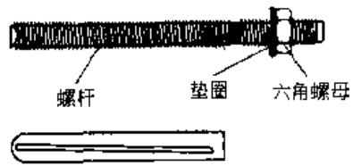

适用范围:锚栓可实现对基材的无膨胀力安装,对间距和边距要求小。适用于≥C1S的未开裂混凝土,可用十安装机器设备等。

表4-6-19

R型锚栓规格、材料及安装尺寸

<table><tr><td rowspan=2 colspan=1>型号</td><td rowspan=2 colspan=3>材质</td><td rowspan=2 colspan=2>配用化学胶管型号</td><td rowspan=2 colspan=1>钻头直径山/mm</td><td rowspan=2 colspan=1>锚固深度（最小钻孔深度）装扭矩（b）/mm</td><td rowspan=2 colspan=1>最大安Tne/m</td><td rowspan=2 colspan=1>固定件最大厚度/mm</td><td rowspan=2 colspan=2>固定件中钻孔直径/mm</td><td rowspan=1 colspan=1></td><td rowspan=1 colspan=4>基础要求</td></tr><tr><td rowspan=1 colspan=2>最小最小间距 边距Smup   cmm/mm  /mm</td><td rowspan=1 colspan=1>最小基权厚度h/mm</td><td rowspan=1 colspan=1>特征间距SN/m</td><td rowspan=1 colspan=1>特征边/mm</td></tr><tr><td rowspan=1 colspan=1>RGM8 ×110</td><td rowspan=1 colspan=3></td><td rowspan=1 colspan=2>RM8</td><td rowspan=1 colspan=1>10</td><td rowspan=1 colspan=1>80</td><td rowspan=1 colspan=1>10</td><td rowspan=1 colspan=1>20</td><td rowspan=1 colspan=2>m9</td><td rowspan=1 colspan=1>80</td><td rowspan=1 colspan=1>40</td><td rowspan=1 colspan=1>130</td><td rowspan=1 colspan=1>160</td><td rowspan=1 colspan=1>80</td></tr><tr><td rowspan=2 colspan=1>RGM10 ×130</td><td rowspan=2 colspan=2></td><td rowspan=1 colspan=2></td><td rowspan=2 colspan=1></td><td rowspan=2 colspan=1>RM10</td><td rowspan=2 colspan=1>12</td><td rowspan=2 colspan=2>90</td><td rowspan=2 colspan=1>20</td><td rowspan=2 colspan=1>30</td><td rowspan=2 colspan=1>≤12</td><td rowspan=2 colspan=1>90</td><td rowspan=2 colspan=1>50</td><td rowspan=2 colspan=1>140</td><td rowspan=2 colspan=1>180</td></tr><tr><td rowspan=1 colspan=3></td><td></td></tr><tr><td rowspan=3 colspan=1>RGM12 × 160</td><td></td><td rowspan=2 colspan=2></td><td rowspan=3 colspan=2>RM12</td><td rowspan=3 colspan=1>14</td><td rowspan=3 colspan=1>110</td><td rowspan=3 colspan=1>40</td><td rowspan=3 colspan=1>35</td><td rowspan=3 colspan=2>14</td><td rowspan=3 colspan=1>110</td><td rowspan=3 colspan=1>60</td><td rowspan=3 colspan=1>160</td><td rowspan=3 colspan=1>220</td><td rowspan=3 colspan=1>110</td></tr><tr><td rowspan=2 colspan=2></td></tr><tr><td rowspan=1 colspan=2>电</td></tr><tr><td rowspan=2 colspan=1>RGM16× 190</td><td rowspan=2 colspan=2></td><td rowspan=1 colspan=2>镀</td><td rowspan=2 colspan=1></td><td rowspan=2 colspan=1>RM16</td><td rowspan=2 colspan=1>18</td><td rowspan=2 colspan=2>125</td><td rowspan=2 colspan=1>80</td><td rowspan=2 colspan=1>45</td><td rowspan=2 colspan=1>18</td><td rowspan=2 colspan=1>125</td><td rowspan=2 colspan=1>65</td><td rowspan=2 colspan=1>175</td><td rowspan=2 colspan=1>250</td></tr><tr><td rowspan=1 colspan=2>锌</td><td></td></tr><tr><td rowspan=3 colspan=1>RCM20× 260</td><td></td><td rowspan=2 colspan=2>钢</td><td rowspan=3 colspan=2>RM20</td><td rowspan=3 colspan=1>25</td><td rowspan=3 colspan=1>170</td><td rowspan=3 colspan=1>150</td><td rowspan=3 colspan=1>65</td><td rowspan=3 colspan=2>22</td><td rowspan=3 colspan=1>170</td><td rowspan=3 colspan=1>85</td><td rowspan=3 colspan=1>220</td><td rowspan=3 colspan=1>340</td><td rowspan=3 colspan=1>170</td></tr><tr><td></td><td rowspan=2 colspan=1></td></tr><tr><td></td><td rowspan=1 colspan=2></td></tr><tr><td rowspan=3 colspan=1>RGM24×300</td><td></td><td rowspan=2 colspan=2></td><td rowspan=3 colspan=1></td><td rowspan=3 colspan=2>RM24</td><td rowspan=3 colspan=1>28</td><td rowspan=3 colspan=1>210</td><td rowspan=3 colspan=1>200</td><td rowspan=3 colspan=1>65</td><td rowspan=3 colspan=2>26</td><td rowspan=3 colspan=1>210</td><td rowspan=3 colspan=1>105</td><td rowspan=3 colspan=1>260</td><td rowspan=3 colspan=1>420</td><td rowspan=3 colspan=1>210</td></tr><tr><td></td><td rowspan=2 colspan=1></td></tr><tr><td></td><td rowspan=1 colspan=2></td></tr><tr><td rowspan=1 colspan=1>RGM30×380</td><td></td><td rowspan=1 colspan=2></td><td rowspan=1 colspan=2>RM30</td><td rowspan=1 colspan=1>35</td><td rowspan=1 colspan=1>280</td><td rowspan=1 colspan=1>400</td><td rowspan=1 colspan=1>65</td><td rowspan=1 colspan=2>33</td><td rowspan=1 colspan=1>280·</td><td rowspan=1 colspan=1>140</td><td rowspan=1 colspan=1>330</td><td rowspan=1 colspan=1>560</td><td rowspan=1 colspan=1>280</td></tr><tr><td rowspan=1 colspan=1>RGM8 × 110 A4</td><td></td><td rowspan=1 colspan=2></td><td rowspan=1 colspan=2>RM8</td><td rowspan=1 colspan=1>10</td><td rowspan=1 colspan=1>80</td><td rowspan=1 colspan=1>10</td><td rowspan=1 colspan=1>20</td><td rowspan=1 colspan=2>≤9</td><td rowspan=1 colspan=1>80</td><td rowspan=1 colspan=1>40</td><td rowspan=1 colspan=1>130</td><td rowspan=1 colspan=1>160</td><td rowspan=1 colspan=1>80</td></tr><tr><td rowspan=2 colspan=1>RGM10× 130 A4</td><td></td><td rowspan=1 colspan=2></td><td></td><td rowspan=2 colspan=1>RM10</td><td rowspan=2 colspan=1>12</td><td rowspan=2 colspan=1>90</td><td rowspan=2 colspan=1>20</td><td rowspan=2 colspan=1>30</td><td rowspan=2 colspan=2>12</td><td rowspan=2 colspan=2>90    50</td><td rowspan=2 colspan=1>140</td><td rowspan=2 colspan=1>180</td><td rowspan=2 colspan=1>90</td></tr><tr><td></td><td rowspan=1 colspan=2></td><td></td></tr><tr><td rowspan=2 colspan=1>RCM12×160 A4</td><td></td><td rowspan=1 colspan=2></td><td rowspan=2 colspan=2>RM12</td><td rowspan=2 colspan=1>14</td><td rowspan=2 colspan=1>110</td><td rowspan=2 colspan=1>40</td><td rowspan=2 colspan=1>35</td><td rowspan=2 colspan=2>14</td><td rowspan=2 colspan=1>110</td><td rowspan=2 colspan=1>60</td><td rowspan=2 colspan=1>1</td><td rowspan=2 colspan=1>220</td><td rowspan=2 colspan=1>10</td></tr><tr><td></td><td rowspan=1 colspan=2>不</td></tr><tr><td rowspan=3 colspan=1>RGM16 × 190 A4</td><td></td><td rowspan=2 colspan=2></td><td rowspan=3 colspan=2>RM16</td><td rowspan=3 colspan=1>18</td><td rowspan=3 colspan=1>125</td><td rowspan=3 colspan=1>80</td><td rowspan=3 colspan=1>45</td><td rowspan=3 colspan=2>18</td><td rowspan=3 colspan=1>125</td><td rowspan=3 colspan=1>65</td><td rowspan=3 colspan=1>175</td><td rowspan=3 colspan=1>250</td><td rowspan=3 colspan=1>125</td></tr><tr><td></td><td rowspan=2 colspan=1></td><td rowspan=2 colspan=1></td></tr><tr><td></td><td rowspan=1 colspan=2></td></tr><tr><td rowspan=2 colspan=1>RGM20×260 A4</td><td></td><td rowspan=1 colspan=2></td><td rowspan=2 colspan=1></td><td rowspan=2 colspan=1>RM20</td><td rowspan=2 colspan=1>25</td><td rowspan=2 colspan=1>170</td><td rowspan=2 colspan=1>150</td><td rowspan=2 colspan=1>65</td><td rowspan=2 colspan=2>≤22</td><td rowspan=2 colspan=1>170</td><td rowspan=2 colspan=1>85</td><td rowspan=2 colspan=1>220</td><td rowspan=2 colspan=1>340</td><td rowspan=2 colspan=1>170</td></tr><tr><td></td><td rowspan=1 colspan=2></td></tr><tr><td rowspan=1 colspan=1>RCM24 × 300 A4</td><td></td><td rowspan=1 colspan=2></td><td rowspan=1 colspan=2>RM24</td><td rowspan=1 colspan=1>28</td><td rowspan=1 colspan=1>210</td><td rowspan=1 colspan=1>200</td><td rowspan=1 colspan=1>65</td><td rowspan=1 colspan=2>26</td><td rowspan=1 colspan=1>210</td><td rowspan=1 colspan=1>105</td><td rowspan=1 colspan=1>260</td><td rowspan=1 colspan=1>420</td><td rowspan=1 colspan=1>210</td></tr></table>

表4-6-20

R型锚栓的设计承载力及边距影响系数

<table><tr><td rowspan=1 colspan=4>锚栓型号受力状态</td><td rowspan=1 colspan=1>R8</td><td rowspan=1 colspan=1>R10</td><td rowspan=1 colspan=1>R12</td><td rowspan=1 colspan=1>R16</td><td rowspan=1 colspan=1>R20</td><td rowspan=1 colspan=1>R24</td><td rowspan=1 colspan=1>R30</td></tr><tr><td rowspan=4 colspan=1>钢材失效时承载力设计值/N</td><td rowspan=2 colspan=1>拉力</td><td rowspan=2 colspan=1>NRd.:</td><td rowspan=1 colspan=1>电镀锌钢</td><td rowspan=1 colspan=1>12.8</td><td rowspan=1 colspan=1>20.3</td><td rowspan=1 colspan=1>29.5</td><td rowspan=1 colspan=1>54.9</td><td rowspan=1 colspan=1>85.8</td><td rowspan=1 colspan=1>123.6</td><td rowspan=1 colspan=1>196.3</td></tr><tr><td rowspan=1 colspan=1>不锈钢</td><td rowspan=1 colspan=1>13.8</td><td rowspan=1 colspan=1>13.4</td><td rowspan=1 colspan=1>31.6</td><td rowspan=1 colspan=1>58.9</td><td rowspan=1 colspan=1>91.9</td><td rowspan=1 colspan=1>73.6</td><td rowspan=1 colspan=1>二</td></tr><tr><td rowspan=2 colspan=1>剪力</td><td rowspan=2 colspan=1>VRd</td><td rowspan=1 colspan=1>电镀锌钢</td><td rowspan=1 colspan=1>7.7</td><td rowspan=1 colspan=1>12.2</td><td rowspan=1 colspan=1>17.7</td><td rowspan=1 colspan=1>33.0</td><td rowspan=1 colspan=1>51.4</td><td rowspan=1 colspan=1>74.2</td><td rowspan=1 colspan=1>117.8</td></tr><tr><td rowspan=1 colspan=1>不锈钢</td><td rowspan=1 colspan=1>8.3</td><td rowspan=1 colspan=1>13.1</td><td rowspan=1 colspan=1>19.0</td><td rowspan=1 colspan=1>35.3</td><td rowspan=1 colspan=1>55.2</td><td rowspan=1 colspan=1>44.2</td><td rowspan=1 colspan=1>二</td></tr><tr><td rowspan=6 colspan=1>混凝土失效时承载力特征设计值</td><td rowspan=6 colspan=1>拉力</td><td rowspan=4 colspan=1>Nd/N</td><td rowspan=1 colspan=1>C15</td><td rowspan=1 colspan=1>3.6</td><td rowspan=1 colspan=1>5.3</td><td rowspan=1 colspan=1>7.9</td><td rowspan=1 colspan=1>10.8</td><td rowspan=1 colspan=1>20</td><td rowspan=1 colspan=1>28.4</td><td rowspan=1 colspan=1>37.7</td></tr><tr><td rowspan=1 colspan=1>C25</td><td rowspan=1 colspan=1>5.1</td><td rowspan=1 colspan=1>7.6</td><td rowspan=1 colspan=1>11.3</td><td rowspan=1 colspan=1>15.4</td><td rowspan=1 colspan=1>28.6</td><td rowspan=1 colspan=1>40.5</td><td rowspan=1 colspan=1>53.8</td></tr><tr><td rowspan=1 colspan=1>C35</td><td rowspan=1 colspan=1>5.5</td><td rowspan=1 colspan=1>8.1</td><td rowspan=1 colspan=1>12.1</td><td rowspan=1 colspan=1>17.6</td><td rowspan=1 colspan=1>33.6</td><td rowspan=1 colspan=1>46</td><td rowspan=1 colspan=1>60.6</td></tr><tr><td rowspan=1 colspan=1>≥ C45</td><td rowspan=1 colspan=1>5.8</td><td rowspan=1 colspan=1>8.5</td><td rowspan=1 colspan=1>12.8</td><td rowspan=1 colspan=1>19.5</td><td rowspan=1 colspan=1>37.9</td><td rowspan=1 colspan=1>50.7</td><td rowspan=1 colspan=1>66.5</td></tr><tr><td rowspan=1 colspan=2>Y</td><td rowspan=1 colspan=1></td><td rowspan=1 colspan=5>2.15</td><td rowspan=1 colspan=1></td></tr><tr><td rowspan=1 colspan=2>ucr.N</td><td rowspan=1 colspan=7>1.4</td></tr></table>

<table><tr><td rowspan=2 colspan=22>续表锚栓型号      R8       R10      R12      R16      R20      R24      R30受力状态</td></tr><tr><td rowspan=1 colspan=2>R8</td><td rowspan=1 colspan=2>R10</td><td rowspan=1 colspan=2>R12</td><td rowspan=1 colspan=2>R16</td><td rowspan=1 colspan=2>R20</td><td rowspan=1 colspan=2>R24</td><td rowspan=1 colspan=2>R30</td></tr><tr><td rowspan=7 colspan=3>混凝土失效时承载力特征设计值</td><td rowspan=7 colspan=1>剪力、</td><td rowspan=5 colspan=1>a.</td><td rowspan=1 colspan=2>C1s</td><td rowspan=1 colspan=2>4.7</td><td rowspan=1 colspan=2>5</td><td rowspan=1 colspan=2>5.4</td><td rowspan=1 colspan=2>6.1</td><td rowspan=1 colspan=2>7.1</td><td></td><td rowspan=1 colspan=2>7.7</td><td rowspan=1 colspan=2>8.7</td></tr><tr><td rowspan=1 colspan=2>C25</td><td rowspan=1 colspan=2>6</td><td rowspan=1 colspan=2>6.5</td><td rowspan=1 colspan=2>7.1：</td><td rowspan=1 colspan=2>7.8</td><td rowspan=1 colspan=2>9.2</td><td></td><td rowspan=1 colspan=2>9.9</td><td rowspan=1 colspan=2>11.2</td></tr><tr><td rowspan=1 colspan=2>C35</td><td rowspan=1 colspan=2>7.1</td><td rowspan=1 colspan=2>7.7</td><td rowspan=1 colspan=2>8.3</td><td rowspan=1 colspan=2>9.2</td><td rowspan=1 colspan=2>10.8</td><td></td><td rowspan=1 colspan=2>11.7</td><td rowspan=1 colspan=2>13.3</td></tr><tr><td rowspan=1 colspan=2>C45</td><td rowspan=1 colspan=2>8.1</td><td rowspan=1 colspan=2>87</td><td rowspan=1 colspan=2>9.5</td><td rowspan=1 colspan=2>105</td><td rowspan=1 colspan=2>12.3</td><td></td><td rowspan=1 colspan=2>13.3</td><td rowspan=1 colspan=2>151</td></tr><tr><td rowspan=1 colspan=2>≥C55</td><td rowspan=1 colspan=2>8.9</td><td rowspan=1 colspan=2>9.6</td><td rowspan=1 colspan=2>10.5</td><td rowspan=1 colspan=2>11.6</td><td rowspan=1 colspan=2>13.6</td><td></td><td rowspan=1 colspan=2>14.7</td><td rowspan=1 colspan=2>16.6</td></tr><tr><td rowspan=1 colspan=3>Ye</td><td rowspan=1 colspan=15>1.8</td></tr><tr><td rowspan=1 colspan=3>h</td><td rowspan=1 colspan=15>2.0</td></tr><tr><td rowspan=2 colspan=3>边距/mm</td><td rowspan=1 colspan=2>R8</td><td rowspan=1 colspan=2>R10</td><td rowspan=1 colspan=3>R12</td><td rowspan=1 colspan=2>R16</td><td rowspan=1 colspan=4>R20</td><td rowspan=1 colspan=3>R24</td><td rowspan=1 colspan=3>R30</td></tr><tr><td rowspan=1 colspan=1>中</td><td rowspan=1 colspan=1>f</td><td rowspan=1 colspan=1>中</td><td rowspan=1 colspan=1>f</td><td rowspan=1 colspan=1>+</td><td rowspan=1 colspan=2>中</td><td rowspan=1 colspan=1>中</td><td rowspan=1 colspan=1>心</td><td rowspan=1 colspan=2>Y</td><td rowspan=1 colspan=2>中</td><td rowspan=1 colspan=1>$</td><td rowspan=1 colspan=2>+</td><td rowspan=1 colspan=2>山</td><td rowspan=1 colspan=1>中</td></tr><tr><td rowspan=28 colspan=1>11锚栓受拉时的边职影响系数</td><td rowspan=1 colspan=2>40</td><td rowspan=1 colspan=1>0.75</td><td rowspan=1 colspan=1>0.85</td><td rowspan=1 colspan=1></td><td rowspan=1 colspan=1>：</td><td rowspan=1 colspan=1></td><td rowspan=1 colspan=2></td><td rowspan=1 colspan=1></td><td rowspan=1 colspan=1></td><td rowspan=1 colspan=2></td><td rowspan=1 colspan=2></td><td rowspan=1 colspan=1></td><td rowspan=1 colspan=2></td><td rowspan=1 colspan=2></td><td rowspan=1 colspan=1></td></tr><tr><td rowspan=1 colspan=2>50</td><td rowspan=1 colspan=1>0.81</td><td rowspan=1 colspan=1>0.89</td><td rowspan=1 colspan=1>0.78</td><td rowspan=1 colspan=1>0.87</td><td rowspan=1 colspan=1></td><td rowspan=1 colspan=2></td><td rowspan=1 colspan=1></td><td rowspan=1 colspan=1></td><td rowspan=1 colspan=2></td><td rowspan=1 colspan=2></td><td rowspan=1 colspan=1></td><td rowspan=1 colspan=2></td><td rowspan=1 colspan=2></td><td rowspan=1 colspan=1></td></tr><tr><td rowspan=1 colspan=2>60</td><td rowspan=1 colspan=1>0.88</td><td rowspan=1 colspan=1>0.93</td><td rowspan=1 colspan=1>0.83</td><td rowspan=1 colspan=1>0.90</td><td rowspan=1 colspan=1>0.77</td><td rowspan=1 colspan=2>0.86</td><td rowspan=1 colspan=1></td><td rowspan=1 colspan=1></td><td rowspan=1 colspan=2></td><td rowspan=1 colspan=2></td><td rowspan=1 colspan=1></td><td rowspan=1 colspan=2></td><td rowspan=1 colspan=2></td><td rowspan=1 colspan=1></td></tr><tr><td rowspan=1 colspan=2>65</td><td rowspan=1 colspan=1>0.91</td><td rowspan=1 colspan=1>0.95</td><td rowspan=1 colspan=1>0.86</td><td rowspan=1 colspan=1>0.92</td><td rowspan=1 colspan=1>0.80</td><td rowspan=1 colspan=2>0.88</td><td rowspan=1 colspan=1>0.76</td><td rowspan=1 colspan=1>0.86</td><td rowspan=1 colspan=2></td><td rowspan=1 colspan=2></td><td rowspan=1 colspan=1></td><td rowspan=1 colspan=2></td><td rowspan=1 colspan=2></td><td rowspan=1 colspan=1></td></tr><tr><td rowspan=1 colspan=2>70</td><td rowspan=1 colspan=1>0.94</td><td rowspan=1 colspan=1>0.96</td><td rowspan=1 colspan=1>0.89</td><td rowspan=1 colspan=1>0.93</td><td rowspan=1 colspan=1>0.82</td><td rowspan=1 colspan=2>0.89</td><td rowspan=1 colspan=1>0.78</td><td rowspan=1 colspan=1>0.87</td><td rowspan=1 colspan=2></td><td rowspan=1 colspan=2></td><td rowspan=1 colspan=1></td><td rowspan=1 colspan=2></td><td rowspan=1 colspan=2></td><td rowspan=1 colspan=1></td></tr><tr><td rowspan=1 colspan=2>80</td><td rowspan=1 colspan=1>1.00</td><td rowspan=1 colspan=1>1.00</td><td rowspan=1 colspan=1>0.94</td><td rowspan=1 colspan=1>0.97</td><td rowspan=1 colspan=1>0.86</td><td rowspan=1 colspan=2>0.92</td><td rowspan=1 colspan=1>0.82</td><td rowspan=1 colspan=1>0.89</td><td rowspan=1 colspan=2></td><td rowspan=1 colspan=2></td><td rowspan=1 colspan=1></td><td rowspan=1 colspan=2></td><td rowspan=1 colspan=2></td><td rowspan=1 colspan=1></td></tr><tr><td rowspan=1 colspan=1>85</td><td></td><td rowspan=1 colspan=1>1.00</td><td rowspan=1 colspan=1>1.00</td><td rowspan=1 colspan=1>0.97</td><td rowspan=1 colspan=1>0.99</td><td rowspan=1 colspan=1>0.89</td><td rowspan=1 colspan=2>0.94</td><td rowspan=1 colspan=1>0.84</td><td rowspan=1 colspan=1>0.91</td><td rowspan=1 colspan=2>：0.75</td><td rowspan=1 colspan=2>0.85</td><td rowspan=1 colspan=1></td><td rowspan=1 colspan=2></td><td rowspan=1 colspan=2></td><td rowspan=1 colspan=1></td></tr><tr><td rowspan=1 colspan=1>90</td><td></td><td rowspan=1 colspan=1>1.00</td><td rowspan=1 colspan=1>1.00</td><td rowspan=1 colspan=1>1.00</td><td rowspan=1 colspan=1>1.00</td><td rowspan=1 colspan=1>0.91</td><td rowspan=1 colspan=2>0.95</td><td rowspan=1 colspan=1>0.86</td><td rowspan=1 colspan=1>0.92</td><td rowspan=1 colspan=2>0.76</td><td rowspan=1 colspan=2>0.86</td><td rowspan=1 colspan=1></td><td rowspan=1 colspan=2></td><td rowspan=1 colspan=2></td><td rowspan=1 colspan=1></td></tr><tr><td rowspan=1 colspan=1>100</td><td></td><td rowspan=1 colspan=1>1.00</td><td rowspan=1 colspan=1>1.00</td><td rowspan=1 colspan=1>1.00</td><td rowspan=1 colspan=1>1.00</td><td rowspan=1 colspan=1>0.%</td><td rowspan=1 colspan=2>0.97</td><td rowspan=1 colspan=1>0.90</td><td rowspan=1 colspan=1>0.94</td><td rowspan=1 colspan=2>0.79</td><td rowspan=1 colspan=2>0.88</td><td rowspan=1 colspan=1></td><td rowspan=1 colspan=2></td><td rowspan=1 colspan=2></td><td rowspan=1 colspan=1></td></tr><tr><td rowspan=1 colspan=1>105</td><td></td><td rowspan=1 colspan=1>1.00</td><td rowspan=1 colspan=1>1.00</td><td rowspan=1 colspan=1>1.00</td><td rowspan=1 colspan=1>1.00</td><td rowspan=1 colspan=1>0.98</td><td rowspan=1 colspan=2>0.99</td><td rowspan=1 colspan=1>0.92</td><td rowspan=1 colspan=1>0.95</td><td rowspan=1 colspan=2>0.81</td><td rowspan=1 colspan=2>0.89</td><td rowspan=1 colspan=1>0.75</td><td rowspan=1 colspan=2>0.85</td><td rowspan=1 colspan=2></td><td rowspan=1 colspan=1></td></tr><tr><td rowspan=1 colspan=1>110</td><td></td><td rowspan=1 colspan=1>1.00</td><td rowspan=1 colspan=1>1.00</td><td rowspan=1 colspan=1>1.00</td><td rowspan=1 colspan=1>1.00</td><td rowspan=1 colspan=1>1.00</td><td rowspan=1 colspan=2>1.00</td><td rowspan=1 colspan=1>0.94</td><td rowspan=1 colspan=1>0.96</td><td rowspan=1 colspan=2>0.82</td><td rowspan=1 colspan=2>0.89</td><td rowspan=1 colspan=1>0.76</td><td rowspan=1 colspan=2>0.86</td><td rowspan=1 colspan=2></td><td rowspan=1 colspan=1></td></tr><tr><td rowspan=1 colspan=1>120</td><td></td><td rowspan=1 colspan=1>1.00</td><td rowspan=1 colspan=1>1.00</td><td rowspan=1 colspan=1>1.00</td><td rowspan=1 colspan=1>1.00</td><td rowspan=1 colspan=1>1.00</td><td rowspan=1 colspan=2>1.00</td><td rowspan=1 colspan=1>0.98</td><td rowspan=1 colspan=1>0.99</td><td rowspan=1 colspan=2>0.85</td><td rowspan=1 colspan=2>0.91</td><td rowspan=1 colspan=1>0.79</td><td rowspan=1 colspan=2>0.87</td><td rowspan=1 colspan=2></td><td rowspan=1 colspan=1></td></tr><tr><td rowspan=1 colspan=1>130</td><td></td><td rowspan=1 colspan=1>1.00</td><td rowspan=1 colspan=1>1.00</td><td rowspan=1 colspan=1>1.00</td><td rowspan=1 colspan=1>1.00</td><td rowspan=1 colspan=1>1.00</td><td rowspan=1 colspan=2>1.00</td><td rowspan=1 colspan=1>1.00</td><td rowspan=1 colspan=1>1.00</td><td rowspan=1 colspan=2>0.88</td><td rowspan=1 colspan=2>0.93</td><td rowspan=1 colspan=1>0.81</td><td rowspan=1 colspan=2>0.89</td><td rowspan=1 colspan=2></td><td rowspan=1 colspan=1></td></tr><tr><td rowspan=1 colspan=1>140</td><td></td><td rowspan=1 colspan=1>1.00</td><td rowspan=1 colspan=1>1.00</td><td rowspan=1 colspan=1>1.00</td><td rowspan=1 colspan=1>1.00；</td><td rowspan=1 colspan=1>；1.00</td><td rowspan=1 colspan=2>1.00</td><td rowspan=1 colspan=1>1.00</td><td rowspan=1 colspan=1>1.00</td><td rowspan=1 colspan=2>0.91</td><td rowspan=1 colspan=2>0.95</td><td rowspan=1 colspan=1>0.83</td><td rowspan=1 colspan=2>0.90</td><td rowspan=1 colspan=2>0.75</td><td rowspan=1 colspan=1>0.85</td></tr><tr><td rowspan=1 colspan=1>150</td><td></td><td rowspan=1 colspan=1>1.00</td><td rowspan=1 colspan=1>1.00</td><td rowspan=1 colspan=1>1.00</td><td rowspan=1 colspan=1>1.00</td><td rowspan=1 colspan=1>1.00</td><td rowspan=1 colspan=2>1.00</td><td rowspan=1 colspan=1>1.00</td><td rowspan=1 colspan=1>1.00</td><td rowspan=1 colspan=2>0.94</td><td rowspan=1 colspan=2>0.97</td><td rowspan=1 colspan=1>0.86</td><td rowspan=1 colspan=2>0.91</td><td rowspan=1 colspan=2>0.77</td><td rowspan=1 colspan=1>0.86</td></tr><tr><td rowspan=1 colspan=1>160</td><td></td><td rowspan=1 colspan=1>1.00</td><td rowspan=1 colspan=1>1.00</td><td rowspan=1 colspan=1>1.00</td><td rowspan=1 colspan=1>1.00</td><td rowspan=1 colspan=1>1.00</td><td rowspan=1 colspan=2>1.00</td><td rowspan=1 colspan=1>1.00</td><td rowspan=1 colspan=1>1.00</td><td rowspan=1 colspan=2>0.97</td><td rowspan=1 colspan=2>0.98</td><td rowspan=1 colspan=1>0.88</td><td rowspan=1 colspan=2>0.93</td><td rowspan=1 colspan=2>0.79</td><td rowspan=1 colspan=1>0.87</td></tr><tr><td rowspan=1 colspan=1>170</td><td></td><td rowspan=1 colspan=1>1.00</td><td rowspan=1 colspan=1>1.00</td><td rowspan=1 colspan=1>1.00</td><td rowspan=1 colspan=1>1.00</td><td rowspan=1 colspan=1>1.00</td><td rowspan=1 colspan=2>1.00</td><td rowspan=1 colspan=1>1.00</td><td rowspan=1 colspan=1>1.00</td><td rowspan=1 colspan=2>1.00</td><td rowspan=1 colspan=2>1.00</td><td rowspan=1 colspan=1>0.91</td><td rowspan=1 colspan=2>0.94</td><td rowspan=1 colspan=2>0.80</td><td rowspan=1 colspan=1>0.88</td></tr><tr><td rowspan=1 colspan=1>180</td><td rowspan=1 colspan=2>1.00</td><td rowspan=1 colspan=1>1.00</td><td rowspan=1 colspan=1>1.00</td><td rowspan=1 colspan=1>1.00</td><td rowspan=1 colspan=1>1.00</td><td rowspan=1 colspan=2>1.00</td><td rowspan=1 colspan=1>1.00</td><td rowspan=1 colspan=1>1.00</td><td rowspan=1 colspan=2>1.00</td><td rowspan=1 colspan=2>1.00</td><td rowspan=1 colspan=1>0.93</td><td rowspan=1 colspan=2>0.96</td><td rowspan=1 colspan=2>0.82</td><td rowspan=1 colspan=1>0.89</td></tr><tr><td rowspan=1 colspan=1>190</td><td rowspan=1 colspan=2>1.00</td><td rowspan=1 colspan=1>1.00</td><td rowspan=1 colspan=1>1.00</td><td rowspan=1 colspan=1>1.00</td><td rowspan=1 colspan=1>1.00</td><td rowspan=1 colspan=2>1.00</td><td rowspan=1 colspan=1>1.00</td><td rowspan=1 colspan=1>1.00</td><td rowspan=1 colspan=2>1.00</td><td rowspan=1 colspan=2>1.00</td><td rowspan=1 colspan=1>0.95</td><td rowspan=1 colspan=2>0.97</td><td rowspan=1 colspan=2>0.84</td><td rowspan=1 colspan=1>0.90</td></tr><tr><td rowspan=1 colspan=1>200</td><td rowspan=1 colspan=2>1.00</td><td rowspan=1 colspan=1>1.00</td><td rowspan=1 colspan=1>1.00</td><td rowspan=1 colspan=1>1.00</td><td rowspan=1 colspan=1>1.00</td><td rowspan=1 colspan=2>1.00</td><td rowspan=1 colspan=1>1.00</td><td rowspan=1 colspan=1>1.00</td><td rowspan=1 colspan=2>1.00</td><td rowspan=1 colspan=2>1.00</td><td rowspan=1 colspan=1>0.98</td><td rowspan=1 colspan=2>0.99</td><td rowspan=1 colspan=2>0.86</td><td rowspan=1 colspan=1>0.91</td></tr><tr><td rowspan=1 colspan=1>210</td><td rowspan=1 colspan=2>1.00</td><td rowspan=1 colspan=1>1.00</td><td rowspan=1 colspan=1>1.00</td><td rowspan=1 colspan=1>1.00</td><td rowspan=1 colspan=1>1.00</td><td rowspan=1 colspan=2>1.00</td><td rowspan=1 colspan=1>1.00</td><td rowspan=1 colspan=1>1.00</td><td rowspan=1 colspan=2>1.00</td><td rowspan=1 colspan=2>1.00</td><td rowspan=1 colspan=1>1.00</td><td rowspan=1 colspan=2>1.00</td><td rowspan=1 colspan=2>0.88</td><td rowspan=1 colspan=1>0.93</td></tr><tr><td rowspan=1 colspan=1>220</td><td rowspan=1 colspan=2>1.00</td><td rowspan=1 colspan=1>1.00</td><td rowspan=1 colspan=1>1.00</td><td rowspan=1 colspan=1>1.00</td><td rowspan=1 colspan=1>1.00</td><td rowspan=1 colspan=2>1.00</td><td rowspan=1 colspan=1>1.00</td><td rowspan=1 colspan=1>1.00</td><td rowspan=1 colspan=2>1.00</td><td rowspan=1 colspan=2>1.00</td><td rowspan=1 colspan=1>1.00</td><td rowspan=1 colspan=2>1.00</td><td rowspan=1 colspan=2>0.89</td><td rowspan=1 colspan=1>0.94</td></tr><tr><td rowspan=1 colspan=1>230</td><td rowspan=1 colspan=2>1.00</td><td rowspan=1 colspan=1>1.00</td><td rowspan=1 colspan=1>1.00</td><td rowspan=1 colspan=1>1.00</td><td rowspan=1 colspan=1>1.00</td><td rowspan=1 colspan=2>1.00</td><td rowspan=1 colspan=1>1.00</td><td rowspan=1 colspan=1>1.00</td><td rowspan=1 colspan=2>1.00</td><td rowspan=1 colspan=2>1.00</td><td rowspan=1 colspan=1>1.00</td><td rowspan=1 colspan=2>1.00</td><td rowspan=1 colspan=2>0.91</td><td rowspan=1 colspan=1>0.95</td></tr><tr><td rowspan=1 colspan=1>240</td><td rowspan=1 colspan=2>1.00</td><td rowspan=1 colspan=1>1.00</td><td rowspan=1 colspan=1>1.00</td><td rowspan=1 colspan=1>1.00</td><td rowspan=1 colspan=1>1.00</td><td rowspan=1 colspan=2>1.00</td><td rowspan=1 colspan=1>1.00</td><td rowspan=1 colspan=1>1.00</td><td rowspan=1 colspan=2>1.00</td><td rowspan=1 colspan=2>1.00</td><td rowspan=1 colspan=1>1.00</td><td rowspan=1 colspan=2>1.00</td><td rowspan=1 colspan=2>0.93</td><td rowspan=1 colspan=1>0.9</td></tr><tr><td rowspan=1 colspan=1>250</td><td rowspan=1 colspan=2>1.00</td><td rowspan=1 colspan=1>1.00</td><td rowspan=1 colspan=1>1.00</td><td rowspan=1 colspan=1>1.00</td><td rowspan=1 colspan=1>1.00</td><td rowspan=1 colspan=2>1.00</td><td rowspan=1 colspan=1>1.00</td><td rowspan=1 colspan=1>1.00</td><td rowspan=1 colspan=2>1.00</td><td rowspan=1 colspan=2>1.00</td><td rowspan=1 colspan=1>1.00</td><td rowspan=1 colspan=2>1.00</td><td rowspan=1 colspan=2>0.95</td><td rowspan=1 colspan=1>0.97</td></tr><tr><td rowspan=1 colspan=1>260</td><td rowspan=1 colspan=2>1.00</td><td rowspan=1 colspan=1>1.00</td><td rowspan=1 colspan=1>1.00</td><td rowspan=1 colspan=1>1.00</td><td rowspan=1 colspan=1>1.00</td><td rowspan=1 colspan=2>1.00</td><td rowspan=1 colspan=1>1.00</td><td rowspan=1 colspan=1>1.00</td><td rowspan=1 colspan=2>1.00</td><td rowspan=1 colspan=2>1.00</td><td rowspan=1 colspan=1>1.00</td><td rowspan=1 colspan=2>1.00</td><td rowspan=1 colspan=2>0.96</td><td rowspan=1 colspan=1>0.98</td></tr><tr><td rowspan=1 colspan=1>270</td><td rowspan=1 colspan=2>1.00</td><td rowspan=1 colspan=1>1.00</td><td rowspan=1 colspan=1>1.00</td><td rowspan=1 colspan=1>1.00</td><td rowspan=1 colspan=1>1.00</td><td rowspan=1 colspan=2>1.00</td><td rowspan=1 colspan=1>1.00</td><td rowspan=1 colspan=1>1.00</td><td rowspan=1 colspan=2>1.00</td><td rowspan=1 colspan=2>1.00</td><td rowspan=1 colspan=1>1.00</td><td rowspan=1 colspan=2>1.00</td><td rowspan=1 colspan=2>0.98</td><td rowspan=1 colspan=1>0.99</td></tr><tr><td rowspan=1 colspan=1>280</td><td rowspan=1 colspan=2>1.00</td><td rowspan=1 colspan=1>1.00</td><td rowspan=1 colspan=1>1.00</td><td rowspan=1 colspan=1>1.00</td><td rowspan=1 colspan=1>1.00</td><td rowspan=1 colspan=2>1.00</td><td rowspan=1 colspan=1>1.00</td><td rowspan=1 colspan=1>1.00</td><td rowspan=1 colspan=2>1.00</td><td rowspan=1 colspan=2>1.00</td><td rowspan=1 colspan=1>1.00</td><td rowspan=1 colspan=2>1.00</td><td rowspan=1 colspan=2>1.00</td><td rowspan=1 colspan=1>1.00</td></tr></table>

注:同表4-6-8注。

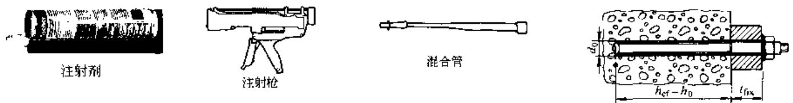

FISV360S(FIHB345)型高强树脂砂浆

适用范围:适用于 $\yen 15$ 的混凝土的螺杆和钢筋锚固,无膨胀安装,对间距和边距要求小,配用安装附件。可用于空心基材上的锚固,用于安装各种机器设备等。

表 4-6-21 FISV360S(FIHB345)型高强树脂砂浆配用的螺杆规格、材料及安装尺寸

<table><tr><td rowspan=2 colspan=2>配用螺杆型号</td><td rowspan=2 colspan=3>材质</td><td rowspan=2 colspan=1>钻头直径d/mm</td><td rowspan=2 colspan=1>锚固深度（最小钻孔深度）h(h）/mm</td><td rowspan=2 colspan=1>最大安装扭矩T/N·m</td><td rowspan=2 colspan=1>固定件最大厚度/mm</td><td rowspan=2 colspan=1>固定件中钻孔直径/mm</td><td rowspan=1 colspan=5>基础要求</td></tr><tr><td rowspan=1 colspan=1>最小间距mm/m</td><td rowspan=1 colspan=1>最小边卧co/mm</td><td rowspan=1 colspan=1>最小基材厚度ham/mm</td><td rowspan=1 colspan=1>特征间距SrN/mm</td><td rowspan=1 colspan=1>特征边距ErN/mm</td></tr><tr><td rowspan=1 colspan=2>RGM8 ×110</td><td rowspan=1 colspan=3></td><td rowspan=1 colspan=1>10</td><td rowspan=1 colspan=1>80</td><td rowspan=1 colspan=1>1</td><td rowspan=1 colspan=1>20</td><td rowspan=1 colspan=1>9</td><td rowspan=1 colspan=1>80</td><td rowspan=1 colspan=1>40</td><td rowspan=1 colspan=1>130</td><td rowspan=1 colspan=1>160</td><td rowspan=1 colspan=1>80</td></tr><tr><td rowspan=2 colspan=2>RCM10 ×130</td><td rowspan=2 colspan=2></td><td rowspan=1 colspan=1></td><td rowspan=2 colspan=1></td><td rowspan=2 colspan=1>12</td><td rowspan=2 colspan=2>9</td><td rowspan=2 colspan=1>20</td><td rowspan=2 colspan=1>30</td><td rowspan=2 colspan=1>≤12</td><td rowspan=2 colspan=1>90</td><td rowspan=2 colspan=1>50</td><td rowspan=2 colspan=1>140</td></tr><tr><td rowspan=1 colspan=2></td></tr><tr><td rowspan=2 colspan=2>RGM12 × 160</td><td rowspan=2 colspan=2></td><td rowspan=1 colspan=1></td><td rowspan=2 colspan=1></td><td rowspan=2 colspan=1>14</td><td rowspan=2 colspan=2>110</td><td rowspan=2 colspan=1>40</td><td rowspan=2 colspan=1>35</td><td rowspan=2 colspan=1>≤14</td><td rowspan=2 colspan=1>110</td><td rowspan=2 colspan=1>60</td><td rowspan=2 colspan=1>160</td></tr><tr><td rowspan=1 colspan=2>电</td></tr><tr><td rowspan=2 colspan=2>RGM16 ×190</td><td rowspan=2 colspan=2></td><td rowspan=1 colspan=1>镀</td><td rowspan=2 colspan=1></td><td rowspan=2 colspan=1>18</td><td rowspan=2 colspan=2>125</td><td rowspan=2 colspan=1>80</td><td rowspan=2 colspan=1>45</td><td rowspan=2 colspan=1>18</td><td rowspan=2 colspan=1>125</td><td rowspan=2 colspan=1>65</td><td rowspan=2 colspan=1>175</td></tr><tr><td rowspan=1 colspan=2></td></tr><tr><td rowspan=2 colspan=2>RGM20 x 260</td><td rowspan=2 colspan=2></td><td rowspan=1 colspan=1>钢</td><td rowspan=2 colspan=1></td><td rowspan=2 colspan=1>25</td><td rowspan=2 colspan=2>170</td><td rowspan=2 colspan=1>150</td><td rowspan=2 colspan=1>65</td><td rowspan=2 colspan=1>≤22</td><td rowspan=2 colspan=1>170</td><td rowspan=2 colspan=1>85</td><td rowspan=2 colspan=1>220</td></tr><tr><td rowspan=1 colspan=2></td></tr><tr><td rowspan=2 colspan=2>RCM24 × 300</td><td rowspan=2 colspan=2></td><td rowspan=1 colspan=1></td><td rowspan=1 colspan=1></td><td rowspan=2 colspan=1>28</td><td rowspan=2 colspan=2>210</td><td rowspan=2 colspan=1>200</td><td rowspan=2 colspan=1>65</td><td rowspan=2 colspan=1>≤26</td><td rowspan=2 colspan=1>210</td><td rowspan=2 colspan=1>105</td><td rowspan=2 colspan=1>260</td></tr><tr><td rowspan=1 colspan=3></td><td></td></tr><tr><td rowspan=1 colspan=2>RCM30 ×380</td><td rowspan=1 colspan=3></td><td rowspan=1 colspan=1>35</td><td rowspan=1 colspan=1>280</td><td rowspan=1 colspan=1>400</td><td rowspan=1 colspan=1>65</td><td rowspan=1 colspan=1>≤33</td><td rowspan=1 colspan=1>280</td><td rowspan=1 colspan=1>140</td><td rowspan=1 colspan=1>330</td><td rowspan=1 colspan=1>560</td><td rowspan=1 colspan=1>280</td></tr><tr><td rowspan=1 colspan=2>RGM8 × 110 A4</td><td rowspan=1 colspan=3></td><td rowspan=1 colspan=1>10</td><td rowspan=1 colspan=1>80</td><td rowspan=1 colspan=1>10</td><td rowspan=1 colspan=1>20</td><td rowspan=1 colspan=1>≤9</td><td rowspan=1 colspan=1>80</td><td rowspan=1 colspan=1>40</td><td rowspan=1 colspan=1>130</td><td rowspan=1 colspan=1>160</td><td rowspan=1 colspan=1>80</td></tr><tr><td rowspan=2 colspan=2>RGM10 ×130 A4</td><td></td><td></td><td rowspan=1 colspan=1></td><td rowspan=2 colspan=1></td><td rowspan=2 colspan=1>12</td><td rowspan=2 colspan=2>90</td><td rowspan=2 colspan=1>20</td><td rowspan=2 colspan=1>30</td><td rowspan=2 colspan=1>≤12</td><td rowspan=2 colspan=1>90</td><td rowspan=2 colspan=1>50</td><td rowspan=2 colspan=1>140</td></tr><tr><td rowspan=1 colspan=3></td></tr><tr><td rowspan=2 colspan=2>RGM12 × 160 A4</td><td rowspan=2 colspan=2>不</td><td rowspan=1 colspan=1></td><td rowspan=2 colspan=1></td><td rowspan=2 colspan=1>14</td><td rowspan=2 colspan=2>110</td><td rowspan=2 colspan=1>40</td><td rowspan=2 colspan=1>35</td><td rowspan=2 colspan=1>≤14</td><td rowspan=2 colspan=1>110</td><td rowspan=2 colspan=1>60</td><td rowspan=2 colspan=1>160</td></tr><tr><td rowspan=1 colspan=3></td></tr><tr><td rowspan=2 colspan=2>RGM16 ×190 A4</td><td rowspan=2 colspan=2></td><td rowspan=1 colspan=1></td><td rowspan=2 colspan=1></td><td rowspan=2 colspan=1>18</td><td rowspan=2 colspan=2>125</td><td rowspan=2 colspan=1>80</td><td rowspan=2 colspan=1>45</td><td rowspan=2 colspan=1>≤18</td><td rowspan=2 colspan=1>125</td><td rowspan=2 colspan=1>65</td><td rowspan=2 colspan=1>175</td></tr><tr><td rowspan=1 colspan=3>游</td></tr><tr><td rowspan=2 colspan=2>RGM20 × 260 A4</td><td rowspan=2 colspan=2>制</td><td rowspan=1 colspan=1>制</td><td rowspan=2 colspan=1></td><td rowspan=2 colspan=1>25</td><td rowspan=2 colspan=2>170</td><td rowspan=2 colspan=1>150</td><td rowspan=2 colspan=1>65</td><td rowspan=2 colspan=1>22</td><td rowspan=2 colspan=1>170</td><td rowspan=2 colspan=1>85</td><td rowspan=2 colspan=1>220</td></tr><tr><td rowspan=1 colspan=3></td></tr><tr><td rowspan=2 colspan=2>RGM24 × 300 A4</td><td rowspan=2 colspan=2></td><td rowspan=2 colspan=1></td><td rowspan=2 colspan=1>28</td><td rowspan=2 colspan=1>210</td><td rowspan=2 colspan=1>200</td><td rowspan=2 colspan=1>65</td><td rowspan=2 colspan=1>26</td><td rowspan=2 colspan=1>210</td><td rowspan=2 colspan=1>105</td><td rowspan=2 colspan=1>260</td><td rowspan=2 colspan=1>420</td><td rowspan=2 colspan=1>210</td></tr><tr><td rowspan=1 colspan=2></td></tr><tr><td rowspan=1 colspan=2>RGM30× 380 A4</td><td rowspan=1 colspan=3>0A4</td><td rowspan=1 colspan=1></td><td rowspan=1 colspan=1>35</td><td rowspan=1 colspan=2>280</td><td rowspan=1 colspan=1>400</td><td rowspan=1 colspan=1>65</td><td rowspan=1 colspan=1>33</td><td rowspan=1 colspan=1>280</td><td rowspan=1 colspan=1>140</td><td rowspan=1 colspan=1>330</td></tr></table>

FISV360S(FIHB345)型锚栓的设计承载力及边距影响系数

<table><tr><td rowspan=1 colspan=4>锚栓型号受力状态</td><td rowspan=1 colspan=1>RCMB</td><td rowspan=1 colspan=1>RGM10</td><td rowspan=1 colspan=1>RGM12</td><td rowspan=1 colspan=1>RGM16</td><td rowspan=1 colspan=1>RGM20</td><td rowspan=1 colspan=1>RGM24</td><td rowspan=1 colspan=1>RGM30</td></tr><tr><td rowspan=4 colspan=1>钢材失效时承载力设计值/kN</td><td rowspan=2 colspan=1>拉力</td><td rowspan=2 colspan=1>NRd</td><td rowspan=1 colspan=1>电镀锌钢</td><td rowspan=1 colspan=1>12.8</td><td rowspan=1 colspan=1>20.3</td><td rowspan=1 colspan=1>29.5</td><td rowspan=1 colspan=1>54.9</td><td rowspan=1 colspan=1>85.8</td><td rowspan=1 colspan=1>123.6</td><td rowspan=1 colspan=1>196.3</td></tr><tr><td rowspan=1 colspan=1>不锈钢</td><td rowspan=1 colspan=1>13.8</td><td rowspan=1 colspan=1>13.4</td><td rowspan=1 colspan=1>31.6</td><td rowspan=1 colspan=1>58.9</td><td rowspan=1 colspan=1>91.9</td><td rowspan=1 colspan=1>73.6</td><td rowspan=1 colspan=1>1</td></tr><tr><td rowspan=2 colspan=1>剪力</td><td rowspan=2 colspan=1>VRd</td><td rowspan=1 colspan=1>电镀锌钢</td><td rowspan=1 colspan=1>7.7</td><td rowspan=1 colspan=1>12.2</td><td rowspan=1 colspan=1>17.7</td><td rowspan=1 colspan=1>33.0</td><td rowspan=1 colspan=1>51.4</td><td rowspan=1 colspan=1>74.2</td><td rowspan=1 colspan=1>117.8</td></tr><tr><td rowspan=1 colspan=1>不锈钢</td><td rowspan=1 colspan=1>8.3</td><td rowspan=1 colspan=1>13.1</td><td rowspan=1 colspan=1>19.0</td><td rowspan=1 colspan=1>35.3</td><td rowspan=1 colspan=1>55.2</td><td rowspan=1 colspan=1>44.2</td><td rowspan=1 colspan=1>二</td></tr><tr><td rowspan=6 colspan=1>混凝上失效时承载力特征设计值</td><td rowspan=6 colspan=1>拉力</td><td rowspan=4 colspan=1>Nd./N</td><td rowspan=1 colspan=1>C15</td><td rowspan=1 colspan=1>3.6</td><td rowspan=1 colspan=1>5.3</td><td rowspan=1 colspan=1>7.9</td><td rowspan=1 colspan=1>10.8</td><td rowspan=1 colspan=1>20</td><td rowspan=1 colspan=1>28.4</td><td rowspan=1 colspan=1>37.7</td></tr><tr><td rowspan=1 colspan=1>C25</td><td rowspan=1 colspan=1>5.1</td><td rowspan=1 colspan=1>7.6</td><td rowspan=1 colspan=1>11.3</td><td rowspan=1 colspan=1>15.4</td><td rowspan=1 colspan=1>28.6</td><td rowspan=1 colspan=1>40.5</td><td rowspan=1 colspan=1>53.8</td></tr><tr><td rowspan=1 colspan=1>C35</td><td rowspan=1 colspan=1>5.5</td><td rowspan=1 colspan=1>8.1</td><td rowspan=1 colspan=1>12.1</td><td rowspan=1 colspan=1>17.6</td><td rowspan=1 colspan=1>33.6</td><td rowspan=1 colspan=1>46</td><td rowspan=1 colspan=1>60.6</td></tr><tr><td rowspan=1 colspan=1>≥C45</td><td rowspan=1 colspan=1>5.8</td><td rowspan=1 colspan=1>8.5</td><td rowspan=1 colspan=1>12.8</td><td rowspan=1 colspan=1>19.5</td><td rowspan=1 colspan=1>37.9</td><td rowspan=1 colspan=1>50.7</td><td rowspan=1 colspan=1>66.5</td></tr><tr><td rowspan=1 colspan=2>YMc</td><td rowspan=1 colspan=7>2.15</td></tr><tr><td rowspan=1 colspan=2>u,N</td><td rowspan=1 colspan=7>1.4</td></tr></table>

<table><tr><td rowspan=9 colspan=21>续表锚栓型号    RGM8    RGM10   RCM12   RGM16   RGM20   RCM24   RGM30受力状态C15         4.7        5        5.4      6.1       7.1      7.7      8.7C25          6        6.5      7.1       7.8      9.2      9.9      11.2混凝上大       C35         7.1      7.7      8.3      9.2      10.8     11.7     13.3效时承载             /N                                                9.5      10.5      12 3     13.3     15.1剪力                 C45         8.1      8.7力特征设≥C55        8.9      9.6      10.5     11.6     13.6     4.7     16.6计值1Ymc                                                    1.8：                                                      2RGM30</td></tr><tr><td rowspan=1 colspan=2>RGM8</td><td rowspan=1 colspan=2>RGM10</td><td rowspan=1 colspan=3>RCM12</td><td rowspan=1 colspan=2>RGM16</td><td rowspan=1 colspan=2>RGM20</td><td rowspan=1 colspan=2>RCM24</td><td rowspan=1 colspan=2>RGM30</td></tr><tr><td rowspan=1 colspan=2>C15</td><td rowspan=1 colspan=2>4.7</td><td rowspan=1 colspan=2>5</td><td rowspan=1 colspan=3>5.4</td><td rowspan=1 colspan=2>6.1</td><td rowspan=1 colspan=2>7.1</td><td rowspan=1 colspan=2>7.7</td><td rowspan=1 colspan=2>8.7</td></tr><tr><td rowspan=1 colspan=2>C25</td><td rowspan=1 colspan=2>6</td><td rowspan=1 colspan=2>6.5</td><td rowspan=1 colspan=3>7.1</td><td rowspan=1 colspan=2>7.8</td><td rowspan=1 colspan=2>9.2</td><td rowspan=1 colspan=2>9.9</td><td rowspan=1 colspan=2>11.2</td></tr><tr><td rowspan=1 colspan=2>C35</td><td rowspan=1 colspan=2>7.1</td><td rowspan=1 colspan=2>7.7</td><td rowspan=1 colspan=3>8.3</td><td rowspan=1 colspan=2>9.2</td><td rowspan=1 colspan=2>10.8</td><td rowspan=1 colspan=2>11.7</td><td rowspan=1 colspan=2>13.3</td></tr><tr><td rowspan=1 colspan=2>C45</td><td rowspan=1 colspan=2>8.1</td><td rowspan=1 colspan=2>8.7</td><td rowspan=1 colspan=3>9.5</td><td rowspan=1 colspan=2>10.5</td><td rowspan=1 colspan=2>12 3</td><td rowspan=1 colspan=2>13.3</td><td rowspan=1 colspan=2>15.1</td></tr><tr><td rowspan=1 colspan=2>≥C55</td><td rowspan=1 colspan=2>8.9</td><td rowspan=1 colspan=2>9.6</td><td rowspan=1 colspan=3>10.5</td><td rowspan=1 colspan=2>11.61</td><td rowspan=1 colspan=2>13.6</td><td rowspan=1 colspan=2>4.7</td><td rowspan=1 colspan=2>16.6</td></tr><tr><td rowspan=1 colspan=2>Ymc</td><td rowspan=1 colspan=15>1.8</td></tr><tr><td rowspan=1 colspan=15>2</td></tr><tr><td rowspan=2 colspan=2>边距，/mm</td><td rowspan=1 colspan=2>RCM8</td><td rowspan=1 colspan=2>RGM10</td><td rowspan=1 colspan=3>RCM12</td><td rowspan=1 colspan=3>RCM16</td><td rowspan=1 colspan=4>RGM20</td><td rowspan=1 colspan=2>RGM24</td><td rowspan=1 colspan=3>RGM30</td></tr><tr><td rowspan=1 colspan=1>中</td><td rowspan=1 colspan=1>中</td><td rowspan=1 colspan=1>中</td><td rowspan=1 colspan=1>中</td><td rowspan=1 colspan=1>中</td><td rowspan=1 colspan=2>y</td><td rowspan=1 colspan=2>中</td><td rowspan=1 colspan=1>中</td><td rowspan=1 colspan=2>中</td><td rowspan=1 colspan=2>中</td><td rowspan=1 colspan=1>+</td><td rowspan=1 colspan=1>中</td><td rowspan=1 colspan=2>心</td><td rowspan=1 colspan=1>4</td></tr><tr><td rowspan=30 colspan=1>锚栓受拉时的边距影响系数</td><td rowspan=1 colspan=1>40</td><td rowspan=1 colspan=1>0.75</td><td rowspan=1 colspan=1>0.85</td><td rowspan=1 colspan=1></td><td rowspan=1 colspan=1></td><td rowspan=1 colspan=1></td><td rowspan=1 colspan=2></td><td rowspan=1 colspan=2></td><td rowspan=1 colspan=1></td><td rowspan=1 colspan=2></td><td rowspan=1 colspan=2></td><td rowspan=1 colspan=1></td><td rowspan=1 colspan=1></td><td rowspan=1 colspan=2></td><td rowspan=1 colspan=1></td></tr><tr><td rowspan=1 colspan=1>50</td><td rowspan=1 colspan=1>0.81</td><td rowspan=1 colspan=1>0.89</td><td rowspan=1 colspan=1>0.78</td><td rowspan=1 colspan=1>0.87</td><td rowspan=1 colspan=1></td><td rowspan=1 colspan=2></td><td rowspan=1 colspan=2></td><td rowspan=1 colspan=1></td><td rowspan=1 colspan=2></td><td rowspan=1 colspan=2></td><td rowspan=1 colspan=1></td><td rowspan=1 colspan=1></td><td rowspan=1 colspan=2></td><td rowspan=1 colspan=1></td></tr><tr><td rowspan=1 colspan=1>60</td><td rowspan=1 colspan=1>0.88</td><td rowspan=1 colspan=1>0.93</td><td rowspan=1 colspan=1>0.83</td><td rowspan=1 colspan=1>0.90</td><td rowspan=1 colspan=1>0.77</td><td rowspan=1 colspan=2>0.86</td><td rowspan=1 colspan=2></td><td rowspan=1 colspan=1></td><td rowspan=1 colspan=2></td><td rowspan=1 colspan=2></td><td rowspan=1 colspan=1></td><td rowspan=1 colspan=1></td><td rowspan=1 colspan=2></td><td rowspan=1 colspan=1></td></tr><tr><td rowspan=1 colspan=1>65</td><td rowspan=1 colspan=1>0.91</td><td rowspan=1 colspan=1>0.95</td><td rowspan=1 colspan=1>0.86</td><td rowspan=1 colspan=1>0.92</td><td rowspan=1 colspan=1>0.80</td><td rowspan=1 colspan=2>0.88</td><td rowspan=1 colspan=2>0.76</td><td rowspan=1 colspan=1>0.86</td><td rowspan=1 colspan=2></td><td rowspan=1 colspan=2></td><td rowspan=1 colspan=1></td><td rowspan=1 colspan=1></td><td rowspan=1 colspan=2></td><td rowspan=1 colspan=1></td></tr><tr><td rowspan=1 colspan=1>70</td><td rowspan=1 colspan=1>0.94</td><td rowspan=1 colspan=1>0.96</td><td rowspan=1 colspan=1>0.89</td><td rowspan=1 colspan=1>0.93</td><td rowspan=1 colspan=1>0.82</td><td rowspan=1 colspan=2>0.89</td><td rowspan=1 colspan=2>0.78</td><td rowspan=1 colspan=1>0.87</td><td rowspan=1 colspan=2></td><td rowspan=1 colspan=2></td><td rowspan=1 colspan=1></td><td rowspan=1 colspan=1></td><td rowspan=1 colspan=2></td><td rowspan=1 colspan=1></td></tr><tr><td rowspan=1 colspan=1>80</td><td rowspan=1 colspan=1>1.00</td><td rowspan=1 colspan=1>1.00</td><td rowspan=1 colspan=1>0.94</td><td rowspan=1 colspan=1>0.97</td><td rowspan=1 colspan=1>0.86</td><td rowspan=1 colspan=2>0.92</td><td rowspan=1 colspan=2>0.82</td><td rowspan=1 colspan=1>0.89</td><td rowspan=1 colspan=2></td><td rowspan=1 colspan=2></td><td rowspan=1 colspan=1></td><td rowspan=1 colspan=1></td><td rowspan=1 colspan=2></td><td rowspan=2 colspan=1></td></tr><tr><td rowspan=1 colspan=1>85</td><td rowspan=1 colspan=1>1.00</td><td rowspan=1 colspan=1>1.00</td><td rowspan=1 colspan=1>0.97</td><td rowspan=1 colspan=1>0.99</td><td rowspan=1 colspan=1>0.89</td><td rowspan=1 colspan=2>0.94</td><td rowspan=1 colspan=2>0.84</td><td rowspan=1 colspan=1>0.91</td><td rowspan=1 colspan=2>0.75</td><td rowspan=1 colspan=2>0.85</td><td rowspan=1 colspan=1></td><td rowspan=1 colspan=1></td><td rowspan=1 colspan=2></td></tr><tr><td rowspan=1 colspan=1>90</td><td rowspan=1 colspan=1>1.00</td><td rowspan=1 colspan=1>1.00</td><td rowspan=1 colspan=1>1.00</td><td rowspan=1 colspan=1>1.00</td><td rowspan=1 colspan=1>0.91</td><td rowspan=1 colspan=2>0.95</td><td rowspan=1 colspan=2>0.86</td><td rowspan=1 colspan=1>0.92</td><td rowspan=1 colspan=2>0.76</td><td rowspan=1 colspan=2>0.86</td><td rowspan=1 colspan=1></td><td rowspan=1 colspan=1></td><td rowspan=1 colspan=2></td><td rowspan=1 colspan=1></td></tr><tr><td rowspan=1 colspan=1>100</td><td rowspan=1 colspan=1>1.00</td><td rowspan=1 colspan=1>1.00</td><td rowspan=1 colspan=1>1.00</td><td rowspan=1 colspan=1>1.00</td><td rowspan=1 colspan=1>0.96</td><td rowspan=1 colspan=2>0.97</td><td rowspan=1 colspan=2>0.90</td><td rowspan=1 colspan=1>0.94</td><td rowspan=1 colspan=2>0.79</td><td rowspan=1 colspan=2>0.88</td><td rowspan=1 colspan=1></td><td rowspan=1 colspan=1></td><td rowspan=1 colspan=2></td><td rowspan=1 colspan=1></td></tr><tr><td rowspan=1 colspan=1>105</td><td rowspan=1 colspan=1>1.00</td><td rowspan=1 colspan=1>1.00</td><td rowspan=1 colspan=1>1.00</td><td rowspan=1 colspan=1>100</td><td rowspan=1 colspan=1>0.98</td><td rowspan=1 colspan=2>0.99</td><td rowspan=1 colspan=2>0.92</td><td rowspan=1 colspan=1>0.95</td><td rowspan=1 colspan=2>0.81</td><td rowspan=1 colspan=2>0.89</td><td rowspan=1 colspan=1>0.75</td><td rowspan=1 colspan=1>0.85</td><td rowspan=1 colspan=2></td><td rowspan=1 colspan=1></td></tr><tr><td rowspan=1 colspan=1>110</td><td rowspan=1 colspan=1>1.00</td><td rowspan=1 colspan=1>1.00</td><td rowspan=1 colspan=1>1.00</td><td rowspan=1 colspan=1>1.00</td><td rowspan=1 colspan=1>1.00</td><td rowspan=1 colspan=2>1.00</td><td rowspan=1 colspan=2>0.94</td><td rowspan=1 colspan=1>0.96</td><td rowspan=1 colspan=2>0.82</td><td rowspan=1 colspan=2>0.89</td><td rowspan=1 colspan=1>0.76</td><td rowspan=1 colspan=1>0.86</td><td rowspan=1 colspan=2></td><td rowspan=1 colspan=1></td></tr><tr><td rowspan=1 colspan=1>120</td><td rowspan=1 colspan=1>1.00</td><td rowspan=1 colspan=1>1.00</td><td rowspan=1 colspan=1>1.00</td><td rowspan=1 colspan=1>1.00</td><td rowspan=1 colspan=1>1.00</td><td rowspan=1 colspan=2>1.00</td><td rowspan=1 colspan=2>0.98</td><td rowspan=1 colspan=1>0.99</td><td rowspan=1 colspan=2>0.85</td><td rowspan=1 colspan=2>0.91</td><td rowspan=1 colspan=1>0.79</td><td rowspan=1 colspan=1>0.87</td><td rowspan=1 colspan=2></td><td rowspan=1 colspan=1></td></tr><tr><td rowspan=1 colspan=1>130</td><td rowspan=1 colspan=1>1.00</td><td rowspan=1 colspan=1>1.00</td><td rowspan=1 colspan=1>1.00</td><td rowspan=1 colspan=1>1.00</td><td rowspan=1 colspan=1>1.00</td><td rowspan=1 colspan=2>1.00</td><td rowspan=1 colspan=2>1.00</td><td rowspan=1 colspan=1>1.00</td><td rowspan=1 colspan=2>0.88</td><td rowspan=1 colspan=2>0.93</td><td rowspan=1 colspan=1>0.81</td><td rowspan=1 colspan=1>0.89</td><td rowspan=1 colspan=2></td><td rowspan=1 colspan=1></td></tr><tr><td rowspan=1 colspan=1>140</td><td rowspan=1 colspan=1>1.00</td><td rowspan=1 colspan=1>1.00</td><td rowspan=1 colspan=1>1.00</td><td rowspan=1 colspan=1>1.00</td><td rowspan=1 colspan=1>1.00</td><td rowspan=1 colspan=2>1.00</td><td rowspan=1 colspan=2>1.00</td><td rowspan=1 colspan=1>1.00</td><td rowspan=1 colspan=2>0.91</td><td rowspan=1 colspan=2>0.95</td><td rowspan=1 colspan=1>0.83</td><td rowspan=1 colspan=1>0.90</td><td rowspan=1 colspan=2>0.75</td><td rowspan=1 colspan=1>0.85</td></tr><tr><td rowspan=1 colspan=1>150</td><td rowspan=1 colspan=1>1.00</td><td rowspan=1 colspan=1>1.00</td><td rowspan=1 colspan=1>1.00</td><td rowspan=1 colspan=1>1.00</td><td rowspan=1 colspan=1>1.00</td><td rowspan=1 colspan=2>1.00</td><td rowspan=1 colspan=2>1.00</td><td rowspan=1 colspan=1>1.00</td><td rowspan=1 colspan=2>0.94</td><td rowspan=1 colspan=2>0.97</td><td rowspan=1 colspan=1>0.86</td><td rowspan=1 colspan=1>0.91</td><td rowspan=1 colspan=2>0.77</td><td rowspan=1 colspan=1>0.86</td></tr><tr><td rowspan=1 colspan=1>160</td><td rowspan=1 colspan=1>1.00</td><td rowspan=1 colspan=1>1.00</td><td rowspan=1 colspan=1>1.00</td><td rowspan=1 colspan=1>1.00</td><td rowspan=1 colspan=1>1.00</td><td rowspan=1 colspan=2>1.00</td><td rowspan=1 colspan=2>1.00</td><td rowspan=1 colspan=1>1.00</td><td rowspan=1 colspan=2>0.97</td><td rowspan=1 colspan=2>0.98</td><td rowspan=1 colspan=1>0.88</td><td rowspan=1 colspan=1>0.93</td><td rowspan=1 colspan=2>0.79</td><td rowspan=1 colspan=1>0.87</td></tr><tr><td rowspan=1 colspan=1>170</td><td rowspan=1 colspan=1>1.00</td><td rowspan=1 colspan=1>1.00</td><td rowspan=1 colspan=1>1.00</td><td rowspan=1 colspan=1>1.00</td><td rowspan=1 colspan=1>1.00</td><td rowspan=1 colspan=2>1.00</td><td rowspan=1 colspan=2>1.00</td><td rowspan=1 colspan=1>1.00</td><td rowspan=1 colspan=2>1.00</td><td rowspan=1 colspan=2>1.00</td><td rowspan=1 colspan=1>0.91</td><td rowspan=1 colspan=1>0.94</td><td rowspan=1 colspan=2>0.80</td><td rowspan=1 colspan=1>0.88</td></tr><tr><td rowspan=1 colspan=1>180</td><td rowspan=1 colspan=1>1.00</td><td rowspan=1 colspan=1>1.00</td><td rowspan=1 colspan=1>1.00</td><td rowspan=1 colspan=1>1.00</td><td rowspan=1 colspan=1>1.00</td><td rowspan=1 colspan=2>1.00</td><td rowspan=1 colspan=2>1.00</td><td rowspan=1 colspan=1>1.00</td><td rowspan=1 colspan=2>1.00</td><td rowspan=1 colspan=2>1.00</td><td rowspan=1 colspan=1>0.93</td><td rowspan=1 colspan=1>0.96</td><td rowspan=1 colspan=2>0.82</td><td rowspan=1 colspan=1>0.89</td></tr><tr><td rowspan=1 colspan=1>190</td><td rowspan=1 colspan=1>1.00</td><td rowspan=1 colspan=1>1.00</td><td rowspan=1 colspan=1>1.00</td><td rowspan=1 colspan=1>1.00</td><td rowspan=1 colspan=1>1.00</td><td rowspan=1 colspan=2>1.00</td><td rowspan=1 colspan=2>1.00</td><td rowspan=1 colspan=1>1.00</td><td rowspan=1 colspan=2>1.00</td><td rowspan=1 colspan=2>1.00</td><td rowspan=1 colspan=1>0.95</td><td rowspan=1 colspan=1>0.97</td><td rowspan=1 colspan=2>0.84</td><td rowspan=1 colspan=1>0.90</td></tr><tr><td rowspan=1 colspan=1>200</td><td rowspan=1 colspan=1>1.00</td><td rowspan=1 colspan=1>1.00</td><td rowspan=1 colspan=1>1.00</td><td rowspan=1 colspan=1>1.00</td><td rowspan=1 colspan=1>1.00</td><td rowspan=1 colspan=2>1.00</td><td rowspan=1 colspan=2>1.00</td><td rowspan=1 colspan=1>1.00</td><td rowspan=1 colspan=2>1.00</td><td rowspan=1 colspan=2>1.00</td><td rowspan=1 colspan=1>0.98</td><td rowspan=1 colspan=1>0.99</td><td rowspan=1 colspan=2>0.86</td><td rowspan=1 colspan=1>0.91</td></tr><tr><td rowspan=1 colspan=1>210</td><td rowspan=1 colspan=1>1.00</td><td rowspan=1 colspan=1>1.00</td><td rowspan=1 colspan=1>1.00</td><td rowspan=1 colspan=1>1.00</td><td rowspan=1 colspan=1>1.00</td><td rowspan=1 colspan=2>1.00</td><td rowspan=1 colspan=2>1.00</td><td rowspan=1 colspan=1>1.00</td><td rowspan=1 colspan=2>1.00</td><td rowspan=1 colspan=2>1.00</td><td rowspan=1 colspan=1>1.00</td><td rowspan=1 colspan=1>1.00</td><td rowspan=1 colspan=2>0.88</td><td rowspan=1 colspan=1>0.93</td></tr><tr><td rowspan=1 colspan=1>220</td><td rowspan=1 colspan=1>1.00</td><td rowspan=1 colspan=1>1.00</td><td rowspan=1 colspan=1>1.00</td><td rowspan=1 colspan=1>1.00</td><td rowspan=1 colspan=1>1.00</td><td rowspan=1 colspan=2>1.00</td><td rowspan=1 colspan=2>1.00</td><td rowspan=1 colspan=1>1.00</td><td rowspan=1 colspan=2>1.00</td><td rowspan=1 colspan=2>1.00</td><td rowspan=1 colspan=1>1.00</td><td rowspan=1 colspan=1>1.00</td><td rowspan=1 colspan=2>0.89</td><td rowspan=1 colspan=1>0.94</td></tr><tr><td rowspan=1 colspan=1>230</td><td rowspan=1 colspan=1>1.00</td><td rowspan=1 colspan=1>1.00</td><td rowspan=1 colspan=1>1.00</td><td rowspan=1 colspan=1>1.00</td><td rowspan=1 colspan=1>1.00</td><td rowspan=1 colspan=2>1.00</td><td rowspan=1 colspan=2>1.00</td><td rowspan=1 colspan=1>1.00</td><td rowspan=1 colspan=2>1.00</td><td rowspan=1 colspan=2>1.00</td><td rowspan=1 colspan=1>1.00</td><td rowspan=1 colspan=1>1.00</td><td rowspan=1 colspan=2>0.91</td><td rowspan=1 colspan=1>0.95</td></tr><tr><td rowspan=1 colspan=1>240</td><td rowspan=1 colspan=1>1.00</td><td rowspan=1 colspan=1>1.00</td><td rowspan=1 colspan=1>1.00</td><td rowspan=1 colspan=1>1.00</td><td rowspan=1 colspan=1>1.00</td><td rowspan=1 colspan=2>1.00</td><td rowspan=1 colspan=2>1.00</td><td rowspan=1 colspan=1>1.00</td><td rowspan=1 colspan=2>1.00</td><td rowspan=1 colspan=2>1.00</td><td rowspan=1 colspan=1>1.00</td><td rowspan=1 colspan=1>1.00</td><td rowspan=1 colspan=2>0.93</td><td rowspan=1 colspan=1>0.96</td></tr><tr><td rowspan=1 colspan=1>250</td><td rowspan=1 colspan=1>1.00</td><td rowspan=1 colspan=1>1.00</td><td rowspan=1 colspan=1>1.00</td><td rowspan=1 colspan=1>1.00</td><td rowspan=1 colspan=1>1.00</td><td rowspan=1 colspan=2>1.00</td><td rowspan=1 colspan=2>1.00</td><td rowspan=1 colspan=1>1.00</td><td rowspan=1 colspan=2>1.00</td><td rowspan=1 colspan=2>1.00</td><td rowspan=1 colspan=1>1.00</td><td rowspan=1 colspan=1>1.00</td><td rowspan=1 colspan=2>0.95</td><td rowspan=1 colspan=1>0.97</td></tr><tr><td></td><td></td><td rowspan=2 colspan=1>1.00</td><td rowspan=2 colspan=1>1.00</td><td rowspan=2 colspan=1>1.00</td><td rowspan=2 colspan=1>1.00</td><td rowspan=2 colspan=2>1.00</td><td rowspan=2 colspan=2>1.00</td><td rowspan=2 colspan=1>1.00</td><td rowspan=2 colspan=2>1.00</td><td rowspan=2 colspan=2>1.00</td><td rowspan=2 colspan=1>1.00</td><td rowspan=2 colspan=1>1.00</td><td rowspan=2 colspan=2>0.96</td><td rowspan=2 colspan=1>0.98</td></tr><tr><td rowspan=1 colspan=1>260</td><td rowspan=1 colspan=1>1.00</td></tr><tr><td rowspan=1 colspan=1>270</td><td rowspan=1 colspan=1>1.00</td><td rowspan=1 colspan=1>1.00</td><td rowspan=1 colspan=1>1.00</td><td rowspan=1 colspan=1>1.00</td><td rowspan=1 colspan=1>1.00</td><td rowspan=1 colspan=2>1.00</td><td rowspan=1 colspan=2>1.00</td><td rowspan=1 colspan=1>1.00</td><td></td><td rowspan=1 colspan=1>1.00</td><td rowspan=1 colspan=2>1.00</td><td rowspan=1 colspan=1>1.00</td><td rowspan=1 colspan=1>1.00</td><td rowspan=1 colspan=2>0.98</td><td rowspan=1 colspan=1>0.99</td></tr><tr><td rowspan=2 colspan=1>280</td><td rowspan=2 colspan=1>1.00</td><td rowspan=2 colspan=1>1.00</td><td rowspan=2 colspan=1>1.00</td><td rowspan=2 colspan=1>1.00</td><td rowspan=2 colspan=1>1.00</td><td rowspan=2 colspan=2>1.00</td><td rowspan=2 colspan=2>1.00</td><td rowspan=2 colspan=1>1.00</td><td rowspan=2 colspan=2>1.00</td><td rowspan=2 colspan=2>1.00</td><td rowspan=2 colspan=1>1.00</td><td rowspan=2 colspan=1>1.00</td><td rowspan=2 colspan=2>1.00</td><td rowspan=2 colspan=1>1.00</td></tr><tr><td rowspan=1 colspan=2></td><td rowspan=1 colspan=1></td></tr></table>

注:同表4-6-8注。

# 7国产钢膨胀螺栓及膨胀螺母[6]

# 7.1钢膨胀螺栓

(1)型式

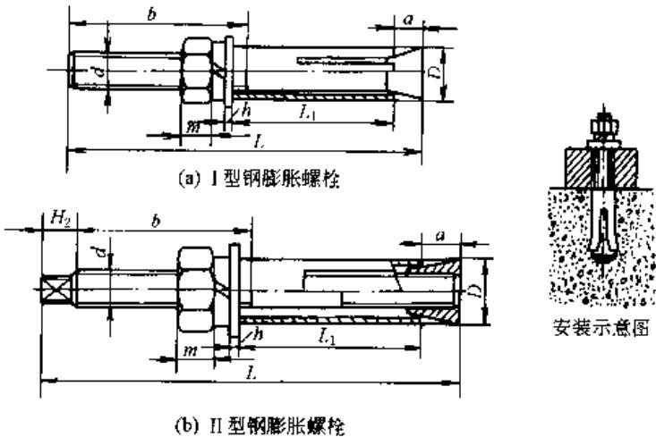

图4-6-3钢膨胀螺栓结构型式

I型(普通型)由沉头螺栓、胀管、平垫圈、弹簧垫圈和六角螺母组成,如图4-6-3a所示;Ⅱ型由螺柱、锥形螺母、胀管、平垫圈、弹簧垫圈和六角螺母组成,如图4-6-3b所示。

# (2)安装说明

安装时,先用冲击钴(锤)在地基上钻一个孔。I型螺栓,先把螺栓、胀管装人孔中,然后依次把机器上的安装孔和平垫圈、弹簧垫圈套在螺栓上,最后把螺母旋在螺栓上,并拧紧,整个安装即告结束。Ⅱ型螺栓,先把锥形螺母和胀管放人孔中,然后将机器的安装孔对准地基的孔,再将螺柱插人孔中,与锥形螺母旋紧,并依次将平垫圈和弹簧垫圈套在螺柱上,最后把六角螺母旋在螺杜上,并拧紧,整个安装也告结束。

(3)钢膨胀螺栓的主要尺寸及承载能力

表4-6-23

<table><tr><td rowspan="3">螺纹 规格 d</td><td rowspan="3">螺栓长度 L</td><td colspan="2">胀 管</td><td rowspan="3">被联接 件厚度 H</td><td colspan="2">钻</td><td colspan="4">孔 允许承受拉(剪）力</td></tr><tr><td>外径</td><td>长度</td><td>直径</td><td>深度</td><td></td><td>静止状态</td><td>悬吊状态</td><td></td></tr><tr><td>D</td><td>L</td><td></td><td></td><td>拉力</td><td>剪力</td><td>拉力</td><td>剪力</td></tr></table>

/mm 

<table><tr><td>M6</td><td>65,75,85</td><td></td><td></td><td></td><td></td><td></td><td></td><td></td><td></td><td></td></tr><tr><td></td><td></td><td>10</td><td>35</td><td>L-55</td><td>10.5</td><td>40</td><td>2350</td><td>1770</td><td>1667</td><td>1226</td></tr><tr><td>M8</td><td>80,90,100</td><td>12</td><td>45</td><td>L-65</td><td>12.5</td><td>50</td><td>4310</td><td>3240</td><td>2354</td><td>1765</td></tr><tr><td>M10</td><td>95,110,125,130</td><td>14</td><td>55</td><td>L-75</td><td>14.5</td><td>60</td><td>6860</td><td>5100</td><td>4315</td><td>3236</td></tr><tr><td>M12</td><td>110,130,150,200</td><td>18</td><td>65</td><td>L-90</td><td>19</td><td>75</td><td>10100</td><td>7260</td><td>6865</td><td>5100</td></tr><tr><td>M16</td><td>150,175,200,220,250,300</td><td>22</td><td>90</td><td>L-120</td><td>23</td><td>100</td><td>19200</td><td>14120</td><td>10101</td><td>7257</td></tr></table>

注:1.产品等级:螺栓, $i \leqslant 1 0 d$ 或 $\ell \leqslant 1 5 0 \mathrm { m m }$ (按最小值)时, $\pmb { \Lambda }$ 级, $\ell > \ell 0 d$ 或 $l > 1 5 0 \mathrm { m m }$ (按最小值)时,B级;螺母和平垫圈,A级。2.螺纹公差;螺栓为 ${ \bf 6 8 }$ ,螺母为 $\smash { \delta H _ { \perp } }$ 3.表面处理:镀锌钝化。4.本产品的资料由上海木钻厂提供。

# 7.2膨胀螺母

(1)型式

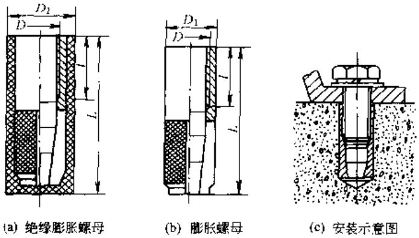

图4-6-4膨胀螺母结构型式

$\textcircled{1}$ 低碳钢膨胀螺母:代号KT,规格自 $\mathbf { M } 6 \sim \mathbf { M } 2 0$ ,一般用;

$\textcircled{2}$ 不锈钢膨胀螺母:代号KB,规格自 $\mathbf { M } \mathbf { l } 2 \sim \mathbf { M } 2 0$ ,用于需要防腐蚀场合;

$\textcircled{3}$ 尼龙膨胀螺母:代号KS,全用尼龙制造,规格自M3\~M6,用于对抗拉力要求不高的场合;

$\textcircled{4}$ 绝缘膨胀螺母:代号KF,在低碳钢膨胀螺母外面包覆一层绝缘层,规格自M6\~MI2,用于需要电绝缘合。

# (2)安装说明

膨胀螺母是与膨胀螺栓相似的一种专用螺母,由圆形管状螺母和锥销两个零件组成。配合六角头螺栓、平垫圈和弹簧垫圈,用于机件固定安装在混凝土地基(或墙壁等)上。使用时,先用冲击钻(锤)在地基上钻孔,再把螺母和锥销放入孔中,另用手锤和专用芯棒锤击锥销,使锥销底端与螺母底端平齐,从而使螺母底部四周胀开,牢固地固定在地基中,然后把机件上的安装孔对准螺母孔,依次放上平垫圈和弹簧垫圈,旋入六角头螺栓,使机件牢固地固定在地基上。

(3)膨胀螺母的主要尺寸及承载能力

表4-6-24

<table><tr><td colspan="2">螺母类别 尺寸与性能</td><td colspan="2">钢 膨</td><td colspan="8">胀 螨母</td><td colspan="4">绝缘膨胀螺舟</td></tr><tr><td colspan="2"></td><td colspan="7">M3 M4</td><td colspan="3">M12 M16</td><td colspan="4">M6</td></tr><tr><td rowspan="6">主要 尺寸 /mm</td><td>螺纹规格D 螺母全长L</td><td>28</td><td>28</td><td>M5 28</td><td>M6 28</td><td>M8 30</td><td>M10 40</td><td></td><td>60</td><td>M20 80</td><td>30</td><td>M8 32</td><td>M10</td><td>M12 53</td></tr><tr><td></td><td></td><td></td><td></td><td></td><td></td><td></td><td>50</td><td></td><td></td><td></td><td></td><td>43</td><td></td></tr><tr><td>螺纹长度</td><td>8</td><td>9</td><td>11</td><td>11</td><td>13</td><td>15</td><td>18</td><td>23</td><td>34</td><td>1</td><td>13</td><td>15</td><td>18</td></tr><tr><td>螺母径D1</td><td>5</td><td>6</td><td>8</td><td>8</td><td>10</td><td>12</td><td>16</td><td>20</td><td>25</td><td>10</td><td>12</td><td>16</td><td>20</td></tr><tr><td>钻孔直径</td><td>5</td><td>6</td><td>8</td><td>8</td><td>10</td><td>12</td><td>16</td><td>20</td><td>25</td><td>10</td><td>12</td><td>16</td><td>20</td></tr><tr><td colspan="2">允许横向抗拉 静载荷/N</td><td></td><td></td><td>4710</td><td>7140</td><td>11440</td><td>14680</td><td>24010</td><td>31620</td><td>2000</td><td>3500</td><td>6000</td><td>8000</td></tr></table>

在电压2000V,1min条件下5MΩ

# 绝缘电阻/MΩ

注:1.产品等级;A级。

2.螺纹公差: $\boldsymbol { 6 \mathrm { H } }$ 

3、表面处理;镀锌钝化、热镀锌、热渗锌。

4.配用螺栓长度 $\pmb { L } _ { \pmb { \imath } }$ 的计算公式:$L _ { * } =$ 螺母螺纹长度 $\smash { \ell + }$ 平垫圈厚度 $^ +$ 弹簧垫圈厚度 $^ +$ 被紧固件机件厚度 $- ( 3 \sim 5 ) \mathrm { m m }$ 

5.安装膨胀螺母的混凝土抗压强度应不小于27MPa时,才能保证允许横向抗拉静载荷。

6、本产品的有关资料由上海沪日特种紧固件厂提供。

# 第7章粘 接

粘接技术近年来发展较快,应用广泛,它与铆接、焊接、螺纹联接等方法相比有许多独特优点,主要表现如下几个方面。

(1)可以粘接不同性质的财料。两种性质完全不同的金属是很难焊接的,若采用铆接或螺钉联接容易产生电化学腐蚀。至于陶瓷等脆性材料则既不易打孔,也不能焊接,而采用粘接就会取得良好的效果。

(2)可以粘接异型、复杂部件及大的薄板结构件。有些结构复杂部件若采用粘接方法制造和组装,比焊接、铆接省工、省时,还可避免焊接时产生的热变形和铆接时产生的机械变形;有些大面积薄板结构件若不采用粘接方法是难以制造的。

(3)粘接件外形平滑。对航空工业和导弹、火箭等尖端工业是非常重要的。

(4)粘接接头有良好的疲劳强度。粘接是面联接,不易产生应力集中。通常,粘接疲劳强度要比铆接提高几十倍、

(5)粘接容易实现密封、绝缘、防腐蚀,可根据要求便接头具有某些特种性能,如导电、透明、隔热等,

(6)粘接工艺简便,操作方便,提高工效,节约能源,降低成本,减轻劳动强度等。在直升飞机制造中应月贴接工艺可省工 $4 0 \% \sim 5 0 \%$ ,建筑结构中应用粘接工艺可减少劳动量 $40 \%$ 左右。

(7)粘接比铆、焊及螺纹联接重量轻,在飞机制造中,粘接代替铆接之后重量可减轻 $2 0 \% \sim 3 0 \%$ ,大型天文望远镜用粘接结构的重量可减轻 $2 5 \%$ 左右。

粘接也具有以下缺点。

(1)粘接接头抗剥离强度、不均匀扯离强度和抗冲击强度较低。一般只有焊接、铆接强度的 $1 / _ { 2 } \sim 1 / _ { 1 0 }$ 左右

(2)多数胶粘剂的耐热性不高,使用温度有很大局限性,通常在 $1 0 0 \sim 1 5 0 \mathrm { ^ c }$ 下使用。少数胶粘剂如芳杂环类和有机硅类胶粘剂可以在 $\mathsf { 3 0 0 7 }$ 以上使用;无机胶粘剂可达 $6 0 0 \sim 1 0 0 0 \mathrm { ^ c }$ ,但太脆,经不起冲击。

(3)耐老化性能差。

(4)粘接工艺的影响因素很多,难以控制,检测手段还不完善,有待改进和发展。

# 1胶粘剂的选择[7]

表 4-7-1

<table><tr><td>选择 依据</td><td>被粘材料名称或要求</td><td colspan="6">常用胶粘剂及说明</td></tr><tr><td>根据被粘材料的化学性质</td><td>钢、铝 镍、铬、不锈钢 铜 钛 镁 陶瓷、水泥、玻璃 木材 纸 张 织物 环氧、酚醛、氨基塑料 聚氨酯塑料</td><td colspan="6">酚醛-丁腈胶、酚醛-缩醛胶、环氧胶、丙烯酸聚酯、无机胶等 酚醛-丁腈胶、聚氨酯胶、聚苯并咪唑胶、聚硫醚胶、环氧胶等 酚醛-缩醛胶、环氧胶、丙烯酸聚酯胶等 酚醛-丁腈胶、酚醛-缩醛胶、聚酰亚胺胶、丙烯酸聚酯胶等 酚醛-丁腈胶、聚氨酯胶、丙烯酸聚酯胶等 环氧胶、不饱和囊酯胶、无机胶等 聚醋酸乙烯乳胶、脲醛树脂胶、酚醛树脂胶等 聚酵酸乙烯乳胶、聚乙烯醇胶等 聚醋酸乙烯乳胶、氯丁-酚醛胶、聚氨酯胶等 环氧胶、聚氨酯胶、丙烯酸聚酯胶等</td></tr><tr><td colspan="1" rowspan="1">选择依据</td><td colspan="1" rowspan="1">被粘材料名称或要求</td><td colspan="6" rowspan="1">常用胶粘剂及说明</td></tr><tr><td colspan="1" rowspan="2">根据被粘材料的化学性质</td><td colspan="1" rowspan="1">有机玻璃聚碳酸酯、聚枫氯化聚醚聚氨乙烯ABS天然橡胶、丁苯橡胶</td><td colspan="6" rowspan="1">丙烯酸聚酯胶、聚氨酯胶、α-氰基丙稀酸酯胶、二氯乙烷不饱和聚酯胶、聚氨酯胶、二氯乙烷丙烯酸聚酯胶、聚氨酯胶过氯乙烯胶、丙烯酸聚酯胶、-氰苯内稀酸酯胶、环己酮不饱和聚酯胶、聚氨酯胶、α-氰基丙烯酸酯胶、甲苯氯丁胶、聚氨酯胶</td></tr><tr><td colspan="1" rowspan="1">聚乙烯、聚丙烯聚苯乙烯聚苯醚聚四氟乙烯、氟橡胶硅树脂硅橡胶</td><td colspan="6" rowspan="1">聚异丁烯胶、F-2胶、F-3胶、EVA热熔胶甲苯胶、聚氨酯胶、a-氰基丙稀酸酯胶丙烯酸聚酯胶、α-氰基丙烯酸酯胶、二氯乙烷F-2胶、F-3胶有机硅胶、a-氰基丙烯酸酯胶、丙烯酸聚酯胶硅橡胶</td></tr><tr><td colspan="1" rowspan="4"></td><td colspan="1" rowspan="1">陶瓷、玻璃、水泥、石料等脆性材料</td><td colspan="6" rowspan="1">选用强度高、硬度大、不易变形的热固性树脂胶，如环氧树脂胶、酚酵树脂胶，不饱和聚酯胶</td></tr><tr><td colspan="1" rowspan="1">金属及其合金等刚性材料</td><td colspan="6" rowspan="1">选用既有高粘接强度、又有较高冲击强度和剥离强度的热固性树脂和橡胶或线性树脂配制的复合胶，如酚醛-丁腈胶、酚醛-缩醛胶、环氧-丁腈胶、环氧-尼龙胶等、对于不受冲击力和剥离力作用的「件，可选用剪切强度高的热固性树脂胶，如环氰树脂胶，丙烯酸聚酯胶</td></tr><tr><td colspan="1" rowspan="1">橡胶制品等弹性变形大的材料皮革、人造革、塑料薄膜和纸张等韧性材料</td><td colspan="6" rowspan="1">选用弹性好、有一定韧性的胶，如氯丁胶、氯丁-酚醛胶、聚氨酯胶选用韧性好、能经受反复曲折的胶，如聚醋酸乙烯胶、氯」胶、聚氨酯胶、聚乙烯醇及聚乙烯醇缩醛胶</td></tr><tr><td colspan="1" rowspan="1">泡沫塑料、海绵、织物等多孔材料</td><td colspan="6" rowspan="1">选用粘度较大的胶粘剂，如环氧树脂胶、聚氨酯胶、聚醋酸乙烯胶等</td></tr><tr><td colspan="1" rowspan="4"></td><td colspan="1" rowspan="1">受力构件</td><td colspan="6" rowspan="1">选用强度高、韧性好的结构胶，·般工件可采用非结构胶，如粘塑料薄膜用压敏胶</td></tr><tr><td colspan="1" rowspan="3">耐高温构件</td><td colspan="6" rowspan="1">耐热性是山配制胶液的树脂、固化剂、填料和固化方法决定</td></tr><tr><td colspan="6" rowspan="1">允许使用温度/</td></tr><tr><td colspan="6" rowspan="1">100150200~250200400~450150~200200~300250~ 350-60~280-253~538</td></tr><tr><td colspan="6">续表</td></tr><tr><td>选择 依据</td><td>被粘材料名称或要求</td><td colspan="6">常用胶粘剂及说明</td></tr><tr><td rowspan="5"></td><td rowspan="3">耐低温构件</td><td colspan="5">多数胶粘剂在-20~40℃下性能较好，被粘工件在-70℃以下使用时需采用耐低温胶</td></tr><tr><td colspan="2">胶 粘 剂 允许使用温度/℃</td><td colspan="2"></td></tr><tr><td colspan="2">环氧-聚氨酯胶 聚氨酯1*耐超低温胶</td><td colspan="2"></td><td rowspan="2">200~ 60 - 273~60 - 200~150</td></tr><tr><td colspan="2">聚氨酯3*耐超低温胶 环氧尼龙胶 冷热交变构件 环氧-聚矾胶等</td><td colspan="2"></td></tr><tr><td colspan="2" rowspan="3">耐潮构件 耐酸碱构件</td><td colspan="4">冷热交变、线胀系数不同的材料构成的接头，会因产生较大的内应力而破坏。应选 用既耐高温又耐低温且韧性较好的胶，如酚醛-丁腈胶、聚酰亚胺胶、环氧-尼龙胶、 常用胶粘剂在湿度较大环境中使用会降低接头的粘接强度，需用耐潮能力较强的材 料，酚醛胶、酚醛-环氧胶、硅胶、氯丁胶、丁苯胶、环氧-聚酯胶，一般分子交联密 度越高，吸潮性越小</td></tr><tr><td colspan="4">酸</td></tr><tr><td colspan="4">胶粘剂 耐 酸 耐 碱</td></tr><tr><td rowspan="6"></td><td>环氧树脂胶 聚氨酯胶</td><td>尚可</td><td>好</td><td>胶粘剂 氰基丙烯酸酯胶</td><td>耐 较差</td><td>耐 藏 较差</td></tr><tr><td></td><td>较差</td><td>较差</td><td>乙烯基树脂胶</td><td>好</td><td>好</td></tr><tr><td>酚醛树脂胶</td><td>好</td><td>较差</td><td>丙烯酸酯树脂胶</td><td>好</td><td>较差</td></tr><tr><td>氨基树脂胶</td><td>较养</td><td>尚可</td><td>丁腈胶</td><td>尚可</td><td>尚</td></tr><tr><td>有机硅树脂胶</td><td>较差</td><td>较差</td><td>氯丁胶</td><td>好</td><td>好</td></tr><tr><td>不饱和聚酯胶 密封胶或厌氧胶</td><td>尚可</td><td>尚可</td><td>聚硫胶</td><td>好</td><td>好</td></tr><tr><td rowspan="4"></td><td>密封防 接头要求透明 导电、导热、耐辐射的 接头</td><td colspan="6">聚乙烯醇缩醛胶、丙烯酸聚酯胶、不饱和聚酯胶、聚氨酯胶 选用相应的胶粘剂</td></tr><tr><td>耐溶剂（石油、醇、 酯、芳香烃）构件 满足固化条件</td><td colspan="6">聚乙烯醇胶、酚醛胶、聚酰胺胶、酚醛-聚酰胺胶、氯丁胶 胶粘剂固化条件有常压、加压及常温、高温之分。一般性能优异的胶粘剂都需要加</td></tr><tr><td></td><td colspan="6">温、加压固化，但由于被粘材料本身性质、接头部位和形状的限制，有的能加温而不 能加压，有的既不能加混也不能加压。因此在选择胶粘剂时，就必须考虑被粘接工件 所能允许的工艺条件，常用胶粘剂固化条件见第1卷材料篇</td></tr><tr><td>要求快速粘接</td><td colspan="6">在自动化生产线中，往往需要粘接工序在几分钟甚至几秒钟内完成，可选用热溶胶、 光敏胶、压敏胶、α-氰基内烯酸酯胶</td></tr><tr><td rowspan="5">GR</td><td>防止胶中有机溶剂污染 金属-木材</td><td colspan="6">热熔胶、水乳胶、水溶胶等不含或少含有机溶剂的胶粘剂 环氧胶、氯丁胶、醋酸乙烯酯胶、不饱和聚酯胶、丁腈胶、无机胶</td></tr><tr><td>金属-织物 金属-玻璃</td><td colspan="6">氯丁胶、聚酰胺胶、环氧胶、不饱和聚酯胶 环氧胶、聚丙烯酸酯胶、酚醛-环氧胶</td></tr><tr><td>金属-硬聚氯乙烯</td><td colspan="6">聚丙烯酸酯胶、丁苯胶、氯丁胶、无机胶、环氧胶</td></tr><tr><td>金属-聚丙烯</td><td colspan="6">丁腈胶、环氧-聚硫胶、无机胶</td></tr><tr><td>金属-软聚氯乙烯 金属-聚苯乙烯</td><td colspan="6">丁晴胶 聚丙烯酸酯胶、不饱和聚酯胶</td></tr></table>

注:胶粘剂的牌号及性能见第1卷材料篇。

# 2粘接接头的设计

设计原则如下。

(1)粘接接头强度和被粘接物强度在同一数量级上。(2)合理增大粘接面积,以提高接头承载能力。通常,在一定搭接范围内,增加搭接宽度优丁增加搭接  
长度。(3)尽量使粘缝受剪力或拉力,应尽力避免粘缝承受剥离力、弯曲力,否则应采取局部加强。为避免过大应  
力集中,加盖板对接粘缝应采用三角形盖板。(4)接头加工方便、夹具简单、粘接质量易于掌握。(5)接头表面粗糙度对有机胶以 $R _ { a } 2 . 5 \sim 6 . 3 \mu \mathrm { m }$ 为宜;无机胶以 $R _ { \pi } 2 5 \sim 1 0 0 \mu \mathrm { m }$ 为宜:

表4-7-2

接头型式及说明

<table><tr><td colspan="1" rowspan="1">型式</td><td colspan="1" rowspan="1">简  图</td><td colspan="1" rowspan="1">说  明</td></tr><tr><td colspan="1" rowspan="1">对接</td><td colspan="1" rowspan="1">（a）(b）（c）（d）{e)</td><td colspan="1" rowspan="1">图a粘接面积小，除拉力外，任何方向的力都容易形成不均匀扯离力而造成应力集中，粘接强度低，-般不采月图h为双对接，明显增加胶接面积，对受压有利图c为插接形式，承受弯曲应力有利图d为加盖板对接，受力性能较图a大有提高图e为加三角盖板对接，可改善图d由于截面突变而产生应力急刷变化</td></tr><tr><td colspan="1" rowspan="1">角接</td><td colspan="1" rowspan="1">（a）       （b）广匠     信（c）     {d）      (e）</td><td colspan="1" rowspan="1">图a、图b粘接面积小，所受的力是不均匀扯离力，强度低，应避免使用图c-图e是改进设计，合理增加粘接面积、提高承载能力，另外，防止材料厚度突变，使应力分布更加均匀</td></tr><tr><td colspan="1" rowspan="1">T形</td><td colspan="1" rowspan="2">上（a）     (b）h（c）      (d）     (e）</td><td colspan="1" rowspan="1">图a粘接强度低，一般不允许采用图b-图e为改进设计，采用支撑接头或插入接头，效果较好</td></tr><tr><td></td><td></td></tr><tr><td>搭 接</td><td>（a） (b) （c） (d）</td><td>所受的作用力一般是剪切力，应力分布较均匀，有较高强度，接头加工容易， 应用较多。图a为常用形式，工艺较方便，粘接面积可适当增减，但载荷偏心 会造成附加弯矩，对接头受力不利。图b为双搭接，避免了载荷的偏心。外侧 切角（图c）、内侧切角（图d）以及增加端部刚度（图e）均为减小粘缝端部应 力集中、提高承载能力的方法 较佳搭接长度为1~3cm，一般不超过5cm，用增加宽度方法提高承载能力较 有效</td></tr><tr><td>套 接</td><td>(e） X</td><td>所受的作用力基本上是纯剪切力，粘接面积大，强度高，多用于棒材或管材 的粘接</td></tr><tr><td></td><td>国 A</td><td>是效能最好的接头之一。粘接面积大，无附加弯矩产生，故有应力集中小、 占据空间小、不影响工件外形等优点，但由于接头斜面不易加工，实际应用 较少</td></tr></table>

表4-7-3

接头应力计算

<table><tr><td colspan="2" rowspan="1">项目</td><td colspan="1" rowspan="1">简   图</td><td colspan="1" rowspan="1">计算公式</td><td colspan="1" rowspan="1">说明</td></tr><tr><td colspan="1" rowspan="2"></td><td colspan="1" rowspan="1">对接</td><td colspan="1" rowspan="2">明μ-                1   板0     ~P                        P板</td><td colspan="1" rowspan="2">Pr=   sincos0btP=  sin20h</td><td colspan="1" rowspan="3">T    平行于胶面的剪切应力，MPa中    垂直于胶面的法向应力，MPaP-   接头承受的拉力，N0   斜面夹角，（°）b   被粘物的宽度，mmt    被粘物的厚度，umM- 一接头承受的弯矩，N:mm</td></tr><tr><td colspan="1" rowspan="1">徽镇</td></tr><tr><td colspan="1" rowspan="1">弯曲</td><td colspan="1" rowspan="1"></td><td colspan="1" rowspan="1">0MM板</td><td colspan="1" rowspan="1">6MT=  sinθcos36MH   sin20P</td></tr><tr><td>项目</td><td></td><td>简图</td><td>计算公式</td><td>说明</td></tr><tr><td>拉伸、派缩</td><td></td><td>R P 圆筒形</td><td>P 7= 2πRsincog0 P a= 2πRin²θ</td><td>平行于胶面的剪切应力，MPH T -垂直于胶面的法向应力，MPa 5 P- 接头承受的拉力，N 斜面夹角，（） 被粘物的厚度，m</td></tr><tr><td>弯 曲</td><td>斜 搭 接</td><td>8 山 M M 4 圆筒形</td><td>2M(R+） = （R-sincos 2M(R+r） = sin2θ (R-</td><td>M- 一接头承受的弯知，N·mm R-—外径，mm —一内径，mm T—接头承受的转矩，N·mm</td></tr><tr><td>扭 转</td><td></td><td>e R L 圆筒形</td><td>2Tsin0 r= π（R+r） α=0 （1）x=0时：</td><td>T—平均剪切应力，MPa， 载荷 Tp=胶接面积 F- 被粘物弹性模量，N/mm 、t 被粘物厚度、mm - 粘接长度，mn1 一系数，C= G c G—-胶粘剂剪切弹性模域，V/mm²</td></tr><tr><td>前花</td><td>双面搭</td><td>p- 2 里 P 1 x x:1</td><td>CL² （六-）] r =rp[1+ 3 (2）x=1时： =rp 1+ 1 2 1 3E t 1 (3）t=t=t时： T =τ[ = Tmx = 1 + 6Et</td><td>h—胶层厚度，mm</td></tr></table>

注:1、粘接胶层厚度一般为 $\mathbf { 0 . 0 8 \sim 0 . 1 5 m m }$ 2、承受静载荷粘接接头安全系数 $\mathscr { n } \geq 3$ ;承受动载荷粘接接头安全系数 $n = 1 0$ 

# 3粘接工艺与步骤[7.8]

# 3.1表面处理

被粘材料经表面处理后,表面洁净、坚实,使胶粘剂能充分润滑,获得良好的接头强度。表面处理方法对接缝的剪切强度有较大影响,表4-7-4为环氧胶在不同表面处理方法时的剪切强度。表面处理步骤见表4-7-5。

/MPu 

表4-7-4

<table><tr><td rowspan="2">被粘物</td><td colspan="4">处理方法</td></tr><tr><td>溶剂除油</td><td>蒸汽脱油</td><td>喷 砂</td><td>化学浸蚀</td></tr><tr><td>铝</td><td>3</td><td>5.9</td><td>12.3</td><td>19.4</td></tr><tr><td>钢</td><td>20.3</td><td>20.4</td><td>29.6</td><td>31.6</td></tr><tr><td>铜</td><td>1</td><td>12.5</td><td>~</td><td>16.3</td></tr></table>

# 金属材料

# 非金属材料

1.除油

(1)有机溶剂除油如汽油、内酮、甲苯、三氟三氯乙烷。溶解力强、沸点低、但去油污能力较差,有时需反复多次,用丙酮需擦洗三次以上

(2)碱洗除油无毒、不燃,较为经济

(3)电解除油效率高,除油效果好

(4)超声波除油常用于小型精密工件

# 2.除锈

(1)机械除锈

手工除锈——简便易行,劳动强度大,工效低,用子粘接强度不高的工件

电动.J.具除锈——效率高,除锈效果好

喷砂除锈(干法、湿法)—干法喷砂粉尘大,操作人员易得砂肺病;湿法喷砂消除粉尘,表面质量好,但效率比于法喷砂低,冬季不易露天操作

# (2)化学除锈

化学浸蚀---黑色金属用酸浸蚀,铝及铝合金用氢氧化钠蚀

电化学浸蚀(阴极法、阳极法)一浸蚀速度快,酸液消耗少,但需耗电,表面不规整工件浸蚀效果差。阴极法使金属基本不受浸蚀、不改变零件几何尺寸,易引起氢脆。阳极法则相反

# 3.化学活化处理

金属材料经除油、除锈后能满足一般粘接要求。但要进一步提高粘接强度,还需要进行化学活化处理,使工件表面呈现高表面能状态

4.用水滴法检验表面处理质量

用蒸馏水滴在被处理金属表面,若呈连续水膜,说明表面沽净;若呈不连续珠状,说明表面仍有非极性物质,需继续处理。被粘材料若停放超过8h需重新处理

# 1.机械处理

除去油污,还要除去高分子材料表面残存的脱模剂、增塑剝和硫化剂。对于极性塑料,用砂纸打磨较好

# 2.物理处理

效率高,效果好,耗材少,但处理设备造价高,适用于非极性高分子材料

火焰处理—一表面发生氧化反应,得到含碳的极性表面,适用于粘接聚乙烯、聚丙烯

电晕放电处理—使表面产生极性膜,适用于粘接聚烯烃薄膜

接触放电处理—耗电少,处理均匀

等离子处理一适用范围广,可以处理几乎所有高分子材料,效果显著。如聚丙烯、尼龙、聚苯乙烯采用环氰树脂粘接,强度可达 ${ \bf 2 0 M P a }$ 、聚四氟乙烯达 ${ \mathfrak { s m p } } _ { \mathtt { a } }$ ,但设备造价高

# 3.化学处理

用酸、强氧化剂除去工件衣面油污,并生成含碳等极性物质以利于粘接

4.辐射接枝

用甲基丙烯酸甲酯、丙烯酸、醋酸乙烯等极性单体处埋聚乙烯、聚丙烯、氟塑料等非极性材料,改善表面性质,效果显著,但费用高

5.溶剂处理

用甲苯、丙酮、氯仿等对聚烯烃材料进行溶胀处理,提高粘接强度,方法简便,但效果不太理想

注:高分子材料介电常数一般在3.6以上的为极性材料;在2.8\~3.6之间的为弱极性材料,在2.8以下的为非极性材料。

# 3.2胶液配制和涂敷

# (1)配胶

用胶量少时,通常采用双层壁配胶罐配胶;用胶量多时,用带搅拌桨叶的调胶机进行配胶。

配胶时,需对树脂与固化剂等组分称量准确,比例适当,注意加料顺序;要充分搅拌。配胶量要适当,用多少,配多少。

(2)涂敷

涂敷是将胶粘剂用适当工具涂在被粘材料表面。涂敷工作需注意的是胶粘剂应充分浸润和吸附被粘工件表面,胶液粘度一般为 $0 . 5 \sim 3 \mathrm { P a } \cdot \mathbf { s } _ { \circ }$ ,每个被粘面应分别涂胶。为排除胶液中的水分和气体,涂胶速度以 $2 \sim 4 \mathrm { c m / s }$ 为宜。涂胶要均匀,胶层厚度一般为 $0 . 0 8 \sim 0 . 1 5 \mathrm { m m }$ 。涂敷方法有以下几种。

刮涂法—-是最常用方法,用玻璃棒、刮刀等工具将胶液刮在被粘材料表面。适用于粘度较大的胶液,效率低,胶层不易均匀。

刷涂法—也是最常用方法。用漆刷将胶液涂在被粘材料表面。适用于粘度较小的胶液,效率比刮涂法高,且胶层均匀。

喷涂法——适用丁大面积涂胶,工效高,胶液浪费大,喷出胶雾对人体有害。  
滚涂法—适用于压敏胶带的制造,工效高,胶层均匀,易于自动化。

# 3.3晾置与固化

表4-7-6

<table><tr><td rowspan=1 colspan=1>项日</td><td rowspan=1 colspan=2>方法或参数</td><td rowspan=1 colspan=1>特点或说明</td></tr><tr><td rowspan=1 colspan=1>晾置</td><td rowspan=1 colspan=2>自然晾置</td><td rowspan=1 colspan=1>（1）环氧树脂胶等没有惰生溶剂的胶液，一般不需晾置(2）α-氰基丙烯酸酯在微量潮气催化下迅速聚合的胶粘剂，晾置时间越短越好（3）酚醛树脂胶等含惰性溶剂的胶粘剂，应多次涂敷，每一层晾置20~30mn，保证溶剂挥发，提高粘接强度（4）环境湿度越低越好，尤其是对聚氨酯胶、氯丁胶</td></tr><tr><td rowspan=3 colspan=1>固化</td><td rowspan=1 colspan=1></td><td rowspan=1 colspan=1>固化温度固化时间固化玉力</td><td rowspan=1 colspan=1>热固性胶粘剂必须在一定温度下固化。不同的胶种固化温度不同，适当选择固化温度，能有较好的力学和耐老化性能在一定固化温度下，需保持一定时间。提高固化温度可以缩短时间加压有助于粘接面紧密接触及胶液微孔渗透；有助丁排除胶液中的水分和溶剂，保证胶层厚度均匀致密</td></tr><tr><td rowspan=1 colspan=1>四</td><td rowspan=1 colspan=1>电烘箱加热红外线烘房或隧道窑加热热风加热工频和高频电流加热</td><td rowspan=1 colspan=1>简便易行，常用，尤其适合小批量。但周期长、耗电垦大、不易实现自动化缩短固化时间、耗电量低，易自动化传热快，加热范围变化灵活，适用压敏胶带加热效率高，加热速度快</td></tr><tr><td rowspan=1 colspan=1>四</td><td rowspan=1 colspan=1>触锤玉机械夹子加压液压机加压滚玉</td><td rowspan=1 colspan=1>靠工件自重压紧，适用环氧树脂胶用木榔头砸实胶接部位，适用氯丁胶方便灵活、压力髙、工效低、压力不均匀，适用于形状复杂的零件压力大而均匀，用于胶合板、复合材料的制造适用于复合材料的制造</td></tr></table>

# 4粘接技术的应用[7]

表4-7-7

<table><tr><td colspan="1" rowspan="1">项日</td><td colspan="1" rowspan="1">用 途</td><td colspan="1" rowspan="1">主要粘接工艺</td><td colspan="1" rowspan="1">说明</td></tr><tr><td colspan="1" rowspan="5">G</td><td colspan="1" rowspan="1">液压机导柱导套粘接</td><td colspan="1" rowspan="1">（1）粘接部位用丙酮或汽油擦洗，再用100*砂纸打磨并除尘（2）胶液配方：618环氧树脂100份；650*低分子聚酰胺80~100份：铁粉或铝粉100份（3）固化24h</td><td colspan="1" rowspan="1">由传统的过盈配合改为粘接，操作简便，易保证精度。粘接间隙为0.02~0.03cm</td></tr><tr><td colspan="1" rowspan="1">喷砂机密封圈的粘接</td><td colspan="1" rowspan="1">（1）粘接部位用丙酮或汽油擦洗，再用木锉和砂纸打磨并除尘（2）胶液：长城牌303胶或接枝氯丁胶（3）晾干10~15min、再用木槲头砸实，固化24h</td><td colspan="1" rowspan="1">密封圈用橡皮制成，箱体是钢制，用粘接方法加工效果较好</td></tr><tr><td colspan="1" rowspan="1">风动工具螺栓防松</td><td colspan="1" rowspan="1">（1）用汽油或丙酮清洗（2）用Y-150胶的促进液涂抹一次，待3~5min后涂Y-150胶，拧上螺母固定24h</td><td colspan="1" rowspan="1">风动工具冲击次数2500~3000次/min，用机械锁紧，--般一周就会松动，改用厌氧胶锁紧可用两个月以上</td></tr><tr><td colspan="1" rowspan="2">液压机的防漏</td><td colspan="1" rowspan="2">（1）将油路系统有关螺栓、接口用汽油或丙酮洗净（2）涂上铁锚350*厌氧胶后安装即可</td><td></td></tr><tr><td colspan="1" rowspan="1">原螺栓接头有漏油，与厌氧胶配合使用可解决漏油</td></tr><tr><td colspan="1" rowspan="1">项目</td><td colspan="1" rowspan="1">用  速</td><td colspan="1" rowspan="1">艺</td><td colspan="1" rowspan="1">说</td></tr><tr><td colspan="1" rowspan="2"></td><td colspan="1" rowspan="1">零件尺寸修复</td><td colspan="1" rowspan="1">（1）将工件用汽油清洗后，用1:1的盐酸廣蚀后立即供干（或用铬酸处理）（2）胶液配方：618*环氧树脂100份；聚硫橡胶20份；703*固化剂20份；石墨粉10份；二硫化钼40份（3）涂胶后室温放置24h后，加温60℃，固化4h</td><td colspan="1" rowspan="1">各种机床的一些轴套，长期使用会发生磨损而增大间隙，采用胶粘剂修补可恢复原状</td></tr><tr><td colspan="1" rowspan="1">铸件砂眼修复</td><td colspan="1" rowspan="1">618*环氧树脂100份；聚酯树脂20份；二乙烯三胺10份；铁粉或铝粉200份</td><td colspan="1" rowspan="1">可填补各种铁、铝铸件的砂眼，其强度不小于铸件本身</td></tr><tr><td colspan="1" rowspan="2">刀具、量具制造</td><td colspan="1" rowspan="1">饺刀、铣刀的粘接</td><td colspan="1" rowspan="1">（1）刀架和硬质合金刀刃用丙酮或汽油清洗后，再用盐酸等溶液处理干净并烘十（2）常用无机胶或环氧胶。无机胶配方：磷酸溶液1份；氧化铜粉3.5~4.5份。环氧胶配方：618*环氧树脂100份；聚硫橡胶 20份：704固化剂10份；铁粉100～200份（3）粘接后在60~70℃加热2~4h</td><td colspan="1" rowspan="1">适用于陶瓷刀，硬质合金刀及金刚石刀的粘接</td></tr><tr><td colspan="1" rowspan="1">量具的粘接</td><td colspan="1" rowspan="1">选用磷酸-氧化铜无机胶、因无机胶膨胀系数小，能保证量具的精度</td><td colspan="1" rowspan="1">常用于塞规、卡规、高度尺刀刃、硬质合金顶尖的粘接</td></tr><tr><td colspan="1" rowspan="2">模具制造</td><td colspan="1" rowspan="1">冲头的粘接</td><td colspan="1" rowspan="1">（1）将下模板的冲头安装孔和冲头用丙酮清洗三遍(2）胶液配方：618*环氧树脂100份；聚硫橡胶（或丁腈橡胶）20份：704固化剂10份（3）粘接后在60℃固化4h</td><td colspan="1" rowspan="1">如多孔复式冲孔模有 250个冲头，用机械镶嵌方法加工，每个冲头都要对准下模板，技术要求高，生产周期长，用粘接方法可大大简化工艺</td></tr><tr><td colspan="1" rowspan="1">卸料板制造</td><td colspan="2" rowspan="1">（1）按尺寸加工成卸料板的金属框，再用丙酮清洗三次（2）用模具冲制几张白纸板（3）将冲头用丙酮或汽油清洗后套上白纸板并涂一层甲苯胶，然后放上卸料板金属框，将纸板贴上（4）胶液配方：618*环氧树脂100份；聚硫橡胶 20份：苯二甲胺20份；氧化铝粉100份；白炭黑2份（S）将胶液倒人金屑框内，固化24h，最好再在60℃下固化4h</td></tr><tr><td colspan="1" rowspan="1">金</td><td colspan="1" rowspan="1">巨型火箭贮存推进剂的贮箱</td><td colspan="1" rowspan="1">用聚氨酯型和环氧-尼龙型超低温胶粘剂</td><td colspan="1" rowspan="1">贮箱贮存液态氧、液态氢，用多层多种保温材料制成，不易用机械方法连接</td></tr><tr><td colspan="1" rowspan="1">整</td><td colspan="1" rowspan="1">飞机用铝合金蜂窝结构</td><td colspan="1" rowspan="1">用酚醛-丁腈胶、环氧-丁腈胺、环氧-尼龙胶</td><td colspan="1" rowspan="1"></td></tr><tr><td colspan="1" rowspan="2">汽车工业</td><td colspan="1" rowspan="1">刹车闸片的粘接</td><td colspan="1" rowspan="1">（1）将酚醛石棉塑料摩擦片和钢带分别进行除油和打磨处理（2）分别涂J-03胶或J-04胶，2~3次，每次间隔20min，然后在胎具上加压0.3MPa，放在160~170℃下固化 2h</td><td colspan="1" rowspan="1">过去用铆接，工序多、寿命短。改用粘接后，使用寿命可提高3倍以上</td></tr><tr><td colspan="1" rowspan="1">油箱、水箱修复</td><td colspan="1" rowspan="1">（1）在裂纹两端分别钻3mm止裂孔，用丙酮洗净裂纹油污（2）在裂纹中挤入α-氰基丙烯酸酯胶，固化后去掉表面胶层，再涂环氧胶，其配方：618*环氧树脂100份；聚硫橡胶20份；二乙烯三胺10份。如果加几层玻璃布，效果更好</td><td colspan="1" rowspan="1">a-氰基丙烯酸酯胶耐油性好，粘度小，渗透力强，间时，因裂缝里的α-氰基丙烯酯胶遇水膨胀而不被溶解，能将裂纹塞满，故适于修复油箱和水箱。如果只用环氧胶，胶液无法渗人裂缝，效果差</td></tr></table>

续表

<table><tr><td></td><td rowspan=1 colspan=1>项目</td><td rowspan=1 colspan=1>用逾</td><td rowspan=1 colspan=1>主要粘接工艺</td><td rowspan=1 colspan=1>说明</td></tr><tr><td></td><td rowspan=1 colspan=1></td><td rowspan=1 colspan=1>螺旋桨与艉轴的粘接</td><td rowspan=1 colspan=1>（1）将艉轴和桨的轴孔用丙酮或汽油清洗于净后，用砂纸打磨并除尘（2）用环氧胶粘接，其配方：6101*环氧树脂100份：聚硫橡胶JLY-12120~25份：乙烯四胺8~I0份；DMP-301~3份（3）粘接后室温固化24h以上</td><td rowspan=1 colspan=1>过去用机械方法连接，加工精度高、加工量大、易被海水腐蚀，采用粘接后，降低了加！精度，简化{装配工艺，提高了耐蚀能力</td></tr><tr><td></td><td rowspan=3 colspan=1>电子兀器件制造</td><td rowspan=1 colspan=1>波导的粘接</td><td rowspan=1 colspan=1>用导电胶粘接</td><td rowspan=1 colspan=1>代替锡焊、锡铅焊，简化艺，保证了质量</td></tr><tr><td></td><td rowspan=1 colspan=1>高频插头的粘接</td><td rowspan=1 colspan=1>用导电胶粘接</td><td rowspan=1 colspan=1>代替錫焊，简化「艺；提高了质量</td></tr><tr><td></td><td rowspan=1 colspan=1>扬声器的粘接</td><td rowspan=1 colspan=2>音圈与纸盒、音圈与减震器的粘接：用硝基胶、氯丁胶或环氧胶减震器与金属框架的粘接：用氯丁胶或环氧胶防尘罩的粘接：用氯厂胶和硝基胶引线与纸盒的粘接：用缩醛胶、酚醛胶</td></tr><tr><td rowspan=2 colspan=2>中</td><td rowspan=1 colspan=1>铝铭牌的粘接</td><td rowspan=1 colspan=2>（1）用内酮、酒精洗净（2）用酚醛树脂和氯丁橡胶配制的标牌胶及703*、706*单组分有机硅胶粘接（3）粘接后琼置10～20min，再压实</td></tr><tr><td rowspan=1 colspan=1>防震垫的粘接</td><td rowspan=1 colspan=1>将 S0I-3聚氨酯清漆按比例配好，涂敷在防震垫卜固化 20h</td><td rowspan=1 colspan=1>防震垫·般由聚氨酯泡沐塑料或海绵制成</td></tr><tr><td rowspan=2 colspan=2>电器制造</td><td rowspan=1 colspan=1>C形铁芯的粘接</td><td rowspan=1 colspan=1>（1）胶液配方：618*环氧树脂50份；已二酸环氧树脂（或622*）25份；501*活性稀释剂25份：595*固化剂10份（2）铁芯经退火后除去砂子，放人绝压为1.3kPa的浸胶罐中（真空险去后加压0.4MPa，保持15min）（3）150℃固化2h</td><td rowspan=1 colspan=1>C形铁芯足由硅钢片卷绕而成。除所述配方外，还可用无溶剂绝缘漆</td></tr><tr><td rowspan=1 colspan=1>离合器环形磁芯的粘接</td><td rowspan=1 colspan=1>（1）将科钢片清洗下净（2）胶液配方：601*环氧树脂100份；邻苯二甲酸酐30份；内雨300份（3）胶液配制：将601*树脂加热至120℃，再加人邻苯二甲酸酐搅匀，温度为150℃，保温10~15mm后倒人酮中溶解（4）用喷漆枪将硅钢片正反面各喷·层胶，待溶剂挥发后，组装在一起加热至150，固化8h</td><td rowspan=1 colspan=1>电火花机休磁粉离合器的环形铁芯是由几千片硅钢片粘接成的</td></tr><tr><td rowspan=1 colspan=2>0</td><td rowspan=1 colspan=1>车架连接</td><td rowspan=1 colspan=1>（1）胶液配方：618*环氧树脂100份；固化剂12份；聚硫橡胶10份；南大-422份；石英粉（400日）50份(2）粘接方法：将管材酸洗烘十后，接头闪外涂胶，经车架组合，缩口校准后，150℃烘0.5h，取出磷化加「</td><td rowspan=1 colspan=1>自行车车架连接采用盐浴加热浸渍铜焊，存在[艺复杂、劳动条件差、能源消耗大、浸焊后去盐不易干净、接头处泛锈、应力集中等缺点，改用粘接可以解决以上阿题</td></tr><tr><td rowspan=1 colspan=2></td><td></td><td></td><td></td></tr></table>

# 参考文献

1徐灏等编著.机械设计手册.第二版,第3卷.北京:机械工业出版社,2000  
2辛一行等编兼.现代机械设备设计手册.第1卷.设计基、北京:机械工业出版社,1996  
3机械I程手册、电机工程手册编辑委员会,机械工程手册.第二版.第5卷,机械零部件设计,北京:机械业出版社.  
1996  
4 汪恺等编售,机械制造基础标准应用手册,上册.北京:机械工业出版社,1997  
5 Decker,Karl-Heinz.Maschinenelemente:GestaHung and Berechnung.1982  
6 祝燮权编、实用紧固件手册.上海:上海科学技术出版社,1998  
7 李上学,蔡永源,周振丰,胡金生编著,胶粘剂制备及应用.天津:天津科学技术出版社,1984  
8贺曼罗缩著,胶粘剂与其应用,北京;中国铁道出版社,1987