# 目 录

# 一章导论

$\$ 1.1$ 精密机械零、部件在电子设备中的作用和设计特点 中国\*★\* (1)$\beta 1 . 2$ 本课程的特点与任.·… (6)习题……· (6)  
第二章精密机械设计的基本知识$\ S 2 . 1$ 精密机械设计的要求和方法 (7)$\ S \ 2 . 2$ 精密机械零件与部件的精度 (9)$\ 8 2 . 3$ 精密机械零件的工作能力与计算准则· (17)习题…… (22)  
第三章精密齿轮传动$⨏ 3 . 1$ 概述…… (23)$\$ 3,2$ 传动型式及选择原.… (25)$\$ 3,3$ 传动链的级数和各级传动比的选择与分.… (27)$\ S 3 . 4$ 齿轮主要参数的确.… (37)$\$ 3,5$ 齿轮的几何参. (39)$\beta 3 . 6$ 齿轮传动的结构设计 (43)$\$ 3,7$ 齿轮精度等级和慨腺类型的选择.\*\* (46)$\$ 3,8$ 齿轮传动的精度分析和误差计 (51)$\beta 3 . 8$ 提高齿轮传动精度和减小空程误差的方. (57)习题…… (68)附录 (69)  
第四章 稍密螺旋传动$\pmb { \beta }$ 4.1概述…· (77)

$\beta 4 . 2$ 滑动螺旋传动的设计.. (81)$\$ 4.3$ 滑动螺旋传动精.分.析 (87)$\ S \downarrow . \uparrow$ 滚珠螺旋传动简价· \*\* (100)习题.…… . (103)

# 第五章摩擦轮传动

5.1《述 (101)

$y = 2$ 摩攘轮的材料、失效形式和计算准.…… (107)

# $\$ 5,3$ 定传动比律撩轮传. .… (109)

$\$ 5.4$ 变传动比库攘轮传动. (112)

\*\*\* (114) 

# 第六章带传动

# 

# $8 6 . 1$ 绳传动…· (115)

$\$ 6.2$ 同步带传动 … (118)

习题…. (137)

# 第七章杠杆传动

# $\$ 7.1$ 概述… ··4 (138)

$\$ 7,2$ 杠杆传动的传动特性 1 (141)$\hat { \$ 7 .3 }$ 杠杆传动的设计 (144)$\$ 7.4$ 杠杆传动精度的分析与计算 (151)(153)

习题……·

# 第八章轴系与支承

# $\ S 8 . 1$ 概述…… (154)

$\ S 8 . 2$ 轴与轴尖 (155)$\ S 8 . 3$ 支承 (159)$\ S 8 . 4$ ,轴系的精度分析简介 (179)$\xi \ : 8 . 5$ 联轴器和离合器 (184)习题……… (191)

# 第九章·导向装置

# 

# $\ S 9 . 1$ 概述…· .… (193)

$\ S . 9 . 2$ 滑动摩擦导轨 (196)$\ S 9 . 3$ 滚动摩擦导轨… (205)$\ S 9 . 4$ 导轨的精度分析… (212)$\beta 9 . 5$ 导柱和导轮… \*\*\*\*. (219)

# 习题··.· ·· (221)

# 有十章定位装置与限动装置

$\$ 10.1$ 定位装置 (222)$\$ 10.2$ 限动装置… (228)习题.·.... (215)

# 第十一章调速装置与阻尼装置

$\ S$ 11.1调速装置 (247)

$\ S \ 1 1 . 2$ 阻尼装置.… (256)

习题…… (260)

# 第十二章锁紧装置

# $\$ 12.1$ 转轴和转盘锁紧装置 (261)

# $\ S 1 2 . 2$ 功能开关锁紧装. (268)

习题……. (272)

# 第十三章连接结构

$\ S 1 3 . 1$ 概述 (273)$\ S \ 1 3 . 2$ 可拆连接… (274)$\ S 1 3 . 3$ 不可拆连接 (291)习题… (303)

# 第十四章显示装置

$\ S \dot { \mathrm { ~ I ~ } } A$ 概述 (304)$\$ 14.2$ 标尺指针示数装置… (305)$\$ 14,3$ 标尺指针示数装置运数分析… (318)$\ S \ \mathrm { ~ i ~ } 4 . \ 4$ 读数累积示数装请——计数器.…… (321)$\ S \ \mathrm { ~ j ~ } \ 4 , \ \tilde { \mathfrak { s } }$ 自动记录装置.… (328)$\$ 123,4,6$ 光电显示装置商分… (331)习题…… (33?)

# 第十五章调节装置

$\ S 1 5 . 1$ 概述 (333)$\ S 1 5 . 2$ 手动调节装置的设计原则· (335)$\ S 1 5 . 3$ 调节装置的结构 (341)习题……… (351)

# 第十六章控制装置与调谐装置

# $\ S 1 6 . 1$ 概述 1 (353)

$\ S 1 6 . 2$ 控制装. (354)

$\ S 1 6 . 3$ 自动控制系统应用简价. .(362)

$\ S 1 6 . 4$ 同步装置… (363)

$\ S 1 6 . 5$ 调谐装置.… (366)

# 习题……. . (372)

主要参考文献. (372)

# 第一章 导 论

随着电子技术、微电子技术、计算机应用技术的迅速发展,新材料、新器件、新工艺的断涌现,以及人民生活水平的逐步提高,电子设备已被广泛地应用于国防和国民经济的各领域。诸如雷达、卫星通信地面站、射电望远镜、无线电通信设备、有线电通信设备、电报备、遥控设备、自动调节和控制设备、控制测量设备、录音录像设备、计算机外部设备、导航备、超声设备、自动绘图仪,乃至机器人等,都可列入电子设备这一范畴。电子设备内除了路部分外,还包括各种机械装置,如调谐装置、控制装置、指示、显示装置、伺服装置等。现!电子设备已经成为电子和机械两大部分的组合体,在长斯从事电子设备的设计和生产实中,人们越来越认识到,欲满足各种用途电子设备提出的且日益增高的不同要求,不仅需有优良的电设计,而且还需要有优良的机械结构设计予以保证。

电子设备中的机械装置大多是以传递或改变运动为主的,尽管它们也要满足强度要求但关键的性能指标常常是运动的精度和灵敏度,就此而言,电子设备中的机械设计属“精机械"这一范畴。

# 1.1精密机械零、部件在电子设备中的作用和设计特点

由于各种不同的用途对电子设备提出的要求不同,电子设备的种类繁多,结构也各异。为说明精密机械零、部件在电子设备中的作用及设计特点,在此首先举出电子设备中的几个典型机械装置的例子。

# 一、电子设备中的典型机械装置

图1-1所示为典型的雷达天线位置(方位或俯仰)手控伺服系统。它是一个闭环控系统.图中 $( \pmb { \alpha } )$ 为原理图,(b)为对应的方框图。该系统由手轮发出位置指令,借助功率足够的执行元件伺服电动机,通过齿轮传动装置1驱动负载(天线座和天线).负载的指令位置与其实际位置之间的误差由自整角发送机-自整角接收机组成的检测系统(其中包括对应的齿轮传动装置2和3)来检测,检测装置输出与位置误差成正比例的误差电压,经放大器予以前置放大和功率放大后驱动伺电动机,再通过传动装置1,驱动负载向减小位置误差的方向运动,直至负载的实际位置与指令位置一致,误差消失为止。当连续输入变化的指令信号时,负载的实际位置就不断地跟随指令位置变化,系统中设置齿轮传动装置4和数据发送器是为了将实际位置对应的数据显示或传递到其它设备上去。

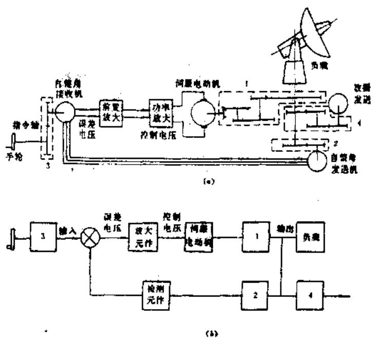

图1-1雷达天线位管手控伺服系统

系统中齿轮传动装置!的作用是传递转矩和转速,使伺服电动机和负载在转矩和转速上得到匹配。由于这类传动装置是传递功率的,称为动力传动装置。雷达天线动力传动装置的性能指标有:驱动功率、传动误差、空程误差、机械谐振频率、负载轴上的摩擦力矩等。

系统中齿轮传动装置2和3与检测元件一起,完成实际位置的反馈、指令数据的输入,以及两者之间的比较等任务。齿轮传动装置4的作用是使负载实际位置得以显示或传递到其它设各上去,这类传动装置统称为“数据传递装置”。

数据传递装置和小功率传动装置往往是电子设备的一个重要组成环节。由于它们大多采用小模数齿轮,且常常装配在一个箱内,习惯上称其为“仪器传动装置"。用作数据传递和小功率动力传递的齿轮处于伺服系统的闭环内,成为整个伺服系统的一个组成环节时,传动表置的结构因素(如总传动比、摩擦力矩、转动惯量、传动误差、空程误差和固有频率等)对伺服系统有很大的影响。

图,1-2所示是普通录音机走带机构工作原理示意图。走带机构的作用在此是以适当的张力张紧带子(磁带)并使它以规定的速度经过磁头,以便录音或放音,磁带8由输带部件(压带轮7和主导轴6)从供带盘17上拉出后,再经信息转换部件(录放磁头11),由收带部牛10完成收卷带子的工作,导(带)柱15和导(带)轮16用来保证带的正确位置。为了使运力稳定,在主导轴6上装有一个惯性较大的飞轮4。在这种主导轴驱动方式中,主导轴的直与转速受到已标准化的磁带速度 $( 1 . 7 6 \mathsf { c m } / \mathsf { s } )$ 的制约,一般,直径为 $2 \sim 3 \mathrm { m m }$ ,相应的转速为 $4 5 5 \sim 3 0 3 \mathrm { r / m i n }$ 。

对普通录音机用走带机构的设计应有下列基本要求: $\textcircled{1}$ 保证磁带的恒速运动,它要求格控制抖具率一最主要的性能指标、带速偏差和带速变动幅度等; $\textcircled{2}$ 能完成快进、倒$\sharp$ 、停止和退盒等多种功能; $\textcircled{3}$ 结构紧凌 $\textcircled{4}$ 价格便宜等.

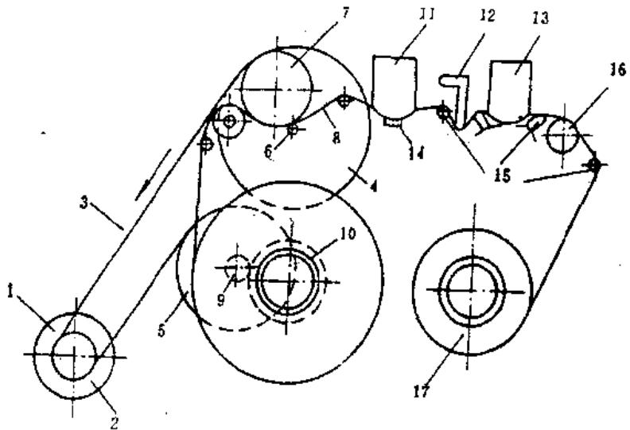

图1-2普通录音机走带机构

1一电机2—带轮:3-橡胶传动带:1-飞轮;5-张繁轮;6-主导轴;  
7-压带轮:8-磁带:9-卷带拿轮:10-收带部件:1J-录放头;12-自停触头  
13—抹音头:14--压贴垫,15-导(带)柱:16-导(带)轮:17-供带盘

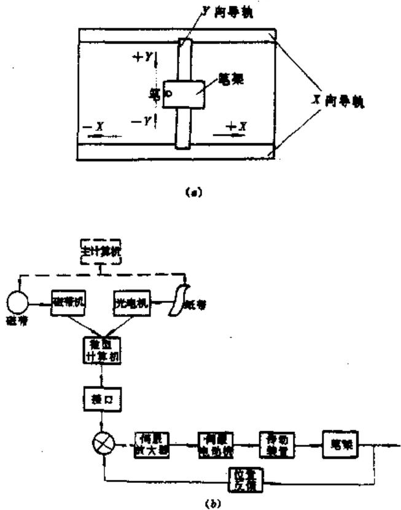

图1-3自动绘图仪结构示意图

图1-3所示 $\left. \pmb { \sigma } \right.$ 是平台式自动绘图仪的结构示意图。它主要由绘图平台、 $\pmb { \chi }$ 向导轨、向导轨、传动装置(图中未画出)和笔架等部分组成,它既可作为主计算机的终端联机使用,也可以和主计算机脱机使用,其系统工作原理方框图如图1-3(b)所示。脱机使用时,主计算机将处理过的图形信息存储在磁带或穿孔纸带上.自动绘图时,绘图仪就把这些图形信息通过磁带机或光电机输送给与绘图仪配套的微型计算机进行信息处理,然后通过插补器发出一系列 $x , y$ 方向的脉冲指令信号,再经过伺服放大器放大、控制伺服电动机,通过传动装置,最后使画笔进行 $x , y$ 方向的合成运动,高速度、高精度地将原来的连续模型以绘制图形的形式输出。自动绘图仪中,绘图平台的台面通常由硬质橡胶构成,上面有许多小孔,与真空吸附装置相通,以便固定图纸。 $\pmb { \chi }$ 向导轨位于平台两侧,Y向导轨装于横梁上,横梁由两端的滑座支撑在平台上。横梁上有与笔架连接在一起的小车,小牢的Y向移动和横梁的 $\pmb { \chi }$ 向移动分别由各自的电动机驱动,并通过滚珠螺母在螺杆上的移动及齿轮减速箱和齿条的相对移动来实现。两种移动的组合就实现了画笔的绘图,而画笔本身可按计算机的指令要求自动抬笔和落笔.

\~平台式自动绘图仪的主要性能指标包括绘图精度、绘图速度和线条质量等,其中尤以绘图精度最为重要。

图1-4所示是高频信号发生器的频率调节与指示装置的结构示意图。它是一种带指示装置并且具有粗、细调两种传动比的调谐装置,常用于调谐系统中需于一个波段范围内作较大的频率指示时,以便能迅速而方便地调谐到所需的工作频率之处,粗调时,转动旋钮1直接带动轴3,经膜片式联轴器6,带动双联可变电容器7转动,达到改变信号频率的目的,并通过刻度2直接指示被调频率;细调时,转动旋钮10,通过齿轮8、5,经安全联轴器4、膜片式联轴器6,带动双联可变电容器转动,以改变和显示所调频率。

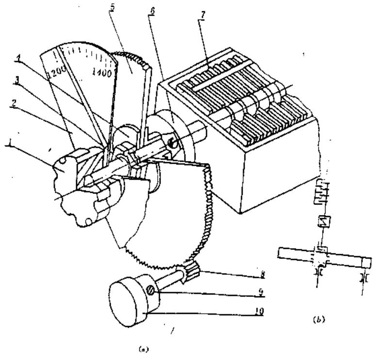

图1-4高频信号发生器频率调节与指示装置(a)结构图 (b)原理图

这种装置的主要性能指标为调谐和指示精度、运动平稳性、灵敏度等。

# 二、精密机械零、部件在电子设备中的作用

由上可知,由精密机械零、部件所组成的精密机构是电子设备的置要组成部分,在很多电子设备中,如录音机、录像机、计算机外部设备、机器人等,精密机械零、部件在组成电子设备的数量上占有相当大的比例.不仅如此,电子设备电路部分中的某些元件,如可变电容器、可变电感器、继电器,以及高频系统中的波导管、谐振腔等,在一定意义上也是精密机械零、都件。

精密机械零件与部件性能的优劣及在电子设备整机中的安排妥当与否,与整台电子设备的使用性能有着十分密切的关系。例如:雷达和通信机接收设备中机拔调谐装置、控制兼置的空程误差是直接造成示数装置和接收频率之间的误差的根源:电接触零、部件的性能不良、磨损及变形等,会降低电子设备的灵敏度,严置的还将使设备无法正常工作等等。

精密机械零、部件在电子设备中的作用可以概括为如下两个主要方面: $\textcircled{1}$ 组成具有确定运动规律的执行机构或相对活动系统来传递、转换和控制运动或能量,传递、记录、变换和显示各种信息,指示电子设备的工作状态和工作结果: $\textcircled{2}$ 构成电子设备中机构的机架和支承系统,调整、固定和连接各种元器件,如光学部件、光电元件、电子元器件,机电元件和机械构件,以获得所要求的确定面稳定的相对位置,以便实现调谐、调节和控制电气参数,完成各种工作状态和功能的转换与控制等任务。

毫无疑问,精密机械零件与部件在电子设备中占有十分置要的地位。可以说,没有精缙的机械结构,就不可能产生高水平的电子设备,现代电子设备是电子技术和精密桃械技术的共同成巢。

随著科学技术的发展,电子设备对精密机械结构的要求也日益提高。愕如,对各种自动控制装置的需要日益增多:随著集成电路的广泛应用,电子设备对精密机械零、部件的体积小、重量轻的要求就显得更为突出;随着电子设备工作频率越来越高,新波段的不断彼开拓,除了对调谐系统的精度、灵敏度等提出更高的要求外,还应用了各种自动调谐系统:面罐着“机电一体化"这一复合技术的研究和开发,电子设备的自动化、智能化程度的逐步提高,对精密机械机构运动的精确性、平稳性、动态响应的快速性则将有更高的要求。精密机械结构有待进一步向小型化、微型化发展。

# 三、电子设备中精密机械零、部件的设计特点

一般来说,电子设备中的精密机械零、部件的设计与普通的机械零、部件或一般的精密机械零、部件在设计上有许多类似之处,如必须满足强度或精度要求等,但它也有自己的特点,首先是机、电结合的特点,它起着保证电气性能的作用,这是电子设备中精密机械零、部件所特有的重要特性,我们必须重视这一重要特性,用优良的机械结构设计,来保证电性能要求的实现,在设计上,这往往反映出考虑问题的着眼点时的不同,例如,一般机械装置对运动部件的惯量控制只是从减少驱动功率来着眼;而在一些电子设备上,如雷达天线的伺服传动装置、遥控机器人的机械手、磁盘存储器中的磁头定位伺服装置等,常是从缩短机电时间常数、提高执行机构的响应能力这一要求出发来控制惯量的。又如,一般的机械设计中控制机械谐振频率是为了保证不被破坏;而在不少电子设备中,如雷达和自动绘图仪中,控制机械谐振频率却是为了保证伺服系统的稳定性。再如,一般机械装置的转轴直径需要满足的是强度、刚度;而磁带录音机和录像机中走带机构的主导轴直径及其精度,还受到标准磁带速度及音像稳定性等因素的制约。为此,要求对走带机构主导轴的直径有一定限制,并要求它有较高的加工精度,径向跳动有时控制在1um之内,表面粗糙度要求达到

此外,由于电子设备在环境条件的复杂性(尤其是军用设备)选用材料的多样性等上与一般机械设计也有差异,所以电子设备中精密机械零、部件的设计尚有其它相应的特点与要求.例如,它要求电子设备中的精密机械零、部件必须满足各种相应的严格的环境要求,包括适应温度变化的能力,耐冲击、振动和加速度的能力,而它所采用的材料,有时要满足一些与电性能有关的要求,如高导电性、高导磁性,或绝缘性、屏蔽性,或耐腐蚀性等。

电子制造业中广泛采用的如塑料、陶瓷成型、冷冲压等特殊工艺,也要求电子设备中精密机械零、部件的结构设计必须考虑这些工艺特点。 :

# 1.2本课程的特点与任务

精密机械结构的最基本单元称为零件或元件(如齿轮、轴及螺钉等)。为了实现(或完成)某种作用而由一些零件组合而成的的组合体称为部件与器件(如阻尼器等);或者,为了某种特定的运动规律的某些构件的组合称为机构(杠杆机构等).由若干组件、部件和零件按总装配图要求组装,才能装配成完整的电子设备(称为整机).整机能完成技术条件规定的复杂任务和功能,并配备一切配套附件,如录放机、摄像机、复印机、放映机等。

本课程主要研究电子设备中常用的零、部件和机构的工作原理、结构形式及应用,以及基本的精度分析和结构设计、计算的原则和方法,以保证可靠地实现电子设备中精密机械结构的工作职能。

本课程是一门重要专业课程.它与电子设备的箱柜设计、造型设计、电磁兼容设计、热设计、耐振动和冲击设计、防腐设计等一起构成了电子设备结构设计的主要内容。它将综合运用工程力学、机械制图、公差配合与技术测量、电子设备结构材料、机械原理与机械零件、电工学、电子机械零、部件制造工艺学等专业基础课程的有关知识,使学生掌握电子设备中常用精密机械零、部件和机构的工作原理、结构特点、基本设计理论和分析计算方法,具有一般精密机械零、部件结构设计和机构精度分析的能力、

在学习本课程时,应充分注意本课程具有综合性、实践性、规律性等特点,既重视当前知识的学习,也重视前修课程知识的复习及综合、灵活的应用;注重实践,注意理论与实际结合;树立并运用辩证的观点,对具体问题作具体分析,努力掌握住本质的、规律性的关键技术.

# 习 题

1-1为什么说电子设备中的机械设计属于“精密机械”范畴?

1-2精密机械零件与部件在电子设备中的作用是什么?

1-3电子设备中糟密机械零件与部件的设计有何特点?

# 第二章 精密机械设计的基本知识

# 2.1精密机械设计的要求和方法

# 一、精密机械设计的基本要求

同一般机械设计一样,对精密机械及其零、部件在设计时所提出的基本要求,主要有使用要求和经济要求两大方面。

# 1.使用要求

使用要求是设计时必须满足的技术指标,使用要求一般随精密机械及其零、部件的用途和使用条件的不同而不同。

(1)基本功能与性能基本功能主要应与用途相适应,对于精密机械系统或部件常常体现为运动规律和运动范围等。

基本性能主要是保证基本功能实现所要求的性能指标.精密机械及其零、部件最主要的性能指标是精度,这是由于它们本身的作用和特点所决定的。此外,还有精密机械运动系统的灵活性,工作中的灵敏度等。

(2)可靠性和稳定性可靠性和稳定性是指在一定的使用条件下和规定的使用期限内,工作可靠、稳定并能按规定要求完成预定的功能和实现基本性能指标。要做到这一点,精密机械零件应具有一定的工作能力,即具有足够的强度、刚度,并且在特定的工作环境和使用条件(如温度变化、潮湿、腐蚀性介质、振动、冲击等)下变化不敏感,保持稳定等。

(3)其它要求这是指根据使用条件的不同和工作时的特点,对精密机械及其零、部件所提出的附加设计要求。例如,当所设计的零、部件受到整机安装空间限制时,则要求结构紧凑,体积小;对于便携式设备,要求其零、部件体积小,重量轻,该要求亦适用于航空、航天设备上的、部件;对于海洋船舶设备上的零、部件,则要求耐腐蚀,密封性能好等,

# 2.经济要求

经济要求是设计时必须满足的又一基本要求,即所设计的零、部件能够经济地生产并满足成本和经济效益的要求。为此,精密机械零件与部件在设计时所满足的具体要求和遵循的原则是:

(1)结构最简单在满足使用要求的前提下,所设计零、部件的结构越简单好,这样容易加工,减少了加工劳动量,故经济性好。

(2)良好的结构工艺性结构工艺性是指所设计的零件与部件在满足使用要求的前提下,根据一定的生产规模和具体的生产条件,能用生产率高、劳动量小、材料消耗少、装配方便和生产成本低的方法制造出来。结构工艺性是一个复杂而实际的问题,它所涉及的内容非常广泛,同时它又是设计和生产中出现最多的问题.精密机械零件与部件的结构工艺性原则分别是:

$\textcircled{1}$ 部件的结构工艺性其一般原则有:尽量采用现有结构和利用典型结构:力求结构简单;便于装配、检查和更换零件;结构应能调整和定位等。

$\textcircled{2}$ 零件的结构工艺性其一般原则有:合理地选择材料和制造毛坏;形状尽量简单、易加工;槽、孔、倒角、圆角等几何要素的形状及尺寸应符合标准的规定;保证刀具、量具工作的可能性;尽量减少精加工表面及加工面积;合理地制定技术条件等。

$\textcircled{3}$ 贯彻标准化、统一化原则这是一项重要的技术经济政策,它可以缩短设计、生产周期,提高产品质量和降低成本等。

$\textcircled{4}$ 价值系数最佳价值系数是功能与成本的比值,这也是衡量经济性的一项重要标志

# 二、精密机械设计的基本方法

# 1.重论设计

理论设计是根据设计要求,利用各学科所提供的理论知识,通过计算、作图等而进行的设计。例如,利用材料力学的强皮理论进行的设计,利用误差理论进行的精度设计,利用机械原理及各种基本原则通过计算、绘图确定结构的类型、形状、尺寸及其公差数值所进行的结构设计等均属于理论设计。

# 2.经验设计

有些零件或部件的设计,目前尚不便采用理论计算的方法进行,例如电子设备、仪器的壳体、底座等,在这种情况下,只能参照在实际使用中已被证明设计是正确的和使用可靠的产品或零、部件,根据设计要求,采用类比法;或根据设计、生产和使用中归纳出来的设计经验及经验公式来进行设计,这种方法叫做经验设计或类比法设计。

# 3.校核设计

校核设计实际上是理论设计和经验设计的结合,即根据设计要求和已知条件,先进行经验设计,然后对其中的关键部件和重要零件,按照理论分析所导出的保证机构按其运动规律和特性正常运动的条件,保证零件不产生破坏和过大变形的强度条件和刚度条件,保证不超过最大允许误差的精度条件,以及保证在温度变化及振动情况下工作稳定性的条件等进行校核计算.当某些条件未能得到满足时,则应对某些设计参数进行修改、调整,使其最后满足反映设计要求的各种条件。校核设计多用于对工作特性影响因素较多的情况下,它既能简化设计过程,又能使机构和构件的工作特性得到保证。

# 4.模拟实验设计

模拟实验设计是根据设计要求,将所要设计的零、部件,初步定出形状和尺寸并做出模型,然后再通过实验手段对模型进行实验,根据实验结果来分析判断设计参数是否正确,并进行修正,再实验,逐步加以完善,最后确定零、部件的合理参数的过程。

模拟实验设计多用于机构的运动规律过于复杂或构件工作特性的影响因素过多,理论

设计难于解决问题,经验设计又无适当借鉴的场合,它实际上是理论设计和经验设计的补充.

# 5.设计的新方法

随着科学技术的发展,传统的设计方法已越来越不能适应设计速度、设计质量等方面的要求,现在工程设计领域中已出现了计算机辅助设计、可靠性设计、优化设计等设计新方法。这些方法也在精密机械及其零、部件设计中采用,并在逐步推广,

# 2.2精密机械零件与部件的精度

# 一、研究精度的目的和任务

精度是评价电子设备、精密机被设备质量和性能的重要技术指标。精度同题,在精密机械及其零、部件设计中是头等重要的问题之一。

精度是指准确的程度,其高低是用误差的大小来衡量的。误差小則精度高,误差大则精度低。

在精密机被设计时,最好是采用能实现最佳运动规律的理想机构,但这种理想机构实际上是不存在的。因为机构中不可避免地会产生这样或那样的误差,如零件的加工误差、都件的装配误差等,使机构不可能按给定的运动规律作准确的运动,通常把实际机构或部件在构件加工、装配和工作过程中由于误差的存在,其实际运动符合理想运动的准确程度,称为机构精度。研究精度的目的就是要分析各构件的误差来源及其对机构精度的影响,探讨误差的传递规律来提高精密机械设计的质量,研究机构精度的基本任务有如下两个方面:

(1)机构精度综合这是根据组成机构的各零、部件的误差来源及大小,分析各种误差因素对机构精度的影响,并对误差进行合成求出该机构的总误差的过程。在此过程中通过误差分析和计算,可以发现对机构总误差影响较大的关键和薄弱环节,明确提高机构精度的方向和重点,以便采取措施减少或控制误差,并为改善设计质量提供依据。

(2)机构精度分配这是根据机构总精度的要求,在误差分析的基础上,合理确定机构各组成零件、部件的公差、配合等技术条件。精度分配在理论上是精度综合的逆运算,但要比误差分析与综合复杂得多,本书只讨论典型机构精度分析及综合的计算问题。

在精密机械零件与部件的设计中,其技术条件通常是用“类比法”确定的,对于精度要求较高的机构则用精度综合的方法验算其总误差能否满足设计要求。

# 二、误差的基本概念与机构精度的含义

# 1.机构误差的定义及其产生原因

误差是错误值(含有误差的值)与正确值之差,即

# 误差 $\approxeq$ 错误值一正确值

这是误差的逻辑表达式,对于具体的误差定义,可以视具体情况按误差的逻辑表达式来确定.

机构误差的定义是:实际机构运动(位置或位移)与理想机构运动(位置或位移)之间的偏差,这里理想机构系指能绝对准确地实现给定运动规律的机构。实际机构总有误差,产生机构误差的根本原因有以下几方面;

(1)设计误差是指机构或部件在设计过程中,由于采用近似的简化机构或采用近似理论和作近似假定,产生实际机构运动与理想运动之间的偏差,又称为原理误差,

(2)制造误差是机构中的零件与部件在加工和装配过程中,由于工艺等因素所造成的零件尺寸、形状以及相对位置的误差。

(3)使用误差是机构在使用过程中,由于受力变形、摩擦靡损以及工作环境(温度、振动等)变化等因素所造成的误差。

# 2.误差的基本类型与性质

按误差性质的不同,误差可分为系统误差与随机误差两种基本类型。

(1)系统误差系统误差是服从一定規律的误差,即误差的大小和符号是固定不变的,或是按一定函数规律变化的,系统误差又可以按下列方法分类:

$\textcircled{1}$ 按对误差的掌握程度分为:已定系统误差和未定系统误差,前者误差的大小或符号为已知;后者则其大小和符号都不确定,或只能确定其大小而不能确定其符号,但通常可估算出其误差的范围。

$\textcircled{2}$ 按误差出现的规律性分为:不变系统误差和变化系统误差。前者误差的大小和符号固定不变;后者误差的大小和符号按一定规律(如线性規律、周期性规律及复杂的規律等)变化.

系统误差是由固定不变的或按确定規律变化的因素所造成的。它可用计算和实验的方法确定或估计误差范围,并有可能采取必要措施消除或补偿。

(2)随机误差(偶然误差)随机误差即随机出现的误差,其误差的大小和符号表面上看来是无规律变化的;但对于大量的随机误差而言,它们的分布是服从统计规律的。大多数随机误差服从正态分布规律。

随机误差是由许多独立因素的微量变化综合作用的结果,无法预知其大小和符号,不能用实验方法加以修正。

(3)系统误差与随机误差之间的关系及其数字特征系统误差与随机误差之间并没有不可逾越的鸿沟,可以因条件不同而互相转化。如果所给的条件不同,讨论的问题不同,误差的性质将发生变化,例如,环境温度变化引起的机构误差,当温度为一个已知的定值时,则是数值和符号均已知的系统误差,可以对它进行修正和补偿:若给定的温度变化只是一个范围,而不是一个已知的定值,则引起机构的误差就转化为未定系统误差;而当环境温度变化作随机波动时,则由此引起机构的附加误差就成为随机误差,再如,机构的某些制造误差,若对一个具体的机构而言,可能为系统误差;而对一批相同机构来说,则该误差就具有随机误差性质.

系统误差与随机误差的关系,还表现在它们总是综合出现的,当同时存在系统误差和随机误差时,其误差表现特征如图2-1所示,

图中 $\pmb { x _ { 0 } }$ 为机构被测位置的给定值(理论上的名义值),当多次重复测量时,机构位置实际值的算术平均值 $\pmb { M } ( \pmb { x } )$ 与名义值之差 $\boldsymbol { \Delta }$ 为定值,它反映了系统误差,而随机误差为对称分布,分布范围以 $M ( z )$ 为中心,分布在 $[ - \delta , + \delta ]$ 区间内, $\pmb { \delta }$ 称为随机误差的不确定度或极限误

差.

机构的总误差由系统误差和随机误差所组成,由于随机误差是由许多微小因素综合作用的结果,与系统误差相比,随机误差的数值往往很小,有时甚至可以忽略,因此,系统误差较随机误差对精度的影响更大,可以认为影响机构精度的主要因素是系统误差。但是,由于系统误差与随机误差一同出现,它的规律性常常不易被人们认识和掌握,所以系统误差的潜伏性使它比随机误差更具有危险性,消除和减少系统误差往往成为提高精度的关键问题,

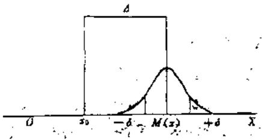

图2-1:系统误差与随机误差

对于已定系统误差,其规律性已被人们认识和掌握,可以采取措施减小或消除它对精度·的影响:对于未定系统误差,同随机误差一样,也可用统计方法进行分析研究;估计出它的分布区间 $[ - e , + e ]$ ,即未定系统误差的范围 $\mathbf { \sigma } _ { \mathbf { \mu } } \bullet$ 为系统误差的不确定度或极限误差。

# 3.机构精度的评定指标及其含义

精度是用误差来衡量的,根据误差性质的不同和实际机构或部件的工作特征,机构精度的评定指标有以下几种:

(1)位置准确度机构或部件运动的位置准确度,是指机构或部件平均的实际运动(位置、位移)对理想运动(位置、位移)的符合程度,它是以当实际机构与理想机构主动件处在相同位置时两机构从动件的位置误差来评定的,如图2-2所示, $y _ { 2 } ( x ) , y _ { 1 } ( x )$ 分别为机构的平均实际运动曲线与理想运动曲线,在仟意位量 $\pmb { x }$ 处,机构的位置港确度为 心

$$
A = \{ y _ { 2 } ( \pmb { x } ) - y _ { 1 } ( \pmb { x } ) \} \quad \mathrm { ~ ` ~ ` ~ ( \pmb { \mu m } ) ~ }
$$

在实用中常以位置准确度中的最大值 $\pmb { A } _ { \mathbf { p a x } }$ 来评定。

位量准确度是评定机构或部件精度的最基本措标,它反映了机构或部件的系绕误差。影响位置准确度的原国为机构的设计误差和零件几何尺寸、形状、相对位置的制造误差。因此,通过调整、选配或加入补偿、校正环节都可以使位置准确度提高。

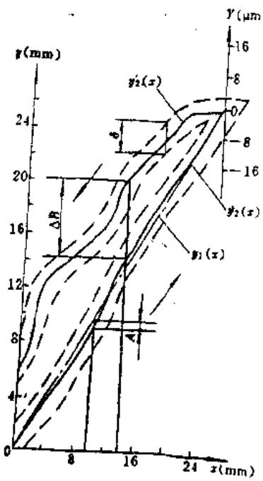

图2-2机构精度的评定指标示意图

(2)位置变动度机构或部件的位置变动度是主动件正向运动至某一位置时从动件的位置与主动件反向运动至同一位置时从动件的位置相互偏离的程度,也就是空程误差。如图2-2所示 $\dot { \eta } _ { 1 } ( \pmb { x } )$ 和 $y _ { 2 } ^ { \prime } ( \pmb { \tau } )$ 分别是正向和反向时的平均实际运动曲线,机构的主动件处在任意位置 $\pmb { x }$ 处的位置变动度为 1

$$
\Delta B = \left| y _ { 2 } ^ { * } ( z ) - y _ { 2 } ( z ) \right| \qquad ( \mu \mathrm { m } )
$$

位置变动度反映了机构本身的优劣,它表示机构在正、反方向运动时位置准确度变异的范围。造成位置变动度的因素主要是机构中的间隙和弹性变形,也属于机构的系统误差。

(3)位置精密度机构或部件的位置精密度为机构多次重复动作时,其实际运动位置对其平均运动位置的分散程度,如图2-2中所示的两条虚线

之间,便是实际运动位置的分散带。

机构精密度体现机构运动的可靠程度,反映机构正常工作条件下的随机误差,机构多次重复动作时,引起机构各次实际运动位置分散的原因是很复杂的,它包括机构中所有经常在变动的各种因素,如机构零件之间的配合间隙、作用力的变化、摩擦和弹性变形以及旋转偏心的相位变化等。它是许多因素综合作用的结果,事先无法知道,常用反映随机误差的量极限误差6来省量.

在一个机构全部运动过程中,各处位置精密度b可能是不同的,在实用中机构的位置精密度是以实际位置对其平均位置的最大分散宽度 $\pmb { \llangle }$ 来表示的。

(4)位置精确度机构或部件的位置精确度是位鸞准确度与位置精密度的绿合,位置精确度是评定机构精度的综合性指标,反映机构系统误差与随机误差的線合影响程度。

机构的位置准确度,位置精密度和位置精确度三者的相互关系及其含义如图2-3所示,对于具体机构面言,位置精密度高但不一定位置准确度高,如图2-3(c)所示,反之,位置准确度高但不一定位置精密度高,如图2-3(6)所示,只有位置精确度高即位置准确度和位置精密度都高,才能全面反映机构精度高的特征,如图2-3()所示,位置准确度和位置精密度都不够高的情况如图2-3(d)所示,如不能清足机构位置准确度和位置精密度都高的要求,应首先保证较高的位置精密度使机构可韋工作。

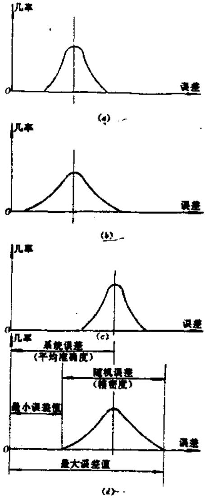

图2-3位置准确度、精密度与精确度的关系图

# 三、机构精度的计算

机构精度的计算是在误差分析的基础上找出机构误差与各原始误差之间的关系,计算出每个原始误差引起的机构局部误差,然后将各个局部误差按一定的合成方法综合为总误差。一般不必对所有误差都进行计算,应着重分析和计算对机构精度有较大影响的作用件误差。机构的设计误差与零件的加工精度和装配精度无关。机构的使用误差比较复杂,与工作过程中的一些微量变化因素有关.当机构不存在设计误差时,造成机构误差的主要原因是机构的制造误差,即零件和部件的固有误差。

# 1.机构误差的计算方法

机构误差的计算常用机构从动件运动的位置误差来表示,常用的基本方法有微分法、作用线与瞬时臂法、几何法等。

(1)微分法机构从动件的位置是主动件的位置、机构所有构件参数的函数。对于理想机构而言,从动件的位置可用下式表示:

$$
y = f ( q _ { 1 } , q _ { 2 } , \cdots , q _ { * } )
$$

式中, $, { \pmb y }$ -理想机构从动件的位置;

${ \pmb q } _ { \bf i }$ —理想机构各构件的位置参数 $, i { = } 1 , 2 , \cdots , \bar { } $ ,

与理想机构从动件的位置表达式相对应,可写出含有误差的实际机构的位置表达式为

$$
y + \Delta y = f ( q _ { 1 } + \Delta q _ { 1 } , q _ { 2 } + \Delta q _ { 2 } , \cdots , q _ { n } \div \Delta q _ { a } )
$$

式中 $\cdot q _ { 1 } , q _ { 2 } , \cdots , q _ { \mathrm { { a } } }$ 的误差分别是 $\Delta q _ { 1 } , \Delta q _ { 3 } , \cdots , \Delta q _ { a }$ ,这些误差的共同作用所造成机构从动件位置 $\pmb { y }$ 的总误差为 $\Delta y$ ·

上式一般为一非线性函数,可以认为 ${ \pmb y }$ 是随 ${ \pmb q } _ { \hphantom { 0 } }$ 连续变化,且误差是个微小量,因此可展开成泰勒级数,当忽略高次项,取其一阶项作为近似值时,式(2-2)可写成

$$
y + \Delta y = f ( q _ { \mathrm { { i } } } , q _ { \mathrm { { 2 } } } , \cdots , q _ { \mathrm { { s } } } ) + \Bigl ( \frac { \partial f } { \partial q _ { \mathrm { { 1 } } } } \Delta q _ { \mathrm { { 1 } } } + \frac { \partial f } { \partial q _ { \mathrm { { 2 } } } } \Delta q _ { \mathrm { { 2 } } } + \cdots + \frac { \partial f } { \partial q _ { \mathrm { { s } } } } \Delta q _ { \mathrm { { s } } } \Bigr )
$$

化简后得

$$
\Delta y = { \frac { \partial f } { \partial q _ { 1 } } } \Delta q _ { 1 } + { \frac { \partial f } { \partial q _ { 2 } } } \Delta q _ { 1 } + \cdots + { \frac { \partial f } { \partial q _ { * } } } \Delta q _ { * }
$$

或

$$
\Delta y = \sum _ { i = 1 } ^ { \cdot } \frac { \partial f } { \partial q _ { i } } \cdot \Delta q _ { i }
$$

上式也可以将已知机构的位置表达式微分后,用有限量 $\Delta y , \Delta q _ { i }$ 近似代替微分置、得到,这就是机构精度计算的微分法,

由式(2-4)可知: $\textcircled{1}$ 每个原始误差都将使从动件产生一定的位置误差,通常称为机构的局部位置误差。 $\textcircled{2}$ 每个局部误差 g仅是其原始误差的线性函数(其线性常数是偏导数$\frac { \partial f } { \partial g _ { i } }$ ,常称为误差传递系数),其值与其它误差源无关,不随其它误差的变化而变化。这种性质称为“误差独立作用原理”。 $\textcircled{3}$ 机构从动件总的位置误差等于各局部位置误差之和。

由此可见,对于有多个原始误差的机构进行精度分析和计算时,可以逐项考虑,首先列出机构的运动方程式,并对其微分求出各偏导数值;将每个原始误差乘上相应的偏导数值,计算每个原始误差引起的局部位置误差;然后再将各个局部位置误差按一定的合成方法综合为机构的总位置误差。

微分法的优点是对于某些能直接给出从动件位置表达式的机构,可方便地求出机构的位置误差,而且还能指出机构误差与原始误差之间的函数关系,这是一种最基本的机构精度计算方法,但在使再时有一定的局限性,例如,对于复杂机构很难列出运动方程式,有些原始误差(间隙、轴线倾斜等)很难列入方程,因此就不能用微分法求解。此时就要用其它方法计算机构精度,微分法宜用来计算简单机构的精度。

(2)作用线与瞬时臂法它与微分法直接导出原始误差与从动件或末端件位置误差的关系式不同,而是首先求出原始误差与相邻从动件位置误差的关系式,再应用误差传递原理,求出原始误差与末端件位置误差的关系式。原始误差逐渐向末端件传递的过程是与机构传递运动的过程紧密相关的,要导出误差传递的关系式必须研究机构传递运动的过程及传递方式。

机构传递运动的方式,一般可概括为两种:推力传动与摩擦传动,杠杆机构、凸轮机构、齿轮机构、螺旋机构等属于推力传劫;大部分带传动、摩擦轮传动则于摩擦传动。尽管两种传动方式不同,但却有一个共同特征,即在相互作用的两个构件之间每一瞬时都有一个作用线。推力传动的作用线,为两构件接触区的公法线,摩擦传动的作用线为两构件接触区的公切线,力的作用和运动的传递,都必须通过作用线.图2-4所示为推力传动机构,图中1为主动件,2为从动件, $\pmb { \sigma }$ 为瞬时回转中心, $\overline { { K K } }$ 为运动线(被研究质点的运动轨迹), $\overline { { N N } }$ 为作用线.从动件运动沿作用线的位移为

$$
\tilde { d L } = \gamma _ { \vartheta } \cdot \tilde { d \varphi }
$$

式中, $\clubsuit$ —-主动件的微小角位移;

$\curvearrowleft$ 一作用臂,即主动件瞬时回转中心至作用线的垂直距离。

根据上式可导出推力传动机构的运动方程式为

$$
\Sigma = \int \limits _ { 0 } ^ { \infty } r o d \phi
$$

实际机构的瞬时作用臂通常是个变量,如果机构有原始误差,常表现在瞬时臂的附加变化上,因此,可把 $\curvearrowleft$ 分解为常量 $\pmb { \alpha }$ 、机构工作原理本身所要求的变量 $\Delta \pmb { r _ { 0 } }$ 和由主动件原始误差引起的变量$\delta \pmb { \tau _ { 0 } }$ 三部分组成,即

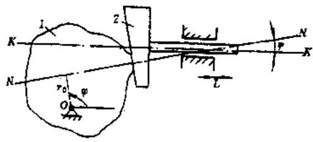

图2-4推力传动机构

$$
r _ { 0 } = a + \Delta r _ { 0 } + \Delta r _ { 0 }
$$

故有

$$
{ \mathcal { L } } = \int _ { 0 } ^ { \infty } ( a + \Delta r _ { 0 } + \delta r _ { 0 } ) d \varphi = a \varphi + \int _ { 0 } ^ { \infty } \Delta r _ { 0 } \cdot d \varphi + \int _ { 0 } ^ { \infty } \delta r _ { 0 } \cdot d \varphi
$$

最后一项是由原始误差引起的从动件在作用线上的位置误差,即

$$
\Delta L = \int \limits _ { 0 } ^ { \phi } d \tau _ { 0 } \cdot d \phi
$$

当运动线与作用线之间的夹角为 $\psi$ 时,这时反映在从动件运动方向的误差 $\pmb { \Delta \widetilde { Y } }$ 与作用线方向的误差 $\pmb { \Delta } \pmb { L }$ 的关系式为

$$
\Delta \mathbf { \bar { Y } } = \frac { \Delta L } { \cos { \phi } }
$$

对于绕固定中心或瞬时中心转动的任何构件在运动线上的位置误差 $\pmb { \Delta \gamma }$ 与转角误差 $\Delta \varphi$ 的关系可由下式给出:

$$
\Delta Y \cong \triangledown \cdot \Delta \varphi
$$

式中,—作用臂。

从上述分析可知,用作用线与瞬时臂法求运动副误差的过程是:先将原始误差向作用线上折算,再将作用线上的原始误差分量向其运动线上折算,

当一个运动副有多项原始误差时,可把各个原始误差换算到共同的作用线上,再将它们宗合起来,得到一个总的作用线方向上的误差.但是,对于整个机构来说,通常由“个运动副且成,每个运动副又有各自的作用线及作用线方向上的误差。为了求得机构的总误差,须把所有误差转换到末端件的作用线上去。这就是研究如何把一作用线上的误差折算到另一作用线上去,即须求出表示各原始误差对机构末端件误差影响程度的“误差传递系数”.下面讨

论原始误差的传道过程。

作用线上的直线位移可看作某一睡时的位移,即

$$
\Delta E = r _ { 2 } \cdot \Delta q
$$

因此,任意两构件 $\pmb { k }$ 与 $j$ 的直线位移之比应为

$$
A _ { 2 k } = \frac { m _ { 1 } \cdot R } { T _ { 1 1 } \cdot \phi _ { 1 } }
$$

式中, $\pmb { A } _ { \pmb { \mathscr { p } } }$ -第 $\pmb { j }$ 个作用线到第 $\pmb { \lambda }$ 个作用线之间的位移传递系数,即线性误差的传递系数;

$\cos 5 a$ 一第 $j$ 个及第 $\pmb { \big \vert }$ 个运动副中相应构件的麟时作用臂;

$9 9 、 9$ 一第 $j$ 个及第 $\pmb { k }$ 个运动副中瞬时作用臂为 $\pmb { \tau _ { 0 j } }$ 及 $\curvearrowright$ 构件的转角。

这样,第 $j$ 个作用线上的误差 $\Delta L _ { j }$ 向第 $\pmb { k }$ 个作用线上折算时,其误差值 $\Delta t _ { 0 }$ 可由下式表示:

$$
\Delta L _ { 1 } = \Delta L _ { 1 } \cdot A _ { 1 1 }  \Delta L _ { 1 } \cdot \frac { r _ { 4 } \cdot 9 } { r _ { 4 } \cdot 9 }
$$

在具有 $\pmb { \triangleright }$ 个运动副的机构中,可将各运动副作用线上误差折算到第 $\clubsuit$ 个作用线上去,其误差总信为

$$
\Delta L _ { 1 } = \Delta L _ { 1 } \cdot A _ { 1 2 } + \Delta L _ { 2 } \cdot A _ { 2 1 } + \cdots + \Delta L _ { 2 } \cdot A _ { 2 } = \sum \limits _ { i = 1 } ^ { 3 } \Delta L _ { 2 } \cdot A _ { 2 }
$$

式中, $\Delta L _ { 1 } , \Delta L _ { 2 } , \cdots , \Delta L _ { \circ }$ 为在第 $1 \sim \Re$ 个作用线上的误差 $\smash  \{ A _ { \mathrm { L b } , \mathrm { \Delta } A _ { \mathrm { Z } * } , \cdots , A _ { ( n = 1 ) 4 } }$ 为第 $\mathbf { i } \sim ( \mathbf { \mathfrak { s } } - 1 )$ 个作用线与第 $\pmb { \mathscr { R } }$ 个作用线之间的误差传递系数。

考虑到通常作用线与运动线之间的夹角 $\pmb { \phi }$ ,则在运动线方向上的总误差为

$$
\Delta Y _ { z } = \sum \limits _ { n = 1 } ^ { \bullet } \frac { \Delta L _ { n } } { \cos \phi } \cdot A _ { | n | }
$$

这就是用作用线与瞬时臂法求机构末端件的位置误差表达式。这种方法简明、直观,对高副和低副机构都适用,也是目前常用的机构精度计算方法之一。

(3)几何法这是根据机构的工作原理,绘出机构简图,用几何图形表示原始误差与从动件位置误差的关系,再根据图上的几何关系,列出误差的计算公式,最后求出机构的局部位置误差的方法。

机构精度计算方法以微分法、几何法应用最为广泛。微分法是其它几种方法的基础,在能列出机构运动方程式的条件下,用微分法较为方便,在简单机构中,不必列出运动方程,采用几何法更为直观。有些误差如几何形状误差,则应用作用线与瞬时臂法来求解显得更为有效。

# 2.误差合成的方法

进行误差合成时必须先进行误差分析,找出误差源(原始误差),弄清各误差的性质,计算机构各个原始误差引起的局部位置误差,再用一定的方法综合为总误差。误差的合成是一个比较复杂的问题,不同性质的误差其合成方法不同,这里仅介绍误差合成的几种简单方法。

(1)随机误差的合成设有“个互不相关的随机误差,均服从正态分布规律,极限误差(不确定度)分别是6、、…、&、,则由概率理论知,如单项误差较多(≥5),则随机误差合成后仍是随机误差且服从正态分布,当约定概率为0.9973时,合成后总的随机误差的极限值为

$$
\delta _ { z } = \pm \ \sqrt { \delta _ { i } ^ { 2 } + \delta _ { i } ^ { 2 } + \cdots + \delta _ { i } ^ { 2 } } = \pm \ \sqrt { \sum _ { i = 1 } ^ { 4 } \left( \delta _ { i } \right) ^ { 2 } }
$$

式(2-16)表达的误差合成方法称为方和根法。

若 $\delta q _ { i }$ 为机构的随机性原始误差,考虑到原始误差与机构局部位置误差的传递系数B.$= \frac { \partial f } { \partial g _ { i } }$ ,则各局部误差合成后仍为随机误差,此时式(2-4)应按下式综合:

$$
\delta y = \pm { \sqrt { \sum _ { i = 1 } ^ { \infty } ( B _ { i } \delta q _ { i } ) ^ { 2 } } } = \pm { \sqrt { \sum _ { i = 1 } ^ { \infty } \left( { \frac { \partial f } { \partial q _ { i } } } \delta q _ { i } \right) ^ { 2 } } }
$$

(2)系统误差的合成由于已定系统误差的数值大小和符号均已知,故总误差可按代数和法合成,设有 $\pmb { \mathscr { r } }$ 个已定系统误差 $\Delta _ { i } , \Delta _ { 2 } , \cdots , \Lambda _ { r }$ ,则总的已定系统误差为

$$
\Delta _ { 2 } = \Delta _ { 1 } + \Delta _ { 2 } + \cdots + \Delta _ { 4 } = \sum \limits _ { i = 1 } ^ { r } \Delta _ { i }
$$

对于数值大小和符号不能确切掌握的未定系统误差,其合成方法常用的有:

$\textcircled{1}$ 绝对和法若系统误差方向不明确,只能估计其范围,即系统误差的不确定度 $e _ { 1 } , e _ { 2 }$ 、e、e,则总的系统误差可按绝对和法合成,其不确定度为

$$
e _ { 2 } = | e _ { 1 } | + | e _ { 2 } | + \cdots + | e _ { n } | = \sum \limits _ { i = 1 } ^ { n } | e _ { i } |
$$

这种合成方法又称为极值法,其计算结果较实际情况偏大,是保险的。一般适用于原始误差项数较少的情况或对误差的粗略估算上。

$\textcircled{2}$ 方和根法若原始误差项数较多,可像对待随机误差一样,将其视为正态分布,采用方和根法合成,总未定系统误差的不确定度为

$$
e _ { E } = \pm \ { \sqrt { e _ { 1 } ^ { 2 } + e _ { 2 } ^ { 2 } + \cdots + e _ { n } ^ { 2 } } } = \pm \ { \sqrt { \sum _ { i = 1 } ^ { 3 } { e _ { i } ^ { 2 } } } }
$$

在计算机构误差时,考虑到原始误差与局部误差的传递关系,则机构系统误差的综合式为

$$
e _ { X } = \pm \sqrt { \sum _ { i = 1 } ^ { \infty } \left( \frac { \partial f } { \partial q _ { i } } \cdot e _ { i } \right) ^ { 2 } }
$$

(3)系统误差与随机误差的合成所有系统误差和随机误差合成后的误差称为总误差,若随机误差和未定系统误差均按正态分布考虑,则总误差的综合公式为

$$
\Delta _ { \bar { z } } = \sum _ { i = 1 } ^ { \prime } \Delta _ { \bar { i } } \pm \sqrt { \sum _ { i = 1 } ^ { \prime } ( e _ { i } ) ^ { 2 } + \sum _ { i = 1 } ^ { \prime } ( \delta _ { i } ) ^ { 2 } }
$$

机构总的误差综合式可写成:

$$
\Delta y = \sum _ { i = 1 } ^ { r } \frac { \partial f } { \partial q _ { i } } \Delta _ { i } \pm \sqrt { \sum _ { i = 1 } ^ { r } \left( \frac { \partial f } { \partial q _ { i } } \cdot e _ { i } \right) ^ { 2 } + \sum _ { i = 1 } ^ { r } \left( \frac { \partial f } { \partial q _ { i } } \cdot \delta _ { i } \right) ^ { 2 } }
$$

式中, $\Delta _ { i } , e _ { i } , \partial _ { i }$ 为机构参数 ${ \pmb q } _ { i }$ 的原始误差, $\frac { \partial f } { \partial \xi _ { i } }$ 为误差传递系数。

# 四、提高机构精度的一般方法

提高机构精度的主要途径有两方面:是合理地提高零、部件的制造精度,这是保证机

构精度的有效措施,也是最根本的。但是,签件的制造精度不能无限制地提高,如果过高地提高制造精度,不仅会使成本大大提高,而且不一定能满足产品精度的要求,因此只能根据产品性能要求和生产的具体条件,合理地选择较高的经济加工精度。

提高精度的另一途径是在机构设计时,根据误差分析的结果,针对误差产生的原因和性质以及对机构精度的影响,在结构上采取有效措施,来减少或消除误差的影响,从而保证机构精度的要求,常用的方法如下:

# 1.按误差来源消除或减少误差

常用的方法主要有: $\textcircled{1}$ 在设计装置和计算参数时,应尽量选用合乎实际的理论和公式及理论上正确的机构和设计参数,避免由于工作原理不完善而引起的系统误差; $\textcircled{2}$ 简化机构的运动规律和结构,缩短传动链来减少零件的数量,亦即减少误差的来源 $\textcircled{3}$ 若采用近似公式和近似机构,应算出其原理误差值,以便在实际运行中修正: $\textcircled{4}$ 部件装配时,通过研磨、配做、零件修切校正和选择装配等方法使零件尺寸的公差适当正负抵消,则可获得更高的精度; $\textcircled{5}$ 对精度要求很高的机构,可采用各种专门的调整装置,或使结构具有调整的可能性;$\textcircled{8}$ 为了避免由于刚度不足而引起的零件尺寸、几何形状及相对位置的改变,应合理地选择零件的截面形状和尺寸,稳定的材质,并进行稳定性处理,改善零件的受力情况,以保证零件的刚度和尺寸稳定性: $\textcircled{7}$ 运动系统中,相对运动部分的摩擦是一个重要的误差来源,为此,运动副可采用摩擦系数小的材质,适当选择表面粗糙度及适当润滑,另外,相对运动零件工作表面的磨损,是逐渐丧失其原始精度的主要原因,为保持一定使用期间内的精度,可采用耐磨性较好的材料,避免接触面过小等; $\textcircled{8}$ 为了避免由于温度变化所引起的零件变形、运动副间隙的改变等所造成的误差,选择材料时要注意考虑其热膨胀性,并控制外界条件的稳定性;等等。

# 2.采用误差校正装置来消除或减少误差

这种方法是预先算出或测出机构系统误差的大小和变化规律后,设计出专用的误差校正装置,使机构在运动过程中产生一个与原始误差值相反的运动,从而减少或消除误差对精度的影响。

# $\ S \ 2 . 3$ 精密机械零件的工作能力与计算准则

精密机械及其零、部件设计中,在:证基本功能及基本性能实现所要求的精度时,为使之工作可靠、稳定,必须使精密机械:件具备一定的工作能力,零件的工作能力是指零件在承受载荷条件下抵抗破坏、变形、磨损和振动的能力,主要包括: $\textcircled{1}$ 强度: $\textcircled{2}$ 刚度; $\textcircled{3}$ 振动稳定性等。

# 一、强度

任何一个机械零件或部件,在工作时首先必须保证足够的强度。强度是零件抵抗破坏的能力,分为整体强度和表面强度两种。

1.零件的整体强度及其计算准则

零件的整体强度是表征零件抵抗整体破坏的能力,整体破坏是指整个零件被破坏,其原因主要是由于作用在零件上的拉伸、压缩、弯曲、扭转、剪切或复合应力过大而引起的,零件整体强度的计算准则有两种:

第一种是通过工作应力进行计算,它是把零件在载荷作用下产生的应力(即工作应力$\pmb { \sigma } , \pmb { \tau } )$ 和许用应力相比较,此时强度条件式为

或

式(2-24)为校核计算公式,式(2-25)为设计计算公式.这两个公式是整体强度计算的通式,不同的受力状态可以派生出不同的计算公式,例如:

拉、压

$$
\sigma = \frac { Q } { A } \leqslant [ \sigma ]
$$

剪切

$$
\tau = \frac { p } { A } \leq [ \tau ]
$$

扭转

$$
\tau _ { \mathrm { m a x } } = \frac { M _ { \mathrm { s } } } { \overline { { W } } _ { \mathrm { s } } } \leqslant [ \tau ]
$$

弯曲

$$
\sigma _ { \mathrm { s o s } } = { \frac { M } { \overline { { W } } } } \leqslant [ \sigma ]
$$

式中 $\mathbf { \nabla } \bullet \mathbf { \nabla } \bullet$ ——轴向载荷 $\cos ,$ $P$ ——横向载荷(N);$\pmb { M } _ { \ast }$ 一扭矩 $( \sqrt { 3 } \sqrt { 2 } \cdot \sqrt { 3 } )$ M—弯矩 $( \overrightarrow { m } \cdot \overrightarrow { m } )$ A-—-—承载截面面积 $\mathbf { \Omega } ^ { ( \mathtt { m m } ^ { \mathtt { T } } ) }$ W.—抗扭截面模量 $\tan ^ { \mathfrak { s } }$ ;$\pmb { \mathcal { W } }$ -抗弯截面模量 $\tan ^ { \mathfrak { x } } .$ :$[ \sigma ]$ 许用正应力 $\mathbf { ( ) } \mathbf { ( ) } \mathbf { \hat { \mathbf { \rho } } } \mathbf { \tilde { \mathbf { \rho } } } $ $[ \tau ] \cdot$ —许用剪切应力 ${ \bf ( ) } \ M { \bf ( P a ) }$ 各公式中许用应力的确定,可通过查表或按下式进行计算:

$$
\begin{array} { l } { { \left[ \sigma \right] = \frac { \sigma _ { w } } { \left[ \tilde { S } _ { e } \right] } } } \\ { { \left[ \tilde { \mathbf { \Gamma } } \right] = \frac { \sigma _ { w } } { \left[ \tilde { S } _ { e } \right] } } } \end{array} .
$$

式中, $\pmb { \sigma } _ { \mathbf { \hat { u } } }$ 、 $\pmb { \tau _ { \pmb { \imath } } } _ { \pmb { \imath } }$ 零件材料的极限应力;[s.]、[s.]-许用安全系数。

第二种是通过工作安全系数 $( \mathcal { S } _ { \bullet } , \mathcal { S } _ { \bullet } )$ 进行计算。它是把零件在载荷作用下的工作安全系数和许用安全系数相比较,此时强度条件式可写成:

$$
\delta _ { \pmb { \mathscr { s } } } = \frac { \sigma _ { \parallel \mathbf { \mathscr { s } } } } { \pmb { \mathscr { \sigma } } } \geqslant [ \mathscr { S } _ { \pmb { \mathscr { s } } } ]
$$

或

$$
\begin{array} { r } { \mathcal { S } _ { \overline { { \mathbf { \eta } } } } = \frac { \tau _ { \parallel \mathbf { m } } } { \overline { { \mathbf { \eta } } } } \geqslant [ \mathcal { S } _ { \overline { { \mathbf { \eta } } } } ] } \end{array}
$$

式(2-32)为校核计算公式,这种方法没有设计计算公式,主要用于形状复杂的零件上,

进行强度计算时必须注意:

$\textcircled{1}$ 作用在零件上的载荷有名义载荷和计算载荷之分,所谓名义载荷是指在稳定和理想的工作条件下作用在零件上的载荷;而由于零件的变形、工作阻力的变动、工作状态的不稳定,例如冲击、振动等原因而引起的作用在零件上的实际载荷将大于名义载荷,为计入这些因素,将名义载荷乘以某些影响系数,作为计算时采用的载荷,此载荷通常称为计算载荷。

$\textcircled{2}$ 零件材料的极限应力 $( \sigma _ { \mathrm { { u } = 1 } } , \tau _ { \mathrm { { u } = 2 } } )$ 与材料的性质、失效形式和作用在零件上的载荷及相应的应力的变化情况有关。在静载荷和静应力(不随时间变化或变化缓慢的载荷和应力)的作用下,对于用塑性材料制成的零件,有可能产生过大的塑性变形,因此取材料的屈服极限$\pmb { \sigma } _ { \bullet }$ 或 $\pmb { \tau } _ { \pmb { \nu } }$ 作为极限应力,并称之为静载塑变极限应力,若材料缺少屈服极限的数据时,可取强度极限作为极限应力,但安全系数应取得大一些;对于用脆性材料制成的零件,常在没有明显的变形时就会发生断裂,因此取材料的强度极限 ${ \pmb \sigma } _ { \pmb { \mathrm { 3 } } }$ 或 $\pmb { \tau _ { \pmb { \nu } } }$ 作为极限应力,称之为静载脆断极限应力;在交变载荷或交变应力(随时间变化的载荷和应力)的作用下,零件的整体破坏形式是疲劳断裂,此时,材料不发生疲劳破坏时的最大应力称之为疲劳极限应力,它与变应力的循环特性 $\pmb { \uparrow }$ 循环次数 $\aleph$ 有关,疲劳极限常用 $\pmb { \sigma } _ { \pmb { r } \pmb { \mathscr { s } } }$ 表示,

$\textcircled{3}$ 许用应力或许用安全系数的选取是一个比较复杂,同时又是很重要的问题。安全系数过大,将造成材料的浪费和结构过于笨重;安全系数过小,使零件强度不足面失效,因此,在保证强度足够的前提下,应尽可能增大许用应力和减小安全系数。

# 2.零件的表面强度及其计算

表面强度是表征零件抵抗表面破坏的能力,表面破坏是指零件整体完好,但表面被破坏$\boldsymbol { \mathsf { \widetilde { J } } }$ .例如表面接触疲劳点蚀、表面被挤压和表面磨损坏等等均属表面破坏,表面强度的计算准则原则上与体积强度的计算方法基本类同,差别仅在于工作应力和许用应力不同。

(1)表面接触强度的计算表面接触强度是指两个零件在接触处为点或线接触时承受载荷的强度。当零件的工作载荷通过微小的接触面积传递时,两个零件在接触区将产生局部应力。这应力称为接触应力。所谓微小的接触面积,是指零件在加载前为点接触或线接触,在加载后因弹性变形扩展成为微小的接触而积。

图2-5所示的两个圆柱体,承受载荷前是线接触,承受载荷后接触处发生变

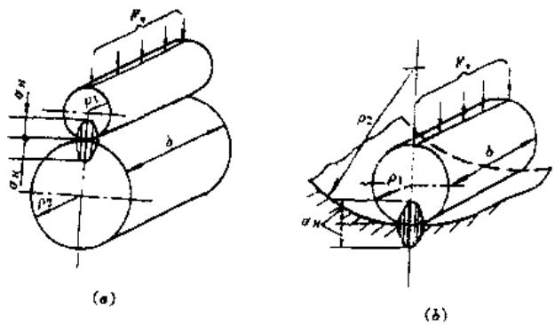

图2-5接触应力的计算

形,接触线变成一狭长的接触面。由于接触面很小,表层的接触应力是变化的,其中最大的接触应力以 ${ \pmb \sigma } _ { { \pmb \theta } }$ 表示,由弹性力学赫芝公式可知;

$$
\sigma _ { H } = \sqrt { \frac { { \frac { 1 } { R } } + \frac { 1 } { \rho _ { 1 } } } { \overline { { \pi } } \overline { { b } } } \cdot { \frac { \frac { 1 } { \rho _ { 1 } } + \frac { 1 } { \rho _ { 2 } } } { { \frac { 1 - \mu _ { 1 } ^ { 2 } } { E _ { 1 } } } + \frac { 1 - \mu _ { 2 } ^ { 2 } } { E _ { 2 } } } } }
$$

式中, $\pmb { \mu }$ 为泊松比,对于钢和铸铁, $\mu = 0 . 3$ .以 $\mu _ { 1 } = \mu _ { 2 } = 0 . 3$ 代入上式,加以整理后得

$$
\sigma _ { H } = 0 . 4 1 8 { \sqrt { { \frac { P _ { * } } { b } } \cdot { \frac { \xi } { p } } } }
$$

式中, $\pmb { \sigma } _ { \pmb { \mathscr { M } } }$ —最大接触应力 $\bf ( M P a )$ ;

$\blacktriangleright$ —接触长度 $\left( \Cap \ m \right)$ :

$\pmb { \tilde { r } _ { \ast } }$ —作用在圈柱体上的法向载荷(N);

$\pmb { \rho }$ 两圆柱体在接触处的综合曲率半径, $\rho { = } \frac { \rho _ { \mathrm { i } } \rho _ { \mathrm { z } } } { \rho _ { \mathrm { z } } { \pm } \rho _ { \mathrm { i } } }$ ,正号用于外接触(图 $2 - 5 ( \alpha ) )$ ,负号用于内接触(图 $2 - 5 ( 5 ) ) ( m m )$ 

$\pmb { \cal E }$ 两圆柱体材料的综合弹性模量, $\bar { B } { = } \frac { 2  { B _ { 1 } }  { B _ { 2 } } } {  { B _ { 1 } } { + }  { B _ { 2 } } } ,  { B _ { 1 } } ,  { B _ { 2 } }$ 分别为两圆柱体材料的弹性模量 $( \mathbb { M P a } )$ :

由式(2-33)可以看出:载荷 ${ \pmb \mathrm { \mathscr { F } } } _ { \bullet }$ 小,接触长度 $\pmb { \delta }$ 大,则最大接触应力 $\pmb { \sigma } _ { \pmb { \mathcal { H } } }$ 小;而弹性模量 $\pmb { \mathcal { B } }$ 小(易变形),曲率半径 $\pmb { \rho }$ 大,则最大接触应力 $\pmb { \sigma } _ { \pmb { \mu } }$ 小,

机械中的高副,如齿轮副、凸轮副、摩擦轮副等在工作时,它们零件间的接触都可看作是两圆柱体或相当于两圆柱体的接触。圆柱体的接触应力在工作时是变化的,如果此变应力超过材料相应的疲劳强度极限时,则在工作一段时间后,在接触表面将产生疲劳裂纹,如果此时润滑良好,当润滑油浸入后,则在压紧力作用下,封闭在裂纹中的润滑油会产生楔挤作用,使裂纹扩大,最后引起表层金屑成小片状剥落,形成麻点,这种现象叫做疲劳点蚀,疲劳点蚀损坏了零件正确的工作表面,从而使零件不能正常工作而失效,

防止疲劳点蚀的接触疲劳强度计算准则是

$$
\sigma _ { \mu } \leqslant [ \sigma _ { H } ] = \frac { \sigma _ { \mu \mu } } { \delta _ { H } }
$$

式中, $[ \sigma _ { y } ]$ —许用接触应力;

$\pmb { \sigma _ { H | | \mathrm { u } | _ { \infty } } }$ 实验测得的零件的材料接般疲劳极限应力,它与钢的表面硬度大致成正比关系;

${ \pmb { \delta } } _ { \pmb { \delta } } $ ——对应的安全系数,由于应力与载荷不是直线关系,而是开方根的关系,应力增长得慢,故安全系数 $\pmb { \delta } _ { \pmb { \mu } }$ 取为1或稍大于1即可,

(2)挤压强度计算两零件为面接触,承受载荷后,表面间挤压应力为

$$
\sigma _ { \prime } = \frac { \vec { p } } { A }
$$

式中, $\pmb { \mathscr { F } }$ —零件所受载荷(N);

A---接触面沿载荷方向的投影面积。

挤压强度计算条件为

$$
\begin{array} { r } { \sigma _ { \gamma } = \frac { \mathcal { k } } { A } \leqslant [ \sigma , ] } \end{array}
$$

式中, $\{ \sigma , \}$ 为零件材料的许用挤压应力,有两种情况:一种是接触面间没有相对运动, $[ \sigma , ] \#$ 静连接的许用挤压应力:另一种是接触面间有相对运动, $\{ \sigma , \}$ 为动连接的许用挤压应力,

需要说明的是接触应力与挤压应力是不同的,接触应力是线或点接触,是表层内部的应力;挤压应力是面接触,是表面上单位面积的载荷,

(3)表面抗磨损强度零件表面的磨损主要是两接触面在相对运动中相互刮削而引起的.零件表面的磨损量超过允许值后,尺寸和形状将改变,不能再保持规定的功能而失效,许多精密机械零件的使用寿命都取决于抗磨性。

零件的磨损寿命与接触面间的作用压力、滑动速度、摩擦系数、表面状态、润滑状态及冷却条件等有关.由于影响磨损的因素很多,故很难建立有充分理论基础的抗磨损强度计算方法。通常是限定比压p(单位接触面积上的压力)以控制磨损量,有时限定比压与速度的乘积$\pmb { \mathcal { P } }$ 值,以控制摩擦发热量,强度条件式为

$$
{ \mathfrak { p } } \leqslant \{ { \mathfrak { p } } \}
$$

$$
p v \leqslant [ p v ]
$$

式中, $\pmb { \mathscr { p } }$ 和[p]—比压和零件材料的许用比压;

$\pmb { \mathcal { P } } ^ { v }$ 和[p]一—比压与接触面线速度的乘积及其许用值, $\ P v$ 值正比于摩擦功,

# 二、刚度

刚度是指零件在载荷的作用下抵抗弹性变形的能力。刚度的大小是用产生单位变形所需的外力或外力矩来表示的。

精密机械零、部件对刚度的要求尤为重要,因为它们微小的变形,往往会影响设备的工作精度,甚至会无法正常工作。为保证零、部件满足一定的刚度,要求它们受载后变形不超过允许的限度。由材料力学知,刚度的计算准则亦可用下列条件式表示:

拉、压

$$
\Delta t = \frac { Q l } { \tilde { E } A } \leqslant [ l ]
$$

扭转

$$
\varphi = { \frac { M _ { \circ } l } { { \bar { G } } J _ { P } } } \leqslant [ \varphi ]
$$

弯曲(简支梁)

$$
f _ { o u x } = \frac { P l ^ { 3 } } { 4 8 E J _ { s } } \leqslant [ f _ { o u x } ]
$$

弯曲(悬臂梁)

$$
f _ { \mathrm { m a x } } = \frac { \mathcal { P } t ^ { 9 } } { 3 E J _ { t } } \leqslant [ f _ { \mathrm { m a x } } ]
$$

式中, $Q$ -—轴向载荷(N);$\mathfrak { P }$ 横向载荷(N);$M _ { \ast }$ 扭矩 $( \mathsf { m N } \cdot \mathsf { m } )$ ;$\pmb { \mathscr { u } }$ —-拉、压变形 $( \mathsf { m m } )$ ;

$\pmb { \varphi }$ --扭转变形角(rad);f-—弯曲变形量即挠度 $\left( \mathsf { m m } \right)$ ;-—零件工作长度 $\left. \mathsf { m m } \right.$ ;$\pmb { A }$ 一 -承载截面面积 $\tan ^ { \mathfrak { r } } )$ ;$J _ { p }$ - 截面积惯性矩 $( \mathsf { m m } ^ { \dag }$ ;${ \pmb J } _ { \pmb { z } }$ , -对Z轴的截面惯性矩 $( \mathsf { m m } ^ { \dag } )$ 1$\pmb { \cal B }$ - 材料的弹性模量 $( N \mathbb { P } \mathfrak { a } )$ ;$\pmb { \sigma }$ ——材料的剪弹性模量 $\bf ( M P a )$ ·

# 三、振动稳定性

振动稳定性是要求零、部件在交变载荷和外界振动下,不产生自振,更不能产生共振的性质。因为振动影响精度,产生噪声,严重的还会使工作失效。任何零、部件在交变载荷的作用下将产生机械振动,如果机械零、部件的固有频率与激振频率相一致,就会产生共振,这时振幅将急剧增大,共振可在短期内使零、部件损坏,丧失工作能力,通常称之为“失去振动稳定性”。因此,精密机械及其零、部件在设计时,应尽量避开“共振点”。

从本质上看,任何零件都是弹性体,它们都具有一定的刚度和一定的质量。因此,任何零件都有一定的固有频率,即

$$
\omega = { \sqrt { \frac { K } { m } } }
$$

式中, $\pmb { K }$ —零件的刚度;

班一 一零件的质量。

一般的零件由于刚度较大,其固有频率很高,产生共振的可能性不大。但是,对于高速工作的零件及含弹性元件的部件往往要验算其振动稳定性,采取必要的措施,防止共振的发生,如尽量消除引起共振的激振源(隔振)及改变零件本身的固有频率等。

# 习 题

2-1精密机械设计的基本要求是什么?常见的设计方法有哪些?

2-2在精密机械设计时,研充机构精度的自的是什么?其基本任务包括哪些方面?

2-3评价机构精度的指标有几种?基本含义各是什么?

2-4试举例说明微分法、作用线与瞬时臂法、几何法在计算机构精度时的应用.

2-5在设计机构时,如果已知的是机构中各构件尺寸的公差,如何计算机构总误差?对于一个具体的机构,已知的是机构中各构件尺寸误差的其些数值,如何计算机构总误差?

2-简述提高机构精度的一般方法。

2-7精密机械零件的工作能力包括哪些方面?计算准则各是什么?

# 第三章 精密齿轮传动

# \$3.1概 述

齿轮传动是利用轮齿的相互啮合来传递运动和动力的,与其它机械传动相比,在设计和制造合理的前提下,齿轮传动具有传动精度和效率高、传动平稳、结构紧凑、工作可靠、寿命较长、成本较低等特点,是应用最广泛的一种机械传动形式。根据用途,齿轮传动可分为动力齿轮传动、机床齿轮传动、通用齿轮传动及精密齿轮传动四大类。

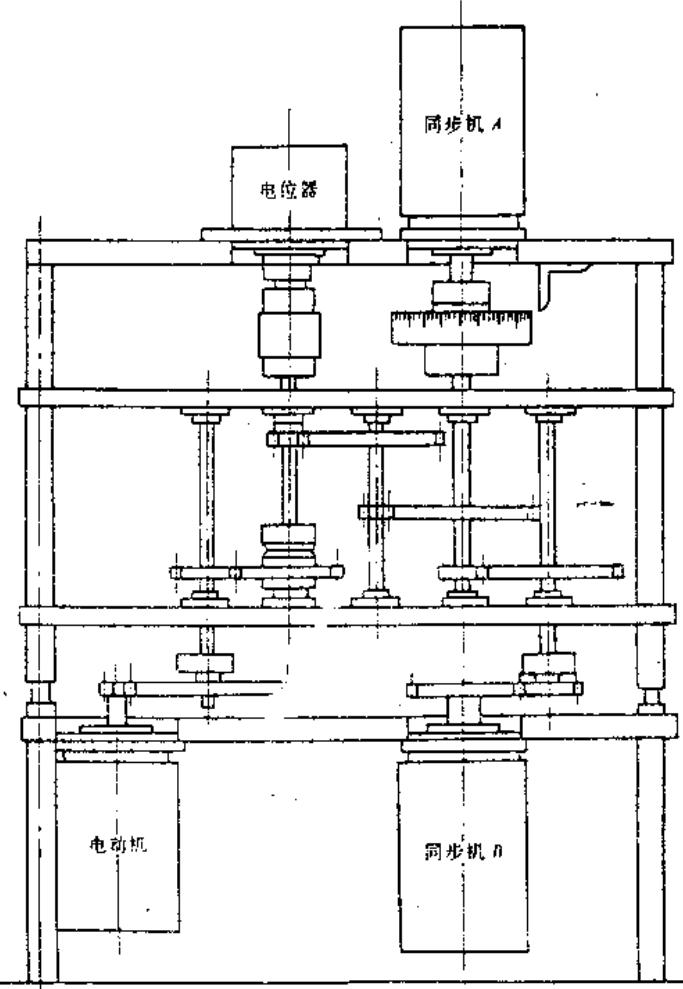

图3-1仪器传动装置的典型结构

精密齿轮传动是近年发展起来的一个特殊分支,主要用于各种电子设备、机电一体化产品、精密机械和仪器、仪表领域,例如在精密雷达、录音、录像设备、自动控制装置、航空和航海精密仪表、计量测试仪器和光学仪器中等都有应用。它是电子设备中不可缺少的一种重要传动形式,特别是小功率伺服系统中用的小模数齿轮传动,它不仅包含了一般精密机被零、部件设计计算的内容,而且与伺服系统的精度和性能有着密切的联系,例如图3-1所示的某雷达天线数据传递系统的伺服齿轮箱就是一种典型传动装置--仪器传动装置的结构,用作数据传递和小功率动力传递的齿轮处于伺服系统闭不内,成为整个伺服系统的一个组成环节,其上装有伺服电机、电位器和粗、精同步机,在结构上传动链均采用小模数齿轮。在这里,传动装置的结构因素对伺服系统有很大的影响·设计时应当考虑伺服系统对传动装置提出的要求,选择合理的结构参数。

精密齿轮传动一般具有功率较小、精度较高、启动较快、结构紧凑等特点,主要用来传递运动、变换运动方向;实现运动或位移的缩放;实现变速传动或转动的合成与分解;指示读数;调整机构的位置等,对于这类齿轮传动,在设计中涉及的具体要求主要有:

(1)传动精度即齿轮传动链在单向传动时,瞬时传动比保持理论值的精确程度。传动装置中的齿轮、轴、轴承、联轴器等的制造、装配误差是影响齿轮传动精度的主要因素。一般机械中,齿轮7级精度已经足够,但在精密齿轮传动中,不仅普遍采用7\~8级精度,有时必须选择 $J { \pmb 5 } { \sim } \hat { \pmb 6 }$ 级精度,甚至 $\Im \sim 4$ 级超高精度的齿轮,才能满足要求。

对用于伺服系统、数据传递、分度、示数及检测系统中的齿轮传动,因其传动精度直接影响装置的精度,故对此项要求较高。

(2)空程误差指主动轮固定时,由于齿轮、轴、轴承、联轴器等零、部件的间隙和弹性变形等,使从动齿轮可能产生的空程转角。

对于用伺服系统和需要经常变向及有加速、减速运动性能要求的传动,由于传动链内的空程误差将直接影响伺服精度和系统的稳定性,甚至使系统产生自振荡,故必须严格控制,

(3)传动效率齿轮的传动效率与摩擦等因素有关,在大多数情况下,摩擦要小,这不仅因为摩擦会降低效率,影响电动机功率的选择,而且,过大的摩擦力矩会导致伺锻系统的误差,降低伺服系统平滑变速的范围,甚至引起驱动系统在低速运行时的爬行,破坏系统的动态性能,但是,适当的摩擦阻尼,有时对抑制伺服系统的振荡是有利的。特别是对小功率传动装置更为突出。

对数据传递用小模数齿轮传动的效率要求,虽然不及对动力齿轮传动的重要,但由于小功率传动系统电动机的功率有限(一般是几分之一至几十瓦),有时效率间题也很突出。

(4)转动惯量在大多数情况下,对于小功率伺服系统的齿轮传动,减小传动链的转动惯量,可以提高伺服系统的快速性和机械结构的固有频率。

(5)刚度和固有频率齿轮传动链的刚度是单位扭转力矩作用下的变形程度,而机械结构的固有频率与刚度成正比。在伺服系统中,机械结构的固有频率经常成为限制伺服性能的一项重要指标,系统的带宽越宽,对传动链固有频率的要求也越高。

(6)传动平稳性对于高速传动,提高齿轮传动的平稳性,可以减小振动和噪声,对于.要求紧密跟踪和瞄准的伺服系统而言,传动的平稳性将直接影响仪器的低速跟踪性能。

(7)结构简单紧凑、重量要轻对电子设备来说,尺寸小、重量轻往往十分重要。因此,在满足基本要求的前提下,应力求减小齿轮传动装置的尺寸和重量,特别是对用于航天和航空设备的精密齿轮传动装置,更应严格控制。

(8)使用环境因素诸如温度、湿度、振动、防腐蚀等方面的要求。

(9)工艺性、经济性方面的要求。

应当指出:对不同的传动装置,上述设计要求会各有侧重。有时,即使同样是动力传动装置,设计要求的侧重面也不尽相同,

在电子设备和精密机核仪器中,传动装置大多数使用模数小于 $1 . 5 m m$ 的小模数齿轮传动装置。小模数齿轮传动设计的基本内容包括:

(1)根据传动要求,正确选择传动型式,决定传动级数和分配各级传动比,(2)确定各级齿轮的齿数和模数,并计算齿轮各部分尺寸。

(3)对于精密齿轮传动链,需进行误差分析和计算。

(4)齿轮结构形状、齿轮和轴的连接方法,齿轮箱箱体结构等的设计。对于精密齿轮传动链,有时尚需设计消除空程误差的结构。

本章将着重介绍电子设备中常用的小功率精密齿轮传动—一小模数齿轮传动的结构设计方法。

# 3.2传动型式及选择原则

齿轮传动设计过程中首先要解决的问题是如何根据齿轮传动的工作特点来正确选择合理的传动型式,然后合理地配置传动链,以便最佳地满足设计要求,即:

(1)转轴之间的相对位置要求包括转轴之间是平行、相交或是相错的。

(2)运动要求包括运动方向(单向的或可逆的)、圆周速度、运动形式是否需要变换,即是将回转运动变为直线运动还是仍为转动,各转轴之间的传动比等,

(3)精度要求包括传动误差、空程误差、传动平稳性和噪声等控制方面的要求。(4)承载能力和传动效率要求包括强度和刚度,  
(5)外形尺寸、重量限制及环境因素,诸如温度、湿度、振动、防腐蚀等方面的要求,(6)加工工艺性、经济性和安装方便的要求。  
(7)其它特殊性能要求包括转动惯量、摩擦力矩和机械固有频率等的要求,

这意味着,在设计一整套传动链时,不仅要考虑齿廓要素,而且还须最合理地运用齿轮、适当地选定所有参数,使能充分利用齿轮的制造精度,经济而有效地达到总体性能的要求。

常用的齿轮传动型式有圆柱齿轮(直齿和斜齿)传动、圆锥齿轮传动、齿条传动、蜗轮蜗杆传动、螺旋齿轮传动等。下面就电子设备、精密机械仪器中小模数齿轮传动链,推荐齿轮传动型式的选择原则如下:

# 一、直齿圆柱齿轮传动

直齿圆柱齿轮传动适用于传递平行轴间的回转运动,也可以和直齿条构成齿条传动,变回转运动为直线往复运动,或者使直线运动变换成回转运动。这类齿轮传动的特点是:结构简单,设计、加工和检验方便;只需普通设备、成本最低;加工精度范围宽,传动精度高,常用精度为8、7、6级,也可加工出5、4、3级精度,甚至更高精度;摩擦力矩小,效率高 $( \eta = 0 , 9 5 \sim$ 0.99);可以逆运转;安装方便 $\pmb { \xi }$ 是唯一没有轴向力的啮合型式;采用消隙机构可使两轴之间的空程误差接近于零;单级传动比可在 $\Gamma , ^ { \prime } 1 0 \sim \Gamma 0$ 范围选取(在力矩很小的传动中,可在1$/ 1 5 \sim 1 5$ 范围内选敢)。

在中,小载荷, $v \leq 5 m / s$ 的精密齿轮传动,如音像设备、读数机构、数据传递装置、光学精密跟踪仪器和雷达间服系统传动中,都优先采用这类传动型式,

为使机构紧凑,有时直齿圆柱齿轮传动可采用内啮合的方式;但小模数内齿轮的加工不及外齿轮方便,加工精度也较外齿轮低。

# 二、斜齿圆柱齿轮传动

斜齿圆柱齿轮传动是实现平行轴传动的另一种型式,也可以和齿条啮合,构成齿条运动,变回转运动为直线运动,传递不同轴交角之间的往复运动,在中到大载荷,且有轴向力的中、高速 $( v \geq 1 8 \ m / s )$ 及要求有较高平稳性和噪声小的运动中优先采用。

一般,斜齿圆柱齿轮传动的圆周速度 $v \geq 5 m / s$ 其单级传动比可在 $1 / 1 0 \sim 1 0$ 范围选取;力矩很小的传动,可在 $1 / 1 5 { \sim } 1 5$ 范围内选取。

这类传动型式除了螺旋角给结构上带来复杂性外(相互啮合的斜齿轮要有相同的螺旋角,限制了通用性),其它性能几乎和直齿圆柱齿轮传动相同,其结构简单程度以及加工和检验的方便程度仅次于直齿圆柱齿轮传动。

理论上,斜齿圆柱齿轮传动的重复度大,效率 $\eta { = } 0 . 9 5 { \sim } 0 . 9 9$ 。但是,在小模数斜齿轮传动中,往往由于传递的力矩不大,上述优点不明显;而直齿轮的加工精度高于斜齿轮,故在实际设计中往往宁愿采用直齿轮传动,也同样可获得较高质量的工作平稳性。

创轮传动的主要缺点是存在轴向力,轴承的载荷大、空程误差大,小模数斜齿轮的螺旋角 $\pmb { \beta }$ 一般在 $7 ^ { \circ } \sim 2 0 ^ { \circ }$ 范围内选取。 $\beta$ 过大,会导致轴向力过大: $\beta$ 过小,对平稳性提高不多,

# 三、圆锥齿轮传动

小模数齿轮传动只采用直齿圆锥齿轮。它是实现相交轴间回转运动的传动型式。轴交角 $\Sigma = 9 0 ^ { \circ }$ ,适用于中、小载荷、精度不太高的低速直角运动.

圆锥齿轮传动的主要优点是结构简单、安装方便;啮合为线接触;传动比范围宽,一般传动的传动比可在 $1 / 7 . 5 \sim 7 . 5$ 范围内选取,力矩很小的传动可在 $1 / 1 0 \mathrm { \sim } \mathrm { i } 0$ 范围内选取,这是蜗轮蜗杆传动做不到的:故适宜于代替螺旋齿轮传动和低速蜗轮蜗杆传动.圆锥齿轮传动的效率可达 $\eta = 0 . \vartheta 2 \sim 0 . \vartheta 8$ 。其缺点是:圆锥齿轮的加工和检验比较复杂,制造精度不如直齿圆柱齿轮及蜗轮蜗杆的高,对切齿和安装时的轴向误差及轴交角误差较敏感、传动平稳性低、齿侧隙不易控制。

# 四、蜗轮蜗杆传动

蜗轮蜗杆传动可传递空间垂直相错轴之间的回转运动,是空间线接触传动,不易磨损,多数不可逆.其主要特点是传动精度高、承载能力强、运转平稳、噪声小和传动比大,一般i$= 1 0 { \sim } 1 0 0$ 在分度机构中可达 $5 0 0 \sim 1 0 0 0$ 。小模数精密蜗轮蜗杆传动中,较少采用多头蜗杆,较多采用单头阿基米德蜗杆,尽量不采用 $\yen 28$ 的传动比,当蜗杆升角小于轮齿间的当量摩擦角时,传动具有自锁性、运转不可逆、 $\eta < 0 , 5$ 、滑动摩擦大、启动摩擦系数大(此时,不适用于高精度伺服系统的传动链),一般来说,单头蜗杆 $\eta = 0 . 7 0 \sim 0 . 7 5$ 双头蜗杆 $\eta = 0 . 7 5$ $\sim 0 . 8 2$ ;三头以上蜗杆 $\eta = 0 , 8 0 \sim 0 . 9 2$ 。另外,蜗轮蜗杆的加工较困难,且蜗轮需用贵重的耐磨材料制造,成本高。

蜗轮蜗杆传动适用于读数机构、光学分度机构、精密刻划机等精密机构中。

在轻载荷传动链中,为制造方便,可用斜齿轮代替蜗轮,构成蜗杆-斜齿轮传动。

精密机械和仪器中,还有采用螺旋齿轮传动型式的,但在电子设备中常用上述几种传动型式,且较多采用直齿圆柱齿轮传动,

近年来,有不少电子设备、精密机械和仪器产品对机械传动不仅就体积小、重量轻、传动比大等提出愈采愈高的要求,而且还对传递力矩的能力、摩擦损失、空程误差等提出了更高的要求,为此,一些新的内啮合行星齿轮传动型式,如谐波齿轮传动机构、渐开线少齿差行星齿轮机构、圆锥或圆柱齿轮差动机构、摆线针轮行星机构等在国内外得到了普遍重视,并已得到较多应用,这些传动机构的输入轴和输出轴都呈同轴配置,可以方便地插入传动链内,实现较宽范围的传动比。其中,由圆锥齿轮组合成的差动器的结构极其紧凑,适用于雷达和光学跟踪仪器的“手动"和“机动”,或者“自动"和“半自动”控制的传动链内,实现复合跟踪控制。

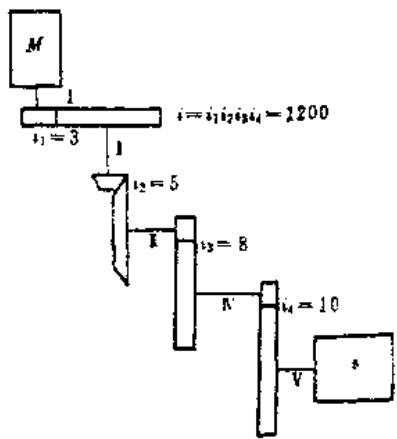

图3-2多级齿轮传动链

设计时,应根据电子设备等的具体工作条件和要求,合理地选择齿轮传动型式,同时,妥善安排传动装置的设计。人们在实践中认识到,在精密传动链内,如安排不够合理,尽管选用了高精度的传动件,则仍会反映不出它应有的效果。而有时选用精度较低的传动型式,却可得到良好的性能和效果。例如图3-2所示的高精度伺服系统的小模数齿轮传动链,在该传动链中,圖锥齿轮副被安排在第二级是合理的,因为它的位置既远离传动链最精密的输出轴,又远离摩攘力矩较小的输入端,在第一级安放一对效率较高的直齿圆柱齿轮,连接在伺服电机轴上,既可增加力矩,又可减小圆锥齿轮的啮合转速,在圆锥齿轮后面安置两对传动比大的直齿圆柱齿轮,可大大减小圆锥齿轮传动带来的误差。

# $\ S$ 3.3传动链的级数和各级传动比的选择与分配

传动比即主动轮角速度与从动轮角速度之比,也是从动轮齿数与主动轮齿数之反比,当然也是从动轮分度圆直径与主动轮分度圆直径之反比。对于减速传动,传动比大于1;对于增速传动,传动比小于1.

传动链总传动比的选择应是考虑电动机与负载的最佳匹配及总传动比对系统稳定性、精确性和快速性的影响后确定的,在齿轮传动装置设计时,总传动比一般由系统设计总体作

为原始数据给定,

总传动比确定之后,通常会发现其数值很大,例如,一般炮瞄雷达天线动力传动装置的总传动比大多在200以上,而卫星通信地面站、射电望远镜等的总传动比经常高达几万,甚至几十万,显然,这类传动装置需要采用多级齿轮传动来完成,这就涉及到如何适当分级及分配各级传动比的问题,

由于圆柱齿轮机构具有一系列优点,应用最为普遍,下面重点针对这种机构组成的多级传动链,介绍一下级数和各级传动比确定的原则和方法,对其它形式的传动链,一般来说,这些原则也具有指导意义。,

# 一、传动级数的确定

传动级数的确定是一件复杂的工作。通常,在设计传动链的级数时,首先应当考虑选用较大传动比的单级传动或级数少的传动,因为级数少,可以简化结构,提高齿轮传动链的精度和效率。但是,级数的减少将引起各级传动比的加大。面单级传动比太大,对小齿轮的强度和制造都不利,而且会使结构不紧凑。例如,对于传动比为12的传动,采用三级传动 $( i = 1 , 5 \times 2 \times 4 )$ 要比单级传动在结构上来得紧凑,如图3-3所示。另外,被动轮直径的加大会导致其转动惯量增加。这对要求启动快的小功率随动系统的齿轮传动是不利的。因此,必须按照具体工作要求,结合传动比的分配来确定传动级数。

# 二、传动比的分配

在设计齿轮传动链时,传动比的分配是一个很重要的环节,它直接影响到机构的体积和工作性能,所以必须根据电子设备整体对齿轮传动装置的要求(如传动精度、灵敏度、体积等)合理地进行分配。

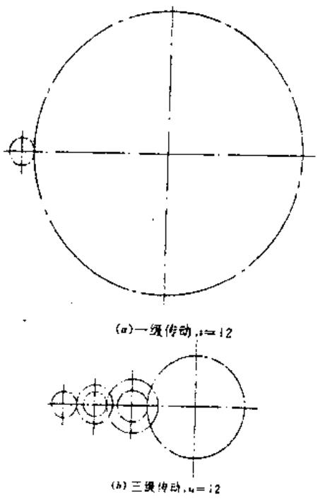

图3-3单级传动和三级传动所占空间的比较

在电子设备中,动力传动装置根据所传递功率的大小常分为两类:一类称为“大功率传动装置”,它所传递的功率一般超过100W:一类称为“小功率传动装置”,它所传递的功率一般在100W以下,大功率传动装置所传递的转矩较大,通常采用中模数或大模数齿轮机构.小功率传动装置所传递的转矩较小,往往采用小模数齿轮机构。两者由于传递的转矩在数量级上不同,在传动比分配的方法上也有所不同。

# 1.“折算转角误差小"的原则和方法

在精密齿轮传动系统中,传动比相当于误差传递系数,对传动误差起着缩放作用。因此,对总传动比合理地分级和分配,对提高系统的传动精度,将产生十分重要的影响。

在图3-4所示的四级齿轮减速传动中,轴「是输入轴,轴 $\gamma$ 是输出轴,如果第一对齿轮的传动误差为 $\Delta \varphi _ { 1 }$ ,第二对齿轮的传动误差为 $\Delta \phi _ { 2 } , \cdots$ ,则输出轴 $\gamma$ 上的总误差为

$$
\begin{array} { r } { \Delta \varphi _ { v } = \mathcal { S } p _ { 4 } + \frac { \Delta \varphi _ { 3 } } { i _ { 4 } } + \frac { \Delta \varphi _ { 2 } } { i _ { 3 } \textrm { * } i _ { 4 } } + \frac { \Delta \varphi _ { 1 } } { i _ { 2 } \textrm { * } i _ { 3 } \textrm { * } i _ { 4 } } } \end{array}
$$

由此,可以归纳得出:

(1)末级传动误差 $\Delta \varphi _ { 4 }$ 对输出轴总转角误差影响最大(因各级传动比均大于1)。要使$\Delta \varphi _ { 1 }$ 减小,首先应使末级误差尽量减小。

(2)在总传动比及各级传动误差一定时,若 $_ { i _ { 4 } > i _ { 3 } > i _ { 2 } > i _ { 1 } }$ ,可以使输出轴的总转角误差减小,即各级传动比的分配原则应是由小到大.

(3)在总传动比一定时,传动级数的减少可以使输出轴的总转角误差大大减小。

所以,从提高传动链的精度和减小空程误差出发,在减速传动中应按“先小后大"原则分配传动比,把较大的减速比分配在传动

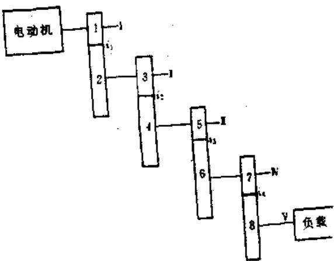

图3-4四级齿轮传动

链的输出段,并在末级采用精度等级较高的齿轮副。这样做对减小总折算转角误差很有效,并使之经济、合理。例如:在图3-4中,若取 $i _ { 1 } = 2 , 5 , i _ { 2 } = 3 , i _ { 3 } = 5 , i _ { 4 } = 8$ (总传动比为300),并假定各级齿轮副的转角误差均为 $\Delta \varphi$ ,则输出轴的总转角误差为

$$
{ \begin{array} { c } { \Delta \varphi _ { \boldsymbol { \nu } } = \Delta \varphi { \Big ( } 1 + { \frac { 1 } { 8 } } + { \frac { 1 } { 5 \times 8 } } + { \frac { 1 } { 3 \times 5 } } { \overline { { \times 8 } } } { \overline { { \times 8 } } } { \Big ) } } \\ { = 1 . 1 5 8 \Delta \varphi } \end{array} }
$$

若各级传动比取成递减,即 $i _ { 1 } = 8 , i _ { 2 } = 5 , i _ { 3 } = 3 , i _ { 4 } = 2 , 5$ ,则输出轴的总转角误差为

$$
\begin{array} { l } { \Delta \varphi _ { \mathfrak { v } } = \Delta \varphi \Bigg \{ 1 \div \frac { 1 } { 2 . 5 } + \frac { 1 } { 2 . 5 \times 3 } + \frac { 1 } { 2 . 5 \times 3 } \times \frac { 1 } { 2 . 5 \times 3 \times 5 } \Bigg \} } \\ { = \mathbb { 1 } . 5 6 \Delta \varphi } \end{array}
$$

由此可见,各级传动比取逐级递减要比取逐级递增时的总转角误差大(本例增加了 $3 5 \%$ :而且,低速级的误差在总误差中占的比例较大(在本例中,取逐级递增时,末级误差占总误差的 $86 \%$ 左右).

另外,采用“先小后大"的原则,可使前几级齿轮的减速少,相应各轴的转速就高,轴的扭转刚度相对较高(即扭转角小),对提高精度也是有利的。

在增速传动中,则应该从输入轴开始就尽量增大转速(即使传动比尽量小),在接近输出轴时增速要小(即使传动比尽量大些).

在电子设备中,用作示数传动的精密齿轮传动等多采用此原则分配传动比。

2.“折算转动惯量最小"的原则和方法

在某些电子设备中(如一些雷达天线驱动装置和小功率随动系统及仪器仪表),要求启动、停止和逆转快,并经常变向。而当力矩一定时,传动装置的折算转动惯量愈小,角加速度就愈大,系统就愈灵敏,这样可使过渡过程短、响应快、减少启动功率,

# (1)大功率传动装置

为便于分析,现假设:

$\textcircled{1}$ 所有主动小齿轮的齿数相等,其模数 $\pmb { \mathscr { R } }$ 、分度圆直径 $D$ 齿宽 $\pmb { B }$ 均与转矩 $\pmb { M }$ 的三次方根成正比,从而有

$$
\frac { m _ { j } } { m _ { 1 } } = \frac { \bar { D } _ { j } } { \bar { D } _ { 1 } } = \frac { \bar { B } _ { j } } { \bar { B } _ { 1 } } = \sqrt [ 3 ] { \frac { M _ { j } } { M _ { 1 } } } = \sqrt [ 3 ] { \bar { i } _ { 1 j } }
$$

式中,下标1一表示第一级齿轮副中的小齿轮,即电动机轴上的小齿轮;

下标 $j$ —表示第 $\pmb { j }$ 级齿轮副中的小齿轮。

在同级齿轮副中,大、小齿轮的齿宽假定相等。

$\textcircled{2}$ 轴和轴承环的转动惯量与所在轴上的齿轮的转动惯量成正比,允许合在一起考虑;各齿轮都是实心圆柱体,材料相同,其转动惯量 $\scriptstyle J \infty K D ^ { 1 } ( K = \pi B p / 3 2 )$ ·

$\textcircled{3}$ 传动效率 $\pmb { \eta } = 1$ ·

以二级齿轮传动为例(图3-5),各齿轮在电动机轴上的折算惯量为

因

故

因

$$
\begin{array} { r } { J _ { 2 } ^ { \bullet } = J _ { 1 } + \frac { J _ { 2 } } { \mathrm { i } _ { 1 } ^ { 2 } } + \frac { J _ { 3 } } { \mathrm { i } _ { 1 } ^ { 2 } } + \frac { J _ { 4 } } { \mathrm { i } _ { 1 } ^ { 2 } \mathrm { ~ , ~ i } _ { 2 } ^ { 2 } } } \end{array}
$$

$$
\frac { J _ { 7 } } { J _ { 1 } } = \left( \frac { D _ { 7 } } { D _ { 1 } } \right) ^ { 4 } = \mathrm { i } _ { 1 } ^ { \mathrm { f } }
$$

$$
{ \bar { J } } _ { 1 } = { \bar { J } } _ { 1 } i _ { 1 } ^ { 4 }
$$

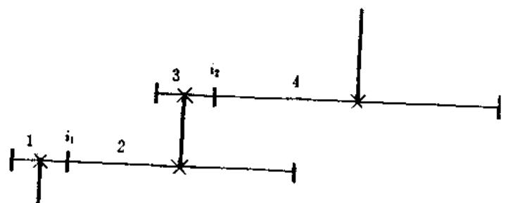

图3-5二级传动

故

$$
{ \bar { J } } _ { 3 } = J _ { 1 } i { \frac { 5 } { 9 } }
$$

因

$$
\begin{array} { r } { \frac { \mathcal { I } _ { 4 } } { \mathcal { I } _ { 1 } } = \frac { \mathcal { I } _ { 4 } } { \mathcal { I } _ { 3 } } \cdot \frac { \mathcal { I } _ { 3 } } { \mathcal { I } _ { 1 } } = \left\{ \frac { \bar { D } _ { 4 } } { \bar { D } _ { 3 } } \right\} ^ { 4 } \cdot i \frac { 5 } { \mathrm { \vec { r } } } = i \frac { 5 } { \mathrm { \vec { r } } } \cdot i \frac { 5 } { \mathrm { \vec { z } } } } \end{array}
$$

故

$$
{ \mathcal { I } } _ { 4 } = { \mathcal { I } } _ { 1 } i { \frac { 5 } { 7 } } i { \frac { 4 } { 7 } }
$$

从而

$$
J _ { 0 } ^ { \mathbf { \vec { \alpha } } } = J _ { 1 } + J _ { 1 } i _ { 1 } ^ { 2 } + J _ { 1 } i _ { 1 } ^ { - { \frac { t } { 3 } } } + J _ { 1 } i _ { 1 } ^ { - { \frac { t } { 3 } } } i _ { 1 } ^ { 2 } = J _ { 1 } { \left[ ( 1 + i _ { 1 } ^ { 2 } ) + i _ { 1 } ^ { - { \frac { t } { 3 } } } ( 1 + i _ { 2 } ^ { 2 } ) \right] }
$$

应用上述方法及归纳法可得到 $\pmb { \mathscr { H } }$ 级传动时,传动装置在电动机轴上的折算转动惯量:

$$
\begin{array} { r l } & { J _ { \overline { { \sigma } } } ^ { \mathsf { \sigma } } = J _ { 1 } \big [ ( 1 + \mathrm { i } \mathrm { j } ) + \mathrm { i } _ { 1 } ^ { - \frac { 1 } { 3 } } ( 1 + \mathrm { i } _ { 1 } ^ { \mathsf { 2 } } ) + \cdots + ( \mathrm { i } _ { 1 } \mathrm { i } _ { 2 } { \cdots } \mathrm { i } _ { 2 - 1 } ) ^ { - \frac { 1 } { 3 } } ( 1 + \mathrm { i } _ { 1 } ^ { \mathsf { 2 } } ) } \\ & { \qquad + \cdots + ( \mathrm { i } _ { 1 } \mathrm { i } _ { 2 } { \cdots } \mathrm { i } _ { 6 - 1 } ) ^ { \frac { 1 } { 3 } } ( 1 + \mathrm { i } _ { \bullet } ^ { \mathsf { 2 } } ) \big ] } \end{array}
$$

飲使 $\scriptstyle { \pmb { J } } _ { \pmb { \parallel } } ^ { \bullet }$ 最小,须使 $J _ { \tilde { \sigma } } ^ { \mathbf { s } }$ 或 $\sqrt { 3 } / \Im _ { \mathrm { i } } )$ 对任一级传动比 $\dot { \mathfrak { z } } _ { \mathfrak { a } }$ 的偏导数为零,即 $\frac { \partial \mathcal { J } _ { \overline { { \theta } } } ^ { \overline { { \theta } } } } { \partial \dot { * } _ { k } } = 0$ ,于是

$$
i _ { i } ^ { 2 } = \frac { 6 } { 7 } ( i _ { i - 1 } ^ { \frac { 7 } { 3 } } + 1 ) - 1
$$

相邻两级传动比遵守上述关系时,可以使传动装置的折算转动惯量最小,反复使用式(3-4)就可以根据第一级传动比求出各级传动比。图 $3 { \cdot } 6 ( c )$ 就是按式(3-4)作出的,该图上有两条曲线,各级传动比可利用四边上的坐标,在两条曲线之间反复作折线来确定。

利用图3-6(c)上的曲线还可求出 $\pmb { \mathscr { n } }$ 级传动的第一级传动比 $\mathbf { i } _ { \pmb { \imath } }$ 和总传动比 $\dot { \ast }$ 的关系曲线。方法是先取一个 $i _ { \downarrow }$ 值,在图 $3 { \cdot } 6 ( c )$ 的曲线反复取 $\pmb { \mathscr { R } }$ 次,并记下每一个 $\mathbf { i } _ { j }$ 值,再将 $\pmb { \mathscr { R } }$ 个 $\dot { \mathbf { t } } _ { f }$ 值连乘,就得到总传动比 $\dot { \mathfrak { t } } _ { 1 }$ ,从而可作出 $\mathfrak { i } _ { \mathfrak { l } }$ 与 $i _ { c }$ 的关系曲线,如图3-6(b)所示,

个 $i _ { j }$ 值代入式(3-3),就可求得每一个 $i _ { t }$ 下的 $J _ { \mathcal { Q } } ^ { = } / J _ { t }$ 。据此,可作出惯性指标 ${ \sqrt { \Xi } } / { \sqrt { \Xi } } _ { \mathrm { : } }$ 在不同级数 $\pmb { \mathscr { H } }$ 时与总传动比 $\vdots _ { i }$ 的关系曲线,如图 $3 - 6 ( a )$ 所示,该图可用来确定传动装置可能达到的最小折算转动惯量、最佳级数及级数取少一些的惯量变化,

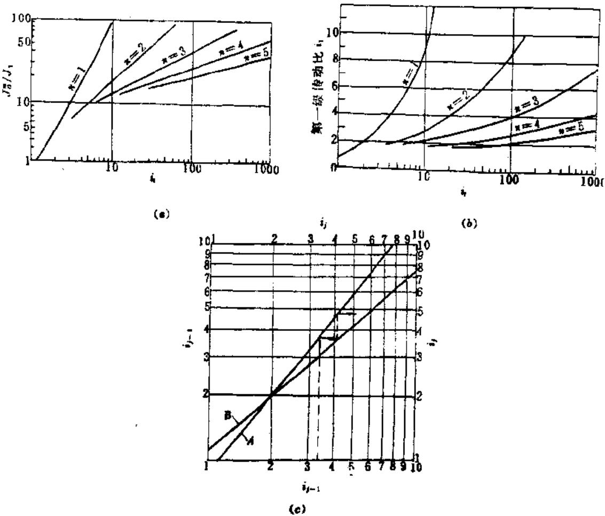

图3-6确定大功率传勘银散和各级传动比的曲线(惯量小))确定级数的曲线(b)确定 $\dot { \mathfrak { u } }$ 的血线(c)确定以后各级 $\dot { \mathfrak { z } } _ { j }$ 的曲纠

设计时,可借助图3-6来确定大功率传动装置的级数和各级传动比。现举例说明其方法:

假定已知总传动比 $4 = 2 5 6$ ,按图 $3 - 6 ( a )$ 所示,若取级数 $\yen 3$ ,则 $J _ { 0 } ^ { = } / J _ { 1 } ^ { \prime } { \approx } 7 0$ 若取级数$\ b = 4$ ,则 $\sqrt { 0 } / J _ { 1 } \approx 3 5$ 若取级数 $\mathtt { I } = 5$ ,则 $J _ { 0 } = J _ { 1 } = 2 6$ ,相比之下,三级传动虽然结构简单些,但惯量指标比四级传动大了近一倍;面四级传动的惯量指标虽比五级传动高了一些,但结构却简单一些,故宜选用四级传动,然后可由图3-6(b)所示查得第一级传动比 $i _ { 1 } = 3 , 3 0$ 其余各级由图 ${ \pmb 8 - 6 ( \pmb { c } ) }$ 所示查得,在下横轴 $\dot { \mathfrak { z } } _ { + - 1 }$ 上从3.30出发,碰直线A,在右纵轴 $\dot { \pmb { \nu } } _ { \pmb { \mathscr { s } } }$ 上得到 ${ \dot { \pmb { \nu } } } _ { 2 } = { \dot { \pmb { \nu } } }$ 3.70;在左纵轴 $\dot { \bullet } _ { j } .$ -1上从3.70出发,碰直线 $B$ 在上横轴 $i _ { j }$ 上得 $i _ { 3 } = 4 , 2 4 _ { 3 }$ 再在下横轴 $i _ { \hbar }$ 上从4.24出发,碰直线 $\pmb { A }$ ,在右纵轴 $i _ { j }$ 上得到 $i _ { 1 } = 4 . 9 5$ ,实际顺序如图中箭头所示,最后再校核一下 $\scriptstyle \phantom { 0 } _ { 1 } i _ { 1 } = 3 . ~ 3 0 \times 3 . ~ 7 0 \times 4 . ~ 2 4 \times 4 . ~ 9 5 = 2 5 6 . ~ 2 6 ,$ 与原值256接近,认为可以,注意,这里不必精确到小数点后几位,实际上,在以后齿轮设计完毕后,这些传动比在数值上都可能略有变化。

# (2)小功率传动装置

设有一如图 $\clubsuit 5$ 所示的由圈柱齿轮组成的二级减速小功率传动系统,总传动比为 $\dot { \bullet }$ 各齿轮的齿宽、材料相同,效率 ${ \mathfrak { p } } { = } \mathbf { 1 }$ ,并设各级主动轮的模数、齿数相同,轴与轴承等轴上除齿轮外其它零件的转动惯量可子以忽略,各齿轮都是实心圆柱体,其惯量JccKD,则转化到输

入轴上的总折算转动惯量为

$$
J _ { 0 } ^ { \pm } = J _ { : } + \frac { J _ { : } } { \mathrm { i } _ { 1 } ^ { 2 } } + \frac { J _ { : } } { \mathrm { i } _ { 1 } ^ { 2 } } + \frac { J _ { : } } { \mathrm { i } _ { 1 } ^ { 2 } + \mathrm { i } _ { 2 } ^ { 2 } }
$$

因

$$
{ \frac { { \dot { J } } _ { 2 } } { J _ { 1 } } } = \left\{ { \frac { D _ { 2 } } { D _ { 1 } } } \right\} ^ { 1 } \approx \mathrm { i } \mathrm { \Omega }
$$

故

$$
J _ { \hat { \mathbf { z } } } \ \pm , \ J _ { \mathbf { l } } \mathbf { i } _ { \mathbf { l } } ^ { \dagger }
$$

因

$$
J _ { 3 } = J _ { 1 }
$$

$$
{ \frac { J _ { 4 } } { J _ { 1 } } } = { \frac { J _ { 4 } } { J _ { 3 } } } \cdot { \frac { J _ { 3 } } { J _ { 1 } } } = i _ { 2 } ^ { 3 }
$$

故

$$
J _ { \parallel } = J _ { \parallel } i \mathbf { \parallel }
$$

$$
\begin{array} { r } { J _ { \bar { \imath } } ^ { * } = J _ { \mathrm { i } } \stackrel { _ { \mathrm { ~ - ~ } } J _ { \mathrm { i } } i _ { \mathrm { i } } ^ { 2 } } { _ { \mathrm { ~ i } } i _ { \mathrm { i } } ^ { 2 } } + \frac { J _ { \mathrm { l } } } { i _ { \mathrm { i } } ^ { 2 } } + \frac { J _ { \mathrm { l } } i _ { \mathrm { i } } ^ { 4 } } { i _ { \mathrm { i } } ^ { 4 } } = J _ { \mathrm { i } } \Big ( 1 + i _ { \mathrm { i } } ^ { 2 } + \frac { 1 } { i _ { \mathrm { i } } ^ { 2 } } + \frac { i _ { \mathrm { i } } ^ { 4 } } { i _ { \mathrm { i } } ^ { 4 } } \Big ) } \end{array}
$$

令 $\frac { \partial \check { \mathbf { \Omega } } _ { i } ^ { m } } { \partial \dot { \mathbf { \mu } } _ { 1 } } = \boldsymbol { 0 }$ 则 $i ! - 1 - 2 i ! = 0$ ,即

$$
i _ { 2 } = \bigg \{ \frac { i _ { 1 } ^ { 4 } - 1 } { 2 } \bigg \} ^ { \frac { 3 } { 2 } }
$$

因为 $\mathrm { i } \{ \gg 1$ ,故近似得

$$
i _ { 2 } = \frac { i _ { 1 } ^ { 2 } } { \sqrt { 2 } }
$$

$$
j _ { 1 } = \frac { j _ { i } } { i _ { 2 } }
$$

按上述方法,以此类推,可求得 $\pmb { \eta }$ 级传动时,使折算转动惯量最小的各级传动比的计算通式:

$$
i _ { k } = \sqrt { 2 } ( \frac { i _ { k } } { 2 ^ { j _ { 2 } } } ) ^ { \frac { z ^ { k - 1 } } { ( 2 ^ { j _ { 2 } } - 1 ) } }
$$

以及 $\pmb { \mathscr { z } }$ 级传动时 $J _ { \vartheta } ^ { \ast } / J _ { \vartheta }$ 与 $i _ { \ell }$ 的关系式。

上式中、 $j$ 为传动系统的传动级数, $\pmb { k }$ 为所需计算的任一级数,对于二级传动 $j = 2$ 若总传动比 ${ \mathfrak { i } } _ { 1 } { = } 1 \emptyset$ 利用式(3-7)可计算出 $i _ { 1 } = 2 , 1 2 , i _ { 2 } = 4 , \ 1 3$ ,计算结果需经适当圆整,并使之满足 $i _ { t } { = } i _ { 1 } \cdot i _ { 2 }$ 

按式(3-7)可绘出确定各级传动比的曲线,如图3-7(b)所示:按各级传动时 $\scriptstyle { J _ { \mathcal { I } } ^ { \mathbf { s } } } / J _ { \mathbf { l } }$ 与 $\dot { \pmb { \mathscr { t } } }$ 的关系式可作图 ${ \bf 3 - 7 ( \pmb { a } ) }$ ,用以确定传动级数。因此,小功率传动装置的级数和各级传动比也可借助图3-7来进行确定。现举例说明其方法:

假定总传动比 $\therefore = 7 5$ ,则按图 $3 - 7 ( a )$ ,考虑到折算惯量小及结构简单,不妨选取级数$\ l = 4$ ,然后按图3-7(b),过 $i _ { * } = \bar { \iota } \ 5$ 和 $ \Im  \ 4$ 两点连线,延长至左纵标,得 $_ \mathrm { i } \approx 1 . 7 2$ ,圆整至 $i _ { 1 }$ $= 1 . 7 5$ ,剩下的总传动比为 $7 5 / 1 . 7 5 = 4 3$ 。过 ${ \dot { \mathfrak { z } } } _ { \mathfrak { z } } = 4 3$ 和 $\mathfrak { n } = 3$ 两点连线,延长至左纵标得 $\dot { \mathfrak { z } } _ { \mathfrak { z } }$ $\approx 2 . 1 0$ ,重复上述过程,依次得到 $i _ { 3 } = 3 . \ 2 0 , i _ { 4 } = 6 . \ 1 0$ ,最后校核 $\dot { \iota } _ { \iota } = 1 , 7 5 \times 2 . 1 0 \times 3 . 2 0$ $\times 6$ $1 0 = 7 5 . \dot { 2 } 6$ ,与原值75接近,认为可以。

上面分别介绍了大、小功率传动装置确定级数和各级传动比的方法,由于大功率传动装置传递力矩较大,故在其方法中考虑到了模数、分度圆直径、齿宽的逐级增加,它不适用于小功率传动装置。同样,小功率传动装置因传递转矩不大,故在其方法中假设了主动小齿轮模数、齿数、齿宽均相等,它同样不适用于大功率传动装置。虽然如此,从两套方法中仍可归纳出如下结论:按“折算转动惯量小"的原则确定级数和各级传动比时,由高速级到低速级,各级传动比是逐渐增加的,而且级数越多,总折算转动惯量越小,但当级数增加到一定数值后,总折算转动惯量的减小并不明显,而从结构紧凑、传动链精度及经济性等方面考虑,级数太多是不合理的,

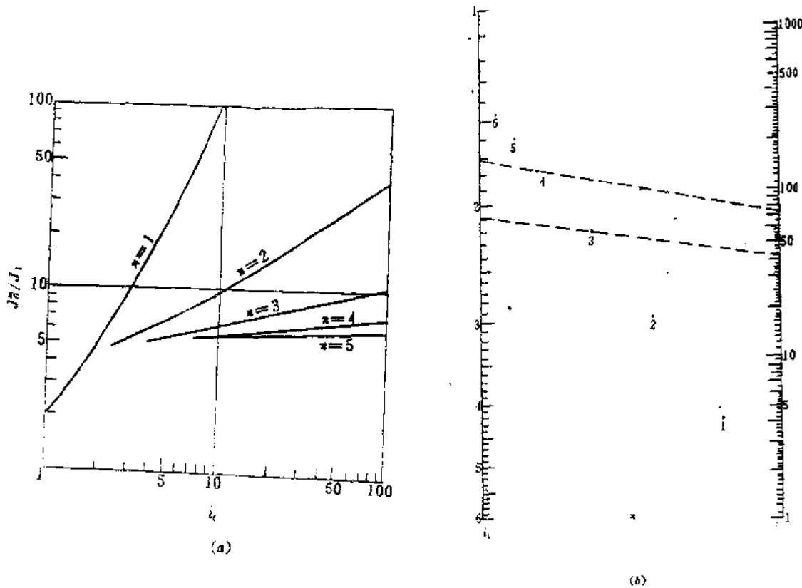

图3-7确定小功率传动级数和各级传动比的曲线(惯量小)(a)确定传动级数的曲线 (b)确定各级传动比的曲线

另外,还须看到,越接近高速级的轴,其上的转动惯量对折算转动惯量的影向越大,特别电动机轴及其后的一根、转动惯量应小,同时,应当减轻各级齿轮的重量,对小功率传动装置,应尽量选用轻合金或塑料齿轮。特别是第一个齿轮的重量应选得最小,为此,人们营在电动机转子轴上铣出齿形,以作主动轮使用。

值得指出的是,上述分配原则是作了一些假设的情况下产生的,按此原则分配时会与实际有些出入,故以上计算只在大体上是精确的。

3.“重量最轻"(或"体积最小"原则和方法

在某些电子设备和精密机械、仪器仪表中,特別是用于航天和航空的设备及仪器(如机载雷达的减速器等),要求重量轻(体积小)。另外,对于总传动比较大,后几级齿轮的转动惯近算到电动机轴上已经影响很小,但又要求运转灵活的传动装置,也可以着重考虑如何从传动比分配上,来减轻后几级重量。为此,按“重量最轻"(或“体积最小")的原则采确定各级传动比就显得十分必要。

(1)大功率传动装置为便于分析,假设;

$\textcircled{1}$ 所有主动小齿轮的模数 $\pmb { \mathscr { n } }$ 、分度圆直径 $\pmb { \mathcal { D } }$ 齿宽 $\pmb { \bar { B } }$ 均与转矩的三次方根成正比,从而有

$$
\frac { m _ { j } } { m _ { 1 } } = \frac { \bar { D } _ { j } } { \bar { D } _ { 1 } } = \frac { \bar { B } _ { j } } { \bar { B } _ { 1 } } = \sqrt [ 3 ] { \frac { M _ { j } } { M _ { 1 } } } = \sqrt [ 3 ] { i _ { 1 , j } }
$$

式中,下标1一一表示第一级齿轮副中的小齿轮,即在电动机轴上的小齿轮;

下标 $j$ —表示第 $j$ 级齿轮副中的小齿轮。

在同级齿轮副中,大、小齿轮的齿宽相等。

$\textcircled{2}$ 轴与轴承的重量与所在轴上的齿轮的重量成正比,允许合在一起考虑。各齿轮都是实心圆柱体,材料相同(密度为 $\rho \rangle$ 。

仍以图3-5所示的二级齿轮减速传动为例,各齿轮的重量之和为

$$
W = W _ { l } + W _ { 2 } + W _ { 3 } + W _ { 4 } = \pi \rho g \Big [ B _ { 1 } \Big ( \frac { { \bar { D } } _ { 1 } } { 2 } \Big ) ^ { 1 } + B _ { 2 } \Big ( \frac { { \bar { D } } _ { 2 } } { 2 } \Big ) ^ { 2 } + B _ { 3 } \Big ( \frac { { \bar { D } } _ { 3 } } { 2 } \Big ) ^ { 2 } + B _ { 4 } \Big ( \frac { { \bar { D } } _ { 4 } } { 2 } \Big ) ^ { 2 } \Big ]
$$

$$
= \frac { \pi } { 4 } B _ { 1 } \rho g \bar { y } _ { 1 } ^ { 2 } \Bigl [ 1 + i _ { 1 } ^ { 2 } + \frac { \bar { B } _ { 3 } } { \bar { B } _ { 1 } } \Bigl ( \frac { \bar { D } _ { 3 } } { \bar { D } _ { 1 } } \Bigr ) ^ { 2 } ( 1 + i _ { 2 } ^ { 2 } ) \Bigr ]
$$

因

$$
\frac { \bar { B } _ { 3 } } { \bar { B } _ { 1 } } \Big \{ \frac { \bar { D } _ { 3 } } { \bar { D } _ { 1 } } \Big \} ^ { 2 } = i _ { 1 } ^ { \frac { 1 } { 7 } } \cdot i \frac { 2 } { \bar { \xi } } = i _ { 2 }
$$

故

$$
\mathbb { W } = \frac { \pi } { 4 } \rho g B _ { \downarrow } \bar { D } _ { 1 } ^ { 2 } \Big [ 1 + i _ { \downarrow } ^ { 2 } + i _ { \downarrow } \Big ( 1 + \frac { i _ { \ell } ^ { 2 } } { i _ { \downarrow } ^ { 2 } } \Big ) \Big ]
$$

欲使重量最轻,则需令 $\frac { \partial { \cal W } ^ { \prime } } { \partial i _ { 1 } } { \bf \Gamma } = 0$ ,得到

$$
\begin{array} { l } { 2 i _ { i } + 1 = \frac { i _ { i } ^ { 2 } } { i _ { i } ^ { 2 } } } \\ { i _ { t } = i _ { 1 } \ \sqrt { 2 i _ { 1 } + 1 } } \\ { i _ { 2 } = \sqrt { 2 i _ { 1 } + 1 } } \end{array}
$$

如考虑三级传动,类似地可得到

$$
\begin{array} { l } { i _ { 1 } = \ \sqrt { 2 i _ { 1 } + 1 } } \\ { i _ { 3 } = \ \sqrt { 2 i _ { 2 } + 1 } = \sqrt { 2 \ \sqrt { 2 i _ { 1 } + 1 } + 1 } } \end{array}
$$

$$
\mathrm { ~ i _ { l } = i _ { l } ~ \sqrt { 2 i _ { l } + 1 } ~ \sqrt { 2 ~ \sqrt { 2 i _ { l } + 1 } ~ + ~ 1 } ~ }
$$

按式(3-8)、式(3-9)和式(3-9)、式(3-10)与式(3-11)可作出图3-8及图3-9.

借助图3-8或图3-9可确定二级或三级传动比,现举例说明其方法:

例3-1假设级数 $\scriptstyle \pmb { \mathscr { n } } = 2$ ,总传动比 $i _ { t } = 4 0$ ,按图3-8,可得到 $i _ { 1 } { \approx } 9 . 1 , i _ { 2 } { \approx } 4 . 4$ 。

例3-2假设级数 $\mathfrak { x } = 3$ ,总传动比 $i _ { t } = 2 0 2$ ,按图3-9,可得到 $i _ { 1 } { \approx } 1 2 , i _ { 2 } { \approx } 5 , i _ { 3 } { \approx } 3 , 4 ,$ 

从上述例子可以发现,对大功率传动装置,当按“重量最轻"的原则确定各级传动比时,各级传动比的数值有逐级递减的趋势,

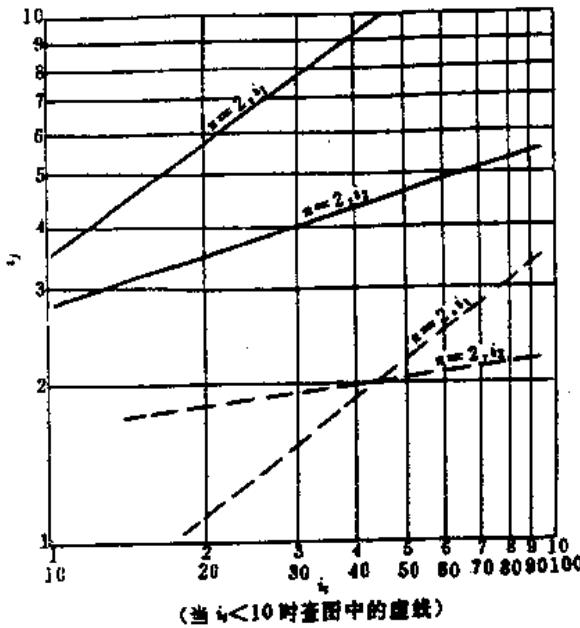

图3-8确定二级传动比的曲线(重量轻)

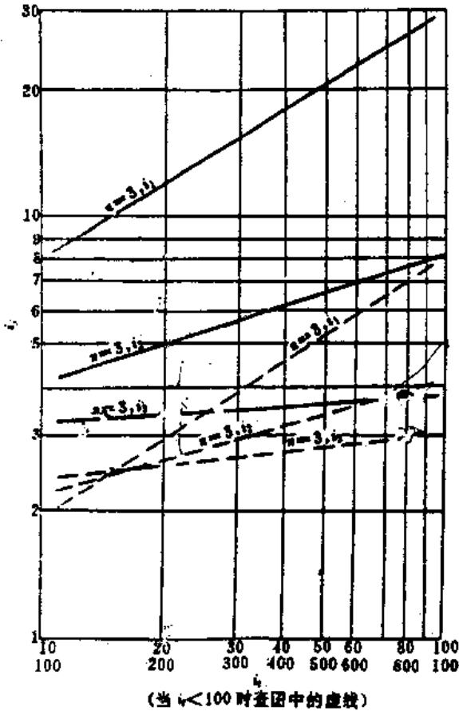

图3-9确定三级传动比的曲线(置量轻)

(2)小功率传动装置

假设:

$\textcircled{1}$ 所有主动小齿轮的模数、齿数和齿宽均相同。  
$\textcircled{2}$ 轴与轴承的重盘于以忽略,各齿轮都是实心圆柱体,材料相同(密度为 ${ \pmb \rho } )$ ·以二级传动为例,各齿轮的重量之和为

$$
W = W _ { 1 } + W _ { 2 } + W _ { 3 } + W _ { 4 } = \pi p g { \bigg [ } B _ { 1 } { \bigg ( } { \frac { D _ { 1 } } { 2 } } { \bigg ) } ^ { \mathrm { { 2 } } } + B _ { 3 } { \bigg ( } { \frac { D _ { 2 } } { 2 } } { \bigg ) } ^ { \mathrm { { 2 } } } + B _ { 3 } { \bigg ( } { \frac { D _ { 3 } } { 2 } } { \bigg ) } ^ { \mathrm { { 2 } } } + B _ { 4 } { \bigg ( } { \frac { D _ { 4 } } { 2 } } { \bigg ) } ^ { \mathrm { { 2 } } } { \bigg ] }
$$

$$
= \left. \frac { 1 } { 4 } \pi \rho g B _ { \mathrm { i } } D _ { \mathrm { i } } ^ { \mathrm { i } } \right. 2 + i \mathrm { f } ^ { \mathrm { i } } + \left. \frac { i _ { \mathrm { t } } ^ { 2 } } { i \mathrm { f } } \right.
$$

$\frac { \partial \bar { \theta } } { \partial \dot { \theta } _ { \mathrm { t } } } { = } 0$ 时,有

$$
\begin{array} { r l } & { 2 i _ { 1 } - \frac { 2 i _ { i } ^ { 2 } } { i _ { 1 } ^ { 3 } } = 0 } \\ & { 2 ( i _ { 1 } ^ { 4 } - i _ { i } ^ { 2 } ) = 0 } \\ & { i _ { 4 } = i _ { 1 } ^ { 3 } } \\ & { i _ { i } = i _ { 1 } \cdot i _ { 2 } } \\ & { i _ { 1 } = i _ { 2 } } \end{array}
$$

从面

因

故

如考虑三级传动,类似地可得到

$$
i _ { 1 } = i _ { 1 } = i _ { 2 }
$$

由此可见,对小功率传动装置,当按“重量最轻"原则确定各级传动比时,各级传动比可取相同的数值,如不考虑材料的密度和重力加速度,则式(3-12)成为各齿轮的体积之和,如令 $ { \langle { \frac { \partial V } { \partial i _ { t } } } = 0 }$ ,则传动比的分配结果与“重量最轻"原则完全一致,也就是说,“重量最轻"原则与“体积最小"原则完全一致,上述结论同样适用于更多级小功率传动装置,由于已经假设各主动小齿轮模数、齿数相同,故各主动小齿轮分度圆直径及各大齿轮分度圆直径也相同,使得传动系统中齿轮的尺寸品种减至两种,而且各级齿轮的中心距彼此相等,不仅有利加工,而且还可设计成如图3-10所示的塔式齿轮传动链,显得结构十分紧凑,

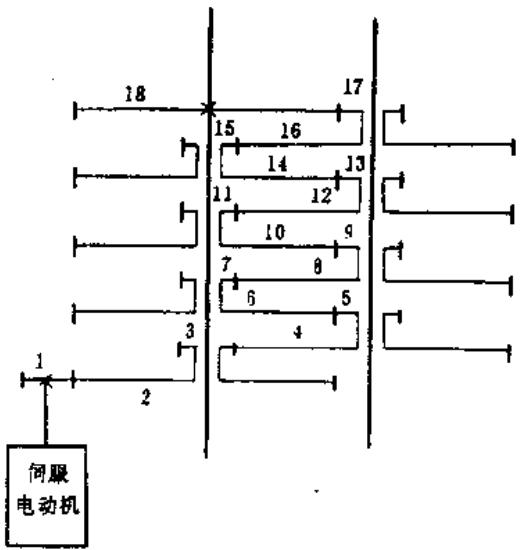

图3-10塔式齿轮传动箱

图3-10是某无人驾驶高空侦察机中遥控方向舵的小功率传动装置.各级齿轮的模数均相同,各级齿轮的齿数分别是 ${ \scriptstyle : z _ { 1 } = 9 , z _ { 2 } = 6 3 , z _ { 1 } = 1 4 , z _ { 4 } = 4 8 , z _ { 5 } = z _ { 7 } = z _ { 9 } = z _ { 1 1 } = z _ { 1 3 } = z _ { 1 5 } = z _ { 1 7 } }$ $= 1 6 , z _ { 4 } = z _ { 1 } = z _ { 1 0 } = z _ { 1 2 } = z _ { 1 4 } = z _ { 1 6 } = z _ { 1 1 } = 4 6$ ,总传动比 $_ { i _ { 1 } } { \approx } 3 9 0 0 0$ 

另外,要想达到“重量最轻”的目的,除选用相等的传动比外,还应在强度许可下尽量选用较小模数和较少齿数的齿轮(对仪器类齿轮最少不根切齿数 $z _ { \mathrm { m i n } } = 1 1 ;$ 。但当采用少于极限齿数(如 $z { = } 1 0 , 1 1 , 1 2 , 1 3$ 等)时,应该用修正的办法补救根切对齿形的影响。

应当指出的是,在合理地选择变速器的参数后,如果齿轮的布置不当,也将使机构重量增加、体积增大。因此,必须根据电子设备和仪器整体对变速器的外形要求,用绘图或计算的方法进行各齿轮的排列。

上面分别介绍了侧重于精度、惯量或重量(体积)时确定级数和各级传动比的原则和方法,它们相互之间有一致之处,也有矛盾之处。设计时,应根据具体要求,统筹兼顯、综合考虑。另外,在根据总传动比确定好级数以后,由分配所得之单级传动比的决定和选择中,若载荷比较均匀,为使齿轮能很好磨配和分析周期误差,建议传动比为整数(或整数比).对于载荷变化明显的,为了减小某些轮齿的集中磨损,应采用质数比的传动比,例如 $\dot { \bullet } = 3 2 / 1 3$ 

101/17,…,有时,需要实现某些函数关系的传递时,传动比应依函数关系确定。

在综合考虑精度、惯量、重量、强度、结构空间限制等因素来选择级数和各级传动比时,如果工程设计需要,还可根据优化方法,借助电子计算机来进行。

例3-3图3-11所示雷达天线驱动装置为大功率传动装置,总传动比i3600,试确定其级数和各级传动比。

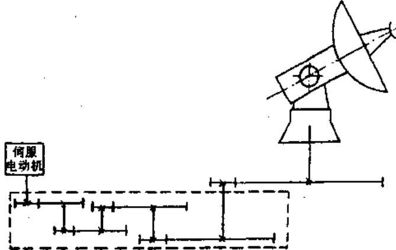

图3-11 某留达天线大功率传动装置

解首先,在满足强度和刚度的前提下,应根据结构空间的允许和实际工作条件,尽可能取大的末级传动比,以减小负载轴上的折算传动惯量和折算转角误差。据此,确定末级传动比为16.5,其余传动比则为减速箱的总传动比 $i _ { i \cdot n } = 3 6 0 0 / 1 6 . 5 = 2 1 8 . 2 ,$ 

按"折算转动惯量小"的原则,由图 $\Im \mathrm { - } \Im \{ \arg \alpha \}$ 确定减速箱的级数 $\yen 4$ 

在这四级传动中,前二级按“折算转动惯量小"的原则(兼顾"折算转角误差最小"原则),传动比逐级递增。参考图3-6(b)和 $\left( e \right)$ ,确定 ${ \mathfrak { i } } _ { 1 } { = } 2 . 5 , { \mathfrak { i } } _ { 2 } { = } 3 . 6$ :后二级按“重量最轻"原则,传动比取逐级递减,参考图3-8确定 $i _ { 3 } = 6 , 4 , i _ { 4 } = 3 , 8$ 

校核总传动比:

$$
i _ { \theta } = i _ { 1 } \circ i _ { 2 } \circ i _ { 3 } \circ i _ { 4 } = 2 . 5 \times 3 . 6 \times 6 . 4 \times 3 . 8 \approx 2 1 8 . 9
$$

$$
i _ { \ell } = 2 1 8 . 9 \times 1 6 . 5 = 3 6 1 2
$$

结果与给定的总传动比3600接近,认为可以。

# 3.4齿轮主要参数的确定

齿轮传动中最基本的参数是齿轮的模数和齿数。

# 一、齿轮模数的确定方法

1.按经验确定模数(类比法)

此法是依据设计要求,参照工作条件、传递力矩的大小、转速高低、精度要求、环境条件和所用材料方面相接近的已有齿轮传动装置,来选定所要求设计的齿轮传动的模数。

# 2.按结构条件确定模数

在电子设备及一般精密机械仪器中,齿轮传递的力矩往往是较小的,一般不必按强度条件计算确定其模数,对于圆柱齿轮传动,当有结构尺寸要求时,可以依照所要求的外形尺寸来选定齿轮传动的中心矩,再根据已定的齿轮传动比由以下关系式求得模数:

$$
m _ { n } = { \frac { 2 a } { z _ { 1 } ( 1 + i ) } } { \cos \beta }
$$

式中 $. 5 \pmb { n _ { \mathrm { s } } }$ —齿轮法面模数 $\left( \mathsf { m m } \right)$ ;

齿轮传动的中心距 $\bf ( m m )$ ;  
$z _ { \mathrm { { f } } }$ 韶轮(小齿轮)的齿数;  
i—对齿轮副的传动比;  
$\beta$ 螺旋角,般在 $1 5 ^ { \circ }$ 以内;为便于加工轮齿, $\pmb { \beta }$ 应控制到角分。

# 3.按强度条件确定模数

当齿轮受力较大时,可按强度条件来确定模数或对上述两种方法进行强度校核。

最后采用的模数数值,应是与上述计算结果最接近的标准模数数值,现将国家标准规定的 $\pmb { 4 } \pmb { \mathfrak { m } } \pmb { \mathfrak { n } }$ 以下的渐开线圆柱齿轮模数系列摘录于表3-1中,

表3-1渐开线圆柱齿轮模数国家标准(GB1357-87部分)

<table><tr><td rowspan=1 colspan=1>0.1</td><td rowspan=1 colspan=1>0.12</td><td rowspan=1 colspan=1>0.15</td><td rowspan=1 colspan=1>0.2</td><td rowspan=1 colspan=1>0.25</td><td rowspan=1 colspan=1>0.3</td><td rowspan=1 colspan=1>(0.35）</td><td rowspan=1 colspan=1>0.4</td><td rowspan=1 colspan=1>0.5</td><td rowspan=1 colspan=1>0.6i</td><td rowspan=1 colspan=1>（0.7）</td><td rowspan=1 colspan=1>0.8</td><td rowspan=1 colspan=1>（0.9）</td></tr><tr><td rowspan=1 colspan=1></td><td rowspan=1 colspan=1>1.25</td><td rowspan=1 colspan=1>1.5</td><td rowspan=1 colspan=1>（1.75）</td><td rowspan=1 colspan=1>2</td><td rowspan=1 colspan=1>(2.25）</td><td rowspan=1 colspan=1>2.5</td><td rowspan=1 colspan=1>（2.75）</td><td rowspan=1 colspan=1>：</td><td rowspan=1 colspan=1>k3.25）</td><td rowspan=1 colspan=1>(3.5）</td><td rowspan=1 colspan=1>3.75）</td><td rowspan=1 colspan=1>→</td></tr></table>

注1..无括号的为第一系列,应优先采用。2.有括号的为第二系列,打 $\clubsuit$ 号的应尽可能不用,

国家标准规定的4mm以下的锥齿轮模数和圆柱蜗杆模数分别摘录于表3-2及表3-3中,供选用。

表3-2锥齿轮模数国家标准(GB12368-90部分)

<table><tr><td rowspan=1 colspan=1>0.1</td><td rowspan=1 colspan=1>0.12</td><td rowspan=1 colspan=1>0.15f</td><td rowspan=1 colspan=1>0.2</td><td rowspan=1 colspan=1>0.25</td><td rowspan=1 colspan=1>0.3</td><td rowspan=1 colspan=1>0.35</td><td rowspan=1 colspan=1>0.1</td><td rowspan=1 colspan=1>0.5</td><td rowspan=1 colspan=1>0.6</td><td rowspan=1 colspan=1>0.7</td><td rowspan=1 colspan=1>0.8</td><td rowspan=1 colspan=1>0.g</td><td rowspan=1 colspan=1>1</td></tr><tr><td rowspan=1 colspan=1>1. 125</td><td rowspan=1 colspan=1>1.25</td><td rowspan=1 colspan=1>1.375</td><td rowspan=1 colspan=1>1.5</td><td rowspan=1 colspan=1>1.75</td><td rowspan=1 colspan=1>2 1</td><td rowspan=1 colspan=1>2.25</td><td rowspan=1 colspan=1>2.5</td><td rowspan=1 colspan=1>2.75</td><td rowspan=1 colspan=1>3</td><td rowspan=1 colspan=1>3.25</td><td rowspan=1 colspan=1>3.5</td><td rowspan=1 colspan=1>4</td><td rowspan=1 colspan=1></td></tr></table>

表3-3圆柱蜗打模数国家标准(GB10088-88部分)

<table><tr><td rowspan=1 colspan=1>0.1</td><td rowspan=1 colspan=1>0.12</td><td rowspan=1 colspan=1>0.16</td><td rowspan=1 colspan=1>0.2</td><td rowspan=1 colspan=1>0.25</td><td rowspan=1 colspan=1>0.3</td><td rowspan=1 colspan=1>0</td><td rowspan=1 colspan=1>0.5</td><td rowspan=1 colspan=1>0.6</td><td rowspan=1 colspan=1>（0.7）</td><td rowspan=1 colspan=1>0.8</td></tr><tr><td rowspan=1 colspan=1>(0.9)1</td><td rowspan=1 colspan=1>！</td><td rowspan=1 colspan=1>1. 25</td><td rowspan=1 colspan=1>(1.5)</td><td rowspan=1 colspan=1>1.6</td><td rowspan=1 colspan=1>2</td><td rowspan=1 colspan=1>2.5</td><td rowspan=1 colspan=1>（3）</td><td rowspan=1 colspan=1>3.15</td><td rowspan=1 colspan=1>(3.5)</td><td rowspan=1 colspan=1>一</td></tr></table>

注括号内的为第二系列;无括号的为第一系列,应优先采用。电子设备和精密机械仪器中,常用模数为0.5、0.8、1和1.5.

# 二、齿轮的齿数

齿轮的齿数不仅与传动比有关,而且影响到基圆的大小和轮齿的渐开线形状,它与分度圆直径及齿距的关系为 $d = \pi / \pi$ 

、考虑到小功率传动时齿轮制造的工艺性和疲劳强度,一般希望在一定的齿轮传动中心距条件下,尽量采用较大的模数,即小齿轮的齿数愈少愈好,但是,小齿轮齿数的减少受到齿轮不根切的最少齿数的限制。而且,齿轮的齿数太少时,会使传动的平稳性及精度降低。所

以,除了特殊情况外(例如对转动惯量和轴的尺寸要求很严格时,最少齿数可降低到12),一般选齿数不应小于 $1 7 \sim 2 0$ 。在齿轮中心距不受限制及要求有转角精度的重要齿轮传动中,齿数应不少于25.

小齿轮齿数确定后,大齿轮的齿数即可由传动比:随之确定,但考虑到工艺原因,为避免机床挂轮不方便,推荐尽量不要采用下列齿数:101,103.107,109,121,127,131,149,151,157,163,167,179等。

如果齿轮的齿数必须取得较少,可以采用变位齿轮传动。

斜齿圆柱齿轮的最少齿数比直齿圜柱齿轮要小,其关系为

$$
z _ { \mathrm { m i n } } = 1 7 \cos ^ { 2 } \beta
$$

式中, $z _ { \mathrm { e a t } }$ 一斜齿圆柱齿轮的最少齿数;

$\pmb { \beta }$ 一一斜齿圆柱齿轮的螺旋角。

圆锥齿轮的最少齿数为

$$
\yen 123,456
$$

式中,6--小圆锥齿轮分度圆锥角。

小齿轮的齿数增多,可增大啮合系数,提高传动精度;但齿数多,齿轮分度圈直径大,结构尺寸也增大.

在蜗轮蜗杆传动中,蜗杆头数增多会增大螺旋角,有利于提高传动效率,但不易自锁。

高精度多头蜗杆加工困难.因此,在作精密示数的蜗轮蜗杆传动中,应当采用单头蜗杆,以避免由于相邻两螺旋线的齿距误差引起的周期性误差。蜗轮的最少齿数为28,根据结构需要,最大齿数可为500。

齿轮的齿数与模数的推荐关系见表3-4.

表3-4齿数与模数的一般关系

<table><tr><td rowspan=1 colspan=1>模数m</td><td rowspan=1 colspan=1>0.4.0.5、0.6</td><td rowspan=1 colspan=1>0.8</td><td rowspan=1 colspan=1>1</td><td rowspan=1 colspan=1>1.5</td></tr><tr><td rowspan=1 colspan=1>齿数：</td><td rowspan=1 colspan=1>26~180</td><td rowspan=1 colspan=1>22~120</td><td rowspan=1 colspan=1>18~105</td><td rowspan=1 colspan=1>18~70</td></tr></table>

# 3.5齿轮的几何参数

当齿轮的模数和齿数已经定出时,齿轮的各部分尺寸便可以按照本节列出的基本关系式分别计算得到。

# 一、圆柱齿轮

圆柱齿轮包括直齿轮、斜齿轮。对于外啮合标准圆柱齿轮的几何参数按表3-5所列公式求得。

表3-5外哦合标准园挂齿轮几何参数

<table><tr><td rowspan=1 colspan=1>名 称</td><td rowspan=1 colspan=1>代号</td><td rowspan=1 colspan=1>直齿轮</td><td rowspan=1 colspan=1>斜齿  轮</td></tr><tr><td rowspan=1 colspan=1>模数</td><td rowspan=1 colspan=1>m</td><td rowspan=1 colspan=1>选用标准值</td><td rowspan=1 colspan=1>取标准值m=cosβ</td></tr><tr><td rowspan=1 colspan=1>齿高</td><td rowspan=1 colspan=1>A</td><td rowspan=1 colspan=1>m1,h=2.35mm>1,h2.25m</td><td rowspan=1 colspan=1>m1h=2.35mm>！,h=2.25</td></tr><tr><td rowspan=1 colspan=1>压力角</td><td rowspan=1 colspan=1>4</td><td rowspan=1 colspan=1>a=20</td><td rowspan=1 colspan=1>为标准值，a=g8</td></tr><tr><td rowspan=1 colspan=1>齿距</td><td rowspan=1 colspan=1>P</td><td rowspan=1 colspan=1>P无</td><td rowspan=1 colspan=1>P=T,P需</td></tr><tr><td rowspan=1 colspan=1>基国齿距</td><td rowspan=1 colspan=1>P</td><td rowspan=1 colspan=1>P.= xwcosa</td><td rowspan=1 colspan=1>P</td></tr><tr><td rowspan=1 colspan=1>分度围直径</td><td rowspan=1 colspan=1>4</td><td rowspan=1 colspan=1></td><td rowspan=1 colspan=1>C</td></tr><tr><td rowspan=1 colspan=1>基圆直径</td><td rowspan=1 colspan=1>4</td><td rowspan=1 colspan=1>d=mx</td><td rowspan=1 colspan=1>1o     0cos</td></tr><tr><td rowspan=1 colspan=1>齿顶高</td><td rowspan=1 colspan=1>k</td><td rowspan=1 colspan=1>三</td><td rowspan=1 colspan=1>=cosβ</td></tr><tr><td rowspan=1 colspan=1>齿顶圆直径</td><td rowspan=1 colspan=1>无</td><td rowspan=1 colspan=1>=+2h</td><td rowspan=1 colspan=1>=+2h</td></tr><tr><td rowspan=1 colspan=1>齿根高</td><td rowspan=1 colspan=1>对</td><td rowspan=1 colspan=1>1.1.35mm>1,=1.25m</td><td rowspan=1 colspan=1>m≤1=1.35m,k=cosβm>1=1.25m,</td></tr><tr><td rowspan=1 colspan=1>齿根圆直径</td><td rowspan=1 colspan=1>4</td><td rowspan=1 colspan=1>d=d--2h</td><td rowspan=1 colspan=1>d-2/m</td></tr><tr><td rowspan=1 colspan=1>齿宽</td><td rowspan=1 colspan=1>b</td><td rowspan=1 colspan=1>（3~10）m其中，为齿宽系数</td><td rowspan=1 colspan=1>常取b=（5~6）m</td></tr><tr><td rowspan=1 colspan=1>标准中心距</td><td rowspan=1 colspan=1>a</td><td rowspan=1 colspan=1>四（21+2）4     2</td><td rowspan=1 colspan=1>m(2+2）20s</td></tr></table>

注下标代表法面,“代表端面。

# 对于内啮合标准圆柱齿轮传动,及齿轮、齿条传动,可查《仪器仪表结构设计手册》一书或其它机械设计手册。

# 二、圆锥齿轮

圆锥齿轮的基本尺寸计算见表3-6。其余结构尺寸可参阅有关设计手册。

表3-=90"时标准直齿圆锥齿轮的基本尺寸

<table><tr><td rowspan=1 colspan=1>名   称</td><td rowspan=1 colspan=1>代号</td><td rowspan=1 colspan=1>计算公式</td></tr><tr><td rowspan=1 colspan=1>模数</td><td rowspan=1 colspan=1>n</td><td rowspan=1 colspan=1>以大端模数为标准，由规定的标准模数系列中选取</td></tr><tr><td rowspan=1 colspan=1>传动比</td><td rowspan=1 colspan=1>1</td><td rowspan=1 colspan=1>i热  王 血告=tgo=ctgd的  2  4</td></tr><tr><td rowspan=2 colspan=1>分度园锥角</td><td rowspan=2 colspan=1>心</td><td></td></tr><tr><td rowspan=1 colspan=1>g-2=90-4</td></tr></table>

(续表)

<table><tr><td rowspan=1 colspan=1>分度国直径</td><td rowspan=1 colspan=1>1</td><td rowspan=1 colspan=1>d=mzd=</td></tr><tr><td rowspan=1 colspan=1>齿顶高</td><td rowspan=1 colspan=1>h</td><td rowspan=1 colspan=1>=m</td></tr><tr><td rowspan=1 colspan=1>齿根高</td><td rowspan=1 colspan=1>雨</td><td rowspan=1 colspan=1>m≤1.h=1.25m>1,=1.2m</td></tr><tr><td rowspan=1 colspan=1>齿高</td><td rowspan=1 colspan=1>！</td><td rowspan=1 colspan=1>m≤1,=2. 25m>1,=2.2</td></tr><tr><td rowspan=1 colspan=1>顶</td><td rowspan=1 colspan=1>心</td><td rowspan=1 colspan=1>1c0.25m>1.c=0.2m</td></tr><tr><td rowspan=1 colspan=1>齿顶圆直径</td><td rowspan=1 colspan=1>d</td><td rowspan=1 colspan=1>=d+2mcosd,d=d+2mcosd</td></tr><tr><td rowspan=1 colspan=1>齿根圆直径</td><td rowspan=1 colspan=1>d</td><td rowspan=1 colspan=1>d=d-2hcosd,d=d-2hcosd</td></tr><tr><td rowspan=1 colspan=1>锥距</td><td rowspan=1 colspan=1>R</td><td rowspan=1 colspan=1>                          d     dR=+2sin2sin</td></tr><tr><td rowspan=1 colspan=1>齿宽</td><td rowspan=1 colspan=1>b</td><td rowspan=1 colspan=1>b=R,b=R或b≤10m，取其中的较小值3</td></tr><tr><td rowspan=1 colspan=1>齿顶角</td><td rowspan=1 colspan=1>0</td><td rowspan=1 colspan=1>0=tg-R</td></tr><tr><td rowspan=1 colspan=1>齿根角</td><td rowspan=1 colspan=1>A，</td><td rowspan=1 colspan=1>0=tgR</td></tr><tr><td rowspan=1 colspan=1>顶锥角</td><td rowspan=1 colspan=1>d</td><td rowspan=1 colspan=1>=+0.,+0.</td></tr><tr><td rowspan=1 colspan=1>根惟角</td><td rowspan=1 colspan=1>山</td><td rowspan=1 colspan=1>n-,=-0</td></tr></table>

注1.计算时,当 $m > 1$ 时,取 $v = v _ { 1 }$ (法面模数) $\bullet \leqslant 1$ 时,取 ${ \mathfrak { s o } } = 1 { \mathfrak { s } } ,$ (中点模数).2.中点模数 $\pmb { \mathfrak { M } } _ { \pmb { \mathfrak { s } } }$ 系指小模数直齿圆锥齿轮在其齿宽中点的当量圆柱齿轮的模数

# 三、蜗杆和蜗轮

蜗杆与蜗轮的基本尺寸计算见表3-7,其余结构尺寸参阅有关设计手册。

表3-7蜗杆与蜗轮基本尺寸

<table><tr><td rowspan=1 colspan=2>名称</td><td rowspan=1 colspan=1>代号</td><td rowspan=1 colspan=1>计算公式</td></tr><tr><td rowspan=1 colspan=2>传动比</td><td rowspan=1 colspan=1>i</td><td rowspan=1 colspan=1>i品</td></tr><tr><td rowspan=1 colspan=2>模数</td><td rowspan=1 colspan=1>m</td><td rowspan=1 colspan=1>取标准信</td></tr><tr><td rowspan=1 colspan=2>中心距</td><td rowspan=1 colspan=1>4</td><td rowspan=1 colspan=1>=（+）</td></tr><tr><td rowspan=7 colspan=1>蜗杆</td><td rowspan=1 colspan=1>蜗杆头数</td><td rowspan=1 colspan=1>2</td><td rowspan=1 colspan=1>z=1~5</td></tr><tr><td rowspan=1 colspan=1>螺旋线导程</td><td rowspan=1 colspan=1>P</td><td rowspan=1 colspan=1>P.=x2</td></tr><tr><td rowspan=1 colspan=1>分度圆直径</td><td rowspan=1 colspan=1>4</td><td rowspan=1 colspan=1>按标准选取，见表3-8</td></tr><tr><td rowspan=1 colspan=1>齿顶围直径</td><td rowspan=1 colspan=1>4</td><td rowspan=1 colspan=1>=+2m</td></tr><tr><td rowspan=1 colspan=1>齿根圆直径</td><td rowspan=1 colspan=1>山</td><td rowspan=1 colspan=1>-2.5m</td></tr><tr><td rowspan=1 colspan=1>分度园导程角</td><td rowspan=1 colspan=1></td><td rowspan=1 colspan=1>tY2</td></tr><tr><td rowspan=1 colspan=1>齿高</td><td rowspan=1 colspan=1>上</td><td rowspan=1 colspan=1>=2.25m</td></tr><tr><td rowspan=8 colspan=1>蜗轮</td><td rowspan=1 colspan=1>齿数</td><td rowspan=1 colspan=1>2</td><td rowspan=1 colspan=1>2三机</td></tr><tr><td rowspan=1 colspan=1>分度园直径</td><td rowspan=1 colspan=1>4</td><td rowspan=1 colspan=1>=</td></tr><tr><td rowspan=1 colspan=1>齿顶园直径</td><td rowspan=1 colspan=1>山</td><td rowspan=1 colspan=1>d=d-2m</td></tr><tr><td rowspan=1 colspan=1>齿根圆直径</td><td rowspan=1 colspan=1>d</td><td rowspan=1 colspan=1>d=d:-2.5m</td></tr><tr><td rowspan=1 colspan=1>试高</td><td rowspan=1 colspan=1>：</td><td rowspan=1 colspan=1>h=2.25m</td></tr><tr><td rowspan=1 colspan=1>轮缘外径</td><td rowspan=1 colspan=1>i</td><td rowspan=1 colspan=1>21=1,d≤d+2m2=2~3,≤+1.5m21=4,d+</td></tr><tr><td rowspan=1 colspan=1>齿根宽</td><td rowspan=1 colspan=1>b，</td><td rowspan=1 colspan=1>bdsind</td></tr><tr><td rowspan=1 colspan=1>蜗轮宽</td><td rowspan=1 colspan=1>b</td><td rowspan=1 colspan=1>b=b+0.25P，（P,分度圆齿距）</td></tr></table>

国家标准规定的30mm以下的圆柱蜗杆分度圆直径数值见表3-8。

表3-8圆柱蜗杆分度圆直径(GB10088-88部分)

<table><tr><td rowspan=1 colspan=1>4</td><td rowspan=1 colspan=1>4.5</td><td rowspan=1 colspan=1>5</td><td rowspan=1 colspan=1>5.6</td><td rowspan=1 colspan=1>（6）</td><td rowspan=1 colspan=1>6.3</td><td rowspan=1 colspan=1>7.1</td><td rowspan=1 colspan=1>(7.5)</td><td rowspan=1 colspan=1>8</td><td rowspan=1 colspan=1>(8.5)</td><td rowspan=1 colspan=1>9</td><td rowspan=1 colspan=1>10</td></tr><tr><td rowspan=1 colspan=1>11.2</td><td rowspan=1 colspan=1>12.5</td><td rowspan=1 colspan=1>4</td><td rowspan=1 colspan=1>(15)</td><td rowspan=1 colspan=1>16</td><td rowspan=1 colspan=1>18</td><td rowspan=1 colspan=1>20</td><td rowspan=1 colspan=1>22.4</td><td rowspan=1 colspan=1>25</td><td rowspan=1 colspan=1>28</td><td rowspan=1 colspan=1>(30)1</td><td rowspan=1 colspan=1></td></tr></table>

现代电子设备及精密机械仪器的设计制造中还广泛地采用变位齿轮,目的是避免根切,记中心距或改善传动质量。

# 3.6齿轮传动的结构设计

齿轮传动的结构设计包括齿轮的结构设计、齿轮与轴的连接结构、齿轮箱体结构的设计等,它对于提高齿轮传动的精度、减小空程误差、减小噪声和振动等方面有着十分密切的关系.

# 一、齿轮的结构设计

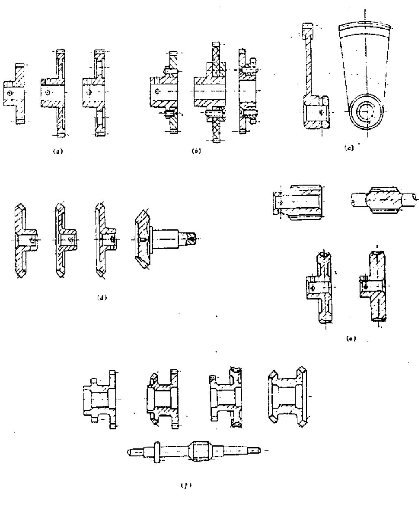

图3-12常用的典型齿轮结构

根据齿轮的工作条件、设计参数和轴及其它零件的相互关系,齿轮的结构形状可以是多种多样的。但都应满足齿轮对可靠性、工艺性和精确性方面的要求,这就是说,齿轮应有足够的刚度,以保证在加工和使用时不致出现过度的变形而丧失齿轮的精度;齿轮结构上应有合理的工艺基准和安装基准,尽可能避免设计齿宽小的齿轮;在与轴配合的基准轴孔应保证有适当的长径比,特别是用一个圆锥销或圆柱销来固定齿轮时,过短的支承长度会使销的工作不可靠,必要时可采用组合齿轮结构,以减小机构的空间尺寸。但是,组合齿轮的轮缘部分应具有保证安装时达到同轴度和垂直度要求的定位基准,内孔两端需镗孔,以便安装滚动轴承.图3-12所示为常用的典型齿轮结构。其中,图 $\pmb { 3 - 1 2 ( \pmb { a } ) }$ 所示为圆柱齿轮的典型结构:图3-12(b)所示为圆柱齿轮的组合结构;图3-12(c)所示为扇形圆柱齿轮结构:图3-12(d)所示为圆锥齿轮的典型结构;图3-12(e)所示为蜗轮蜗杆的典型结构;图3-12(f)所示为复合齿轮结构。对于复合式齿轮结构,设计时应根据不同切齿方法适当选取齿轮间隔尺寸,

当齿轮直径较大时,可采用减轻孔减轻齿轮的重量;当齿轮直径较小时,可采用轴齿轮形式.

各种齿轮典型结构几何参数的选取可参阅参考文献[]。

# 二、齿轮和轴的连接结构

正确选择齿轮和轴的连接是齿轮传动设计的重要内容之一,齿轮与轴的连接结构设计,应与齿轮传动系统设计相适应.它主要考虑:传递力矩、传动精度、装拆的频繁程度等工作条件和空间位置、轴的形状、相关结构尺寸大小等因素.具体地说,齿轮和轴的连接应尽量使结构简单、装拆方便,并保证连接的牢固性和齿轮与轴的同轴度、垂直度要求.在小功率传动装置中,常用的连接方式有销钉连接、螺钉连接,面摩擦连接、键连接及其它连接方法则用得较少.

(1)销钉连接销钉连接的结构如图 $3 - 1 3 ( a )$ 所示,这种连接结构简单、工作可靠、安装方便、不易产生空程误差,因此,在一般情况下应优先采用。其缺点是装拆较困难,在销钉打得很紧时,容易使轴产生应力而引起轴的弯曲,常用的有圆锥销和圈柱销连接。前者不能保证齿轮与轴有高的同轴度,后者应注意防松。这两种连接方法特别适用于小孔齿轮。圆柱销和圆锥销的直径一般取为轴径的 $1 / 4 { \sim } 1 / 3$ ·

销钉连接能传递中等力矩,但不适于直径太大的齿轮。

(2)螺钉连接螺钉连接的优点是结构简单、装拆方便。图3-13(b)所示为用紧定螺钉分别从齿轮轮毂沿径向或轴向将齿轮与轴连接的结构。后者适用于轮毂很短而外径小的齿轮。图3-13(c)所示为利用圆柱头螺钉将片状齿轮直接固定在轴或轴套的凸缘上,齿轮与轴的同轴度靠圈柱面配合来保证,垂直度靠轴或轴套凸缘端面与齿轮端面的接触来保证,该结构主要用于较大的齿轮片及铜、铝合金或非金属齿轮的连接。

在易于受冲击、振动的高精度齿轮传动中不宜采用此种连接方法。

(3)键连接它一般用在尺寸较大和传递力矩较大的齿轮中,常用的是平键连接和半圆键连接。键连接的优点是:传递力矩大、工作可靠、装拆方便;缺点是键槽的加工困难、齿轮与轴的同轴度不易保证,因连接松动将引起空程误差,而且只能轴向调整。所以在精密传动链内,为了克服上述缺点,需选取较高精度加工键的工艺方法,为了控制空程误差,可用紧定螺钉将键拧紧。

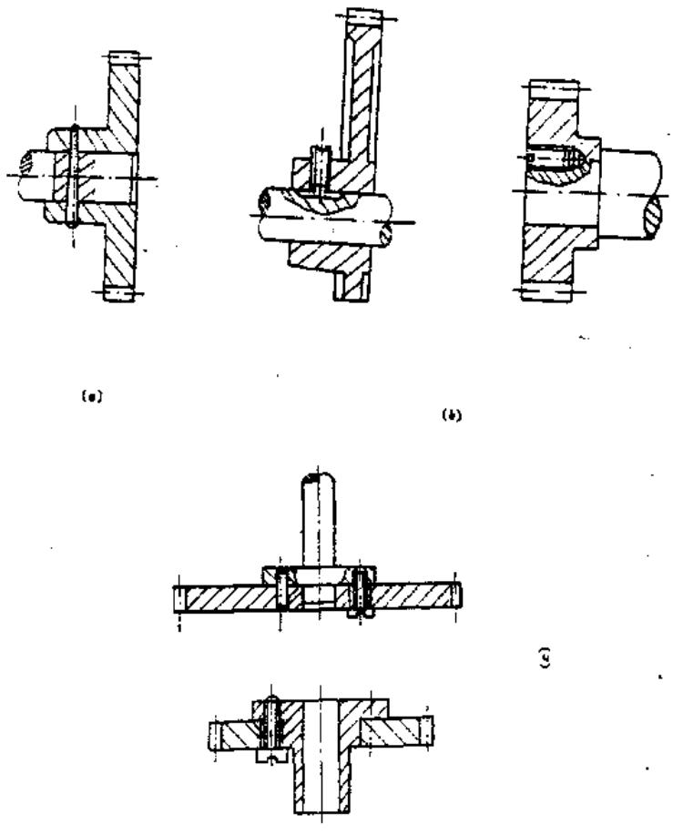

图3-13齿轮与轴的连接

(4)摩擦连接它是靠螺钉夹紧产生的摩擦力或弹簧变形恢复力产生摩擦力的连接,其典型结构见第十三章,摩擦连接的优点是:装拆方便,可以对轴和齿轮进行周向调整;并可起防止过载的作用,适宜于小功率传动。

此外,尚有压合、铆接、胶粘等不可拆连接方法,可用来降低成本、减轻重量、减小惯量和体积;但因拆卸时至少有一个零件将被破坏,又不能周向调节齿轮和轴的位置,一般用于传递小转矩及特殊需要的情况下。

# 三、齿轮材料的选择

选择齿轮材料主要应考虑使用要求、材料的加工性能和成本等.不同的工作条件(载荷、速度、精度要求、工作环境等)应选用不同的材料。在低速、有一定载荷作用的场合,应选用机械强度、硬度等综合性能较好的材料;在受载不大、转速不高、传动精度要求不高,但要求重量轻、转动惯量小的传动中,可选用铝合金或非金属材料:在精密示数传动中,为保证精度持久,应选用耐磨材料;在要求噪声小或防腐蚀的条件下工作时,也可选用非金属材料;在有冲击载荷作用下,齿轮材料除应满足强度、表面硬度要求外,还应有足够的中心韧性,有时,为了提高齿面的耐磨性,一对齿轮可选用不同的材料,如小齿轮用钢,大齿轮用有色金属或非金属材料。

对于环境温度变化剧烈的齿轮 $( - 4 0 ^ { \circ } C \sim + 5 0 ^ { \circ } C )$ ,必须考虑齿轮和箱体材料线膨胀系数的不同,特别是精密伺服系统传动链内的小模数六直径齿轮更应如此。为了避免温差造成的侧隙增大,应当尽可能采用与箱体具有相同线膨胀系数的材料。

从经济性出发,应注意节约铜合金和特种钢.从工艺性出发,应当选择容易加工、便于得到较高精度和表面质量的齿轮材料。

小模数齿轮常用的材料如表3-9所示。

表3-9常用齿轮材料及其应用范围

<table><tr><td rowspan=1 colspan=1>材料名称</td><td rowspan=1 colspan=1>牌号</td><td rowspan=1 colspan=1>应  用范围</td></tr><tr><td rowspan=2 colspan=1>优质碳素结构钢</td><td rowspan=1 colspan=1>15、20.30</td><td rowspan=1 colspan=1>常用于四周速度3m/以下齿轮</td></tr><tr><td rowspan=1 colspan=1>40、45、50</td><td rowspan=1 colspan=1>常用于國周遠度较高和强皮较高的齿轮和蜗杆</td></tr><tr><td rowspan=1 colspan=1>优质碳素工具钢</td><td rowspan=1 colspan=1>T8A、T10A</td><td rowspan=1 colspan=1>常用于制造小齿轮和蜗杆</td></tr><tr><td rowspan=3 colspan=1>合金钢</td><td rowspan=1 colspan=1>15Cr,20Cr18CrMnT1</td><td rowspan=1 colspan=1>用于制造承受冲击和交变载荷的齿轮和杆（经渗碳淬火后，可获得表面硬、中心韧的组织）</td></tr><tr><td rowspan=1 colspan=1>4DCr</td><td rowspan=1 colspan=1>用于制造速度较高的耐磨齿轮（调质、）</td></tr><tr><td rowspan=1 colspan=1>38CrMoAlA</td><td rowspan=1 colspan=1>用于需氮化的齿轮，变形小，热处理后不蠶</td></tr><tr><td rowspan=2 colspan=1>不锈钢</td><td rowspan=1 colspan=1>2Cr13Ni2</td><td rowspan=1 colspan=1>要求防锈防腐蚀的齿轮，经淬硬后变形极小，齿光泽</td></tr><tr><td rowspan=1 colspan=1>9Cr18</td><td rowspan=1 colspan=1>高防锈、防腐蚀要求的齿轮</td></tr><tr><td rowspan=1 colspan=1>铝合金</td><td rowspan=1 colspan=1>LY12、LD,LC,</td><td rowspan=1 colspan=1>用于制造重量较轻的齿轮</td></tr><tr><td rowspan=1 colspan=1>锡青铜</td><td rowspan=1 colspan=1>QSn6. 5-0.1QSn10-1ZQSn6-6-3</td><td rowspan=1 colspan=1>用于制造高抗轟取防磁的重要的齿轮及蜗轮</td></tr><tr><td rowspan=1 colspan=1>绍青钢</td><td rowspan=1 colspan=1>ZQA110-3-1. 5ZQA119-4</td><td rowspan=1 colspan=1>用于制造抗廓、防腐性要求一毁的齿轮及蜗轮</td></tr><tr><td rowspan=1 colspan=1>黄铜</td><td rowspan=1 colspan=1>H62</td><td rowspan=1 colspan=1>适用于不重婴的齿轮及蜗轮</td></tr><tr><td rowspan=1 colspan=1>夹布胶本聚四氟乙烯高分子增强尼龙聚碳酸脂</td><td rowspan=1 colspan=1></td><td rowspan=1 colspan=1>用于制造不要求高抗密性，面要求挖冲击、振动和噪音小的齿轮尺寸不稳定</td></tr></table>

# 3.7齿轮精度等级和侧隙类型的选择

齿轮精度等级与侧隙类型,必须根据齿轮传动机构的用途、工作条件和技术性能来遣

择,也就是说,应考虑齿轮传动功率、精度、圆周速度及噪声、振动等因素。

实际工作中,设计人员常用以下两种方法来选择齿论的精度等级与侧隙类型。

(1)类比法即根据实际的经验资料,比较类似的产品结构,在工作条件相当的情况下,选用相同或相近的精度等级与侧隙类型,

(2)计算法即根据齿轮传动机构所允许的传动误差,经计算确定各齿轮所必要的精度等级;根据齿轮传动机构所允许的空程误差,通过,算选择相应的侧隙类型.

计算法比较复杂,通常用于特别重要的场合,一用途的齿轮传动都用类比法。

# 一、小模数齿轮精度等级的选择

国家标准GB2363-80规定小模数渐开线圆柱齿轮卷度分为12个等级,精度由高到低依次用数字 $1 \sim 1 2$ 表示。其中,1、2级未规定公差值,留待今后发展之用;7级为基本精度.根据齿轮精度各项指标对使用性能的主要影响,每个精度等级的各项误差分为!、I、三个组。

小模数齿轮的精度等级主要取决于它的用途与使用条件。根据单向传动精度决定精度制的第1组指标(即运动精度),传动准确性要求愈高,相应地运动精度的等级就愈高,如量仪与伺服系统的减速齿轮、计算及记录机构的齿轮应选择较高的运动精度等级;面一般用途的电子设备、仪器仪表可选用较低的等级;根据圆周速度对振动和噪声的要求决定第】组指标(即工作平稳性精度),速度愈高、振动频率愈高,会使噪声增大,应选用较高的精度等级,如对高速小功率传动系统。由于小模数齿轮一般承受载荷不大,所以第组精度指标不作为选用时主要考虑的因索。但运动精度或平稳性精度等级较高时,接触精度也相应要跟着提高。

电子设备和各类精密机械仪器仪表常用的齿轮精度等级如表3-10所示,根据目前条件,电子设备中的齿轮精度大都选用6、7、8三级。

表3-10常用的齿轮精度等级

<table><tr><td rowspan=1 colspan=1>用</td><td rowspan=1 colspan=1>精度等级</td><td rowspan=1 colspan=1>用 途</td><td rowspan=1 colspan=1>精度等级</td></tr><tr><td rowspan=1 colspan=1>测量齿轮</td><td rowspan=1 colspan=1>3~5</td><td rowspan=1 colspan=1>量仪</td><td rowspan=1 colspan=1>5~6</td></tr><tr><td rowspan=1 colspan=1>光学仪器、小功率伺服系统</td><td rowspan=1 colspan=1>5~8</td><td rowspan=1 colspan=1>雷达、航空仪表、功率传动机构</td><td rowspan=1 colspan=1>6~8</td></tr><tr><td rowspan=1 colspan=1>般传动机构（计数器等)</td><td rowspan=1 colspan=1>7~8(9)</td><td rowspan=1 colspan=1>热工仪表</td><td rowspan=1 colspan=1>7~g</td></tr></table>

另外,在选择齿轮精度等级时,还需考虑工艺成本,不应无原则地提高精度等级,面造成成本增加和加工周期的延长,

表3-11为齿轮精度等级的选用参考。光学仪器中使用的小模数齿轮精度等级也可参考该表选用。

表3-11柱齿轮精度等级的应用范围

<table><tr><td rowspan=2 colspan=2>项    目</td><td rowspan=1 colspan=4>精   度  等</td></tr><tr><td rowspan=1 colspan=1>5</td><td rowspan=1 colspan=1>6</td><td rowspan=1 colspan=1>7</td><td rowspan=1 colspan=1>8</td></tr><tr><td rowspan=1 colspan=2>H作条件</td><td rowspan=1 colspan=1>精密的分度机构；精密传动机构（如大型跟踪仪器、精密传动系统最定一级齿轮传动）高选摄影机传动：高速高平稳、低噪声的齿轮传动</td><td rowspan=1 colspan=1>计数装置的传动分度机构的齿轮：大然跟踪仪器的俯仰及方位传动系统：中、低速摄影机传动；高速、平低噪声的齿轮传动</td><td rowspan=1 colspan=1>计数装置的传动减速箱的齿轮：大型跟踪仪内要求较高的手传动系统：高速、功率不大的传动</td><td rowspan=1 colspan=1>一般不要求精确的齿轮传动（如仪器的手传·动系统等）</td></tr><tr><td rowspan=1 colspan=2>加工后工作表面粗糖度</td><td rowspan=1 colspan=1>A</td><td rowspan=1 colspan=1>A</td><td rowspan=1 colspan=1>V</td><td rowspan=1 colspan=1>A</td></tr><tr><td rowspan=2 colspan=1>(m/s）</td><td rowspan=1 colspan=1>直齿</td><td rowspan=1 colspan=1>>20</td><td rowspan=1 colspan=1>>8</td><td rowspan=1 colspan=1>~10</td><td rowspan=1 colspan=1>~6</td></tr><tr><td rowspan=1 colspan=1>非直齿</td><td rowspan=1 colspan=1>>40</td><td rowspan=1 colspan=1>>15</td><td rowspan=1 colspan=1>~18</td><td rowspan=1 colspan=1>~8</td></tr><tr><td rowspan=2 colspan=1>效率</td><td rowspan=1 colspan=1>不包括轴承</td><td rowspan=1 colspan=1>≥0.99</td><td rowspan=1 colspan=1>≥0.9g</td><td rowspan=1 colspan=1>≥0.98</td><td rowspan=1 colspan=1>≥0.96</td></tr><tr><td rowspan=1 colspan=1>包括轴承</td><td rowspan=1 colspan=1>0.985</td><td rowspan=1 colspan=1>0.97</td><td rowspan=1 colspan=1>0.97</td><td rowspan=1 colspan=1>0.95</td></tr></table>

# 二、小模数齿轮侧隙类型的选择

齿轮副的侧隙是保证齿轮传实常工作的重要条件。各种不同条件的齿轮传动,对侧隙的要求也不同。侧隙是指被测步 $\tilde { \ast } \tilde { \varsigma }$ 与理想精确的标准齿轮按公称中心距安装时,固定一个齿轮,另一个齿轮能转过的分度圆弧长,用符号 $j _ { t }$ 表示,齿轮的侧隙由最小侧隙及侧隙公差决。国家标准 $\tt G B 3 6 2 \ldots 8 0$ 中规完小模数渐开线圆柱齿轮的七种类型的最小侧隙及侧隙公差,即 $\sigma , b , c , d , e , f , y _ { a }$ 其顺序方小到大排列。其中 $, a , b , c , d$ 四种类型适用于要求小侧隙的齿轮副;而对于要求大侧隙的步副,可采用 $\boldsymbol { e } , \boldsymbol { \mathscr { f } } \cdot \boldsymbol { \mathscr { g } }$ 三种类型。需要强调的是,最小侧隙是为了补偿齿轮制造和安装误差及热变:并提供储存润滑油的空间而必须留的,与齿轧精度等级无关,没计时,可根据不同使用要求适当造定;而侧隙的公差与齿轮精度等级有关。

小模致齿轮传动构按其结构形式,分为中心距可调和不可调两种,中心距可调的齿轮副通常用于传动精度要小尚,而且必须严格控制齿轮副 $\sin i$ 大侧隙的场合;一般场合都采用中心距不可调的形式。

1.传动精度要求较高、中心距不可调的医当轮副侧隙类型的选择

对于这类齿轮副,推祥花侧隙类型 $a , b , c , d$ 选择。一般这类齿轮副的转速较低,对主动件的力矩影响较小,但又要求限制一定的转角函差,因此,必须严格控制齿轮副的最大侧隙,以限制其空程误差。例如,对于分度或示数机构中的齿花传动,或者对于具有正、反转动的齿轮传动等,这类圆柱齿轮传动副侧隙类型的选择步骤如下:

(1)根据中心距 $a = m ( z _ { 1 } + z _ { 1 } ) / 2$ 和齿轮副主动轮转角误差 $\Delta \varphi$ 计算双啮中心距的下催差(绝对值) $\mid \pmb { { \cal B } _ { \oplus } }$ :

$$
| \widetilde { B _ { \mathrm { s i } } } | = \frac { | \overline { { m } } | } { 8 \mathrm { t g } \overline { { n } } } \Delta \varphi
$$

式中, $| \pmb { \cal Z } _ { \ast \ast } |$ —计算的双啮中心距下偏差的绝对值;

${ \pmb z } _ { \bf l }$ —主动轮齿数;

$\Delta \varphi$ -一结构设计时分配给齿轮副的允许转角误差。

计算时假设侧隙由啮合的一对齿轮均分,并对称分布于齿轮的两侧。

(2)根据 $\{ \overrightarrow { B } _ { \infty } \}$ 和 ${ \pmb { \alpha } } _ { 1 }$ 查出相应精度等级的双啮中心距下偏差 $\pmb { \mathstrut } _ { \pmb { \mathstrut } _ { \phi } }$ 值,使 $\{ B _ { d } \} \leqslant | \mathbf { E } _ { u } |$ 来决它相应精度等级的侧隙类型。

(3)根据传动比 $\blacktriangleleft$ 和已选定的侧隙类型,分别查出主动轮和从动轮的双啮中心距的上、下偏差 $E _ { \omega + \cdot } , E _ { \omega + \cdot } , E _ { \omega + \cdot } , E _ { \omega }$ ·

(4)按下列公式验算:

$$
\Delta \varphi _ { \mathrm { m i n } } = \frac { 2 j _ { \mathrm { m a x } } } { \mathrm { m } z _ { 1 } } \leqslant \Delta \varphi
$$

$$
j _ { \mathrm { = } } = 2 t g \alpha \Big [ | \bar { g } _ { \mathrm { = 1 } } | + | E _ { \mathrm { = 1 } } | + \sqrt { \Big ( \frac { \bar { g } _ { \mathrm { * 4 } } } { 2 } \Big ) ^ { 2 } + \Big ( \frac { \bar { E } _ { \mathrm { * 4 } } } { 2 } \Big ) ^ { 2 } + f _ { \mathrm { * } } ^ { 2 } } \Big ]
$$

式中 $j _ { m a x }$ 齿轮副的最大统计侧隙;

$\Delta \varphi _ { \mathrm { s u s } }$ 齿轮副的最大统计转角误差;  
$\pmb { \cal E } _ { \mathrm { s u t } } \star \pmb { \cal E } _ { \mathrm { s u } }$ —齿轮1、2的双啮中心距平均偏差;  
${ \pmb { \mathscr { E } } } _ { \mathbf { u } }$ 、 $\pmb { \cal { E } } _ { \pmb { \alpha } }$ 齿轮1、2的双啮中心距公差;  
$\pmb { \mathscr { f } _ { \bullet } }$ -中心距极限偏差值。

$$
\vec { E } _ { \bf { e } } = \frac { 1 } { 2 } \{ E _ { \bf { e } } + E _ { \bf { e } } \}
$$

$$
E _ { \mathrm { * } } = \widetilde { E } _ { \mathrm { * } } - \widetilde { E } _ { \mathrm { * } }
$$

例3-4已知某读数机构的齿轮副 $z _ { 1 } = 2 5 , z _ { 2 } = 1 2 5 , m = 0 , 5 \min$ 。试选择转角误差不超过43. ${ \pmb z } ^ { \prime }$ 的齿轮副的侧隙类型。

解采用I、I、I组精度均为7级的齿轮副。中心距为

$$
{ \mathfrak { a } } = { \frac { 1 } { 2 } } { \mathfrak { a } } ( z _ { 1 } + z _ { 2 } ) = { \frac { 1 } { 2 } } \times { \mathfrak { a } } , { \mathfrak { s } } ( 2 5 + 1 2 5 ) = 3 7 . 5 ( \mathrm { m m } )
$$

对双啮中心距下偏差的计算值 $\{ \pmb { \mathscr { E } } _ { \pmb { \mu } } ^ { \dagger } \}$ 为

$$
| \bar { E } _ { { \circ } i j } | = \frac { m { \circ } _ { 1 } } { 8 \mathrm { t g } a } \Delta \varphi = \frac { 0 . 5 \times 2 5 } { 8 \times 0 . 3 6 4 } \times \frac { 4 3 . 2 } { 6 0 \times 5 7 . 3 } = 0 . 0 5 4 ( m m )
$$

查本章附表3-2,选用7级精度侧隙类型为 $\pmb { \varepsilon }$ 查出:

$$
\begin{array} { r l } { E _ { u 1 } = - ~ 0 , ~ 0 0 6 \mathrm { m m } , \quad } & { { } E _ { \mathrm { a l } } = - ~ 0 . ~ 0 4 \mathrm { d m m } , } \\ { E _ { \mathrm { e e } } = - ~ 0 . 0 0 9 \mathrm { m m } , \quad } & { { } E _ { \mathrm { e e } } = - ~ 0 . 0 5 3 \mathrm { m m } } \end{array}
$$

按式(3-9)、(3-20)、(3-21),得

$$
\begin{array} { l } { { j _ { \mathrm { s o u s } } = 0 , 7 2 8 \bigg [ \bigg \langle \left| \frac { E _ { \mathrm { s o l } } + E _ { \mathrm { s i } } } { 2 } \right| + \left| \frac { E _ { \mathrm { s o l } } + E _ { \mathrm { s i } } } { 2 } \right| \bigg \rangle + \sqrt { \left( \frac { E _ { \mathrm { s o l } } - E _ { \mathrm { s i } } } { 2 } \right) ^ { 2 } + \left( \frac { E _ { \mathrm { s o l } } - E _ { \mathrm { s i } } } { 2 } \right) ^ { 2 } + f _ { \mathrm { s } } ^ { 2 } } \bigg ] } } \\ { { \mathrm { } = 0 . 7 2 8 \bigg [ \frac { 0 . ~ 0 0 6 + 0 . 0 4 4 } { 2 } + \frac { 0 . ~ 0 0 9 + 0 . 0 5 3 } { 2 } } } \end{array}
$$

$$
+ \sqrt { ( \frac { 0 . 0 0 6 - 0 . 0 4 4 } { 2 } ) ^ { 2 } + ( \frac { 0 . 0 0 9 - 0 . 0 5 3 } { 2 } ) ^ { 2 } + 0 . 0 2 ^ { 2 } } ] = 0 . 0 6 6 ( \mathrm { m m } )
$$

$$
\Delta \varphi _ { \mathrm { m a n } } = \frac { 2 j _ { i = \mathrm { m } } } { m z _ { 1 } } = \frac { 2 \times 0 . 0 6 6 } { 0 . 5 \times 2 5 } = 3 6 . 3 ( ^ { \prime } ) < 4 3 . 2 ^ { \prime }
$$

说明选侧隙类型 $\circ$ 符合设计要求.

2.要求严格控制最小侧隙、中心距不可调的齿轮副侧隙类型的选择

这类齿轮副传动的特点是:工作温度变化范围大,齿轮箱体和齿轮的线膨胀系数差别较大,速度变化范围较大,要求齿轮传动平稳、灵活、启动力矩小、运转中不卡滞等,其侧隙必须经过计算,保证可靠运转。一般推荐从侧隙类型 $\cdot . f . g$ 中选择.

根据要求,这类齿轮副最小侧隙必须满足下面的不等式:

$$
j _ { \mathrm { m e s } } \geqslant \Big [ ( \alpha _ { 1 } - a _ { 2 } ) ( t _ { 0 } - t ) a + \frac { E _ { t } } { 2 t g \alpha } \Big ] \times 2 t g \alpha
$$

式中,齿轮副的最小统计侧隙;

$$
j _ { \mathrm { m } } = 2 t g \alpha \bigg [  E _ { \mathrm { m } 1 }  +  E _ { \mathrm { m } 2 }  - \sqrt { ( \frac { E _ { \mathrm { m } 1 } } { 2 } ) ^ { z } + ( \frac { E _ { \mathrm { m } 2 } } { 2 } ) ^ { z } + f _ { \mathrm { o } } ^ { 1 } } ]
$$

$\pmb { \alpha } _ { 1 } , \pmb { \alpha } _ { 2 }$ —--箱体和齿轮材料的线膨胀系数,常用材料的线影胀系数见表3-12;

$t _ { 0 }$ 一齿轮副装配时的环境温度;

--—齿轮副的工作温度;$\pmb { \mathrm { \delta } } _ { \pmb { \nu } }$ 必须保证的油膜间隙,一般 $z _ { \mathrm { r } } { = } 0 . 0 5 \mathrm { m m }$ ·

表3-12常用材料的线膨胀系数

<table><tr><td rowspan=1 colspan=1>材料</td><td rowspan=1 colspan=1>a        10-</td><td rowspan=1 colspan=1>材料</td><td rowspan=1 colspan=1>4        10-</td></tr><tr><td rowspan=1 colspan=1>钢</td><td rowspan=1 colspan=1>11. 5</td><td rowspan=1 colspan=1>品</td><td rowspan=1 colspan=1>23.8</td></tr><tr><td rowspan=1 colspan=1>铸铁</td><td rowspan=1 colspan=1>10</td><td rowspan=1 colspan=1>硬铝</td><td rowspan=1 colspan=1>23.5</td></tr><tr><td rowspan=1 colspan=1>黄铜</td><td rowspan=1 colspan=1>18.5</td><td rowspan=1 colspan=1>德银</td><td rowspan=1 colspan=1>18</td></tr><tr><td rowspan=1 colspan=1>青锅</td><td rowspan=1 colspan=1>18</td><td rowspan=1 colspan=1>股钢</td><td rowspan=1 colspan=1>1.6</td></tr></table>

3.对最大侧隙和最小侧隙均为一般要求的中心距不可调齿轮副侧隙类型的选择一般情况下,可选择侧隙类型 $\pmb { d }$ 

4.中心距可调的小模数圆柱齿轮副侧隙类型的选择

对于这类齿轮副,建议选侧隙类型,即零健隙,考虑到齿轮加工的经济性,侧隙类型也可选择组合型 $\pmb { \alpha }$ 或 $\pmb { \alpha } \pmb { c }$ ,这时影响齿轮副侧隙的主要因素为径向综合误差。

对于非小模数渐开线圆柱齿轮的精度等级和侧隙类型的选择,可参考相应的国家标准,例如:国家标准GB10095--88渐开线园柱齿轮精度:国家标准GB10096-88齿条精度;国家标准GB10225一88小模数锥齿轮精度:国家标准GB10089--88圆柱蜗杆、蜗轮精度:国家标准GB10227—88小模数圆柱蜗杆、蜗轮精度。

# 3.8齿轮传动的精度分析和误差计算

对于重要的精密齿轮传动,例如读数机构和精密伺服控制系统中的齿轮传动装置等,不能简单地采用上节所述方法来处理其精度设计;而必须根据设备或系统对传动装置传动误差和空程误差所规定的允许值,仔细地进行传动链的精度分析和误差计算,才能满足设计要求.

影响齿轮传动装置传动精度的误差有两类:一类称为单向传动误差(简称为传动误差);另一类为空程误差(亦称为回差、空回等).两者的合成称为双向传动误差或综合传动误差,下面就两类误差分别地进行介绍。

# 一、传动误差

# 1.传动误差的概念及影响

传动误差是指齿轮传动链输入轴单向回转时,输出轴转角的实际值对理想值的变动量。其综合指标是运动误差,主要是指齿轮的切向综合误差。由于传动误差的存在,使输出轴的运动时面超前,时而滞后,从而使精密齿轮传动造成功能误差,而且,它引起的加速度特性会直接影响高速系统的动态特性。齿轮传动误差是衡量齿轮传动质量的一项重要动态性能指标

如果组成传动装置的各零、部件(齿轮、轴、轴承、箱体)制造、装配得绝对准确,同时对使用过程中的温度变形和弹性变形予以忽略,那么,在传动过程中输出轴转角 $\curvearrowleft$ 与输入轴转角 $\pmb { \mathcal { P } } \mathbf { i }$ 之间应符合图3-14(a)中所示之关系,即

$$
\begin{array} { r } { \varphi _ { 0 } = \frac { \varphi _ { i } } { \dot { \bf \varphi } _ { i } } } \end{array}
$$

式中,传动装置的总传动比。

这时,输入轴若均匀回转,输出轴亦均匀回转;输入轴若反向回转,输出轴亦无滞后地立即反向回转。

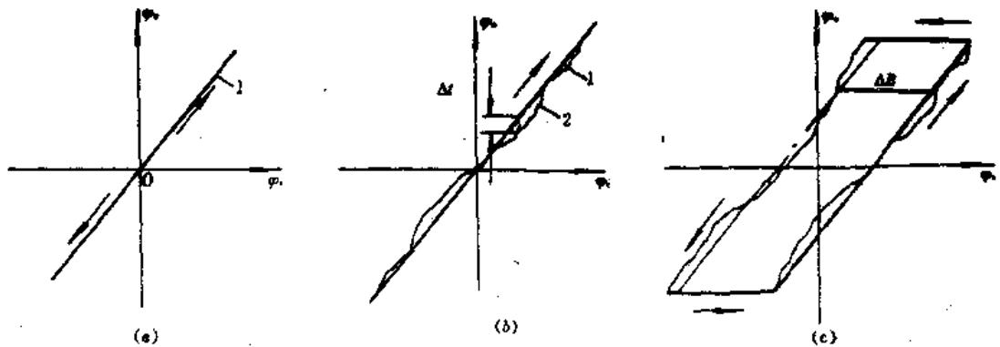

图3-14传动误差与空程误差

实际上,上述理想情况不可能存在.因此,在传动过程中输出轴的转角总会存在误差,此

时,传动链输入轴单向回转时,输出轴的转角 $\varphi _ { \varphi }$ 与输入轴转角 $\pmb { \mathrm { \pmb { \mathrm { x } } } }$ 之间的关系如图3-14(b)中曲线2所示。

# 2.齿轮传动误差的来源

齿轮传动误差是由各齿轮副传动误差的综合,主要来源于齿轮加工过程中的固有误差和所在轴、轴承等零、部件的制造、安装误差,

下面以小模数渐开线直齿圆柱齿轮传动为例进行分析。

(1)齿轮固有误差

$\textcircled{1}$ 偏心误差包括两部分:一是基圈偏心误差,或称为运动偏心.它主要是由齿轮加工机床传动系统中,分度蜗轮的误差及分度蜗轮的安装偏心;使刀具与齿轮毛坏间相对传动不均匀所引起,也称为轮齿的切向误差,它影响到切出轮齿的均匀性;另一是几何偏心误差,它主要是由于齿廊加工时的回转中心对轮坯基准孔中心—齿轮工作时的回转中心不一致所造成,也称为轮齿径向误差,它使切出的轮齿相对于基准孔中心分布不均匀。

偏心误差的两种影响分别如图3-15中 $\mathbf { \Omega } ( \mathfrak { a } )$ 和(b)所示。图中虚线表示轮齿的理想位量。

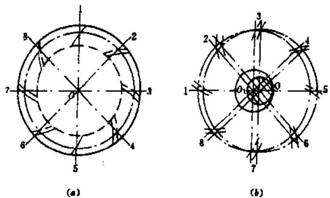

图3-15齿轮的切向误整和径向误差(a)轮齿切向误差 (b)轮齿径向误差

$\textcircled{2}$ 基圆齿距误差(亦称为基节误差)主要是由于切齿刀具的基圈齿距(基节)误差和:齿形角误差所引起,如图 $3 - 1 6 ( a )$ 所示,与机床运动系统无关。它影响传递运动的准确性,使轮齿啮合提前或滞后,节点偏离理论啮合线,瞬时传动比发生变化,而且会产生振动和噪音,影响齿轮工作的平稳性。

$\textcircled{3}$ 齿形误差主要是由切齿刀具本身的误差和刀具安装误差及分齿运动的回转误差造成的,如图3-16(6)所示。

$\textcircled{4}$ 齿向误差主要是由刀具轴向走刀方向与轮坏基准孔轴线方向不平行造成的,

# (2)装置及其安装误差

属于这类误差的有:

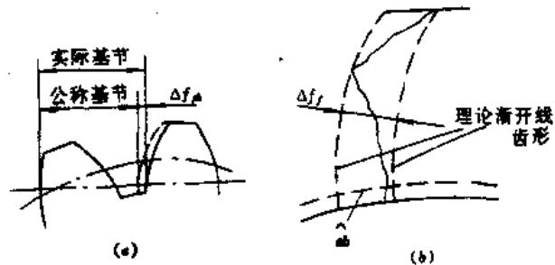

图3-16齿轮的基节误差和齿形误差

$\textcircled{1}$ 轴的偏心误差,即装配齿轮部分轴的中心与轴颈中心的同轴度误差。

$\textcircled{2}$ 齿轮与轴的装配误差系指齿轮与轴的配合间隙引起的齿轮轴线的偏移和歪斜。

$\textcircled{3}$ 两对轴承孔中心线不平行和倾斜引起的误差。

$\textcircled{4}$ 轴承误差系指滚动轴承径向游隙及转动座围与轴颈配合间隙引起的偏心。

# 3.齿轮传动误差的综合

齿轮固有误差以齿轮误差的综合指标一切向综合误差的公差 $\pmb { \mathscr { r } _ { i } }$ 来衡量,对单个齿轮,一转范围内,齿轮固有误差引起的齿轮最大转角误差为.

$$
\Delta \varphi _ { 1 } = \frac { 2 { \cal F } _ { i } } { \overline { { \ell } } }
$$

式中,-齿轮分度围直径。

由装置及其安装误差引起的传动误差可归结为偏心误差和轴线不平行误差,由各种偏心引起的齿轮最大转角误差为

$$
\Delta m = \frac { 1 \sum \limits _ { i } } { 2 }
$$

式中, $\Sigma \bullet$ —各种偏心量的综合。

齿轮轴线的不平行和倾斜分别用水平面和垂直面的平行度公差 $f _ { \bullet \bullet } f _ { \bullet }$ 控制,由此引起的齿轮最大转角误差分别为

$$
\Delta \varphi _ { 3 } = \frac { f _ { \mathrm { e } } } { d } \wp _ { d } { \mathrm { : } }
$$

$$
\Delta \varphi _ { 1 } = \frac { f _ { \mathrm { r } } } { d }
$$

式中, $\pmb { \alpha } ^ { \prime }$ 为啮合角,显然,由齿轮轴线的不平行和倾斜引起的齿轮转角误差是常值误差。

综合上述各项误差,得单个齿轮的总转角误差的最大值为

$$
\Delta \varphi _ { \mathrm { z a x } } = \Delta \varphi _ { 1 } + \Delta \varphi _ { 2 } + \Delta \varphi _ { 3 } + \Delta \varphi _ { 4 }
$$

考虑到各项误差的最大值一般不会出现在同一方向上,故单个齿轮的传动误差可将各项误差用方和根法综合后表示,即

$$
\Delta \varphi = \sqrt { ( \Delta \varphi _ { \mathrm { t } } ) ^ { 2 } + ( \Delta \varphi _ { \mathrm { 2 } } ) ^ { 2 } + ( \Delta \varphi _ { \mathrm { 3 } } ) ^ { 2 } + ( \Delta \varphi _ { \mathrm { 4 } } ) ^ { 2 } }
$$

对于单级齿轮传动,若齿轮1的传动误差为 $\Delta \phi _ { \parallel }$ ,齿轮2的传动误差为 $\Delta \varphi _ { \mathfrak { s } }$ ,则转化到齿轮2轴上的齿轮传动误差为

$$
\Delta \varphi _ { 1 2 } = \Delta \varphi _ { 2 } + \frac { \Delta \varphi _ { 2 } } { i _ { 1 2 } }
$$

式中 $\mathbf { i } _ { 1 } \mathbf { \hat { z } }$ 传动比, $i _ { 1 2 } = z _ { 1 } / z _ { 1 }$ 

对于两级传动,若四个齿轮的传动误差分别为 $\Delta \varphi _ { \varepsilon _ { 1 } } , \Delta \varphi _ { \varepsilon _ { 1 } } , \Delta \varphi _ { \varepsilon _ { 2 } } , \Delta \varphi _ { \varepsilon _ { 2 } }$ ,传动比分别为 $\dot { \mathfrak { s } } _ { 1 1 }$ 和$\mathfrak { i } _ { \mathfrak { A } }$ ,则在从动轮4轴上的齿轮传动误差为

$$
\begin{array} { r } { \Delta { \varphi _ { 1 4 } } = \Delta \varphi _ { \mathfrak { r } _ { 4 } } + \frac { \Delta \varphi _ { \mathfrak { s } _ { 3 } } + \Delta \varphi _ { \mathfrak { r } _ { 2 } } } { i _ { 3 4 } } + \frac { \Delta \varphi _ { \mathfrak { s } _ { 1 } } } { i _ { 1 2 } \mathrm { ~ * ~ } i _ { 3 4 } } , } \end{array}
$$

对于多级传动,可按上述方法类推。

# 二、齿轮传动的空程误差

# 1.齿轮空程误差的概念及影响

空程误差指的是,当输入轴开始反向回转后到输出轴亦跟着反向回转时,输出轴在转角上的滞后量,它是与传动误差既有联系又有区别的另一类误差,它也可以理解成输入轴固定时,输出轴可以任意转动的转角量。空程误差使输出轴在输入轴反向回转时,不能立即随着输入轴反向回转,即反向回转时,输出轴产生滞后运动.由于存在空程误差,输入轴转角与输出轴转角的关系如图3-14(c)曲线所示,齿轮传动的空程误差随齿轮转角位置而变化,

空程误差的存在不一定只在反向时才有意义,即使是单向回转,也会对传动精度产生影响,例如,在单向传动时,当输出轴上受到一个与其回转方向一致的足够大的外力矩作用时,其转角可能产生一个超前量;或在当输入轴突然减速时,若输出轴上的惯性力矩足够大,则输出轴的转角亦可能产生一个超前量。

空程误差的存在使齿轮传动系统变向传动时,输出轴和输入轴短时间内失去联系(若在伺服系统闭环内,则使系统处于开环),造成输出的突然中断,从而出现输出损失,使运动传递关系成为非线性;若在伺服系统内,则将影响到系统的动态品质,空程误差也是衡量齿轮传动质量的一项重要动态性能指标。

# 2.齿轮空程误差的来源

产生齿轮空程误差的主要原因是一对啮合轮齿之间有侧隙存在和装置中各种间隙及零件弹性变形的存在。概括起来,有齿轮的固有侧隙和装置及其安装误差两大类。

(1)齿轮固有侧隙包括常值侧隙和变值侧隙,常值侧隙不随齿轮转角 $\pmb { \varphi }$ 的改变而变化,最小侧隙和齿厚误差都与齿轮转角 $\pmb { \mathcal { P } }$ 无关,故为常值侧隙,最小侧隙由齿厚 $\dot { \bf z }$ 差的上偏差决定,而齿厚公差的下偏差决定了最大侧隙,变值侧隙随齿轮转角 $\pmb { \varphi }$ 的改变而变化,它包括齿轮的几何偏心和齿形误差,齿轮的几何偏心使齿轮的齿厚随齿轮转角 $\pmb { \varphi }$ 按正弦规律变化,并形成大周期的变值侧隙.齿形误差引起齿厚的局部变化,并形成小周期的变值侧隙.双啃中心距偏差和公差作为一项综合指标,反映了齿轮偏心误差和齿厚偏差。其上偏差 $\pmb { \cal { E } } _ { \ast }$ 反映了齿厚的最小减薄量,下偏差 $\pmb { \mathcal { E } } _ { \pmb { \hat { \omega } } } ^ { \star }$ 与上偏差之差反映了齿轮加工误差的允许范围。

(2)装置及其安装误差这类误差由相关零件及装配误差引起,包括:$\textcircled{1}$ 由箱体上轴承孔中心距加工误差引起的齿轮侧隙增大。$\textcircled{2}$ 滚动轴承径向游隙及转动座圈与轴颈的配合间隙,轴承与座孔的配合间隙。$\textcircled{3}$ 齿轮基准孔与轴的配合间隙及轴上安装齿轮部分对轴颈的偏心,$\textcircled{4}$ 轴的刚度不足,使轴在外力和力矩作用下产生变形,而引起的侧隙。$\textcircled{5}$ 环境温度改变引起中心距变化而产生的齿轮侧隙增大,

# 3.齿轮传动空程误差的综合

上述影响侧隙的误差因素中,大部分是一个齿轮的影响因素,而与中心距有关的则为一对齿轮的影响因素。所以,齿轮传动空程误差的综合可按下述方法进行,

对于单个齿轮,一转范围内双啮中心距偏差的下偏差 $\pmb { \cal { E } } _ { \pmb { \alpha } }$ 所引起的固有侧隙最大值为

$$
j _ { \mathrm { { u } } } = 2 E _ { \mathrm { { s } } } \mathrm { { t g } } \alpha
$$

式中, $\pmb { \sigma }$ —齿轮分度圆压力角:

由装置中的间隙和偏心引起的齿轮侧隙为

$$
j _ { i 2 } = \Big ( \sum { A _ { 0 } } + 2 \sum { e } \Big ) \ : t g \ d _ { i }
$$

式中, $\sum \Delta _ { 0 }$ —装置中各种间隙量的综合;

$\sum e$ ——装置中各种偏心量的综合,

由轴的刚度不足,在齿轮啮合处切线方向上产生的变形 $\delta _ { \Uparrow }$ 而引起的侧隙为

$$
j _ { 6 3 } = d _ { 9 }
$$

式中, $j _ { \vartheta }$ 可按《材料力学》一书中有关方法计算,

由于加工原因使中心距增大而引起的齿轮侧隙为

$$
j _ { u } = 2 f _ { u } \colon \_ 0 a
$$

由温度变化使中心距增大而引起的齿轮侧为

$$
j _ { i \delta } = 2 a ( \alpha _ { 1 } - \alpha _ { 2 } ) ( l _ { \theta } - \ell ) ! _ { 8 } \sigma
$$

式中,a-—装配时,一对齿轮的原始中心距;

${ \pmb { a } } _ { 1 } , { \pmb { a } } _ { 2 }$ -一箱体和齿轮材料的线膨胀系数;

$\pmb { \mathscr { t } }$ ——齿轮副装配时的环境温度 $( ^ { \circ } \mathbf { C } )$ ;

齿轮副的工作温度 $\mathbf { \rho } ^ { \mathbf { \circ } } \mathbf { C } )$ ·

综合上述各项误差,得单级齿轮的侧隙最大值为

$$
j _ { t o t s } = ( j _ { t 1 } + j _ { t 2 } + j _ { t 3 } ) _ { s _ { 1 } } + ( j _ { t } + j _ { t } + j _ { t 3 } ) _ { s _ { 1 } } + j _ { t 1 } + j _ { t }
$$

同样,考虑到各项误差的最大值一般不会出现在同一方向上,故单级齿轮传动机构的缘合侧隙可用方和根法表示如下:

$$
j _ { i } = [ ( j _ { i } ^ { 2 } + j _ { i } ^ { 2 } + J _ { i } ^ { 2 } ) _ { s _ { i } } + ( j _ { i } ^ { 2 } + j _ { i } ^ { 2 } + j _ { i } ^ { 2 } ) _ { s _ { i } } + j _ { i } ^ { 2 } + j _ { i } ^ { 2 } ] ^ { 1 / 1 2 }
$$

上两式括号下标 $^ { \ast } z _ { 1 } ^ { \bullet } \cdot ^ { \bullet } z _ { 2 } ^ { \bullet }$ 分别表示齿轮1、2.

由此,从动轮的空程误差为

$$
\Delta \phi _ { i z } = \frac { 2 j _ { i } } { l _ { i } }
$$

式中 $\cdot \dot { \pmb { q } } _ { 1 }$ -从动齿轮2的分度圆直径。

对于两级齿轮传动机构,如第一级空程误差为 $\Delta \phi _ { 1 }$ ,第二级空程误差为,则由此而产生的从动轮空程误差为

$$
\begin{array} { r } { \Delta \varphi _ { : 4 } ^ { \prime } = \Delta \varphi _ { : } ^ { \prime } + \frac { \Delta \varphi _ { : } ^ { \prime } } { \mathrm { i } _ { 3 4 } } } \end{array}
$$

式中, $\mathfrak { i } _ { \mathfrak { s } }$ —第二级齿轮传动比,对于多级传动,可按上述方法类推。

不难看出,对于减速传动系统,传动比的排列若遵循先小后大的原则,并相对提高输出端各级齿轮的制造精度,则对减小系统空程误差较为有利。

例3-5有单级标准直齿圆柱齿轮传动,已知模数为 $0 , 5 m m , z _ { 1 } = 5 0 , z _ { 2 } = 1 5 0$ 齿轮内孔与轴的配合间隙 $\varDelta _ { \mathrm { l } } = \varDelta _ { \mathrm { 7 } } \approx 0 . \ 0 0 6 \mathrm { m m }$ ,两齿轮轴的偏心误差均为 $0 . 0 0 2 \eta \eta m$ ,齿轮精度等级7一bGB2363一80,试求齿轮副折算到齿轮2上的传动误差和空程误差(齿轮副中心距不可调,其它误差可以忽略).

解由已知条件可得两齿轮分度圆直径为

$$
{ d _ { 1 } } = m { z _ { 1 } } = 0 . 5 \times 5 0 = 2 5 ( \mathrm { m m } )
$$

中心距

$$
{ \begin{array} { l } { d _ { 1 } = m z _ { 2 } = 0 . 5 \times 1 5 0 = 7 5 ( { \mathrm { m m } } ) } \\ { a = { \frac { 1 } { 2 } } ( d _ { 1 } + d _ { 1 } ) = { \frac { 1 } { 2 } } ( 2 5 + 7 5 ) = 5 0 ( { \mathrm { m m } } ) } \\ { { \mathrm { i } } _ { 1 2 } = { \frac { d _ { 2 } } { d _ { 1 } } } = { \frac { 7 5 } { 2 5 } } = 3 } \end{array} }
$$

传动比

$\textcircled{1}$ 齿轮副的传动误差计算

根据齿轮精度等级7—bGB2363—80,可由本章附表3-1查得:

$$
\begin{array} { r l r } { { \cal Y } _ { \mathrm { d } } = 0 , 0 3 8 \mathrm { m m } ; } & { { } } & { { \cal F } _ { \mathrm { d } } = 0 . 0 4 4 \mathrm { m m } } \end{array}
$$

因

$$
e = \frac { \delta } { 2 }
$$

所以

$$
v _ { 1 } = { \frac { \lambda _ { 1 } } { 2 } } = { \frac { 0 . 0 0 6 } { 2 } } = 0 . 0 0 3 ( \mathrm { m m } )
$$

$$
e _ { 2 } = \frac { A _ { 2 } } { 2 } = \frac { 0 . 0 0 6 } { 2 } = 0 . 0 0 3 ( \mathrm { m m } )
$$

故

$$
( \sum \epsilon ) _ { s _ { 1 } } = ( \sum \epsilon ) _ { s _ { 1 } } = 0 . 0 0 3 + 0 . 0 0 2 = 0 . 0 0 5 ( \mathrm { m m } )
$$

按式(3-23)、式(3-24)和式(3-28)得:

$$
\Delta \varphi _ { s _ { 1 } } = \sqrt { \left\{ \frac { 2 F _ { i 1 } } { \bar { d } _ { 1 } } \right\} ^ { 2 } + \left\{ \frac { 4 \left( \ \sum \theta \right) _ { s _ { 1 } } } { \bar { d } _ { 1 } } \right\} ^ { 1 } } = \sqrt { \left\{ \frac { 2 \times 0 . 0 3 8 } { 2 5 } \right\} ^ { 2 } + \left\{ \frac { 4 \times 0 . 0 0 5 } { 2 5 } \right\} ^ { 2 } }
$$

同样

$$
\Delta \varphi _ { \mathfrak { s } _ { 2 } } = { \sqrt { \left( { \frac { 2 F _ { \mathfrak { s } } } { \bar { d } _ { 2 } } } \right) ^ { 2 } + \left[ { \frac { 4 { \bigl ( } \sum _ { i = 1 } ^ { \ell } { \mathfrak { s } _ { 1 } } { \bigr ) } ^ { 2 } } { \mathfrak { s } _ { 2 } } } \right] ^ { 2 } } } = { \sqrt { \left( { \frac { 2 \times 0 . 0 4 \ell } { 7 5 } } \right) ^ { 2 } + \left( { \frac { 4 \times 0 . 0 0 5 } { 7 5 } } \right) ^ { 2 } } }
$$

按式(3-29)得所求传动误差为

$$
\begin{array} { l } { { \Delta \varphi _ { \mathrm { t r } } = \Delta \varphi _ { i _ { 2 } } + \frac { \Delta \varphi _ { i _ { 1 } } } { i _ { 1 2 } } = 1 . 2 0 \times 1 0 ^ { - 3 } + \frac { 3 . 1 4 \times 1 0 ^ { - 3 } } { 3 } } } \\ { { = 2 . 2 5 \times 1 0 ^ { - 3 } ( \mathrm { r a d } ) = 7 . 7 ^ { \prime } } } \end{array}
$$

$\textcircled{2}$ 齿轮副空程误差计算

查本章附表3-2、附表3-3知:

$$
E _ { e i 1 } = - ~ 0 . 0 4 4 \mathrm { m m } ; \qquad E _ { e i 2 } = - ~ 0 . 0 5 0 \mathrm { m m } ; \qquad f _ { i } = 0 . 0 2 \mathrm { m m }
$$

将上述已知数据分别代入式(3-31)、式(3-32)可得齿轮1的各项侧隙值为

)

$$
j _ { a } = ( \sum { \varDelta _ { 6 } } + 2 \sum { e } ) \iota _ { 8 } a = ( 0 . 0 0 6 + 2 \times 0 . 0 0 2 ) \mathrm { t g 2 0 ^ { \circ } } = 0 . 0 0 3 6 \mathrm { ( m m ) }
$$

齿轮2的各项侧隙值为

$$
j _ { t i } = 2 E _ { a 0 } \mathrm { t g } a = 2 \times 0 . 0 5 0 \times \mathrm { t g } 2 0 ^ { \circ } = 0 . 0 3 6 4 ( \mathrm { m m } )
$$

$$
j _ { a } = ( \sum { \cal A } _ { 9 } + 2 \sum { \circ } ) \chi _ { 8 } a = ( 0 . 0 0 6 + 2 \times 0 . 0 0 2 ) \chi _ { 8 } 2 0 ^ { \circ } = 0 . 0 0 3 6 ( \mathrm { m m } )
$$

据式(3-34),由中心距偏差引起的侧隙增大值为

$$
j _ { u } = 2 f _ { u } \mathrm { t g } \alpha = 2 \times 0 . 0 2 \times \mathrm { t g } 2 0 ^ { \circ } = 0 . 0 1 4 6 ( \mathrm { m m } )
$$

由此,利用式(3-37)可得齿轮副的综合侧隙为

$$
\begin{array} { r l } & { j _ { \iota } = [ ( j _ { \iota } ^ { 2 } + j _ { \alpha } ^ { 2 } ) _ { \iota _ { 1 } } + ( j _ { \iota } ^ { 2 } + j _ { \alpha } ^ { 2 } ) _ { \iota _ { 2 } } + j _ { \iota _ { 4 } } ^ { 2 } ] ^ { 1 / 2 } } \\ & { \quad = ( 0 . 0 3 2 ^ { 2 } + 0 . 0 0 3 6 ^ { 2 } + 0 . 0 3 6 4 ^ { 2 } + 0 . 0 0 3 6 ^ { 2 } + 0 . 0 1 4 6 ^ { 2 } ) ^ { 1 / 2 } } \\ & { \quad = 0 . 0 5 1 ( \mathrm { m m } ) } \end{array}
$$

从而,按式(3-38)可得齿轮副的空程误差为

$$
\Delta \varphi _ { 1 2 } = { \frac { 2 j _ { i } } { d _ { 2 } } } = { \frac { 2 \times 0 . 0 5 1 } { 7 5 } } = 1 . 3 6 \times 1 0 ^ { - 3 } ( { \mathrm { r a d } } ) = 4 . 7 ^ { \prime }
$$

所以,齿轮副的传动误差为7.7',空程误差为4.7.

# 3.9提高齿轮传动精度和减小空程误差的方法

提高齿轮传动精度的结构措施有:

(1)适当提高零、部件的制造精度。  
(2)合理设计传动链,减少零、部件制造、装配时对传动精度的影响。  
(3)采用误差补偿和校正机构,减少传动误差。  
(4)采用消蒙机构,减少或消除空程误差。

# 一、适当提高零、部件的制造精度

提高各传动零、部件本身的制造、装配精度,也就是减少零、部件本身的制造、装配误差。由精度分析知,这样做能直接提高传动精度,特别是提高关键零、部件的制造、装配精度,对提高系统的传动精度和减小空程误差效果尤为显著,例如,7级精度为精密齿轮传动的基本精度,但是为了减小减速传动系统的传动误差和空程误差,末级齿轮可采用6级精度,甚至5级精度,并采用较小的侧隙(如零侧隙等).再如,选用较小的中心距偏差,可减小空程误差等等。

对经常作为加工、测量和装配基准的齿轮的轴孔(或齿轮轴轴颈)、齿顶圈和端面,由于其加工精度对齿轮的加工和传动质量影响很大,故通过控制齿坏、轴及轴承座孔等的制造精度,是保证和提高齿轮传动精度、减小空程误差的一项有效措施,

此外,传动装置的输出轴与负载轴往往是通过联轴器连接的,联轴器本身的精度对整个传动的精度的影响也很显著,也要予以足够的重视。

需要指出的是,提高传动零、部件的制造、装配精度必然会增加成本,有时还会遇到工艺上的一系列困难。因此,提高传动零、部件的制造、装配精度会受到一定限制。实际上,通过下面一些结构上的措施,也可有效地提高传动精度。

# 二、合理设计传动链

# 这里介绍三种方法:

# 1.合理选择传动型式

在设计传动链时,所选择的传动型式不同,则传动链可能达到的传动精度也不同。一般说来,圆柱直齿与斜齿齿轮机构的经济精度较高,特别是前者,在可能的条件下应优先采用;蜗轮、蜗杆机构的经济精度次之;圆锥齿轮及螺旋齿轮的传动精度最低,在行星齿轮传动机构中,谐波齿轮精度最高:渐开线行星齿轮机构、少齿差行星齿轮机构次之;摆线针轮行星齿轮机构更次之,

# 2.合理地确定级数和分配各级传动比

减少传动级数,意味着减少零件数量,也就减少了产生误差的环节,当传动比一定时,为减少各级齿轮误差对系统传动误差的影响,宜按 $\{ 3 . 3$ 中所述的,按"折算转角误差小"的原则和方法选定传动级数,从高速轴开始,各级传动比采取逐级递增的方法进行分配,并在结构空间允许的前提下,尽量提高末级传动比。一般来说,减速传动采用大的传动比,可使从动轮半径增大,提高角值精度。

当各级传动比一定时,在满足结构尺寸的前提下,还应尽量增大齿轮齿数,特别是增大小齿轮的齿数,以加大重叠系数和从动轮尺寸,从而也可提高传动精度。

# 3.合理布置传动链

在减速传动中,精度较低的传动机构(如圆锥齿轮机构、蜗轮蜗杆机构)应布置在转速较高的轴上,这样可减小低速轴的误差,在图3-17所示的传动中,精度较低的圆锥齿轮副对精自整角机轴的传动精度的影响,图 $\mathbf { ( } \pmb { \alpha } )$ 的布置比图(b)的布置小。

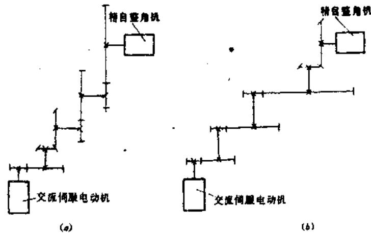

图3-17合理布置传动健(一)

通过合理地布置传动链,还可使传动链的一部或全部成为不影响指示精度的区段,图3-18所示为某雷达距离控制组合,通过手轮控制移相器的传动链,它可使显示器中的移动指标线对准目标回波,同时在度盘上反映目标距离。显然,图3-18(a)方案中,两对齿轮的传动误差将影响度盘的指示精度(度盘的读数与移相器不一致);而图3-18(b)方案中,度盘与移相器同轴,使从手轮到度盘轴之间的一段传动链变成了不影响度盘指示精度的区段。

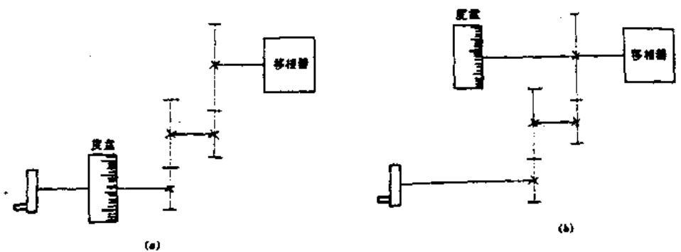

图3-18合理布置传动链(二)

合理布置传动链对提高传动精度的影响及效果,还可以下例说明。

图3-19所示的两个传动链方案中有着完全相同的一对圆柱齿轮副 $A , B$ 及一对蜗轮副$c , D$ 。齿轮副的齿数分别为 $z _ { A } = 1 2 0 , z _ { B } = 2 0$ ,蜗杆的头数为 $z _ { c } = 1$ ,蜗轮的齿数为 $z _ { D } = 6 0$ .在图(a)中, $\pmb { A }$ 为主动件, $\bar { \nu }$ 为从动件;在图(b)所示方案中, $c$ 为主动件, $B$ 为从动件,显然,两个方案的总传动比都为10。

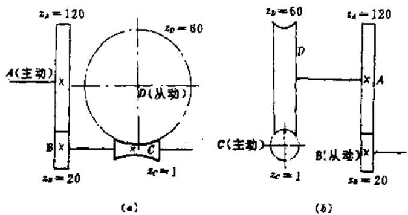

图3-19合理布置传动链(三)

设齿轮副在小齿轮轴上的传动误差为 $\Delta \phi _ { A \prime }$ ,蜗轮副在蜗轮轴上的传动误差为 $\Delta \varphi _ { Q D }$ ,并设$\Delta \varphi _ { A | 9 } = \Delta \varphi _ { c | 9 } = \Delta \varphi$ ,则图(a)方案中,从动轴 $\pmb { D }$ 的总传动误差为

$$
\Delta \varphi _ { A \beta } = \Delta \varphi _ { \alpha \bar { \nu } } + \frac { \Delta \varphi _ { A \bar { \nu } } } { i _ { 3 \bar { \nu } } } = \Big \langle 1 + \frac { 1 } { 6 0 } \Big \rangle \Delta \varphi = \frac { 6 1 } { 6 0 } \Delta \varphi
$$

而图(b)方案中,从动轴 $\pmb { B }$ 的总传动误差为

$$
\begin{array} { r } { \Delta \varphi _ { c s } = \Delta \varphi _ { s s } + \frac { \Delta \varphi _ { c v } } { i _ { 1 2 } } = ( 1 + 6 ) \Delta \varphi = 7 \Delta \varphi } \end{array}
$$

显然,图 $3 - 1 9 ( a )$ 方案要比图3-19(b)方案好.因此,当要求减小由于传动零件的制造、装配误差所引起的从动轴的传动误差时,一般应在从动轴之前选用减速链,这样可经过减速作用而缩小各项误差对从动轮的影响,

# 三、采用误差补偿和校正机构,减小传动误差

采用齿轮调相法、机械修正装置和反馈装置等方法可以有效地减小传动误差,

1.齿轮调相法即在齿轮传动装置的装配过程中,通过精确调整各传动零件的偏心误差的相位,使各偏心误差得到最大抵消或补偿,以减小传动误差的一冲方法,其优点是;无需增加附设机构,即可达到减小传动误差之目的;缺点是:调整麻烦,增加了检验和装配的时间。

显然,在减速系统中对末级输出齿轮进行精确的调相可获得显著的效果。

2.修正装置法它是利用校正机构来消减传动装置的既有误差的一种方法,图3-20(a)所示为传动链末级所用的蜗杆蜗轮副的误差校正机构,负载与蜗轮同轴回转,它利用特制的校正凸轮及附加的一套杠杆传动机构来进行补偿蜗杆蜗轮传动机构传动误差对负载位置精度的影响。校正凸轮1是根据测量得到的实际蜗轮传动误差曲线(见图3-20(b))制成的,它装在蜗轮轴上。当蜗杆带动蜗轮9旋转时,校正凸轮也同时旋转,凸轮1通过杠杆2移动支杠3和斜面4.在弹簧8的压力下,由于具有止推轴承6的斜面5与斜面4相接的作用,使蜗杆7产生附加的轴向移动,从而使蜗轮9产生一个相对应的附加转动,以减小或消除蜗

杆蜗轮传动误差。

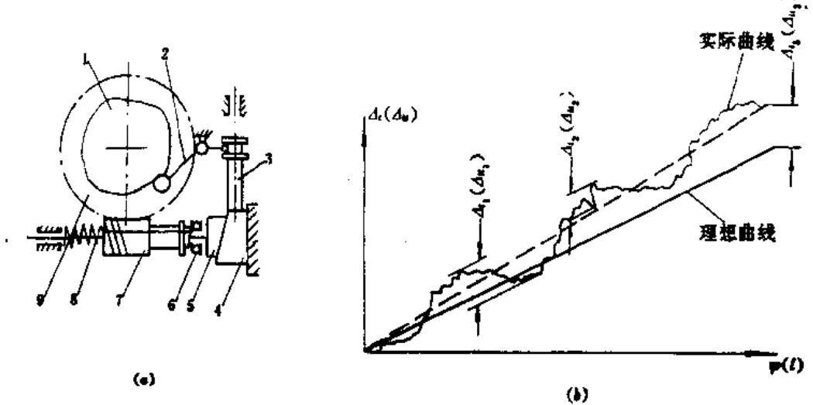

图3-20凸轮杠杆校正机构及实际传动误差曲线

这种校正补偿机构,由于受到凸轮滚子表面曲率的限制,对传动误差中的系统误差部分能校正,而对变动着的随机误差则不能全面感受,因而无法全部校正,同时,这种方法要求对传动误差进行精密测量,对校正凸轮或校正尺进行精密加工,在使用过程中,校正凸轮或校正尺一经磨损,就会降低校正质量,而且结构也较复杂。

修正装置法一般多用于提高分度蜗轮副的传动精度。

3.反馈补偿法是利用运动过程中随时检测出负载的实际传动误差,然后通过机械反馈装置来进行补偿的一种方法.如果将修正装置法称作“静态补偿"法,那么机械反馈装置法就可称作“动态补偿"法、机械反馈补偿机构的原理与电气的反馈系统相仿,只不过它是纯机械的机构,一般用于要求精确控制传动误差的系统中(例略).

# 四、采用消隙机构

消隙机构的型式很多,如按工作原理分,有调中心距消隙法、双片齿轮或双传动链控制侧隙法及使齿轮保持单面啮合法等。

# 1.中心距可调消象

这是一种常用的消隙法。它或者是在装配时根据齿轮啮合情况预先调整中心距,中心距一经调定就不再变动,如图3-21所示;或者是在设计中利用弹簧零件使齿轮浮动消隙,中心距(或锥距)可在一定范围内有小的变动,如图3-22所示,

图3-21(a)使用了一个留有一定间隙(一般为 $0 . 0 1 \sim 0 . 0 3 m m )$ 的轴承套:图3-21(b)使用了一个偏心轴承套;图3-21(c)使用了一个双偏心轴承套,在装配时,调整支承位置(通过调整轴承套或偏心轴承套),来改变中心距,以达到控制侧隙、减小空程误差的目的。这种方法可以补偿齿厚误差与中心距误差引起的常值侧隙,但不能补偿由偏心误差引起的变值侧隙.

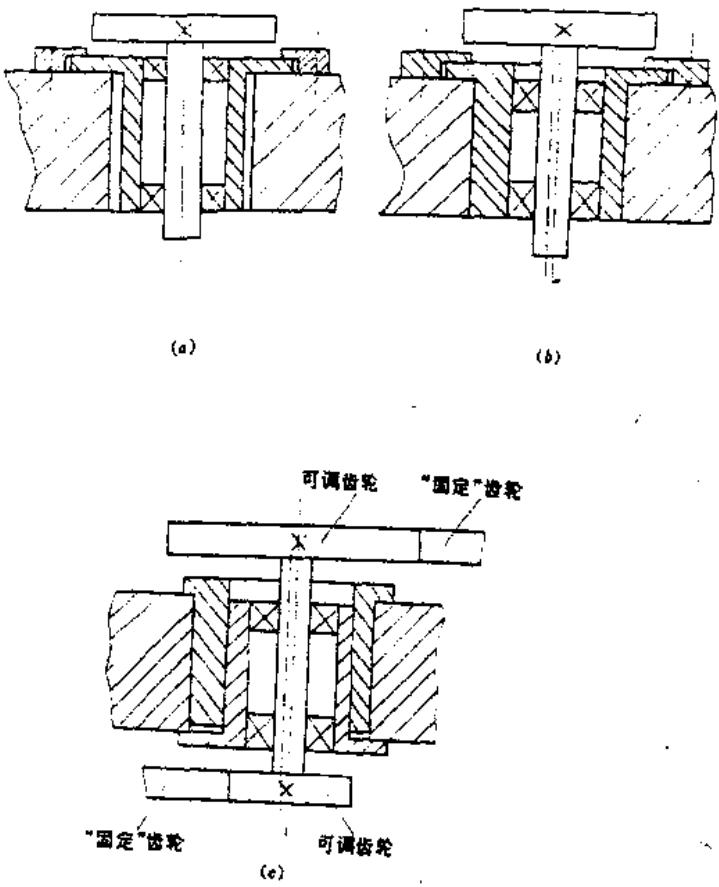

图3-21中心距可调消隙机构(一)

图3-22(a)为利用压簧径向加载使圆柱齿轮浮动消隙:图3-2?(b)为利用压簧加载使圆锥齿轮浮动消隙;图 $\hat { \tiny { : \jmath } } , \hat { \tiny { 2 } } 2 ( c )$ 为利用拉簧使蜗杆浮动消隙.它们几平能消除所有齿隙,多用于转矩较小的场合,

# 2.双片齿轮或双传动链控制侧隙法

双片齿轮控制侧隙法是将一对齿轮中的一个(通常为大齿轮)做成两片,装配时或者是使其相互错过一定角度,调好侧隙后用螺钉等固紧,如图3-23所示;或者用弹簧追使两片齿轮分开,分别与相啮合齿轮的异名齿廓接触,如图3-24所示,以达到减小或消除侧隙的目的.

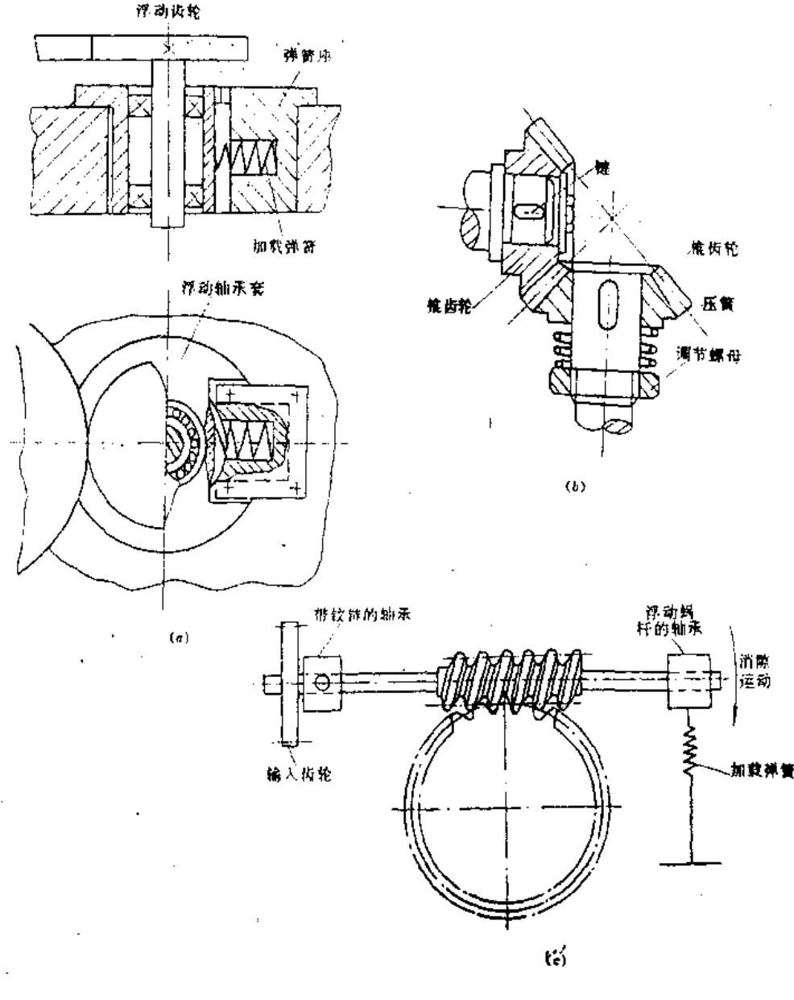

图3-22中心距可调消隙机构(二)

图3-23(a)为用调整垫片消隙的一种机构,图3-23(b)为用两片完全一样的齿轮组成的双片齿轮,其中一片与轴固定,另一片与轴空套,啮合时调节这两轮叉开的程度,使其适当地填满它们与一个配对齿轮轮齿间的间隙,然后用螺钉或铆钉固紧。在转矩大时,为增加连接的可靠性,可用定缝销钉,最好在啮合最紧点固紧,否则会发生干涉。这种方法适用于传递中、小转矩,它只能消除侧隙中的常值部分。

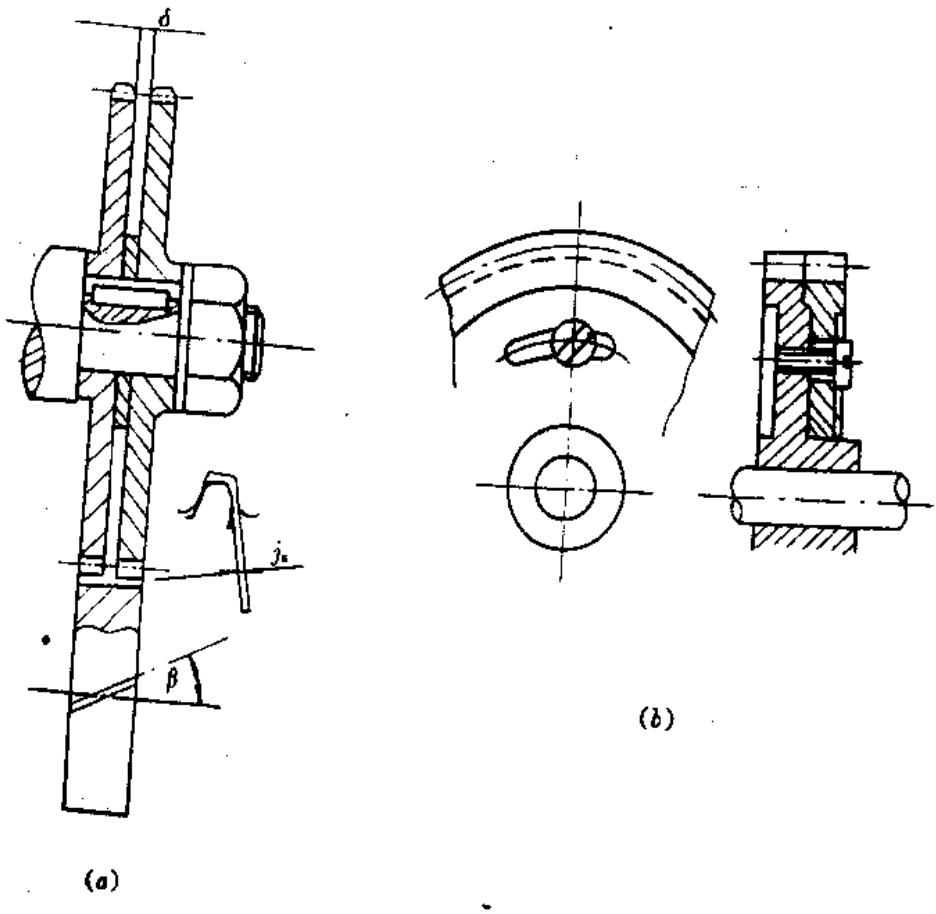

图3-23双片齿轮控制侧(一)

图 ${ \bf 3 - 2 4 ( \pmb { a } ) }$ 为拉簧加载双片齿轮:图3-24(b)是环簧加载双片齿轮;图3-24(c)为扭簧加载双片齿轮;图3-24(d)为用压簧加载的双片锥齿轮,此外,还有用扭力杆加载的双片齿轮(用以传递较大的转矩.)

弹簧加载双片齿轮可以消除齿轮本身误差或由温度变化所引起的那部分侧隙,但不能消除轴承以及其它因素所引起的侧隙,故总的来说,这种方法还是有一定量的空程误差。它们一般适用于数据传递装置,

弹簧加载双片齿轮消隙的设计关键是弹簧力的选取和调整,因为要求弹簧力必须大于传递力,否则不能起消隙作用,但弹簧力的加载作用会增加摩擦、降低效率、加剧磨损。

图3-25所示型式为轮系中使用弹簧加载双片齿轮的例子,它可以消除整个轮系的侧隙。

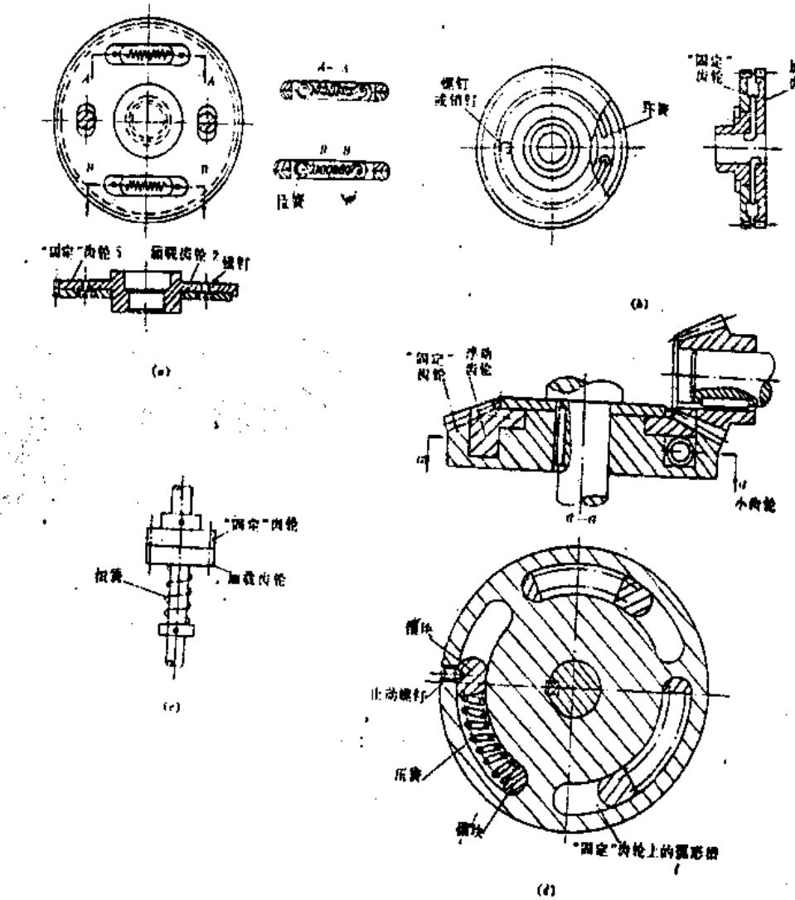

图3-24双片齿轮控制测(二)

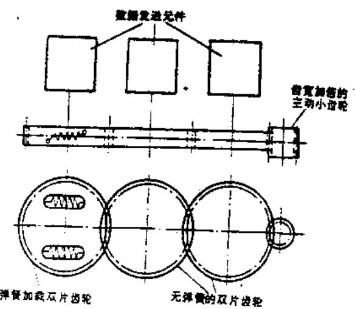

图3-25双片齿轮轮系加一个弹簧加载双片齿轮

在数据传动中也有使用三片齿轮消隙的,如尼龙夹芯齿轮消隙机构,见图3-26,其中间是一层尼龙,外面两层是磷青铜。三层铆合在一起组成尼龙夹芯齿轮,三层齿轮一起加工到同一尺寸,但铆合后尼龙齿轮略微胀大,这样与小齿轮啮合时就比较紧,从而达到消隙的目的。

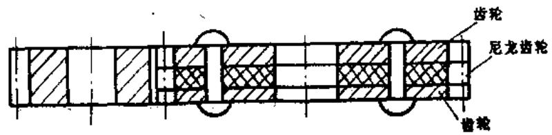

图3-26尼龙夹芯齿轮消嗽机构

双传动链控制侧隙法是采用两个相同的传动链,分别与末级输出齿轮的异名齿廓接触,使齿轮无论是正向或反向旋转时都做到无侧隙运动的方法。

图3-27所示是双传动链摩擦阻尼消隙机构的示意图,它采用两个完全相同的传动链,执行元件驱动两个转向相反的,但分别装在两个离合器的输入轴上的齿轮,每个离合器与一套轮系相连,两套轮系最后都输出到大齿轮上,工作时如将一个离合器接通,另一个离合器脱开,则与接通的离合器相连的一套轮系就驱动大齿轮转动。与此同时,输出轴上的大齿轮又倒拖第二套轮系。当接通第二个离合器(同时脱开第一个离合器)时,就产生反向转动。无论哪套轮系驱动,另一套轮系总将其齿轮与轴承上的摩擦力矩加在大齿轮上.这是一个较大的阻尼力矩,以此达到消隙的目的。

上例中,两个执行元件亦可用两个电机进行分别控制。

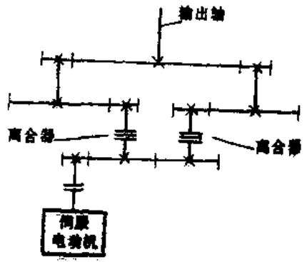

图3-27双传动链摩據阻尼消机构

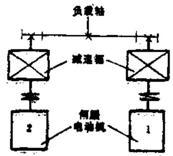

3-28双传动链电消痕系统示意图

图3-28所示是双传动链电消隙系统示意图,它用两个相同的传动链连接两个伺最电动机到末级大齿轮,两个电动机分别加电控制:低负载力矩时,在两个电动机之间建立一个偏置电压(或偏置电流),以得到一个偏置转矩,使两个传动链分别与末级大齿轮的异名齿廓接触,消除侧隙;高负载力矩时,偏置转矩自行取消,两个传动链与末级大齿轮的同名齿廓接触,负载力矩由两个电动机分担。其具体工作原理是:用两套可控硅功率放大器控制两个间服电动机,两电动机的输出转矩与控制电流的关系如图3-29所示,当控制电流为零时,两电

动机输出大小相等方向相反的偏置转矩,使两个小齿轮分别与末级大齿轮的异名齿廓接触,以便大齿轮不能在齿隙内游动(对应于图 $3 - 3 0 ( a ) )$ .负载力矩$\pmb { \mathcal { M } } _ { I } ^ { \pmb { \operatorname { s } } }$ 增加时,两个电动机的电流随着同相增加,使得其中一电机的转矩减小,另一电机的转矩增加(对应于图 $3 - 2 9$ 中的 $\pmb { \mathcal { M } }$ 段),此时由净转矩 $( M _ { 1 } - M _ { 2 } )$ 驱动负载,当输出反向偏置转矩的电动机所加的控制电流大于偏置电流后,两个小齿轮贴向大齿轮的同名齿廓,负载由两个电动机共同驱动(对应于图3-29中的CB段)。当负载力矩再继续增加时,由电动机的控制电流特性(见图3-29)知,电动

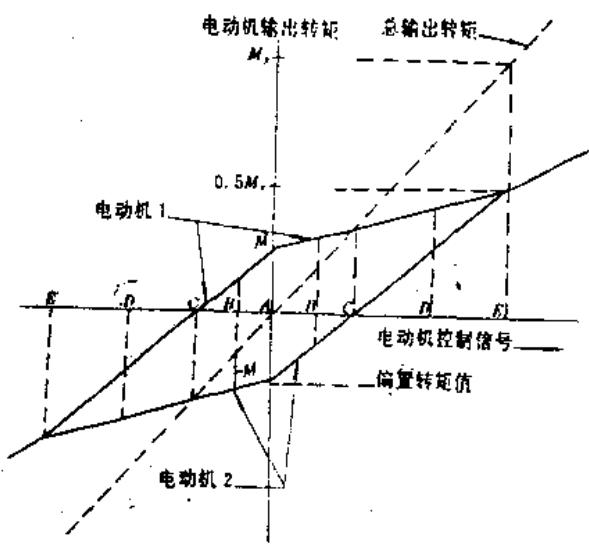

图3-29双电机的输出转矩-轴入电流特性

机的偏置转矩取消(对应于图3-29E点),此后,负载力矩由两个电动机均担,电动机的容量得到了充分发挥(对应于图3-30(e))。

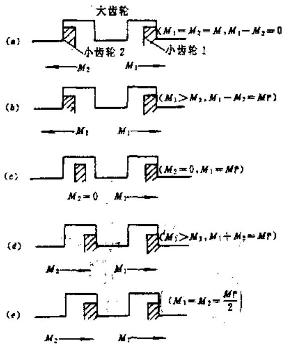

图3-30双传动链电消隙法的消隙动作(正向)

反向时的消隙动作如图3-31所示,两个电动机的转矩按图3-29中的 $z , 0 , 0 , B ,$ $A , B ^ { \prime } , C ^ { \prime } , \bar { D } ^ { \prime } , B ^ { \prime }$ 的特性变化,即首先自动恢复偏置转矩,然后当一个电动机还在原转向时,另一个电动机提前换向,而使对应的小齿轮贴向大齿轮的另一侧面,并由它驱动负载反转:因为小齿轮不是同时脱离大齿轮的同一侧面,故没有齿隙。图3-31中的 $\left( e \right) , \left( \mathscr { L } \right) , \left( \bar { c } \right) , \left( \bar { b } \right) , \left( \bar { b } ^ { \prime } \right) , \left( \bar { e } ^ { \prime } \right) , \left( \bar { e } ^ { \prime } \right) , \left( \bar { d } ^ { \prime } \right)$ 七种状态分别对应于图3-29中的 $8 , 0 , 0 , B ,$ $\widetilde { B } _ { \mathrm { ~ } } ^ { \prime } \widetilde { C } _ { : \cdot } ^ { \prime } \widetilde { \ast } \widetilde { D } _ { \mathrm { ~ } } ^ { \prime }$ 点

双传动链电消隙机构已成功地应用在一些精密跟踪雷达、卫星通信地面站的天线动力传动系统和其它许多伺服传动装置中。

# .3.利用反向力矩使轮齿保持单面啮合

该法利用反向力矩始终对齿轮的一侧

加载,使轮齿保持单面嗜合,来消除变向回转时侧隙对空程误差的影响。图3-32所示为小功率减速传动系统中利用辅助力矩电动机加载的消隙机构。为了避免辅助力矩电动机反向驱动传动链,它只适用于在大减速比的场合下安置在最后几级上,这样不仅有利于提高传动精度,而且由辅助力矩电动机所加的这部分负载折算到高速端的值很小,甚至可以忽略,

此法不适用于大负载的传动链,因为增加了所占空间和功耗,增加了成本。

仪表中常用游丝或扭簧施加反向力矩,使轮齿保持单面啮合,以消酴侧隙影响。

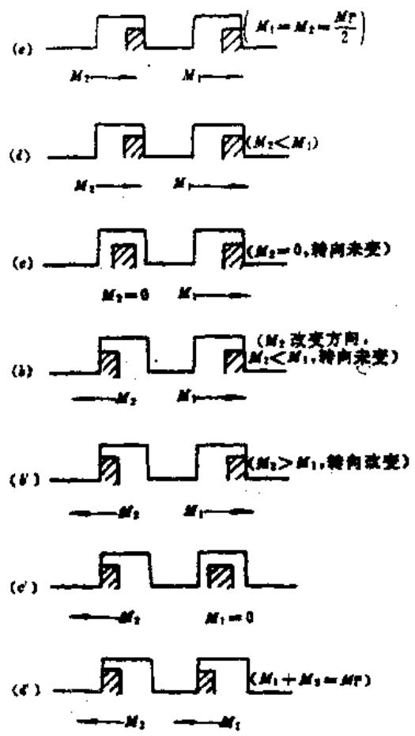

图3-31双传动链电消蒙法的消蒙动作(反向)

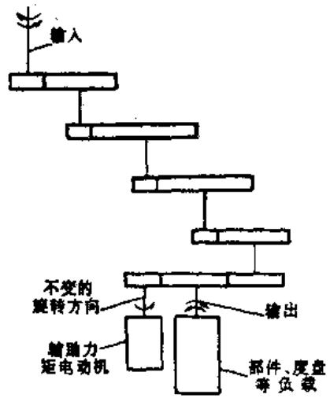

图3-32辅助力矩电动机加载消机构

除了上述采用消隙机构来减小或消除空程误差的方法外,还有利用选择装配的方法来减小齿隙影响的,也就是说,在大批量生产中,根据既成的齿轮尺寸,按照中心距的要求,在保证最小或零侧隙的条件下,来选择齿轮副的齿厚进行装配。其优点是齿轮只需标准设计,无别的要求,且对各类齿轮和各类载荷均适用;缺点是只适用于大批生产,增加了检验与装配的时间和费用,不能消除随转角而变化的空程误差,无互换性:

# 习 题

\$-1精密齿轮传动设计有哪些基本要求?

3-2小模数齿轮传动设计的内容包括哪几个方面?

1-3一对标准直齿圈柱齿轮,已知其模数为 $0 . 5 m m$ 小齿轮的齿数 $\pmb { x } _ { 1 } = \pmb { 2 } \pmb { 6 }$ 传动比 $j = 3 . 5$ 试确定这对齿轮的主要参数。

1-4一示数传动装置,要求一对齿轮轴平行,中心距a=75mm.传动比 $\therefore$ 试设计这对齿轮。

3-5一总传动比为40的小功率减速系统,试按“折算转动惯量最小“原则确定传动级数和每级传动比.

3某电子设备小功率精密齿轮传动中,已知电机转速为 $3 0 0 0 r / \min$ 输出轴转速为 $1 0 \pi / \mathrm { r m i n }$ ,试按下列三种情况分别确定传动级数和各级传动比,并确定各齿轮的齿数:

$\textcircled{1}$ 按“折算转角误差小"原则;

$\textcircled{2}$ 按“折算转动惯量最小"原则;

$\textcircled{3}$ 按“重量最轻”原则。

:7某二级圈柱齿轮传动系统,已知传动比 $i _ { 1 1 } = 2 , i _ { 2 } = 4$ ,模数均为 $0 , 8 \mathrm { m m }$ ,齿数分别为 $z _ { 1 } = 2 _ { 5 } = 2 _ { . }$ $\pmb { \mathscr { u } }$ $\Longrightarrow 5 0 , z _ { i } = 1 0 0$ ,齿轮精度等级分别为 $\yen 123,456,789$ 6-cGB2363-80.齿轮与轴白.封料均为45号钢,壳体为铝合金,要求:

$\textcircled{1}$ 计算齿轮有关几何参数;

$\textcircled{2}$ 计算系统传动误差;

$\textcircled{3}$ 计算系统空程误差,

3-B影响齿轮传动误差和空程误差的主要因素有哪些?

$\sqrt { 2 } - \sqrt { 2 }$ 齿轮与轴的连接形式常用哪几种?各适用于什么场合?

3-10综述提高齿轮传动精度的结构措施,并比较之,

3-11常用消隙机构有哪些?哪些能消除变值侧隙?

# 附 录

附表3-1切向综含误差的公差 $\pmb { \mathcal { F } } _ { : } \left( \pmb { \mu } \pmb { \mathrm { m } } \right)$ 

<table><tr><td rowspan=1 colspan=1>精度等级</td><td rowspan=1 colspan=1>分度园直径（mm）法面模数m（mm）</td><td rowspan=1 colspan=1>≤6</td><td rowspan=1 colspan=1>>6~12</td><td rowspan=1 colspan=1>>12~20</td><td rowspan=1 colspan=1>>20~32</td><td rowspan=1 colspan=1>>32~50</td><td rowspan=1 colspan=1>>50~80</td><td rowspan=1 colspan=1>>80~125</td><td rowspan=1 colspan=1></td><td rowspan=1 colspan=1></td><td rowspan=1 colspan=1></td></tr><tr><td rowspan=1 colspan=1>4级</td><td rowspan=1 colspan=1>0.1~0.3>0.3~0.6>0.6~1.0>1.0~1.5</td><td rowspan=1 colspan=1>1010111</td><td rowspan=1 colspan=1>11111212.</td><td rowspan=1 colspan=1>11121313</td><td rowspan=1 colspan=1>12131314</td><td rowspan=1 colspan=1>13141415</td><td rowspan=1 colspan=1>14151516</td><td rowspan=1 colspan=1>15161617</td><td rowspan=1 colspan=1>1171819</td><td rowspan=1 colspan=1>1192021</td><td rowspan=1 colspan=1>/12324</td></tr><tr><td rowspan=1 colspan=1>5级</td><td rowspan=1 colspan=1>0.1~0.3>0.3~0.6>0.6~1.0>1.0~1.5</td><td rowspan=1 colspan=1>1617181</td><td rowspan=1 colspan=1>17181920</td><td rowspan=1 colspan=1>18192021</td><td rowspan=1 colspan=1>19202122</td><td rowspan=1 colspan=1>20212224</td><td rowspan=1 colspan=1>22232426</td><td rowspan=1 colspan=1>24252628</td><td rowspan=1 colspan=1>/27293i</td><td rowspan=1 colspan=1>132S4</td><td rowspan=1 colspan=1>一3638</td></tr><tr><td rowspan=1 colspan=1>：6级</td><td rowspan=1 colspan=1>..0.1~0.3>0.3~0.8>0.6~1.0>1.0~1.5</td><td rowspan=1 colspan=1>222325</td><td rowspan=1 colspan=1>23242628</td><td rowspan=1 colspan=1>24262830</td><td rowspan=1 colspan=1>26283032</td><td rowspan=1 colspan=1>28303234·</td><td rowspan=1 colspan=1>30323436</td><td rowspan=1 colspan=1>33353739</td><td rowspan=1 colspan=1>138113</td><td rowspan=1 colspan=1>14517</td><td rowspan=1 colspan=1>、15053</td></tr><tr><td rowspan=1 colspan=1>7级</td><td rowspan=1 colspan=1>0.1~0.3>0.3~0.6>0.6~1.0>1.0~1.5</td><td rowspan=1 colspan=1></td><td rowspan=1 colspan=1>32343740</td><td rowspan=1 colspan=1>3363912</td><td rowspan=1 colspan=1>31145</td><td rowspan=1 colspan=1>3941448</td><td rowspan=1 colspan=1>1244751</td><td rowspan=1 colspan=1>16485155</td><td rowspan=1 colspan=1>1535660</td><td rowspan=1 colspan=1>1596268</td><td rowspan=1 colspan=1>、17075</td></tr><tr><td rowspan=1 colspan=1>8级</td><td rowspan=1 colspan=1>0.1~0.3>0.3~0.6>0.6~1.0>i.0~1.5</td><td rowspan=1 colspan=1>391216一</td><td rowspan=1 colspan=1>1014753</td><td rowspan=1 colspan=1>42155056</td><td rowspan=1 colspan=1>4485359</td><td rowspan=1 colspan=1>1515662</td><td rowspan=1 colspan=1>50545965</td><td rowspan=1 colspan=1>53576268</td><td rowspan=1 colspan=1>·/618672</td><td rowspan=1 colspan=1>161717</td><td rowspan=1 colspan=1>t778</td></tr></table>

附表3-2双啮中心距的极限偏差(um)

<table><tr><td></td><td rowspan=4 colspan=1>！</td><td rowspan=4 colspan=1>法面模数用(mm)</td><td rowspan=1 colspan=7>4级精度</td><td rowspan=1 colspan=7>：    5级精度</td></tr><tr><td></td><td rowspan=1 colspan=14>上偏垫E双啮中心距下偏差E</td></tr><tr><td></td><td rowspan=1 colspan=14>型   隙   类  型</td></tr><tr><td></td><td rowspan=1 colspan=1>4</td><td rowspan=1 colspan=1>b</td><td rowspan=1 colspan=1>c</td><td rowspan=1 colspan=1>1</td><td rowspan=1 colspan=1>+</td><td rowspan=1 colspan=1>f</td><td rowspan=1 colspan=1>/</td><td rowspan=1 colspan=1>a</td><td rowspan=1 colspan=1>b</td><td rowspan=1 colspan=1>+</td><td rowspan=1 colspan=1>1</td><td rowspan=1 colspan=1>·</td><td rowspan=1 colspan=1>f</td><td rowspan=1 colspan=1>！</td></tr><tr><td></td><td rowspan=4 colspan=1>6</td><td rowspan=1 colspan=1>0.1~0.3</td><td rowspan=1 colspan=1>011</td><td rowspan=1 colspan=1>213</td><td rowspan=1 colspan=1>1</td><td rowspan=1 colspan=1>516</td><td rowspan=1 colspan=1>8-21</td><td rowspan=1 colspan=1>12-25</td><td rowspan=1 colspan=1>2134</td><td rowspan=1 colspan=1>016</td><td rowspan=1 colspan=1>-218</td><td rowspan=1 colspan=1>19</td><td rowspan=1 colspan=1>5-21</td><td rowspan=1 colspan=1>1827</td><td rowspan=1 colspan=1>1231</td><td rowspan=1 colspan=1>2110</td></tr><tr><td></td><td rowspan=1 colspan=1>>0.3~0.6</td><td rowspan=1 colspan=1></td><td rowspan=1 colspan=1></td><td rowspan=1 colspan=1></td><td rowspan=1 colspan=1></td><td rowspan=1 colspan=1>=</td><td rowspan=1 colspan=1></td><td rowspan=1 colspan=1></td><td rowspan=1 colspan=1></td><td rowspan=1 colspan=1>一</td><td rowspan=1 colspan=1>二</td><td rowspan=1 colspan=1></td><td rowspan=1 colspan=1></td><td rowspan=1 colspan=1></td><td rowspan=1 colspan=1></td></tr><tr><td></td><td rowspan=1 colspan=1>>0.6~1.0</td><td rowspan=1 colspan=1>一</td><td rowspan=1 colspan=1>一</td><td rowspan=1 colspan=1>一</td><td rowspan=1 colspan=1>一</td><td rowspan=1 colspan=1></td><td rowspan=1 colspan=1>一</td><td rowspan=1 colspan=1></td><td rowspan=1 colspan=1></td><td rowspan=1 colspan=1>一</td><td rowspan=1 colspan=1></td><td rowspan=1 colspan=1></td><td rowspan=1 colspan=1></td><td rowspan=1 colspan=1></td><td rowspan=1 colspan=1></td></tr><tr><td></td><td rowspan=1 colspan=1>>1.0~1.5</td><td rowspan=1 colspan=1>[</td><td rowspan=1 colspan=1></td><td rowspan=1 colspan=1>一</td><td rowspan=1 colspan=1>一</td><td rowspan=1 colspan=1>一</td><td rowspan=1 colspan=1>一</td><td rowspan=1 colspan=1>一</td><td rowspan=1 colspan=1></td><td rowspan=1 colspan=1></td><td rowspan=1 colspan=1></td><td rowspan=1 colspan=1></td><td rowspan=1 colspan=1>一</td><td rowspan=1 colspan=1></td><td rowspan=1 colspan=1></td></tr><tr><td></td><td rowspan=4 colspan=1>>6~12：</td><td rowspan=1 colspan=1>0.1~0.3</td><td rowspan=1 colspan=1>012</td><td rowspan=1 colspan=1>-315</td><td rowspan=1 colspan=1>416</td><td rowspan=1 colspan=1>618</td><td rowspan=1 colspan=1>1025</td><td rowspan=1 colspan=1>1530</td><td rowspan=1 colspan=1>-251</td><td rowspan=1 colspan=1>0</td><td rowspan=1 colspan=1>320</td><td rowspan=1 colspan=1>21</td><td rowspan=1 colspan=1>6-23</td><td rowspan=1 colspan=1>1931</td><td rowspan=1 colspan=1>-1534</td><td rowspan=1 colspan=1>2546</td></tr><tr><td></td><td rowspan=1 colspan=1>>0.9~0.6</td><td rowspan=1 colspan=1>0-13</td><td rowspan=1 colspan=1>316</td><td rowspan=1 colspan=1>11</td><td rowspan=1 colspan=1>-619</td><td rowspan=1 colspan=1>-1d--25</td><td rowspan=1 colspan=1>153d</td><td rowspan=1 colspan=1>2510</td><td rowspan=1 colspan=1>019</td><td rowspan=1 colspan=1>-322</td><td rowspan=1 colspan=1>23</td><td rowspan=1 colspan=1>625</td><td rowspan=1 colspan=1>1032</td><td rowspan=1 colspan=1>1537</td><td rowspan=1 colspan=1>2547</td></tr><tr><td></td><td rowspan=1 colspan=1>>0.6~1.0</td><td rowspan=1 colspan=1>0-14</td><td rowspan=1 colspan=1>3-17</td><td rowspan=1 colspan=1>-18</td><td rowspan=1 colspan=1>-620</td><td rowspan=1 colspan=1>1026</td><td rowspan=1 colspan=1>-15-81</td><td rowspan=1 colspan=1>2511</td><td rowspan=1 colspan=1>020</td><td rowspan=1 colspan=1>329</td><td rowspan=1 colspan=1>24</td><td rowspan=1 colspan=1>626</td><td rowspan=1 colspan=1>1933</td><td rowspan=1 colspan=1>-1538</td><td rowspan=1 colspan=1>-25-48</td></tr><tr><td></td><td rowspan=1 colspan=1>>1.0~1.5</td><td rowspan=1 colspan=1>二</td><td rowspan=1 colspan=1></td><td rowspan=1 colspan=1></td><td rowspan=1 colspan=1></td><td rowspan=1 colspan=1></td><td rowspan=1 colspan=1></td><td rowspan=1 colspan=1></td><td rowspan=1 colspan=1>二</td><td rowspan=1 colspan=1></td><td rowspan=1 colspan=1></td><td rowspan=1 colspan=1></td><td rowspan=1 colspan=1></td><td rowspan=1 colspan=1>二</td><td rowspan=1 colspan=1></td></tr><tr><td rowspan=4 colspan=2>>12~20</td><td rowspan=1 colspan=1>0.1~0.3</td><td rowspan=1 colspan=1>013-</td><td rowspan=1 colspan=1>3</td><td rowspan=1 colspan=1>18</td><td rowspan=1 colspan=1>21</td><td rowspan=1 colspan=1>1328</td><td rowspan=1 colspan=1>1935</td><td rowspan=1 colspan=1>306</td><td rowspan=1 colspan=1>019</td><td rowspan=1 colspan=1>322</td><td rowspan=1 colspan=1>625</td><td rowspan=1 colspan=1>827</td><td rowspan=1 colspan=1>1234</td><td rowspan=1 colspan=1>19门</td><td rowspan=1 colspan=1>3052</td></tr><tr><td rowspan=1 colspan=1>>0.3~0.6</td><td rowspan=1 colspan=1>.0</td><td rowspan=1 colspan=1>-317</td><td rowspan=1 colspan=1>-5-19</td><td rowspan=1 colspan=1>822</td><td rowspan=1 colspan=1>-12-29</td><td rowspan=1 colspan=1>19-36</td><td rowspan=1 colspan=1>301</td><td rowspan=1 colspan=1>020</td><td rowspan=1 colspan=1>323</td><td rowspan=1 colspan=1>626</td><td rowspan=1 colspan=1>28</td><td rowspan=1 colspan=1>1236-</td><td rowspan=1 colspan=1>1913</td><td rowspan=1 colspan=1>-30-51</td></tr><tr><td rowspan=1 colspan=1>>0.6~1.0</td><td rowspan=1 colspan=1>01</td><td rowspan=1 colspan=1>s-17</td><td rowspan=1 colspan=1>-6-20</td><td rowspan=1 colspan=1>822</td><td rowspan=1 colspan=1>1229</td><td rowspan=1 colspan=1>1936</td><td rowspan=1 colspan=1>3017</td><td rowspan=1 colspan=1>022</td><td rowspan=1 colspan=1>325</td><td rowspan=1 colspan=1>628</td><td rowspan=1 colspan=1>83g</td><td rowspan=1 colspan=1>1237</td><td rowspan=1 colspan=1>194</td><td rowspan=1 colspan=1>-30-55</td></tr><tr><td rowspan=1 colspan=1>>1.0-1.5</td><td rowspan=1 colspan=1>015</td><td rowspan=1 colspan=1>318-</td><td rowspan=1 colspan=1>-6-21</td><td rowspan=1 colspan=1>-823</td><td rowspan=1 colspan=1>30</td><td rowspan=1 colspan=1>-137</td><td rowspan=1 colspan=1>3g</td><td rowspan=1 colspan=1>023</td><td rowspan=1 colspan=1>-326-</td><td rowspan=1 colspan=1>62</td><td rowspan=1 colspan=1>31</td><td rowspan=1 colspan=1>1238</td><td rowspan=1 colspan=1>1845</td><td rowspan=1 colspan=1>30-56</td></tr><tr><td rowspan=4 colspan=2>>20~32</td><td rowspan=1 colspan=1>0.1~0.3</td><td rowspan=1 colspan=1>013</td><td rowspan=1 colspan=1>417</td><td rowspan=1 colspan=1>619</td><td rowspan=1 colspan=1>22</td><td rowspan=1 colspan=1>131</td><td rowspan=1 colspan=1>2319</td><td rowspan=1 colspan=1>3659</td><td rowspan=1 colspan=1>020</td><td rowspan=1 colspan=1>1-24</td><td rowspan=1 colspan=1>626</td><td rowspan=1 colspan=1>929</td><td rowspan=1 colspan=1>1437</td><td rowspan=1 colspan=1>245</td><td rowspan=1 colspan=1>36-59</td></tr><tr><td rowspan=1 colspan=1>>0.3~0.6</td><td rowspan=1 colspan=1>014</td><td rowspan=1 colspan=1>18-</td><td rowspan=1 colspan=1>6-20</td><td rowspan=1 colspan=1>-23</td><td rowspan=1 colspan=1>13</td><td rowspan=1 colspan=1>-2349</td><td rowspan=1 colspan=1>3653</td><td rowspan=1 colspan=1>021</td><td rowspan=1 colspan=1>-25-</td><td rowspan=1 colspan=1>27</td><td rowspan=1 colspan=1>30</td><td rowspan=1 colspan=1>-39</td><td rowspan=1 colspan=1>248</td><td rowspan=1 colspan=1>-36-61</td></tr><tr><td rowspan=1 colspan=1>>0.6~1.0</td><td rowspan=1 colspan=1>015</td><td rowspan=1 colspan=1>19</td><td rowspan=1 colspan=1>21</td><td rowspan=1 colspan=1>-924</td><td rowspan=1 colspan=1>-1-$2</td><td rowspan=1 colspan=1>23</td><td rowspan=1 colspan=1>13</td><td rowspan=1 colspan=1>023</td><td rowspan=1 colspan=1>127</td><td rowspan=1 colspan=1>一629</td><td rowspan=1 colspan=1>-9-82</td><td rowspan=1 colspan=1>14</td><td rowspan=1 colspan=1>-2349</td><td rowspan=1 colspan=1>-36-62</td></tr><tr><td rowspan=1 colspan=1>>1.0~1.5</td><td rowspan=1 colspan=1>016</td><td rowspan=1 colspan=1>1-20</td><td rowspan=1 colspan=1>822</td><td rowspan=1 colspan=1>25</td><td rowspan=1 colspan=1>-13</td><td rowspan=1 colspan=1>12</td><td rowspan=1 colspan=1>-23-3655</td><td rowspan=1 colspan=1>024</td><td rowspan=1 colspan=1>-128</td><td rowspan=1 colspan=1>-63q</td><td rowspan=1 colspan=1>÷9-33</td><td rowspan=1 colspan=1>41</td><td rowspan=1 colspan=1>-23-5g</td><td rowspan=1 colspan=1>3663</td></tr><tr><td rowspan=4 colspan=2>>32~50</td><td rowspan=1 colspan=1>0.1~0.3</td><td rowspan=1 colspan=1>014</td><td rowspan=1 colspan=1>19</td><td rowspan=1 colspan=1>1822</td><td rowspan=1 colspan=1>1125</td><td rowspan=1 colspan=1>1735</td><td rowspan=1 colspan=1>-2715</td><td rowspan=1 colspan=1>一361</td><td rowspan=1 colspan=1>021</td><td rowspan=1 colspan=1>526</td><td rowspan=1 colspan=1>829</td><td rowspan=1 colspan=1>32</td><td rowspan=1 colspan=1>1712</td><td rowspan=1 colspan=1>-2752</td><td rowspan=1 colspan=1>158</td></tr><tr><td rowspan=1 colspan=1>>0.3~0.6</td><td rowspan=1 colspan=1>+-15-</td><td rowspan=1 colspan=1>-529</td><td rowspan=1 colspan=1>823</td><td rowspan=1 colspan=1>1126</td><td rowspan=1 colspan=1>17-35</td><td rowspan=1 colspan=1>2715</td><td rowspan=1 colspan=1>361</td><td rowspan=1 colspan=1>0-22</td><td rowspan=1 colspan=1>527</td><td rowspan=1 colspan=1>-830</td><td rowspan=1 colspan=1>33</td><td rowspan=1 colspan=1>-173</td><td rowspan=1 colspan=1>-27-53</td><td rowspan=1 colspan=1>43-69</td></tr><tr><td rowspan=1 colspan=1>>0.6~1.0</td><td rowspan=1 colspan=1>016-</td><td rowspan=1 colspan=1>521</td><td rowspan=1 colspan=1>-824</td><td rowspan=1 colspan=1>127</td><td rowspan=1 colspan=1>17-36</td><td rowspan=1 colspan=1>-27</td><td rowspan=1 colspan=1>4362</td><td rowspan=1 colspan=1>024</td><td rowspan=1 colspan=1>28</td><td rowspan=1 colspan=1>-832</td><td rowspan=1 colspan=1>-35</td><td rowspan=1 colspan=1>1744</td><td rowspan=1 colspan=1>2754</td><td rowspan=1 colspan=1>4370</td></tr><tr><td rowspan=1 colspan=1>>1.0~1.5</td><td rowspan=1 colspan=1>017</td><td rowspan=1 colspan=1>522</td><td rowspan=1 colspan=1>825-</td><td rowspan=1 colspan=1>128</td><td rowspan=1 colspan=1>17-37</td><td rowspan=1 colspan=1>27价</td><td rowspan=1 colspan=1>13- 63-</td><td rowspan=1 colspan=1>025</td><td rowspan=1 colspan=1>5</td><td rowspan=1 colspan=1>-8</td><td rowspan=1 colspan=1>-1</td><td rowspan=1 colspan=1>1746</td><td rowspan=1 colspan=1>27-56-</td><td rowspan=1 colspan=1>4372</td></tr></table>

<table><tr><td></td><td rowspan=4 colspan=2>分度圆直径i（mm）</td><td rowspan=4 colspan=2>去面模数m（mm）</td><td rowspan=1 colspan=14>1级精度</td><td rowspan=1 colspan=13>5级精度</td></tr><tr><td></td><td rowspan=1 colspan=27>上偏差双晧中心距下偏差</td></tr><tr><td></td><td rowspan=1 colspan=27>侧   院   类  型</td></tr><tr><td></td><td rowspan=1 colspan=2>4</td><td rowspan=1 colspan=2>B</td><td rowspan=1 colspan=2>：</td><td rowspan=1 colspan=2>1</td><td rowspan=1 colspan=2>1</td><td rowspan=1 colspan=2>f</td><td rowspan=1 colspan=2>F</td><td rowspan=1 colspan=2>4</td><td rowspan=1 colspan=2>1</td><td rowspan=1 colspan=2>c</td><td rowspan=1 colspan=2>1</td><td rowspan=1 colspan=2>中</td><td rowspan=1 colspan=2>f</td><td rowspan=1 colspan=1>/</td></tr><tr><td></td><td rowspan=4 colspan=2>>50~80</td><td rowspan=1 colspan=2>0.1~0.3</td><td rowspan=1 colspan=2>015</td><td rowspan=1 colspan=2>一6-21</td><td rowspan=1 colspan=2>中24</td><td rowspan=1 colspan=2>-13-28</td><td rowspan=1 colspan=2>-211</td><td rowspan=1 colspan=2>-321-51</td><td rowspan=1 colspan=2>-51-70</td><td rowspan=1 colspan=2>022-</td><td rowspan=1 colspan=2>-6-28-</td><td rowspan=1 colspan=2>-31</td><td rowspan=1 colspan=2>-13-35</td><td rowspan=1 colspan=2>-21</td><td rowspan=1 colspan=2>-32--58</td><td rowspan=1 colspan=1>-51--77</td></tr><tr><td></td><td rowspan=1 colspan=2>>0.3~0.6</td><td rowspan=1 colspan=2>0-15</td><td rowspan=1 colspan=2>-6-22</td><td rowspan=1 colspan=2>-925</td><td rowspan=1 colspan=2>-13-29</td><td rowspan=1 colspan=2>-2111</td><td rowspan=1 colspan=2>-3211-54</td><td rowspan=1 colspan=2>51-71</td><td rowspan=1 colspan=2>024</td><td rowspan=1 colspan=2>-630</td><td rowspan=1 colspan=2>-933</td><td rowspan=1 colspan=2>13-37</td><td rowspan=1 colspan=2>2119</td><td rowspan=1 colspan=2>--32-60</td><td rowspan=1 colspan=1>-51-79</td></tr><tr><td></td><td rowspan=1 colspan=2>>0.6~1.0</td><td rowspan=1 colspan=2>0-17</td><td rowspan=1 colspan=2>16-23</td><td rowspan=1 colspan=2>2</td><td rowspan=1 colspan=2>-1330</td><td rowspan=1 colspan=2>-211</td><td rowspan=1 colspan=2>1-32-52</td><td rowspan=1 colspan=2>-51-71</td><td rowspan=1 colspan=2>025</td><td rowspan=1 colspan=2>-8-3</td><td rowspan=1 colspan=2>-934</td><td rowspan=1 colspan=2></td><td rowspan=1 colspan=2>-38-5q</td><td rowspan=1 colspan=2>-32-61</td><td rowspan=1 colspan=1>-51-80</td></tr><tr><td></td><td rowspan=1 colspan=2>>1.0~1.5</td><td rowspan=1 colspan=2>017</td><td rowspan=1 colspan=2>-6-23</td><td rowspan=1 colspan=2>9-26</td><td rowspan=1 colspan=2>-13-30</td><td rowspan=1 colspan=2>12</td><td rowspan=1 colspan=2>-21-32-59</td><td rowspan=1 colspan=2>-51-72</td><td rowspan=1 colspan=2>026</td><td rowspan=1 colspan=2>一-32</td><td rowspan=1 colspan=2>-35-</td><td rowspan=1 colspan=2>-13-39</td><td rowspan=1 colspan=2>-21-51</td><td rowspan=1 colspan=2>-32-62</td><td rowspan=1 colspan=1>-51-81</td></tr><tr><td rowspan=4 colspan=3>>80~125</td><td rowspan=1 colspan=2>0.1~0.3</td><td rowspan=1 colspan=2>016</td><td rowspan=1 colspan=2>-7-23-</td><td rowspan=1 colspan=2>11-27</td><td rowspan=1 colspan=2>15-31</td><td rowspan=1 colspan=2>21</td><td rowspan=1 colspan=2>37-57</td><td rowspan=1 colspan=2>-60-80</td><td rowspan=1 colspan=2>0-24</td><td rowspan=1 colspan=2>-7-31</td><td rowspan=1 colspan=2>11-35</td><td rowspan=1 colspan=2>-1539</td><td rowspan=1 colspan=2>-2-52</td><td rowspan=1 colspan=2>-37-65</td><td rowspan=1 colspan=1>-60-88</td></tr><tr><td rowspan=1 colspan=2>>0.3~0.6</td><td rowspan=1 colspan=2>017</td><td rowspan=1 colspan=2>-721</td><td rowspan=1 colspan=2>-11-28</td><td rowspan=1 colspan=2>-15-32</td><td rowspan=1 colspan=2>-2445-</td><td rowspan=1 colspan=2>-37-58</td><td rowspan=1 colspan=2>-60-81</td><td rowspan=1 colspan=2>025</td><td rowspan=1 colspan=2>732</td><td rowspan=1 colspan=2>-10--35</td><td rowspan=1 colspan=2>-15-49-</td><td rowspan=1 colspan=2>24-49--53</td><td rowspan=1 colspan=2>-37-66</td><td rowspan=1 colspan=1>-60-89</td></tr><tr><td rowspan=1 colspan=2>>0.6~1.0</td><td rowspan=1 colspan=2>018-</td><td rowspan=1 colspan=2>-7-25</td><td rowspan=1 colspan=2>-28</td><td rowspan=1 colspan=2>3</td><td rowspan=1 colspan=2>24-16</td><td rowspan=1 colspan=2>-37-5g</td><td rowspan=1 colspan=2>-60-82</td><td rowspan=1 colspan=2>026-</td><td rowspan=1 colspan=2>-？33-</td><td rowspan=1 colspan=2>i--36-</td><td rowspan=1 colspan=4>15-21-55</td><td rowspan=1 colspan=2>-37-68</td><td rowspan=1 colspan=1>-60-91</td></tr><tr><td rowspan=1 colspan=2>>1.0~1.5</td><td rowspan=1 colspan=2>01</td><td></td><td rowspan=1 colspan=2>-26</td><td rowspan=1 colspan=2>1029</td><td rowspan=1 colspan=2>1534</td><td rowspan=1 colspan=2>-216</td><td rowspan=1 colspan=2>-37-59</td><td rowspan=1 colspan=2>-60-82</td><td rowspan=1 colspan=2>0-28</td><td rowspan=1 colspan=2>7-35</td><td></td><td rowspan=1 colspan=2>-19-38</td><td rowspan=1 colspan=4>-15243-56</td><td rowspan=1 colspan=2>-37-69</td><td rowspan=1 colspan=1>-60192</td></tr><tr><td rowspan=5 colspan=2>>125~200</td><td></td><td rowspan=1 colspan=2>0.1~0.3</td><td rowspan=1 colspan=2>一</td><td></td><td rowspan=1 colspan=2></td><td rowspan=1 colspan=2>一</td><td></td><td rowspan=1 colspan=2>一</td><td rowspan=1 colspan=2></td><td rowspan=1 colspan=2></td><td rowspan=1 colspan=2></td><td rowspan=1 colspan=2></td><td rowspan=1 colspan=2>二</td><td></td><td rowspan=1 colspan=2>二</td><td rowspan=1 colspan=1>二</td><td></td><td rowspan=1 colspan=2></td><td rowspan=1 colspan=2></td><td rowspan=1 colspan=1>一</td></tr><tr><td></td><td rowspan=1 colspan=2>>0.3~0.6</td><td rowspan=1 colspan=2>0-18-</td><td rowspan=1 colspan=2>8-26</td><td rowspan=1 colspan=4>13-17-35</td><td rowspan=1 colspan=2>28-51</td><td></td><td rowspan=1 colspan=2>13-66</td><td rowspan=1 colspan=2>-92</td><td rowspan=1 colspan=2>027</td><td rowspan=1 colspan=2>-9-36</td><td rowspan=1 colspan=6>11-2840=15-6q</td><td></td><td rowspan=1 colspan=2>-43-75</td><td rowspan=1 colspan=1>-69-101</td></tr><tr><td rowspan=1 colspan=2>>0.6~1.0</td><td rowspan=1 colspan=2>0-19-</td><td rowspan=1 colspan=2>-8-27</td><td rowspan=1 colspan=2>-31</td><td></td><td rowspan=1 colspan=2>-36</td><td rowspan=1 colspan=2>-51</td><td></td><td rowspan=1 colspan=2>11-66</td><td rowspan=1 colspan=2>-69-92</td><td rowspan=1 colspan=2>0-28</td><td rowspan=1 colspan=2>-34</td><td rowspan=1 colspan=6>-12-1-2810--45-61</td><td></td><td rowspan=1 colspan=2>-13-76</td><td rowspan=1 colspan=2>-69-102</td></tr><tr><td rowspan=2 colspan=2>>1.0~1.5</td><td rowspan=2 colspan=2>0-20</td><td rowspan=2 colspan=2>-8-28-</td><td rowspan=2 colspan=2>-12-32</td><td rowspan=2 colspan=2>1737</td><td rowspan=2 colspan=2>-2852</td><td rowspan=2 colspan=2>3-67</td><td rowspan=2 colspan=2>-69-93</td><td rowspan=2 colspan=2>0-30</td><td rowspan=2 colspan=2>18-38</td><td rowspan=2 colspan=6>-12     -2812-47-52</td><td></td><td rowspan=2 colspan=2>-43-77</td><td rowspan=1 colspan=2>-69</td></tr><tr><td></td><td rowspan=1 colspan=2>~103</td></tr><tr><td rowspan=4 colspan=2>>200~315</td><td rowspan=1 colspan=2>C.1~0.3</td><td rowspan=1 colspan=2>一</td><td rowspan=1 colspan=2></td><td rowspan=1 colspan=2>一</td><td rowspan=1 colspan=2></td><td rowspan=1 colspan=2></td><td rowspan=1 colspan=2></td><td rowspan=1 colspan=2></td><td rowspan=1 colspan=2></td><td rowspan=1 colspan=2></td><td rowspan=1 colspan=2></td><td rowspan=1 colspan=2></td><td rowspan=1 colspan=2></td><td rowspan=1 colspan=2></td><td rowspan=1 colspan=2>1.1</td></tr><tr><td rowspan=1 colspan=2>>0.3~0.6</td><td rowspan=1 colspan=2>0-20</td><td rowspan=1 colspan=2>-31</td><td rowspan=1 colspan=2>-36</td><td rowspan=1 colspan=2>-2242</td><td rowspan=1 colspan=2>-34-59</td><td rowspan=1 colspan=2>-53j-78</td><td rowspan=1 colspan=2>84-109</td><td rowspan=1 colspan=2>1-3d</td><td rowspan=1 colspan=2></td><td rowspan=1 colspan=4>162315-52</td><td rowspan=1 colspan=2>36g</td><td rowspan=1 colspan=2>-53-88</td><td rowspan=1 colspan=2>-84-119</td></tr><tr><td rowspan=1 colspan=2>>0.6~1.0</td><td rowspan=1 colspan=2>021</td><td rowspan=1 colspan=2>1-32-</td><td rowspan=1 colspan=2>-16-37</td><td rowspan=1 colspan=2>2243</td><td rowspan=1 colspan=2>-34-59</td><td rowspan=1 colspan=2>-53-78</td><td rowspan=1 colspan=2>-84-109</td><td rowspan=1 colspan=2>1-31</td><td rowspan=1 colspan=2>1</td><td rowspan=1 colspan=6>1-23-3416-5-69</td><td rowspan=1 colspan=2>-53--88</td><td rowspan=1 colspan=2>-84-119</td></tr><tr><td rowspan=1 colspan=2>>1.0~1.5</td><td rowspan=1 colspan=2>022</td><td rowspan=1 colspan=2>-19-32</td><td rowspan=1 colspan=2>1537</td><td rowspan=1 colspan=2>21-43</td><td rowspan=1 colspan=2>-34-6q</td><td rowspan=1 colspan=2>53-7g</td><td rowspan=1 colspan=2>-84-110</td><td rowspan=1 colspan=2>-33</td><td rowspan=1 colspan=2>143</td><td rowspan=1 colspan=2>-154</td><td rowspan=1 colspan=2>22</td><td rowspan=1 colspan=2>3-54-71</td><td rowspan=1 colspan=2>-53-90</td><td rowspan=1 colspan=2>-84-121</td></tr><tr><td rowspan=4 colspan=2>>315~500：</td><td rowspan=1 colspan=2>0.1~0.3</td><td rowspan=1 colspan=2></td><td rowspan=1 colspan=2>一</td><td rowspan=1 colspan=2>三</td><td rowspan=1 colspan=2></td><td rowspan=1 colspan=2></td><td rowspan=1 colspan=2></td><td rowspan=1 colspan=2>二</td><td rowspan=1 colspan=2>11</td><td rowspan=1 colspan=2></td><td rowspan=1 colspan=2>一</td><td rowspan=1 colspan=2></td><td rowspan=1 colspan=2>1</td><td rowspan=1 colspan=2>1</td><td rowspan=1 colspan=2>一</td></tr><tr><td rowspan=1 colspan=2>>0.3~0.6</td><td rowspan=1 colspan=2>二</td><td rowspan=1 colspan=2>二</td><td rowspan=1 colspan=2>一</td><td rowspan=1 colspan=2></td><td rowspan=1 colspan=2>一</td><td rowspan=1 colspan=2></td><td rowspan=1 colspan=2>二</td><td rowspan=1 colspan=2></td><td rowspan=1 colspan=2></td><td rowspan=1 colspan=2>一</td><td rowspan=1 colspan=2>一</td><td rowspan=1 colspan=2>L</td><td rowspan=1 colspan=2></td><td rowspan=1 colspan=2>1</td></tr><tr><td rowspan=1 colspan=2>>0.6~1.0</td><td rowspan=1 colspan=2>1124</td><td rowspan=1 colspan=2>-14-37</td><td rowspan=1 colspan=2>43</td><td rowspan=1 colspan=2>27-50-</td><td rowspan=1 colspan=2>41-6g</td><td rowspan=1 colspan=2>-61-92</td><td rowspan=1 colspan=2>-102-130</td><td rowspan=1 colspan=2>13-36-</td><td rowspan=1 colspan=2>1619</td><td rowspan=1 colspan=6>-20-2942-53--62-8q</td><td rowspan=1 colspan=2>-65103</td><td rowspan=1 colspan=2>-103~141</td></tr><tr><td rowspan=1 colspan=2>>1.0~1.5</td><td rowspan=1 colspan=2>-25-</td><td rowspan=1 colspan=2>-1438</td><td rowspan=1 colspan=2>-24</td><td rowspan=1 colspan=4>-27 4-51-69-</td><td rowspan=1 colspan=2>-61-92</td><td rowspan=1 colspan=2>102130</td><td rowspan=1 colspan=2>-2-37</td><td rowspan=1 colspan=8>15-20 -2842-5q-55--63-82</td><td rowspan=1 colspan=2>-65-105</td><td rowspan=1 colspan=2>-102-142</td></tr></table>

(续表)

<table><tr><td rowspan="3">D (mm)</td><td rowspan="3">法面模数 A (mm）</td><td colspan="6">6级精度</td><td colspan="7">7级精度</td></tr><tr><td colspan="7"></td><td colspan="7">上偏差E 双瞻中心柜 下偏差 E</td></tr><tr><td colspan="9">复 欧 f</td><td colspan="5">型</td></tr><tr><td rowspan="5">6</td><td></td><td>中 0</td><td>+</td><td>+ -s</td><td></td><td>+</td><td>1</td><td>4</td><td>b</td><td>9</td><td></td><td>1</td><td>一</td><td>f</td><td>：</td></tr><tr><td>0.1~0.3</td><td></td><td></td><td>2</td><td></td><td></td><td>-12</td><td>21</td><td>0</td><td>2</td><td>3</td><td>5</td><td>8</td><td>12</td><td>21</td></tr><tr><td></td><td>22</td><td></td><td></td><td>27 25</td><td>83</td><td>37</td><td>46</td><td>30</td><td>32</td><td>-33</td><td>35</td><td>41</td><td>45</td><td>-54</td></tr><tr><td>>0.3~0.6</td><td></td><td></td><td></td><td></td><td></td><td></td><td></td><td></td><td></td><td></td><td></td><td></td><td></td><td></td></tr><tr><td>>0.6~1.</td><td>0 5</td><td></td><td></td><td></td><td></td><td></td><td></td><td>0</td><td></td><td></td><td></td><td></td><td>1q 15</td><td>25</td></tr><tr><td rowspan="5">>6 ~12</td><td>>1.0~1. 0.1~0.3</td><td>D 24</td><td>-27</td><td>4</td><td>6 -28-30</td><td>10 37</td><td>15- 12</td><td>-25 52</td><td>32</td><td>3 35</td><td>96</td><td>6 98</td><td>17</td><td>52</td><td>62</td></tr><tr><td>>0.80.6</td><td>0 26</td><td>3 -29</td><td>一 1 30</td><td>-6 -32</td><td>1q-15- 40-</td><td></td><td>-25 0 55</td><td>36</td><td>-3 39</td><td>40</td><td>6 :42</td><td>1 50</td><td>15 55</td><td>-25 -65</td></tr><tr><td>>0.6~1.0</td><td>0</td><td>3</td><td></td><td>-6</td><td>19</td><td>-15</td><td>25</td><td>0</td><td>-3</td><td>13</td><td>6</td><td>10</td><td>15 -57</td><td>-25 -67</td></tr><tr><td>>1.0~1.5</td><td>28</td><td></td><td>32</td><td>84</td><td>1</td><td>16</td><td>56</td><td>39</td><td>42</td><td></td><td>15</td><td>52</td><td></td><td></td></tr><tr><td>0.1~0.3</td><td>0 25</td><td>-3 -28</td><td>31</td><td>-33</td><td>12 1</td><td>19 18 59</td><td>sg 0</td><td>-34</td><td>3 37</td><td>6 10</td><td>8 12</td><td>12 51</td><td>19 58</td><td>-30 69</td></tr><tr><td rowspan="4">>12 ~20</td><td>>0.3~0.6</td><td>0</td><td>1</td><td>-6 3</td><td>8 -36</td><td>12 44</td><td>-18 51</td><td>-3g 62</td><td>0 38</td><td>-3 11</td><td>6 1</td><td>8 6</td><td>12 5</td><td>19 6</td><td>80 -72</td></tr><tr><td>>0.6~1.0</td><td>28 0</td><td>31 3</td><td>-6</td><td>8</td><td>12</td><td>19 -30</td><td>0</td><td></td><td>3</td><td>6</td><td>8</td><td>12</td><td>19 6</td><td>-30 -75</td></tr><tr><td>>1.0~1.5</td><td>-29 0</td><td>32 -3</td><td>35 6</td><td>37 8</td><td>45 1</td><td>52 19</td><td>63 3q</td><td>1 0</td><td>1 -8</td><td>17 6</td><td>19 8</td><td>57 12</td><td>19</td><td>30</td></tr><tr><td>0.1~0.3</td><td>32 0</td><td>-35</td><td>38 -6</td><td>10</td><td>47</td><td>-54 -65 23 -38</td><td>14 0</td><td></td><td>47</td><td>50 6</td><td>52 9</td><td>59 1</td><td>66 23</td><td>-77</td></tr><tr><td rowspan="4">>20 ~32</td><td>>0.3~0.6</td><td>-27 0</td><td>4</td><td></td><td>36 -9</td><td>15 -14</td><td>-54 -23</td><td>67 -36 0</td><td>36</td><td>19 4</td><td>2 -6</td><td>15 9</td><td>-55 1</td><td>64 23</td><td>-36</td></tr><tr><td>>0.6~1.0</td><td>29 0</td><td>33 1</td><td>35</td><td>38</td><td>17 -1</td><td>56 -69 -23- -36</td><td>10 0</td><td></td><td>14 4</td><td>6 -6</td><td>19- 9</td><td>58 1</td><td>67 -23</td><td>-80 36</td></tr><tr><td></td><td>31 0</td><td>35- 4</td><td>37 6</td><td>0 -g</td><td>1</td><td>58 -71 -23</td><td>36 0</td><td>413</td><td>17 4</td><td>9 6</td><td>-52- 9</td><td>-61 1</td><td>-7- 23</td><td>-83 36</td></tr><tr><td>>1.0~1.5</td><td>-33 0</td><td>37 5</td><td>39</td><td>42</td><td>-51 -60-</td><td>73 43</td><td>45 0</td><td>5 -5</td><td></td><td>52 -8</td><td>-55 11</td><td>64 17</td><td>73 -27</td><td>86</td></tr><tr><td rowspan="4">>32 ~50</td><td>0.1~0.3</td><td>28</td><td>-33</td><td>-36</td><td>-11 -39</td><td>17 50</td><td>27 -60</td><td>-76</td><td>38</td><td>13</td><td>16</td><td>19</td><td>61</td><td>71</td><td></td></tr><tr><td>>0.3~0.6</td><td>0 31</td><td>5 36</td><td>8 39</td><td>1 2</td><td>17 52</td><td>-27 -62</td><td>43 0 78</td><td>42</td><td>~5 作</td><td>8 50</td><td>1 -53</td><td>-64</td><td>-27 74</td><td>90 43</td></tr><tr><td>>0.6~1.C</td><td>0 32</td><td>5 37</td><td>8 10</td><td>13</td><td>53</td><td>-27 63</td><td>43 79</td><td>0 15</td><td>5 -50</td><td>8 -53</td><td>11 -56</td><td>17 66-</td><td>27</td><td>76 -92</td></tr><tr><td>>i.0~1.5</td><td>0 35</td><td>5 10</td><td>8 3</td><td>1 16</td><td>17 55-</td><td>27 13 65 81</td><td>0 8</td><td>5</td><td>53 -56</td><td>-8 1</td><td>1 59</td><td>17 69</td><td>27 79</td><td>4 -95</td></tr></table>

(续表)

<table><tr><td></td><td rowspan=4 colspan=2>（mm）</td><td rowspan=4 colspan=2>法面模数品（mm）</td><td rowspan=1 colspan=14>6级精度</td><td rowspan=1 colspan=13>7级精度</td></tr><tr><td></td><td rowspan=1 colspan=27>上偏差B双啮中心距下偏差5</td></tr><tr><td></td><td rowspan=1 colspan=27>侧   欧   类  型</td></tr><tr><td></td><td rowspan=1 colspan=2>□</td><td rowspan=1 colspan=2>8</td><td rowspan=1 colspan=2>c</td><td rowspan=1 colspan=2>i</td><td rowspan=1 colspan=2>：</td><td rowspan=1 colspan=2>f</td><td rowspan=1 colspan=2>A</td><td rowspan=1 colspan=2>4</td><td rowspan=1 colspan=2>B</td><td rowspan=1 colspan=2>心</td><td rowspan=1 colspan=2>1</td><td rowspan=1 colspan=2>·</td><td rowspan=1 colspan=2>f</td><td rowspan=1 colspan=1>/</td></tr><tr><td></td><td rowspan=4 colspan=2>>50~80</td><td rowspan=1 colspan=2>0.1~0.3</td><td rowspan=1 colspan=2>0</td><td rowspan=1 colspan=2>-30-36</td><td rowspan=1 colspan=2>-g39</td><td rowspan=1 colspan=2>-13</td><td rowspan=1 colspan=2>-21-43-56</td><td rowspan=1 colspan=2>-32-67</td><td rowspan=1 colspan=2>-51186</td><td rowspan=1 colspan=2>01</td><td rowspan=1 colspan=2>-</td><td rowspan=1 colspan=2>-59</td><td rowspan=1 colspan=2>F1s</td><td rowspan=1 colspan=2>121-68</td><td rowspan=1 colspan=2>1</td><td rowspan=1 colspan=1>1</td></tr><tr><td></td><td rowspan=1 colspan=2>>0.3~0.6</td><td rowspan=1 colspan=2>0</td><td rowspan=1 colspan=2>-6-32-38-</td><td rowspan=1 colspan=2>-94</td><td rowspan=1 colspan=2>-13-</td><td rowspan=1 colspan=2>-21-15-58</td><td rowspan=1 colspan=2>-82-69</td><td rowspan=1 colspan=2>-43-88</td><td rowspan=1 colspan=2>0-4</td><td rowspan=1 colspan=2>-6-50</td><td rowspan=1 colspan=2>-9-53-</td><td rowspan=1 colspan=2>-13-57</td><td rowspan=1 colspan=2>-21-71</td><td rowspan=1 colspan=2>-32-82</td><td rowspan=1 colspan=1>-51-101</td></tr><tr><td></td><td rowspan=1 colspan=2>>0.6~1.0</td><td rowspan=1 colspan=2>0-8</td><td rowspan=1 colspan=2>16-49</td><td rowspan=1 colspan=2>48-</td><td rowspan=1 colspan=2>-13--17</td><td rowspan=1 colspan=2>-21-6g</td><td rowspan=1 colspan=2>-32-71</td><td rowspan=1 colspan=2>-51-90</td><td rowspan=1 colspan=2>0-17</td><td rowspan=1 colspan=2>-6-53</td><td rowspan=1 colspan=2>56</td><td rowspan=1 colspan=2>FE-6g</td><td rowspan=1 colspan=2>-21-73</td><td rowspan=1 colspan=2>-32-84</td><td rowspan=1 colspan=1>-51-103</td></tr><tr><td></td><td rowspan=1 colspan=2>>1.0~1.5</td><td rowspan=1 colspan=2>0-36-</td><td rowspan=1 colspan=2>-6-42</td><td rowspan=1 colspan=2>-945-</td><td rowspan=1 colspan=2>-13-19</td><td rowspan=1 colspan=2>-21-62</td><td rowspan=1 colspan=2>-32-78</td><td rowspan=1 colspan=2>-51-92</td><td rowspan=1 colspan=2>0~50-</td><td rowspan=1 colspan=2>-6-56</td><td rowspan=1 colspan=2>-9-59</td><td rowspan=1 colspan=2>E-63</td><td rowspan=1 colspan=2>-21-76</td><td rowspan=1 colspan=2>-82--87</td><td rowspan=1 colspan=1>-51-106</td></tr><tr><td rowspan=4 colspan=3>>80~125</td><td rowspan=1 colspan=2>0.1~0.3</td><td rowspan=1 colspan=2>0</td><td rowspan=1 colspan=2>-7-32-39</td><td rowspan=1 colspan=2>12</td><td rowspan=1 colspan=2></td><td rowspan=1 colspan=2>-24-61</td><td rowspan=1 colspan=2>-37-74</td><td rowspan=1 colspan=2>-60197</td><td rowspan=1 colspan=2>0-1</td><td rowspan=1 colspan=2>-7-51</td><td rowspan=1 colspan=2>J--54</td><td rowspan=1 colspan=2>-15-59</td><td rowspan=1 colspan=2>-24-71</td><td rowspan=1 colspan=2></td><td rowspan=1 colspan=1>1</td></tr><tr><td rowspan=1 colspan=2>>0.3~0.6</td><td rowspan=1 colspan=2>034</td><td rowspan=1 colspan=2>-7</td><td rowspan=1 colspan=2>-1011</td><td rowspan=1 colspan=2>9</td><td rowspan=1 colspan=2>-63</td><td rowspan=1 colspan=2>-37-76</td><td rowspan=1 colspan=2>-60-99</td><td rowspan=1 colspan=2>017</td><td rowspan=1 colspan=2>54</td><td rowspan=1 colspan=2>-57-</td><td rowspan=1 colspan=2>-15-62</td><td rowspan=1 colspan=2>-24-77</td><td rowspan=1 colspan=2>-37-90</td><td rowspan=1 colspan=1>-60-113</td></tr><tr><td rowspan=1 colspan=2>>0.6~1.0</td><td rowspan=1 colspan=2>036-</td><td rowspan=1 colspan=2>-7-43</td><td rowspan=1 colspan=2></td><td></td><td rowspan=1 colspan=2>1546-51</td><td rowspan=1 colspan=2>24-65</td><td rowspan=1 colspan=2>-37-78</td><td rowspan=1 colspan=2>-60-101</td><td rowspan=1 colspan=2>0</td><td rowspan=1 colspan=2>-7-50-57</td><td></td><td rowspan=1 colspan=2>60</td><td rowspan=1 colspan=2>-65</td><td></td><td rowspan=1 colspan=2>-21-79</td><td rowspan=1 colspan=2>-37-92</td><td rowspan=1 colspan=1>-60-115</td></tr><tr><td rowspan=1 colspan=2>>i.0~1.5</td><td rowspan=1 colspan=2>038</td><td rowspan=1 colspan=2>-7-15</td><td rowspan=1 colspan=2>-1048</td><td rowspan=1 colspan=2>-15-53-</td><td rowspan=1 colspan=2>24-67</td><td rowspan=1 colspan=2>-37-80</td><td rowspan=1 colspan=2>-60--108</td><td rowspan=1 colspan=2>0-59</td><td rowspan=1 colspan=2>-？一60</td><td></td><td rowspan=1 colspan=2>1d-63</td><td rowspan=1 colspan=2>-15-68</td><td rowspan=1 colspan=2>--24-82</td><td></td><td rowspan=1 colspan=2>-37-95</td><td rowspan=1 colspan=2>-60-118</td></tr><tr><td rowspan=5 colspan=2>>125~200</td><td rowspan=1 colspan=2>0.1~0.3</td><td rowspan=1 colspan=2></td><td rowspan=1 colspan=2></td><td rowspan=1 colspan=2>一</td><td rowspan=1 colspan=2></td><td rowspan=1 colspan=2></td><td rowspan=1 colspan=2>三</td><td rowspan=1 colspan=2></td><td rowspan=1 colspan=2></td><td rowspan=1 colspan=2>一</td><td></td><td rowspan=1 colspan=1>一</td><td rowspan=1 colspan=2></td><td rowspan=1 colspan=2></td><td rowspan=1 colspan=2></td><td rowspan=1 colspan=2>一</td></tr><tr><td rowspan=2 colspan=2>>0.3~0.6</td><td rowspan=2 colspan=2>0-37</td><td rowspan=2 colspan=2>8-45-</td><td rowspan=2 colspan=2>12--49-</td><td rowspan=2 colspan=2>-51</td><td rowspan=2 colspan=2>-79</td><td rowspan=2 colspan=2>-43-85</td><td rowspan=2 colspan=2>-69-111</td><td rowspan=2 colspan=2>0-50</td><td rowspan=2 colspan=2>-8-58</td><td></td><td rowspan=2 colspan=2>F12-62</td><td rowspan=2 colspan=2>-17-67</td><td rowspan=2 colspan=2>-28-84</td><td rowspan=1 colspan=2>-43</td><td rowspan=2 colspan=2>69-125</td></tr><tr><td></td><td rowspan=1 colspan=2>-99</td></tr><tr><td rowspan=1 colspan=2>>0.6~1.0</td><td rowspan=1 colspan=2>0-38</td><td rowspan=1 colspan=2>-8</td><td rowspan=1 colspan=2>-12-50</td><td rowspan=1 colspan=2>-17-55</td><td rowspan=1 colspan=2>-28-72</td><td rowspan=1 colspan=2>-43-87</td><td rowspan=1 colspan=2>-69-113</td><td rowspan=1 colspan=2>0-53-</td><td rowspan=1 colspan=2>8-61</td><td rowspan=1 colspan=2>12-65</td><td rowspan=1 colspan=2>1-7</td><td rowspan=1 colspan=2>-28--87</td><td rowspan=1 colspan=2>-43-102</td><td rowspan=1 colspan=2>-69-128</td></tr><tr><td rowspan=1 colspan=2>>i.0~1.5</td><td rowspan=1 colspan=2>0</td><td rowspan=1 colspan=2>-49</td><td rowspan=1 colspan=2>-12-53</td><td rowspan=1 colspan=2>-17-58-</td><td rowspan=1 colspan=2>-2g-7</td><td rowspan=1 colspan=2>-43--89</td><td rowspan=1 colspan=2>-69-115</td><td rowspan=1 colspan=2>0-56</td><td rowspan=1 colspan=2>-61</td><td rowspan=1 colspan=2>12-68</td><td rowspan=1 colspan=2>1-73</td><td rowspan=1 colspan=2>-28-89</td><td rowspan=1 colspan=2>-43-104</td><td rowspan=1 colspan=2>19-130</td></tr><tr><td rowspan=6 colspan=2>>200~315</td><td rowspan=1 colspan=2>0.1~03</td><td rowspan=1 colspan=2></td><td rowspan=1 colspan=2>1</td><td rowspan=1 colspan=2></td><td rowspan=1 colspan=2>二</td><td rowspan=1 colspan=2>一</td><td rowspan=1 colspan=2></td><td rowspan=1 colspan=2></td><td rowspan=1 colspan=2></td><td rowspan=1 colspan=2>一</td><td rowspan=1 colspan=2>三</td><td rowspan=1 colspan=2></td><td rowspan=1 colspan=2>一</td><td rowspan=1 colspan=2>1.二</td><td rowspan=1 colspan=2></td></tr><tr><td rowspan=1 colspan=2>>0.3~0.6</td><td rowspan=1 colspan=2>040</td><td rowspan=1 colspan=2>-10--59</td><td rowspan=1 colspan=4>15-21-55-6</td><td rowspan=1 colspan=2>-318g</td><td rowspan=1 colspan=2>-53-99</td><td rowspan=1 colspan=2>-84-130</td><td rowspan=1 colspan=2>0-54</td><td rowspan=1 colspan=2>10-6</td><td rowspan=1 colspan=2>-15--69</td><td rowspan=1 colspan=2>-21-75</td><td rowspan=1 colspan=2>134-95</td><td rowspan=1 colspan=2>-53-11</td><td rowspan=1 colspan=2>-84-145</td></tr><tr><td rowspan=2 colspan=2>>0.6~1.0</td><td rowspan=2 colspan=2>04</td><td rowspan=2 colspan=2>-51</td><td rowspan=2 colspan=2>-15-56</td><td rowspan=2 colspan=2>-21-62</td><td rowspan=2 colspan=2>-3181</td><td rowspan=2 colspan=2>-53-100</td><td rowspan=2 colspan=2>-84-131</td><td rowspan=2 colspan=2>0-57</td><td rowspan=2 colspan=2>-67</td><td rowspan=2 colspan=2>-72</td><td rowspan=2 colspan=2>-21-78</td><td rowspan=2 colspan=2>-34-97</td><td rowspan=1 colspan=2>53</td><td rowspan=1 colspan=2>-84</td></tr><tr><td rowspan=1 colspan=2>-116</td><td rowspan=1 colspan=2>-147</td></tr><tr><td rowspan=2 colspan=2>>1.0~1.5</td><td rowspan=2 colspan=2>043-</td><td rowspan=2 colspan=2>10-53</td><td rowspan=2 colspan=2>-15-58</td><td rowspan=2 colspan=2>21-64</td><td rowspan=2 colspan=2>34-83</td><td rowspan=2 colspan=2>-53-102</td><td rowspan=2 colspan=2>-84-133</td><td rowspan=2 colspan=2>0-60</td><td rowspan=2 colspan=2>1G-70</td><td rowspan=2 colspan=2>15-75</td><td rowspan=2 colspan=2>-21-81</td><td rowspan=2 colspan=2>-34-100</td><td rowspan=2 colspan=2>-53-119-150</td><td rowspan=1 colspan=2>-84</td></tr><tr><td rowspan=1 colspan=2>-119-150</td></tr><tr><td rowspan=5 colspan=2>>315~500</td><td rowspan=1 colspan=2>0.1~0.3</td><td rowspan=1 colspan=2></td><td rowspan=1 colspan=2></td><td rowspan=1 colspan=2></td><td rowspan=1 colspan=2></td><td rowspan=1 colspan=2></td><td rowspan=1 colspan=2></td><td rowspan=1 colspan=2>一</td><td rowspan=1 colspan=2></td><td rowspan=1 colspan=2>一</td><td rowspan=1 colspan=2></td><td rowspan=1 colspan=2></td><td rowspan=1 colspan=2></td><td rowspan=1 colspan=2></td><td rowspan=1 colspan=2></td></tr><tr><td rowspan=1 colspan=2>>0.3~0.6</td><td rowspan=1 colspan=2></td><td rowspan=1 colspan=2></td><td rowspan=1 colspan=2></td><td rowspan=1 colspan=2></td><td rowspan=1 colspan=2></td><td rowspan=1 colspan=2>11</td><td rowspan=1 colspan=2>二</td><td rowspan=1 colspan=2></td><td rowspan=1 colspan=2>二</td><td rowspan=1 colspan=2></td><td rowspan=1 colspan=2>1</td><td rowspan=1 colspan=2></td><td rowspan=1 colspan=2>1</td><td rowspan=1 colspan=2>1</td></tr><tr><td rowspan=2 colspan=2>>0.6~1.0</td><td rowspan=2 colspan=2>0-45</td><td rowspan=2 colspan=2>1-58</td><td rowspan=2 colspan=2>19-6</td><td rowspan=2 colspan=2>-26--71</td><td rowspan=2 colspan=2>~4-92</td><td rowspan=2 colspan=2>-64-115</td><td rowspan=2 colspan=2>-102-153</td><td rowspan=2 colspan=2>062</td><td rowspan=2 colspan=2></td><td rowspan=1 colspan=2>-19</td><td rowspan=1 colspan=2>-27</td><td rowspan=1 colspan=2>-11</td><td rowspan=1 colspan=2>-64</td><td rowspan=1 colspan=2>-102</td></tr><tr><td rowspan=1 colspan=2>-76-81</td><td rowspan=1 colspan=2>-89</td><td rowspan=1 colspan=2>-109</td><td rowspan=1 colspan=2>-132i</td><td rowspan=1 colspan=2>-170</td></tr><tr><td rowspan=1 colspan=2>>1.0~1.5</td><td rowspan=1 colspan=2>047</td><td rowspan=1 colspan=2>-13</td><td rowspan=1 colspan=2>19-60-66</td><td rowspan=1 colspan=2>26-73</td><td rowspan=1 colspan=2>-4-94</td><td rowspan=1 colspan=2>-64-117</td><td rowspan=1 colspan=2>-102-155</td><td rowspan=1 colspan=2>0</td><td rowspan=1 colspan=2>-1</td><td rowspan=1 colspan=4>-18--27-91</td><td rowspan=1 colspan=2>-41-112</td><td rowspan=1 colspan=2>-61-135</td><td rowspan=1 colspan=2>-102-173</td></tr></table>

(续表)

<table><tr><td rowspan="3"></td><td rowspan="3">法面模数 m （mm）</td><td colspan="7">8级精度</td></tr><tr><td colspan="2"></td><td colspan="5">上偏差 双啮中心距</td></tr><tr><td colspan="6">下偏差B</td><td colspan="2"></td></tr><tr><td rowspan="5">（mm）</td><td rowspan="2"></td><td>a</td><td>b</td><td>侧 •</td><td>购 类 i</td><td>型 ，</td><td>f</td><td>1</td></tr><tr><td>0</td><td>-2</td><td>-3</td><td>-5</td><td>-8</td><td></td><td>-21</td></tr><tr><td rowspan="3">0.1~0.3 ≤6</td><td></td><td>-43</td><td></td><td></td><td></td><td>-12</td><td></td></tr><tr><td></td><td>-41</td><td>-44</td><td>-46</td><td>-53</td><td>-57</td><td>-66</td></tr><tr><td>>0.3~0.6</td><td>二</td><td>二 二</td><td></td><td>1</td><td>二</td><td></td></tr><tr><td rowspan="5">>6 ~12</td><td>>0.6~1.0 >1.0~1.5</td><td>二</td><td>1 -3</td><td></td><td></td><td></td><td></td><td>1</td></tr><tr><td rowspan="2">0.1~0.3</td><td>0 -44</td><td>-47</td><td>-</td><td>-6</td><td>-10</td><td>-15</td><td>-25</td></tr><tr><td>0</td><td>13</td><td>-48 11</td><td>-50 16</td><td>-59 -10</td><td>-64 -15</td><td>-74</td></tr><tr><td rowspan="2">>0.3~0.6</td><td>-50</td><td>~53</td><td>-54</td><td>-56</td><td>-64</td><td>-69</td><td>-25 -79</td></tr><tr><td>0 >0.6~1.0</td><td>~3</td><td>-</td><td>-6</td><td>-10</td><td>-15</td><td>-25</td></tr><tr><td rowspan="5">>12 ~20</td><td>>1.0~1.5</td><td>-53 一</td><td>-56 -3</td><td>-57</td><td>-59</td><td>-67</td><td>-72</td><td>-82 T</td></tr><tr><td>0.1~0.3</td><td>0 -47</td><td>-50</td><td>-8 二</td><td>-8 -55</td><td>-12 -65</td><td>-19 -72</td><td>1:0 一3</td></tr><tr><td>>0.3~0.6</td><td>0 -52</td><td>13 -55</td><td>-6 -58</td><td>-8 -60</td><td>-12 -69</td><td>-19 -76</td><td>-30 -87</td></tr><tr><td>>0.6~1.0</td><td>0 -56</td><td>13 -59</td><td>-6 -62</td><td>-8 -64</td><td>-12 -73</td><td>-19 -80</td><td>-30 -91</td></tr><tr><td>>1.0~1.5</td><td>0 -60</td><td>-3 -63</td><td>-6 -66</td><td>-8 -68</td><td>-12 -77</td><td>-19 -84</td><td>-30 -95</td></tr><tr><td rowspan="5">>20 ~32</td><td rowspan="2">0.1~0.3</td><td>。</td><td>一</td><td>-6</td><td>-9</td><td>-14</td><td>-28</td><td>-36</td></tr><tr><td>-50 0</td><td>-54 14</td><td>-56 -6</td><td>-59 -9</td><td>169 -14</td><td>-78 -23</td><td>-91 --36</td></tr><tr><td rowspan="2">>0.3~0.6 >0.6~1.0</td><td>-55 0</td><td>-59</td><td>-61</td><td>-64</td><td>-74</td><td>-83</td><td>-96</td></tr><tr><td></td><td>-4 59 -63</td><td>-6 -65</td><td>-9 ~68</td><td>-14 -77</td><td>-23 -86</td><td>-36 -99</td></tr><tr><td rowspan="2">>1.0~1.5</td><td rowspan="2">0</td><td>1</td><td>-6</td><td>-9</td><td>-11</td><td>-23</td><td>-36</td></tr><tr><td>-63</td><td></td><td>-72</td><td>-81</td><td>190</td><td>-103</td></tr><tr><td rowspan="6">>32 ~50</td><td rowspan="2">0.1~0.3</td><td>0</td><td>-67 -5</td><td>-69 -8</td><td>-11</td><td>-17</td><td>-27</td><td>-43</td></tr><tr><td>-53</td><td>-58</td><td>61</td><td>-64</td><td>-76</td><td>-86</td><td>-102</td></tr><tr><td rowspan="2">>0.3~0.6</td><td>D -58</td><td>-5 -63</td><td>18 -66</td><td>- -69</td><td>-17 -80</td><td>-27 -90</td><td>-43 --106</td></tr><tr><td>0</td><td>-5</td><td>18</td><td>11</td><td>-17</td><td>-27</td><td>-43</td></tr><tr><td rowspan="2">>0.6~1.0 >1.0~i.5</td><td>-61</td><td>-66</td><td>-69</td><td>-72</td><td>-84</td><td>-91</td><td>-110</td></tr><tr><td>0 -66</td><td>-5 -71</td><td>18 -74</td><td>-1 -77</td><td>117 -88</td><td>-27 -98</td><td>-43 -114</td></tr><tr><td rowspan="3"></td><td rowspan="3">法面模数 m （mm）</td><td colspan="2">.</td><td colspan="5">8级精度</td></tr><tr><td rowspan="2"></td><td colspan="7">上偏差E 双啮中心距 下偏差E</td></tr><tr><td colspan="6">欧 类 西</td></tr><tr><td rowspan="6">>50 ~80</td><td rowspan="2">0.1~0.3</td><td>·</td><td>b</td><td>侧 “</td><td>a</td><td></td><td>f</td><td colspan="1">1</td></tr><tr><td>0</td><td>-6</td><td>1</td><td>-13</td><td>-21</td><td>-32</td><td colspan="1">~51</td></tr><tr><td rowspan="2">>0.3~0.6</td><td>-56 0</td><td>-62 -6</td><td>-65</td><td>-69</td><td>-84</td><td>-95</td><td colspan="1">-</td></tr><tr><td>-61</td><td>-67</td><td>19 -70</td><td>-13 -71</td><td>-21 -88</td><td>-32 -99</td><td colspan="1">-51</td></tr><tr><td rowspan="2">>0.6~1.0</td><td rowspan="2">0</td><td>-6</td><td>- -73</td><td>-1</td><td>-21</td><td>-32</td><td colspan="1">-118 -51</td></tr><tr><td>-64</td><td>-70</td><td>-77</td><td>-91</td><td>-102</td><td colspan="1">-121</td></tr><tr><td rowspan="5">>80 ~125</td><td rowspan="2">>1.0~1.5 0.1~0.3</td><td>： -69</td><td>16 -75</td><td>1 -78</td><td>-13 -82</td><td>-21 -95</td><td>-32 -106</td><td colspan="1">-51 -125</td></tr><tr><td>0</td><td>- -67</td><td>-10</td><td>115</td><td>-24</td><td>-s1</td><td colspan="1">-60</td></tr><tr><td rowspan="2">>0.3~0.6</td><td>-60 0</td><td>-7</td><td>-70 -10</td><td>-75 -15</td><td>-91 -24</td><td>-104 -87</td><td colspan="1">-127 -60</td></tr><tr><td>-65 0</td><td>-72 -？</td><td>-75 110</td><td>-80 -15</td><td>-95 -24</td><td>-10 -37</td><td colspan="1">-13 -60</td></tr><tr><td>>0.6~1.0</td><td>-68</td><td>-75 -7</td><td>-78 -10</td><td>-83 -15</td><td>-98 -24</td><td>-11 -87</td><td colspan="1">-13 -60</td></tr><tr><td rowspan="5">>125 ~200</td><td>>1.0~1.5</td><td>0 -73</td><td>-80</td><td>-8</td><td>-8</td><td>-102.</td><td>-n1s</td><td colspan="1">-13</td></tr><tr><td>0.1~0.3 >0.3~0.6</td><td>二 0</td><td>1 -8</td><td>二 -12</td><td>Ⅱ -j7</td><td>二 -28</td><td>二 143</td><td colspan="1">三 -69</td></tr><tr><td rowspan="2">>0.6~1.0</td><td>-69</td><td>-7</td><td>-81</td><td>-86</td><td>-104</td><td>-119</td><td colspan="1">-145</td></tr><tr><td>0</td><td>-8</td><td>-12</td><td>-17</td><td>-28</td><td>-43</td><td colspan="1">-69</td></tr><tr><td rowspan="2">V1.0~1.5</td><td>-72 0</td><td>-80 1-8</td><td>-84 -12</td><td>-89 -17</td><td>-107</td><td>-122</td><td colspan="1">-148</td></tr><tr><td rowspan="2"></td><td>-77 -85</td><td></td><td>-89</td><td>-94</td><td>-28 -11</td><td>-43 -126</td><td colspan="1">-89 -152</td></tr><tr><td>0.1~0.3</td><td></td><td></td><td></td><td></td><td></td><td></td><td colspan="1">二</td></tr><tr><td rowspan="5">>200 ~315</td><td rowspan="2">>0.3~0.6</td><td>0</td><td>-10</td><td>-15</td><td>-21</td><td>-34</td><td>-53</td><td colspan="1">-84</td></tr><tr><td>-74</td><td>-84</td><td>-59</td><td>-95</td><td>-116</td><td>-135</td><td colspan="1">-166</td></tr><tr><td rowspan="2">>0.6~1.0</td><td>0</td><td>-10</td><td>-15</td><td>-21</td><td>-34</td><td>-53</td><td colspan="1">-84</td></tr><tr><td>-78</td><td>-88</td><td>-93</td><td>-99</td><td>-119</td><td>-138</td><td colspan="1">-169</td></tr><tr><td rowspan="2">>1.0~1.5</td><td>0 -82</td><td>-10</td><td>-15</td><td>-21</td><td>-34</td><td>-58</td><td colspan="1">--81</td></tr><tr><td></td><td>-92</td><td>-97</td><td>-103</td><td>-123</td><td>-142</td><td colspan="1">-173</td></tr><tr><td rowspan="4">>315 ~500</td><td>0.1~0.3 >0.3~0.6</td><td>二</td><td>二</td><td>二</td><td>三</td><td>二</td><td>二</td><td colspan="1">三</td></tr><tr><td rowspan="2">>0.611.0</td><td>三 0</td><td>= -13</td><td>三 -18</td><td>一 -26</td><td>二 -41</td><td>-64</td><td colspan="1">三 -102</td></tr><tr><td>-84</td><td>-97</td><td>-102</td><td>-110</td><td>-133</td><td>-156</td><td colspan="1">-194</td></tr><tr><td rowspan="2">V1.0~1.5</td><td></td><td></td><td></td><td></td><td></td><td></td><td colspan="1"></td></tr><tr><td rowspan="2"></td><td>0</td><td>-13</td><td>-18</td><td>-26</td><td>-4</td><td>-64</td><td colspan="1">-102</td></tr><tr><td></td><td>-88</td><td>-101</td><td>-106</td><td>-114</td><td>-137</td><td>-160</td><td colspan="1">-198</td></tr></table>

附表3-3中心距限偏差

<table><tr><td rowspan=3 colspan=1>精度婷级</td><td rowspan=3 colspan=2>中心距极限偏產</td><td rowspan=1 colspan=11>中心距（mm）</td></tr><tr><td rowspan=1 colspan=2>46</td><td rowspan=1 colspan=1>>6~12</td><td rowspan=1 colspan=1>>12~20</td><td rowspan=1 colspan=1>>20~32</td><td rowspan=1 colspan=1>>32~50</td><td rowspan=1 colspan=1>>50~80</td><td rowspan=1 colspan=1>>80~125</td><td rowspan=1 colspan=1>>125~200</td><td rowspan=1 colspan=1>>200~315</td><td rowspan=1 colspan=1>>315~500</td></tr><tr><td rowspan=1 colspan=11>5</td></tr><tr><td rowspan=1 colspan=1>3,4</td><td rowspan=1 colspan=2></td><td rowspan=1 colspan=2>士4</td><td rowspan=1 colspan=1>±5</td><td rowspan=1 colspan=1>士6</td><td rowspan=1 colspan=1>±7</td><td rowspan=1 colspan=1>士&</td><td rowspan=1 colspan=1>士9</td><td rowspan=1 colspan=1>±11</td><td rowspan=1 colspan=1>±13</td><td rowspan=1 colspan=1>±16</td><td rowspan=1 colspan=1>±20</td></tr><tr><td rowspan=1 colspan=1>5.6</td><td rowspan=1 colspan=1></td><td rowspan=1 colspan=1></td><td rowspan=1 colspan=2>±7</td><td rowspan=1 colspan=1>士8</td><td rowspan=1 colspan=1></td><td rowspan=1 colspan=1>士11</td><td rowspan=1 colspan=1>±13</td><td rowspan=1 colspan=1>±15</td><td rowspan=1 colspan=1>±18</td><td rowspan=1 colspan=1>±22</td><td rowspan=1 colspan=1>±26</td><td rowspan=1 colspan=1>±32</td></tr><tr><td rowspan=5 colspan=1>78</td><td></td><td rowspan=5 colspan=1></td><td rowspan=5 colspan=2>±9</td><td rowspan=5 colspan=1>±11</td><td rowspan=5 colspan=1>±14</td><td rowspan=5 colspan=1>±17</td><td rowspan=5 colspan=1>±20</td><td rowspan=5 colspan=1>±23</td><td rowspan=5 colspan=1>士27</td><td></td><td></td><td></td></tr><tr><td></td><td></td><td></td><td></td></tr><tr><td></td><td rowspan=3 colspan=1>士3</td><td rowspan=3 colspan=1>士</td><td></td></tr><tr><td rowspan=3 colspan=2></td><td></td></tr><tr><td rowspan=1 colspan=1>±50</td></tr><tr><td rowspan=1 colspan=1>9~12</td><td rowspan=1 colspan=2>±15</td><td rowspan=1 colspan=1>±18</td><td rowspan=1 colspan=1>士22</td><td rowspan=1 colspan=1>±26</td><td rowspan=1 colspan=1>±31</td><td rowspan=1 colspan=1>士37</td><td rowspan=1 colspan=1>士44</td><td rowspan=1 colspan=1>±52</td><td rowspan=1 colspan=1>±65</td><td rowspan=1 colspan=1>±80</td></tr></table>

# 第四章 精密螺旋传动

# $\ S$ 4.1概 述

螺旋传动是利用螺杆和螺母的相对运动来传递运动和动力的一种传动形式,其基本功能是将主动件的回转运动变为从动件的直线运动,根据使用目的的不同,螺旋传动可分为三类: $\textcircled{1}$ 以传递能量、产生增力作用或升起重物为主要目的的传力螺旋传动 $\textcircled{2}$ 以精确地传递运动和数据、产生微量位移或准确地调节零、部件之间的相对位置为主要目的的精密螺旋传动 $\textcircled{3}$ 一般螺旋传动等, 

# 一、精密螺旋传动的设计要求和类型

精密螺旋传动的特点是传动时只需克股摩擦力矩和较小的附加阻力矩,其传动精度直接影响设备的工作精度。对于一般用途的精密螺旋传动,如调节螺旋、示数螺旋等,通常传动时速度很低,设计的主要要求是:传动精度高;空程误差小,灵敏度高,运动平稳,耐磨性好;对用于伺服系统的精密螺旋传动,设计的主要要求应与伺服系统的性能相联系,不仅要求具有较高的传动精度,空程误差小,运动平稳,而且还要求具有较高的传动效率,摩擦阻力小,运动灵活,惯量小等。

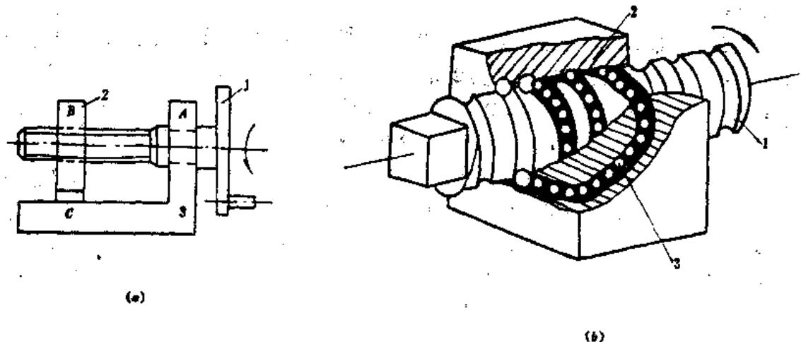

图4-1滑动螺旋与滚珠螺旋传动及其组成

螺旋传动机构通常由螺旋副、回转副和移动副三个运动副相互连接所组成,如图4-1(a)

所示,图中,螺杆1和螺母2组成的螺旋副B,机架3上的支承与螺杆组成的转动副A以及机架3上的导轨与螺母组成的移动副 $\pmb { c }$ 。根据螺旋副螺杆和螺母之间的摩擦性质的不同,精密螺旋传动可分为:滑动螺旋传动、滚动螺旋传动和静压螺旋传动等,目前应用最多的是滑动螺旋传动,其螺杆1与螺母2螺纹工作表面直接接触,运动时产生滑动摩擦,如图 ${ \pmb q } { \bf - } { \bf 1 } \left( { \pmb a } \right)$ 所示,如在螺母2与螺杆1的内、外螺纹滚道之间,加入若干可循环的滚珠3,螺杆与螺母相对运动的螺纹滚道表面产生滚动摩擦的称为滚珠螺旋传动,如图4-1(b)所示,本章着重介绍滑动螺旋传动,对滚珠螺旋传动只作简单介绍。

# 二、滑动螺旋传动的特点和应用

与其它可以实现直线运动的传动形式相比较,滑动螺旋传动的特点如下:

(1)降速比大。在转角很大的情况下,可得到很小的直线位移量;  
(2)传动精度高,空程误差可以消除或控制得很小,可以获得较高的定位精度;(3)运动平稳、灵活,加速时无颤动,低速时无震行或很少出现爬行:  
(4)具有增力作用。主动件上转矩很小时,从动件上能产生很大的轴向力;(5)结构简单、紧凑,加工、装配方便:  
(6)易干实现自馈,工作安全可靠:  
(7)摩携阻力大,传动效率低,容易磨摄。

由于滑动螺旋传动具有以上诸多墨窘优点,故它在精密机械、电子设备中得到了广泛的应用。现拳两个应用实例说明之。

图4-2(α)所示为滑动螺旋传动在感应同步器与旋转变压器组合系统的绝对坐标数字显示装置中的应用。轴Ⅰ为螺扦轴,其螺母和驱动滑板以及感应筒步器滑尺三者固连,轴上安装中级旋转变压器转子,轴 $\pmb { \mathbb { N } }$ 上安装粗级旋转变压器转子.轴!与轴I之间通过两级齿轮减速,其减速传动比为 $i _ { 1 9 } = 1 0$ 轴与轴 $\bigstar$ 之向再通过回归轮系三级齿轮减速,其减速传动比为 $_ { \mathrm { ~ \pm ~ } } \mathrm { ~ \pm ~ } 1 0 0$ ,则轴I与轴 $\pmb { \mathrm { y } }$ 之间的减速传动比 $i _ { 1 4 } = i _ { 1 4 } \cdot i _ { 3 4 } = 1 0 \times 1 0 0 = 1 0 0 0$ 若螺杆螺距为$\yen 123,456$ ,则当中级旋转变压器(轴■)转一圈时,薬母与滑板及感应同步器滑尺的位移为$1 0 0 0 m$ ,面当粗级旋转变压器(轴 $\pmb { \mathbb { M } }$ )转一图时,螺母与滑板及感应同步器情尺的位移为1000mm.

感应同步器和旋转变压器在原理上是完全一致的,它们均有两个绕组一—动绕组和定绕组。对于旋转变压器是定子绕组和转子绕组,而对感应同步器是定尺绕组和滑尺绕组。在动绕组上加以正弦交变电压时,在定绕组上产生感应电动势,其大小与定尺和滑尺(或定子和转子)之间的相对位置有关.它们都是位移传感器,和数字显示装置组成位移检测装量,二者的不同之处仅在于旋转变压器的输出信号是以旋转变压器转子每转一圈为一个周期。这样,图4-2(a)所示系统的中级旋转变压器的输出信号以10mm为检测周期;而粗级旋转变压器的输出信号以 $1 0 0 0 m m$ 为检测周期。如将感应同步器的输出信号挖制为小数点后的第三位数码,即 $0 . 0 0 0 { \sim } 0 . 0 9 9 \mathrm { m m }$ ;中级旋转变压器的输出信号控制为小数点后的第一位和个位两位数码,即 $\Omega . \mathrm { 0 \sim 9 . 9 m m }$ :粗级旋转变压器的输出信号控制为十位和百位两位数码,即10$\sim 9 9 9 \mathsf { m m }$ ,于是图 $4 - 2 ( a )$ 就成为能测量总长在 ${ \mathfrak { s } } 9 { \mathfrak { s } } . { \mathfrak { s } } { \mathfrak { s } } { \mathfrak { s } } { \mathfrak { n } } { \mathfrak { n } }$ 内的绝对坐标数显系统。在这一长度范围内,任意位置只能是感应同步器、中、粗级旋转变压器三个检测元件的唯一信号组合,它只表示一个位移量,

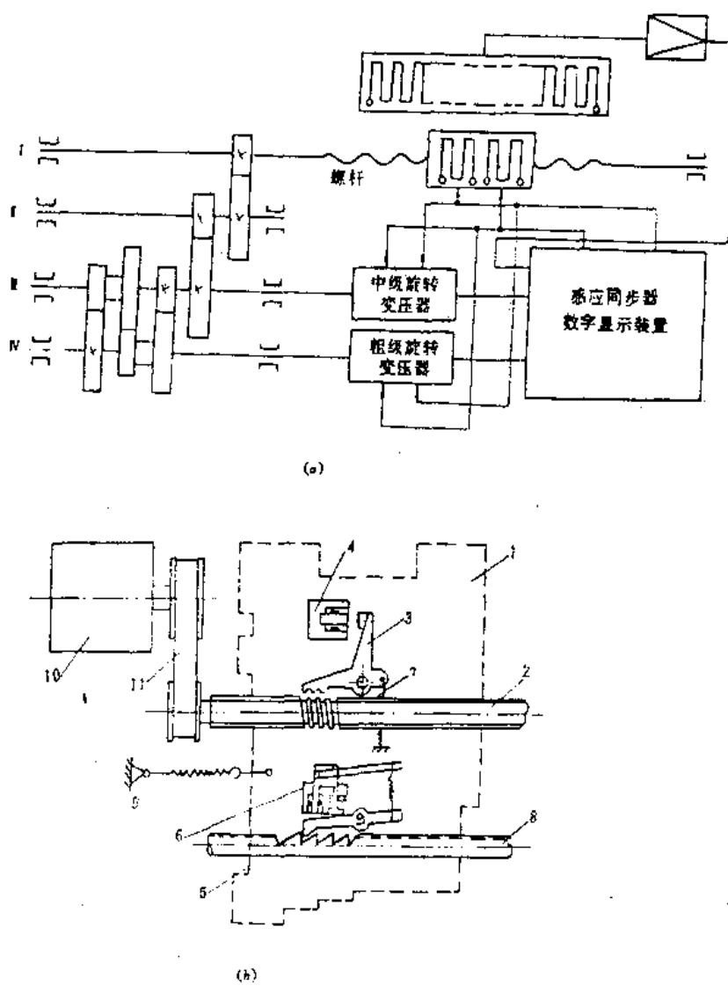

图4-2精密螺旋传动的应用实例

图4-2(b)所示为螺旋传动在电子计算机外部设备--打印机字车刚性横移机构中的应用,在字车上面装有针式打印头(图中未画出),当需打印某一字符时,由打印机控制系统发出指令信号,通过电磁执行机构驱动打印针动作,击打色带和打印纸;在纸上形成一个点阵字符.而当打印下个字符时,仍由控制系统发出相应指令,通过字车横移机构拖动字车,向右移动一个字距,依次完成自左至右逐个打印字符,当一行字符打印完毕,回车换行机构动作,继续打印下一行字符。

图4-2(b)中,在字车1的底部装有衔铁3、横移电磁铁4、棘爪5、回车电磁铁6和弹簧7.均可随字车一起移动。打印机开始工作时,交流异步电机10启动,经同步带11带动螺杆2回转。当字车右移一个字距时,横移电磁铁4通电,吸合衔铁3,使其左下端的开合螺母与转动中的螺母2旋合上,使字车右移。此时,回车电磁铁5不通电,棘爪5压紧在锯齿形齿条

8的齿面上滑过,右移信号一结束,电磁铁4断电,弹簧7使螺母3脱开螺杆,字车由某一棘爪定位,以保证字车移动字距的准确性。

回车换行时,控制信号经驱动电路功率放大后,驱动回车电磁铁6,吸合衔铁棘爪5离开齿条.字车在复位弹簧9的作用下迅速左移,向起始位置返回;同时,打印机走纸机构使打印纸移动一行距,继续打印下一行,

滑动螺旋传动不适于高速大功率传动。

# 4.2滑动螺旋传动的设计

# 一、传动型式的选择

滑动螺旋传动设计首先要选择传动型式.传动型式应根据各种传动类型及其特点,结合具体使用情况和要求合理选择。

滑动螺旋传动是由螺杆、螺母和支承三个基本部分组成,根据三者的组合及相对运动情况,滑动螺旋传动的基本型式有四种,如图4-3所示。

1.螺母固定,螺杆转动并移动(图 ${ \pmb 4 - 3 \left. { \pmb a } \right. }$ )

这种传动型式的螺母本身起着支承作用,消除了螺杆轴承可能产生的轴向窜动,结构比较简单,所以可以获得较高的传动精度,缺点是轴向结构尺寸较大(约等于螺杆行程的两倍加上螺母的宽度),刚性较差。因此仅适于行程比较短的场合(一般行程小于 $\pmb { 2 5 } \mathbf { m m }$ .

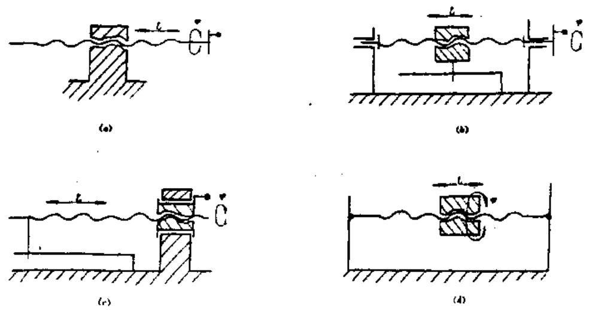

图4-3滑动螺旋传动的基本型式

2.螺杆转动,螺母移动(图4-3(b))

这种传动型式外形尺寸略大于工作行程,其特点是结构紧凑,螺杆刚性较差,适用于工作行程较长的场合,但传动精度较前一种型式稍低。

3.螺母转动,螺杆移动(图4-3(c))

这种传动型式需要限制螺杆的转动和螺母的移动,结构比较复杂,所占轴向空间较大,传动精度低,所以应用较少。

4.螺杆固定,螺母转动并移动(图4-3(d))

这种传动型式结构简单、紧凑,但在大多数场合使用不便,因此应用较少,仅用于仪器和设备的简易调整装置和锁紧装置。

上述四种基本型式,在实现由回转运动变为直线运动的传动过程中,其螺杆和螺母的理论相对位移量均为

$$
\bar { L } = \frac { \bar { z P } } { 2 \pi } \%
$$

式中,L—螺杆(或螺母)的位移量;

$\pmb { \varphi }$ —螺母和螺杆的相对转角;$\pmb { \mathcal { P } }$ 螺距:Z-—螺纹线数(大多数取单线).

除了上述四种基本传动型式之外,还有一种螺旋传动叫做差动螺旋传动,其原理如图4-4所示。如果螺杆左、右两段为旋向相同的单线螺纹,且螺距分别为 ${ \pmb P } _ { \pmb l }$ 和 ${ \pmb P } _ { \pmb { \imath } }$ ,当螺杆转角为 $\pmb { \varphi }$ 时,螺母2的移动距离为

$$
\mathcal { L } = \frac { \varphi } { 2 \varkappa } ( \mathcal { P } _ { 1 } - P _ { 2 } )
$$

显然,若 $P _ { 1 }$ 和 ${ \pmb P } _ { { \pmb \imath } }$ 相差很小,则可获得很小而且精确的位移量,差动螺旋多用于微动调节机构中,典型结构见第十五章,

若左,右两段螺纹的旋向相反,则当螺杆转动 $\pmb { \varphi }$ 时,可动螺母2的位移量为

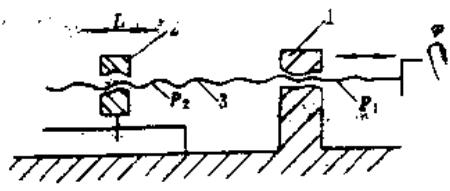

图4-4差动螺旋传动原理图

$$
\pmb { L } = \frac { \mathcal { P } } { 2 \pi } ( \mathcal { P } _ { 1 } + \mathcal { P } _ { 2 } )
$$

这时差动螺旋变为快速移动螺旋,螺母2相对螺母1快速趋近或离开。该传动型式多用于快速夹紧或锁紧装置之中。

# 二、螺纹类型及螺纹参数的选择

精密滑动螺旋传动所采用的螺纹类型,按形成螺纹的平面图形(位于通过螺纹轴线的平面内)的形状来分,主要有三类;三角形螺纹、梯形螺纹和矩形螺纹;按螺纹绕行方向分为右旋螺纹和左旋螺纹;按螺旋线的数目分为单线螺纹和多线螺纹。

# 1.螺纹形状及牙形角

(1)三角形螺纹  三角形螺纹即普通螺纹,其牙形角 $a = 6 0 ^ { \circ }$ ,基本尺寸见GB196—81.它又有粗牙和细牙之分,二者的区别是当公称直径相同时,细牙螺纹较粗牙螺纹的螺距和螺纹深度小。此外,某些仪器设备中还采用特种细牙螺纹,它具有更小的螺距和螺纹深度。

三角形螺纹的当量摩擦系数 $f ^ { * } = f { \bigg / } \cos \left( { \frac { \alpha } { 2 } } \right) = 1 . 1 5 5 f$ ,与其它螺纹相比,其摩擦力矩大,自锁性能好,故适宜于作连接紧固用。由于它加工方便,容易保证加工精度,因此在精密螺旋传动中,当工作载荷不大,要求螺距较小时常采用三角形螺纹;但它传动效率低,仅用于速度低的调节螺旋机构、数据螺旋传动和小功率螺旋传动等。

(2)矩形螺纹矩形螺纹的牙形角 $\pmb { \alpha = 0 }$ ,当量摩擦系数 $\boldsymbol { f } = \boldsymbol { f }$ ,故摩擦阻力小,传动效率高,适宜于传力螺旋传动。但由于矩形螺纹加工困难,加工精度难以保证,故传动精度低,精密螺旋传动中很少采用。

(3)梯形螺纹梯形螺纹的牙形角 $\bullet = 3 0 ^ { \circ }$ ,当量摩擦系数 $\mathbf { \zeta } f ^ { \prime } = 1 . \thinspace 0 3 5 \mathbf { \ : } f$ ,故摩擦阻力不大,效率较高,制造较矩形螺纹容易,强度和对中准确度都较好,可以补偿因磨损而造成的间隙,所以梯形螺纹是螺旋传动中应用较多的一种,在精密螺旋传动中,当要求传动效率高,运动灵活且速度范围宽时多采用梯形螺纹,如机床的进给螺旋传动、伺服系统的传动装置等场合均有所应用.

# 2.螺距和螺纹线数的确定

螺跑租螺纹线数的确定,应根据螺杆和螺母转过某一相对转角 $\pmb { \varphi }$ 所需产生相对位移L的大小,是否需要自锁,传动精度等要求综合考虑,螺距的数值必须符合标准系列。

当要求相对位移较小或要求自锁时,应选用较小的螺距(例如细牙螺纹或特种细牙螺纹),并采用单线螺纹;当要求传动精度高时,也应采用单线螺纹,因为多线螺纹加工困难,加工精度低,具有周期性误差;当要求相对位移L较大时,则宜用较大的螺距,如选用粗牙普通螺纹及梯形螺纹,此时若传动精度要求不高,为提高传动效率和减少传递时间,可采用多线螺纹(如目镜螺纹).

精密螺旋传动常用的螺纹类型、对应的螺距大小及应用列于表4-1,以供参考。

表4-1精密螺旋传动常用螺纹类型、螺距及应用

<table><tr><td rowspan=1 colspan=2>娜纹类型</td><td rowspan=1 colspan=1>螺距(mm)</td><td rowspan=1 colspan=1>应用举例</td></tr><tr><td rowspan=2 colspan=1>普通螺纹：</td><td rowspan=1 colspan=1>粗牙</td><td rowspan=1 colspan=1>0.5{]</td><td rowspan=2 colspan=1>螺旋调节机构、小功率螺旋传动和数据传递装置等</td></tr><tr><td rowspan=1 colspan=1>细牙</td><td rowspan=1 colspan=1>0.5~0.75</td></tr><tr><td rowspan=1 colspan=2>特种细牙螺纹</td><td rowspan=1 colspan=1>0.35~1</td><td rowspan=1 colspan=1>微调螺旋机构</td></tr><tr><td rowspan=1 colspan=2>梯形螺纹</td><td rowspan=1 colspan=1>2~12</td><td rowspan=1 colspan=1>机床上的进给螺旋、伺服系统中的螺旋传动</td></tr><tr><td rowspan=1 colspan=2>目镜螺纹</td><td rowspan=1 colspan=1>1.5~2</td><td rowspan=1 colspan=1>转角不大(<360*)而有相当大轴向移动的管形蓬壁零件的调节，主要用于光学仅器的目镜调节</td></tr></table>

# 3.螺纹升角及旋向的确定

螺纹升角小,易自锁,但传动效率低,因此当要求自锁时应保证螺纹升角 $\phi \leqslant \rho ^ { \prime } \left( \rho ^ { \prime } \right.$ 为当量摩擦角, $\cos \beta = f$ )。反之,要求传动效率高时应加大螺纹升角。

螺纹的旋向应由运动要求确定。右旋及左旋均可时,应优先采用右旋,因为右旋螺纹加工方便,且符合人们的操作习惯,

# 三、结构参数的确定

滑动螺旋传动中,螺杆的结构设计与轴的设计很类似,故可以借鉴:其不同之处是螺杆上有螺纹,这里主要讨论与螺纹有关的结构参数确定,关于螺旋传动支承的结构设计可参考

轴的支承设计,与螺纹有关的结构参数有:螺纹的直径、螺杆螺纹部分的长度、螺母的轴向长度、螺杆的总长度等。

# 1.螺纹直径

精密机械、电子设备的调节螺旋、小功率或数据螺旋传动,由于受力比较小,通常根据使用的具体情况、结构条件和工艺要求用类比法来确定螺纹的直径。但必须注意,螺纹直径不能过大,否则机构轮廓尺寸大、结构粗笨,摩擦力矩也随之增大;也不能过小,螺纹直径小时,加工时容易发生较大的变形和振动,达不到要求的精度,设计时一般应使螺纹的直径d和螺杆的长度!满足:

$$
\frac { l } { d } \leqslant 2 5
$$

精度高的精密螺旋传动,常取 $\downarrow / d = 1 0 \sim \mathrm { i } 5$ ·

对用于重要场合、速度高、承载大的精密螺旋传动,螺纹直径是根据耐磨性的计算来确定的,必要时还要进行强度、刚度的验算,若 $\mathrm { \Omega } _ { \downarrow / d > 1 0 \sim 1 5 }$ 时,对受压螺杆应进行稳定性验算。

螺旋的磨损速度与螺纹工作表面的比压有关,为提高精密螺旋传动的使用寿命,就必须限制螺纹工作表面的比压,使其小于或等于许用比压。螺纹中径 $d _ { 2 }$ 可用下式来确定:

对普通螺纹

$$
d _ { 2 } \geq 0 , 7 6 7 \sqrt { \frac { 9 } { k [ p ] } }
$$

对梯形螺纹

$$
a _ { 2 } \geq 0 . 8 2 5 \sqrt { \frac { Q } { k [ p ] } }
$$

式中, $Q -$ -螺纹承受的轴向载荷(N);

[p]许用比压 $( \mathbb { M P a } )$ ,见表4-2;

k一比例系数,对于整体式螺母取 $k { = } 1 , 2 { \sim } 2 , 5$ ;对于剖分式螺母取 $\pmb { k } { = } 2 , \pmb { 5 } { \sim } 3 , \pmb { 5 }$ ·

表4-2螺纹工作表面的许用比玉[]

<table><tr><td>螺杆材料</td><td>螺母材料</td><td>G (MPz)</td><td>速度范围 (m/min)</td></tr><tr><td>钢</td><td>青铜</td><td>18~25</td><td>低速</td></tr><tr><td>钢</td><td>钢</td><td>7.5~13</td><td></td></tr><tr><td>钢 钢</td><td>铸铁 青铜</td><td>13~18</td><td><2.5 <3.0</td></tr><tr><td>钢</td><td>铸铁</td><td>11~18 4~7</td><td></td></tr><tr><td>钢</td><td>耐磨铸铁</td><td>6~8</td><td></td></tr><tr><td>钢</td><td>青铜</td><td>7~10</td><td>6~12</td></tr><tr><td>淬火锅</td><td>青铜</td><td>10~13</td><td></td></tr><tr><td>钢</td><td>青铜</td><td>1~2</td><td>>15</td></tr></table>

螺纹的直径包括公称直径 $\pmb { \mathscr { d } } .$ 中径 $d _ { \tt 2 }$ 和小径 ${ \vec { \mathfrak { a } } } _ { \mathfrak { i } }$ 。螺纹的公称直径 $\pmb { d }$ 与螺距 $P$ 有一定的对

应关系,应使 $\pmb { \mathscr { d } }$ 与 $\pmb { p }$ 符合标准系列,特殊情况才允许采用非标准尺寸,螺纹的直径 $d , d _ { 1 } , d _ { 1 }$ 三者的关系如下:

对于普通螺纹

$$
\begin{array} { l } { d _ { 2 } = d - \mathbb { 0 . 6 } 4 \mathbb { 9 5 } P } \\ { d _ { 1 } = d - 1 \mathrm { . 0 8 2 5 } P } \\ { h = 0 . 5 4 1 3 P } \end{array}
$$

对于梯形螺纹

$$
\begin{array} { l } { d _ { 2 } = d - 0 . 5 P } \\ { d _ {  { : } } = d - P - 2 \alpha } \\ { h = 0 . 5 P } \end{array}
$$

式中,—螺纹工作高度;

a一螺纹旋合时的径向间隙。

# 2.螺杆长度

螺杆螺纹部分的长度 $\pmb { \mathrm { i } } _ { \bullet }$ 应在保证工作行程 $i _ { \prime }$ 的基础上,尽量取短些,一般为

$$
i _ { \mu } \geq H + l _ { g }
$$

式中,H-螺母轴向长度。

螺杆的总长度!根据结构设计确定。如图4-5所示,螺杆的总长度为螺杆螺纹部分的长度加上结构长度,为了保证螺杆的刚度和加工精度,螺杆的长度尽量取短些,并满足式(4-4)的要求。

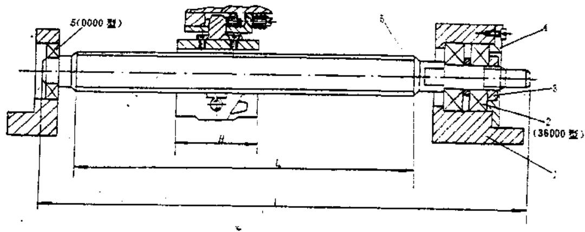

图4-5精密螺旋传动结构图

1一支架:2一滚动轴承; $\mathfrak { s }$ 扁螺母:4-端盖:5-螺杆

# 3.螺母的轴向长度

螺母的轴向长度对精密螺旋传动的摩擦、磨损和传动精度均有影响,从减小摩擦的要求考虑,螺母长度取短些有利;但从减少磨损、保证传动精度的要求考虑,螺母取长些有利。因此,设计时要综合考虑,一般推荐取:

或

$$
\begin{array} { l } { { { \cal H } = \tt k \cdot { \it d } _ { 2 } } } \\ { { { \cal H } = \tt u \cdot { \tt P } } } \end{array}
$$

式中,-比例系数,其值可根据螺母的形式选定,见式(4-5)及式(4-6);

一螺母的螺纹圈数,般不大于10圈。

# 四、传动力矩及效率的计算

在螺旋传动中有时需进行驱动力矩及效率的计算,以供确定原动机的功率或手柄尺寸时参考,

当螺旋副受到轴向载荷 $Q$ (一般为作用于螺旋副的轴线)作用时,欲使螺旋克服 $\pmb { Q }$ 而运动所需的驱动力矩为

$$
N = \frac { 1 } { 2 } Q d _ { \mathrm { r } } \mathrm { t } { \mathrm { \bf { g } } } ( \psi + \rho ^ { * } ) \qquad ( \mathrm { m N } \cdot \mathrm { m } )
$$

式中, $\pmb { \psi }$ 螺旋升角;

p—当量岸擦角 $\rho ^ { * } = \mathrm { t g } ^ { - 1 } \frac { f } { \cos \frac { \alpha } { 2 } } ,$ 

f—螺纹表面滑动摩擦系数,见表4-3.

表4-3摩擦系数f(定期润滑条件下)

<table><tr><td rowspan=1 colspan=1>螺杆和螺母材料</td><td rowspan=1 colspan=1>f</td></tr><tr><td rowspan=1 colspan=1>淬火钢和青铜</td><td rowspan=1 colspan=1>0. 06~.0.08</td></tr><tr><td rowspan=1 colspan=1>钢和青铜</td><td rowspan=1 colspan=1>0.08~0.10</td></tr><tr><td rowspan=1 colspan=1>钢和耐磨铸铁</td><td rowspan=1 colspan=1>0.10~0.12</td></tr><tr><td rowspan=1 colspan=1>俯和铸铁</td><td rowspan=1 colspan=1>0.12~0.15</td></tr><tr><td rowspan=1 colspan=1>钢和钢</td><td rowspan=1 colspan=1>0.11~0 17</td></tr></table>

注起动时/取大值,运转中取小值。

# 螺旋剂的传动效率为

$$
{ \boldsymbol { \eta } } = { \frac { \hbar \phi } { 8 ( \phi + \rho ^ { \prime } ) } }
$$

# 五、螺旋副材料及螺纹公差的选择

# 1.螺旋副的材料及热处理

(1)材料选择的要求对螺旋副材料的选择要求是:摩擦系数小,耐磨性好,良好的尺寸稳定性以及加工性能和热处理性能良好等.

(2)选择原则螺旋副的传动精度主要取决于螺杆,对于精度要求高的螺杆,要经过粗加工、半精加工和精加工等工序,且在加工过程中还要进行人工时效和热处理。由于加工工序长,成本较高,故应选用优质材料。对螺母来说,为减小摩擦和磨损,提高寿命,保护成本高和对传动精度影响较大的螺杆,且便于在磨损后更换和调整,一般选用比螺杆软的材料。

(3)常用材料及热处理精度要求不高的一般传动,螺轩材料可用45、50钢,螺母材料可用耐磨铸铁或35钢;比较重要的传动,螺杆材料可用T10、T12等碳素工具钢,进行调质球化达到 $\mathtt { H B 2 0 0 } { \sim } 2 1 0$ 或用45钢正火达到 $\mathrm { H B } { > } 1 7 0$ ,或调质达到 $\mathtt { H B 2 0 3 } \sim 2 5 0$ ,也可用 $\pmb { \ll } 0 \pmb { \subset } \bar { \mathbf { r } }$ 调质达到HB220\~250;CrMn等表面淬火后回火,达到HRC50\~55,螺母材料可用铸造青铜、铸造黄铜、尼龙等;重要的和精密传动螺杆材料可用 $\operatorname { G C r } 1 5 , \operatorname { C r } \operatorname { W M } \ b { \cap } \mathbb { M } \ b { \cap } \mathbb { M } \ b { \cap } \mathbb { V }$ 等合金钢,淬火、回火后达到HRC54\~58。螺母材料可用铸造青铜ZQSn6-6-3、ZQSn10-I、ZQAI-4等.

# 2.螺纹精度等级和螺距公差的选择

(1)普通螺纹公差等级及公差带普通螺纹国家标准对内、外螺纹中径和顶径分别规定了不同的公差等级(见表4-4),其6级是基本级,

表4-4普通螺纹公差等级

<table><tr><td rowspan=1 colspan=1>螺纹直径</td><td rowspan=1 colspan=1>公差等级</td><td rowspan=1 colspan=1>螺纹直径</td><td rowspan=1 colspan=1>公差等级</td></tr><tr><td rowspan=1 colspan=1>内螺纹小径D</td><td rowspan=1 colspan=1>1、5、6.7.8</td><td rowspan=1 colspan=1>外螺纹大径</td><td rowspan=1 colspan=1>1、6.8</td></tr><tr><td rowspan=1 colspan=1>内螺纹中径D</td><td rowspan=1 colspan=1>4、5.6.7.8</td><td rowspan=1 colspan=1>外螺纹中径山</td><td rowspan=1 colspan=1>3.4.5,6.7.8.9</td></tr></table>

在普通螺纹标准中,对内螺纹规定G、H两种公差带位置,对外螺纹规定了e、f、g、四种公差带位置。其中 $H , h$ 的基本偏差为零, $\pmb { \mathscr { Q } }$ 的基本偏差为正值, $\cdot \ e \cdot \ f \cdot g$ 的基本偏差为负值。按不同的公差带位置 $( G , H , e , f , g , h )$ 及不同的公差等级可以组成各种螺纹公差带,其代号由表示公差带位置的字母和表示公差等级的数字组成,如 $6 1 , 5 9 , 6 9$ 等,为了减少刀具、量具的规格,普通螺纹公差一般应按表4-5选用。

表4-5普通螺纹的选用公差带(节录)

<table><tr><td rowspan=2 colspan=1>精度等级</td><td rowspan=1 colspan=3>内螺纹公差带</td><td rowspan=1 colspan=3>外螺纹公差带</td></tr><tr><td rowspan=1 colspan=1>s</td><td rowspan=1 colspan=1>A</td><td rowspan=1 colspan=1>L</td><td rowspan=1 colspan=1>8</td><td rowspan=1 colspan=1>：   N</td><td rowspan=1 colspan=1>L</td></tr><tr><td rowspan=1 colspan=1>精密级</td><td rowspan=1 colspan=1>1H</td><td rowspan=1 colspan=1>1H5H</td><td rowspan=1 colspan=1>5H6H</td><td rowspan=1 colspan=1>5(34)</td><td rowspan=1 colspan=1></td><td rowspan=1 colspan=1>（4h5)</td></tr><tr><td rowspan=1 colspan=1>·中等级</td><td rowspan=1 colspan=1>：·5H(50)</td><td rowspan=1 colspan=1>(6G)</td><td rowspan=1 colspan=1>:7H(7G)</td><td rowspan=1 colspan=1>(5A6）(5g6g)</td><td rowspan=1 colspan=1>.6e·6</td><td rowspan=1 colspan=1>(6A7k）.6g7S：</td></tr><tr><td rowspan=1 colspan=1>粗糙级</td><td rowspan=1 colspan=1></td><td rowspan=1 colspan=1>7H(7G)</td><td rowspan=1 colspan=1></td><td rowspan=1 colspan=1></td><td rowspan=1 colspan=1>(8h）8</td><td rowspan=1 colspan=1></td></tr></table>

内、外螺纹选用的公差带可以任意组合,主要根据使用要求来选择,在满足设计要求的前提下尽量选用带\*号的公差带,推荐采用带方框的公差带,括号中的公差带尽可能不用。为了保证足够的接触高度,最好组合成 $H / k , \pi / 9$ 或 $G / \Delta$ 的配合。

(2)梯形螺纹精度等级的选择精密螺纹传动中的梯形螺纹精度按“机床梯形螺纹丝杠、螺母精度"的规定选择,根据用途和使用要求,梯形螺纹丝杆、螺母的精度分为6级,即4、5、6、7、8、9级,精度依次降低,各级精度大致应用如下:

4级为目前最高级,较少应用;5\~6级用于超高精度的传动,如螺纹磨床、坐标镜床、齿轮磨床、计量仪器、设有校正装置的分度机构、光栅刻度机和电子精密机械等;7级用于精确的传动,如精密螺丝车床、精密齿轮机床、电子设备的精密螺旋传动等;8级用于一般精度的传动,如普通螺丝车床;9级用于低精度的传动,如设有分度盘的进给机构等。

(3)螺距公差为了保证精密螺旋传动的传动精度,机床梯形螺纹还单独规定了螺距误差的公差,分为单个螺距公差、规定长度(25mm、100mm、30mm)和全长上的螺距累积公差,用于 ${ \tt A } \sim { \tt 9 }$ 级丝杠,见表4-6。

表4-梯形蝶纹丝杠的螺距公差(节录)

<table><tr><td rowspan="3">精度 等级</td><td rowspan="3">单个螺距 公差 (um)</td><td colspan="5">螺距繁积公差（um）</td></tr><tr><td colspan="3">丝杆规定长度（mm）</td><td colspan="2">丝杠全长(mm）</td></tr><tr><td>≤25</td><td>≤100</td><td>≤300</td><td>≤1000</td><td>≤2000</td></tr><tr><td>5</td><td>2</td><td>2</td><td>3</td><td>5</td><td>9</td><td>1</td></tr><tr><td>6</td><td>3</td><td>5</td><td>6</td><td>9</td><td>15</td><td>21</td></tr><tr><td>7</td><td>6</td><td>9</td><td>12</td><td>18</td><td>28</td><td>36</td></tr><tr><td>8</td><td>12</td><td>18</td><td>25</td><td>35</td><td>55</td><td>65</td></tr></table>

精密螺旋传动所采用的普通螺纹没有专门的螺距公差标准,为了保证传动精度,在设计时也要根据使用场合对螺距误差提出一定的公差要求,表4-7所列的螺距公差值供设计时參考。

表4-7普通螺纹螺杆的螺距公差

<table><tr><td rowspan="2">单个螺距误 差的公差</td><td colspan="4">螺距票积误差的公差（um)</td><td rowspan="2">应用范围</td></tr><tr><td colspan="4">螺杆螺纹部分的有效长度（mm）</td></tr><tr><td>（um）</td><td>25</td><td>>25~100</td><td>>100~300</td><td>>300，每增加300须加该列数</td><td></td></tr><tr><td>士2</td><td>2</td><td>1</td><td>5</td><td>2</td><td rowspan="2">精密机构</td></tr><tr><td>±3</td><td>5</td><td>6</td><td>9</td><td>3</td></tr><tr><td>士</td><td>9</td><td>12</td><td>18</td><td>5</td><td rowspan="2">较精密机构</td></tr><tr><td>±12</td><td>18</td><td>25</td><td>35</td><td>10</td></tr><tr><td>±25</td><td>35</td><td>50</td><td>70</td><td>20</td><td>一般传动</td></tr></table>

# 4.3滑动螺旋传动的精度分析

# 一、精密螺旋传动精度的含义及误差指标

精密机械、电子设备以及伺服系统中的精密螺旋传动,其传动精度的概念严格说来应包含两方面的含义:传递运动的准确性和传动中运动的灵活性,

螺旋传动的准确性是指螺母相对螺杆有某一转角时,二者实际的相对直线位移与理论直线位移之间的符合程度,它是用传动误差和空程误差来衡量的,

(1)传动误差螺旋传动的传动误差系指主动件单向回转某一转角 $\wp$ 时,从动件实际位移量与理论位移量偏差的最大值。如图4-5所示的精密螺旋传动,当螺杆转动时螺母在理论上应作如图 $\pmb { \jmath } _ { - } \hat { \pmb { \jmath } } \left( a \right)$ 中的直线1所示的直线运动,但实际上由于存在各种误差,螺母相对螺杆的实际位移将如图 $\pmb { 4 - 6 } ( \pmb { a } )$ 中的曲线2所示,对应每一转角 $\pmb { \varphi }$ 都有误差 $\Delta \bar { L }$ ,曲线2与曲线1之间的最大差值即为螺旋传动的传动误差。

(2)空程误差螺旋传动中,螺杆与螺母旋合范围内的非工作螺纹牙表面之间,传动装置中的各相对运动部分,都不可避免地存在间隙和制造误差,此外,还可能存在零件的弹性变形和热变形,当主动件改变回转方向时,从动件不能立即随之反向移动,从动件滞后于主动件时所对应的位移,称为螺旋传动的空程误差,或反映为主动件空转的转角,以便于度量,主动件转角 $\pmb { \varphi }$ 与从动件位移 $\pmb { \mathcal { L } }$ 之间的关系曲线,形成一个封闭的空程误差滞后回线,如图$\pmb { 4 } - \sigma ( \ r _ { b } )$ 所示。图中 $\Delta \bar { L }$ 即为对应于主动件反向空转转角g时从动件的空程误差,机构中存在间隙和变形是产生空程误差的内部原因,主动件反向回转是产生空程误差的外部条件,由常值间隙引起的空程误差,一般只影响主动件正、反向转动时从动件的初始位置误差,并不随主动件转角 $\pmb { \geqslant }$ 的改变而变化;在振动和其它挠动力的作用下,它会引起不规则的跳动。由变值间隙引起的空程误差,则随主动件转角 $\pmb { \varphi }$ 的改变而变化,从而影响螺旋传动的传动误差.

在开环控制的精密螺旋传动中,如螺旋千分尺、开环控制的精密工作台中的精密螺旋传动等,传动的准确性直接影响设备的工作精度,对这种螺旋传动,传动误差和空程误差是衡量传动质量的两项重要的性能指标,在设计、制造以及使用过程中,必须仔细分析影响误差的各种因素,进而采取必要措施减小或消除传动误差和空程误差,提高传动精度。

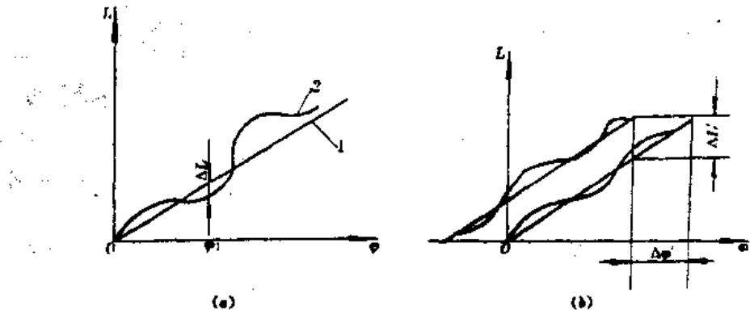

图4-6螺旋传动的传动误差和空程误差

精密螺旋传动中运动的灵活性,是指传动的效率高、摩擦阻力和惯量小等,对伺服控制的精密螺旋传动,运动的灵活性直接影响伺服系统的精度和动态响应性,以及在低速时是否引起爬行,特别是在闭环控制中的精密螺旋传动,由于采用一定的闭环控制手段后,螺旋传动的准确性此时在精密机械与电子设备本身的精度中已不再起决定性的作用,而灵活性将会对设备的工作精度产生影响。例如,采用激光干涉定位(或光栅等)的测量仪器,运动的灵活性会直接影响测量信号,严重的会造成仪器不能正常工作,因此,精密螺旋传动的精度分析中,还要分析影响运动灵活性的原因,并应采取必要的手段如研磨、跑合等,减小摩擦,提高传动效率,以保证传动中运动的灵活性,

影响精密螺旋传动精度的主要因素有:

(1)螺旋副的固有误差主要是指螺纹参数的制造误差,包括螺距误差、中径误差、牙形半角误差等;

(2)结构及装调误差包括轴向审动、螺杆安装与导轨运动方向的偏斜等;

(3)使用中的误差由于使用中外界环境的变化(如温度变化)、受力后的变形等。

以下分别进行分析、讨论。

# 二、螺旋副的固有误差及其影响

# 1.螺距误差

螺距的实际值与理论值之差称为螺距误差,按使用要求可分为:单个螺距误差和螺距累积误差。

单个螺距误差(△Pi)是螺纹任意两相邻牙在中径线上对应两点间的实际轴向距离对公称尺寸的偏差。其值有正有负,它的形式往往呈周期性变化,主要在制造过程中由加工机床本身的运动精度(如主轴晃动、进给螺杆的精度等)决定,与螺杆的长度无关。

螺距累积误差(△Pz)是指在螺纹全长范围内或某一规定长度内任意两牙之间在中径线上的实际轴向距离与理想值之差的最大值,它与螺纹长度有关,螺纹长度越长往往螺距累积误差越大.螺距累积误差是由制造过程中加工机床本身的精度不够、加工中安装螺杆时位置不正确(主要是螺杆安装与机床导轨运动方向不平行,以及制造过程中室内温度变化等)造成的。

螺距累积误差 $\Delta { P } _ { \pmb { \tau } }$ 与单个螺距误差的关系为

$$
\Delta P _ { E } = \sum _ { i = 1 } ^ { \cdot } \Delta P _ { i }
$$

式中, $\pmb { \Delta } \pmb { P _ { i } }$ ——螺杆第个螺距的螺距误差;

某一长度或全长螺距的数目;

i螺距的次序。

由式(4-1)知,螺母相对螺杆的转角为 $\pmb { \varphi }$ 时,螺母在螺杆上所移过的螺距数目为 ${ \mathfrak { a } } = { \mathfrak { p } }$ $\pmb { 2 } / 2 \pi$ ,其相对位移为

$$
\mathcal { L } = \frac { \varphi } { 2 \pi } \mathcal { Z } \mathcal { P } = \Re \mathcal { P } = \sum _ { m = 1 } ^ { \bullet } \mathcal { P } _ { \mathrm { i } }
$$

式中, $\pmb { P _ { i } }$ 为螺杆第 $\pmb { \dot { \dot { \varepsilon } } }$ 个螺距的数值。

上式是对理想螺旋传动而言的,对于有螺距误差的实际螺旋传动而言,螺母在螺杆上移过的各个螺距依次为: $P _ { 1 } + \Delta P _ { 1 } , P _ { 2 } + \Delta P _ { 2 } , \cdots , P _ { 1 } + \Delta P _ { 2 }$ ,因此螺母相对螺杆的实际位移量为

$$
\begin{array} { l } { { \displaystyle { \cal L } = ( P _ { 1 } + \Delta P _ { 1 } ) + ( P _ { 2 } + \Delta P _ { 2 } ) + \cdots + ( P _ { * } + \Delta P _ { * } ) } } \\ { { \displaystyle ~ = ~ \sum _ { i = 1 } ^ { \bullet } P _ { i } + \sum _ { i = 1 } ^ { \bullet } \Delta P _ { i } = \sum _ { i = 1 } ^ { \bullet } P _ { i } + \Delta P _ { z } } } \end{array}
$$

由螺距误差引起的传动误差为

$$
\Delta L = L ^ { \prime } - L = \Delta P _ { z }
$$

由于 $\Delta { \bar { P } } _ { i }$ 有正有负,故 $\Delta { \mathcal P } _ { z }$ 也可能有正或负,当 $\Delta \bar { L }$ 为正值时表明实际位移比理论值超前,即实际值大于理论值:当 $\Delta L$ 为负时则相反。

上面分析的是在规定长度或全长范围内螺杆螺距累积误差对传动误差的影响,此外,在旋合长度范围内的螺距累积误差将影响螺旋副轴向间隙和传动中运动的灵活性,这可通过螺距误差对螺旋副旋合性的影响来说明。

假设内螺纹具有理想的牙型,外螺纹的中径及牙型半角与内螺纹相同,但螺距有误差,在螺纹旋合长度范围内存在外螺纹最大的螺距累积误差 $\Delta P _ { z } ^ { \prime }$ ,使内、外螺纹的牙廓发生干涉,螺纹副不能旋合,传动时将出现卡滞。为了保证有螺距误差的外螺纹旋入理想的内螺纹,

应把外缘纹中径减小一个数值f,如图4-7所示,

同理,为了使有螺距误差的内螺纹旋入理想的外螺纹,应把内螺纹的中径加大一个数值ff叫做螺距误差的中径补偿值。由图4-7所示直角三角形△ad中,可得:

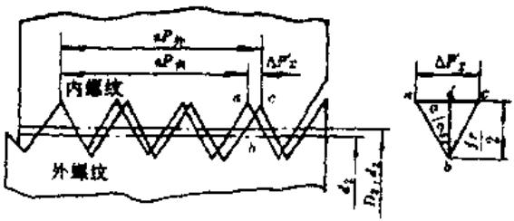

图4-7螺距误差造成的牙廓干涉

$$
f _ { r } = | \Delta P _ { z } | \cos \frac { \alpha } { 2 }
$$

式中,绝对值即表示△P:无论正负,都将使螺纹牙廓发生干涉,对于实际中的螺纹副,内、外螺纹均存在螺距误差,对f:有影响的是内、外螺纹旋合长度内螺距累积误差的代数差,即

$$
f _ { r } = | \Delta ^ { r } _ { \mathrm { { s p } } } - \Delta ^ { r } _ { \mathrm { { s p } } } | \mathrm { { c t g } } \frac { \alpha } { 2 }
$$

事实上,传动中的螺旋副、螺母和螺杆之间是存在间隙的,以便相对运动和储油润滑,由于螺杆和螺母在旋合长度内的螺距累积误差的影响,将使中径综合公差范围内的螺旋副间隙城小,轴向间隙的减小量即为

$$
j _ { n } = \cdot \vert \Delta P _ { \mathrm { E R } } ^ { \prime } - \Delta P _ { \mathrm { E R } } \vert
$$

上式如果过大,将使传动不灵活,甚至使牙廓发生干涉,传动出现卡滞,

# 2.螺纹牙形半角误差

螺纹牙形半角误差是螺纹的实际牙形半角与理论牙形半角之差,它将引起螺距的变化,因而影响传动精度,螺纹牙形半角误差对传动误差的影响表现在螺距误差上,但是,螺纹各牙的牙形角完全相同(各牙形半角误差相等)时,牙形半角误差不会影响传动误差,由于螺杆在制造过程中,是一次装卡加工出来的,故牙形半角误差在螺纹全长上几乎无变化,因而不会影响传动误差,只会影响螺旋副的旋合性,并使旋合内的轴向间隙减小,降低运动的灵活性。

假设内螺纹是没有误差的理想情况,外螺纹的牙形半角略大于内螺纹牙形半角,即有一个正的牙形半角误差△(a/2),从图4-8(a)中可以看出,螺旋副在阴影部分产生干涉,内外螺纹不能旋合,在传动中将卡滞,为保证旋合性,必须将外螺纹的实际中径减小一个数值f.(称为中径补偿值),使外螺纹处于虚线位量。

根据图4-8(b)中的三角形△DBP可推得:

$$
f _ { a } = { \frac { \left. { \frac { b + { \sqrt { \Delta } } \cdot { \frac { \alpha } { 2 } } } } \right| } { \sin { \frac { \alpha } { 2 } } \cdot \cos { \frac { \alpha } { 2 } } } }
$$

同理,当内螺纹有牙形半角误差时,为保证旋合性,内螺纹的实际中径应加大一个f.

若内、外螺纹左、右半角均有误差且不一致时,对f.有影响的是内、外螺纹牙形半角误差的综合。令△(a/2)代表牙形半角综合误差,其值为

$$
\Delta \frac { u } { 2 } = \left\lfloor \Delta \frac { \alpha } { 2 } \right\rfloor - \Delta \frac { \alpha } { 2 } \hbar \left\lfloor + \left\lfloor \Delta \frac { \dot { \alpha } } { 2 } \right\rfloor - \Delta \frac { \dot { \alpha } ^ { \prime } } { 2 } \right\rfloor .
$$

式中 $\Delta \frac { a } { 2 \gamma } , \Delta \frac { a ^ { \prime } } { 2 \gamma } .$ 螺纹左、右半角误差;

$\Delta \frac { a } { 2 } _ { \nparallel } \cdot \Delta \frac { a ^ { \prime } } { 2 } _ { \nparallel }$ -外螺纹左、右半角误差;

由 $\Delta ( \alpha / 2 )$ 引起的螺旋副轴向间隙的减小量为

$$
j _ { \ u { \mu } } = f _ { \bullet } \cdot \mathfrak { t g } \frac { \alpha } { 2 } = \frac { \hbar } { \cos ^ { 2 } \frac { \alpha } { 2 } } \bigg | \Delta \frac { \alpha } { 2 } \bigg |
$$

式中,为螺纹工作高度。以上各式取绝对值表示牙形半角误差无论是正值或负值都使螺旋副的间隙减小。问隙减小量过大,会使传动不灵活,严重的时候,螺纹牙廓发生干涉,则传动出现卡滞。

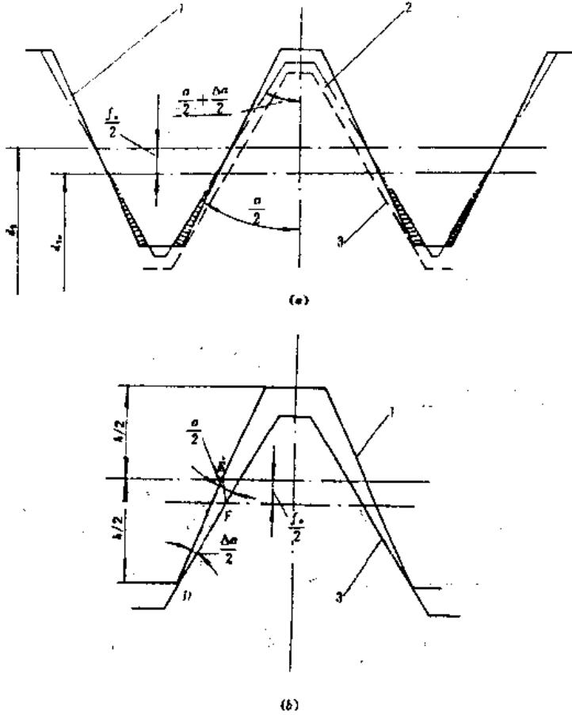

图4-8牙形半角误差造成的干涉及补偿

1—理想的内螺纹牙廓;2一有牙形半角误差的外螺纹牙廓;3一有牙形半角误差的外螺纹减小中径后的轮廓

# 3.螺纹中径误差

螺纹中径误差包括中径的尺寸误差和形状误差两方面:

(1)螺纹中径的尺寸误差中径的大小决定了螺纹牙的径向位置,中径的尺寸误差直接影响螺旋副的问隙、旋合性及传动中运动的灵活性,外螺纹中径 $d _ { 3 }$ 过大或内螺纹中径 $\mathfrak { d } _ { \mathfrak { s } }$ 过小,均使螺旋副旋合过紧,影响传动的灵活性,为保证旋合性,螺纹中径的公差综合考虑了螺距误差的和螺纹牙形半角误差及本身制造误差的影响,以中径补偿的方式规定内螺纹中径的最小下偏差为零,而外螺纹中径的最大上偏差为零,即保证径向间隙 $\Delta D _ { 2 } - \Delta d _ { 2 } \geq 0$ ,如图4-9所示,由此引起的轴向间隙为

$$
j _ { \omega _ { 1 } } = ( \Delta D _ { 4 } - \Delta \omega _ { \tau } ) \cos \frac { \theta } { 2 }
$$

图4-9螺纹中径尺寸误整对螺旋副间歌的影响

(2)中径形状误差是指螺纹中径的圖度和圆柱度误差。该误差会引起螺距的变化和螺旋副间隙的变化,从而影响传递运动的准确性和传动中运动的灵活性,中径圈度误差的存在,会使螺旋传动中螺杆转一圈时出现半圈松半圈紧的现象;而圆柱度误差会使螺杆在全长运动中松紧程度不同,严重影响螺旋传动中运动的灵活性,甚至会造成卡滞现象,由图4-10可见,中径形状误差造成的传动误差和引起轴向间隙的变化量为

$$
j _ { m _ { 3 } } = \Delta _ { q } = \frac { 1 } { 2 } \Delta \varepsilon _ { 2 } \cdot v _ { 0 } \frac { a } { 2 }
$$

式中, $\pmb { \Delta \hat { \pmb { \imath } } _ { \pmb { \imath } } }$ 是中径園度和圓往度误差。

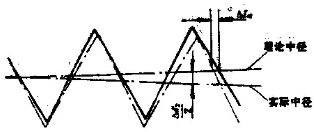

图4-10螺纹中径形状误差的影响

综合上述分析,引起螺旋传动误差的主要因素是螺杆上的螺距累积误差,因此在设计精密螺旋传动时,主要应对螺杆提出严格的精度要求,以上三项误差均影响螺旋副间隙,轴向间隙的综合式可写成:

$$
j _ { \ast } = j _ { \ast } - j _ { \ast } , - j _ { \ast }
$$

式中,j和一对某一具体螺旋副是不变的, $- j _ { \ast }$ 劍随不同的旋合位置而变化,若螺纹中径存在形状误差时,则也是变化的,故综合轴向间隙是变值间隙·使螺旋副在不同的位置松紧程度不一,螺旋副过紧,传动中运动的灵活性差,严重时甚至卡死不能正常传动;螺旋副过松,反向运动时空程误差大,不仅如此,若传动过程中在扰动力的作用下和振动条件下,螺母相对螺杆还将产生不规则的轴向窜动,引起传动误差.因此,为保证传动精度,对螺纹参数的各项误差都必须进行控制,特别是螺距误差,在设计精密螺旋传动时必须正确地按表4-6和

表4-7选取.

# 三、结构和装调误差及其影响

1.螺扞的轴向窜动和径向晃动误差

螺杆的轴向窜动直接影响精密螺旋传动的准确性,螺杆的径向晃动虽然不会直接影响传动的准确性,但会影响到传动的灵活性,进而影响到传动装置的动态精度,两种误差在高精度的精密螺旋传动中都应引起重视,这两种误差都与结构设计和装调有关,

对于采用滚动轴承作为支承的螺杆,其轴向间隙通常是由螺杆轴向定位不准确产生的。如图4-5所示的精密螺旋传动,采用了双列单支点的固定方法,一端采用一对36000型轴承面对面安装,将螺杆5固定在轴承座1上,因此螺杆的轴向位置被确定;另一端采用0000型轴承支承,可在轴向自由移动,通过罚整端盖4的厚度,可调整间隙,以减小轴向窜动,轴向间隙太小会造成运动不灵活,轴向间隙过大会造成轴向窜动大,而影响传动精度,装配时要调整到既要保证运动灵活又要使轴向窜动满足精度要求,对高精度的传动一般轴向审动误差 $\Delta \bar { s } < 0 . 0 0 2 \mathrm { { m m } }$ 

滚动轴承支承的螺杆所引起的径向晃动主要取决于滚动轴承的径向游隙,与滚动轴承的精度和结构设计有关。

对于采用滑动摩擦支承的螺杆,其轴向窜动主要是由于螺杆止推面的轴向跳动所引起的,如图4-11所示,如螺杆轴肩的端面及支承的止推面与螺杆轴线不垂直,而有 $a _ { i }$ 和 $\pmb { \alpha _ { 3 } }$ 的偏差,则当螺杆转动时将引起螺杆的轴向窜动误差,该误差是呈周期性变化的,以螺杆转一圈为一个循环,并转化为螺母的位移误差,其最大误差为

$$
\pmb { \mathscr { s } } = \pmb { \mathscr { p } } \cdot \pmb { \mathscr { s } } \pmb { \mathscr { u } } _ { \mathrm { s i n } }
$$

式中, $\pmb { \bar { \upsilon } }$ -螺杆轴肩的直径;

a两止推面倾角 $\pmb { a } _ { \lambda }$ 和 $\pmb { a } _ { 2 }$ 之中的较小者。

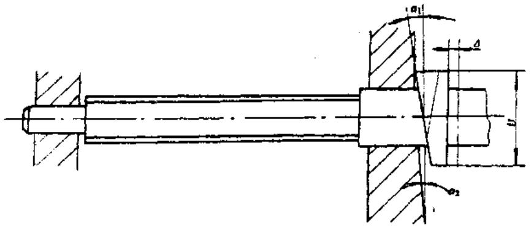

图4-11采用滑动支承的结构误差

滑动支承的螺杆所引起的径向晃动取决于轴颈与轴承孔的配合间隙,与轴颈和轴承孔的配合种类及配合精度有关。

# 2.导轨运动偏斜误差

当螺杆轴线与导轨移动方向不平行,以及导轨的直线度误差和导轨副的侧向间隙等因素,将使导轨副的运动件在侧向间隙△s范围内产生偏转,并引起导轨副运动件运动方向的

偏斜,如图4-12所示,设运动件和螺母沿螺杆轴线方向的位移量为 $\wr$ ,滑块沿导轨方向的位移量为 $\pmb { \zeta }$ ,则偏斜误差为

$$
\begin{array} { c } { { \Delta l , = l ^ { \prime } - l = i ( \cos \Delta y - 1 ) } } \\ { { { } } } \\ { { \approx - { \frac { 1 } { 2 } } \ell ( \Delta y ) ^ { 2 } } } \end{array}
$$

式中, $\Delta \gamma$ 为螺杆轴线与导轨方向的偏斜角。

从上式可知,偏斜方向对传动误差的影响是二次误差,一般可以忽略不计。但这种误差影响传动中运动的灵活性,偏斜角过大时会造成卡死现象,在设计和装调时应尽量减小其偏斜量以保证传动系统运动的灵活性,

# 四、工作时的变形及其影响

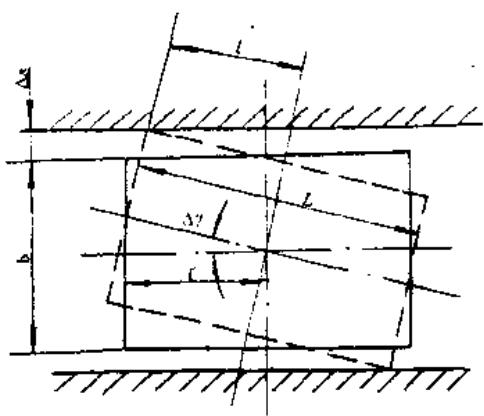

图4-12导向装置误差

精密螺旋传动在运行过程中螺杆的弹性变形和热变形,将产生附加的运行误差,从而影响传动精度,

# 1.螺杆的弹性变形及其影响

(1)螺杆自重引起的变形对于轴向尺寸很长的精密螺杆,需要考虑其自重弯曲变形对传动精度的影响。由自重变形产生的螺母位置误差与螺杆两端的支承形式有关,同时与螺母所在的坐标位置 $\pmb { \ell }$ 有关。对于一端固定,一端铰支的螺旋机构,当螺母在右端时,如图4-13(a)所示,由螺杆自重变形引起的螺母位置误差的计算公式为

$$
\Delta L _ { v } = - \frac { 2 . 3 1 \times 1 0 ^ { - 5 } } { 2 ( E l _ { F } ) ^ { 2 } } m ^ { 2 }
$$

式中, $\pmb { W }$ —螺杆单位长度的自重 $( \mu / m m )$ 

$\pmb { \mathscr { E } }$ ---螺杆材料的弹性模量 $( \mathbb { M P a } )$ :

$_ { l _ { r } }$ ——螺杆危险截面的极惯性矩 $\tan ( 1 )$ 

图4-13螺杆弹性变形及其影响

(2)螺杆在轴向载荷和扭矩作用下引起的变形对于图4-13(b)所示的一端固定、一端铰支的螺旋机构,由轴向载荷 $Q$ 引起的螺距变形为

$$
\Delta P _ { q } = \frac { Q P } { E A } \times 1 0 ^ { 3 } ( \mu m )
$$

式中,A--螺杆危险截面的面积 $\scriptstyle ( \mathtt { m m } ^ { 2 } )$ 

由扭矩 $M _ { i } ^ { \prime }$ 引起的螺距变形为

$$
\Delta P _ { \mu } = { \frac { \Delta \varphi _ { \mu } ! } { 2 \pi } } \mathbf { \mathcal { P } } \times 1 0 ^ { 3 } \qquad ( \mu \mathrm { m } )
$$

式中, $\Delta \varphi _ { M }$ -扭矩使螺杆上每个螺距产生的扭角变形,

$$
\Delta \varphi _ { \kappa } = { \frac { M _ { \circ } P } { G I _ { \star } } } \qquad ( { \mathrm { r a d } } )
$$

式中, $\pmb { G }$ --螺杆材料的剪切弹性模量 $( \mathbb { M P a } )$ ,

轴向载荷与扭矩共同作用下螺距的总变形为

$$
\Delta P \simeq \Delta P _ { u } \doteq \Delta P _ { \circ } = \biggl \{ - \frac { M _ { \circ } P } { 2 \pi G l _ { r } } \pm \frac { Q } { E A } \biggr \} P \times 1 0 ^ { 3 }
$$

轴向载荷与螺母位移方向相同取“-"号;反之,取 $\yen 123$ ·

# 2.螺杆的热变形及其影响

当环境温度变化及工作温升产生螺杆热膨胀变形,将引起螺母的位置误差。

(1)环境温度变化 $( i - t _ { 0 } )$ 产生热变形引起的螺母位置误差为

$$
\Delta L _ { i _ { 1 } } = l _ { a } a ( i - l _ { 0 } )
$$

(2)工作温升 $\pmb { \mathscr { u } }$ 产生热变形引起的螺母位置误差为

$$
\Delta L _ { 1 } = l _ { \phi } a \cdot \Delta l
$$

式中, $\pmb { \alpha }$ —螺杆材料的线膨胀系数;

L—一螺杆的螺纹长度。

# 五、提高精密螺旋传动精度和减小空程误差的方法

# 1.保证足够的加工精度

螺杆是精密螺旋传动中保证精度的主要零件,它的精度是螺旋传动的基础,螺杆的精度主要取决于选材、加工机床的精度和合理的工艺性,设计时应根据精度选择合适的材料,高精度的螺杆要选择优质材料,以保证热处理后具有较高的结构稳定性,

必须指出,加工精度越高,对螺旋传动的传动精度越有利:但会造成加工困难,使成本提高。因此保证足够的加工精度必须是经济加工精度,

# 2.采用螺距误差补偿装置

由于螺距误差,尤其是螺杆的螺距误差是引起螺旋传动误差的最主要因素,所以必须对精密螺旋传动所用的螺杆和螺母的螺距误差提出较高的要求,鉴于精度要求很高的螺旋传动,常常受到工艺条件和经济成本等因素的限制,设计时可采用专门的补偿装置,来补偿由于螺距误差和热变形所造成的传动误差。它的工作原理是使螺母在移动过程中产生一附加转角,而所对应的附加位移恰能抵消螺距误差和热变形的影响。如图4-14(a)、(c)所示,连接在螺母2上的摆杆3靠弹簧5与校正尺4构成力的闭合,螺母移动过程中,摆杆随着校正尺上的校正曲线轮廊的起伏而不断摆动,使螺母产生附加转角,图4-14(a)中较正尺上的校正曲线是根据螺杆螺纹全长上实测得的螺距误差为基础,以适当的比例尺绘出的,如图4-14(b)所示,其关系式为

$$
\begin{array} { r } { \delta = \bar { R t g } \bar { y } _ { \mathrm { \scriptsize { i } } } = \bar { R t g } \bigg ( 2 \pi \frac { \Delta P } { P } \bigg ) } \end{array}
$$

式中,—摆杆与校正尺误差校正曲线接触处的摆动量 $\mathbf { \langle m m \rangle }$ 1

$\pmb { \mathscr { R } }$ 摆杆的工作长度 $\left( \mathsf { m m } \right)$ ;

$\pmb { \varphi } _ { \pmb { \tau } }$ —-螺母附加转角,随螺杆不同位置上的螺距误差大小而变化。

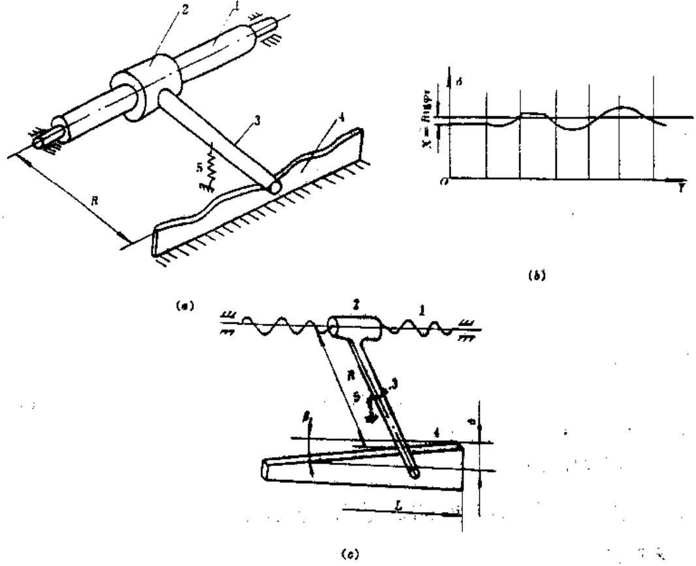

图4-14螺距误差补偿原理

热变形误差补偿装置原理如图4-14(c)所示,其螺距误差补偿装置的校正尺为直线外廓,并与螺杆轴线成一定角度 $\pmb { \beta }$ 其值为

$$
\beta = \mathrm { t g } ^ { - 1 } \frac { \delta } { L } = \mathrm { t g } ^ { - 1 } \frac { R \mathrm { t g } \big ( \sum _ { i } \varphi _ { r } \big ) } { L }
$$

$$
\sum \varphi _ { r } = 2 \pi { \frac { \Delta P _ { r } } { P } }
$$

式中, $\sum \varphi$ —螺母移动全长 $\pmb { \cal L }$ 所需的附加转角;

$\Delta P _ { z }$ —螺杆螺纹长度 $\ell _ { \simeq }$ 范围内由热变形引起的螺距误差累计值, $\Delta P _ { E } = \ell _ { u } \alpha \cdot \Delta \ell$ .其中, $\pmb { \alpha }$ 为螺杆材料的线膨胀系数, $\mathcal { A }$ 为温升.

# $\hat { \bf { s } } .$ 减小或消除螺杆的轴向窜动

(1)选择合适的支承方式对滑动轴承支承结构,适当地提高轴承止推面对轴承孔轴线的垂直度和螺杆轴肩对螺杆轴线的垂直度,可以减小轴向窜动,但不能彻底消除:而对滚动轴承则可以采取调整措施消除轴向窜动。

(2)取消螺杆的止推轴承当行程较短时,如使螺旋副本身起着支承作用,则从根本上消除了支承结构的轴向窜动,如图4-15所示,这种结构简单,但螺杆易产生轴向倾斜。

(3)使推力轴承的接触点位于轴线上由前面公式可知,轴向跳动误差 $\pmb { \mathscr { s } } = \pmb { \mathscr { n } } \pmb { \mathscr { s } } \pmb { \mathscr { a } } _ { \mathbf { a } \mathbf { s } }$ ,要使 $\pmb { \mathscr { s } } = \emptyset$ ,则需使 $\pmb { \hat { \mathcal { D } } } = \pmb { \hat { \mathcal { 0 } } }$ 或 $\scriptstyle { \pmb { a } } = 0$ ,若使 ${ \pmb a } = 0$ ,则须提高零件的加工精度:要使 $\scriptstyle { \bar { D } } = 0$ ,则必须改变结构,若将螺杆轴端做成球面,或是在端部镶上钢球·使球面与止推面的接触点位于螺杆轴线上,则 $\scriptstyle D \approx 0$ ,从而消除了由于轴颈端面和轴承端面不垂直于轴线引起的轴向跳动误差,如图4-16所示.

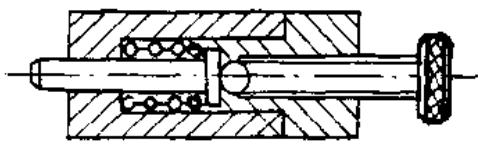

图4-15无止推轴承的螺杆支承

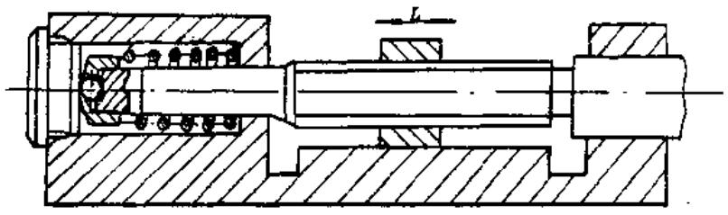

图4-16用点接触消除轴向窜动

# 4.改进螺母与导轨运动件的连接结构

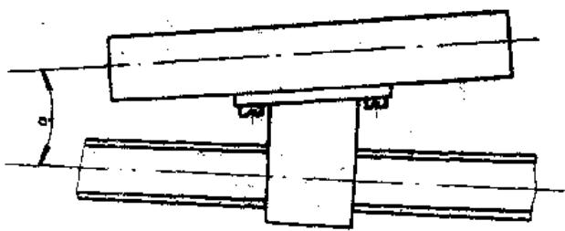

图4-17刚性推动架

螺托的轴线与移动件的运动方向不平行时,不但会降低精度,而且影响传动的灵活性,除装配调整予以保证外,还可以从结构上采取措施保证传动精度。螺母与移动件连接部分的结构,通常称为推动架。推动架是精密螺旋传动中保证精度和运动灵活性的关键部件,常用的推动架有刚性推动架、挠性推动架和浮动推动架。

(1)刚性推动架如图4-17所示,该结构简单,连接牢靠;但当螺杆轴线与移动滑板运动方向不平行时,螺纹工作表面压力增大,磨损加剧,严重时会发生卡死现象,该结构不适用于精度高且运动灵活的螺旋传动。 +

(2)挠性推动架如图4-18所示为螺母与滑板用片弹簧2连接的结构,为了消除滑板与螺母两者的间隙,片簧以一定的预紧力压向螺母。当滑板运动方向与螺杆的轴线方向不平行时,可通过片簧2的挠曲变形予以上、下调整,或通过片簧上的长圖孔和端部固定在螺母上的锥形销1产生相对运动进行前、后调整,这种推动架结构简单,适用于受力较小的中等精度的精密螺旋传动,

(3)浮动推动架图 $4 - 1 9 ( a )$ 是球形浮动推动架,连接件1用螺钉3与螺母4紧固连接,件1上端是球形头,装入件2的长方形槽内,件2与滑板相连接,球与槽滑动配合且是点接触,当移动件运动方向与螺杆轴线不平行时,件1、2之间允许上下、左右滑动和转动,以保证运动灵活。因是间隙配合,它不能完全消除轴向间隙,故适用于中等精度的传动:图4-19(b)是柱形浮动推动架,它是球形浮动推动架的改进设计,将图 $4 - 1 9 ( a )$ 中的球头改成圈柱体

10,在圆柱体10的两侧与圆柱体相垂直的方向放置两个滚针.3,两滚针夹住圆柱体形成点接触,保留了图 $\pmb { 4 } \mathrm { - } 1 \pmb { 9 } \{ \pmb { \mathfrak { a } } \}$ 结构中的优点。为了克服问隙不可调整的缺点,用两个 ${ \pmb \gamma }$ 形槽2将两个滚针托起,其中一个V形槽与框架4的一端紧靠,另一个V形槽可通过框架上另一端上的两个螺钉5进行调整;既可以调整到无轴向间隙,又可以使圆柱体上下、左右滑动及转动,保证运动灵活。实践证明,这种结构是较为理想的结构,适用于高精度的精密螺旋传动,

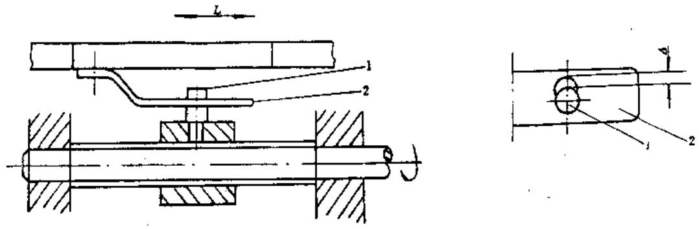

图4-18挠性推动架

图4-19浮动推动架

# 5.消除或减小螺纹副的间隙

(1)径向调整间隙用不同的结构使螺母产生径向收缩,以减小螺纹接合处的间隙,从而减小空程误差。如图4-20所示,其中 $\langle { \pmb { \alpha } } \rangle$ 是采用开槽螺母,拧动螺钉可以调节螺纹间隙;(b)是对开螺母,调节原理同 $( a ) _ { \smash { \mathrm { : } } } ( c )$ 是锥形开糟螺母,通过螺母2使螺母1产生径向收缩,消除间隙;(d)调节原理同 $( \pmb { c } )$ ,只是用螺旋弹簧代替了螺母2,靠弹簧力推动套筒,迫使螺母产生径向收缩,消除间隙。

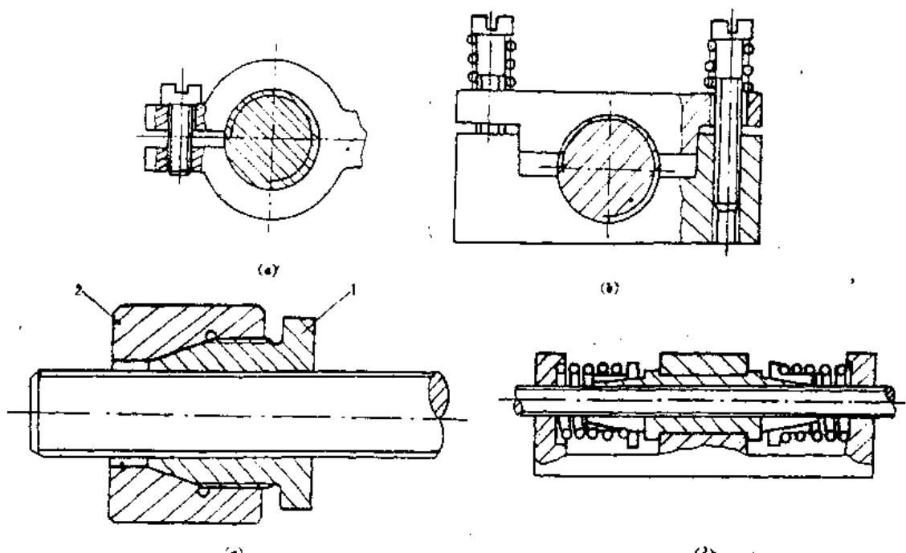

图4-20径向调整间踪的结构

(2)轴向调整间隙一般将螺母分成主螺母 $\pmb { A }$ 与副螺母 $\pmb { \cal B }$ 两部分,用螺纹连接起来,连接螺纹的螺距 $\pmb { \gamma _ { \imath } }$ 不等于传动螺纹的螺距 $\pmb { P _ { \pmb { \imath } } }$ 如图 $4 - 2 1 ( a )$ 所示,调整时,拧动到螺母B,鲍主螺母与副螺母产生相对运动而改变了轴向位置和轴向间隙,在调整的过程中,应达到使螺杆螺纹表面的左右侧,分别与主螺母和副螺母的螺纹表面接触,然后将两部分固紫,见图4-21.

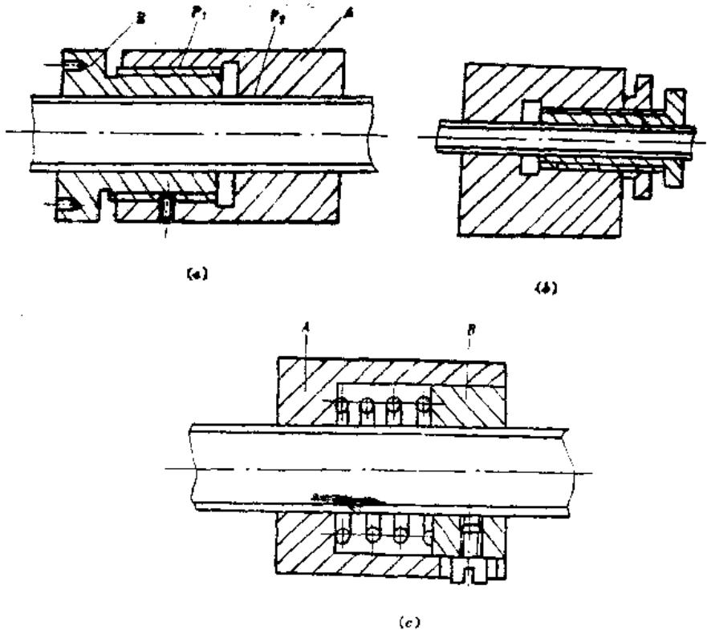

图4-21轴向调整间隙的结构

向左运动时,螺杆螺纹工作表面的左侧推动螺母;反向时其右侧推动螺母,这样可以消除轴向间隙。

图 ${ \pmb 4 } \cdot { \pmb 2 } { \pmb 1 } \left( { \pmb a } \right)$ 为用紧定螺钉锁紧、防松;(b)为用锁紧螺母锁紧、防松;(c)为用弹簧力使主螺母与副螺母轴向分离。螺钉用来防止主、副螺母相对转动.

(3)塑料弹性螺母采用聚乙烯或聚酰胺(尼龙制成螺母,安装时,端部再用金属螺纹压圈压紧,利用塑料螺母的弹性,在轴向和径向同时减小间隙,有的塑料螺母,当温度升高时,由于膨胀变形较大,可以完全消除间隙,如图4-22所示,这种螺母结构简单,耐磨性好,且不需润滑。

图4-22塑料弹性螺母消隙结构

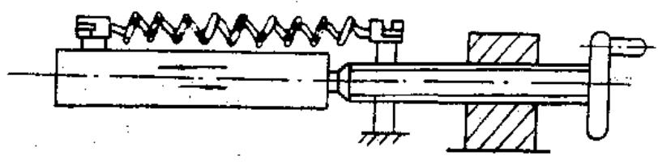

图4-23单向力濟餘闻隙的影响

(4)用单向力消除间隙影响如图4-23所示,运用弹簧产生单向恢复力,使螺纹的工作表面保持单面接触,从而消除间隙对空程误差的影响,这种方法除可消除螺旋副中间隙对空程误差的影响外,还可消除支承处轴向间隙和螺旋副与滑块连接处的间隙产生的空程误差.

# $\ S$ 4.4滚珠螺旋传动简介

滚珠螺旋传动是在螺杆和螺母之间放入适当数量的滚珠,使螺杆和螺母之间的摩撩由滑动摩擦变为滚动摩擦的一种传动装置。其结构如图4-24所示,它由螺杆1、螺母2、滚珠 $\mathfrak { s }$ 及滚珠循环返回装置4四个部分组成,当螺杆转动螺母移动时,滚珠则沿螺杆螺旋滚道面滚动,在螺杆上滚动数圈后,滚珠从滚道的一端滚出并沿返回装置返回另一端,重新进入滚道,从而构成一闭合回路,

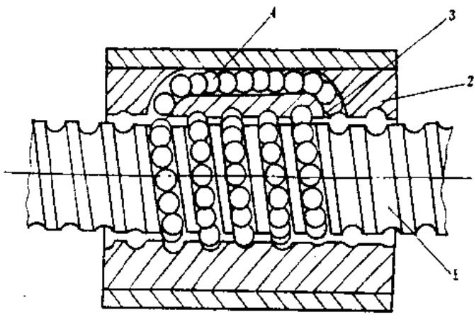

图4-24滚珠螺旋传动结构

# 一、滚珠螺旋传动的特点及应用

滚珠螺旋传动除具有一般螺旋传动的特点之外,还具有以下特点:

(1)传动效率高,由于滚动摩擦系数小,摩擦损失小,故传动效率可达 $0 . 9 0 { \sim } 0 . 9 5$ ,且逆传动效率接近于正传动效率;

(2)工作寿命长,主要零件表面均经过表面硬化处理,故耐磨损,且维护简单;

(3)传动精度高,可通过轴向预紧,提高传动刚度,能做到无间隙传动,且运动灵敏度高,摩擦力矩不受速度变化的影响,传动灵活、平稳;

(4)不能自锁。传动具有可逆性,当用于垂直传动时,需增加防止逆转装置;

(5)结构比较复杂、工艺性差、体积大、成本高。

浓玖螺旋传动作为一种精密传动装置,适用于传动精度和灵活性要求高的场合,已广泛应用于以救控机床为代表的各种机电一体化设备、精密机械与电子设备中,它能将可控伺服电机的旋转运动变换成机床工作台、刀具或其它部件的直线进给运动,图4-25是滚珠螺旋传动在数控机床进给系统的应用。图 $4 - 2 5 ( a )$ 是开环数控机床进给系统的示意图,它由数控装置、电液脉冲马达、齿轮减速装置和滚珠螺旋等组成。数控装置中的光电输入机根据穿孔纸带的指令信号,进行一系列的运算和功率放大,把指令信号转换成一系列的脉冲序列,再由这些脉冲信号驱动电液脉冲马达,经齿轮减速装置减速后,直接驱动滚珠螺旋的螺杆转动,并将旋转运动变换成螺母(即工作台)的移动,直到指令信号指定的位置才停止运动,这种系统工作台到达规定位置的精度,与齿轮传动、滚珠螺旋传动装置的精度、间隙、刚度等密切相关.

图4-25(b)所示则为在闭环数控系统应用的例子。它的特点是,通过位移检测仪自动地检查工作台移动的位置,并将测量结果与数控装置中发出的指令信号进行比较,根据两者之差,再控制工作台的移动方向和大小。当工作台现时位置尚未到达指定位置时,两信号比较结果,若误差信号为正值,使电液脉冲马达继续转动,直到工作台到达指定位置,即误差信号为零时才停止。相反,若工作台现时位置已超过指定位置,则误差信号为负值,驱动电液脉冲马达反转,直到工作台退到指定位置,误差信号为零时为止.在这种控制系统中,工作台的定位精度不是取决于滚珠螺旋的精度,因此系统对滚珠螺旋传动装置的精度、间隙和刚度的要求易满足,主要是要求传动的灵活性好,保证控制系统的动态响应性,但是,传动装置的间隙、刚度等因素将直接影响系统工作的稳定性,也必须引起注意;否则会使系统振荡,使工作台始终不能在指定位置稳定下来。

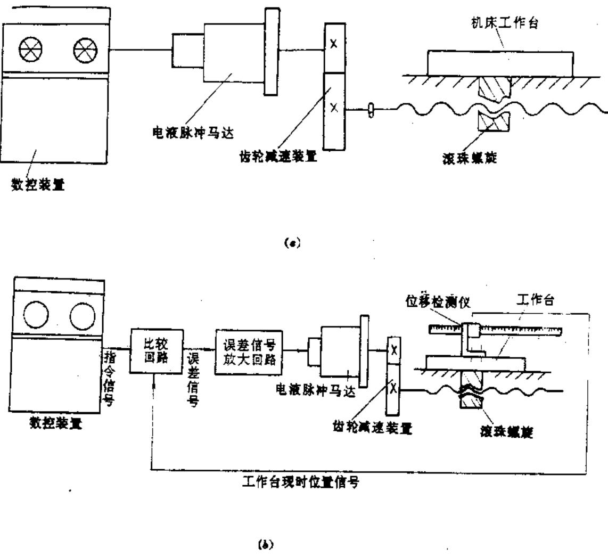

图4-25滚珠螺旋传动的应用

# 二、滚珠螺旋传动副的选择和使用注意事项

(1)由于滚珠螺旋已标准化、系列化,生产工艺比较复杂,并由专业工厂生产,故对使用者主要是选用问题,有关的设计计算不再赘述,如需要设计和计算可参照有关设计手册。

(2)滚珠螺旋副的工作状态类似于滚动轴承,故在高转速下工作时,其主要失效形式是滚道或滚珠表面疲劳点蚀,应按照额定动载荷和寿命选择其尺寸,并校核其载荷是否超过额定静载荷;在低转速下工作时,主要失效形式是滚珠或滚道表面产生过大的塑性变形,应按寿命和额定静载荷两种方法确定尺寸,并选其中较大的;静止状态时,则需要按滚动轴承的静载荷选择其尺寸。

(3)由于滚珠螺旋传动副的螺旋角大于2°,其值远远大于自锁条件,故不能自锁,为防止滚珠螺旋传动不自锁而可能产生的逆转动,可采用单向联轴器或反向制动装置,

(4)为提高效率、减少磨损,滚珠螺旋工作时必须进行润滑,高速时宜用稀油润滑,端部必须采用密封装置,

# 习 题

4-1滑动螺旋传动与滚珠螺传动在结构上有何异同?试比较二者的特点?

4-2精密螺旋传动精度的含义是什么?影响因素有郎些?其中哪些因素影响传动的灵活性?提高精密螺旋传动精度的方法有哪些?

4-3试分析螺母的螺距误差是否影响螺旋传动的传动误差?

${ \ll } \mathbf { - } \mathbf { 4 }$ 图4-11中,螺杆轴肩的端面与螺杆轴线的夹角为 $8 8 ^ { \circ }$ ,轴承的止推面与螺杆的轴线夹角为91,已知螺杆轴肩的直径为 $\bar { \pmb { \mathscr { v } } } = 1 \bar { \mathsf { 0 m m } }$ ,试计算螺杆轴向窜动误差 $\pmb { d } = \pmb { \gamma }$ 

4-5某差动螺旋传动,要求微动手轮转动一周,推动运动件前进 $0 . 2 5 m m$ ,试设计该螺旋传动机构(西出工作示意图、确定螺旋直径 $\pmb { \lambda }$ 和螺距 $\pmb { p }$ 标明旋向)。

# 第五章 摩擦轮传动

# $\ S 5 . 1$ 概 述

# 一、摩擦轮传动的工作原理

摩擦轮传动是利用主动轮与从动轮在直接接触处所产生的摩擦力来传递运动和动力的。

图5-1所示为最典型的两摩擦轮传动的情况,依靠压紧力 $\pmb { Q }$ ,两轮在接触点$\pmb { A }$ 处产生一相应的摩擦力,根据摩攘定律,最大摩擦力 $\pmb { P } _ { \pmb { \mathscr { f } } }$ 及其相应的驱动从动轮转动的力矩 $M _ { i }$ 为

$$
\gamma _ { f } = f Q
$$

$$
M _ { 1 } = P _ { 1 } \cdot R _ { 2 }
$$

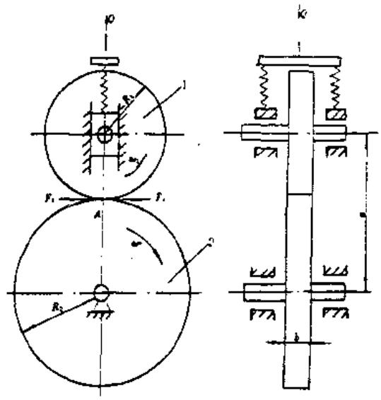

图5-1摩擦轮传动的原理图

式中 $\pmb { f }$ —两轮之间的摩擦系数;

$\pmb { Q }$ - 两轮之间的压紧力;

$\pmb { R _ { 2 } }$ 从动轮2的半径.

为使摩擦轮正常地传动,摩擦力 $\overrightarrow { F } _ { f }$ 必须不小于作用在从动轮上的圆周阻力 ${ \pmb { F } } _ { \pmb { \mathscr { \prime } } }$ ,即

或

$$
\begin{array} { l } { { \bar { F } _ { i } \geqslant \bar { P } _ { i } } } \\ { { \bar { f } \bar { Q } \geqslant \bar { P } _ { i } } } \end{array}
$$

显然,在不产生相对滑动的理想条件下,两轮在接触点 $\pmb { A }$ 处的线速度 ${ \pmb v }$ 应该相等,即

$$
{ \pmb v } _ { { \pmb v } _ { { \pmb v } } } = { \pmb v } _ { { \pmb v } } = { \pmb v }
$$

式中, ${ \pmb v } _ { \pmb q }$ —轮1在接触点 $\pmb { A }$ 的线速度, $v _ { 1 } = R _ { 1 } \omega _ { 1 }$ ;

${ \mathfrak { v } } _ { \mathfrak { z } }$ —轮2在接触点 $\pmb { A }$ 的线速度, $v _ { 2 } = R _ { 2 } \omega _ { 2 }$ ·

因此,摩擦轮传动的理论传动比 $i _ { 1 7 }$ 为

$$
i _ { 1 3 } = \frac { \omega _ { 1 } } { \omega _ { 2 } } = \frac { R _ { 2 } } { R _ { 1 } }
$$

式中, $\textcircled { 4 } _ { 1 } , \textcircled { 4 } _ { 2 }$ 为轮1、轮2的角速度。

# 二、摩擦轮传动中的滑动

摩擦轮传动在工作时,要保证完全做到理想状态是困难的。在实际传动中,两轮接触处会产生滑动。可能出现的滑动有:弹性滑动、打滑和几何滑动。

# 1.弹性滑动

如图5-2所示,当两轮传动时,由于接触区内摩擦力的作用,使主动轮1的表层在进入接触区时受到压缩,而在离开接触区时受到拉伸;相反,从动轮2的表层在进入接触区时受到拉伸,而在离开接触区时受到压缩,因而两摩擦轮的表层都要产生切向弹性变形,因此所引起的相对滑动,叫做弹性滑动。由于弹性滑动的影响,使从动轮的圆周

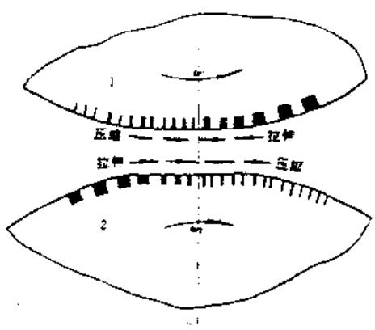

图5-2摩擦轮传动中的弹性滑动

速度 ${ \pmb v } _ { \pmb q }$ 低于主动轮的圆周速度 ${ \pmb v } _ { \pmb { \imath } }$ ,二者之差称为弹性滑动速度,它与主动轮圆周速度之比称为摩擦轮传动的弹性滑动率(即速度损失率),以 $\pmb { \ell }$ 表示 $e { = } \frac { \langle v _ { 1 } { - } v _ { 2 } \rangle } { v _ { 1 } } { \times } 1 0 0 \%$ 当两摩擦轮的材料是钢对钢时, $\varepsilon = 0 . 2 \%$ 钢对夹布胶木时, $\therefore \angle 2$ ;钢对橡胶时, $z = 3 \%$ 

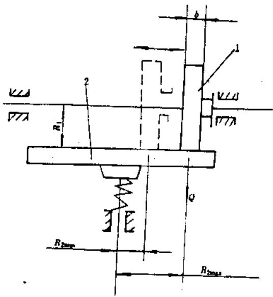

图5-3圈柱滚轮—圆盘端面变传动比摩掠轮传动

考虑到弹性滑动后,摩擦轮传动的实际传动比为:

$$
i _ { 1 2 } = \frac { \omega _ { 1 } } { \omega _ { 2 } } = \frac { v _ { 1 } / R _ { 1 } } { v _ { 2 } / R _ { 1 } } = \frac { R _ { 2 } } { \tilde { R } _ { 1 } ( \mathrm { 1 } - \varepsilon ) } ^ { * }
$$

由式(5-4)和(5-5)知, $\check { z } _ { i } \mathbf { , > } i _ { \mu }$ ,即由于弹性滑动的影响,摩擦轮传动的实际传动比大于理论传动比。

# 2.打滑

弹性滑动虽对传动性能有影响,但传动仍能正常工作,此时在接触处所产生的全部微摩擦力的总和 ${ \pmb { F } } _ { { \pmb { f } } }$ 等于作用在从动轮上的圆周阻力 ${ \pmb R } _ { \pmb { \imath } }$ ,即 $\scriptstyle F _ { f } = Q \ \cdot \ f = F _ { \ell }$ 然面当圆周阻力 $\pmb { F _ { \bot } }$ 增大并超过最大摩擦力 $\mathbf { \mathcal { F } _ { f } }$ ,即 $\pmb { \cal J } _ { 1 } > \pmb { \cal F } _ { f }$ 时,则主动轮就带不动从动轮,产生空转现象,即在整个接触区上产生相对滑动,这种现象称为打滑,有打滑趋势时的载荷,即为传动的极限载荷,打滑会加剧轮面磨损,降低工作寿命,正常工作时必须设法避免。实际上,设备启动或变速的短暂时间内,由于惯性力的影响,打滑是很难完全避免的.

3.几何滑动

对于图5-3所示的圆柱滚轮一圆盘端面变传动比摩擦轮传动,两轮的接触线为一直线。工作时,滚轮在接触线上各点的圆周速度均相等:但在圆盘上,接触线上各点的圆周速度均不相等,其大小与各点至圆盘中心的距离成正比;在圆盘中心速度为零,在盘边缘上为最大值.

根据摩擦轮传动原理,在不产生打滑的条件下,滚轮与圆盘的运动关系只能由一点来决定,这一点叫做节点,所以滚轮与圆盘在接触线上的线速度,只能在节点处是相等的;而在接触线上除节点以外的各点线速度是不相等的,因而在这些点上,滚轮与圆盘之间将不可避免地产生相对滑动,这种滑动是由于传动的结构特点而引起的,故称为几何滑动。

# 三、摩擦轮传动的类型、特点及应用

摩擦轮传动按照传动比变化的情况,可分为定传动比摩攘轮传动(传动比基本固定)和变传动比摩攘轮传动两类,

与其它传动形式比较,摩攘轮传动的主要优点最:

(1)由于摩攘轮表面为光清圆柱面,故传动平穗,工作时无噪音或噪音很小,如果在轮面上再覆上一层橡胶则传动更平稳,这对大多数精密机械与仅器来说极为重要;

(2)结构簡单,制造使用均比较方便;

(3)传动形式可以多种多样,故适用范围较广泛;

(4)超载时可自动打滑,故可防止重要零件受损坏:

(5)采取相应措施后,传动比在不停机的情况下可实现平稳或无级地改变,因此几手所有机械式的无級变速器都是以摩攘传动为基础的。

摩攘轮传动的缺点及其特殊要求是;

(1)需要增加压紧装置(如弹簧等)以产生所需要的压紧力;

(2)由子压紧力一般比较大,故摩擦轮在接触点处将产生弹性变形,使实际传动比不能保持理论值,从而影响传动精度,故在设计时应该采取相应措施,减小压紧力;

(3)传动效率较低,工作表面易被磨损,且易发热,不宜传递大的力矩,故摩擦轮传动主要使用在传动要求平稳、低速、轻载等场合。

由于摩擦轮传动具有以上许多优点,现已广泛应用于精密机械仪器和电子设备之中。

图1-2所示是摩擦轮传动在录音机走带机构中的应用实例,图中主导轴6和压带轮7组成一对摩攘轮传动。

图5-4所示是数控设备中光电输入机的穿孔带走带机构。穿孔带是一种程序储存介质,常用的标准穿孔带,有五单元和八单元两种,所谓五单元标准纸带,就是纸带上具有五排程序孔(或叫做信号孔)和一排同步孔(中导孔);八单元标准纸带,就是具有八排程序孔和一排同步孔,程序孔按生产过程程序单及规定的代码打成。同步孔或中导孔的作用是确保正确无误地读取指令信号或是用作纸带传动的同步和定位,光电输入机的工作原理是:灯泡3的光线通过半圆柱透镜2聚焦成一条窄的光带,通过穿孔带4上的孔照射到对应的光电二极管7上(八单元纸带设有九个光电二极管,五单元纸带设有六个光电二极管).当光线遇上带孔时,对应的光电二极管便感受光照;遇到无孔时则不感受光照。根据光电二极管感受光照与否来发出信号脉冲和同步脉冲,以实现程序控制。

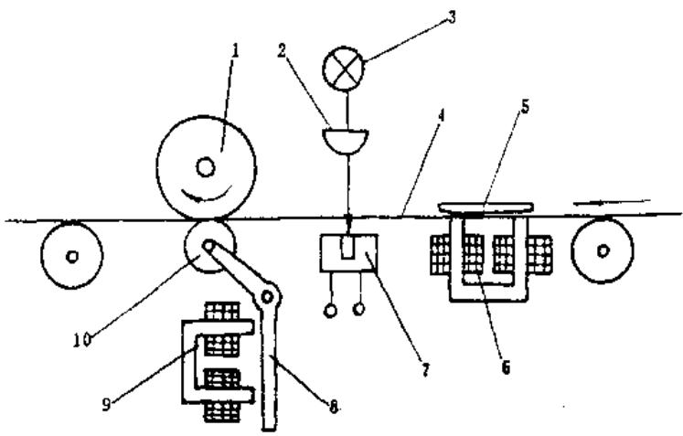

图5-4摩擦轮传动在光电输入机中的应用实例

穿孔带的启动和停止,由光电输入机控制电路控制电磁铁9和6的动作来完成.当输入读数时,启动信号电流接通电磁铁9的线圈,将衔铁8吸合,压紧轮10将穿孔带压向主动轮1,于是穿孔带在主动轮的带动下移动(这时电磁铁6不动作,衔钦5松开),在这里,主动轮1和压带轮10为一对摩擦轮,组成输带部件,当输入完毕,停机信号使电磁铁9的线圈断电,衔铁8松开,压紧轮与主动轮分离开。与此同时,控制电流接通电磁铁 $\pmb { \ 6 }$ 的线围,将衔铁5吸合,于是穿孔带被压紧,停止前进。

# 5.2摩擦轮的材料、失效形式和计算准则

# 一、摩擦轮的材料

摩擦轮材料应具有大的弹性模量和摩擦系数、接触强度高、耐磨性好和对潮湿、温度敏感性小等性能.在高速、高效率和要求尺寸紧凑的传动中,常采用淬火钢对淬火钢,或淬火钢对表面硬化铸铁相配的轮面材料。采用这种材料时,为使接触良好和减小磨损,要求摩擦轮有较高的制造精度和较细小的表面粗糙度。钢与夹布胶木或塑料的组合具有较大的摩擦系数和中等的强度,通常在干燥状态下工作。钢与皮革、橡胶或木材的组合,虽摩擦系数较高,但强度很低,常用于干摩擦下的小功率传动.一般来说,轮面较软的摩擦件最好用作主动轮,以使磨损均匀;否则打滑时将使从动轮面遭受局部磨损,影响传动质量。

表5-1中列出了常用摩擦轮材料的摩擦系数 $\pmb { \mathscr { f } }$ ,许用接触应力 $\sum \sigma _ { s }$ 和许用单位载荷[].

表5-1摩擦副的摩擦系数f、许用接触应力 $[ \pmb { \sigma } _ { \pmb { u } } ]$ 许用单位载荷[z]

<table><tr><td rowspan=1 colspan=1>材料组合和工作条件</td><td rowspan=1 colspan=1>i</td><td rowspan=1 colspan=1>[g](MPa)</td><td rowspan=1 colspan=1></td></tr><tr><td rowspan=1 colspan=1>淬火钢对淬火钢(在油中)</td><td rowspan=1 colspan=1>0.03~0.05</td><td rowspan=1 colspan=1>(25~30)HRC</td><td rowspan=1 colspan=1>1</td></tr><tr><td rowspan=1 colspan=1>钢对钢（干式）</td><td rowspan=1 colspan=1>0.10~0.20</td><td rowspan=1 colspan=1>(1.2~1.5)HB</td><td rowspan=1 colspan=1>1</td></tr><tr><td rowspan=1 colspan=1>铸铁对钢(铸铁）（干式)</td><td rowspan=1 colspan=1>0.10~0.15</td><td rowspan=1 colspan=1>150</td><td rowspan=1 colspan=1>一</td></tr><tr><td rowspan=1 colspan=1>钢(铸铁)对布质酚醛层压板(干式)</td><td rowspan=1 colspan=1>0.20~0.25</td><td rowspan=1 colspan=1>19. 0~ 98.1</td><td rowspan=1 colspan=1>39.2~78.5</td></tr><tr><td rowspan=1 colspan=1>铁对纤维制品（干式）</td><td rowspan=1 colspan=1>0.15~0.20</td><td rowspan=1 colspan=1>二</td><td rowspan=1 colspan=1>25~45</td></tr><tr><td rowspan=1 colspan=1>铸铁对皮革(干式)</td><td rowspan=1 colspan=1>0. 25~0.35</td><td rowspan=1 colspan=1>12~15</td><td rowspan=1 colspan=1>30~35</td></tr><tr><td rowspan=1 colspan=1>钢（铸铁）对木料（干式）</td><td rowspan=1 colspan=1>0.40~0.50</td><td rowspan=1 colspan=1>二</td><td rowspan=1 colspan=1>5~15</td></tr><tr><td rowspan=1 colspan=1>铸铁对特殊橡胶(干式）</td><td rowspan=1 colspan=1>0.50~0.70</td><td rowspan=1 colspan=1>二</td><td rowspan=1 colspan=1>2.5~5</td></tr><tr><td rowspan=1 colspan=1>钢（铸铁)对石棉基材料（干式）</td><td rowspan=1 colspan=1>0.30~0.40</td><td rowspan=1 colspan=1>二</td><td rowspan=1 colspan=1>二</td></tr><tr><td rowspan=1 colspan=1>钢对纸(在传送纸带机构中(干式)</td><td rowspan=1 colspan=1>0.20</td><td rowspan=1 colspan=1>二</td><td rowspan=1 colspan=1></td></tr><tr><td rowspan=1 colspan=1>橡胶、槽纹黄铜对纸</td><td rowspan=1 colspan=1>0.40</td><td rowspan=1 colspan=1>1</td><td rowspan=1 colspan=1>一</td></tr></table>

# 二、摩擦轮传动的失效形式和计算准则

摩擦轮传动能否正常工作,取决于两摩擦轮间的压紧力、两轮的材料、表面状态和尺寸等,电子设备和仪器中,摩擦轮传动在正常工作时,除去打滑失效之外,在干摩攘条件下,特别是当传动中有一轮为非金属材料时,经常会出现因磨损过快而失效的情况。因此,在摩擦轮传动设计时,为了防止打滑和磨损过快必须进行压紧力的计算,并进行表面磨损条件性计算.

(1)压紧力计算和产生压紧力的方法为使摩擦轮传动正常工作,两摩擦件之间须有足够的压紧力才能保证可靠地传动而不打滑,压紧力要根据摩擦副传递力矩或切向圆周力来计算.

现以图5-1为例,假定驱动从动轮所需的力矩为 $M _ { \natural }$ ,为传动可靠,引入安全系数,于是有: $k M _ { t _ { 2 } } { = } f Q _ { \mathbf { a } } D _ { \mathbf { 2 } } / 2 \mathcal { ( } Q _ { \mathbf { 2 } }$ 为法向压力,对于圆柱摩擦轮,法向压力 $\ Q _ { \bullet }$ 等于压紧力 $\pmb { Q }$ .所以得压紧力为

$$
Q \Leftarrow \frac { k } { f } \cdot \frac { M _ { t _ { 2 } } } { R _ { 1 } } = \frac { k } { f } \cdot \frac { M _ { 4 } } { R _ { 1 } }
$$

若驱动从动轮所需圆周力是 $\pmb { \cal F }$ ,因 $\pmb { M _ { \acute { \acute { \imath } } } } = \pmb { \tilde { \imath } } \pmb { R _ { \acute { \imath } } }$ ,所以有

$$
Q = \frac { k \mathcal { P } } { f }
$$

上述两式中的符号意义是:

$\pmb q$ —压紧力;  
$\pmb { M } _ { \ P }$ —主动轮驱动力矩;  
$\pmb { M _ { \ell _ { \pmb { \chi } } } }$ —从动轮负载力矩;  
$\pmb { \cal F }$ -—从动轮负载圆周力;

k—安全系数一般传动 $\pm { \bf { i } } . 2 \sim 1 . 5$ ,示数传动 $k { = } 2 . 5 { \sim } 3$ :

$R _ { 1 } , R _ { 2 }$ ——主、从动轮半径;

$\pmb { \mathscr { f } }$ ——摩擦系数,见表5-1.

对于其它类型的摩擦轮传动的压紧力计算,首先要按结构进行受力分析,找出摩擦副接触处的法向压力与压紧力之间的关系,然后根据传递的负载力矩或切向力求出所需的压紧力

产生压紧力的方法有:

$\textcircled{1}$ 利用压力弹簧作径向或轴向压紧;$\textcircled{2}$ 当两轮或两轮之一是由皮革、塑料或橡皮等材料制成时,可利用弹性变形来产生预紧力:$\textcircled{3}$ 利用机构本身的重量或附加的重量产生压力;$\textcircled{4}$ 利用偏心调整压紧力,

需要指出的是,在设计摩擦轮传动时,为提高其传动能力,应设法增大摩擦系数,尽量不采用加大压紧力的方法,这样可避免或减轻摩擦轮和轴承的磨损,增大摩擦系数的方法有:采用摩擦系数大的非金属材料作摩擦轮面;做成粗糙的接触面(如滚花);利用 $\pmb { \nu }$ 形槽的樱作用原理;将一轮做成两弹性薄片夹紧另一轮等。

# (2)表面磨损条件性计算

在于摩擦条件下,特别是两轮之一是用非金属材料制造或作覆面层时,为了防止磨损过快,目前是根据单位接触长度的许用载荷进行表面磨损条件性计算的,设[g]为单位接触长度的许用载荷(见表5-1),则摩擦轮所需的接触宽度为

$$
b = \frac { Q } { [ q ] }
$$

根据式(5-6)、(5-8)及 $a = R _ { 1 } \left( i _ { 1 2 } + 1 \right) , b = \psi _ { a } \cdot a ,$ 即可得到计算圆柱形摩擦轮传动中心距的表面磨损条件性设计公式,即

$$
a = \sqrt { \frac { k } { f } } \cdot \frac { M _ { \frac { 1 } { 2 } } } { \frac { k _ { 0 } } { k _ { 0 } } } \cdot \frac { ( i _ { 1 2 } + 1 ) } { [ q ] }
$$

式中,轮宽系数, $x _ { 0 } = 6 / 0$ 通常取 $v _ { 0 } = 0 . 2 \sim 0 . 4$ 

理论传动比, ${ \bf { i } } _ { \mathrm { { \pm } } } = { \pm } _ { \mathrm { { \pm } } } / { \mp } _ { \mathrm { { \pm } } } ,$ 

这里应该说明的是,对于仪器仪表、电子设备中的摩擦调节机构、小功率摩擦轮传动,因其传递力矩较小,设计时可根据结构条件计算摩擦轮传动的中心距及主要尺寸,计算时只考虑压紧力,以保证传动中不出现打滑,而不需要按强度计算或仅按照强度条件校核。

# $\ S 5 . 3$ 定传动比摩擦轮传动

# 一、定传动比摩擦轮传动的类型

图5-5所示为常用的定传动比摩擦轮传动,按其传递运动的形式可分为

(1)将主动轮的回转运动转变为从动轮的回转运动,如图5-5(a)、(b)所示,其中图5-5(a)为两轴线平行,叫做圆柱形摩擦轮传动;图5-5(b)为两轴线相交成 $\mathfrak { s o } ^ { \bullet }$ ,叫做圆锥形摩擦轮传动,这两种型式应用较多。

2)将回转运动转变为直线运动或者相反,如图 ${ \mathfrak { s } } { - } 5 ( c ) , ( d )$ 所示,这种传动型式常应用于自动记录仪和某些精密X一Y工作台的驱动机构中。

(3)将主动轮的回转运动转变为从动轮的螺旋运动,如图5-5(e)所示。这种型式的传动常应用于各种绕线机等传动机构中,

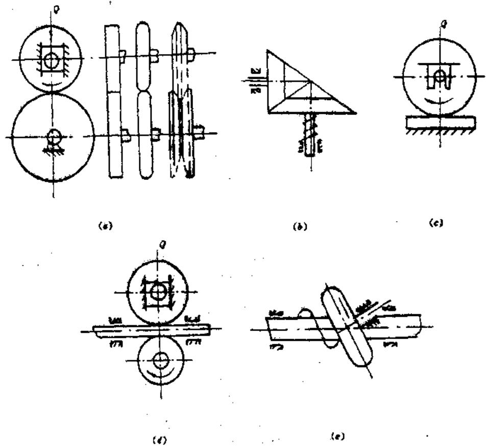

图5-5定传动比摩痱轮传动

# 二、园柱形摩维轮传动的设计拳例

图5-1所示为最典型的定传动比圆柱形摩擦轮传动,设计这类定传动比摩擦轮传动时,一般已知的原始数据是:传动的用途、工作条件、传递的功率、主动轴的转速、从动轮的转速或传动比、大致的空间尺寸范围等。要求设计的内容主要是:根据已知条件确定摩擦轮传动的中心距a,确定摩擦轮直径D和D,以及摩擦轮的宽度b,计算所需的压紧力Q和作用在轴上的载荷 ${ \pmb { F } } _ { \pmb { \imath } }$ ,设计全部结构,设计结构时还应对产生压紧力的弹簧、轴和轴承等进行计算.

设计计算应该遵循的准则主要是:保证传动不打滑,具有一定的传动精度,而且传动的耐磨性要好,以保证一定的使用寿命,

定传动比摩擦轮传动的设计步骤,可用下例说明,

例5-1试设计图5-1所示的圆柱形摩擦轮传动.已知:传递功率 $\begin{array} { r } { \dot { P } _ { 1 } = 0 . \ 0 2 5  { \mathrm { k W } } , \mathtt { s } _ { 1 } } \end{array}$ $= 3 0 0 0 \tau / \mathrm { m i n }$ $\mathfrak { n } _ { 2 } = 5 0 0 \mathfrak { r } / \mathfrak { m i n }$ ,摩擦轮材料为夹布胶木和钢,传动用途为一般。

解 $\textcircled{1}$ 根据限制摩擦轮表面磨损条件初步确定中心距 $a _ { 0 }$ 

按式(5-9)确定中心距 $a _ { 0 }$ :

$$
a _ { \ell } = \sqrt { \frac { k } { f } \cdot \frac { M _ { i } } { \dot { \overline { { \psi _ { a } } } } } \cdot \frac { ( i _ { i 2 } + 1 ) } { [ q ] } }
$$

式中

$$
\begin{array} { r } { i _ { 1 3 } = \frac { n _ { 1 } } { n _ { 2 } } = \frac { 3 0 0 0 } { 5 0 0 } = 6 } \end{array}
$$

$$
M _ { t _ { 1 } } = { \frac { 9 5 5 0 0 0 0 P _ { 1 } } { 8 _ { 1 } } } = { \frac { 9 5 5 0 0 0 0 \times 0 . 0 2 5 } { 3 0 0 0 } } = 7 9 . 6 ( { \mathrm { m N } } \cdot { \mathrm { m } } )
$$

对于一般传动取 $k { = } 1 . 5 , \psi _ { \bullet } { = } 0 . 3$ 查表5-1取 $f = 0 , 2 , [ q ] = 4 0 \mathrm { N / m m }$ 

将上述各数据代入上式,得

$$
a _ { 0 } = \sqrt { \frac { 1 . 5 } { 0 . 2 } \times \frac { 7 9 . 6 } { 0 . 3 } \times \frac { ( 6 + 1 ) } { 4 0 } } = 1 8 . 7 ( \mathrm { m m } ) .
$$

取 $a _ { 1 } = 2 0 0 0$ 

$\textcircled{2}$ 根据初定中心距 ${ \pmb \theta } _ { \pmb { \mathbb { 0 } } }$ ,确定传动的其它尺寸 $\therefore \partial _ { 1 }$ 和 ${ D } _ { 3 }$ 由前述条件知:

$$
b { = } ~ \phi _ { \mathrm { { e } } } ~ { \mathrm { \cdot } } ~ { \mathrm { { s } } } = 0 . 3 \times 2 0 = 6 ( \mathrm { { m m } ) }
$$

$$
D _ { 1 } = 2 R _ { 1 } = \frac { 2 a } { i _ { n } + 1 } = \frac { 2 \times 2 0 } { 6 + 1 } = 5 . 7 ( \mathrm { m m } )
$$

取 $D _ { 1 } = 6 m m$ 

$$
\bar { D } _ { 2 } = i _ { 1 2 } \bar { D } _ { 1 } = 6 \times 6 = 3 6 ( \mathrm { m m } )
$$

$\textcircled{3}$ 计算实际中心距 $\pmb { \alpha }$ 

$$
a = \frac { D _ { 1 } + D _ { 2 } } { 2 } = \frac { 6 + 3 8 } { 2 } = 2 1 ( \mathrm { m m } )
$$

$\textcircled{4}$ 根据不打滑条件确定所需压紧力 $\pmb { Q }$ 

按式(5-6)确定 $\pmb { q }$ :

$$
Q = { \frac { k } { f } } \cdot { \frac { M _ { t _ { 1 } } } { R _ { 1 } } } = { \frac { 1 . 5 } { 0 . 2 } } \times { \frac { 7 9 . 6 } { 3 } } = 1 9 9 ( \mathrm { N } )
$$

$\textcircled{5}$ 作用在轴上的载荷 $\pmb { \cal F } _ { \pmb { \imath } }$ 

由图5-1可知,作用在主动轴和从动轴上的力,均为径向力:将 $\scriptstyle { \pmb { F } } _ { \pmb { f } }$ 和 $\pmb { Q }$ 移到轴上之后,将二力合成可得出:

$$
\begin{array} { l } { { { \displaystyle { \cal F } _ { \ell _ { 1 } } = { \cal F } _ { \ell _ { 1 } } = \sqrt { { \cal F } _ { f } ^ { 2 } + { \cal Q } ^ { 2 } } = \sqrt { ( f Q ) ^ { 2 } + { \cal Q } ^ { 2 } } } } } \\ { { ~ = ~ \sqrt { ( 0 . 2 \times 1 9 9 ) ^ { 2 } + 1 9 9 ^ { 2 } } = 2 0 2 . 9 ( N ) } } \end{array}
$$

$\textcircled{8}$ 其它计算(略)

# 三、圆锥形摩擦轮传动的设计简介

图5-6所示为典型的圆锥形摩擦轮传动的计算简图,轴间夹角可为任意角,但一般传动

都是直角,即

$$
{ \mathfrak { a } } _ { 1 } + { \mathfrak { a } } _ { 3 } = 9 0 ^ { \circ }
$$

这类传动设计的已知条件、设计要求和应该解决的问题,基本上与圆柱形的类同,但也有其特殊之处,现简述如下。

圆锥形摩擦轮传动理论传动比和实际传动比,可按式(5-4)和(5-5)进行计算,其理论传动比为

$$
\begin{array} { r } { i _ { 1 2 } = \frac { \Theta _ { 1 } } { \Theta _ { 2 } } = \frac { R _ { 2 } } { R _ { 1 } } = \frac { D _ { 2 } } { D _ { 2 } } } \end{array}
$$

式中, $\pmb { \delta \imath }$ 和 $D _ { 3 }$ 应按平均直径计算,考虑到 $\pmb { D _ { 2 } }$ $\mathbf { \sigma } = 2 L \mathbb { s i n } \mathbf { o } n$ $\pmb { \mathscr { D } } _ { 1 } = 2 \pmb { \mathbb { L } } \mathbb { s } \mathrm { i n } \pmb { \mathscr { a } } _ { 1 }$ ,故可得出

$$
i _ { i 1 } = \frac { \sin \alpha _ { i } } { \sin \alpha _ { i } } = \mathrm { t g } \alpha _ { i } = \mathrm { c t g } \alpha _ { i }
$$

式中, $a _ { 1 } = a _ { 2 }$ —主动轮和从动轮锥角之半;

$\pmb { L }$ —-圈锥母线长,又称为锥距。

实际传动比为

$$
i _ { 1 1 } = \frac { R _ { 1 } } { R _ { 1 } ( 1 - \varepsilon ) } = \frac { D _ { 2 } } { D _ { 1 } ( 1 - \varepsilon ) } = \frac { i g a _ { 2 } } { 1 - \varepsilon } = \frac { i g a _ { 1 } } { 1 - \varepsilon }
$$

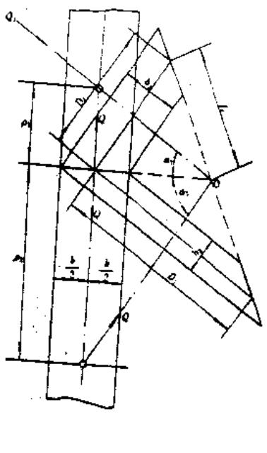

图5-6围锥形摩據轮传动的计算简图

同样可得

$$
i _ { 1 3 } > i _ { 1 2 }
$$

为防止打滑,在接触线上所需的法向压紧力 ${ \pmb q } _ { \ast }$ 可按式(5-6)计算,即

$$
Q _ { a } = { \frac { k } { f } } \cdot { \frac { M _ { i } } { R _ { i } } } = { \frac { k } { f } } \cdot { \frac { M _ { i } } { R _ { i } } }
$$

·但沿轴线所加于主动轮和从动轮的压紧力 $Q _ { 1 }$ 和 $\pmb { Q _ { 2 } }$ 应为

$$
\left\{ \begin{array} { l l } { Q _ { 1 } = Q _ { \mathrm { s } } \mathrm { s i n } a _ { 1 } } \\ { Q _ { 2 } = Q _ { \mathrm { s } } \mathrm { s i n } a _ { 2 } } \end{array} \right.
$$

由于 $a _ { 1 } < \alpha _ { 1 }$ ,故 $\pmb { Q _ { 1 } } < \pmb { Q _ { 2 } }$ ,所以一般应把小轮做成可动的,以使所需压紧力较小,压紧机构紧

# $\ S \ 5 . 4$ 变传动比摩擦轮传动

变传动比摩擦轮传动又称为摩擦无级变速器。所谓无级变速器是指在传动中可以迅速改变速比,在一定速比变化范围内可以容易实现无级变速的传动装置,它可使从动轴获得规定范围内的任意转速,这在设备上具有重要意义。无级变速器可用机械的、电气的(可控硅调速)或液压的(液动机调速)装置来实现。机械无级变速器广泛采用的是摩擦无级变速器,摩擦无级变速器具有结构简单、紧凑、转动惯量小、维修方便、可制成独立部件等优点,变速范围可 $1 0 \sim 4 0$ ,缺点是玉紧力大、寿命短、耐冲击能力差、对滚动体的材质和工艺要求宅等,主要用于中小功率的传动,在电子设备、仪器仪表的解算机构和测速装置中应用较广.

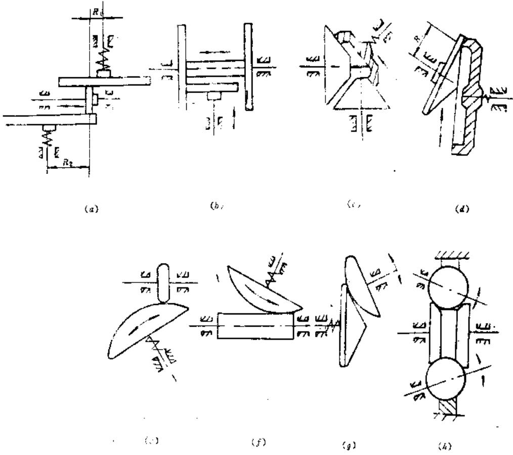

图5-7变传动比摩擦轮传动

图5-35-7所常用的变传动比摩擦轮传动的结构意图,其中,图5-3为盘轮式摩擦:传动电动滚轮1的转速一定,移实滚社,惜以改变圆盘2的工作半,到从动粤盘?的符谢?有改变而变化,源可得级交速;图 $5 - \tilde { \cdot } \tilde { a _ { j } }$ 为盘--滚喝盘武廉擦轮传和,副注动滚轮,则向时改变了圆盘,和圆党2的工作半径 $\displaystyle \ddot { s } _ { \mathrm { i } }$ 和太而盘2的转速随之改变,这洋平行轴间的支该;图 $\{ \dots \nleftarrow \langle \xi \rangle$ 为转问变速器、成动特以一定的力转功动,当定,与宝动轮接 $\tilde { \mathbf { \tilde { \mathbf { \tau } } } } _ { \cdot , \cdot } ^ { \prime }$ ,动轴就以一定的方向回转。当有圆盘与主动轮接舰,从动边则以另一方向回转。若再使主动轮上下移动,借以改变圆盘的工作半径,亦可得到无级变速:图 $5 - i ( c ) \cdots ( b )$ 为其它各种形式的无变速器。

下面以图5-3为例,简述变传动比摩擦轮传动的几个主要间题。由上可知,这种传动的最大和最小理论传动比是

$$
\begin{array} { r } { \Dot { \mathfrak { i } } _ { 1 2 \mathrm { m a x } } = \frac { \omega _ { 1 } } { \omega _ { 2 \mathrm { m i n } } } = \frac { R _ { 2 \mathrm { m a x } } } { \bar { R } _ { 1 } } } \\ { \Dot { \mathfrak { i } } _ { 1 2 \mathrm { m i n } } = \frac { \omega _ { 1 } } { \omega _ { 2 \mathrm { m a x } } } \Dot { \mathbf { z } } _ { 1 } ^ { R _ { 2 \mathrm { m a x } } } } \end{array}
$$

式中, ${ \pmb R } _ { \pmb { \imath } }$ ——滚轮半径;

$R _ { 1 \operatorname* { m a x } } , R _ { 2 \operatorname* { m a x } }$ 圆盘工作半径的最大值和最小值。

在主动轴角速度 ${ \pmb { \omega } } _ { 1 }$ 不变的情况下,从动轴角速度 $\omega _ { 2 }$ 与滚轮位置变化之间的关系为

$$
\omega _ { 1 } = \omega _ { 1 } \frac { R _ { 1 } } { R _ { m 2 } }
$$

式中, $\scriptstyle { \pmb { R } } _ { \mathbf { \mu \infty } }$ 为滚轮轮宽中点至圆盘中心之间的距离。当 $\bar { R } _ { \mathrm { s } } = \bar { R } _ { \mathrm { 2 m s } }$ 时,轮2转速最高 $\downharpoonright$ 当 $\bar { i } _ { \bullet , \pm } ^ { ; }$ $\ r = R _ { 2 \ r a u 1 }$ 时,轮2转速最低:当滚轮从圆盘右侧移到左侧时,轮2反转; $\spadesuit$ 与 $\bar { R } _ { \infty }$ 成反比.

变速器输出轴的最高转速与最低转速之比叫做调速范围,圆盘一滚轮摩撩轮传动的调速范围是

$$
\begin{array} { r } { \beta = \frac { \omega _ { 2 \mathrm { m i n } } } { \omega _ { \mathrm { m a l n } } } = \frac { i _ { 1 \mathrm { m a x } } } { i _ { 1 \mathrm { Z e l a } } } = \frac { R _ { 2 \mathrm { m a x } } } { R _ { 1 \mathrm { m a x } } } } \end{array}
$$

调速范围在设计无级变速器时是一个重要指标,根据此要求即可大致确定传动的结构尺寸, $\beta$ 通常取 $\pmb { 2 } \sim \pmb { 4 }$ 

同理,在接触线上所需的法向压紧力 $\pmb { Q _ { \bullet } }$ ,可按式(5-6)计算。

滚轮宽度 $\blacktriangleright$ 可采用表面磨损条件性计算办法确定: $\ell { = } { = } Q _ { \bullet } / [ r ] { \vdots }$ 

# 习 题

5-1據轮传动的工作原理是什么?

5-2津攘轮传动可能出现的滑动有哪几种?其工作机理各是什么?

5-3摩擦轮传动有何特点?

5-4选择摩攘轮的材料有琊些特殊要求?试简要说明为什么?

5-5试设计一圈柱形摩擦轮传动.已知:P,=0.05kW,x=3000r/min,i=4.29.率攘轮材料为钢一钢,

5-6图5-7(e)所示为菌形球面摩擦轮传动,设滚轮半径:=30mm,菌形球面摩擦轮半径R=100mm,当球面零件的轴线与垂直方向之间的夹角(偏转角)由45°\~15范围内调动时,试间传动比的变化大小范围是多少?

# 第六章带传动

带传动是依靠中间挠性件—一传动带进行传动的一种传动形式。它具有传动平稳、结构简单、容易制造,适于在中心距较大的场合下传动等优点,得到了广泛应用。按照带与带轮的耦合情况,它可分为摩擦型带传动(如绳传动、胶带传动、弹簧带传动等)及啮合型带传动(如齿孔带传动、同步带传动)。前者是依靠挠性元件与传动轮接触表面之间的摩擦力,实现运动或动力的传递;后者是通过具有轮齿的传动轮和挠性元件上具有的齿或孔相啮合,达到传递运动或动力的目的。

本章着重介绍电子设备和精密机械仪器中常用的绳传动和同步带传动等有关内容,

# 86.1绳传动

# 一、绳传动的特点及应用

绳传动常用来传递远距离平行轴或相交轴的旋转运动或直线运动,其特点主要有:

(1)可以实现较远距离的运动传递;  
(2)结构简单、容易加工、成本低;  
(3)传动平稳、无噪声和冲击;  
(4)传动精度低,传递的转矩较小。

图6-1(a)是无线电仪器调谐装置中采用的绳传动,主动轮与从动轮之间有很大的减速比。当转动调谐旋钮的轴1时,与被调元件(可变电容器)相连的从动轮2随之转动。同时:通过与绳固结的指针3作直线移动,实现调谐和指示的功能。绳被弹簧4拉紧,以保持一定的张紧力。

图6-1(b)为绳传动在字车横移机构中的应用实例,字车1随滑轮2由钢丝绳牵引左右移动。钢丝绳的一端固定在弹簧减振器7的滑杆上,另一端经双槽(前、后槽)滑轮2的后槽、滑轮8、9、10至绕绳盘3、滑轮11,再至滑轮2的前槽,固定在调节装置4上。钢丝绳由绕绳盘带动,而绕绳盘的运动由步进电机6(经一对齿轮5)控制。

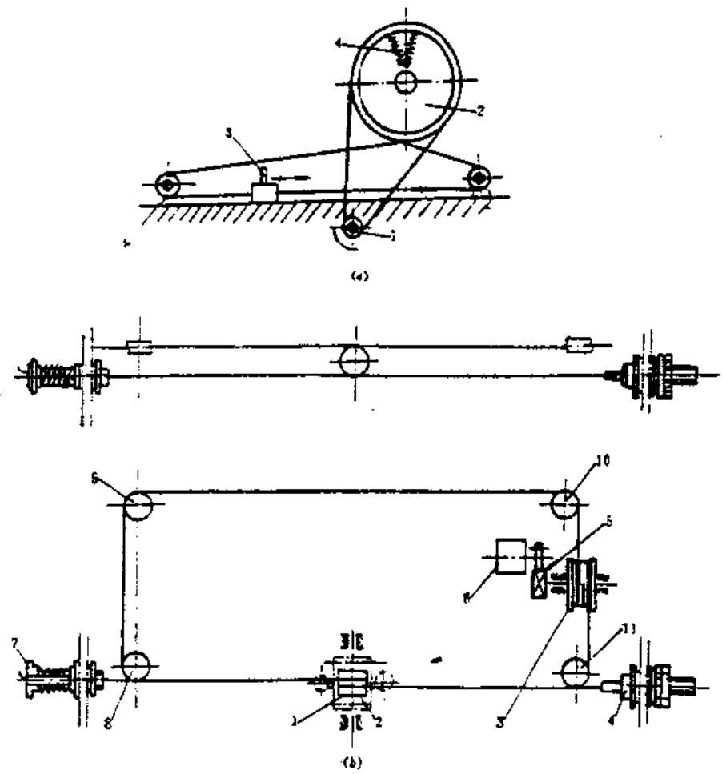

图6-绳传动的应用实例

# 二、绳传动的结构和材料

绳轮的结构如图6-2所示。

绳传动的张紧方法有:调整传动绳的工作长度,传动系统中加偏心轮张紧,或将绳端挂在绳轮的小拉簧上(如图 ${ \mathfrak { E } } { \mathfrak { - } } 1 ( { \mathfrak { a } } )$ 所示)。

绳传动的固定结构与绳材料有关。图6-3所示为钢丝绳传动的几种固定方法,其中,图6-3(a)所示为用闭合回线和螺钉固定钢丝绳的方法。其特点是工作可靠,适用于传递较大载荷;但绳的工作长度无法调整,闭合回线的编织工序较复杂。图6-3(b)所示为利用夹紧块1和螺钉2固定绳的端部,结构简单,钢丝绳的长度可以调整;但压紧时,绳可能发生变形而受到削弱,只适用于金属丝绳及承受轻载荷。图6-3(c)所示为用偏心轮夹紧固定绳的结构。绳的工作长度可在夹紧处进行调整、且拉紧绳时能产生自锁,适用于载荷较大的场合;但结构较复杂,压紧时会使绳产生变形而受到削弱。图6-3(d)所示为用压块压紧传动绳的方法,其结构简单,绳的工作长度可以调整,

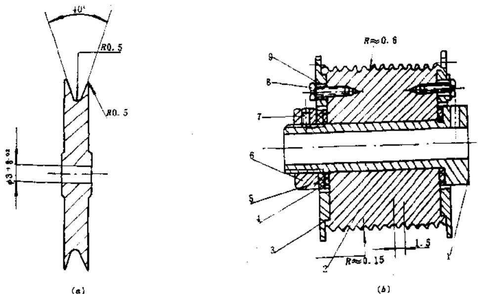

图6-2绳轮结构

(a)滑轮

(b)绳轮组

1-绳轮轴套;2-绳轮:3-绳轮盖板:4-垫圈;-弹性垫圈;6-绳轮固定螺母:7、8一螺钉;9-垫

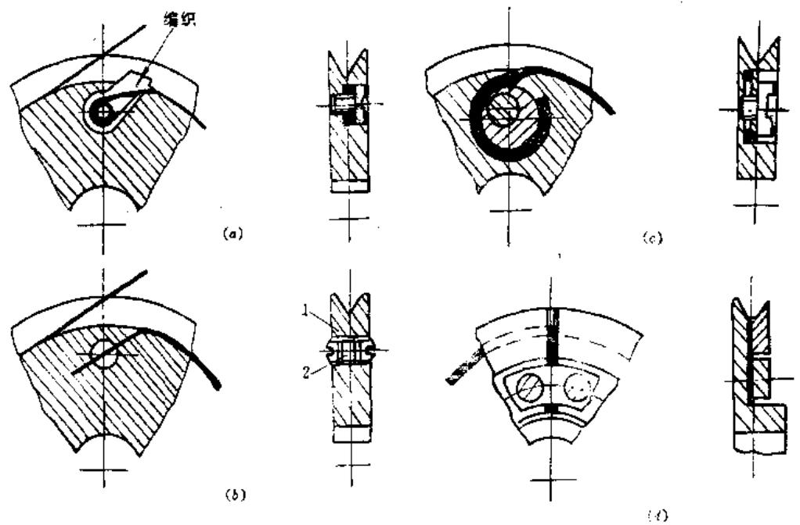

图6-3传动绳端都的固定方法

对绳材料的要求是:耐磨性好,有柔性,伸缩率小。所用材料有金属丝、尼龙丝、弦丝等当采用皮绳、棉绳、卡普隆绳和多股弦作传动带时,传动中有滑动现象,故不能用于精密读变机构中,而只能用于辅助机构。绳轮的材料常用硬铝,轮轴采用钢,

常用的绳材料的截面尺寸及机械性能见表6-1、

表-1常用绝材料的机械性能

<table><tr><td rowspan=2 colspan=1>绳类型</td><td rowspan=1 colspan=5>尺   寸（mm）</td><td rowspan=2 colspan=2>破坏力 ！(N）</td><td rowspan=2 colspan=2>抗拉强度(MP2)</td><td rowspan=2 colspan=1>断裂时的延伸率(%）</td><td rowspan=2 colspan=1>备   注</td></tr><tr><td rowspan=1 colspan=2>1</td><td rowspan=1 colspan=2>d</td><td rowspan=1 colspan=1>×</td></tr><tr><td rowspan=1 colspan=1>丝绳</td><td rowspan=1 colspan=2>0.7</td><td rowspan=1 colspan=2>1</td><td rowspan=1 colspan=1>1</td><td rowspan=1 colspan=2>57.8</td><td rowspan=1 colspan=2></td><td rowspan=1 colspan=1>27</td><td rowspan=1 colspan=1>无芯编织</td></tr><tr><td rowspan=2 colspan=1>棉绳</td><td rowspan=1 colspan=2>1.4</td><td rowspan=1 colspan=2>0.75</td><td rowspan=1 colspan=1>2</td><td rowspan=1 colspan=2>72.0</td><td rowspan=1 colspan=2></td><td rowspan=1 colspan=1>24</td><td rowspan=2 colspan=1>由2股编成</td></tr><tr><td rowspan=1 colspan=2>2.2</td><td rowspan=1 colspan=2>1.1</td><td rowspan=1 colspan=1>2</td><td rowspan=1 colspan=2>141</td><td rowspan=1 colspan=2></td><td rowspan=1 colspan=1>23</td></tr><tr><td rowspan=2 colspan=1>麻绳</td><td rowspan=1 colspan=2>3</td><td rowspan=1 colspan=2>1</td><td rowspan=1 colspan=1>6</td><td rowspan=1 colspan=2>911  </td><td rowspan=1 colspan=2></td><td rowspan=1 colspan=1>12</td><td rowspan=1 colspan=1>由3股编纹而成、每股2根</td></tr><tr><td rowspan=1 colspan=2>1</td><td rowspan=1 colspan=2>1</td><td rowspan=1 colspan=1>12</td><td rowspan=1 colspan=2>1372</td><td rowspan=1 colspan=2></td><td rowspan=1 colspan=1>1</td><td rowspan=1 colspan=1>由4股编绞而成，每股3根</td></tr><tr><td rowspan=3 colspan=1>弱线</td><td rowspan=1 colspan=2>0.7</td><td rowspan=1 colspan=2>1</td><td rowspan=1 colspan=1></td><td rowspan=1 colspan=2>83</td><td rowspan=1 colspan=2>2if</td><td rowspan=1 colspan=1>16</td><td rowspan=1 colspan=1></td></tr><tr><td rowspan=1 colspan=2>1.2</td><td rowspan=1 colspan=2></td><td rowspan=1 colspan=1></td><td rowspan=1 colspan=2>255</td><td rowspan=1 colspan=2>216</td><td rowspan=1 colspan=1>20</td><td rowspan=1 colspan=1></td></tr><tr><td rowspan=1 colspan=2>2.0</td><td rowspan=1 colspan=2></td><td rowspan=1 colspan=1></td><td rowspan=1 colspan=2>588</td><td rowspan=1 colspan=2>196</td><td rowspan=1 colspan=1>20</td><td rowspan=1 colspan=1></td></tr><tr><td rowspan=4 colspan=1>皮绳</td><td rowspan=1 colspan=2>4</td><td rowspan=1 colspan=2></td><td rowspan=1 colspan=1></td><td rowspan=1 colspan=2>382</td><td rowspan=1 colspan=2>30</td><td rowspan=1 colspan=1>26</td><td rowspan=4 colspan=1>带厚3mm，宽12mm</td></tr><tr><td rowspan=1 colspan=2>5</td><td rowspan=1 colspan=2></td><td></td><td rowspan=1 colspan=1></td><td rowspan=1 colspan=2>745</td><td rowspan=1 colspan=2>29</td><td rowspan=1 colspan=2>20</td></tr><tr><td rowspan=1 colspan=2>6</td><td rowspan=1 colspan=2></td><td rowspan=1 colspan=2>！</td><td rowspan=1 colspan=2>980</td><td rowspan=1 colspan=2>35</td><td rowspan=1 colspan=1>22</td></tr><tr><td rowspan=1 colspan=2>8</td><td rowspan=1 colspan=2></td><td rowspan=1 colspan=2></td><td rowspan=1 colspan=2>1323</td><td rowspan=1 colspan=2>36</td><td rowspan=1 colspan=1>20</td></tr><tr><td rowspan=2 colspan=1>钢索</td><td rowspan=1 colspan=2>2</td><td rowspan=1 colspan=2>0. 335</td><td rowspan=1 colspan=1>20</td><td rowspan=1 colspan=2>2548</td><td rowspan=1 colspan=2>1470</td><td rowspan=1 colspan=1>10</td><td rowspan=1 colspan=1>由5股线编成，每股1根</td></tr><tr><td rowspan=1 colspan=2>2</td><td rowspan=1 colspan=2>0.335</td><td rowspan=1 colspan=2>42</td><td rowspan=1 colspan=2>5880</td><td rowspan=1 colspan=2>1568</td><td rowspan=1 colspan=1></td><td rowspan=1 colspan=1>由7股编成，每股7根（麻芯）</td></tr><tr><td rowspan=2 colspan=1>三龙线</td><td rowspan=1 colspan=2></td><td rowspan=1 colspan=2>0.38</td><td rowspan=1 colspan=1>一</td><td rowspan=1 colspan=2></td><td rowspan=1 colspan=2>294</td><td rowspan=2 colspan=1>11</td><td rowspan=2 colspan=1>规格较多，可参考尼龙绳说明</td></tr><tr><td rowspan=1 colspan=2></td><td rowspan=1 colspan=2>0.56</td><td rowspan=1 colspan=2>一</td><td rowspan=1 colspan=2>~100</td><td rowspan=1 colspan=2>~180</td></tr></table>

注绳(线、带)外径 $\gamma ^ { \smash { \alpha _ { 0 } } }$ 每股(根)线的直径;一股(根)数。

# $\ S \ 6 . 2$ 同步带传动

# 一、同步带传动的特点和应用

同步带传动亦称为齿形带传动。它由同步带和同步带轮组成,有时也附加了张紧轮,如-4所示,它是通过带齿与轮齿相啮合来传递动力和运动的,是一种综合了带传动、齿轮和链传动优点的一种类似链传动的新型传动形式,与一般带传动比较,其特点是:

(1)传动比准确,传动精确;  
(2)预紧力小,轮轴及轴承上所承受的载荷较小;  
(3)带较薄,允许的线速度高;(4)带轮直径小,传动比范围大,所占空间小,重量轻;  
(5)中心距要求严格,安装要求高;  
(6)成本较高.

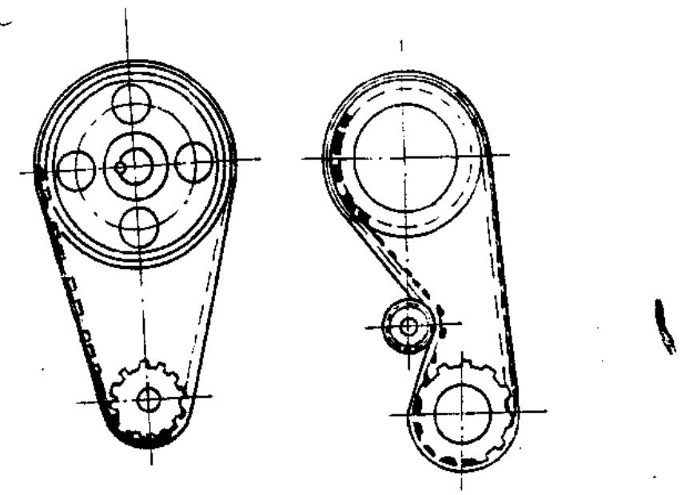

图6-4同步带传动

同步带传动的线速度可达40m/s以上,有时允许 $8 0 0 \text{‰}$ 传动效率可达 $9 9 \%$ 传递功率从几十瓦到百千瓦;传动比可达10(允许达到20).它主要用于要求传动比准确的中、小功率传动中,如录音机、各种仪器、计算机外部设备等,在其它通用机械中也有广泛应用,如纺织机、磨床、镗床等。

图6-5为同步带在间接型穿孔机中的应用实例,其功能是控制穿孔针执行穿孔和拔针动作,使穿孔针准确可靠地按给定的代码在纸带上穿出合乎要求的孔。图中带轮9、11及同步带12组成同步带传动。它将同步电机10的动力经偏心轮13和连杆8传递给滑板1,使其在支架导路内上下往复运动。滑板上装有摆杆2、摆杆簧片3,滑板槽内挂着穿孔针5.它们均随滑板作相应的运动,在穿孔机支架上安装着上限螺钉16、下限螺钉15、限制片6和选择电磁铁4。当滑板在连杆推动下上升到最高点之前,选择电磁铁1按照给定的穿孔代码分别通电,随滑板1上升的摆杆2借助上限螺钉16而逐渐被推向穿孔针5的上方,并接近电磁铁4的端面。在滑板1通过最高点并向下运动的同时,通电的电磁铁4克服簧片3的阻力而吸住摆杆&,穿孔针5由摆杆推动向下通过模板?运动时即将纸带1i穿透成孔,在滑板运动到最低点之前,下限螺钉将摆杆2从电磁铁端面推开,穿孔针便与摆杆脱离接触或了一次穿孔动作。当滑板到达最低点后,便在随着带轮9继续转动的偏心轮13的作用下,由连杆8推向上运动,并带动穿孔针5从模板孔和纸带孔内拔出。这时电滋铁已断电。在滑板升到最高点附近时,限制片6限制穿孔针5继续向上,使摆杆2与穿孔针5之间形成间隙,为下一次穿孔选择作好准备。

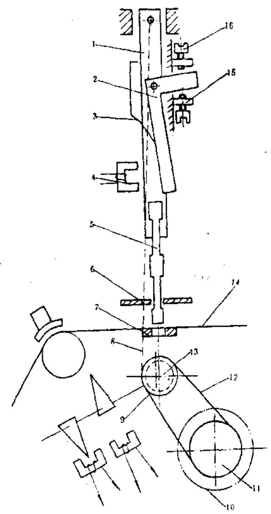

图6-5同步带传动的应用实例

在没有穿孔信号时,电磁铁4不通电,不能吸住摆杆2,簧片3的弹力将摆杆2推向一侧,使摆杆2虽与滑板1一起作上下往复运动,但不能顶着穿孔针5穿孔。

# 二、同步带的结构、主要参数和规格

# 1.结构和材料

同步带是由强力层和基体两部分组成,如图6-6所示,强力层是同步带的抗张元件,用延伸率小、疲劳强度高的多股钢丝绳或玻璃纤维制成。基体包括带和带背,带齿应与带轮正确啮合、带背用来粘接、包覆强力层。基体材料常采用耐磨性、机械强度、抗老化性及与强力层粘接性能较好的材料制成。如国内生产的同步带主要采用液体浇注型聚氨脂。它具有

良好的耐磨性和耐油性,工作温度范围为 $- 2 0 \sim + 8 0 \tau$ ;但散热性能较差,遇高温蒸气或热水易破坏,成本较高.国外产品常用氯丁橡胶,并在其内外表面贴覆一层锦纶织物,以增加耐磨性。

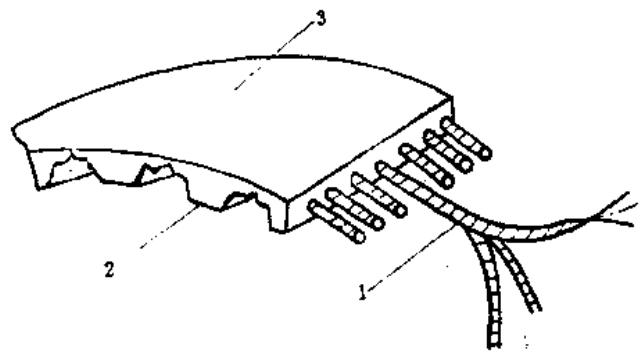

图6-6同步带的结构

考虑到工艺要求及增加带的柔性,排除运转过程中齿间的残留空气,消除噪音,通常在带齿的内表面制有尖角凹槽。

# 2.主要参数和规格

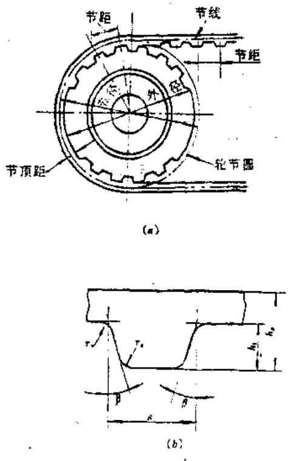

图6-7同步带的尺寸参数1-强力层:2一带齿:3-带背

同步带的主要参数是带齿节范 ${ \pmb \mathcal P } _ { \pmb { \ b } }$ (如图6-7所示)和带的节线长度L,(带的公称长度)。

在规定的张紧力下,带的纵截面上相邻两齿、对称中心线的直线距离称为带的节距;而当带垂直其底边弯曲时,在带中保持原长度不变的任意一条周线称为带的节线。由于强力层在工作时的长度不变,因此可以其中心线位置定位同步带的节线。

根据"同步带尺寸GB116i6一89"规定,同步带分为单面同步带(仅一面有齿的同步带)和双面同步带(两面都有齿的同步带)两种型式。后者按齿的排列方式又分为对称齿双面同步带(代号DA)及交错齿双面同步带(代号DB).电子设备和精密机械仪器中常用单面同步带,每种同步带按节距不同分为七种型号(见表6-2),对于 $M X L { \sim } L$ 型带齿的尺寸和带的尺寸规格见表 $\delta \sim 3 \sim$ 表6-6.

表B-2周步带的型号和节距

<table><tr><td rowspan=1 colspan=1>型号</td><td rowspan=1 colspan=1>MXL</td><td rowspan=1 colspan=1>xXL</td><td rowspan=1 colspan=1>XL  ：</td><td rowspan=1 colspan=1>L</td><td rowspan=1 colspan=1>H</td><td rowspan=1 colspan=1>XH</td><td rowspan=1 colspan=1>XXH</td></tr><tr><td rowspan=1 colspan=1>节距（mm）</td><td rowspan=1 colspan=1>2.032</td><td rowspan=1 colspan=1>3. 175</td><td rowspan=1 colspan=1>5.080</td><td rowspan=1 colspan=1>9.525</td><td rowspan=1 colspan=1>12.700</td><td rowspan=1 colspan=1>22.225</td><td rowspan=1 colspan=1>31.750</td></tr></table>

表B-3 MXL、XXL、XL、L型带齿的尺寸

<table><tr><td rowspan=2 colspan=1>带齿尺寸号</td><td rowspan=2 colspan=1>28()</td><td rowspan=1 colspan=1>3</td><td rowspan=1 colspan=1>A</td><td rowspan=1 colspan=1>+</td><td rowspan=1 colspan=1>r</td></tr><tr><td rowspan=1 colspan=4>(mm)</td></tr><tr><td rowspan=1 colspan=1>MXL</td><td rowspan=1 colspan=1>40</td><td rowspan=1 colspan=1>1.14</td><td rowspan=1 colspan=1>0.51</td><td rowspan=1 colspan=1>0.13</td><td rowspan=1 colspan=1>0.13</td></tr><tr><td rowspan=1 colspan=1>xXL</td><td rowspan=1 colspan=1>50</td><td rowspan=1 colspan=1>1.73</td><td rowspan=1 colspan=1>0.76</td><td rowspan=1 colspan=1>0. 20</td><td rowspan=1 colspan=1>0.30</td></tr><tr><td rowspan=1 colspan=1>XL</td><td rowspan=1 colspan=1>50</td><td rowspan=1 colspan=1>2.57</td><td rowspan=1 colspan=1>1. 27</td><td rowspan=1 colspan=1>0. 38</td><td rowspan=1 colspan=1>0.38</td></tr><tr><td rowspan=1 colspan=1>L</td><td rowspan=1 colspan=1>40</td><td rowspan=1 colspan=1>4. 65</td><td rowspan=1 colspan=1>1.91</td><td rowspan=1 colspan=1>0.51</td><td rowspan=1 colspan=1>0.51</td></tr></table>

注表中符号 $\beta , \delta , \mathrm { i } , , \gamma _ { + } , \gamma _ { \bullet }$ 的意义见图6-7.

表-4MXL、XXL型带长度和齿数

<table><tr><td rowspan=1 colspan=3>MXL</td><td rowspan=1 colspan=3>xxL</td></tr><tr><td rowspan=1 colspan=1>长度代号</td><td rowspan=1 colspan=1>节线长L（mm）</td><td rowspan=1 colspan=1>齿数</td><td rowspan=1 colspan=1>长度代号</td><td rowspan=1 colspan=1>节线长L,（mm）</td><td rowspan=1 colspan=1>齿数</td></tr><tr><td rowspan=1 colspan=1>36.0</td><td rowspan=1 colspan=1>91.41</td><td rowspan=1 colspan=1>15</td><td rowspan=1 colspan=1>B40</td><td rowspan=1 colspan=1>127</td><td rowspan=1 colspan=1>10</td></tr><tr><td rowspan=1 colspan=1>40.0</td><td rowspan=1 colspan=1>i01. 6</td><td rowspan=1 colspan=1>50</td><td rowspan=1 colspan=1>B48</td><td rowspan=1 colspan=1>152.4</td><td rowspan=1 colspan=1>48</td></tr><tr><td rowspan=1 colspan=1>14.0</td><td rowspan=1 colspan=1>111.76</td><td rowspan=1 colspan=1>55</td><td rowspan=1 colspan=1>B56</td><td rowspan=1 colspan=1>177. 8</td><td rowspan=1 colspan=1>56</td></tr><tr><td rowspan=1 colspan=1>48.0</td><td rowspan=1 colspan=1>121.92</td><td rowspan=1 colspan=1>60</td><td rowspan=1 colspan=1>BS4</td><td rowspan=1 colspan=1>203. 2</td><td rowspan=1 colspan=1>61</td></tr><tr><td rowspan=1 colspan=1>56.0</td><td rowspan=1 colspan=1>142.24</td><td rowspan=1 colspan=1>70</td><td rowspan=1 colspan=1>B72</td><td rowspan=1 colspan=1>228.6</td><td rowspan=1 colspan=1>72</td></tr><tr><td rowspan=1 colspan=1>60.0</td><td rowspan=1 colspan=1>152.4</td><td rowspan=1 colspan=1>75</td><td rowspan=1 colspan=1>B89</td><td rowspan=1 colspan=1>254     #</td><td rowspan=1 colspan=1>30</td></tr><tr><td rowspan=1 colspan=1>64.0</td><td rowspan=1 colspan=1>162.56</td><td rowspan=1 colspan=1>80</td><td rowspan=1 colspan=1>B88</td><td rowspan=1 colspan=1>279.4</td><td rowspan=1 colspan=1>88</td></tr></table>

(续表)

<table><tr><td rowspan=2 colspan=2>72.0</td><td rowspan=2 colspan=1>182. 88</td><td rowspan=2 colspan=2>90</td><td></td><td rowspan=1 colspan=3>（</td></tr><tr><td rowspan=1 colspan=1>B96</td><td rowspan=1 colspan=2>304. 8</td><td rowspan=1 colspan=1>96</td></tr><tr><td rowspan=1 colspan=2>80. 0</td><td rowspan=1 colspan=1>203.2</td><td rowspan=1 colspan=2>100</td><td rowspan=1 colspan=1>B101</td><td rowspan=1 colspan=2>330.2</td><td rowspan=1 colspan=1>104</td></tr><tr><td rowspan=1 colspan=2>88.0</td><td rowspan=1 colspan=1>223.52</td><td rowspan=1 colspan=2>110</td><td rowspan=1 colspan=1>B112</td><td rowspan=1 colspan=2>355. 6</td><td rowspan=1 colspan=1>112</td></tr><tr><td rowspan=1 colspan=2>100. 0</td><td rowspan=1 colspan=1>254</td><td rowspan=1 colspan=2>125</td><td rowspan=1 colspan=1>B120</td><td rowspan=1 colspan=2>381</td><td rowspan=1 colspan=1>120</td></tr><tr><td rowspan=1 colspan=2>112. 0</td><td rowspan=1 colspan=1>284.48</td><td rowspan=1 colspan=2>140</td><td rowspan=1 colspan=1>B128</td><td rowspan=1 colspan=2>406.4</td><td rowspan=1 colspan=1>128</td></tr><tr><td rowspan=1 colspan=1>124.0</td><td></td><td rowspan=1 colspan=1>314.96</td><td rowspan=1 colspan=2>155</td><td rowspan=1 colspan=1>B141</td><td rowspan=1 colspan=2>457.2</td><td rowspan=1 colspan=1>144</td></tr><tr><td rowspan=1 colspan=1>140.0</td><td></td><td rowspan=1 colspan=1>355. 6</td><td rowspan=1 colspan=2>175</td><td rowspan=1 colspan=2>B160</td><td rowspan=1 colspan=2>508</td><td rowspan=1 colspan=1>160</td></tr><tr><td rowspan=1 colspan=2>160. 0</td><td rowspan=1 colspan=1>406.4</td><td rowspan=1 colspan=2>200</td><td rowspan=1 colspan=1>B176</td><td rowspan=1 colspan=2>558</td><td rowspan=1 colspan=1>176</td></tr><tr><td rowspan=1 colspan=2>180.0</td><td rowspan=1 colspan=1>457.2</td><td rowspan=1 colspan=2>225</td><td rowspan=1 colspan=1></td><td rowspan=1 colspan=2></td><td rowspan=1 colspan=1></td></tr><tr><td rowspan=1 colspan=1>200.0</td><td rowspan=1 colspan=2>508</td><td rowspan=1 colspan=2>250</td><td rowspan=1 colspan=1></td><td rowspan=1 colspan=2></td><td rowspan=1 colspan=1></td></tr></table>

表-5XL、L型带长度和齿数

<table><tr><td rowspan=4 colspan=1></td><td rowspan=3 colspan=2>长度代号</td><td rowspan=3 colspan=2>节线长L,(mm)</td><td></td><td></td><td></td><td></td><td></td><td></td><td rowspan=1 colspan=2></td><td rowspan=1 colspan=5></td><td rowspan=1 colspan=1>齿数</td><td rowspan=3 colspan=1>长度代号</td><td rowspan=3 colspan=1>节线长L（mm）</td><td rowspan=1 colspan=1>齿数</td></tr><tr><td></td><td></td><td rowspan=2 colspan=2>L</td><td></td><td></td><td></td><td></td><td></td><td rowspan=2 colspan=1>XL</td><td></td></tr><tr><td></td><td></td><td></td><td></td><td></td><td></td><td rowspan=1 colspan=5>L</td></tr><tr><td rowspan=1 colspan=2>60</td><td rowspan=1 colspan=2>152.4</td><td rowspan=1 colspan=2>30</td><td rowspan=1 colspan=2></td><td rowspan=1 colspan=2>225</td><td></td><td></td><td rowspan=1 colspan=5>60</td></tr><tr><td></td><td rowspan=1 colspan=2>70</td><td rowspan=1 colspan=2>177.8</td><td rowspan=1 colspan=2>35</td><td rowspan=1 colspan=2></td><td rowspan=1 colspan=2>230</td><td></td><td></td><td rowspan=1 colspan=5></td></tr><tr><td></td><td rowspan=1 colspan=2>80</td><td rowspan=1 colspan=2>203.2</td><td rowspan=1 colspan=2>10</td><td rowspan=1 colspan=2></td><td rowspan=1 colspan=2>240</td><td></td><td></td><td rowspan=1 colspan=5>64</td></tr><tr><td></td><td rowspan=1 colspan=2>90</td><td rowspan=1 colspan=2>228. 6</td><td rowspan=1 colspan=2>45</td><td rowspan=1 colspan=2></td><td rowspan=1 colspan=2>250</td><td></td><td></td><td rowspan=1 colspan=5></td></tr><tr><td></td><td rowspan=1 colspan=2>100</td><td rowspan=1 colspan=2>254</td><td rowspan=1 colspan=2>50</td><td rowspan=1 colspan=2></td><td rowspan=1 colspan=2>255</td><td rowspan=1 colspan=2>647.7</td><td></td><td rowspan=1 colspan=5>68</td></tr><tr><td></td><td rowspan=1 colspan=2>110</td><td rowspan=1 colspan=2>279.1</td><td></td><td rowspan=1 colspan=2>55</td><td rowspan=1 colspan=2></td><td rowspan=1 colspan=2>260</td><td rowspan=1 colspan=2>660.4</td><td rowspan=1 colspan=5>130</td><td rowspan=1 colspan=1></td></tr><tr><td></td><td rowspan=1 colspan=2>120</td><td rowspan=1 colspan=2>304.8</td><td></td><td rowspan=1 colspan=2>60</td><td rowspan=1 colspan=2></td><td rowspan=1 colspan=2>270</td><td rowspan=1 colspan=2>685.8</td><td rowspan=1 colspan=5></td><td rowspan=1 colspan=1>72</td></tr><tr><td></td><td rowspan=1 colspan=2>124</td><td rowspan=1 colspan=2>314.33</td><td></td><td rowspan=1 colspan=2></td><td rowspan=1 colspan=2>3.3</td><td rowspan=1 colspan=2>285</td><td rowspan=1 colspan=2>723.9</td><td rowspan=1 colspan=5></td><td rowspan=1 colspan=1>76</td></tr><tr><td rowspan=1 colspan=2>130</td><td rowspan=1 colspan=2>330. 2</td><td rowspan=1 colspan=2>65</td><td rowspan=1 colspan=2></td><td rowspan=1 colspan=2>300</td><td rowspan=1 colspan=2>762</td><td rowspan=1 colspan=5></td><td rowspan=1 colspan=1>80</td></tr><tr><td rowspan=1 colspan=2>140</td><td rowspan=1 colspan=2>355.6</td><td rowspan=1 colspan=2>70</td><td rowspan=1 colspan=2></td><td rowspan=1 colspan=2>322</td><td rowspan=1 colspan=2>819. 15</td><td rowspan=1 colspan=5></td><td rowspan=1 colspan=1>86</td></tr><tr><td rowspan=1 colspan=2>150</td><td rowspan=1 colspan=2>381</td><td rowspan=1 colspan=2>75</td><td rowspan=1 colspan=2>10</td><td rowspan=1 colspan=2>345</td><td rowspan=1 colspan=2>876.3</td><td rowspan=1 colspan=5></td><td rowspan=1 colspan=1>92</td></tr><tr><td rowspan=1 colspan=2>160</td><td rowspan=1 colspan=2>406.4</td><td rowspan=1 colspan=2>80</td><td rowspan=1 colspan=2></td><td rowspan=1 colspan=2>367</td><td rowspan=1 colspan=2>933.45</td><td rowspan=1 colspan=5></td><td rowspan=1 colspan=1>98</td></tr><tr><td rowspan=1 colspan=2>170</td><td rowspan=1 colspan=2>431.8</td><td rowspan=1 colspan=2>85</td><td rowspan=1 colspan=2></td><td rowspan=1 colspan=2>390</td><td rowspan=1 colspan=2>990.6</td><td rowspan=1 colspan=5></td><td rowspan=1 colspan=1>104</td></tr><tr><td rowspan=1 colspan=2>180</td><td rowspan=1 colspan=2>457.2</td><td rowspan=1 colspan=2>90</td><td rowspan=1 colspan=2></td><td rowspan=1 colspan=2>420</td><td rowspan=1 colspan=2>1066. 8</td><td rowspan=1 colspan=5></td><td rowspan=1 colspan=1>112</td></tr><tr><td rowspan=1 colspan=2>187</td><td rowspan=1 colspan=2>476.25</td><td rowspan=1 colspan=2></td><td rowspan=1 colspan=2>50</td><td rowspan=1 colspan=2>450</td><td rowspan=1 colspan=2>1143</td><td rowspan=1 colspan=5></td><td rowspan=1 colspan=1>120</td></tr><tr><td rowspan=1 colspan=2>190</td><td rowspan=1 colspan=2>482.6</td><td rowspan=1 colspan=2>95</td><td rowspan=1 colspan=2></td><td rowspan=1 colspan=2>480</td><td rowspan=1 colspan=2>1219. 2</td><td rowspan=1 colspan=5></td><td rowspan=1 colspan=1>128</td></tr><tr><td rowspan=1 colspan=2>200</td><td rowspan=1 colspan=2>508</td><td rowspan=1 colspan=2>100</td><td rowspan=1 colspan=2></td><td rowspan=1 colspan=2>5i0</td><td rowspan=1 colspan=2>1295.4</td><td rowspan=1 colspan=5></td><td rowspan=1 colspan=1>136</td></tr><tr><td rowspan=1 colspan=2>210</td><td rowspan=1 colspan=2>533</td><td rowspan=1 colspan=2>105</td><td rowspan=1 colspan=2>56</td><td rowspan=1 colspan=2>540</td><td rowspan=1 colspan=2>1371. 6</td><td rowspan=1 colspan=5></td><td rowspan=1 colspan=1>1</td></tr><tr><td rowspan=1 colspan=2>220</td><td rowspan=1 colspan=2>558.8</td><td rowspan=1 colspan=2>110</td><td rowspan=1 colspan=2></td><td rowspan=1 colspan=2>600</td><td rowspan=1 colspan=2>1524</td><td rowspan=1 colspan=5></td><td rowspan=1 colspan=1>160</td></tr></table>

表1-6 MXL、XXL、XL、L型带的宽度和高度

<table><tr><td rowspan=1 colspan=2>·型</td><td rowspan=1 colspan=3>MXL</td><td rowspan=1 colspan=3>XXL</td><td rowspan=1 colspan=3>：      XL</td><td rowspan=1 colspan=3>L</td></tr><tr><td rowspan=1 colspan=2>公称高度（mm）</td><td rowspan=1 colspan=3>1.14</td><td rowspan=1 colspan=3>1.52</td><td rowspan=1 colspan=3>2.3</td><td rowspan=1 colspan=3>3.6</td></tr><tr><td rowspan=2 colspan=1>标准宽度b</td><td rowspan=1 colspan=1>公称尺寸（mm）</td><td rowspan=1 colspan=1>3.2</td><td rowspan=1 colspan=1>4.8</td><td rowspan=1 colspan=1>6.4</td><td rowspan=1 colspan=1>3.2</td><td rowspan=1 colspan=1>1.8</td><td rowspan=1 colspan=1>6.4</td><td rowspan=1 colspan=1>6.1</td><td rowspan=1 colspan=1>7.9</td><td rowspan=1 colspan=1>9.5</td><td rowspan=1 colspan=1>12.7</td><td rowspan=1 colspan=1>19.！</td><td rowspan=1 colspan=1>25.1</td></tr><tr><td rowspan=1 colspan=1>代号</td><td rowspan=1 colspan=1>012</td><td rowspan=1 colspan=1>019</td><td rowspan=1 colspan=1>025</td><td rowspan=1 colspan=1>3.2</td><td rowspan=1 colspan=1>4.8</td><td rowspan=1 colspan=1>6.4</td><td rowspan=1 colspan=1>025</td><td rowspan=1 colspan=1>031</td><td rowspan=1 colspan=1>037</td><td rowspan=1 colspan=1>050</td><td rowspan=1 colspan=1>075</td><td rowspan=1 colspan=1>100</td></tr></table>

注表中符号 $\blacktriangle$ 的意义见图6-7.

# 3.同步带的标记

同步带的标记内容和顺序为长度代号、型号、宽度代号。例如XXL型单面同步带,其节线长度为 $\pmb { 2 5 4 } \pmb { \mathrm { n m } }$ ,宽度 $3 , 2 \tt m m$ ,标记为

B80 XXL 3.2轮宽代号型号一长度代号对双面同步带,应在最前面标明带型代号,即DA或DB。

# 三、同步带轮的结构和基本尺寸

# 1.结构和材料

同步带轮除轮缘表面须制出轮齿外,其它结构与一般带轮相似。为防止工作时带从轮上脱落,可以按照下述情况选择带轮挡圈:

(1)在两轴传动中,两个带轮中必须有一个带轮两侧具有挡圈,或两带轮的不同侧边各有一个挡围;

(2)在中心距超过小带轮直径的八倍以上的传动中·两个带轮的两侧应都有挡圈;

(3)在垂直轴传动中,其中一个带轮的两侧应有挡圈·而在系统中其它带轮仅在底部一侧有挡圈:

(4)在多轴传动中,应保证每隔一个带轮有两个挡圈或围绕该系统每个带轮的对边各有一个挡围。

对于一般传动,带轮材料常采用铸铁或钢;对于高速小功率传动和精密传动,带轮材料可以采用塑料、轻合金等。

# 2.带轮的基本尺寸

为了保证同步带与同步带轮的正确啮合和良好接触,带轮沿节圆度量的节距必须与同步带的节距相等,带轮的齿槽角与带的齿形角(带齿两侧面的夹角)也必须相等。

同步带传动带轮标准(GB11361-89)中规定,带轮的齿廊形状有渐开线齿廊和直边齿廓两种,对于 ${ \tt M X L } { \sim } \mathrm { L }$ 型直边齿廓尺寸见表6-7.

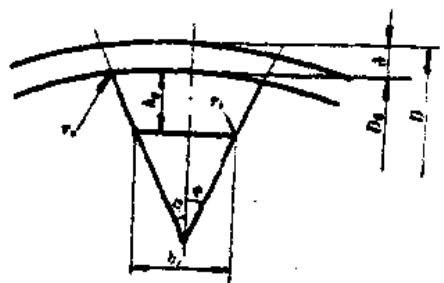

<table><tr><td rowspan=1 colspan=1>型号</td><td rowspan=1 colspan=1>齿權底寬h</td><td rowspan=1 colspan=1>齿權探4</td><td rowspan=1 colspan=1>齿擅半角士1.5°</td><td rowspan=1 colspan=1>齿根圆角半径r</td><td rowspan=1 colspan=1>齿顶圆角半径</td><td rowspan=1 colspan=1>两倍节顶距2d</td></tr><tr><td rowspan=1 colspan=1>MXL</td><td rowspan=1 colspan=1>0. 84</td><td rowspan=1 colspan=1>0. 69</td><td rowspan=1 colspan=1>20</td><td rowspan=1 colspan=1>0.35</td><td rowspan=1 colspan=1>0.13</td><td rowspan=1 colspan=1>0. 508</td></tr><tr><td rowspan=1 colspan=1>xxL</td><td rowspan=1 colspan=1>1. 14</td><td rowspan=1 colspan=1>0. 84</td><td rowspan=1 colspan=1>25</td><td rowspan=1 colspan=1>0.35</td><td rowspan=1 colspan=1>0.30</td><td rowspan=1 colspan=1>0. 508</td></tr><tr><td rowspan=1 colspan=1>XL</td><td rowspan=1 colspan=1>1. 32</td><td rowspan=1 colspan=1>1. 65</td><td rowspan=1 colspan=1>25</td><td rowspan=1 colspan=1>0.4！</td><td rowspan=1 colspan=1>0.64</td><td rowspan=1 colspan=1>0. 508</td></tr><tr><td rowspan=1 colspan=1>4</td><td rowspan=1 colspan=1>3. 05</td><td rowspan=1 colspan=1>2. 67</td><td rowspan=1 colspan=1>20</td><td rowspan=1 colspan=1>1. 19</td><td rowspan=1 colspan=1>1.17</td><td rowspan=1 colspan=1>0.762</td></tr></table>

带轮直径见表6-8,帶轮宽度基本尺寸及允许的最小实际宽度见表6-9.带轮挡圈的于见表6-10.

寰-带轮直径 $\left\{ \Cap \right\} \ )$ 

<table><tr><td rowspan=3 colspan=1>带轮齿数</td><td rowspan=1 colspan=8>带  轮  直  径</td></tr><tr><td rowspan=1 colspan=2>MXL</td><td rowspan=1 colspan=2>XXL</td><td rowspan=1 colspan=2>x         </td><td rowspan=1 colspan=2>L</td></tr><tr><td rowspan=1 colspan=1>节径</td><td rowspan=1 colspan=1>外径</td><td rowspan=1 colspan=1>节径</td><td rowspan=1 colspan=1>外径</td><td rowspan=1 colspan=1>节径</td><td rowspan=1 colspan=1>外径</td><td rowspan=1 colspan=1>节径</td><td rowspan=1 colspan=1>外径</td></tr><tr><td rowspan=1 colspan=1>10</td><td rowspan=1 colspan=1>6.7</td><td rowspan=1 colspan=1>5.96</td><td rowspan=1 colspan=1>10.11</td><td rowspan=1 colspan=1>9.60  i</td><td rowspan=1 colspan=1>16.17</td><td rowspan=1 colspan=1>15.66</td><td rowspan=1 colspan=1>1</td><td rowspan=1 colspan=1></td></tr><tr><td rowspan=1 colspan=1>11</td><td rowspan=1 colspan=1>7.11</td><td rowspan=1 colspan=1>6.61</td><td rowspan=1 colspan=1>11.12</td><td rowspan=1 colspan=1>10.61</td><td rowspan=1 colspan=1>17.79</td><td rowspan=1 colspan=1>17. 28</td><td rowspan=1 colspan=1></td><td rowspan=1 colspan=1></td></tr><tr><td rowspan=1 colspan=1>12</td><td rowspan=1 colspan=1>7.76</td><td rowspan=1 colspan=1>7.25</td><td rowspan=1 colspan=1>12.13+</td><td rowspan=1 colspan=1>11. 62</td><td rowspan=1 colspan=1>19.40</td><td rowspan=1 colspan=1>18.90</td><td rowspan=1 colspan=1>36.38</td><td rowspan=1 colspan=1>35.62</td></tr><tr><td rowspan=1 colspan=1>13</td><td rowspan=1 colspan=1>8.41</td><td rowspan=1 colspan=1>7.90</td><td rowspan=1 colspan=1>13.14 ！</td><td rowspan=1 colspan=1>12.63</td><td rowspan=1 colspan=1>21.02</td><td rowspan=1 colspan=1>20.51</td><td rowspan=1 colspan=1>39.41</td><td rowspan=1 colspan=1>38.65</td></tr><tr><td rowspan=1 colspan=1>14</td><td rowspan=1 colspan=1>9. 06</td><td rowspan=1 colspan=1>8.55</td><td rowspan=1 colspan=1>14.15</td><td rowspan=1 colspan=1>13.64</td><td rowspan=1 colspan=1>22.64</td><td rowspan=1 colspan=1>22.13</td><td rowspan=1 colspan=1>42.45</td><td rowspan=1 colspan=1>41.69</td></tr><tr><td rowspan=1 colspan=1>15</td><td rowspan=1 colspan=1>9.70</td><td rowspan=1 colspan=1>9.19</td><td rowspan=1 colspan=1>15.16i</td><td rowspan=1 colspan=1>14.65 ：</td><td rowspan=1 colspan=1>,26</td><td rowspan=1 colspan=1>23.75 ：！</td><td rowspan=1 colspan=1>45.48</td><td rowspan=1 colspan=1>44.72</td></tr><tr><td rowspan=1 colspan=1>16</td><td rowspan=1 colspan=1>10.35</td><td rowspan=1 colspan=1>9.84</td><td rowspan=1 colspan=1>16.17</td><td rowspan=1 colspan=1>15.06.</td><td rowspan=1 colspan=1>25.87</td><td rowspan=1 colspan=1>25.3 1</td><td rowspan=1 colspan=1>48.51</td><td rowspan=1 colspan=1>47.75</td></tr><tr><td rowspan=1 colspan=1>17</td><td rowspan=1 colspan=1>11.00</td><td rowspan=1 colspan=1>10.49</td><td rowspan=1 colspan=1>i7.18</td><td rowspan=1 colspan=1>16.67</td><td rowspan=1 colspan=1>27.49 ：</td><td rowspan=1 colspan=1>26.98</td><td rowspan=1 colspan=1>51.54</td><td rowspan=1 colspan=1>50.78</td></tr><tr><td rowspan=1 colspan=1>18</td><td rowspan=1 colspan=1>11. 64</td><td rowspan=1 colspan=1>11.13</td><td rowspan=1 colspan=1>18.19</td><td rowspan=1 colspan=1>17. 68 ！</td><td rowspan=1 colspan=1>29.11</td><td rowspan=1 colspan=1>2x.60</td><td rowspan=1 colspan=1>51.57</td><td rowspan=1 colspan=1>53.81</td></tr><tr><td rowspan=1 colspan=1>19</td><td rowspan=1 colspan=1>12.29</td><td rowspan=1 colspan=1>11.78</td><td rowspan=1 colspan=1>19.20</td><td rowspan=1 colspan=1>18.69</td><td rowspan=1 colspan=1>30.72</td><td rowspan=1 colspan=1>30.22</td><td rowspan=1 colspan=1>57. 61</td><td rowspan=1 colspan=1>56.84</td></tr><tr><td rowspan=1 colspan=1>20</td><td rowspan=1 colspan=1>12.94</td><td rowspan=1 colspan=1>12.43</td><td rowspan=1 colspan=1>20.21</td><td rowspan=1 colspan=1>19.70</td><td rowspan=1 colspan=1>.31 ：</td><td rowspan=1 colspan=1>31.83</td><td rowspan=1 colspan=1>60.64</td><td rowspan=1 colspan=1>59.88</td></tr><tr><td rowspan=1 colspan=1>(21）</td><td rowspan=1 colspan=1>13.58</td><td rowspan=1 colspan=1>13.07 ：</td><td rowspan=1 colspan=1>？).22</td><td rowspan=1 colspan=1>20.72</td><td rowspan=1 colspan=1>33.96</td><td rowspan=1 colspan=1>3.45 ：</td><td rowspan=1 colspan=1>6.3.67</td><td rowspan=1 colspan=1>62.91</td></tr><tr><td rowspan=1 colspan=1>22</td><td rowspan=1 colspan=1>14.23</td><td rowspan=1 colspan=1>13.72</td><td rowspan=1 colspan=1>22.23 </td><td rowspan=1 colspan=1>21.73</td><td rowspan=1 colspan=1>35.57</td><td rowspan=1 colspan=1>35.07</td><td rowspan=1 colspan=1>66.70</td><td rowspan=1 colspan=1>65.91</td></tr></table>

(续表)

<table><tr><td rowspan=1 colspan=1>(23）</td><td rowspan=1 colspan=1>14.88</td><td rowspan=1 colspan=1>14.37</td><td rowspan=1 colspan=1>23.</td><td rowspan=1 colspan=1>22.74</td><td rowspan=1 colspan=1>37.19</td><td rowspan=1 colspan=1>36.68</td><td rowspan=1 colspan=1>69.73</td><td rowspan=1 colspan=1>68.97</td></tr><tr><td rowspan=1 colspan=1>(24)</td><td rowspan=1 colspan=1>15.52</td><td rowspan=1 colspan=1>15.02</td><td rowspan=1 colspan=1>24.26</td><td rowspan=1 colspan=1>23.75</td><td rowspan=1 colspan=1>38.81</td><td rowspan=1 colspan=1>38.30</td><td rowspan=1 colspan=1>72.77</td><td rowspan=1 colspan=1>72.00</td></tr><tr><td rowspan=1 colspan=1>25</td><td rowspan=1 colspan=1>16.17</td><td rowspan=1 colspan=1>15.66 ：</td><td rowspan=1 colspan=1>25.27</td><td rowspan=1 colspan=1>24.76</td><td rowspan=1 colspan=1>40.43</td><td rowspan=1 colspan=1>39.92</td><td rowspan=1 colspan=1>75.80</td><td rowspan=1 colspan=1>75.04</td></tr><tr><td rowspan=1 colspan=1>(26)</td><td rowspan=1 colspan=1>16.82</td><td rowspan=1 colspan=1>16.31</td><td rowspan=1 colspan=1>26.23 i</td><td rowspan=1 colspan=1>25.77</td><td rowspan=1 colspan=1>12.04</td><td rowspan=1 colspan=1>41.53</td><td rowspan=1 colspan=1>78.83 ：</td><td rowspan=1 colspan=1>78.07</td></tr><tr><td rowspan=1 colspan=1>(27）</td><td rowspan=1 colspan=1>17.46</td><td rowspan=1 colspan=1>16.96</td><td rowspan=1 colspan=1>27.29</td><td rowspan=1 colspan=1>26.78</td><td rowspan=1 colspan=1>43. 66</td><td rowspan=1 colspan=1>43.15</td><td rowspan=1 colspan=1>81.86</td><td rowspan=1 colspan=1>81. 10</td></tr><tr><td rowspan=1 colspan=1>28</td><td rowspan=1 colspan=1>18.11</td><td rowspan=1 colspan=1>17.60</td><td rowspan=1 colspan=1>?8.3</td><td rowspan=1 colspan=1>2.79 ：</td><td rowspan=1 colspan=1>45.28</td><td rowspan=1 colspan=1>44.77</td><td rowspan=1 colspan=1>84.89</td><td rowspan=1 colspan=1>84.13</td></tr><tr><td rowspan=1 colspan=1>(30）</td><td rowspan=1 colspan=1>19.40</td><td rowspan=1 colspan=1>18.90 ！</td><td rowspan=1 colspan=1>3 ：</td><td rowspan=1 colspan=1>2:31</td><td rowspan=1 colspan=1>18.5！</td><td rowspan=1 colspan=1>48.00</td><td rowspan=1 colspan=1>90.96</td><td rowspan=1 colspan=1>90.20</td></tr><tr><td rowspan=1 colspan=1>32</td><td rowspan=1 colspan=1>20.70</td><td rowspan=1 colspan=1>20.19</td><td rowspan=1 colspan=1>32.94</td><td rowspan=1 colspan=1>31.83</td><td rowspan=1 colspan=1>51.71</td><td rowspan=1 colspan=1>51. 24</td><td rowspan=1 colspan=1>97.02</td><td rowspan=1 colspan=1>96.26</td></tr><tr><td rowspan=1 colspan=1>36</td><td rowspan=1 colspan=1>23.29</td><td rowspan=1 colspan=1>2.78i</td><td rowspan=1 colspan=1>36.38</td><td rowspan=1 colspan=1>35.87</td><td rowspan=1 colspan=1>58.21</td><td rowspan=1 colspan=1>57.70</td><td rowspan=1 colspan=1>109.15</td><td rowspan=1 colspan=1>108.39</td></tr><tr><td rowspan=1 colspan=1>40</td><td rowspan=1 colspan=1>25.37</td><td rowspan=1 colspan=1>24.86</td><td rowspan=1 colspan=1>40.43 i：</td><td rowspan=1 colspan=1>39.92</td><td rowspan=1 colspan=1>64.68</td><td rowspan=1 colspan=1>64.17</td><td rowspan=1 colspan=1>121.28</td><td rowspan=1 colspan=1>120. 51</td></tr><tr><td rowspan=1 colspan=1>48</td><td rowspan=1 colspan=1>31.05</td><td rowspan=1 colspan=1>30. 54</td><td rowspan=1 colspan=1>48.51i</td><td rowspan=1 colspan=1>48.00</td><td rowspan=1 colspan=1>77. 62</td><td rowspan=1 colspan=1>77. 11</td><td rowspan=1 colspan=1>145.53</td><td rowspan=1 colspan=1>144.77</td></tr><tr><td rowspan=1 colspan=1>60</td><td rowspan=1 colspan=1>38.81</td><td rowspan=1 colspan=1>38.30</td><td rowspan=1 colspan=1>60.64</td><td rowspan=1 colspan=1>60.13</td><td rowspan=1 colspan=1>97.02</td><td rowspan=1 colspan=1>96.51</td><td rowspan=1 colspan=1>181.91</td><td rowspan=1 colspan=1>181. 15</td></tr><tr><td rowspan=1 colspan=1>72</td><td rowspan=1 colspan=1>46.57</td><td rowspan=1 colspan=1>46.06</td><td rowspan=1 colspan=1>72.77</td><td rowspan=1 colspan=1>72.26</td><td rowspan=1 colspan=1>116.43</td><td rowspan=1 colspan=1>115. 92</td><td rowspan=1 colspan=1>218.30</td><td rowspan=1 colspan=1>217.53</td></tr></table>

注1.括号内的尺寸尽量不采用;2.表中节径、外径含义见图6-7.

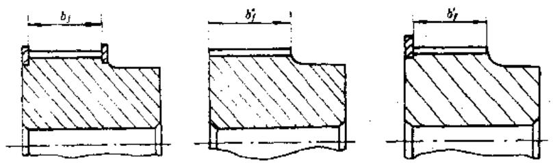

表-9带轮宽度基本尺寸及允许的轟小实际宽度

<table><tr><td rowspan=2 colspan=1>型号</td><td rowspan=2 colspan=1>轮宽代号</td><td rowspan=1 colspan=1>轮宽基本尺寸</td><td rowspan=1 colspan=1>双边挡圈带轮最小宽度b！</td><td rowspan=1 colspan=1>无挡圈带轮最小宽度</td><td rowspan=1 colspan=1>单边挡圈带轮最小宽度b</td></tr><tr><td rowspan=1 colspan=1></td><td rowspan=1 colspan=3>(mm)</td></tr><tr><td rowspan=3 colspan=1>MXLXXL</td><td rowspan=1 colspan=1>012</td><td rowspan=1 colspan=1>3.0</td><td rowspan=1 colspan=1>3.8</td><td rowspan=1 colspan=1>5.6</td><td rowspan=1 colspan=1>4.7</td></tr><tr><td rowspan=1 colspan=1>019</td><td rowspan=1 colspan=1>4.8</td><td rowspan=1 colspan=1>5.3</td><td rowspan=1 colspan=1>7.1</td><td rowspan=1 colspan=1>6.2</td></tr><tr><td rowspan=1 colspan=1>025</td><td rowspan=1 colspan=1>6.4</td><td rowspan=1 colspan=1>7.1</td><td rowspan=1 colspan=1>8.9</td><td rowspan=1 colspan=1>8.0</td></tr><tr><td rowspan=3 colspan=1>XL</td><td rowspan=1 colspan=1>025</td><td rowspan=1 colspan=1>6.4</td><td rowspan=1 colspan=1>7.1</td><td rowspan=1 colspan=1>8.9</td><td rowspan=1 colspan=1>3.0</td></tr><tr><td rowspan=1 colspan=1>031</td><td rowspan=1 colspan=1>7.9</td><td rowspan=1 colspan=1>8.6</td><td rowspan=1 colspan=1>i0.4</td><td rowspan=1 colspan=1>9.5</td></tr><tr><td rowspan=1 colspan=1>037</td><td rowspan=1 colspan=1>9.5</td><td rowspan=1 colspan=1>10.4</td><td rowspan=1 colspan=1>12.2</td><td rowspan=1 colspan=1>11.1</td></tr></table>

(续表)

<table><tr><td rowspan=3 colspan=1>L</td><td rowspan=1 colspan=1>050</td><td rowspan=1 colspan=1>12.7</td><td rowspan=1 colspan=1>11.0</td><td rowspan=1 colspan=1>17.0</td><td rowspan=1 colspan=1>15.5</td></tr><tr><td rowspan=1 colspan=1>075</td><td rowspan=1 colspan=1>19.1</td><td rowspan=1 colspan=1>20.</td><td rowspan=1 colspan=1>23.3</td><td rowspan=1 colspan=1>21.8</td></tr><tr><td rowspan=1 colspan=1>100</td><td rowspan=1 colspan=1>25.4</td><td rowspan=1 colspan=1>26.7</td><td rowspan=1 colspan=1>29.7</td><td rowspan=1 colspan=1>28.2</td></tr></table>

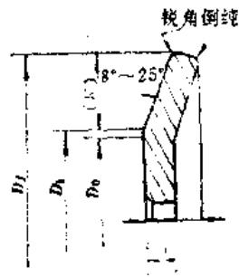

表6-10带轮挡圈的尺寸(mm)

$\pmb { D _ { 4 } }$ -带轮外径(mm)D.挡图弯曲处直径 $\left( m _ { \mathsf { P } } \right)$ D=D+(0.38±0.25)D=D÷2K

<table><tr><td rowspan=1 colspan=1>型    号</td><td rowspan=1 colspan=1>MXL</td><td rowspan=1 colspan=1>XXL</td><td rowspan=1 colspan=1>X</td><td rowspan=1 colspan=1>L</td></tr><tr><td rowspan=1 colspan=1>图最小高度（K）</td><td rowspan=1 colspan=1>0.5</td><td rowspan=1 colspan=1>0.8</td><td rowspan=1 colspan=1>1.0</td><td rowspan=1 colspan=1>1.5</td></tr><tr><td rowspan=1 colspan=1>档图厚度：</td><td rowspan=1 colspan=1>0.5~1.0</td><td rowspan=1 colspan=1>0.5-1.5</td><td rowspan=1 colspan=1>1.0-1.5</td><td rowspan=1 colspan=1>1.0-2.0</td></tr></table>

# 注挡围的结构型式由制造厂、用户协议。

# 3.同步带轮的标记

同步带轮的标记由轮的齿数、带的型号和轮宽代号组成,例如XL型同步带、带轮齿数为20,轮宽为 $\mathfrak { s } . 5 \mathfrak { m } \mathfrak { m }$ ,可表示为

20 XL 037宽度代号一带型号一轮齿数

# 四、同步带传动的安装要求

同步带轮在安装时,必须注意带轮轴线的平行度,使各带轮的传动中心平面位于同一平面内,防止因带轮的偏斜而使带侧压紧在挡图上,造成带侧面磨损加剧、甚至带被挡围切断,因此·必须把带轮的偏斜角 $\acute { \ell } _ { \bullet }$ (见图(-8调整到允许范围内,对带宽小于或等于25.4mm时, $1 8 0 _ { \circ } \leqslant 6 / 1 0 0 0$ ,另外,还应保持传动装置机架和轴的刚度。

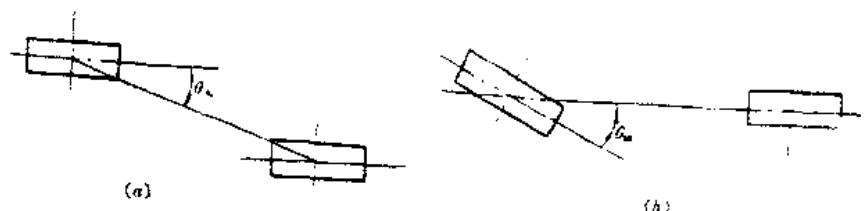

图6-8带轮的偏(a)两带轮轴线平行 )两带轮轴线不采行

同步带安装时必须有适当的张紧力,若张紧力过小,则字易在宿动项繁而又有冲击载荷时导致带齿从带轮齿槽中跳出,产生爬齿现象;若张紧力过士,则容易降带的寿。

带的张紧一般用改变传动装置中心距的方法来调整,好心距不室时,增速传动中,为增加小带轮的包角,需采用张紧轮。张紧轮的安装方法根据其用途的不述两种:

(1)安装在内侧,作张紧用。张紧轮应采月齿形带轮。当张紧轮齿数大于带轮最少许用齿数时,为避免啮合齿数的减少,应把张紧轮安装在松边一侧, $\begin{array} { l } { { \displaystyle { \dot { \mathbf { \cdots } } } } ; } \\ { { \displaystyle \quad - { \dot { \mathbf { \zeta } } } ( { \bf \zeta } ) } } \end{array}$ 图-9(a)所示,

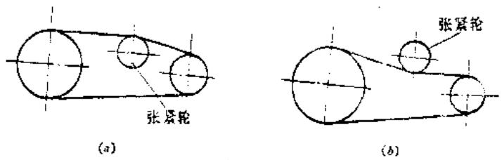

图6-9张紧轮的安装方法

(2)安装在外侧,作为增加带轮包角用。张紧轮可采用平带轮。它的互径为最少许用齿数的带轮直径,安装在松边外侧,如图6-9(b)所示,以便使带不产生过大的弯曲

# 五、同步带传动的设计计算

同步带传动的失效主要决定子间步带,而间步带的失效形大主要为:强考由成方强坏或在冲击载荷作用下断裂;强为层从营中击;强方层使长,使带的大新齿;带齿磨损、剪断、老化或

根据上述可能产生的生效兑,倒带传动的计靠要是限制高出游计努度新小。的功率(或转矩),以保,的使!,

设计同步带传动设落不为已御条律;传递的动率、转速、安均比、五、条件盈关的结构尺寸等,用以计算和确定同步带及同步带轮的梦数和结构尺寸。其设计计受的一般步骤是: 

# 1.选择同步带的节距

# (1)确定设计功率

设计功率是指根据传动用的原动机和工作机,考虑不同的运转时间,将所传递的名义动率乘以修正系数后所得的计算功率,修正系数分载荷修正系数和附加修正系数、分别可见表6-11和表6-12.

裴-11载荷修正系数K

<table><tr><td rowspan=1 colspan=2>每日运转   工作机原动机    时间（h）</td><td rowspan=1 colspan=1>复印机、计算机医疗器械</td><td rowspan=1 colspan=1>办公机器、清扫机、缝纽机等</td><td rowspan=1 colspan=1>轻载荷传送带</td><td rowspan=1 colspan=1>印刷机械、造纸机、液体搅机等</td></tr><tr><td rowspan=3 colspan=1>交流电动机（普通转矩鼠式、同步电动机）直流电动机（并缴）</td><td rowspan=1 colspan=1>断续使用3~5</td><td rowspan=1 colspan=1>1.0</td><td rowspan=1 colspan=1>1.2</td><td rowspan=1 colspan=1>1.3</td><td rowspan=1 colspan=1></td></tr><tr><td rowspan=1 colspan=1>普通使用8~10</td><td rowspan=1 colspan=1>1.2</td><td rowspan=1 colspan=1>1.1</td><td rowspan=1 colspan=1>1.5</td><td rowspan=1 colspan=1>.6</td></tr><tr><td rowspan=1 colspan=1>连续使用15~24</td><td rowspan=1 colspan=1>1.4</td><td rowspan=1 colspan=1>1.6</td><td rowspan=1 colspan=1>1.7</td><td rowspan=1 colspan=1>1.8</td></tr><tr><td rowspan=3 colspan=1>交流电动机（大转矩、大滑车率、单相、滑环）、直流电动机（复激、串澈）</td><td rowspan=1 colspan=1>断续使用3~5</td><td rowspan=1 colspan=1>12</td><td rowspan=1 colspan=1>1.1</td><td rowspan=1 colspan=1>1.5</td><td rowspan=1 colspan=1>1. 6</td></tr><tr><td rowspan=1 colspan=1>普通使用8~10</td><td rowspan=1 colspan=1>1.4</td><td rowspan=1 colspan=1>1. 6</td><td rowspan=1 colspan=1>1.7</td><td rowspan=1 colspan=1>1.8</td></tr><tr><td rowspan=1 colspan=1>连续使用16~24</td><td rowspan=1 colspan=1>1.6</td><td rowspan=1 colspan=1>1.8</td><td rowspan=1 colspan=1>1.9</td><td rowspan=1 colspan=1>2.0</td></tr></table>

表B-12附加修正系数

<table><tr><td rowspan=1 colspan=2>使用张紧轮系数</td><td rowspan=1 colspan=2>增速传动修正系数</td></tr><tr><td rowspan=1 colspan=1>张紧轮位置</td><td rowspan=1 colspan=1>系数</td><td rowspan=1 colspan=1>增速比</td><td rowspan=1 colspan=1>系   数</td></tr><tr><td rowspan=1 colspan=1>松边内侧</td><td rowspan=1 colspan=1>0</td><td rowspan=1 colspan=1>1. 00~1.24</td><td rowspan=1 colspan=1>0</td></tr><tr><td rowspan=1 colspan=1>应外侧</td><td rowspan=1 colspan=1>0.1</td><td rowspan=1 colspan=1>1. 25~1.74</td><td rowspan=1 colspan=1>0.1</td></tr><tr><td rowspan=1 colspan=1>紧边内侧</td><td rowspan=1 colspan=1>0.1</td><td rowspan=1 colspan=1>1. 75~2.49</td><td rowspan=1 colspan=1>0. 2</td></tr><tr><td rowspan=1 colspan=1>紧边外侧</td><td rowspan=1 colspan=1>0.2</td><td rowspan=1 colspan=1>2.50~3.49>3.50</td><td rowspan=1 colspan=1>0.30.1</td></tr></table>

如果所设计的同步带传动为减速传动,且未采用张紧轮,则设计功率可按下式计算:

$$
P _ { \ell } \cong \bar { K } _ { \ell } P _ { \ell }
$$

式中, $P _ { \ell }$ ---设计功率 $\therefore \kappa \mathbf { W } )$ ;

$\pmb { K } _ { \Updownarrow }$ —载荷修正系数;

$\pmb { P _ { \perp } }$ ——名义功率.

如果同步带传动为使用张紧轮,或增速传动时,除需考虑表6-11中相应载荷修正系数$\hbar ^ { * } ,$ 外,还需将表6-12中的使用张紧轮修正系数或增速传动修正系数加到载荷修正系数中去,

# (2)选择同步带的节距

根据设计功率 $\pmb { P _ { \pmb { \mathscr { t } } } }$ 和小带轮转速 ${ \pmb { \mu } } _ { 1 }$ 由图6-10所示选取同步带的型号。若选用型号与相邻型号相接近时,将两种带型作平行设计计算,择优选用。根据所定型号由表6-2查得对应的节距 $p _ { 5 } ( \mathfrak { m } \mathfrak { m } )$ 

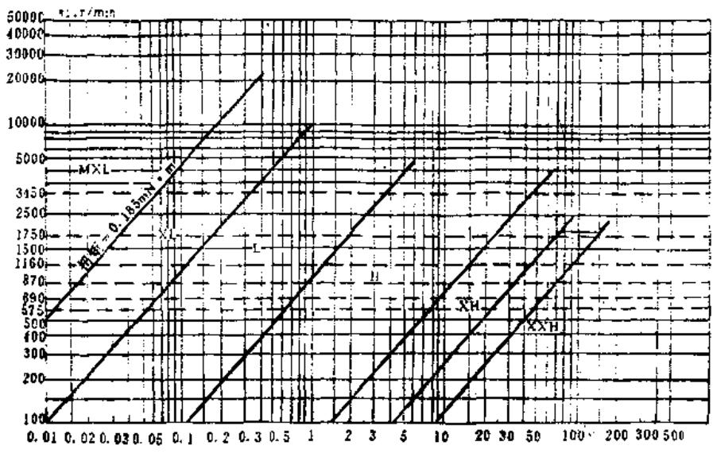

图6-10同步带型号选择图

由图可见,MXL型带用于传递功率很小的场合(传递的转矩≤0.185mN·m)。电子计算机、打印机、录音机、电影放映机、航测仪、示波器等一般选用XL型,自:图仪选用L型,卫星通信地面站有选用L型的,也有选用H型同步带的。

# 2.确定带轮节径和同步带的长度、齿数

# (1)带轮齿数和节径

根据带型和小带轮转速,由表6-13和表6-8确定小带轮的齿数。

表6-13带轮最少许用齿数

<table><tr><td rowspan=2 colspan=2>小带轮转速(r/min)</td><td rowspan=1 colspan=1><900</td><td rowspan=1 colspan=1>900~<1200</td><td rowspan=1 colspan=1>1200~<1800</td><td rowspan=1 colspan=1>1800~<3000</td><td rowspan=1 colspan=1>3600~<1800</td></tr><tr><td rowspan=1 colspan=5>2min</td></tr><tr><td rowspan=3 colspan=1>型号</td><td rowspan=1 colspan=1>MXLXXL</td><td rowspan=1 colspan=1></td><td rowspan=1 colspan=1>12</td><td rowspan=1 colspan=1>1</td><td rowspan=1 colspan=1>16</td><td rowspan=1 colspan=1>1</td></tr><tr><td rowspan=1 colspan=1>XL</td><td rowspan=1 colspan=1>10</td><td rowspan=1 colspan=2>10           12     ！</td><td rowspan=1 colspan=1>12</td><td rowspan=1 colspan=1>15</td></tr><tr><td rowspan=1 colspan=1>L</td><td rowspan=1 colspan=1>12</td><td rowspan=1 colspan=2>/ 1112</td><td rowspan=1 colspan=1>16</td><td rowspan=1 colspan=1>18</td></tr></table>

大齿轮齿数

$$
z _ { 1 } \geqslant z _ { m 1 , n }
$$

$$
z _ { 2 } = z _ { 1 } i
$$

计算后需根据表6-8所示圆整确定。它们的节径分别为

$$
\begin{array} { r } { d _ { 1 } = \frac { \beta _ { 1 } \hat { c } _ { 1 } } { \pi } } \\ { d _ { 2 } = \frac { \beta _ { 2 } } { \pi } } \end{array}
$$

或根据所选带型及齿数,直接由表6-8查得。

# (2)选择同步带长度

同步带的计算长度为

$$
L _ { t t } = 2 a _ { 0 } c o s \beta + \frac { \pi ( d _ { 1 } + d _ { 2 } ) } { 2 } + \frac { \pi \beta ( \mathrm { \Delta } t _ { 2 } - d _ { 1 } ) } { 1 8 0 ^ { \circ } }
$$

其中

$$
\beta \simeq \sin ^ { - 1 } \left\{ \frac { d _ { 2 } - d _ { 1 } } { 2 n _ { 0 } } \right\} \qquad ( { \mathrm { ~ \it ~ \alpha ~ } } )
$$

式中, $\pmb { \mathscr { o } } _ { \pmb { \emptyset } }$ 为初定中心距 $\left( \mathfrak { m } \mathfrak { m } \right)$ ,由已知条件给定。若对中心距未作规定,则可按 $0 , 7 ( d _ { \uparrow } \div d _ { \uparrow } )$ $< a _ { 0 } < 2 ( d _ { 1 } + d _ { 2 } )$ 范围初选中心距 ${ \mathfrak { a } } _ { 0 }$ 

由计算所得长度 $\vec { L } _ { \pmb { \nu } \pmb { \nu } } ( \pmb { m } \mathbf { m } )$ ,按表6-4或表6-5查得已定带型系列中与 $\bar { L } _ { \pmb { \nu } j }$ 最接近的标准值 $\tilde { L } _ { \ r } (  )$ ,并得相应带的齿数 $\tilde { \mathbf { \Gamma } } _ { \mathbf { \Lambda } }$ 

# 3.中心距计算

同步带传动额定功率和传动中心距计算标准在GB11362一89中推荐,中心距的计算有两种方法:

(1)精确公式

$$
a = \frac { p _ { \phi } ( z _ { z } - z _ { 1 } ) } { 2 \pi \cos \theta }
$$

式中: $\pmb { \vartheta }$ 为辅助角,见图6-11。其值为

$$
\mathrm { i n } \mathrm { V } \theta = \pi \frac { \tilde { \ast } - z _ { 2 } } { z _ { 3 } - z _ { 1 } }
$$

其中, ${ \mathfrak { i } } \nabla { \boldsymbol { \theta } } = { \mathfrak { t } } { \mathfrak { s } } { \boldsymbol { \theta } } - { \boldsymbol { \theta } } , { \boldsymbol { \theta } }$ 的数值可用逐步逼近法或查渐开线函数加以确定。

该法适用于 $z _ { 2 } / z _ { 3 }$ 之值很大的场合,当 $z _ { 2 } / z _ { 1 }$ 值接近1时,不宜采用,而推荐使用近似公式计算中心距。

(2)近似公式

$$
a \approx M + \sqrt { M ^ { 2 } - \frac { 1 } { 8 } \biggl [ \frac { \tilde { y } _ { 3 } ( z _ { 2 } - z _ { 1 } ) } { \pi } \biggr ] ^ { 2 } }
$$

$$
M = \frac { p _ { b } } { 8 } ( 2 z _ { b } - z _ { i } - z _ { i } )
$$

4.选择标准带宽

# (1)确定基准额定功率

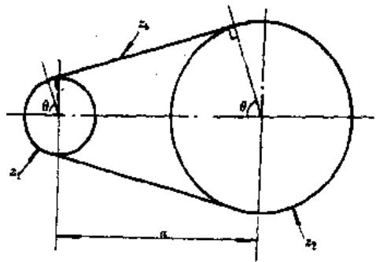

图6-11辅助角示意图

同步带在传动装置正确安装和维护的前提下,在规定的几何条件和环境条件下,能在一定时间内正常工作所传递的功率称为额定功率 $\pmb { P } ( \pmb { k } \pmb { \ w { W } } )$ 。而带宽为基准宽度的额定功率称之为基准额定功率,用符号 ${ \pmb { p } } _ { \pmb { \imath } }$ 表示。基准额定功率 $P _ { 0 } ( { \bf k W } )$ 按下式计算:

$$
\bar { P } _ { \varnothing } = \frac { ( \bar { T } _ { \star } - m v ^ { 2 } ) v } { 1 0 0 0 }
$$

式中, $\pmb { \mathscr { T } } _ { \bullet }$ —带宽为 $\pmb { \delta _ { \llangle } }$ 的许用工作拉力,见表6-14;

$\delta _ { \bullet \mathfrak { Q } } .$ ——节距为 $\pmb { \operatorname { \pmb { p _ { \imath } } } }$ 的标准带的最大宽度,即基准宽度,见表6-15;$\pmb { m }$ 一 带宽为 $\scriptstyle \partial _ { \nparallel }$ 的单位长度的质量 $( k g / m )$ ,见表6-14;$\pmb { v }$ 带的速度 $( \ m / s )$ 其值为

$$
v = { \frac { p _ { \mathrm { { s } } } z _ { \mathrm { { t } } } u _ { 1 } } { 1 0 0 0 } }
$$

表-14许用工作拉力及单位长度质量

<table><tr><td rowspan=1 colspan=1>带型号</td><td rowspan=1 colspan=1>MXL</td><td rowspan=1 colspan=1>XXL</td><td rowspan=1 colspan=1>XL</td><td rowspan=1 colspan=1>L</td></tr><tr><td rowspan=1 colspan=1>T.(N)</td><td rowspan=1 colspan=1>27</td><td rowspan=1 colspan=1>31</td><td rowspan=1 colspan=1>50. 17</td><td rowspan=1 colspan=1>244.46</td></tr><tr><td rowspan=1 colspan=1>m（kg/m）</td><td rowspan=1 colspan=1>0. 007</td><td rowspan=1 colspan=1>0.010</td><td rowspan=1 colspan=1>0.022</td><td rowspan=1 colspan=1>0.095</td></tr></table>

表8-15带的基准宽度(mm)

<table><tr><td rowspan=1 colspan=1>带型号</td><td rowspan=1 colspan=1>MXL</td><td rowspan=1 colspan=1>XXL</td><td rowspan=1 colspan=1>XL</td><td rowspan=1 colspan=1>L</td></tr><tr><td rowspan=1 colspan=1>基准宽度b.</td><td rowspan=1 colspan=1>6.4</td><td rowspan=1 colspan=1>6.4</td><td rowspan=1 colspan=1>9.5</td><td rowspan=1 colspan=1>25. 4</td></tr></table>

式(6-8)适用于小带轮与同步带的啮合齿数 $\therefore \geq 6$ ;当 $z _ { \mu } < 6$ 时需用后面的额定功率计算式确定基准额定功率。

对于 ${ \mathrm { \bf X L } } , { \mathrm { \bf L } }$ 型同步带, $z _ { \mathbf { \lambda } \mathbf { \mathbf { \mathbf { \hat { \mathbf { \alpha } } } } } } \geqslant 6$ 时,其基准额定功率见表6-16和表 ${ \mathfrak { f } } { \mathfrak { a } } { \mathfrak { l } } { \mathfrak { 7 } }$ 。设计时,根据小带轮转速 ${ \mathfrak { M } } _ { \mathbf { l } }$ 和齿数 ${ \pmb z _ { 1 } }$ 由表 $6 \cdot 1 6$ 或6-17查得 $\scriptstyle { \mathtt { P } } _ { \mathfrak { g } }$ 或用内插法求出基准额定功率。

表-1XL型带(节距 $5 , 0 8 0 \eta m m$ 基准宽度 $9 . \ 5 m m ^ { \cdot }$ 基准额定功平 $\rho _ { \uparrow } ( { \sf k } \backslash { \updownarrow } )$ 

<table><tr><td rowspan=1 colspan=1>小带轮转速</td><td rowspan=1 colspan=10>小带轮齿数x和节圆直径d（mm）</td></tr><tr><td rowspan=2 colspan=1>x(r/min）</td><td rowspan=2 colspan=1>1016.17</td><td rowspan=2 colspan=1>1219.40</td><td rowspan=2 colspan=1>1422.64</td><td rowspan=2 colspan=1>1625.87</td><td rowspan=2 colspan=1>1829.11</td><td rowspan=2 colspan=1>2032.34</td><td rowspan=1 colspan=1>22</td><td rowspan=2 colspan=1>2438.8</td><td rowspan=2 colspan=1>2845.28</td><td rowspan=2 colspan=1>48.5</td></tr><tr><td rowspan=1 colspan=1>35.57</td></tr><tr><td rowspan=1 colspan=1>950</td><td rowspan=1 colspan=1>0.040</td><td rowspan=1 colspan=1>0.048</td><td rowspan=1 colspan=1>0.057</td><td rowspan=1 colspan=1>0.065</td><td rowspan=1 colspan=1>0.073</td><td rowspan=1 colspan=1>0.081</td><td rowspan=1 colspan=1>0.089</td><td rowspan=1 colspan=1>0.097</td><td rowspan=1 colspan=1>0.113</td><td rowspan=1 colspan=1>0.131</td></tr><tr><td rowspan=1 colspan=1>1160</td><td rowspan=1 colspan=1>0.049</td><td rowspan=1 colspan=1>0.059</td><td rowspan=1 colspan=1>0.069</td><td rowspan=1 colspan=1>0.079</td><td rowspan=1 colspan=1>0.089</td><td rowspan=1 colspan=1>0.098</td><td rowspan=1 colspan=1>0.108</td><td rowspan=1 colspan=1>0.118</td><td rowspan=1 colspan=1>0.138</td><td rowspan=1 colspan=1>0.147</td></tr><tr><td rowspan=1 colspan=1>1425</td><td rowspan=1 colspan=1></td><td rowspan=1 colspan=1>0.073</td><td rowspan=1 colspan=1>0.085</td><td rowspan=1 colspan=1>0.097</td><td rowspan=1 colspan=1>0.109</td><td rowspan=1 colspan=1>0.121</td><td rowspan=1 colspan=1>0.133[</td><td rowspan=1 colspan=1>0.J45</td><td rowspan=1 colspan=1>0.169</td><td rowspan=1 colspan=1>0.181</td></tr><tr><td rowspan=1 colspan=1>1750</td><td rowspan=1 colspan=1>1</td><td rowspan=1 colspan=1>0.089</td><td rowspan=1 colspan=1>0.104</td><td rowspan=1 colspan=1>0.119</td><td rowspan=1 colspan=1>0.134</td><td rowspan=1 colspan=1>0.148</td><td rowspan=1 colspan=1>0.163</td><td rowspan=1 colspan=1>0.178</td><td rowspan=1 colspan=1>0.207</td><td rowspan=1 colspan=1>0.221</td></tr><tr><td rowspan=1 colspan=1>2850</td><td rowspan=1 colspan=1>：+</td><td rowspan=1 colspan=1>0.145</td><td rowspan=1 colspan=1>0.169</td><td rowspan=1 colspan=1>0.193</td><td rowspan=1 colspan=1>0.216</td><td rowspan=1 colspan=1>0.2401：</td><td rowspan=1 colspan=1>0.263</td><td rowspan=1 colspan=1>0.287</td><td rowspan=1 colspan=1>0.333</td><td rowspan=1 colspan=1>0.355</td></tr><tr><td rowspan=1 colspan=1>3450</td><td rowspan=1 colspan=1></td><td rowspan=1 colspan=1>0.175</td><td rowspan=1 colspan=1>0.204</td><td rowspan=1 colspan=1>0.232</td><td rowspan=1 colspan=1>0.266</td><td rowspan=1 colspan=1>0.2891</td><td rowspan=1 colspan=1>0.317</td><td rowspan=1 colspan=1>0.345</td><td rowspan=1 colspan=1>0.399：</td><td rowspan=1 colspan=1>0.425</td></tr><tr><td rowspan=1 colspan=1>100</td><td rowspan=1 colspan=1>0.004</td><td rowspan=1 colspan=1>0.005</td><td rowspan=1 colspan=1>0.006：</td><td rowspan=1 colspan=1>C.0071</td><td rowspan=1 colspan=1>0.008</td><td rowspan=1 colspan=1>0.009</td><td rowspan=1 colspan=1>0.009</td><td rowspan=1 colspan=1>0.013</td><td rowspan=1 colspan=1>0.012</td><td rowspan=1 colspan=1>0.013</td></tr><tr><td rowspan=1 colspan=1>200</td><td rowspan=1 colspan=1>0.009</td><td rowspan=1 colspan=1>0.010</td><td rowspan=1 colspan=1>0.012i</td><td rowspan=1 colspan=1>0.014</td><td rowspan=1 colspan=1>0.015</td><td rowspan=1 colspan=1>0.017</td><td rowspan=1 colspan=1>0.0 ：</td><td rowspan=1 colspan=1>0.020</td><td rowspan=1 colspan=1>0.024</td><td rowspan=1 colspan=1>0.026</td></tr><tr><td rowspan=1 colspan=1>300</td><td rowspan=1 colspan=1>0.013</td><td rowspan=1 colspan=1>0.015T</td><td rowspan=1 colspan=1>0.018i</td><td rowspan=1 colspan=1>0.020</td><td rowspan=1 colspan=1>0.023</td><td rowspan=1 colspan=1>0.026</td><td rowspan=1 colspan=1>0.028</td><td rowspan=1 colspan=1>.031</td><td rowspan=1 colspan=1>0.036</td><td rowspan=1 colspan=1>0.038</td></tr><tr><td rowspan=1 colspan=1>400</td><td rowspan=1 colspan=1>0.017</td><td rowspan=1 colspan=1>0.020</td><td rowspan=1 colspan=1>0.024</td><td rowspan=1 colspan=1>0.027</td><td rowspan=1 colspan=1>0.03！</td><td rowspan=1 colspan=1>0.034</td><td rowspan=1 colspan=1>0.037</td><td rowspan=1 colspan=1>0.04</td><td rowspan=1 colspan=1>0.048</td><td rowspan=1 colspan=1>0.05:</td></tr><tr><td rowspan=1 colspan=1>500</td><td rowspan=1 colspan=1>0.021</td><td rowspan=1 colspan=1>0.026</td><td rowspan=1 colspan=1>0.030</td><td rowspan=1 colspan=1>0.034</td><td rowspan=1 colspan=1>0.038</td><td rowspan=1 colspan=1>0.043</td><td rowspan=1 colspan=1>0.047</td><td rowspan=1 colspan=1>0.051</td><td rowspan=1 colspan=1>0.060</td><td rowspan=1 colspan=1>0.064</td></tr><tr><td rowspan=1 colspan=1>600</td><td rowspan=1 colspan=1>0.026</td><td rowspan=1 colspan=1>0.031</td><td rowspan=1 colspan=1>0.036</td><td rowspan=1 colspan=1>0.041</td><td rowspan=1 colspan=1>0.046</td><td rowspan=1 colspan=1>0.051</td><td rowspan=1 colspan=1>0.056</td><td rowspan=1 colspan=1>0.061</td><td rowspan=1 colspan=1>0.071</td><td rowspan=1 colspan=1>0.076</td></tr><tr><td rowspan=1 colspan=1>700</td><td rowspan=1 colspan=1>0.030</td><td rowspan=1 colspan=1>0.036</td><td rowspan=1 colspan=1>0.042</td><td rowspan=1 colspan=1>Q.048</td><td rowspan=1 colspan=1>0.054</td><td rowspan=1 colspan=1>0.060</td><td rowspan=1 colspan=1>0.065</td><td rowspan=1 colspan=1>0.071</td><td rowspan=1 colspan=1>0.083；</td><td rowspan=1 colspan=1>；0.089</td></tr><tr><td rowspan=1 colspan=1>800</td><td rowspan=1 colspan=1>0.034</td><td rowspan=1 colspan=1>0.041</td><td rowspan=1 colspan=1>0.018</td><td rowspan=1 colspan=1>0.054</td><td rowspan=1 colspan=1>0.061</td><td rowspan=1 colspan=1>0.008</td><td rowspan=1 colspan=1>0.075;</td><td rowspan=1 colspan=1>0.082</td><td rowspan=1 colspan=1>0.095</td><td rowspan=1 colspan=1>0.102</td></tr><tr><td rowspan=1 colspan=1>900</td><td rowspan=1 colspan=1>0.D38</td><td rowspan=1 colspan=1>0.048</td><td rowspan=1 colspan=1>0.054</td><td rowspan=1 colspan=1>0.061</td><td rowspan=1 colspan=1>0.069</td><td rowspan=1 colspan=1>0.076</td><td rowspan=1 colspan=1>0.084</td><td rowspan=1 colspan=1>0.0921</td><td rowspan=1 colspan=1>0.107：</td><td rowspan=1 colspan=1>C.115</td></tr><tr><td rowspan=1 colspan=1>:1000</td><td rowspan=1 colspan=1>0.D43</td><td rowspan=1 colspan=1>0.051</td><td rowspan=1 colspan=1>0.060</td><td rowspan=1 colspan=1>0.068</td><td rowspan=1 colspan=1>0.076</td><td rowspan=1 colspan=1>0.085</td><td rowspan=1 colspan=1>0.093</td><td rowspan=1 colspan=1>.102</td><td rowspan=1 colspan=1>0.119</td><td rowspan=1 colspan=1>0.127</td></tr></table>

(续表)

<table><tr><td rowspan=1 colspan=2>1100</td><td rowspan=1 colspan=2>0.047</td><td rowspan=1 colspan=2>0.c56</td><td rowspan=1 colspan=2>0.065</td><td rowspan=1 colspan=2>0.075</td><td></td><td></td><td></td><td></td><td></td><td></td><td rowspan=1 colspan=7></td><td rowspan=1 colspan=1>0.084</td><td rowspan=1 colspan=1>0.093</td><td rowspan=1 colspan=1>0.103</td><td rowspan=1 colspan=1>0.112</td><td rowspan=1 colspan=1>0.131</td><td rowspan=1 colspan=1>0.140</td></tr><tr><td rowspan=1 colspan=2>1:00  ！</td><td rowspan=1 colspan=2></td><td rowspan=1 colspan=2>0.061</td><td rowspan=1 colspan=2>0.071</td><td rowspan=1 colspan=2>0.082</td><td></td><td></td><td></td><td></td><td></td><td></td><td></td><td rowspan=1 colspan=1>0.092</td><td rowspan=1 colspan=1>0.102</td><td rowspan=1 colspan=1>0.112</td><td rowspan=1 colspan=1>0.122</td><td rowspan=1 colspan=1>0.142</td><td rowspan=1 colspan=1>0.152</td></tr><tr><td rowspan=1 colspan=2>1300</td><td rowspan=1 colspan=2></td><td rowspan=1 colspan=2>0.966</td><td rowspan=1 colspan=2>0.077</td><td rowspan=1 colspan=2>0.088</td><td rowspan=1 colspan=1>0.099</td><td rowspan=1 colspan=1>0.110</td><td rowspan=1 colspan=1>0.120</td><td rowspan=1 colspan=1>0.132</td><td rowspan=1 colspan=1>0.154</td><td></td><td></td><td></td><td></td><td></td><td></td><td></td><td rowspan=1 colspan=1>0.165</td></tr><tr><td rowspan=1 colspan=2>1400</td><td rowspan=1 colspan=2></td><td rowspan=1 colspan=2>0.97</td><td rowspan=1 colspan=2>0.083</td><td rowspan=1 colspan=2>0.095</td><td rowspan=1 colspan=1>0.107</td><td rowspan=1 colspan=1>0.119</td><td rowspan=1 colspan=1>0、31</td><td rowspan=1 colspan=1>0.142</td><td rowspan=1 colspan=1>0.166</td><td></td><td></td><td></td><td></td><td></td><td></td><td></td><td rowspan=1 colspan=1>0.178</td></tr><tr><td rowspan=1 colspan=2>1500</td><td rowspan=1 colspan=2></td><td rowspan=1 colspan=2>0.076</td><td rowspan=1 colspan=2>：389</td><td rowspan=1 colspan=2>2.102</td><td rowspan=1 colspan=1>0.115</td><td rowspan=1 colspan=1>0.127</td><td rowspan=1 colspan=1>0.140</td><td rowspan=1 colspan=1>0.152</td><td rowspan=1 colspan=1>0. 178</td><td></td><td></td><td></td><td></td><td></td><td></td><td></td><td rowspan=1 colspan=1>0.190</td></tr><tr><td rowspan=1 colspan=1>1600</td><td></td><td rowspan=1 colspan=2></td><td rowspan=1 colspan=2>0.082</td><td rowspan=1 colspan=2>.095</td><td rowspan=1 colspan=2>0.109</td><td rowspan=1 colspan=1>0.122</td><td rowspan=1 colspan=1>0.1:6</td><td rowspan=1 colspan=1>.49</td><td rowspan=1 colspan=1>0.163</td><td rowspan=1 colspan=1>0.189</td><td></td><td></td><td></td><td></td><td></td><td></td><td></td><td rowspan=1 colspan=1>.203</td></tr><tr><td rowspan=1 colspan=1>170C</td><td></td><td rowspan=1 colspan=2>：</td><td rowspan=1 colspan=2>！0.087</td><td rowspan=1 colspan=2>0:</td><td rowspan=1 colspan=2>0.115：</td><td rowspan=1 colspan=1>9.130</td><td rowspan=1 colspan=1>0.144</td><td rowspan=1 colspan=1>0.158</td><td rowspan=1 colspan=1>0.173</td><td rowspan=1 colspan=1>0.201</td><td></td><td></td><td></td><td></td><td></td><td></td><td></td><td rowspan=1 colspan=1>0.215</td></tr><tr><td rowspan=1 colspan=1>1800</td><td rowspan=1 colspan=2>！</td><td rowspan=1 colspan=2>0.092</td><td rowspan=1 colspan=2>0.107</td><td rowspan=1 colspan=2>：</td><td></td><td rowspan=1 colspan=1>137</td><td rowspan=1 colspan=1>0.152</td><td rowspan=1 colspan=1>0168</td><td rowspan=1 colspan=1>0.183</td><td rowspan=1 colspan=1>0.213</td><td rowspan=1 colspan=8>0. 228</td></tr><tr><td rowspan=1 colspan=1>2000</td><td rowspan=1 colspan=2></td><td rowspan=1 colspan=2>0.102</td><td rowspan=1 colspan=2>0.119</td><td rowspan=1 colspan=2>0.13</td><td></td><td rowspan=1 colspan=1>0.152</td><td rowspan=1 colspan=1>0.169</td><td rowspan=1 colspan=1>0.186</td><td rowspan=1 colspan=1>0.203</td><td rowspan=1 colspan=1>0.236</td><td rowspan=1 colspan=8>0.252</td></tr><tr><td rowspan=1 colspan=1>2200 ：：</td><td rowspan=1 colspan=2>：</td><td rowspan=1 colspan=2>0.112</td><td rowspan=1 colspan=2>0.131</td><td rowspan=1 colspan=2>0.149</td><td rowspan=1 colspan=2>0.1.8</td><td rowspan=1 colspan=1>0.186</td><td rowspan=1 colspan=1>0.204</td><td rowspan=1 colspan=1>0.223</td><td rowspan=1 colspan=1>0.259</td><td rowspan=1 colspan=8>0.7</td></tr><tr><td rowspan=1 colspan=2>2400 </td><td rowspan=1 colspan=2></td><td rowspan=1 colspan=2>0.122</td><td rowspan=1 colspan=2>0.142</td><td rowspan=1 colspan=2>u.163：</td><td rowspan=1 colspan=1>0.183</td><td rowspan=1 colspan=1>0.203</td><td rowspan=1 colspan=1>0.223</td><td rowspan=1 colspan=1>0.242</td><td rowspan=1 colspan=1>0.282</td><td rowspan=1 colspan=8>0.301</td></tr><tr><td rowspan=1 colspan=2>2600</td><td rowspan=1 colspan=2>1</td><td rowspan=1 colspan=2>0.32</td><td rowspan=1 colspan=2>0.154</td><td rowspan=1 colspan=2>0.176</td><td rowspan=1 colspan=1>0.198</td><td rowspan=1 colspan=1>0.219</td><td rowspan=1 colspan=1>0.241</td><td rowspan=1 colspan=1>0.262</td><td rowspan=1 colspan=1>0.304</td><td rowspan=1 colspan=8>Q.325</td></tr><tr><td rowspan=1 colspan=2>2800</td><td rowspan=1 colspan=2></td><td rowspan=1 colspan=2>0.142</td><td rowspan=1 colspan=2>0.166</td><td rowspan=1 colspan=2>0.189！</td><td rowspan=1 colspan=1>0.213</td><td rowspan=1 colspan=1>0.236</td><td rowspan=1 colspan=1>2.259</td><td rowspan=1 colspan=1>0.282</td><td rowspan=1 colspan=1>0.327</td><td rowspan=1 colspan=8>0.349</td></tr><tr><td rowspan=1 colspan=2>3000</td><td rowspan=1 colspan=2></td><td rowspan=1 colspan=2>0.152</td><td rowspan=1 colspan=2>0.178</td><td rowspan=1 colspan=2>0.203</td><td rowspan=1 colspan=1>0.2281</td><td rowspan=1 colspan=1>0.252：</td><td rowspan=1 colspan=1>0.277</td><td rowspan=1 colspan=1>0.301</td><td rowspan=1 colspan=1>0.349</td><td rowspan=1 colspan=8>0.373</td></tr></table>

表-17L型带(节距9.525mm,基准宽度25.4mm)基准额定功率P(kW)

<table><tr><td rowspan=1 colspan=1></td><td rowspan=1 colspan=2>小带轮转速</td><td rowspan=1 colspan=30>小带轮齿数2和节圆直径d（mm）1214 16 18</td></tr><tr><td rowspan=1 colspan=1></td><td rowspan=1 colspan=2>1！</td><td rowspan=1 colspan=2>1214</td><td rowspan=1 colspan=3>1214</td><td rowspan=1 colspan=2>16</td><td rowspan=1 colspan=2>18</td><td rowspan=1 colspan=2>20</td><td rowspan=1 colspan=2>221</td><td rowspan=1 colspan=2>24</td><td rowspan=1 colspan=2>26</td><td rowspan=1 colspan=2>28</td><td rowspan=1 colspan=2>30</td><td rowspan=1 colspan=2>321</td><td rowspan=1 colspan=2>36</td><td rowspan=1 colspan=2>10</td><td rowspan=1 colspan=2>1</td><td rowspan=1 colspan=1>1</td></tr><tr><td></td><td rowspan=1 colspan=2>725</td><td rowspan=1 colspan=2>0. 34</td><td rowspan=1 colspan=3>0.39</td><td rowspan=1 colspan=2>0.45</td><td rowspan=1 colspan=2>0. 51</td><td rowspan=1 colspan=2>0.56</td><td rowspan=1 colspan=2>0.62</td><td rowspan=1 colspan=2>0.67</td><td rowspan=1 colspan=2>0.73</td><td rowspan=1 colspan=2>0.78</td><td rowspan=1 colspan=2>0.84</td><td rowspan=1 colspan=2>0.90</td><td rowspan=1 colspan=2>1.01</td><td rowspan=1 colspan=2>1.12</td><td rowspan=1 colspan=2>1.23</td><td rowspan=1 colspan=1>1.33</td></tr><tr><td></td><td rowspan=1 colspan=2>870</td><td rowspan=1 colspan=2>0.40</td><td rowspan=1 colspan=3>0.47</td><td rowspan=1 colspan=2>0.54</td><td rowspan=1 colspan=2>c.610.s7</td><td rowspan=1 colspan=2>c.610.s7</td><td rowspan=1 colspan=2>0.74</td><td rowspan=1 colspan=2>0.81</td><td rowspan=1 colspan=2>0.87</td><td rowspan=1 colspan=2>0.94</td><td rowspan=1 colspan=2>1.01</td><td rowspan=1 colspan=2>1.07</td><td rowspan=1 colspan=2>1.20</td><td rowspan=1 colspan=2>1.33</td><td rowspan=1 colspan=2>1.46</td><td rowspan=1 colspan=1>1.59</td></tr><tr><td></td><td rowspan=1 colspan=2>950</td><td rowspan=1 colspan=2>0.440.520</td><td rowspan=1 colspan=3>0.440.520</td><td rowspan=1 colspan=2>0.59</td><td rowspan=1 colspan=2>0.66</td><td rowspan=1 colspan=2>0.73</td><td rowspan=1 colspan=2>0.81</td><td rowspan=1 colspan=2>0.88</td><td rowspan=1 colspan=2>0.95</td><td rowspan=1 colspan=2>1.03</td><td rowspan=1 colspan=2>1.10</td><td rowspan=1 colspan=2>1.17</td><td rowspan=1 colspan=2>1.31</td><td rowspan=1 colspan=2>1.45</td><td rowspan=1 colspan=2>1.59</td><td rowspan=1 colspan=1>1.73</td></tr><tr><td></td><td rowspan=1 colspan=2>1160</td><td rowspan=1 colspan=2>0.54</td><td rowspan=1 colspan=3>0.63</td><td rowspan=1 colspan=2>0.7？</td><td rowspan=1 colspan=2>0.81</td><td rowspan=1 colspan=2>0.90</td><td rowspan=1 colspan=2>0.98！</td><td rowspan=1 colspan=2>1.07</td><td rowspan=1 colspan=2>1.16：</td><td rowspan=1 colspan=2>：1.25</td><td rowspan=1 colspan=2>1.33</td><td rowspan=1 colspan=2>1.42</td><td rowspan=1 colspan=2>1.59</td><td rowspan=1 colspan=2>1.76</td><td rowspan=1 colspan=2>1.93</td><td rowspan=1 colspan=1>2.09</td></tr><tr><td></td><td rowspan=1 colspan=2>1425</td><td rowspan=1 colspan=2></td><td rowspan=1 colspan=3>0.77</td><td rowspan=1 colspan=2>0.88</td><td></td><td rowspan=1 colspan=2>0.99</td><td rowspan=1 colspan=2>1.10</td><td rowspan=1 colspan=2>1.20</td><td rowspan=1 colspan=2>1.31</td><td rowspan=1 colspan=2>1.42i</td><td></td><td rowspan=1 colspan=2>1.52</td><td rowspan=1 colspan=2>1. 63</td><td rowspan=1 colspan=2>1.73</td><td rowspan=1 colspan=2>1.94</td><td rowspan=1 colspan=2>·</td><td rowspan=1 colspan=2></td><td rowspan=1 colspan=1>2.53</td></tr><tr><td></td><td rowspan=1 colspan=2>1750</td><td rowspan=1 colspan=2></td><td rowspan=1 colspan=3>0.95</td><td rowspan=1 colspan=2>1. 08</td><td rowspan=1 colspan=2>1. 21</td><td></td><td rowspan=1 colspan=2>1.34</td><td rowspan=1 colspan=2>1.47</td><td rowspan=1 colspan=2>1.60</td><td rowspan=1 colspan=2>1.73</td><td rowspan=1 colspan=2>1.86</td><td rowspan=1 colspan=2>1.98</td><td rowspan=1 colspan=2>2.11</td><td></td><td rowspan=1 colspan=2>2.35</td><td rowspan=1 colspan=2></td><td rowspan=1 colspan=2></td><td rowspan=1 colspan=2>3.03</td></tr><tr><td></td><td rowspan=1 colspan=2>2850</td><td rowspan=1 colspan=2>1</td><td rowspan=1 colspan=3></td><td rowspan=1 colspan=2>1.731</td><td rowspan=1 colspan=2>1.94</td><td rowspan=1 colspan=2>2.14</td><td rowspan=1 colspan=2>2.34</td><td rowspan=1 colspan=2>2.53</td><td rowspan=1 colspan=2>2.72</td><td rowspan=1 colspan=2>2.90</td><td rowspan=1 colspan=2>3.08</td><td rowspan=1 colspan=2>3.25</td><td rowspan=1 colspan=2>3.57</td><td rowspan=1 colspan=2>3.86</td><td rowspan=1 colspan=2>4.11</td><td rowspan=1 colspan=2>4.33</td></tr><tr><td rowspan=1 colspan=2>3450</td><td rowspan=1 colspan=2></td><td rowspan=1 colspan=3>丨</td><td rowspan=1 colspan=2>2. 08</td><td rowspan=1 colspan=2>2.32</td><td rowspan=1 colspan=2>2.55</td><td rowspan=1 colspan=2>2.78</td><td rowspan=1 colspan=2>3.00</td><td rowspan=1 colspan=2>3.311</td><td rowspan=1 colspan=2>3.40</td><td rowspan=1 colspan=2>3.59</td><td rowspan=1 colspan=2>3.77</td><td rowspan=1 colspan=2>4.09</td><td rowspan=1 colspan=2>4.35</td><td rowspan=1 colspan=2>4.56</td><td rowspan=1 colspan=2>4.69</td></tr><tr><td rowspan=1 colspan=2>100</td><td rowspan=1 colspan=2>0.05</td><td rowspan=1 colspan=3>0.0s|</td><td rowspan=1 colspan=2>10.06</td><td rowspan=1 colspan=2>0.07</td><td rowspan=1 colspan=2>10.08</td><td rowspan=1 colspan=2>0.09</td><td rowspan=1 colspan=2>0.09</td><td rowspan=1 colspan=2>0.10</td><td rowspan=1 colspan=2>0.11</td><td rowspan=1 colspan=2>0.12</td><td rowspan=1 colspan=2>0.12</td><td rowspan=1 colspan=2>0.141</td><td rowspan=1 colspan=2>0.16</td><td rowspan=1 colspan=2>0.17</td><td rowspan=1 colspan=2>0.19</td></tr><tr><td rowspan=1 colspan=2>00</td><td rowspan=1 colspan=2>0.09/</td><td rowspan=1 colspan=3>0.1</td><td rowspan=1 colspan=2>[0.12]</td><td rowspan=1 colspan=2>0.1410.16</td><td rowspan=1 colspan=2>0.1410.16</td><td rowspan=1 colspan=2>0.17</td><td rowspan=1 colspan=2>0.19</td><td rowspan=1 colspan=2>0.20</td><td rowspan=1 colspan=2>0.22</td><td rowspan=1 colspan=2>0.23</td><td rowspan=1 colspan=2>0.25</td><td rowspan=1 colspan=2>0.28</td><td rowspan=1 colspan=2>0.31</td><td rowspan=1 colspan=2>0.34</td><td rowspan=1 colspan=2>0.37</td></tr><tr><td rowspan=1 colspan=2>300</td><td rowspan=1 colspan=2>0.14</td><td rowspan=1 colspan=3>0.16</td><td rowspan=1 colspan=2>0.19</td><td rowspan=1 colspan=2>0.21</td><td rowspan=1 colspan=2>10.23</td><td rowspan=1 colspan=2>0.26</td><td rowspan=1 colspan=2>0.28</td><td rowspan=1 colspan=2>0.30</td><td rowspan=1 colspan=2>0.33</td><td rowspan=1 colspan=2>0.35</td><td rowspan=1 colspan=2>0.37</td><td rowspan=1 colspan=2>0.42</td><td rowspan=1 colspan=2>0.47</td><td rowspan=1 colspan=2>0.51</td><td rowspan=1 colspan=2>0.56</td></tr><tr><td rowspan=1 colspan=2>400</td><td rowspan=1 colspan=2>0.19</td><td rowspan=1 colspan=3>0. 22</td><td rowspan=1 colspan=2>10.25</td><td rowspan=1 colspan=2>0.28</td><td rowspan=1 colspan=2>0.280.31</td><td rowspan=1 colspan=2>0.34</td><td rowspan=1 colspan=2>0.37</td><td rowspan=1 colspan=2>0.40</td><td rowspan=1 colspan=2>0.43</td><td rowspan=1 colspan=2>0.47</td><td rowspan=1 colspan=2>0.50</td><td rowspan=1 colspan=2>0.56</td><td rowspan=1 colspan=2>0.62</td><td rowspan=1 colspan=2>0.68</td><td rowspan=1 colspan=2>0.74</td></tr><tr><td rowspan=1 colspan=2>500</td><td rowspan=1 colspan=2>0.23</td><td rowspan=1 colspan=3>[0. 27</td><td rowspan=1 colspan=2>0.310</td><td rowspan=1 colspan=2>10.35</td><td rowspan=1 colspan=2>0.39</td><td rowspan=1 colspan=2>0.43</td><td rowspan=1 colspan=2>0.47</td><td rowspan=1 colspan=2>0.50</td><td rowspan=1 colspan=2>0.54</td><td rowspan=1 colspan=2>0.58</td><td rowspan=1 colspan=2>0.62</td><td rowspan=1 colspan=2>0.70</td><td rowspan=1 colspan=2>0.77</td><td rowspan=1 colspan=2>0.85</td><td rowspan=1 colspan=2>0.93</td></tr><tr><td rowspan=1 colspan=2>600</td><td rowspan=1 colspan=2>0.28</td><td rowspan=1 colspan=3>0.33</td><td rowspan=1 colspan=2>0.370.4210</td><td rowspan=1 colspan=2>0.42</td><td rowspan=1 colspan=2>10.47</td><td rowspan=1 colspan=2>0.51</td><td rowspan=1 colspan=2>0.56</td><td rowspan=1 colspan=2>0.60</td><td rowspan=1 colspan=2>0.65</td><td rowspan=1 colspan=2>0.70</td><td rowspan=1 colspan=2>0.74</td><td rowspan=1 colspan=2>0.83</td><td rowspan=1 colspan=4>0.03 ：2</td><td rowspan=1 colspan=2>1.11</td></tr></table>

(续表)

<table><tr><td rowspan=1 colspan=1>700</td><td rowspan=1 colspan=1>0.3</td><td rowspan=1 colspan=1>0.38</td><td rowspan=1 colspan=1>0.43</td><td rowspan=1 colspan=1>0.49</td><td rowspan=1 colspan=1>0.51</td><td rowspan=1 colspan=1></td><td rowspan=1 colspan=1>0.65</td><td rowspan=1 colspan=1>0.70</td><td rowspan=1 colspan=1>0.76</td><td rowspan=1 colspan=1>0.81</td><td rowspan=1 colspan=1>0.87</td><td rowspan=1 colspan=1>0.S7：</td><td rowspan=1 colspan=1></td><td rowspan=1 colspan=1>1.08*1.18</td><td rowspan=1 colspan=1>1.29</td></tr><tr><td rowspan=1 colspan=1>800</td><td rowspan=1 colspan=1>0.37</td><td rowspan=1 colspan=1>0.43</td><td rowspan=1 colspan=1>0.50</td><td rowspan=1 colspan=1>0.56</td><td rowspan=1 colspan=1>0. 62</td><td rowspan=1 colspan=1>0.68</td><td rowspan=1 colspan=1>0.74</td><td rowspan=1 colspan=1>0.80：</td><td rowspan=1 colspan=1>0.80</td><td rowspan=1 colspan=1>0.93</td><td rowspan=1 colspan=1>c.99</td><td rowspan=1 colspan=1>1.11</td><td rowspan=1 colspan=1>1.23</td><td rowspan=1 colspan=1>1.35</td><td rowspan=1 colspan=1>1.17</td></tr><tr><td rowspan=1 colspan=1>900</td><td rowspan=1 colspan=1>0.42</td><td rowspan=1 colspan=1>0.49</td><td rowspan=1 colspan=1>0.56</td><td rowspan=1 colspan=1>0.63</td><td rowspan=1 colspan=1>0.70</td><td rowspan=1 colspan=1>0.77i</td><td rowspan=1 colspan=1>0.83</td><td rowspan=1 colspan=1>0.90</td><td rowspan=1 colspan=1>0.971.04</td><td rowspan=1 colspan=1>0.971.04</td><td rowspan=1 colspan=1>1.11</td><td rowspan=1 colspan=1>.2！一</td><td rowspan=1 colspan=1>1.38</td><td rowspan=1 colspan=1>1.51</td><td rowspan=1 colspan=1>1.65</td></tr><tr><td rowspan=1 colspan=1>1000</td><td rowspan=1 colspan=1>10.47</td><td rowspan=1 colspan=1>0.54</td><td rowspan=1 colspan=1>0.62</td><td rowspan=1 colspan=1>0.70</td><td rowspan=1 colspan=1>0.77</td><td rowspan=1 colspan=1>C.85</td><td rowspan=1 colspan=1>0.93</td><td rowspan=1 colspan=1>1.00</td><td rowspan=1 colspan=1>1.08</td><td rowspan=1 colspan=1>1.151</td><td rowspan=1 colspan=1>1.23：</td><td rowspan=1 colspan=1>1.381</td><td rowspan=1 colspan=1>1.53</td><td rowspan=1 colspan=1>1.67：：</td><td rowspan=1 colspan=1>1.82</td></tr><tr><td rowspan=1 colspan=1>1100</td><td rowspan=1 colspan=1>0.51</td><td rowspan=1 colspan=1>0.60</td><td rowspan=1 colspan=1>0.68</td><td rowspan=1 colspan=1>0.77</td><td rowspan=1 colspan=1>10.85</td><td rowspan=1 colspan=1>0.93</td><td rowspan=1 colspan=1>1.02</td><td rowspan=1 colspan=1>1.10</td><td rowspan=1 colspan=1>1.18</td><td rowspan=1 colspan=1>1.271</td><td rowspan=1 colspan=1>1. 35：</td><td rowspan=1 colspan=1>1.5</td><td rowspan=1 colspan=1>1.681.83</td><td rowspan=1 colspan=1>1.681.83</td><td rowspan=1 colspan=1>1.</td></tr><tr><td rowspan=1 colspan=1>1200</td><td rowspan=1 colspan=1>0.56</td><td rowspan=1 colspan=1>0.65</td><td rowspan=1 colspan=1>0.74</td><td rowspan=1 colspan=1>0.830.93</td><td rowspan=1 colspan=1>0.830.93</td><td rowspan=1 colspan=1>1.02</td><td rowspan=1 colspan=1>1.11</td><td rowspan=1 colspan=1>1.20</td><td rowspan=1 colspan=1>1.29</td><td rowspan=1 colspan=1>1.38</td><td rowspan=1 colspan=1>1.47</td><td rowspan=1 colspan=1>1.651.82</td><td rowspan=1 colspan=1>1.651.82</td><td rowspan=1 colspan=1>1.99</td><td rowspan=1 colspan=1>2.16</td></tr><tr><td rowspan=1 colspan=1>1300</td><td rowspan=1 colspan=1>0.60</td><td rowspan=1 colspan=1>0.70</td><td rowspan=1 colspan=1>0.80</td><td rowspan=1 colspan=1>0.90</td><td rowspan=1 colspan=1>1. 0C</td><td rowspan=1 colspan=1>1.10</td><td rowspan=1 colspan=1>1.20</td><td rowspan=1 colspan=1>1.30</td><td rowspan=1 colspan=1>1.391</td><td rowspan=1 colspan=1>11.49</td><td rowspan=1 colspan=1>1.591.78</td><td rowspan=1 colspan=1>1.591.78</td><td rowspan=1 colspan=1>i.96：</td><td rowspan=1 colspan=1>2.15</td><td rowspan=1 colspan=1>2.33</td></tr><tr><td rowspan=1 colspan=1>1400</td><td rowspan=1 colspan=1>0.650.76</td><td rowspan=1 colspan=1>0.650.76</td><td rowspan=1 colspan=1>0.87</td><td rowspan=1 colspan=1>0.97</td><td rowspan=1 colspan=1>1. 08</td><td rowspan=1 colspan=1>；.18</td><td rowspan=1 colspan=1>1.29</td><td rowspan=1 colspan=1>1.39</td><td rowspan=1 colspan=1>1.50</td><td rowspan=1 colspan=1>1.60</td><td rowspan=1 colspan=1>1.70</td><td rowspan=1 colspan=1>1.9i</td><td rowspan=1 colspan=1></td><td rowspan=1 colspan=1>2.30</td><td rowspan=1 colspan=1>2.4</td></tr><tr><td rowspan=1 colspan=1>1500</td><td rowspan=1 colspan=1>0.70</td><td rowspan=1 colspan=1>0.8</td><td rowspan=1 colspan=1>0.93</td><td rowspan=1 colspan=1>1.04|</td><td rowspan=1 colspan=1>[1.15j</td><td rowspan=1 colspan=1>1.27</td><td rowspan=1 colspan=1>1.38</td><td rowspan=1 colspan=1>1.49</td><td rowspan=1 colspan=1>1.60:1.71</td><td rowspan=1 colspan=1>1.60:1.71</td><td rowspan=1 colspan=1>1.82</td><td rowspan=1 colspan=1>2.04i</td><td rowspan=1 colspan=1>2.25</td><td rowspan=1 colspan=1>2.15</td><td rowspan=1 colspan=1>2.65</td></tr><tr><td rowspan=1 colspan=1>1600</td><td rowspan=1 colspan=1>0.74</td><td rowspan=1 colspan=1>0.87</td><td rowspan=1 colspan=1>0.99</td><td rowspan=1 colspan=1>1. 11</td><td rowspan=1 colspan=1>1. 23</td><td rowspan=1 colspan=1>1.35</td><td rowspan=1 colspan=1>1.47</td><td rowspan=1 colspan=1>1.59</td><td rowspan=1 colspan=1>.70</td><td rowspan=1 colspan=1>1.82</td><td rowspan=1 colspan=1>1.94</td><td rowspan=1 colspan=1>2.16</td><td rowspan=1 colspan=1>2.36</td><td rowspan=1 colspan=1>2. 60</td><td rowspan=1 colspan=1>2.81</td></tr><tr><td rowspan=1 colspan=1>1700</td><td rowspan=1 colspan=1>0.79</td><td rowspan=1 colspan=1>0.92</td><td rowspan=1 colspan=1>1.05</td><td rowspan=1 colspan=1>1.18</td><td rowspan=1 colspan=1>1.30</td><td rowspan=1 colspan=1>1.43</td><td rowspan=1 colspan=1>1.56</td><td rowspan=1 colspan=1>1. 68</td><td rowspan=1 colspan=1>1.81</td><td rowspan=1 colspan=1>1.93</td><td rowspan=1 colspan=1>2.05</td><td rowspan=1 colspan=1>29：1</td><td rowspan=1 colspan=1>2.52</td><td rowspan=1 colspan=1>2.71</td><td rowspan=1 colspan=1>2.96</td></tr></table>

$\textcircled{2}$ 近似公式

$$
p \approx { K } _ { \varepsilon } \mathbf { K } _ { \varepsilon } \mathbf { \mathcal { P } } _ { 0 }
$$

# (3)选择带宽

根据设计要求,应满足:

$$
P _ { \bullet } \leqslant P
$$

将式(6-12)代入式(6-13),并与式(6-14)联立,解得

$$
b _ { 0 } \geq b _ { 0 0 } ( \frac { P _ { 0 } } { k _ { 1 } P _ { 0 } } ) ^ { \frac { 1 } { 1 - i \frac { 1 } { 2 } } }
$$

由此计算出需要的带宽 $\pmb { b _ { \ast } }$ ,再根据表6-6选取相近而略大的标准带宽,

(4)验算带的工作能力

利用式(6-11)计算出带的额定功率 $\pmb { p }$ ,其结果应满足 $\bar { P } \geqslant P _ { \bullet }$ 

$\pmb { \delta } \pmb { \| 6 - 1 }$ 设计某卫星地面站天线驱动系统中用的一级同步带传动。主动轮转速 ${ \pmb u } _ { \pmb { \imath } }$ $\equiv \mathrm { { 1 0 0 0 r / \ m i n } }$ ,输入功率 $\pmb { \cal N } = 0 , 3 7 \pmb { \mathrm { k } } \pmb { \mathrm { W } }$ ,传动比 $i = 3$ ,结构上限定中心距在 $2 0 0 m \cdot$ 左右,每天工作24小时,载荷变动较大。

解 $\textcircled{1}$ 计算设计功率

根据给定已知条件,由表6-11,参照其它工作机,选择载荷修正系数 $\therefore 0 = 2 . 0$ 。因未使用张紧轮,又为减速传动 $( i = 3 )$ ,故附加修正系数均为零。

由式(6-1)计算设计动率为

$$
P _ { \iota } = K _ { \circ } P _ { \circ } = 2 . \ 0 \times 0 . 3 7 = 0 . 7 4 ( k W )
$$

$\textcircled{2}$ 选择带型,确定节距

根据 $P _ { 6 } = 0 , 7 4 k ^ { \circ } \forall ^ { \circ }$ ${ \mathfrak { n } } _ { 1 } = 1 0 { \dot { \cup } } { \dot { \mathfrak { z } } } / { \mathfrak { m i n } }$ ,由图6-10查得带型为 $\mathtt { L }$ 型,从表6-2查得对应节距$\mathtt { \mathtt { n } } = 9 , 5 2 5 \mathtt { \mathtt { m m } }$ : :

$\textcircled{3}$ 确定带轮齿数和节径

对于 $\mathtt { L }$ 型带,小带轮转速 $\left. \mathsf { s } _ { 1 } \mathbf { z } - 1 0 0 0 \tau / \mathsf { m i n } \right.$ ,由表6-13查得带轮最少许用齿数 $z _ { \mathbf { \mu } \mathbf { \mu } } = \mathrm { i } 2$ .由于安装空间条件允许,时为了提高同步带的寿命,小带轮齿数 ${ \pmb z } _ { \bf l }$ 选用比 $\therefore$ 值六一些,取$z _ { 1 } = 2 0$ 。

大带轮齿数

$$
z _ { 2 } = i z _ { i } = \stackrel { . } { \downarrow } \times 2 0 = 6 0
$$

小带轮节径

$$
d _ { 1 } = { \frac { \hbar { \hat { s } } _ { 1 } } { \pi } } = { \frac { 9 . 5 2 5 \times 2 0 } { 3 . 1 4 1 6 } } = 6 0 . 6 1 ( \mathrm { m m } )
$$

大带轮节径

$$
d _ { 2 } = { \frac { p _ { b } z _ { 2 } } { \pi } } = { \frac { 3 . 5 2 5 \times 6 0 } { 3 . 1 4 1 6 } } = . 1 8 1 . 9 1 ( \cdot \cdot \mathrm { m } )
$$

$\textcircled{4}$ 计算带节线长

$$
L _ { \mathrm { s } } = 2 a _ { 0 } \cos \beta + { \frac { \pi ( d _ { 2 } + d _ { 1 } ) } { 2 } } + { \frac { \pi \beta ( d _ { 2 } - d _ { 1 } ) } { 1 8 0 } }
$$

根据已知条件,初定中心距 $\mathsf { o } _ { 0 } = 2 0 0 \mathsf { m r }$ 

$$
\beta = \sin ^ { - \colon } \left( \frac { d _ { 2 } - e _ { \downarrow } ^ { \circ } } { 2 a _ { 0 } } \right) = \sin ^ { - 1 } \left( \frac { \mathrm { ~ i ~ s ~ } \mathrm { ~ i ~ } . 9 \mathrm { ~ I ~ } - 6 0 . 6 1 } { 2 \times 2 0 0 } \right) \approx 1 7 . 6 1 9 ( ^ { \circ } )
$$

所以

$$
\begin{array} { c } { { L _ { i j } = 2 \times 2 0 0 \times \cos 1 7 . 6 4 9 ^ { \circ } + \mathrm { \Omega } _ { \perp \perp , \perp 0 } ^ { \mathrm { ~ [ ~ ] ~ } , \mathrm { ~ [ ~ } 3 ~ i ~ ] ~ } . 9 1 + 6 0 . 6 4 ) } } \\ { { 2 } } \\ { { + \mathrm { \Omega } _ { \perp , \perp 0 , \perp 5 } \times 1 7 . 6 4 9 ^ { \circ } ( 1 8 1 . 9 1 - 6 0 . 6 4 ) \mathrm { \Omega } _ { \approx } : 7 9 9 . 5 2 6 ( \mathrm { m m } ) } } \end{array}
$$

按表6-5.取带长(即节线长) $) L = 8 1 9 . \ 1 5 \eta \ m$ ,标准长度上的齿数 $\yen 86$ 

$\textcircled{5}$ 实际中心距

按近似公式计算:

$$
M = { \frac { \hbar } { 8 } } ( 2 z _ { 4 } - z _ { 1 } - z _ { 1 } ) = { \frac { 9 . 5 2 5 } { 8 } } ( 2 \times 8 6 - 2 0 - 6 0 ) = 1 0 9 . 5 4 ( m m )
$$

$$
a \approx M + \sqrt { \mu ^ { 1 } - \frac { 1 } { 8 } \Big [ \frac { b ( z _ { 1 } - z _ { 1 } ) } { \pi } \Big ] ^ { 2 } } = 1 0 9 , 5 4 + \sqrt { ( 1 0 9 , 5 4 ) ^ { 1 } - \frac { 1 } { 8 } \Big [ \frac { 9 . 7 2 5 \cdot 6 0 - 2 0 ) } { 5 . 1 4 1 6 } \Big ] ^ { 2 } }
$$

$$
\approx 2 1 0 , 3 3 9 ( \mathrm { m m } )
$$

按精确公式计算:

$$
\mathfrak { i n V } \theta = \pi \frac { z _ { \theta } - z _ { \theta } } { z _ { \theta } - z _ { 1 } } = 3 . 1 4 1 6 \times \frac { 8 6 - 6 0 } { 6 0 - 2 0 } = 2 . 0 4 2
$$

$\scriptstyle \operatorname { i n } \mathbf { V } \theta = \cos \theta - \theta$ 用逐步逼近法计算, $\wp = 7 3 , 2 3 8 2 ^ { \circ }$ ·

$$
\mathfrak { c } = \frac { \mathfrak { p } ( z _ { i } - z _ { i } ) } { 2 \pi \cot \theta } = \frac { 9 . 5 2 5 ( 6 0 - 2 0 ) } { 2 \times 3 . 1 4 1 6 \mathrm { c o t } 7 3 . 2 3 8 2 ^ { \circ } } = 2 1 0 . 2 6 ( \mathrm { m m } )
$$

$\textcircled{6}$ 确定基准功率

小带轮齿数 $z _ { 1 } = 2 0$ ,转速 ${ \bf { \sigma } } _ { { \bf { \tilde { \mu } } } _ { 1 } } = 1 0 0 0 { \bf { \sigma } } _ { \bf { \tilde { \mu } } } / \min$ ,由表6-17查得型带的基准功率P.$= 0 . 7 7 5 \times 1 0$ :

$\textcircled{7}$ 选择带宽

根据式(6-15)计算所需带宽:

$$
b _ { \nu } \geq b _ { \nu \theta } \bigg ( \frac { P _ { \ell } } { K _ { \nu } P _ { 0 } } \bigg ) ^ { \frac { 1 } { 1 , 1 7 } }
$$

由表6-15查得 $\mathbf { L }$ 型带基准宽度 $\therefore \Delta 0 = 2 5 . \ 4 m m$ 故

$$
b _ { * } = 2 5 . 4 { \bigg ( } { \frac { 0 . 7 4 } { 1 \times 0 . 7 7 } } { \bigg ) } ^ { \frac { 1 } { 1 1 } } = 2 4 . 5 3 ( \mathrm { m m } )
$$

按表6-6,取带宽为标准值 $b _ { \ast } = 2 5$ $\mathbf { \delta } _ { \mathbf { { i m m } } }$ 

$\textcircled{8}$ 验算工作能力

$$
P = \left\{ K _ { s } K _ { e } T _ { e } - \frac { b _ { * } m v ^ { 2 } } { \bar { b } _ { * 0 } } \right\} v \times 1 0 ^ { - 1 }
$$

其中, $\pmb { K } _ { * } = 1$ ,由表6-14查得 $\pmb { T } _ { * } = 2 4 4$ .6N, $m = 0 . 0 9 5 \times 8 / m _ { i }$ 带速 $\upsilon = \pi { { z } _ { \mathrm { 1 } } } { { \approx } _ { \mathrm { 1 } } } / \ell 0 0 0 0 0 { = } 9 . 5 2 5 \times 2 0$ $\times 1 0 0 0 / 6 0 0 0 0 { = } 3 . 1 8 ( \mathrm m / s )$ ,故

$$
P = \left[ 1 \times \left( \frac { 2 5 . 4 } { 2 5 . 4 } \right) ^ { 1 . 1 4 } \times 2 4 4 . 4 5 - \frac { 2 5 . 4 } { 2 5 . 4 } \times 0 . 0 9 5 \times ( 3 . 1 8 ) ^ { 2 } \right] \times \dot { 3 } . 1 8 \times 1 0 ^ { - 3 }
$$

)

$\textcircled{9}$ 结果整理

带选用 $\pmb { \downarrow }$ 型同步带 $; , \pm _ { 6 } = 9 . 5 2 5 \mathrm { m m } , z _ { 4 } = 8 6 , L _ { r } = 8 1 9 , 1 5 \mathrm { m m } , \delta _ { 4 } = 2 5 . 1 \mathrm { m m } ,$ 

带轮 $z _ { \mathrm { i } } = 2 0 , z _ { \mathrm { i } } = 6 0 , d _ { \mathrm { t } } = 6 4 , 6 1 \mathrm { m m }$ , $d _ { 2 } = \mathrm { i } 8 1 . 9 1 \mathrm { m m }$ 

# 传动中心距近似公式计算得 $a = 2 1 0 . 3 3 9 m m$ ;精确公式计算 $a = 2 1 0 , 2 6 \mathfrak { m } \mathfrak { m }$ 

# 习 题

-1常见帶传动有哪几种?各有郵些优缺点?

-2试比较带传动、齿轮传动、摩擦轮传动和螺旋传动的特点。

-3设计某仪器用同步带传动,已知主动轮转速为 $\pm 2 8 0 0 r / \mathrm { m i n }$ 功率 $\widetilde { r } _ { \bullet } = \widetilde { v }$ 15kW.传动比 $\scriptstyle \pmb { \mathscr { s } } = \pmb { \mathscr { s } }$ ,每天工作8小时,要求中心距为 $2 5 0 0 0 0$ 左右 $\therefore \doteq 2 0 \mathrm { m m }$ ,不可调。

6-1试设计某测试设备上的同步带传动。已知主动轮转速 ${ \bf \delta u } _ { 1 } = 1 5 0 0 \mathrm { { f } / \mathrm { { n i n } } }$ 功率 $P _ { \bullet } = 0$ W,传动比$\therefore = 3$ ,中心距 $^ { \pmb { a } }$ 限定在 $\Im 5 0 \cap \ Z n$ 左右,不可调(每天工作 $\pmb { \ 6 }$ 小时).

# 第七章杠杆传动

# $\ S \ 7 . 1$ 概述

# 一、杠杆传动的作用和特点

杠杆传动是精密机械和电子设备中常用的一种传动形式,它是通过回转副(轴销)和移动副(滑块和导轨)把若干刚性构件连接在一起的机构,其主要作用是:

(1)改变位移的性质即把线位移转换为角位移,或者相反;(2)传递运动和动力在精密机械中主要是运动传递或功率很小的传动,在运动传递时常用作位移放大(罐小),即把主动件的微小(较大)位移放大(缩小)为从动件所需的位移,(3)获得线性刻囊(等分刻度)即利用杠杆传动特性的非线性来补偿敏感元件的非线性,从而使示数装量获得线性刻度。

·杠杆传动的优点是机构中的各个运动副一般为低副,故比压小、磨损轻、寿命长和工作可靠,同时易于加工和得到较高的几何精度。其主要缺点是运动副存在间隙,使传动产生误差,在速度较高时会产生较大的冲击。

# 二、杠杆传动的类型和应用

杠杆传动的类型翟多,大部分是平面四杆机构、曲柄滑块机构和正弦、正切机构等.现举例说明其应用。

图7-1是平面四精机构的应用实例,图7-1(a)是曲柄摇杆机构在雷达天线俯仰机构中的应用,曲柄1由减運轟获得传动(图中未画出),驱使摇杆3饶 $\pmb { D }$ 点在一定范围内摆动,从而实现调整天线俯仰的大小;图7-1(6)是双曲柄机构在接收机波段转换装置中的应用,小旋钮3的转动直接带动电位器2转动,大旋钮4是空套在小旋钮3轴上的,大旋钮4轴的转动带动平行双曲柄机构采拨动簧片1的触点与不同位置的液段静片接触,实现波段转换;图7-1(c)也是平行双曲机构在书写电话机记录机构中的应用,图中ABCD与DG各组成一平行双曲柄机构;图7-1(d)是双摇杆机构在打印机换行机构中的应用,换行时摆杆1在凸轮控制下摆动,通过连杆2拉动调节摆杆3摆动,使隸轮带动皮辊和纸张转过一角度,完成换行动作。

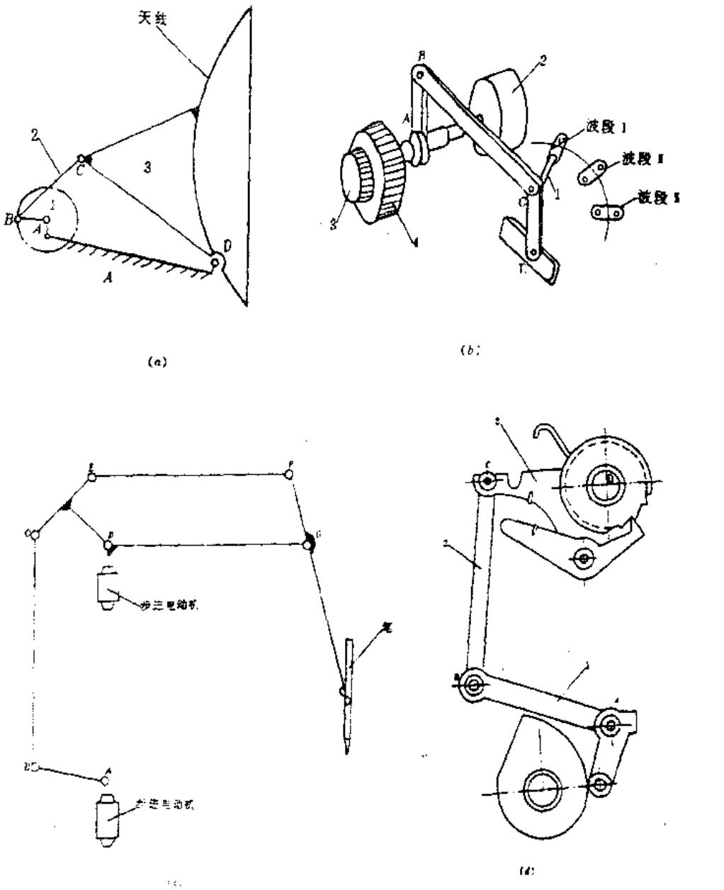

图7-平面四杆机构的应用实例

图7-2和图7-3分别是杠杆传动在光学测距仪微动调节机构和测微放大机构中的应用,因二者作用原理正好相反,故杠杆传动所起的作用也相反,微调机构是以快速的、运动范围较大的构件作主动件,而以有效的微动量作为输出的运动构件作为从动件;测微放大机构则是以测微感受元件为:动件,而起放大作用的构件作为从动件,前者是微缩运动,而后者则是放大运动。

图7-2中,手轮1的转动,经齿轮 $z _ { 1 }$ 和 $\therefore$ 、螺杆2和螺母3,以及臂长为 $\iota _ { \mathfrak { i } }$ 和 $\iota _ { \pmb { \tau } }$ 的杠杆4.变成物镜5微量的上下移动。

图 $7 . 3 ( a )$ 是杠杆传动在米尼测微仪中的应用。当测杆1移动时,通过刀口连杆2推动形杠杆3绕固定刀口4摆动:从而带:针转动、并指示出相应的示值。弹簧5的作用是保

特传动链的力封闭:弹簧6则用来产生一定的测量力。

图7-3(b)、(c)是杠杆传动在测微放大记录机构中的应用,图7-3(b)中,笔电机!由被测量转换为放大电流信号驱动,作往复旋转运动,并带动“圆弧一圆弧"型杠杆记录笔2进行运动放大和记录(弧线记录)。这种记录机构的缺点是会产生圆弧失真。为防止圆弧失真,大多数记录仪采用图 $\eta - 3 ( \mathfrak { c } )$ 所示的记录龙运动机构,其笔尖的运动规律是按圆轨迹(也可是圆轨迹)运动的机构原理设计的,图7-3(c)的机构中,曲柄 $\pmb { r }$ 与笔电机1的轴端 $p$ 固连,笔电机随测量信号电流的变化在幅角 $\pmb { \alpha }$ 的范围内往复转动,从而通过曲柄 $\pmb { \uparrow }$ 驱动记录笔2摆动.同时笔尖 $\pmb { A }$ 作直线往复运动并记录图形,

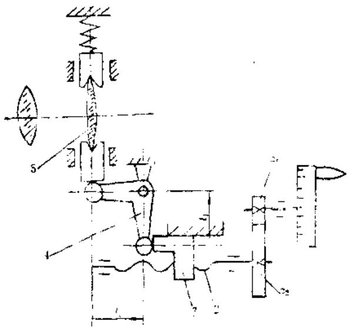

图7-2杠杆传动在微调机构中的应用实例

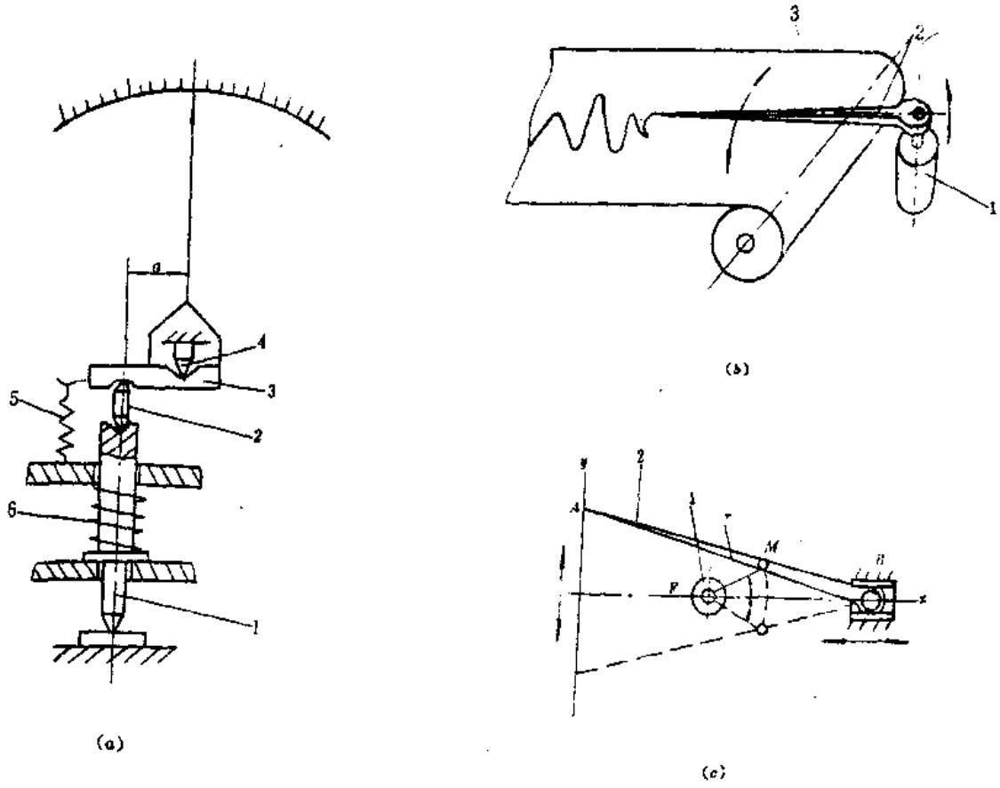

图7-3杠杆传动在测微放大机构中的应用

# $\ S \ 7 . 2$ 杠杆传动的传动特性

传动机构的工作性能可以用传动特性来描述和确定,所谓传动特性是指主动件位移r和从动件位移 ${ \pmb y }$ 之间的函数关系,常用解析式表示:

$$
y = f ( z )
$$

这里主、从动件的位移可以是线位移和角位移的任一种。若传动机构的主动件有一增量 $\pmb { \mathscr { z } }$ 则从动件所产生的增量为 $d y$ ,通常把从动件位移增量与主动件位移增量的比值叫做传动系数,即:

$$
\qquad i = \frac { d y } { d x }
$$

如果传动系数为一常数,说明传动机构的传动特性是线性的:若传动系数为一变量,则其传动特性为非线性。杠杆传动的传动特性大都是非线性的。

显然,若从、主动件的增量同除以时间增量 $\pmb { d } \pmb { t }$ ,则传动系数表示从、主动件速度之比,该比值就是所谓的传动比。

# 一、曲柄滑块机构的传动特性

图7-4所示为曲柄滑块机构的工作原理简图,它由三个回转副A、、C和一个移动副 $\mathfrak { D }$ 组成。曲柄1绕铰链 $\pmb { A }$ 转动,连杆2作平面运动,滑块3沿导轨作直线往复运动,如果铰链$\pmb { A }$ 在滑块导轨的中心线DF上,则称为对心曲柄滑块机构(图7-4(a));如果不在中心线上,则称为偏置曲柄滑块机构(图7-4(b>)。铰链 $\pmb { A }$ 至导轨中心线 $\tt D E$ 的垂直距离c称为偏距。

在曲柄滑块机构中,滑块的行程 $s$ 与曲柄转角 $\pmb { \alpha }$ 之间的关系,称为曲柄滑块机构的传动特性。对于对心曲柄滑块机构、由于其 $\scriptstyle { e = 0 }$ ,因此可看作是偏置曲柄滑块机构的一个特作下面仅对偏置曲柄滑块机构的传动特性进行分析。

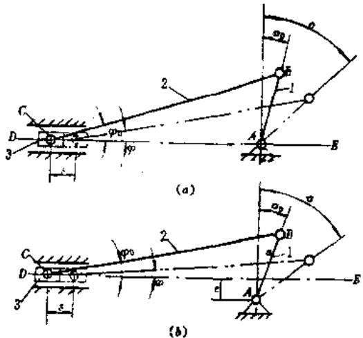

图7-4曲柄滑块机构

如图7-4(b)所示,设 $\pmb { \alpha }$ 为曲柄1的长度, $\mathfrak { b }$ 为连杆2的长度,当曲柄由 $\pmb { a } \pmb { \mathrm { b } }$ 转到 $\pmb { \alpha }$ 角度时,滑块的行程为 $\pmb { \mathscr { s } }$ ,将各杆行水平方向投影,可得:

$$
\begin{array} { l } { { s = ( \dot { \iota } { \hat { \mathrm { x c o s } } } \varphi _ { 0 } - \mathsf { n s i n } \omega _ { 0 } ) - ( \dot { \iota } { \mathrm { c o s } } \varphi - \mathsf { a s i n } \alpha ) } } \\ { { \ } } \\ { { = a ( \mathrm { s i n } \omega - \mathrm { s i n } \omega _ { 0 } ) - b ( \mathrm { c o s } \varphi - \mathrm { c o s } \varphi _ { 0 } ) } } \end{array}
$$

再往垂直方向投影,可得:

$$
\begin{array} { l } { { l \mathrm { e s i n } \psi . = a \cos a _ { 0 } - e } } \\ { { \ } } \\ { { \dot { \omega } \mathrm { s i n } \psi = a \cos a - e } } \end{array}
$$

对式(7-1)、式(7-2)和式(7-3)进行整理,可得:

$$
s = a ( \sin a - \sin a _ { 0 } ) - b { \biggl [ } { \sqrt { 1 - \left( { \frac { a \cos a - e } { b } } \right) ^ { 2 } } } - { \sqrt { 1 - \left( { \frac { a \cos a _ { 0 } - e } { b } } \right) ^ { 2 } } } { \biggr ] }
$$

式(7-4)即为曲柄滑块机构传动特性解析式。

当滑块为主动件时,机构的传动系数为

$$
\begin{array} { r } { \mathfrak { i } = \frac { d \mathfrak { a } } { d \mathfrak { s } } = \frac { 1 } { a \left[ \cos \theta - \frac { \left( \mathrm { a c o s } \alpha - \mathrm { \Lambda } e \right) \sin \theta } { \sqrt { 1 - \left[ \frac { \mathrm { a c o s } \alpha - e } { \mathfrak { b } } \right] ^ { 2 } } } \right] } } \end{array}
$$

由式(7-5)可知: $\textcircled{1}$ 曲柄滑块机构的传动特性不是一个常数,而是变量,因而其传动特性是非线性的,其变化情况是:当尺寸 $a , b$ 和 $\pmb { \ell }$ 一定时,将随着曲柄转角 $\pmb { \alpha }$ 的变化而变化: $\textcircled{2}$ 只有当 ${ \mathfrak { a } } = 0$ 时,传动系数为一常数 $( \mathfrak { i } _ { \mathfrak { s o } } \mathfrak { s } = 1 / \mathfrak { a } )$ 因此当曲柄滑块机构在 ${ \mathfrak { a } } = 0$ 附近的小角度范围内工作时,可近似地认为其传动特性是线性的。

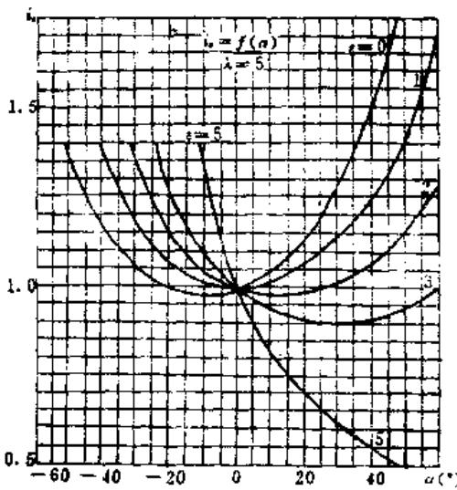

图7-5曲柄滑块机构的相对传动系数曲线 $\lambda = 5 )$ 

在一般情况下,为了简单起见,在设计曲柄滑块机构中常引进相对传动系数的概念,所谓相对传动系数 $i _ { \bullet }$ ,是指曲柄滑块机构在某一瞬时的传动系数 $\dot { \star }$ 与 ${ \pmb q } = \emptyset$ 时的传动系数 $i _ {  \emptyset }$ 时的比值,即

$$
i _ { \bullet } = \frac { i } { i _ { a = 0 } } = \frac { 1 } { \cos a - \frac { ( \cos a - \ell ) \sin a } { \sqrt { \lambda ^ { 2 } - ( \cos a - \ell ) ^ { 2 } } } }
$$

式中,相对杆长, $\lambda = \lambda / \alpha$ :

相对偏距, $\sum a = e / a$ :

由式(7-6)可知,当机构尺寸一定时,相对传动系数 $\fallingdotseq$ 是 $\pmb { \alpha }$ 的函数,即 $\therefore = f ( \omega )$ .据此可计算出在不同的 $\lambda , \varepsilon$ 及 $\pmb { \mathcal { a } }$ 时的相对传动系数 $i _ { a }$ ,见表7-1;同时亦可绘出在不同 $\lambda$ 和 $\pmb { \ell }$ 值时的 $\blacktriangle _ { * }$ $\pmb { \mu } \pmb { f } \{ \pmb { \mu } \}$ 曲线。这些曲线称为相对传动系数曲线。图7-5是 $\lambda = 5$ 时的几种 $i _ { \bullet } \substack {  } \ 6$ 曲线图谱,其它各种类型的 $\mathfrak { i } _ { \mathfrak { a } } = \mathfrak { f } ( \mathfrak { a } )$ 的曲线可通过计算机绘图获得。

表7-i曲柄滑块机构的相对传动系数值

<table><tr><td rowspan=1 colspan=3>参数</td><td rowspan=1 colspan=9>曲   满   转   角</td></tr><tr><td rowspan=1 colspan=1>i</td><td rowspan=1 colspan=2>：</td><td rowspan=1 colspan=1>130</td><td rowspan=1 colspan=1>-20</td><td rowspan=1 colspan=1>110</td><td rowspan=1 colspan=1>0</td><td rowspan=1 colspan=1>10</td><td rowspan=1 colspan=1>20</td><td rowspan=1 colspan=1>30</td><td rowspan=1 colspan=1>40</td><td rowspan=1 colspan=1>60°</td></tr><tr><td rowspan=1 colspan=1>！</td><td rowspan=2 colspan=2></td><td rowspan=1 colspan=1>1. 253</td><td rowspan=1 colspan=1>1.088</td><td rowspan=1 colspan=1>1.018</td><td rowspan=1 colspan=1>1</td><td rowspan=1 colspan=1>1.012</td><td rowspan=1 colspan=1>1. 041</td><td rowspan=1 colspan=1>1.071</td><td rowspan=1 colspan=1>1. 037</td><td rowspan=1 colspan=1>i</td></tr><tr><td rowspan=2 colspan=1>2</td><td rowspan=2 colspan=1>1</td><td rowspan=2 colspan=1></td><td rowspan=2 colspan=1>1. 202</td><td rowspan=2 colspan=1>1.076</td><td rowspan=2 colspan=1>1.017</td><td rowspan=2 colspan=1>！</td><td rowspan=2 colspan=1>1.013</td><td rowspan=2 colspan=1>1.052</td><td rowspan=2 colspan=1>1.111</td><td rowspan=2 colspan=1>1. 188</td><td rowspan=2 colspan=1>1.381</td></tr><tr><td rowspan=2 colspan=2>1</td></tr><tr><td rowspan=1 colspan=1>5</td><td rowspan=1 colspan=1>1.172</td><td rowspan=1 colspan=1>1.068</td><td rowspan=1 colspan=1>1.016</td><td rowspan=1 colspan=1>i</td><td rowspan=1 colspan=1>1.014</td><td rowspan=1 colspan=1>1.059</td><td rowspan=1 colspan=1>1.138</td><td rowspan=1 colspan=1>1. 256</td><td rowspan=1 colspan=1>1.704</td></tr></table>

(续表)

<table><tr><td rowspan=1 colspan=1>2</td><td rowspan=1 colspan=3></td><td rowspan=1 colspan=1>1.495</td><td rowspan=1 colspan=1>1.220</td><td rowspan=1 colspan=1>1.076</td><td rowspan=1 colspan=1>！</td><td rowspan=1 colspan=1>0.96</td><td rowspan=1 colspan=1>0.943</td><td rowspan=1 colspan=1>0.941</td><td rowspan=1 colspan=1>0.941</td><td rowspan=1 colspan=1>0.934</td></tr><tr><td rowspan=2 colspan=1>3</td><td rowspan=2 colspan=2>1.6</td><td rowspan=1 colspan=1>1.6</td><td rowspan=2 colspan=1>6</td><td rowspan=2 colspan=1>1.351</td><td rowspan=2 colspan=1>1.159[：</td><td rowspan=2 colspan=1>1.050</td><td rowspan=2 colspan=1>！</td><td rowspan=2 colspan=1>0.978</td><td rowspan=2 colspan=1>0.983</td><td rowspan=2 colspan=1>1.008</td><td rowspan=2 colspan=1>1. 050</td></tr><tr><td rowspan=1 colspan=2></td></tr><tr><td rowspan=1 colspan=1>6i！</td><td rowspan=1 colspan=3></td><td rowspan=1 colspan=1>1.263</td><td rowspan=1 colspan=1>1.119：</td><td rowspan=1 colspan=1>1.038</td><td rowspan=1 colspan=1>1</td><td rowspan=1 colspan=1>0.993</td><td rowspan=1 colspan=1>1.014</td><td rowspan=1 colspan=1>1.064</td><td rowspan=1 colspan=1>1.143</td><td rowspan=1 colspan=1>1. 439</td></tr></table>

# 二、正弦机构和正切机构的传动特性

图7-6(a)、(b)所示分别为正弦机构和正切机构简图。两者在结构上的区别是正弦机构推杆的工作面是平面,摆杆的工作面为球面;而正切机构则相反,推杆工作端是球面,摆杆工作面是平面。正弦机构和正切机构的传动特性是不同的。

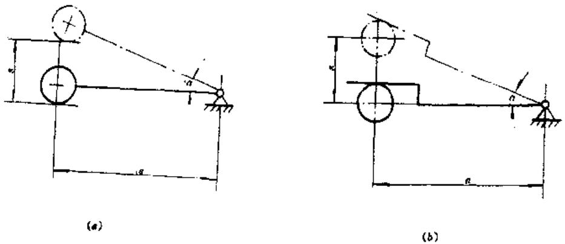

图7-6正弦机构和正切机构简图

# 1.正弦机构

设摆杆的长度为 $\pmb { a }$ ,当摆杆由 ${ \pmb { \mathscr { a } } } _ { \mathfrak { d } }$ 图 $7 - 6 ( a )$ 中 ${ \tt a } _ { \tt V } = \widehat { \tt V } .$ 转到 $\pmb { \sigma }$ 时,推杆的位移 $\pmb { \mathscr { s } }$ 为

$$
s = a \langle \sin a - \sin a _ { 0 } \rangle
$$

当推杆为主动件时,正弦机构的传动系数为

$$
i = \frac { { { d } \alpha } } { { { d } s } } = \frac { 1 } { \cos { \alpha } }
$$

由式(7-8)可知: $\textcircled{1}$ 正弦机构的传动系数不是一个常数,而是变量,因而其传动特性是非或性的: $\textcircled{2}$ 只有当 $\scriptstyle { \mathfrak { g } } = { \mathfrak { C } }$ 时,传动系数为一常数 $( \mathfrak { i } _ { v - \mathfrak { d } } { = } 1 / \mathfrak { a } )$ ,因此,当正弦机构在 ${ \pmb a } = \emptyset$ 附近的很小角度范围内工作时,其传动特性可近地认为是线性的。

正弦机构的相对传动系数为

$$
i _ { \epsilon } \approx \frac { i } { \dot { \mathfrak { i } } _ { v = 0 } } = \frac { 1 } { \cos { \alpha } }
$$

式中,i为某一瞬时的传动系款。

# 2.正切机构

设摆杆回转中心到推杆的距离为 $^ a$ ,当摆杆由 ${ a } _ { 0 }$ 图 $7 - 5 ( b )$ 中 $\pmb { u } _ { 0 } = 0 ;$ 转到 $\pmb { a }$ 时,推杆的位移为

$$
\begin{array} { r } { \mathrm { ~  ~ \cdot ~ } = \pi \{ { \sf t g } ( \eta - \{ { \sf z } \phi _ { 0 } } )  \end{array}
$$

当推杆为主动件时,正切机构的传动系数为

$$
i = \frac { d \alpha } { d s } = \frac { i } { \pi } \cos ^ { 2 } \alpha
$$

由式(7-11)可知: $\textcircled{1}$ 正切机构的传动系数不是一个常数,而是变量,因而其传动特性是非线性的; $\textcircled{2}$ 只有当 $\scriptstyle { \mathfrak { a } } = 0$ 时,传动系数为某一常数 $\{ i _ { \alpha \bullet 0 } = \mathtt { i } / a \}$ ,因此·当正切机构在 $a = 0$ 附近的很小角度范围内工作时,其传动特性可认为是线性的。

正切机构的相对传动系数为

$$
i _ { \mathrm { { s } } } = \frac { i } { i _ { \mathrm { { s } = 0 } } } = \cos ^ { 2 } { \mathrm { { s } } }
$$

式中,为某一瞬时的传动系数。

根据式(7-9)和式(7-12)可绘出正弦机构和正切机构的相对传动系数曲线,如图7-7所示

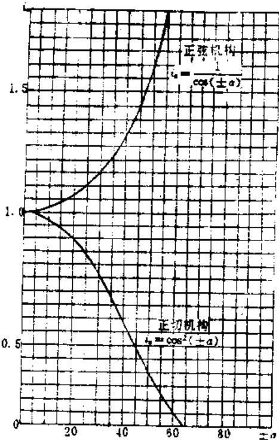

图7-7正弦机构和正切机构的相对传动系数曲线

# $\lbrace ? . 3$ 杠杆传动的设计

由于精密机械和电子设备的类型不同、对杠杆传动机构的传动特生的要求也不同,因此其设计方法也应有所区别。常遇到的设计问题有两类:

第一类,给定的敏感元件的特性是非线性的,标尺特性是线性的,设计时必须利用杠杆传动机构的非线性来补偿敏感元件的非线性,使仪器得到线性刻度。

图 ${ \vec { \imath } } - 8 \left( \alpha \right)$ 所示膜盒式高度表的设计即为该类问题的典型实例。随着义表离开地面高度$H$ 的变化(也是压力的变化),真空膜盒1(敏感元件)便产生位移 $\pmb { \delta }$ ,通过曲柄滑块机构2.3、4将真空膜盒的位移转换为曲柄的转角 $\pmb { a }$ ,再经过齿轮5、6放大后转换为指针7的转角 $\pmb { \varphi }$ ,从而在度盘8上指示出相应的高度 $\pmb { H }$ 

设真空膜盒具有非线性特性 $\begin{array} { r } { s = \dot { f _ { \mathrm { I } } } ( H ) } \end{array}$ ,如图7-8(b)第Ⅰ象限的线图所示。要求仪表的刻度方程 $\begin{array} { r } { H { = } f _ { \parallel } ( \varphi ) } \end{array}$ 为线性,如图7-8(b)第 $\mathbb { N }$ 象限内所示直线。而齿轮传动特性 ${ \mathfrak { P } } { = } { \mathfrak { f } } _ { 1 } ( { \mathfrak { a } } )$ 为线性,如图7.8(6)第 $\pmb { \mathbb { I } }$ 象限内所示直线。于是根据!、 $\pmb { \mathbb { I } }$ 和 $\mathbb { N }$ 象限的线图即可求出第 $\pmb { \mathbb { I } }$ 象限的线图,此线图即为曲柄滑块机构的特性曲线 $\mathsf { a } = f _ { \widehat { \mathsf { 2 } } } \left( s \right)$ 

根据该特性曲线并进行相应变换后便可在图7-5所示的不同参数 $( \lambda , e$ 等)的传动特性中去挑选合适的一条,确定其工作段,使其传动特性与所要求的传动特性尽量接近,并使误差在允许的范围内,这样设计出来的曲柄滑块机构就可以补偿真空膜盒的非线性性,从而保证高度表的线性刻度。

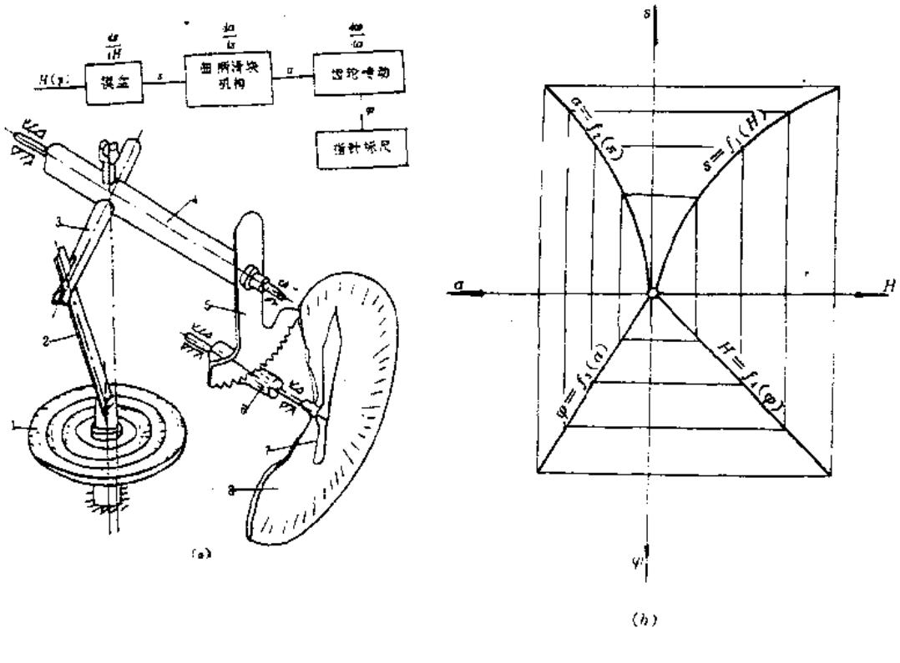

图7-8膜盒式高度表

第二类,给定的敏感元件的特性是线性的(或者无敏感元件.标尺特性是线性的,设计时必须把由于杠杆传动特性的非线性所造成的示数误差限制在所要求的精度范围内。

尺寸量仪中所采用的杠杆传动多属于这类问题。图7-3所示的奥氏测微仪即为典型的实例,其测量链主要由正弦机构、齿轮传动及指针、标F组成。弹簧3、4的作用是保证摆杆球面和推杆工作面紧密接触以产生定的测量力。当推杆1有位移时,通过摆杆2.齿轮2、5带动指针6回转,从而在标尺7上读出推杆的位移。为了制造和读数方便,仪器度盘是按线性刻度的,在这种情况下,要求杠杆传动机构的传动特性是线性的:但实际上为了简化传动链,采用了近似的正弦机构、其传动特性是非线性的,因此就会引起该仪器的示数误差。这种误差是由于所采用机构的传动特性与要求的传动特性不相等而引起的,故应属子设计误差。

在实际设计中,对于这类杠杆传动,其中特别是正弦机构和正切机构,其设计方法和步骤一般是:首先对机构的设计误差进行定量计算,然后根据杠杆传动设计原则合理选择传动形式和设计合理的结构,并采取必要的结构调整措施以保证误差在允许的范围内。下面以正弦机构和正切机构为例简要说明其方法。

# 1.设计误差的计算

(1)正弦机构的设计误差设 $\alpha _ { 0 } = 0$ ,则由式(7-7)可得;

$$
{ \mathfrak { s } } = { \mathfrak { a s i n } } \alpha
$$

但对于线性刻度,其刻度特性应为

$$
\delta \ = \ a \alpha
$$

因此,其设计误差为

$$
\smash {  { \Delta s } = s ^ { 2 } - s = a ( -  { \pi } \sin a }
$$

将上式中sina按幂级数展开,并取前两项得

$$
\begin{array} { r } { \Delta s \cong a u - a \{ \ : a - \ : \frac { q ^ { 3 } } { 3 } \ : \} = \frac { a \varepsilon ^ { 3 } } { 6 } } \end{array}
$$

(2)正切机构的设计误差同理,正切机构的设计误差为

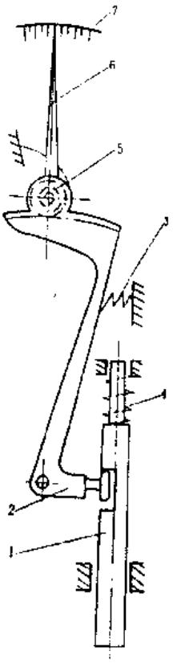

图7-9奥氏测微仪结构简图

$$
\Delta s \equiv a 4 - a ( 4 + \frac { a ^ { 3 } } { 3 } ) = - \frac { a 4 ^ { 3 } } { 3 }
$$

# 2.合理选择传动形式

比较正弦机构和正切机构的特点可以看出:

(1)由式(7-16)和式(7-17)可知、当条件相同时,正弦机构和正切机构相比,其设计误差的绝对值减小了二分之一;

(2)推杆导轨的间隙对正弦机构的精度没有影响(不改变摆杆长度 ${ \pmb a } .$ ,而对正切机构的影响较大(改变摆杆长度a):

(3)正切机构的结构工艺性比正弦机构的工艺性好。

因此,在高精度的精密机械仪器仪表中,为了提高测量精度,多采用正弦机构,在精度较低时;一般采用正切机构。

# 3.主要参数的确定

(1)工作角度的确定从式(7-16)和式(7-17)可以看出,正弦机构和正切机构的设计吴差与工作角度 $\pmb { G }$ 的立方成正比,因此,为了保证仪器的精度、在实际应用中应把工作角度,限制在很小的范围内。否则·将会产生过大的设计误差,

由式(7-13)可得 $\sin \omega = s / a$ 当 $\pmb { \mathscr { t } }$ 角取很小值时、有:

$$
\alpha \approx \sin \alpha = { \frac { s } { a } }
$$

显然,小工作角度 $\pmb { \mathscr { Q } }$ 的数值是靠推杆行程(即测量范围)、摆杆长度 $\pmb { \alpha }$ 取合适的值来保证的。

(2)测量范围的确定如图7-9所示的奥氏测微仪,当测量范围 $\delta = \pm 0 . 0 5 \mathrm { m m }$ ,摆杆长度 $\alpha = 5 m m$ 时,则由式(7-18)可得:

$$
u = \frac { s } { a } = \frac { \pm \ 0 . 0 5 } { 5 } = \pm \ 0 . 0 1 ( \pm a )
$$

其设计误差由式(7-16)得:

$$
\Delta \delta = \frac { a q ^ { 3 } } { \hat { \theta } } = \pm \frac { \tilde { 5 } \times ( 0 . 0 1 ) ^ { 3 } } { 6 } = \pm 8 \times 1 0 ^ { - 7 } ( \mathsf { m m } )
$$

若 $\pmb { \mathscr { a } }$ 值不变,现扩大测量范围,取 $\ s { s } = 0 , 5 \mathsf { m m }$ ,显然 $\pmb { \sigma }$ 值变大了,设计误差 $\Delta \pmb { \mathscr { s } }$ 也增加了,与上式比较,设计误差增大了I000倍。

由此可见,测量范围的取值对设计误差的影响是很大的。所以,杠杆式测量仪表中的推杆行程都比较小,其测量范围一般为 $s = \pm 0 . 3 m m$ 

(3)摆杆长度的确定从式(7-18)可以看出,在测量范围一定的情况下.若摆杆长度 $\pmb { \mathscr { Q } }$ 增大,则 $\pmb { \alpha }$ 减小,从而使设计误差大大减小.并且制造也比较容易。因此,在结构条件允许时,应尽量增大摆杆长度,其数值一般不应小于 $3 . 5 \sim 1 . 5 \pi m$ 。但从式(7-8)和式(7-11)可看出, $\pmb { \mathcal { a } }$ 值增大,则传动系数 $_ { i }$ 减小,故为了保证传动比的要求,在实际应用中多采用双杠杆(二级杠杆)传动或杠杆齿轮传动,图7-10所示为双正弦—齿轮传动的应用实例。

# 1.摆杆长度的调整及调整结构

为了减少设计误差.广泛采用着调整摆杆长度的方法,即在结构上将摆杆长度做成可调的。

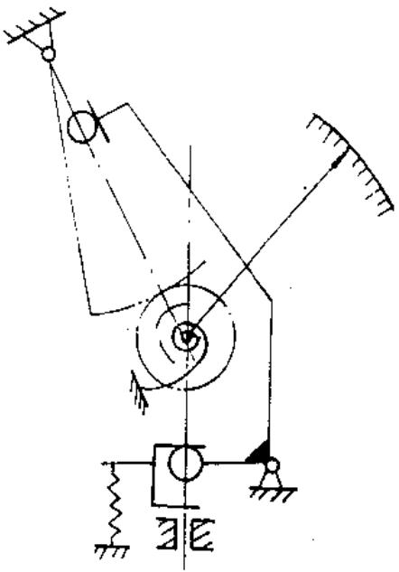

图7-10双杠杆测微仪原理图

如图 $\gamma _ { - } \ln \left( \mathfrak { a } \right)$ 所示的正弦机构,设 $\scriptstyle a _ { 0 }$ 为摆杆设计长度,则标尺特性为 $\delta ^ { ' } = a _ { 0 } a$ ,其特性线为一直线;但正弦机构的理论传动特性为 $\pmb { \mathscr { s } } = \pmb { \mathscr { a } } _ { 0 } \sin \pmb { \mathscr { a } }$ ,特性线为正弦曲浅1,二者之差即为设计误差。当摆杆转角为 $\doteq a _ { \mathrm { m a x } }$ 时,设计误差的绝对值最大,其值由式(7-16)可得:

$$
\Delta s _ { \perp \mathbf { o u x } } \ \cong \ \frac { i _ { 0 } \alpha _ { \mathrm { e n s } } ^ { 3 } } { \displaystyle \hat { 6 } } \cdot
$$

如果把摆杆长度由 $\scriptstyle { \mathfrak { n } } _ { \mathfrak { f } }$ 调整增大至某值 $\pmb { n }$ 购传动特性 $s ( = a s i n \alpha )$ 将增大,设计误差${ \bf \Delta } \mathrm { J } s ( = a _ { 0 } \alpha - a s i n \alpha )$ 就将减小,因此设计长度 $\boldsymbol { a } _ { \ u { 0 } }$ 经调整后可以减小设计误差。下面分析 ${ \pmb { a } } _ { \mathbf { 0 } }$ 经不同调整,使设计误差减小的几种情况:

(1)图7-11(b)中曲线2为摆杆长度由 ${ \mathfrak { a } } _ { \emptyset }$ 调整到 ${ \mathfrak { a } } _ { \mathfrak { l } }$ 使最大转角 $\pmb { a _ { m } } _ { \mathbf { { \theta } } }$ 处的设计误差等于零时的正弦机构传动特性曲线。这时、最大设计误差将出现在转角一 $\pmb { \sigma } _ { \parallel }$ 和 $\pm \sigma _ { \downarrow }$ 处,可以证明$a _ { 1 } = a _ { \mathrm { m a x } } / \sqrt { 3 }$ ,此时其最大的设计误差为(证明略)

$$
\begin{array} { r } { \mathsf { J } s _ { 2 \mathsf { m a x } } = \mathsf { J } s _ { ( \bullet _ { 1 } ) } = a _ { 0 } \alpha _ { 1 } - a _ { 1 } \mathsf { s i n } \alpha _ { 1 } } \end{array}
$$

$$
\begin{array} { r l r } { , } & { { } } & { = - \ \frac { 1 } { 2 . 6 } \times \frac { a _ { 0 } \cdot i _ { m a x } ^ { 3 } } { 5 } } \end{array}
$$

比较式(7-19)和式(7-20)可知,当摆杆长度按上述办法调整后,最大设计误差可减小到原来的1/2.6(按绝对值)

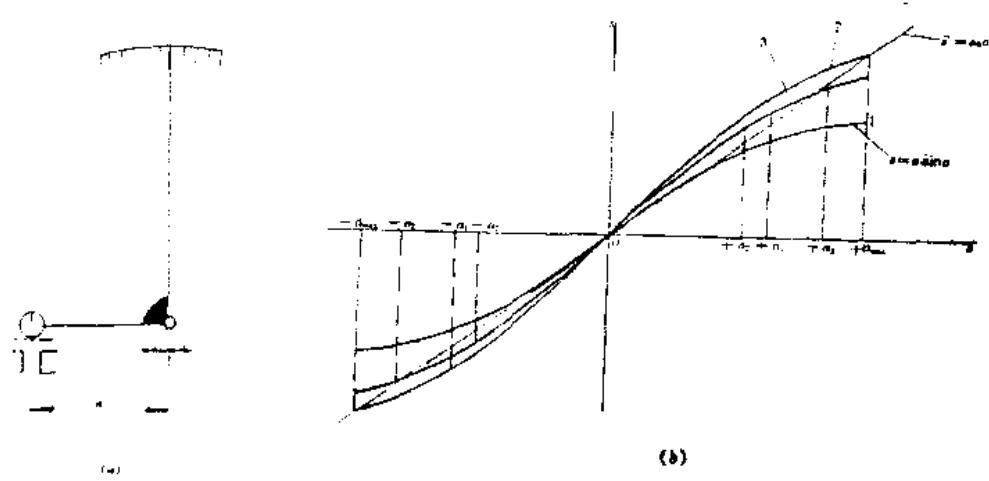

图7-11正弦机构设计误差及其调整

(2)当把摆杆长度再适当调整到 ${ \mathfrak { a } } _ { 2 }$ 使在 $\pm \mathfrak { a } _ { \mathfrak { o u } }$ 处分别与 $\pm \cos _ { 2 }$ 处的设计误差的绝对值大小相等而方向相反时,如图7-11(b)曲线3所示,则这时为最佳调整,其最大设计误差出现在$\pm \sigma _ { 2 }$ 处,可以证明 $a _ { 2 } = a _ { \mathrm { o u s } } / 2$ ,其最大设计误差为(证明略)

$$
j \ y _ { \mathrm { 3 m a n } } = - \frac { 1 } { 4 } \cdot \frac { a _ { 0 } c _ { \mathrm { m a n } } ^ { 2 } } { 6 }
$$

由式(7-21)和式(7-19)可知,机构经过最佳调整后,其设计误差可减小为原来的1/4.

摆杆长度具有最佳值时的调整特征是:在 $\pmb { \alpha } _ { 3 }$ 点处的设计误差等于零(图7-11(b))。 ${ \pmb a } _ { 3 }$ 值可以求出,它等于

$$
{ \sigma } _ { 3 } = \frac { \sqrt { 3 } } { 2 } { \sigma } _ { m a x } \approx 0 . 8 7 { \alpha } _ { m a x }
$$

由式(7-22)可知,当正弦机构在 $- u _ { \mathrm { { m a x } } } \sim + u _ { \mathrm { { m a x } } }$ 范围内工作时,调整摆杆长度 $\pmb { \mathfrak { a } }$ ,如果能使摆杆工作转角在 $a { \equiv } \pm 0 . 8 7 { \alpha } _ { m s } { \approx } \pm 0 . 9 { \alpha } _ { \mathrm { m a x } }$ ,即在指示范围(从零算起)的 $90 \%$ 处的设计误差为零,则即达到了最佳调整。如前已述及的奥氏测微仪,在指示范围 $s = \pm 0 . 0 5 m m$ 内,摆杆长度未调整前,其设计误差已经算得为 $\Delta s = 0 . 0 0 0 8 \mu \mathrm { m }$ 。如果再适当调整其摆杆长度,使在 $\pmb { \mathscr { s } }$ $= \pm 0 . 0 1 5 \mathrm { m m }$ 处误差为零,则其设计误差可以减小到 $\pm 0 . 0 0 0 2 \mu \mathrm { m }$ ,

应用相同的方法,可将正切机构的摆杆长度进行适当调整,如图7-12所示,当使 $\pmb { \alpha }$ $= \pm a _ { 3 } = \pm 0 . 8 7 a _ { \mathrm { m a t } }$ 处的设计误差为零时,即为最佳调整情况。此时最大设计误差为

$$
\displaystyle \mathfrak { s s } _ { \mathrm { o u s } } = \frac { \bar { \pi } _ { 3 } { \bar { u } } _ { \mathrm { e a x } } ^ { 3 } } { 1 2 }
$$

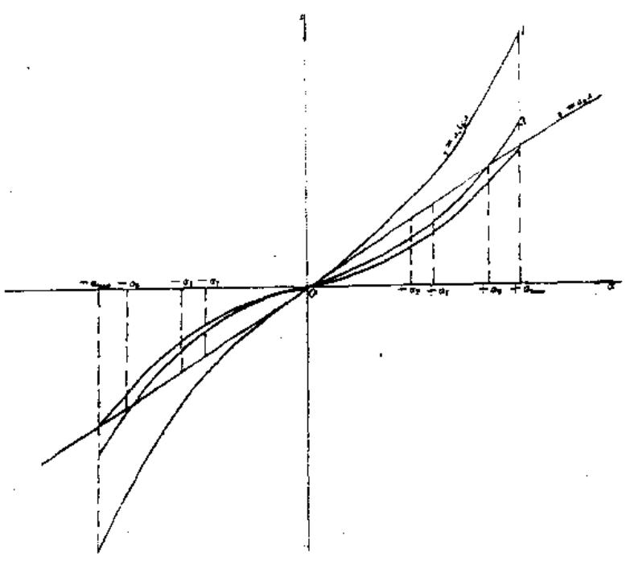

图7-12正切机构设计误差的调整

常见的摆杆长度的调整结构有:

(1)偏心调整结构图7-13所示为偏心调整结构,松开螺母2,转动偏心轴1(图7-13(a))或偏心套筒2(图7-13(b)).即可调整摆杆长度。

(2)螺钉调整结构在图7-14(a)中,只需松开锁紧螺母1,转动螺钉2,即可调整摆杆长度。图7-14(b)所示为气动三针显示仪表中的摆杆长度的调整结构,调整螺母3,可改变零件1和2的相对位置,从而改变杆长,压力弹簧4的作用是实现力封闭和防止螺母3松动。

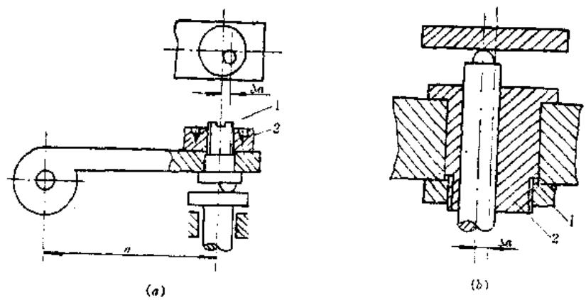

图7-13偏心调整结构

图7-14螺钉调整结构

(3)弹性摆杆结构如图7-15所示,调节螺钉1和2,使摆杆3产生弹性变形,即可调整摆杆的长度。

# 5.杠杆支承间隙影响的消除

杠杆支承间隙会引起摆杆长度的变化,从而使仪器示值不稳定并增加传动误差,如图7-16(a)所示是误差最大值时的情况(误差△a=(d-d)/2),而图7-16(b)所示则为没有误差(△a=0)的情况,为消除或减小支承间隙的影响,可以采用顶尖支承(图7-16(c))或利用拉力弹簧,使杠杆受到一个向下的拉力,使支点接触情况接近于图7-16(b)所示的情况,从而可使此项误差减小。此外,还可以利用弹簧力使轴与轴承孔保持单边接触,以减小杆长的变化。

# 6.机构原点位置的确定

正弦机构和正切机构正确的原点位置是,当机构处于原点位置(a=0)时,必须满足下列两个条件:

(1)球头中心应位于摆杆摆动中心到推杆运动方向的垂线(理论杠杆线)上:

(2)正弦机构中与摆杆球头接触的推杆平面或正切机构中与推杆球头接触的摆杆平面、应垂直于推杆的运动方向。

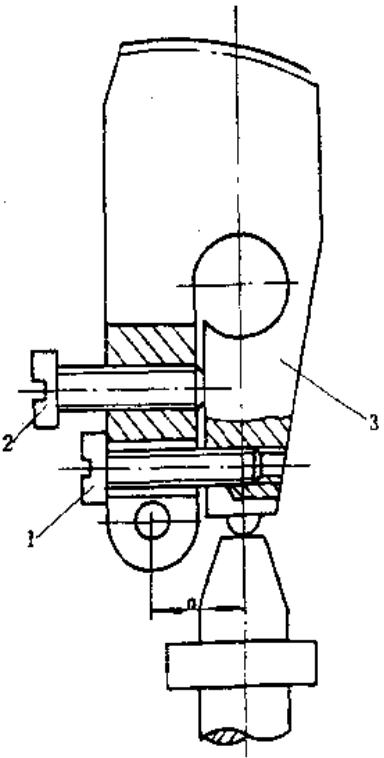

图7-15弹性摆杆结构

图 $\hat { 7 } - \hat { 6 } ( a )$ 和(b)所示的正弦机构和正切机构符合上述两个条件,所以它们的原点位置是正确的。这时,在机构工作范围 $\pmb { \mathrm { \Lambda } } \pmb { \mathrm { \Lambda } } \pmb { \mathrm { \Lambda } }$ 内,摆杆转角为士α,在推杆正负行程中,机构的设计误差的绝对值相等,因而设计误差最小。

图 ${ \vec { \iota } } \cdot \mathbb { I } \mathbb { I } ( a )$ 所示正弦机构的原点位置和图7-17(b)所示正切机构的原点位置是不正确的,在这种情况下机构的设计误差会显著增大(证明略),设计时应子以避免。

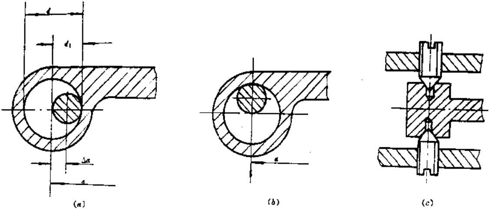

图7-16杠杆支承间隙的影响及消除

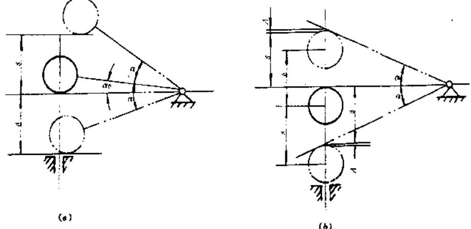

图7-17错误的机构原点位置

# 7.4杠杆传动精度的分析与计算

# 一、杠杆传动误差的类型

杠杆传动精度是实际杠杆传动机构的运动与理想机构运动的符合程度,是用杠杆传动误差来衡量的。杠杆传动误差常包括位置误差和位移误差两种基本类型。

# 1.位置误差

所谓位置误差是:当实际机构与理想机构的主动件位置相同时,两机均从动件位置上的偏差。在图7-18所示的曲柄滑块机构中,理想机构为$\triangle 0 A _ { 0 } B _ { 0 }$ ,其曲柄 $O A _ { 0 } = r$ 、连杆 $A _ { 0 } B _ { 0 } = \ell$ 、滑块原始位置在$B _ { \ell }$ 。因为存在制造误差:而实际机构为△ $\textcircled { \rangle A _ { 0 } ^ { \prime } B _ { 0 } ^ { \prime } }$ 。这时.其曲柄 $O A _ { 0 } ^ { \prime } = r + \Delta r$ 连杆 $A _ { 0 } ^ { 1 } B _ { 0 } ^ { 1 } = 1 \div 3 6$ 。当曲柄 $\ O A _ { \ P }$ 及 ${ \mathcal { O } } A _ { \ell } ^ { \prime }$ 位置相同,即 $\alpha _ { \Updownarrow }$ 角不变时,滑块位置便从 ${ \mathfrak { z } } _ { \mathfrak { z } }$ 移至 ${ \cal B } _ { 0 } ^ { \prime }$ ,则 ${  { \mathcal B } } _ { 0 } B _ { 0 } ^ { \prime }$ 即为机构的位置误差 $\psi$ 

# 2.位移误差

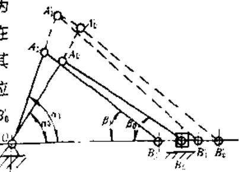

图7-18曲柄滑块机构位置误差与位移误差示意图

所谓位移误差是:当实际机构与理想机构的主动件位移相同时,两机构从动件的位移量之差值。由图7-18

知,当主动件曲柄 $\Dot { O } A _ { \ell }$ 及 $\hat { ( ) } \dot { A _ { \mathfrak { s } } }$ 均转过一个角度 $( a _ { 1 } - a _ { 0 } )$ ,处于 $O A _ { 1 }$ 及 $O A _ { 1 } ^ { \prime }$ 位置时,实际机构的从动件(滑块)便从 $\vec { \boldsymbol { b } } _ { \mathfrak { g } }$ 点移至 $R _ { i }$ 点,而理想机构的滑块则由 ${ \bar { B } } _ { 0 }$ 点移至 $\scriptstyle { \mathcal { B } } _ { 1 }$ 点。根据位移误差$\Delta y _ { s }$ 的定义及图7-18,得:

$$
\begin{array} { r l } & { \mathsf { J } _ { \ell } = \ddot { B } _ { 0 } ^ { \prime } \dot { B } _ { 1 } - B _ { 0 } B _ { 1 } = ( O B _ { 0 } - O B _ { 1 } ) - ( O B _ { 0 } - O B _ { 1 } ) } \\ & { \quad = ( O B _ { \ell } ^ { \prime } - O B _ { 0 } ) - ( O B _ { 1 } ^ { \prime } - O B _ { i } ) } \\ & { \quad = B _ { 0 } ^ { \prime } \dot { B } _ { 0 } - B _ { 1 } ^ { \prime } B _ { 1 } } \end{array}
$$

上式中, $B _ { 0 } ^ { \prime } B _ { 0 }$ 为机构的起始点位置误差, $B _ { \mathbf { i } } B _ { \mathbf { i } }$ 为机构的终点位置误差。所以,机构的位移误差可以用机构的位置误差来表达。

# 二杠杆传动误差的影响因素与计算

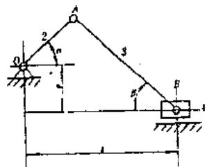

图7-19曲柄滑块机构简图

杠杆传动误差的影响因素很多,按产生误差的原因,同样可归纳为:设计误差、制造误差和装配误差三种,

上一节已经以正弦机构、正切机构为例,对设计误差进行了分析和计算,而使用误差是许多微小的误差因素作用的结果,可忽略不计,下面主要讨论制造误差对杠杆传动误差的影响和计算。

如图7-19所示,设曲柄2的长度为 $\pmb { \hat { a } }$ (误差 $\boldsymbol { \Delta } \boldsymbol { \hat { \mathbf { u } } }$ ),连杆3的长度为 $\boldsymbol { b }$ (误差 $\mathbf { \Delta } \tilde { \mathbf { u } } \mathbf { \Xi }$ ,滑块4的位置可用下列方程式表示:

$$
s = \eta \cdot \cos \alpha + \psi \cdot \cos \beta
$$

$$
= a \cdot \cos a + { \sqrt { b ^ { 2 } - ( n \sin a + e ) ^ { 2 } } }
$$

因 $\begin{array} { r } { \sin \beta = \frac { a \sin a + e } { b } , \cos \beta = \frac { \sqrt { b ^ { 2 } - ( a \sin a + e ) ^ { 2 } } } { b } } \end{array}$ ,故机构各参数的偏导数分别为

$$
\begin{array} { c } { { \frac { \partial s } { \partial t } = \cos \epsilon - \frac { \sin \omega \cdot ( \cos ( \omega + \varepsilon ) } { \sqrt { \bar { \psi } ^ { 2 } - ( \cos \omega + \varepsilon ) ^ { 2 } } } } } \\ { { = \cos \epsilon - \frac { \sin \omega \sin \beta } { \cos \beta } = \frac { \cos ( \omega + \beta ) } { \cos \beta } } } \end{array}
$$

$$
\frac { \partial \varepsilon } { \partial b } = \frac { b } { \sqrt { b ^ { 2 } - ( a \sin a + e ) ^ { 2 } } } = \frac { 1 } { \cos \beta }
$$

$$
\frac { \partial s } { \partial e } { = \frac { - \ ( a s i n \alpha + e ) } { \sqrt { h ^ { 2 } - \ ( n s i n \alpha + e ) ^ { 2 } } } } = - \ \ t g \beta
$$

因此,由各原始误差造成的从动件(滑块4的总位置误差为

$$
{ \begin{array} { r l } & { \leq \infty \ { \frac { \partial s } { \partial \theta } } \cdot \Delta a + { \frac { \partial s } { \partial b } } \cdot \Delta b + { \frac { \partial s } { \partial e } } \cdot \Delta e } \\ & { = { \frac { 1 } { \cos \beta } } [ \cos ( a + \beta ) \cdot \Delta a + \Delta b - \sin \beta \cdot \Delta e ] } \end{array} }
$$

# 习 题

7-1精密机械中杠杆传动的主要作用有哪些?

7-2杠杆传动的传动特性是什么?试推导铰链四杆机构、双曲柄机构的传动特性。

7-3正弦机构和正切机构在结构上有何区别?在工作中有何区别?如何选择这两种机构?

7-4在正弦机构中调整摆杆长度为什么会减小原理误差?

7-5试用几何法求曲柄滑块机构的位置误差:图7-20已绘出误差简图,试分析计算并与微分法计算的结果比较。

7-8正弦机构和正切机构线性程度最高的区间在哪里?如果要求它们的摆杆工作范围 $\bullet \bullet \bullet \bullet \bullet$ ,试选择

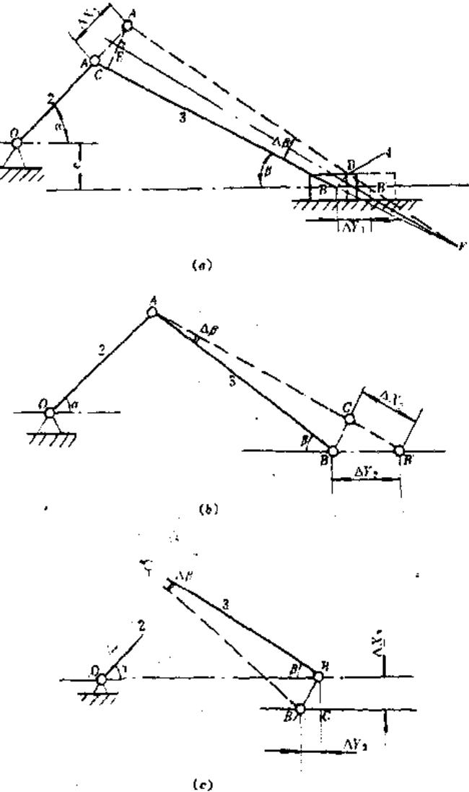

图7-20几何法求曲柄滑块机构的位置误差

# 第八章 轴系与支承

# \$8.1概述

轴系主要包括轴和轴承两部分。轴和轴承相配合的部分称为轴颈,轴承和轴颈这两部分的组合统称为支承。在精密传动中,常常通过各种支承的组合,使要求传动的零、部件精确地绕某一轴线转动和传递转矩,这种以支承为主体所形成的部件,称为精密轴系,它具有旋转精度高、工作载荷小和转速低等特点。

轴系和支承工作性能的好坏对设备的工作精度、传动效率、工作寿命等都具有很大影响,是精密传动中的重要组成部分之一,也常常是电子设备中的重要部件之一,

图8-1所示为高速摄影机传动简图,电动机!的动力和转速通过带传动和一对齿轮传递给反射镜轮4。在此,轴Ⅰ和轴I分别支承着带轮2、齿轮3和齿轮5、反射镜轮4,同时,轴[和轴I分别各由一对轴承支承。显然,轴和轴承在这里一方面要承受来自带和齿轮的作用力,另一方面又是保证反射镜轮作确定运动的关键所在。

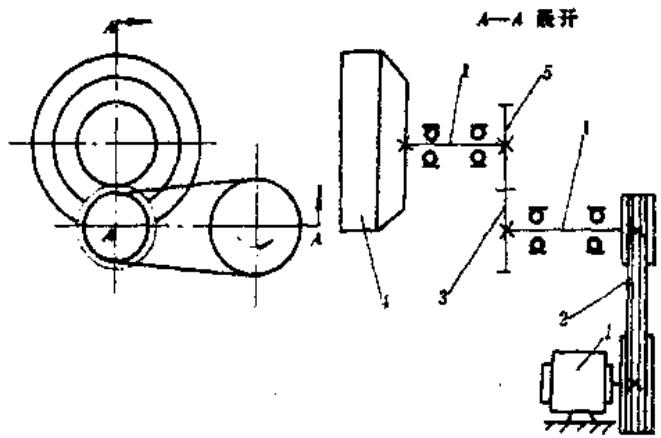

图8-!高速摄影机传动简图

设计中,一般对轴承和支承应从以下几方面提出要求: $\textcircled{1}$ 回转精度; $\textcircled{2}$ 摩擦力矩: $\textcircled{3}$ 强度、刚度和耐磨性; $\textcircled{4}$ 对环境变化(如温度等)的适应性; $\textcircled{5}$ 工艺性及其它要求,例如有的电子设备有对防磁、导电、支承密封性等要求,当然,欲同时满足上述要求是难以做到的,设计时必须根据具体情况,有主次地加以保证,包括恰当地选择支承的类型;正确选择支承的材

料和热处理;合理地进行结构设计等,

不同用途的设备对轴系和支承提出的要求不同,导致支承有大量的结构方案,通常,根据轴系中相对回转零件工作表面的摩擦性质,支承可分为滑动摩擦支承、滚动摩擦支承、弹性摩擦支承、液体或气体摩擦支承等,近年来,又出现利用电磁力的磁支承,此外,支承也可按照所能承受载荷的方向分为径向支承、止推(轴向)支承、径向止推支承。如按照组成零件的几何形状,支承还可分为圆柱支承、圆锥支承、球支承、平面支承及圆环支承等,支承形状的选择取决于作用在支承上作用力的方向和对支承提出的运动要求,如置中精度等。

# \$8.2轴与轴尖

轴与轴尖是电子设备和精密机械仪器中的重要零件之一,设计时应根据精度、传动特性、载荷、灵敏度、寿命及空间位置等因素,来确定轴与轴尖的结构形式、材质及几何精度。

# 一、轴与轴尖的一般结构、要求及用途

轴与轴尖的结构形式很多,下面仅介绍一些常用的轴和轴尖典型结构、要求和用途。

1.轴尖

如图8-2所示,轴尖锥角通常为 $60 ^ { \circ }$ ,允差 $\pm 5 ^ { \circ }$ 其尖端球面半径 $\pmb { R }$ 为 $0 . 1 \mathsf { m m }$ 左右,当 $R < 0 . 0 8 \mathrm { m m }$ 时,允差为 $\pm 0 . 0 0 5 \mathrm { m m }$ ,当$\therefore 0 8 \leqslant R \leqslant 0$ 2mm时,允差为 $\pm 0 . 0 1 \mathrm { m m }$ :尖部要求抛光至镜面粗0.02y糙度(高于 $\stackrel { \circ . \circ \varepsilon \eta } { \bigtriangledown }$ );淬火硬度一般不低于HRC60,轴尖的特点是灵敏度高,摩擦力矩小;抗磨损能力较差。

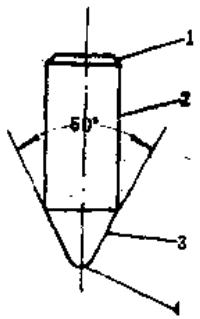

图8-2轴尖

轴尖在绝大多数电测仪表中都有应用,应用时多半采用镶填法嵌入轴或转动体中,对短小细轴,也有做成整体式结构的,而与顶尖轴相似。

1-倒角:2一围柱都分,  
3-图锥部分:4--球面部分

(工作表面)

# 2.顶尖轴

如图8-3所示。顶尖锥角为 $6 0 ^ { \circ }$ ,需光整加工,工作表面粗糙度为 $\frac { 0 . 4 } { \sqrt { u } } \sim \frac { 0 . 1 } { \sqrt { u } }$ 淬火硬度不低于HRC58;外圆和两顶尖锥面要求同轴,其特点是灵敏度高、置中性好、摩擦力矩较小;但因使用时受力面积很小,载荷集中,磨损较快。

顶尖轴适用于低速、轻载的情况下工作,电子测量仪器、航空仪表、热工仪表中都有应用。

# 3.内顶尖轴

如图8-4所示,内顶尖锥角规定为 $60 ^ { \circ }$ 和 ${ \mathfrak { g } } 0 ^ { \bullet }$ 两种,结构尺寸见表8-1.这种轴的特点和顶尖轴相同。

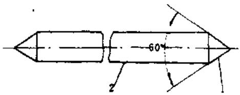

图8-3顶尖轴1-圆锥部分(工作表面);2-柱部分

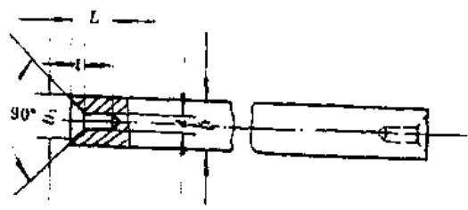

图8-4内顶尖轴

表8-1内顶尖轴结构尺寸(mm)

<table><tr><td rowspan=1 colspan=1>D</td><td rowspan=1 colspan=1>d</td><td rowspan=1 colspan=1>D</td><td rowspan=1 colspan=1>L</td><td rowspan=1 colspan=1>！</td></tr><tr><td rowspan=1 colspan=1>>1~2.5</td><td rowspan=1 colspan=1>0.5</td><td rowspan=1 colspan=1>1. 2</td><td rowspan=1 colspan=1>1. 5</td><td rowspan=1 colspan=1>0.8</td></tr><tr><td rowspan=1 colspan=1>>2.5~5</td><td rowspan=1 colspan=1>0.75</td><td rowspan=1 colspan=1>2</td><td rowspan=1 colspan=1>2.5</td><td rowspan=1 colspan=1>1</td></tr><tr><td rowspan=1 colspan=1>>5~10</td><td rowspan=1 colspan=1>1</td><td rowspan=1 colspan=1>2.5</td><td rowspan=1 colspan=1>3</td><td rowspan=1 colspan=1>1. 2</td></tr><tr><td rowspan=1 colspan=1>>10~20</td><td rowspan=1 colspan=1>1. 5</td><td rowspan=1 colspan=1>4</td><td rowspan=1 colspan=1>4.5</td><td rowspan=1 colspan=1>1. 8</td></tr></table>

使用时,当转轴载荷小于 $2 \times 1 0 ^ { 5 } \textcircled { 2 }$ 时,选锥角 $9 0 ^ { \circ }$ 当载荷大于 $\mathsf { \pmb { 2 } } \times \mathsf { 1 0 ^ { 5 } } \mathsf { \pmb { P } } \mathsf { \pmb { a } }$ 时,则选择和顶尖支承相同的角度 $60 ^ { \circ }$ 

# 4.传动轴

这种轴的结构分为两种情况:

(1)光轴如图 $8 - 5 ( a )$ 所示,其特点是形状简单,加工经济性好,在大批量生产中可采用冷拔调直磨光料制造。

使用时,光轴在轴承之间需考虑卡环等作轴向定位。

(2)阶梯轴分为少台阶轴(图8-5(b))和多台阶传动轴(图 $8 - 5 ( c ) )$ 两种。这种轴在轴承之间提供了轴向定位,轴颈支承旋转,轴肩止推,防止轴作轴向窜动,这类轴有同轴度、直线度要求,而且在装齿轮部位对其圈柱面与支承轴颈中心线有径向圆跳动要求,以保证组合件的几何精度,配合部分的精度不低于IT7,转动部分的表面粗糙度不大于

这种轴的优点是结构紧凑,缺点是安装传动件处与轴颈的不同轴会导致传动误差。

光轴和阶梯轴广泛用于各种电子设备及精密机械仪器中,如音像设备中的走带机构、各种减速机构.计数机构、记录机构等。在很多场合下也有把光轴和阶梯轴做成固定轴使用,即轴不转动,而传动件套在轴上旋转的形式,

图8-5传动轴

5.齿轮轴

这种轴(如图8-6所示)既具有传动轴的性质,又具有齿轮的特点.其技术条件和阶梯轴相同,而△F,值则因齿轮精度的不同而异,

这种轴广泛地应用在各种电子设备、仪表的传动机构或传动比大的变速器中,且常和片齿轮组合成齿轮部件,作为一级变速单元。

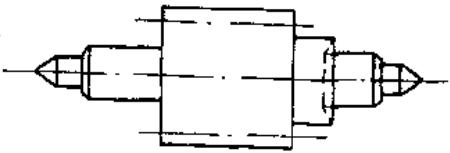

图8-6齿轮轴

# 6.方轴

如图8-7所示,方轴是轴的一种特殊结构形式,方面为工作面,表面粗糙度要求高于,精度不低于IT7,两个相对着的工作面对轴颈的对称度、各面的垂直度等均有严格的要求,方轴的特点是受力均匀、传动灵活,它既可起转轴作用,又可起导向作用,即轴上带方孔的零件既能随方轴转动,又能沿方轴作直线运动。

方轴在电子设备和精密机械仪器的记录机构中常和间歇机构合用,组成打点记录的“打点机构”.

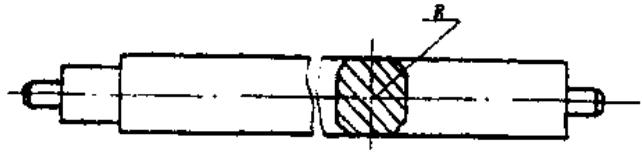

图&-7方轴

7.V形槽轴

如图8-8所示,V形槽轴也是一种特殊结构形式的传动轴。V形槽轴的两斜面要求光滑,一般表面粗糙度要求在或更小,并要求和轴心线平行,V形面对称的中心面应与轴线重合.

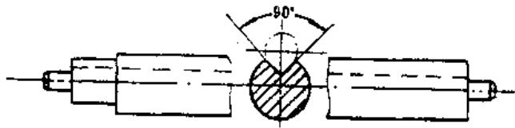

图8-8V形槽轴

V形槽轴的特点是摩擦力小、灵活性好,其应用和方轴相同。

# 二、轴和轴尖常用的材料

不同轴类的零件对材料性能有不同的要求,而同一种零件对材料的要求也往往是多方面的。这些要求可归纳为使用要求、生产要求和经济性方面的要求。对于电子设备和精密机械仪器用轴和轴尖零件,选择材料时一般应考虑耐磨性、工作环境(如震动、温度、湿度、腐蚀性介质、磁场等)、传动灵敏度及其它如可焊性、导电性、导热性等因素,

轴与轴尖常用材料大体上可分为两大类。即黑色金属和有色金属,黑色金属有碳素钢和合金钢。碳素钢比合金钢便宜,对应力集中的敏感性小,应用广泛,常用的有A3、A4、A5等普通碳素钢,30、40、45及50钢等优质碳素钢, ${ \tt T } 7 \sim { \tt T } 1 3$ 等碳素工具钢,Y12、Y30等易切碳素钢。合金钢比碳素钢的强度高,并且具有防腐、耐磨等一些特殊的性能,对于受力较大、要求直径小、重量轻或要求耐磨性好的轴,可用合金钢,并进行相应的热处理,常见的有 $\mathsf { z o c r }$ 、40Cr、2Cr13、4Cr13、1Cr18Ni9Ti、Y2Cr13Ni2Mn、38CrMoAIA等,合金钢价格昂贵,应尽量少用。有色金属主要是铜合金,如黄铜、青铜等。

轴与轴尖常用材料见表8-2.

表8-2轴和轴尖常用材料表

<table><tr><td rowspan=1 colspan=1>材料牌号</td><td rowspan=1 colspan=2>试样毛坯尺寸（mm）</td><td rowspan=1 colspan=2>抗拉强度(MPa）</td><td rowspan=1 colspan=1>主要性能及用途</td></tr><tr><td rowspan=1 colspan=1>A3</td><td rowspan=1 colspan=2>一</td><td rowspan=1 colspan=2>372~461</td><td rowspan=1 colspan=1>焊接性能好，强度和硬皮高用于不重要或载荷不大的轴</td></tr><tr><td rowspan=1 colspan=1>20</td><td rowspan=1 colspan=2>25</td><td rowspan=1 colspan=2>412</td><td rowspan=1 colspan=1>韧性高，经渗碳淬火后可达到内韧外硬的要求用于载荷不大，要求韧性较高的轴</td></tr><tr><td rowspan=1 colspan=1>45</td><td rowspan=1 colspan=2>25</td><td rowspan=1 colspan=2>598</td><td rowspan=1 colspan=1>经调质、正火或淬火，强度较高，切削性能良好，可以焊接各种轴应用最广</td></tr><tr><td rowspan=1 colspan=1>T7A-T10A</td><td rowspan=1 colspan=2>1</td><td rowspan=1 colspan=2>一</td><td rowspan=1 colspan=1>耐磨性和硬度较高用于受力小而耐麏性要求较高的轴，轴尖等</td></tr><tr><td rowspan=1 colspan=1>Y12</td><td rowspan=1 colspan=2>1</td><td rowspan=1 colspan=2>412~559（热轧）</td><td rowspan=1 colspan=1>切削性能很好，抗疲劳能力强，韧性较低，件在切削加工后表面光洁，是良好的自动机加工材料可制造多台阶复杂轴类、齿轮轴等</td></tr><tr><td rowspan=1 colspan=1>Y30</td><td rowspan=1 colspan=2>1</td><td rowspan=1 colspan=2>510~657（热轧）</td><td rowspan=1 colspan=1>性能同上，强度较高用作各种轴尖零件（如计算机上的零件)</td></tr><tr><td rowspan=1 colspan=1>钴钩合金</td><td rowspan=1 colspan=2>i</td><td rowspan=1 colspan=2>含钴75%含钩25%</td><td rowspan=1 colspan=1>强度高，耐春性好是作轴尖的优良材料</td></tr><tr><td rowspan=1 colspan=1>20C:</td><td rowspan=1 colspan=2>15</td><td rowspan=1 colspan=2>833</td><td rowspan=1 colspan=1>冷变形塑性高，焊接性较强用作重要的渗碳轴类零件等</td></tr><tr><td rowspan=1 colspan=1>40Cr</td><td rowspan=1 colspan=2>25</td><td rowspan=1 colspan=2>981</td><td rowspan=1 colspan=1>强度高、韧性好用作重要的调质零件，如轴等</td></tr><tr><td rowspan=1 colspan=1>2Cr13</td><td rowspan=1 colspan=2>-（纵向）</td><td rowspan=1 colspan=2>647</td><td rowspan=1 colspan=1>能耐弱酸腐蚀，在空气介质中有稳定的抗氧化性（700℃以下）用于制造较高韧性的防锈仪器用轴零件等</td></tr><tr><td rowspan=1 colspan=1>1Cr13</td><td rowspan=1 colspan=2>（纵向）</td><td rowspan=1 colspan=2>600</td><td rowspan=1 colspan=1>性能同上，能淬火处理适于制作转轴、轴尖等</td></tr></table>

(续表)

<table><tr><td rowspan=1 colspan=1>1Cr18Ni9Ti</td><td rowspan=1 colspan=1>（纵向）</td><td rowspan=1 colspan=1>539</td><td rowspan=1 colspan=1>对强酸有良好的抗腐蚀性，耐高温，厲非磁性材料，不易加工是常用不锈钢材料之一，用作防腐蚀性较高的轴等</td></tr><tr><td rowspan=1 colspan=1>38CrMoAIA</td><td rowspan=1 colspan=1>30</td><td rowspan=1 colspan=1>843</td><td rowspan=1 colspan=1>强度和耐磨性高用于强度和耐磨性要求高，且要求热处理(氮化)变形很小的轴</td></tr><tr><td rowspan=1 colspan=1>HPb59-1</td><td rowspan=1 colspan=1>5~10（拉制）</td><td rowspan=1 colspan=1>≥392</td><td rowspan=1 colspan=1>耐腐蚀，易焊接，切削性能优良适用于受载不大的各种转轴及齿轮轴</td></tr><tr><td rowspan=1 colspan=1>QSn6. 5-0.1</td><td rowspan=1 colspan=1>5~40（拉制）</td><td rowspan=1 colspan=1>≥412</td><td rowspan=1 colspan=1>压力加工性和切削性能良好用于制作要求耐磨及抗磁的转轴、齿轮轴等</td></tr><tr><td rowspan=1 colspan=1>BZn15-20</td><td rowspan=1 colspan=1>≥2.0~6.d（硬）</td><td rowspan=1 colspan=1>441~686</td><td rowspan=1 colspan=1>强度较高，易切削用作仪表中的转轴、齿轮轴等</td></tr></table>

# 三、轴的设计

轴的设计包括确定轴的尺寸、结构设计和材料选用等:在一般的机械设计中,轴的设计可根据强度计算进行;而在电子设备和精密机械仪器、仪表中的轴与轴尖,因载荷小,设计时多数不进行强度和刚度验算,只需按整体的精度、性能、结构工艺和装配要求,按结构条件或用类比法确定它的外形、结构尺寸、公差、表面粗糙度和材料等,必要时再进行强度或刚度校核。对于高速转动的轴,设计时应考虑防止轴的振动;而对传动特性要求较高时,可按精度来确定轴颈尺寸,再据此确定轴的直径和跨度,其它的尺寸都按这两个基本尺寸及结构的需要而定,

轴的结构设计是根据装在轴上各主要零件的尺寸来确定轴的结构形状和各部分尺寸。通常,轴的结构设计主要考虑零件在轴上的安装、定位、调整和拆卸;轴的受力应合理;有良好的加工工艺性和有利于节约材料等,

对于轴类和轴颈,一般需调质到HRC25\~28,以提高其机械性能,但为了保持加工精度,以上几种转轴,通常只对毛坏或半成品进行调质、正火或时效处理,而不进行淬火处理(对轴颈可用淬火处理),特别是对细长轴、方轴和 $\pmb { \nu }$ 形槽轴应严格作好消除工序应力及储运工作,以防变形.它们很少用电镀的办法防腐蚀,因为电镀法有两大缺点:一是零件尺寸公差不易保证,影响配合精度;二是镀层易脱落。各种轴,特别是轴尖都注重表面质量,不允许有裂纹、锈斑、蚀点、划痕、毛刺、凹陷等缺陷.

# \$8.3支 承

不够的,它涉及到所研制的电子设备和仪器的具体构成及对支承所规定的附加条件。在很多情况下,各部件的布置条件经常迫使设计人员推翻原先已选定的支承类型或结构方案,支承的结构设计应从绘制电子设备、仪器的结构草图起就开始考虑,然后再选择相应的支承结构进行有关的计算,

本章重点介绍滑动摩擦支承和滚动摩擦支承。

# 一、滑动摩擦支承

如构成支承的轴颈和轴承之间的摩擦为滑动摩擦,则称为滑动摩擦支承,通常称为滑动支承。滑动支承工作平稳、可靠,结构简单,尺寸小,噪声小,承受冲击能力强,应用广泛,但它的摩攘系数大,效率较低,易引起磨损。

滑动摩攘支承按其结构的不同有圆柱形、圆锥形、球形、顶尖和轴尖等五类,其中以前两种用得最广泛。

# 1.圆柱形支承

(1)圆柱形支承的结构特点和材料圆柱形支承是由接触表面分别为内、外圆柱面的轴颈、轴承所组成,是滑动摩擦支承中应用最广的一种,它加工方便、能承受较大的载荷、冲击和振动。但因轴承和轴颈间之间隙随工作表面的磨损而逐渐增大,又无法调整,故置中精度低,另外,麞擦力矩较大,对温度变化较敏感。

圆柱形支承优先使用于下列场合,即:

$\textcircled{1}$ 要求很高的旋转精度(通过精密加工达到);  
$\textcircled{2}$ 必須具有尽可能小的尺寸和要求,有拆卸的可能性;  
$\textcircled{3}$ 在重载、抗振、有冲击的情况下工作;  
$\textcircled{4}$ 低速、轻载和不重要的支承。

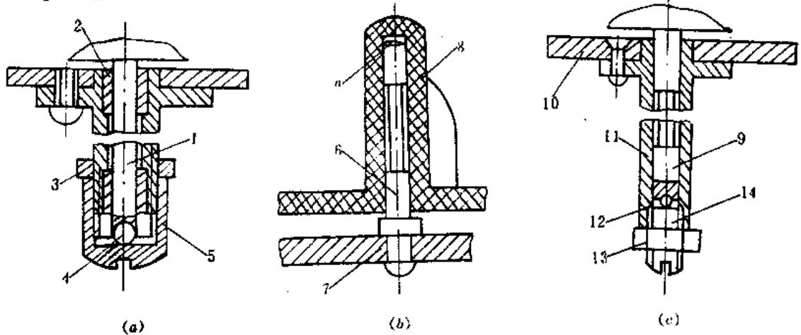

图8-9圆柱形支承应用实例

图8-9所示为圆柱形支承在盘式磁带录音机中应用的实例。图 $\ S _ { - } \ S ( \pmb { \alpha } )$ 中滚轮主轴1安装在由青铜或青铜石墨制成的轴承套2中,螺母5承受经滚珠4传来的轴向力(包括滚轮和轴的重力),借助调节螺母5可调节主轴的轴向位置,螺母5由防松螺母3子以固定,图8-9(b)所示为轴颈固定的支承结构,轴颈6装在底板7上(轴颈下端铆牢),磁带盘座8用塑料(卡普隆、聚乙烯、氟塑料等)制成,并安装在固定轴颈上,带盘座内孔中的上平面支承在轴颈的球形端面 $\pmb { a }$ 上。图8-9(c)所示为简化了的轴承结构。主轴9工作表面的轴径不太大 $( 5 \sim$ $\mathsf { \beta m m }$ ,且分成两段。轴套11由青铜或黄铜制成,并借助铆钉固定在底板10上,调节螺钉14通过滚珠12可谔节主轴9的轴向位置,螺母13用于锁紧螺钉。

1)轴颈结构图8-10所示为轴颈的几种典型结构。一般,当轴颈直径大于1mm时,轴颈和轴制成一体,见图 $\Theta - \mathbb { i } \mathbb { 0 } ( \pmb { a } )$ ;当轴颈直径小于1mm或需要贵重金属时,考虑工艺方面的因素或降低成本,将轴颈与轴分开制造,然后再装配成一体,如图8-10(c)所示,如轴颈直径小于 $1 m m$ ,并和轴制成一体时,为避免应力集中,提高强度,可在轴颈根部采用圆角或抛物线过渡结构(见图8-10(b)、(d)),这种结构适用于有较大振动的情况下。

为使支承能承受轴向载荷,防止轴有轴向窜动,一般在轴颈根部需有轴肩,见图8-10(a)。轴肩上需倒棱,以免轴肩太大会增加端面和轴承间的肆擦,并可用以储存润滑油,当轴颈端部制成球面时,可加挡板承受轴向载荷。

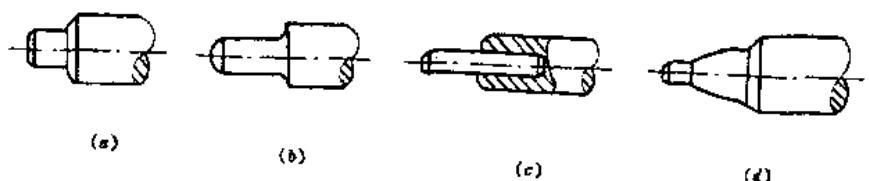

图8-10圆柱形支承轴颈的结构

2)轴承结构电子设备及精密机械仪器中的圆柱形支承及载荷较小的传动系统中,一般多采用整体式轴承结构形式。最简单的整体式轴承是在设备的壳体或支承板上直接加工轴承孔,如图8-11所示。

图8-11(a)所示结构多用于直径 $d > 5 m m$ 情况下。为储存润滑油,轴承孔的一端通常要扩孔,其尺寸为

$$
s = \ ( 1 , 5 \sim 2 ) d
$$

$$
\partial \ r = 0 , \ \vartheta ( \ r _ { \vartheta } ) = \ d )
$$

式中, $\pmb { s }$ —轴承孔板厚度 $\left( \mathsf { m m } \right)$ ;

$\pmb { D }$ ——扩孔后轴承孔大端直径 $\left( \mathsf { m m } \right)$ $\alpha$ -轴颈直径 $\left\{ \mathfrak { m } \mathfrak { n } \right\}$ 

图8-11(b)所示结构形式多用在轴颈直径$d < 5 m m$ 情况下。为增加储油空间,在轴承上常做成球面的沉孔,其尺寸为

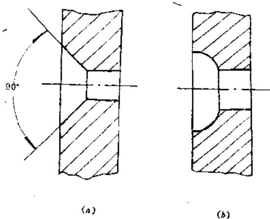

图8-11圆柱形支承整体式轴承结构

$$
\begin{array} { l } { s = ( 1 . 5 \sim 2 ) d } \\ { t = s / 3 } \\ { R = s } \end{array}
$$

式中,—球面沉孔深度 $( \mathsf { m m } )$ 

$\pmb R$ ——球面沉孔半径 $\left( \min \right)$ i$\delta , \vec { \pmb { \mathscr { z } } }$ 的意义同上。

如果支承的壳体或支承板材料不宜用作轴承或壁厚过薄时,可在壳体或支承板上制出轴承孔,再内镶以它种材料制成的轴套,其典型结构如图8-12所示。这样做还可提高支承的

使用寿命、减少摩擦力矩、节约轴承材料。

图8-12(a)为轴套的外表面光面压入壳体的结构;图8-12(b)为轴套的外表面滚花后直接压入壳体的结构。前者用于外壳材料较硬的场合,其中心易对正,但传递转矩不能很大;后者用于外壳材料不太硬的场合,为保证对正中心,也可将轴套压入壳体后再精加工轴承孔。两者都不适用于壁太薄的场合。

图 $8 - 1 2 ( c )$ 和 $( d )$ 的结构均是利用铆接法将轴套固定在外壳或支承板上的结构、弯边后轴套端面均需进行加工。前者为单面铆接,适用于外壳较薄、载荷不大的场合:后者为双面铆接,适用于外壳壁较厚,承力较大的场合。

图 $8 \cdot 1 2 ( e )$ 的结构适用于非金属材料外壳或支承板,且承力不大的场合。为防止铆接时损坏外壳表面,在铆接颈处加了金屑垫板。 /

图 $( \beta - 1 , 2 ( f ) , ( \underline { { \theta } } ) , ( \beta ) )$ 为常见的利用螺钉或螺纹将轴套固定在外壳或支承板上的结构。其中,图8-12(f)中外壳或支承板用金属材料制造,图 $8 { \cdot } 1 2 ( g )$ 中的外壳或支承板用非金属材料制造,两者的轴承尺寸均较大。图8-12(h)结构的轴套位置可以调节,适用于需要调整支承轴向间隙的场合。

图8-1:镶嵌式轴套典型结构

当轴颈直径很小,且轴承材料征硬时,轴承可制成图8-13所示的形式,使轴颈和轴承接近线接触,改善润滑条件,

3)常用材料和技术条件拍颈与轴制成一体时,轴颈材料按轴的要求选用。为减小轴颈和轴承之间的摩擦和磨损,轴承和轴颈应采用不同的材料。对轴承材料的主要要求是:与轴颈配对后的摩擦系数要小,耐磨损、耐腐蚀,有较高的抗压强度及较好的机械加工性能。

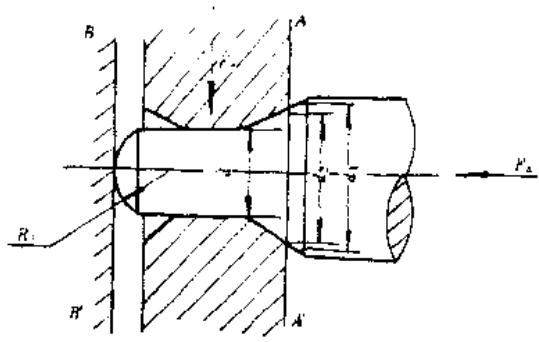

图8-13轴承材料很硬的支承结构

对与钢制轴颈相配且载荷不大的轴承,常用材料有黄铜和青铜.前者适用于普通要求的轴承,后者适用于作耐磨轴承.当载荷较大,要求强度较高时,可采用淬火钢或合金钢;当要求重量轻,且对轴承承载能力及抗磨性要求较低时,还可采用铝合金,

对于某些电子设备及仪器,为减少支承中的摩擦和磨损,轴承材料可采用比轴颈更硬的材料,如天然宝石和人造宝石。这类轴承也称为宝石轴承,在航空仪表、电工仪表和钟表机构中均得到广泛采用。

电子设备中还使用工程塑料作轴承材料,如聚四氟乙烯、尼龙、聚碳酸酯、聚砜等,它们除了具有良好的防腐性和几械加工性能外,有的能耐高低温(如聚砜),有的具有很高的耐磨性(如聚四氟乙烯、尼龙等),但承载能力一般较低。

圆柱形支承的技术条件主要包括:配合种类、精度等级、几何形状误差和表面粗糙度等.它们应根据零件的转速、载荷大小和性质、精度要求、材料和装拆维修等情况来确定,

低转速、轻载、高精度的支承,应选用小的间隙配合,如 $H 7 / g 6 , H 6 / g 5 , H 7 / h 6 , H 5 / h 5 ,$ 高转速、轻载、较高精度的支承,一般选用 $\boxed { H 8 } / \pm 8$ :精度低时可选用 $H 8 / f 8 , H 9 / f 9$ 

轴颈和轴承相配合处的表面粗糙度对摩擦力矩、支承的运动精度影响很大,一般,轴颈的表面粗糙度可在 $\frac { 0 . 1 / 0 . 1 } { \bigtriangledown }$ 范围内选取;轴承孔的表面粗糙度可比轴颈低一级。当轴承端面受轴向载荷作用时,应对支承接触端面的端面跳动量提出要求,以免产生过大的轴向窜动。轴颈和轴承表面的圆度和圆柱度误差一般为一微米至几十微米, 1

(2)圆柱形支承的

1)摩擦力矩的计算摩擦力矩的大小是衡量一些电子设备、精密机械仪器的一项重要指标,它直接影响这些设备和仪器的工作精度。

$\textcircled{1}$ 当支承只承受径向载荷 ${ \pmb \beta } ,$ 时(见图8-14),其摩擦力矩可按下式计算:

$$
M _ { f } = { \frac { 1 } { 2 } } f ^ { \prime } F _ { r } d
$$

式中, $M _ { f }$ 摩擦力矩 $( \mathsf { m N } \cdot \mathsf { m } )$ 

$\boldsymbol { \mathsf { \Sigma } } _ { \varepsilon }$ —一轴颈承受的径向载荷(N);

图8-14承受径向载荷的支承

$\pmb { \mathscr { k } }$ —轴颈的直径 $( \ m m )$ 

$\pmb { f }$ —一轴颈与轴承的当量摩擦系数,

对于研配的支承,通常取

$$
f ^ { \prime } = { \frac { 1 } { \pi } } f \approx 1 . 2 7 f
$$

式中,f滑动摩擦系数。

.对于未经研配的支承,取

$$
f ^ { \prime } = { \frac { \pi } { 2 } } f \approx 1 . 5 7 f
$$

对于较硬材料制造的轴承(例如用宝石制造的轴承)和轴颈(例如用淬火钢制造的),轴承与轴颈接近于点或线的小面积接触时:

$$
f ^ { \prime } = f
$$

$\textcircled{2}$ 当支承只承受轴向载荷 ${ \boldsymbol { \bar { \varepsilon } } } .$ 时(见图8-15),由轴向载荷引起的摩擦力矩分下述两种情况进行计算。

i)承载面为环形面积时(见图8-15(a)),其摩擦力矩 $( \boldsymbol { \mathfrak { m } } \mathbf { N } : \mathfrak { m } )$ 可按下式计算:

$$
M _ { \mathrm { f } } = { \frac { 2 } { 3 } } f P _ { \mathrm { e } } { \frac { R ^ { 3 } } { R ^ { 2 } } } _ { \mathrm { - } \mathrm { - } \mathrm { - } \mathrm { \frac { \sqrt { 3 } } { 2 } } }
$$

式中, ${ \pmb F } _ { \pmb { \mathscr { s } } }$ -一作用在支承上的轴向载荷(N);

$\pmb { R }$ 轴肩半径 $( \min )$ ;$\bar { \tau }$ —-轴承孔半径 $\left( \mathsf { m m } \right)$ :

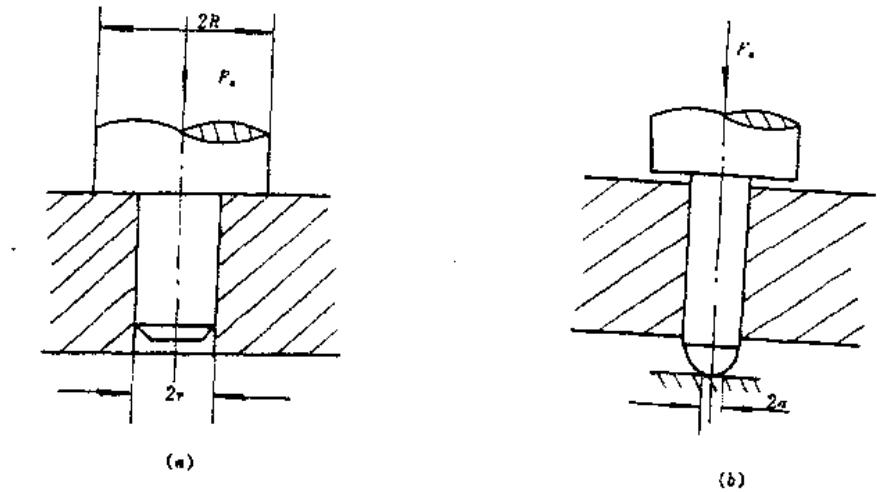

图8-15承受轴向载荷的支承

上式是假定轴向载荷均匀分布在一个圈环上而导出的。

ii)当支承面为球端面和平面接触时(见图8-15(b)),其摩擦力矩 $M _ { f } ( \mathbf { m } \mathbf { N } \cdot \mathbf { m } )$ 可按下式计算:

$$
M _ { f } = { \frac { 3 } { 1 6 } } \pi f F _ { \bullet } a
$$

式中, $\pmb { \mathcal { M } }$ —--轴端球面与止推面接触面积的半径 $( \mathsf { m m }$ 。其值按下式计算:

$$
\mathfrak { a } = \mathfrak { 0 . 8 8 1 } \sqrt { F _ { \mathfrak { r } } \mathfrak { r } \bigg ( \frac { 1 } { E _ { 1 } } + \frac { 1 } { E _ { 2 } } \bigg ) }
$$

其中, ${ { \bar { \pmb { { \cal E } } } } _ { \downarrow } }$ ——轴颈材料的弹性模量 $\left( \mathbb { M P a } \right)$ ;${ { \bar { E } } _ { 3 } }$ —轴承材料的弹性模量 $( \mathbb { M } \mathbb { P } \mathfrak { a } )$ 轴颈端部的球面半径 $\left( \mathfrak { m m } \right)$ 

支承中常用材料的弹性模量见表8-3。

表8-3支承中常用材料的弹性模量

<table><tr><td rowspan=1 colspan=1>材料</td><td rowspan=1 colspan=1>弹性模量（MPa)</td><td rowspan=1 colspan=1>材料</td><td rowspan=1 colspan=1>弹性模量（MPa)</td></tr><tr><td rowspan=1 colspan=1>碳钢</td><td rowspan=1 colspan=1>(2~2.2)X105</td><td rowspan=1 colspan=1>硬铝合金</td><td rowspan=1 colspan=1>0. 69×106</td></tr><tr><td rowspan=1 colspan=1>合金钢</td><td rowspan=1 colspan=1>2.1×105</td><td rowspan=1 colspan=1>尼龙</td><td rowspan=1 colspan=1>(6~8.6)X10</td></tr><tr><td rowspan=1 colspan=1>钻鸽合金</td><td rowspan=1 colspan=1>1.3×106</td><td rowspan=1 colspan=1>各种宝石</td><td rowspan=1 colspan=1>4.4X104</td></tr><tr><td rowspan=1 colspan=1>青铜</td><td rowspan=1 colspan=1>1. 15×106</td><td rowspan=1 colspan=1>玛瑞</td><td rowspan=1 colspan=1>1.0×10%</td></tr><tr><td rowspan=1 colspan=1>黄铜</td><td rowspan=1 colspan=1>(0.91~0.99)×10t</td><td rowspan=1 colspan=1></td><td rowspan=1 colspan=1></td></tr></table>

滑动摩擦系数 $\pmb { f }$ 的数值受材料、支承工作表面的粗糙度、润滑情况等很多因素影响,欲准确地确定其数值比较困难。一般估算时,可由表8-4查取,计算所得的章擦力矩是近似值。

表1-4滑动摩擦系数

<table><tr><td rowspan=1 colspan=1>轴颈材料一轴承材料</td><td rowspan=1 colspan=1>摩擦系数</td><td rowspan=1 colspan=1>轴颈材料一轴承材料</td><td rowspan=1 colspan=1>薄據系数f</td></tr><tr><td rowspan=1 colspan=1>钢一淬火钢</td><td rowspan=1 colspan=1>0.16~0.18</td><td rowspan=1 colspan=1>钢一玛璀、人造宝石</td><td rowspan=1 colspan=1>0.13~0.15</td></tr><tr><td rowspan=1 colspan=1>钢一锡青铜</td><td rowspan=1 colspan=1>0.15~0.16</td><td rowspan=1 colspan=1>钢一尼龙（含石墨）</td><td rowspan=1 colspan=1>0.04~0.06</td></tr><tr><td rowspan=1 colspan=1>钢一硬铝</td><td rowspan=1 colspan=1>0.17~0.19</td><td rowspan=1 colspan=1>黄铜一锡青铜</td><td rowspan=1 colspan=1>0.16</td></tr><tr><td rowspan=1 colspan=1>钢一灰铸铁</td><td rowspan=1 colspan=1>0.19</td><td rowspan=1 colspan=1>黄铜一黄铜</td><td rowspan=1 colspan=1>0.20</td></tr><tr><td rowspan=1 colspan=1>钢一黄铜</td><td rowspan=1 colspan=1>0.14~0.19</td><td rowspan=1 colspan=1></td><td rowspan=1 colspan=1>P</td></tr></table>

2)强度校核计算电子设备、精密机械仪器中,由于支承一般承受载荷较小,轴颈(或轴承)的直径和长度主要根据结构条件按类比法确定,必要时进行强度校核,若轴颈的受力情况如图8-14所示,假设作用在轴颈上的径向载荷为 $\bar { \kappa } _ { \star }$ ,集中作用在轴颈的中部 $1 / 2$ 处,则轴颈的弯曲强度条件为

$$
\sigma _ { \bullet } = \frac { F , l } { 2 W } \leqslant [ \sigma _ { \bullet } ] \qquad .
$$

式中, $\pmb { \sigma _ { \parallel } }$ --轴颈所承受的弯曲应力 $( \mathsf { M P a } )$ ;

$[ \sigma _ { \mathfrak { s } } ]$ 轴颈材料的许用弯曲应力 $( \mathbb { M } \mathbb { P } \hat { \mathbf { a } } )$ ;

$\pmb { \mathcal { W } }$ 抗弯截面系数 $( \mathsf { m } \mathsf { m } ^ { 3 } )$ :

对于圆截面, $W ^ { \prime } { \approx } 0 , \ \mathrm { i } d ^ { 3 }$ ,故上式可写为

$$
d \geq \sqrt { \frac { 5 p _ { \star } \cdot u } { [ \sigma _ { \star } ] } }
$$

式中, $\pmb { u }$ 长径比,即 $\pmb { u } = \lambda / d$ 。一般 $\pmb { u }$ 值在 $0 . 5 { \sim } 1 . 5$ 之间,由设计时按结构条什选定,

当所校验的轴颈直径大于或等于式(8-6)所算得的轴颈直径时,则强度合格,轴的设计合理;若小于式(8-6)所计算出的直径,则可按结果来增大轴颈的直径。

需要指出的是,由于轴上各截面的直径并不一样大,最大当量力矩所在截面并不一定是最危险的截面,故必要时还应对其它截面进行强度校核。

有些电子设备和精密机械仪器,若承受的摩擦力矩影响其精度时,则需根据给定的允许摩擦力矩 $\{ . 3 t , \} ( \boldsymbol { \mathrm { m } } \boldsymbol { \cdot } \boldsymbol { \mathrm { m } } )$ 校核轴的直径、即

$$
d \leqslant \frac { 2 [ M _ { \ell } ] } { f ^ { \prime } F _ { \ell } }
$$

式中,符号意义和量纲同前。

同样,当所校核的轴颈直径小于或等于式(8-7)所算得的轴颈直径,则精度合格,轴的设计合理;若大于式(8-7)所计算出的直径,则可按此结果减小轴的直径。

# 2.圆锥形支承

# (1)结构和特点

圆锥形支承是由圆锥形轴颈和圆锥形孔轴承所组成,如图8-16所示。一般应用圆锥形支承于垂直状态下工作,承受的是轴向载荷。为便于制造与装配,以及减少支承中的摩擦力矩,常切深轴颈或轴承的中间部分。

和圆柱形支承相比,圆锥形支承的优点是:间隙小且易调整,置中精度和方向精度较高,磨损后可借助于轴颈的轴向移动调整间隙,耐磨性好,承载能力较高;缺点是对温度变化较敏感,轴颈和轴承孔加工较复杂,需要配对研,无互换性,成本较高,摩擦力矩较大。

圆锥形支承主要用在转速较低的大地测量仪器上(如激光测距仪、经纬仪等).在需要使用两个彼此相互旋转的零件能良好地电接触或要求紧密密封时,也常采用这种支承。

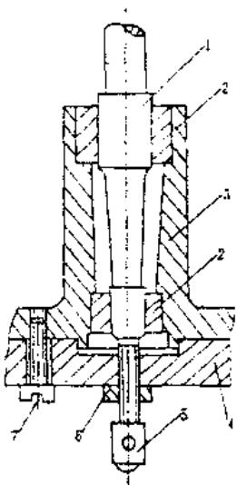

图8-16围锥形支承}一轴;2-轴承套;3-支承座;4—盖板;5-调节螺钉;6一螺母;7--螺钉

(2)圆锥形支承的材料和表面粗糙度圆锥形支承的配合间隙极小,因而对温度变化十分敏感,特别是间隙不能调整的结构更是如此。所以为了避免因支承温度变化而产生卡死或间隙过大的现象,应采用线膨胀系数小、导热系数大且相接近的材料做轴颈和轴承,轴颈常用材料有T10A、T12A、GCr15和CrMn等,并淬火至硬度为 $\yen 123,456,7$ 60。在小型仪器中,也有采用磷青铜和黄铜制造轴颈的,轴承常用磷青铜和黄铜等。茫轴颈和轴承采用相同材料制造,则应热处理后之轴颈的硬度大于轴承的硬度。由于宝石不容易加工出所需要的圆锥孔,故宝石轴承很难在圆锥形支承中应用。

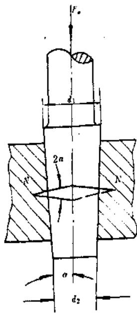

图8-17圆锥形支承力分析图

圆锥形支承的配合表面应具有较细小的表面粗糙度。通常,轴颈可取 $\stackrel { 0 . 4 } { \bigtriangledown } \sim \stackrel { 0 . 2 } { \bigtriangledown }$ 轴承可取 $\frac { 8 . 8 } { \nabla } - \frac { 0 . 4 } { \nabla }$ 

(3)圆锥形支承摩擦力矩计算当圆锥形支承受轴向载荷而不用附加装置分载时,如图8-17所示。其摩擦力矩可按下式计算:

$$
M _ { f } = { \frac { P _ { a } f } { 2 \sin a } } d _ { a }
$$

式中, ${ \pmb { F } } _ { \bullet }$ —轴向载荷;

$\measuredangle .$ 平均直径, $d _ { \mathbf { z } } = ( d _ { \mathbf { i } } + d _ { \mathbf { 2 } } ) / 2$ 3${ \pmb \alpha }$ 圆锥半角。

圆锥半角 $\pmb { a }$ 越小,支承的置中精度越高,但接触表面上的正压力 $\pmb { N }$ 越大 $[ N = \mathbb { P } .$ $\int ( 2 \sin \alpha ) ]$ ,摩擦力矩也越大,造成转动不灵活,为改善这种状况,一方面可限制圆锥半角,可在 $2 ^ { \circ } \sim 8 ^ { \circ }$ 范围内选取(精密轴承取较小值);另一方面在结构上可利用附加装置来承受一部分轴向载荷,例如利用止推轴肩、钢珠、止推螺钉等。圆锥面将主要用作保证置中精度(见图8-16),此时,圆锥支承的摩擦力矩应考虑轴向力的分配,并分别用式(8-3)和式(8-8)计算.

(4)压强验算轴向载荷 $\tilde { \varepsilon } _ { \ast }$ 如通过支承部件轴线(见图8-17),则圆锥面上的压强可按下式进行近似计算:

$$
\gamma = \frac { 4 F _ { \circ } } { \pi ( d _ { 1 } ^ { 2 } - d _ { 2 } ^ { 2 } ) } \leqslant \left[ \gamma \right]
$$

式中, $\pmb { \vec { p } }$ 圆锥面的压强 $( \ M P a )$ ;

$\pmb { d _ { 1 } }$ -锥面大端直径 $( \mathsf { m m } ) _ { 1 }$ $\alpha _ { 2 }$ -锥面小端直径 $( \mathsf { m m } )$ ;

[p]——-两种材料中较低的一种许用压强。

设计圆锥形支承时,应注意尽量使载荷通过轴线,因为偏心载荷不仅会引起轴倾斜,而且会使轴旋转时产生晃动,同时使局部压强增加,加剧磨损。

# 3.顶尖支承

顶尖支承由圆锥形轴颈(顶长)和具有扩孔$9 0 ^ { \circ }$ 的圆锥孔的轴承组成,如图8-18所示,通常,顶尖的圆锥角 $2 \alpha = 6 0 ^ { \circ }$ ,工作表面的粗糙度为$\sim \frac { 0 . 3 } { 1 }$ 圆锥形轴颈放置在轴承的圈柱孔与扩孔构成的棱边上,接触面很小,接近线接触(是一个半径为+的圖弧),故摩擦力矩 $M _ { f }$ 较小;但压强很大,润滑油很容易从接触面被挤掉。一般常将轴承做在可调螺钉上,故装配方便,转动灵活。只要调整并保持一定的间隙,轴即使倾斜,亦不致卡滞,仍能正常工作,它适用于小载荷、低转速的条件下工作,否则将很磨损,使设备工作精度降低。

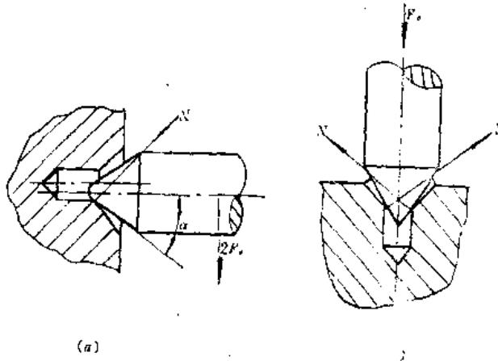

图8-1顶尖支承摩擦力矩的计算

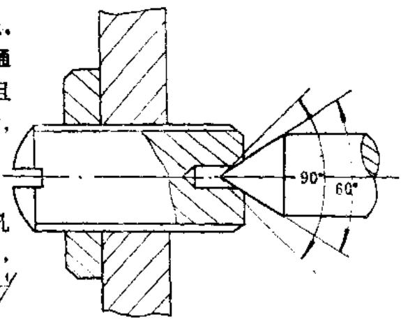

图8-18顶尖支承

顶尖文承的察力矩内计算很简单,当作用于轴点的径河载荷为2F(如图8-$\downarrow 9 ( \mathfrak { q } )$ 所示 $) \overrightarrow { t } - \overrightarrow { i }$ 则每一文承字的摩擦力矩为

$$
M _ { f } \approx { \frac { 1 } { 2 } } N f i { \mathit { \Sigma } } = { \frac { i ^ { \prime } , f d } { 2 \cos \alpha } }
$$

式中, $\mathcal { A }$ —摩擦半径的两倍,摩擦半径即摩擦面到轴的垂直距离;$\mathbf { \delta } _ { \mathbf { { i } } } \mathbf { \bar { \Gamma } } _ { \mathbf { { ~ \alpha ~ } } } \mathbf { \bar { \Gamma } } _ { \mathbf { { ~ \alpha ~ } } }$ 接触面上的正压力,

如果支承承受轴向载荷 ${ \pmb { \mathscr { k } } } ^ { \prime } ,$ 作用,如图8-19(b)所示,则摩擦力矩为

$$
M _ { f } = N f d . = \frac { F _ { \bullet } f d } { 2 \sin \alpha }
$$

顶尖支承的轴颈常用T10、T12等碳素工具钢制造,并将其淬火到$\mathtt { H R C S 0 } { \sim } 6 0$ ,轴承材料常用锡青铜和黄铜,为减少摩擦和磨损,有时也选用人造宝石。

# 4.轴尖支承

图8-20轴尖支承

轴尖支承是由圆锥形的轴“和底部呈半径为 $R$ 内球面的圆锥孔轴承组成,如图8-20所示。轴端的小球面(称为轴尖)和轴承底部内球面为工作部分

轴尖支承既可在垂直状态下工作,如图8-21(a)所示,也可在水平状态下工作,如图821(6)所示。

轴尖支承的优点是摩擦力矩极小;缺点是只要存在轴向间隙,轴与轴承就会产生偏心或倾斜,故其运动精度不高。另外,因是点接触,所以其抗磨损能力也不高,它多用于小载荷的精密测量仪表中,但不适于作齿轮等传动机构的支承,

轴尖的常用材料是钴钨合金或淬火到硬度为HRC60的T8A、T10A和T12A等.用钴钨合金时必须用装配式结构,以降低成本。轴承的常用材料有各种人造宝石、玛瑙、特殊玻璃、黄铜、青铜等。

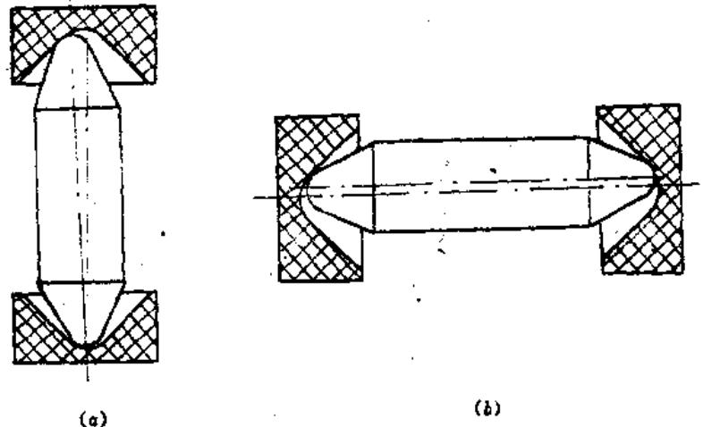

图8-21两种工作状态的轴尖支承

轴尖支承的摩擦力矩计算分为两种情况,

1)轴尖支承受轴向载荷P(设其作用线通过轴颈和轴承之间的接触点)、处于垂直状态工作,M,可按式(8-3)进行计算。只是因为它系一个球体与内球面成点接触,a值需用下式计算:

$$
a = 0 . 8 8 1 \sqrt [ 3 ] { P _ { * } \Bigg [ \frac { \frac { 1 } { E _ { \mathrm { 1 } } } + \frac { 1 } { \bar { K } _ { \mathrm { 2 } } } } { \frac { 1 } { \tau } - \frac { 1 } { R } } \Bigg ] }
$$

式中, $, \pmb { r }$ -轴尖球面半径 $\left( \mathfrak { m m } \right)$ ;

$\pmb { R }$ -轴承内球面半径 $( \mathsf { m m } )$ ·

其它符号的意义同式(8-4).

2)轴尖支承处于水平状态工作,可能出现的最大摩擦力矩可按下式计算:

$$
M _ { I } = P _ { \ I } f 
$$

式中, $\pmb { \gamma } ,$ ——作用在一个支承上的径向载荷(N);

-轴尖球半径 $\tan \mathfrak { m } )$ 

f——滑动摩擦系数。

由于垂直状态下工作的轴尖,其接触半径通常远小于轴尖球半径 $\smash { \left( a = 0 . \ 0 \right. \sim 0 . \ 1 r } )$ ,故它所产生的摩擦力矩较水平状态时所产生的摩擦力矩小得多。因此,在结构设计时·应尽可能使轴尖处于垂直状态工作。

例8-1已知轴尖支承承受活动系统的重量为 $0 . 0 2 k \mathtt { s }$ ,轴颈用钴钨合金制作,轴尖半径$\tau { = } 0 . 1 2 \mathrm { m m }$ ;轴承材料为红宝石,其内球面半径 $R = 0 . \ 4 8 \mathrm { m m }$ ,支承在振动状态下工作。求轴尖支承在垂直状态下和水平状态下工作的摩擦力矩。:

解 $\textcircled{1}$ 垂直状态工作

根据式(8-12)及式(8-3),查表8-4知摩擦系数 $\hat { \mathbf { f } } = \boldsymbol { 0 } .$ 15,查表8-3知钻钨合金的弹性模量 $\pmb { \mathcal { E } } _ { 1 } = 1 . 3 \times 1 0 ^ { 5 } \mathbf { M P a }$ ,红宝石的弹性模量 $\mathcal { B } _ { 3 } = 4 . 5 \times 1 0 ^ { 5 } \mathrm { M P a }$ ,可得:

$$
= 0 . 8 8 1 \sqrt { 9 . 8 \times 0 . 0 2 \left\{ \frac { 1 } { 0 . 3 \times 1 0 ^ { 5 } } + \frac { 1 } { 4 . 5 \times 1 0 ^ { 8 } } \right\} }
$$

$$
\begin{array} { l } { \cdot \ M _ { f } = \ \displaystyle \frac { 3 } { 1 6 } \pi a f { \cal F } _ { \ast } = \displaystyle \frac { 3 } { 1 6 } \times 3 . 1 4 1 6 \times 0 . 0 0 6 \times 0 . 1 5 \times 9 . 8 \times 0 . 0 2 } \\ { \phantom { \times \ } = 0 . 1 ( \mathsf { m N } \cdot \mathsf { m } ) } \end{array}
$$

$\textcircled{2}$ 水平状态工作

根据式(8-13),得

$$
\begin{array} { l } { { \dot { M } _ { I } = f F , r = 0 . 1 5 \times 9 . 8 \times 0 . 0 2 \times 0 . 1 2 \times 1 0 ^ { - 3 } } } \\ { { \qquad = 3 . 5 ( \mathrm { m N ~ \cdot ~ m } ) } } \end{array}
$$

可见,垂直状态下工作的轴尖支承产生的摩擦力矩远小于水平状态工作时产生的摩擦力矩。

实际工作中,两种状态下工作的轴尖支承摩擦力矩因受灰尘、润滑油、接触面积的微观不平度等和其它因素的影响,不一定相差得如例题中计算值那么大,但仍有很大差别。

# 5.球支承

球支承由球形轴颈和具有内锥面或内球面的轴承所组成,如图8-22所示。其特点是支承除能绕本身轴线转动外,还可以在通过轴线的锥面内摆动一定的角度,因此,它常用作各种调节螺钉的支承,以及电子设备和仪器的支架、天线等活动结构,如图8-23所示,

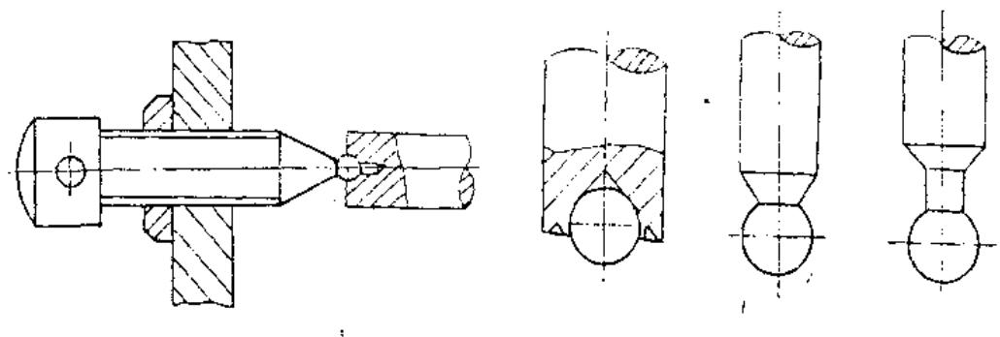

图8-22球支承的结构

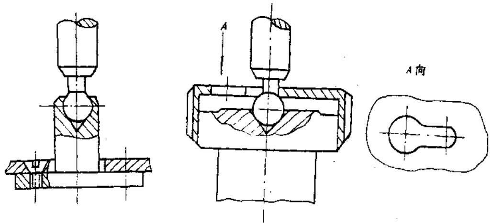

图8-23球支承的应用

球支承一般用在不重要的场合。

# 二、滚动摩擦支承

如构成支承的轴颈和轴承之间的摩擦为滚动摩擦时,则称为滚动摩擦支承,简称滚动支承。与滑动支承比,滚动支承的主要优点是摩擦力矩小、承载能力高而磨损小、精度高、具有互换性等;缺点是外廓尺寸大、安装结构复杂、承受冲击和振动的能力较弱、转速高时有噪音、成本较高等。

用于电子设备和精密机械仪器的滚动轴承可分为两类:标准滚动轴承和非标准滚动轴承。

# 1.标准滚动轴承

本节侧重介绍电子设备中用轴承的使用性能和摩擦力矩计算等。

# (1)滚动轴承类型的选择

选择轴承类型时,应根据载荷大小、方向、性质、轴的转速、空间安装尺寸、自动调心性能要求、刚度和精度等方面进行综合考虑。布电子设备中,由于载荷一般不大,轴承受力较小,所以滚动轴承一般只要根据使用要求(如摩擦力矩)结构尺寸等按标准选用,而不必对其额定载荷、寿命进行计算。常用的滚动轴承的基本类型有单列向心球轴承、双列向心球面球轴承、单列向心短圆柱滚子轴承、滚针轴承、单列向心推力球轴承、单列圆锥滚子轴承和推力球轴承。需要指出的是:

1)在同样外形尺寸下,滚子轴承一般比球轴承承载能力大;但当轴承的内径 $d \leqslant 2 0 \mathsf { m m }$ 时,其优点不显著,可优先选用球轴承。

2)在尺寸和精度相同条件下,球轴承的极限转速比滚子轴承高,故速度高时宜用球轴承。

3)单列向心球轴承除主要承受径向载荷外,也能承受一定的轴向载荷,高速装置中可代替推力轴承。其结构紧凑、有足够的载荷容量和寿命、价格低廉、应用最广。

4)双列向心球面球轴承用于刚度较差或多支点的轴上,但同一根轴上不允许将它们和其它轴承混合使用,以免失去调心作用,

5)有冲击、振动时宜用滚子轴承。

6)对轴向载荷较大、转速又较高的轴(轴颈圆周速度 $v > 5 m / s )$ ,宜用单列向心推力球轴承,而不用推力球轴承。因转速高时,由于滚动体的离心力很大,会使推力球轴承的二作条件恶化。

图8-24是滚动轴承在电子设备中应用的实例。这是电子计算机磁盘存储器的主轴结构,采用了两个精密滚珠轴承来支撑主轴。

# (2)滚动轴承的代号

国家标准规定,轴承代号由前、中、后三段组成。前段表示游隙系列和精度等级;中段表示轴承型号(用七位数字表示);后段表示轴承的结构特点和特殊技术要求,如表8-5所示,

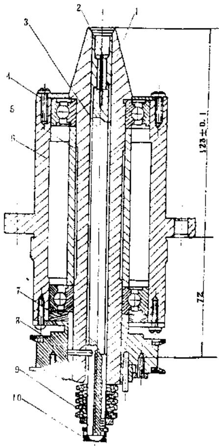

图8-24电子计算机磁盘存储器主轴结构1一主轴2一顶杆;3一定位杆;4-轴承(80206-C):5-轴套;6-外壳:7-预紧簧;8-皮带轮:9-碟簧;}0-止拾支承

表8-5轴承代号的表示法

<table><tr><td rowspan=1 colspan=1>代号项目</td><td rowspan=1 colspan=10>轴承代号</td></tr><tr><td rowspan=2 colspan=1>符号在代号中的位置</td><td rowspan=1 colspan=2>前段</td><td rowspan=1 colspan=7>中段</td><td rowspan=1 colspan=1>后段</td></tr><tr><td rowspan=1 colspan=1>游隙系列</td><td rowspan=1 colspan=1>精度等级</td><td rowspan=1 colspan=7>轴承代号</td><td rowspan=1 colspan=1>补充代号</td></tr><tr><td rowspan=2 colspan=1>表示方法</td><td rowspan=2 colspan=1>数字表示</td><td rowspan=2 colspan=1>字母表示</td><td rowspan=1 colspan=7>用七位数字表示</td><td rowspan=2 colspan=1>字母和数字表示</td></tr><tr><td rowspan=1 colspan=1>七</td><td rowspan=1 colspan=1>六</td><td rowspan=1 colspan=1>五</td><td rowspan=1 colspan=1>四三</td><td rowspan=1 colspan=1>四三</td><td rowspan=1 colspan=1>二</td><td rowspan=1 colspan=1>1</td></tr><tr><td rowspan=1 colspan=1>符号意义</td><td rowspan=1 colspan=2></td><td rowspan=1 colspan=1>宽度系列</td><td rowspan=1 colspan=2>结构特点</td><td rowspan=1 colspan=1>类型</td><td rowspan=1 colspan=1>直径系列：</td><td rowspan=1 colspan=2>内径</td><td rowspan=1 colspan=1></td></tr></table>

对于微型轴承,即内径小于 $1 0 \pi m$ 或外径小于 $\mathtt { a f m m }$ 的深动轴承,中段右起第一位数字

直接表示轴承的内径尺寸(:);右起第二位数字表示直径系列,分特轻系列(1)、轻系列(2)、中系列(3)、重系列(4)和超轻系列(8)、(9);右起第三位数字用 $" 0 ^ { \pmb { \mathscr { n } } }$ 表示微型轴承。右起第七位数字表示宽度系列,最常用的有窄系列(0)、正常系列(1)、宽系列(2)和特宽系列(3)等。

对于内径小于 $\mathfrak { 3 } \mathfrak { m m }$ 又有小数的微型轴承,例如内径为 $0 . 6 m m , 1 , 5 m m$ 和 $2 . 5 \mathsf { m m }$ 时,则用分数表示,其分母表示轴承内径,分子表示尺寸系列型和结构特点,同时在第三位再标上(0)。例如代号 $1 \cos 0 0 0 8 / 2 . 5$ 表示其为内径超轻系列向心球轴承。

微型轴承代号的意义如下:

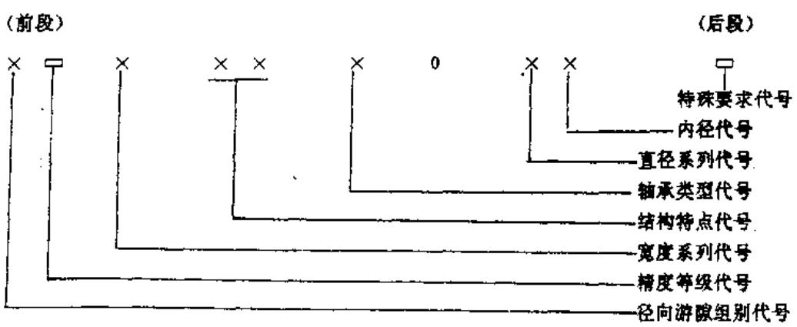

径向游隙如为基本组(0)可以不写,例如代号:

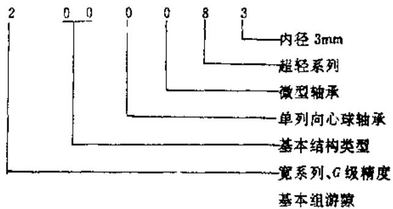

微型承广泛用于自动控制系统、仪器仪表、微型电机、医疗器械上。

(3)滚动轴承的游隙和精度等级

1)游隙滚动轴承的游隙是指轴承内、外圈相对游动的最大间隙,分径向游隙和轴向游隙两种。其含义是:如将一个圈固定,另一圈沿轴承轴线方向或垂直于轴承轴线方向的最大移动量,如图8-25所示。两类游隙有着密切的关系。一般说来,径向游隙越大,轴向游隙也越大。这两类游隙的关系可用下式确定:

$$
s = \frac { 1 } { 2 } \sqrt { 1 1 \times 0 . 0 4 d _ { 1 } }
$$

式中, $^ { , s }$ —轴向游隙 $( \mu m )$ ;

$\lambda$ —径向游隙 $\left( \mu \mathsf { m } \right)$ ;

$d _ { \mathfrak { z } }$ —轴承钢珠直径 $\left( \mathfrak { m m } \right)$ :

下面介绍径向游隙。

径向游隙分为基本组和若干辅助组。基本组径向游隙(0)适用于一般工作条件下工作的轴承,应优先选用。第1、2辅助组(小径向游隙)的径向游隙比基本组小,适用“要求精密的回转支承中。第3、4辅助组(大径向游隙)的径问游隙比基本组大,适用于不能采用基本组径向游隙、工作条件特殊的场合。

轴承的游隙对轴承的寿命、温升、精度、摩擦力矩、极限转速和噪声等都有很大影响,应根据工作条件、使用要求合理地选择。选择时主要应考虑:轴承和轴颈及瓷体的配合是否导致游隙的减小;轴承工作时,内、外圈的温差或是载荷作用后因变形而引起的间隙变化;轴和外壳材料的膨胀系数的不同而导致游隙的变化等。

2)精度根据 $\widehat { 1 } + \cos 3 0 7 , 3 - \cdots 8 4$ 规定,滚动轴承的精度分为五级。精度由高到低依次为 $\pmb { \bar { B } }$ 级、 $c$ 级、 $\mathfrak { d }$ 级、 $\pmb { \cal { E } }$ 级和 $\pmb { G }$ 级,即 $\pmb { B }$ 级精度最高, $\pmb { G }$ 级精度最低。 ${ \ " } B$ 级”目前仅向心轴承有这一级规定 $\bullet \mathcal { C } , \ D , E$ 级通常为精密级轴承; $G$ 级为普通级轴承,应用最广,

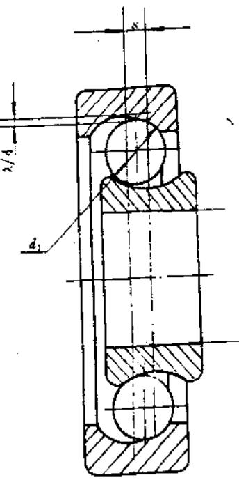

图8-25轴承游隙

各种结构型式的轴承均有 $\pmb { \zeta }$ 级精度,而高于 $\pmb { G }$ 级精度并不是每种型式的轴承均有制造,选用时可查阅滚动轴承手册或有关产品的

# (4)滚动轴承配合

滚动轴承与轴颈、轴承座孔的配合将影响轴承的闯,进而影响轴承运转精度、使用寿命等。选择滚动轴承的配合时应考虑载荷方向、大小和性质、轴承的精度、转速、尺寸、工作温度、轴和壳体的材料及拆卸、维修等因素。

由于滚动轴承已标准化、系列化,因此,轴承与轴、轴承座孔的配合应以轴承为基准,即轴承内圈与轴颈的配合按基孔制,轴承外圈与轴承座孔的配合按基轴制,轴承与轴(轴承座)的配合与一般公差配合不同,轴承内径采用上偏差为零、下偏差为负的分布法,即其实际尺寸均小于公称尺寸,故在配合种类相同时,轴承内圈与轴颈的配合较为紧密,而轴承外圈与轴承座孔的配合较松,

选择轴承配合的一般原则是:

$\textcircled{1}$ 转速愈高、载荷愈大、回转精度要求愈高、有振动和冲击时,一般采用较紧的配合,

$\textcircled{2}$ 载荷方向不变时,转动座圈应比固定座圈的配合紧一些。通常,内圈为转动座圈·多采用过渡配合,常用 $^ { 1 1 5 , m 6 , k 6 , j s 6 }$ 外圈为固定座圈,多采用间隙配合,常用JS7、H7、G7.

$\textcircled{3}$ 轴承与空心轴的配合应较紧,以避免轴径的收缩使配合松动,

$\textcircled{4}$ 轴承座工作温度高于轴承而温差较大时,外圈配合应紧些;而轴的工作温度高于轴承时,内圈配合则应松些。

$\textcircled{5}$ 对需要经常拆卸或更换(寿命较短)的轴承应采用较松的配合;而当轴承作游动支承时,外圈配合亦应松些。

$\textcircled{3}$ 当采用有色金属做壳体或支柱,且载荷不大时,轴颈和轴承内圈可采用7、j6,轴承座孔与轴承外圈采用 $\pmb { { \cal H } } 7$ ,

为确保轴承的工作质量和使用寿命,除正确选择轴承的配合外、还应根据轴承精度等级和尺寸,合理地选用与轴承相配合的轴预表面粗糙度和形位么差,设计时,可查阅有关设计

手册。

(5)滚动轴承摩擦力矩的计算

在许多电子设备和精密机械仪器、仪表中,支承的摩擦力矩往往直接影响工作精度,因此,要求摩擦力矩愈小愈好。

标准滚动轴承的摩擦力矩主要由三方面因素造成:

$\textcircled{1}$ 滚动体与内、外滚道间的滚动摩擦;  
$\textcircled{2}$ 滚动体与保持架之间的滑动穿擦;  
$\textcircled{3}$ 滚动轴承中润滑脂(油)的阻力等.

因为影响滚动轴承摩撩力矩的因素较多,故理论上计算很复杂,目前,计算滚动轴承摩擦力矩的公式很多,但大多只是针对某些特定的轴承类型(如向心球轴承),适用范围亦有很大的局限性,在实际生产中,通常采用实验方法测得滚动轴承的摩擦力矩。

下面介绍一种较简单的计算方法,即若轴承的载荷接近额定动载荷 $\pmb { c }$ 的 $10 \%$ ( $p { \approx } 0 . \ 1 C ;$ 时,向心轴承只承受纯径向载荷,推力轴承只承受纯轴向载荷,其转速 $\approx 0 . 5 \mathrm { { a } } _ { j }$ ${ \bf \langle { \bf { u } } _ { j } }$ 为极限转速),有足够的润滑油和运转正常的情况下,摩撩力矩 $M _ { f } ( \mathbf { m } \mathbf { N } \cdot \mathbf { m } )$ 可按下式计算:

$$
M _ { f } = \frac { 1 } { 2 } P f _ { \mu } d
$$

式中, $\pmb { \mathcal { P } }$ 轴承载荷 $( \aleph )$ i

f,—一滚动轴承摩擦系数,见表8-6;

$\pmb { d }$ —-轴承内径 $( \mathsf { m m } )$ 

1-滚动轴承摩攘系数了,

<table><tr><td rowspan=1 colspan=1>轴承类型</td><td rowspan=1 colspan=1>宝</td><td rowspan=1 colspan=1>轴承类型</td><td rowspan=1 colspan=1>f</td></tr><tr><td rowspan=1 colspan=1>单列向心球轴承</td><td rowspan=1 colspan=1>0.0022~0.C042</td><td rowspan=1 colspan=1>单列向心推力球轴承</td><td rowspan=1 colspan=1>0.002~0.005</td></tr><tr><td rowspan=1 colspan=1>双列向心球面球轴承</td><td rowspan=1 colspan=1>0.0016~0.0066</td><td rowspan=1 colspan=1>单列圆锥滚子轴承</td><td rowspan=1 colspan=1>0.0025~0.0083</td></tr><tr><td rowspan=1 colspan=1>滚针轴承</td><td rowspan=1 colspan=1>0.008~0.0028</td><td rowspan=1 colspan=1>单列推力球轴承</td><td rowspan=1 colspan=1>0.002~0.004</td></tr><tr><td rowspan=1 colspan=1>单列向心短圆柱滚子轴承</td><td rowspan=1 colspan=1>0.006~0.0012</td><td rowspan=1 colspan=1></td><td rowspan=1 colspan=1></td></tr></table>

退据要求的摩擦力矩和载荷大小,在选定轴承类型后,可利用式(8-14)计算轴承内径并依此选相近内径的轴承。但是需要指出的是:

$\textcircled{1}$ 根据摩擦力矩选择的轴承也必须满足额定寿命的要求。

$\textcircled{2}$ 对于低摩擦力矩轴承应避免采用接触式橡胶密封或毛毡密封,可用滴油润滑和喷雾润滑。

对于某些载荷不大,而对轴承的摩擦力矩有严格要求的电子设备和精密机械仪器,在选用和设计滚动轴承时,可采用以下方法减少其摩擦力矩:

$\textcircled{1}$ 提高轴承的制造精度,它可使摩擦力矩减小几倍,

$\textcircled{2}$ 利用振动轴承或旋转轴承,亦即将工作轴两端的两个轴承外圈,以较大的转速作来回摆动,或相反方向的连续转动的轴承,轴承中的摩擦力矩减小10倍左右。

$\textcircled{3}$ 在转速不高的场合,采用高速滚动轴承或高精度的高速滚动轴承。这是因为高速滚动轴承中的保持架是应用轻质而耐磨的材料制造的,面且在轴承装配时,可保持 $0 . 0 0 5 \sim$ $0 . \ 0 . 1 \mathsf { m m }$ 的间隙,有利于减小摩擦力矩。

$\textcircled{4}$ 采用减小摩撩半径,即用缩小滚动轴承的尺寸使之微型化的方法。

$\textcircled{5}$ 采用粘度小的润滑油,必要时,对其严格去磁,并采用防尘结构。

# 2.非标准滚动轴承

在电子设备、精密机械仪器中,由于结构厂或降低摩擦力矩的要求,如不能采用标?.滚动轴承,就采用非标准(散装)滚动轴承,这种轴承可以无保持架、内圈和外圈,只保留滚云轴承最本灼部分—钢球,滚珠的滚动面直接做在与钢球接触的轴颈端部及支承或壳的座孔中;构成滚道面的零件材料通常用T8、T10或GCt15钢,淬火硬度 $\mathrm { H R C } 5 5 \sim 6 0$ ,表粗糙度为 $\frac { 0 . 0 5 } { \bigtriangledown } { \sim } \frac { 0 . 0 5 } { \bigtriangledown }$ 

# (1)常用结构形式

由于承受载荷小,非标准滚动轴承通常按结构和使用要求设计,常用结构形式如图826所示。它们按轴承座结构形状的不同,分别称为直角形轴座非标准滚动轴承,如图8-2(a)所示:圆角形轴座非标准滚动轴承,如图8-26(6)所示:球面形轴座非标准滚动轴承,如8-26(c)所示。其中, $( a )$ 型承载能力较低,摩擦力矩较小;(b)型承载能力较大,但摩擦力矩t较大;(c)型承载能力和摩擦力矩介于(a)、(b)型结构之间,加工困难。

非标准滚动轴承中的轴颈形状如图8-27所示,有圆柱形、圆弧形、球形或其它形式。兰载荷较大时,应采用圆弧形;转速低时,可在轴端放入或压入钢球,如图 $8 . 2 7 ( d )$ 和(e)所示此时,支承的摩擦力矩很小,磨损也小,制造容易;但承载能力低于图8-26中所示(a)型。

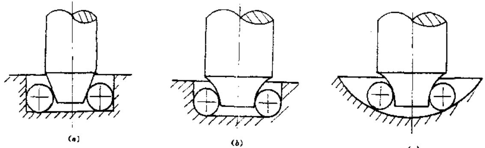

图8-26非标准滚动轴承典型结构

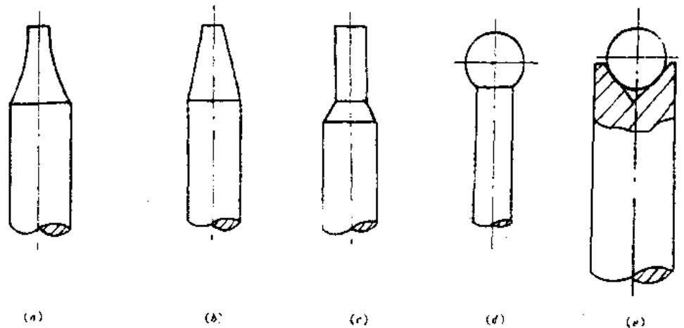

图8-27非标准滚动轴承中轴颈的形状

非标准滚动轴承已逐步由非标准向标准化、系列过渡:有的已有微型轴承厂的厂颁系

列,这给设计、使用带来了很人的方便。

(2)几何尺寸的计算

非标准滚动轴承除钢球采用标准件外,其它结构尺寸一般都要进行自行设计、计算,计算时可先根据结构选定钢球直径 $\mathcal { d }$ 和个数 $\mathfrak { r } \mathfrak { s } \left( \mathfrak { n } \geqslant 3 \right)$ 后,再按图8-26所示三种结构形式分别计算。

1)直角形轴座非标准滚动轴承由图8-28可知:

$$
A B = 2 \sin { \frac { \theta _ { 0 } } { 2 } }
$$

式中, $A B$ 相邻两钢球间的距离, $\pmb { A } \mathcal { B } { = } \pmb { \mathrm { \Omega } } \pmb { \mathrm { \Omega } }$ 。一般,无保持架时,取 $\iota { = } 1 , 0 5 { \bf { \dot { \alpha } } } _  \}$ 有保持架时,取!$= 1 . 2 d .$ 

$\pmb { \mathcal { M } }$ 钢球中心圆半径, $A O = D _ { 0 } / 2$ 

$\beta _ { \emptyset }$ —-相邻钢球所对的中心角, $\beta _ { 0 } = 3 6 0 ^ { \circ } / z$ ·

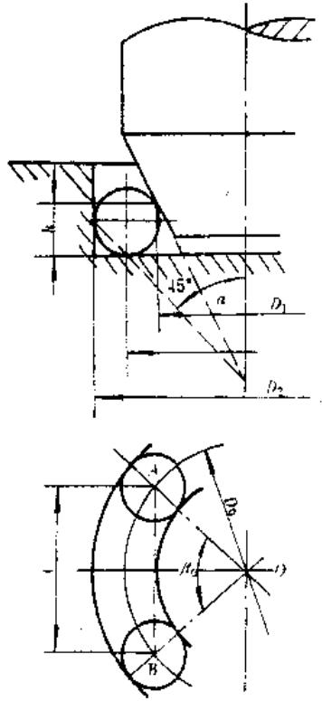

图8-28直角形轴座非标准滚动轴承计算图

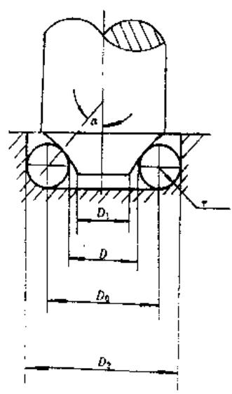

图8-29画角形轴座非标准滚动轴承计算图

钢球中心圆直径 $D _ { 0 }$ 为

$$
D _ { 0 } = \frac { 1 } { \sin \frac { 1 8 0 ^ { \circ } } { n } }
$$

钢球与轴颈接触处的直径 $\smash {  { \boldsymbol { D } } _ { \perp } }$ 为

$$
\bar { D } _ { 1 } = \bar { D } _ { 9 } - d c \infty a
$$

轴承座内径 $D _ { 3 }$ 为

$$
D _ { 2 } = D _ { 0 } + d
$$

式中, $\mathbf { \nabla } .$ —轴端圆锥半角,可用下式求得:

$$
\sin \alpha = \frac { K \ \sqrt { 2 K ( K + 1 ) } - ( K + 1 ) } { K ^ { 2 } + ( K + 1 ) ^ { 2 } }
$$

式中, ${ \pmb { \cal K } } = \pmb { \cal D } _ { 0 } / \pmb { \mathcal \alpha }$ 

由轴颈和钢球接触点到轴座底的距离 $\pmb { \mathscr { A } }$ 为

$$
h = { \frac { d } { 2 } } \langle 1 + \sin \theta \rangle
$$

设计时,先根据结构和受力大小定出 $\pmb { D _ { 7 } }$ ,再根据 $\pmb { D _ { 3 } }$ 选定钢球直径d(按国家标准选定)和球数 $\pmb { \mathcal { R } }$ ,这样就可求出其它参数 $\smash { \bar { D } _ { 3 } , \bar { D } _ { 1 3 } \tilde { \sigma } , \hbar }$ 和设计轴颈。

2)圆角形轴座非标准滚动轴承如图8-29所示。 $\pmb { D } _ { \pmb { \nu } }$ 仍按式(8-15)计算,轴颈圈弧半径和轴承座圆角半径相等,一般为 $\gamma = 1 . 0 5 d / 2$ ,这样可求出:

$$
\bar { D } _ { 1 } = \bar { D } _ { 9 } + 0 . 0 5 d \sin a ^ { \prime } - 1 . 0 5 d
$$

$$
D _ { 7 } = D _ { 9 } - 0 . 0 5 d \sin a ^ { \circ } + 1 . 0 5 d
$$

式中, $\pmb { \alpha }$ 一--接触角,根据作用的载荷方向决定。若轴主要承受径向载荷,取 $\pmb { \alpha } = 7 \pmb { \ 0 } ^ { \ast } $ 若轴主要承受轴向载荷,取 $d ^ { \prime } = 4 5 ^ { \circ } \sim 5 0 ^ { \circ }$ ·

3)球面形轴座非标准滚动轴承如图8-30所示 $\pmb { D } _ { \pmb { \widehat { \sigma } } }$ 的计算仍用式(8-15),轴颈围五半径为 $\pmb { r } =$ 1.05d/2,故

$$
D _ { 1 } = D _ { 0 } + 0 . 0 5 d \sin a ^ { \circ } - 1 . 0 5 d
$$

球面轴承座孔半径 $\pmb { R }$ 为

$$
z = \frac { 1 } { 2 } ( \frac { D _ { 0 } } { \sin \alpha ^ { ' } } + \alpha )
$$

钢球顶端高度 $\pmb { H }$ 为

$$
H = R + \frac { d } { 2 } - \frac { D _ { 0 } } { 2 } \mathrm { c t } 8 a ^ { . }
$$

式中,角 $\pmb { \check { a } } ^ { \prime }$ 大小的选择与圆角轴座相同。

# 3.密珠轴承

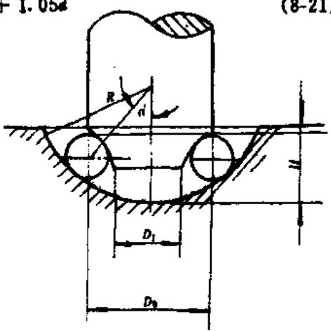

图-30球面形轴蓬非标准滚动轴承计算图

密珠轴承是一种新型的滚动轴承型式,如图8-31所示。它有径向轴承和推力轴承之分。

径向轴承的内、外圈均为形状简单的直圆柱形简;推力轴承的座圈就是两个带轴孔的圆形平板,滚珠就安装在两个圆筒或圆板之间的用尼龙1010材料制造的保持架中,见图8-31$( \pmb { \alpha } )$ 。滚珠的排列和一般轴承不同,它是按多头螺线的式样排列的,如图8-31(b)和 $\left( \pmb { \mathscr { e } } \right)$ 所示。可以想像,每粒滚珠在回转时都是沿着自已的滚道而不相重复,由于各滚珠的滚道均分布在轴承的整个面积上,滚珠数又比较多,“密珠轴承"由此得名。

密珠轴承的内、外圈与滚珠之间有 $5 \sim 1 2 \mu m$ 的过盈,可以提高轴承的刚度和精度,

和一般滚动轴承相比,密珠轴承的特点是结构简单、制造和装调方便、轴承的局部误差对精度影响较小,故主轴回转精度高且稳定。

# 4.各种支承的比较

为了对上述支承有个较全面的了解,便于对它们分析比较,有助于选择应用,现将它们列于表8-7中,按对支承的六个方面要求来分项,每项性能由高到低依次用数字 $\mathord { \uparrow } \mathord { \sim } 5$ 表示.

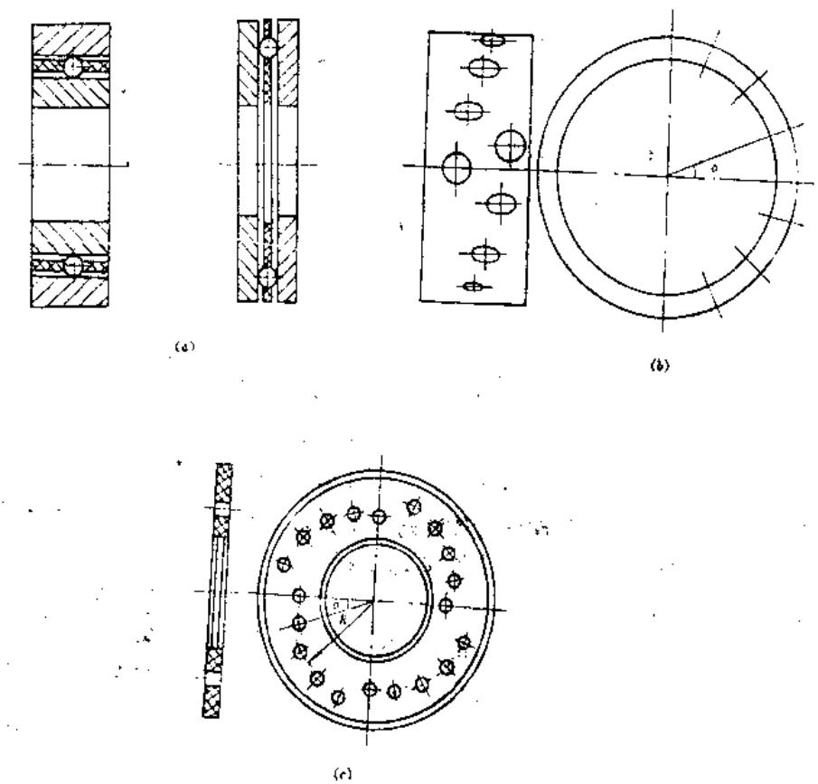

图8-31密珠轴承及其保持架

表8-7支承性能比较表

<table><tr><td colspan="2" rowspan="1">支承类型</td><td colspan="2" rowspan="1">运动精度</td><td colspan="2" rowspan="1">力矩</td><td colspan="2" rowspan="1">摩擦对温度变化的不敏感性</td><td colspan="2" rowspan="1">承载能力</td><td colspan="2" rowspan="1">抗磨损能力</td><td colspan="2" rowspan="1">成本</td><td colspan="1" rowspan="1">应用场合</td></tr><tr><td colspan="2" rowspan="1">围柱形支承</td><td colspan="2" rowspan="1">2~-3</td><td colspan="2" rowspan="1">2~1</td><td colspan="2" rowspan="1">$</td><td colspan="2" rowspan="1">1</td><td colspan="2" rowspan="1">2~3</td><td colspan="2" rowspan="1">1~2</td><td colspan="1" rowspan="1">应用广泛。适用于有较大载荷和转矩，以及用于有摄动、冲击的场合</td></tr><tr><td colspan="1" rowspan="1">围锥形支承</td><td></td><td colspan="2" rowspan="1"></td><td colspan="2" rowspan="1">5</td><td colspan="2" rowspan="1">5</td><td colspan="2" rowspan="1">1</td><td colspan="2" rowspan="1">2</td><td colspan="2" rowspan="1"></td><td colspan="1" rowspan="1">用于垂直轴工作，承受轴向载荷，运动精度很高的垂直轴系</td></tr><tr><td colspan="2" rowspan="1">顶尖支承</td><td colspan="2" rowspan="1">1~2</td><td colspan="2" rowspan="1">.3</td><td colspan="2" rowspan="1">3</td><td colspan="2" rowspan="1">4</td><td colspan="2" rowspan="1">A</td><td colspan="2" rowspan="1"></td><td colspan="1" rowspan="1">用于小载荷、低转速、要求较高运动精度和较小摩攘力矩的场合</td></tr><tr><td colspan="2" rowspan="1">球支承</td><td colspan="2" rowspan="1">5</td><td colspan="2" rowspan="1">2</td><td colspan="2" rowspan="1">2</td><td colspan="2" rowspan="1">3</td><td colspan="2" rowspan="1"></td><td colspan="2" rowspan="1">3</td><td colspan="1" rowspan="1">适用于工作中要求回转轴在其轴线平面内作摆动的情况</td></tr><tr><td colspan="2" rowspan="1">轴尖支承你</td><td colspan="2" rowspan="1">5</td><td colspan="2" rowspan="1">1~2</td><td colspan="2" rowspan="1">2</td><td colspan="2" rowspan="1">5</td><td colspan="2" rowspan="1">4</td><td colspan="2" rowspan="1">3</td><td colspan="1" rowspan="1">适用于回转速度低，载荷小的情况具有很小的摩擦力矩，多用于电工测量仪</td></tr><tr><td colspan="1" rowspan="1">滚动轴承</td><td colspan="1" rowspan="1">1~2</td><td colspan="1" rowspan="1">2.</td><td colspan="1" rowspan="1">1</td><td colspan="1" rowspan="1"></td><td colspan="1" rowspan="1"></td><td colspan="1" rowspan="1">美</td><td colspan="8" rowspan="1">适用于高转速，较大载荷，而要求较小摩擦力矩的场合，可在工作条件较整的情况下工作</td></tr></table>

# $\ S 8 . 4$ 轴系的精度分析简介

# 一、评定轴系回转精度的指标

轴系精度的高低直接影响电子设备等的工作精度和使用,具有极重要的意义,

以主轴为例,轴系的回转精度通过回转误差来衡量.回转误差即实际回转轴线对其理想轴线的偏离量(晃动量)。通常用三个误差分量:轴向窜动误差、置中误差和角运动误差表示。

(1)轴向窜动误差它是主轴回转误差的轴向分量,反映了轴系的轴向回转精度,以主轴回转轴线的窜动量 $\pmb { \Delta \mathscr { S } }$ 表示。 $\pmb { \Delta \ S }$ 可沿主轴回转平均轴线方向测得,

(2)置中误差即径向误差,是主轴回转误差的径向分量,以主轴实际回转轴线的纯径向移动量 $\Delta C _ { \widehat { \vartheta } }$ 表示.

(3)角运动误差是主轴的实际回转轴线对转轴平均轴线的纯角度摆动量,也称为轴系的定向误差,以 $\Delta y$ 表示。

主轴的置中误差与角运动误差之和统称之为主轴的径向晃动误差,见图8-32。即

$$
\Delta \mathcal { C } = \Delta C _ { 0 } + l _ { i } \cdot \Delta y
$$

式中, $\pmb { \Delta } \pmb { C }$ ——主轴的径向晃动误差;

$\Delta C _ { 0 }$ —主轴的置中误差;

$\pmb { \zeta _ { j } }$ -主轴在该位置截面到位于摆动角顶点处的主轴端面距离;

y—主轴轴线的角运动误差。

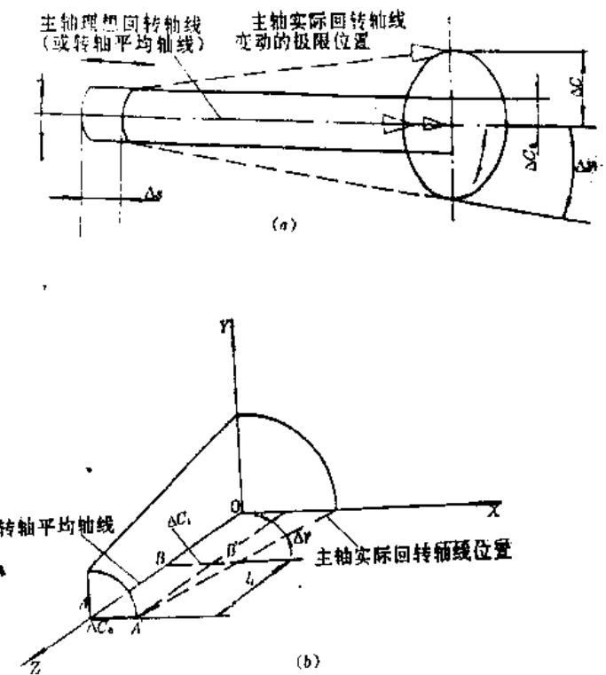

图8-32轴系回转误差组成

(b)主轴径向晃动误差计算图

# 二、轴承的精度分析

为了提高电子设备及精密机械仪器的工作精度,必须正确地分析轴系的精度,这样才能设计和制造出结构合理、回转精度较高的主轴。

如前所述,主轴在回转过程中,其实际回转轴线偏离理想轴线的晃动量就是主轴的回转误差。降低这种晃动量就可以提高主轴的回转精度。根据分析,影响轴系精度的因素有下列几项:

(1)零件尺寸误差的影响;  
(2)形位误差的影响;  
(3)轴系的装配质量的影响;  
(4)温度的影响;  
(5)摩擦与润滑的影响;  
(6)磨损的影响;  
(7)零件变形的影响等。

圆柱形轴系和圆锥形轴系是最常用的轴系。

# 1.圆柱形轴系

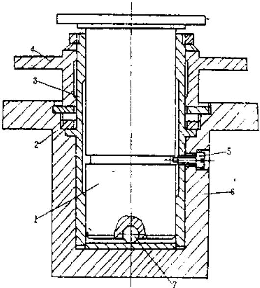

(a)主轴回转误差分量云意图

图8-33圆柱形轴系的结构

圆柱形轴系形状简单、容易获得较高的制造精度,其典型结构如图8-33所示,圆柱形轴1在轴承套3内旋转,度盘4以轴承套3为轴,在套外面旋转.轴承套3被螺母2压紧在支承座6上,螺钉5用作防止轴」的轴向窜动,轴向载荷由滚珠7承受。

下面着重讨论轴和轴套的尺寸误差、几何形状误差、温度对其精度的影响,

# (1)轴颈和轴套尺寸误差的影响

轴颈和轴套的尺寸误差大小直接影响配合间隙,且随着工作表面的磨损、间隙逐渐增大,使得主轴轴线不能保持恒定的位置。由此产生置中误差和角运动误差,如图8-34所示,它将影响轴系的回转精度和使用寿命,

# 1)置中误差

$$
\Delta C _ { 0 } = \frac { 1 } { 2 } \Delta d = \frac { 1 } { 2 } ( d _ { t } - d _ { t } )
$$

式中, $d _ { \star }$ 轴套孔径 $\left( \mathsf { m m } \right)$ ;

$\pmb { \dot { d } _ { \pmb { \ x } } }$ ——轴颈直径 $\mathrm { ( m m ) }$ 

# 2)角运动误差

$$
\ \Delta \gamma = { \frac { \lambda d } { \tilde { L } } } \rho
$$

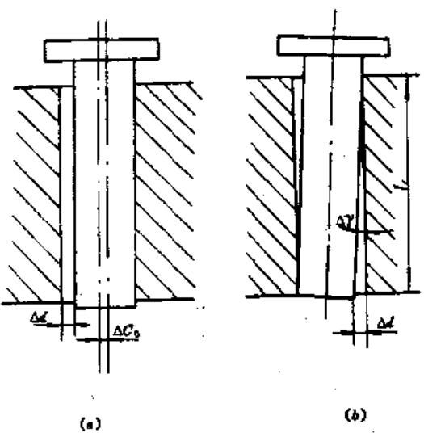

图8-34径向晃动误差计算$\mathbf { \Omega } ( \pmb { \alpha } )$ 置中误差计算图(b)角运动误差计算图

式中, $\Delta \boldsymbol { \mu }$ —轴颈轴线对轴套中心线的最大倾角 $( " )$ ;

$\boldsymbol { \tau }$ ——轴颈对轴套孔上、下两配合部位之间距离 $\left( \mathsf { m m } \right)$ 

$\pmb { \rho }$ —转换系数, $\rho { = } 2 . 0 6 \times 1 0 ^ { 5 } \langle { " } \rangle$ 。

圆柱形轴可在两边晃动,设计时应根据精度要求将 ${ \mathfrak { M } } _ { \mathfrak { o } }$ 和 $\Delta \gamma$ 限制在允许的范围内.

显然,欲提高轴系的置中精度,可设法减小间隙和增加其工作长度,将 $\Delta \gamma$ 控制在最小值。但是,减小间隙受到精密加工工艺水平的限制,并将会增加制造成本,影响轴颈转动的灵活性,甚至会因温度变化而产生“抱轴"现象。在实际生产中,常用“选配加工"的方法,或在装配时配对研磨来保证间隙量。

增加轴颈工作长度,会使结构尺寸增大,降低轴的刚度,故 $\pmb { \cal L }$ 应选择适当的数值,

(2)轴和轴套几何形状误差的影响

它主要指轴颈和轴套孔的圆度和圆柱度误差,是影响主轴轴心径向晃动轨迹的根本原因.

1)圆度误差圆度误差是指包容圆柱体同一剖面的实际轮廓,且半径差为最小的两同心圈间的距离。它对轴系精度影响最不利的情况是轴颈椭圆的长径和轴套權圆的短径相等。图8-35所示为该情况时,圆柱形中心在 $\boldsymbol { \bar { \lambda } } , \boldsymbol { Y }$ 两个方向的最大偏移情况, $\omega ^ { \prime }$ 为圆柱形轴的中心 $d _ { x } , d _ { z } ^ { * }$ 为圆柱形轴颈的长径和短径; $o$ 为轴套的中心, $d _ { 1 } , d _ { 1 } ^ { 2 }$ 为轴套的长径和短径,转动时,轴颈中心变化范围从 $\mathfrak { d }$ 至 $( d _ { \mathrm { r } } - d _ { \mathrm { : } } ) / 2$ ,因 $d _ { x } = \sum _ { i = 1 } ^ { n } d _ { i } ^ { x }$ ,所以最大 $\preccurlyeq$ 心量 $\mathcal { \mathrm { X } } _ { 0 } = ( d _ { t } - d _ { t } ) / 2$ $= ( d _ { i } - \dot { d _ { i } } ) / 2 = \Delta R _ { t } ( \Delta R _ { t }$ 为轴套孔的圆度误差);而间变化范围从 $\therefore ( 2 , - d , ) / 2$ 至 $( d _ { 4 } - d _ { 5 } )$ 。同理,因 $\smash { d _ { t } = d _ { t } ^ { \prime } }$ ,故最小问隙为

$$
\begin{array} { r l } & { \frac { d _ { s } - d _ { s } ^ { \prime } } { 2 } = \frac { d _ { s } + d _ { s } - d _ { s } ^ { \prime } - d _ { s } ^ { \prime } } { 2 } } \\ & { \qquad = \frac { ( d _ { s } - d _ { s } ) + ( d _ { s } - d _ { s } ^ { \prime } ) } { 2 } = \Delta R _ { s } + \Delta R _ { s } } \end{array}
$$

式中, $\Delta R _ { t } , \Delta R _ { z }$ 分别为轴套孔和主轴轴颈的圆度误差,

由上可见,最大间隙为 $( d _ { \mathsf { i } } - d _ { \mathsf { s } } ) = \Delta \ell = 2 . \Sigma ,$ ,因此由圆度误差产生的间隙要引起轴颈的倾斜,所产生的角运动误差为

$$
{ \bf j } _ { \mathrm { j } } = \frac { \Delta { d } } { L } \rho = \frac { 2 \Delta R _ { \mathrm { t } } } { L } \rho
$$

如果由轴颈和轴套的尺寸误差产生的间隙和圆度误差同时存在,则在最不利的情况下,轴颈和轴套之间的最大间隙 $\pmb { \mathscr { A } } _ { \mathbf { m } \mathbf { n } \mathbf { n } }$ 为

$$
j _ { \mathrm { r e a r } } = ( d _ { i } - d _ { i } ) + 2 \Delta R _ { i }
$$

由此产生的角运动误差为

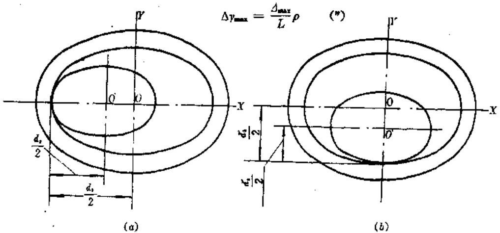

图8-35度误差

2)圆柱度误差即包容圆柱体实际表面且半径差为最小的两个同轴圆柱面间的距离。它是控制圆柱形轴系误差的一项更符合实际的综合测量指标。它既影响轴系置中精度和定向精度,也影响轴系的振动、噪声和使用寿命。

在轴套端面位置处,主轴径向晃动误差的最大值 $\Delta C _ { a u x }$ 为

$$
\Delta C _ { \mathrm { m a x } } = \Delta t _ { z } + \Delta t _ { i }
$$

式中, $\pmb { \mathscr { Q } } _ { \mathbf { z } }$ ——主轴轴颈的圆柱度误差 $\left( \mathsf { m m } \right)$ ;

$\pmb { \Delta } \pmb { t _ { \mathrm { h } } }$ —-轴套的圆柱度误差 $\left( \mathsf { m m } \right)$ 

由图8-36可见,圆柱度误差引起主轴的角运动误差为

$$
\Delta y _ { \mathrm { s o n } } = \frac { \Delta t _ { 1 } - \Delta t _ { 1 } } { L } \rho
$$

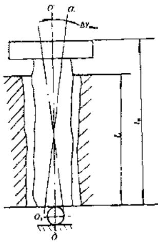

图8-36圆柱度误差

式中, $\pmb { L }$ ——轴套孔的长度 $\left( \mathfrak { m m } \right)$ ,

因此,欲提高轴系的回转精度,须提高轴颈和轴套的加工精度、淬硬轴颈表面以增加耐磨性。

# (3)温度的影响

轴颈和轴套在温度变化时要产生热胀冷缩现象,使间隙发生变化,即使轴和轴套选用同一膨胀系数的材料也不例外。其间隙变化量为:

$$
\mathcal { A } _ { i } = d _ { i } \big [ 1 + \alpha _ { i } ( { \boldsymbol { t } } - { \boldsymbol { t } } _ { 0 } ) \big ] - d _ { i } \big [ 1 + \alpha _ { i } ( { \boldsymbol { t } } - { \boldsymbol { t } } _ { 0 } ) \big ]
$$

式中, $\varDelta _ { \ell }$ 一—因温度变化而引起的间隙变化(mm);

${ \mathfrak { a } } _ { \mathfrak { t } }$ -——轴套材料的线膨胀系数 $ { ( 1 / \mathrm { { C } ) } }$ ;$\pmb { \alpha } _ { \pmb { \nu } }$ 一轴颈材料的线膨胀系数 $( 1 / \subset )$ $\pmb { \ell }$ ——工作温度(℃);$\ell _ { 0 }$ —一装配时的温度,一般为 $\mathtt { 2 0 } \mathtt { C }$ 左右.

设计时应考虑到,不管在何种温度下工作,轴承间隙变化后的量不应超过许用值,

常用材料的线膨胀系数见表3-12.

图8-37所示为磁带录音机的主导轴结构,采用高精度的圆柱形轴系。主导轴表面粗糙度为 $\frac { 0 . 0 5 } { \sqrt { 1 } } - \frac { 0 . 0 2 5 } { \sqrt { 1 } }$ 0.025 ,表面形状误差小于 $0 . 5 \mu \mathrm { m }$ 。主导轴用不锈钢材料,轴承采用了铜基金属粉末玉铸的含油滑动轴承。

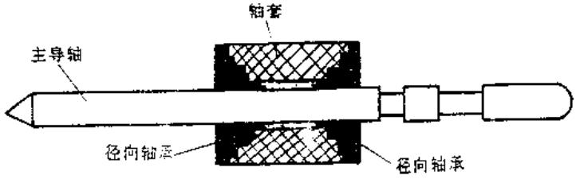

图8-37磁带录音机的主导轴结构

# 2.圆锥形轴系

圆锥形轴系的典型结构如图8-16所示,它是由锥形轴1和带圆锥孔的轴承套2及其它零件组成的。圆锥形轴1在圆锥形轴承套内旋转,轴向载荷由轴套的圆锥形配合面和止推螺钉分担,调节止推螺钉5可以调整轴系间隙,以使轴系在几河形状误差较小时,可得到较高的置中精度和方向精度。

圆锥形轴系也存在配合间隙和几何形状误差(主要是圆度误差>,它们将影响回转零件一一轴的置中精度和方向精度。

由圆柱形轴系精度分析和图8-38可知,当锥形轴颈和轴套之间有间隙 $\varDelta _ { \ast }$ 和圆度误差时,锥形轴截面中心的偏移量为

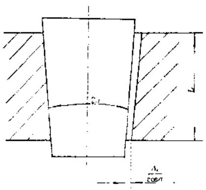

图8-38锥形轴系精度计算图

$$
y C = x R _ { 1 } + y R _ { 1 } + \frac { \Delta _ { 2 } } { 2 c o s a }
$$

式中, $\mathcal { \Delta } R _ { \pm }$ —一锥形轴套的圆度误差 $( \min )$ 

$\Delta R _ { \varepsilon }$ —锥形轴颈的圆度误差 $( \mathsf { m m } )$ ;

4.——锥形轴颈和轴套间的法向间隙 $( \mathsf { m m } )$ :

$\pmb { \sigma }$ —轴颈和轴套的圆”半角 $\ell ^ { \bullet }$ )。

由轴颈和轴套间之问隙引起的角运动误差为

$$
\Lambda _ { 7 } / = \frac { 2 \Delta \bar { C } } { \bar { L } } _ { \rho } \qquad ( 1 1 \cdot
$$

式中,符号意义同上。

从式(8-35)和(8-36)可见,在其它条件相同时,要提高支承的置中精度和定向精度,可减小半锥角。但锥角过小,正压力和摩擦力矩将随着增加而使运转不灵活,一般选圆锥半角$\alpha { = } 2 ^ { \circ } 5 0 ^ { \circ } \sim 6 ^ { \circ } .$ 

设计圆锥轴系时,圆锥形轴颈和圆锥形轴套的锥角偏差 $\Delta \pmb { \alpha }$ 可按下式确定:

$$
\begin{array} { r } { \Delta a = 2 ( a _ { i } - a _ { i } ) < [ \Delta \gamma ] . } \end{array}
$$

式中, ${ \pmb { a } } _ { \pmb { \nu } }$ 轴套孔的圆锥半角 $\{ ^ { \circ } \} ;$ 

${ \pmb { a } } _ { \pmb { \lambda } }$ -轴颈的圆锥半角 $\{ { } ^ { \bullet } \}$ ;

$[ \Delta \gamma ]$ -—允许轴线倾斜的误差角 $( " )$ ,其值一般不允许超过 ${ 3 0 ^ { \prime \prime } }$ 

# $\ S 8 . 5$ 联轴器和离合器

联轴器和离合器用来连接传动轴,以便扎原动轴的运动和转矩传递给从动轴。联轴器和离合器常用于以下情况:

(1)轴较长或出于结构 的制造和安装困难,而需要把轴分段,然后用联轴器将各段相联。

(2)为避免主动部分的振动和冲击传给从动部分;

(3)与轴相联部分需经常拆装:

(4)实现不在同一直线两轴的连接,如交叉轴、平行轴、相交轴的连接;

(5)连接单向旋转或单向传动的轴;

(6)在轴过载时起保护传动部件的作用。

联较,把两轴审固地连接在一走,只不当轴停止运转时,用拆卸的方法才能把两轴分开。

离合器也是用来连接两传动轴的,但可不用拆卸的方法,而根据工作要求,在主动辖运转的情况下,随时使两轴分离和接。它可视为联轴器的一种特例。

联轴器和离合器大部分已标准化,只需要按工作要求选用合适的类型和型号。本节着重个绍电子设备中常用的精密联轴器和离合器的结构、性能和特点。

# 一、联轴器

在电子设备中使用联轴器时主要考虑下述因素: $\textcircled{1}$ 使轴能正常工作; $\textcircled{2}$ 保证传动精度; $\textcircled{3}$ 减少传动轴的振动和冲击; $\textcircled{4}$ 提高传动效率; $\textcircled{5}$ 减小转动惯量。

# 1.套筒联轴器

这种联轴器用一个套筒和两个锥销将两轴连接起来,如图8-39所示。当用销钉连接时,还可用作安全联轴器。这种联轴器的特点是结构简单、成本低、径向尺寸小、传递转矩较小、转动惯量小、要求同轴度高。一般用于低速、振动小和轴的刚性较大的场合,它既适用于相同轴径的连接,也适用于不同轴径的连接。

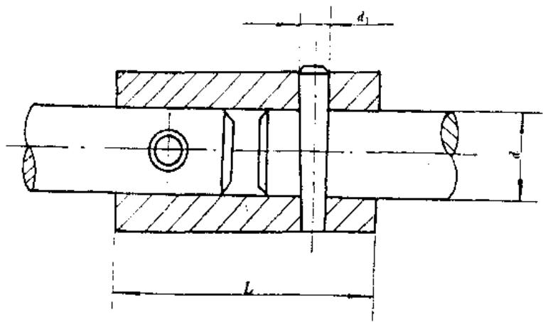

图8-39套简联轴器

被连接的两轴实际上总会存在着轴线的微量偏移和倾斜,为了防止被连接轴的微量偏移和倾斜带来装配上的困难或附加应力,在套简和被连接轴间要留有间隙,一般取H7/6或 $H 8 ( H 9 ) / h 8 ( h 9 )$ 配合,两个锥销位置应相互垂直,使被连接轴线有少许偏移的可能性。套简的长度不宜过短或过长,一般取 $3 d \sim 5 d ( d$ 为轴的直径)。

# 2.舌形联轴器

图8-40所示为这种联轴器的最简单结构,由于其外套和内套之间的配合间隙很小,所以它只能补偿被连接两轴的轴向位移,而不能补偿两轴的径向位移和轴向偏斜。因为工作时接触表面摩擦损失较大,它只适用于低载荷情况下工作。另外,它也可用作安全联轴器。

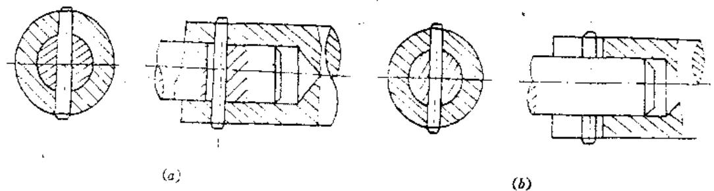

图8-40舌形联轴器

# 3.盘销联轴器

这种联轴器如图8-41所示,在圆盘1的一定半径的圆周上定一个销钉,圆盘2上有--个对应的槽,装配时,将销钉插入槽中,即可传递扭矩。它适用于被连接的两轴线不精确对中的情况。

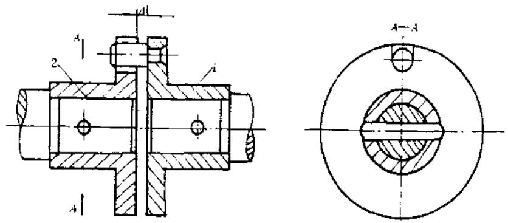

图8-41盘销联轴器

盘销联轴器允许被连接的两个轴头有少量的轴向位移,但轴向位移要小于两盘之间的最大间隙(一般为 $0 . 8 \sim 1 . 5 \mathsf { m m } )$ ,也允许有 $0 . \dot { 1 } \sim 0 . 5 \mathfrak { m m }$ 的径向位移。销钉和槽的配合通常采用 $\frac { 1 } { n + 1 } / \frac { 1 } { n } \widehat { 0 }$ 或 $H 8 / h 7$ ,以减小传动链的空程误差。

与舌形联轴器相比较,由于盘销轴线到回转轴线的距离较大,所以具有以下优点: $\textcircled{1}$ 传递相同转矩时,作用在销钉和槽接触面上的压力要比作用在舌形联轴器销上的力小,因此,销与销槽之间的磨损要比舌形联轴器慢得多; $\textcircled{2}$ 在间隙相同的情况下,盘销联轴器的空程误差比舌形联轴器的小,故在精度较高的机构中,宜选用盘销联轴器; $\textcircled{3}$ 盘销联轴器允许被连接的两轴轴心线有较大的不同轴度,但会引起传动误差,如图8-42所示。由被连接轴的径向位移 $\pmb { e }$ 所引起的传动误差 $\delta \varphi$ 为

$$
8 p = \sin ^ { - 1 } \left\{ \frac { e } { r } \sin \varphi _ { 2 } \right\}
$$

式中, $\cdot \pmb { \tau }$ —由销钉轴线到主动轴轴线的距离;

$\varphi _ { 2 }$ —--从动轴的转角。

可见,传动误差按正弦规律变化,且随着 $\pmb { \varrho }$ 的加大而加大。当 $\varphi _ { 2 } = 9 0 ^ { \circ }$ 或 $2 7 0 ^ { \circ }$ 时,误差达到最大值,即

$$
\delta \varphi _ { m a x } = \sin ^ { - 1 } \frac { e } { r }
$$

由此可知,主动盘每转动一周,被动盘的误差角就出现两次零值和两次最大值,因此引起了机构的误传动和振动。所以,对于精密传动和示数装置中的盘销联轴器,还应考虑被连接轴线的不重合所引起的传动误差。缩小传动误差的方法是尽量减小被连接轴的径向位移量 $\pmb { \varrho }$ 和增大销钉轴线到回转轴线的距离值。

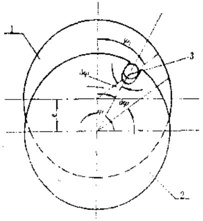

图8-42盘销联轴器的传动误差

# 4.无空程误差联轴器

这种联轴器如图8-43所示。主动盘上装有簧片,把被动轴上的拨销紧紧地压向主动盘拨口槽侧,簧片弹力的大小应根据被动轴回程阻力的大小及反向传动力矩的大小来选择。

# 5.十字滑块联轴器

如图8-44所示,它是两个端面上开有凹槽的半联轴器1、3和两端面各有通过中心并互相垂直的凸榫的中间圆盘2组成,中间圆盘上的两凸榫分别与两个半联轴器上的凹權嵌合,半联轴器分别装在主动轴和从动轴上,如果两轴平行但不重合(有径向偏移),当两轴回转时,中间圆盘的凸榫将分别在两个半联轴器的凹槽中滑动。

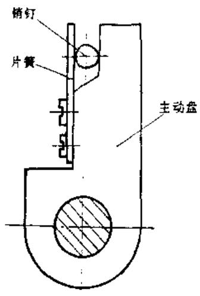

图8-43无空程误差联轴器

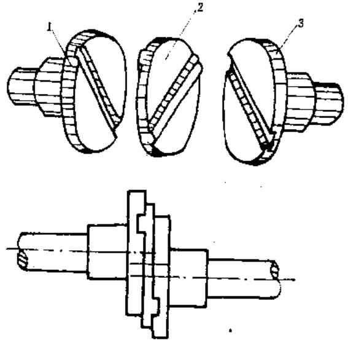

图8-44十字滑块联轴器

十字滑块联轴器的主要特点是允许被连接两轴有较大的不同轴度,并且在传动中不致由此而产生传动误差。但如果两轴不对中,工作时中间圆盘就会沿凹槽来回滑动,其中心将以偏移量之半为半径作回转运动,且圆周速度要比联接轴的转速高一倍,转速太高时离心力大、磨损快,故只适用低速 $( { \bf { w } } < 2 0 0 \mathbf { { \bar { z } } } / \operatorname* { m i n } )$ 时使用。为了减小离心力,中间圈盘可做成空心的,内径约为外径的0.7倍;为了延长寿命,十字滑块联轴器应选用经过淬火、硬度达到HRC50以上的50一-60钢,此外,为了减小摩擦,中间圆盘设有油孔,进行润滑。

这种联轴器允许两轴有较大的径向位移 $\left( 0 , 0 4 d , \dot { d } \right)$ 为轴的直径)及少量的角度偏差 $( a \leqslant 3 0 ^ { \prime } )$ ,允许的轴向位移△S$\leqslant 0 . 2 h ( h$ 为榫高)。

# 6.膜片式联轴器

当被连接轴轴线不重合,而有很小的相对角位移时,可采用膜片式联轴器。常用的圆形膜片式联轴器的结构如图8-45所示。膜片一般可用硅钢、磷青铜及铍青铜等材料制成。

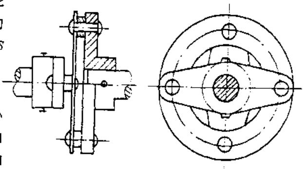

图8-45膜片式联轴器

膜片式联轴器几乎没有空程误差,因而特别适用于示数装置的传动机构中和由于被连接轴线有不大的相对偏斜,而不宜采用刚性联轴器的地方,

# 7.螺旋管弹性联轴器

这种联轴器的结构如图8-16所示.它的中间部分相当于一个截面尺寸较大的矩形螺旋弹簧,材料通常为锡青铜棒,钻孔后两端为联轴头,弹簧的一端固定,另一端受转矩作用时,则相对子转轴产生弹性变形,其角位移量为A.

这种联轴器的特点是结构简单、零件最少;加工、装配都较方便:空程误差小;转动惯量小;在传动过程中能吸收冲击、振动、补偿微量的轴向和角度偏移。它适用于转矩较小的数据传动中,由于负载变化所引起的弹性变形将破坏运动的平衡性,因此,在要求非常平稳和精确的传动中,最好不要选用这种联轴器。

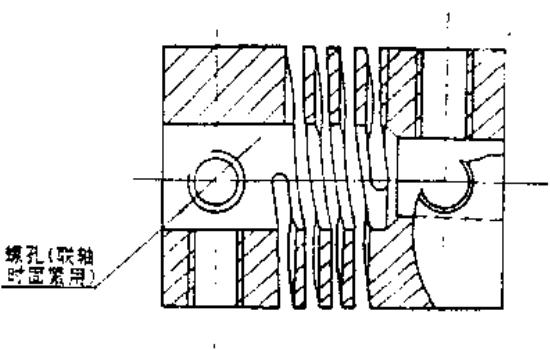

8.多层簧片波纹管弹性联轴器

图8-46螺旋管弹性联轴器

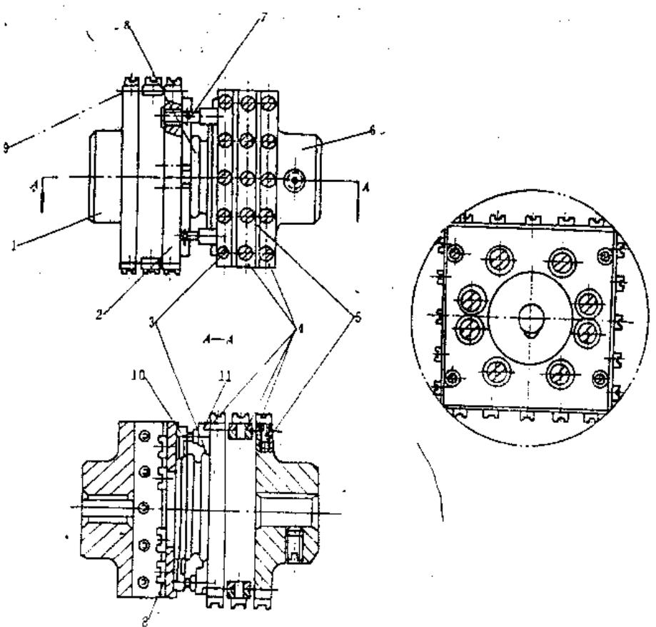

图8-47多层簧片波纹管弹性联轴器

图8-17所示是一种多层簧片波纹管弹性联轴器。图中1和6分别为联轴头.2和3为两块转接板。转接板2和联轴头1由上、下两侧面的两片簧片9连接,转接板3和联轴头 $\mathfrak { f }$ 由前、后侧面的两片簧片5连接,簧片 $\mathfrak { g }$ 和5分别靠螺钉和压条4压紧,转接板2和3用波纹管8连接,波纹管8靠压板10和11分别压紧在转接板2和3上.被连接两轴的径向偏差由则面簧片9和5的弯曲变形补偿,轴向和角度偏差由波纹管8补偿。限位螺栓7与转接板2上的孔之间留有微量间隙,当扭矩过大时,限位螺栓起保护作用,转接板用铝合金制造,并且其中央打减轻孔,以减小转动惯量。

这种联轴器的精度很高,传动误差和空程误差可控制在1"左右,其抗扭刚度亦很大。一种类似于它的簧片弹性联轴器曾成功地应用于某雷达天线的动力驱动装置中。

# 二、离合器

离合器可以根据工作要求将被连接的两传动轴接合或脱开,以控制从动轴的转动或停止.

离合器应满足的基本要求是:

(1)接合与分离方便、迅速、平稳且可靠;  
(2)操作灵活;  
(3)便于调整,尤其是摩擦式离合器,应能调整或自动补偿磨损量,以保证压紧力;  
(4)经常接合和分离时,麝损及发热要少,温升不能太高;  
(5)在扭矩一定的情况下,外形尺寸要小、重量轻,结构应尽可能简单;  
(6)机构应对称,不应出现偏重而引起运动中的振动。

# 1.摩擦式离合器

摩擦式离合器是靠摩擦盘接触面之间产生的摩擦力来传递转矩的。它可在两轴转速差较大的情况下平稳地接合;接合时冲击和振动较小;改变摩擦面的压力可以调节被动轴的加速过程和启动时间;当传递的转矩超过允许值时可打滑,以保护其它零件免受损坏。但是,它在工作过程中,工作面之间可能有弹性滑动,故无法保证主动轴和从动轴之间的同步传动,所以不宜用于示数机构中。

摩擦离合器摩擦面的材料必须具有较大的摩擦系数、能耐高温、耐高压和耐磨损,在油中工作的摩擦式离合器常选的材料是淬火钢对淬火钢,或淬火钢对青铜,以保证油池中油液的清洁;不在油中工作的擦式离合器,一液可用铸铁对铸铁或淬火钢,也可用铸铁或淬火钢对混有塑料与石棉E:品。

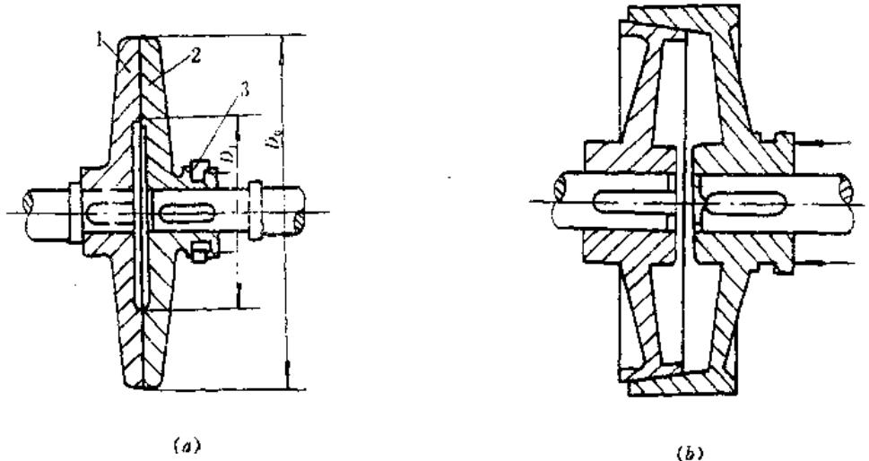

图8-48摩擦式离合器

(c)单圆盘式摩擦离合器1、2-摩擦盘;3-滑环

常用的摩擦式离合器型式有单圆盘式和单圆锥式摩擦离合器,如图8-48所示。它们都由两个摩擦盘组成,其中一摩擦盘与主动轴通过平键相连,另一摩擦盘用导向平键和从动轴连接。工作时,利用操纵装置(如拨叉)对滑块(或起类似作用的结构)加一轴向压力,而使从动轴上的摩擦盘移动,使两个摩擦盘互相压紧,并借此产生传递力矩所需要的摩擦力矩。

摩擦式离合器所能传递的转矩,取决于摩擦面间的摩擦力。正常工作时应使:

$$
M _ { f } \ggeq K _ { A } M _ { 0 }
$$

式中, $M _ { f }$ —工作面间的摩擦力矩;

$M _ { 0 }$ ——需要传递的转矩;

$\pmb { \chi } _ { A }$ -—安全系数,根据工作载荷性质而定。载荷越平稳, $\kappa _ { \iota }$ 值越小;载荷波动大, $\pmb { k } _ { \pmb { \mathscr { A } } }$ 值大。通常 $\kappa _ { s } = 1 , 5 \sim 2$ 

设计时应使离合器的打滑力矩比正常工作时驱动力矩的最大值大,比允许的过载力矩的最大值小。

单圆盘式摩擦离合器的打滑力矩,即最大摩擦力矩 $M _ { f o u x } ( \mathfrak { m } \cdot \mathfrak { m } )$ 为

$$
M _ { f r o a n } = { \frac { 1 } { 1 2 } } \pi f p ( D ^ { 3 } - D _ { \mathrm { { i } } } ^ { 3 } )
$$

摩擦面上的比压 $\pmb { \mathscr { p } }$ 应小于许用比压 $[ \pmb { \bar { p } } ]$ ,即

$$
\bar { \nu } = \frac { 4 \mathcal { F } _ { 4 } } { \pi ( D ^ { 2 } - D _ { \mathrm { i } } ^ { 2 } ) } \leqslant [ p ]
$$

式中, $\pmb { \mathscr { f } }$ —-摩擦面间的摩擦系数,见表8-8;

$\kappa _ { \bullet }$ 轴向压紧力 $( \boldsymbol { \mathsf { N } } )$ ;$\pmb { D }$ --摩擦面的外径(mm);$D _ { 1 }$ ——摩擦面的内径 $\left\{ \mathbf { m m } \right\}$ $[ p ]$ 一许用比压,见表8-8。

表8-B摩擦系数 $\pmb { f }$ 和许用比压[]

<table><tr><td rowspan="2">工作条件</td><td rowspan="2">摩擦面材料</td><td rowspan="2">f</td><td colspan="2">[] (MPa)</td></tr><tr><td>圆盘式</td><td>圆锥式</td></tr><tr><td rowspan="4">在油中工作</td><td>淬火钢一淬火锅</td><td>0.06</td><td>0.6-0.8</td><td>1</td></tr><tr><td>淬火一青锅</td><td>0.08</td><td>0. 4-0.5</td><td>0.6</td></tr><tr><td>铸铁一淬火钢（铸铁）</td><td>0.08</td><td>0. 6-0.8</td><td>1</td></tr><tr><td>钢一夹布胶木</td><td>0.12</td><td>0.4-0.6</td><td>二</td></tr><tr><td>不在油中工作</td><td>压制石棉一钢(铸铁） 铸铁一铸铁(淬火钢)</td><td>0.3 0.15</td><td>0.2-0.3 0.2—0.3</td><td>0.3 0.3</td></tr></table>

单圆锥式摩擦离合器的工作原理和单圆盘式的一样,只是摩擦工作面(接触面)为圆锥面,由于楔形锥面的增压作用,故可用较小的轴向压紧力来传递较大的转矩,但圆锥式摩擦离合器的两个锥面角度应加工成一样大,加工较为困难,且因其最多只能有两个摩擦面(双圆锥式),故其径向尺寸不如多片式圆盘摩擦离合器的紧凑。为使离合器能顺利接合,当摩擦面为金属对金属时,圆锥角 $a { \ge } 6 ^ { \circ } \sim 7 ^ { \circ } $ 一般取 $8 ^ { \circ } \sim 1 0 ^ { \circ } )$ ;皮革对金属时, $a \geq 1 2 . 5 ^ { \circ }$ ;木材对金属时, $a \geq 2 0 ^ { \circ }$ 

# 2.电磁离合器

电磁离合器是利用电流通过电磁线圈时产生的磁力作用,使离合器主、从动摩擦面扫而传递转矩。各种机械式离合器经过一番改装后均可装成电磁离合器,其中以电磁摩擦离器使用最多。当离台器的某一端固定时,亦可成为电磁制动器,用以在需要时制动传动

电磁离合器的优点是操纵方便、可以实现远距离自动控制、接合时间短、机械部分结构筒单,多数情况下没有不平衡的轴向力;缺点是必须使用直流电、结构尺寸较大、重量较大。

电磁离合器经常使用在伺服机械的控制系统中,例如用于数字电子计算机中磁带运行的变速控制。图8-49是某卫星地面站使用的直流圈盘式电磁制动器。安装在天线驱动齿轮箱输入轴上。当控制系统失灵时,它可紧急制动输入轴,保护电气部件和机械结构免遣损坏。其工作原理是:不需要制动时,接通电源,电磁铁2产生吸力·使衔铁4压缩弹簧3而与制动件5脱开,制动件5随齿轮箱输入轴1一起旋转。当需要制动时,切断电源,电磁力消失,衔铁4在弹簧3推动下压紧制动件5,从而在摩擦片 $\mathfrak { E }$ 上产生摩擦力矩,将输入轴刹住,控制住天线的运动。若需要手动时,可取下后盖8、同时释放触点开关7,使电源切断。旋转调节螺钉9,使衔铁4与制动件5脱开,即可用手柄摇动输入轴,使天线旋转。

电子设备中也有用牙嵌式离合器的,例如在示数装置中等。考虑到离合方便及传动精度,通常用的牙形为三角形(一般取a=30°)及梯形。此外,还采用单向旋转离合器和安全离合器等.

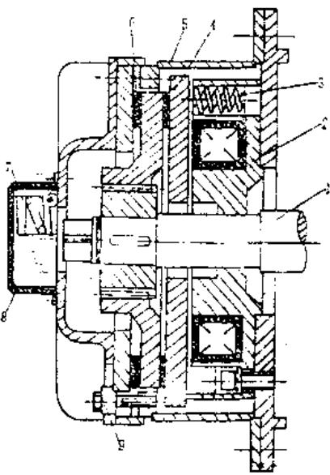

8-49画盘直流电磁制动器

# 习 题

8-1在设计精密机械用支承时,应满足哪些基本要求?

B-2按摩擦性质不同,支承可分为几种类型?每种类型又有哪些常用的支承?

8-3某电子设备活动系统总重量Q=0.075N,用圆柱形支承,结构尺寸为d=0.8mm,=1.6mm,轴颈材料为碳素钢,轴承为红宝石,见图8-50所示,求:①当轴水平工作时,圆柱形支承的摩擦力矩:②当轴垂直工作时,圆柱形支承的摩擦力矩;③当用止推垫米承受轴向力时,摩力矩为多大(此时取轴端球半径$= 0 . \ 6 \mathsf { m m }$ ,止推垫为红宝石)?

B-4其仪表活动系统重量Q=0.06N.轴尖材料为淬火钢,轴半径为+=-0.05mm,止推轴垫为刚玉,球面半径R=0.3mm。求该支承分别在轴垂直及水平状态下工作时的摩擦力矩,

8-5试求轴承1000094在径向载荷50N作用下工作的摩擦力矩。

B-B已知天线方位驱动装置中的安全摩擦离合器打滑力矩M=34300mN·m选用标准摩據片,外径D=140mm,内径D=72mm,摩攘面数=2,材料为石棉钢丝,试求所需轴向压紧力及比压。

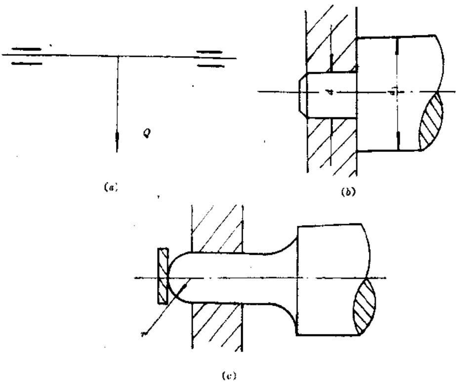

图8-50

# 第九章 导向装置

导轨副和导轮、导柱是用来实现给定运动轨迹的导向装置,给定的运动轨迹可以是直线,也可以是曲线。本章主要讨论直线运动导轨副。

# \$9.1概 述

# 一、导轨副的组成和特点

如图9-1所示的导轨副,由运动件1和承导件2组成,运动件是作直线运动的零件,又称为动导轨;承导件是用来支承和限制运动件,使其按给定方向作直线运动的零件,又称为静导轨。运动件与承导件相接触的平面称为承导面。

导轨副具有以下特点:

(1)运动速度低。如激光比长仪的工作台移动速度为 $0 . 0 3 \sim 0 . 0 6 m / \min$ ,有些设备的工作台移动速度更低。

(2)导轨工作部分的刚度较差。如仪器工作台的导轨,既长又,是整机中刚度最弱的部分。

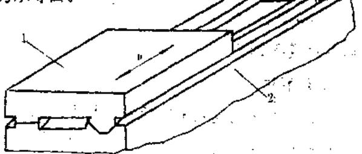

图9-1导轨部件

(3)导轨受力较复杂,计算较困难。

(4)导轨加工的工作量较大,需要专用设备(如导轨磨床)加工或手工刮研。

# 二、导轨的分类

导轨的种类很多,按导轨副的摩擦性质,可分为四类:

(1)滑动摩擦导轨;  
(2)滚动摩擦导轨;  
(3)弹性导轨;  
(4)流体摩擦导轨。

按导轨副的结构特点,又可分为两类:

(1)开式(力封式)导轨它:运动件的自重或其它外力(如弹簧力等)使运动件和承导件的工作面保持接触,从而保证运动件按给定方向作往复直线运动。

(2)闭式(自封式)导轨它依靠导轨本身的结构使运动件和承与件的工作面保持接触,从而保证运动件按给定方向作往复直线运动。门式导轨对温度变化较为敏感。

# 三、导轨设计的基本要求

设计导轨应满足以下几项基本要求:

# 1.导向精度

导向精度是指导轨副中运动件沿给定方向作直线运动的准确程度。运动件实际运动方向对给定方向的偏差越小,导向精度越高。导轨的导向精度对机床和仪器的加工和测量精度有直接影响,它是导轨副的主要技术指标。导向精度主要取决于导轨承导面的几何形状精度和导軌副的装配精度。

# 2.刚度

导轨的刚度是指在外力作用下导轨本身抵抗变形的能力(它不包括基础件刚度对导轨变形的影响)。导轨的变形必然会影响机床和仪器的加工和测量精度,所以应确保导轨受力后产生的变形量在允许的范围内。导轨的刚度与导轨的类型、结构尺寸、材料及热处理等因素有关.

# 3.运动的灵便性和平稳性

导轨副工作时,运动件移动应轻便灵活,在作低速移动或作微量移动时不应出现“爬行”现象。所谓爬行现象是指运动件作低速或微量移动时发生的突跳现象。运动的灵便性和平稳性主要取决于导轨副摩擦力的大小和动、静摩擦系数的差值以及驱动运动件运动的传动系统的刚度等因素。

# 4.耐磨性

导轨的承导面应具有较高的耐磨性,以保证导轨在长期使用后仍能保持原设计精度,导轨的耐磨性与导轨的结构型式、材料、承导面上的比压、硬度、表面粗糙度和润滑状况等因素有关。

# 5.对温度变化敏感性小

导轨在环境温度变化较大时,应仍能正常工作,面不出现“卡死"或间隙过大、导向精度下降过多等情况,导轨对温度变化的敏感性主要取决于导轨类型、材料和配合间隙。

# 6.结构工艺性

导轨在满足工作性能的前提下,结构应尽可能简单,便于加工、检验、调整和维修。

常用导轨的性能比较见表9-1。

表9-1常用导轨性能比较

<table><tr><td></td><td rowspan=1 colspan=2>导轨型式</td><td rowspan=1 colspan=2>结构简图</td><td rowspan=1 colspan=2>导向精度</td><td rowspan=1 colspan=2>摩擦力</td><td rowspan=1 colspan=2>耐磨性</td><td rowspan=1 colspan=2>承数能力</td><td rowspan=1 colspan=2>对温度变化的敏感注</td><td rowspan=1 colspan=1>成本</td></tr><tr><td></td><td rowspan=1 colspan=2>开式面柱面导轨</td><td rowspan=1 colspan=2></td><td rowspan=1 colspan=2>高</td><td rowspan=1 colspan=2>较小</td><td rowspan=1 colspan=2>较差</td><td rowspan=1 colspan=2>小</td><td rowspan=1 colspan=2>不敏感</td><td rowspan=1 colspan=1>低</td></tr><tr><td></td><td rowspan=1 colspan=2>闭式圈柱面导轨</td><td rowspan=1 colspan=2></td><td rowspan=1 colspan=2>较高较小</td><td rowspan=1 colspan=2>较高较小</td><td rowspan=1 colspan=2>较差</td><td rowspan=1 colspan=2>较小</td><td rowspan=1 colspan=2>较敏感</td><td rowspan=1 colspan=1>低</td></tr><tr><td></td><td rowspan=1 colspan=2>燕尾形导轨</td><td rowspan=1 colspan=2></td><td rowspan=1 colspan=2>高</td><td rowspan=1 colspan=2>大</td><td rowspan=1 colspan=2>好</td><td rowspan=1 colspan=2>大</td><td rowspan=1 colspan=2>教感</td><td rowspan=1 colspan=2>较高</td></tr><tr><td></td><td rowspan=1 colspan=2>闭式矩形导轨</td><td rowspan=1 colspan=2></td><td rowspan=1 colspan=2>软低</td><td rowspan=1 colspan=2>海</td><td rowspan=1 colspan=2>较好</td><td rowspan=1 colspan=2>大</td><td rowspan=1 colspan=2>较敏感</td><td rowspan=1 colspan=2>较低</td></tr><tr><td></td><td rowspan=1 colspan=2>开式三角形-平面导轨</td><td rowspan=1 colspan=2>liie</td><td rowspan=1 colspan=2>较高</td><td rowspan=1 colspan=2>较大</td><td rowspan=1 colspan=2>好</td><td rowspan=1 colspan=2>大</td><td rowspan=1 colspan=2>不敏感</td><td rowspan=1 colspan=2>较高</td></tr><tr><td rowspan=1 colspan=2>开式滚珠导轨</td><td rowspan=1 colspan=2></td><td rowspan=1 colspan=2>高</td><td rowspan=1 colspan=2>小</td><td rowspan=1 colspan=2>较好</td><td rowspan=1 colspan=2>较小</td><td rowspan=1 colspan=2>不敏感</td><td rowspan=1 colspan=2>较高</td></tr><tr><td rowspan=1 colspan=2>闭式滚珠导轨</td><td rowspan=1 colspan=2></td><td rowspan=1 colspan=2>较高</td><td rowspan=1 colspan=2>较小</td><td rowspan=1 colspan=2>较好</td><td rowspan=1 colspan=2>较小</td><td rowspan=1 colspan=2>不敏感</td><td rowspan=1 colspan=2>高</td></tr><tr><td rowspan=1 colspan=2>开式滚柱导轨</td><td rowspan=1 colspan=2></td><td rowspan=1 colspan=2>较高</td><td rowspan=1 colspan=2>小</td><td rowspan=1 colspan=2></td><td rowspan=1 colspan=2></td><td rowspan=1 colspan=2></td><td rowspan=1 colspan=2>较高</td></tr><tr><td rowspan=1 colspan=2>滚动轴承导轨</td><td rowspan=1 colspan=2>价          路</td><td rowspan=1 colspan=2>较高</td><td rowspan=1 colspan=2>小</td><td rowspan=1 colspan=2></td><td rowspan=1 colspan=2></td><td rowspan=1 colspan=2></td><td rowspan=1 colspan=2>较高</td></tr></table>

# 9.2滑动摩擦导轨

滑动摩擦导轨是指运动件和承导件的工作面直接接触的导轨。它是应用较广的一种导轨,其优点是结构简单,制造方便,接触刚度大;缺点是摩擦阻力大,磨损快,动、静摩擦系数相差大,低速时易出现“爬行”。

# 一、滑动摩擦导轨的结构型式和特点

滑动摩擦导轨按承导面的形状可分为圈柱面导轨和棱柱面导轨。每一种类型又有凹形和凸形之分,其中凸形导轨不易存留切屑、脏物,但也不易储存润滑油,宜用作低速导轨;凹形导轨则相反,宜用作高速导轨,但需附加适当的保护装置,以防切屑、脏物落入导轨工作面,仪器导轨通常宜采用凸形导轨。

# 1.圆柱面导轨

圆柱面导轨的承导面是圆柱面,常见的结构型式如图9-2所示。这种导轨结沟比较简单,承导面的加工和检验方便,易于获得较高的精度;但导轨间隙不能调整,特别是磨损后间默不能调整和补偿。闭式圓柱面导轨对温度变化较敏感。

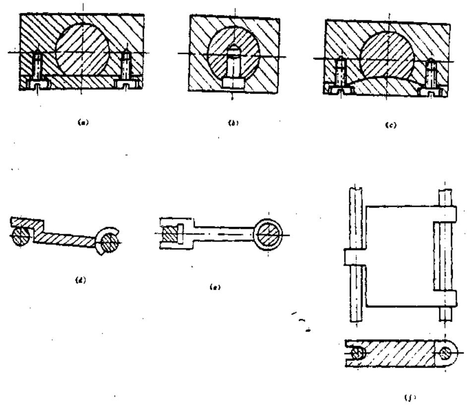

图9-2圆柱面导轨

单一的圆柱面导轨的运动件,除了可沿其轴线方向作直线移动外,还可绕其轴线转动。在多数情况下,导轨工作时不允许运动件作转动,为此需附加防转结构,最筒单的防转结构是在运动件和承导件的接触表面制出平面、凹槽或凸台,如图 $\ddot { \mathfrak { s } } - \overset { , } { \widetilde { \mathfrak { s } } } ( \mathfrak { s } ) , ( \pmb { \ b } ) , \overset { , } { \widetilde { \mathfrak { c } } } )$ 所示,也可以采用辅助导向面来限制运动件转动,如图 $9 \mathrm { - } 2 \left( d \right) , \left( e \right) , \left( j \right)$ 所示。若采用辅助导向面防转结构,在结构条件许可时,辅助导向面与基本导向面之间的距离应尽可能取大些,以减少由辅助导向面处间隙所引起的运动件的转动,

# 2.棱柱面导轨

棱柱面导轨的承导面是由若干平面组成的棱柱面。

(1)基本型式:棱柱面导轨按其截面形状有三种基本型式:三角形导轨、矩形导轨和蒸尾形导轨,见表9-2。 

表9-2棱柱面导轨的基本型式

<table><tr><td rowspan=1 colspan=1>导轨截面形状</td><td rowspan=1 colspan=1>三角形</td><td rowspan=1 colspan=1>矩形</td><td rowspan=1 colspan=1>燕尾形</td></tr><tr><td rowspan=1 colspan=1>凸形</td><td rowspan=1 colspan=1></td><td rowspan=1 colspan=1></td><td rowspan=1 colspan=1></td></tr><tr><td rowspan=1 colspan=1>凹形</td><td rowspan=1 colspan=1></td><td rowspan=1 colspan=2></td></tr></table>

1)三角形导轨三角形导轨的导向精度高且磨损后能靠自重下沉自动补偿间隙,承载能力大,刚度好;但摩擦阻力大,加工、检验较复杂,特别是高精度导轨,刮研工作量大。电子设备和仪器中,导轨的载荷和磨损都较小,所以三角形导轨应用较少。

2)矩形导轨矩形导轨结构简单,加工和维修方便,承载能力大,刚度好,摩擦阻力比三角形导轨小;但磨损后间隙不能自动补偿,导向精度低于三角形导轨,

3)燕尾形导轨燕尾形导轨结构紧凑,间隙调整方便,可承受颠覆力矩;但摩擦阻力较大,加工、维修较复杂,难以达到很高的配合精度,只适用于导向精度要求不高的导轨,其结构如图9-3所示。

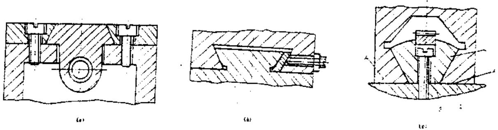

图9-3燕尾形导執的结构

(2)组合型式在实际应用中,除了采用上述三种基本型式的棱柱面导轨外,还常常采用它们的组合结构,常见的组合型式如图9-4所示。

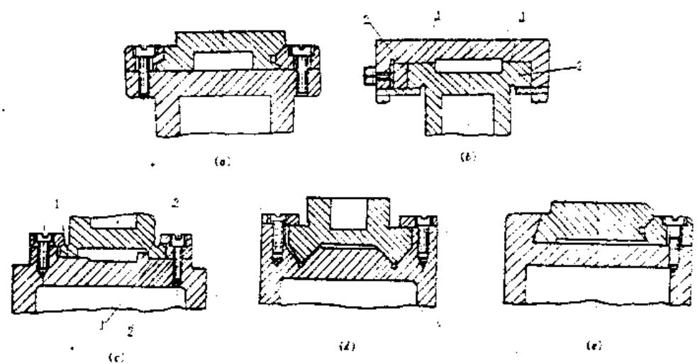

图9-4棱柱面导轨的组合型式

1)三角形-矩形组合图 ${ \mathfrak { g } } _ { - 4 } ( { \mathfrak { a } } )$ 是三角形-矩形组合导轨,它保持了三角形导轨导向精度高和矩形导轨易于加工的优点,其特点是导向精度高、加工简便,易达到高的精度.适宜用作高精度设备中的导轨。

2)矩形-矩形组合闺9-4(b)、(c)所示是双矩形组合导轨,这种组合导轨将承载面:和导向面2分开,易于制造和检验,而且可以减少导向面的磨损,有利于长时间保持导问精度。但图9-4(b)所示结构作为导向面的两个侧面2距离较远.热胀时变彩较大,选用的配合间隙较大,故导向精度较低;图9-4(:)所示的结构,两导向面之间的距离较近、导向精度较高.双矩形组合导轨适用于中等精度设备中的导轨。

3)三角形-三角形组合图9-4(d)所示是双三角形组合导轨,由于两条三角形导轨能同时起支承和导向作用,故磨损较均匀,而且磨损后能自动补偿间隙,导向精度高,使用寿命长;但加工困难。

4)三角形-燕尾形组合图9-4(e)所示是三角形-燕尾形组合导轨,其特点是加工困难,应用较少。

# 二、滑动摩擦导轨设计中的几个问题

# 1.导轨的选型

滑动摩擦导轨结构型式不同,其特点和性能也各不相同。设计时,应根据对导轨的要求,如导向精度、承载能力、运动的灵便性、结构尺寸、耐磨性、工艺性和经济性等等参考表9-1合理地选择导轨的类型,

# 2.保证导轨运动灵便性的条件

(1)推力方向和作用点位置对导轨工作的影响设计导轨时,驱动运动件的推力方向和作用点的位置必须合理地配置,否则会使导轨副中摩擦阻力增大,磨损加剧,从而降低导轨副运动的灵便性和导向精度,甚至会使导轨“卡死"而不能正常工作。

驱动运动件的推力 $\pmb { F }$ 有以下三种情况:

1)推力 $\pmb { F }$ 的作用线与运动件轴线相重合·在这种情况下,导轨副中的摩擦力只受到运动件上的载荷(包括其自重)的影响,推力 ${ \pmb F }$ 本身不会产生附加的摩擦力。这是一种理想的配置情况,设计时应力求符合这种情况。

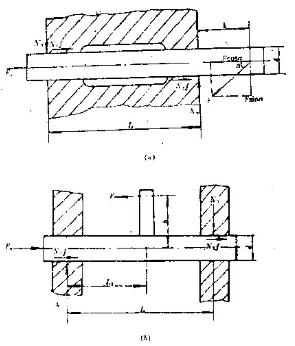

图9-5导轨受力计算简图

2)推力 $\pmb { \mathscr { F } }$ 的作用线与运动件轴线相交成一夹角 ${ \mathfrak { g } } ($ 见图 ${ \mathfrak { g } } _ { - 5 } ( { \mathfrak { a } } )$ )在这种情况下,由于运动件和承导件之间存在配合间隙,推力 $\pmb { \mathscr { F } } _ { \ast }$ 将使运动件产生倾斜,并与承导件在两端处压紧,为便于分析,略去由配合间隙引起的倾角及运动件的自重。

设运动件的轴向载荷为 $\dot { r } _ { \bullet }$ ,两端正压力分别为 $\Lambda _ { 1 } ^ { \prime } , \Lambda _ { 2 } ^ { \prime }$ ,相应的摩擦力分别为 $\therefore \boldsymbol { \jmath } ^ { \prime } \cdot \boldsymbol { \cal N } _ { 2 } \boldsymbol { f } ^ { \prime }$ ,由力系平衡条件可得:

$$
\begin{array} { r l } & { ( N _ { 1 } + N _ { 2 } ) f ^ { \prime } + P _ { * } - F \mathrm { c o s } \alpha = 0 } \\ & { - N _ { 1 } + N _ { 2 } - F \mathrm { s i n } \alpha = 0 } \\ & { - ( L + h ) F \mathrm { s i n } \alpha - N _ { 2 } L + N _ { 2 } f ^ { \prime } \cfrac { d } { 2 } - N _ { 1 } f ^ { \prime } \cfrac { d } { 2 } = 0 } \end{array}
$$

式中,d—运动件的直径或高度 $( \mathsf { m m } )$ ;

$\pmb { \tau }$ 一两端正压力作用点间的距离 $( \mathsf { m m } )$ ;  
$\pmb { k }$ —--推力作用点与承导件端面间的距离 $( \mathsf { m m } )$ ;  
$\pmb { f }$ —一运动件与承导件接触面之间的当量摩擦系数,与导轨的结构型式有关。

通常 $\frac { f ^ { \prime } d } { 2 } \ll L$ ,所以式(9-3)后面项可略去,简化得:

$$
- \ ( L + \lambda ) { \bar { R } } \mathrm { s i n } \alpha + N _ { 3 } L = 0 .
$$

由式(9-1)、(9-2)、(9-4)可求得:

$$
\pmb { F } = \frac { \pmb { F } _ { e } } { \cos \theta - \left( 1 + \frac { 2 k } { L } \right) f \sin \theta }
$$

为使导轨不自锁,应使:

$$
\cos a - \left. 1 + { \frac { 2 \hbar } { L } } \right. f ^ { \prime } \sin a > 0
$$

由此可得出,当推力 ${ \pmb F }$ 与运动件轴线相交成 $\pmb { \sigma }$ 角时,运动件正常工作的条件是

$$
\frac { t } { h } > \frac { 2 f ( g a ) } { 1 - f ( g a ) }
$$

对不同型式的导轨,当量摩擦系数 $\pmb { \mathscr { f } }$ 有不同的值:

圆柱面导轨

$$
f = { \frac { 4 f } { \pi } } \neq 1 . 2 7 f
$$

矩形导轨

$$
{ \pmb f } ^ { \prime } = { \pmb f }
$$

燕尾形或三角形导轨

$$
f = \frac { f } { \cos \beta }
$$

式中,f—一滑动摩擦系数,与材料和润滑状况有关,可查表8-4或有关手册。$\pmb { \beta }$ -燕尾角或三角形底角(见图9-6).

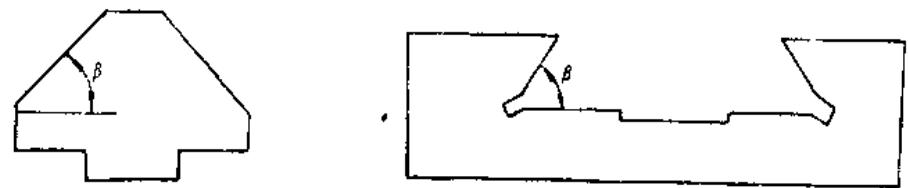

图9-6燕尾角和三角形底角

3)推力 $\pmb { \gamma }$ 的作用线平行于运动件轴线,并与轴线相距 $h ($ 见图9-5(b))在这种情况下,推力 ${ \pmb F }$ 也将使运动件发生倾斜,并与承导件在两端压紧,同样为便于分析,略去配合间隙引起的倾角及导轨自重。

由力系平衡条件,得:

$$
\begin{array} { l } { { { \cal R } _ { i } - { \cal F } + N _ { 1 } f ^ { \prime } + N _ { 2 } f ^ { \prime } = 0 } } \\ { { \mathrm { } ~ N _ { 1 }  N _ { 1 } = 0 ~ \qquad \cdot ~ } } \\ { { \mathrm { } ~ { \cal F } h - N _ { 1 } L + N _ { 1 } f ^ { \prime } ~ \frac { d } { 2 } - N _ { 2 } f ^ { \prime } ~ \frac { d } { 2 } = 0 } } \end{array}
$$

同理,可略去式(9-12)的后两项,则由上述三式可得:

$$
P = \frac { P _ { i } } { 1 - 2 f \frac { h } { L } }
$$

为使导轨不自锁,必须使:

$$
1 - 2 5 \frac { k } { L } > 0
$$

由此可得出,当推力 $\pmb { \gamma }$ 与运动件轴线平行,且与轴线相距 $\pmb { \mathscr { k } }$ 时,运动件正常工作的条件是

$$
2 5 \frac { h } { l } < 1
$$

设计时,为确保运动件运动灵活,通常取

$$
2 5 \frac { k } { L } < 0 . 5
$$

将式(9-7)、(9-8)、(9-9)分别代入式(9-16),并设 $\beta = 0$ 125、则对于圆柱面导轨

$$
\frac { h } { L } < 1 . 5
$$

对于矩形导轨

$$
\frac { k } { L } < 2
$$

对于燕尾形或三角形导轨 $( \beta = 6 0 ^ { \circ } )$ 

$$
\frac { \texttt { b } } { \texttt { l } } < 1
$$

上述分析仅适用于单一承导面或截面对称的导轨,对于非对称导轨或组台式导轨,由于两个导轨面或两根导轨上的摩擦力不同,可据静力学原理计算出每个导向面或每根导轨上的力,然后再根据上述方法计算,并使驱动运动件的推力尽可能布置在摩擦力合力的作用

线上,以避免附加力偶引起侧向摩擦力。

(2)温度变化对导轨副间隙的影响燎擦导轨特别是闭式导轨,对温度变化比较敏感,由于环境温度的变化,可能导致运动件运动不灵活甚至被卡死或者使导轨副出现不允许的间隙,从而降低导向精度。

设计导轨时,为减少温度变化对导轨的影响,运动件和承导件应尽可能选用线膨胀系数相同或相近的材料。若导轨在温度变化较大的环境中工作,则在选定导轨副的配合和公差等级后,应验算温度变化对导轨副间隙的影响。

为保证导轨副正常工作,导轨副的最小间隙 $\pmb { \mathscr { A } } _ { \mathbf { \tilde { \rho } } \mathbf { \tilde { \rho } } }$ 必须大于零,即

$$
A _ { \mathfrak { m } i \mathfrak { n } } = \mathcal { D } _ { 2 \mathfrak { m } i \mathfrak { n } } [ 1 + \alpha _ { \mathfrak { z } } ( \ell - \ell _ { 0 } ) ] - d _ { \mathfrak { t m a r } } [ 1 + \alpha _ { \mathfrak { z } } ( \ell - \ell _ { 0 } ) ] > 0
$$

式中, $D _ { 2 m i n }$ —包容件在常温时的最小直径或直线尺寸 $\left. \mathsf { m m } \right.$ ;

$d _ { \mathrm { l m a x } }$ —被包容件在常温时的最大直径或直线尺寸 $\left( \mathtt { m m } \right)$ 

${ a } _ { 1 } , { a } _ { 2 }$ ——分别为被包容件和包容件材料的线膨胀系数 $\Omega / \gamma )$ 

$\ell _ { 0 }$ -导轨副装配时的温度 $( \mathsf { C } )$ ;

—-导轨副工作时的最高或最低温度 $\arg$ a

为保证导轨副的工作精度,导轨副的最大间隙 $\partial _ { \mathbf { s a s } }$ 必须小于或等于允许的最大间隙$\boldsymbol { \Sigma } _ { \mathtt { N m a l } } ^ { \prime \dagger }$ ,即

$$
\mathcal { \pmb { \mathscr { L } } } _ { \mathbf { \overline { { m a x } } } } \leqslant [ \mathcal { \pmb { L } } _ { \mathbf { \overline { { m a x } } } } ]
$$

$$
\begin{array} { r } { \mathcal { S } _ { \mathrm { m a x } } = D _ { 2 \operatorname* { m a x } } \bigl [ 1 + a _ { 2 } ( \iota - \iota _ { 0 } ) \bigr ] - d _ { 1 \mathrm { m a x } } \bigl [ 1 + \iota _ { 1 } ( \iota - \iota _ { 0 } ) , \bigr ] \leqslant \bigl [ \varDelta _ { \mathrm { m a x } } \bigr ] } \end{array}
$$

式中, $D _ { 2 m \times 1 }$ 一包容件在常温时的最大直径或直线尺寸 $\left( \mathsf { m m } \right)$ ;

$d _ { 1 m + 1 }$ -—被包容件在常温时的最小直径或直线尺寸 $( \min )$ 

导轨副允许的最大间隙 $[ \pmb { \mathscr { s } } _ { \mathbf { \lambda } \mathbf { \mu } \mathbf { \breve { s } } } ]$ 应根据导向精度要求确定。

# 3.导轨主要结构尺寸的确定

滑动摩擦导轨的主要尺寸是指三角形导轨的顶角 $\pmb { \vartheta }$ 、导轨的宽度 $\pmb { \mathit { i } }$ 、运动件和承导件的配合长度 $\pmb { \downarrow }$ 、两导轨的中心距 $\mathbf { a }$ 等。

(1)三角形导轨的顶角 $\pmb \theta$ 三角形导轨的顶角 $\pmb \vartheta$ 取得小,可使导向精度提高,但当量摩擦系数将增加; $\pmb { \vartheta }$ 取得大,可使导轨的承载面积增加,从而提高承载能力,但导向精度将下降,设计时,通常取 $\theta = 9 0 ^ { \circ }$ ;高精度仪器中的导轨可取 $\bullet < 9 0 ^ { \circ }$ 重载时可取 $\bar { \theta } = 1 1 0 ^ { \circ } \sim 1 2 0 ^ { \circ }$ ·

(2)导轨的宽度 $b$ 为使导轨能长时间保持精度,对滑动摩擦导轨,其平均比压 $,$ 应小于或等于导轨的许用平均比压[p],即

$$
p = { \frac { \ddot { w } } { \dot { \theta } \bar { L } } } \leqslant \mathsf { \bar { L } } p \mathsf { I } \qquad ( \mathsf { M P a } )
$$

由此可得

$$
b \geq { \frac { W } { L [ p ] } } \qquad { \mathrm { ( m m ) } }
$$

式中,b—导轨的水平投影宽度 $( \min )$ :

$\mathbf { \bar { \mathbf { \rho } } }$ —一运动件所受的垂直载荷,包括自重(N):$\scriptstyle I ,$ —运动件与承导件的配合长度 $\pmb { L } ( \mathsf { m m } )$ :[p]——导轨的许用平均比压 $( \mathbb { M P a } )$ 

对于低速运动的铸铁导轨,许用平均比压为 $\mathbf { i . 1 7 6 { \sim } i . 1 7 } \mathsf { M P a }$ ;钢制导轨的许用平均比

压应增加 $2 0 \sim 3 0 \%$ 

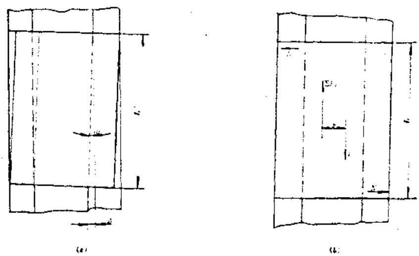

图9-7导轨配合长度对导向指度和工作可靠性的影响(a)有导轨间隙时 (b)有倾侧力矩时

(3)运动件与承导件的配合长度 $\pmb { L }$ 运动件与承导件的配合长度 $\pmb { \mathrm { L } }$ 取得长,有利于提高导向精度和工作的可靠性,如图 ${ \mathfrak { g } } { \mathfrak { z } } ( { \mathfrak { a } } )$ 所示,当存在导轨间隙4时,运动件的倾斜角 $\pmb { a }$ 与配合长度 $\pmb { L }$ 有关 $( \gamma \approx 8 / \tilde { \mathcal { L } } ) , \tilde { \mathcal { L } }$ 越长, $\pmb { \sigma }$ 越小,间隙对导向精度的影响越小,另外,当作用于运动件上的推力 $\pmb { r }$ 与导轨副摩擦力的合力 $\sum F _ { f }$ 相距 $\pmb { z }$ 时,由此产生的倾侧力矩 $\pmb { M } ( M = \pmb { F } _ { \pmb { \nu } } )$ 将使运动件倾斜,如图9-7(b)所示,此时承导件和运动件将受到侧向压力 $\pmb { \cal { N } }$ 的作用$( N = F z / L )$ ,显然, $\pmb { \mathrm { \downarrow } }$ 越长,侧向压力 $\pmb { N }$ 越小,运动件所受的摩擦力也越小,工作可靠性提高。但配合长度 $\pmb { \chi }$ 过长将使导轨结构尺寸增加。

(4)两导轨的中心距:两条导轨的中心距 $\bullet$ 取得越小,结构越紧凑;但中心距取得过  
小,会使运动件在承受倾侧力矩时工作不够稳定。合理的导轨中心距应悬在保证运动件工作  
稳定的前提下取小的值。1

4.导轨的结构设计要点导轨的结构设计中应考虑以下几点:

(1)导轨的截面形状应采用简单的易于加工的几何形状

为了提高导轨副的导向精度,导轨的截面形状应尽可能采用简单的几何形状,以便于加工和检验,如图9-2中的圆截面和表9-2中的矩形截面;或者不采用整体结构而采用分离式的可调结构,如图 $9 - 3 ( a )$ 图9-4(a)、(b)、{c)、(e)所示,

(2)导轨的承载面与导向面应尽可能分开

如图9-3(a)图9-4(b)、(c)所示的结构,将承载面和导向面分开,可以减少导向面的磨损,使导轨能较长时间保持导向精度。

# (3)导轨间隙的调整

为保证导轨副正常工作,导轨副的相对滑动表面之间应保持适当的隙,间隙过小会增加运动件的摩擦阻力,甚至会被“卡死"不能运:间隙过大会降低导向精度,为此,常采用下

述方法以获得必要的间隙。

1)采用磨、刮相应的结合面或加垫来获得合适的间隙如图9-3(c)所示的的生物显微镜导轨,可采取在零件1与2之间加垫片3或者直接铲刮承导件与运动件的接合平面A的办法来获得合适的导轨间隙。

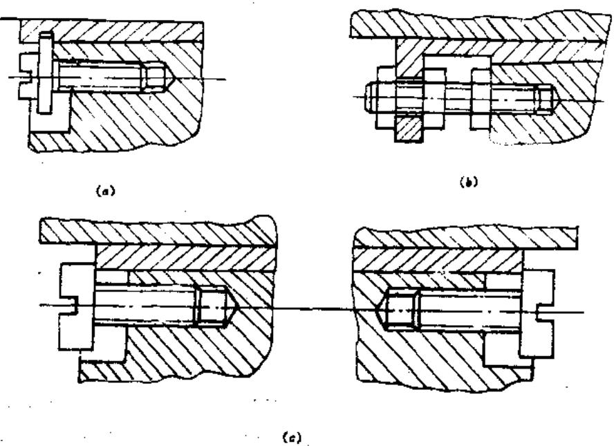

图9-8斜懷条调整导轨间镶的结构

2)采用镶条调整:这是调整导轨副间隙的常用方法。镶条分为平镶条和斜镶条两种。平镶条是一个平行六面体。图9-3(b)所示的燕尾形导轨、图9-4(b)所示的双矩形组合导轨就是采用平镶条调整的结构,只需拧动镶条全长上的调节螺钉,便可调整导轨的侧向间隙,调整后再用螺母锁紧。平镶条制造简单,但镶条全长上只有几个点受力,容易变形,故适用于受力较小的导轨。

图9-8所示为采用斜镶条的调整结构。斜镶条也是一个六面体,但它的两个侧面均为斜度很小的斜面(镶条越长,斜度越小,以免一端厚度过薄).图 $9 . 8 \left( a \right)$ 所示的结构简单,调整时只要拧动调节螺钉,便可使镶条移动,调整导轨的侧向间隙。但是这种结构螺钉的凸肩与斜镶条的缺口之间不可避免地存在轴向间隙,可能使镶条产生轴向窜动。图9-8(b所示的结构克服了上述缺点,但轴向尺寸较长,调整较麻烦。图 $9 - 8 ( c )$ 所示的结构是利用斜镶条两端的螺钉来调整导轨的侧向间隙,其持点是镶条结构简单,便于制造。

与平镶条比较,斜镶条调整方便,受力均匀:但镇条和导轨上的斜面加工困难,装配时需刮研或配磨镶条的两个工作面,以达到配合良好的目的。

3)利用螺钉与螺钉孔之间的间隙作微量调整如图 $\mathfrak { s } _ { - 3 } ( \mathfrak { q } )$ 、图 $9 \substack { \mathrm { - } \mathrm { + } \mathrm { 6 } } \left. a \right. , \left. c \right. , \left( e \right)$ 所示的导轨本身采用分离式可调结构,这种导轨当磨损量不太大时,可利用螺钉与螺钉孔之间的间隙进行微量调整。

(4)导轨的材料和技术要求

1)导轨的材料导轨的材料对导轨的工作性能和使用寿命有直接的影响,对滑动摩擦导轨,其材料应具有较小的摩擦系数,良好的耐磨性、热处理性能,良好的加工工艺性,加工

后易于获得光洁的工作表面。

运动件和承导件通常采用硬度不同的材料,承导件的硬度比运动件高,对于圈柱面导轨,通常采用40、50钢、T8A、T10A(均需经热处理)与非淬火钢或青铜相配;对于棱柱面导轨,则通常采用钢与青铜、钢与非淬火钢、钢与铸铁等相配。

有些电子设备和仪器中,为减轻重量,还采用硬铝合金作导轨材料;在镶装式或粘接式导轨中,粘接部分可以是经淬火的钢带、塑料或有色金属。

2)导轨的技术要求导轨的技术要求主要依据其结构特点、工作精度要求和使用时温度变化范围面定。它包括配合种类、公差等级、配合工的形位公差和表面粗糙度等。

对导向精度要求较高的圆柱面导轨,常用 $\yen 7/90$ 和 $\pmb { H } \daleth , \pmb { f } \daleth$ 两种配合,若导轨副工作时温度变化不大,可采用H7/h6配合。一般可先按H7/js6配合进行加工,然后研配到可轻便地滑动。

对棱柱面导轨,可采用 $F _ { 1 } ^ { \prime } \hat { \otimes } / \hbar 5 , H 7 / \hbar \hat { \ell } , \vec { H } 6 / g 5$ 和 $H 7 / 9 6$ 四种配合;若导轨的导向精度要求不高,则可采用 $\pmb { H } \pmb { \ 8 } / \hbar 7$ 和 $H 8 / f 8$ 两种配合。

导轨的形位公差应根据仪器或机械对导向精度的要求而定,导向面的母线直线度公差可在 ${ 2 \sim 5 }$ 级精度范围内选择;导向面对基准平面或基准轮线的平行度公差可在 $1 \sim 4$ 级精度范围内选择。

表面粗糙度应根据相应的公差等级确定,被包容件导向面的表面粗糙度,对于普通精度导轨,取 $\frac { 0 . 6 y } { \nabla } \sim \frac { z _ { s } } { \nabla }$ 对于高精度导轨,则取 ${ \stackrel { \dots } { \nabla } } \sim { \stackrel { \underset { \mathrm { \tiny ~ e } } { \nabla } } { \nabla } } ,$ 包容件导向面的表面粗糙度一般应比被包容件旻向面的相应降低一个等级。

# 9.3滚动摩擦导轨

滚动摩擦导轨是在运动件和承导件之间加入滚动体(如滚珠、滚柱、滚动轴承等)而组成的导執。

滚动摩擦导轨运动时,导轨工作面之间产生滚动摩撩。与滑动摩擦导轨相比,其优点是摩擦系数小,而且动、静摩擦系数很接近,运动轻便灵活,无爬行;定位精度高,磨损慢,精度保持性好;对温度变化不敏感,缺点是结构比较复杂,制造成本高,而且由于滚动体和运动件、承导体之间的接注是点接触或线接触,因而对导轨面的几何形状误差较敏感,

滚动摩擦导轨广泛应用于各种要求运动件在较小的外力推动下精确地产生微量移动的精密机械和仪器中,如低速运动的数控机床和中小型仪器的工作台等。

# 一、滚动摩擦导轨的结构型式和特点

滚动摩擦导轨按滚动体的形状分为滚珠导轨、滚柱导轨、滚动轴承导轨等。

# 1.滚珠导轨

(1)不可循环式滚珠导轨不可循环式滚珠导轨的滚动体是不能循环的:其典型结构如图9-9所示.

图9-9(a)、(b)所示分别为开式 $\pmb { \nu } .$ 平形和闭式双V形滚珠导轨,主要由运动件1、承导件

3、滚珠2、隔离架4、限动装置等组成。隔离架!用来将各滚珠均匀隔开,限动装置由固定在承导件上的限动销5和隔离架上的限动槽成、用来限制滚珠的位移,以免滚珠脱落。

这种导轨工艺性较好,摩擦系数小,运动的灵敏度较高;但承载能力较小,适用于载荷不大、行程较小和灵敏度要求较高的场合,

导轨承导面上的V形槽夹角一般为 $9 0 ^ { \circ }$ ,若 $\pmb { V }$ 形槽边制成直边,则滚珠和 ${ \pmb v }$ 形槽的接触为点接触,接触应力很大,工作一段时问后,V形槽表面容易压出沟纹,若沟纹深浅不均匀,将会降低导向精度。为改善这种情况,可采用以下两种方法:

1)在 $\pmb { V }$ 形槽边上预先研磨出圆弧形浅沟,以增大与滚珠的接触面积。

、2)采用双圆弧导轨,如图9-9(c)所示。导轨的承导面由两个半径.R的圆弧组成,这样滚珠与承导面的接触面积较大,故耐磨性和承载能力均较高;但双圆剖造困难,不易达到高精度,故只宜用作中等精度的仪器导轨。

图9-9(d)所示为钢柱滚珠导轨,其中 $A , B , C$ 是三对出淬火钢制成并经仔细研磨,具有较高直线度的圆柱体;运动件下面的矩形拖板 $0$ 也由淬火钢制成并经研磨 $r \theta$ 为滚珠,这种导轨的特点是磨损后只露将钢圆柱转过一个角度和重新调整(或更换)矩形拖板,即可恢复原始精度,使用寿命较长,圆柱体和导轨基座的加工工艺性都较好,易于达到高精度。此外,导轨可采用铝合金制造,重量较轻。

图9-9不可循环式滚珠导轨

钢圈柱也可以用钢丝代替,但由干钢丝的直径小,只适用于轻载的小型仪器中的导轨。

(2)循环式滚珠导轨循环式滚珠导轨的滚动体是可以循环的,其结构如图9-10所示。它主要由运动件1、直线运动球轴承2和作为承导件的轴3组成。直线运动球轴承安装并固定在运动件的轴承座孔内,可随运动件一起沿承导件(轴)作直线移动。直线运动球轴承的数目可以是两个或三个,承导件(轴)是两根,以限制运动件绕轴线转动.

直线运动球轴承的结构如图9-11所示,它是由一个圆简形的座圈和三列以上可循环式滚珠以及保持架组成。当它随运动件一起沿承导件作直

图 $\ S - 1 \uparrow$ 循环式滚珠导轨

线移动时,滚珠在其槽内循环滚动。这种轴承在国内已有专门厂生产并已形成产品系列。

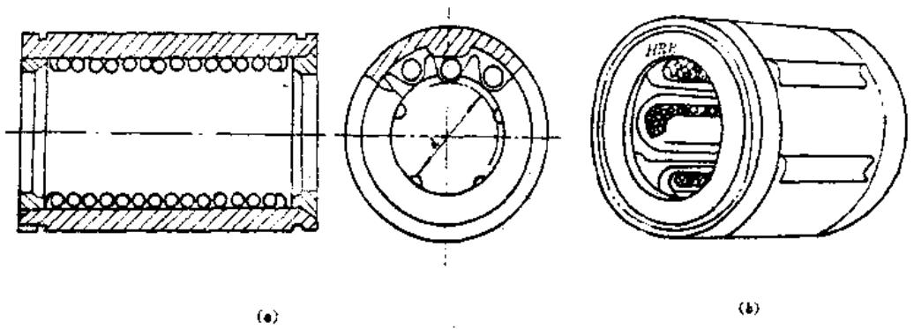

图9-11直线运动球轴承

循环式滚珠导轨的特点是在不增加承导件尺寸的情况下,运动件可获得较大的行程,摩攘系数小,运动轻便灵活,使用寿命长,维护保养较方便。

滚珠导轨用滚珠与导轨面的接触为点接触,故承载能力和接触刚度较小,多用于轻载、小型的仪器和设备。

# 2.滚柱导轨

滚柱导轨的结构型式很多,图9-12(a)、(b)所示为开式滚柱导轨,图 $9 - 1 2 ( a )$ 所示的结构,滚柱在 $\mathrm { i } \gamma$ 型槽内呈轴线交错放置,使一个滚柱与上边 $\pmb { V }$ 形槽的左斜面 $\pmb { A _ { 1 } }$ 和下边 $\pmb { V }$ 形槽的右斜面 $\pmb { A }$ 相接触,另一个与其相邻的滚柱则与上边 $\pmb { \nu }$ 形槽的石斜面 $\smash { \pmb { B _ { i } } }$ 和下边 $\pmb { \nu }$ 形槽的左斜面 $\pmb { \ 8 }$ 相接触,各滚柱之间用隔离架隔开,右边的滚柱与平面导轨相接触,这种导轨的特点是对导轨面的局部缺陷不敏感,接触刚度好,但对V形角的误差较敏感.加工精度要求高,制造较困难。图 $9 . 1 2 ( \delta )$ 所示的结构, $V$ 形导轨中的滚柱直径 $d$ 与平面导轨中的滚柱直径 $d _ { i }$ 的关系是: $d { = } d _ { 1 } \cos ( { \alpha } / { 2 } )$ ,因此若将滚柱取出,上、下导轨正好可以相互研配,加工比较方便。

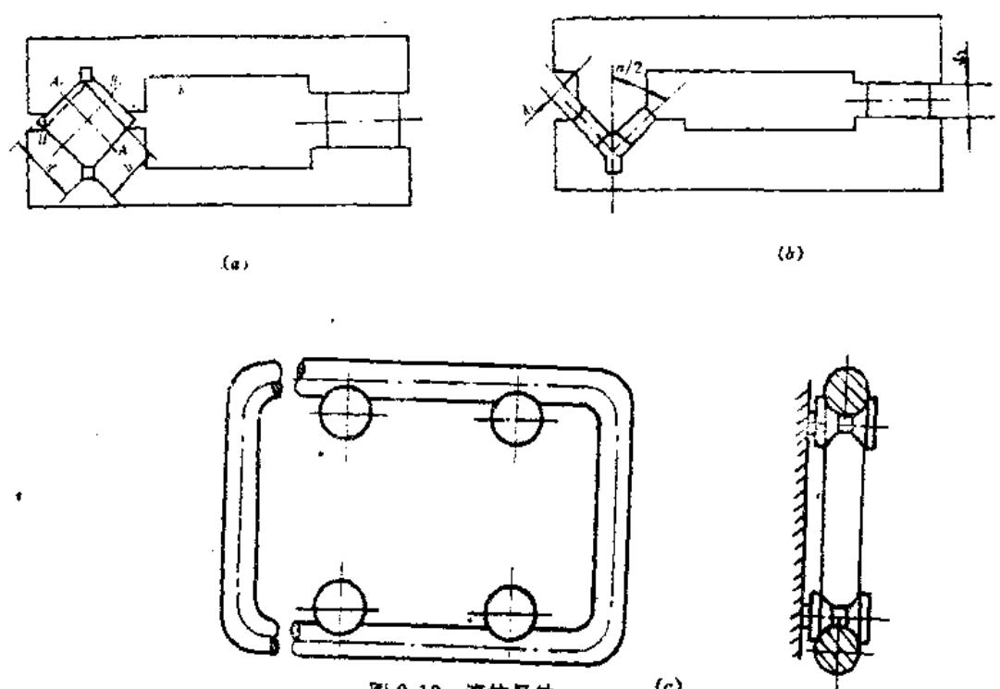

图9-12滚柱导轨

图 $\mathfrak { g } _ { - 1 2 ( e ) }$ 所示为闭式滚柱导轨。

滚柱导轨因滚柱与导轨面的接触是线接触,因此与滚珠导轨相比,承载能力和接触刚度均较大,耐磨性好,故常用于载荷较大的精密设备和仪器,如万能工具显微镜、激光比长仪等。但滚柱导轨摩擦力比滚珠导轨大,灵敏度也差些,对滚柱和导抗面的形状和精度要求较高。

设计滚柱导轨时,应合理此选择滚柱和承导面的形状,尽可能减少滚柱与承导面之间的相对滑动。常见的滚柱与承与而的形状如图9-13所示。

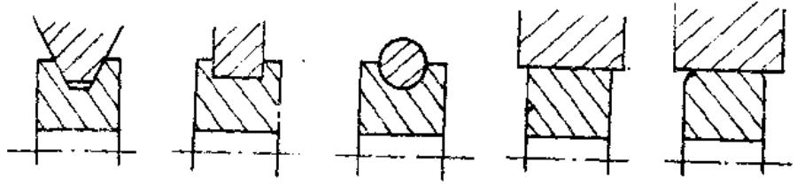

9-13滚柱与承导面的形状

为提高滚柱导轨的灵便性,可在滚柱与支承之间增加球轴承作为滚动元件,如图9-14所示。

# 3.滚动轴承导轨

滚动轴承导轨的结构如图9-15所示。支承滚动轴承的心轴通常制成偏心轴,如图9-16所示,以便于装配时调整,保证滚动轴承与承导面良好接触。

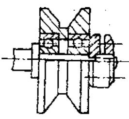

图9-11滚柱结构

滚动轴承导轨采用的轴承是非标准的单列向心球轴承,为保证

轴承外圈与承导面良好接触,其外圈表面制成圆弧形,

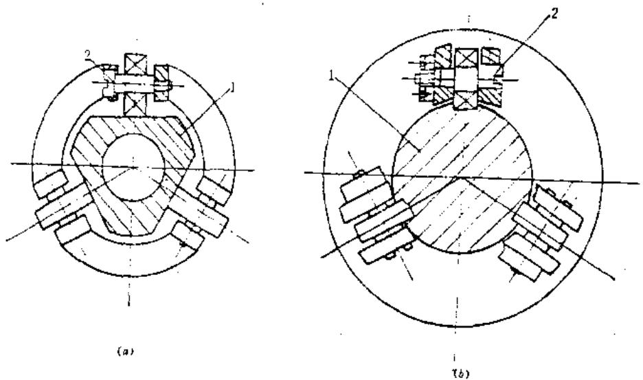

图9-15滚动轴承导轨I--承导件:2一运动件

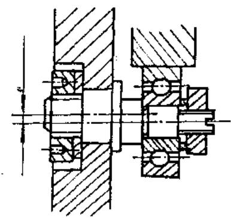

图9-16滚动轴承导轨的偏心轴调整结构

滚动轴承导轨的承载能力较大,有较高的精度、摩擦阻力小、调整方便,常用于大型仪器和设备中,如三坐标测量仪、测长仪等。

# 二、滚动摩擦导轨设计中的几个问题

1.运动件、承导件及限动槽长度的确定

如图9-17所示,实线位置表示运动件的起始位置,当运动件作直线移动时,滚珠沿承导件作纯滚动,如图中虚线所示。

设运动件的最大位移为 $\mathfrak { S } _ { \mathfrak { m } \bullet } \left( \mathfrak { m } \mathfrak { m } \right)$ ,

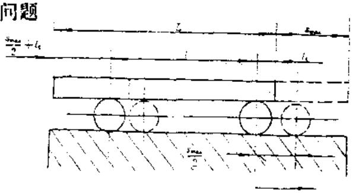

图9-1?运动件、承导件长度计算图

则由刚体平面运动学可知,滚动件移动的距离为 $s _ { \varpi = 1 } / 2$ ,因此运动件的长度 $\pmb { \cal L }$ 为

$$
I = 2 l _ { 0 } + l + \frac { s _ { \mathrm { a n } } } { 2 } ( m _ { } , \cdot )
$$

式中, $\scriptstyle I _ { 0 }$ ——导轨边缘余量,一般取 $\ ! . 6 = 5 \sim 1 9 ( \mathfrak { m } \mathfrak { r } )$ ;

—首末两滚珠的中心距 $\{ \mathfrak { m m } \}$ ,

承导件的长度一般取:

$$
\bar { L ^ { \prime } } = \bar { L } \dot { + } \ s _ { m a x }
$$

隔离架上限动槽的长度 $\mathfrak { d }$ (见图 $9 - 9 ( a ) , ( b ) )$ 可按下式确定:

$$
b = { \frac { s _ { \mathrm { m a x } } } { 2 } } + d \qquad ( \mathrm { m m } )
$$

式中, $\pmb { \mathscr { k } }$ ——限动销的直径 $\left( \mathsf { m m } \right)$ ,由结构确定,

2.滚动体的尺寸和数目的选择

选择滚动体的尺寸和数目时,应考虑导轨结构尺寸、摩擦阻力、接触强度和刚度等因素。一般可根据导轨的结构选择,必要时进行强度校核。

滚动体直径大,导轨副中摩擦阻力小,滚动体与承导面的接触强度高,此外,从刚度考虑,对于滚珠导轨,增大滚动体直径可使刚度提高(对于滚柱导轨,其刚度与滚动体直径无关)。因此在结构允许的条件下应尽可能采用直径较大的滚动体。设计时,通常取滚珠直径$d \geq 3 \sim 6 \pi m \cdot$ 滚柱直径 $\pmb { d } \geq 6 m \pmb { \mathfrak { n } }$ ,滚柱的长度 $\pmb { \upsilon }$ 可按长径比 $\frac { b } { d } < 1 . 5 \sim 2 . 0$ 确定,但一般不超过$\mathfrak { s o m m }$ ·

滚动体的数目若过少,则导轨制造误差起不到均化作用,从而影响导向精度;若过多,则会使载荷在滚动体上分布不均匀,反而降低导轨的强度和刚度,所以滚动体的数目也应合理选择.

对于受载较大的滚动体,其数目Z可按下列经验公式计算确定:

对滚珠

$$
z \leqslant \frac { p } { \leqslant \sqrt { q } \sqrt { d } }
$$

对滚柱

$$
z \leqslant \frac { p } { 1 8 }
$$

式中, ${ \pmb F }$ -导轨运动件承受的载荷(或导轨承受的载荷)(N);

$\pmb { d }$ —滚珠直径 $( \min )$ $\pmb { \ b }$ 滚柱长度 $\left( \mathfrak { m } \mathfrak { m } \right)$ 

对于某些只受运动件自重的精密仪器导轨,滚动体的数目不能按上两式确定.而应根据结构条件确定。

# 3.双圆弧滚珠导轨主要参数的确定

双圆弧滚珠导轨的主要参数是滚珠半径 $\because$ 与滚道半径 $\mathfrak { R }$ 之比,即 $r / \bar { \cal R }$ ,如图9-18所示,其值对导轨工作性能有很大影,若 $r / R$ 过小,则不能发挥双圆弧导轨接触面积较大、变形较小的优卢:若 $r / R$ 过大.测滚珠与承导面接触面积过大,摩擦阻力显著增加。通常取$r / _ { i } = 0 . 9 0 \sim 0 . 9 5$ 接触角(过滚动体和导轨圈弧面接触点的公法线与导轨对称中心平面之间所夹的锐角) $1 9 = 4 5 ^ { \circ }$ ,导轨两圆弧的中心距 $\pmb { \Updownarrow }$ 为

$$
a = 2 ( R - r ) \sin \theta
$$

当、B、0确定后,利用上式即可求出 $\pmb { \mathscr { a } }$ 值.

# 4.滚动摩擦导轨的材料和技术要求

(1)滚动摩擦导轨的材料对滚动摩擦导轨材料有下列要求: $\textcircled{1}$ 硬度高,由于滚动体与承导面接触面积小,接触处的接触应力较大,为避免产生凹坑或沟痕,材料表面应具有足够高的硬度; $\textcircled{2}$ 性能稳定:加工后不易变形; $\textcircled{3}$ 机械加工性能好,成本低。

滚动体一般采用滚动轴承钢,如GCr15制造,淬火后硬度可达 $\mathtt { H R C G O \sim 6 6 }$ :

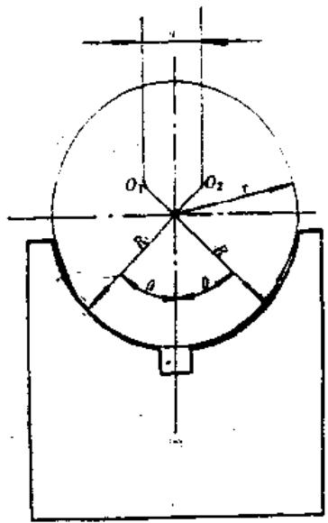

图9-18双弧滚珠导轨的参数

导轨常用的材料有:

低碳合金钢,如 $\Im \ 2 0 0 \mathrm { C r } , 2 0 \mathrm { C r } \mathrm { M n T i }$ 。表面渗炭淬火,渗碳层厚 $\mathbf { i } \sim 1 . 5 \mathbf { m m }$ ,表面硬度可达 $H R C 6 0 \sim 6 2$ 

中碳合金钢,如 $\pmb { \mathcal { A } } \mathbb { 0 } \mathbb { C } \mathbf { r }$ 。渗碳后低温回火,硬度可达HRC45$\sim 5 \Theta$ ,加工性能较好,但硬度较低。

碳素工具钢,如T8A、T10A。淬火硬度 $\mathrm { H R C } \overbrace { 5 8 } ^ { \mathrm { ~ . . ~ } } \sim 5 2$ 

合金工具钢,如 $\mathtt { C r M n } , \mathtt { C r W M n }$ 。淬火后低温回火,硬度可达 $\mathbb { H } \mathbb { R } \mathbb { C } \hat { \boldsymbol { 6 } } 0 \sim \mathbb { \hat { \boldsymbol { 6 } } } 4$ ,其性能稳定,可用于制造要求变形小,耐磨性高的导轨。

氮化钢,如38CrMoAIA。调质或正火后氮化处理,表面硬度 $\mathrm { H R C } 6 2 \sim 6 5$ 。但氮化层薄而脆,加工时应注意,

某些大型仪器中也采用耐磨铸铁(含Cr、Mo、Cu等合金元素)作导轨材料,热处理硬度$\mathrm { H B } 2 3 0 { \sim } 2 4 0$ 。此时滚动体应采用滚柱。

(2)滚动摩擦导轨的技术要求导轨零件的表面粗糙度需根据导轨精度要求而定。导轨主妥承导面的表面粗糙度一般取 $\overrightarrow { v } \sim \overrightarrow { v }$ 精度很高的导轨,有时取小于 $\vec { \bigtriangledown }$ 导轨的安装基面一般取 $\nabla \sim \bar { \nabla }$ 

导轨零件的形位公差要求,通常对普通精度的导轨,导向面的直线度为$( 0 . 0 6 \sim 0 . 0 1 ) / 1 0 0 \mathrm { m m }$ ,相互间的平行度为 $( 0 . 0 5 \sim 0 . 0 1 ) / 1 0 0 \mathrm { m m }$ ,滚动体直径的不均匀度为$2 \sim 3 \mu \mathrm { m }$ ;对于较高精度的导轨,导向面的直线度为 $( 0 . 0 0 8 \sim 0 . 0 0 6 ) / 1 0 0 \eta \mathrm { m }$ ,平行度为$\dot { ( 0 . 0 0 8 \sim 0 . 0 0 5 ) / 1 0 0 \mathfrak { m m } }$ ,滚动体直径的不均匀度为 $1 \sim 2 \mu \ m$ ;对于高精度导轨,导向面的直线度为 $\left( 0 . \ 0 0 5 \sim 0 . \ 0 0 3 \right) / 1 0 0 \mathsf { m m }$ ,平行度为 $( 0 . 0 0 5 \small { \sim } 0 . 0 0 2 5 ) / \mathrm { l } 0 0 \mathsf { m m }$ ,滚动体直径的不均匀度为 $0 . 5 \sim \downarrow \mu m$ 。此外,还应对 $\pmb { V }$ 形槽或双圈弧的中心提出对称度要求,对导向平面提出平面度,对圆柱面导轨提出圆柱度要求。用作滚动体的滚动轴承,其径向跳动量对于导向用的为$1 \sim 2 \mu \mathrm { m }$ ,支承用的为 $1 . 5 \sim 3 \mu \ m$ ·

对影响导向精度的导轨零件的尺寸公差,如 $V$ 形槽的角度和深度偏差,双圆弧导轨的圆弧半径偏差,圓柱面导轨的直径偏差均应提出要求。

导轨的导向面一般需经研磨,滚珠需精研、抛光后再选配使用。

# 9.4导轨的精度分析

# 一、导轨的精度指标

如前所述,导轨的导向精度是指导轨副中运动件沿给定方向作直线运动的准确程度,它是评定导轨性能好坏的一项主要技术指标,通常用运动件的位置误差来表示,此项误差又称为导向误差, A

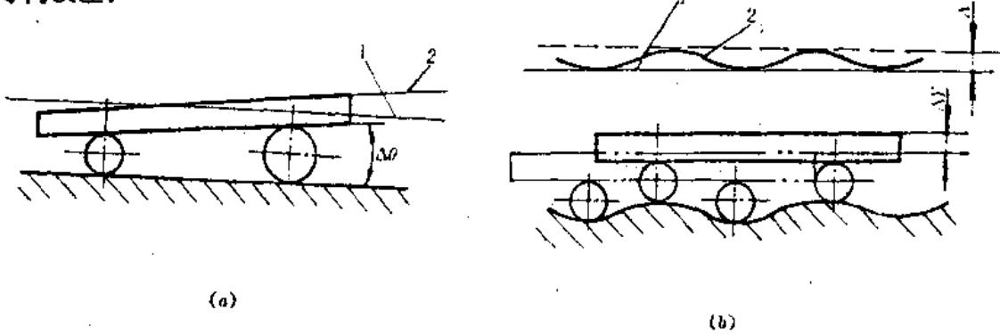

图9-19导轨的导向误差示意图1一理想运动轨迹:2-实际运动轨迹

导向误差是指导轨副中运动件的实际位置与给定的理想几何位置的偏差值,它包括平行度误差和直线度误差两项,其中,平行度误差是指运动件的实际运动轨迹的方向与给定运动方向的偏离,如图 $9 - 1 9 ( a )$ 所示。它可以用实际运动轨迹偏离理想运动轨迹的最大角度值或者用在给定距离内实际运动轨迹偏离理想运动轨迹的最大线值来表示;直线度误差是指运动件的实际运动轨迹相对于理想运动轨迹的最大偏离距离,如图9-19(b)所示,它表示运动件的扭摆程度和运动轨迹的直线性,上述两项误差在导轨的垂直平面和水平面内均可出现,并综合地影响导向精度。一个导轨副只有当这两项误差均较小时,才具有较高的导向精度,因此对于精度要求较高的导轨副,设计时应同时提出平行度和直线度公差要求。

# 二、导轨精度分析

影响导轨精度的因素很多、如导轨的几何尺寸误差、承导面的形位误差、导轨和滚动体受力后的变形、工作面的磨损、油膜厚度和环境温度变化等。下面就导轨加工误差(几何尺寸误差、形位误差等)、导轨及滚动体受力后的变形等因素对导轨精度的影响作简要分析.

# 1.导轨加工误差对导轨精度的影响

不同类型和结构的导轨,其导向精度分析内容也不相同,现以燕尾形滑动摩擦导轨为例分析由加工误差所引起的运动件位置误差,

图9-20所示的燕尾形导轨, $\pmb { m }$ 为运动件, $\mathbf { \nabla } . \pmb { \mathcal { H } }$ 为承导件, $P$ 点为运动件上的任意一点,由于加工误差的影响,致使运动件不能沿平行于 $\gamma$ 轴这一理想方向移动而出现位置误差, $P$ 点的运动轨迹也不平行于Y轴方向。由于水平面内的位置误差比垂直平面内的位置误差对导轨工作性能影响更大,因此仅分析各原始加工误差与导轨水平面内 $\mathfrak { X }$ 方向的位置误差 $\pmb { \Delta } \pmb { X }$ 之间的关系.

为便于分析,分别过运动件的表面1、2和对称轴OX作三个垂直于 $Y$ 轴的平面$\smash { \langle \mathrm { ~ l ~ - ~ i ~ } , \mathrm { ~ I ~ - ~ I ~ } , X - \cdots X \rangle }$ 与导轨副相截。在这三个截面处建立原始加工误差与运动件位置误差的关系。

假设: $\Delta b _ { \mathrm { { \mathbf { u } } } } , \Delta b _ { \mathrm { { \mathbf { u } } } }$ 分别为运动件和承导件在截面Ⅰ一Ⅰ处的连接宽度 $\delta _ { \bullet }$ 的尺寸误差;

${ \pmb \beta } _ { \bullet } \pmb { \varphi }$ 分别为导轨左右两边的燕尾角名义值;

$\Delta \beta _ { \mathrm { = } } , \Delta \phi _ { \mathrm { = } }$ 分别为运动件左右两边的燕尾角误差;

$\Delta \beta _ { 0 } , \Delta \phi _ { 0 }$ 分别为承导件左右两边的燕尾角误差;

△y.为导轨两导向面的平行度误差;

$i _ { 1 } \ldots i _ { p }$ 分别为截面 ${ \pmb { \ ! - 1 } }$ 和 $\pmb { P }$ 点到截面1一Ⅰ之间的距离。

(1)截面1一Ⅰ处运动件的位置误差

1)连接宽度 $b _ { 0 }$ 的尺寸误差 $\Delta \delta _ { = 1 } , \Delta \delta _ { = 1 }$ 引起的最大间隙为

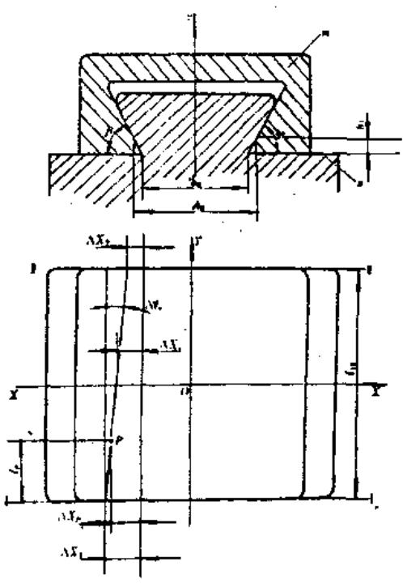

图9-20燕尾形导轨的位置误差分析

$$
\Delta _ { \mathrm { l } } = \Delta \delta _ { \mathrm { s l } } - \Delta \delta _ { \mathrm { s l . } }
$$

2)运动件和承导件右边燕尾角误差 $\therefore \sin = \sqrt { 2 }$ 引起的配合间隙如图9-21所示,因运动件和承导件分别是包容和被包容零件,故规定公差时,总是取 $\Delta \varphi _ { = } < 0 , \Delta \varphi _ { = } > 0$ 这样运动件上的 $\pmb { D }$ 点向右移至 $\pmb { \sigma }$ ,承导件上的 $\pmb { D }$ 点向左移至 $\pmb { v } ^ { \prime }$ ,导轨副在右上角 $\pmb { \eta }$ 点处出现间隙 $\pmb { \mathcal { D } } \pmb { \mathcal { D } }$ ·由图9-21(b)可求得:

$$
D D ^ { \prime } = \frac { D G } { \sin ( \varphi - \Delta \varphi _ { \mathrm { s } } ) } \approx \frac { A D \left| \Delta \varphi _ { \mathrm { s } } \right| } { \sin \varphi } = \frac { \left( k - k _ { 2 } \right) \left| \Delta \varphi _ { \mathrm { s } } \right| } { \sin ^ { 2 } \varphi }
$$

$$
D D ^ { * } = \frac { D ^ { * } H } { \sin \varphi } = \frac { A D ^ { * } \Delta \varphi _ { * } } { \sin \varphi } = \frac { ( k - h _ { z } ) \Delta \varphi _ { * } } { \sin { ( \varphi + \Delta \varphi _ { * } ) } \sin \varphi } \approx \frac { ( k - h _ { z } ) \Delta \varphi _ { * } } { \sin ^ { 2 } \varphi }
$$

因此, $\pmb { D }$ 点处的总间隙 $\pmb { D } ^ { \prime }$ 为

$$
D ^ { \prime } D ^ { \prime } = D D ^ { \prime } + D D ^ { \prime } = \frac { k - h _ { z } } { \sin ^ { 2 } \varphi } ( | \Delta \varphi _ { \mathrm { m } } | + \Delta \varphi _ { \mathrm { s } } )
$$

同理,可求得导轨副在右下角 $\pmb { \gamma }$ 点处的总间隙 $\yen 7$ 为

$$
F F ^ { * } = \mathit { F P } ^ { * } + \mathit { F P } ^ { * } = \frac { h _ { 1 } } { \sin ^ { 2 } \varphi } ( \left| \Delta \varphi _ { \mathrm { m } } \right| + \Delta \varphi _ { \mathrm { o } } )
$$

上两式中, $\pmb { \mathscr { h } }$ 承导件的燕尾高度(mm);

$\mathtt { A _ { l } }$ 导轨副下接触点 $\pmb { \cal F }$ 的高度 $( m , n )$ ;${ \hslash } _ { 2 }$ -导轨副上接触点 $\pmb { D }$ 至承与件上平面的距离 $( \mathsf { m m } )$ 

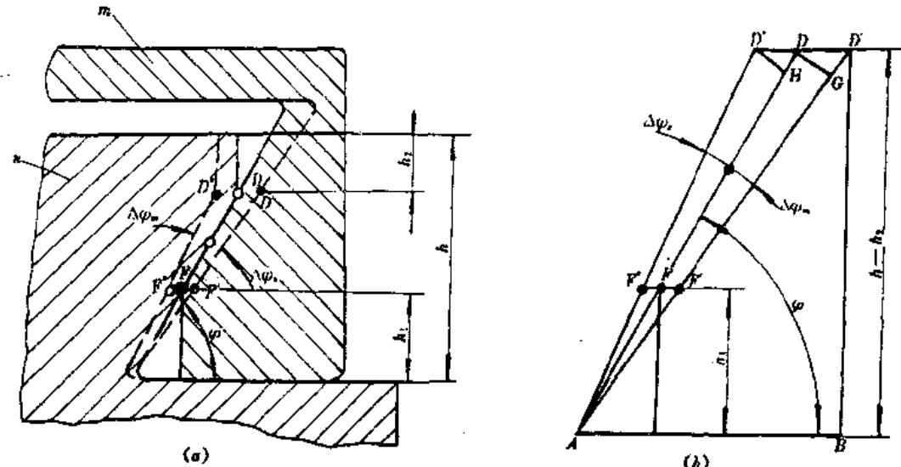

图9-21蒸尾角度误差示意图

3)运动件和承导件左边燕尾角误差 $\Delta \beta _ { \parallel } , \Delta \beta _ { * }$ 引起的配合间隙运动件和承导件左边燕尾角误差 $\Delta \beta _ { \parallel } ( < 0 ) , \Delta \beta _ { \parallel } ( > 0 ) \mathrm { i }$ 引起的配合间隙也可用上述同样的方法求得,即导轨副左上角 $\pmb { c }$ 点处的总间隙 ${ \pmb { c } } { \pmb { c } }$ 为

$$
\begin{array} { r } { C C = \frac { k - b _ { 2 } } { \sin ^ { 2 } \beta } ( | \Delta \beta _ { \ast } | + \Delta \beta _ { \ast } ) } \end{array}
$$

导轨副左下角 $\pmb { \cal { E } }$ 点处的总间隙 $\pmb { \mathcal { K } } \pmb { \mathcal { E } }$ 为

$$
\begin{array} { r } { \overrightarrow { E } E = \frac { \vec { h } _ { 1 } } { \sin ^ { 2 } \beta } ( \left\{ \Delta \beta _ { \mathbf { a } } \right\} + \Delta \beta _ { \mathbf { a } } ) } \end{array}
$$

.由于 $h _ { 1 } < h - h _ { 2 }$ 故 $\scriptstyle { \overrightarrow { S } } . { \overrightarrow { S } } < { \overrightarrow { C } } \ c ^ { \prime } , { \overrightarrow { F } } { \overrightarrow { F } } < { \overrightarrow { D } } \ D ^ { \prime }$ ,运动件偏离理想方向 $( Y$ 轴方向)时,必定在燕尾的左下角 $\pmb { \it { F } }$ 点或右下角 $\pmb { \mathcal { F } }$ 点处与承导件相接触。由此可得在截面!一!处,由上述原始误差所引起的运动件位置误差为

$$
\begin{array} { l } { { \displaystyle \Delta X _ { 1 } = \frac { 1 } { 2 } ( A _ { 1 } + E ^ { \prime } E + F F ^ { \prime } ) } } \\ { { \displaystyle \quad = \frac { 1 } { 2 } \Big [ ( \Delta b _ { \mathrm { o l } } - \Delta b _ { \mathrm { o l } } ) + \frac { h _ { 1 } } { \sin ^ { 2 } \beta } ( | \Delta \beta _ { \mathrm { o } } | + \Delta \beta _ { \mathrm { s } } ) + \frac { h _ { 1 } } { \sin ^ { 2 } \varphi } ( | \Delta \varphi _ { \mathrm { o } } | + \Delta \varphi _ { \mathrm { s } } ) \Big ] } } \end{array}
$$

由图9-20可知:

$$
h _ { 1 } = \frac { A _ { 0 } - b _ { 0 } } { 2 } \mathrm { t g } \varphi
$$

在实际设计中,通常取左、右燕尾角相等,即 ${ \pmb \beta } { = } \pmb \varphi$ ,则

$$
\Lambda \hat { X } _ { 1 } = \frac { 1 } { 2 } \bigg [ ( \Delta h _ { n 1 } - \Delta h _ { n 1 } ) + \frac { A _ { 0 } - b _ { 0 } } { \mathrm { s i n } 2 \phi } ( | \Delta \varphi _ { 0 } | + \Delta \varphi _ { * } + | \Delta \beta _ { n } | + \Delta \beta _ { * } ) \bigg ]
$$

式中, $\blacktriangle _ { \mathfrak { p } }$ -—燕尾槽倒角处的尺寸;

${ \mathfrak { d } } _ { \mathfrak { d } }$ 一连接宽度的公称尺寸。

(2)截面 ${ \bf I } - { \bf I }$ 处运动件的位置误差

假设导轨面平行度误差 $\Delta \gamma _ { \ast }$ 对 $\gamma$ 轴呈对称分布,故每侧误差为 $\therefore \frac { 2 } { 2 }$ ,则在截面 ${ \bf I } \sim { \bf I }$ 处(见图9-20),由上述原始误差和导轨导向面的平行度误差 $\Delta \gamma _ { \bullet }$ 所引起的运动件位置误差

为

$$
\Delta X _ { ? } = \Delta X _ { ! } - \frac { 1 } { 2 } \Delta { \mu } _ { * } l _ { 1 } ,
$$

(3)在截面 $\mathbf X - \mathbf X ^ { \prime }$ (即运动件中点)的位置误差为

$$
3 X _ { \varepsilon } = \frac { 1 } { 2 } ( \Delta X _ { 1 } \div \Delta X _ { 2 } )
$$

将式(9-31)代入上式,则得

$$
\Delta X _ { \bullet } = \Delta X _ { \bullet } - \frac { 1 } { 4 } \Delta y _ { \bullet } l _ { \textup { i } }
$$

(4)运动件上任意一点 $\pmb { P }$ 的位置误差

由图9-20知:

$$
\Delta X _ { P } = \Delta X _ { 1 } - \frac { 1 } { 2 } \Delta y _ { * } , i ,
$$

将式(9-30)代入上式,则得

$$
X _ { r } = \frac { 1 } { 2 } \bigg [ ( \Delta b _ { n 1 } - \Delta b _ { n 1 } ) + \frac { A _ { 0 } - b _ { 0 } } { \sin { 2 \varphi } } ( | \Delta \varphi _ { n } | + \Delta \varphi _ { s } + | \Delta \beta _ { n } | + \Delta \beta _ { s } ) - \Delta \gamma _ { s } l _ { r } \bigg ]
$$

对滚动摩擦导轨,原始加工误差有以下几种来源:

$\textcircled{1}$ 承导件的直线度误差及平行度误差:$\textcircled{2}$ 承导件及运动件与滚动体接触部位的尺寸误差;$\textcircled{3}$ 滚动体的直径误差及形状误差,

上述三项误差都能引起运动件在水平面内 $X$ 方向的位置误差,其计算比较复杂,在此不作介绍。

# 2.导轨变形对导轨精度的影响

导轨在自重和载荷作用下,将产生弯曲变形和接触变形。对于滑动摩擦导轨,接触变形一般很小,通常可忽略其影响,而导轨的弯曲变形和支座、机架受力后的变形往往对精密机械和仪器的工作有很大影响,所以设计时必须考滤弯曲变形对导轨精度的影响;对于滚动摩擦导轨,因接触变形较大,故设计时需同时考虑弯曲变和接触变形对导轨精度的影响,

(1)弯曲变形对导轨精度的影响现以大型二具显微镜导轨为例说明弯曲变形对导轨精度的影响。图 $9 - 2 2 ( a )$ 所示为该显微镜导轨、工作台系统变形示意图,若不考虑工作台1的变形,则导轨基座2在其自重和工作台载荷 $\pmb { \ W }$ 作用下产生的弯曲变形使工作台偏转角度 $\pmb \theta$ ,由此引起的测量误差 $\delta = H \tau _ { B } \partial$ :

图9-22(b)所示是导轨的受力简图,导轨自重可看成是均布载荷,单位长度重量为 $\pmb q$ 。当工作台自左向右多动时,它对导轨的作用力的作用点 $A , B$ 也随之向右移动,故偏转角 $\pmb { \vartheta }$ 是工作台位移 $\pmb { \mathscr { x } }$ 的函数,通过函数关系可求得工作台的最大偏转角 $\widehat { \vartheta } _ { \overline { { \mathbf { { s u } } } } }$ ,从而确定测量误差$\pmb { \delta }$ 的最大值 $\delta _ { m a x }$ 

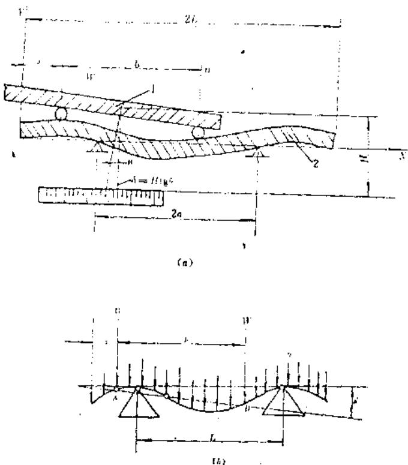

图9-22大型工具显微镜导轨的弯曲变形(a)导轨、工作台系统变形示意图 (b)导轨受力简图

(2)滚动摩擦导轨的接触变形对导轨精度的影响滚动摩擦导轨中,导轨所受载荷(工件台自重、工件重量、导轨预紧力等的合力)的作用线通常不与工作台的中心线相重合,因此它可以用沿工作台中心线作用的中心载荷P和力矩A来表示,如图9-23所示。

若中心载荷P使导轨在接触点产生的变形为4,力矩M使导轨在接触点产生的最大变形为4,两者合成的变形为4,则工作台将在垂直平面内相对于水平线偏转角,从而产生位置误差。

接触变形 $\pmb { \mathscr { s } }$ 的计算方法如下:

因仪器导轨所受的外载荷较预紧力小得多,所以可假定接触变形A与载荷之间呈线性关系,即

滚柱导轨

$$
\pmb { \mathscr { s } } = \pmb { \mathscr { C } } _ { 1 } \pmb { \mathscr { q } }
$$

滚珠导轨

$$
\pmb { \mathscr { s } } = \hat { \mathscr { C } } _ { 2 } \hat { \mathscr { P } }
$$

式中,4---导轨的接触变形 $\left( \min \right)$ ;

q——滚柱单位长度上所受的载荷(N/mm);$\pmb { p }$ —单个滚珠所受的载荷(N);$c _ { \iota }$ —-滚柱导轨的变形系数 $( \mu  - \sf m \cdot \mu ^ { \prime } \ddot { N } )$ ;$C _ { 3 }$ —滚珠导轨的变形参数 $( \mu \ m / \ 8 )$ 

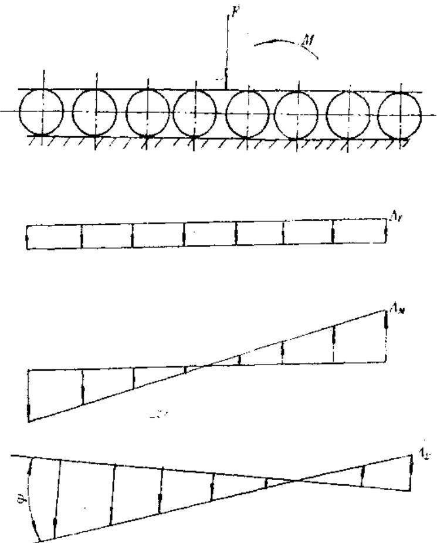

图9-23滚动摩擦导轨接触变形分析

变形系数 $C _ { 1 } , C _ { 2 }$ 分别与初载荷 ${ \pmb q } _ { 0 }$ 与 $P _ { 0 }$ (包括预紧力、自重)有关,可由图9-24查取。

现以含多个滚柱的滚柱导轨为例,推导导轨的接触变形和转角计算公式。

1)中心载荷 $\pmb { F } ( \mathbf { N } )$ 所引起的导轨接触变形 $\pmb { \mathscr { s } } _ { \pmb { r } }$ 设导轨的计算长度为 $\tilde { L } ( \mathsf { m m } )$ ,滚柱的数目为Z,滚柱的间距为 $\iota ( m )$ ,滚柱的长度为 $\delta ( \mathtt { m m } )$ ,则

$$
q = { \frac { F } { Z \bar { b } } } = { \frac { F } { \frac { L } { \bar { t } } \bar { b } } } = { \frac { F \bar { t } } { \bar { I } \lambda } } \qquad ( \mathrm { N / m m } )
$$

$$
\quad \quad \quad \quad \quad \quad \quad \quad \quad \quad \quad \quad \quad \quad \quad \quad \quad \quad \quad \quad \quad \quad \quad \quad \quad \quad \quad \quad \quad \quad \quad \quad \quad \quad \quad \quad \quad \quad \quad \quad \quad \quad \quad \quad \quad \quad \quad \quad \quad \quad \quad \quad \quad \quad \quad \quad \quad \quad \quad \quad \quad \quad \quad \quad \quad \quad \quad \quad \quad \quad \quad \quad \quad \quad \quad \quad \quad \quad \quad \quad \quad \quad \quad \quad \quad \quad \quad \quad \quad \quad \quad \quad \quad \quad \quad \quad \quad \quad \quad \quad \quad \quad \quad \quad \quad \quad \quad \quad \quad \quad \quad \quad \quad \quad \quad \quad \quad \quad \quad \quad \quad \quad \quad \quad \quad \quad \quad \quad \quad \quad \quad \quad \quad \quad \quad \quad \quad \quad \quad \quad \quad \quad \quad \quad \quad \quad \quad \quad \quad \quad \quad \quad \quad \quad \quad \quad \quad \quad \quad \quad \quad \quad \quad \quad \quad \quad \quad \quad \quad \quad \quad \quad \quad \quad \quad \quad \quad \quad \quad \quad \quad \quad \quad \quad \quad \quad \quad \quad \quad \quad \quad \quad \quad \quad \quad \quad \quad \quad \quad \quad \quad \quad \quad \quad \quad \quad \quad \quad \quad \quad \quad \quad \quad \quad \quad \quad \quad \quad \quad \quad \quad \quad \quad \quad \quad \quad \quad \quad \quad \quad \quad \quad \quad \quad \quad \quad \quad \quad \quad \quad \quad \quad \quad \quad \quad \quad \quad \quad \quad \quad \quad \quad \quad \quad \quad \quad \quad \quad \quad \quad \quad \quad \quad \quad \quad \quad \quad \quad \quad \quad \quad \quad \quad \quad \quad \quad \quad \quad \quad \quad \quad \quad \quad \quad \quad \quad \quad \quad \quad \quad \quad \quad \quad \quad \quad \quad \quad \quad \quad \quad \quad \quad \quad \quad \quad \quad \quad \quad \quad \quad \quad \quad \quad \quad \quad \quad \quad \quad \quad \quad \quad \quad \quad \quad \quad \quad \quad \quad \quad \quad \quad \quad \quad \quad \quad \quad \quad \quad \quad \quad \quad \quad \quad \quad \quad \quad \quad \quad \quad \quad \quad \quad \quad \quad \quad \quad \quad \quad \quad \quad \quad \quad \quad \quad \quad \quad \quad \quad \quad \quad \quad \quad \quad \quad \quad \quad \quad \quad \quad \quad \quad \quad \quad \quad
$$

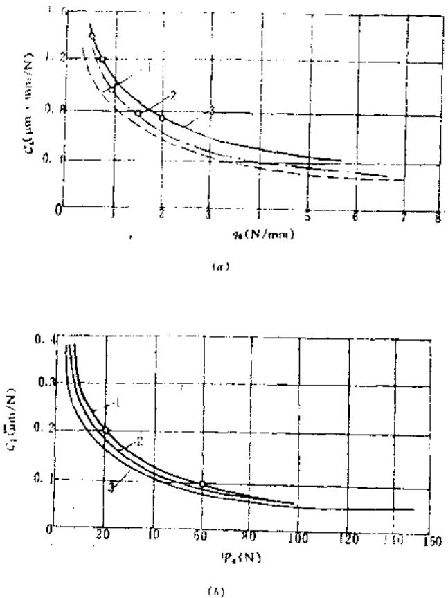

图9-24 ${ \mathfrak { C } } _ { 1 } , { \mathfrak { C } } _ { \mathfrak { z } }$ 与初载荷 $q _ { 0 }$ 或 $P _ { \bullet }$ 的关系

(a)滚柱导轨 (b)滚珠导轨1-—短滚柱钢导轨 $; 2 -$ 长滚柱钢导轨; $\scriptstyle 1 \cdots d = 5 \min ; 2 - d = 1 \sin \min$ 3-刮研的铸铁导轨 $3 - d = 1 0 \sim 2 0 { \mathrm { m m } } ( d$ 为滚珠直径)

2)力矩 $\mathfrak { M } \left( \mathfrak { m } \mathbf { N } ^ { \mathfrak { c } } \cdot \mathfrak { m } \right)$ 所引起的导轨接触变形 $\pmb { A } _ { \pmb { \mathscr { M } } }$ 如图 $\mathfrak { g } _ { - 2 5 }$ 所示,外力矩 $\pmb { M }$ 应与滚柱反力 $\pmb { F _ { i } }$ 所产生的反力矩总和相平衡,即

$$
{ \mathcal { M } } = 2 \sum _ { i \cdots i } ^ { \cdot } { \mathcal { F } } _ { i } \cdot i { \mathcal { l } }
$$

式中, $\pmb { \mathrm { u } }$ --工作台半边导轨长度上的滚柱数。

滚柱反力 $\varepsilon .$ 与该滚柱至工作台中心线的距离成正比,即

$$
\frac { \tilde { \mu } _ { \dot { i } } } { \tilde { \mu } _ { m a x } } = \mathbf { \nabla } _ { u \dot { \ell } } ^ { i \dot { \ell } } = \frac { \dot { i } } { \mathfrak { n } }
$$

$$
\vec { F _ { i } } \equiv \frac { i } { \underset { \pi } { \ : } } \vec { \underset { \prime } { \ : } } \otimes \vec { \underset { \prime } { \ : } }
$$

将 $z _ {  , } ^ { k } ( b )$ 代入式 $( \pi )$ 得

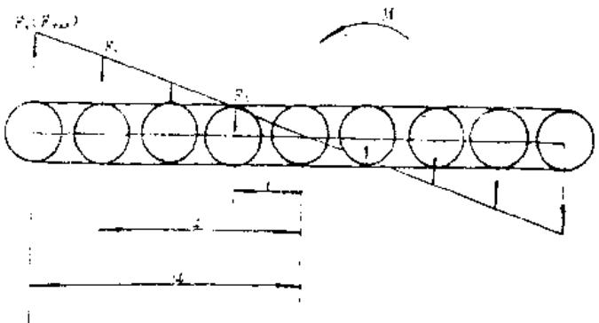

图9-25柱反力与力矩 $\mathcal { M }$ 的关系

$$
M = \frac { 2 R _ { \mathrm { m a x } } t } { \pi } \sum _ { i = 1 } ^ { \mathrm { o } } i ^ { 2 }
$$

$$
P _ { \mathrm { a s s } } = \frac { n M } { 2 i \displaystyle \sum _ { i = 1 } ^ { i } i ^ { 2 } }
$$

所以,由力矩 $\pmb { M }$ 所引起的导轨最大接触变形为

$$
\Delta _ { \mathrm { { M a x } } } = \mathcal { O } _ { 1 } \frac { F _ { \mathrm { { m a x } } } } { b } = C _ { 1 } \frac { \kappa M } { 2 b \displaystyle \sum _ { i = 1 } ^ { n } i ^ { 2 } } \qquad ( \mathrm { { s m } } )
$$

3)力矩 $\pmb { \mathcal { M } }$ 所引起的工作台偏转角 $\pmb { \varphi }$ 导轨在任一滚柱处的接触变形为

$$
\begin{array} { r } { \varDelta _ { \pmb { \mathscr { s } } _ { i } } = \mathscr { C } _ { 1 } \qquad e _ { i } = \mathscr { C } _ { 1 } \frac { \mathscr { F } _ { i } } { \not \mathfrak { b } } } \end{array}
$$

因

$$
\varphi = \frac { \varDelta \pmb { \mathscr { \kappa } } _ { i } } { i \mathscr { k } \times 1 0 ^ { 5 } }
$$

所以

$$
{ \cal { F } } _ { i } = \frac { b i t \varphi \times 1 0 ^ { 3 } } { C _ { 1 } }
$$

将式 $\left( e \right)$ 代入式 $\mathbf { \Omega } ( \pmb { a } )$ ,得

$$
M = \frac { 2 6 t ^ { 2 } \phi \times 1 0 ^ { 3 } } { C _ { 1 } } \dot { \sum _ { i = i } ^ { 2 } } i ^ { 2 }
$$

所以

$$
\varphi = { \frac { M C _ { 1 } \times 1 0 ^ { - 3 } } { 2 b t ^ { 2 } \sum _ { i = 1 } ^ { i } i ^ { 2 } } } \quad { \mathrm { ( r a d ) } }
$$

对于滚珠导轨,同样也可以求出其变形量与偏转角。

# $\ S \ 9 . 5$ 导柱和导轮

# 一、导柱、导轮的作用

许多电子设备(如录像设备、电子计算机外部设备等)都设有走带机构,而导柱、导轮是走带机构中不可缺少的导向部件,其作用是防止带子产生横向移动,使它保持在宽度方向的规定位置上稳定运行。有时还兼起压贴、加载、减震、防皱折等作用。如图1-2所示的普通录音机走带机构中,导(带)轮和导(带)柱即起稳定走带的作用。

导柱是固定于机架上不能转动的圆柱形支柱,带子运行时沿其圆柱表面滑行,它有垂直导柱和斜导柱两种。

导轮是空套在轴上,并且在带子运行时可自由转动的滚柱,故又可称为滚轮。

导柱和导轮在走带机构中通常置于需要改变带子运行方向或者需要限制带子运行方向的部位,将带子正确地引导到某个构件上或增加带子与某个构件的包角。

# 二、导柱和导轮的工作情况分析

# 1.导柱、导轮的受力分析

对于导柱,由于带子运动时弯绕在其表面上并对表面施加正压力,从而产生摩擦力,如图 $9 - 2 6 ( a )$ 所示的垂直导柱,若带子在绕过导柱前所受的张紧力(从动边张紧力)为 $P _ { \mathbf { \ell } }$ ,则在绕过导柱后的带子上应作用一个张紧力(主动边张紧力) $P _ { 1 }$ ,才能克服导柱前的张紧力以及分布在包角范围内的摩擦力,根据挠性摩擦欧拉公式:

$$
\bar { \boldsymbol { P } } _ { 1 } = \mathcal { P } _ { r } \boldsymbol { e } ^ { \prime \bullet }
$$

式中,f一—带子与导柱接触面间的摩擦系数;

α—带子在导柱上的包角。

由此可得,作用于导柱上的摩擦力矩为

$$
{ \pmb { M } } _ { \mathrm { t } } = ( { \pmb { P } } _ { \mathrm { t } } - { \pmb { P } } _ { \mathrm { t } } ) { \pmb { R } } = { \pmb { P } } , { \pmb { R } } ( e ^ { { \pmb { I } } \bullet } - 1 )
$$

式中, $\pmb { R }$ 一导柱半径.

作用于导柱上的压力为

$$
N _ { 1 } = \sqrt { P \bar { 1 } + P \bar { 1 } ^ { 2 } - 2 P _ { 1 } P , \cos { \theta } } = P , \sqrt { e ^ { 2 \prime \pi } + 1 - 2 e ^ { \iota ^ { \circ } } \cos { \theta } }
$$

对于导轮,如图9-26(b)所示,为使带子能带动导轮绕轴回转,带子与导轮之间的摩擦力矩必须大于(或等于)导轮与轴之间的摩擦力矩或在轴承中导轮轴的摩擦力矩,即必须满足条件:

$$
( P _ { \mathrm { t } } - P _ { \mathrm { e } } ) R \geq k N _ { \mathrm { t } } \tau
$$

式中, ${ \pmb { P } } _ { 1 } { \bf . } { \pmb { P } } _ { \pmb { \nu } }$ 一分别为带子绕过导轮时的主、从动边的张紧力;

$\pmb { R }$ 导轮半径;  
导轮轴颈的直径;  
—比例系数,敢决于支承类型;${ \pmb { N } } _ { \pmb { \imath } }$ -带子对导轮轴的压力,

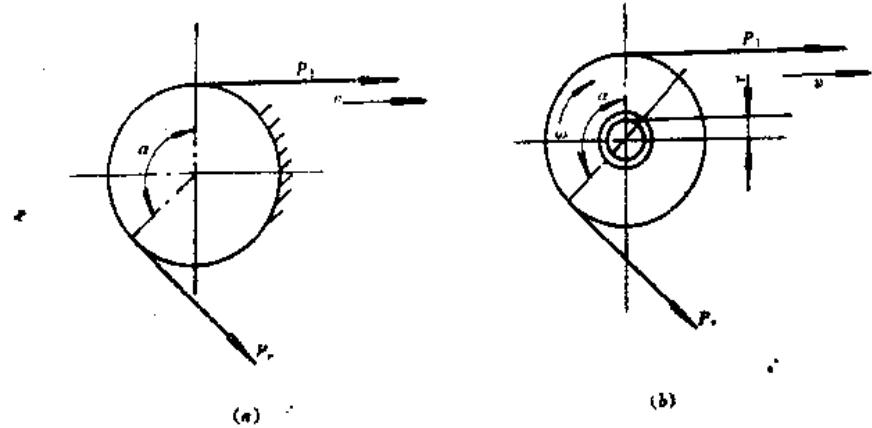

图9-26导柱和导轮的工作情况

由图9-26(b)知:

$$
N _ { 2 } = \sqrt { P _ { 1 } ^ { 2 } + P _ { * } ^ { 2 } - 2 P _ { 1 } P , \cos \alpha }
$$

式中, $\pmb { \alpha }$ 一一带子在导轮上的包角。

显然,当带子在导轮上的包角 $\pmb { \mathscr { u } } = \pmb { \mathscr { n } }$ 时,作用于导轮上的压力和摩擦方最大。这时压力$\begin{array} { r } { \pmb { \mathrm { N } _ { \imath } } = \pmb { \mathrm { P } _ { \imath } } \pmb { \cdot } \pmb { \mathrm { P } _ { \imath } } , } \end{array}$ ,将此关系代入式(9-43),得

$$
( P _ { \imath } - P , ) R \geqslant k r ( P _ { \imath } + P , )
$$

$$
P _ { 1 } = \frac { P _ { \cdot } \Big ( 1 + k \frac { \bar { \tau } } { R } \Big ) } { 1 - k \frac { \bar { \tau } } { R } }
$$

因为 $\pmb { t r } \ll \pmb { R }$ ,所以 $\textstyle { \pmb { \mathscr { P } } } _ { 1 } \approx { \pmb { \mathscr { P } } } _ { \star }$ 。表明导轮基本上不会改变带子主、从动边张紧力的大小,而且作用在导轮上的摩擦力矩很小,导轮的缺点是其表面跳动将引起带子线速度的附加波动。

由于导柱和导轮对带子的运动会产生摩擦阻力,故导柱和导轮的工作表面加工质量要求一般比较高,表面粗糙度通常小于

2.导柱、导轮直径 $\pmb { p }$ 的确定

当带子绕过导柱(或导轮)时,将产生弯曲变形和弯曲应力,为保证带子不发生断裂,必须满足以下条件:

$$
\sigma _ { \nu } = \frac { \mathcal { E } \delta } { 2 R _ { \alpha } } \leqslant [ \sigma _ { \nu } ]
$$

式中, ${ \pmb \sigma } _ { \pmb { \ b } }$ 带子绕过导柱(或导轮)时的弯曲应力;

$\pmb { \cal { E } }$ —-带子材料的弹性模量;  
$\pmb { \theta }$ —带子的厚度;  
${ \pmb R } _ { \pmb { \mathrm { s } } }$ ——带子中性层的曲率半径,因带子厚度 $\pmb { \mathscr { d } }$ 很小,可近似取 ${ \bar { R } } _ { \ast } = \bar { \jmath } / 2$ $\{ \sigma , \}$ —带子材料的许用弯曲应力,

因此,导柱(或导轮)的直径可按下式确定:

$$
D \geqslant \frac { { \cal E } _ { \delta } ^ { \delta } } { [ \sigma _ { \delta } ] }
$$

# 习 题

9-1导轨的类型有哪些?设计时应满足哪些基本要求?

9-2滑动摩擦导轨和滚动摩擦导软各育些结构型式?它们各有哪些特点?

9-3影响导轨导向精度的因素有哪些?设计中如何提高导轨的导向精度?

9-4其设备用浓 $\because ^ { \frac { \cdot \cdot } { r } }$ 轨运动件的最大行程 $g _ { \mathbf { m } \mathbf { m } } = 8 0 \mathbf { m } \mathbf { m }$ ,运动件的长度 $\pmb { l } = 2 5 0 m m$ ,在极限位置时,导轨的边缘余量 $i _ { \bullet } { = } 1 0 \mathrm { m } m$ 求首末两滚珠的中心距(见图9-17).

# 第十章 定位装置与限动装置

# $\ S$ 10.1定位装置

定位装置(简称定位器)是使运动件快速而准确地停留在预定工作位置上的装置。定位装置在电子设备、仪器仪表中的某些转换开关机构、步进机构、操纵机构和控制机构中得到广泛的应用。

定位装置主要是由运动件和定位件组成,通常运动件开有定位孔或定位槽,利用弹力把定位件压向运动件的定位孔或定位槽中进行定位。定位件常见的有插销、滑杆、弯钩、滚珠、滚轮和片簧等。、

定位装置的类型很多,若按运动件的运动形式来分类有直线运动定位装置和旋转运动定位装置;若按其工作方式和定位件特性可分为刚性定位装置和弹性定位装置,

# 一、刚性定位装置

刚性定位装置是用刚性定位件,在弹簧力或其它促动力的作用下压向运动件进行定位的,且不能以运动件为主动来改变位置的定位装置。若要改变位置,必须用人手或其它控制机构操纵定位件脱离运动件的定位孔(槽)或利用定位件直接推动运动件才能完成变位。

刚性定位装置常见的结构型式有插销式刚性定位装置和杠杆式刚性定位装置。

图10-1所示是插销式刚性定位装置,其中图 $1 0 { - } 1 ( a )$ 是径向定位,而图10-1(b)则是轴向定位,插销i在弹簧2的作用下插入运动件3的定位槽(孔)中进行定位。若要改变位置,须首先拔出插销,使其脱离定位槽(孔)才能变位。

图10-2所示是杠杆式刚性宅位装置,其中图 $\pmb { \mathrm { i } } \ r _ { 0 } \mathbf { - } \pmb { 2 } \{ \mathfrak { n } \}$ 用于控制直线运动的定位,图10-2(b)用于控制旋转运动的定位。定位件带定位钩的杠杆,工作情况与插销式刚性定位装置类似。

在使用刚性定位装置时,运动件的定位精度取决于定位销、钩与定位槽(图10-1(a)、图10-2)或定位销与定位孔(图10-1(b))之间的配合间隙。而为提高运动件的位置精度,必须尽可能地减小这个间隙。有时也可采用带有小锥度的销子,这样可完全消除间隙。但锥面的斜度不应大于摩擦角。

图10-1插销式刚性定位装置

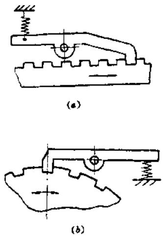

图10-2杠杆式刚性定位装置

刚性定位装置结构简单,工作可靠,定位精度高,但使用不如弹性定位装置方便,

# 二、弹性定位装置

弹性定位装置是利用弹性元件的弹力把定位件压向运动件的定位槽(孔)进行定位的,且能以运动件为主动来把定位件从定位槽(孔)中挤出而自行变位和定位的定位装置。这类定位装置使用轻快方便,在电子设备中应用广泛、如各种波段转换开关等机构均有弹性定位装置。图10-3所示为弹性定位装置在叠片式波段转换开关中的应用实例,它的结构包括开关(动片和定片)底座、定位装置、轴、垫圈钉及螺母等,根据所需转换的回路数目和波段数目在开关片上常做成各种“刀"数和“位”数。

为保证从一个波段转换到另一个波段,采用弹性定位装置,它可使波毁的转换准确而动作清晰。

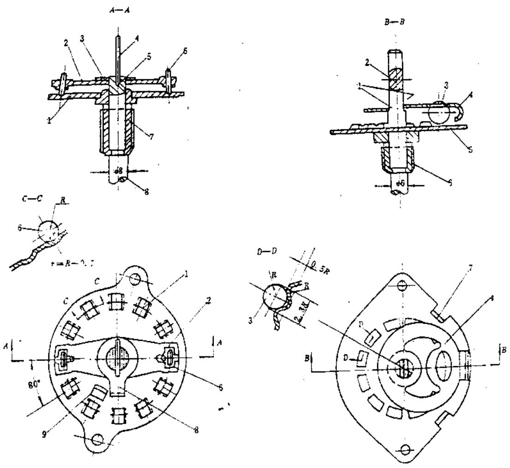

图10-3叠片式波段开关

(a)有两个滚轮的波段开关定位装置1-有凹槽的底板;2一簧片;3—上动器:4--扁轴;5-卡圈;6-滚轮;7--轴承套;8一轴9—底板上的止动块

(b)用一个滚轮的波段开关定位装置1一卡圈;2-轴:3-滚轮1一簧片;5-有凸起装置的底板;6一轴承套;7--底板上的止动块

# 1.弹性定位装置的结构型式

弹性定位装置的结构型式很多,在精密机械中,经常应用滚珠作为定位件的弹注定位器,滚珠利用圆柱弹簧或片簧直接压向运动件(转盘或轴杆)的定位槽(孔)进行定位,如图10-4和图10-5所示,这种定位器的优点是工作面间的摩擦阻力小。同时,由于定位时滚珠的转动,滚珠与运动件的接触点每次定位时都不相同,因而磨损也较慢。

定位件作用在运动件上的压力可以是径向的,也可以是轴向的,应按具体结构选定。图10-4所示的滚珠转盘式弹性定位位置,除图l4(c)为轴向定位外,其余均为径向定位,图$\mathbf { i } \left. \bigcap _ { \cdots } A \left( i ^ { \prime } \right) \right.$ 是具有对称布置的双滚珠定位装置,其优点是定位与作用较均匀,不会使转轴产生

径向偏移,可减少摩擦,提高定位精度。

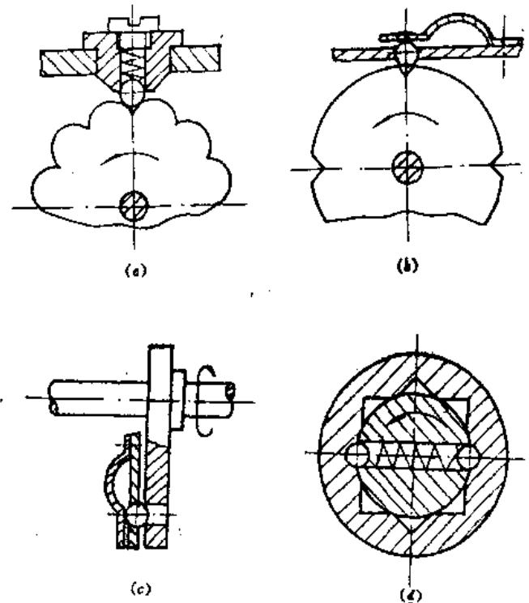

图10-4滚珠转盘式弹性定位装置

运动件的运动可以是直线移动,也可以是转动。当运动件的运动是转动时,应使其定位端的运动方向大致垂直于运动件上定位槽的运动方向。图10-5所示的滚珠轴杆式弹性定位装置中,图 $1 0 - 5 ( a )$ 的轴既可转动又可轴向移动变位;图10-5(b)只能转动变位,而不能轴向移动变位。图10-5(c)的运动件是矩形截面的拉杆,它只能作直线移动变位,而不能转动。

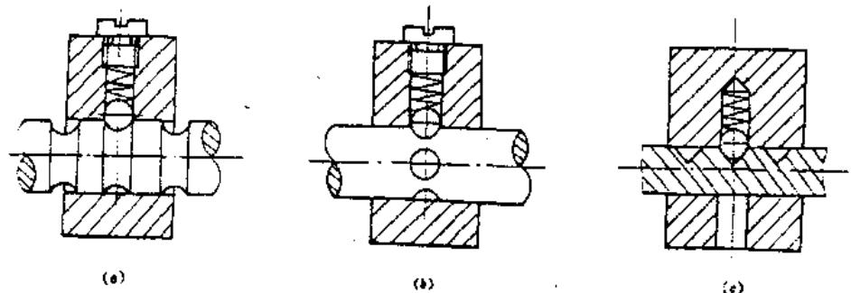

图10-5滚珠轴杆式弹性定位装置

弹性定位装置还可以采用带滚轮的杠杆或具有锥头的杠杆作为定位件,其特点就是利用杠杆和弹簧力的作用进行定位,如图10-6所示。其中图 $1 0 \cdot 6 \left( b \right) , \left( c \right) , \left( \epsilon \right)$ )采用滚轮作定位件,比图10-6(a)、(d)的锥头定位变位灵活,工作面间的摩擦和磨损也较小。

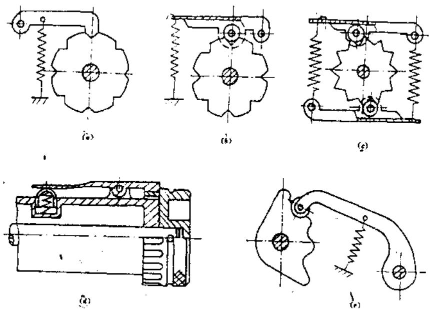

图10-6杠杆式弹性定位装置

定位件作用在运动件上的压力通常是利用弹簧产生的。为使结构简化,常直接把簧片根据运动件的形状做成相应型式的定位件,如图10-7所示。这种片簧式弹性定位装置的优点是结构简单、加工容易和装配方便,缺点是易磨损。

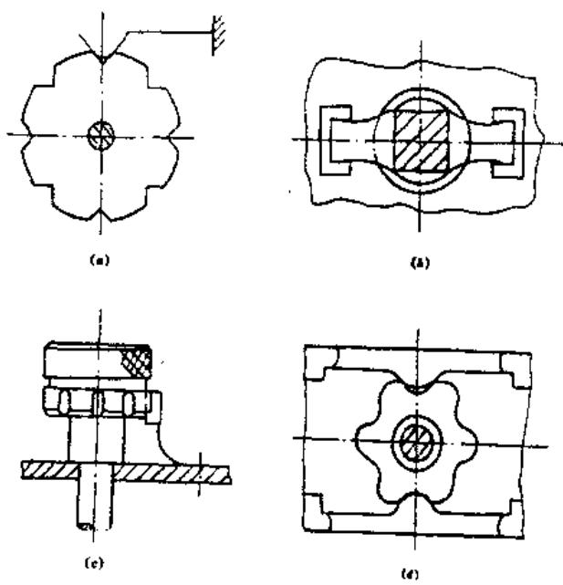

图10-7片式弹性定位装置

2.弹性定位装置的要求、受力分析和设计计算由于弹性定位装置是以运动件的转动或移动来把定位件挤出而变位的、所以定位力的大小和受力构件的形状与尺寸都有一定的要求。下面以图10-8为例,对定位装置受力情况进行分析。

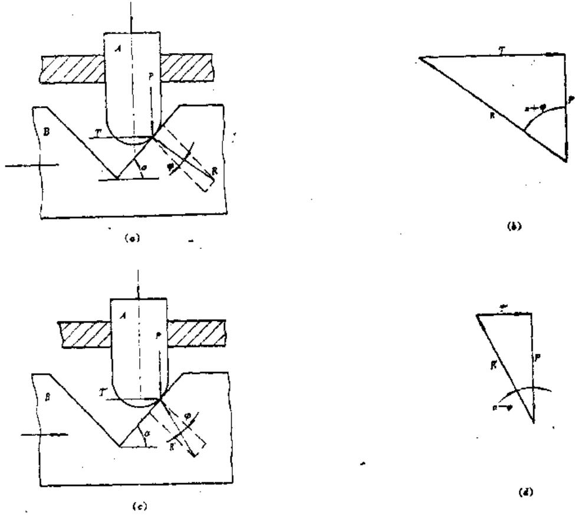

图10-8定位装置的受力分析

假定该定位装置是由带球端的定位柱 $\pmb { A }$ 与带三角形定位槽的直线运动件 $\pmb { \mathscr { B } }$ 组成,当运动件 $\pmb { B }$ 向左运动时,定位件 $\pmb { A }$ 将以等速沿定位槽斜面上升,这时 $\pmb { \mathscr { T } }$ 为驱动力, $P$ 为阻力,因斜面加于定位柱的总反力 $R$ 的方向应与 $A$ 相对于 $B$ 的运动方向成 ${ 9 0 ^ { \circ } + \varphi }$ 的角, ${ \varphi } = { \pmb q } ^ { - 1 } { \pmb f }$ 为摩擦角 $\mathscr { G }$ 为两种材料间的摩擦系数),所以 $\pmb { R }$ 与 $\pmb { p }$ 间的夹角为 $\alpha + \phi , \theta$ 为定位槽斜面升角:根据力的平衡方程式 $\vec { \pmb { p } } + \vec { \pmb { R } } + \vec { \pmb { T } } = 0$ 作其力多边形如图10-8(b)所示。于是得:

$$
{ \pmb T } = P \pmb { \mathrm { \imath } } \pmb { \mathrm { \& } } ( \pmb { u } + \pmb { \mathrm { \sigma } } )
$$

现考察图10-8(c).若将力 $\pmb { \mathscr { r } }$ 减小到 $\pmb { \eta }$ 定位件 $\pmb { A }$ 则以等速沿斜面下滑,这时 $\pmb { P }$ 为驱动力、面 $\pmb { \tau }$ 为阻力。由于定位件运动方向改变,所以总反力 $\pmb { \mathcal { R } } ^ { \prime }$ 与 $\pmb { P }$ 的夹角变为 $\pmb { \sigma } - \hat { \pmb { \varphi } }$ 同理,按$\vec { \pmb { p } } + \vec { \pmb { R } } ^ { \prime } + \vec { \pmb { T } } = 0$ 作其力多边形如图 $1 0 - 8 ( d )$ 所示,于是得:

$$
{ \pmb T } ^ { * } = P \mathrm { t } { \pmb \mathrm { _ { 8 } } } ( { \pmb u } - { \pmb \varphi } )
$$

对于定位柱上升情况,由式(10-1)可知,若 $a \geq 9 0 ^ { \circ } - \varphi$ ,则机构将发生自锁,定位柱不能上升,为使之不发生自锁,必须满足 $a < 9 0 ^ { \circ } - \varphi$ ,即 $a + \phi < 9 0 ^ { \circ }$ 

对于定位柱下滑情况,由式(10-2)可知,若 $\omega \leqslant \varphi$ ,则机构也将发生自锁,定位柱不能下滑,所以应使 $\Delta \geq \varphi$ :

因此,若要求弹性定位装置在弹性力作用下,既能灵活地变位,又能自动定位,那么,运动件的定位槽升角也必须满足上述条件。

如果定位件和运动件的材料为钢,其摩擦角为 $1 1 ^ { \circ }$ ,则定位槽升角的最大值为 ${ \pmb q } _ { m a x } = 9 0 ^ { \circ }$ $1 1 ^ { \circ } = 7 9 ^ { \circ }$ 通常 $\bullet < 7 0 ^ { \circ }$ 。但在电子设备、仪器仪表应用中,定位槽升角 $^ a$ 不能过大,因为 $\pmb { \alpha }$ 过大时,要把定位件从定位槽挤出较困难,须施加较大的推力 $\pmb { \mathscr { T } }$ 才能换位,不便于手动操作;但 $\pmb { \alpha }$ 角又不能太小,因为太小会使定位件不易自动滑入定位槽中间位置进行自动定位,且在偶然外力作用下会滑出正确位置,为了既能定位可靠,又能换位操作方便,一般取 $\bullet = 3 0 \sim$ 45\*.

滚珠(或滚轮)与定位槽接触时的位置及尺寸关系如图10-9所示。设定位槽齿顶间的距离为 $\smash { \ell , }$ 升角为 $\pmb { \alpha }$ ,若滚珠外圈与定位槽相切于斜边的顶点(图 $1 0 - 9 ( a ) )$ ,则滚珠的半径为

$$
r \approx \frac { l } { 2 \sin \alpha }
$$

其升程 $\pmb { \mathscr { k } }$ 为

$$
\hbar = \tau ( 1  \cos { \omega } )
$$

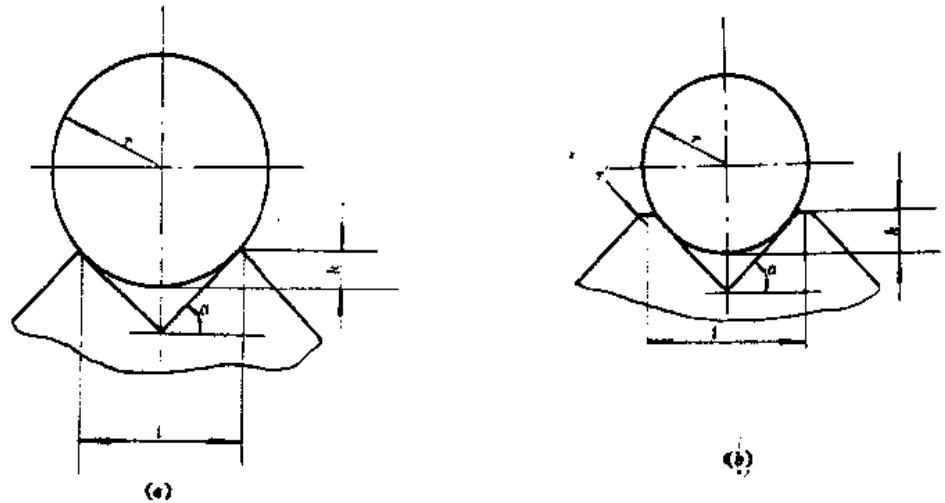

图10-9滚珠与定位槽的位置与尺寸关系

为避免定位權顶点易被磨损,常把定位槽顶点做成具有半径为 $\pmb { r }$ 的圆弧形(图10-9(b))。假定这围弧与斜边的连接点正是滚珠与斜边的切点,则这时的滚珠半径和升程为

$$
r = \frac { l } { 2 \sin a } - r
$$

$$
k = ( r + r ^ { \prime } ) ( 1 - \cos \alpha )
$$

弹性定位装置定位件材料的硬度,一般比运动件的高些,运动件的材料可选用工程塑料.

# 10.2限动装置

限动装置(简称限动器)是限制运动件在给定的范围和方向运动的装置。在许多电子设备、仪器仪表和自动化控制系统中,某些运动件只允许在规定范围内作往复运动或按某种规律运动,否则就会造成工作失调或设备损坏、例如数控机床刀架的行程控制、电子设备调谐机构被调元件的调节范围等。因此,必须要有限动装置进行控制。

运动件的运动形式一般有匀速的或变速的往复直线运动和连续转动、直线的或旋转的间歇运动或步进运动、摆动运动以及复合运动等,其中摆动通常是指小于 $3 6 0 ^ { \circ }$ 范围内的往复转动,步进运动是指运动件单方向(不返回)的连续有规则的完成“动一停"运动.不管何种运动形式,其运动件的行程可概括为直线距离、转数和摆动角度等三种。所以控制运动件运动范围和方向的限动装置,也相应地分为三类:直线运动限动装置、摆动限动装置以及转动限动装置。

限动装置的控制方法有机械式、机电式和光学式等多种,本书着重介绍机械式限动装置的限动原理和结构。

# 一、直线运动和摆动的限动装置

直线运动和摆动的限动装置比较简单,容易实现,只要把限动元(器)件装在被控运动件运动范围的两个极限位置即可。限动元(器)件常有接触式和非接触式两类,

# 1.接触式限动装置

电子设备、精密仪器中常用的接触式限动装置有机电式和纯机械式两类,所采用的限动元(器)件有行程开关、限动挡块等。优点是结构简单,限动可靠;缺点是有碰撞噪声、易损坏.

图10-10所示的棘轮步进回转运动机构,是采用机电式限动装置限动的。由回转电磁铁1的往复转动来驱动摆杆2和摇杆5摆动,通过棘爪6推动棘轮7作间歇转动.摆杆摆动的角度由两端电路限动开关3和4来控制。当棘爪随摇杆和摆杆向左回摆,碰到限动开关4时,回转电磁铁马上接通反转电路,驱动摇杆向右摆动,并由棘爪推动棘轮转过预定的角度,当摆杆的另一臂碰到限动开关3时,则机构运动相反。如此反复,便可实现棘轮的步进回转运动。

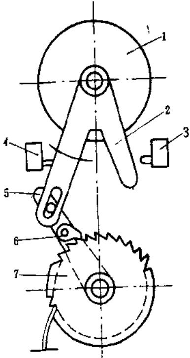

图10-10步进运动限动装置

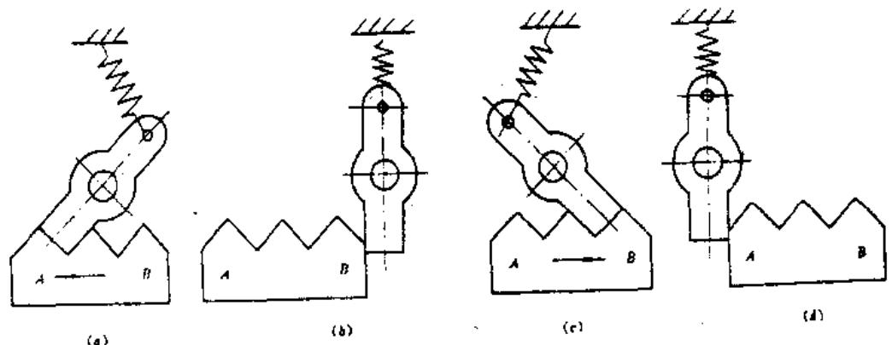

图10-1直线运动限动装置

图10-11所示是控制直线运动的纯机械式的限动装置。这种限动装置结构简单,由定位件、滑块和弹簧组成,它能完成步进定位、防止逆运动,但必须走完全程才能反向运动。其中图10-11(a)中,滑块只能向左运动:图10-11(b)中,滑块向左走完全程,定位件靠在 $\pmb { \mathscr { B } }$ 端;图10-11(c)中,滑块只能向右运动;图10-11(d)中,滑块向右走完全程,定位件靠在 $\pmb { A }$ 端,之后可重复上述动作,这种装置在某些仪器中还可作为保险装置。

图10-12是控制摆动的凸臂限动装置。这种限动装置结构简单,它是由挡销3(或挡块4)、带凸臂的轴环2组成,安装时凸臂轴环牢固地套装在摆动轴1上,而在设备的固定部分装上挡销或挡块。这样,凸臂只能在转角 $\beta$ 范围内摆动。

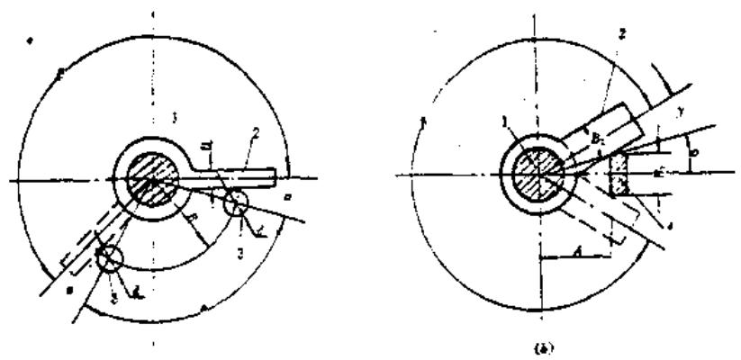

图10-12挡销(挡块)凸臂限动装置

对于图10-12(a)所示的挡销凸臂限动装置,应有以下关系:

$$
\beta = 3 6 0 ^ { \circ } - \theta - 2 \alpha
$$

$$
\sin \alpha = { \frac { B + d } { 2 R } }
$$

对于图10-12(b)所示的挡块凸臂限动装置,应有以下关系:

$$
\begin{array} { l } { \beta = 3 6 0 ^ { \circ } - 2 ( \alpha + \gamma ) } \\ { \mathrm { t g } a = \displaystyle \frac { B _ { 1 } } { 2 A } } \\ { \sin \gamma = \displaystyle \frac { B _ { 2 } \sin \alpha } { B _ { 1 } } } \end{array}
$$

如果将这种凸臂限动装置的凸臂固定在其它转动零件(如齿轮或其它圆盘形零件)上,并在设备中与转动零件相近的固定部分装上挡销或挡块,则转动零件也就被限制在规定范围内.

# 2.非接触式限动装置

非接触式限动装置采用的限动元(器)件有如图10-13所示的舌簧管、磁电传感器和光电传感器等,其优点是没有碰撞和摩擦,因而无噪声,而且反应灵敏、可靠、寿命长,在自动记录器、自动打印机和液面控制等的行程控制中都使用到这类限动元(器)件。

图10-13(a)所示的舌簧管1固定在机架上,磁钢2装在运动件的适当位置。当磁钢随运动件靠近舌簧管时,舌簧管的接触片被吸动使之断开或接通,从而改变运动方向。

图10-13(b)所示是利用随运动件运动的铁芯2进入线圈1,感应出电信号,经电放大后通过执行元件的作用来改变运动件的运动方向,

图 $\mathbb { I } \mathbb { 0 } \mathbf { - } \mathbb { i } \ \pmb { 3 } ( \pmb { c } )$ 所示是利用运动挡板切断光源射向光电敏感元件的光线所发生的信号来改变运动方向.

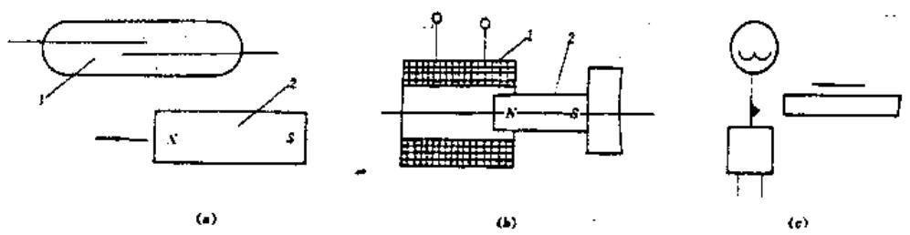

图10-13非接触式限动元器件(a)舌簧管(b)电传感器(c)光电效应传感器

# 二、转动限动装置

# 1.限动原理和使用要求

转动限动装置大都采用机械接触式限动装置,其限动原理是控制转轴或转盘的转数,这种限动装置在电子设备中应用较为广泛,常见的类型有:螺旋限动装置、垫圈限动装置、齿轮凸块限动装置、齿轮挡销限动装置和蜗轮限动装置等。

机械接触式转动限动装置当用于手动操作系统是方便可靠的。但是,若用于机电驱动系统,则必须在限动块处装上行程开关或其它限动传感器,以便运行到极限位置时立即发出反转或停转指示信号来控制其动作,防止发生:中击或损坏电机。

由于转动限动装置在限动的瞬间会产生较大的冲击载荷,因此直接承受冲击的零件必须要有足够的强度。为了避免与限动装置紧密连接的零件损坏,在使用时需要采用保护装置(如安全联轴器等),对受力不大的手动系统可不用保护装置。

转动限动装置的安装应尽量靠近动力源(如手轮或电机附近),以减少制动时运动系统受到冲击的零件数目,在个别情况下,运动系统中具有惯性矩很大的旋转体时,为了减轻惯性力矩所加给系统中的附加载荷,则应该直接制动这些旋转体。

# 2.结构型式及计算

(1)螺旋限动装置其典型结构如图10-14所示。它的主要组成部分是螺杆1,两端带凸起的螺母2和挡环3,螺母2底面或凹槽靠在导轨平面上,故不能转动,挡环3和螺杆1的圖柱部分用销钉连接,挡环靠螺母的一侧各有一个凸起。

螺杆1转动时,螺母2作直线移动。当螺母2的左凸起与挡环3的右凸起相遇(侧面接触)时,螺杆1就不能继续转动。间样,如螺母2的右凸起与挡环3的左凸起相遇,螺杆亦被限动,因此,螺杆1只能在一定转数内转动,螺母只能在一定距离内往复移动。

图10-14(a)所示的螺母底面,装配时需要研磨,故高度 $H$ 在加工时应留有余量,图10-14(b)所示结构采用凹槽导轨,则无需研磨。

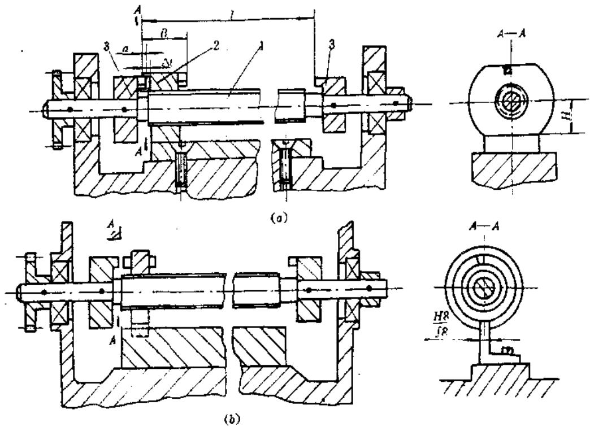

图10-14螺旋限动装置的结构

该限动装置结构简单,易于获得较高的限动精度,限动转数可为整数和分数。但限动转数过多时,螺杆较长,结构尺寸较大。

当动力源为电机时,若采用上述螺旋限动装置,在限动时将产生很大冲击,限动后由于电机负载力矩骤增,可能烧毁电机绕组。为避免这种情况的发生,可采用机电式限动装置,如图10-15所示,此限动装置可使机构在稍早于限动以前先切断电机电路,然后利用运动系统的惯性使运动件达到限动位置上。即当运动件将要达到极限位置时,绝缘杆3把接触点!或2断开,切断电机电源。在设计这种限动装置时,应注意接触点能在尽可能短的时间内分开,切断电路的提前时间量在结构上应保证其有调整的余地。

当限动转数 $\pmb { \mathscr { A } }$ 已知时,其几何参数可按下述方法确定,

先按结构条件选定螺距 $P ( m \geq )$ ,然后计算其它尺寸.

螺母的移动距离(螺杆用单线螺纹) $\pmb { \bar { \jmath } } _ { \pmb { \epsilon } }$ $\left( \mathsf { m m } \right)$ 为

$$
L = \mu P
$$

螺杆的螺纹部分长度 $\ell _ { \pmb { \nu } } ( \mathsf { m m } )$ 为

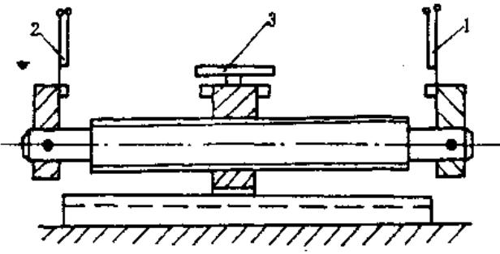

图 $1 0 - 1 5$ 机电式螺旋限动装置

$$
l _ { \omega } = L + ( B - 2 a )
$$

式中, $\pmb { B }$ ——包括凸起在内的螺母总长 $( \mathsf { m m } )$ ;

a凸起高度 $( \min )$ ,

当螺母达到限动位置时、其端面与挡环上凸起的端面应保持一定间隙 $\yen 123,456$ 一般取

$$
\Delta t = 0 . 2 ^ { \mathfrak { p } }
$$

两挡环凸起端面间的距离 $\sum ^ { \prime } ( \mathsf { m m } )$ 为

$$
\begin{array} { l } { { L ^ { \prime } = l _ { v } + 2 \Delta t = n P + ( H - 2 a ) + 2 \Delta t } } \\ { { a = P } } \end{array}
$$

当螺距 $\pmb { p }$ 较小时 $, \pmb { \alpha }$ 和 $\Delta t$ 的尺寸可酌情加大。典型结构的推荐尺寸见有关设计手册。

装调时应保证尺寸 $\bar { \iota } _ { \star } ^ { \star }$ 。在预调时,螺杆上两个挡环的位置调到要求的精度后,先用工艺螺钉定位,再打入销钉固定。

(2)垫圈限动装置其结构如图10-16所示。常用于限动转数不多的结构中,拨环1固定在轴5上,轴上松套着若干活动垫圈2。止动环3则固定在壳体上。当运动由齿轮4输入时,拨环1随轴5一起转动,并拨动活动垫圈的凸起部分,依次带动活动垫圈2转动,直到最后一个活动垫圈的凸起部分与止动环3的凸起部分相遇,轴5被限动。这时,轴5只能反向旋转,在反向转动相同转数时,又被限动,

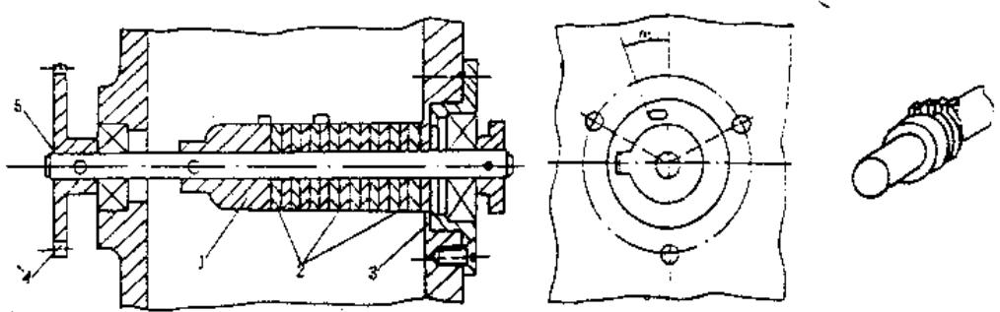

图10-16垫圈限动装置的结构

图10-17所示为测距仪微调手轮,是用垫圈限动装置来限定手轮1的转数。限动装置由拨环2、四片活动垫圈3和止动环4组成。

如仅有一个拨环和一个止动环,它们的凸起夹角分别为 ${ \pmb { a } } _ { \mathbf { l } }$ 和 ${ \pmb { a } } _ { \mathfrak { z } }$ ,这时,拨环仅能在$3 6 0 ^ { \circ } - ( \alpha _ { 1 } + \alpha _ { 2 } )$ 范围内转动,若在两者间增加$\pmb { k }$ 片活动垫圈,且活动垫圈凸起夹角亦为 ${ \pmb { \alpha _ { 1 } } }$ +则转角的限动范围 $\pmb \theta$ 为

$$
\theta = \pmb { \mathrm { \tt \tt \tt ( 3 6 0 ^ { * } - 2 a _ { \mathrm { 2 } } ) } } + 3 6 0 ^ { \circ } - ( a _ { \mathrm { 1 } } + a _ { \mathrm { 2 } } )
$$

当要求限动的转角数为 $^ { n }$ 时,则

$$
\theta = 3 6 0 ^ { \circ } n
$$

所以,应有的活动垫圈片数为

$$
k = \frac { 3 6 0 ^ { \circ } ( \varkappa \cdots 1 ) + ( a _ { 1 } + a _ { 2 } ) } { 3 6 0 ^ { \circ } - 2 a _ { 1 } }
$$

垫圈限动装置常用计算公式,见表10-1.

这种限动装置限动转数可为整数,亦可为分数,若限动的转数 $\pmb { \mathscr { n } }$ 为已知,可选择适当的 $\pmb { o } _ { \Im }$ ,使 $\pmb { k }$ 为整数。若 ${ \mathfrak { a } } _ { \mathfrak { z } }$ 过大或过小时,也可以改变 ${ \pmb { \alpha } } _ { \bf 1 }$ ,使 ${ \pmb { \sigma } } _ { \pmb { \imath } }$ 达到较为合理的角度。 ${ \boldsymbol { a } } _ { 2 }$ 必

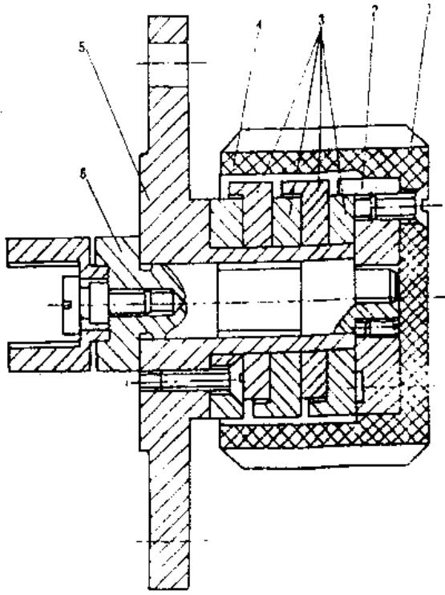

图10-17微调手轮中的垫围限动装置

须留有裕量,一般取 $5 ^ { \circ } \sim 1 2 ^ { \circ }$ ,以便装调时修切。如限动装置中所用活动垫圈数目很多时,可能引起垫圈偏斜。故 $\pmb { k }$ 大于20时,应加衬套,防止偏斜(见图10-18)。

表10-1垫圈限动装置计算表

<table><tr><td rowspan=2 colspan=1>名称</td><td rowspan=2 colspan=1>符号</td><td rowspan=1 colspan=4>计算公式</td></tr><tr><td rowspan=1 colspan=1>一般公式</td><td rowspan=1 colspan=1>a</td><td rowspan=1 colspan=1> =30°</td><td rowspan=1 colspan=1>=a=30*</td></tr><tr><td rowspan=1 colspan=1>限动转数</td><td rowspan=1 colspan=1>舞</td><td rowspan=1 colspan=4>按要求给出</td></tr><tr><td rowspan=1 colspan=1>活动热国数目</td><td rowspan=1 colspan=1>A</td><td rowspan=1 colspan=1>360*（-1）+（a+a）360*-2a</td><td rowspan=1 colspan=1>180180--1</td><td rowspan=1 colspan=1>1.2x-1.1+3中</td><td rowspan=1 colspan=1>=1.2-1</td></tr><tr><td rowspan=1 colspan=1>止动环凸起夹角</td><td rowspan=1 colspan=1>a</td><td rowspan=1 colspan=1>=k（360°-2a）-360"(x-1）-a</td><td rowspan=1 colspan=1>180x     年1</td><td rowspan=1 colspan=1>=300*+330-360*</td><td rowspan=1 colspan=1>a=30</td></tr></table>

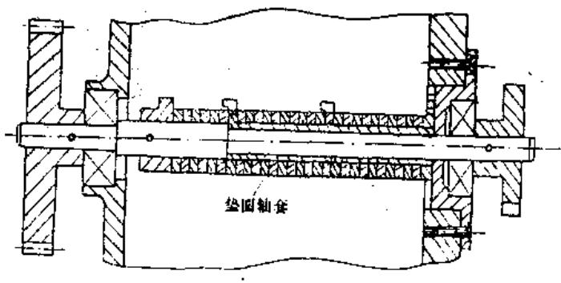

图10-18带衬套的垫圈限动装置

例10-1计算限动转数 $\pmb { \mathscr { s } } = 1 \pmb { \mathscr { s } } , \pmb { \hat { \theta } }$ 的限动装置。!

解 $\textcircled{1}$ 取 $a _ { 1 } = 3 0 ^ { \circ }$ 

$\textcircled{2}$ 由表10-1可知,活动垫圈数目 $\pmb { \dot { k } }$ 应为

$$
\begin{array} { r } { k = { 1 . 2 } { \tt a } \sim { 1 . 1 } + \frac { \alpha _ { 2 } } { 3 0 0 ^ { \circ } } = { 1 . 2 } \times { 1 1 . \mathrm { ~ 6 ~ - ~ 1 . ~ } } { 1 } + \frac { \alpha _ { 2 } } { 3 0 0 ^ { \circ } } } \end{array}
$$

$$
= 1 6 . 4 2 + \frac { \alpha _ { 2 } } { 3 0 0 ^ { \circ } }
$$

$\textcircled{3}$ 取 $\pmb { k } = 1 7$ ,止动环凸起夹角为

$$
a _ { 4 } = ( 1 7 - 1 6 . 4 2 ) \times 3 0 0 ^ { \circ } = 1 7 4 ^ { \circ }
$$

此值较大,另选 $\pmb { \sigma } _ { \pmb { \jmath } }$ 值.

$\textcircled{4}$ 取 $a _ { 1 } = 2 5 ^ { \circ }$ ,财

$$
k = { \frac { 3 6 0 ^ { \circ } ( \varkappa - 1 ) + ( a _ { 1 } + a _ { 2 } ) } { 3 6 0 ^ { \circ } - 5 0 ^ { \circ } } } = 1 5 . 8 7 4 + { \frac { a _ { 2 } } { 3 1 0 ^ { \circ } } }
$$

如取 $\pmb { k } = 1 6$ 时,计算得:

$$
\alpha _ { 2 } = 3 9 ^ { \circ } 1 ^ { \prime }
$$

$\textcircled{5}$ 取修磨裕量 $\Delta a _ { 2 } = 5 ^ { \circ } 5 6 ^ { \prime }$ ,则最后结果为

$$
a _ { 1 } = 2 5 ^ { \circ } \quad u _ { 2 } = 1 5 ^ { \circ } \quad k = 1 6 \quad n = 1 4 . 6
$$

(3)齿轮凸块限动装置如图 $1 0 - 1 9 ( a )$ 所示,在两齿轮上分别安装一凸块,当两凸块相遇时,齿轮则不能按箭头方向转动。若 $\ I _ { 2 }$ 轮反向转动若干转之后,凸块再次相遇(见图10-19(b)),齿轮又被限动。因此,两齿轮只能在一定转数内正、反向旋转。齿轮由一个极限位置到另一极限位置所能转过的圈数就是限动装置所能限动的转数。具体过程为:假定齿轮已处于相遇位置,不能再按原来方向转动(见图10-19(c)),开始反向顺时针转动。一般 $z _ { 1 } > z _ { 1 } , z _ { 2 } - z _ { 1 }$ $\yen 2$ ,由于齿轮2齿数比齿轮1多 $\fallingdotseq$ 齿,则当齿轮2转一转,齿轮:就转了一转加 $\frac { z _ { i } } { \bar { \mathbf { a } } _ { i } }$ 转:齿轮2上的凸块在齿轮2转一转后仍回到原来位置,而齿轮1的凸块此时则沿转动方向多转了$\theta _ { \theta } = 3 5 0 ^ { \circ } z _ { \theta } / z _ { 1 }$ .齿轮2再转动一转,则齿轮1上的凸块又再多转过一个 ${ \pmb \theta } _ { \pmb { \mathscr { s } } }$ 角,如此下去直至限动时为止(见图10-19(b)).

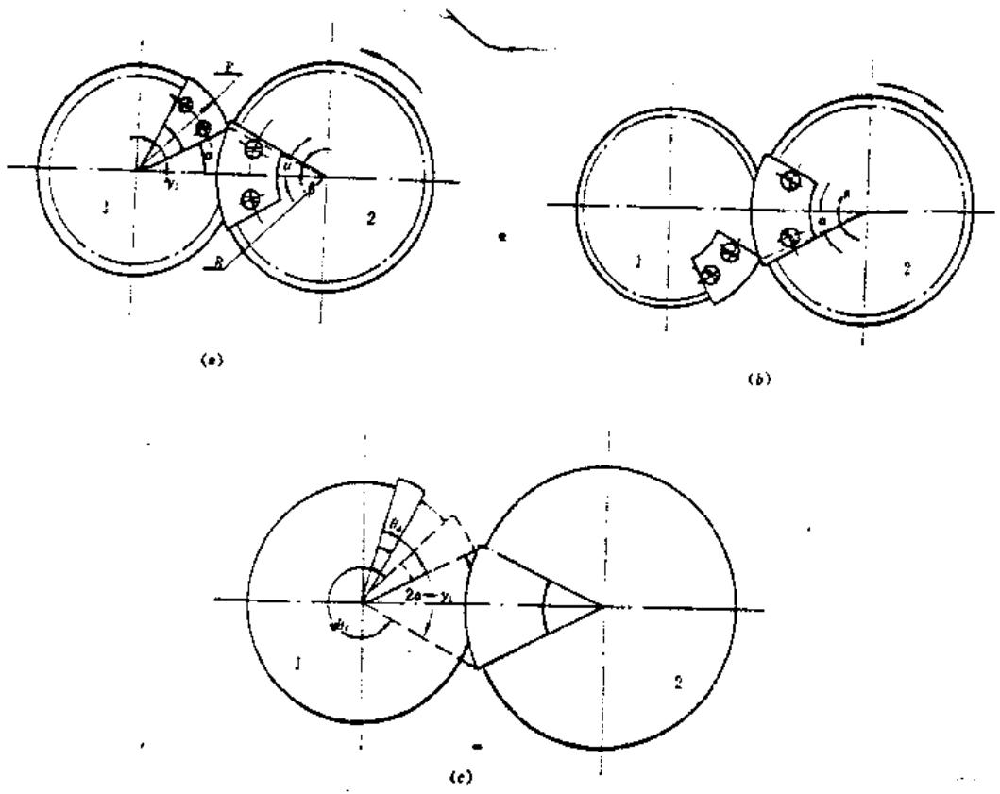

图10-19齿轮凸块限动装置工作源理图(a)起始限动位置 (b)终止限动位置 (c)运行图

这种限动装置的限动转数和限动精度比较高,限动转数可达 $1 5 0 \sim 2 0 0 \tau$ .组成限动装置的齿轮模数一般不小于 $0 . 5 \mathsf { m m }$ 

若限动转数为一圈以上,一般使齿轮2的齿数大于齿轮1的齿数,即 $\therefore > = 1$ 。为使齿轮?和齿轮1的凸块在第一转内不相遇,则必须保持图10-20所示状况,即齿轮1转了$( 3 6 0 ^ { \circ } - 2 a )$ ,齿轮2转 $( 3 6 0 ^ { \circ } - 2 \alpha - \beta - \omega )$ 

两轮的转角比即传动比为

$$
\frac { n _ { i } } { n _ { i } } = \frac { i _ { 2 } } { i _ { 1 } }
$$

故得

$$
3 6 0 ^ { \circ } - 2 u = \frac { 3 2 } { 2 } ( 3 6 0 ^ { \circ } - 2 u - \beta - \omega )
$$

式中, $\pmb { \alpha }$ —-安装角,常取 $\alpha = 2 0 ^ { \circ } \sim 3 0 ^ { \circ }$ 

$z _ { 1 } , z _ { 2 }$ —齿轮1和齿轮2的齿数;

$\beta$ —支撑角(°);

$\spadesuit$ 

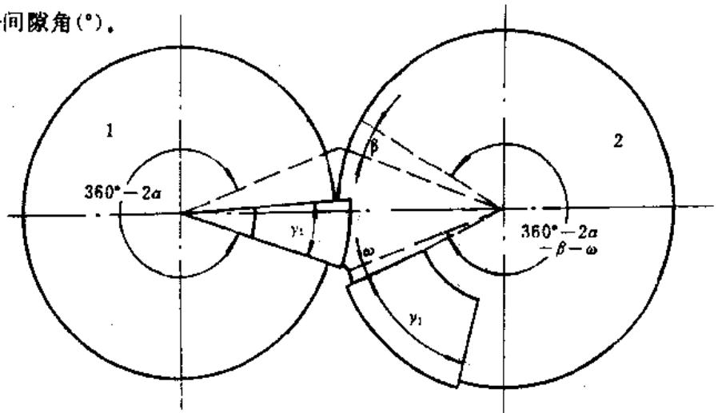

图10-20限动装置第一转内不相遇状况

因为 $z _ { 2 } > z _ { 1 }$ ,若令 $z _ { 2 } - z _ { 1 } = z _ { 2 }$ ,则上式可简化为

$$
( 3 6 0 ^ { \circ } - 2 a ) \frac { z _ { 1 } } { z _ { 2 } } - \beta \equiv \omega
$$

$z _ { t }$ 为两轮齿数之差,是正整数。

为使第一圈不卡住,必须保持 $\omega > 0$ ,故

$$
( 3 6 0 ^ { \circ } - 2 4 ) \frac { z _ { 2 } } { z _ { 2 } } > beta
$$

设计齿轮凸块限动装置,就是在给出限动转数 $\pmb { \mathscr { u } }$ 后,确定合理的齿轮和凸块的结构参数,主要是齿轮齿数 $z _ { 1 } , z _ { 2 }$ ;凸块安装半径 $\pmb R$ 及凸块的中心角 $\gamma _ { 1 } , \gamma _ { 2 }$ 等。

以下分两种情况进行讨论:

1)被限动转数为整数设被限动轮为齿轮2,且 $z _ { 2 } > z _ { 3 } , z _ { 2 } - z _ { 1 } = z _ { 2 }$ .要求齿轮2转 $\pmb { \mathscr { R } }$ 转后被限动,则它的转角为 $3 6 0 ^ { \circ } _ { \varkappa }$ 1

由于 $z _ { 1 } > z _ { 1 }$ ,所以,齿轮1比齿轮2转得快,若由一个限动位置到另一个限动位置时,齿轮1需多转 $( 3 6 0 ^ { \circ } - 2 \alpha - \gamma _ { \mathrm { t } } )$ ,故其总转角为

$$
3 6 0 ^ { \circ } \mathrm { { z } } + ( 3 6 0 ^ { \circ } - 2 a - y _ { \mathrm { { l } } } )
$$

两齿轮的转角比应与其齿数成反比,即

$$
\begin{array} { r } { \frac { 3 6 0 ^ { \circ } \varkappa } { 3 6 0 ^ { \circ } \varkappa + ( 3 6 0 ^ { \circ } - 2 \varkappa - \varkappa ) } = \frac { z _ { 1 } } { z _ { 2 } } } \end{array}
$$

整理后可得 $\gamma _ { 1 } ( ^ { \circ } )$ 为

$$
\gamma _ { 1 } = 3 6 0 ^ { \circ } - 2 a - 3 6 0 ^ { \circ } \frac { \mu z _ { i } } { z _ { \perp } }
$$

上式中, $\gamma _ { 1 } , z _ { 1 } , z _ { 6 }$ 有许多组合可以满足。为求 $\gamma _ { \uparrow }$ ,先分析 $\tilde { \mathbf { \Gamma } } _ { \tilde { \mathbf { \Gamma } } } ^ { * }$ 。前已述过齿轮2每转一转,贝齿轮1多转的角度为 $\theta _ { \bullet } ( \bullet )$ ,于是

$$
\hat { y } _ { 4 } = 3 6 0 ^ { \circ } \frac { z _ { i } } { z _ { i } }
$$

从结构要求看,当限动的转数不很大时,可取 $\gamma _ { \mathrm { \downarrow } } = 2 \theta _ { \bullet }$ ,但所得的 $\gamma _ { 1 }$ 应足够大,以便固定,如限动转数很小时,则可取 $\gamma _ { \mathtt { k } } = \hat { \cup } _ { \pmb { \mathscr { e } } }$ 或几分之一 $\partial _ { \epsilon }$ 值。如果限动转数很大,则 $\gamma _ { \mathfrak { i } }$ 可取成几倍 $\widehat { \theta } _ { \epsilon }$ 值。设计时可灵活确定。如取

$$
\gamma _ { 1 } = 2 0 _ { e } \qquad .
$$

即

$$
\gamma _ { \iota } = 2 \times 3 6 0 ^ { \circ } \frac { \tilde { z } _ { \iota } } { \tilde { z } _ { \iota } } = 7 2 0 ^ { \circ } \frac { \tilde { z } _ { \iota } } { \tilde { z } _ { \iota } }
$$

由式(10-17)和式(10-18),可得

$$
z _ { 1 } = \frac { 1 8 0 ^ { \circ } } { \mathrm { 1 } 8 0 ^ { \circ } } = \frac { 1 } { u } ( u + 2 ) \div
$$

如取 $\pmb { \alpha = 3 0 } ^ { \circ }$ 则

$$
z _ { \mathrm { i } } = 1 , 2 ( \varkappa + 2 ) z _ { i }
$$

式(10-20)表达了 ${ \pmb z } _ { 1 }$ 和 $\pmb { \lambda } _ { \pmb { \ell } }$ 的关系。设计时,通常先假定 $z _ { \prime }$ 值,然后求出 $z _ { 1 } , \ z _ { k }$ 值只能取整数,如 $z _ { \checkmark } = 1 , 2 , 3 , \cdots ,$ 具体数值按结构确定。由计算所得 $z _ { \mathrm { j } }$ 和已定的模数,可核算两齿轮尺寸是否满足结构要求。

若限动转数为非整数时,可把该数化成整数项和小数项之和。例如5.3转,可写为$5 \times 3 6 0 ^ { \circ } + 0 . 3 \times 3 6 0 ^ { \circ } = 5 \times 3 6 0 ^ { \circ } + 1 0 8 ^ { \circ }$ 。如将 $1 0 8 ^ { \circ }$ 写为 $\varnothing ^ { \prime }$ ,则所限动角度可写为 $n 3 6 0 ^ { \circ } \div \theta$ .图10-21所示为分转数限动装置的起始位置和终止位置。所差角度 $\varnothing ^ { \prime }$ 代表限动转数的小数项,凸块大小随 $\pmb { \theta } ^ { \prime }$ 值大小而异。

(2) $0 ^ { \circ } < \theta ^ { \prime } \leqslant 1 8 0 ^ { \circ } - 2 \alpha$ 设 ${ \bar { \iota } } _ { 3 }$ 仍为被限动轮,它在被限动后反向旋转,共转过 $\pmb { \mathscr { u } }$ 转又 $\pmb { \mathcal { J } }$ 后被限动(见图10-21)。

仍保持 $z _ { 2 } > z _ { 1 } , z _ { 2 } - z _ { 1 } = z _ { 1 }$ 在此过程中被限动齿轮总转角为

$$
3 6 0 ^ { \circ } \ast + \pi ^ { \prime }
$$

齿轮1转角为

$$
3 6 0 ^ { \circ } u \mathrm { ~ + ~ } 3 6 0 ^ { \circ } \mathrm { ~ - ~ } 2 u \mathrm { ~ - ~ } y _ { \mathrm { i } }
$$

两齿轮转角之比等于其齿数的反比,即

$$
\frac { 3 6 0 ^ { \circ } u + 3 5 0 ^ { \circ } - 2 u - \gamma _ { 1 } } { 3 6 0 ^ { \circ } u + \sigma } = \frac { z _ { 2 } } { z _ { 1 } }
$$

整理得

$$
y _ { 1 } = 3 6 0 ^ { \circ } u + 3 6 0 ^ { \circ } - 2 u - ( 3 6 0 ^ { \circ } u + 0 ) \frac { z _ { 2 } } { z _ { 1 } }
$$

令 $c _ { s } = 3 6 0 ^ { \circ } \times + \theta ^ { \prime }$ , $c _ { 2 } = 2 a + \theta ^ { \prime }$ ,代入上式后,得

仍取 $\gamma _ { 1 } = 2 \theta _ { \prime }$ ,即

$$
y _ { 1 } = 3 6 0 ^ { \circ } - c _ { 2 } - \frac { c _ { 1 } - c _ { 1 } } { a _ { 1 } }
$$

$$
y _ { 4 } = 7 2 0 ^ { \circ } \times \frac { z _ { 4 } } { 7 _ { 1 } }
$$

由式(10-21)和式(10-22),可得

$$
z _ { 1 } = \frac { 7 2 0 ^ { \circ } + c _ { 1 } } { 3 6 0 ^ { \circ } - c _ { 2 } } = _ { e }
$$

由图10-21(b)可看出齿轮2的凸块两侧面夹角应为

$$
\gamma _ { \bar { z } } = 2 a + 2 \beta + \eta
$$

无论整转数还是分转数,两齿轮凸块的安装半径 $R$ 应相等,如图 $1 0 - 1 9 ( a )$ 所示: $\pmb { R }$ 值为

$$
{ \mathit { R e o s o } } = { \frac { a } { 2 } }
$$

式中, $\pmb { \alpha }$ —-齿轮中心距 $\left( \mathfrak { m m } \right)$ ,其值为

$$
a = \frac { 1 } { 2 } m ( z _ { 1 } + z _ { 2 } )
$$

式中, $\pmb { n }$ 为齿轮模数,所以

$$
R = \frac { m ( \tilde { z } _ { 1 } + \tilde { z } _ { 2 } ) } { 1 \cos \theta }
$$

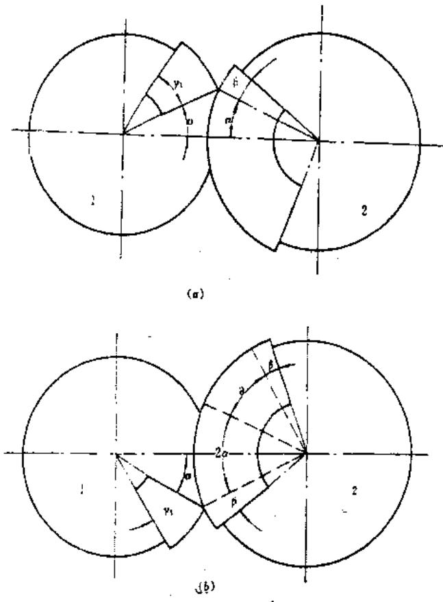

图10-21分转数限动装置的起始和终止限动位置(a)起始限动位置 (b)终止限动位置

以上计算,均以齿轮2为被限动轮。齿轮1也可作为被限动轮。为使用方便,将其余两种分转数情况的计算公式和上述计算公式一并列于表10-2中。

表10-2齿轮凸块限动装置计算表

<table><tr><td rowspan=2 colspan=1>所求参数</td><td rowspan=1 colspan=4>不同值的计算公式</td></tr><tr><td rowspan=1 colspan=1>6=0（限定转数为整数）</td><td rowspan=1 colspan=1><0≤180-2a</td><td rowspan=1 colspan=1>180°-2a≤360-2a</td><td rowspan=1 colspan=1>360&#x27;-2360</td></tr></table>

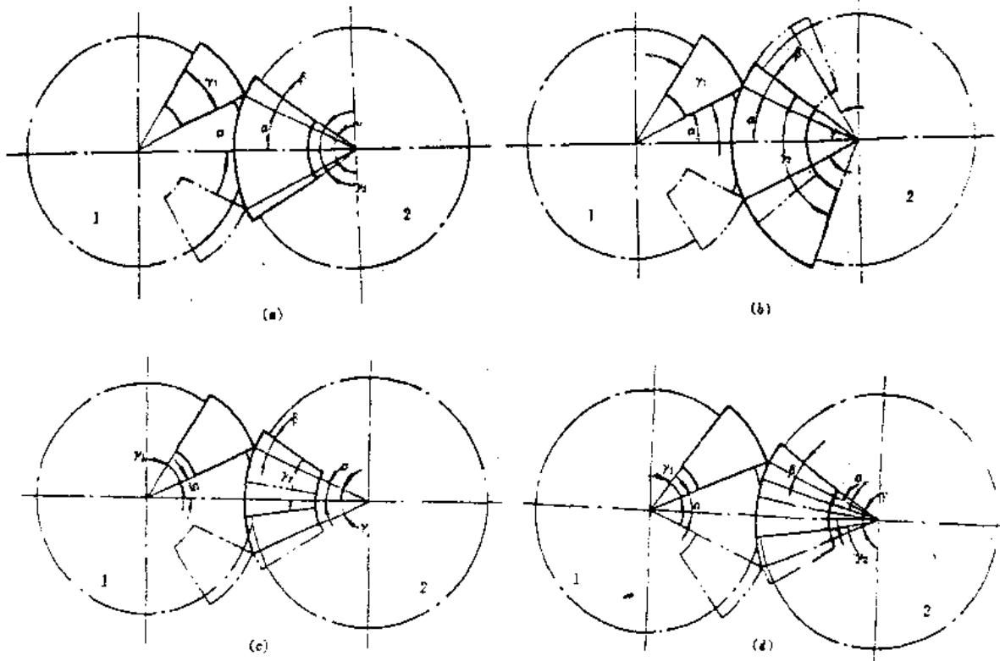

<table><tr><td rowspan=1 colspan=1>被阻动轮</td><td rowspan=1 colspan=1>轮</td><td rowspan=1 colspan=1>z轮</td><td rowspan=1 colspan=1>2轮</td><td rowspan=1 colspan=1>轮</td></tr><tr><td rowspan=1 colspan=1>齿数z</td><td rowspan=1 colspan=1>180（x+2）= 180一2</td><td rowspan=1 colspan=1>720±cZ2=360-</td><td rowspan=1 colspan=1>720°+2你</td><td rowspan=1 colspan=1>720*+2720-</td></tr><tr><td rowspan=1 colspan=1>齿数z</td><td rowspan=1 colspan=4>=：+</td></tr><tr><td rowspan=1 colspan=1>凸块安装半径R（mm）</td><td rowspan=1 colspan=4>R=（2+2）（   齿轮模数）4cosa</td></tr><tr><td rowspan=1 colspan=1>凸块角（）</td><td rowspan=1 colspan=1>360°*r:=360*-2a-     33</td><td rowspan=1 colspan=1>Y=360*-c业</td><td rowspan=1 colspan=1>=360</td><td rowspan=1 colspan=1>r=720*-c22</td></tr><tr><td rowspan=1 colspan=1>凸块角？（）</td><td rowspan=1 colspan=1>y=2a</td><td rowspan=1 colspan=1>y=</td><td rowspan=1 colspan=1>↑γ=2</td><td rowspan=1 colspan=1>y=~-360</td></tr><tr><td rowspan=1 colspan=1>（）</td><td rowspan=1 colspan=4>B=.（k-z）式中，s.、k，为系数.见表10-3</td></tr><tr><td rowspan=1 colspan=1>Y</td><td rowspan=1 colspan=4>Y=y+2β</td></tr><tr><td rowspan=1 colspan=1></td><td rowspan=1 colspan=4>c=360；c=20；-</td></tr></table>

表10-3系数f与值

<table><tr><td rowspan="3">4</td><td colspan="8">安装角</td></tr><tr><td colspan="2">20</td><td colspan="2">21</td><td colspan="2">27</td><td colspan="2">30</td></tr><tr><td>出</td><td>f</td><td>k</td><td>！</td><td></td><td>f</td><td>比</td><td>f</td></tr><tr><td>20~36 36~50</td><td colspan="4">B</td><td>74</td><td>7.5</td><td>61</td><td>10</td></tr><tr><td>50~70</td><td>113</td><td>1.3</td><td>95</td><td>5.2</td><td>88</td><td>4.7</td><td>72</td><td>5</td></tr><tr><td>70~100</td><td>147.</td><td>2.1</td><td>128</td><td>2.3</td><td>104</td><td>2.5</td><td></td><td>1</td></tr><tr><td>100~140</td><td>188</td><td>1.3</td><td>153</td><td>1.2 ：</td><td></td><td>+</td><td></td><td></td></tr><tr><td>140~200</td><td>243</td><td>0.6</td><td>1</td><td>1</td><td></td><td></td><td></td><td></td></tr><tr><td>200~280</td><td>283</td><td>0.3</td><td></td><td></td><td></td><td></td><td></td><td></td></tr></table>

例10-2计算限动转数为 $u = 1 2 0 \uparrow$ 的齿轮凸块限动装置,解取 $\alpha { = } 2 0 ^ { \circ } , z _ { \iota } { = } 1$ ,因 $\pmb { \mathscr { u } }$ 为整数,故

$$
z _ { 1 } = { \frac { 1 8 0 ^ { \circ } ( u + 2 ) } { 1 8 0 ^ { \circ } - \ u } } z _ { 4 } = { \frac { 1 8 0 ^ { \circ } ( u + 2 ) } { 1 8 0 ^ { \circ } - \ 2 0 ^ { \circ } } } = 1 . 1 3 \times 1 2 2 \approx 1 3 8
$$

$$
z _ { 2 } = z _ { 1 } + z _ { * } = 1 3 9
$$

取齿轮模数 $m = 0 , 5$ ,则可得

$$
R = { \frac { m ( z _ { 1 } + z _ { 2 } ) } { 4 \cos \alpha } } = { \frac { 0 . 5 ( z _ { 1 } + \div z _ { 2 } ) } { 4 \cos 2 0 ^ { \circ } } } = 0 . 1 3 3 ( 1 3 8 + 1 3 9 )
$$

按表10-2中有关公式,得

$$
\gamma _ { 1 } = 3 6 0 ^ { \circ } - 2 a - \frac { 3 6 0 ^ { \circ } n z _ { d } } { z _ { 1 } } = 3 6 0 ^ { \circ } - 2 \times 2 0 ^ { \circ } - \frac { 3 6 0 ^ { \circ } \times 1 2 0 \times 1 } { 1 3 8 }
$$

弧长 $, s = 0 . \ 0 1 7 5 R \gamma _ { 1 } = 0 . \ 0 1 7 5 \times 3 6 . 8 \times 6 . \ 9 5 7 \approx 1 . \ 5 ( \mathrm { m m } )$ 。由此可知, $y _ { 1 } = 6 ^ { 3 } 5 7 ^ { \prime }$ 太小,需增大其值,也即需增加 $\pmb { z _ { \updownarrow } }$ 值。取 $z _ { \mathrm { i } } = 1 \cdot 1 1 > 1 3 8$ 

$$
z _ { 2 } = z _ { 1 } + z _ { \iota } = 1 4 4 - 1 = 1 4 5
$$

$$
R = 0 . 1 3 3 ( z _ { 1 } + z _ { 2 } ) = 0 . 1 3 3 \times ( 1 1 4 + 1 4 5 ) = 3 8 . 1 ( \mathsf { m m } )
$$

$$
\begin{array} { r } { \gamma _ { 1 } = 3 6 0 ^ { \circ } - 2 a - \frac { 3 6 0 ^ { \circ } n \div a } { \ I _ { 1 } } = 2 0 ^ { \circ } } \end{array}
$$

$$
y = 2 \alpha = 2 \times 2 0 ^ { \circ } = 1 0 ^ { \circ }
$$

因 $f _ { \mathrm { e a s s } } = f _ { \mathrm { e } } ( k _ { \mathrm { e } } - z _ { 1 } )$ ,查表10-3得

$$
\beta _ { \mathrm { m a x } } = 0 . 6 ( 2 4 3 - 1 . 1 4 ) = 5 9 . 1 ( ^ { \cdot } )
$$

取 $\beta _ { \mathrm { m a x } } = 1 ^ { \circ }$ ,验算:

$$
( 3 6 0 ^ { \circ } - 2 \omega ) \frac { z _ { i } } { z _ { 2 } } = ( 3 6 0 ^ { \circ } - 2 \times 2 0 ^ { \circ } ) \frac { 1 } { 1 4 5 } = 2 . 2 ^ { \circ }
$$

因 $\beta = 1 ^ { \circ }$ ,故满足:

$$
\beta < ( 3 6 0 ^ { \circ } - 2 a ) \frac { \cong a } { \widehat { \sf z } _ { 2 } }
$$

$$
\gamma _ { \bar { \imath } } = \gamma + 2 \beta = / 0 ^ { \circ } + 2 ^ { \circ } = 1 2 ^ { \circ }
$$

例10-3计算限动转数为 $2 1 \frac { 5 } { 8 }$ 的齿轮凸块限动装置。若已知 $\varpi = 2 0 ^ { \circ }$ ,齿轮模数$\mu { = } 0 . 5 m m$ 

解取 $\pmb { z _ { i } } \ b { = } 1$ 

因为限定转数为 $2 1 \frac { 5 } { 5 }$ ,所以 ${ \mathfrak { x } } { = } 2 \mathrm { { I } } \ { _ { 1 } } \sigma = ( 5 / 6 ) \times 3 6 0 { = } 3 0 0 ^ { \circ } ,$ 

由表10-2中的 $1 8 0 ^ { \circ } - 2 a \leqslant \theta ^ { \prime } \leqslant 3 6 0 ^ { \circ } - 2 a$ ,可以看出, $1 8 0 ^ { \circ } - \textit { 2 } \times \ 2 0 ^ { \circ } \leqslant \ 3 0 0 ^ { \circ }$ $\leqslant 3 6 0 ^ { \circ } - 2 \times 2 0 ^ { \circ }$ ,故可用以下公式:

$$
z _ { 1 } = \frac { 7 2 0 ^ { \circ } + c _ { 1 } - c _ { 2 } } { c _ { 2 } } = _ { i }
$$

其中 $, c _ { 1 } = 3 6 0 ^ { \circ _ { n } } + \vartheta = 3 6 0 ^ { \circ } \times 2 1 + 3 0 0 ^ { \circ } = 7 8 6 0 ^ { \circ } { } _ { 1 } c _ { 2 } = 2 a + \vartheta = 2 \times 2 0 ^ { \circ } + 3 0 0 ^ { \circ } = 3 4 0 ^ { \circ }$ ,代入上式得

$$
z _ { \mathrm { t } } = \frac { 7 2 0 ^ { \circ } + 7 8 6 0 ^ { \circ } - 3 4 0 ^ { \circ } } { 3 4 0 ^ { \circ } } \times 1 \approx 2 5
$$

分度圆直径

$$
D _ { 1 } = m z _ { 1 } = 0 . 5 \times 2 5 = 1 2 . 5 ( m m )
$$

显然,在 $D _ { 1 } { = } 1 2 . 5 m m$ 的齿轮上难于固定凸块,应增大 $\therefore$ 值,以加大齿轮半径,取 $\pmb { z } _ { t } = 3$ ,则

$$
{ \begin{array} { r l } & { z _ { \downarrow } = 2 5 \times 3 = 7 5 } \\ & { z _ { 2 } = 7 5 + 3 = 7 8 } \\ & { D _ { 1 } = z _ { 1 } m = 7 5 \times 0 . 5 = 3 7 . 5 ( { \mathsf { m m } } ) } \\ & { D _ { 2 } = z _ { 2 } m = 7 8 \times 0 . 5 = 3 9 ( { \mathsf { m m } } ) } \\ & { \gamma _ { \uparrow } = 3 6 0 ^ { \circ } - c _ { \downarrow } = 3 6 0 ^ { \circ } - 3 4 0 ^ { \circ } = 2 { \dot { 0 } } ^ { \circ } \ . } \\ & { \gamma = c _ { 2 } - { \frac { c _ { \downarrow } z _ { i } } { z _ { 2 } } } = 2 \times 2 0 ^ { \circ } + 3 0 0 ^ { \circ } - { \frac { 7 8 6 0 ^ { \circ } } { 7 8 } } \times 3 = 3 7 . 6 9 ^ { \circ } \approx 3 7 ^ { \circ } 4 1 ^ { \circ } } \end{array} }
$$

$z _ { 1 } / z _ { 1 } = 7 5 / 3 = 2 5$ ,查表10-3得 $\pmb { \beta } \leqslant \pmb { \mathit { t } } ^ { \circ }$ 。取 $\beta = 3 ^ { 0 }$ ,验算:

$$
( 3 6 0 ^ { \circ } - 2 \times 2 0 ^ { \circ } ) \times \frac { 3 } { 7 8 } = 1 2 . 3 1 ^ { \circ }
$$

因 $\pmb { \beta } = \pmb { 3 } ^ { \bullet }$ ,故满足不等式:

$$
\begin{array} { r l } & { \beta < ( 3 6 0 ^ { \circ } - 2 a ) \frac { z _ { d } } { z _ { 1 } } } \\ & { \gamma _ { 2 } = \gamma + 2 \beta = 3 7 ^ { \circ } 1 1 ^ { \circ } + 2 \times 3 ^ { \circ } = 4 3 ^ { \circ } 1 1 ^ { \circ } } \end{array}
$$

凸块安装半径为

$$
R = { \frac { m ( z _ { 1 } + z _ { 2 } ) } { 4 \cos \alpha } } = { \frac { 0 . 5 ( 7 5 + 7 8 ) } { 4 \cos 2 0 ^ { \circ } } } = 2 0 . 3 5 ( { \mathfrak { m m } } )
$$

(4)齿轮挡销限动装置如图10-22所示,它是由两个互相啮合的齿轮1和2组成,在齿轮1上做出一限动齿3,对应于该限动齿,在齿轮2相应的齿间里装上一个挡销4,这样,齿轮2的挡销4与限动齿3相遇时,两轮即被限动:反向转动若干转时,挡销4与限动齿3再次相遇,两轮又被限动,因此两齿轮只能在一定转数内正、反向旋转。具体过程是:假如齿轮1的齿数为28,齿轮2的齿数为29,且齿轮1上限动齿的初始位置位于齿轮2的第一个齿槽中。当齿轮1转1r,限动齿就进入齿轮2的第二个齿槽。这样,齿轮1转动29r时,限动齿将位于齿轮2的第29个齿槽里,由于该槽内装有挡销4,则限动齿就与挡销相遇,于是两轮被限动,图10-22所示位置为限动齿与挡销在齿轮1完成29:前不久即将相遇的极限位置。

齿轮挡销限动装置中,要求限制一定转数的齿轮称为被限动轮,与之相啮合的、起限动作用的齿轮称为限动轮,这种限动装置结构简单、紧凑,限动转数较多,一般用于限动转数为整数且其准确度要求不高的场合。图10-23所示为限动手摇把转数而采用的齿轮挡销限动装置的结构实例。

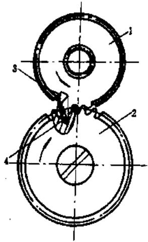

图10-22具有一个挡销的限动装置

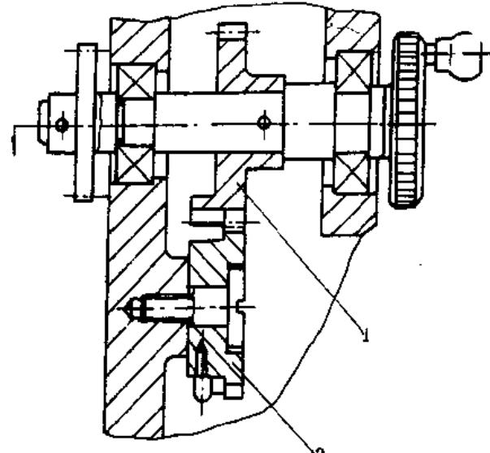

图10-23齿轮挡销限动装置的应用实例1一被限动轮;2一限动轮

齿轮挡销限动装置的设计计算,是在已知所需限动转数 ${ \boldsymbol { \mathscr { k } } } _ { \mathrm { I } }$ 和被限动轮1齿数 ${ \hat { \mathbf { \omega } } } _ { 1 }$ 的条件下,求出限动轮2的最小齿数 $z _ { 2 }$ ,以下分两种情况讨论:

1)设齿轮2上只有一个挡销齿轮副工作时的传动关系为

$$
{ \mathfrak { u } } _ { 1 } z _ { 1 } = { \mathfrak { u } } _ { 2 } z _ { 2 }
$$

式中, $\mathbf { \delta } _ { \mathbf { u } } \mathbf { _ { 2 } }$ —限动轮转动转数,

计算只有一个挡销的限动装置必须满足两个条件:

$\textcircled { 1 } z _ { 1 } \neq z _ { 2 }$ 、因为当 ${ \mathfrak { z } } _ { 1 } = { \mathfrak { z } } _ { 2 }$ 时,限动齿和挡销或每转相遇,或者总不相遇,视初始装配位置而定;

$\textcircled{2} z _ { 1 } / z _ { 2 }$ 为不可约分数,当 $z _ { 2 } = 2 z _ { 1 }$ 时,齿轮1每转2r被限动; $z _ { 2 } = 3 z _ { 1 }$ 时,齿轮1每转3r即被限动;以此类推。若 $z _ { 7 }$ 总是 $z _ { 1 }$ 的倍数,则即使当 $z _ { 2 } = 1 0 =$ ,即转数 $n _ { 1 } = 1 0$ ,虽转数较小,但限动装置的外廓尺寸就已很大,

若设 $z _ { 1 } = 2 0 , z _ { 2 } = 2 5 , \mathrm { , } \mathrm { , } \mathrm { = } 2 5 , \mathrm { } \mathrm { , } \mathrm { } z = 2 0 ,$ 则

$$
u _ { 1 } z _ { 1 } = u _ { 2 } z _ { 2 }
$$

但是,对于只有一个挡销的情况下,两轮一起工作时,可以看出齿轮1只转5r,齿轮2转4r,限动齿与挡销相遇,运动即停止。这是因为齿轮1的 $\lnot$ 与齿轮2的 $\hat { \bf \Phi } _ { \tilde { \bf \Lambda } }$ 之间有公约数,即

$$
{ \frac { \hat { x } _ { 1 } } { \hat { z } _ { 2 } } } = { \frac { 2 0 } { 2 5 } } = { \frac { 5 \times 1 } { 5 \times 5 } } = { \frac { 1 } { 5 } } = { \frac { \hat { x } _ { 2 } } { \hat { y } _ { 1 } } }
$$

所以,为了能限动较多的转数,限动装置的外廓尺寸又不致太大,应使 $z _ { 1 } / z _ { 3 }$ 为不可约分数.

若 $z _ { 1 } = 2 3 , z _ { 2 } = 2 5$ ,即它们之间无公约数,在这种情况下:

$$
\begin{array} { l } { \ I _ { 1 } \kappa _ { 1 } = \ I _ { 2 } \pi _ { 2 } } \\ { \ 2 3 \times \kappa _ { 1 } = 2 5 \times \kappa _ { 2 } } \end{array}
$$

由此得

$$
u _ { 1 } = 2 5 \qquad u _ { 2 } = 2 3
$$

这时

$$
z _ { i } u _ { 1 } = z _ { 2 } u _ { 2 } = 2 3 \times 2 5 = 2 5 \times 2 3
$$

即齿轮1转25r和齿轮2转23r,限动齿与挡销相遇而被限动。

可见,设计齿轮挡销限动装置时,若使 $z _ { 2 } = n _ { \downarrow }$ ,且满足上述条件①和 $\textcircled{2}$ ,则限动轮上只需装一个挡销即可。

2)采用两个挡销在给定限动转数 ${ \pmb { \mathscr { R } } } _ { \bf 1 }$ 和被限动轮齿数 ${ \pmb z } _ { \pmb { \imath } }$ 条件下,若使 $z _ { 4 }$ $= n _ { 1 }$ 但不能满足 $z _ { 3 } / z _ { 2 }$ 为不可约分数时,则应采用两个挡销,如图10-24所示。在这种情况下,取

$$
z _ { 2 } = z _ { 1 } \pm i .
$$

式中,数系列1、2、3、…中的任一数。

选取的 $\mathfrak { i }$ 值必须满足上述条件①和$\textcircled{2}$ 。同时令

$$
{ \mathfrak { n } } _ { \mathfrak { z } } = { \mathfrak { z } } _ { 1 } - { \mathfrak { j } }
$$

式中, $j$ 数系列、2、3、…中的任一数.

这时,两齿轮的传动关系可用下式表示:

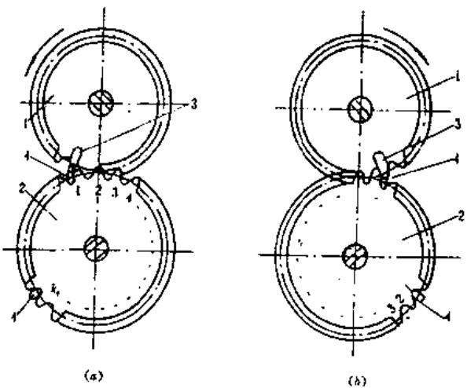

图10-24具有两个挡销的限动装置1-披限动轮,2-限动轮;3-限动齿:4挡销(两个)

$$
n _ { 1 } z _ { 1 } = n _ { 7 } z _ { 2 } + k _ { 9 }
$$

式中, $\pmb { k } ,$ 两挡销之间的齿数,其顺序号如图10-24所示。

将式(10-27)、式(10-28)代入式(10-29),则 $\pmb { \downarrow } ,$ 值亦可表示为

$$
k _ { i } = j _ { i , \mathrm { ~ - ~ } i } ( z _ { i } - j ) = j z _ { i } - i z _ { i }
$$

$i , j$ 的选择应满足下列不等式:

$$
0 < i , < = 1
$$

若给定 $\pmb { \kappa } _ { 1 } , \pmb { z } _ { 1 }$ ,则利用上述公式便能确定限动轮数 $z _ { 7 }$ 及 $\pmb { \mathscr { k } _ { \pmb { \mathscr { I } } } }$ 值。

例10-4·已知齿轮挡销限动装置的限动转数 $u _ { 1 } = 1 0$ ,被限动轮齿数 $z _ { 1 } = 2 2$ ,求限动轮齿数 $\pmb { \tilde { \alpha } _ { 2 } }$ 及 $\pmb { \downarrow } _ { \pmb { \prime } }$ 值。

解取 $z _ { 2 } = { \mathfrak { u } } _ { 1 } = 1 0$ 、则条件 $\textcircled{2}$ 不满足,需采用两个挡销。

若试取 ${ \dot { \mathfrak { z } } } = 1$ ,则

$$
z _ { 2 } = n _ { 1 } + i = 1 0 + 1 = 1 1
$$

条件 $\textcircled{2}$ 不满足。

再取 $i = 2$ ,则

$$
z _ { 1 } = n _ { t } + i = 1 0 + 2 = 1 2
$$

条件 $\textcircled{2}$ 仍不满足.

选取 $\therefore = 3$ 则

$$
z _ { 2 } = u _ { \scriptscriptstyle 1 } + i = 1 0 + 3 = 1 3
$$

条件 $\textcircled{2}$ 满足,此时:

$$
k _ { t } = { j \div 2 } - i { z _ { 1 } } \cdot = { j } \times 1 3 - 3 \times 2 2
$$

取 $j = 6$ ,则

验算:

$$
k _ { t } = 6 \times 1 3 - 3 \times 2 2 = 1 2 < z _ { \tau } = 1 3
$$

$$
\begin{array} { l } { { \tt a } _ { 1 } z _ { 1 } = 1 0 \times 2 2 = 2 2 0 \quad \quad } \\ { { \tt a } _ { 1 } z _ { 2 } + \tt a _ { \ell } = 1 6 \times 1 3 + 1 2 = 2 0 8 \neq 1 2 = 2 2 0 } \end{array}
$$

故上述参数正确。

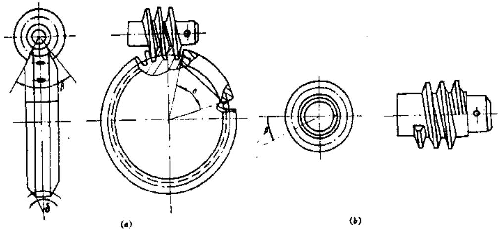

图10-25蜗轮限动装置

(5)蜗轮限动装置图10-25所示为蜗轮限动装置,其限动原理是在蜗轮上切去部分齿,并在切去齿的地方固定上无齿挡块,蜗杆齿的端部被铣平,如图10-25(b)所示。这样,蜗杆在经过若干转后同蜗轮上的无齿挡块相遇,起到限动作用。

蜗轮限动装置的限动转数一般在17以上,蜗轮副模数为 $0 . 5 \sim 1 \mathsf { m m }$ ,蜗杆制成单线,蜗轮的齿数根据需要而定,通常不少于28.

无齿挡块所占位置用相当齿数 $\pmb { a }$ 表示,所对中心角为

$$
u = [ ( = - x ) - 1 ] \cdot \frac { 3 6 0 } { 2 }
$$

式中,-—蜗轮齿数;

k蜗杆齿的圈数(图10-25中 $\scriptstyle { k = 2 }$ );$\pmb { \mathrm { x } }$ --限动装置的限动转数。在 $\pmb { \mathcal { H } }$ 为整数时,蚋杆端面夹角为

$$
\beta = 2 , \ S
$$

在 $\pmb { \mathrm { x } }$ 为分数时:

$$
\beta = 2 \delta \dot { \iota } + \bar { \iota }
$$

式中, $\pmb { \theta }$ 为蜗杆转数的分数部分的角度值。

蜗轮限动装置的类型很多,其常见的结构形式如图10-26所示。

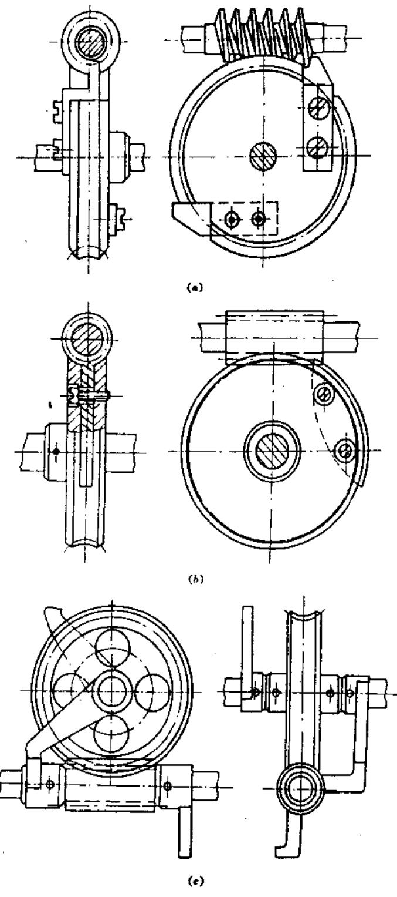

图10-26蜗轮限动装置结构

# 习 题

10-2试比较接触式限动装置和非接触式限动装置的优缺点?

10-3某电子设备的调谐装置,要求其主动轴(调谐旋钮)的转动限制在22r的范围内,试分别计算螺施限动装置和垫饌限动装置的主要尺寸。

10-4计算限动转数为20r的齿轮凸块限动装置,安装角 ${ \pmb { \mathscr { a } } } = 2 0 ^ { \circ }$ ,齿轮模数 $\pmb { \mathscr { m } } = 0$ 8mm.

10-5计算限动转数为35.2r的齿轮凸块限动装置,安装角 $\bullet = 2 0 ^ { \circ }$ ,齿轮模数 $\mathtt { m } = 0$ .8mm.

10-计算齿轮挡销限动装置,已知被限动轮的限动转数 $\pmb { \mathscr { n } } _ { 1 } = 1 \hbar$ 其齿数 $z _ { \uparrow } = 1 5$ 

10-7如果上题已知的参数 ${ \bf \delta } _ { | 1 } = 1 8 , z _ { 1 } \approx 1 6$ ,应如何计算?试计算之,

# 第十一章 调速装置与阻尼装置

# $\ S$ 11.1调速装置

在电子设备和精密机械仪器等中用来自动调节、节制并稳定传动系统工作轴转速的装置叫做调速装置(亦称调速器),调速装置的应用十分广泛,例如在音像设备的走带机构、转速计、计时器等机械传动系统中都安装有不同类型的调速装置.

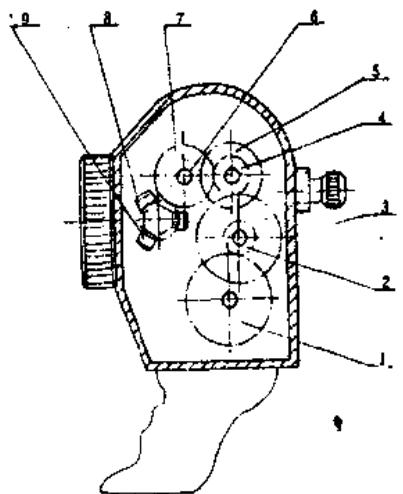

图11-1小型摄影机传动系统简图

电子设备和精密机械仪器对活动系统工作轴转速的控制要求随用途不同而异,即使在走带机构中,由于用途的不同,对传动系统工作轴转速的控制要求也不同。例如,在录音机、录像机等设备中,因允许的声波动或图像偏移非常小,故要求转速恒定;在电影摄影机中因有拍摄慢镜头、正常速度镜头和快速镜头的需要,故需要转速分档次,并在不同档次转速稳定。在间歇式传动系统中,如电影放映机的输片机构、数字计算机、打印机中等,有的要求传动系统保证具有一定的运动节拍;有的要求传动系统能快速启动,然后以一定速度运行;有的要求速度可以选择。

图11-1所示是调速装置在小型摄影机中应用的示意图。调速装置9安装在高速旋转的调速轴上,传动系统由轴齿轮2、齿轮3、4、5,6、7、8组成,由带盒发条1带动,通过控制手柄的位置,调速装置9可在高速、标准速度和低速下运转,使摄影机能完成慢镜头、正常速度镜头和快速镜头的摄影工作。

# 一、调速装置的调速原理和方法

精密传动系统的工作轴在运转时,一般受到两种力矩的作用:

(1)原动机传来的作用力矩 $M _ { \parallel }$ ;

(2)阻力力矩 $M ,$ 

工作轴的角加速度和作用其上的力矩的关系是:

$$
\ J { \frac { \hat { \varepsilon } ^ { 2 } \varphi } { d t ^ { 2 } } } = M _ { \varepsilon } - M _ { \varepsilon }
$$

式中, $\pmb { \varphi }$ 工作轴的转角;

$\pmb { J }$ -传动系统转化到工作轴的转动惯量。

如果要使工作轴作等速转动,则其角加速度必须为零,即 $\frac { d ^ { 2 } \varphi } { d t ^ { 2 } } { = 0 }$ ,因此必须使$M _ { \cdot } - M _ { r } = 0$ 。但是,实际传动系统中,静摩擦力矩往往大于动摩擦力矩,若 $M _ { \ast } = M _ { \ast }$ ,则系统无法启动,而且由于各方面的因素的影响,如轴、套配合精度不够或传动部件的摩擦力不均匀、振动等,都会使实际阻力矩常常与计算值有出入。故实际设计时,为保证传动系统能可靠地启动和工作,总是使作用力矩大于阻力矩,即 $M  M$ ,也即存在力矩差 $\Delta M = M _ { \cdot } - M _ { \cdot }$ ,这样,工作轴的角加速度 $\frac { d ^ { 2 } \phi } { d t ^ { 2 } } \neq 0$ 。显然,为使工作轴启动后作等速转动,就需要设法消除作用力矩与阻力矩之差,而不管力矩差 $\Delta M$ 是否变化。这便是调速装置的任务。

通常,消除力矩差的方法有两类,即

(1)使作用力矩随阻力矩的变化而变化,也就是改变输入能量以适应消耗能量;  
(2)增加阻力矩,使阻力矩总和等于作用力矩,也就是改变消耗能量以平衡输入能量。

第一种方法在利用各种型式的微电机作为原动机的电子设备和仪器中经常使用;第二种方法适用于利用弹性元件或重物作为原动机的传动系统中。

在用微电机作为原动机的传动系统中,有多种方法可使原动机改变系统的辅入能量,例如,借助电子装置可以方便地在运动的任何瞬间,甚至在力矩急剧变化时来实现和维持工作轴的转速稳定(采用电子稳速器或伺服稳速系统等),而且,一般都可以达到较高的运动平稳性。但这些装置比较复杂,成本也较高:通常采用的则是比较简单的转速控制方法,如:

1)采用同步电动机它可以保证驱动力矩和阻力矩自动地协调一致。转速的稳定性取决于供给电动机的电源频率稳定性。

2)采用硬特性的异步电动机在工作时它具有较大的功率储备,亦即使工作接近于空载状态,因此,其转速接近于同步转速。

3)采用接触式离心调速装置当角速度偏离规定值时,它可保证接通或断开接在电动机供电线路中的附加阻抗,使电动机的驱动力矩作有级的变化,从而保证工作轴的平均角速度为定值,但相对于规定角速度稍有波动,在这种方法中,角速度的调节靠装置中的调节装置来实现。

图11-2所示是接触式离心调速装置的结构及等效电路,它是利用装在电动机转子上的离心开关的自动开闭来实现稳速的。其工作原理是:电动机静止时,离心开关闭合,通电后电动机将自行启动,并保持连续运转。当转速高于设定值时,则重锤在离心力的作用下迫使离心式开关断开,从而将并联在开关两端的电阻接入,相应地减小转子线圈中的电流,降低了电机转速;当转速下降到一定程度时,簧片的弹力克服离心力而使离心开关重新闭合,电动机转速也随之上升,离心开关如此反复地通断,便将电动机的转速稳定在一定的范围内,改变调整螺钉的位置,便能设定不同的工作转速。

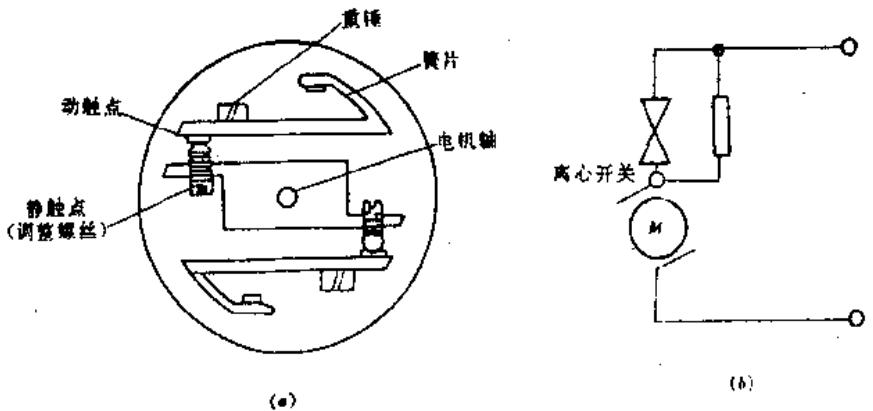

图11-2离心稳速器及其等效电路

在用弹性元件或重物作为原动机的传动系统中,作用力矩不能随阻力矩的变化而变化,这就须用调速装置产生附加阻力矩 $\pmb { M } _ { \ P }$ ,使总的阻力矩等于作用力矩,运用这种方法的调速装置按照调节速度方法的不同可分为制动式和擒纵式调速装置两种,

1)制动式调速装置它是利用不同的制动装置使传动系统中有可能产生超速运动的那一部分力矩变为制动力矩 $\pmb { M } _ { \pmb { \tau } }$ ,以限制转速继续上升的一种调速装置。按照工作原理,制动式调速装置又可分为固体摩擦制动式调速装置、介质摩擦制动式调速装置、电磁涡流制动式调速装置。

2)擒纵式调速装置这是利用擒纵机构使运动系统周期地启动和停止的方法来调节运动速度的一种调速装置。传动系统中多余的能量消耗在擒纵机构的碰撞过程中,它通常用在各种机械式计时机构中。

在需要工作轴转速作变速控制的场合,通常采用步进电动机或间歇式运动机构(如槽轮机构、三角凸轮机构等),或机械式变速器。

调速装置应具备下述基本性能:

$\textcircled{1}$ 传动系统的阻力矩或负载发生变化时,调速装置能可靠地将转速稳定在设定的数值上;$\textcircled{2}$ 动力源的作用力矩发生变化时,不应影响调速装置的调速特性;$\textcircled{3}$ 不论调速装置处在何种环境下工作,均应保持调速的准确与稳定;$\textcircled{4}$ 应便于调整。

随着科学与技术的不断发展,近二三十年来,很多精密传动系统都采用了直流调速电动机作动力源。由于它具有转速稳定、调速范围广、不论负载在许可范围内如何变化,转速均能稳定不变,且连续工作时间长等优点,从而取代了许多传动系统中传统的具有调速装置的发条式动力源,使电子设备、精密机械仪器具有更广泛的使用价值。但是,微电机并不能取代所有机械式调速装置,在需要使用发条作动力的携带式仪器中,机械式调速装置仍然起着十分重要的,而且不可忽视的作用。

本章着重介绍恒速控制用的几种常用制动式调速装置的结构及其调速特性。

# 二、制动式调速装置的特性

制动式调速装置产生的阻力矩 $\pmb { \mathscr { M } } _ { \tau }$ 随其转速 $\boldsymbol { \omega }$ 变化的函数关系,即 $M _ { \pi } = f \left( \omega \right)$ ,称为制

动式调速装置的调速特性。

图11-3所示是调速装置的调速特性曲线。由图可见,当需要调速装置产生附加力矩$\ M _ { \ P _ { \Gamma } }$ ,以抵消力矩差 ${ \mathcal { \Delta } } M _ { 1 }$ 时,调速装置的转轴即以转速 ${ \mathfrak {omega } } _ { \mathbf { l } }$ 转动。工作中,如果传动系统的力矩差 $\Delta M$ 有变动,例如变为 $\therefore M _ { \bar { z } }$ 时,则调速装置的转轴以转速 $\omega _ { 2 }$ 转动,使产生的附加阻力矩$\pmb { M _ { T } } _ { \pmb { \tau _ { \ 2 } } }$ 抵消力矩差 $\Delta M _ { \mathfrak { z } }$ 。显然,调速装置的转速是随 $- 3 . 4 8$ 的变化而变动的。由于调速装置转轴与工作轴通过某种传动副相联系,因此,系统的工作轴转速也将随调速装置转轴转速的变化而变化.

通常,调速装置转轴角速度的相对变化量以不均匀系数 $\pmb { \delta }$ 表示:

$$
\theta = \frac { \theta _ { \mathrm { m a n } } } { \theta _ { \mathrm { m } } } - \frac { \omega _ { \mathrm { m a n } } } { \theta _ { \mathrm { m } } }
$$

式中, $\omega _ { \mathrm { s a s } }$ 调速装置转轴的最大角速度 $( \tt r a d / s )$ 

$\pmb { \alpha } _ { \mathrm { l o a s } }$ --调速装置转轴的最小角速度 $( r a d / s )$ 

$a _ { \mathrm { ~ L ~ } }$ —-调速装置转轴的平均角速度 $\langle \ r a d / s \rangle$ 

而

因此

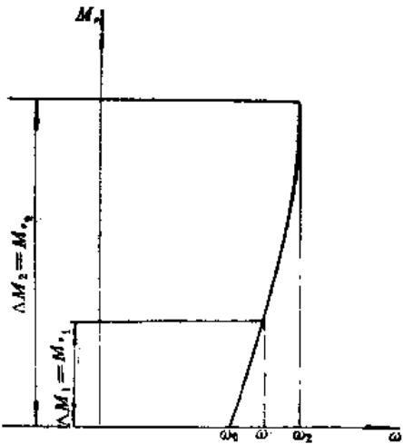

图11-3调速装置的调速特性曲线

$$
\omega _ { \mathrm { { s } } } = \frac { \omega _ { \mathrm { { m a x } } } \cdot \mathrm { ~ \cot ~ } \omega _ { \mathrm { { m i n } } } } { 2 }
$$

$$
\delta = \frac { 2 ( \omega _ { \mathrm { m a x } } \longrightarrow \omega _ { \mathrm { o u n } } ) } { \omega _ { \mathrm { m a x } } + \omega _ { \mathrm { m i n } } }
$$

可以证明,传动系统中各转动轴在运转时的不均匀系数是相同的。

不均匀系数 $\pmb { \delta }$ 表示传动系统中各转轴转速的不均匀性。 $\mathfrak { g }$ 值越小,其转速的变化率越小。由图11-3可看出,不均匀系数 $\hat { \hat { t } }$ 与系统的作用力矩及阻力矩变化有关,即 $\Delta M$ 变化越小, $\pmb { \delta }$ 越小。另外,它还与调速装置的特性有关,即与调速特性的斜率有关。 $\frac { i L M _ { \tau } } { d \omega }$ 越大,则 $\pmb \delta$ 也就越小。

# 三、固体摩擦制动式调速装置

固体摩擦制动式调速装置是依靠调速装置的回转零件与固体之间的摩擦来进行调速的。由于它是利用转动物体的离心作用,来满足调速特性曲线的,即转轴的转速越高, $M _ { \tau }$ 也应越大,所以有时也称为离心式调速装置。与其它形式的制动式调速装置相比较,其特点是尺寸较小,在调速装置的转轴转速较低的情况下,可以获得较大的制动力矩。

固体摩擦制动式调速装置按照产生摩擦力的正压力方向可分为径向作用和轴向作用两种,前者产生摩擦力的正压力方向垂直于转动轴,后者产生摩擦力的正压力方向平行于转动轴。下面介绍常用的片簧式调速装置。

# 1.径向作用调速装置

图11-4所示是常用的径向作用调速装置的一种结构,称为片簧径向作用调速装置。在调速装置的轴1上固定着 $2 \sim 4$ 个弹簧片3,沿轴!移动套筒2,可改变片簧的刚度,使被调速轴有不同的转速。在每个片簧的自由端装有惯性重物(飞锤)4.原动力矩通过齿轮传递轴1.在转动过程中,飞锤在离心力的作用下向外飞出。当调速装置的转轴达到额定转速时,飞锤便克服弹簧反力压向固定不动的制动鼓5的内表面,产生调速的制动力矩。

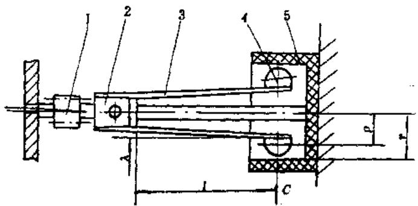

图11-4片簧径向作用调速装置

对具有两个片簧和两个重物的调速装置,其制动力矩 $( \overrightarrow { m } \cdot \overrightarrow { m } )$ 为

$$
M _ { \ 7 } = 2 ( C \sim { \cal F } ) f \tau
$$

式中, $\pmb { c }$ —重物的离心力 $( \aleph ) _ { \aleph }$ 

$\pmb { \mathcal { F } }$ -一片簧力(N):  
$\pmb { f }$ —重物(飞锤)与制动鼓间的滑动摩擦系数;制动鼓的内半径 $\left( \mathsf { m m } \right)$ ·

一个重物的离心力 $\mathbf { ( N ) }$ 由下式确定:

$$
C = m \sin ^ { 2 } w ^ { 2 } = \frac { 1 8 } { 9 } \pi w ^ { 2 }
$$

式中, $\bullet \bullet$ ——重物的质量 $( \tt k g )$ W-重物的重量 $( \aleph ) \colon$ $\pmb { \vartheta }$ ——重力加速度 $( m / s ^ { 2 } )$ :$\spadesuit$ -转轴的角速度(rad/s):$\pmb { \rho }$ 一转轴中心到重物(重锤)重心的距离 $( m )$ ,

片簧力 ${ \pmb { \vec { r } } } ( { \pmb { \mathbb { M } } } )$ 由下式确定:

$$
P = \frac { 6 2 . R J } { 2 l ^ { 3 } - \frac { a } { 2 } ( 3 l - a ) ^ { 2 } }
$$

式中,λ—片的变形量 $\left( \mathsf { m m } \right)$ ;

—--片簧的长度 $\left( \min \right)$ :  
套管2与片簧的接触点到片簧固定点的距离 $( m _ { n } )$ ;$\pmb { \mathscr { E } }$ ----片簧的弹性模量 $\mathbf { ( \boldsymbol { M P a } ) }$ ;  
----片簧的截面惯性矩 $\{ \mathsf { m m } ^ { \ell } \}$ 

$$
\ l = { \frac { \lfloor \lambda \rfloor ^ { 5 } } { 1 2 } }
$$

式中,b-片截面的宽度 $\left( \mathsf { m m } \right)$ ——片簧截面的高度 $( \min )$ ·

把式(11-6)和式(11-7)代入式(1}-5),得

$$
\cdot \mathrm { ~  ~ \lambda ~ } , M _ { T } = \frac { 2 ! V \rho \omega ^ { 2 } } { g } f r - \frac { 2 4 \lambda E l } { 4 l ^ { 3 } - a ( 3 l - a ) ^ { 2 } } f r
$$

$$
\frac { 2 W \rho } { g } f \tau = K _ { 1 }
$$

$$
\frac { 2 1 \lambda } { 4 l ^ { 3 } - a ( 3 l - a ) ^ { 2 } } f \tau = K \tau
$$

因此,这种调速装置的阻力矩公式可写成:

$$
M _ { \widehat { \tau } } = K _ { \bot } \omega ^ { 2 }  K _ { \widehat { \tau } } E I
$$

求式(11-12)的一阶导数,得

$$
\frac { d M _ { \widehat { \tau } } } { d \omega } = 2 K _ { 1 } \omega
$$

可见,调速装置工作时的角速度 $\pmb { \omega }$ 越高, $. \kappa _ { 1 }$ 越大时,则 $\frac { d M _ { \widetilde { \tau } } } { d \omega }$ 就越大,即调速装置的调速特性曲线斜率越大,其不均匀系数 $\pmb { \delta }$ 也就越小,调速精度就越高。 $\bar { \kappa } _ { \mathrm { i } } ^ { \mathrm { * } }$ 与调速装置的结构参数有关,为提高调速精度,根据式(11-10)可增加重物的重量 $\mathbf { \Delta } \mathbf { H } ^ { \prime }$ ,增大制动鼓的内半径 $\pmb { \bar { r } }$ 和摩擦系数 $\pmb { f }$ ·

当 $\pmb { M } _ { \tilde { \tau } } = \pmb { 0 }$ 时,由式(11-12)可得调速装置开始产生阻力矩时的临界角速度 $\omega _ { 0 }$ 为

$$
\omega _ { \mathrm { { f } } } = { \sqrt { \frac { \omega _ { \mathrm { { f } } } } { \widetilde { \Lambda _ { 1 } } } } } { \overline { { E } } } { \overline { { I } } }
$$

由式(11-11)及式(11-12)知,当调速装置的结构参数不变时,可通过调整距离 $\pmb { \alpha }$ 来改变$\pmb { K _ { 1 } }$ 而获得不同的临界角速度 $\pmb { \omega } _ { 0 }$ 。当然,改变调速装置的结构参数 $\kappa _ { 1 }$ (例如通过改变 $\mathbf { \Delta } \overrightarrow { W } , \curlyeqno$ 或 $\pmb { \rho }$ 等)也可得到不同的临界角速度。

这种调速装置通常尺寸不大。在结构设计时,常选 $\pmb { \mathscr { T } }$ 为 $5 \sim 1 5 \mathsf { m m }$ ,弹簧片长度 $\pmb { \downarrow }$ 为 $\mathfrak { s } \sim$ $\pmb { 2 5 } \pmb { \mathrm { m m } }$ ,重物通常取2个,极少采用3个、4个。为了获得足够大的制动力矩,调速装置转轴的转速必须设计得比较大,一般应选 $\boldsymbol { \omega }$ 为 $1 0 0 0 { \sim } 1 5 0 0 { \mathrm { r / m i n } }$ 。片簧常用锡磷青铜或不锈耐酸钢片等材料制成。

# 2.轴向作用调速装置

图11-5所示是一种小型摄影机的片簧轴向作用调速装置的结构,传动力矩由蜗轮传给蜗杆轴7,蜗杆做成多线(一般为3线蜗杆),以提高传动效率。在蜗杆轴的一端支架6上,固定有三个片簧2,片簧的另一端固定在滑套4上,在三个片簧中间各固定一个铜制飞锤1.当蜗杆轴转动时,飞锤1在离心力作用下向外飞出,使片簧张开而把滑套1沿轴向拉动,直至与滑套一体的制动盘3与制动闸瓦5相遇而产生摩擦力,形成制动力矩,从而起到调速作用.

这种调速装置的制动力矩由下式确定(公式推导略):

$$
M _ { \tau } = \frac { 2 Z W ( a + e + \lambda ) \left( 2 l - s \right) } { \pi ^ { 2 } g \lambda } f r \omega ^ { 2 } - \frac { 3 8 4 Z ( 2 l - s ) } { \pi ^ { 2 } l ^ { 3 } } f r R l
$$

$$
\underbrace { 2 Z W ( a + e + \lambda ) \left( 2 l - s \right) } _ { \begin{array} { c } { { \eta ^ { 2 } g \lambda } } \end{array} } f r = K _ { 1 }
$$

$$
\frac { 3 8 4 ( 2 2 - s ) } { \pi ^ { 2 } l ^ { 3 } } f \tau = k _ { 2 } ^ { \ast }
$$

则式(11-15)可写成:

$$
M _ { \tau } = \tilde { k _ { 1 } ^ { \prime \prime } } \omega ^ { 2 } - \tilde { k _ { 2 } ^ { \prime \prime } } E \tilde { \varepsilon }
$$

式中,Z-—重物数目;

${ \pmb \alpha } _ { \backprime } { \pmb \theta }$ —-调速装置结构参数 $\left. \mathsf { m m } \right.$ ,见图11-5;

-—片簧的变形量 $( m m )$ ;—片簧变形后的轴向长度 $( \mathsf { m m } )$ $\pmb { \delta }$ —片簧弹性部分的弧长 $\left( \mathfrak { m m } \right)$ ;$\pmb { \tau }$ —-制动盘与闸瓦的摩擦半径 $\left( \mathsf { m m } \right)$ :$\pmb { \hat { f } }$ ——制动盘与闸瓦间的摩擦系数;$\pmb { \omega }$ 转轴的角速度(rad/s);$\pmb { \mathscr { L } }$ —-片簧材料的弹性模量 $\mathbf { ( M P a ) }$ ;$\pmb { \jmath }$ -片簧的截面惯性矩 $\left( \mathtt { m m } ^ { * } \right)$ :

同样,临界角速度 $\pmb { \omega } _ { \pmb { \nu } }$ 可用式(11-14)的形式表示,即

$$
\omega _ { 0 } = \sqrt { \frac { k _ { \mathrm { : } } ^ { \prime } } { k _ { \mathrm { : } } ^ { \prime } } E \lambda }
$$

片簧的变形量可利用下式求出:

$$
\lambda = \frac { 2 } { \pi } \ \sqrt { \ell ( s - \ell ) }
$$

如果需要调节转速,只要改变闸瓦5的轴向位置(同时改变 $\pmb { \mathit { K } } _ { \mathrm { ~ t ~ } } ^ { \prime \prime } , \pmb { \mathit { K } } _ { 2 } ^ { \prime \prime } )$ 就可,闸瓦5愈靠近支架,所限转速就越低。

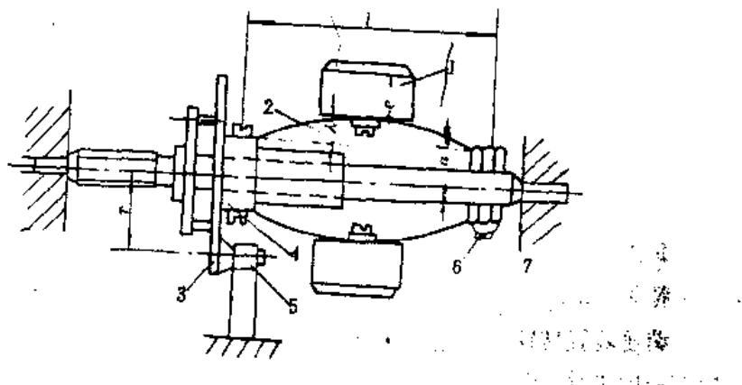

图11-5片簧轴向作用调速装置

# 3.设计步骤

在设计用发条作为原动力源,以齿轮作为传动副的带有固体摩擦制动式调速装置的传动系统时,除要确定调速装置的各个参数外,还应同时确定对发条和齿轮传动的要求,即发条的最大和最小输出力矩,以及齿轮传动比等。一般,下列数据应是已知的:

$\textcircled{1}$ 发条上紧一次使传动系统持续工作的时间(min);  
$\textcircled{2}$ 选定的发条工作圈数 $\aleph _ { \ I }$ ;  
$\textcircled{3}$ M.和 $M ,$ 的变化规律;  
$\textcircled{4}$ 工作轴转速 $n _ { \prime } ( r / \min )$ ;

$\textcircled{5}$ 工作轴转速的允许变动范围或不均匀系数 $\pmb { \mathscr { s } }$ 。

设计片簧式调速装置的方法有二:一是试验法。即首先初步选定调速装置的结构尺寸,如轴向作用调速装置中的 $Z , W , a , e , r , s , l , E , f , b , \mu$ 等,其中 $\hslash$ 为片簧厚度,b为片簧宽度,然后按初步选定的结构尺寸制成调速装置,在工作轴上加假想载荷进行调速试验.若发现工作轴转速的稳定性较差,可按照式(11-10),采用改变 $\ W , \prime$ 或 $\pmb { f }$ 等办法来改变 $\mathbf { \smash { \hat { A } } } _ { 1 } ^ { \prime }$ 值,直到工作转速的稳定性达到令人满意为止,其中尤以改变 $\ P$ 和 $\pmb { \mathscr { r } }$ 的效果为好;二是计算法,按有关公式经计算求得片簧的厚度和宽度(即 $\{ \hbar \times \ell \}$ ,但计算法过程较繁,在此不赘述。

# 四、介质摩擦制动式调速装置

利用流体(液体或气体)对运动件产生摩擦阻尼力进行调速的装置,叫做介质摩擦式调速装置。空气具有利用方便、无腐蚀性、不存在渗漏等多方面的优点,故常被作为介质使用。

空气摩擦制动式调速装置通常采用翼板结构,有翼板幅长不变和可变两种类型。

1.翼板幅长不变型调速装置

翼,.幅长不变型调速装置的结构如图!1所示,翼板被弹簧片固定在调速装置轴上,弹簧片还起着保护翼板的缓冲作用,当调速装置转轴转动时,翼板受空气的摩擦阻力而产生制动力矩 $\displaystyle { \{ \mathcal { H } _ { \tau } \} }$ ,使系统获得力矩平衡而实现调速。

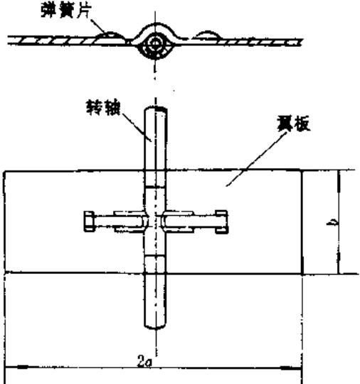

图11-6翼板幅长不变的调速装置

$$
M _ { 7 } = { \frac { \mathrm { i } } { 2 } } K { \mathit { l o a } } ^ { 1 } \omega ^ { 2 }
$$

式中, ${ \pmb M } _ { \pmb \tau }$ 一翼板受空气的摩擦阻力而产生的制动力矩 $( \mathsf { m } \mathbf { N } \cdot \mathsf { m } )$ :

$\kappa$ —一阻尼系数,其数值与空气密度和翼板形状有关,约为 $\left( 0 , 7 \sim 1 . 2 5 \right) \times 1 0 ^ { - 1 2 }$ $( \mathbf { N } \cdot s ^ { 2 } / \mathbf { m } \mathbf { m } ^ { 4 } ) ,$ 

$\delta \nrightarrow$ --翼高 $\left( \mathtt { m m } \right)$ ;  
$\pmb { \sigma }$ 一翼宽 $\left( \mathtt { m m } \right)$ :  
$\pmb { \hat { \omega } }$ ——调速装置转轴的角速度 $\{ { \tt r a d } / { \tt s } \}$ 

对式(11-20)求导,得

$$
\frac { d M _ { \tau } } { d \omega } = k \tau \alpha ^ { \prime } \omega
$$

由式(11-21)可见,增加翼板宽度 $^ { a }$ ,对提高调速精度的效果要比增加翼板高度 $\pmb { b }$ 好,少许改变翼板宽度 $\pmb { a }$ ,就可以明显地改变制动力矩的变化量。

这种调速装置结构简单,缺点是调速精度不如固体摩擦制动式调速装置高,而且该系统在启动阶段就有阻尼力矩产生,延长了系统达到正常转速的时问。

为减小上述装置的缺点,可采用图 $\operatorname { i } 1 - 7 ( a )$ 所示的翼板幅长可变的调速装置。

# 2.翼板幅长可变的调速装置

图11-7(a)所示是翼板幅长可变的调速装置的结构示意图。翼板2可随转轴!一起旋转,也可以绕垂直于轴1的轴3转动,轴3的支承片上装有弹簧4。当转轴1的转速为零时,翼板在弹簧4的拉力作用下,向轴!收拢,其中心线接近于图 $1 1 - 7 ( a )$ 中所示的垂直位置。这时,如果轴1在低速转动时,其阻力矩较小。当轴1转到一定的转速时,翼板2将在其离心力矩的作用下,克服弹簧力而张开,并随着转速的升高而张开至水平位置,使调速装置的阻力矩显著增加,使总阻力矩与传动力矩平衡,转速稳定在某一预期的数值上。这种调速装置的调速特性曲线如图11-7(b)中曲线1所示,曲线2为其它条件相同时,翼板幅长不变的调速装置的调速特性曲线。

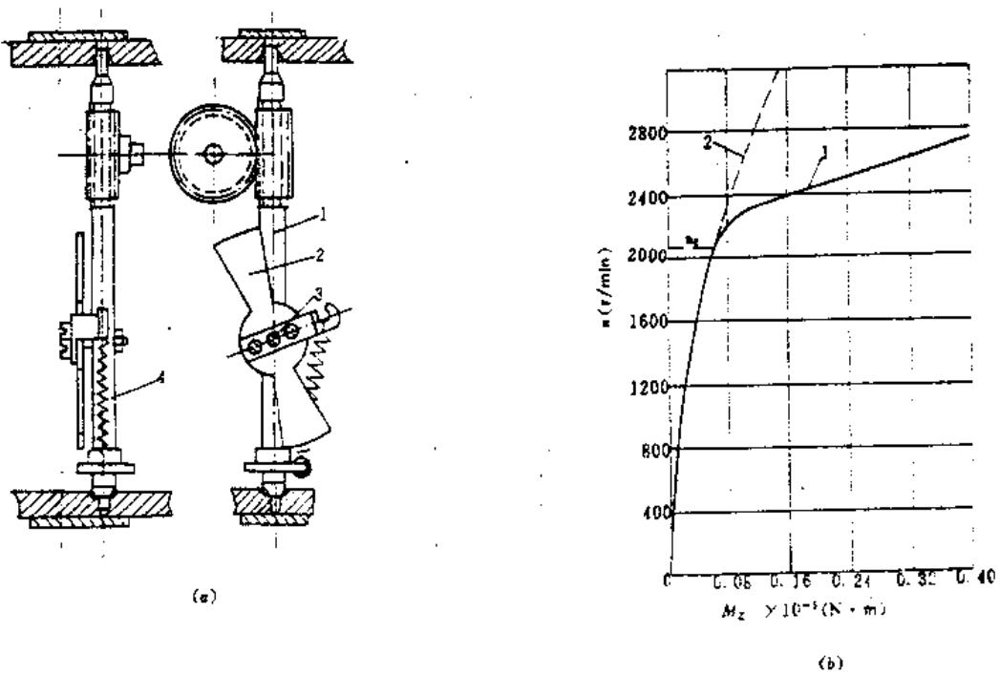

图11-7翼板幅长可变的调速装置

这种调速装置的优点是启动快,到达稳定转速所需时间短;缺点是结构复杂、体积较大、调速精度较低。

空气摩擦制动式调速装置的调速精度比各种离心式调速装置的调速精度低,不易调整,一般只在精度要求不高的稳速系统或延时系统中使用。为了得到足够的制动力矩,空气摩擦制动式调速装置中转轴的转速 $\pmb { \mathscr { u } }$ 一般在 $2 0 0 0 { \sim } 3 0 0 0 { \mathrm { r / m i n } }$ 

# 五、电磁涡流制动式调速装置

当金属导体垂直磁场方向运动切割磁力线时,导体中会感应出涡流,这涡流在导体内流动又会与磁场相互作用而产生一个阻止导体继续运动的反向磁场力。利用这种电磁效应做成的调速装置,叫做电磁涡流制动式调速装置。

图11-8所示为圆盘式电磁涡流制动式调速装置的结构示意图。铝盘在永久磁铁的磁场内转动时,铝盘中就会产生如图示方向的旋涡形短路电流。根据通电导体在磁场内运动产生作用力的原理,圆盘在涡流与磁场相互作用下产生的阻尼力矩可按下式确定:

$$
\vartheta _ { \tau } = \frac { B ^ { 2 } \dot { \upsilon } ^ { 2 } \tau } { R } \omega \times 1 0 ^ { - \upsilon }
$$

式中, $\pmb { M } _ { \pmb { \tau } }$ —一制动力矩 $( \aleph \cdot \napprox )$ ;

$\pmb { 8 }$ —永久磁铁的磁通量密度 $( N / ( A \cdot m ) )$ ;铝盘电阻(Q);  
—磁极中心到铝盘中心的半径 $\left( \mathsf { m } \right)$ :b--磁极长度 $\left( \mathfrak { m } \right)$ ·

由上式可知,当转速不变时,只要改变 $\pmb { r }$ 的大小就可以改变制动力矩的大小,因此,通过沿铝盘半径方向移动磁铁来改变铝盘上的制动力矩也可达到调速的目的。

这种调速装置结构很简单,缺点是制动力矩不大,调速范围较小。

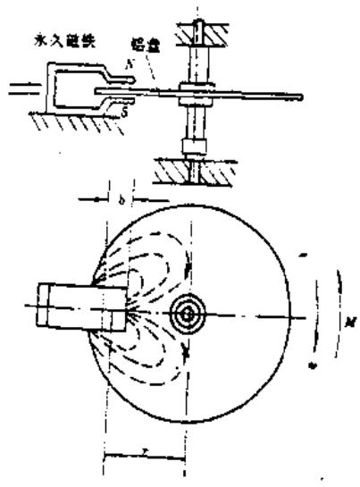

图11-8电磁涡流制动式调速装置

# \$11.2阻尼装置

电子设备和精密机械仪器的驱动系统及记录装置,可看作是一个具有一定质量或转动惯量的弹性系统,在工作过程中,由于运动部分的惯性和弹性元件的弹力的作用,或受到各种干扰因索的作用,使弹性系统不能立即进入新的平衡状态;而是在新的平衡位置附近产生具有一定频率的固有振动,直到能量逐渐耗尽才能停止。显然,这对于电子设备和仪器的正常工作将产生不良影响。例如,磁盘驱动器中磁头的抖动使得不能正确地记录和读取数据等,示数装置中的指针往复摆动使得不能正确地进行读数,这就大大地降低了设备的精度。

为了确保电子设备和精密机械仪器能正常工作,必须设法使运动系统的这种固有振动迅速衰减。为此,在电子设备和精密机械仪器中,人们使用着各种办法,人为地增加各种形式的阻尼力以消耗它的能量。这种产生阻尼力的装避称为阻尼装置,亦称为阻尼器。

在电子设备和精密机械仪器中,常用的阻尼装置有空气阻尼装置、磁感应阻尼装置及液体阻尼装置等。

对阻尼装置的要求是运动系统在作运动时才产生阻力或阻力矩,阻尼装置的阻力或阻力矩与运动部分的速度或角速度有关,而与位移或角位移无关。这样,阻尼装置仅在运动系统振动时起作用。也即不管在什么位置,运动系统静止后阻尼力不再存在。这样不会影响系统的平衡位置,即不会影响其精度。

# 1.空气阻尼装置

空气阻尼装置是利用物体在空气中运动时会受到空气的阻力矩的原理制造而成的。最常用的有活塞式和叶片式两种,如图11-9所示。

图 $1 1 - 9 ( a )$ 所示是活塞式空气阻尼装置。它由活塞1及一头封闭的环形圆

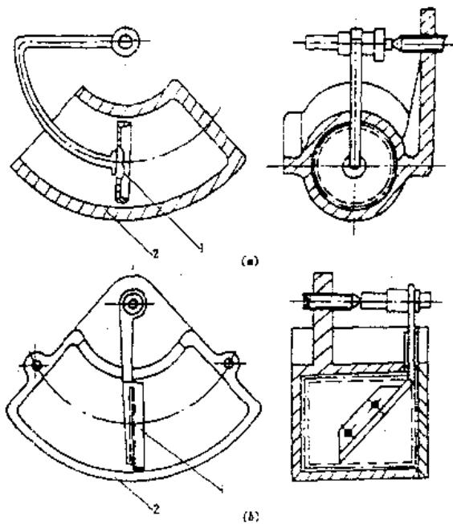

图11-9空气阻尼装置

筒(空气室或缸体)2组成。活塞和气室侧壁之间有一定的间隙,活塞运动时将气室内的空气压缩,活塞两侧出现压力差、从而产生阻止活塞运动的阻力。由于活塞四周存在间隙,被压缩的空气在差压的作用下,通过活塞与气室间的环形间隙流出,从而将器件运动部分的振动能量耗散,使括塞能在运动力矩的作用下平稳地到达指定的位置,而不会产生振动现象。阻尼力的大小与间隙的大小有关,间隙愈小,阻尼力愈大。活塞式空气阻尼装置的活塞与气室壁之间的间隙可减小到 $0 . 0 2 \sim 0 . 0 5 \mathfrak { m m }$ 、但间隙减小,加工要求较高,装配也困难、同时对系统要求有足够的结构刚度。一般,间隙取 $0 . 3 \sim 0 . 1 \mathfrak { m } \mathfrak { m }$ 

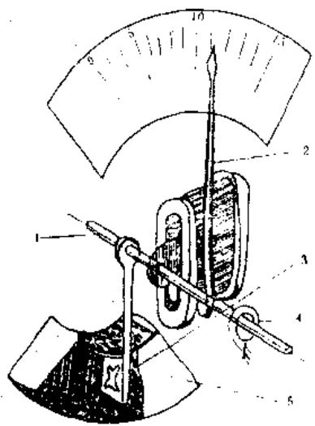

图11-10空气阻尼装置在电工仪表中的应用

图11-9(b)所示是叶片式空气阻尼装置,它由叶片1和气室2组成。叶片和气室壁之间有一定的间隙(考虑机构运动的可靠性,间隙一般不宜小于$0 . 3 \mathfrak { m } \mathfrak { m } .$ 。当叶片运动时,气室两端的压力不等,对叶片的运动产生阻尼作用。这种机构一般采用单叶片。但是,也有采用对称的双叶片机构来提高阻尼力的。叶片一般用厚度为 $0 . 1 \sim 0 . 1 5 \Omega \mathfrak { m }$ 的薄铝板制成,为提高其强度,把它冲压成有网格凸筋的形式,其阻尼力可提高 $2 5 \sim 3 0 \%$ ,气室壳体可用金属或工程塑料模压或拼接法制成。

这两种阻尼装置的结构都很简单,使用也很方便;但由于空气本身具有可压缩性,当运动速度较大、振动频率较高时,对运动系统的阻尼作用将会明显减弱。两者相比较,活塞式比叶片式阻尼装置的阻尼系数可提高 $2 5 \sim 3 0 \%$ ,叶片式空气阻尼装置的刚度较好,机械惯性较小。

图11-10所示是叶片式空气阻尼装置在电工仪表中的应用。图中轴1、指钟2、叶片3和游丝4等构成了运动系统。叶片3和气室5组成空气阻尼装置。

# 2.磁感应阻尼装置

磁感应阻尼装置是利用非磁性导电金属片在磁场中作切割磁力线运动时·会感应出涡流并与磁场相互作用而产生阻尼力的原理而制成的阻尼装置图11-11所示是圆盘形和扇形磁感应阻尼装置的示意图,金属片!紧固在系统的转动部分.:,它在永久磁铁2的磁场内运动而产生阻尼作用。若要增加阻尼力矩,则可用电磁铁来代替永久磁铁。

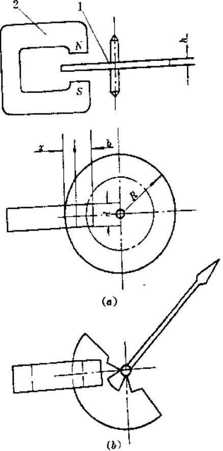

图11-11磁感应阻尼装置(a)圆盘形()扇形

磁感应阻尼装置的圆盘和扇形板、一般采用厚度为 $0 . 3 \sim 1 . 0 \mathrm { m m }$ 的铝板制造.为使工作可靠,磁极与圆盘(或扇形板)之间的气隙一般不小于 $0 . 5 m m$ 

磁感应阻尼装置的优点是结构简单、工作可靠、重量轻、能产生较大的阻尼力矩、受环境温度和压力变化的影响不大;其缺点是如有磁性材料(铁粉、铁屑)进入磁铁缝隙中、会影响运动系统的灵活性、成本较高。

图11-12所示是磁感应阻尼装置在自动记录仪中应用的例子,

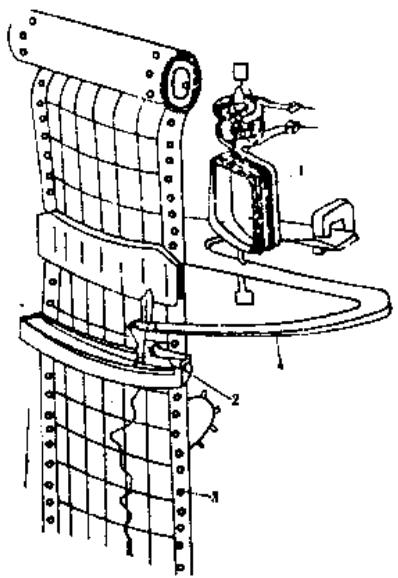

图11-12磁感应阻尼装置在自动记录仪中的应用

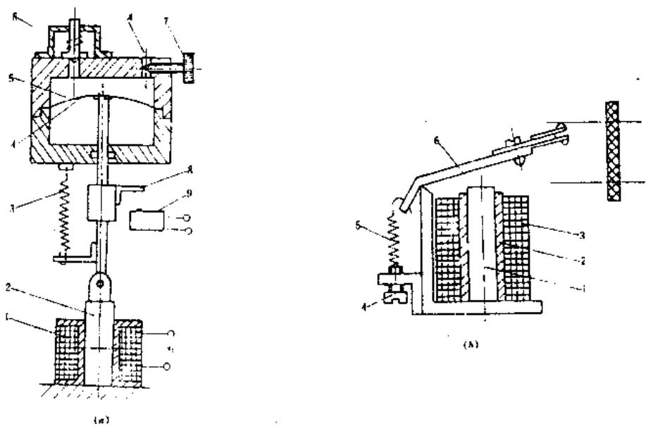

图11-13阻尼延时机构

(a)空气阻尼延时(通电)机构 (b)磁感应阻尼廷时机构1—线圈;2—铁芯;3-弹簧:4-膜片;5-气室; 一磁铁铁芯;2-铜套;3—线圈:6-单向排气阀;7—螺钉 $\mathbf { 8 } \cdots$ 压杆:9-开关;4--气孔↓—螺钉;5-弹簧:6-衔铁

阻尼装置除可用作运动系统快速稳定外,还可用作机械运动延时或机械运动的缓冲,用作阻尼延时的机构常用于定时控制系统。其作用是根据系统要求来控制某些执行机构按指定时刻发出动作,或是延续某些机件的动作时间,以保证运动的协调。其应用例子如图11-13所示。其中,图 $\texttt { i l - l 3 ( a ) }$ 所示为空气阻尼延时机构,图11-13(b)所示为磁感应阻尼延时机构(它不适合于交流电路中使用),用作阻尼缓冲的机构常用于延缓电子设备或仪器的某些运动构件或部件的动作时间。其目的是消除或减小有害的冲击及由此引起的噪声,改善运动件的动态特性,从而提高电子设备和仪器的质量和使用性能。阻尼缓冲机构实质上也是一种阻尼延时机构,不同的是·它只需起级冲作用,而不要求有精确的延时,图11-14所示是空气阻范装置在盒式磁带录音机出盒机构中应用的实例,这些出盒机构在应用中都取得非常满意的效果,

图 $1 1 - 1 4 ( a )$ 所示为叶片式空气阻尼级冲出盒机构。舱盖6打开时,由于弹簧3的作用,绕轴线O-0向外转动,固接在其上的拉杆5便拉动绕于齿轮轴上的拉线4,经过两级齿轮升速传动,使具有四瓣叶片的叶轮1作快速转动。因为空气的力作用,舱盖便缓慢地打开,弹簧2的拉力远小于弹簧3,出盒时由于被拉长,也起到一定的阻尼作用:关盒时,在弹簧2的作用下使拉线4保持张紧状态,

图11-14(b)所示为活塞式空气阻尼缓冲出盒机构。舱盖8与活塞阻尼装置之间用活塞连杆6连接。活塞阻尼装置主要由气室2、活塞4和橡皮圈3组成。活塞连杆6的一端扣在活塞销5上,另一端与舱盖8侧面的轴销7松动连接。当出盒或关盒时,舱盖8向外或向里转动的过程中,连杆拉动或推动活塞运动,由于空气对活塞的阻尼作用而使舱盖缓慢运动。

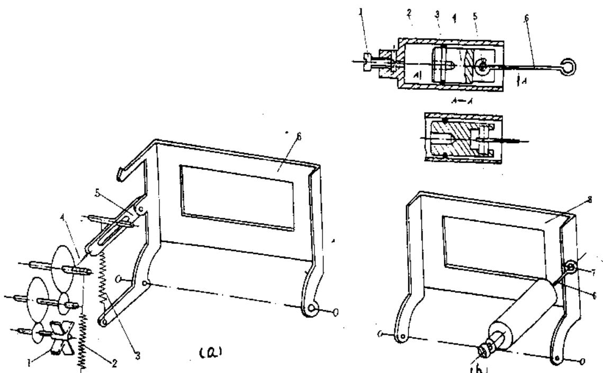

图11-14空气阻尼缓冲出盒机构

# 习 题

11-1调速装置的作用是什么?通常有哪几种调速方法?

11-2试比较几种制动式调速装置,各有哪些优缺点?

11-3什么叫做调速特性?制动式调速装置的调速精度与那些因索有关?

11-4什么情况下电子设备的运动部分需要阻尼?其作用是什么?

11-5试述常用阻尼装置的类型及其产生阻尼的工作原理,

# 第十二章 锁紧装置

锁紧装置是利用摩擦力或其它方法将电子设备和精密机械、仪器中的某些零、部件暂时固紧在所需位置上的--种装置。例如电子设备中的调谐装置,当调谐到所需的某一频率位置后,必须将其锁紧,以免在受到冲击、振动时引起调谐顿率的改变;又如在使用某些工具显微镜测量工件时,通过调整显微镜筒的高低位置进行粗调焦距后,需将镜筒固紧在悬臂上,才能进行焦距的微调。

锁紧装置种类繁多。电子设备和精密机械、仪器中常见的锁紧装置有转轴和转盘锁紧装置、功能开关锁紧装置、机箱(机盒、机柜)和控制台的门锁装置、组装电子元器件的插箱和插件的锁紧装置等。本章仅介绍前面两种锁紧装置。

# 12.1转轴和转盘锁紧装置

:电子设备和精密机械、仪器在使用中.常需将某些已经调整到工作位置的转轴或转盘类构件作暂时的锁紧;或者为了防止某些测量机件产生相对运动而影响测量精度,也需将它们暂时锁紧在一定的位置上。

设计转轴和转盘锁紧装置的基本要求是:

(1)锁紧时不应破坏被锁紧零、部件的正确位置。  
(2)被锁紧零、部件在锁紧后的工作过程中不应发王任何微动走位现象。  
(3)锁紧力大小应均匀而且可调节,(4)锁紧时不能破坏零、部件上被锁紧部位表面的平整度。  
(5)结构简单,操作方便,工作可靠,易于制造和维修。  
(6)外形美观。

转轴和转盘锁紧装置通常采用螺钉、偏心轮(轴)、螺纹、弹簧、杠杆等零、部件来产生锁紧力。根据锁紧力的作用方向,这种锁紧装置可分为径向受力锁紧装置和轴向受力锁紧装置。

# 一、径向受力锁紧装置

# 1.单面施力径向锁紧装置

图 $ 1 2 - 1 ( \alpha )$ 所示为最常见的螺钉顶紧式锁紧装置。锁紧时,拧紧螺钉1,通过垫块2压紧轴3,从而将轴3锁紧于支架4上。

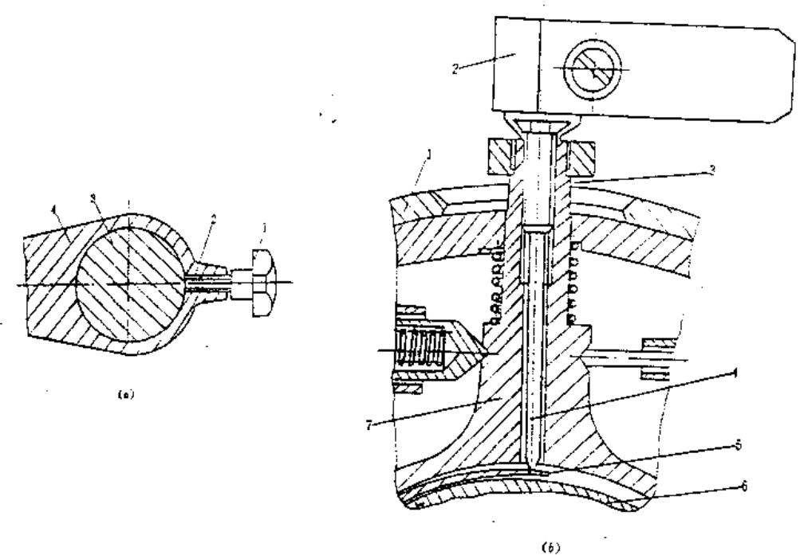

图12-)螺钉径向锁紧装置

图12-1(b)所示为径纬仪上的一种螺钉顶杆锁紧装置,锁紧时,转动手柄2.通过螺钉3推动微动环7的凸臂内的顶杆4向下移动,将装在微动环上的弹簧片5压向轴座6,从而将微动环7锁紧在轴座6上。

图12-2所示为某仪器中的偏心轴一一顶杆锁紧装置。锁紧时,转动偏心轴5,通过它上面的偏心圆柱推动顶杆4,使装于顶杆端头的压块2压向轴1,从而将轴1锁紧,解锁时,通过弹簧3的作用使顶杆自动复位,松开压块。

图12-3所示为滚珠偏心槽锁紧装置。它由固定导向管1、可动套简2、滚珠3、锁紧环4和衬片5组成。锁紧环上制有偏心内圆槽 $\pmb { G }$ ,它相对于环的外圆轴心有一偏心距e,滚珠3放置在可动套简2的孔内,因滚珠直径大于套筒的壁厚,故滚珠局部凸出在偏心槽内。固定导向管1上根据套筒的移动范围铣一槽,槽内装入衬片5。当可动套简沿轴向调整到所需的位置后,转动锁紧环,其上的偏心槽 $G$ 便将滚珠3压向衬片5和固定导向管,从而将可动套筒锁紧。

上述几种单面施力径向锁紧装置的优点是结构简单,易于制造。缺点是锁紧时,被锁紧的零、部件单面受力,与支架的配合间隙被挤到一边,其轴线会产生微量的径向偏移,故不宜用于径向位移会影响定位和测量精度的场合。当采用这种锁紧装置时,被锁紧零、部件与支架的径向配合间隙不宜过大。

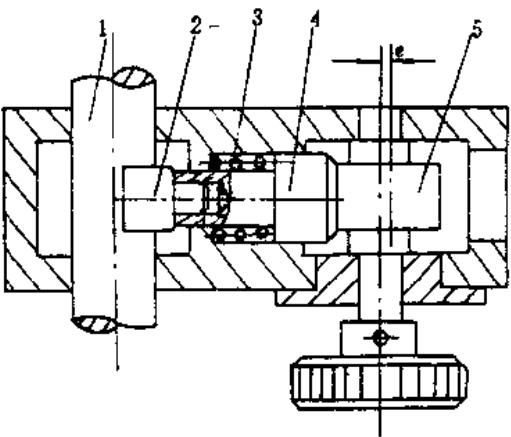

图12-2偏心轴锁紧装置

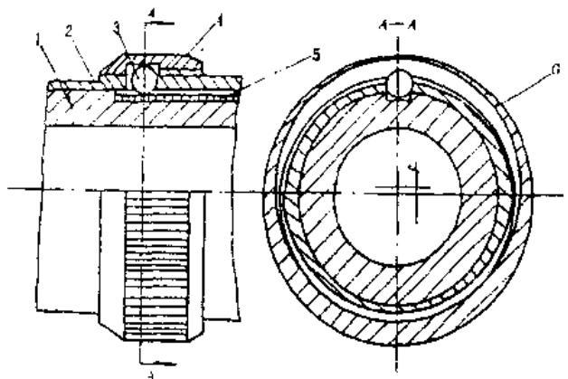

图12-3滚珠偏心槽锁紧装置

# 2.对称施力径向锁紧装置

图12-4.所示为开槽弹性夹头-—螺钉夹紧式锁紧装置。锁紧时,拧动螺钉1,使开槽弹性夹头3产生弹性变形,从上、下两个方向压向轴2,将轴2锁紧,这种锁紧装置结构简单,且可获得较均匀的径向锁紧力。

图12-5所示为某光学分度头上的双面施力径向锁紧装置。装在主轴上的制动盘7的钩形外缘位于顶杆4和可动丢简5的钩头之间。转动手柄1,使螺杆3旋入可动套筒5,推动顶杆4向左移动;同时,可动套筒也向右移动,结果将制动盘7夹紧于顶杆和可动套筒的钩头之间,从而将主轴锁紧。防松环2用来防止可动套简5在固定套筒6中转动。

由于制动盘7所受的锁紧力是通过主轴轴线的,且是双面受力,所以能避免锁紧时主轴产生径向微动现象,保证仪器的精度。

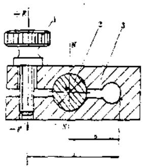

图12-4开槽弹性夹头—-螺钉夹紧式锁紧装置

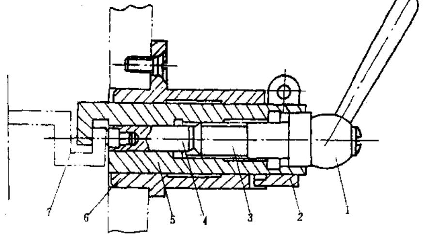

图12-5某光学分度头的双面施力径向锁紧装置

但实际上,这种锁紧装置由于制造误差的影响,作用于制动盘上的两锁紧力作用点的连线并不一定通过主轴轴心,所以锁紧时,主轴可能会受到一个力偶 $\pmb { M }$ 的作用,如图12-6所

示,由此产生微动现象。

另外,为保证可动套筒5能在固定套筒6中自由移动,两者之间有一定的配合间隙。在主轴被锁紧后工作时,此间隙也会使锁紧装置与主轴一起绕主轴轴心产生微量摆动,如图12-7所示。其微量摆动角 $\pmb { \Delta \theta }$ 为

$$
\Delta \theta \approx \frac { \Delta s } { L }
$$

式中, $\Delta \pmb { \mathscr { s } }$ 可动套简与固定套简的配合间隙 $\left. \mathsf { m m } \right.$ ;

$L$ -一可动套筒的外端面至主轴轴心的距离(mm);

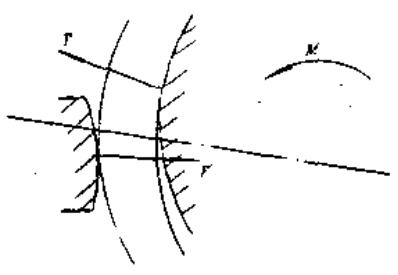

图12-6锁紧时可能产生的力偶 $\pmb { M }$ 

若取 $L = 1 0 0 \mathrm { m m }$ , $\Delta s = 0 . 0 0 3 \mathrm { m m }$ ,则

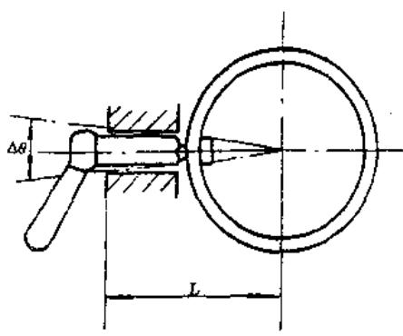

图12-7主轴工作时可能产生的效量摆动

$$
\Delta \theta \approx \frac { \Delta s } { L } = \frac { 0 . 0 0 3 } { 1 0 0 } = 3 \times 1 0 ^ { - 5 } ( r a d ) = 6 ^ { \circ }
$$

所以可动套筒和固定套简的尺寸误差和几何形状误差都必须严格控制,既要保证配合间隙最小,又要保证运转灵活,以保证仪器的测量精度。为了保证零件配合间隙的稳定性,精度高的仪器还应置于恒温环境中使用.

图12-8所示为开槽弹性套锁紧装置。锁紧手轮1上开有锥形孔,与开有轴向槽的锥形弹性套2相配合。锁紧时,转动锁紧手轮,使其内锥面压向弹性套,迫使开槽的弹性套径向收缩,将轴4锁紧在所要求的位置上。这种锁紧装置可获得较均匀的径向锁紧力,所以轴不会产生径向偏移,锁紧时的径向定位精度较高。

图12-9所示为某光学分度头上采用的“三点自位均匀收缩"薄壁套锁紧装置。它由外套简1、薄壁内套筒2、锁紧块3、螺钉4和锁紧手轮5组成.薄壁内套简2固定在光学分度头壳体的前盖上,分度头主轴装在此薄壁内套简的孔中,配合间隙很小·但主轴仍能在孔中作灵活转动并保持较高的同轴度。外套筒空套在三个固定螺钉上,可在间隙范围内作径向浮动。其内壁上开有三条等分槽,槽内各装一锁紧块3,各锁紧块均与薄壁内套筒外表面相接触且其中一锁紧块由螺钉4顶住,当转动锁紧手轮5时,螺钉4一方面推动其中一锁紧块压向薄壁内套简,另一方面又使浮动的外套筒沿螺钉4的轴线向手轮5的方向移动,带动另外两个锁紧块同时压向薄壁内套筒,这样三个位置上的锁紧块同时均匀地压向薄壁内套筒,使其产生径向收缩,将主轴锁紧。

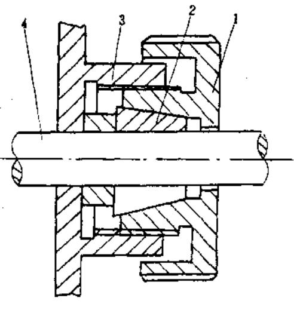

图12-8开槽弹性套锁紧装置

由于是靠薄壁内套筒弹性变形锁紧,故锁紧力分布比较均匀,而且由于三个夹紧点的位置是均布的,能同时向心收缩,所以避免了主轴的微量转动和主轴轴线的径向偏移,这种锁紧装置的定位精度较高。 1

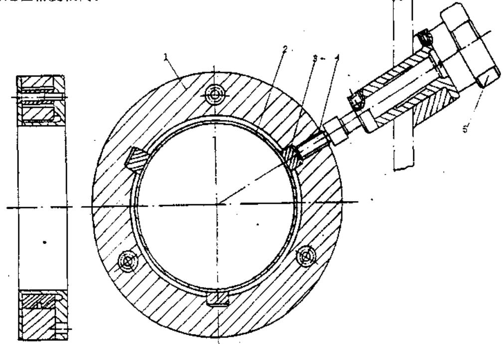

图12-9三点自位均匀收缩薄整套锁紧装置

除了上述径向受力锁紧装置外,在电子设备的走带机构中,常利用专门的制动装置对供、收带盘座实施制动(刹车),以避免在驱动系统从任何一种工作状态(如录/放音走带或快速卷带)转换为停止状态时,出现吐带或使带拉得过紧的现象。这类制动装置实际上也兼起径向锁紧装置的作用,因为制动后,帶盘轴就被暂时固紧在制动位置上。若带盘轴需再次转动,则必须先解锁,使制动装置与带盘座脱离接触。

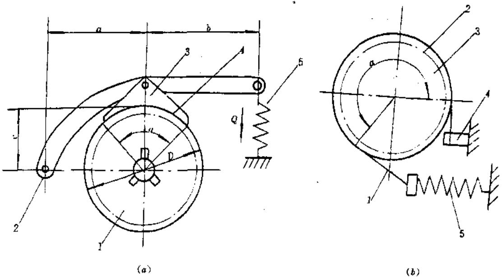

图12-10制动器

目前常用的制动装置有块式制动器和带式制动器两种。图12-10(a)所示为块式制动器,制动后,带摩擦垫4的制动块3借助杠杆2和弹簧5的作用压在带盘座1上,对带盘轴起锁紧作用。

图12-10(b)所示为带式制动器。带摩擦衬垫2的钢带1一端与固定支柱4相连,另一端与拉簧5相连,制动后,依靠弹簧拉力的作用,紧压在制动盘3上,对带盘轴起锁紧作用。

# 二、轴向受力锁紧装置

# 1.螺钉(或螺母)压紧式轴向锁紧装置

图 $1 2 - 1 1 ( a )$ 所示为螺钉压紧式轴向锁紧装置,锁紧时,只需拧紧三个螺钉2,便可将轴1的轴环夹紧于压板4和鼓形度盘3之间,从而将度盘锁紧在轴上,这种锁紧装置产生的轴向锁紧力较大,但锁紧操作较麻烦。

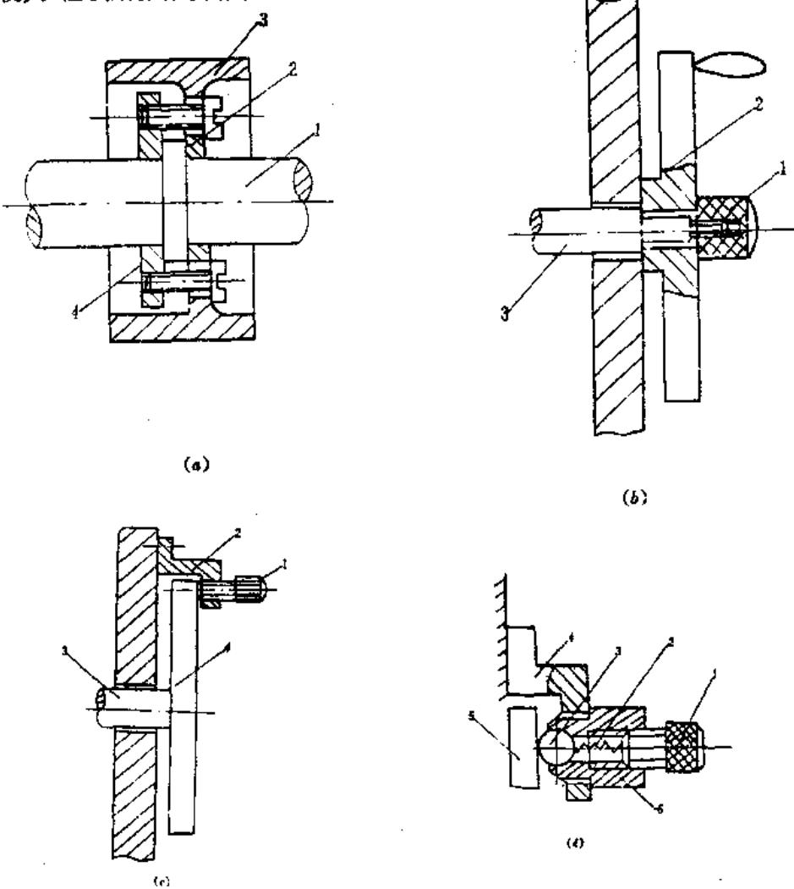

图12-11螺钉(或螺母)压紧式轴向锁紧装置

图12-11(b)所示为螺母玉紧式轴向锁紧装置。拧紧滚花螺母1便可将刻度盘2锁紧。这种锁紧装置结构简单、锁紧操作快速方便;但锁紧力矩不宜过大,否则会使度盘与轴产生相对转动。

图12-11(c)所示为旁侧螺钉压紧式轴向锁紧装置。锁紧时,只需拧动旁侧螺钉1.就可将度盘4锁紧。这种装置结构简单,锁紧迅速且可避免度盘转动,故应用较多。但其缺点是锁紧时螺钉端部往往会刮伤度盘表面,且使度盘受到轴向侧压力的作用,为避免刮伤度盘表面,可采用如图12-11(d)所示的改进结构,增加套简6、钢珠3和弹簧2。当拧紧滚花螺钉1时,它紧压弹簧和钢珠,通过钢珠压紧度盘5的端面。

# 2.摩擦盘式轴向锁紧装置

图12-12所示为光学经纬仪上用来将横轴1与轴向浮动壳体5固紧在一起的摩擦盘式轴向锁紧装置,横轴1与锥形摩擦盘3用螺钉固连成一体。锁紧时,转动手柄7,使螺杆.8旋入固定螺母6,以其末端推动固定板4和锥形摩擦盘3向左移动;与此同时,与固定螺母6连接在一起的浮动壳体5向右移动,带动锥形环2压向锥形摩擦盘3,结果将锥形摩擦盘与浮动壳体固紧在一起,从而实现横轴的锁紧,

# 3.双夹板式轴向锁紧装置

图12-13所示为双夹板式轴向锁紧装置。仪器主轴上的制动盘7位于两锁紧块8之间.锁紧时,转动手柄,通过万向联轴节(万向接头环)1和轴2,带动锁紧螺母3转动。锁紧螺母的内孔和外圆上均制有旋向相同的螺纹,其中内螺纹的螺距是外螺纹螺距的两倍。当锁紧螺母3旋入机架4向右移动时,通过推力轴承5和球形压块,使夹板6绕小轴13向右摆动;与此同时,螺杆10向左旋入螺母3的内螺纹孔,并带动夹板9绕小轴12向左摆动。因此两锁紧块8同时压向制动盘7,从而将主轴锁紧。销子11的作用是防止螺杆10转动;推力轴承是用来减少锁紧螺母3旋转时的摩擦力;弹簧用于解锁时将两夹板推开。

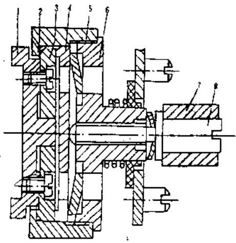

图12-12擦盘式轴向锁紧装置

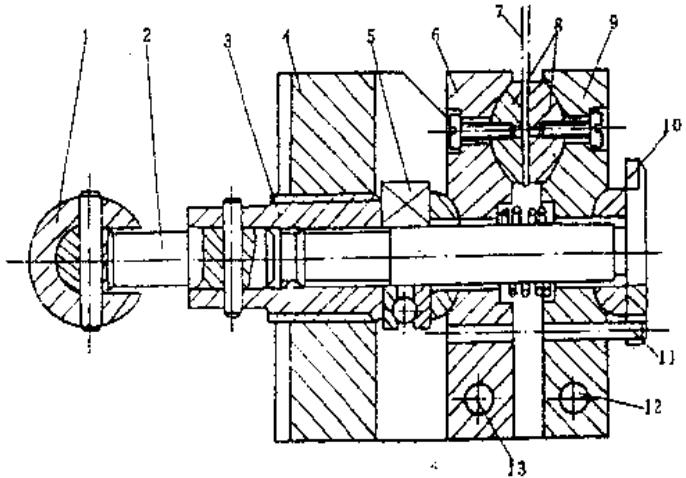

图12-13双夹板式轴向锁紧装置

轴向受力锁紧装置作用在被锁紧零、部件上的锁紧力比较均匀,而且大多呈对称分布、没有不良的侧向力和微动产生,因而能较好地避免被锁紧零、部件的位置发生改变,满足位置精度要求,因此轴向受力锁紧装置一般要比径向受力锁紧装置更为合理。但其结构比径

# 向受力锁紧装置复杂,制造工艺要求及成本也较高。

# 12.功能开关锁紧装置

功能开关锁紧装置是指各种电子设备和精密仪器中,具有某种功能控制的开关,在执行某种功能控制动作时,能自动锁住的一种装置。如电源开关,控制机械运动的启动和停止、快和慢、进和退的多功能控制开关等,都需要有锁紧装置。

功能开关锁紧装置的作用是将开关暂时锁定在某一确定的位置,以保证电子设备和精密仪器能安全可靠地完成某种功能动作,并保持稳定的工作状态。

对功能开关锁紧装置的基本要求是:

(1)操作方便,性能可靠,无论是锁紧或解锁,动作应快速、灵活、准确、可靠。

(2)结构简单,零、部件尽可能少,制造容易。

(3)外形美观。

功能开关锁紧装置按其功能的多少分为单功能开关锁紧装置和多功能开关锁紧装置。每种锁紧装置根据其操纵键的运动形式又可分为琴键式和按钮式(直动式)两类,前者为转动,后者为移动。

# 一、单功能开关锁紧装置

单功能开关锁紧装置是一种具有自锁功能的锁紧装置。

1.琴键式单功能开关锁紧装置

图12-14所示为某些录音机上的琴键式单功能开关锁紧装置。利用它可将触点开关1锁定在“接通”或“断开"状态。这种锁紧装置的关键是锁板5与动销10的相互配合动作。其中锁板5是关键零件,上面制有凹弧d和e,凸弧 $\pmb { \mathscr { f } }$ 以及凸舌 $\pmb { c }$ ,它既可绕固定轴3左右摆动,又可沿轴3的轴向作少量摆动。

轴3固定在开有凹槽的支承板

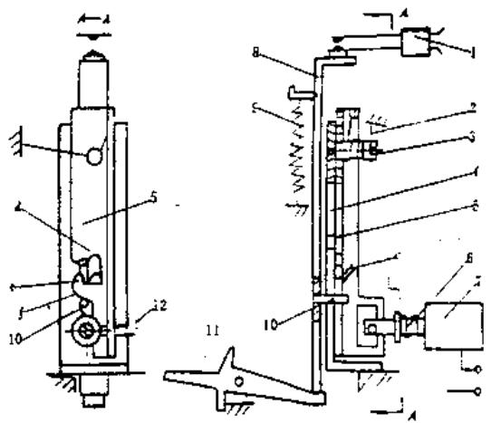

图12-1i琴键式单功能开关锁紧装置

上,支承板固定在机架上,动销10装在联动杆8上,可在支承板的凹槽中作上、下移动。

元机时,撤下琴键11,联动杆8连同动销10向上移动,推动开关1的簧片,使开关触点接通,动销向上移动的过程中,先沿着锁板5上的凸弧f向上滑动,并迫使锁板向右摆动,当其达到锁板的缺口时,锁板在扭簧2的作用下,又向左作返回运动,动销便进入锁板的凹弧e而被定位,从而将联动杆1锁定,使触点开关保持在接通状态。

关机时,再撤一下琴键,动销随联动杆稍许向上移动进入锁板的凹弧d,放开琴键时,联动杆在拉资 $\mathfrak { g }$ 的恢复力作用下,往下移动。此时,动销沿锁板上的凸舌 $c$ 下滑,并将锁板沿轴向推开,使联动杆解锁并随其一起下移,开关触点断开,锁紧装置恢复原位,

电磁铁7作自动关机用。在开机状态下需作自动关机时,出关机信号电压接通电磁铁,吸住拉杆6,装在拉杆端头的拨销12便将锁板沿轴向向前拉动一小段距离,使动销脱出凹弧e,联动杆和动销在弹簧9的恢复力作用下向下移动,开关触点断开。

# 2.按钮式单功能开关锁紧装置

图12-15所示为某些录音机上的“暂停"功能开关锁紧装置。其主要部分由锁板3和固定在滑板2上的动销4组成。锁板3是关键零件,其结构如图12-15(b)所示。锁板上销孔下方有一环形槽,槽中凸台 $\mathfrak { i }$ 与平面 ${ \pmb S } _ { 1 }$ 同高,但低于平面 $s _ { 7 }$ ,槽的外、内侧壁上分别制有与动销4配合定位的凹弧 $\pmb { a }$ 和 $\pmb { e }$ 

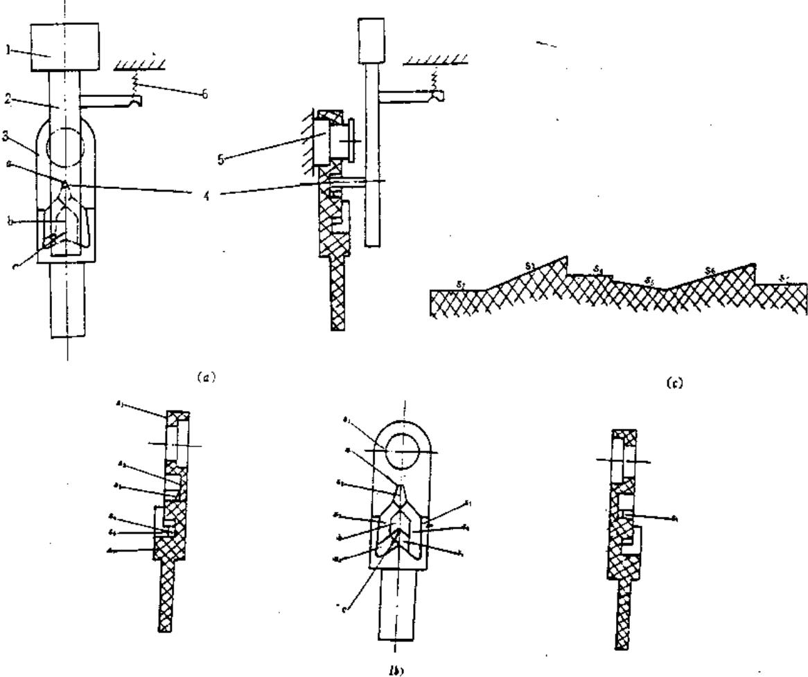

图12-15按钮式单功能开关锁紧装置1克置结构示意图 (b)锁板结构示意图 $( \mathfrak { c } )$ 环形槽中截面展开示意图

图 $\mathtt { i } 2 \mathtt { - } 1 5 ( \mathtt { c } )$ 所示为环形槽中截面沿动销逆时针运行方向的展开示意图。由图知,槽底由平面3(最低)斜面s(上倾)、平面s、小斜面ss(略下倾)、斜面s(上倾)组成。其中s与s、s与ss首尾相连,而s与s,&s与&、8与s以台阶相接,且s和s首尾分别同高。动销4只能在环形槽内作逆时针单向运行。

锁板既可绕固定于机架上的轴销5摆动,也可沿轴销的轴向作少量摆动,滑板2上装有按钮1,并用拉簧6与机架相连。

撤下按钮1,滑板2向下移动,固定在滑板上的动销4从锁板3上的凹弧 $\pmb { \sigma }$ 处顺着环形槽内侧壁沿斜面 $s _ { 3 }$ 下滑(同时迫使锁板绕轴销5向右摆动和沿轴销轴向向后略摆动),跃入平面 $s _ { \uparrow }$ (此时锁板略向前摆动);松开按钮,滑板在拉簧6的恢复力作用下向上移动,动销顺着 $s _ { 4 }$ 与 $\mathfrak { s } _ { \mathfrak { I } }$ 的台阶界面及环形槽的内侧壁沿平面 $s _ { 4 }$ 滑入小斜面 $\scriptscriptstyle { \mathrm { \it S 5 } }$ ,并定位于凹弧 $\boldsymbol { \mathfrak { c } }$ 中(期间,锁板略向左、向前摆动),使“暂停"功能开关作用并保持在工作状态,从而实现录/放音的暂停。

终止“暂停"功能时,再撤一下按钮1,滑板向下移动,动销顺着 $\mathbf { s _ { 4 } }$ 与 $\pmb { \delta 5 }$ 的台阶界面滑至斜面 ${ \pmb { \delta } } _ { \pmb { \imath } }$ (同时迫使锁板略向左、向后摆动),松开按钮,在拉簧的恢复力作用下,滑板向上移动,动销顺着环形槽的内侧壁沿斜面 $\pmb { S } _ { \pmb { \nu } }$ 滑动(同时迫使锁板向左、向后摆动)直至跃入平面${ \pmb s } _ { \pmb { \imath } }$ 并定位于凹弧 $\pmb { \alpha }$ 中,锁板和按钮均恢复原位,“暂定"开关复位,“暂停"终止。

图12-16所示为另一种按钮式单功能开关锁紧装置。主要部分由锁板5和固定在按钮滑杆上的动销6组成。其中,锁板5是关键零件,其结构如图12-16(b)所示, $\cdot a , d$ 是锁板上与动销 $\pmb { \ 6 }$ 配合定位的凹弧,它们的槽底位于同一平面 ${ \pmb s } _ { \mathbf { 3 } }$ 上。平面 $\therefore \sin \theta _ { 1 } , \sin \theta _ { 3 }$ 依次渐低,斜面 $\pmb { s _ { 4 } }$ 与平面 ${ \pmb s } _ { \pmb { \imath } }$ 和 $\$ 3$ 相连。凸台 $\pmb { b }$ 和 $\pmb { e }$ 与平面 $\mathfrak { s } _ { \mathfrak { t } }$ 同高。

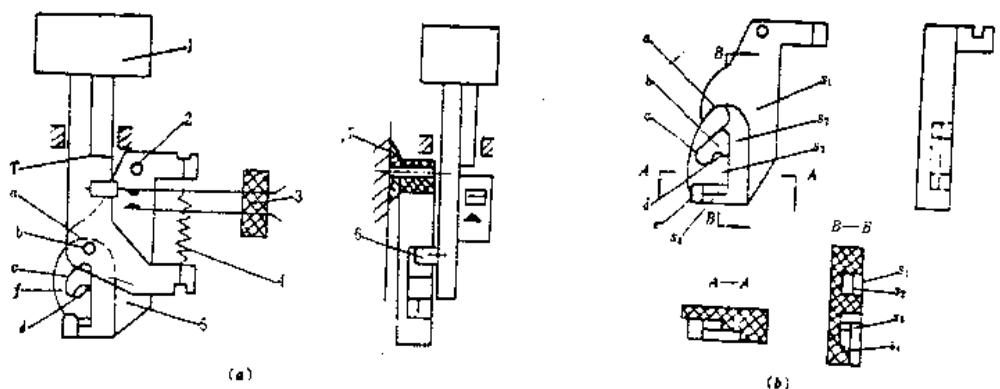

图12-16按钮式单功能开关锁紧装置【(a)装置结构示意图 (b)锁板结构示意图

锁板5既可绕固定于机架上的轴销2左右摆动,又可沿轴销的轴向作少量的前后摆动。锁板5与机架之间放置弹性圈7,通过拉 $\pmb { \mathscr { k } }$ 将锁板与按钮滑杆的弯头相互拉紧。

开机时,撤下按钮1,动销6顺着锁板上的凸弧 $c$ 沿平面 ${ \pmb S } _ { \mathbf { \overline { { \lambda } } } }$ 下滑并迫使锁板绕轴销2向右摆动,直至从缺口进入并定位于凹弧 $\pmb { d }$ 中。这时按钮上的顶杆 $\pmb { \mathcal { T } }$ 下压开关触点组3.使之接通并保持在工作状态。

关机时,再撤一下按钮,动销6向下移动,沿斜面 ${ \boldsymbol { \mathbf { \mathit { s } } } } _ { \boldsymbol { \mathbf { \mathit { 1 } } } }$ 滑上平面 ${ \boldsymbol { s } } _ { \bar { \mathbf { z } } }$ ,同时推动锁板沿轴销2的轴向向后略摆动。松开按钮时,在拉簧4的恢复力作用下,按钮复位,动销6也回到原来位置。开关触点组断开。

上述两种按钮式单功能开关锁紧装置,按钮和锁板均采用塑料制造。具有结打简单、紧凑,动作快速、灵敏,使用方便可靠等优点。

# 二、多功能开关锁紧装置

多功能开关是由两个或两个以上的单功能开关并列组成的开关组。其锁紧装置具有互锁功能,即当按动开关组中一个(或同时按动几个)开关进入工作状态时,其余的开关,原来不动的仍保持不动,原来接通的则随之断开,彼此之间具有互保作用。通常这种锁紧装置只允许任一开关处于工作状态,而不允许两个或多个开关同时处于工作状态、所以可避免由于操作失误而造成仪器设备的失调或损坏。

# 1.琴键式多功能开关锁紧装置

图12-17所示为两种琴键式多功能互保开关组的锁紧装置。其中图 $1 2 - 1 7 ( n )$ 所示是带孔锁板式锁紧装置,当撤下其中一个琴键1时,带此琴键的杠杆2的尖端斜面 $c$ 推压锁板4的左端迫使锁板绕轴6向下摆动,直至尖端滑到锁板的上表面并进入定位孔 $\pmb { \cal { k } }$ 而被锁住.这时,连杆7在杠杆2的带动下将某一功能开关接通;同理,当撤下另一琴键时,又可将与其相连的杠杆锁住,接通另一功能开关;与此同时,原来被锁住的杠杆则获释放,并在压簧3的作用下复位,从而使原来接通的开关断开,扭簧5的作用是将锁板4靠向斜面c。

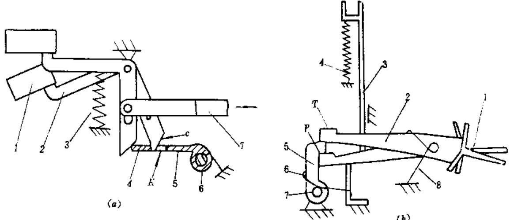

图12-17琴键式多功能开关锁紧装置(a)带孔锁板式 (b)钩头锁板式

图12-17(b)所示是钩头锁板式锁紧装置,带琴键1的杠杆2有端头T,锁板5上有凹弧$\pmb { p }$ 。平时,端头T被扣在凹弧下面。当撤下琴键时,端头 $\mathbf { \delta } _ { \mathbf { \vec { \jmath } } }$ 向上抬起,迫使锁板5绕轴7向左摆动,直至端头越过锁板顶面,锁板才在扭簧6的作用下复位。这时端头被锁板顶面挡住不能往下运动,因此,被杠杆臂抬起的传动杆3也被定位,使某一功能开关保持在接通工作状态。同样,当撤下另一琴键时,重复上述动作,接通另一功能开关,使其处于工作状态。与此同时,原来被锁住的传动杆借拉簧4的恢复力的作用而复位,使原来接通的开关断开,琴键也在扭簧8的作用下复位。

# 2.按钮式多功能开关锁紧装置

图12-18所示为一种按钮式多功能开关锁紧装置。它主要由装有按钮1的传动杆锁板2组成。

当撤下按钮1时,传动杆5向下移动.其凸出的斜面 $\pmb { n }$ 迫使锁板2向右移动。若这凸出斜面 $\pmb { a }$ 越过锁板2上的凸出斜面 $^ c$ ,拉簧3便把锁板拉回原来位置,将传动杆锁住,使某个功能开关接通并保持在工作状态。

当撤下另一个按钮时,则会重复上述动作将其传动杆锁住,从而使另一个功能开关接通并保持在工作状态。但在锁板向右移动时,原来被锁住的传动杆则被释放、并借拉簧4的拉

力自动复位,使原来接通的开关断开。

若要使全部功能开关解锁(断开),只需稍微按动处于原位的任一按钮,在它的传动杆略下移一距离,即可使被锁住的开关复位,但需注意,不能让传动杆上的凸出斜面 $\pmb { n }$ 越过锁板上的凸出斜面c,否则又将被锁住,不能实现全部解锁。

图12-19所示是应用于电视机频道选择开关组中的按钮式多功能开关锁紧装置结构示意图。该锁紧装置主要有带按钮1的传动杆2和锁板3组成,传动杆上制有分别带斜面 $a , \ b$ 的两缺口,锁板上制有凸出斜面 $\pmb { \mathfrak { c } }$ ,平时,传动杆2和锁板3分别在压簧4和拉簧5的作用下相互锁定在带斜面b的缺口处(锁板上的凸出斜面 $\boldsymbol { \mathfrak { c } }$ 与斜面b相接触)。

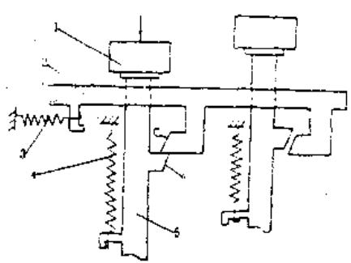

图12-18按钮式多功能开关锁紧装置!

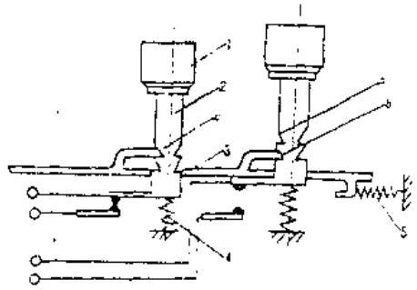

图12-19按钮式多功能开关锁紧装管!

当撤下按钮1时,传动杆2向下移动,以其斜面 $\boldsymbol { \mathfrak { b } }$ 推压锁板3的凸出斜面 $\pmb { c }$ ,迫使锁板向左移动。若锁板的凸出斜面 $\pmb { c }$ 越过斜面b,则锁板在拉簧5的恢复力作用下复位,其上的凸出斜面c进入传动杆上带斜面 $\pmb { \mathscr { a } }$ 的缺口,从而将传动杆锁住,使其下端的频道开关触点接通并处于工作状态。

当需转换频道时,撤下另一按钮,重复上述动作,使另一频道开关接通并处于工作状态。但在锁板向左移动时,原来被锁住的传动杆将被释放,在压簧4的作用下复位,从而使原来接通的频道开关断开。

若要使全部频道开关解锁,只需稍微按动处于原位的任一按钮,使其传动杆略下移一距离,即可使锁住的频道开关复位。

上述多功能互保开关锁紧装置具有结构简单,制造容易,操作方便,工作可靠等优点,在各种电子仪器、家用电器中都已得到广泛应用。

# 习 题

12-1锁紧装置设计的基本要求有哪些?

12-2试比较径向受力锁紧装置与轴向受力锁紧装置的优缺点.

12-3功能开关锁紧装置的类型有哪些?试说明各种能开关锁紧装置的工作原理。

# 第十三章 连接结构

# 13.1概 述

任何电子设备和仪器都是由零(元)、部(器)件组成的,这些零、部件必须采用适当的方法连接,才能成为一个整体。

# 一、连接的作用

连接通常起以下几方面的作用:

1.改善结构工艺性,降低制造成本。对于一些形状复杂、难以制造的零件可以采用几个形状简单、易于加工的零件连接而成的组合结构,以改善零件的结构工艺性,降低制造成本。如图13-1所示的齿轮结构。

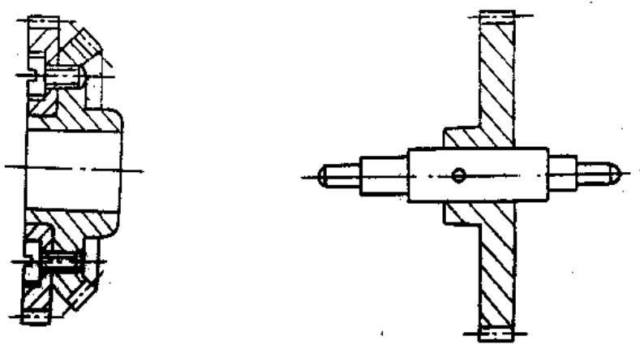

图13-1齿轮结构

2.便于装配、调整、维修和运输。机械部分某些调整环节的零件在装配、调整时需反复装校;某些易损零件需经常维修和更换,这些零件应采用适当的连接结构,以便于装配、调整、维修,此外,采用连接结构还能为包装、运输提供方便.

3.节省稀有金属和贵重材料。例如电器元件中的触头,为了降低其接触电阻,提高导电能力,往往采用银制造;而固定触头用的簧片则可采用弹性铜片制造,采用两者相组合的结构,既可以节省贵重金属又可以充分发挥这两种材料各自的优点,

4.满足零件各部分的不同性能要求,例如图13-2所示的仪器旋钮,其外表应具有良好

的绝缘性能,而其转轴因需具有一定强度,一般均采用金属制造,因此只能采用组合结构,才能同时满足上述不同性能要求。

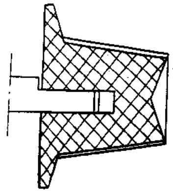

图13-2旋钮结构

# 二、连接的类型

连接按是否允许拆卸可分为可拆连接和不可拆连接两类。

可拆连接零件连接后,允许多次拆装而不会损坏零件.它适用于装配、调整、维修时需要经常装拆的结构上。

不可拆连接零件连接后,不允许再拆卸,若将连接拆开,则构成连接的零件中,至少有一个零件遭受严重损坏。它适用于连接后不需要拆卸的结构上。

# 三、连接的基本要求

设计连接结构时,必须满足下列基本要求:

(1)具有足够的连接强度电子设备和仪器在工作过程中,连接受到载荷作用时不应发生破坏。

(2)具有满足要求的连接精度连接应保证被连接零件之间准确的相对位置。

(3)工作可靠在冲击和振动条件下工作时,连接应可靠,不发生损坏或松脱现象。

(4)具有良好的结构工艺性和经济性在满足使用要求的前提下,连接结构应尽可能简单,易于制造、使用、维修,以降低制造成本,

(5)特殊要求对某些连接结构还应满足一些特殊要求,如密封性、导电性、绝缘性等。

# 13.2可拆连接

电子设备和仪器中,最常用的可拆连接有螺钉连接和螺纹连接、销钉连接、夹紧连接、速拆连接及键连接等,本章介绍前面四种,

# 一、螺钉连接和螺纹连接

螺钉连接和螺纹连接都是利用螺纹来实现零件的连接,两者的区别在于:螺钉连接是利

用连接零件(如螺钉、螺栓、螺母、垫圈等)把被连接零件组合成一体,而螺纹连接则是利用被连接零件本身所具有的螺纹直接进行连接,如图13-3(a)、(b)、(c)所示为螺钉连接,(d)所示为螺纹连接。

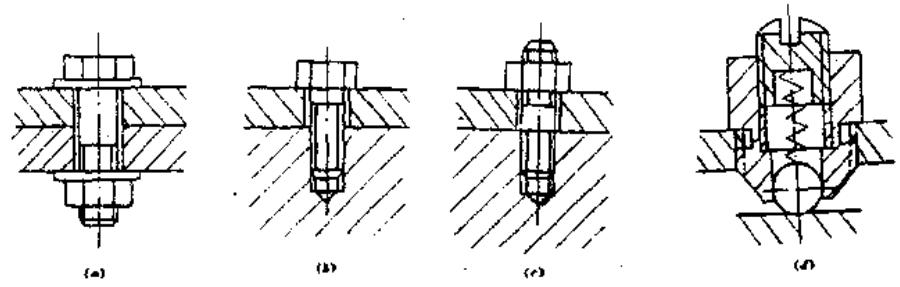

图13-3螺钉连接和帐纹连接

螺钉连接和螺纹连接的连接强度高,工作可靠,易于装拆,而且螺钉等连接零件大多已标准化,选用方便,能适应各种不同要求,故被广泛应用。

# 1.螺纹连接设计的基本问题

螺纹连接是在被连接零件上直接加工螺纹,设计时应注意下列基本问题:

(1)合理选择螺纹类型螺纹连接一般采用普通三角形螺纹,有粗牙和细牙两种,其中细牙螺纹对被连接零件的强度削弱较少且具有较好的自锁性能,故应用较多。此外,在光学精密仪器中,还采用某些特殊螺纹,如目镜螺纹(牙形角为 $60 ^ { \circ }$ 的梯形螺纹)、显微镜螺纹(牙形角为 $5 5 ^ { \circ }$ ,公称直径为4/5时,每时36牙的国际通用特殊标准螺纹)。

(2)利用端面定位当要求被连接零件有确定的轴向相对位置时,通常可利用端面定位来保证,这时零件上用作定位的端面应有垂直度公差要求,如图13-4所示,

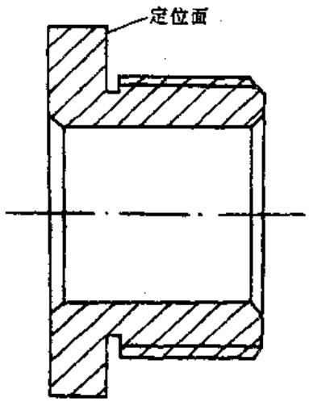

图13-4用端面定位

(3)同轴度要求当要求被连接零件连接后具有较高的同轴度时,通常可另加光滑圆柱面配合作为导引部分并以此来保证连接的同轴度,如图13-5所示。

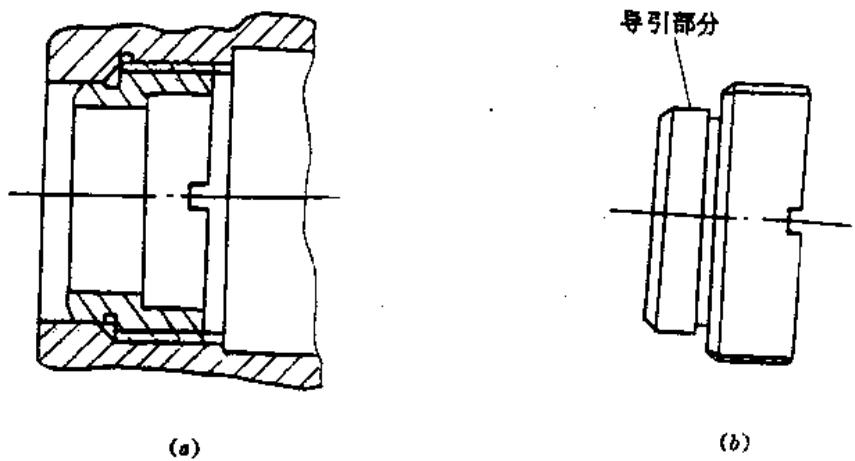

图13-5螺纹连接的导引分

(4)螺纹终端应设置退刀槽,以便于加工和零件装配到位,如图13-6所示。

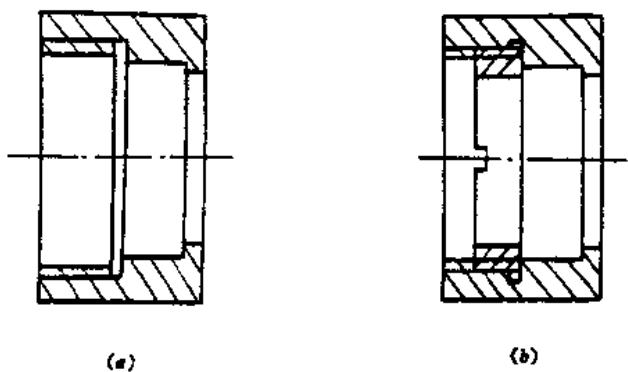

图13-6螺纹连接中的退刀槽

(5)防松装置在受变载荷或冲击载荷以及振动条件下工作的螺纹连接,为确保连接可靠,必须另加防松装置。通常采用紧定螺钉防松,如图13-7所示。

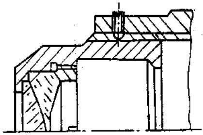

图13-7紧定螺钉防松

# 2.螺钉连接设计的基本问题

螺钉连接设计时应考虑下列基本问题:

(1)连接零件式样和尺寸的选定

连接零件包括螺钉、螺栓、螺母、垫圈等,由于使用条件不同,这些零件式样繁多,且大多已标准化.

1)螺钉和螺栓常用的螺钉、螺栓的种类和形状列于表13-1,其尺寸和连接要素可查阅有关标准和手册。

表13-1常用螺钉和螺栓

<table><tr><td rowspan=1 colspan=1>序号</td><td rowspan=1 colspan=1>名称</td><td rowspan=1 colspan=1>图样</td><td rowspan=1 colspan=1>号</td><td rowspan=1 colspan=1>名称</td><td rowspan=1 colspan=1>图样</td></tr><tr><td rowspan=1 colspan=1></td><td rowspan=1 colspan=1>圈柱头螺钉</td><td rowspan=1 colspan=1></td><td rowspan=1 colspan=1>10</td><td rowspan=1 colspan=1>高滚花头螺钉</td><td rowspan=1 colspan=1></td></tr><tr><td rowspan=1 colspan=1>2</td><td rowspan=1 colspan=1>球面围柱头螺钉</td><td rowspan=1 colspan=1></td><td rowspan=1 colspan=1>11</td><td rowspan=1 colspan=1>元宝螺钉</td><td rowspan=1 colspan=1></td></tr><tr><td rowspan=1 colspan=1>3</td><td rowspan=1 colspan=1>大园柱头螺钉</td><td rowspan=1 colspan=1></td><td rowspan=1 colspan=1></td><td rowspan=1 colspan=1>惟端紧定螺钉</td><td rowspan=1 colspan=1></td></tr><tr><td rowspan=1 colspan=1></td><td rowspan=1 colspan=1>沉头螺钉</td><td rowspan=1 colspan=1></td><td rowspan=1 colspan=1></td><td rowspan=1 colspan=1>平头紧定螺钉</td><td rowspan=1 colspan=1>0</td></tr><tr><td rowspan=1 colspan=1>5</td><td rowspan=1 colspan=1>半沉头螺钉</td><td rowspan=1 colspan=1></td><td rowspan=1 colspan=1></td><td rowspan=1 colspan=1>凹端紧定螺钉</td><td rowspan=1 colspan=1>0</td></tr><tr><td rowspan=1 colspan=1>6</td><td rowspan=1 colspan=1>光六角头螺钉</td><td rowspan=1 colspan=1></td><td rowspan=1 colspan=1>15</td><td rowspan=1 colspan=1>图柱端紧定螺钉</td><td rowspan=1 colspan=1></td></tr><tr><td rowspan=1 colspan=1></td><td rowspan=1 colspan=1>圆柱头内六角螺钉</td><td rowspan=1 colspan=1></td><td rowspan=1 colspan=1>16</td><td rowspan=1 colspan=1>自攻螺钉</td><td rowspan=1 colspan=1></td></tr><tr><td rowspan=1 colspan=1>8</td><td rowspan=1 colspan=1>半圈头螺钉</td><td rowspan=1 colspan=1></td><td rowspan=1 colspan=1>17</td><td rowspan=1 colspan=1>轴位螺钉</td><td rowspan=1 colspan=1></td></tr><tr><td rowspan=1 colspan=1>9</td><td rowspan=1 colspan=1>滚花平头螺钉</td><td rowspan=1 colspan=1></td><td rowspan=1 colspan=1></td><td rowspan=1 colspan=1>定位螺钉</td><td rowspan=1 colspan=1></td></tr></table>

圆柱头螺钉和球面圆柱头螺钉既可用于钉头沉入被连接零件的连接,也可用于钉头不沉入的连接,还可与螺母旋合作螺栓使用,如图13-8所示。

大圆柱头螺钉起子槽强度较高,可承受较大的拧紧力矩,而且其钉头与被连接零件接触面(支承面)较大,拧紧时不易损伤被连接零件表面,故适用于需经常装拆的连接以及有色金属等软材料制造的零件的连接,使用时通常可省云垫圈。

沉头螺钉和半沉头螺钉适用于因结构所限钉头必须沉入被连接零件的连接,其中,半沉头螺钉外形比较美观,可用于仪器(表)外部的连接。

六角头螺钉连接强度高,且可用通用工具装拆,故应用较广,主要用于尺寸较大的零件

连接或者与螺母旋合作螺栓使用。

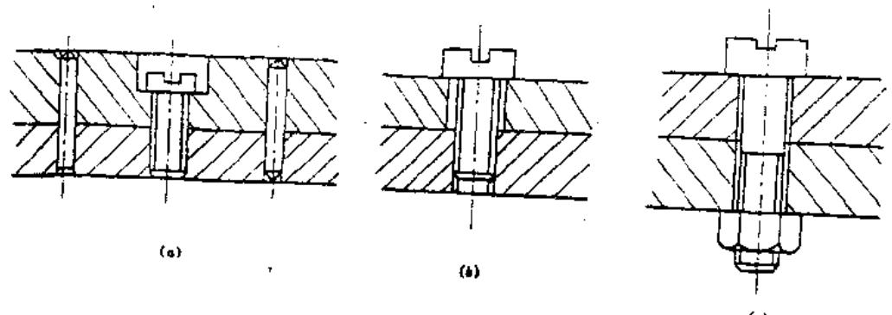

图13-8柱头螺钉连接

半圈头螺钉外形美观,但其起子槽强度较弱,拧紧力矩不宜过大。

滚花螺钉和元宝螺钉装拆时不需要工具,适用子螺钉需经常装拆或拧动的场合。

各种紧定螺钉可以靠拧入后端部顶紧来固定受力不大的零件的位置,

自攻螺钉经表面淬硬后,可拧入较软的黑色金属或有色金属材料以及塑料上的预制孔(由钻削、冲切或压铸制成),依靠其螺纹将孔壁的软材料挤入并充满螺纹的齿间,形成内螺纹。自攻螺钉拧入力矩小且具有良好的自锁性能,主要用于软材料制薄壁零件及塑料零件的连接。

在电子设备和仪器中,螺钉除用于连接和固定零件外,还可用于其它目的。例如轴位螺钉可用作转动零件的心轴,如图l3-9(a)所示;定位螺钉可与直线运动零件组成导轨,如图13-9(b)所示.

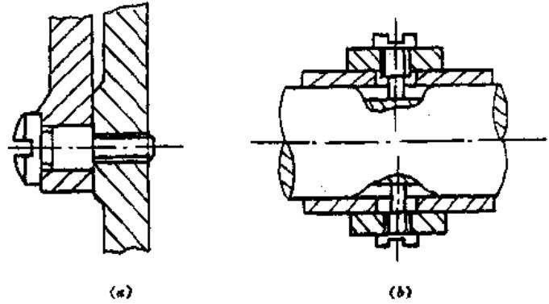

图13-9螺钉的其它用途

一般情况下,仪器中的螺钉连接和螺纹连接,受载往?很小,故螺钉直径通常按被连接零件的结构、尺寸等因素确定,不必进行强度计算。

螺钉的长度应根据被连接零件的厚度和螺钉拧八螺孔的深度确定,并圆整成国标规定的标准长度。为了保证螺钉连接可靠,螺钉必须有够的拧入深度,其最小拧入深度列于表13-2.

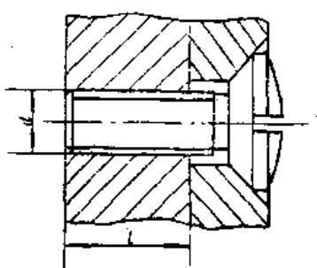

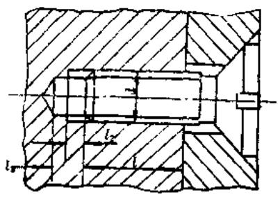

<table><tr><td rowspan=3 colspan=1>螺钉直径福</td><td rowspan=1 colspan=8>螺钉最小拧入深度i（mm）</td><td rowspan=3 colspan=1>4不小子（mm)</td><td rowspan=3 colspan=1>h不小于(mm)</td></tr><tr><td rowspan=1 colspan=4>钢螺钉拧入</td><td rowspan=1 colspan=4>黄铜螺钉拧入</td></tr><tr><td rowspan=1 colspan=1>钢</td><td rowspan=1 colspan=1>黄铜</td><td rowspan=1 colspan=1>铸铁</td><td rowspan=1 colspan=1>铝</td><td rowspan=1 colspan=1>钢</td><td rowspan=1 colspan=1>黄锅</td><td rowspan=1 colspan=1>铸铁</td><td rowspan=1 colspan=1>铝</td></tr><tr><td rowspan=1 colspan=1>M1</td><td rowspan=1 colspan=1>1</td><td rowspan=1 colspan=1>1</td><td rowspan=1 colspan=1>1.2</td><td rowspan=1 colspan=1>1.8</td><td rowspan=1 colspan=1>1</td><td rowspan=1 colspan=1>1</td><td rowspan=1 colspan=1>1</td><td rowspan=1 colspan=1>1.5</td><td rowspan=4 colspan=1>1</td><td rowspan=1 colspan=1>2</td></tr><tr><td rowspan=1 colspan=1>M1.2</td><td rowspan=1 colspan=1>1</td><td rowspan=1 colspan=1>1</td><td rowspan=1 colspan=1>1. 5</td><td rowspan=1 colspan=1>2.2</td><td rowspan=1 colspan=1>1</td><td rowspan=1 colspan=1>1</td><td rowspan=1 colspan=1>1. 2</td><td rowspan=1 colspan=1>1.8</td><td rowspan=1 colspan=1>2</td></tr><tr><td rowspan=1 colspan=1>M1.4</td><td rowspan=1 colspan=1>1</td><td rowspan=1 colspan=1>1. 2</td><td rowspan=1 colspan=1>1.8</td><td rowspan=1 colspan=1>2.8</td><td rowspan=1 colspan=1>1</td><td rowspan=1 colspan=1>1</td><td rowspan=1 colspan=1>1.5</td><td rowspan=1 colspan=1>2.2</td><td rowspan=1 colspan=1>2</td></tr><tr><td rowspan=1 colspan=1>M1.6</td><td rowspan=1 colspan=1>1.2</td><td rowspan=1 colspan=1>1.5</td><td rowspan=1 colspan=1>2.2</td><td rowspan=1 colspan=1>3.2</td><td rowspan=1 colspan=1>1.2</td><td rowspan=1 colspan=1>1.2</td><td rowspan=1 colspan=1>1.8</td><td rowspan=1 colspan=1>2.8</td><td rowspan=2 colspan=1>2.5</td></tr><tr><td rowspan=1 colspan=1>M2</td><td rowspan=1 colspan=1>1.2</td><td rowspan=1 colspan=1>1.5</td><td rowspan=1 colspan=1>2.2</td><td rowspan=1 colspan=1>3.2</td><td rowspan=1 colspan=1>1.2</td><td rowspan=1 colspan=1>1.2</td><td rowspan=1 colspan=1>1.8</td><td rowspan=1 colspan=1>2.8</td><td rowspan=3 colspan=1>1</td></tr><tr><td rowspan=1 colspan=1>M2.5</td><td rowspan=1 colspan=1>1. 5</td><td rowspan=1 colspan=1>1.8</td><td rowspan=1 colspan=1>2.8</td><td rowspan=1 colspan=1>1</td><td rowspan=1 colspan=1>1.5</td><td rowspan=1 colspan=1>1. 5</td><td rowspan=1 colspan=1>2.2</td><td rowspan=1 colspan=1>3.2</td><td rowspan=1 colspan=1>3</td></tr><tr><td rowspan=1 colspan=1>M3</td><td rowspan=1 colspan=1>1.8</td><td rowspan=1 colspan=1>2.2</td><td rowspan=1 colspan=1>3.2</td><td rowspan=1 colspan=1>5</td><td rowspan=1 colspan=1>1.8</td><td rowspan=1 colspan=1>1.8</td><td rowspan=1 colspan=1>2.8</td><td rowspan=1 colspan=1>4</td><td rowspan=1 colspan=1>3</td></tr><tr><td rowspan=1 colspan=1>M4</td><td rowspan=1 colspan=1>2.2</td><td rowspan=1 colspan=1>2.8</td><td rowspan=1 colspan=1>1</td><td rowspan=1 colspan=1>6</td><td rowspan=1 colspan=1>2.2</td><td rowspan=1 colspan=1>2.2</td><td rowspan=1 colspan=1>3.2</td><td rowspan=1 colspan=1>5</td><td rowspan=1 colspan=1>1.5</td><td rowspan=1 colspan=1>4</td></tr><tr><td rowspan=1 colspan=1>M5</td><td rowspan=1 colspan=1>2.8</td><td rowspan=1 colspan=1>3.2</td><td rowspan=1 colspan=1>5</td><td rowspan=1 colspan=1>7</td><td rowspan=1 colspan=1>2.2</td><td rowspan=1 colspan=1>2.8</td><td rowspan=1 colspan=1>4</td><td rowspan=1 colspan=1>6</td><td rowspan=1 colspan=1>1.5</td><td rowspan=1 colspan=1>5</td></tr><tr><td rowspan=1 colspan=1>M6</td><td rowspan=1 colspan=1>3.2</td><td rowspan=1 colspan=1>4</td><td rowspan=1 colspan=1>6</td><td rowspan=1 colspan=1>8</td><td rowspan=1 colspan=1>3.2</td><td rowspan=1 colspan=1>3.2</td><td rowspan=1 colspan=1>5</td><td rowspan=1 colspan=1>7</td><td rowspan=1 colspan=1>2</td><td rowspan=1 colspan=1>6</td></tr><tr><td rowspan=1 colspan=1>M8</td><td rowspan=1 colspan=1>4</td><td rowspan=1 colspan=1>5</td><td rowspan=1 colspan=1>7</td><td rowspan=1 colspan=1>10</td><td rowspan=1 colspan=1>4</td><td rowspan=1 colspan=1>1</td><td rowspan=1 colspan=1>6</td><td rowspan=1 colspan=1>8</td><td rowspan=1 colspan=1>2.5</td><td rowspan=1 colspan=1>8</td></tr><tr><td rowspan=1 colspan=1>M10</td><td rowspan=1 colspan=1>5</td><td rowspan=1 colspan=1>6</td><td rowspan=1 colspan=1>8</td><td rowspan=1 colspan=1>12</td><td rowspan=1 colspan=1>5</td><td rowspan=1 colspan=1>5</td><td rowspan=1 colspan=1>8</td><td rowspan=1 colspan=1>10</td><td rowspan=1 colspan=1>3</td><td rowspan=1 colspan=1>9</td></tr></table>

注对于各种螺纹连接,螺纹旋合长度一般不应小于2.5画螺纹。

电子设备和仪器中使用的螺钉直径 $\pmb { d }$ 一般在 $2 \sim 1 0 \mathrm { m m }$ 范围内,长度 $\pmb { \cal L }$ 通常约为直径 $\pmb { d }$ 的 ${ \mathfrak { z } } { \sim } 1 0$ 倍,即 $L \approx ( 8 \sim 1 0 ) d$ ·

设计螺钉连接时,若被连接零件材料较软,不宜加工螺纹,可以另镶入一块较硬的材料后再加工螺纹,如图13-10所示;若被连接零件厚度较薄,不能满足必要的螺纹拧入深度时,可以局部增加攻螺纹部位的厚度,如图13-11所示。

在压铸成型的塑料件或在薄金属板零件上的螺纹孔有时还采用单圈螺纹(俗称一扣螺纹),如图13-12所示.这种螺纹只宜用于受力很小的场合,为使螺钉能顺利地拧入螺纹孔,另一被连接零件上必须有足够长的螺钉导槽。

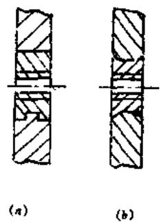

图13-10镶人硬质材料的馅构

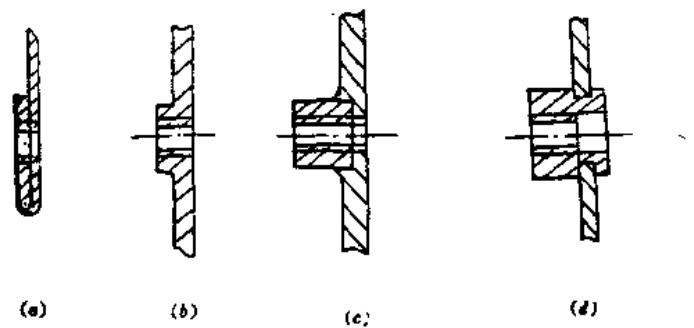

图13-11螺孔部位局部加厚的结构

(a)金属板弯边加厚(b)翻边加厚(c)焊接加厚(d)铆接加厚

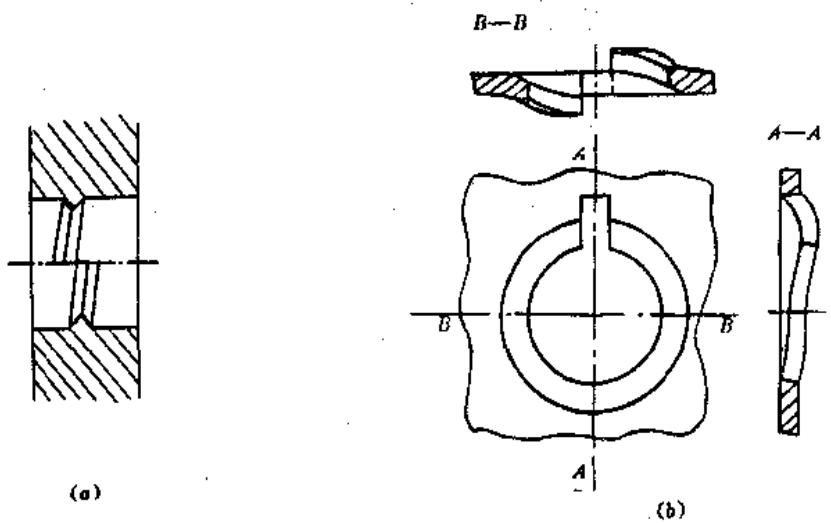

图13-12单围螺纹(a)压在塑料件中的单圈螺纹 (b)薄金属板等件上的单圈螺纹

2)螺母和垫圈常用螺母和垫圈分别列于表13-3、表13-4,其尺寸可查有关标准和手册.

表13-3常用蝶母

<table><tr><td rowspan=1 colspan=1>序号</td><td rowspan=1 colspan=1>名称</td><td rowspan=1 colspan=1>图样</td><td rowspan=1 colspan=1>序号</td><td rowspan=1 colspan=1>名称</td><td rowspan=1 colspan=1>图样</td></tr><tr><td rowspan=1 colspan=1>1</td><td rowspan=1 colspan=1>单面倒角或双面倒角六角螺母</td><td rowspan=1 colspan=1></td><td rowspan=1 colspan=1>5</td><td rowspan=1 colspan=1>带侧棺园螺母</td><td rowspan=1 colspan=1></td></tr><tr><td rowspan=1 colspan=1>2</td><td rowspan=1 colspan=1>光六角鳥螺母</td><td rowspan=1 colspan=1>盘</td><td rowspan=1 colspan=1>6</td><td rowspan=1 colspan=1>带侧孔圈螺母</td><td rowspan=1 colspan=1></td></tr><tr><td rowspan=1 colspan=1>3</td><td rowspan=1 colspan=1>光六角槽形螺母</td><td rowspan=1 colspan=1>星</td><td rowspan=1 colspan=1>7</td><td rowspan=1 colspan=1>切口圆螺母</td><td rowspan=1 colspan=1>鸭</td></tr><tr><td rowspan=1 colspan=1>4</td><td rowspan=1 colspan=1>滚花螺母</td><td rowspan=1 colspan=1>国</td><td rowspan=1 colspan=1>8</td><td rowspan=1 colspan=1>蝶形螺母</td><td rowspan=1 colspan=1>金</td></tr></table>

表13-1常用热器

<table><tr><td rowspan=1 colspan=1>序号</td><td rowspan=1 colspan=1>名称</td><td rowspan=1 colspan=1>图样</td><td rowspan=1 colspan=1>序号</td><td rowspan=1 colspan=1>名  称</td><td rowspan=1 colspan=1>图  样</td></tr><tr><td rowspan=1 colspan=1>i</td><td rowspan=1 colspan=1>平垫圈</td><td rowspan=1 colspan=1></td><td rowspan=1 colspan=1>3</td><td rowspan=1 colspan=1>弹梵垫画</td><td rowspan=1 colspan=1></td></tr><tr><td rowspan=1 colspan=1>2</td><td rowspan=1 colspan=1>弹梵垫圈</td><td rowspan=1 colspan=1>s</td><td rowspan=1 colspan=1>/</td><td rowspan=1 colspan=1>止动垫圈</td><td rowspan=1 colspan=1>+ 邮</td></tr></table>

六角螺母应用最广;六角扁螺母用于空间尺寸受限制的连接;光六角糟形螺母用于受冲击、振动、需防松的连接;各种圆螺母用于直径较大的场合,主要用于轴类零件的连接;蝶形螺母装拆时不需要工具,用于需经常装拆、受力不大的连接。

在螺钉连接中,采用平垫圈主要是为了增加接触面积,保护被连接零件的表面不受螺钉头或螺母的损伤;各种弹簧垫圈和止动垫圈主要是为了防止螺钉连接松动。

螺钉等连接零件的材料应根据具体情况选择,一般采用A3钢、10、15、20、25、30钢;对需导电的零件采用黄铜。

电子设备和仪器中的连接零件,考虑防锈、美观等因素,表面通常需镀锌或镀铬;对需导电的连接零件,有时还需镀银。

用于精密机械的螺钉和螺母,其精度要求较高,为此国家专门制定了有关公差标准,例如,国家标准(GB3103.2-82)对螺纹直径为 $\mathsf { 1 } \sim \mathsf { 3 } \mathsf { m m }$ 产品等级为 $\pmb { \mathcal { F } }$ 级的螺钉、螺栓和塑母的公差单独作了规定。

(2)螺钉的数目、位置布置和孔间距公差的确定

多数情况下,螺钉(栓)都是成组使用,为使连接结合面受载均匀,且便于加工和装配,设计时应合理确定螺钉(栓)的数目和布置它们的位置。螺钉(栓)在连接结合面上应呈对称布置,如图13-13所示。螺钉(栓)的数目不宜过多,主要根据被连接零件的结构、尺寸,并在参考已有的同类产品设计的基础上加以确定,当螺钉(栓)沿圆周排列时,应布置在同一圆周上,且取3、4、6、8、12等分的数目,以便于划线钻孔。

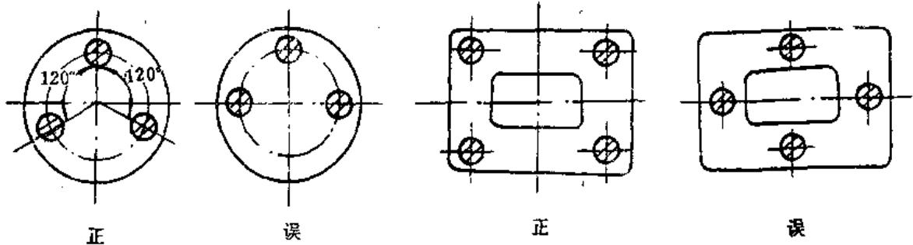

图13-13螺钉(栓)的布置

为保证螺钉连接能顺利装配以及被连接零件的相对位置精度,被连接零件上的孔间距应有公差要求,孔间距公差的计算和确定可参考有关标准和手册。

# (3)保证被连接零件相对位置精度的方法

采用螺钉(栓)连接时,被连接零件上的通孔直径一般大于螺钉直径,两者之间存在一定的间隙,因此被连接零件的相互位置并不确定,拆卸后重新组装时,难以保证其原来的相互位置精度,如图13-14所示。为了使被连接零件多次拆装后仍能保证原来的相互位置精度,通常需另加定位装置,常用的定位方法有以下两种:

1)利用两个定位销定位,如图13-15所示,当两个被连接零件为平面接合时,应采用两个定位销定位,以消除零件沿结合面的相对转动和移动,而且两定位销的间距应尽可能大些,以利于提高定位精度(见图 $1 3 - 1 5 ( 4 ) =$ .若被连接零件结合面结构对称而安装时又有确定的位置要求时,定位销应布置在一边,以确保实际安装时不会左右颠倒(见图13-15(b)),

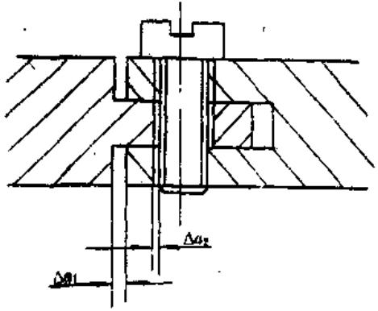

图13-14螺钉连接的间隙

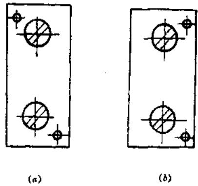

图13-15双定位销定位

2)利用圆柱面配合和一个定位销定位,如图13-16所示。当被连接零件为平接合且有一个圆柱面配合时,则只需另加一个定位销便可消除零件沿接合面的相对转动和移动,使零件定位。

当被连接零件仅用一个螺钉连接时,则应采用适当的结构来防止零件之间的相对转动,如图13-17所示。

螺钉连接在受变载荷作用或冲击、振动条件下工作时,往往会发生松脱现

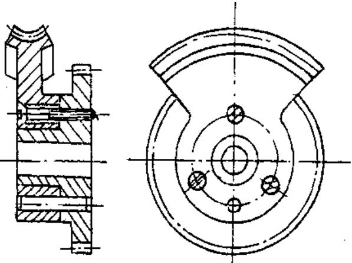

图13-16圆柱配合面加定位销定位

# (4)螺钉连接防松方法的选定

象,为确保述接可靠,应采用适当的防松方法。常用的防松方法有以下四类:

1)用增大率擦力的方法防松。这种方法主要是利用弹性零件的变形力来增加螺纹接触面上的正压力,从而增大摩撩力,以阻止螺纹零件作相对转动,达到防松目的。其防松结构如图13-18所示。其中,弹簧垫圈除依靠其变形后的弹力使螺纹接触面间的摩擦力增加来达到防松外,其尖角 $\pmb { c }$ 还刺入螺钉头(或螺母)和被连接零件的表面,起阻止螺钉(或螺母)松脱的辅助防松作用。

2)用机械方法防松。这种方法是通过附加零件来限制螺纹零件作相对转动,以达到防松,其结构如图13-19所示。

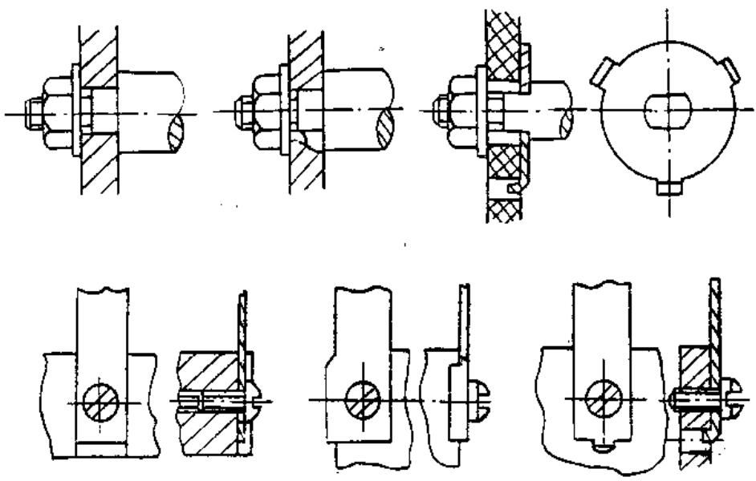

图13-17单螺钉连接的防转结构

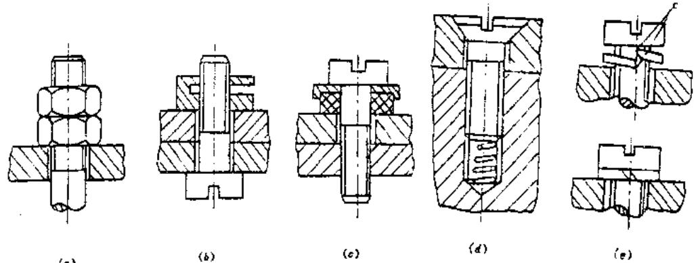

图13-18增大摩擦力的防松结构

{a)双螺母防松(b)切口螺母防松(c)橡胶垫圈防松(d)螺璇弹簧防松 $\left( e \right)$ 弹簧垫圈防松(a)金属片限制滚花螺母转动(b)开口销限制槽形螺母转动(c)、(d)止动垫圈限动螺母转动

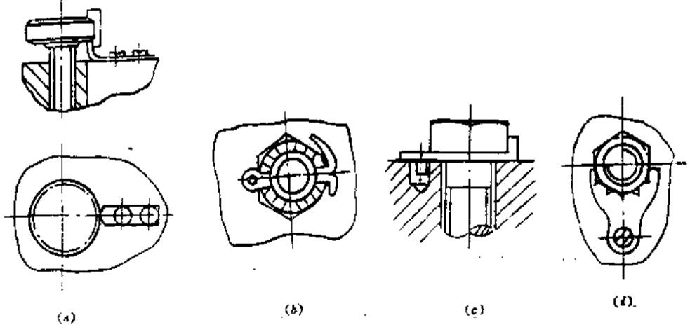

图13-19机械方法的防松结构

3)冲点或冲孔防松,如图 $1 3 - 2 0 ( a )$ 所示为在螺钉起子槽旁的被连接零件表面上冲点,使其产生局部塑性变形挤住螺钉头部以防止螺钉松脱;图13-20(b)所示为在螺钉(或螺栓)端部中心冲孔,以达到防松目的。这种防松方法用于不需拆卸的连接。用冲点防松使被连接零件表面受到损伤,已很少应用。

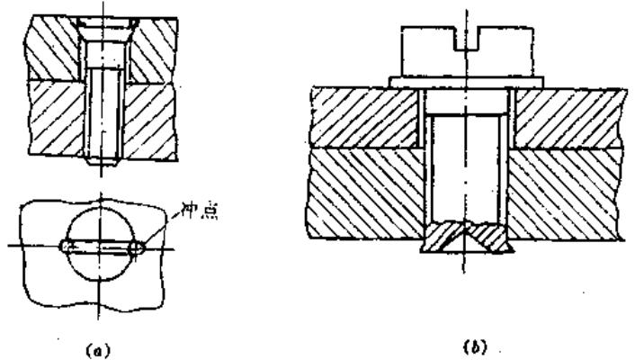

图13-20冲点或冲孔的防松结构

4)用粘接法防松。如图13-21(a)所示为用厌氧性粘合剂涂于螺钉的螺纹旋合表面,拧入螺母(或被连接零件的螺纹孔)后:粘合剂自行固化,即能起防松作用:图13-21()、(c)所示为将漆或粘合剂涂于螺钉头部表面以达到防松,这种方法常用尺寸较小的螺钉连接。

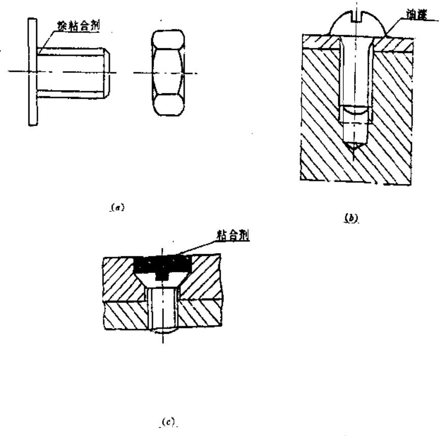

图13-21用粘接剂防松

# (5)防止螺钉、螺母丢失的结构

对于某些需经常拆装的螺钉连接,为防止螺钉丢失或落入仪器内部,可采用如图13-22、图13-23所示的特殊结构。设计防止螺钉丢失的结构时,应保证尺寸 $\bullet < b$ ,否则螺钉不能拆卸。

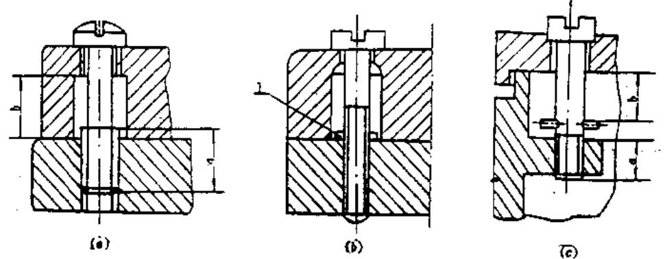

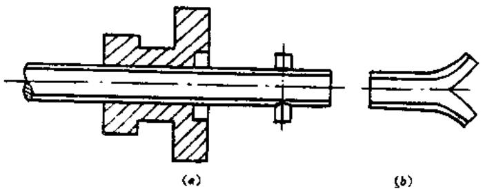

图13-22防止螺钉丢失的结构(a)靠螺钉头和螺纹间的缩颈(b)用酚醛塑料夹层纸垫画拧到螺纹上 (c)韋销钉

图13-23防止螺母丢失的结构

# 二、销钉连接

销钉连接是利用装入被连接零件孔中的销钉起连接作用,如图3-13(a)所示。在精密机械中,销钉除用于连接外,还常用于定位,以保证需多次拆装的零件之间的相互位置精度,如图13-24所示。

销钉的种类很多,常用销钉列于表13-5中,其尺寸可查有关标准和手册。

圆柱销主要用于定位,也可以用于连接和固定零件,当用于定位时,其定位精度取决于销与销孔的配合间隙;当用于连接时,是依靠过盈配合固定于零件中,若多次拆装会影响连接质量,故不宜用于经常拆装的连接。锥尾圆柱销也用作定位,带锥尾是为了便于装配。

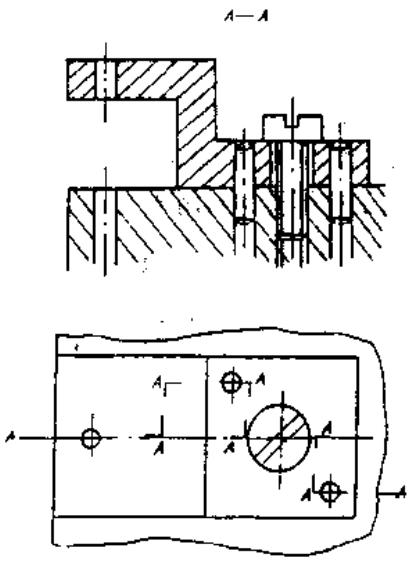

图13-24定位销钉

各种圆锥销主要用于连接和固定零件,因销钉带有锥度(1:50),靠楔入销孔后的锥挤作用固定在零件中,可多次拆装而不影响连接质量,但零件上的销孔加工较困难。其中开尾圆锥销和螺纹尾圆锥销可用来防止销钉松动脱落,如图13-25所示:螺纹头圆锥销用于销孔不能钻通的场合,带螺纹头是为了便于取出销钉,

表13-5常用销钉

<table><tr><td rowspan=1 colspan=1>序号</td><td rowspan=1 colspan=1>名称</td><td rowspan=1 colspan=1>图祥</td><td rowspan=1 colspan=1>序号</td><td rowspan=1 colspan=1>名称</td><td rowspan=1 colspan=1>图样</td></tr><tr><td rowspan=1 colspan=1>1</td><td rowspan=1 colspan=1>柱销</td><td rowspan=1 colspan=1></td><td rowspan=1 colspan=1>5</td><td rowspan=1 colspan=1>螺纹头圆锥销</td><td rowspan=1 colspan=1></td></tr><tr><td rowspan=1 colspan=1>2</td><td rowspan=1 colspan=1>惟尾圆柱销</td><td rowspan=1 colspan=1>0</td><td rowspan=1 colspan=1>6</td><td rowspan=1 colspan=1>螺纹尾圈锥销</td><td rowspan=1 colspan=1></td></tr><tr><td rowspan=1 colspan=1>3</td><td rowspan=1 colspan=1>围维销</td><td rowspan=1 colspan=1></td><td rowspan=1 colspan=1>7</td><td rowspan=1 colspan=1>围柱形槽销</td><td rowspan=1 colspan=1>小</td></tr><tr><td rowspan=1 colspan=1>4</td><td rowspan=1 colspan=1>开尾圆维销</td><td rowspan=1 colspan=1></td><td rowspan=1 colspan=1>8</td><td rowspan=1 colspan=1>弹性圆柱销</td><td rowspan=1 colspan=1></td></tr></table>

圆柱攢销是沿圆柱母线压出沟槽(通常为三条沟槽)的圆柱销,其优点是销孔无需精密加工,连接牢固,不需要附加防松装置。

弹性圆柱销(又称为弹性管销)是用弹性好.的薄钢板弯卷或薄钢管剖开制成,为使销钉与销孔能紧密配合,销孔直径应比销钉直径小些(小1/10左右)。这种销钉主要用于受力不大的连接

销钉的尺寸通常应根据被连接零件的结构、

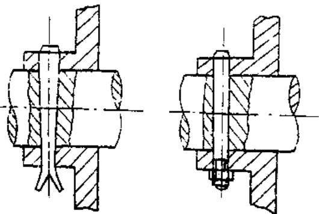

图13-25防松销钉连接

尺寸确定。如结构上无特殊要求,销钉的直径和销连接的有关尺寸可参照表13-6选定,当销钉受载较大或兼起过载保护作用时,应进行剪切和挤压强度验算。

销钉的材料一般采用A5、A6、A7、A8、35、45钢:需在装配时变形的开尾销钉可采用10、15号钢制造;弹性圆柱销一般应采用65Mn等弹性较高的材料制造;需防腐防磁的销钉可采用黄铜、不锈钢等材料制造。

表13-销钉直径和销连接的有关尺寸 $\left( \mathfrak { m m } \right)$ 

<table><tr><td rowspan=4 colspan=1>.M=            Q-1</td><td rowspan=1 colspan=1>D</td><td rowspan=1 colspan=1>1.5~2</td><td rowspan=1 colspan=1>2~3</td><td rowspan=1 colspan=1>3~4</td><td rowspan=1 colspan=1>1~5</td><td rowspan=1 colspan=1>5~6</td><td rowspan=1 colspan=1>68</td><td rowspan=1 colspan=1>8~11</td><td rowspan=1 colspan=1>11~17</td></tr><tr><td rowspan=1 colspan=1>面</td><td rowspan=1 colspan=1>0:6</td><td rowspan=1 colspan=1>0.8</td><td rowspan=1 colspan=1>1.0</td><td rowspan=1 colspan=1>1. 26</td><td rowspan=1 colspan=1>1.6</td><td rowspan=1 colspan=1>2.0</td><td rowspan=1 colspan=1>3.0</td><td rowspan=1 colspan=1>1.0</td></tr><tr><td rowspan=1 colspan=1>i</td><td rowspan=1 colspan=1>1.5</td><td rowspan=1 colspan=1>2.0</td><td rowspan=1 colspan=1>2.5</td><td rowspan=1 colspan=1>3.0</td><td rowspan=1 colspan=1>3.5·</td><td rowspan=1 colspan=1>4.0</td><td rowspan=1 colspan=1>6.0</td><td rowspan=1 colspan=1>7.0</td></tr><tr><td rowspan=1 colspan=1></td><td rowspan=1 colspan=1>1.2</td><td rowspan=1 colspan=1>.5</td><td rowspan=1 colspan=1>1.B</td><td rowspan=1 colspan=1>2.0</td><td rowspan=1 colspan=1>2.5</td><td rowspan=1 colspan=1>3.0</td><td rowspan=1 colspan=1>4.0</td><td rowspan=1 colspan=1>5.0</td></tr></table>

在精密机械和仪器工作过程中,载荷变化、温度变化以及振动等都可能引起销钉松脱,故应采用适当的防松结构,例如采用如图13-25所示的开尾圆锥销和螺纹尾圆锥销,装配后或将尾部掰开或用螺母锁紧;此外,还可采用如图13-25所示的防松环防松结构。

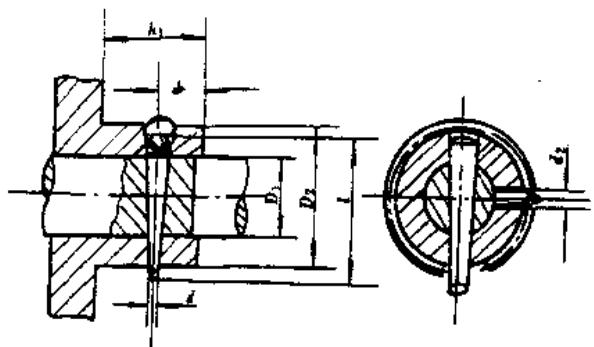

图13-26铸钉连接的防松环防松结构

# 三、夹紧连接

夹紧连接又称为摩攘连接,它是利用夹紧零件时产生的摩擦力将被连接零件连接在一起。这种连接夹紧和松开都很方便,故适用于需经常装拆和调整或改变零件相对位置的场合.

常用的夹紧方法有:螺钉夹紧、销钉夹紧、弹簧夹緊和偏心轮夹紧等。

图13-27是螺钉夹紧的两种典型结构。其中图 $1 3 - 2 7 ( a )$ 所示是靠拧紧螺钉时,将齿轮2夹紧于轴1和压板3的端面之间,以实现齿轮与轴的连接,这种连接结构可以方便地调整齿轮与轴的周向相对位置;图13-27(b)所示的结构,零件2的轮壳轴向长度较长,径向厚度较薄并沿轴向方向开槽,以使其具有弹性。夹紧时,拧紧附件3上的螺钉,使零件2的开槽轮壳径向弹性收缩,从而夹紧在轴1上,这种结构装拆、调整方便,且能保证较高的同轴度,但只能传递较小的力矩。

图13-27螺钉夹紧连接

图13-28所示为销钉夹紧的典型结构,图 $1 3 - 2 8 ( a )$ 所示的结构,轴1的端部沿轴向开孔,靠销钉打入销孔时,使其沿径向胀大而夹紧在零件2的孔中;图13-28(b)所示是靠圈锥销打入时的锥挤作用将零件1和2夹紧连接在一起。

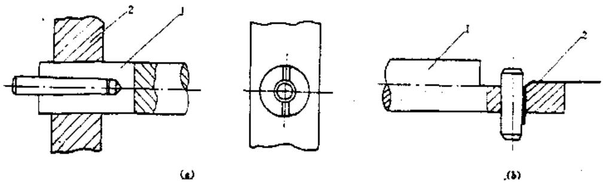

图13-28销钉夹紫连接

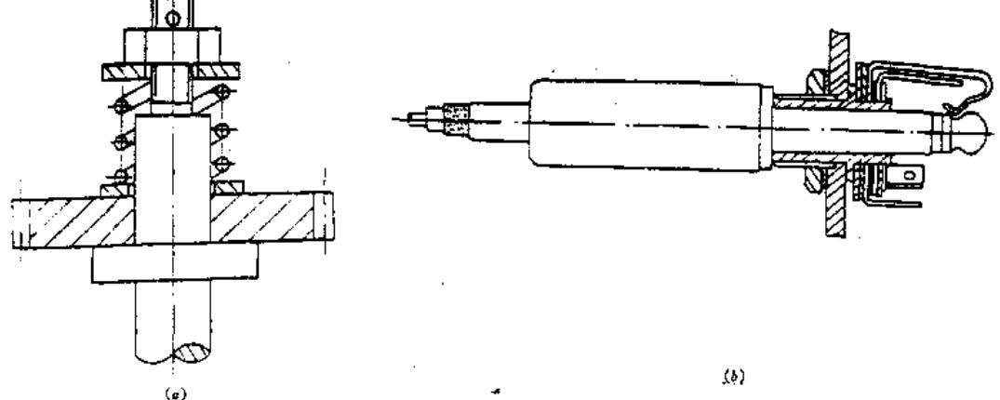

图13-29弹簧夹紧连接

图13-29是弹簧夹紧的两种典型结构。图 $1 3 - 2 9 ( a )$ 所示是利用弹簧变形所产生的弹力将齿轮夹紧于轴上,这种结构当齿轮传递的转矩超过弹簧力在齿轮接触端面上所能产生的极限摩撩力矩时,齿轮将在轴上打滑,因而可起过载保护作用,弹簧力的大小可通过螺母调节。图13-29(b)所示也是利用弹簧力夹紧的连接结构·由于这种结构难以保证被连接零件准确的相对位置,故在应用时,多与定位槽联用构成速拆式的夹紧连接结构,并广泛用于电子设备的接插件中,

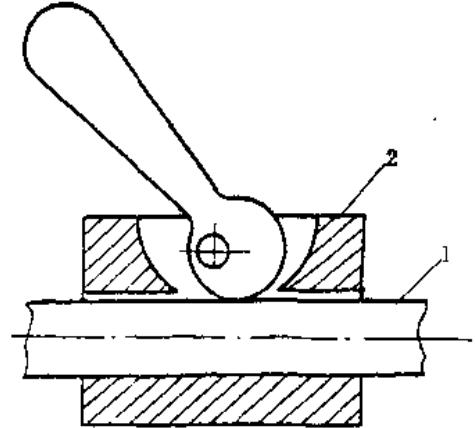

图13-30所示是偏心轮夹紧的典型结构。

图13-30偏心轮夹紧连接

# 四、速拆连接

速拆连接是在一个被连接零件上装有销子(或凸块),另一个被连接零件上开有缺口(或凹槽)连接时,使前一零件沿后一零件的缺口(或槽)方向作相对运动,将销子(或凸块)推进缺口(或凹槽)中卡住,从而将两个零件连接在一起的连接方式,如图13-31所示.

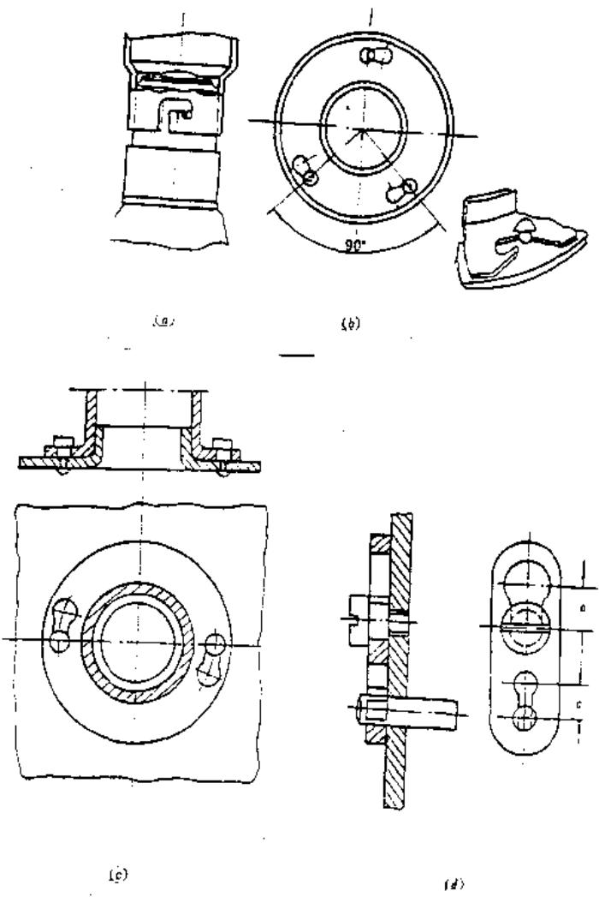

图13-31速拆连接

速拆连接可以是旋转式的,连接时被连接零件必须作相对转动,如图 $1 3 \substack { - 3 1 \left( a \right) , \left( b \right) , \left( c \right) }$ 所示;也可以是滑移式的,连接时被连接零件必须作相对直线移动,如图13-31(d)所示。被连接零件上的销子(或凸块)和缺口(或凹槽)的数目通常为 $_ { 1 \sim 3 }$ 个.

速拆连接结构简单,不需要任何工具便可快速拆装,但连接强度和被连接零件的相互位置精度较低,一般用于强度和位置精度要求不高但需快速方便地进行拆装的场合,抑光学仪器防护罩与镜简的连接等。

速拆连接应采用适当的防松结构,以防止受振动时发生松动,常用的防松结构见图13-32.

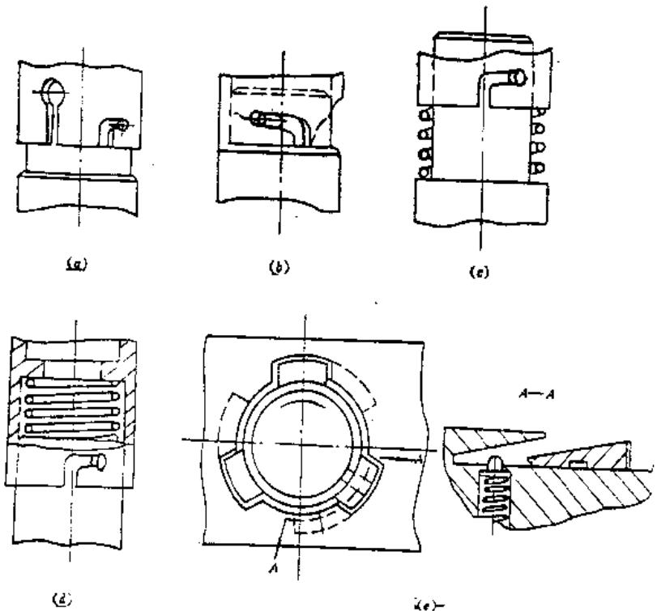

图13-32速拆连接的防松结构$\mathbf { \alpha } ( \pmb { \alpha } )$ 弹性连接径防松 (b)模形槽(或斜面)防松 (c)弹簧压紧防松(d)弹簧、防松槽联合防松(e)定位销防松

# 五、挡圈

挡圈是电子设备和仪器、仪表中常用的一种可单独使用的速拆连接零件,它通过自身的弹性变形力固定在轴上的凹槽中,对轴上零件起轴向定位和限位作用,常用的挡圈结构如图13-33所示.

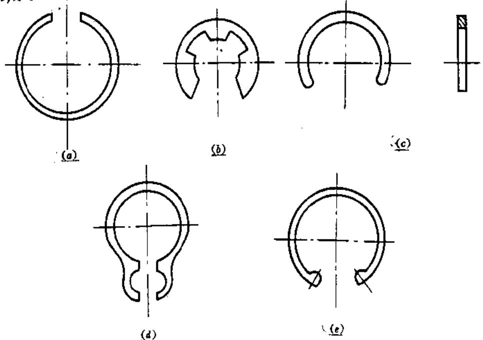

图13-33常用挡圈结构

(a)钢丝挡围 (b)开口挡 (c)夹紧档圈 $\left( 4 \right) , \left( \varepsilon \right)$ 弹性挡围

# 13.3不可拆连接

可拆连接通常需要专门的连接零件才能进行正常的连接,成本较高,连接效率低,且有松动的可能。因此,在不需要拆卸的结构中,应尽量采用不可拆连接。常用的不可拆连接有铆接、压合连接、铸合连接、胶接、焊接等。

# 一、铆接

仰接是利用铆钉或被连接零件上起铆钉作用的铆接颈的塑性变形将零件连接在一起的连接方法。它包括铆钉连接与扩铆、收铆连接,前者是利用铆钉(包括实心铆钉和空心铆钉)头部的塑性变形把被连接零件联成一体,如图13-34所示;后者是利用被连接零件的局部塑性变形直接铆合在一起,如图13-35所示。

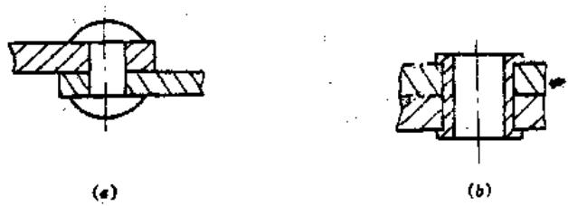

图13-34铆钉连接

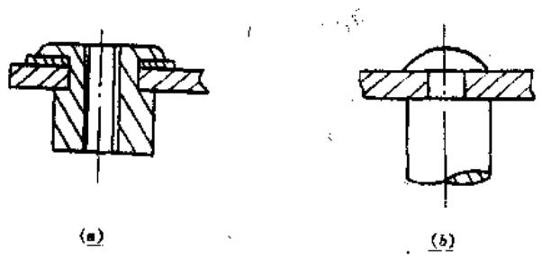

图13-35扩、收连接(a)扩铆连接 (b)收柳连接

铆接强度较高,且不受零件形状的限制,常用于薄板与薄板、薄板与圆柱体零件以及一些不能承受较大冲击力的非金属零件(如玻璃、陶瓷、塑料零件)的连接。

铆接时,若需将铆钉加热再进行铆合,称为热铆;若不需要加热而直接进行铆合,称为冷铆,在电子设备和精密机械中,被连接零件结构尺寸小,受载不大,选用的铆钉通常较小,所以一般采用冷铆。

在铆接过程中,由于铆接力的作用,被连接零件在钾合处会产生一定的塑性变形,为了减少被连接零件的变形,应遵循下列原则:

$\textcircled{1}$ 被连接件材料的弹性模量应大于铆钉材料的弹性模量,$\textcircled{2}$ 尽可能增大被连接零件的铆接支承面,  
$\textcircled{3}$ 尽可能减小铮接力。

为了增大被连接零件的铆接支承面,可在铆合处增加垫圈;因结构或工艺需要而采用较大直径的铆钉或铆接颈时,为减小铆接力,可在铆钉或铆接颈的端面上预先制出锥形孔,如图13-36所示.

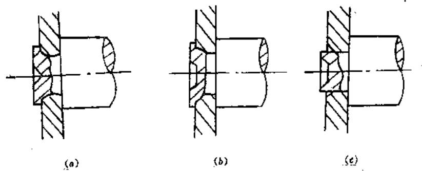

图13-36.减小铆接力的铆接结构

在电子设备和精密机械中经常采用铆钉连接和扩铆连接.设计铆钉连接时,一般按下列步骤进行。

(1)选择铆钉的类型和材料铆钉的类型很多,且大多已标准化。常用的铆钉列于表13-7中,其尺寸可查有关标准和手册。其中,半圆头铆钉最常用;沉头和半沉头钉主要用于受结构和工作条件限制,钉头必须沉入被连接零件表面的连接;平头铆钉主要用于不坚固材料(如皮革、木材等)制成的零件的连接;空心铆钉和管状铆钉主要用于非金属材料(如陶瓷、玻璃等)零件的连接以及需要通过电路接线处的连接。

表13-7常用铆钉

<table><tr><td rowspan=1 colspan=1>序号</td><td rowspan=1 colspan=1>名称</td><td rowspan=1 colspan=1>图样</td><td rowspan=1 colspan=1>序号</td><td rowspan=1 colspan=1>名称</td><td rowspan=1 colspan=1>图样</td></tr><tr><td rowspan=1 colspan=1>1</td><td rowspan=1 colspan=2>半圆头铆钉</td><td rowspan=1 colspan=1>5</td><td rowspan=1 colspan=1>扁圆头半空心铆钉</td><td rowspan=1 colspan=1></td></tr><tr><td rowspan=1 colspan=1>2</td><td rowspan=1 colspan=1>沉头铆钉</td><td rowspan=1 colspan=1></td><td rowspan=1 colspan=1>6</td><td rowspan=1 colspan=1>空心锦钉</td><td rowspan=1 colspan=1></td></tr><tr><td rowspan=1 colspan=1>3</td><td rowspan=1 colspan=1>半沉头铆钉</td><td rowspan=1 colspan=1></td><td rowspan=1 colspan=1>7</td><td rowspan=1 colspan=1>管状邻钉</td><td rowspan=1 colspan=2></td></tr><tr><td rowspan=1 colspan=1></td><td rowspan=1 colspan=1>平头铆钉</td><td rowspan=1 colspan=1></td><td rowspan=1 colspan=1>8</td><td rowspan=1 colspan=1>标牌柳钉</td><td rowspan=1 colspan=2></td></tr></table>

铆钉在制造和铆接时,都要产生很大的塑性变形,因此铆钉材料应具有良好的塑性,常用的铆钉材料有低碳钢、紫铜、黄铜、铝禾 等。空心铆钉通常采用黄铜制造;在铆接脆性材料制成的零件时,铆钉通常采用软铝、黄铜制造;铆钉兼作导电零件时可采用铝、黄铜或紫铜制造。在铆接金属零件时,铆钉最好选用与被连接零件类似的材料制造,例如,钢制零件用钢铆钉、铝制零件用铝铆钉等等,这样可减少铆钉因化学效应而引起的腐蚀。

(2)确定有关尺寸在电子设备和精密机械中,由于受载很小,铆钉的尺寸可按被连接零件的结构、尺寸确定,一般不进行强度验算.

当被连接零件的总厚度 $s$ 在 $2 \sim 1 0 \mathsf { m m }$ 之间时,铆钉直径 $\gamma _ { d }$ 可按下式确定:

$$
d = 1 + 0 . 5 s \qquad \mathrm { ( m m ) }
$$

铆钉的长度!以及铆钉孔的尺寸可参照“仪器仪表结构设计手册"选定。

设计扩铆连接时应注意以下几点:

$\textcircled{1}$ 铆接颈材料应具有良好的塑性,通常采用低碳钢、紫铜、铝和铝合金等。$\textcircled{2}$ 扩铆部位应保证工具能够伸入且便于操作。$\textcircled{3}$ 扩铆产生的局部变形应不影响其它部分的结构形状及精度,$\textcircled{1}$ 扩铆时,预留部分应保证形成完整的扩铆头或凸边。$\textcircled{5}$ 用扩铆连接相互垂直的矩形断面的冲压零件时,为减少铆接力,常采用分铆法,如图13-37所示。分铆法铆接力小,不易损伤被连接零件,而且 $$ 般能保证电子设备、精密机械和仪器零件连接的可靠性。

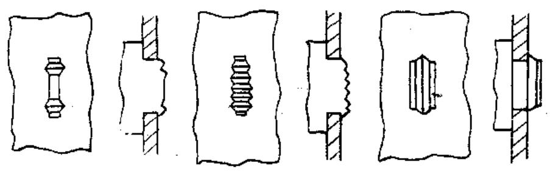

图13-37用分铆法钢接板状零件

$\textcircled{6}$ 可以通过增加附件或改变接触面的形状,使结构能传递较大的转矩。如图 $1 3 - 3 8 ( a )$ (b)所示为利用特制的花纹垫圈增加摩擦力以传递较大的转矩;图 ${ \mathrm { 1 } } 3 \substack { \mathrm { - } 3 } 8 \left( c \right) , \left( d \right) , \left( e \right)$ 所示为利用各种非圈柱面轴颈以传递较大的转矩。

在精密机械中,根据被连接零件的结构特点,有时还采用收铆连接(又称为辊边),即在铆接过程中,将被连接零件向里收合,以实现连接,如图13-39所示。

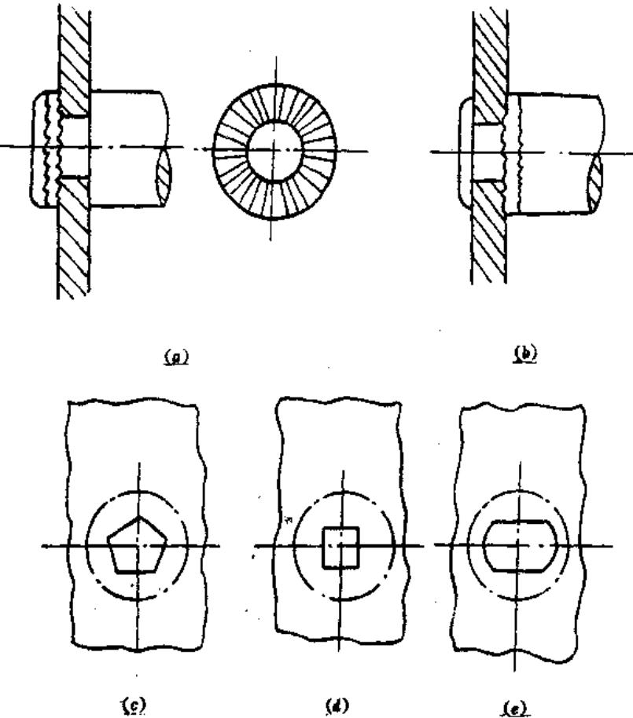

图13-38用于传递较大转矩的铆接结构

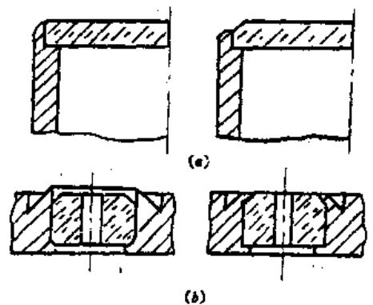

图13-39收铸连接结构

# 二、压合连接

压合连接是利用被连接零件在连接处的过盈,把一个零件压入另一个零件构成的连接。这种连接不加其它连接零件和粘合剂,故只宜用于传递力矩不大的结构中,

压合连接要求被连接零件的压合表面具有较高的加工精度,所以压合表面通常采用容易获得较高精度的圖柱面。

精密机械中常用的压合连接有光面压合连接和滚花面玉合连接两类,

# 1.光面压合连接

光面压合连接是利用光滑圆柱面的过盈配合来实现连接的,如图 $1 3 { \ - } 4 0 ( a )$ 所示。孔、轴直径的基本尺寸相同,过盈量的大小通过选择配合公差来获得,连接强度靠实际过盈量保证,

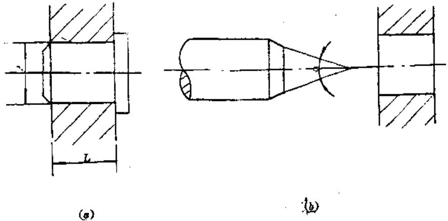

图13-40光面压合连接

精密机械中的光面压合连接,由于受载不大,一般不进行连接强度计算。通常根据载荷大小、被连接零件的材料、孔壁厚薄等情况选择配合。常用的配合有 $H 7 / \tau 5 , H 7 / \tau 6 , H 7 / u 6$ 等,过盈量越大,连接强度越高,但对中精度越代。在要求精确对中的场合,可选用过渡配合$ H 7 / \pi 6 , H 7 / k 8 ,$ 为保证必要的连接强度,可加螺钉、销钉、分铆等附加连接,

经验表明,采用光面压合连接时,为提高连接强度,1配合表面粗糙度最好选用 $\frac { 2 . 8 } { \nabla }$ 

光面压合连接的压合方 $\sin ^ { \angle } \alpha$ 有:常温下将轴压入孔中;将孔加热膨胀后再将轴压入;将轴冷却收缩后再压入孔中;将孔加热,同时将轴冷却再压入,精密机械中,通常采用常温下压入的方法,为使零件易于压入和防止配合面擦伤,应在轴端作出顶角 $\alpha { = } 1 0 ^ { \circ } { \sim } 3 0 ^ { \circ }$ 的导向圆锥,如图13-40(b)所示,

光面压合连接结构简单,可获得较高的连接精,但强度较低,只能传递较小的转矩,而且孔、轴加工精度要求高,当连接尺寸较小时,制造闲难,成本较高,因此对连接精度要求不高、尺寸不大的零件常采用滚花面压合连接。

# 2.滚花面压合连接

滚花面压合连接是指被连接零件之一的压合表面为滚花圆柱面的连接,如图13-41所示。通常是在较硬的轴表面制出直纹滚花,将轴压入孔中,这样轴上的一部分凸起的花纹嵌入孔的内圆柱表面,从而将两个零件连接成一体。

当轴滚压花纹后,花纹顶圈直径将大于轴的原始直径.直径增加的数值与零件的材料和花纹的节距有关,材料越硬,直径增述少,设计时通常取直径增量 $\pmb { \Delta } \pmb { \lambda }$ 为

$$
\Delta t = ( 0 . 2 5 \sim 0 . 5 ) 6 ( \ m m )
$$

式中,一花纹节距 $\left( \pmb { \ m } \pmb { \operatorname { n } } \right)$ ·

钢质零件(含碳量为 $( 0 . 3 5 \sim 0 . 4 ) \% )$ 滚花前后的直径增量和配合过盈量列于表13-8中.

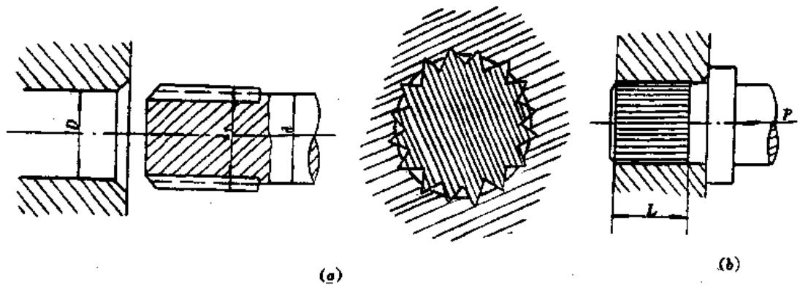

图13-41.滚花面压合连接

表13-8滚花前后的轴径增量和配合过盈量 $\mathrm { { ( } } \mathtt { m m } \mathrm { { ) } }$ )

<table><tr><td rowspan=2 colspan=1>经：(mm)</td><td rowspan=2 colspan=1>花纹节距：(mm)</td><td rowspan=1 colspan=2>淀花后轴径增量d</td><td rowspan=1 colspan=2>过   盈</td></tr><tr><td rowspan=1 colspan=1>最小</td><td rowspan=1 colspan=1>最大</td><td rowspan=1 colspan=1>最小</td><td rowspan=1 colspan=1>最大</td></tr><tr><td rowspan=1 colspan=1>1.5~2.8</td><td rowspan=1 colspan=1>0.3</td><td rowspan=1 colspan=1>0. 06</td><td rowspan=1 colspan=1>0. 12</td><td rowspan=1 colspan=1>0. 04</td><td rowspan=1 colspan=1>0. 12</td></tr><tr><td rowspan=1 colspan=1>3~4.5</td><td rowspan=1 colspan=1>0.5</td><td rowspan=1 colspan=1>0.08</td><td rowspan=1 colspan=1>0.15</td><td rowspan=1 colspan=1>0.06</td><td rowspan=1 colspan=1>0. 15</td></tr><tr><td rowspan=1 colspan=1>5~8</td><td rowspan=1 colspan=1>0.6</td><td rowspan=1 colspan=1>0.12</td><td rowspan=1 colspan=1>0.20</td><td rowspan=1 colspan=1>0. 09</td><td rowspan=1 colspan=1>0.20</td></tr></table>

滚花面压合连接的连接强度较高,可以传递较大的转矩:且孔、轴加工精度要求不高,容易加工:租慈按精度较低,承受轴向载荷的能力较小.为了提高被连接零件的对中精度,一般应在滚花轴前端加一段光滑圆柱面作为导引部分,或者在压合时使用定心夹具,若对中精度要求较高,还可以在压合后进行附加的机械加工。

在精密机械中,压合连接应用较广,设计时应注意下列几点:

(1).压合连接只有在被连接零件(至少其中之)材料塑性较好时才适用。

(2)在常温下进行压合时,所选配合的过盈量不宜过大,

(3)压入件上应设置台阶(如轴肩等),以承受轴向力并保证被连接零件的轴向相对位置。为保证轴肩能紧靠在孔的端面上,通常应使轴上的过渡圆角小于孔的倒角,或者在轴肩处于设退刀槽;对滚花面压合连接也可以在滚花部分与轴肩端面之间留一段距离,如图13-41(b)所示,

(4)为了获得较高的连接强度和精度,连接处应有足够的压合长度L(见图 $1 3 - 4 0 ( a )$ 、图13-41(b)),其数值可按表13-9选取。

表13-g压合长度L

<table><tr><td rowspan=1 colspan=1>轴径d（mm）</td><td rowspan=1 colspan=1><2</td><td rowspan=1 colspan=1>2~4</td><td rowspan=1 colspan=1>Y</td></tr><tr><td rowspan=1 colspan=1>压合长度L（mm）</td><td rowspan=1 colspan=1>(1.5~3.0)</td><td rowspan=1 colspan=1>(1~2)d</td><td rowspan=1 colspan=1>5+0.5d</td></tr></table>

# 三、铸合连接

铸合连接是把一个尺寸较小,但具有一定性能要求的零件(通常称为嵌件)铸入另一个零件(称为基本件)而构成的连接。嵌件材料一般是金属材料,如钢、黄铜、青铜等;基本件材料可以是金属材料,如铝合金、锌合金、铸造黄铜等,也可以是非金属材料,如塑料、玻璃、陶瓷等。如图13-42所示,1为金屑制的接触钉,2为塑料绝缘套,两者构成铸合连接。

铸合连接有下列优点:

(1)它可使基本件局部获得其原来所不具备而工作要求又必需的性能,因而可利用资源充足,便于制造的廉价材料来制造基本件,这样既满足了使用要求又降低了制造成本,例如某些仪器、设备的外壳、手柄、按钮、电插座等,采用塑料制造,将具有重量轻、绝缘性好、耐腐蚀、价廉、外形美观等一系列优点,但缺点是强度低。为了提高连接部分的强度,可以将强度较高的金属嵌件铸入塑料零件中。如图13-43所示的旋钮,将黄铜螺母2铸入塑料件1,从而使旋钮局部具有足够的强度,

(2)嵌件的铸合表面加工精度要求不高。

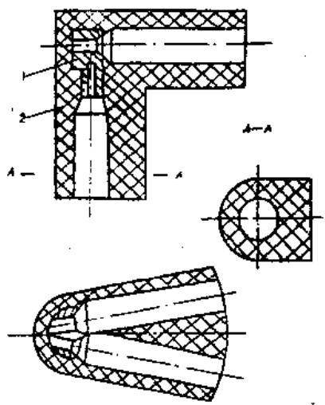

图13-42铸合连接结构

(3)它是依靠材料接触表面的附着力或局部结构来实现连接的,因而可获得较高的连接强度。

(4)连接工艺比较简单,在浇铸的同时,就进行了铸合连接。

铸合连接方法主要有压铸法(当基本件采用金属材料时)和压制法(当基本件采用塑料时)两种,由于压铸模和塑压模制造成本较高,故铸合连接只适用于大批大量生广的场合。

设计铸合连接时注意以下几点:

(1)嵌件熔点应高于基本件熔点。嵌件一般是熔点较高的钢或有色金属等预制件,铸合时不允许出现可塑状态。

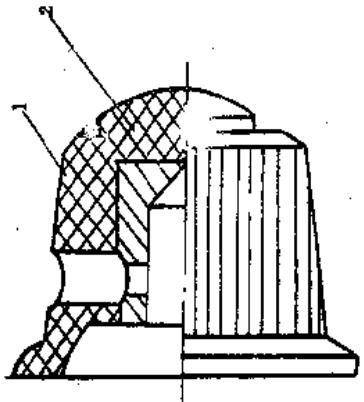

图13-43旋钮的铸合连接

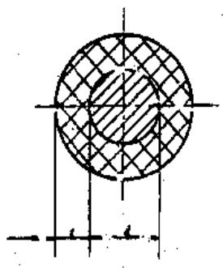

图13-44铸合连接的尺寸关系

(2)嵌件与基本件材料的线膨胀系数应尽可能接近,否则会发生铸合内应力,严重时会在两者的铸合表面处出现缝隙或裂纹。当嵌件和基本件材料的线膨胀系数相差较大时,则应通过合理选择连接结构和尺寸来保证其连接质量。

当嵌件材料的线膨胀系数小于基本件材料的线膨胀系数时,为防止出现裂纹,应使强度较弱的零件具有足够的断面尺寸,对于图13-44所示和类似的铸合连接结构,其连接尺寸可按表13-10选定。

表13-10嵌件直径与塑料层厚度的关系(mm)

<table><tr><td rowspan=1 colspan=1>嵌件直径&</td><td rowspan=1 colspan=1>≤</td><td rowspan=1 colspan=1>>3~6</td><td rowspan=1 colspan=1>>6~10</td><td rowspan=1 colspan=1>>10~18</td></tr><tr><td rowspan=1 colspan=1>塑料层厚度i</td><td rowspan=1 colspan=1>1.5</td><td rowspan=1 colspan=1>2.5</td><td rowspan=1 colspan=1>3.5</td><td rowspan=1 colspan=1>5</td></tr></table>

当嵌件材料的线膨胀系数大于基本件材料的线膨胀系数时,可采用如图13-45所示的结构,利用嵌件在轴向的较大收缩并通过两个轴肩将基本件压紧以保证较好的连接质量.

(3)为提高连接强度,防止受载后嵌件与基本件之间产生相对移动或转动,可将嵌件的铸合表面制成花纹、凸肩、凹槽或多面体等形状,如图13-46所示。

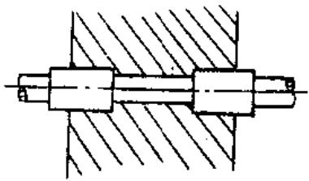

图13-45利用轴肩压紧的合连接

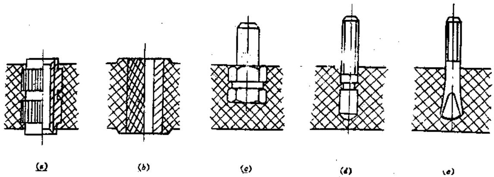

图13-46防止相对转动(或移动)的铸合连接结构

(4)若基本件材料为塑料,厚度太薄会影响连接质量,故应保证其最小厚度。各种塑料的最小厚度尺寸可查有关手册。

(5)嵌件在压铸模或塑压模中的位置不能因铸合时加压而改变.

# 四、胶接

胶接是利用胶粘剂将被连接零件连接在一起的连接方法。

# 1.胶接的特点及应用

胶接与其它连接方法相比,具有下列优点:

(1)可连接各种材料(金属、非金属)的签件,特别是一些用其它方法很难连接的材料(如玻璃、陶瓷、橡胶、塑料等)采用胶接可以很容易地连接在一起。

(2)胶接处应力分布均匀,避免了焊接、铆接、螺钉连接等所引起的局部应力集中,因而可提高零件的疲劳强度。

(3)具有良好的综合性能。胶接接头具有较高的强度和良好的密封性、电绝缘性、耐腐蚀性,且重量轻,表面平整光滑、美观。

(4)具有灵活的可调和性。在配制胶粘剂时,可按其性能要求灵活地变更其组分,从而获得具有各种指定特性的胶接接头。

胶接的缺点是:

(1)胶接的不均匀扯离、抗剥离、抗冲击、抗弯强度较低。(2)一般胶粘剂耐热性不高(一般为 $1 5 0 \Upsilon$ ,最高为 $\mathsf { \pmb { 3 0 0 } } \mathsf { \pmb { C } }$ ),使用温度过高时,胶接强会迅速下降。(3)某些胶粘剂粘接工艺较复杂,被连接零件胶接表面的净化处理、粘接工艺过程控较严,需加温加压,固化时间长。

(4)胶接质量尚无完善的无损检验方法,

在电子设备和精密机械零、部件的制造中,采用胶接代替某些机械连接,简化了复杂机械结构并解决了某些过去难以解决的问题。例如,电子设备面板上的铝(或铜)质铭牌、料装饰板等采用914室温固化环氧树脂胶粘剂粘接,取得了较好的效果。

再如,图 $\pmb { \{ 3 - 4 7 ( a ) } $ 所示的电视机偏转线围与显像管径采用EVA-I型热熔胶粘剂粘接可避免偏转线围从管径上滑落:图13-47(b)所示的线圈架1和壳体2采用JW-1修补胶剂可牢固地粘接在 $\ M$ 起:图13-47(c)所示的调节器圆盘,采用环氧树脂胶粘剂将铝质镀银:脚2与布胶棒圈盘1粘接在一起;图13-47(d)所示的矩形截面波导管是由四块铝(或铜)采用导电胶粘接而成,在导电性能上可达到理想的效果。

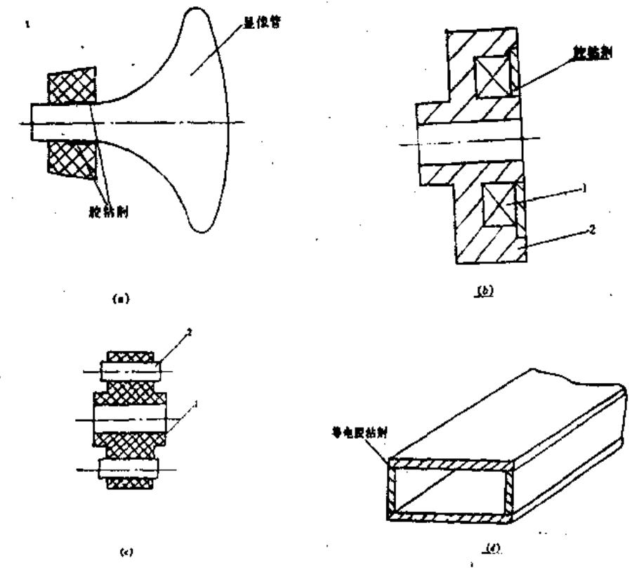

图13-47胶接的应用实

2.胶粘剂

胶粘剂是以粘料为主要成分,再加入其它附加成分、如固化剂(使胶粘剂发生固化)、增塑剂(提高胶粘剂的冲击韧性)、稀释剂(降低胶粘剂粘度,使胶层厚薄均匀,延长使用寿命)填料(改善胶粘剂的加工性、耐久性、强度及其它性能)及助剂等配制而成的。

不同种类的胶粘剂,具有不同的物理、化学、机械性能,并且所能胶接的材料也不相同。

设计时,应根据被连接零件材料的均理、化学性质,使用条件等具体情况正确选择胶粘剂.

胶粘剂按化学成分可分为两类:

(1)无机胶粘剂以无机化合物为基础,如磷酸盐、硼酸盐等,它不适合胶接金属零件,(2)有机胶粘剂又分为天然胶粘剂和合成胶粘剂,

天然胶粘剂主要用于胶接纸弘、卡材等非金属零件,也可以胶接受力很小的金属零件,常用的天然胶粘剂有虫胶、骨胶、淀粉胶等。

合成胶粘剂以树脂为基础,主要用于胶接金属零件和非金属零件。下面介绍几种常用的合成胶粘剂。

1)环氧树脂胶粘剂二氧树脂胶粘剂是目前应用最广的一种胶粘剂,俗称为“万能胶”。它是以环氧树脂为主要成分,并加入固化剂等辅助成分配制而成,具有粘接强度高,良好的电绝缘性、耐腐蚀性、耐温性,胶层收率小,粘接工艺简单,现可常温固化,也可以加温固化“特气,适用下金属与金属、非金属与非金属、金属与非金属零件的胶接。

环氧树脂胶粘剂既可以根据性能要灾按比例自行配制,也可选用配制定型的成品,表13-11列出了部分常用的环氧树脂胶粘剂的牌号、组成、性能及用途。

表13-11部分常用环氧树脂胶粘剂的牌号、性能及用途

<table><tr><td rowspan=1 colspan=1>牌号</td><td rowspan=1 colspan=1>组成</td><td rowspan=1 colspan=1>生   能</td><td rowspan=1 colspan=1>用途</td></tr><tr><td rowspan=1 colspan=1>室濕固化环氧一号胶</td><td rowspan=1 colspan=1>E51环氧树脂、二亚乙基三胺、邻苯二甲馥二丁指</td><td rowspan=1 colspan=1>铝合金粘接件剪切强度：18MPa</td><td rowspan=1 colspan=1>各种金属、胶木、陶瓷、玻璃等粘接</td></tr><tr><td rowspan=1 colspan=1>914室快速固化环氧胶粘剂</td><td rowspan=1 colspan=1>环氧树脂、胺类固化剂</td><td rowspan=1 colspan=1>·具有良好的粘接性能和耐水、耐热、耐冲击等性能</td><td rowspan=1 colspan=1>主要用于金属、陶瓷、玻璃、木材、胶木等材料的粘接和修补</td></tr><tr><td rowspan=1 colspan=1>JW-1修补胶粘剂</td><td rowspan=1 colspan=1>环氧树脂、650聚酰胺</td><td rowspan=1 colspan=1>具有较高的粘接强度，加温固化，耐水、煤油等</td><td rowspan=1 colspan=1>主要用干各种金属（钢、铝、铁、不锈钢、黄铜）玻璃钢、胶木等粘接</td></tr><tr><td rowspan=1 colspan=1>2胶粘剂</td><td rowspan=1 colspan=1>E-44环氧树脂、液体聚硫橡胶</td><td rowspan=1 colspan=1>常温下具有良好的粘接强度，铝合金粘接件剪切强度：18~20MPa</td><td rowspan=1 colspan=1>主要用于金属与硬质非金属材料的粘接</td></tr><tr><td rowspan=1 colspan=1>环氧-聚硫胶粘剂</td><td rowspan=1 colspan=1>环氧树脂、液体聚硫橡胶</td><td rowspan=1 colspan=1>低温下具有良好的粘接强度，钢粘接件剪切强度：26~28MP</td><td rowspan=1 colspan=1>主要用于粘接钢、铝、铜等金属和玻璃、陶瓷、木材、热固性塑料</td></tr><tr><td rowspan=1 colspan=1>YH-610通用型环氧胶粘剂</td><td rowspan=1 colspan=1>E-44环氧树脂、聚硫橡胶</td><td rowspan=1 colspan=1>铝合金粘接件剪切强度（常温）.>15MPa</td><td rowspan=1 colspan=1>主要用于机械设备、仪器仪表的铭牌粘接</td></tr></table>

2)聚氨脂胶粘剂聚氨脂胶粘剂具,高的粘接强度和较大的冲击韧性,耐低温性能好,特别是在超低温下,粘接强度反而增加。此外,还具有优良的耐水、耐酸、耐油、耐溶剂、耐老化性能,既可以室温固化,也可以加温固化,其缺点是毒性大,耐热性较差,只能在 $\mathtt { i o 0 r }$ 以下使用,固化时间长。

聚氨脂胶粘剂主要用于一些金属材料和非金属材料的粘接。部分常用的聚氨脂胶粘剂的牌号、组成、性能及用途列于表13-12.

表13-12部分常用聚氢脂胶粘剂的牌号、性能及用途

<table><tr><td rowspan=1 colspan=1>牌号</td><td rowspan=1 colspan=1>组成</td><td rowspan=1 colspan=1>性能</td><td rowspan=1 colspan=1>用途</td></tr><tr><td rowspan=1 colspan=1>JQ-1列克那胶粘剂</td><td rowspan=1 colspan=1>对-三异氯酸、三苯基甲烷、氯苯</td><td rowspan=1 colspan=1>具有较高的强度，使用温度，室温~100℃</td><td rowspan=1 colspan=1>主要用于橡胶与金属的帖接</td></tr><tr><td rowspan=1 colspan=1>JQ-3胶粘剂</td><td rowspan=1 colspan=1>端羟基线型聚合物、多异氰酸脂</td><td rowspan=1 colspan=1>剝离强度好</td><td rowspan=1 colspan=1>主要用于织物、皮革、塑料、泡沫塑料、金属等粘接</td></tr><tr><td rowspan=1 colspan=1>铁猫牌101聚氨脂胶粘剂</td><td rowspan=1 colspan=1>溶液、聚氨脂预聚物</td><td rowspan=1 colspan=1>具有良好的粘附性、柔磨性，且能耐稀酸并具有良塑料)的粘接，也可用于金属与好的耐寒性</td><td rowspan=1 colspan=1>主要用于金属（铝、铁、钢）、磨性，且能耐稀酸并具有良塑料)的粘接，也可用于金属与非金属的粘接</td></tr><tr><td rowspan=1 colspan=1>J-38胶粘剂</td><td rowspan=1 colspan=1>JQ-1胶粘剂、对亚硝基-N,N&#x27;-二甲基苯胺</td><td rowspan=1 colspan=1>铝-橡胶粘接件剪切强度（室温）：6.7MPa</td><td rowspan=1 colspan=1>主要用于金翼与橡胶的粘接，特别适用于电子设备减震垫粘接等</td></tr></table>

3)丙烯酸脂树脂胶粘剂丙烯酸脂树脂胶粘剂具有粘接强度高,对一般酸碱介质耐老化性能优良,成膜性好,无色透明,能在室温下快速固化,使用方便.但由于固化速度快,不宜大面积使用,脆性大,耐热性、耐水性差等。

丙烯酸脂树脂胶粘剂主要用于粘接金属、塑料、橡胶、玻璃、陶瓷、木材等,特别适用于家用电器部件的粘接。部分常用的丙烯酸脂树脂胶粘剂的牌号、组成、性能、用途见表13-13.

表13-13部分常用丙烯酸脂树脂胶粘剂的牌号、性能及用途

<table><tr><td rowspan=1 colspan=1>牌号</td><td rowspan=1 colspan=1>组成</td><td rowspan=1 colspan=1>性能</td><td rowspan=1 colspan=1>用途</td></tr><tr><td rowspan=1 colspan=1>SA-101室温快固丙烯酸胶粘剂</td><td rowspan=1 colspan=1>甲基丙烯酸甲脂和高分子接枝物</td><td rowspan=1 colspan=1>室温快速固化，粘接强度高，并能粘接含油表面</td><td rowspan=1 colspan=1>主要用于各种铝铭牌与金属、非金属的粘接</td></tr><tr><td rowspan=1 colspan=1>SY-69胶粘剂</td><td rowspan=1 colspan=1>甲基丙烯酸甲脂、过氧化环己酮</td><td rowspan=1 colspan=1>铝合金粘接件剪切强度（室温）：>20MPa</td><td rowspan=1 colspan=1>主要用于金属与有机玻璃的粘接</td></tr><tr><td rowspan=1 colspan=1>XH-501胶粘剂</td><td rowspan=1 colspan=1>氰基丙烯酸甲脂、微度(室温），>20MPa，固化速量对苯二酚</td><td rowspan=1 colspan=1>45号钢粘接件剪切强氰基丙烯酸甲脂、微度(室温），>20MPa，固化速度极快，耐水性较差，使用塑料、玻璃、陶瓷等材料的粘接温度-50~100℃</td><td rowspan=1 colspan=1>主要用于各种金刷及橡胶、度极快，耐水性较差，使用塑料、玻璃、陶瓷等材料的粘接</td></tr><tr><td rowspan=1 colspan=1>502胶粘剂</td><td rowspan=1 colspan=1>-氰基丙烯酸乙脂、磷酸三甲酚脂</td><td rowspan=1 colspan=1>钢粘接件剪切强度（室温）：>15MPa，固化速度极玻璃、陶瓷、橡胶、塑料等材料的快，施性较大</td><td rowspan=1 colspan=1>主要用于各种金属、木材、温）：>15MPa，固化速度极玻璃、陶瓷、橡胶、塑料等材料的粘接</td></tr><tr><td rowspan=1 colspan=1>铁猫350庆氧胶粘剂</td><td rowspan=1 colspan=1>甲基丙烯酸脂</td><td rowspan=1 colspan=1>45号钢粘接件剪切强度：18~20MPa</td><td rowspan=1 colspan=1>主要用于螺栓的紧固密封</td></tr></table>

4)导电胶粘剂导电胶粘剂具有一定的导电性能和良好的粘接性能.它适用于电子设备中导电元器件的粘接,部分常用的导电胶粘剂的牌号、组成、性能及用途见表13-14。

表13-14部分常用导电胶粘剂的牌号、性能及用途

<table><tr><td rowspan=1 colspan=1>牌号</td><td rowspan=1 colspan=1>组成</td><td rowspan=1 colspan=1>性能</td><td rowspan=1 colspan=1>用途</td></tr><tr><td rowspan=1 colspan=1>DAC-2导电胶粘剂</td><td rowspan=1 colspan=1>聚脂树脂、聚脂改性异氰酸酯、银粉</td><td rowspan=1 colspan=1>具有优良的导电性能和较高的粘接强度</td><td rowspan=1 colspan=1>主要用于无线电和电子仪器元件的粘接</td></tr><tr><td rowspan=1 colspan=1>DAD-3导电胶粘剂：</td><td rowspan=1 colspan=1>聚乙烯缩甲醛改性酚醛树脂、电焊银粉</td><td rowspan=1 colspan=1>具有优良的导电性能和较高的粘接强度</td><td rowspan=1 colspan=1>主要用于无线电工业中金属、陶瓷、玻璃等材料的导电粘接和密姓</td></tr><tr><td rowspan=1 colspan=1>303导电胶粘剂</td><td rowspan=1 colspan=1>聚乙烯醇缩丁醛改性间苯二酚甲醛树脂的乙醇溶液、电解银粉和三聚甲醛</td><td rowspan=1 colspan=1>导电性能较好且稳定</td><td rowspan=1 colspan=1>主要用于各种半导体元件及不能受热的电子元件的粘接</td></tr><tr><td rowspan=1 colspan=1>HH-711导电胶粘剂</td><td rowspan=1 colspan=1>环氧树脂、芬香族胺类、还原银粉</td><td rowspan=1 colspan=1>粘接强度高、耐大气曝晒及耐盐算性能优良</td><td rowspan=1 colspan=1>主要用于同轴电缆接头、耐热电子元件和波导管等的导电粘接           ：                  、</td></tr></table>

# 3.胶接结构设计

胶接接头使用时受到的作用力主要有剪切力、拉力、不均匀扯离力和剥离力等四种;如图13-48所示.实验表明,胶接接头的抗剪切强度较高,而抗剥离强度最低.因此设计胶接结构时,应遵循下列基本原则:

(1)尽可能使接头胶层承受剪切力,避免承受剥离力和不均匀扯离力,

(2)保证粘接面上应力分布均匀。(3)尽可能增大粘接面积,提高接头的承载能力,(4)胶粘剂应比被连接零件软些,以避免胶缝产生应力集中。(5)胶粘剂与被连接零件的线膨胀系数应相近,以减小胶缝热应力。(6)受强烈冲击的零件应避免采用胶接;受振动零件胶接应选用弹性模量较低的胶粘剂或在胶缝中夹一层玻璃布(或其它织物)以提高其抗振能力,(7)合理设计接头型式。接头尺寸应合适,结构简单,制作方便,平滑美观。

胶接中常用的接头型式如图13-49所

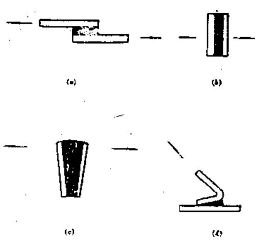

图13-48胶接接头的受力形式(a)剪切力 ()拉力(c)不均匀扯离力(4)刹离力

示,其中,单面对接接头(图 $\{ 3 - 4 9 ( a ) \}$ 粘接面积’,粘接强度很低,不宜传递大的载荷,故一般很少采用;斜面对接接头(图13-49(b))对接部分末端没有应力集中,故粘接强度较高,但只适宜于厚度较大的板、条零件的连接,且加工困难,成本较高;单面搭接接头(图13-49(c))剪切强度较对接接头高,制造简单,故应用较多,常用于金属薄板的连接;斜面搭接接头(图13-49(d))因减小了弯曲应力,其胶接强度比单面搭接接头高得多,但加工困难;单面或双面加板对接接头(图 $1 3 \substack { - 4 9 ( e ) , ( f ) } ,$ 胶接强度较高,但结构尺寸、重量均较大;双面对接接头(图$1 3 - 4 9 ( g ) )$ 与单面对接接头相比,胶接强度提高不多,但加工困难,只宜用于要求两板、条零件连接后一样齐平的场合;套接接头(图·13-49(k)、(i)和嵌接接头(图13-49(j)、())在被连接零件承受拉伸、压缩、扭转等载荷作用时,胶层总是受剪应力;但因粘接面积小,胶接强度不可能很高,套接接头适用于管状、轴套类零件的连接,嵌接接头适用于轴类零件的连接。

胶接强度除与胶粘剂的类型、接头的结构型式有关外,还与胶接面的表面粗糙度、胶接工艺、胶层厚度等因素有关,一般说来,胶接面的表面粗糙度大,胶接强度高,故对金属零件的胶接面,通常取表面粗糙度为 $\frac { 1 2 . 5 } { \nabla } \sim \frac { 0 . 5 } { 0 }$ 对某些金属或橡胶、塑料的胶接面需用砂纸打磨,以使其具有必要的粗糙度。胶层厚度应适宜,实验研究表明:胶层厚度为 $0 . 0 5 \mathrm { m m }$ 左右时,胶接强度最高。

胶接工艺过程一般为:胶接面的加工和净化处理(如去油污、砂磨或喷砂)、上胶、叠合、固化.

胶接时,为保证被连接零件准确的相对位置,并使胶层厚度均匀,常需采用适当的夹具。

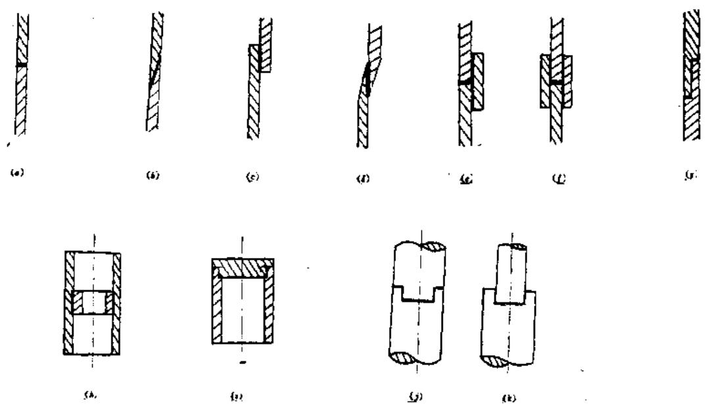

图13-49常用的胶接接头型式,

# 习 题

13-1连接的作用有哪些?设计连接应满足哪些基本要求?

[3-2设计螺纹连接和螺钉连接需考虑哪些基本问题?

11-3螺纹连接和螺钉连接常用的防松方法有哪些?

134试比较各种连接类型的特点。河选用?试举例说明。

# 第十四章 显示装置

# 14.1概 述

在电子设备和精密仪器中,显示装置是用来显示、记录和处理某一物理量或几何量的机构,以指示仪器或设备的工作状态或最终结果,供使用者观察分析,例如,电子设备在工作过程中需要在面板上反映其工作状态的各种电参量、机械参量、曲线和图像等,各种测量仪器要求显示测量结果,各种计算仪器要求指示计算结果,等等,都是通过显示装置来实现的。

显示装置是电子设备和仪器中不可缺少的重要组成部分,也是人机联系的重要手段,由于显示装置与设备或仪器的被控元器件直接相连,它的设计与整个设备的工作原理和性能密切相关,其质量直接影响设备的工作质量,

对显示装置的主要要求是:

(1)由显示装置读取或引入的数据必须足够精确,否则会给电子设备或仪器带来过大的误差。一般显示装置的设计精度是根据设备的总精度提出来的,它应与总精度相适应,

(2)显示装置应具有较高的灵敏度,尽量减小空程误差和视差,使能灵敏地反映出微小的工作变量值,并要求尽量减小其运动部分的摩擦阻力。

(3)显示装置应操作简单,读数方便,并能够直接而迅速地读出工作参量的数值,尽量不要再经过其它换算。这常常要根据人机工程学的原则来设计显示装置等。

(4)应保证零点位置的正确。在必要时、应具有零点调整的可能性。

(5)显示装置应结构简单、工艺性好、便于制造、安装和调整。

显示装置按显示方式和显示性质,可分为:

(1)指示被测量瞬时变化的标尺指针示数装置;

(2)显示被测量连续变化的自动记录装置;

(3)显示被测量累积值的计数装置;

(4)直接显示被测量数字或图像的数字显示器或图像显示器等。

显示装置按其工作原理和构造特点,一分为机械式、光学式和光、机、电结合的组合式显示装置。

机械式示数装置的结构和原理比较简单,使用普遍,一般电子设备和仪器中均有应用。随着电子设备、仪器和仪表日益向小型、精密、自动化向发展,显示装置正在由指示式向光电数字显示或自动打印和自动记录方向发展.本章着重论机械式示数装置的结构、设计等

# 14.2标尺指针示数装置

# 一、标尺指针示数装置的组成、分类及应用

标尺指针示数装置是用标尺与指针(或指标)的相对运动来完成示数工作的,其示数特点是读取电子设备或仪器被测量的舞时值。它由三部分组成:标尺、指针(或指标)和传动系统。

根据标尺与指针的运动情况,标尺指针示数装置可分为标尺运动而指针固定、标尺固定而指针运动和二者都运动三种类型。而根据标尺与指针的相对运动情况,它义可分为直线运动、旋转运动和螺旋运动等形式。标尺和指针的运动情况由示数装置传动系统决定,常用的传动装置有:挠性传动、螺旋传动、齿轮传动、蜗轮蜗杆传动、杠杆传动和凸轮机构等。

图14-1具有挠性传动的示数装置

图 $_ { 1 4 - 1 \sim }$ 图14-4所示是标尺指计示数装置的应用实例。图14-1所示是具有挠性传动的示数装置,其特点是挠性传动件拖动指针(游标)相对标尺作直线移动。图14-1(a)所示是电子测量仪器、广播收音机中常用的调谐指示装置,旋钮1和拉线盘(或称拉线滑轮)6及被调谐的电气元件(图中未画出)三者通过联轴器使彼此同轴。拉力弹簧7把挠性带(多股金展细索、钢丝或尼龙线)紧紧地扣套在拉线盘的 $\hat { A }$ 点,另一端扣套在拉线盘的 $\pmb { \tilde { B } }$ 点,同时挠性带又紧扣住指针滑座4,指针3用锡焊(或用胶合)在滑座上。这样,旋钮1带动被调元件旋转,通过拉线导轮5转变为指针的直线移动,从而指示出调谐频率值。为了防止指针在直线移动的过程中前后晃动,在结构上采月了方形导轨2加以导向,滑座与它松配合连接。

图14-1(b)所示是电子电位差计示数装置,也是具有挠性传动的示数机构。当桥路中电压不平衡时,就有电信号传给伺服电机3进行自动平衡。同时将平衡量通过齿轮传动系统2带动绕线盘绳轮1、挠性绳7,经过导轮6拖动指针4相对标尺5直线移动,进行读数。

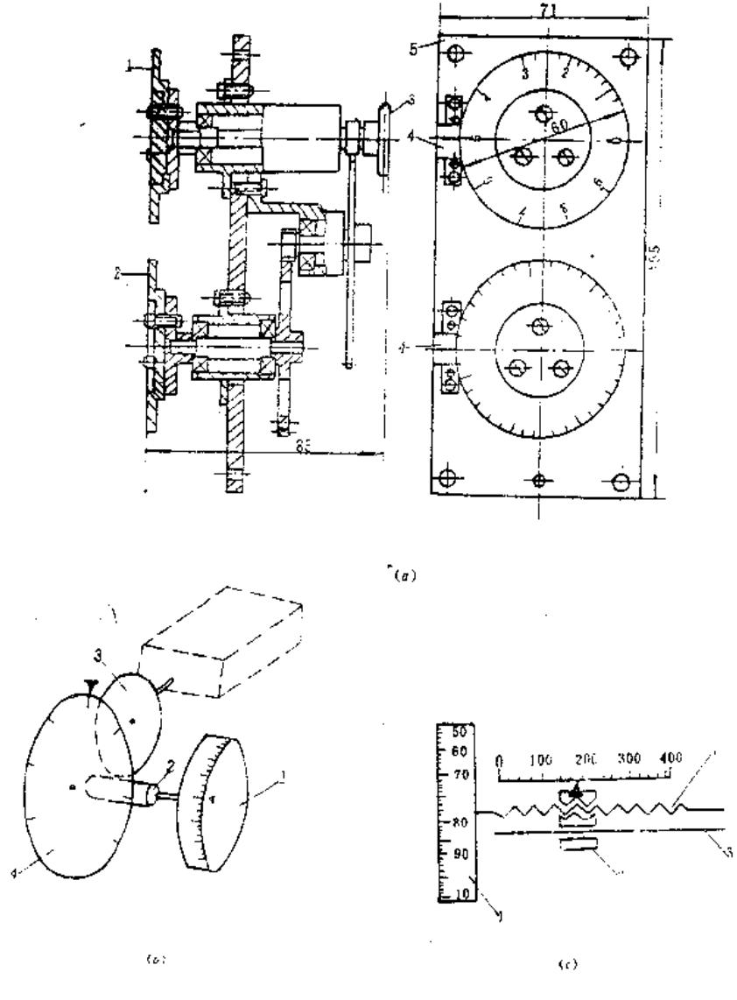

图14-2具有粗、细读数相配合的示数装置

图14-2所示是电子设备上常采用的具有粗、细读数相配合的示数装置,它具有两个标尺(或度盘):粗读度盘上的刻度包括整个读数范围,刻度值较大;而细读度盘上的读数范围只相当干粗读度盘的 $\lambda \sim \smash { \lambda }$ 个刻度值,故刻度值较小,并由它决定整个示数装置的读数精度。读数时,整数部分从粗读度盘、标尺)上读取,余数部分由细读度盘上读取,将两个读数相合并,即为要读取的被指示量。留、细读数度盘之间用传动机构相联系并保证严格的传动比,传动比的大小应按照细读度盘每转一周,粗读度盘转动的恪数关系来计算。

图 $1 4 . 2 ( \pi )$ 所示是采用齿轮专动的粗、细读数相配合的示数装置,它用两级齿轮以传动比 $\mathfrak { i } = 3 \mathfrak { G }$ 把粗读度盘1和精读度盘2联系起来,被调元件3与粗读度盘同轴。工作时,度盘相对指标4转动,而指标固定在面板上。图14-2(b)和(c)所示分别是采用蜗杆传动和螺旋传动的粗、细读数相配合的示数装置。其中图(c)采用直标尺作粗读数,方法同上。

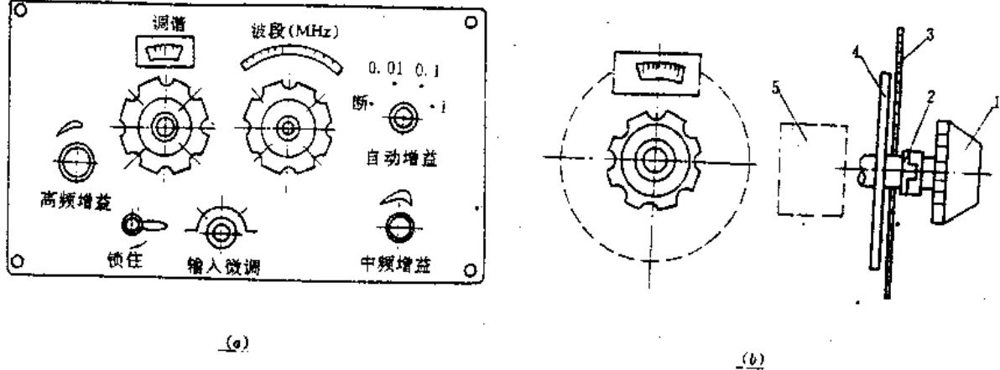

图14-3具有指示波段和微调频率的示数装置

图14-3所示是具有指示波段和微调频率的示数装置.图 $1 4 - 3 ( a )$ 所示是某单边带接收机射频信号分机的面板布置图,该接收机在 $2 \sim 3 0 N H z$ 的频率覆盖范围内共分为28个波段。工作时先选定波段,然后再进行频率调谐。面板上有两个示数装置,一个指示波段,另一个指示微调频率。波段的转换靠旋钮转动与其相联的回路鼓波段转换开关来实现,示数刻度直接刻在面板上;微调频率的示数装置(图14-3(b))由旋钮1通过联轴器2带动度盘4和统调机构5一起转动。为了便于观察,在面板3上开出一个度盘窗口,内装一块有机玻璃透镜,其上再放置一块由光学玻璃制成的放大镜,将度盘刻线放大.

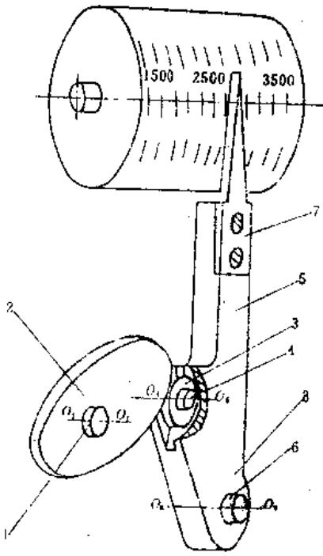

图14-4具有凸轮机构的示数装置

图14-4所示是某通信机频率调谐示数装置,用-个具有变传动比的凸轮机构作传动。当转动调谐旋钮时,凸轮2跟随旋钮和同轴的可变电容器(图中未画出)一起转动。装于指针体5上的滚轮3,在扭簧8的作用下,始终紧靠凸轮表面。凸轮在绕轴!转动时,其轮廓迫使指针体和指针7绕指针轴6摆动,在滚轮上指示出所调谐的频率,

# 二、标尺的刻度及其刻度特性

# 1.标尺的刻度及标尺类型

标尺上按一定间隔和线宽刻划的若干细线称为刻度线,亦称标线。相邻的两条刻度线通常称为一个分度。一般标尺上都有单位、符号(字母和数字等)和长度不同的刻度线等。标尺的类型不同,刻度线的分布形状也不同。常用的标尺类型有如下几种:

(1)直线标尺(图14-5(a))刻度线按直线排列,示数装置在工作时标尺与指针作相对直线运动:

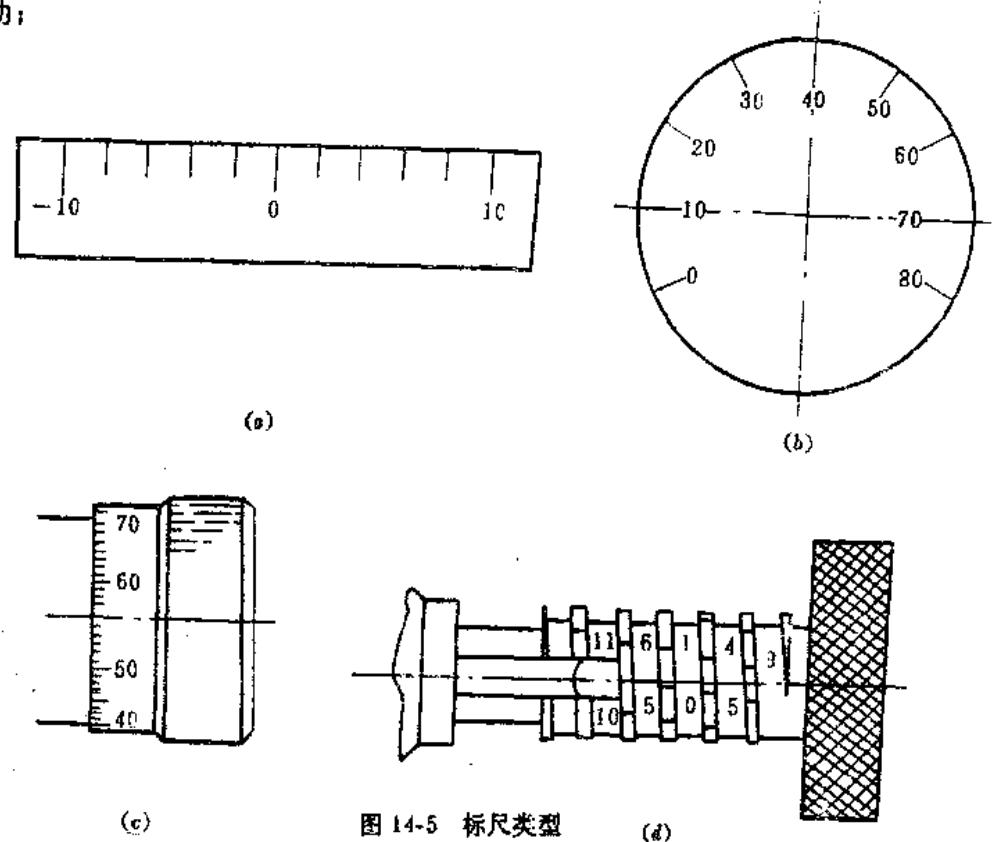

(2)圆盘标尺(图14-5(b))刻度线沿圆周或圆弧分布排列,又称度盘,是电子设备常用的标尺型式。有时为了指示不同波段的频率值,在同一度盘上刻有数圈刻度线;

(3)鼓轮标尺(图 $\because 4 - 5 ( c )$ )刻度分行在圆桂面上或圆锥面上;

(4)螺旋标尺(图14-5(d))刻度线呈螺旋状分布在圆盘平面或圆柱上,工作时标尺转动且移动,而指标则固定不动。

# 2.标尺刻度特性

标尺和指针(或指标)之间的相对位移与被测危的关系叫标尺的刻度特性。岩标尺与指针(指标)的相对位移量为:或 $\hat { f } _ { \ X } ^ { \mathrm { ~ ~ } }$ ,所反映的被测量为 $\pmb { A }$ ,则标尺刻度特性可用函数式$\operatorname { s } = f ( A )$ 或 $\theta { = } f \left( A \right)$ 或曲线表示,如图14-6所示。

当 $\frac { d ^ { 2 } s } { d A ^ { 2 } } = 0$ 或 $\frac { d ^ { 2 } \theta } { d \angle 2 ^ { 2 } } = 0$ 时,表示标尺为线性刻度图 $1 ^ { \prime } \cdot \mathfrak { f }$ 中出线 $\pmb { \mathscr { a } }$ 所示),能够等分刻度;否则为非线性刻度(如图14-6中曲线 $\downarrow , c$ 所示),标尺不能等分刻度,在设计示数装置时,通常希望获得等分刻度标尺,以便于读取和制造。但并不是在所有情况下都可以很方便地使用等分刻度标尺的,如果采用了非线性的可变元件(敏感元件),而仍用等分刻度标尺将会带来不允许的原理误差。因此在这种情况下就应采用不等分刻度,或者在设计时采用变传动比的传动机构(杠杆传动、凸轮传动等机构)使刻度特性线性化而获得等分刻度标尺,本章仅讨论等分刻度标尺的设计问题。

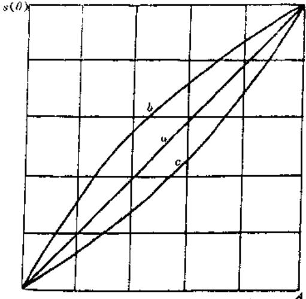

图14-6标尺刻度特性曲线

# 三、标尺参数及其选定

标尺的主要参数有分度尺寸、分度值、标度长度(标度角)和标线尺寸等。

标尺上相邻两刻线之间的距离称为分度尺寸,又叫做刻度间隔,以 $t$ 表示;每个刻度间隔所代表的物理量(被测量)增量称为分度值,以 $\pmb { \mathscr { a } }$ 表示;标尺上起始刻线与终点刻线所对应的被测量分别叫做示值下限和示值上限,分别以 $A _ { \mathrm { { o u n } } }$ 和 $A _ { \sf s u s x }$ 表示;全部刻度所对应的被测量称为示值范围,以 $\pmb { A }$ 表示。显然, $\ v { A } _ { 1 } = \ v { A } _ { \mathrm { m a x } } - \ v { A } _ { \mathrm { e f f } }$ :标尺上起始刻线与最后刻线之间的距离(或弧长)或夹角称为标度长度或标度角,分别以 $L _ { m a x }$ 和 $\theta _ { \mathbf { m a x } }$ 表示。

# 1.分度值 $^ a$ 

分度的大小,可由示数装置的读数精度来确定,一般可取:

$$
{ \pmb { \alpha } } = 2 \delta { \pmb { A } }
$$

式中, $\delta A$ 一—给定的示数装置的读数精度。

分度值 $\pmb { a } = 2 \delta A$ 的依据是:当指针落于两刻度中间时,观察者能够准确地进行估读的精度可以达到 $u / 2$ ,在数字上与电子设备的允许误差相等。分度值取值应合适,取得过大不能满足精度要求;而当设备本身的实际误差一定时,分度值取得过小也无实际意义,反而会使制造困难,成本提高。

对于刻度较密的标尺,可取分度值等于或略大于示数装置的读数精度允差。

此外,为了读数方便和不致读错,建议分度值从下列数值中选取:

$$
1 \times \mathrm { i } 0 ^ { \bullet } ; 2 \times \mathrm { i } 0 ^ { \bullet } ; 5 \times \mathrm { 1 0 ^ { \bullet } }
$$

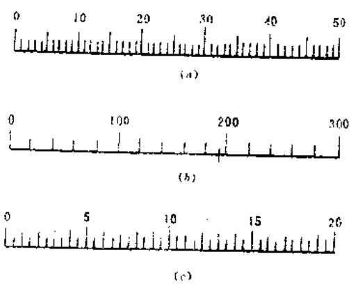

图14-7标尺的分度值

其中, $\pmb { \mathscr { z } }$ 为任意正、负整数或零。

在图14-7所示的几种标尺中, $( { \pmb { \alpha } } )$ 的分度值为 $1 \times 1 0 ^ { \circ } { = } 1 ( \pi { = } 0 )$ ;(b)的分度值为 $2 \times 1 0 ^ { \ i }$ $\simeq 2 0 ( \mathfrak { n } = 1 )$ ;(c)的分度值为 $5 \times 1 0 ^ { - 1 } = 0 . 5 ( n = - \mathrm { 1 } )$ 

2.分度尺寸t

分度尺寸的大小应根据人的视觉特征确定,它是影响读数误差和标尺几何尺寸的重要因素。分度尺寸太小时,读取将非常困难,同时,读数误差也显著增加。图14-8所示是平均读数误差与分度尺寸关系的经验曲线,由图可以看出,当分度尺寸小于1mm时,由于间距过小容易引起视觉疲劳,因此读数误差增加得很快。为此,分度尺寸最好不要小于 $\mathsf { 1 m m }$ 。但是分度尺寸也不宜太大,否则会使标尺的尺寸过大。在正常的照明条件下,可能的最大视线距离为 $0 . 7 \mathfrak { m }$ 时建议分度尺寸在 $1 \sim 2 . 5 m \mathfrak { m }$ 间选取。

某些示数装置需要在很小的标尺上刻制出很多的分度(分度尺寸很小)。为便于读数并保证足够的读数精度,这时可采用光学放大装置,将标尺的分度尺寸加以放大.

有些在车间流水线上使用和操作的电子测量仪器。为了提高生产率,要求读取迅速而准确,分度尺寸可适当地取大一些。对精度要求不高的电子设备,其示数装置上的分度尺寸可取为 $\mathsf { \Omega } _ { 4 } \sim 5 \mathrm { m m }$ :

3.分度总数 $\pmb { \mathcal { R } }$ 、标度长度 $\pmb { L _ { \mathrm { s u s } } }$ 和标尺尺寸

分度值 $\pmb { a }$ 选定后,分度总数 $\pmb { \mathscr { n } }$ 可由示值范围$( A _ { \mathrm { m a x } } - A _ { \mathrm { m b } } )$ 按下式确定:

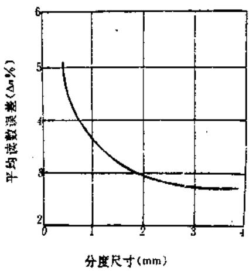

图14-8分度尺寸对读数误差的影响

$$
\mathit { n } = \frac { A _ { \operatorname* { m a x } } \cdots A _ { \operatorname* { m i n } } } { \bar { \sigma } }
$$

若选定分度尺寸 $\pmb { \ell }$ 后,则标度长度 $L _ { m } . _ { x }$ 和标度角 $\theta _ { \mathbf { m a x } }$ 按下式算出:

或

$$
L _ { \mathrm { m a x } } = \mu t
$$

$$
\theta _ { \mathrm { r e a x } } = \frac { \pi t } { T }
$$

标尺的总长度 $\pmb { \mathrm { \downarrow } }$ 为

$$
\iota = \ast + \mathfrak { c }
$$

式中, $. \pmb { c }$ —标尺两端的裕量,由结构而定。

度盘(圆形标尺, $3 6 0 ^ { \circ }$ 范围内分度)的直径为

$$
D = { \frac { \Re } { \pi } }
$$

式中, $\pmb { D }$ —度盘的计算直径;

$\pmb { \mathcal { H } }$ ——布满度盘整个圆周的分度总数。

分度不满一周的度盘直径为

$$
D _ { 0 } = \frac { n ! } { \pi } \times \frac { 3 6 0 ^ { \circ } } { \theta _ { o u n } }
$$

4.标线(刻度线)尺寸

(1)标线宽度试验证明,在正常照明条件下,标线的宽度与分度尺寸有关。因为当指针落于两条相邻的标线之间时,读数就要用肉眼来估计,这时读数误差取决于标线宽度与分度尺寸的关系。图14-9所示是用实验方法得到的标线宽度与读数误差的关系曲线,由图可见,当标线宽度为分度尺寸的 $i \Im \Im _ { \Im }$ 左右时,读数误差为最小。

(2)标线长度为了读数方便、清,标线可以设计成不同的长度。从加工简单和读数清晰的要求出发,建议在同一标尺上最多采用三种不同长度的标线。标线的长短认读的效率或分率有关,标线过短,不易看清楚;过长则会使眼睛疲劳。

标线尺寸建议按图14-10所示选取其值。(a)图为目视距离的最佳标线宽度;()图为目视距离的最佳标线长度(图中i、2、3分别表示长、中长、短标线记号);(c)图为以标尺分度尺寸$\pmb { \ell }$ 为基准来确定三种标线尺寸的简便关系。长标线宽度为0.1t(中长、短标线略细),短标线高度为2t,中长标线高度为3,长标线高度为4t。(d)图为目视距离在 $7 0 0 \mathrm { m m }$ 范围内的标线排列尺寸。

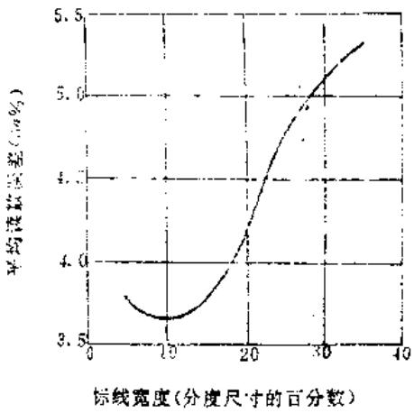

图14-9标线宽度对读数误差的影响

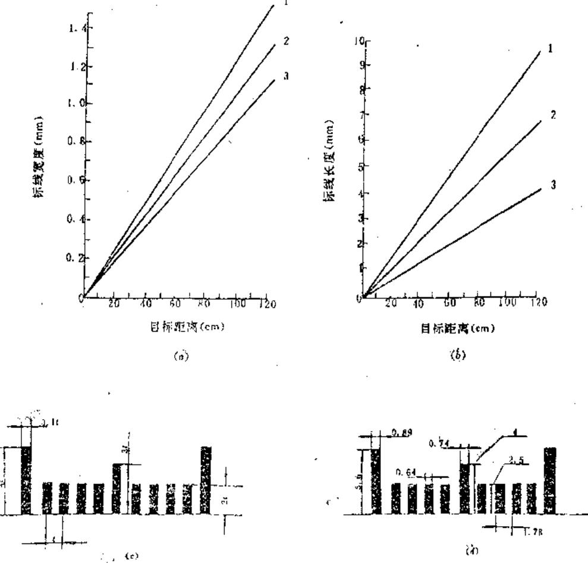

图14-10标线建议尺寸图

# 四、标尺上的标记符、标数、材料和精饰

# 1.标记符与标数

标记符与标数的形状、大小、高宽、笔划、粗细、颜色等对认读效率、认读速度等有较大影响,实践证明:

1)用直线组成的字体符号要比用曲线的清晰。  
2)当对操作若有黑暗适应性要求时,标线和字母符号最好用黑底白字。否则,应采用白底黑字.  
3)字体的高度应取 $\scriptstyle { \mathcal { H } } \approx 2 t ( t$ 为分度尺寸),但不能小于 $\pmb { 2 \ m m }$ 。字体高、宽比以 $3 : 2$ 为宜.  
4)对特殊的标记或符号,应该用红色醒目颜色表示。

标尺上一般应在若干条线处标注一个数字,数字最好标注在标线上的同一高度。标尺上不宜标注很多数字,对于分度值大的,可以在标尺的上部或下部记上一个类似 $^ { \prime \prime } \times 1 0 0 ^ { \prime \prime }$ 的符号,以简化标数的位数。此时,标线上虽然标注的数字为 $z _ { 5 ^ { \prime \prime } }$ ,而实际上却是 $\cos \theta 0 ^ { \circ }$ 

# 2.标尺的材料和精饰

标尺的材料不仅要具有良好的耐蚀性,而且还要有良好的加工性能及抗变形能力,常用的标尺材料为铝合金LY12-CZ、黄铜和光学玻璃K7、K8、BaK7等,它们与金属相比,可以获得更细的标线和达到更高的精度。

金属标尺的精饰,不仅是为了防蚀和美观,而更主要是为了便子读数,标尺表面不应反光,标线记号要明显。根据标尺的材料不同,金属标尺精饰中常用喷砂、氧化、镀镍、涂漆等工艺方法。标尺的颜色不应太鲜艳,常见的有黑色、白色、灰色、褐色和乳黄色。为了便于读数,标线、数字、符号的颜色和标尺的颜色应成强烈的对比。

# 五、指针与指标

指针与指标是用来指示标尺上刻度的。通常把相对于标尺固定的标记或带有标记的固定零件称为指标;而把相对于标尺运动的,并利用其末端指示读数的零件称为指针。 !

指标与指针的形状和尺寸主要取决干示数装置的精度及人眼与标尺的距离,它与标尺的有关尺寸应相适应。一般来说,为使读数方便、迅速,指针与指标应具有明显的端部;为了便于估读,指针与指标端部的宽度不应大于刻度间隔的宽度;对于精度要求较高的示数装置,为保证读数精度,指针与指标端部宽度应与标尺上标线的宽度相等,若指针宽度小于标线宽度时,指针在标线宽度范围内的移动则不易看清,反之当拍计落于两标线之间时,估读精度就会降低;另外,指针端部覆盖标线的长度,一般取为最短标线长度的 $1 / 1 { \sim } 3 / 4$ 

指标形状要适应标尺类型和结构特点,图14-11所示是常见的几种指标形式。指标刻线应色泽显著,以便快速读取。指标常用铝、铝合金及有机玻璃等制成。

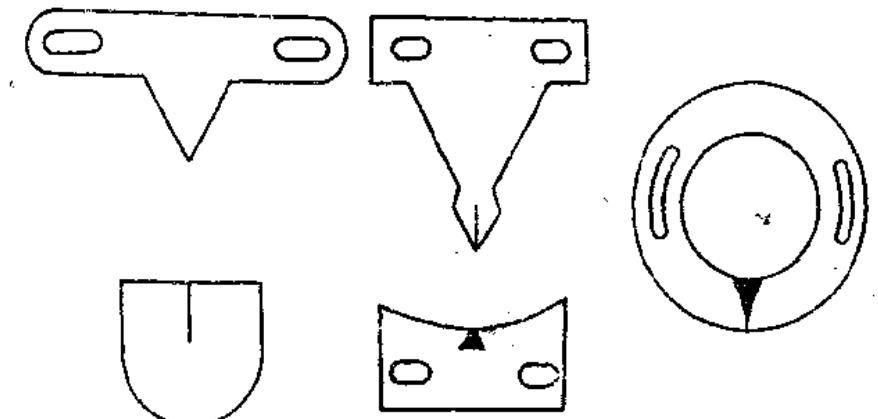

图14-11指标的形状

指针的形状通常有下列几种:

(1)刀刃形这类指针的特点是头部细而尖(图 $1 4 - 3 2 ( a ) )$ ,这样便于消除读数时的视差,但是刚度较差。它常用管形材料将末端压扁或在端部焊上很细的钢丝制成,适用于工作条件较好,刻度细面密,读数精度要求较高,而且是近距离读数的示数装置.

(2)矛形这种指端部尖细,然后粗壮过渡,形似矛尖,如图14-12(b)、(c)、(d)所示,这样可以克服刀刃形指针刚度不足的缺点。

(3)杆形见图 $1 4 \div 1 2 ( e ) \cdot ( f )$ 这种指针的端部较宽,适用于标线及标线间距均较宽,需要在一定距离以外读数,以及不要求精确读数的示数装置中。

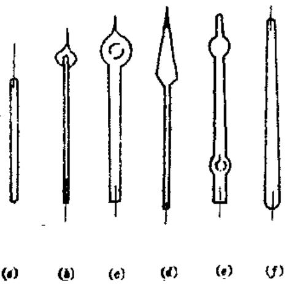

图14-12指针的形状

(4)组合指针(图14-15)所谓组合指针,就是在一条宽度为6\~10mm的无色透明有机玻璃片3上,刻制一条0.2\~1.5mm宽的槽,并在槽内涂上红漆(即成为红线/,然后上部用铝制拉线夹2,把拉线1(指挠性带传动)夹紧,拉线夹与有机玻璃胶合成为整体,该红线就代表指针。这类指针在广播收音机、收录机以及电子测量仪器的示数装置中广泛采用。

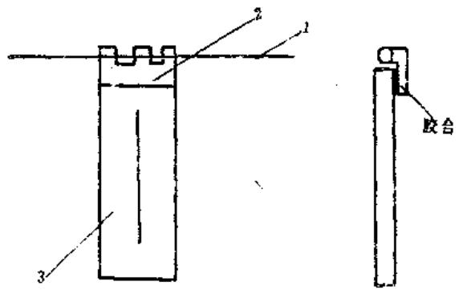

图14-13组合指针

需要指出,指针除了要满足读数要求 $\dot { \mathfrak { s o } }$ 于指针属运动件,为保证指针在受到冲击载荷的作用下不产生变形而引起示数误差,还要求指针具有足够的刚度;另外为了使指针容易启动和稳定,要求指针运转灵活,惯量小,必要时还要设置阻尼减振机构,以缩短指针稳定!为此,指针的设计 $\dot { V } ,$ 须注意以下!点:

1)为了提高带针的刚它:且使指针对于转轴的转动惯量较小,往将其载面形状做成管状、V形或 $\pmb { U }$ 形等,图14-14所示为常用的指针断面形状。

2)指针的材料宜选用比重小的材料。指针常用的材料有铝、硬铝合金及非金属(如有机玻璃)等。

3)楷针一般较薄,不能直接装在荷针轴端,通常采用指针套先将指针固定(接或粘接等),然后将指针套装在轴的末端。指针套装在轴上应考虑指针调整和装拆方便,常用圆锥面配合或紧定螺钉连接,如图14-15所示,

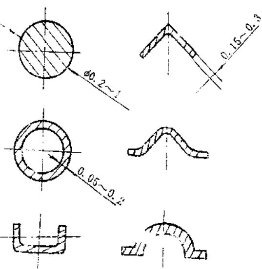

图14-14指针的断面形状

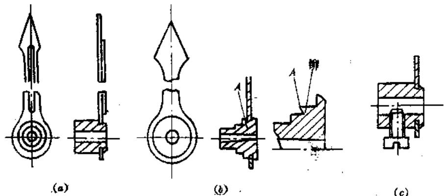

图14-15指针的固定结构

对于直线运动的指针,可用锡焊将指针焊在滑块上,此时指针和滑块要采用铜材。否则用环氧树脂将指针胶合在滑块上。

4)对于旋转运动的指针,在设计时要对转动支点两端的重量进行计算,使支点两边的重量相等。这样才能保证指针偏转均匀,示数准确。否则将直接影响指示精度,因为当指针转到水平位置附近时,由于两端的重量不等而产生惯性矩,

# 六、度盘

如前所述,度盘是标尺的一种,因此度盘指示的示数装置的设计方法与上述相同。考虑到电子设备示数的度盘尚有特殊之处,故作专门讨论。

# 1.度盘的种类

电子设备中的度盘通常可分为三种:

(1)开式度盘如图14-16所示,度盘:和指示不同波段的两个指标2均装在设备面板外面,优点是装配调整方便;缺点是操作人员同时看到度盘上的许多刻线和数字,易分散识读注意力;另外每个波段之间没有明显的区分,极易看错波段,而且不能防止灰尘和外来的机械损伤。所以,开式度盘只能用于精度低、波段不多的电子测量仪器中。

(2)闭式度盘如图14-17(a)所示,度盘和指针装在面板内,而在面板上开一个透明窗口,这种结构用于度盘固定不动而指针转动的情况,窗口开的较大。若是度盘转动而指标不动的情况,度盘窗口可以制成如图14-17()所示的型式。其窗口较小,只显示出度盘的部分标线,便于在面板上安排。有时它还装有窗口挡板,如图14-17(c)所示。当变换波段时,度盘上不用的标线被窗口遮住,只露出所需的标线,防止读错波段。度盘窗口上装一块有机玻璃透镜,透镜前后两面有标线并涂红色(两面线应重合)作为指示线。有的在透镜前边再放一块光学玻璃制成的放大镜,将度盘的标线和刻度放大,成为一种简易式光学度盘,适用于读数精度高且度盘尺寸受到限制的示数装置之中,闭式度盘的优点是避免了开式度盘的上述缺点,故这种结构在电子设备中应用广泛。

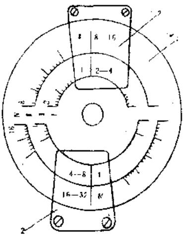

图14-16开式度盘

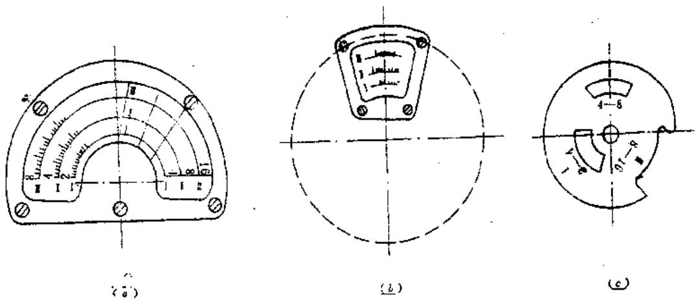

图14-17闭式度盘及窗口和窗口挡板

(3)光学度盘光学度盘是利用物镜放大原理,通过折射、反射、投影等将度盘的标线和数字成像在屏幕上的一种光学显示装置。图14-18所示为光学度盘原理图.度盘9用透明玻璃制造、利用光刻法(即照相法)以很大的缩小倍数将标线和数字刻到度盘上,光源灯泡2发出的光,经聚光镜3聚光后照射到度盘上,然后再由接物镜i放大。被放大后的刻度和读数,经下反射镜7和上反射镜6反射到毛玻璃屏幕5上,屏幕上即显示出放大后的标线和数字.

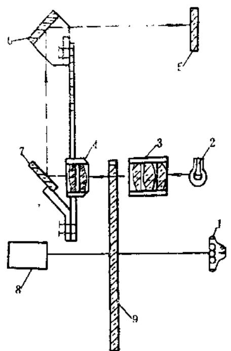

图14-18光学度盘原理

度盘9、旋钮1和被调元件8装在同一轴上,这样省去了传动系统,避免了传动误差和空程误差对读数精度的影响、由于度盘标线是用光刻法制成,度盘的刻度可以做得很小(分度尺寸在 $0 . \ 0 5 \sim 0 . \ 1 \ E \mathrm { m m } )$ ,读数时又被放大,故读数精度很高。

# 2.度盘的设计原则

度盘的分度值、分度尺寸、标度长度(标度角)和标线尺寸等参数的选择,除可按上述标尺参数的选择原则和方法进行外,设计时尚需考虑下列原则:

1)度盘的旋转方向应与控制旋钮的旋转方向一致。

2)度盘上标记符与标数的方向和位置标数方向要符合人从左到右,从上到下的视觉规律;顺时针为增,逆时针为减。14-1所示为度盘标数优劣实例比较。

麦1-1度盘标数优劣实例比较

<table><tr><td colspan="1" rowspan="1">优             劣</td><td colspan="1" rowspan="1">说明</td></tr><tr><td colspan="1" rowspan="1"></td><td colspan="1" rowspan="1">当指针转动，度盘不动时，标数应该正的。右边的标数数字倒了，读数困难</td></tr><tr><td colspan="1" rowspan="1"></td><td colspan="1" rowspan="1">度盘移动时，指标固定在正上方，度盘上的标数移动到这一位置时，字也应为正的、右这度盘上的字倒了</td></tr><tr><td colspan="1" rowspan="1"></td><td colspan="1" rowspan="1">标数应在刻度线的外侧，如左图，不应在指针同侧，以免被指针遮盖</td></tr><tr><td>20</td><td>窗的开度应大=2个标数间距的强长（左） 则会影响读数和观察度盘的转动方向、石）</td></tr><tr><td>4C 50</td><td>径向标数(左）保证在任何情况下看到的数字 都是正的：周向标数(右）读数困难</td></tr></table>

3)度盘的大小与人眼观察距离及刻度数量相适应。表14-2是对度盘直径所作的测试结果。

表14-2度盘的最小允许直径(mm)

<table><tr><td>刻度的总数</td><td>观察距离为500mm时</td><td>观察距离为900mm时</td></tr><tr><td>38</td><td>25.4</td><td>25. 4</td></tr><tr><td>50</td><td>25.4.</td><td>32.5 ，</td></tr><tr><td>70</td><td>25. 4</td><td>45.4</td></tr><tr><td>100</td><td>36.4</td><td>64.3</td></tr><tr><td>150</td><td>54.1</td><td>98.6</td></tr><tr><td>200</td><td>72.8</td><td>129. 0</td></tr><tr><td>300</td><td>109. 0</td><td>196. 0</td></tr></table>

度盘的尺寸大小影响着认读速度和精度,不可过大也不可过小。当度盘直径从 $2 5 m m$ 开始增大时,认读速度和精度逐渐提高,读请率下降。当直径增加到80m点,读错率上升。度盘直径在 $3 5 \cdots 7 0 m m$ 之间时,认读精度没有多少差别。所以当直经为中间值时,认读效果为最好。

4)如果结构受到限制已经采用了最大直径度盘,还不能够达到所要求的指示精度时,或用光学度盘,或用粗、细读数相配合的示数装置。

# 3.度盘的固定结构

度盘的固定结构应保证度盘的调整和定位。一般是利用度盘本身的内孔或外圆定位,也可以采用销钉进行定位。

图14-19(a)所示为度盘正确的固定结构,图14-19(b)所示为不确的结构。

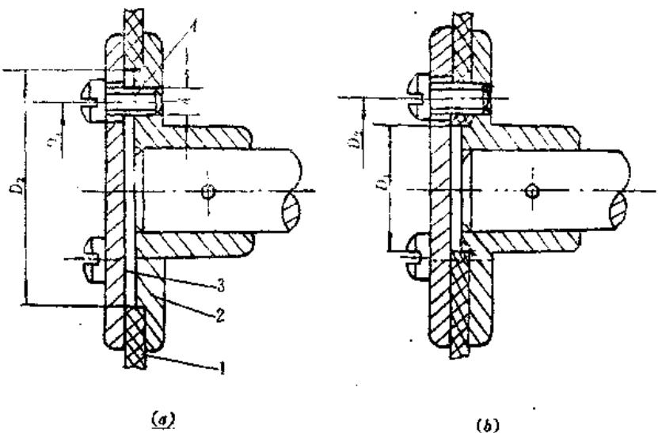

图14-19度盘的固定结构

# 14.3标尺指针示数装置读数精度分析

# 、影响读数精度的误差因素分析

为了使示数装置设计合理,并达到要求的读数精度,必须分析示数装置可能产生的误差因素,以便在设计时尽量减小或消除之。

示数装置的误差主要有以下几类:

# 1.结构误差

结构误差是指由于设计、制造、安装不合理或不正确造成的误差。

(1)标线位置不准确而引起的误差度盘或标尺上的各标线,在刻制时由于各种因素的影响,其位置(指实际位置)不可能与计算的准确位置完全一致,从而产生标线间隔的累积误差(图14-20)。即

$$
\Delta \mathbb { L } = \mathbb { L } - \mathbb { L } ^ { \prime }
$$

式中, $\Delta \bar { L } ,$ -标线位置累积误差;

$\pmb { \updownarrow } ,$ —标线间的计算距离;

$\pmb { \hat { f } } _ { \pmb { \hat { \prime } } } ^ { \star }$ --一标线间的实际距离。

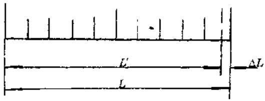

图14-20标线间隔累积误差

$\scriptstyle \therefore L$ 与加工条件以及 $\pmb { L }$ 的大小有关,一般常用相对误差 $\pmb { \delta } \pmb { \cal U }$ 表示:

$$
\delta { \bar { L } } = { \frac { \Delta { \bar { L } } } { \bar { L } } } = { \frac { { \bar { L } } - { \bar { L } } ^ { \prime } } { \bar { L } } }
$$

(2)指针形状误差即指针在使用过程中,由于碰撞而弯曲变形所造成的误差(图14-

$2 \sin ( \pi ) )$ 。设指针端部弯曲的弧长为 $\pmb { \mathscr { s } }$ ,指针的半径为 $\pmb { R }$ ,则引起的转角误差为

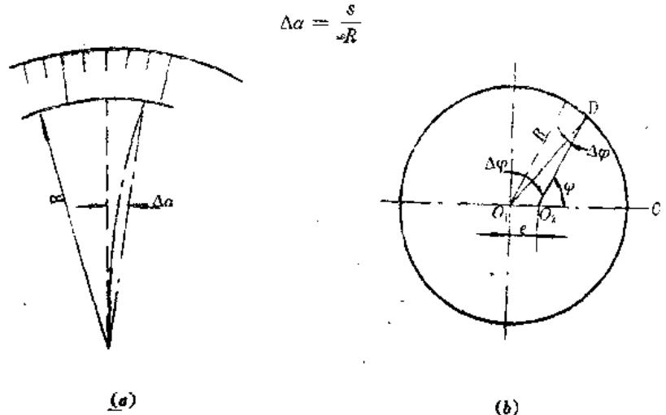

图11-21指针形状误差和偏心误差

由式(14-8)中可以看出, $\Delta \pmb { \sigma }$ 随着 $\pmb { R }$ 的增大而减小。但不能由此认为增大 $R$ 就一定可减小 $\Delta \omega$ ,因为 $\pmb { \mathscr { R } }$ 增加会导致指针的刚性变差,指针端部变形随之增加,故 $\Delta \pmb { \sigma }$ 并不一定和 $\pmb { R }$ 成反比关系,而且 $\pmb { R }$ 的增加,也将使示数装置结构庞大。

(3)指针回转中心与度盘中心的偏心由于制造和安装的原因,指针的回转中心与度盘的中心往往不能完全重合,如图14-21(b)所示。它所产生的角度误差由三角形△ $\phantom { - } O _ { 1 } O _ { 2 } D$ 可推得:

$$
\Delta \varphi = { \frac { e } { R } } \mathrm { s i n } \varphi
$$

为了减小 $\Delta \varphi$ ,可以减小偏心距 $\pmb { \mathscr { E } }$ 和增大度盘的半径 $\pmb { R }$ 。前者要求提高度盘和指针的加工、装配精度,在结构上使度盘有定位对中装置,后者会受到工艺和结构尺寸的限制。

# 2.视差

视差是指操作者在读数时的视觉误差。如图14-22所示,指针2与度 $\vdots$ 有一定的距离,当操作者的眼睛位于 $o$ 点时,视线与度盘垂直,这是理想的情况;当操作者在 $\varrho _ { \mathrm { r } }$ 点观察时,视线与度盘表面不垂直,就会引起视:

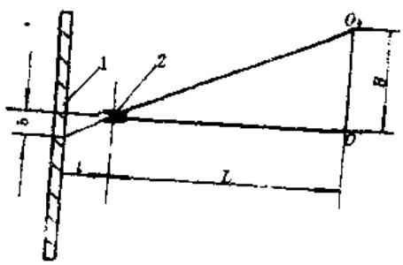

图14-22视差

$$
\delta = \frac { B } { \bar { L } } \iota
$$

式中, $\boldsymbol { B }$ --操作者眼請距理想位置的距离;

$\iota$ —理想位置 $\pmb { 0 }$ 与指针的距离;  
—指针与度盘间的距离。

# 3.传动误

传动误差是由标尺指针示数装置传动系统因制造、装配误差和设计误差引起的,如齿轮

的传动误差、空程误差等。它与示数装用的传动机构和主要零、部件的精度等有关,分析方法可参见前述章节内容。,

# 二、提高读数精度的方法

上述示数装置各种误差因素对读数精度的影响,可采用如下方法减小或消除。

1.提高指针的刚性以减小浅消除变形误差的影响

图14-23有机玻璃指针

为了防止由于指针弯曲而引起读数误差,某些电子设备中采用了有机玻璃指针,这就是在一条10mm宽、 $1 . 5 \cdots 2 \cdots m$ 厚的无色透明有机玻璃面上,

刻划一条宽为 $\therefore 2 1 \approx 1 . 5 \mathrm { m m }$ 的直线,并在线上涂以红漆,以此红线代表转动的指针,如图14-23所示,

# 2.用二次读数法消除偏心误差的影响

根据式(14-9),指针旋转中心与度盘中心间的偏离(或度盘旋转中心与刻度中心的偏离)将引起角度误差:

$$
\Delta \varphi \simeq \frac { \theta } { R } \mathrm { s i n } \varphi
$$

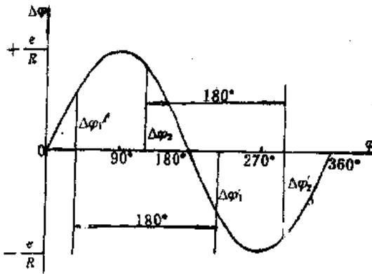

图14-24角度误差 $\Delta \varphi$ 的变化规律

$\Delta \varphi$ 随 $\varphi$ 的变化按正弦规律变化,如图14-24所示。当 $\varphi = 9 0 ^ { \circ }$ 时, $\Delta \varphi = + \frac { e } { R } ,$ 当 $\varphi = 2 7 0 ^ { \circ }$ 时,$\Delta \phi = - \frac { e } { R }$ 。这说明了 $\pmb { \varphi }$ 相差 $1 8 0 ^ { \circ }$ 时, $\pmb { \triangle } \pmb { \varphi }$ 的绝对值相等而符号相反,利用这一性质,可以消除由于度盘与指针不同心引起的转角误差。设在 $\curvearrowleft$ 时,读出的数值 $\varphi _ { 1 } = \varphi _ { 0 } + \Delta \varphi$ 再在距 $\varphi _ { 0 }$ 为 $\yen 80$ 处,读出另一值 $9 3 = 9 6 + 1 8 0 ^ { \circ } - \Delta \varphi$ ,则经过简单运算便可求出 $\pmb { \varphi }$ 的精确值:

$$
\varphi = \frac { 1 } { 2 } [ ( \varphi _ { 2 } - 1 8 0 ^ { \circ } ) + \varphi _ { 1 } ] = \varphi _ { 0 }
$$

这种在度盘上相隔 $1 8 0 ^ { \circ }$ 的两处读出读数,并取这两个数的算术平均值作为最后读数的方法称为二次读数法或双向读数法,它消除了度盘偏心引起的误差。在示数装置中可用具有两个相距 $\therefore 8 0 ^ { \circ }$ 的指针或指标来实现此法,它多用于精密测量仪器中。

3.采用标尺与指针在同一平面的结构消除视差

由式(14-10)可知,视差 $\pmb { \delta }$ 正比于 $\pmb { \cal B }$ 及1,而与 $\pmb { L }$ 成反比。 $\pmb { \cal L }$ 一旦由设计确定,就不能再作任意改变,因此要减小 $\pmb { b }$ ,只能减小 $\pmb { \ell }$ 和 $\pmb { \mathscr { B } }$ 

图14-25所示是使 $\scriptstyle { \pmb { \imath } } = 0$ 的结构,即是使指针与度盘处于同一平面。

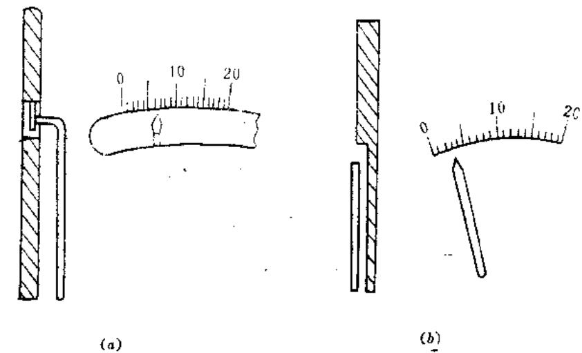

图14-25标尺与指针夺同一平面的结构

# 4.采用反射镜结构消除视差

由式(14-10)可知,读数时尽可能使视线沿标线的法线方向,可以减小 $B$ 值,从而使视差b减小。图14-26所示采用了带反射镜的标尺,当操作者观察到指针与其在反射镜中的影像重合时读数,便说明视线正好沿着标尺的法线方向(即 $\begin{array} { r } { \mathcal { B } { = } \mathbb { 0 } . } \end{array}$ )。

# 5.减少传动系统传动误差的影响

由前可知,通过合理选择传动类型和布置传动链、采取消除空程误差的结构措施等方法,可以减少传动系统传动误差的影响,提高示数装置的读数精度。如图3-19所示的两种方案,显然(b)方案比(a)方案对提高读数精度有利。

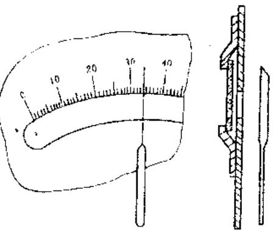

图14-26带反射镜的示数结构

# 14.4读数累积示数装置 计数器

计数器是把设备被测量用累积计数的形式直接显示的示数装置,其读数特点是读取被测量的累积值(或递减值)。计数器的最大示数叫做该计数器的最大容量。在计数器达计数容量后,再继续输入被测量时,示数则自动回到零位,并重新计数。

计数器具有结构简单、使用方便、计数可靠等优点,并具有较好的通用性,已作为通用件或标准件生产。

机械式的或机电式的各种计数器主要用作十进制累积或递减的计数,按计数器的运动方式可分为间歇运动计数器和连续运动计数器;若按计数器的结构特征可分为数字轮显示计数器和指针指示计数器。

# 一、数字轮显示计数器

数字轮显示计数器是利用轮面上刻有数字的滚轮(数轮)的转动来直接显示累积数值的计数装置。它们直接以数字组合,采用间歇突跳式的进位方式来显示计数,这是--种较常用的计数器,在电子设备、仪器仪表中获得了广泛的应用。例如录音机、录像机中的磁带运行计数器就使用了这种计数器,图14-27所示是其中的应用实例。

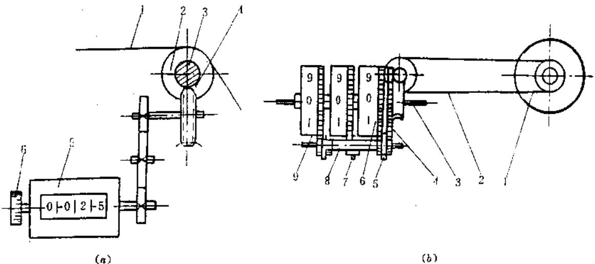

图11-27数字轮显示计数器的应用实例

图14-27(a)所示是录像机磁带运行计数器。当磁带1运行时,磁带藉摩擦力带动滚轮2转动,通过蜗杆3、蜗轮4和齿轮传动链传给计数器5进行累计。适当设计传动链的传动比,以确定磁带运行长度与计数器计数显示值的关系,便可通过示值直接反映磁带所走的长度(滚轮直径不变).

转动旋钮6可使计数器复零。

图14-27(b)所示是盒式录音机磁带运行计数器。来自供带轮(或收带轮)1的磁带,在运行时,通过橡胶带2以及由蜗杆蜗轮副3、齿轮4和双联小齿轮5组成的计入机构的传动,带动个位数字轮6。然后通过进位轮7向十位、继而百位数字轮8和9进位。这样,便可显示磁带的运行情况。它不能反映走带的真实长度,因为带盘转动过程中,随着带卷有效直径的变化会引起角速度改变。所以,只能从计数器的显示值概略地估计走带的时间,以便掌握磁带录、放节目所处的位置。

蜗轮蜗杆的传动比一般为 $1 5 : 1 \sim 2 0 : 1$ 。三位计数器最大示数为 ${ \mathfrak { s g s g } } { \mathfrak { s } } ^ { m }$ ,而C-60盒式磁带的最大卷带圈数仅在400左右,所以对于盒式录音机已足够应用。

数轮显示计数器的基本结构是由计入和进位两部分组成,有些计数器尚有复零机构。下面分别介绍。

# 1.计入机构

计入机构有连续运动和间歌运动两种形式。一般,连续运动的机构比较简单,而间隙运动机构稍为复杂。间歇运动式计入机构通常用电磁铁棘轮棘爪机构、针轮传动机构和槽轮机构等。

(1)电磁铁棘轮棘瓜结构这是实现间歇运动计入的典型机构,如图11-28所示。它主要由电磁铁1、衔铁2、棘爪3、拉簧4和棘轮5组成。当电磁铁1的线圈通入脉冲直流信号电流时,电磁铁1吸动衔铁2,把棘爪3向右拉动。当断开信号电流时,借助拉簧4的恢复力作用,使棘爪3向前推动棘轮5转过一齿,表示计入一个数字。重复上述动作便可实现间歇计入运动。

(2)针轮单齿啮合间歇传动机构图14-29所示是针轮单齿啮合间歌传动机构。主动轮1装有针齿 $\pmb { K }$ 和开有凹槽 $\pmb { G }$ ,按转动方向,凹糟在针齿之后。从动轮2有20个齿,其中10个长齿(轴向长),10个短齿。长短齿相间排列。主动轮连续传动,从动轮作间歌运动。当主动轮转一周时,从动轮转过两个齿,即1/10转(36°).

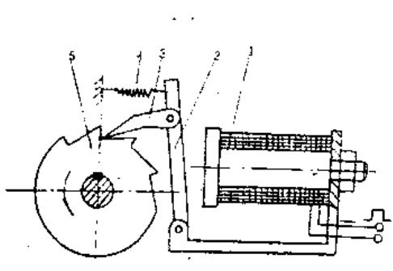

图14-28电磁铁棘轮棘瓜机构

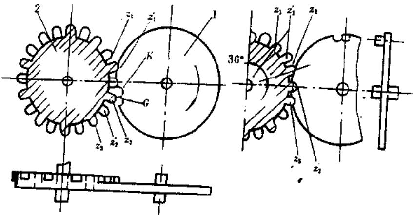

图11-29针轮单齿暗合间歇传动机构

传动过程是这样的:主动轮的针齿未进入啮合区前,从动轮的齿 $\pmb { z _ { \lambda } }$ 和 $z _ { 1 }$ 跨于主动轮的外缘上,虽主动轮转动,但从动轮不转动,当针齿进入啮合区时,针齿K与从动轮的短齿接触并驱动从动轮转动。同时,凹槽紧接着与长齿 ${ \pmb z } _ { 2 }$ 啮合。针齿驱动短齿 $\tilde { \varepsilon _ { \mathrm { 3 } } } ^ { \prime }$ 转过一个节距(18)便退出啮合;接看出凹槽驱动长齿转过一个节距(18)后退出啮合。两者共完成了从动轮1/10转(36的间歌转位,从动轮转位后,由z和z跨于主动轮外缘定位,重复上述动作,便可得到接连的间默转位运动。每完成一次转位,从动轮总是依次由两个相邻长齿跨于主动轮外缘定位不动,而主动轮继续转动。

(3)带定位槽的单针齿间歌传动机构这种机构的主动轮1有针齿K和定位槽G,从动轮2有10个带定位钩的片状轮齿。在主动轮的连续转动下,被动轮作间歇转位运动,如图14-30所示。

当主动轮转一周时,针齿K与从动轮的轮齿进行啮合(图i4-30(a)),并把=驱动转过36角,然后退出啮合(图14-30(b),完成一次转位的间歇运动。这时从动轮的轮齿z、和由主动轮的定位槽G定位,不能转动,但主动轮可继续转动。周而复始,便可实现变回转运动为间歌转位的计入运动。

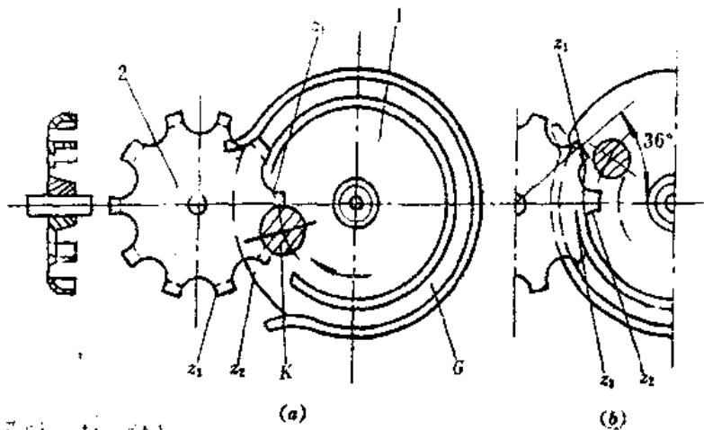

图14-30带定位糟的单针齿间隙传动机构$\langle \pmb { \circ } \rangle$ 针齿和槽齿啮合()针齿和權齿脱开啮合

(4)槽轮间歇传动机构图14-31所示是用于交叉轴间的槽轮间歇传动机构。主动轮1开有引入和退出导口的凹槽 $a$ 凹槽 $\mathfrak { g }$ 对从动轮2兼起传动和定位作用。在主动轮按箭头方向转动时,退出导口(图中右边导口)的侧面与从动轮齿 ${ \pmb { \tilde { \tilde { \tilde { \tilde { \tilde { \tilde { \tilde { \tilde { \tilde { \tilde } } } } } } } } } } }$ 接触并推动其脱离凹槽;与此同时,从动轮转动,下22\~齿 ${ \pmb z } _ { \pmb { z } }$ 随着转动沿引入导口(图中左边导口)进入凹槽,这时从动轮被定位不动。若从动轮有10个齿,那么,每转一齿就完成了1/10转 $\textcircled { 3 6 } \textcircled { \cdot }$ 的转位。

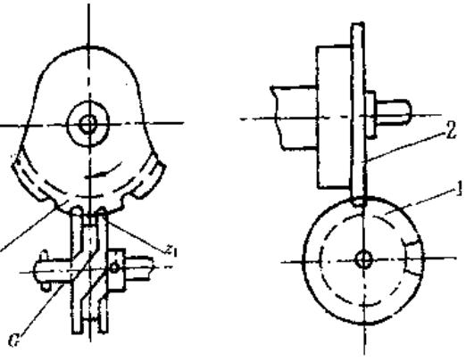

图14-31槽轮间歌传动机构

# 2.进位机构

进位机构在计数器中的作用就是在累计过程中进位。大多数是十进位机构。进位的级数可根据计量范围而定。下面从图14-32所示的六级十进位计数器说明进位机构的工作原理。

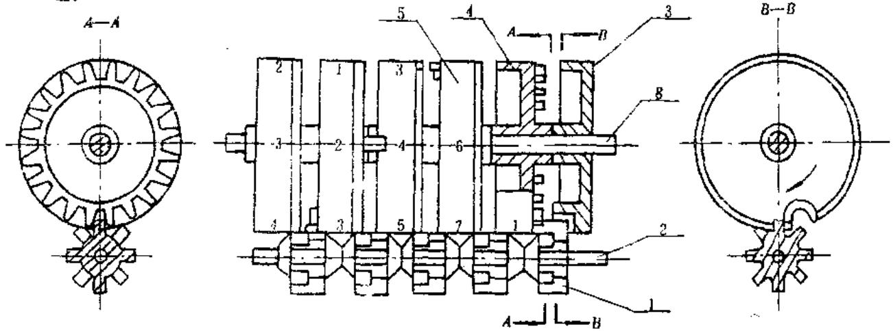

图14-32让数器的进位机构

该装置有六个数轮,每个轮面上刻有 $0 \sim 9$ 十个数字,它们松套在一个中心轴6上。最右边的一只数轮3称之为始轮。始轮的右侧装有齿轮,由计入机构驱动而作连续转动或间歌转动。始轮左侧有2个轮,除始轮外其余的数轮都是右侧整圈均匀分布着20个齿,左侧有2个齿(最左边的数轮左侧无齿)。在每一对数轮之间都有一个直径很小的小齿1,称为进位轮,其齿数为偶数,一般取 $\hat { \mathsf { \Pi } } ^ { \hat { \mathsf { \Pi } } } \sim \hat { \mathsf { \mathbb { \alpha } } }$ 个齿。进位轮共同松套在一根公共轴2上,每只进位轮与其左边的数轮上20个齿的齿轮啮合,并周期性地与其右边的数轮上两齿的齿轮啮合。各数轮均通过进位轮传递,实现进位传动。

进位传动的过程是:开始工作前先将各数轮轮面上的显示都调为“0",开始工作后由计入机构带动始轮转动,其数字由 ${ } ^ { \mu } \mathbb { 0 } ^ { \nu }$ 按顺序变到"9”,当由“9"变到“0"的时候,始轮左侧的2轮齿与其相邻的进位轮啮合,使进位轮转过2个齿,而该进位轮又与第二只数轮右侧的20齿齿轮啮合,它迫使第二只数轮转过2个齿,即转动1’圈也第二只数轮变换了一个数字码,这样在“十"位数上进了一位。在第二只数轮4变换了十个数字码后(即转完一圈),其左侧的2个齿迫使第二个进位轮转过2个齿,该进位轮又使第三只数轮5转过2个齿(1/10周),即在“百"位数上变换了一个数字码,以此类堆,最后使第六只数轮在“十万"位上变更数字码。

数轮和进位轮一般是用工程塑料压注成型的。这种进位机构结构简单,设计灵巧,使用方便、准确、可靠、不受外界干扰。在计数器中应用广泛。

# 3.复零机构

大多数设备的计数器都要求有复零机构,以便反复计量不同的被测值.但也有些只要求连续累计,不需要有复零机构的计数器。

复零机构一般有凸轮式和棘爪式两种。

(1)凸轮式复零机构图14-33所示是常用的凸轮式复零机构。每个数字轮的同侧都带有返零凸轮,而返零凸轮的曲线常用对数螺线。每个凸轮都对应有相同的拨杆6。这些拨杆6与摆杆3固联在一起,能绕轴5摆动,摆杆支承着装有进位轮1的小轴2.

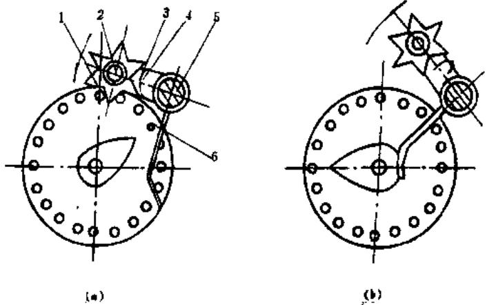

图14-33凸轮式复零机构

计数时,摆杆在扭簧4的作用下,通过小轴把进位轮压向数字轮,与其轮齿正常啮合,进行传动。图14-33(a)所示是数字轮在计数传动时所处的任意位置。

复零时,摆杆被抬起,使进位轮脱离啮合;同时使与摆杆固联的拨杆推向凸轮曲面,推动数字轮转动,直至拨杆与凸轮曲面的最低点接触为止。此时,数字轮显示为“0”.全部数字轮所对应的拨杆都同时做上述复零动作时,无论这些数字轮各处于何种位置,都将同时复零。

图14-33(b)所示是数字轮在复零时所处的位置.

(2)棘爪式复零机构图14-34所示是棘爪式复零机构。在每个数字轮的同一位置(对应某个数字)上均装有棘爪2,利用扭簧3使之保持与中心轴1的沟槽接触。在装有进位轮5的小轴4的两端,装有扭簧6,使进位轮5与数字轮作正常的啮合。

计数时,数字轮在进位轮的驱动下,按箭头方向转位。这时中心轴不动,棘爪在中心轴上打滑。

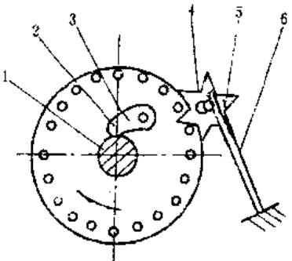

图14-34棘爪式复零机构

复零时,按数字轮转位方向转动中心轴,在转动中,沟槽总会先后与各数字轮的棘爪相遇,通过棘爪的相反作用,使数字轮转动。本来,若小轴4固定不动,则在进位轮与数字轮处于定位啮合的情况下,数字轮是不可能作主动轮的。当数字轮作主动轮时,其轮齿迫使进位轮连同小轴一起向外移动,因而间断地脱离啮合和转位。待每个数字轮的棘爪都顶在沟槽时,则表示每个数字轮的数字处于相同的位置,于是可把同时显示 ${ } ^ { \# } \mathfrak { Q } ^ { n }$ 的数字轮旋至读数观察口处。

上述两种复零机构,以凸轮式较佳,它结构简单、使用方便,没有像棘爪式那样复零时产生齿间强追摩攘,所以应用较多。

# 二、指针指示式计数器

指针指示式计数器是通过轮系带动指针在度盘上运动来显示工作参量累积值的计数装置。计数的进位方式不是间歌跳变,而是连续改变;计数的显示方式不是直接以数字组合,而是用刻度盘的刻度表示,用指针指示。这种计数器在仪器仪表、电子设备中也获得了广泛的应用,例如水表、汽车里程表等。

指针指示式计数器采用的齿轮轮系包括行星轮系和普通轮系。行星轮系有单级的、多级的和少齿差的等;普通轮系常采用定轴差动轮系以获得较大的传动比,并使结构紧凑。

指针指示式计数器的结构形式很多,采用的齿轮轮系也不相同,下面仅举两例说明。

图14-35所示是单级行星齿轮系计数器。它具有精、粗读数的两个度盘。轮系的系托H装有精读数度盘并有与计数输入齿轮6相啃合的齿轮。中心轮1不动。行星齿轮2和3装在轴5上,在系杆带动下绕中心轮作周转,同时绕轴5自转。输出齿轮4与粗读度盘a连在一起,由行星齿轮3转动,标尺7作为度盘读数的参考点(见A向视图),

计数器原理是;齿轮6把披计量按一定的比例关系输入系杆H,并由与之相连的度盘a1示出精读量值。当系杆H连同度盘a转一周时,则通过轮系所确定的传动比使齿轮4连同度盘a转过一定的角度,示出进位的粗读量值。

图14-36所示是线圈绕线机计数器的结构图。两个具有不齿数a和的薄片蜗轮!和2同时与蜗杆3啮合。度盘5禁在锅轮2上;度盘1固定干机架上,其刻度按蜗轮1整转范围内刻制。蜗轮1与轴7面接在一起转动,蜗轮2绕轴7转动,指针6通过调节螺钉8固紧于轴7。需绕制的线圈装在蜗打的一端,另一端装有手轮,其转数就是所绕的匝数。锅轮!带动指针6对度盘4所指示的数值就是匝数的累计。指针(即蜗轮1)每转一周,对蜗轮2上的度盘5都有相对转数差(滞后或超前于指针),此转数差值就是指针转数的累计,也即度盘5的进位数.

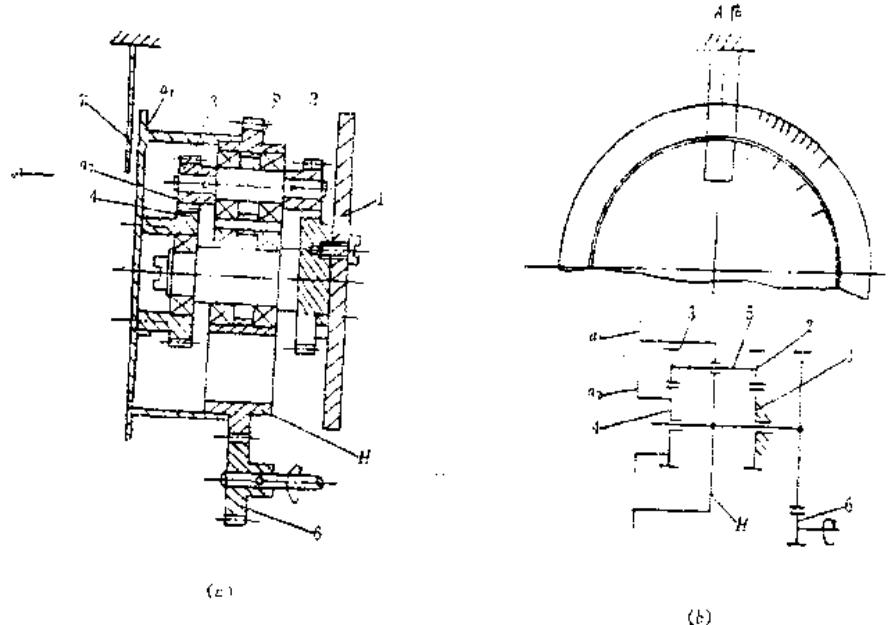

图14-35单级行星齿轮轮系计数器(a)结构图 (b)原理图

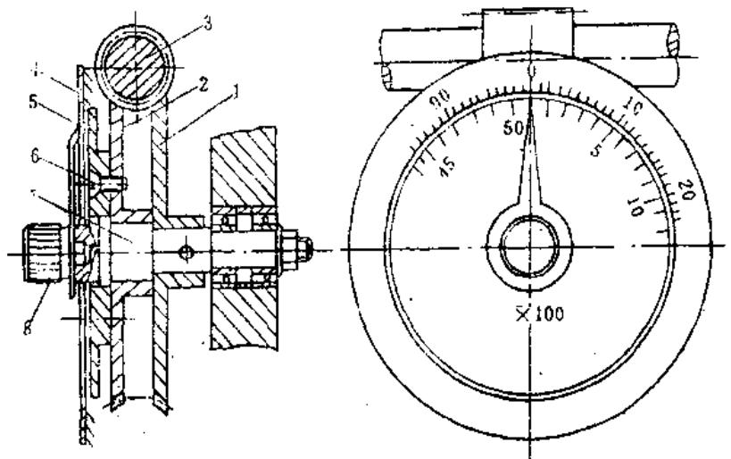

图14-36绕线机计数器

一般,蜗轮1和2的齿数分别为 $z _ { 1 } = 1 0 0 , z _ { 2 } = 1 0 2$ 。若度盘4有100个分划,则指针对应这度盘转一个分划表示线圈绕了1匝,转1周表示绕了100匝。

可以推导出蜗轮1对蜗轮2的转数差 $\therefore N _ { 1 2 }$ 为

$$
\Delta N _ { 1 2 } = \frac { 1 0 2 - 1 0 0 } { 1 0 2 } \mathrm { - } \mathrm { \Omega } \mathrm { \Omega } \mathrm { \Omega } \mathrm { \Omega } \mathrm { \Omega } \mathrm { \Omega } = \frac { 1 } { 5 1 } \mathrm { { \Omega } } N _ { 1 }
$$

若把度盘5制成51个分划,则蜗轮1(即指针)转1周后,与蜗轮2产生!个分划的相对转数差;转2周,产生2个分划的相对转数差,等等、可见,度盘5每1个分划代表100匝,满刻度为5100匝。

这种计数沉构结构简单,使用方便,用同一指针可示出由两个度盘组合的累计数值。

为了实现同中心距而不同齿数的啮合传动,可采用两蜗轮对蜗杆纵向中心平面的安装!距离不等的办法来解决。如图14-37所示,若蜗轮2的齿数多于蜗轮1的齿数,则按 $, 1 , > { \Lambda } ,$ 办法可调整到合适的位置。

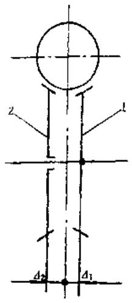

图14-37同中心距不同齿数的蜗轮差动机构的安装

# $\ S$ 14.5自动记录装置

某些电子设备在工作时,往往需要将工作状态或工作结果在一定时间内的变化情况记录下来,以便进行分析和研究,这种能记录被测量连续变化的装置称为自动记录装置,它的特点是以曲线图形来复现被测量的变化情况以供观察,并且可直接读出其工作结果。

记录装置的优点是:

1)能够记录最慢的蠕变和最快的动态过程,以供分析研究;2)在需要进行长时间观察及同时要测量多个参量时,使用记录装置能节省大量的人力,并且还能记录下不能预测、突变的过程;3)自动记录的曲线是被测量的客观变化过程,从而消除了观察者的主观视差;4)记录曲线是一种文件,便于保管、复制,以便日后进行分析;5)自动记录设备可以用在人所不能达到或难以达到的地方(如星际空间、污染的地方)进行记录等。

# 一、记录装置的类型

记录装置主要由记录机构和记录面组成。根据记录机构与记录面的相对运动情况,一般有如图14-38所示的四种基本记录方式:平面式、卷筒式、圆简式和圆盘式。在记录方法上有机械法、光学法和电磁或光、机、电结合的组合法等,常用的是机械法中的记录笔法;光学法和电子射线法适用于快速变化的记录过程。

# 1.平面式记录装置

平面式记录装置(图 $\frac { 1 } { 3 } \cdot 1 - 3 8 \{ a \} )$ 可同时输入两个具有函数关系的变量信号,使记录笔按函数关系沿直角坐标的 $\pmb { \mathcal { L } }$ 轴和 ${ \pmb y }$ 轴运动,从而在记录纸上描绘出两变量间的函数关系曲线 $\pmb { \ y }$ $\fallingdotseq f ( z )$ ,或记录某一变量的时间历程。这种装置也叫做 ${ X - y }$ 函数记录装置,在各种记录仪、测试仪、绘图仪等设备中得到应用。

# 2.卷筒式记录装置

卷筒式记录装置(图14-38(b))是大多数自动记录器所常用的记录方式。记录纸作匀速直线运动,走纸的长度与时间成比例。记录笔的运动方式可以是来回摆动,也可以是直线往复移动,记录下的曲线表示摆动角 $\pmb { G } \pmb { \imath }$ 或位移量 ${ \pmb y } )$ 所模拟的物理量的变化过程。

# ${ \mathfrak { z } } .$ 圆筒式记录装置

圆簡式记录装置(图 $\displaystyle { \mathrm { i } \ A { - } 3 8 \mathrm { ( } c \mathrm { ) } } ,$ 是记录转角变量与直线位移变量关系的记录方式,记录纸贴在圆简上作匀速转动,记录笔随被测量的变化作上下移动,若把记录纸展平,也是直角坐标式的记录曲线。这种机构主要用来记录变化缓慢(如液位、压力)的工作过程。

# 4.圆盘式记录装置

圆盘式记录装置(图 $1 4 - 3 8 ( d ) )$ 记录纸是圆盘式,在记录时作匀速转动或固定不动,记录笔一般作摆动.它适用于记录转角变量与摆动变量关系的函数曲线,也适用于变化过程较慢的记录,如压力记录器。其缺点是记录在极坐标上,没有直角坐标明显,不便读数。

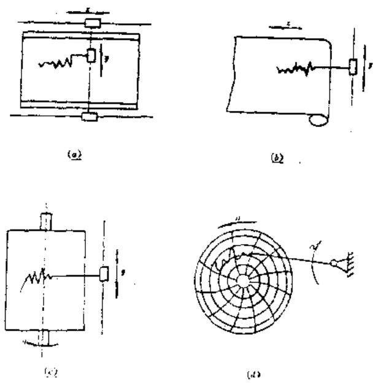

图14-38记录装量的记录方式

# 二、自动记录装置应用实例

自动记录装置应用非常广泛,随着电子的发展,这种装置日臻完善,性能和质量得

到很大的提高。现举例如下:

图14-39所示是某一自动记录装置的作源理图。被测信号首先输入衰减器进行衰减,以适应不同的信号电压和量程范围。衰减后的信号送入由一个稳压单元和测量电位器组成的测量电路。被测信号与测盘电位器的电压相比较,如果两者不等,则产生电压差 $\pmb { \Delta } \pmb { u }$ ,经放大器调制成 $\mathfrak { s o r a z }$ 的交流信号并放大,然后解调、滤波成直流信号并进行功率放大,再将放大后的叙号输入直流伺服电动机 $\pmb { M }$ ,使之转动,通过传动机构带动记录笔运动,进行记录;同时,电动机带动测量电位器的触点运动,使差值它压逐渐减小,直到为零(即测量电位器的电压与信号电压相平衡),此时,电动机停止转动。记录笔沿 $\pmb { \chi }$ 轴和 $\pmb { \gamma }$ 轴方向的运动,分别由单独的随动系统来实现。如果在 $\pmb { X }$ 轴方向和 $\pmb { \gamma }$ 轴方向的随动系统各输入一个信号,则记录笔就会描绘出它们的函数关系由线。如果仪对 $\pmb { \gamma }$ 轴方向的随动系统输入信号,而走纸机构带动记录纸沿 $\pmb { \chi }$ 轴方向运动,则记录笔就会描绘出该信号的时间历程。为使记录笔能在快速运行时较稳定,在直流伺服电动机中还装有测速发电机G,用它的反馈作为系统的阻尼,提高仪器的动态性能,伺服电动机的转角大小和方向,即记录笔记录幅度的大小和方向与差值电压 $\Delta u$ 的大小和极性成正比,即每一瞬间的记录幅度与该瞬间的信号电压成线性关系,因而能反映被测信号的变化情况。

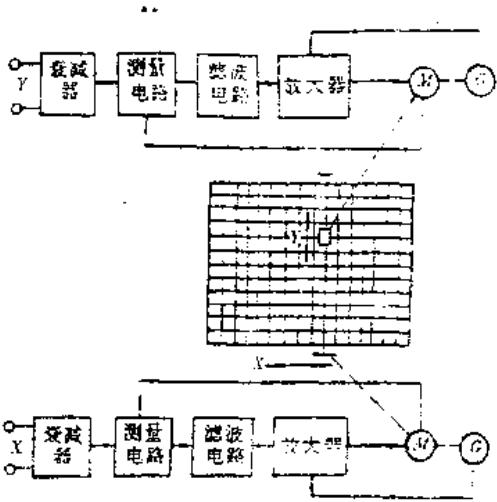

图14-39某记录装置的工作原理图

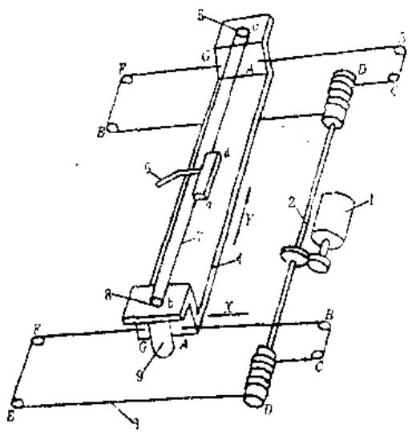

图14-40记录笔的传动结构

记录笔的传动机构采用桥式行车形式,如图14-40所示。它能使记录笔按照信号的大小和方向沿 $\pmb { \chi }$ 轴和 $\pmb { \gamma }$ 轴灵活地往复运动。机构的所有运动组件都装在滑架 $\pmb { \mathscr { q } }$ 上,以使结构简单、传动线绕制方便。为减少因滑架在 $\pmb { \chi }$ 方向运动产生过冲现象,采用了刚体转轴双头拉线的传动形式。

电动机1带动轴2转动,通过传动线3拖动滑

架4沿 $\pmb { \chi }$ 轴方向运动。为了保证两端拉线的松紧一致,可调节导向滑轮 $\smash { \mathcal { B } , \mathcal { C } }$ 的位置。这种两端拉线的传动形式,可消除滑架在运动中可能产生的摆动现象,从而提高记录精度。电动机$\mathfrak { g }$ 带动滑轮8,通过传动线7使记录6沿Y轴从 $\pmb { \alpha }$ 到 $\pmb { \ b }$ 或从 $\pmb { d }$ 到 $c$ 方向运动,调节滑轮5可改变传动线的松紧程度。

# 14.6光电显示装置简介

现代电子设备中广泛采用各种光电显示装置,其特点是直接读取被测量的数字、图像和图形等,读数精度高,反映速度快。按显示器件的不同,光电显示装置有如下几种:

# 一、电子束显示(亦称CRT显示)

这种显示方法是采用适当的控制电路来控制真空管内的电子束,使其在荧光屏上扫描并激发发光粉发光,从而显示图像或字符。目前,已有多种电子束显示器件,如黑白显像管、彩色显像管、示波管、存储管、印刷管和字码管等,

# 二、平板显示

这种显示方法是采用平板显示器件辅以逻辑电路来实现显示的。平板显示器件主要有电致发光(EL)显示板.等离子体显示板(PDP)和液晶显示板(LCD)等。利用空间交叉的条状电极夹层间的工作物质(分别为荧光粉、惰性气体和液晶等),在交叉点上加工作电压时就发光、放电或改变其光学性质,使变化了的象素构成图像。

# 三、光学投映式显示

光学投映式显示是指采用光学系统将小面积的图像投映到银幕而实现显示的方法,这种显示法可以获得很大面积的图像,便于供很多人同时观看。光学投映式显示主要分为下述三种:

(1)投映电视以高亮度投映式显像管显示图像,用光学系统将图像放大并投映到银幕上。

(2)激光显示激光器发射出能量密度高、光斑直径小的光束,采用光调制器按视频信号来调制激光束的强度:并用光偏转器使激光束在银幕上扫描,以显示大面积的图像。

(3)光阀显示根据光阀的可控煤质的工作原理,如电光效应光阀可控媒质的电光效应等,由电子束或光束扫描形成潜在图像,再由适当的光学系统把潜在图像投映到银幕上,以产生大面积的滚。常用的电光效应光阀有晶体光阀,铁电陶资光阀和液晶光阀等。

# 四、数码显示

系指台式计算机、油珍计算器、电子手表和数字仪表等小型电子设备中显示 $\complement \sim 9$ 数字的显示器。由子这类设备体积小、耗电少,不可能用子束管等显示器件,因此人们专门研制了一大类数码显示器件,这类器件主要有发光二极管(LED)显示、荧光数码显示(VFD)、辉光放电显示、灯丝显示和电致变色显示(ECD)等,

# 习

14-1显示装覺有哪些类型?其基本要求有哪些?

14-2标尺指针示数装置有哪几种典型结构各有何特点?

14-3什么是刻度特性?从减小原理误差的角度来看,获得线性刻度的方法有哪些?

4-4确定标尺基本参数的依据和原则是什么?

14-5已知某电子设备读数装置的频率覆盖范围是 $\mathsf { 5 0 } \mathrm { \sim } \mathsf { 1 0 0 } \mathsf { M } \mathsf { H z }$ ,相对读数精度为 $1 \%$ 试设计该示数置的度盘(绘制度盘工作图).

14-产生示数装置的误差因素有哪些?各是什么性质的误差?

14-7试比较各类显示装置的优缺点?

# 第十五章 调节装置

# 15.1概 述

调节装置是电子设备或仪器在工作过程中,用以调节或控制各种技术参数的大小、强弱、变化规律、精角度或使之接近某一确定值的装置,

# 一、调节装置的类型和应用

调节装置的类型很多,根据工作方式的不同,可分为手动调节装置、半自动调节装置和全自动调节装置等。

手动调节装置由于其结构简单,可用各种传动型式组合而成,形式多样化能满足各种调节要求,及具有操作方便、可靠性高、生产费用低等优点,故广泛用于电子设备和仪器中。本章着重介绍手动调节装置。

所谓手动调节装置,实际上是由螺旋、杠杆、齿轮、蜗杆、凸轮和摩擦轮等传动型式中一种或几种组成的减速传动机构:它是利用机械传动的机械位移量(线位移或角位移)与被调技术参数建工一定的比例关系进行数据传递的,通常其主动轴上装有调节件(如手轮、旋钮等),输出轴与被调元件相连接。在大多数情况下,它还与示数装置(度盘、指针等)相连接,以便指示被调技术参数值。手动调节装置可以是具有固定传动比的减速传动机构,也可以是具有两个传动比的减速传动机构。当采用两个传动比时,一个是粗调,另一个是细调或微调。

图15-1所示是具有固定传动比的手动调节装置的应用实例。其中,图 $\frac { 1 } { 3 } \sqrt { 2 } - 1 ( a )$ 是电子设备中常见的调电容装置。旋钮带动摩擦轮 $\scriptstyle { \boldsymbol { \mathit { I } } } _ { 1 }$ 转动,通过摩擦轮传动,使轴 $\mathbf { I }$ 转动,再通过齿轮传动 $( \tilde { \rho } _ { \tilde { 5 } } , \tilde { \rho } _ { \tilde { 8 } } )$ 带动电容器动片轴转动。其传动比为

$$
i _ { 1 4 } = \frac { \mathcal { D } _ { 2 } } { \mathcal { D } _ { 1 } } \cdot \frac { z _ { 4 } } { z _ { 5 } } = \frac { 4 0 } { 1 5 } \times \frac { 6 0 } { 2 0 } = 8
$$

当电容器轴转动 $\$ 80^ { \circ }$ 时,旋钮应转 $\frac { 8 \times 1 8 0 ^ { \circ } } { 3 5 0 ^ { \circ } } = \pm ( I )$ 。电容器轴到度盘的传动顺序为 $z _ { 4 } - z _ { 5 }$ $- z _ { 3 } - \mu z _ { 1 }$ ,其传动比为

$$
i _ { \delta 4 } = { \frac { z _ { 5 } } { z _ { 6 } } } \cdot { \frac { z _ { 4 } } { z _ { 3 } } } = { \frac { 2 0 } { 6 0 } } \times { \frac { 5 0 } { 3 0 } } = { \frac { 5 } { 9 } }
$$

当电容器转动 $\yen 80^{ \circ }$ 时,度盘应转 $\frac { 1 8 0 ^ { \circ } \times 9 } { 5 } = 3 2 1 ^ { \circ }$ :

根据以上计算可以得出,当旋钮每转一圈时,电容器动片轴转45°,度盘转324/4=81°。

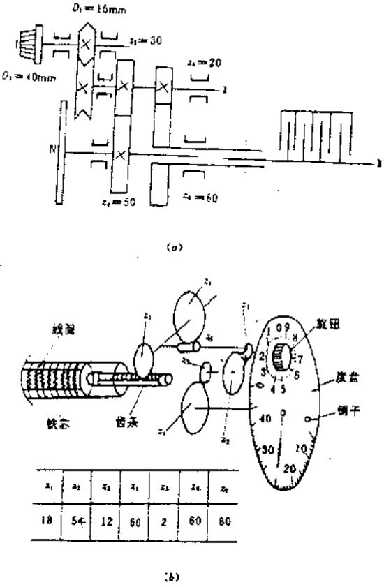

图15-!具有固定传动比的手动调节装置的应用实例

图15-1(b)所示是较为典型的调电感装置,它是使铁芯在线圈中移动而改变电感量的.铁芯在线圈内移动是通过下列传动机构来实现的。转动旋钮,蜗杆 $\hat { \mathbf { \mu } } _ { \ast } ^ { }$ 带动蜗轮 $2 5$ 转动,齿轮${ z } _ { 7 }$ 与蜗轮 $z _ { \theta }$ 同轴转动,带动齿条移动,由于铁芯固定在齿条上,所以铁芯能够在线圈中作直线移动,从而使电感量变化,其变化量可以从度盘上以频率读数的数值反映出来。读数指针的转动通过齿轮 $z _ { 1 } 、 z _ { 2 } 、 z _ { 3 } 、 z _ { 4 }$ 来传递。两个销子的作用是限制读数指针在 $\mathord { \sim } 5 0$ 的刻度范围内转动。该装置的传动链可表示如下:

$$
\begin{array} { r l } & { \mathfrak { s } _ { 5 } \to \mathfrak { z } _ { 6 } ( \mathfrak { z } _ { 7 } ) \to \mathbb { H K } ( \mathbb { H K } , \mathbb { E } ) } \\ & { \mathfrak { s } _ { 1 } \to \mathfrak { z } _ { 2 } ( \mathfrak { z } _ { 3 } ) \to \mathfrak { z } _ { 1 } ( \mathtt { i } _ { 2 } \mathbb { E } ) ( \sharp \mathbb { E } ^ { k } ) } \end{array}
$$

各齿轮的齿数如图15-1(&)中表内所示。若齿轮、蜗轮、齿条的模数均为0.5,则可求出旋钮转1r时,条的位移量和读数指针的转角。现计算如 $i ^ { - }$ :

蜗杆蜗轮的传动比 $i _ { \updownarrow \updownarrow } = \frac { \updownarrow } { \updownarrow } = = \frac { \updownarrow 0 } { 2 } \approx \updownarrow 0$ 当旋钮转1r时,蜗轮 $z _ { 8 }$ 转 ${ \frac { 1 } { 3 0 } } \mathbf { r }$ 齿轮 $z _ { T }$ 也转过3,所以齿条的位移量为

$$
l = \pi \cdot n \cdot n { \it : } n \% = 3 . 1 4 \times 0 . 5 \times \frac { 1 } { 3 0 } \times 8 0 = 4 . 2 ( \mathrm { m m } )
$$

旋钮与读数指针间的传动比为

$$
i _ { 1 4 } = \frac { z _ { 2 } \cdot z _ { 4 } } { z _ { 1 } \cdot z _ { 3 } } = \frac { 5 1 \times 6 0 } { 1 8 \times 1 2 } = 1 5
$$

旋钮转角 ${ \mathfrak { P } } _ { ! } = ! \mathfrak { r }$ 时,读数指针转过的角度为 $\varphi _ { 4 } = \varphi _ { 1 } / i _ { 1 6 } = 3 6 0 ^ { \circ } / 1 5 = 2 . 1 ^ { \circ }$ 。

图1-4所示是具有两个传动比的手动调节装置的应用实例。

手动调节装置的缺点之一是调节速度低。为克服这种缺点,使微调装置迅速转动很大的角度,可在装置中接入…只小型微电机,并且用按钮开关控制电机的运动和停止;当电机停止在所需位置附近时,再用手调节到所需要的精确位置。另外,也可以采用闭环控制系统进行自动调节,其具体应用见第十六章。

# 二、手动调节装置的基本要求

调节装置的使用性能直接关系到设备或仪器的工作质量,对手动调节装置的基本要求是:

1)有足够的灵敏度,使被调节的最小位移量能满足使用要求;

2)能满足设备或仪器必需的调节精度;

3)运动灵活、传动平稳;

4)运动平滑性好即调节装置的转矩能保持恒定而均匀;

5)工作可靠调整好的位置应保持稳定,不致因冲击、振动等因素的影响而变化;

6)体积小,重量轻;

7)结构简单,工艺性好;

8)其它要求,如符合人机工程学原则等。

# 15.2手动调节装置的设计原则

# 一、适当选择调节-指示比

对于定量调节或连续调节的手动调节装置,其调节件(旋钮或手轮)和指示件(度盘、指针等)之间有一定的关系。若以 $\pmb { C }$ 表示调节件的操作行程量(一般是转动量,也有些情况为移动量) $p$ 表示指示件的移动量(或转动量),则调节-指示比 $B$ 就是调节件操作行程量与指示件移动量之比,其表达式为

$$
B = { \frac { c } { D } }
$$

调节-指示比对调节装置的调节性能有一定的影响,如图15-2所示。很显然,若 $c / \mathfrak { D }$ 值小,则表示 $c$ 比 $\mathcal { D }$ 运动程度小,调节件旋钮只要略微动一下,指针就会有较大范围的移动,出现明显的指示效应(图15-2(a));而当C/D值大时,调节旋钮即使转动较大的范围,指针的移动也并不显著(图15-2(b))。

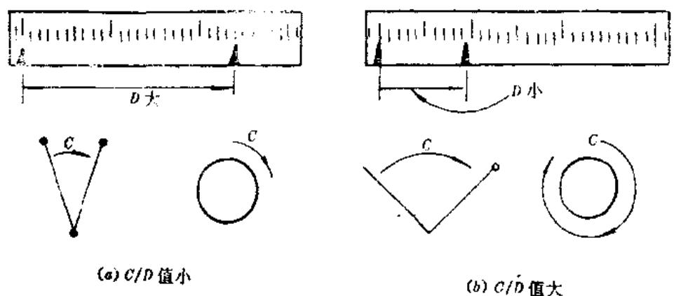

图15-2调节-指示比

一般来说, $\gamma / \beta$ 值小的调节装置,适用于粗调裙快速调节系统,它具有调节时间短,调节精度低的特点; $C / D$ 值大的调节装置,适用于精调,它具有调节精度高,但调节时间长的特点。图15-3所示为 $c / \theta$ 值与粗、细调时间以及总时间的关系。由图可知,指针每移动1cm,旋钮转动 $0 . 1 \sim 0 . 2 \mathfrak { s }$ 时,总时间为最短。

图-3旋钮和指针的C/0值与调节时间的关系

调节装置 $C : 1 1 \rrangle$ 值的确定应满足功能、快速和准确的要求,设计时应根据使用场合选择合适的调节-指示比。

# 二、合理确定转值和比例尺

转值就是调节件或指示件等零件每转一周所代表的可调技术参量值,通常以 $\pmb { A } _ { \pmb { \nu } }$ 表示。如某一调节装置度盘在整圆周均匀分布100个刻度,分度值为 $1 0 k \pmb { \mathrm { g } } _ { \pmb { z } }$ ,则其转值为$A _ { \circ } { = } 1 0 0 0 \mathbf { k } \mathbf { H } z / \mathbf { r }$ a

若已知某一机件(指针、度盘或旋钮等)的转值为 $\mathbf { A } _ { r }$ ,转数为 $\boldsymbol { \Lambda } ^ { \prime }$ ,则它所复现的物理量为:$\pmb { A } { = } \pmb { A } _ { r } \pmb { N } _ { s }$ 

转值的单位可根据被调对象而定。如对于调谐频率是 $_ { \mathrm { k H z / 5 , M H z / r } }$ 等,对于电感调节量是 $\mathtt { H } / \mathtt { r }$ 或 $m H / \tau$ ,对于距离测量是 $\mathtt { k m / r } , \mathtt { m / r }$ 等等。

比例尺是指单位长度或单位转角所代表的物理量(以 $\pmb { M }$ 表示),前者称为线位移比例尺(记为 $M _ { \mathrm { : } }$ ,后者称为角位移比例尺(记为 $M _ { \alpha } )$ 。若调节件或指示件的比例尺 $( M _ { i }$ 或 $M _ { \parallel }$ 及其实际位移量(直线位移 $\pmb { L }$ 或转角 $\pmb { \theta }$ 已知,则它所复现的物理量为: $\pmb { A } = \pmb { M } _ { t } \pmb { L }$ 或 $A = \sqrt { 3 } + 1 0$ ·

比例尺的单位也要视被调参量而定。如; $\mathbf { k H z } / \mathbf { m m } \mathbf { \mathbf { \mathbf { \rho } } } \mathbf { , k H z } / ( \mathbf { \hat { \rho } } )$ 或 $\pmb { \mathrm { k H z } } / \tau \geq d$ 等等:

转值与比例尺有如下关系:

若调节装置的调节件和指示件两者之一是作线位移计量的,则它们的转值与比例尺的关系为 $A _ { r } = \frac { M _ { 1 } L } { N }$ :若两者均作角位移计量,则它们的转值与比例尺的关系为 $\mathbf { \Delta } _ { A _ { r } } = \frac { M _ { a } \mathbf { \mathcal { \theta } } } { N }$ 或$A _ { + } = 3 6 0 M _ { * } !$ 因 $N = \frac { \theta } { 3 6 0 ^ { \circ } } \Bigg \}$ 。就调节件或指示件本身而言,它的转角与某角位移比例尺的关系亦为 $A _ { r } { = } 3 6 0 M .$ :

引入转值和比例尺概念的目的,是为了在设计调节装置传动链时,便于进行运动学分析。因为传动链的传动比与转值和比例尺有密切关系。

现以图15-4所示的调节装置导出转值与传动比的关系。假定齿轮1、2的转值分别为 $A _ { \mathfrak { s } _ { i } }$ 和 $\pmb { A } _ { \pmb { \gamma } _ { \pmb { \chi } } }$ 当齿轮1转 ${ \pmb { \cal N } } _ { 1 } { \pmb \rrangle }$ ,则齿轮2有确定的转角数 ${ \pmb N } _ { \pmb { \imath } } { \pmb r }$ 。因为它们所反映的物理量相等,所以有

$$
A _ { \uparrow } , \ d N _ { \downarrow } = A _ { \uparrow } , \ d N _ { \uparrow }
$$

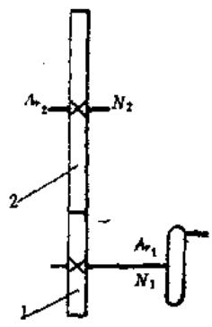

图15-4转值与传动比的关系

根据传动比定义,则有

$$
i = \frac {  { N _ { \mathrm { 1 } } } } {  { N _ { \mathrm { 2 } } } } = \frac {  { A _ { \mathrm { 2 } } } } {  { A _ { \mathrm { 2 } } } }
$$

可见,调节装置的传动比等于从动轮转值与主动轮转值之比。因此,可根据转值确定传动比,然后设计齿轮应有的齿数。

同理,可求具有多种转值和多级传动的调节装置的传动比,图15-5所示是具有快速粗调和慢速细调的指挥仪跟踪系统的调节装置。手轮1和手轮2分别有不同的输入转值 $A _ { \eta _ { l } }$ 和$A _ { \uparrow } , ( A _ { \uparrow } , > A _ { \uparrow _ { 2 } } )$ ,通过蜗杆蜗轮副 $\frac { z _ { 5 } } { K } \langle K$ 是蜗杆头数),由输出轴传至可调元件,该输出轴有共同的预定转值 $\pmb { A } _ { \pmb { r } _ { 0 } }$ 

当要快速捕捉目标时,用手轮1以大转值 $\pmb { A } ,$ 进行调节。这时调节装置传动链的传动比为

$$
i = \frac { A _ { i } } { A _ { i } } = \frac { i _ { 2 } } { i _ { 1 } } \cdot \frac { z _ { 5 } } { k _ { i } ^ { \prime } }
$$

当捕提自标以后,进入精确跟踪时,就用手轮2以小转值 $A _ { i _ { 1 } }$ 操纵。传动链的传动比为

$$
i = \frac { A _ { r _ { 0 } } } { A _ { r _ { 2 } } } = \frac { i _ { 1 } } { i _ { 3 } } \cdot \frac { z _ { 3 } } { \dot { h } }
$$

确定手轮大转值的条件是使捕捉目标所需的时间尽可能最短;而确定手轮小转值的条件则是使跟踪误差为最小。

把调节件(旋钮或手轮)的旋转运动转换为指

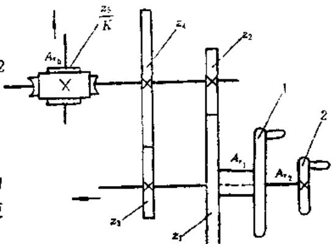

图15-5有两个输入转值的调节装置

示件(指针)或被调元件的直线位移的调节装置也是常用的,如频率调节装置、阀门调节装置、收音机调诺装置等。现举例说明此类调节装置的转值计算。

图15-6所示为简单测距仪的调节装置。假设其测量范围为 $0 \sim 1 5 0 0 0 \ m$ ,测量精度要求$\pm 5 m$ -螺杆1与螺母2之间存在空程误差为 $\pm 0 . 0 5 m m$ ,试计算螺杆的有效长度和螺杆的转值。

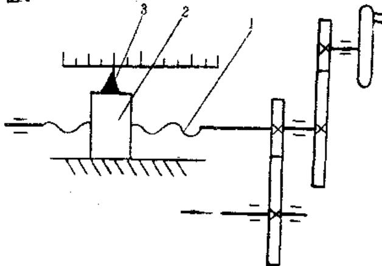

图15-6旋转运动变直线位移的调节装置

根据精度要求,比例尺应为

$$
M _ { \iota } = \frac { 5 } { 0 . 0 5 } = 1 0 0 ( \mathrm { m / m m } )
$$

于是,得螺杆的有效长度为

$$
\iota = \frac { 1 5 0 0 0 } { \mathrm { I 0 0 } } = 1 5 0 ( \mathrm { m m } )
$$

若选择螺杆的螺距为 $\sin n$ 、则螺杆每一转时,与螺母同连的指针 $\Im$ 移动$\pmb { 5 } \pmb { \mathrm { n n } }$ 。所以螺杆的转值为

$$
A _ { \prime } = 1 0 0 \times 5 = 5 0 0 ( \mathrm { m / r } )
$$

调节件(手轮或旋钮)转值的设计要

注意两点:

1)在一定调节范围内,若调节的转值大,则要调到某个测量值时,调节件转动的范围小(或转数少),所需的调节时间短,但调节精度低,若调节件的转值小,则要调到同样的测量值时,调节件转动的范围大(或转数多),所需的调节时间长,但调节精度高,且容易控制:因此要根据使用场合和要求对调节件转值进行合理设计。欲要在短时间内调节到某个较大的粗略值时,可设计大转值的调节件;反之,欲要得到精确调节时,则要尽量减小调节件的转值。

2)系统的动态参数对调节精度有一定的影响,这种动态参数主要是指系统折算到调节件轴上的负载力矩和惯性力矩。因此,在设计调节装置时应尽量减小这种影响,以避免或减少操纵调节件时产生不均匀性而引起调节误差。为此,调节件的转值不宜设计过大。

# 三、合理拟定传动方案

拟定传动方案就是根据已知的技术条件和原始资料,选择合适的传动机构,并且按一定的顺序排列组成传动链,以满足和达到电子设备和仪器对调节装置所提出的要求。拟定传动方案是一项技术经济性工作,它涉及的问题较多,如果脱离开具体任务来讨论是比较困准和空洞的,这里仅列出拟定传动方案的一般原则。

(1)在拟定传动方案时,必须仔细地分析设备和仪器对调节装置所提出的要求,正确地选择传动链中各类传动机构的类型。例如,对于要求有严格传动比的运动传递系统和数据传递系统的传动链,应采用哈合传动;而在传动比要求不太严格和传递力矩较小的场合,可采用摩擦传动。对于要求有较大直线位移的传动链,应采用齿条传动;而对只要求较小线位移或微调的传动链,可采用蝶传动。

(2)在满足总传动比的要求下,传动链应力求最短、最简单(即传动的级数越少越好),尽量避免采用结构复杂并难以制造的传动零件(如螺旋齿轮、圆锥齿轮等):轴的排列最好是相互平行,其次是相交或相错成 $9 0 ^ { \circ }$ ,避免任意角度的相交或相错。传动链的布局应力求紧凑,以满足体积小、重量轻的要求。

(3)合理布置传动链和分配传动比。

(4)调节件、显示件和被调元件三者轴的转动方向应一致。

# 四、要符合人机工程学原理

人机工程学指出工程技术设计应适应人体的各种要求,以使人机系统工作效能达到最高限度,给操作人员提供不易产生疲劳、避免或减少误差的良好工作条件。所以手动调节装置的设计应考虑与人体功能有关的问题。

手动调节装置调节件的形状大小、旋转方向、转动速度、负载力矩以及它在设备中的安放位置和排列等,都与人体功能有密切的关系。因此在设计时要全面考虑,以便使人在操作中感到习惯、舒适、不易疲劳和调节精度容易控制。

# 1.调节件的形状和大小

调节件的形状和大小,必须使操作者感到方便和舒适。对于定量和连续调节的手动调节装置,调节件一般都采用旋钮、手轮和摇把。通常,对于旋转范围小的连续调节装置,当操纵力较小时宜选择旋钮,操纵力较大时宜用手轮;如果旋转范围大,则应选择摇把。

当操作时需要转好多围的摇把,其旋转半径以 $2 0 \sim 5 1 \mathrm { m m }$ 为宜;若要快速转动,其旋转半径为 $3 0 m m$ 左右:若需要把设备指针(度盘)调节到指定的刻度上,用直径为 $\gamma _ { 0 m }$ 的旋钮为佳;用于雷达目标跟踪的摇把,其旋转半径以 $5 1 \sim 7 6 \mathrm { { m m } }$ 较合适。

调节件的大小还取决于其操纵力的大小。为保证调节的均匀性和平稳性,一般用于转动力矩为 $2 . 3 \sim 4 . 6 N \cdot m$ 的手轮,其半径大约为 $1 2 5 \sim 2 0 0 \ m m$ ;半径为 $2 0 m m$ 的有棱边的旋钮,适宜的转动力矩为0.52N·m,最大不超过iN·m。半径为12.5\~25mm的旋钮,其调节力不宜超过 $1 0 \mathbf { N }$ ,

在一定载荷力矩作用下的手轮,其半径 $R$ 的较佳值可按图15-7所示选择。

调节装置的调节件,其操纵力一般应尽可能小,这样可使运动系统转动灵活。但是,用力太小对调节精度不易控制,因为操作人员不能从操纵力中感受控制量大小的反馈信息。所以,若调节精度要求较高的调节件,应具有一定的调节阻尼力。比如,对于调节仪表指针到指定位置的手轮,当其直径为100mm时,宜有130N左右的阻尼力;直径较小的跟踪控制旋钮,宜有2N左右的阻尼力。当然,对于只要求快速调节而调节精度不高的手轮,其操纵力则愈小愈好。

对于直径较大的手轮,其操纵力可能很小,但是可以从动作幅度的大小来取得控制量大小的反馈信息,从而保证调节精度。一般来说,人手在灵活和平稳地转动旋钮时,能够准确地感觉并控制动作幅度的最小转角 $\Delta \varphi$ (人手的灵敏度),当手轮直径为 $\mathsf { i } 5 \sim 6 0 \mathsf { m m }$ 时,是 $\downarrow 5 ^ { \prime } \sim 1 ^ { \circ }$ 。

# 2.调节件的安放位置和排列

调节件应放在人手活动最灵敏、反应最快、用力最合适和辩别力最好的位置。

一般,调节件的适宜位置应该设在以肩为圆心,半径为 $6 1 0 m m$ 的球形区域内:若允许操作者躯干运动,则球形区域半径可达 $7 6 0 m m$ 。

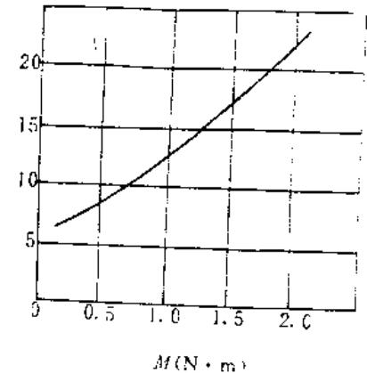

图15-7手轮半径与转动力矩的关系

最常用的调节件应设在以肘为圆心,半径为 $3 6 0 \mathsf { m m }$ 的圆球区域内;若允许肘运动,则圆球区域的半径可达 $1 0 0 \cap \mathop { \mathfrak { m } } \mathfrak { n }$ 

调节件的排列,应适应人的操作习惯。当有多个调节件时,可按照自上而下、从左到右、主次顺序排列。它们的排列位置对操作者的影响是:纵向排列比横向排列容易分辩;排列于右侧比排列于左侧容易分辩。

# 3.调节件的转动方向

调节件的转动方向必须适应人体的运动特征与运动规律,符合人的操作习惯。

调节件的转动方向应和被调元件或指示件的运动方向有明确的对应关系。如增大被调量,调节件应顺时针方向旋转;反之,则否。

# 4.调节件(手轮)转速和负载力矩

调节件的转速和负载力矩与人手所能发挥的功率和人手所能施出的力矩有关。

当调节件(手轮)转速从零变到人所能及的最大值时,人发挥出的有效功率则从零变到某一个最大值后,再变小到零。其变化规律遵循如下表达式:

$$
P = \frac { 1 P _ { \mathrm { m a x } } } { \omega _ { \mathrm { m a x } } ^ { 2 } } ( \omega _ { \mathrm { m a x } } \omega - \omega ^ { 2 } )
$$

式中, $P$ —人给予系统的功率 $( \mathbb { N } \cdot \mathbb { m } / \mathbb { s } )$ ;

$P _ { \mathtt { m a x } }$ ——人给予系统的最大功率 $( { \bf N } \cdot { \bf m } / { \bf s } )$ ;

$\pmb { \omega }$ 调节件(手轮)的转速 $( r a d / s )$ :

$\omega _ { \mathrm { c a s } }$ —调节件(手轮)的最大转速 $\operatorname { ( r a d } / { \mathfrak { s } } )$ :

由式(15-3)可见,欲得 $\scriptstyle P = P _ { \mathtt { m a x } }$ ,则必使:

$$
\frac { \mathrm { \Delta } \{ \left( \omega _ { \mathrm { m a x } } ( i ) - \omega ^ { 2 } \right) } { \omega _ { \mathrm { m a x } } ^ { 2 } } = 1  { \omega _ { \mathrm { m a x } } ^ { 2 } }
$$

即

$$
( 2 \omega - \omega _ { \mathrm { m a x } } ) ^ { 2 } = 0
$$

所以

$$
\omega = \frac { 1 } { 2 } \omega _ { \mathrm { m a x } }
$$

也就是说;当调节件的转速等于最大转速的一半时,手发挥的功率最大。

一般来说,人操纵调节件(手轮)能发挥的最大功率平均不超过 $1 0 \time 1 5 0 \mathrm { N } \cdot \mathrm { m } / \mathfrak { s }$ 。转动调节件(手轮)的最大转速不超过 $3 \sim 1 5 / s$ ,即 $6 \pi \sim 8 \pi \mathbf { r } \mathsf { a d } / \mathsf { s }$ ,或近似为 $1 \xi \sim 2 . 1 \mathfrak { r a } ( 1 / \xi$ 。

举例:假定某系统、人操纵手轮的最大转速为 $\omega _ { \mathrm { m } , 3 }  \mathrm { ~ l ~ } 2 \mathbf { r } \mathbf { a } \mathrm { d } / \varsigma$ ,人给于系统的最大功率为

$\bar { \cal P } _ { \varpi ; \mathrm { a } } = 8 0 \mathrm { N } \cdot \mathrm { m } / s$ 。于是可在 $\omega$ 所允许范围内取适当的值,代入式(15-3)则有相应的 $P$ 值,按此函数关系可作出如图15-8所示的曲线。由图可见,手轮的转速为6rad/s(即 $\omega _ { \mathrm { m a s } } / 2 )$ 时可发挥最大功率。

把式(15-3)两同除以 $_ { \mathrm { i } } \gamma _ { e } ^ { \ast }$ .便得调节件(手轮)的转速与所能克服的载荷力矩 $\mathcal { M }$ 的关系式:

$$
M : = \frac { \sqrt { P _ { \mathrm { c r a s } } } } { \omega _ { \mathrm { m a x } } } \left( { \omega _ { \mathrm { m a x } } \mathrm { ~ --- ~ } \omega } \right)
$$

或

$$
\omega = \omega _ { \mathrm { r n s } } \ \cdot \sim \frac { i \mathcal { H } \omega _ { \mathrm { r n s x } } ^ { 2 } } { 1 \bar { P } _ { \mathrm { r n s x } } }
$$

按人的操作能力,对最大转速和最大功率假定取如下极限值: $\omega _ { \mathrm { m } \mathbf { u } } = \mathbf { \omega } _ { \mathrm { c } } ^ { \cdot \gamma } \mathbf { \mathbb { i } } \Gamma \hat { \mathbf { a } } \mathbf { d } / \mathbf { s }$ 、 $\bar { l } _ { \mathrm { m a x } } \approx 1 5 0$ $\Nu \cdot \ m / s$ 。代入式(15-5),则有

$$
\omega = 2 \uparrow - i \uparrow
$$

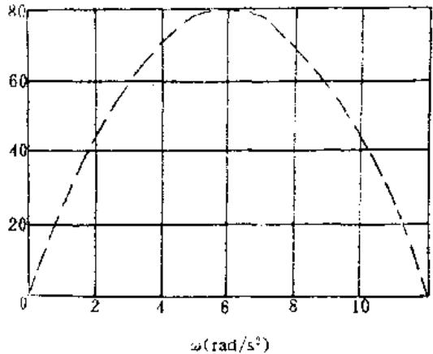

图15-8手轮转速与人手发挥的功率的关系

式(15-6)就是根据人操纵调节件(手轮)可能达到的最大转速和所能发挥出的最大功率的条件下,导出调节件(手轮)转速 $\omega$ 与所能克服的系统载荷力矩 $\pmb { M }$ 的关系式。如果已知系统折算到调节件(手轮)的载荷力矩 $M$ ,则可用式(15-6)求得调节件(手轮)合适的转速 $\omega$ 

但是,调节件的负载力矩有一定的范围,不能超过人体力所能及的极限值。由式(15-6)可见,要使其有意义,必须使; $2 1 - M { > } 0$ ,于是有 $M < 2 i N \cdot \mathfrak { m }$ 。也就是说,系统折算到调节件(手轮)的载荷力矩 $\pmb { \mathcal { M } }$ ,最大不能超过 $2 1 \mathbf { N } \cdot \boldsymbol { \mathfrak { n } }$ 。这是设计手动调节装置的力学原则。

综上所述,调节装置的设计,要根据调节对象的性质、调节参数、量程范围、精度要求和指示方式等,正确地选择指示件和调节件之间的调节-指示比 $( B = C / D )$ 和转值的大小,合理地确定调节装置的传动比和拟定传动方案。同时要根据人体功能的要求,合理地确定操作位置、转动速度和载荷力矩等。这样方能获得较优的调节装置设计和理想的调节效果。

# 15.3调节装置的结构

# 一、螺旋调节装置

螺旋调节装置的主要作用是将旋转运动变为直线运动。由于它具有降速比大,传动精度高,结构简单、紧凑,工作平稳等优点,故在电子设备和精密机械仪器中应用广泛。常用的有读数调节装置、精密位移微调装置等。典型的结构有一般螺旋调节装置、差动螺旋微调装置和具有粗调、微调的螺旋调节装置等。现举例说明之。

# 1.一般螺旋调节装置

在电子设备中,读数调节和微调的高频元件中,广泛采用一般螺旋调节装置,如图15-9所示,

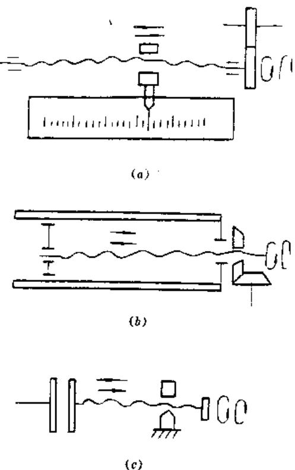

图15-9螺旋调节装置在电子设备的应用(a)读数调节装置()双线谐振器调谐装置(c)瓷介电容器调节装置

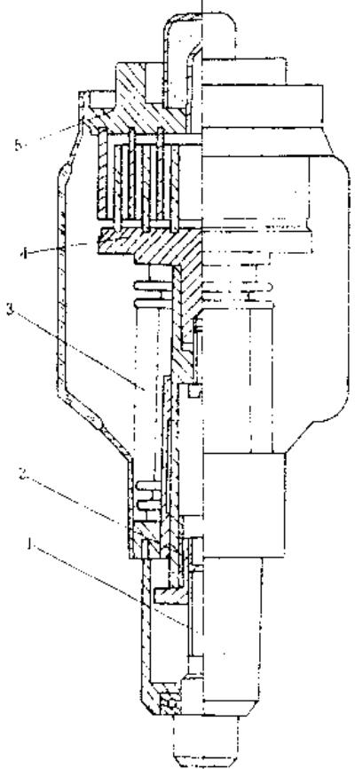

图15-10真空可变电容器

1—调节螺杆:2一螺母;3一波纹管;4-动片轴;5-定片轴图15-10所示是螺旋调节装置在真空可变电容器电容量调节中的应用实例。

图15-ii所示是中、低精度经纬仪、水平仪常用的螺母不动,螺杆转动并移动的调节装置。通过压圈3调整螺 $\smash { \frac { 3 } { 2 } , 2 }$ 与开槽螺母2的配合松紧程度来消除间隙。活动顶杆6是为了消除螺杆」在旋连时产生间调节精度的旁向分力。弹簧7的作用是使被调装置始终压向螺杆端部。

这种装置的特点是在不动的读数刻度简5上刻有测定手轮4(与螺杆固迄)整转数的粗读刻度线:而在手轮上则刻有测定分转数的精读刻度线。

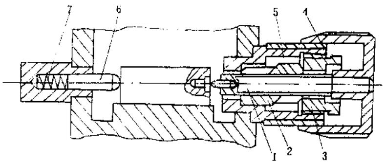

图15-I螺杆转动并移动的微调装置

粗读刻度线是按手轮每--转,螺杆前进一个螺距 $\pmb { P }$ 的移动量的关系刻制的。精读刻度线是根据微调装置工作时所需的最小微动量 $\scriptstyle { \mathcal { S } } _ { \mathrm { m i n } }$ 刻制的,其关系是

$$
s _ { \mathrm { e n l a } } = P \frac { \Delta \varphi } { 3 6 0 ^ { \circ } }
$$

式中, $\Delta \varphi$ 是人手的灵敏度。

图15-12所示是螺杆转动、螺母移动的微调装置。转动与螺杆2固连的手轮1,螺母3带动工作台4作移动。这种装置的粗读刻度线是根据螺母移动其螺距 $P$ 的倍数刻在固定刻度板5上;而精读刻度线则按最小移动量 $\bar { s } _ { \mathrm { m l n } }$ 刻在手轮上。

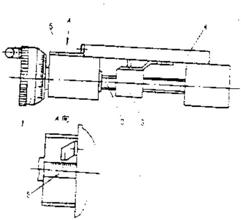

图15-12螺杆转动、螺母移动的微调装置

# 2.差动螺旋微调装置

上述各种微调装置:为了进一步提高调节装置的灵敏度,可以通过增大手轮直径,或减少螺距来实现。但当手轮尺寸过大时,会使结构尺寸增大而不便于操作;而螺距太小,将使加工困难,易磨损。因此,在梁些精密微调装置中,采用了差动螺旋装置来提高微调的灵敏度。

图15-13所示是螺母移动的差动螺旋微调装置。带手轮的螺杆1有两段潔纹和 $\{ \boldsymbol { \mathbf { \rho } } _ { \mathfrak { z } }$ ,它们的螺距分别为P和P,P:>P,皆为右旋。当螺杆1顺时针方向转一周时,螺母2及其附属部分应向右移动-个螺距Pi、但螺杆1的右段螺纹又与螺母3相配合,所以螺杆转动一周时.其本身必向左移动个螺距 ${ \mathfrak { p } } _ { 2 }$ 。故此,螺母2的实际位移 $\mathbf { \_ s }$ 为

$$
{ \mathfrak { s } } = { \mathfrak { p } } _ { \mathfrak { z } } - { \mathfrak { P } } _ { \mathrm { i } }
$$

可见,若 $P _ { 2 }$ 与 ${ \boldsymbol { j } } ^ { \prime } { \boldsymbol { \cdot } }$ 很接近,则可获得很微小的调节量。

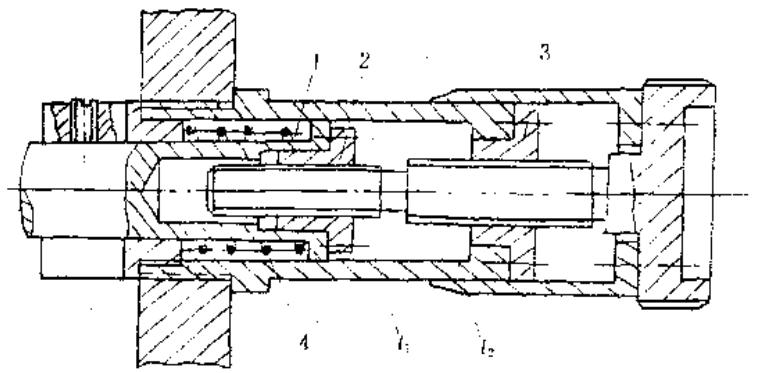

图15-13螺母移动的差动螺旋微调装置

图15-14所示是螺杆移动的差动螺旋微调装置。与手轮固连的兼作螺母的螺杆2、是既转动又移动的主动件,它具有内、外不同的螺距 ${ \boldsymbol { P } } _ { \downarrow }$ 和 $P _ { ? } ( P _ { ? } > P _ { ! } )$ 的螺纹。内螺纹与螺杆配合,外螺纹与刻度套筒配合。同理,当手轮转一周时,螺杆1及其附属部分的实际位移量亦为$( P _ { 2 } - \dot { P } _ { 1 } )$ 

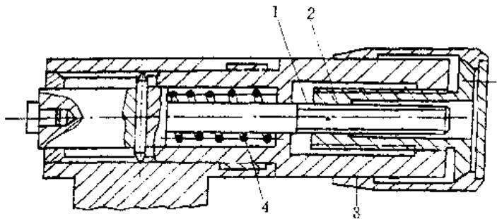

图15-14和图15-13中的弹簧4均用于消除螺旋副的间隙。

图15-14螺杆移动的差动螺旋微调装置

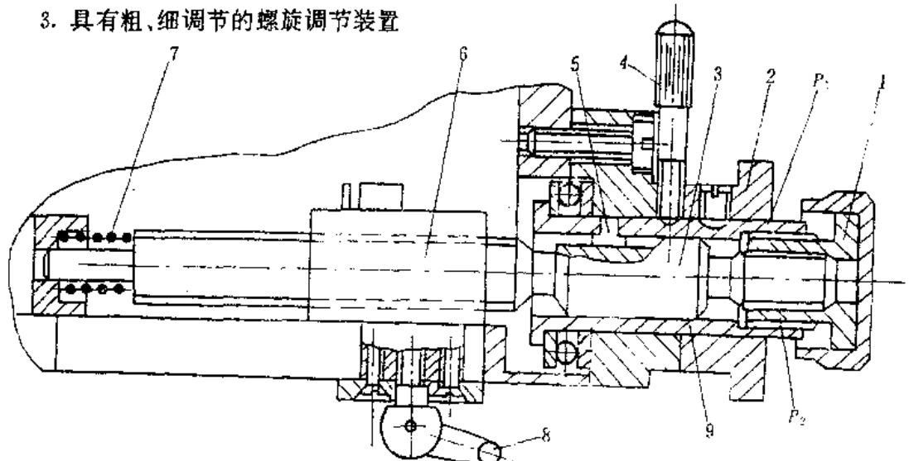

图15-15具有粗、细调节的差动螺旋微调装置

图15-15所示为具有粗调和细调的差动螺旋调节装置。与可调部件相连接的可调螺母6只能移动而不能转动,粗调时,转动粗调手轮2带动套简9,通过键5使螺杆3转动,从而使螺母6.作轴向移动;微调时,先固紧锁紧装置的手轮8.将螺杆3和螺母5固接在一起·同时拧紧螺钉4锁住套筒 $\mathfrak { g }$ ,当转动微调手轮1时,螺杆3中于受键5限制,不能转动,只能作轴向移动;又由子螺杆3和螺母6固接在一起,故螺母6也随蝶 $3$ 一起作微小轴向移动,

微调手轮!的内、外都有螺纹,均为右旋,但螺距不相等,若 $\hslash _ { 1 } ^ { \prime } \approx \hat { \varsigma }$ 5 $F _ {  } = 0 , \ 7 5 m _ {  }$ 则微动手轮转一周,被调部件的移动盘为

$$
I _ { * } = ( 0 , 7 5 \mathrm { ~ -- ~ } 0 . 5 ) \times 1 = 0 . 2 5 ( \mathfrak { m m } )
$$

图中压力弹簧7用于消除螺杆与螺母之间的轴向间隙,使微调过程中不产生空程误差。

# 二、摩擦调节装置

摩擦调节装置是利用传动件的直接接触(摩擦轮传动)或间接接触(挠性摩擦传动)所产生的摩擦力来传递运动的。这种装置在电子设备或仪器中常用于平行轴、相交轴或交叉轴之间的回转运动或把回转运动变为直线往复运动(或是相反变化的运动)的传递来实现量值调节。

摩擦调节装置具有结构简单、制造容易、没有空程误差、调节平稳和能实现过载保护等特点,其缺点是有摩擦损耗、传动比不准确,所以不宜用于有严格传动比和数据传递关系的场合。但对于只需粗略指示以及具有与传动比变化无关的终端指示或效果响应(或显示)的电子设备和仪器是适用的。

摩擦调节装置所采用的传动型式都是摩擦轮传动或带传动。根据传动型式的变化,摩擦调节装置的结构有多种。现举几个典型结构予以说明。

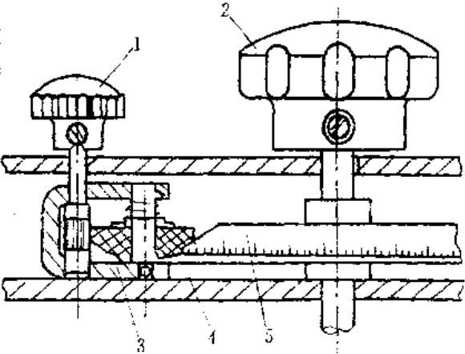

图15-16能够起、细调节的摩擦调节装置

# 1.能够粗、细调节的摩擦调节装置

图15-16所示是能够粗、细调节的摩擦调节装置。转动手轮2可直接进行粗询。转动手轮1,通过橡胶轮3带动刻度盘5,便可实现微动细调。与手轮1相连的摩擦轴经滚花加工以及采用橡胶轮作中间传动,都是为了提高摩擦系数。利用弹簧4产生压紧力。这种调节装置的传动比可达25。

2.变回过动为直线移动的摩擦调节装置

图15-17所示是用于检波头短路活塞移动的摩擦调节装置。其特点是利用端面接触、轴向压紧的摩擦原理作垂直相交轴间的传动。没有轴承径向压紧力。

借助弹簧2压紧的摩擦盘4与调节杆1的凸肩端面一起把移动测杆5的凸键夹紧;摩擦盘4的轴套端开有小槽,与装在调节杆1上的销子3滑动配合。当转动调节杆!时,通过销子向摩擦盘传递力矩,然后靠摩擦盘4与凸键的摩擦力来驱动移动测杆5作直线位移、从而使连于移动测杆5的短路活塞(图中未示出)得到调节。

弹簧片6起压紧和消除调节杆!与壳体内侧接触面间隙的作用。

这种装置结构简单,调节均匀精确,没有空程误差。

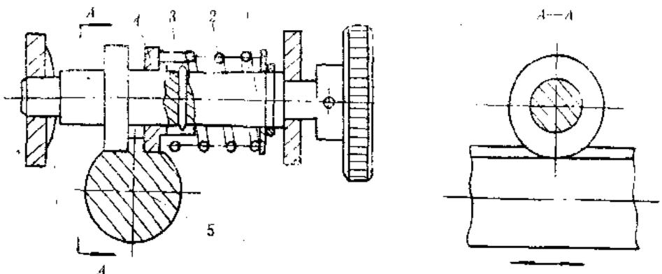

图15-17移动短路活塞的摩擦调节装置

# 3.球端摩擦微调装置

在万能测长仪上,应用类似图15-18所示的球端靡擦微调装置来移动装在测量轴!的刻度标尺,使其能精确地对准刻度零点。

借助弹簧5把调节杆4的球端压紧在摩擦盘3上。摩擦盘3的转轴2的球形端面,靠弹簧5和紧定螺钉8,压在测量轴1的侧表面上。当转动手轮7时,调节杆4的球端带动摩擦盘3转动;同时,通过轴2球端的转动而使测量轴1产生直线移动,从而实现刻度标尺的微动调节。弹簧力可由螺母6来调节。

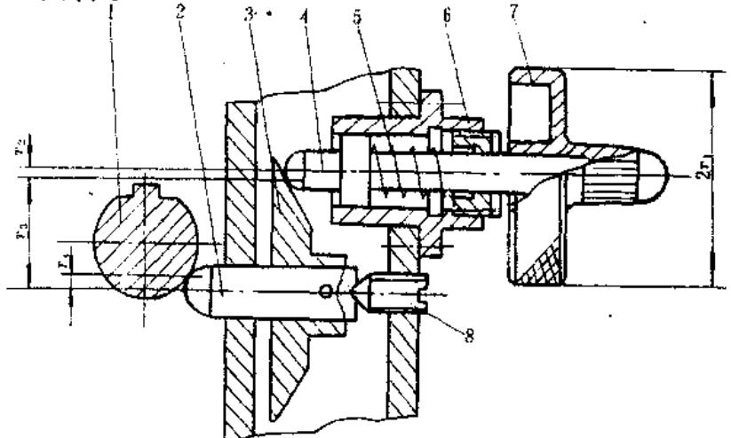

图15-18球端摩擦微调装置

# 4.同轴滚珠摩擦微调装置

图15-19所示是电子设备与仪器常用到的一种同轴滚珠(铜球)的微调装置。

图15-19(a)中,调节杆!的锥端,掌弹簧4的压力把滚珠3压向固定套筒5的内。当转动调节杆!时,滚珠沿着固定套筒内壁滚动,从而带动轴2转动,实现微动调节。

图15-19(b)是图 $1 . 5 . . 1 . 9 ( \mathfrak { a } )$ 装镜的演变,不同的是把原来的轴2向外延伸与手轮2连接作粗调,而用手轮!作微调。

这种装置的特点是:可在同轴线上实现减速微调或粗、细兼有的调节。具有结构紧凑、制造容易、安装调节方便等优点。

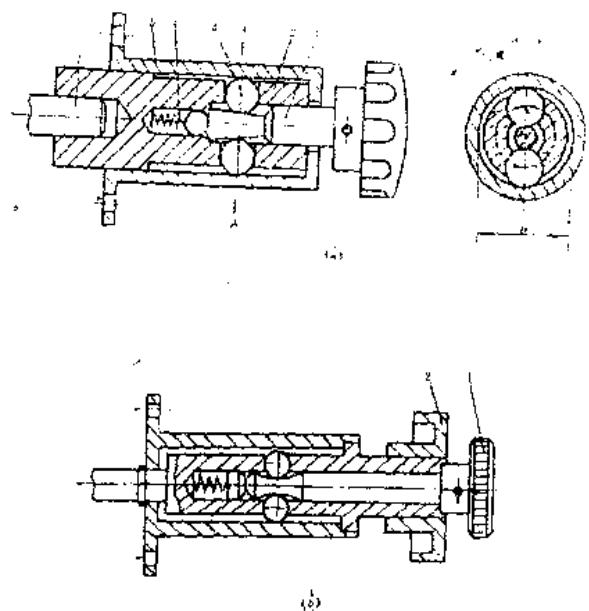

图15-19同轴滚珠摩擦微调装置(a)只有微调的装置 (b)具有粗、细调节的装置

# 5.索带摩擦调节装置

这种装置是借助索带与滑轮之间的相互摩擦进行传动的,是索带摩擦传动在调节装置的具体应用。 

图15-20所示是光谱投影仪中调节投影物镜放大倍率的索带摩擦调节装置的原理图。其特点是垂直交叉轴间的回转运动传递,然后通过齿轮齿条传动变为被调装置作直线移动。

转动手轮1,通过变向导轮2、3传至滑轮4(其轴线与手轮1轴线垂直),然后由与滑轮4同轴安装的齿轮5驱动齿条6作移动,从而实现物镜的调节。

图6-1(a)所示是索带摩擦传动在调节装置中的另一应用实例,其特点是平行轴间的回转运动传递,然后变为游标直线移动指示,故又称为游标式索带摩擦调节装置。

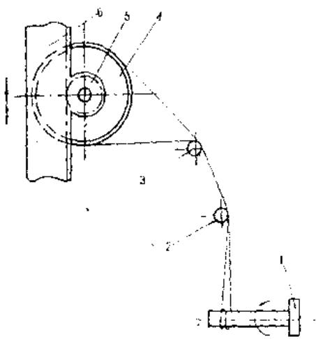

图15-20垂直交叉轴间的紫带摩擦调节装置

# 三、组合微动调节装置

组合式微动调节装置,一般是利用螺杆、杠 !杆、斜面、锥面、齿轮、蜗杆蜗轮和凸轮等构件及有关运动副按调节功能和使用要求组合而成,目的是为了获得合理的传动比,改善调节性能、提高调节精度和灵敏度。

# 1.螺旋杠杆组合微调装置

螺旋杠杆组合微调装置是利用杠杆把螺杆的调节量缩小若干倍来提高微调灵敏度的。装置微调量的大小,取决于杠杆臂长比。所以,这种装置的设计主要是根据微调精度要求来选择杠杆的级数和臂长比。在大多数情况下,采用一级(最多两级)杠杆和尽可能大的臂长比就可以获得实用的微调精度。

采用单级杠杆的螺旋微调装置有如图15-21所示的基本型式。其中有直杆式(图15-21$( a ) , ( b ) )$ 弯杆式(图 $1 5 . 2 1 ( c ) \rangle$ 或其它型式。由图可见,对于直杆式,若杠杆的支点在输入运动和输出运动的作用点之间,则两调节运动相反,如图15-21(a)所示;若这支点在两运动作用点的一旁,则两调节运动方向一致,如图15-21(b)所示。

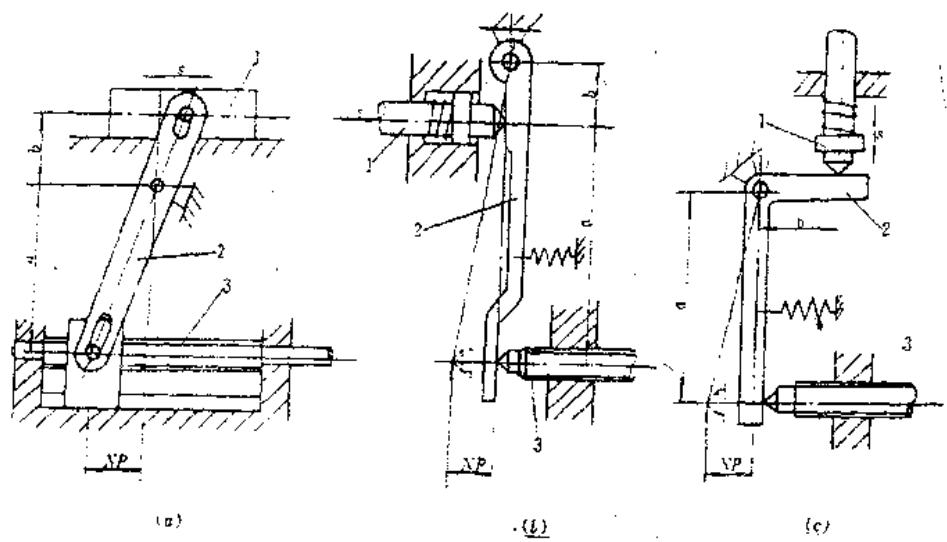

图15-21螺旋杠杆组合徽调装置

这些基本型式主要由输出构件1、杠杆2和螺杆3组成。输出构件的微动量 $\pmb { s }$ 的范围一般都很小,它与螺杆的输入调节量 $\therefore \mathcal { P }$ 有如下关系:

对图 $1 5 \cdot 2 1 \left( { \mathfrak { a } } \right) , \left( { \mathfrak { c } } \right)$ 所示情况

$$
\mathbf { s } = { \frac { \hbar M P } { a } } \qquad ( \mathbf { m m } )
$$

对图 $\mathrm { i } 5 { - } 2 1 ( l )$ 所示情况

$$
s = { \frac { \partial \lambda ^ { \gamma } P } { a + \overline { { b } } } } \qquad ( \mathbf { m m } )
$$

式中, $\ell ^ { \gamma }$ 螺杆螺距 $( \mathsf { m m } )$ :

$i ^ { \gamma }$ 螺杆转数;

$a , b$ 分别为杠杆长、短臂的长度 $( \min )$ ,

于是,螺杆调节手轮的转值 $A$ 为

$$
\begin{array} { r } { A = \frac { s } { \bar { N } } = \left( \frac { b } { a } \right) \cdot P \qquad \left\{ \mathfrak { m m } / \bar { \mathfrak { r } } \right\} } \end{array}
$$

或

$$
A = \frac { 6 P } { ( n + 1 ) } \qquad ( \mathsf { m m } / \tau )
$$

根据转值的大小和实际控制精度要求,则可选择合适的螺距 $\boldsymbol { p }$ 和杠杆臂长比 $\therefore a$ 及其几何尺寸。为便于指示或读取调节量的大小,还可根据转值大小及其代表的物理量设计相应的刻度盘和确定它的刻度线数。

螺旋杠杆组合式微调装置,具有结构简单、制造容易、灵敏度高等优点,故在不少电子设备和仪器中应用。

2.齿轮齿条、齿轮杠杆组合微调装置

齿轮在调节装置中应用很广,可以采用几级传动获得较大传动比的微调装置,它可与齿条、杠杆、凸轮或其它构件组成多种多样的微调装置,而且很方便地实现运动变换。图15-22所示是这种组合调节装置的两个例子。

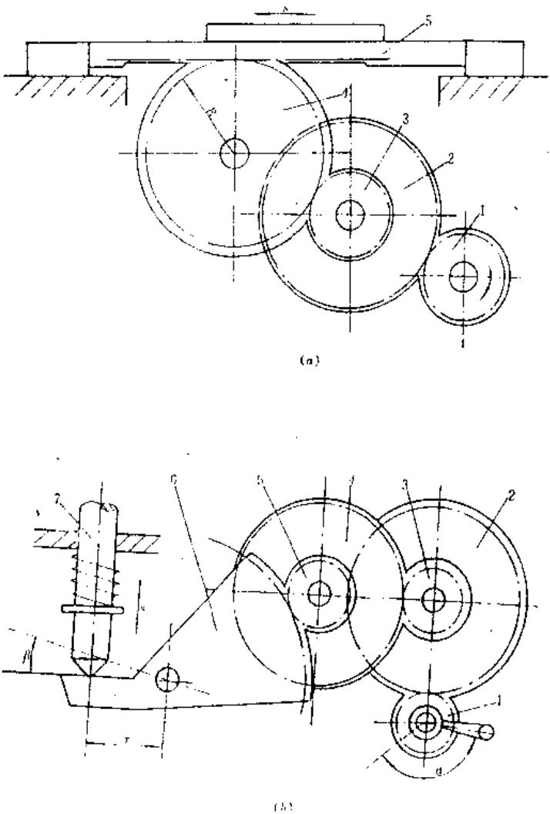

15-22齿轮杠杆组合的微调装置

图 $1 5 \mathrm { - } 2 2 ( a )$ 所示是由齿轮相齿条组成的微调装置。输入齿轮1每转一周,齿条5的微动

量 $\pmb { S }$ 的大小,取决于齿轮传动链的传动比 $i$ 和齿轮 $\cdot 1$ 节圆的大小。它们的关系为

$$
\begin{array} { r } { s = \frac { \dot { N } _ { \mathrm { ~ t ~ } } } { \dot { s } } \times 2 \pi R } \end{array}
$$

式中, $N _ { 1 }$ —输入齿轮!的转速;

i—由齿轮1至齿轮4的传动比;

$\pmb R$ —-输出齿轮4的节圆半径。

图15-22(b)所示是由齿轮 $\tt _ { i } \sim \tt _ { \cdot }$ 和起杠杆作用的扇齿轮6组成的微调装置。在调节中,移动杆7的微动量 $\pmb { \mathscr { s } }$ 为

$$
\begin{array} { r } { s = r t { \mathsf { g } } \beta } \end{array}
$$

因为

$$
\begin{array} { l } { { \frac { \alpha } { \beta } = \frac { z _ { 2 } z _ { 4 } z _ { 6 } } { z _ { 1 } z _ { 3 } z _ { 5 } } = i } } \\ { {  } } \\ { { \beta _ { \ast } = \frac { a } { i } } } \end{array}
$$

所以

$$
\begin{array} { r } { s = \frac { r \mathrm { t } \underline { { \mathsf { B } } } \theta } { i } } \end{array}
$$

式中 $\pmb { \alpha }$ —输入齿轮1的转角:

$\beta$ 输出扇齿轮6的转角;  
$z _ { 1 } \sim z _ { 5 }$ ---分别为齿轮 $1 \sim 5$ 的齿数;  
$z _ { 5 }$ -扇齿轮6的完整齿数;  
i——传动比;  
扇齿轮杠杆臂长.

3.蜗轮凸轮组合微调装置

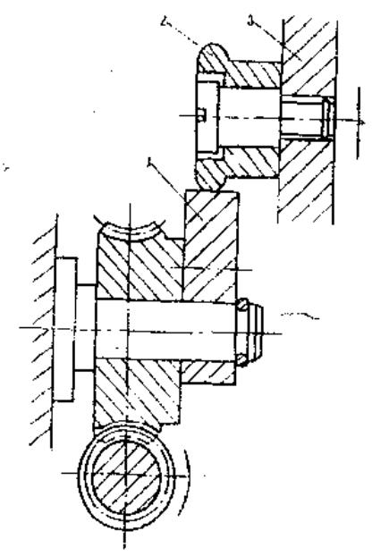

图15-23蜗轮凸轮组合微调装置

图15-23所示是蜗轮凸轮组合微调装置。这种装置适用于微动工作台或显微镜精确调焦等,其特点是利用减速比较大的蜗杆蜗轮传动,通过固定在蜗轮上的凸轮i推动滚轮2,从而使滑板3作微量移动。当蜗轮反向转动时,滑板依靠自身的重力而向下移动,如果滑板沿横向移动,则需加反向作用弹簧。

如果要求滑板(或其它从动件)按某种规律作移动时,可根据工作需要来设计凸轮的轮廊。

# 4.行星轮系微调装置

行星轮系具有传动比大、结构紧凑等优点,所以适合作设备的微调装置。行星轮系主要由行星齿轮、中心轮和转臂组成,其结构型式很多,可根据使用要求设计成各种各样的调节装置、图15-24所示为少齿差行星轮系微调装置,其结构由偏心轴1、行星齿轮2、中心轮3、联轴叉1和输出轴5组成。

中心轮与外壳固定不动。偏心轴实际上就是行星轮的转臂,是主动件,借装在其上的旋钮把调节运动输入。行星齿轮的转速通过联轴叉传给输出轴,然后由输出轴去控制被调对象,以获得所需的调节量。

由机械原理可知,偏心轴1对输出轴5的传动比i为

$$
i _ { 1 5 } = - \frac { z _ { 2 } } { z _ { 3 } - z _ { 2 } }
$$

式中, $z _ { 2 }$ 和 ${ \mathfrak { s } } _ { 3 }$ 分别是行星齿轮和中心轮的齿数。若 $z _ { 3 } - z _ { 4 } = 1$ ,则 $\therefore s = - z _ { 2 }$ ,这就是“一齿差行星轮系”。如果选定 $z _ { 2 } = 1 0 0 , z _ { 3 } = \mathrm { i } \ 0 \mathrm { i }$ ,则 $_ { 1 5 } \approx - 1 0 0$ 。显然,对于如此大的传动比,若采用普通轮系,则会给结构带来麻烦,体积和重量都要增加。而调节装置往往要求具有结构紧凑、传动比大、调节量微小且反应灵敏等特点的结构。

图15-24少齿差行星轮系徽调装置(a)结构图 (b)原理图

有些高精度晶体振荡器的调节装置就是根据行星轮系传动原理设计的。将这种微调装置的输出轴接入振荡器中的电容器,能精确微小地调节其电容量而获得非常精确的晶振频率。

# 习 题

15-1如何确定调节装置的调节-指示比?

15-2什么是调节装置的转值?什么是比例尺?二者有何关系?

15-3如何确定调节装置的转值?如果已知一调节装置的调节精度允差为 ${ \pmb \delta } _ { * } ^ { \pmb \mathrm { \Delta } }$ ,调节范圈为A,能否确定该装置调节件的转值?如能,其转值如何计算?

15-4调节装置的调节件操纵力是否愈小愈好?为什么?

15-5试简述手动调节装置设计必须考虑的因繁有哪些?

15-6某无线电设备(三波段接收机)采用手动调谐,若已知该设备被调可变电容器的动片转角为180°,它所覆盖的频率范围是:第一波段自520kHz到I600kHz,第二波段自4MHz到8MHz,第三波段自8MHz到16MHz,根据接收机频率的选择性要求,规定调节精度为每个波段有 $\Re \Im \mathrm { z }$ 的误差,试计算该调节装置的传动比,

15-7试设计一螺旋微调装置,其手轮一周刻度100份,手轮每转过 $1 / 1 0 0$ 周,螺杆移动 $1 0 \mu \ m$ 

15-8如图15-25所示为螺旋斜面组合式微调装置:若已知螺杆螺距 $P { = } \ 0 . \ 5 { \ m } { \boldsymbol { \mathrm { m } } } , { \boldsymbol { \alpha } } { = } t { \bf { g } } ^ { - 1 } ( 1 / 5 0 )$ 若螺杆调节手轮上的刻度盘按圆周均布刻制50格刻线,试计算该装置的调节灵敏度是多少?

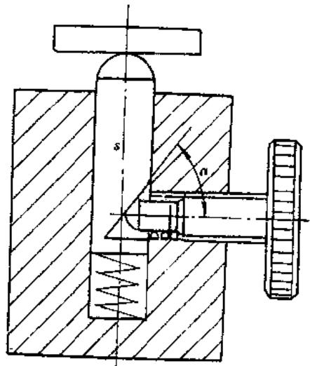

图15-25螺旋斜面组合式微调装置

# 第十六章 控制装置与调谐装置

# 16.1概 述

电子设备一般具有以下一些功能,如信号的产生、放大、变换、发送、接收、显示、记录和信息的采集、处理、传递、储存和运算等。为了实现某些功能,设备在工作过程中往往需要对某些回路的参数进行调控或控制某些对象按一定目的动作。这里起调控和控制作用的机构(或系统),称为控制装置(或系统)。被控对象可以是一种过程,也可以是种器件。动作则是指被控对象工作状态的变化。因此,一部电子设备除电路和功能元器件之外,还必须习用各种控制装置(或控制系统)。

# 一、控制装置的分类

电子设备中控制装置的类型和所采取的控制手段十分繁多和广泛。常用的分类方法和主要类型有:

1.按工作特点和完成的任务分

(1)调谐装置其作用是把电子设备中可调元件和可调电气参数迅速、准确地调谐到所需要的频率上;

(2)控制装置其作用是使电子设备的某些功能元件、器件和信急储存介质按预定的运动规律或按给定的范围和方向运动,或控制电路的开关、转接等;

(3)同步装置其作用是控制不同电路中的可调元件同步运动或实现远、近距离的两运动器件的同步运动。

# 2.按控制手段分

有人工控制、半自动控制和全自动控制装置(或系统)。

3.按工作原理和构造特点分

有机械式和综合机、电、磁等技木的组合式控制装置(或系统),如电磁式控制装置、伺服系统、机电式或电子式自动调谐系统等。

随着微电子技术、计算机应用技术的发展,现代电子设备正沿着自动化、智能化的方向发展,其控制和调谐所采取的手段也日趋先进,各种自动控制系统、自动频率瘦索和自动调谐系统、远距离自动跟踪系统和随动系统等已被广泛采用。本章着重介绍基本的控制装置、同步装置和调谐装置。

# 二、对控制与调谐装置的基本要求

电子设备的种类和用途不同,对于控制和调谐装置的要求也不同。例如在超高频范围内工作的电子设备,对装置的准确性和稳定性有很高的要求,因为即使电路中可调元件只有微小的变化,也会使工作频率发生很大的变化。随着工作频率的降低、对装置各方面的要求就可适当降低。又如,在雷达、无线电导航仪、军用通信机、卫星接收机、精密微波测量仪中,对调谐、控制装置的准确性应有很高的要求;而在飞机、舰船上使用的电子设备中,除了一般的要求外,还应保证在电台接通和询谐时无故障地工作。

一般电子设备对控制与调谐装置有下列基本要求:

(1)传动比的要求为了使被动轴得到所需的运动速度,控制与调谐装置应具有准确的传动比。

()传动精度的要求即控制和调谐装置的运动传递、动力传递与转换必须具有足够的精确性。

(3)可靠性和稳定性的要求调谐和控制装置中的各类零件,必须具有足够的强度、刚度和耐磨性,并在工作中应有较高的可靠性,在受外力后不产生过大的弹性变形,调谐和控制系统中的传动链,必须运动平滑,摩擦力矩小,并且恒定,一旦精确调谐到规定位置后,应该不受冲击、振动的影响,始终在固定位置上稳定、可靠地工作。在恶劣气候条件下和不良环境中工作的调谐和控制装置,还必须具有良好的防腐蚀性能,并要求能够在很宽的温度范围内工作.

(4)体积和重量的要求现代电子设备中广泛地应用了小型化元器件、印制电路和集成电路、因此,电气部分的体积、量在整机中所占的比例一般较小。而调谐、控制装置因对其控制功能的要求日益提高,所以它的体积、重量所占的比例往往较大。为此,降低调谐、控制装置的体积、重量,对于降低整机的体积、重量有着决定性的意义。故在设计时,应力求结构紧凑,体积最小,重量最轻。

(5)结构上的要求控制与调谐装置在结构设计上应力求简单,这不仅对缩小体积、减轻重量有极大的好处,而且还可以降低成本,缩短制造周期,提高经济效益,

(6)使用上的要求控制和调谐装置的操作必须简单、安全、可靠,并要便于维修。

# 16.2控制装置

控制装置是用来控制电子设备中某些功能部件、信息储存介质等使之按给定的运动规律运动或实现电路开关、转接和电量转换的装置。它可以使被控制部件作连续的转动或移动、步进运动、一定函数规律的运动,也可以控制运动的范围和方向或控制电路的开关转接,还可在控制系统中作某一中间环节实现能量和信息的传递和转换。

早期的控制方式大都采用机械控制装置,它通常由传动机构(如齿轮机构、凸轮机构等)、定位装置、限动装置、开关等部件的一种或几种组成。这种装置已有相当长的历史,应用比较成熟,工作较可靠:缺点是机构结构比较复杂,在设备中占的体积大,控制灵活性差,自动化程度不高等。现在,综合机、电、磁等技术的各种控制装置或控制元件得到了普遍采用如机电式控制装置、电磁式控制装置等,这些装置的应用和发展,极大改善了设备的性能,实现了设备的自动化,在现代电子设备中占据极为“要的地位。

# 一、凸轮机构

凸轮机构是由凸轮1、从动件2(通称推杆)和机架3组成的三构件高副机构,如图16-1所示。其中凸轮为一具有变化曲线轮廓的构件,通常作连续匀速转动。推杆为一杆状构件,通过外力闭合或结构闭合与凸轮轮廓保持高副接触。由于凸轮轮廓曲线是根据工作要求的运动规律设计的,因此,凸轮机构的功能是受凸轮轮廓曲线的控制,将凸轮的连续匀速的回转运动变换为推杆连续或不连续的任意预期直线移动和摆动。

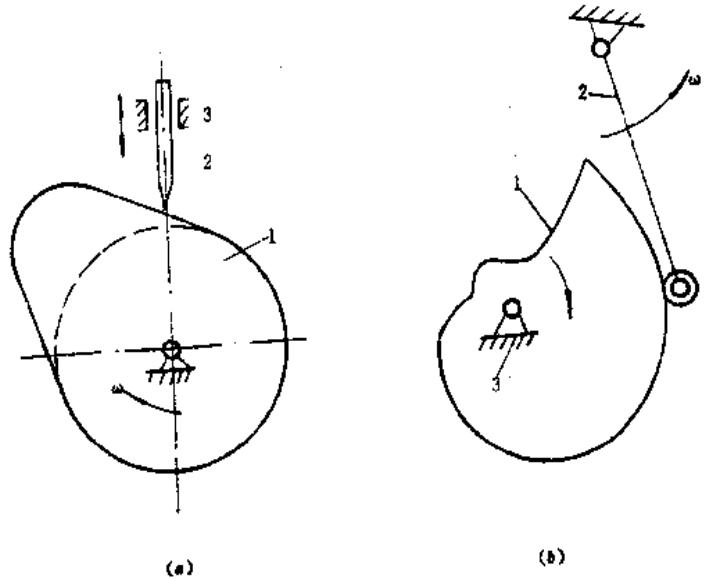

图16-1凸轮机构的组成

与其它传动方式和控制装置相比,凸轮机构具有刚性好、工作可靠、结构简单、紧凑,能借助设计拟定凸轮的轮廓形状,实现推杆各种预期的运动规律等优点。因此,在自动化或半自动化的各种电子设备和仪器设备中得到广泛应用。它的缺点是高副接触,易于磨损。所以多用于传力不大的控制装置中。

图16-2所示为凸轮机构的应用实例。

图 $1 6 - 2 ( a )$ 所示为用于脉冲式发送器中的凸轮机构。三角形凸轮回转一周,则触头2、2分别与3闭合三次。电脉冲依次沿导线 $( u _ { 1 } , u )$ 和 $( n _ { 2 } , u )$ 送至相应的电接收器。

图16-2(b)所示为大盒式录音机磁带引出装置中的凸轮摆杆机构。将大盒式磁带放人舱内,关闭舱盖后,微动开关被盒体按动,专用电动机!开始旋转,经蜗杆2和蜗轮3减速后,使凸轮4旋转,当摆动推杆5左端向下摆动时,弹簧6的恢复力使压带轮臂7两端的压带轮8向上推向主导轴9。同时压带轮臂拨动引出臂10,于走磁带引出销1将磁带从盒内引出。做停止操作时,压带轮离开主导轴,但磁带仍保持在引出状态。做出盒操作时,电动机再次旋转,凸轮和摆杆动作,压带轮和引出臂回到原来位置。这时带盘电动机(图中未画出>也旋转,磁带被缓缓收人盒内。磁带一收完,带舱的门锁机构脱落,舱盖打开。

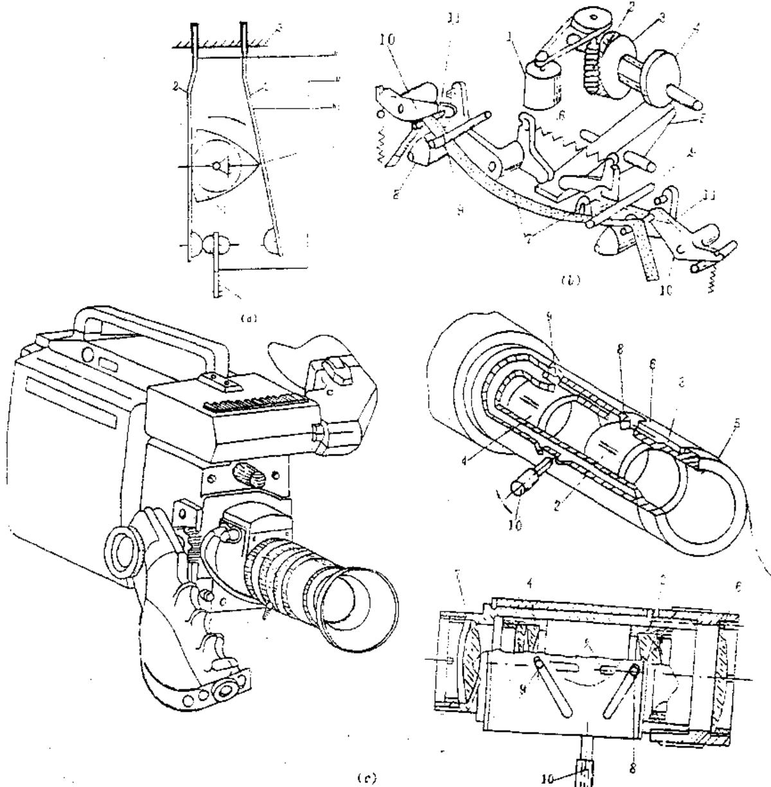

图16-2凸轮机构的应用实例

图16-2(c)所示是摄像机连续变倍的变焦距物镜管结构图,镜管中心部分是透镜。其中,7为固定透镜,2和4是可沿光轴移动用以改变放大倍数的污动透镜,为了在摄制工作中能较方便地移动这组透镜达到连续变倍的目的,在镜管的套层中,装入了轴向移动凸轮机构。通过手轮10的转动,带动凸轮3转动。再通过简状凸轮3上的曲线槽推动圆柱销8、9运动。由于圆柱销8、9是装在物镜座2和4上的,所以镜座内的物镜也就之前后运动。由于在凸轮3内还装有轴套5,并在这个套上开有平行光轴的直线形长槽 $\pmb { a }$ ,圆社销8和9放在槽 ${ \mathfrak { a } }$ 中使物镜座2和4只能沿光轴方向移动,从而改变了物镜的放大倍数。这一凸轮机构能使摄像机在不改变拍摄物体与摄像机之间距离的条件下,达到使画面中的细小部公连续不断地放大,产生一种如摄像机由很远的地方直接勺到了细小景物近旁一样的摄影果。

# 二、非圆齿轮传动机构

非圆齿轮传动机构,可以实现特殊函数的运动规律。在许多情况下,用非圆齿轮容易实现的运动规律,若采用其它机构来代替,往往会使机构变得十分庞大和复杂。与其它传动方式和控制机构相比,采用非圆齿轮机构,不仅可以实现某种特定的变速运动,而且传动平稳,理论传动误差小,结构紧凑,传动效率高。非圆齿轮的优点比较突出,应用范围也日渐广泛;但它的缺点是加工艺较复杂,除需使用专门的数控机床外,还需在加工前编制专用的程序控制穿孔带或磁带。

图16-3所示是非圆齿轮传动机构的应用实例。在无线电通信设备中,由子调频电容器的旋转角与谐振频率数值成对数关系变化,因此使得频率刻度盘上的频率刻度很不均匀,形成低频部分的信号间隔距离很大,而高频部分的信号间隔又过于紧密,这对民用产品来说是无关紧要的,但对精度要求较高的无线电扫频仪等设备来说,却会感到操作不便。如果在电容器的旋钮轴上安装一对按对数曲线规律运动的非圆齿轮机构,就可以使旋钮轴的旋转角与频率数值保持线性关系,频率读数的数值也可以成为等距离刻度值。

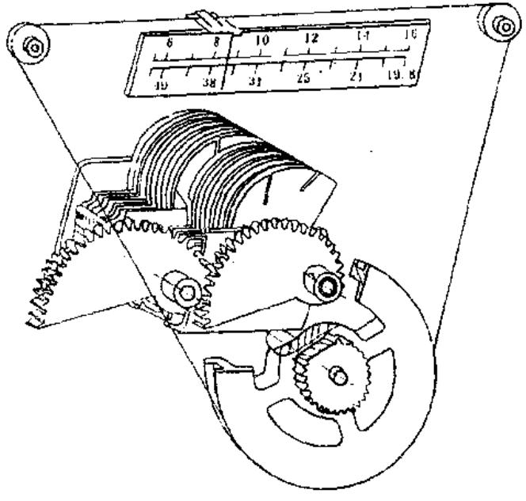

图16-3非圈齿轮机构的应用实例

# 三、间歌运动机构

电子设备、自动化设备工作中经常需要利用间歇运动机构,来实现自动转位和步进运动。间歇运动机构的功能是将主动件的连续转动或往复运动变换为从动件周期性时动时停、交替进行的间歇运动。常用间歇运动机构的类型有多种,如槽轮机构、棘轮机构、非完整齿轮机构、凸轮间歇运动机构、星轮机构等。下面简单介绍槽轮机构和棘轮机构的特点和应用。

# 1.槽轮机构的特点和应用

槽轮机构又名马尔它机构,如图16-4所示。它是由主动拨盘1、从动槽轮2及机架组成,它具有传动平稳、精确、结构简单、体积小、容易制造、运行可靠等优点,广泛应用于自动和半自动化设备和机器中,在电子设备的波段转换、频率自动调谐等也均有应用。

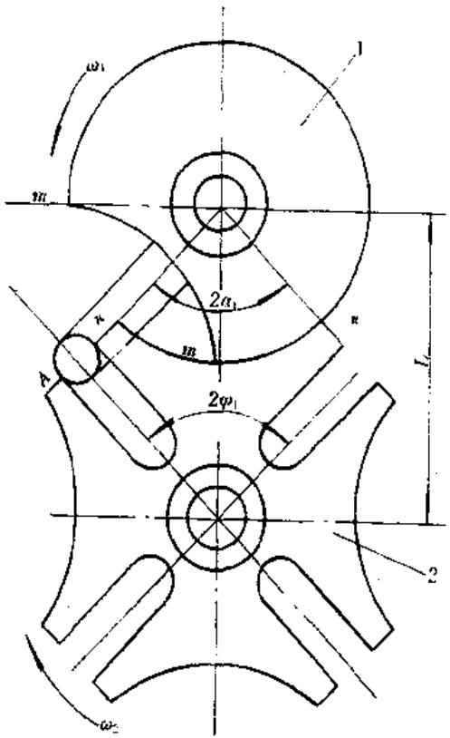

图16-5所示是电影放映机中实现胶片步进运动的槽轮机构,槽轮每转过一定角度,通过胶片走带机构使胶片更换一次画面,并在映像位置停留一定时间。当拨轮以较高的速度连续旋转时,即可在银幕上看到近似于连续的画面。

图16-6所示为槽轮机构在电台波段转换机构中的应用,当旋钮带动轴」顺时针旋转 $\mathfrak { s o } ^ { \bullet }$ ,这时凸轮7的最高点被转过 $\mathfrak { G } \mathfrak { g } ^ { \mathfrak { s } }$ ,簧片触点2与回路鼓3的触点脱开,同时槽轮

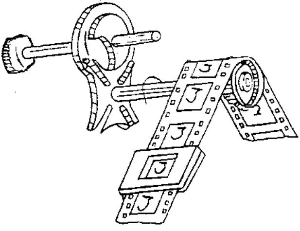

图16-4槽轮机构

图16-5和图16-6所示为槽轮机构的应用实例。

图16-5电影放映机上的槽轮机构

机构拨盘1将开始动作。轴!再继续旋转时,拨盘1将带动槽轮11转动,使轴【开始旋转,通过齿轮6和5带动回路鼓旋转一规定的角度。轴I继续转动时,因拨盘上圆销已脱离槽轮上11的槽,不再带动槽轮转动。当轴I转满一圈时,定位器8的定位小轮受弹簧力的作用卡入定位槽中,此时,凸轮又把簧片触点与回路鼓的触点压紧。至此电台已转过一个波段。

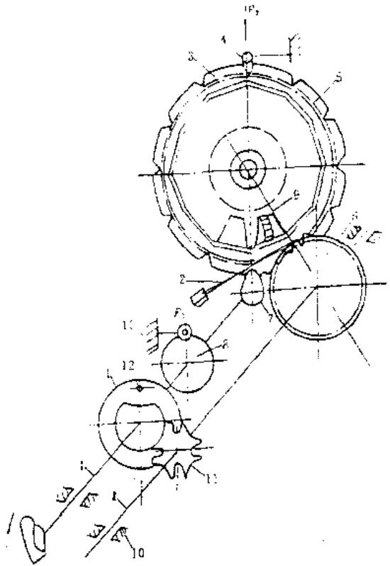

图16-6电台波段转换机构

1—拨盘;2-弹簧片;3--回路鼓1-定位器 轮:6-齿轮;  
7-凸轮:8-定位器;9-单元盒:10--机架:11-槽轮:12—圆销

# 2.棘轮机构的特点和应用

棘轮机构如图16-7所示、是出轮3、棘爪2、摇杆1、制动爪1和弹簧5等组成。它是一种小角度的单向间歇运动机构,具有结构简,转角大小调节方便等优点;但由于棘爪和棘齿开始接触的瞬间会发生冲击,故传动平稳性差,有噪声,易磨损。棘轮机构广泛应用于速度较低、转角不大的自动进给和步进运动系统,此外,还可作为单向机构,防止逆转等。

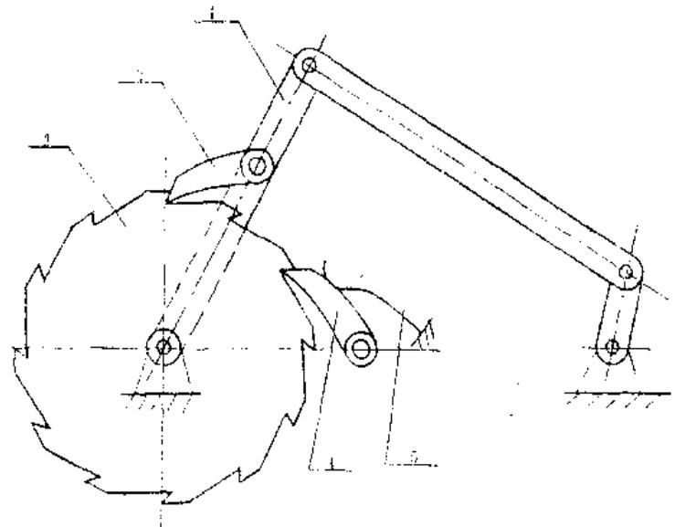

图16-7棘轮机构

图16-8和图16-9所示是棘轮机构的应用实例。

图16-8所示为棘轮机构在穿孔带步进式走带机构中的应用。棘轮机构由电磁铁1驱动,电磁铁1的线圈每输入一个程序转换信号电流时,就吸动杠杆式衔铁2摆动一次,与衔铁杠杆铰连的刺爪3就推动棘轮顺时针方向转过一齿。针轮5和棘轮4同轴装在一起,针轮上的针齿节距与穿孔带6的同步孔或中导孔的孔距相等。当针轮随棘轮一起作间歇运动时,针齿便推动穿孔带作步进运动,每步前进一个孔距。

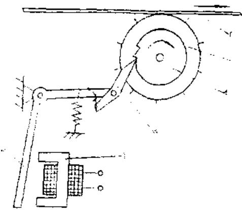

图16-8穿孔带步进走带机构

图16-9所示为某控制打字机输格装置。当打完一个字符后使字车完成一个输格动作。输格功能的实现是由输格电磁铁1的吸动,使输格离合器2转动,带动输格爪5动作,拉动棘轮6和10线丝杆i一起转动,使装在字车上的滑块3(滑块上有半个螺母与丝杆啮合)与字车一起移动一个字的距离,为打下一个字符作好准备

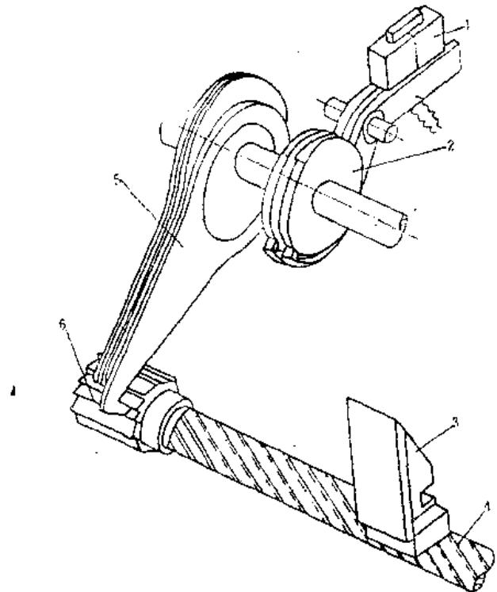

图16-9控制打字机输格装置

# 四、电磁式控制装置

电磁式控制装置是利用电磁量与机械量相互转换关系来实现机械运动控制、电路开关控制和各种自动控制等功能的综合性控制装置。它是实现自动、远动、遥控,遥测的基本自动

化元件或控制装置。

电磁式控制装置主要由载流线圈和软磁铁芯(简称铁)所组成,其作用原理是基于利用载流回路的电磁能量。铁芯在通电线圈的磁场中具有力图处于使线圈磁场增强的位置的性质。也就是说,铁芯力处于使通电线圈的能「“大的位置、根据这种性质,就可以使铁芯在通电线圈的电磁力作用下产生运动(吸动、r或运动),而实现某种控制目的。

电磁式控制装置或元件的类型很多:如电磁铁、继电器、传感器、变换器、电机、电磁摆、电磁离合器等,它们在电子设、自动化系统和遥控系统中起着重要的作用,应用极其广泛。这里仅就电磁式控制装置的基本心件一一电磁铁及节应用作些介经。

# 1.电磁铁及其磁路结构

所谓电磁铁,就是由铁芯和线圈以及磁轭和衔铁组成的、具有电与磁相互作用和相互转换六系的电磁结构。当线圈通电后,具有吸磁性材料的能力。利用这个性质,可制成各种各样的自动化元件、控制装置或执行装置。

典型的电磁铁结构有如图16-10所示的型式。按滋路的形状可分为开路导磁式路导磁式两类。图16-10(d)所示是开路导磁式结构,其余的均为闭路导磁式结构。按磁通所穿过的路径可分为无分支式和有分支式两类。图16-1)中,除图(c)和图(f)为有分支式外,其余都是无分支式磁路结构。

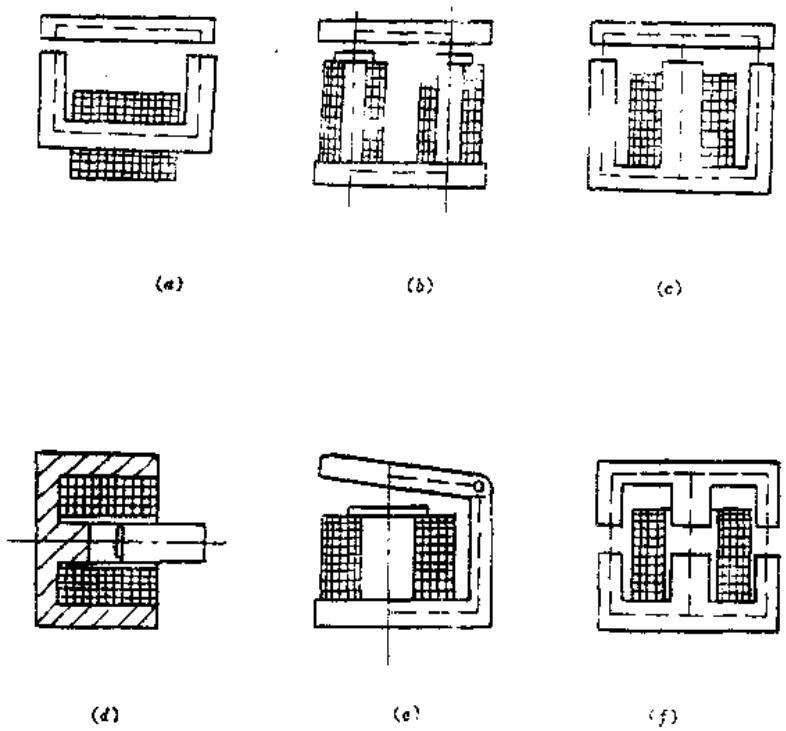

图16-10电磁铁的磁路结构

2.应用实例

图16-11所示是数字打印机电磁控制装置,该打印系统中有两种电磁铁机构,其中一种是控制打印锤动作:另一种是使记录纸作步进运动,完成换行动作。当需要打印某一数据或符号时,由电控系统控制数字轮2转到使该数字轮或符号对准打印钟11的上方位置,同时给电磁铁10的线圈一个脉冲电流,于是电磁铁吸动锤杆(衔铁)9做打印动作,打印锤把色带」和记录纸7同时打到数字!,于是字符便印在记录纸上。当数字轮转一周.即打完一个由字符组成的数据后,则印控系统给另一电磁铁4的线圈输入一个走纸脉冲电流,在电磁力的作用下,铁芯3向右私动,带动摇杆12和棘爪13一起向右摆动,并推动棘轮5顺时针方向转过一齿,同时便驱动轮6转动、使记录纸在驱动轮和压带轮8之间的摩擦力作用下向前走动一段距离,该距离即打印的行距。这就实现了打印换行的间歌步进运动。

图16\~11数字打印机电磁控制装置

# $\ S \ 1 \downarrow . \cup$ 自动控制系统应用简介

所谓自动控制,是指在没有人直接参与的情况下,利用控制装置使被控对象(如设备或工作过程)的某一物理量(或工作状态)自动地按照预定的规律运行(或变化)。例如,对机器或设备执行部件的位置与速度等物理量的控制;数控机床按预定程序自动地切削工件;电子设的自动微调和自动跟踪等,所有这些都需要由动控制系统来加以实现。

自控制系统是指能够对被控对象的工作状态进行自动控制的系统。它一般由控制装置和被控对象组成。被控对象是指要求实现自控制的设备或工作过程;控制装置则是指对被控对象起控制作用的设备总体。自动控制系统的功用及组成是多种多样的,结构有简有繁,它可以是仅控制一个物理量的简单系统,如自动调速、稳压电源的自动稳压等;也可以是一个复杂的工程系统等,这里仅举一应用实例,即磁带走速伺服控制系统。

各种磁带机的走带运动,要求有稳定的速度,以保证记录和重放精度。通常用带速伺服控制系统进行稳速控制。图16-12所示是电压比较法的带速稳定伺服控制系统。

直流电动机5输出轴上装有精密分度的缝隙盘3和磁带机驱动轴1。缝隙盘3、光源2和光电管4构成测速系统(检测装置)轴转动时,光电管4输出一个频率正比于电动机转速的交流信号,经放大后触发单稳态多谐振荡器而产生连续脉冲。这些连续脉冲通过滤波器变成直流电压加到比较电路上。在比较电路中,此电压与来自基准电路的基准电压相比较,并将它们的差值作为转速误差信号输送到激励电路和电动机驱动电路直接放大.然后改变电动机的转速,使驱动轴以符合要求的转速转动。

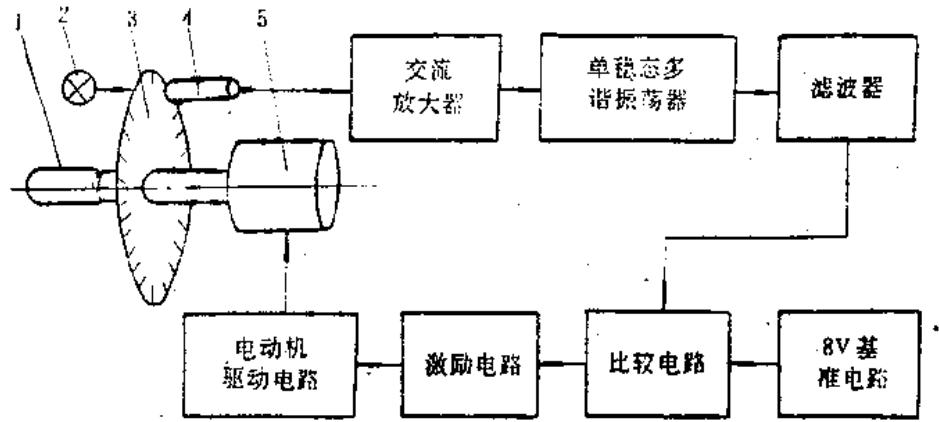

图16-12磁带走速伺服控制系统

图1-1所示雷达天线位置手控伺服系统(机电式闭环控制系统)是自动控制系统在电子设备中的另一应用实例。 ?

# 16.4同步装置

电子设备的远、近距离测量、调节、调谐、自动控制或半自动控制的跟踪系统、伺服系统、随动系统和传真系统等,常常要求输入端(或发送端)和输出端(或接收端)的运动器件(或系统中其它有关联的菜些运动构件)在传递运动或信息的过程中有严格一致的动作,在相同的时刻保持相同的位置(这种位置可以用转角量或线位移量表示)。能实现这种传动的装置称为同步装置。

随着科学技术的发,远距离同步传动控制的应用日益广泛。而远距离同步传动不可能用纯机械式的机构来实议,往往需要用有线电或无线电技术作为同步传动的位置信息传递或控制。这样,就构成机电式的同步装置。通常,把这种同步传动装置称为同步系统。

同步装置或同步系统、对电子设备的性能、精度、动态响应和工作稳定性、可靠性有重要的影响。所以,掌握和运用同步传动技术具有重要意义。

同步装置按其同步传动的方式和控制技术的不同大致可分为机械式、机电式和传感器式三种类型。

# 一、机械式同步装置

为使两个运动构件获得同步传动,可用多种机械传动装置来实现。如图16-13所示的齿轮传动和带轮传动就是典型的机械同步装置。假定它们的传动比均为 $i = 1$ ,传动误差在允许范围内,那么就可以认为输出转角与输入转角 $\smash { \theta _ { 1 } }$ 同步,即 $\begin{array} { r } { \hat { \theta } _ { \bullet } \ l = \hat { \theta } _ { \bullet } } \end{array}$ 。

凸轮机构、螺旋机构和杠杆机构等,都可用来实现同步传动。

机械式同步装置是利用机械零、部件相互连接来进行同步传动的,因此受到距离的限制。如果输出端与输入端相距很远,那么采用机械连接方式来实现同步传动则是极为困难

的,甚至是不可能的。所以机械式同步装只适用于短距离控制和调谐系统。

# 二、机电式同步系统

“为了使两个或两个以上相距甚远,又无法用机械连接的轴实现远距离同步传动,可借助自整角机和旋转变压器等机电元件来实现。这种借助自整角机或旋转变压器,并以导线作为传动连接的同步传动装置,称为机电式同步系统。

# 1.自整角机同步系统

自整角机同步系统,按功用不同可分为两类:力矩式和控制式。

(1)力矩式自整角机同步系统这种同步系统的连接方式如图16-14所示。自整角发送机!安装在需要发送旋转角的地方(输入端),自整角接收机2安装在需要接收旋转角的地方(输出端)。

力矩式自整角机同步系统中,接收机轴上产生的力矩较小,一般只能带动较轻的负载,且精度不高。主要适用于精度要求一般的数据传递和指示。

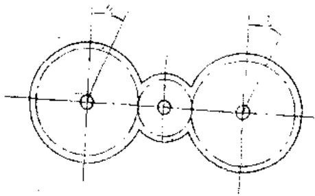

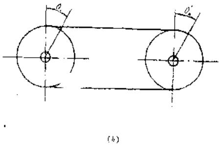

图16-13机械式同步装置

(2)控制式自整角机同步系统为了保证同步系统具有较高的精度和可靠性,可把系统中的接收机处于变压器状态下工作,这就变成如图16-15所示的控制式自整角机同步系统:

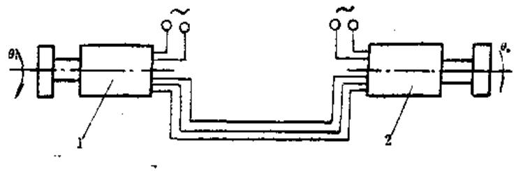

图16-14力矩式自整角机同步系统

图16-15控制式自整角机同步系统

控制式自整角机同步系统的自整角接收机变压器的激磁绕组不是接电源,而是作为该变压器的输出端,其输出电压u。正比于发送机轴与变压器轴的转角差(也称为失调角)。

这种在变压器状态下工作的同步系统,因为自整角变压器输出电压是经过放大后作用于伺服电动机,并由伺服电动机驱动变压器轴转动的,所以它可以带动较大的负载,且有较高的精度。

(3)应用举例自整角机在各种自动化、跟踪、随动等同步传动系统中的应用十分广泛。如飞机、舰船等的角度、位置、高度的控制和指示,雷达天线的同步传动与定位,快速同步摄影等都普遍利用自整角机组成自动控制的同步传动系统。

图16-16所示为自整角机同步系统在雷达天线与偏转线圈同步传动系统中的应用实例。该同步系统是由两部分组成,即“天线—自整角发送机"端和“自整角接收机—-偏转线圈"端。两端均用齿轮接合。

自整角发送机3和自整角接收机4的转子绕组由同一电源供电。天线2由电动机1驱动时带动自整角发送机传动,而自整角接收机的转角与发送机的转角保持同步,所以偏转线圈6的转角也就与天线的转角同步。偏转线圈套在环视显示器5上,当偏转线圈有一转角,显示器的电子束随之偏转,使电子束轰击荧光屏产生的亮点在荧光屏环形画面上转动,从而实现对雷达捕捉目标的跟踪。

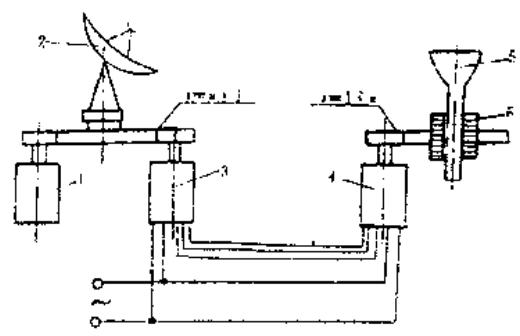

图16-16雷达天线与偏转线圈的同步传动系统

为了提高转角同步的精确度,天线与发送机之间的齿轮传动采用升速传动比$( i \approx n : 1 )$ ,而接收机与偏转线圈之间的齿轮传动则采用降速传动比 $\{ i = 1 : \varkappa \}$ ,这样就可以把机械传动引起的误差减小到它的 $1 / \pi$ 

为了进一步减小传动误差,提高同步传动精度,可采用图16-17所示的控制式同步传动系统。这时自整角接收机4以变压器方式工作。

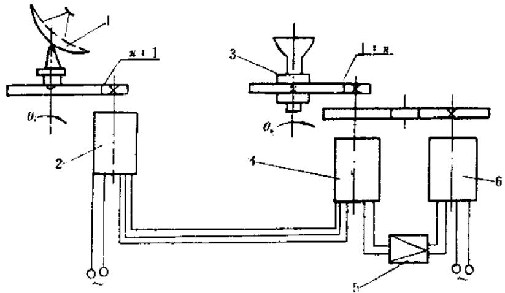

图16-17雷达天线与偏转线圈的控制式同步传动系统

当天线!与偏转线图3的转动不同步时,则自整角变压器就输出一误差信号电压 ${ \hat { \mathbf { a } } } _ { \mathbf { \overline { { \Pi } } } }$ ,这误差信号电压的大小与输出轴(偏转线圈)和输入轴(天线)的转角差值 $\langle \beta _ { \nu } - \beta _ { \nu }$ )成比例.误差信号经放大器5放大后,送去控制伺服电动机6.使其按减小偏转线圈转动误差方向传动,直至偏转线圈与天线保持同步转动为止。这种同步传动系统,可使同步误差减小到 $\pm 0 . 2 5 ^ { \circ }$ 。

# 2.旋转变压器同步系统

旋转变压器同步传动系统与自整角机同步传动系统类似,不过是用旋转变压器代特自整角机,工作原理与自整角机式同步系统相同,其优点是能一步提高系统的同步传动精度,

# 三、传感器式同步系统

传感器式同步系统是利用敏感元件感受和传递机械位移变化信息而使系统获得同步传动的装置。这种同步系统的传感器可以用霍尔效应、光电效应、电磁感应等原理来实现。

传感器式同步系统与机械式同步装置、机电式同步系统比较,其优点是可避免或减少机械磨损,结构简单、体积小,适用于小型化的装置。这类同步系统的传动原理和特点由于与其使用的敏感元件有关,这里不作详细论述。

# $\ S$ 16.5调谐装置

能将电子设备中可调元件和可调参数迅速、准确地调谐到所需频率上的装置称为调谐装置。无线电设备在工作过程中·总是需要对某些电参数进行调节,或需要控制某些电路按预定要求工作。例如,当电台变更波段或频率时,电台内许多回路(如频率合成器、振荡器、高放、强放、倍频和天“等)都要相应地进行调整。此外在工作过程中,由于工作环境条件的变化或内部的相互影响所引起的失谐(频率漂移等),也需要随时快速、准确地加以调节,才能保证电台稳定可靠地工作。所有这些均需由调谐装置来完成。

# 一、手动调谐装置

手动调谐装置是手动调节装置的具体应用,被调元件是设备回路的可变电容器、可变电感器等,通过人手操作调节件把回路的电容量和电感量调节到设备工作所需要的谐振频率上。

前面图15-1所示的调电容装置和调电感装置就是简单的调谐装置。这些单纯调电容或调电感的调谐装置,只有在简单的电子设备中才被采用。在较复杂的电子设备中,往往是既要调电容,也要调电感,并且它们之间需要作统一调谐,即要求统调。

图16-18所示是某单边带中功率发射机强放分机综合调谐装置的结构示意图。 $J , , I , \tau _ { 2 }$ 采用双滚筒式变感器,线圈导线用银带制造。要加大电感量时,将银带绕在绝缘瓷筒上;要减小电感量时,则将银带反过来绕在导电金属筒(起短路作用)上。 $\mathcal { C } _ { 2 } , \mathcal { C } _ { 3 }$ 为真空可变电容器,它的里面装有螺旋机构,可将外加的旋转运动变为动片的移动。

转动强放匹配联合传动机构的旋钮仅改变 $J _ { z _ { 2 } }$ 变感器的电感量;当转动强放调谐联合传动机构的旋钮,通过小模数齿轮传动机构,使 $\scriptstyle { \mathfrak { L } } _ { 1 } , { \mathfrak { C } } _ { 1 }$ 和 $\tilde { C _ { 3 } }$ 统调。强放综合调谐系统的传动链表示如下:

$$
\begin{array} { r l } & { - \displaystyle \sum _ { \frac { 3 2 } { 3 2 } = \frac { 1 } { 4 2 } \to \frac { 3 2 } { 1 2 } \to \frac { 5 0 } { 1 2 } \to \frac { 5 0 } { 1 2 } \to \frac { 1 } { 8 2 } \log \frac { 1 6 4 } { 1 2 \times \frac { 5 0 } { 1 2 } \times \frac { 5 0 } { 1 2 } } } ^ { \frac { 3 2 } { 3 } + \frac { 5 0 } { 1 2 } \to \frac { 5 0 } { 1 2 } \to \frac { 5 0 } { 1 2 } \to \frac { 5 0 } { 1 2 } \log \frac { 1 6 4 } { 1 2 \times \frac { 5 0 } { 1 2 } \times \frac { 5 0 } { 1 2 } } } } \\ & { - \displaystyle \sum _ { \frac { 3 2 } { 3 2 } = \frac { 5 } { 1 2 } \to \frac { 3 2 } { 2 1 } \to \frac { 3 2 } { 4 5 } \to \frac { 5 0 } { 1 2 \times \frac { 5 0 } { 1 2 } \to \frac { 5 0 } { 1 2 } \to \frac { 5 0 } { 1 2 } \to \frac { 3 8 } { 1 2 } ( \mathrm { C K B . ~ } 4 0 0 . 5 / 3 0 ) } } ^ { \frac { 3 2 } { 3 } + \frac { 5 0 } { 1 2 } \to \frac { 3 2 } { 1 2 } \to \frac { 3 8 } { 1 2 } } } \end{array}
$$

手动调谐装置结构简单,操作方便,使用可靠,但只能适用于低速调谐的无线电设备,[为手动调谐不仅费时,而需要技术熟练的值机人员操作。

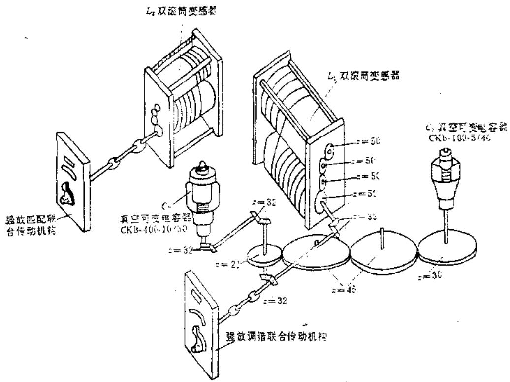

图16-18综合调谐装置的实例

# 二、自动调谐系统简介

现代无线电设备在工作中,往往需要随时快速、准确地加以调谐。为了适应现代化对无线电设备的要求,做到操作简单,快速调谐和调节,工作过程中不微调,能自动保持最佳工作状态等,现代无线电设备大都采用了各种自动控制系统进行自动调谐,如自动频率搜索和自动调谐,自动波段转换等。

现代无线电设备中的自动调谐系统是由电子线路(包括集成电路和微处理器)、继电器、微电机、组合开关和各种型式的控制装置组成的自动控制系统,按照其工作原理不同,自动调谐可分为:电子式自动调谐系和机电式自动调谐系统。

# 1.电子式自动调谐系统

在自动调谐系统中各组成部分都采用电子元器件来执行自动调谐的,称为电子式自动调谐。电子式自动调谐具有调谐时间短(1s左右)无噪声、控制功率小等优点。目前电子式自动调谐在无线电设备中正被广泛使用,如发射机、彩电视接收机都已采用。

电子式自动调谐的工件原理是通过控制电路去控制电子式调谐元件(如变容管等)来改变调谐回路里的电感或电字,以达到调谐之目的。电子式自动调谐系统主要包括:调谐网络(由调谐元件组成的网络)、检测元件、调谐控制电路、调谐元件等、它是一个闭环自动控制系统,和一般自动控制系统一样,具有以较小的误差信号控制系统工作的能力,能实现快速调节,达到调谐目的。若网络失谐,闭环系统的自控作用,使系统迅速自动地趋近谐振。

电子式自动调谐系统主要是电子线路,在此不。

# 2.机电式自动调谐系统

在自动调谐系统中,各个维压分除采用电子元器件外,还采用微电机,继电器、控制装置和组合开关等元件来执行自动调谐的,称为机电式自动调谐。目前机电式自动调谐,由于采用灵敏度高的鉴相器、小巧的组合开关、小型继电器和微电机,故具有调谐快速 $( 1 \sim 1 5 s )$ 、准确,设备简单和操作方便等优点;但存在噪声较大、体积重量较大、驱动功率亦大等缺点,故在大功率无线电设备中采用较多,而中小功率则多用电子式自动调谐系统。

在机电式自动调谐系统中,通常是将输入信号和输出反馈信号加在误差信号产生器上进行比较,产生误差信号 $\therefore f$ ,经过放大器放大后,来驱动继电器和微电机,带动传动机构使之产生确定的运动(角位移或线位移)来调节可变电容器(空气介质的或真空的)、变感器、铁芯、可调线圈等调谐元件,直至误差信号 $\therefore f$ 为零时调谐完毕。

下面以图16-19所示的某发射机天线自动调谐系统工作原理图为例进行说明。

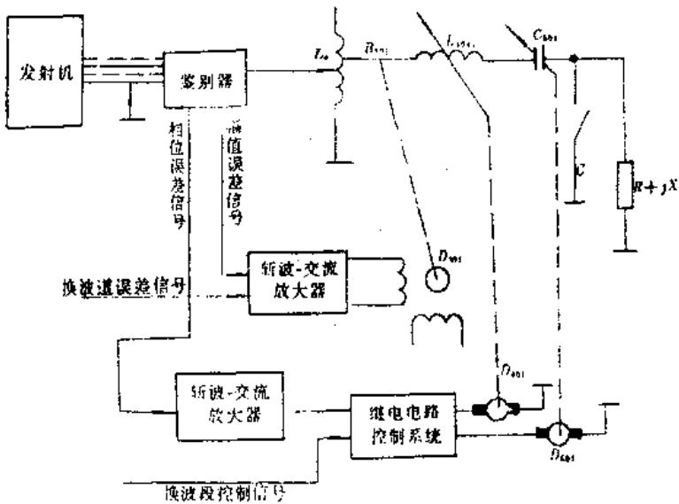

图16-19天线自动调谐装置原理图

发射机工作时,其天线阻抗随工非频率与周围环境(如温度、湿度、气压等)变化而在很大范围内剧烈变化着。阻抗匹配网络的作用,就是把这样一个大变化范围的天线阻抗变换成确定数值的纯电阻(如50Q或 $\uparrow 5 \Omega$ 。

当波段转换引起末级输出阻抗和天线阻抗有差异时,此时通过鉴别器的作用,产生相位吴差信号和幅值误差信号,经过轿波-交i:大器和电控系统,使伺服电机或继电器工作,带动可调元件调谐·直至阻抗匹配,鉴别器输出为0时,调谐完成。

相位和幅值鉴别器是用来直接给出调谐最终位置的误差信号的监控装置,它直接连在发射机的输出传输线与高频匹配网络之间。它分为两部分:一部分用来监控阻抗的相位;另一部分用来监控阻抗的幅值大小。其基本工作原理是:在匹配时,即天线调谐器与天线呈现于发射机的输出端阻抗 $\ Z = R = 5 0 \ Z 0 ^ { \circ } \{ \}$ 时,鉴别器的输出电压为 $\angle 0 ^ { \circ }$ ;当 $\angle = \angle 5 0 \angle 0 ^ { \circ } \Omega$ 时,即有直流电流输出,用它来驱动电机,并由电机带动调谐元件、直至达到匹配状态·此时鉴别器输出电压为零。

关于相位鉴别器和幅值鉴别器的具体电路这里从略。

图16-19包括三个自动调谐系统,即调 ${ \bar { I } } _ { \pmb { \mathscr { o } } }$ 系统(调自耦变压器系统),调 $I _ { 1 0 1 }$ 系统(调双滚筒变感器系统)和调 $\hat { C } _ { 5 0 1 }$ 系统(调真空可变电容器系统)。下面分别介绍这三个自动调谐系统的结构。

(1)调自耦变压器系统如图16-20所示,自耦变压器 $\scriptstyle { \mathbf { } } I _ { \mathbf { } \mathbf { } \mathbf { } }$ 由交流伺服电机 ${ \pmb { l } } ) _ { \pmb { \infty } \pmb { \operatorname { l } } }$ 通过齿轮传动机构带动 $\left\{ i { = } \frac { 1 4 } { 1 5 } \times \frac { 7 2 } { 3 0 } { = } \frac { 3 2 } { 5 } \right\}$ 

自耦变压器 $\pmb { L _ { \bullet } }$ 共28圈.电感量为 $1 \hbar \sim 1 7 \mu \mu$ 

选用两相伺服电机 $( D _ { \mathfrak { s o l } }$ 的转速为 $2 0 0 0 \tau / \mathrm { m i n }$ (实际为 $1 8 0 0 \pi / \mathrm { m i n }$ ,这里因为功率不足而使转速降低)。自耦变压器从一端到另一端所需的时间为

$$
t _ { { \iota } _ { \bullet } } = 2 8 \times { \frac { 6 0 } { n } } \times i = 2 8 \times { \frac { 6 0 } { 2 0 0 0 } } \times { \frac { 3 2 } { 5 } } = 5 . 3 8 ( s )
$$

可以看出,传动比 $\textbf { \ i }$ 的选择对结构尺寸和调谐速度有很大影响。

在自耦变压器的一端通过传动比为 $i { = } \frac { 1 0 7 } { 1 7 } \times \frac { 1 0 3 } { 2 } { = } 3 0 . 8 7$ 的齿轮机构去带动凸轮,由凸轮控制反向机构。因为止动轮只允许齿轮(103)齿转动 $3 2 5 ^ { \circ }$ ,故自耦变压器转了$3 0 . 8 7 \times \frac { 3 2 5 ^ { \circ } } { 3 6 0 ^ { \circ } } = 2 7 . 8 5$ 圈后,使反向机构动作。

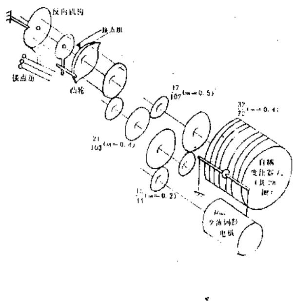

图16-20自耦变压器控制装置

(2)调双滚筒变感器系统如图16-21所示,双滚简变感器由直流电机 $I ) _ { 4 0 ! }$ 经齿轮系减速后来驱动的,其传动比为

$$
i = \frac { 9 6 } { 2 0 } \times \frac { 8 0 } { 3 2 } \times \frac { 1 0 0 } { 2 1 } = 5 0
$$

因为, $D _ { 4 0 1 }$ 电机的转速为 $\mathbf { i } 5 0 0 0 \mathbf { r } / \mathsf { m i n }$ ,故双滚简变感器的转速为

$$
u = { \frac { 1 5 0 0 0 } { i } } = { \frac { 1 5 0 0 0 } { 5 0 } } = 3 0 0 ( { \mathfrak { r } } / { \mathfrak { m i n } } ) = 5 { \mathfrak { r } } / { \mathfrak { s } }
$$

双滚筒变感器共有24圈,故变感器的电感量由最大值到最小值的调谐时问为

$$
\iota _ { t } = \frac { 2 1 } { 5 } = 1 . 8 ( \mathfrak { s } )
$$

双滚简变感器转24圈后应不再转动,并立即反转,因此在系统中设有制动反向机构。双滚简变感器与反向开关轴间有齿轮系统联系,其传动比为

$$
i \approx { \frac { 1 8 } { 2 . 1 } } \times { \frac { 6 0 } { 1 5 } } \times { \frac { 3 6 } { 1 5 } } \times { \frac { 1 9 } { 3 6 } } = 2 6 . 1 3
$$

因为最后一个齿轮 $= 1 9 )$ 在设计时只允许转 $3 6 0 ^ { \circ }$ ,故双滚筒变感器的限制转数为

$$
{ \frac { 3 3 0 ^ { \circ } } { 3 6 0 ^ { \circ } } } \times i = { \frac { 3 3 0 ^ { \circ } } { 3 6 0 ^ { \circ } } } \times 2 6 . 1 3 = 2 3 . 9 5 ( \mathsf { r } )
$$

即双滚筒变感器转23.95圈后,就使制动器产生作用,同时反向开关控制电机立即反转。

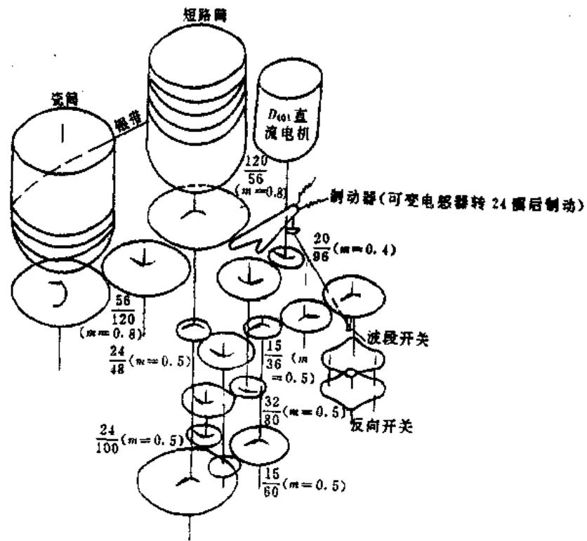

图16-21双滚筒变感器控制装置

(3)调真空可变电容器系统如图16-22所示,流电机 $\bar { / p } _ { 5 0 1 }$ 通过齿轮传动其传动比为 $i { = } \frac { 5 0 } { 1 } \times \frac { 6 0 } { 1 8 } \times \frac { 6 0 } { 2 2 } \times \frac { 1 1 } { 2 0 } \times \frac { 1 3 0 } { 1 8 } { = 9 8 3 5 . 8 6 } )$ 及杠杆传动作用:使真空电容器改变电容量。

已知真空电容器的行程 $\scriptstyle H = 2 2 m m$ ,杠杆支点到真空电容器的轴线距离为 $h _ { i } = 1 7 . 5 m m$ ,由图16-23可得出:

$$
\frac { 2 } { L } = \log \frac { u } { 2 } \cdot \mathrm { t s } \frac { u } { 2 } = \frac { 1 1 } { 4 7 . 5 } = 0 . 2 3 1 5
$$

所以 $1 1 \approx 2 6 ^ { \circ }$ 

故扇形齿轮摆动26°使两组接点交替工作.并使Dso:电机换向。

Cso真空可变电容器流电机(=0.4:2(=0.5) 1接点组 扇形齿轮 (=0.5)D接点组

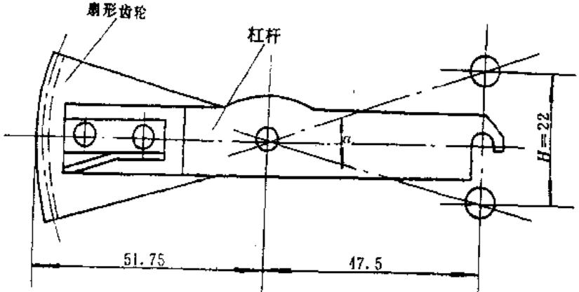

图16-22真空电容器控制装置

图16-23图16-22中的杠杆传动

Dso是功率为7.4W,力矩为47gf·cm的永磁电机,带动负载后的转速为15000r/min,为了不使真空电容器的电容量变化速度太快,故采用的传动比为9835.86的蜗轮蜗杆-齿轮减速机构。

真空电容器的电容量由最大变至最小的时间为

$$
i = \frac { 2 6 ^ { \circ } } { 3 6 0 ^ { \circ } } \times \frac { 6 0 } { \lambda } \times i = \frac { 2 6 ^ { \circ } } { 3 6 0 ^ { \circ } } \times \frac { 6 0 } { 1 5 0 0 0 } \times 9 8 3 5 . 8 6 = 2 . 8 1 ( \mathfrak { s } )
$$

上面所介绍的天线调谐器,在调谐过程中既调电感线圈又调电容器,因而其结构复杂,同时继电器控制系统可靠性也较低。现在新的天线调谐器采用门电路控制,代替继电器程控系统,用改变L和串联C及串接1来实现调谐;同时把整个部件置于情性气体保护的密封容器中,从而提高了可靠性,也简化了机构。这种新的天线调谐系统,仍然是机电式的,它的执行部件是电机拖动齿轮机构去控制被调元件,以改变其参数;所不同的是采用了电子控制

# 441107 

线路代替了继电器,提高了系统的可靠性。

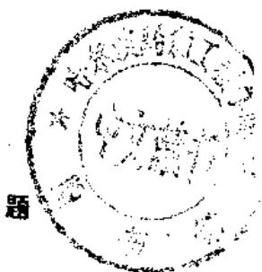

# 习

11-1在电子设备中,控制装置有哪些类型?各有哪些作用?

10-2电子设备对控制与调谐装置有哪些要求?

18-3电磁式控制装置的工作原理是什么?试再举一些实例说明其应用。

10-4什么是同步装置?有哪些类型?

18-5自动调谐系统有哪些类型?

# 主要参考文献

[1] 盛鸿亮等编著、精密机构与结构设计.北京;北京理工大学出版社,1993.  
[2] 孙麟治,张鄂,赵明晶,邹桂根编著.小模数精密齿轮传动设计,北京:机械工业出版社,198[3] 王生洪,龚振邦,王世萍编.电子设备机械设计、西安:西北电讯工程学院出版社,1986.  
[4] 叶松林主编-精密机械仪器零件.抗州:浙江大学出版社,1989.  
[5] 陈国华编著.仪器机构及其应用.上海:上海科学技术出版社,1986.  
[6] 盛鸿亮等编.精密机械设计基础.修订版、北京:国防工业出版社,1986.  
[7] (波):W.泰拉林斯基著.微型机械与精密仪器.初允绵等译.北京;机械工业出版社,1985.  
[8] 叶琪根等编.机构精确度.西安:西北电讯工程学院出版社,1986.  
[9] 游俊魁主缩:精密机械与仪器零件部件设计.上海:上海交通大学出版社,1989.  
[10] 史习敏,黎永明主编.精密机械设计、上海,上海科学技术出版社,1987.  
[11] 马长福编著.实用粘接技术460间.北京:金盾出版社,1992.  
[12] 王惠敏,王仲彬主编.仪器仪表结构设计手册.北京:国防工业出版社;1989、[13] 施立亭编.仪表机构零件.北京:冶金工业出版社,1984.  
[14] 机械工业部仪器仪表工业局统编.仪器仪表机构与零件.北京:机械工业出版社,1985.  
[15] 王大明编.精密机械零件与电子机械部件.西安:西北电讯工程学院出版社,1985.  
[16]龚维蒸编.无线电设备结构与工艺.天津:天津科学技术出版社,1982.