# 机构设计丛书

# 空间机构设计

《机构设计丛书》编审委员会 编

谢存禧·郑时雄 林怡青 编著

# 责任编辑 钮国俊

# 机构设计丛书

# 空间机构设计

《机构设计丛书》编审委员会编谢存禧 郑时雄 林怡青编著上海科学技术出版社出版、发行

# (上海瑞金二路450号)

A上海发行所经销 上海商务印刷厂印刷开本 $\mathbf { 8 5 0 } \times \mathbf { 1 1 6 8 }$ 1/32印张11插页4字数284,0001996年4月第1版1996年4月第1次印刷印数1-3,000ISBN 7-5323-4122-4/TH · 76定价:20.00元

# 内容提要

本书系"机构设计丛书"之一。全书分八章,在扼要阐明空间机构的组成原理和数学基础后,详细阐述空间闭链机构和空间开链机构的运动分析和力分析、型综合和尺寸综合以及设计的基本方法和实际应用。在分析和综合中,都举以设计实例。空间开链机构即机器人机构,列举了弧焊、点焊和喷涂机器人的设计。

本书供从事空间机构设计、自动化设计或技术改造的工程技术人员阅读,也适于大学机械专业的师生参考。

# 编审委员会名单

雷天觉 张启先 路甬祥

邹慧君 李华敏 徐振华 华大年谢存禧 殷鸿梁 吕庸厚

# 丛 书 序

照传统说法,一切机器都可分为三部分,动力源、传动和执行机构。一切机器的作用不外两点,一是利用能量来代替微弱的人力、畜力,另一则用机器的运动来代替人手的动作。虽然两者都是为了减轻劳动,可是它们发展的历史却很不一样。能源开发是近代的成就,应该说由水车开始,而且从历史眼光看其发展并不能说很快,一般是量变。用机器运动来代替手工动作则历史长得多,而且进步也比较大。只要比较一下上古制陶器的陶车和近代在人的大脑中进行外科手术的机器人便清楚了。这可能是因为能源开发虽然艰巨,其目标却是单一的。用机器运动代替人工劳动,目的是多种多样的,随着人类生活的发展而不断变化。因此形成很多复杂的行业。

到底机器的哪部分是用来产生代替人手的动作呢?事实上这和传统的原则性的说法略有不同。倘机器要执行的动作非常简单,则动力源一传动一执行这划分还是对的。但近代机器常极复杂,对它要求的动作也非常精细而且复杂(且不说人工智能问题)。这种精细复杂的运动常常要从传动中获得。这就使机器的传动部分和执行部分的界限模糊了,同时也使传动成为更复杂的技术。表面上好像很简单的问题,做起来可能会很困难。我常常喜欢提一个历史上的例,这里再说一次:当瓦特设计他的蒸汽机时,他需要一个直线运动来带动阀门。从表面看这是一个很简单的问题,在今天用一个导轨便成了。但在那时的加工设备和润滑技术,还不能制出导轨,而须用连杆。但瓦特想不出这样一种连杆,便要求格拉斯哥大学的数学家们帮忙,但数学家们也想不出。后来事情传开了,竟发现全世界的数学家都解决不了这问题。瓦特只得用了一个近似的直线机构。这问题直到瓦特死后几十年,才由一位法国数学家解决了。这一事说明了在机器上对传动机构要求之高和问题解决之难。只要机器还在使用,传动机构也必然要继续发展。

传动机构的类型很多,而且还在不断增加。特别是近年来在高精技术领域中,各种类型传动(齿轮、凸轮、连杆、液压、气动、电动)常联合使用。最近趋势是在使用液压气动时,传动介质和轴承润滑和压力常联为一体,这就使技术更加复杂。在这种情况下,我们迫切需要一部包括各种传动(最好还包括摩擦学)的专著。目前对每种类型传动的论著并不少,有的也很深入。但却没见过将各种传动(机构)汇为一书的。上海科学技术出版社出版的"机构设计丛书"是这种类型专著的第一次出现,很希望它能满足读者的上述需求。当然,将各种传动融会贯通、形成一体是需要时间的,但这套书总是一个很好开端。丛书计七题,依次是《机构系统设计》、《齿轮机构设计》、《凸轮机构设计》、《连杆机构设计》、《空间机构设计》、《间歇运动机构设计》及《组合机构设计》。由于它包括了各种传动,而且篇幅很大、内容比较详尽、阅读方便;又由于它是由一个统一的编审委员会领导下完成的,易于作到理论协调、体例一致。估计本书将成为前沿设计和生产工作者很欢迎的书。

笔者希翼本书在我国机械工业中起良好作用!

1九四年十月十九日

# 前 言

《空间机构设计》是"机构设计丛书”之一。题名空间机构,实际仅述及空间连杆机构,因为诸如空间齿轮、空间凸轮等其他空间机构,丛书已另有专述。

空间机构学的研究虽起始于本世纪20年代后期,但时至50年代末仍进展缓慢。相对于平面机构而言,其研究深度及应用广度均遑相论及。这实为空间机构的结构和运动的复杂性,计算手段的局限性,以及加工、装配和检测的低水平等原因所使然。空间机构中的开链机构,其应用较之闭链机构又更为鲜见。这除了上述原因外,驱动、控制及传感技术等方面尚未臻善,是导致其无法深入发展的主要原因。

由于近期电子计算机的普及应用,化解了空间机构计算的繁复性。同时也出现了随之发展的现代控制理论,新型的驱动器件、传感元件及集成电路等的商品化生产。使空间机构复杂运动的实现成为可能。数控精密加工机床和精密量具的出现,也解决了复杂形状结构的制造和检测问题。生产力的快速发展,也为空间机构的纵深研究和普遍应用创造了外部条件。

空间机构灵活多样、结构紧凑、占用空间小及可用少量杆件实现复杂运动等突出优点,更为人们所赏识。因此在短短的不足40年的时间内,空间机构学的研究以及所取得的成果远超于以往年月。并且使空间机构学的研究由纯机械学引伸为机械电子学范畴的研究,出现了许多与自动控制理论、信息科学等相交叉的空间机构学研究课题。新兴的机器人机构学,本质上是空间机构学的一个重要分支。在机、电、光、气、液各相关学科的共同促动下,除了保留一些传统的机构学分析方法之外,已经出现了许多与之适应的新理论和新方法,成为多学科渗透交叉的典型。

在空间机构研究迅猛发展、成果多如繁星的今天,作为“机构设计从书"之一,要能概括这些进展且又要突出其应用性,作者确感力不从心。我们只能在继承前人研究的基础上,辅以自身研究经历的片鳞只爪来草就这一拙著。这样不可避免地有以偏概全之虞。空间机构分析和综合的方法相当多,限于精力和时间,我们无法亲自去全部涉历。因此,例如对运动分析和动力分析,书中仅分别介绍矩阵法和拉格朗日方法;在综合方面仅介绍常用的几种方法。示例也限于作者所做所见。幸好目前有关著作甚多,其他方法读者可觅山寻宝。

本书共八章,分为三个部分:第一部分主要阐述基本概念和数学方法(第一、二章),第二部分是空间机构的运动和受力分析(第三、四章),第三部分着重于空间机构的综合方法和设计应用(第五至八章)。为了贯彻实用性,各部分都举以设计实例,并尽量在理论分析之后给出计算机程序,在数学方法之后给出计算机算法,同时尽量做到计算程序通用,使一些简单空间机构的分析和综合问题能引用这些程序算得结果。列举的机器人机型,大多与我国目前开发的机型相一致,期望借以增进读者对我国机器人机型现状的了解。

原稿承北京航空航天大学张启先教授和张玉茹副教授悉心审阅,谨此表示衷心的感谢。我们还感谢日本山梨大学教授牧野洋先生,因为书中引用了他的一些基本分析方法。书稿最后经丛书编审委员会核阅。

由于本书的撰写局限于作者在国家“七五"攻关项目、国家自然科学基金项目及研究生研究课题中的经历,又限于水平,可能存在片面、疏漏甚或误讹之处,敬希读者、专家批评指正。

# 目 录

# 前言

# 第一章空间机构的组成原理… ......1

$\ S 1 - 1$ 基本概念…\~、构件··…二、运动副及其分类…三、运动链与机构.·$\ S \lambda { - } 2$ 广义坐标与自由度 ........7

一、广义坐标…·  
二、虚位移…  
三、广义坐标与笛卡儿坐标…  
四、机构的自由度 1

$\ S 1 - \Im$ 空间机构的自由度. ........11一、空间开链机构的自由度二、空间单闭链机构的自由度三、空间多闭链机构的自由度

# $\ S 1 - 4$ 空间机构的组成 .....·\*20

一、空间单闭链机构的组成二、空间多闭链机构的组成 23三、空间开链机构的组成 : 25

# 第二章数学基础… .......81

# $\ S \ 2 – 1$ 回转变换矩阵 : ........31

一、点的位置在坐标系中的表示 .. ....31  
二、绕坐标轴回转的变换矩阵 32  
三、绕任意轴回转的变换矩阵· .36  
四、绕定点的转动回转变换矩阵 .40  
五、不共原点的坐标变换 42  
六、齐次变换· :44

# $\ S \ 2 – 2$ 回转变换矩阵的性质及运算法则 : ·..···46

一、回转变换矩阵的性质 ........46  
二、回转变换矩阵的运算法则 :47  
三、回转变换矩阵的分量 :48  
-四、回转变换矩阵的微分 ·50

# $\ S 2 - \Im$ 多项式方程解法 ....·51

一、对分区间法 …51  
二、迭代法 54  
三、牛顿法 : .55

$\ S \ 2 – 4$ 非线性方程组解法… .....\*.57

第三章空间机构运动分析 .....·61

$\ S \cdot \ r _ { 1 }$ 空间机构运动分析的基础 : ...·.61

一、概述… ...61  
二、D-H 坐标系 ….62  
三、相邻坐标系的变换 ...63

# $\ S \vartheta ^ { - 2 }$ 空间闭链机构的运动分析 ......65

一、空间闭链机构的位姿方程 ...65  
二、空间闭链机构的位移分析 ...67  
三、空间闭链机构的速度、加速度分析… ..83

# $\ S \Im \mathrm { - } \Im$ 空间开链机构的运动分析 ...90

一、开链机构的位姿方程 :.90  
二、机器人机构的结构特点 :91  
三、机器人机构的位姿方程和位移分析: 93  
四、机器人机构的速度和加速度分析 :96  
五、机器人机构的运动学逆解… :.99  
六、机器人机构的工作空间…· ....110

# 第四章空间机构受力分析……· .....\*126

$\ S$ 4-1空间闭链机构受力分析·… .....\*126

一、空间闭链机构的静力分析…… .126  
二、空间闭链机构的动力分析… .....138

$\ S$ 4-2空间开链机构受力分析 ....\*148

一、空间开链机构的静力分析… .148  
二、空间开链机构的动力学…… .....151

# 第五章空间闭链机构设计的基本方法·… .....-171

# $\ S 5 \mathrm { - 1 }$ 空间闭链机构设计的基本问题 .......·\*-171

一、设计空间与约束条件 ....171  
二、设计要求与可行方案的数目 ...172  
三、型综合与尺寸综合… :.173

# $8 5 - 2$ 按位移要求设计空间闭链机构… ..........\*174

一、函数综合· .....174  
二、轨迹综合· ..178  
三、刚体导引… ..180

# $\ S \sigma - 3$ 按速度、加速度和动力特性设计空间闭链机构184

一、按速度、加速度要求设计空间闭链机构 ..184  
二、按动力特性要求设计空间闭链机构… ....183  
三、空间闭链机构的特殊位置和压力角… ...187

# $\ S 5 \mathrm { - 4 }$ 空间闭链机构的优化综合… ......\*189

一、优化设计 ......189  
二、直接处理约束条件的优化方法 ...191  
三、间接处理约束条件的优化方法 ...199

# 第六章空间闭链机构的设计应用 .......212

# $\ S 6 \mathbf { - } 1$ 按主、从动件摆角要求设计空间闭链机构212

一、单闭链机构… ....212  
二、多闭链机构…· ...219

# $\ S \ 6 \mathrm { - } 2$ 按运动轨迹设计空间闭链机构… .....·\*-25

一、单自由度机构 ...226  
二、多自由度机构… .....230

# $\ S \theta - 3$ 按工作性能要求设计空间闭链机构…289

一、按工作行程和动力性能设计活塞机构 ·...239  
二、按工作行程和静力要求设计农机耕作器起落机构· ...24  
三、按工作速度要求设计筛驱动机构 …..247

# 第七章机器人机构设计的基本方法 : ....·.253

$\ S 7 - 1$ 机器人机构的型综合… .......\*-253

一、机器人机构的广义位姿… ......253  
二、物体姿态的实现及相应的手腕型式… ...255  
三、实现位置与实现姿态的相关性 ..257  
四、机器人机构的型综合关系式 ...259

$\ S 7 { - } 2$ 机器人机构的尺寸综合… ···.··\*263

# 一、用解析法进行尺寸综合… ..-264

二、用优化方法进行尺寸综合… .·-26

# $\ S 7 - 3$ 机器人机构综合的图谱方法… .....271

一、特殊结构的机器人机构· ....271  
二、一般结构的机器人机构 .275

$\ S 7 - 4$ 机器人轨迹规划. .·.....-275

一、多项式插补方法…… .275  
二、关节空间中的轨迹规划 .278  
三、笛卡儿空间中的轨迹规划 .….280  
四、圆弧插补… ...280

# $8 7 - 5$ 机器人机构几何尺寸的校正. .·.285

一、用有限个已知点示教校正 ....285  
二、用位置测量机示教校正 :287

# 第八章机器人机构的设计应用 ··..289

$\ S 8 – 1$ 弧焊机器人…. ......289

一、概述……· ..289  
二、位姿方程 ...291  
三、逆运动学求解… ...292  
四、轨迹插补… ...293  
五、焊枪织动轨迹规划…… ·..-303

# $\ S \mathbf { 8 - 2 }$ 点焊机器…. ....805

、概述·… ..305  
二、位姿方程 :306  
三、速度和加速度分析 ...307  
四、逆运动学求解的数值方法: ..313  
五、工作空间分析… ...315  
六、工作空间综合… ....318

# $\ S 8 – 3$ 喷涂机器..· .......319

一、概述… ....319  
二、位姿方程… ...320  
三、逆运动学求解 ….321  
四、集中驱动的传动耦合与解耦运算 ...322  
五、机器人机构的静力平衡… ...-325

参考文献 .....88

# 第一章 空间机构的组成原理

本章叙述空间机构的结构组成,包括空间机构的自由度分析,以及根据自由度或运动型式对空间机构的结构进行综合。结构研究是机构学中一个最基本的问题,它不仅有助于对现有的机构进行分析与综合,而且对新机构的发明和设计起指导作用。

近年来,电子计算机广泛进入各研究领域,在机构的结构研究方面也相应引入了一些适于计算机处理的新方法,如图论、矩阵方法等等。这里除介绍空间机构的组成原理外,还详细介绍利用虚位移矩阵求解空间机构自由度的方法。在分析机构自由度的基础上,对空间闭链机构按自由度进行结构综合,对空间开链机构按运动型式进行结构综合。

# 81-1 基本概念

# 一、构件

构件是组成机构的基本运动单元。它可以是一个零件,也可

以由若干刚性地连结在一起的零件组成。例如,电风扇的扇叶由螺钉固连在电机转子上,构成一个运动单元。构件又称杆,在机构学中视为刚体。

自由构件在空间坐标系中有6个基本运动用 $8 _ { G _ { \Im } } \ S _ { y _ { \Im } }$ $\bullet _ { \mathfrak { s } }$ 分别表示沿 $\smash {  { \Sigma } _ { 3 } } ,  { Y } ,  { Z }$ 轴的移动,用 $\theta _ { a _ { 1 } } \theta _ { y _ { 2 } } \theta _ { z }$ 分别表示绕这三轴的转动,见图1-1。

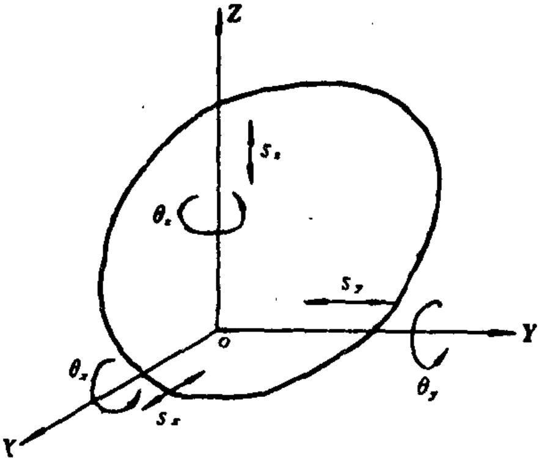

图1-1 自由构件的6个基本运动

# 二、运动副及其分类

自由构件之间必须有某种活动连接才能组成机构,这种活动连接称为运动副。运动副既把相邻的构件连接起来,又允许它们之间有某种相对运动。两个构件用运动副连接起来,它们之间就有了某种约束。例如轴颈与轴承之间仅允许绕轴线的相对转动,其余的5个基本运动受到约束。运动副所允许的独立的相对运动数目,称为该运动副的自由度。用 $f$ 表示运动副的自由度。很显然, $0 < f < 6$ 。若 $\scriptstyle f = 0$ ,则表示这个连接不允许相对运动,因而也就不是运动副;若 $f = 6$ ,则表示具有6个相对运动,因而不存在连接。 $f = 1 , 2 , 3 , 4 , 5$ 的运动副,相应地称为I、II,III,IV、V类运动副。第 $\pmb { \dot { \ddot { \sigma } } }$ 类运动副允许有 $\clubsuit$ 个相对运动,而同时具有 $\beta - i$ 个约束。

为书写和作图方便,用代号和简图代表运动副,见表1-1。例如 $\mathbf { I }$ 类副有转动副、移动副和螺旋副,所允许的相对运动分别为转动、移动和螺旋运动,分别用代号 $\mathbf { R } , \mathbf { P } _ { \mathbf { \overline { { \nu } } } } \mathbf { H }$ 表示。

运动副的连接作用是由两个构件上参加接触的部分互相配合而实现的。这些参加接触的部分称为运动副元素。每个运动副由两个运动副元素组成,它们分别位于不同的构件上。例如转动副由两个圆柱面组成,分别是轴的外表面和孔的内表面。副元素为点、线接触的运动副称为高副,为面接触的称为低副。

空间机构常以它所含的全部运动副的代号来命名。例如,由1个转动副、3个圆柱副连接而成的机构称为RCCC机构。

# 三、运动链与机构

两个以上的构件通过运动副的连接而构成的系统称为运动链。如果运动链的各构件构成首尾封闭的结构,则称为闭式运动链,简称闭链;否则称为开式运动链,简称开链。在运动链中,如果每一个构件都在同一平面或互相平行的平面内运动,则称为平面运动链;否则称为空间运动链。本书着重阐述空间运动链。

在运动链中,如果以某一构件为参考系,当某些构件按给定的运动规律运动时,其余所有构件都有确定的相对运动,那么,这个运动链便成为一个机构。机构中作为参考系的构件通常为机架,

<table><tr><td></td><td rowspan=2 colspan=2>名称</td><td rowspan=2 colspan=2>代号</td><td rowspan=2 colspan=2>图                形</td><td rowspan=2 colspan=1>简                                              图</td></tr><tr><td rowspan=1 colspan=1>类别</td></tr><tr><td></td><td></td><td></td><td rowspan=3 colspan=2>R</td><td rowspan=3 colspan=2>2</td><td></td></tr><tr><td></td><td></td><td></td><td rowspan=2 colspan=1>21</td></tr><tr><td rowspan=6 colspan=2>I</td><td rowspan=1 colspan=2>转动副</td></tr><tr><td rowspan=3 colspan=2>移动副</td><td></td><td rowspan=3 colspan=2>P</td><td rowspan=3 colspan=1>2</td><td rowspan=3 colspan=1>21</td></tr><tr><td></td><td rowspan=4 colspan=1></td></tr><tr><td></td><td rowspan=2 colspan=1>22</td></tr><tr><td rowspan=2 colspan=2>螺旋副</td><td rowspan=2 colspan=2>H</td></tr><tr><td></td></tr></table>

<table><tr><td colspan="1" rowspan="3">7Z</td><td colspan="1" rowspan="2"></td><td colspan="1" rowspan="2">S</td><td colspan="1" rowspan="2">画</td><td></td></tr><tr><td colspan="1" rowspan="1">III</td></tr><tr><td colspan="1" rowspan="1">Z</td><td colspan="1" rowspan="1">办</td><td colspan="1" rowspan="1">富舞</td><td colspan="1" rowspan="2">II</td></tr><tr><td colspan="1" rowspan="1">0</td><td colspan="1" rowspan="1"></td><td colspan="1" rowspan="1">0</td><td colspan="1" rowspan="1">福出国</td></tr><tr><td colspan="1" rowspan="1">国                                             银</td><td colspan="1" rowspan="1">                國</td><td colspan="1" rowspan="1"></td><td colspan="1" rowspan="1">龄如</td><td colspan="1" rowspan="1">品彩</td></tr><tr><td></td><td></td><td colspan="1" rowspan="3">代号</td><td colspan="1" rowspan="3">图                形</td></tr><tr><td></td><td></td><td colspan="1" rowspan="4">简                                              图兴兴</td></tr><tr><td colspan="1" rowspan="1">类别</td><td colspan="1" rowspan="1">名称</td></tr><tr><td colspan="1" rowspan="1">III</td><td colspan="1" rowspan="1">平面副</td><td colspan="1" rowspan="1">E</td><td colspan="1" rowspan="1"></td></tr><tr><td colspan="1" rowspan="2">IV</td><td colspan="1" rowspan="2">曲面副</td><td colspan="1" rowspan="2"></td><td colspan="1" rowspan="2"></td></tr><tr><td colspan="1" rowspan="2">62</td></tr><tr><td colspan="1" rowspan="1"></td><td colspan="1" rowspan="1">点接触高副</td><td colspan="1" rowspan="1"></td><td colspan="1" rowspan="1"></td></tr></table>

图1-3 飞机起落架收放机构

按给定运动规律运动的构件称为原动件,其余构件均称为从动件。

图1-2所示为飞机起落架收放机构。该机构由1个转动副、1个圆柱副和2个球面副连接4个构件而组成 $\mathbf { 1 { - } 2 { - } 3 { - } 4 { - } 1 }$ 的封闭结构,图中1为机架。当活塞9在油压作用下相对于油缸

4伸缩时,支柱2绕转动副轴线转动,从而达到收放轮子的目的。

图1-3所示为缝纫机主传动机构。该机构由4个单闭链机构组成:平面曲柄摇杆机构1—2-4--5-1,平面凸轮机构1—5-6-1,空间双摇杆机构1-2-3-9—1 和空间五杆机构1—6—7--8-9-1。多于一个闭链的机构称为多闭链机构,或称多环机构;而只有一个闭链的机构称为单闭链机构。上述前两个单闭链机构因各

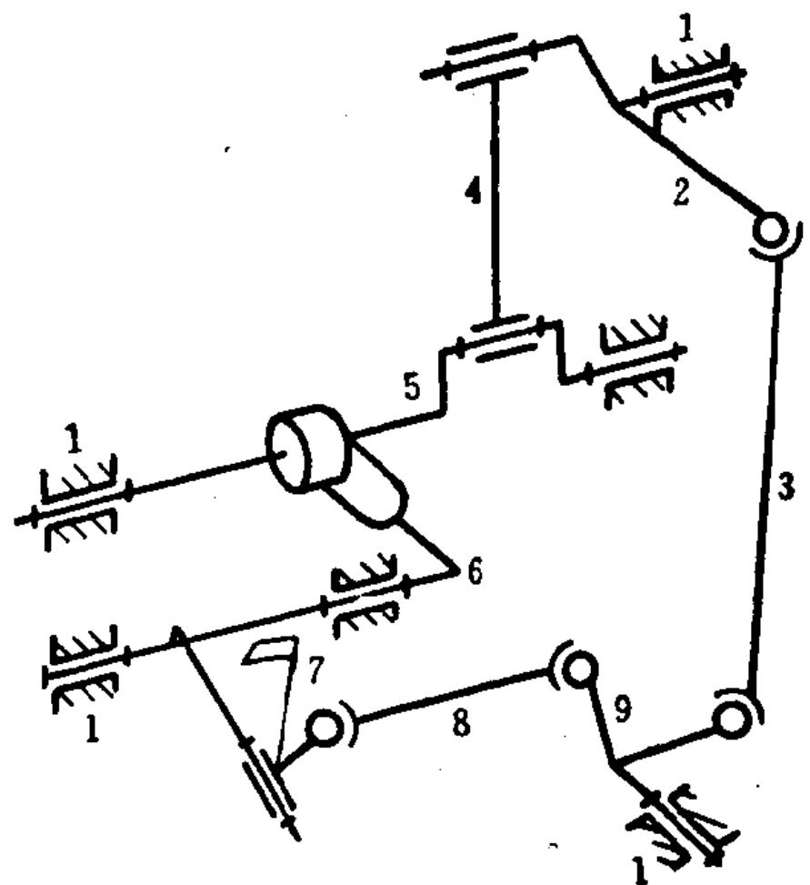

图1-3缝纫机主传动机构

杆在垂直于主轴5的平面上运动,是平面机构。在缝纫过程中,动力从主轴5传入,一方面经凸轮机构驱动水平轴6摆动,使弯针7获得沿针脚的往复摆动;另一方面通过平面曲柄摇杆机构串接空间双摇杆机构和空间五杆机构,使弯针围绕安装在水平轴6上的转动副作往复摆动。两种方向上的摆动,遂复合成弯针所需的复杂空间运动。

图1-4所示为机器人机构,由6个转动副将机架与6个运动

构件连接起来,是开式运动链。通过各转动副各自按预期的运动规律转动,便可确定末杆在空间的位置和方向。

设开链的构件数目为$N$ ,运动副的数目为 $p$ ,由于两个构件才能构成一个运动

副,而当继续增加构件时,每增加一个构件必然同时增加一个运动副,所以对于开式运动链

图1-4机器人机构

$$
N = p + 1
$$

闭链机构可看作是将开链机构的末杆与机架固连而得。因而在运动副相同的条件下,单闭链机构比相应的开链机构的构件数目少1。每增加一个封闭形(闭链),构件的数目将减少1,对于具有 $I$ 个封闭形的机构

$$
N = p + 1 - L
$$

# \$1-2 广义坐标与自由度

# 一、广义坐标

刚体的运动可用笛卡儿坐标来描述。图1-5所示的双摆动杆,杆1的长度为 $l _ { 1 } ,$ 绕 $z$ 轴的摆动角为 ${ \pmb q } _ { 1 }$ ;杆2的长度为 $l _ { 2 }$ 相对杆1的摆动角为 $g _ { 2 0 }$ 杆2绕 $z$ 轴的摆动角 $\theta _ { z }$ 与杆2上 $\mathcal { P }$ 点的位置向量 ${ \cal P } \left( x _ { P } , \ y _ { P } \right)$ 满足如下关系式

$$
\theta _ { a } { = } q _ { 1 } { + } q _ { 2 }
$$

$$
x _ { P } { = } l _ { 1 } \cos g _ { 1 } { + } l _ { 2 } \cos \theta _ { z }
$$

$$
y _ { P } = l _ { 1 } \sin \ g _ { 1 } + l _ { 2 } \sin \ \theta _ { a }
$$

以上各量中, $g _ { 1 } , \ q _ { 2 }$ 是描述运动的独立参数。 $q _ { 1 } , \ q _ { 2 }$ 确定后,$\theta _ { a _ { 3 } } v _ { P }$ 和 $y _ { P }$ 也随之确定用来确定一个系统运动状况的独立变量称为广义坐标,如上述的 $g _ { 1 }$ 和 $g _ { 2 3 }$ 而系统运动时所应满足的数学关系式(如式1-3),称为约束方程。一般来讲,一个机构的运动可以由 $\pmb { \mathscr { n } }$ 个相互独立的广义坐标来描述,系统的任意位形都可用这 $\pmb { \mathscr { n } }$ 个广义坐标表示出来。反之,任意一组广义坐标数值也对应着满足约束的一个确定位形。这 $\pmb { \eta } _ { \pmb { \nu } }$ 个广义坐标构成了一个 $\pmb { \eta } _ { \pmb { \imath } }$ 维空间,称为广义坐标位形空间,简称广义坐标空间。

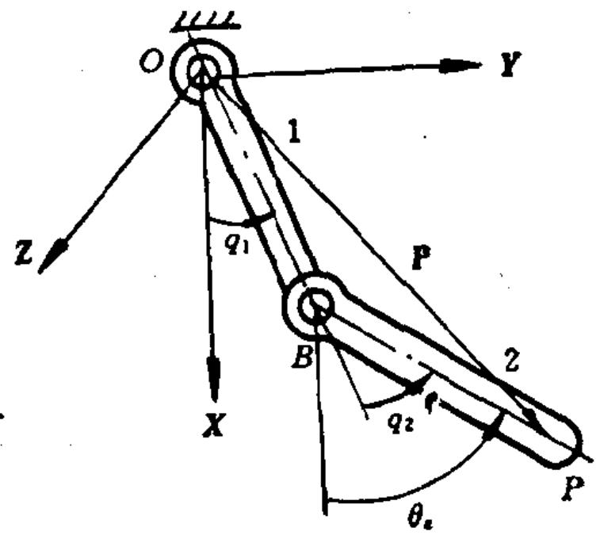

图1-5双摆动杆

图1-6 平面四杆机构

广义坐标必须是互相独立的。在图 $1 - 6$ 中,用 $\theta _ { 1 } , \theta _ { 2 } , \theta _ { 3 }$ 可以描述各构件的位置,但其中只有一个是独立的。由几何关系得

$$
\gamma = \sqrt { l _ { 1 } ^ { 2 } + l _ { 2 } ^ { 2 } - 2 l _ { 1 } l _ { 2 } \cos \theta _ { 1 } }
$$

$$
\angle C D B = \operatorname { a r c } \cos \left( { \frac { l _ { 4 } ^ { 2 } + r ^ { 2 } - l _ { 3 } ^ { 2 } } { 2 l _ { 4 } r } } \right)
$$

$$
\angle B D A = \operatorname { a r c } \cos \left( { \frac { l _ { 1 } ^ { 2 } + r ^ { 2 } - l _ { 2 } ^ { 2 } } { 2 l _ { 1 } r } } \right)
$$

$$
\angle C B D = \operatorname { a r c \cos } \left( \frac { l _ { 3 } ^ { 2 } + r ^ { 2 } - l _ { 4 } ^ { 2 } } { 2 l _ { 3 } r } \right) .
$$

$$
\theta _ { 3 } = 1 8 0 ^ { \circ } - \angle C D B - \angle B D A
$$

$$
\theta _ { 2 } = \angle C B D - \angle B D A
$$

可见 $\theta _ { 2 , \theta _ { 3 } }$ 可通过约束关系由 $\pmb { \theta _ { 1 } }$ 确定,称为多余坐标。

任何一组能够完全描述系统运动的独立变量,都可选作广义坐标,可以是笛卡儿坐标,也可以是其他量,如极坐标、球坐标、相对角位移或线位移等。

# 二、虚位移

如前所述,机构中各构件之间受到运动副的约束,不能随意运动。所谓虚位移,是指构件上某点在受到约束情况下所可能有的

任何假想的无限小位移,与作用力及时间无关。例如,定轴摆动构件上某点的虚位移必定沿着它所在位置摆动弧的切线方向。受约束于曲面的运动质点的虚位移可以是它所在位置切面内的任一微小位移。用符号 $\delta$ 表示虚位移。

图 $1 - 7$ 中, $\mathbf { \delta } _ { \mathbf { \mathcal { A } _ { j } } }$ 点前面有$i - 1$ 个运动副,设第 $k$ 个运动

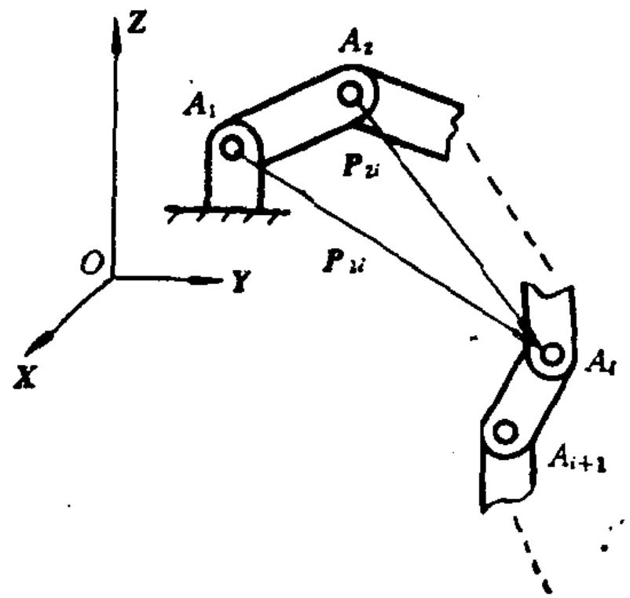

图1-7 $\Delta _ { j }$ 点的虚位移

副所允许的虚位移记为 $\delta q _ { k } , \delta q _ { k } = \delta q _ { k 1 } , \delta q _ { k 2 } , \delta q _ { k 3 } \cdot \cdot \cdot \delta q _ { k 9 } ,$ 其中s是该运动副的类别 $( \therefore \leq \sqrt { 5 } )$ 。考虑运动副 $k$ 的虚位移对 $\ l _ { A _ { i } }$ 点的影响,如果 $\gamma$ 是移动副,它在 $\mathbf { \delta } _ { \mathbf { \mathcal { A } _ { i } } }$ 点所产生的虚位移也是 $\delta \mathbf { \overline { { { q } } } } _ { k \mathrm { { c } } }$ 如果 $\pmb { k }$ 是转动副, $\delta \pmb q _ { k }$ 是转动量。由于转动副是I类副, $\begin{array} { r } { \mathbf { \hat { s } } = \mathbf { 1 } , ~ \delta \pmb { q } _ { k } = } \end{array}$ $\delta q _ { k 1 }$ ,则 $\blacktriangle _ { \ i }$ 点的虚位移为 $\delta \boldsymbol { q } _ { k 1 } \times \boldsymbol { P } _ { k i } = \delta \boldsymbol { q } _ { k } \times \boldsymbol { P } _ { k i }$ ,其中 $\pmb { P } _ { k }$ 为第 $\pmb { \mathit { k } }$ 个运动副中心指向 $\mathbf { A _ { i } }$ 点的向量。考虑 $A _ { i }$ 点之前各运动副虚位移对 $A _ { \phi }$ 点的影响, $\mathbf { \delta } _ { \mathbf { \delta } } A _ { \mathbf { \delta } }$ 点的虚位移

$$
\delta A _ { i } = \sum _ { k = 1 } ^ { i - 1 } \sum _ { j = 1 } ^ { \ell } \delta \pmb { q } _ { k i } \times \beta \pmb { P } _ { k i }
$$

式中,

$$
\beta = \left\{ \begin{array} { l l } { 1 } & { \delta { { q } _ { k } } ; \forall \ddag \ddag \ddag \Delta \vline \boxed { \equiv } } \\ { 0 } &  \delta { { q } _ { k } } , \rule { 0 ex } { 5 ex } \end{array} \right.
$$

# 三、广义坐标与笛卡儿坐标

在描述某一系统时,所选取的广义坐标并不总是笛卡儿坐标。广义坐标与笛卡儿坐标之间的关系,可通过分析构件同时在广义坐标规定下产生的运动和在笛卡儿坐标中产生的运动的关系来确定。在图1-5的双摆动杆中, ${ q _ { 1 } , q _ { 2 } }$ 为广义坐标,转轴 $z$ 上的单位向量为 $( 0 , \ 0 , \ 1 )$ 。取 $B$ 为基点研究刚体2的运动,在图示位置

上,由 $\delta \mathbf { q } _ { \downarrow }$ 产生的 $B$ 点的虚位移

$$
\delta B = { \left| \begin{array} { l l l } { i } & { \cdot } & { j } & { k } \\ { 0 } & { 0 } & { \delta q _ { 1 } } \\ { x _ { B } } & { y _ { B } } & { 0 } \end{array} \right| } = - y _ { B } \delta g _ { 1 } { \dot { a } } + x _ { B } \delta g _ { 1 } j
$$

其中 $i , j , k$ 为 $\smash {  { \boldsymbol { X } } _ { 3 }  { \boldsymbol { Y } } _ { 3 } } , Z$ 轴上的单位向量。杆2绕基点的转动即为绕 $Z$ 轴的转动,因而杆2在笛卡儿空间中的可能微小位移

$$
\begin{array} { r l } & { \delta \pmb { \mathscr { s } } _ { \alpha } = - y _ { B } \delta g _ { 1 } } \\ & { \delta \pmb { \mathscr { s } } _ { \beta } = \mathscr { s } _ { B } \delta g _ { 1 } } \\ & { \delta \pmb { \mathscr { s } } _ { \alpha } = 0 } \\ & { \delta \pmb { \theta } _ { \alpha } = 0 } \\ & { \delta \pmb { \theta } _ { \beta } = 0 \quad } \\ & { \delta \pmb { \theta } _ { \alpha } = 0 \quad } \end{array}
$$

可见杆2在笛卡儿空间中有 $8 _ { a _ { 5 } } 8 _ { y _ { 7 } } \theta _ { z }$ 的运动。这3个运动并不是相互独立的,要研究由广义坐标的变化所产生的笛卡儿空间中运动的独立性,可借助虚位移矩阵 $[ 2 \sim 4 ]$ 。虚位移矩阵的每一行代表笛卡儿坐标空间中的一个基本运动,每一列代表一个广义坐标。如上述例子的虚位移矩阵写为

$$
\begin{array} { r } { \begin{array} { c c c c } { \delta q _ { 1 } } & { \delta q _ { 2 } } & { } \\ { \delta \theta _ { \alpha } } & { 0 } & { 0 } \\ { \delta \theta _ { \nu } } & { 0 } & { 0 } \\ { \delta \theta _ { \alpha } } & { 1 } & { 1 } \\ { \delta \theta _ { \alpha } } & { - y _ { B } } & { 0 } \\ { \delta \theta _ { \nu } } & { \alpha _ { B } } & { 0 } \\ { \delta \theta _ { z } } & { 0 } & { 0 } \end{array} } \end{array}
$$

该矩阵的秩为 $2 _ { 0 }$ 即在上述3个虚位移中只有2个是独立的。这一点在式1-3中也可看出。 $l _ { 1 } , l _ { 2 }$ 为定值, $\theta _ { z } \ 、 g _ { 1 } \ 、 , q _ { 2 } \ 、 v _ { p } 、 y _ { p } 5$ 个变量必须满足3个方程,因而只有2个变量是独立的。同一系统的独立运动数目,在不同的坐标空间中是相同的。

# 四、机构的自由度

机构中各构件有确定运动时,所需给定的独立参数称为机构的自由度。很显然,机构的自由度等于广义坐标数目。一个自由

构件在笛卡儿空间中有6个自由度。2个构件在尚未连接前有12个自由度,当它们用1个$\Bbbk$ 类副连接起来后,就只剩下 $( 6 + k )$ 个自由度,比原来少了 $( 6 - k )$ 

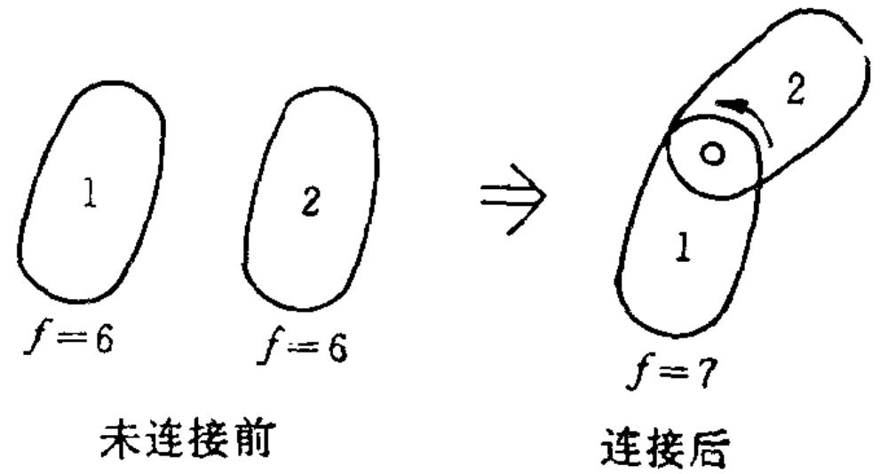

图1-9系统的自由度

个自由度。图1-8为用 $\textbf { 1 }$ 个转动副连接2个构件。要确定连接后的系统运动情况,首先要确定第一个构件的位置,需6个独立参数。然后确定第二个构件相对第一个构件的位置,需 $\textbf { 1 }$ 个独立参数。故共需7个独立参数。对于由 $\eta$ 个构件组成,含有 $p _ { 1 }$ 个I类副、 $p _ { 2 }$ 个II类副、 $p _ { 3 }$ 个III类副、 $p _ { 4 }$ 个IV类副和 $p _ { 5 }$ 个 $\dot { \nabla }$ 类副的机构,其自由度计算公式为

$$
\begin{array} { l } { { \displaystyle { \mathcal { F } } = 6 n - ( 6 - 1 ) p _ { 1 } - ( 6 - 2 ) p _ { 2 } - ( 6 - 9 ) p _ { 3 } } } \\ { { \displaystyle ~ - ( 6 - 4 ) p _ { 4 } - ( 6 - 5 ) p _ { 5 } } } \\ { { \displaystyle ~ , ~ } } \\ { { \displaystyle ~ = 6 ( n - p ) + \sum _ { i = 1 } ^ { 5 } i p _ { i } } } \end{array} .
$$

其中 $\mathcal { P }$ 为运动副的总数

$$
{ p / = \sum _ { i = 1 } ^ { 5 } p _ { i } }
$$

# \$1-3 空间机构的自由度

# 一、空间开链机构的自由度

在开链机构中,有 $1$ 个构件为机架,它的自由度为零。由式1-1,除去机架后的活动构件数目与运动副数目相同, $n - p = 0$ ,式1-5变为

$$
{ \cal F } { = } \sum _ { i = 1 } ^ { 5 } i p _ { i } { = } \sum _ { j = 1 } ^ { 7 } f _ { j } 
$$

其中 $f _ { j }$ 为第 $j$ 个运动副的自由度。

式1-7表明,开链机构的自由度等于它所具有的各运动副自由度的总和。例如,图1-4中的机器人有6个转动副,自由度 $\pmb { F } =$ 6。

# 二、空间单闭链机构的自由度

由式1-2,取 ${ \cal L } = 1$ ,得 $\mathbf { } N = \mathbf { \overrightarrow { p } } .$ ,除机架外的活动构件数目 $\pmb { \mathscr { n } } =$ $N { - } 1 _ { \mathfrak { c } }$ ,式1-5中, ${ \mathfrak { n } } - { \mathfrak { p } } = - 1 _ { \mathfrak { c } }$ ,因此,一般的单闭链机构自由度计算公式为

$$
\pmb { F } = \sum _ { i = 1 } ^ { 5 } i p _ { i } - 6
$$

在某些机构中,由于运动副或构件几何位置的特殊配置,使所有构件都失去了某些运动的可能性,这等于对机构中所有构件的运动加上某种公共约束。例如在图1-6中,各转动副的轴线互相平行,所有构件只能在垂直于这些轴线的平面上运动,机构的运动空间变为具有广义坐标 $8 _ { G _ { 3 } } \otimes _ { 9 _ { 3 } } \theta _ { z }$ 的三维空间。对于存在公共约束的系统,必须对式1-5进行修正。设在某个有公共约束的系统中,所有构件在某个 $k$ 维空间内运动 $( k < 6 )$ ,则一个 $\dot { \pmb { \mathscr { b } } }$ 类运动副所引入的约束数目为 $k - i$ ,故系统中不存在类别大于等于 $\pmb { k }$ 的运动副。用 $ { \boldsymbol { k } }$ 取代6代入式1-5,并使 $p = n + 1$ ,当 $k = 5$ 时

$$
\begin{array} { l } { { \displaystyle { \cal F } = \tilde { \boldsymbol { \mathfrak { d } } } ( n - p ) - 4 p _ { \scriptscriptstyle \perp } - 9 p _ { \scriptscriptstyle 2 } - 2 p _ { \scriptscriptstyle 3 } - p _ { \scriptscriptstyle 4 } } } \\ { { \displaystyle ~ = \sum _ { i = 1 } ^ { 4 } i p _ { \scriptscriptstyle i } - 5 } } \end{array}
$$

当 $k = 4$ 时

$$
\begin{array} { c } { { \overline { { { \cal F } } } = 4 ( n - p ) - 9 p _ { 1 } - 2 p _ { 2 } - p _ { 3 } } } \\ { { { } } } \\ { { { } = \displaystyle \sum _ { i = 1 } ^ { 3 } i p _ { i } - 4 } } \end{array}
$$

归纳得单闭链机构的自由度计算公式

$$
F { = } \sum _ { i { \mathrm { = 1 } } } ^ { k { - } 1 } i p _ { \mathrm { 4 } } { - } k { = } \sum _ { j { \mathrm { = 1 } } } ^ { p } f _ { j } { - } k
$$

此时

$$
p { = } \sum _ { i = 1 } ^ { k - 1 } p _ { i }
$$

当允许 $k = 6$ 时,式1-9包含式 $1 - 8 _ { 0 }$ 综上所述,单闭链机构与开式链不同之处在于单闭链机构的

活动构件比相应的开链机构少1。因而在运动副自由度总和相同的情况下,自由度比开式链少了相当于一个自由构件所具有的自由度 $k _ { 0 }$ 因此,空间闭链机构自由度计算的关键问题就是要确定机构运动空间的维数。

图1-9 末杆的自由度计算

例1-1:如果将图1-6单闭链机构的机架断开,就得到了图1-9的开链机构。后者的末杆1'是前者机架的一部分。两者的运动副相同,前者的自由度比后者少了相当于 $1 ^ { \prime }$ 杆所具有的自由度。下面按照前述的虚位移矩阵方法求解末杆 $\downarrow ^ { \prime }$ 的自由度,即独立运动数目。

取连接末杆的运动副 $p$ 的中心为基点,并把参考坐标系原点固连于其上。各运动副轴线上的单位向量均为 $( 1 , 0 , 0 )$ , $\pmb { A }$ 点坐标为 $( 0 , y _ { A } , 0 )$ , $\mathcal { B }$ 点坐标为 $( 0 , \ y _ { B } , \ z _ { B } )$ , $\pmb { C }$ 点坐标为 $( 0 , y _ { c } , z _ { c } ) .$ 。按式1-4得虚位移矩阵各元素为

$$
\delta \pmb q _ { 1 } \delta \pmb q _ { 2 } \delta \pmb q _ { 3 } \delta \pmb q _ { 4 }
$$

$$
\begin{array} { c c c c c c c } { { } } & { { \vline } } & { { \vline } } & { { \vline } } & { { \vline } } & { { \vline } } & { { \vline } } \\ { { \delta \theta _ { a } } } & { { 1 } } & { { 1 } } & { { 1 } } & { { 1 } } & { { 1 } } \\ { { \delta \theta _ { y } } } & { { 0 } } & { { 0 } } & { { 0 } } & { { 0 } } & { { 0 } } \\ { { \delta \theta _ { c } } } & { { 0 } } & { { 0 } } & { { 0 } } & { { 0 } } & { { 0 } } \\ { { \delta \theta _ { a } } } & { { 0 } } & { { 0 } } & { { 0 } } & { { 0 } } & { { 0 } } \\ { { \delta \theta _ { y } } } & { { 0 } } & { { - z _ { B } } } & { { - z _ { c } } } & { { 0 } } & { { 0 } } \\ { { \delta \theta _ { s } } } & { { - y _ { A } } } & { { y _ { B } } } & { { y _ { c } } } & { { 0 } } & { { 0 } } \end{array}
$$

矩阵的第 $\clubsuit$ 列表示 $\delta \pmb q _ { i }$ 对 $D$ 点所产生的虚位移。矩阵的秩为3,即 $k = 3 .$ ,根据式1-9,取 ${ p _ { 2 } } = p _ { 3 } = 0$ ,得

$$
{ \scriptstyle { \cal F } = p _ { 1 } - k = 4 - 9 = 1 }
$$

如果把图 $x - 9$ 中基点所在运动副改为球面副,则末杆 $1 ^ { \prime }$ 除了有绕 $j$ 轴的转动 $\cdot q _ { 4 }$ 外,还有绕 ${ j , k }$ 轴转动的 $g _ { 5 } , \gamma _ { 6 } ,$ ,此时虚位移矩阵为

$$
\left[ \begin{array} { l l l l l l l } { 1 } & { 1 } & { \cdot 1 } & { 1 } & { 1 } & { 0 } & { 0 } \\ { 0 } & { 0 } & { 0 } & { 0 } & { 1 } & { 0 } \\ { 0 } & { 0 } & { 0 } & { 0 } & { 0 } & { 1 } \\ { 0 } & { 0 } & { 0 } & { 0 } & { 0 } & { 0 } \\ { 0 } & { - z _ { B } } & { - z _ { C } } & { 0 } & { 0 } & { 0 } \\ { - y _ { A } } & { y _ { B } } & { y _ { C } } & { 0 } & { 0 } & { 0 } \end{array} \right]
$$

矩阵的秩为 ${ \bf \tilde { b } } , p _ { 3 } = { \bf 1 } , p _ { 1 } = { \bf \tilde { 3 } } _ { \mathrm { \scriptscriptstyle \it } }$ ,自由度

$$
F { = } { 3 } \times p _ { 3 } + p _ { 1 } { - } { 5 } { = } 1
$$

由上述分析可知,球面副实际上仅起一个转动副的作用,另外两个转动自由度不起作用,称为消极约束[5]。

例1-2:图1-10所示机构为RSSP空间曲柄滑块机构。断开机架 $\mathbf { 1 }$ 后, $1 ^ { \prime }$ 为相应开链机构的末杆。取转动副轴线与杆2轴线的交点 $\pmb { A }$ 为末杆的基点,取参考坐标系原点与该点重合, $\pmb { i }$ 轴与转动副轴线重合。 $g _ { 1 } , q _ { 2 } , q _ { 5 }$ 轴线上的单位向量为 $( \mathbf { 1 } , \mathbf { 0 } , 0 )$ ;在图示位置上, $g _ { 3 } , q _ { 6 }$ 轴线上的单位向量为 $( 0 , 1 , 0 ) _ { \smash { \{ \scriptstyle { \mathscr { q } } _ { 2 } \leq q _ { * } \mathscr { q } _ { 7 } } } $ 轴线上的单位向量为(0,0,1); $q _ { 8 }$ 为移动量,方向为 $( \mu , \nu , \omega )$ , $\mu _ { \gamma } \nu _ { \gamma } \omega$ 分别是移动方向与各坐标轴的方向余弦。 $B$ 点坐标为 $\left( \boldsymbol { \mathcal { x } } _ { B } , \ \boldsymbol { y } _ { B } , \ \boldsymbol { z } _ { B } \right)$ , $\ b { C }$ 点坐标为 $( x _ { 1 } , \ y _ { 1 } , \ z _ { c } )$ , $p$ 点坐标为 $( x _ { D } , \ y _ { D } , \ z _ { D } )$ 。

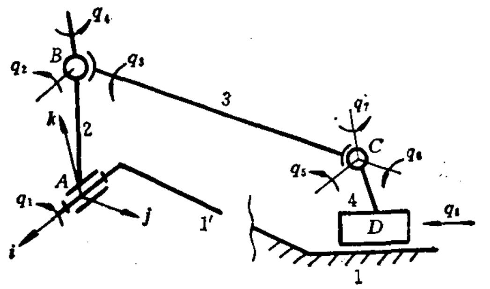

图1-10 RSSP机构

得虚位移矩阵

$$
\left[ \begin{array} { c c c c c c c c } { \mathbf { 1 } } & { \mathbf { 1 } } & { \mathbf { 0 } } & { \mathbf { 0 } } & { \mathbf { 1 } } & { \mathbf { 0 } } & { \mathbf { 0 } } & { \mathbf { 0 } } \\ { \mathbf { 0 } } & { \mathbf { 0 } } & { \mathbf { 1 } } & { \mathbf { 0 } } & { \mathbf { 0 } } & { \mathbf { 1 } } & { \mathbf { 0 } } & { \mathbf { 0 } } \\ { \mathbf { 0 } } & { \mathbf { 0 } } & { \mathbf { 0 } } & { \mathbf { 1 } } & { \mathbf { 0 } } & { \mathbf { 0 } } & { \mathbf { 1 } } & { \mathbf { 0 } } \\ { \mathbf { 0 } } & { \mathbf { 0 } } & { \mathbf { z } _ { B } } & { - y _ { B } } & { \mathbf { 0 } } & { \mathbf { z } _ { G } } & { - y _ { G } } & { \mu } \\ { \mathbf { 0 } } & { - \mathbf { z } _ { B } } & { \mathbf { 0 } } & { \mathbf { z } _ { B } } & { - \mathbf { z } _ { 0 } } & { \mathbf { 0 } } & { \mathbf { z } _ { G } } & { \nu } \\ { \mathbf { - 0 } } & { \mathbf { y } _ { B } } & { - \mathbf { x } _ { B } } & { \mathbf { 0 } } & { \mathbf { y } _ { G } } & { - \mathbf { x } _ { 0 } } & { \mathbf { 0 } } & { \omega } \end{array} \right] .
$$

矩阵的秩为 $6 _ { \circ }$ 该机构 $p _ { 3 } = 2 , p _ { 1 } = 2$ 

$$
\scriptstyle { F = 3 \times 2 + 2 - 6 = 2 }
$$

从图1-10可以看到,杆3可以绕两球心的连线回转而不影响机构的整体运动。这种对机构中其他构件的运动不产生影响的自由度称为局部自由度。应该从计算结果中减去局部自由度。减去杆8

的1个局部自由度后,机构的自由度 $\mathbf { \nabla } \mathcal { F } { = } \mathbf { \vec { \mathrm { 1 } } } _ { \mathrm { 0 } }$ 

为了单独观察两球面副的运动情况,将上述矩阵除去第1、8列,所得的$6 \times 6$ 方阵的的秩也为 $\theta _ { o }$ ·因该方阵对应2个球面副的运动参数,故当单闭链机构中含有2个以上球面副时, $k = 6$ 

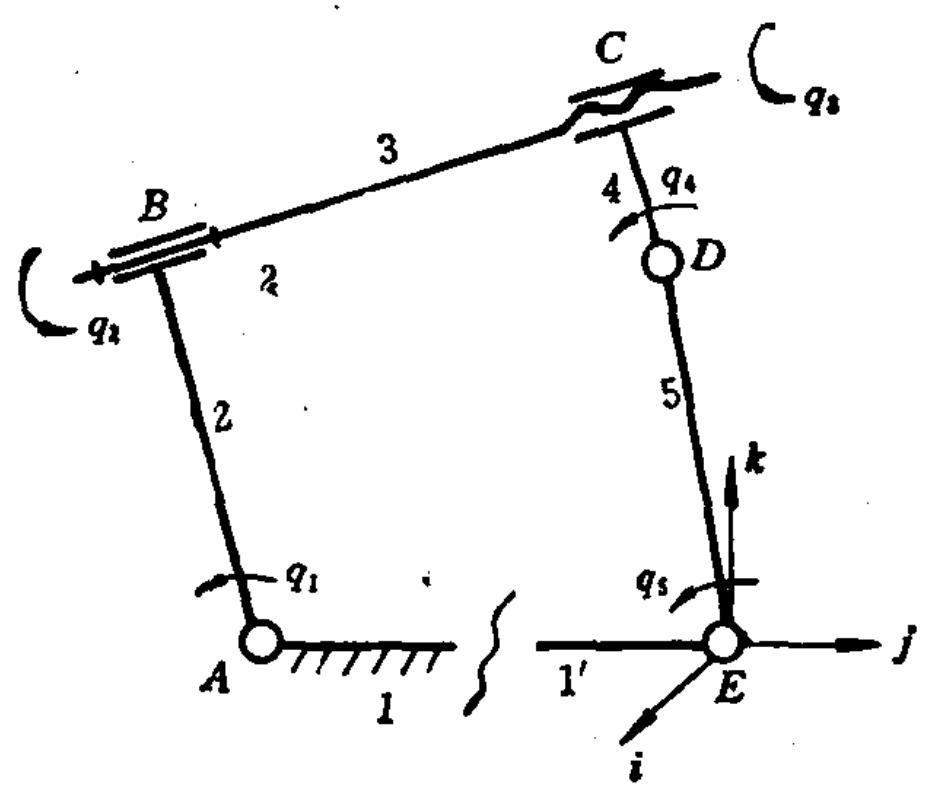

图1-11 空间五杆机构

例 $1 - 3$ :图1-11所示为空间五杆机构,含有 $^ 4$ 个转动副和1个螺旋副。断开机架后,取与末杆 ${ \bf \vec { \ l } ^ { \prime } }$ 相连的转动副 $E$ 的中心为基点,将坐标系原点置于其上。 $g _ { 1 } , g _ { 4 } , g _ { 5 }$ 转轴沿 $\pmb { i }$ 轴方向, $g _ { 2 } , g _ { 3 }$ 转轴与 $j$ 轴夹角为 $\alpha$ ,其上的单位向量为(0,cosα,sin $\pmb { \alpha }$ 。 $\pmb { A }$ 点坐标为 $( \mathbf { 0 } , \ y _ { \mathbf { \mathcal { A } } } , \ \mathbf { 0 } )$ , $B$ 点坐标为 $( 0 , \ y _ { B } , \ z _ { B } )$ , $\pmb { C }$ 点坐标为 $( 0 , \ y _ { C } , \ z _ { C } )$ ,$D$ 点坐标为 $( 0 , y _ { D } , z _ { D } )$ 。虚位移矩阵为

$$
\left[ \begin{array} { c c c c c c } { { 1 } } & { { 0 } } & { { 0 } } & { { 1 } } & { { 1 } } \\ { { 0 } } & { { \cos \alpha } } & { { \cos \alpha } } & { { 0 } } & { { 0 } } \\ { { 0 } } & { { \sin \alpha } } & { { \sin \alpha } } & { { 0 } } & { { 0 } } \\ { { 0 } } & { { z _ { B } \cos \alpha - y _ { B } \sin \alpha } } & { { z _ { O } \cos \alpha - y _ { C } \sin \alpha } } & { { 0 } } & { { 0 } } \\ { { 0 } } & { { 0 } } & { { 0 } } & { { - z _ { D } } } & { { 0 } } \\ { { 0 } } & { { 0 } } & { { 0 } } & { { y _ { D } } } & { { 0 } } \end{array} \right]
$$

由于 $\begin{array} { r } { \left( z _ { C } - z _ { B } \right) \cos \alpha = ( y _ { \mathcal { O } } - y _ { B } ) \sin \alpha , } \end{array}$ 所以 ${ \mathfrak { z } } _ { B } \cos \alpha - y _ { B }$ sin $\alpha = z _ { C } \cos \alpha$ $- y _ { \mathbb { C } } \sin \alpha _ { \cdot }$ ,矩阵的第2、3列元素相等,矩阵的秩为4, ${ \mathfrak { p } } _ { 1 } = 5$ ,机构的自由度

$$
\scriptstyle { F = p _ { 1 } - 4 = 5 - 4 = 1 }
$$

# 三、空间多闭链机构的自由度

对于有 $\pmb { L }$ 个封闭形的多闭链机构,对每个单闭链都要进行断开机架的处理,得到相应的有 $\pmb { L }$ 个末杆的开式链。这些开链机构的自由度等于所有运动副自由度的总和。把 $L$ 个末杆接回机架后,应减去所有这些末杆的自由度。用 $k _ { j } ( j = 1 , ~ 2 \cdots L )$ 表示第 $j$ 个末杆的自由度,多闭链机构的自由度计算公式为

$$
F = \sum _ { j = 1 } ^ { n } f _ { j } - \sum _ { j = 1 } ^ { L } \bar { k } _ { j } = \sum _ { i = 1 } ^ { k - 1 } i \ : p _ { i } - \sum _ { j = 1 } ^ { L } \bar { k } _ { j }
$$

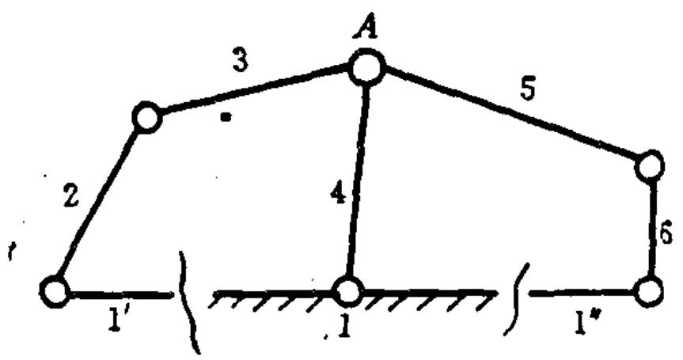

图1-13 平面六杆机构

例 $1 - 4 _ { i }$ :图1-12所示为双闭链平面六杆机构。转动副 $\pmb { A }$ 不仅连接了杆3、4,还连接了杆4、5,相当于2个共轴线的转动副。这种转动副称为复合铰,当用 $\pmb { k }$ 个构件组成共轴线的复合铰时,应算作 $k - 1$ 个转

动副。根据例1-1的分析,两个闭环的运动空间均为3维,由式1-11得自由度

$$
F = p _ { 1 } - ( 9 + 9 ) = 7 - 6 = 1
$$

例1-5:图1-13所示的缝纫机弯针机构是含有 $5$ 个转动副,

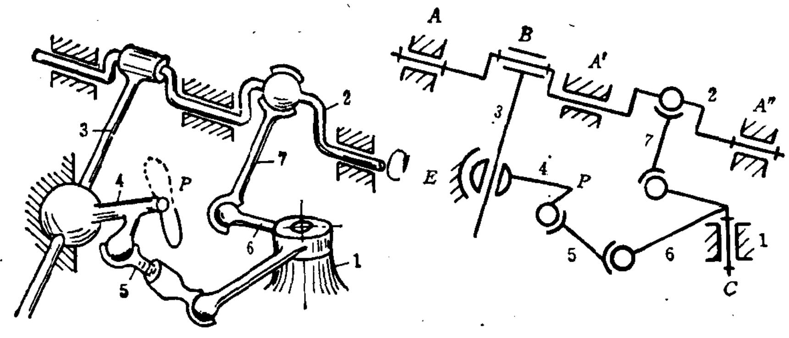

图1-13空间七杆三闭链机构

1个圆柱副、5个球面副的空间七杆三闭链机构。由于转动副 $\pmb { A }$ 与转动副 $A ^ { \prime } { } _ { \cdot } A ^ { \prime \prime }$ 共轴线,从约束的角度来看,这3个转动副的约束作用重复,都是限制杆2绕同一直线作定轴转动;从运动副自由

度的角度来看,这3个转动副都是允许杆2有同一种运动。这种作用效果重复的运动副约束称为虚约束。如果在同一构件上出现多于一个的共轴线转动副或者多于一个的导路平行移动副,则只

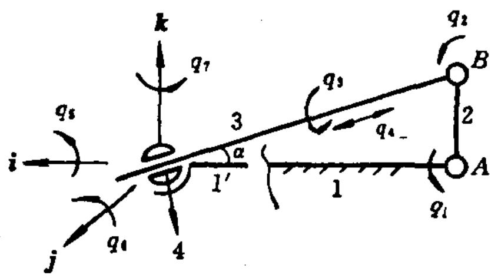

图1-14 空间曲柄摇块机构

计算其中的一个。因此,图1-13机构的转动副数目实际为 ${ \mathfrak { s } } _ { \circ }$ 在封闭形1—2-7-6-1与 $1 - 6 - 5 - 4 - 1$ 中,都含有2个以上球面副,根据例1-2的分析, $k _ { 1 } = k _ { 2 } = 6 _ { \mathrm { \ell } }$ 。为清楚起见,封闭形1—2—8—4—1单独示于图1-14。断开机架后,取球面副中心为基点,将坐标系原点置于其上。 $q _ { 1 } , q _ { 2 }$ 沿 $j$ 轴方向; $g _ { 3 } , g _ { 4 }$ 为圆柱副的两个相对运动,方向为 $( \cos \alpha , \ 0 , \ \sin \alpha )$ ; $9 5 , \ q _ { 6 , \ q _ { 7 } }$ 为球面副的相对运动,分别沿三个坐标轴方向转动。在图示位置上, $\pmb { A }$ 点坐标为 $( x _ { A } ,$ 0,0), $B$ 点坐标为 $\left( { \mathfrak { x } } _ { B } , \ { \mathfrak { y } } _ { B } , \ { \mathfrak { z } } _ { B } \right)$ 。虚位移矩阵为

$$
\left[ \begin{array} { c c c c c c c c } { 0 } & { 0 } & { \cos \alpha } & { 0 } & { 1 } & { 0 } & { 0 } \\ { 1 } & { 1 } & { 0 } & { 0 } & { 0 } & { 1 } & { 0 } \\ { 0 } & { 0 } & { \sin \alpha } & { 0 } & { 0 } & { 0 } & { 1 } \\ { 0 } & { z _ { B } } & { 0 } & { \cos \alpha } & { 0 } & { 0 } & { 0 } \\ { 0 } & { 0 } & { 0 } & { 0 } & { 0 } & { 0 } & { 0 } \\ { - z _ { A } } & { - \alpha _ { B } } & { 0 } & { \sin \alpha } & { 0 } & { 0 } & { 0 } \end{array} \right]
$$

该矩阵的秩为5,该封闭形的 $k _ { 3 } = 5$ 。七杆三闭链机构的自由度

$$
\begin{array} { c } { { F = p _ { 1 } + 2 \times p _ { 2 } + 9 \times p _ { 3 } - ( k _ { 1 } + k _ { 2 } + k _ { 3 } ) } } \\ { { = 9 + 2 \times 1 + 9 \times 5 - ( 6 + 6 + 5 ) = 9 } } \end{array}
$$

图1-13中的杆 $5 . 7$ 存在2个局部自由度,除去后机构的自由度为 $\texttt { l } _ { \texttt { o } }$ 当动力从主轴2传入时,通过 $\mathbf { 1 { - } 2 { - } 3 { - } 4 { - } 1 }$ 的空间曲柄摇块机构(图1-14)以及 $1 \mathrm { - } 2 \mathrm { - } 7 \mathrm { - } 6 \mathrm { - } 1$ 和1-6-5--4-1两个串接的空间曲柄摇杆机构和空间双摇杆机构,使构件 $\mathbf { 4 }$ 上的 $p$ 点买现复杂的球面运动轨迹。

在多闭链机构中,各个单闭链之间有时存在某些特殊的几何

关系,使整个系统出现某种虚约束。在这种情况下,宜将所有单闭链机构约虚位移矩阵放在同一坐标系中统一考虑。

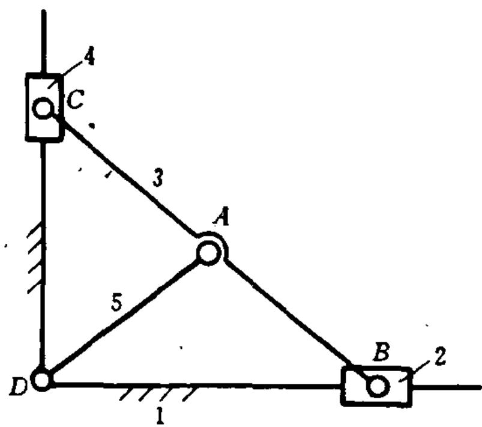

图1-15 五杆双闭链机构

图1-16两个封闭形

例1-6:图1-15所示为椭圆规机构,杆长 $\pmb { l } _ { A B } = l _ { A C \circ }$ 该机构是双闭链机构,可分解为2个单闭链机构 $1 - 2 - 3 - 5 - 1$ 和1-$\bar { \bf 5 } ^ { -- } \bar { \bf 9 } ^ { -- } { \bf 4 } ^ { -- } \bar { \bf 1 }$ ,均为 $k = \mathfrak { s } _ { \mathfrak { o } }$ 如果将它们分别进行计算,则可能导致自由度 $\mathcal { F } = 0$ 的错误结论。为了避免出现这种错误,将2个单闭链机构放在一起考虑如下:取 $D$ 为共同的基点,并建立坐标系如图$\mathbf { 1 . - 1 6 _ { 0 } } \cdot 1 ^ { \prime }$ 为封闭形 $1 - 2 - 3 - 5 - 1$ 断开机架后的末杆, $1 ^ { n }$ 为封闭形 $\mathbf { 1 . { - } . . . . 9 { - } . 5 { - } . }$ 断开机架后的末杆。 ${ \pmb q } _ { 1 }$ 为移动量,方向为(0,1,0); $q _ { 2 , 2 } , q _ { 3 , 2 } , \smash { q _ { 4 , 2 } } \mathinner { q _ { 6 } }$ 为转动量,其轴线上的单位向量为(1,0,0); ${ \pmb q } _ { \mathbf { \breve { 3 } } }$ 为移动量,其方向为(0,0,1)。 $\pmb { A }$ 点坐标为 $( 0 , \ y _ { A } , \ z _ { A } )$ , $B$ 点坐标为 $( 0 , \ y _ { v } , \ 0 )$ , $\boldsymbol { \sigma }$ 点坐标为 $\left( 0 , \ 0 , \ z _ { c } \right)$ 。·虚位移矩阵分为上、下两部分

$$
\delta q _ { 1 } \delta q _ { 2 } \delta q _ { 3 } \delta q _ { 4 } \delta q _ { 5 } \delta q _ { 6 }
$$

由于 $l _ { A B } = l _ { A C }$ ,故 $y _ { B } = 2 y _ { A }$ , $z _ { C } = 2 z _ { A 0 }$ 把这一关系代入,算得矩阵的秩为5,即 $\sum _ { i = 1 } ^ { 2 } k _ { i } = 5 _ { \circ }$ 机构的自由度

$$
F = p _ { 1 } - 5 = 6 - 5 = 1
$$

若不存在上述的特殊几何关系,则矩阵不降秩,机构变为无相对运动的桁架结构。

从本节的分析可以看到,在计算闭链机构的自由度时,要注意复合铰、局部自由度以及由同一构件上多个作用相同的运动副所引入的虚约束。对于公共约束、消极自由度以及由结构几何关系引入的虚约束,可以通过求虚位移矩阵的秩得到机构运动空间的维数,再通过式1-9或1-11算得机构的自由度。

# \$1-4 空间机构的组成

空间机构由若干构件和运动副组成,具有一定的自由度。构件、运动副的数目以及运动副的类型不同,则机构的型式、所具有的自由度以及运动空间也各不相同。本节叙述在给定机构自由度和运动空间维数的要求下,机构所含构件数目 $N$ 、运动副类型及其数目 ${ \pmb p } .$ 、运动副自由度 $f _ { j } ( j = 1 , 2 \cdots p )$ 所必须满足的条件。这种关于机构组成的研究称为机构的数综合。当 $N \ldots p , f _ { i }$ 确定以后,可以得到若干不同的机构造型,造型方法的研究称为机构的型综合5,153。

# 一、空间单闭链机构的组成

对于单闭链机构,由式1-2得机构的构件数目 $\pmb { N }$ 等于运动副数目 $p$ 。此外,机构的运动副数目 $\pmb { p }$ 与运动副自由度 $f _ { i }$ ,以及机构的自由度 $\pmb { F }$ 和运动空间维数 $\bar { \pmb { k } }$ 必须同时满足式 $1 - 9$ 。在众多的因素中,设分别固定自由度 $\mathbfcal { F }$ 以及运动空间维数 $k$ ,而对其余因素进行研究。

对于 ${ \pmb F } = { \pmb 1 }$ 的机构,式 $x - 9$ 可写为

$$
\sum _ { i = 1 } ^ { k - 1 } i p _ { i } = k + 1
$$

当 $k = 6$ 时

$$
p _ { 1 } + 2 p _ { 2 } + 9 p _ { 3 } + 4 p _ { 4 } + 5 p _ { 5 } = 7
$$

而要形成单封闭形,构件数目不能小于3,即

$$
N = p = p _ { 1 } + p _ { 2 } + p _ { 3 } + p _ { 4 } + p _ { 5 } \geq 3
$$

同时满足式1-13,1-14的机构组成型式有

$$
\begin{array} { r l r } & { \mathcal { P } _ { 1 : } = \mathcal { T } , } & { \mathcal { P } = \mathcal { T } _ { 4 : } } \\ & { \mathcal { P } _ { 1 : } = \mathcal { S } , \mathcal { P } _ { 2 : } = 1 , } & { \mathcal { P } = \mathcal { S } , } \\ & { \mathcal { P } _ { 1 : } = 4 , \rho _ { 1 : } = 1 , } & { \mathcal { P } = \tilde { \sigma } _ { 1 : } } \\ & { \mathcal { P } _ { 1 : } = 3 , \rho _ { 2 : } = 2 , } & { \mathcal { P } = \tilde { \sigma } _ { 3 : } } \\ & { \mathcal { P } _ { 2 : } = 3 , \rho _ { 1 : } = 1 , } & { \mathcal { P } = \tilde { \sigma } _ { 4 : } } \\ & { \mathcal { P } _ { 1 : } = 2 , \rho _ { 2 : } = 1 , } & { \mathcal { P } = \tilde { \sigma } _ { 1 : } } \\ & { \mathcal { P } _ { 1 : } = 2 , \mathcal { P } _ { 3 : } = 1 , } & { \mathcal { P } = \mathcal { S } , } \\ & { \mathcal { P } _ { 1 : } = 1 , \rho _ { 2 : } = \tilde { \sigma } , } & { \mathcal { P } = \mathcal { S } , } \\ & { \mathcal { P } _ { 2 : } = 1 , \rho _ { 2 : } = 1 , } & { \mathcal { P } = \mathcal { S } , } \\ & { \mathcal { P } _ { 2 : } = 1 , \rho _ { 3 : } = 2 , } & { \mathcal { P } = 3 , } \\ & { \mathcal { P } _ { 3 : } = 2 , \mathcal { P } _ { 3 : } = 1 , } & { \mathcal { P } = \mathcal { S } , } \\ & { \mathcal { P } _ { 4 : } = 2 , \mathcal { P } _ { 3 : } = 1 , } & { \mathcal { P } = \mathcal { S } . } \end{array}
$$

同理,可研究 $\kappa < 6$ 的情况。表1-2列出 ${ \pmb F } = 1$ 时单闭链机构的数综合结果。此表仅考虑了各类运动副的数目,实际上I类副有转动副、移动副和螺旋副,其他类副也有多种型式。所以单闭链机构实际上有更多的组成方案。但不管何种方案,其杆件数目不可大于 $7$ ,也不可小于 ${ \mathfrak { s } } _ { \mathfrak { o } }$ 利用表1-2,即可得到各种可用的机构组成方式。图1-17为若干 $\scriptstyle { K = 6 }$ 的空间机构。

图1-17 单闭链机构实例

表1-2 $\pmb { \mathbb { F } } = \pmb { 1 }$ 时单闭链机构的组成

<table><tr><td rowspan=1 colspan=1>构件数目N(N=p）</td><td rowspan=1 colspan=2>k</td><td rowspan=1 colspan=2>I类副数P1</td><td rowspan=1 colspan=2>II类副数P2</td><td rowspan=1 colspan=2>III类副数IV类副数P8</td><td rowspan=1 colspan=2>III类副数IV类副数P1</td><td rowspan=1 colspan=1>V类副数P5</td></tr><tr><td rowspan=1 colspan=1>7</td><td rowspan=1 colspan=2>6</td><td rowspan=1 colspan=2>7</td><td rowspan=1 colspan=2>0</td><td rowspan=1 colspan=2>0</td><td rowspan=1 colspan=2>0</td><td rowspan=1 colspan=1>0</td></tr><tr><td rowspan=2 colspan=1>6</td><td rowspan=1 colspan=2>6</td><td rowspan=1 colspan=2>5</td><td rowspan=1 colspan=2>1</td><td rowspan=1 colspan=2>0</td><td rowspan=1 colspan=2>0</td><td rowspan=1 colspan=1>0</td></tr><tr><td rowspan=1 colspan=2>5</td><td rowspan=1 colspan=2>6</td><td rowspan=1 colspan=2>0</td><td rowspan=1 colspan=2>0</td><td rowspan=1 colspan=2>0</td><td rowspan=1 colspan=1>0</td></tr><tr><td rowspan=4 colspan=1>5</td><td rowspan=2 colspan=2>6</td><td rowspan=1 colspan=2>4</td><td rowspan=1 colspan=2>0</td><td rowspan=1 colspan=2>1</td><td rowspan=1 colspan=2>0</td><td rowspan=1 colspan=1>0</td></tr><tr><td rowspan=1 colspan=2>3</td><td rowspan=1 colspan=2>2</td><td rowspan=1 colspan=2>0</td><td rowspan=1 colspan=2>0</td><td rowspan=1 colspan=1>0</td></tr><tr><td rowspan=1 colspan=2>5</td><td rowspan=1 colspan=2>4</td><td rowspan=1 colspan=2>1</td><td rowspan=1 colspan=2>0</td><td rowspan=1 colspan=2>0</td><td rowspan=1 colspan=1>0</td></tr><tr><td rowspan=1 colspan=2>4</td><td rowspan=1 colspan=2>5</td><td rowspan=1 colspan=2>0</td><td rowspan=1 colspan=2>0</td><td rowspan=1 colspan=2>0</td><td rowspan=1 colspan=1>0</td></tr><tr><td rowspan=7 colspan=1>4</td><td rowspan=3 colspan=2>6</td><td rowspan=1 colspan=2>3</td><td rowspan=1 colspan=2>0</td><td rowspan=1 colspan=2>0</td><td rowspan=1 colspan=2>1</td><td rowspan=1 colspan=1>0</td></tr><tr><td rowspan=1 colspan=2>2</td><td rowspan=1 colspan=2>1</td><td rowspan=1 colspan=2>1</td><td rowspan=1 colspan=2>0</td><td rowspan=1 colspan=1>0</td></tr><tr><td rowspan=1 colspan=2>1</td><td rowspan=1 colspan=2>3</td><td rowspan=1 colspan=2>0</td><td rowspan=1 colspan=2>0</td><td rowspan=1 colspan=1>0</td></tr><tr><td></td><td rowspan=2 colspan=2>5</td><td rowspan=1 colspan=2>3</td><td></td><td rowspan=1 colspan=2>0</td><td rowspan=1 colspan=2>1</td><td rowspan=1 colspan=2>0</td><td rowspan=1 colspan=1>0</td></tr><tr><td></td><td rowspan=1 colspan=2>2</td><td rowspan=1 colspan=2>2</td><td rowspan=1 colspan=2>0</td><td rowspan=1 colspan=2>0</td><td rowspan=1 colspan=1>0</td></tr><tr><td></td><td rowspan=1 colspan=2>4</td><td rowspan=1 colspan=2>3</td><td rowspan=1 colspan=2>1</td><td rowspan=1 colspan=2>0</td><td rowspan=1 colspan=1>0</td><td rowspan=1 colspan=1>0</td></tr><tr><td></td><td rowspan=1 colspan=2>3</td><td rowspan=1 colspan=2>4</td><td rowspan=1 colspan=2>0</td><td rowspan=1 colspan=2>0</td><td rowspan=1 colspan=1>0</td><td rowspan=1 colspan=1>0</td></tr><tr><td rowspan=11 colspan=2>3</td><td rowspan=4 colspan=2>6</td><td rowspan=1 colspan=2>2</td><td rowspan=1 colspan=2>0</td><td rowspan=1 colspan=2>0</td><td rowspan=1 colspan=1>0</td><td rowspan=1 colspan=1>1</td></tr><tr><td rowspan=1 colspan=2>1</td><td rowspan=1 colspan=2>1</td><td rowspan=1 colspan=2>0</td><td rowspan=1 colspan=1>1</td><td rowspan=1 colspan=1>0</td></tr><tr><td rowspan=1 colspan=2>1</td><td rowspan=1 colspan=2>0</td><td rowspan=1 colspan=2>2</td><td rowspan=1 colspan=1>0</td><td rowspan=1 colspan=1>0</td></tr><tr><td rowspan=1 colspan=2>0</td><td rowspan=1 colspan=2>2</td><td rowspan=1 colspan=2>1</td><td rowspan=1 colspan=1>0</td><td rowspan=1 colspan=1>0</td></tr><tr><td rowspan=3 colspan=2>5</td><td rowspan=1 colspan=2>2</td><td rowspan=1 colspan=2>0</td><td rowspan=1 colspan=2>0</td><td rowspan=1 colspan=1>1</td><td rowspan=1 colspan=1>0</td></tr><tr><td rowspan=1 colspan=2>1</td><td rowspan=1 colspan=2>1</td><td rowspan=1 colspan=2>1</td><td rowspan=1 colspan=1>0</td><td rowspan=1 colspan=1>0</td></tr><tr><td rowspan=1 colspan=2>0</td><td rowspan=1 colspan=2>3</td><td rowspan=1 colspan=2>0</td><td rowspan=1 colspan=1>0</td><td rowspan=1 colspan=1>0</td></tr><tr><td rowspan=2 colspan=2>4</td><td rowspan=1 colspan=2>2</td><td rowspan=1 colspan=2>0</td><td rowspan=1 colspan=2>1</td><td rowspan=1 colspan=1>0</td><td rowspan=1 colspan=1>0</td></tr><tr><td rowspan=1 colspan=2>1</td><td rowspan=1 colspan=2>2</td><td rowspan=1 colspan=2>0</td><td rowspan=1 colspan=1>0</td><td rowspan=1 colspan=1>0</td></tr><tr><td rowspan=1 colspan=2>3</td><td rowspan=1 colspan=2>2</td><td rowspan=1 colspan=2>1</td><td rowspan=1 colspan=2>0</td><td rowspan=1 colspan=1>0</td><td rowspan=1 colspan=1>0</td></tr><tr><td rowspan=1 colspan=1>2</td><td></td><td rowspan=1 colspan=2>3</td><td rowspan=1 colspan=2>0</td><td rowspan=1 colspan=2>0</td><td rowspan=1 colspan=1>0</td><td rowspan=1 colspan=1>0</td></tr></table>

对于 $\mathbf { \nabla } \mathbf { \mathcal { F } } { > } 1 .$ 的单闭链机构,可用相同的方法进行分析。

# 二、空间多闭链机构的组成

根据式1-2,当封闭形的个数 $I { > } 1$ 时,构件数目 $N$ 将小于运动副数目 $p _ { 0 }$ 在某些构件上,运动副元素的数目大于 $\mathbf { \boldsymbol { \mathsf { 2 } } } _ { \mathsf { c } }$ 例如,在图1-13的三闭链机构中,机架 $\mathbf { 1 }$ 上有 $A _ { \cdot } E _ { \cdot } C ^ { \odot }$ 个运动副元素;曲柄2上有2个转动副元素 $( A ^ { \prime } , A ^ { \prime \prime }$ 除外)和 $\mathbf { \lambda _ { 1 } }$ 个球面副元素;构件4上有2个球面副元素和1个圆柱副元素;构件6上有2个球面副元素和1个转动副元素。在图1-15的双闭链机构中,机架1上有1个转动副元素和2个移动副元素;连杆3上有3个运动副元素。设含有2个运动副元素的构件数目为 $\pmb { \eta _ { 2 } }$ ,含有3个、4个…运动副元素的构件数目相应为 $n _ { 3 } , n _ { 4 } \cdots$ ,则机构中的构件数目

$$
\begin{array} { c } { { N { = } n _ { 2 } { + } n _ { 3 } { + } n _ { 4 } { + } \cdots { + } n _ { i _ { \mathrm { m a x } } } } } \\ { { { } } } \\ { { { = } { } { \displaystyle \sum _ { i = 2 } ^ { i _ { \mathrm { m a x } } } } n _ { i } } } \end{array}
$$

可以证明,对于具有 $L$ 个封闭形的机构,各构件上运动副的数目最多不超过 ${ \pm 1 }$ ,即

$$
i _ { \mathrm { m a x } } { \leqslant } L + 1
$$

一个运动副由两个运动副元素组成,在相连接的两个构件上分别计数一次,因此

$$
\sum _ { i = 2 } ^ { 6 \operatorname* { m a x } } i n _ { i } = 2 p
$$

将式1-2代入式1-17,有

$$
\begin{array} { l } { \displaystyle \sum _ { i = 2 } ^ { i _ { \mathrm { m a x } } } \ i n _ { i } = 2 ( N + L - 1 ) } \\ { \displaystyle \qquad = 2 N + 2 ( L - 1 ) } \\ { \displaystyle \qquad = 2 \sum _ { i = 2 } ^ { i _ { \mathrm { m a x } } } n _ { i } + 2 ( L - 1 ) } \end{array}
$$

于是有

$$
\sum _ { i = 2 } ^ { 6 \operatorname* { m a x } } n _ { i } ( i - 2 ) = 2 ( L - 1 )
$$

由于当 ${ \dot { \pmb { \mathscr { L } } } } = 2$ 时, $n _ { 2 } ( 2 - 2 ) = 0$ ,上式可写为

$$
\sum _ { i = 3 } ^ { 4 _ { \mathrm { m a x } } } n _ { i } ( i - 2 ) = 2 ( L - 1 )
$$

式1-16.1-18为多闭链机构中含有3个以上运动副元素的构件数目与封闭形个数之间必须遵循的关系,是多闭链机构的一个特殊组成问题。例如,对于图1-12的六杆双闭链机构和图1-15的五杆双闭链机构, $i _ { \mathrm { m a x } } = 3$ , $\Im { 3 } = 2$ ,分别满足式1-16和式 $1 - 1 8 _ { \circ }$ 

此外,与单闭链机构一样,多闭链机构的构件数目、运动副数目及类型、自由度及运动空间维数这几个量之间,存在一定的关系。对于机构自由度 $F = I$ 的多闭链机构,由式1-11得

$$
\sum _ { \ i = 1 } ^ { k - 1 } \ i p _ { i } = 1 + \sum _ { j = 1 } ^ { l } k _ { j }
$$

同时考虑式1-16、1-18及1-19的组成方案是比较复杂的。为简化问题,可在式1-19中固定某些量而对其他量之间的关系进行研究。如果在多封闭形中只存在I类副,各封闭形的运动空间维数相同,即 $k _ { i } = k _ { j } = k ( i \neq j , \ i , j = 1 , 2 \cdots L )$ ,式1-19可写为

$$
p _ { 1 } { = } 1 { + } L E
$$

将式1-2代入,得

$$
\begin{array} { c } { { N + L - 1 = 1 + L k } } \\ { { { } } } \\ { { L = \displaystyle \frac { N - 2 } { k - 1 } } } \end{array}
$$

将式1-16代入,得

$$
i _ { \mathrm { m a x } } { \leqslant } \frac { N + k - 3 } { k - 1 }
$$

式1-20、1-21是自由度为1、仅含I类副、各封闭形的运动空间维数相同的多闭链机构中,构件数目 $N _ { ☉ }$ 、封闭形个数 $L$ 、运动空间维数 $\pmb { \mathit { k } }$ 及各构件所含运动副元素的最大数目 $i _ { \mathrm { m a x } }$ 之间的关系。例如图1-12所示的六杆双闭链机构, $N = 6 \AA _ { \circ } k = 3 \AA _ { \circ } L = 2$ ,满足式1-20;$\dot { \pmb { \mathscr { i } } } _ { \bf m a x } = \pmb { \mathscr { s } }$ ,满足式 ${ \bf 1 - 2 l } _ { 0 }$ 

对于其他形式的多闭链机构,研究方法相同,读者可进一步参阅文献[5]。

# 三、空间开链机构的组成

空间开链机构是从机架开始依次用运动副连接各杆而组成,末杆与机架不产生任何连接。构件数目、运动副数目满足式1-1;自由度、运动副数目及类型满足式1-7。其组成情况是比较简单的。由于空间开链机构的用途主要是实现末杆在空间的位置和方向,因此开链机构的组成问题主要是研究各运动副的类型,以及各杆相互位置关系对实现末杆位置和方向的影响[143。

开链机构的末杆在空间中最多可有6个自由度,其中3个为移动自由度,另3个为转动自由度。根据 $\ S \bot - 2$ 的分析,末杆的3个转动自由度只能由3个相互独立的转动来实现。设 $q _ { i }$ 的方向为 $\mu _ { i } , \ \nu _ { i } , \ \omega _ { i } , \ i = 1 , 2 , 9 ,$ 下列虚位移矩阵必须满秩

$$
\begin{array} { c c c c c } { { } } & { { \delta q _ { 1 } } } & { { \delta q _ { 2 } } } & { { \delta q _ { 3 } } } \\ { { } } & { { } } & { { } } & { { } } & { { } } \\ { { \delta \theta _ { c } } } & { { \mu _ { 1 } } } & { { \mu _ { 2 } } } & { { \mu _ { 3 } } } \\ { { } } & { { } } & { { } } & { { } } & { { } } \\ { { \delta \theta _ { \nu } } } & { { \nu _ { 1 } } } & { { \nu _ { 2 } } } & { { \nu _ { 3 } } } \\ { { } } & { { } } & { { } } & { { } } & { { } } \\ { { \delta \theta _ { z } } } & { { \omega _ { 1 } } } & { { \omega _ { 2 } } } & { { \omega _ { 3 } } } \end{array}
$$

即

$$
\left[ \begin{array} { l l l } { \mu _ { : } } & { \mu _ { 2 } } & { \mu _ { 3 } } \\ { \nu _ { : } } & { \nu _ { 2 } } & { \nu _ { 3 } } \\ { \omega _ { 1 } } & { \omega _ { 2 } } & { \omega _ { 3 } } \end{array} \right] \cong \left[ \begin{array} { l l l } { \mathbf { 1 } } & { 0 } & { 0 } \\ { 0 } & { \mathbf { 1 } } & { 0 } \\ { 0 } & { 0 } & { \mathbf { 1 } } \end{array} \right] = \left[ \mathrm { I } \right]
$$

式中符号 $\cong$ 为矩阵相似符52。例如图1-18的机构可实现末杆4的任意转动,从而实现它在空间的任意方向。图示位置上,机构的虚位移矩阵为

$$
\left[ \begin{array} { l l l } { 0 } & { 1 } & { 0 } \\ { 0 } & { 0 } & { 1 } \\ { 1 } & { 0 } & { 0 } \end{array} \right]
$$

在一般位置上,由于 ${ { q } _ { 1 } }$ 的运动, ${ \pmb q } _ { \mathbf { 2 } }$ 图1-18末杆任意转动的实现的转动轴线在平行于 $i . j$ 轴的平面上。轴线上单位向量的方向余弦为 $( \mu _ { 2 } , \nu _ { 2 } , 0 )$ ;而 $g _ { \mathbf { 1 } _ { \mathbf { 2 } } } \ g _ { \mathbf { 2 } }$ 的运动可使 $g _ { 3 }$ 的轴线到达任意方向,其

上单位向量的方向余弦具有3个分量 $( \mu _ { 3 } , \nu _ { 3 } , \omega _ { 3 } )$ 。因此虚位移矩阵为

$$
\begin{array} { c c c c c } { { } } & { { \delta q _ { 1 } } } & { { \delta q _ { 2 } } } & { { \delta q _ { 3 } } } \\ { { } } & { { } } & { { } } & { { } } & { { } } \\ { { \delta \theta _ { \alpha } } } & { { 0 } } & { { \mu _ { 2 } } } & { { \mu _ { 3 } } } \\ { { } } & { { } } & { { } } & { { } } & { { } } \\ { { \delta \theta _ { \nu } } } & { { 0 } } & { { \nu _ { 2 } } } & { { \nu _ { 3 } } } \\ { { } } & { { } } & { { } } & { { } } & { { } } \\ { { \delta \theta _ { z } } } & { { { \bf 1 } } } & { { 0 } } & { { \omega _ { 3 } } } \end{array}
$$

该矩阵的秩为3,可见该机构在一般位置上也可实现末杆的任意转动。

末杆的3个移动自由度可由3个移动副来实现,设各移动副的轴线 $q _ { i }$ 的方向为 $\mu _ { i } , \ \nu _ { i } , \ \omega _ { i } , \ { \dot { \imath } } = 1 , 2 , 9 ;$ 则下列虚位移矩阵必须满秩

1 

$$
\begin{array} { r l } { { \delta q _ { 1 } } } & { { } { \delta q _ { 2 } } } & { { \delta q _ { 3 } } } \\ { { \delta g _ { \alpha } } } & { { } { \mu _ { 1 } } } & { { \mu _ { 2 } } } \\ { { \delta s _ { \nu } } } & { { } { \nu _ { 1 } } } & { { \nu _ { 2 } } } \\ { { \delta s _ { \alpha } } } & { { } { \omega _ { 1 } } } & { { \omega _ { 2 } } } \end{array} \begin{array} { r l } { { \delta q _ { 3 } } } \\ { { \omega _ { 3 } } } \end{array}
$$

式1-22同样必须成立。用3个轴线相互垂直的移动副组成图

1-19的机构,该机构可以实现末杆  
4的任意位置。

图1--19 末杆任意移动的实现

根据 $\ S \lambda ^ { - 2 }$ 的分析,末杆的位移不仅可以由运动副的移动自由度产生,也可以由它前面的运动副的转动自由度产生。必须注意,由转动所产生的末杆移动必定在垂直于转轴的平面上。例如,由1个转动副、2个移动副组成的机构,如果移动副的方向分别选为 $\boldsymbol { Y } , \boldsymbol { Z }$ 轴方向则转动副的轴线不能垂直于两个移动副轴线所确定的平面,才能产生 $\pmb { X }$ 方向的移动量。如图1-20a所示转动副的轴线与其中一个移动副的轴线重合,可使末杆产生 $\boldsymbol { \cal X }$ 方向的移动。该机构在图示位置的虚位移矩阵为

$$
\begin{array} { c c c c c c } { { \delta \theta _ { a } } } & { { 0 } } & { { 0 } } & { { 0 } } & { { 0 } } \\ { { \delta \theta _ { y } } } & { { 0 } } & { { 0 } } & { { 0 } } & { { } } \\ { { \delta \theta _ { s } } } & { { 1 } } & { { 0 } } & { { 0 } } & { { } } \\ { { \delta { s _ { a } } } } & { { x _ { 1 } } } & { { 0 } } & { { 0 } } & { { } } \\ { { \delta { s _ { y } } } } & { { 0 } } & { { 0 } } & { { 1 } } & { { } } \\ { { \delta { s _ { s } } } } & { { 0 } } & { { 1 } } & { { 0 } } & { { } } \end{array}
$$

该矩阵的秩为3,可通过初等变换化为下面的相似矩阵

$$
\begin{array} { r l r } { \delta \pmb q _ { 1 } } & { { } \delta \pmb q _ { 2 } } & { \delta \pmb q _ { 3 } } \end{array}
$$

$$
\begin{array} { r } { \begin{array} { c c c c c } { \delta \theta _ { \alpha } } & { - } & { - } & { - } & { 0 } \\ { \delta \theta _ { \alpha } } & { 0 } & { 0 } & { 0 } \\ { \delta \theta _ { \nu } } & { 0 } & { 0 } & { 0 } \\ { \delta \theta _ { \alpha } } & { 0 } & { 0 } & { 0 } \\ { \delta \theta _ { \alpha } } & { 1 } & { 0 } & { 0 } \\ { \delta \theta _ { \nu } } & { 0 } & { 1 } & { 0 } \\ { \delta \theta _ { \nu } } & { 0 } & { 0 } & { 1 } \end{array} } \end{array}
$$

由于矩阵对换行或换列不影响其秩,将式1-23矩阵的各列对换,

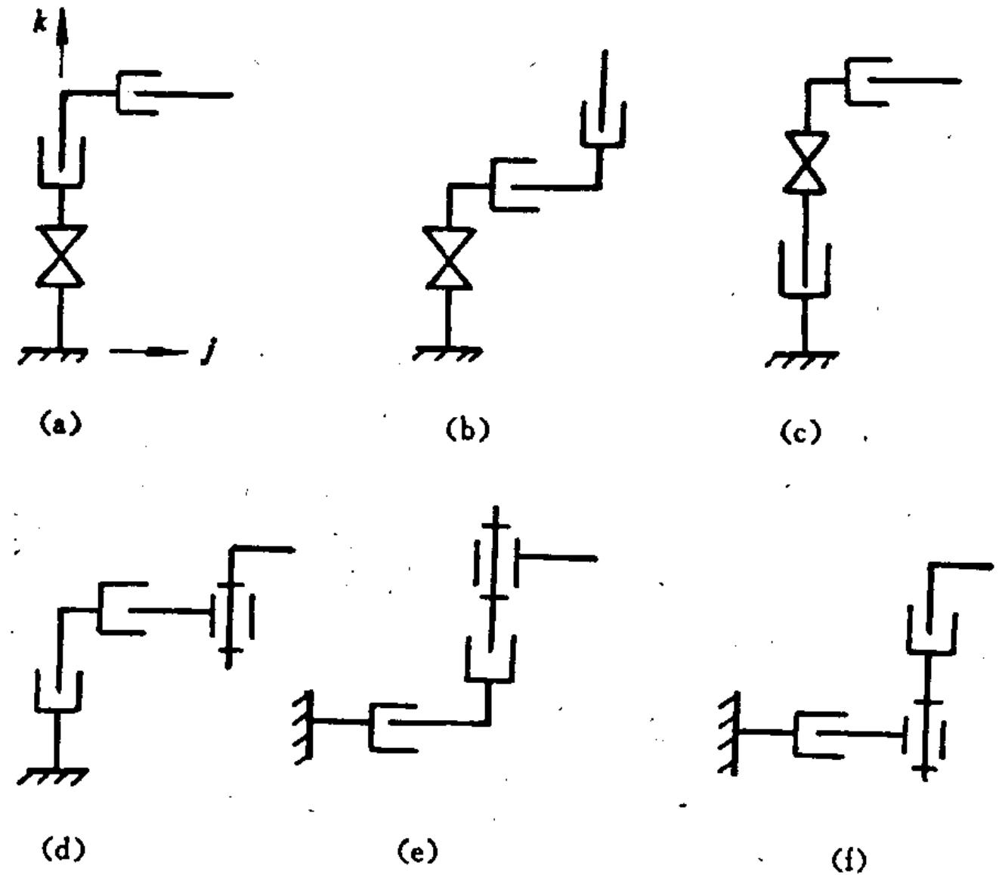

图1-20用2个移动副、1个转动副实现末杆位置

可得图 $1 { - } 2 0  b { \sim } \mathrm { f }$ 的其他5种结构组成。它们都可以实现末杆的任意位置。

如果用 $\mathbf { 1 }$ 个移动副、2个转动副来实现末杆的任意位置,其中2个转动副的轴线既可平行又可垂直。如果采取转动副轴线平行的方式,可组成如图1--21的各开式链,虚位移矩阵与式1-25相似

图1-21用2个转动副、1个移动副实现末杆位置(转动副轴线平行)

如果采取转动副轴线相互垂直的方式,则可组成如图1-22的各开式链,虚位移矩阵与式1-26相似

图 $1 - 3 3$ 用2个转动副、1个移动副实现末杆位置(转动副轴线相互垂直)

$$
\begin{array} { r } { \begin{array} { c c c c c } { \delta \theta _ { e } } & { 0 } & { 1 } & { 0 } \\ { \delta \theta _ { y } } & { 0 } & { 0 } & { 0 } \\ { \delta \theta _ { s } } & { \mathbf { 1 } } & { 0 } & { 0 } \\ { \delta { \boldsymbol { \varepsilon } } _ { x } } & { x _ { 1 } } & { \boldsymbol { { 0 } } } & { 0 } \\ { \delta { \boldsymbol { s } } _ { y } } & { 0 } & { 0 } & { \mathbf { 1 } } \\ { \delta { \boldsymbol { s } } _ { s } } & { 0 } & { z _ { 2 } } & { 0 } \end{array} } \end{array}
$$

这两个矩阵都可通过初等变换化为式1-24,表明可以实现末杆的任意位置。

也可以用3个转动副来实现末杆的位移,通常其中2个转动副的轴线相互垂直以产生不同平面上的独立位移。组成的开式链参见图1-18,虚位移矩阵为

$$
\begin{array} { r } { \begin{array} { c c c c c } { \delta q _ { \mathrm { { 1 } } } } & { \delta q _ { \mathrm { { 2 } } } } & { \delta q _ { \mathrm { { 3 } } } } \\ { \delta \theta _ { \alpha } } & { 0 } & { 1 } & { 0 } \\ { \delta \tilde { B } _ { \nu } } & { 0 } & { 0 } & { 1 } \\ { \delta \theta _ { \epsilon } } & { 1 } & { 0 } & { 0 } \\ { \delta \mathscr { s } _ { \sigma } } & { \mathscr { N } _ { \mathrm { { 1 } } } } & { 0 } & { \mathscr { N } _ { \mathrm { { 3 } } } } \\ { \delta \mathscr { s } _ { \nu } } & { \mathscr { Y } _ { \mathrm { { 1 } } } } & { \mathscr { Y } _ { \mathrm { { 2 } } } } & { 0 } \\ { \delta \mathscr { s } _ { \alpha } } & { 0 } & { \mathscr { z } _ { \mathrm { { 2 } } } } & { \mathscr { z } _ { \mathrm { { 3 } } } } \end{array} } \end{array}
$$

该矩阵与式1-24相似,说明图1-18的开式链不但可以用于实现末杆的任意方向,也可以用于实现末杆的任意位置。在用于实现位置时,要求式1-4中的 $P _ { k \ell }$ 不为零,而用于实现方向时没有这一限制。因此,在用于实现末杆的方向时,图1-18的3个回转轴可交于一点。如果采取其中两轴平行的方式,又可组成如图1-23的各开式链,虚位移矩阵与式1-28相似

图1-23用3个转动副实现末杆位置

$$
\begin{array} { c c c c c } { { } } & { { \mathrm { ~ w _ { 4 1 } ~ } } } & { { \mathrm { ~ w _ { 4 2 } ~ } } } & { { \mathrm { ~ w _ { 4 3 } ~ } } } \\ { { } } & { { } } & { { } } & { { } } & { { } } \\ { { \Delta \theta _ { s } } } & { { 0 } } & { { 0 } } & { { 0 } } & { { } } \\ { { } } & { { } } & { { } } & { { } } & { { } } \\ { { \Delta \theta _ { s } } } & { { 0 } } & { { 0 } } & { { 1 } } & { { } } \\ { { } } & { { } } & { { } } & { { } } & { { } } \\ { { \Delta s _ { s } } } & { { 0 } } & { { 0 } } & { { s _ { 3 } } } & { { } } \\ { { } } & { { } } & { { } } & { { } } & { { y _ { 1 } } } & { { y _ { 2 } } } & { { y _ { 3 } } } \\ { { } } & { { } } & { { } } & { { } } & { { } } & { { } } \\ { { \Delta s _ { s } } } & { { z _ { 1 } } } & { { z _ { 2 } } } & { { 0 } } & { { } } \end{array}
$$

该矩阵与式1-24相似。

以上分别讨论了实现末杆方向和位置的开式链机构。如果要同时实现末杆的6个自由度,可将这些开式链组合起来,得到秩为6的开式链机构。图1-24就是常用的秩为6的开式链机构。

图1-24 实现末杆的位置和方向

# 第二章 数学基础

在进行空间机构的运动分析、力分析及设计计算之前,必须首先熟悉有关数学方法。

要对空间机构运动进行研究,首先要在各构件上固连一坐标系(称为杆件坐标系);然后通过坐标变换的方法,列出有关构件坐标系之间的关系式;最后通过消元方法消去某些中间变量,以求得所关心的未知量。对于自由度为1的机构,未知量的求解最终归结为求解形如 ${ \pmb f } ( { \pmb x } ) = { \bf 0 }$ 的高阶代数方程;对于多自由度机构,未知量的求解归结为求解多元非线性方程组。

本章首先详细介绍回转变换矩阵,然后对一元高阶方程的求解以及非线性方程组的求解作简要介绍。有关消元方法将在第三章中叙述。

# $\ S 2 - 1$ 回转变换矩阵

# 一、点的位置在坐标系中的表示

如图2-1所示,在空间的一个杆件上固连坐标系 $o i j k , \textit { o }$ 为坐标原点, $i , j , k$ 分别为三根坐标轴上的单位向量,可用列矩阵来表示

$$
\pmb { i } = \left[ \begin{array} { c } { { 1 } } \\ { { 0 } } \\ { { 0 } } \end{array} \right] \quad \pmb { j } = \left[ \begin{array} { c } { { 0 } } \\ { { 1 } } \\ { { 0 } } \end{array} \right] \quad \pmb { k } = \left[ \begin{array} { c } { { 0 } } \\ { { 0 } } \\ { { 1 } } \end{array} \right]
$$

杆件上任一点 $P$ 相对于杆件坐标系的位置,可以用它在三根坐标轴上的坐标来决定,表示为 $\mathbfcal { P } ( \mathfrak { v } , \ y , \ z )$ ,也可以用从原点 $\pmb { 0 }$ 指向 $P$ 的位置向量 $\pmb { R }$ 来表示

$$
\pmb { R } = x \pmb { i } + y \pmb { j } + z \pmb { k }
$$

上式可写为矩阵形式

$$
R = [ { \begin{array} { c c c } { i } & { j } & { k } \end{array} } { \left[ \begin{array} { l } { x } \\ { y } \\ { z } \end{array} \right] } .
$$

$$
\mathbf { \beta } = { \left[ \begin{array} { l l l } { \mathbf { \bar { 1 } } } & { 0 } & { 0 } \\ { 0 } & { \mathbf { \bar { 1 } } } & { 0 } \\ { 0 } & { 0 } & { \mathbf { \bar { 1 } } } \end{array} \right] } \quad { \left[ \begin{array} { l } { \mathbf { \bar { x } } } \\ { y } \\ { \mathbf { \bar { z } } } \end{array} \right] }
$$

$$
\begin{array} { r }  \mathbf { \Psi } = [ I ] \begin{array} { r } { \left\{ \begin{array} { l } { x ^ { - } \mathbf { x } ^ { - } } \\ { y } \\ { z } \end{array} \right\} = \left[ \begin{array} { l } { x ^ { - } } \\ { y } \\ { z } \end{array} \right] } \end{array} \end{array}
$$

式中 $[ I ]$ 为 $3 \times 3$ 单位矩阵。由于坐标系是固连于杆件的,因此,杆件上某点相应于该杆件坐标系的坐标与该杆件的运动无关,是常数。

图2-1杆件坐标系

图 $\frac { \sigma } { \sigma } - 3$ 绕 $k _ { \downarrow }$ 轴的旋转

# 二、绕坐标轴回转的变换矩阵

在图2-2中有两个坐标系, $o _ { 1 } i _ { 1 } j _ { 1 } k _ { 1 }$ 为 $\pm$ 系, $O _ { 2 } i _ { 2 } j _ { 2 } k _ { 2 }$ 为2系。设在没有转动之前两系的各轴重合。2系绕 $\pmb { k _ { 1 } }$ 轴旋转 $\theta$ 角后,以1系为参考系来观察2系的位置,有

$$
\left. \begin{array} { c c } { { \dot { \iota } _ { 2 } = \left[ \begin{array} { c } { { \cos \theta ^ { - } } } \\ { { \sin \theta } } \\ { { 0 } } \end{array} \right] } } & { { \dot { \jmath } _ { 2 } = \left[ \begin{array} { c } { { - \sin \theta ^ { - } } } \\ { { \cos \theta } } \\ { { 0 } } \end{array} \right] } } & { { k _ { 2 } = \left[ \begin{array} { c } { { 0 } } \\ { { 0 } } \\ { { 1 } } \end{array} \right] } } \end{array} \right]
$$

它们等于单位向量 $i _ { 2 } , j _ { 2 } , k _ { 2 }$ 分别与 $i _ { 1 } , j _ { 1 } , k _ { 1 }$ 的点积,即

$$
\begin{array} { r l r } & { } & { \dot { i } _ { 2 } = \left\{ \begin{array} { l } { \dot { i } _ { 2 } { \cdot } + \dot { i } _ { 1 } } \\ { \dot { i } _ { 2 } { \cdot } \dot { j } _ { 1 } } \\ { \dot { i } _ { 2 } { \cdot } \dot { k } _ { 1 } } \end{array} \right\} } \\ & { } & { \dot { j } _ { 3 } = \left\{ \begin{array} { l } { \dot { j } _ { 2 } { \cdot } \dot { i } _ { 1 } } \\ { \dot { j } _ { 2 } { \cdot } \dot { j } _ { 1 } } \\ { \dot { j } _ { 2 } { \cdot } \dot { k } _ { 1 } } \end{array} \right\} } \\ & { } & { k _ { 2 } = \left\{ \begin{array} { l } { \dot { k } _ { 2 } { \cdot } \dot { i } _ { 1 } } \\ { \dot { k } _ { 2 } { \cdot } \dot { j } _ { 1 } } \\ { \dot { k } _ { 3 } { \cdot } \dot { k } _ { 1 } } \end{array} \right\} } \end{array}
$$

将式2-4写为矩阵

$$
[ i _ { 2 } \ j _ { 2 } \ k _ { 2 } ] = \left[ \begin{array} { c c c } { { \cos \theta } } & { { - \sin \theta } } & { { 0 } } \\ { { \sin \theta } } & { { \cos \theta } } & { { 0 } } \\ { { 0 } } & { { 0 } } & { { 1 } } \end{array} \right]
$$

上式右边为 $g \times 3$ 方阵,各元素是运动参数 $\theta$ 的函数,表示2系绕参考系(1系)的 $k _ { 1 }$ 轴旋转 $\theta$ 角后的新位置。这个矩阵称为回转变换矩阵,记为 $E ^ { \mu \theta }$ 

$$
E ^ { i \theta } = \left[ \begin{array} { c c c } { \cos \theta } & { - \sin \theta } & { 0 } \\ { \sin \theta } & { \cos \theta } & { 0 } \\ { 0 } & { 0 } & { 1 } \end{array} \right]
$$

由前面的分析得知,回转变换矩阵的各元素等于相应两坐标轴单位向量的点积,也称方向余弦。因而回转变换矩阵也是方向余弦矩阵,其各元素为

$$
\left[ \begin{array} { l l l } { i _ { 1 } { \cdot } i _ { 2 } } & { i _ { 1 } { \cdot } j _ { 2 } } & { i _ { 1 } { \cdot } k _ { 2 } } \\ { j _ { 1 } { \cdot } i _ { 2 } } & { j _ { 1 } { \cdot } j _ { 2 } } & { j _ { 1 } { \cdot } k _ { 2 } } \\ { k _ { 2 } { \cdot } i _ { 2 } } & { k _ { 1 } { \cdot } j _ { 2 } } & { k _ { 1 } { \cdot } k _ { 2 } } \end{array} \right]
$$

式2-6右边乘单位矩阵得

$$
[ i _ { 2 } \begin{array} { c c c } { { j _ { 2 } } } & { { k _ { 2 } } } \end{array} ] = \left[ \begin{array} { c c c } { { \cos \theta } } & { { - \sin \theta } } & { { 0 } } \\ { { \sin \theta } } & { { \cos \theta } } & { { 0 } } \\ { { 0 } } & { { 0 } } & { { 1 } } \end{array} \right] ~ \left[ \begin{array} { c c c } { { 1 } } & { { 0 } } & { { 0 } } \\ { { 0 } } & { { 1 } } & { { 0 } } \\ { { 0 } } & { { 0 } } & { { 1 } } \end{array} \right]
$$

$$
= \left[ \begin{array} { c c c } { \cos \theta } & { - \sin \theta } & { 0 } \\ { \sin \theta } & { \cos \theta } & { 0 } \\ { 0 } & { 0 } & { 1 } \end{array} \right] \quad [ \dot { \imath } _ { 1 } \ j _ { 1 } \ k _ { 1 } ]
$$

上式表明,从 $o _ { 1 } i _ { 1 } j _ { 1 } k _ { 1 }$ 系上观察, $O _ { 2 } \dot { \iota } _ { 2 } \dot { \jmath } _ { 2 } \dot { k } _ { 2 }$ 系的新位置是由没有回转之前的旧位置(即与 $\pmb { i } _ { 1 } \pmb { j } _ { 1 } \pmb { k } _ { 1 }$ 重合的位置)乘以回转变换矩阵而得到的。这一结论不仅适用于坐标轴上的单位向量 $i , j , k .$ 也适用于固连于运动坐标系上的任何向量。例如,跟随杆件坐标系一起回转的某点 $\mathbfcal { P }$ (位置向量 $\pmb { R }$ ,运动后到达新的位置 $P ^ { \prime }$ (从1系上观察,位置向量为 $\mathbf { \delta } \mathbf { R } ^ { \prime }$ ),则

$$
[ { \pmb R } ^ { \prime } ] = { \pmb E } ^ { k \theta } [ { \pmb R } ]
$$

即

$$
{ [ \begin{array} { l } { \omega ^ { \prime } } \\ { ( \begin{array} { l } { [ } \\ { [ } \\ { y ^ { \prime } } \\ { [ } \end{array} ] ) } = { \overrightarrow { E } } ^ { \aleph \theta } { [ \begin{array} { l } { x } \\ { y } \\ { [ } \\ { z } \end{array} ] } } \end{array} ] 
$$

按照与上面类似的方法,可导出绕 $j _ { 1 }$ 轴旋转的回转变换矩阵$E ^ { j \theta }$ 绕 $\dot { \pmb { \mathscr { q } } } _ { 1 }$ 轴旋转的回转变换矩阵 $E ^ { i \theta }$ 

$$
E ^ { j \theta } = \left[ \begin{array} { c c c } { { \cos \theta } } & { { 0 } } & { { \sin \theta } } \\ { { 0 } } & { { { \bf 1 } } } & { { 0 } } \\ { { - \sin \theta } } & { { 0 } } & { { \cos \theta } } \end{array} \right]
$$

$$
E ^ { 1 6 } = \left[ \begin{array} { c c c } { { 1 } } & { { 0 } } & { { 0 } } \\ { { 0 } } & { { \cos \theta } } & { { - \sin \theta } } \\ { { 0 } } & { { \sin \theta } } & { { \cos \theta } } \end{array} \right]
$$

在实际应用中,作者希望上述回转变换矩阵能够由计算机生成。下面程序系用PASOAL语言实现[24,25]。

type ${ \bf a x e s } = ( \mathrm { i } , ~ \mathrm { j } , ~ \mathrm { \bf k } ) ;$ ro $\mathrm { \ t a \ t i o n { = } a r r a y { [ 1 \cdot \circ 3 , ~ 1 \cdot \circ 9 ] ~ o f ~ r e a l ; } }$   
var angle : real; e:rotation; i1, j1: integer;   
procedure rotate (axis: axes; angle: real; var 

e: rotation); 

var l, m, a, b: integer: c, s: real; 

begin for $1 : = 1$ to 3 do begin f $) \mathbf { r } \ \mathbf { m } ; = 1 \ \mathbf { t } 0 \ { \overset { \circ } { \circ } } \ \mathrm { d o } \ { \mathsf { e } } [ 1 , \ \mathbf { m } ] : = 0 ;$ $\begin{array} { r l } & { \quad { \Theta } ( 1 , 1 ) : = 1 \mathrm { ~ e n d } ; } \\ & { \quad \bullet : = \infty \big ( \mathrm { a n g l e } \big ) ; } \\ & { \quad \bullet : = \mathrm { s i n } \{ \mathrm { a n g l e } \} ; } \\ & { \quad \bullet : = \big ( ( \mathrm { c r d } ( \mathrm { a c i s } ) + 1 ) \mathrm { M o d } \ 9 \big ) + 1 ; } \\ & { \quad \bullet : = \big ( \mathrm { a n d } ( \mathrm { a s } \ 8 ) + 1 ; } \\ & { \quad \bullet : = \big ( \mathrm { a } \ \mathrm { M o d } \ 8 \big ) + 1 ; } \\ & { \quad \bullet \big ( \mathrm { a } , \ \mathrm { a } \big ) : = \big \} ; } \\ & { \quad \bullet [ \mathrm { a } , \ \mathrm { b } ] : = - \mathrm { s } ; } \\ & { \quad \bullet [ \mathrm { b } , \ \mathrm { a } ] : = \mathrm { s } ; } \\ & { \quad \bullet [ \mathrm { b } , \ \mathrm { b } ] : = \mathrm { c } . } \end{array}$   
end; 

过程rotate用以生成回转变换矩阵的各元素。开始的双重循环用于给各元素赋初值,使 $E$ 成为单位阵。变量 $a _ { \cdot } b$ 存贮元素的下标,它们随转轴的不同而不同,由含有求模运算的表达式确定。函数ord用于把轴的名称 $i , j , k$ 转变为轴的序号0、1、2。变量angle变示转角 $\theta$ ,取 $\theta = 1 5 ^ { \circ }$ 。编制主程序如下:

begin 

$$
\begin{array} { l } { \mathrm { a n g l e : = 3 . 1 4 1 5 9 * 1 5 / 1 8 0 _ { \mathrm { i } } } } \\ { \mathrm { \Delta r _ { 0 t a t e } ( j , \ a n g l e , \ e ) ; } } \end{array}
$$

for i1: $\approx 1$ to 3 do 

for j1: $= 1$ to 3 writeln (e[i1,j1]) end。 

运行该主程序可得 $E ^ { j \theta }$ 的各元素 $\displaystyle e _ { 1 1 } = 0 . 9 6 5 9$ , $e _ { 1 2 } = 0$ , $e _ { 1 3 } = =$ 0.2588, $e _ { 2 1 } = 0 , e _ { 2 2 } = 1 , e _ { 2 3 } = 0 , e _ { 3 1 } = - 0 . 2 5 8 8 , e _ { 3 2 } = 0 , e _ { 3 3 } = \ 1$ $0 . 9 6 5 9 _ { \circ }$ 把主程序的第三行改为 $\mathtt { r o t a t e ( i , \ a n g l e , \ e ) }$ ,可得 $E ^ { i \theta }$ 的各元素;若改为 $\mathbf { r o t a t e ( k , a n g l e , \ e ) }$ ,可得 $E ^ { \tilde { \imath } \tilde { \imath } \tilde { \theta } }$ 的各元素。

可以进一步用计算机求解某向量 $\pmb { R }$ 绕坐标轴旋转到达 $\pmb { R ^ { \prime } }$ 位置的坐标。设 ${ \pmb R } = ( { \bf 1 } , \ { \bf 2 } , \ { \bf 3 } )$ ,绕 $\pmb { k }$ 轴旋转 $3 0 ^ { \circ }$ 到达 $\pmb { R } ^ { \prime }$ 。编制主程序如下: $\mathbf { \mathbf { t y p e } \nabla e c t o r = a r r a y [ 1 \cdot \cdot 3 ] \ o f \ r e a l ; }$ var p: vector;begin$\begin{array} { r } { { \bf p } [ { \bf 1 } ] = { \bf 1 } ; } \\ { { \bf p } [ { \bf 2 } ] : = 2 ; } \\ { { \bf p } [ { \bf 9 } ] : = 0 ; } \end{array}$ angle: $= 3$ .14159\*30/180;rotate(k, angle, e);$\bf { m u l t } ( e , \ p ) ;$ for i1: ${ \bf \Psi } = 1$ to 9 do writeln(p[i1])end。

过程mult完成 $3 \times 3$ 矩阵 $_ { \pmb { \theta } }$ 乘向量 ${ \pmb p } ( { \mathbf 3 }$ 行 $\textbf { 1 }$ 列矩阵)的运算,结果存在数组 $\mathbf { p }$ 中。

# 三、绕任意轴回转的变换矩阵

设参考坐标系为 $o i j k$ ,有一通过原点的任意轴 $\pmb { w }$ ,其单位向量 ${ \pmb w } = ( \lambda , ~ \mu , ~ \nu ) , ~ \lambda = { \pmb w } \cdot { \pmb i } , ~ { \mu } = { \pmb w } \cdot { \pmb j } , ~ { \nu } = { \pmb w } \cdot { \pmb k } _ { 0 }$ 某向量 $\pmb { R }$ 的初始位置为 $( x , y , z )$ ,绕 $\pmb { w }$ 轴旋转 $\theta$ 角后到达新位置 $\mathbf { { \mathit { R } } ^ { \prime } } = \left( { x ^ { \prime } , \ y ^ { \prime } } \right) ,$ $z ^ { \prime } )$ ,见图2-3。根据前面的分析,有

$$
\pmb { R ^ { \prime } } { = } \left[ \begin{array} { l } { { \pmb { x ^ { \prime } } } } \\ { { \pmb { y ^ { \prime } } } } \\ { { \pmb { z ^ { \prime } } } } \end{array} \right] { = } \pmb { \mathbb { E } ^ { \pmb { \omega } \pmb \theta } } \left[ \begin{array} { l } { { \pmb x } } \\ { { \pmb y } } \\ { { \pmb z } } \end{array} \right] { = } \pmb { E ^ { \nu \pmb \theta } } ( \pmb { R } )
$$

式中 $E ^ { w \theta }$ 表示绕任意轴 $\pmb { w }$ 回转 $\theta$ 角的回转变换矩阵。为了求得$E _ { i } ^ { \pi \theta }$ ,可将绕任意轴的转动转化为绕坐标轴的转动,以便利用式2-7、2-11和2-12来求得 $E ^ { w \theta }$ 

任意轴 $\pmb { w }$ 的位置可以看作由 $\overrightarrow { A O }$ 轴的位置经两次绕坐标轴的转动而获得。如图2-4所示,将 $\pmb { k }$ 轴绕 $j$ 轴转 $\pmb { \alpha }$ 角至 $k ^ { \prime }$ 位置,此时

图2-3绕任意轴 $\pmb { w }$ 的旋转

图2-4 $\pmb { w }$ 轴的获得

$k ^ { \prime }$ 仍在 $o k i$ 平面上;再使 $k ^ { \prime }$ 轴绕 $k$ 轴转 $\beta$ 角即可到达 $\pmb { w }$ 轴的位置。用回转变换矩阵表达这一过程,有

$$
{ \pmb w } = \left[ \begin{array} { c } { { \hat { \pmb \lambda } } } \\ { { \pmb \mu } } \\ { { \pmb \nu } } \end{array} \right] = \vec { E } ^ { k \beta } \vec { E } ^ { j \alpha } ( { \pmb k } )
$$

$$
\begin{array}{c} { \begin{array} { r l } { \mathbf { \Lambda } } & { = { \left[ \begin{array} { l l l } { \cos \beta } & { - \sin \beta } & { 0 } \\ { \sin \beta } & { \cos \beta } & { 0 } \\ { 0 } & { 0 } & { \mathbf { \downarrow } } \end{array} \right] } { \left[ \begin{array} { l l l } { \cos \alpha } & { 0 } & { \sin \alpha } \\ { 0 } & { \mathbf { 1 } } & { 0 } \\ { - \sin \alpha } & { 0 } & { \cos \alpha } \end{array} \right] } { \left[ \begin{array} { l } { 0 } \\ { 0 } \\ { \mathbf { \downarrow } } \end{array} \right] } } \\ & { = { \left[ \begin{array} { l l l } { \cos \beta } & { \sin \alpha } \\ { \sin \beta } & { \sin \alpha } \\ { \cos \alpha } & { } \end{array} \right] } } \end{array} } \end{array} 
$$

按对应元素相等的原则可解得

$$
\left. \begin{array} { c } { { \beta { = } { \bf t g - 1 } { \left( \frac { \mu } { \lambda } \right) } } } \\ { { \alpha { = } { \cos ^ { - 1 } } { \left( \nu \right) } } } \end{array} \right\}
$$

下面考虑将某一矢量 $\pmb { R }$ 绕 $\pmb { w }$ 轴转到新位置 $\pmb { R } ^ { \prime }$ 的情况。首先固定 $\pmb { R }$ 与 $\pmb { w }$ 的相对位置,将它们一起绕 $\pmb { k }$ 轴转一 $\beta$ 角使 $\pmb { w }$ 到达$k ^ { \prime }$ 的位置,再绕 $j$ 轴转 $\sim \pmb { \alpha }$ 角使 $\pmb { w }$ 到达与 $\pi$ 轴重合的位置。然后将 $\pmb { R }$ 绕 $\pmb { w }$ 轴即 $\gamma$ 轴转 $\theta$ 角到达 $\pmb { R } ^ { n }$ ,再将 $\pmb { R } ^ { \prime \prime }$ 与 $\pmb { w }$ 的相对位置固定,将它们一起先绕 $j$ 轴转 $\pmb { \alpha }$ 角,再绕 $\pmb { k }$ 轴转 $\beta$ 角,使 $\pmb { w }$ 回到原来的位置,此时 $\mathbf { \delta } \mathbf { R } ^ { n }$ 也到达 $\pmb { R ^ { \prime } }$ 的位置。上述一系列旋转都是绕坐标轴的旋转,因此可用绕坐标轴回转的变换矩阵表示,即

$$
\pmb { R } ^ { \prime } = E ^ { \ast \theta } ( \pmb { R } ) = E ^ { \ast \beta } E ^ { j \alpha } E ^ { \ast \theta } E ^ { ; ( - \alpha ) } E ^ { \ast ( - \beta ) } ( \pmb { R } )
$$

有

$$
\begin{array} { r } { E ^ { \nu \theta } = E ^ { \nu \beta } E ^ { : \alpha } E ^ { \gamma \delta \theta } E ^ { : ( - \alpha ) } E ^ { \gamma k ( - \beta ) } } \end{array}
$$

把上式右边的5个回转矩阵相乘,得

$$
E ^ { \nu \theta } = \left[ \begin{array} { r r } { \cos \theta + \widehat { \sf x } ^ { 2 } ( 1 - \cos \theta ) } & { \lambda \mu ( 1 - \cos \theta ) - \nu \sin \theta } \\ { \lambda \mu ( 1 - \cos \theta ) + \nu \sin \theta } & { \cos \theta + \mu ^ { 2 } ( 1 - \cos \theta ) } \\ { \nu \widehat { \lambda } ( 1 - \cos \theta ) - \mu \sin \theta } & { \mu \nu ( 1 - \cos \theta ) + \lambda \sin \theta } \end{array} \right]
$$

$$
\left. \begin{array} { c } { { \nu \lambda ( 1 - \cos \theta ) + \mu \sin \theta } } \\ { { \mu \nu ( 1 - \cos \theta ) - \lambda \sin \theta } } \\ { { \cos \theta + \nu ^ { 2 } ( 1 - \cos \theta ) } } \end{array} \right\}
$$

${ \cal E } ^ { u \theta }$ 是绕任意轴 $\pmb { w }$ 的回转变换矩阵,其中各元素也等于回转前后相应两坐标轴单位向量的点积。

当用式2-16生成 $E ^ { u \theta }$ 的各元素时,先输入 $\pmb { w }$ 的各分量,利用式2-15算出 $\beta$ 和 $\pmb { \alpha }$ ,再调用过程rotate来生成各回转变换矩阵,并将它们相乘,最终得到 $E ^ { u \theta }$ 。这样做需要调用2次反三角函数、5次rotate过程及4次 $\Im \times \Im$ 矩阵相乘,颇费机时。为了节省机时,可利用式2--17编制如下的过程:

$\begin{array} { r l } & { \mathrm { p r o c e d u r e ~ r o t a w } \left( \mathrm { w } : \mathrm { v e c t o r } ; \mathrm { ~ a n g l e } ; \mathrm { ~ r o a l } ; \right. } \\ & { \mathrm { v a r } \quad \mathrm { e } : \mathrm { r o t a t i o n } ) ; } \\ & { \mathrm { v a r } \quad \mathrm { \vartheta _ \ast ~ c . ~ c l } , \mathrm { ~ a } , \mathrm { b } : \mathrm { r e a l } ; } \\ & { \mathrm { ~ i } , \mathrm { ~ j } , \mathrm { ~ k } : \mathrm { i n t e g e r } ; } \end{array}$   
begin   
$\begin{array} { r l } & { \mathfrak { S } { : = } \sin \left( \mathrm { a n g l e } \right) ; } \\ & { \mathfrak { c } { : = } \cos \left( \mathrm { a n g l e } \right) ; } \\ & { \mathfrak { c } \mathfrak { l } { : = } \mathrm { 1 - c } ; } \end{array}$   
for $\mathrm { i } { : = } 1 \ \mathrm { t o } \ \vartheta \ \mathrm { d o } \ \mathsf { e } [ \mathrm { i } , \ \mathrm { i } ] { : = } \mathsf { c } + \mathrm { w } [ \mathrm { i } ] \ast \mathrm { w } [ \mathrm { i } ] \ast \mathrm { c } \mathrm { i } ;$   
for $i = 1$ to 8 do begin $\begin{array} { l } { \displaystyle \mathrm { j } \colon = \left( \mathrm { i } \mathrm { ~ M o d ~ } \mathfrak { s } \right) + 1 ; } \\ { \displaystyle \mathrm { k } _ { \mathfrak { s } } = \left( \mathrm { j } \mathrm { ~ M o d ~ } \mathfrak { s } \right) + 1 ; } \end{array}$ 

$\begin{array} { r l } & { \mathbf { a } : = \boldsymbol { \mathrm { w } } \left[ \mathrm { i } \right] \ast \boldsymbol { \mathrm { w } } \left[ \mathrm { j } \right] \ast \mathrm { c } \mathrm { 1 } ; } \\ & { \mathbf { b } : = \boldsymbol { \mathrm { w } } \left[ \mathbf { k } \right] \ast \mathbf { s } ; } \end{array}$ ${ \bf \sf e } \left[ { \bf \bar { i } } , \ { \bf \bar { j } } \right] : = { \bf a } - { \bf b } ;$ $\mathbf { e } [ { \mathbf { j } } , { \mathbf { \sigma } } { \mathbf { i } } ] { \mathbf { : } } = { \mathbf { a } } + { \mathbf { b } } \ \mathbf { e n d }$ 

end; 

程序的第一个循环给对角线上的各元素赋值,第二个循环给其余的元素赋值。例如,取W=[0.5,0.5,0.702], $\theta = 4 5 ^ { \circ }$ ,可编制如下主程序:

var v: vector th: real; d: rotation; i, j: integer;   
begin $\begin{array} { c } { { \nu \left[ 1 \right] : = 0 . 5 } } \\ { { \nu \left[ 2 \right] : = 0 . 5 } } \end{array}$ ${ \pmb \nu } [ \mathbf { 3 } ] : = 0 . 7 \mathbf { 0 } 2$ th: $\cos 3$ .14159\*45/180; rotatew $( \nu , \ t h , \ d )$ ; for $\mathbf { j } \mathbf { : = } \mathbf { 1 } \ \mathbf { t } \mathbf { ) } \ \mathbf { 3 }$ do for j: =1 to 3 do writeln(d[i, j]);   
end. 

运行该主程序将输出 $E ^ { u \theta }$ 的各元素。若有向量 $\scriptstyle { { \cal R } } = \ ( 1 , \ 2 ,$ 3),绕 $\pmb { \mathcal { W } }$ 转 $4 5 ^ { \circ }$ 到达新的位置,可编制如下主程序输出新位置的坐标:

begin 

$$
\begin{array} { r l } & { \mathbf { p } [ 1 ] : = 1 ; } \\ & { \mathbf { p } [ 2 ] : = 2 ; } \\ & { \mathbf { p } [ 8 ] : = 9 ; } \\ & { \nu [ 1 ] : = 0 . 5 } \\ & { \nu [ 2 ] : = 0 . 5 } \end{array}
$$

${ \pmb { \nu } } \left[ \mathbf { 3 } \right] : = 0 . 7 0 2$ th: $= 3 . 1 4 1 5 9 * 4 5 / 1 8 0 ;$ rotate w $( \nu , \ t h , \ d )$ ; mult $( \mathrm { d } , \mathrm { ~ \bf ~ p ~ } )$ ; for $\mathrm { i } : = 1$ to 3 do writeln(p[i]); end. 

运行该主程序将输出 $\pmb R$ 旋转后的坐标。

# 四、绕定点转动的回转变换矩阵

图2-5所示为两坐标系绕公共原点作定点任意转动的

图 $\frac { 5 } { 8 } - 5$ 定点转动

情况。2系 $o i _ { 2 } j _ { 2 } \bar { n } _ { 2 }$ 是 $\textbf { 1 }$ 系$o i _ { 1 } j _ { 1 } k _ { 1 }$ 绕公共原点 $\pmb { 0 }$ 作定点任意转动后到达的位置。为了利用前述的绕坐标轴回转的变换矩阵来表示绕定点转动的坐标变换,可使坐标系1经若干次绕坐标轴的转动而到达坐标系2的位置。在一个坐标系中,只要其中两根轴的位置确定,第三根轴的位置即可根据右手定则确定。因此,可以仅考虑

$i , k$ 两轴的转动,并使 $i _ { 1 , \mathrm { ~ } } k _ { 1 }$ 轴经如下三次转动后分别到达 $i _ { 2 } , k _ { 2 }$ 的位置。

第一次转动:设 $k _ { 1 }$ 与 $k _ { 2 }$ 的公垂线为 $o N _ { \mathrm { ~ 1 ~ o ~ } } \mathrm { ~ \bf ~ I ~ }$ 系绕 $k _ { 1 }$ 轴旋转$\theta$ 角,使 $\dot { \iota } _ { 1 }$ 轴到达 $o N _ { 1 }$ 位置,此时 $j _ { 1 }$ 到达 $N _ { 2 }$ 位置。

第二次转动:由于 $o N _ { 1 }$ 为 $k _ { 1 }$ 与 $k _ { 2 }$ 的公垂线,绕 $o N _ { 1 }$ (即 $\dot { \iota } _ { 1 }$ 轴)旋转 $\phi$ 角可使 $k _ { 1 }$ 轴到达 $k _ { 2 }$ 位置,此时 $j _ { 1 }$ 到达 $\pmb { N _ { 3 } }$ 位置。

第三次转动:绕 $k _ { 2 }$ 轴旋转 $\psi$ 角最终使 $\dot { \iota } _ { 1 }$ 轴从 $\smash {  { N _ { \perp } } }$ 位置到达$\dot { \pmb { \mathscr { q } } } _ { 2 }$ 位置,此时 $j _ { 1 }$ 到达 $j _ { 2 }$ 位置。

以 $\partial \pmb { i } _ { 1 } \pmb { j } _ { 1 } \pmb { k } _ { 1 }$ 为参考系,运动坐标系的初始位置为 $\mathbf { \hat { \varepsilon } } ^ { i ( 0 ) } = [ \mathbf { 1 } \ \mathbf { 0 } \ \mathbf { 0 } ] \ \mathbf { \hat { \varepsilon } } ,$ $\pmb { j } ^ { ( 0 ) } = [ 0 \quad \pmb { 1 } \quad 0 ] ^ { \mathrm { T } } , \pmb { k } ^ { ( 0 ) } = [ 0 \quad 0 \quad \pmb { 1 } ] ^ { \mathrm { T } } \circ$ 第一次转动后到达 $\mathbf { i } ^ { ( 1 ) } =$ $N _ { 1 } , \ j ^ { ( 1 ) } = N _ { 2 } , \ k ^ { ( 1 ) } = k ^ { ( 0 ) }$ 位置,有

$$
[ \acute { \pmb { i } } ^ { ( 1 ) } \quad \pmb { j } ^ { ( 1 ) } \quad \pmb { k } ^ { ( 1 ) } ] = E ^ { k \theta } [ \acute { \pmb { i } } ^ { ( 0 ) } \quad \pmb { j } ^ { ( 0 ) } \quad \pmb { k } ^ { ( 0 ) } ] = E ^ { k \theta } [ I ]
$$

第二次转动使 $i ^ { ( 1 ) } , \ j ^ { ( 1 ) } , k ^ { ( 1 ) }$ 到达 $\pmb { i } ^ { ( 2 ) } = \pmb { i } ^ { ( 2 ) }$ , $j ^ { ( 2 ) } = N _ { 3 }$ , ${ \pmb k } ^ { ( 2 ) } = { \pmb k } _ { 2 }$ 位置上,转轴为 $\mathbf { \pmb { i } } ^ { \{ 1 \} }$ 。据式2-16,有

$$
E ^ { ; ( 1 ) \theta } = E ^ { \chi \theta } E ^ { ; \psi } E ^ { \chi ( - \theta ) }
$$

故有

$$
\begin{array} { r c l } { { [ i ^ { ( 2 ) } } } & { { { \bf \nabla } j ^ { ( 2 ) } } } & { { { \bf k } ^ { ( 2 ) } ] = \vec { \cal E } ^ { : : 0 } \vec { \cal E } ^ { \cup : \phi } \vec { \cal E } ^ { \mathrm { L } ( - \theta ) } [ \dot { \bf \vec { \bf \xi } } ^ { ( 1 ) } } & { { \bf j ^ { ( 1 ) } } } & { { \bf k } ^ { ( 1 ) } ] } } \\ { { } } & { { } } & { { = \vec { \cal E } ^ { \nu \theta } \vec { \cal E } ^ { \cup \phi } \vec { \cal E } ^ { \mathrm { L } ( - \theta ) } \vec { \cal E } ^ { \mathrm { k } \theta } [ { \cal I } ] } } \end{array}
$$

式中 $E _ { i } ^ { \hbar \cdot ( - \theta ) } E _ { i } ^ { \hbar \cdot \theta }$ 为先后两次相反方向的转动,转角相同,转动效果抵销。因此

$$
[ \acute { a } ^ { ( 2 ) } \quad \acute { \pmb { j } } ^ { ( 2 ) } \quad \acute { \pmb { k } } ^ { ( 2 ) } ] = E ^ { \acute { \kappa } \theta } \dot { E } ^ { \acute { \iota } \phi } [ I ]
$$

第三次转动使 $\pmb { i } ^ { ( 2 ) } , \pmb { j } ^ { ( 2 ) } , \pmb { k } ^ { ( 2 ) }$ 到达 $\pmb { \dot { \hat { \imath } } } ^ { ( 3 ) } = \pmb { \dot { \hat { \imath } } } _ { 2 }$ , $j ^ { ( 3 ) } { = } j _ { 2 }$ , ${ \pmb k } ^ { ( 3 ) } = { \pmb k } ^ { ( 2 ) }$ 位置,转轴为 $k ^ { ( 2 ) }$ ,有

$$
E ^ { \mathrm { i } ^ { 3 } \mathrm { e } ^ { 4 \phi } \phi } = E ^ { \chi \theta } E ^ { \mathrm { i } \phi } E ^ { \chi \psi } E ^ { \chi ( - \phi ) } E ^ { \mathrm { i } ^ { 3 } \chi ( - \theta ) }
$$

故有

$$
\begin{array} { r l } { [ \dot { \imath } ^ { ( 3 ) } \quad \dot { J } ^ { ( 3 ) } } & { k ^ { ( 3 ) } ] = \check { E } ^ { \kappa \theta } E ^ { ( \ast } E ^ { \ast \psi } E ^ { \ast ( - \phi ) } \check { E } ^ { \kappa ( - \theta ) } [ \dot { \hat { z } } ^ { ( 2 ) } \quad \dot { J } ^ { ( 2 ) } \quad k ^ { ( 2 ) } ] } \\ & { \quad \quad \quad = \check { E } ^ { \kappa \theta } E ^ { \ast \phi } E ^ { \ast \psi } E ^ { \ast ( - \phi ) } \check { E } ^ { \kappa ( - \theta ) } E ^ { \kappa \theta } E ^ { \ast \phi } [ I ] } \end{array}
$$

上式最右边的四个转动相互抵销,故得

$$
[ \acute { \imath } ^ { ( 3 ) } \quad \acute { \jmath } ^ { ( 3 ) } \quad \acute { k } ^ { ( 3 ) } ] = \overrightarrow { E } ^ { \mathrm { i } \acute { \imath } \theta } E ^ { \mathrm { i } \acute { \imath } \acute { \imath } \psi } [ T ]
$$

即

$$
[ i _ { 2 } \quad { \dot { j } } _ { 2 } \quad k _ { 2 } ] = E ^ { \hbar \theta } E ^ { i \phi } E ^ { i \phi } [ i _ { 1 } \quad { \dot { j } } _ { 1 } \quad k _ { 1 } ]
$$

令 $E$ 表示绕定点转动的回转变换矩阵,有

$$
E / = E ^ { k \theta } E ^ { 1 \phi } E ^ { 3 \psi }
$$

式中 $\theta , \phi , \psi$ 称为定点转动的三个欧拉角。

比较式2-16与式2-19,发现它们转动的次序与回转变换矩阵相乘的顺序刚好相反。式2-16的每一个转动都是相对基础坐标系某轴的转动,回转变换矩阵按回转运动的先后次序依次左乘。而式2-19的各个转动则是绕运动坐标系各轴的,在这种情况下,回转变换矩阵按回转运动的先后次序依次右乘。

如果知道了三个欧拉角,可用如下过程求得绕定点转动的回转变换矩阵:

procedure rotateola(a1, a2, a3: real;   
var e: rotation);   
var ee: rotation;   
begin rotate(k,a1,e); rotate(i,a2, e); mult8(e, ee); rotate(k,a3, ee); mult9(e,ee)   
end; 

变量a1,a2,a3表示 $\theta , \phi , \psi$ 三个欧拉角,过程mult9完成两个 $3 \times 3$ 矩阵的相乘,结果存在数组 $\boldsymbol { \Theta }$ 中。若取 $\theta = 1 0 ^ { \circ }$ , $\phi =$ $2 0 ^ { \circ }$ , $\psi = 3 0 ^ { \circ }$ ,可通过运行如下主程序来生成回转变换矩阵 $E$ :

var a, a1,a2,a3: real;   
const $\mathbf { P I } = 3$ .14159;   
begin $\mathbf { a } ; = \mathbf { P I } / 1 8 0 ;$ $\mathbf { a } \mathbf { 1 } \mathbf { : } = \mathbf { a } \pm \mathbf { 1 0 } \mathbf { : }$ $\mathbf { a } 2 { : = } \bar { \mathbf { a } } { * } 2 0 $ $\mathbf { a 3 } { \mathrm { : } } = \mathbf { a } * \mathbf { 3 0 } { \mathrm { ; } }$ rotateola(a1, a2,a3, e); for $i \div 1$ to 3do for $j : = 1$ to 3 do writeln(e[i, j]);   
end. 

# 五、不共原点的坐标变换

如图2-6所示,坐标系 $o _ { 2 } i _ { 2 } j _ { 2 } k _ { 2 }$ 对坐标系 $o _ { 1 } i _ { 1 } j _ { 1 } k _ { 1 }$ 不仅有相对转动,而且有相对移动。用 $\mathbf { R _ { 0 } }$ 表示由 ${ \pmb O } _ { 1 }$ 指向 ${ \pmb O } _ { \pmb { 2 } }$ 的向量, $\mathbf { R _ { 0 } } =$ $0 _ { 1 } 0 _ { 2 } = [ { \boldsymbol { \mathscr { x } } } _ { 0 } \quad { \boldsymbol { \mathscr { y } } } _ { 0 } \quad z _ { 0 } ] ^ { \mathrm { ~ T ~ } } .$ ,对于空间某点 $P$ ,它在 $\pmb { 1 }$ 系中的坐标为

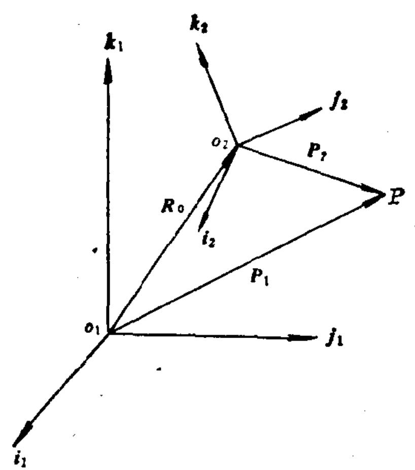

图2-6不共原点的坐标变换

${ \mathfrak { o } } _ { 1 } , { \mathfrak { y } } _ { 1 } , { \mathfrak { z } } _ { 1 } ,$ 在2系中的坐标为 $x _ { 2 } , y _ { 2 } , z _ { 2 0 }$ 有

$$
\pmb { P } _ { 1 } { = } \left[ \begin{array} { l } { x _ { 1 } } \\ { y _ { 1 } } \\ { z _ { 1 } } \end{array} \right] { = } \pmb { R } _ { 0 } + \pmb { E } \left[ \begin{array} { l } { x _ { 2 } } \\ { y _ { 2 } } \\ { z _ { 2 } } \end{array} \right] { = } \pmb { R } _ { 0 } + \pmb { E } ( \pmb { P } _ { 2 } )
$$

式中 $\mathcal { E }$ 表示相对转动的变换矩阵, $\pmb { R _ { 0 } }$ 表示相对移动向量。

若已知 $E , R _ { 0 }$ 和 ${ \pmb P } _ { 2 }$ ,可通过如下过程得到 $\pmb { P _ { 1 } }$ :procedure transrotate(e: rotation; rO:vector; Var p: vector);vari: integer;begin: $\bf { m u l t } ( e , \omega _ { p } )$ ;for $\mathbf { i } { : = } 1 \ \mathbf { t } 0 \ \mathbf { 3 } \ \mathrm { d } \mathbf { 0 } \ \mathbf { p } [ \mathrm { i } ] { : = } \mathbf { p } [ \mathrm { i } ] + \mathbf { r } 0 [ \mathrm { i } ]$ end;

若取 ${ \pmb { P _ { 2 } } } = ( { \bf 1 } , \ { \bf 2 } , \ { \bf 3 } )$ , $\pmb { R _ { 0 } } = ( 4 , \ 5 , \ 6 ) , \ \pmb { \mathcal { E } }$ 与上例相同,可编制如下主程序计算 ${ \pmb P } _ { 1 }$ :

var rr: vector; begin $\begin{array} { r } { \mathbf { a } { : } = \mathbf { P I } / 1 8 0 } \\ { \mathbf { a } \mathbf { 1 } { : } = \mathbf { a } { * } \mathbf { 1 } 0 ; } \\ { \mathbf { a } 2 { : } = \mathbf { a } { * } 2 0 ; } \\ { \mathbf { a } 9 { : } = \mathbf { a } { * } 9 0 ; } \end{array}$ 

rotateola(al,a2,a3,e); p[1]: =1; $\mathfrak { p } [ 2 ] : = 2 ;$ $\mathbb { p } \left\{ \mathfrak { s } \right\} : \approx \mathfrak { s } ,$ $\operatorname { r r } [ 1 ] : = 4 ;$ $\operatorname { r r } \left\{ 2 \right\} : = 5 ;$ $\displaystyle \operatorname { r r } \left[ \mathbf { \vec { \mathcal { S } } } \right] : = \mathbf { \vec { \mathcal { 6 } } } ;$ transrotate $\left( \mathsf { e } , \mathsf { r r } , \mathsf { p } \right)$ ; for i:=1 to 3 do writeln(rr[i]) nd. 

# 六、齐次变换

在某些场合,可用一个 $4 \times 4$ 变换矩阵来表达不共原点的坐标变换 $[ 1 9 , 2 0 , 2 1 , 2 3 ] _ { 0 }$ ,设在式2-20中

$$
E = { \left[ \begin{array} { l l l } { e _ { 1 1 } } & { e _ { \perp 2 } } & { e _ { \perp 3 } } \\ { e _ { 2 1 } } & { e _ { 2 2 } } & { e _ { \perp 3 } } \\ { e _ { 3 1 } } & { e _ { 3 2 } } & { e _ { 3 3 } } \end{array} \right] }
$$

展开式2-20得

$$
\left. \begin{array} { l l } { x _ { 1 } = x _ { 0 } + e _ { : : , x _ { 2 } } + e _ { : , 2 } y _ { 2 } + e _ { : , 3 } z _ { : } } \\ {  } \\ { y _ { 1 } = y _ { 0 } + e _ { 2 1 } x _ { 2 } + 3 z _ { 2 } y _ { 2 } + e _ { 2 : } z _ { 2 } } \\ {  } \\ { z _ { 1 } = z _ { 3 } + e _ { 3 1 } x _ { 2 } + e _ { 3 2 } y _ { 3 } + e _ { 3 3 } z _ { 2 } } \end{array} \right\}
$$

将式2-21写成矩阵,有

$$
\left[ \begin{array} { l } { \boldsymbol { x } _ { 1 } } \\ { \boldsymbol { y } _ { 1 } } \\ { \boldsymbol { z } _ { 2 } } \\ { \boldsymbol { z } _ { 3 } } \\ { \mathbf { 1 } } \end{array} \right] ^ { - } \left[ \begin{array} { l l l l l } { e _ { 1 1 } } & { e _ { 1 2 } } & { e _ { 1 3 } } & { \boldsymbol { x } _ { 0 } } \\ { e _ { 2 } } & { e _ { 2 2 } } & { e _ { 2 3 } } & { \boldsymbol { y } _ { 0 } } \\ { e _ { 3 } } & { e _ { 3 2 } } & { e _ { 3 3 } } & { \boldsymbol { z } _ { 0 } } \\ { 0 } & { 0 } & { 0 } & { \mathbf { 1 } } \end{array} \right] \left[ \begin{array} { l } { \boldsymbol { x } _ { 2 } } \\ { \boldsymbol { y } _ { 2 } } \\ { \boldsymbol { z } _ { 2 } } \\ { \boldsymbol { 1 } } \end{array} \right] = M _ { 1 2 } \left[ \begin{array} { l } { \boldsymbol { x } _ { 2 } } \\ { \boldsymbol { y } _ { 2 } } \\ { \boldsymbol { z } _ { 2 } } \\ { \boldsymbol { 1 } } \end{array} \right]
$$

展开式2-22可得式2-21的三个式子及恒等式 $1 = 1$ ,因而式2-22与式2-20是完全等价的。式2-22称为齐次变换,变换矩阵 $M _ { 1 2 }$ 为$4 \times 4$ 方阵,结构为

$$
M _ { 1 2 } = \left[ \begin{array} { c c c c } { { \ } } & { { \left[ E \right] } } & { { \vdots \ \left[ R _ { 0 } \right] } } \\ { { \ldots \ } } & { { \ldots \ldots } } & { { \ldots \ldots } } \\ { { 0 } } & { { 0 } } & { { 0 \left[ \begin{array} { l } { { 1 } } \end{array} \right] } } \end{array} \right]
$$

式中 $[ E ]$ 为 $3 \times 3$ 回转变换矩阵, $[ R _ { 0 } ]$ 表示平移向量坐标列阵。可用如下过程来生成齐次变换矩阵的各元素:

type $\mathrm { m 4 = a r r a y [ 1 \cdot \bullet 4 , ~ 1 \bullet \bullet 4 ] ~ o f ~ r e a l ; }$   
procedure homo( $\bf \tilde { r 0 }$ : vector; e: rotation; Var m: m4);   
var i, j: integer;   
begin for i:=1 to 3 do $\begin{array} { r l } { \mathrm { f o r } } & { { } { \bf j } { : } = 1 \ \mathrm { t o } \ \boldsymbol { \Xi } \ \mathrm { d o } \ \mathrm { m } [ \mathrm { i } , \ \mathrm { j } ] { : } = \mathrm { e } [ \mathrm { i } , \ \mathrm { j } ] ; } \end{array}$ for i:=1 to 8 do begin $\mathfrak { e } [ \mathrm { i } , \ \mathfrak { L } ] \colon = \mathbf { r } \mathbf { 0 } [ \mathrm { i } ] ;$ $\begin{array} { c } { \mathsf { e } [ 4 , \mathrm { i } ] : = 0 \ \mathrm { e n d } } \\ { [ 4 , \ 4 ] : = 1 } \end{array}$   
end; 

取 $\mathbf { P } _ { \mathrm { 2 } } , \ \mathbf { R } _ { 0 }$ , $E$ 同上例,使用齐次变换求解 $\pmb { P _ { 1 } }$ 的主程序如下:type homovector=array[1·.4] of real; var mm: m4;hp: homovector;begin$\mathbf { a } ; = \mathbf { P I } / 1 8 0 ;$ al: = a\*10;$\mathbf { a 2 } \colon = \mathbf { a } * 2 0 ;$ $\mathbf { a } \mathbf { 3 } ; \mathbf { = a } \mathbf { * } \mathbf { 3 0 } ;$ rotateola(al,a2,a3, e);for i: =1 to 8 do hp[i]: =i;$\mathbf { \lambda } \mathbf { h } \mathfrak { p } \{ \mathbf { i } \} : = \mathbf { 1 } ;$ fori: $= 4$ to 6 do rr[i]: = i;$\mathbf { h o m o ( r r , \ e , \ m m ) } ;$ mult 4(mm,hp);for $\mathbf { i } = 1$ to 3 do writeln (hp[i])end.

# 2-2 回转变换矩阵的性质及运算法则

# 一、回转变换矩阵的性质

如前所述,回转变换矩阵的各元素是某坐标系在运动前后相应两坐标轴单位向量的点积。对于绕轴 $\pmb { \mathcal { W } }$ 从位置1转到位置2的回转变换矩阵 $E ^ { w . \theta }$ ,根据式2-8,有

$$
{ \overrightarrow { E } } ^ { \nu \theta } = { \left[ \begin{array} { l l l } { \theta _ { 1 1 } } & { \theta _ { 1 2 } } & { \theta _ { 1 8 } } \\ { \theta _ { 2 1 } } & { \theta _ { 2 2 } } & { \theta _ { 2 3 } } \\ { \theta _ { 3 1 } } & { \theta _ { 3 2 } } & { \theta _ { 3 3 } } \end{array} \right] } = { \left[ \begin{array} { l l l } { { \dot { u } } _ { 1 } \bullet { \dot { \ell } } _ { 2 } } & { { \dot { u } } _ { 1 } \bullet { \dot { j } } _ { 2 } } & { { \dot { u } } _ { 1 } \bullet { \dot { k } } _ { 2 } } \\ { { \dot { j } } _ { 1 } \bullet { \dot { \ell } } _ { 2 } } & { { \dot { j } } _ { \perp } \bullet { \dot { j } } _ { 2 } } & { { \dot { j } } _ { \mathrm { L } } \bullet { \dot { k } } _ { 2 } } \\ { { \dot { k } } _ { 1 } \bullet { \dot { \ell } } _ { 2 } } & { { \dot { k } } _ { 1 } \bullet { \dot { j } } _ { 2 } } & { { \dot { k } } _ { 1 } \bullet { \dot { k } } _ { 2 } } \end{array} \right] }
$$

式中每一列代表运动后的某轴与运动前的坐标系各轴间的方向余弦。例如,第一列表示 $i _ { 2 }$ 轴与 $\Finv$ 系各轴间的方向余弦。由于各单位向量的长度为 $\textbf { \ 1 }$ ,有

$$
\left| \begin{array} { l } { { i _ { 2 } \ ^ { 2 } = 1 = e _ { 1 1 } ^ { 2 } + e _ { 2 1 } ^ { 2 } + e _ { 3 1 } ^ { 2 } } } \\ { { | \ j _ { 2 } | \ ^ { 2 } = 1 = \ldots _ { i 2 } ^ { 2 } + e _ { 2 2 } ^ { 2 } + e _ { 3 2 } ^ { 2 } } } \\ { { | \ k _ { 2 } | \ ^ { 2 } = 1 = e _ { 1 3 } ^ { 2 } + e _ { 2 3 } ^ { 2 } + e _ { 3 3 } ^ { 2 } } } \end{array} \right\}
$$

由于坐标系的三个轴互相垂直,它们的点积为零

$$
\left. \begin{array} { l } { { i _ { 2 } { \cdot } } } \\ { { i _ { 2 } { \cdot } } } \\ { { j _ { 2 } { \cdot } } } \\ { { j _ { 2 } { \cdot } } } \\ { { k _ { 2 } { i _ { 2 } } = e _ { \perp 2 } e _ { \perp 3 } + e _ { 2 2 } e _ { 2 3 } + e _ { 3 \perp } e _ { 3 3 } = 0 } } \\ { { k _ { 2 } { \cdot } i _ { 2 } = e _ { \perp 3 } e _ { \perp 1 } + e _ { 2 3 } e _ { 2 1 } + e _ { 3 3 } e _ { 3 1 } = 0 } } \end{array} \right\}
$$

同理, $E$ 中的每一行代表运动前的某轴与运动后的坐标系各轴间的方向余弦。同样有

$$
\left. \begin{array} { r } { e _ { 1 1 } ^ { 2 } + e _ { 1 2 } ^ { 3 } + e _ { 1 3 } ^ { 2 } = 1 } \\ { e _ { 2 1 } ^ { 2 } + e _ { 2 2 } ^ { 2 } + \theta _ { 2 3 } ^ { 2 } = 1 } \\ { e _ { 3 1 } ^ { 2 } + e _ { 3 2 } ^ { 2 } + e _ { \mathrm { i } 5 } ^ { 2 } = 1 } \end{array} \right\}
$$

$$
\left. \begin{array} { c } { { e _ { \perp 1 } e _ { 2 1 } + e _ { \perp 2 } e _ { 2 2 } + e _ { \perp 3 } e _ { 2 3 } = 0 } } \\ { { } } \\ { { g _ { 2 1 } e _ { 3 1 } + e _ { 2 2 } e _ { 3 2 } + e _ { z 3 } e _ { 3 3 } = 0 } } \\ { { } } \\ { { e _ { 3 3 } e _ { 1 1 } + e _ { 3 2 } e _ { \perp 2 } + e _ { 3 3 } e _ { 1 3 } = 0 } } \end{array} \right\}
$$

式 $2 { - } 2 4 { \sim } 2 { - } 2 7$ 四个式子表明 $E$ 是一个正交矩阵。根据正交矩阵的性质,有

$$
| \mathbf { \nabla } \mathcal { E } ^ { v ; \theta } | = 1
$$

性质一性质二性质三

$$
[ E ^ { w \theta } ] ^ { - 1 } = [ E ^ { w \theta } ] ^ { \mathtt { T } }
$$

$$
[ E ^ { \mu ( \theta ) } ] ^ { - 1 } = E ^ { \mu ( - \theta ) }
$$

由式2-24、2-25或式2-26.2-27可知,在 $g \times 3$ 矩阵 $\dot { \mathcal { H } } ^ { \mu \nu \theta }$ 的9个元素之间存在6个约束方程,因而只有3个元素是相互独立的。

# 二、回转变换矩阵的运算法则

回转变换矩阵是本书进行空间机构研究的基本数学工具。在后面的计算分析中,经常遇到回转变换矩阵:运算问题。作为矩阵的一种,所有适于一般矩阵的运算法则都适用于回转变换矩阵。作为表示刚体之间转动关系的特殊矩阵,它还有其特殊的运算关系。下面是一些常用的运算法则[7。

1.若 $m$ 为常数,则 $E ( m { \pmb R } ) = m E ( { \pmb R } ) ,$ 

上式左边表示先改变向量 $\pmb { R }$ 的长度然后再回转,右边表示先回转再改变长度,两者结果显然是相同的。

$$
E ( \pmb { R } _ { 1 } + \pmb { R } _ { 2 } + \cdots \pmb { R } _ { n } ) = E ( \pmb { R } _ { 1 } ) + E ( \pmb { R } _ { 2 } ) + \cdots E ( \pmb { R } _ { n } ) _ { 0 }
$$

上式左边表示各向量先相加后旋转,右边表示先各自进行同一个旋转然后相加,两者结果相同。

# 3. 

上式表示向量 $\pmb { w }$ 绕自身旋转,旋转结果仍为本身。

4.若 $\pmb { R } ^ { \prime } { = } E ( \pmb { R } )$ ,则 $| R ^ { \prime } | = | R |$ 。

上式表示向量经旋转后,其长度不变。

$$
E ^ { u _ { } \theta _ { 1 } } E ^ { u _ { } \theta _ { 1 } } ( R ) = E ^ { u _ { } \theta _ { 1 } } E ^ { u _ { } \theta _ { 1 } } ( R ) = E ^ { u _ { } \theta _ { 1 } + \theta _ { 1 } } ( R ) _ { 0 }
$$

上式表明向量绕同一轴回转多次时,回转的先后顺序可以调换;旋转的结果相当于一次旋转,其转角等于各次旋转角的代数和。因而有 $\begin{array} { r } { \begin{array} { r l } { \overrightarrow { E } } & { { } ^ { \theta } \overrightarrow { E } ^ { \prime x ( - \theta ) } = \overrightarrow { E } ^ { w ( \theta - \theta ) } = \overrightarrow { E } ^ { w ( \overrightarrow { \overrightarrow { \mathbf { v } } } ) } = [ \overbar { I } ] _ { \overrightarrow { \mathbf { v } } } } \end{array} } \end{array}$ 

$$
E ^ { w _ { 3 } \theta } { } ^ { \prime } E ^ { w _ { 4 } \theta _ { 3 } } ( R ) \not = E ^ { w _ { 3 } \theta _ { 3 } } E ^ { w _ { 1 } \theta _ { 1 } } ( R ) \circ
$$

上式表明,向量绕不同的轴旋转,若旋转顺序不同,则旋转的结果也下同。例如,有绕 $\pmb { k }$ 轴转 $\beta$ 角和绕 $j$ 轴转 $\pmb { \alpha }$ 角两个转动。若先绕 $j$ 轴转,有

$$
\begin{array} { r l } {  { E ^ { \kappa \theta } E ^ { i \alpha } ( R ) = E ^ { \kappa \theta } E ^ { j \alpha } [ \begin{array} { c } { \alpha } \\ { y } \\ { \approx } \end{array} ] } \qquad } & { { } } \\ { = [ \begin{array} { c } { ( x \cos \alpha + z \sin \alpha ) \cos \beta - y \sin \beta } \\ { ( x \cos \alpha + z \sin \alpha ) \sin \beta + y \cos \beta } \\ { - \sigma \sin \alpha + z \cos \alpha } \end{array} ] } \end{array}
$$

若先绕 $\pmb { k }$ 轴旋转,有

$$
\begin{array} { r } { \left[ \begin{array} { l } { x } \\ { y ^ { * s } ( R ) = E ^ { j \alpha } E ^ { * s } \left( \begin{array} { l } { y } \\ { z } \end{array} \right) } \end{array} \right] . } \end{array}
$$

$$
= \left[ \begin{array} { c } { \left( x \cos \beta - y \sin \beta \right) \cos \alpha + z \sin \alpha } \\ { \qquad \quad \quad \quad \quad \quad \quad \quad \quad \quad } \\ { \qquad \quad \quad \quad \quad \quad \quad \quad \quad \quad \quad \quad } \\ { \qquad \quad \quad \quad \quad \quad \quad \quad \quad \quad \quad \quad } \\ { \qquad \quad \quad \quad \quad \quad \quad \quad \quad \quad \quad \quad } \\ { \qquad \quad \quad \quad \quad \quad \quad \quad \quad \quad \quad \quad \quad \quad } \\ { \qquad \quad \quad \quad \quad \quad \quad \quad \quad \quad \quad \quad \quad \quad } \\ { \qquad \quad \quad \quad \quad \quad \quad \quad \quad \quad \quad \quad \quad \quad \quad } \\ { \qquad \quad \quad \quad \quad \quad \quad \quad \quad \quad \quad \quad \quad \quad \quad } \\ { \qquad \quad \quad \quad \quad \quad \quad \quad \quad \quad \quad \quad \quad \quad \quad \quad } \\ { \qquad \quad \quad \quad \quad \quad \quad \quad \quad \quad \quad \quad \quad \quad \quad \quad } \\ { \qquad \quad \quad \quad \quad \quad \quad \quad \quad \quad \quad \quad \quad \quad \quad } \end{array} \right]
$$

7.若 $E ^ { w _ { 1 } \theta _ { 1 } } ( R ) = E ^ { w _ { 1 } \theta _ { 1 } } ( R ) = R ^ { \prime }$ ,则 $E ^ { w _ { 1 } \varphi _ { 1 } } \ne E ^ { w _ { 1 } \theta _ { 1 } } ,$ 

上式表明,向量分别绕不同的轴转不同的角到达同一位置,其回转变换的过程是不相同的。因矩阵相乘一般不满足消去律,虽有 $B . A { = } C A$ ,但 $\boldsymbol { B } \neq \boldsymbol { C } _ { \circ }$ 

8.数量积 $E ( { \pmb R } _ { 1 } ) \cdot E ( { \pmb R } _ { 2 } ) = E ( { \pmb R } _ { 1 } \cdot { \pmb R } _ { 2 } ) = { \pmb R } _ { 1 } \cdot { \pmb R } _ { 2 0 }$   
9.向量积 $E ( { \pmb R } _ { 1 } ) \times E ( { \pmb R } _ { 2 } ) = E ( { \pmb R } _ { 1 } \times { \pmb R } _ { 2 } ) _ { 0 }$ 

# 三、回转变换矩阵的分量[7]

式 2-17可按矩阵和的形式写成

$$
E ^ { w \theta } = \mathcal { J } _ { 1 } ^ { w } + \mathcal { J } _ { 2 } ^ { w } \cos \theta + \mathcal { J } _ { 3 } ^ { w } \sin \theta
$$

式中, $J _ { 1 } ^ { \infty } , J _ { 2 } ^ { \infty }$ 和 ${ \boldsymbol { J } } _ { 3 } ^ { w }$ 分别称为回转变换矩阵的第一分量、第二分量和第三分量,并表示为

$$
\begin{array} { r } { J _ { 1 } ^ { w } = \left[ \begin{array} { c c c } { \lambda ^ { 2 } } & { \lambda \mu } & { \lambda \nu } \\ { \lambda \mu } & { \mu ^ { 2 } } & { \mu \nu } \\ { \lambda \nu } & { \mu \nu } & { \nu ^ { 2 } } \end{array} \right] \textrm { . } } \end{array}
$$

$$
J _ { 2 } ^ { w } = \left[ \begin{array} { c c c } { { 1 - \lambda ^ { 2 } } } & { { - \lambda \mu } } & { { - \lambda \nu } } \\ { { } } & { { } } & { { } } \\ { { - \lambda \mu } } & { { 1 - \mu ^ { 2 } } } & { { - \mu \nu } } \\ { { - \lambda \nu } } & { { - \mu \nu } } & { { 1 - \nu ^ { 2 } } } \end{array} \right]
$$

$$
\begin{array} { r l } & { \mathbf { \Lambda } _ { \mathbf { \Lambda } } = \left[ \begin{array} { l l l } { \mathbf { \Lambda } _ { 1 } } & { 0 } & { 0 } \\ { 0 } & { \mathbf { \Lambda } _ { 1 } } & { 0 } \\ { 0 } & { 0 } & { \mathbf { \Lambda } _ { 1 } } \end{array} \right] - \left[ \begin{array} { l l l } { \boldsymbol { \Lambda } ^ { 2 } } & { \boldsymbol { \lambda } \mu } & { \boldsymbol { \lambda } \nu } \\ { \boldsymbol { \lambda } \mu } & { \boldsymbol { \mu } ^ { 2 } } & { \boldsymbol { \mu } \nu } \\ { \boldsymbol { \lambda } \nu } & { \boldsymbol { \mu } \nu } & { \boldsymbol { \nu } ^ { 2 } } \end{array} \right] } \\ & { \mathbf { \Lambda } = [ \boldsymbol { I } ] - \boldsymbol { J } _ { \mathbf { \Lambda } } ^ { \mathbf { \nu } } } \\ & { \begin{array} { r l } { \boldsymbol { J } _ { \mathbf { \Lambda } } ^ { \mathbf { \nu } } = \left[ \begin{array} { l l l } { 0 } & { - \nu } & { \mu } \\ { \nu } & { 0 } & { - \lambda } \\ { - \mu } & { \boldsymbol { \Lambda } } & { 0 } \end{array} \right] } \end{array} } \end{array}
$$

由式2-82可见, $\pmb { J } _ { 1 } ^ { v }$ 是一个对称矩阵。而由式2-24可知, $J _ { 3 } ^ { w }$ 是反对称矩阵。J、J、J仅与回转轴的方向余弦有关。当回转轴W为坐标主轴 $i$ 时

$$
\begin{array} { r l } { { \mathcal { I } } _ { 1 } ^ { \mathrm { ( 1 ) } } = \left[ \begin{array} { c c c } { 1 } & { 0 } & { 0 } \\ { 0 } & { 0 } & { 0 } \\ { 0 } & { 0 } & { 0 } \end{array} \right] } & { { } } \\ { \left[ \begin{array} { c c c } { 0 } & { 0 } & { 0 } \\ { 0 } & { 1 } & { 0 } \\ { 0 } & { 0 } & { 1 } \end{array} \right] } & { { } } \\ { \left[ \begin{array} { c c c } { 0 } & { 0 } & { 0 } \\ { 0 } & { 0 } & { 0 } \end{array} \right] } & { { } } \\ { { \mathcal { I } } _ { 3 } ^ { \mathrm { ( 2 ) } } = \left[ \begin{array} { c c c } { 0 } & { 0 } & { 0 } \\ { 0 } & { 0 } & { - 1 } \\ { 0 } & { 1 } & { 0 } \end{array} \right] } & { { } } \end{array}
$$

同理可以导出

$$
\begin{array} { r l }  \left. \begin{array} { r r r r } { \Gamma } & { 0 } & { 0 } & { 0 } \\ { \mathcal { I } _ { 1 } ^ { j } - \left\{ \begin{array} { r r r } { 0 } & { 1 } & { 0 } \\ { 0 } & { 1 } & { 0 } \\ { 0 } & { 0 } & { 0 } \end{array} \right\} \right\} } & { { } } \\ { \mathcal { I } _ { 2 } ^ { j } - \left\{ \begin{array} { r r r } { 1 } & { 0 } & { 0 } \\ { 0 } & { 0 } & { 0 } \\ { 0 } & { 0 } & { 0 } \end{array} \right\} } & { { } } \\ { \mathcal { I } _ { 3 } ^ { j } - \left\{ \begin{array} { r r r } { 0 } & { 0 } & { 1 } \\ { 0 } & { 0 } & { 1 } \\ { 0 } & { 0 } & { 0 } \end{array} \right\} } & { { } } \end{array} \end{array}
$$

$$
\begin{array} { r l r } & { } & { { \mathcal { I } } _ { 1 } ^ { \mathrm { ~ p ~ } } { } = { } \left[ \begin{array} { l l l } { 0 } & { 0 } & { 0 } \\ { 0 } & { 0 } & { 0 } \\ { 0 } & { 0 } & { 1 } \end{array} \right] } \\ & { } &  \mathcal { I } _ { \bar { z } = \left\{ \begin{array} { l l l } { 1 } & { 0 } & { 0 } \\ { 0 } & { 1 } & { 0 } \\ { 0 } & { 0 } & { 0 } \end{array} \right\} } \\ & { } &  \mathcal { I } _ { \bar { z } = \left\{ \begin{array} { l l l } { 0 } & { - 1 } & { 0 } \\ { 1 } & { 0 } & { 0 } \\ { 0 } & { 0 } & { 0 } \end{array} \right\} } \end{array}
$$

为了便于书写,去掉各分量的上标。对绕同一 $\pmb { w }$ 轴的回转,下列等式成立:

1. $| J _ { 1 } | = | J _ { 2 } | = | J _ { 3 } | = 0 _ { \ L }$ ,各分量没有逆矩阵

$$
\left. \begin{array} { l } { J _ { 1 } ^ { T } = J _ { 1 } } \\ { J _ { 2 } ^ { T } = J _ { 2 } } \\ { J _ { 3 } ^ { T } = - J _ { 3 } } \end{array} \right\}
$$

2.各分量之间的乘积满足

$$
\left. \begin{array} { l l l } { { J _ { 1 } J _ { 1 } = J _ { 1 } } } & { { J _ { 1 } J _ { 2 } = 0 } } & { { J _ { 1 } J _ { 3 } = 0 } } \\ { { J _ { 2 } J _ { 1 } = 0 } } & { { J _ { 2 } J _ { 2 } = J _ { 2 } } } & { { J _ { 2 } J _ { 3 } = J _ { 3 } } } \\ { { J _ { 3 } J _ { 1 } = 0 } } & { { J _ { 3 } J _ { 2 } = J _ { 3 } } } & { { J _ { 3 } J _ { 3 } = - J _ { 2 } } } \end{array} \right\}
$$

3. 

$$
\begin{array} { c } { E J _ { 1 } = J _ { 1 } E = J _ { 1 } } \\ { E J _ { 2 } = J _ { 2 } E = E  J - J _ { 1 } = J _ { 2 } \cos { \theta } + J _ { 3 } \sin { \theta _ { 2 } } } \\ { E J _ { 3 } = J _ { 3 } E = J _ { 3 } \cos { \theta } - J _ { 2 } \sin { \theta } } \end{array}
$$

# 四、回转变换矩阵的微分

回转变换矩阵是回转轴 $\pmb { w }$ 的方向余弦 $( \lambda , \mu , \nu )$ 和回转角 $\theta$ 的函数。在所研究的基础坐标系 $o i j k$ 中, ${ \pmb w }$ 相对坐标系固定,因此方向余弦 $\lambda _ { 0 } , \mu _ { \gamma } \nu$ 为常数。式2-31对时间 $\pmb { \mathrm { \dd t } }$ 的一次微分为

$$
\begin{array} { r l } { \displaystyle { \frac { \mathrm { d } } { \mathrm { d } t } } \ddot { E } ^ { w \theta } = \dot { \bar { E } } ^ { w \theta } = \dot { \bar { J } } _ { 1 } ^ { w } + \dot { \bar { J } } _ { 2 } ^ { w } \cos \theta + \dot { \bar { J } } _ { 3 } ^ { w } \sin \theta } & { } \\ { \displaystyle ~ + \dot { \theta } ( - J _ { 2 } ^ { w } \sin \theta + J _ { 3 } ^ { w } \cos \theta ) } & { } \\ { \displaystyle = \dot { \theta } ( - J _ { 2 } ^ { w } \sin \theta + J _ { 3 } ^ { w } \cos \theta ) } & { } \end{array}
$$

由

$$
\begin{array} { c } { { { \bar { J } } _ { 3 } ^ { w } { \bar { E } } ^ { w \theta } = { \bar { J } } _ { 3 } ^ { w } ( { \bar { J } } _ { 1 } ^ { w } + { \bar { J } } _ { 2 } ^ { w } \cos \theta + { \bar { J } } _ { 3 } ^ { w } \sin \theta ) } } \\ { { = { \bar { J } } _ { 3 } ^ { w } \cos \theta - { \bar { J } } _ { 3 } ^ { w } \sin \theta } } \end{array}
$$

得

$$
\dot { E } ^ { w \theta } = \dot { \theta } J _ { 3 } ^ { w } E ^ { w \theta }
$$

而

$$
\begin{array} { r l r } {  { \frac { \mathrm { d } ^ { 2 } } { \mathrm { d } t ^ { 2 } } \ E ^ { | \boldsymbol { w } \theta } = \frac { \mathrm { d } } { \mathrm { d } t } \dot { E } ^ { \boldsymbol { w } \theta } = \ddot { E } ^ { \mathrm { i } \boldsymbol { w } \theta } = \ddot { \theta } J _ { 3 } ^ { \boldsymbol { w } } E ^ { \boldsymbol { w } \theta } + \dot { \theta } J _ { 3 } ^ { \boldsymbol { w } } \dot { E } ^ { \mathrm { i } \boldsymbol { w } \theta } } } \\ & { } & { = \ddot { \theta } J _ { 3 } ^ { \boldsymbol { w } } E ^ { \boldsymbol { w } \theta } + \dot { \theta } ^ { 2 } J _ { 3 } ^ { \boldsymbol { w } } J _ { 3 } ^ { \boldsymbol { w } } E ^ { \boldsymbol { w } \theta } } \\ & { } & { = \ddot { \theta } J _ { 3 } ^ { \boldsymbol { w } } E ^ { \boldsymbol { w } \theta } - \dot { \theta } ^ { 2 } J _ { 2 } ^ { \boldsymbol { w } } E ^ { \boldsymbol { w } \theta } } \end{array}
$$

# \$2-3 多项式方程解法

空间机构的分析与综合通常归结为求解形如 $f ( x ) = 0$ 的多项式方程。 $f ( x )$ 为 $\pmb { x }$ 的 $\pmb { \mathscr { n } }$ 次多项式

$$
\begin{array} { l } { { \displaystyle f ( \boldsymbol { w } ) = \alpha _ { 0 } \boldsymbol { w } ^ { n } + \alpha _ { 1 } \boldsymbol { w } ^ { n - 1 } + \alpha _ { z } \boldsymbol { w } ^ { n - 2 } + \cdots \alpha _ { n - 1 } \boldsymbol { w } + \alpha _ { n } } } \\ { { \displaystyle \qquad = \sum _ { i = 0 } ^ { n } \alpha _ { i } \boldsymbol { v } ^ { ( n - 1 ) } } } \end{array}
$$

式中 $a _ { i } ( i = 0 , 1 \cdots n )$ 是常数, $\pmb { \mathscr { n } }$ 是正整数。使 $f ( x ) = 0$ 成立的 $\pmb { x }$ 值称为 $f ( x )$ 的根。

在空间机构研究中常遇到的多项式 $f ( x )$ 是 $n \leqslant 1 6$ 的连续函数,有实数解。对 $n \leqslant 4$ 的多项式方程可用公式求根;对 $n > 4$ 的高次方程,可采用下面介绍的数值解法。

# 一、对分区间法

根据连续函数的性质,若 $f ( x )$ 在区间 $[ \alpha , b ]$ 的两端点处函数值异号,即 $f ( \alpha ) \cdot f ( \bar { b } ) { < } 0 ,$ 则 $( a , b )$ 是 $f ( x )$ 的有根区间。在 $( a , b )$ 中至少有一个根。用 $v ^ { * } = \frac { 1 } { 2 } ( a + b )$ 平分 $( a , b )$ 为两个区间,若$\pmb { f } ( \pmb { x } ^ { * } ) = 0$ ,则 ${ \pmb x } ^ { * }$ 是 $f ( x )$ 的一个根。否则,若 $f ( x ^ { * } ) \cdot f ( G ) < 0 ,$ 则$( 0 , x ^ { \ast } )$ 为有根区间,反之 $( x ^ { * } , b )$ 为有根区间。新的有根区间长度为原来的一半。取新区间的中点重复上述过程 $\pmb { \eta }$ 次,如果还没有找到根,则有根区间已为开始时的 $\left( { \frac { \mathbf { 1 } } { 2 } } \right) ^ { \bullet }$ 。当 $\pmb { \eta }$ 充分大时,可取最后区间的中点 ${ \pmb x } _ { \pmb { \imath } } ^ { * }$ 作为根的近似值,其误差小于 $\frac { b - a } { 2 ^ { n + 1 } }$ 。用数组co贮存多项式的系数,变量 $\boldsymbol { \mathsf { \^ { \circ } } }$ 代表允许误差,low、up代表有根区间的边界, $\pmb { x }$ 代表近似根。可用如下过程求出 $( a , b )$ 内的一个根:

type $\mathbf { f 1 6 } = \mathbf { a r r a y } [ \mathbf { 0 \cdot 1 6 } ]$ of real; 

$\mathbf { f x n } = \mathbf { R E C O R D }$ n: integer; c0:f16; end; procedure rootl(a, b, e: real; f: fxn;var x: real); var low,up,ee, fk: real; begin $\mathsf { e } \mathsf { e } \colon = \mathsf { b } - \mathsf { a } ;$ $\begin{array} { r } { { 1 0 } \mathbf { w } ; \ = \mathbf { a } ; \ } \end{array}$ $\mathbf { u p } ; = \mathbf { b } ;$ while $\tt e \Theta > 0$ do begin $\mathbf { x } ; = ( { 1 0 \mathbf { w } + \mathbf { u p } } ) / { 2 } ;$ fk: $\mathbf { \theta } = \mathbf { f } \mathbf { x } ( \mathbf { f } , \mathbf { \theta } \mathbf { x } )$ ; iffk ${ \bf \mu } = { \bf 0 }$ then ${ \tt e } \Theta \colon = \theta$ else begin if $\mathbf { f } \mathbf { k } * \mathbf { f } \mathbf { x } ( \mathbf { f } , \mathbf { \Psi } \mathrm { l o w } ) < 0$ then $\tt { u p } { : } = \tt { x }$ else low: $\mathbf { \sigma } = \mathbf { x }$ end; $\boldsymbol { \Theta } \colon = \mathfrak { U } \mathfrak { p } - \mathsf { l o w } ;$ $\mathfrak { w r i t e l n } ( \mathbf { l o w } , \ \mathbf { u p } )$ end; 

程序中的函数 $\mathbf { f } \mathbf { z }$ 用于计算 $f ( x )$ 的值。function $\operatorname { f x } ( \operatorname { f } \colon \operatorname { f x n } ; \ \operatorname { x } ; \ \operatorname { r e a l } ) \colon \operatorname { r e a l } ;$ var i: integer;

xk: real; begin $\begin{array} { r } { \mathbf { f x } : = 0 ; } \\ { \mathbf { x } \mathbf { k } : = \mathbf { 1 } ; } \end{array}$ for $\mathbf { i } : = \mathbf { f } \cdot \mathbf { n }$ downto 0 do begin $\begin{array} { l } { \mathbf { \Delta f x } : = \mathbf { f x } + \mathbf { f } \cdot \mathbf { c } 0 [ \mathrm { i } ] * \mathbf { x } \mathbf { k } ; } \\ { \mathbf { \Delta x } \mathbf { k } ; = \mathbf { x } \mathbf { k } * \mathbf { x } \ \mathrm { e n d } } \end{array}$ end; 

例2-1: $f ( x ) = x ^ { 3 } - 2 x - 5$ 的有根区间为(2,3),允许误差为$1 0 ^ { - 4 }$ ,可编制如下主程序来求 $f ( x )$ 的根:

var $\begin{array} { l } { \mathbf { a } , \ \mathbf { b } , \ \mathbf { e } , \ \mathbf { x } \colon \mathrm { r e a l } ; } \\ { \hat { \mathbf { i } ^ { } } \colon \mathrm { f x n } ; } \end{array}$   
begin$\begin{array} { r l } & { \mathfrak { a } ; \ - \mathbf { 4 } ; } \\ & { \ \mathfrak { a } ; \ - 2 ; } \\ & { \mathfrak { b } ; \ - \mathfrak { a } ; } \\ & { \ f * \cdot \mathfrak { a } ; } \\ & { \ f * \circ 0 [ 0 ] ; \ - \delta ; } \\ & { f * \circ 0 [ 1 ] ; \ \mathfrak { a } - 2 ; } \\ & { f * \circ 0 [ 2 ] ; \ \mathfrak { a } = 0 ; } \\ & { \ f * \cdot \mathrm { c } 0 [ 2 ] ; \ \mathfrak { a } - 2 ; } \\ & { \ \mathfrak { a } ; \ \mathrm { e x p } ( \mathfrak { a } ; \ - \mathfrak { a } ; } \end{array}$ $\mathbf { f } \cdot \mathbf { c } \mathbf { 0 } [ \mathbf { \mathcal { 3 } } ] \colon = 1 ;$ $\mathtt { r o o t 1 ( a , b , \mathtt { e } , f , \mathtt { x } ) ; }$ writeln(x)  
end;运行输出近似根 $\mathbf { x } = 2 . 0 9 4 5 4 9 _ { \circ }$ 有根区间序列为:(2.0625002.125000)(2.09375(2.099750 2.109375) (2.09375(2.093750 2.097656)(2.09375

# (2.093750 2.094727)(2.094288 2.094727) 

(2.0945432.094604) 

对分区间法比较简单,收敛速度与以1/2为比值的等比级数相同。用上述简单程序只能求出有根区间内的一个根。这种方法不能求多重根和虚根。

# 二、迭代法

已知方程 ${ \pmb f } ( { \pmb x } ) = 0$ 的一个近似根后,可用一种迭代法使这个近似根逐步精确化,一直到满足精度要求为止,但在此之前要检验其收敛性。设法将方程 ${ f } ( x ) = 0$ 化为便于迭代的形式

$$
{ \pmb g } ( { \pmb x } ) = \pmb \phi ( { \pmb x } )
$$

作迭代序列

$$
g ( x _ { n + 1 } ) = \phi ( x _ { n } )
$$

设两函数导数的比值

$$
\alpha { = } \frac { \phi ^ { \prime } ( x ) } { g ^ { \prime } ( x ) } \mid _ { \alpha = \alpha ^ { * } }
$$

式中 ${ \pmb x } ^ { \ast }$ 为根的某个近似值。如果 $| \pmb { \alpha } | < 1$ ,则式2-45序列收敛于$f ( x )$ 的根。

例2-2:求方程 $x ^ { 8 } - 2 x - 5 = 0$ 在 ${ \mathfrak { v } } ^ { * } { = } 1 . 3$ 附近的实根,允许误差为 $1 0 ^ { - 4 }$ 。

解 把原方程写为

$$
\mathscr { v } = \frac { \ - { \infty } ^ { 8 } - 5 } { 2 }
$$

则有

$$
\alpha = \frac { \displaystyle \left. \frac { \alpha ^ { 8 } - 5 } { 2 } \right. ^ { \prime } } { \displaystyle \left. \alpha ^ { \prime } \right. } \Bigg \vert _ { \alpha = 1 . 8 } \doteq 2 5
$$

$| \alpha | > 1$ ,式2-47的迭代形式不收敛。改写为

$$
x = \sqrt [ 8 ] { 2 x + 5 }
$$

则有

$$
\alpha { = }  \frac { ( 2 { \it { \cdot } }  \mathrm { \Omega } ) ^ { \frac { 1 } { 8 } } } { { \it { \cdot } } { \it { \Omega } } { ' } } | _ { { \it { \varepsilon } } = 2 } { = } \frac { 1 } { 4 } { ( 7 . 6 ) } ^ { - \frac { 7 } { 8 } } { < } \frac { 1 } { 4 }
$$

# 迭代程序如下:

procedure interate (e: real; var x: real);   
Var ee, f: real;   
begin $\begin{array} { l } { { \displaystyle { \Theta \Theta } : = 1 0 0 \dag , } } \\ { { \displaystyle { \mathbf { f } } : \ = \mathbf { x } ; \ } } \\ { { \displaystyle \mathbf { x } : \ = \mathbf { x } + 1 0 0 \dag , } } \end{array}$ while $\tt e \Theta > 0$ do begin $\begin{array} { r l } & { \mathrm { e } { \Theta } ; \ \mathrm { = a } { \mathrm { b } } { \mathrm { s } } ( \mathbf { x } - \mathbf { f } ) ; } \\ & { \mathrm { } \mathbf { x } ; \ \mathrm { = f } ; } \\ & { \mathrm { f } ; \ \mathrm { = f } { \mathrm { \pmb { x } } } ( \mathbf { x } ) ; } \end{array}$ writeln(f) end   
end; 

其中函数 $\mathbf { f x }$ 用于计算迭代公式右边表达式的值,对于该例,可编成如下程序:

function $\begin{array} { r l } & { \mathbf { f } \mathbf { x } \left( \mathbf { x } \colon \mathbf { r e a l } \right) \colon \mathbf { r e a l } ; } \\ & { \mathbf { f } \mathbf { x } \colon = \operatorname { s q r } \mathfrak { b } \left( \operatorname { s q r } \mathfrak { b } \left( \operatorname { s q r } \mathfrak { t } \left( 2 \ast \mathbf { x } + \breve { \mathfrak { b } } \right) \right) \right) } \end{array}$ begin   
end; 

运行如下主程序:var x,e: real;begin$\mathbf { x } \colon = \mathbf { 1 } . 9 ;$ $\begin{array} { r } { \mathbf { e } \colon = \mathbf { 1 } \mathbf { E } \ – \ \mathbf { 4 } ; } \end{array}$ interate $( \boldsymbol { \Theta } , \boldsymbol { \bf x } )$ end.

输出迭代序列:

1.288551 1.288065迭代法也可用来求方程的复根。

# 三、牛顿法

解非线性方程 ${ f } ( x ) = 0$ 的牛顿法是非线性方程的线性化方

法。将 $f ( x )$ 在 ${ \mathfrak { D } } ^ { * }$ 附近线性展开

$$
f ( x ) = f ( x ^ { * } ) + f ^ { \prime } ( x ^ { * } ) \left( x - x ^ { * } \right)
$$

$f ( x ) = 0$ 在 ${ \mathfrak { D } } ^ { * }$ 附近的近似方程为

$$
f ( x ^ { \ast } ) + f ^ { \prime } ( x ^ { \ast } ) \left( x - x ^ { \ast } \right) = 0
$$

设 $f ^ { \prime } ( x ^ { * } ) \neq 0 .$ ,则式2-50的解为

$$
{ \mathcal { D } } = { \boldsymbol { \mathcal { D } } } ^ { * } - { \frac { f ( { \boldsymbol { \mathcal { D } } } ^ { * } ) } { f ^ { \prime } ( { \boldsymbol { \mathcal { D } } } ^ { * } ) } }
$$

迭代公式为

$$
{ x } _ { n + 1 } = { x } _ { n } - \frac { f ( { x } _ { n } ) } { f ^ { \prime } ( { x } _ { n } ) }
$$

如果

$$
| f ^ { \prime } ( x ^ { \ast } ) | ^ { 2 } > \left| \frac { f ^ { \prime \prime } ( x ^ { \ast } ) } { 2 } \right| | f ( x ^ { \ast } ) |
$$

则式2-52的迭代序列收敛。

例2-3:用牛顿法求方程 $x ^ { 5 } - 2 x - 5 = 0$ 在 ${ \mathfrak { x } } ^ { * } = 1 . 4$ 附近的根,允许误差为 $1 0 ^ { - 4 }$ 。

解经计算,满足 $f ^ { \prime } ( x ^ { * } ) \neq 0$ 的条件,且有

$$
| \ f ^ { \prime } ( \sigma ^ { * } ) \ | ^ { 2 } = 9 1 6 . 2 9 9 > 1 5 . 5 8 5 = \left| \ { \frac { f ^ { . \prime } ( \sigma ^ { * } ) } { . 2 } } \right| \ | f ( \sigma ^ { * } ) \ |
$$

可以使用牛顿法。

迭代程序同例2-2,函数 $\mathbf { f x }$ 改编如下:function $\mathbf { f x } ( \mathbf { x } ; \mathbf { r e a l } ) ; \mathbf { r e a l } ;$ begin

$$
\begin{array} { r l } & { \mathbf { f x } ; \mathbf { \beta } = 8 9 \mathbf { f } \mathbf { r } \left( \mathbf { x } * \mathbf { x } \right) * \mathbf { x } ; } \\ & { \mathbf { f x } ; \mathbf { \beta } = \mathbf { x } - ( \mathbf { x } * ( \mathbf { f x } - 2 ) - \hat { \mathbf { b } } ) / ( 6 * \mathbf { f x } - 2 ) } \end{array}
$$

end; 

运行如下主程序:

begin 

$$
\begin{array} { l } { \mathbf { x } _ { : } = 1 { \cdot } 4 ; } \\ { \mathbf { e } _ { : } = 1 \mathbf { E } - 4 ; } \end{array}
$$

end. 

输出迭代序列:

1.4089351.408787 

# 2-4 非线性方程组解法

非线性方程组的求解是一个比较复杂的问题。本节仅简单介绍解非线性方程组的牛顿法。该方法是机构学中基本而常用的算法。

为叙述简便,设各方程为二元函数

$$
\left\{ { \begin{array} { l } { \mu ( x , \ y ) = 0 } \\ { \nu ( x , \ y ) = 0 } \end{array} } \right.
$$

使式2-54成立的 $\theta , y$ 值称为该方程组的解。牛顿法的基本思路是将非线性问题线性化而形成迭代序列。将式2-54在 $\mathbf { \mathcal { P } ^ { * } } ( \boldsymbol { \infty } ^ { * } , \mathrm { \Delta } y ^ { * } )$ 附近线性展开

$$
\mu ( o , \ y ) = \mu ( x ^ { * } , \ y ^ { * } ) + { \frac { \partial \mu } { \partial x } } ( x ^ { - } - x ^ { * } ) + { \frac { \partial \mu } { \partial y } } ( y - y ^ { * } )
$$

$$
\nu \left( x , y \right) = \nu \left( x ^ { * } , y ^ { * } \right) + \frac { \partial \nu } { \partial x } \left( x - x ^ { * } \right) + \frac { \partial \nu } { \partial y } ( y - y ^ { * } )
$$

式2-54的近似方程组为

$$
\left\{ \begin{array} { l } { { \displaystyle { \frac { \partial u } { \partial v } } \left( v - v ^ { * } \right) + { \frac { \partial \mu } { \partial y } } ( y - y ^ { * } ) + \mu ( v ^ { * } , \ y ^ { * } ) = 0 } } \\ { { \displaystyle { \frac { \partial \nu } { \partial v } } \left( v - w ^ { * } \right) + { \frac { \partial \nu } { \partial y } } ( y - y ^ { * } ) + \nu ( x ^ { * } , \ y ^ { * } ) = 0 } } \end{array} \right.
$$

设系数行列式

$$
\mathcal { J } ^ { * } = \left| \begin{array} { l l } { \displaystyle \frac { \partial \mu } { \partial x } } & { \displaystyle \frac { \partial \mu } { \partial y } } \\ { \displaystyle \frac { \partial \nu } { \partial x } } & { \displaystyle \frac { \partial \nu } { \partial y } } \end{array} \right| _ { y = y ^ { * } } \neq 0
$$

按线性方程组的解法,有

$$
\begin{array} { r } { \{ \begin{array} { l l } { \displaystyle \boldsymbol { \sigma } - \boldsymbol { \sigma ^ { * } } = \frac { 1 } { \mathcal { T } ^ { * } } | - \boldsymbol { \mu ^ { * } }  } & { \displaystyle \frac { \partial \boldsymbol { \mu } } { \partial y } | } \\ { \displaystyle - \boldsymbol { \nu ^ { * } }  } & { \displaystyle \frac { \partial \boldsymbol { \nu } } { \partial y } | } \\ { \displaystyle \boldsymbol { y } - \boldsymbol { y } ^ { * } = \frac { 1 } { \mathcal { T } ^ { * } } | \frac { \partial \boldsymbol { \mu } } { \partial x } - \boldsymbol { \mu } ^ { * } | } \\ { \displaystyle \frac { \partial \boldsymbol { \nu } } { \partial x } } & { \displaystyle - \boldsymbol { \nu } ^ { * } | } \end{array}  } \end{array}
$$

各偏导数取 $( x ^ { * } , y ^ { * } )$ 处的值。迭代公式为

$$
\left\{ \begin{array} { l l } { \displaystyle \left[ \alpha _ { n + 1 } = x _ { n } + \frac { 1 } { J _ { n } } \right] \frac { \partial \mu } { \partial y } } & { \displaystyle \mu _ { n } } \\ { \displaystyle \frac { \partial \nu } { \partial y } } & { \nu _ { n } \Bigg \} = \alpha _ { n } + \frac { J _ { n } ^ { \prime } } { J _ { n } } } \\ { \displaystyle \left[ y _ { n + 1 } = y _ { n } + \frac { 1 } { J _ { n } } \right] \mu _ { n } } & { \displaystyle \frac { \partial \mu } { \partial \alpha } \Bigg \} _ { \displaystyle n } = y _ { n } + \frac { J _ { n } ^ { \prime } } { J _ { n } } } \end{array} \right.
$$

例2-4:求

$$
\left\{ { \begin{array} { l l } { x ^ { 2 } + y ^ { 2 } - 5 = 0 } \\ { ( x + 1 ) y - ( 9 x + 1 ) = 0 } \end{array} } \right.
$$

在 ${ \pmb v } ^ { * } = { \bf 1 } , { \pmb y } ^ { * } = { \bf 1 }$ 附近的解,允许误差 $\theta _ { z } = \theta _ { y } = 1 0 ^ { - 4 }$ 。

解

$$
\mu ( x , y ) = x ^ { 2 } + y ^ { 2 } - 5
$$

$$
{ \pmb \nu } ( { \pmb x } , { \pmb y } ) = ( { \pmb x } + 1 ) { \pmb y } - ( { \pmb v } + 1 )
$$

$$
\frac { \partial \mu } { \partial x } = 2 x \quad \frac { \partial \mu } { \partial y } = 2 y
$$

$$
\frac { \partial \nu } { \partial x } = y - 9 \quad \frac { \partial \nu } { \partial y } = x + 1
$$

$$
J = \left| { \begin{array} { c c } { 2 x } & { 2 y } \\ { y - 3 } & { x + 1 } \end{array} } \right|
$$

$$
\begin{array} { c } { { { \mathcal J } ^ { \alpha } = \left| \begin{array} { c c } { { 2 y } } & { { x ^ { 2 } + y ^ { 2 } - \widetilde { 0 } } } \\ { { x + 1 } } & { { ( x + 1 ) y - ( 9 x + 1 ) } } \end{array} \right| } } \\ { { { J } ^ { \nu } = \left| \begin{array} { c c } { { x ^ { 2 } + y ^ { 2 } - \widetilde { 0 } } } & { { 2 x } } \\ { { ( \infty + 1 ) y - ( 9 x + 1 ) } } & { { y - 9 } } \end{array} \right| } } \end{array}
$$

编制如下过程用以计算式2-55。变量 $\eqcirc$ 代表 $x _ { n } , y _ { n }$ ,变量$\mathbf { z 1 } _ { \mathbf { \lambda > } } \mathbf { y 1 }$ 代表 $x _ { n + 1 } , y _ { n + 1 0 }$ procedure $\mathrm { \bf f x y ( x , \ y ; \ r e a l ; \ v a r { \bf x } 1 , \ y i ; \ r e a l ) ; }$ var $\{ \} , \ \mathbf { j } \mathbf { x } , \mathbf { j } \mathbf { y } , \ \mu , \ \nu , \ \mu \mathbf { x } , \ \mu \mathbf { y } , \ \nu \mathbf { x } , \ \nu \mathbf { y } : \ \mathbf { r e a l } ;$ begin

$\begin{array} { r l } & { \| \mathbf { x } : - 2 + \mathbf { x } ^ { \beta } \| } \\ & { \mathrm { i n } \leq \gamma \leq 2 \Re , } \\ & { \mathrm { e x t } : - 9 \mathbf { x } ^ { \beta } , } \\ & { \mathrm { e x t } : - \mathbf { y } - \mathbf { B } _ { 3 } ^ { \ast } , } \\ & { \forall y : = \mathbf { x } : - \mathbf { i } : 1 , } \\ & { \forall x : - \mathbf { x } : \mathbf { + x } = \mathbf { - i } : \mathbf { \tilde { y } } : y - \widetilde { \mathbf { B } } : } \\ &  \forall x : - ( 5 \mathbf { x } : \mathbf { i } ) \mathbf { x } > ( 3 \mathbf { x } \mathbf { - } \mathbf { + } \mathbf { - } \mathbf { + } \mathbf { } \mathbf { - } \mathbf { + } \mathbf { } \mathbf { - } \mathbf { + } \mathbf { } \mathbf { - } \mathbf { + } \mathbf { } \mathbf { - } \mathbf { + } \mathbf { } \mathbf { - } \mathbf { + } \mathbf { } \mathbf { - } \mathbf { + } \mathbf { } \mathbf { - } \mathbf { + } \mathbf { } \mathbf { - } \mathbf { - } \mathbf { + } \mathbf { } \mathbf { - } \mathbf { - } \mathbf { + } \mathbf { } \mathbf { - } \mathbf { - } \mathbf { + } \mathbf { } \mathbf { - } \mathbf { - } \mathbf { + } \mathbf { } \mathbf { - } \mathbf { - } \mathbf { - } \mathbf { } \mathbf { - } \mathbf { - } \mathbf { } \mathbf { - } \mathbf { + } \mathbf { } \mathbf { - } \mathbf { - } \mathbf { } \mathbf { - } \mathbf { - } \mathbf { } \mathbf { - } \mathbf { - } \mathbf { } \mathbf { - } \mathbf { } \mathbf { - } \mathbf { } \mathbf { - } \mathbf { } \mathbf { - } \mathbf { } \mathbf { - } \mathbf { } \mathbf { - } \mathbf { } \mathbf { - } \mathbf { } \mathbf { - } \mathbf { } \mathbf { - } \mathbf { } \mathbf { - } \mathbf { } \mathbf { - } \mathbf { } \mathbf { - } \mathbf { } \mathbf { - } \mathbf { } \mathbf { - } \mathbf { } \mathbf { - } \mathbf { } \mathbf { - } \mathbf { } \ \end{array}$ end;运行如下主程序:begine:=1E-4;$\mathbf { \hat { e } X } \colon = \mathbf { \vec { l } } ;$ ${ \mathfrak { e y } } \colon = 1 ;$ x: =1;$\mathtt { y } \colon = 1 ;$ x1:x+100;$\mathbf { y 1 } \colon = \mathbf { x } + \mathbf { 1 0 0 } \colon$ while $( \tt e x > \tt e )$ or $\left( { \tt e y > \tt e } \right)$ do begin$\begin{array} { r l } & { \mathtt { e x : \lambda } = \mathtt { a b s ( x - x 1 ) } ; } \\ & { \mathtt { e y : \lambda } = \mathtt { a b s ( y - y 1 ) } ; } \\ & { \mathtt { x : \lambda } = \mathtt { x 1 } ; } \end{array}$ 

$\begin{array} { r l } & { \mathbf { y } _ { : } ^ { } = \mathbf { y } _ { : } ^ { } ; } \\ & { \mathbf { f x y } ( \mathbf { x } , \mathbf { y } , \mathbf { x } \mathbf { 1 } , \mathbf { y } _ { 1 } ^ { } ) } \end{array}$ end; writeln $( { \bf x } , { \bf y } , { \bf x 1 } , { \bf y 1 } )$ end. 

输出近似解:

$$
\pmb { \mathscr { v } } = \pm 1 . 0 0 0 1 \pmb { 1 9 } \quad \pmb { \mathscr { y } } = 2 . 0 0 0 6 \pmb { \mathscr { 0 } } 8
$$

以上仅简单阐明了牛顿法的基本思路。关于牛顿法的收敛性及改进问题,读者参阅文献[8]。

本章就书中空间机构设计所用到的主要数学方法作了介绍。用坐标变换和矩阵描述运动链中各构件的相对运动是研究空间机构时普遍采用的方法之一。对多项式方程及非线性方程组的求解,仅作简单介绍。所给出的算法要求输入一个近似点(解的初值),并以前后两次迭代结果之间的距离为精度控制的依据。在空间机构的分析中,通常将原动件的一个工作循环分成若干位置,求解各位置上从动件的运动。在这种情况下,把前一个位置的解作为近似值来求解下一位置的解常常是可行的。在需要求解较复杂的问题时,可阅读有关数值计算的专著。

# 第三章 空间机构运动分析

# \$3-1 空间机构运动分析的基础

# 一、概述

机构是自由度大于零、各构件有确定相对运动的杆件组合体。给各主动件以一定的运动,各从动件的运动也就确定。如何求解主动件与从动件之间的运动关系,是运动分析所研究的问题。运动分析主要包括位移分析、速度分析和加速度分析,它们分别对应主动件、从动件的位移、速度和加速度关系求解。主、从动件的运动关系求解包含两个问题:一个是已知原动件的运动规律,求解未知的从动件运动规律,主要见于对现有机构的运动分析;另一个是已知从动件的运动规律,求解实现这些运动规律所需的原动件运动规律,主要见于机构的运动设计。一般来讲,前一问题比后一问题简单,求解也方便。

进行运动分析时,需要在每一杆件上固连一个坐标系,然后通过坐标变换求解各杆之间的运动关系。如何在一个构件上固连坐标系是首先遇到的问题。从理论上说,采用任何固连方式都可利用第二章的坐标变换方法来求解运动学问题。不同的坐标固连方式将产生不同的运动关系式,关键是如何使运动关系式简单且便于求解。在空间机构学中广泛应用D一H坐标系,借以可将相邻杆件坐标系的回转变换用两个绕坐标轴回转变换矩阵来表示。

用坐标变换方法得到的机构主、从动件之间的位移关系式,称为机构的一般位形方程。它含有机构中所有运动参数和结构参数。需要对一般位形方程进行整理,以便用第二章有关解多项式方程和非线性方程组的方法求解构件的运动规律。

本章将详细介绍如何建立杆件坐标系,如何通过坐标变换得到空间机构的一般位形方程,并进一步进行位移、速度、加速度分析及其他有关问题的分析。

# 二、D-H坐标系[9]

Denavit-Hartenberg 坐标系,简称 $\mathbf { D - H }$ 坐标系,是被广泛应用的坐标系。它适宜于分析用运动副特别是I、II类副连接起来的各杆件之间的运动关系。按照D一H坐标系规定,各系 $\pmb { k }$ 轴与各运动副轴线重合。如图3-1所示, $A , B$ 为两相邻运动副。$\pmb { A }$ 连接构件 $\pmb { \eta } - \pmb { 1 }$ 和构件 ${ \mathfrak { n } } , \ B$ 连接构件 $\pmb { \eta }$ 和构件 $n + 1$ 。选取$k _ { n - 1 }$ 轴与 $\pmb { A }$ 运动副轴线重合, $k _ { n }$ 轴与 $B$ 运动副轴线重合。而 $k _ { n - 1 }$ 与 $k _ { n }$ 的公垂线规定为 $\dot { \pmb { \mathscr { \imath } } } _ { \pmb { \mathscr { n } } }$ 轴, $\dot { \pmb { \mathscr { \imath } } } _ { \pmb { \mathscr { n } } }$ 从 $k _ { n - 1 }$ 指向 $k _ { n 0 }$ 公垂线 $i _ { \mathfrak { n } }$ 在 $k _ { n }$ 轴上的垂足为坐标系 $i _ { n } j _ { n } k _ { n }$ 的原点 $0 _ { \infty } i _ { n }$ 与 $k _ { n }$ 取定后, $j _ { n }$ (图中未示明)的方向由右手定则确定。当杆件坐标系确定后,相邻两系之间有如下四个参数[10]

图3-1D-H坐标系

1.相邻两 $\pi$ 轴的公垂线长度 $h _ { n }$ ,沿 $i _ { n }$ 方向为正。

2.相邻两 $\dot { \pmb { \mathscr { b } } }$ 轴的偏距 $\delta _ { n - 1 }$ ,沿 $k _ { n - 1 }$ 方向为正。

3.相邻两 $\pi$ 轴正向的夹角 ${ \pmb { \alpha } } _ { n - 1 }$ (简写为 $\alpha _ { n , \cdot }$ ,以绕 $i _ { n }$ 轴按右手法则从 $k _ { n - 1 }$ 转到 $k _ { n }$ 为正。

4.相邻两 $\dot { \pmb { \mathscr { b } } }$ 轴正向的夹角 $\theta _ { n - 1 , n }$ (简写为 $\theta _ { n } )$ ,以绕 $k _ { n - 1 }$ 轴按

右手法则从 $i _ { n - 1 }$ 转到 $d _ { n }$ 为正。

对具有明显几何轴线的运动副如转动副、移动副、圆柱副、螺旋副等,易于用上述方法建立各杆的杆件坐标系。对球销副, ${ { \pmb { \mathit { k } } } _ { \pmb { \mathit { n } } } }$ 轴既可以与销轴一致,如图3-2的 $\pmb { \tilde { \mu } }$ 轴;也可以与销槽的主平面垂直,如图8-2的 $k ^ { \prime }$ 轴。对球面副, $k _ { n }$ 轴通过球心,可以与一相邻运动副的 $\tilde { \mathbf { \delta } }$ 轴平行,也可以与相邻球面副的连心线一致。对平面副,$k _ { n }$ 轴与平面的法线方向一致。

# 三、相邻坐标系的变换

图3-3表示相邻杆件坐标系的变换关系。与 ${ \ S } \left. { \bf 2 - 1 } \right.$ 的分析方

图3-2球销副

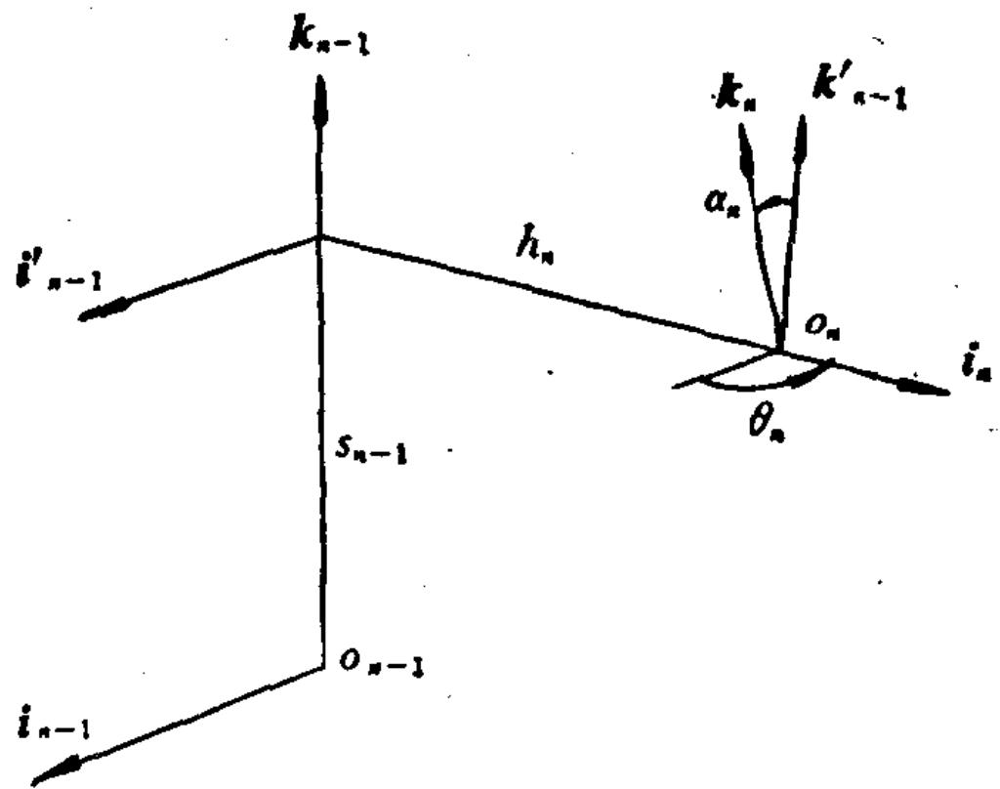

图3-3 相邻系的变换

法相同,假想有一运动坐标系的初始位置与 $\pmb { n - 1 }$ 系相同,通过一系列的旋转和平移到达 $\pmb { \eta }$ 系位置。变换过程分如下四个步骤:

1.沿 $k _ { n - 1 }$ 轴平移 $\beta _ { n - 1 }$ 到达 $\ell _ { n - 1 }$ 和 $k _ { n - 1 }$ 位置,此时 $i _ { n - 1 } ^ { \prime }$ 与$i _ { n }$ 在同一平面上,夹角为 $\theta _ { \infty }$ 

2.绕 $k _ { n - 1 }$ 轴旋转 $\theta _ { n }$ 角使 $\tilde { \ell } _ { n - 1 } ^ { \prime }$ 到达 $i _ { n }$ 轴上。

3.沿 $\smash { i _ { n } }$ 轴平移 $h _ { n }$ 到达 ${ \pmb i } _ { \pmb n }$ 和 $k _ { n - 1 } ^ { \prime }$ 位置,此时 $k _ { n - 1 } ^ { \prime }$ 与 ${ \pmb k } _ { n }$ 位于垂直于 $\smash { \mathbf { i } _ { n } }$ 的平面上,夹角 $\alpha _ { n \circ }$ 

4.绕 $\smash { i _ { n } }$ 轴旋转 $\alpha _ { \hbar }$ 角最终到达 $\smash { i _ { n } k _ { n } }$ 位置。

以上变换可表示为不共原点的坐标变换。如果仅考虑旋转关系,则类似于式2-18和2-19,有

$$
\begin{array} { r l } { [ i _ { n } } & { j _ { n } \quad k _ { n } ] = E _ { n - 1 , n } [ i _ { n - 1 } \quad j _ { n - 1 } \quad ^ { \prime } k _ { n - 1 } ] } \\ & { \quad E _ { n - 1 , n } = E ^ { \nu \theta _ { n } } E ^ { i \alpha _ { n } } } \end{array} ,
$$

对固连于 $\pmb { \mathscr { n } }$ 系的某点 $p$ ,若要表示它在 $\pmb { n - 1 }$ 系中的坐标,则根据式2-20有

$$
P _ { n - 1 } { = } \overline { { O _ { n - 1 } O _ { n } } } { + } \overline { { E _ { n - 1 , n } ( P _ { n } ) } }
$$

用 $\delta _ { n - 1 }$ 表示沿 $k _ { n - 1 }$ 轴方向长度为 $\delta _ { n - 1 }$ 的向量, ${ \pmb { h } } _ { \bullet }$ 表示沿 $\smash { i _ { \star } }$ 方向长度为 $h _ { n }$ 的向量,有

$$
\overline { { O _ { n ^ { - 1 } } O _ { n } } } = g _ { n ^ { - 1 } } { \cdot } + E ^ { k \theta _ { n } } ( h _ { n } )
$$

则式3-3可写为

$$
\begin{array} { r l } & { P _ { n - 1 } { = } \ell _ { n - 1 } { + } \begin{array} { r l } { { \cal { H } } ^ { \smash { \bar { k } } \theta _ { n } } ( h _ { n } ) { + } { \cal { E } } ^ { \smash { \bar { k } } \theta _ { n } } { \cal { E } } ^ { \smash { \mathrm { i } } \alpha _ { n } } ( P _ { n } ) } \end{array} } \\ &  \qquad = g _ { n - 1 } { + } \begin{array} { r l } { { \cal { H } } ^ { \smash { \bar { k } } \theta _ { n } } ( h _ { n } { + } { \cal { E } } ^ { \smash { \bar { k } } \theta _ { n } } ( P _ { n } ) ) } \end{array} \end{array}
$$

由于

$$
\begin{array} { r l r } {  { E ^ { \mathrm { i } \theta } E ^ { \mathrm { i } \alpha } = [ \begin{array} { c c c } { \cos \theta } & { - \sin \theta } & { 0 } \\ { \sin \theta } & { \cos \theta } & { 0 } \\ { 0 } & { 0 } & { 1 } \end{array} ] [ \begin{array} { c c c } { 1 } & { 0 } & { 0 } \\ { 0 } & { \cos \alpha } & { - \sin \alpha } \\ { 0 } & { \sin \alpha } & { \cos \alpha } \end{array} ] } } \\ & { } & { = [ \begin{array} { c c c } { \cos \theta } & { - \sin \theta \cos \alpha } & { \sin \theta \sin \alpha } \\ { \sin \theta } & { \cos \theta \cos \alpha } & { - \cos \theta \sin \alpha } \\ { 0 } & { \sin \alpha } & { \cos \alpha } \end{array} ] } \end{array}
$$

以及

$$
E ^ { \nu \theta } ( h _ { n } ) = { \left[ \begin{array} { l l l } { \cos \theta } & { - \sin \theta } & { 0 } \\ { \sin \theta } & { \cos \theta } & { 0 } \\ { 0 } & { 0 } & { 1 } \end{array} \right] } { \left[ \begin{array} { l } { h _ { n } } \\ { 0 } \\ { 0 } \end{array} \right] } = { \left[ \begin{array} { l l l } { h _ { n } } & { \ \cos \theta } \\ { h _ { n } } & { \sin \theta } \\ { \ 0 } & { \ 0 } \end{array} \right] }
$$

如果用齐次变换矩阵 $M _ { n - 1 , n }$ 来表示上述变换过程,则根据式 $\mathbf { 2 - }$ 29有

$$
\begin{array} { r } { M _ { n - 1 , n } = \left[ \begin{array} { c c c c } { \cos \theta } & { - \sin \theta \cos \alpha } & { \sin \theta \sin \alpha } & { h _ { n } \cos \theta } \\ { \sin \theta } & { \cos \theta \cos \alpha } & { - \cos \theta \sin \alpha } & { h _ { n } \sin \theta } \\ { 0 } & { \sin \alpha } & { \cos \alpha } & { \vartheta _ { n - 1 } } \\ { 0 } & { 0 } & { 0 } & { { \bf 1 } } \end{array} \right] } \end{array}
$$

# m3-2 空间闭链机构的运动分析

# 一、空间闭链机构的位姿方程[7]

第一章中将闭链机构看作是开链机构的末杆与机架固连后而成的机构。设空间单闭链机构由 $m$ 个构件组成,基础坐标系固连在机架1上。从机架开始依次用运动副连接构件2至构件 $m _ { 0 }$ 最后,构件 $\textcircled{7}$ 再用运动副与机架连接,构成一个封闭结构。机架可以认为是首杆 $\mathbf { \lambda } _ { 1 }$ ,也可以认为是末杆 $m + 1$ 。如图3-4所示,依次在各杆上建立杆件坐标系 $o _ { 2 } i _ { 2 } j _ { 2 } k _ { 2 }$ , $o _ { \mathfrak { p } } \dot { \pmb { i } } _ { \mathfrak { z } } \pmb { j } _ { \mathfrak { z } } k _ { 3 } \cdots o _ { m } \dot { \pmb { i } } _ { m } \pmb { j } _ { m } \pmb { k } _ { m \mathfrak { z } }$ 按照第二章的坐标变换方法,各杆件坐标系单位向量在基础坐标系中的坐标为

图3-4 空间闭链

$$
\begin{array} { r l } & { [ i _ { 2 } \dot { j } _ { 2 } k _ { 2 } ] = E _ { 1 2 } [ i _ { 1 } j _ { 1 } k _ { 1 } ] = E _ { 1 2 } [ I ] = E _ { 1 2 } } \\ & { \quad \quad [ i _ { 8 } \dot { j } _ { 3 } k _ { 3 } ] = E _ { 1 2 } E _ { 2 3 } } \\ & { \quad \quad [ i _ { 4 } \dot { j } _ { 4 } k _ { 4 } ] = E _ { 1 2 } E _ { 2 3 } E _ { 3 4 } } \\ & { \quad \quad \vdots } \\ & { \quad \quad \quad \quad \quad \quad \quad \quad \quad \quad \quad \quad . } \end{array}
$$

$$
[ i _ { m } j _ { m } k _ { m } ] = E _ { 1 2 } E _ { 2 8 } E _ { 8 4 } \cdot \cdot \cdot E _ { ( m - 1 ) m }
$$

用 ${ \mathcal { E } } _ { m 1 }$ 表示从 $m$ 系到1系的回转变换矩阵,有

$$
E _ { 1 2 } E _ { 2 3 } E _ { 3 4 } { \cdot \cdot \cdot } E _ { ( m - 1 ) m } E _ { m 1 } = [ I ]
$$

式 $\frac { 0 } { 3 } - 7$ 表示沿闭链各相邻杆件坐标系变换一周,最后回到机架上。由于变换前后相对同一构件,因而变换的结果为单位阵。式 $\mathbf { 3 - 7 }$ 称为空间闭链机构的坐标变换方程。它表示闭链机构中各坐标系之间的回转变换关系。

设各坐标系的原点在其前一坐标系中的位置向量为 $P ( n - 1 ) _ { n } ,$ 有 $P _ { 1 2 } \mathrm { = } s _ { 1 } \mathrm { + } E ^ { k \theta _ { 1 } } ( h _ { 2 } ) \ , \ P _ { 2 3 } \mathrm { = } s _ { 2 } \mathrm { + } E ^ { k \theta _ { 3 } } ( h _ { 3 } ) \cdots P _ { ( m \mathrm { - } 1 ) m } \mathrm { = } \ s _ { ( m \mathrm { - } 1 ) } \ +$ $E ^ { k \theta m } ( h _ { m } )$ , $P _ { m 1 } = 8 _ { m } + { \cal { E } } ^ { \chi \theta _ { 1 } } ( h _ { 1 } )$ 。根据不共原点的坐标变换方法,可得第 $\pmb { \mathscr { n } }$ 杆件坐标系原点在基础系中的坐标 $P _ { 1 n }$ 

$$
\begin{array} { r l } & { P _ { \mathrm { 1 3 } } { = } P _ { \mathrm { 1 2 } } { + } E _ { \mathrm { 1 2 } } ( { \bf { \delta } } _ { \mathrm { { 2 } } } { + } E ^ { { \mathrm { 2 } } { \theta } _ { \mathrm { { 3 } } } } ( h _ { \mathrm { 3 } } ) ) { = } P _ { \mathrm { 1 2 } } { + } E _ { \mathrm { 1 3 } } ( P _ { \mathrm { 2 3 } } ) } \\ & { P _ { \mathrm { 1 4 } } { = } P _ { \mathrm { 1 2 } } { + } E _ { \mathrm { 1 2 } } ( P _ { \mathrm { 2 3 } } { + } E _ { \mathrm { 2 3 } } ( P _ { \mathrm { 3 4 } } ) ) } \\ & { \ \vdots } \end{array}
$$

$$
\begin{array} { c } { { P _ { 4 m } { = } } } \\ { { { } } } \\ { { { \nonumber } + { \cal E } _ { ( m { - } 2 ) ( m { - } 1 ) } ( P _ { ( m { - } 1 ) m } ) { \cdots } ) } } \end{array}
$$

沿闭链各杆件坐标系变换一周,得

$$
\begin{array} { r l } & { P _ { \mathrm { 1 1 } } = P _ { \mathrm { 1 ( } m + 1 ) } = P _ { \mathrm { 1 2 } } + E _ { \mathrm { 1 2 } } ( P _ { \mathrm { 2 3 } } + E _ { \mathrm { 2 3 } } ( P _ { \mathrm { 3 4 } } + \cdots } \\ & { \qquad + E _ { \mathrm { 0 - 2 3 0 - 2 5 } } ( P _ { \mathrm { ( } m - \mathrm { 1 } ) m } + E _ { \mathrm { ( } m - \mathrm { 1 } ) m } ( P _ { m \mathrm { 1 } } ) \cdots ) ) ) = \pmb { 0 } } \end{array}
$$

式3-8表明各杆件坐标系的原点形成一头尾相接的封闭形。式3-8称为空间闭链机构的位置方程。式3-7和3-8统称为空间闭链机构的一般位形方程。

展开式3-8得

$$
\begin{array} { c } { { P _ { 1 2 } + E _ { 1 2 } ( P _ { 2 3 } ) + E _ { 1 2 } E _ { 2 3 } ( P _ { 8 4 } ) + \cdots } } \\ { { + E _ { 1 2 } E _ { z 3 } \cdot \cdot E _ { ( m - 1 ) m } ( P _ { m } ) = 0 } } \end{array}
$$

上式中每一项是在基础坐标系中量度的各相邻杆件坐标系原点之间的位置向量。由于 $0 _ { n - 1 }$ 到 $\pmb { \theta _ { \pmb { \mathscr { n } } } }$ 的向量可写为 $s _ { n - 1 } k _ { n - 1 } + h _ { n } i _ { n _ { i } }$ ,故有

$$
\begin{array} { c } { { s _ { 1 } k _ { 1 } + h _ { 2 } \dot { \bar { t } } _ { 2 } + s _ { 2 } k _ { 2 } + h _ { 3 } \dot { \bar { t } } _ { 3 } + \cdots + s _ { m } k _ { m } } } \\ { { + h _ { m + 1 } \dot { \bar { t } } _ { m + 1 } = 0 } } \end{array}
$$

由于 $m + 1$ 杆即 $\pmb { 1 }$ 杆,有

$$
h _ { 1 } \dot { \hat { a } } _ { 1 } + s _ { 1 } \hat { k } _ { 1 } + h _ { 2 } \dot { \hat { a } } _ { 2 } + s _ { 2 } \hat { k } _ { 2 } + \cdots + s _ { m } \hat { k } _ { m } = 0
$$

即

$$
P = \sum _ { j = 1 } ^ { m } ( h _ { j } \dot { \pmb { i } } _ { j } + s _ { j } \pmb { k } _ { j } ) = 0
$$

式8-8与式3-9是等价的,它们都表达了不同原点的坐标变换沿闭链各构件环绕一周的情况。若用齐次变换表示上述过程,则式3-8.3-9可合并写为

$$
\begin{array} { r } { M _ { 1 2 } M _ { \varepsilon \circ } M _ { \circ 4 } \cdots M _ { ( m - 1 ) m } M _ { m 1 } = \left[ \begin{array} { l l } { [ \mathrm { I } ] } & { \mathrm { ~ 0 } } \\ { \bullet } & { \mathrm { ~ 1 } } \end{array} \right] } \end{array}
$$

# 二、空间闭链机构的位移分析

例 $\mathbf { 3 - 1 }$ :空间CCS 机构的位移分析。

图3-5所示为含有一个球面副和两个圆柱副的空间三杆CCS闭链机构。利用该机构可使构件3上某点实现所需的球面轨迹。按D一H坐标的设置方法取 $k _ { 1 , k _ { 2 } }$ 轴与两个圆柱副的轴线重合,过球面副中心取 ${ \pmb k } _ { 3 }$ 与 $\mathbf { k _ { 2 } }$ 平行。取 $k _ { 1 }$ 与 ${ \pmb k } _ { 2 }$ 的公垂线为 $i _ { 2 \circ }$ 由于 ${ \pmb k } _ { 2 } / / { \pmb k } _ { 3 }$ , ${ \pmb { \alpha _ { 3 } } } = { \bf 0 }$ 。取过球面副中心且垂直于 $\pmb { k } _ { 3 }$ 的直线为 $\pmb { i } _ { 3 0 }$ 可以取 $\pmb { k _ { 3 } }$ 与 $\pmb { k _ { 1 } }$ 的公垂线为 $\pmb { i } _ { 1 }$ ,如图中虚线所示。但由于 $k _ { 3 }$ 轴随机构的运动方向不断变化, $\pmb { k _ { 3 } }$ 与 ${ \pmb k } _ { 1 }$ 的公垂线位置也在不断变化,以至 $o _ { 1 } i _ { 1 } j _ { 1 } k _ { 1 }$ 系的原点在 $\pmb { k _ { 1 } }$ 线上移动,给分析计算带来不便。因此过球面副中心引 $\pmb { k _ { 1 } }$ 轴的垂线作为 $\pmb { i } _ { 1 }$ 轴,此时 $o _ { 1 } i _ { 1 } j _ { 1 } k _ { 1 }$ 系的位置固定,但 $\pmb { i } _ { 1 }$ 轴在一般情况下与 ${ \pmb k } _ { \mathbf { 3 } }$ 轴不垂直。因此, $\pmb { \sigma _ { 3 } } \pmb { i _ { 3 } } \pmb { j _ { 3 } } \pmb { k _ { 3 } }$ 系与$o _ { 1 } i _ { 1 } j _ { 1 } k _ { 1 }$ 系之间的回转变换是一个欧拉变换。

图3-5 空间CCS机构

在这个机构中, $o _ { 1 } i _ { 1 } j _ { 1 } k _ { 1 }$ 为固定参考系, $\theta _ { 3 }$ 为输入运动角, $h _ { 1 _ { 3 } }$ $h _ { 2 } , h _ { 3 } , s _ { 3 } ( = 0 )$ 、 ${ \pmb { \alpha _ { 2 } } }$ 为已知的结构参数。要求的运动参数为 $s _ { 1 } , s _ { 2 } , \theta _ { 3 }$ 和球面副的三个相对转动欧拉角 $\theta _ { 1 } , \phi _ { 1 } , \psi _ { 1 0 }$ 

解1.写出机构的位姿方程。

由式 $\frac { 6 } { 3 } - 7$ 可写出

$$
\mathcal { E } _ { \mathrm { 1 2 } } E _ { \mathrm { 2 8 } } E _ { \mathrm { 3 1 } } = [ I ]
$$

其中 $\mathcal { E } _ { 8 1 }$ 为欧拉变换,故有

$$
E ^ { \gamma _ { k } \theta _ { 3 } } E ^ { ( i \alpha _ { 1 } } E ^ { \gamma _ { k } \theta _ { 3 } } E ^ { i \alpha _ { 3 } } E ^ { \gamma _ { k } \theta _ { 3 } } E ^ { i \alpha _ { 1 } } E ^ { \gamma _ { k } \mu _ { 3 } } = [ I ]
$$

由于 ${ \pmb { \alpha _ { 3 } } } = { \bf 0 }$ , $E ^ { i \alpha _ { 3 } } = [ I ]$ ,上式可写为

$$
\dot { E } ^ { ( k \theta _ { 1 } } \dot { E } ^ { ( i \alpha _ { 3 } } \dot { E } ^ { ( k \theta _ { 3 } } \dot { E } ^ { ( k \theta _ { 1 } } \dot { E } ^ { i \phi _ { 1 } } \dot { E } ^ { i \delta ^ { \prime } k ^ { \prime } i } = [ I ]
$$

由式 $g - 9$ 可写出

$$
P = h _ { 1 } \dot { \theta } _ { 1 } + s _ { 1 } k _ { 1 } + h _ { 2 } \dot { \iota } _ { 2 } + s _ { 2 } k _ { 2 } + h _ { 3 } \dot { \iota } _ { 3 } = 0
$$

式中

$$
\displaystyle i _ { 1 } = { \left[ \begin{array} { l } { 1 } \\ { 0 } \\ { 0 } \end{array} \right] }
$$

$$
\begin{array} { r } { \pmb { k } _ { 1 } = \left[ \begin{array} { l } { 0 } \\ { 0 } \\ { 1 } \end{array} \right] } \end{array}
$$

由式3-1有

$$
\dot { \bar { \iota } } _ { 2 } = E _ { 1 2 } ( \dot { \bar { \iota } } _ { \mathrm { \scriptsize \downarrow } } ) = E ^ { \bar { \kappa } \theta _ { \mathrm { \scriptsize : } } } E ^ { \mathrm { \scriptsize \{ \alpha _ { \mathrm { * } } } }  { \Bigg [ } 0 { \Bigg ] } \ .
$$

根据第二章中回转变换矩阵的运算法则3,有

$$
E ^ { \{ \alpha _ { * } \} } { \left[ \begin{array} { l } { 1 } \\ { 0 } \\ { 0 } \end{array} \right] } = { \left[ \begin{array} { l } { 1 } \\ { 0 } \\ { 0 } \end{array} \right] }
$$

所以

$$
i _ { 2 } = E ^ { \mathbb { E } \theta _ { 1 } } { \left[ \begin{array} { l } { 1 } \\ { 0 } \\ { 0 } \end{array} \right] }
$$

由式8-1有

$$
\begin{array} { r l } & { k _ { 2 } = E _ { 1 2 } ( k _ { 1 } ) = E ^ { \mathrm { { \mathrm { 1 6 } } _ { 1 } } } E ^ { \mathrm { i } \omega _ { \mathrm { 1 } } } \left[ \begin{array} { l } { 0 } \\ { 0 } \\ { 1 } \end{array} \right] } \\ & { ~ \cdot ~ } \\ & { i _ { 8 } = E _ { 1 2 } E _ { 2 8 } ( i _ { 1 } ) = E ^ { \mathrm { { \mathrm { 1 6 } } _ { 1 } } } E ^ { \mathrm { i } \omega _ { \mathrm { 1 } } } \left[ \begin{array} { l } { 1 } \\ { 0 } \\ { 0 } \end{array} \right] } \end{array}
$$

同理

由于 $k _ { 3 } / / k _ { 2 } ,$ 故有

$$
{ \bf / k _ { 3 } } = { \bf / k _ { 2 } }
$$

# 2.求解各运动参数。

(1)求 $\theta _ { 3 0 }$ 

$\theta _ { 8 }$ 是 $i _ { 2 }$ 与 $\bf { i } _ { 3 }$ 轴的夹角, $\cos \theta _ { 3 } = i _ { 2 } \cdot i _ { 3 0 }$ 用 $i _ { 2 }$ 点乘式8-13得

$$
\begin{array} { r l } & { i _ { 2 } \cdot P = \displaystyle h _ { 1 } ( i _ { 2 } \cdot i _ { 1 } ) + s _ { 1 } ( i _ { 2 } \cdot k _ { 2 } ) + h _ { 2 } ( i _ { 2 } \cdot i _ { 2 } ) + s _ { 2 } ( i _ { 2 } \cdot k _ { 2 } ) } \\ & { \qquad + h _ { 3 } ( i _ { 2 } \cdot i _ { 3 } ) = 0 } \end{array}
$$

由于 $\pmb { i } _ { 2 }$ 是 $k _ { 1 }$ 和 $\pmb { k _ { 2 } }$ 的公垂线,含有 $k _ { 1 } , ~ k _ { 2 }$ 的项为零,而 $\dot { \pmb { \imath } } _ { 1 } \bullet \dot { \pmb { \imath } } _ { 2 } =$ $\cos \theta _ { 2 }$ 为已知, $i _ { 2 } \cdot i _ { 2 } = 1$ ,故

$$
h _ { 1 } \cos \theta _ { 2 } + h _ { 2 } + h _ { 3 } \cos \theta _ { 3 } = 0
$$

得

$$
\cos \theta _ { 8 } { = } \frac { h _ { 1 } \cos \theta _ { 2 } { + } h _ { 2 } } { h _ { 3 } }
$$

(2)求 $\$ 20$ 

用 $\bf { i } _ { 1 }$ 点乘式3-9得

式中

$$
\begin{array} { c } { { { h _ { 1 } } ( { \dot { \hat { u } } } _ { 1 } \cdot \hat { \dot { d } } _ { 1 } ) + s _ { 1 } ( { \dot { \hat { u } } } _ { 1 } \cdot k _ { 1 } ) + h _ { 2 } ( { \dot { \hat { u } } } _ { 1 } \cdot { \dot { \hat { d } } } _ { 2 } ) + s _ { 2 } ( { \dot { \hat { u } } } _ { 1 } \cdot k _ { 2 } ) } } \\ { { + h _ { 3 } ( { \dot { \hat { u } } } _ { 1 } \cdot { \dot { \hat { d } } } _ { 3 } ) = 0 } } \\ { { { \dot { \hat { u } } } _ { 1 } \cdot { \dot { \hat { u } } } _ { 1 } = 1 } } \\ { { { \dot { \hat { u } } } _ { 1 } \cdot k _ { 1 } = 0 } } \\ { { { \dot { \hat { u } } } _ { 1 } \cdot { \dot { \hat { t } } } _ { 2 } = \cos { \theta } _ { 2 } } } \end{array}
$$

$$
i _ { \mathrm { 1 } } \cdot k _ { \mathrm { 2 } } { = } \left[ \begin{array} { l } { \mathbf { 1 } } \\ { \mathbf { 0 } } \\ { \mathbf { 0 } } \end{array} \right] ^ { \mathrm { T } } \left( E ^ { i _ { \mathrm { 1 } } \alpha _ { \mathrm { 1 } } } E ^ { i _ { \mathrm { 2 } } } { = } \left[ \begin{array} { l } { 0 } \\ { 0 } \\ { 1 } \end{array} \right] \right)
$$

$$
= \sin \theta _ { 2 } \sin \alpha _ { 2 }
$$

$$
i _ { 1 } \cdot i _ { 3 } = \left[ \begin{array} { l } { 1 } \\ { 0 } \\ { 0 } \end{array} \right] ^ { \mathrm { T } } \left( \begin{array} { l } { \phantom { - } } \\  E ^ { \hbar \theta _ { 3 } } E ^ { i \alpha _ { 3 } } E ^ { \gamma \delta \theta _ { 3 } } \left[ \begin{array} { l } { 1 } \\ { 0 } \\ { 0 } \end{array} \right] \right) \end{array}
$$

所以

$$
= \cos \theta _ { 2 } \cos \theta _ { 3 } - \sin \theta _ { 2 } \sin \theta _ { 3 } \cos \alpha _ { 2 }
$$

$$
h _ { \mathrm { 1 } } + h _ { \mathrm { 2 } } \cos \theta _ { \mathrm { 2 } } + s _ { \mathrm { 2 } } \sin \theta _ { \mathrm { 2 } } \sin \alpha _ { \mathrm { 2 } } + h _ { \mathrm { 3 } } ( \cos \theta _ { \mathrm { 2 } } \cos \theta _ { \mathrm { 3 } }
$$

得

$$
- \sin \theta _ { 2 } \sin \theta _ { 3 } \cos \alpha _ { 2 } ) = 0
$$

$$
\begin{array} { c } { \displaystyle { s _ { 2 } = \frac { h _ { 1 } + I _ { 2 } \cos \theta _ { 2 } + h _ { 3 } ( \cos \theta _ { 2 } \cos \theta _ { 3 } - \sin \theta _ { 2 } \sin \theta _ { 3 } \cos \alpha _ { 2 } ) } { - \sin \theta _ { 2 } \sin \alpha _ { 2 } } } } \end{array}
$$

(8)求 $\$ 10$ 

用 $\dot { \pmb { i } } _ { 3 }$ 点乘式3-9得

$$
\begin{array} { r } { h _ { 1 } ( \pmb { i } _ { 3 } { \cdot } \pmb { i } _ { 1 } ) + s _ { 1 } ( \pmb { i } _ { 3 } { \cdot } \pmb { k } _ { 1 } ) + h _ { 2 } ( \pmb { i } _ { 3 } { \cdot } \pmb { i } _ { 2 } ) + s _ { 2 } ( \pmb { i } _ { 3 } { \cdot } \pmb { k } _ { 2 } ) } \\ { + h _ { 3 } ( \pmb { i } _ { 8 } { \cdot } \pmb { i } _ { 8 } ) = 0 \qquad } \end{array}
$$

式中

$$
i _ { 3 } \cdot k _ { 1 } = \left( E ^ { \mathrm { i } \alpha _ { 1 } } E ^ { \mathrm { i } \alpha _ { 1 } } E ^ { \mathrm { i } \alpha _ { 2 } } { \left[ \begin{array} { l } { 1 } \\ { 0 } \\ { 0 } \end{array} \right] } \right) ^ { \mathrm { T } } { \left[ \begin{array} { l } { 0 } \\ { 0 } \\ { 1 } \end{array} \right] }
$$

$$
= \sin \ \alpha _ { 2 } \sin \ \theta _ { 3 }
$$

$$
\begin{array} { l } { i _ { { 3 } } \cdot i _ { { 2 } } = \cos \theta _ { 3 } } \\ { i _ { { 6 } } \cdot k _ { 2 } = 0 } \\ { i _ { { 8 } } \cdot i _ { { 3 } } = 1 } \end{array}
$$

所以

$$
\begin{array} { c } { { \hbar { \bf { \widehat { \mu } } } _ { \mathrm { \bf { \widehat { \mu } } { \bf { \widehat { \Lambda } } } } } ( \cos { \theta _ { 2 } } \cos { \theta _ { 3 } } - \sin { \theta _ { 2 } } \sin { \theta _ { 3 } } \cos { \alpha _ { 2 } } ) + { \bf { \widehat { \mu } } } _ { \mathrm { \bf { \widehat { \mu } } { \bf { \widehat { \Lambda } } } } } \mathrm { \bf { \widehat { \mu } } } ^ { \mathrm { } } } } \\ { { + \hbar _ { 2 } \cos { \theta _ { 3 } } + \hbar _ { 3 } = 0 ~ } } \end{array}
$$

得

$$
\begin{array} { c c c } { \beta _ { 1 } = \frac { h _ { 1 } ( \cos \theta _ { 2 } \cos \theta _ { 3 } - \sin \theta _ { 2 } \sin \theta _ { 3 } \cos \alpha _ { 4 } ) + h _ { 2 } \cos \theta _ { 2 } + h _ { 3 } } { - \sin \alpha _ { 2 } \sin \theta _ { 3 } } } \end{array}
$$

(4)求三个欧拉角 $\theta _ { 1 , } \phi _ { 1 , } \psi _ { 1 , }$ 

式3-12两边依次左乘 $( E ^ { k \theta _ { 4 } } ) ^ { - 1 } , ( E ^ { i \alpha _ { 4 } } ) ^ { - 1 } , ( E ^ { k \theta _ { 4 } } ) ^ { - 1 }$ ,得

$$
E ^ { k \theta _ { 1 } } E ^ { \prime 6 \phi _ { 1 } } E ^ { \prime 6 \phi _ { 1 } } = ( E ^ { k \theta _ { 1 } } ) ^ { - 1 } ( E ^ { i \alpha _ { 0 } } ) ^ { - 1 } ( E ^ { i \delta \theta _ { 1 } } ) ^ { - 1 }
$$

根据第二章中回转变换矩阵的性质三,有

$$
E ^ { \hbar \theta _ { 1 } } E ^ { \hbar \phi _ { 1 } } E ^ { \hbar \theta \nu _ { 1 } } = E ^ { \hbar \theta ( - \theta _ { 1 } ) } E ^ { ( - \alpha _ { 1 } ) } E ^ { ( k ( - \theta _ { 1 } ) }
$$

比较等式两边可知

$$
\left. \begin{array} { c } { { \theta _ { 1 } = - \theta _ { 3 } } } \\ { { { } } } \\ { { \phi _ { 1 } = - \alpha _ { 2 } } } \\ { { { } } } \\ { { \psi _ { 1 } = - \theta _ { 2 } } } \end{array} \right\}
$$

本例中如果输出参数为三个欧拉角,可写出如下的输入输出方程式

$$
\left. \begin{array} { l } { \theta _ { \mathrm { { i } } } = - \mathrm { a r c } \cos \left( \frac { h _ { \mathrm { { 1 } } } \cos \theta _ { \mathrm { { 2 } } } + h _ { \mathrm { { 2 } } } } { h _ { \mathrm { { 3 } } } } \right) } \\ { \phi _ { \mathrm { { 4 } } } = - \alpha _ { \mathrm { { 2 } } } } \\ { \psi _ { \mathrm { { 1 } } } = - \theta _ { \mathrm { { 2 } } } } \end{array} \right\}
$$

它表示输出运动角 $\theta _ { 1 } , \phi _ { 1 } , \psi _ { 1 }$ 与输入运动角 $\theta _ { 2 }$ 之间的关系。消去中间运动参数 $\theta _ { 3 }$ 的过程称为消元。从以上的求解过程可以看出,利用相邻杆件D—H坐标系之间某些轴的相互垂直关系,用向量点乘式3-9可消去方程中某些量,达到简化消元过程的目的。同时还可以看出,用欧拉变换更能反映球面副的相对运动本质。

例3-2:空间 RSSR 四杆机构位移分析。

图8-6为空间RSSR机构。该机构的 ${ \cal A } , { \cal D }$ 两个转动副与机架连接,连杆两端通过 $\boldsymbol { B } _ { \setminus } \boldsymbol { \mathcal { O } }$ 两个球面副分别与两连架杆连接。按照D-H坐标系规定,选取 $k _ { 1 , k _ { 4 } }$ 轴分别与 $A , D$ 转动副的轴线重合, $k _ { 2 }$ 与 $\pmb { k _ { 1 } }$ 平行且通过球面副 $B$ 的中心 $\langle { \pmb { \alpha } } _ { 2 } { \bf = } { \bf 0 } \rangle$ , ${ \pmb k } _ { 3 }$ 轴通过球面副 $B$ 和 $\pmb { C }$ 的中心 $( s _ { 2 } = 0 )$ 。取 $k _ { 4 }$ 和 ${ \pmb k } _ { 1 }$ 的公垂线为 $\mathbf { i } _ { 1 }$ ,过球心 $B$ 垂直于 $\pmb { k _ { 1 } }$ 的直线为 $\pmb { i _ { 2 0 } }$ 由于 ${ \pmb k } _ { 2 }$ 与 ${ \pmb k } _ { 3 }$ 在 $B$ 的中心相交, $h _ { 3 } = 0 , i _ { 8 }$ 可在通过球心 $B$ 且以 ${ \pmb k } _ { 3 }$ 为法线的平面上任取。例1-2中曾分析过,含有两个球面副的构件具有绕球面副中心连线转动的局部自由度, $j _ { 8 }$ 的取向可定义这种局部转动。由于局部自由度不影响机构的整体运动, $\clubsuit _ { 8 }$ 的确定无特别意义。此处仅需明确, $\varrho _ { 2 } i _ { 2 } j _ { 2 } k _ { 2 }$ 系与 $O _ { 3 } i _ { 3 } j _ { 3 } k _ { 3 }$ 系的变换为欧拉变换。

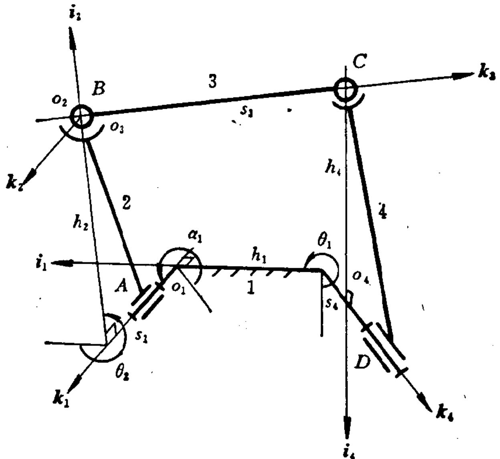

图3-6 空间 RSSR机构

该机构的结构参数为:

$h _ { 1 } , h _ { 2 } , h _ { 4 } , g _ { 1 } , g _ { 8 } ( = l ) , \vartheta _ { 4 } , \alpha _ { 1 0 }$ 运动参数为:输入运动角 $\theta _ { 2 } ,$ 输出运动角 $\theta _ { 1 , }$ ,关于球副 $\smash { \mathcal { B } _ { \perp } \sigma }$ 的两个欧拉变换中的六个欧拉角。要求通过运动分析求得机构的输入输出方程式 $\theta _ { 1 } { = } f ( \theta _ { 2 } )$ 。

解列出机构的位姿方程,根据式3-7可写出

$$
\boldsymbol { E } _ { 1 2 } \boldsymbol { E } _ { 2 3 } \boldsymbol { E } _ { 3 4 } \boldsymbol { E } _ { 4 1 } = [ \boldsymbol { \mathrm { I } } ]
$$

其中 $E _ { 2 3 , } E _ { 3 4 }$ 为欧拉变换。上式可写为

$$
\begin{array} { r } { E ^ { \mathcal { k } \theta _ { 3 } } E ^ { \mathcal { \mathrm { i } } \alpha _ { 4 } } E _ { 2 3 } E _ { 3 4 } E ^ { \mathcal { k } \theta _ { 3 } } E ^ { \mathcal { i } \alpha _ { 1 } } = [ \mathrm { I } ] } \end{array}
$$

由于 $\mathbf { \alpha _ { 2 } } = \mathbf { 0 }$ ,有 $E ^ { \mathrm { i } a s } = [ \boldsymbol { \mathsf { I } } ]$ ,上式又可写为

$$
\begin{array} { r } { E ^ { k \theta _ { 1 } } E _ { 2 3 } E _ { i 3 } E ^ { k \theta _ { 1 } } E ^ { i \alpha _ { 1 } } = [ \mathrm { I } ] } \end{array}
$$

根据式3-9,并考虑到 ${ \pmb S } _ { 4 }$ 沿 $\pmb { k _ { 4 } }$ 方向为正,反之为负

$$
P = h _ { 1 } \dot { \iota } _ { \perp } + s _ { \perp } k _ { 1 } + h _ { 2 } \dot { \iota } _ { 2 } + l k _ { 3 } + h _ { 4 } \dot { \iota } _ { 4 } - s _ { 4 } k _ { 4 } = 0
$$

式中

$$
\begin{array} { r } { \dot { \bar { \iota } } _ { 1 } = \left[ \begin{array} { l } { 1 } \\ { 0 } \\ { 0 } \end{array} \right] } \end{array}
$$

$$
\begin{array} { r } { k _ { 1 } = \left[ \begin{array} { l } { 0 } \\ { 0 } \\ { 1 } \end{array} \right] } \end{array}
$$

$$
i _ { 2 } { = } E ^ { \mu _ { 0 } } { = } \left[ \begin{array} { c } { 1 } \\ { 0 } \\ { 0 } \end{array} \right] { = } \left[ \begin{array} { c } { \cos \theta _ { 2 } } \\ { \sin \theta _ { 2 } } \\ { 0 } \end{array} \right]
$$

$$
k _ { 8 } = E ^ { \mathrm { i } \hbar 0 \ast } E _ { 2 8 } \left[ \begin{array} { c } { { 0 } } \\ { { 0 } } \\ { { 1 } } \end{array} \right]
$$

$$
i _ { 4 } { = } E ^ { k \theta _ { 4 } } E _ { 2 3 } E _ { 3 4 } \left[ \begin{array} { l } { { 1 } } \\ { { 0 } } \\ { { 0 } } \end{array} \right]
$$

在式8-19等号两边依次右乘 $( \mathbb { E } ^ { i a _ { 1 } } ) ^ { - 1 } , ~ ( \mathbb { E } ^ { k \theta _ { 1 } } ) ^ { - 1 } .$ 得

$$
\begin{array} { r } { E ^ { \gamma _ { \theta _ { 1 } } } E _ { 2 3 } E _ { 3 4 } = ( E ^ { i \alpha _ { 1 } } ) ^ { - 1 } ( E ^ { k \theta _ { 1 } } ) ^ { - 1 } = E ^ { i ( - \alpha _ { 1 } ) } E ^ { k ( - \theta _ { 1 } ) } } \end{array}
$$

因此

$$
i _ { 4 } = E ^ { k \theta _ { 3 } } E _ { 2 3 } E _ { 3 4 } \left[ \begin{array} { l l l } { 1 } \\ { 0 } \\ { 0 } \end{array} \right] = E ^ { i ( - \alpha _ { 3 } ) } E ^ { k ( - \theta _ { 1 } ) } \left[ \begin{array} { l } { 1 } \\ { 0 } \\ { 0 } \end{array} \right] = \left[ \begin{array} { l l l } { \cos { \theta _ { 1 } } } & { \sin { \theta _ { 1 } } } \\ { - \cos { \alpha _ { 1 } } } & { \sin { \theta _ { 1 } } } \\ { \sin { \alpha _ { 1 } } } & { \sin { \theta _ { 1 } } } \end{array} \right]
$$

同理

$$
k _ { 4 } = E ^ { \nu _ { 6 } } E _ { 2 3 } E _ { 3 4 } \left[ \begin{array} { l } { { 0 } } \\ { { 0 } } \\ { { 1 } } \end{array} \right] = E ^ { i ( - \alpha _ { 1 } ) } E ^ { k ( - \theta _ { 1 } ) } \left[ \begin{array} { l } { { 0 } } \\ { { 0 } } \\ { { 1 } } \end{array} \right] = \left[ \begin{array} { l } { { 0 } } \\ { { \sin \alpha _ { 1 } } } \\ { { \cos \alpha _ { 1 } } } \end{array} \right]
$$

上述各式中, $\pmb { k _ { 3 } }$ 含有欧拉变换 $\pmb { { \cal E } } _ { 2 3 }$ ,应设法将其消去。式9-20改写为

$$
l k _ { 3 } = s _ { 4 } k _ { 4 } - h _ { 1 } \pmb { i } _ { 1 } - s _ { 1 } k _ { 1 } - h _ { 2 } \pmb { i } _ { 2 } - h _ { 4 } \pmb { i } _ { 4 }
$$

上式两边平方,得

$$
\begin{array} { c } { { ( l k _ { 3 } ) ^ { 2 } = ( s _ { 4 } k _ { 4 } - h ; \hat { t } _ { 1 } - s _ { 1 } k _ { 1 } - h _ { 2 } \hat { t } _ { 2 } - h _ { 4 } \hat { t } _ { 4 } ) ^ { 2 } } } \\ { { { } } } \\ { { = s _ { 4 } ^ { 2 } + h _ { 1 } ^ { 2 } + s _ { 1 } ^ { 2 } + h _ { 2 } ^ { 2 } + h _ { 4 } ^ { 2 } - 2 s _ { 4 } h _ { 1 } ( k _ { 4 } \cdot \hat { t } _ { 1 } ) } } \\ { { { } } } \\ { { { } ~ - 2 s _ { 4 } s _ { 1 } ( k _ { 4 } \cdot k _ { 1 } ) - 2 s _ { 4 } h _ { 2 } ( k _ { 4 } \cdot \hat { t } _ { 2 } ) } } \\ { { { } } } \\ { { { } ~ - 2 s _ { 4 } h _ { 4 } ( k _ { 4 } \cdot \hat { t } _ { 4 } ) + 2 h _ { 1 } s _ { 1 } ( \hat { t } _ { 1 } \cdot k _ { 1 } ) } } \\ { { { } } } \\ { { { } ~ + 2 h _ { 1 } h _ { 2 } ( \hat { t } _ { 1 } \cdot \hat { t } _ { 2 } ) + 2 h _ { 1 } h _ { 4 } ( \hat { t } _ { 1 } \cdot \hat { t } _ { 4 } ) } } \\ { { { } } } \\ { { { } ~ + 2 s _ { 1 } h _ { 2 } ( k _ { 1 } \cdot \hat { t } _ { 2 } ) + 2 s _ { 1 } h _ { 4 } ( k _ { 1 } \cdot \hat { t } _ { 4 } ) } } \\ { { { } } } \end{array}
$$

式中

$$
( l { k _ { 3 } } ) ^ { 2 } { = } l ^ { 2 } ( { k _ { 3 } } \cdot { k _ { 3 } } ) { = } l ^ { 2 }
$$

$$
\begin{array} { r l } & { { \boldsymbol k } _ { 4 } { \boldsymbol \cdot } { \boldsymbol i } _ { 1 } = { \boldsymbol k } _ { 4 } { \boldsymbol \cdot } { \boldsymbol i } _ { 4 } = { \boldsymbol i } _ { 1 } { \boldsymbol \cdot } { \boldsymbol k } _ { 1 } = { \boldsymbol k } _ { 1 } { \boldsymbol \cdot } { \boldsymbol i } _ { 2 } = 0 } \\ & { { \boldsymbol k } _ { 4 } { \boldsymbol \cdot } { \boldsymbol k } _ { 1 } = \cos \alpha _ { 1 } } \end{array}
$$

$$
k _ { 4 } \cdot \dot { \iota } _ { 2 } = \left( \left[ \begin{array} { c } { 0 } \\ { \sin \alpha _ { 1 } } \\ { \cos \alpha _ { 1 } } \end{array} \right] \right) ^ { \mathrm { T } } \left( \left[ \begin{array} { c } { \cos \theta _ { 2 } } \\ { \sin \theta _ { 2 } } \\ { 0 } \end{array} \right] \right) = \sin \alpha _ { 1 } \sin \theta _ { 2 }
$$

$$
\begin{array} { r } { i _ { 1 } { \cdot } i _ { 2 } = \cos \theta _ { 2 } } \\ { i _ { 1 } { \cdot } i _ { 4 } = \cos \theta _ { 1 } } \end{array}
$$

$$
k _ { \mathrm { 2 } } \cdot \dot { \varepsilon } _ { \mathrm { 4 } } = \left( \begin{array} { r } { 0 } \\ { 0 } \\ { 1 } \end{array} \right) ^ { \mathrm { T } } \left( \begin{array} { r r } { \cos { \theta _ { \mathrm { 1 } } } } & \\ { - \cos { \alpha _ { \mathrm { 1 } } } } & { \sin { \theta _ { \mathrm { 1 } } } } \\ { \sin { \alpha _ { \mathrm { 1 } } } } & { \sin { \theta _ { \mathrm { 1 } } } } \end{array} \right) \mathrm { ) }
$$

$$
= \sin \alpha _ { 1 } \sin \theta _ { 1 }
$$

$$
\begin{array} { r l } { i _ { 2 } \cdot i _ { 4 } = \left( \begin{array} { c } { \cos \theta _ { 2 } } \\ { \sin \theta _ { 2 } } \\ { 0 } \end{array} \right) ^ { \mathrm { T } } \left( \begin{array} { c c } { \cos \theta _ { 1 } } & & \\ { - \cos \alpha _ { 1 } } & { \sin \theta _ { 1 } } \\ { \sin \alpha _ { 1 } } & { \sin \theta _ { 1 } } \end{array} \right) } & { } \\ { = \cos \theta _ { 2 } \cos \theta _ { 1 } - \sin \theta _ { 2 } \cos \alpha _ { 1 } \sin \theta _ { 1 } } \end{array}
$$

所以

)

$$
\begin{array} { r l } & { \mathrm { ~ \Lambda ~ } ^ { [ 2 } = \mathfrak { s } _ { 4 } ^ { 2 } + h _ { 1 } ^ { 2 } + \mathfrak { s } _ { 1 } ^ { 2 } + h _ { 2 } ^ { 2 } + h _ { 4 } ^ { 2 } - 2 \mathfrak { s } _ { 4 } \mathfrak { s } _ { 1 } \cos \mathfrak { o s } \alpha _ { 1 } - 2 \mathfrak { s } _ { 4 } h _ { 2 } \sin \alpha _ { 1 } } \\ & { \mathrm { ~ \Lambda ~ } + 2 h _ { 1 } h _ { 2 } \cos \theta _ { 2 } + 2 h _ { 1 } \lambda _ { 1 } \cos \theta _ { \mathrm { L } } + 2 \mathfrak { s } _ { 1 } h _ { 4 } \sin \alpha _ { 1 } \sin \mathrm { ~ ( \Omega _ 1 \sin \beta ) ~ } } \\ & { \mathrm { ~ \Lambda ~ } + 2 h _ { 2 } h _ { 4 } ( \cos \theta _ { 2 } \cos \theta _ { 1 } - \sin \theta _ { 2 } \cos \alpha _ { 1 } \sin \theta _ { 1 } ) } \end{array}
$$

将上式整理为

式中

$$
\begin{array} { c } { { A \sin \theta _ { 1 } + B \cos \theta _ { 1 } + C = 0 } } \\ { { A = s ; h _ { 4 } \sin \alpha _ { 1 } - h _ { 2 } h _ { 4 } \sin \theta _ { 2 } \cos \alpha _ { 1 } } } \\ { { B = h _ { 1 } h _ { 4 } + h _ { 2 } h _ { 4 } \cos \theta _ { 2 } } } \\ { { C = \displaystyle \frac 1 2 ( s _ { 4 } ^ { 2 } + h _ { 1 } ^ { 2 } - s _ { 1 } ^ { 2 } + h _ { 2 } ^ { 2 } + h _ { 4 } ^ { 2 } - l ^ { 2 } ) - s _ { 4 } s _ { 1 } \cos \alpha _ { 1 } } } \\ { { , ~ } } \end{array}
$$

$$
+ h _ { 1 } h _ { 2 } \cos \theta _ { 2 } - s _ { 4 } h _ { 2 } \sin \alpha _ { 1 } \sin \theta _ { 2 }
$$

上述 $A , B , C$ 含有输入运动角 $\theta _ { 2 }$ 及诸结构参数,式3-21反映了机构的输入输出关系,是所要求的输入输出方程式。作几何代换区

$$
x = \log ( \frac { \theta _ { 1 } } { 2 } )
$$

则

$$
\sin \theta _ { \mathrm { 3 } } = { \frac { 2 x } { 1 + x ^ { 2 } } } \cos \theta _ { \mathrm { 1 } } = { \frac { 1 - x ^ { 2 } } { 1 + a ^ { 3 } } }
$$

式8-21化为

$$
( C - B ) x ^ { 2 } + 2 A x + ( B + C ) = 0
$$

得

$$
x = \frac { A \pm \sqrt { A ^ { 2 } + B ^ { 2 } - C ^ { 2 } } } { B - C }
$$

代入式3-22得

$$
\theta _ { \mathrm { { z } } } = 2 \mathrm { t g } ^ { - 1 } x = 2 \mathrm { t g } ^ { - 1 } \left( \frac { A \pm \sqrt { A ^ { 2 } + B ^ { 2 } - C ^ { 2 } } } { B - C } \right)
$$

从本例的求解过程可以看出,对具有两个球面副元素的连杆,可利用对杆长求平方的方法避开两端的欧拉变换。此外,对含未知运动角的不同三角函数的式子如式3-21,可利用式8-22的变换将其化为 $\pmb { x }$ 的多项式方程以便求解。机构所含的转动参数越多,输入输出方程式的次数就越高。一般来讲,通过坐标变换而写出的位移方程中,空间三、四杆机构最少含1个未知转角,五杆机构最少含2个未知转角,六杆机构最少含3个未知转角,七杆机构最少含 $\mathbf { 4 }$ 个未知转角。若将转动副改为圆柱副或移动副,则方程的次数可以减半。这一点将在下面的分析中看到。

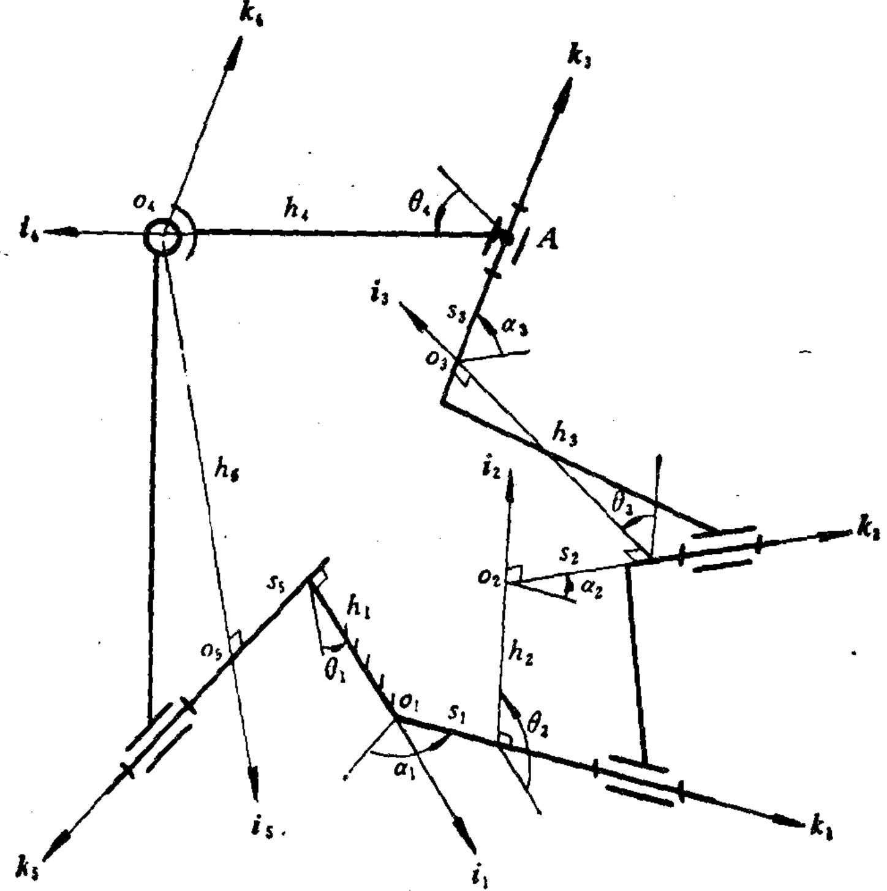

图 $\mathtt { 3 - 7 }$ 空间RRRSR机构

例3-3:空间RRRSR五杆机构位移分析。

图 $\frac { 6 } { 3 } - 7$ 为RRRSR机构,根据D-H坐标系规定,选取 $\therefore$ 、$k _ { 2 } , k _ { 3 } , k _ { 5 }$ 轴与各转动副的轴线重合, $\pmb { k _ { 4 } }$ 平行 $\pmb { k _ { 3 } }$ 且通过球面副中心。选取 $\pmb { i } _ { 1 }$ 轴与 $k _ { 5 } \cdot k _ { 1 }$ 的公垂线重合, $\pmb { i } _ { 2 }$ 轴与 $k _ { 1 , k _ { 2 } }$ 的公垂线重合, $\dot { \pmb { i } } _ { 3 }$ 轴与 $k _ { 2 , k _ { 3 } }$ 的公垂线重合, $\clubsuit _ { 4 }$ 轴通过球面副中心且与 $k _ { 3 , k _ { 4 } }$ 轴垂直。过球面副中心引 ${ \pmb k } _ { \bar { \pmb \delta } }$ 的垂线为 $\mathbf { i } _ { 5 }$ 轴。此时 $o _ { 4 } i _ { 4 } j _ { 4 } k _ { 4 }$ 与$\pmb { \sigma } _ { 5 } \pmb { i } _ { 5 } \pmb { j } _ { 5 } \pmb { k } _ { 5 }$ 间的回转变换为欧拉变换。

该机构的结构参数为: $h _ { 1 , } h _ { 2 , } h _ { 3 , } h _ { 4 , } h _ { 5 , } s _ { 1 , } s _ { 2 , } s _ { 3 , } s _ { 4 } ( = 0 ) , s _ { 5 , } \alpha _ { 4 , }$ $\alpha _ { 2 } , \alpha _ { 3 } , \alpha _ { 4 } ( \doteq 0 )$ 。运动参数为:输入运动角 $\theta _ { 2 } ,$ 输出运动角 $\theta _ { 1 }$ ,其余运动参数 $\theta _ { 3 , } \theta _ { 4 }$ ,以及三个欧拉角 $\theta _ { 5 ,  } \phi _ { 5 ,  } \psi _ { 5 ,  }$ 。求输出运动参数 $\theta _ { 1 \circ }$ 

解1.写出机构的位姿方程

$$
\begin{array} { r } { E ^ { k \theta _ { 1 } } E ^ { i \alpha _ { 1 } } \vec { E } ^ { k \theta _ { 1 } } E ^ { i \alpha _ { 3 } } \vec { E } ^ { k \theta _ { 3 } } \vec { E } ^ { k _ { 4 } } \vec { \mathbf { g } } _ { 4 } \mathbf { \tilde { g } } ^ { k \theta _ { 1 } } \vec { E } ^ { i \alpha _ { 4 } } \vec { E } ^ { i \alpha _ { 1 } } \vec { E } ^ { i \alpha _ { 1 } } = [ \mathbf { I } ] } \end{array}
$$

$$
\begin{array} { l } { P = h _ { 1 } \dot { l } _ { 1 } + s _ { 1 } k _ { 1 } + h _ { 2 } \dot { l } _ { 2 } + s _ { 2 } k _ { 2 } + h _ { 3 } \dot { l } _ { 3 } + s _ { 3 } k _ { 3 } } \\ { \qquad + h _ { 4 } \dot { l } _ { 4 } + h _ { 5 } \dot { l } _ { 5 } - s _ { 5 } k _ { 6 } = 0 } \end{array}
$$

令

$$
A = \left[ \begin{array} { l l l l l l l } { \pi _ { A } } \\ { y _ { A } } \\ { z _ { A } } \end{array} \right] = h _ { 1 } \dot { \bar { u } } _ { 1 } + s _ { \perp } k _ { 1 } + h _ { 2 } \dot { \bar { u } } _ { 2 } + s _ { 2 } k _ { 2 } - s _ { 5 } k _ { 5 }  & { \qquad } &  \zeta _ { \perp } .
$$

$$
\begin{array} { r l } & { \begin{array} { c } { \langle z _ { A , 1 } \rangle } \\ { = \left[ \begin{array} { c } { h _ { 1 } } \\ { 0 } \\ { 0 } \end{array} \right] + \left[ \begin{array} { c } { 0 } \\ { 0 } \\ { 0 } \\ { s _ { 1 } } \end{array} \right] + h _ { 2 } \left[ \begin{array} { c } { \cos { \theta _ { 2 } } } \\ { \sin { \theta _ { 2 } } } \\ { 0 } \end{array} \right] + s _ { 2 } \left[ \begin{array} { c c } { \sin { \theta _ { 2 } } } & { \sin { \alpha _ { 2 } } } \\ { - \cos { \theta _ { 2 } } } & { \sin { \alpha _ { 2 } } } \\ { \cos { \alpha _ { 2 } } } \end{array} \right] - s _ { 5 } \left[ \begin{array} { c } { 0 } \\ { \sin { \alpha _ { 1 } } } \\ { \cos { \alpha _ { 1 } } } \end{array} \right] } \\ & { = \left[ \begin{array} { c } { h _ { 1 } + h _ { 2 } \cos { \theta _ { 2 } } + s _ { 2 } \sin { \theta _ { 2 } } \sin { \alpha _ { 2 } } } \\ { h _ { 2 } \sin { \theta _ { 2 } } - s _ { 2 } \cos { \theta _ { 2 } } \sin { \alpha _ { 2 } } - s _ { 5 } \sin { \alpha _ { 1 } } } \\ { s _ { 1 } + s _ { 2 } \cos { \alpha _ { 2 } } - s _ { 5 } \cos { \alpha _ { 3 } } } \end{array} \right] } \end{array} . } \end{array}
$$

公式8-25可写为

$$
A + h _ { 3 } \dot { \bar { \iota } } _ { 3 } + s _ { 3 } \bar { k } _ { 3 } + h _ { 4 } \dot { \iota } _ { 4 } + h _ { 5 } \dot { \iota } _ { 5 } = 0
$$

2.求输出运动参数 $\theta _ { 1 \circ }$ 

(1)用 $k _ { 8 }$ 点乘式9-26得

$$
k _ { 8 } \cdot A + s _ { 8 } + h _ { 5 } ( k _ { 8 } \cdot \ i _ { 5 } ) = 0
$$

式中

$$
\begin{array} { r l } & { k _ { 3 } \ast A = \left( E ^ { \nu _ { 6 } } ; E ^ { | i \alpha _ { 1 } } E ^ { \nu _ { 6 } } ; E ^ { | i \alpha _ { 1 } } \overbrace { E } ^ { 0 } , \overbrace { 0 } ^ { \mathrm { T } } \right) ^ { \mathrm { T } } \left( \left( \begin{array} { l } { \overline { { \sigma } } _ { A } } \\ { y _ { A } } \\ { z _ { A } } \end{array} \right) \right) } \\ & { \qquad = \left( E ^ { \nu _ { 6 } } ; E ^ { | i \alpha _ { 1 } } \overbrace { 0 } ^ { \mathrm { T } } \right) ^ { \mathrm { T } } \left( B ^ { | i \mathrm { - } \alpha _ { 1 } } E ^ { | i \mathrm { - } \alpha _ { 1 } } \overbrace { E } ^ { 0 } \right) ^ { \mathrm { T } } \left( B ^ { | i \mathrm { - } \alpha _ { 1 } } \right) } \end{array}
$$

则

$$
\begin{array} { r } { B = \left[ \begin{array} { l } { \tilde { \boldsymbol { \sigma } } _ { B } } \\ { \boldsymbol { y } _ { B } } \\ { \boldsymbol { z } _ { B } } \end{array} \right] = \boldsymbol { E } ^ { * ( - \alpha _ { 1 } ) } \boldsymbol { E } ^ { k ( - \theta _ { 1 } ) } \left[ \begin{array} { l } { \boldsymbol { \mathcal { D } } _ { A } } \\ { \boldsymbol { \mathcal { Y } } _ { A } } \\ { \boldsymbol { \mathcal { Y } } _ { A } } \\ { \boldsymbol { \mathcal { Z } } _ { A } } \end{array} \right] } \end{array}
$$

$$
= { \left[ \begin{array} { l } { \sigma _ { A } \cos \theta _ { 2 } + y _ { A } \sin \theta _ { 2 } } \\ { \left( - x _ { A } \sin \theta _ { 2 } + y _ { A } \cos \theta _ { 2 } \right) \cos \alpha _ { 2 } + z _ { A } \sin \alpha _ { 2 } } \\ { \left( x _ { A } \sin \theta _ { 2 } - y _ { A } \cos \theta _ { 2 } \right) \sin \alpha _ { 2 } + z _ { A } \cos \alpha _ { 2 } } \end{array} \right] }
$$

$$
k _ { 3 } \cdot A = \left( \left[ \begin{array} { c } { { \sin \theta _ { 3 } \sin \alpha _ { 3 } } } \\ { { - \cos \theta _ { 3 } \sin \alpha _ { 3 } } } \\ { { \cos \alpha _ { 3 } } } \end{array} \right] \right) ^ { \mathrm { T } } \left( \left[ \begin{array} { c } { { \cos \theta _ { B } } } \\ { { y _ { B } } } \\ { { z _ { B } } } \end{array} \right] \right)
$$

$= v _ { B } \sin \theta _ { 3 } \sin \alpha _ { 3 } - y _ { B } \cos \theta _ { 3 }$ sin $\alpha _ { 3 } + z _ { B } \cos \alpha _ { 8 }$ 

$$
\begin{array} { r l } &  { k _ { \mathrm { s } } } \cdot \boldsymbol { \dot { i } } _ { \mathrm { s } } = ( \begin{array} { l } { E ^ { k \theta _ { 1 } } E ^ { i \alpha _ { 1 } } E ^ { i \alpha _ { 1 } } E ^ { i \alpha _ { 1 } } E ^ { i \alpha _ { 1 } } [ \begin{array} { l } { 0 } \\ { 0 } \\ { 1 } \end{array} ] ) ^ { \mathrm { T } } ( E ^ { i \zeta - \alpha _ { 1 } } E ^ { i ( - \theta _ { 1 } ) } [ \begin{array} { l } { 1 } \\ { 0 } \\ { 0 } \end{array} ] ) } \\ & { ~ = ( E ^ { k \theta _ { 1 } } E ^ { i \alpha _ { 1 } } [ \begin{array} { l } { 0 } \\ { 0 } \\ { 1 } \end{array} ] ) ^ { \mathrm { T } } ( ( E ^ { i ( - \alpha _ { 1 } ) } E ^ { | \zeta - \theta _ { 1 } | } E ^ { i ( - \alpha _ { 1 } ) } E ^ { i ( - \theta _ { 1 } ) } [ \begin{array} { l } { 1 } \\ { 0 } \\ { 0 } \end{array} ] ) } \end{array} \end{array}
$$

令

$$
\begin{array} { r } { \overbrace { C } \mathfrak { G } _ { 1 1 } \quad \mathfrak { G } _ { 1 2 } \quad \mathcal { Q } _ { 1 8 } } \\ { E = \bigg | \mathfrak { G } _ { 2 1 } \quad \mathfrak { G } _ { 2 2 } \quad \mathcal { Q } _ { 2 8 } } \\ { \qquad \big [ \mathfrak { G } _ { 3 1 } \quad \mathfrak { G } _ { 3 2 } \quad \mathcal { Q } _ { 3 3 } \big ] \quad \quad \quad \quad \quad \quad \quad . } \end{array}
$$

$$
= \left[ \begin{array} { c c c } { { \cos \theta _ { 2 } } } & { { \sin \theta _ { 2 } \cos \alpha _ { 1 } } } & { { } } \\ { { } } & { { } } & { { } } \\ { { - \cos \alpha _ { 2 } \sin \theta _ { 2 } } } & { { \cos \alpha _ { 2 } \cos \theta _ { 2 } \cos \alpha _ { 1 } - \sin \alpha _ { 2 } \sin \alpha _ { 1 } } } & { { } } \\ { { } } & { { } } & { { } } \\ { { \sin \alpha _ { 2 } \sin \theta _ { 2 } } } & { { - \sin \alpha _ { 2 } \cos \theta _ { 2 } \cos \alpha _ { 1 } - \cos \alpha _ { 2 } \sin \alpha _ { 1 } } } & { { } } \end{array} \right.
$$

$$
\begin{array} { c } { \sin \theta _ { 2 } \sin \alpha _ { 1 } } \\ { \cos \alpha _ { 2 } \cos \theta _ { 2 } \sin \alpha _ { 1 } + \sin \alpha _ { 2 } \cos \alpha _ { 1 } } \\ { - \sin \alpha _ { 2 } \cos \theta _ { 2 } \sin \alpha _ { 4 } + \cos \alpha _ { 2 } \cos \alpha _ { \bot } } \end{array} \Bigg ]
$$

则

$$
\begin{array} { r l }   { { \cal k } _ { 3 } \cdot \dot { \hat { \varepsilon } } _ { 6 } = ( \begin{array} { c } { \vec { U } ^ { k * _ { 6 } } , \vec { E } ^ { t * _ { 6 } } ( \begin{array} { c } { 0 } \\ { 0 } \\ { 1 } \end{array} ) ^ { T } ( \mathscr { E } \vec { B } ^ { \mathcal { K } \times \theta _ { 0 } } [ \begin{array} { c } { 1 } \\ { 0 } \\ { 1 } \end{array} ] ) } } \\ & { = ( \begin{array} { c } { ( \begin{array} { c } { \sin \theta _ { 3 } \sin \alpha _ { 3 } } \\ { - \cos \theta _ { 3 } \sin \alpha _ { 3 } } \\ { \cos \alpha _ { 3 } } \end{array} ) ^ { T } ( \mathscr { E } [ \begin{array} { c } { \cos \theta _ { 1 } } \\ { - \sin \theta _ { 3 } } \\ { 0 } \end{array} ] ) } \\ { \cos \alpha _ { 3 } } \end{array} ) } \\ & { = ( \omega _ { 1 1 } \cos \theta _ { 1 } - \alpha _ { 1 3 } \sin \theta _ { 1 } ) \sin \alpha _ { 3 } \sin \theta _ { 3 } } \\ & { = ( \omega _ { 2 1 } \cos \theta _ { 1 } - \omega _ { 2 2 } \sin \theta _ { 1 } ) \sin \alpha _ { 4 } \cos \theta _ { 3 } } \\ & { + ( \omega _ { 3 1 } \cos \theta _ { 1 } - \omega _ { 3 2 } \sin \theta _ { 1 } ) \cos \alpha _ { 3 } } \end{array} \end{array}
$$

将 $k _ { 8 } { \cdot } A , k _ { 8 } { \cdot } i _ { 5 }$ 代入式3-27并整理,得

$$
\scriptstyle A _ { 1 } \sin \theta _ { 3 } + B _ { 1 } \cos \theta _ { 3 } + C _ { 1 } = 0
$$

$$
A _ { 1 } = \sin { \alpha _ { 0 } } [ x _ { B } + h _ { 5 } ( a _ { 1 1 } \cos { \theta _ { 1 } } - a _ { 1 2 } \sin { \theta _ { 1 } } ) ]
$$

$$
B _ { 1 } { = } - \sin \alpha _ { 3 } \left[ y _ { B } { + } h _ { 5 } ( a _ { 2 1 } \cos \theta _ { 1 } { - } a _ { 2 2 } \sin \theta _ { \mathrm { 1 } } ) \right]
$$

$$
C _ { 1 } = \mathscr { s } _ { 3 } + \cos \alpha _ { 3 } \left[ \mathscr { z } _ { B } + h _ { 5 } ( \mathscr { a } _ { 3 1 } \cos \theta _ { 1 } - \mathscr { o } _ { 3 2 } \sin \theta _ { 1 } ) \right]
$$

式8-28含有 $\theta _ { 3 , } \theta _ { 1 }$ 两个未知参数,必须消去 $\theta _ { 3 }$ 。因此,希望得到另一个含 $\theta _ { 3 , } \theta _ { 1 }$ 的方程式,并使其具有型式

$$
A _ { 2 } \sin \theta _ { 3 } + B _ { 2 } \cos \theta _ { 3 } + C _ { 2 } = 0
$$

(2)消元。

将式3-26改写为

$$
- \left( s _ { 3 } k _ { 3 } + h _ { 4 } i _ { 4 } \right) = A + h _ { 3 } i _ { 8 } + h _ { 5 } i _ { 5 }
$$

等式两边平方,得

$$
( s _ { 3 } k _ { 3 } + h _ { 4 } i _ { 4 } ) ^ { 2 } = ( A + h _ { 8 } i _ { 3 } + h _ { 5 } i _ { 5 } ) ^ { 2 }
$$

式中

$$
( s _ { 3 } k _ { 3 } + h _ { 4 } \dot { a } _ { 4 } ) ^ { 2 } = s _ { 3 } ^ { 2 } + h _ { 4 } ^ { 2 } + 2 s _ { 3 } h _ { 4 } ( k _ { 3 } \cdot \dot { \ell } _ { 4 } ) = s _ { 3 } ^ { 2 } + h _ { 4 } ^ { 2 }
$$

$$
\begin{array} { c } { { ( A + h _ { 3 } \dot { \iota } _ { 3 } + h _ { 5 } \dot { \iota } _ { 5 } ) ^ { 2 } = \mid A \mid ^ { 2 } + h _ { 3 } ^ { 2 } + h _ { 5 } ^ { 2 } + 2 h _ { 5 } ( A \cdot \dot { \iota } _ { 3 } ) } } \\ { { + 2 h _ { 5 } ( A \cdot \dot { \iota } _ { 5 } ) + 2 h _ { 3 } h _ { 5 } ( \dot { \iota } _ { 3 } \cdot \dot { \iota } _ { 5 } ) } } \end{array}
$$

式中

$$
\begin{array} { r l } &  A \cdot \dot { u } _ { \underline { { s } } } = ( \begin{array} { l } { [ \begin{array} { l } { \partial _ { A } } \\ { \partial _ { A } } \\ { ( \frac { \partial _ { A } } { \partial _ { A } } ) ^ { T } } \end{array} ] ^ { T } ( B ^ { u _ { \bullet } } B ^ { ( u _ { \bullet } } B ^ { ( u _ { \bullet } } \underline { { F } } ^ { 1 + u _ { \bullet } } \underline { { F } } ^ { 1 + u _ { \bullet } } ( \begin{array} { l } { 1 } \\ { 0 } \\ { 0 } \\ { 0 } \end{array} ) )  } \\ {  \qquad - ( B ^ { \ell } \dots \alpha \underline { { s } } ) B ^ { ( u _ { \bullet } } B ^ { - \ell ) } ( \begin{array} { l } { \Sigma _ { A } } \\ { y A } \end{array} ) ^ { T } ( B ^ { u _ { \bullet } } ( \begin{array} { l } { 1 } \\ { 0 } \\ { 0 } \end{array} ) ) } \\  \qquad - ( \begin{array} { l } { [ \begin{array} { l } { \bar { s } _ { B } } \\ { \bar { y } _ { B } } \\ { \bar { z } _ { B } } \end{array} ] ^ { T } ( [ \begin{array} { l } { \cos \theta _ { \bullet } } \\ { \sin \theta _ { \bullet } } \\ { 0 } \end{array} ] ) } \\ { ( \begin{array} { l } { 0 } \\ { 0 } \end{array} ) ^ { T } ( \begin{array} { l } { 1 } \\ { 0 } \end{array} ) } \end{array} \end{array} \end{array}
$$

$$
= v _ { B } \cos \theta _ { 3 } + y _ { B } \sin \theta _ { 3 }
$$

$$
\begin{array} { r } { A \cdot i _ { 5 } = \left( \left[ \begin{array} { l } { \mathcal { D } _ { A } } \\ { \mathcal { Y } _ { A } } \\ { \mathcal { Z } _ { A } } \end{array} \right] \right) ^ { \mathrm { T } } \left( \begin{array} { l } { \phantom { \mathcal { D } _ { A } ^ { \ast } ( - \alpha _ { 1 } ) } } \\ { \phantom { \mathcal { D } _ { A } ^ { \ast } ( - \alpha _ { 1 } ) } } \\ { \phantom { \mathcal { D } _ { A } ^ { \ast } ( - \alpha _ { 1 } ) } } \\ { \phantom { \mathcal { D } _ { A } ^ { \ast } ( - \alpha _ { 2 } ) } } \end{array} \left[ \begin{array} { l } { 1 } \\ { 0 } \\ { 0 } \\ { 0 } \end{array} \right] \right) } \end{array}
$$

$$
= ( z _ { A } \sin \alpha _ { 1 } - y _ { A } \cos \alpha _ { 1 } ) \sin \theta _ { 1 } + x _ { A } \cos \theta _ { 1 }
$$

$$
\begin{array} { r l } & { \varepsilon ^ { \prime \prime } ( \overline { { g ^ { ( k - \delta ) } \bar { g } ^ { ( k ) } { \bf 3 } ^ { ( k ) } { \bf 4 } ^ { ( k ) } } } ( \begin{array} { l } { 1 } \\ { 0 } \\ { \lfloor 0 } \end{array} ) ) ^ { T } ( \overline { { g ^ { ( k - \delta ) } \bar { g } ^ { ( k - \delta ) } { \bf 4 } ^ { ( k ) } { \bf 4 } ^ { ( k ) } } } ) } \\ & { - ( \overline { { g ^ { ( k - \delta ) } [ \begin{array} { l } { 1 } \\ { 0 } \\ { 0 } \\ { 0 } \end{array} ] ^ { T } } } ) ^ { T } ( \overline { { g ^ { ( k - \delta ) } \bar { g } ^ { ( k - \delta ) } { \bf 4 } ^ { ( k ) } - \bar { g } ^ { ( k - \delta ) } \bar { g } ^ { ( k - \delta ) } { \bf 4 } ^ { ( k ) } } } ) } \\ & { - ( \overline { { g ^ { ( k - \delta ) } [ \begin{array} { l } { 1 } \\ { 0 } \\ { 0 } \\ { \lfloor 0 } \end{array} ] ^ { T } } } ) ^ { T } ( \overline { { E ^ { ( k - \delta ) / 2 - \delta ) } [ \begin{array} { l } { 1 } \\ { 0 } \\ { 0 } \\ { 0 } \end{array} ] } } ) } \\ & { =  \langle \langle \langle \partial _ { 1 } \otimes \partial _ { 1 } \partial _ { 1 } \rangle - \partial _ { 1 } \otimes \partial _ { 2 } \rangle ) \delta _ { 1 } 0 \rangle } \\ & { + ( \langle \partial _ { 1 } \otimes \partial _ { 1 } \partial _ { 1 } - \partial _ { 4 } \otimes \partial _ { 1 } \rangle \partial _ { 3 } \rangle \cos \theta _ { 0 } } \end{array}
$$

整理后得

式中

$$
A _ { 2 } \sin \theta _ { 3 } + B _ { 2 } \cos \theta _ { 3 } + O _ { 2 } { = } 0
$$

$$
\begin{array} { r l } & { A _ { 2 } { = } h _ { 3 } \mathrm { [ } y _ { B } { + } h _ { 5 } \mathrm { ( } \alpha _ { 2 1 } \cos \theta _ { \mathrm { 1 } } { - } \alpha _ { 2 2 } \sin \theta _ { \mathrm { 4 } } \mathrm { ) } \mathrm { ] } } \\ & { B _ { 2 } { = } h _ { 3 } \mathrm { [ } \boldsymbol { v _ { B } } { + } h _ { 5 } \mathrm { ( } \alpha _ { \mathrm { 1 1 } } \cos \theta _ { \mathrm { 1 } } { - } \alpha _ { \mathrm { 1 2 } } \sin \theta _ { \mathrm { 1 } } \mathrm { ) } \mathrm { ] } } \end{array}
$$

$$
\begin{array} { c } { { C _ { 2 } = \displaystyle \frac { 1 } { 2 } \left( \alpha _ { A } ^ { 2 } + y _ { A } ^ { 2 } + z _ { A } ^ { 2 } + h _ { 3 } ^ { 2 } + h _ { 5 } ^ { 2 } - s _ { 3 } ^ { 2 } - h _ { 4 } ^ { 2 } \right) } } \\ { { + h _ { 5 } [ \left( z _ { A } \sin \alpha _ { 1 } - y _ { A } \cos \alpha _ { 1 } \right) \sin \theta _ { 1 } + \sigma _ { A } \cos \theta _ { 1 } ] } } \end{array}
$$

联立式 $3 - 2 8$ 和式3-29,解得

$$
\begin{array} { r } { \sin \theta _ { 3 } = \frac { B _ { 1 } C _ { 2 } - C _ { 1 } B _ { 2 } } { A _ { 1 } B _ { 2 } - B _ { 1 } A _ { 2 } } \Bigg \{ } \\ { \cos \theta _ { 3 } = \frac { A _ { 1 } C _ { 2 } - C _ { 1 } A _ { 2 } } { A _ { 1 } B _ { 2 } - B _ { 1 } A _ { 2 } } \Bigg \} } \end{array}
$$

代入 $\sin ^ { 2 } \theta _ { 3 } + \cos ^ { 2 } \theta _ { 3 } = 1$ 的关系式,可消去 $\theta _ { 3 }$ ,得到隐含 $\theta _ { 1 }$ 的方程式

$$
( A . C _ { 2 } - C _ { 1 } A _ { 2 } ) ^ { 2 } + ( B _ { 1 } C _ { 2 } - C _ { 1 } B _ { 2 } ) ^ { 2 } - ( A _ { 1 } B _ { 2 } - B _ { 1 } A _ { 2 } ) ^ { 2 } = 0
$$

由于 $A _ { 3 } , A _ { 2 } , B _ { 1 } , B _ { 2 _ { 3 } } C _ { 1 _ { 3 } } C _ { 2 }$ 都是 $\sin \theta _ { 1 }$ 和 $\cos \theta _ { 1 }$ 的线性函数,式8-31是sinθ和cosθ的四次方程。代入式3-22的变换,式3-81成为 $\pmb { x }$ 的8次代数方程

$$
\begin{array} { r l } & { f _ { 0 } x ^ { 8 } + f _ { 1 } x ^ { 7 } + f _ { 2 } x ^ { 6 } + f _ { 3 } x ^ { 5 } + f _ { 4 } x ^ { 4 } + f _ { 5 } x ^ { 3 } + f _ { 6 } x ^ { 2 } } \\ & { \qquad + f _ { 7 } x + f _ { 8 } = 0 } \end{array}
$$

将 $A _ { 1 } , B _ { 1 } , C _ { 1 } , A _ { 2 } , B _ { 2 } , C _ { 2 }$ 的表达式代入式3-31,整理后得 $f _ { 0 }$ 至$f _ { 8 }$ 诸系数。解式3-32得 $\pmb { \mathcal { D } } _ { \perp }$ 代入

$$
\theta _ { 1 } { = } 2 ~ \mathrm { t g ^ { - 1 } } ( x )
$$

可得输出参数 $\theta _ { 1 }$ 。由于8次实方程最多可以有8个解,在 $\theta _ { 2 }$ 一个运动循环中可能解得 $\theta _ { 1 }$ 的8种变化规律,在实际应用中可按需要取某一种规律。 $\theta _ { 1 }$ 求出后,可进一步求解其余运动参数。此时 $\theta _ { 1 }$ 成为已知参数,求解过程相对简单,具体求解过程参阅文献[7]。

若把以 ${ \pmb k } _ { \mathbf { 3 } }$ 为轴线的转动副改为移动副,就得到了RRPSR机构,04成为结构参数,而S成为运动参数。式3-24、3-25,3-26不变。用 $\pmb { k _ { 2 } }$ 点乘式3-26得

$$
\begin{array} { c } { { k _ { 2 } { \cdot } A + h _ { 8 } ( k _ { 2 } { \cdot } i _ { 3 } ) + s _ { 3 } ( k _ { 2 } { \cdot } k _ { 3 } ) + h _ { 4 } ( k _ { 2 } { \cdot } i _ { 4 } ) } } \\ { { + h _ { 5 } ( k _ { 2 } { \cdot } i _ { 5 } ) = 0 } } \end{array}
$$

式中, $k _ { 2 } \cdot 4$ 仅含输入运动角 $\theta _ { 2 }$ 及结构参数; $k _ { 2 } \cdot i _ { 3 } = 0 ; \cdot k _ { 2 } \cdot k _ { 3 } =$ 

$\cos \alpha _ { 3 c }$ 由于

$$
\begin{array} { r l } & { k _ { 2 } \cdot \hat { k } _ { 3 } = \left( \mathcal { R } ^ { 3 + \beta } \mathcal { R } ^ { 1 + \beta } \left[ \begin{array} { l } { 0 } \\ { 0 } \\ { 1 } \end{array} \right] \right) ^ { \alpha } \Bigg ( \mathcal { R } ^ { 1 + \gamma \beta } \mathcal { R } ^ { 1 + \beta } \mathcal { R } ^ { 1 + \gamma \beta } \mathcal { R } ^ { 1 + \gamma \beta } \mathcal { R } ^ { 1 + \gamma \beta } \mathcal { R } ^ { 1 + \gamma \beta } \Bigg [ \begin{array} { l } { 1 } \\ { 0 } \\ { 0 } \end{array} \Bigg ] \Bigg ) } \\ & { \quad - \left( \begin{array} { l } { - 0 } \\ { 1 } \\ { 0 } \\ { 1 } \end{array} \right) ^ { \alpha } \Bigg ( \mathcal { R } ^ { 2 + \gamma \beta } \mathcal { R } ^ { 1 + \gamma \beta } \mathcal { R } ^ { 1 + \gamma \beta } \Bigg [ \begin{array} { l } { 1 } \\ { 0 } \\ { 0 } \\ { 0 } \end{array} \Bigg ] \Bigg ) } \\ & { \quad - \Bigg ( \mathcal { R } ^ { 2 + \gamma \beta } \left[ \begin{array} { l } { 0 } \\ { 0 } \\ { 1 } \end{array} \right] \Bigg ) ^ { \alpha } \Bigg ( \mathcal { R } ^ { 1 + \gamma \beta } \mathcal { R } ^ { 1 + \gamma \beta } \mathcal { R } ^ { 1 + \gamma \beta } \Bigg [ \begin{array} { l } { 1 } \\ { 0 } \\ { 0 } \\ { 0 } \end{array} \Bigg ] \Bigg ) } \\ & { \quad - \Bigg ( \Bigg [ \begin{array} { l } { 0 } \\ { 0 } \\ { 1 } \end{array} \Bigg ] \Bigg ) ^ { \alpha } \Bigg ( \mathcal { R } ^ { 1 + \gamma \beta } \mathcal { R } ^ { 1 + \gamma \beta } \Bigg [ \begin{array} { l } { 1 } \\ { 0 } \\ { 0 } \\ { 0 } \end{array} \Bigg ] \Bigg ) } \end{array}
$$

$\Longleftrightarrow$ 常数

$$
\begin{array} { r l } & { k _ { 2 } \cdot \dot { a } _ { 5 } = ( B ^ { 1 6 \mu } \frac { \sqrt { 0 } } { B ^ { 1 6 } } \frac { \sqrt { 0 } } { [ \begin{array} { l } { 0 } \\ { 0 } \\ { 1 } \end{array} ] } ) ^ { T } ( E ^ { \mathcal { U } - \omega _ { * } } B ^ { \mathbb { H } - \theta _ { 3 } } \Bigg [ \begin{array} { l } { 1 } \\ { 0 } \\ { 0 } \\ { 0 } \end{array} ] ) } \\ & { \quad \quad = ( [ \begin{array} { l } { - \sin \theta _ { 2 } \sin \alpha _ { 2 } - \sin ^ { 2 } \alpha _ { 1 } } \\ { - \cos \theta _ { 2 } \sin \alpha _ { 2 } } \\ { 0 \cos \alpha _ { 2 } } \end{array} ] ) ^ { T } ( [ \begin{array} { l l l } { \cos \theta _ { 1 } } & & \\ { \cos \alpha _ { 1 } } & { \sin \theta _ { 1 } } \\ { \sin \alpha _ { 1 } } & { \sin \theta _ { 1 } } \end{array} ] ) } \\ & { \quad \quad \quad = [ \begin{array} { l } { \sin \theta _ { 2 } \sin \alpha _ { 2 } \cos \theta _ { 3 } } \\ { - \cos \alpha _ { 3 } \sin \alpha _ { 3 } \cos \alpha _ { 3 } \cos \theta _ { 3 } } \end{array} ] ~ , } \end{array}
$$$$
= \left[ \begin{array} { c } { \sin \theta _ { 2 } \sin \alpha _ { 2 } \cos \theta _ { 1 } } \\ { - \cos \theta _ { 2 } \sin \alpha _ { 2 } \cos \alpha _ { 1 } \sin \theta _ { 1 } } \\ { \cos \alpha _ { 2 } \sin \alpha _ { 1 } \sin \theta _ { 1 } } \end{array} \right]
$$

)

因此式3-93可整理为

$$
A _ { 1 } \sin \theta _ { 1 } + B _ { 1 } \cos \theta _ { 1 } + O _ { 1 } = \mathfrak { s } _ { 3 }
$$

其中 $A _ { 1 } , B _ { 1 } , C _ { 1 }$ 都仅含输入运动角 $\pmb { \theta _ { 2 } }$ 及结构参数。将式8-26写为

$$
- \left( A + h _ { \bar { s } } { \dot { \bar { s } } } _ { \bar { s } } \right) = h _ { 3 } { \dot { \bar { t } } } _ { 3 } + s _ { 3 } { \cal k } _ { 3 } + h _ { 4 } { \dot { \bar { s } } } _ { 4 }
$$

两边取平方,有

$$
\begin{array} { r } { ( A + h _ { 5 } \thinspace i _ { 5 } ) ^ { \thinspace 2 } = ( h _ { 3 } \thinspace i _ { 3 } + s _ { 3 } k _ { 3 } + h _ { 4 } \thinspace i _ { 4 } ) ^ { \thinspace 2 } } \\ { \mid A \mid ^ { 2 } + h _ { 5 } ^ { 2 } + 2 h _ { 5 } ( A \cdot i _ { 5 } ) = h _ { 3 } ^ { 2 } + s _ { 3 } ^ { 2 } + h _ { 4 } ^ { 2 } ; } \\ { + 2 h _ { 3 } s _ { 3 } ( \thinspace i _ { 3 } \cdot k _ { 3 } ) + 2 h _ { 3 } h _ { 4 } ( \thinspace i _ { 3 } , \thinspace i _ { 4 } ) } \\ { + 2 s _ { 3 } h _ { 4 } \thinspace ( k _ { 3 } \cdot i _ { 4 } ) \qquad } \end{array}
$$

式中

$$
i _ { 3 } \cdot k _ { 3 } = k _ { 3 } \cdot i _ { 4 } = 0
$$

$$
i _ { 3 } \cdot i _ { 4 } = \cos \theta _ { 4 }
$$

$$
\begin{array} { r } { A \cdot \dot { \iota } _ { 5 } = { \mathfrak { o } } _ { A } \cos \theta _ { \mathfrak { t } } + y _ { A } \cos \alpha _ { 1 } \sin \theta _ { \mathfrak { t } } + z _ { A } \sin \alpha _ { 1 } \sin \theta _ { \mathfrak { t } } } \end{array}
$$

整理后得

$$
A _ { 2 } \sin \theta _ { 1 } + B _ { 2 } \cos \theta _ { 1 } + C _ { 2 } = s _ { 3 } ^ { 2 }
$$

式中, $A _ { 2 } , B _ { 2 } , C _ { 2 }$ 都仅含输入运动角 $\theta _ { 2 }$ 及结构参数。

将式3-34平方,然后减去式8-35,可消去 ${ \mathfrak { s } } _ { 3 }$ ,得到关于 $\sin \theta _ { 1 }$ 和 $\cos \theta _ { 1 }$ 的二次方程。再将关系式

$$
\sin \theta _ { 1 } = \frac { 2 x } { 1 - x ^ { 2 } }
$$

$$
\cos \theta _ { \mathrm { i } } { = } \frac { 1 - \alpha ^ { 2 } } { 1 + x ^ { 2 } }
$$

代入,最终将得到关于 $\pmb { x }$ 的四次方程式。

本节研究了如何建立机构的位形方程,讨论了消元的基本方法,具体分析了若干空间闭链机构。在本节的分析中,都假定原动件的运动规律已知来求解从动件的输出运动,也就是按直接运动学问题的思路进行求解的。在空间闭链机构中,原动件连架杆的指派是任意的。例如对例3-2的RSSR机构,两连架杆分别既可以作为原动件,也可以作为从动件。从而 $\theta _ { 2 }$ 既可以作为输入运动角,也可以作为输出运动角。

# 三、空间闭链机构的速度、加速度分析

空间机构的速度、加速度可以通过对位形方程的求导得到。如果只要求输出运动参数与输入运动参数之间的速度、加速度关系,又已经求出了机构的输入输出方程式,则速度、加速度的求解是方便的。设 $\mathcal { P }$ 为输入运动参数, $q$ 为输出运动参数,机构的输入输出方程为

$$
\quad . \quad F ( p , q ) = 0
$$

上式对时间求导,有

$$
\frac { \partial \boldsymbol { F } } { \partial p } \dot { \boldsymbol { p } } + \frac { \partial \boldsymbol { F } } { \partial q } \dot { \boldsymbol { q } } = 0
$$

则

$$
\dot { q } = \frac { - \Big ( \frac { \partial \cal F } { \partial p } \dot { p } \Big ) } { \frac { \partial \cal F } { \partial q } }
$$

对式3-37再求导,得

$$
\begin{array} { c } { { { \frac { { \partial } ^ { 2 } { \cal F } } { \partial p ^ { 2 } } } { \dot { p } } ^ { 2 } + { \frac { \partial { \cal F } } { \partial p } } { \ddot { p } } + 2 { \frac { \partial ^ { 2 } { \cal F } } { \partial p \partial g } } { \dot { p } } { \dot { q } } + { \frac { \partial ^ { 2 } { \cal F } } { \partial g ^ { 2 } } } { \dot { q } } ^ { 2 } } } \\ { { + { \frac { \partial { \cal F } } { \partial q } } { \ddot { q } } = 0 } } \end{array}
$$

则

$$
\ddot { q } = \frac { \Bigl ( \frac { \partial ^ { 2 } F } { \partial p ^ { 2 } } \dot { p } ^ { 2 } + \frac { \partial F } { \partial \overline { { { p } } } } \ddot { p } + 2 \frac { \partial ^ { 2 } F } { \dot { c } p \partial _ { \mathcal { P } } } \dot { p } q + \frac { \partial ^ { 2 } F } { \partial \gamma ^ { 2 } } \dot { q } ^ { 2 } \Bigr ) } { \Bigl ( - \frac { \partial { \cal R } } { \partial q } \Bigr ) }
$$

例9-4:对例3-2的RSSR机构进行速度、加速度分析。

解双式8-21求导,得

$$
\frac { \partial A } { c \theta _ { 2 } } \sin \theta _ { 1 } \dot { \theta _ { 2 } } + \frac { \partial B } { \partial \theta _ { 2 } } \cos \theta _ { 1 } \dot { \theta _ { 2 } } + \frac { \partial C } { \partial \theta _ { 2 } } \dot { \theta _ { 2 } } + A \cos \theta _ { 1 } \dot { \theta _ { 1 } }
$$

$$
- B \sin \theta _ { 1 } \dot { \theta } _ { 1 } = 0
$$

式中

$$
\frac { \partial A } { \partial \theta _ { 2 } } = - h _ { z } h _ { 4 } \cos \alpha _ { 1 } \cos \theta _ { 2 }
$$

$$
\frac { \partial B } { \partial \theta _ { 2 } } = - h _ { 2 } h _ { 4 } \sin \theta _ { 2 }
$$

$$
\frac { \partial C } { \partial \theta _ { 2 } } = - h _ { \tt I } h _ { 2 } \sin \theta _ { 2 } - s _ { \tt A } h _ { 2 } \sin \alpha _ { \tt A } \cos \theta _ { 2 }
$$

因而有

$$
\dot { \theta _ { \mathrm { 1 } } } = \frac { \ \left( h _ { 2 } h _ { 4 } \cos \alpha _ { \mathrm { 1 } } \sin ^ { \prime } \theta _ { \mathrm { 1 } } + s _ { 4 } h _ { 2 } \sin \alpha _ { \mathrm { 1 } } \right) \cos \theta _ { \mathrm { 2 } } } { \ A \cos \theta _ { \mathrm { 1 } } + h _ { 1 } h _ { 2 } ) \sin \theta _ { \mathrm { 2 } } } \dot { \theta _ { \mathrm { 2 } } }
$$

对式3-41再求导,得

$$
\begin{array} { l } { { \displaystyle { \frac { \partial ^ { 2 } A } { \partial \theta _ { 2 } ^ { 2 } } \sin \theta _ { 1 } \dot { \theta } _ { 2 } ^ { 2 } + \frac { \partial A } { \partial \theta _ { 2 } } \sin \theta _ { 1 } \ddot { \theta } _ { 2 } + \frac { \partial ^ { 2 } B } { \partial \theta _ { 2 } ^ { 2 } } \cos \theta _ { 1 } \dot { \theta } _ { 2 } ^ { 2 } } } } \\ { { \displaystyle { \quad + \frac { \partial B } { \partial \theta _ { 2 } } \cos \theta _ { 1 } \ddot { \theta } _ { 2 } + \frac { \partial ^ { 2 } C } { \partial \theta _ { 2 } ^ { 2 } } \dot { \theta } _ { 2 } ^ { 2 } + \frac { \partial C } { \partial \theta _ { 2 } } \ddot { \theta } _ { 2 } + \frac { \partial A } { \partial \theta _ { 2 } } \dot { \theta } _ { 2 } \cos \theta _ { 1 } \dot { \theta } _ { 1 } } } } \\ { { \displaystyle { \quad - \frac { \partial B } { \partial \theta _ { 2 } } \dot { \theta } _ { 2 } \sin \theta _ { 1 } \dot { \theta } _ { 1 } - A \sin \theta _ { 1 } \dot { \theta } _ { 1 } ^ { 2 } + A \cos \theta _ { 1 } \ddot { \theta } _ { 1 } } } } \\ { { \displaystyle { \quad - B \cos \theta _ { 1 } \dot { \theta } _ { 1 } ^ { 2 } - B \sin \theta _ { 1 } \ddot { \theta } _ { 1 } = 0 } } } \end{array}
$$

式中

$$
\frac { \partial ^ { 2 } A } { \partial \theta _ { 2 } ^ { 2 } } = h _ { 2 } h _ { 4 } \cos \alpha _ { 1 } \sin \theta _ { 2 }
$$

$$
\frac { \partial ^ { 2 } B } { \partial \theta _ { 2 } ^ { 2 } } = - h _ { 2 } h _ { 4 } \cos \theta _ { 2 } .
$$

$$
\frac { \partial ^ { 2 } C } { \partial \theta _ { 2 } ^ { 2 } } = - h _ { 1 } h _ { 2 } \cos \theta _ { 2 } + s _ { 4 } h _ { 2 } \sin \alpha _ { 1 } \sin \theta _ { 2 }
$$

因而有

$$
\ddot { \theta } _ { 1 } { = } \frac { \mathcal { D } \ddot { \theta } _ { 2 } { + } E \dot { \theta } _ { 2 } ^ { 2 } { + } F \dot { \theta } _ { 2 } \dot { \theta } _ { 1 } { + } G \dot { \theta } _ { 1 } ^ { 2 } } { A \cos { \theta _ { 1 } } - B \sin { \theta _ { 1 } } }
$$

式中

$$
D = - h _ { 2 } ( h _ { 4 } \cos { \alpha _ { 1 } } \sin { \theta _ { 1 } } \cos { \theta _ { 2 } } + h _ { 4 } \cos { \theta _ { 1 } } \sin { \theta _ { 2 } }
$$

$$
+ h _ { 1 } \sin \theta _ { 2 } + s _ { 4 } \sin \alpha _ { 1 } \cos \theta _ { 2 } )
$$

$$
E = h _ { 2 } ( h _ { 4 } \cos { \alpha _ { 1 } } \sin { \theta _ { \bot } } \sin { \theta _ { \bot } } - h _ { 4 } \cos { \theta _ { \bot } } \cos { \theta _ { 2 } }
$$

$$
- \dot { h } _ { 1 } \cos \theta _ { 2 } + s _ { 4 } \sin \alpha _ { 1 } \sin \theta _ { 2 } )
$$

$$
F = h _ { 2 } h _ { 4 } { \big ( } - \cos \alpha _ { 1 } \cos \theta _ { \bot } \cos \theta _ { 2 } + \sin \theta _ { 1 } \sin \theta _ { 2 } { \big ) }
$$

$$
{ \mathcal { G } } { = } h _ { 4 } [ \sin \theta _ { 1 } ( - s _ { 1 } \sin \alpha _ { : } + h _ { 2 } \cos \alpha _ { 1 } \sin \theta _ { 2 } )
$$

$$
- \cos \theta _ { 1 } ( h _ { 1 } + h _ { 2 } \cos \theta _ { 2 } ) ]
$$

如果要求机构任意构件上点的速度和加速度,则可通过求该点位置向量的导数而得到。设 $\pmb { \mathcal { r } }$ 为 $j$ 构件上某点在基础坐标系中的位置向量, $\sigma _ { j }$ 为该点相对固连于该构件上的杆件坐标系的位置向量,根据不共原点坐标变换方法,有

式中

$$
\pmb { r } \doteq \overline { { o _ { 1 } o _ { j } } } + E _ { 1 j } ( \pmb { r } _ { j } )
$$

$$
\begin{array} { r l r } {  { \overline { { \partial _ { \perp } \hat { \theta _ { j } } } } = s _ { 1 } \pmb { k } _ { 1 } + \hbar _ { 2 } \pmb { i } _ { 2 } + \cdots h _ { i } \pmb { i } _ { j } } } \\ & { } & { \stackrel { \cdot } { = } \sum _ { l = 1 } ^ { j - 1 } ( s _ { l } \pmb { k } _ { l } + h _ { i + 1 } \pmb { i } _ { l + 1 } ) } \end{array}
$$

$$
\begin{array} { l } { { \displaystyle E _ { 1 3 } = E _ { 1 2 } E _ { 2 3 } E _ { 3 4 } \mathrm { e } ^ { . . . E _ { ( j = 1 ) j } } } } \\ { { \mathrm { ~  ~ \rho ~ } = \displaystyle \prod _ { l = 1 } ^ { j - 1 } E _ { l ( l + 1 ) } } } \end{array}
$$

对式3-45求导,有

$$
{ \pmb r } = ( \widetilde { o _ { \bf 1 } o _ { j } } ) ^ { \prime } + [ E _ { { \bf 1 } j } ( { \pmb r } _ { j } ) ] ^ { \prime } \ .
$$

式中

$$
\begin{array} { l } { { ( \overline { { { \cal O } _ { 1 } { \cal O } _ { j } } } ) ^ { \prime } = \displaystyle \left[ \sum _ { l = 1 } ^ { j - 1 } \left( s _ { l } k _ { l } + h _ { l + 1 } \dot { \cal t } _ { l + 1 } \right) \right] ^ { \prime } } } \\ { { . } } \\ { { = \displaystyle \sum _ { l = 1 } ^ { j - 1 } \left( \dot { s } _ { l } k _ { l } + s _ { l } \dot { k } _ { l } + \dot { h } _ { l + 1 } \dot { \cal t } _ { l + 1 } + \hslash _ { l + 1 } \dot { \cal t } _ { l + 1 } \right) } } \end{array} .
$$

$$
\begin{array} { r l } & { [ E _ { 1 / ( } \pmb { r } _ { j } ) ] ^ { \prime } = \dot { E } _ { 1 j } ( \pmb { r } _ { j } ) = ( E _ { 1 2 } E _ { 2 8 } \cdots E _ { ( j - 1 ) j } ) ^ { \prime } ( \pmb { r } _ { j } ) } \\ & { \qquad = ( \dot { E } _ { 1 2 } E _ { 2 0 } \cdots E _ { ( j - 1 ) j } + E _ { 1 2 } \dot { E } _ { 2 8 } E _ { 3 4 } \cdots E _ { ( j - 1 ) j } } \\ & { \qquad + \cdots E _ { 1 2 } \dot { E } _ { 2 0 } \cdots \dot { E } _ { ( j - 2 ) ( j - 1 ) } E _ { ( j - 1 ) j } } \\ & { \qquad + E _ { 1 2 } E _ { 2 8 } \cdots E _ { ( j - 2 ) ( j - 1 ) } \dot { E } _ { ( j - 1 ) j } ) ( \pmb { r } _ { j } ) } \\ & { \qquad = [ \displaystyle \sum _ { l = 1 } ^ { j - 1 } ( \displaystyle \sum _ { q = 1 } ^ {  \frac { - 1 } { 2 }   } E _ { ( s ( q + 1 ) } ) \dot { E } _ { l l ( + 1 ) } ( \displaystyle \prod _ { q = l + 1 } ^ { j - 1 } E _ { 2 ( q + 1 ) } ) ] ( \pmb { r } _ { j } ) } \\ & { \qquad \quad  = [ \displaystyle \sum _ { l = 1 } ^ { j - 1 } ( \displaystyle \sum _ { q = 1 } ^ {  \frac { - 1 } { 2 }   } E _ { ( s ( q + 1 ) } ) \dot { E } _ { l l ( + 1 ) } ( \displaystyle \prod _ { q = l + 1 } ^ { j - 1 } E _ { 2 ( q + 1 ) } ) ] ( \pmb { r } _ { j } ) } \end{array}
$$

其中连乘号 $\prod _ { q = * } ^ { \mathcal { k } }$ 当 $k \geqslant i$ 且 $\leqslant j - 1$ 时有效。

所以

$$
\begin{array} { l } { \displaystyle \dot { \bar { r } } = \sum _ { l = 1 } ^ { j - 1 } \Big [ \dot { s } _ { l } k _ { l } + s _ { l } \dot { k } _ { l } + \dot { h } _ { l + 1 } \dot { \iota } _ { l + 1 } + h _ { l + 1 } \dot { \dot { \iota } } _ { l + 1 } } \\ { \displaystyle \qquad + \bigg ( \prod _ { q = 1 } ^ { j - 1 } E _ { q ( q + 1 ) } \bigg ) \dot { E } _ { l \ell l + 1 } \bigg ( \prod _ { q = l + 1 } ^ { j - 1 } E _ { q ( q + 1 ) } \bigg ) ( \pmb { r } _ { j } ) \Big ] } \end{array}
$$

对式3-48再求导,有

$$
\begin{array} { l } { { \displaystyle { \ddot { r } } = \sum _ { i = 1 } ^ { j - 1 } \left\{ \stackrel {  } { s } _ { i } { k } _ { i } + \sum _ { i } ^ { \bullet } \dot { k } _ { i } + s _ { i } \ddot { k } _ { i } - \ddot { k } _ { i + } ; \dot { k } _ { i + } + \dot { \lambda } _ { i + } \dot { \lambda } _ { i + 1 } + 2 \dot { h } _ { i + } \dot { \lambda } _ { i + 1 } \right. } } \\ \right.{ { \displaystyle ~ + h _ { i + 1 } \ddot { i } _ { i + 1 } + \left[ \left[ \sum _ { q = 1 } ^ { l - 1 } \left( \prod _ { p = 1 } ^ { q - 1 } E _ { p ( p + 1 ) } \right) \dot { E } _ { q ( q + 1 ) } \right. \right. } } \\ { { \displaystyle \left. \left. \left. \left. { \prod _ { p = q + 1 } ^ { l - 1 } E _ { p ( p + 1 ) } } \right) \right] \dot { E } _ { l l + 1 ) } \left( \prod _ { q = l + 1 } ^ { j - 1 } E _ { q ( q + 1 ) } \right) \right. } } \\ { { \displaystyle \left. + \left( \prod _ { q = i } ^ { l - 1 } E _ { q ( q + 1 ) } \right) \ddot { E } _ { l l + 1 } \nu \right( \left. \int _ { q = l + 1 } ^ { l - 1 } E _ { q ( q + 1 ) } \right) } } \end{array}
$$

$$
\begin{array} { r l } & { + \left( \displaystyle \prod _ { q = 1 } ^ { l - 1 } E _ { q ( q + 1 ) } \right) \dot { E } _ { l ( l + 1 ) } \left[ \displaystyle \sum _ { q = l + 1 } ^ { j - 1 } \left( \displaystyle \prod _ { p = l + 1 } ^ { q - 1 } E _ { p ( p + 1 ) } \right) \right] } \\ & { \cdot \dot { E } _ { q ( q + 1 ) } ^ { \mathrm { ~ ~ } } \left( \displaystyle \prod _ { p = q + 1 } ^ { j - 1 } E _ { p ( p + 1 ) } \right) \Big ) \Big ] \Big ] ( \boldsymbol { \hat { r } } _ { j } ) \Big \} } \end{array}
$$

如果所求的点是 $j$ 系的原点,则 ${ \sigma } _ { \mathscr { f } } \doteq 0$ ,有

$$
\pmb { \dot { r } } = \sum _ { l = 1 } ^ { j - 1 } \big ( \dot { s } _ { l } k _ { l } + s _ { l } \pmb { \dot { k } } _ { l } + \dot { h } _ { l + 1 } \pmb { \dot { i } } _ { l + 1 } + h _ { l + 1 } \pmb { \dot { i } } _ { l + 1 } \big )
$$

$$
\begin{array} { l } { \displaystyle \ddot { \pmb { r } } = \sum _ { l = 1 } ^ { j - 1 } \big ( \ddot { s } _ { l } \pmb { k } _ { l } + 2 \dot { s } _ { l } \dot { \pmb { k } } _ { l } + s _ { l } \ddot { \pmb { k } } _ { l } + \ddot { h } _ { l + 1 } \pmb { i } _ { l + 1 } } \\ { \qquad + 2 \dot { h } _ { l + 1 } \dot { \pmb { i } } _ { l + 1 } + h _ { l + 1 } \ddot { \pmb { i } } _ { l + 1 } \big ) . } \end{array}
$$

如果 $s _ { i } , \ h _ { l + 1 } ( \bar { l } = 1 , \ 2 , \ \cdots j - 1 )$ 均为结构参数,则式8-50和3-51简化为

$$
\dot { \pmb { r } } = \sum _ { l = 1 } ^ { 3 - 1 } \left( s _ { l } \dot { \pmb { x } } _ { l } + h _ { l + 1 } \dot { \hat { \dot { \eta } } } _ { l + 1 } \right)
$$

$$
\ddot { r } = \sum _ { l = 1 } ^ { 3 - 1 } \left( s _ { l } \ddot { \pmb { k } } _ { l } + h _ { l + 1 } \ddot { \pmb { i } } _ { l + 1 } \right)
$$

例3-5:求例3-3中空间RRRSR机构杆件坐标系 $o _ { 3 } i _ { 3 } j _ { 3 } k _ { 3 }$ 的原点 $0 _ { 3 }$ 的速度和加速度。

解用向量 $r _ { 3 }$ 表示在基础坐标系中 $0 _ { 3 }$ 的位置

$$
\pmb { r } _ { 3 } = s _ { 1 } \pmb { k } _ { 1 } + h _ { 2 } \pmb { i } _ { 2 } + s _ { 2 } \pmb { k } _ { 2 } + h _ { 3 } \pmb { i } _ { 3 }
$$

式中, $s _ { 1 } , h _ { 2 } , s _ { 2 } , h _ { 3 }$ 均为结构参数。根据式3-52

式中

$$
\begin{array} { c } { { \dot { \pmb { r } } _ { 3 } = \mathfrak { s } _ { \mathrm { 1 } } \dot { \pmb { k } } _ { \mathrm { 1 } } + h _ { 2 } \dot { \hat { \eta } } _ { \mathrm { 2 } } + \mathfrak { s } _ { \mathrm { 2 } } \dot { \pmb { k } } _ { \mathrm { 2 } } + h _ { 3 } \dot { \hat { \eta } } _ { \mathrm { 3 } } } } \\ { { \dot { \pmb { k } } _ { \mathrm { 1 } } = 0 } } \end{array}
$$

$$
\dot { i } _ { 2 } { = } \left( E ^ { k \theta _ { 1 } } { \left[ \begin{array} { l } { 1 } \\ { 0 } \\ { 0 } \end{array} \right] } \right) ^ { \prime } { = } \dot { E } ^ { k \theta _ { 1 } } { = } \left[ \begin{array} { l } { 1 } \\ { 0 } \\ { 0 } \end{array} \right]
$$

根据矩阵求导法则,对矩阵各元素分别求导,得

$$
\dot { E } ^ { \dot { \imath } \dot { \imath } \theta \dot { \imath } } = \left[ \begin{array} { c c c } { - \sin \theta _ { 2 } } & { - \cos \theta _ { 2 } } & { 0 } \\ { \cos \theta _ { 2 } } & { - \sin \theta _ { 2 } } & { 0 } \\ { 0 } & { 0 } & { 0 } \end{array} \right] \dot { \theta } _ { 2 }
$$

因此

$$
\dot { \hat { i } } _ { 2 } \mathrm { = } \dot { \vec { H } } ^ { \mathrm { i s \theta _ { 1 } } } \cdot \left[ \begin{array} { c } { 1 } \\ { 0 } \\ { 0 } \end{array} \right] = \left[ \begin{array} { c } { - \sin \theta _ { 2 } } \\ { \cos \theta _ { 2 } } \\ { 0 } \end{array} \right] \dot { \theta } _ { 2 }
$$

$$
\dot { E } _ { 2 } = \dot { E } ^ { k \theta _ { 3 } } E ^ { i z _ { 1 } } { \left[ \begin{array} { l } { 0 } \\ { 0 } \\ { \therefore } \\ { 1 } \end{array} \right] } = \left[ \sin \theta _ { 2 } \quad \sin \alpha _ { 2 } \right] \dot { \theta _ { 2 } } \quad
$$

$$
i _ { 3 } = \dot { \bar { L } } ^ { k \theta _ { 1 } } \bar { L } ^ { i \alpha _ { 2 } } E ^ { k \theta _ { 3 } } \left[ \begin{array} { c } { { 1 } } \\ { { 0 } } \\ { { 0 } } \end{array} \right] + \bar { L } ^ { k \theta _ { 1 } } \bar { L } ^ { i \alpha _ { 3 } } \dot { \bar { L } } ^ { k \theta _ { 3 } } \left[ \begin{array} { c } { { 1 } } \\ { { 0 } } \\ { { 0 } } \end{array} \right]
$$

$$
\mathbf { \Sigma } = \left[ \begin{array} { c } { - \left( \sin \theta _ { 2 } \cos \theta _ { 3 } + \cos \theta _ { 2 } \cos \alpha _ { 2 } \sin \theta _ { 3 } \right) } \\ { \cos \theta _ { 2 } \cos \theta _ { 3 } - \sin \theta _ { 2 } \cos \alpha _ { 2 } \sin \theta _ { 3 } } \\ { 0 } \end{array} \right] \dot { \theta _ { a } }
$$

$$
 + [ \begin{array} { c } { { - ( \cos { \theta _ { 2 } } \sin { \theta _ { 3 } } + \sin { \theta _ { 2 } } \cos { \alpha _ { 2 } } \cos { \theta _ { 3 } } ) } } \\ { { - \sin { \theta _ { 2 } } \sin { \theta _ { 3 } } + \cos { \theta _ { 2 } } \cos { \alpha _ { 2 } } \cos { \theta _ { 3 } } } } \\ { { \sin { \alpha _ { 2 } } \cos { \theta _ { 3 } } } } \end{array} ] \dot { \theta } _ { 3 }
$$

$$
= [ \mathrm { T } ] \dot { \theta } _ { 2 } + [ \mathrm { U } ] \dot { \theta } _ { 3 }
$$

其中 $\theta _ { 3 }$ 及 $i _ { 3 }$ 可根据式3-30求出。根据式8-53

式中

$$
\begin{array} { c } { { \ddot { \pmb { r } _ { 3 } } = \dot { \sigma } _ { 1 } \ddot { \pmb { k } } _ { 1 } + h _ { 2 } \ddot { \pmb { i } } _ { 2 } + s _ { 2 } \ddot { \pmb { k } } _ { 2 } + h _ { 3 } \ddot { \pmb { i } } _ { 3 } } } \\ { { \ddot { \pmb { k } } _ { 1 } = 0 } } \end{array}
$$

$$
\begin{array} { r } { \ddot { \hat { i } } _ { 2 } = \ddot { E } ^ { \kappa \theta _ { 1 } } \left[ \begin{array} { c } { 1 } \\ { 0 } \\ { 0 } \\ { 0 } \end{array} \right] = \left[ \begin{array} { c } { - \cos \theta _ { \perp } \dot { \theta } _ { 2 } ^ { 2 } - \sin \theta _ { \perp } \ddot { \theta } _ { 2 } } \\ { - \sin \theta _ { \perp } \dot { \theta } _ { 2 } ^ { 2 } + \cos \theta _ { \perp } \ddot { \theta } _ { 2 } } \\ { 0 } \end{array} \right] } \end{array}
$$

$$
\begin{array} { r } { \overrightarrow { k } _ { i } = \overrightarrow { k } ^ { i } \overrightarrow { \nu } \theta _ { s } \overrightarrow { E } ^ { i a } \left[ \begin{array} { c } { 0 } \\ { 0 } \\ { 1 } \end{array} \right] = \left[ \begin{array} { c } { \sin \alpha _ { 2 } \big ( - \sin \theta _ { 2 } \dot { \theta } _ { 2 } ^ { 2 } + \cos \theta _ { 2 } \ddot { \theta } _ { 2 } \big ) } \\ { \sin \alpha _ { 2 } \big ( \cos \theta _ { 2 } \dot { \theta } _ { 2 } ^ { 2 } + \sin \theta _ { 2 } \ddot { \theta } _ { 2 } \big ) } \\ { 0 } \end{array} \right] . } \end{array}
$$

$$
\ddot { i } _ { 3 } = \ddot { E } ^ { \nu \theta _ { 3 } } E ^ { 1 \alpha _ { 3 } } E ^ { \nu \theta _ { 3 } } \left[ \begin{array} { l } { 1 } \\ { 0 } \\ { 0 } \end{array} \right] + 2 \dot { E } ^ { \nu \theta _ { 3 } } E ^ { 1 \alpha _ { 3 } } \ddot { E } ^ { \nu \theta _ { 3 } }
$$

$$
[ \begin{array} { l } { 1 } \\ { 0 } \\ { 0 } \end{array} ] + \dot { E } ^ { \langle \tilde { k } \theta _ { s } \rangle } \dot { E } ^ { \langle \alpha _ { s } ; \ddot { E } ^ { \langle \tilde { k } \theta _ { s } \rangle } } \dot { \left[ \begin{array} { l } { 1 } \\ { 0 } \\ { 0 } \end{array} \right] }
$$

$$
= [ \boldsymbol { \mathrm { T } } ] \boldsymbol { \mathring { \theta } } _ { \mathfrak { a } } + [ \boldsymbol { \mathrm { U } } ] \boldsymbol { \mathring { \theta } } _ { \mathfrak { a } } + \left[ - \sin \theta _ { 2 } \cos \theta _ { 3 } + \sin \theta _ { 2 } \cos \alpha _ { 2 } \sin \theta _ { 3 } \right] \boldsymbol { \dot { \theta } } _ { \mathfrak { a } } ^ { 2 }
$$

$$
\begin{array} { r l } & { + \left\lceil \begin{array} { c } { - \cos \theta _ { 2 } \sin \theta _ { 3 } + \sin \theta _ { 2 } \cos \alpha _ { 2 } \sin \theta _ { 3 } } \\ { - \sin \theta _ { 2 } \cos \theta _ { 3 } - \cos \theta _ { 2 } \cos \alpha _ { 2 } \sin \theta _ { 3 } } \\ { - \sin \alpha _ { 2 } \sin \theta _ { 3 } } \end{array} \right\rceil \dot { \theta } _ { 3 } ^ { 2 } } \\ & { + 2 \left\lceil \begin{array} { c } { - \cos \theta _ { 2 } \sin \theta _ { 3 } - \sin \theta _ { 2 } \cos \alpha _ { 2 } \cos \theta _ { 3 } } \\ { - \cos \theta _ { 2 } \sin \theta _ { 3 } - \sin \theta _ { 2 } \cos \alpha _ { 2 } \cos \theta _ { 3 } } \end{array} \right\rceil \dot { \theta } _ { 2 } \dot { \theta } _ { 3 } } \\ & { + 2 \left\lceil \begin{array} { c } { 0 } \\ { 0 } \end{array} \right\rceil \dot { \theta } _ { 3 } } \end{array}
$$

例3-6:求例8-3中空间RRRSR机构中以 $\pmb { k _ { 3 } }$ 为轴线的转动副中心 $\pmb { A }$ 的速度、加速度。

解用 $\pmb { \mathcal { r } }$ 表示所求点在基础坐标系中的坐标, $\pmb { \mathcal { r } _ { 3 } }$ 表示它在${ \pmb { \sigma } } _ { 3 } { \pmb { i } } _ { 3 } { \pmb { j } } _ { 3 } { \pmb { k } } _ { 3 }$ 系中的坐标, $r _ { 3 } = [ 0 0 s _ { 3 } ] ^ { \mathrm { T } } ,$ 。根据式3-48和 $9 - 4 9$ ,并注意到 $\smash { s _ { 1 } , h _ { 2 } , s _ { 2 } , h _ { 3 } , \alpha _ { 2 } , \alpha _ { 3 } }$ 都是结构参数,可得

$$
\dot { \pmb { r } } = s _ { 1 } \dot { \pmb { k } } _ { 1 } + h _ { 2 } \dot { \pmb { i } } _ { 2 } + s _ { 2 } \dot { \pmb { k } } _ { 2 } + h _ { 3 } \dot { \pmb { i } } _ { 3 }
$$

$$
+ \dot { E } ^ { k \theta _ { 1 } } E ^ { i \alpha _ { 3 } } E ^ { k \theta _ { 3 } } E ^ { i \alpha _ { 3 } } \left[ \begin{array} { c } { { 0 } } \\ { { 0 } } \\ { { \vartheta _ { 3 } } } \end{array} \right] + E ^ { k \theta _ { 3 } } E ^ { i \alpha _ { 3 } } \dot { E } ^ { k \theta _ { 3 } } E ^ { i \alpha _ { 3 } } \left[ \begin{array} { c } { { 0 } } \\ { { 0 } } \\ { { \vartheta _ { 3 } } } \end{array} \right]
$$

$$
\begin{array} { r l r } & { } & { \Gamma = ( \begin{array} { c } { 0 } \\ { 0 } \end{array} ) } \\ & { } &  = \dot { \vec { F } } _ { 3 } + ( \begin{array} { c } { \dot { \vec { B } } ^ { 1 6 0 } \vec { 1 } \vec { B } ^ { 1 6 0 } \vec { 1 } \vec { B } ^ { 1 6 0 } + \vec { B } ^ { 1 6 1 } \vec { B } ^ { 1 6 0 } \vec { 1 } \vec { B } ^ { 1 6 1 } \vec { 1 } \vec { 8 } ^ { 1 6 0 } \rule { 0 ex } { 5 ex } [ \begin{array} { c } { 0 } \\ { 0 } \\ { 0 } \end{array} ] } \\ { \dot { \vec { F } } _ { 3 } + [ \begin{array} { c } { 0 } \\ { 0 } \end{array} ] \vec { F } _ { 4 } \vec { B } ^ { 1 6 0 } \vec { 1 } \vec { 8 } ^ { 2 } \vec { 1 } \vec { 8 } ^ { 3 } \vec { 1 } \vec { 8 } ^ { 4 } \vec { 8 } ^ { 4 } \vec { 1 } \vec { 8 } ^ { 5 } \vec { 1 } \vec { 8 } ^ { 5 } \vec { 1 } \vec { 8 } ^ { 5 } \vec { 6 } ^ { 4 } } \\ { \ddot { \vec { F } } ^ { 3 6 0 } \vec { 1 } \vec { B } ^ { 1 } + [ \begin{array} { c } { 0 } \\ { 0 } \end{array} ] \vec { F } _ { 2 } ^ { 1 6 0 } \vec { 1 } \vec { B } ^ { 1 6 0 } \vec { 1 } \vec { 8 } ^ { 5 } \vec { 1 } \vec { 8 } ^ { 1 6 } \vec { 3 } ^ { 5 } \vec { 1 } \vec { 8 } ^ { 1 6 } \vec { 3 } ^ { 6 } \vec { 1 } [ \begin{array} { c } { 0 } \\ { 0 } \\ { \delta _ { 3 } } \end{array} ] } \end{array} \end{array}
$$

$$
\begin{array} { r l } & { \qquad + E ^ { k \theta _ { 1 } } E ^ { i \alpha _ { 4 } } \dot { E } ^ { i \alpha _ { 4 } } \dot { E } ^ { i \alpha _ { 4 } } \Bigg [ \begin{array} { c } { 0 } \\ { 0 } \\ { \sigma _ { 3 } } \\ { \sigma _ { 5 } + \langle \ddot { E } ^ { i \alpha _ { 5 } } E ^ { i \alpha _ { 5 } } E ^ { i \alpha _ { 8 } } + 2 \dot { E } ^ { i \alpha _ { 5 } } \dot { E } ^ { i \alpha _ { 4 } } \dot { E } ^ { i \alpha _ { 5 } } } \end{array} } \\ & { \qquad + E ^ { k \theta _ { 1 } } E ^ { i \alpha _ { 4 } } \dot { E } ^ { i \alpha _ { 5 } } \dot { E } ^ { i \alpha _ { 5 } } \Bigg ] \dot { E } ^ { i \alpha _ { 5 } } } \\ & { \qquad + E ^ { k \theta _ { 1 } } E ^ { i \alpha _ { 5 } } \dot { E } ^ { i \alpha _ { 5 } } \dot { E } ^ { i \alpha _ { 8 } } \Bigg [ \begin{array} { c } { 0 } \\ { 0 } \\ { \sigma _ { 5 } } \\ { \sigma _ { 8 } } \end{array} \Bigg ] } \end{array}
$$

读者可自行展开上述各项,求得 $\dot { \pmb { r } }$ 及 $\ddot { r }$ 的具体表达式。

# \$3-3 空间开链机构的运动分析

# 一、开链机构的位姿方程

上面介绍的是空间闭链机构的运动分析。随着机械化、自动化的不断发展,空间开链机构的应用也逐渐增多,特别是在工业机械手和机器人机构中。本节将介绍空间开链机构的运动分析。

图3-8为开式运动链的示意图。设该开链由机架0开始至最后第 $m$ 个杆件依次用运动副连接。在机架和各杆件上设置坐标系,机架坐标系为oijk,各杆件坐标系相应为 $o _ { n } i _ { n } j _ { n } k _ { n }$ , $n = 1 , 2 \cdots$ $m _ { 0 }$ 各坐标系原点在其前一坐标系中表示为 $P _ { ( n - 1 ) n }$ ,并相应在固定坐标系中表示为 $\pmb { P _ { \pmb { \imath } } }$ ,各相邻坐标系的回转变换矩阵为 $E _ { ( x - 1 ) \times 0 }$ 

图3-8开式运动链

现在研究第 $m$ 个杆件坐标系原点 $0 _ { m }$ 相对于固定坐标系的位置向量 $\pmb { p }$ 和三个坐标轴的单位向量 $i _ { m , j _ { m } , k _ { m } }$ 根据图3-8和第二章中的坐标变换公式,可写出开链位置方程

$$
\begin{array} { r l } & { P \mathrm { = } P _ { 0 1 } \mathrm { + } E _ { 0 1 } ( P _ { 1 2 } \mathrm { + } E _ { 1 2 } ( P _ { 2 3 } \mathrm { + } \cdots \mathrm { + } P _ { ( m \mathrm { - } 2 \rangle \langle m \mathrm { - } 1 ) } ) } \\ & { \phantom { \frac { - } { + } } + E _ { ( \dot { m } \mathrm { - } 2 \rangle \langle m \mathrm { - } 1 ) } ( P _ { ( m \mathrm { - } 1 ) m } ) \cdots ) } \\ & { \phantom { \frac { - } { + } } = P _ { 0 1 } \mathrm { + } E _ { 0 1 } ( P _ { \mathrm { 1 2 } } ) + E _ { 0 1 } E _ { 1 2 } ( P _ { \mathrm { 2 3 } } ) + \cdots } \\ & { \phantom { \frac { - } { + } } + E _ { 0 1 } E _ { 1 2 } \cdots E _ { ( m \mathrm { - } 2 \rangle \langle m \mathrm { - } 1 ) } ( P _ { ( m \mathrm { - } 1 ) m } ) } \\ { \vdots } & { \phantom { \frac { - } { + } } = P _ { 1 } + P _ { 2 } \mathrm { + } P _ { 3 } + \cdots + P _ { m } } \end{array}
$$

开链机构末杆坐标系与机架坐标系之间的回转变换方程为

$$
\begin{array} { r l } { { } } & { { { \cal { E } } = [ \pmb { i } _ { m } \pmb { j } _ { m } \pmb { k } _ { m } ] } } \\ { { } } & { { { } : } } \\  { = { \cal { E } } _ { 0 1 } { \cal { E } } _ { 1 2 } { \cal { E } } _ { 2 3 } { \cdots } { \cal { E } } _ { ( m - 2 ) ( m - 1 ) } { \cal { E } } _ { ( m - 1 ) m } { \left[ \begin{array} { l l l } { 1 } & { 0 } & { 0 } \\ { 0 } & { 1 } & { 0 } \\ { 0 } & { 0 } & { 1 } \end{array} \right] } } \\ { { } } & { { { } : } } \\  { \dot { = } { \cal { E } } _ { 0 1 } { \cal { E } } _ { 1 2 } { \cal { E } } _ { \leq 3 } { \cdots } { \cal { E } } _ { ( m - 2 ) ( m - 1 ) } { \cal { E } } _ { ( m - 1 ) m } } \end{array}
$$

因可用末杆坐标系的坐标轴方向来描述末杆在机架坐标系中的姿态,故式3-54和3-55合称为空间开链机构的位姿方程。

# 二、机器人机构的结构特点

目前,使用最多且最为典型的空间开链机构是机器人机构,所以下面将以机器人机构为对象讨论空间开链机构的运动分析问题。

在工作过程中,机器人夹持工具或工件在工作空间中实现其预期运动。为了分析工具或工件的运动,必须在工件(工具)上建立相应的坐标系,见图 ${ \bf { 9 - 9 } } _ { \sf { c } }$ 。取该坐标系原点 $\mathcal { P }$ 表示工件在空间的位置,这个点称为夹持中心。从固定坐标系(机架坐标系)原点$\pmb { 0 }$ 到 $\mathcal { P }$ 点的向量称为工具或工件的位置向量 $\pmb { P } _ { \circ }$ 由最后一个关节的点 $M$ 到 $\pmb { \mathcal { P } }$ 的向量称为夹持向量 $G _ { m }$ (相对于 $m - 1$ 杆的坐标系)。以 $\pmb { \mathcal { P } }$ 为原点的坐标系 $\pmb { i } _ { m } \pmb { j } _ { m } \pmb { k } _ { m }$ 可用来表示工具或工件在空间的姿态,故称之为姿态坐标系。

由前述可知,一个位置向量含有三个独立参数 $x , y , z$ 而 $i . j .$ $\pmb { k }$ 三个坐标轴单位向量也仅含有三个独立参数。要实现工具或工件的任意位置和姿态,就必须使机器人具有6个自由度。因此一般通用机器人机构必须具有6个自由度,且因运动副型式不是转动副就是移动副,每个副仅有1个自由度,因此通用机器人机构必须具备6个运动副,即有6个关节。其中前3个关节决定机器人所夹持工具或工件在空间的位置,后3个关节决定其姿态。

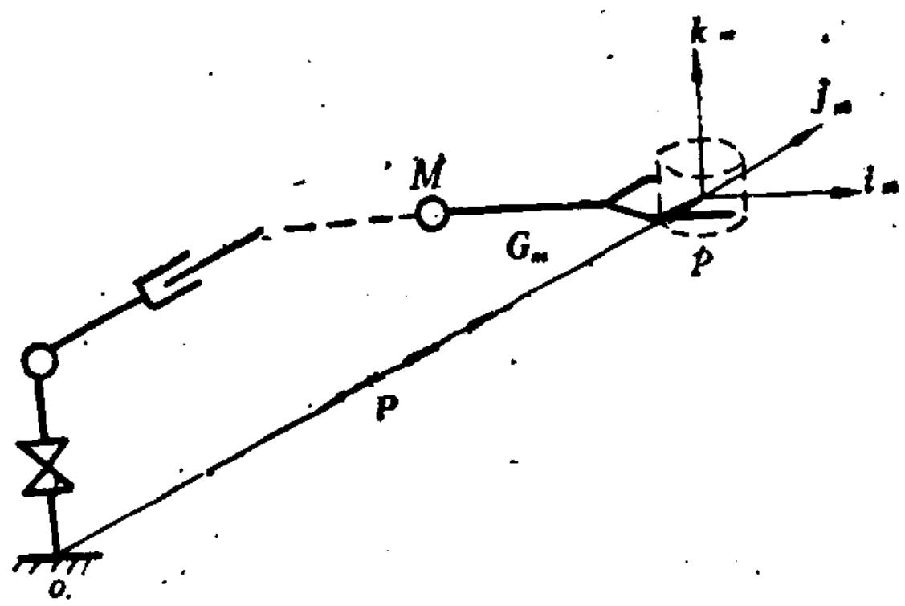

图3-9 工件(工具)坐标系

机器人机构的自由度较多,这就增强了其灵活性和通用性,但同时也增大了运动学、动力学和控制等的难度。为使问题简化,在满足工业应用的前提下,一般常使机器人机构相邻运动副的轴线相互平行或正交。采用这种特殊结构之后,相邻杆件坐标系两 $k = \frac { 3 } { 2 }$ 轴正向夹角 $\pmb { \alpha }$ 或为0或为 ${ \mathfrak { g } } { \mathfrak { 0 } } ^ { \circ }$ ,垂距 $h$ 和偏距 $\pmb { \mathrm { s } }$ 中必有一个为0,另一个为杆件长度。图3-10表示SR机器人机构的一般型式以及轴线平行或正交时的对照。由于运动副轴线相互平行或正交,机器人在开始运动时各杆件总可以对准固定坐标系的任一坐标轴的方向,这个位置称为机器人的初始位置。在初始位置上,机器人关节的位移量为0,各杆件坐标系与固定坐标系方向一致。又由于相邻运动副轴线平行或正交,故相邻坐标系间的变换由于 $\pmb { \alpha } =$ $0 ^ { \circ }$ 或 $9 0 ^ { \circ }$ 而由二次旋转变换简化为一次旋转变换。

图3-10 $3 \mathrm { \dot { R } }$ 机器人机构(a)一般型式;(b) $\alpha _ { 1 } = 0 ^ { \circ }$ , $\alpha _ { 2 } = 9 0 ^ { \circ }$ ) $\alpha _ { 9 } = 0 ^ { \circ }$ 

# 三、机器人机构的位姿方程和位移分析

对6个自由度的通用机器人,由机架开始各杆件坐标系及姿态坐标系原点的位置向量为 $P _ { \mathrm { 1 } ,} P _ { \mathrm { 2 } , } P _ { \mathrm { 3 } , } P _ { \mathrm { 4 } , } P _ { \mathrm { 5 } , } P _ { \mathrm { 6 } }$ 和 $\pmb { G } _ { 7 }$ ,这时$m = 6 + 1 = 7$ 且

$$
\begin{array} { r } { \boldsymbol { E } _ { ( m - \downarrow ) m } = \left[ \begin{array} { l l l } { \mathbf { 1 } } & { \mathbf { 0 } } & { \mathbf { 0 } } \\ { \mathbf { 0 } } & { \mathbf { 1 } } & { \mathbf { 0 } } \\ { \mathbf { 0 } } & { \mathbf { 0 } } & { \mathbf { 1 } } \end{array} \right] = \left[ \mathrm { I } \right] } \end{array}
$$

即姿态坐标系与机器人末杆坐标系的坐标轴方向一致,这是最常用的设定。按各关节轴线平行或正交的特点,有

$$
\begin{array} { r l r l r } { E _ { 0 1 } = E ^ { w _ { 1 } \theta _ { 1 } } } & { } & { E _ { 1 2 } = E ^ { w _ { 1 } \theta _ { 1 } } } & { } & { E _ { 2 3 } = E ^ { w _ { 1 } \theta _ { 1 } } } \\ { E _ { 3 4 } = E ^ { w _ { * } \theta _ { 2 } } } & { } & { E _ { 4 5 } = E ^ { w _ { * } \theta _ { 3 } } } & { } & { E _ { 5 6 } = E ^ { w _ { * } \theta _ { * } } } \end{array}
$$

机器人的位置方程按式3-54写成

$$
P = P _ { 1 } + E ^ { w _ { 1 } \theta _ { 1 } } ( P _ { 2 } + E ^ { w _ { 1 } \theta _ { 1 } } ( P _ { 3 } + E ^ { w _ { 3 } \theta _ { 3 } } ( P _ { 4 } + E ^ { w _ { 4 } \theta _ { 4 } }
$$

)

$$
\begin{array} { r l } & { ( P _ { 5 } + E ^ { w _ { 5 } \theta _ { 1 } } ( P _ { 6 } + E ^ { w _ { 5 } \theta _ { 4 } } ( G _ { 7 } ) ) \cdots ) } \\ & { \qquad = P _ { 1 } + E ^ { w _ { 1 } \theta _ { 1 } } ( P _ { 2 } ) + E ^ { w _ { 1 } \theta _ { 1 } } E ^ { w _ { 3 } \theta _ { 1 } } ( P _ { 3 } ) + E ^ { w _ { 1 } \theta _ { 1 } } E ^ { w _ { 1 } \theta _ { 1 } } } \\ & { \qquad \exists ^ { { w _ { 3 } \theta _ { 1 } } } ( P _ { 4 } ) + E ^ { w _ { 1 } \theta _ { 1 } } E ^ { w _ { 3 } \theta _ { 1 } } E ^ { w _ { 3 } \theta _ { 3 } } E ^ { w _ { 4 } \theta _ { 4 } } ( P _ { 5 } ) + E ^ { w _ { 1 } \theta _ { 1 } } E ^ { w _ { 3 } \theta _ { 1 } } } \end{array}
$$

$$
\begin{array} { r l r } { } & { \frac { H ^ { w _ { 3 } \theta _ { 3 } } } { L ^ { | w _ { 3 } \theta _ { 4 } } L ^ { w _ { 3 } \theta _ { 4 } } } ( \overline { { P } } _ { 6 } ) + \overline { { L } } ^ { w _ { 3 } \theta _ { 1 } } \overline { { L } } ^ { w _ { 3 } \theta _ { 3 } } \overline { { L } } ^ { w _ { 3 } \theta _ { 3 } } \overline { { L } } ^ { w _ { 3 } \theta _ { 4 } } \overline { { L } } ^ { w _ { 3 } \theta _ { 3 } } \overline { { L } } ^ { w _ { 3 } \theta _ { 4 } } ( \overline { { G } } \tau ) } & \\ { } & { = P _ { 1 } + P _ { 2 } + P _ { 3 } + P _ { 4 } + P _ { 5 } + P _ { 6 } + G _ { 7 } } & { ( 9 - P _ { 1 } + P _ { 2 } + P _ { 3 } + \overline { { G } } \tau ) . } \end{array}
$$

机器人的姿态坐标变换方程,简称姿态方程,有

$$
\begin{array} { r l } & { E = [ \hat { \pmb { \imath } } _ { m } \hat { \pmb { j } } _ { m } \pmb { k } _ { m } ] } \\ & { } \\ & { = E ^ { w _ { 1 } \theta _ { 3 } } \hat { \underline { { E } } } ^ { w _ { 1 } \theta _ { 3 } } \underline { { E } } ^ { w _ { 1 } \theta _ { 1 } } \underline { { E } } ^ { w _ { 4 } \theta _ { 4 } } \underline { { E } } ^ { w _ { 1 } \theta _ { 3 } } \underline { { E } } ^ { w _ { 4 } \theta _ { 4 } } \left[ \begin{array} { c c c } { { \bf 1 } } & { 0 } & { 0 } \\ { 0 } & { { \bf 1 } } & { 0 } \\ { 0 } & { 0 } & { { \bf 1 } } \end{array} \right] } \end{array}
$$

式中一些符号约定如下:

$! . { \mathcal { w } } _ { n } , n { = } 1 , 2 { \cdot } { \cdot } { \cdot } 6 _ { \circ }$ 按上述初始位置的定义,当机器人处于初始位置时 $w _ { n }$ 为 $i \lrcorner j$ 或 $\pmb { k }$ ,视与固定坐标系哪一个轴方向相一致而定。

2. ${ \pmb { P } } _ { n }$ 若 $\pmb { P _ { n } }$ 为常向量,则用 $c _ { n }$ 表示;若为变长度向量,则用$\pmb { L _ { n } }$ 表示。在初始位置时,同时在 $c _ { n }$ 或 ${ \pmb { L } } _ { n }$ 的右上角标注 $\dot { \pmb { \mathscr { z } } }$ 或 $j$ 或$k _ { i }$ ,视该向量与固定坐标系哪一个轴方向一致而定。

图3-11所示为东芝关节型机器人机构,根据式3-56和3-57,可写出该机器人的位姿方程

$$
\begin{array} { r l } {  { C _ { 1 } ^ { k } + E ^ { k \theta _ { 1 } } ( C _ { 2 } ^ { k } + E ^ { j \theta _ { 1 } } ( C _ { 3 } ^ { k } } } \\ & { + E ^ { j \theta _ { 1 } } ( C _ { 4 } ^ { 4 } + E ^ { i \theta _ { * } } ( C _ { 5 } ^ { 4 } + E ^ { j \theta _ { * } } ( C _ { 6 } ^ { 4 } + E ^ { i \theta _ { * } } ( G _ { 7 } ^ { * } ) ) \cdots ) } \\ & { = C _ { 1 } ^ { k } + C _ { 2 } ^ { k } + E ^ { k \theta _ { 1 } j \theta _ { 1 } } ( C _ { 3 } ^ { k } + E ^ { j \theta _ { * } } ( C _ { 4 } ^ { 4 } + C _ { 5 } ^ { 4 } + E ^ { i \theta _ { * } } E ^ { j \theta _ { * } } ( C _ { 6 } ^ { 4 } + G _ { 7 } ^ { 4 } ) ) ) } \\ & { = C _ { 1 } ^ { k } + C _ { 2 } ^ { k } + E ^ { k \theta _ { 1 } } E ^ { j \theta _ { 1 } } ( C _ { 3 } ^ { k } ) + E ^ { k \theta _ { 1 } } E ^ { j ( \theta _ { 1 } + \theta _ { 1 } ) } } \\ & { \quad ( C _ { 4 } ^ { 4 } + C _ { 5 } ^ { 4 } ) + E ^ { k \theta _ { 1 } } E ^ { j ( \theta _ { 4 } + \theta _ { 1 } ) } E ^ { i \theta _ { 4 } } E ^ { j \theta _ { * } } ( C _ { 6 } ^ { 4 } + G _ { 7 } ^ { 4 } ) \qquad ( \mathfrak { g } - E \{ 8 \} ) } \end{array}
$$

)

式中

$$
\mathbf { { \cal { C } } _ { 1 } ^ { \kappa } } { = } \left[ \begin{array} { l } { 0 } \\ { 0 } \\ { { \cal { C } } _ { 1 } } \end{array} \right] \quad \mathbf { { \cal { C } } _ { 2 } ^ { \kappa } } { = } \left[ \begin{array} { l } { 0 } \\ { 0 } \\ { { \cal { C } } _ { 2 } } \end{array} \right] \quad \mathbf { { \cal { C } } _ { 3 } ^ { \kappa } } { = } \left[ \begin{array} { l } { 0 } \\ { 0 } \\ { 0 } \\ { { \cal { C } } _ { 3 } } \end{array} \right]
$$

图3-11 东芝机器人

$$
\begin{array} { r } { \pmb { C } _ { 4 } ^ { \ast } = \left[ \begin{array} { l } { C _ { 4 } } \\ { 0 } \\ { 0 } \end{array} \right] \quad \pmb { C } _ { 5 } ^ { \ast } = \left[ \begin{array} { l } { C _ { 5 } } \\ { 0 } \\ { 0 } \end{array} \right] \quad \pmb { C } _ { 6 } ^ { \ast } = \left[ \begin{array} { l } { C _ { 6 } } \\ { 0 } \\ { 0 } \end{array} \right] } \end{array}
$$

$$
\pmb { G } _ { 7 } ^ { \iota } = \left[ \begin{array} { l } { G _ { 7 } } \\ { 0 } \\ { 0 } \end{array} \right]
$$

$$
E / = E / ^ { k \theta _ { 1 } } E / ^ { ; ( \theta _ { 1 } + \theta _ { 3 } ) } E / ^ { ; i \theta _ { 4 } } E / ^ { ; \theta _ { 4 } } E / ^ { ; ( \theta _ { 4 } }
$$

当给出各关节的运动参数及机器人各杆件的几何尺寸参数后,机器人夹持点的位置和被夹持工件或工具的姿态就被唯一地确定。

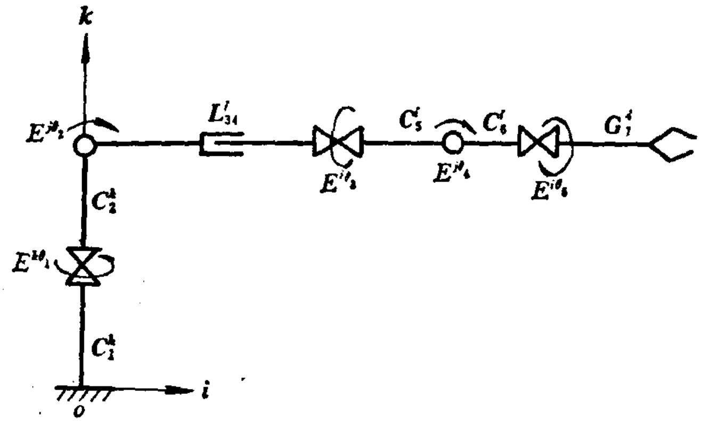

图3-12川崎机器人

图8-12所示为既带转动副又带移动副的川崎机器人机构。同理可写出其位姿方程:

$$
\begin{array} { r l } & { P = C _ { 1 } ^ { \mathrm { s } } + E ^ { \mathrm { i } \theta s } ( C _ { 2 } ^ { \mathrm { s } } + B ^ { \mathrm { i } \theta s } ( L _ { 3 4 } ^ { \varepsilon } + E ^ { \mathrm { i } \theta s } ( C _ { 5 } ^ { \varepsilon } + E ^ { \mathrm { i } \theta s } ( C _ { 6 } ^ { \varepsilon } + E ^ { \mathrm { i } \theta s } ( G _ { 7 } ^ { \varepsilon } ) ) \cdots ) } \\ & { \quad - C _ { 1 } ^ { \mathrm { s } } + C _ { 2 } ^ { \mathrm { s } } + \bar { E } ^ { \mathrm { i } \theta s } L ^ { \mathrm { i } \theta s } ( L _ { 3 4 } ^ { \varepsilon } + C _ { 5 } ^ { \varepsilon } ) + B ^ { \mathrm { i } \theta s } L ^ { \mathrm { i } \theta s } L ^ { \mathrm { i } \theta s } \bar { E } ^ { \mathrm { i } \theta s } ( C _ { 6 } ^ { \varepsilon } + G _ { 7 } ^ { \varepsilon } ) } \\ & { \quad = C _ { 1 } ^ { \mathrm { s } } + C _ { 2 } ^ { \mathrm { s } } + \bar { E } ^ { \mathrm { i } \theta s } L ^ { \mathrm { i } \theta s } ( L _ { 3 4 } ^ { \varepsilon } + C _ { 5 } ^ { \varepsilon } ) + E ^ { \mathrm { i } \varepsilon ( - s _ { 0 } ) } ( C _ { 6 } ^ { \varepsilon } + G _ { 7 } ^ { \mathrm { i } } ) } \\ & { \quad = C _ { 1 } ^ { \mathrm { s } } + C _ { 2 } ^ { \mathrm { s } } + \bar { E } ^ { \mathrm { i } \theta s } L ^ { \mathrm { i } \theta s } ( L _ { 3 4 } ^ { \varepsilon } + C _ { 5 } ^ { \varepsilon } ) + E ( C _ { 6 } ^ { \varepsilon } + G _ { 7 } ^ { \varepsilon } ) } \\ &  \quad = C _ { 1 } ^ { \mathrm { s } } + C _ { 2 } ^ { \mathrm { s } } + \bar { E } ^ { \mathrm { i } \theta s } L ^ { \mathrm { i } \theta s } ( L _ { 3 4 } ^ { \varepsilon } + C _ { 5 } ^ { \varepsilon } ) + [ i _ { \mathrm { s } } j _  \mathrm \end{array}
$$

式中

$$
= C _ { 1 } ^ { \bar { \kappa } } + C _ { 2 } ^ { \bar { \kappa } } + E ^ { \bar { \kappa } \theta _ { 1 } } \bar { E } ^ { i \theta _ { 1 } } ( L _ { 3 4 } ^ { \bar { \kappa } } + C _ { 5 } ^ { \bar { \kappa } } ) + ( C _ { 6 } + G _ { 7 } ) i _ { 6 }
$$

$$
\begin{array} { r } { \pmb { C } _ { 1 } ^ { \kappa } { = } \left[ \begin{array} { c } { 0 } \\ { 0 } \\ { C _ { 1 } } \end{array} \right] \quad \pmb { C } _ { 2 } ^ { \kappa } { = } \left[ \begin{array} { c } { 0 } \\ { 0 } \\ { C _ { 2 } } \end{array} \right] \quad \pmb { L } _ { 3 4 } ^ { \kappa } { = } \left[ \begin{array} { c } { L _ { 3 4 } } \\ { 0 } \\ { 0 } \end{array} \right] } \end{array}
$$

$$
\begin{array} { r } { \mathbf { C } _ { 5 } ^ { \ast } = \left[ \begin{array} { l } { C _ { 5 } } \\ { 0 } \\ { 0 } \end{array} \right] \quad \mathbf { C } _ { 6 } ^ { \ast } = \left[ \begin{array} { l } { C _ { 6 } } \\ { 0 } \\ { 0 } \end{array} \right] \quad G _ { 7 } ^ { \ast } = \left[ \begin{array} { l } { G _ { 7 } } \\ { 0 } \\ { 0 } \end{array} \right] } \end{array}
$$

$$
{ \cal E } = [ \dot { \imath } _ { 6 } j _ { 6 } k _ { 6 } ] = { \cal E } ^ { k \cdot \theta _ { 1 } } { \cal E } ^ { j \theta _ { 1 } } { \cal E } ^ { i \theta _ { 3 } } { \cal E } ^ { ; \theta _ { 4 } } { \cal E } ^ { ; \theta _ { 4 } }
$$

# 四、机器人机构的速度和加速度分析

基于前述关于向量和回转变换矩阵微分的基本知识,将位置向量 $\pmb { P }$ 对时间进行一次和二次微分,可分别得到机器人的速度和加速度。现以川崎机器人为例分析如下。

由式3-60对时间求导,得

式中

$$
\dot { P } { = } \dot { P } _ { \scriptscriptstyle \mathrm { \scriptsize ~ 1 2 } } { + } \dot { P } _ { \scriptscriptstyle \mathrm { \scriptsize ~ 3 5 } } { + } \dot { P } _ { \scriptscriptstyle \mathrm { \scriptsize ~ 5 7 } }
$$

$$
\dot { \pmb { P } } _ { 1 2 } { = } \dot { \pmb { C } } _ { 1 } ^ { \kappa } { + } \dot { \pmb { C } } _ { 2 } ^ { \kappa } { = } 0
$$

$$
\begin{array} { r l } {  { \hat { P } _ { 3 \ell ^ { \prime \prime } } \frac { \mathrm { d } } { \mathrm { d } t } ( L ^ { \mathrm { H e } } ; B ^ { \ell \mu _ { 3 } } ( L _ { 3 4 } ^ { \ell } + C _ { 5 } ^ { 4 } ) ) } \quad } & { } \\ & { = \vec { L } ^ { \mathrm { H e } } _ { 3 \ell } \vec { L } ^ { \mathrm { G P } _ { 3 } } ( L _ { 4 4 } ^ { \ell } + C _ { 5 } ^ { 4 } ) + \vec { L } ^ { \mathrm { H e } } _ { 4 \ell } \frac { \mathrm { d } } { \mathrm { d } t } ( \vec { L } ^ { \mu _ { 3 } } ( L _ { 3 4 } ^ { \ell } + C _ { 5 } ^ { 4 } ) ) } \\ & { = \vec { L } ^ { \mathrm { W e } } _ { 3 \ell } \vec { L } ^ { \mathrm { W e } } _ { 3 \ell } ( L _ { 3 4 } ^ { \ell } + C _ { 5 } ^ { 4 } ) + \vec { L } ^ { \mathrm { W e } } _ { 4 \ell } \vec { L } ^ { \mathrm { H e } } _ { 3 \ell } ( L _ { 4 4 } ^ { \ell } + C _ { 5 } ^ { 4 } ) } \\ & { \quad + \vec { L } ^ { \mathrm { H e } } _ { 1 \ell } \vec { L } ^ { \mathrm { G P } _ { 3 } } \frac { \mathrm { d } } { \mathrm { d } t } ( L _ { 3 4 } ^ { \ell } + C _ { 5 } ^ { 4 } ) } \\ &  = \vec { \theta } _ { 3 } \vec { L } ^ { \mathrm { W e } } _ { 3 \ell } \frac { \mathrm { d } } { \mathrm { d } t } \vec { L } ^ { \mathrm { W e } } _ { 4 \ell } ( L _ { 3 4 } ^ { \ell } + C _ { 5 } ^ { 4 } ) + \vec { \theta } _ { 2 } \vec { R } ^ { \mathrm { H e } } _ { 3 \ell } \frac  \vec { L } ^ { \prime } \vec { L } ^ { \prime } \vec { B } ^ { \mathrm { H e } } ( L _ { 3 4 } ^ { \ell } + C _ { 5 } ^ { 4 }  \end{array}
$$

由式8-61得

$$
\begin{array} { r } { \dot { E } = \left[ \frac { \partial E } { \partial \theta _ { 1 } } \frac { \partial E } { \partial \theta _ { 2 } } \frac { \partial E } { \partial \theta _ { 3 } } \frac { \partial E } { \partial \theta _ { 3 } } \frac { \partial E } { \partial \theta _ { 4 } } \frac { \partial E } { \partial \theta _ { 5 } } \right] \left( \begin{array} { l } { \dot { \theta } _ { 3 } } \\ { \dot { \theta } _ { 2 } } \\ { \dot { \theta } _ { 3 } } \\ { \dot { \theta } _ { 4 } } \\ { \dot { \theta } _ { 5 } } \end{array} \right) } \end{array}
$$

式中

$$
\frac { \partial E } { \partial \theta _ { 1 } } { = } J _ { 3 } ^ { k } E ^ { \chi _ { \theta 1 } } E ^ { \prime } { } ^ { \theta _ { 3 } } E ^ { \prime } { } ^ { i \theta _ { 3 } } E ^ { \prime } { } ^ { j \theta _ { 4 } } E ^ { \prime } { } ^ { i \theta _ { 4 } } { = } J _ { 3 } ^ { k } E
$$

$$
\frac { \partial E } { \partial { \theta _ { 2 } } } { } = E ^ { k \theta _ { 1 } } J \{ E ^ { j \theta _ { 1 } } E ^ { i \theta _ { 1 } } E ^ { i \theta _ { 4 } } E ^ { i \theta _ { 4 } } = E ^ { k \theta _ { 3 } } J \{ _ { } ^ { j } E ^ { j k ( - \theta _ { 1 } ) } E \}
$$

$$
\frac { \partial E } { \partial \theta _ { 3 } } = E ^ { \chi \theta _ { 1 } } E ^ { j \theta _ { 1 } } J _ { 3 } ^ { \{ } \bar { E } ^ { : \theta _ { 3 } } \bar { E } ^ { : j \theta _ { 4 } } \bar { E } ^ { : \theta _ { 4 } } 
$$

$$
\begin{array} { c } { { \displaystyle \frac { \partial E ^ { i } } { \partial \theta _ { 4 } } = E ^ { i k \theta _ { 1 } } E ^ { i \theta _ { 1 } } E ^ { i \theta _ { 3 } } E ^ { j } \overleftrightarrow { \underbrace { \theta } _ { 3 } } E ^ { i \theta _ { 4 } } E ^ { i \theta _ { 5 } } } } \\ { { { } } } \\ { { = E ^ { i \ell \theta _ { 1 } } E ^ { i \theta _ { 1 } } E ^ { i \theta _ { 3 } } E ^ { i \theta _ { 4 } } E ^ { j \theta _ { 4 } } J \overleftrightarrow { \underbrace { J } } E ^ { i \theta _ { 5 } } = E ^ { i } \overleftrightarrow { E } ^ { i ( - \theta _ { 8 } ) } J \ _ { 3 } ^ { j } E ^ { i \theta _ { 4 } } } } \end{array} .
$$

$$
\frac { \partial E } { \partial { \theta } _ { 5 } } = E ^ { k \theta _ { 3 } } E ^ { j \theta _ { 3 } } E ^ { i \theta _ { 3 } } E ^ { j \theta _ { 4 } } E ^ { . \theta _ { 5 } } J _ { 3 } ^ { . } = E J _ { 3 } ^ { . }
$$

其中JJJ是回转变换矩阵的分量。将式S-62再一次对时间求导,得

$$
\stackrel {  } { P } = \stackrel {  } { P } _ { 3 3 } + \stackrel {  } { P } _ { 6 7 }
$$

式中

$$
\begin{array} { r l } { P _ { \mathrm { S c } } } & { = \hat { \mu } _ { \mathrm { S c } } ^ { \dagger } \mathcal { R } ^ { \dagger } ( \hat { \mathbf { E } } \cdot \hat { \mathbf { g } } ^ { \dagger } ( \hat { \mathbf { A } } _ { \mathrm { H } } + \hat { \mathbf { C } } ) ) + \hat { \nu } _ { \mathrm { L F } } \hat { \mathbf { g } } ^ { \dagger } ( \hat { \mathbf { g } } ^ { \dagger } ( \hat { \mathbf { g } } ^ { \dagger } ( \hat { \mathbf { g } } ^ { \dagger } - \hat { \mathbf { g } } ^ { \dagger } ) )  } \\ & { \quad +  \frac { 2 } { 3 } \mathrm { b } ^ { 2 } \mathrm { b } ^ { 3 } \mathrm { b } ^ { 4 } ( \hat { \mathbf { Z } } \cdot \hat { \mathbf { g } } ^ { \dagger } ( \hat { \mathbf { A } } _ { \mathrm { H } } + \hat { \mathbf { C } } ) ) \gamma ^ { \mathrm { s c } } \hat { \mathbf { g } } ^ { \dagger } ( \hat { \mathbf { A } } _ { \mathrm { H } } + \hat { \mathbf { C } } ) \hat { \mathbf { f } } _ { \mathrm { H } } ^ { \dagger } ( \hat { \mathbf { g } } ^ { \dagger } ( \hat { \mathbf { g } } ^ { \dagger } ( \hat { \mathbf { g } } ^ { \dagger } + \hat { \mathbf { H } } ^ { \dagger } ) )   } \\ &  \quad   + \hat { \nu } _ { \mathrm { L F } } \hat { \mathbf { g } } ^ { \dagger } ( \hat { \mathbf { Z } } ^ { \dagger } ( \hat { \mathbf { g } } ^ { \dagger } ( \hat { \mathbf { g } } ^ { \dagger } ( \hat { \mathbf { g } } ^ { \dagger } ( \hat { \mathbf { g } } ^ { \dagger } + \hat { \mathbf { Z } } ^ { \dagger } ) ) ) \hat { \mathbf { g } } ^ { \dagger } ( \hat { \mathbf { g } } ^ { \dagger } ( \hat { \mathbf { g } } ^ { \dagger } ( \hat  \mathbf  \end{array}
$$

由式3-63

$$
| \begin{array} { l l l } { - \frac { \partial ^ { 2 } \overline { { B } } } { \partial \theta _ { 1 } } } & { \frac { \partial ^ { 3 } \mathbf { E } } { \partial \theta _ { i } \partial \theta _ { 2 } } } & { \frac { \partial ^ { 4 } \overline { { B } } } { \partial \theta _ { 3 } \partial \theta _ { 3 } } } & { \frac { \partial ^ { 2 } \overline { { B } } } { \partial \theta _ { 3 } \partial \theta _ { 4 } } } & { \frac { \partial ^ { 3 } \overline { { B } } } { \partial \theta _ { 3 } \partial \theta _ { 5 } } } \\ { \frac { \partial ^ { 3 } \overline { { B } } } { \partial \theta _ { 2 } \partial \theta _ { 1 } } } & { \frac { \partial ^ { 2 } \overline { { B } } } { \partial \theta _ { 3 } ^ { 2 } } } & { \frac { \partial ^ { 3 } \overline { { B } } } { \partial \theta _ { 4 } \partial \theta _ { 3 } } } & { \frac { \partial ^ { 3 } \overline { { B } } } { \partial \theta _ { 3 } \partial \theta _ { 4 } } } & { \frac { \partial ^ { 2 } \overline { { B } } } { \partial \theta _ { 3 } \partial \theta _ { 5 } } } \\ { \frac { \partial ^ { 2 } \overline { { B } } } { \partial \theta _ { 5 } \partial \theta _ { 5 } } } & { \frac { \partial ^ { 5 } \overline { { B } } } { \partial \theta _ { 5 } \partial \theta _ { 6 } } } & { \frac { \partial ^ { 2 } \overline { { B } } } { \partial \theta _ { 3 } } } & { \frac { \partial ^ { 5 } \overline { { B } } } { \partial \theta _ { 3 } \partial \theta _ { 4 } } } & { \frac { \partial ^ { 6 } \overline { { B } } } { \partial \theta _ { 3 } \partial \theta _ { 5 } } } \\ { \frac { \partial ^ { 2 } \overline { { B } } } { \partial \theta _ { 5 } \partial \theta _ { 5 } } } & { \frac { \partial ^ { 5 } \overline { { B } } } { \partial \theta _ { 5 } \partial \theta _ { 5 } } } &  \frac  \partial ^  6 \end{array}
$$

$$
\frac { \partial ^ { 2 } { \cal E } } { \partial \theta _ { 1 } \partial \theta _ { 2 } } = \frac { \partial ^ { 2 } { \cal E } } { \partial \theta _ { 2 } \partial \theta _ { 1 } } = J _ { \mathrm { ~ 3 ~ } } ^ { k } \frac { \partial { \cal E } } { \partial \theta _ { 2 } } = J _ { \mathrm { ~ 3 ~ } } ^ { k } E ^ { k \theta _ { 1 } } J _ { \mathrm { ~ 3 ~ } } ^ { \downarrow } E ^ { k ( - \theta _ { 1 } ) } \frac { } { } \cal E 
$$

$$
\frac { \partial ^ { 2 } E } { \partial \theta _ { \cdot } \partial \theta _ { 3 } } = \frac { \partial ^ { 2 } E } { \partial \theta _ { \cdot } \partial \theta _ { 1 } } = J _ { \cdot } ^ { k } \ \frac { \partial E } { \partial \theta _ { 3 } } = J _ { \cdot } ^ { k } E ^ { 1 \bar { \nu } \theta _ { \cdot } } E ^ { 1 \bar { \theta } \circ } J _ { \cdot } ^ { \ast } E ^ { \ast \theta _ { \ast } } E ^ { 1 \bar { \theta } \ast } E ^ { 1 \bar { \theta } \ast } E ^ { 1 \bar { \theta } \ast } E ^ { \ast \theta _ { \ast } } E ^ { \ast \theta _ { \ast } }
$$

$$
\frac { \partial ^ { 2 } E } { \partial \theta _ { \scriptscriptstyle 1 } \partial \theta _ { \scriptscriptstyle 4 } } = \frac { \partial ^ { 2 } E } { \partial \theta _ { \scriptscriptstyle 4 } \partial \theta _ { \scriptscriptstyle 1 } } = J _ { \scriptscriptstyle 3 } ^ { \scriptscriptstyle k } \frac { \partial E } { \partial \theta _ { \scriptscriptstyle 4 } } = J _ { \scriptscriptstyle 3 } ^ { \scriptscriptstyle k } E \ : E ^ { i ( - \theta _ { \scriptscriptstyle 3 } ) } J _ { \scriptscriptstyle 3 } ^ { \scriptscriptstyle j } E ^ { i \theta _ { \scriptscriptstyle 4 } }
$$

$$
\frac { \partial ^ { 2 } E } { \partial \theta _ { \mathrm { { i } } } \partial \theta _ { \mathrm { { s } } } } = \frac { \partial ^ { 2 } E } { \partial \theta _ { \mathrm { { s } } } \partial \theta _ { \mathrm { { 1 } } } } = J _ { \mathrm { { s } } } ^ { \kappa } \ \frac { \partial E } { \partial \theta _ { \mathrm { { s } } } } = J _ { \mathrm { { s } } } ^ { \kappa } E / J _ { \mathrm { { s } } } ^ { \kappa }
$$

$$
\begin{array} { r l } {  { \frac { \partial ^ { 2 } {  { \mathcal { B } } } ^ { i } } { \partial \theta _ { 2 } ^ { 2 } } = E ^ { \chi _ { \delta \theta _ { 1 } } } J _ { 3 } ^ { i } E ^ { \chi _ { ( - \theta _ { 1 } ) } } \frac { \partial E } { \partial \theta _ { 2 } } } } \\ & { = E ^ { \chi _ { \theta _ { 1 } } } J _ { 3 } ^ { i } E ^ { \chi _ { ( - \theta _ { 1 } ) } } E ^ { \chi _ { \theta _ { 1 } } } J _ { 3 } ^ { i } E ^ { \chi _ { ( - \theta _ { 1 } ) } } E } \\ & { = - E ^ { \chi _ { \theta _ { 1 } } } J _ { 2 } ^ { i } E ^ { \chi _ { ( - \theta _ { 1 } ) } } E } \end{array}
$$

$$
\begin{array} { l } { { \displaystyle { \frac { \partial ^ { 2 } { \cal E } } { \partial \theta _ { 2 } \partial \theta _ { 3 } } } = { \frac { \partial ^ { 2 } { \cal E } } { \partial \theta _ { 3 } \partial \theta _ { 2 } } } = { \cal E } ^ { \chi _ { \theta 1 } } J _ { 3 } ^ { \prime } { \cal E } ^ { \chi _ { \theta 1 } } J _ { 3 } ^ { \prime } { \cal E } ^ { \nu _ { \theta } } } = } \\ { { \displaystyle \quad \quad \quad \quad \quad \quad \quad \quad \quad \quad \quad \quad \quad \quad \quad \quad \quad } } \\ { { \displaystyle \quad \quad \quad \quad \quad \quad \quad \quad \quad \quad \quad \quad \quad \quad \quad \quad \quad \quad \quad \quad \quad \quad \quad \quad } } \\ { { \displaystyle \quad \quad \quad \quad \quad \quad \quad \quad \quad \quad \quad \quad \quad \quad \quad \quad \quad \quad \quad \quad \quad \quad \quad \quad } } \\ { { \displaystyle \quad \quad \quad \quad \quad \quad \quad \quad \quad \quad \quad \quad \quad \quad \quad \quad \quad \quad \quad \quad \quad \quad \quad \quad } } \\ { { \displaystyle \quad \quad \quad \quad \quad \quad \quad \quad \quad \quad \quad \quad \quad \quad \quad \quad \quad \quad \quad \quad \quad \quad \quad \quad } } \\ { { \displaystyle \quad \quad \quad \quad \quad \quad \quad \quad \quad \quad \quad \quad \quad \quad \quad \quad \quad \quad \quad \quad \quad \quad \quad \quad } } \\ { { \displaystyle \quad \quad \quad \quad \quad \quad \quad \quad \quad \quad \quad \quad \quad \quad \quad \quad \quad \quad \quad \quad \quad \quad \quad \quad \quad \quad \quad } } \\ { { \displaystyle \quad \quad \quad \quad \quad \quad \quad \quad \quad \quad \quad \quad \quad \quad \quad \quad \quad \quad \quad \quad \quad \quad \quad \quad \quad \quad \quad } } \\ { { \displaystyle \quad \quad \quad \quad \quad \quad \quad \quad \quad \quad \quad \quad \quad \quad \quad \quad \quad \quad \quad \quad \quad \quad \quad \quad \quad \quad \quad \quad } } \\ { { \displaystyle \quad \quad \quad \quad \quad \quad \quad \quad \quad \quad \quad \quad \quad \quad \quad \quad \quad \quad \quad \quad \quad \quad \quad } } \\   \displaystyle \quad \quad \quad \quad \quad \ \end{array}
$$

$$
\begin{array} { c } { { \displaystyle { \frac { \partial ^ { 2 } E } { \partial \theta _ { 2 } \partial \theta _ { 4 } } } = { \frac { \partial ^ { 2 } E } { \partial \theta _ { 4 } \partial \theta _ { 2 } } } { } = { \cal E } ^ { \nu \theta _ { 1 } } J _ { 3 } ^ { \prime } { \cal E } ^ { \nu ( - \theta _ { 1 } ) } \ { \frac { \partial E } { \partial \theta _ { 4 } } } } } \\ { { { } } } \\ { { = { \cal E } ^ { k \theta _ { 1 } } J _ { 3 } ^ { \prime } E ^ { k ( - \theta _ { 1 } ) } E { \cal E } ^ { i ( - \theta _ { 3 } ) } J _ { 3 } ^ { \prime } { \cal E } ^ { i \theta _ { 4 } } } } \end{array}
$$

$$
\begin{array} { c } { { \displaystyle \frac { \partial ^ { 2 } { \mathcal { B } } } { \partial \theta _ { 2 } \partial \theta _ { 5 } } = \frac { \partial ^ { 2 } { \mathcal { B } } } { \partial \theta _ { 5 } \partial \theta _ { 2 } } { = } E ^ { i \star \theta _ { 1 } } J _ { 3 } ^ { \prime } E ^ { i \star ( - \theta _ { 1 } ) } \displaystyle \frac { \partial E ^ { i } } { \partial \theta _ { 5 } } } } \\ { { { = } E ^ { k \theta _ { 1 } } J _ { 3 } ^ { \prime } E ^ { k ( - \theta _ { 1 } ) } E J _ { 3 } ^ { \prime } } } \end{array}
$$

$$
\frac { \partial ^ { 2 } { \cal E } } { \partial \theta _ { 3 } ^ { 2 } } = - { \cal E } ^ { k \theta _ { 1 } } { \cal E } ^ { ; j \theta _ { 1 } } J _ { 2 } ^ { * } { \cal E } ^ { i \theta _ { 1 } } { \cal E } ^ { j \theta _ { 4 } } { \cal E } ^ { i \theta _ { 1 } }
$$

$$
{ \frac { \partial ^ { 2 } E } { \partial \theta _ { 3 } \partial \theta _ { 4 } } } = { \frac { \partial ^ { 2 } E } { \partial \theta _ { 4 } \partial \theta _ { 3 } } } = E ^ { k \theta _ { 1 } } E ^ { j \theta _ { 3 } } J _ { 3 } ^ { \iota } E ^ { i \theta _ { 3 } } J _ { 3 } ^ { \iota } E ^ { j \theta _ { 4 } } E ^ { i \theta _ { 4 } }
$$

$$
{ \frac { \partial ^ { 2 } E } { \partial \theta _ { s } \partial \theta _ { 5 } } } = { \frac { \partial ^ { 2 } E } { \partial \theta _ { s } \partial \theta _ { 3 } } } = E ^ { \kappa \theta _ { s } } E ^ { ; \theta _ { s } } J _ { 3 } ^ { * } E ^ { i \theta _ { s } } E ^ { j \theta _ { s } } J _ { 3 } ^ { * } E ^ { i \theta _ { s } }
$$

$$
\frac { \partial ^ { 2 } E } { \partial \theta _ { 4 } ^ { 2 } } = \frac { \partial E } { \partial \theta _ { 4 } } \ : E ^ { i ( - \theta _ { 5 } ) } J _ { 3 } ^ { j } E ^ { i \theta _ { 4 } } = \ : - \ : E E ^ { i ( - \theta _ { 4 } ) } J _ { z } ^ { j } E ^ { i \theta _ { 4 } }
$$

$$
\begin{array} { r l } & { \cfrac { \partial ^ { 2 } E } { \partial \theta _ { 4 } \partial \theta _ { 5 } } = \cfrac { \partial ^ { 2 } E } { \partial \theta _ { 5 } \partial \theta _ { 4 } } = \cfrac { \partial E } { \partial \theta _ { 3 } } \ J _ { 3 } ^ { \ast } = E E ^ { i ( - \theta _ { 4 } ) } \ J _ { 3 } ^ { \ast } \mathit { \overline { { E } } } ^ { i \theta _ { 3 } } \mathcal { J } _ { 3 } ^ { \ast } } \\ & { \cfrac { \partial ^ { 2 } E } { \partial \theta _ { 5 } ^ { 2 } } = \cfrac { \partial E } { \partial \theta _ { 5 } } \ J _ { 3 } ^ { \ast } = - E J _ { 2 } ^ { \ast } } \end{array}
$$

当给出机器人的几何尺寸参数以及各关节的位移量 $( \theta$ 或 $\pmb { L }$ 、速度 $( \dot { \theta }$ 或 $\pmb { L } )$ 和加速度( $\ddot { \theta }$ 或 $\tilde { L } )$ 时,即可对应求出机器人当前的位置 $P .$ 姿态 $E$ 以及机器人的速度 $\dot { P }$ 和加速度 $\pmb { \vec { P } }$ 。

上述对川崎机器人速度和加速度的分析方法,同样适用于其他类型的机器人。

# 五、机器人机构的运动学逆解

如前所述,对于几何参数已知的机器人机构,当已知关节位移$\theta _ { i }$ ,利用位姿方程即可求出机器人机构末杆或者所夹持的工具或工件的对应位置和姿态。在机器人机构的实际应用中,由于运动控制的需要,往往碰到与此相反的问题,即已知末杆或工具或工件的位姿,再求对应的各关节位移。这类问题称为机器人机构的运动学逆问题。

对具有6个自由度的机器人机构,从位姿方程可得到12个方程式。其中从姿态方程得出的9个方程式,只有3个是独立的,加上从位置方程得出的3个独立方程式,共有6个独立方程式,包含了6个未知关节变量。这是一组强非线性方程。求关节变量实质上是解非线性方程组,它与解线性方程组不同,目前还没有能够比较有效地用来解非线性方程组的算法。所以针对不同的对象,根据不同的要求,研究机器人机构学的学者提出了多种不同的解法。

现有的机器人机构运动学逆问题的求解方法主要分两大类,即封闭形式解法和数值解法。所谓封闭形式解法,是指基于解析表达式或不超过4阶的多项式方程的解法,它只要将已知参数代入,即可获得所需的解。这种方法一般又可分为代数法和几何法。

而机器人机构运动学逆问题的数值解法是一个较为复杂的问题。从70年代初至今,许多学者对此做了大量工作,提出了许多有效算法,综合起来大致可分为如下五类:

第一类采用牛顿-拉弗森(Newton-Raphson)方法。通过对机器人机构运动方程组作不同的变形处理或引入不同的姿态设定,派生了多种不同的解法。这类算法的优点在于当初值点选择充分接近解时,收敛速度很快。

第二类采用所谓速度控制法。该方法通过对运动方程组的处理,求出速度关系式,然后在运动轨迹已知的情况下,用数值积分从速度求出位移量。这类算法比第一类算法复杂,每次迭代时间较长。但它具有较强稳定性和大范围收敛性。

第三类采用位置和姿态分别迭代法,或称离散杆法。这类算法每步迭代计算量少,具有大范围收敛性。但其收敛速度较慢,且受机构结构形式限制。

第四类采用牛顿-高斯(Newton-Gauss)法。该方法将机器人机构运动方程组构成目标位姿与初始位姿的距离关系式,作为目标优化函数,然后用各种优化方法求解最小值。它的收敛速度快,但总的计算量较大。

第五类是针对连续轨迹控制要求而设计的各种不同的特殊方

法。

由于机器人机构运动学逆解都是用来对机器人进行在线控制,所以究竟采用哪一种方法,主要考虑方法的计算量、收敛速度和用于在线计算会遇到什么问题。关于数值解法的实际例子,将在第八章给出。

研究结果表明,对所有带转动副关节和移动副关节的6自由度开链机器人机构,运动学逆问题都是数值可解的。在特殊情况下,诸如相邻关节轴线平行或正交的机器人机构,还可有封闭形式解。当前常用的机器人机构,均采用这种特殊结构。下面举几个例子来具体说明如何建立解析表达式,以求解这类常用机器人机构的运动学逆问题。

图3-13所示为含有 $\pmb { 4 }$ 个转动关节的机器人机构,其位姿方程如下

图3-134R机器人

$$
\begin{array} { r l } & { E { = } E ^ { \chi _ { \theta 1 } } E ^ { \jmath _ { \theta 1 } } E ^ { \zeta _ { 0 } } \boldsymbol { \mathrm { \overline { { \theta } } } } } \\ & { \ = \boldsymbol { \mathrm { \overline { { \theta } } } } ^ { \chi _ { \theta 1 } } E ^ { \zeta _ { 0 } } \boldsymbol { \mathrm { \overline { { \theta } } } } } \end{array}
$$

$$
= \left[ \begin{array} { c c c } { \cos \theta _ { 1 } \cos \theta } & { \sin \theta _ { 1 } } & { - \cos \theta _ { 1 } \sin \theta } \\ { - \sin \theta _ { 1 } \cos \theta } & { \cos \theta _ { 1 } } & { \sin \theta _ { 1 } \sin \theta } \\ { \sin \theta } & { 0 } & { \cos \theta } \end{array} \right]
$$

式中

$$
\theta = \theta _ { 2 } + \theta _ { 3 } + \theta _ { 4 }
$$

$$
\begin{array} { r l } & { P { - } C _ { 1 } ^ { \mathrm { s } } { + } C _ { 2 } ^ { \mathrm { s } } { + } B ^ { \mathrm { k } \delta _ { 1 } } E ^ { { j } \delta _ { 1 } } ( C _ { 3 } ^ { \mathrm { s } } { + } C _ { 3 ^ { \prime } } ^ { \mathrm { a } } { + } E ^ { { j } \delta _ { 3 } } ( C _ { 4 } ^ { \mathrm { s } } { + } E ^ { { j } \delta _ { 1 } } ( G _ { 5 } ^ { \mathrm { i } } ) ) ) } \\ & { \quad { - } C _ { 1 } ^ { \mathrm { s } } { + } C _ { 2 } ^ { \mathrm { s } } { + } B ^ { \mathrm { k } \delta _ { 1 } } E ^ { { j } \delta _ { 1 } } ( C _ { 3 } ^ { \mathrm { s } } { + } C _ { 3 ^ { \prime } } ^ { \mathrm { a } } ) { + } B ^ { \mathrm { k } \delta _ { 1 } } E ^ { { j } \delta _ { 1 } } E ^ { { j } \delta _ { 1 } } ( C _ { 4 } ^ { \mathrm { i } } ) } \\ & { \quad { + } E ^ { { j } \delta _ { 1 } } \overline { { E ^ { j } } } ( G _ { 5 } ^ { \mathrm { s } } ) } \\ & { \quad { - } C _ { 1 } ^ { \mathrm { s } } { + } C _ { 2 } ^ { \mathrm { k } } { + } B ^ { \mathrm { k } \delta _ { 1 } } E ^ { { j } \delta _ { 1 } } ( C _ { 3 } ^ { \mathrm { k } } { + } C _ { 3 ^ { \prime } } ^ { \mathrm { i } } ) } \\ & { \quad \quad { + } E ^ { \mathrm { k } \delta _ { 1 } } \overline { { E ^ { j } } } { \circ } { \frac { 1 } { B ^ { \prime } } \delta ^ { \mathrm { s } } } ( C _ { 4 } ^ { \mathrm { s } } ) + { G _ { 5 } } \left[ \begin{array} { l } { \lambda _ { \mathrm { s } } } \\ { \mu _ { \mathrm { s } } } \\ { \nu _ { 4 } } \end{array} \right] } \end{array}
$$

由式3-65有

$$
\left[ \begin{array} { l l l } { \lambda _ { i } } & { \lambda _ { j } } & { \lambda _ { j } } \\ { \mu _ { i } } & { \mu _ { j } } & { \mu _ { k } } \\ { \nu _ { i } } & { \nu _ { j } } & { \nu _ { k } } \end{array} \right] = \left[ \begin{array} { l l l } { \mathbf { \lambda } } & { \sin \theta _ { 1 } } & { \mathbf { \lambda } - \mathbf { \lambda } } \\ { \mathbf { \lambda } } & { \cos \theta _ { 1 } } & { \mathbf { \lambda } - \mathbf { \lambda } } \\ { \sin \theta } & { 0 } & { \cos \theta } \end{array} \right]
$$

式中,“"号表示简略。由此得

$$
\arg \theta _ { 1 } = { \frac { \sin \theta _ { 1 } } { \cos \theta _ { 1 } } } = { \frac { \lambda _ { i } } { \mu _ { f } } }
$$

$$
\displaystyle \mathrm { t g } \theta = { \frac { \sin \theta } { \cos \theta } } = { \frac { \nu _ { \ell } } { \nu _ { k } } }
$$

由式8-67和3-68可分别求出 $\theta _ { 1 }$ 和 $\theta _ { \circ }$ 由式3-66可写出

$$
P - ( C _ { 1 } ^ { \kappa } + C _ { 2 } ^ { \kappa } ) - G _ { 6 } \binom { \kappa _ { 4 } } { \kappa _ { 4 } } = E ^ { \kappa \theta _ { 1 } } E ^ { j \theta _ { 3 } } ( C _ { 3 } ^ { \kappa } + C _ { 3 ^ { \prime } } ^ { * } + E ^ { j \theta _ { 1 } } ( C _ { 4 } ^ { \natural } ) )
$$

$$
\left[ \begin{array} { c } { { \sigma { - } G _ { 5 } \lambda _ { i } } } \\ { { y { - } G _ { 5 } \mu _ { i } } } \\ { { z { - } \left( C _ { 1 } { + } C _ { 2 } \right) { - } G _ { 5 } \nu _ { i } } } \end{array} \right] { = } E ^ { \lambda \theta _ { 1 } } E ^ { j \theta _ { 3 } } \left[ \begin{array} { c } { { C _ { 3 ^ { \prime } } { + } C _ { 4 } \cos \theta _ { 3 } } } \\ { { 0 } } \\ { { 0 } } \\ { { C _ { 3 } { - } C _ { 4 } \sin \theta _ { 3 } } } \end{array} \right]
$$

$$
\left. \begin{array} { l } { { \varpi ^ { \prime } = \ d u - G _ { 5 } \lambda _ { 4 } } } \\ { { \ y ^ { \prime } = y - G _ { 5 } \mu _ { 4 } } } \\ { { \ z ^ { \prime } = z - ( C _ { 1 } + C _ { 2 } ) - G _ { 5 } \nu _ { 4 } } } \end{array} \right\}
$$

则

$$
\left[ \begin{array} { c } { { { \bf { \sigma } } ^ { \prime } } } \\ { { { \bf { \bar { \sigma } } } ^ { \prime } } } \\ { { { \bf { \bar { \sigma } } } ^ { \prime } } } \end{array} \right] = E ^ { k _ { 0 } } \mathrm { { } } _ { \bf { \bar { E } } ^ { j _ { \theta _ { 1 } } } } \left[ \begin{array} { c } { { C _ { 3 ^ { \prime } } + C _ { 4 } \cos \theta _ { 3 } } } \\ { { 0 } } \\ { { 0 } } \\ { { C _ { 3 } - C _ { 4 } \sin \theta _ { 3 } } } \end{array} \right]
$$

整理后得

$$
\pmb { x } ^ { \prime \prime } + \pmb { y } ^ { \prime \prime } + \pmb { z } ^ { \prime \prime } = C _ { 3 } ^ { \underline { { \imath } } } + C _ { 3 ^ { \prime } } ^ { \underline { { \imath } } } + C _ { 4 } ^ { \underline { { \imath } } } - 2 C _ { 5 } C _ { 4 } \sin ^ { \prime } \theta _ { 3 } + 2 C _ { 3 ^ { \prime } } C _ { 4 } \cos \theta _ { 3 }
$$

即

$$
A \sin \theta _ { 3 } + B \cos \theta _ { 3 } + C = 0
$$

式中

$$
\dot { } \cdot \mathrm { ~ \bf ~ \mathscr ~ { ~ A ~ } ~ } { = } - 2 C _ { 3 } C _ { 4 }
$$

$$
B { = } 2 C _ { 3 ^ { \prime } } C _ { 4 }
$$

$$
C { = } C _ { 3 } ^ { 2 } { + } C _ { 3 ^ { \prime } } ^ { 2 } { + } C _ { 4 } ^ { 2 } { - } \left( x ^ { \prime 3 } { + } y ^ { \prime 3 } { + } z ^ { \prime 4 } \right)
$$

对式3-71进行几何置换,最后得

$$
\theta _ { \circ } { = } 2 \ \mathrm { t g } ^ { - 1 } \biggl ( \frac { A \pm \sqrt { \frac { A ^ { 2 } + B ^ { 2 } + C ^ { 2 } } { B - C } } } { B - C } \biggr )
$$

将公式3-70改写为

$$
\begin{array} { r } { E ^ { \mathcal { k } ( - \theta _ { 1 } ) } \left[ \begin{array} { c } { \boldsymbol { \sigma ^ { \prime } } } \\ { \boldsymbol { y ^ { \prime } } } \\ { \boldsymbol { z ^ { \prime } } } \end{array} \right] = E ^ { \mathcal { k } \theta _ { 1 } } \left[ \begin{array} { c } { C _ { 3 ^ { \prime } } + C _ { 4 } \cos \theta _ { 8 } } \\ { 0 } \\ { C _ { 3 } - C _ { 4 } \sin \theta _ { 3 } } \end{array} \right] } \end{array}
$$

展开得

$$
\begin{array} { r l } {  { [ \begin{array} { c } { \boldsymbol { \sigma } ^ { \prime } \cos \theta _ { 1 } + \boldsymbol { y } ^ { \prime } \sin \theta _ { \mathrm { 4 } } } \\ { - \boldsymbol { \sigma } ^ { \prime } \sin \theta _ { 1 } + \boldsymbol { y } ^ { \prime } \cos \theta _ { \mathrm { 1 } } } \\ { \boldsymbol { z } ^ { \prime } } \end{array} ] } \qquad } & { { } } \\ { = [ \begin{array} { c } { ( C _ { 8 ^ { \prime } } + C _ { 4 } \cos \theta _ { 8 } ) \cos \theta _ { 2 } + ( C _ { 8 } - C _ { 4 } \sin \theta _ { 3 } ) \sin \theta _ { 2 } } \\ { 0 } \\ { \qquad \quad 0 } \\ { - ( C _ { 3 ^ { \prime } } + C _ { 4 } \cos \theta _ { 3 } ) \sin \theta _ { 2 } + ( C _ { 8 } - C _ { 4 } \sin \theta _ { 3 } ) \cos \theta _ { 2 } . } \end{array} ] } \end{array}
$$

故 $( C _ { 8 ^ { \prime } } + C _ { 4 } \cos \theta _ { 3 } ) \sin \theta _ { 2 } - ( C _ { 3 } - C _ { 4 } \sin \theta _ { 3 } ) \cos \theta _ { 2 } + z ^ { \prime } = 0$ 即

$$
\scriptstyle A _ { 1 } \sin \theta _ { 2 } + B _ { 1 } \cos \theta _ { 2 } + C _ { 1 } = 0
$$

式中

)

$$
\begin{array} { r l } & { A _ { 1 } { = } C _ { 3 ^ { \prime } } + C _ { 4 } \cos \theta _ { 3 } } \\ & { B _ { 1 } { = } - ( C _ { 3 } { - } C _ { 4 } \sin \theta _ { 3 } ) } \\ & { C _ { 1 } { = } z ^ { \prime } } \end{array}
$$

同理得

$$
\theta _ { 2 } { = } 2 \mathrm { t g } ^ { - 1 } \bigg ( \frac { A _ { 1 } \pm \sqrt { \dot { A } _ { 1 } ^ { 2 } + \dot { B } _ { 1 } ^ { 2 } + \dot { C } _ { 1 } ^ { 2 } } } { B _ { 1 } - C _ { 1 } } \bigg )
$$

从式3-72中 $\theta _ { 3 }$ 可得到二个解。与此相对应,从式3-74中 $\theta _ { 2 }$ 可得到四个解。这就是运动学逆解的多解性问题。通常可根据位置的连续性或关节的活动范围选取适当的解。从上述公式中还应注意到,由于机器人机构的结构布局,可能会导致 $\pmb { P }$ 和 $E$ 中的某些分量之间形成一些约束关系,由方程

$$
- x ^ { \prime } \sin \theta _ { 1 } + y ^ { \prime } \cos \theta _ { 1 } = 0
$$

即

$$
\arg \theta _ { 1 } = \frac { y ^ { \prime } } { x ^ { \prime } } = \frac { y - G _ { 5 } \mu _ { 6 } } { x - G _ { 5 } \lambda _ { 4 } } .
$$

与式3-67比较,可知

$$
\frac { y - G _ { s } \mu _ { i } } { x - G _ { s } \mu _ { i } } = \frac { \lambda _ { i } } { \mu _ { i } }
$$

当给定机器人末杆位姿 $\pmb { P }$ 和 $E$ 时,可检查此约束条件是否得到满足。最后由

$$
\theta { = } \theta _ { 2 } { + } \theta _ { 3 } { + } \theta _ { 4 }
$$

得

$$
\theta _ { 4 } { = } \theta { - } \theta _ { 2 } { - } \theta _ { 3 }
$$

图8-14所示为含有 $5$ 个转动副和1个移动副的机器人机构。当已知某一位姿 $\pmb { P }$ 和 $E$ 时,可求出相应的5个转动位移和1个移动位移。列出此2R-S-3R机器人机构位姿方程如下

$$
{ \cal E } = { \cal E } ^ { k \theta _ { 1 } } { \cal E } ^ { j \theta _ { 1 } } { \cal E } ^ { i \theta _ { 3 } } { \cal E } ^ { \prime } { } ^ { j \theta _ { 4 } } { \cal E } ^ { i \theta _ { i } }
$$

$$
\begin{array} { l } { { P { - } C _ { 1 } ^ { k } { + } C _ { 2 } ^ { k } { + } E ^ { k \theta _ { 1 } } E ^ { j \theta _ { 1 } } ( L _ { 3 { + } } ^ { \downarrow } { + } C _ { 5 } ^ { \downarrow } { + } E ^ { { \downarrow } { \theta _ { 3 } } } E ^ { j \theta _ { 4 } } ( C _ { 6 } ^ { \downarrow } { + } G _ { 7 } ^ { \downarrow } ) ) } } \\ { { { - } C _ { 1 } ^ { k } { + } C _ { 2 } ^ { k } { + } E ^ { { \downarrow } { \theta _ { 1 } } } E ^ { j { \theta _ { 3 } } } ( L _ { 3 { + } } ^ { \downarrow } { + } C _ { 5 } ^ { \downarrow } ) { + } E ( C _ { 6 } ^ { \downarrow } { + } G _ { 7 } ^ { \downarrow } ) } } \end{array}
$$

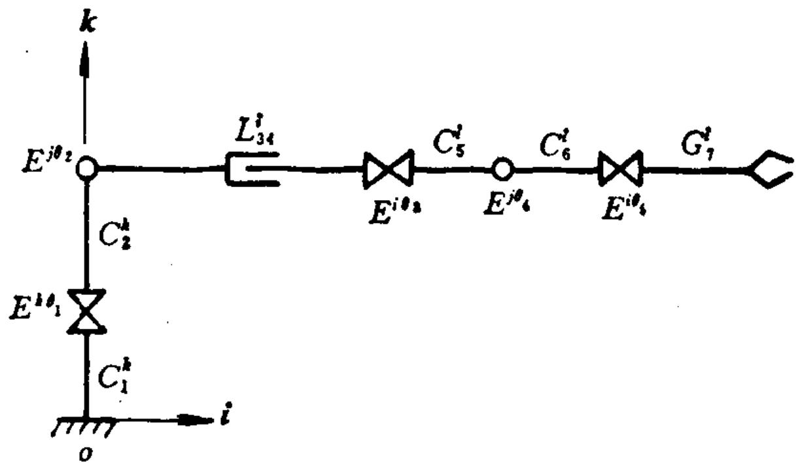

图3-14 2R-S3R机器人机构

$$
= C _ { 1 } ^ { \kappa } + C _ { 2 } ^ { \kappa } + E ^ { \kappa \theta _ { 1 } } E ^ { \jmath \theta _ { 1 } } ( L _ { 3 4 } ^ { \iota } + \hat { \dot { C } } _ { 5 } ^ { \iota } ) + ( C _ { 6 } + G \tau ) \left[ \begin{array} { c } { { \hat { \lambda } _ { 1 } } } \\ { { \mu _ { 1 } } } \\ { { \mu _ { 1 } } } \\ { { \nu _ { i } } } \end{array} \right]
$$

将式3-79改写为

$$
P - ( C _ { 1 } ^ { k } + C _ { 2 } ^ { k } ) - ( C _ { 6 } + G _ { 7 } ) \left[ \begin{array} { l } { \lambda _ { 4 } } \\ { \mu _ { 4 } } \\ { \nu _ { 4 } } \end{array} \right] = E ^ { k \theta _ { 1 } } E ^ { j \theta _ { 3 } } ( L _ { 3 4 } ^ { 4 } + C _ { 5 } ^ { 4 } )
$$

即

$$
\left[ \begin{array} { c } { { \pmb x } - ( C _ { 6 } + G _ { 7 } ) { \lambda } _ { 4 } } \\ { { \pmb y } - ( C _ { 0 } + G _ { 7 } ) { \mu } _ { 4 } } \\ { { \pmb z } \cdots ( C _ { 1 } + C _ { 2 } ) - ( C _ { 6 } + G _ { 7 } ) { \nu } _ { 4 } } \end{array} \right] = \mathbb { E } ^ { k \theta _ { 1 } } \mathbb { E } ^ { j \theta _ { 1 } } \left[ \begin{array} { c } { { { \pmb { L } } _ { 3 4 } + C _ { 5 } } } \\ { { { \bf 0 } } } \\ { { { \bf 0 } } } \end{array} \right]
$$

令

$$
\left. \begin{array} { l } { { { \sigma } ^ { \prime } = v - \left( C _ { 6 } + G _ { 7 } \right) \lambda _ { 4 } } } \\ { { { g } ^ { \prime } = y - \left( C _ { 6 } + G _ { 7 } \right) \mu _ { 4 } } } \\ { { { z } ^ { \prime } = z - \left( C _ { 4 } + C _ { 2 } \right) - \left( C _ { 6 } + G _ { 7 } \right) \nu _ { 4 } } } \end{array} \right\}
$$

则原式可写为

$$
\left[ \begin{array} { c } { { { \overline { { { x } } } } ^ { \prime } } } \\ { { { \overline { { { y } } } } ^ { \prime } } } \\ { { { \overline { { { z } } } } ^ { \prime } } } \end{array} \right] = \overrightarrow { E } ^ { k \theta _ { 1 } } \overrightarrow { E } ^ { \prime \theta _ { 1 } } \left[ \begin{array} { c } { { L _ { 3 4 } + C _ { 5 } } } \\ { { 0 } } \\ { { 0 } } \end{array} \right]
$$

由于向量回转前后其模不变,故有

$$
x ^ { \prime } { } ^ { 1 } + y ^ { \prime } { } ^ { 1 } + z ^ { \prime } { } ^ { 1 } = ( L _ { 3 4 } + C _ { 5 } ) ^ { 2 }
$$

所以

$$
L _ { 3 4 } = \sqrt { { x ^ { \prime } } ^ { * } + { y ^ { \prime } } ^ { * } + { z ^ { \prime } } ^ { * } } - C _ { 5 }
$$

将式3-81展开得

$$
\left[ \begin{array} { c c } { { \overline { { { \sigma } } } ^ { \prime } } } \\ { { y ^ { \prime } } } \\ { { z ^ { \prime } } } \end{array} \right] = \left[ \begin{array} { c c } { { \left( L _ { 3 4 } + C _ { 5 } \right) \cos \theta _ { \bot } \cos \theta _ { 2 } } } \\ { { \left( L _ { 3 4 } + C _ { 5 } \right) \sin \theta _ { 1 } \cos \theta _ { 2 } } } \\ { { - \left( L _ { 3 4 } + C _ { 5 } \right) \sin \theta _ { 2 } } } \end{array} \right]
$$

得

$$
\mathrm { { t g } } \ \theta _ { 1 } = { \frac { y ^ { \prime } } { x ^ { \prime } } }
$$

$$
\scriptstyle \mathrm { t g } \theta _ { 2 } = { \frac { - z ^ { \prime } ( \sin \theta _ { 1 } + \cos \theta _ { \cdot } ) } { x ^ { \prime } + y ^ { \prime } } }
$$

将式8-78改写为

$$
\overrightarrow { E } ^ { j ( - \theta _ { 1 } ) } \overrightarrow { E } ^ { j k ( - \theta _ { 1 } ) } \overrightarrow { E } = \overrightarrow { E } ^ { i \theta _ { 1 } } \overrightarrow { E } ^ { j \theta _ { 1 } } \overrightarrow { E } ^ { i \theta _ { 0 } }
$$

上式两边乘以单位向量 ${ \left[ \begin{array} { l } { 1 } \\ { 0 } \\ { 0 } \end{array} \right] } ^ { } { \mathcal { I } }$ 得

展开得

$$
\overrightarrow { E } ^ { \downarrow ( - 0 _ { 1 } ) } \overleftrightarrow { \mathcal { L } } ^ { \uparrow k ( - \theta _ { 1 } ) } \left[ \begin{array} { l } { \uparrow \lambda _ { \downarrow } } \\ { \mu _ { \downarrow } } \\ { \nu _ { \downarrow } } \end{array} \right] = \overrightarrow { E } ^ { : \theta _ { \ast } } \overleftrightarrow { E } ^ { \uparrow \theta _ { \ast } } \left[ \begin{array} { l } { 1 } \\ { 0 } \\ { 0 } \end{array} \right]
$$

$$
\begin{array} { r } { \left[ \begin{array} { l } { \left( \lambda _ { \mathrm { i } } \cos \theta _ { \mathrm { i } } + \mu _ { \mathrm { i } } \sin \theta _ { \mathrm { i } } \right) \cos \theta _ { \mathrm { 2 } } - \nu _ { \mathrm { i } } \sin \theta _ { \mathrm { 2 } } } \\ { - \lambda _ { \mathrm { i } } \sin \theta _ { \mathrm { i } } + \mu _ { \mathrm { i } } \cos \theta _ { \mathrm { 1 } } } \end{array} \right] } \\ { \left[ \left( \lambda _ { \mathrm { i } } \cos \theta _ { \mathrm { i } } + \mu _ { \mathrm { i } } \sin \theta _ { \mathrm { 1 } } \right) \sin \theta _ { \mathrm { 2 } } + \nu _ { \mathrm { i } } \cos \theta _ { \mathrm { 2 } } \right] } \end{array}
$$

$$
= \left[ \begin{array} { c } { { \cos \theta _ { 4 } } } \\ { { \sin \theta _ { 3 } \sin \theta _ { 4 } } } \\ { { - \cos \theta _ { 3 } \sin \theta _ { 4 } } } \end{array} \right]
$$

得

$$
\begin{array} { r }  \mathbf { \epsilon } _ { \mathbf { \lambda } \mathbf { \lambda } \mathbf { \epsilon } \mathbf { \lambda } \mathbf { \epsilon } \mathbf { \lambda } \mathbf { \epsilon } \mathbf { \lambda } + \mu _ { i } \sin \theta _ { \mathrm { { a } } } ) \sin \theta _ { 2 } + \nu _ { i } \cos \theta _ { 2 } ] } \\ { - \lambda _ { i } \sin \theta _ { 1 } + \mu _ { i } \cos \theta _ { 1 } \ ~ } \end{array}
$$

$$
\tan \theta _ { 4 } = \frac { - \lambda _ { \mathrm { i } } \sin \theta _ { 1 } + \mu _ { \mathrm { s } } \cos \theta _ { 1 } + ( \lambda _ { \mathrm { i } } \cos \theta _ { 1 } + \mu _ { \mathrm { i } } \sin \theta _ { 1 } ) \sin \theta _ { 2 } + \nu _ { \mathrm { i } } \cos \theta _ { 2 } } { ( \sin \theta _ { 3 } - \cos \theta _ { 3 } ) [ ( \lambda _ { \mathrm { i } } \cos \theta _ { 1 } + \mu _ { \mathrm { i } } \sin \theta _ { 1 } ) \cos \theta _ { 2 } - \nu _ { \mathrm { i } } \sin \theta _ { 2 } ] }
$$

最后将式3-78改写为

并有

$$
E ^ { \uparrow \downarrow \theta \imath } = E ^ { \downarrow ( - \theta \imath ) } E ^ { \downarrow ( - \theta \imath ) } E ^ { \downarrow ( - \theta \imath ) } E ^ { \downarrow ( - \theta \imath ) } E ^ { \downarrow ( k - \theta \imath ) } E ^ { \uparrow }
$$

$$
E ^ { i \theta \lambda } { \left[ \begin{array} { l } { 0 } \\ { 1 } \\ { 0 } \end{array} \right] } = E ^ { j ( - \theta _ { 4 } ) } E ^ { i ( - \theta _ { 3 } ) } E ^ { j ( - \theta _ { 4 } ) } E ^ { k ( - \theta _ { 1 } ) } E { \left[ \begin{array} { l } { 0 } \\ { 1 } \\ { 0 } \end{array} \right] }
$$

即

$$
[ \begin{array} { c c c } { { 0 } } \\ { { \cos { \theta _ { 5 } } } } \\ { { \sin { \theta _ { 5 } } } } \end{array} ] = \begin{array} { c c c } { { \scriptstyle \mathcal { G } ^ { j ( - \theta _ { 4 } ) } E ^ { i ( - \theta _ { 1 } ) } E ^ { j ( - \theta _ { 1 } ) } E ^ { j k ( - \theta _ { 1 } ) } E ^ { j } } } \\ { { \scriptstyle \mathcal { G } ^ { j } } } \end{array} [ \begin{array} { c c c } { { 0 } } \\ { { { \bf 1 } } } \\ { { { \bf 1 } } } \\ { { { \bf 0 } } } \end{array} ]
$$

由于 $\theta _ { 1 } , \theta _ { 2 } , \theta _ { 3 }$ 和 $\theta _ { 4 }$ 均已求出,将此式展开后即可求出 $\theta _ { \textmd { 5 0 } }$ 

图3-156R机器人机构

最后,以最常用的6R机器人机构为例,进一步说明机器人机构的运动学逆解,写出图3-15中6R机器人机构的位姿方程

$$
{ \cal E } = { \cal E } ^ { \mathrm { k } \theta _ { 1 } } { \cal E } ^ { \mathrm { i } \mathrm { } \dot { } 0 _ { 3 } } { \cal E } ^ { \mathrm { i } \theta _ { 3 } } { \cal E } ^ { \mathrm { i } \theta _ { 4 } } { \cal E } ^ { \mathrm { i } \theta _ { 5 } } { \cal E } ^ { \mathrm { k } \theta _ { 6 } }
$$

$$
\begin{array} { r l r l } & { \mathbb { P } _ { \to \infty } ( C _ { 1 } ^ { \tt A } + \mathbb { E } ^ { \tt A b _ { 1 } } ( C _ { 2 } ^ { \tt A } + \mathbb { E } ^ { \tt A b _ { 2 } } ( C _ { 3 } ^ { \tt A } + \mathbb { E } ^ { \tt A b _ { 3 } } ( C _ { 4 } ^ { \tt A } + \mathbb { E } ^ { \tt A b _ { 4 } } \langle C _ { 5 } ^ { \tt A } } \\ & { } & { + \mathbb { E } ^ { \tt A b _ { 5 } } ( C _ { 6 } ^ { \tt A } + \mathbb { E } ^ { \tt A b _ { 4 } } ( G _ { 7 } ^ { \tt A } ) ) ) ) ) ) } \\ & { = C _ { 1 } ^ { \tt A } + C _ { 2 } ^ { \tt A } + \mathbb { E } ^ { \tt A b _ { 1 } } \mathbb { E } ^ { \tt A b _ { 1 } } ( C _ { 3 } ^ { \tt A } + C _ { 4 } ^ { \tt A b _ { 1 } } + \mathbb { E } ^ { \tt A b _ { 1 } } Z ^ { \tt A b _ { 2 } } \mathbb { E } ^ { \tt A b _ { 3 } } ( C _ { 5 } ^ { \tt A } \cdot \mathbb { C } _ { 6 } ^ { \tt A } ) } \\ & { } & { + \mathbb { E } ^ { \tt A b _ { 6 } } \mathbb { E } ^ { \tt A b _ { 4 } } \mathbb { E } ^ { \tt A b _ { 5 } } \mathbb { E } ^ { \tt A b _ { 6 } } \mathbb { E } ^ { \tt A b _ { 5 } } ( G _ { 7 } ^ { \tt A } ) } \\ & { = C _ { 1 } ^ { \tt A } + C _ { 2 } ^ { \tt A } + \mathbb { E } ^ { \tt A b _ { 1 } } Z ^ { \tt A b _ { 1 } } ( C _ { 3 } ^ { \tt A } + C _ { 4 } ^ { \tt A b _ { 2 } } \mathbb { E } ^ { \tt A b _ { 5 } } ( C _ { 5 } ^ { \tt A } + C _ { 6 } ^ { \tt A } ) ) } \\ & { } &  + \mathbb { E } _ { \breve { \tau } ^ { \tt A b _ { 1 } } } ^ { \top } | n _  \breve  \tau  \end{array}
$$

进一步把式3-89改写为

$$
\begin{array} { r l r } {  { \Gamma ^ { 2 } \hat { \mathcal { M } } _ { i } } } \\ & { } & { \quad P - ( \mathbf { C } _ { 1 } ^ { k } + \mathbf { C } _ { 2 } ^ { k } ) - G _ { 7 } \bigg [ \begin{array} { l } { \mu _ { i } } \\ { \mu _ { i } } \end{array} \bigg ] } \\ & { } & { \quad \quad \quad \quad \quad \quad \quad \quad \quad \quad \quad \quad \quad \quad \quad } \\ & { } & { = \mathbf { \mathit { E } } ^ { k \theta _ { 1 } } \mathbf { \mathit { E } } ^ { j \theta _ { 3 } } ( \mathbf { \mathit { C } } _ { 3 } ^ { * } + \mathbf { \mathit { C } } _ { 4 } ^ { * } + \mathbf { \mathit { E } } ^ { i \theta _ { 3 } } \mathbf { \mathit { E } } ^ { j \theta _ { 4 } } ( \mathbf { \mathit { C } } _ { 5 } ^ { * } + \mathbf { \mathit { C } } _ { 6 } ^ { * } ) ) } \end{array}
$$

$$
\left[ \begin{array} { l } { \boldsymbol { \alpha } ^ { \prime } } \\ { \boldsymbol { y } ^ { \prime } } \\ { \boldsymbol { z } ^ { \prime } } \end{array} \right] = P - ( \mathbf { C } _ { 1 } ^ { \acute { \alpha } } + \mathbf { C } _ { 2 } ^ { \acute { \kappa } } ) - G _ { 7 } \left[ \begin{array} { l } { \hat { \lambda } _ { i } } \\ { \boldsymbol { \mu } _ { i } } \\ { \boldsymbol { \nu } _ { i } } \end{array} \right]
$$

则有

$$
\left[ \begin{array} { l } { { \hat { v } ^ { \prime } } } \\ { { y ^ { \prime } } } \\ { { z ^ { \prime } } } \end{array} \right] = \mathscr { E } ^ { k \theta _ { 1 } } \mathscr { E } ^ { j \theta _ { 1 } } \left[ \begin{array} { l } { { C _ { 8 } + C _ { 4 } + \left( { C _ { 5 } + C _ { 6 } } \right) \cos \theta _ { 4 } } } \\ { { - \left( { C _ { 5 } + C _ { 6 } } \right) \sin \theta _ { 3 } \sin \theta _ { 4 } } } \\ { { \left( { C _ { 5 } + C _ { 6 } } \right) \cos \theta _ {  s } \sin \theta _ { 4 } } } \end{array} \right]
$$

得

$$
\begin{array} { l } { { \varpi ^ { \prime 2 } + y ^ { \prime 2 } + z ^ { \prime 2 } = \left( C _ { 3 } + C _ { 4 } \right) ^ { 2 } + \left( C _ { 5 } + C _ { 6 } \right) ^ { 2 } } } \\ { { \qquad + 2 \left( C _ { 3 } + C _ { 4 } \right) \left( C _ { 5 } + C _ { 6 } \right) \cos \theta _ { 4 } } } \end{array}
$$

$$
\cos \theta _ { 4 } { = } \frac { { { \sigma } ^ { \prime } } { ^ { 2 } } + { { y } ^ { \prime } } { ^ { 2 } } + { { z } ^ { \prime } } { ^ { 2 } } - ( C _ { 8 } + C _ { 4 } ) ^ { 2 } - ( C _ { 5 } + C _ { 6 } ) ^ { 2 } } { 2 ( C _ { 8 } + C _ { 4 } ) ( C _ { 5 } + C _ { 6 } ) }
$$

将式3-89进一步改写为

$$
\left[ \begin{array} { l } { \boldsymbol { \sigma } ^ { \prime } } \\ { \boldsymbol { y } ^ { \prime } } \\ { \boldsymbol { z } ^ { \prime } } \end{array} \right] = \boldsymbol { E } \boldsymbol { E } ^ { i k ( - \theta _ { 4 } ) } \boldsymbol { E } ^ { i ( - \theta _ { 5 } ) } \boldsymbol { E } ^ { j ( - \theta _ { 4 } ) } ( \boldsymbol { C } _ { 3 } ^ { \sharp } + \boldsymbol { C } _ { 4 } ^ { \sharp } ) + \boldsymbol { E } \boldsymbol { E } ^ { i k ( - \theta _ { 6 } ) } \left( \boldsymbol { C } _ { 5 } ^ { \sharp } + \boldsymbol { C } _ { 6 } ^ { \sharp } \right)
$$

$$
\begin{array} { r } { { \cal { E } } ^ { - 1 } \Bigg [ \pmb { \mathscr { Y } } ^ { \prime } \Bigg ] = { \cal { E } } ^ { k ( - \theta _ { 4 } ) } ( { \cal { E } } ^ { \{ ( \theta _ { 4 } ) } { \cal { E } } ^ { j ( - \theta _ { 4 } ) } } ( { \pmb { C } } _ { 3 } ^ { \ast } + { \pmb { C } } _ { 4 } ^ { \ast } ) + { \pmb { C } } _ { 5 } ^ { \ast } + { \pmb { C } } _ { 6 } ^ { \ast } )  \\ { \qquad \quad \mathscr { Z } ^ { \prime } \Bigg \} = } \end{array}
$$

$$
{ \left[ \begin{array} { l } { { \boldsymbol { x } } ^ { \prime \prime } } \\ { \left( { \boldsymbol { y } } ^ { \prime \prime } \right) = { \boldsymbol { E } } ^ { - 1 } { \left[ \begin{array} { l } { { \boldsymbol { x } } ^ { \prime } } \\ { { \boldsymbol { y } } ^ { \prime } } \\ { \left[ { \boldsymbol { z } } ^ { \prime \prime } \right] } \end{array} \right] } } \end{array} \right] }
$$

则有

$$
\left[ \begin{array} { l } { x ^ { \prime \prime } } \\ { \phantom { \frac { 1 } { 2 } } } \\ { y ^ { \prime \prime } } \\ { \phantom { \frac { 1 } { 2 } } } \\ { z ^ { \prime \prime } } \end{array} \right]
$$

$$
= \left[ \begin{array} { c } { { \left[ \left( C _ { 3 } + C _ { 4 } \right) \cos \theta _ { 4 } + \left( C _ { 5 } + C _ { 6 } \right) \right] \cos \theta _ { 6 } + \left( C _ { 8 } + O _ { 4 } \right) \sin \theta _ { 4 } \sin \theta _ { 5 } \sin \theta _ { 6 } } } \\ { { - \left[ \left( C _ { 3 } + O _ { 4 } \right) \cos \theta _ { 4 } + \left( C _ { 5 } + O _ { 6 } \right) \right] \sin \theta _ { 6 } + \left( C _ { 8 } + O _ { 4 } \right) \sin \theta _ { 4 } \sin \theta _ { 5 } \cos \theta _ { 6 } } } \\ { { \left( C _ { 8 } + O _ { 4 } \right) \sin \theta _ { 4 } \cos \theta _ { 5 } } } \end{array} \right]
$$

$$
m { = } \left( C _ { 3 } { + } G _ { 4 } \right) \cos \theta _ { 4 } { + } \left( O _ { \bar { \imath } } { + } G _ { 6 } \right)
$$

由上面第3个等式得

$$
\sin \theta _ { 4 } { = } \frac { z ^ { \prime \prime } } { ( O _ { 3 } { + } O _ { 4 } ) \cos \theta _ { 5 } }
$$

将式3-93和3-94分别代入上面第1、2个等式,得

$$
{ \mathfrak { x } } ^ { t r } = \mathfrak { m } \cos \theta _ { 6 } + { \mathfrak { z } } ^ { t r } \displaystyle \arg \theta _ { 5 } \sin \theta _ { 8 }
$$

$$
y ^ { \prime \prime } { = } - m \sin \theta _ { 6 } { + } z ^ { \prime \prime } \ : { \pm } \ : \mathrm { g } \theta _ { 5 } \cos \theta _ { 6 }
$$

取式3-95,3-96的平方和

$$
\begin{array} { r } { x ^ { 1 / 2 } + y ^ { 1 / 2 } = m ^ { 2 } + z ^ { 1 / 2 } \tan ^ { 2 } \theta \mathrm { { s } } } \\ { \tan \theta _ { 5 } = \pm \sqrt { \frac { x ^ { 1 / 2 } + y ^ { 1 / 2 } - m ^ { 2 } } { z ^ { 1 / 2 } } } } \end{array}
$$

将求得的 $\theta _ { 5 }$ 代入式8-94可求出 $\sin \theta _ { 4 }$ ,再联立式3-91得

$$
\textrm { g } \theta _ { 4 } = \frac { 2 ( C _ { 5 } + C _ { 6 } ) z ^ { \prime \prime } } { [ { x ^ { \prime } } ^ { 2 } + y ^ { \prime } { } ^ { 2 } + z ^ { \prime } { } ^ { 2 } - ( C _ { 3 } + { x } \mathcal { O } _ { 4 } ) ^ { 2 } - ( C _ { 5 } + C _ { 6 } ) ^ { 2 } ] \cos { \theta _ { 5 } } }
$$

这时式3-95和3-96可写为

$$
\scriptstyle A _ { 1 } \sin \theta _ { 6 } + B _ { 1 } \cos \theta _ { 6 } + C _ { 1 } = 0
$$

$$
\scriptstyle A _ { 2 } \sin \theta _ { 6 } + B _ { 2 } \cos \theta _ { 6 } + C _ { 2 } = 0
$$

式中

$$
\begin{array} { r } { A _ { \mathrm { { i } } } = z ^ { \prime \prime } { \mathrm { t g } } \ \theta _ { \mathrm { { s } } } \quad B _ { \mathrm { { 1 } } } = m , \quad C _ { \mathrm { { 1 } } } = - \infty ^ { \prime \prime } } \end{array}
$$

$$
A _ { 2 } = - m \quad B _ { 2 } { = } z ^ { \prime \prime } \mathrm { t g } \ \theta _ { 5 } \quad C _ { 2 } { = } - y ^ { \prime \prime }
$$

解方程组得

$$
\mathrm { t g } \ \theta _ { 6 } { = } \frac { - ( { \boldsymbol { x } } ^ { \prime \prime } { \boldsymbol { z } } ^ { \prime \prime } \mathrm { \Delta t g } \theta _ { 5 } { + } { \boldsymbol { y } } ^ { \prime \prime } { \boldsymbol { m } } ) } { { \boldsymbol { x } } ^ { \prime \prime } { \boldsymbol { m } } { + } { \boldsymbol { y } } ^ { \prime \prime } { \boldsymbol { z } } ^ { \prime \prime } \mathrm { \Delta t g } \theta _ { 5 } }
$$

将式3-88改写为

$$
E E ^ { k ( - \theta _ { 4 } ) } E ^ { \{ ( - \theta _ { 4 } ) } { \mathit { F } } ^ { \{ \acute { j } ( - \theta _ { 4 } ) } = { \mathit { \overrightarrow { \theta } } \} }  = E ^ { \{ \dot { \theta } : \theta _ { 1 } } { \mathit { \overrightarrow { E } } } ^ { \{ \dot { j } \theta _ { 1 } }  { \mathit { \overrightarrow { E } } } ^ { \{ \dot { \theta } _ { 1 } \theta _ { 1 } } 
$$

令

$$
\left[ \begin{array} { l l l } { \theta _ { 1 1 } } & { \theta _ { 1 2 } } & { \theta _ { 1 3 } } \\ { \theta _ { 2 1 } } & { \theta _ { 2 2 } } & { \theta _ { 2 3 } } \\ { \theta _ { 3 1 } } & { \theta _ { 3 2 } } & { \theta _ { 3 3 } } \end{array} \right] = \underline { { E } } \underline { { E } } ^ { \mathcal { k } ( \mathcal { - } \theta _ { 6 } ) } \underline { { E } } ^ { \mathcal { k } ( \mathcal { - } \theta _ { 4 } ) } \underline { { E } } ^ { \mathcal { j } ( \mathcal { - } \theta _ { 4 } ) }
$$

则

$$
\begin{array} { r l } { \left[ \begin{array} { c c c } { \theta _ { 1 1 } } & { e _ { 1 2 } } & { \theta _ { 1 8 } } \\ { \theta _ { 2 1 } } & { \theta _ { 2 2 } } & { \theta _ { 2 3 } } \\ { e _ { 3 1 } } & { e _ { 3 2 } } & { \theta _ { 3 8 } } \end{array} \right] } & { } \\ { = \left[ \begin{array} { c c c } { \cos \theta _ { 1 } \cos \theta _ { 2 } } & { \cos \theta _ { 1 } \sin \theta _ { 2 } \sin \theta _ { 3 } - \sin \theta _ { 1 } \cos \theta _ { 3 } } \\ { \sin \theta _ { 1 } \cos \theta _ { 2 } } & { \sin \theta _ { 1 } \sin \theta _ { 2 } \sin \theta _ { 3 } + \cos \theta _ { 1 } \cos \theta _ { 3 } } \\ { - \sin \theta _ { 2 } } & { \cos \theta _ { 2 } \sin \theta _ { 3 } } \end{array} \right] } \end{array}
$$

$$
{ \begin{array} { r l } & { \cos \theta _ { 1 } \sin \theta _ { 2 } \cos \theta _ { 3 } + \sin \theta _ { 1 } \sin \theta _ { 8 } } \\ & { \sin \theta _ { 1 } \sin \theta _ { 2 } \cos \theta _ { 3 } - \cos \theta _ { 1 } \sin \theta _ { 3 } } \\ & { \qquad \cos \theta _ { 2 } \cos \theta _ { 3 } } \end{array} }
$$

由上式可解得

$$
\begin{array} { l } { { \displaystyle \mathrm { \ t g \ } \theta _ { \mathrm { 1 } } = \frac { \varrho _ { \mathrm { 2 1 } } } { \varrho _ { \mathrm { 1 1 } } } } } \\ { { \displaystyle \mathrm { \ t g \ } \theta _ { \mathrm { 2 } } = \frac { - e _ { \mathrm { 3 1 } } \left( \sin \theta _ { \mathrm { 1 } } + \cos \theta _ { \mathrm { 4 } } \right) } { \varrho _ { \mathrm { 1 1 } } + \varrho _ { \mathrm { 2 1 } } } } } \end{array}
$$

$$
\displaystyle \mathrm { \ t g \ } \theta _ { 3 } = \frac { e _ { 3 2 } } { e _ { 8 3 } }
$$

从上述3个例子不难看出,含转动副越多,求机器人机构运动学逆解就越难。但对关节轴线相互平行或正交的机器人机构,一般都可综合利用其位姿方程列出解的解析表达式,不会出现解高次方程的情形。从上述例子归纳出求解过程要点大致如下:

1.如果机器人机构所含转动关节不超过3个,可先用姿态方程求解关节角位移,然后用位置方程求解其余位移量。如果机器人机构所含转动关节超过3个,则一般可先从位置方程求解某些关节的位移参数,再转而用姿态方程求解。

2.在用位置方程求解时,可以顺标号方向(即 $0 , 1 , 2 \cdots )$ 求解。当这样无法求解时,可以改为逆标号方向求解。

# 六、机器人机构的工作空间

机器人机构末杆上某点 $\pmb { p }$ 在空间所能到达的位置的集合,称为机器人机构的工作空间。它是衡量机器人工作特性的一个重要指标。机器人用户要求机器人能夹持工具或工件到达一系列位置,这些位置如果在机器人的工作空间之内,机器人才能实现这些操作。机器人产品样本上一般附有同类机器人在 $i o k$ 和 $i o j$ 平面上分别表示的工作空间。对于不同类型的机器人,末杆上 $\pmb { \mathcal { P } }$ 点所指各有不同。对夹持工具操作的机器人,一般是指其夹持工具的腕点。对夹持工件搬运的机器人,则是指其夹持中心点。有些样本将机器人腕点和夹持中心点的工作空间都表示出来,见图3-16。

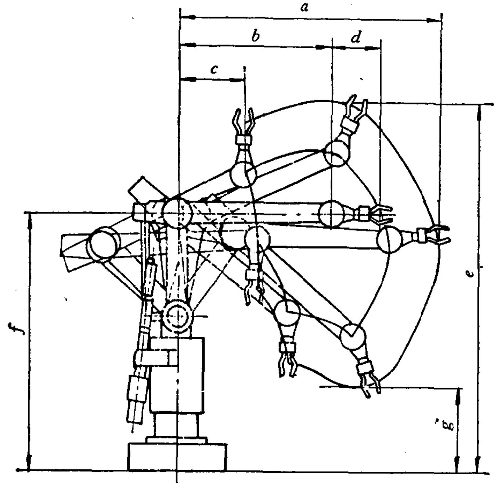

图3-18ASEA机器人工作空间

机器人到达空间任一位置,主要取决于机器人机构前3个关节所组成的运动链。这个链的末端点的工作空间称为主工作空间,而整个机器人机构末端点的工作空间称为总工作空间。

当前,研究机器人机构的工作空间有各种方法,归纳起来大致有如下3类:

1.从研究手腕点至基础关节中心之间极限距离出发,提出了机器人机构工作空间的边界点是腕点运动时一系列处于极限距离的点的集合。这类研究方法的最大特点是需要解决一系列非线性方程求极值的问题。

2.应用各种不同的数学解析法来描述点绕轴旋转所形成的曲线方程,曲线绕轴旋转所形成的曲面方程,以及曲面绕轴旋转所形成的曲面族包络面方程。以此来表示机器人机构的工作空间。这类研究方法的缺点是计算量大。

3.对最常见的关节轴线相互平行或正交的特殊结构机器人机构,在平面上用参数方程求解工作空间截面,或用其他数学方法

求解工作空间边界方程。

因为当前常用的均为特殊结构的机器人,所以下面将较为详细地叙述第 $\mathfrak { z }$ 种方法。对一般类型机器人机构工作空间的分析方法,将简述基于第2种方法的用圆弧投影进行元素扫描的方法。

由前述得知,相邻关节轴线相互平行或正交的机器人机构,按前3杆关节配置方式可分为4种基本类型(参见图1-24),即直角坐标型式(3S)、圆柱坐标型式(R-2S)、极坐标型式(2R-S)和关节型式(3R)。这4种机器人机构的工作空间可分别在i0k和i0j2个平面上表示。工作空间在这些平面上的投影,均是一个封闭图形,由一些边界曲线封闭而成。下面以极坐标型式和关节型式机器人来说明如何建立这些边界曲线的方程。

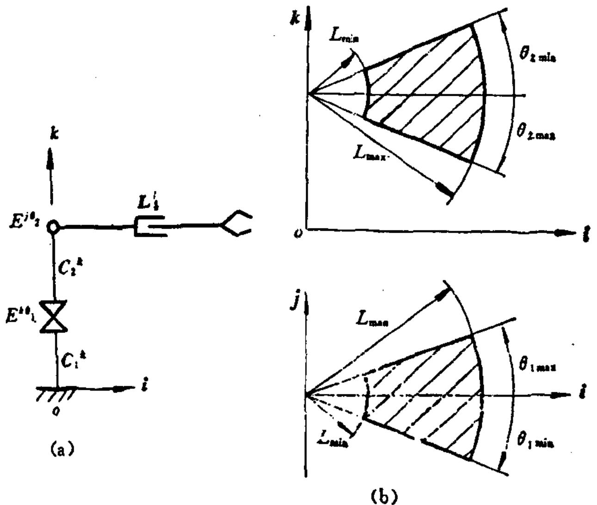

图3-17 极坐标型机器人机构及其工作空间

图 $\mathbf { 3 - 1 7 a }$ 所示为极坐标型机器人机构,其位置方程为

$$
\begin{array} { c } { { P { = } C _ { \mathrm { 1 } } ^ { k } { + } E ^ { k { \cdot } { \theta } _ { 1 } } ( C _ { \mathrm { 2 } } ^ { k } { + } E ^ { j { \theta } _ { 1 } } ( L _ { 3 4 } ^ { \downarrow } ) ) } } \\ { { { = } C _ { \mathrm { 1 } } ^ { k } { + } C _ { \mathrm { 2 } } ^ { k } { + } E ^ { \chi _ { 0 } } { - } E ^ { ; { \theta } _ { 1 } } ( L _ { 3 4 } ^ { \downarrow } ) } } \end{array}
$$

1.在 $\pmb { i } _ { O k }$ 平面 $( \theta _ { 1 } = 0 )$ 

$$
P ^ { \prime } { = } C _ { 1 } ^ { k } { + } C _ { 2 } ^ { k } { + } \overrightarrow { E } ^ { j 0 1 } \big ( \overrightarrow { L } _ { 3 4 } ^ { \ast } \big )
$$

或写为

$$
P ^ { \prime } - ( C _ { 1 } ^ { k } + C _ { 2 } ^ { k } ) = E ^ { j \theta _ { 1 } } ( L _ { 3 4 } ^ { 4 } )
$$

即

$$
\left[ \begin{array} { c } { { { \sigma } ^ { \prime } } } \\ { { 0 } } \\ { { { z } ^ { \prime } - \left( C _ { 1 } + C _ { 2 } \right) } } \end{array} \right] = \left[ \begin{array} { c } { { L _ { 3 4 } \cos \theta _ { 2 } } } \\ { { 0 } } \\ { { - L _ { 3 4 } \sin \theta _ { 2 } } } \end{array} \right]
$$

故有

$$
\left. \begin{array} { l } { { \left. x ^ { \prime } = L _ { 3 4 } \cos \theta _ { 2 } \right. } } \\ { { \left. z ^ { \prime } - ( C _ { 1 } + C _ { 2 } ) = - L _ { 3 4 } \sin \theta _ { 2 } \right. } } \end{array} \right\}
$$

取式3-108的平方和

$$
x ^ { \prime 2 } + [ z ^ { \prime } - ( C _ { 1 } + C _ { 2 } ) ] ^ { 2 } = L _ { 3 4 } ^ { 2 }
$$

这是一个圆心在 $( 0 , \ 0 , \ C _ { 1 } { + } C _ { 2 } )$ 、半径为 $I _ { 3 4 }$ 的圆的方程。该方程是 $I _ { 3 4 }$ 的函数,表示随 $L _ { 3 4 }$ 而改变的一族圆。当 $I _ { 3 4 }$ 取 $L _ { 3 4 \operatorname* { m i a } }$ 和$L _ { \textrm { \tiny B 4 m a r } }$ 时,得到这族圆的边界。

又由式9-108可得

$$
\arg \theta _ { 2 } { = } \frac { - [ z ^ { \prime } - ( O _ { 1 } { + } C _ { 2 } ) ] } { x ^ { \prime } }
$$

或

$$
z ^ { \prime } - ( C _ { 1 } + C _ { 2 } ) = - \arg \ \theta _ { 2 } x ^ { \prime }
$$

式3-111表示一个通过点 $( 0 , 0 , \ : \mathcal { O } _ { 1 } { + } \mathcal { O } _ { 2 } )$ 的点斜式直线方程。

$$
 \begin{array} { l } { z ^ { \prime } - ( C _ { 1 } + C _ { 2 } ) = - \arg  \theta _ { \mathrm { . m a x } } x ^ { \prime } \} } \\ { z ^ { \prime } - ( C _ { 1 } + C _ { 2 } ) = - \arg  \theta _ { 2 \mathrm { m i x } } x ^ { \prime } \} } \end{array}
$$

式3-112表示2根边界斜线方程。2根边界斜线和2个边界圆封闭所得的扇形是机器人机构在ik平面上的工作空间,如图3-17b所示。

2.在平行于 $i o j$ 的平面 $( \theta _ { 2 } = 0 )$ 

$$
P ^ { \prime \prime } { = } E ^ { \tilde { \imath } \cdot \theta _ { \mathrm { { i } } } } ( L _ { 3 1 } ^ { \mathrm { ~ * ~ } } )
$$

即

$$
\scriptstyle { \left[ \begin{array} { l } { { \boldsymbol { \mathcal { D } } } ^ { \prime \prime } } \\ { { \boldsymbol { \mathcal { Y } } } ^ { \prime \prime } } \\ { { \boldsymbol { \mathcal { Z } } } ^ { \prime \prime } } \end{array} \right] } = { \left[ \begin{array} { l } { L _ { 3 4 } \cos \theta _ { \mathrm { 1 } } } \\ { L _ { 3 4 } \sin \theta _ { \mathrm { 1 } } } \\ { C _ { \mathrm { 1 } } + C _ { \mathrm { 2 } } } \end{array} \right] }
$$

故

$$
\left. \begin{array} { c } { { x ^ { \prime \prime } { = } L _ { 3 4 } \cos \theta _ { 1 } } } \\ { { } } \\ { { y ^ { \prime \prime } { = } L _ { 3 4 } \sin \theta _ { 1 } } } \end{array} \right\}
$$

取式3-115的平方和

$$
x ^ { \prime \prime 2 } + y ^ { \prime \prime 2 } = L _ { 3 4 } ^ { 2 }
$$

这是一个圆心在 $( 0 , \ 0 , \ C _ { 1 } { + } C _ { 2 } )$ 、半径为 $I _ { 3 4 }$ 的圆的方程。如前所述,当 $I _ { 3 4 }$ 取 $\pmb { L _ { 3 4 \operatorname* { m i n } } }$ 和 $L _ { 3 4 \operatorname* { m a x } }$ 时,得到一族圆的边界。同时又有

$$
y ^ { \prime \prime } { = } \deg \theta _ { 1 } x ^ { \prime \prime }
$$

当 $\theta _ { 1 }$ 取 $\theta _ { 1 \mathrm { m i n } }$ 和 $\theta _ { \textrm { \tiny i m a x } }$ 时,得2根边界斜线并与2个边界圆封闭。由此得出平行于 $\yen 1$ 的平面上的扇形工作空间。由图3-17b知,极坐标型机器人机构在空间的工作空间是一个空心球体的一部分,其体积为

$$
\frac { 1 } { 3 } ( L _ { \mathrm { 3 4 m a x } } ^ { \mathrm { 3 } } - L _ { \mathrm { 3 4 m i n } } ^ { \mathrm { 3 } } ) \left( \sin { \vert \theta _ { \mathrm { 2 m a x } } \vert } + \sin { \vert \theta _ { \mathrm { 2 m i n } } \vert } \right) ( \theta _ { \mathrm { 1 m a x } } - \theta _ { \mathrm { 1 m i n } } )
$$

图 $\mathbf { 3 - 1 8 } \mathbf { a }$ 所示为关节型机器人机构。采用与极坐标型机器人相同的方法,可得到该机器人在 $\pmb { i } _ { O R }$ 平面 $( \theta _ { 1 } { = } 0 )$ 上工作空间的边界曲线方程

$$
v ^ { \prime 2 } + [ z ^ { \prime } - ( C _ { 1 } + C _ { 2 } ) ] ^ { 2 } = R ^ { 2 }
$$

式中

$$
R ^ { 2 } { = } C _ { 3 } ^ { 2 } { + } C _ { 4 } ^ { 2 } { + } 2 C _ { 3 } C _ { 4 } \cos \theta _ { 3 }
$$

式3-118是一个圆心在 $( 0 , \ 0 , \ C _ { 1 } { + } \ C _ { 2 } )$ 、半径为 $\pmb { R }$ 的圆的方程。由于 $\mathbf { \nabla } _ { R }$ 是 $\theta _ { 3 }$ 的函数,故对应不同的 $\theta _ { 3 }$ 值可得一族同心圆。当 $\cos \theta _ { 3 }$ 处于两界限值 $| \cos \theta _ { 3 } | _ { \mathrm { { m a x } } }$ 和 $| \cos \theta _ { 3 } | _ { \mathrm { \scriptsize ~ m i n } }$ 时, $\mathcal { R }$ 也处于两界限值,以此两值画出的圆即为这族圆的边界。按式3-118有

$$
\begin{array} { r } { R _ { \mathrm { m i n } } ^ { 2 } = C _ { 3 } ^ { 2 } + C _ { 4 } ^ { 2 } + 2 C _ { 3 } C _ { 4 } \mid \cos \theta _ { 3 } \mid _ { \mathrm { m i n } } \Biggr \} } \\ { R _ { \mathrm { m a x } } ^ { 2 } = C _ { 3 } ^ { 2 } + C _ { 4 } ^ { 2 } + 2 C _ { 3 } C _ { 4 } \mid \cos \theta _ { 3 } \mid _ { \mathrm { m i x } } ^ { \sim \ * } \Biggr \} } \end{array}
$$

则得边界圆的方程

$$
\begin{array} { r } { x ^ { \prime 2 } + [ z ^ { \prime } - ( C _ { 1 } + C _ { 2 } ) ] ^ { 2 } = R _ { \mathrm { m i n } } ^ { 2 } } \\ { x ^ { \prime 2 } + [ z ^ { \prime } - ( C _ { 1 } + C _ { 2 } ) ] ^ { 2 } = R _ { \mathrm { m a x } } ^ { 2 } } \end{array}
$$

iok平面上另一边界曲线的方程为

图3-18 关节型机器人机构及其工作空间

$$
( x ^ { \prime } - C _ { 3 } \cos \theta _ { 2 } ) ^ { 2 } + [ z ^ { \prime } - ( C _ { 1 } + C _ { 2 } - C _ { 3 } \sin \theta _ { 2 } ) ] ^ { 2 } = \dot { C } _ { 4 } ^ { 2 }
$$

这是一个圆心在 $( C _ { 3 } \cos \theta _ { 2 } , 0 , C _ { 1 } + C _ { 2 } - C _ { 3 } \sin \theta _ { 2 } )$ 、半径为 $C _ { 4 }$ 的圆的方程。因为圆心是 $\theta _ { 2 }$ 的函数,且各圆心的位置又在圆心为$( 0 , \ 0 , \ C _ { 1 } { + } \ C _ { 2 } )$ 、半径为 $C _ { 3 }$ 的圆上。因此,对不同的 $\pmb { \theta _ { 2 } }$ 值可得到不同的圆心位置和一族以 $C _ { 4 }$ 为半径的圆。当 $\pmb { \theta _ { 2 } }$ 等于 $\theta _ { 2 \operatorname* { m i n } }$ 和$\theta _ { \mathrm { { z m a x } } }$ 时,得到这族圆的两条边界曲线。按式3-122有

$$
\begin{array} { r l } & { ( \alpha ^ { \prime } - C _ { 3 } \cos \theta _ { \mathrm { z m i n } } ) ^ { 2 } + [ z ^ { \prime } - ( C _ { 1 } + C _ { 2 } - C _ { 3 } \sin \theta _ { \mathrm { 2 m i n } } ) ] ^ { 2 } = C _ { 4 } ^ { 2 } ] } \\ & { ( \alpha ^ { \prime } - C _ { 3 } \sin \theta _ { \mathrm { z m a x } } ) ^ { 2 } + [ z ^ { \prime } - ( C _ { 1 } + C _ { 2 } - C _ { 3 } \sin \theta _ { \mathrm { z m a x } } ) ] ^ { 2 } = C _ { 4 } ^ { 2 } } \end{array}
$$

式8-121和3-123所表示的 $^ 4$ 个圆所封闭的图形即为机器人机构在 $\dot { \pmb { \mathrm { \mathfrak { i o k } } } }$ 平面上的工作空间。如图 $\mathbf { 3 - 1 8 \ b }$ 的上图所示,图中阴影所

表示的工作空间是当 $- 6 0 ^ { \circ } \leqslant \theta _ { 2 } \leqslant 9 0 ^ { \circ }$ 及 $- \bar { \bf z } 0 ^ { \circ } \leqslant \theta _ { 3 } \leqslant \bar { \bf 1 } \bar { \bf 5 } 0 ^ { \circ }$ 时的情况,这时

$$
R _ { \mathrm { m a x } } { = } C _ { 3 } { + } C _ { 4 }
$$

同理,在 $i o j$ 平面上可写出工作空间的边界曲线方程

$$
x ^ { \prime \prime 2 } + y ^ { \prime \prime 2 } = ( C _ { 3 } + \cdot C _ { 4 } ) ^ { 2 }
$$

和

$$
y ^ { \prime \prime } { = } \deg \theta _ { \perp } x ^ { \prime \prime }
$$

式3-124是一个圆心在 $( 0 , \ 0 , \ C _ { 1 } { + } C _ { 2 } )$ 、半径为 $( C _ { 3 } + C _ { 4 } )$ 的圆的方程。式3-125相对于 $\theta _ { 1 \mathrm { m i n } }$ 和 $\theta _ { \textrm { \tiny i m a x } }$ 可得2根边界斜线,与前面的圆相交得一扇形工作空间,如图 $\mathbf { 3 - 1 8 \ b }$ 的下图所示。

观察图3-18iok平面上的工作空间,可见面积ABC等于面积 $\mathbf { \Delta } A ^ { \prime } B ^ { \prime } C ^ { \prime }$ ,即工作空间面积等于扇形 $\pmb { A } \pmb { B } \pmb { B } ^ { \prime } \pmb { A } ^ { \prime }$ 的面积。当此面积绕 $\pmb { k }$ 轴转动时,所得到的空间体积与极坐标型机器人机构的求法相同。

从上述可知,只要给出机器人机构的几何尺寸以及关节的活动范围,就可写出机器人机构工作空间的边界方程,用以表示机器人工作时所能占有的空间位置。但这仅是简化的理论结果,实际上在工作空间范围内还可能存在这样的点:当机器人到达这样的点时其动作失去控制。这些点称为奇异点,其集合称为盲区。

将机器人机构的位置方程对时间微分,则可用偏微分方程形式写出机器人的速度方程

$$
\pmb { \dot { P } } = \left[ \frac { \partial \pmb { P } } { \partial \theta _ { 1 } } \frac { \partial \pmb { P } } { \partial \theta _ { 2 } } \frac { \partial \pmb { P } } { \partial \theta _ { 3 } } \right] \left[ \begin{array} { c } { \dot { \theta } _ { 1 } } \\ { \dot { \theta } _ { 2 } } \\ { \dot { \theta } _ { 3 } } \end{array} \right]
$$

$$
\begin{array} { r } { \mathbf { \Sigma } = \left[ \begin{array} { l l l } { \frac { \partial \boldsymbol { \sigma } } { \partial \theta _ { 1 } } } & { \frac { \partial \boldsymbol { \sigma } } { \partial \theta _ { 2 } } } & { \frac { \partial \boldsymbol { \sigma } } { \partial \theta _ { 3 } ^ { - } } } \\ { \frac { \partial \boldsymbol { y } } { \partial \theta _ { 1 } } } & { \frac { \partial \boldsymbol { y } } { \partial \theta _ { 2 } } } & { \frac { \partial \boldsymbol { y } } { \partial \theta _ { 3 } } } \\ { \frac { \partial \boldsymbol { z } } { \partial \theta _ { 1 } } } & { \frac { \partial \boldsymbol { z } } { \partial \theta _ { 2 } } } & { \frac { \partial \boldsymbol { z } } { \partial \theta _ { 3 } } } \end{array} \right] \dot { \hat { \theta } _ { 1 } } } \\ { \mathbf { \Sigma } = \left[ \boldsymbol { \mathcal { I } } \right] \hat { \pmb { \theta } } \quad \mathbf { \Sigma } } \end{array}
$$

若以差分的形式代替微分,则可写为

$$
\Delta P = \left[ \begin{array} { l } { \Delta \sigma } \\ { \Delta y } \\ { \Delta z } \end{array} \right] = \left[ \begin{array} { l l l } { \frac { \partial \sigma } { \partial \theta _ { 1 } } } & { \frac { \partial \sigma } { \partial \theta _ { 2 } } } & { \frac { \partial \sigma } { \partial \theta _ { 3 } } } \\ { \frac { \partial y } { \partial \theta _ { 1 } } } & { \frac { \partial y } { \partial \theta _ { 2 } } } & { \frac { \partial y } { \partial \theta _ { 3 } } } \\ { \frac { \partial z } { \partial \theta _ { 1 } } } & { \frac { \partial z } { \partial \theta _ { 2 } } } & { - \frac { \partial z } { \partial \theta _ { 3 } } } \end{array} \right] \left[ \begin{array} { l } { \Delta \theta _ { 1 } } \\ { \Delta \theta _ { 2 } } \\ { \Delta \theta _ { 3 } } \end{array} \right]
$$

通常以 $\Delta \theta _ { 1 , } \Delta \theta _ { 2 }$ 和 $\Delta \theta _ { 3 }$ 作为控制量。式3-127可写为

$$
\left[ \begin{array} { l } { \Delta \theta _ { 1 } } \\ { \Delta \theta _ { 2 } } \\ { \Delta \theta _ { 3 } } \end{array} \right] = \left[ \begin{array} { l l l } { \frac { \partial \sigma } { \partial \theta _ { 1 } } } & { \frac { \partial \sigma } { \partial \theta _ { 2 } } } & { \frac { \partial \sigma } { \partial \theta _ { 3 } } } \\ { \frac { \partial y } { \partial \theta _ { 1 } } } & { \frac { \partial y } { \partial \theta _ { 2 } } } & { \frac { \partial y } { \partial \theta _ { 3 } } } \\ { \frac { \partial z } { \partial \theta _ { 1 } } } & { \frac { \partial z } { c \theta _ { 2 } } } & { \frac { \partial z } { c \theta _ { 3 } } } \end{array} \right] \left[ \begin{array} { l } { \Delta \sigma } \\ { \Delta y } \\ { \Delta z } \end{array} \right]
$$

矩阵[J]称为雅可比(Jacobi)矩阵。当[J]奇异时,式3-128不成立。机器人各关节在此瞬时无法确定 $\Delta \theta _ { 1 _ { 3 } } \Delta \theta _ { 2 }$ 和 $\Delta \theta _ { 3 } 3$ 个控制参数,导致机器人在这一瞬时动作不确定而失控。使雅可比矩阵发生奇异点集合。形成雅可比面,雅可比面是机器人工作空间内的育区。

雅可比矩阵发生奇异的条件是其行列式为零,用向量三重积表示可写为

$$
\frac { \partial P } { \partial \theta _ { 1 } } \cdot \bigg ( \frac { \partial P } { \partial \theta _ { 2 } } \times \frac { \partial P } { \partial \theta _ { 3 } } \bigg ) = 0
$$

或

$$
\frac { \partial P } { \partial \theta _ { 2 } } \cdot \bigg ( \frac { \partial P } { \partial \theta _ { 3 } } \times \frac { \partial P } { \partial \theta _ { 4 } } \bigg ) = 0
$$

或

$$
\frac { \partial P } { \partial \theta _ { 3 } } \cdot \bigg ( \frac { \partial P } { \partial \theta _ { 1 } } \times \frac { \partial P } { \partial \theta _ { 2 } } \bigg ) = 0
$$

要使上列3式成立,必须对应有

$$
\frac { \partial P } { \partial \theta _ { 1 } } , \ \frac { \partial P } { \partial \theta _ { 2 } } , \ \frac { \partial P } { \partial \theta _ { 3 } }
$$

三者之中其一为零。

或

$\frac { \partial P } { \partial \theta _ { 2 } } \times \frac { \partial P } { \partial \theta _ { 3 } } , \frac { \partial P } { \partial \theta _ { 3 } } \times \frac { \partial P } { \partial \theta _ { 1 } } , \frac { \partial P } { \partial \theta _ { 1 } } \times \frac { \partial P } { \partial \theta _ { 2 } } .$ 三者之中其一为零。或

$$
\frac { \partial P } { \partial \theta _ { 1 } } , \ \frac { \partial P } { \partial \theta _ { 2 } } , \ \frac { \partial P } { \partial \theta _ { 3 } }
$$

三者共面

以上三个条件称为雅可比矩阵的奇异条件。

对于图3-18的机器人,由 $\frac { \partial P } { \partial \theta _ { 2 } } \times \frac { \partial P } { \partial \theta _ { 3 } } { = } 0$ 得

$$
C _ { 3 } \cos \theta _ { 2 } { + } C _ { 4 } \cos ( \theta _ { 2 } { + } \theta _ { 3 } ) = 0
$$

由式8-181得

$$
\sin \theta _ { 3 } { = } 0
$$

将式3-133代入机器人机构的位置方程,得

$$
\pmb { P } = [ 0 \mathrm { ~ } 0 \mathrm { ~ } C _ { 1 } + C _ { 2 } - C _ { 3 } \sin \theta _ { 2 } - C _ { 4 } \sin \left( \theta _ { 2 } + \theta _ { 3 } \right) ] ^ { \mathrm { T } }
$$

由此可知满足式3-132的点在k轴上。由式3-188得

$$
\theta _ { 3 } = \left\{ { 0 \atop \pi } \right.
$$

将其代入式9-118得

$$
\left. \begin{array} { l } { { { \pmb x } ^ { \prime 2 } + \prime { \bf \nabla } _ { z } ^ { \prime } - ( C _ { 1 } + C _ { 2 } ) ] ^ { 2 } = ( C _ { 3 } + C _ { 4 } ) ^ { 2 } } } \\ { { { \pmb x } ^ { \prime 2 } + [ z ^ { \prime } - ( C _ { 1 } + \cdot C _ { 2 } ) ] ^ { 2 } = ( C _ { 3 } - C _ { 4 } ) ^ { 2 } } } \end{array} \right\}
$$

这是以(0,0,C+C)为圆心、(C+C4)和(C-C4)分别为半径所作的2个圆。这2个圆绕k轴转动0i得2个球面,球面上的点都能满足雅可比矩阵的奇异条件。对于图S-1S的机器人,相应于共面的奇异条件不存在(参见\$8-2)。所以,对于图3-18这类机器人,上述2个球面及k轴泛称雅可比面。在通用机器人产品说明书上所标示的机器人工作空间,都已除去雅可比面构成的盲区,以免机器人在工作中失控。

上面介绍的是求解特殊类型机器人机构工.作空间的方法。下面将介绍一种用圆弧投影求解一般类型机器人机构工作空间的方法。

根据几何学的定义,如果以圆弧作为投影线,将物体投影到指定的投影面上,所得的投影称为圆弧投影[11]。图8-19所示为圆弧投影原理,设空间一点 $\pmb { A }$ 在原坐标系中的坐标为 $\left( \it { \pmb { x } } , \ j , \ z \right)$ 。根据研究机器人工作空间的需要,取圆弧投影坐标中的圆弧投影面纵轴 ${ \mathfrak { L } } _ { \mathfrak { T } }$ 与相应 $\pmb { \mathcal { z } }$ 轴重合,横轴 $x _ { r }$ 与相应的 $\pmb { x }$ 轴反向重合(图3-19),而取圆弧投影线的圆心落在相应 $\pmb { \mathscr { z } }$ 轴上,则图3-19中的$\alpha _ { r }$ 是 $\pmb { A }$ 点在 $z _ { r } x _ { r }$ 投影面上的投影。 $\pmb { A }$ 点的圆弧投影坐标 $( x _ { r } , \ y _ { r } ,$ $z _ { r } )$ 与原坐标 $( x , y , z )$ 之间的关系为

$$
\left. \begin{array} { l } { { \it { \Delta } x } _ { r } = \left( x ^ { 2 } + y ^ { 2 } \right) ^ { \frac { 1 } { 2 } } \Biggr \} } \\ { { \it { y } } _ { r } = 0 } \\ { { \it { z } } _ { r } = z } \end{array} \right\}
$$

为了推导及叙述方便,除原设定空间机构相邻系4个参数 $h , s , \alpha$ 和 $\theta$ 之外,再设定一参数 $\beta _ { n }$ 以表示与第 $\pmb { \mathscr { n } }$ 个运动副相接的连杆绕${ \pmb { \mathcal { X } } } _ { { \pmb { \mathcal { n } } } }$ 轴运动的转角,并描述不同圆弧投影面的不同位置。 $\theta _ { n } , \beta _ { n }$ 都是绕 $z _ { n }$ 轴的转角,但 $\theta _ { n }$ 与机构的实际运动相关,而 $\beta _ { n }$ 仅表示圆弧投影面的不同位置。

分析 $\mathbf { \vartheta _ { \mathbf { 3 } R } }$ 机器人机构运动时所形成的工作空间。以 ${ \cal { W } } _ { n } ( M )$ 表示腕点绕 $z _ { i } ( i = n , \ n + 1 \cdots N )$ 轴旋转所到达位置形成的工作空间, $\pmb { N }$ 为最末关节序号。机器人机构工作空间可分别表示为$W _ { 3 } ( M ) _ { \bullet } W _ { 2 } ( { \underline { { M } } } )$ 和 $W _ { 1 } ( M )$ 。设各关节旋转不受限制,则 $M$ 点绕 ${ \mathfrak { z } } _ { 3 }$ 轴旋转的运动轨迹是一个圆。图3-20是机器人前3级机构示意图。在坐标系 $\pmb { 0 } \mathbf { 2 } \pmb { \mathcal { D } } \mathbf { 3 } \pmb { \mathcal { Y } } \mathbf { 3 } ^ { \pmb { \mathcal { Z } } } \mathbf { 3 }$ 中, $W _ { 3 } ( M )$ 的表达式为

图3-19 圆弧投影原理

$$
W _ { 3 } = ( { \it x } _ { 3 r } \cos { \beta _ { 3 } } , { \it x } _ { 3 r } \sin { \beta _ { 3 } } , G _ { 4 } \cos { \alpha _ { 3 } } + \it { s } _ { 3 } )
$$

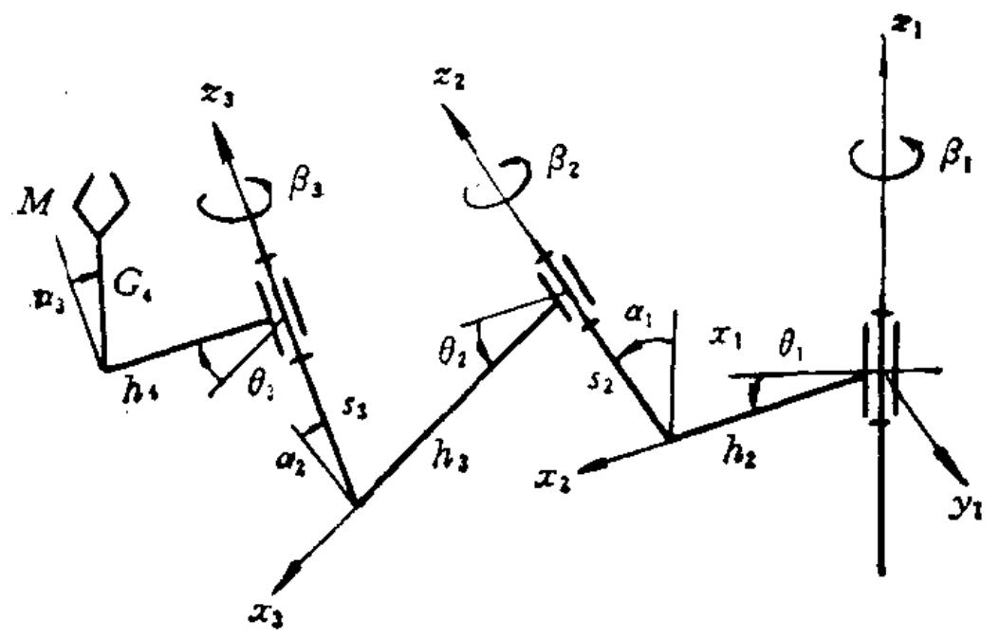

图3-0 机器人前3级机构

式中

$$
x _ { 3 r } = ( h _ { 4 } ^ { 2 } + G _ { 4 } ^ { 2 } \sin ^ { 2 } \alpha _ { 3 } ) ^ { \frac { 1 } { 2 } }
$$

如果把求出的 ${ \overline { { W } } } _ { 3 } ( M )$ 在 $\pmb { 0 } _ { 2 } \pmb { x } _ { 2 } \pmb { y } _ { 2 } \pmb { z } _ { 2 }$ 坐标系中 ${ \tt x } _ { 2 } { \tt x } _ { 2 }$ 平面的圆弧投影$W _ { 2 r } ( M )$ 作为母线,绕 ${ \pmb z } _ { 2 }$ 轴旋转,就可得到曲面 $\mathbb { W } _ { 2 } ( M )$ 。其方程推导如下:

1.将 $\Psi _ { 3 }$ 从坐标系 $\pmb { 0 } _ { 3 } \pmb { \mathscr { D } } _ { 3 } \pmb { \mathcal { Y } } _ { 3 } \pmb { \mathcal { Z } } _ { 3 }$ 变换到坐标系 $\pmb { 0 } \mathbf { 2 } \pmb { \ x { \mathscr { D } } } \mathbf { 2 } \pmb { \mathscr { Y } } \mathbf { 2 } ^ { \pmb { \mathscr { Z } } } \mathbf { 2 }$ ,其表达式为

$$
P _ { 2 } { = } _ { 8 _ { 2 } ^ { k } + { \cal E } ^ { k \theta _ { 3 } } ( h _ { 3 } ^ { 4 } + { \cal E } ^ { i \alpha _ { 0 } } ( W _ { 3 } ) ) }
$$

$$
= \left[ \begin{array} { c } { 0 } \\ { 0 } \\ { 0 } \\ { \mathfrak { S } _ { 2 } } \end{array} \right] + \left[ \begin{array} { c } { h _ { 3 } \cos \theta _ { 2 } } \\ { h _ { 3 } \sin \theta _ { 2 } } \\ { 0 } \end{array} \right] + E ^ { \chi _ { 8 } \theta _ { 3 } } E ^ { \mathrm { i } \alpha _ { 1 } } \left[ \begin{array} { c } { x _ { 3 r } \cos \beta _ { 3 } } \\ { x _ { 3 r } \cos \beta _ { 3 } } \\ { x _ { 3 r } \sin \beta _ { 3 } } \\ { G _ { 4 } \cos \alpha _ { 3 } + s _ { 3 } } \end{array} \right]
$$

$$
= \left[ \begin{array} { c } { h _ { 3 } \cos \theta _ { 2 } + \sigma _ { 3 r } \cos \beta _ { 3 } \cos \theta _ { 2 } - \sigma _ { 3 r } \sin \beta _ { 3 } \sin \theta _ { 2 } \cos \alpha _ { 2 } } \\ { h _ { 3 } \sin \theta _ { 2 } + \sigma _ { 3 r } \cos \beta _ { 3 } \sin \theta _ { 2 } + \sigma _ { 3 r } \sin \beta _ { 3 } \cos \theta _ { 2 } \cos \alpha _ { 2 } } \\ { \sigma _ { 3 r } \sin \beta _ { 3 } \sin \alpha _ { 2 } + ( G _ { 4 } \cos \alpha _ { 3 } + \mathfrak { s } _ { 3 } ) \cos \alpha _ { 2 } } \end{array} \right]
$$

2.求 ${ \cal W } _ { 3 } ( M )$ 在 $\pmb { \mathcal { D } } _ { 2 r } \pmb { \mathcal { Z } } _ { 2 r }$ 圆弧投影平面的圆弧投影,见图3-21。

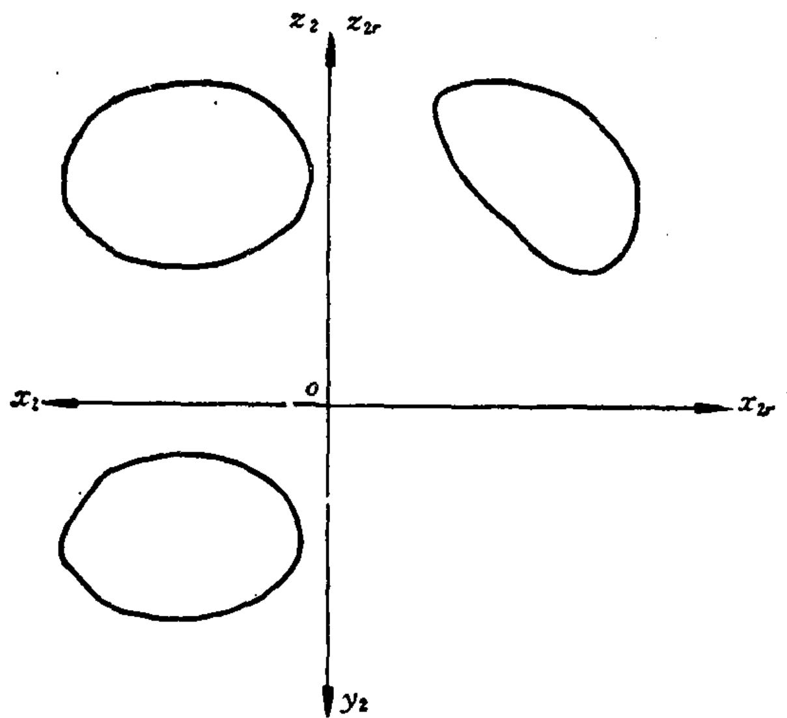

图3-21 $W _ { \beth } ( \pmb { M } )$ 的圆弧投影

将式3-198代入式9-136,得

$$
\left. \begin{array} { r l } & { \varpi _ { 2 r } = \left[ \left( h _ { 3 } \cos \theta _ { 2 } + \varpi _ { 3 r } \cos \beta _ { \mathfrak { s } } \cos \theta _ { 2 } - \varpi _ { 3 r } \sin \beta _ { 3 } \sin \theta _ { 2 } \cos \alpha _ { 2 } \right) ^ { 2 } \right. } \\ & { \left. + \left( h _ { 3 } \sin \theta _ { 2 } + \varpi _ { 3 r } \cos \beta _ { 3 } \sin \theta _ { 2 } + \varpi _ { 3 r } \sin \beta _ { 3 } \cos \theta _ { 2 } \cos \alpha _ { 2 } \right) ^ { 2 } \right] ^ { \frac { 1 } { 2 } } } \\ & { y _ { 2 r } = 0 } \\ & { z _ { 2 r } = \varpi _ { 3 r } \sin \beta _ { 3 } \sin \alpha _ { 2 } + \left( G _ { 4 } \cos \alpha _ { 3 } + s _ { 3 } \right) \cos \alpha _ { 2 } } \end{array} \right\}
$$

3.将 $W _ { 2 \gamma } ( M )$ 绕 ${ \mathfrak { z } } _ { 2 }$ 轴旋转 $\beta _ { 2 } ( 0 \leqslant \beta _ { 2 } \leqslant 2 \pi )$ ,则可得工作空间${ \cal { W } } _ { 2 } ( M )$ 。该工作空间的方程为

$$
W _ { 2 } { = } \left( \it { \Delta } x _ { 2 r } \cos \beta _ { 2 } , \ \it { \Delta } x _ { 2 r } \sin \beta _ { 2 } , \ \it { \Delta } z _ { 2 r } \right)
$$

同理,可求出经坐标变换后 $W _ { 2 } ( M )$ 在 $\pmb { 0 } _ { : } \pmb { x } _ { 1 } \pmb { y } _ { 1 } \pmb { z } _ { 1 }$ 坐标系中的圆弧投影 $W _ { 1 r } ( M )$ 

$$
 \begin{array} { r l } &   \begin{array} { r l } { \alpha _ { 1 r } = [ ( h _ { 2 } \cos \theta _ { 1 } + \sigma _ { 2 r } \cos \beta _ { 2 } \cos \theta _ { 1 } - \sigma _ { 2 r } \sin \beta _ { 2 } \sin \theta _ { 1 } \cos \alpha _ { 1 } ) ^ { 2 }  } \\ {  \begin{array} { r l } {  + ( h _ { 2 } \sin \theta _ { 1 } + \sigma _ { 2 r } \cos \beta _ { 2 } \sin \theta _ { 1 } + \sigma _ { 2 r } \sin \beta _ { 2 } \cos \theta _ { 1 } \cos \alpha _ { 1 } ) ^ { 2 } ] ^ { \frac { 1 } { 2 } } } \\ { y _ { 1 r } = 0 } \\ { \approx \chi _ { 1 r } = \chi _ { 2 r } \sin \beta _ { 2 } \sin \alpha _ { 1 } + \varepsilon _ { 2 r } \cos \alpha _ { 1 } } \end{array} } \end{array} \} \end{array}
$$

当 $\beta _ { 2 }$ 变化时,将得到一组旋截交线的圆弧投影,其集合即为$W _ { 2 } ( M )$ 在 $\pmb { \mathcal { D } } _ { 1 } \pmb { \mathcal { p } } \pmb { \mathrm { \tilde { \alpha } } } _ { 1 \pmb { r } }$ 圆弧投影面上的圆弧投影 $\smash { \mathbf { W } _ { 1 r } ( \mathbf { M } ) \circ \mathbf { \cdots } \mathbf { W } _ { 1 r } ( \mathbf { M } ) }$ 的包络线即为 $W _ { 1 } ( M )$ 工作空间的母线,见图8-22。

图3-22 $W _ { 1 } ( M )$ 的圆弧投影

根据数学上包络线的定义有

$$
\frac { \partial x _ { 1 r } } { \partial \beta _ { 3 } } \cdot \frac { \partial z _ { 1 r } } { \partial \beta _ { 2 } } = \frac { \partial x _ { 1 r } } { \partial \beta _ { 2 } } \cdot \frac { \partial z _ { 1 r } } { \partial \beta _ { 3 } }
$$

将有关公式代入上式,经整理得

$$
\begin{array} { r l } & { \mathrm { s g } \int _ { \mathbb { S } ^ { 2 } } \mathrm { s i n } \ \alpha _ { 1 } \dot { x } _ { 2 r } \big [ \sqrt { h _ { 2 } } \cos \theta _ { 1 } + \alpha _ { 2 r } \cos \beta _ { 2 } \cos \theta _ { 4 } } \\ & { \quad - \cos \theta _ { 2 } \sin \beta _ { 2 } \sin \theta _ { 1 } \cos \alpha _ { 1 } \big ) ( \cos \beta _ { 2 } \cos \theta _ { 1 } - \sin \beta _ { 2 } \sin \theta _ { 1 } \cos \alpha _ { 2 r }  } \\ & { \quad +  ( \dot { h } _ { 2 } \sin \theta _ { 1 } + \alpha _ { 2 r } \cos \beta _ { 2 } \sin \theta _ { 1 }   } \\ & { \quad   + \alpha _ { 2 r } \sin \beta _ { 2 } \cos \theta _ { 1 } \cos \alpha _ { 1 } ) ( \cos \beta _ { 2 } \sin \beta _ { 1 }   } \\ & { \quad   + \sin \beta _ { 2 } \cos \theta _ { 1 } \cos \alpha _ { 1 } ) ] ( \cos \beta _ { 2 } \sin \beta _ { 2 } \sin \theta _ { 1 } + \dot { z } _ { 2 r } \cos \alpha _ { 1 } ) } \\ & { \quad - \sin \beta _ { 2 } \cos \theta _ { 1 } \cos \alpha _ { 2 r } \cos \beta _ { 2 } \cos \theta _ { 2 } - \alpha _ { 2 r } \sin \beta _ { 2 } \sin \alpha _ { 1 }  \dot { \beta } _ { 2 } \sin \theta _ { 3 } \cos \alpha _ { 1 } ) } \\ & { \quad \times ( ( \dot { h } _ { 2 } \cos \theta _ { 1 } + \alpha _ { 2 r } \cos \beta _ { 2 } \cos \theta _ { 2 } \cos \beta _ { 2 } - \alpha _ { 3 r } \sin \beta _ { 3 } \cos \alpha _ { 1 } )  } \\ & { \quad \times  ( - \sin \beta _ { 2 } \cos \theta _ { 1 } - \cos \beta _ { 2 } \sin \theta _ { 1 } \cos \alpha _ { 1 } )  } \\ &  \quad  \end{array}
$$

)

式中, $\dot { x } _ { 2 r } , \ \dot { z } _ { 2 r }$ 分别是 $x _ { 2 r } , z _ { 2 r }$ 对 $\beta _ { 3 }$ 的偏导,当 $\beta _ { 2 }$ 在0到 $2 \pi$ 之间奕化时,可从式3-142中求出一系列相应的 $\beta _ { 3 }$ 。设

$$
\left. \begin{array} { c } { { x _ { 2 r } { = } f _ { 1 } ( \beta _ { 3 } ) } } \\ { { \ z _ { 2 r } { = } f _ { 2 } ( \beta _ { 3 } ) } } \end{array} \right\}
$$

将式3-143代入式3-141,可得 $W _ { \textrm { I r } } ( M )$ 的包络线方程

$$
\left. \begin{array} { r l } & { \alpha _ { 1 \mathcal { F } } ^ { \prime } = [ ( h _ { 2 } \cos { \theta _ { \mathrm { 1 } } } + f _ { \mathrm { 1 } } ( \beta _ { \mathrm { 3 } } ) \cos { \beta _ { \mathrm { 2 } } } \cos { \theta _ { \mathrm { 3 } } } - f _ { \mathrm { 1 } } ( \beta _ { \mathrm { 3 } } ) \sin { \beta _ { \mathrm { 2 } } } \sin { \theta _ { \mathrm { 1 } } } \cos { \alpha _ { \mathrm { 3 } } } ) ^ { 2 } } \\ & { \quad \quad + ( h _ { 2 } \sin { \theta _ { \mathrm { 1 } } } + f _ { \mathrm { 1 } } ( \beta _ { \mathrm { 3 } } ) \cos { \beta _ { \mathrm { 2 } } } \sin { \theta _ { \mathrm { 1 } } } } \\ & { \quad \quad + f _ { \mathrm { 1 } } ( \beta _ { \mathrm { 3 } } ) \sin { \beta _ { \mathrm { 2 } } } \cos { \theta _ { \mathrm { 1 } } } \cos { \alpha _ { \mathrm { 1 } } } ) ^ { 2 } ] ^ { \frac { 1 } { 2 } } } \\ & { \beta _ { 1 \mathcal { F } } ^ { \prime } = 0 } \\ & { z _ { 1 \mathcal { T } } ^ { \prime } = f _ { \mathrm { 1 } } ( \beta _ { \mathrm { 3 } } ) \sin { \beta _ { \mathrm { 2 } } } \sin { \alpha _ { \mathrm { 1 } } } + f _ { \mathrm { 2 } } ( \beta _ { \mathrm { 3 } } ) \cos { \alpha _ { \mathrm { 1 } } } } \end{array} \right\}
$$

在 $\pmb { 0 } _ { 1 } \pmb { \mathcal { D } } _ { \perp } \pmb { \mathcal { Y } } _ { \perp } \pmb { \mathcal { Z } } .$ :坐标系中,机器人工作空间 $\mathbb { W } _ { 1 } ( M )$ 的曲面方程为

$$
\begin{array} { r } { W _ { 1 } = ( \pmb { v } _ { 1 r } ^ { \prime } \cos \beta _ { 1 } , \ \pmb { \chi } _ { 1 r } ^ { \prime } \sin \beta _ { 1 } , \ \pmb { z } _ { 1 r } ^ { \prime } ) } \end{array}
$$

根据上述步骤,采用递推方法可导出 $\pmb { N }$ 个回转关节的机器人工作空间的表达式。从 $n + 1$ 坐标系至 $\pmb { \mathscr { n } }$ 坐标系的坐标变换关系式为

$$
P _ { n } = \mathfrak { e } _ { n } ^ { \hbar } + E ^ { k \theta n } ( \hbar _ { n + 1 } ^ { \ast } + E ^ { i \alpha _ { n } } ( W _ { n + 1 } ) )
$$

圆弧投影的表达式为

$$
\left. \begin{array} { l } { { \mathcal { D } _ { , r } = \left[ \left( h _ { n + 1 } \cos \theta _ { n } + \varpi _ { n + 1 r } \cos \theta _ { n + 1 } \cos \theta _ { n } \right. \right. } } \\ { { \left. \left. - \varpi _ { n + 1 r } \sin \beta _ { n + 1 } \sin \theta _ { n } \cos \alpha _ { n } \right) ^ { 2 } + \left( h _ { n + 1 } \sin \theta _ { n } \right. \right. } } \\ { { \left. \left. + \varpi _ { n + 1 r } \cos \beta _ { n + 1 } \sin \theta _ { n } + \varpi _ { n + 1 r } \sin \beta _ { n + 1 } \cos \theta _ { n } \cos \alpha _ { n } \right) ^ { 2 } \right] ^ { \frac { 1 } { 2 } } } } \\ { { \mathcal { Y } _ { n r } = 0 } } \\ { { \mathcal { G } _ { n r } = \varpi _ { n + 1 r } \sin \beta _ { n + 1 } \sin \alpha _ { n } + \varepsilon _ { n + 1 r } \cos \alpha _ { n } } } \end{array} \right\}
$$

包络线方程为

$$
\begin{array} { r l } & { a _ { n n } ^ { \prime } = [ ( h _ { n + 1 } \cos \theta _ { n } + f _ { 1 } ( \beta _ { n + 2 } ) \cos \beta _ { n + 1 } \cos \theta _ { n }   } \\ & {   \qquad - f _ { 2 } ( \beta _ { n + 2 } ) \sin \beta _ { n + 1 } \sin \theta _ { n } \cos \alpha _ { n } ) ^ { 2 } + ( h _ { n + 1 } \sin \theta _ { n }   } \\ & {   \qquad + f _ { 1 } ( \beta _ { n + 2 } ) \cos \beta _ { n + 1 } \sin \theta _ { n } + f _ { 1 } ( \beta _ { n + 2 } ) \sin \beta _ { n + 1 } \cos \theta _ { n } \cos \alpha _ { n } ) ^ { 2 } ] ^ { \frac { 1 } { 2 } } } \\ & { \mathring { c } _ { n ^ { \ast } } ^ { \prime } = f _ { 1 } ( \beta _ { n + 2 } ) \sin \beta _ { n + 1 } \sin \alpha _ { n } + f _ { 2 } ( \beta _ { n + 2 } ) \cos \alpha _ { n } } \end{array}
$$

工作空间表达式为

$$
\smash { W _ { n } = ( x _ { n r } ^ { \prime } \cos \beta _ { n } , \ x _ { n r } ^ { \prime } \sin \beta _ { n } , \ z _ { n r } ^ { \prime } ) }
$$

从几何构成的角度分析,在机器人工作空间中,可能会出现空洞和空腔。所谓空洞,是指在某特定转轴 ${ \pmb { \mathscr { z } } } _ { \bf i }$ 周围,沿 ${ \pmb { \mathscr { z } } } _ { \pmb { \mathscr { n } } }$ 全长腕点M均不能到达的空间。空腔则是指腕点不能达到而被完全封闭在工作空间之内的区域,见图 $g - 2 3 = 0$ 因工作空间中的空洞和空腔均是腕点不可到达的区域,因此设计时应力求将此种区域缩小,而使用时则应避免在其中规划腕点的工作。

图3-23空洞与空腔

从以上机器人工作空间形成的分析可知, $W _ { n } ( M )$ 工作空间曲面体中的空腔,是由前一级工作空间中存在的空洞绕 $z _ { n }$ 轴旋转所形成。也就是 ${ \cal { W } } _ { n } ( M )$ 存在空腔的必要条件是前一级 $W _ { n + 1 } ( M )$ 工作空间曲面体存在空洞[1。但这并不是充分条件,是否有空腔还与 ${ \cal { W } } _ { n + 1 } ( M )$ 相对于 $0 _ { n } x _ { n } y _ { n } z _ { n }$ 坐标系的位置有关。如图3-24所示,如果 $W _ { n + 1 } ( M )$ 倾斜的位置能使以 ${ \pmb { \mu } } _ { \pmb { n } }$ 为旋转中心的圆弧投影线穿越其空洞而不与之相交时,才能使 ${ \cal { W } } _ { n } ( M )$ 曲面体存在空腔。由于圆弧投影线在垂直于 $z _ { n }$ 的平面上,因此存在空腔的条件为:垂直 ${ \pmb { \mathcal { Z } } } _ { \pmb { \mathcal { n } } }$ 的平面截取 $W _ { n + 1 } ( M )$ 得到非连通域(有空洞),并且存在若干条圆弧投影线自由穿越此空洞。如图 $\mathbf { 8 - 2 5 ~ a }$ 所示,以 ${ \mathfrak { L } } _ { \mathfrak { r } }$ 为法线可作一系列 $\pmb { \pi }$ 平面,其中 $\pi _ { H }$ 与 $W _ { n + 1 } ( M )$ 的最高点 $H$ 相切, $\pmb { \pi } _ { L }$ 与${ \mathbb { W } } _ { n + 1 } ( M )$ 的最低点 $\pmb { L }$ 相切, $\boldsymbol { \pi }$ 为 $\pi _ { H }$ 与 $\pmb { \pi } _ { L }$ 之间的任一截面。形成空腔的充要条件是:

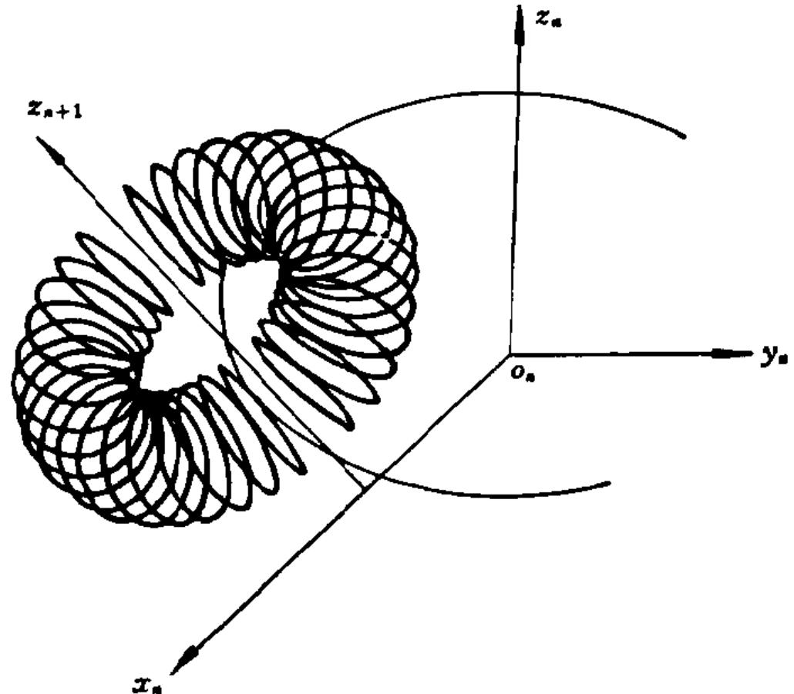

图3-24 机器人工作空间存在空腔的条件

图3-25 空腔存在的充要条件

1.有一部分 $\pmb { \sigma }$ 平面截 ${ \cal { W } } _ { n + 1 } ( M )$ 得到两个以上非连通的区域,见图 $2 { \cdot } 2 5 ~ \mathrm { { b } } ,$ 

2.有部分圆弧投影线自由穿越这些非连通域之间的区域而不与 $W _ { n + 1 } ( M )$ 相交。

# 第四章 空间机构受力分析

空间机构动力学有两类问题,一是直接问题,即已知机构的运动求作用于机构的力。解此类问题时,一般假定原动件的运动规律及作用于机构上的工作负荷都是已知的,待求的是运动副中的约束反力与作用于原动件上的平衡力。二是间接问题,即已知作用于机构上所有的外力,求机构的运动规律。

空间机构受力分析包括静力分析和动力分析两方面。在机构运动速度较小时,如果各构件的惯性力与其他力相比可以忽略,则可只作静力分析。对于高速运转的机构,则必须考虑惯性力的影响,对机构进行动力分析。

本章将论述静力分析及与设计关系较密切的动力学直接问题。

# 4-1 空间闭链机构受力分析

# 一、空间闭链机构的静力分析

# (一)虚功原理

在力学中常用虚功原理求解质点系的静力平衡问题。虚功原理表明,具有定常理想约束的质点系在给定位置上平衡的充要条件是:所有作用于该系统的主动力在任何虚位移中的虚功之和为零。把上述虚功和虚位移分别代之以虚功率和虚速度,该原理仍成立。

在进行空间机构力的分析时往往忽略摩擦力的影响,符合关于理想约束的条件。用虚功原理可以方便地求出作用于机构上各外力之间的关系。

例4-1:在图3-7的空间RRRSR 机构中,若绕 ${ \pmb k } _ { 5 }$ 轴作用的工作阻力矩为 $M _ { 5 }$ ,在构件3杆件坐标系原点 $0 _ { 3 }$ 处作用一沿 $\mathbf { k _ { 3 } }$ 方向的力 $P _ { 3 }$ ,忽略各构件的质量,求 $\pmb { k _ { 1 } }$ 轴上的平衡力矩 $M _ { 1 0 }$ 

解设 $M _ { 1 , } M _ { 5 , } P _ { 3 }$ 的虚功率分别为 $\delta N _ { \textrm { 1 , } } \delta N _ { \textrm { 5 } }$ 和 $\delta N _ { 3 }$ ,根据虚功原理有

$$
\delta N _ { \mathrm { 1 } } { + } \delta N _ { \mathrm { 3 } } { + } \delta N _ { \mathrm { 3 } } { = } 0
$$

可写为

$$
M _ { 1 } \dot { \theta } _ { 2 } + M _ { 5 } \dot { \theta } _ { 1 } + P _ { 3 } ( k _ { 3 } \cdot \dot { r } _ { 3 } ) = 0
$$

得

$$
M _ { 1 } { = } \frac { M _ { 5 } \dot { \theta } _ { 1 } { + } P _ { 3 } ( k _ { 3 } \cdot \dot { r } _ { 3 } ) } { - \dot { \theta } _ { 2 } }
$$

式中, $\dot { \theta } _ { 1 , } \dot { r } _ { 3 }$ 由速度分析求得。

# (二)约束反力求解

运动副的约束反力属于机构的内力,求解时必须把相连接的构件沿运动副拆开,用约束反力和约束反力矩取代原来运动副的约束。拆开后,约束反力就成了外力。再用力平衡方程式进行求解。被拆开的运动副称为示力副。用力平衡方程式进行求解不仅可以求出各约束反力,还可求出平衡力。

图 $\pmb { 4 - 1 }$ 空间闭链机构的外力

图 $\bf { 4 - 1 }$ 为一由 $m$ 个构件组成的空间闭链机构,在各构件上作用有外力 $\pmb { F }$ 和外力矩 $Q$ 。设在 $n ( \gamma _ { b } = 1 , 2 \cdot \cdot \cdot \gamma _ { i } 2 )$ 系中度量的作用于$\pmb { \mathscr { n } }$ 构件的外刀 ${ \pmb F } _ { n }$ 外刀矩 $\mathbf { Q } _ { n }$ ,外力作用点 ${ \mathfrak { P } } _ { \mathfrak { s } }$ 为

$$
\begin{array} { r } { \boldsymbol { F } _ { n } = \left[ \begin{array} { l } { \boldsymbol { F } _ { \alpha n } } \\ { \boldsymbol { F } _ { y n } } \\ { \boldsymbol { F } _ { s n } } \end{array} \right] \quad \boldsymbol { Q } _ { n } = \left[ \begin{array} { l } { \boldsymbol { Q } _ { c r } , } \\ { \boldsymbol { Q } _ { y r } } \\ { \boldsymbol { Q } _ { e r } } \end{array} \right] \quad \boldsymbol { r } _ { n } = \left[ \begin{array} { l } { \dot { x } _ { r n } } \\ { y _ { r } , } \\ { \dot { z } _ { r n } } \end{array} \right] } \end{array}
$$

取图中以 $k _ { n }$ 为轴线的运动副为示力副把闭链机构拆成两个开链机构。图 $\pmb { 4 - 2 }$ 为右侧开链机构。构件 $\therefore + 1$ 给构件 $\pmb { \mathscr { n } }$ 的约束反力作为开链机构的外力。设在 ${ \mathfrak { n } } ( { \mathfrak { n } } = 1 \mid 2 \cdots m )$ 系中度量的约束反力$R _ { ( n + 1 ) n } ,$ 约束反力矩 $M _ { ( n + 1 ) n }$ 和约束反力的作用点 $d _ { * }$ 为

$$
\begin{array} { r l } & { R _ { ( n + 1 ) n } = - R _ { n ( n + 1 ) } = \left[ \begin{array} { l } { R _ { n ( n ) } } \\ { R _ { n ( n ) } } \\ { R _ { n ( n ) } } \end{array} \right] } \\ & { } \\ & { M _ { ( n + 1 ) n } = - M _ { n ( n + 1 ) } = \left[ \begin{array} { l } { M _ { n ( n ) } } \\ { M _ { n ( n ) } } \\ { M _ { n ( n ) } } \end{array} \right] } \\ & { } \\ & { d _ { n } = \left[ \begin{array} { l } { \boldsymbol { \sigma } _ { \boldsymbol { d } n } } \\ { \boldsymbol { y } _ { \boldsymbol { d } n } } \\ { \boldsymbol { z } _ { \boldsymbol { d } n } } \end{array} \right] } \end{array}
$$

由于运动副中存在相对运动的自由度,所以不计摩擦时,运动副中的约束反力总是缺少某些分量。例如,沿移动副轴线方向的相对移动不受约束,因而沿该轴线方向的约束反力分量为零;绕转动副轴线的相对转动不受约束,因而沿该轴线方向的约束反力矩分量为零。同理,沿圆柱副轴线方向的约束反力和反力矩分量均为零;球面副不能传递力矩,因而约束反力矩为零。由此可见,对具有 $f$ 个自由度的运动副,其约束反力和约束反力矩的分量总数为 $6 - f _ { 0 }$ 

设连接构件 $\pmb { \mathscr { n } }$ 与 $n - 1$ ,构件 $n - 1$ 与 ${ \mathfrak { n } } - 2$ 的运动副均为圆柱副。由于构件 $\pmb { \eta } _ { \pmb { \nu } }$ 有沿 $k _ { n - 1 }$ 轴移动的自由度,所以在平衡时作用在构件 $\pmb { \eta }$ 上的所有外力沿 $k _ { n - 1 }$ 方向的分量之和应为零,即

$$
( R _ { ( n + 1 ) n } + F _ { n } ) \circ ( k _ { n - 1 } ) _ { n } = 0
$$

图 $4 - 3$ 右侧开链机构

式中, $( k _ { n - 1 } ) _ { n }$ 是在 $\pmb { \eta }$ 系中度量的轴线 $k _ { n - 1 0 }$ 在 $n - 1$ 系中表示式4--6有

$$
[ E _ { ( n - 1 ) n } ( R _ { ( n + 1 ) n } + { \pmb F } _ { n } ) ] \cdot \left[ \begin{array} { c } { { 0 } } \\ { { 0 } } \\ { { 1 } } \end{array} \right] = 0
$$

由于构件 $m$ 有绕 $k _ { n - 1 }$ 轴转动的自由度,所以在平衡时作用于 $\pmb { \mathscr { n } }$ 构件上的所有外力矩沿 $k _ { n - 1 }$ 方向的分量之和应为零,即

$$
\{ E _ { ( n - 1 ) n } \{ M _ { ( n + 1 ) n } + Q _ { n } + [ d _ { n } + ( \overline { { { o _ { n - 1 } } } } \hat { o _ { n } } ) _ { n } ]
$$

$$
\times R _ { ( n + 1 ) n } + r _ { n } \times F _ { n } \} \} \cdot { \left[ \begin{array} { l } { 0 } \\ { 0 } \\ { 1 } \end{array} \right] } = 0
$$

式中, $( \overline { { 0 _ { n - 1 } \theta _ { n } } } )$ 表示在 $m$ 系中度量的从 $\scriptstyle 0 _ { n - 1 }$ 指向 $0 _ { n }$ 的向量

$$
\widetilde { \left( \partial _ { n - 1 } O _ { n } \right) } _ { n } = { \cal E } _ { n ( n - 1 ) } [ \widetilde { \left( \partial _ { n - 1 } O _ { n } \right) } _ { n - 1 } ]
$$

根据式8-4, $( \overline { { { O _ { n - 1 } O _ { n } } } } ) _ { n - 1 } { = } \mathfrak { E } _ { n - 1 } ^ { k } { + } E ^ { k \theta _ { n } } ( \pmb { k } _ { n } ^ { * } ) _ { 0 }$ 而 $E _ { n } ( n - 1 )$ 是 $E _ { ( n - 1 ) n }$ 的逆变换,根据回转变换矩阵的性质三及矩阵运算法则,有

$$
\begin{array} { r l } & { \vec { E } _ { n ( n - 1 ) } = [ E _ { ( n - 1 ) n } ] ^ { - 1 } = [ E ^ { \tilde { k } \theta _ { n } } , E ^ { \tilde { l } ( \tilde { d } _ { n } ) } ] ^ { - 1 } } \\ & { \qquad = [ E ^ { \tilde { \imath } ( \tilde { d } _ { n } ) } ] ^ { - 1 } [ E ^ { \tilde { \imath } ( \tilde { d } _ { n } ) } ] ^ { - 1 } = E ^ { \tilde { \imath } ( \tilde { \imath } - \tilde { \alpha } _ { n } ) } \vec { E } ^ { \tilde { \imath } ( \tilde { \jmath } _ { n } ) } } \end{array}
$$

所以

$$
\begin{array} { r l } & { ( \overline { { \boldsymbol { O } _ { n - 1 } \boldsymbol { O } _ { n } } } ) _ { n } = \tilde { L } ^ { i ( \cdot - \alpha _ { n } ) } \tilde { L } ^ { i \lambda ( \cdot - \theta _ { n } ) } [ \mathcal { E } _ { n - 1 } ^ { k } + \dot { L } ^ { \gamma k \theta _ { n } } ( \boldsymbol { h } _ { n } ^ { i } ) ] } \\ & { \qquad = \boldsymbol { h } _ { n } ^ { i } + \dot { \Sigma } ^ { i ( \cdot - \alpha _ { n } ) } \left( \mathcal { S } _ { n - 1 } ^ { k } \right) } \end{array}
$$

在式 $4 - 7$ 和 $x ^ { 4 } - 8$ 中, $r _ { n _ { 2 } } F _ { n _ { 3 } } Q _ { n }$ 为已知参数, $\smash { \mathcal { M } _ { ( n + 1 ) n _ { 2 } } \ R _ { ( n + 1 ) n } }$ 为待求参数。参照式 $4 - 7$ 和4-8可写出关于 $\pmb { n - 1 }$ 构件对 $\therefore \frac { 1 } { n - 2 }$ 轴的平衡方程式,只须把下标 $n + 1 , n , n - 1$ 分别换成 $n _ { 2 } \pi - 1 , n - 2$ 即可。故有

$$
[ \boldsymbol { \mathcal { Z } } _ { ( n - 2 ) ( n - 1 ) } ( \boldsymbol { R } _ { n + 1 } + \boldsymbol { F } _ { n - 1 } ) ] \cdot \left[ \begin{array} { l } { 0 } \\ { 0 } \\ { 1 } \end{array} \right] = 0
$$

$$
\begin{array} { r l } & { \{ E _ { ( n - 2 ) ( n - 1 ) } \{ M _ { n ( n - 1 ) } + Q _ { n - 1 } + [ d _ { n - 1 } + \left( { \cal O } _ { n - 2 } { \cal O } _ { n - 1 } \right) _ { n - 1 } ] } \\ & { \qquad \quad \times } \\ & { \qquad \times R _ { n ( n - 1 ) } + r _ { n - 1 } \times { \cal F } _ { n - 1 } \} \} \cdot \left[ \begin{array} { l } { 0 } \\ { 0 } \\ { 1 } \end{array} \right] = 0 } \end{array}
$$

式中, $M _ { \mathrm { r ( n - 1 ) } } , R _ { \mathrm { r ( n - 1 ) } }$ 可通过构件 $\pmb { \eta }$ 的平衡条件算出。以 $n - 1$ 系为参考系,根据构件 $\pmb { \mathscr { n } }$ 的力平衡条件,有

$$
\scriptstyle { E _ { ( n - 1 ) n } ( R _ { ( n + 1 ) n } + F _ { n } ) + R _ { ( n - 1 ) n } = 0 }
$$

式中, $\pmb { R } _ { ( n - 1 ) n }$ 为构件 $n - 1$ 给构件 $\pmb { \eta }$ 的约束反力

$$
R _ { n ( n - 1 ) } { = } - R _ { ( n - 1 ) n } { = } { \cal E } _ { ( n - 1 ) n } ( R _ { ( n + 1 ) n } + R _ { n } )
$$

根据对 $\sigma _ { n - 1 }$ 取力矩的平衡条件,有

$$
\begin{array} { r l } & { E _ { ( n - 1 ) n } \{ M _ { ( n + 1 ) n } + Q _ { n } + [ \pmb { d _ { n } } + ( \overline { { O _ { n - 1 } O _ { n } } } ) _ { n } ] \times R _ { ( n + 1 ) n } } \\ & { \quad + r _ { n } \times F _ { n } \} + M _ { ( n - 1 ) n } = 0 } \end{array}
$$

式中 $M _ { ( n - 1 ) n }$ 是构件 $\hbar - 1$ 给构件 $\pmb { \eta }$ 的约束反力矩

$$
\begin{array} { r } { M _ { n ^ { ( n - 1 ) } } { = } - M _ { ( n - 1 ) n } = E _ { ( n - 1 ) n } \{ M _ { ( n + 1 ) n } + \boldsymbol { Q } _ { n } } \\ { + \left[ \boldsymbol { d } _ { n } + ( \overline { { o _ { n - 1 } o _ { n } } } ) _ { n } \right] \times \boldsymbol { R } _ { ( n + 1 ) n } + \boldsymbol { r } _ { n } \times \boldsymbol { F } _ { n } \} } \end{array}
$$

将式4-12.4-13代入式4-10、4-11,得

$$
\{ E _ { ( n - 2 ) ( n - 1 ) } [ E _ { ( n - 1 ) n } ( R _ { ( n + 1 ) n } + F _ { n } ) + F _ { n - 1 } ] \} \cdot { \left[ \begin{array} { l } { 0 } \\ { 0 } \\ { 1 } \end{array} \right] } = 0
$$

$$
\begin{array} { r l r } {  { \{ {  { \mathcal E } } _ { ( n - 2 ) \times n - 1 } \} {  { \mathcal E } } _ { ( n - 1 ) \times } \{ M _ { ( n + 1 ) n } \cdot \in Q _ { n } +  { \mathbb E } [ d _ { n } + ( \frac { \ l } { o _ { n - 1 } Q _ { n } } ) _ { n } ] } } \\ & { } & { \times R _ { ( n + 1 ) n } + \boldsymbol r _ { n } \times {  { \boldsymbol F } } _ { n } \} + \mathbf Q _ { n - 1 } + [ d _ { n - 1 } + ( \frac { \ l } { o _ { n - 2 } Q _ { n - 1 } } ) _ { n - 1 } ] } \\ & { } & \\ & { } & { \times R _ { n ( n - 1 ) } + \boldsymbol r _ { n - 1 } \times {  { \boldsymbol F } } _ { n - 1 } \} \cdot ( \begin{array} { l } { 0 } \\ { 0 } \\ { 1 } \end{array} ) = 0 \qquad ( 4 . } \end{array}
$$

式4-14、式4-15中除了含有式 $4 - 7$ 和式4-8中所有的参数外,增加了 $r _ { n - 1 , \atop 3 } F _ { n - 1 , \atop 3 } Q _ { n - 1 }$ ,这些都是已知参数。依照上述方法可建立右侧开链机构中各构件关于待求约束反力与已知外力的方程式。对应运动副的每一个移动自由度或转动自由度,可写出一个类似式 $\pm 7$ 或4-8的方程,如果所列的方程数目不足以求解所有的约束反力,则可再沿左侧开链机构写出平衡方程式。若以 $k _ { n + 1 }$ 为轴线的运动副也是圆柱副,则以 $n + 1$ 系为参考系,式 $4 - 7$ 变为

$$
\begin{array} { r } { [ E _ { ( n + 1 ) n } ( R _ { n ( n + 1 ) } ) + F _ { n + 1 } ] \cdot \left[ \begin{array} { l } { 0 } \\ { 0 } \\ { 1 } \end{array} \right] = 0 } \end{array}
$$

即

$$
[ - E _ { ( n + 1 ) n } ( R _ { ( n + 1 ) n } ) + F _ { n + 1 } ] \cdot { \left[ \begin{array} { l } { 0 } \\ { 0 } \\ { 1 } \end{array} \right] } = 0
$$

以 $n + 1$ 系为参考系,式4-8变为

$$
\begin{array} { r l } & { \{ E _ { ( n + 1 ) n } \{ M _ { n ( n + 1 ) } + \big [ \big ( \overline { { o _ { n + 1 } } } \overline { { o _ { n } } } \big ) _ { n } + d _ { n } \big ] \times R _ { n ( n + 1 ) } \} } \\ & { \qquad + Q _ { n + 1 } + r _ { n + 1 } \times F _ { n + 1 } \} \cdot \left[ \begin{array} { l } { 0 } \\ { 0 } \\ { 1 } \end{array} \right] = 0 } \end{array}
$$

式中

$$
( \overline { { O _ { n + 1 } O _ { n } } } ) _ { n } = - ( \overline { { O _ { n } O _ { n + 1 } } } ) , R _ { \mathfrak { r } , ( n + 1 ) } = - R _ { ( n + 1 ) , 1 }
$$

$$
M _ { n ( n + 1 ) } { = } - M _ { ( n + 1 ) n 0 }
$$

因而有

$$
\begin{array} { r l } & { \mathrel { \mathop : } - E _ { ( n + 1 ) n } [ M _ { ( n + 1 ) n } + ( \pmb { d } _ { n } - o _ { n } o _ { n + 1 } ) \times \pmb { R } _ { ( n + 1 ) n } ] } \\ & { \qquad + \pmb { Q } _ { n + 1 } + \pmb { r } _ { n + 1 } \times \pmb { F } _ { n + 1 } \} \cdot \left[ \begin{array} { l } { 0 } \\ { 0 } \\ { 1 } \end{array} \right] = 0 } \end{array}
$$

在式4-16 和4-17中,待求参数仍为 $\pmb { R } _ { ( n + 1 ) n }$ 和 $M _ { ( n + 1 ) n }$ ,而$Q _ { n + 1 } , r _ { n + 1 }$ 和 ${ \pmb { F } } _ { n + 1 }$ 为已知。

求出示力副的约束反力和约束反力矩后,其余运动副的约束反力和约束反力矩可利用各构件的平衡方程式求出,类似式4-12和 $4 - 1 3 _ { 0 }$ 计算得到的 $M _ { ( n - 1 ) n }$ 与 $\mathcal { R } _ { ( \mathfrak { n } - \mathfrak {1 } ) _ { n } }$ 对应参考点 $j _ { n - 1 0 }$ 

例4-2:在图4-3的空间RCCC机构中,设已知加在构件 $\pmb { 4 }$ 上沿 $k _ { 4 }$ 轴的工作阻力 ${ \pmb F } _ { 4 }$ 和工作阻力矩 $\mathbf { Q } _ { \pmb { \imath } }$ ,忽略各构件的质量,求各运动副中的约束反力和反力矩以及加在原动件2上的对 $k _ { 1 }$ 轴的平衡力矩 $\mathbf { Q _ { 2 } }$ 。

解 (1)求示力副中的约束反力。

取以 $k _ { 3 }$ 为轴线的圆柱副 $\boldsymbol { C }$ 为示力副,待求约束反力和反力矩

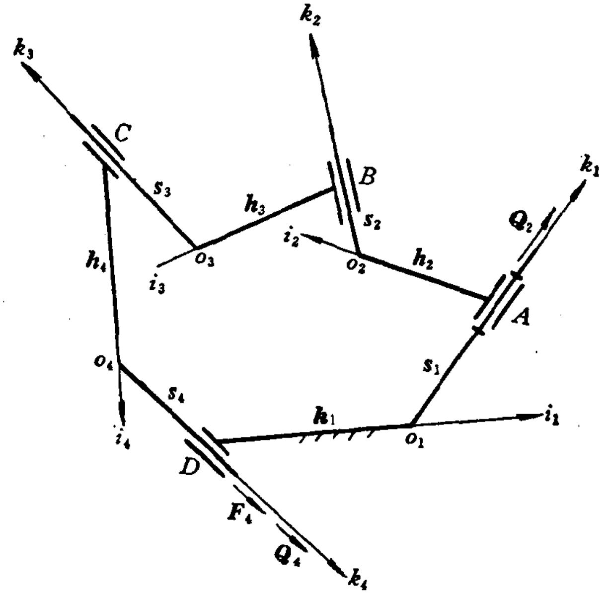

图4-3空间RCCC机构

分别为 $R _ { 4 3 } , M _ { 4 3 }$ 

$$
\begin{array} { r } { R _ { 4 3 } = \left[ \begin{array} { c } { R _ { \sigma 3 } } \\ { R _ { y 8 } } \\ { 0 } \end{array} \right] \qquad M _ { 4 3 } = \left[ \begin{array} { c } { \hat { M } _ { \alpha 3 } } \\ { \hat { M } _ { y 3 } } \\ { 0 } \end{array} \right] } \end{array}
$$

设各约束反力作用在各运动副中心(即 $k _ { 1 }$ 轴与 $i _ { j + 1 }$ 轴的交点),沿右侧第一个圆柱副 $B$ 的轴线方向写出平衡方程式。由于 ${ \pmb { F } } _ { 3 } = 0$ ,$\mathbf { Q } _ { 3 } = \mathbf { 0 }$ , $d _ { 3 } = \frac { \alpha ^ { k } } { 3 } .$ ,根据式4-7·和 $4 - 8$ 有

$$
[ E _ { z 3 } ( R _ { 4 3 } ) ] \cdot \left[ \begin{array} { l } { 0 } \\ { 0 } \\ { 1 } \end{array} \right] = 0
$$

$$
\{ E _ { 2 3 } \{ M _ { 4 3 } + [ d _ { 3 } + ( \overline { { { \upsilon _ { 2 } \upsilon _ { 3 } } } } ) ] \times R _ { 4 3 } \} \} \cdot \left[ \begin{array} { c } { { 0 } } \\ { { 0 } } \\ { { 1 } } \end{array} \right] = 0
$$

展开式4-18

$$
\left( E ^ { \boldsymbol { k } \boldsymbol { \theta } _ { 3 } } E ^ { i \alpha _ { * } } \left[ \begin{array} { c } { R _ { \alpha 3 } } \\ { R _ { \nu 3 } } \\ { 0 } \end{array} \right] \right) \cdot \left[ \begin{array} { c } { 0 } \\ { 0 } \\ { 1 } \end{array} \right] = 0
$$

得

$$
R _ { y 3 } \sin \alpha _ { 3 } = 0
$$

由于 $\sin \alpha _ { 3 } \neq 0$ ,所以 $\scriptstyle R _ { y 3 } = 0 _ { c }$ ,展开式4-19

$$
\{ E ^ { \nu \theta _ { * } } E ^ { i \alpha \nu } \{ [ \begin{array} { c } { { M _ { \alpha 3 } } } \\ { { M _ { \nu 3 } } } \\ { { 0 } } \end{array} ] + ( [ \begin{array} { c } { { 0 } } \\ { { 0 } } \\ { { s _ { 3 } } } \end{array} ] + [ \begin{array} { c } { { h _ { 3 } } } \\ { { 0 } } \\ { { 0 } } \end{array} ] + E ^ { i ( - \alpha _ { 3 } ) } [ \begin{array} { c } { { 0 } } \\ { { 0 } } \\ { { s _ { 2 } } } \end{array} ] ) 
$$

$$
\times \left[ \begin{array} { c } { { R _ { \varepsilon 3 } } } \\ { { 0 } } \\ { { 0 } } \end{array} \right] \left[ \begin{array} { c } { { 1 } } \\ { { 0 } } \\ { { 1 } } \end{array} \right] = 0
$$

得

即

$$
( M _ { y 3 } + R _ { \alpha 3 } \mathscr { s } _ { 3 } ) \sin \alpha _ { 3 } = 0
$$

$$
M _ { v 3 } = - R _ { c 3 } s _ { 3 }
$$

沿左侧第一个圆柱副的轴线方向写出平衡方程式,根据式4-16和4-17有

$$
\begin{array} { r l } & { \left[ - E _ { 4 3 } ^ { * } ( R _ { 4 3 } ) + F _ { 4 } \right] \cdot \left[ \begin{array} { l } { 0 } \\ { 0 } \\ { 0 } \end{array} \right] = 0 } \\ & { \left\{ - E _ { 4 3 } [ M _ { 4 3 } + ( d _ { 3 } - \mathcal { O } _ { 8 } \mathcal { Q } _ { 4 } ) \times R _ { 4 8 } ] \right. } \\ & { \left. \begin{array} { l } { + Q _ { 4 } + r _ { 4 } \times F _ { 4 } ) \cdot \left[ \begin{array} { l } { 0 } \\ { 0 } \\ { 1 } \end{array} \right] = 0 } \end{array} \right. } \end{array}
$$

展开式4-21

$$
\left( - E ^ { ; ( - \alpha _ { 4 } ) } \underline { { { E } } } ^ { \bar { k } ( - \theta _ { 4 } ) } { \left[ \begin{array} { l } { ~ 0 } \\ { ~ 0 } \\ { - ~ 0 } \end{array} \right] } + { \left[ \begin{array} { l } { ~ 0 } \\ { ~ 0 } \\ { ~ \underline { { { F } } } _ { z 4 } } \end{array} \right] } \right) \cdot { \left[ \begin{array} { l } { - ~ 0 } \\ { ~ 0 } \\ { ~ 1 } \end{array} \right] } = 0
$$

得

$$
- R _ { c 3 } \sin \alpha _ { 4 } \sin \theta _ { 4 } + F _ { e 4 } = 0
$$

即

$$
R _ { \alpha 3 } = \frac { F _ { z 4 } } { \sin \alpha _ { 4 } \sin \theta _ { 4 } }
$$

代入式4-20,得

$$
M _ { y 3 } = \frac { - F _ { \mathrm { ' 4 } } \ S _ { 3 } } { \sin \alpha _ { 4 } \sin \theta _ { 4 } }
$$

展开式4-22,得

$$
- M _ { \alpha 3 } \sin \alpha _ { 4 } \sin \theta _ { 4 } + M _ { \nu 3 } \sin \alpha _ { 4 } \cos \theta _ { 4 }
$$

$$
- R _ { \alpha 3 } h _ { 4 } \sin \theta _ { 4 } \cos \theta _ { 4 } + Q _ { s 4 } = 0
$$

即

$$
M _ { c 3 } = Q _ { \frac { z _ { 4 } + M _ { y 3 } \sin \alpha _ { 4 } \cos \theta _ { 4 } - R _ { a 3 } h _ { 4 } \sin \theta _ { 4 } \cos \theta _ { 4 } } { \sin \alpha _ { 4 } \sin \theta _ { 4 } } }
$$

至此,示力副中全部反力已求出。

(2)求其余运动副的反力与平衡力矩 $Q _ { 2 0 }$ 

示力副的反力求出后,可用各构件的平衡条件求出其余运动副的反力。图4-4为构件2、8、4的分离受力图。

(a)求机架给构件4的约束反力和反力矩 $R _ { 1 4 , } M _ { 1 4 0 }$ 

以 $\pmb { 4 }$ 系为参考系列出构件4的力平衡方程

$$
\mathbf { { \cal { F } } _ { 4 } } + \mathbf { { \cal { R } } _ { 1 4 } } + \mathbf { { \cal { E } } _ { 4 8 } } ( \mathbf { { \cal { R } } _ { 3 4 } } ) = \left[ \begin{array} { l } { 0 } \\ { 0 } \\ { 0 } \\ { - 0 } \end{array} \right]
$$

即

$$
[ \begin{array} { c } { { 0 } } \\ { { 0 } } \\ { { 0 } } \\ { { { \it F } _ { * 4 } } } \end{array} ] + [ \begin{array} { c } { { { \it R } _ { \pi 4 } } } \\ { { { \it R } _ { y 4 } } } \\ { { 0 } } \end{array} ] -  [ \begin{array} { c } { { \gamma - { \it R } _ { x 3 } } } \\ { { \gamma - { \it B } _ { \pi 4 } } } \\ { { 0 } } \end{array} ] [ \begin{array} { c } { { - { \it R } _ { x 3 } } } \\ { { 0 } } \\ { { 0 } } \\ { { 0 } } \end{array} ] = [ \begin{array} { c } { { 0 } } \\ { { 0 } } \\ { { 0 } } \end{array} ]
$$

得

$$
\left. \begin{array} { l } { { R _ { \alpha 4 } = R _ { \alpha 3 } \cos \theta _ { 4 } } } \\ { { R _ { y 4 } = - R _ { \alpha 3 } \cos \alpha _ { 4 } \sin \theta _ { 4 } } } \end{array} \right\}
$$

对 $D$ 点取力矩的平衡条件为

$$
M _ { 1 4 } + Q _ { 4 } + E _ { 4 3 } ( M _ { 3 4 } ) + ( - \thinspace s ^ { k } - h _ { 4 } ^ { 4 } ) \times E _ { 4 3 } ( R _ { 3 4 } ) = [ ( \begin{array} { c } { { 0 } } \\ { { 0 } } \\ { { 0 } } \end{array} ]
$$

图4-4 各构件的受力

即

$$
\left[ \begin{array} { c } { { M _ { \alpha 4 } } } \\ { { M _ { \nu 4 } } } \\ { { 0 } } \end{array} \right] + \left[ \begin{array} { c } { { 0 } } \\ { { 0 } } \\ { { Q _ { s 4 } } } \end{array} \right] - \left. E ^ { ( - \alpha _ { 4 } ) } E ^ { ( - \theta _ { 4 } ) } \left[ \begin{array} { c } { { M _ { \alpha 8 } } } \\ { { M _ { \nu 3 } } } \\ { { 0 } } \end{array} \right] + \left[ \begin{array} { c } { { h _ { 4 } } } \\ { { 0 } } \\ { { 0 } } \\ { { - \frac { 8 4 } { 3 } } } \end{array} \right] \right[ \left[ \begin{array} { c } { { \overline { { { h } } } } } \\ { { \overline { { { h } } } } } \\ { { \overline { { { h } } } } } \end{array} \right] - \left[ \begin{array} { c } { { \overline { { { h } } } } } \\ { { \overline { { { h } } } } } \\ { { 0 } } \\ { { 0 } } \end{array} \right] + \left[ \begin{array} { c } { { \overline { { { h } } } } } \\ { { \overline { { { h } } } } } \\ { { \overline { { { h } } } } } \end{array} \right]
$$

$$
\times \left( E ^ { \psi ( - \alpha _ { 4 } ) } E ^ { \chi _ { ( - \theta _ { 4 } ) } } { \left[ \begin{array} { l } { ~ 0 } \\ { ~ 0 } \\ { ~ 0 } \end{array} \right] } \right) = { \left[ \begin{array} { l } { - ~ 0 } \\ { ~ 0 } \\ { ~ 0 } \\ { ~ 0 } \end{array} \right] }
$$

得

$$
\mathcal { M } _ { \alpha 4 } = M _ { \tau 3 } \cos \theta _ { 4 } + ( M _ { \eta 3 } - s _ { 4 } R _ { \alpha 3 } \cos \alpha _ { 4 } ) \sin \alpha _ { 3 }
$$

$$
M _ { y 4 } = ( h _ { 4 } R _ { x 3 } \sin \alpha _ { 4 } - M _ { \alpha 3 } \cos \alpha _ { 4 } ) \sin \theta _ { 4 }
$$

$$
+ \left( M _ { y 3 } \cos \alpha _ { 4 } - s _ { 4 } R _ { x 3 } \right) \cos \theta _ { 4 }
$$

(b)求运动副 $B$ 的反力。

以2系为参考系,构件3的力平衡方程为

$$
E _ { 2 3 } ( R _ { 4 3 } ) + R _ { 2 3 } = E _ { 2 3 } ( R _ { 4 3 } ) - R _ { 3 2 } = { \left[ \begin{array} { l } { 0 } \\ { 0 } \\ { 0 } \end{array} \right] }
$$

即

$$
\mathbb { E } ^ { k \theta _ { 1 } } \mathbb { E } ^ { \prime \alpha _ { * } } \left[ { \begin{array} { c } { R _ { \alpha 3 } } \\ { 0 } \\ { 0 } \end{array} } \right] - \left[ { \begin{array} { c } { R _ { \alpha 2 } } \\ { R _ { y 2 } } \\ { 0 } \end{array} } \right] = \left[ { \begin{array} { c } { 0 } \\ { 0 } \\ { 0 } \end{array} } \right]
$$

得

$$
\left. \begin{array} { c l c r } { { R _ { \alpha 2 } { = } R _ { \alpha 3 } \ \cos \theta _ { 3 } } } \\ { { } } \\ { { R _ { \nu 2 } { = } R _ { \alpha 3 } \ \sin \theta _ { 3 } } } \end{array} \right\}
$$

对 $B$ 点取力矩的平衡条件为

$$
M _ { z 3 } + E _ { 2 3 } [ M _ { 4 3 } + ( \pmb { h } _ { 3 } ^ { \prime } + \pmb { \mathscr { s } } _ { 3 } ^ { k } ) \times \pmb { R } _ { 4 3 } = ] \left[ \begin{array} { l } { 0 \ ^ { - } } \\ { 0 } \\ { 0 } \\ { 0 \ } \end{array} \right]
$$

即

$$
\left[ \begin{array} { c } { { - M _ { \alpha 2 } } } \\ { { - M _ { y 2 } } } \\ { { 0 } } \end{array} \right] + E ^ { k \theta _ { 3 } } E ^ { i \alpha _ { 3 } } \left( \left[ \begin{array} { c } { { - M _ { \alpha 3 } } } \\ { { M _ { y 3 } } } \\ { { 0 } } \end{array} \right] + \left[ \begin{array} { c } { { h _ { 3 } } } \\ { { 0 } } \\ { { -  s _ { 3 } } } \end{array} \right] \times \left[ \begin{array} { c } { { - R _ { \alpha 3 } } } \\ { { 0 } } \\ { { 0 } } \\ { { 0 } } \end{array} \right] \right) = \left[ \begin{array} { c } { { 0 } } \\ { { 0 } } \\ { { 0 } } \end{array} \right]
$$

得

$$
\begin{array} { r } { M _ { \alpha { 2 } } = M _ { \alpha { 3 } } \cos \theta _ { 3 } - ( M _ { \nu { 3 } } + s _ { 3 } R _ { \alpha { 3 } } ) \sin \theta _ { 3 } \cos \alpha _ { 3 } } \\ { M _ { \nu { 2 } } = M _ { \alpha { 3 } } \sin \theta _ { 3 } + ( M _ { \nu { 3 } } + s _ { 3 } R _ { \alpha { 3 } } ) \cos \theta _ { 3 } \cos \alpha _ { 3 } } \end{array} \bigg \}
$$

(c)求运动副 $\pmb { A }$ 的反力及平衡力矩 $Q _ { 2 0 }$ 

以1系为参考系,构件2的力平衡方程为

$$
\begin{array} { r l } { \boldsymbol { \hat { \Sigma } } } &  { } - [ \begin{array} { l } { -  R _ { \alpha 1 }  ^ { - } } \\ {  R _ { y 1 } ] +  \check { E } ^ { k \theta _ { 1 } } \check { E } ^ { i \alpha _ { 1 } } [ R _ { y 2 } } \\ {  0 ] -  0 ] } \end{array} ] = [ \begin{array} { l } { -  0  ^ { - } } \\ {  0 } \\ {  0 ] } \end{array} \end{array}
$$

得

$$
R _ { a 1 } { = } R _ { a 2 } \cos { \theta _ { 2 } } { - } R _ { y 2 } \sin { \theta _ { 2 } } \cos { \alpha _ { 2 } }
$$

$$
\begin{array} { r l } & { R _ { y 1 } = R _ { x 2 } \sin \theta _ { 2 } + R _ { y 2 } \cos \theta _ { 2 } \cos \alpha _ { 2 } } \\ & { R _ { z 1 } = R _ { y 2 } \sin \alpha _ { 2 } } \end{array}
$$

对 $\pmb { A }$ 点取力矩的平衡方程式为

$$
\left[ \begin{array} { c } { - M _ { \alpha 1 } } \\ { - M _ { y 1 } } \\ { 0 } \end{array} \right] + \left[ \begin{array} { c } { 0 } \\ { 0 } \\ { Q _ { z 2 } } \end{array} \right] + E ^ { k \theta _ { 3 } } E ^ { i \alpha _ { 3 } } \left( \left[ \begin{array} { c } { { M _ { \alpha 2 } } } \\ { { M _ { \nu 2 } } } \\ { 0 } \end{array} \right] + \left[ \begin{array} { c } { - h _ { 2 } } \\ { 0 } \\ { 0 } \\ { - \ s _ { 2 } } \end{array} \right] \right)
$$

$$
\times \left[ \begin{array} { c } { { R _ { \alpha 2 } } } \\ { { R _ { y 2 } } } \\ { { 0 } } \end{array} \right] = \left[ \begin{array} { c } { { 0 } } \\ { { 0 } } \\ { { 0 } } \end{array} \right]
$$

得

$$
\begin{array} { r l } & { M _ { \alpha 1 } = \cos \theta _ { 2 } ( M _ { \alpha 2 } - s _ { 2 } R _ { y 2 } ) + [ ( h _ { 2 } R _ { y 2 } \sin \alpha _ { 2 } \sin \beta _ { 1 } \sin \alpha _ { 2 } \sin \beta _ { 1 } \sin \theta _ { 2 } \sin \theta _ { 2 } \theta _ { 2 } \sin \theta _ { 1 } \sin \theta _ { 2 } \theta _ { 2 } \sin \theta _ { 2 } \theta _ { 2 } \sin \theta _ { 2 } \theta _ { 2 } \sin \theta _ { 2 } \theta _ { 2 } \sin \theta _ { 2 } \theta _ { 2 } \sin \theta _ { 2 } \theta _ { 2 } \sin \theta _ { 2 } \theta _ { 2 } \sin \theta _ { 2 } \theta _ { 2 } \theta _ { 2 } \sin \theta _ { 2 } \theta _ { 2 } \theta _ { 2 } \sin \theta _ { 2 } \theta _ { 2 } \theta _ { 2 } \sin \theta _ { 2 } \theta _ { 2 } \theta _ { 2 } \sin \theta _ { 2 } \theta _ { 2 } \theta _ { 2 } \sin \theta _ { 2 } \theta _ { 2 } \theta _ { 2 } \sin \theta _ { 2 } \theta _ { 2 } \theta _ { 2 } \theta _ { 2 } } \\ &  M _ { y 1 } = \sin \theta _ { 2 } ( M _ { x 2 } - s _ { 2 } R _ { y 2 } ) + [ ( M _ { y 2 } + s _ { 2 } R _ { x 2 } ) \cos \theta _ { 2 } \sin \theta _ { 2 } \theta _ { 2 } \sin \theta _ { 2 } \theta _ { 2 } \sin \theta _ { 2 } \theta _ { 2 } \sin \theta _ { 2 } \theta _ { 2 } \theta _ { 2 } \sin \theta _ { 2 } \theta _ { 2 } \theta _ { 2 } \theta _ { 2 } \sin \theta _ { 2 } \theta _ { 2 } \theta _ { 2 } \theta _ { 2 } \theta _ { 2 } \sin \theta _ { 2 } \theta _ { 2 } \theta _ { 2 } \theta _ { 2 } \theta _ { 2 } \theta _ { 2 } \theta _ { 2 } \theta _ { 2 } \theta _ { 2 } \theta _ { 2 } \theta _ { 2 } \theta _ { 2 } \theta _ { 2 } \theta _ { 2 } \theta  \end{array}
$$

(三)空间闭链机构的静定条件

从以上分析可知,在单闭链机构中,如果已求出某一运动副中约束反力的所有分量,则其余运动副中的约束反力可由每一构件的平衡方程式依次求得。因此,单闭链机构中,如所取的示力副约束反力是静定的,则整个机构各运动副中的约束反力也是静定的。设所取示力副的自由度为 $f$ ,则约束反力的分量总数为 $6 - f .$ 。将机构沿示力副拆分为两部分后,如果能列出 $6 - f$ 个平衡方程式,则示力副中的约束反力为静定。由式1-12可知,单闭链机构中各运动副自由度的总和为 $\mathbfcal { F } + \mathbfcal { K } _ { \circ }$ 

除示力副外,其余运动副的自由度总和为 $\textstyle F + K - f _ { c }$ ,对这些运动副的每一个移动自由度都可列出一个如式 $4 ^ { \prime } - 7$ 的标量方程式,每一个转动自由度都可列出一个如式4-8的标量方程式。因此,共可列出 $\pmb { F } + \pmb { K } - \pmb { f }$ 个方程式。其中 $\pmb { F }$ 个方程式用于求解 $\mathbfcal { F }$ 个平衡力,而 $X - f$ 个方程式用于确定示力副中的约束反力。因此,示力副中约束反力的静定条件为

$$
6 - f = K - f
$$

对一般的 $\kappa = 6$ 的单闭链机构,示力副中的约束反力具有静定性。对其他 $\kappa < 6$ 的机构,示力副中的约束反力均为静不定,需考虑构件弹性变形和运动副中间隙的影响,才能补足所缺的平衡方程式。对 $k = 3$ 的平面机构,如所有的外力均作用在垂直于转动轴的平面上,则示力副中约束反力的分量总数为 $g - f .$ ,因而获得静定。

# 二、空间闭链机构的动力分析

# (一)构件惯性力的确定

根据力学定理,作用于构件的惯性力系可简化为一个通过质心的主惯性力 ${ \pmb { P } } _ { n }$ 和主惯性力矩 $\mathbf { G } _ { n }$ 。设构件 $\pmb { \mathscr { n } }$ 的质心在固定参考系中的坐标为 $\phi _ { n }$ ,构件的质量为 ${ \mathfrak { M } } _ { \mathfrak { n } }$ ,构件的绝对角速度、角加速度分别为 $\omega _ { n _ { 1 } } \varepsilon _ { n _ { 2 } }$ 则

$$
p _ { n } = { \left[ \begin{array} { l } { - \alpha _ { n } } \\ { g _ { n } } \\ { z _ { n } } \end{array} \right] } \qquad \omega _ { n } = { \left[ \begin{array} { l } { - \omega _ { a n } - } \\ { \omega _ { g n } } \\ { \omega _ { g n } } \\ { - \omega _ { a n } } \end{array} \right] } \qquad \varepsilon _ { n } = { \left[ \begin{array} { l } { - \varepsilon _ { a n } } \\ { \varepsilon _ { g n } } \\ { - \varepsilon _ { a n } } \end{array} \right] }
$$

$$
\begin{array} { r } { P _ { n } = \left[ \begin{array} { l } { P _ { \varepsilon n } } \\ { P _ { y n } } \\ { P _ { s n } } \end{array} \right] = - m _ { n } \left[ \begin{array} { l } { \ddot { x } _ { n } } \\ { \ddot { y } _ { n } } \\ { \ddot { z } _ { n } } \end{array} \right] } \end{array}
$$

如果在杆件坐标系中度量时,构件的绝对角速度分量为 $\cos _ { \sigma _ { 3 } } \omega _ { y _ { 3 } }$ $\omega _ { z }$ ,绝对角加速度分量为 $E _ { \sigma _ { \overline { { \mathbf { \nu } } } } } \mathbf { \mathcal { E } } _ { \mathbf { \nu } \bullet _ { \mathbf { \nu } } } \mathbf { \mathcal { E } } _ { \varepsilon }$ ,则

$$
\begin{array} { r l } { G _ { n } = E _ { 1 n } [ G _ { e n } } & { { } G _ { i n } \quad G _ { e n } ] ^ { \mathrm { ~ T ~ } } } \end{array}
$$

式中

$$
\begin{array} { r l } & { G _ { \alpha n } = - \int _ { \alpha } \varepsilon _ { \alpha } + ( J _ { y } - J _ { \varepsilon } ) \omega _ { y } \omega _ { s } + J _ { \alpha y } ( \varepsilon _ { y } - \omega _ { \alpha } \omega _ { s } ) } \\ & { \qquad + J _ { \alpha \beta } ( \varepsilon _ { \beta } + \omega _ { \alpha } \omega _ { y } ) + J _ { y s } ( \omega _ { y } ^ { 2 } - \omega _ { z } ^ { 2 } ) } \end{array}
$$

$$
\begin{array} { r l } & { G _ { y s } = - J _ { y } \varepsilon _ { y } + ( J _ { s } - J _ { \alpha } ) \omega _ { z } \omega _ { \alpha } + J _ { y s } ( \varepsilon _ { s } - \omega _ { y } \omega _ { \alpha } ) } \\ & { \qquad + J _ { y s } ( \varepsilon _ { \alpha } + \omega _ { y } \omega _ { z } ) + J _ { z \alpha } ( \omega _ { z } ^ { 2 } - \omega _ { x } ^ { 2 } ) } \end{array}
$$

$$
\begin{array} { r l } & { G _ { z n } = - \int _ { z } \varepsilon _ { z } + ( J _ { \varepsilon } - J _ { \eta } ) \omega _ { \alpha } \omega _ { y } + J _ { z \alpha } ( \varepsilon _ { \alpha } - \omega _ { z } \omega _ { y } ) } \\ & { \qquad + J _ { z y } ( \varepsilon _ { y } + \omega _ { z } \omega _ { \alpha } ) + J _ { \alpha y } ( \omega _ { x } ^ { 2 } - \omega _ { y } ^ { 2 } ) } \end{array}
$$

其中 $J _ { \pmb { \varepsilon } _ { 3 } } J _ { \pmb { \upsilon } _ { 3 } } J _ { z }$ 为构件的惯性矩, $J _ { \alpha y _ { 3 } } J _ { y z _ { 3 } } J _ { z \bar { \alpha } }$ 为惯性积,均在以质心为原点的、各轴平行于杆件坐标系对应轴的坐标系中度量。

# (二)质量替代法

对于作一般空间运动的构件, $\pmb { G } _ { \mathfrak { n } }$ 的计算比较复杂,常用质量替代法用有限个集中质量来替代原构件的质量,从而避开构件绝对角速度、绝对角加速度和惯性力矩的计算。设 $k$ 个集中质量为$m _ { 1 } , m _ { 2 } , \cdot \cdot \cdot m _ { k } ;$ 在上述以质心为原点的坐标系中量度,替代质量所在点的坐标为 $( x _ { 1 } , \ y _ { 1 } , \ z _ { 1 } )$ , $( x _ { 2 } , \ y _ { 2 } , \ z _ { 2 } ) \cdots ( x _ { k } , \ y _ { k } , \ z _ { k } )$ 。替代条件为:

(1) $k$ 个集中质量之和与原构件的质量相同,即

$$
\sum _ { i = 1 } ^ { k } m _ { i } = m
$$

(2) $k$ 个集中质量的质心与原构件的质心重合,即

$$
\sum _ { i = 1 } ^ { k } m _ { i } x _ { i } = 0 \sum _ { i = 1 } ^ { k } m _ { i } y _ { i } = 0 \sum _ { i = 1 } ^ { k } m _ { i } { \tilde { \mathbf { \Gamma } } } _ { i } = 0
$$

(3) $k$ 个集中质量相对质心的惯性矩与原构件相同,即

$$
\left. \begin{array} { l } { { \displaystyle \sum _ { i = 1 } ^ { k } m _ { i } ( y _ { i } ^ { 2 } + z _ { i } ^ { 2 } ) = J _ { \alpha } } } \\ { { \displaystyle \sum _ { i = 1 } ^ { k } m _ { i } ( z _ { i } ^ { 2 } + x _ { i } ^ { 2 } ) = J _ { y } } } \\ { { \displaystyle \sum _ { i = 1 } ^ { k } m _ { i } ( x _ { i } ^ { 2 } + y _ { i } ^ { 2 } ) = J _ { z } } } \end{array} \right\}
$$

(4) $k$ 个集中质量相对质心的惯性积与原构件相同,即

$$
\left. \begin{array} { l } { \displaystyle \sum _ { i = 1 } ^ { k } m _ { i } y _ { i } z _ { i } = \boldsymbol { J } _ { \nu \boldsymbol { z } } } \\ { \displaystyle \sum _ { i = 1 } ^ { k } m _ { i } z _ { i } x _ { i } = \boldsymbol { J } _ { \nu \boldsymbol { \alpha } } } \\ { \displaystyle \sum _ { i = 1 } ^ { k } m _ { i } x _ { i } y _ { i } = \boldsymbol { J } _ { \boldsymbol { \alpha } \boldsymbol { y } } } \end{array} \right\}
$$

式4-88和4-39称为质量动替代条件。按动替代条件求出的管代质量,主惯性力 $\pmb { P }$ 和主惯性力矩 $\pmb { G }$ 均与原均件相同。式4-36和4-37称为质量静替代条件。按静替代条件求出的替代质量,主惯性力 $\pmb { P }$ 与原构件相同而主惯性力矩 $\pmb { G }$ 则不相同。

动替代条件提供10个代数方程式,每个质量替代点有 $m _ { i _ { 1 } }$ $y _ { i , z _ { i } } \lambda .$ 个参数。所以,在 $k$ 个质量替代点中可自由选择 $\pmb { \mathcal { P } }$ 个参数

$$
\pmb { p = 4 k - 1 0 }
$$

显然,满足动替代条件的替代质量个数 $k \geq 0 _ { \circ }$ 同理,静替代条件提供4个方程式

$$
p { = } 4 k { - } 4
$$

满足静替代条件的替代质量个数 $k \geq 2 _ { \circ }$ 

为了简化计算,质量替代点应选位移、速度、加速度容易确定的点,如球面副的中心、运动副轴线上的某点。

# (三)空间闭链机构的动态静力分析

根据力学中的达朗伯原理,只要将惯性力和惯性力矩当作假想的外力加于质点系中,就可按静力平衡条件求解机构的动力。按这种方法进行机构的动力分析,称为机构的动态静力分析。根据达朗伯-拉格朗日定理,任一瞬间作用于理想约束系统上的主动力与惯性力在该系统任意虚位移上的虚功之和为零。因此,只要把惯性力、惯性力矩当作假想外力加于系统上,就可按前述的虚功原理求解机构的动态平衡力。同理,机构动力分析的静定条件也与静力分析的相同。

考虑惯性力后,式 $\pm - 7 , 4 - 8 , 4 - 1 6$ 和4-17变为相应的如下4式

$$
\scriptstyle \left\{ E _ { \scriptscriptstyle ( n - 1 ) n } [ R _ { \scriptscriptstyle ( n + 1 ) n } + F _ { n } + E _ { n 1 } ( { \pmb P } _ { n } ) ] \right\} \cdot { \left[ \begin{array} { l } { 0 } \\ { 0 } \\ { 1 } \end{array} \right] } = 0
$$

$$
\begin{array} { r l } & { \{ E _ { ( n - 1 ) n } \{ M _ { ( n + 1 ) n } + Q _ { n } + [ \pmb { d } _ { n } + ( \overline { { o _ { n - 1 } \theta } } _ { n } ) _ { n } ] \times { \pmb { R } } _ { ( n + 1 ) n } } \\ & { \quad + { \pmb { r } } _ { n } \times { \pmb { F } } _ { n } + E _ { n 1 } ( { \pmb { G } } _ { n } ) + { \pmb { l } } _ { n } \times E _ { n 1 } ( { \pmb { P } } _ { n } ) \} \} } \end{array}
$$

$$
\scriptstyle { \left[ \begin{array} { l } { 0 } \\ { 0 } \\ { 1 } \end{array} \right] } = 0
$$

$$
[ - E _ { \iota _ { n + 1 } ) _ { n } } ( R _ { \iota _ { n + 1 } ) _ { n } } ) + F _ { \iota + 1 } + E _ { \iota _ { n + 1 } ) _ { 1 } } ( P _ { \mathfrak { n } + 1 } ) ]
$$

$$
\scriptstyle \cdot { \left[ \begin{array} { l } { 0 } \\ { 0 } \\ { 1 } \end{array} \right] } = 0
$$

$$
\begin{array} { r l } & { \{ - E _ { ( n + 1 ) n } [ M _ { ( n + 1 ) n } + ( d _ { n } - \overbrace { o _ { n } + o _ { n + 1 } } ^ { \dag } ) \times { \bf R } _ { ( n + 1 ) n } ] } \\ & { \quad + { \bf Q } _ { n + 1 } + r _ { n + 1 } \times { \bf F } _ { n + 1 } + E _ { ( n + 1 ) 1 } ( G _ { n + 1 } ) + l _ { n + 1 } } \\ & { \quad \times E _ { ( n + 1 ) 1 } ( { \bf P } _ { n + 1 } ) \} \cdot \left| \begin{array} { l } { - \overbrace { 0 } ^ { \mathrm { ~ - ~ } } } \\ { 0 } \\ { 1 } \end{array} \right| = 0 } \end{array}
$$

式中, $l _ { n _ { 2 } } l _ { n + 1 }$ 分别为构件 $\eta _ { v }$ 和 $n + 1$ 的质心在各自杆件坐标系中的位置向量。

例4-3:在图4-5的空间RSSR机构中,设原动件2匀速转动,构件 $^ 4$ 上作用有绕 $k _ { 4 }$ 轴的工作阻力矩 $\mathbf { Q _ { 4 } } _ { \odot }$ 。构件2、4的质心在各自的转轴上,构件对转轴的转动惯量分别为 $J _ { 2 }$ 和 $j _ { \frac { 1 } { 4 } }$ ,由于构件2匀速转动, $J _ { 2 }$ 对 $\mathbf { Q _ { 2 } }$ 将不产生影响。构件3的质量为 $m _ { 3 }$ ,质心相对3系(原点在 $B$ 的坐标为 $\pmb { l } _ { 3 } = ( 0 , 0 , l _ { \bot 3 } )$ 。用达朗伯-拉格朗日定理求原动件2上对 $k _ { 1 }$ 轴的平衡力矩 $\log _ { 2 , }$ 

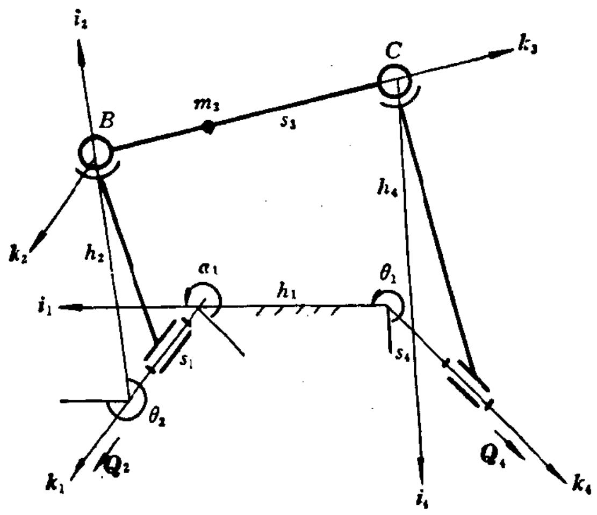

图4-5空间RSSR机构的动力分析

解 (1)构件3的质量替代。

对构件进行静替代,取替代点的个数 $k = 2 .$ 。根据式4-41,可任选 $^ 4$ 个参数。选第 $1$ 个替代质量 $m _ { 3 } ^ { 1 }$ 与球面副 $B$ 的中心重合,即 $x _ { 1 } = 0 , ~ y _ { 1 } = 0 , ~ z _ { 1 } = - l _ { z 3 } ;$ 选第2个替代质量 $m _ { 3 } ^ { 2 }$ 的其中一个坐标 $z _ { 2 } = s _ { 3 } - l _ { z 3 0 }$ 根据静替代条件式4-36和4-37,得

$$
x _ { 2 } = y _ { 2 } = 0
$$

$$
m _ { 3 } ^ { 1 } = \frac { { { \vartheta _ { 3 } } - l _ { z 3 } } } { { { \vartheta _ { 3 } } } } { - m _ { 3 } }
$$

$$
m _ { 3 } ^ { 2 } { = } \frac { l _ { 2 3 } } { s _ { 3 } } m _ { 3 }
$$

$m _ { 3 } ^ { 2 }$ 的位置与球面副 $\boldsymbol { C }$ 的中心重合。

(2)各构件惯性力的确定。

构件2为绕 $k _ { 1 }$ 作定轴匀速转动的构件,主惯性力矩为零。构件 $\mathbf { 4 }$ 为绕 $k _ { 4 }$ 作定轴变速运动的构件,主惯性力矩

$$
G _ { 4 } = - J _ { 4 } \ddot { \theta } _ { 1 } k _ { 4 }
$$

构件3中, $m _ { 3 } ^ { 1 } , m _ { 3 } ^ { 2 }$ 产生的惯性力分别为

$$
P _ { 3 } ^ { 1 } = m _ { 3 } ^ { 1 } \bar { h } _ { \bar { z } } \bar { \theta } _ { 2 } ^ { 2 } \bar { \pmb { i } } _ { 2 }
$$

$$
\begin{array} { c } { { P _ { 3 } ^ { 2 } = - m _ { 3 } ^ { 2 } ( \varepsilon _ { 1 } \times r _ { \circ } + \omega _ { 1 } \times \dot { r } _ { c } ) } } \\ { { = - m _ { 3 } ^ { 2 } ( - \ddot { \theta } _ { 1 } h _ { 4 } \dot { J } _ { 4 } + \dot { \theta } _ { 1 } ^ { 2 } h _ { 4 } \dot { \pmb { i } } _ { 4 } ) } } \end{array}
$$

按达朗伯-拉格朗日定理有

$$
Q _ { 4 } \dot { \theta } _ { 1 } + Q _ { 2 } \dot { \theta } _ { 2 } + P _ { 3 } ^ { 1 } \cdot v _ { B } + P _ { 3 } ^ { 2 } \cdot v _ { c } + G _ { 4 } \cdot \omega _ { 1 } = 0 ~ .
$$

式中, $\boldsymbol { v } _ { B _ { \setminus } } \boldsymbol { v } _ { \boldsymbol { \mathcal { O } } }$ 为 $B , \sigma$ 点的速度向量。由于 ${ \pmb v } _ { B }$ 与 $\dot { \pmb { \imath } } _ { 2 }$ 垂直, $v _ { 0 }$ 与$i _ { 4 }$ 垂直,故有

$$
P _ { 3 } ^ { 1 } \cdot v _ { B } = m _ { 3 } ^ { 1 } \hbar _ { 2 } \dot { \theta } _ { 2 } ^ { 2 } \dot { \iota } _ { 2 } \cdot v _ { B } = 0
$$

$$
\dot { \theta } _ { 1 } ^ { 2 } \lambda _ { 4 } i _ { 4 } \cdot v _ { c } = 0
$$

$$
\begin{array} { r } { m _ { 3 } ^ { 2 } \ddot { \theta } _ { 1 } h _ { 4 } \dot { \jmath } _ { 4 } \cdot v _ { c } = m _ { 3 } ^ { 2 } \ddot { \theta } _ { 1 } h _ { 4 } \dot { \jmath } _ { 4 } \cdot ( \boldsymbol { \omega } _ { 1 } \times \boldsymbol { r } _ { c } ) = - m _ { 3 } ^ { 2 } \ddot { \theta } _ { 1 } \dot { \theta } _ { 1 } h _ { 4 } ^ { 2 } } \end{array}
$$

$$
G _ { 4 } \cdot \omega _ { 1 } = - \int _ { 4 } \ddot { \theta } _ { 1 } k _ { 4 } \cdot ( \dot { \theta } _ { 1 } k _ { 4 } ) = - J _ { 4 } \ddot { \theta } _ { 1 } \dot { \theta } _ { 1 }
$$

得

$$
Q _ { z } = \frac { - Q _ { 4 } \dot { \theta _ { 1 } } + m _ { 3 } ^ { 2 } \ddot { \theta } _ { 1 } \dot { \theta } _ { 1 } h _ { 4 } ^ { 2 } + J _ { 4 } \ddot { \theta } _ { 1 } \dot { \theta _ { 1 } } } { \dot { \theta } _ { 2 } }
$$

式中, $\dot { \theta } _ { 1 , } \ddot { \theta } _ { 1 }$ 由式9-42、3-44算出。

例4-4:在图4-6的空间RSSP机构中,作用于构件4上的工作阻力为 ${ \pmb F } _ { 4 }$ ,构件4的质量为 $m _ { 4 }$ ,质心在 $k _ { 4 }$ 轴上距 $0 _ { 4 } ^ { \frac { \pi } { 3 } }$ 为 $l _ { 4 }$ ,忽略构件3的质量;构件2对 $k _ { 1 }$ 轴的转动惯量为 $J _ { 2 }$ ,质量为 ${ \bf \nabla } m _ { 2 }$ ,质心位于 $\dot { \pmb { \mathscr { v } } } _ { 2 }$ 轴上,与 $k _ { 1 }$ 轴的距离为 $h _ { 2 } / 2$ 。试求各运动副的反力及作用于构件2上的平衡力矩 $Q _ { 2 \circ }$ 

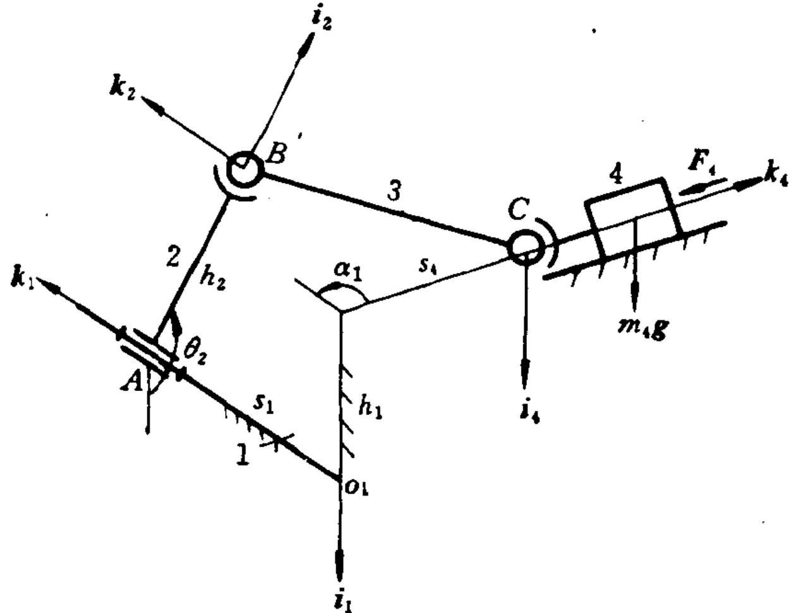

图 $4 - 8$ 空间RSSP机构的动力分析

解 (1)确定各构件的惯性力。

构件2绕 $k _ { 1 }$ 作定轴匀速转动,主惯性力矩 $\pmb { G _ { 2 } }$ 为零。主惯性力

$$
P _ { 2 } = - m _ { 2 } { a _ { 2 } } = - \frac { h _ { 2 } } { 2 }  m _ { 2 } \dot { \theta } _ { 2 } ^ { 2 } \dot { \bar { u } } _ { 2 } = - \frac { h _ { 2 } } { 2 }  m _ { 2 } \dot { \theta } _ { 2 } ^ { 2 } |  \sin \theta _ { 2 } ]
$$

构件 $^ 4$ 沿 $k _ { 4 }$ 轴平移,主惯性力

$$
\begin{array} { r } { P _ { 4 } = - m _ { 4 } a _ { 4 } = - m _ { 4 } \ddot { ^ { \circ } } _ { 4 } k _ { 4 } = - m _ { 4 } \ddot { ^ { \delta } } _ { 4 } \left[ \begin{array} { c } { 0 \quad ^ { - } } \\ { \sin \alpha _ { 1 } } \\ { \cos \alpha _ { 1 } } \\ { . } \end{array} \right] } \\ { . } \end{array}
$$

式中, $\ddot { \pmb { s } } _ { 4 }$ 由速度分析求得。取 $\dag _ { 4 }$ 平行于 $i _ { 1 }$ ,图4-5与图4-6的区别

在于 $h _ { 4 } = 0 , \ \theta _ { 1 } = 0 , \ \mathrm { \ } s _ { 4 }$ 成为运动参数。在式8-21中代入 $h _ { 4 } = 0$ 和$\displaystyle { \theta _ { 1 } = 0 }$ ,得

$$
\begin{array} { c } { { \hat { b } ^ { 2 } = \vartheta _ { \bot } ^ { 2 } + h _ { 1 } ^ { 2 } + s _ { 1 } ^ { 2 } + h _ { 2 } ^ { 2 } - 2 s _ { 4 } s _ { 1 } \cos \alpha _ { 1 } } } \\ { { { } ~ - 2 s _ { 4 } h _ { 2 } \sin \alpha _ { 1 } \sin \theta _ { 2 } + 2 h _ { 1 } h _ { 2 } \cos \theta _ { 2 } } } \end{array}
$$

对上式求导

$$
\begin{array} { r } { 0 = 2 s _ { 4 } \dot { \hat { s } } _ { 4 } - 2 \dot { \hat { s } } _ { 4 } \hat { s } _ { 1 } \cos \alpha _ { 1 } - 2 \dot { \hat { s } } _ { 4 } h _ { 2 } \sin \alpha _ { 1 } \sin \beta _ { 2 } } \\ { - 2 h _ { 2 } s _ { 4 } \cos \theta _ { 2 } \sin \alpha _ { 1 } \dot { \hat { \theta } _ { 2 } } - 2 h _ { 1 } h _ { 2 } \sin \theta _ { 2 } \dot { \hat { \theta } _ { 2 } } } \end{array}
$$

得

$$
\dot { \hat { s } } _ { 4 } = \frac { h _ { 1 } h _ { 2 } \sin \theta _ { 2 } + s _ { 4 } h _ { 2 } \sin \alpha _ { 1 } \cos \theta _ { 2 } } { s _ { 4 } - s _ { 1 } \cos \alpha _ { \mathrm { 1 } } - h _ { 2 } \sin \alpha _ { 1 } \sin \theta _ { 2 } } \dot { \theta } _ { 2 }
$$

对式4-48求导

$$
\begin{array} { r l } & { 0 = \dot { \mathfrak { s } } _ { 4 } ^ { 2 } + \mathfrak { s } _ { 4 } \ddot { \mathfrak { s } } _ { 4 } - \mathfrak { s } _ { 1 } \cos { \mathfrak { a } } _ { 1 } \ddot { \mathfrak { s } } _ { 4 } - h _ { 2 } \sin { \mathfrak { a } } _ { 1 } ( \ddot { \mathfrak { s } } _ { 4 } \sin { \theta _ { 2 } } } \\ & { \phantom { 0 = } + 2 \dot { \mathfrak { s } } _ { 4 } \cos { \theta _ { 2 } } \dot { \theta } _ { 2 } - \mathfrak { s } _ { 4 } \sin { \theta _ { 2 } } \dot { \theta } _ { 2 } ^ { 2 } + \mathfrak { s } _ { 4 } \cos { \theta _ { 2 } } \ddot { \theta } _ { 2 } ) } \end{array}
$$

得

$$
\ddot { s } _ { 4 } < \frac { \dot { s } _ { 4 } ^ { 2 } - [ h _ { 2 } \sin \alpha _ { 1 } ( 2 \dot { s } _ { 4 } \cos \theta _ { 2 } - s _ { 4 } ^ { \prime } \sin \theta _ { 2 } \dot { \theta } _ { 2 } ) + h _ { 1 } h _ { 2 } \cos \theta _ { 2 } \dot { \theta } _ { 2 } ] \dot { \theta } _ { 2 } } { - s _ { 4 } + s _ { 1 } \cos \alpha _ { 1 } + h _ { 2 } \sin \alpha _ { 1 } \sin \theta _ { 2 } }
$$

(2)求示力副中的约束反力。

取运动副 $B$ 为示力副。 $B$ 为球面副,只存在反力 $\pmb { R _ { 3 2 0 } }$ 由于构件3为两力杆, $\pmb { R } _ { 3 2 }$ 沿 $C B$ 方向,若以 $o _ { 1 } i _ { 1 } j _ { 1 } k _ { 1 }$ 为参考系,则

$$
( R _ { 3 2 } ) _ { 1 } = ( R _ { 4 3 } ) _ { 1 } = \frac { R _ { 3 2 } } { l } { \left[ \begin{array} { l } { x _ { B } - x _ { C } } \\ { y _ { B } - y _ { C } } \\ { z _ { B } - z _ { C } } \end{array} \right] }
$$

式中, $l$ 为构件3的杆长。

$$
\left[ \begin{array} { c } { { x _ { B } } } \\ { { y _ { B } } } \\ { { z _ { B } } } \end{array} \right] = \pmb { F } _ { B } = E _ { 1 2 } ( h _ { 2 } \pmb { i } _ { 2 } ) + \mathfrak { s } _ { 1 } \pmb { k } _ { 1 } = \left[ \begin{array} { c } { { - h _ { 2 } \cos \theta _ { 2 } } } \\ { { h _ { 2 } \sin \theta _ { 2 } } } \\ { { 0 } } \end{array} \right]
$$

$$
\left[ \begin{array} { c } { x _ { 0 } } \\ { y _ { C } } \\ { z _ { C } } \end{array} \right] = \pmb { r } _ { C } = \overline { { O _ { 1 } O _ { 4 } } } = \left[ \begin{array} { c } { - h _ { 1 } } \\ { s _ { 4 } \sin \alpha _ { 1 } } \\ { s _ { 4 } \cos \alpha _ { 1 } } \end{array} \right]
$$

沿右侧写出移动副的平衡方程,根据式 $\mathbf { 4 - 4 4 }$ ,以 $^ 4$ 系为参考系,有

$$
[ - E _ { 4 3 } ( R _ { 4 8 } ) + [ F _ { 4 } + E _ { 4 1 } ( m _ { 4 } \pmb { \dot { g } } ^ { \dagger } ) ] - [ E _ { 4 1 } ( \pmb { P } _ { 4 } ) ] \cdot \left[ \begin{array} { c } { { 0 } } \\ { { 0 } } \\ { { 1 } } \end{array} \right] = 0
$$

式中, $\pmb { g }$ 为重力加速度向量。上式变换到1系,有

即

$$
\begin{array} { l } { { [ { \begin{array} { c } { ( - R _ { 4 8 } ) _ { 1 } + E _ { 1 4 } } \\ { ( - R _ { 4 8 } ) _ { 1 } + E _ { 1 4 } } \end{array} } ] ^ { - \mathrm { ~ 0 ~ } } } } \\ { { \mathrm { ~ - ~ } } } \\ { { [ { \begin{array} { c c } { - ( x _ { B } - x _ { C } ) \frac { R _ { 8 2 } } { L } + m _ { 4 } g + R _ { 4 } } \\ { - ( y _ { B } - y _ { C } ) \frac { R _ { 8 3 } } { L } + F _ { \varepsilon 4 } \sin \alpha _ { 1 } - m _ { 4 } \ddot { \phi } _ { 4 } \sin \alpha _ { 1 } + m _ { 4 } g _ { y } } \\ { [ - ( z _ { B } - z _ { C } ) \frac { R _ { 8 2 } } { L } + F _ { \varepsilon 4 } \cos \alpha _ { 1 } - m _ { 4 } \ddot { \phi } _ { 4 } \cos \alpha _ { 1 } + m _ { 4 } g _ { z } } \end{array} } ] } } \end{array} .
$$

$$
\scriptstyle \cdot { \left| \begin{array} { l } { - \quad 0 } \\ { \sin \alpha _ { 1 } } \\ { \dots \cos \alpha _ { 1 } } \\ { - \cos \alpha _ { 1 } } \\ { - } \end{array} \right| } = 0
$$

得

$$
R _ { 3 2 } = \frac { ( m _ { 4 } \ddot { s } _ { 4 } - F _ { z 4 } ) \ l + m _ { 4 } ( g _ { y } \sin \alpha _ { 1 } + g _ { z } \cos \alpha _ { 1 } ) l } { h _ { 2 } \sin \theta _ { 2 } \sin \alpha _ { 1 } - \vartheta _ { 4 } }
$$

(3)求各运动副的反力和平衡力矩 $Q _ { 2 \circ }$ 

$( a )$ 求移动副的约束反力。

对于移动副,约束反力的分量有5个: $R _ { \alpha 4 } , R _ { y 4 } , M _ { \alpha 4 } , M _ { \nu 4 } ,$ $M _ { z 4 0 }$ 构件4的力平衡条件为

即

$$
( R _ { 3 4 } ) _ { 1 } + m _ { 4 } g + P _ { 4 } + E _ { 1 4 } ( F _ { 4 } + R _ { 1 4 } ) = 0
$$

$$
\begin{array}{c} \boxed { \begin{array} { c } { \begin{array} { r l } { - ( \alpha _ { B } - \alpha _ { C } ) \displaystyle \frac { R _ { 3 2 } } { l } + m _ { 4 } g _ { z } } & \\ { - ( y _ { B } - y _ { C } ) \displaystyle \frac { R _ { 8 2 } } { l } + m _ { 4 } g _ { y } - m _ { 4 } \dot { s _ { 4 } } \sin \alpha _ { 1 } } \\ { - ( z _ { B } - z _ { C } ) \displaystyle \frac { R _ { 3 2 } } { l } + m _ { 4 } g _ { z } - m _ { 4 } \dot { s _ { 4 } } \cos \alpha _ { 1 } } \end{array} } \\ { +  \begin{array} { c c } { [ R _ { x 4 } } \\ { R _ { y 4 } } \\ { R _ { z 4 } + F _ { y 4 } } \end{array} ] = [ \begin{array} { c } { 0 } \\ { 0 } \\ { 0 } \\ { 0 } \end{array} ] } \end{array} } \end{array} 
$$

$$
- \left( x _ { B } - y _ { C } \right) \frac { R _ { 3 2 } } { l } + m _ { 4 } g _ { \alpha } + R _ { \varepsilon 4 } \cos \theta _ { \bf 1 } + R _ { y 4 } \sin \theta _ { \bf 1 } = 0
$$

$$
- \left( y _ { B } - y _ { C } \right) \frac { R _ { 3 2 } } { l } + m _ { 4 } g _ { y } - m _ { 4 } \overline { { s } } _ { 4 } \sin \alpha _ { 1 } - R _ { \alpha 4 } \cos \alpha _ { 1 } \sin \theta _ { 1 }
$$

$$
+ R _ { y 4 } \cos { \alpha _ { 1 } } \cos { \theta _ { 1 } } + ( R _ { z 4 } + F _ { z 4 } ) \sin { \alpha _ { 1 } } = 0
$$

$$
- \mathbf { \partial } ( z _ { B } - z _ { C } ) \frac { R _ { 3 2 } } { l } + m _ { 4 } g _ { z } - m _ { 4 } \ddot { s } _ { 4 } \cos \alpha _ { 1 } + R _ { \alpha 4 } \sin \alpha _ { 1 } \sin \theta _ { 1 }
$$

$$
- R _ { y ^ { a } } \sin \alpha _ { 1 } \cos \theta _ { 1 } + ( R _ { z 4 } + F _ { z 4 } ) \cos \alpha _ { 1 } = 0
$$

解上述线性方程组得

$$
R _ { x 4 } = R _ { 3 2 } \frac { h _ { 2 } } { l } ( \cos { \theta _ { 2 } } \cos { \theta _ { 4 } } - \sin { \theta _ { 2 } } \cos { \alpha _ { 4 } } \sin { \theta _ { 4 } } )
$$

$$
+ m _ { 4 } ( g _ { y } \cos \alpha _ { 1 } \sin \theta _ { 1 } - g _ { z } \sin \alpha _ { 1 } \sin \theta _ { \bot } - g _ { \alpha } \cos \theta _ { 1 } )
$$

$$
R _ { y 4 } = \frac { 1 } { \sin \theta _ { 1 } } \left[ \left( h _ { 2 } \cos \theta _ { 2 } + h _ { 1 } \right) \frac { R _ { 8 2 } } { l } - m _ { 4 } g _ { a } - R _ { a 4 } \cos \theta _ { 1 } \right]
$$

$$
R _ { z 4 } = - \vartheta _ { 4 } \ \frac { R _ { z \mathrm { e } } } { l } - g _ { z } \frac { m _ { 4 } } { \cos \alpha _ { 1 } } + m _ { 4 } \tilde { \vartheta } _ { 4 } - R _ { x 4 } \ \mathrm { t g } \ \alpha _ { 1 } \sin \theta _ { 1 }
$$

$$
+ R _ { y 4 } \mathrm { \ t g \ } \alpha _ { 1 } \cos \theta _ { 1 } - F _ { z 4 }
$$

对 $C$ 点取力矩,有

$$
\boldsymbol { E } _ { 1 4 } \left| \begin{array} { c } { - \mathbf { 0 } ^ { - } } \\ { 0 } \\ { l _ { 4 } - 1 } \end{array} \right| \times ( m _ { 4 } \pmb { g } ) + \boldsymbol { E } _ { 1 4 } \left| \begin{array} { c } { - \boldsymbol { M } _ { \alpha ^ { 4 } } } \\ { \boldsymbol { M } _ { y 4 } } \\ { \_ \boldsymbol { M } _ { z 4 } } \end{array} \right| = \mathbf { 0 }
$$

$$
m _ { 4 } \bar { l } _ { 4 } ( g _ { z } \sin \alpha _ { 1 } - g _ { y } \cos \alpha _ { 1 } ) + M _ { \alpha 4 } \cos \theta _ { 1 } + M _ { y 4 } \sin \theta _ { 1 } = 0
$$

$$
\begin{array} { r l } & { m _ { 4 } l _ { 4 } g _ { \alpha } \cos \alpha _ { 1 } - M _ { \alpha 4 } \cos \alpha _ { 1 } \sin \theta _ { 1 } + M _ { y 4 } \cos \alpha _ { 1 } \cos \theta _ { 1 } } \\ & { \quad + M _ { z 4 } \sin \alpha _ { 1 } = 0 } \end{array}
$$

$$
+ M _ { z 4 } \cos { \alpha _ { \mathrm { { 1 } } } } = 0
$$

解上述线性方程组得

$$
{ \mathcal { M } } _ { \alpha 4 } = { \frac { - 1 } { \cos \theta _ { 1 } } } \left[ m _ { 4 } l _ { 4 } ( g _ { z } \sin \alpha _ { 1 } - g _ { y } \cos \alpha _ { 1 } ^ { . } - g _ { \alpha } ) + M _ { \alpha 4 } \sin \theta _ { \mathrm { 1 } } \right]
$$

$$
M _ { \nu 4 } { = } \frac { 1 } { \cos \theta _ { 1 } } \left( M _ { \varepsilon 4 } \sin \theta _ { \mathrm { { i } } } { - }  { m _ { 4 } }  { l _ { 4 } }  { g _ { \alpha } } \right)
$$

$\lambda \lambda _ { z 4 } = M _ { 4 } l _ { 4 } g _ { \alpha }$ g $\pmb { \alpha _ { 1 } } - \pmb { M _ { \alpha ^ { 4 } } }$ tg $\pmb { \alpha _ { 1 } }$ sin $\theta _ { 1 } + M _ { y 4 }$ tg $\alpha _ { 1 } \cos \theta _ { 1 }$ 

(b)求转动副的约束反力和平衡力矩。

设转动副 $\pmb { A }$ 的约束反力分量为 $R _ { e 1 } , R _ { y 1 } , R _ { z 1 } , M _ { e 1 } , M _ { y { \ z } 0 }$ 以1系为参考系,构件2的力平衡条件为

$$
( R _ { 3 2 } ) _ { 1 } + R _ { 1 2 } + P _ { 2 } = 0
$$

即

$$
\left. \begin{array} { c } { { \left[ \begin{array} { c } { { R _ { 3 2 } ( h _ { 2 } \cos \theta _ { 2 } + h _ { 1 } ) } } \\ { { R _ { 3 2 } ( h _ { 2 } \sin \theta _ { 2 } - s _ { 4 } \sin \alpha _ { 1 } ) } } \\ { { - R _ { 3 2 } s _ { 4 } \cos \alpha _ { 1 } } } \end{array} \right] - \left[ \begin{array} { c } { { R _ { a 1 } } } \\ { { R _ { y 1 } } } \\ { { R _ { z 1 } } } \end{array} \right] . } } \end{array} \right.
$$

$$
- \frac { h _ { 2 } } { 2 } \left. m _ { 2 } \dot { \theta } _ { 2 } ^ { 2 } \right[ \sin \theta _ { 2 } \atop 0 \left. \int \right| _ { - 0 } ^ { - \infty } \left[ \begin{array} { c } { { \cos \theta _ { 2 } } } \\ { { 0 } } \\ { { 0 } } \end{array} \right] = \left[ \begin{array} { c } { { 0 } } \\ { { 0 } } \\ { { 0 } } \end{array} \right]
$$

得

$$
\begin{array} { l } { \displaystyle R _ { \alpha 1 } = \frac { R _ { 3 2 } } { l } \left( h _ { 2 } \cos \theta _ { 2 } + h _ { 1 } \right) - \frac { h _ { 2 } } { 2 } ~ m _ { 2 } \dot { \theta } _ { 2 } ^ { 2 } \cos \theta _ { 2 } } \\ { \displaystyle R _ { y 1 } = \frac { R _ { 3 2 } } { l } \left( h _ { 2 } \sin \theta _ { 2 } - s _ { 4 } \sin \alpha _ { 1 } \right) - \frac { h _ { 2 } } { 2 } ~ m _ { 2 } \dot { \theta } _ { 2 } ^ { 2 } \sin \theta _ { 2 } } \\ { \displaystyle R _ { z 1 } = - \frac { R _ { 3 2 } } { l } ~ s _ { 4 } \cos \alpha _ { 1 } } \end{array}
$$

对 $\pmb { A }$ 点取力矩,有

$$
\mathbf { Q } _ { 2 } + \frac { \hbar _ { 2 } } { 2 } \hat { \pmb { i } } _ { 2 } \times \mathbf { P } _ { 2 } + \hbar _ { 2 } \hat { \imath } _ { 2 } \times \mathbf { R } _ { 3 2 } + M _ { 1 2 } = 0
$$

即

$$
\begin{array} { r l r } {  { ( \begin{array} { c } { 0 } \\ { 0 } \\ { 0 } \end{array} ) + \frac { h _ { 2 } } { l } R _ { 3 2 } } } \\ & { } & { \qquad \cdot ( \begin{array} { c c } { - s _ { 4 } \cos \alpha _ { 1 } \sin \theta _ { 2 } } & { - } \\ { s _ { 4 } \cos \alpha _ { 1 } \cos \theta _ { 2 } } & { 0 } \end{array} ) } \\ & { } & { \qquad \times ( \begin{array} { c c } { 0 } & { 0 } \\ { - s _ { 4 } \sin \theta _ { 2 } - s _ { 4 } \sin \alpha _ { 1 } ) \cos \theta _ { 2 } - ( h _ { 2 } \cos \theta _ { 2 } + h _ { 1 } ) \sin \theta _ { 2 } - } \end{array} ) } \\ & { } & { \qquad \cdot ( h _ { 2 } \sin \theta _ { 2 } - s _ { 4 } \sin \alpha _ { 1 } ) \cos \theta _ { 2 } - ( h _ { 2 } \cos \theta _ { 2 } + h _ { 1 } ) \sin \theta _ { 2 } -  } \end{array}
$$

$$
- \left[ \begin{array} { c } { M _ { \alpha {               } 1 } } \\ { M _ { y { } 1 } } \\ { 0 } \end{array} \right] = \left[ \begin{array} { c } { 0 } \\ { 0 } \\ { 0 } \end{array} \right]
$$

得

$$
Q _ { \alpha 2 } = - \ln _ { 2 } { \frac { R _ { 3 2 } } { l } } \left[ \left( h _ { 2 } \sin \theta _ { 2 } - s _ { 4 } \sin \alpha _ { 1 } \right) \cos \theta _ { 1 } \right.
$$

$$
- \left( h _ { 2 } \cos \theta _ { 2 } \div h _ { 1 } \right) \sin \theta _ { \mathrm { 1 } } ]
$$

$$
\begin{array} { l } { { M _ { y 1 } = h _ { 2 } \displaystyle \frac { R _ { 3 2 } } { l } \~ s _ { 4 } ~ \cos \alpha _ { 1 } ~ \cos \theta _ { 2 } } } \\ { { { } } } \\ { { M _ { \alpha 1 } = - h _ { 2 } \displaystyle \frac { R _ { 3 2 } } { l } ~ s _ { 4 } ~ \cos \alpha _ { 1 } ~ \sin \theta _ { 2 } } } \end{array}
$$

# $\ S 4 { - } 2$ 空间开链机构受力分析

# 一、空间开链机构的静力分析

# (一)坐标系间等效力的变换

在被研究的物体上固连坐标系 $0 _ { n } i _ { n } j _ { n } k _ { n }$ ,而基础坐标系为$0 x y z _ { 0 }$ 若有一作用于oyz系原点的力和力矩,求在 $0 _ { n } i _ { n } j _ { n } k _ { n }$ 系中的等效力和等效力矩。应用前面提及的虚功原理,设在 $0 \infty y z$ 系中的力向量 $\pmb { F }$ 为

$$
\mathbf { F } = [ f _ { \pmb { \varepsilon } } \quad f _ { \pmb { \varepsilon } } \quad f _ { a } \quad m _ { a } \quad m _ { y } \quad m _ { z } ] ^ { \mathrm { T } }
$$

对应 $\mathbf { \delta } _ { F } .$ ,物体的虚位移

$$
{ \cal D } = [ d _ { \pmb { \alpha } } \mathrm { ~  ~ \nabla ~ } d _ { y } \mathrm { ~  ~ \nabla ~ } d _ { z } \delta _ { \pmb { \alpha } } \mathrm { ~  ~ \nabla ~ } \delta _ { y } \mathrm { ~  ~ \nabla ~ } \delta _ { z } ] ^ { \mathrm { T } }
$$

式中, $\alpha$ 表示微位移, $\delta$ 表示微转动, $\mathbf { T }$ 为矩阵转置符号。而虚功

$$
\delta W = F ^ { \mathrm { T } } D
$$

若上述同样的位移是由用坐标系 $0 , i _ { n } j _ { n } k _ { n }$ 描述的、作用于物体另一不同点上的力和力矩所产生,则由于所做虚功相同,故

$$
\delta W = F ^ { \mathrm { T } } D = F _ { n } ^ { \mathrm { T } } D _ { n }
$$

式中,下标 $\pmb { \eta }$ 指在坐标系 $0 , i _ { n } j _ { n } k _ { n }$ 中描述。

根据运动学分析,若坐标系 $0 _ { n } i _ { n } j _ { n } k _ { n } \mathbf { 3 }$ 轴单位向量为 $i , j , k$ ,两系原点之间的距离用 $\pmb { P }$ 表示,则相同虚位移在不同坐标系中描述的 $\pmb { D }$ 和 $\pmb { D _ { n } }$ 有下述关系[9]

$$
\left| \begin{array} { c } { d _ { n \alpha } } \\ { d _ { n \bar { y } } } \\ { d _ { n \bar { z } } } \\ { \delta _ { n \alpha } } \\ { \delta _ { n \bar { z } } } \\ { \delta _ { n \bar { y } } } \\ { \dots } \\ { \delta _ { n \bar { z } - } } \end{array} \right|
$$

$$
\begin{array} { r }  \mathbf { \Sigma } = \left[ \begin{array} { c c c c c c c c } { \dot { \sigma } _ { s } } & { \dot { \sigma } _ { y } } & { \dot { \sigma } _ { _ { g } } } & { ( P \times i ) _ { s } } & { ( P \times i ) _ { y } } & { ( P \times \dot { \ell } ) _ { s } } & { - i \mathbf { \sigma } _ { \alpha } - \mathbf { \sigma } _ { \alpha } } \\ { \dot { \sigma } _ { s } } & { \dot { \boldsymbol { j } } _ { y } } & { \dot { \boldsymbol { j } } _ { z } } & { ( P \times \dot { \boldsymbol { J } } ) _ { e } } & { ( P \times \dot { \boldsymbol { J } } ) _ { y } } & { ( P \times \dot { \boldsymbol { J } } ) _ { z } } & { \dot { C } _ { y } } \\ { k _ { \alpha } } & { k _ { y } } & { k _ { z } } & { ( P \times k ) _ { \alpha } } & { ( P \times k ) _ { y } } & { ( P \times k ) _ { z } } & { \dot { C } _ { z } } \\ { 0 } & { 0 } & { 0 } & { \dot { \sigma } _ { \alpha } } & { \dot { \sigma } _ { y } } & { \dot { \sigma } _ { s } } & { \dot { \sigma } _ { \alpha } } \\ { 0 } & { 0 } & { 0 } & { \dot { \boldsymbol { j } } _ { e } } & { \dot { \boldsymbol { j } } _ { \vartheta } } & { \dot { \boldsymbol { j } } _ { e } } & { \left| \begin{array} { c c c c c c } { \dot { \sigma } _ { s } } & { \dot { \sigma } _ { z } } & { \dot { \sigma } _ { z } } & { \dot { \sigma } _ { z } } \\ { \dot { \sigma } _ { \nu } } & { \dot { \sigma } _ { \alpha } } & { \dot { \sigma } _ { z } } & { \dot { \sigma } _ { z } } & { \dot { \sigma } _ { z } } \end{array} \right| \right] _ { s } } \end{array} \end{array}
$$

将式4-59代入式4-5S并移项整理,最后可得9

$$
| \begin{array} { c } { { m _ { e a } } } \\ { { } } \\ { { m _ { n _ { B } } } } \\ { { m _ { n _ { B } } } } \\ { { } } \\ { { f _ { n , s } } } \\ { { f _ { n , s } } } \\ { { } } \\ { { - f _ { n , s } } } \\ { { - f _ { n , s - 1 } } } \end{array} | _ { \begin{array} { c } { { } } \\ { { } } \\ { { } } \\ { { } } \\ { { } } \end{array} } 
$$

$$
\begin{array} { r } { \left[ \begin{array} { c c c c c c c } { - \dot { \sigma } _ { \alpha } } & { \dot { \sigma } _ { y } } & { \dot { q } _ { z } } & { ( P \times \dot { q } ) _ { z } } & { ( P \times \dot { q } ) _ { y } } & { ( P \times \dot { q } ) _ { z } - \mathbb { I } ^ { - } m _ { \alpha } - \mathbb { I } ^ { - } } \\ { \int _ { a } } & { j _ { y } } & { j _ { z } } & { ( P \times \dot { J } ) _ { \alpha } } & { ( P \times \dot { J } ) _ { y } } & { ( P \times \dot { J } ) _ { z } } \\ { k _ { \alpha } } & { k _ { y } } & { k _ { z } } & { ( P \times k ) _ { x } } & { ( P \times k ) _ { y } } & { ( P \times k ) _ { x } } \\ { 0 } & { 0 } & { 0 } & { \dot { \sigma } _ { \alpha } } & { \dot { \sigma } _ { y } } & { \dot { \sigma } _ { z } } \\ { 0 } & { 0 } & { 0 } & { j _ { \alpha } } & { j _ { y } } & { j _ { z } } \\ { 0 } & { 0 } & { 0 } & { k _ { \alpha } } & { k _ { y } } & { k _ { z } } \end{array} \right] ^ { - 1 } \mathcal { I } _ { a } } \end{array} \right] _ { P _ { y } }  \\  \left[ \begin{array} { c } { \begin{array} { c } { \hat { \sigma } _ { \alpha } } \\ { k _ { \alpha } } \end{array} } \\ { \begin{array} { c } { \hat { \sigma } _ { \alpha } } \\ { k _ { \alpha } } \end{array} } \\ { \begin{array} { c } { \hat { \sigma } _ { \alpha } } \\ { k _ { \alpha } } \end{array} } \\ { \begin{array} { c } { \hat { \sigma } _ { \alpha } } \\ { \hat { \sigma } _ { \alpha } } \\ { \hat { \mathcal { I } } _ { \alpha } } \\ { k _ { \beta } } \end{array} } \\  \begin{array} { c } { \hat { \sigma } _ { \alpha } } \\ { k _ { \beta } } \endarray \end{array} \end{array}
$$

根据式4-60,可求得不同坐标系中等效力和等效力矩的大小。

# (二)等效关节力矩

利用坐标系间等效力和等效力矩的变换方法,可解决作用于机器人机构末杆相对于基础坐标系描述的力和力矩与等效关节力和力矩之间的关系。对于机器人机构来说,末杆在基础坐标系中位置和姿态的微变化,是由关节坐标系中关节位移的微变化$\mathrm { d } q _ { i }$ 所产生。对转动关节, $\mathrm { d } q _ { i }$ 相应于微转动 $\mathrm { { d } } \theta _ { \mathrm { { i } } }$ ,对移动关节,dqi相应于关节距离微变化 $\mathtt { d } \mathtt { d } _ { i }$ 。在基础坐标系中,力向量和虚位移依然用 $\pmb { F }$ 和 $\pmb { D }$ 表示。如果用 $\pmb { \tau } _ { \pmb { i } }$ 表示广义关节力的列向量(它相对于转动关节为力矩,相对于移动关节为力), $\delta \pmb q$ 表示关节虚位移列向量,则按虚功原理有

$$
\langle \mathrm { ~ \pmb ~ { F } ^ { \mathrm { T } } } \pmb { D } = \tau ^ { \mathrm { T } } \delta \pmb { q }
$$

根据运动学分析可得

$$
\pmb { D } \pmb { = } \pmb { J } \delta \pmb q
$$

式中, ${ \pmb J }$ 为雅可比矩阵。式4-62代入式4-61,得

$$
F ^ { \mathrm { T } } J \delta q = \tau ^ { \mathrm { T } } \delta q
$$

上式对任意 $\delta \pmb q$ 成立,所以

$$
{ \pmb \tau } = { \pmb J } ^ { \pmb T } { \pmb F }
$$

对于具有6个关节的机器人机构来说, ${ \pmb J }$ 是 $. 6 \times 6$ 矩阵,可表示为

$$
J = \left[ \begin{array} { c c c c c c c } { a _ { 1 \alpha } } & { a _ { 2 \alpha } } & { a _ { 3 \alpha } } & { a _ { 4 \alpha } } & { a _ { 5 \alpha } } & { a _ { 6 \alpha } } \\ { a _ { 1 \beta } } & { a _ { 2 \nu } } & { a _ { 3 \nu } } & { a _ { 4 \nu } } & { a _ { 5 \nu } } & { a _ { 6 \nu } } \\ { a _ { 1 \alpha } } & { a _ { 2 \alpha } } & { a _ { 3 \alpha } } & { a _ { 4 z } } & { a _ { 5 z } } & { a _ { 6 z } } \\ { e _ { 1 \alpha } } & { e _ { 2 \alpha } } & { e _ { 3 \alpha } } & { e _ { 4 \alpha } } & { e _ { 5 \alpha } } & { e _ { 6 \alpha } } \\ { e _ { 1 \nu } } & { e _ { 2 \nu } } & { e _ { 3 \nu } } & { e _ { 4 \nu } } & { e _ { 5 \eta } } & { e _ { 6 \nu } } \\ { e _ { 1 \alpha } } & { e _ { 2 \alpha } } & { e _ { 3 \alpha } } & { e _ { 4 z } } & { e _ { 5 z } } & { e _ { 6 z } } \end{array} \right]
$$

用不同方法表示机器人机构末杆位姿,则雅可比矩阵元素有不同形式的表达式。下面叙述用末杆坐标系中坐标轴的3个单位向量$i , j , k$ 表示姿态和用末杆坐标系中原点的位置向量表示位置时,雅可比矩阵元素的求法。

从第二章得知,对于不共原点的坐标变换可用齐次变换矩阵$M$ 表示。这样对于6杆的机器人机构,末杆坐标系至第5杆坐标系的变换矩阵为

$$
\mathcal { M } _ { 5 9 } = \left[ \begin{array} { c c c c } { \dot { \vartheta } _ { 5 6 \alpha } } & { \dot { j } _ { 5 6 \alpha } } & { k _ { 5 6 \alpha } } & { p _ { 5 6 \alpha } } \\ { \dot { \vartheta } _ { 5 6 \nu } } & { \dot { j } _ { 5 6 \nu } } & { k _ { 5 6 \nu } } & { p _ { 5 6 \nu } } \\ { \dot { \vartheta } _ { 5 6 z } } & { \dot { j } _ { 5 6 z } } & { k _ { 5 6 z } } & { p _ { 5 6 z } } \\ { 0 } & { 0 } & { 0 } & { 1 } \end{array} \right]
$$

末杆至其余各杆和基础坐标系的坐标变换矩阵分别为

$$
\left. \begin{array} { l } { M _ { 4 6 } = M _ { 4 5 } M _ { 5 6 } } \\ { M _ { 8 6 } = M _ { 3 4 } M _ { 4 5 } M _ { 5 8 } } \\ { M _ { 2 6 } = M _ { 2 3 } M _ { 3 4 } M _ { 4 5 } M _ { 5 6 } } \\ { M _ { 1 6 } = M _ { 1 2 } M _ { 2 8 } M _ { 3 4 } M _ { 4 5 } M _ { 5 6 } } \\ { M _ { 0 6 } = M _ { 0 1 } M _ { 1 2 } M _ { 2 3 } M _ { 3 4 } M _ { 4 5 } M _ { 5 6 } } \end{array} \right\}
$$

则雅可比矩阵第 $i$ 列相应于 $\frac { \partial M _ { \infty } } { \partial g _ { 1 } } \rvert _ { 0 }$ 根据运动学原理,若 $q _ { i }$ 是转动关节,则

$$
\left. \begin{array} { l } { a _ { i } = ( - { \dot { a } } _ { \alpha } p _ { y } + { \dot { \psi } } _ { \nu } p _ { \alpha } ) { \dot { \pmb { i } } } + ( - { \dot { j } } _ { \alpha } p _ { y } + { \dot { j } } _ { \nu } p _ { \alpha } ) { \dot { \pmb { j } } } + ( - k _ { \alpha } p _ { y } + k _ { y } p _ { \alpha } ) { \pmb { k } } } \\ { e _ { i } = { \dot { \psi } } _ { z } { \dot { \imath } } + { \dot { j } } _ { z } { \dot { \pmb { j } } } + k _ { z } { \pmb { k } } } \end{array} \right\}
$$

若 $g _ { \pmb { \imath } }$ 是移动关节,则

$$
\left. \begin{array} { l } { { \pmb a _ { i } = \dot { \ i } _ { z } \pmb i + \dot { j } _ { z } \pmb j + \bar { k } _ { z } \pmb k } } \\ { { \pmb e _ { i } = o \pmb i + o \pmb j + o \pmb k } } \end{array} \right\}
$$

当 $i = 1$ 时,式4-67和4-68中的 $i _ { x , \bar { x } _ { y , \bar { x } } } i _  z , \bar { y } _ { a , \bar { y } _ { a , \bar { y } _ { a , \bar { y } _ { a , \bar { k } _ { a , \bar { k } _ { y , \bar { k } _ { a , \bar { k } _ { \bar { y } _ { a , \bar { k } _ { \bar { y } _ { a , \bar { k } _ { \bar { y } _ { a , \bar { k } _ { \bar { y } _ { a , \bar { k } _ { \bar { y } _ { \bar { x } _ { \bar { y } _ { \bar { y } _ { a , \bar { k } _ { \bar { y } _ { \bar { y } _ { \bar \ddots } } } } } } } } } } } } } } } } } } } } } } }$ $\mathcal { P } y \mathcal { P } z$ 用 $M _ { 0 6 }$ 的元素; ${ \dot { \mathfrak { z } } } = 2$ 时用 $M _ { 1 6 }$ 的元素; $i = 3$ 时用 $M _ { 2 6 }$ 的元素; $i = 4$ 时用 $M _ { \mathfrak { d } \mathfrak { s } }$ 的元素; $i = 5$ 时用 $M _ { 4 8 }$ 的元素; ${ \dot { \boldsymbol { \mathbf { \mathit { \varepsilon } } } } } _ { \mathbf { \varepsilon } } = { \dot { \mathbf { \varepsilon } } } _ { \mathbf { \varepsilon } } ^ { \mathbf { \varepsilon } }$ 时用 $M _ { 5 9 }$ 的元素。例如相应于转动关节 ${ \bf \mathcal { I } } { \bf 6 }$ 的第6列

$$
\left. \begin{array} { r l } & { a _ { 6 } = ( - \dot { \sigma } _ { 5 6 \alpha } p _ { 5 6 } , + \dot { \sigma } _ { 5 6 \ g 3 } p _ { 5 6 \alpha } ) \dot { \bf { i } } + ( - \dot { \gamma } _ { 5 6 \alpha } p _ { 5 6 } , + \dot { \gamma } _ { 5 6 \ y } p _ { 5 6 \alpha } ) \dot { \bf { j } } } \\ & { \qquad + ( - k _ { 5 6 \alpha } p _ { 5 6 } , + k _ { 5 6 \alpha } p _ { 5 6 \alpha } ) { \bf { k } } } \\ & { e _ { 6 } = \dot { \sigma } _ { 5 6 \dot { \sigma } } \dot { \bf { i } } + \dot { \jmath } _ { 5 6 \dot { \sigma } } \dot { \bf { j } } + k _ { 5 6 \alpha } { \cal { k } } } \end{array} \right\}
$$

综上所述,当给出机器人机构各杆的几何参数和各关节运动参数之后,将可求出各坐标系的齐次变换矩阵,然后用式4-67或4-68求出雅可比矩阵各元素,则在已知作用于末杆在基础坐标系中描述的力和力矩条件下,可用式4-63求出各关节的等效力矩。

# 二、空间开链机构的动力学

# (一)机器人机构动力学方程

机器人机构的动力学问题同样可分为直接动力学问题和间接动力学问题。前者是指已知机构运动参量 ${ \pmb q } , \dot { \pmb q } , \ddot { \pmb q }$ 而求机器人机构驱动力 $\pmb { P }$ 的问题。后者是指已知机构驱动力 $\mathbfcal { P }$ 而求解机构广义加速度 $\ddot { \pmb q }$ 的问题。

对直接动力学问题,可表示为如下一般形式而间接动力学问题则可表示为

一般来说,机器人机构动力学方程是一组庞大的非线性微分方程组口,17,26]。因此,要得到 $f$ 和 $f ^ { 1 }$ 函数表达式是十分困难的。在解决机器人机构动力学问题时,通常必须根据选用的力学原理写出机构的动力学方程,再由此导出不包含数值微分运算而适合于计算机计算的动力学算法,用以解决机器人机构的动力学问题。下面将利用拉格朗日方程建立机器人机构的动力学方程[26]。

对具有 $m$ 个自由度的机器人机构,拉格朗日方程是由 $\pmb { \mathscr { n } }$ 个二阶非线性微分方程构成的方程组,其形式为

$$
\frac { \mathrm { d } } { \mathrm { d } t } \bigg ( \frac { \partial T } { \partial \dot { q _ { i } } } \bigg ) - \frac { \partial T } { \partial q _ { i } } = Q _ { i }
$$

式中, $\pmb { T }$ 表示系统动能; $Q _ { i }$ 表示包括重力在内的外力相应于第 $\dot { 8 }$ 个广义坐标的广义力, $i = 1 , 2 \cdots n _ { 0 }$ 

引入广义力向量 $\mathbf { Q }$ 

$$
\mathbf { Q } = [ Q _ { 1 } \quad Q _ { 2 } { \cdots } Q _ { n } ] ^ { \mathrm { T } }
$$

根据数量对向量微分的法则,得

$$
\begin{array} { r } { \frac { \partial T } { \partial q } = \Bigl [ \frac { \partial T } { \partial q _ { 1 } } \frac { \partial T } { \partial q _ { 2 } } \cdots \frac { \partial T } { \partial q _ { n } } \Bigr ] ^ { \mathrm { \scriptscriptstyle T } } } \\ { \frac { \partial T } { \partial \dot { q } } = \Bigl [ \frac { \partial T } { \partial \dot { q _ { 1 } } } \frac { \partial T } { \partial \dot { q _ { 2 } } } \cdots \frac { \partial T } { \partial \dot { q _ { n } } } \Bigr ] ^ { \mathrm { \scriptscriptstyle T } } } \end{array}
$$

利用式4-74和4-75,可将式4-72写成向量方程的形式

$$
\frac { \mathrm { d } } { \mathrm { d } t } \Bigl ( \frac { \partial T } { \partial \dot { \mathbf { q } } } \Bigr ) - \frac { \partial T } { \partial \mathbf { q } } = \mathbf { Q }
$$

式 4-76 即为拉格朗日动力学方程的一般形式。

机器人机构一般由多个构件组成,其系统总动能 $\pi$ 等于各构件动能之和。根据运动学原理,机构动能只与广义速度二次项有关。因此动能表达式是一个广义速度的二次齐式。用 $m _ { i j }$ 表示2次齐式的系数, $m _ { i , j }$ 仅与机构参数及广义坐标有关,这个2次齐式可记为

$$
\begin{array} { l } { { \displaystyle { \bf { \bar { I } } } ^ { T } = \frac { 1 } { 2 } ( m _ { 1 : 1 } \dot { q _ { 1 } } ^ { 2 } + m _ { 1 2 } \dot { q _ { 1 } } \dot { q _ { 2 } } + \cdots + m _ { 1 n } q _ { 1 } \dot { q _ { n } } } } \\ { { \displaystyle ~ + \cdots + m _ { n 1 } q _ { n } \dot { q _ { 1 } } + \cdots + m _ { n n } \dot { q _ { n } ^ { 2 } } ) } } \end{array}
$$

写成矩阵形式

$$
\pmb { T } \mathrm { = } \frac { \pmb { 1 } } { 2 } \ \pmb { \dot { q } } ^ { \tau } \pmb { M } \pmb { \dot { q } }
$$

式中, $\pmb { M }$ 为 $n \times n$ 矩阵

$$
{ \cal M } = \left[ \begin{array} { c c c c } { { m _ { 1 1 } } } & { { m _ { 1 2 } } } & { { \cdots } } & { { m _ { 1 n } } } \\ { { } } & { { } } & { { } } & { { } } \\ { { m _ { 2 1 } } } & { { m _ { 2 2 } } } & { { \cdots } } & { { m _ { 2 n } } } \\ { { } } & { { } } & { { } } & { { } } \\ { { \vdots } } & { { } } & { { } } & { { } } \\ { { m _ { n 1 } } } & { { m _ { n 2 } } } & { { \cdots } } & { { m _ { n n } } } \end{array} \right]
$$

$\pmb { M }$ 矩阵因具有质量因次,称为广义质量矩阵。它代表了机器人机构与质量有关的性质。

将机构动能代入拉格朗日方程式中,以求出机器人机构的动力学方程。根据矩阵微分法则,对式4-78进行微分。由于 $M$ 中不包含广义速度项,故得

$$
\frac { \partial T } { \partial \dot { q } } { = } M \dot { q }
$$

再对时间进行微分,得

$$
\frac { \mathrm { d } } { \mathrm { d } t } \bigg ( \frac { \partial T } { \partial \dot { \mathbf { q } } } \bigg ) = M \ddot { \pmb { q } } + \dot { M } \dot { \pmb { q } }
$$

鉴于广义速度是与广义坐标相互独立的项,动能对广义坐标的微分可写为

$$
\frac { \partial T } { \partial q } = \frac { 1 } { 2 } \dot { \pmb q } ^ { \mathrm { T } } \frac { \partial M } { \partial q } \dot { \pmb q }
$$

式中, $\frac { \partial M } { \partial q }$ 代表 $\curvearrowright$ 个矩阵 $\frac { \partial M } { \partial q _ { i } } ( t = 1 , \ 2 \cdots n )$ 。式4-82的分量形

式即为

$$
\frac { \partial \dot { T } } { \partial q _ { \ell } } { = } \frac { 1 } { 2 } \dot { q } ^ { x } \frac { \partial M } { \partial q _ { \ell } } \dot { q }
$$

将式4-81和4-82代入拉格朗日方程中,得

$$
M \ddot { \pmb q } + \dot { M } \dot { \pmb q } - \frac { 1 } { 2 } \dot { \pmb q } ^ { \mathrm { T } } \frac { \partial M } { \partial \pmb q } \dot { \pmb q } = \pmb q
$$

式中, $\mathbf { Q }$ 代表机器人机构广义力,机构驱动力也包含在 $\mathbf { Q }$ 中。由于机构驱动力是对应各个广义坐标输入的,因此机构驱动力向量$\pmb { P }$ 可从广义力向量中分离出来。令向量 $\pmb { Y }$ 表示广义力中的非驱动力部分,有

$$
\pmb { Y } = [ y _ { 1 } \textrm {  ~ \ b { y } } _ { 2 } \cdot \cdot \cdot \ - y _ { n } ] ^ { \pmb { \mathrm { T } } }
$$

$$
\scriptstyle Q = P + Y
$$

令

$$
U { = } Y { + } \frac { 1 } { 2 } { \dot { \pmb q } ^ { \mathrm { T } } } \frac { \partial M } { \partial \pmb q } { \dot { \pmb q } } { - } { \dot { M } } { \dot { \pmb q } }
$$

机器人动力学方程的一般形式可写为

$$
M \ddot { \pmb q } = \pmb { P } + \pmb { U }
$$

式4-88表达了机构广义加速度与驱动力的关系,只要求出 $\pmb { M }$ 矩阵和 $\pmb { U }$ 向量,就可对机器人机构的动力学问题进行求解。

# (二)符号定义

与第三章运动分析相比较,动力学将会涉及一些新的概念,对诸如坐标系设定等也与运动分析时有所不同。下面将新的机构结构参数等设定一些表示符号,并给予定义。

如图 $1 - 7$ 所示,机器人机构由 $\gamma _ { \pmb { \imath } }$ 个杆件构成,每个活动构件的质心依次用 $G _ { 1 } , G _ { 2 } \ldots G _ { n }$ 表示。连接构件的关节依次记为 $\pmb { \theta _ { 1 } }$ 、 $\pmb { \mathcal { C } } _ { 2 } \cdots$ $\varrho _ { n }$ ,其中第 $\dot { \mathfrak { z } }$ 关节连接第 $i - 1$ 杆件与第 $\pmb { \dot { \hat { \imath } } }$ 杆件。前面已提及机器人机构的关节包括转动关节和移动关节两种,前者有一根转轴而后者则有一根移动轴。第 $\dot { \pmb { \mathscr { b } } }$ 关节轴线的单位向量用符号 $\pmb { W _ { i } }$ 表示。为了使讨论问题简单但同时又不失其代表性,下面介绍的机器人机构,相邻关节轴线都是相互平行或相互垂直的。采用广义坐标向量 ${ \pmb q }$ 描述机构运动时,无论对转动关节或移动关节,都统一使用广义坐标 $q _ { i }$ 表示相对位移。但为了区别转动关节和移动关节的不同情况,引入了关节标识符 $S _ { i }$ ,并定义

图47 机器人机构各构件质心

$$
S _ { i } = \{ \begin{array} { l l } { { 1 } } & { { \Updownarrow  \downarrow \lor \Rightarrow \downarrow \downarrow \downarrow \downarrow \downarrow \downarrow \downarrow \downarrow \downarrow \downarrow \downarrow } } \\ { { 0 } } & { { \Updownarrow  \downarrow \downarrow \Rightarrow \downarrow \uparrow \downarrow \uparrow \uparrow \uparrow \uparrow \downarrow \downarrow \uparrow \uparrow \uparrow \uparrow \uparrow \uparrow } } \end{array}  \nearrow \{ \begin{array} { l } { { 1 } } \\ { { 1 } } \end{array} 
$$

即 $\beta _ { i } = 1$ 时, $q _ { i }$ 为相对角位移; $\beta _ { i } = 0$ 时, $q _ { i }$ 为相对线位移。

在推导机构的质心速度时,需要把关节作为一个点来考虑才能完全确定各构件质心的位置。可分两种情况对关节点进行定义。

1.第 $\dot { \pmb q }$ 关节为转动关节若第 $\dot { \pmb { \mathscr { z } } }$ 构件质心不在第 $\dot { \pmb q }$ 关节转动轴 $\textstyle \mathbf { \overrightarrow { W _ { i } } }$ 上,则由第 $\dot { \bullet }$ 构件质心向 $\pmb { W _ { i } }$ 引垂线,其与轴线的交点定义为第 $j$ 关节点 $\theta _ { i }$ ,如图 $\tt 4 - 8 a$ 所示。若第 $\clubsuit$ 构件质心在 $\pmb { W _ { i } }$ 上,则以该质心作为第 $\dot { \pmb { \mathscr { q } } }$ 关节点 $\theta _ { j }$ ,如图4-8b所示。

2.第 $\dot { \pmb q }$ 关节为移动关节定义第 ${ \dot { \pmb q } } - { \bf 1 }$ 构件质心作为第 $\dot { \pmb { \mathscr { z } } }$ 关节点 $\theta _ { i }$ ,如图4-8c所示。

设定基础坐标系oyz与机器人固定构件相连,坐标原点与第1关节点 $\pmb { \theta _ { 1 } }$ 重合, $\pmb { \mathcal { Z } }$ 轴垂直向上并使坐标系的一根轴与 $\pmb { \mathbb { W } _ { 1 } }$ 重合。图4-9所示为机器人机构的基准位置,在该位置各关节轴线分别与基础坐标系坐标轴之一方向一致。当机构处于基准位置时,各广义坐标为零。杆件坐标系 $0 . 3 9 _ { 1 } y _ { 1 } z _ { 3 }$ 与杆件 $i$ 固连,当机构处于基准位置时,杆件坐标系各轴与基础坐标系坐标轴方向一致。由于大多数机器人机构中连接两个关节的杆件均为直杆,且质心处于关节连线上,杆件的形状也具有一定的对称关系,所以这样设定坐标系,坐标轴通常就是杆件的主惯性轴。这就可使动力学问题的计算得以大大地简化。

图 $4 8$ 关节点定义

图4-9机器人机构的基准位置

在基准位置时,各关节均与固定坐标系坐标轴之一方向一致,其具体指向则设定关节方向标识符加以区别,定义

$$
\begin{array} { r } { \boldsymbol { i } _ { i } = \left\{ \begin{array} { l l } { 0 } \\ { 1 } \\ { 1 } \\ { 2 } \end{array} \right. } \end{array}
$$

要完全给定机器人机构各杆件的位置及姿态,必须确定各杆件坐标系的姿态及其原点即杆件质心的位置。杆件坐标系的姿态可通过坐标变换矩阵求得,而质心的位置则是通过杆件质心位置向量来确定。同样可分转动关节和移动关节两种情况对杆件质心位置向量进行定义。

1.第 $\dot { \pmb { \mathscr { q } } }$ 关节为转动关节如图4-10所示,定义向量 $\pmb { \mathcal { T } _ { a j } }$ 为第$\dot { \pmb { \mathscr { b } } }$ 杆件质心指向第 $\clubsuit$ 关节点的向量;定义向量 $\pmb { \mathcal { T } } _ { \pmb { \mathcal { S } } ^ { \pmb { i } } }$ 为由第 $i - 1$ 杆件质心指向第 $\dot { \pmb { \mathscr { b } } }$ 关节点的向量。当机器人机构运动时, $\pmb { r _ { a 1 } }$ 和 $\mathcal { P } _ { \mathrm { ~ e ~ f ~ } }$ 长度不变,仅改变其方向。当机构处于基准位置时, $\mathcal { F } _ { \mathfrak { a } \mathfrak { i } }$ 和 $\Phi _ { \bullet \bullet }$ 分别记为 $\gamma _ { a b } ^ { * }$ 和 $\pmb { r } _ { e _ { l _ { 0 } } } ^ { * }$ 由于机器人机构在基准位置时,基础坐标系与杆件坐标系姿态一致,故r和r是在基础坐标系中表示的ra和$\yen 8$ ,也是第 $\dot { \pmb { \mathscr { b } } }$ 关节点在第 $\dot { \pmb { \mathscr { z } } }$ 和 $i - 1$ 杆件坐标系中的位置向量。

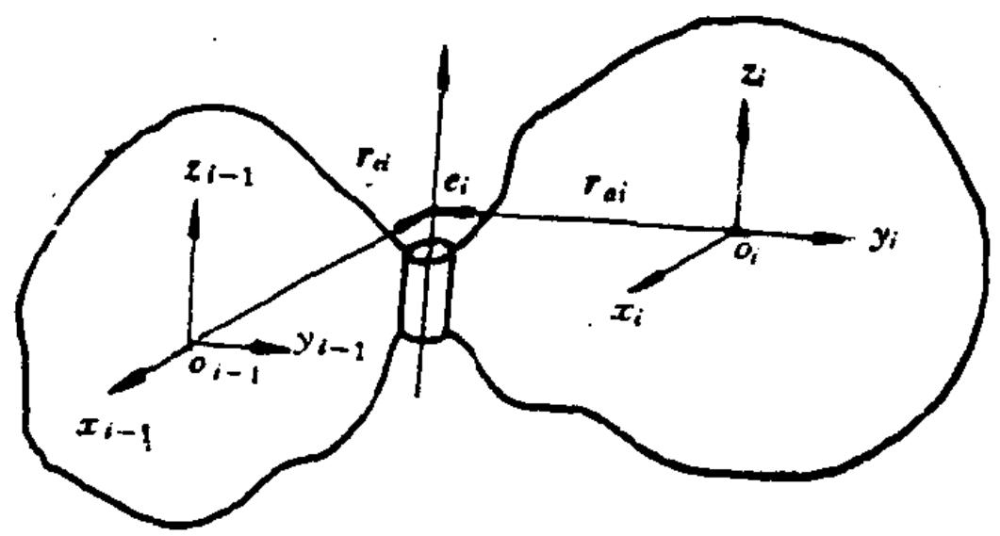

图4-10 转动关节质心位置向量

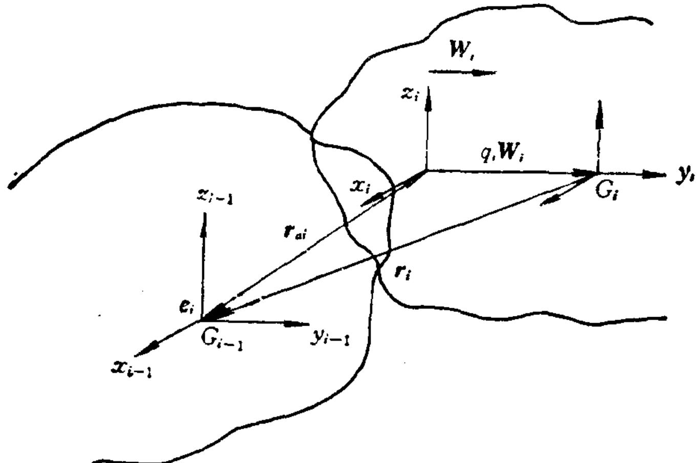

图4-11 移动关节质心向量

2.第 $\dot { \pmb q }$ 关节为移动关节如图4-11所示,定义向量 $\phi _ { 4 }$ 为第杆件质心指向第&关节点(即&一1杆件的质心)的向量。i表示 $q _ { i }$ 为零时的 $r _ { i }$ 向量。由于第 $\dot { \pmb { \mathscr { b } } }$ 关节点即为 $\delta - 1$ 杆件质心,故$\curvearrowleft$ 为零向量。当机器人机构处于基准位置时, $\pmb { \mathcal { T } } _ { \pmb { \mathcal { A } } }$ 记为 $\phi _ { a + 0 } ^ { * }$ 当机器人机构处于任意位置时, ${ r _ { i } } = { r _ { a i } } - { q _ { i } } \mathbf { { W } } _ { i }$ 。当机器人机构在基准位置时, $\pmb { W _ { i } }$ 记为 $\mathbf { \overline { { { W } } } } _ { \downarrow \circ } ^ { * }$ 

以上定义的 $\gamma _ { a i _ { 3 } } ^ { * } \ r _ { \mathrm { e } } ^ { * }$ 和 $\mathbf { \overline { { W } } } _ { \downarrow } ^ { \ast }$ 均为机器人机构处于基准位置(即q=0)时的向量,是仅与机构参数有关的常值向量。rai、r。和W向量均可通过对上述向量进行坐标变换而得到。

# (三)机器人机构动力学方程的计算

为了对机器人机构动力学问题进行求解,必须分别对 ${ \pmb U }$ $\frac { \partial M } { \partial \pmb q }$ 和 $\pmb { Y }$ 进行分析。下面推导出它们各自的具体算法。

1.机器人机构动能及 $\pmb { M }$ 矩阵对任意的运动刚体,其动能可表示为质心平动的动能和绕质心转动的动能两部分。机器人机构是由多杆件构成的多杆系统,其系统总动能等于各杆件动能的总和。系统中第 $j$ 杆件的动能表达式如下

$$
T _ { i } { = } \frac { 1 } { 2 } \left( m _ { i } v _ { i i } ^ { 2 } + \omega _ { i } ^ { T } J _ { i } \omega _ { i } \right)
$$

式中, $m _ { i }$ 为第 $\dot { \pmb { q } }$ 杆件的质量, $J _ { i }$ 为第 $i$ 杆件的惯性张量, $\omega _ { 4 }$ 为第$\dot { \pmb q }$ 杆件的绝对角速度向量, $v _ { 1 0 }$ 为第 $\dot { \pmb q }$ 杆件质心的绝对速度向量。

对空间单开链机构,第 $j$ 杆件的角速度等于第 $\dot { \pmb { \mathscr { b } } }$ 杆件之前各杆件分别相对于其前一杆件的角速度的总和。当第 $\dot { q }$ 杆件为移动关节时, $\dot { \pmb { \mathscr { z } } }$ 杆件相对于 ${ \dot { \pmb q } } - { \bf 1 }$ 杆件的角速度为零;第 $\dot { \pmb { \mathscr { z } } }$ 关节为转动关节时, $\dot { \pmb { \eta } }$ 杆件相对于 $i - 1$ 杆件的角速度为该广义速度与转动轴线单位向量的积。据此可写出第 $\dot { \mathfrak { g } }$ 杆件的角速度公式

$$
\omega _ { i } { = } \sum _ { j { = 1 } } ^ { i } \delta _ { j } \dot { q _ { j } } W _ { j }
$$

引入符号 $a _ { j }$ 表示角速度表达式中 $\dot { q } _ { j }$ 的系数,即

$$
a _ { j } = S _ { j } W _ { j }
$$

式中, $\textstyle \mathbf { \overrightarrow { W _ { j } } }$ 可由 $\mathbf { \overline { { W } } _ { j } ^ { * } }$ 通过坐标变换求得,后者由机构结构确定。再引入 $3 \times n$ 矩阵 $A _ { 1 } ( i = 1 , 2 \cdots n )$ 来保存 ${ \pmb \alpha } _ { \dot { \pmb \nu } }$ 

$$
\mathbf { \Phi } _ { A _ { \ell } } = [ \pmb { a } _ { 1 } \quad \pmb { a } _ { 2 ^ { ' } } { \cdot } \cdot \pmb { a } _ { 1 } \quad \pmb { 0 } ^ { \ldots 0 } ]
$$

则可得到矩阵形式的杆件角速度表达式

$$
\omega _ { i } { = } A _ { i } \dot { \pmb q }
$$

由于矩阵 $A _ { i }$ 中各元素是绝对角速度表达式中广义速度系数,故称$\pmb { A }$ 矩阵为绝对角速度系数矩阵。

质心速度可通过对质心位置向量求导而得。用 ${ \pmb { P } } _ { \pmb { \mathrm { \imath } } }$ 表示第 $\textbf { \textit { i } }$ 杆件质心位置向量,它可由前面定义的杆件质心位置向量逐项相加而得。如图4-12所示,向量 $\pmb { P _ { 0 } }$ 的表达式如下

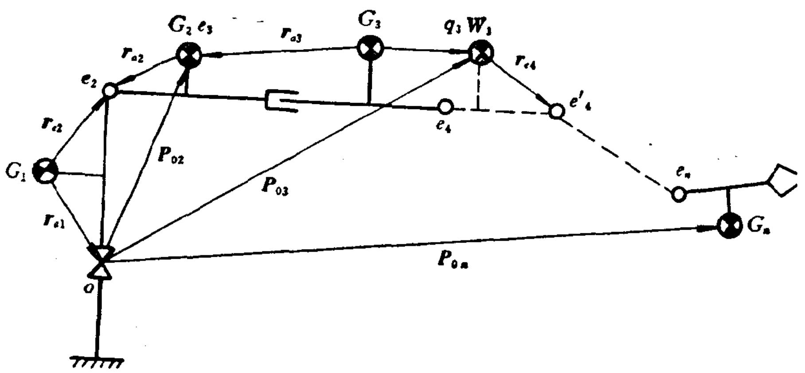

图4-12 机器人机构质心位置向量

$$
P _ { 0 i } = - \sum _ { j = 1 } ^ { i } r _ { a j } + \sum _ { j = 1 } ^ { i - 1 } r _ { a j + 1 } + \sum _ { j = 1 } ^ { i } ( 1 - S _ { j } ) _ { \mathscr { Q } j } W _ { j }
$$

运用向量微分法则进行微分,在式4-96中,向量 $\mathcal { r } _ { a i , } \mathcal { r } _ { e i }$ 及 $\textstyle \overrightarrow { W _ { i } }$ 均为定长向量。因此,其微分等于各向量的转动角速度 $\omega _ { j }$ 与其自身的向量积,即

$$
\left. \begin{array} { l } { \dot { \boldsymbol { r } } _ { o j } = \boldsymbol { \omega } _ { j } \times \boldsymbol { r } _ { o j } } \\ { \dot { \boldsymbol { r } } _ { e j + 1 } = \boldsymbol { \omega } _ { j } \times \boldsymbol { r } _ { e j + 1 } } \\ { \dot { \boldsymbol { W } } _ { j + 1 } = \boldsymbol { \omega } _ { j } \times \boldsymbol { W } _ { j + 1 } } \end{array} \right\}
$$

由此,质心速度表达式为

$$
v _ { i { c } } = \dot { P } _ { \boldsymbol { 0 } i } = - \sum _ { j = 1 } ^ { i } ( \boldsymbol { \omega } _ { j } \times \boldsymbol { r } _ { a j } ) + \sum _ { j = 1 } ^ { i - 1 } ( \boldsymbol { \omega } _ { j } \times \boldsymbol { r } _ { a j + 1 } )
$$

$$
+ \sum _ { j = 1 } ^ { \ell } \left( 1 - S _ { j } \right) W _ { j } \acute { q _ { j } } + \sum _ { j = 1 } ^ { \ell } ( 1 - S _ { j } ) q _ { j } ( \omega _ { j - 1 } \times W _ { j } )
$$

将角速度表达式代入式 $\yen 98$ ,经整理得

$$
\begin{array} { l } { { v _ { i \sigma } { = } \displaystyle \sum _ { p = 1 } ^ { 4 } \bigg \{ a _ { p } { \times } \bigg \{ - \sum _ { k = p } ^ { 4 } r _ { a k } { + } \sum _ { k = p } ^ { 4 - 1 } \left[ r _ { e k + 1 } \right. } } \\ { { \left. + \left( 1 - S _ { k + 1 } \right) q _ { k + 1 } W _ { k + 1 } \right] \bigg \} + ( 1 - S _ { p } ) W _ { s } \bigg \} \dot { q _ { p } } } } \end{array}
$$

用 $\pmb { R } _ { j i }$ 表示第 $j$ 关节为转动关节时由第 $j$ 关节点到第 $\dot { \pmb { \mathscr { b } } }$ 杆件的质心向量,记为

$$
R _ { 3 } = - \sum _ { k = j } ^ { 6 } \ r _ { a k } + \sum _ { k = j } ^ { 6 - 1 } \left[ \sigma _ { a k + 1 } + ( 1 - 8 _ { k + 1 } ) g _ { k + 1 } W _ { k + 1 } \right]
$$

则质心速度可表示为

$$
\pmb { v } _ { i o } = \sum _ { j = 1 } ^ { 6 } [ \pmb { a } _ { j } \times \pmb { R } _ { j i } + ( \pmb { 1 } - \pmb { S } _ { j } ) \pmb { W } _ { j } ] q _ { 4 }
$$

引入符号 $\ b _ { i j }$ 表示第 $\dot { \pmb { \mathscr { V } } }$ 杆件质心速度表达式中 $q _ { j }$ 的系数,则有

$$
\pmb { b } _ { i j } = \pmb { a } _ { j } \times \pmb { R } _ { j i } + ( \pmb { 1 } - \pmb { S } _ { j } ) \pmb { W } _ { j } ( j \leqslant i )
$$

再引入 $\Im \times n$ 矩阵 $B _ { i } ( i = 1 , 2 \cdots n )$ 来保存 ${ \pmb { b _ { i j } } }$ 

$$
B _ { i } { = } [ b _ { i 1 } \quad b _ { i 2 } { \ldots } b _ { i i } \quad 0 { \ldots } 0 ]
$$

则得到以矩阵形式表示的质心速度表达式

$$
\pmb { v } _ { i c } = \pmb { B } _ { i } \pmb { \dot { q } }
$$

矩阵 $B _ { i }$ 中的元素是质心速度的系数,故 $\mathcal { B }$ 矩阵称为质心速度系数矩阵。

在动能表达式中, $J _ { i }$ 是杆件 $\dot { \pmb { \mathscr { b } } }$ 对基础坐标系的转动惯性张量,它随机构运动的不同位置而变化。而作为机构参数所给定的是相对于杆件坐标系的转动惯性张量 $\tilde { \mathcal { I } } _ { i \circ }$ 在推导动能表达式时,必须找出它们两者之间的相互变换关系。根据分析力学原理,$J _ { i }$ 和 $\Im _ { i }$ 是相似矩阵,可通过正交变换相互转换。由于从第 $\pmb { \dot { \theta } }$ 杆件坐标系到基础坐标系的回转变换矩阵 $E _ { t }$ 为正交矩阵,故有

$$
\boldsymbol { J } _ { i } { = } E _ { i } \boldsymbol { \widetilde { J } } _ { i } E _ { i } ^ { { - } 1 } { = } E _ { i } \boldsymbol { \widetilde { J } } _ { i } E _ { i } ^ { { T } }
$$

即

$$
\begin{array} { r l } & { \displaystyle \frac { 1 } { 2 } ~ \omega _ { i } ^ { T } \mathcal { J } _ { i } \omega _ { i } = \frac { 1 } { 2 } ~ \omega _ { i } ^ { T } \mathcal { E } _ { i } \mathcal { \widetilde { I } } _ { i } \mathcal { E } _ { i } ^ { T } \omega _ { i } } \\ & { \qquad = \displaystyle \frac { 1 } { 2 } ( E _ { i } ^ { T } \omega _ { i } ) ^ { T } \mathcal { \widetilde { J } } _ { i } ( E _ { i } ^ { T } \omega _ { i } ) } \end{array}
$$

引入记号

$$
\mathbf { c } _ { i j } = E _ { i } ^ { T } \bar { \mathbf { a } } _ { j } = \bar { S } _ { j } E _ { i j } ^ { T } \bar { W } _ { j } ^ { * } = \bar { S } _ { j } E _ { i } ^ { T } \bar { E } _ { i j - 1 } \bar { W } _ { j } ^ { * } = \bar { S } _ { j } E _ { i j } \bar { W } _ { j } ^ { * } ( \dot { \jmath } \leqslant \dot { \theta } )
$$

再引入 $3 \times n$ 矩阵 $\bar { C } _ { i } ( i = 1 , 2 \cdots n )$ 来保存 $\pmb { C _ { i j } }$ 

$$
U _ { i } { = } [ \mathbf { c } _ { i 1 } \quad \mathbf { c } _ { i 2 } { \cdots } \mathbf { c } _ { i i } \quad 0 { \cdots } \mathbf { 0 } ]
$$

则得

$$
\frac { 1 } { 2 } \omega _ { i } ^ { T } \mathcal { I } _ { i } \omega _ { i } = \frac { 1 } { 2 } \pmb { \dot { q } } ^ { T } C _ { i } ^ { T } \mathcal { \tilde { I } } _ { i } C _ { i } \pmb { \dot { q } }
$$

$\circled { c _ { i j } }$ 是转换角速度表达式中的系数,故 $\pmb { C }$ 矩阵称为角速度转换矩阵。

将上述各项结果代入式4-91,得第 $\dot { \pmb { \mathscr { q } } }$ 杆件的动能表达式

$$
\mathcal { T } _ { \mathfrak { i } } { = } \frac { 1 } { 2 } \dot { \pmb { q } } ^ { x } ( \gamma _ { 1 } { B } _ { \mathfrak { i } } ^ { T } { B } _ { \mathfrak { i } } { + } C _ { \mathfrak { i } } ^ { \top } \widetilde { \mathcal { I } } _ { \mathfrak { i } } C _ { \mathfrak { i } } ) \dot { \pmb { q } }
$$

用 $M _ { i }$ 表示第 $\pmb { \dot { q } }$ 杆件的广义质量

$$
M _ { i } { = } m _ { 4 } B _ { i } ^ { r } B _ { i } { + } C _ { i } ^ { r } \mathcal { I } _ { i } C _ { i }
$$

则有

$$
\pmb { T _ { i } } \mathrm { = } \frac { \pmb { 1 } } { 2 } \dot { \pmb { q } } ^ { x } M _ { i } \dot { \pmb { q } }
$$

在得到各杆件动能之后,可通过累加得到整个系统的动能表达式

$$
T { \mathrm { = } } \sum _ { i { \mathrm { = } } 1 } ^ { n } T _ { i }
$$

系统广义质量矩阵也可同样得到

$$
M = \sum \limits _ { i = 1 } ^ { n } M _ { i }
$$

这样,整个系统的动能可表示为

$$
\pmb { T } \mathrm { = } \frac { \pmb { 1 } } { 2 } \ \pmb { \dot { q } } ^ { x } \pmb { M } \pmb { \dot { q } }
$$

广义质量矩阵 $M$ 代表了整个系统的质量特性。

2.广义质量矩阵的微分对式4-111进行微分,可得第 $j$ 杆件广义质量矩阵对广义坐标的微分

$$
\begin{array} { c } { \displaystyle \frac { \partial M _ { \iota } } { \partial g _ { s } } = m _ { \mathfrak i } \left( \frac { \partial B _ { \iota } ^ { \tau } } { \partial g _ { s } } B _ { \mathfrak i } + B _ { \mathfrak i } ^ { \tau } \frac { \partial B _ { \mathfrak i } } { \partial g _ { s } } \right) } \\ { \displaystyle + \left( \frac { \partial C _ { \iota } ^ { \tau } } { \partial q _ { s } } \mathcal T _ { \mathfrak i } C _ { \mathfrak i } + C _ { \mathfrak i } ^ { \tau } \mathcal T _ { \mathfrak i } \frac { \partial O _ { \mathfrak i } } { \partial q _ { s } } \right) } \end{array}
$$

由于整个系统广义质量矩阵是由各杆件广义质量矩阵相加而得,故其微分也可通过求和而得到

$$
\frac { \partial M } { \partial g _ { s } } = \sum \limits _ { i = 1 } ^ { n } \frac { \partial M _ { i } } { \partial g _ { s } }
$$

用符号 $m _ { i j s }$ 表示 $\frac { \partial { \cal M } } { \partial q _ { s } }$ 的各元素 

$$
m _ { i j s } = \frac { \partial m _ { i i } } { \partial g _ { s } }
$$

则 $m _ { i j s }$ 的一般表达式为

$$
\begin{array} { r } { m _ { i j s } = \displaystyle { \sum _ { p = 1 } ^ { n } \left[ m _ { p } \left( \frac { \partial b _ { n } } { \partial q _ { s } } b _ { n j } + b _ { p i } \frac { \partial b _ { n i } } { \partial q _ { s } } \right) \right. } } \\ { \displaystyle { \left. + \left( \frac { \partial c _ { n i } } { \partial q _ { s } } \widetilde { J } _ { p } c _ { p i } + c _ { p i } \widetilde { J } _ { p } \frac { \partial c _ { p i } } { \partial q _ { s } } \right) \right] } } \end{array}
$$

从上式可知,要求出质量矩阵对广义坐标的微分,须先求出角速度转换矩阵 $\pmb { C }$ 和质心速度系数矩阵 $B$ 对广义坐标的微分。

求 $C _ { i }$ 矩阵对广义坐标的微分,可先求各杆件 $C _ { i }$ 矩阵的微分,然后通过求和而得。对 $C _ { i }$ 矩阵各元素 $\pmb { C } _ { i j }$ 求微分,可得

$$
 \frac { \partial \pmb { c } _ { i i } } { \partial q _ { s } } = \{ \begin{array} { l l } { { \displaystyle S _ { i } \frac { \partial E _ { i } } { \partial q _ { s } } W _ { j } ^ { * } } } & { { \displaystyle ( j \leqslant S \leqslant i ) } } \\ { { \displaystyle 0 _ { i } } } & { { \displaystyle ( \mp \pmb { \mu } \frac { \circledast } { \circledast } ) } } \end{array} \}
$$

则

$$
\frac { \partial { { O } _ { i } } } { \partial q _ { s } } = \left[ \frac { \partial { { \pmb { c } } _ { i 1 } } } { \partial q _ { s } } \frac { \partial { { c } _ { i 2 } } } { \partial q _ { s } } \cdots \frac { \partial { { \pmb { c } } _ { i i } } } { \partial q _ { s } } 0 \cdots 0 \right]
$$

同理,求 $B$ 矩阵对广义坐标的微分,可先求各杆件 $B _ { i }$ 矩阵的微分,然后通过求和而得。对 $B _ { i }$ 矩阵各元素 $\Delta _ { i j }$ 求微分,可得

$$
\begin{array} { r l } {  { \frac { \partial { \pmb { b } } _ { i } } { \partial q _ { s } } } \quad } & { } \\ & { = \{ \begin{array} { l l } { \displaystyle \frac { \partial { \pmb { a } } _ { j } } { \partial q _ { s } } \times { \pmb { R } } _ { i i } + { \pmb { a } } _ { j } \times \frac { \partial { \pmb { R } } _ { j } } { \partial q _ { s } } + ( { \pmb { 1 } } - { \pmb { S } } _ { j } ) \frac { \partial { \pmb { W } } _ { i } } { \partial q _ { s } } \quad ( j \leqslant i , \ \delta \leqslant i ) } \\ { \displaystyle 0 } & { \quad ( { \pmb { \sharp } } \oplus \widehat { \pmb { \mathscr { R } } } ) } \end{array}  } \end{array}
$$

则

$$
\frac { \partial B _ { i } } { \partial q _ { s } } = \left[ \frac { \partial b _ { i 1 } } { \partial q _ { s } } \mathrm { ~  ~ \ } \frac { \partial b _ { i 2 } } { \partial q _ { s } } \mathrm { ~  ~ \cdots ~ } \frac { \partial b _ { i 4 } } { \partial q _ { s } } \mathrm { ~  ~ \ } 0 \cdots 0 \right]
$$

式4-121中

$$
\begin{array} { c } { \displaystyle { \frac { \partial R _ { 4 } } { \partial q _ { s } } = - \sum _ { k = j } ^ { 4 } \frac { \partial r _ { a k } } { \partial q _ { s } } + \sum _ { k = j } ^ { 4 - 1 } \biggl [ \frac { \partial r _ { e k + 1 } } { \partial q _ { s } } + { \dot { q } } _ { k + 1 } \left( 1 - S _ { k + 1 } \right) \frac { \partial W _ { k + 1 } } { \partial q _ { s } } } } \\ { \displaystyle { + \left( 1 - S _ { k + 1 } \right) W _ { k + 1 } \frac { \partial { q _ { k + 1 } } } { \partial q _ { s } } \biggr ] } } \end{array}
$$

而 $\frac { \partial { \pmb { a } } _ { j } } { \partial q _ { s } }$ 则需通过求 $\pmb { A }$ 矩阵对广义坐标微分而得。对 $\mathbf { \delta } _ { \mathbf { \mathcal { A } _ { \delta \mathrm { ~  } } } }$ 矩阵各元素 $\pmb { a } _ { i j }$ 求微分,由于 $\overrightarrow { W } _ { j } ^ { \ast }$ 是常值向量, $S _ { j }$ 为常数,故得

$$
\frac { \partial \pmb { a } _ { i } } { \partial q _ { s } } = \frac { \partial E _ { i } } { \partial g _ { s } } S _ { i } \pmb { W } ^ { * }
$$

则

$$
\frac { \partial A _ { i } } { \partial q _ { s } } = \left[ \frac { \partial \pmb { a } _ { 1 } } { \partial q _ { s } } \frac { \partial \pmb { a } _ { 2 } } { \partial q _ { s } } \frac { \partial \pmb { a } _ { 1 } } { \partial q _ { s } } \frac { \partial \pmb { a } _ { i } } { \partial q _ { s } } \pmb { 0 } \dots \pmb { 0 } \right]
$$

至此,已可求出广义质量矩阵 $M$ 对广义坐标的微分。

3.广义力在机器人机构所受的外力中,最主要的是驱动力、重力和工作载荷三类力。在一般情况下,其他外力对机构运动的影响较少。故下面仅对这3类力进行分析,并给出表示形式。

机器人机构驱动力由各关节输入。在驱动力作用下,机器人克服其他外力的作用而产生所要求的运动。根据不同的关节类型,驱动力可以是力,也可以是力矩。用 $p _ { i }$ 表示第 $i$ 关节所受的驱动力或驱动力矩的数值,用 $P _ { i } W _ { i }$ 表示第 $i$ 关节的驱动力或驱动力矩向量。对移动关节, $r _ { i } w _ { i }$ 表示驱动力向量;对转动关节,$\mathcal { P } _ { i } \mathcal { W } _ { i }$ 表示驱动力矩向量。整个系统的驱动力向量表示为

$$
P = [ P _ { 1 } \quad P _ { 2 } \quad \cdots \quad P _ { n } ] ^ { \mathrm { T } }
$$

它表示机器人机构的全部驱动力。

重力包括机器人各杆件自身质量与机器人所夹持工件质量产生的重力。对一般机器人,杆件本身自重就占据了较大比重,故其重力起着主要作用。用 $m _ { i } ( i = 1 , \ 2 \cdots n - 1 )$ 表示除末杆外所有各杆件的质量,而用 ${ m } _ { n }$ 表示由末杆本身以及夹持在末杆上的工夹具所构成的整个末端组件的质量。同时,末杆的质心也是指这样一个组件的质心。这样,各杆件所受到的重力可依次记为 $m = 0 .$ 、$m _ { 2 } g \cdots m _ { n } g _ { \scriptscriptstyle ( }$ 。由于基础坐标系 $\pmb { \mathcal { z } }$ 轴垂直向上,故有

$$
\pmb { \operatorname { \mathscr { g } } } = [ \mathbf { \mathscr { 0 } } \quad \mathbf { 0 } \quad - \mathbf { 9 } . 8 1 ] ^ { \mathbf { T } }
$$

这就完全确定了机器人机构所承受的重力。

机器人的工作载荷根据机器人的用途和种类不同有着不同的表现形式。在诸如搬运机器人这种情况,工作载荷就是重力,可把工作载荷与重力一起考虑。下面所指的工作载荷,是除重力外的工作载荷。在一般情况下,工作载荷均作用在末杆上。因此,下面仅考虑载荷作用在末端组件的情况。根据力学原理,作用在刚体上的力可通过附加一个力偶而平移到任意点。故设定的工作载荷可用通过末端组件质心的一个力向量 $\pmb { F }$ 和一个力矩向量 $M$ 来表示。工作载荷可以是常量,也可以是由工作性质决定的随其他因素而改变的量。但由于动力学模型的计算是瞬时性的,因此,工作载荷在某一瞬时是确定的。

对上述几类力进行分析后,就可进一步推导出机器人机构广义力的表达式。用 $Q _ { i } ( \dot { \boldsymbol { \nu } } = 1 , 2 \cdots \nu )$ 表示相应于第 $\dot { \pmb { \mathscr { b } } }$ 广义坐标的广义力,则机器人机构广义力的 $\pmb { \eta }$ 维向量 $\mathbf { Q }$ 可记为

$$
\mathbf { { \cal Q } } = \left[ \begin{array} { c c c c } { Q _ { 1 } } & { Q _ { 2 } } & { \cdots } & { Q _ { n } } \end{array} \right] ^ { \mathrm { { T } } }
$$

根据虚功原理,对于任意的微小虚位移,广义力所做的功等于所有外力所做功之和。因此,依次令某一广义坐标 $q _ { i }$ 的变分 $\delta g _ { 1 } \neq 0$ ,而其余广义坐标的变分 $\delta g _ { j } = 0 ( j \neq i )$ ,即可推导出相应的广义力$Q _ { i 0 }$ 

假定第 $\clubsuit$ 关节产生微位移 $\delta g _ { i }$ ,其余关节 $\delta g _ { i } = 0 ( j \neq i )$ ,则所有大于 $\dot { \pmb { \mathscr { z } } }$ 或等于 $\dot { \pmb { \mathscr { z } } }$ 的杆件质心均产生微位移。若第 $\dot { \pmb { \mathscr { b } } }$ 关节为移动关节,则从第 $\dot { \pmb { \mathscr { z } } }$ 杆件到末杆各杆质心均产生一个沿 $\textstyle \mathbf { \overrightarrow { W _ { i } } }$ 的微平动,如图4-13所示,这些杆件质心微位移均为 $\delta g _ { i } \mathbf { W _ { i } } _ { o }$ 若第 $j$ 关节为转动关节,则从第 $\dot { \pmb { \mathscr { b } } }$ 杆到末杆质心微位移即力 $\pmb { R _ { i k } }$ 的变分 $\delta R _ { i k }$ ,如图4-14所示。根据式4-100可得

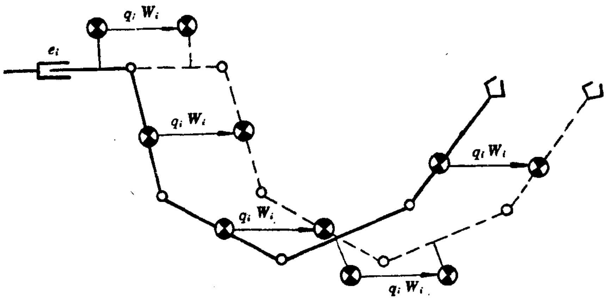

图4-13移动关节产生的质心微位移

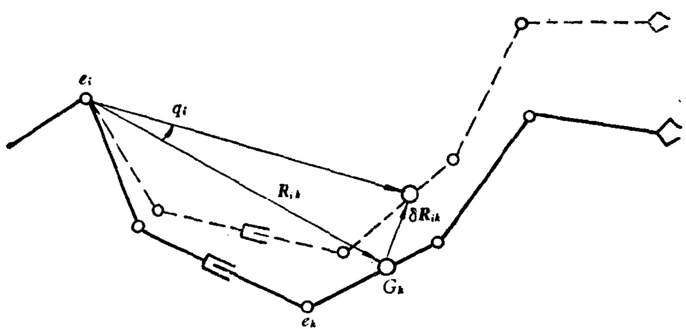

图4-14转动关节产生的质心微位移

$$
R _ { i k } = - { \sum _ { p = 1 } ^ { k } \mathop { r } _ { a p } } + \sum _ { p = 4 } ^ { k - 1 } \left[ \mathop { r } _ { e p + 1 } + \left( 1 - {  { S } _ { p + 1 } } \right) {  { \mathcal { G } } _ { p + 1 } } \right. { \left. W _ { p + 1 } \right] }
$$

在 $\delta g _ { j } = 0 ( j \neq i )$ 时, ${ \pmb R } _ { i k }$ 为一个长度不变的向量,对其微分得

$$
\dot { R } _ { i k } = \omega _ { i } \times R _ { i k }
$$

$$
\delta { R _ { i k } } = ( \omega _ { i } \times R _ { i k } ) \delta t
$$

而 $\omega _ { i } = \mathbf { W } _ { i } \dot { q } _ { i }$ ,故有

$$
\delta { R _ { i k } } = ( W _ { \ell } \times R _ { i k } ) \delta { q } _ { \ell }
$$

此即为第 $k ( k \geqslant i )$ 杆件质心的微位移表达式。

分析了微位移后,下面将推导外力对虚位移所做的功。对第$\dot { \pmb { \mathscr { q } } }$ 关节的虚位移,各外力所做的功等于力向量与微位移向量的数量积。

(1)驱动力所做的功驱动力直接作用于关节上,所做功为

$$
\delta A _ { \ell } ^ { p } { = } P _ { i } \delta q _ { \ell }
$$

(2)重力所做的功如果第 $\dot { \pmb { \mathscr { b } } }$ 关节为移动关节,则重力所做的功记为

$$
\delta A _ { \mathit { \ P } } ^ { \mathit { \vartheta } } = \sum _ { k = 1 } ^ { n } m _ { k } \mathbf { \cdot } g \cdot W _ { \mathit { \vartheta } } \delta g _ { i }
$$

如果第 $\pmb { \dot { \hat { \ y } } }$ 关节为转动关节,则重力所做的功记为

$$
\begin{array} { r } { \hat { \delta } \hat { A } _ { \hat { \mathbf { t } } } ^ { g } = \displaystyle \sum _ { k = 4 } ^ { n } m _ { k } \pmb { g } \cdot ( \pmb { W } _ { i } \times \pmb { R } _ { i k } ) \delta q _ { i } } \\ { = \displaystyle \sum _ { k = i } ^ { n } m _ { k } ( \pmb { R } _ { i k } \times \pmb { g } ) \cdot \pmb { W } _ { i } \delta g _ { 4 } } \end{array}
$$

综合上述两种情况,可写出重力所做功的统一表达式

$$
\delta A _ { \ell } ^ { \varrho } = \sum _ { k = 0 } ^ { n } m _ { k } [ S _ { i } ( \pmb { R } _ { i k } \times \pmb { \mathscr { g } } ) + ( 1 - S _ { i } ) \pmb { \mathscr { g } } ] \cdot \pmb { W } _ { i } \delta g _ { i }
$$

(3)工作载荷所做的功若第 $\dot { \pmb { \mathscr { z } } }$ 关节是移动关节,杆件质心产生直线位移,工作载荷中力矩 $\pmb { M }$ 不做功,力 $\pmb { F }$ 所做功为

$$
\delta A _ { \parallel } ^ { F } { = } F W _ { \parallel } \delta g _ { \colon }
$$

若第 $\dot { \pmb { \mathscr { b } } }$ 关节是转动关节,力 $\pmb { F }$ 所做功为

$$
\delta A _ { i } ^ { r } = { \pmb { F } } ( { \pmb { W } } _ { i } \times { \pmb { R } } _ { i n } ) \delta g _ { i } = ( { \pmb { R } } _ { i n } \times { \pmb { F } } ) \cdot { \pmb { W } } _ { i } \delta g _ { i }
$$

力矩 $\pmb { M }$ 所做功为

$$
\delta A _ { \ell } ^ { m } = M \cdot W _ { i } \delta g _ { i }
$$

综合上述两种情况,可写出工作载荷所做功的统一表达式

$$
\hat { \delta } { \cal A } _ { 4 } ^ { F } = \{ { \cal S } _ { i } [ ( R _ { i n } \times F ) + M ] + ( 1 - { \cal S } _ { i } ) F \} \cdot W _ { i } \delta g _ { i }
$$

综合式4-133、4-186和4-140,可得外力所做功的表达式

$$
\begin{array} { r l } {  { \delta \mathcal { A } _ { i } = \delta \mathcal { A } _ { i } ^ { p } + \delta \mathcal { A } _ { i } ^ { q } + \delta \mathcal { A } _ { i } ^ { F } } } \\ & { = \Bigg \{ P _ { i } + \Bigg \{ \sum _ { k = 4 } ^ { n } m _ { k } [ \delta _ { i } ( R _ { i k } \times g ) + ( 1 - \delta _ { i } ) g ] } \\ & { ~ + \delta _ { i } [ ( R _ { i n } \times F ) + M ] + ( 1 - \delta _ { i } ) F \Bigg \} W _ { i } \Bigg \} \delta g _ { i } } \end{array}
$$

广义力的功可用下式表示

$$
\delta A _ { i } { = } Q _ { i } \delta q _ { i }
$$

广义力所做的功应等于外力所做的功,比较式4-141与式4-142,可得广义力的表达式

$$
\mathcal { Q } _ { i } = \mathcal { P } _ { i } + \biggl \{ \sum _ { k = 1 } ^ { n } \gamma _ { k } [ S _ { i } ( \boldsymbol { R } _ { i k } \times \pmb { g } ) + ( 1 - S _ { i } ) \pmb { g } ] \biggr .
$$

$$
+ \cal { S } _ { i } [ ( { \cal { R } } _ { i n } \times { \cal { F } } ) + { \cal { M } } ] + ( 1 - { \cal { S } } _ { i } ) { \cal { F } } \Big \} { \cal { W } } _ { i }
$$

从式4-143可看出,广义力表达式中驱动力 $r _ { i }$ 独立于其他项,可以把 $P _ { j }$ 从 $Q _ { i }$ 中分离出来,即

$$
Q _ { i } = P _ { i } + Y _ { i }
$$

式中

$$
Y _ { i } { = } \left\{ \sum _ { k = 1 } ^ { n } \mathop { m _ { k } } \left[ S _ { i } ( { \pmb { R } } _ { i k } \times { \pmb { g } } ) + ( 1 { - } S _ { i } ) { \pmb { g } } \right] \right.
$$

$$
+ S _ { i } [ ( R _ { i n } \times F ) + M ] + ( 1 - S _ { i } ) F \bigg \} W _ { i }
$$

式4-144为式4-85的分量形式,式4-145则为式4-85中向量的元素的具体表达式。令 $i = 1 , 2 \cdots n ,$ ,即可求出所有 $Q _ { i }$ 和 $\boldsymbol { Y }$ ,从而也就可得到 $\mathbf { Q }$ 及 $\pmb { Y }$ 向量。至此,动力学方程中各项均已得到。

4.递推公式及计算流程 从以上分析可知,机器人机构动力学的计算,关键在于 $M$ 矩阵与 $\frac { \partial M } { \partial \pmb q }$ 的计算。 $M$ 由 $M _ { i }$ 选加而成,而 $M _ { i }$ 与 $\smash { \mathcal { B } _ { i _ { 2 } } \mathcal { C } _ { i } }$ 矩阵有关; $\frac { \partial M } { \partial \pmb q }$ 是 $\eta$ 个 $n \times n$ 矩阵, ${ \frac { \partial M } { \partial q _ { s } } } \left( s = 1 \right.$ 2$\cdots - n )$ 由 $\frac { \partial M _ { \ell } } { \partial g _ { s } }$ 迭加而成,而 $\frac { \partial M _ { \ell } } { \partial g _ { \ell } }$ 与 $\frac { \partial B _ { i } } { \partial q _ { s } } 、 \frac { \partial C _ { i } } { \partial g _ { s } }$ 有关。因此,计算的中心任务是求出 $\smash { \mathcal { B } _ { s } O _ { i } }$ 的元素 $b _ { i j _ { 1 } } \sum c _ { i j }$ 以及 $\frac { \partial B _ { i } } { \partial q _ { s } } . \frac { \partial C _ { i } } { \partial q _ { s } }$ 的元素 $\frac { \partial b _ { i j } } { \partial q _ { s } }$ $\frac { b _ { i j } } { q _ { s } } , \ \frac { \partial c _ { i j } } { \partial g _ { s } } \mathrm { ~ c ~ }$ 

机器人各杆的运动都受到它前面杆件运动的影响。因此,后面各杆的动力学计算必然与前面各杆的计算有关联。为了最大限度地保留前面杆件计算过程中的有用信息,从而简化整个动力学计算过程,可将上述有关公式分解为递推公式。

对回转变换矩阵 $E _ { i }$ ,可有如下递推公式

$$
E _ { i } = { \left\{ \begin{array} { l l } { E _ { i - 1 } E _ { i - 1 , i } } & { ( i > 0 ) } \\ { { \ [ \mathrm { I } ] } } & { ( i = 0 ) } \end{array} \right. }
$$

$$
\frac { \partial E _ { i } } { \partial g _ { s } } = \left\{ \begin{array} { l l } { \displaystyle \frac { \partial E _ { i - 1 } } { \partial g _ { s } } E _ { i - 1 , i } } & { ( s < i ) } \\ { \displaystyle E _ { i - 1 } \frac { \partial E _ { i - 1 , i } } { \partial g _ { s _ { s } } } } & { ( s = i ) } \end{array} \right.
$$

引入向量 $\pmb { H _ { i } }$ 

$$
H _ { i } = - r _ { a i } + r _ { e i } + ( 1 - S _ { i } ) q _ { i } W _ { i }
$$

可将 $B _ { i }$ 的元素 $\theta _ { i j }$ 写成如下递推形式

$$
\pmb { b } _ { i j } = \left\{ \begin{array} { l l } { \pmb { b } _ { i - 1 , j } + \pmb { a } _ { j } \times \pmb { H } _ { i } } & { ( j < \pmb { \dot { \ell } } ) } \\ { - \pmb { a } _ { j } \times \pmb { r } _ { a i } + ( \pmb { 1 } - \pmb { \dot { \delta } } _ { j } ) \pmb { W } _ { j } } & { ( j = \pmb { \dot { \ell } } ) } \end{array} \right.
$$

向量 $\mathbf { R } _ { j i }$ 也可写为

$$
\pmb { R } _ { j i } = \left\{ \begin{array} { l l } { \pmb { R } _ { j , i - 1 } + \pmb { H } _ { i } } & { ( j < i ) } \\ { - \pmb { r } _ { a i } } & { ( j = i ) } \end{array} \right.
$$

而 $\frac { \partial B _ { \ell } } { \partial { { q } _ { s } } }$ 的元素 $\frac { \partial b _ { i j } } { \partial q _ { s } } ( j \leqslant \dot { \pmb { \mathscr { b } } } )$ 可写为递推形式

$$
\frac { \partial b _ { i j } } { \partial q _ { s } } = \left\{ \begin{array} { l l } { \displaystyle \frac { \partial b _ { i - 1 , j } } { \partial q _ { s } } + \frac { \partial a _ { j } } { \partial q _ { s } } \times H _ { i } + a _ { j } \times \displaystyle \frac { \partial H _ { i } } { \partial q _ { s } } \quad ( j < \dot { \ell } , ~ s \leqslant \dot { \ell } ) } & \\ { \displaystyle - \frac { \partial a _ { j } } { \partial q _ { s } } \times r _ { a i } - a _ { j } \times \displaystyle \frac { \partial r _ { a } } { \partial q _ { s } } + ( 1 - S _ { j } ) \displaystyle \frac { \partial W _ { j } } { \partial q _ { s } } } & \\ { \displaystyle \dot { \ell } } & { \qquad ( j = \dot { \ell } , ~ s \leqslant \dot { \ell } ) } \end{array} \right.
$$

$$
\frac { \partial H _ { i } } { \partial q _ { s } } = \left\{ \begin{array} { l l } { - \displaystyle \frac { \partial r _ { a i } } { \partial q _ { s } } + \frac { \partial r _ { a i } } { \partial q _ { s } } + ( 1 - S _ { i } ) q _ { i } \displaystyle \frac { \partial W _ { i } } { \partial q _ { s } } } & { ( s < \dot { \bar { q } } ) } \\ { - \displaystyle \frac { \partial \pmb { \tau } _ { a i } } { \partial q _ { s } } + ( 1 - S _ { i } ) W _ { i } } & { ( s = \dot { \bar { q } } ) } \end{array} \right.
$$

矩阵 $C _ { i }$ 的元素 $\pmb { c _ { i j } }$ 可写成递推形式

$$
\mathbf { c } _ { i j } = \left\{ \begin{array} { l l } { ( E _ { i - 1 , i } ) ^ { \mathrm { T } } \mathbf { c } _ { i - 1 , i } , } & { ( j < i ) } \\ { S _ { i } W _ { i } ^ { * } } & { ( j = i ) } \end{array} \right.
$$

而

$$
\frac { \partial \pmb { c } _ { i j } } { \partial q _ { s } } = \left\{ \begin{array} { l l } { ( E _ { \mathrm { i - 1 } , i } ) ^ { \operatorname { T } } \frac { \partial \pmb { c } _ { i - 1 , j } } { \partial q _ { s } } } & { ( j < s < \dot { \tau } ) } \\ { \frac { \partial ( E _ { i - 1 , i } ) ^ { \operatorname { T } } } { \partial q _ { s } } \pmb { c } _ { i - 1 , j } } & { ( j < s = \dot { \tau } ) } \end{array} \right.
$$

从而, $M$ 矩阵亦可写为

$$
\left\{ \begin{array} { l l } { M ^ { ( i ) } = M ^ { ( i - 1 ) } + M _ { i } } \\ { M = M ^ { ( n ) } } \end{array} \right.
$$

$$
\left\{ \begin{array} { l l } { \displaystyle { \frac { \partial M ^ { ( i ) } } { \partial { q } _ { s } } } = \displaystyle { \frac { \partial M ^ { ( i - 1 ) } } { \partial { q } _ { s } } } + \displaystyle { \frac { \partial M _ { \ell } } { \partial { q } _ { \ell } } } } \\ { \displaystyle { \frac { \partial M } { \partial { q } _ { s } } } = \displaystyle { \frac { \partial M ^ { \langle n \rangle } } { \partial { q } _ { s } } } } \end{array} \right.
$$

式中,上标 $\pmb { \hat { \phi } }$ 表示第 $\pmb { \dot { \hat { \mathbf { \delta } } } }$ 次递推结果。

基于上述递推公式的计算流程见图 $4 - 1 . 5 = 0$ 此图反映了计算程序的高层整体结构,含12个特定处理框。这些处理框包含了低层详细计算,构成被调用模块。其中第 $\textcircled{1}$ 个框是初始化,包含机构结构参数赋值、数据结构创立等处理。第 $\textcircled{2}$ 个框生成 $E _ { i , - 1 , \ell } ,$ 可参照 $\ S 2 ^ { \ldots 1 }$ 关于生成回转变换矩阵的程序。第 $\textcircled{3}$ 个框仅为矩阵相乘。第 $\textcircled{4}$ 个框按式4-147计算。第 $\textcircled{5}$ 个框中 $\pmb { a } _ { \pmb { \imath } }$ 按式4-93计算, $\pmb { H _ { i } }$ 按式4-148计算,而

$$
\left. \begin{array} { l } { r _ { a \downarrow } = E ; r _ { a \downarrow } ^ { * } } \\ { r _ { a \downarrow } = E ; _ { - 1 } r _ { e \downarrow } ^ { * } } \\ { W _ { i } = E ; W _ { i } ^ { * } = E ; _ { i - 1 } W _ { i } ^ { * } } \end{array} \right\}
$$

第 $\textcircled{6}$ 个框中 $\frac { \partial { a _ { i } } } { \partial { q _ { s } } }$ 按式4-124计算, $\frac { \partial H _ { i } } { \partial q _ { s } }$ 按式4-152计算,而

$$
\left. \begin{array} { l } { \displaystyle \frac { \partial r _ { a i } } { \partial q _ { s } } = \frac { \partial E _ { i } } { \partial q _ { s } } r _ { a i } ^ { * } } \\ { \displaystyle \frac { \partial r _ { e i } } { \partial q _ { s } } = \frac { \partial E _ { i - 1 } } { \partial q _ { s } } r _ { e i } ^ { * } } \\ { \displaystyle \frac { \partial W _ { i } } { \partial q _ { s } } = \frac { \partial E _ { i - 1 } } { \partial q _ { s } } W _ { i } ^ { * } } \end{array} \right\}
$$

第 $\textcircled{7}$ 个框中 $\mathbb { R } _ { 4 1 }$ 按式4-150计算, $\theta _ { i j }$ 按式4-149计算, $\pmb { C _ { i j } }$ 按式4-153计算。第 $\textcircled{8}$ 个框中 $\frac { \partial b _ { i j } } { \partial q _ { s } }$ 按式4-151计算, $\frac { \partial c _ { i j } } { \partial q _ { s } } .$ 按式 $4$ -154计算。第 $\textcircled{9}$ 个框中 M按式4-115计算。第@个框仅为矩阵运算。第 $\textcircled{1}$ 个框先按式4-145计算 $\boldsymbol { Y }$ ,然后按式4-87计算$\pmb { U _ { \circ } }$ 第 $\textcircled{1}$ 个框按不同需要求计算式4-88,如果是求解直接动力学问题

$$
\pmb { P } = \pmb { M } \tilde { \pmb { q } } - \pmb { U }
$$

如果是求解间接动力学问题

$$
\ddot { q } = M ^ { - 1 } ( P + U )
$$

图4-15 动力学计算流程

# 第五章 空间闭链机构设计的基本方法

:在第三、四章的机构分析中,机构的型式和结构参数是已知的,待求的是机构的工作特性。而在本章及下一章的机构设计中,已知的是机构的工作要求,待求的是机构的型式和各结构参数的值。机构的设计也称机构的综合。综合与分析互为逆命题。

:对于一其体的机构,当其运动特性与力特性确定后,机构的运动和力分析总有确定的解。而对于机构的综合,视具体工作要求的不同,可以有确定解,也可以无解或有无穷解。本章首先叙述空间闭链机构综合的设计空间、约束条件、解的存在性及确定性等最基本的问题,然后以一个简单的机构为例,叙述在各种不同的设计要求下进行设计的基本方法,最后用优化设计方法求解若干具体的例子。

# $\ S 5 – 1$ 空间闭链机构设计的基本问题

# 一、设计空间 $\textcircled{1}$ 与约束条件

考虑例8-2的RSSR机构,结构参数共有7个: $h _ { 1 } , s _ { 1 } , h _ { 2 } ,$ 83$( = l ) , h _ { 4 } , s _ { 4 } , \alpha _ { 1 0 }$ 设计时,每个参数都可取不同的值。 $7$ 个参数的每一组取值确定了一个设计方案。在一项设计中,有些参数往往根据工艺、安装和使用要求可以预先确定,而另一些则需要按给定的工作要求进行选择。后者称为设计变量。设计变量必须是相互独立的。设某设计有 $\mathbf { \nabla } m$ 个相互独立的设计变量,可用 $\textcircled { \ m }$ 维向量$x$ 来表示

$$
X = [ x _ { 1 } \ ; \ x _ { 2 } \ \ldots \ x _ { m } ] ^ { \mathrm { { T } } }
$$

其中 $x _ { 6 }$ 为 $\textcircled { m }$ 维向量 $\boldsymbol { \cal X }$ 的第 $\dot { \pmb q }$ 个分量。以 $\textcircled { m }$ 个设计变量为坐标轴构成一个实空间 $R ^ { m }$ 。例如,上述RSSR的7个结构参数都是相互独立的,由它们构成 $R ^ { 7 } , X$ 是 $\mathbf { \mathcal { R } } ^ { 7 }$ 中的一个点

$$
X = { \left[ \begin{array} { l } { \alpha _ { 1 } } \\ { \alpha _ { 2 } } \\ { \alpha _ { 3 } } \\ { \alpha _ { 4 } } \\ { \alpha _ { 5 } } \\ { \alpha _ { 6 } } \\ { \alpha _ { 7 } } \end{array} \right] } = { \left[ \begin{array} { l } { h _ { 1 } } \\ { \alpha _ { 1 } } \\ { h _ { 2 } } \\ { \beta _ { 8 } } \\ { h _ { 4 } } \\ { \alpha _ { 8 } } \end{array} \right] } = { \left[ \begin{array} { l } { h _ { 2 } } \\ { h _ { 3 } } \\ { \alpha _ { 1 } } \\ { h _ { 2 } } \\ { \alpha _ { 2 } } \\ { \alpha _ { 3 } } \\ { h _ { 4 } } \\ { \alpha _ { 4 } } \end{array} \right] }
$$

设计空间是 $R ^ { m }$ 的一个区域,它的体积受工艺、安装和使用等条件的限制。例如,根据工艺和安装空间,把 ${ \pmb x } _ { \pmb { \ i } }$ 限制在某种取值范围内

$$
{ x _ { i \operatorname* { m i n } } } { \leqslant } x _ { i } { \leqslant } x _ { i \operatorname* { m a x } } \quad i { = } 1 , 2 { \cdots } m
$$

这样, $( x _ { \mathrm { { t m i n } } } , x _ { \mathrm { { i m a x } } } ) , ~ i = 1 , 2 \cdot \cdot \cdot m$ 构成了设计空间的边界。类似式5-3的限制称为边界约束。又如,在RSSR机构中必须满足压力角关系 $\alpha _ { \mathrm { \pm 2 3 4 7 } } \leqslant [ \alpha ]$ , $[ \alpha ]$ 为许用压力角,则有

$$
| k _ { 3 } \cdot j _ { 4 } | \geq \cos [ \alpha ]
$$

式中, $k _ { s }$ 与 $j _ { 4 }$ 的表达式含有若干设计变量。类似式5-4的限制称为性能约束。满足性能约束的设计变量往往位于一个更小的空间内。

约束条件反映了对设计变量的限制。一项设计中,约束条件必须合理,相互之间能够相容。否则,设计空间将成为空集,综合命题无解。

# 二、设计要求与可行方案的数目

机构设计的过程就是在设计空间中求得满足设计要求的一个点 $X ^ { * } = [ x _ { 1 } ^ { * } \quad x _ { 2 } ^ { * } \quad \cdots \quad x _ { m } ^ { * } ] ^ { \mathrm { { T } } } { } _ { \mathrm { { ( } } }$ ,例如,要设计一RSSR 空间闭链机构,使其输入运动角 $\pmb { \theta _ { 2 } }$ 与输出运动角 $\theta _ { 1 }$ 满足表5-1的工作要求。表中 $\theta _ { 1 } ^ { ( 4 ) } , \theta _ { 2 } ^ { ( 4 ) } ( i = 1 , 2 ^ { . . . 7 } )$ 有确定的值。将表中的每一行分别代入式8-21,得到含 $\mathbf { 7 }$ 个设计变量的 $\pmb { 7 }$ 个代数方程,称为设计方程组。

表 $\pmb { 5 - 1 }$ 主、从动件转角要求

<table><tr><td rowspan="2">位</td><td rowspan="2">置</td><td colspan="2">对应转角</td></tr><tr><td>0</td><td>旺</td></tr><tr><td>6 7</td><td>1 2 3 4 5</td><td>2 e </td><td>旺 （2 3 8</td></tr></table>

解设计方程组可得7个设计变量的值。在上述问题中,设计变量完全由设计方程组确定,综合命题有确定解,满足设计要求的可行方案仅为有限个。

如果在上述问题中,主、从动件转角的对应位置要求小于7个,则设计方程的数目小于待求参数的个数,综合问题无确定解,满足设计要求的可行方案有无穷多个。此时,为使问题有确定的解,可采用附加某些条件或自由选择一些结构参数的方法,使设计过程得到简化。

如果在上述问题中,主、从动件转角的对应位置要求多于7个,则在一般情况下无解。

在现实中,设计要求是多种多样的。在一项设计中,设计要求也必须是合理的,可以满足的。在进行设计前,必须首先确定解的存在性和确定性。

# 三、型综合与尺寸综合

前述如何确定机构结构参数的问题称为尺寸综合。在确定结构参数之前必须解决采用何种机构的问题,即确定机构运动副的类型、杆件的数目和机构的自由度,称为型综合。例如,表5-1的工作要求除了可用RSSR机构来实现外,还可采用其他一些两连架杆与机架用转动副连接的单自由度空间闭链机构来实现。机构的型综合就是根据所给的工作要求选择适当的机构型式。空间闭链机构的型综合至今仍缺乏十分有效的方法,主要依赖设计者的经验、直觉以及对相仿机构进行类比。因此,本章及下一章仅阐述尺寸综合。值得注意的是一些反映在尺寸综合中的型综合间题。如果在尺寸综合中某些参数的取值已达到或超出设计空间的边界而设计要求仍未得到较好的满足,此时应考虑型综合问题。例如,按某种轨迹要求设计RSSR机构(参见图4-5),发现 $h _ { 4 }$ 的长度非常大,以致 $h _ { 4 }$ 始点所在运动副的中心 $\boldsymbol { C }$ 近似在一平面上运动。此时将 $h _ { 4 }$ 始点所在运动副改为平面副,原机构改为含平面副的单自由1度空间闭链机构,可能会更好地满足设计要求。

# \$5-2 按位移要求设计空间闭链机构

空间闭链机构的位移要求分为函数实现、轨迹再现和刚体导引三类。

# 一、函数综合

在机构设计中,如果要求机构主、从动件的运动规律符合某种函数关系,则称这种设计为函数综合。例如,主、从动件的运动参数分别为 $\pmb { \mathcal { P } }$ 和 $q ( p , q$ 可以是移动或转动参数),要求实现

$$
{ \pmb q } = { \pmb f } ( { \pmb p } )
$$

空间闭链机构的自由度较少,所需的原动件数目也较少,比较适于函数综合。空间闭链机构的运动和结构参数受输入输出方程的限制,只能在有限个点上精确地实现式5-5。设由机构输入、输出方程确定的函数为

$$
\scriptstyle q = F ( p , x )
$$

式中, $X$ 为设计向量。式5--5称为理想函数,而式5-6称为机构再现函数。函数综合的任务就是寻找一个适当的机构,使其再现函数在所关心的运动区间内尽可能接近理想函数。

如果理想函数为 $\pmb { y } = \pmb { f } ( \pmb { x } )$ , $x _ { \mathrm { m i n } } < x \Leftarrow x _ { \mathrm { m a x } }$ ,通常需要把 $y$ 换为${ \mathfrak { q } } , { \mathfrak { x } }$ 换为 $p _ { \circ }$ 设 $p , q$ 的运动区间分别为 $( p _ { \operatorname* { m i n } } , p _ { \operatorname* { m a x } } )$ 和 $( q _ { \mathrm { m i n } } , q _ { \mathrm { m a x } } )$ ,则有

$$
\left. \begin{array} { l } { p - p _ { \mathrm { m i n } } = \frac { x - x _ { \mathrm { m i n } } } { \mu _ { x } } } \\ { q - { q _ { \mathrm { m i n } } } = \frac { y - y _ { \mathrm { m i n } } } { \mu _ { y } } = \frac { f ( x ) - f ( x _ { \mathrm { m i n } } ) } { \mu _ { y } } } \end{array} \right\}
$$

式中

$$
\left. \begin{array} { r l } & { \mu _ { \alpha } = \cfrac { x _ { \mathrm { m a x } } - x _ { \mathrm { m i n } } } { D _ { \mathrm { m a x } } - p _ { \mathrm { m i n } } } } \\ & { \mu _ { y } = \cfrac { y _ { \mathrm { m a x } } - y _ { \mathrm { m i n } } } { q _ { \mathrm { m a x } } - q _ { \mathrm { m i n } } } = \cfrac { f ( x _ { \mathrm { m a x } } ) - f ( x _ { \mathrm { m i n } } ) } { q _ { \mathrm { m a x } } - q _ { \mathrm { m i n } } } \cfrac { \quad } { } } \end{array} \right\}
$$

要使综合问题有确定解,必须使方程数目与设计向量的维数相等。若 $X$ 为 $\pmb { \eta } \pmb { \eta }$ 维向量,则可选择符合式5-5的 $\textcircled { m }$ 对 $\pmb { p } , \pmb { q }$ 值代入式5-6,从而得到关于 $\pmb { X }$ 的 $m$ 个代数方程。此时,所求机构在所选定的 $\textcircled { \mathscr { m } }$ 个位置上精确地实现理想函数。而在其余点上只能近似地实现理想函数。如图 ${ \bf 5 - 1 }$ 所示,实线表示理想函数,虚线表示再现函数,它们在有限个点上相交。在交点上两者的函数值相等,而在其余点上存在误差。该交点称为精确点。要提高再现函数逼近理想函数的精确度,有如下两个主要方法:

图5-1 理想函数与再现函数

# (一)增加设计变量

在式5-7中,令

$$
\left. \begin{array} { l } { p _ { i } = p _ { 0 } + \displaystyle \frac { x - x _ { \mathrm { m i n } } } { \mu _ { a } } } \\ { q _ { i } = q _ { 0 } + \displaystyle \frac { f ( x ) - f ( x _ { \mathrm { m i n } } ) } { \mu _ { v } } \Bigg \} } \end{array} \right. .
$$

式中, $p _ { i , q _ { i } }$ 为第 $\pmb { \dot { q } }$ 个位置上主、从动件的对应位置关系。 $p _ { 0 _ { \star } } q _ { 0 }$ 为初始位置,可作为待求设计参数。

# (二)减小非精确点的误差

应用戚贝谢夫插值点作为精确点,可使非精确点的误差较小,并在 $( x _ { \mathrm { m i n } } , ~ x _ { \mathrm { m a x } } )$ 区间内使 $| \varepsilon _ { \mathrm { m a x } } ( x ) \mid = | \varepsilon _ { \mathrm { m i n } } ( x ) \mid = | \varepsilon ( x _ { \mathrm { m a x } } ) | =$ $| \varepsilon ( x _ { \mathrm { m i n } } ) ~ |$ ,其中 $\pmb { \varepsilon }$ 为绝对误差。戚贝谢夫插值点按下式计算

$$
\alpha _ { i } = \frac { \textrm { \ i } } { 2 } + \frac { \ x _ { \mathrm { m i n } } - x _ { \mathrm { m a x } } } { 2 } \cos \left( \frac { 2 i - 1 } { 2 k } \pi \right)
$$

$$
i = 1 , 2 \cdots k
$$

式中, $k$ 为精确点的个数。

例 $5 - 1$ :在图3-6的空间RSSR机构中,要求主动件的转角 $\theta _ { 2 }$ 与从动件的转角 $\theta _ { 1 }$ 实现函数关系 $y = \cos x$ , $0 ^ { \circ } \leqslant x \leqslant 1 8 0 ^ { \circ }$ 。主动件的转角范围为 $1 5 0 ^ { \circ }$ ,从动件的转角范围为 $1 0 0 ^ { \circ }$ ,求设计方程组。

解 (1)确定设计向量。

由于给定的运动规律是相对转角的函数关系,它与机构的绝对尺寸无关,而仅与相对尺寸有关。因此可令任一杆的长度为单位长度,这样求出的其余杆长是该杆长的倍数。当按工作要求取一定比例对所得机构放大或缩小时,不影响主、从动件转角的相应位置关系。设先取 $\ S _ { 3 } = 1$ (单位长度),剩下6个以相对长度表示的结构参数,再加上初始角 $\theta _ { 2 0 } , \theta _ { 1 0 }$ ,共有8个设计变量,则 $X = [ h _ { 1 }$ $s _ { 1 } \ h _ { 2 } \ h _ { 4 } \ s _ { 4 } \ \alpha _ { 1 } \ \theta _ { 2 0 } \ \theta _ { 1 0 } ] ^ { \mathrm { T } } \circ$ 

(2)确定精确点。

精确点的数目与 $\pmb { X }$ 的维数相等。在式 $\beta - 1 0$ 中 $k = 8$ , $x _ { \mathrm { m i n } } = .$ 0, $x _ { \mathrm { m a x } } = 1 8 0 ^ { \circ }$ ,有

$$
{ x _ { i } = 9 0 ^ { \circ } \left[ 1 - \cos ( 2 i - 1 ) \times 1 1 . 2 5 ^ { \circ } \right] \ . }
$$

而

$$
\mu _ { \alpha } = \frac { 1 8 0 ^ { \circ } - 0 ^ { \circ } } { 1 5 0 ^ { \circ } } = 1 . 2
$$

$$
\mu _ { y } { = } \frac { \cos ( 1 8 0 ^ { \circ } ) - \cos ( 0 ^ { \circ } ) } { 1 0 0 ^ { \circ } } { = } \frac { 1 } { - 5 0 ^ { \circ } }
$$

得

$$
\theta _ { 2 4 } = \theta _ { 2 0 } + { \frac { x _ { 4 } - 0 ^ { \circ } } { \mu _ { \alpha } } } = \theta _ { 2 0 } + { \frac { x _ { i } } { 1 . 2 } }
$$

$$
\theta _ { 1 i } = \theta _ { 1 0 } + \cdot \frac { \cos ( x _ { i } ) - \cos ( 0 ^ { \circ } ) } { \mu _ { y } } = \theta _ { 1 0 } - 5 0 ^ { \circ } [ \cos ( x _ { i } ) - 1 ]
$$

由式 ${ \bf 5 - 1 1 \sim 5 - 1 9 }$ 计算得表 $\mathbf { 5 - 2 } _ { \circ }$ 

表 $5 - 2$ 精确点

<table><tr><td rowspan=1 colspan=1>i</td><td rowspan=1 colspan=1>（°）</td><td rowspan=1 colspan=1>y=cos(x）</td><td rowspan=1 colspan=1>p-x/1.2</td><td rowspan=1 colspan=1>q=50°(y-1)</td></tr><tr><td rowspan=1 colspan=1>1</td><td rowspan=1 colspan=1>1.7293248</td><td rowspan=1 colspan=1>0.99954455</td><td rowspan=1 colspan=1>1.441104</td><td rowspan=1 colspan=1>-0.0227725</td></tr><tr><td rowspan=1 colspan=1>2</td><td rowspan=1 colspan=1>15.1677351</td><td rowspan=1 colspan=1>0.96516399</td><td rowspan=1 colspan=1>12.63977925</td><td rowspan=1 colspan=1>-1.7418005</td></tr><tr><td rowspan=1 colspan=1>3</td><td rowspan=1 colspan=1>39.9986793</td><td rowspan=1 colspan=1>0.76605926</td><td rowspan=1 colspan=1>33.33223275</td><td rowspan=1 colspan=1>-11.697037</td></tr><tr><td rowspan=1 colspan=1>4</td><td rowspan=1 colspan=1>72.4418712</td><td rowspan=1 colspan=1>0.30167323</td><td rowspan=1 colspan=1>60.363226</td><td rowspan=1 colspan=1>-34.9163385</td></tr><tr><td rowspan=1 colspan=1>5</td><td rowspan=1 colspan=1>107.5581288</td><td rowspan=1 colspan=1>-0.30167323</td><td rowspan=1 colspan=1>89.631774</td><td rowspan=1 colspan=1>--65.0836615</td></tr><tr><td rowspan=1 colspan=1>6</td><td rowspan=1 colspan=1>140.0013207</td><td rowspan=1 colspan=1>-0.76605926</td><td rowspan=1 colspan=1>116.6677672</td><td rowspan=1 colspan=1>-88.302963</td></tr><tr><td rowspan=1 colspan=1>7</td><td rowspan=1 colspan=1>164.8322649</td><td rowspan=1 colspan=1>-0.96516399</td><td rowspan=1 colspan=1>137.3602207</td><td rowspan=1 colspan=1>-98.2:81995</td></tr><tr><td rowspan=1 colspan=1>8</td><td rowspan=1 colspan=1>178.2706752</td><td rowspan=1 colspan=1>-0.99954455</td><td rowspan=1 colspan=1>148.558896</td><td rowspan=1 colspan=1>-99.9772275</td></tr></table>

(3)建立设计方程组。

将 ${ \mathfrak { s } } _ { 3 } = 1$ $= 1 , \theta _ { 2 \ i } = \theta _ { 2 0 } + p _ { i } , \theta _ { 1 i } = \theta _ { 1 0 } - g _ { i }$ 代入式8-21,得

$$
\begin{array} { r l } & { \mathrm { 1 ^ { \prime } ~ } \times \mathrm { 1 ^ { 6 } ~ s a n ~ s _ { 1 } } \cdot \pi \varepsilon \mathrm { a s s ~ a n ~ s t . ~ } \sin { \varepsilon _ { 1 } } \cos { \mathrm { 1 ^ { \prime } ~ s t } } \cos { \mathrm { 1 ^ { \prime } ~ s t } } } \\ & { \times \left( \sin { \theta _ { 1 0 } } \cos { \theta _ { 2 } } \cdot \sin { \theta _ { 4 } } \cos { \theta _ { 3 0 } } \right) } \\ & { + \left[ h _ { 1 } h _ { 4 } + h _ { 2 } h _ { 4 } \left( \cos { \theta _ { 2 0 } } \cos { \theta _ { 4 } } - \sin { \theta _ { 2 0 } } \sin { \theta _ { 2 0 } } \sin { \theta _ { 3 1 } } \right) \right] } \\ & { \times \left( \cos { \theta _ { 1 0 } } \cos { g _ { i } } + \sin { \theta _ { 1 0 } } \sin { \varphi _ { i } } \right) } \\ & { + \left( s _ { 4 } ^ { 2 } + h _ { 1 } ^ { 2 } + s _ { 1 } ^ { 2 } + h _ { 2 } ^ { 2 } + h _ { 4 } ^ { 2 } - 1 \right) / 2 - s _ { 4 } s _ { 1 } \cos { \alpha _ { 1 } } } \\ & { + h _ { 1 } h _ { 2 } ( \cos { \theta _ { 2 0 } } \cos { p _ { i } } - \sin { \theta _ { 2 0 } } \sin { p _ { i } } ) } \\ & { - s _ { 4 } h _ { 2 } \sin { \alpha _ { 1 } } \left( \sin { \theta _ { 2 0 } } \cos { p _ { i } } + \sin { p _ { i } } \cos { \theta _ { 2 0 } } \right) = 0 } \\ & { \qquad i = 1 , 2 \cdots 8 } \end{array}
$$

将如下关系

$$
x _ { 1 } = \mathrm { t g } \frac { \alpha _ { \mathrm { { i } } } } { 2 } x _ { 2 } = \mathrm { t g } \frac { \theta _ { 2 0 } } { 2 } x _ { 3 } = \mathrm { t g } \frac { \theta _ { 1 0 } } { 2 }
$$

代入式5-14,可得8个关于以相对长度表示的 $h _ { 1 } \ldots { \ r _ { k } } h _ { 2 } \ldots h _ { 4 _ { \ r } } s _ { 4 _ { \ r } } \ldots { \alpha } _ { 1 _ { \ r } }$ $\theta _ { 2 0 _ { \mathrm { } } } \theta _ { 1 0 }$ 的非线性方程。解此方程组可得各设计参数的值。

# 二、轨迹综合

如果要求机构上某点实现预定轨迹,这种设计称为轨迹综合。具有3个自由度的机器人开链机构,非常适合这种要求。但需要控制3个原动件协调运动,这在某些场合是不经济的。图1-13的缝纫机弯针机构要求构件4的 $P$ 点实现某种轨迹,此时可采用轨迹综合方法设计一空间闭链机构来实现。与函数综合问题一样,一般来讲只能在有限个点上精确地再现给定的理想轨迹。所选精确点的数目也要与设计向量的维数相等,以便得到确定的解。

例5-2:在图5-2所示的空间RSSR机构中,要求连杆上某点$p$ 实现给定轨迹。设 $p$ 点在 $k _ { 3 }$ 轴上,距离 ${ \pmb \theta } _ { \mathbf { 3 } }$ 为 $l _ { 3 }$ 。已知

$$
{ \pmb P } = ( { \pmb x } , \ { \pmb y } , \ z )
$$

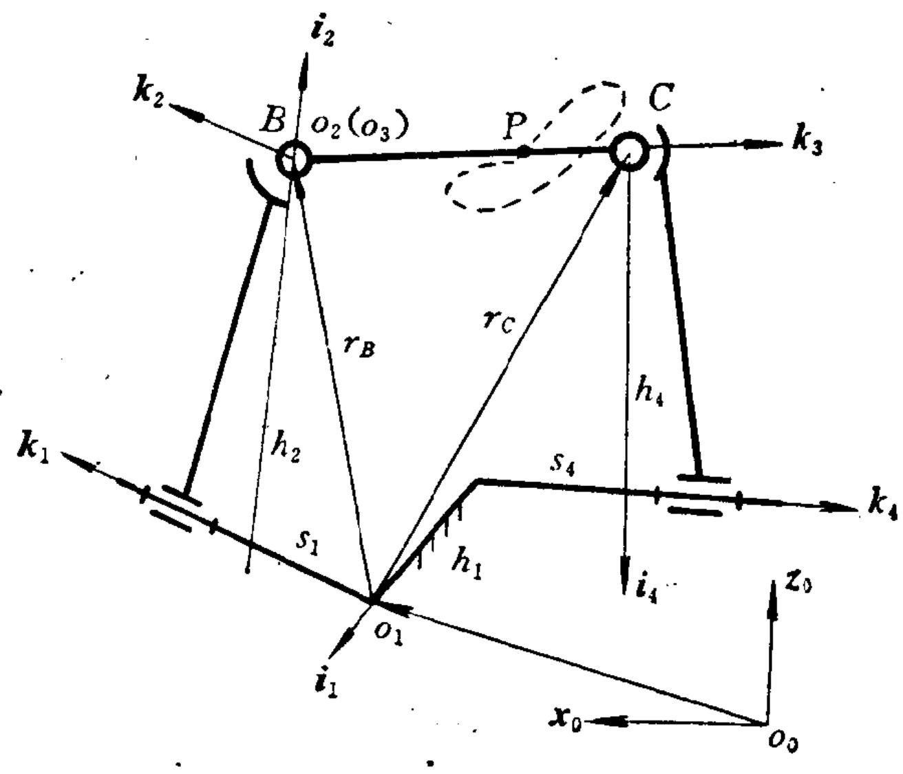

图5-2 轨迹综合

$$
\begin{array} { r } { \left\{ \begin{array} { l l } { x = x \left( t \right) } \\ { y = y \left( t \right) } \\ { z = z \left( t \right) } \end{array} \right. \quad t _ { \mathrm { m i n } } \leqslant t \leqslant t _ { \mathrm { m a x } } } \end{array}
$$

求设计方程组。

解 取坐标系 $\pmb { 1 }$ 为参考系,有

$$
\begin{array} { c } { { P = s _ { 1 } k _ { 1 } + h _ { 2 } \hat { \iota } _ { 2 } + l _ { 3 } k _ { 3 } } } \\ { { \ } } \\ { { = r _ { B } + l _ { 3 } ( \boldsymbol { r } _ { O } - \boldsymbol { r } _ { R } ) / s _ { 3 } } } \\ { { \ } } \\ { { = r _ { B } ( 1 - l _ { 3 } / s _ { 3 } ) + r _ { C } l _ { 3 } / s _ { 3 } } } \end{array}
$$

式中, $f _ { B _ { \sqrt } } { \pmb { \mathcal { T } } } _ { C }$ 分别为球面副 ${ \pmb { { \cal B } } } _ { \bullet } { \pmb { \sigma } }$ 的中心

$$
\pmb { r } _ { B } = \left[ \begin{array} { c } { \alpha _ { B } } \\ { y _ { B } } \\ { z _ { B } } \end{array} \right] = s _ { 1 } k _ { 1 } + h _ { 2 } \pmb { i } _ { 2 } = \left[ \begin{array} { c } { h _ { 2 } \cos \theta _ { 2 } } \\ { h _ { 2 } \sin \theta _ { 2 } } \\ { s _ { 1 } } \end{array} \right]
$$

$$
\pmb { r } _ { c } = \left[ \begin{array} { c c c } { \pmb { x } _ { 0 } } \\ { \pmb { y } _ { C } } \\ { \pmb { z } _ { C } } \end{array} \right] = - h _ { 1 } \pmb { i } _ { 1 } + s _ { 4 } k _ { 4 } - h _ { 4 } \pmb { i } _ { 4 } = \left[ \begin{array} { c c c } { - h _ { 1 } - h _ { 4 } \cos \theta _ { 1 } } \\ { s _ { 4 } \sin \alpha _ { 1 } + h _ { 4 } \cos \alpha _ { 1 } \sin \theta _ { 1 } } \\ { s _ { 4 } \cos \alpha _ { 1 } - h _ { 4 } \sin \alpha _ { 1 } \sin \theta _ { 1 } } \end{array} \right]
$$

故有

$$
\begin{array} { r l r } {  { P = [ h _ { 2 } \cos \theta _ { 2 } ] ( \mathbf { 1 } - \frac { l _ { 3 } } { \vartheta _ { 3 } } ) + \frac { l _ { 3 } } { \vartheta _ { 3 } } [ \begin{array} { c } { - h _ { 1 } - h _ { 4 } \cos \theta _ { 1 } } \\ { s _ { 4 } \sin \alpha _ { 1 } + h _ { 4 } \cos \alpha _ { 1 } \sin \theta _ { 1 } } \\ { s _ { 4 } \cos \alpha _ { 1 } - h _ { 4 } \sin \alpha _ { 1 } \sin \theta _ { 1 } } \end{array} ] } } \\ & { } & { = [ \begin{array} { c } { [ x ( t ) ^ { } ] } \\ { y ( t ) } \\ { [ z ( t ) ] } \end{array} ] ( \mathbf { 1 } - \frac { l _ { 3 } } { \vartheta _ { 3 } } ) + \frac { l _ { 3 } } { \vartheta _ { 3 } } [ \begin{array} { c } { - h _ { 1 } - h _ { 4 } \cos \theta _ { 1 } } \\ { s _ { 4 } \sin \alpha _ { 1 } + h _ { 4 } \cos \alpha _ { 1 } \sin \theta _ { 1 } } \\ { s _ { 4 } \cos \alpha _ { 1 } - h _ { 4 } \sin \alpha _ { 1 } \sin \theta _ { 1 } } \end{array} ] } \end{array}
$$

因而有

$$
\begin{array} { r l } & { \sin \theta _ { 1 } { = } \frac { s _ { 1 } } { h _ { 4 } \sin \alpha _ { 1 } } \Big ( \frac { s _ { 3 } } { l _ { 3 } } { - } 1 \Big ) { + } \frac { s _ { 4 } } { h _ { 4 } } \cot \alpha _ { 1 } { - } \frac { z ( \dot { \iota } ) s _ { 3 } } { h _ { 4 } l _ { 3 } \sin \alpha _ { 1 } } } \\ & { \qquad { = } f _ { 1 } ( s _ { 1 } , \ l _ { 4 } , \ l _ { 3 } , \ s _ { 3 } , \ s _ { 4 } , \ \alpha _ { 1 } ) } \\ & { \qquad \cos \theta _ { 1 } { = } \pm \sqrt { \dot { \mathrm { \bf ~ 1 } } - \sin ^ { 2 } \theta _ { 1 } } } \\ & { \qquad { = } f _ { 2 } ( s _ { 1 } , \ l _ { 4 } , \ l _ { 3 } , \ s _ { 3 } , \ s _ { 4 } , \ \alpha _ { 4 } ) } \end{array} .
$$

$$
\begin{array} { r l } & { \sin \theta _ { 2 } = - \frac { y ( \bar { t } ) - \frac { l _ { 3 } } { 8 3 } \left( s _ { 4 } \sin \alpha _ { 1 } + h _ { 4 } \cos \alpha _ { 1 } \sin \theta _ { 1 } \right) } { \cdot h _ { 2 } \left( 1 - \frac { l _ { 3 } } { s _ { 3 } } \right) } } \\ & { \qquad - f _ { 3 } ( s _ { 3 } , \ l _ { 4 } , \ b _ { 5 } , \ s _ { 3 } , \ a _ { 3 } , \ h _ { 1 } , \ a _ { \lambda } , \ h _ { 2 } ) } \\ & { \qquad \cos \theta _ { 2 } = - \frac { x ( \bar { t } ) + \frac { l _ { 3 } } { s _ { 5 } } h _ { 4 } \cos \theta _ { 1 } + \frac { h _ { 1 } l _ { 3 } } { s _ { 3 } } } { h _ { 2 } \left( 1 - \frac { l _ { 3 } } { s _ { 3 } } \right) } } \\ & { \qquad - f _ { 4 } ( h _ { 4 } , \ l _ { 3 } , \ b _ { 3 } , \ h _ { 1 } , \ a _ { 1 } , \ h _ { 2 } ) } \end{array}
$$

将上述关系代入式3-21,可得关于 $\smash { s _ { 1 _ { 3 } } h _ { 1 _ { 3 } } h _ { 2 _ { 3 } } l _ { 3 _ { 3 } } s _ { 3 _ { 3 } } s _ { 4 _ { 3 } } h _ { 4 _ { 3 } } \alpha _ { 1 } }$ 的一个非线性方程。由于未知参数有8个,可在 $( \tt t _ { m i n } , \tt t _ { m a x } )$ 区间内选8个精确点代入,得一组8个非线性设计方程。

如果为使所设计的轨迹与理想轨迹更吻合而增加精确点的数目,可增设一个固定参考系 $\pmb { O } _ { \mathbf { 0 } } \pmb { x } _ { \mathbf { 0 } } \pmb { y } _ { \mathbf { 0 } } \pmb { z } _ { \mathbf { 0 } _ { 0 } }$ 将式5-15定义在新增的参考系中。此时

$$
P { = } 0 _ { 1 } { + } E _ { 0 1 } ( s _ { 1 } k _ { 1 } { + } h _ { 2 } i _ { 2 } { + } l _ { 3 } k k _ { 3 } )
$$

式中, ${ \pmb 0 } _ { 1 }$ 表示0系到1系的平移, $\boldsymbol { E } _ { \mathfrak { g } \mathfrak { z } }$ 表示0系到 $\mathbf { 1 }$ 系的旋转。

)

$$
\begin{array} { c } { { \pmb { \mathscr { o } } _ { 1 } = \lfloor \pmb { x } _ { 1 } \quad y _ { 1 } \quad z _ { 1 } \rfloor ^ { s } } } \\ { { \pmb { \mathscr { E } } _ { 0 1 } = \pmb { \mathscr { E } } ^ { \star \theta } \pmb { \mathscr { E } } ^ { i \star } \pmb { \mathscr { E } } ^ { k \psi } } } \end{array}
$$

式中, $x _ { 1 } , y _ { 1 } , z _ { 1 } , \theta _ { \circ } \phi _ { \circ } \psi$ 均为待定的设计参数。这样,设计向量的维数就从原来的8提高到14,精确点的数目为 $\mathbf { 1 4 } _ { \circ }$ 但此时的设计方程组更为复杂,求解也更困难。

# 三、刚体导引

如果要求机构能够引导一个刚体通过若干给定的有限分离位置,则称这种设计为刚体导引。在刚体导引方面,空间闭链机构的灵活性不如开链机构。下面仅举一个简单的例子加以分析。

例5-3:用RSSR机构进行刚体导引时,由于连杆有局部自由度,只能完成轴对称物体的导引。如图5-3所示,被导引的圆柱体固连于构件3上。这样,参考点与运动副 $B$ 的中心重合,通过此参考点的主轴 $\mu$ 与 $k _ { 3 }$ 共线。要求被导引的刚体通过表5-3所列位置。求设计方程组。

图b-3刚体导引

表5-3刚体位置

<table><tr><td rowspan=2 colspan=1>位置</td><td rowspan=1 colspan=3>参考点坐标</td><td rowspan=1 colspan=3>主轴姿态</td></tr><tr><td rowspan=1 colspan=1>B</td><td rowspan=1 colspan=1>B</td><td rowspan=1 colspan=1>2B</td><td rowspan=1 colspan=1>u</td><td rowspan=1 colspan=1>uy</td><td rowspan=1 colspan=1>u</td></tr><tr><td rowspan=1 colspan=1>二</td><td rowspan=1 colspan=1>xB1</td><td rowspan=1 colspan=1>U1</td><td rowspan=1 colspan=1>2B1</td><td rowspan=1 colspan=1>μ1</td><td rowspan=1 colspan=1>H1</td><td rowspan=1 colspan=1>μz1</td></tr><tr><td rowspan=1 colspan=1>三</td><td rowspan=1 colspan=1>B</td><td rowspan=1 colspan=1>yB</td><td rowspan=1 colspan=1>2B2</td><td rowspan=1 colspan=1>μx2</td><td rowspan=1 colspan=1>u</td><td rowspan=1 colspan=1>u2</td></tr><tr><td rowspan=1 colspan=1>三</td><td rowspan=1 colspan=1>B</td><td rowspan=1 colspan=1>ys</td><td rowspan=1 colspan=1>2B3</td><td rowspan=1 colspan=1>u8</td><td rowspan=1 colspan=1>Hy3</td><td rowspan=1 colspan=1>u3</td></tr></table>

解 1.解的存在性与确定性。

由于 $B$ 点绕 $k _ { 1 }$ 轴旋转,在 $o _ { 1 } i _ { 1 } j _ { 1 } k _ { 1 }$ 系中应有 $z _ { B 1 } = z _ { B 2 } = z _ { B 3 } =$ $\bullet _ { 1 0 }$ 因此,对任意取定的3个位置,要使综合问题有解,表5-3中的各量应定义在另外取定的参考系 $o _ { 0 } i _ { 0 } j _ { 0 } k _ { 0 }$ 中。

由 $B$ 点的3个位置可求转轴 $k _ { 1 }$ 的方向、回转半径 $h _ { 2 }$ 以及 $\dot { \iota } _ { 2 }$ 与 $k _ { 1 }$ 的交点 $\pmb { A }$ 。由于 $k _ { 3 }$ 的方向已知,如果 $\mathfrak { s } _ { 3 }$ 的长度也给定,可以定出 $C$ 点的三个位置,进而求出 $k _ { 4 }$ 的方向、 $h _ { 4 }$ 及 $0 _ { 4 }$ 。也就是说,对应 ${ \mathfrak { s } } _ { 3 }$ 的一个取值,有适合表5-2的一个唯一解。由于 ${ \pmb S } _ { 3 }$ 可以任取,

该项设计有无穷解。

2.取定 $\$ 9$ 后机构的设计方法。

(1)轴线 $k _ { 1 }$ 位置的确定。

设表5-3的三个位置分别为 $B _ { 1 } , B _ { 2 } , B _ { 3 } , B _ { i } = ( x _ { B i } , y _ { B i } , z _ { B i } )$ ,$i = 1 , 2 , 3 ,$ 由空间解析几何知, $k _ { 1 }$ 的方向可由 $( B _ { 2 } - B _ { 1 } ) \times ( B _ { 8 } -$ $\pmb { { \cal B } } _ { 1 } )$ 确定。设

$$
( B _ { 2 } - B _ { 1 } ) \times ( B _ { 3 } - B _ { 2 } ) = [ \begin{array} { c } { { x ^ { - } } } \\ { { y } } \\ { { z } } \end{array} ]
$$

$$
d = \sqrt { x ^ { 2 } + y ^ { 2 } + z ^ { 2 } }
$$

则

$$
\begin{array} { r } { k _ { 1 } = \left| \begin{array} { l } { - \lambda _ { 1 } } \\ { \mu _ { 1 } } \\ { \nu _ { 1 } } \\ { - \nu _ { 1 } } \end{array} \right| = \left| \begin{array} { l } { - \chi / d \overline { { b } } ^ { - } } \\ { y / d } \\ { z / d } \end{array} \right| } \end{array}
$$

如图5-4所示, $\pmb { A }$ 为 $B$ 点三个位置的圆心。 $\pmb { B _ { 1 } B _ { 2 } }$ 的垂直平分线为 $\pmb { l _ { 1 2 } }$ , ${ \cal B } _ { 2 } { \cal B } _ { 3 }$ 的垂直平分线为 $l _ { 2 3 0 } \textbf { \em A }$ 是 $\pmb { l _ { 1 2 } }$ 与 $l _ { 2 3 }$ 的交点。设 $\pmb { l _ { 1 2 } }$ 上的单位向量为 $[ l , \ m , \ n ] ^ { \mathtt { r } }$ , $l _ { 2 3 }$ 上的单位向量为 $[ p , q , r ] _ { \textrm { o } } ^ { \textrm { r } } l _ { 1 2 }$ 的方程为

$$
\frac { x - x _ { 1 2 } } { l } = \frac { y - y _ { 1 2 } } { m } = \frac { z - z _ { 1 2 } } { n }
$$

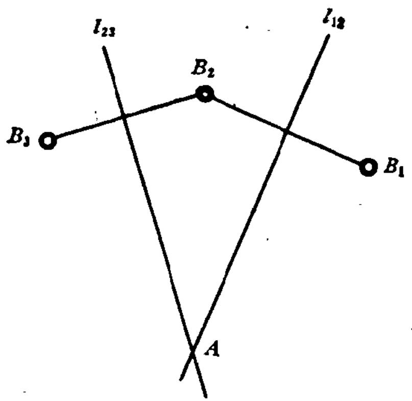

图 $5 - 4$ 三个位置的圆心 $\pmb { A }$ 

式中

$$
\left| \begin{array} { l } { \overline { { \gamma } } _ { 1 2 } } \\ { \overline { { y _ { 1 2 } } } } \\ { \overline { { z } } _ { 1 1 } } \end{array} \right| = B _ { 1 } + ( B _ { 2 } - B _ { 1 } ) / 2
$$

是 $\overline { { B _ { 1 } B _ { 2 } } }$ 线段的中点, $l _ { 1 2 }$ 通过此点。 $l _ { 2 3 }$ 的方程为:

$$
\frac { x - x _ { 2 3 } } { y } = \frac { y - y _ { 2 3 } } { q } = \frac { z - z _ { 2 3 } } { r }
$$

式中

$$
\left| \begin{array} { c } { { - { x _ { 2 3 } } } } \\ { { { y _ { 2 3 } } } } \\ { { { z _ { 2 3 } } } } \end{array} \right| = B _ { 2 } + ( B _ { 3 } - B _ { 2 } ) / 2
$$

是 $\overline { { B _ { 2 } B _ { 3 } } }$ 线段的中点, $\pmb { l _ { 2 3 } }$ 通过此点:此外, $l _ { 1 2 }$ 和 $\pmb { l _ { 2 3 } }$ 均与 $\pmb { k _ { 1 } }$ 垂直,它们分别与 $B _ { 1 } B _ { 2 } , B _ { 2 } B _ { 3 }$ 垂直,因而有

$$
\begin{array} { r l r } { \left[ \begin{array} { c } { l } \\ { m } \\ { m } \\ { \hdots n _ { - } } \end{array} \right] \cdot \left[ \begin{array} { c } { \hat { \lambda } _ { 1 } } \\ { \hat { \mu } _ { 1 } } \\ { \hdots } \\ { \hat { \nu } _ { 1 } } \\ { \hat { \nu } _ { - } } \end{array} \right] = 0 } & { } & { \left[ \begin{array} { c } { p } \\ { g } \\ { g } \\ { \vdots } \\ { \tau } \end{array} \right] \cdot \left[ \begin{array} { c } { \hat { \lambda } _ { 1 } } \\ { \hat { \mu } _ { 1 } } \\ { \mu _ { 1 } } \\ { \dots \nu _ { 1 } } \\ { \hat { \nu } _ { 1 } } \end{array} \right] = 0 } \\ { \left( B _ { 2 } - B _ { 1 } \right) \cdot \left[ \begin{array} { c } { \hat { \lambda } ^ { - } \hat { \lambda } _ { 1 } } \\ { m } \\ { \hdots } \\ { \mu _ { - } } \end{array} \right] = 0 } & { \left( B _ { 3 } - B _ { 2 } \right) \cdot \left[ \begin{array} { c } { - p } \\ { \hat { \mathcal { Q } } } \\ { g } \\ { \hat { \lambda } _ { - } } \end{array} \right] = 0 } \end{array}
$$

$$
l ^ { 2 } + m ^ { 2 } + n ^ { 2 } = 1 \quad p ^ { 2 } + q ^ { 2 } + r ^ { 2 } = 1
$$

由上面六式可求 $l , m , n , p , q , r _ { 0 }$ 联立求解式5-19和5-20得交点$A _ { 0 } ( t _ { 1 }$ 轴的方程可写为

$$
\pmb { P } _ { 1 } = \pmb { A } + t _ { 1 } \pmb { k } _ { 1 }
$$

式中, $\pmb { P _ { 1 } }$ 为轴上任意点, $\bf { \dot { t } _ { 1 } }$ 为纯量系数。 $A = ( x _ { A } , \ y _ { A } , \ z _ { A } )$ ,则 $h _ { 2 }$ 的长度为

$$
h _ { 2 } = \vert A - B _ { 1 } \vert = \sqrt { ( v _ { A } - v _ { B 1 } ) ^ { 2 } + ( y _ { A } - y _ { B 1 } ) ^ { 2 } + ( z _ { A } - z _ { B 1 } ) ^ { 2 } }
$$

(2)轴线 $k _ { \pm }$ 位置的确定。

$C$ 点的3个位置由 $B$ 点的3个位置、 $k _ { 8 }$ 的方向及 $\clubsuit _ { 3 }$ 的长度唯一确定

$$
\mathbf { c } _ { i } = \left[ \begin{array} { l } { \overline { { x _ { 0 i } } } ^ { - } } \\ { \overline { { y _ { 0 i } } } } \\ { \overline { { z _ { 0 i } } } } \end{array} \right] = B _ { i } + s _ { 3 } \left[ \begin{array} { l } { \overline { { \mu _ { i i } } } ^ { - } } \\ { \mu _ { N } } \\ { \mu _ { N } } \\ { \overline { { \mu _ { i i } } } } \end{array} \right] \quad i = 1 , 2 , 9
$$

按照上面的方法,由 $\sigma$ 点的3个位置可求得 $k _ { 4 }$ 轴的方向、 $0 _ { 4 }$ 的坐标及 $h _ { 4 }$ 的长度。 $k _ { 4 }$ 轴的方程为

$$
P _ { 4 } = 0 _ { 4 } + i _ { 4 } k _ { 4 }
$$

(3)其余结构参数的确定。

由空间解析几何知

$$
\begin{array} { c } { { \alpha _ { 1 } = \operatorname { a r c c o s } ( k _ { 1 } \cdot k _ { 4 } ) } } \\ { { { h } _ { 1 } { = } \displaystyle \frac { \mid ( \mathbf { 0 } _ { 4 } - \mathbf { A } ) \cdot ( k _ { 1 } \times k _ { 4 } ) \mid } { \mid k _ { 1 } \times k _ { 4 } \mid } } } \end{array}
$$

设 $\dot { \pmb { \mathscr { t } } } _ { \bf 1 }$ 在 $k _ { 4 }$ 轴上的垂足为 $\pmb { D }$ ,在 $k _ { 1 }$ 轴上的垂足为 ${ \pmb 0 } _ { 1 } \mathrm { . }$ 有

$$
\begin{array} { c c } { { D = 0 _ { 4 } + i _ { D } k _ { 4 } } } & { { \mathrm { ~ \it ~ \delta ~ } } } \\ { { \mathrm { ~ \it ~ \phi ~ } _ { 1 } = A + i _ { 0 } k _ { 1 } } } & { { \mathrm { ~ \it ~ \phi ~ } _ { 1 } } } \end{array}
$$

式中

$$
t _ { D } = \frac { ( \pmb { k } _ { 1 } \times \pmb { k } _ { 4 } ) \cdot [ ( \pmb { 0 } _ { 4 } - \pmb { A } ) \times \pmb { k } _ { 1 } ] } { ( \pmb { k } _ { 1 } \times \pmb { k } _ { 4 } ) ^ { 2 } }
$$

$$
\dot { t } _ { 0 } = \frac { ( \pmb { k } _ { 1 } \times \pmb { k } _ { 4 } ) \bullet [ ( \pmb { \theta } _ { 4 } - \pmb { A } ) \times \pmb { k } _ { 4 } ] } { ( \pmb { k } _ { 1 } \times \pmb { k } _ { 4 } ) ^ { 4 } } ~ .
$$

得

$$
\begin{array} { r } { \mathfrak { s } _ { 4 } = ( \pmb { { \cal D } } - \pmb { \sigma } _ { 4 } ) \cdot \pmb { { \cal k } } _ { 4 } } \\ { \mathfrak { s } _ { 1 } = ( \pmb { { \cal A } } - \pmb { \sigma } _ { 1 } ) \cdot \pmb { { \cal k } } _ { 1 } } \end{array}
$$

# \$ 5-3 按速度、加速度和动力特性设计空间闭链机构

除了位移要求外,对空间闭链机构还应有速度、加速度和动力特性等方面的设计要求 $5 3 0 \sim 3 2 3$ 0

# 一、按速度、加速度要求设计空间闭链机构

例 $\Xi \cdot 4$ :在图3-6的RSSR机构中,设要求主、从动件的运动规律为表 $\Sigma \mathrm { - } 4$ 。求设计方程组。

解由表5-4知,输入角速度 $\dot { \theta } _ { 2 }$ 为常量,展开式3-44并令$\stackrel { \triangledown } { \vec { \theta } _ { 2 } } = \boldsymbol { 0 }$ 得

$$
\begin{array} { r l } & { a _ { 3 } s _ { 1 } h _ { 4 } \sin \alpha _ { 1 } + \alpha _ { 2 } h _ { 2 } s _ { 4 } \sin \alpha _ { 1 } + a _ { 3 } h _ { 2 } h _ { 4 } \cos \alpha _ { 1 } + a _ { 4 } h _ { 2 } h _ { 4 } } \\ & { \quad + a _ { 5 } h _ { 1 } h _ { 4 } + a _ { 6 } h _ { 1 } h _ { 2 } = 0 } \end{array}
$$

表5-4 主、从动件运动规律

<table><tr><td rowspan=3 colspan=1>位置</td><td></td><td></td><td></td><td></td><td></td><td></td></tr><tr><td rowspan=1 colspan=2>位移</td><td rowspan=1 colspan=2>速度</td><td rowspan=1 colspan=2>加速度</td></tr><tr><td rowspan=1 colspan=1>.</td><td rowspan=1 colspan=1>旺</td><td rowspan=1 colspan=1>旺</td><td rowspan=1 colspan=1>旺</td><td rowspan=1 colspan=1>8</td><td rowspan=1 colspan=1>旺</td></tr><tr><td rowspan=1 colspan=1>二</td><td rowspan=1 colspan=1></td><td rowspan=1 colspan=1>明</td><td rowspan=1 colspan=1>明</td><td rowspan=1 colspan=1></td><td rowspan=1 colspan=1>0</td><td rowspan=1 colspan=1>m</td></tr><tr><td rowspan=1 colspan=1>二</td><td rowspan=1 colspan=1>62</td><td rowspan=1 colspan=1>（2</td><td rowspan=1 colspan=1>2</td><td rowspan=1 colspan=1>的2</td><td rowspan=1 colspan=1>0</td><td rowspan=1 colspan=1>2</td></tr></table>

式中 

$$
\begin{array} { r l } & { a _ { 1 } = \cos \theta _ { 1 } \tilde { \theta } _ { 1 } - \sin \theta _ { 1 } \dot { \theta } _ { 1 } ^ { 2 } } \\ & { a _ { 2 } = \sin \theta _ { 2 } \dot { \theta } _ { 2 } ^ { 2 } } \\ & { a _ { 3 } = - \sin \theta _ { 2 } \cos \theta _ { 1 } \dot { \theta } _ { 1 } + \sin \theta _ { 1 } \sin \theta _ { 2 } \dot { \theta } _ { 2 } ^ { 2 } } \\ & { \phantom { a a a } - 2 \cos \theta _ { 1 } \cos \theta _ { 2 } \dot { \theta } _ { 2 } \dot { \theta } _ { 1 } + \sin \theta _ { 2 } \dot { \theta } _ { 1 } ^ { 2 } } \\ & { a _ { 4 } = - \cos \theta _ { 2 } \sin \theta _ { 1 } \dot { \theta } _ { 1 } - \cos \theta _ { 1 } \cos \theta _ { 2 } \dot { \theta } _ { 2 } ^ { 2 } } \\ & { \phantom { a a a a a a a a a a } + 2 \sin \theta _ { 4 } \sin \theta _ { 2 } \dot { \theta } _ { 3 } - \cos \theta _ { 1 } \cos \theta _ { 2 } \dot { \theta } _ { 1 } ^ { 2 } } \\ & { a _ { 5 } = - \sin \theta _ { 3 } \ddot { \theta } _ { 1 } - \cos \theta _ { 1 } \dot { \theta } _ { 1 } ^ { 2 } } \\ & { a _ { 6 } = - \cos \theta _ { 5 } \dot { \theta } _ { 2 } ^ { 2 } } \end{array}
$$

将表5-4的数值代入, $a _ { 1 } \sim a _ { \theta }$ 均为已知,式5-24为 $h _ { 1 , \ } s _ { 1 , \ } \hslash _ { 2 , } h _ { 4 , \ } s _ { 4 , }$ ${ \pmb { \alpha } } _ { \bf { 1 } }$ 的函数。代入 $x = \pm \lg \frac { \alpha _ { 1 } } { 2 }$ ,得

$$
\begin{array} { r l } & { 2 a _ { 1 } x s _ { 1 } h _ { 4 } + 2 a _ { 2 } x h _ { 2 } s _ { 4 } - a _ { 3 } x ^ { 2 } h _ { 2 } h _ { 4 } + a _ { 4 } x ^ { 2 } h _ { 2 } h _ { 4 } } \\ & { \quad + a _ { 5 } \omega ^ { 2 } h _ { 1 } h _ { 4 } + a _ { 6 } x ^ { 2 } h _ { 1 } h _ { 2 } + ( a _ { 8 } + a _ { 4 } ) h _ { 2 } h _ { 4 } + a _ { 5 } h _ { 1 } h _ { 4 } } \\ & { \quad + a _ { 6 } h _ { 1 } h _ { 2 } = 0 } \end{array}
$$

展开式3-42,有

b1sh4 sin $a _ { 1 } + b _ { 2 } h _ { 2 } s _ { 4 }$ sin α+bghhcos a1 

式中

$$
\begin{array} { r l } & { + { { b } _ { 4 } } { { h } _ { 2 } } { { h } _ { 4 } } + { { b } _ { 5 } } { { h } _ { 3 } } { { h } _ { 4 } } + { { b } _ { 6 } } { { h } _ { 1 } } { { h } _ { 2 } } \mathrm { { { s } } } = 0 } \\ & { { { b } _ { 1 } } = - \cos \theta { { h } _ { 4 } } { { \dot { \theta } } _ { 1 } } } \\ & { { { b } _ { 2 } } = \cos \theta { { \dot { \theta } } _ { 2 } } } \\ & { { { b } _ { 8 } } = \sin \theta _ { 2 } \cos \theta _ { 1 } { { \dot { \theta } } _ { 1 } } + \cos \theta _ { 2 } { { \dot { \theta } } _ { 2 } } \sin \theta _ { 1 } } \\ & { { { b } _ { 4 } } = \cos \theta _ { 1 } \big ( \sin \theta _ { 1 } { { \dot { \theta } } _ { 3 } } + \sin \theta _ { 2 } { { \dot { \theta } } _ { 2 } } \big ) } \\ & { { { b } _ { 5 } } = \sin \theta _ { 1 } { { \dot { \theta } } _ { 1 } } } \\ & { { { b } _ { 6 } } = \sin \theta _ { 2 } { { \dot { \theta } } _ { 3 } } } \end{array}
$$

代入 $x = \log \frac { \alpha _ { 1 } } { 2 }$ ,得

$$
\begin{array} { r l } & { 2 { b _ { 1 } } x s _ { 1 } { h _ { 4 } } + 2 { b _ { 2 } } x { h _ { 2 } } s _ { 4 } - { b _ { 3 } } x ^ { 2 } { h _ { 2 } } { h _ { 4 } } + { b _ { 4 } } x ^ { 2 } { h _ { 2 } } { h _ { 4 } } } \\ & { \quad + { b _ { 5 } } x ^ { 2 } { h _ { 1 } } { h _ { 4 } } + { b _ { 6 } } x ^ { 2 } { h _ { 1 } } { h _ { 2 } } + \left( { b _ { 3 } } + { b _ { 4 } } \right) { h _ { 2 } } { h _ { 4 } } } \\ & { \quad + { b _ { 5 } } { h _ { 1 } } { h _ { 4 } } + { b _ { 6 } } { h _ { 1 } } { h _ { 3 } } = 0 } \end{array}
$$

展开式8-21并代入 $\imath = 1$ ,得

)

式中

$$
\begin{array} { r l } & { \mathrm { i } \cdot \delta _ { 1 } \dot { h } _ { 4 } \sin \alpha _ { \mathrm { t } } + \sigma _ { 0 } \dot { h } _ { 2 } \dot { h } _ { 4 } \cos \alpha _ { \mathrm { t } } + \sigma _ { 0 } \dot { h } _ { 3 } \dot { h } _ { 4 } + \sigma _ { 0 } } \\ & { \quad + \sigma _ { s } \dot { h } _ { 4 } \dot { h } _ { 2 } + \sigma _ { 0 } \dot { s } \dot { a } _ { 4 } \dot { h } _ { 3 } \cos \alpha _ { \mathrm { t } } - \delta _ { 4 } \dot { s } _ { 1 } \cos \alpha _ { \mathrm { t } } } \\ & { \quad + \left( s _ { 4 } ^ { 2 } + \dot { h } _ { 4 } ^ { 2 } + s _ { 1 } ^ { 2 } + \dot { h } _ { 2 } ^ { 2 } + \dot { h } _ { 4 } ^ { 2 } - \dot { 1 } \right) / 2 = 0 } \\ & { \quad \quad \quad \quad \quad \quad \quad \quad \quad \quad \quad \quad \quad \quad \quad \quad \quad \quad \quad \quad \quad \quad \quad \quad \quad \quad \quad \quad \quad \quad } \\ & { \quad \quad \quad \quad \quad \quad \quad \quad \quad \quad \quad \quad \quad \quad c _ { 1 } = - \sin \theta _ { 2 } \sin \theta _ { 1 } } \\ & { \quad \quad \quad \quad \quad \quad \quad \quad \quad \quad \quad \quad \quad \quad \quad \quad \quad \quad \quad \quad \quad \quad \quad \quad \quad \quad \quad \quad \quad \quad \quad \quad \quad \quad \quad \quad \quad \quad \quad } \\ & { \quad \quad \quad \quad \quad \quad \quad \quad \quad \quad \quad \quad \quad \quad \quad \quad \quad \quad \quad \quad \quad \quad \quad \quad \quad \quad \quad \quad \quad \quad \quad \quad \quad \quad \quad \quad \quad \quad \quad \quad \quad \quad } \\ &  \quad \quad \quad \quad \quad \quad \quad \quad \quad \quad \quad \quad \quad \quad \quad \quad \quad \quad \quad \quad \quad \quad \quad \quad \quad \quad \quad \quad \quad \quad \quad \quad \quad \quad \quad \quad \quad \quad \quad \quad \quad \quad \quad \quad \quad \quad \quad \quad \quad \quad \quad \quad \quad \quad \quad \quad \end{array}
$$

$x = \log { \frac { \alpha _ { 1 } } { 2 } }$ 

$$
\begin{array} { r l } & { 2 c _ { 1 } x s _ { 1 } h _ { 4 } - c _ { 2 } \alpha ^ { 2 } h _ { 2 } h _ { 4 } + c _ { 3 } \alpha ^ { 2 } h _ { 1 } h _ { 4 } + c _ { 4 } \alpha ^ { 2 } h _ { 2 } h _ { 4 } } \\ & { \quad + c _ { 5 } \alpha ^ { 2 } h _ { 1 } h _ { 2 } + 2 c _ { 6 } x s _ { 4 } h _ { 2 } + \sigma ^ { 2 } s _ { 4 } s _ { 1 } + \sigma ^ { 2 } ( s _ { 4 } ^ { 2 } + h _ { 1 } ^ { 2 } } \\ & { \quad + s _ { 1 } ^ { 2 } + h _ { 2 } ^ { 2 } + h _ { 4 } ^ { 2 } - 1 ) / 2 + ( c _ { 2 } + c _ { 4 } ) h _ { 2 } h _ { 4 } + c _ { 3 } h _ { 1 } h _ { 4 } } \\ & { \quad + c _ { 5 } h _ { 1 } h _ { 2 } - s _ { 4 } s _ { 1 } + ( s _ { 4 } ^ { 2 } + h _ { 1 } ^ { 2 } + s _ { 1 } ^ { 2 } + h _ { 2 } ^ { 2 } } \\ & { \quad + h _ { 4 } ^ { 2 } - 1 ) / 2 = 0 } \end{array}
$$

式5-25,5-27及5-29为 $h _ { 1 , } s _ { 1 , } h _ { 2 , } h _ { 4 , } s _ { 4 , } x$ 的非线性方程。将表5-4的2个位置代入,可得6个方程,可解上述6个参数。

# 二、按动力特性要求设计空间闭链机构

例 $5 - 5$ :在图3-6的RSSR机构中,设构件2.4的质心在各自的转轴上,转动惯量分别为 $J _ { 2 , \sqrt { 4 0 } }$ 构件3的质量为 $m _ { 8 }$ ,质心相对3系的坐标为 $( 0 , \ 0 , \ \backslash l _ { 3 } ) _ { \circ } \ J _ { 4 _ { \circ } } m _ { 3 _ { \circ } } l _ { 3 }$ 均定为设计变量。设原动件以匀角速度 $\dot { \theta } _ { z }$ 转动,驱动力矩 $Q _ { 2 }$ 为常数, $\dot { \theta } _ { 2 }$ 与 $Q _ { 2 }$ 已知。要求输出变化的力矩 $Q _ { 1 }$ 如表5-5所列。求设计方程组。

表5-53个位置时的输出力矩

<table><tr><td rowspan="2">位置</td><td colspan="2">角位移</td><td>输出力矩</td></tr><tr><td>0</td><td>旺</td><td>Q1</td></tr><tr><td>1</td><td>明</td><td>2</td><td>Q</td></tr><tr><td rowspan="2">二 三</td><td>2</td><td>82</td><td>Q2</td></tr><tr><td>8</td><td>8</td><td>Q8</td></tr></table>

解构件3的质量按例4-3代换,取 ${ \mathfrak { s } } _ { 3 } = 1$ , $m _ { 3 } ^ { ( 2 ) } = l _ { 8 } m _ { 3 }$ 此时${ \tt I _ { 8 } }$ 为相对 $\$ 8$ 的长度。设计变量为 $h _ { 1 , \ } s _ { 1 , \ } h _ { 2 , \ } l _ { 8 , \ } h _ { 4 , \ } s _ { 4 , \ } \alpha _ { \div , } J _ { 4 , \ } m _ { 8 , 0 }$ 将式8-42.3-44代入式4-46,可得一个强非线性方程

$$
f ( h _ { 4 } , \ s _ { 1 } , \ h _ { 2 } , \ l _ { 3 } , \ h _ { 4 } , \ s _ { 4 } , \ \alpha _ { 1 } , \ J _ { 4 } , \ m _ { 3 } ) = 0
$$

将表5-5的3个位置代入式5-29和5-30,可得6个方程,该项设计有无穷解。可取定3个设计变量,使设计向量降为六维,从而获得确定解。

代入精确点求解设计方程组是传统的设计方法。从本例及例5-2中可看到,设计方程组的推导过程十分繁琐冗长,容易出错,得到的设计方程组往往是强非线性的。 $\ S 5 - 4$ 将介绍空间闭链机构的优化设计方法,该方法使设计过程易于实现。

# 三、空间闭链机构的特殊位置和压力角

当杆长之间满足某种关系时,在平面闭链机构的一个运动循环中,将出现连架杆速度为零的特殊位置,称为极限位置。在平面铰链四杆机构中,具有特殊位置的连架杆称为摇杆,摇杆不能绕机架作 $3 6 0 ^ { \circ }$ 回转。空间闭链机构也有类似的特殊位置,但情况要复杂一些,有兴趣的读者可阅读文献[5]。

机构的回转原动件常与电机一类的回转动力源相连接。因此,通常要求机构的连架杆能作 ${ \mathfrak { s o o } } ^ { \circ }$ 回转。这种构件称为曲柄,曲柄没有特殊位置。在有曲柄的机构中,对应曲柄的每一个位置,其他构件都有确定的位置。

设计空间闭链机构时,可按两种原则检验是否有曲柄:一种是对应曲柄的各个位置,检查其余构件的运动参数是否有解;第二种是检查一个运动循环中,在其他构件转速不为零的情况下,期望成为曲柄的构件是否出现速度为零的特殊位置。例如对RSSR机构,式8-42是 $\dot { \theta } _ { 1 }$ 的表达式,如果构件4不是曲柄,则可通过令$\dot { \theta } _ { 1 } = 0$ 求出其特殊位置。

应用代入精确点求解设计方程组的方法设计机构难以保证曲柄的存在,一般只能检验设计结果是否有曲柄。倘若应用优化设计方法,则可将曲柄存在条件作为约束嵌入到求解过程中。例如,要求RSSR机构的构件2为曲柄。按第一种检验原则,它应在 $0 \sim$ $\mathbf { 2 \pi } \pi$ 之间使式3-23有意义,即要求

$$
A ^ { 2 } + B ^ { 2 } - C ^ { 2 } \geqslant 0
$$

可编制如下程序进行检验:

程序5-1

function crank:boolean; var a,b,c,d,step,saf,caf,th2,sth2,cth2:real; begin 1 $\mathbf { s t e p } { \mathrm { : = } } 2 { \mathrm { * } } \mathbf { P I } / \mathbf { m } ;$ 2 saf:= sin(af);caf:=cos(af); 3 d: = (s4\*s4+h1\*h1+ s1\*s1+h2\*h2+h4\*h4- s8\*s3)/2 - s4\*s1\*caf: 4 $\mathbf { \hat { b } } \mathbf { \hat { a } } \mathbf { : \mu } = \mathbf { 0 } ;$ 5while $\mathbf { t h 2 } { < } 2 * \mathbf { P I }$ do begin 6 $\begin{array} { r l } & { \mathrm { s t h 2 : = } \sin \left( \mathrm { t h 2 } \right) ; \mathrm { c b h 2 : = } \cos ( \mathrm { t h 2 } ) ; } \\ & { \mathrm { a : = h 4 } * ( \mathrm { s 1 } { * \mathrm { s a f } } - \mathrm { h 2 } { * \mathrm { c a f } } { * \mathrm { s t h 2 } } ) ; } \\ & { \mathrm { b : = h 4 } * ( \mathrm { h 1 } + \mathrm { h 2 } { * \mathrm { c t h 2 } } ) ; } \\ & { \mathrm { c : = } \mathrm { d } + \mathrm { h 2 } * ( \mathrm { h 1 } { * \mathrm { c b h 2 } } - \mathrm { s 4 } { * \mathrm { s a f } } { * \mathrm { s t h 2 } } ) ; } \end{array}$ 7 8 9 10 if $a + a + b + b - c + c < 0$ then begin 11 crank: $\eqcirc$ false; 12 exit end; 13 end; 14 crank: $\Longleftarrow$ true; 

15 end; 

在上述程序中,PI为常数 $\pi ; ~ \mathfrak { m }$ 为设定的 $0 \sim 2 \pi$ 中检验点的数自 $\begin{array}{c} \mathbf {  \begin{array} { l l l l l } { \mathbf { \mathord { s } } \mathbf { 1 } } & { \mathbf { h } \mathbf { 1 } } & { \mathbf { h } 2 } & { \mathbf { \mathord { s } } \mathbf { 9 } } & { \mathrm { h } 4 } & { \mathbf { \mathord { s } } \mathbf { 1 } } & { \mathbf { \mathop { a } f } ( } \end{array}  } \end{array}$ (表示 ${ \pmb { \alpha _ { 1 } } }$ )为结构参数,是全局变量。th2表示 $\pmb { \theta _ { 2 } }$ 。如果作为子程序多次调用,第 $1$ 句应放在主程序中。

执行上述程序时,当某个位置不满足式5-31时,执行第11句,crank被赋值false,表示曲柄不存在,并从12句返回。在有曲柄情况下,程序正常执行至第15句,crank被赋值true,表示有曲柄。

上述程序以函数形式出现,既可用于设计结果的校核,又可作为约束条件嵌入到优化计算程序中。虽然应用的是离散点检验方法,但在绝大多数情况下是有效的。

从动件的压力角定义为运动方向与受力方向的夹角。压力角的大小影响机构的受力和效率,在设计要求中常包含对压力角取值的限制。压力角的数值易于由运动分析求得。例如图3-6的RSSR机构,若从动件为构件 $4$ ,则 $\pmb { C }$ 点的运动方向沿 $j _ { 4 3 }$ 若连杆为二力杆,则 $\boldsymbol { \sigma }$ 点受力的方向沿 $\pmb { k _ { 3 0 } }$ 压力角 $\pmb { \alpha }$ 表示为

$$
\alpha = \operatorname { a r c c o s } | k _ { 3 } \cdot j _ { 4 } |
$$

式中, $k _ { 3 , j _ { 4 } }$ 含有结构参数,在优化设计中可将对 $\pmb { \alpha }$ 取值的限制作为约束条件嵌入求解过程中。

# \$5-4 空间闭链机构的优化综合

# 一、优化设计

优化设计方法近年来发展迅速,其基本思想是在若干可行方案中按某种衡量标准挑选出一个较好的方案。通常的实现方法是把某个衡量标准表示为设计变量的可计算函数,称为目标函数,然后利用电子计算机在设计空间内按某种策略进行搜索,最终找到目标函数的极值点,称为最优解。在搜索过程中,首先产生设计向量的某个值,然后计算该方案的目标函数值,再与其他设计方案进行比较以产生最优解。由于在寻优过程中不需要由设计方程组来确定设计向量的值,给求解过程带来了方便。设计者可不必推导设计方程组,而直接利用运动分析所建立的方程。例如,例5-1的函数综合问题,设计目标可定为:使再现函数与理想函数在所关心的区间内偏差最小。用数学式子来表示就是

$$
\sum _ { i = 1 } ^ { n } ( F ( p _ { i } , X ) - f ( p _ { i } ) ) ^ { 2 } { \mathrm { \to m i n } }
$$

上式表示在所关心的区间内对 $\pmb { \eta }$ 个点上理想函数与再现函数之差的平方求和,以平方和最小为目标进行寻优。在寻优过程中,通常还要考虑约束条件,这就需要把约束条件也表示为设计向量的可计算函数。对机构综合问题,一般可用如下的数学模型表示:

设计向量

$$
\begin{array} { c } { X = [ x _ { 1 } , x _ { 2 } , \cdots x _ { n } ] ^ { \mathrm { T } } } \\ { X \in R ^ { n } } \end{array}
$$

在满足

和

$$
\begin{array} { c } { { g _ { \mu } ( X ) = g _ { \mu } ( x _ { \perp } , x _ { 2 } \cdots x _ { n } ) \leqslant 0 } } \\ { { \phantom { g _ { \mu } ( X ) = } \mu = 1 , 2 \cdots m } } \\ { { \phantom { g _ { \mu } ( X ) = } h _ { \nu } ( x _ { \perp } , x _ { 2 } \cdots x _ { n } ) = 0 } } \\ { { \phantom { g _ { \mu } ( X ) = } \nu = 1 , 2 \cdots p < n } } \end{array}
$$

约束下,求目标函数

$$
\pmb { F } ( \pmb { X } ) = \pmb { F } ( \pmb { x } _ { 1 } , \pmb { x } _ { 2 } \cdot \cdot \pmb { x } _ { n } )
$$

最小。或简记为

$$
\begin{array} { c } { \operatorname* { m i n } F ( X ) } \\ { X \in R ^ { n } } \end{array}
$$

受约束于

$$
\begin{array} { c c } { { g _ { \mu } ( X ) { \leqslant } 0 } } & { { { \mathrm { ~ } } { \mathrm { ~ } } { \mathrm { ~ } } { \mathrm { ~ } } { \mathrm { ~ } } } } \\ { { \ h _ { \nu } ( X ) { = } 0 } } & { { { \nu } { = } 1 \ldots { } p { < } n } } \end{array}
$$

式中, ${ \pmb F } ( { \pmb X } )$ 称为目标函数, $g _ { \mu } ( X )$ 称为不等式约束, $\hbar _ { \pmb { \nu } } ( \pmb { X } )$ 称为等式约束。

按照寻优搜索策略的不同,可有多种优化计算方法。本书采用随机方向法。读者可从有关优化设计的书中找到这种方法。该方法易于叙述和理解,编程灵活,既可求解有约束问题,也可求解无约束问题,对中小型优化问题有较好的计算性能。优化综合的新进展可参阅文献[27,28,29]。

图5-5是随机方向法的流程。入口参数为:初始点 $\pmb { \cal X 0 }$ ,初始点的目标函数值 $f 0$ ,随机方向的数目 $m n$ ,初始步长 $h 0$ ,计算精度控制参数 $\theta _ { 0 }$ 出口参数为:最优点 $\pmb { X }$ ,最优点的目标函数值 $f0 _ { \circ }$ 

内层循环变量为 $\dot { \pmb q }$ ,每循环一次产生一个随机方向,直到预定的 $\sin \theta$ 个方向产生完毕。每产生一个方向调用一次目标函数 $f _ { \mathcal { D } _ { \epsilon } }$ 比较mm个方向上目标函数的数值,挑选出目标函数下降最快的方向 $8 . 0 0$ 然后沿此方向前进直到目标函数不再下降为止。至此完成一次寻优迭代,转向外层循环,改变步长 $h$ ,重复上述过程直至满足计算精度。

对于有约束的情况,可在 $\textcircled{8}$ 之前插入图 $5 - 6 a$ 的判断,对所产生的每一个方向进行约束条件检验,只有满足约束的点才列入可行点。同时须在 $\textcircled{9}$ 之前插入图5-6b的判断,以使每一步迈进都在可行域内。

# 二、直接处理约束条件的优化方法

在寻优过程中,每产生一个新的迭代点都要进行约束条件检验,以保证寻优过程不超出可行域。这种方法称为直接处理约束条件的优化方法,适用于仅有不等式约束的优化设计问题。上述随机方向法加入了图5-6的内容,就成为直接处理约束条件的优化方法。

例5-6:用直接处理约束条件的优化方法求解函数综合问题。设在图3-6的RSSR机构中, $\theta _ { 2 }$ 为输入运动角, $\theta _ { \downarrow }$ 为输出运动角。$\theta _ { 2 }$ 的转向为正,转动范围 $\Delta \theta _ { 2 } = \pm \operatorname { \mathbb { 1 } r a d }$ ; $\theta _ { 3 }$ 的转动方向为负,转动范围 $\Delta \theta _ { \perp } = - 1 \mathrm { r a d } ,$ 。要求实现函数 ${ \pmb y } = \cos ( { \pmb x } )$ , $0 \leqslant x \leqslant 2 _ { \circ }$ 取定 $s _ { 3 } = 1 ,$ $h _ { 2 } = h _ { 4 } = 0 . 3 _ { c }$ ,求最优解。

解 $1$ ,确定设计向量。

由于 $s _ { 3 } , h _ { 2 } , h _ { 4 }$ 已取定,设计向量可定为

图5-5

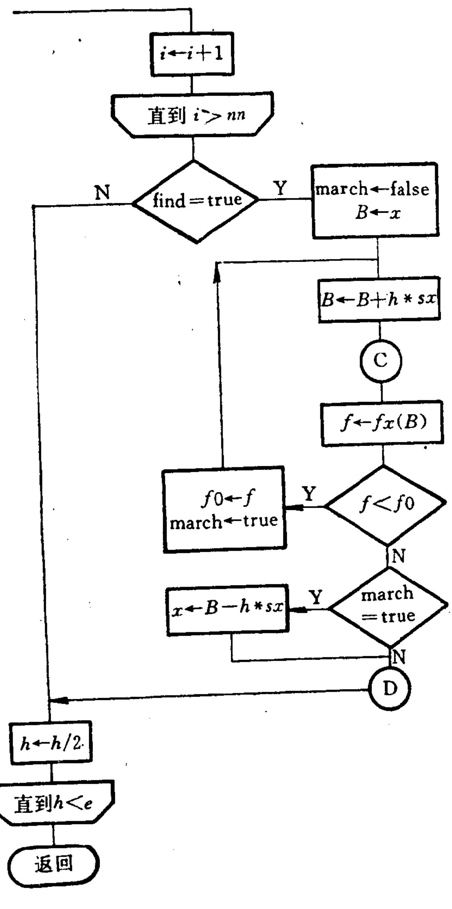

随机方向法

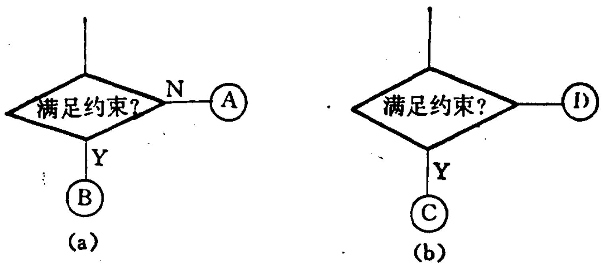

图5-6 约束条件检验

$$
\begin{array} { r } { \overrightarrow { X } = \left[ \begin{array} { c } { x _ { 1 } } \\ { \alpha _ { 2 } } \\ { \alpha _ { 3 } } \\ { \alpha _ { 4 } } \\ { \alpha _ { 5 } } \\ { \alpha _ { 8 } } \\ { - \alpha _ { 8 } } \end{array} \right] = \left[ \begin{array} { c } { h _ { 1 } } \\ { \beta _ { 1 } } \\ { s _ { 4 } } \\ { \alpha _ { 5 } } \\ { \alpha _ { 6 } } \\ { \theta _ { 2 0 } } \\ { \theta _ { 3 0 } } \end{array} \right] , } \end{array}
$$

2.确定目标函数。

按式5-8.5-9进行变换,得

$$
\mu _ { \alpha } = \frac { 2 - 0 } { ( \theta _ { 2 0 } + 1 ) - \theta _ { 2 0 } } = 2
$$

$$
\mu _ { y } = \frac { \cos { ( 2 ) } - \cos { ( 0 ) } } { \theta _ { 1 0 } - ( \theta _ { 1 0 } + 1 ) } = 1 - \cos { ( 0 \mathrm { s } ) }
$$

$$
\theta _ { 2 } { = } \theta _ { 2 0 } { + } { \infty } / \mu _ { e }
$$

理想函数

$$
q { = } \theta _ { 1 0 } { + } \frac { \cos ( x ) - 1 } { \mu _ { y } }
$$

再现函数

$$
Q = 2 \mathrm { t g } ^ { - 1 } \frac { ( A + \sqrt { \ A ^ { 2 } + B ^ { 2 } - { \cal O } ^ { 2 } } ) } { B - { \cal O } } - \theta _ { 1 0 }
$$

式中, $A , B , C$ 的含义同式3-21。

将 $0 \leqslant x \leqslant 2$ 区间分为 $m$ 等分,然后按式5-33建立目标函数

$$
F ( \overline { { X } } ) = \sum \limits _ { i = 1 } ^ { m } ( q _ { i } - Q _ { i } ) ^ { 2 }
$$

计算目标函数值的流程见图5-7,其中step在主程序中赋值为$( x _ { \mathrm { m a x } } - x _ { \mathrm { m i n } } ) / m _ { \circ }$ 执行该目标函数子程序,返回目标函数的值 $f x _ { 0 }$ 

图 $\pmb { 5 } - \pmb { 7 }$ 目标函数计算流程

3.确定约束条件表达式。

再现函数的计算,要求根式有意义。此外,作为正常运动的机构,还须有 $| h _ { 1 } | > 0 _ { \circ }$ 约束条件表达为

$$
A ^ { 2 } + B ^ { 2 } - C ^ { 2 } \geqslant 0
$$

$$
h _ { 1 } ^ { 2 } > 0
$$

该项设计仅含不等式约束,可采用直接处理方法。用程序5-1加上式5-35作为约束条件检验子程序;用图 $5 - 7$ 作为目标函数计算子程序。但是,这样的处理方法要重复计算 $m$ 个点上的 $A , B , \mathcal { O }$ 值。下列程序5-2将目标函数的计算与约束条件的检验合为一体。当 $h _ { 1 } = 0$ 或某个位置不满足式5-34时,constrain被赋值false,表示不满足约束,由非正常出口exit返回,此时的目标函数值无效。只有在所有的位置上都满足约束时,程序正常结束,返回有效的目标函数值。

程序5-2

type $\mathbf { x } \mathbf { x } = \mathbf { a r r a y } [ \mathbf { 1 } { \cdots } \mathbf { n } ] \ ( \mathbf { \Sigma }$ f real; 

function constrain (x:xx; var f:real) :booloan; 

vars, $\mathbf { x i }$ ,th1,th2,sth2,cth2,saf,caf,a1,a2,b1,b2,c1, ${ \mathrm { c 2 } } , { \mathrm { c 3 } } , { \mathrm { a } } , { \mathrm { b } } , { \mathrm { c } } \colon { \mathrm { r e a l } } ;$ 

begin if $\mathbf { x } [ 1 ] = \mathbf { 0 }$ then constrain: $$ false; exit; 

$$
\mathbf { x i } \colon = \mathbf { 0 } ; \thinspace \thinspace \mathbf { s } \colon = \mathbf { 0 } ;
$$

$$
{ \mathrm { c a f } } : = { \mathrm { c o s } } ( \mathbf { x } [ 4 ] ) ;
$$

$$
{ \mathfrak { s a f } } : = { \sin \left( \mathbf { x } \left[ 4 \right] \right) } ;
$$

b1: = x[1]\*h4; 

b2: =h2\*h4; 

$$
\mathbf { h 4 - s 3 * s 3 } / 2 - \mathbf { x } \left[ 9 \right] * \mathbf { x } \left[ 2 \right] * \mathrm { c a f } ;
$$

c2:=x[1]\*h2; 

$$
{ \mathfrak { C } } { \mathfrak { d } } : = - \mathbf { x } \left[ 3 \right] { \mathfrak { s h } } 2 { \mathfrak { s a f } } _ { \mathbf { j } }
$$

repeat $\mathbf { \Delta t h 2 : = x i / u x + x [ 5 ] ; }$ $\mathrm { { c t h 2 : = c o s ( t h 2 ) } ; }$ $\mathrm { { s t h 2 : = s i n ( t h 2 ) } ; }$ $\mathtt { a } \colon = \mathtt { a } 1 + \mathtt { a } 2 * \mathrm { s t h } 2 ;$ $\mathbf { b } \mathbf { : = b 1 + b 2 * c t i n 2 } ;$ ${ \mathfrak { c } } { : = } { \mathfrak { c } } \mathbf { 1 } { + } { \mathfrak { c } } \mathbf { 2 } { * } { \mathrm { c } } { \mathrm { t b } } \mathbf { 2 } { + } { \mathfrak { c } } { \mathfrak { s } } { \mathrm { t h } } { \mathfrak { L } } { \ } _ { \mathbf { i } }$ $\mathbf { t h 1 } \colon = \mathbf { a } * \mathbf { a } + \mathbf { b } * \mathbf { b } - \mathbf { 0 } * \mathbf { c } _ { \mathfrak { j } }$ if th1<0 then begin constrain: $\Longleftarrow$ false; exit end 

else begin $\begin{array} { r l } & { \operatorname { t h 1 : } = \operatorname { s q r t } ( \operatorname { t h 1 } ) ; } \\ & { \operatorname { t h 1 : } = 2 \arctan \left( ( \operatorname { a + t h 1 } ) / ( \operatorname { b - c } ) \right) , } \\ & { \operatorname { t h 1 : } = \operatorname { t h 1 - x } \left[ 6 \right] - ( \cos ( \operatorname { x i } ) - 1 ) / \mathsf { u y } ; } \end{array}$ s:=s+th1\*th1 end; $\mathbf { x i } \colon = \mathbf { \ x i } + \mathbf { s } \mathbf { t e p } ;$ until xi>2; constrain: $= \mathrm { \ t r u o } ;$ $\mathbf { f } : = \mathbf { \otimes } :$ 

end; 

在上述程序中,n为设计向量的维数,xi表示α,th1、th2分别表示 $\theta _ { 1 , \theta _ { 2 0 } }$ 入口参数为数组 $\pmb { x }$ ,其元素依次表示 $h _ { 1 } , \ s _ { 1 } , \ s _ { 4 } , \ \alpha _ { 1 } ,$ $\theta _ { 2 0 } , \theta _ { 1 0 } ,$ 。出口参数为目标函数值 $f$ ,constrain的取值代表约束条件的检验结果。该程序以函数形式出现,供寻优程序调用。h2、h4、S3的值在主程序中以常数给出。在寻优程序中,图5-6中棱形判别框内的内容变为 $\mathsf { c o n s t r a i n } = \mathsf { t r u e } _ { \mathsf { o } }$ 

取 $\mathbf { m } = 2 0 ;$ 初始点 $\mathbf { x } \left[ \mathbf { 1 } \right] = 0 . 8 , \ \mathbf { x } \left[ 2 \right] = 0 , \ \mathbf { x } \left[ \mathbf { 9 } \right] = 0 , \ \mathbf { x } \left[ 4 \right] = 0 ,$ $\mathbf { x } [ 5 ] = 1$ , $\mathbf { x } [ 6 ] = 2 ;$ 初始步长 ${ \bf { \dot { \mathrm { { a } } 0 } } } = 0 . 0 1 \mathrm { { \dot { \Omega } } }$ 计算精度 $\mathsf { \Omega } _ { \Theta } = 0 . 0 0 0 5 ,$ ,得最优解

$$
{ \begin{array} { r l } & { \mathbf { x } \left[ \mathbf { 1 } \right] = 7 . 6 8 9 9 4 8 2 { \widetilde { \mathbf { y } } } 1 1 \mathbf { E } - 0 1 } \\ & { \mathbf { x } \left[ \mathbf { 2 } \right] = - 2 . { \widetilde { \mathbf { g } } } { \widetilde { \mathbf { z } } } / 2 9 6 9 0 6 4 \mathbf { E } - 0 1 } \\ & { \mathbf { x } \left[ \mathbf { 3 } \right] = - 2 . 0 0 6 3 9 9 2 6 2 { \widetilde { \mathbf { z } } } \mathbf { E } - 0 1 } \\ & { \mathbf { x } \left[ \mathbf { 4 } \right] = - { \widetilde { \mathbf { b } } } . 9 9 6 { \widetilde { \mathbf { s } } } { \widetilde { \mathbf { z } } } / 9 5 1 4 0 \mathbf { E } - 0 1 } \\ & { \mathbf { x } \left[ { \widetilde { \mathbf { b } } } \right] = 8 . 9 6 8 9 6 4 1 7 { \widetilde { \mathbf { s } } } 8 9 { \widetilde { \mathbf { g } } } \mathbf { E } - 0 1 } \\ & { \mathbf { x } \left[ 6 \right] = \mathbf { 1 } . 4 3 8 8 1 7 0 8 0 9 \mathbf { E } + 0 0 } \end{array} }
$$

相应最优解的目标函数值为0.029185450452,它表示21个位置上理想函数与再现函数之差的平方和。

上述直接处理约束条件的优化方法,要求初始点位于可行域内,否则将不能正常运行。

对任何一种优化方法的基本要求是具有数值收敛性,即某种迭代程序产生的序列

$$
\{ X ^ { ( k ) } \quad ( k = 0 , 1 , 2 ^ { ( \omega ) } \}
$$

收敛于

$$
\operatorname* { l i m } _ { \kappa \to \infty } X ^ { ( k + 1 ) } = X ^ { ( k ) }
$$

点列

$$
\{ X ^ { ( k ) } ( k { = } 0 , 1 , 2 { \cdot } { \cdot } { \cdot } ) \}
$$

收敛的充要条件是:对于任意指定的实数 $g > 0$ ,都存在一个只与$\pmb { \ 8 }$ 有关而与 $X$ 无关的自然数 $N$ ,使得当两自然数 $m \ v { p } _ { \ v { p } } > N$ 时,满足

$$
| \bar { X } ^ { ( m ) } - \bar { X } ^ { ( 9 ) } | \leqslant 8
$$

在工程问题中,不可能也不必要进行无限次运算,只要能达到给定的精度就应终止运算,并认为已求得最优方案。但是,由于目标函数极小点的位置未知,在迭代过程中函数的性质各不相同,迭代点$X ^ { ( k ) }$ 向最优点 $X ^ { \star }$ 的趋近方式也不同,因此很难找到一个统一的、完善的终止准则。通常计算的终止准则采取如下几种:

1.当相邻两选代点之间的距离已充分小。若用向量模表示,则为

$$
| X ^ { ( k + 1 ) } - X ^ { ( k ) } | \leqslant \varepsilon _ { 1 }
$$

若用坐标分量之差表示,则为‘

$$
\vert x _ { i } ^ { ( k + 1 ) } - x _ { i } ^ { ( k ) } \vert \leqslant \varepsilon _ { 2 } \quad ( i = 1 , 2 \cdots n )
$$

2.当相邻两次迭代的函数值下降量已充分小。若用绝对量表示,则为

$$
| F ( X ^ { ( k + 1 ) } ) - F ( X ^ { ( k ) } ) | \leqslant \varepsilon _ { 3 }
$$

若用相对量表示,则为

$$
\frac { | F ( X ^ { ( k + 1 ) } ) - F ( X ^ { ( k ) } ) | } { | F ( X ^ { ( k ) } ) | } \leqslant \varepsilon _ { 4 }
$$

3.在某些计算梯度的寻优方法中,某次迭代的梯度已达到充分小。

上述若干准则中只要满足一个就被认为得到最优解,从而结束迭代计算过程。图5-5的流程就是按照相邻两次迭代点之间的距离充分小来结束计算的。对于不同的问题,所需的迭代精度与初始步长都不相同,应在试算过程中加以调整。

优化计算的结果还与所用的寻优迭代方法、初始点选取等因素有关。有兴趣的读者可采用其他优化方法,选取其他初始点进行同一项设计,以便进行对比。在实际应用中,还应将计算结果按需要进行圆整。

# 三、间接处理约束条件的优化方法

间接处理方法可用以求解不等式约束问题、等式约束问题或两者都存在的设计问题。其基本思路是将一个约束优化问题转化为无约束求极值的问题。间接处理方法有多种,其中应用最广泛的是惩罚函数法。有关优化的书籍对此都有详尽的叙述,这里仅以实用为目的,通过简单的例子对惩罚函数法中的外点法作简单说明。

惩罚丽数法的基本原理是根据约束条件构造出某种惩罚函数,然后把它加到原目标函数中,成为一个新的增广函数。新函数由两项组成,一项是原目标函数,另一项是罚函数。原来的有约束问题就变成了无约束的、以新函数为目标函数的寻优问题。在寻优过程中,如果不满足约束条件,则给予很大的目标函数以“惩

罚。

设有目标函数

$$
\pmb { F } ( \pmb { x } ) = 2 \pmb { x }
$$

等式约束

$$
\scriptstyle \lambda ( v ) = v - 1 = 0
$$

求最优解。

上述目标函数的图象为过原点的一条斜直线,如果没有约束,$\pmb { F } ( \pmb { x } )$ 的最小值不存在(或认为 $- \infty )$ 。满足等式约束的最优解为$\tt { \pmb { x } } = 1$ ,相应最优解的目标函数值为 $2 _ { 0 }$ 下面用外点罚函数法求解这一问题。

构造一个新的函数

$$
\begin{array} { c } { { \phi ( x , \ r ) = F ( x ) + r [ h ( x ) ] ^ { 2 } } } \\ { { { } } } \\ { { = 2 x + r ( x - 1 ) ^ { 2 } } } \\ { { { } } } \\ { { { } = r x ^ { 2 } + ( 2 - 2 r ^ { 2 } ) x + r } } \end{array}
$$

式中 $\pmb { \gamma }$ 称为罚因子。将 $\phi ( \mathfrak { v } , \ r )$ 对 $\pmb { x }$ 求导,并令其等于零,则得

$$
2 r x - 2 r + 2 = 0
$$

即

$$
{ \pmb x } = ( r - 1 ) / r
$$

表5-8 $\phi$ 的最优解

<table><tr><td rowspan=1 colspan=1>?</td><td rowspan=1 colspan=1>的最优解</td><td rowspan=1 colspan=1>（，）值</td></tr><tr><td rowspan=1 colspan=1>2</td><td rowspan=1 colspan=1>0.5</td><td rowspan=1 colspan=1>1.5</td></tr><tr><td rowspan=1 colspan=1>4</td><td rowspan=1 colspan=1>0.75</td><td rowspan=1 colspan=1>1.75</td></tr><tr><td rowspan=1 colspan=1>8</td><td rowspan=1 colspan=1>0.875</td><td rowspan=1 colspan=1>1.875</td></tr><tr><td rowspan=1 colspan=1>16</td><td rowspan=1 colspan=1>0.9375</td><td rowspan=1 colspan=1>1.9375</td></tr><tr><td rowspan=1 colspan=1>32</td><td rowspan=1 colspan=1>0.96875</td><td rowspan=1 colspan=1>1.96875</td></tr><tr><td rowspan=1 colspan=1>64</td><td rowspan=1 colspan=1>0.984375</td><td rowspan=1 colspan=1>1.984375</td></tr><tr><td rowspan=1 colspan=1>128</td><td rowspan=1 colspan=1>0.9921875</td><td rowspan=1 colspan=1>1.9921875</td></tr><tr><td rowspan=1 colspan=1>：</td><td rowspan=1 colspan=1>：</td><td rowspan=1 colspan=1>：</td></tr></table>

式5-42表示 $\phi ( \pmb { x } , \pmb { r } )$ 的最优解。取不同的 $\pmb { \eta }$ 值代入式5-41,按式5-42求得式5-41的极值如表 $5 - 6 =$ 

由表可知,随着罚因子 $\pmb { \eta }$ 的增大,新函数 $\phi ( x , \eta ^ { \ast } )$ 的最优解一步步逼近原问题的最优解。

外点法同样适合不等式约束的情况。设目标函数仍为式5-89,约束条件变为

$$
\scriptstyle g ( x ) = x - 1 \geq 0
$$

可构成如下新函数

$$
\overset { \cdot } { \phi } ( x , \ r ) = F ( \ b { v } ) + r \{ \operatorname* { m i n } \{ 0 , \ g ( \ b { v } ) \} \} ^ { a }
$$

式中,第二项表示首先从 $\{ 0 , g ( x ) \}$ 中选出较小者加以平方并乘罚因子 $\sigma _ { \circ }$ 当式5-43满足时,第二项的值为零。若式 $\sqrt { 5 } - 4 3$ 不满足,第二项的值为 $r [ g ( x ) ] ^ { 2 }$ ,起到惩罚作用。

采用外点去求解等式约束与不等式约束同时存在的问题称为外点形式的混合法,数学模型表示为

$$
\begin{array} { l } { { \phi ( X , \ \eta ^ { * ( k ) } ) = { \cal F } ( X ) + \eta ^ { * ( k ) } \Big \{ \displaystyle \sum _ { \mu = 1 } ^ { m } \{ \operatorname* { m i n } \left\{ 0 , \ g _ { \mu } ( X ) \right\} \} ^ { 2 } } } \\ { { + \displaystyle \sum _ { \nu = 1 } ^ { p } [ h _ { \nu } ( X ) ] ^ { 2 } \Big \} } } \end{array}
$$

$r ^ { ( k ) }$ 恒为正,且

$$
\begin{array} { c } { { r ^ { ( k + 1 ) } = c r ^ { ( k ) } } } \\ { { \ } } \\ { { \operatorname* { l i m } \ r ^ { ( k ) } = \infty } } \\ { { \kappa  \infty } } \end{array}
$$

式中, $\gamma ^ { ( k ) }$ 为第 $\Bbbk$ 次选代时的罚因子, $\pmb { \mathfrak { o } }$ 为罚因子的递增系数。第\*一个求和号表示对 $m$ 不不等式约束的处理,第二个求和号表示对$p$ 个等式约束的处理。

在外点法中,迭代终止准则除了前面提到的外,还可利用罚因子已充分大作为终止计算的条件。使用外点法时,初始罚因子 $\gamma ^ { ( 0 ) }$ 取得过小则收敛速度慢,选得过大则函数性态变得恶劣,影响寻优的顺利进行。在实际计算中,常需通过试算进行调整。

外点法的初始点 ${ \pmb { \mathscr { v } } } _ { 0 }$ 可以任选。迭代过程一般是在非可行域内进行的。例如上述等式约束 $h ( x ) = \omega - 1 = 0 .$ ,只有 $x = 1$ 时才进入可行域。因此,在工程应用中必须设置约束容差带,给予等式约束一定的允许偏差。

采用外点罚函数法要对原目标函数进行改造,以新的增广函数为目标函数进行寻优,并按一定的规律逐步增加罚因子的值。外点法的寻优过程可用图5-8的流程表示。从图中可以看出,每修改一次 $r ^ { ( k ) }$ 值就要进行一次无约束寻优。通过若干次无约束寻优,使增广函数的最优解逐步逼近原目标函数的最优解。

图b-8外点法寻优

例 $5 - 7$ :在图3-6的RSSR机构中,设杆2为主动件,以 $1 \%$ 的角速度匀速转动,其上作用的驱动力矩恒为 $\pm \mathbf { M } \cdot \mathbf { m }$ 。杆4为从动杆,转动惯量 $\scriptstyle { J _ { 4 } = 1 \log \cdot \mathbf { m ^ { 2 } } }$ ,其上作用有阻力矩,其余杆件的质量忽略。要求在 $\theta _ { 1 } = 2 . 2 ^ { \circ }$ 时输出力.矩 $Q _ { 1 } { = } 0 . 8 { \pm } 0 . 0 { \pm } \mathrm { N } { \cdot } \mathrm { m }$ 且压力角尽可能小,设计该机构。

解1.确定设计向量。

该设计仅涉及主、从动件的转动,可取 ${ \pmb { \mathscr { s } } } _ { 3 } = 1$ ,求其余杆件相对$\$ 3$ 的长度。设计向量定为

$$
\begin{array} { r } { \overrightarrow { X } = \left[ \begin{array} { c } { - \left| \begin{array} { c } { n _ { 1 } } \\ { \sigma _ { 2 } } \\ { s _ { 3 } } \\ { n _ { 4 } } \\ { \sigma _ { 5 } } \\ { s _ { 6 } } \\ { - \sigma _ { 8 } } \end{array} \right| = \left[ \begin{array} { c } { - h _ { 1 } } \\ { s _ { 2 } } \\ { h _ { 2 } } \\ { h _ { 4 } } \\ { s _ { 4 } } \\ { - \sigma _ { 8 } } \end{array} \right] } \end{array} \right] } \end{array}
$$

2.确定目标函数。

该设计仅给出输出力矩在一个位置上的数值,因此只有一个设计方程,有无穷解。但需要考虑如下要求:

(1) $\theta _ { \perp } = 2 . 2$ 时 $\pmb { \theta _ { 2 } }$ 应该有解。

(2) $\dot { \theta } _ { 1 }$ 由式3-42确定。

(3) $\ddot { \theta } _ { 1 }$ 由式3-44确定。

(4) $Q _ { 1 }$ 由式4-46确定且在 $\pmb { \theta _ { 1 } = 2 . 2 }$ 时, $Q _ { 1 } { = } 0 . 8 { \pm } 0 . 0 1 _ { \circ }$ 

(5)压力角尽可能小。

(6)作为一个正常运转的机构,要求 $h _ { 1 } , h _ { 2 } , h _ { 4 }$ 不为零且比起${ \pmb { \vartheta } } _ { \mathbf { 3 } }$ 不要太小,以免产生制造装配上的困难。

在一项设计中,通常选取有数值限制的要求作为约束条件,而选取无数值限制的要求作为目标函数。在上述要求中,可选压力角尽可能小为目标函数。

根据式5-32,压力角 $\pmb { \alpha }$ 的余弦

$$
\cos \alpha = | \pmb { k } _ { 8 } \cdot \pmb { j } _ { 4 } |
$$

注意到 $\pmb { \alpha }$ 越小 $\cos \alpha$ 越大,用 $\cos \alpha$ 表达的目标函数要运行在寻最小值的搜索程序中,应表示为

$$
{ \cal F } ( \overleftrightarrow { X } ) = - \cos \alpha = - \left| k _ { 8 } \cdot j _ { 4 } \right|
$$

式中

$$
\pmb { j } _ { 4 } = E ^ { ( k - a _ { 1 } ) } E ^ { k ( - \theta _ { 1 } ) } ( \pmb { j } _ { 1 } ) = \left[ \begin{array} { c } { \sin \theta _ { 1 } } \\ { \cos \alpha _ { 1 } \cos \theta _ { 1 } } \\ { - \sin \alpha _ { 1 } \cos \theta _ { 1 } } \end{array} \right]
$$

$$
k _ { 3 } = \left( r _ { C } - r _ { B } \right) / s _ { 3 }
$$

代入式5-16和5-17,得

$$
k _ { 3 } = [ \begin{array} { c c c c c c } { ( - h _ { 1 } - h _ { 4 } \cos \theta _ { \mathrm { 1 } } - h _ { 2 } \cos \theta _ { \mathrm { 2 } } ) / \mathfrak { s } _ { 3 } } & { - } & { | - k _ { a } | } & { | k _ { a } | } & { | k _ { b } | } & { | k _ { b } | } & { | k _ { b } | } \\ { ( \mathfrak { s } _ { 4 } \sin \alpha _ { \mathrm { 1 } } + h _ { 4 } \cos \alpha _ { \mathrm { 1 } } \sin \theta _ { \mathrm { 1 } } - h _ { 2 } \sin \theta _ { \mathrm { 2 } } ) / \mathfrak { s } _ { 3 } } & { | = | \begin{array} { c c c c c c } { | k _ { b } | } & { - } & { k _ { a } \sin \theta _ { \mathrm { 1 } } - h _ { 2 } \sin \theta _ { \mathrm { 2 } } } & { | } & { | k _ { b } | } & { | k _ { b } | } \\ { k _ { b } } & { - } & { | | \alpha _ { \mathrm { 1 } } \cos \alpha _ { \mathrm { 1 } } - h _ { 4 } \sin \alpha _ { \mathrm { 1 } } \sin \theta _ { \mathrm { 1 } } - \mathfrak { s } _ { 1 } | / \mathfrak { s } _ { 3 } } & { | \alpha _ { \mathrm { 2 } } | } & { | k _ { b } | } \end{array} ] } \end{array} ] .
$$

$$
\boldsymbol { F } ( \boldsymbol { X } ) = - \mid \boldsymbol { k } _ { \alpha } \mathrm { s i n } \theta _ { 1 } + \boldsymbol { k } _ { y } \mathrm { c o s } \alpha _ { \mathrm { i } } \mathrm { c o s } \theta _ { 1 } - \boldsymbol { k } _ { z } \mathrm { s i n } \alpha _ { \mathrm { i } } \mathrm { c o s } \theta _ { 1 } \mid
$$

3.确定约束条件。

(1)对应前述第(1)条要求的约束条件。

展开式3-21,按 $\sin \theta _ { 2 } , \cos \theta _ { 2 }$ 合并各项,得方程

$$
\ A \sin \theta _ { 2 } + B \cos \theta _ { 2 } + C = 0
$$

式中

$$
A = - h _ { 2 } h _ { 4 } \cos \alpha _ { 1 } \sin \theta _ { \mathrm { i } } - s _ { 4 } h _ { 2 } \sin \alpha _ { 1 }
$$

$$
\begin{array} { r } { C = ( s ^ { 2 } + h _ { 1 } ^ { 2 } + s _ { 1 } ^ { 2 } + h _ { 2 } ^ { 2 } + h _ { 4 } ^ { 2 } - s _ { 3 } ^ { 2 } ) / 2 - s _ { 4 } s _ { 1 } \cos \alpha _ { \mathrm { 1 } } } \\ { + s _ { 1 } h _ { 4 } \sin \alpha _ { \mathrm { 1 } } \sin \theta _ { \mathrm { 1 } } + h _ { \mathrm { 1 } } h _ { 4 } \cos \theta _ { \mathrm { 1 } } \quad } \end{array}
$$

要 $\theta _ { 2 }$ 有解,须满足不等式约束

$$
g _ { 1 } ( X ) = A ^ { 2 } + B ^ { 2 } - C ^ { 2 } \geq 0
$$

(2)对应第(2)、(3)、(4)条要求的约束条件。

在式4--46中

$$
m _ { 3 } ^ { 2 } = 0 \qquad Q _ { 1 } = \frac { Q _ { 2 } \dot { \theta } _ { 2 } + J _ { 4 } \ddot { \theta } _ { 1 } \dot { \theta } _ { 1 } } { \dot { \theta } _ { 1 } }
$$

式中, $\dot { \theta } _ { 1 , } \ddot { \theta } _ { 1 }$ 由式8-42和3-44计算。这是一个等式约束

$$
h \left( { X } \right) = ( { Q _ { \mathit { i } } } { \dot { \theta } _ { \mathit { i } } } + { J _ { 4 } } { \ddot { \theta } _ { \mathrm { i } } } { \dot { \theta } _ { \mathrm { i } } } ) / { \dot { \theta } _ { \mathrm { i } } } - 0 . 8 = 0
$$

(3)对应第(6)条要求的约束条件。

这是对设计变量的边界约束,可写为

$$
\left. \begin{array} { c } { { g _ { 2 } ( X ) = h _ { 1 } - h _ { \mathrm { 1 m i n } } \geqslant 0 } } \\ { { g _ { 3 } ( X ) = h _ { 2 } - h _ { \mathrm { 2 m i n } } \geqslant 0 } } \\ { { g _ { 4 } ( X ) = h _ { 4 } - h _ { \mathrm { 4 m i n } } \geqslant 0 } } \end{array} \right\}
$$

式中, $h _ { 1 \mathrm { ~ m i n } , } h _ { 2 \mathrm { ~ m i n } , } h _ { 4 \mathrm { ~ m i n } }$ 分别是 $h _ { 1 } , h _ { 2 } , h _ { 4 }$ 长度的下限,按实际需要取定。

4.建立增广函数。

根据上述分析,可建立增广函数

$$
\begin{array} { c } { { \phi ( x , \ r ) = { \displaystyle F ( X ) + r ^ { { ( k ) } } \Big \{ \sum _ { \mu = 1 } ^ { 4 } \{ \operatorname * { m i n } \{ 0 , \ g _ { \mu } ( X ) \} \} ^ { 2 } + } } } \\  { { [ h _ { 1 } ( X ) ] ^ { 2 } \Big \} } } \end{array}
$$

但是,直接按式5-51进行寻优时,对某些初始点不能得到正确的设计,这是由于最优点在 $g _ { 1 } ( X )$ 边界附近的不可行域内。仔细分析上述约束条件可知, $g _ { 2 } ( X ) _ { \bullet } g _ { 3 } ( X ) _ { \bullet } g _ { 4 } ( X )$ 是对设计变量的边界约束,最优点落在约束边界附近不可行域一侧也没有多大关系,仅杆长稍短而已。 $h _ { 1 } ( X )$ 是对输出力矩的限制,最优解落在边界附近不可行域一侧只要不超过允差带土0.01,仍是可以接受的设计。而不满足 $g _ { 1 } ( X )$ 则意味着机构不存在,这是绝对不能允许的。因此,应将 $g _ { 1 } \langle X \rangle$ 改为

$$
g _ { 1 } ( \widetilde { X } ) = \left\{ \begin{array} { l l l } { 0 } & { \stackrel { \mathrm { \scriptscriptstyle ~ 3 } \mathtt { U } } { = } } & { A ^ { 2 } + B ^ { 2 } - C ^ { 2 } \geqslant 0 } \\ { + \infty } & { \stackrel { \mathrm { \scriptscriptstyle ~ 3 } \mathtt { U } } { = } } & { A ^ { 2 } + B ^ { 2 } - C ^ { 2 } < 0 } \end{array} \right.
$$

而式 $5 - 5 1$ 改为

$$
\phi ( \overline { { { X } } } , \ r ) = \left\{ \begin{array} { l } { { { \displaystyle { F ( X ) + r ^ { ( k ) } } \sum _ { \mu = 2 } ^ { 4 } \left\{ \operatorname* { m i n } \left\{ 0 , \ g _ { \mu } ( X ) \right\} } ^ { 2 } } }  \\ { { { } } } \\ { { { + \left[ h _ { 1 } ( X ) \right] ^ { 2 } \right\} } } } \\ { { { + \infty } } } \\ { { { \stackrel { \mathrm { a p } } { = } } 1 } } \end{array} \right. \ \stackrel { \mathrm { a v } } { = } { } { } \ \stackrel { A ^ { 2 } + B ^ { 2 } - C ^ { 2 } \geqslant 0 }
$$

式5-53已超出了常规的优化设计方法,但对空间闭链机构的设计来说是必须的。它相当于在 $A ^ { 2 } + B ^ { 2 } - C ^ { 2 } = 0$ 的边界处筑起一道送代点不可逾越的高墙。

许多无约束寻优方法不能处理类似式5-53的式子,但对于前面介绍的随机方向法来讲却是不成问题的。使用式5-53需要一个满足 $g _ { 1 } ( X ) \geqslant 0$ 的初始点,否则将无法正常运算。但只要初始点是满足条件的,迭代过程将永远不会超越上述高墙。

# 5.编程计算。

目标函数值的计算程序如下:

# 程序5-3

function fx(x:xx; r:real):real;   
var s,caf,saf,sth2,cth2, sth1,cth1,a, b,c,d:real;   
begin   
1 ${ \mathfrak { s } } { : = } 0 { : }$   
2 $\mathbf { \mathrm { \varepsilon } } \mathrm { { a f } } : = \sin ( \mathbf { x } \left[ 6 \right] ) ;$   
3 $\mathbf { c a f : } = \mathbf { c o s } ( \mathbf { x } \left[ { \bf 6 } \right] ) _ { \mathbf { i } } $   
4 $\mathbf { s t h 1 : } = \sin ( \mathbf { t h 1 } ) ;$   
5 $\mathbf { c t h 1 : } = \cos ( \mathbf { t h 1 } ) ;$   
7 6 $\begin{array} { r l } & { \mathrm { a } ; \qquad \mathrm { ~ \exists ~ \ast ( \mathbf { x } [ \hat { \mathbf { 9 } } ] \ast ( \mathbf { x } [ \hat { \mathbf { 9 } } ] \ast \mathbf { s } a \hat { \mathbf { f } } + \mathbf { x } [ \mathbf { 4 } ] \ast \mathbf { c } a \mathbf { f } \ast \mathbf { s } \mathbf { i } \mathbf { h } ] ) } ; } \\ & { \mathrm { b } ; \qquad \mathrm { ~ \exists ~ \ast ~ ( \mathbf { \hat { s } } [ \mathbf { 9 } ] \ast ( \mathbf { x } [ \mathbf { 1 } ] + \mathbf { x } [ \mathbf { 4 } ] \ast \mathbf { c } \mathbf { t } \mathbf { h } \mathbf { 1 } ) } ; } \\ & { \mathrm { ~ \mathbf { c } : = ( \mathbf { x } [ \mathbf { 1 } ] \ast \mathbf { x } [ \mathbf { 1 } ] + \mathbf { x } [ \mathbf { 2 } ] \ast \mathbf { x } [ \mathbf { 2 } ] + \mathbf { x } [ \mathbf { 9 } ] \ast \mathbf { x } [ \mathbf { 3 } ] \dots [ \mathbf { 4 } ] \ast \mathbf { x } [ \mathbf { 4 } ] ) \qquad } } \\ & { \qquad \mathrm { ~ \qquad + \mathbf { x } [ \mathbf { 5 } ] \ast \mathbf { x } [ \mathbf { 5 } ] - \mathbf { 1 } ) / 2 - \mathbf { x } [ \mathbf { \tilde { 8 } } ] \ast \mathbf { z } [ \mathbf { 2 } ] \ast \mathbf { c } \mathbf { a } \mathbf { f } \cdot \mathbf { \tilde { r } } \mathbf { \{ 4 } } \mathbf { \tilde { s } } [ \mathbf { 4 } ] \ast ( \mathbf { x } [ \mathbf { 1 } ] }  \\ & { \qquad \mathrm { ~ \qquad ~ \ \ } \ast \mathrm { c t h 1 + \mathbf { x } [ \mathbf { 2 } ] \ast \mathbf { s } \mathbf { a } \mathbf { f } \ast \mathbf { s } \mathbf { t } \mathbf { h } \mathbf { 1 } ) } ; } \\ & { \qquad \mathrm { ~ \qquad ~ \ \ } \mathrm { ~ \ } \mathrm { ~ a } . \qquad \mathbf { \tilde { \mathbf { \Omega } } \times \mathbf { \Omega } } , } \end{array}$   
8   
9 $\mathtt { t h 2 } \colon = \mathtt { a } * \mathtt { a } + \mathtt { b } * \mathtt { b } - \mathtt { c } * \mathtt { c } _ { \mathrm { j } }$   
10 if th $2 < 9$ then begin   
11 $\mathbf { f x } : = \mathbf { 1 } \ \mathbf { E } \ 3 7 ;$   
12 exit end   
13 else begin   
14 $\mathbf { t h 2 : = s q r t { \pmod { \left( \mathbf { t h 2 } \right) } } }$   
15 $\mathbf { t h } 2 \div = 2 * \arctan { ( ( \mathbf { a } - \mathbf { b } 2 ) / ( \mathbf { b } - \mathbf { c } ) ) } ;$   
16 $\mathrm { { s t h 2 } : = \sin ( \ t h 2 ) }$   
17 $\mathbf { c t h 2 : } = \mathbf { c o s ( t h 2 ) }$ ;   
18 $\begin{array} { r l } & { \mathrm { i f ~ } { \mathbf { x } } \left[ \mathbf { 1 } \right] { < } { \mathbf { h } } _ { \mathrm { m i n ~ t h e n ~ } } { \mathbf { s } } \mathrm { : = } \left( { \mathbf { h } } _ { \mathrm { m i n } } - { \mathbf { x } } \left[ \mathbf { \frac { \rho _ { \mathbf { k } } } { \mathbf { s } } } \right] \right) , } \\ & { \mathrm { i f ~ } { \mathbf { x } } \left[ \mathbf { 3 } \right] { < } { \mathbf { h } } _ { \mathrm { m i n ~ t h e n ~ } } { \mathbf { s } } \mathrm { : = } { \mathbf { s } } { + } \left( { \mathbf { h } } _ { \mathrm { m i n } } - { \mathbf { \bar { x } } } \left[ \mathbf { 3 } \right] \right) ; } \end{array}$   
19   
20 i ${ \textrm { f x } } [ 4 ] < \mathrm { { h } } _ { \mathrm { { m i n } } } { \mathrm { ~ t h e n } } { \mathrm { ~ s } } ; = 8 + ( \mathrm { { h } } _ { \mathrm { { m i n } } } - \mathrm { { x } } [ 4 ] )$ ;   
21 $\mathrm { d } { \mathrel { : } } = \mathrm { a } { \ast } \mathrm { c t h } 1 - \mathrm { b } { \ast } \mathrm { s t h } 1 ;$   
22 $\mathtt { t t h 1 : \mathtt { = x } [ 9 ] * ( ( x [ 4 ] * c a f * s t h 1 + x [ 5 ] * s a f ) * c t h 2 + ( x [ 4 ] \_ s a f ) * }$   
$* { \mathrm { c t h 1 . + x [ 1 ] } } ) * { \mathrm { s t h 2 } } ) / \mathrm { d } * { \mathrm { t t h 2 } } ;$   
23 $\mathbf { a } ; = - \mathbf { x } [ \mathbf { 3 } ] * ( \mathbf { x } [ \mathbf { 4 } ] * ( \mathbf { c a f * 5 t h 1 * 5 t h 2 - c t h 1 * c t h 2 } ) - \mathbf { x } [ \mathbf { 1 } ]$   
\*cth2+x[5]\*saf\*sth2);   
24 b: =2\*x[3]\*x[4]\*(caf\*cth1\*cth2-sth1\*sth2);   
25 c:= x[4]\*(sth1\*(x[2]\*saf-x[3]\*caf\*sth2)+cth1\*(x[   
$+ \mathbf { x } [ \mathbf { 3 } ] * \mathbf { c } ( \mathbf { b } \mathbf { 2 } ) ) ;$   
26 a:= (a\*tth2\*tth2+b\*tth2\*tth1+c\*tth1\*th1)/d;   
27 a:=(q2\*tth2+j4\*a\*tth1)/tth1;   
28 a:=a-q1;   
29 S:=s+a\*a;   
30 s: =r\*s;   
81 a: = - x[1]-x[4]\*cth1-x[8]\*cth2;   
92 b: = x[5]\*saf+x[4]\*caf\*sth1-x[8]\*sth2;   
93 C: = x[5]\*caf-x[4]\*saf\*sth1-x[2];   
34 d:=a\*a+b\*b+c\*c;   
35 d: =sqrt(d);   
36 a:=a/d;   
37 ${ \bf b } \colon = { \bf b } / { \bf d } ;$   
38 $c : = c / d ;$   
39 a:=a\*sth1-+ b\*cth1\*caf-c\*saf\*cth1;   
40 8:=-abs(a)   
41 end;   
42 $\mathbf { f } \mathbf { x } : = \mathbf { \boldsymbol { \mathsf { s } } } _ { \mathbf { \boldsymbol { \mathsf { i } } } }$   
.43 end; 

程序5-3中,数组 $\pmb { \ x }$ 表示设计向量,其元素依次表示 $h _ { 1 } , s _ { 1 } ,$ $h _ { 2 } , h _ { 4 } , s _ { 4 } , \alpha _ { 1 0 }$ 变量th1、th2分别表示 $\smash { \theta _ { 1 _ { 3 } } \theta _ { 2 _ { 0 } } \ \mathrm { ~ q ~ } _ { 1 _ { 3 } } \mathrm { ~ q ~ } _ { 3 } }$ 分别表示力矩 $Q _ { 1 } , Q _ { 2 } \circ \mathrm { ~ h _ { m i n } ~ }$ 表示杆长最小限制值。th1表示 $\dot { \theta } _ { 1 }$ 。

第1句给累加器 $\pmb { \ 8 }$ 清零。6至9句计算式5-48左边的值,若式5-48不满足,增广目标函数的值在11句被赋于机器数的最大值,在12句非正常返回。若式5-48 满足,则运行13句以下的内容并正常结束返回。14、15句是计算 $\pmb { \theta _ { 2 } }$ 的值,18句处理$g _ { 2 } ( X )$ ,19句处理 $g _ { 3 } ( X )$ ,20句处理 $g _ { 4 } ( \pmb { \Sigma } )$ 。21、22句按式3-42计算 $\dot { \theta } _ { 1 }$ 的值,23到26旬按式9-44计算 $\ddot { \theta } _ { 1 }$ 的值,27句按式4-46计算力矩 $Q _ { 1 }$ 的值。28句求 $Q _ { 1 }$ 与理想值q1之差,得 $h _ { 1 } ( X )$ 的值。29句对等式约束 $h _ { 1 } ( X )$ 进行处理。30句实现罚因子 $\pmb { \eta } ^ { \bullet }$ 与惩罚项相乘。31至40句对目标函数进行处理,其中31至33句计算 $k _ { 3 }$ 各分量的分子, $\mathbf { 3 4 }$ 至38句将 $k _ { 3 }$ 变为单位矢量,39句计算 $k _ { 3 , j _ { 4 } }$ 的值。41句与13句呼应,表示正常处理完毕。增广函数在42句被赋予累加器s的值。程序在43句正常返回。

外点法迭代寻优的主程序如下:

程序5-4

const 1 $\mathbf { n } = \mathbf { 6 } ;$ 2 $\mathrm { n n } = 5 0 ;$ 3 $\Theta = 1 . \mathbf { E } - 0 4 ;$ 4 $\mathrm { \mathbf { h 0 } } { = } 1 \mathrm { \mathbf { E } } - \mathbf { 0 } \mathfrak { s } ,$ 5 $\mathrm { i n c r e a s } = \mathbf { 1 0 } ;$ 6 ${ \mathfrak { q } } 2 = { \mathfrak { l } } _ { \mathfrak { j } }$ 7 $\mathbf { t t h 2 } = \mathbf { 1 } ,$ 8 $\mathbf { t t h 1 } { = } 2 . 2 ;$ 9 ${ \bf j } { \bf 4 } = { \bf 1 } ;$ 10 ${ \bf q 1 } = { \bf 0 . 8 } ;$ 11 $\mathbf { h } _ { \operatorname* { m i n } } = 0 . 1 ;$ type xx = array $[ 1 \cdots \ n ]$ of real; var w1,w2,f0,f00,r,th2,tth1:real; i, j:integer; ${ \bf x } 0 0 , \ { \bf x } 0 , \ { \bf a } , \ { \bf b } : { \bf x } { \bf x } ;$ begin 12 $\begin{array} { r l } & { \mathbf { x } 0 [ \mathbf { 1 } ] : = \mathbf { 1 } _ { \mathfrak { s } } } \\ & { \mathbf { x } 0 [ 2 ] : = 0 _ { \mathfrak { s } } } \\ & { \mathbf { x } 0 [ \mathfrak { s } ] : = 0 . 2 ; } \\ & { \mathbf { x } 0 [ \mathbf { 4 } ] : = 0 . 2 ; } \end{array}$ 19 14 15 

16 $\mathbf { x 0 } [ 5 ] : = 0 ;$   
17 ${ \bf x 0 } [ 6 ] : = 0 . 2 ;$   
18 for i: =1 to $\mathbf { n }$ do x00[i]:=x0[i];   
19 $\mathbf { r } \mathbf  \mathbf  \mathbf  \mathbf  \mathbf  \mathbf  \mathbf  \mathbf { \mathbf }  \mathbf { \mathbf }  \mathbf \mathbf  \mathbf { \mathbf } \mathbf  \mathbf  \mathbf \mathbf { \mathbf } \mathbf  \mathbf \mathbf { \mathbf } \mathbf  \mathbf \mathbf  \mathbf \mathbf { \mathbf } \mathbf  \mathbf \mathbf  \mathbf \mathbf { \mathbf } \mathbf  \mathbf \mathbf \mathbf  \mathbf \mathbf { \mathbf } \mathbf \mathbf  \mathbf \mathbf { \mathbf \mathbf } \mathbf  \mathbf \mathbf \mathbf  \mathbf \mathbf { \mathbf \mathbf } \mathbf  \mathbf \mathbf \mathbf { \mathbf \mathbf } \mathbf  \mathbf \mathbf \mathbf  \mathbf \mathbf \mathbf { \mathbf \mathbf } \mathbf  \mathbf \mathbf \mathbf  \mathbf \mathbf \mathbf { \mathbf \mathbf } \mathbf \mathbf  \mathbf \mathbf \mathbf { \mathbf \mathbf \mathbf } \mathbf  \mathbf \mathbf \mathbf { \mathbf \mathbf \mathbf \mathbf { \mathbf \mathbf } \mathbf \mathbf { \mathbf \mathbf \mathbf \mathbf { \mathbf \mathbf \mathbf } \mathbf { \mathbf \mathbf \mathbf \mathbf { \mathbf \mathbf \mathbf \mathbf { \mathbf \mathbf \mathbf } \mathbf \mathbf { \mathbf \mathbf \mathbf \mathbf { \mathbf \mathbf \mathbf \mathbf } \mathbf { \mathbf \mathbf \mathbf \mathbf \mathbf { \mathbf \mathbf \mathbf \mathbf \mathbf { \mathbf \mathbf \mathbf } \mathbf \mathbf { \mathbf \mathbf \mathbf \mathbf \mathbf { \mathbf \mathbf \mathbf \mathbf \mathbf \mathbf { \mathbf \mathbf \mathbf \mathbf } \mathbf { \mathbf \mathbf \mathbf \mathbf \mathbf \mathbf { \mathbf \mathbf \mathbf \mathbf \mathbf \mathbf { \mathbf \mathbf \mathbf \mathbf } \mathbf \mathbf { \mathbf \mathbf \mathbf \mathbf \mathbf \mathbf \mathbf { \mathbf \mathbf \mathbf \mathbf \mathbf \mathbf \mathbf { \mathbf \mathbf \mathbf \mathbf \mathbf \mathbf \mathbf ~ \mathbf \mathbf \mathbf \mathbf \mathbf \mathbf \mathbf { \mathbf \mathbf \mathbf \mathbf \mathbf \mathbf \mathbf \mathbf \mathbf { \mathbf \mathbf \mathbf \mathbf \mathbf \mathbf \mathbf \mathbf ~ \mathbf \mathbf \mathbf \mathbf \mathbf \mathbf \mathbf \mathbf \mathbf \mathbf { \mathbf \mathbf \mathbf \mathbf \mathbf \mathbf \mathbf \mathbf \mathbf ~ \mathbf \mathbf \mathbf \mathbf \mathbf \mathbf \mathbf \mathbf \mathbf \mathbf \mathbf { \mathbf \mathbf \mathbf \mathbf \mathbf \mathbf \mathbf \mathbf \mathbf ~ \mathbf \mathbf \mathbf \mathbf \mathbf \mathbf \mathbf \mathbf \mathbf \mathbf \mathbf ~ \mathbf \mathbf \mathbf \mathbf \mathbf \mathbf \mathbf \mathbf \mathbf \mathbf \mathbf \mathbf \mathbf ~ \mathbf \mathbf \mathbf \mathbf \mathbf \mathbf \mathbf \mathbf \mathbf \mathbf \mathbf \mathbf \mathbf \mathbf \mathbf \mathbf \mathbf \Xi } } } } } } } } } } } } } } } } } }$   
20 $\mathbf { r } { \mathrm { : = a b s ( 1 / r ) } } _ { \mathrm { : } }$   
21 $\mathbf { f 0 } { \mathbf { : = } } \mathbf { f x } ( \mathbf { x 0 } , \mathbf { r } ) ;$   
22 $\mathbf { f 0 0 } : = \mathbf { f 0 } ;$   
23 ${ \bf j } \colon = 0 ;$   
24 $\mathbf { r e p e a t } \mathbf { j } \mathbf { : } = \mathbf { j } + \mathbf { l } \mathbf { : }$   
25 $\mathbf { f } 0 { \mathbf { : } } = \mathbf { f } _ { \mathbf { X } } ( \mathbf { x } \mathbf { 0 } , { \mathbf { r } } ) { \mathbf { ; } }$   
26 $\mathrm { s e e l c i n g ~ ( n , ~ n n , ~ x 0 , ~ x , ~ e , ~ h 0 , ~ r , ~ f 0 ) } _ { \mathbf { i } }$   
27 write(n('##',j);   
28 $\mathbf { w } 2 : = \mathbf { 0 } _ { \mathsf { i } }$   
29 for $i : 1$ t0 $\mathbf { n }$ do begin   
30 $\mathbf { w 1 : } = \mathbf { x 0 } [ \mathrm { i } ] - \mathbf { x } [ \mathrm { i } ] ,$   
91 $\mathbf { w } 2 \colon = \mathbf { w } 2 \colon \mathbf { w } 1 \ast \mathbf { w } 1 \ \mathsf { e n d } ;$   
32 if $\bf ( w 2 = 0 )$ or $\mathrm { ( r { > } 1 E 3 0 ) }$ then begin   
33 for $\mathrm { i } : \pm 1$ t0 $\mathbf { n }$ do writeln $( { \bf x 0 0 [ i ] , x [ i ] } )$ ;   
34 writeln (f00,f0);   
35 exit end   
36 else begin   
37 fc ${ \mathrm { ~ r ~ i ~ : = 1 ~ t o ~ n ~ d o ~ x 0 [ i ] : = x [ i ] ; } }$   
38 r:= increas\*r end   
39 until ${ \bf 1 } = { \bf 2 }$   
40 end。 

在主程序中,1至5句规定寻优常数, $\mathbf { n }$ 表示设计矢量的维数,$\mathbf { n n }$ 表示每一次无约束寻优迭代时对应某一步长的随机方向数目,e,hO为无约束寻优的计算精度和初始步长,increa\~麦示罚因子递增系数。6至11句规定设计常数,其中 ${ \bf q 2 }$ 表示驱动力矩 $Q _ { 2 } ,$ tth2表示 $\dot { \theta } _ { 2 }$ , ${ \mathfrak { q } } 1$ 表示期望的输出力矩 $Q _ { 1 }$ ,th1表示对应 $Q _ { 1 }$ 的角位移 $\pmb { \theta _ { 1 } }$ ,j4表示构件4的转动惯量, $h _ { \mathrm { m i n } }$ 表示杆长最小值相对 $\$ 3$ 的长度比。12至17句给初始点赋值。19、20句确定初始罚子$\gamma ^ { ( 0 ) }$ 的值,由初始点的取值可知,目标函数 ${ \pmb { F } } ( { \pmb X } )$ 的绝对值近似 ${ \tt 1 _ { \tt O } }$ 第19句以 $\gamma = 1$ 调用函数 $\mathbf { f x }$ 得惩罚项的近似值,第20句以目标函数比惩罚项的相对值作为 $\eta ^ { \mathbf { - } ( 0 ) }$ ,使增广函数前后两项的绝对值大体相当,具有较好的计算性能。21到38句是外点法寻优逼近过程。j为无约束寻优次数,seeking为无约束寻优过程,按图5-5编制。27句输出j的值以便观察。28至31句计算相邻两次迭代的移动量,32句完成图5-8中两个判断转移框的功能,当符合终止条件时通过37句把最优点赋给下一次寻优的初始点,通过38句使罚因子的值递增increas倍。39是永假条件句,以保证24至39的反复执行直到满足终止条件从唯一的出口35返回。

上述程序在运行到 ${ \bf j } = 2 9$ 时满足条件 ${ \bf w } { \bf 2 } = { \bf 0 }$ ,即 $| \mathbf { x 0 - x } | = 0 \cdot$ 表示在第23次无约束寻优中找不到使增广函数的值继续下降的点(此时 $\mathbf { r }$ 的值已大于 $1 0 ^ { 2 2 }$ )。输出最优解为

$\mathbf { x } [ 1 ] = 9 . 9 0 7 5 7 1 9 7 0 0 \mathrm { E } - 0 1$ $\mathbf { z } \left[ 2 \right] = 2$ .4931298324E-03 $\mathbf { x } [ 9 ] = 2 . 0 7 9 2 8 4 6 7 1 1 \mathrm { E } - 0 1$ $\mathbf { x } [ 4 ] = 1 . 9 6 8 3 6 9 7 5 8 1 \mathrm { E } - 0 1$ $\mathbf { x } [ 5 ] = 1 . 7 8 4 5 9 8 2 2 5 \mathrm { { E } - 0 3 }$ $\mathbf { x } [ 6 ] = 1 . 9 9 7 7 7 8 8 9 4 3 \mathrm { E } - 0 1$ 

如果在主程序中增加变量 $A , \nu ,$ 把 $\mathbf { f x }$ 的说明改为 $\mathbf { f } \mathbf { x } ( \mathbf { x } : \mathbf { x } \mathbf { x } ;$ r:real; var $\mu$ ,v:real):real;把 seeking 的说明改为 seeking $( \mathbf { n } ,$ nn:integer; $\bf { x 0 }$ ,x:xx;e,hO,r:real; var fO,μ,v:real);在程序5-3的27、28句之间插入

$$
{ \bf \nabla } \mu : = { \bf \nabla } { \bf { a } } ;
$$

99.40句之间插入

$$
{ \pmb { \nu } } : = { \bf { a } } _ { \dagger }
$$

可输出相应最优解的输出力矩为8.0018214856E-01,压力角为arc cos(9.6407982196E-01) $\Longleftarrow$ 15.4°

在工程实际中,可以按需将上述最优解圆整。如上述设计以公斤、米、秒为基本单位,按照普通量具的精度可取到小数后第五位,把上述结果修约为

$$
\begin{array} { r l } & { \mathbf { x } \left[ 1 \right] = 0 . 9 9 } \\ & { \mathbf { x } \left[ 2 \right] = 0 . 0 0 2 5 } \\ & { \mathbf { x } \left[ 3 \right] = 0 . 2 0 8 } \\ & { \mathbf { x } \left[ 4 \right] = 0 . 1 9 7 } \\ & { \mathbf { x } \left[ 5 \right] = 0 . 0 0 1 8 } \\ & { \mathbf { x } \left[ 6 \right] = 0 . 2 } \end{array}
$$

此时的输出力矩为 $\textnormal { 7 } . 9 6 0 4 7 0 0 3 4 3 \mathrm { E } - 0 1$ ,与期望值之差的绝对值小于0.004,满足约束允差值。压力角为 $1 6 ^ { \circ }$ 

# 第六章 空间闭链机构的设计应用

在第五章中,着重叙述了空间闭链机构设计的基本方法。本章则利用这些基本方法,设计一些具体的机构。在实际设计工作中,设计要求是多种多样的,不可能在此都列举,而只能以一些典型机构为例,加以分析。

# 6-1 按主、从动件摆角要求设计空间闭链机构

实现摆动是空间闭链机构的一种主要用途。大至飞机、汽车,小至打字机、仪表,都有此类设计要求,而且常用单自由度的闭链机构来实现。在传动距离较大、安装空间受限制时,也采用多闭链机构,例如某些机械式打字机。有些设计对摆动规律有严格的限制,诸如例5-1中要求主、从动件的位移满足给定函数关系。而另一些设计则只要求实现对应的摆动范围。下面将分别阐述这些问题。

# 一、单闭链机构

例6-1:用RSSR机构实现预定的摆动,要求摆动规律如表6-1,误差不超过0.05。求机构各杆尺寸。

表6-1 摆动规律

<table><tr><td rowspan="2">位置</td><td colspan="2">位移（rad）</td><td colspan="2">速度（rad/s)</td><td colspan="2">加速度（rad/s2）</td></tr><tr><td>0</td><td>0</td><td></td><td>旺</td><td>8</td><td>旺</td></tr><tr><td>1</td><td>0.5</td><td>1.9</td><td>1</td><td>10.5</td><td>0</td><td>-0.65</td></tr><tr><td>2</td><td>0.8</td><td>1.7</td><td>1</td><td>10.7</td><td>0</td><td>10.6</td></tr></table>

解1.确定设计向量。

由 $\ S$ 3-3中位移分析可知,函数 $F ( \boldsymbol { \theta } _ { \bot } , \ \boldsymbol { \theta } _ { \mathbf { 2 } } )$ 只与机构各杆的相对长度有关,因而可取连杆长为1,求其余结构参数相对连杆的长度,设计向量定为

$$
X = { \left[ \begin{array} { l } { - x _ { 1 } ^ { - } } \\ { x _ { 2 } } \\ { \Bigg ] } \\ { \Bigg [ } \\ { x _ { 3 } } \\ { x _ { 4 } } \\ { x _ { 5 } } \\ { x _ { 6 } } \end{array} \right] } = { \left[ \begin{array} { l } { - h _ { 1 } } \\ { \Bigg ] } \\ { s _ { 1 } } \\ { h _ { 2 } } \\ { h _ { 4 } } \\ { s _ { 4 } } \\ { \Bigg ] } \\ { - \alpha _ { 1 } } \end{array} \right] }
$$

上述各结构参数的含义参见图3-6。

2.确定目标函数和约束条件。

表6-1与表5-4相同,根据例5-4的分析,设计问题仅有唯一解。但由于有允差带0.05,仍可看作有无穷解的情况,从不可行域出发逐渐逼近问题的解。对该设计的要求为:

(1)对应原动件 $\theta _ { 2 }$ 的两个位置 $\theta _ { 1 }$ 有解。  
(2)主、从动件的运动规律满足表6-1。

上述第(1)条要求关系到各杆能否装配成一个空间闭链机构。可按例5-6的直接处理方法作为约束条件进行检验,也可按例5-7的间接处理方法作为影响增广函数值的一个因素。第(2)条要求类似例5-7的等式约束,即

$$
\begin{array} { r l } & { h _ { 1 } ( X ) = \theta _ { 1 } ^ { ( 1 ) } - 1 . 9 = 0 } \\ & { h _ { 2 } ( X ) = \theta _ { 1 } ^ { ( 2 ) } - 1 . 7 = 0 } \\ & { h _ { 3 } ( X ) = \dot { \theta } _ { 1 } ^ { ( 1 ) } + 0 . 5 = 0 \quad . } \\ & { h _ { 4 } ( X ) = \dot { \theta } _ { 1 } ^ { ( 2 ) } + 0 . 7 = 0 } \\ & { h _ { 5 } ( X ) = \ddot { \theta } _ { 1 } ^ { ( 1 ) } + 0 . 6 \ddot { \theta } = 0 } \\ & { h _ { 6 } ( X ) = \ddot { \theta } _ { 1 } ^ { ( 2 ) } + 0 . 6 = 0 } \end{array}
$$

如果按例5-7的方法处理,将得到一个不含目标函数项的增广函数。由于无目标函数项,罚因子的递增也就失去意义,外点法也不能实施。在优化设计中,对哪些设计要求作为目标函数,对哪些设

计要求作为约束条件,并没有硬性规定,需要设计者的灵活应变。在上述问题中,可建立目标函数

$$
\sum _ { i = 1 } ^ { 2 } ( \theta _ { 1 i } - \theta _ { 1 i } ^ { * } ) ^ { 2 } + ( \dot { \theta _ { 1 i } } - \dot { \theta _ { 1 i } ^ { * } } ) ^ { 2 } + ( \ddot { \theta } _ { 1 i } - \ddot { \theta } _ { 1 i } ^ { * } ) ^ { 2 }
$$

式中,上标 $\bigstar$ 表示表6-1中的数值。而以 $\pmb { \theta } _ { 1 }$ 有解的条件作为约束条件,即

$$
g ( X ) = A ^ { 2 } + B ^ { 2 } - C ^ { 2 } \geq 0
$$

采用例5-6的直接处理方法,求上述目标函数的最小值。上述目标函数的值恒为正,最小值为零,恰好满足该设计的要求。

# 3.具体实现。

用数组 $^ \mathrm { t h 1 \mathbf { \Omega } _ { \mathrm { { t h 2 } } , \ t h 2 } , \ t t h 1 , \ t t t }$ 分别存贮 $\theta _ { 1 , } \theta _ { 2 , } \theta _ { 1 } , \tilde { \theta } _ { 1 }$ 在两个位置上的数值。可按程序5-2的处理方法编制如下程序:

程序6-1

type $\mathbf { \delta X 2 } =$ array [1.\*.2] of real; function constrain $\mathrm { ( x _ { : } \ x x _ { : } \ t h 1 \_ t h 2 , t t h 1 , t t t _ { : } \ x 2 _ { : } \ t h 2 . }$ real; var f: real): boolean; var s,caf,saf,a,b,c,d,sth2,cth2,sth1,cth1: real; i: integer; begin 1 ${ \dot { \mathbf { S } } } : = \mathbf { 0 } ;$ 2 $\operatorname { c a } \mathbb { 1 } : = \cos ( \mathbf { x } \left[ { \pmb 6 } \right] ) ;$ 9 $\mathrm { \bf { s } } \mathrm { \bf { { a } } } \mathrm { \bf { f } } : = \sin ( { \bf { x } } _ { \lfloor } \mathrm { \bf { 6 } } \mathrm { \bf { ] } } ) ;$ 4 for $\mathrm { i } : = 1$ to 2 do legin 5 $\mathbf { s t h 2 : } = \sin { ( \mathbf { \ t h 2 [ i ] } ) } ;$ 6 $\mathbf { c } _ { } \mathbf { t h 2 } : = \mathbf { c o s ( t h 2 [ i ] ) } ;$ 7 $\begin{array} { r l } & { \mathbf { a } : = \mathbf { x } \left[ 4 \right] * ( \mathbf { x } \left[ 2 \right] * \mathbf { s a f } - \mathbf { x } \left[ 9 \right] * \mathrm { e a f } * \mathrm { t h } 2 ) , } \\ & { \mathbf { b } : = \mathbf { x } \left[ 4 \right] * ( \mathbf { x } \left[ 1 \right] + \mathbf { x } \left[ 9 \right] * \mathrm { e b } 2 ) _ { \mathrm { i } } } \\ & { \mathbf { c } : = \left. \mathbf { x } \left[ \mathbf { 1 } \right] * \mathbf { x } \left[ \mathbf { 1 } \right] + \mathbf { x } \left[ 2 \right] * \mathrm { x } \left[ 2 \right] + \mathbf { x } \left[ 9 \right] * \mathbf { x } \left[ \boldsymbol { \Theta } \right] + \mathbf { x } ^ { \prime } 4 ^ { \prime } * \mathbf { x } \left[ 4 \right] } \\ & { \qquad + \mathbf { x } \left[ \tilde { \mathcal { S } } \right] * \mathbf { x } \left[ 5 \right] - \mathbf { 1 } \right) / 2 - \mathbf { x } \left[ 5 \right] * \mathbf { x } \left[ 2 \right] * \mathrm { c a f } + \mathbf { x } \left[ 1 \right] * \mathbf { x } \left[ 3 \right] } \\ & { \qquad + \mathrm { c t h } 2 - \mathbf { x } \left[ \tilde { \mathcal { S } } \right] * \mathbf { x } \left[ 9 \right] * \mathrm { s a f } * \mathrm { s t h } 2 , } \\ & { \mathbf { d } : = \mathbf { a } * \mathbf { a } + \mathbf { b } * \mathbf { b } - \mathbf { c } * \mathbf { c } , } \end{array}$ 8 9 10 

11if $\mathbf { d } < \mathbf { 0 }$ then begin   
12 $\mathrm { { c o n s t r a i n . = f a l s e ; } }$   
13 exit end   
14 else begin   
15 $\mathrm { d } { \bf { : = } } \mathrm { s q r t } ( \mathbf { d } ) ,$   
16 $\mathsf { d } : = 2 \ast \arctan { \left( ( \mathsf { a } + \mathsf { d } ) / ( \mathsf { b } - \mathsf { c } ) \right) } ;$   
17 $\mathbf { c } \mathbf { t h 1 : } = \mathbf { c } \mathbf { o 9 ( } \mathbf { \vec { d } } )$ ;   
18 $\mathbf { s t h 1 : \leq s i n ( d ) ; }$   
19 $\mathbf { d } \colon = \mathbf { d } - \operatorname { t h } \mathbf { 1 } [ \operatorname { i } ] ;$   
20 ${ \mathfrak { s } } { \mathrm { : } } = { \mathfrak { s } } + { \partial { \ast } } { \mathrm { d } } _ { \mathrm { ; } }$   
21 $\mathtt { d } \colon = \mathtt { a } * \mathrm { c } \mathrm { t h } \mathbf { 1 } - \mathtt { b } * \mathrm { s t h } \mathbf { 1 } ;$   
22 if abs $\langle \dot { \bf d } \rangle < \mathsf { e 1 }$ then begin   
23 $\mathrm { c o r t s } \mathrm { s } \mathrm { \ t r a i n : = f a l s e : }$   
2 $\mathrm { w r i t i c e l n } ( \mathrm { ' e r r o ' } ) ;$   
25 exit end   
26 else begin   
27 a:=x[8]\*((x[4]\*caf\*sth1+x[5]\*saf,\*cth2+(x[4]\*cih1   
+x[1])\*sth2)/d\*tth2-tth1[i];   
28 s:=s+a\*8;   
29 a:= - x[S]\*(x[4]\*(caf\*sth1\*sth2-cth1\*cth2)-x[1]   
$* { \mathrm { c t h 2 } } + \mathbf { x [ 5 ] } * { \mathrm { s a f } } * { \mathrm { s t h 2 } } \mathbf { ) } ,$   
80 b: ==2\*x[8]\*x[4]\*(caf\*cth1\*cth2-sth1\*sth2);   
31 c: =x[4]\*(sth1\*(x[2]\*saf-x[8]\*caf\*sth2)+cth1\*(x[1]   
+x[8]\*cth2));   
32 a:=(a\*tth2\*tth2+b\*tth2\*tth1[i]+c\*tth1[i]\*tth1[i])   
/d-ttt[i];   
93 ${ \mathfrak { s } } { \mathfrak { s } } = { \mathfrak { s } } + { \mathfrak { a } } * { \mathfrak { a } } { \mathfrak { s } }$   
84 end end end;   
35constrain: $=$ true;   
86 $\mathbf { f } : = \mathbf { s } _ { \mathbf { j } }$ 

end; 

在程序6-1中,数组 $\mathbf { x }$ 的元素依次表示 $h _ { 1 , \ \ S _ { 1 } , \ \ l } h _ { 2 , \ } h _ { 4 , \ \ S _ { 4 , \ L } } \alpha _ { 1 \ L \circ }$ 变量tth2表示 $\dot { \theta } _ { 2 } ,$ 并在主程序中赋值,为累加器,用于计算目标函数的值。该程序的入口参数为数组 $\mathrm { { \bf { x } } , \ t h \ 1 , \ t h \ 2 , \ t t h \ 1 , \ t t t } ,$ 常量tth2。出口参数为 $\mathbf { f } _ { \mathrm { ~ \tiny ~ \left. ~ \right.}  }$ ,存放目标函数的值。函数名constrain则带回约束条件的检验结果。 $\mathbf { 4 }$ 至34行为循环体,计算两个位置上各参数偏差的平方和。其中7至10行计算式6-2的值,当式6-2满足时计算出91的值,并在19行计算0的偏差,在20行把平方和加入累加器。21行计算式3-42及3-44的分母,若分母的绝对值过小将产生很大的数值误差,影响计算结果的精度,此时在23行赋予constrain以false值,并在24句输出错误信息以告知设计者出现了异常情况。26至28行按式3-42计算θ的值,并将其偏差的平方和加入累加器。29至33行按式3-44计算θ的值,并将其偏差的平方和加入累加器。

取初始点x[1]=0.8,x[2]=0,x[3]=0.3,x[4]-0.3,x[5]=0,x[6]=0.8;取式3-42和3-44中分母的下限e1=1E-5。取h0=0.05,e=1E-5,按直接处理约束条件的随机方向寻优法得最优解

$$
{ \begin{array} { r l } & { \mathbf { x } \left[ \mathbf { 1 } \right] = 8 . 2 1 . 4 9 1 8 5 8 2 7 { \mathrm { E } } - 0 . 1 } \\ & { \mathbf { x } \left[ 2 \right] = - 3 . 7 4 8 1 4 4 9 1 8 9 { \mathrm { E } } - 0 3 } \\ & { \mathbf { x } \left[ \mathbf { 9 } \right] = 2 . 7 8 9 2 9 3 9 1 9 7 { \mathrm { E } } - 0 1 } \\ & { \mathbf { x } \left[ \mathbf { 4 } \right] = 2 . 7 6 9 0 1 6 4 0 0 9 { \mathrm { E } } - 0 1 } \\ & { \mathbf { x } \left[ \mathbf { 5 } \right] = - \mathbf { 1 } . 8 7 0 9 6 7 2 5 4 7 { \mathrm { E } } - 0 { \mathrm { } } { \mathrm { } } } \\ & { \mathbf { x } \left[ \mathbf { 6 } \right] = 8 . 2 6 4 9 9 2 9 7 8 { \mathrm { E } } - 0 1 } \end{array} }
$$

相应最优解的目标函数值为2.S556966717E-04,它表示两位置3参数共6项偏差的平方和。如果有5项偏差都为零,此时目标函数值代表的最大误差也能满足允差带的要求。

在例6-1中,增加计算精度(即减少e的数值)可获得更小的日标函数值,而在例5-6中却不行。这是由问题的性质决定的。在例5-6中,有20个位置参加运算而设计向量只有6维,只能近似实现给定的位置要求。而在例6-1中,6项偏差都为零是可以满足的。

例6-1虽然解决的是与例 $\Xi { \cdot } 4$ 相同的设计问题,但解题的立足点,思路和技巧是完全不同的。按例5-4的分析,这是一个有限解的综合问题,设计空间仅为几个点。这几个点的位置由6个设计方程组唯一确定,解题的过程就是联立求解这6个方程组。而在例6-1中,设计空间为满足式6-2不等式约束的广阔地带,以表6-1的运动要求为目标引导寻优迭代过程,通过对一系列设计方案的对比,使最终方案符合设计要求。

在优化设计中,等式约束的数目应小于设计向量的维数,否则设计空间的体积为零,优化计算不能进行。在一项设计中,有时会列出数目多于设计向量维数的等式约束方程,此时应进行全局均衡、去掉一些等式约束,或将其中一些不需要严格限制的约束加上较大的允差带,并用不等式约束来表示,例如,等式约束 $h ( \overline { { x } } ) = 0$ 加上允差 $\pmb { \varepsilon }$ 后可表示为不等式约束

$$
g ( { \bar { x } } ) = g - { \bar { h } } ( { \bar { x } } ) \cdot \geq 0
$$

例6-2:用RSSR机构实现摆动,要求当 $\boldsymbol { \theta } _ { 2 }$ 在 $( a , b )$ 区间内从$\pmb { u }$ 匀速运动到 $b$ 时, $\theta _ { i }$ 在 $\therefore d )$ 区间内从 $\pmb { \mathcal { C } }$ 运动到 $d$ 且速度按匀加速运动规律逐渐加快。

解这通常是对某些击打式机械的运动要求,以使从动件在靠近 $\pmb { d }$ 位置处进行击打时有足够的冲量。该设计仅涉及转角关系,可取 ${ \mathfrak { s } } _ { 3 } = 1$ ,设计向量为6维,同例 ${ \bf 6 - 1 } .$ 。把 $( a , b )$ 区间分成6等份,按匀加速运动规律得 $\theta _ { \perp }$ 的各对应值,如图6-1所示。用数组th1存贮 $\pmb { \theta _ { 1 } }$ 的各值作为6个位置上的理想值。该设计的约束条件和其他计算过程同例6-1,相应的函数constrain按图6-2的流程编制。

图 $\pmb { \mathrm { \ell - 1 } }$ 匀加速运动规律

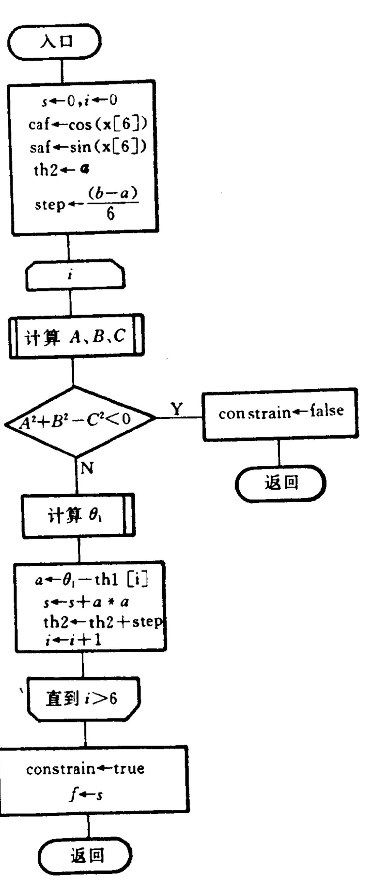

图6-2 例6-2流程

在对摆动范围和安装位置都有要求的情况下, $h _ { 1 } , s _ { 1 } , s _ { 2 } , \alpha _ { 1 }$ 是预定的,设计向量的维数降低。但由于仅给定两个对应位置,一般来说设计仍有无穷解,允许加入压力角或其他要求,求解过程可仿照上述例子进行。

# 二、多闭链机构

常用多闭链机构传递摆动。多数情况下机架位置是已知的。多闭链机构设计的关键是处理好各封闭形的连接关系。

例6-3:用两个串联的RSSR机构传递摆动,如图6-3所示。从右到左顺序建立各杆件坐标系。构件2为原动件,构件4连接前后两个单闭链,构件6为从动件。构件4的形状如图6-4所示,在垂直转轴的平面上, $h _ { 4 }$ 与 $h _ { 4 } ^ { \pi }$ 的夹角为 $\beta _ { 0 } h _ { 4 }$ 是闭链1—2-3-$\mathbf { 4 - 1 }$ 的从动件, $h _ { 4 } ^ { \eta }$ 是闭链 $\mathbf { 0 } \ldots \mathbf { 4 } - \mathbf { 5 } - \mathbf { 6 } - \mathbf { 0 }$ 的原动件。机架上有两个固定坐标系:0系和1系。0系与后一闭链有关,1系则与前一闭链有关。已知这两系的相对位置为:$\mathfrak { s } _ { 0 } = 0 , \ h _ { 0 } = 1 . 2 , \ \alpha _ { 4 } = 0 . 1 \mathrm { r a d } ,$ $g _ { 4 } ^ { \prime } = 0$ , $\theta _ { \mathfrak { o } 1 }$ $= 2 . 8 \mathrm { r a d }$ , $\mathfrak { s } _ { 4 } = - 0 . 0 2$ , $h _ { 1 } = = 0 . 8 , s _ { 1 } = 0$ ,$\alpha _ { 1 } { = } 0 . 8 \mathrm { r a d } _ { \textrm { \scriptsize { 1 } } }$ 其中 ${ \pmb { \alpha } } _ { 4 }$ 为 $k _ { 0 }$ 到 $k _ { 4 }$ 的转角,以 $i _ { 0 }$ 为转轴, $\theta _ { 0 1 }$ 为 $i _ { 0 }$ 到 $\dot { \iota } _ { 1 }$ 的转角,以 $k _ { 4 }$ 为转轴 ${ \pmb { \alpha } } _ { 1 }$ ,的含义同图 $\yen 6,0,4,6,$ 为三连架杆的运动角, $\theta _ { 2 }$ 为原动件摆角,是 $i _ { 1 }$ 与 $i _ { \mathbf { 2 } }$ 的夹角; $\theta _ { 4 }$ 为闭链0-4-5-

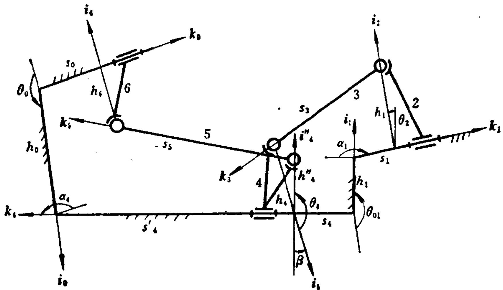

图 $\frac { 8 } { 9 } - 3$ 双闭链机构

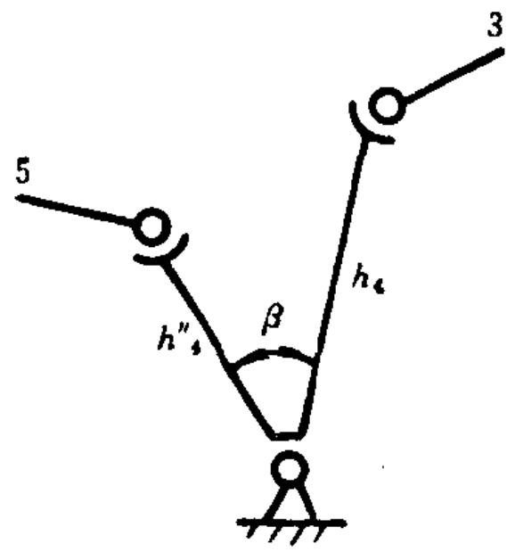

图 $a - 4$ 构件4

6--0的输入运动角,是 $\dot { \pmb { \imath } } _ { \pmb { 0 } }$ 与 $\dot { \iota } _ { 4 } ^ { \dprime }$ 的夹角; $\theta _ { 0 }$ 为从动件摆角,是 $\dot { \pmb q _ { \updownarrow } }$ 与$i _ { 0 }$ 的夹角。要求当 $\theta _ { 2 }$ 从某初值摆过0.3rad时, $\theta _ { 0 }$ 的对应值为$\sim 1 . 4$ 和 $- 1 . 5 \mathrm { r a d }$ ,误差小于0.05。

解1.确定设计向量。

在图6-3中,共有结构参数16个: $\smash { s _ { 0 , 1 } h _ { 0 , \mathrm { ~ } } \alpha _ { 4 , \mathrm { ~ } } s _ { 4 , \mathrm { ~ } } ^ { \prime } \theta _ { 0 1 , \mathrm { ~ } } s _ { 4 , \mathrm { ~ } } h _ { 1 , \mathrm { ~ } } s _ { 1 , \mathrm { ~ } } }$ $\alpha _ { 1 } \int _ { 9 } \varepsilon _ { 3 } \int _ { 9 } h _ { 4 } \ _ { \nu } h _ { 4 } ^ { \prime \prime } \ s _ { 5 } \ h _ { 6 } \ _ { \nu } \beta _ { \circ }$ 前面9个已取定,后面7个作为设计变量,加上 $\theta _ { 2 }$ 的初值 $\theta _ { 2 0 }$ ,共8个设计变量,即

$$
X = { \left[ \begin{array} { l } { - x _ { 1 } } \\ { x _ { 2 } } \\ { x _ { 3 } } \\ { x _ { 4 } } \\ { x _ { 5 } } \\ { x _ { 6 } } \\ { x _ { 7 } } \\ { x _ { 8 } } \end{array} \right] } { \left[ \begin{array} { l } { - h _ { 2 } } \\ { h _ { 3 } } \\ { h _ { 4 } } \\ { h _ { 2 0 } } \\ { \beta _ { 8 } } \\ { h _ { 8 } } \\ { \vdots } \\ { h _ { 8 } } \end{array} \right] }
$$

2.确定目标函数和约束条件。

在图8-6中,代入 $\theta _ { 2 }$ 的数值并按式3-21计算出 $\dot { \pmb { \mathscr { V } } } _ { 4 }$ 与 $i _ { 1 }$ 的夹角,注意到这不是后一闭链的输入角 $\theta _ { 4 }$ 。为了求解方便,可以分别设构件2和构件6为双闭链的原动件,代入 $\theta _ { 2 }$ 和 $\theta _ { 0 }$ 的数值,使两个闭链的解在构件4汇合。为此,将闭链0—4--5--6-0的各杆件坐标系改为按构件6到构件 $\pmb { 4 }$ 的顺序建立,如图6-5所示。图中原ko、ioik5i分别改为k、i、i、k'、i。相应地,so、ho、ho、ss、h改为s、h、h、s、h。这样,两个闭链就有了相似的结构和杆件坐标系,可使用同一套公式。各角度的定义及相互关系为:α为k到k的转角,以i为转轴,大小和方向同α4。为与的夹角,大小同0,但方向相反。0为与的夹角,大小同θ4,但方向相反。 $\theta _ { 1 } ^ { \prime }$ 与 $\theta _ { 4 }$ 的关系见图 $\bf { 6 - 6 a }$ ,在垂直 $k _ { 4 }$ 的平面上, $\dot { \iota } _ { 1 } ^ { \prime }$ 与 $\pmb { i 0 }$ 反向共线, $ i _ { 4 } ^ { \prime }$ 与 $i _ { 4 } ^ { \prime \prime }$ 反向共线, $\theta _ { 1 } ^ { \prime }$ 与 $\theta _ { 4 }$ 等值反向。 $\pmb { \theta _ { 2 } ^ { \prime } }$ 与 $\theta _ { 0 }$ 的关系见图6-6b,在垂直 $k _ { 1 } ^ { \prime }$ (即 $k _ { 0 } )$ 的平面上 $i _ { 1 } ^ { \phantom { \dagger } }$ 与 $\dot { \iota } _ { 0 }$ 反向共线, ${ \dot { q } } _ { 2 } ^ { \prime }$ 与 ${ \dot { \pmb { \imath } } } _ { 0 }$ 反向共线, $\pmb { \theta _ { 2 } ^ { \prime } }$ 与 $\theta _ { 0 }$ 等值反向。与 $k _ { 4 }$ 轴有关的转角还有 $\theta _ { 0 1 } , \beta _ { 0 }$ 设 $\alpha _ { 1 1 }$ 为 $\dot { \pmb { \ i } } _ { 1 } ^ { \prime }$ 与 $\dot { \pmb { \mathscr { b } } } _ { 1 }$ 的夹角,则 $\alpha _ { 1 1 } \mathrm { { s } = } \pi \mathrm { { - } } \beta _ { 0 1 } \mathrm { { = } } 3 . 1 4 1 5 9 \mathrm { { - } } 2 . 8 \mathrm { { = } } 0 . 2 6 1 5 9 .$ ,并有

图6-5 两个闭链在构件4汇合

图 $\pmb { 0 } \mathrm { - } \pmb { 3 }$ 转角变换

$$
\theta _ { 1 } ^ { \prime } { = } \theta _ { 1 } { + } \beta { - } \alpha _ { \div 1 }
$$

式中, $\pmb { \theta _ { 1 } ^ { \prime } }$ 为 $\dot { \pmb { q } } _ { 4 } ^ { \prime }$ 与 $\dot { \ i } _ { 1 } ^ { \prime }$ 的夹角,即闭链 $\mathbf { 1 ^ { \prime } } { - } 2 ^ { \prime } { - } \mathbf { 9 ^ { \prime } } { - } 4 ^ { \prime } { - } \mathbf { - } \mathbf { 1 ^ { \prime } }$ 的输出运动角。 $\theta _ { 1 }$ 为 $i _ { 4 }$ 与 $\dot { q } _ { 1 }$ 的夹角,即闭链 $\mathbf { 1 { \longrightarrow } 2 { \cdots } 9 { - } 4 { - } 1 }$ 的输出运动角。如果在题目规定的两个位置上, $\pmb { \theta _ { 1 } ^ { \prime } }$ 与 $\theta _ { i }$ 的差都等于 $\beta - \alpha _ { 1 1 }$ ,则原机构正确地实现了 $\theta _ { 2 }$ 与 $\theta _ { 0 }$ 之间的对应关系。因此,可将目标函数定为

$$
F ( X ) = \sum _ { i = 1 } ^ { 2 } { ( \theta _ { 1 } ^ { \prime } - \theta _ { 1 } - \beta + \alpha _ { 1 } . ) ^ { 2 } }
$$

式6-4的最小值为零,此时原机构精确地实现给定摆角。

在求解 $\theta _ { 1 } ^ { \prime }$ 和 $\theta _ { 1 }$ 时都须使式3-23中的根式有解,其约束条件为

$$
g _ { 1 } ( X ) = A ^ { 2 } + B ^ { 2 } - C ^ { 2 } \geqslant 0
$$

$$
g _ { 2 } ( X ) = A ^ { \prime 2 } + B ^ { \prime 2 } - C ^ { \prime 2 } \geqslant 0
$$

式 $\mathbf { 6 - 5 }$ 和6-6分别表示闭链1—2-3-4-1和闭链 $\mathbf { 1 ^ { \prime } - 2 ^ { \prime } - 3 ^ { \prime } - }$ $\bf { 4 ^ { \prime } - 1 ^ { \prime } }$ 有解。在一般情况下,还应保证所求各杆的长度不为零,即

$$
\begin{array} { l } { { g _ { 8 } ( X ) = h _ { 2 } > 0 } } \\ { { g _ { 4 } ( X ) = s _ { 3 } > 0 } } \\ { { g _ { 6 } ( X ) = h _ { 4 } > 0 } } \\ { { g _ { 6 } ( X ) = h _ { 2 } ^ { \prime } = h _ { 6 } > 0 } } \\ { { g _ { 7 } ( X ) = s _ { 3 } ^ { \prime } = s _ { 5 } > 0 } } \\ { { g _ { 8 } ( X ) = h _ { 4 } ^ { \prime } = h _ { 4 } ^ { \prime } = 0 } } \end{array}
$$

本例机架长度已定,要使机构有解, ${ \pmb { \mathscr { s } } } _ { 3 } \left( { \pmb { \mathscr { s } } } _ { 3 } ^ { \prime } \right)$ 须不为零,否则将无法构成闭链。当 $h _ { 4 } ( h _ { 1 } ^ { \prime } )$ 为零时, $\mathbf { } A ( A ^ { \prime } )$ 和 $B ( B ^ { \prime } )$ 为零,而 $C ( C ^ { \prime } )$ 不为零,不满足式6-5和6-6。因此式6-5和6-6包含了式6-8.6-9、$\bf { 6 ^ { - 1 1 } }$ 及6-12。该设计的约束条件可定为式 $6 { - } 5 , 6 { - } 6 , 6 { - } 7$ 及 $6 \mathrm { - } 1 0 _ { \circ }$ 

3.具体实现。

用变量af.aaf、h1、hh1、s1、ss1、s4,ss4分别表示 $\smash { \alpha _ { 1 } , \alpha _ { 2 } ^ { \prime } , h _ { 2 } h _ { 3 } ^ { \prime } }$ $\left. \ S _ { 1 } \right. S _ { 1 } ^ { \prime } , \ S _ { 4 } , \ S _ { 4 } ^ { \prime } ;$ 用数组 $\mathbf { x }$ 表示设计向量, $\mathbf { x } [ 1 ]$ 至 $\mathbf { x } \{ 8 \}$ 依次表示 $h _ { 2 } , s _ { 3 _ { 3 } }$ $h _ { 4 } \smash { , \theta _ { 2 0 , } \alpha _ { 1 1 } - \beta \int _ { 0 } \ h _ { 2 , } ^ { \prime } s _ { 3 , } ^ { \prime } \ h _ { 4 , } ^ { \prime } }$ 。用例5-6的直接处理约束条件的优化方法求解,其中的函数constrain改为:

程序6-2

function contrain(x: xx; th2, tho: x2; var f: real): boolean;   
Var s,caf,saf,a,b,c,t1,sth2,cth2; real; 

i: in teger; begin ${ \mathfrak { s } } \colon = 0$ 1 for $\mathbf { i } : = 1$ to 2 do begin 2 caf: =cos(af); saf: = sin(af); 4 ${ \bf s t h 2 : \equiv \sin ( t h 2 [ i ] + x [ 4 ] ) ; }$ 5 $\mathbf { c t } ; 2 : = \mathbf { c o s } ( \mathbf { t h 2 [ i ] } + \mathbf { x } [ \mathbf { 4 } ] )$ ; 6 $\mathbf { a } : = \mathbf { s 1 } * \mathbf { x } \left[ \mathfrak { d } \right] * \mathbf { s a f } - \mathbf { x } \left[ \mathbf { 1 } \right] * \mathbf { x } \left[ \mathfrak { d } \right] * \mathbf { c a f } * \mathbf { s t h 2 } _ { \mathbf { i } }$ 7 $\mathbf { b } \colon = \mathbf { x } [ 9 ] \ast ( \mathrm { h . 1 } + \mathbf { x } [ 1 ] \ast \mathrm { c t h 2 } ) \vphantom { \frac { 1 } { \sqrt { 1 6 } } } ;$ 8 c:= (s4\*s4+x [1]\*x [1]+s1\*s1+h1\*h1+x[3]\*x[3]- x[2]\*x [2])/2-s4\*(s1\*caf+x [1]\*saf \*sth2)+x [1] ! \*h1\*cth2; 9t1 $\dot { \mathbf { \eta } } = \mathbf { a } * \mathbf { a } + \mathbf { b } * \mathbf { b } - \mathbf { c } * \mathbf { c } ;$ 10 if $( \bf t 1 < 0 )$ or $( \mathbf { x } \left[ \mathbf { 1 } \right] { < } \mathbf { e 1 } )$ then begin 11 $\mathrm { c o n s t r a i n : = f a l s e : }$ 12 exit end 13 else begin $\mathbf { \dot { t } 1 } \div = \mathbf { s } \mathbf { q } \mathbf { r } \mathbf { t } ( \mathbf { t 1 } )$ ; 14 $\scriptstyle \mathrm { t 1 : = 2 } \ast \mathrm { a r c } \tan \left( ( \mathbf { a } + \mathbf { t 1 } ) / ( \mathbf { b } - \mathbf { c } ) \right) ;$ 15 $\operatorname { c a f } : = \cos ( \operatorname { a a f } ) ;$ 16 $\operatorname { s a f } : = \sin { ( \mathrm { a a f } ) } ;$ 17 $\mathrm { { s t h 2 : = s i n \left( t h 0 [ i ] \right) _ { i } } }$ 18 cth $\mathbf { \tau } _ { \mathrm { { L 2 } } } : = \cos ( \tan 0 [ \mathrm { { i } } ] ) ;$ 

19 $\begin{array} { r l } & { \mathbf { a } : = \mathrm { s s } [ \ast \mathrm { x } [ \mathbb { S } ] \ast \mathrm { s n f - x } [ 6 ] \ast \mathrm { x } [ 8 ] \ast \mathrm { c a f } \ast \mathrm { s i h } 2 ; } \\ & { \mathbf { b } : = \mathbf { x } [ \mathbb { S } ] \ast ( \mathrm { h h } 1 + \mathrm { x } [ 6 ] \ast \mathrm { c t h } 2 ) ; } \\ & { \mathfrak { c } : = ( \mathrm { s s } \mathbf { 1 } \ast \mathrm { s } \mathbf { 2 } \ast \mathrm { x } [ 6 ] \ast \mathrm { x } [ 6 ] + \mathrm { s s } [ \ast \mathrm { s s } ] + \mathrm { h h } \mathbf { 1 } \ast \mathrm { h h } 1 + \mathrm { x } [ 8 ] \ast \mathrm { x } [ 8 ] } \\ & { \qquad - \mathrm { x } [ 7 ] \ast \mathrm { x } [ 7 ] ) / 2 - \mathrm { s s } \mathrm { 4 } \ast ( \mathrm { s s } \mathrm { ~ a f ~ } + \mathrm { x } [ 6 ] \ast \mathrm { s i h } 2 ) + } \\ & { \qquad \mathrm { x } [ 6 ] \ast \mathrm { h h } 1 \ast \mathrm { c t } \mathrm { i } \cdot 2 ; } \\ & { \qquad \mathrm { s t h } 2 : = \mathrm { a } \ast \mathrm { a } + \mathrm { b } \ast \mathrm { b } - \mathrm { c } \ast \mathrm { c } ; } \end{array}$   
20   
21   
22   
23if $\left( \mathbf { s t h 2 < 0 } \right)$ or $( \mathbf { x } \{ 6 ] < \mathbf { e } 1 \}$ then begin   
24 constrain: $\Longleftrightarrow$ false;   
25 exit end   
26 else begin $\mathrm { s t h 2 : = s q r t ( s t h 2 ) } \mathrm { _ { : } }$   
27 $\mathrm { \ s t h { 2 } : = 2 \ast \arctan \left( ( a + \ s t h { 2 } ) / ( b - c ) \right) ; }$   
28 $\mathbf { s t h 2 : = s t h 2 - t 1 + x \left[ 5 \right] }$ ;,   
29 $\mathbf { s } \colon = \mathbf { s } + \mathbf { s } \mathrm { t h 2 } * \mathrm { s t h 2 } ,$   
90 end end end   
31 constrain:= true;   
92 $\mathbf { f } : = \mathbf { 8 } ;$   
93end; 

上述程序中,数组th1、th0分别存贮 $\theta _ { 2 _ { 3 } } \theta _ { 2 } ^ { \prime }$ 的对应值, $\pmb { \mathrm { s } }$ 为累加器,t1表示 $\theta _ { 1 }$ ,e1为大于零的某数以避免杆长过小。1至30行为计算两个对应位置上偏差平方和的循环。其中2至8行计算$g _ { 1 } ( X )$ 中 $A , B , C$ 的值,9、10两行处理 $g _ { 1 } ( X )$ 和 $g _ { 3 } ( X )$ ,满足约束时由13.14行计算 $\theta _ { \textup { 1 } }$ 的值 $\pm 1 . 1 5$ 至 $\bf { 2 1 }$ 行计算 $g _ { 2 } ( X )$ 中 $A ^ { \prime } { , } B ^ { \prime }$ $C ^ { \prime }$ 的值,22、23行处理 $g _ { 2 } ( \boldsymbol { X } )$ 和 $g _ { 6 } ( \boldsymbol { \cal X } )$ ,满足约束时由26、27行计算 $\pmb { \theta _ { 1 } ^ { \prime } }$ 的值sth2。28行计算 $\theta _ { 1 }$ 与 $\theta _ { 1 } ^ { \prime }$ 的差相对 $( \beta - \alpha _ { 1 1 } )$ 的偏差。29行将此偏差累加,构成目标函数。在满足约束情况下,程序在90行结束循环,执行31、32行,并在 $\mathbf { 9 3 }$ 行正常返回。不满足约束时,从等12行或25行非正常返回。

根据题目要求,取 $\mathbf { t h 2 [ 1 ] } = \mathbf { 0 }$ , $\mathbf { t h 2 [ 2 ] } = \mathbf { 0 } . \mathbf { 3 } .$ , $\mathbf { t h 0 } [ \mathbf { 1 } ] = \mathbf { 1 } . 4$ ,$\mathbf { t h } 0 [ 2 ] = \mathbf { 1 } . 5$ , ${ \bf e 1 } = { \bf - 0 . 0 0 1 } ,$ 。取初始点 ${ \bf x [ 1 ] = 0 . 9 } { \bf \Psi } _ { \bf { \Sigma } }$ $\mathbf { x } \left[ 2 \right] = \mathbf { 1 } .$ , $\mathbf { x }$ [8]$ = 0 . 2 8 , ~ \mathrm { \bf { x } } \left[ 4 \right] = 0 . 5 , ~ \mathrm { \bf { x } } \left[ 5 \right] = 0 . 5 , ~ \mathrm { \bf { x } } \left[ 6 \right] = 0 . 6 , ~ \mathrm { \bf { x } } \left[ 7 \right] = 2 , ~ \mathrm { \bf { x } }$ [8]$= 0 . 8 .$ 。寻优精度 $\scriptstyle { \Theta = 1 } \mathbf { E } - \mathbf { 0 } 5$ ,初始点步长 $\mathbf { h } 0 = \cdot 0 . 0 5 ,$ 机架诸参数赋予题目规定的数值。计算得最优解

$$
\mathbf { x } \left[ 1 \right] = 2 . 9 7 4 0 4 8 2 9 9 5 \mathrm { E } - 0 1
$$

$$
\mathbf { x } \left[ 2 \right] = 1 . 0 1 5 5 \mathrm { 2 2 4 1 7 9 E + 0 0 }
$$

$$
\mathbf { x } \left[ \mathfrak { d } \right] = 2 . 7 4 9 0 9 2 2 9 9 1 \mathrm { E } - 0 1
$$

$$
\mathbf { x } \left[ 4 \right] = \overleftarrow { 5 } . 0 4 5 9 8 5 4 9 3 9 \mathrm { E } - 0 1
$$

$$
\mathbf { x } \left[ 5 \right] = 4 . 9 9 \Im 6 4 6 9 9 2 \Im \mathrm { E } - 0 1
$$

$$
\mathbf { x } [ 6 ] = 5 . 9 4 5 2 8 4 5 4 4 9 \mathrm { E } - 0 1
$$

$$
\mathbf { x } [ 7 ] = 2 . 0 0 6 6 1 9 0 9 0 0 \mathrm { E } + 0 0
$$

$$
\mathbf { x } [ 8 ] = 8 . 1 3 8 9 0 3 5 1 8 7 \mathrm { E } - 0 1
$$

相应最优解的目标函数值为 $\mathbf { 1 . 2 5 5 6 8 1 5 9 0 5 E - } 0 8$ ,它代表相应两位置上主、从动件按题目给定的角度摆动时,在构件4汇合时所表现的偏差平方和。所代表的运动误差小于题目给定的数值。结构参数 $\beta$ 的值为

$$
\begin{array} { r l } & { \beta = \alpha _ { 1 1 } - \mathtt { x } \left[ 5 \right] = 0 . 2 6 1 5 9 - 0 . 4 9 9 5 6 4 6 9 9 2 9 } \\ & { \quad = - 0 . 2 9 7 9 7 4 6 9 9 2 5 = - 1 \overset { \circ } { \cup } \overset { \circ } { \cup } 8 8 ^ { \prime } 6 ^ { \prime \prime } } \end{array}
$$

表示以 $k _ { 4 }$ 为转轴,从 $i _ { \pm } ^ { \prime }$ 顺时针转到 $i _ { 4 }$ 的角度为 $\bf { 1 9 ^ { \circ } 2 8 ^ { \prime } 6 ^ { \prime \prime } }$ D

# 6-2按运动轨迹设计空间闭链机构

空间闭链机构可用以实现空间运动轨迹。如搅拌机,要求搅拌头按某种空间轨迹运动,以便对容器内的物体进行充分的搅拌。又如缝纫机,其弯针驱动机构要求实现某种空间轨迹。

空间轨迹有多种形态,如果是球面上的轨迹,可用作球面运动的构件来实现。如例 ${ \mathfrak { s } } { - } 1$ 的CCS机构,用球面副与机架连接的构件上任一点的运动轨迹都在某球面上。又如图6-7的RRRR机构,4个转动副的轴线在 $\pmb { A }$ 点相交。当构件2转动时,构件3上的搅拌头 $B$ 的运动轨迹在以 $A$ 为中心的球面上。对一般空间轨迹,可用单自由度空间闭链机构连杆上某点来实现。对比较复杂而精度要求又较高的空间轨迹,还可用多自由度的空间闭链机构来实

图6-7球面搅拌机

现。

# 一、单自由度机构

例6-4:对例5-2中的机构,要求输入运动角 $\theta _ { 2 }$ 在区间 $\theta _ { 2 0 } <$ $\theta _ { 2 } { < } ( \theta _ { 2 0 } { + } 0 . 5 )$ 内运动时, $\mathcal { P }$ 点实现近似空间螺线

$$
\left\{ \begin{array} { l l } { { \boldsymbol { x } } = O X + r \cos \left( t + t _ { 0 } \right) } \\ { { \boldsymbol { y } } = O Y + r \sin \left( t + t _ { 0 } \right) } & { \quad 0 \leqslant t < { \frac { 1 } { 3 } } } \\ { { \boldsymbol { z } } = O Z + \nu t } \end{array} \right.
$$

式中, $O X = - 1 , O Y = 0 , O Z = - 0 . 6 , \tau = 0 . 4 ,$ 求机构各结构参数。

解1.确定设计向量。

RSSR机构的结构参数共有 $\pmb { 7 }$ 个,加上 $\pmb { P }$ 点距离 $\pmb { 0 } _ { \mathfrak { s } }$ 的长度 $l _ { 3 }$ 以及 $\theta _ { z 0 } , \ t _ { 0 } ,$ 设计向量有10维

$$
\widetilde { X } = \left[ \begin{array} { c } { \alpha _ { 1 } } \\ { \alpha _ { 2 } } \\ { \alpha _ { 3 } } \\ { \alpha _ { 4 } } \\ { \alpha _ { 5 } } \\ { \alpha _ { 6 } } \\ { \alpha _ { 8 } } \\ { \alpha _ { 7 } } \\ { \alpha _ { 8 } } \\ { \alpha _ { 8 } } \\ { \alpha _ { 9 } } \\ { \alpha _ { 8 } } \\ { \alpha _ { 1 0 } } \\ { \alpha _ { 1 0 } } \\ { \alpha _ { 1 0 } } \\ { \alpha _ { 1 0 } } \\ { \alpha _ { 1 0 } } \\ { \alpha _ { 1 0 } } \\ { \alpha _ { 1 0 } } \end{array} \right] = \left[ \begin{array} { c } { \bar { h } _ { 1 } } \\ { \alpha _ { 2 } } \\ { \bar { h } _ { 2 } } \\ { \bar { h } _ { 3 } } \\ { \bar { h } _ { 4 } } \\ { \bar { h } _ { 4 } } \\ { \alpha _ { 1 } } \\ { \bar { g } _ { 8 } } \\ { \bar { h } _ { 3 } } \\ { \alpha _ { 1 } } \end{array} \right]
$$

2.确定目标函数与约束条件。

式6-13为理想轨迹, $\mathbf { \nabla } _ { \mathbf { \mathcal { P } } }$ 点再现的轨迹由式5-18确定。用 ${ \pmb x } ^ { \ast } .$ 、$y ^ { \ast } , z ^ { \ast }$ 表示理想轨迹上的点, $\pmb { x } , \pmb { y } , \pmb { z }$ 表示再现轨迹上的点,仿照函数实现例5-6的直接处理方法,可将目标函数定为

$$
F ( X ) = \sum _ { i = 1 } ^ { n } ( x ^ { * } - x ) ^ { 2 } + ( y ^ { * } - y ) ^ { 2 } + ( z ^ { * } - z ) ^ { 2 }
$$

式中

$$
\begin{array} { l } { { \alpha } = h _ { 2 } \cos \theta _ { 2 } ( 1 - l _ { 3 } / \varepsilon _ { 3 } ) - l _ { 3 } / \varepsilon _ { 3 } ( h _ { 1 } + h _ { 4 } \cos \theta _ { 1 } ) \qquad ( 6 - } \\ { \qquad \sin \theta _ { 1 } ( 1 - l _ { 3 } / \varepsilon _ { 3 } ) + l _ { 3 } / \varepsilon _ { 3 } ( \varepsilon _ { 4 } \sin \alpha _ { 1 } + h _ { 4 } \cos \alpha _ { 1 } \sin \theta _ { 1 } ) \qquad } \end{array}
$$

$$
z = s _ { 1 } ( 1 - l _ { 3 } / \varepsilon _ { 3 } ) + l _ { 3 } / \varepsilon _ { 3 } ( s _ { 4 } \cos \alpha _ { 1 } - h _ { 4 } \sin \alpha _ { 1 } \sin \theta _ { 1 } )
$$

再现轨迹计算中需要 $\theta _ { 2 , } \theta _ { 1 }$ 的数值,因此,必须使式3-29有解,即满足

$$
g _ { 1 } ( X ) = A ^ { 2 } + B ^ { 2 } - C ^ { 2 } \geqslant 0
$$

由于给定的理想轨迹是机构上某点必须到达的三维空间内的一系列点,因此轨迹问题与机构各杆的绝对长度有关。在向理想轨迹逼近的过程中,各杆长度不容易出现为零的情况,一般不需进行杆长检验。

# 3.具体实现。

首先进行参数变换。题目要求 $\theta _ { 2 }$ 在0.5rad的转角范围内实现 $\pmb { \ t }$ 从 $\pmb { 0 }$ 至 $\frac { 1 } { \mathfrak { s } }$ 的变化,根据式5-8的参数变换公式有

$$
\mu _ { t } = \frac { t _ { \mathrm { m a x } } - t _ { \mathrm { m i n } } } { \theta _ { \mathrm { 2 m a x } } - \theta _ { \mathrm { 2 m i n } } } = \frac { \frac { 1 } { 3 } } { \frac { 1 } { 2 } } = \frac { 2 } { 3 }
$$

则

$$
\theta _ { 2 } = \theta _ { z 0 } + \frac { t - t _ { \operatorname* { m i n } } } { \mu _ { t } } = \theta _ { z 0 } + t / \mu _ { t }
$$

用数组 $\pmb { x }$ 表示设计向量, $\pi [ 1 ]$ 至 $\mathbf { x } [ 1 0 ]$ 依次表示 $h _ { 1 } , s _ { 1 } , h _ { 2 } , h _ { 4 } , s _ { 4 } ,$ $\smash { \imath _ { 3 , 2 } l _ { 3 } / g _ { 3 , 3 } \alpha _ { 1 , 3 } \theta _ { 2 0 , \ast } t _ { 0 0 } }$ 变量 $^ { \mathbf { t h 2 , t h 1 } }$ 分别表示 $\theta _ { 2 } , \theta _ { 1 0 }$ step为循环步长

$$
\mathsf { s t e p } = ( { t } _ { \mathrm { m a x } } - { t } _ { \mathrm { m i n } } ) / m
$$

式中, $\mathscr { m }$ 为计算目标函数时所取的点数。采用例5-6的直接处理方法,其中的函数constrain改为:

程序6-3

function constrain(x: xx; var f: real) : boolean; 

var s,th1,th2,cth1,sth1,cth2,sth2,caf,saf,a1,a2,b1, 

b2,c1,c2,c3,a,b,c,d1,d2,d3,d4,d5,d6,d7,d8,   
t:real;   
1begin $\mathbf { s } \colon = 0 \colon \mathbf { t } : = 0 \ ;$   
2 ${ \mathsf { c a f } } : = { \cos ( \mathbf { x } [ 8 ] ) } _ { \mathsf { i } } { \mathrm { , s a f } } : = { \sin ( \mathbf { x } [ 8 ] ) } _ { \mathsf { i } }$   
3 $\mathrm { d 1 : = 1 - x [ 7 ] ; d 2 : = - x [ 7 ] * x [ 1 ] ; }$   
4 $\mathrm { d } \mathfrak { G } : = - \mathbf { x } [ 7 ] \ast \mathbf { x } [ 4 ] ; \mathrm { d } 4 \colon = \mathbf { x } [ 7 ] \ast \mathbf { x } [ 5 ] ,$   
5 $\mathrm { d } { \mathfrak { H } } { \mathrm { : = - d } } { \mathfrak { G } } { \mathrm { * } } \mathrm { c a f } _ { \mathfrak { j } } \mathrm { d } { \mathfrak { b } } { \mathrm { : = d } } \mathbf { 1 } { \mathrm { * } } \mathbf { x } \left[ 2 \right] \mathrm { : }$   
6 $\mathrm { d } \mathbf { 1 } \colon = \mathrm { d } \mathbf { 1 } * \mathbf { x } \left[ \mathfrak { d } \right] \mathrm { ; ~ } \mathrm { d } \mathbf { 7 } \colon = \mathrm { d } \mathbf { 4 } * \mathrm { c a f } \mathbf { ; }$   
7 $\mathrm { d } 4 \colon = \mathrm { d } 4 \ast \mathrm { s a f } _ { \mathfrak { j } } \mathrm { d } 8 \colon = \mathrm { d } { \mathfrak { s } } \ast \mathrm { s a f } _ { \mathfrak { j } }$   
8 $\mathrm { a 1 } \colon = \mathbf { x } \left[ 2 \right] \ast \mathbf { x } \left[ 4 \right] \ast \mathrm { s a f } ,$   
9 ${ \mathrm { a 2 } } \colon = - \mathbf { x } \left[ \underline { { \mathsf { S } } } \right] \ast \mathbf { x } \left[ 4 \right] \ast { \mathrm { c a f } } _ { \mathfrak { z } }$   
10 $\mathbf { b 1 } \colon = \mathbf { x } [ \mathbf { 1 } ] \ast \mathbf { x } [ \mathbf { 4 } ] ;$   
11 ${ \bf b } \mathbf { 2 } : = \mathbf { x } \left[ \boldsymbol { \Im } \right] \ast \mathbf { x } \left[ \mathbf { \underline { { 4 } } } \right] ;$   
12 ${ \mathfrak { c l } } : = 0 ;$   
13 $\mathrm { f o r ~ i : = 1 ~ t o ~ } \tilde { \mathfrak { d } } \mathrm { ~ d o ~ c 1 : = c 1 + x [ i ] * x [ i ] , }$   
14 ${ \mathrm { c } } 1 : = { \mathrm { c } } 1 - { \mathrm { x } } \left[ 5 \right] * { \mathrm { x } } \left[ 2 \right] * { \mathrm { c a f } } ;$   
15 ${ \mathrm { c } } 2 : = \mathbf { x } [ 1 ] * \mathbf { x } [ \mathbf { 9 } ] ;$   
16 $\mathbf { c } \mathbf { 9 } : = - \mathbf { x } [ \mathbf { 5 } ] * \mathbf { x } [ \mathbf { 9 } ] * \mathbf { s } \mathbf { a } \mathbf { f } ;$   
17 ${ \bf r e p e a t \ t i l 2 : = x [ 9 ] + t / } \mu { \bf t } ;$   
18 $\mathrm { { c t h 2 } : = \cos ( \ t h 2 ) ; \mathrm { { s t h 2 } : = \sin ( \ t h 2 ) ; } }$   
19 $\mathtt { a } \colon = \mathtt { a } \mathtt { 1 } + \mathtt { a } 2 * \mathtt { s } \mathtt { t h } 2 ;$   
20 $\mathfrak { b } \colon = \mathfrak { h } 1 + \mathfrak { b } 2 * \mathfrak { c } \mathfrak { t h } 2 ;$   
21 ${ \mathfrak { c } } { \mathrm { : = } } { \mathrm { c } } { \mathrm { 1 } } + { \mathrm { c } } { \mathrm { 2 } } * { \mathrm { c } } { \mathrm { t h 2 } } + { \mathrm { c } } { \mathfrak { Q } } * { \mathrm { s t h 2 } } { \mathrm { : } }$   
22 $\mathbf { \hat { t h 1 : } } = \mathbf { a } * \mathbf { a } + \mathbf { b } * \mathbf { b } - \mathbf { c } * c _ { \mathbf { j } }$   
23 if th1<0 then begin   
24constrain : $\backsimeq$ false; exit end   
25 else begin th1: = sqrt(th1);   
26 $\scriptstyle \mathtt { t h 1 : } = 2 \ast \arctan ( ( \mathtt { a } + \mathtt { t h 1 } ) / ( \mathtt { b } - \mathtt { c } ) ) ;$   
27 cthl:=cos(th1); sth1: $\Longleftarrow$ sin(th1);   
28 $\mathbf { a } : = \mathrm { d } 1 * \mathrm { c } \operatorname { t h 2 } + \mathrm { d } 2 + \mathrm { d } \mathbf { 2 } * \mathrm { c } \operatorname { t h 1 } _ { \mathrm { i } } ,$   
29 $\mathbf { b } \colon = \mathrm { d } \mathbf { 1 } \ast \mathrm { s t h 2 } + \mathrm { d } \mathbf { 4 } + \mathrm { d } \mathbf { 5 } \ast \mathrm { s t h } \mathbf { 1 } ;$   
30 $\mathbf { c } : = \mathbf { d 6 } + \mathbf { d 7 } + \mathbf { d 8 } * \mathbf { s t h 1 } .$   
91. $\mathbf { a } \colon = \mathbf { a } - \mathbf { r } \ast \cos ( \mathbf { t } + \mathbf { x } \left[ \mathbf { 1 0 } \right] ) - \boldsymbol { 0 } \mathbf { x } ,$   
32 b:=b-r\*sin(t÷x[10])-oy;   
93 C: =c-v\*t- Oz;   
34 s:=s+a\*a+b\*b+c\*c end;   
35 t:=t+step;   
96 $\mathbf { u n t i 1 t > ( 1 / 3 ) } ;$   
37 $\mathbf { f } : = \mathbf { s } _ { \mathbf { ; } }$ constrain: $$ truc;   
28 end; 

程序6-3是按尽量提高计算效率的原则编写的,对于一些计算量较大的子程序,如果不考虑计算效率将导致机时大量浪费,长时间得不到结果。

在程序6-3中,17至36行反复执行 $m + 1$ 次计算式6-14的值。2至16行计算与循环变量 $\pmb { \mathrm { \downarrow } }$ 无关的量,以便尽量减少循环体内的计算量。在循环体中,17至21行计算 $g _ { 1 } ( X )$ 的值;若约束条件满足,则由25至90行计算再现轨迹的坐标;31至83行计算理想轨迹与再现轨迹的坐标差; $\Im \Im$ 行累加坐标差的平方和。

取 $m = 2 0 ,$ 初始点 $\mathbf { x } \left[ \mathbf { 1 } \right] = 0 . 8 , \ \mathbf { x } \left[ 2 \right] = 0 , \ \mathbf { x } \left[ \mathbf { 9 } \right] = 0 . 9 , \ \mathbf { x } \left[ 4 \right] =$ 0.3, $\mathbf { x } \left[ 5 \right] = 0 , \ \mathbf { x } \left[ 6 \right] = 1 , \ \mathbf { x } \left[ 7 \right] = 1 , \mathbf { x } \left[ 8 \right] = 0 , \mathbf { x } \left[ 9 \right] = 1 , \mathbf { x } \left[ 1 0 \right] = 1 _ { \circ }$ 得最优解

$$
\begin{array} { l } { { \bf { x } } \left[ { 1 } \right] = 9 . 0 0 4 7 5 0 6 8 9 2 { \mathrm { E } } - 0 1 } \\ { ~ } \\ { { \bf { x } } \left[ { 2 } \right] = 7 . 9 4 9 7 0 2 4 5 4 0 { \mathrm { E } } - 0 2 } \\ { ~ } \\ { { \bf { x } } \left[ { 9 } \right] = 1 . 4 9 6 5 4 2 9 7 7 4 { \mathrm { E } } - 0 1 } \end{array}
$$

$\mathbf { x } \left[ 4 \right] = 4 . 9 6 4 \div 2 5 2 8 2 9 \mathrm { E } - 0 1$ $\mathbf { x } \left[ 5 \right] = - 4 . 2 3 2 9 9 4 5 0 2 0 \mathrm { E } - \mathbf { 0 1 }$ ${ \bf x } \left[ 6 \right] = 9$ .3127599003E-01 $\mathbf { x } \left[ 7 \right] = 1 . 1 9 0 2 5 5 8 . 5 5 5 \mathrm { E } + 0 0$ $\mathbf { x } \left[ 8 \right] = 2 . 7 9 9 0 7 2 0 \hat { \circ } \hat { \delta } 3 \mathrm { E } - 0 1$ $\mathbf { x } \left[ 9 \right] = 1 . 1 1 3 5 8 2 8 1 8 5 \mathrm { { E } } + 0 0$ $\mathbf { x } \left[ 1 0 \right] = 8 . 9 9 4 9 6 9 7 1 8 9 9 \mathrm { E } - 0 1$ 

相应最优解的目标函数值为2.5338271019E-02,它代表21位置上理想轨迹与再现轨迹坐标差的平方和。

并非所有的理想轨迹都能方便地用简单的空间闭链机构来实现。与函数综合问题一样,一个具有 $\pmb { \eta } _ { \pmb { \nu } }$ 维设计向量的问题在理论上允许实现 $\pmb { \eta }$ 个无偏差的点,而在实际上还受初始点选取、目标函数性态及寻优方法的影响。诸如函数综合、轨迹综合一类的问题,在连续的运动空间中存在无穷个点,仅能近似地实现设计要求。采用杆件数目较多的机构可以增加设计向量的维数,但作用是有限的。解决轨迹综合问题的一个有效方法是使用多自由度机构。

# 二、多自由度机构

研究例6-4的解题过程,可以发现人为地加入了一个很强的约束;在取点时,对应 $\theta _ { 2 }$ 均匀分布的点,其再现轨迹对 $\pmb { t }$ 也是均匀分布的。而题目仅要求在 $\theta _ { 2 }$ 的某个运动范围内实现某段空间螺线,并没有规定此空间螺线相对 $\theta _ { 2 }$ 的取值规律。可以想象,如果对应 $\theta _ { 2 }$ 的均匀间隔取值, $t$ 的值采用某种非均匀的取值方法或许可以使再现轨迹更好地逼近理想轨迹。一般来说,机器的主轴是匀速的,这就需要用另一个自由度来实现非匀速调整。具体实现时可对匀速转动的自由度均匀取点,根据理想轨迹算得非匀速运动构件的对应位置,最后用凸轮机构实现这些位置。传动线路如图6-8所示。具体求解过程见例 $\mathbf { 6 } \mathrm { - } \mathsf { 5 } _ { \circ }$ 

例6-5:要求某缝纫机的弯针上一点精确地实现图6-9所示的空间轨迹。求机构型式及结构参数。

图 $\pmb { \ell } \mathrm { - } \pmb { 3 }$ 两自由度机构的两个输入

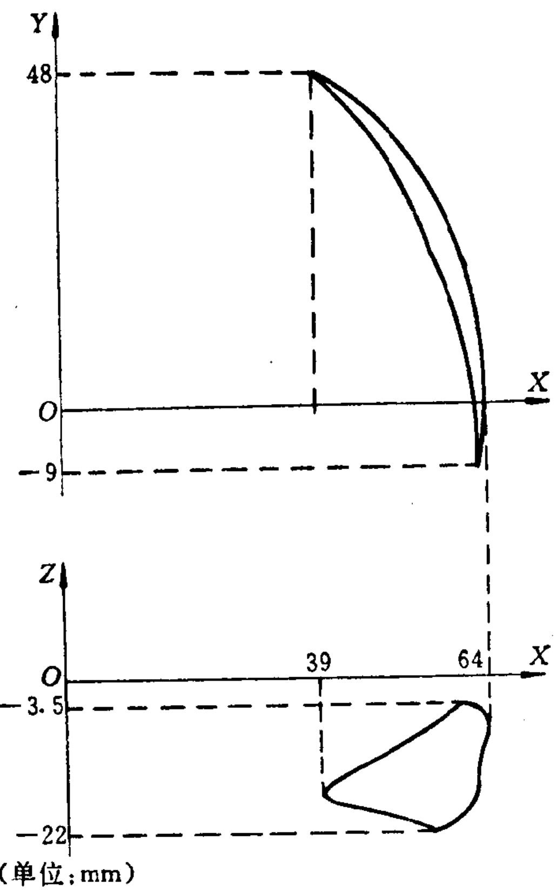

图6-9理想轨迹

解1.型综合。

图6-10所示为五杆两自由度RSSRR机构。3个转动副的轴线分别取为k、k4、ks轴,两球面副中心的连线取为k3轴,k与 $k _ { 1 }$ 平行且通过球面副中心。诸 $\pmb { i }$ 轴的选取按D--H坐标的规定,其中 $\bf { i } _ { 5 }$ 固连于构件5上,通过 $k _ { 4 }$ 与 ${ \pmb k } _ { 5 }$ 的交点并与它们垂直,$h _ { 5 } = 0 _ { \circ } ~ \theta _ { \bar { \upsilon } }$ 是 $\bullet _ { 4 }$ 到 $\bf { i } _ { 5 }$ 的转角,以 $\pmb { k _ { 4 } }$ 为转轴; ${ \pmb { \alpha } } _ { 5 }$ 是 $\pmb { k _ { 4 } }$ 到 $\pmb { k } _ { \mathrm { 5 } }$ 的转角,以 $\dot { \pmb { i } } _ { \bar { \pmb { \nu } } }$ 为转轴; $\theta _ { i }$ 为 $\pmb { i } _ { 5 }$ 到 $i _ { 1 }$ 的转角,以 $\pmb { k } _ { 5 }$ 为转轴。取 $\alpha _ { \perp } = 9 0 ^ { \circ } = \alpha _ { \perp }$ 将图6-9的空间曲线定义在 $o _ { 1 } i _ { 1 } j _ { 1 } k _ { 1 }$ 系中,取构件4上一点 $p$ 实现该轨迹。从图6-10可以看出, $y$ 方向的运动主要受 $\theta _ { \textup { \ 5 } }$ 影响,而$\pmb { \mathscr { z } }$ 方向的运动主要受 $\theta _ { \downarrow }$ 影响, $\pmb { x }$ 方向的运动与 $\theta _ { \ i _ { \cdot } } \theta _ { \ i }$ 都有关。在图6-9中, $\pmb { \tilde { \alpha } }$ 方向的位移量比较小,即构件5仅在较小的范围内摆动。从图6-10也可看到,机构的布置方式不允许杆5作整周转动,因此杆5为摆动杆。对应杆5的一个位置,构件1--2—3-4构成RSSR 机构, $h _ { 2 }$ 成为曲柄。该机构中构件2和构件 $5$ 为原动件,它们的运动规律应使 $p$ 点较好地实现理想的运动轨迹。

图6-10 RSSRR五杆机构

# 2.运动分析。

根据式3-9,机构的位形方程为

$$
h _ { 1 } \dot { \iota } _ { 1 } + s _ { : } k _ { 1 } + h _ { 2 } \dot { \iota } _ { 2 } + s _ { 3 } k _ { 3 } + h _ { 4 } \dot { \iota } _ { 4 } - s _ { 4 } k _ { 4 } + s _ { 5 } k _ { \bar { s } } = 0
$$

令

$$
\pmb { A } = h _ { 1 } \pmb { i } _ { 1 } + s _ { 1 } \pmb { k } _ { 1 } + s _ { 5 } \pmb { k } _ { 5 }
$$

上式可写为

$$
A + h _ { \bot } \dot { \iota } _ { 2 } + h _ { 4 } \dot { \iota } _ { 4 } - s _ { 4 } k _ { 4 } = - s _ { 3 } k _ { 3 }
$$

两边平方得

$$
\begin{array} { r l r } {  { A ^ { 2 } + h _ { 2 } ^ { 2 } + h _ { 4 } ^ { 2 } + s _ { 4 } ^ { 2 } - s _ { 3 } ^ { 2 } + h _ { 2 } ( A \cdot i _ { 2 } ) + h _ { 4 } ( A \cdot i _ { 4 } ) - s _ { 4 } ( A \cdot k _ { 4 } ) } } \\ & { } & { + \ h _ { 2 } h _ { 4 } ( i _ { 2 } \cdot i _ { 4 } ) - h _ { 2 } s _ { 4 } ( i _ { 2 } \cdot k _ { 4 } ) _ { \cdot } - h _ { 4 } s _ { 4 } ( i _ { 4 } \cdot k _ { 4 } ) = 0 \qquad ( } \end{array}
$$

式中

$$
A = h _ { 1 } \dot { \pmb { i } } _ { 1 } + s _ { 1 } \pmb { k } _ { 1 } + s _ { 5 } E ^ { i ( - a _ { 1 } ) } \left[ \begin{array} { c } { { 0 } } \\ { { 0 } } \\ { { 1 } } \end{array} \right] = \left[ \begin{array} { c } { { h _ { 1 } } } \\ { { s _ { 5 } } } \\ { { s _ { 1 } } } \end{array} \right]
$$

$$
i _ { 2 } { = } E ^ { k \theta _ { 1 } } { \left[ \begin{array} { l } { 1 } \\ { 0 } \\ { 0 } \end{array} \right] } = { \left[ \begin{array} { l } { \cos \theta _ { 2 } } \\ { \sin \theta _ { 2 } } \\ { 0 } \end{array} \right] }
$$

$$
k _ { 4 } = E ^ { i ( - \alpha _ { 1 } ) } E ^ { k ( - \theta _ { 1 } ) } E ^ { i ( - \alpha _ { 3 } ) } { \left[ \begin{array} { l } { 0 } \\ { 0 } \\ { 1 } \end{array} \right] } = E ^ { i ( - 9 ^ { \circ } ) } E ^ { k ( - \theta _ { 1 } ) }
$$

$$
\begin{array} { r } { \underline { { E } } ^ { i ( - 9 0 ^ { \circ } ) } \left[ \begin{array} { c } { 0 } \\ { 0 } \\ { 1 } \end{array} \right] = \left[ \begin{array} { c } { \sin \theta _ { 1 } } \\ { 0 } \\ { - \cos \theta _ { 1 } } \end{array} \right] } \end{array}
$$

$$
\pmb { i } _ { 4 } = E ^ { i ( - \alpha _ { 1 } ) } E ^ { k ( - \theta _ { 1 } ) } E ^ { i ( - \alpha _ { s } ) } E ^ { k ( - \theta _ { s } ) } { \left[ \begin{array} { l } { 1 } \\ { 0 } \\ { 0 } \end{array} \right] } = { \left[ \begin{array} { l } { \cos \theta _ { 1 } \cos \theta _ { 5 } } \\ { \sin \theta _ { 5 } } \\ { \sin \theta _ { 1 } \cos \theta _ { 5 } } \end{array} \right] }
$$

展开式6-21得

$$
\begin{array} { r l r } {  { \displaystyle h _ { 1 } ^ { 2 } + s _ { 5 } ^ { 2 } + s _ { 1 } ^ { 2 } + h _ { 2 } ^ { 2 } + h _ { 4 } ^ { 2 } + s _ { 4 } ^ { 2 } - s _ { 3 } ^ { 2 } + h _ { 2 } \big ( h _ { 1 } \mathrm { c o s } \theta _ { 2 } + s _ { 5 } \mathrm { s i n } \theta _ { 2 } \big ) } } \\ & { } & { \quad + h _ { 4 } \big ( h _ { 1 } \mathrm { c o s } \theta _ { 1 } \mathrm { c o s } \theta _ { \tilde { s } } + s _ { 5 } \mathrm { s i n } \theta _ { \tilde { s } } + s _ { 1 } \mathrm { s i n } \theta _ { \perp } \mathrm { c o s } \theta _ { \tilde { s } } \big ) } \\ & { } & { \quad + s _ { 1 } \big ( - h _ { : } \mathrm { s i n } \theta _ { \perp } + s _ { 1 } \mathrm { c o s } \theta _ { \perp } \big ) + h _ { 2 } h _ { 4 } \big ( \mathrm { c o s } \theta _ { 2 } \mathrm { c o s } \theta _ { \perp } \mathrm { c o s } \theta _ { \tilde { s } } } \\ & { } & { \quad + \mathrm { s i n } \theta _ { 2 } \mathrm { s i n } \theta _ { \tilde { s } } ) \cdots h _ { 2 } s _ { 4 } \big ( \mathrm { c o s } \theta _ { 2 } \mathrm { s i n } \theta _ { 1 } \big ) = 0 \qquad ( 6 - \theta _ { 2 } \mathrm { s i n } \theta _ { \perp } ) , } \end{array}
$$

整理后得

式中

$$
\begin{array} { c c } { A \sin \theta _ { \tilde { 0 } } + B \cos \theta _ { \tilde { 0 } } + C = 0 } & { ( 6 - 2 \tilde { \it { s } } ) } \\ { A = \tilde { h } _ { 4 } \left( s _ { 5 } + \tilde { h } _ { 2 } \sin \theta _ { 2 } \right) } \\ { B = h _ { 4 } \left( h _ { 1 } \cos \theta _ { 1 } + s _ { 1 } \sin \theta _ { 1 } + h _ { 2 } \cos \theta _ { 2 } \cos \theta _ { 1 } \right) } \\ { C = \tilde { h } _ { 1 } ^ { 2 } + s _ { \tilde { 3 } } ^ { 2 } + s _ { 1 } ^ { 2 } + h _ { 2 } ^ { 2 } + h _ { 4 } ^ { 2 } - s _ { 4 } ^ { 2 } - s _ { 3 } ^ { 2 } + h _ { 2 } \left( h _ { 1 } \cos \theta _ { 2 } + s _ { \tilde { \it { s } } } \sin \theta _ { 2 } \right. } \end{array}
$$

$$
- s _ { 4 } \cos \theta _ { 2 } \sin \theta _ { \mathrm { 1 } } \big ) + s _ { 4 } \big ( - h _ { \mathrm { 1 } } \sin \theta _ { \mathrm { 1 } } + s _ { \mathrm { 1 } } \cos \theta _ { \mathrm { 1 } } \big )
$$

$$
\theta _ { \bar { s } } = 2 \mathrm { t g } ^ { - 1 } \bigg ( \frac { \not A \pm \sqrt { \not A ^ { 2 } + \not B ^ { 2 } - \not C ^ { 2 } } } { \not B - \cal C } \bigg )
$$

设 $\pmb { P }$ 点在 $o _ { 4 } i _ { 4 } j _ { 4 } k _ { 4 }$ 系中的坐标为 $x _ { P } , y _ { P } , z _ { P } ,$ 则 $z$ 点在 ${ \pmb \sigma } _ { 1 } \pmb \mathrm { i }$ $j _ { 1 } k _ { 1 }$ 系中的坐标为

$$
\left[ \begin{array} { l } { \pmb { x } } \\ { \pmb { y } } \\ { \pmb { z } } \end{array} \right] = \pmb { E } ^ { i ( - \alpha ) } \pmb { E } ^ { i ( - \theta _ { 1 } ) } \pmb { E } ^ { i ( - \alpha _ { 1 } ) } \pmb { E } ^ { i ( - \alpha _ { 1 } ) } \pmb { E } ^ { i ( - \theta _ { 1 } ) } \left[ \begin{array} { l } { \pmb { \chi } _ { P } } \\ { \pmb { y } _ { P } } \\ { \pmb { z } _ { P } . } \end{array} \right]
$$

$$
\begin{array} { r l r } {  { [ \begin{array} { c } { \boldsymbol { y } } \\ { \boldsymbol { z } } \end{array} ] } } \\ & { } & { = [ \begin{array} { c c c } { \cos { \theta _ { 1 } } \cos { \theta _ { 5 } } } & { \cos { \theta _ { 1 } } \sin { \theta _ { 5 } } } & { \sin { \theta _ { 1 } } } \\ { \sin { \theta _ { 5 } } } & { - \cos { \theta _ { 5 } } } & { 0 } \\ { \sin { \theta _ { 1 } } \cos { \theta _ { 5 } } } & { \sin { \theta _ { 1 } } \sin { \theta _ { 5 } } } & { - \cos { \theta _ { 1 } } } \end{array} ] [ \begin{array} { c } { \boldsymbol { x } _ { P } } \\ { \boldsymbol { y } _ { P } } \\ { \boldsymbol { z } _ { P } } \end{array} ] } \\ & { } & { [ \begin{array} { c } { \cos { \theta _ { 1 } } ( \boldsymbol { x } _ { P } \cos { \theta _ { 5 } } + \boldsymbol { y } _ { P } \sin { \theta _ { 5 } } ) + \boldsymbol { z } _ { P } \sin { \theta _ { 1 } } } \end{array} ] } \\ & { } & { [ \begin{array} { c } { \cos { \theta _ { 1 } } ( \boldsymbol { x } _ { P } \cos { \theta _ { 5 } } + \boldsymbol { y } _ { P } \sin { \theta _ { 5 } } ) + \boldsymbol { z } _ { P } \sin { \theta _ { 1 } } } \end{array} ] [ \begin{array} { c } { \boldsymbol { x } _ { P } } \\ { \boldsymbol { y } _ { P } } \\ { \boldsymbol { z } _ { P } } \end{array} ] } \\ & { } &  = [ \begin{array} { c c c } { \cos { \theta _ { 1 } } ( \boldsymbol { x } _ { P } \cos { \theta _ { 5 } } + \boldsymbol { y } _ { P } \sin { \theta _ { 5 } } ) } & { 0 } \\ { \sin { \theta _ { 1 } } \cos { \theta _ { 5 } } } & { \sin { \theta _ { 1 } } \sin { \theta _ { 5 } } } \end{array} ] [ \begin{array} { c }  \boldsymbol  \end{array} \end{array}
$$

在原动件运动规律已知的情况下,通过式6-24求得 $\theta _ { \ j }$ 的值,代入式6-25可算得 $\pmb { P }$ 点的运动规律。

# 3.初步设计。

初步设计的过程同例 $6 - 4 _ { 0 } \theta _ { 2 }$ 在 ${ \bf 0 } \sim { \bf 2 } \pi$ 区间均匀取值, $\pmb { \theta _ { 1 } }$ 在某摆动范围内均匀取值,算得 $\pmb { \mathcal { P } }$ 点的3个坐标值,并与理想曲线进行比较,取偏差平方和为目标函数,寻优迭代得最优解。如前所述,这个解只能近似地实现所要求的轨迹,在此作为初步设计的结果。

# 4.调整原动件运动规律。

将初步设计结果按需要进行修约,得机构的各结构参数。下面的任务就是根据这些结构参数对 $\pmb { \theta _ { 1 } }$ 的运动规律进行调整,使机构更精确地实现理想轨迹。

由式6-25第二行得

$$
\sigma _ { P } \sin \theta _ { s } - y _ { P } \cos \theta _ { s } - y = 0
$$

因而

$$
\theta _ { 5 } = 2 \mathrm { t g } ^ { - 1 } \bigg ( \frac { x _ { P } \pm \sqrt { \frac { x _ { P } ^ { 2 } + y _ { P } ^ { 2 } - y ^ { 2 } } { - y _ { P } + y } } } { - y _ { P } + y } \bigg )
$$

江

$$
{ \mathfrak { a } } = x _ { P } \cos \theta _ { \mathfrak { s } } + y _ { P } \sin \theta _ { \mathfrak { s } }
$$

由式6-25第一、三行得

$$
\begin{array} { r } { x = a \cos \theta _ { 1 } + z _ { P } \sin \theta _ { \downarrow } } \\ { z = a \sin \theta _ { \downarrow } - z _ { P } \cos \theta _ { \downarrow } } \end{array}
$$

由上面两式得

$$
\sin \theta _ { 1 } = \frac { \alpha z + x \pi } { \alpha ^ { 2 } + z _ { F } ^ { 2 } }
$$

$$
\cos \theta _ { 1 } - \frac { \cos x - z _ { P } z } { a ^ { 2 } + z _ { P } ^ { 2 } }
$$

取理想轨迹上一系列的点,根据式6-26算得 $\theta _ { \bar { \mathbf { { s } } } }$ 的值,根据式6-27算得 $\pmb { \mathcal { Q } }$ 的值,并根据式6-28及6-29确定 $\theta _ { i }$ 的值,即精确地实现上述轨迹时, $\pmb { \theta _ { 1 } }$ 所应有的运动规律。这个运动规律就作为摆动从动杆凸轮机构的从动件运动规律,根据它可以设计出凸轮的轮廓,用以驱动构件 ${ \bf 5 } _ { \circ }$ 

# 5.具体实现。

本例中第3点的设计过程在此不再费述。初步设计的结果经修约后为(单位:mm)

$$
\begin{array} { r l } & { \mathbf { x } : 1 ] = h _ { 1 } - 2 7 . 5 } \\ & { \mathbf { x } : [ 2 ] = \mathbf { x } _ { 1 } - 2 1 } \\ & { \mathbf { x } : [ 3 ] = h _ { 2 } - 1 5 } \\ & { \mathbf { x } : [ 4 ] = h _ { 4 } - 2 9 . 2 } \\ & { \mathbf { x } : [ 5 ] = \mathbf { s } _ { 0 } - 1 3 6 ^ { 3 } } \\ & { \mathbf { x } : [ 6 ] = \mathbf { s } _ { 4 } - 2 1 . 8 } \\ & { \mathbf { x } : [ 7 ] = s _ { 5 } = 1 5 4 . 5 } \\ & { \mathbf { x } : [ 8 ] = x p - 5 7 . 4 } \\ & { \mathbf { x } : [ 9 ] = y p - 1 8 . 2 } \\ & { \mathbf { x } : 1 0 ! = z p - 4 . 2 1 . } \end{array}
$$

预先将图6-9的空间曲线数值化,并将各点的坐标值存入文件“data”中,运行下列程序段可输出 $\theta _ { 1 }$ 的一系列值:

程序6-4

1 $\mathrm { \mathfrak { a s s i g n } \ ^ { \prime } f , \mathrm { \nabla ^ { * } d a t n ^ { \prime } } ) ; r e s e t ( f ) } ;$   
2for $i i : 1$ to m do begin $\mathrm { { r e a d l a } \it { i } \mathrm { { i } \it { i } \mathrm { { i } \it { f } , \Omega \mathrm { { s , \ y , \ z \rangle \ \mathrm { { i } \it { i } \it { i } \it { i } \it { i } \it { i } \Psi } } } } } }$ 4 $\mathbf { t h } { \bar { \mathbf { y } } } : = \mathbf { x } \left[ { \mathbb { S } } \right] \ast \mathbf { x } \left[ { \mathbb { S } } \right] + \mathbf { x } \left[ { \mathbb { 9 } } \right] \ast \mathbf { x } \left[ { \boldsymbol { \Theta } } \right] - \mathbf { y } \ast \mathbf { y } ;$ 5 if th $5 < 0$ then begin 6 writeln(‘erro');   
7 exit end 8 else begin $\mathbf { t h 5 } \colon = \operatorname { s q r t } \left( \mathbf { t h 5 } \right)$ ; 9 $\mathtt { t h 7 : \mathtt { \mathtt { = 2 * \mathrm { a r c } \mathtt { t a } \mathrm { . \mathtt { n } ( \langle \mathtt { x } [ \mathtt { 8 } ] \cdot \mathtt { t h } \mathtt { 5 } ) / ( - \mathtt { x } [ \mathtt { 9 } ] + \mathtt { y } ) \mathtt { \backslash } } } } } ,$   
10 $\mathrm { c t h 5 } \colon = \cos ( \mathrm { t h 5 } ) \colon$   
11 $\mathrm { s t h } \mathbf { \bar { ; } } : = \sin \left( \mathbf { t h } \mathbf { \bar { ) } } \right) ,$   
12 ${ \mathfrak { a } } { \mathfrak { s } } = \mathbf { x } { \left. \mathbf { \bar { S } } \right. } { \mathfrak { a } } { \mathrm { c t h } } { \mathbf { \breve { { y } } } } + { \mathfrak { x } } { \left[ \mathbf { \bar { 9 } } \right] } { \mathfrak { a } } { \mathrm { s t h } } { \mathbf { \tilde { { y } } } } ;$   
13 $\mathrm { b } \colon = \mathfrak { a } \ast \mathfrak { a } + \mathbf { x } \left[ \mathbf { 1 0 } \right] \ast \mathbf { x } \left[ \mathbf { 1 0 } \right] \mathrm { , }$   
14 $\operatorname { c t h 1 } 3 = ( \mathbf { x } * \mathbf { { 1 } } - \mathbf { { z } } * \mathbf { { x } } \left[ 1 0 \right] ) / \mathbf { { \sigma } } b ;$   
15 $\mathrm { s t h 1 : = ( \mit x * x [ 1 0 ] + z * a ) / \mit ^ b ; }$   
16 $\operatorname { t h 1 : } = \operatorname { a r c } \operatorname { t } \ \mathrm { \ n ( \Omega \leq t h 1 . ^ { \prime } c t h 1 ) } ;$   
17 ${ \mathrm { ~ i ~ f ~ c ~ t ~ h ~ 1 < , ~ 0 ~ t ~ h ~ e ~ n ~ } } { \mathrm { ~ t h ~ 1 : ~ } } = \mathrm { { t h ~ 1 + 3 ~ . 1 4 1 5 9 } } ;$   
18 write (th1);end;   
19 cnd;   
20 close(f\`; + 

在上述程序中,2至19行为循环体, $m$ 为曲线上取点的数目。在循环体中,每次由第3行从文件中读取一个点的3个坐标值;第$^ 4$ 行计算式6-26中根号内的数值,若此值小于零,则机构不存在,报错返回;8至 $\boldsymbol { \mathfrak { g } }$ 行计算 $\theta _ { \overline { { \mathbf { \sigma } } } }$ 的值,10至16行按式6-28及6-29计算 $\theta _ { \bot }$ 的值;18行输出 $\theta _ { 1 }$ 的值,显示在屏幕上。若用绘图机输出,可得到图6-11。此图将用于设计摆动从动件凸轮廓线。

# 6.结果验证

将上面得到的 $\theta _ { 1 }$ 的各值存入文件“data1"中。运行下列程序

图6-11 $\theta _ { \mathbf { i } }$ 的运动规律

段将输出再现轨迹上一系列点:

程序6-5

1 $\begin{array} { r } { \mathrm { a s s i g n ( f , \ell ^ { * } d a t a 1 ^ { * } ) } ; \mathrm { r e s e t ( f ) } ; } \\ { \mathrm { t h 2 } ; = 0 ; \mathrm { s t e p } ; = 6 . 2 8 9 1 8 / \mathrm { m } ; } \end{array}$   
2   
9 repeat   
4 read(f,th1);   
5 $\begin{array} { r l } & { \mathrm { s i n h 1 : ~ \ r { s c a s } ~ s i n ~ ( t h 1 ) , ~ \hat { c } ~ a t h 1 1 : ~ \ r { ~ o c o s } ( \hat { \varphi } f i h - \varphi _ { 1 } ) } } \\ & { \mathrm { s i n h 2 : ~ \ r { s c a s n } ( \hat { \varphi } t h 2 ) , ~ \varphi ~ c h 2 : ~ \ r { ~ o c o s } ( \hat { \varphi } t h 2 ) , } } \\ & { \mathrm { a : ~ \ r { ~ c = x [ 4 ] } ~ \cdot ( \mathbf { x } [ 7 ] + \mathbf { x } [ 8 ] + \ r \mathbb { S } ) \cdot \varphi _ { 3 } ~ } } \\ & { \mathrm { b : ~ \ r : ~ \ r = \mathbf { x } [ 4 ] : ~ \hat { \varphi } ( x ' _ { 4 } ] ~ \ r e t h 1 : ~ \ r = \hat { \varphi } g [ \varphi _ { 1 } \varphi _ { 1 } \varphi _ { 1 } \varphi _ { 1 } + \ r \{ 2 \} \cdot \ s \in \mathbb { H } 1 1 ) : } } \\ & { \mathrm { c : ~ \ r : ~ \ r = \mathbf { x } [ \hat { \varphi } ] \cdot \varphi _ { 1 } \varphi _ { 1 } \varphi _ { 1 } \ r \mathbb { S } [ 2 ] : ~ \ r = \hat { \varphi } [ \hat { \varphi } ] \cdot \varphi _ { 1 } \ r \mathbb { S } [ 3 ] \cdot \ r = \{ \hat { \varphi } \} \ \mathrm { s i } \ \left\{ \hat { \varphi } \right\} \ \times \ \mathrm { L } \ \ \right\{ 1 \} - } } \\ & { \mathrm { x : ~ \ r ~ } [ 5 ] : \ r \left[ \hat { \varphi } \right] + \mathbf { x } [ 6 ] \cdot \ r \left\{ 6 \right\} \times \left\{ \mathbf { x } [ 7 ] + \mathbf { x } [ 7 ] + \mathbf { x } [ \ y ] \cdot \mathbf { x } [ \ y ] + \mathbf { x } [ \hat { \varphi } ] \cdot \mathbf { y } \ } \\ &  \mathrm  e s h 2 : ~ \ r s t h 2 ~ \ r = \hat { \varphi } [ \hat { \varphi } ] \cdot \varphi _ { 1 } \varphi _ { 1 } \varphi _ { 2 } \varphi _ { 2 } \varphi _ { 2 } \varphi _ { 1 } \varphi _ { 2 } \varphi _ { 2 } \varphi _ { 2 } \varphi  \end{array}$   
6   
7   
8   
9   
10   
11 if $\mathbf { \hat { t } } \mathbf { l } \mathbf { \tilde { 5 } } < 0$ then begin   
12 $\operatorname { w r i t e l n } ( ^ { \star } \mathbf { c r r o } ^ { \prime } ) ;$   
13 exit end   
14 else begin th5:-sqrt(th5);   
15 $\mathbf { t h } 5 \colon = 2 * \arctan { \left( ( \mathbf { a } - \mathbf { t h } \tilde { \mathbf { o } } \right) } / ( \mathbf { b } - \mathbf { c } ) ) ;$   
16 ${ \mathrm { c t h } } 5 \colon = { \mathrm { c o s } } ( { \mathrm { t h } } \breve { \mathfrak { d } } ) ; { \mathrm { s t h } } \breve { \mathfrak { d } } \colon = { \mathrm { s i n } } ( { \mathrm { \# h } } \breve { \mathfrak { d } } ) ;$   
17 $\begin{array} { r l } & { \mathbf { a } \colon = \coth 1 * ( \operatorname { c t h } 5 * \mathbf { x } [ 8 ] + \operatorname { s t h } 5 * \mathbf { x } [ 9 ] ) + \operatorname { s t h } 1 * \mathbf { x } [ 1 0 ] ; } \\ & { \mathrm { ~ b } \colon = \operatorname { s t h } 5 * \mathrm { x } [ 8 ] - \operatorname { c t h } 5 * \mathbf { x } [ 9 ] ; } \end{array}$   
18   
19 $\mathfrak { c } \colon = { \mathrm { s t h 1 } } * ( { \mathrm { c t h } } \tilde { \mathfrak { d } } * \mathrm { x } \left[ 8 \right] + { \mathrm { s t h } } \tilde { \mathfrak { d } } * \mathrm { x } \left[ 9 \right] ) - { \mathrm { c t h 1 } } * \mathrm { x } \left[ 1 0 \right] ,$   
20 writeln(lst,a, b,c);   
21 end;   
22 $\mathbf { t h } 2 \colon = \mathbf { t h } 2 + \mathbf { s t e p } ;$   
29until $\mathbf { t h 2 > 6 . 2 8 3 1 8 } ,$ 

在上述程序段中,变量 $\mathbf { t h 1 , t h 2 }$ 分别表示 $\theta _ { 1 } , \theta _ { 2 } ,$ th1由第 $4$ 行从文件中读取,th2则按均匀间隔取值; $m$ 为取点的数目,step为th2的增量。5至15行按式6-23及6-24计算 $\theta _ { 3 }$ 的值并加以检验,16至19行按式6-25计算再现轨迹上的点并在20行输出。取 $\mathbf { \nabla } m =$ 96,计算输出 $\pmb { \theta } _ { 2 }$ 回转一周时再现轨迹上37个点的坐标值如下。这些数值与图6-9非常接近。

<table><tr><td>x</td><td>y</td><td>2</td></tr><tr><td>15.5691729414E+01</td><td>2.2900323829E+01</td><td>-2.1800147783E+01</td></tr><tr><td>25.3734379335E+01</td><td>2.7901367232E+01</td><td>-2.03655260S0E +01</td></tr><tr><td>.5.1376483005E + 01 3</td><td>3.257182$96)E+01</td><td>-2.0019317717E+01</td></tr><tr><td>4.8754046389E +01 4</td><td>3.6779872707E+ 01</td><td>-1.9274954619E+01</td></tr><tr><td>5 4.6018020895E +01</td><td>4.0418034S11E+01</td><td>-1.86333634-5E +01</td></tr><tr><td>4.3475969333E +01 6</td><td>4.3407411190E +01</td><td>-1.8079732238E +01</td></tr><tr><td>4.1274890337E +01 7</td><td>4.5700064564E÷ 01</td><td>-1.7582022821E + 01</td></tr><tr><td>3.9371967253E + 01 x</td><td>4.7278051852E+ 01</td><td>-1.7002712698E +01</td></tr><tr><td>3.8S15390164E + 01 9</td><td>4.8147776036E±01</td><td>-1.6554978737E + 01</td></tr><tr><td>10 3.8887332261E±01</td><td>4.833013138JE±01</td><td>-1.5912692716E +01</td></tr><tr><td>11 3.9787028395E ±01</td><td>4.7849675383E+01</td><td>-1.5120377528E +01</td></tr><tr><td>12 4.1442917777E + 01</td><td>4.6727217400E+01</td><td>-1.4152445729E+01</td></tr><tr><td>13 4.3694600372E + 01</td><td>4.4978132735E+ 01</td><td>-1.2999564894E+01</td></tr><tr><td>14 4.63562J033E +01</td><td>4.2315538305E+01</td><td>-1.1671282689E+01</td></tr><tr><td>15 4.9242212406E+01</td><td>3.9656114721E+ 01</td><td>-1.0190048213E +01</td></tr><tr><td>5.2175854783E +01 16</td><td>3.6126924178E+ 01</td><td>- 8.5886859557E+00</td></tr><tr><td>5.4998S58375E+ 01 17</td><td>3.2072495180E+ 01</td><td>-6.9080120371E+00</td></tr><tr><td>5.7572 91905E + 01 18</td><td>2 7561811734E+ 01</td><td>-5.1945351284E +00</td></tr><tr><td>5.9782613153E + 01 19</td><td>2.2694639545E+01</td><td>-3.4974991712E+00</td></tr><tr><td>20 6.1134095221E+01</td><td>1.7634611670E+ 01</td><td>-4.01396612S3E +00</td></tr><tr><td>21 G.2630380871E +01</td><td>1.2505979428E + 01</td><td>-4.7197320397E +00</td></tr></table>

3 6.3355215172E+01 7.4891641644E+00 -5.5932198145E+00   
23 6.3638933350E+01 2.73472679J3E±00 -6.6005737869E+00   
24 6.3561204564E+01 -1.3904533764E+00 -7.6993450181E+00   
25 6.3242833476E+01 -4.8326812783E+00 -8.8145130173E+00   
26 6.2825340651E+01 -7.3683670253E 400 -9.9961832442E+00   
27 6.2439449485E+01 -8.S742027234E+00 -1.112j709934E+01   
28 6.2173324332E+O1 -9.28850SS924E+00 -1.2224620403E+01   
29 6.2051149785E+01 -8.6123563016E+00 -1.329367495E+01   
30 6.2030239420E+01 -6.9020239303E+00 -1.4347524634E+01   
31 6.2015246382E+01 -4.2539983328E+00 -1.5402181059E+01   
32 6.18S1689772E+ 01 -8.0767461358E-01 -1.6469290935E+01   
33 6.1500241132E+01 3.2949516810E+00 -1.7552881076E+01   
34 6.0756561835E+01 7.8372236831E +00 -1.864596193:E+01   
35 5.9565244644E+01 1.2799)33983E + 01 -1.9733381857E+01   
36 5.7878615782E+01 1.785913J941E+01 -2.0793199223E+01   
37 5.5691792527E +01 2.2900170344E +01 -2.1S00147783E+01 

# \$6-3按工作性能要求设计空间闭链机构

对空间闭链机构的工作性能要求包括工作行程、工作速度、静力和动力等方面。

# 一、按工作行程和动力性能设计活塞机构

活塞机构常用于空气压缩机、内燃机、油泵,油马达等机械中。常见的三至五杆空间活塞机构如图6-12所示。图 $\mathbf { a }$ 为用于轴向柱塞式油泵或油马达中的空间三杆高副机构。装有斜盘2的主轴1回转时,通过点接触使活塞3在缸体内按正弦规律运动。图b为空间四杆曲柄滑块机构,主动件2回转时,通过连杆3使活塞4相对机架1移动、图 $\pmb { c }$ 为空间五杆活塞机构,由于活塞4有合适的内锥面与连杆3的杆身形成线接触,所以活塞与连杆相连的运动副自由度比一般球面副的自由度少1,从而整个机构的自由度同左边的两个机构相同,都是 $\mathbf { 1 } ^ { [ \tilde { \sigma } ] }$ 。

活塞相对缸体的移动行程是活塞机构的重要工作性能。在曲柄转动速度与活塞质量一定的条件下,活塞行程越大,所产生的惯性力就越大。惯性力过大将带来不利影响。因此,设计时要对活塞行程及惯性力这两个相关因素进行调整。

图6-12活塞机构

例6-6:在图6-13的RSSP空间曲柄滑块机构中,滑块导轨的延长线与原动件的旋转轴线相交。要求滑块在规定的移动范围内运动,并尽可能减少滑块的惯性力。

解取 $\pmb { k } _ { 1 }$ 轴与转动副的轴线重合, $k _ { 4 }$ 轴与导轨轴线重合, $\mathbf { i } _ { 1 }$ 通过 $k _ { 1 }$ 与 $k _ { 4 }$ 的交点并与它们垂直。 $\pmb { k _ { 2 } }$ 与 $\pmb { k } _ { 1 }$ 平行, $\pmb { k _ { 3 } }$ 通过两球面副中心。取 $\mathbf { i } _ { 2 }$ 轴通过 $o _ { 1 }$ 垂直 $k _ { 1 , \mathrm { ~ } } k _ { 2 , \mathrm { ~ } }$ ,设 $\pmb { i } _ { 2 }$ 通过连杆与曲柄连接的球面副中心,有 $h _ { 1 } = \mathfrak { s } _ { : } = 0 _ { \circ }$ 

现已知 $\vartheta _ { 4 \mathrm { m a x } , } \vartheta _ { 4 \mathrm { m i n } }$ 的数值,即滑块行程

$$
H = \mathbb { s } _ { 4 \operatorname* { m a x } } - \mathbb { s } _ { 4 \operatorname* { m i n } }
$$

由于有 $h _ { 1 } = s _ { 1 } = 0$ ,式4-47、4-49及4-50写为

$$
s _ { 4 } ^ { 2 } + h _ { 2 } ^ { 2 } - s _ { 3 } ^ { 2 } - { \ o { ? } { } s _ { 4 } } h _ { 2 } \sin { \alpha _ { 1 } } \sin { \theta _ { 2 } } = 0
$$

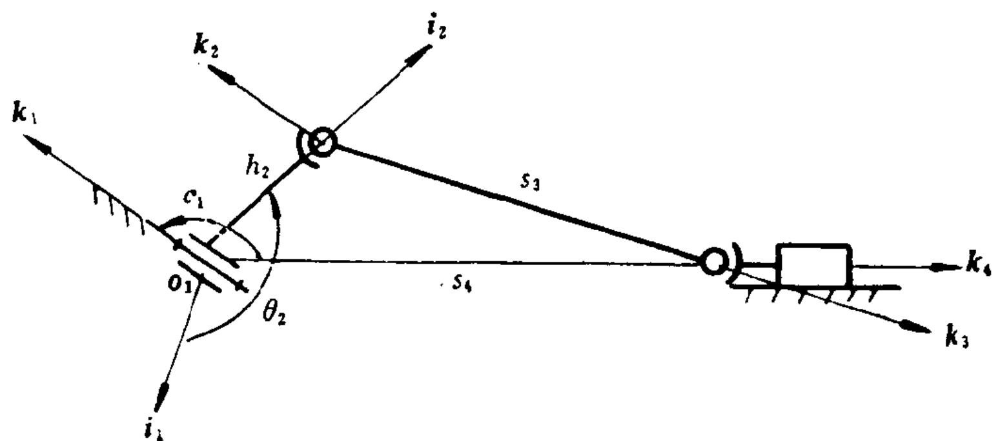

图6-13 RSSP空间机构

$$
\dot { \mathrm { s } } _ { 4 } = \frac { \mathrm { s } . \hbar _ { 2 } } { \mathrm { s } _ { 4 } - \hbar } \frac { \sin \alpha _ { 1 } \cos \theta _ { 1 } } { 2 \sin \alpha _ { 1 } \sin \theta _ { 2 } } \dot { \theta } _ { 2 }
$$

$$
\dot { \vec { s } } _ { 4 } = \frac { \dot { \vec { s } } _ { 4 } ^ { 2 } - \dot { \theta } _ { 2 } h _ { 2 } \sin \alpha _ { 1 } } { - \vec { s } _ { 4 } + \dot { h } _ { 2 } \sin \alpha _ { 1 } \sin \theta _ { 2 } }
$$

当滑块处于行程两端时, $\dot { \pmb { \mathscr { s } } } _ { 4 } = 0$ ,令式6-32等于零,即

$$
g _ { 4 } h _ { 2 } \sin \alpha _ { 1 } \cos \theta _ { 2 } = 0
$$

得

$$
\theta _ { 2 } = \pm 9 0 ^ { \circ }
$$

将式6-34及6-80代入式6-31,有

$$
\begin{array} { r l } & { s _ { \mathrm { 4 m a x } } ^ { 2 } + h _ { 2 } ^ { 2 } - s _ { 3 } ^ { 2 } - 2 s _ { \mathrm { 4 m a x } } h _ { 2 } \sin \alpha _ { 1 } = 0 } \\ & { s _ { \mathrm { 4 m i n } } ^ { 2 } + h _ { 2 } ^ { 2 } - s _ { 3 } ^ { 2 } + 2 s _ { \mathrm { 4 m i n } } h _ { 2 } \sin \alpha _ { \mathrm { l } } = 0 } \end{array}
$$

两式相减得

$$
\begin{array} { r } { \mathfrak { s } _ { \mathrm { 4 m a x } } ^ { 2 } - \mathfrak { s } _ { \mathrm { 4 m i n } } ^ { 2 } - 2 h _ { 2 } \sin \alpha _ { \mathrm { 1 } } ( \mathfrak { s } _ { \mathrm { 4 m a x } } - \mathfrak { s } _ { \mathrm { 4 m i n } } ) = 0 } \end{array}
$$

得

$$
h _ { 2 } = \frac { s _ { \mathrm { 4 m a x } } ^ { 2 } - s _ { \mathrm { 4 m i n } } ^ { 2 } } { 2 \sin \alpha _ { \mathrm { 1 } } \left( { \varepsilon _ { \mathrm { 4 m a x } } - s _ { \mathrm { 4 m i n } } } \right) }
$$

令

$$
k = \frac { s _ { \mathrm { + } \operatorname* { m a x } } ^ { 2 } - s _ { \mathrm { + } \operatorname { m i n } } ^ { 2 } } { 2 \left( s _ { \mathrm { 4 } \operatorname* { m a x } } - s _ { \mathrm { 4 } \operatorname { m i n } } \right) }
$$

则

$$
\pmb { h } _ { 2 } = - k / \sin \pmb { \alpha } _ { 1 }
$$

这是根据已给的行程设计活塞机构时 $h _ { 2 }$ 必须满足的关系,其中 $\vec { k }$ 为已知常数, $\alpha _ { 1 }$ 为待定结构参数。

由于曲柄滑块机构在 $j _ { 4 } = 0$ 时 $\sumint \limits _ { s _ { 4 } } ^ { \infty } d s$ 有极大值,根据式6-33及 $6 -$ 84,将 $\dot { \mathfrak { s } } _ { 4 } = 0$ , $\theta _ { 2 } = \pm 9 0 ^ { \circ }$ 以及 $\sin a x , \sin i n$ 代入,得

$$
\left. \begin{array} { l } { \displaystyle \ddot { s } _ { 4 } ^ { ( 1 ) } = \frac { \dot { \theta } _ { \circ } ^ { 2 } \dot { h } _ { 2 } \sin \alpha _ { 1 } , s , _ { \mathrm { { \ell m a x } } } } { \dot { h } _ { 2 } \sin \alpha _ { 1 } - s _ { 4 \operatorname* { m a x } } } } \\ { \displaystyle \ddot { s } _ { 4 } ^ { ( 2 ) } = \frac { - \dot { \theta } _ { 2 } ^ { 2 } \dot { h } _ { 2 } \sin \alpha _ { 1 } s _ { 4 \operatorname* { m i n } } } { - h _ { 2 } \sin \alpha _ { 1 } - s _ { 4 \operatorname* { m i n } } } \Bigg \} } \end{array} \right.
$$

这是加速度两个极值的表达式。把式6-36代入,得

$$
\left. \begin{array} { l } { { \displaystyle { \ddot { s } } _ { 4 } ^ { ( 1 ) } = \frac { \dot { \theta } _ { 2 } ^ { 2 } k \varepsilon _ { \mathrm { 4 m a x } } } { k - s _ { \mathrm { 4 m a x } } } } } \\ { { \displaystyle { \ddot { s } } _ { 4 } ^ { ( 2 ) } = \frac { - \dot { \theta } _ { 3 } ^ { 2 } k s _ { \mathrm { 4 m i n } } } { - k - s _ { \mathrm { 4 m i n } } } } } \end{array} \right\}
$$

根据 $k$ 的表达式,有

$$
k = \frac { ( g _ { 4 \operatorname * { m i n } } + H ) ^ { 2 } - g _ { 4 \operatorname * { m i n } } ^ { 2 } } { 2 H }
$$

$$
= \frac { H ^ { 2 } + 2 H _ { 8 4 \mathrm { m i n } } } { 2 H } = \frac { H + 2 8 _ { 4 \mathrm { m i n } } } { 2 }
$$

当 $\pi$ 给定时, $\pmb { \ S } _ { 4 \operatorname* { m i n } }$ 越小则 $\pmb { k }$ 越小,从而使式6-88中 $\sum \limits _ { \theta _ { 4 } } ^ { \infty }$ 的极值减小。根据上面的分析,按给定的活塞行程 $\pi$ 进行设计时,使惯性力减小的主要方法是减小 $\pmb { \vartheta } _ { 4 \pmb { \mathrm { m i n } } }$ 的数值。取定 $\pmb { \vartheta } _ { 4 \vert \pmb { \vert \eta \vert \bar { \varphi } \vert } }$ 后,可按安装条件或其他工作条件选定 ${ \pmb { \alpha } } _ { \bf 1 }$ ,然后根据式6-36确定 $h _ { 2 }$ 的值,将 $h _ { z _ { 3 } }$ $\pmb { \alpha _ { 1 } }$ 的数值以及 $\theta _ { 2 } = - 9 0 ^ { \circ }$ 、 ${ \vartheta _ { 4 } } = { \vartheta _ { 4 } } \mathrm { n } \mathrm { i n }$ 代入式6-31.得

$$
s _ { 3 } = \sqrt { \mathrm { ~ \small ~ \displaystyle ~ \beta ~ } _ { \mathrm { 4 m i n } } ^ { 2 } \cdot \mathrm { ~  ~ { ~ + ~ } ~ } h _ { 2 } ^ { 2 } + 2 \mathrm { ~  ~ { \ g _ { \mathrm { 4 m i n } } } } h _ { 2 } \mathrm { ~  ~ { \mathrm { { S i m } } }  { \alpha _ { 1 } } ~ \mathrm { ~ \small ~ \Omega ~ } } }
$$

上述结论可用如下程序进行验证:

程序6-6

program check $( \mathrm { i n p u t } \ , \ \mathrm { o u t p u t } ) ,$ const $\mathrm { \bf { p i } } = 3 . 1 4 1 5 9 ; \mathrm { \bf { H } } = 1 ;$ 

$$
\begin{array} { l } { \operatorname { s s } = 2 ; } \\ { \operatorname { n } = 5 ; } \\ { \operatorname { m } = 7 2 ; } \end{array}
$$

var k,h2,s3,s4m,af, th2,sth2,cth2,a, b, s4,v4,a4, max, steps, stepth2, real; 

1 writeln('input of'); 

2 readln(af); 

$$
\mathbf { a f } : = \mathbf { a f } * \mathbf { p i } / \mathbf { 1 8 0 } ;
$$

$$
\mathbf { s t e p s } \colon = ( \mathbf { s s } - \mathbf { 0 } . 5 ) / \mathbf { n } ;
$$

$$
\mathrm { s 4 m } \colon = 0 . 5 ; \mathrm { s t e p t h 2 } \colon = 2 * \mathrm { p i } ^ { \prime } \mathrm { m } ;
$$

6while ${ \mathfrak { s } } { \mathrm { 4 m } } < = { \mathrm { s } } { \mathrm { s } }$ do begin 

$$
\mathbf { k } \colon = ( \mathbf { H } + 2 { \ast } \mathbf { s } 4 \mathbf { m } ) / 2 ;
$$

$$
\begin{array} { r l } & { \mathbf { E } \div = ( \Gamma \mathbf { 1 } + \mathcal { L } ^ { * } \mathbf { S } ^ { \pm , \mathrm { I I I } } ) / \mathcal { L } ; } \\ & { \mathbf { h } \mathbf { 2 } : = \mathbf { k } / \sin { ( \mathrm { a f } ) } ; } \\ & { \mathbf { S } ^ { \mathbf { 9 } } : = \mathrm { s q r t } \left( \mathrm { s } 4 \mathrm { m } { * } \mathrm { s } 4 \mathrm { m } + \mathbf { h } \mathbf { 2 } { * } \mathbf { h } \mathbf { 2 } + \mathbf { 2 } { * } \mathbf { s } 4 \mathrm { m } { * } \mathbf { k } \right) } \\ & { \mathbf { m } \mathbf { a } \mathbf { x } : = 0 ; \mathrm { t h } \mathbf { 2 } : = 0 ; } \end{array}
$$

11while $\mathtt { t h 2 } { < } = \mathtt { 2 } { * } \mathtt { p i }$ do begin   
12 ${ \mathrm { s t h 2 } } \colon = { \mathrm { s i n } } ( { \mathrm { t h 2 } } ) { \mathrm { ; ~ c t h 2 } } \colon = { \mathrm { c o s } } ( { \mathrm { t h 2 } } ) { \mathrm { ; ~ } }$   
13 $b \colon = \operatorname { k } * { s t } \ln 2 * 2$   
14 $\begin{array} { r l } & { \mathrm { a } : = \mathrm { s q r t } ( \mathrm { b } * \mathrm { b } - 4 * ( \mathrm { h } 2 * \mathrm { h } 2 - \mathrm { s } 9 * \mathrm { s } 9 ) ) } \\ & { \mathrm { s } 4 : = ( \mathrm { a } + \mathrm { b } ) / 2 ; } \\ & { \mathrm { v } 4 : = ( \mathrm { s } 4 * \mathrm { k } * \mathrm { c t h } 2 ) / ( \mathrm { s } 4 - \mathrm { k } * \mathrm { s } 6 \mathrm { h } 2 ) ; } \\ & { \mathrm { a } 4 : = ( \mathrm { v } 4 * \mathrm { v } 4 - \mathrm { k } * ( 2 * \mathrm { v } 4 * \mathrm { c t h } 2 - \mathrm { s } 4 * \mathrm { s } 6 \mathrm { h } 2 ) ) / ( \mathrm { k } * \mathrm { s } \mathrm { s } \mathrm { i } \mathrm { h } 2 - \mathrm { s } 4 ) ; } \\ & { \mathrm { ~ } \quad . } \end{array}$   
15   
16   
17   
18 a:=abs(a4);   
19 if a>max then $\mathbf { m a x } ; = \mathbf { a } ;$   
20 th $2 \colon = \operatorname { t h } 2 + \operatorname { s t e p t h } 2 ;$   
21 end;writeln(max);   
22 $\mathrm { { s 4 m } : = \mathrm { { s 4 m } + \mathrm { { s t e p s } , } } }$   
23end; writeln;   
24end, 

该程序中,首先在 $\textbf { 1 }$ 至3行读入 ${ \pmb { \alpha _ { 1 } } }$ 的值,并进行弧度化处理。$\pmb { \delta } _ { 4 \equiv 1 } \mathbf { i } \mathbf { n }$ 的值在0.5至ss的范围内变化,步长为steps,对应 $\pmb { \vartheta } _ { 4 \mathrm { m i n } }$ 的每一个取值,由7至19行算得 $\displaystyle \ddot { s } _ { 4 }$ 的最大值,其中变量 $\ S 4 , \nabla 4 , \mathbf { a } 4$ 分别表示 $\sin _ { 2 } \frac { \cdot } { 2 } , \sin _ { 4 } \frac { \pi } { 2 }$ 在 $\dot { \theta } _ { 2 } = 1$ 的匀速输入运动下所具有的数值。运行上述程序,输出结果为

<table><tr><td>S4min</td><td>S4mar</td></tr><tr><td>0.5</td><td>1.66</td></tr><tr><td>0.8</td><td>2.1</td></tr><tr><td>1.1</td><td>2.55</td></tr><tr><td>1.4</td><td>3.0</td></tr><tr><td>1.7</td><td>3.44</td></tr><tr><td>2.0</td><td>3.89</td></tr></table>

以上仅讨论了 $\pmb { \delta } _ { \pmb { \mathrm { m i n } } }$ 与最大加速度之间的关系。当 $\pmb { \vartheta } _ { 4 m i n }$ 减小时,活塞的压力角将增大。在实际应用中,应根据具体情况权衡最大加速度与压力角的矛盾。

图6-14犁轮起落机构

# 二、按工作行程和静力要求设计农机耕作器起落机构

许多农业机械常需对耕作器(如执行挖、犁、耙动作的器具)进行收、放控制。在田里进行耕作时将耕作器放至适当的工作位置,耕作完毕后则将耕作器收至另一适当的位置以便于机器在正常路面上的行驶。收放的行程以及收放时所需的操纵力是对这类机构的基本设计要求。此外,还需要在收、放妥当后具有自锁能力。型轮起落机构就是其中一种有代表性的机构。

例 $6 - 7$ :在图6-14的犁轮起落机构中,构件3和构件4组成螺旋副。旋转手柄 $\pmb { R }$ 使螺栓转动,构件4沿构件3轴向移动,使构件3上的工作长度改变从而起收、放犁轮的作用。手柄停止转动后,螺旋副的自锁作用使构件3、4之间无相对运动,从而构件$\mathbf { 1 - 2 - 3 ( 4 ) - - 5 - 1 }$ 通过 $\pmb { 4 }$ 个转动副组成一空间框架结构,使犁轮固定在所需位置上。已知机架长1.2,起落距离 $\pi$ 。安装要求为:犁轮行程在机架上、下两侧均分;构件5转角范围限制为 ${ 9 0 } ^ { \circ } { \leqslant } \theta _ { 1 }$ ${ \leqslant } 8 0 ^ { \circ }$ ;构件2杆长0.9,转角范围限制为 $\theta _ { 2 } = 1 0 0 ^ { \circ } \pm 5 ^ { \circ }$ 。求满足上述要求的机构结构参数。

解选取 $\theta _ { 1 }$ 的范围为 $4 0 ^ { \circ }$ 至 $\yen 0 °$ , $\theta _ { 2 }$ 的范围为 $g 7 ^ { \circ }$ 至 $1 0 3 ^ { \circ }$ ,得

图8-15 RRHRR空间五杆机构

$$
\beta = \theta _ { \mathrm { 1 m a x } } - \theta _ { \mathrm { 1 m i n } } = 7 0 ^ { \circ } - 4 0 ^ { \circ } = 9 0 ^ { \circ }
$$

$$
\gamma = 1 8 0 ^ { \circ } - \theta _ { \mathrm { { i } } } - \beta / 2 = 1 2 5 ^ { \circ }
$$

$$
\ell = H / 2 \sin { 1 5 ^ { \circ } }
$$

建立各杆件坐标系如图6--15所示。 $k _ { 1 } , k _ { 5 _ { \circ } } k _ { 4 }$ 为3个相邻的相互平行的转动副轴线; ${ \pmb k } _ { 2 }$ 与 ${ \pmb k } _ { 3 }$ 重合, $\pmb { k _ { 2 } }$ 为转动副的轴线而 ${ \pmb k } _ { 8 }$ 为螺旋副的轴线。与杆件2有关的两个转动副轴线相互垂直并与$h _ { 2 }$ 垂直, $h _ { 4 }$ 与螺旋副的轴线垂直。因此, $i _ { 1 , } i _ { 2 , } k _ { 2 , } k _ { 3 , } i _ { 4 , } i _ { 5 }$ 在同一平面上,且有 $\mathfrak { s } _ { 1 } = \mathfrak { s } _ { 2 } = \mathfrak { s } _ { 4 } = \mathfrak { s } _ { 5 } = 0$ , $\alpha _ { 1 } = \alpha _ { 3 } = \alpha _ { 5 } = 0$ , $\alpha _ { 2 } = \alpha _ { 4 } = 9 0 ^ { \circ }$ , $\dot { \pmb q } _ { 4 } =$ $- i _ { 2 0 }$ 

根据式3-9,有

式中

$$
h _ { 1 } \dot { \iota } _ { 1 } + h _ { 2 } \dot { \iota } _ { 2 } - s _ { 3 } k _ { 3 } + h _ { 4 } \dot { \iota } _ { 4 } + h _ { 5 } \dot { \iota } _ { 5 } = 0
$$

$$
i _ { 2 } = E ^ { \chi _ { 0 } } { \bmod { \left[ \begin{array} { l } { 1 } \\ { 0 } \\ { 0 } \end{array} \right] } } = { \left[ \begin{array} { l } { \cos \theta _ { 2 } } \\ { \sin \theta _ { 2 } } \\ { 0 } \end{array} \right] } = - i _ { 4 }
$$

$$
\begin{array} { r } { k _ { 3 } = E ^ { \mathrm { k } \theta _ { 1 } } E ^ { \mathrm { i } \alpha _ { 1 } } \left[ \begin{array} { c } { 0 } \\ { 0 } \\ { 1 } \end{array} \right] = \left[ \begin{array} { c } { \sin \theta _ { 2 } } \\ { - \cos \theta _ { 2 } } \\ { 0 } \end{array} \right] } \end{array}
$$

$$
i _ { 5 } = E ^ { \boldsymbol { k } ( - \theta _ { 1 } ) } \left[ \begin{array} { l } { \mathbf { 1 } } \\ { 0 } \\ { 0 } \end{array} \right] = \left[ \begin{array} { l } { \cos \theta _ { 1 } } \\ { - \sin \theta _ { 1 } } \\ { 0 } \end{array} \right]
$$

展开式6-41得

$$
h _ { 1 } + ( h _ { 2 } - h _ { 4 } ) \cos { \theta _ { 2 } } - s _ { 3 } \sin { \theta _ { 2 } } + h _ { 5 } \cos { \theta _ { 1 } } = 0
$$

$$
( h _ { 2 } - h _ { 4 } ) \sin { \theta _ { 2 } } + s _ { 3 } \cos { \theta _ { 2 } } - h _ { 5 } \sin { \theta _ { 1 } } = 0
$$

设 $\$ 3$ 的最小值为 ${ \pmb { \mathrm { \vartheta } } } _ { 3 \mathrm { m i n } }$ ,出现在 $\theta _ { 2 } = 9 7 ^ { \circ } , \theta _ { 1 } = 7 0 ^ { \circ }$ 犁轮处于工作位置时。 ${ \pmb { \mathscr { s } } } _ { \pmb { \mathscr { s } } }$ 的最大值记为 $\mathfrak { s } _ { 3 \operatorname* { m i n } } + \Delta \mathfrak { s } _ { 3 }$ ,出现在 $\theta _ { 2 } = 1 0 3 ^ { \circ }$ 、 $\theta _ { 1 } = 1 0 ^ { \circ }$ 犁轮处于收起位置时。 $\bar { \Delta } s _ { 3 }$ 为 $\vartheta _ { 8 }$ 的改变量,求出 $\Delta s _ { 3 }$ 后,螺旋副的螺距$h$ 可由下式决定

$$
\lambda _ { i } = { \Delta } s _ { 3 } / { \Delta }
$$

式中, $\pmb { N }$ 为收、放型轮时手柄转动的圈数。将 $\theta _ { 2 } { = } 1 0 3 ^ { \circ }$ , $\theta _ { 1 } = 4 0 ^ { \circ }$ ,$\mathfrak { s } _ { 3 } = \mathfrak { s } _ { 3 \mathrm { m i n } } + \Delta \mathfrak { s } _ { 3 }$ 代入式6-42及6-43,得

$$
h _ { 1 } + \cdot \left( h _ { 2 } - h _ { 4 } \right) \cos 1 0 9 ^ { \circ } - \left( \vartheta _ { 3 \operatorname* { m i n } } + \Delta _ { 8 } \right) \sin 1 0 9 ^ { \circ } + h _ { 5 } \cos 4 0 ^ { \circ } = 0
$$

$$
( h _ { 2 } - h _ { 4 } ) \sin 1 0 ^ { \circ } ^ { \circ } + ( s _ { 3 \wedge \sin } + \Delta s _ { 8 } ) \cos 1 0 9 ^ { \circ } - h _ { 5 } \sin 4 0 ^ { \circ } = 0
$$

将 $\theta _ { 2 } = 9 7 ^ { \circ }$ , $\theta _ { 1 } \approx 7 0 ^ { \circ }$ , ${ \mathfrak { s } } _ { 3 } = { \mathfrak { s } } _ { 3 \operatorname* { m i n } }$ 代入式6-42及6-43,得

$$
h _ { 1 } + ( h _ { 2 } - h _ { 4 } ) \cos 9 7 ^ { \circ } - s _ { \mathrm { 3 m i n } } \sin 9 7 ^ { \circ } + h _ { 5 } \cos 7 0 ^ { \circ } = 0
$$

$$
( h _ { 2 } - h _ { 4 } ) \sin { 9 7 ^ { \circ } } + s _ { \mathrm { { 3 m i n } } } \cos { 9 7 ^ { \circ } } - h _ { 5 } \sin { 7 0 ^ { \circ } } = 0
$$

由式 ${ \bf 6 } { \cdot } 4 4 \sim { \bf 6 } { \ - } 4 7$ 可解得

$$
\begin{array} { r } { h _ { 5 } = 0 . 7 0 { \overset { \underset { \mathrm { P O S } } { } } { \mathrm { 8 } } } 9 1 4 { \overset { \mathrm { O 7 } } { \mathrm { 3 } } } } \\ { h _ { 4 } = 0 . 0 6 7 9 0 6 0 4 9 } \\ { { \overset { \mathrm { 8 } } { \mathrm { 3 } } } { \mathrm { m i n } } = 1 . { \overset { \mathrm { o n } } { \mathrm { . o s } } } 9 { \overset { \mathrm { o n } } { \mathrm { . } } } 8 2 5 0 6 } \\ { \Delta s _ { 3 } = 0 . 2 5 { \overset { \mathrm { O 7 } } { \mathrm { 3 } } } 8 2 5 6 } \end{array}
$$

可用图解方法验证上述结论。如图6-16所示,取 $A B$ 的长为1.2,作出 $h _ { 2 }$ 的两个位置 $C _ { 1 }$ 和 $C _ { 2 }$ 。使 $o p$ 垂直 $\pmb { A C }$ 并量取 $\boldsymbol { C } _ { \mathbf { 1 } } \boldsymbol { D } _ { \mathbf { 1 } }$ $\Xi = \vartheta _ { \mathrm { 3 m i n } } \doteq \mathrm { \underline { { 1 } } } \mathrm { , \ } \mathbf { \mathcal { 3 } } 4$ , $C _ { 2 } D _ { 2 } { = } s _ { 3 \mathrm { m i n } } { + } \Delta s _ { 3 } { \pm } 1 . 5 9 _ { \circ }$ 使 $D E$ 垂直 $\sigma \mathcal { D }$ ,并量取 $C _ { 1 } E _ { 1 } = C _ { 2 } E _ { 2 } = \hbar _ { 4 } \doteq 0 . 0 6 8 _ { \circ }$ 从图上可以量得 $E _ { 1 } B = E _ { 2 } B = 0 . 7 \AA =$ $h _ { \mathrm { 5 } }$ ,且 $\smash { E _ { \perp } B }$ 与 $E _ { 2 } B$ 的夹角为 $3 0 ^ { \circ }$ , $\boldsymbol { { \mathcal { E } } _ { 2 } B }$ 与机架的夹角为 $4 0 ^ { \circ }$ 。这说明上述五杆恰好能组成一个满足设计要求的机构,设计结果正确。

图616结果验证

# 三、按工作速度要求设计筛驱动机构

机动筛常用于块、粒状物体的分类筛选工作中,如农作物、建筑材料及矿石等分拣。机动筛驱动机构的主要任务是提供往复振动,根据被分拣物体形状和质量的不同,所需的振动速度也不同。因此,合适的往复振动速度是这类机构的主要设计要求。

例6-8:果实抖落机的机构示意图见图6-17。曲柄长 $h _ { 2 } =$ 0.2,连杆长 $s _ { 4 } = 0 . 5$ , $\alpha _ { 1 } = 4 5 ^ { \circ }$ , ${ \mathfrak { s } } _ { 1 } = 0 . 1$ , $\displaystyle h _ { 1 } = 0 _ { \circ }$ 由于经营品种增多,原机已不适应对各种不同的农作物果实进行分拣作业的要求,需要进行改装。要求在对原机构尽量不做大改动的前提下,使筛的最大类速度 $- \frac { \dot { s } _ { 6 } } { \dot { \hat { \theta } } _ { 2 } } \vert _ { \mathrm { ~ m a x } }$ 在0到0.21区间内可调。

解1.运动分析。

该机构为空间六杆RRRRRP机构。构件2与4之间,构件4与6之间由万向联轴节连接。构件8、5分别是两个联轴节的十字头。选取各坐标系如图 $6 - 1 7 。$ 根据式3-9有

$$
\begin{array} { r } { s _ { 1 } k _ { 1 } + h _ { 2 } \pmb { i } _ { 2 } + s _ { 4 } k _ { 4 } - s _ { 0 } k _ { 6 } = 0 } \end{array}
$$

即

$$
s _ { 1 } \pmb { k } _ { 1 } + \cdot h _ { 2 } \pmb { i } _ { 2 } - s _ { 0 } \pmb { k } _ { 6 } = - s _ { 4 } \pmb { k } _ { 4 }
$$

图6-17 果实抖落机构

两边平方得

$$
s _ { 1 } ^ { 2 } + h _ { 2 } ^ { 2 } + s _ { 6 } ^ { 2 } + 2 s _ { 1 } h _ { 2 } ( k _ { 1 } \bullet i _ { 2 } ) - 2 s _ { 1 } s _ { 6 } ( k _ { 1 } \bullet k _ { 6 } ) - 2 h _ { 2 } s _ { 6 } ( i _ { 2 } \bullet k _ { 6 } ) = s _ { 4 } ^ { 2 }
$$

式中

$$
k _ { 1 } \cdot i _ { 2 } = 0
$$

$$
\pmb { k } _ { 1 } { \cdot } \pmb { k } _ { 6 } = \cos \alpha _ { 1 }
$$

$$
i _ { 2 } \cdot k _ { 6 } = \left( E ^ { \nu \theta _ { 1 } } { \left[ \begin{array} { l } { 1 } \\ { 0 } \\ { 0 } \\ { 0 } \end{array} \right] } \right) \cdot \left( E ^ { i ( - \alpha _ { 1 } ) } { \left[ \begin{array} { l } { 0 } \\ { 0 } \\ { 1 } \end{array} \right] } \right) = \sin \theta _ { 2 } \sin \alpha _ { 1 }
$$

因而有

$$
\mathfrak { s } _ { 1 } ^ { 2 } \div \lambda _ { 2 } ^ { 2 } \div \mathfrak { s } _ { 6 } ^ { 2 } - \mathfrak { s } _ { 4 } ^ { 2 } - 2 \mathfrak { s } _ { 1 } \mathfrak { s } _ { 6 } \cos \mathfrak { s } _ { 1 } - 2 h _ { 2 } \mathfrak { s } _ { 6 } \sin \theta _ { 2 } \sin \mathfrak { s } _ { 1 } = 0
$$

式6-49对时间求导,经整理得

$$
\frac { \stackrel { \stackrel { \cdot } { 8 } } { _ { 6 } } } { \stackrel { \cdot } { \theta _ { 2 } } } = \frac { h _ { 2 } s _ { 6 } \sin \alpha _ { 1 } \cos \theta _ { 2 } } { s _ { 6 } - s _ { 1 } \cos \alpha _ { 1 } - h _ { 2 } \sin \alpha _ { 1 } \sin \theta _ { 2 } }
$$

上式左边称为机构的类速度,它的最大值只与机构的结构参数有关,而与原动件的转速无关。

# 2.型综合。

在该项改装设计中,仅有速度变化的要求。当各结构参数已确定时,类速度的最大值是确定的,它对应某个 $\theta _ { 2 }$ 的位置。从设计的角度看,可改变某个结构参数的数值以获得类速度最大值的变化。从式6-50可知,改变 $h _ { 2 } , s _ { 1 } , \alpha _ { 1 }$ 都可使类速度发生变化。但$h _ { 2 }$ 和 ${ \pmb { \vartheta } } _ { \bf 1 }$ 的改变需要改变零件的尺寸,不符合题目中改动小的要求。只能按图6-18所示的方法对 ${ \pmb { \alpha _ { 1 } } }$ 进行调整。

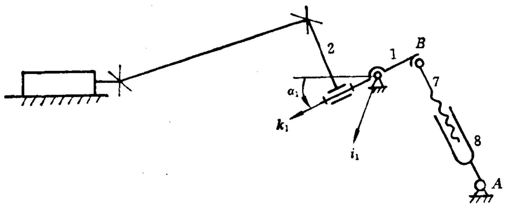

图6-18 $\pmb { \alpha _ { 1 } }$ 的调整

在图6-18中, $\pmb { \alpha _ { 1 } }$ 的调整是通过使 $\pmb { k _ { 1 } }$ 轴绕 $\bf { i } _ { 1 }$ 转动而实现的。增加构件7、8和两个转动副、一个球面副、一个螺旋副,组成一个八杆双封闭的空间多闭链机构。转动构件7使螺旋副产生相对运动从而改变 $\pmb { A B }$ 之间的长度,使构件1绕 $\pmb { i } _ { 1 }$ 轴转动,使构件8绕轴线平行 $i _ { 1 }$ 的转动副 $\pmb { A }$ 转动。调整完毕后,螺旋副的自锁作用使新增加的空间四杆闭链机构成为一个固定的三角框架,从而使 ${ \pmb { \alpha } } _ { 1 }$ 保持在调整后的位置上。改装设计的任务就是要确定上述四杆机构的结构参数,使其满足题目所要求的调整范围。

3.求解 ${ \pmb { \alpha } } _ { \bf 1 }$ 变化范围。

当 ${ \pmb { \alpha } } _ { 1 } = { \bf 0 }$ 时, $\pmb { k _ { 1 } }$ 与 $\pmb { k _ { 0 } }$ 重合, $h _ { 2 }$ 在垂直于 ${ { \pmb k } _ { \theta } }$ 的平面上以 $\pmb { k _ { 8 } }$ 为转轴旋转,构件6不产生位移。因此,须使 $\alpha _ { 1 } > 0 _ { \zeta }$ ,随着 ${ \pmb { \alpha _ { 1 } } }$ 增大,构件6的行程逐渐加大。由于 $\dot { \theta } _ { 2 }$ 不变, $h _ { 2 }$ 回转一周所用的时间也不变。在不变的时间间隔内,行程越大,速度也就越大。因此 $j _ { \theta }$ 随${ \pmb { \alpha } } _ { \bf { 1 } }$ 的增加单调上升。当 $\alpha _ { 1 } = 9 0 ^ { \circ }$ 时,类速度 $\dot { \mathfrak { s } } _ { \mathfrak { g } } / \dot { \theta } _ { 2 }$ 达到最大值。作为合理的设计要求, $\pmb { \alpha _ { 1 } }$ 的最大边界应小于 $9 0 ^ { \circ }$ 

如何根据题目所要求的条件

$$
\frac { \dot { s } _ { 6 } } { \dot { \theta } _ { 2 } } \Big | _ { \mathrm { ~ m a x } } = 0 . 2 1
$$

来求解 ${ \pmb { \alpha _ { 1 } } }$ 的最大值 $\pmb { \alpha _ { 1 } } _ { \mathbf { m a x } }$ ,是首先要解决的问题。有了 ${ \pmb { \alpha _ { 1 } } }$ 的运动范围 $( 0 , \ \alpha _ { \mathrm { 1 m a x } } )$ ,才能着手进行上述四杆机构的设计。

先来看一下用解析方法求解 $\alpha _ { 1 m a x }$ 所要经历的过程:

(1)设由式6-50对 $\theta _ { 2 }$ 求导并令其为零得到的公式为(a)。由于 $\yen 8$ 也是 $\theta _ { 2 }$ 的函数,求导后的式子将包含 $\delta _ { 6 } \ : , \ : \dot { s } _ { 6 } \ : , \ : \sin \theta _ { 2 } , \ : \ : \cos \theta _ { 2 }$ ,用式6-49消去其中 ${ \pmb S } _ { \pmb 0 } ,$ ,引入开方项。 ${ \dot { \bf s } } _ { \bf { \updownarrow } }$ 由式6-50确定,其中又包含 $\$ 60$ 因此, $\mathbf { \Psi } ( \mathbf { a } )$ 式由 $\sin \theta _ { 2 } , \cos \theta _ { 2 }$ 的乘、除、开方项的复杂组合而构成。

(2)从 $( \mathbf { a } )$ 式中解出 $\theta _ { 2 }$ 并代入式6-50,得到 $\left. \frac { \dot { s } _ { 8 } } { \dot { \theta } _ { 2 } } \right| _ { \mathrm { m a x } }$ 的表达式(b)。

(3)令 $( \mathbf { b } )$ 式的值等于0.21,解出 $\pmb { \alpha _ { 1 m a x \circ } }$ 

上述求解过程非常繁复。较好的方法是采用前面介绍过的优化设计方法。用优化方法解这个问题非常简单,设计向量仅一维,X=a,追求的日标是. $\dot { \bar { \theta } } _ { 2 } ^ { \ \dot { \ } } \Bigr \{ \ \frac { \dot { \bar { s } } _ { \theta } } { \dot { \bar { \theta } } _ { 2 } ^ { \ } } \Bigr \} _ { \mathrm { m a x } }$ 尽量接近0.21。由于 $h _ { 2 } , s _ { 4 }$ 的长度已定且 $s _ { 4 } > h _ { 2 }$ ,在寻优过程中 ${ \pmb { \alpha } } _ { \bf 1 }$ 的变化不会引起不合理机构的出现,是一个无约束的优化问题。可编制如下程序计算出目标函数的值:

程序6-7

function fx(af:real); real; 

var max, th2, sth2,cth2, saf,caf,s6,v6,step, a,b,c: real; 

1 begin max: $\ b = \ b 0$ ; $\mathbf { \Delta } _ { \mathbf { { t h } } } \mathbf { \mathbf { 2 } } \mathbf { : } = \mathbf { 0 } ; \mathbf { s t e p } \mathbf { : } = \mathbf { 2 } \pm \mathbf { p i } / \mathbf { n } ;$ 

2caf $: = \cos ( \mathrm { a f } ) ; \mathrm { s a f } ; = \sin ( \mathrm { a f } ) ;$ 

3while th $2 < = 2 *$ pi do begin 

4sth $\mathbf { 2 } : = \sin \left( \mathbf { \pm } \mathbf { h } \cdot \mathbf { 2 } \right)$ ; cth $\mathbf { 2 } \colon = \cos ( \mathbf { t h } \cdot \mathbf { 2 } ) ;$ 

$$
{ \bf b } \colon = 2 \ast ( \mathrm { s 1 } \ast \mathrm { c a f } + \mathrm { h } 2 \ast \mathrm { s t h } 2 \ast \mathrm { s a f } ) ;
$$

7 a:=sqrt(b\*b-4\*c); 

9 v6:==abs((h2\*s6\*saf \*cth2)/ (s6 - s1\*caf - h2\* saf\* sth2)); 

10if $\mathrm { { v } } 6 > \mathrm { { m a x } }$ then max: =v 6; 

$$
\mathbf { t h 2 } : = \mathbf { t h 2 } + \mathbf { s t e p } ; \mathbf { e n d } ;
$$

$$
\mathbf { f } \mathbf { x } { \mathrm { : = } } \mathbf { a } \mathbf { b } \mathbf { s } ( \mathbf { m } \mathbf { a } \mathbf { x } - \mathbf { s } { \mathrm { m } } \mathbf { a } \mathbf { x } ) { \mathrm { ; } }
$$

13 end; 

程序中step为循环步长的增量, $\mathbf { p i }$ 表示 $\pmb { \mathcal { K } }$ ,将 $h _ { 2 }$ 回转一周分成 $\pmb { \eta }$ 等分求 $\dot { \mathfrak { s } } _ { 6 } / \dot { \theta } _ { 2 }$ 的最大值。1至2行进行初始化, $\mathbf { 3 }$ 至11行为循环体。其中4至8行计算 ${ \pmb S } _ { \pmb { \ 6 } }$ 的值,第9行计算 $\dot { \mathfrak { s } } _ { 6 } / \dot { \theta } _ { 2 }$ 的绝对值。第10行挑选出 $\frac { \partial _ { \theta } } { \partial _ { 2 } } \bigg | _ { \mathrm { m a x } } ,$ 并在第12行把它与smax的差的绝对值赋予目标函数,smax预先赋值为0.21。

可用图5-5的无约束寻优流程来求解。如果注意到这仅是一个自变量且单调连续的问题,可以有更为简便的方法进行求解。$\ S 2 \mathbf { - 3 }$ 中曾介绍过对分区间法,在有根区间 $( a , b )$ 中, $f ( \pmb { \alpha } )$ 与 $f ( b )$ 的符号相反。把 $( a , b )$ 均分为两个小区间,计算分点的函数值并与$f ( a ) , f ( b )$ 的符号进行对比,决定舍弃哪一个小区间,直至小区间的长度满足要求。取最后一个小区间的中点作为方程的根。至此即可构造函数

$$
f \left( \alpha _ { \mathrm { 1 } } \right) = \frac { \dot { \alpha } _ { \mathrm { 6 } } } { \dot { \theta } _ { \mathrm { 2 } } } \bigg \vert _ { \mathrm { m a x } } - \mathrm { s m a x } = 0
$$

在 $\alpha _ { 1 } = ( 0 , \ \pi / 2 )$ 区间内, $f ( \alpha _ { 1 } )$ 单调上升,且 $f ( 0 )$ 为负, $f ( \pi / 2 )$ 为正。可以编制如下的对分区间法程序求使 $f ( \alpha _ { 1 } ) = 0$ 的根 $\alpha _ { 1 \mathrm { m a x } }$ :

程序6-8

procedure find (a, b:real); 

var c, f:real; 

1begin if $\mathbf { b } - \mathbf { a } < \theta$ then writeln $( ( { \bf a } + { \bf b } ) / 2 )$ else begin   
2 $\begin{array} { l } { { \displaystyle { \mathfrak { c } } : = ( { \mathfrak { a } } + { \mathfrak { b } } ) / 2 } ; } \\ { { \displaystyle { \mathfrak { f } } : = { \mathfrak { f } } { \mathfrak { x } } ( { \mathfrak { c } } ) } ; } \end{array}$   
3   
4if ${ \bf \ddot { f } } = 0$ then writeln(c) else begin   
5 if $\mathbf f < 0$ then find $( \mathsf { \pmb { c } } , \mathsf { \pmb { b } } )$ else find(a,c)   
6 end;end; end; 

上述程序中, $\boldsymbol { \mathsf { e } }$ 为小区间的最小值。第1行首先进行精度检查,若小区间的长度已足够小,则输出区间中点的值。第2、3行计算区间中点c的函数值,函数 $\mathbf { f x }$ 由程序6-7稍加修改而成。第4行对 $\mathbf { f } \left( \mathbf { c } \right)$ 进行检查,若为零,说明c就是根,把c输出。第5行按f(c)的符号决定区间的取舍并递归调用自身,进行下一轮对分。由于利用了递归手段,程序十分简洁。

程序6-7所需的修改为:第12句改为

$$
\mathbf { f x } \colon = \operatorname* { m a x } - { \mathbf { s } } \ \operatorname* { m a x } ,
$$

取初始区间为 $( 0 , \ \pi / 2 )$ ,迭代精度 $\mathfrak { e } = \mathbf { 1 } \mathbf { E } - \mathbf { 3 } _ { \mathrm { ~ \tiny ~ . ~ } }$ ,得 $\alpha _ { 1 \tt m a x } =$ 1.1439652 rad。

4.求解其余结构参数。

在图6-18中, $\pmb { A }$ 是构件8与机架相连的转动副, $B$ 是球面副中心。由图6-19知, $\pmb { A }$ 的位置及 $O _ { 1 } B$ 的长可根据原有机器所允许的安装空间来确定。 $\pmb { A }$ 点确定后, $O _ { 1 } A$ 与水平线的夹角 $\beta$ 就确定了,则有

$$
\begin{array} { r l } & { \quad A B _ { 1 } { = } \sqrt { ( O _ { 1 } B _ { 1 } ) ^ { 2 } + ( O _ { 1 } A ) ^ { 2 } - 2 ( O _ { 1 } B _ { 1 } ) ( O _ { 1 } A ) \cos \beta } } \\ & { \quad A B _ { 2 } { = } \sqrt { \quad ( O _ { 1 } B _ { 1 } ) ^ { 2 } + ( O _ { 1 } A ) ^ { 2 } - 2 ( O _ { 1 } B _ { 1 } ) ( O _ { 1 } A ) \cos ( \beta + \alpha _ { 1 \operatorname* { m a x } } ) } } \end{array}
$$

螺纹长度

$$
\pmb { L } = \pmb { A } \pmb { B _ { 2 } } - \pmb { A } \pmb { B _ { 1 } }
$$

在 $( 0 , \alpha _ { 1 \tt m a x } )$ 区间内按照不同农作物所需的振动速度给 $\ S \textbf { m a x }$ 赋不同的值,调用程序6-8将给出不同的 ${ \pmb { \alpha } } _ { 1 }$ 数值。按照这些数值可在扇形刻度盘上标注对不同农作物进行分拣时杆件 $O _ { 1 } B _ { 1 }$ 所应到达的位置,以便于操作人员进行调整。

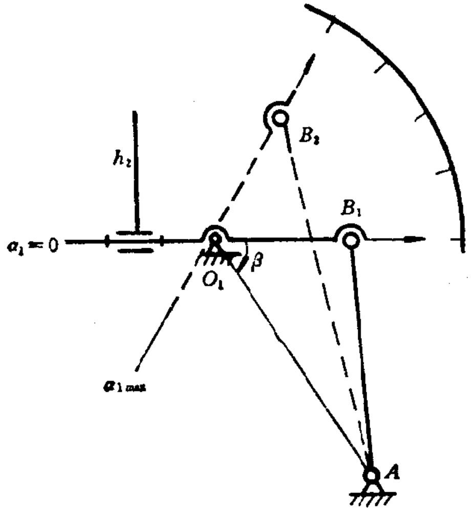

图6-19 其余参数的求解

# 第七章 机器人机构设计的基本方法

机器人机构的型综合、尺寸综合以及尺寸校正、运动轨迹规划等问题,都是机器人机构设计中所遇到的基本问题,本章就叙述解决这些问题的基本原则和方法。有关设计的实际应用,将在下一章叙述。

# 87-1 机器人机构的型综合

机器人机构的型综合,主要解决如何根据作业要求确定机器人机构的组成型式、关节数目及配置方式等问题。如第一章所述,具有6个适当配置关节的机器人机构,可使被夹持物体(工具)在空间得到任意位置和姿态。所以通用机器人都具有6个关节,而专用机器人则根据其不同用途具有不同的关节数目和配置方式。本节着重阐述根据专门作业要求来确定机器人机构型式的方法。

# 一、机器人机构的广义位姿

第三章叙述了用姿态矩阵 $\pmb { \cal E }$ 表示手腕姿态,即

$$
E = { \left[ \begin{array} { l l l } { \lambda _ { i } } & { \lambda _ { j } } & { \lambda _ { k } } \\ { \mu _ { i } } & { \mu _ { j } } & { \mu _ { k } } \\ { \nu _ { i } } & { \nu _ { j } } & { \nu _ { k } } \end{array} \right] }
$$

式中,第1,2、3列分别表示末杆坐标系 $i , j , k$ 轴在基础坐标系中的方向余弦。为区别于机器人杆件坐标系,用 $a , b , c$ 表示与被夹持物体固连的坐标系各轴。被夹持物体的姿态由 $a , b , c 9$ 轴在基础坐标系中的方向余弦表示,即

$$
E = [ { \pmb a } \quad { \pmb b } \quad { \pmb c } ] = \left[ \begin{array} { l l l } { \lambda _ { a } } & { \lambda _ { b } } & { \lambda _ { o } } \\ { \mu _ { a } } & { \mu _ { b } } & { \mu _ { c } } \\ { \gamma _ { a } } & { \nu _ { b } } & { \nu _ { o } } \end{array} \right]
$$

根据不同的夹持方式,机器人末杆坐标系的 $i , j , k \textbf { 3 }$ 轴可以与 $\pmb { a } .$ 、$\smash { \pmb { b } _ { \lambda } \pmb { c } \ 3 }$ 轴一致或不一致。如果两者不一致,可用一旋转变换矩阵$E _ { w }$ 表示两者之间的变换关系。这样,夹持方式便可通过 $E _ { w }$ 来定义。

为了分析和计算方便,常用另一种姿态表示方法,称为广义姿态 $\pmb { \Omega } _ { \circ }$ 广义姿态用角位移向量来表示

$$
\Omega = \Omega w - [ \Omega _ { \alpha } \quad \Omega _ { y } \quad \Omega _ { z } ] ^ { \pi } = \Omega [ \lambda _ { w } \quad \mu _ { w } \quad \nu _ { w } ] ^ { \pi }
$$

式中, $\pmb { w }$ 是被夹持物体上的参考轴,称为主轴,在基础坐标系中的方向余弦为 $\lambda _ { w } , \ \mu _ { w } , \ \nu _ { w \circ } \ \mathcal { Q }$ 是绕 $\pmb { w }$ 的旋转角。根据式2-17有.

$$
\begin{array} { r } { { \cal E } ^ { \mathrm { w } a } = [ \begin{array} { c } { \cos \Omega + h _ { \mathrm { w } } ^ { a } ( \mathrm { L } - \cos \Omega ) } \\ { h _ { \mathrm { w } } I _ { \mathrm { w } } ( \mathrm { L } - \cos \Omega ) + p _ { \mathrm { w } } \sin \Omega } \\ { h _ { \mathrm { w } } \lambda _ { \mathrm { w } } ( \mathrm { L } - \cos \Omega ) - \mu _ { \mathrm { w } } \sin \Omega } \\ { h _ { \mathrm { w } } I _ { \mathrm { w } } ( \mathrm { L } - \cos \Omega ) - p _ { \mathrm { w } } \sin \Omega } \end{array}  } \\ { \phantom { { = } }  \sin \mu _ { \mathrm { w } } ( \mathrm { L } - \cos \Omega ) - \nu _ { \mathrm { w } } \sin \Omega  } \\ { \phantom { { = } }  \sin \Omega + \mu _ { \mathrm { w } } ^ { a } ( \mathrm { L } - \cos \Omega )  } \\ { \phantom { { = } }  \mu _ { \mathrm { w } } \nu _ { \mathrm { w } } ( \mathrm { L } - \cos \Omega ) + \lambda _ { \mathrm { w } } \sin \Omega } \\ { \phantom { { = } } p _ { \mathrm { w } } \lambda _ { \mathrm { w } } ( \mathrm { L } - \cos \Omega ) + \mu _ { \mathrm { w } } \sin \Omega } \\ { \phantom { { = } } \mu _ { \mathrm { w } } \nu _ { \mathrm { w } } ( \mathrm { L } - \cos \Omega ) - \lambda _ { \mathrm { w } } \sin \Omega } \\ { \phantom { { = } } \mu _ { \mathrm { w } } \nu _ { \mathrm { w } } ( \mathrm { L } - \cos \Omega ) - \lambda _ { \mathrm { w } } \sin \Omega } \\ { \phantom { { = } } \cos \Omega + \nu _ { \mathrm { w } } ^ { a } ( \mathrm { L } - \cos \Omega ) } \end{array}
$$

这两种姿态表示方法是等效的。令式 $\pmb { 7 - 1 }$ 和 $7 - 3$ 的对应元素相等、则可在两种姿态表达方式之间进行转换。两式对角线各元素相加得

$$
\begin{array} { r l } & { \lambda _ { 0 } + \mu _ { \bar { \upsilon } } + \nu _ { c } = \cos \Omega + \lambda _ { w } ^ { 2 } ( 1 - \cos \Omega ) } \\ & { \qquad + \cos \Omega + \mu _ { w } ^ { 2 } ( 1 - \cos \Omega ) + \cos \Omega } \\ & { \qquad + \nu _ { w } ^ { 2 } ( 1 - \cos \Omega ) } \end{array}
$$

即 $\lambda _ { 0 } + \mu _ { \bar { \upsilon } } + \nu _ { c } = \left( \lambda _ { w } ^ { 2 } + \mu _ { w } ^ { 2 } + \nu _ { w } ^ { 2 } \right) ( 1 - \cos \Omega ) + 9 \cos \Omega$ 由于向量的方向余弦平方和为1,上式写为

$$
\lambda _ { a } + \mu _ { b } + \nu _ { c } = 1 + 2 \cos { \itOmega }
$$

因此

$$
\cos \Omega = \frac { 1 } { 2 } ( \lambda _ { 0 } + \mu _ { 0 } + \nu _ { 0 } - 1 )
$$

将式7-1和 $7 - 3$ 的对角线两边各对称项相减,得

$$
\scriptstyle \left. \begin{array} { r } { \nu _ { b } - \mu _ { c } = 2 \lambda _ { w } \sin \varOmega } \\ { \lambda _ { c } - \nu _ { a } = 2 \mu _ { w } \sin \varOmega } \\ { \mu _ { a } - \lambda _ { b } = 2 \nu _ { w } \sin \varOmega } \end{array} \right\}
$$

上式两边平方并相加,得

$$
( \nu _ { b } - \mu _ { c } ) ^ { 2 } + ( \lambda _ { c } - \nu _ { a } ) ^ { 2 } + ( \mu _ { a } - \lambda _ { b } ) ^ { 2 } = 4 \sin ^ { 2 } \Omega
$$

因而

$$
\sin \Omega = \pm \frac { 1 } { 2 } \sqrt { ( \nu _ { b } - \mu _ { c } ) ^ { 2 } + ( \lambda _ { c } - \nu _ { a } ) ^ { 2 } + ( \mu _ { a } - \lambda _ { b } ) ^ { 2 } }
$$

如果规定 $0 \leqslant \Omega \leqslant 1 8 0 ^ { \circ }$ ,上式根号前取 $- t$ 号,则

$$
\mathcal { Q } = \mathrm { t g } ^ { - 1 } ~ \frac { \sqrt { ( \nu _ { b } - \mu _ { c } ) ^ { 2 } + ( \lambda _ { c } - \nu _ { a } ) ^ { 2 } + ( \mu _ { a } - \lambda _ { b } ) ^ { 2 } } } { \lambda _ { a } + \mu _ { b } + \nu _ { c } - 1 }
$$

根据式7-5,可求出转轴 $\pmb { W }$ 的方向余弦

$$
\left. \begin{array} { c } { { \lambda _ { \left. w \right. } = \displaystyle \frac { \nu _ { h } - \mu _ { o } } { 2 \sin \Omega } } } \\ { { \left. \mu _ { w } = \displaystyle \frac { \lambda _ { e } - \nu _ { o } } { 2 \sin \Omega } \right\} } } \\ { { \left. \nu _ { w } = \displaystyle \frac { \mu _ { o } - \lambda _ { b } } { 2 \sin \Omega } \right] } }  \end{array} \right.
$$

# 二、物体姿态的实现及相应的手腕型式

手腕的结构型式必须保证物体主轴 $\pmb { w }$ 的定位和绕 $\pmb { w }$ 转动的实现。在下面的讲述中,取被夹持物体主轴 $\pmb { w }$ 与 $\pmb { \alpha }$ 轴重合, $a , b .$ 、$\pmb { c }$ 与末杆坐标系 $i . j , k$ 轴一致,在初始位置上末杆坐标系各轴与基础坐标系对应轴平行,见图 $\gamma - 1$ 

绕主轴的旋转可由末杆绕其轴线的旋转关节来实现。在图7-1中,主轴 $\pmb { a }$ 与 $\smash { i _ { n } }$ 轴重合, $E ^ { w \theta }$ 即 $E ^ { a . 0 }$ ,角 $\varOmega$ 可由末杆关节的运动 $E ^ { i \theta _ { n } }$ 来实现。而主轴的方向则应由 $n - 1 , n - 2$ 关节的转动来实现。图7-2画出了几种实现主轴方向的方法及相应的手腕型式。

主轴 $\pmb { \alpha }$ 的最终定向可由初始状态( $\mathbf { i }$ 方向)经两次不同方式的旋转来实现。旋转方式有如下4种[14]。

第一种旋转方式: $\pmb { i }$ 轴先绕 $j$ 轴转 $\theta _ { 1 }$ 角,再绕 $\mathbf { \Delta } _ { k }$ 轴旋转 $\theta _ { 2 }$ 角,到达 $\pmb { a }$ 位置,见图 $7 - 2 a _ { 0 }$ 这种旋转可由手腕的两个回转关节实现。绕 $j$ 的旋转由关节 $\boldsymbol { B }$ 实现,而绕 $\pmb { k }$ 的旋转由关节 $\pmb { A }$ 实现。

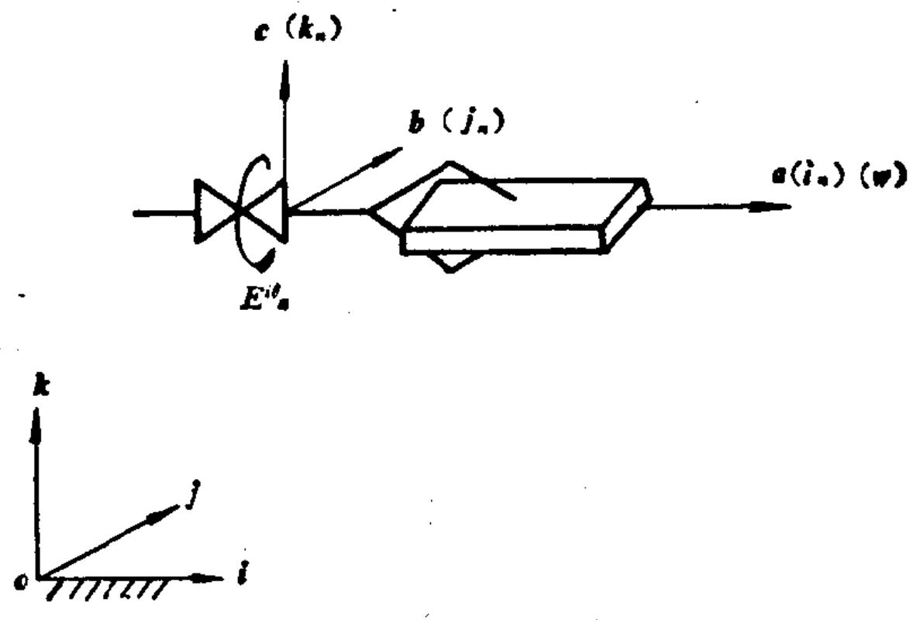

图7-1 物体的初始位置

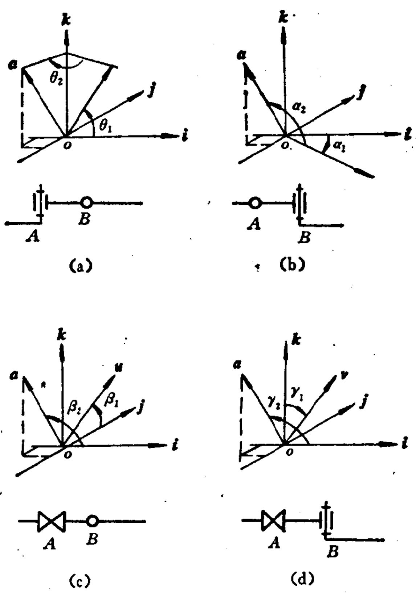

图7-24种旋转方式

第二种旋转方式: $\pmb { i }$ 轴先绕 $\pmb { k }$ 转 ${ \pmb { \alpha _ { 1 } } }$ 角,再绕 $\pmb { j }$ 转 $\pmb { \alpha _ { 2 } }$ 角而到达$\pmb { \alpha }$ ,见图 $7 - 2 b .$ 。绕 $\pmb { k }$ 的转动由关节 $\mathcal { B }$ 实现,而绕 $j$ 的转动由关节$\pmb { A }$ 实现。

第三种旋转方式:先将 $\pmb { j }$ 轴绕 $\pmb { i }$ 轴转 $\beta _ { 1 }$ 角至位置 ${ \pmb u } , \ i$ 轴再绕 $\pmb { \ll }$ 转 $\beta _ { 2 }$ 角到达 ${ \pmb a }$ ,见图 $\eta - 2 c _ { \circ }$ 绕 $\pmb { i }$ 轴的转动由关节 $\pmb { A }$ 实现,而绕 $\pmb { \mathcal { M } }$ (即改变了方向的原 $\pmb { j }$ 轴)的转动由关节 $\mathcal { B }$ 实现。

第四种旋转方式:先将 $\pmb { k }$ 轴绕 $\pmb { i }$ 轴转 $\gamma _ { 1 }$ 角至 $\pmb { v }$ 位置, $\pmb { i }$ 轴再绕$\pmb { v }$ 转 $\gamma _ { 2 }$ 角到达 $\pmb { \mathbb { d } }$ ,见图 $\because 7 - 2 d ,$ 绕 $\pmb { i }$ 轴的转动由关节 $\pmb { A }$ 实现,而绕$\pmb { v }$ 的转动由关节 $\pmb { B }$ 实现。

图 $\mathbf { 7 } \mathbf { - } 2 \mathbf { a }$ 与 $\mathbf { b }$ 所示的关节型式相同,不同的是转了 $\pi / 2$ 角度。由于论述是以初始位置为基准的,所以仍当作不同的手腕型式。同理,图 $\ y - 2 c$ 也当作与图7-2d不同的手腕型式。

由以上分析可知,物体的任意姿态可由3个不同配置的手腕关节来实现。其中最末1个关节实现绕主轴的旋转,其余2个关节实现主轴的定位。在仅要求实现部分姿态的场合,手腕关节数目可小于 $g _ { o }$ 定义手腕绕 $i , j , k$ 轴旋转的能力为旋转数 $\phi _ { i _ { \cdot } } W _ { j _ { \cdot } }$ $\mathbb { W } _ { \sharp }$ ,其取值为 $\textbf { l }$ ,表示能绕对应轴旋转,反之不能。各种不同关节数目和配置方式的手腕见表 $\mathbf { 7 } \mathbf { - } \mathbf { 1 }$ ,其中编号为8的手腕虽然有一个关节轴线与 $\pmb { i }$ 轴平行,但它的作用只是为了实现 $\pmb { \mathbb { a } }$ 的定位。 $\pmb { \alpha }$ 的定位相当于绕 ${ \pmb j } , { \pmb k }$ 两轴的转动,因此 $W _ { \ell } { = } 0 , W _ { \ell } { = } 1 , W _ { \ell } { = } 1$ 

# 三、实现位置与实现姿态的相关性

.不同关节配置方式的机器人手臂虽然都可以决定物体的位置,但是对物体的姿态却有不同的影响。圆柱坐标型手臂在运动中可保持末杆夹持向量 $\pmb { G }$ 始终平行于水平面,从而使杯中的水不会洒出来,见图 $\gamma - 3 a$ 。而关节型手臂则不然,见图 $7 - 3 b _ { i }$ ,因此,在有姿态要求的场合,必须考虑手臂结构对末杆姿态产生的影响。此外,手腕在实现 $\dot { \pmb { a } }$ 的方位时,也会产生绕 $\pmb { a }$ 转动的附加影响,如上述编号8的手腕。用 $\ldots _ { A _ { i _ { \cdot } } A _ { j _ { \cdot } } A _ { k } }$ 表示前面关节对末杆在相应的 $\mathbf { i } .$ 、

# 表7-1 手腕结构型式

<table><tr><td rowspan=1 colspan=2>关节数目</td><td rowspan=1 colspan=3>编号</td><td rowspan=1 colspan=3>手腕结构</td><td rowspan=1 colspan=3>W</td><td rowspan=1 colspan=3>W</td><td rowspan=1 colspan=1>W</td></tr><tr><td rowspan=3 colspan=3>1</td><td rowspan=1 colspan=3>1</td><td rowspan=1 colspan=3>Ixll></td><td rowspan=1 colspan=3>1</td><td rowspan=1 colspan=3>0</td><td rowspan=1 colspan=1>0</td></tr><tr><td rowspan=1 colspan=3>2</td><td rowspan=1 colspan=3>101        ◇</td><td rowspan=1 colspan=3>0</td><td rowspan=1 colspan=3>1</td><td rowspan=1 colspan=1>0</td></tr><tr><td rowspan=1 colspan=3>3</td><td rowspan=1 colspan=3>       L</td><td rowspan=1 colspan=3>0</td><td rowspan=1 colspan=3>0</td><td rowspan=1 colspan=2>1</td></tr><tr><td rowspan=5 colspan=2>2</td><td></td><td rowspan=1 colspan=3>4</td><td rowspan=1 colspan=3>lolxl></td><td rowspan=1 colspan=3>1</td><td rowspan=1 colspan=3>1</td><td rowspan=1 colspan=2>0</td></tr><tr><td rowspan=1 colspan=2>5</td><td></td><td rowspan=1 colspan=3>Irxl</td><td rowspan=1 colspan=3>1</td><td rowspan=1 colspan=3>0</td><td rowspan=1 colspan=2>1</td></tr><tr><td rowspan=1 colspan=2>6</td><td></td><td rowspan=1 colspan=3>ll「>></td><td rowspan=1 colspan=3>0</td><td rowspan=1 colspan=3>1</td><td rowspan=1 colspan=2>1</td></tr><tr><td rowspan=1 colspan=2>7</td><td></td><td rowspan=1 colspan=3>ltrol></td><td rowspan=1 colspan=3>0</td><td rowspan=1 colspan=3>1</td><td rowspan=1 colspan=2>1</td></tr><tr><td rowspan=1 colspan=3>8</td><td rowspan=1 colspan=3>lxlol></td><td rowspan=1 colspan=3>0</td><td rowspan=1 colspan=3>1</td><td rowspan=1 colspan=2>1</td></tr><tr><td rowspan=3 colspan=2>3</td><td rowspan=1 colspan=3>9</td><td rowspan=1 colspan=3>l0lx></td><td rowspan=1 colspan=3>1</td><td rowspan=1 colspan=3>1</td><td rowspan=1 colspan=2>1</td></tr><tr><td rowspan=1 colspan=3>10</td><td rowspan=1 colspan=3>lrolxl></td><td rowspan=1 colspan=3>1</td><td rowspan=1 colspan=3>1</td><td rowspan=1 colspan=3>1</td></tr><tr><td rowspan=1 colspan=3>11</td><td rowspan=1 colspan=3>IZ1olXl></td><td rowspan=1 colspan=3>1</td><td rowspan=1 colspan=3>1</td><td rowspan=1 colspan=3>1</td></tr></table>

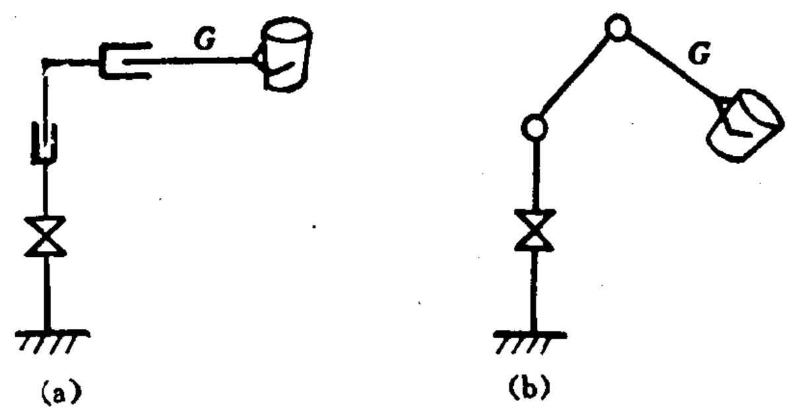

图7-3实现位置对姿态的影响

${ \pmb j } _ { \pmb { \cdot } } { \pmb k }$ 方向上的姿态干扰,取值 $\pm$ 表示有干扰,见表7-2。表中只列入4种最常用的手臂型式:编号1称直角坐标型手臂,2称圆柱坐标型手臂,3称极坐标型手臂,4称关节型手臂。未列入表中的手腕均有 $A _ { 3 } = A _ { 3 } = A _ { k } = 0 _ { \circ }$ 

# 四、机器人机构的型综合关系式

机器人机构的型综合有位置、姿态两方面的要求。被夹持物体的位置由机器人手臂实现。用 $\pmb { F }$ 表示机器人手臂的自由度, $\pmb { F _ { B } }$ 表示物体的位置自由度,有

$$
\mathbf { \nabla } \mathbf { F } = \mathbf { \nabla } \mathbf { F } _ { B }
$$

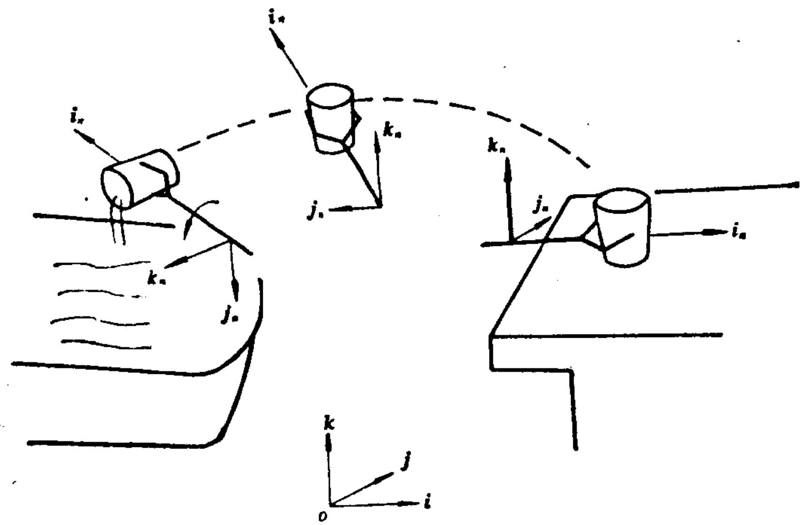

图7-4倒水

表7-2 关节配置方式对姿态的于扰

<table><tr><td rowspan=1 colspan=1>名称</td><td rowspan=1 colspan=1>编号</td><td rowspan=1 colspan=1>结构型式</td><td rowspan=1 colspan=1>A</td><td rowspan=1 colspan=1>A</td><td rowspan=1 colspan=1>Ak</td><td rowspan=2 colspan=1></td></tr><tr><td rowspan=1 colspan=1>手腕</td><td rowspan=1 colspan=1>8</td><td rowspan=1 colspan=1>IXToll>.</td><td rowspan=1 colspan=1>1</td><td rowspan=1 colspan=1>0</td><td rowspan=1 colspan=1>0</td></tr><tr><td rowspan=4 colspan=1>手臂</td><td rowspan=1 colspan=1>1</td><td rowspan=1 colspan=1>Zu               E</td><td rowspan=1 colspan=1>0</td><td rowspan=1 colspan=1>0</td><td rowspan=1 colspan=2>0</td></tr><tr><td rowspan=1 colspan=1>2</td><td rowspan=1 colspan=1>←8</td><td rowspan=1 colspan=1>0</td><td rowspan=1 colspan=1>0</td><td rowspan=1 colspan=2>1</td></tr><tr><td rowspan=1 colspan=1>3</td><td rowspan=1 colspan=1>3                      ?</td><td rowspan=1 colspan=1>0</td><td rowspan=1 colspan=1>1</td><td rowspan=1 colspan=2>1</td></tr><tr><td rowspan=1 colspan=1>4</td><td rowspan=1 colspan=1>茶                      ←</td><td rowspan=1 colspan=1>0</td><td rowspan=1 colspan=1>1</td><td rowspan=1 colspan=2>1</td></tr><tr><td></td><td></td><td></td><td rowspan=1 colspan=1></td><td rowspan=1 colspan=1></td><td></td><td></td></tr></table>

一般来说(不考虑冗余),在平面上定位 $\scriptstyle { F = F _ { B } = 2 }$ ,在空间中定位$\pmb { F } = \pmb { F } _ { B } = \pmb { \mathrm { 3 } } _ { 0 }$ 

物体姿态的实现情况比较复杂。.用 $\mathcal { B } _ { i } , \mathcal { B } _ { j _ { \star } } \mathcal { B } _ { k }$ 表示实现物体姿态所需要的旋转。若需绕某轴 ${ \hat { \pmb { l } } } ( { \pmb { l } } = { \pmb { i } } , \ { \pmb { j } } , \ { \pmb { k } } )$ 旋转,则 $\mathcal { B } _ { \ell } = 1$ ;若需保持对 $l$ 轴不发生转动,则 $\mathcal { B } _ { \ell } = 0 ;$ :若允许绕 $\textit { \textbf { l } }$ 轴的任意转动,则 $B _ { l } = - 1$ 。例如,从桌面上捧起一满杯水,移至水池上方(保持在搬运过程中水不会洒出来),然后倒掉。这个过程所需要的转动仅为倒水时绕末杆 $\pmb { i }$ 轴的转动,如图 $\Im - 4$ 所示。在夹紧和移动过程中,必须保持末杆的 ${ \pmb k } _ { n }$ 轴垂直向上的姿态,即不允许有绕 $i _ { n , j _ { n } }$ 两轴的转动,而绕 ${ \pmb k } _ { n }$ 轴的转动则不受限制。因此有 $\begin{array} { r } { B _ { \ell } = B _ { \ell } = 0 , } \end{array}$ $\mathcal { B } _ { k } = - 1 ,$ 。在倒水过程中,必须绕 $\smash { \dot { \mathbf { u } } _ { p } }$ 轴转动,因此有 $\mathcal { B } _ { i } = 1$ 。综合整个作业过程,有 $B _ { i } { = } 1 , \ B _ { j } { = } 0 ,$ $B _ { k } = - 1 _ { c }$ 。又如图7-5所示,在工作台上夹起圆柱形毛坏装入机床夹头内。在夹紧过程中要使末杆的 $i _ { n _ { 3 } } j _ { n }$ 两轴平行于水平面,即 $\mathcal { B } _ { \mathrm { i } } = \mathcal { B } _ { \mathrm { j } } = 0$ , $\mathcal { B } _ { k } = - \mathbf { 1 } _ { \circ }$ 在搬运过程中对姿态无特殊要求。在装料过程中要使 $k _ { \mathrm { { n } } }$ 轴转至水平面上,因而有 $\mathcal { B } _ { i } = 1$ 。此外,还要找正 ${ \pmb k } _ { n }$ 轴的方向。 ${ \pmb k } _ { \pmb { n } }$ 轴在垂直面方向上的定位可由末杆转动实现,与前述 $\mathcal { B } _ { \mathbf { i } } = \mathbf { 1 }$ 相同。 $k _ { \mathfrak { n } }$ 轴在水平面方向上的定位则需绕 $\pmb { k }$ 轴的转动,因而有 $\mathcal { B } _ { \star } = \mathbf { 1 }$ 。取上述各值的最大,有 $B _ { i } { = } 1 , B _ { j } { = } 0 , B _ { k } { = } 1 _ { \circ }$ 

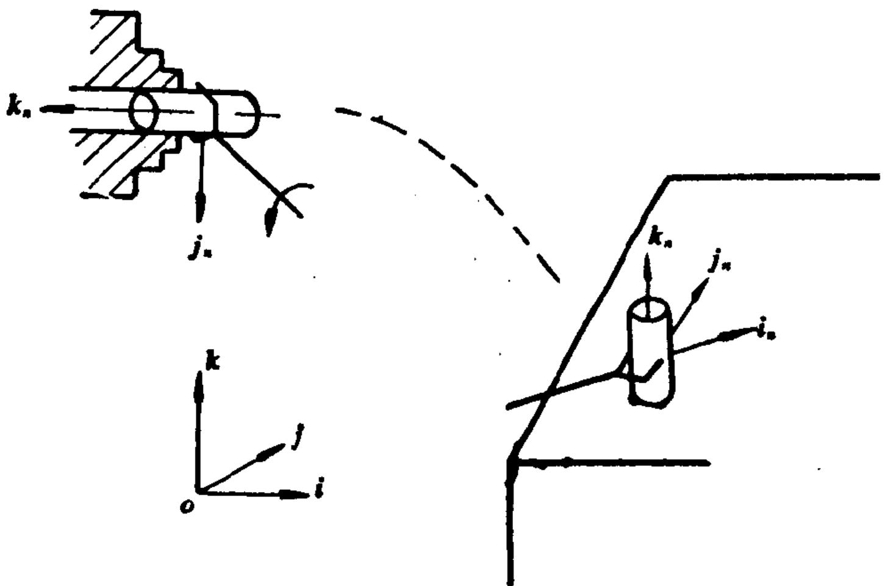

·图7-5机床上料

手腕的旋转能力应能满足被夹持物体的姿态要求,即必须有

$$
\left. \begin{array} { c } { W _ { i } \geqslant B _ { i } } \\ { W _ { j } \geqslant B _ { j } } \\ { W _ { k } \geqslant B _ { k } } \end{array} \right\}
$$

由于前面关节的运动可能造成对末杆的姿态干扰,这种干扰还须由手腕的转动来补偿。所以还必须有

$$
\left. \begin{array} { c } { { W _ { \downarrow } \geqslant A _ { \downarrow } } } \\ { { W _ { \downarrow } \geqslant A _ { \downarrow } } } \\ { { W _ { \downarrow } \geqslant A _ { \downarrow } } } \end{array} \right\} .
$$

式7-10和7-11相加,有

$$
2 W _ { l } \geqslant B _ { l } + A _ { l } \quad l = i , ~ j , ~ k \ .
$$

式 $Y - 9$ 和 $\yen 12$ 是机器人机构型综合时必须满足的关系式。

例 $\pmb { 7 - 1 }$ :根据图7-4的作业要求确定机器人机构的类型。

解可由表7-2所列 $\overset { \prime } { 4 }$ 种机器人手臂之一来完成位置变化要求,如图7-6所示。由于 $\boldsymbol { B } _ { \imath } = \boldsymbol { 1 } , \boldsymbol { B } _ { \imath } = 0 , \boldsymbol { B } _ { \imath } = - \boldsymbol { 1 } ,$ ,对编号1的手臂来讲, $A _ { i } = A _ { j } = A _ { k } = 0 _ { c }$ 。当选用编号1的手腕时 $( A _ { i } = A _ { j } = A _ { k } =$ 0),满足

$$
2 W _ { \ell } { = } 2 { \times } 1 { > } B _ { \ell } { + } A _ { \ell } { = } 1 { + } 0
$$

$$
2 W _ { j } = 2 \times 0 = B _ { i } + A _ { j } = 0 + 0
$$

$$
2 W _ { \varkappa } = 2 \times 0 > B _ { \varkappa } + A _ { \varkappa } = - 1 + 0
$$

对编号2的手臂 $( A _ { i } { = } A _ { j } { = } 0 , \ A _ { \vec { \kappa } } { = } 1 )$ ,选用编号 $1$ 的手腕满足

$$
2 W _ { i } { = } 2 \times 1 { > } B _ { i } { + } A _ { i } { = } 1
$$

$$
2 W _ { j } = 2 \times 0 = B _ { j } + A _ { i } = 0
$$

$$
2 W _ { \varkappa } = 2 \times 0 = B _ { \varkappa } + A _ { \varkappa } = - 1 + 1
$$

对编号3的手臂 $( A _ { 1 } = 0$ , $A _ { j } = A _ { k } = 1 )$ ,若仍选用编号 $\texttt { 1 }$ 的手腕,则不能满足 $j$ 方向的要求,此时有

$$
2 W _ { j } = 2 \times 0 < B _ { j } + A _ { j } = 0 + 1
$$

只有采用 $W _ { j } = 1$ 的手腕,才能补偿 $\Delta _ { j } = 1$ 的干扰。采用编号 $\pmb { 4 }$ 的手腕可以满足这个要求。同理,对编号 $\mathbf { 4 }$ 的手臂也应采用编号4的手腕。

例7-2:根据图7-5的作业要求确定机器人机构的类型。

解采用 $\textbf { 1 }$ 号手臂时,有 $B _ { i } + A _ { i } = 1 , B _ { j } + A _ { j } = 0 , B _ { k } + A _ { k } =$ 1,可采用5号手腕,满足

$$
\begin{array} { l } { 2 \boldsymbol { W } _ { i } = 2 \boldsymbol { > } 1 } \\ { 2 \boldsymbol { W } _ { j } = 0 } \\ { 2 \boldsymbol { W } _ { k } = 2 \boldsymbol { > } 1 } \end{array}
$$

若采用2号手臂,有 $B _ { i } + A _ { i } = 1 , \ B _ { j } + A _ { j } = 0 , \ B _ { k } + A _ { k } = 2$ ,采用5号手腕也可满足要求。若采用3号手臂,则不能再配5号手腕,因为 $2 W _ { j } = 0 < B _ { i } + A _ { j } = 0 + 1 。$ 同理, $\mathbf { 4 }$ 号手臂也不能配 $\Xi$ 号手腕。

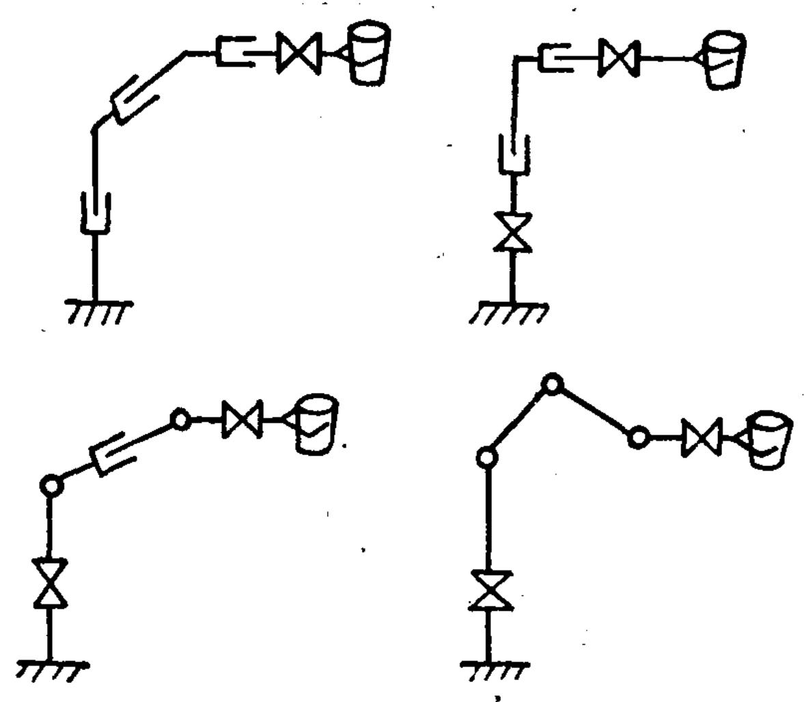

图7-6例7-1结果

图7-7例7-2结果

这两种手臂必须与全姿态手腕(编号9、10、11)配合,才能完成上下料作业,图7-7仅画出采用9号手腕的情形。

# \$7-2 机器人机构的尺寸综合

机器人尺寸综合可有多种出发点。例如可按末杆位姿要求进

行综合,也可按末杆活动范围进行综合。本节只叙述按末杆位姿要求进行尺寸综合。按活动范围的尺寸综合,将在 $\ S 7 - 3$ 中叙述。

# 一、用解析法进行尺寸综合

用解析法进行尺寸综合的过程是建立机器人机构位形方程,通过消元求得仅含几何尺寸参数的综合方程组,将已知位姿代入综合方程组并求解,得到各结构的尺寸参数]。下面以 $\mathbf { R - R }$ 双动

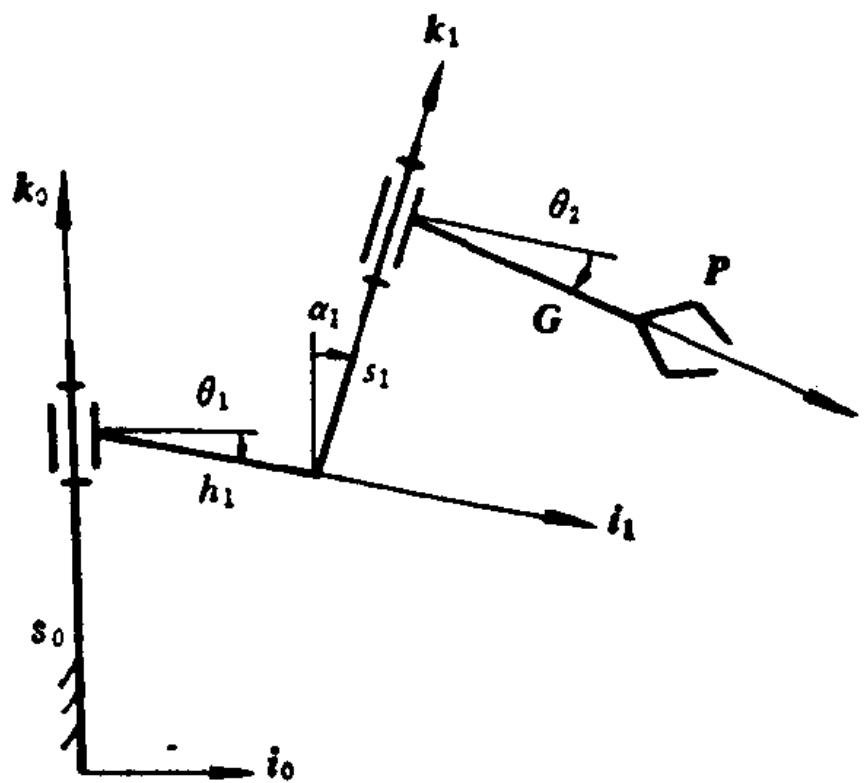

图7-8双关节一般结构操作手

杆机构为例叙述此种方法。

图7-8所示为 $\mathbf { R - R }$ 双动杆机构。选取第一关节轴线与固定参考系 $\pmb { k }$ 轴一致。夹持点$\pmb { P }$ 的位置方程为

$$
P = { \pmb { \mathrm { \pmb { s } } } } _ { 0 } ^ { k } + E ^ { k \pmb { \mathrm { \pmb { \theta } } } _ { 1 } }
$$

$$
( \pmb { h } _ { 1 } ^ { \ i } + \pmb { { \cal E } } ^ { \{ a \ast }  \left( \pmb { \vartheta } _ { 1 } ^ { k } + \pmb { { \cal E } } ^ { \chi \theta _ { 0 } } \left( \pmb { G } ^ { i } \right) \right) ) .
$$

将式7-18改写为

$$
E ^ { k ( - \theta _ { 1 } ) } ( P - g _ { 0 } ^ { k } ) - \tilde { k } _ { 1 } ^ { \ell } = E ^ { i \ell : 1 } E ^ { k \theta _ { 1 } } ( g _ { 1 } ^ { k } + G ^ { \ell } )
$$

有

$$
\begin{array} { r } { E ^ { k ( - \theta _ { 1 } ) } [ { \begin{array} { c } { { \textbf {  { v } } } } \\ { { \textbf {  { y } } } } \\ { { \textbf {  { z } } } - \mathbf { \varepsilon } _ { 8 } } \end{array} } ] - [ { \begin{array} { c } { { \hat { h } } _ { 1 } } \\ { 0 } \\ { 0 } \end{array} } ] = E ^ { i \alpha _ { 1 } } E ^ { k \theta _ { 1 } } { \begin{array} { c } { [ { G } ^ { \ell } ] } \\ { 0 } \\ { 0 } \end{array} } ] } \end{array}
$$

即

$$
\begin{array} { r } { \left[ \begin{array} { c } { v \cos \theta _ { \mathrm { 1 } } + y \sin \theta _ { \mathrm { 1 } } - h _ { \mathrm { 1 } } } \\ { - x \sin \theta _ { \mathrm { 1 } } + y \cos \theta _ { \mathrm { 1 } } } \\ { z - s _ { 0 } } \end{array} \right] = E ^ { i \alpha _ { 1 } } E ^ { i \theta _ { \mathrm { 1 } } } \left[ \begin{array} { c } { G } \\ { 0 } \\ { s _ { \mathrm { 1 } } } \end{array} \right] } \end{array}
$$

按向量回转前后其模不变的原理,有

$$
\sigma ^ { 2 } + y ^ { 2 } - 2 h _ { 1 } ( x \cos \theta _ { 1 } + y \sin \theta _ { 1 } ) + ( z - s _ { 0 } ) ^ { 2 } = G ^ { 2 } + s _ { 1 } ^ { 2 }
$$

得

$$
\sigma \cos \theta _ { \mathrm { 1 } } + y \sin \theta _ { \mathrm { 1 } } = \frac { { x ^ { 2 } + y ^ { 2 } + ( z - g _ { \mathrm { 0 } } ) ^ { 2 } - ( z ^ { 2 } - s _ { \mathrm { 1 } } ^ { 2 } } } { 2 \hbar _ { \mathrm { 1 } } }
$$

将式7-14改写为

$$
\begin{array} { r l r } & { } & { [ { \begin{array} { c } { x \cos \theta _ { 1 } + y \sin \theta _ { 1 } - h _ { 1 } } \\ { - x \sin \theta _ { 1 } + y \cos \theta _ { 1 } } \\ { [ { \begin{array} { c } { z - s _ { 0 } } \end{array} } ] = E ^ { k \theta _ { 1 } } [ { \begin{array} { c } { G } \\ { 0 } \end{array} } ] } \\ { z - s _ { 0 } } \end{array} } . } \end{array}
$$

展开上式,第三行为

$$
\begin{array} { r } { - \left( - \infty \sin \theta _ { 1 } + y \cos \theta _ { 1 } \right) \sin \alpha _ { 1 } + \left( z - \beta _ { 0 } \right) \cos \alpha _ { 1 } = \mathfrak { s } _ { 1 } } \end{array}
$$

即

$$
\displaystyle { \boldsymbol { x } } \sin \theta _ { \mathrm { 1 } } - y \cos \theta _ { \mathrm { 1 } } { = } \frac { \vartheta _ { \mathrm { 1 } } - \left( z - \vartheta _ { 0 } \right) \cos \alpha _ { \mathrm { 1 } } } { \sin \alpha _ { \mathrm { 1 } } }
$$

取式7-15和7-16的平方和,得

$$
a v ^ { 2 } + y ^ { 2 } = \Big ( \frac { x ^ { 2 } + y ^ { 2 } + ( z - s _ { 0 } ) ^ { 2 } - G ^ { 2 } - s _ { 1 } ^ { 2 } } { 2 h _ { 1 } } \Big ) ^ { 2 }
$$

$$
\begin{array} { r l } { . } & { { } + \Bigl ( \frac { \vartheta _ { 1 } - \bigl ( z - \vartheta _ { 0 } \bigr ) \cos \alpha _ { 1 } } { \sin \alpha _ { 1 } } \Bigr ) ^ { 2 } } \end{array}
$$

式7-17仅含结构参数,将末杆的若干位置要求代入,可求解 ${ \pmb 8 0 }$ 、$h _ { 1 } , s _ { 1 } , G , \alpha _ { 1 0 }$ 由于存在5个未知数,可允许代入 $5$ 个已知位置。考察式7-17,未知参数 ${ \pmb \vartheta } _ { \pmb { 0 } }$ 有 $\mathbf { 4 }$ 次项、3次项、2次项和1次项。为简化求解过程,可先选取 ${ \dot { \pmb { \mathscr { s } } } } _ { \pmb { 0 } }$ 为某值,然后求解 $h _ { 1 } , h _ { 2 } , s _ { 1 }$ 和 $\alpha _ { 1 0 }$ 这时式7-17可整理为

$$
\begin{array} { r l } & { R _ { 1 } + R _ { 2 } ( x ^ { 2 } + y ^ { 2 } ) + 2 R _ { 3 } [ x ^ { 2 } + y ^ { 2 } + ( z - s _ { 0 } ) ^ { 2 } ] } \\ & { \qquad + R _ { 4 } ( z - s _ { 0 } ) ^ { 2 } + 2 R _ { 5 } ( z - s _ { 0 } ) } \\ & { = - \left[ x ^ { 2 } + y ^ { 2 } + ( z - s _ { 0 } ) \right] ^ { 2 } } \\ & { \qquad R _ { 1 } = ( h _ { 1 } ^ { 2 } - h _ { 2 } ^ { 2 } - s _ { 1 } ^ { 2 } ) ^ { 2 } + \left( \frac { 2 h _ { 1 } s _ { 1 } } { \sin \alpha _ { 1 } } \right) ^ { 2 } } \end{array}
$$

式中

$$
R _ { 2 } = - 4 h _ { 1 } ^ { 2 }
$$

用式7-18进行设计只能取 $\textbf { 4 }$ 个不同位置,且各系数之间存在如下关系

$$
R _ { 1 } - R _ { 3 } ^ { 2 } = \frac { R _ { 5 } ^ { 2 } } { R _ { 4 } }
$$

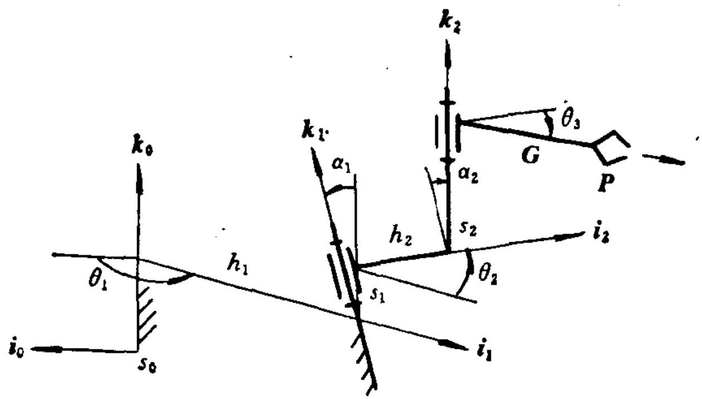

图7-9第一关节与 $\pmb { k } _ { 0 }$ 不重合

如果需要实现更多的位置要求,可选取第一关节与固定参考系不重合,见图 $7 - 9 =$ 图中 $\smash { \theta _ { 1 , \ s _ { 0 } , \ h _ { 1 , \ s } } } _ { , \ s _ { 1 , \ s _ { 1 , \ s } } } _ { h _ { 2 , \ s } } _ { 2 _ { 2 , \ s } } _ { \alpha _ { 2 , \ s } } G$ 是结构参数,共有9个,允许代入9个不同的位置,但求解更复杂。

# 二、用优化方法进行尺寸综合

用优化方法进行机构综合可避免冗长的消元过程和解复杂的综合方程。多于3个关节的机器人机构,可实现末杆在活动范围内的任意位置。而解析综合法的已知位置数目受到机构的结构参数数目的限制,不宜用于多于3个关节的机器人机构综合。用优化方法进行综合,末杆的位姿要求可以作为约束条件来处理,只要求出的转角逆解在关节运动范围内就满足约束。这样,工作位姿的数目就不会受到限制,而且还可容纳另外的设计指标作为目标函数14。用优化方法进行机器人机构的尺寸综合数学模型为

受约束于

$$
\left. \begin{array} { c } { \operatorname* { m i n } F ( X ) } \\ { X \in \displaystyle R ^ { m } } \\ { x _ { i } \geqslant x _ { i \mathrm { m i n } } \quad \stackrel { i } { i } = 1 , 2 \cdots m } \\ { q _ { j \mathrm { m i n } } \leqslant q _ { j } \leqslant q _ { j \mathrm { m a x } } \quad \stackrel { j } { j } = 1 , 2 \cdots n } \end{array} \right\}
$$

式中, $\pmb { \mathcal { T } } \pmb { \mathcal { b } }$ 为未知结构参数的数目。 $\pmb { \mathscr { n } }$ 为机器人关节的数目。 $g _ { 1 }$ 为第$j$ 关节的运动参数,由末杆位姿求得。

例7-3:喷涂机器人尺寸综合。已知喷枪的若干位置 $\mathbf { \mathcal { P } _ { i } }$ 和姿态 $E _ { i }$ 如下

$$
\bf \ L _ { i } = \left[ { \begin{array} { c } { { 7 0 0 } } \\ { { 5 0 } } \\ { { 1 9 2 0 } } \end{array} } \right] \qquad { \cal E } _ { 1 } = \left[ { \begin{array} { c c c } { { 0 . 7 4 9 9 8 } } & { { - 0 . 4 9 9 } } & { { 0 . 8 } } \\ { { 0 . 5 } } & { { 0 . 8 9 6 } } & { { 0 } } \\ { { - 0 . 4 9 9 } } & { { 0 . 2 \ddot { 0 } } } & { { 0 . 8 5 6 } } \end{array} } \right] \ \ .
$$

$$
P _ { 2 } { = } \left[ \begin{array} { l } { 1 2 0 0 } \\ { 1 0 0 } \\ { 1 0 0 } \end{array} \right]
$$

$$
E _ { 2 } = \left[ { \begin{array} { c c c } { 0 . 9 \vartheta \vartheta 7 } & { 0 } & { - 0 . \vartheta 4 2 } \\ { 0 } & { 1 } & { 0 } \\ { 0 . \vartheta 4 2 } & { 0 } & { 0 . 9 \vartheta 9 7 } \end{array} } \right]
$$

$$
{ P } _ { 3 } { = } \left[ \begin{array} { l } { 1 0 0 0 } \\ { 8 5 7 } \\ { - 1 5 0 0 } \end{array} \right]
$$

$$
E _ { 3 } = \left[ \begin{array} { c c c } { { 0 . 6 1 2 4 } } & { { - 0 . 7 0 7 1 } } & { { 0 . 9 5 9 5 } } \\ { { 0 . 6 1 2 4 } } & { { 0 . 7 0 7 1 } } & { { 0 . 9 5 9 5 } } \\ { { - 0 . 5 } } & { { 0 } } & { { 0 . 8 6 6 } } \end{array} \right] _ { . }
$$

$$
P _ { 4 } { = } { \left[ \begin{array} { l } { 1 3 0 0 } \\ { 0 } \\ { 5 0 0 } \end{array} \right] }
$$

$$
E _ { 4 } = \left[ \begin{array} { l l l } { 0 . 8 9 6 } & { 0 } & { 0 . 5 } \\ { 0 } & { 1 } & { 0 } \\ { - 0 . 5 } & { 0 } & { 0 . 8 6 6 ^ { - } } \end{array} \right]
$$

$$
\pmb { P } _ { 6 } = \left[ \begin{array} { c } { 9 2 0 } \\ { 9 2 0 } \\ { 0 } \end{array} \right]
$$

$$
E _ { \breve { s } } = \left[ \begin{array} { l c c } { { 0 . \breve { 5 } } } & { { - 0 . 7 0 7 1 } } & { { - 0 . \breve { 5 } } } \\ { { 0 . \breve { 5 } } } & { { 0 . 7 0 7 1 } } & { { 0 . \breve { 5 } } } \\ { { 0 . 7 0 7 1 } } & { { 0 } } & { { 0 . 7 0 7 1 } } \end{array} \right]
$$

$$
\mathbf { \Phi } _ { P _ { 6 } = \left[ \begin{array} { c } { 8 0 0 } \\ { 6 0 } \\ { 1 9 8 0 } \end{array} \right] } \qquad E _ { 6 } = \left[ \begin{array} { c c c } { 0 . 2 5 \circledast 8 } & { 0 } & { 0 . 9 6 5 9 } \\ { 0 } & { 1 } & { 0 } \\ { - 0 . 9 6 5 9 } & { 0 } & { 0 . 2 \div 8 8 } \end{array} \right]
$$

解取喷枪轴线与末杆夹持向量 $\pmb { G }$ 重合的安装方式。由于喷枪绕自身轴线的旋转对作业没有意义,不需要以 $\pmb { G }$ 为轴线的末杆回转关节。拟采用图7-10的机构形式。喷枪的位置由前3关节实现,喷枪的姿态由后2关节实现。位姿方程为

$$
\begin{array} { r l } & { P = c _ { 1 } ^ { \mathrm { s } } + E ^ { \mathrm { k } \theta _ { 1 } } \big ( c _ { 2 } ^ { \mathrm { k } } + E ^ { j \theta _ { 1 } } \big ( c _ { 3 } ^ { \mathrm { s } } + E ^ { j \theta _ { 1 } } \big ( c _ { 4 } ^ { \mathrm { s } } + E ^ { j \theta _ { 4 } } \big ( c _ { 5 } ^ { \mathrm { s } } + E ^ { \mathrm { k } \theta _ { 3 } } \big ( \pmb { G } ^ { \mathrm { i } } \big ) \big ) \big ) \big ) } \\ & { \quad = c _ { 1 } ^ { \mathrm { s } } + c _ { 2 } ^ { \mathrm { k } } + E ^ { \mathrm { k } \theta _ { 1 } } E ^ { j \theta _ { 3 } } \big ( c _ { 3 } ^ { \mathrm { s } } + E ^ { j \theta _ { 3 } } \big ( c _ { 4 } ^ { \mathrm { s } } + E ^ { j \theta _ { 4 } } \big ( c _ { 5 } ^ { \mathrm { s } } + E ^ { \mathrm { k } \theta _ { 3 } } \big ( \pmb { G } ^ { \mathrm { i } } \big ) \big ) \big ) \big ) } \end{array}
$$

$$
E = E ^ { k \theta _ { 1 } } E ^ { j \theta _ { 2 } } E ^ { j \theta _ { 3 } } E ^ { j \theta _ { 4 } } E ^ { j \theta _ { 4 } } E ^ { k \theta _ { 5 } } = E ^ { k \theta _ { 1 } } E ^ { j \theta } E ^ { k \theta _ { 4 } }
$$

式中, $\beta = \theta _ { 2 } + \theta _ { 3 } + \theta _ { 4 } \mathrm { _ c }$ ,展开式7-22

$$
E = { \left[ \begin{array} { l l l } { \lambda _ { 0 } } & { \lambda _ { b } } & { \lambda _ { c } } \\ { \mu _ { a } } & { \mu _ { b } } & { \mu _ { c } } \\ { \nu _ { a } } & { \nu _ { b } } & { \nu _ { c } } \end{array} \right] } = { \left[ \begin{array} { l l l } { \cos \theta _ { 1 } \cos \theta _ { \mathrm { 5 } } \cos \beta - \sin \theta _ { 1 } \sin \theta _ { \mathrm { 5 } } } & { - \sin \theta _ { \mathrm { 5 } } \sin \theta _ { \mathrm { 5 } } } \\ { \sin \theta _ { \mathrm { 4 } } \cos \theta _ { \mathrm { 5 } } \cos \beta + \cos \theta _ { 1 } \sin \theta _ { \mathrm { 5 } } } & { - \sin \theta _ { \mathrm { 5 } } \sin \theta _ { \mathrm { 5 } } } \\ { \qquad - \sin \beta \cos \theta _ { \mathrm { 5 } } } & { \mu _ { a } } \end{array} \right] } .
$$

图7-10 喷涂机器人

$$
\left. \begin{array} { c c } { { - \cos \theta _ { 1 } \cos \beta \sin \theta _ { 5 } - \sin \theta _ { 1 } \cos \theta _ { 5 } } } & { { \cos \theta _ { 1 } \sin \beta } } \\ { { - \sin \theta _ { 4 } \cos \beta \sin \theta _ { 5 } + \cos \theta _ { 1 } \cos \theta _ { 5 } } } & { { \sin \theta _ { 1 } \sin \beta } } \\ { { \sin \beta \sin \theta _ { 5 } } } & { { \cdot \cos \beta } } \end{array} \right]
$$

得

$$
\log \theta _ { 3 } = - \frac { \nu _ { b } } { \nu _ { a } }
$$

$$
\mathrm { t g } \ \beta { = } \frac { \nu _ { b } } { \nu _ { c } \sin \theta _ { 5 } }
$$

将式7-21写为

$$
P - ( \mathbf { c } _ { 1 } ^ { k } + \mathbf { c } _ { 2 } ^ { k } ) - E ( G ^ { i } ) = E ^ { k \theta _ { 1 } } E ^ { j \theta _ { 1 } } ( \mathbf { c } _ { 3 } ^ { i } + E ^ { j \theta _ { 1 } } ( \mathbf { c } _ { 4 } ^ { i } + E ^ { j \theta _ { i } } ( \mathbf { c } _ { 5 } ^ { i } ) ) ) \cdot
$$

上式左边不含未知运动参数,可用 $( A \textbf { \textit { B } } \textbf { \textit { C } } ) ^ { \textbf { \textit { r } } }$ 来表示,即

$$
\left[ \begin{array} { c } { A } \\ { B } \\ { C } \end{array} \right] = E ^ { k \theta _ { 1 } } E ^ { i \theta _ { 1 } } ( \mathbf { c } _ { s } ^ { i } + E ^ { j \theta _ { 3 } } ( \mathbf { c } _ { s } ^ { i } + E ^ { j \theta _ { 4 } } ( \mathbf { c } _ { s } ^ { i } ) ) )
$$

展开式7-25,得

$$
\tan \theta _ { 1 } = \frac { B } { A }
$$

式7-25写为

$$
\begin{array} { r } { \overrightarrow { E } ^ { \mathcal { k } ( - \theta _ { * } ) } \Big [ \mathbf { \mathcal { B } } \Big ] - \overrightarrow { E } ^ { j \beta } ( \mathbf { c } _ { 5 } ^ { \sf t } ) = \overrightarrow { E } ^ { j \theta _ { * } } ( \mathbf { c } _ { 3 } ^ { \sf t } + \overrightarrow { E } ^ { j \theta _ { * } } ( \mathbf { c } _ { 4 } ^ { \sf t } ) ) } \end{array}
$$

上式左边不含未知运动参数,用 $( \boldsymbol { \mathcal { O } } \cdot \textit { \textbf { D } } \boldsymbol { E } ) ^ { \textit { \textbf { r } } }$ 来表示,即

$$
\stackrel { \textstyle \int } { E } \equiv E ^ { j \theta _ { 1 } } ( c _ { 3 } ^ { i } + E ^ { j \theta _ { 4 } } ( c _ { 4 } ^ { i } ) )
$$

取上式的平方,得

$$
D ^ { 2 } + E ^ { 2 } + F ^ { 2 } = c _ { 3 } ^ { 2 } + c _ { 4 } ^ { 2 } + 2 c _ { 3 } c _ { 4 } \cos \theta _ { 3 }
$$

即

$$
\cos \theta _ { 3 } = { \frac { J ^ { 2 } + E ^ { 2 } + F ^ { 2 } - c _ { 2 } ^ { 2 } - c _ { 4 } ^ { 2 } } { 2 c _ { 3 } c _ { 4 } } }
$$

式 $\pmb { 7 } \div 2 \pmb { 7 }$ 两边乘 $E ^ { j ( - \theta _ { 1 } ) }$ 并展开,得

$$
\begin{array} { r l } & { D \cos \theta _ { 2 } - F \sin \theta _ { 2 } = c _ { 3 } + c _ { 4 } \cos \theta _ { 3 } } \\ & { D \sin \theta _ { 3 } + F \cos \theta _ { 2 } = - c _ { 4 } \sin \theta _ { 3 } } \end{array}
$$

令 $x = t g \ \frac { \theta _ { 2 } } { 2 } ,$ 代入上式得

$$
{ x ^ { 2 } + H x + M } = 0
$$

式中

$$
H = { \frac { 2 F } { D + N } }
$$

$$
M = \frac { N - D } { N + D }
$$

其中

$$
N = c _ { 3 } + c _ { 4 } \cos \theta _ { 3 }
$$

解式7-29得 ${ \pmb { \mathscr { D } } } _ { \bot }$ ,则

$$
\theta _ { 2 } { = } 2 \log ^ { - 1 } { \mathfrak { x } }
$$

最后求得

$$
\theta _ { 4 } { = } \beta { - } \theta _ { 2 } { - } \theta _ { 3 }
$$

从已知的6个位姿,可算出6组相应的关节转角 $\theta _ { 1 } ^ { \smash { \scriptscriptstyle \smash { \ell _ { 2 } ^ { \scriptscriptstyle \smash { \ell } } } } } , \theta _ { 2 } ^ { \smash { \scriptscriptstyle \ell _ { 2 } ^ { \scriptscriptstyle \smash { \ell } } } } , \theta _ { 3 } ^ { \smash { \scriptscriptstyle \ell _ { 2 } ^ { \scriptscriptstyle \ell } } } , \theta _ { 4 } ^ { \smash { \scriptscriptstyle \ell _ { 2 } ^ { \scriptscriptstyle \ell } } } , \theta _ { 5 } ^ { \smash { \scriptscriptstyle \ell _ { 3 } ^ { \scriptscriptstyle \ell } } }$ $( i { = } 1 , 2 { \cdots } 6 )$ 。只要满足

$$
\theta _ { j \operatorname* { m i n } } { \leqslant } \theta _ { j } ^ { * } { \leqslant } \theta _ { j \operatorname* { m a x } } \quad i { = } 1 , 2 { \cdots } 6 \quad j { = } 1 , 2 { \cdots } 5
$$

式中, $\theta _ { \mathrm { j } \operatorname* { m i n } _ { \mathrm { } } } , \theta _ { \mathrm { j } \operatorname* { m a x } }$ 是第 $j$ 关节的运动范围。则机构能实现给定的位姿。取各关节运动范围如下

$$
\begin{array} { r l } & { - 1 1 0 ^ { \circ } \leqslant \theta _ { \mathrm { { \bf { k } } } } \leqslant 1 1 0 ^ { \circ } } \\ & { - 7 5 ^ { \circ } \leqslant \theta _ { \mathrm { { \bf { 2 } } } } \leqslant 1 5 0 ^ { \circ } } \\ & { - 1 1 0 ^ { \circ } \leqslant \theta _ { \mathrm { { \bf { 3 } } } } \leqslant 1 1 0 ^ { \circ } } \\ & { - 1 1 0 ^ { \circ } \leqslant \theta _ { \mathrm { { \bf { 4 } } } } \leqslant 1 1 0 ^ { \circ } } \\ & { - 1 1 0 ^ { \circ } \leqslant \theta _ { \mathrm { { \bf { 5 } } } } \leqslant 1 1 0 ^ { \circ } } \end{array}
$$

设计变量为 $5$ 维

$$
\begin{array} { r } { X = \left[ \begin{array} { c } { c _ { 1 } + c _ { 2 } - 1 } \\ { c _ { 3 } } \\ { c _ { 4 } } \\ { c _ { 5 } } \\ { G } \end{array} \right] = \left[ \begin{array} { c } { \phantom { - } \overline { { \sigma } } \overline { { \sigma } } _ { 1 } ^ { - } } \\ { \phantom { - } \overline { { \sigma } } \overline { { \sigma } } _ { 2 } ^ { - } } \\ { \phantom { - } \overline { { \sigma } } \overline { { \vartheta } } _ { 3 } ^ { - } } \\ { \phantom { - } \overline { { \sigma } } \overline { { \vartheta } } _ { 4 } ^ { - } } \\ { - \overline { { \sigma } } \overline { { \vartheta } } _ { 5 } ^ { - } } \end{array} \right] } \end{array}
$$

根据加工或其他条件,定出边界条件 $\pmb { \mathcal { D } _ { \pm } } _ { \mathbf { \delta m i n } }$ ,用以表示第 $\clubsuit$ 杆的最短长度。可取 ${ \pmb x } _ { 1 \operatorname* { m i n } } = 3 0 0$ , $\scriptstyle { \mathfrak { x } } _ { 2 } _ { \mathrm { m i n } } = 2 0 0 .$ , $x _ { 3 \operatorname* { m i n } } = 1 5 0$ , $x _ { 4 } = - \frac { 1 } { 2 }$ 100, $\pmb { x } _ { \mathrm { 5 } \mathrm { ~ m i n } } = \pmb { 1 0 0 } _ { \mathrm { < } }$ 。则约束条件表示为

$$
\begin{array} { r l } & { \begin{array} { r l } & { \Delta t \Delta ( X ) - \phi _ { 1 } \cdot \phi _ { 2 } \Delta ( t ) = 0 } \\ & { \gamma \cdot \phi _ { 2 } \cdot \phi _ { 3 } = - 2 0 0 0 \phi _ { 2 } \cdot \phi _ { 3 } } \\ & { \phi _ { 2 } \cdot \phi _ { 3 } = - 2 0 0 \phi _ { 3 } \cdot \phi _ { 4 } } \\ & { \phi _ { 3 } \cdot \phi _ { 3 } = - 2 0 0 \phi _ { 2 } \cdot \phi _ { 3 } } \\ & { \phi _ { 4 } \cdot \phi _ { 5 } = - 1 0 0 \phi _ { 3 } \cdot \phi _ { 4 } } \\ & { \phi _ { 5 } \cdot \phi _ { 6 } \cdot \phi _ { 6 } } \\ & { \Delta t \Delta ( X ) - \phi _ { 6 } \cdot \phi _ { 1 } \phi _ { 5 } = 0 } \end{array} } \\ & { \begin{array} { r l } & { \partial _ { x } ( X ) - \phi _ { 1 } \cdot \phi _ { 1 } = \partial _ { x } ( X ) } \\ & { \partial _ { y } ( X ) - \phi _ { 1 } \cdot \phi _ { 2 } \cdot \phi _ { 3 } } \\ & { \partial _ { z } ( X ) - \phi _ { 1 } \cdot \phi _ { 2 } \cdot \phi _ { 3 } } \\ & { \partial _ { z } ( X ) - \phi _ { 1 } \cdot \phi _ { 2 } \cdot \phi _ { 3 } } \\ & { \partial _ { y } ( X ) - \phi _ { 1 } \cdot \phi _ { 2 } \cdot \phi _ { 3 } } \\ & { \partial _ { z } ( X ) - \phi _ { 1 } \cdot \phi _ { 2 } \cdot \phi _ { 3 } } \\ & { \partial _ { z } ( X ) - \phi _ { 1 } \cdot \phi _ { 2 } \cdot \phi _ { 3 } } \\ & { \partial _ { z } ( X ) - \phi _ { 1 } \cdot \phi _ { 2 } \cdot \phi _ { 3 } } \\ & { \partial _ { y } ( X ) - \phi _ { 1 } \cdot \phi _ { 2 } \cdot \phi _ { 3 } } \\ & { \phi _ { 6 } \cdot \phi _ { 2 } \cdot \phi _ { 3 } } \end{array} } \\ &  \begin{array} { r l } & \end{array} \end{array}
$$

在计算过程中,关节转角 $\theta _ { j } ^ { j }$ 有多解。只要有一组解满足约束条件,

则机构成立。

考虑到在满足位姿要求下加强机构的刚性、减少自重加于各关节上的静力负荷,可取机器人各杆长度之和最小为设计目标,即

$$
\pmb { F } ( \pmb { X } ) = \sum _ { i = 1 } ^ { 5 } x _ { i }
$$

选用第三章介绍的随机方向优化方法,取初值

$$
X _ { o } \mathrm { = [ 7 6 0 ~ 9 0 0 ~ 7 0 0 ~ \exists 5 0 ~ ~ 1 5 0 ] ^ { T } }
$$

计算得最优解

$$
X ^ { * } = [ 7 1 9 \quad 8 9 4 . 5 \quad 6 8 0 \quad 1 0 0 \quad 1 0 0 . 9 ] ^ { \mathrm { T } }
$$

# \$7-3 机器人机构综合的图谱方法

将不同类型、不同几何参数的机器人机构末杆的活动范围描绘出来,按照机器人具体作业空间的要求挑选适当的机器人机构,称为机器人机构综合的图谱方法。用图谱方法进行机构综合具有简便易行的优点,特别由于计算机模拟仿真技术的应用,更使该法实用可行。

# 一、特殊结构的机器人机构

各关节轴线相互垂直或平行的机器人,称为特殊结构的机器人机构。特殊结构机器人机构的活动范围图谱易于做出。以表7-2的4种手臂为例,1号手臂末杆的活动范围是一长方体,其大小决定于各杆伸缩的范围;2号手臂末杆的活动范围是一空心圆柱体(当第1关节可作回转)或其一部分(当第1关节只作摆动),空心圆柱体的高和壁厚取决于第2、3杆的伸缩范围;9号手臂末杆的活动范围为一空心球体或其一部分,球体的内、外径取决第3杆的最小、最大长度;4号手臂末杆的活动范围也是一空心球体或其一部分,其内径为第2与第3杆的长度差,其外径为第2与第3杆的长度和,当各关节转角小于 ${ \bf \vartheta } _ { \bf { 3 6 0 } } ^ { \bf { \circ } }$ 时,在过第1杆轴线的截面上活动范围边界比较复杂,可根据第三章介绍的方法作出其图形。

<table><tr><td rowspan=2 colspan=1></td><td rowspan=1 colspan=4>S2=10,G=-10,α2=0°</td><td rowspan=1 colspan=3>S2=G=10,α2=30°</td></tr><tr><td rowspan=1 colspan=2>h2==20,h=15</td><td rowspan=1 colspan=2>h2==15,h=20</td><td rowspan=1 colspan=1>h==20,h=10</td><td rowspan=1 colspan=2>h=10,hg-=20</td></tr><tr><td rowspan=2 colspan=1>a110°</td><td rowspan=1 colspan=1>2</td><td rowspan=1 colspan=1>X</td><td rowspan=1 colspan=1>2</td><td rowspan=1 colspan=1>X</td><td rowspan=1 colspan=1>ZX</td><td rowspan=1 colspan=1>Z</td><td rowspan=1 colspan=1>X</td></tr><tr><td rowspan=1 colspan=2></td><td rowspan=1 colspan=1>0</td><td rowspan=1 colspan=1></td><td rowspan=1 colspan=1>0</td><td rowspan=1 colspan=1>0</td><td rowspan=1 colspan=1></td></tr><tr><td rowspan=2 colspan=1>a1=*60°</td><td rowspan=2 colspan=2>ZX0</td><td rowspan=1 colspan=1>Z</td><td rowspan=2 colspan=1>X</td><td rowspan=2 colspan=1>ZO</td><td rowspan=2 colspan=1>Z0</td><td rowspan=2 colspan=1>X</td></tr><tr><td rowspan=1 colspan=1>0</td></tr><tr><td rowspan=1 colspan=1>a1-90°</td><td rowspan=1 colspan=1>2</td><td rowspan=1 colspan=1></td><td rowspan=1 colspan=1>20</td><td rowspan=1 colspan=1>X</td><td rowspan=1 colspan=1>ZX0</td><td rowspan=1 colspan=1>20</td><td rowspan=1 colspan=1>D   X</td></tr></table>

<table><tr><td rowspan=2 colspan=2>XX</td><td rowspan=1 colspan=1>0Z</td><td rowspan=1 colspan=2>0xz</td><td rowspan=1 colspan=1>X</td><td rowspan=1 colspan=1>0Z</td><td rowspan=1 colspan=1>06Tp</td></tr><tr><td rowspan=1 colspan=1>0z</td><td rowspan=1 colspan=1>X</td><td rowspan=1 colspan=1>0z</td><td rowspan=1 colspan=1>X</td><td rowspan=1 colspan=1>0z</td><td rowspan=1 colspan=1>Sn</td></tr><tr><td></td><td></td><td></td><td rowspan=2 colspan=1></td><td rowspan=2 colspan=1>0</td><td rowspan=3 colspan=1>x</td><td rowspan=3 colspan=1>Q2</td><td rowspan=3 colspan=1>0tp</td></tr><tr><td rowspan=2 colspan=3>0Xz</td></tr><tr><td rowspan=1 colspan=1>文        t.</td><td rowspan=1 colspan=1>iz</td></tr><tr><td></td><td></td><td></td><td rowspan=2 colspan=2>n</td><td rowspan=2 colspan=2>0p</td><td></td></tr><tr><td></td><td></td><td></td><td rowspan=2 colspan=1></td></tr><tr><td rowspan=1 colspan=7>。000                                                          n                                                          0p0=εx‘02=y=yu ‘0=D）=6s=s</td><td rowspan=1 colspan=1>。000</td></tr></table>

<table><tr><td rowspan="2"></td><td colspan="3">S2=10,$=20,G=30，a=ag=0°</td><td colspan="5">S=SG10,ag=0°</td></tr><tr><td colspan="2">h=h=10,h=20</td><td colspan="2">2=30,h=h=10</td><td>=h10,h=30 a2=30</td><td colspan="2">h=20，hg=30，h=20 a60°</td><td colspan="2">h2=40,g=20,h=10 60</td></tr><tr><td>a1=0°</td><td>7 Q</td><td>X</td><td>Z</td><td>X</td><td>Z X 0</td><td>Z</td><td>Z a</td><td>men X</td></tr><tr><td rowspan="2">α145°</td><td>2</td><td></td><td></td><td rowspan="2"></td><td>2</td><td>2</td><td>Z</td><td rowspan="2"></td></tr><tr><td></td><td></td><td></td><td>X</td><td></td><td>0</td></tr><tr><td rowspan="2">α1-90</td><td></td><td></td><td>2</td><td rowspan="2"></td><td>z</td><td>2</td><td></td><td></td><td rowspan="2"></td></tr><tr><td>Q</td><td>X</td><td>0</td><td></td><td>0</td><td>X</td><td></td></tr></table>

# 二、一般结构的机器人机构

一般结构的机器人机构工作空间形状比较复杂。影响末杆活动范围的因素除了各杆长度外,还有各关节轴线之间的夹角。按照第三章介绍的圆弧投影方法,可在过第1关节轴线的平面上作

出 $W _ { 1 r } ( M ) _ { \circ } \ W _ { 1 r } ( M )$ 绕 $\mathbf { Z _ { 1 } }$ 的转动将构成整个活动范围。可根据机器人机构的$W _ { 1 r } ( M )$ 图谱选取满足具体工作要求的机器人机构。

机器人机构几何参数是连续变化的,不可能把对应所有几何参数值的 $W _ { 1 r } ( M )$ 都画出来,只能对一系列选

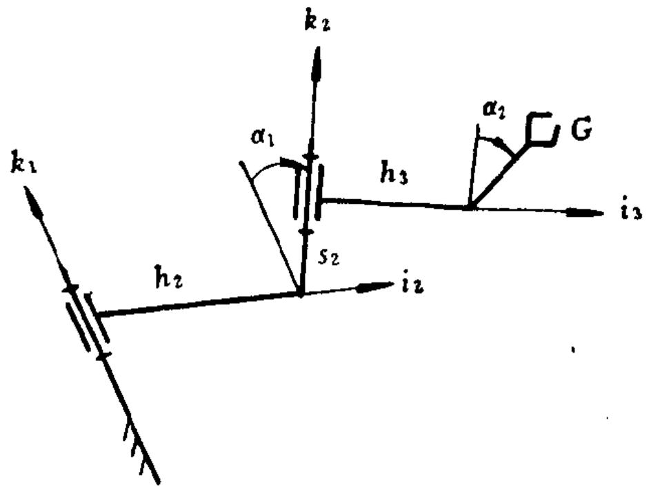

图7-11 $\ 2 R$ 机器人机构

定的离散值进行作图。例如 $2 R$ 机器人机构有 $\alpha _ { 1 } , \alpha _ { 2 } , h _ { 2 } , h _ { 3 } , s _ { 2 } , G$ 这6个参数,见图 $7 - 1 1 _ { 0 }$ 可分别取定这些参数的值,作出表7-3的若干图形。从表中可以看到,每个参数的改变都影响 $W _ { 1 r } ( M )$ 的形状。

用同样的方法,可作出 $\mathbf { \boldsymbol { \mathsf { 3 } } } \mathbfcal { R }$ 机器人机构 $W _ { 1 r } ( M )$ 图谱,见表 $7 -$ 4和 $7 - 5 \text{‰}$ 

# \$7-4 机器人轨迹规划

机器人运动轨迹规划是指给定一组工作点,要求规划出一条通过所有指定点并以一定的速度和加速度运动的连续轨迹。轨迹规划遵循两条原则;其一,运动轨迹精确地遥过所有指定点;其二,运动轨迹平滑地通过所有指定点。轨迹规划既可在关节空间中进行,也可在笛卡儿空间中进行[18,22],下面将分别叙述。其具体应用将在第八章列举。

# 一、多项式插补方法

给出一组点 ${ \mathfrak { x } } _ { i } , i = 0 , 1 , 2 \cdots n ,$ 以及经过这些点的速度 $\begin{array} { r } { \dot { x } _ { i } , ~ \dot { i } = } \end{array}$ 

$\mathbf { 0 . 1 . 2 \cdots n _ { j } }$ 要规划一条平滑的曲线经过这些点,如图7-12所示。在$\dot { \pmb { \mathscr { X } } } - \pmb { 1 }$ 至 $\dot { \pmb { \mathscr { b } } }$ 点之间,需要满足如下4个条件

$$
\begin{array} { r l } & { \boldsymbol { \sigma } ( \mathcal { T } _ { i - 1 } ) = \boldsymbol { \mathcal { D } } _ { i - 1 } } \\ & { \boldsymbol { \sigma } ( \mathcal { T } _ { i } ) = \boldsymbol { v } _ { i } } \\ & { \dot { \boldsymbol { \sigma } } ( \mathcal { T } _ { i - 1 } ) = \dot { \boldsymbol { \mathcal { X } } } _ { i - 1 } } \\ & { \dot { \boldsymbol { \sigma } } ( \mathcal { T } _ { i } ) = \dot { \boldsymbol { \mathcal { X } } } _ { i } } \end{array}
$$

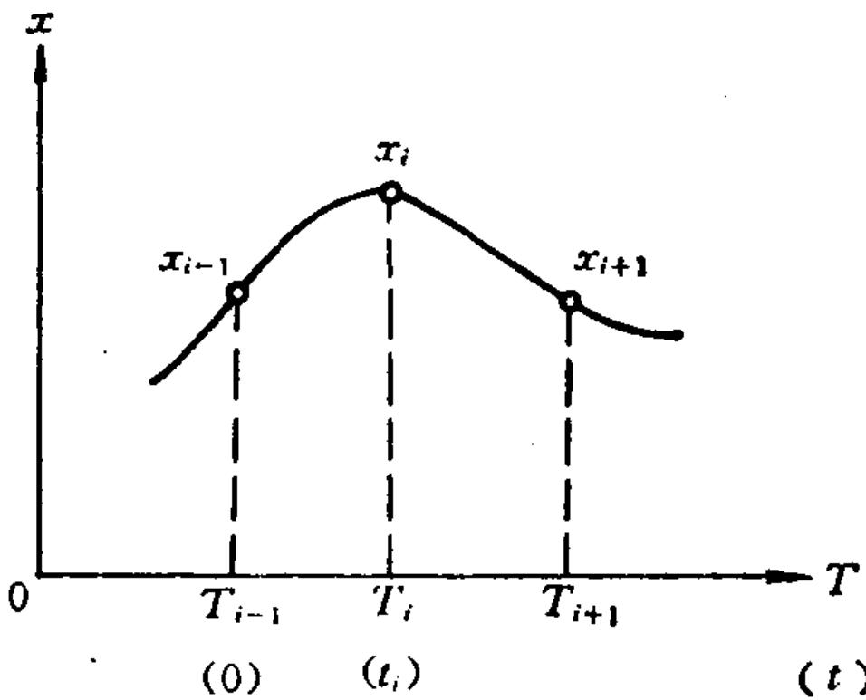

图7--19 多项式插补法

因此,如果用多项式进行插补,至少需要用一个3次多项式。8次多项式有4个待定系数,利用这4个条件建立方程可确定这些系数。用$\phi _ { i - 1 }$ 表示 $\pmb { \mathscr { D } _ { i } } \mathrm { \Pi } _ { \mathrm { - 1 } }$ 到 $x _ { 6 }$ 之间的插补多项式,有

$$
\phi _ { i - 1 , i } = a _ { i 0 } + a _ { i 1 } t + a _ { i 2 } t ^ { 2 } + a _ { i 3 } t ^ { 3 }
$$

$n + 1$ 个指定点有 $\pmb { \mathscr { n } }$ 个插补多项式。式中 $\sigma _ { i j } ( i = 1 , 2 \cdots n , \ j = 0 , 1 ,$ 2.3)是这些多项式的系数。 $\pmb { t }$ 为点 ${ i - 1 }$ 至点 $\dot { \pmb { \mathscr { b } } }$ 这段轨迹的相对时间,即 $\pmb { \mathrm { \acute { t } } }$ 在 $T _ { i - 1 }$ 处为零,在 $\pmb { T _ { i } }$ 处为 $t _ { i } = ( T _ { i } - T _ { i - 1 } )$ 。将上述 $\pmb { 4 }$ 个条件代入式 $7 - 2 2$ ,得到4个方程

$\pmb { t = 0 }$ 时

$$
\left. \begin{array} { l } { \displaystyle \alpha _ { i 0 } = \sigma _ { i - 1 } } \\ { \displaystyle } \\ { \displaystyle \alpha _ { i 1 } = \dot { x } _ { i - 1 } } \end{array} \right\}
$$

$t = t _ { \ell }$ 时

$$
\left. \begin{array} { l } { { a _ { i 0 } + a _ { i 1 } t _ { i } + a _ { i 2 } t _ { \ell } ^ { 2 } + a _ { i 3 } t _ { \ell } ^ { 3 } = x _ { i } } } \\ { { \phantom { a _ { i 1 } + a _ { i 1 } t _ { i } + a _ { i 2 } t _ { i } + a _ { i 3 } t _ { i } ^ { 2 } = } } } \end{array} \right\}
$$

将式 $\mathbf { 7 - 3 3 }$ 代入式7-84,得

$$
\left. { \begin{array} { l } { a _ { i 8 } { = } \displaystyle { \frac { 2 ( x _ { i - 1 } - x _ { i } ) - ( { \dot { x } } _ { i - 1 } + { \dot { x } } _ { i } ) t _ { i } } { t ^ { 3 } } } } \\ { a _ { i 2 } { = } \displaystyle { \frac { ( { \dot { x } } _ { i } \quad { \dot { x } } _ { i - 1 } ) t _ { i } - 9 a _ { i 3 } t _ { i } ^ { 2 } } { 2 t _ { i } } } } \end{array} } \right\}
$$

如果不单规定 $\pmb { x }$ 和 $\dot { \pmb { x } }$ ,还要规定 $\ddot { x }$ ,则至少需要五次多项式。这样规划出来的轨迹能保证位置、速度和加速度的要求,并保证这3

个量的连续,此时

$$
\phi _ { i - 1 , i } = a _ { i 0 } + a _ { i 1 } t + a _ { i 2 } t ^ { 2 } + a _ { i 3 } t ^ { 3 } + a _ { i 4 } t ^ { 4 } + a _ { i 5 } t ^ { 5 }
$$

当 $\boldsymbol { \mathscr { t } } = \boldsymbol { 0 }$ 

$$
\begin{array} { l } { \displaystyle a _ { i 0 } = x _ { i - 1 } } \\ { \displaystyle a _ { i 1 } = \dot { x } _ { i - 1 } } \\ { \displaystyle a _ { i 2 } = \frac { \ddot { x } _ { i - 1 } } { 2 } } \end{array}
$$

当 $t = t _ { i }$ 

$$
\begin{array} { r l } & { a _ { i 0 } + a _ { i 1 } t _ { i } + a _ { i 2 } t _ { i } ^ { 2 } + a _ { i 3 } t _ { i } ^ { 3 } + a _ { i 4 } t _ { i } ^ { 4 } + a _ { i 5 } t _ { i } ^ { 5 } = x _ { i } } \\ & { a _ { i 1 } + 2 a _ { i 2 } t _ { i } + 9 a _ { i 3 } t _ { i } ^ { 2 } + 4 a _ { i 4 } t _ { i } ^ { 3 } + 5 a _ { i 5 } t _ { i } ^ { 4 } = \dot { x } _ { i } } \\ & { 2 a _ { i 2 } + 6 a _ { i 3 } t _ { i } + 1 2 a _ { i 4 } t _ { i } ^ { 2 } + 2 0 a _ { i 5 } t _ { i } ^ { 3 } = \ddot { x } _ { i } } \end{array}
$$

求得

$$
\left. \begin{array} { l } { \displaystyle \omega _ { i 3 } = \frac { 2 0 \left( \omega _ { i } - \alpha _ { i - 1 } \right) - ( 8 \dot { \alpha } _ { i - 1 } + 1 2 \dot { \alpha } _ { i } ) t _ { i } - ( 9 \ddot { \alpha } _ { i - 1 } - \ddot { \alpha } _ { i } ) t _ { \ell } ^ { 2 } } { 2 t _ { i } ^ { 3 } } } \\ { \displaystyle \alpha _ { i 4 } = \frac { 9 0 \left( \omega _ { i - 1 } - \alpha _ { i } \right) + ( 1 4 \dot { \alpha } _ { i } + 1 6 \dot { \alpha } _ { i - 1 } ) t _ { i } + ( 9 \ddot { \alpha } _ { i - 1 } - 2 \ddot { \alpha } _ { i } ) t _ { \ell } ^ { 2 } } { 2 t _ { i } ^ { 4 } } } \\ { \displaystyle \alpha _ { i 5 } = \frac { 1 2 \left( \sigma _ { i } - \alpha _ { i - 1 } \right) - ( 6 \dot { \bar { \alpha } } _ { i } + 6 \dot { \alpha } _ { i - 1 } ) t _ { i } - ( \ddot { \alpha } _ { i - 1 } - \ddot { \alpha } _ { i } ) t _ { \ell } ^ { 2 } } { 2 t _ { i } ^ { 3 } } } \end{array} \right\}
$$

按以上方法构造的 $\pmb { \eta }$ 段多项式轨迹,其速度、加速度是变化的。在许多应用场合需要规划匀速运动,这时点 $x _ { i - 1 }$ 至点 $x _ { 6 }$ 的路径是直线。而为了保证速度的连续,在路径的始端和终端需要采用过渡曲线,如图7-18所示。始端过渡曲线的运动时间是 $x _ { i - 1 }$ 至$T _ { \{ - 1 \} } ^ { \prime }$ 结束过渡曲线的运动时间是 $T _ { j } ^ { \prime }$ 至 $T _ { 1 0 }$ 而 $T _ { 6 - 1 } ^ { \prime }$ 至 ${ \pmb T } _ { \pmb { \imath } } ^ { \prime }$ 是直线轨迹的运动时间。如果规定了初速度 $\dot { x _ { \ell - 1 } }$ 、末速度 $\dot { x } _ { i }$ 及直线轨迹的运动速度 $v _ { \parallel - 1 , i } ,$ 就可选用2次多项式进行插补。先选定两段过渡时间 $\smash { t ^ { \prime } = T _ { s - 1 } ^ { \prime } - T _ { s - 1 } }$ , $t ^ { \prime \prime } { = } T _ { i } { - } T _ { i } ^ { \prime }$ ,第一段过渡曲线为

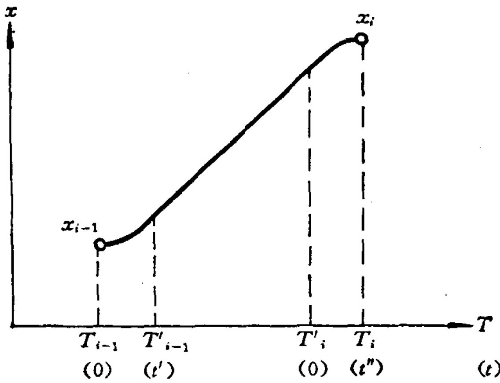

图7-13 直线轨迹和过渡曲线

$$
\phi _ { i - 1 , i } = a _ { i 0 } + \omega _ { i 1 } t + a _ { i 2 } t ^ { 2 }
$$

当 $\mathbf { \boldsymbol { \mathbf { \mathit { t } } } } = \mathbf { \boldsymbol { 0 } }$ 

$$
\left. \begin{array} { l } { { a _ { i 0 } = x _ { i - 1 } } } \\ { { { } } } \\ { { a _ { i 1 } = \dot { x } _ { i - 1 } } } \end{array} \right\}
$$

当 $f = t ^ { \prime }$ 

$$
a _ { i 1 } + 2 a _ { i 2 } t ^ { \prime } = \mathscr { v } _ { i - 1 , i }
$$

有

$$
a _ { i 2 } = \frac { v _ { i - 1 , i } - \dot { x } _ { i - 1 } } { 2 t ^ { \prime } }
$$

从而

$$
\begin{array} { r } { \pmb { \ x { \ x { \ x { \tau } } } } ( t _ { \ell - 1 } ^ { \prime } ) = \alpha _ { i 0 } + \alpha _ { i 1 } t ^ { \prime } + \alpha _ { i 2 } t ^ { \prime 2 } \qquad } \\ { \quad \cdot \qquad = \alpha _ { i - 1 } + \dot { x } _ { i - 1 } t ^ { \prime } + \frac { \left( v _ { i - 1 , i } - \dot { x } _ { i - 1 } \right) t ^ { \prime } } { 2 } \qquad } \end{array}
$$

设第二段过渡曲线为

当 $\pmb { \mathrm { \acute { \tau } } } = 0$ 

当 $\tan \theta . 5 = \tan \theta$ 

$$
\left. \begin{array} { l } { { \psi _ { i - 1 , i } = b _ { i 0 } + b _ { i 1 } t + b _ { i 2 } t ^ { 2 } } } \\ { { b _ { i 1 } = v _ { i - 1 , i } } } \\ { { b _ { i 1 } + 2 b _ { i 2 } t ^ { \prime \prime } = \dot { x } _ { i } } } \\ { { b _ { i 0 } + b _ { i 1 } t ^ { \prime \prime } + \dot { b } _ { i 2 } t ^ { \prime \prime 2 } = x _ { i } } } \end{array} \right\}
$$

有

$$
\left. { \begin{array} { l } { { \displaystyle b _ { i 2 } = \frac { { \dot { x } } _ { i } - { v } _ { i - 1 , i } } { 2 t ^ { \prime \prime } } } } \\ { { \displaystyle b _ { i 0 } = { v } _ { i } - v _ { i - 1 , i } t ^ { \prime \prime } - \frac { \left( x _ { i } - v _ { i - 1 , i } \right) t ^ { \prime \prime } } { 2 } } } \end{array} } \right\}
$$

从而

$$
\pmb { x } ( T _ { 4 } ^ { \prime } ) = \pmb { b _ { i 0 } }
$$

直线轨迹从 ${ \pmb x } ( { \pmb T } _ { 1 - 1 } ^ { \prime } )$ 开始至 $\pmb { x } ( \pmb { T } _ { 4 } ^ { \prime } )$ 0

# 二、关节空间中的轨迹规划

在关节空间中进行轨迹规划同样是确定一条通过指定点的轨迹,但这些指定点是以各关节运动参数表示的一系列对应位置。机器人各关节运动参数是直接的受控参数,因此在关节空间中进行轨迹规划比较简单,且不会出现奇异失控现象。前述多项式插补方法可直接用于关节运动轨迹的规划,仅需将纵坐标 $\pmb { x }$ 换为关节运动参数。例如 $\mathbf { 2 } R$ 平面操作手,有 $\theta _ { 1 , \cdot } \theta _ { 2 }$ 两个关节运动参数,如果要求从位置 $( 1 0 ^ { \circ } , \ 9 0 ^ { \circ } )$ 运动至位置 $( 4 5 ^ { \circ } , 9 0 ^ { \circ } )$ ,则可分别规划 $\pmb { \theta _ { 1 } }$ 从 $1 0 ^ { \circ }$ 至 $4 5 ^ { \circ }$ 以及 $\theta _ { 2 }$ 从 $\mathbf { \^ { 8 0 } }$ 至 $g 0 ^ { \circ }$ 的两条轨迹。图7-14所示为按过渡曲线 $+$ 直线 $+$ 过渡曲线的方式规划出来的轨迹。

在关节空间中进行规划的缺点是缺乏笛卡儿空间的直观性。

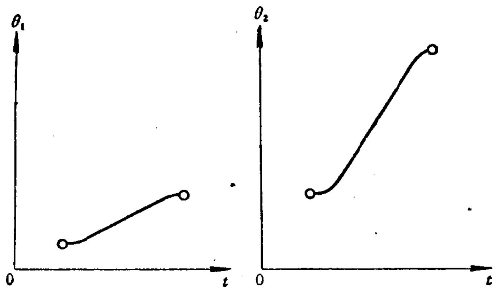

图7-14 $\Omega R$ 机器人关节运动轨迹

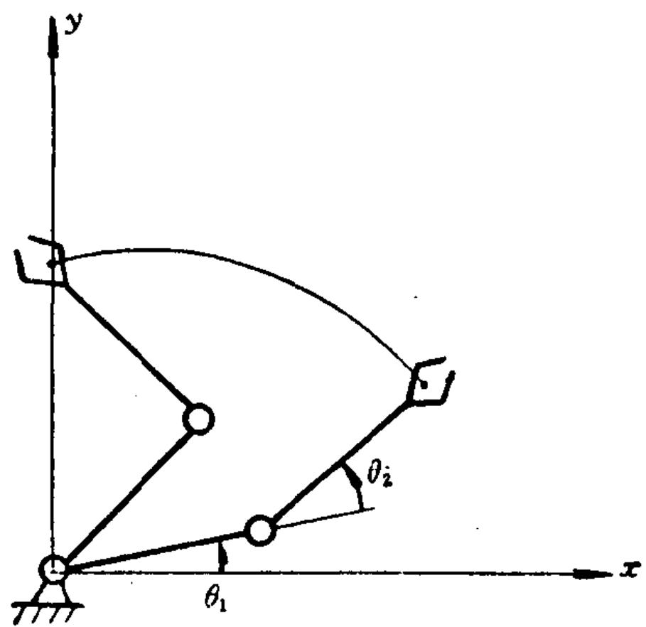

图7-15 笛卡儿空间中的轨迹

如上述直线轨迹在笛卡儿空间中并不是直线,而是如图7-15所示的曲线,曲线是否超越许可的工作空间也不能直观确认。此外,用2次多项式在关节空间中进行规划时,由于没有加速度的约束条件,可能会出现加速度超过关节加速能力的情况,此时应增大过渡时间以减小加速度。

# 三、笛卡儿空间中的轨迹规划

在关节空间中进行轨迹规划虽然简单易行,但由于缺乏作业直观性,在复杂的作业场合,例如焊接、喷漆、装配以及需要躲避障碍物的场合,必须在笛卡儿空间中进行轨迹规划。给定机器人末杆的一组位姿 $P _ { i , \Omega , ( i = 0 , 1 , 2 ^ { . . . } n ) }$ ,规划一条实现这些位姿的工作轨迹主要是根据作业要求来进行,并不一定需要保持轨迹直观上的平滑。各坐标分量随时间变化的规律可由 ${ \pmb x } ( t )$ 、 $y ( t ) , z ( t )$ 、$\Omega _ { x } ( t ) , \Omega _ { y } ( t ) , \Omega _ { z } ( t )$ 表示。笛卡儿空间中的轨迹是与对应的各坐标分量随时间变化的规律不同的。例如图7-16a的笛卡儿空间平面折线轨迹,可用连续的速度来实现。图7-16b和 $\pmb { \mathrm { c } }$ 是 ${ \pmb x } ( t )$ 和$y ( t )$ 的图形,它们相对时间的变化是连续平滑的。

在笛卡儿空间进行轨迹规划的主要缺点是必须通过逆运动学求得轨迹上各点对应的关节参数值,才能进行控制。此外,轨迹规划的结果有可能使某些点进入空洞、空腔或盲区,或者超出关节转动的最大速度和最大加速度。出现这些情况都将使控制无法实现,应引起注意。

# 四、圆弧插补

用圆弧作插补曲线的方法称为圆弧插补方法。可用一系列光滑连接的圆弧通过任何一组点,图7-17所示为 $5$ 个已知点的圆弧插补方法。在图示平面上,各点的坐标为 $( t _ { i } , x _ { i } )$ , $i = 1 , 2 \cdots 5 _ { c }$ 第1.2、8点确定第1个圆弧。设第1个圆弧的圆心为 $\smash { \theta _ { 1 } = \left( t _ { o 1 } , \ x _ { o 1 } \right) }$ ,${ \pmb O } _ { 1 }$ 是第1、2两点与第2、3两点中垂线的交点。第1,2.两点的中垂线方程为

$$
r = r _ { 1 2 } + a _ { 1 2 } { \int } _ { \substack { x _ { 2 } - x _ { 1 } } } ^ { t _ { 1 } - t _ { 2 } } \Biggr ]
$$

图7-16 笛卡儿空间的轨迹规划

图7-17圆弧插补方法

式中, $\pmb { \mathcal { r } } _ { 1 2 }$ 为第1、2两点连线的中点,有

$$
r _ { 1 2 } = { \left[ \begin{array} { l } { t _ { 1 } } \\ { x _ { 1 } } \end{array} \right] } + { \frac { 1 } { 2 } } { \left[ \begin{array} { l } { t _ { 2 } - t _ { 1 } } \\ { x _ { 2 } - x _ { 1 } } \end{array} \right] }
$$

第2、3两点的中垂线方程为

$$
r = r _ { 2 3 } + a _ { 2 3 } { \left[ \begin{array} { l } { t _ { 2 } - t _ { 3 } } \\ { x _ { 3 } - x _ { 2 } } \end{array} \right] }
$$

式中

$$
r _ { z 3 } = \left[ { \begin{array} { l } { t _ { 2 } } \\ { x _ { 2 } } \end{array} } \right] + { \frac { 1 } { 2 } } { \left[ \begin{array} { l } { t _ { 3 } - t _ { 2 } } \\ { x _ { 3 } - x _ { 2 } } \end{array} \right] }
$$

两中垂线的交点同时满足式7-43和7-44,即

$$
\left. \begin{array} { l } { { \displaystyle { \dot { \varepsilon } } _ { 1 } + \frac { 1 } { 2 } \big ( \dot { \varepsilon } _ { 2 } - \dot { \varepsilon } _ { 1 } \big ) + \alpha _ { 1 2 } \big ( \dot { \varepsilon } _ { 1 } - \dot { \varepsilon } _ { 2 } \big ) = \dot { \varepsilon } _ { 2 } + \frac { 1 } { 2 } \big ( \dot { \varepsilon } _ { 3 } - \dot { \varepsilon } _ { 2 } \big ) + \alpha _ { 2 3 } \big ( \dot { \varepsilon } _ { 2 } - \dot { \varepsilon } _ { 3 } \big ) } } \\ { { \displaystyle { \vphantom { \Biggl ( } \frac { 1 } { \sqrt { 3 } } \big ( \dot { \varepsilon } _ { 2 } - \dot { \varepsilon } _ { 1 } \big ) + \alpha _ { 1 2 } \big ( \alpha _ { 2 } - \dot { \sigma } _ { 1 } \big ) = } \alpha _ { 2 } + \frac { 1 } { 2 } \big ( \sigma _ { 3 } - \dot { \sigma } _ { 2 } \big ) + \alpha _ { 2 3 } \big ( \dot { \varepsilon } _ { 3 } - \dot { \sigma } _ { 2 } \big ) } } \end{array} \right\}
$$

由式7-45可求得 $\pmb { \alpha _ { 1 2 } }$ 和 ${ \pmb { a } } _ { 2 3 }$ ,将 ${ \pmb { G } } _ { 1 2 }$ 代入式7-43或将 $\pmb { \mathcal { Q } } _ { 2 3 }$ 代入式7-44,可求得 $\pmb { 0 } _ { 1 }$ 的坐标

或

$$
\begin{array} { r l } & { \left[ \begin{array} { l } { \dot { t } _ { o 1 } } \\ { \boldsymbol { x } _ { o 1 } } \end{array} \right] = \pmb { r } _ { 1 2 } + a _ { 1 2 } \left[ \begin{array} { l } { \dot { t } _ { 1 } - \dot { t } _ { 2 } } \\ { \boldsymbol { x } _ { 0 } - \boldsymbol { x } _ { 1 } } \end{array} \right] \left[ \begin{array} { l } { \phantom { - } } \\ { \dot { t } _ { 2 } - \dot { t } _ { 3 } } \end{array} \right] } \\ & { \left[ \begin{array} { l } { \dot { t } _ { o 1 } } \\ { \boldsymbol { x } _ { o 1 } } \end{array} \right] = \pmb { r } _ { 2 3 } + a _ { 2 3 } \left[ \begin{array} { l } { \dot { t } _ { 2 } - \dot { t } _ { 3 } } \\ { \boldsymbol { x } _ { 3 } - \boldsymbol { x } _ { 2 } } \end{array} \right] \left[ \begin{array} { l } { \dot { t } _ { 1 } - \dot { t } _ { 2 } } \\ { \dot { t } _ { 2 } - \dot { t } _ { 3 } } \end{array} \right] } \end{array}
$$

第1个圆弧的半径 $\scriptstyle { R _ { 1 } }$ 为

$$
R _ { 1 } = \sqrt { \ ( t _ { 1 } - t _ { o 1 } ) ^ { 2 } + ( x _ { 1 } - x _ { o 1 } ) ^ { 2 } }
$$

为了保证各段圆弧的连续性, $( t _ { 3 } , \ x _ { 3 } )$ 必须在下一段圆弧上且必须是前后两段圆弧的切点。也就是说,第2段圆弧的圆心必须在通过 $( t _ { 3 } , \ x _ { 3 } )$ 及 $( t _ { 0 1 } , \ x _ { 0 1 } )$ 两点的直线上。此直线的方程为

$$
\pmb { r } = \left[ { \begin{array} { l } { t _ { 3 } } \\ { x _ { 3 } } \end{array} } \right] + b _ { 1 } \left[ { \begin{array} { l } { t _ { 3 } - t _ { o 1 } } \\ { x _ { 3 } - x _ { o 1 } } \end{array} } \right]
$$

而第8、4两点的中垂线方程为

$$
r = \frac { 1 } { 2 } { \left[ \begin{array} { l } { t _ { 3 } + t _ { 4 } } \\ { x _ { 3 } + x _ { 4 } } \end{array} \right] } + a _ { 3 4 } { \left[ \begin{array} { l } { t _ { 3 } - t _ { 4 } } \\ { x _ { 4 } - x _ { 3 } } \end{array} \right] }
$$

联立式 $\yen 48$ 与式7-49,可求得系数 $b _ { 1 }$ 和 $\cos = \cos = \cos = \cos \alpha 0$ 则第2段圆弧的圆心 ${ \pmb 0 } _ { \bf 2 }$ 的坐标为

$$
\left[ { \begin{array} { c } { t _ { o 2 } } \\ { x _ { o 2 } } \end{array} } \right] = { \frac { 1 } { 2 } } { \left[ \begin{array} { c } { t _ { 9 } + t _ { 4 } } \\ { x _ { 3 } + x _ { 4 } } \end{array} \right] } + a _ { 3 4 } { \left[ \begin{array} { c } { t _ { 3 } - t _ { 4 } } \\ { x _ { 4 } - x _ { 3 } } \end{array} \right] }
$$

第2段圆弧的半径 $\mathbf { { { R } _ { 2 } } }$ 为

$$
R _ { 2 } \sqrt { ( t _ { 3 } - t _ { o 2 } ) ^ { 2 } + ( x _ { 3 } - x _ { o 2 } ) ^ { 2 } }
$$

同理,可求出第3段圆弧的圆心坐标及半径。

由上述分析可知,用圆弧对 $\pmb { \mathscr { n } }$ 个点进行插补,可根据前面3个点确定第1个圆弧,使用公式 $7 - 4 3 \sim 7 - 4 7$ ,后继圆弧可使用如下递推式

$$
\begin{array} { c }  { \displaystyle { \left[ \begin{array} { l } { { \bar { \ell } _ { \partial \ell } } } \\ { { { \bf x } _ { \partial \ell } } } \end{array} \right] = - \frac { 1 } { 2 } \left[ \begin{array} { c } { { \bar { \ell } _ { \ell + 1 } + \bar { \ell } _ { \ell + 2 } } } \\ { { { \bf x } _ { \ell + 1 } + { \bf x } _ { \ell + 2 } } } \end{array} \right] } } \\ { { + { \bf a } _ { i + 1 } , \dots , { \bf f } _ { \ell + 1 } - { \bf \bar { \ell } } _ { \ell + 2 } } } \\ { { { \bf R } _ { i } = \sqrt { \left( \bar { \ell } _ { \ell + 1 } - \bar { \ell } _ { \partial \ell } \right) ^ { 2 } + \left( \bar { \ell } _ { \ell + 1 } - \bar { \ell } _ { \partial \ell } \right) ^ { 2 } } } } \end{array}
$$

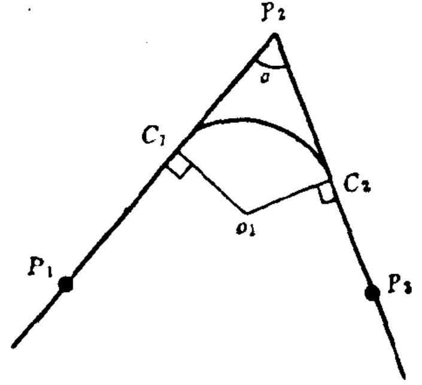

图7-18 圆弧作为过渡曲线

通过 $\pmb { \eta }$ 个点的圆弧数目为 $n - 2 _ { 0 }$ 

圆弧也可以作为直线之间的过渡连接,图7-18为圆弧作为过渡曲线的情况。图中 $\mathbf { \mathcal { P } _ { 1 , 2 } } \mathbf { \mathcal { P } _ { 2 } }$ 确定第1条直线, $P _ { 2 _ { 3 } } P _ { 3 }$ 确定第2条直线,两直线的交点为 ${ \pmb P _ { 2 } }$ ,交角为 $\pmb { \alpha } _ { \circ }$ 切点 $c _ { 1 , C _ { 2 } }$ 为

$$
\left. \begin{array} { l } { { C _ { 1 } { = } P _ { 2 } { - } { \displaystyle { \frac { ( P _ { 2 } { - } P _ { \mathrm { : } } ) R } { | P _ { 2 } { - } P _ { 1 } | \mathrm { \not \in } { \displaystyle { \frac { \alpha } { 2 } } } } } } } } \\ { { } } \\ { { C _ { 2 } { = } P _ { 2 } { + } { \displaystyle { \frac { ( P _ { 3 } { - } P _ { 2 } ) R } { | P _ { 3 } { - } P _ { 2 } | \mathrm { \not \in } { \displaystyle { \frac { \alpha } { 2 } } } } } } } } \end{array} \right\}
$$

式中, $\pmb { R }$ 是圆弧的半径。用圆弧作为过渡曲线时,不同的半径将得到不同的切点,必须首先按需要确定过渡弧的半径。过渡弧的圆心为

$$
\mathbf { } O _ { \mathrm { 1 } } { = } C _ { \mathrm { 1 } } { + } R T _ { \mathrm { 1 } }
$$

式中, $\pmb { T _ { 1 } }$ 为 $\pmb { P _ { 1 } } _ { \bullet } \pmb { P _ { 2 } }$ 两点连线的中垂线的方向。对于 $\ o t x$ 平面,式7-54和7-55可写为

$$
\begin{array}{c} \begin{array} { l } { { [ \begin{array} { l } { { \dot { t } } _ { \alpha 1 } } \\ { { \boldsymbol { x } } _ { \alpha 1 } } \end{array} ] = [ \begin{array} { l } { { \dot { t } } _ { 2 } } \\ { { \boldsymbol { x } } _ { \alpha 2 } } \end{array} ] - \frac { R / \mathrm { t g } ~ \frac { \alpha } { 2 } } { \sqrt { ( { \dot { \iota } } _ { 2 } - { \dot { t } } _ { 1 } ) ^ { 2 } - \mathrm { t } ( { \boldsymbol { x } } _ { 2 } - { \boldsymbol { \sigma } } _ { 1 } ) ^ { 2 } } } [ \begin{array} { l } { { \dot { t } } _ { 2 } - { \dot { t } } _ { 1 } } \\ { { \boldsymbol { x } } _ { 2 } - { \boldsymbol { \sigma } } _ { 1 } } \end{array} ] } } \\ { { [ \begin{array} { l } { { \dot { t } } _ { \alpha 2 } } \\ { { \boldsymbol { x } } _ { \alpha 2 } } \end{array} ] = [ \begin{array} { l } { { \dot { t } } _ { 2 } } \\ { { \boldsymbol { x } } _ { \alpha 2 } } \end{array} ] + \frac { R / \mathrm { t g } ~ \frac { \alpha } { 2 } } { \sqrt { ( { \dot { t } } _ { 3 } - { \dot { t } } _ { 2 } ) ^ { 2 } + ( { \boldsymbol { x } } _ { 3 } - { \boldsymbol { \sigma } } _ { 2 } ) ^ { 2 } } } [ \begin{array} { l } { { \dot { t } } _ { 3 } - { \dot { t } } _ { 2 } } \\ { { \boldsymbol { x } } _ { 3 } - { \boldsymbol { \sigma } } _ { 3 } } \end{array} ] } } \end{array} ]   \end{array}
$$

$$
{ \left[ \begin{array} { l } { t _ { 0 1 } } \\ { { \boldsymbol { x } } _ { 0 \cdot } } \end{array} \right] } = { \left[ \begin{array} { l } { t _ { c 1 } } \\ { { \boldsymbol { x } } _ { \mathrm { c 1 } } } \end{array} \right] } + R \left[ { \begin{array} { l } { t _ { 1 } - t _ { 2 } } \\ { { \boldsymbol { x } } _ { 2 } - { \boldsymbol { x } } _ { 1 } } \end{array} } \right]
$$

在关节空间中进行轨迹规划时,可直接使用上述公式。在笛卡儿空间中进行规划时,在2维空间中可将上述公式的 $\pmb { \mathscr { t } }$ 坐标换为 $\pmb { \mathscr { D } }$ 坐标, $\pmb { \mathcal { D } }$ 坐标换为 $y$ 坐标。在3维空间中,由于各点不在同一平面上,各段圆弧也不在同一平面上。因此,首先要确定各段圆弧所在的平面。对于前3个点,圆弧平面的法线 $\pmb { N _ { 1 } }$ 为

$$
N _ { 1 } { = } \frac { ( P _ { 2 } { - } P _ { . } ) \times ( P _ { 3 } { - } P _ { 2 } ) } { | \left( P _ { 3 } { - } P _ { 1 } \right) \times \left( P _ { 3 } { - } P _ { 2 } \right) | }
$$

第1个圆弧所在平面的方程为

$$
( r - P _ { 1 } ) N _ { 1 } { = } 0
$$

式中, $\pmb { \mathcal { r } }$ 为平面上的任一点。将 $P _ { 1 , } P _ { 2 , } P _ { 3 }$ 在此平面上的坐标代入前面关于计算第 $\pmb { 1 }$ 个圆弧的圆心坐标和圆弧半径的公式,就可求出第1个圆弧的圆心和半径。对于第2个圆弧,圆弧平面由直线 $\pmb { P _ { 3 } } - \pmb { O _ { 1 } }$ 与点 $\pmb { P _ { 4 } }$ 确定,法线 $\pmb { N _ { 2 } }$ 为

$$
N _ { 2 } { = } \frac { ( P _ { 3 } { - } O _ { 4 } ) \times ( P _ { 4 } { - } P _ { 8 } ) } { | ( P _ { 3 } { - } O _ { 4 } ) \times ( P _ { 4 } { - } \overrightarrow { P _ { 8 } } ) | }
$$

平面方程为

$$
( r - P _ { 3 } ) N _ { 2 } { = } 0
$$

对余下的圆弧,其圆弧平面的法线 $\pmb { N _ { i } }$ 为

$$
N _ { i } { = } \frac { ( P _ { i + 1 } { - } O _ { i - 1 } ) \times ( P _ { i + 2 } { - } P _ { i + 1 } ) } { \mid ( P _ { i + 1 } { - } O _ { i - 1 } ) \times ( P _ { i + 2 } { - } P _ { i + 1 } ) \mid }
$$

平面方程为

$$
( r - P _ { i + 1 } ) N _ { i } = 0
$$

将各点在各自圆弧平面上的坐标代入前面关于后继圆弧圆心和半径的计算公式,就可求出其余全部圆弧的圆心坐标及半径。计算例子参见第八章。

# \$7-5 机器人机构几何尺寸的校正

机器人机构在制造、安装时,将不可避免地存在误差。进行运动控制时,如果采用有关几何参数的公称值,则必然导致较大的定位误差。为了尽量减少这些误差,必须在机器人制造、安装后,重新确定机器人几何参数的实际值。

# 一、用有限个已知点示教校正

在工作台上定出以固定参考坐标系为基准的若干位置 ${ \pmb P _ { \parallel } }$ ,令机器人手部的参考点依次对准这些位置,记下各关节编码器的读数,通过机器人位置方程,可求得各几何参数的值。例如 $\pmb { 2 R }$ 机器人,在制造安装过程中,机器人中心 $\pmb { C _ { 1 } }$ 、杆 $C _ { 1 }$ 和 $C _ { 2 }$ 的长度及两个

关节编码盘的初始位置都有误差,如图7-19所示。第1关节的编码盘零点信号线应与固定参考坐标系的 $\dot { \pmb { \mathscr { z } } }$ 轴平行,且通过第2关节中心,安装后偏离 $\clubsuit$ 轴 $\theta _ { 1 0 } ^ { \prime }$ 角度,偏离第2关节中心

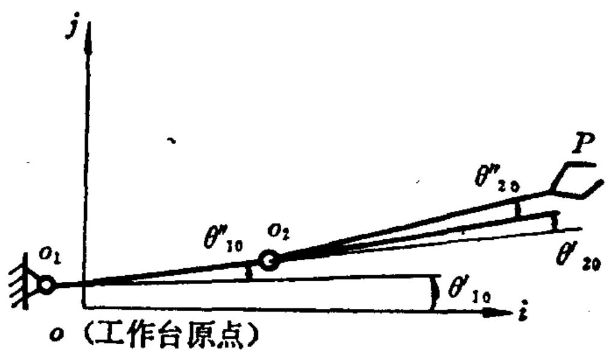

图7-19 制造安装误差

$\pmb { \theta } _ { 1 0 } ^ { \prime \prime }$ 角度。第2关节的编码盘零点信号线应通过两关节中心连线及末杆参考点 $p$ ,安装后偏离两关节中心连线 $\pmb { \theta } _ { \mathbf { 2 0 } } ^ { \prime }$ 角度,偏离 $O _ { 2 } P$ 连线 $\pmb { \theta } _ { \mathbf { 2 0 } } ^ { \prime \prime }$ 角度。待定的几何参数共6个: $\begin{array} { r } { C _ { 1 , } C _ { 2 , } \mathrm { ~ } \theta _ { 1 0 } = \theta _ { 1 0 } ^ { \prime } + \theta _ { 1 0 , } ^ { \prime \prime } } \end{array}$ $\theta _ { 2 0 } =$ $\theta _ { 2 0 } ^ { \prime } + \theta _ { 2 0 } ^ { \prime \prime } .$ 、 $\pmb { O _ { 1 } }$ 的坐标 $\pmb { O } _ { \pmb { \alpha } }$ 和 $\pmb { 0 } _ { \pmb { y } \circ }$ 确定这6个值至少需要3个已知点$P _ { 1 , P _ { 2 , } } P _ { 3 \circ }$ 机器人位置方程为

$$
P = 0 _ { 1 } + E ^ { \chi _ { ( 0 _ { 1 } + \theta _ { 1 0 } ) } } ( C _ { 1 } ^ { \prime } + E ^ { \chi _ { ( \theta _ { 1 } + \theta _ { 1 0 } ) } } ( C _ { 2 } ^ { \prime } ) )
$$

即

$$
\left[ \begin{array} { c } { \pmb { x } } \\ { \pmb { y } } \\ { \pmb { \bigcup } } \\ { \mathbf { 0 } } \end{array} \right] = \left[ \begin{array} { c } { \theta _ { \pmb { \alpha } } } \\ { \theta _ { \pmb { \nu } } } \\ { \mathbf { 0 } } \end{array} \right] + \left[ \begin{array} { c } { G _ { 1 } \cos ( \theta _ { 1 } + \theta _ { 1 0 } ) } \\ { G _ { 1 } \sin ( \theta _ { 1 } + \theta _ { 1 0 } ) } \\ { 0 } \end{array} \right] + \left[ \begin{array} { c } { G _ { 2 } \cos \left( \theta _ { 1 } + \theta _ { 2 } + \theta _ { 1 0 } + \theta _ { 2 0 } \right) } \\ { G _ { 2 } \sin \left( \theta _ { 1 } + \theta _ { 2 } + \theta _ { 1 0 } + \theta _ { 2 0 } \right) } \\ { 0 } \end{array} \right]
$$

式中, $\theta _ { 1 , \theta _ { 2 } }$ 对应编码盘的已知读数。展开上式,经整理得

$$
\left. \begin{array} { r l } & { a v = 0 _ { a } + A _ { 1 } C _ { 1 } \cos \theta _ { 1 0 } + A _ { 2 } C _ { 1 } \sin \theta _ { 1 0 } + A _ { 3 } C _ { 2 } \cos \left( \theta _ { 1 0 } + \theta _ { 2 0 } \right) } \\ & { \phantom { a a a a a a a a a a a a a a a a a a a a a a a a a a a a a a a a a a a a a a a a a } } \\ & { \phantom { a a a a a a a a a a a a a a a a a a a a a a a a a a a a } + A _ { 4 } C _ { 2 } \sin \left( \theta _ { 1 0 } + \theta _ { 2 0 } \right) } \\ & { y = o _ { y } + B _ { 1 } C _ { 1 } \cos \theta _ { 1 0 } + B _ { 2 } C _ { 1 } \sin \theta _ { 1 0 } + B _ { 3 } C _ { 3 } \cos \left( \theta _ { 1 0 } + \theta _ { 2 0 } \right) } \\ & { \phantom { a a a a a a a a a a a a a a a a a a a a a a a a a a a a a a a } } \\ & { \phantom { a a a a a a a a a a a a a a a a a a a a a a a a a a a a a a a a a a a a a } + } \\ & { \phantom { a a a a a a a a a a a a a a a a a a a a a a a a a a a a a a a a a a a a a a a a a } + } \end{array} \right\}
$$

式中

$$
\begin{array} { r l } { A _ { 1 } = \cos \theta _ { 1 } } & { A _ { 2 } = - \sin \theta _ { 1 } } \\ { A _ { 3 } = \cos ( \theta _ { 1 } + \theta _ { 2 } ) } & { A _ { 4 } = - \sin \left( \theta _ { 1 } + \theta _ { 2 } \right) } \\ { B _ { 1 } = \sin \theta _ { 1 } \quad , \quad B _ { 2 } = \cos \theta _ { 1 } } \\ { B _ { 3 } = \sin \left( \theta _ { 1 } + \theta _ { 2 } \right) } & { B _ { 4 } = \cos ( \theta _ { 1 } + \theta _ { 2 } ) } \\ { \sigma _ { 1 } = \mathrm { t g } \frac { \theta _ { 1 0 } } { 2 } } & { \sigma _ { 2 } = \mathrm { t g } \frac { \theta _ { 1 0 } + \theta _ { 2 0 } } { 2 } } \end{array}
$$

令

展开式7-65,得

$$
\left. \begin{array} { c } { { x = f _ { 1 } + f _ { 2 } + f _ { 3 } + f _ { 4 } + f _ { 5 } } } \\ { { y = g _ { 1 } + g _ { 2 } + g _ { 3 } + g _ { 4 } + g _ { 5 } } } \end{array} \right\}
$$

式中, $f _ { i }$ 是 $\smash { 0 _ { \alpha _ { 3 } } x _ { 1 } , x _ { 2 } , C _ { 1 _ { 3 } } C _ { 2 } }$ 的 $\pmb { \dot { \eta } }$ 次多项式, $g _ { i }$ 是 $\smash { 0 _ { y _ { 3 } } \mathcal { D } _ { 1 } \mathcal { A } _ { 3 } \mathcal { D } _ { 2 } \mathcal { O } _ { 3 } \mathcal { C } _ { 1 _ { 3 } } \mathcal { C } _ { 2 } }$ 的$j$ 次多项式

$$
\begin{array} { r l } & { f _ { 1 } \sim Q _ { c } + \dot { A } _ { 1 } G _ { 1 } + \dot { A } _ { 3 } G _ { 3 } } \\ & { f _ { 2 } = 2 \dot { A } _ { z } \mathcal { O } _ { 1 } x _ { 1 } + 2 \dot { A } _ { 4 } G _ { 2 } v _ { 2 } - \alpha x _ { 1 } ^ { 3 } - \alpha x _ { 2 } ^ { 2 } } \\ & { f _ { 8 } = Q _ { c } x _ { 1 } ^ { 2 } + o _ { 2 } x _ { 2 } ^ { 2 } + \dot { A } _ { 1 } G _ { 1 } x _ { 2 } ^ { 2 } - \dot { A } _ { 1 } \mathcal { O } _ { 1 } x _ { 1 } ^ { 2 } + \dot { A } _ { 3 } \mathcal { O } _ { 2 } x _ { 1 } ^ { 2 } - \dot { A } _ { 3 } \mathcal { O } _ { 2 } x _ { 2 } ^ { 3 } } \\ & { f _ { 4 } = - \alpha x _ { 1 } ^ { 2 } \alpha _ { 2 } ^ { 2 } - 2 \dot { A } _ { 2 } G _ { 5 } \pi x _ { 1 } x _ { 2 } ^ { 2 } + 2 \dot { A } _ { 4 } G _ { 2 } v _ { 4 } \pi _ { 1 } ^ { 3 } } \\ & { f _ { 5 } = - \dot { A } _ { 3 } ( \mathcal { O } _ { 1 } x _ { 1 } ^ { 2 } \alpha _ { 2 } ^ { 2 } - \dot { A } _ { 3 } G _ { 2 } \mathcal { O } _ { 2 } x _ { 1 } ^ { 2 } \alpha _ { 2 } ^ { 2 } + o _ { 2 } \alpha _ { 1 } ^ { 2 } v _ { 2 } ^ { 3 } } \\ & { g _ { 1 } = o _ { 9 } + \mathcal { B } _ { 1 } G _ { 1 } + \mathcal { B } _ { 8 } \mathcal { O } _ { 2 } } \\ & { g _ { 2 } = 2 \mathcal { B } _ { z } \mathcal { O } _ { 1 } \alpha _ { 1 } + 2 \mathcal { B } _ { 4 } \mathcal { O } _ { 2 } x _ { 2 } ^ { 2 } \gamma \alpha _ { 1 } ^ { 3 } - \mathcal { Y } \alpha _ { 2 } ^ { 2 } } \end{array}
$$

$$
g _ { 5 } = - \ : B _ { 1 } C _ { 1 } x _ { 1 } ^ { 2 } x _ { 2 } ^ { 2 } - B _ { 3 } C _ { 2 } x _ { 1 } ^ { 2 } x _ { 2 } ^ { 2 } + o _ { y } x _ { 1 } ^ { 2 } x _ { 2 } ^ { 2 }
$$

代入已知的3个位置 $x _ { \ell , y _ { \ell } } ( i = 1 , 2 , 9 )$ ,可求出6个参数,且

$$
\left. \begin{array} { l } { { \theta _ { 1 0 } = 2 \mathrm { t g } ^ { - 1 } x _ { 1 } } } \\ { { \theta _ { 2 0 } = 2 \mathrm { t g } ^ { - 1 } x _ { 2 } - \theta _ { 1 0 } } } \end{array} \right\}
$$

以上测量计算值的精度受测量工具及编码盘精度的共同影响。如果增加测量点,则可提高校正精度。设有 $\kappa$ 个 $( K { > } 3 )$ 测量点,可得 $\bf { 2 . \bf { K } }$ 个方程,设这些方程不同组合的数目为 $M$ ,则

$$
M = C _ { 2 K } ^ { 3 } = \frac { K ! } { \Im ( 2 K - 3 ) ! }
$$

可计算出 $M$ 组不同的数值 ${ \cal O } _ { \sigma } ^ { ( j ) } , { \cal O } _ { y } ^ { ( j ) } , { \cal O } _ { 1 } ^ { ( j ) } , { \cal O } _ { 2 } ^ { ( j ) } , \theta _ { 1 0 } ^ { ( j ) } , \theta _ { 2 0 } ^ { ( j ) } \left( j = 1 , 2 \cdots \right.$ $M )$ ,取 $M$ 组数据的平均值作为校正值,可减小由操作精度引入的误差。

# 二、用位置测量机示教校正

机器人末杆夹持点的位置如果由测量机实地测出,则尺寸校正的过程可以大大简化。如上述的 $\mathbf { 2 } R$ 机器人,如果固定 $\pmb { { \cal { O } } _ { 1 } }$ 杆,可将 $C _ { 2 }$ 杆绕 $0 \textmu$ 转动,测出3个位置 $P _ { 1 , P _ { 2 , } P _ { 3 , } }$ ,则 $0 z$ 位于这3点所确定的圆的圆心上, $C _ { 2 }$ 杆的长度是这个圆的半径,且有

$$
P { = } O _ { 2 } { + } E ^ { k ( \theta _ { 1 } + \theta _ { 1 0 } ) } E ^ { \mathrm { { Z } } _ { 0 } { + } \theta _ { 1 0 } \mathrm { { ) } } } ( C _ { 2 } ^ { * } )
$$

展开上式,经整理得

$$
\begin{array} { r l } & { A _ { 1 } \cos { ( \theta _ { 1 0 } + \theta _ { 2 0 } ) } + A _ { 2 } \sin { ( \theta _ { 1 0 } + \theta _ { 2 0 } ) } + A _ { 3 } = 0 ] } \\ & { B _ { 1 } \cos { ( \theta _ { 1 0 } + \theta _ { 2 0 } ) } + B _ { 2 } \sin { ( \theta _ { 1 0 } + \theta _ { 2 0 } ) } + B _ { 3 } = 0 ] } \end{array}
$$

式中

$$
A _ { 1 } = \cos \left( \theta _ { 1 } + \theta _ { 2 } \right) \quad A _ { 2 } = - \sin \left( \theta _ { 1 } + \theta _ { 2 } \right)
$$

$$
A _ { \mathfrak { s } } = \frac { \mathfrak { v } - o _ { 2 \alpha } } { C _ { 2 } }
$$

$$
B _ { \underset { \ r } { 1 } } = \sin \left( \theta _ { \mathrm { 1 } } + \theta _ { 2 } \right) \quad B _ { 2 } = \cos \left( \theta _ { \mathrm { 1 } } + \theta _ { 2 } \right)
$$

$$
B _ { 3 } = \frac { y - o _ { 2 y } } { C _ { 2 } }
$$

则

$$
\cos \left( \theta _ { \mathrm { 1 0 } } + \theta _ { \mathrm { 2 0 } } \right) = \frac { - A _ { 2 } B _ { 3 } + B _ { 2 } A _ { 3 } } { A _ { 1 } B _ { 2 } - B _ { 1 } A _ { 2 } }
$$

$$
\sin { ( \theta _ { 1 0 } + \theta _ { 2 0 } ) } = \frac { - A _ { 3 } B _ { 2 } + B _ { 3 } A _ { 2 } } { A _ { 1 } B _ { 2 } - B _ { 1 } A _ { 2 } }
$$

根据式 $\pmb { 7 } \cdot - \pmb { 7 } 1$ 和7-72可求出 $( \theta _ { 1 0 } + \theta _ { z 0 } )$ 的值。再固定第2关节,转动第 $\mathbf { 1 }$ 关节,测出3个点 $P _ { \mathrm { 4 } _ { \mathrm { } } } P _ { \mathrm { 5 } _ { \mathrm { } } } P _ { \mathrm { 6 } }$ ,则机器人原点在此3点决定的圆心上,参照式7-46可求出 $0 _ { \pmb { \mathscr { s } } }$ 和 $o _ { y \circ }$ 机器人位置方程为

$$
\begin{array} { r l } & { P = \pmb { { \cal O } } _ { 1 } + E ^ { k ( \theta _ { 1 } + \theta _ { 1 0 } ) } ( C _ { 1 } ^ { * } + E ^ { k ( \theta _ { 1 } + \theta _ { 1 0 } ) } ( C _ { 2 } ^ { * } ) ) } \\ & { \quad = \pmb { { \cal O } } _ { 1 } + E ^ { k ( \theta _ { 1 } + \theta _ { 1 0 } ) } ( C _ { 1 } ^ { * } ) + E ^ { k ( \theta _ { 1 } + \theta _ { 1 } + \theta _ { 1 0 } + \theta _ { 1 0 } ) } ( C _ { 2 } ^ { * } ) ) } \end{array}
$$

式7-78右边最后一项为已知,用 $\pmb { R }$ 表示,则有

$$
\pmb { P } - \pmb { O } _ { 1 } - \pmb { R } = E ^ { k ( \theta _ { 1 } + \theta _ { 1 0 } ) } ( \pmb { C } _ { 1 } ^ { * } )
$$

展开

$$
\begin{array} { r l } & { \varpi - o _ { 1 \alpha } - R _ { \varepsilon } { = } C _ { \perp } \cos ( \theta _ { 1 } { + } \theta _ { 1 0 } ) \Big ] } \\ & { y - o _ { 1 y } { - } R _ { y } { = } C _ { 1 } \sin \left( \theta _ { 1 } { + } \theta _ { 1 0 } \right) \Big \} } \end{array}
$$

得

$$
\theta _ { 1 0 } = \mathrm { t g } ^ { - 1 } \ : \frac { y - o _ { 1 y } - R _ { y } } { x - o _ { 1 x } - R _ { x } } - \theta _ { 1 }
$$

前述通过式7-71和7-72求出的转角 $( \theta _ { : 0 } + \theta _ { 2 0 } )$ 减去由式 $\mathbf { 7 - } \mathbf { 7 } \mathbf { 5 }$ 得出的 $\theta _ { 1 0 }$ ,便可得到 $\theta _ { 2 0 0 }$ 将已求出的参数代入式7-74,可求得 $\sigma _ { \mathfrak { i } \mathfrak { o } }$ 至此,6个参数全部求出,不需要解非线性方程组。且 $\smash { \pmb { O } _ { 1 , 2 } \pmb { C } _ { 1 , 3 } \ \pmb { C } _ { 2 } }$ 的值完全取决于测量机的精度,而与机器人编码盘无关。机器人运动控制时,应使用式7-73,其中的参数 $\smash { \theta _ { \perp _ { \sqrt { \vphantom { \parallel } } } } C _ { \perp _ { \sqrt { \vphantom { \parallel } } } } C _ { 2 _ { \sqrt { \vphantom { \parallel } } } } \theta _ { \perp 0 _ { \sqrt { \vphantom { \parallel } } } } } , \theta _ { 2 0 }$ 为校正后的数值。

# 第八章 机器人机构的设计应用

本章叙述机器人机构设计应用中的主要问题。除了机器人机构的综合,工作空间分析(包括空洞、空腔、盲区分析),位置、速度、加速度分析,逆运动学解析解和数值解,运动参数选择等一般性问题外,还针对不同的作业场合详细阐述轨迹和姿态规划及插补,耦合传动的解耦运算,机器人机构静力平衡等问题。

# \$8-1弧焊机器人

# 一、概述

这里以一种常见弧焊机器人为例,阐明弧焊机器人设计应用中的主要问题。

根据弧焊作业的基本要求,必须保证焊枪相对焊缝的轨迹精度及焊接工艺所要求的角度。焊接作业是定义在笛卡儿空间中的,描述焊枪的位置需3个独立参数 $x _ { 1 } y _ { 1 } z _ { 0 }$ 焊枪的自转对作业没有意义,确定焊枪的方位仅需2个独立参数。因此,用机器人实现焊枪的位置至少需5个自由度。手臂的3个自由度实现焊枪的位置,手腕的2个自由度实现焊枪的姿态。可采用表7-2中的4号手臂和表7-1中的4号手腕组成机器人机构,见图 ${ \bf 8 - 1 } ^ { [ 1 2 ] }$ 。焊枪采取与末杆成 $\pmb { \alpha }$ 角的安装方式,焊枪绕末关节轴线转动时,可从不同方向避开障碍指向同一焊点。孤焊机器人的关节向量为

$$
\pmb { \theta } = [ \pmb { \theta } _ { : } \quad \pmb { \theta } _ { 2 } \quad \pmb { \theta } _ { 3 } \quad \pmb { \theta } _ { 4 } \quad \pmb { \theta } _ { 5 } ] ^ { \mathtt { T } }
$$

焊枪在笛卡儿空间中的任意方位 $\pmb { \omega }$ 是由初始方位 $E ^ { \prime \alpha } ( i )$ 先绕 $\pmb { j }$ 轴转 $\beta$ 角再绕 $\pmb { k }$ 轴转 $\gamma$ 角而得到,即

$$
\begin{array} { r } { { \pmb \omega } = [ { \pmb \lambda } _ { \omega } \quad { \pmb \mu } _ { \omega } \quad { \pmb \nu } _ { \omega } ] ^ { \mathrm { \scriptscriptstyle T } } = E ^ { \gamma _ { k } \gamma } E ^ { \gamma _ { 0 } \beta } E ^ { \mathrm { \pmb \mathrm { \mathscr { s } } } } ( { \pmb \dot { \iota } } ) } \end{array}
$$

式中, $E ^ { j _ { \alpha } }$ 表示从 $\pmb { i }$ 轴转到焊枪初始位置上的变换,在一项作业中

图8-1 弧焊机器人示意图

是常量。选取 $\gamma , \beta$ 为确定焊枪姿态的独立参数,则弧焊机器人的位姿向量为

$$
\mathbf { X } = [ { \mathfrak { x } } \quad \mathfrak { y } \quad \mathfrak { z } \quad \gamma \quad \beta ] ^ { \mathtt { T } }
$$

关节型式和数目确定后,接着进行尺寸综合,确定各杆的长度。各杆长度的取值必须能保证实现机器人的作业要求,具体方法参见后面的点焊机器人尺寸综合。

尺寸综合完成之后,在投入实际应用之前,还须进行运动设计,以获得机器人的控制数据。运动设计的方法与所采取的控制方式有关,弧焊机器人作业可采取示教再现或离线编程的方式。如果采用示教再现方式,示教时记录下对应焊枪位姿的一系列关节转角离散值。在精度要求较高或示教点之间距离较大的场合,再现时必须进行插补。如果采用离线编程方式,也可先确定一些关键点的位姿,其余点则通过插补获得。由于弧焊作业定义在笛卡儿空间中,要得到较高的运动精度需要在笛卡儿空间中进行插补,再由逆运动学求解,以获得相应关节的转角。下面将详细论述弧焊作业的插补问题。此外,根据焊接作业的要求,对有一定厚度的板件,由于其焊缝较宽,焊接时焊枪必须具有织动功能。所谓织动,就是焊枪在沿焊缝移动的同时,在垂直于焊缝的平面内所做的微小摆动。

# 二、位姿方程

取弧焊机器人的初始位姿及参考坐标系如图 $8 ^ { - 1 , ~ } L _ { 0 _ { \circ } } , ~ L _ { 1 }$ 的方向与 $\pmb { k }$ 轴平行, $L _ { 2 }$ 与 $\pmb { j }$ 轴平行, $L _ { 3 } , L _ { 4 , } L _ { 3 }$ 及焊枪沿第5关节的轴向长度 $G$ 的方向与 $\pmb { i }$ 轴平行。按第三章,机器人的位置方程为

$$
P = L _ { 0 } ^ { s } + E ^ { k \theta _ { 1 } } ( L _ { 1 } ^ { s } + E ^ { i \theta _ { 1 } } ( L _ { 2 } ^ { j } + L _ { 3 } ^ { i } + E ^ { j \theta _ { 3 } } ( L _ { 4 } ^ { s } + E ^ { j \theta _ { 4 } }
$$

$$
( L _ { 5 } ^ { 4 } + E ^ { i \theta . } ( G ^ { 6 } ) ) ) )
$$

$$
\begin{array} { l } { { = { \cal L } _ { 0 } ^ { k } + { \cal L } _ { 1 } ^ { k } + { \cal E } _ { , } ^ { k \theta _ { 1 } } { \cal E } ^ { j \theta _ { 1 } } ( { \cal L } _ { 2 } ^ { j } + { \cal L } _ { 3 } ^ { i } ) + { \cal E } ^ { k \theta _ { 1 } } { \cal E } ^ { j ( \theta _ { 1 } + \theta _ { 3 } ) } ( { \cal L } _ { 4 } ^ { i } ) } } \\ { { \ \quad + { \cal E } ^ { k \theta _ { 1 } } { \cal E } ^ { j ( \theta _ { 1 } + \theta _ { 3 } + \theta _ { 4 } ) } ( { \cal L } _ { 5 } ^ { i } + { \cal G } ^ { i } ) } } \end{array}
$$

姿态方程则为

令

$$
\begin{array} { c } { { E = E ^ { k \theta _ { 1 } } E ^ { j \theta _ { 1 } } E ^ { j \theta _ { 3 } } E ^ { j \theta _ { 4 } } E ^ { j \theta _ { 3 } } } } \\ { { { } } } \\ { { \theta = \theta _ { 2 } + \theta _ { 3 } + \theta _ { 4 } } } \end{array}
$$

式8-4和8-5分别写为

$$
\begin{array} { r l } & { P = L _ { 0 } ^ { k } + L _ { 1 } ^ { k } + E ^ { \nu \theta _ { 1 } } E ^ { \prime \theta _ { 1 } } ( L _ { 2 } ^ { j } + L _ { 3 } ^ { \ell } ) + E ^ { \nu \theta _ { 1 } } E ^ { j \theta _ { 1 } } E ^ { j \theta _ { 1 } } ( L _ { 4 } ^ { \ell } ) } \\ & { \qquad + E ^ { \nu \theta _ { 1 } } E ^ { j \theta } ( L _ { 5 } ^ { \ell } + G ^ { i } ) } \end{array}
$$

$$
E = \mathrm { E } ^ { k \theta _ { 1 } } E ^ { j \theta } E ^ { i \theta _ { \ell } }
$$

分别展开式8-6及8-7,得

$$
\mathbf {  { P } } = [  { \textbf { x } }  { \textbf { y } }  { \textbf { z } } ] ^ { \mathbf { \mathtt { T } } }
$$

$$
E = { \left[ \begin{array} { l l l } { \lambda _ { a } } & { \lambda _ { b } } & { \lambda _ { c } } \\ { \mu _ { a } } & { \mu _ { b } } & { \mu _ { c } } \\ { \nu _ { a } } & { \nu _ { b } } & { \nu _ { c } } \end{array} \right] }
$$

式中

$$
\left. \begin{array} { l } { { x = - I _ { 2 } \sin \theta _ { 1 } + I _ { 3 } \cos \theta _ { 1 } \cos \theta _ { 2 } + I _ { 4 } \cos \theta _ { 1 } \cos ( \theta _ { 2 } + \theta _ { 3 } ) } } \\ { { \qquad + ( L _ { 5 } + G ) \cos \theta \cos \theta _ { 1 } } } \\ { { y = L _ { 2 } \cos \theta _ { 1 } + \sin \theta _ { 1 } ( L _ { 3 } \cos \theta _ { 2 } + L _ { 4 } \cos ( \theta _ { 2 } + \theta _ { 3 } ) ) } } \\ { { \qquad + ( L _ { 5 } + G ) \sin \theta _ { 1 } \cos \theta } } \\ { { z = L _ { 0 } + L _ { 1 } - L _ { 3 } \sin \theta _ { 2 } - L _ { 4 } \sin \left( \theta _ { 2 } + \theta _ { 3 } \right) - ( L _ { 5 } + G ) \sin \theta } } \end{array} \right\}
$$

$$
\left. \begin{array} { l } { \lambda _ { \mathrm { s } } = \cos \theta \cos \theta _ { 1 } } \\ { \mu _ { \mathrm { s } } = \cos \theta \sin \theta _ { 1 } } \\ { \nu _ { \mathrm { q } } = - \sin \theta } \\ { \lambda _ { \mathrm { b } } = - \sin \theta _ { 1 } \cos \theta _ { \mathrm { s } } + \sin \theta \cos \theta _ { 1 } \sin \theta _ { \mathrm { s } } } \\ { \mu _ { \mathrm { b } } = \cos \theta _ { 1 } \cos \theta _ { \mathrm { s } } + \sin \theta \sin \theta _ { 1 } \sin \theta _ { \mathrm { s } } } \\ { \nu _ { \mathrm { b } } = \cos \theta \sin \theta _ { \mathrm { s } } } \\ { \lambda _ { \mathrm { e } } = \sin \theta _ { 1 } \sin \theta _ { \mathrm { s } } + \sin \theta \cos \theta _ { 1 } \cos \theta _ { \mathrm { s } } } \\ { \mu _ { \mathrm { s } } = - \cos \theta _ { 1 } \sin \theta _ { \mathrm { s } } + \sin \theta _ { \mathrm { s } } \sin \theta _ { \mathrm { s } } \cos \theta _ { \mathrm { s } } } \\ { \dot { \nu } _ { \mathrm { e } } = \cos \theta \cos \theta _ { \mathrm { s } } } \end{array} \right\}
$$

# 三、逆运动学求解

对比式8-2与式8-7可知

$$
{ \cal { E } } ^ { \hbar \theta _ { 1 } } { \cal { E } } ^ { j \theta } { \cal { E } } ^ { \dag \theta _ { 1 } } { \cal { E } } ^ { j \alpha } = { \cal { E } } ^ { \uparrow \mathcal { k } \gamma } { \cal { E } } ^ { \dag \mathcal { B } } { \cal { E } } ^ { j \alpha }
$$

由于 ${ \bf \mathcal { L } ^ { \prime \prime \bar { \alpha } } }$ 是常量且 $| E ^ { \prime \alpha } | \neq 0$ ,上式两边右乘 $( E ^ { \prime } ^ { \alpha } ) ^ { - 1 }$ ,得

$$
E ^ { \chi \delta \imath } E ^ { \imath \theta } E ^ { \imath \theta \imath } = E ^ { \chi \gamma } E ^ { \jmath \delta }
$$

由第七章已知 $\pmb { \omega }$ ,可求 $\gamma , \beta ,$ ,并可确定 $E$ 中各元素。

根据式8-8可解得

$$
- x \sin \theta _ { : } + y \cos \theta _ { 1 } { = } L _ { 3 }
$$

从而解得

$$
\theta _ { 1 } = 2 \arg ^ { - 1 } \left( \frac { - x \pm \sqrt { x ^ { 2 } + y ^ { 2 } - 1 - \frac { 2 } { 2 } } } { y + 1 2 } \right)
$$

展开式8-11,可解得

$$
\theta = \mathrm { t g } ^ { - 1 } \Big ( \frac { \sin \beta \cos \beta \sin \gamma } { \sin \theta _ { 1 } } \Big )
$$

$$
\theta _ { 6 } = 2 \mathrm { t g } ^ { - 1 } \bigg ( \frac { - A \pm \sqrt { A ^ { 2 } - U ^ { 2 } - B ^ { - } + 2 B U } } { U - B } \bigg )
$$

式中

$$
\mathcal { A } = - \cos \theta _ { 1 }
$$

$$
\begin{array} { l } { B = \sin \theta \sin \theta _ { 1 } } \\ { C = - \sin \gamma \sin \beta } \end{array}
$$

而式8-6可写为

$$
\begin{array} { l } { { E ^ { k ( - \theta _ { 1 } ) } ( P - L _ { 0 } ^ { k } - L _ { 1 } ^ { k } ) - E ^ { j \theta } ( L _ { 3 } ^ { \iota } + G ^ { \iota } ) - L _ { 2 } ^ { j } } } \\ { { \ \quad = E ^ { \iota \theta _ { 1 } } ( L _ { 3 } ^ { \iota } ) + E ^ { j ( \theta _ { 1 } + \theta _ { 1 } ) } ( L _ { 4 } ^ { \iota } ) } } \end{array}
$$

上式左边为已知量,用 $\pmb { R }$ 表示,即

$$
R { = } E ^ { { j } \theta _ { 1 } } ( L _ { 3 } ^ { \iota } { + } E ^ { { j } \theta _ { 0 } } ( L _ { 4 } ^ { \iota } ) )
$$

两边平方得 $R _ { \sigma } ^ { 2 } + R _ { y } ^ { 2 } + R _ { z } ^ { 2 } = L _ { 3 } ^ { 2 } + L _ { 4 } ^ { 2 } + 2 L _ { 3 } L _ { 4 } \cos { \theta _ { 3 } }$ 则

$$
\theta _ { 3 } = \cos ^ { - 1 } \frac { R _ { x } ^ { 2 } + R _ { y } ^ { 2 } + R _ { z } ^ { 2 } - L _ { z } ^ { 2 } - L _ { 4 } ^ { 2 } } { 2 L _ { 3 } L _ { 4 } }
$$

从而

式中

$$
\theta _ { 2 } = 2 \mathrm { t g } ^ { - 1 } \Big ( \frac { - A \pm \sqrt { A ^ { z } - U ^ { z } - B ^ { z } + 2 B C } } { C - B } \Big )
$$

最后

$$
\theta _ { 4 } = \theta - \theta _ { 2 } - \theta _ { 3 }
$$

# 四、轨迹插补

设弧焊作业时焊枪的速度为 $\pmb { v }$ ,采样周期为 $\pmb { { \varDelta } t }$ 。把被插补的轨迹点之间的运动分为3段:第1段为匀加速段,加速度为 ${ \pmb { a } } _ { \mathbf { 1 } }$ ,对应的时间为 $\pmb { T } _ { 1 3 }$ 第2段为匀速段,速度为 $\pmb { v }$ ,对应的时间为 $\pmb { T _ { 2 ; } }$ 第3段为匀减速段,加速度为 $- \mathbf { \delta } \mathbf { \delta } \mathbf { \delta } \mathbf { \delta } \mathbf { \delta } $ 对应的时间为 $\pmb { T _ { 3 0 } }$ 

# (一)直线焊缝

设直线的两端点为 $\mathbf { { \cal P } _ { 1 } } { = } \left[ { \pmb x _ { 1 } \quad \pmb y _ { 1 } \quad \pmb z _ { 1 } } \right] ^ { \mathrm { \pmb T } }$ 和 $\boldsymbol { P _ { 2 } } = [ \mathcal { x } _ { 2 } \quad \mathcal { y } _ { 2 } \quad \mathcal { z } _ { 2 } ] ^ { \mathrm { { T } } } ,$ 对应于 ${ \pmb P _ { 1 } }$ 和 $\pmb { P _ { 2 } }$ 点的姿态角为 $\gamma _ { 1 } , \beta _ { 1 }$ 和 $\gamma _ { 2 , \beta _ { 2 0 } }$ 第 $\mathbf { 1 }$ 段的行程

$$
g _ { 1 } = { \frac { 1 } { 2 } } a _ { 1 } T _ { 1 } ^ { 2 } = { \frac { v ^ { 2 } } { 2 a _ { 1 } } }
$$

采样次数

$$
N _ { 1 } { = } \mathrm { I N T } \Big ( \frac { T _ { 1 } } { { \varDelta } t } \Big ) { + } 1 { = } \mathrm { I N T } \Big ( \frac { v } { a _ { 1 } { \varDelta } t } \Big ) { + } 1
$$

式中,INT为求整数运算。实际的加速时间应为 $\nu _ { 1 } \mathbf { \varDelta } t .$ 。因此,加速度 $\pmb { G 1 }$ 应加以修正,修正后的加速度

$$
a _ { \mathrm { i } } ^ { \prime } { = } \frac { v } { N _ { \mathrm { 1 } } \varDelta t }
$$

相应地,加速段的行程

$$
\displaystyle \mathfrak { s _ { 1 } ^ { \prime } } = \frac { v ^ { 2 } } { 2 a _ { 1 } ^ { \prime } }
$$

根据匀加速运动公式

$$
{ \bf \Huge { \bar { s } = \bar { s } _ { 0 } + v _ { 0 } \it { \hat { t } + \frac { 1 } { 2 } } \it { a \ t } ^ { 2 } , } }
$$

可求得第 $j$ 个插补位置的坐标

$$
\left. \begin{array} { l } { { \displaystyle { \mathcal D } _ { \ell } ^ { ( 1 ) } = \mathcal D _ { i - 1 } ^ { ( 1 ) } + \frac { 1 } { 2 } \alpha _ { 1 } ^ { \prime } { \mathcal A } \ell ^ { 2 } ( 2 i - 1 ) { \mathcal A } _ { e } } } \\ { { \displaystyle } } \\ { { \displaystyle { \mathcal Y } _ { \ell } ^ { ( 1 ) } = \mathcal Y _ { i - 1 } ^ { ( 1 ) } + \frac { 1 } { 2 } \alpha _ { 1 } ^ { \prime } { \mathcal A } \ell ^ { 2 } ( 2 i - 1 ) { \mathcal A } _ { y } } } \\ { { \displaystyle } } \\ { { \displaystyle \mathrm { \mathfrak { e } } _ { \ell } ^ { ( 1 ) } = \mathcal Z _ { i - 1 } ^ { ( 1 ) } + \frac { 1 } { 2 } \alpha _ { 1 } ^ { \prime } { \mathcal A } \ell ^ { 2 } ( 2 i - 1 ) { \mathcal A } _ { z } } } \end{array} \right\}
$$

上式初值为 $\begin{array} { r l } { { x _ { 0 } ^ { ( 1 ) } = x _ { \bot } , ~ y _ { 0 } ^ { ( 1 ) } = y _ { \bot } , ~ z _ { 0 } ^ { ( 1 ) } = z _ { 1 \odot } } } & { { } { A _ { \pi _ { \lambda } } A _ { \nu _ { \lambda } } A _ { a } } } \end{array}$ 是各坐标轴方向上的加速度系数,有

$$
{ \left[ \begin{array} { l } { A _ { \alpha } } \\ { A _ { \nu } } \\ { A _ { \alpha } } \end{array} \right] } = { \frac { 1 } { \sqrt { ( { \mathcal { D } } _ { 2 } - { \mathcal { D } } _ { 1 } ) ^ { 2 } + ( y _ { 2 } - y _ { 1 } ) ^ { 2 } + ( z _ { 2 } - z _ { 1 } ) ^ { 2 } } } } { \left[ \begin{array} { l } { { \mathcal { D } } _ { 2 } - { \mathcal { D } } _ { 1 } } \\ { y _ { 2 } - y _ { 1 } } \\ { z _ { 2 } - z _ { 1 } } \end{array} \right] }
$$

同理,插补姿态为

$$
\left. \begin{array} { c } { { \gamma _ { i } ^ { ( 1 ) } = \gamma _ { i - 1 } ^ { ( 1 ) } + \displaystyle \frac { 1 } { 2 } \alpha _ { 1 } ^ { \prime } \varDelta t ^ { 2 } ( 2 i - 1 ) \displaystyle \frac { \gamma _ { 2 } - \gamma _ { 1 } } { L } } } \\ { { \beta _ { i } ^ { ( 1 ) } = \beta _ { i - 1 } ^ { ( 1 ) } + \displaystyle \frac { 1 } { 2 } \alpha _ { 1 } ^ { \prime } \varDelta t ^ { 2 } ( 2 i - 1 ) \displaystyle \frac { \beta _ { 2 } - \beta _ { 1 } } { L } } } \end{array} \right\}
$$

式中

$$
\gamma _ { 0 } ^ { ( 1 ) } = \gamma _ { 1 } ~ \beta _ { 0 } ^ { ( 1 ) } = \beta _ { 1 }
$$

$$
L = \sqrt [ 3 ] { ( \mathscr { v } _ { 2 } - \mathscr { v } _ { 1 } ) ^ { 2 } + ( \mathscr { y } _ { 2 } - \mathscr { y } _ { 1 } ) ^ { 2 } + ( \mathscr { z } _ { 2 } - \mathscr { z } _ { 1 } ) ^ { 2 } }
$$

第3段为匀减速段,其行程

$$
s _ { 3 } = \frac { 1 } { 2 } a _ { 2 } T _ { 3 } ^ { 2 }
$$

采样次数

$$
N _ { 3 } { = } \mathrm { I N T } \Big ( \frac { T _ { 3 } } { { \varDelta } _ { \bar { \iota } } ^ { \prime } } \Big ) { = } \mathrm { I N T } \Big ( \frac { v } { { \varDelta } _ { 2 } { \varDelta } { t } } \Big )
$$

修正加速度

$$
\alpha _ { 2 } ^ { \prime } = \frac { v } { N _ { 3 } \varDelta t }
$$

修正行程

$$
g _ { 3 } ^ { \prime } = \frac { v ^ { 2 } } { 2 \alpha _ { 2 } ^ { \prime } }
$$

插补位置的坐标为

$$
\left. \begin{array} { c } { { \displaystyle x _ { i } ^ { ( 3 ) } = x _ { i - 1 } ^ { ( 3 ) } \div \left[ v { \varDelta } i - \frac 1 2 { \alpha } { \omega } _ { 2 } ^ { \prime } { \varDelta } i ^ { \prime 2 } \left( 2 i - 1 \right) \right] A _ { \alpha } } } \\ { { \displaystyle y _ { i } ^ { ( 3 ) } = y _ { i - 1 } ^ { ( 3 ) } + \left[ v { \varDelta } i - \frac 1 2 { \alpha } { \omega } _ { 2 } ^ { \prime } { \varDelta } i ^ { \prime 2 } \left( 2 i - 1 \right) \right] A _ { y } } } \\ { { \displaystyle z _ { i } ^ { ( 3 ) } = z _ { i - 1 } ^ { ( 3 ) } + \left[ v { \varDelta } i - \frac 1 2 { \alpha } _ { 2 } ^ { \prime } { \varDelta } i ^ { \prime 2 } \left( 2 i - 1 \right) \right] A _ { z } } } \end{array} \right\}
$$

式中,、y、取匀速运动段最后一点的坐标值。姿态插补为

$$
\left. \begin{array} { l } { { \displaystyle \gamma _ { i } ^ { ( 3 ) } = \gamma _ { i - 1 } ^ { ( 3 ) } + \left[ v \varDelta t - \frac { 1 } { 2 } \alpha _ { 2 } ^ { \prime } \varDelta t ^ { 2 } ( 2 i - 1 ) \right] \frac { \gamma _ { 2 } - \gamma _ { 1 } } { L } \phantom { \bigg | } } } \\ { { \displaystyle \beta _ { i } ^ { ( 3 ) } = \beta _ { i - 1 } ^ { ( 3 ) } + \left[ v \varDelta t - \frac { 1 } { 2 } \alpha _ { 2 } ^ { \prime } \varDelta t ^ { 2 } ( 2 i - 1 ) \right] \frac { \beta _ { 2 } - \beta _ { 1 } } { L } \phantom { \bigg | } } } \end{array} \right\}
$$

式中,y、β取匀速运动段最后一点姿态角的数值。

第2段为匀速运动段,其行程

$$
\begin{array} { r } { { \bf s } _ { 2 } = { \bf L } - { \bf s } _ { 1 } ^ { \prime } - { \bf s } _ { 3 } ^ { \prime } } \end{array}
$$

采样次数

$$
N _ { 2 } { = } \mathrm { I N T } \left( \frac { s _ { 2 } } { v \varDelta t } \right) { \ + } 1
$$

修正速度

$$
\vartheta ^ { \prime } = \frac { \vartheta _ { 2 } } { N _ { 2 } \varDelta t } \qquad .
$$

插补位置的坐标为

$$
\left. \begin{array} { r } { \boldsymbol { \mathcal { D } } _ { i } ^ { ( 2 ) } = \boldsymbol { \mathcal { D } } _ { i - 1 } ^ { ( 2 ) } + \boldsymbol { A } _ { a } \boldsymbol { v } ^ { \prime } \boldsymbol { \varDelta } _ { i } ^ { \ast } } \\ { \boldsymbol { y } _ { i } ^ { ( 2 ) } = \boldsymbol { y } _ { i - 1 } ^ { ( 2 ) } + \boldsymbol { A } _ { y } \boldsymbol { v } ^ { \prime } \boldsymbol { \varDelta } _ { i } ^ { \ast } } \\ { \boldsymbol { z } _ { i } ^ { ( 2 ) } = \boldsymbol { z } _ { i - 1 } ^ { ( 2 ) } + \boldsymbol { A } _ { z } \boldsymbol { v } ^ { \prime } \boldsymbol { \varDelta } _ { i } ^ { \ast } } \end{array} \right\}
$$

式中,、y2、取匀加速段最后一点的坐标值。姿态插补为

$$
\left. \begin{array} { r } { \gamma _ { i } ^ { ( 2 ) } = \gamma _ { i - 1 } ^ { ( 2 ) } + v ^ { \prime } \varDelta t \ \frac { \gamma _ { 2 } - \gamma _ { 1 } } { L } \right\} } \\ { \beta _ { i } ^ { ( 2 ) } = \beta _ { i - 1 } ^ { ( 2 ) } + v ^ { \prime } \varDelta t \ \frac { \beta _ { 2 } - \beta _ { 1 } } { L } \biggr \} } \end{array}
$$

式中, $\gamma _ { \mathbf { 0 } } ^ { ( \mathbf { 2 } ) } , \beta _ { \mathbf { 0 } } ^ { ( \mathbf { 2 } ) }$ 取匀加速段最后一点姿态角的数值。

# (二)圆弧焊缝

对圆弧焊缝,插补点必须位于匠弧所在的平面上。因此,必须首先求得圆弧平面的法线 $ { N _ { \circ } }$ 设圆弧经过的3点依次为 $P _  1 , P _  2 , $ 、${ \pmb P } _ { 3 }$ ,则

$$
N { = } \frac { ( P _ { 2 } { - } P _ { 4 } ) \times ( P _ { 3 } { - } P _ { 2 } ) } { | ( P _ { 2 } { - } P _ { 4 } ) \times ( P _ { 3 } { - } P _ { 2 } ) | }
$$

设 $\textcircled { m }$ 为 $\pmb { N }$ 与基础坐标系 $\pmb { k }$ 轴之间的夹角,有

$$
m { = } \cos ^ { - 1 } ( N { \cdot } k )
$$

根据式2-17,圆弧平面坐标系各轴在基础坐标系中的定义为

$$
\pmb { i } ^ { \prime } = \left[ \begin{array} { l } { \cos \mathcal { m } + \omega _ { \pi } ^ { 2 } ( 1 - \cos \mathcal { m } ) } \\ { \omega _ { \pi } \omega _ { y } ( 1 - \cos \mathcal { m } ) + \omega _ { z } \sin \mathcal { m } } \\ { \omega _ { z } \omega _ { \alpha } ( 1 - \cos \mathcal { m } ) - \omega _ { y } \sin \mathcal { m } } \end{array} \right]
$$

$$
\pmb { j ^ { \prime } } = \left[ \begin{array} { l } { \omega _ { \alpha } \omega _ { y } ( 1 - \cos m ) \cdot \omega _ { s } \sin m } \\ { \cos m + \omega _ { y } ^ { 2 } ( 1 - \cos m ) } \\ { \omega _ { y } \omega _ { z } ( 1 - \cos m ) + \omega _ { \alpha } \sin m } \end{array} \right]
$$

$$
\pmb { k } ^ { \prime } = \left[ \begin{array} { l } { \omega _ { \alpha } \omega _ { z } \big ( 1 - \cos m \big ) + \omega _ { y } \sin m } \\ { \omega _ { y } \omega _ { z } \big ( 1 - \cos m \big ) - \omega _ { \alpha } \sin m } \\ { \cos m + \omega _ { z } ^ { 2 } \big ( 1 - \cos m \big ) } \end{array} \right]
$$

则基础坐标系中向量 $[ x _ { i } y _ { i } z _ { i } ] ^ { \mathrm { { T } } }$ 在圆弧平面坐标系中表示为

$$
[ v _ { i } ^ { ' } , \ y _ { i } ^ { \prime } , \ z _ { i } ^ { \prime } ] ^ { \mathrm { T } } = E ^ { \omega ( - m ) } [ \sigma _ { i } y _ { i } z _ { i } ] ^ { \mathrm { T } }
$$

式中,上标 $\pmb { \omega }$ 是垂直于 $\pmb { N }$ 和 $\pmb { k }$ 的单位向量

$$
\omega = { \frac { k \times N } { \left| { \boldsymbol { k } } \times { \boldsymbol { N } } \right| } } = { \left[ { \begin{array} { l } { \omega _ { \sigma } } \\ { \omega _ { y } } \\ { \omega _ { z } } \end{array} } \right] }
$$

设采样周期为 $\varDelta t$ ,轨迹线速度为 $v _ { \circ }$ 以 $\pmb { P _ { 1 } }$ 为始点,把圆弧分成匀加速段、等速段和匀减速段。对于匀加速段,设线加速度为${ \pmb { q } } _ { 1 }$ ,则插补点数

$$
N _ { \mathrm { 1 } } { = } \mathrm { { I N T } } \left( \frac { v } { { \alpha } _ { \mathrm { 1 } } \varDelta t } \right) { + } \mathrm { { 1 } }
$$

修正加速度

$$
d _ { 1 } ^ { \prime } = \frac { v } { N _ { 1 } d t }
$$

第 $j$ 个插补点对应的圆心角

$$
A _ { \delta } ^ { ( 1 ) } = A _ { \delta \lnot \bf 1 } ^ { ( 1 ) } \pm \frac { a _ { \mathrm { i } } ^ { \prime } A _ { \delta } ^ { \prime 2 } ( 2 i \lnot - 1 ) } { 2 R }
$$

式中, $\pmb { R }$ 为圆弧半径。

式8-41右边第2项当 $P _ { 1 , } \ P _ { 2 , } \ P _ { 3 } \ { \bf 3 }$ 点在圆弧平面上构成逆时针方向时取正号,反之取负号。上述3点的排列顺序如图8-2所示。

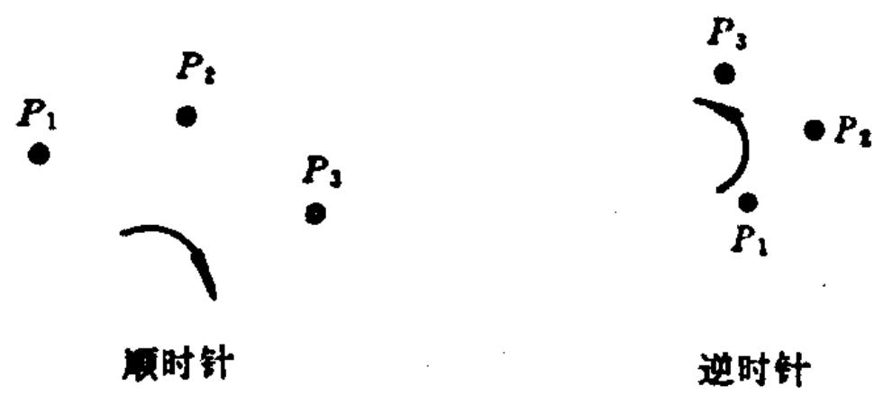

图8-2 四弧平面上3点的排列顺序

插值点的位置为

$$
\begin{array} { r } { P _ { i } ^ { \mathrm { ( 1 ) } } = \left[ \begin{array} { c } { \varpi _ { i } ^ { ( 1 ) } } \\ { y _ { i } ^ { ( 1 ) } } \\ { z _ { i } ^ { ( 1 ) } } \end{array} \right] = \left[ \begin{array} { c } { \varpi _ { 0 } } \\ { y _ { 0 } } \\ { z _ { 0 } } \end{array} \right] + E ^ { \omega m } \left[ \begin{array} { c } { R \cos A _ { i } ^ { ( 1 ) } } \\ { R \sin A _ { i } ^ { ( 1 ) } } \\ { 0 } \end{array} \right] } \end{array}
$$

式中, $x _ { 0 } , y _ { 0 } , z _ { 0 }$ 是 $\pmb { P _ { 0 } }$ 的3个坐标。

对于匀减速段,设加速度为 $- \mathbf { d _ { 2 } }$ 插补点数

$$
N _ { 4 } { = } \mathrm { I N T } \Big ( \frac { v } { \varrho _ { 2 } \varDelta t { = } } \Big )
$$

修正加速度

$$
\alpha _ { 2 } ^ { \prime } = \frac { v } { N _ { 4 } \varDelta t }
$$

第 $\clubsuit$ 个插补点对应的圆心角

$$
{ \cal A } _ { 4 } ^ { ( 4 ) } = { \cal A } _ { i - 1 } ^ { ( 4 ) } \pm \frac { v { \cal A } _ { i } ^ { \prime } - \displaystyle \frac { 1 } { 2 } \alpha _ { 2 } ^ { \prime } { \cal A } _ { i } ^ { \prime } { } ^ { 2 } ( 2 i - 1 ) } { \cal A }
$$

式中, $\pmb { A } _ { \mathbf { 0 } } ^ { ( 4 ) }$ 取匀速段最后一点圆心角的数值。右边第2项的土号按式8-41的规律选取。将式8-45计算得到的 $\mathbf { \Delta } A _ { \parallel } ^ { ( 4 ) }$ 数值代入式8-42相应 $\pmb { A } _ { \pmb { i } } ^ { ( 1 ) }$ 的位置,可计算出各插补点的位置 $P _ { \ell } ^ { ( 4 ) }$ 0

若把匀速段分为 $\pmb { P _ { 2 } }$ 之前与 $\pmb { P _ { 2 } }$ 之后两段。对于 $\pmb { P _ { 2 } }$ 之前的一段,插补点数

$$
N _ { 2 } { = } \mathrm { I N T } \Big [ \frac { R \Big ( A _ { 1 2 } { - } \frac { v ^ { 2 } } { 2 \alpha _ { 1 } ^ { ' } R } \Big ) } { v \Delta t } \Big ] + 1
$$

式中, $\pmb { A _ { 1 2 } }$ 为 $\pmb { P _ { 1 } }$ 到 $P _ { 2 }$ 之间的圆心角。修正速度

$$
v ^ { \prime } = \frac { R \Big ( A _ { 1 2 } - \frac { v ^ { 2 } } { 2 \alpha _ { 1 } ^ { \prime } R } \Big ) } { N _ { 2 } \varDelta t }
$$

第 $\dot { 8 }$ 个插补点对应的圆心角

$$
A _ { i } ^ { ( 2 ) } { = } A _ { i - 1 } ^ { ( 2 ) } { + } \frac { v ^ { \prime } \varDelta t } { R }
$$

取 ${ A } _ { 0 } ^ { ( 2 ) }$ 为加速段最后一点圆心角的数值。用由式8-48计算得到的 $\pmb { A } _ { \pmb { i } } ^ { ( 2 ) }$ 数值取代式8-42中的 $\pmb { A } _ { \pmb { \imath } } ^ { ( 1 ) }$ ,可计算出各插补点的位置$\pmb { P _ { i } ^ { ( 2 ) } }$ 。

对于 $\mathbf { P _ { 2 } }$ 之后的匀速段,插补点数

$$
N _ { 3 } = \mathrm { I N T } \Big [ \frac { R \Big ( A _ { : 3 } - A _ { : 2 } - \frac { v ^ { 2 } } { 2 \alpha ^ { \prime } R } \Big ) _ { \Big ] } } { v \Delta t } + 1
$$

式中, $\pmb { A _ { 1 3 } }$ 是 ${ \pmb P } _ { 1 }$ 到 ${ \pmb P _ { 3 } }$ 之间的圆心角。修正速度

$$
v ^ { \prime } = \frac { R \Big ( A _ { 1 3 } - A _ { 1 2 } - \frac { v ^ { 2 } } { 2 \alpha _ { 2 } ^ { \prime } R } \Big ) } { \varLambda \nu _ { 3 } \varDelta \hat { v } }
$$

第 $\dot { \bullet }$ 个插补点对应的圆心角

$$
{ \cal A } _ { \bf 6 } ^ { ( 3 ) } { = } { \cal A } _ { { \sf t } - { \bf 1 } } ^ { ( 3 ) } { + } { \frac { v ^ { \prime } { \varDelta } { \tt t } } { R } }
$$

取 $\mathbf { \mathcal { A } } _ { 0 } ^ { ( 3 ) }$ 为前一匀速段最后一点的圆心角,用由式8-51计算得到的$\pmb { A } _ { \textbf { \emptyset } } ^ { ( ? ) }$ 代入式8-42,可得各插补点的位置 $\pmb { P } _ { \textbf { \downarrow } } ^ { ( 3 ) }$ 。

用焊枪轴线的方向余弦 ${ \pmb { \omega } } = [ { \pmb { \lambda } } \quad { \pmb { \mu } } \quad { \pmb { \nu } } ] ^ { \pmb { \operatorname { \pmb { r } } } }$ 表示焊枪的姿态,根据式8-2有

$$
\begin{array} { r } { \left. \begin{array} { l } { \lambda _ { i } = \cos \gamma _ { i } \cos \left( \beta _ { i } + \alpha \right) } \\ { \mu _ { i } = \sin \gamma _ { i } \cos \left( \beta _ { i } + \alpha \right) } \\ { \nu _ { i } = - \sin \left( \beta _ { i } + \alpha \right) } \end{array} \right\} } \end{array}
$$

式中,下标&表示对应于P的姿态。设ω与圆弧平面法线N之间的夹角为 $\pmb { \delta }$ ,则

$$
\delta _ { i } = \cos ^ { - 1 } ( N _ { \alpha } \lambda _ { i } + N _ { \eta } \mu _ { \ell } + N _ { z } \nu _ { \ell } )
$$

令

$$
N _ { i } { = } N { \times } \left[ { \lambda } _ { i } \quad { \boldsymbol { \mu } } _ { i } \quad { \boldsymbol { \nu } } _ { i } \right] ^ { \mathrm { T } }
$$

将对应于3个已知点 $P _ { 1 , P _ { 2 } , P _ { 3 } }$ 的姿态角 $\gamma _ { i _ { \bullet } } \ \mathcal { \beta } _ { i } \ ( i = 1 \ldots 2 \ldots 9 )$ 代入式8-52,可计算出关于这3点的δ、N(i=1,2、3)数值。令θ表示 $\pmb { N _ { 1 } }$ 与 $\pmb { N _ { 2 } }$ 的夹角, $\theta _ { 3 }$ 表示 $\pmb { N _ { 1 } }$ 与 ${ { N } _ { 3 } }$ 的夹角,则

$$
\left. \begin{array} { c c c } { { \theta _ { 2 } = \cos ^ { - 1 } \displaystyle \frac { N _ { 1 } \cdot N _ { 2 } } { | N _ { 1 } \cdot N _ { 2 } | } } } \\ { { \theta _ { 3 } = \cos ^ { - 1 } \displaystyle \frac { N _ { 1 } \cdot N _ { \mathrm { s } } } { | N _ { 1 } \cdot N _ { 3 } | } } } \end{array} \right\}
$$

则焊枪的姿态

$$
\begin{array} { r } { \left[ \begin{array} { l } { \lambda _ { i } } \\ { \mu _ { i } } \\ { \nu _ { i } } \end{array} \right] = E ^ { N \theta _ { i } } E ^ { N _ { 1 } \delta _ { i } } \left[ \begin{array} { l } { \lambda _ { 1 } } \\ { \mu _ { 1 } } \\ { \nu _ { 1 } } \end{array} \right] \quad i = 2 , 3 } \end{array}
$$

各插补点所对应的 $\theta _ { \setminus } \delta$ 值为:

匀加速段

$$
\left. \begin{array} { l } { { \delta _ { j } ^ { ( 1 ) } = \delta _ { j - 1 } ^ { ( 1 ) } + \frac { c _ { 1 } ^ { \prime } A / \ell ^ { 2 } ( 2 \dot { \eta } - 1 ) ( 8 \circ - \widehat { \delta } _ { 1 } ) } { K A _ { 1 2 } } } } \\ { { \theta _ { j } ^ { ( 1 ) } = \theta _ { j - 1 } ^ { ( 1 ) } + \frac { c _ { 1 } ^ { \prime } A / \ell ^ { 2 } ( 2 \dot { \eta } - 1 ) \theta _ { 1 } } { R A _ { 1 2 } } } } \end{array} \right\}
$$

第1匀速段

$$
\left. \begin{array} { l } { { \displaystyle \delta _ { j } ^ { ( 2 ) } = \delta _ { j - 1 } ^ { ( 2 ) } + \frac { v ^ { \prime } \varDelta t ( \delta _ { 2 } - \delta _ { 1 } ) } { R A _ { 1 2 } } } } \\ { { \displaystyle \theta _ { j } ^ { ( 2 ) } = \theta _ { j - 1 } ^ { ( 2 ) } + \frac { v ^ { \prime } \varDelta t \theta _ { 1 } } { R A _ { 1 2 } } } } \end{array} \right\}
$$

第2匀速段

$$
\left. \begin{array} { l } { { \delta _ { j } ^ { ( 3 ) } = \delta _ { j - 1 } ^ { ( 3 ) } + \displaystyle \frac { v ^ { \prime } { \cal A } t ( \delta _ { 3 } - \delta _ { 2 } ) } { R { \cal A } _ { 2 3 } } } } \\ { { \theta _ { j } ^ { ( 3 ) } = \theta _ { j - 1 } ^ { ( 3 ) } + \displaystyle \frac { v ^ { \prime } { \cal A } t \theta _ { 2 } } { R { \cal A } _ { 2 3 } } } } \end{array} \right\} ~ .
$$

匀减速段

$$
\left. \begin{array} { l } { { \displaystyle \displaystyle \delta _ { j } ^ { ( 4 ) } = \delta _ { j - 1 } ^ { ( 4 ) } + \frac { \left( v _ { j } { \varDelta } t - \frac { 1 } { 2 } \alpha _ { 2 } ^ { \prime } { \varDelta } t ^ { 2 } \right) \left( \hat { v } _ { 3 } - \hat { \partial } _ { 2 } \right) } { R A _ { 2 8 } } \Bigg ] } } \\ { { \displaystyle \theta _ { j } ^ { ( 4 ) } = \theta _ { j - 1 } ^ { ( 4 ) } + \frac { \left( v _ { j } { \varDelta } t - \frac { 1 } { 2 } \alpha _ { 2 } ^ { \prime } { \varDelta } t ^ { 2 } \right) \theta _ { 2 } } { R A _ { 2 8 } } } } \end{array} \right\}
$$

式8-60 中, $v _ { j } = v - \omega _ { 2 } ^ { \prime } ( i - 1 ) \ \varDelta t _ { 0 }$ 式8-57中,取 $\delta _ { \bf { 0 } } ^ { ( 1 ) } = \theta _ { \bf { 0 } } ^ { ( 1 ) } = 0 ,$ $\delta _ { 0 } ^ { ( 2 ) } \cdot \theta _ { 0 } ^ { ( 2 ) }$ 取加速段最后一点的数值, $\delta _ { \mathbf { 0 } } ^ { ( 3 ) } , \theta _ { \mathbf { 0 } } ^ { ( 3 ) } $ 取第 $\pmb { 1 }$ 匀速段最后一点的数值, $\delta _ { \mathbf { 0 } } ^ { ( 4 ) } \cdot \theta _ { \mathbf { 0 } } ^ { ( 4 ) }$ 取第2匀速段最后一点的数值。将由式 $8 \mathrm { - } 5 7 \mathrm { \sim }$ 8-60计算得到的 $\delta _ { i , \theta _ { j } }$ 值代入变换关系式8-56,可计算出各点的姿态值

$$
\left[ \begin{array} { c } { \lambda _ { j } } \\ { \mu _ { j } } \\ { \nu _ { j } } \end{array} \right] = E ^ { X ( \theta _ { j } ) } \bar { E } ^ { N _ { 1 } ( \partial _ { j } ) } \left[ \begin{array} { c } { \hat { \lambda } _ { 1 } } \\ { \mu _ { 1 } } \\ { \nu _ { 1 } } \end{array} \right]
$$

# (三)焊缝过渡

在弧焊作业中,经常碰到两条焊缝相接的情况。为此,必须考虑两条焊缝连接处的平滑过渡。

图8-3两直线焊缝的圆弧过渡

1.两条直线焊缝的过渡如图8-3所示,设已给出两条直线上的点 $\pmb { P _ { 1 } } , \pmb { P _ { 3 } }$ 以及交点 $\pmb { P } _ { z o }$ 对应这3点的焊枪姿态分别为 $\gamma _ { 1 , \beta _ { 1 , \gamma _ { 2 , \lambda } } }$ $\beta _ { z }$ 和 $\gamma _ { 3 } , \beta _ { 3 0 }$ 轨迹 $\pmb { P _ { 1 } P _ { 2 } }$ 的速度为

${ \pmb v } _ { 1 }$ ,轨迹 ${ \pmb P } _ { 2 } { \pmb P } _ { 3 }$ 的速度为 ${ \mathfrak { v } } _ { 2 }$ ,焊枪最大加速度为 ${ \pmb \ G } _ { \mathbf m \mathbf a \mathbf x }$ ,焊接作业的最大轨迹允差为 $\theta _ { \circ }$ 过渡曲线为圆弧 ${ \dot { O } } _ { 1 } { \dot { C } } _ { 3 } ,$ 其圆心为 $O , O P _ { 2 }$ 与圆弧的交点为 $C _ { 2 }$ , $C _ { 2 } P _ { 2 }$ 表示圆弧焊缝对两直线焊缝交角处的逼近程度,其限制值为 ${ \pmb \theta } _ { . }$ ,也即最大轨迹允差。取圆弧 $\hat { \sigma } _ { \mathbf { 1 } } \hat { \sigma } _ { \mathbf { 3 } }$ 的轨迹速度

$$
v ^ { \prime } { = } \frac { v _ { 1 } + v _ { 2 } } { 2 }
$$

设 $\pmb { \alpha }$ 为 $\pmb { P _ { 1 } P _ { 2 } }$ 线与 ${ \pmb P _ { 2 } } { \pmb P _ { 3 } }$ 线之间的夹角,则

$$
\alpha { = } \cos ^ { - 1 } \frac { ( P _ { \mathrm { 0 } } { - } P _ { \mathrm { : } } ) { \cdot } ( P _ { \mathrm { : } } { - } P _ { \mathrm { 0 } } ) } { | r _ { \mathrm { 2 } } { - } r _ { \mathrm { 1 } } | ~ | r _ { \mathrm { 3 } } { - } r _ { \mathrm { 2 } } | }
$$

为不超出允差 $\pmb { \theta }$ ,由图8-3可知,过渡圆弧的半径 $\pmb { R }$ 必须满足

$$
R - R \sin { \frac { \alpha } { 2 } } { \leqslant } { \theta } \sin { \frac { \alpha } { 2 } }
$$

因此,过渡圆弧的最大半径

$$
R _ { \mathrm { m a x } } = { \frac { e \sin { \frac { \alpha } { 2 } } } { 1 - \sin { \frac { \alpha } { 2 } } } }
$$

根据向心加速度不超过 $\pmb { G } _ { 1 \ 5 \mathrm { a s } }$ 的限制过渡圆弧的最小半径

$$
R _ { \mathrm { a i n } } = { \frac { v ^ { \prime 2 } } { \alpha _ { \mathrm { m a x } } } }
$$

可取圆弧半径

$$
R = \frac { R _ { \mathrm { m a x } } + R _ { \mathrm { m i } } } { 2 } \ .
$$

圆弧半径 $\pmb { R }$ 确定后,圆弧与直线的切点 $c _ { 1 , C _ { 3 } }$ 可根据几何知识求出。对应 $c _ { 1 , C _ { 3 } }$ 点的姿态角

$$
\begin{array} { r } { \gamma _ { c a } = \gamma _ { 2 } + \frac { R \textrm { t g } \frac { \alpha } { 2 } \left( \gamma _ { 2 } - \gamma _ { 2 } \right) } { I _ { 1 } } \Bigg ] } \\ { \beta _ { c 1 } = \beta _ { 2 } + \frac { R \textrm { t g } \frac { \alpha } { 2 } \left( \beta _ { 1 } - \beta _ { 2 } \right) } { I _ { 1 } } \Bigg \{ } \\ { \gamma _ { c a } = \gamma _ { 2 } + \frac { R \textrm { t g } \frac { \alpha } { 2 } \left( \gamma _ { 3 } - \gamma _ { 2 } \right) } { I _ { 2 } } \Bigg \} } \\ { \beta _ { c 3 } = \beta _ { 2 } + \frac { R \textrm { t g } \frac { \alpha } { 2 } \left( \beta _ { 3 } - \beta _ { 2 } \right) } { I _ { 2 } } \Bigg \} } \end{array}
$$

式中

$$
\begin{array} { c } { { L _ { 1 } \dot { = } \sqrt { ( \sigma _ { 2 } - \sigma _ { 1 } ) ^ { 2 } + ( y _ { 2 } - y _ { 1 } ) ^ { 2 } + ( z _ { 2 } - z _ { 1 } ) ^ { 2 } } } } \\ { { L _ { 2 } = \sqrt { ( \sigma _ { 3 } - \alpha _ { 2 } ) ^ { 2 } + ( y _ { 3 } - y _ { 2 } ) ^ { 2 } + ( z _ { 3 } - z _ { 2 } ) ^ { 2 } } } } \end{array}
$$

用圆弧过渡时, $\pmb { P _ { 1 } C _ { 1 } }$ 轨迹的加速段和匀速段插补方法不变。设第3段匀加速度为 ${ \pmb { \alpha } } _ { \pmb { \alpha } } .$ ,当 $v _ { 1 } \geq v ^ { \prime }$ 时,取 ${ \tilde { \sigma } } _ { s } = - { \tilde { \sigma } } _ { 2 }$ (参见式8-26),否则取 ${ \cal O } _ { 8 } = { \cal O } _ { 2 } ,$ ,则此段时间

$$
\scriptstyle { T _ { s } = { \frac { v ^ { \prime } - v _ { 1 } } { a _ { s } } } }
$$

而

$$
N _ { 9 } = \mathrm { I N T } \Big ( \frac { T _ { * } } { \varDelta t } \Big ) + 1
$$

修正加速度

$$
\alpha _ { s } ^ { \prime } = \frac { v ^ { \prime } - v _ { 1 } } { N _ { 3 } \varDelta t }
$$

用以上修正值取代式8-30及8-31中的 ${ \pmb { \alpha _ { 2 } ^ { \prime } } }$ ,可得到此段的插补值。

同理,对 $\pmb { C } _ { 3 } \pmb { P } _ { 3 }$ 轨迹的开始段,若 $v ^ { \prime } > v _ { 2 }$ , $a _ { s } = - a _ { 1 }$ ,否则 $a _ { s } =$ $\pmb { G } _ { 1 0 }$ 经修正后用 $\pmb { \alpha } _ { \mathbf { s } } ^ { \prime }$ 值取代式8-23以及式8-25中的 $\pmb { a } _ { 1 } ^ { \prime }$ ,可得到此段的插补值。

过渡圆弧本身也要插补,可直接沿用圆弧焊缝插补公式。

2.圆弧与直线焊缝的过渡对圆弧与直线相接的焊缝,也可采取圆弧过渡。图8-4中, $\pmb { P _ { 1 } }$ 在圆弧上, ${ \pmb P } _ { 3 }$ 在直线上, $P _ { 2 }$ 是它们

图8-4 直线与圆弧焊缝的圆弧过渡

的交点, $c _ { 1 } c _ { 3 }$ 是过渡圆弧。设${ \pmb v } _ { 1 }$ 为圆弧焊缝的焊接速度, ${ \mathfrak { v } } _ { 2 }$ 为直线焊缝的焊接速度, $\mathtt { G } _ { \mathtt { m a x } }$ 为焊枪最大加速度, $\pmb { \theta }$ 为最大轨迹允差。取过渡弧的焊接速度

$$
v ^ { \prime } { = } \frac { v _ { 1 } + v _ { 2 } } { 2 }
$$

取过渡弧半径

$$
R = R _ { \mathrm { m i n } } = { \frac { ( v _ { \mathrm { 1 } } + v _ { \mathrm { 2 } } ) ^ { \frac { 2 } { 2 } } } { \frac { 4 \alpha _ { \mathrm { m a x } } } { \cos } } }
$$

过渡弧与直线的过渡插补以及过渡弧本身的插补按前述方法进行。设圆弧焊缝匀减速段的加速度为 $\pmb { G } _ { \mathbf { 5 } }$ ,当 $v ^ { \prime } > v _ { 1 }$ 时,取 ${ \mathfrak { d } } _ { 5 } = { \mathfrak { d } } _ { 2 }$ ,否则取 ${ \mathfrak { o } } _ { 5 } = - { \mathfrak { o } } _ { 2 }$ (参见式8-48)。此段时间

$$
\pmb { T } _ { 5 } = \frac { \pmb { \vartheta } ^ { \prime } - \pmb { v } _ { 1 } } { \pmb { \sigma } _ { 5 } }
$$

插补点数

$$
N _ { 5 } = \mathrm { I N T } \Big ( \frac { T _ { 5 } } { \mathcal { A } _ { \ell } } \Big ) + 1
$$

修正加速度

$$
a _ { 5 } ^ { \prime } = \frac { v ^ { \prime } - v _ { 1 } } { N _ { 5 } }
$$

各插补点对应的圆心角

$$
A _ { i } ^ { ( 5 ) } = A _ { i - 1 } ^ { ( 5 ) } \pm \frac { v _ { 1 } \varDelta t - \frac { 1 } { 2 } \omega _ { 5 } ^ { \prime } \varDelta t ^ { 2 } ( 2 i - 1 ) } { R }
$$

式中,土号选取规律与式8-41相同,即当过渡弧的焊接方向沿逆时针方向时取正号,反之取负号。用式8-75计算得到的 $\pmb { A } _ { \pmb { i } } ^ { ( \pmb { \nu } ) }$ 代入式8-42,可求得各插值点的位置;用 ${ \mathfrak { G } } _ { 5 } ^ { \prime }$ 取代式8-60中的 $\vec { \mathfrak { o } } _ { 2 } ^ { \prime } ,$ 可求得各插值点的姿态角。

# 五、焊枪织动轨迹规划

弧焊作业分为平面焊和角度焊两大类,分别见图 $8 \textbar { ‰}$ 和 $b _ { 0 }$ 对于平面焊接的情况,被焊接的零件在一个平面内,织动采取图8-5a的模式。织动在焊缝所在平面上发生,焊枪从 $\mathcal { P } _ { 1 }$ 至 $\scriptstyle { \mathcal { P } } _ { 2 }$ 再从$P _ { 2 }$ 到 $\mathcal { P } _ { 8 }$ 最后回到 $\mathcal { P } _ { 1 }$ ,形成一个织动周期。伴随焊枪沿焊缝的运动,最终形成图中粗实线轨迹。

当被焊接的零件互为某一角度时,就形成了角度焊,采用图8-5b的模式。 $P _ { \mathrm { 1 } } {  } P _ { \mathrm { 2 } } {  } P _ { \mathrm { 3 } } {  } P _ { \mathrm { 1 } }$ 构成一个织动周期, $\angle P _ { 2 } P _ { 1 } P _ { 3 }$ 是被焊板材之间的夹角。设织动振幅为 $\pmb { A }$ ,周期为 $\Delta T$ 。可取 $\mathcal { P } _ { 1 }$ 到$\scriptstyle { P _ { z } }$ 的运动时间为 $\frac { \varDelta T } { 3 } , P _ { 2 }$ 到 $\mathcal { P } _ { 3 }$ 的运动时间为 $\frac { \varDelta T } { 3 } \circ$ 在焊接过程中,织动原点 $P _ { 1 }$ 的位置不断变化。

图8-5两类焊缝

对直线焊缝,织动方向 $P _ { 1 } {  } P _ { 2 } , P _ { 2 } {  } P _ { 3 } , P _ { 3 } {  } P _ { 1 }$ 是不变的。对于第 $j$ 个织动周期

$$
\begin{array} { l } { P _ { 1 } ^ { ( i ) } = P _ { 1 1 } ^ { ( i ) } } \\ { P _ { 2 } ^ { ( i ) } = P _ { 1 2 } ^ { ( i ) } + A \ \displaystyle \frac { P _ { 2 } - P _ { 1 } } { P _ { 2 } - P _ { 1 } } \Bigg \} } \\ { P _ { 3 } ^ { ( i ) } = P _ { 3 3 } ^ { ( i ) } + A \ \displaystyle \frac { P _ { 3 } - P _ { 1 } } { | P _ { 3 } - P _ { 1 } | } \Bigg \} } \end{array}
$$

式中, $\bar { P } _ { 1 j } ^ { ( 6 ) } \ ( j { = } 1 , 2 , 3 )$ 是原焊缝轨迹上的点,可由前述插补方法获得。 $P _ { 1 1 } ^ { ( 6 ) }$ 是第 $\pmb { i }$ 个织动周期起始位置, $P _ { 1 2 } ^ { \prime }$ 是第 $j$ 个织动周期相应$\frac { \varDelta T } { 3 }$ 时刻的位置, $P _ { \mathrm { ~ 1 ~ 3 ~ } } ^ { ( 4 ) }$ 是第 $\dot { \pmb { \mathscr { b } } }$ 个织动周期相应 $\frac { 2 \varDelta T } { 3 }$ 时刻的位置。如果 $\Delta T$ 是采样周期 $\varDelta t$ 的整数倍, $P _ { 1 1 } ^ { ( 6 ) }$ 可方便地取自轨迹插补点;而如果 $\frac { \Delta T } { 3 }$ 是 $\varDelta t$ 的整数倍,则 $P _ { 1 1 } ^ { ( 6 ) } , \ P _ { 1 2 } ^ { ( 6 ) }$ 和 $P _ { 1 3 } ^ { ( 4 ) }$ 均可取自插补点。

对圆弧焊缝,除了织动原点 $\pmb { P _ { 1 } }$ 不断变化外,织动方向 $\pmb { P } _ { 1 } \cdots - $ $\pmb { P _ { 2 } }$ 和 $P _ { 2 } \to P _ { 3 }$ 也在不断变化。此时

$$
\left. \begin{array} { c c c } { { \overline { { P _ { 1 } P } } _ { 2 } ^ { ( i ) } { = } E ^ { N \delta } ( \overline { { P _ { : } P _ { 2 } } } ^ { ( i - 1 ) } ) } } \\ { { \overline { { P _ { 2 } P } } _ { 3 } ^ { ( i ) } { = } E ^ { N \delta } ( \overline { { P _ { 2 } P _ { 3 } } } ^ { ( i - 1 ) } ) } } \end{array} \right\}
$$

式中,上标 $\pmb { N }$ 为圆弧平面的单位法向量, $\beta$ 为对应一个织动周期$\Delta T$ 的时间内圆弧轨迹对应的圆心角。于是

$$
\left. \begin{array} { l } { P _ { 1 } ^ { ( i ) } = P _ { 1 1 } ^ { ( i ) } } \\ { P _ { 2 } ^ { ( i ) } = P _ { 1 2 } ^ { ( i ) } + A \frac { \overrightarrow { P _ { 1 } P _ { 2 } ^ { ( i ) } } } { \vert \overrightarrow { P _ { 1 } P _ { 2 } ^ { ( i ) } } \vert } } \\ { P _ { 3 } ^ { ( i ) } = P _ { 1 3 } ^ { ( i ) } + A \frac { \overrightarrow { P _ { 2 } P _ { 3 } ^ { ( i ) } } } { \vert \overrightarrow { P _ { 2 } P _ { 3 } ^ { ( i ) } } \vert } } \end{array} \right\}
$$

式中, $P \ P$ 是第 $\clubsuit$ 织动周期开始位置的圆弧轨迹点, $P _ { 2 } ^ { ( \bullet ) } \bullet P _ { 3 } ^ { ( \bullet ) }$ 分别是第 $\clubsuit$ 织动周期相应 $\frac { \varDelta T } { 3 }$ 和 $\frac { 2 \varDelta T } { 3 }$ 时刻的圆弧轨迹点。当 $A T =$ $\vartheta K d t$ ( $\kappa$ 是正整数)时, $P _ { 1 1 , } P _ { 1 2 } ^ { ( \ell ) }$ 和 $P _ { 1 3 } ^ { ( 4 ) }$ 可采用在圆弧插补中已算出的数据。

可通过附加在焊枪上的摆动机构实现焊枪的织动,也可通过机器人关节的微动实现其织动。

# 88-2点焊机器人

# 一、概述

这里以一种点焊机器人为例,阐明点焊机器人设计应用中的主要问题。

点焊机器人常用于诸如汽车车厢逐点焊接等场合,要求焊钳

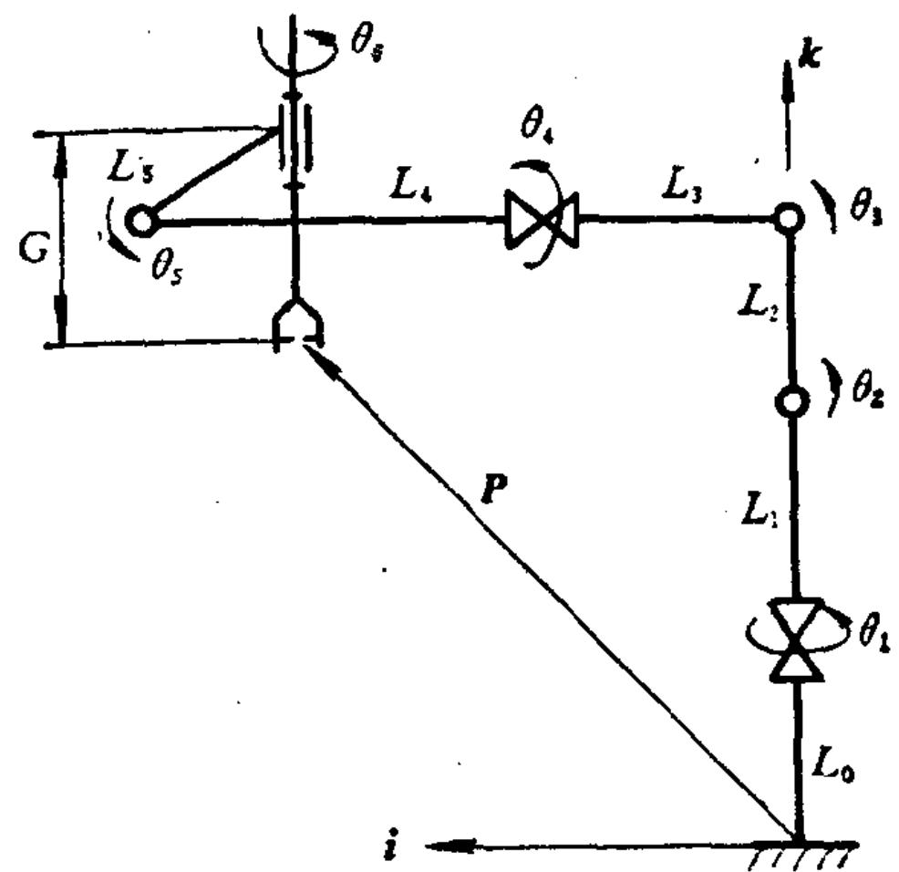

图8-6 点焊机器人示意图

能取任意位姿。用 $x , y , z$ 描述焊钳的位置,用广义姿态向量

$$
\pmb { \itOmega } = [ \varOmega _ { x } \quad \varOmega _ { y } \quad \varOmega _ { z } ] ^ { \tt T }
$$

描述焊钳的姿态,则焊钳的位姿向量

$$
X = [ x \cup z \cup \mathcal { Q } _ { \alpha } \cup \mathcal { Q } _ { \alpha } \cup \mathcal { Q } _ { y } \quad \mathcal { Q } _ { z } ] ^ { \mathrm { T } }
$$

需要用6自由度机器人实现焊钳的任意位姿。这种点焊机器人机构见示意图8-6,其关节向量

$$
\pmb { \theta } = [ \theta _ { 1 } \quad \theta _ { 2 } \quad \theta _ { 3 } \quad \theta _ { 4 } \quad \theta _ { 5 } \quad \theta _ { 6 } ] ^ { \tt T }
$$

该机器人在第5关节轴线上存在沿 $j$ 方向的偏距 $\pmb { L _ { 5 } }$ ,为求关节转角的解析解,须先求解一个一元8次方程。因此,该机器人的逆运动学问题无封闭解。下面将介绍位置、姿态分别迭代的数值解法。

点焊机器人的工作环境有时较挤塞。对于车厢焊接作业,往往需要从门、窗伸入车身内进行焊接。为了避免与工作环境发生碰撞,需要研究如何适当地选取关节运动参数。若采取离线编程的方式,则应研究如何按工作环境从逆运动学多值解中选取一组适当的关节转角。

车厢焊接生产线一般配有多台机器人,被焊工件上所有焊点适当地分配给各台机器人,每台机器人负责的所有焊点必须在其工作空间内。此外,机器人还应达到各焊点的姿态要求,为此须按工作要求综合机器人各杆的尺寸。其末杆不能进入工作空间的空洞、空腔和盲区,否则将出现机器人失控。

点焊作业要求焊钳在各焊点处精确地定位,而对如何从某焊点运动到另一焊点没有限制。根据各焊点在笛卡儿空间中的位姿求得相应的关节转角后,可在关节空间规划点到点的运动,为了提高作业效率,点到点之间都采取较高的运动速度。为保证下一焊点精确定位,需要进行速度、加速度控制。下面将推导点焊机器人的速度和加速度表达式。

# 二、位姿方程

取点焊机器人初始位形及参考坐标系如图8-6所示。 $I _ { 0 } , I _ { 1 } .$ 、$L _ { 2 }$ 和 $G$ 的方向平行 $\pmb { k }$ 轴, $L _ { 3 , } L _ { 4 }$ 平行 $\pmb { i }$ 轴, $L _ { 5 }$ 平行 $\pmb { j }$ 轴。机器人

位置方程为

$$
\begin{array} { r l } & { P = L _ { 0 } ^ { k } + E ^ { \lambda \theta _ { 1 } } ( \mathcal { L } _ { 1 } ^ { k } + E ^ { \lambda \theta _ { 1 } } ( \mathcal { L } _ { 2 } ^ { k } + E ^ { \lambda \theta _ { 1 } } ( \mathcal { L } _ { 3 } ^ { \iota } } \\ & { \quad \quad + E ^ { ; \theta _ { 4 } } ( L _ { 4 } ^ { 4 } + E ^ { ; \theta _ { 4 } } ( L _ { 5 } ^ { \iota } + E ^ { \lambda \theta _ { * } } ( G ^ { k } ) ) ) ) ) ) } \\ & { = L _ { 0 } ^ { k } + L _ { 1 } ^ { k } + E ^ { \lambda \theta _ { 1 } } E ^ { \prime \theta _ { 3 } } ( \mathcal { L } _ { 2 } ^ { k } ) + E ^ { \lambda \theta _ { 1 } } E ^ { \lambda ( \theta _ { 3 } + \theta _ { 3 } ) } ( L _ { 3 } ^ { \iota } + L _ { 4 } ^ { \iota } ) } \\ & { \quad \quad + E ^ { \lambda \theta _ { 1 } } E ^ { \lambda ( \theta _ { 1 } + \theta _ { 3 } ) } E ^ { \lambda \theta _ { * } } ( L _ { 5 } ^ { \iota } ) + E ^ { \lambda \theta _ { 1 } } E ^ { \lambda ( \theta _ { 3 } + \theta _ { 3 } ) } E ^ { \lambda \theta _ { 4 } } E ^ { \lambda \theta _ { 3 } } ( G ^ { k } ) } \end{array}
$$

姿态方程为

$$
E = E ^ { \chi _ { 0 } } \varepsilon E ^ { j ( \theta _ { 1 } + \theta _ { 1 } ) } E ^ { i \theta _ { 1 } } E ^ { j \theta _ { 1 } } E ^ { \gamma _ { 0 } } \varepsilon ^  \quad
$$

# 三、速度和加速度分析

设机器人广义位姿向量

$$
X = [ \mathscr { v } \mathscr { y } \mathscr { z } \mathscr { Q } _ { \alpha } \mathscr { Q } _ { \pmb { y } } \mathscr { Q } _ { \pmb { \varepsilon } } ] ^ { \pmb { \Sigma } }
$$

机器人关节向量

$$
\pmb { \theta } = [ \theta _ { 1 } \quad \theta _ { 2 } \quad \theta _ { 3 } \quad \theta _ { 4 } \quad \theta _ { 5 } \quad \theta _ { 6 } ] ^ { \tt T }
$$

根据第三章的分析,焊钳的速度可写为

$$
\dot { X } = [ \dot { x } \dot { y } \dot { z } \dot { \Omega } _ { a } \dot { \Omega } _ { y } \dot { \Omega } _ { z } ] ^ { \mathrm { \bf T } } = \mathrm { J } \dot { \theta }
$$

式中, ${ \bf J }$ 表示雅可比矩阵。令

$$
\delta _ { i } e _ { i } { = } \prod _ { j { = 1 } } ^ { 4 } E ^ { e _ { j } \partial _ { j } s _ { j } } ( e _ { j } ) \quad i { = } 1 , { 2 } ^ { { \ldots } } 6
$$

式中, $e _ { j }$ 是关节轴线在自身坐标系中的单位向量。 $\delta _ { i }$ 是第 $\delta$ 关节标识符,当第 $\dot { \pmb { \mathscr { b } } }$ 关节是回转副时, $\delta _ { i } = 1$ 当第 $\dot { \pmb { \mathscr { z } } }$ 关节是移动副时,$\delta _ { i } = 0 _ { \circ }$ 雅可比矩阵 ${ \bf J }$ 表示为

$$
\mathbf { J } = \left[ { \begin{array} { c c c c } { { \frac { \partial P } { \partial \theta _ { : } } } } & { { \frac { \partial P } { \partial \theta _ { 2 } } } } & { \cdots } & { { \frac { \partial P } { \partial \theta _ { 6 } } } } \\ { \delta _ { 1 } e _ { 1 } } & { \delta _ { 2 } e _ { 2 } } & { \cdots } & { \delta _ { 6 } e _ { 6 } } \end{array} } \right]
$$

将式8-81对时间求导,得

$$
\ddot { X } = [ \ddot { x } \quad \ddot { y } \quad \ddot { z } \quad \ddot { \mathcal { Q } } _ { \alpha } \quad \ddot { \mathcal { Q } } _ { \nu } \quad \ddot { \mathcal { Q } } _ { z } ] ^ { \mathrm { T } } = \mathrm { J } \ddot { \theta } + \dot { J } \theta
$$

式中

$$
\pmb { \theta } = [ \dot { \theta } _ { 1 } \quad \dot { \theta } _ { 2 } \quad \dot { \theta } _ { 3 } \quad \dot { \theta } _ { 4 } \quad \dot { \theta } _ { 5 } \quad \dot { \theta } _ { 6 } ] ^ { \mathrm { T } }
$$

$$
\begin{array} { r } { \ddot { \theta } = [ \ddot { \theta } _ { 1 } \quad \ddot { \theta } _ { 2 } \quad \ddot { \theta } _ { 3 } \quad \ddot { \theta } _ { 4 } \quad \ddot { \theta } _ { 5 } \quad \ddot { \theta } _ { 6 } ] ^ { \mathrm { T } } } \end{array}
$$

$$
\dot { \pmb { J } } = \left[ \sum _ { j = 1 } ^ { 6 } \frac { \partial ^ { 2 } \pmb { P } } { \partial \theta _ { 1 } \partial \theta _ { j } } \dot { \theta } _ { j } \quad \sum _ { j = 1 } ^ { 6 } \frac { \partial ^ { 2 } \pmb { P } } { \partial \theta _ { 2 } \partial \theta _ { j } } \dot { \theta } _ { j } \quad \cdots \quad \sum _ { j = 1 } ^ { 6 } \frac { \partial ^ { 2 } \pmb { P } } { \partial \theta _ { 6 } \partial \theta _ { j } } \dot { \theta } _ { j } \right]
$$

$$
\begin{array}{c} \begin{array} { l l } { { \delta _ { i } = \sin \theta _ { i } } } \\ { { } } \\ { { c _ { i } = \cos \theta _ { i } } } \\ { { } } \\ { { \vartheta _ { i j } = \sin \left( \theta _ { i } + \theta _ { j } \right) } } \\ { { } } \\ { { c _ { i j } = \cos \left( \theta _ { i } + \theta _ { j } \right) } } \end{array} \begin{array} { l } { { i = 1 , 2 \cdots 6 } } \\ { { } } \\ { { } } \end{array} .  \end{array}
$$

有

$$
\frac { \partial P } { \partial \theta _ { 1 } } = \left[ \begin{array} { c } { - \mathfrak { s } _ { 1 } [ Z _ { 2 } \mathfrak { s } _ { 2 } + \left( L _ { 3 } + L _ { 4 } \right) c _ { 2 3 } ] - L _ { 5 } ( \mathfrak { s } _ { 1 } \mathfrak { s } _ { 2 3 } \mathfrak { s } _ { 4 } + c _ { 1 } \mathfrak { c } _ { 4 } ) } \\ { + G \left[ - \mathfrak { s } _ { 1 } \left( \mathfrak { s } _ { 2 3 } c _ { 4 } \mathfrak { c } _ { 5 } + \mathfrak { c } _ { 2 3 } \mathfrak { s } _ { 5 } \right) + c _ { 1 } \mathfrak { s } _ { 4 } c _ { 5 } \right] } \\ { c _ { 1 } [ L _ { 2 } \mathfrak { s } _ { 2 } + \left( L _ { 3 } + L _ { 4 } \right) c _ { 2 3 } ] + L _ { 5 } ( c _ { 1 } \mathfrak { s } _ { 2 3 } \mathfrak { s } _ { 4 } - \mathfrak { s } _ { 1 } \mathfrak { c } _ { 4 } ) } \\ { + G \left[ c _ { 1 } \left( \mathfrak { s } _ { 2 3 } c _ { 4 } \mathfrak { c } _ { 5 } + c _ { 2 3 } \mathfrak { s } _ { 5 } \right) + \mathfrak { s } _ { 1 } \mathfrak { s } _ { 4 } c _ { 5 } \right] } \\ { 0 } \end{array} \right]
$$

$$
\begin{array} { r l } { \underset { \mathcal { W } _ { 4 } } { \overset { \mathcal { P } } { \mathcal { P } } } } & { \overset { \mathcal { P } } { \underset { \mathcal { W } _ { 5 } } { \overset { \mathcal { P } } { \mathcal { P } } } } = [ \underset { \mathcal { L } } { \overset { L } { \mathcal { E } } } ( \underset { \Delta _ { 1 } \leq \alpha _ { 2 } } { \overset { L } { \mathcal { Q } } } - ( \underset { \Delta _ { 1 } + \alpha _ { 2 } } { \overset { L } { \mathcal { Q } } } ) _ { \mathcal { L } _ { 3 \alpha _ { 1 } } } + \underset { \mathcal { L } \otimes \alpha _ { 2 } \alpha _ { 3 } } { \overset { L } { \mathcal { Q } } } ) + ( \underset { \Delta _ { 1 } } { \overset { L } { \mathcal { Q } } } ) _ { \mathcal { L } _ { 3 \alpha _ { 1 } } } + ( \underset { \Delta _ { 1 } } { \overset { L } { \mathcal { Q } } } ) _ { \mathcal { L } _ { 4 \alpha _ { 1 } } } ] } \\ & { = [ \underset { \mathcal { L } } { \overset { L } { \mathcal { Q } } } ] _ { \mathcal { L } _ { 5 } } - [ \underset { \mathcal { L } } { \overset { L } { \mathcal { Q } } } ] _ { \mathcal { L } _ { 5 } } + [ \underset { \mathcal { L } } { \overset { L } { \mathcal { Q } } } ] _ { \mathcal { L } _ { 6 } } + [ \underset { \mathcal { L } } { \overset { L } { \mathcal { Q } } } ] _ { \mathcal { L } _ { 7 } } + ( \underset { \Delta _ { 1 } \leq \alpha _ { 2 } } { \overset { L } { \mathcal { Q } } } ) _ { \mathcal { L } _ { 7 } } } \\ &  \quad - [ \underset { \mathcal { L } } { \overset { L } { \mathcal { Q } } } ] _ { \mathcal { L } _ { 7 } } - [ \underset { \mathcal { L } } { \overset { L } { \mathcal { Q } } } ] _ { \mathcal { L } _ { 7 } } + [ \underset { \mathcal { L } }  \ \end{array}
$$

$$
\frac { \partial { \cal P } } { \partial \theta _ { 6 } } { = } \biggl [ \begin{array} { l } { { 0 } } \\ { { 0 } } \\ { { 0 } } \end{array} \biggr ]
$$

$$
\delta _ { \bf i } e _ { \bf i } = \left[ { \begin{array} { c } { 0 } \\ { 0 } \\ { 1 } \end{array} } \right]
$$

$$
\delta _ { 2 } e _ { 2 } = \delta _ { 3 } e _ { 3 } = \left[ \begin{array} { c } { { - s _ { 1 } } } \\ { { c _ { 1 } } } \\ { { 0 } } \end{array} \right] .
$$

$$
\begin{array} { r } { \delta _ { 4 } e _ { 4 } = \left[ \begin{array} { c } { c _ { 1 } c _ { 2 3 } } \\ { s _ { 1 } c _ { 2 3 } } \\ { \ldots } \\ { s _ { 2 3 } } \end{array} \right] } \end{array}
$$

$$
\begin{array} { r } { \delta _ { 5 } e _ { 5 } = \left[ { \begin{array} { c } { c _ { 1 } \delta _ { 2 3 } \delta _ { 4 } - s _ { 1 } c _ { 4 } } \\ { s _ { 1 } \delta _ { 2 3 } s _ { 4 } + c _ { 1 } c _ { 4 } } \\ { c _ { 2 3 } s _ { 4 } } \end{array} } \right] } \end{array}
$$

$$
\delta _ { 6 } e _ { 6 } = \left[ \begin{array} { c } { { c _ { 1 } \left( g _ { 2 3 } c _ { 4 } c _ { 5 } + c _ { 2 3 } \delta _ { 5 } \right) + \vartheta _ { 1 } \delta _ { 4 } c _ { 5 } } } \\ { { . } } \\ { { \vartheta _ { 1 } \left( g _ { 2 3 } c _ { 4 } c _ { 5 } + c _ { 2 3 } \delta _ { 5 } \right) - c _ { 1 } \vartheta _ { 4 } C _ { 5 } } } \\ { { c _ { 2 3 } c _ { 4 } c _ { 5 } - g _ { 2 3 } \delta _ { 5 } } } \end{array} \right]
$$

$$
\begin{array} { r l } & { \frac { \partial ^ { 2 } \bar { \partial } ^ { 2 } } { \partial \theta _ { 1 } ^ { 2 } } [ \begin{array} { c } { - c _ { 1 } [ L _ { 2 } s _ { 2 } + ( L _ { 3 } + L _ { 4 } ) c _ { 2 0 } ] - L _ { 8 } ( s _ { 0 } s _ { 0 } s _ { 0 } k - s _ { 1 } \alpha _ { 1 } \alpha _ { 1 } ) } \\ { - \bar { Q } ( c _ { 1 } s _ { 2 } s _ { 4 } \alpha _ { 0 } s _ { 0 } + c _ { 0 } s _ { 0 } ) - s _ { 1 } s _ { 4 } c _ { 0 } } \\ { - \bar { Q } ( c _ { 0 } s _ { 0 } s _ { 0 } \alpha _ { 2 } \alpha _ { 3 } \alpha _ { 1 } - \bar { Q } ( c _ { 1 } s _ { 2 } \alpha _ { 2 } ) - L _ { 5 } ( s _ { 1 } s _ { 3 } \alpha _ { 3 } \alpha _ { 4 } - c _ { 1 } \alpha _ { 4 } ) } \\ { - \bar { Q } ( s _ { 1 } s _ { 5 } s _ { 0 } \alpha _ { 4 } c _ { 5 } + c _ { 0 } s _ { 3 } \alpha _ { 5 } ) + \bar { Q } ( c _ { 1 } s _ { 4 } c _ { 5 } } \\ { 0 } \end{array} ] } \\ &  \frac { \partial ^ { 2 } \bar { \partial } ^ { 2 } } { \partial \theta _ { 3 } ^ { 2 } } [ \begin{array} { c } { - c _ { 1 } \Big [ L _ { 2 } c _ { 2 } - ( L _ { 3 } + L _ { 4 } ) c _ { 2 0 } \Big ] - L _ { 5 } s _ { 1 } c _ { 2 } s _ { 3 } \alpha _ { 3 } \alpha _ { 4 } } \\ { + \bar { Q } ( s _ { 1 } s _ { 0 } \alpha _ { 3 } s _ { 0 } \alpha _ { 5 } - c _ { 2 } s _ { 3 } \alpha _ { 4 } c _ { 3 } ) } \\ { + \bar { Q } ( s _ { 1 } ( c _ { 2 } s _ { 0 } \alpha _ { 4 } c _ { 5 } - s _ { 2 } s _ { 3 } \alpha _ { 5 } ) } \\ \end{array} \end{array}
$$

$$
\frac { \partial ^ { 2 } D ^ { p } } { \partial \theta _ { \mathrm { 1 } } \partial \theta _ { \mathrm { 3 } } } = \left[ ^ { ( L _ { \mathrm { 3 } } + L _ { \mathrm { 4 } } ) \thinspace s _ { \mathrm { 1 } } s _ { \mathrm { 2 3 } } - L _ { \mathrm { 5 } } \thinspace s _ { \mathrm { 1 } } c _ { \mathrm { 2 3 } } s _ { \mathrm { 4 } } - G s _ { \mathrm { 1 } } ( c _ { \mathrm { 2 3 } } C _ { \mathrm { 4 } } c _ { \mathrm { 5 } } - s _ { \mathrm { 2 3 } } s _ { \mathrm { 5 } } ) } { \partial \theta _ { \mathrm { 1 } } \partial \theta _ { \mathrm { 3 } } } \right]
$$

$$
\frac { \partial ^ { 2 } P } { \partial \theta _ { 1 } \partial \theta _ { 4 } } = \left[ \begin{array} { c } { { Z _ { 5 } \left( - \mathfrak { s } _ { 1 } \mathfrak { s } _ { 2 3 } \mathfrak { c } _ { 4 } + \mathfrak { c } _ { 1 } \mathfrak { s } _ { 4 } \right) + G \dot { \mathfrak { c } } _ { 5 } \left( \mathfrak { s } _ { 1 } \mathfrak { s } _ { 2 3 } \mathfrak { s } _ { 4 } + \mathfrak { c } _ { 1 } \mathcal { C } _ { 4 } \mathfrak { c } _ { 5 } \right) } }  \\ { { Z _ { 5 } \left( \mathfrak { c } _ { 1 } \mathfrak { s } _ { 2 3 } \mathfrak { c } _ { 4 } + \mathfrak { s } _ { 1 } \mathfrak { s } _ { 4 } \right) + G \mathfrak { c } _ { 5 } \left( - \mathfrak { c } _ { 1 } \mathfrak { s } _ { 2 3 } \mathfrak { s } _ { 4 } + \mathfrak { s } _ { 1 } \mathcal { C } _ { 4 } \mathfrak { c } _ { 5 } \right) } }  \\ { { 0 } } \end{array} \right]
$$

$$
\frac { \partial ^ { 2 } P } { \partial \theta _ { 1 } \partial \theta _ { 5 } } = \left[ \begin{array} { c } { { \mathcal { G } \left[ \vartheta _ { 1 } ( \mathfrak { s } _ { 2 3 } c _ { 4 } \mathfrak { s } _ { 5 } - c _ { 2 3 } c _ { 5 } ) - c _ { 1 } \mathfrak { s } _ { 4 } \mathfrak { s } _ { 5 } \right] } } \\ { { - \mathcal { G } \left[ c _ { 1 } ( \mathfrak { s } _ { 2 3 } c _ { 4 } \mathfrak { s } _ { 5 } - c _ { 2 3 } c _ { 5 } ) + \mathfrak { s } _ { 1 } \mathfrak { s } _ { 4 } \mathfrak { s } _ { 5 } \right] } } \\ { { 0 } } \end{array} \right]
$$

$$
\frac { \partial ^ { 2 } P } { \partial \theta _ { 1 } \partial \theta _ { 6 } } { = } \Bigg [ 0  _ { 0 } \Bigg ]
$$

$$
\begin{array} { r l } & { \quad = - \vartheta \left[ \widehat { L } \vartheta _ { 2 } \vartheta + \left( \widehat { L } \eta + \widehat { L } \right) \sigma _ { 4 } + \widehat { L } \vartheta _ { 4 } \sigma _ { 4 } + \widehat { L } \vartheta _ { 4 } \sigma _ { 4 } \right] } \\ & { \quad \quad - \widehat { \mathcal { O } } ( \delta \gamma ( \sigma _ { 4 } \sigma _ { 4 } \Theta _ { 5 } \Theta _ { 5 } ) ) } \\ & { \quad \quad \quad \quad \quad \quad \quad \quad \quad \quad \quad \quad \quad \quad \quad \quad \quad \quad \quad \quad \quad \quad \quad \quad \quad \quad \quad \quad \quad \quad \quad \quad \quad \quad \quad \quad \quad \quad } \\ & { \quad \quad \quad \quad \quad \quad \quad \quad \quad \quad \quad \quad \quad \quad \quad \quad \quad \quad \quad \quad \quad \quad \quad \quad \quad \quad \quad \quad \quad \quad \quad \quad \quad \quad \quad \quad \quad \quad \quad \quad \quad \quad } \\ & { \quad \quad \quad \quad \quad \quad \quad \quad \quad \quad \quad \quad \quad \quad \quad \quad \quad \quad \quad \quad \quad \quad \quad \quad \quad \quad \quad \quad \quad \quad \quad \quad \quad \quad \quad \quad \quad \quad \quad \quad \quad \quad \quad } \\ & { \quad \quad \quad \quad \quad \quad \quad \quad \quad \quad \quad \quad \quad \quad \quad \quad \quad \quad \quad \quad \quad \quad \quad \quad \quad \quad \quad \quad \quad \quad \quad \quad \quad \quad \quad \quad \quad \quad \quad \quad \quad \quad \quad } \\ & { \quad \quad \quad \quad \quad \quad \quad \quad \quad \quad \quad \quad \quad \quad \quad \quad \quad \quad \quad \quad \quad \quad \quad \quad \quad \quad \quad \quad \quad \quad \quad \quad \quad \quad \quad \quad \quad \quad \quad \quad \quad } \\ & { \quad \quad \quad \quad \quad \quad \quad \quad \quad \quad \quad \quad \quad \quad \quad \quad \quad \quad \quad \quad \quad \quad \quad \quad \quad \quad \quad \quad \quad \quad \quad \quad \quad \quad \quad \quad \quad \quad \quad \quad } \\ &  \quad \quad \quad \quad \quad \quad \quad \quad \quad \quad \quad \quad \quad \quad \quad \quad \quad \quad \quad \quad \quad \quad \quad \quad \quad \quad \quad \quad \quad \quad \quad \quad \quad \quad \ \end{array}
$$$$
\begin{array} { r l } { \frac { \partial \theta P } { \partial \theta _ { \alpha } \partial \theta _ { \alpha } } = \Bigg [ - \kappa _ { \mathrm { b } } ^ { \mathrm { b } } ( \Omega _ { \alpha } + L _ { \alpha } ) \mathrm { e } _ { \alpha + 1 } ^ { \mathrm { a p } \kappa _ { \alpha } } } & { = - \kappa _ { \mathrm { b } } ^ { \mathrm { c } } ( \Omega _ { \alpha } + L _ { \alpha } ) \mathrm { e } _ { \alpha } ^ { \mathrm { i } \kappa _ { \alpha } } + \kappa _ { \mathrm { d } + 1 } ^ { \mathrm { a p } \kappa _ { \alpha } } ) } \\ & { - \kappa _ { \mathrm { b } } ^ { \mathrm { b } } ( \Omega _ { \alpha } + L _ { \alpha } ) \mathrm { e } _ { \alpha + 1 } ^ { \mathrm { a p } \kappa _ { \alpha } } + L _ { \alpha } \kappa _ { \alpha } \kappa _ { \alpha } ^ { \mathrm { b } } \Bigg ] - \mathcal { C } _ { \alpha } \kappa _ { \alpha } ( \Omega _ { \alpha } + L _ { \alpha } ) \mathrm { e } _ { \alpha + 1 } ^ { \mathrm { a p } \kappa _ { \alpha } } + \kappa _ { \mathrm { b } } ^ { \mathrm { a p } \kappa _ { \alpha } } } \\ & { - \kappa _ { \mathrm { b } } ^ { \mathrm { b } } ( \Omega _ { \alpha } + L _ { \alpha } ) \kappa _ { \alpha } - L _ { \alpha } ^ { \mathrm { b } } ( \Omega _ { \alpha } + L _ { \alpha } ) \kappa _ { \alpha } ^ { \mathrm { b } } } \\ & { \qquad \frac { \partial ^ { 2 } P } { \partial \theta _ { \alpha } \partial \theta _ { \alpha } } - \left[ L _ { \alpha } \kappa _ { \alpha } ^ { \mathrm { b } } ( \Omega _ { \alpha } + P \kappa _ { \alpha } ) \kappa _ { \alpha } ^ { \mathrm { b } } \right] } \\ & { \qquad \frac { \partial ^ { 2 } P } { \partial \theta _ { \alpha } \partial \theta _ { \alpha } } - \left[ L _ { \alpha } \kappa _ { \alpha } ^ { \mathrm { b } } ( \Omega _ { \alpha } + L _ { \alpha } ) \kappa _ { \alpha } \right] } \\ &   \end{array}
$$

)

$$
\cdot \ \frac { \partial ^ { 2 } P } { \partial \theta _ { 3 } ^ { 2 } } { = } \frac { \partial ^ { 2 } P } { \partial \theta _ { 2 } \partial \theta _ { 3 } }
$$

$$
\frac { \partial ^ { 2 } P } { \partial \theta _ { 3 } \partial \theta _ { 4 } } = \frac { \partial ^ { 2 } P } { \partial \theta _ { 2 } \partial \theta _ { 4 } }
$$

$$
\frac { \partial ^ { 2 } P } { \partial \theta _ { 3 } \partial \theta _ { 5 } } = \frac { \partial ^ { 2 } P } { \partial \theta _ { 2 } \partial \theta _ { 5 } }
$$

$$
\frac { \partial ^ { 2 } P } { \partial \theta _ { 8 } \partial \theta _ { 6 } } = \frac { \partial ^ { 2 } P } { \partial \theta _ { 2 } \partial \theta _ { 6 } }
$$

$$
\begin{array} { c } { { \displaystyle { \frac { \partial ^ { 2 } P } { \partial \theta _ { 4 } ^ { 2 } } } = \left[ ^ { L _ { 5 } \left( - c _ { 1 } s _ { 2 8 } s _ { 4 } + s _ { 1 } c _ { 4 } \right) - G \left( c _ { 1 } s _ { 2 3 } c _ { 4 } + s _ { 1 } s _ { 4 } \right) c _ { 5 } } \right] } } \\ { { - L _ { 5 } \left( s _ { 1 } s _ { 2 3 } s _ { 4 } + c _ { 1 } c _ { 4 } \right) - G \left( s _ { 1 } s _ { 2 8 } c _ { 4 } - c _ { 1 } s _ { 4 } \right) c _ { 5 } } } \\ { { - L _ { 5 } s _ { 2 8 } s _ { 4 } - G c _ { 2 3 } c _ { 4 } c _ { 5 } } } \\ { { \displaystyle { \frac { \partial ^ { 2 } P } { \partial \theta _ { 4 } \partial \theta _ { 5 } } } = \left[ ^ { G \left( c _ { 1 } s _ { 2 8 } s _ { 4 } - s _ { 1 } c _ { 4 } \right) s _ { 5 } } \right] } } \end{array} .
$$

$$
\frac { \partial ^ { 2 } P } { \partial \theta _ { 4 } \partial \theta _ { 6 } } = \left[ { 0 \atop 0 } \right]
$$

$$
\begin{array}{c} \frac { \partial ^ { 2 } P } { \partial \theta _ { 5 } ^ { 2 } } { = } \Bigg [ \frac { - G \left[ c _ { 1 } \left( s _ { 2 3 } c _ { 4 } c _ { 5 } + c _ { 2 3 } s _ { 5 } \right) + s _ { 1 } s _ { 4 } c _ { 5 } \right] } { - G \left[ s _ { 1 } \left( s _ { 2 3 } c _ { 4 } c _ { 5 } + c _ { 2 3 } s _ { 5 } \right) - c _ { 1 } s _ { 4 } c _ { 6 } \right] } \Bigg ]  \\ { G ( - c _ { 2 3 } c _ { 4 } c _ { 5 } + s _ { 2 3 } s _ { 5 } ) } \end{array} .
$$

$$
\frac { \partial ( \delta _ { 1 } \mathbf { e } _ { 1 } ) } { \partial \theta _ { 1 } } { = } [ \int _ { 0 } ^ { 0 } \int
$$

$$
\frac { \partial ( \delta _ { 2 } \boldsymbol { e } _ { 2 } ) } { \partial \theta _ { 1 } } = \frac { \partial ( \delta _ { 3 } \boldsymbol { e } _ { 3 } ) } { \partial \theta _ { 1 } } = \left[ \begin{array} { c } { - c _ { 1 } } \\ { - s _ { 1 } } \\ { 0 } \end{array} \right]
$$

$$
\frac { \partial ( \delta _ { 4 } \pmb { e } _ { 4 } ) } { \partial \theta _ { 1 } } = \left[ \begin{array} { c } { - \mathtt { s _ { 1 } c } _ { 2 8 } } \\ { \mathtt { c _ { 1 } c } _ { 2 9 } } \\ { 0 } \end{array} \right] .
$$

$$
\frac { \partial ( \delta _ { s } e _ { 6 } ) } { \partial \theta _ { 1 } } = \left[ \begin{array} { c } { { - \bar { s } _ { 1 } \bar { s } _ { 2 8 } \delta _ { 4 } - c _ { 1 } \bar { c } _ { 4 } } } \\ { { c _ { 1 } \bar { s } _ { 2 8 } \bar { s } _ { 4 } - \bar { s } _ { 1 } \bar { c } _ { 4 } } } \\ { { 0 } } \end{array} \right]
$$

$$
\frac { \partial ( \delta _ { 6 } e _ { 6 } ) } { \partial \theta _ { 1 } } = \left[ \begin{array} { c } { - \mathfrak { s } _ { 1 } \big ( \mathfrak { s } _ { 2 3 } c _ { 4 } c _ { 5 } + c _ { 2 3 } \mathfrak { s } _ { 5 } \big ) + \mathfrak { c } _ { 1 } \mathfrak { s } _ { 4 } c _ { 5 } } \\ { \mathfrak { c } _ { 1 } \big ( \mathfrak { s } _ { 2 3 } c _ { 4 } c _ { 5 } + \mathfrak { c } _ { 2 3 } \mathfrak { s } _ { 5 } \big ) + \mathfrak { s } _ { 1 } \mathfrak { s } _ { 4 } c _ { 5 } } \\ { 0 } \end{array} \right]
$$

$$
\frac { \partial ( \delta _ { 1 } e _ { 1 } ) } { \partial \theta _ { 2 } } = \frac { \partial ( \delta _ { 2 } e _ { 2 } ) } { \partial \theta _ { 2 } } = \frac { \partial ( \delta _ { 8 } e _ { 8 } ) } { \partial \theta _ { 2 } } = \left[ \begin{array} { l } { { 0 } } \\ { { 0 } } \\ { { 0 } } \end{array} \right]
$$

$$
\frac { \partial ( \delta _ { 4 } \boldsymbol { e } _ { 4 } ) } { \partial \theta _ { 2 } } = \left[ \begin{array} { c } { - c _ { 1 } \delta _ { 2 3 } } \\ { - s _ { 1 } s _ { 2 3 } } \\ { - c _ { 2 3 } } \end{array} \right]
$$

$$
\frac { \partial ( \delta _ { 5 } e _ { 5 } ) } { \partial \theta _ { 2 } } = \left[ \begin{array} { l } { c _ { 1 } c _ { 2 3 } s _ { 4 } } \\ { s _ { 1 } c _ { 2 3 } s _ { 4 } } \\ { - s _ { 2 3 } s _ { 4 } } \end{array} \right]
$$

$$
\frac { \partial ( \delta _ { 6 } \boldsymbol { e } _ { 6 } ) } { \partial \theta _ { 2 } } = \left[ \begin{array} { l } { c _ { 1 } \big ( c _ { 2 8 } c _ { 4 } c _ { 5 } - s _ { 2 8 } s _ { 5 } \big ) } \\ { s _ { 1 } \big ( c _ { 2 8 } c _ { 4 } c _ { 5 } - s _ { 2 3 } s _ { 5 } \big ) } \\ { - s _ { 2 3 } c _ { 4 } c _ { 5 } - c _ { 2 3 } s _ { 5 } } \end{array} \right]
$$

$$
\frac { \partial ( \delta _ { 1 } \pmb { e } _ { 1 } ) } { \partial \theta _ { 3 } } = \frac { \partial ( \delta _ { 2 } \pmb { e } _ { 2 } ) } { \partial \theta _ { 3 } } = \frac { \partial ( \delta _ { 3 } \pmb { e } _ { 3 } ) } { \partial \theta _ { 3 } } = \left[ \begin{array} { l } { 0 } \\ { 0 } \\ { 0 } \end{array} \right]
$$

$$
\frac { \partial ( \delta _ { 4 } e _ { 4 } ) } { \partial \theta _ { 3 } } = \frac { \partial ( \delta _ { 4 } e _ { 4 } ) } { \partial \theta _ { 2 } }
$$

$$
\frac { \partial ( \delta _ { \bar { s } } \pmb { e } _ { \bar { s } } ) } { \partial \theta _ { 3 } } { = } \frac { \partial ( \delta _ { \bar { s } } \pmb { e } _ { \bar { s } } ) } { \partial \theta _ { 2 } }
$$

$$
\frac { \partial ( \delta _ { 6 } \pmb { e } _ { 8 } ) } { \partial \theta _ { 3 } } = \frac { \partial ( \delta _ { 6 } \pmb { e } _ { 8 } ) } { \partial \theta _ { 2 } }
$$

$$
\frac { \partial ( \delta _ { 1 } \pmb { e _ { 1 } } ) } { \partial \theta _ { 4 } } = \frac { \partial ( \delta _ { 2 } \pmb { e _ { 2 } } ) } { \partial \theta _ { 4 } } = \frac { \partial ( \delta _ { 3 } \pmb { e _ { 3 } } ) } { \partial \theta _ { 4 } } = \frac { \partial ( \delta _ { 4 } \pmb { e _ { 4 } } ) } { \partial \theta _ { 4 } } = \left[ \begin{array} { l } { 0 } \\ { 0 } \\ { 0 } \end{array} \right]
$$

$$
\frac { \partial ( \delta _ { \ 5 } { e _ { 5 } } ) } { \partial \theta _ { 4 } } = \left[ \begin{array} { c } { { C _ { 1 } \ S _ { 2 3 } C _ { 4 } + \ S _ { 1 } \ S _ { 4 } } } \\ { { S _ { 1 } \ S _ { 2 3 } C _ { 4 } - \ S _ { 1 } \ S _ { 4 } } } \\ { { C _ { 2 3 } C _ { 4 } } } \end{array} \right]
$$

$$
\frac { \partial ( \delta _ { 6 } e _ { 8 } ) } { \partial \theta _ { 4 } } = \left[ \begin{array} { c } { { c _ { 5 } \left( \vartheta _ { \Sigma } C _ { 4 } - c _ { 1 } \vartheta _ { 2 3 } \vartheta _ { 4 } \right) } } \\ { { - c _ { 5 } \left( c _ { 1 } c _ { 4 } - \vartheta _ { 1 } \vartheta _ { 2 3 } \vartheta _ { 4 } \right) } } \\ { { - c _ { c 3 } \vartheta _ { 4 } C _ { 5 } } } \end{array} \right] .
$$

$$
\frac { \partial ^ { \prime } \delta _ { 1 } \varrho _ { 1 } ^ { \phantom { * } } } { \partial \theta _ { s } } = \frac { \partial ^ { \prime } \delta _ { 2 } \varrho _ { 2 } ^ { \phantom { * } } } { \partial \theta _ { s } } = \frac { \partial ^ { \prime } \delta _ { 3 } \varrho _ { 3 } ^ { \phantom { * } } } { \partial \theta _ { s } } = \frac { \partial ^ { \prime } \delta _ { 4 } \varrho _ { 4 } ^ { \phantom { * } } } { \partial \theta _ { 5 } }
$$

$$
= \frac { \partial ( \delta _ { s } \pmb { e } _ { \mathrm { F } } ) } { \partial \theta _ { s } } = \left[ \begin{array} { l } { \mathbf { 0 } } \\ { 0 } \\ { 0 } \end{array} \right]
$$

$$
\frac { \partial ( \delta _ { 6 } e _ { 6 } ) } { \partial \theta _ { 5 } } = \left[ \begin{array} { c } { { \bar { c } _ { 1 } \big ( c _ { 2 8 } c _ { 5 } - s _ { 2 3 } c _ { 4 } s _ { 5 } \big ) - s _ { 1 } \bar { s } _ { 4 } \bar { s } _ { 5 } } } \\ { { s _ { 1 } \big ( c _ { 2 3 } c _ { 5 } - s _ { 2 3 } c _ { 4 } \bar { s } _ { 5 } \big ) + c _ { 1 } \bar { s } _ { 4 } \bar { s } _ { 5 } } } \\ { { - c _ { 2 3 } c _ { 4 } \bar { s } _ { 5 } - c _ { 2 3 } c _ { 5 } } } \end{array} \right]
$$

而

$$
\frac { \partial ( \delta _ { i } e _ { i } ) } { \partial \theta _ { 6 } } = \left[ \begin{array} { c } { { 0 } } \\ { { 0 } } \\ { { 0 } } \end{array} \right] \quad i = 1 , 2 \dots 6
$$

其余各项可根据

$$
\frac { \partial ^ { 2 } P } { \partial \theta _ { i } \partial \theta _ { j } } { = } \frac { \partial ^ { 2 } P } { \partial \theta _ { j } \partial \theta _ { i } }
$$

定出。

# 四、逆运动学求解的数值方法

点焊机器人的前3关节主要用以实现焊钳的位置,后3关节主要用以实现焊钳的姿态。因杆长 $I _ { 1 } , I _ { 2 } , I _ { 3 } , L _ { 4 }$ 远大于 $\pmb { L _ { 5 } } , \pmb { G }$ 特别适于采用位置和姿态分别迭代而求解逆运动学问题的方法。先令 $\theta _ { 4 } , \theta _ { 5 } , \theta _ { 6 }$ 为某一固定值(开始计算时可取初始位置上的值,计算过程中可取前一位姿的数值),求满足末杆位置的 $\theta _ { 1 , } \theta _ { 2 , } \theta _ { 3 , }$ 然后保持当前的 $\theta _ { \mathbf { 1 } } \mathbf { \_ } \theta _ { \mathbf { 2 } } \mathbf { \_ } \theta _ { \mathbf { 3 } }$ 不变,求满足姿态的 $\theta _ { 4 , 0 } \theta _ { 5 , } \theta _ { 6 , 0 }$ 这样逐次轮流迭代,直到求得一组满足精度的解。

在式8-79和8-80中, $\pmb { P }$ 和 $\pmb { \mathcal { L } }$ 是已知的。设 $\theta _ { 4 } , \theta _ { 5 } , \theta _ { 6 }$ 的初值已选定。式8-79可写为

$$
\begin{array} { r l r } {  { P - L _ { 0 } ^ { k } - L _ { 1 } ^ { k } - E ( G ^ { k } ) - E ^ { k ( \cdot - \theta _ { * } ) } E ^ { j ( \cdot - \theta _ { * } ) } ( L _ { 3 } ^ { i } + L _ { 4 } ^ { \downarrow } ) - E ^ { k ( \cdot - \theta _ { * } ) } ( L _ { 5 } ^ { j } ) } } \\ & { } & { \quad = \bar { E } ^ { k \theta _ { * } } \bar { E } ^ { j \theta _ { * } } ( \bar { L } _ { 2 } ^ { k } ) \qquad ( 8 - i ( \bar { L } ^ { k } ) } \end{array}
$$

式8-86左边为已知,用 $\mathbf { \nabla } P ^ { \prime }$ 表示,展开得

$$
\pmb { P ^ { \prime } } { = } \left[ \begin{array} { l } { \pmb { \hat { v } ^ { \prime } } } \\ { \pmb { y ^ { \prime } } } \\ { \pmb { z ^ { \prime } } } \end{array} \right] { = } L _ { 2 } \left[ \begin{array} { l } { \cos \theta _ { 1 } \sin \theta _ { 2 } } \\ { \sin \theta _ { 1 } \sin \theta _ { 2 } } \\ { \cos \theta _ { 2 } } \end{array} \right]
$$

得

$$
\begin{array} { l } { { \theta _ { 1 } { = } \displaystyle { \Psi ^ { - 1 } } \left( \frac { y ^ { \prime } } { x ^ { \prime } } \right) } } \\ { { \theta _ { 2 } { = } \displaystyle { \Psi ^ { - 1 } } \left( \frac { x ^ { \prime } } { z ^ { \prime } \cos { \theta _ { 1 } } } \right) } } \end{array}
$$

式8-79又可写为

$$
\begin{array} { r l } & { P \mathrm { - } L _ { 0 } ^ { k } \mathrm { - } L _ { 1 } ^ { k } \mathrm { - } E ( G ^ { k } ) \mathrm { - } E ^ { \mathrm { i } k \theta _ { 1 } } E ^ { \mathrm { i } \theta _ { 1 } } ( L _ { 2 } ^ { k } ) \mathrm { - } E ^ { \mathrm { i } k ( - \theta _ { 1 } ) } ( L _ { 3 } ^ { \xi } ) } \\ & { \quad \mathrm { ~ } = E ^ { \mathrm { i } k \theta _ { 1 } } E ^ { \mathrm { i } \left( \theta _ { 1 } + \theta _ { 1 } \right) } ( L _ { 3 } ^ { \xi } + L _ { 4 } ^ { \xi } ) } \end{array}
$$

式8-89左边为已知,用 $\mathbf { \delta } \mathbf { \vec { p } } ^ { \prime \prime }$ 表示,展开得

$$
P ^ { \prime \prime } { = } \left[ \begin{array} { c } { { \sigma ^ { \prime \prime } } } \\ { { \mathcal { Y } ^ { \prime \prime } } } \\ { { \Xi ^ { \prime \prime } } } \end{array} \right] { = } \left( \begin{array} { c } { { \bar { L } _ { 3 } + \bar { L } _ { 4 } } } \end{array} \right) \left[ \begin{array} { c } { { \cos \theta _ { 1 } \sin \left( \theta _ { 2 } + \theta _ { 3 } \right) } } \\ { { \sin \theta _ { 1 } \sin \left( \theta _ { 2 } + \theta _ { 3 } \right) } } \\ { { \cos \left( \theta _ { 2 } + \theta _ { 3 } \right) } } \end{array} \right]
$$

$$
\theta _ { 3 } { = } \mathrm { t g } ^ { - 1 } \bigg ( \frac { x ^ { \prime \prime } } { z ^ { \prime \prime } \cos \theta _ { 1 } } \bigg ) { - } \theta _ { 2 }
$$

至此,满足位置要求的 $\theta _ { 1 } , \theta _ { 2 } , \theta _ { 3 }$ 已经求出。

进而求满足姿态要求的 $\theta _ { 4 } , \theta _ { 5 } , \theta _ { 6 0 }$ 令 $E ^ { \prime } { = } E ^ { k \theta _ { 1 } } E ^ { \prime ( \theta _ { 1 } + \theta _ { 3 } ) }$ ,式8-80可写为

$$
E / = E / ^ { \prime } E ^ { i \theta _ { 4 } } E ^ { j \theta _ { 4 } } E ^ { \prime k \theta _ { 0 } }
$$

即

$$
( \overrightarrow { E } ^ { \prime } ) ^ { - 1 } \overrightarrow { E } = \overrightarrow { E } ^ { i \theta _ { 4 } } \overrightarrow { E } ^ { : \theta _ { 4 } } \overrightarrow { E } ^ { : \theta _ { 4 } }
$$

展开上式得

$$
( E ^ { \prime } ) ^ { - 1 } \overline { { { E } } } = \left[ \begin{array} { l l l } { \mathcal { G } _ { 1 1 } } & { e _ { 1 2 } } & { \theta _ { 1 3 } } \\ { \theta _ { 2 1 } } & { \theta _ { 2 2 } } & { \theta _ { 2 3 } } \\ { \theta _ { 3 1 } } & { \theta _ { 3 2 } } & { \theta _ { 3 3 } } \end{array} \right]
$$

$$
= \left[ \begin{array} { c c c c } { { c _ { 5 } c _ { 6 } } } & { { - c _ { 5 } g _ { 0 } } } & { { \bar { s } _ { 5 } } } \\ { { c _ { 4 } g _ { 6 } + s _ { 4 } s _ { 5 } c _ { 6 } } } & { { c _ { 4 } c _ { 6 } - s _ { 4 } s _ { 5 } g _ { 8 } } } & { { - s _ { 4 } c _ { 5 } } } \\ { { s _ { 4 } s _ { 6 } - c _ { 4 } s _ { 5 } c _ { 6 } } } & { { s _ { 4 } c _ { 8 } + c _ { 4 } s _ { 5 } s _ { 6 } } } & { { c _ { 4 } c _ { 5 } } } \end{array} \right] .
$$

得

$$
\begin{array} { r l } & { \theta _ { 4 } { = } \dag \mathrm { g } ^ { { - } 1 } \left( \frac { - \theta _ { 2 3 } } { \theta _ { 3 3 } } \right) } \\ & { \theta _ { 6 } { = } \dag \mathrm { g } ^ { { - } 1 } \left( \frac { - \theta _ { 1 2 } } { \theta _ { 1 1 } } \right) } \\ & { \theta _ { 5 } { = } \dag \mathrm { g } ^ { { - } 1 } \left( \frac { \theta _ { 1 3 } \cos \theta _ { 4 } } { \theta _ { 3 3 } } \right) } \end{array}
$$

迭代法计算流程如图8-7所示。迭代控制精度为 $8 , \theta _ { 4 } , \theta _ { 5 } , \theta _ { 3 }$ 在初始化时赋予指定值, $\kappa$ 是迭代次数。每次迭代求得各关节角后,代入式8-79求 ${ \pmb P } ^ { ( * ) }$ 。若 $\pmb { P } ^ { ( k ) }$ 与目标值 $\pmb { P }$ 足够接近,则迭代停止;否则进行第 $\kappa { + 1 }$ 次迭代。数值解法并不总是收敛的,即使

程序完全正确,也可因初值选取不当或位姿要求超出工作空间等因素造成迭代过程的无限循环,始终达不到所要求的精度。为防止这种情况发生而设置了迭代次数控制变量 $M _ { \circ } \ M$ 在初始化时赋予一个较大的值,在迭代过程中若迭代次数$\kappa$ 大于 $M$ ,则迭代过程归于失败,程序自动退出迭代。 $\pmb { M }$ 的合理数值受机构类型及迭代精度等因素的影响,可在试算过程中加以调整。

根据第三章的分析,机器

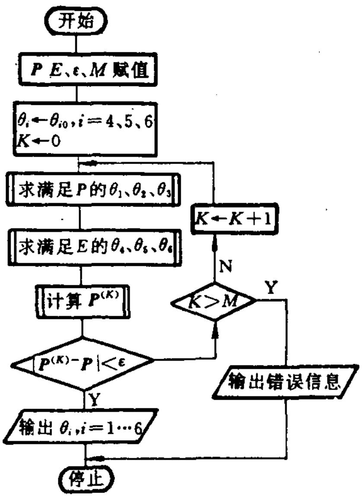

图 $\pmb { 8 } \pmb { 7 }$ 位置、姿态分别迭代法

人逆运动学解有多值性。使用数值解法,多解是通过选取不同初值求得的。在不考虑避越障碍的情况下,机器人当前位姿对应的关节角一般可作为下一位置逆运动学解的初值。

# 五、工作空间分析

点焊机器人的结构参数(单位mm)是: $L _ { 0 } = 4 4 5$ , $\begin{array} { r } { L _ { 1 } = 7 5 5 , } \end{array}$ $\bar { L } _ { 2 } { = } 1 1 0 0$ , $\pmb { L } _ { 3 } = \pmb { \Omega } 0 0$ , $L _ { 4 } = 1 9 0 0$ , $L _ { 5 } = - 2 3 0$ , $\begin{array} { r } { G = - 2 0 0 , } \end{array}$ 。各关节转角范围是 $- 1 9 0 ^ { \circ } \leqslant \theta _ { 1 } \leqslant 1 9 0 ^ { \circ } , - 4 0 ^ { \circ } \leqslant \theta _ { 2 } \leqslant 5 5 ^ { \circ } ,$ $- 9 0 ^ { \circ } \leqslant \theta _ { 3 } ^ { * } \leqslant$ $6 0 ^ { \circ } \ ( \theta _ { 3 } ^ { * } = \theta _ { 2 } + \theta _ { 3 } ) , \ - 1 8 0 ^ { \circ } \leqslant \theta _ { 4 } \leqslant 1 8 0 ^ { \circ } , \ - 1 8 0 ^ { \circ } \leqslant \theta _ { 5 } \leqslant 1 8 0 ^ { \circ }$ , $- 1 8 0 ^ { \circ }$ $\leqslant \theta _ { \mathfrak { g } } \leqslant 1 8 0 ^ { \circ }$ 。在通过第 $\pmb { 1 }$ 关节轴线的任一截面上,工作空间的形状如图8-8所示。截面的边界方程分为4段:

$$
\begin{array} { r l } & { \left\{ \begin{array} { l l } { { \it { v } = L _ { 2 } \sin \theta _ { 2 } + ( L _ { 3 } + L _ { 4 } ) \cos \theta _ { 3 } ^ { * } \mathrm { m i n } } } \\ { { \it { z } = L _ { 0 } + L _ { 1 } + L _ { 2 } \cos \theta _ { 2 } - ( L _ { 3 } + L _ { 4 } ) \sin \theta _ { 3 \mathrm { m i n } } ^ { * } } } \end{array} \right. } \\ & { \left\{ \begin{array} { l l } { { \it { v } = L _ { 2 } \sin \theta _ { 2 \mathrm { m a x } } + ( L _ { 3 } + L _ { 4 } ) \cos \theta _ { 3 } ^ { * } } } \\ { { \it { z } = L _ { 0 } + L _ { 1 } + L _ { 2 } \cos \theta _ { 2 \mathrm { m a x } } - ( L _ { 3 } + L _ { 4 } ) \sin \theta _ { 3 } ^ { * } } } \end{array} \right. } \end{array}
$$

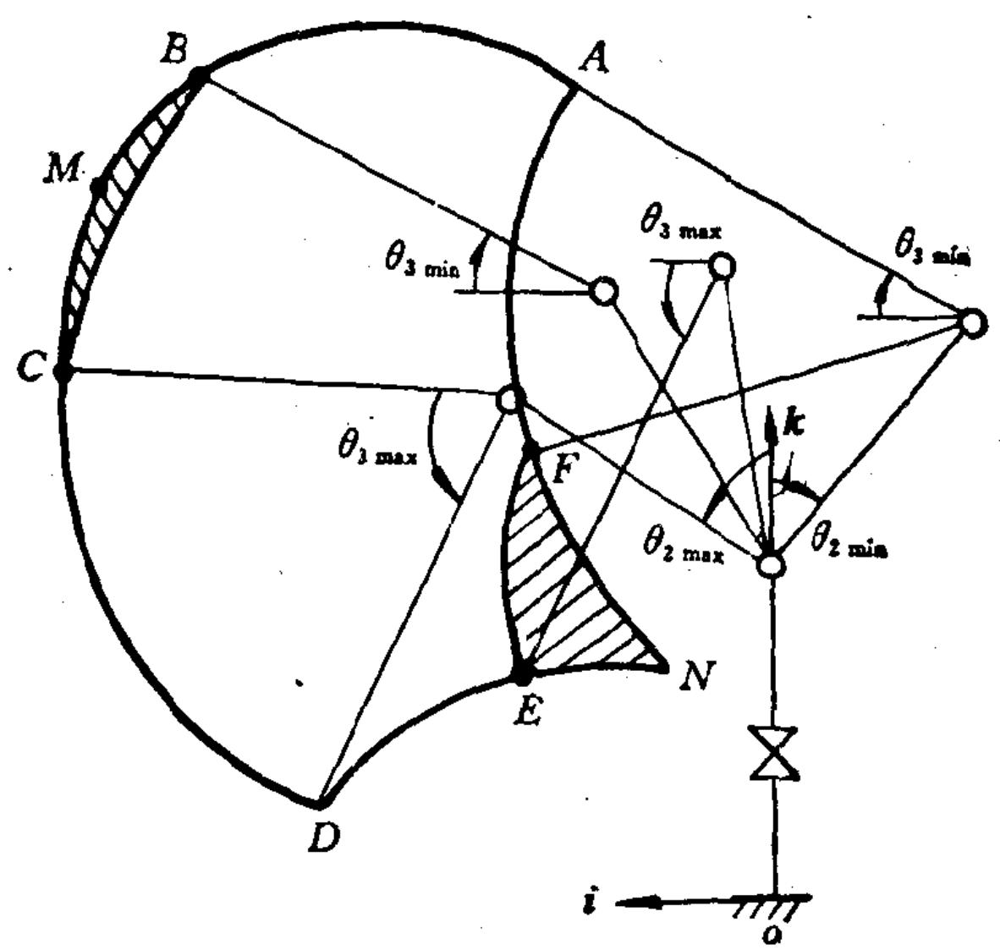

图8-8 工作空间截面图

$\pmb { D N }$ 段 $\begin{array} { r l } & { \left\{ \begin{array} { l l } { \infty = L _ { 2 } \sin \theta _ { 2 } + \left( L _ { 3 } + L _ { 4 } \right) \cos \theta _ { 3 \operatorname* { m a x } } ^ { * } } \\ { z = L _ { 0 } + L _ { 1 } + L _ { 2 } \cos \theta _ { 2 } - \left( L _ { 3 } + L _ { 4 } \right) \sin \theta _ { 3 \operatorname* { m a x } } ^ { * } } \end{array} \right. } \end{array}$ +

$N A$ 段 $\begin{array} { r } { \left\{ \begin{array} { l l } { v = L _ { 2 } \sin \theta _ { 2 \operatorname* { m i n } } - \vdash \left( L _ { 3 } + L _ { 4 } \right) \cos \theta _ { 3 } ^ { * } } \\ { z = L _ { 0 } + L _ { 1 } + L _ { 2 } \cos \theta _ { 2 \operatorname* { m i n } } - \left( L _ { 8 } + L _ { 4 } \right) \sin \theta _ { 3 } ^ { * } } \end{array} \right. } \end{array}$ 

考虑到杆件之间的干涉,机器人在某些位置上不能达到其关节的最大活动范围。因此,点焊机器人实际工作截面由图8-8中的曲线ABCDEFA围成。

上述截面绕第 $\mathbf { 1 }$ 关节轴线旋转得一中空环状柱面,构成机器人腕点的可达工作空间,如图8-9所示。由于 $\theta _ { 1 }$ 转角范围为 $2 6 0 ^ { \circ }$ ,未形成通常意义上的空洞。

图8-8截面内均为可达点。因此,垂直于第 $1$ 关节轴线的任何平面在工作空间中不能截得非连通域。根据第三章介绍的空腔存在充要条件可知,点焊机器人工作空间内不存在空腔。

工作空间中若存在盲区,则按第三章,盲区满足

$$
\frac { \partial P } { \partial \theta _ { 1 } } \cdot \bigg ( \frac { \partial P } { \partial \theta _ { 2 } } \times \frac { \partial P } { \partial \theta _ { 3 } } \bigg ) = 0
$$

图8-9 工作空间

图8-10盲区分析

根据运动学原理, $\frac { \partial P } { \partial \theta _ { 1 } }$ 的方向平行 $\pmb { k } \times \pmb { P } _ { 1 } , \frac { \partial \pmb { P } } { \partial \theta _ { 2 } }$ 的方向平行$\pmb { j } _ { 1 } ^ { \cdot } \times \pmb { P } _ { 2 } , \ \frac { \partial \pmb { P } } { \partial \theta _ { 3 } }$ 的方向平行 $j _ { 2 } \times P _ { 3 \mathrm { c } }$ 其中 $P _ { 1 , P _ { 2 , } P _ { 3 } }$ 的定义见图8-10。式8-100等价于

$$
( { \pmb k } \times { \pmb P } _ { 1 } ) \cdot [ ( { \pmb j } _ { 1 } \times { \pmb P } _ { 2 } ) \times ( { \pmb j } _ { 2 } \times { \pmb P } _ { 3 } ) ] = 0
$$

用N表示k×P的方向,N表示j×P的方向,N8表示j×P的方向,则N的方向垂直纸面向外,NN的方向如图8-10所示。使式8-101成立有3种情况:

1. $\pmb { N _ { 1 } } , \pmb { N _ { 2 } } , \pmb { N _ { 3 } }$ 至少有一个为零向量;

2. $\pmb { N _ { 2 } }$ 与 ${ \pmb { N } } _ { 3 }$ 平行;

3. $\pmb { N _ { 1 } } , \pmb { N _ { 2 } } , \pmb { N _ { 3 } }$ 共面。

由点焊机器人结构所确定, $\pmb { j _ { 1 } }$ 与 $\pmb { j _ { 2 } }$ 永远是平行的, ${ \pmb P _ { 2 } }$ 和 ${ \pmb P _ { 3 } }$ 总是在垂直于 $j _ { 1 }$ 和 $j _ { 2 }$ 的平面上。因此, $\pmb { N } _ { 2 }$ 与 $\pmb { N } _ { 3 }$ 不可能是零向量。当 $\pmb { P _ { 1 } }$ 与 $\pmb { k }$ 轴平行时, $\pmb { N } _ { 1 }$ 为零向量。但是,从图8-8可看出,由于关节活动范围的限制,腕点不可能到达这些位置。因此,不存在对应第1种情况的盲区。

当 $\theta _ { 3 }$ 自初始位置转过 $\pm 9 0 ^ { \circ }$ 时, $\pmb { P _ { 2 } }$ 与 ${ \pmb { P _ { 3 } } }$ 平行,从而 $\pmb { N _ { 2 } }$ 与$\pmb { N _ { 3 } }$ 平行。但是,从图8-8可看出,由于关节活动范围的限制,腕点不可能到达这些位置。因此,不存在对应第2种情况的盲区。

由点焊机器人结构所确定, $\pmb { N _ { 1 } }$ 和 $\pmb { N _ { 2 } }$ 总是位于平行于 $\pmb { k }$ 轴的平面上,且 $\pmb { N } _ { 1 }$ 总是垂直于 $\pmb { k }$ 。因此,也不存在对应第3种情况的盲区。

# 六、工作空间综合

根据机器人作业所需工作空间求解机器人各杆的尺寸,称为机器人的工作空间综合。车厢焊接生产线通常布置有若干台机器人,这些机器人的布局确定后,每台机器人的工作空间也就基本确定了。可根据机器人工作空间的需求参照第七章所述的图谱方法初步确定机器人各杆的尺寸作为初值,然后按机器人作业时所要求的各个位置和姿态,进行机器人的尺寸综合。

也可用第七章中优化方法进行机器人尺寸综合。设已知机器人在若干点的位姿 $P _ { i _ { \cdot } } \ E _ { i } , \ i { = } 1 , \ 2 \cdots m _ { o }$ 按作业要求预先选定参数 $I _ { \mathrm { \Delta \xi } }$ 和 $G _ { i }$ ,取设计变量

$$
\pmb { X } = \left[ \begin{array} { c } { x _ { 1 } } \\ { x _ { 2 } } \\ { x _ { 3 } } \end{array} \right] = \left[ \begin{array} { c } { L _ { 0 } + L _ { 1 } } \\ { L _ { 2 } } \\ { L _ { 3 } + L _ { 4 } } \end{array} \right]
$$

杆件长度应大于零,故有约束条件

$$
{ x _ { i } } \geqslant { x _ { i } } _ { \mathrm { m i n } } \quad i = 1 , 2 , 3
$$

式中, ${ \mathfrak { D } } _ { \mathbf { i } \mathbf { \ m i n } }$ 为 ${ \pmb { \mathscr { D } } } _ { \mathbf { i } }$ 的最小长度。此外,机器人必须满足位姿约束,即对应 $P _  \{ _ { \cdot } , E _ { \ i } ( i = 1 , 2 \cdots m )$ , $\theta _ { \kappa } ( k = 1 \AA _ { \star } 2 \cdots 6 )$ 有解,且

$$
\theta _ { k \mathrm { \ m i n } } { \leqslant } { \theta _ { k } { \leqslant } { \theta _ { k \mathrm { \ m a x } } } } \quad k { = } 1 , 2 { \cdots } 6
$$

式中, $\theta _ { k \operatorname* { m i n } _ { \mathbf { \lambda } } } , \theta _ { k \operatorname* { m a x } }$ 是第 $\pmb { k }$ 关节转角的上、下限。

在满足上述约束的前提下,杆件长度越小,机器人总重就越轻,材料越省,惯性及功耗越小,而各杆刚度越大。因此,可用杆件总长最小作设计目标,即目标函数可设为

$$
\pmb { F } ( \pmb { X } ) = \sum _ { j = 1 } ^ { 3 } x _ { j }
$$

对已成为系列产品的机器人,在同一系列的各级尺寸中,各杆长之间的比例通常是不变的,即

$$
\left( L _ { 0 } + L _ { 1 } \right) : L _ { 2 } : \left( L _ { 3 } + L _ { 4 } \right) = \ldots \bar { b } : c
$$

则有

$$
\begin{array} { l } { { \displaystyle L _ { 0 } + L _ { 1 } = \frac { L _ { 2 } c } { b } } } \\ { { \displaystyle L _ { 3 } + L _ { 4 } = \frac { L _ { 2 } c } { b } } } \end{array}
$$

已知 $0 , \theta , \theta ,$ 则设计变量变为 $\pmb { 1 }$ 维

$$
\pmb { X } = \{ \pmb { L _ { 2 } } \}
$$

而目标函数变为

$$
\pmb { F } ( \pmb { X } ) = \pmb { L _ { 2 } }
$$

由于仅有一个设计变量,受 $\pmb { P _ { i } }$ 的限制,不会出现 $\mathbf { \delta } \mathbf { \mathcal { L } _ { 2 } } { \leqslant } \mathbf { 0 }$ 的情况 $\circ$ 因此,式8-103可不予考虑。计算得到的 $I _ { 2 } ^ { * }$ 值可作为选取机器人的依据,在同一系列的各级尺寸中,选取 $I _ { 2 } \geq I _ { 2 } ^ { * }$ 但又 $\pmb { L _ { 2 } }$ 最接近 $L _ { 2 } ^ { * }$ 的机器人。 +

# \$8-3喷涂机器人

# 一、概述

这里以一种常见喷涂机器人为例,说明喷涂机器人设计应用中的主要问题[13]。

喷涂机器人的主要要求是实现喷枪的任意位置和姿态。由于喷枪绕自身轴线的旋转对作业没有意义,因此,只要求确定喷枪轴线在空间的方位。与弧焊机器人相似,要完成喷涂作业需要5个自由度(有时使用多于5个自由度的机器人,其目的仅在于增加喷

枪在作业空间中的灵活性)。

关于喷涂机器人的分析与综合,类似于弧焊及点焊机器人但

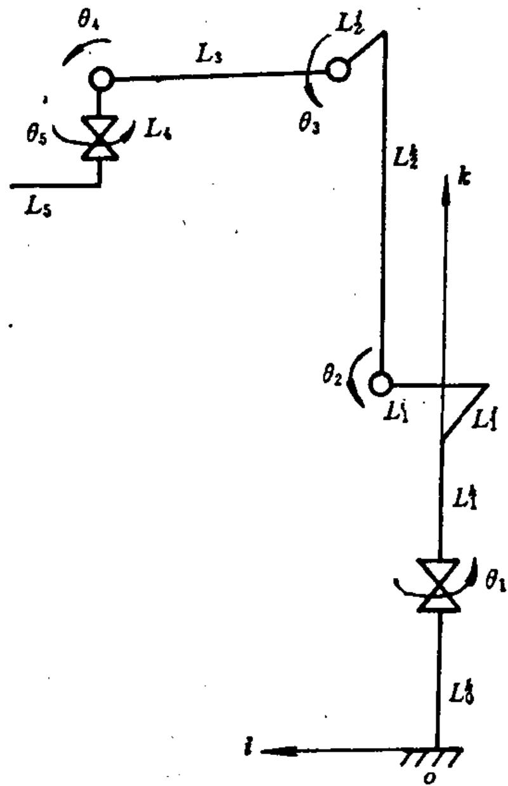

图8-11 喷涂机器人示意图

须注意下述不同点。

喷枪与工作对象之间有一定距离,进行尺寸综合时应从工作对象的位置求得腕点的相应位置,再进行工作空间综合。

喷涂机器人常采取示教再现控制方式,一般采用手把手的示教方法。为使示教轻便,需要对机器人各杆的重力进行平衡。平衡的作用还可减小关节驱动电机的负荷。

图8-11为喷涂机器人的示意图,有2个长度相等的偏距, $L _ { 1 } ^ { f }$ 与 $j$ 轴方向相反, $I _ { 2 } ^ { j }$ 与$j$ 轴方向相同。该机器人采取

集中驱动方式,将各关节的驱动装置布置在靠近第1杆的基座内腔,通过链条将动力传到各关节上。采用集中驱动可减小各杆的质量,从而减小杆件的惯性,同时还可提高防尘、防爆性能。但另一方面,会造成各关节之间的传动耦合,需要对关节运动参数作解耦计算。

# 二、位姿方程

取机器人初始位姿与参考坐标系如图8-11所示,位置方程为

$$
\begin{array} { r l } & { \bar { L } ^ { { \theta } } = { L } _ { 0 } ^ { { \varepsilon } } + { \mathit { { E } } ^ { { \mu } { \theta } _ { 1 } } } ( { L } _ { 1 } ^ { { \varepsilon } } + { L } _ { 1 } ^ { { \prime } } + { L } _ { 1 } ^ { { \prime } } + { \mathit { { E } } ^ { { \dot { \prime } } { \theta } _ { 1 } } } ( { L } _ { 2 } ^ { { \varepsilon } } + { L } _ { 2 } ^ { { \prime } } + { \mathit { { E } } ^ { { \mu } { \theta } _ { 2 } } } } \\ & { \quad \cdot \left( { L } _ { 3 } ^ { { \varepsilon } } + { \mathit { { E } } ^ { { \prime } { \theta } _ { 4 } } } ( { L } _ { 4 } ^ { { \varepsilon } } + { \mathit { { E } } ^ { { \mu } { \theta } _ { 4 } } } ( { L } _ { 5 } ^ { { \varepsilon } } ) ) ) \right) ) } \end{array}
$$

由于 $L _ { 1 } ^ { j } { = } { - } L _ { 2 } ^ { j }$ ,当仅考虑喷枪定位时,位置方程可写为

$$
\begin{array} { r l } & { P = L _ { 0 } ^ { k } + E ^ { k \theta _ { 1 } } ( L _ { 1 } ^ { k } + L _ { 1 } ^ { \ell } + E ^ { j \theta _ { 1 } } ( L _ { 2 } ^ { k } + E ^ { \ell \theta _ { 1 } } } \\ & { \qquad \therefore \left( L _ { 3 } ^ { \ell } + E ^ { j \theta _ { 4 } } ( L _ { 4 } ^ { k } + E ^ { \ell \theta _ { 3 } } ( L _ { 5 } ^ { \ell } ) ) \right) ) } \\ & { = L _ { 0 } ^ { k } + L _ { 1 } ^ { k } + E ^ { \ell \theta _ { 1 } } ( L _ { 4 } ^ { \ell } ) + E ^ { k \theta _ { 1 } } E ^ { ; \theta _ { 3 } } ( L _ { 2 } ^ { k } ) } \end{array}
$$

$$
\begin{array} { l } { { + E ^ { { \bar { k } } \theta _ { 1 } } E ^ { { \bar { j } } ( \theta _ { 1 } + \theta _ { 1 } ) } ( L _ { 3 } ^ { \downarrow } ) + E ^ { { \bar { k } } \theta _ { 1 } } E ^ { { \bar { j } } ( \theta _ { 1 } + \theta _ { 1 } + \theta _ { 4 } ) } ( L _ { 4 } ^ { k } ) } } \\ { { + E ^ { { \bar { k } } \theta _ { 1 } } E ^ { { \bar { j } } ( \theta _ { 1 } + \theta _ { 3 } + \theta _ { 4 } ) } E ^ { { \bar { k } } \theta _ { 3 } } ( L _ { 3 } ^ { \downarrow } ) } } \end{array}
$$

而姿态方程为

$$
E = E ^ { k \theta _ { 1 } } E ^ { j \theta _ { 1 } } \underline { { E } } ^ { j \theta _ { 1 } } \underline { { E } } ^ { j \theta _ { 1 } } \underline { { E } } ^ { j \theta _ { 1 } } E ^ { j \theta _ { 1 } } \underline { { E } } ^ { j k \theta _ { 1 } } = E ^ { j k \theta _ { 1 } } \underline { { E } } ^ { j ( \theta _ { 1 } + \theta _ { 1 } + \theta _ { 4 } ) } \underline { { E } } ^ { j k \theta _ { 1 } }
$$

# 三、逆运动学求解

式8-112可写为

$$
\begin{array} { r l } & { P - L _ { 0 } ^ { k } - L _ { 1 } ^ { k } - E ( L _ { 3 } ^ { \downarrow } ) } \\ & { \quad = E ^ { k \theta _ { 1 } } ( L _ { 1 } ^ { \downarrow } ) + E ^ { k \theta _ { 1 } } E ^ { j \theta _ { 1 } } ( L _ { 2 } ^ { k } ) + E ^ { k \theta _ { 1 } } E ^ { j ( \theta _ { 1 } + \theta _ { 3 } ) } ( L _ { 3 } ^ { \downarrow } ) } \\ & { \quad \quad + E ^ { k \theta _ { 3 } } E ^ { j ( \theta _ { 1 } + \theta _ { 1 } + \theta _ { 4 } ) } \left( L _ { 4 } ^ { k } \right) \quad . } \end{array}
$$

上式左边为已知,可用 $\mathbf { \delta } _ { P } ^ { \prime }$ 表示,即

$$
P ^ { \prime } = \biggl [ \begin{array} { l } { { \overline { { { \sigma } } } ^ { \prime } } } \\ { { y ^ { \prime } } } \\ { { z ^ { \prime } } } \end{array} \biggr ] = E ^ { \widehat { k } \theta _ { 1 } } ( L _ { 1 } ^ { * } + E ^ { \beta \theta _ { 1 } } ( L _ { 2 } ^ { k } ) + E ^ { \beta ( \theta _ { 1 } + \theta _ { 1 } ) } ( L _ { 3 } ^ { * } ) \quad .
$$

$$
+ E ^ { j ( \theta _ { 3 } + \theta _ { 3 } + \theta _ { 6 } ) } \big ( L _ { 4 } ^ { k } \big ) \big )
$$

展开上式得

$$
\begin{array} { r l } & { \varpi ^ { \prime } = \cos \theta _ { 1 } [ L _ { 1 } { + } L _ { 2 } \sin \theta _ { 2 } { + } L _ { 3 } \cos ( \theta _ { 2 } { + } \theta _ { 8 } ) + L _ { 4 } \sin \left( \theta _ { 2 } { + } \theta _ { 8 } { + } \theta _ { 4 } \right) ] } \\ & { \varpi ^ { \prime } = \sin \theta _ { 1 } [ L _ { 1 } { + } L _ { 2 } \sin \theta _ { 2 } { + } L _ { 3 } \cos ( \theta _ { 2 } { + } \theta _ { 8 } ) + L _ { 4 } \sin \left( \theta _ { 2 } { + } \theta _ { 8 } { + } \theta _ { 4 } \right) ] } \\ & { \varpi ^ { \prime } = L _ { 2 } \cos \theta _ { 2 } { - } L _ { 3 } \sin \left( \theta _ { 2 } { + } \theta _ { 8 } \right) { + } L _ { 4 } \cos ( \theta _ { 2 } { + } \theta _ { 8 } { + } \theta _ { 4 } ) } \end{array}
$$

得

$$
\theta _ { 1 } { \ ' } = \mathrm { t g } ^ { - 1 } \left( { \frac { y ^ { \prime } } { x ^ { \prime } } } \right)
$$

展开式8-113有

$$
{ \begin{array} { r l } { E { = } { \left[ \begin{array} { l l l } { \lambda _ { 9 } } & { \lambda _ { 1 } } & { \lambda _ { 9 } } \\ { \mu _ { 0 } } & { \mu _ {  b } } & { \mu _ { 0 } } \\ { \nu _ { 0 } } & { \nu _ { b } } & { \nu _ { 0 } } \end{array} \right] } } & { } \\ { = { \left[ \begin{array} { l l l } { \Omega _ { 1 } C _ { 2 3 4 } C _ { 5 } - \mathfrak { g } _ { 1 } \mathfrak { s } _ { 5 } } & { - \mathfrak { c } _ { 1 } \mathfrak { c } _ { 2 3 4 } \mathfrak { s } _ { 5 } - \mathfrak { s } _ { 1 } \mathfrak { c } _ { 5 } } & { C _ { 1 } \mathfrak { s } _ { 2 3 4 } - } \\ { \mathfrak { s } _ { 1 } C _ { 2 3 4 } C _ { 5 } + \mathfrak { c } _ { 1 } \mathfrak { s } _ { 5 } } & { - \mathfrak { s } _ { 1 } \mathfrak { c } _ { 2 3 4 } \mathfrak { s } _ { 5 } + \mathfrak { c } _ { 1 } \mathfrak { c } _ { 5 } } & { \mathfrak { s } _ { 1 } \mathfrak { s } _ { 2 3 4 } } \\ { \qquad - \mathfrak { s } _ { 2 3 4 } C _ { 5 } } & { \mathfrak { s } _ { 2 3 4 } \mathfrak { s } _ { 5 } } \end{array} \right] } } & { \quad \mathscr { C } _ { 2 3 4 } . } \end{array} }
$$

式中, ${ \mathfrak { s } } _ { i } , { \mathfrak { c } } _ { i } \left( i = 1 , 5 \right)$ 表示 $\sin \theta _ { 3 } , \cos \theta _ { 4 }$ $\$ 234,456$ 表示 $\sin ( \theta _ { 2 } + \theta _ { 3 } +$ 

$\theta _ { 4 } )$ 、 $\cos ( \theta _ { 2 } + \theta _ { 3 } + \theta _ { 4 } )$ 。由式8-118得

$$
\theta _ { \bar { \mathbf { s } } } = \operatorname { a r c } \log \left( \frac { - \nu _ { h } } { \nu _ { a } } \right)
$$

$$
\theta _ { 2 3 4 } = \operatorname { a r c } \ \mathrm { t g } \left( { \frac { \mu _ { 0 } \sin \ \theta _ { 1 } } { \nu _ { o } } } \right) .
$$

式8-115可写为

$\bar { E } ^ { { i k ( - \theta _ { 1 } ) } } ( P ^ { \prime } ) - \bar { L } _ { 1 } ^ { 4 } - \bar { E } ^ { { j ( \theta _ { 1 } + \theta _ { 3 } + \theta _ { 4 } ) } } ( \bar { L } _ { 4 } ^ { * } ) = \bar { E } ^ { { j \theta _ { 3 } } } ( \bar { L } _ { 2 } ^ { k } ) + \bar { E } ^ { { j ( \theta _ { 4 } + \theta _ { 4 } ) } } ( \bar { L } _ { 3 } ^ { 4 } )$ 上式左边为已知,可用 $\mathbf { \delta } \mathbf { \mathcal { P } } ^ { \prime \prime }$ 表示,即

$$
\begin{array} { r } { P ^ { \prime \prime } { = } \left[ \begin{array} { l } { { \sigma ^ { \prime \prime } } _ { 1 } } \\ { y ^ { \prime \prime } } \\ { z ^ { \prime \prime } } \end{array} \right] { = } \mathcal { B } ^ { 9 * } ( \mathcal { L } _ { 2 } ^ { k } + \mathcal { E } ^ { j \theta _ { 3 } } ( \mathcal { L } _ { 3 } ^ { \ast } ) ) } \end{array}
$$

上式两边平方得

$$
\boldsymbol { x } ^ { \prime } { } ^ { I 2 } + \boldsymbol { y } ^ { \prime } { } ^ { I 2 } + \boldsymbol { z } ^ { \prime } { } ^ { I 2 } = I _ { 2 } ^ { 2 } + I _ { 3 } ^ { 2 } - 2 L _ { 2 } L _ { 3 } \sin \theta _ { 3 }
$$

从而

1 

$$
\theta _ { 3 } = \operatorname { a r c } \sin \bigg ( \frac { L _ { 2 } ^ { 2 } + L _ { 3 } ^ { 2 } - x ^ { \prime \prime 2 } - y ^ { \prime \prime 2 } - z ^ { \prime \prime 2 } } { 2 L _ { 2 } L _ { 3 } } \bigg )
$$

式8-121可写为

$$
E ^ { j ( - \theta _ { 1 } ) } ( P ^ { \prime \prime } ) = L _ { 2 } ^ { k } + E ^ { j \theta _ { 3 } } ( L _ { 3 } ^ { \ell } )
$$

展开上式有

$$
{ x ^ { \prime \prime } \cos \theta _ { 2 } { - z ^ { \prime \prime } \sin \theta _ { 2 } { - } L _ { 3 } \cos \theta _ { 3 } { = } 0 } }
$$

$$
\begin{array} { r } { x ^ { \prime \prime } \sin \theta _ { 2 } + z ^ { \prime I } \cos \theta _ { 2 } - L _ { 2 } + L _ { 3 } \sin \theta _ { 3 } = 0 } \end{array}
$$

整理后得

$$
\theta _ { 2 } { = } \mathrm { t g } ^ { - 1 } \bigg ( \frac { C _ { 1 } A _ { 2 } - C _ { 2 } A _ { 1 } } { C _ { 2 } B _ { 1 } - C _ { 1 } B _ { 2 } } \bigg )
$$

式中

$$
\begin{array} { r l } { A _ { 1 } = x ^ { \prime \prime } } & { { } B _ { 1 } = - z ^ { \prime \prime } \quad C _ { 1 } = - L _ { 3 } \cos \theta _ { 3 } } \end{array}
$$

$$
\begin{array} { r l } { A _ { 2 } { = } x ^ { t / } } & { { } B _ { 2 } { = } z ^ { t / } \quad C _ { 2 } { = } - L _ { 2 } { + } L _ { 3 } \sin \theta _ { 3 } } \end{array}
$$

最后

$$
\theta _ { 4 } = \theta _ { 2 3 4 } - \theta _ { 2 } - \theta _ { 3 }
$$

# 四、集中驱动的传动耦合与解耦运算

设第 $j$ 轴驱动电机的转角为 $\psi _ { i }$ ,从电机到第 $j$ 轴的传动比为$i _ { j _ { 0 } }$ 如果各轴驱动机构单独布置在各自构件上,各自形成关节轴

的传动链,则任何一轴的运动都是独立的,彼此不影响。此时

$$
\cdot \theta _ { 1 } = \frac { \psi _ { 1 } } { i _ { 1 } }
$$

则电机转角

$$
\psi _ { \mathscr { s } } = \theta _ { \mathscr { s } } \dot { \mathscr { \imath } } _ { \mathscr { s } }
$$

而在集中驱动的情况下,后级关节轴的传动链受前级关节轴传动链的影响,各关节轴运动的独立性被破坏,各轴之间产生传动耦合。在进行控制之前须先进行解耦运算。

图8-12是喷涂机器人的集中驱动示意图。图中方框表示固定在杆 $L _ { 1 }$ 上的驱动机构,方框内的数字 $i ( i { = } 1 , 2 , 9 , 4 ,$ 、5)标明是第 $i$ 关节的驱动机构。从第 $\dot { \pmb q }$ 驱动机构至第 $\dot { \pmb q }$ 轴之间采用链传动,传动比为 $1 _ { 0 }$ 

从图8-12可以看出,第 $\textbf { 1 }$ 关节的运动是独立的,故

$$
\theta _ { 1 } = \frac { \psi _ { 1 } } { i _ { 1 } }
$$

第2关节的驱动机构产生杆 $I _ { 2 }$ 的转动,其转角关系为

$$
\theta _ { 2 } = \frac { \psi _ { 2 } } { i _ { 2 } } .
$$

$\theta _ { 2 }$ 的转动对后面各关节的转动产生耦合影响。图8-13为 $\pmb { \theta _ { 2 } }$ 与 $\theta _ { 3 }$ 的耦合情况,轮 $\pmb { A }$ 与第3轴驱动机构相连(图8-12),当 $\psi _ { 3 }$ 不变时,轮 $\pmb { A }$ 相对 $\pmb { L _ { 1 } }$ 固定。轮 $B$ 经链条与轮 $\pmb { A }$ 连接,当杆 $\pmb { L _ { 2 } }$ 处于垂直位置时,链条与 $\pmb { A }$ 在 $a , b$ 两处相切,与

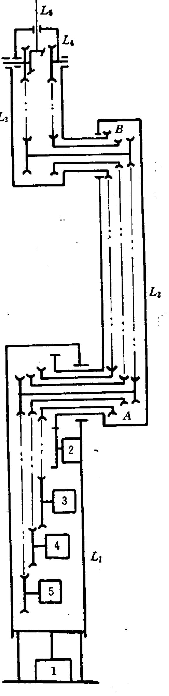

图8-12 集中驱动示意图

$B$ 在 $\ c , d$ 两处相切。考虑杆 $\mathbf { { \mathit { L } } _ { 2 } }$ 因 $\pmb { \theta _ { 2 } }$ 的变化运动至水平位置,而$\psi _ { 3 }$ 保持不变的情况。由于轮 $\pmb { A }$ 不动,链条与轮 $\pmb { A }$ 的切点移至 ${ \pmb { \alpha } } ^ { \prime } .$ 、$b ^ { \prime }$ ;相应地,链条与轮 $B$ 的切点移至 $c ^ { \prime } , d ^ { \prime }$ 。由于采用传动比为1的链传动,此时轮 $\mathcal { B }$ 相对 $L _ { 2 }$ 转了 $- \theta _ { 2 }$ 角,从而使杆 $L _ { 8 }$ 改变了相对杆 $L _ { 2 }$ 的位置。即在 $\psi _ { 3 }$ 不变的情况下,由于 $\theta _ { 2 }$ 的变化产生了杆$\pmb { L _ { 3 } }$ 的附加耦合转动。用 $\theta _ { i } ^ { ( j ) }$ 表示由于 $\theta _ { j }$ 的变化而产生 $\theta _ { i }$ 的耦合转角,则上述杆 $L _ { 3 }$ 的耦合转动表示为 $\theta _ { 3 } ^ { ( 2 ) }$ ,而杆 $I _ { 3 }$ 的真实转动

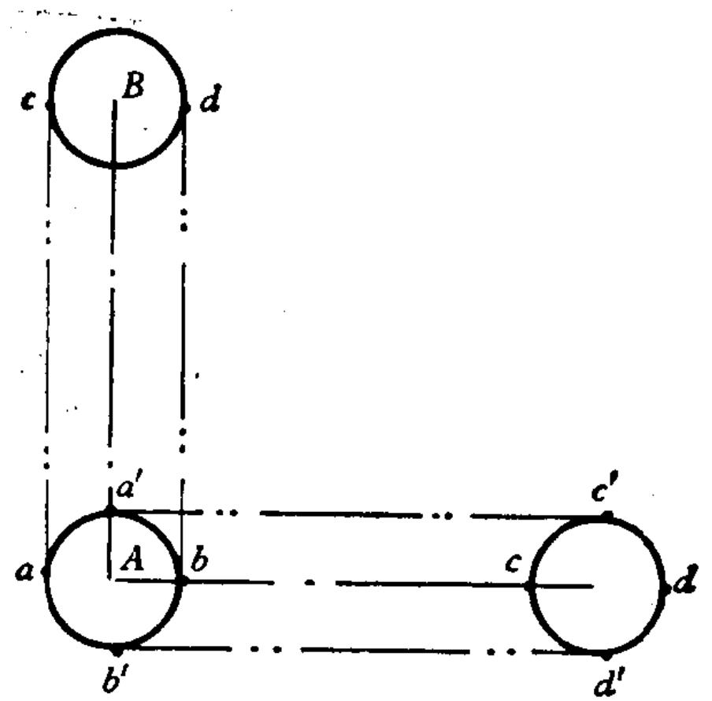

图8-13 $\theta _ { 3 }$ 与 $\theta _ { 8 }$ 的传动耦合

$$
\theta _ { 3 } = \frac { \psi _ { 3 } } { \dot { \iota } _ { 3 } } + \theta _ { 3 } ^ { ( 2 ) } = \frac { \psi _ { 3 } } { \dot { \iota } _ { 3 } } - \theta _ { 2 } = \frac { \psi _ { 3 } } { \dot { \iota } _ { 3 } } - \frac { \psi _ { 2 } } { \dot { \iota } _ { 2 } }
$$

同理, $L _ { 2 }$ 的转动对 $\theta _ { 4 }$ 也产生影响, $\theta \hat { z } ^ { 2 ) } = - \theta _ { 2 , }$ 而 $\theta _ { 3 }$ 对 $\theta _ { 4 }$ 也产生耦合影响, $\theta _ { 4 } ^ { ( 3 ) } = - \ \theta _ { 3 } ,$ 。故有

$$
\begin{array} { c c c } { { \theta _ { 4 } { = } \displaystyle { \frac { \psi _ { 4 } } { i _ { 4 } } } { + } \theta _ { 3 } ^ { ( 2 ) } { + } \theta _ { 4 } ^ { ( 3 ) } { = } \displaystyle { \frac { \psi _ { 4 } } { i _ { 4 } } } { - } \displaystyle { \frac { \psi _ { 2 } } { i _ { 2 } } } { - } \displaystyle { \left( \underbrace { \psi _ { 3 } } _ { i _ { 3 } } { - } \frac { \psi _ { 2 } } { i _ { 2 } } \right) } } } \\ { { { = } \displaystyle { \frac { \psi _ { 4 } } { i _ { 4 } } } { - } \displaystyle { \frac { \psi _ { 3 } } { i _ { 3 } } } } } \end{array}
$$

一般对第 $j$ 关节

$$
\theta _ { i } = \frac { \psi _ { i } } { i _ { i } } - \frac { \psi _ { i - 1 } } { i _ { i - 1 } }
$$

而电机驱动角

$$
\psi _ { \boldsymbol { \mathscr { s } } } = \left( \theta _ { \boldsymbol { \mathscr { s } } } + \frac { \psi _ { \boldsymbol { \mathscr { s } } - 1 } } { i _ { \boldsymbol { \mathscr { s } } - 1 } } \right) i _ { \boldsymbol { \mathscr { s } } }
$$

或

$$
\psi _ { i } = \left( \sum _ { i = 1 } ^ { j } \delta _ { i j } \theta _ { i } \right) i _ { j }
$$

式中, $\delta _ { i j }$ 为耦合系数,当 $\theta _ { i }$ 对 $\theta _ { j }$ 存在传动耦合时, $\delta _ { i j } = 1$ ,否则$\delta _ { i j } = 0 _ { o }$ 

上述各解耦公式适于从驱动机构到各运动轴均采用传动比为1的传动装置。如果传动比不为1,应采用下面的公式。

用 $e _ { 6 , 6 + 1 } ^ { ( n ) }$ 表示第 $\pmb { \eta } _ { \pmb { \ell } }$ 关节的传动链中第 $j$ 关节到第 $_ { i + 1 }$ 关节的传动比,则从第 $\bar { \boldsymbol { k } }$ 关节传动至第 $\pmb { \eta }$ 关节的总传动比!

此时

$$
\begin{array} { r l } & { \boldsymbol { \mathcal { E } } _ { h , n } ^ { ( n ) } = \boldsymbol { \mathcal { E } } _ { k , k + 1 } ^ { ( n ) } \boldsymbol { \mathcal { E } } _ { k + 1 , k + 2 } ^ { ( n ) } \cdots \boldsymbol { \mathcal { E } } _ { n - 1 , n } ^ { ( n ) } } \\ & { \qquad \boldsymbol { \theta } _ { 3 } ^ { ( 2 ) } = - \boldsymbol { \theta } _ { 2 } \boldsymbol { e } _ { 2 3 } ^ { ( 3 ) } } \\ & { \qquad \boldsymbol { \theta } _ { 4 } ^ { ( 2 ) } = - \boldsymbol { \theta } _ { 2 } \boldsymbol { \theta } _ { 2 3 } ^ { ( 4 ) } \boldsymbol { \theta } _ { 3 4 } ^ { ( 4 ) } } \\ & { \qquad \boldsymbol { \theta } _ { 4 } ^ { ( 3 ) } = - \boldsymbol { \theta } _ { 3 } \boldsymbol { \theta } _ { 3 } ^ { ( 4 ) } } \end{array}
$$

式8-180写为

$$
\theta _ { 3 } = \frac { \psi _ { 3 } } { \dot { \iota } _ { 3 } } - \theta _ { 2 } \theta _ { 2 3 } ^ { ( 3 ) } = \frac { \psi _ { 3 } } { \dot { \iota } _ { 3 } } - \bigg ( \frac { \psi _ { 2 } } { \dot { \iota } _ { 2 } } \bigg ) \theta _ { 2 3 } ^ { ( 3 ) }
$$

式8-131写为

$$
\begin{array} { r l } & { \theta _ { 4 } = \frac { \psi _ { 4 } } { \dot { \iota } _ { 4 } } - \theta _ { 2 } \dot { \varrho } _ { 2 3 } ^ { ( 4 ) } \varrho _ { 3 4 } ^ { ( 4 ) } - \dot { \theta } _ { 3 } \varrho _ { 3 4 } ^ { ( 4 ) } } \\ & { \quad = \frac { \psi _ { 4 } } { \dot { \iota } _ { 4 } } - \left( \frac { \psi _ { 2 } } { \dot { \iota } _ { 2 } } \right) \varrho _ { 2 3 } ^ { ( 4 ) } \varrho _ { 3 4 } ^ { ( 4 ) } - \left[ \frac { \psi _ { 3 } } { \dot { \iota } _ { 3 } } - \left( \frac { \psi _ { 2 } } { \dot { \iota } _ { 2 } } \right) \varrho _ { 2 3 } ^ { ( 3 ) } \right] \varrho _ { 3 4 } ^ { ( 4 ) } } \\ & { \quad = \frac { \psi _ { 4 } } { \dot { \iota } _ { 4 } } - \left( \frac { \psi _ { 3 } } { \dot { \iota } _ { 3 } } \right) \varrho _ { 3 4 } ^ { ( 4 ) } } \end{array}
$$

式8-182.8-133和8-134分别为

$$
\begin{array} { c } { { \theta _ { j } = \frac { \psi _ { j } } { \dot { \theta } _ { j } } - \left( \frac { \psi _ { j - 1 } } { \dot { \hat { \iota } } _ { j - 1 } } \right) \theta _ { j - 1 , j } ^ { ( j ) } } } \\ { { \ } } \\ { { \psi _ { j } = \left( \theta _ { j } + \frac { \psi _ { j - 1 } \theta _ { j - 1 , j } } { \dot { \hat { \iota } } _ { j - 1 } } \right) \dot { \psi } _ { j } } } \\ { { \ \psi _ { j } = \dot { \iota } _ { j } \sum _ { i = 1 } ^ { j } \delta _ { i j } \theta _ { i } \theta _ { i j } ^ { ( j ) } } } \end{array}
$$

式中, $e _ { i j } ^ { ( j ) }$ 满足式8-135。

# 五、机器人机构的静力平衡

# (一)重力平衡

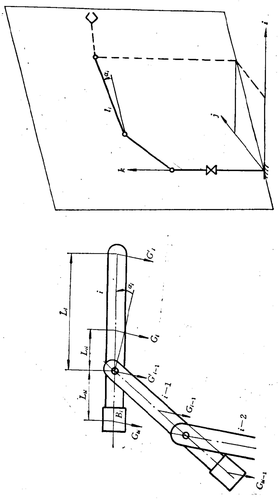

图8-14为机器人重力平衡原理图。设 $\alpha _ { i }$ 为第 $\pmb { \dot { \hat { \alpha } } }$ 杆轴线与水平面的夹角,第 $\clubsuit$ 杆的自重为 $G _ { i }$ ,质心到回转中心的距离为 $\mathit { L } _ { \mathrm { c } \mathit { t } }$ ,后继构件给第 $\dot { 8 }$ 杆的静负荷为 $G _ { \ell } ^ { \prime }$ ,则第 $\dot { \pmb { \mathscr { z } } }$ 关节所受到的静力矩

$$
M _ { 6 } = ( G _ { 4 } ^ { \prime } L _ { 6 } + G _ { 4 } L _ { c 4 } ) \cos \alpha _ { 4 }
$$

若在 $\gamma _ { 1 }$ 点加平衡重 $G _ { b i , }$ 平衡力臂长 $I _ { b i , }$ 则平衡力矩

$$
M _ { b i } = G _ { b i } L _ { b i } \cos \alpha _ { i }
$$

取

$$
G _ { b i } = \frac { G _ { i } ^ { \prime } L _ { i } + G _ { i } L _ { c i } } { L _ { b i } }
$$

则 $M _ { ☉ }$ 与 $M _ { i }$ 大小相等,方向相反,静力矩 $M _ { i }$ 被完全平衡。由于式8-143与 $\alpha _ { \downarrow }$ 无关,选取 $G _ { b i }$ 后, $M _ { i }$ 可获得随遇平衡。以静力负荷为主的应用场合,重力平衡方法可获得很好的效果。.

上述重力平衡方法的缺点是增加了杆件的惯量,从而增加了各关节的动载荷t33。此外,平衡重的存在增加了支撑它的杆件的静载荷。 $\dot { \pmb q }$ 杆作用于 $i - 1$ 杆的静载荷

$$
G _ {  1 } ^ { \prime } { = } G _ { \it 3 } { + } G _ { \it 4 } ^ { \prime } { + } G _ { \it 8 3 }
$$

增加的负载要求杆 $\pmb { L _ { i - 1 } }$ 的断面尺寸加大,关节 $\dot { \pmb { \mathscr { z } } } - \pmb { 1 }$ 的驱动力矩增加。这种效应一直向前级关节传递,从而影响整个机构的体积和总重。增加 $I _ { b 1 }$ 的长度可使 $G _ { b 1 }$ 按比例减小。但 $I _ { \theta \theta }$ 的增加使平衡重的惯量按平方关系增长。此外: $L _ { b \xi }$ 的增加使机器人杆件加长,易与工作环境发生碰撞,也增加了杆件之间干涉的机会,从而使工作空间体积减小。

# (二)弹簧平衡

使用弹簧力代替重力进行平衡基本上不增加机构的惯量,但难以做到任何位置上的完全平衡。弹簧的安装方法有多种,图 $8 -$ 15为其中的一种。设第 $\dot { \pmb { \theta } }$ 关节弹簧的刚度为 $\kappa _ { i }$ ,自由长度为 $I _ { i 0 }$ ,受拉伸长量为 $\Delta L _ { i } , L _ { b 1 }$ 为弹簧力作用点到第 $\dot { \pmb { \mathscr { b } } }$ 关节回转中心的距离, $\operatorname { \mathbb { \ } } I _ { \mathrm { \pmb { \alpha } } 1 }$ 为弹簧另一端安装位置到第 $\dot { \pmb q }$ 关节回转中心的距离, $\beta _ { i }$ 为弹簧轴线与杆 $L _ { i }$ 轴线之间的夹角。由余弦定理得

$$
\dot { \varDelta } L _ { i } = \sqrt { \dot { L } _ { b \mathscr { s } } ^ { 2 } + L _ { a \mathscr { s } } ^ { 2 } - 2 L _ { b \mathscr { s } } L _ { a \mathscr { s } } \cos \theta _ { \mathscr { s } } } - L _ { i 0 }
$$

图8-15 弹簧力计算

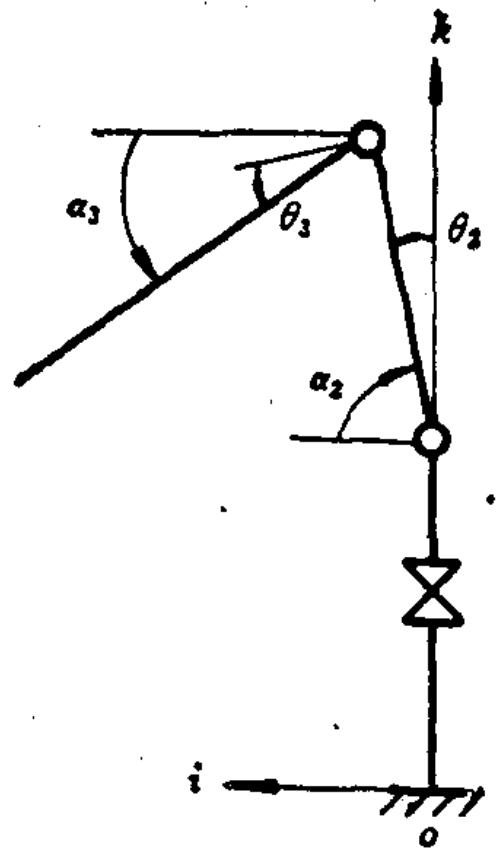

图8-18 $\alpha _ { \pmb { \mathscr { s } } }$ 的计算

$$
\beta _ { i } = \mathrm { a r c } \ \cos \Big [ \frac { L _ { a _ { 4 } } ^ { 2 } - L _ { b _ { 4 } } ^ { 2 } - ( L _ { i 0 } ^ { \prime } + L L _ { i } ) ^ { 2 } } { 2 L _ { b _ { 4 } } ( L _ { i 0 } + \varDelta L _ { i } ) } \Big ]
$$

平衡力矩

$$
M _ { b i } = K _ { i } \varDelta L _ { i } \bar { L } _ { b i } \sin \beta _ { i }
$$

对某个具体的机器人,可将式8-141中的 $\alpha _ { 4 }$ 表示为 $\theta _ { 2 }$ 的函数。例如图8-11所示机器人前3杆的某个位置如图8-16,有

$$
\begin{array} { c c c } { { } } & { { \alpha _ { 2 } = \theta _ { 2 } - \frac { \pi } { 2 } } } \\ { { } } & { { } } & { { } } \\ { { \alpha _ { 3 } = \theta _ { 2 } + \theta _ { 3 } . } } \end{array}
$$

式8-141可写为

$$
\begin{array} { r l } & { M _ { 2 } { = } \left( G _ { 2 } ^ { \prime } L _ { 2 } { + } G _ { 2 } L _ { c 2 } \right) | \sin \hat { \theta } _ { 2 } | } \\ & { M _ { 8 } { = } \left( G _ { 3 } ^ { \prime } L _ { 3 } { + } G _ { 8 } L _ { c 8 } \right) \cos ( \theta _ { 2 } { + } \theta _ { 8 } ) } \end{array}
$$

式8-150中取 $\sin \theta _ { 2 }$ 的绝对值是因为重力矩的大小仅与式8-141中 $\alpha _ { \ell }$ 的大小有关,而与 $a _ { 4 }$ 的方向无关。

比较式8-145,8-146.8-147与式8-150.8-151可知,难以找到 $I _ { 0 i } , I _ { 0 i } , E _ { i }$ 的一组固定值使静力矩 $M _ { i }$ 得到任意位置上的完全平衡。在进行设计时,可采用第五章所述的优化方法,在机器人关节活动范围内寻找 $M _ { ☉ }$ 与 $M _ { i }$ 差别最小的设计方案。对关节2,设计变量

$$
\mathbf { { X } } = { \left[ \begin{array} { l } { \sigma _ { 1 } } \\ { \sigma _ { 2 } } \\ { \sigma _ { 8 } } \\ { \sigma _ { 4 } } \end{array} \right] } = { \left[ \begin{array} { l } { K _ { 2 } } \\ { L _ { 2 0 } } \\ { \cdot } L _ { a 2 } \right]} \\ { L _ { b 2 } } \end{array}  
$$

约束条件为

$$
\begin{array} { r } { x _ { i \operatorname* { m i n } } { < } x _ { i } { < } v _ { i \operatorname* { m a x } } \quad i { = } 1 , 2 , 3 , 4 } \end{array}
$$

式中, $x _ { i \textrm { m i n } _ { 2 } } x _ { i \textrm { m a x } }$ 是 $x _ { 4 }$ 的下、上限。目标函数可取 $M _ { 2 }$ 与 $M _ { ☉ }$ 在各位置上差的平方和。在寻优过程中,此平方和趋于最小值,得到的最优设计方案 $\mathbf { \delta } \mathbf { X ^ { \ast } }$ 能使 $M _ { i }$ 得到较好的平衡,即目标函数

$$
\mathcal { F } ( X ) = \sum _ { i = 0 } ^ { \mathcal { U } } ( M _ { b 2 } ^ { ( i ) } - M _ { a } ^ { ( i ) } ) ^ { 2 }
$$

式中,上标 $\pmb { \dot { \hat { \varepsilon } } }$ 表示 $\theta _ { 2 }$ 的第 $\dot { \pmb { \mathscr { z } } }$ 个位置。 $M$ 表示位置总数,即

$$
\begin{array} { r l } & { M _ { 2 } ^ { ( i ) } = ( G _ { 2 } ^ { i } L _ { 2 } + G _ { 2 } L _ { o 2 } ) \sin \theta _ { 2 } ^ { ( i ) } , } \\ & { M _ { b 2 } ^ { ( i ) } = K _ { 2 } \varDelta L _ { 2 } ^ { ( i ) } L _ { b 2 } \sin \beta _ { 2 } ^ { ( i ) } } \\ & { \varDelta L _ { 2 } ^ { ( i ) } = \sqrt { L _ { b 2 } ^ { 2 } + L _ { a 2 } ^ { 2 } - 2 L _ { b 2 } L _ { a 2 } \cos \theta _ { 2 } ^ { ( i ) } } - L _ { 2 0 } } \\ & { \beta _ { 2 } ^ { ( i ) } = \cos ^ { - 1 } \left[ \frac { \tilde { L } _ { a 2 } ^ { 2 } - \tilde { L } _ { b 2 } ^ { 2 } - ( \tilde { L } _ { a 0 } + \tilde { L } L _ { 2 } ^ { ( i ) } ) ^ { 2 } } { 2 \tilde { L } _ { b 2 } ( \tilde { L } _ { a 0 } + \tilde { L } L _ { 2 } ^ { ( i ) } ) } \right] } \end{array}
$$

将 $\theta _ { 2 }$ 的活动范围分成 $M$ 等分,按式8-155和8-154计算目标函数的程序流程如图8-17。图中min、max分别表示 $\theta _ { 2 }$ 的下、上限,step为步长, $\pmb { \ 8 }$ 为累加器, $\mathbf { i }$ 是循环变量,程序的返回值为 $\mathbf { f } _ { \circ }$ 

对第3关节,设计变量

$$
\mathbf { X } = { \left[ \begin{array} { l } { \sigma _ { 1 } } \\ { \sigma _ { 2 } } \\ { \sigma _ { 3 } } \\ { \sigma _ { 4 } } \end{array} \right] } = { \left[ \begin{array} { l } { K _ { 3 } } \\ { L _ { 8 0 } } \\ { L _ { 9 3 } } \\ { L _ { 9 3 } } \\ { L _ { 6 3 } } \end{array} \right] } \cdot
$$

约束条件同式8-153。由于 $M _ { 3 }$ 与 $\theta _ { 2 } , \theta _ { 3 }$ 都有关,目标函数为

$$
\boldsymbol { \it F } ( \boldsymbol { \it X } ) = \sum _ { 6 = 0 } ^ { m } \sum _ { j = 0 } ^ { n } { ( \mathcal { M } _ { b 3 } ^ { ( 4 j ) } - \mathcal { M } _ { 3 } ^ { ( 4 j ) ^ { \prime } } ) ^ { 2 } }
$$

式中, $\pmb { \mathcal { M } }$ 为 $\theta _ { 2 }$ 的等分数, $\pmb { \mathscr { n } }$ 为 $\theta _ { 3 }$ 的等分数

$$
M _ { 3 } ^ { ( i j ) } = ( G _ { 3 } ^ { \prime } { \cal L } _ { 3 } + G _ { 3 } { \cal L } _ { \mathrm { c 3 } } ) \cos \langle \theta _ { 2 } ^ { ( i ) } + \theta _ { 3 } ^ { ( j ) } \rangle
$$

图8-17杆2的目标函数程序流程

图8-1S弹簧平衡机构

图8-18所示为另一种弹簧安装方式。中间轮 $\pmb { \mathscr { r } }$ 固连在 $i - 1$ 杆上,弹簧的一端固定在 $\pmb { A }$ 点,另一端绕过轮 $\pmb { \mathscr { r } }$ 固连在第 $\dot { \pmb { \mathscr { b } } }$ 杆的$B$ 点。杆 $\clubsuit$ 相对杆 $i - 1$ 转动时,弹簧的长度变化。弹簧力对第 $\clubsuit$ 关节转轴的力矩作为第 $i$ 杆的平衡力矩。弹簧力的计算见图 $8 -$ 19。图中 $A , B$ 两点对应图8-18中 $A , B$ 两点, $\boldsymbol { O } _ { 1 , O _ { 2 } }$ 之间的距离为 ${ \mathfrak { a } } , O _ { 1 , A }$ 之间的距离为 $b$ , $\angle O _ { 2 } O _ { 1 } A = \beta _ { 0 } , \ \uparrow$ 是中间轮的半径, $\pmb { R }$ 是 $B$ 点到第 $\dot { \pmb { \mathscr { b } } }$ 杆转轴的距离, $\gamma$ 是第 $\dot { \pmb { \mathscr { b } } }$ 杆与 $O _ { 1 } O _ { 2 }$ 连线之间的夹角。弹簧总长为线段 $c _ { 1 , \texttt { c 3 } }$ 加圆弧 $\pmb { \mathcal { C } } \mathbf { 2 } _ { 0 }$ 设 $\scriptstyle { L _ { 0 } }$ 为弹簧的自由长度,$\kappa$ 为弹簧的刚度,弹簧力

$$
\begin{array} { r } { F = K \left( c _ { 1 } + c _ { 2 } + c _ { 3 } - L _ { 0 } \right) } \end{array}
$$

图8-19 弹簧力计算

式中

$$
c _ { 1 } = \sqrt { b ^ { 2 } - r ^ { 2 } }
$$

$$
c _ { 3 } = \sqrt { \textit { R } ^ { 2 } + \cdot \textit { \textbf { G } } ^ { 2 } + 2 \textit { R a } \cos \gamma - \eta ^ { * 2 } }
$$

$$
c _ { 2 } = \eta \cdot ( 2 \pi - \beta _ { 0 } - \beta _ { 1 } - \beta _ { 2 } - \beta _ { 3 } )
$$

其中

$$
\beta _ { 1 } = \pmb { \mathrm { g } } ^ { - 1 } \frac { c _ { 1 } } { r }
$$

$$
\mathrm { ~ ` ~ } \beta _ { 2 } = \mathrm { t g } ^ { - 1 } \frac { c _ { 3 } } { r }
$$

$$
\beta _ { 3 } = \cos ^ { - 1 } \frac { \alpha + R \cos \gamma } { \sqrt { R ^ { 2 } + \alpha ^ { 2 } + 2 R \cos \gamma } }
$$

弹簧力所产生的力矩

$$
M _ { b } = F e = F R \sin \left( { \frac { \pi } { 2 } } + \gamma - \beta _ { 2 } - \beta _ { 3 } \right)
$$

对于这种安装方式,需要确定的参数为 $R , r , \alpha , b , \beta _ { 0 } , L _ { 0 } , K ,$ ,因此,设计变量

$$
\mathbf { X } = { \left[ \begin{array} { l } { - R ^ { - } } \\ { r } \\ { \alpha } \\ { \alpha } \\ { b } \\ { \beta _ { 0 } } \\ { L _ { 0 } } \\ { L _ { - } } \end{array} \right] } = { \left[ \begin{array} { l } { - \alpha _ { 1 } - { \overline { { r } } } } \\ { \alpha _ { 2 } } \\ { \alpha _ { 3 } } \\ { \alpha _ { 4 } } \\ { \alpha _ { 5 } } \\ { \alpha _ { 6 } } \\ { \alpha _ { 7 } } \end{array} \right] } .
$$

约束条件为

$$
{ x _ { i } \operatorname* { m i n } } { \leqslant } { x _ { i } { \leqslant } x _ { i \mathrm { { m a x } } } i = 1 } , 2 { \cdots } 6
$$

目标函数

$$
\boldsymbol { F } ( \boldsymbol { X } ) = \sum _ { i = 0 } ^ { m } \left( \boldsymbol { M } _ { b } ^ { ( i ) } - \boldsymbol { M } ^ { ( i ) } \right) ^ { 2 }
$$

式中, $\pmb { M } _ { \widetilde { \pmb { b } } } ^ { ( 4 ) }$ 为第 $i$ 位置上弹簧的平衡力矩。 $M ^ { ( i ) }$ 是所考虑的杆的重力矩。 $m$ 为位置总数,即把杆的运动角 $\gamma$ 在其活动范围内分成$m$ 等分,在每个等分点上计算平衡力矩 $M _ { b }$ 和重力矩 $\mathcal { M }$ 之差,最后取所有等分点上力矩差的平方和作为目标函数的值。在寻优过程中,此平方和趋于最小值,所得到的设计方案 $\pmb { \chi } ^ { * }$ 能使重力矩得到较好的平衡。

# 参 考文献

[1]B.保罗。机构运动学与动力学。汪一麟等译。上海:上海科学技术出版社,1989  
[2] 曹惟庆。机构组成原理。北京:高等教育出版社,1983  
[3] 曹惟庆,徐曾萌。机构设计,北京:机械工业出版社,1992  
[4] 孙树林,瞿志展。关于自由度的计算。北京:机械工程学报,1932,No.2  
[5] 张启先。空间机构的分析与综合(上册)。北京:机械工业出版社,1984  
[6] G.Strong,线性代数及其应用。侯自新等译。天津:南开大学出版社,1990  
[7] 牧野洋,谢存禧,郑时雄。空间机构及机器人机构学,北京:机械工业出版社,1987  
[8] 王德人。非线性方程组解法与最优化方法。北京:人民教育出版社,1979  
[9] 理查德P.保罗。机器人操作手:数学、编程与控制。北京:机械工业出版社,1986  
[10] 傅则绍。机构设计学。成都:成都科技大学出版社,1988  
[11] 陈国欣。计算机图学在机器人工作空间分析和综合中的应用。华南理工大学硕士毕业论文,1986  
[12] 谢存禧,朱武涛。焊接机器人总体机构设计计算方法研究。国家"七五"攻关项技术报告,1989  
[13] 谢存禧,朱懋胜。全电动型喷涂机器人机构学。国家“七五”攻关项目技术报告,,1990  
[14] 林怡青。机械人型综合。中国机械工程学会机械工业自动化学会学术交流会论文,1983  
[15] 楼鸿棣,邹慧君。高等机械原理。北京:高等教育出版社,1990  
[16] 马香山。机器人机构学,北京:机械工业出版社,1991  
[17] M.武科布拉托维奇,D.斯托基奇。操作机器人的控制理论与应用,北京:科学, 出版社,1991  
[18] 周远清,张再兴。智能机器人系统。北京:清华大学出版社,1989  
[19] 张伯鹏,张昆,徐家球。机器人工程基础。北京:机械工业出版社,1989  
[20] 蔡自兴。机器人原理及其应用。长沙:中南工业大学出版社,1988[21] 吴广玉,姜复兴。机器人工程导论。哈尔滨:哈尔滨工业大学出版社,1988  
[22] 傅京孙,R.C.冈萨雷斯,C.S.G.李。机器人学。北京:中国科学技术出版社,1989[23] 熊有伦。机器人学。北京:机械工业出版社,1993[24] 肖金声,李师贤。PASCAL程序设计教程。北京:科学出版社,1990[25] 郑启华,PASCAL程序设计。北京:清华大学出版社。1991[26]张希灿。机器人机构动力方程及其简化算法。华南理工大学硕士毕业论文,1984  
[27] P.Jain,A.M.Agogino.Gobal Optimization Using the Multistart MethodJ.of Mechanical Design,Trans. of the ASME, 1993,Vol.115,No. 4, p.770\~775  
[28] Peng Lu,J.N. Siddall. A Boolean Local Improvement Method forGeneral Discrete Optimization Problems.Trans. of the ASME,1993,Vol.115,No. 4, p. 776\~782  
[29] M.Matsumoto,J.Abe,M. Yoshimura.A multiobjective OptimizationStrategy with Priority Ranking of the Design Objectives. Trans.of theASME,1993,Vol. 115,No.4, p. 784\~792  
[30] C.Huang,B. Roth. Dimensional Sythesis of Closed-loop Lingkages toMatch Force and Position Specifications.Trans. of the ASME,1993, Vol.115,No.2,p. 194\~193  
[31] Z.Shiller, S. Sundar. Design of Multi-degree-freedom Mechanisms forOptimal Dynamic Performance. Trans.of the ASME, 1993, Vol. 115,No.2,p.119\~206  
[32] W. Zhang. The Limit Values of Pressure Angle and Position of MaximalPrissure Angle of the Spat'al RSSR Linkage.Mechanism & Machine The-ory,1993,Vol.28,No.4,p.E93\~599  
[33] Maja Kolarski, M'omir Vukobatovic, Branislay Borovac. Dynamic Ana-lysis of Balanced Robot Mechanisms. Mechanism & Mechine Theory,1994,Vol.29,No.3, p. 427\~454