# 编译者序

为了配合我国工业发展的需要，我们编译了《自动化机构图例》这本书。

本书原为日本 $x - r - z ^ { 2 } =$ 》杂志于1971年及1973年先后两次发表的增刊《自動化·省力化設計八下夕》，后又于1976年汇编成《制御回路自動化機構300選》单行本出版。原书三版共汇集了322个机构，每个机构都附有机械图和顺序控制电气原理图，有的还附有液压或气动系统图和速度特性曲线图等。书中着重对每个机构的动作方向、行程、载荷、速度特性、动力源、结构特点等作了说明，并提出了设计、制造、维护要点及使用实例。可供从事机械设计和制造的人员参考。

编译中，我们按照机构从动部分的运动特点，将原书三版汇集的全部机构，分为直线运动机构、摆动运动机构、回转运动机构及复合运动机构四类，分别列入第二、三、四、五各章。原书三版各有一篇"使用说明"，其中有关本书的分类方法及编写特点，我们作了摘要及综合，列为第一章。原书1976年版末尾附有一篇"控制回路总论”，其中提出了6类常用的控制回路、每类包括有：顺序图、继电器电路、数字电路、液压或气动系统等，扩大了本书的使用范围，我们摘编于附录一中。

由于日文原书为汇编性质，所有机构均来源于不同场所，并由许多作者执笔，故每个机构在绘图的繁简、文字叙述的深浅、文字代号和图形符号的表示方法上，均不完全一致。对此，我们基本上未作改动，仅对一些名词作了适当的注释，对书中所用的文字代号和缩写字、图形符号进行了汇编，作为附录二、附录三列于书末。另外，原书机械图的投影，均采用第三角画法，与我国机械制图国家标准规定的第一角画法不同，对此我们也未作改动，请读者注意。

原书在文字和图中，均存在一些差错，一部分内容是不必要的，编译时作了删节和校正。同时，希望读者在参考本书时，根据具体情况合理选用。

本书最后由北京工业学院姜文炳老师校对。由于我们业务水平低，在编译过程中难免有错误和不妥之处，恳请读者批评指正。

# 目 录

一章手册使用说明… 1  
二章 直线运动机构… .…6  
图2-1 偏心轴和板簧振动机构 .6  
图2-2 电磁铁和弹簧共振铆接机构· ...7  
图2-3 偏心轴和杠杆振动机构 8  
图2-4 偏心轴振动机构. ....9  
图2-5偏心凸轮小行程上下运动机构.10  
图2-6 棘爪和凸轮间歇进给机构… . 11  
图2-7 重力和齿条步进式下降直线运动机构12  
图2-8盘形凸轮直线运动机构 .13  
图2-9曲柄圆盘直线运动机构 …14  
图2-10曲柄和杠杆上下运动机构 15  
图2-11肘节和凸轮上下运动机构. 16  
图2-12 凸轮轴上下运动机构. .17  
图2-13 连杆、扇形齿轮和齿条轴下降机构.18  
图2-14 齿轮、齿条上下运动机构 ·.19  
图2-15 曲柄上下运动机构 20  
图2-16 进给丝杠直线运动机构 …21  
图2-17 凸轮轴上下运动机构 ….22  
图2-18 曲柄上下运动机构. 23  
图2-19 链条上下运动机构… 24  
图2-20 钢丝绳上下运动机构. :25  
图2-21 并列夹紧机构 :-26  
图2-22 均衡夹紧机构 …27  
图2-23 气缸和扇形齿轮直线运动机构.28  
图2-24 杠杆上下运动机构. .29  
图2-25 带检测装置的直线运动机构30  
图2-26 气缸上下动机构．. .-31  
图2-27 具有弹性的拧紧螺钉机构..32  
图2-28 气缸热熔压接机构.. 33  
图229 可调速的直线运动机构.…\*34  
图2-30 液压缸直线运动机构.…35  
图2-31 小直径液压缸强压机构.…36  
图2·32 凸轮直线运动机构. ..\*37  
图2-33 齿条、齿轮和杠杆直线运动机构-38  
图2-34 双液压缸上.下运动机构.39  
图2-35 顺序来.机构…40  
图2-36压紧机构.. 41  
图2-37小型液压缸直线运动机构. 42  
图2-38液压缸上下运动机构.. .43  
图2-39 加压直线运动机构 .44  
图2-40 长工件直线运动机构. .-45  
图2-41 齿条、小齿轮直线运动机构．…46  
图2-42液压缸直线运动机构… 47  
图 $2 \div 4 3$ 差动齿条、齿轮直线运动机构48  
图2-44 可调速的直线运动机构 .49  
图2-45 能在两端停止的进给丝杠直线运动  
机构． ..50  
图2-46 偏心轴水平振动机构.. ..51  
图2-47 偏心轴直线振动机构… ….52  
图2-48 偏心销水平运动机构· 53  
图2-49 电磁铁直线运动机构 55  
图2-50 凸轮直线运动机构. …56  
图2-51 偏心凸轮直线运动机构 ……-57  
图2-52 曲柄圆盘直线运动机构．. .58  
图2-53 回转电磁铁直线运动机构 59  
图2-54 槽形凸轮直线运动机构… 60  
图2-55 曲柄直线运动机构. .61  
图2-56 圆柱形凸轮直线运动机构. -.62  
图2-57 杠杆和曲柄直线运动机构 …63  
图2-58 阿基米德凸轮左右匀速直线运动机构…64  
图2-59 曲柄直线运动机构. -65  
图2-60 由摆动运动转换的直线运动机构.66  
图2-61 进给丝杠直线运动机构 .-.67  
图2-62 钢带水平运动机构． .68  
图2-63 两组角撑架水平运动机构 -69  
图2-64 滚子链往复直线运动机构 70  
图2-65 链条直线运动机构. -71  
图2-66 进给丝杠快速进给直线运动机构.72  
图2-67 进给丝杠直线运动机构 ..73  
图2-68 力臂比增力直线运动机构 .74  
图269 自动定心对向直线运动机构 .75  
图2·70双行程水平运动机构. .76

# 图2-71串联配置气缸的可变行程直线运动

机构… ..........77  
图2-72气缸直线运动机构. .78  
图2-73齿条、齿轮和连杆直线运动机构.79  
图2-74顶端设有过载保护的直线运动机构80  
图2-75 可调行程的水运动机构..81  
图2-76齿条、齿轮变换角度的直线运动机构· $\mathbf { \delta } \mathbf { \hat { \delta } } \mathbf { \delta } \mathbf { \hat { \delta } } \mathbf { \delta } \mathbf { \cdot } \mathbf { 8 2 }$   
图277 平衡式直线运动机构- ….-83  
图2-78 小型液压缸直线运动机构 …-84  
图2-79止转式液压缸直线运动机构..85  
图2-80液压缸直线运动机构 ….86  
图2-81 滚珠滑板水平运动机构. -87  
图2-82 固定轴液压缸直线运动机构..88  
图2-83 可调速的直线运动机构. .89  
图2-84 连杆直线运动机构... .90  
图2-85 杠杆式平衡直线运动机构．.91  
图2-86 肘节直线运动机构 ….92  
图2-87 钢丝绳高速水运动机构..93  
图2-88 拼合式滚珠滑块导向的直线运动机构94  
图2-89 直接连接电磁铁的往复直线运动机构…-95  
图2-90 电磁铁、阻尼器快速返回直线运动机构… ..96  
图2-91 由连杆增大电磁铁行程的直线运动机构 .97  
图2-92 电磁铁步进后快速返回的直线运动机构 .98  
图293通过杠杆比提高功率的往复直线运动机构… ..99  
图2-94平板凸轮任意变速直线运动机构100  
图2-95直接连接气缸的等速直线运动机构…101  
图2-96 改变气缸驱动变换方向的直线运动机构-102  
图2-97 使用快速排气阀的快速返回直线运动机构…… ...103  
图2-98 直接连接气缸的速度变换直线运动机构…. -104  
图2-99齿条、齿轮和棘轮间歇直线运动机构 ..105  
图2-100齿条、齿轮两端减速直线运动机构…106  
图2-101·气缸前进端减速直线运动机构.107  
图2-102气缸与齿条、齿轮步进机构..108  
图2-103液压气动联动的变速直线运动机构·109  
图2-104 由两个齿条得到两倍行程的往复直线运动．….110  
图2-105凸轮任意变速直线运动机构111  
图2-106 杠杆增速直线运动机构. 12  
图2-107 减速阀变速直线运动机..113  
图2-108 链条变换方.的直线运动机构.14  
图2-109回转电磁铁往复直线运动机构.115  
图2-110回转电磁铁直线运动机构..….16  
图2-111 回转电磁铁两端减速往复直线运动机构… .1  
图2-112摆动缸和凸轮往复直线运动机构.…118  
图2-113 摆动缸两端减速往复直线运动机构…119  
图2-114 摆动缸与齿条、齿轮等速、快速返回往复直线运动机构..120  
图2-115 摆动缸、凸轮和杠杆任意变速直线运动机构 -121  
图2-116 摆动缸与齿条，齿轮等速直线运动机构…… -.122  
图2-117摆动缸、杠杆和连杆快速返回往复直线运动机构 ….123  
图2-118 摆动缸和杠杆长行程往复直线运动机构… .124  
图2-119摆动缸和链条中间停止往复直线运动机构 125  
图2-120 齿条、齿轮和机械流量控制阀直线运动机构… .126  
图2-121 端面凸轮任意变速直线运动机构..127  
图2-122 槽形凸轮任意变速直线运动机构…128  
图2-123 曲柄两端减速直线运动构．\*129  
图2-124 曲柄两端减速直线运动构．.130  
图2-125 槽板两端减速直线运动机构..131  
图2-126 单向离合器快速返回直线运动机构…132  
图2-127 缺齿齿轮和皮带间歇传动机构..33  
图2-128 十字轮和链条.歌传动机构..134  
图2-129 齿条和缺齿齿轮快速返回直线运动机构…… .-135  
图2-130 曲柄快速返回直线运动机构 ..136  
图2-131 丝杠直线运动机构… ….137  
图2-132 钢带等速往复直线运动机构.…..138  
图2-133 缺齿齿轮歌传动机构..139  
图2-134 内齿轮和外齿轮快速返回直线运动机构… … 140  
图2-135 丝杠任意变速直运动构..141  
图2-136 曲柄减速直线运动机构 ..142  
图2-137 丝杠二级变速直线运动机构.43  
图2138链条中间停止直线运动机构．….144  
图2-139螺旋轴等速直线运动机构 …145  
图2-140 过载打滑等速直线运动机构.….146  
图2-141 丝杠和模形螺母直线运动机构147  
图2-142 齿条、齿轮平衡式直线运动机构148  
图2-143 凸轮和杠杆直线运动机构.149  
图2-144 丝杠和单向离合器慢速进给直线运动机构… .·-140  
图2-145 进给丝杠任意变速直线运动机构-.151  
图2-146 进给丝杠和导杆直线运动机构.152  
图2-147 两根进给丝杠直线运动机构.153  
图2-148 导杆、滚子和链条直线运动机构…154  
图2-149 两个电磁铁终端减速直线运动机构.155  
图2-150 直角变换运动方向的前进端减速直线运动机构. -156  
图2-151 浮动液压缸终端减速直线运动机构.157  
图2-152 由摆线摆动转换的两端减速直线运动机构.. .- -158  
图2-153 由连杆直接转换摆动为终端减速的直线运动机构 ...159  
图2-154 由槽形凸轮回转转换的直线运动机构· …160  
图2-155 丝杠进给及弹簧快速返回直线运动机构… ..-161

二草 摆动运动机构·… ·-162  
图3-1 偏心重锤摆动运动（振动）机构…162  
图3-2 曲柄连续摆动运动机构 163  
图3-3 曲柄摆动运动机构…. 164  
图 $3 \cdot 4$ 槽形凸轮摆动运动机构.. --165  
图3-5 偏心和摇臂摆动运动机构 -166  
图36 大回转半径摆动运动机构 .....-167  
图3-7 往复速度不同的摆动运动机构..168  
图3-8连动齿轮摆动运动机构.. …-169  
图3-9滚了支承的圆筒摆动运动机构..170  
图3-10扇形齿轮和小齿轮摆动运动机构…171  
图3-11 薄膜开闭机构 172  
图3-12 气缸和凸轮摆动运动机构 :- 173  
图3-13 气缸和连杆摆动运动机构 -174  
图3-14 在前进端停止一定时间的齿条、齿  
轮摆动运动机构. -175  
图3-15 气缸和摇臂摆动运动机构 ..-176  
图3-16气缸和推杆直线运动和摆动运动  
机构 177  
图317导轨摆动运动机构 ..178  
图3-18四根输出轴同时动作的摆动运动  
机构 179  
图3-19气缸与齿条、齿轮摆动运动机构.180  
图3-20 往复速度不同的齿条、齿轮摆动  
运动机构 …181  
图3-21 凸轮摆动运动机构 .182  
图3-22 杠杆摆动运动机构 ….183  
图3-23扩大液压缸动作的摆动运动机构.184  
图3-24 液压缸和长槽播臂摆动运动机构…\*185  
图3-25 斜面摆动运动机构 186  
图3-26 低速液压马达摆动运动机构．.187  
图3-27 杠杆摆动运动机构 .188  
图3-28 液压马达和进给丝杆摆动运动机构..189  
图3-29 齿条、齿轮摆动运动机构 .190  
图3-30 摆动缸摆动运动机构. .191  
图3-31 蜗杆摆动运动机构. ..192  
图3-32 电磁铁和杠杆摆动运动机构．.193  
图3-33 电磁铁与齿条、齿轮摆动运动机构…194  
图3-34 齿条，齿轮快速返回摆动运动机构.195  
图3-35 齿条、齿轮和摇臂摆动运动机构.196  
图3-36节摆动.紧．…197  
图3-37 曲柄两端减速摆动运动构．.198  
图3-38槽形凸轮任意变速摆动运动机构….199  
图3-39齿条、齿轮和凸轮任意变速摆动  
运动机构  
图3-40 圆柱凸轮摆动运动机构 .. 201  
图3-41 凸轮摆动夹紧机构．. 202  
图3-42 齿条、齿轮和曲柄摆动运动机构203  
图3-43 气缸摆动运动机构 .204  
图3-44扩大摆动角的摆动运动机构．.205  
图3-45齿条、齿轮等速摆动运动机构-…206  
图3-46齿条、齿轮二次传动摆动运动机构207  
图3-47 柱塞三位停止摆动运动机构.·208  
图3-48凸轮和杆摆动运动机构.…209  
图3-49 齿条、齿轮和凸轮摆动运动机构210  
图3-50改变杠杆比的摆动角可变摆动运  
动机构… ..-211  
图3-51 回转电磁铁加速的两端减速摆动  
运动机构.. .212  
图3-52齿条、齿轮摆线摆动运动机构．…213  
图3-53气动摆动缸和凸轮任意变速摆动  
运动机构… -214  
图3-54摆动缸和杠杆快速返回摆动运动  
机构 …215  
图3-55 调速凸轮任意变速摆动运动机构-216  
图3-56 摆动缸和带滑块杠杆的两端减速  
摆动运动机构．… -217  
图3-57 摆动缸和凸轮的三位摆动运动机构218  
图3-58摆动缸和扇形齿轮等速摆动运动  
机构 …219  
图3-59 凸轮锤机构 220  
图3-60 凸轮摆动运动机构． 221  
图3-61 双凸轮摆动运动机构．. .222  
图3-62 十字轮中间停止摆动运动机构223  
图3-63 三角凸轮快速返回摆动运动机构224  
图 $\mathbf { 3 \cdots 6 4 }$ 心形凸轮等速摆动运动机构 .225  
图3-65 十字轮两端减速摆动运动机构．\*226  
图3-66 曲柄摆动运动机构 .227  
图3-67 齿条、齿轮等速摆动运动机构228  
图3-68 扇形齿轮摆动运动机构 -229  
图3-69 曲柄快速返回摆动运动机构．.30  
图3-70 端面槽形凸轮摆动运动机构.231  
图3-71 曲柄与齿条、齿轮快速返回摆动  
运动机构… ….232  
图3-72 蜗轮付摆动运动构．33  
图3-73 固定凸轮和曲柄摆动运动机构.234  
图3-74 偏心滚子和摆杆快速返回摆动运  
动机构．… ….235  
图3-75 丝杆和摇臂摆动运动机构.236  
图3-76滚子支承圆孤板的摆动运动机构..237  
图3-77 蜗杆摆动运动机构 -238  
图3-78 滑块和连杆摆动运动机构．.239  
图3-79 往复最高速度不同的摆动运动机构…240  
图3-80 滑块终端减速摆动运动机构．-241  
图3-81 由锥齿轮变换方向的摆动运动机构.242  
图2-82直线运动螺母和摆杆摆动运动机构…243  
图3-83蜗轮终端减速快速返回摆动运动  
机构 .244  
四章 回转运动机构… 245  
图4-1 棘轮间歇回转运动机构. 245  
图4-2 棘轮间歇回转运动机构. 246  
图4-3 十字轮分度机构… 247  
图4-4 缺齿齿轮、小齿轮间歌回转运动机构.248  
图4-5 恒转矩过载保护转运动机构249  
修4·6 修正齿轮减速回转动机构.…250

图4-7皮带传动大减速比回转运动机构.51图4-8 偏心凸轮长板平行回转运动机构.252  
图 $\int 4 - 9$ 单向离合器回转运动机构 …253  
图410棘轮分度机构 …-254  
图4-11 齿条、齿轮和单向离合器间歌回转运动机构… -255  
图4-12 定位销微小歇回转运动机构．….256  
图413 液压缸微小间歇回转运动机构….257  
图4-14 棘轮分度机构· .258  
图4-15 棘轮立式分度机构 …259  
图4-16 滚子分度机构… -260  
图417 液压缸和棘轮间歌回转运动机构261  
图418 圆孤端齿啮合器分度机构 262  
图4-19 齿条、齿轮卧式分度机构. -263  
图4-20 齿条、齿轮立式分度机构 -264  
图42 液压马达间歇回转运动机构 265  
图4-22 电磁铁和棘轮回转运动机构．.266  
图4-23 电磁铁和棘轮回转运动机构 .-267  
图4-24 单向离合器和十字轮回转运动机构…268  
图4-25 由单向离合器转换直线运动的回转运动机构 269  
图426 两个单向离合器的间歇回转运动机构… ·-270  
图4-27 棘轮步进回转运动机构 :271  
图4-28 回转电磁铁间歇回转运动机构272  
图4-29 摆动缸和棘轮间歇歌回转运动机构..273  
图 $4 - 3 0$ 摆动缸、棘轮和连杆始端减速间歇回转运动机构 -274  
图 $4 \cdot 3 \Im$ 具有任意变速系统的间歇回转运动机构… ·275  
图 $4 ^ { \cdot \cdot } 3 2$ 单向离合器间歇回转运动机构.276  
图4-33 曲柄、连杆和棘轮步进回转运动机构… -277  
图4-34 十字轮间歇回转运动机构 -278  
图4-35 缺齿齿轮和圆盘制动器间歇回转运动机构… 279  
图4-36 带有暂停动作的缺齿齿轮间歌回转运动机构… …280  
图4-37 从动轴任意分度同转的同轴线回转运动机构．… .-281  
图4-38曲柄、连杆与齿条、齿轮单向回转运动机构 282  
图4·39凸轮任意变速间歇回转运动机构.283图4-40锥齿轮和球面圆盘变速机构-\*284图4-41摩擦圆盘变速机构．. ......-285图4-42由锥齿轮组合在同轴线上减速1/2的机构 ..-286图4-43 两个行星齿轮高减速机构．.287图 $4 \cdot 4 4$ 电磁比例式流量控制阀任意变速回转运动机构 -288图 ${ \bf 4 } \cdot { \bf 4 5 }$ 随动装置任意变速回转运动机构.289图4-46 蜗杆和减速阀回转运动机构.290图4-47 链条和液压减速系统回转运动机构291图4-48 直线运动凸轮任意变速间歇回转运动机构… .292图4-49 瓜传动销轮的间歇回转运动机构.293图 $\mathtt { 4 } \mathtt { \sim 5 0 }$ 往复凸轮传动销轮的间歌回转运动机构 ·-294图4-51 棘爪和链条间歌回转运动机构.295图4-52摆杆和棘轮间歇回转运动机构296  
第五章复合运动机构．. ……· 297图5-1 垂直和水平分别传动的振动机构297图5-2 三角凸轮矩形运动机构.298图5-3 双凸轮传动的上下和左右运动机构.299图54 凸轮及电磁铁各自独立传动的左右和前后运动机构 …300图5-5往复轨迹不同的直线和摆动运动机构·301图5-6工作头边旋转、边上下联动机构302图5-7由上下运动将水平放置的工件垂直供给的机构． -303图5-8 前后、左右和上下运动组合机构304  
图5-9“回转轴上下运动机构．. ....305  
图5-10先作直线运动后作回转运动的机构…306  
图5-11齿条、齿轮传动的摆动运动和其它传动的上下运动联动机构307  
图5-12气动摆动缸回转及上下运动机构308  
图5-13带有自转铆接头的回转和上下运动工作头… .-309  
图5-14上下运动和水平回转的抓取和装入机构 ..-310  
图5-15凸轮传动抓取和装入机构 --311  
图5-16气缸和进给爪矩形运动机构-.312  
图5-17 齿条、齿轮回转运动和直线运动联动机构… .313  
图5-18 摆动和直线往复运动组合机构..314  
图5-19两个直线运动联动机构….315  
图5-20 组合直线运动的抓取和装入机构.316  
图5-21 摆动和上下运动组合装卸机构.317  
图5-22三个直线运动的组合机构 -.-318  
图5-23 气缸和钢丝绳组合翻转机构319  
图5-24·气缸驱动的直线和摆动复合运动机构… 320  
图5-25 光电管控制的摆动和上下运动机构…321  
图5-26 播臂自转和公转并带有两端直线运动的机构 -322  
图5-27 回转前进机构… .323  
图5-28 回转轴垂直前进机构 324  
图5-29 上下运动和导向槽摆动运动机构325  
图5-30 液压缸和斜面的上下和水平运动机构… -326  
图5-31张和反复.下运动机．327  
图5-32锥齿轮自转和公转复合运动机构328  
录 329一控制回路总论 .-329

二 书中所用文字代号和缩写字…345  
三 书中所用图形符号 ....-346

# 第一章 手册使用说明

# 导 言

我研究一下自动化机构的设计顺序，可以看到，一般往往先确定执行机构（从动部分）的动作，再确定主动轴（主动部分）的种类，然后决定连结二者的运动转换机构 (连接部分)。

当然，在主动轴的动力来源不受限制时，也可以根据执行机构的动作及运动转换机构来选择合适的主动轴的种类。但在动力来源有所限制时，仍要根据限制的情况，对运动转换机构进行选择。

因此，所谓机构设计，在一定程度上说，就是根据机构的组合要求，从各种类型的运动转换机构中，选出一种最合适的型式来。

机构确定以后，要想使动作自动化；还必须进行控制回路的设计，即：液压系统、气动系统及电气控制线路的设计。

举例来说，假定要设计一个直线往复运动机构，我们选择了由电动机驱动的齿轮、齿条，为了要往复，就必须设置限位开关，并选择电动机的正反转及由离合器、制动器定位停止的线路。上述的考虑，一般是可行的，当然也可以采用液压传动。但如果近处有压缩空气管道，只要采用一个气缸，并配置限位开关和电磁阀等，一切就要简单得多。又如要设计一个同样的直线往复运动机构，而要求在行程的前进端减速时，则以采用电动机驱动曲柄，同时配置一个限位开关，控制电动机一次回转停止这样的方式更为有利。

上述情况说明，一个自动化机构，如果机械、液压、气动、电气由各专业人员分开设计，效果较差，但要一个人来完成全部工作，又往往很困难。

由此可以想到，如果把各种运动转换机构汇集起来，作为自动化机械设计时的参考资料，将是非常有用的。本手册就是从这一观点出发而汇编的。

本手册是从各方面搜集来的各种运动转换机构。手册的内容，原则上以自动化机械一个部分的运动转换机构为主体，每个机构都附有机械图、顺序控制电气原理图，有的还附有液压系统图或气动系统图、速度特性曲线图等。基本控制顺序为：收到起动信号、开始动作、完成一个周期动作、停止并发出终止信号。

本手册的最大特点是各机构都按从动（执行机构）和主动（驱动机构）两方面的特性进行了分类。从动方面按动作方向、行程、载荷、速度特性、最小周期时间等有五种分类；主动方面按动力源、动作方向等有二种分类。使用时是很方便的。

由于本手册的分类方式及编写方式与一般有所不同，为便于使用，特作如下说明。

# 分类原则

# 1，动作方向

从动方面和主动方面的动作方向都分为直线运动、摆动运动和回转运动三类。所谓复合运动，

删是由两种以上的简单运动组合而成的。例如：螺旋线、摆线等曲线都是由直线运动和回转运动或直线运动和摆动运动所组成的。

在直线运动中，无论是上下方向或水平方向，主要是往复运动，但也包括通过皮带或链条传动的直线进给运动。在摆动运动中，主要也是往复运动，而把连续摆动进给作为间歇回转列入回转运动。因此，在问转运动中，则包括连续回转运动和间歇回转运动。

# 2.行程

对执行机构，要按行程来分类是困难的。--般来说，设计上尺寸大，行程也相应地大；设计上尺寸小，行程也相应地小。但是，行程大的机构也可以用于小的行程，所以对于一个机构，要确定其适用的行程大小范围是不容易的。例如：在汽车制造业和钟表制造业中，虽然可以采用同一机构，但行程却有着大幅度的不同。

此外，对于摆动运动和间歇回转运动，其行程随半径的不同而异。因此以回转角度来分类较合理。对于连续间转，不存在行程分类问题。

所以，行程有三种分类：行程、动作角度、连续回转。

# 3.载荷

对执行机构按载荷分类与按行程分类同样困难，基本上分为如下三类：轻载荷一数百克左右；中载荷-数公斤左石；重载荷—数公斤左右。

# 4.速度特性及速度特性曲线

设计自动化机构时，速度特性是极其重要的因素。

举例来说，如果仅仅只要从A点移动到B点，没有别的要求，那么任何机构都可以采用。但是，在移动速度很大，以致叮能对移动物体产生冲击时，必须降低开始时和终止时的速度。另外，只要求单向动作时，必须采用快速返回，以提高效率。所以，不重视速度特性，则往往设计不好。

速度特性有三种最基本的类型，即：等速、终端减速、任意变速。按不同的分类方法，另有三种不同的类型、即：快速返回、中间停止、连续回转。

要把所有机构的速度特性曲线完全正确地描绘下来是比较困难的，并且在实用上也没有必要，因此手册中只采用了符号示意的方式。

下面介绍各种速度特性的类型：

（1）等速型

严格地讲并不具有理论上等速运动的含意。如前所述，本手册中的每一个机构，都是自动化机械的一个部分，它们在收到起动信号后开始动作,在完成一个周期动作后停止并发出终止信号。所以这里的等速，是指动作急速开始，然后以大致一定的速度运行；动作完成后，通过挡块等急速停止这运动过程。例如，带有离合器、制动器的等速回转电动机以及气缸等的动作，都列入这--类型，另外，对间歇回转运动，可以认为是“只去不回”的等速单向摆动运动，因此也列入这一类型

图1-1表示等速往复运动的速度特性曲线。图1-2表示等速间歇运动的速度特性曲线。

# （2）终端减速型

是指在动作开始或停止时，为防止冲击，具有充分减速特性的类型。例如，曲柄运动在两个死点处的速度理论上为零，可认为是两端减速；肘节运动仅在一侧有速度为零的位置，可认为是一端减速，“者总称为终端减速：究竞是何种减速，可由速度特性曲线来判断。

图1-3表示两端减速的速度特性曲线。图1-4表示-端减速的速度特性曲线。图1-5表示行程中间为非等速的两端减速的速度特性曲线。

# （3）任意变速型

是指在一个周期中，原则上可任意选定速度特性曲线的类型。例如，在机械方面由凸轮直接控制凸轮从动件的动作：在液压系统方面由凸轮控制节流阀间接控制输出轴的动作等。此外，在个周期中，通过控制回路，把速度转变为任意阶段(提高或降低)的机构，也都列入任意变速型。

图1-6表示按不规则曲线变速的速度特性曲线。图1-7表示在--个周期中速度突然转变到另--阶段的速度特性曲线。

# （4）快速返同型

是指在往复运动中，所有前进与后退速度不同的类型。因此，慢速返回也属于此类型。此类型属于另一种分类方法，与前述三种基本类型的分类方法不同。将二者重叠起来，可得出新的含意。例如，等速快速返回型（见图1-8），终端减速快速返回型（见图1-9）等。

# （5）中间停止型

此类型也属于另-种分类方法，主要由控制回路实现。即在一个周期的中间，由于出现中间停止信号而停止，此后，接到中间起动信号再开始动作，以完成余下的周期。

对此类型，如果取消中间终止信号，中间就不停止，即能连续地完成-个周期。反之，对不是中间停止型的机构、只要在前进位置上设置限位开关，即能改变成中间停止型。此型在原则上适用于往复运动。

此外，对采用缺齿齿轮或凸轮等纯机械的方法，实现在行程途中暂时停止的机构，也纳入此类型

（6）连续回转型

所有连续回转的机构，均列入此类型。

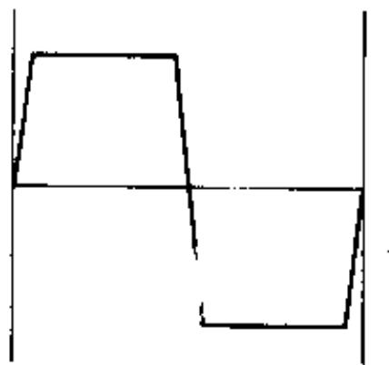  
图1-1等速型

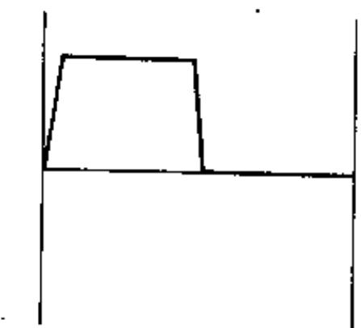  
图1-2等速型

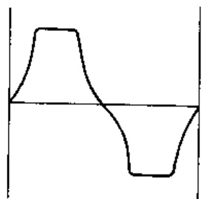  
图1-3终端减速型

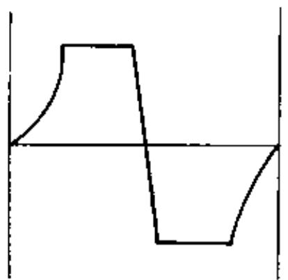  
图1-1终端减速型

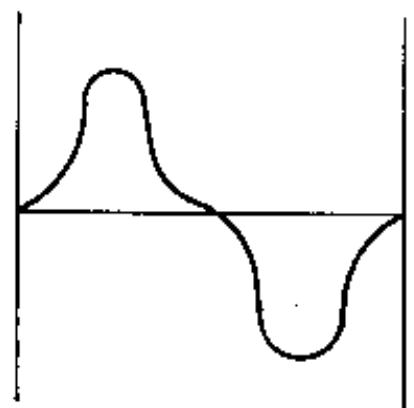  
图1-5终端减速型

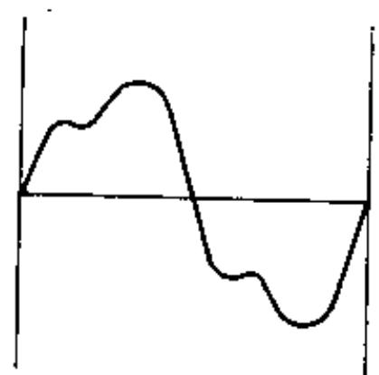  
图1-6任意变速型

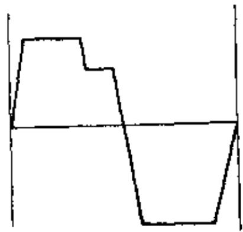  
图1-7任意变速型

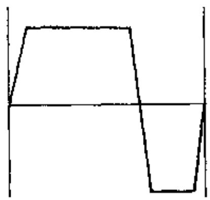  
图 $1 \cdot 8$ 等速快速返回型

  
图1-9终端减速快速返回型

为了明确地表示机构的速度特性，在手册中，对一部分机构，附有速度特性曲线图。

# 5.周期时间

在速度特性曲线图中列出的最小周期时间（Tmin）这一数值，实际上很难确定。不用说，即使是同一类型的机构，只要它们的行程和载荷不同，最小周期时间也就有较大的不同。并且，只要具备了下列条件，即不考虑机构的寿命，各部分的惯性尽可能小，则可由动力的大小及驱动机构的输出功率来决定采用较高的速度。

因此，在本手册里列入的最小周期时间是一个大概的数值，然而有了这个数值，又由于对各机构都限定了行程，由此也就可以大致确定各机构所能达到的速度。所以，这个数值对于概略地了解这个机构适合子多高的速度，是很有参考价值的。另外，在考虑几个机构联动时，整个机械的周期时间，就能很快地大致推算出来。

在此说明一下，一个机构在行程中间停止时，中间停止时间作为零记入这个机构的最小周期时间。

# 6.动力源

动力源基本上分为三类，即：电气、液压、气压。

液压或气动系统如采用电气控制，就不是纯粹的液压或气动系统，但对于这种情况的动力源分类，仍以液压或气压表示。

在复合运动机构中,动力往往不是单一的，动力源分类则以：液压-电气、气压-电气等表示。

另外，原来采用气压作动力的机构，大致上都可照样采用液压；而原来采用液压的机构，不一定能够照样采用气压。

# 控制回路

在手册中，机构的顺序控制以一般的继电器电路为主体，并配合必要的液压、气动系统。液压、气动系统中的转换，由电磁阀来控制。对一部分简单的机构，省略了液压或气动系统图，其控制阀的位置，根据电气原理图是很容易推断出来的。

所用的继电器，原则上为100伏或200伏的交流继电器。在必须用直流的地方，于电气原理图上用DC标出。

所有机构的控制回路，都靠起动信号开始动作，一个动作结束以后，停止并发出终止信号。对于振动或连续回转等机构，只需要电动机的起动电路。电路中，假设起动信号是由手按压自动返回按钮PB，发出，实际上，PB可以是与别的机构连接的接点。

在手册中，几乎全部使用交流信号，为了形象化地表示波形，图中采用_(脉冲)及（阶跃）等符号。

使两个以上的自动机构控制回路连接时，如前一部分的终止信号是脉冲波，后一部分的起动信号也是脉冲波时，即可把前一部分的终止信号作为后一部分的起动信号。

如果前一部分的终止信号是阶跃波，而后一部分的起动信号是脉冲波时，可将图1-10那样的电气原理图接入到终止信号的输出接点和起动信号的输入接点中去，即增加继电器 $\pmb { { \mathbb { R } } _ { \mathbf { A } } }$ 和 $\mathbb { R } _ { \mathtt { B } }$ 。当前一部分的终止信号（阶跃波）发出，继电器 $\pmb { \mathbb { R } } _ { \mathbf { A } }$ 接通，其常开触点闭合，继电器 $\tt R _ { B }$ 也接通，由于 $\mathbf { R _ { B } }$ 的一组常闭触点串接在起动信号的输入电路中，这时断开，在后一部分的起动信号输入接点上（见图1-10中$\clubsuit$ 处)，即得到一个脉冲波。如果前一部分同时需要复位信号时，可再增加一组 $\mathbb { R } _ { \mathtt { B } }$ 的常闭或常开触点即可。当然，电路的组成应尽量减少继电器的数量，所以必须充分研究，合理运用。

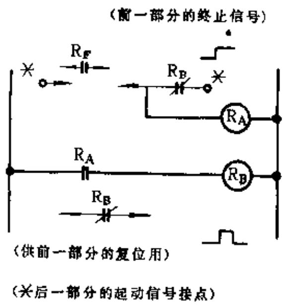  
图1--10变阶跃波为脉冲波的电气原理图

在往复运动中，在只进行了单程时，由于出现了中间终止信号，机构动作停止，之后又接到中间起动信号，机构完成余下的动作。如把这种控制回路与其它的控制回路相连接，原机构在中间停止状态时，应使另一机构动作，在另一机构动作终止后，原机构再完成余下的动作。如果这里中间终止信号是由前一个机构发出的，使原机构完成余下动作的中间起动信号由后一个机构发出，加上原机构，则形成使三个机构联动的控制顺序。

在控制回路中，很多地方使用了时间继电器，时间继电器由输入信号控制而动作，延时停止后发出终止信号。应当把它看作是一个自动化机构。如果把对时间继电器的输入信号同时作为中间终止信号，而把从时间继电器发出的输出信号作为中间起动信号，时间继电器就能代替别的自动化机构动作。

手册中火都采用限位开关来检测动作位置，用光电管、接近开关、水银开关或低压触点等也可以。但是，要用它们的输出来带动继电器时，必须进行功率放大。

此外，如果要用其它的控制回路来代替一般的继电器电路时，可参见附录--"控制回路总论”，其中提出了6类（第1类、第2类、第3类、第4类、第5-1类、第5-2类、第5-3类、第5-4类、第5-5类、第6类）常用的控制回路，每类中包括有顺序图、继电器电路、数字电路、液压或气动系统等。在书中每个机构的说明文字末尾，注明了可以参见附录一中的第几类控制回路，对于6类以外的特殊控制回路，则未加注明。

上述内容，在使用本手册时，应当首先充分理解、熟悉和掌握。

# 第二章 直线运动机构

# 偏心轴和板簧振动机构

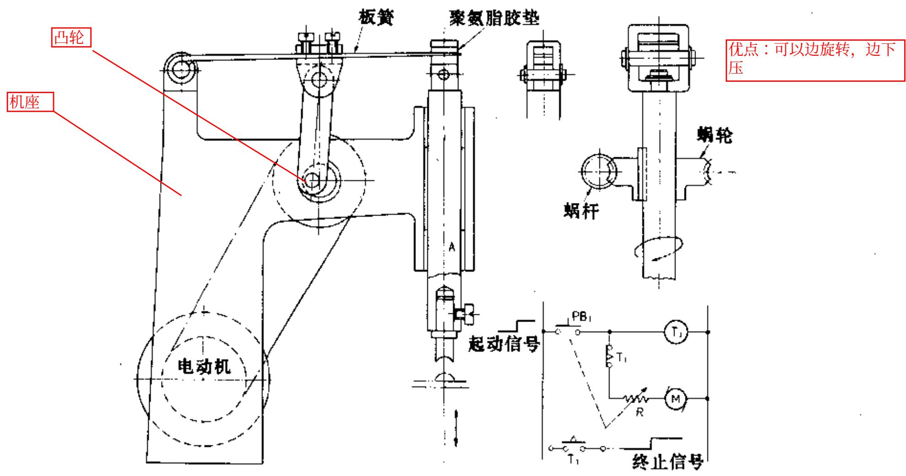

图2-1  
$\scriptstyle { \mathsf { P B } } _ { 1 }$ ：带可变电阻的脚踏开关  
$\boldsymbol { \mathsf { T } } _ { 1 }$ ：时间继电器（控制铆接时间）  
M电动机  
动力：电气  
行程：0\~5毫米  
载荷：轻

图2-1是利用偏心轴和板簧的振动机构。电动机通过聚氨脂胶带带动偏心轴，再由连杆摆动板簧。在板簧的一端，用聚氨脂胶垫与主轴连接，使主轴的上下运动得以缓冲。

# 设计要点

1。主轴的轴承采用含油轴承。电动机的转

速要可调。

2．如图所示,用于铆接时应同时通过电动机带动蜗杆、蜗轮机构，使A轴边旋转、边上下运动。

# 使用要点

本机构主要用于小零件的铆接。与气动压力机冲头等动作单一的冲压方式比较，这种反复动作的方式，其优点是对狭小而弯曲的工件铆接力影响较小，变形极小。

# 其 它

参阅附录一第3类控制回路。

# 电磁铁和弹簧共振铆接机构

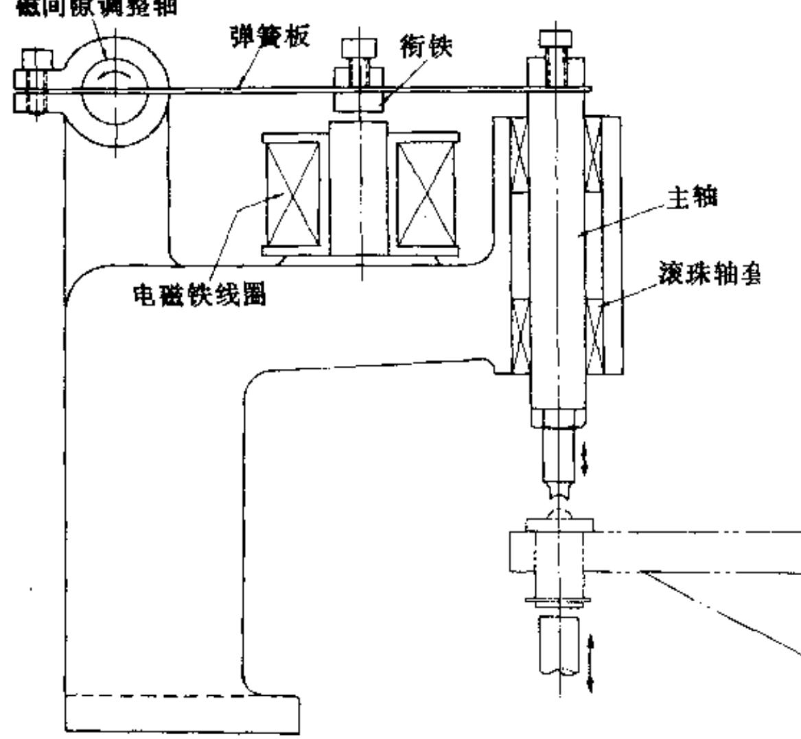  
图2-2

$\pmb { \mathrm { P } } \pmb { \mathrm { B } } _ { 1 }$ ：准备按钮  
$\bar { \mathbf { P B } } _ { 2 }$ ：停止按钮  
$\mathbf { P B } _ { 3 }$ ：起动按钮  
$\mathbf { L } \mathbf { S _ { 1 } }$ ：工作台转动完毕接通一下  
V：电磁铁  
${ \bf T } _ { \perp }$ ：时间继电器 (控制铆接时间)  
$\mathbf { M }$ ：电动机 (控制工作台周期转动)  
$\mathbf { M } _ { \mathbf { g } }$ ：电磁离合器 (控制工作台周期转动)  
动力：电气  
行程：0～5毫米  
载荷：轻

图2-2是利用外加半波整流电源给电磁铁线圈供电，使弹簧板共振的上下运动机构。

# 设计要点

1．要精确计算主轴重量，以保证不防碍共振。

2．主轴外表面应淬火、磨削。

3，采用滚动轴套，使主轴动作灵活。

4．衔铁振动时，为防止直接碰撞线圈铁芯端面，应装设能微调的磁间隙调整轴。

# 使用要点

本机构适用于易变形的小直径工件的铆接。调节可变电阻器，可使铆接力自由地无级变化。

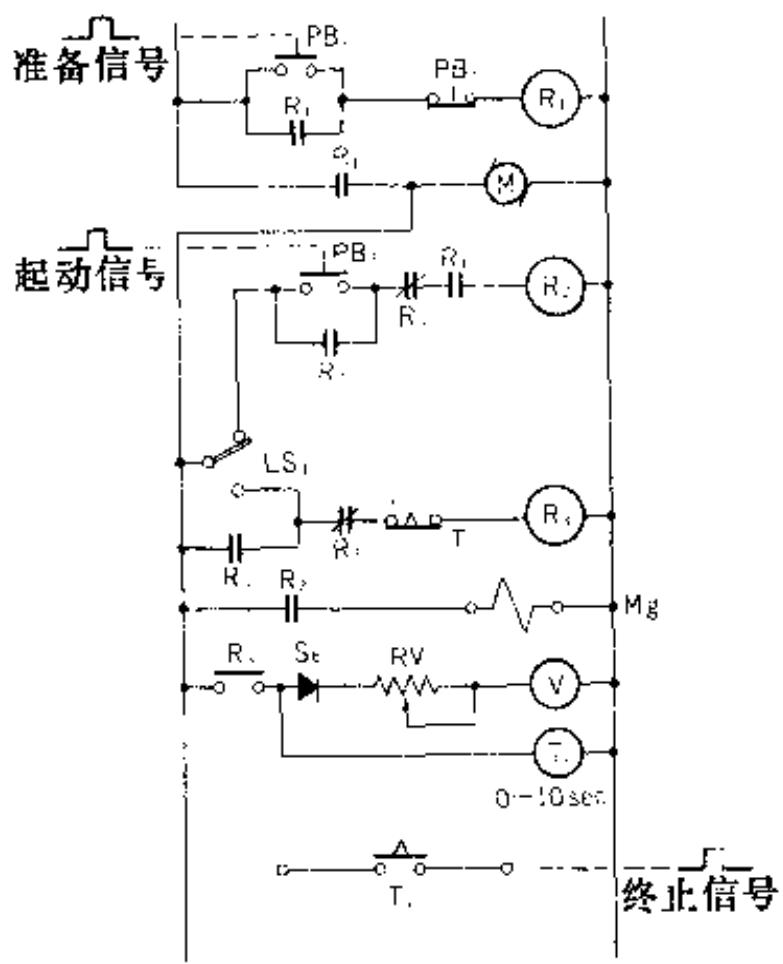

# 偏心轴和杠杆振动机构

了解每种材料自身 频率，防止振动时 产生共振现象，导 致设备损坏

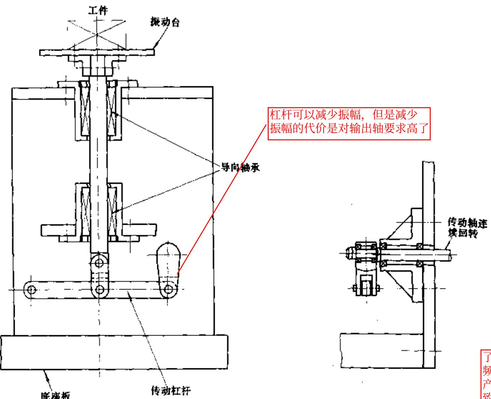  
图2-3动力：电气行程： $\ell \sim 5$ 毫米载荷：中

图2-3是由曲柄运动转换的上下振动机构。由于利用杠杆缩小了活动部分的振幅（缺点是加大了活动部分的重量)，所以能获得准确的振幅值。

# 设计要点

1．应尽量减小活动部分（振动部分）的质量。底座板等的结构要坚固，质量要大。

2.偏心轴的轴承应采用负荷足够的滚动轴承。如果供油机构完善，也可用轴套代替滚

动轴承。但在高速回转情况下，因产生摩擦烧伤等问题，故不宜用轴套。

3．对整体结构要注意共振对各部分强度的影响，特别要注意可能引起的松动。

# 、制造要点

1．要保证活动轴的加工精度，特别是与导向轴承配合部分的尺寸精度，并要进行淬火、磨削，以提高耐磨性。

2.螺栓紧固部分在试车运转之后要再拧紧，最好用销子防止松动。

# 其 它

参阅附录一第1类控制回路。

# 偏心轴振动机构

  
图2-4动力：电气行程： ${ \mathfrak { G } } \sim { \mathfrak { H } }$ 毫米载荷：中

滚动轴承承载压力相对较大，能够很好的确保工件的灵活性

图2-4是由小曲柄运动转换的上下振动机构。可用于轻小型工件的振动试验。

# 设计要点

1．要求活动部分质量尽可能小,非活动部分（如底座板等）质量要大。

2．导向轴承与主轴的配合，以及轴的淬火硬度，可参考轴承产品样本中的数值确定。

3．振动机构设计的要点在于考虑各部分不发生共振及异常振动现象。

4．轴承部分应尽量采用滚动轴承，以使动作灵活。

制造要点

1．各螺栓紧固处应使用弹簧垫圈，或采用螺纹锁紧等方法，防止因振动而产生螺栓松动。

2．要保证上下两个轴承的同轴度。

# 其 它

参阅附录一第1类控制回路。

# 偏心凸轮小行程上下运动机构

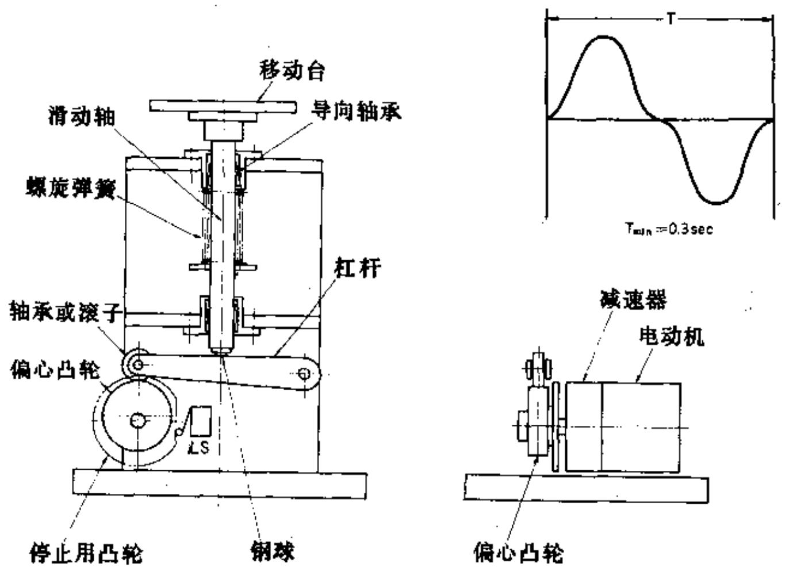

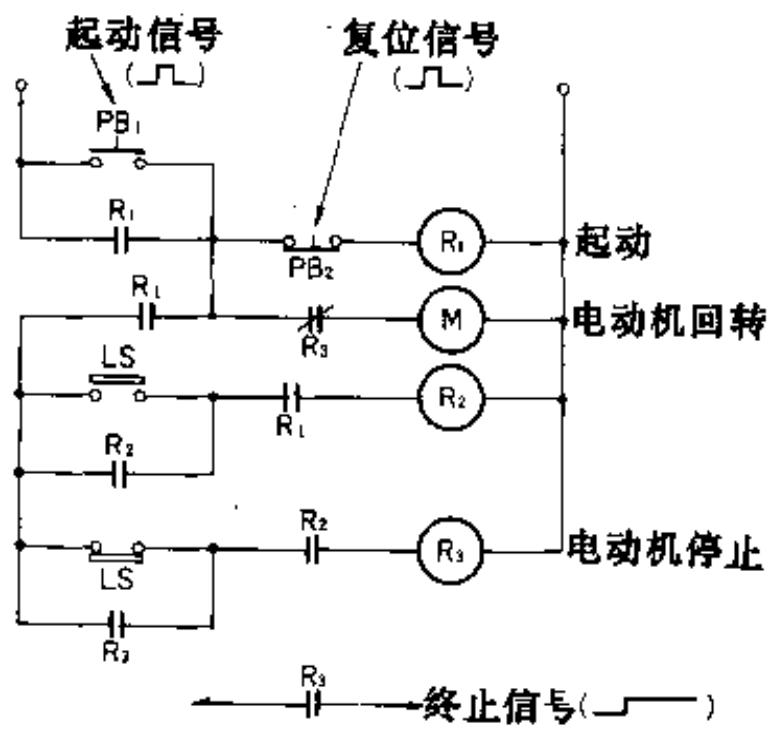

图2-5是利用偏心凸轮并通过杠杆比缩小行程的小行程上下运动机构。可用各种形状的凸轮来代替偏心凸轮，这样就能得到各种各样的动作。

# 设计要点

1.滑动轴的淬火硬度及与导向轴承的配合，可参考轴承产品样本中的数值确定。2．偏心凸轮载荷小时，也可以不淬火。但在这种情况下，从动机构应加滚动轴承。3．滑动轴端部装单个钢球的地方，如经适当的安装，也可采用滚动轴承。

# 制造要点

上下两个导向轴承的中心位置要正确。如果中心有偏移，动作就不灵活，并将增加滑动轴的磨损。

# 其 它

参阅附录一第2类控制回路。

# 棘爪和凸轮间歇进给机构

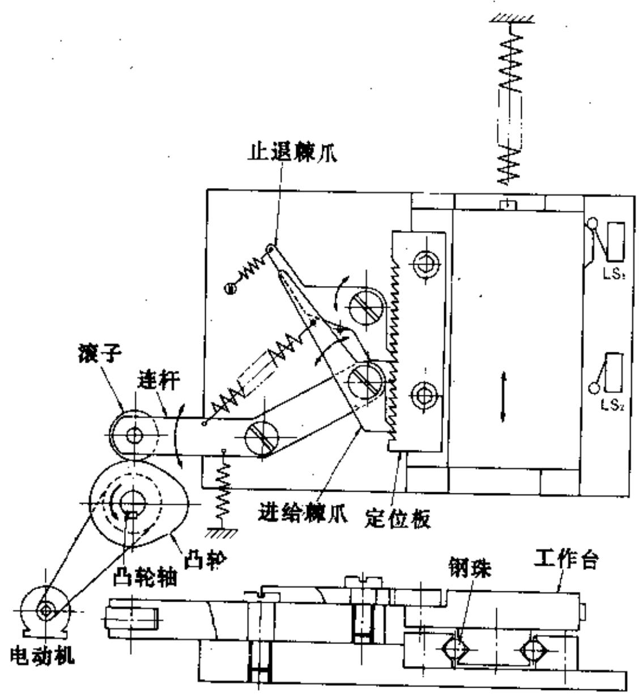

图2-6  
动力：电气  
行程： $0 \sim 1 0$ 毫米  
载荷：轻

图2-6是由凸轮使带有进给棘爪的连杆摆动，从而使工作台间歇进给的机构。

# 设计要点

为了使止退棘爪可靠地跳入齿间，进给棘 爪的行程要比所进给的齿距大一些。

# 使用实例

工作台的间歇进给。

其 它

0 RR起动信号 LPB LS LS 前进端 原位置R 起动终止信号（）

参阅附录一第2类控制回路。

# 重力和齿条步进式下降直线运动机构

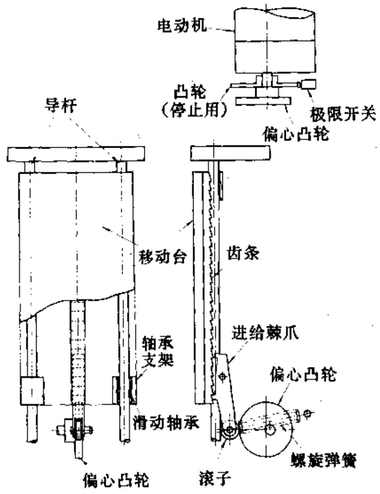  
图2-7动力：电气行程： $\{ \sim 1 0$ 毫米载荷：轻

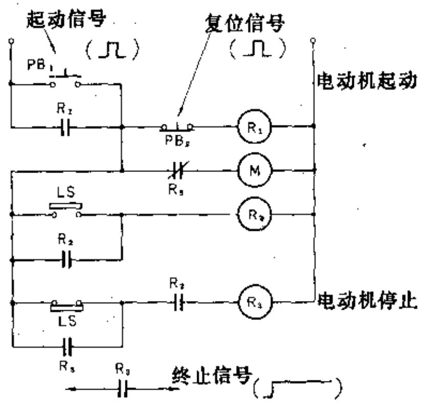

图2-7是利用齿条作垂直步进动作的机构。因为利用重力下降，所以如用作水平方向运动时，须用其它方法代替重力。本图省略了移动台的复位机构，一般可采用电动机、气缸等复位。

# 设计要点

1．齿条及进给棘爪应具有足够的强度，设计时应考虑由于冲击、磨损等产生的故障。

2．滑动轴承与导杆的间隙，导杆的淬火硬

度等，可参考轴承产品样本中的数值确定。

# 盘形凸轮直线运动机构

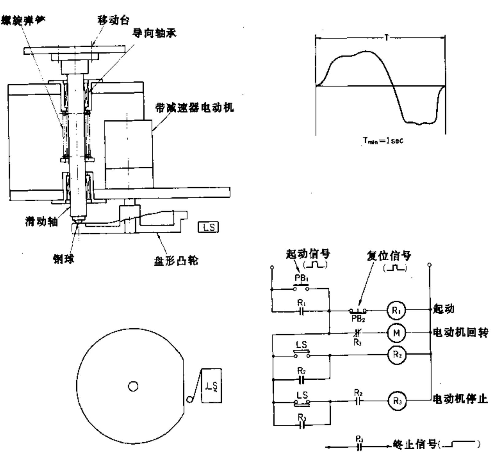  
图2-8动力：电气行程： $0 \sim 1 0$ 毫米载荷：中

图2-8是通过盘形凸轮实现小行程上下运动的机构。适当改变盘形凸轮的轮廓形状，就能获得任意动作。

# 设计要点

1．滑动轴的淬火硬度及与导向轴承的配合，可参考轴承产品样本中的数值确定。

2．设计时应考虑盘形凸轮的加工工艺性。

3．盘形凸轮的从动机构，除可用钢球外，

也可采用滚动轴承、滚子等能减少摩擦的结构。

# 制造要点

「，要保证上下两个轴承的同轴度。

2，如有必要,在盘形凸轮下面，可采用轴承支承结构。

# 其 它

参阅附录一第2类控制回路。

# 曲柄圆盘直线运动机构

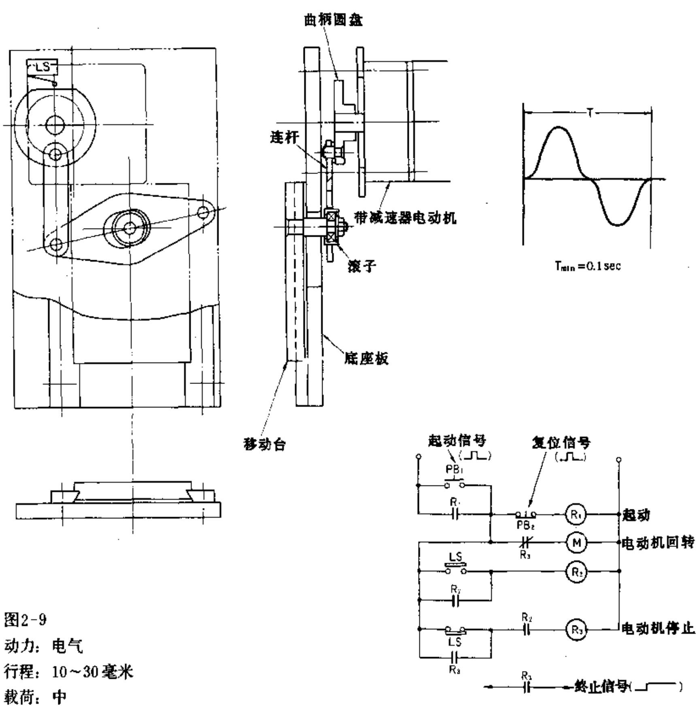

图2-9是由曲柄圆盘使移动台在燕尾槽中上下运动的机构。移动台的行程仅为曲柄运动行程的一半，故功率增加了一倍。估算功率时，要考虑加在滑动台的静载荷及摩擦系数等因素，并应留有充分的余量，以保证工作可靠。

# 设计要点

1．注意滑动部分（燕尾槽）的平行度及

角度误差。

2。燕尾槽和滑动台采用相互摩擦系数小的材料（如碳钢铸件与青铜铸件，或普通结构钢与青铜铸件),并要设置适当的润滑供油机构。

# 其 它

参阅附录一第2类控制回路。

# 曲柄和杠杆上下运动机构

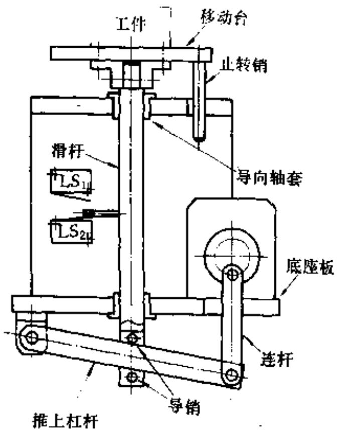  
图2-10动力：电气行程： $1 0 \sim 3 0$ 毫米载荷：中

图2-10是由电动机的回转通过减速器带动曲柄实现上下运动的机构。需要在上升位置停止时，没有锁紧机构就不稳定。

# 设计要点

1．滑动部分导向轴套的材料,采用易切削的黄铜棒或聚四氟乙烯等。也可采用导向轴承。

2．滑杆的材料、淬火硬度以及与轴承的配合精度等，均参考轴承产品样本中的数值确定。

3．采用图示的导向轴套时，需设置适当的润滑供油机构。

# 制造要点

1．上下两个轴套的同轴度应严格保证。若中心位置偏离，滑动就不灵活。

2．注意滑动部分的加工精度。

# 其 它

参阅附录一第3类控制回路。

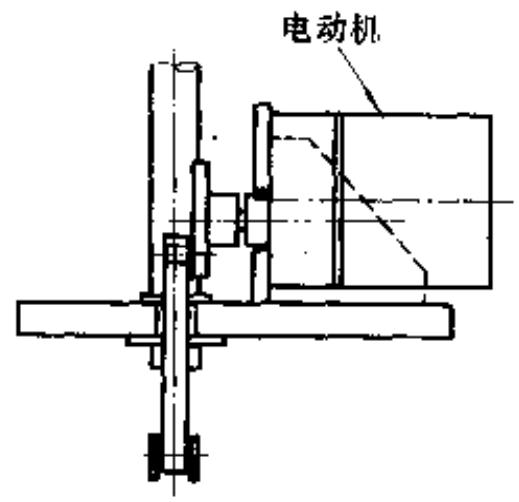

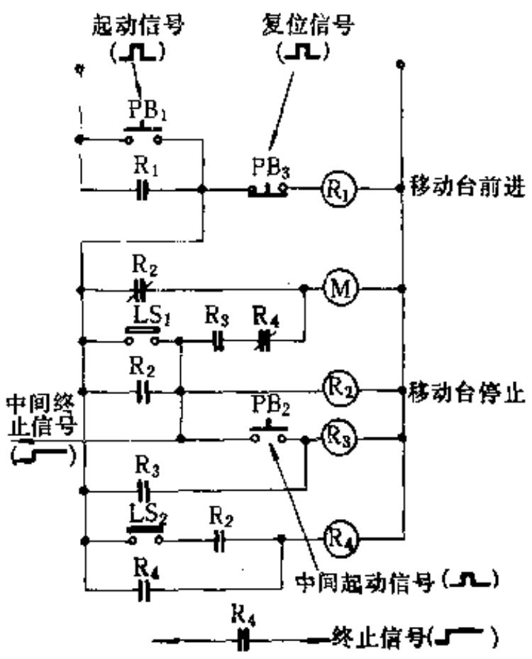

# 肘节和凸轮上下运动机构

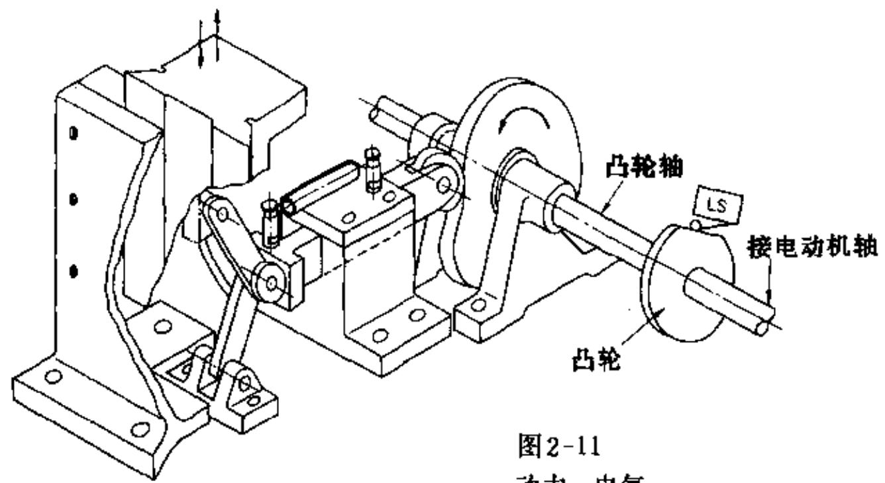  
动力：电气行程： $0 \sim 3 0$ 毫米载荷：重

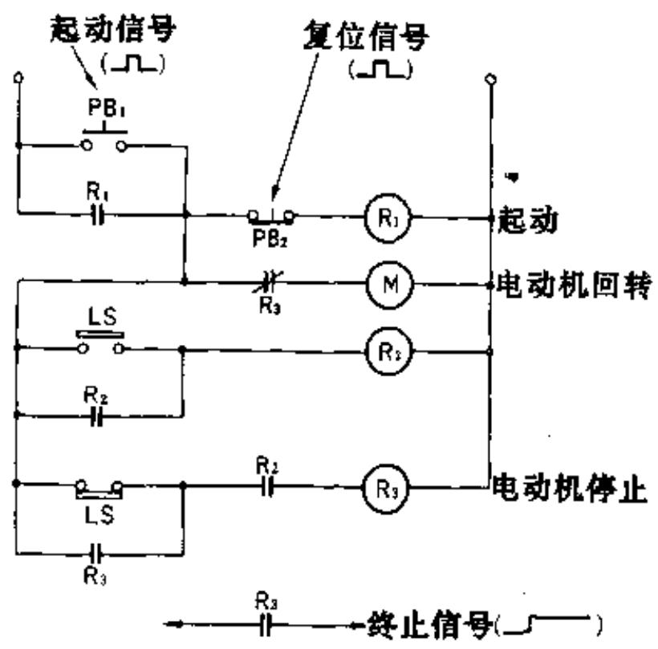

图2-11是利用肘节和凸轮的上下运动机构。

# 设计要点

1．图中机构没有力的缓冲之处，所以在实际应用时，必须在机构的动作面设置缓冲装置（如弹簧等）。2．左右滑动部分需考虑其表面承受的压力。滚子要淬火。

# 制造要点

1．注意凸轮轮廓上死点面的不圆度。2．注意铰接部分的加工精度，避免发生  
松动。3．托架必须安装定位销。使用实例夹紧等。其它1．考虑到可能发生过载,有必要在传动装  
置上装设安全销等。2.参阅附录一第2类控制回路。

# 凸轮轴上下运动机构

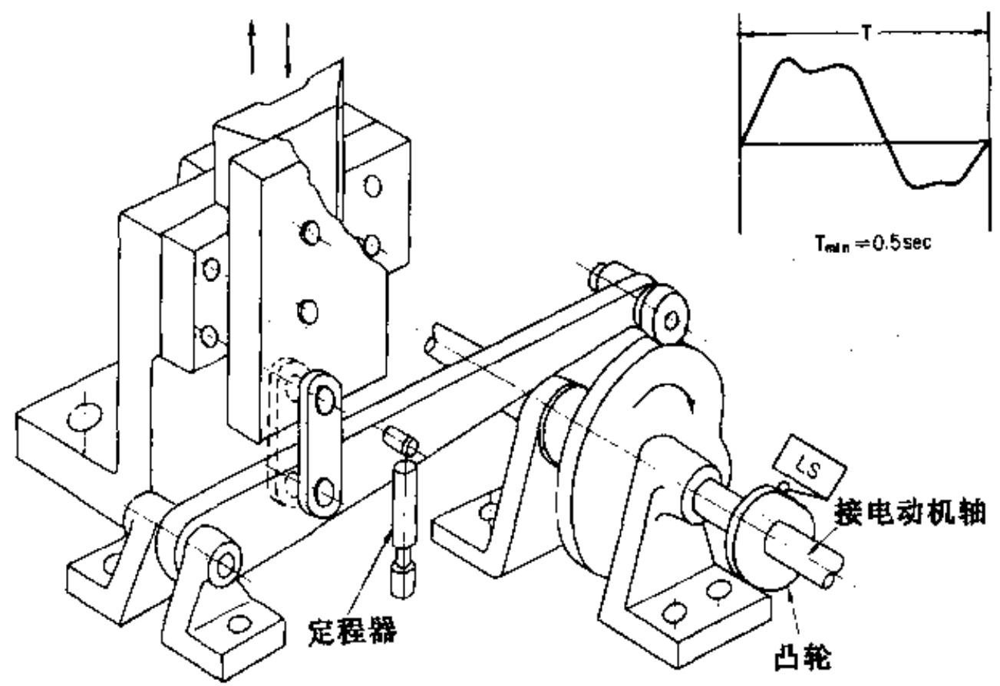  
图2-12动力：电气行程： $1 0 \sim 3 0$ 毫米载荷：重

图2-12是利用凸轮轴的上下运动机构。

# 设计要点

1．由于使用杠杆，负载在回转轴的旁边，杠杆上下摆动时，前端的滚子有左右偏移的危险，所以必须增强杠杆左右方向的刚性。

2．因滑动面是垂直的，必须考虑保证润滑。油槽要深，并使用黄油，维护较方便。

# 制造要点

1．制造凸轮时，要注意上死点的不圆度。上升面的加工要求精确。

2．滑动面因使用燕尾槽，槽两侧可用组合装配，并在一侧采用微调。按本例的情况，装配时保证中心线是没有多大问题的。

# 使用实例

托板的推上等。

其 它

参阅附录一第2类控制回路。

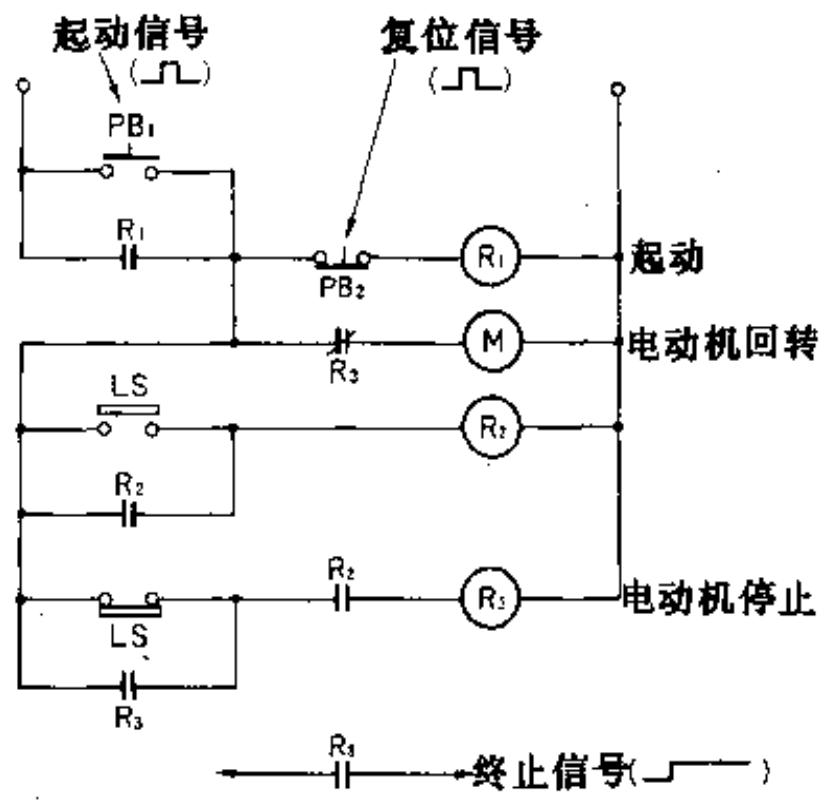

# 连杆、扇形齿轮和齿条轴下降机构

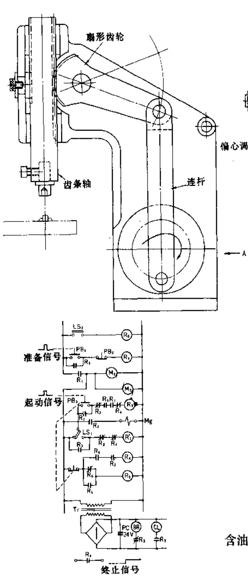  
图2-13  
图2-13是由偏心轮通过连杆、扇形齿轮使齿条轴（主轴）下降的机构之一。转动偏心调节螺栓，改变偏心轮的偏心量，即能使主轴的行程得到调整。

$\mathbf { L } \pmb { S } _ { \mathbf { l } }$ ：工作台转动完毕接通--下  
$\mathbf { L } \mathbf { S } _ { 2 }$ ：齿条轴上死点接通  
$\mathbf { M } _ { \mathsf { I } }$ ：电动机 (控制工作台周期转动)  
$\mathbf { M } _ { 2 }$ ：齿条轴上下用电动机(带离合器、制动器)  
$\mathbf { M } _ { \widetilde { \mathbf { z } } }$ ：电磁离合器 (控制工作台周期转动)  
$\mathbf { B R }$ ： $\mathbf { M } _ { 2 }$ 附带的制动器  
$\mathbf { C L _ { i } }$ $\mathbf { M } _ { 2 }$ 附带的离合器  
$\mathbf { P B } _ { 1 }$ ：准备按钮  
$\mathbb { P } \mathbb { B } _ { 2 } ,$ 停止按钮  
$\mathbf { P B } _ { 3 }$ ：起动按钮  
动力：电气  
行程： $1 0 \sim 5 0$ 毫米  
载荷：中

# 设计要点

从维护各轴的转动考虑，使用滚动轴承或含油轴承为好。

# 使用要点

用在自动机上，主要供轻型工件压入。另外，如把主轴设计成能同时回转的复合运动机构，则可用作简单的卷边铆接工作。

其 它

参阅附录一第5-4类控制回路。

# 齿轮、齿条上下运动机构

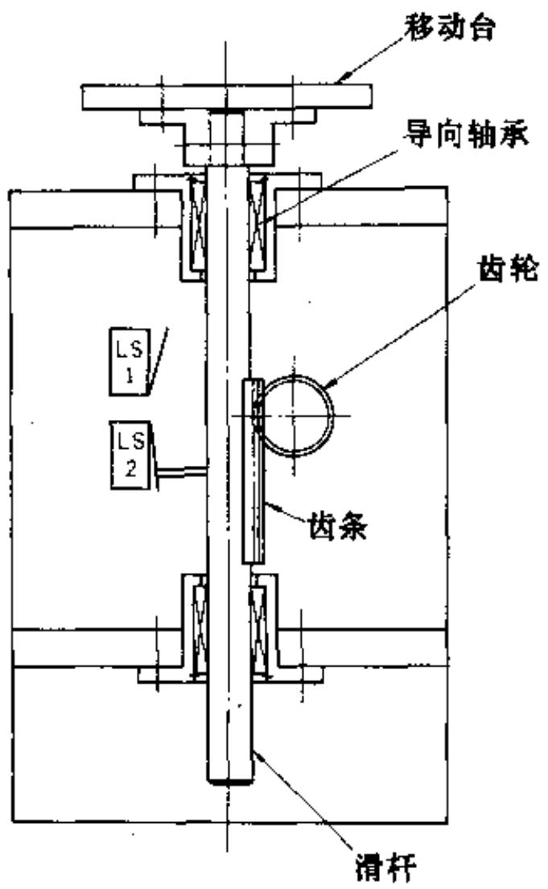  
图2-14动力：电气行程： $1 0 \sim 1 0 0$ 毫米载荷：中

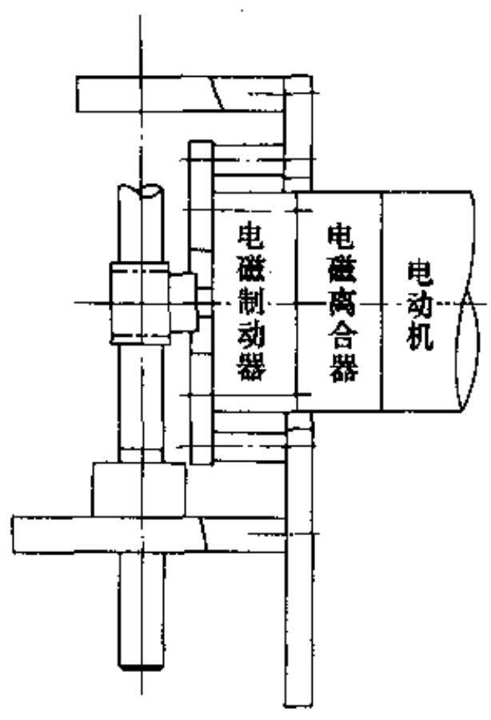

# 设计要点

1．滑杆需经淬火、磨削。其淬火硬度及与轴承的配合精度，可参考轴承产品样本中的数值确定。

2．滑杆应有止转销或键。

3，限位开关的安装方法(如图2-14所示)，应考虑即使有一定的越程时，也不会损坏。

4.盘形电磁离合器及电磁制动器所能承 受的传输转矩和制动转矩，要有充分的余量。

5.齿轮的轴承部分要能承受足够大的负荷。

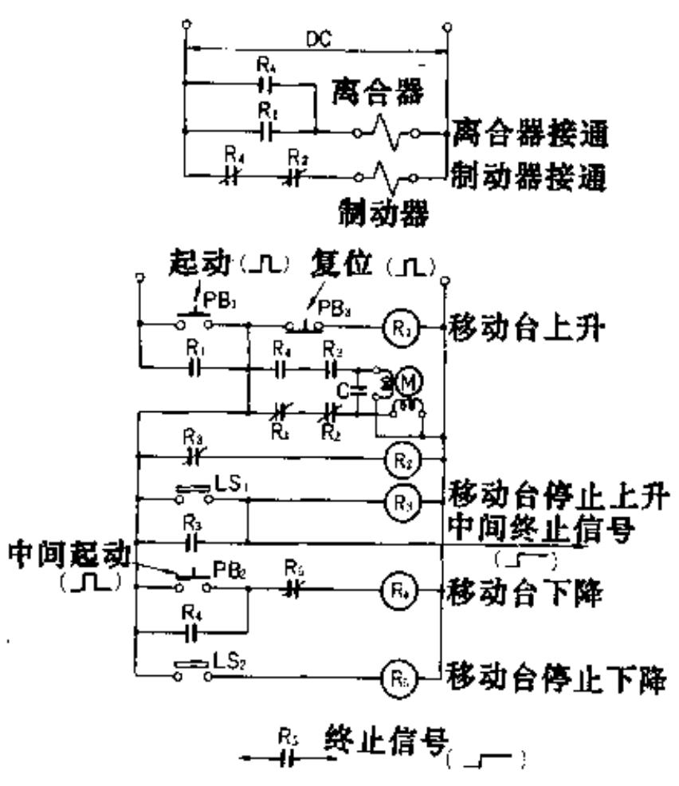  
图2-14是通过齿轮、齿条得到上升或下降运动的机构。移动台在上升过程中，可使之在任意位置停止，但这时必须改变控制电路。

制造要点

要保证上下两个导向轴承的同轴度。电磁离合器、电磁制动器以及电动机的同轴度也要保证。

# 曲柄上下运动机构

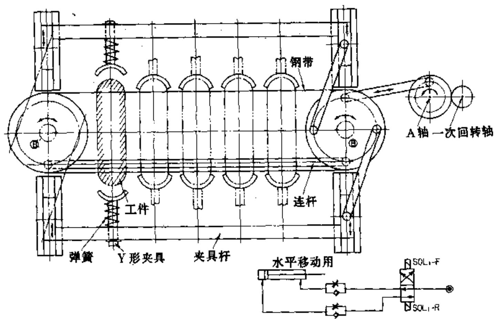

图2-15  
$\mathbf { P B } _ { \mathbf { l } }$ ：准备按钮  
$P B _ { 2 } ,$ 停止按钮  
$\mathbf { M }$ ：电动机 (控制夹具周期动作）  
$\mathbf { M } _ { \mathbf { \delta \xi } }$ ：电磁离合器(控制夹具周期动作)  
$\mathbf { S } \boldsymbol { 0 } \mathbf { L } _ { 1 }$ ：水平移动用电磁换向阀（二位）  
${ \bf { L } } \bar { \bf { S } } _ { \bf { l } }$ ：压力机上升途中接通一下  
$\mathbf { L } \mathfrak { S } _ { 2 } \mathrm { : }$ 于回转轴一定位置接通  
$\mathbf { L } \bar { \mathbf { S } } _ { 3 }$ ：水平移动返回接通  
$\mathbf { L S _ { 4 } }$ ：水平移动前进接通  
$\mathbf { L S } _ { 5 }$ ：回转轴转动过程中接通一下（电磁离合器切断用转换开关）  
动力：电气  
行程： $1 0 \sim 1 0 0$ 毫米  
载荷：中

图2-15所示是曲柄上下运动机构。回转轴每转一圈，A轴转动半圈。B轴和 $\mathbf { B ^ { \prime } }$ 轴通过连杆同时摆动，使夹具杆开闭。本机构可同时装夹几个椭圆形工件。

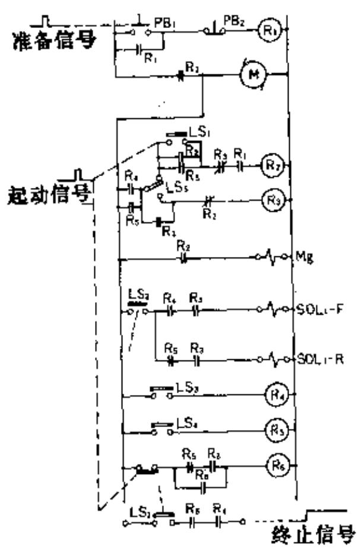

# 设计要点

1．考虑到被装夹各工件的微小尺寸误差，夾具杆上各Y形夹具应有弹簧夹紧结构。

2．采用钢带或连杆使B轴和B'轴联动。

使用要点

本机构多用于连续自动压力机的工件送进部分。在此情况下，不能不使各个Y形夹具的形状多少有些改变。另外，工件的夹紧与控制水平移动的凸轮必须同步。

# 进给丝杠直线运动机构

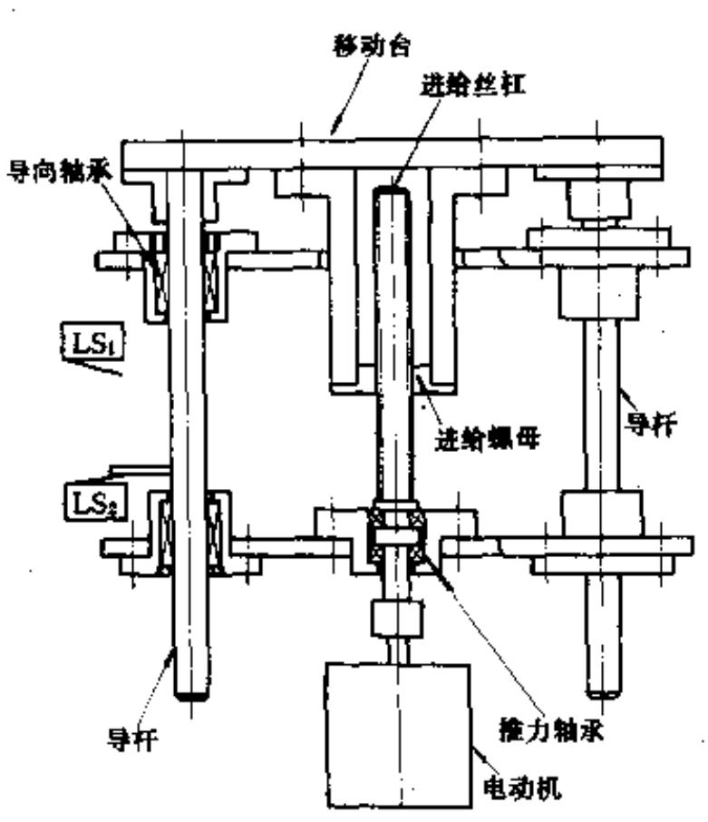  
图2-16动力：电气行程： $1 0 \sim 2 0 0$ 毫米载荷：重

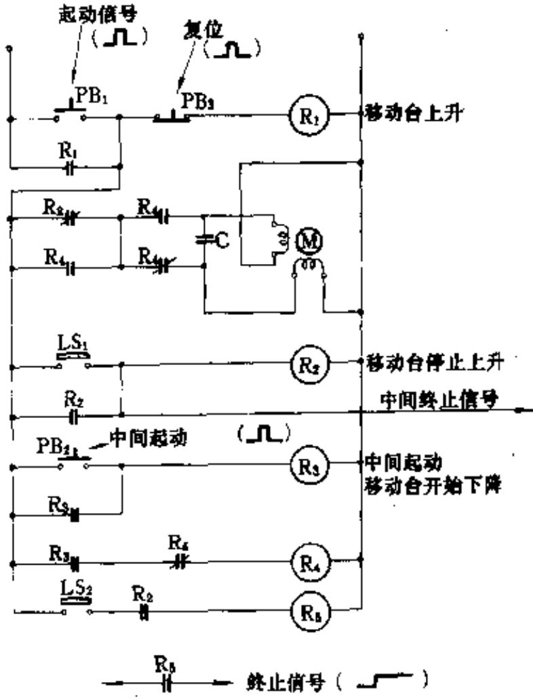

图2-16是通过进给丝杠使工作台升降的机构。其升降速度虽较缓慢，但是动作平稳。

# 设计要点

1．注意进给丝杠的轴向支承。2．两根导杆之间的距离应尽量设计小些，以使动作灵活。3，电动机轴与进给丝杠采用十字滑块联轴节连接较为理想。

4．进给丝杠的导角如取得太大(相对于丝杠直径）则不能自锁，电动机停止时，必须有锁紧机构.5．导杆的淬火硬度及与轴承的配合精度，可参考轴承产品样本中的数值确定。

# 制造要点

要保证两导杆的平行度，及上下导向轴承支架的同轴度。

# 凸轮轴上下运动机构

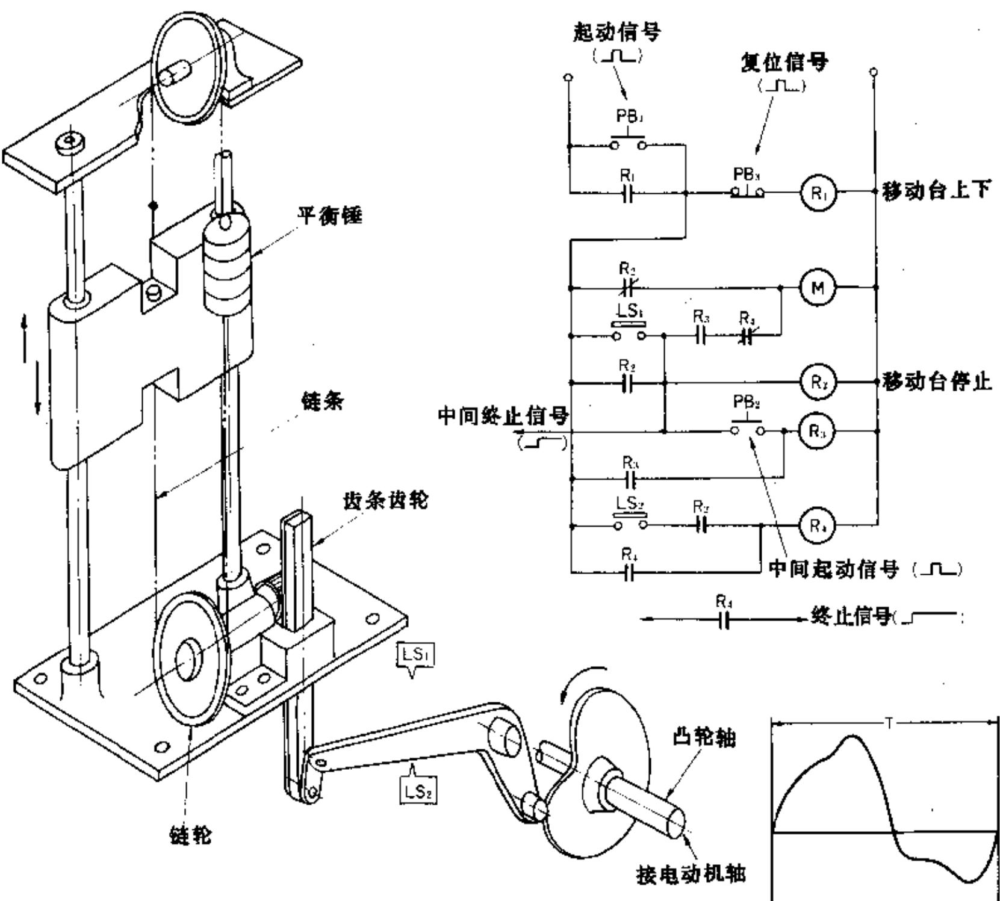  
图2-17动力：电气行程： $5 0 \sim 5 0 0$ 毫米载荷：中  
Tn=2sec $\mathsf { S } _ { \mathsf { T } } = 3 0 0 \mathsf { m m }$

图2-17是利用凸轮轴并采用杠杆扩大行程的上下运动机构。

# 设计要点

1．由于采用大的扩大比易产生松动，所以要特别注意防止松动。但是齿条、齿轮部分的啮合不能过紧。

2．由于杠杆、凸轮处负荷很大，应注意刚

性及凸轮压力角。

制造要点

充分注意导杆与滑块的配合。

使用实例

升降机等。

其 它

参阅附录一第3类控制回路。

# 曲柄上下运动机构

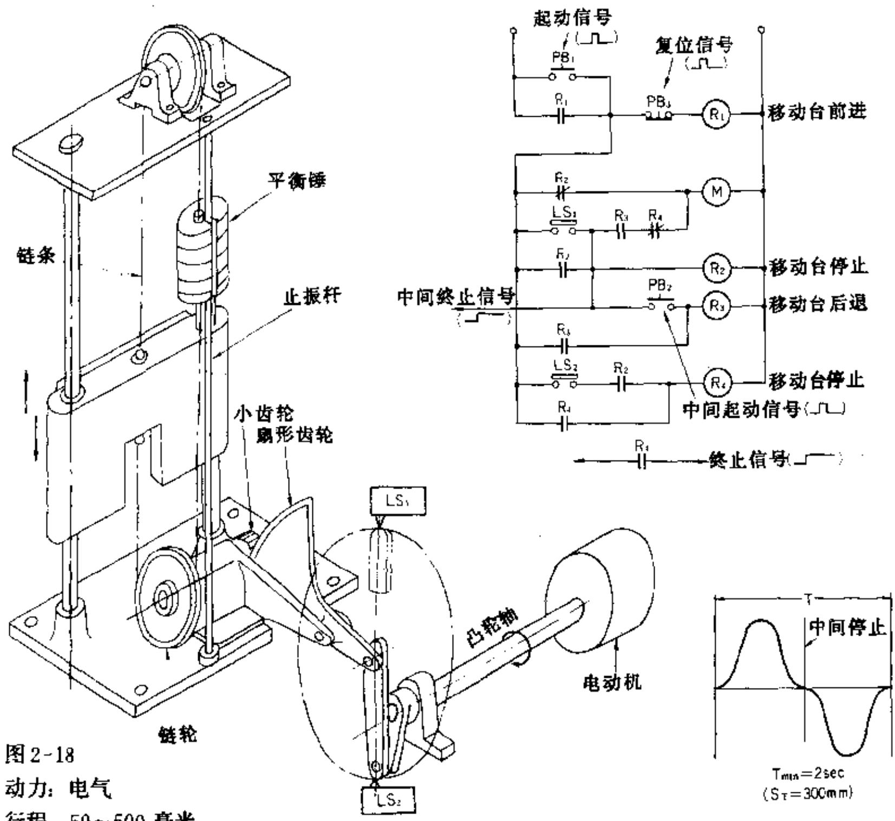  
行程： $5 0 \sim 5 0 0$ 毫米载荷：中  
图2-18是利用曲柄并通过扇形齿轮的力臂比来扩大行程的上下运动机构。

# 设计要点

1．由于大的扩大比易产生松动,必须注意防止松动。例如，扇形齿轮与小齿轮的间隙，可采用偏心轴进行调节。

2．滑动面使用导向滚珠，有利于装配。

3．平衡锤必须由数块组合而成，以便于调节更换。如不使用曲柄，也可使用凸轮。

# 制造要点

1．要注意齿轮的不圆度。

2，滑轨的上下板放在上下端部，应反复调整并打上销钉。但在加工质量较高时，可不必进行以上的调整。

# 使用实例

管子内，外表面的抛光等。

# 其 它

1．注意链条及平衡锤的摇晃。

2，参阅附录一第3类控制回路。

# 链条上下运动机构

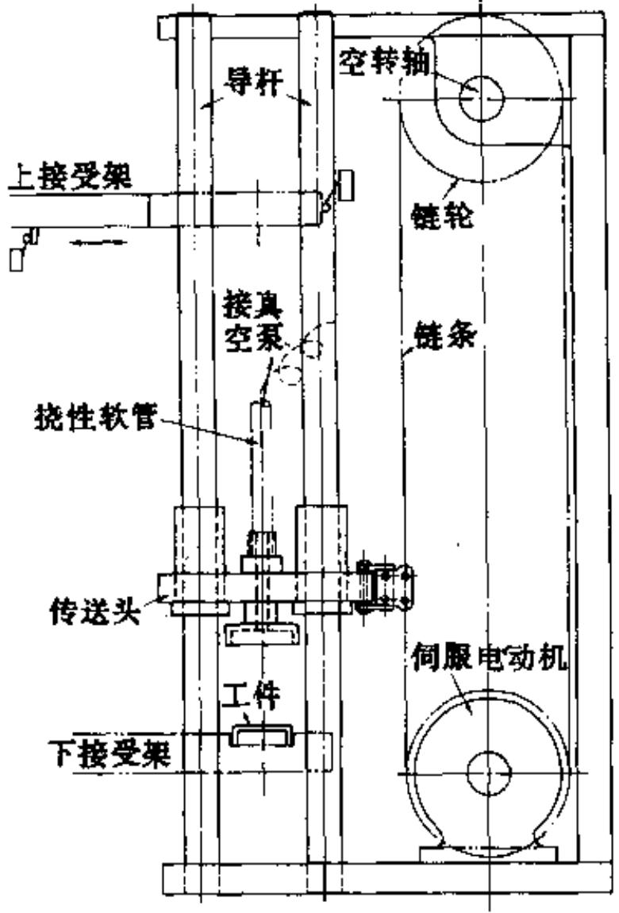

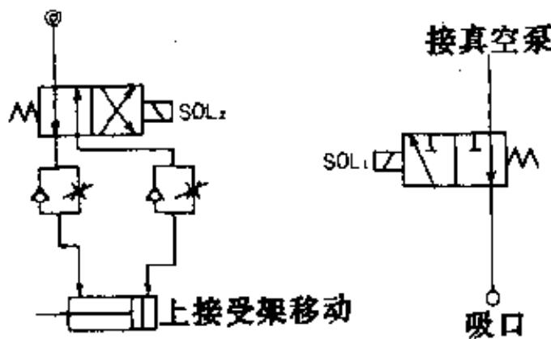  
图2--19

$\mathbf { L } \mathbb { S } _ { 1 }$ ： 传送头下死点接通  
$\mathbf { L } S _ { 2 }$ ： 传送头上死点接通  
$\mathbf { L S } _ { 3 }$ ： 上接受架前进接通  
$\mathbf { L S _ { 4 } }$ ： 上接受架后退接通  
$\mathbf { M } ,$ 驱动电动机  
PB: 起动信号  
CRM：保持型继电器接通  
CRR：保持型继电器释放  
SOLi：真空阀  
SOL2：上接受架移动电磁换向阀  
动力：电气  
行程： $1 0 0 \sim 1 0 0 0$ 毫米  
载荷：中

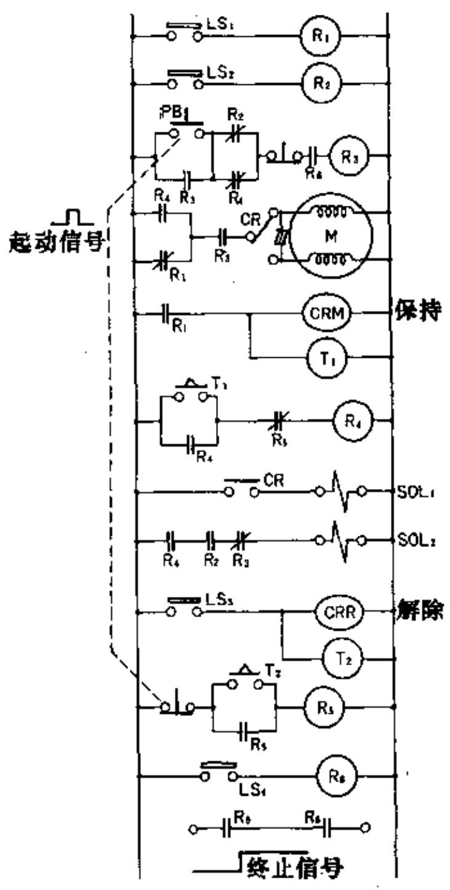  
图2-19是通过伺服电动机带动链条，使传送头上下运动的机构。

# 制造要点

1．导杆与传送头装配后，应能十分轻松地滑动。  
2．吸附工件的吸盘或卡头的软管，制成卷曲状的挠性体较好。  
3．要充分注意上接受架的控制顺序。

# 使用要点

由于使用链条，从停位精度来考虑，本机构不适于搬运重物，专门用于轻型工件的移动、输送。如能保证导杆的平行度，它的行程可达1米左右。

# 钢丝绳上下运动机构

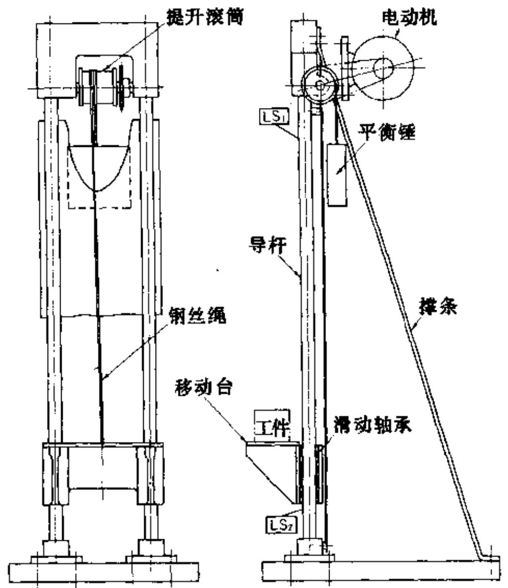  
图2-20是升降式的上下运动机构。如能增强导杆的稳定性，就可得到较大的行程。

# 设计要点

1．导杆与滑动轴承的配合精度，可参考轴承产品样本中的数值确定。

起动信号 复位PB PP /PB ?一移动台上升制动电动机LS中 ?升PB ? 中间起动移动台开始下降?S ?-终止信

2．要充分考虑导杆的稳定性。

3．提升用的钢丝绳，采用不锈钢丝制的为好。

# 制造要点

1．注意导杆的平行度及移动台两个导向部分的平行度。

2．导杆需经淬火、磨削。其淬火硬度可参考轴承产品样本中的数值确定。

图2-20  
动力：电气  
行程： $\mathrm { 1 0 0 } \sim \mathrm { 1 0 0 0 }$ 毫米  
载荷：中

3．为防止提升滚筒与钢丝绳的打滑，可增加提升滚筒上钢丝绳的缠绕圈数。

# 其 它

参阅附录一第3类控制回路。

# 并列夹紧机构

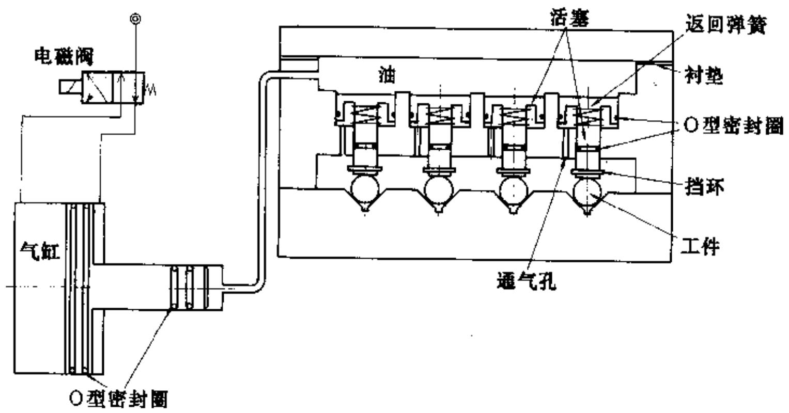

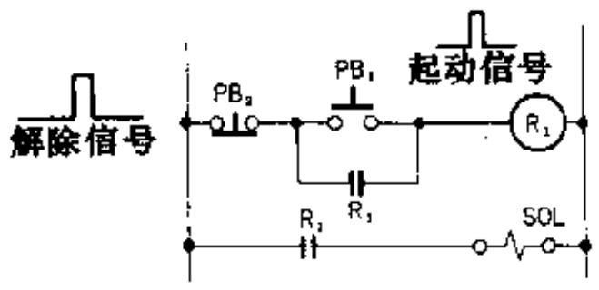

图2-21是由气动转换为液压，产生强压力的上下加压机构。即使各活塞的行程不一样，但所加的压力仍是一致的。

# 设计要点

1．在设计上不会有特殊的问题。当然，衬垫、O型密封圈等必须耐油，而且要有足够的备件。

2.各个夹紧活塞的腔内一定要设置通气孔。

# 使用要点

图2-21  
$\scriptstyle \mathbf { P B } _ { 1 }$ ： 开始夹紧按钮$\mathbf { P } \mathbf { B } _ { 2 }$ ： 解除夹紧按钮$\mathbb { s o l }$ ： 电磁控制阀  
动力：气压-液压  
行程： $0 \sim 1 0$ 毫米  
载荷：重

图2-21所示是由气动转换为液压来进行同时夹紧几个工件的情况。其优点是尽管工件直径稍有不同，并且夹具有制造误差，但都能准确可靠地夹紧。

# 使用实例

用作铣床夹具，可将多个工件并列起来切削加工。

# 其 它

参阅附录一第1类控制回路。

# 均衡夹紧机构

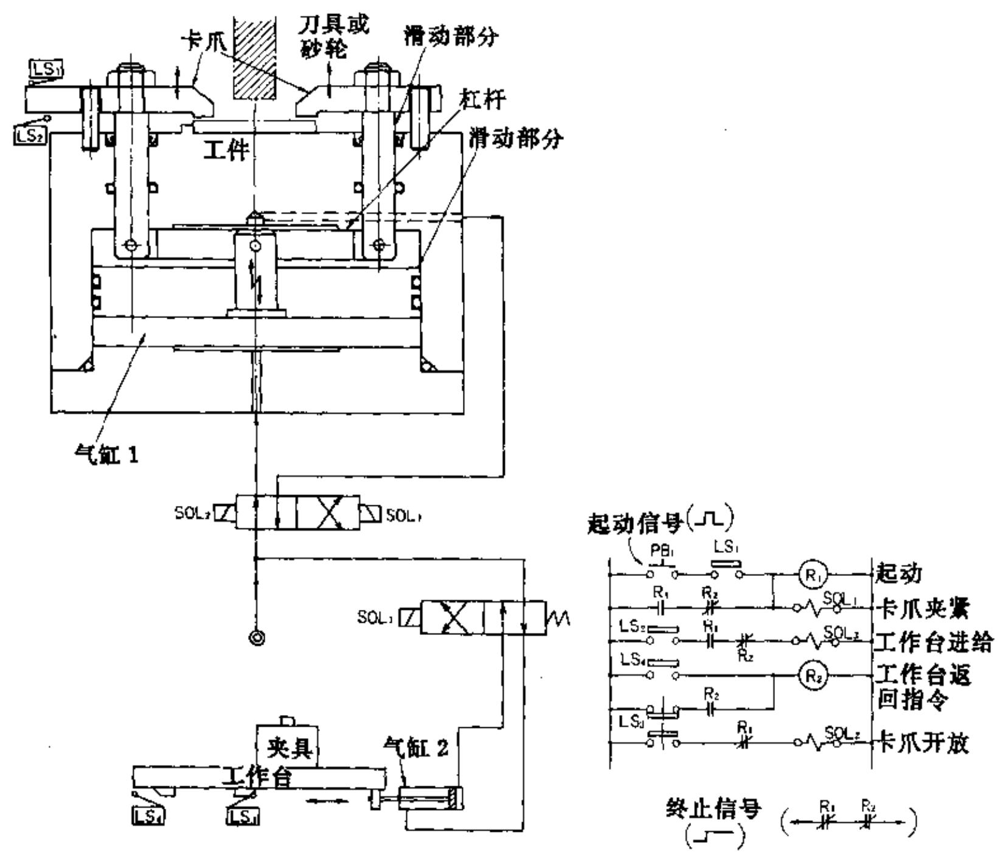  
图2-22动力：气压行程： $\Updownarrow \sim 3 0$ 毫米载荷：中

图2-22是用于均衡夹紧工件的上下运动机构。

设计要点

1．设计时要考虑防止磨粉、切屑落到工件的供给部分。

2．为防止在操作时因停电而发生危险，应使用双电磁无弹簧式换向阀，万一停电，阀门仍保持原状。

3．要考虑薄工件的翘曲。  
4．要考虑O型密封圈的更换方便。使用实例  
压紧被磨削或被切削的工件。

# 气缸和扇形齿轮直线运动机构

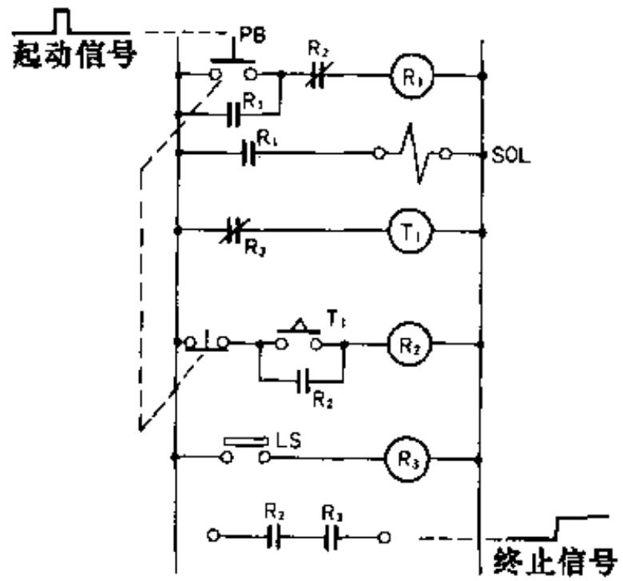

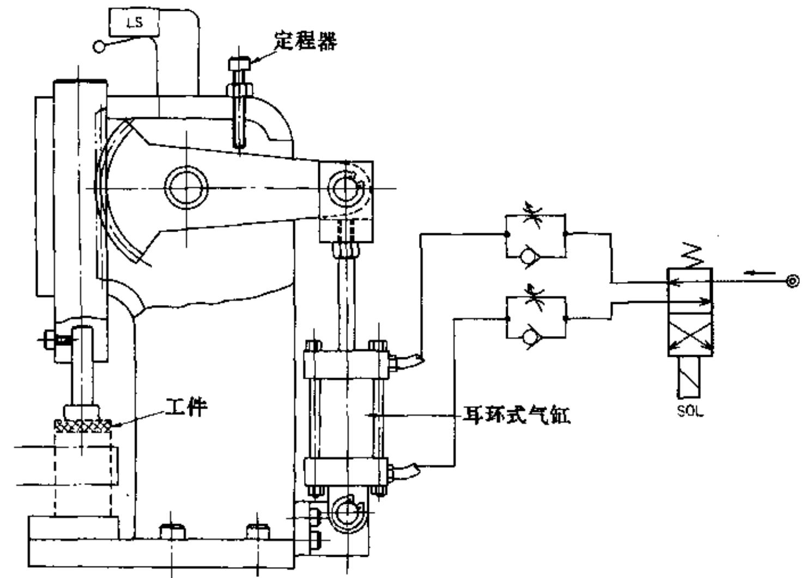  
图2-23是通过扇形齿轮、齿条把耳环式或耳轴式气缸的输出功率转换成上下运动的机构。图中所示为铆接工件的实例。

图2-23  
PB: 起动控钮  
SOL：铆接用电磁控制阀  
Ti: 时间继电器 (控制铆接时间)  
LS: 铆接上死点接通  
动力：气压  
行程： $1 0 \sim 5 0$ 毫米  
载荷：中

# 设计要点

由于铆接力取在靠近扇形齿轮支点的一侧，可将气缸输出功率增加10倍左右。齿条直接采用铸铁件支承。行程调节靠定程器止动扇形齿轮来实现。

# 使用要点

1．本机构因结构简单，维护调整也方便，适合于铝、黄铜等软质材料制成的轻小型工件的铆接。

2．在回转式装配机或直线式装配机中用作铆接机构。因安装调整容易而被广泛应用。

# 其 它

参阅附录一第3类控制回路。

# 杠杆上下运动机构

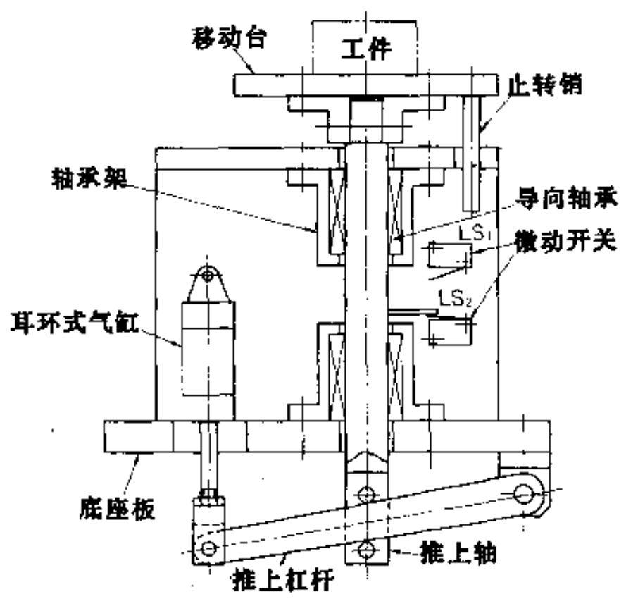

起动信号复位信号PB P R 气缸前进RLS PB2R2 气缸后退中间终止信号L1 中间起动信号（LRLS R终止信号（

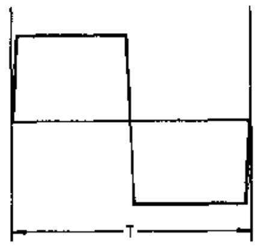  
$T _ { \mathrm { \bullet i n } } = 1 \mathsf { s e c }$ (5r=50mm）

图2-24  
动力：气压  
行程： $1 0 \sim 5 0$ 毫米  
载荷：中

图2-24是在滑动部分采用导向轴承的上下运动机构。通过杠杆比可使功率增加1倍。

# 设计要点

1．必须选用耳环式或耳轴式气缸。根据杠杆比选择气缸直径，杠杆的长度可以适当改变。

2．导向轴承可以换成润滑良好的导套。

3.气动系统要用单向节流阀进行速度控制，并缓和工作时的冲击。必要时，可增加由橡皮和弹簧等制成的缓冲机构。

# 制造要点

可动轴与导向轴承的接触部分加工精度特别重要，必须淬火、磨削。

其 它

参阅附录一第3类控制回路。

# 带检测装置的直线运动机构

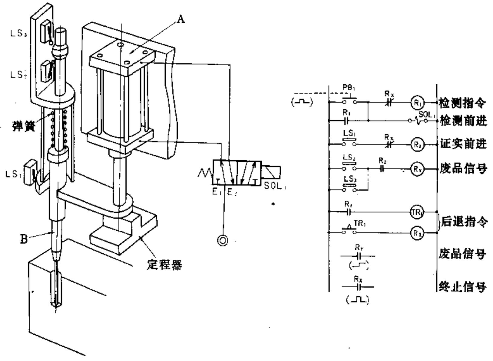  
图2-25动力：气压行程： $1 0 \sim 1 0 0$ 毫米载荷：轻

图2-25所示是带检测装置的直线运动机构。当起动指令发出后，气缸A的活塞杆下降，接触定程器，同时压动LS；,此时测量头B的位置，如进入事先按允许范围固定的 $\mathbf { L } \pmb { \ S } _ { 2 }$ 与 $\mathbf { L S } _ { 3 }$ 之间，则为合格。如果测量头B的位置过低（ $\mathbf { L } \boldsymbol { \mathsf { S } } _ { 2 }$ 通)或过高(LS通),则为不合格，并发出废品信号。

# 设计要点

1．由于气缸A的活塞杆装在测量头的一侧，因此必须设置杆的导向装置。

2.设计弹簧时，其压缩量应充分满足测量范围的需要。

制造要点

测量头组装后,应能通过弹簧轻松地活动。

使用实例

用于自动生产线中的加工测量。

# 其 它

参阅附录一第2类控制回路。

# 气缸上下运动机构

图2-26  
动力：气压  
行程： $1 0 \sim 1 0 0$ 毫米  
载荷：中

图2-26是利用气缸的上下运动机构。推杆与气缸活塞杆的端部用万向接头连接，以防止活塞杆的歪扭。

# 设计要点

1，导向轴承可以换用滑动轴承，但轴必须经过淬火、磨削。2.气缸的直径要有充分的余量。设置适当的单向节流阀调节速度，以缓和动作时的冲击。3．如果可能，可在气缸内用插入套环等方法解决气缸的定程。

制造要点

注意推杆的加工精度及热处理。

# 其 它

参阅附录一第3类控制回路。

# 起动信号（）

# 具有弹性的拧紧螺钉机构

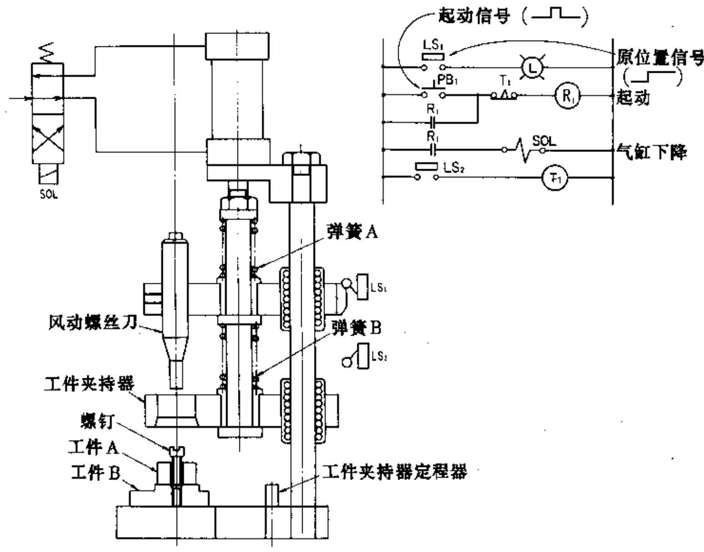

图2-27  
动力：气压  
行程： $1 0 \sim 1 0 0$ 毫米  
载荷：中

图2-27是一种靠风动螺丝刀拧紧螺钉的机构。根据起动信号，气缸活塞杆下降，工件夹持器先将工件A定位并压紧。活塞杆继续下降，使风动螺丝刀碰上螺钉头回转，从而把螺钉拧紧。

设计要点

1．要保证风动螺丝刀与螺钉的同轴度。  
2．所选弹簧的强度要适当。

# 使用实例

由于螺钉较小，形状又多，自动供料比较困难，所以本机构仅在需要螺钉拧紧自动化的场合使用。

其 它

参阅附录一第3类控制回路。

# 气缸热熔压接机构

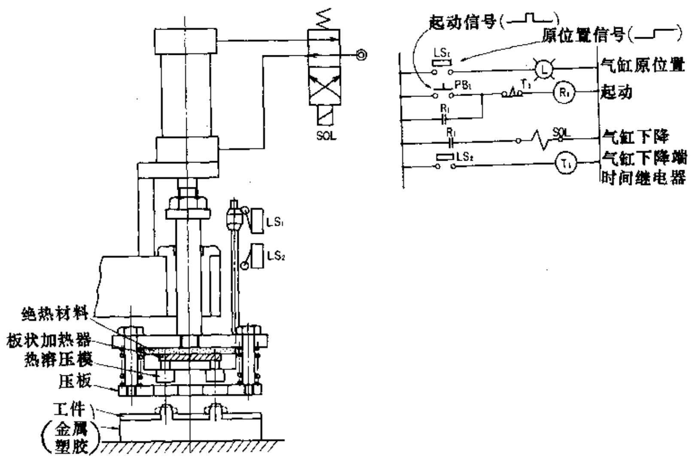

图2-28  
动力：气压  
行程： $1 0 \sim 1 0 0$ 毫米  
载荷：中

图2-28所示是气缸控制的热熔压接机构。根据起动信号，活塞杆下降，推动加热器及压模接触工件，使塑料热熔压接在金属上。为了使热熔充分，活塞杆应在下降处停留一定时间后，再回复原位。

# 设计要点

1．加热电阻丝一旦烧断，要便于修理。2．在采用手工装卸工件时，应有防止烧伤的办法。使用实例塑料工件的热熔接。其它参阅附录一第3类控制回路。

# 可调速的直线运动机构

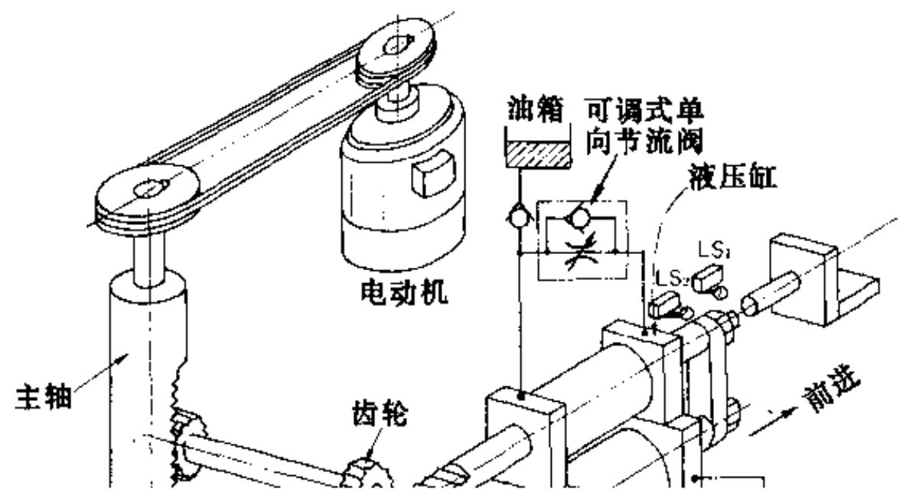

# 液压缸直线运动机构

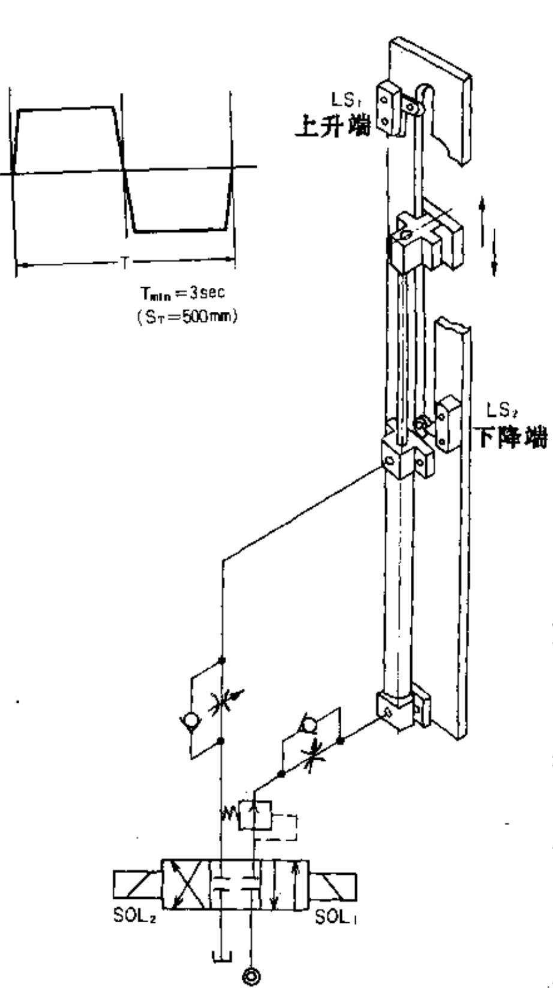

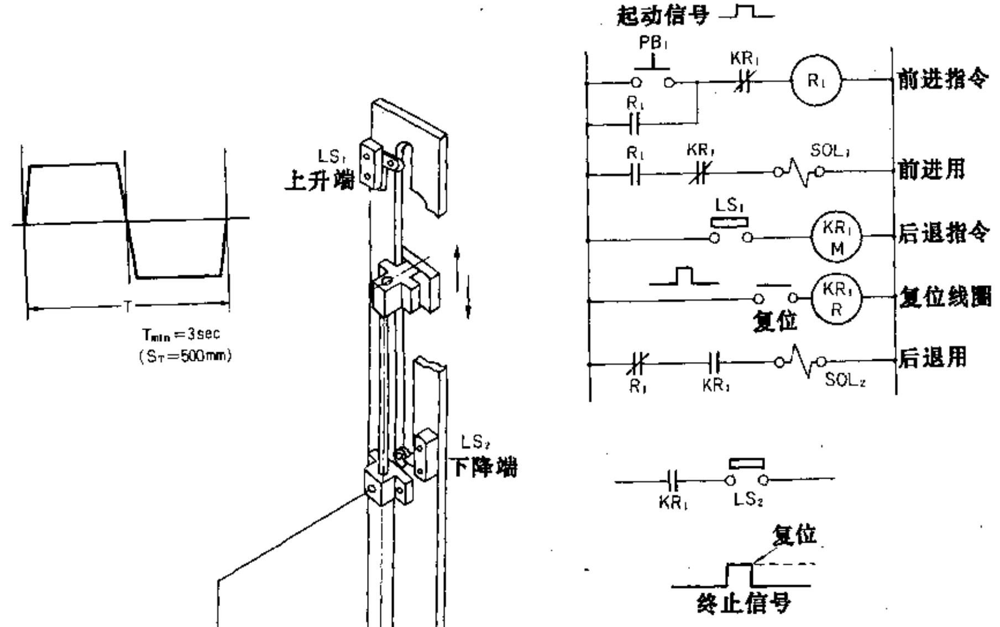  
图2-30是直接采用液压缸的小型上下运动机构。

加工较困难,所以在使用要求不高的情况下，可以适当降低其加工精度。

2．也可采用板弹簧,使上下滑动头与导板密切结合，但不要压得太紧，以利于滑动。

3．为防止自动落下,在液压系统内应设有平衡阀或液控单向阀。

4．由于使用的是保持型继电器,所以复位信号需要正脉冲。为安全起见，脉冲宽度最好不小于0.5秒。

制造要点

图2-30  
动力：液压  
行程： $1 0 0 - 1 0 0 0$ 毫米  
载荷：中

液压缸的安装问题在于滑动头后退时，液压缸的安装位置要合适。因此，液压缸上下两端的固定高度要合适。

# 使用实例

升降机等。

其 它

# 设计要点

1.安装时还需注意固定板的精度必须提高。

1．因导板两侧面的沟宽尺寸及两侧面的

2．参阅附录一第2类控制回路。

小直径液压缸强压机构

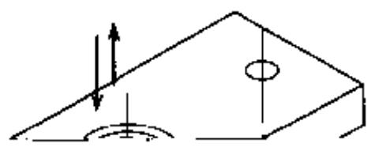

# 凸轮直线运动机构

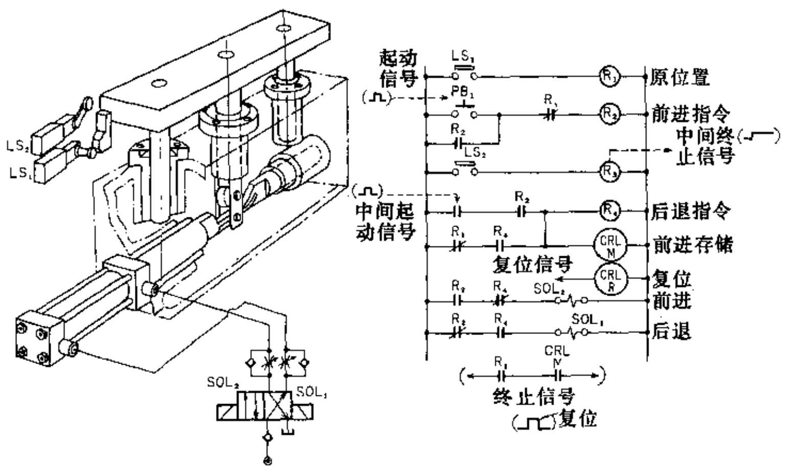

图2-32  
动力：液压  
行程： $0 \sim 3 0$ 毫米  
载荷：重

图2-32所示是利用液压缸带动平板凸轮作直线运动的机构。它是靠接触凸轮的滚子，使采用导杆导向的平板上下运动。利用凸轮的倾斜角可以扩大作用力。

# 设计要点

1．用于夹紧工作时，要把液压缸作用面积较大的一边，对着凸轮楔角的方向，供放松时

用。同时，还要考虑夹紧力的承受部分。

2．需要防止自行下落时,可采用适当的凸轮楔角，形成摩擦自锁。

3．凸轮、滚子及滚子轴销均为受力的主要零件，要保证它们有足够的强度。

# 制造要点

注意凸轮板的热处理、机加工及镗孔。

# 使用实例

工件的升降等。

其 它

参阅附录一第3类控制回路。

# 齿条、齿轮和杠杆直线运动机构

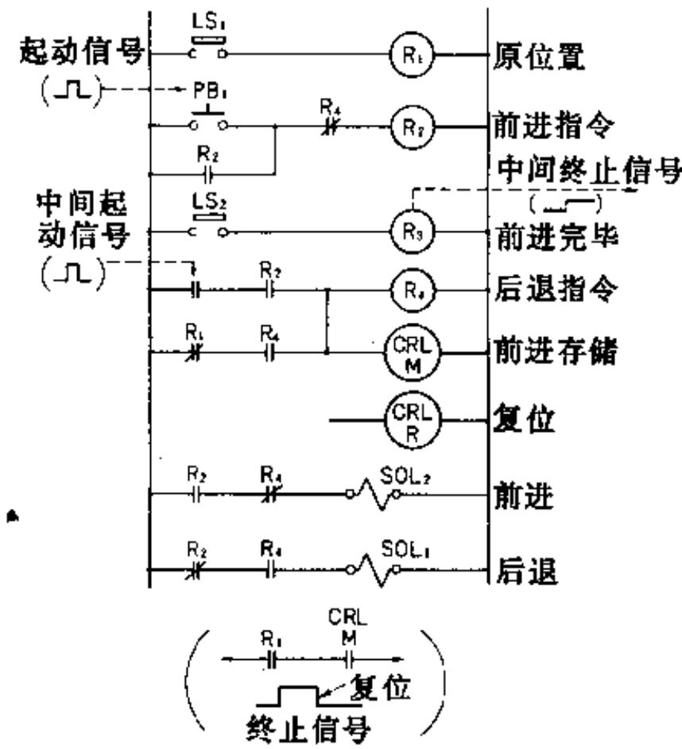  
图2-33动力：液压行程： $1 0 \sim 5 0$ 毫米载荷：中  
图2-33是使多个销杆同时上下运动的机构。

# 设计要点

1．由于杠杆受力,所以不宜过长。特别要考虑杠杆的键和齿轮的应力。2．要注意小齿轮键的位置，杠杆键的位置，以及销杆的切口位置。3.在使 $1 \sim 2$ 根销杆作上下运动时，可考虑将齿条、小齿轮也换成销杆和杠杆机构，但效率稍有降低。

# 制造要点

1．销杆切口部分及杠杆顶端圆弧部分均需进行热处理及表面精加工。2．在使多根销杆作上下运动时，小齿轮的轴，如用十字联轴器等连接，加工就简单。

# 使用实例

定位销的上下等。

# 其 它

参阅附录一第3类控制回路。

# 双液压缸上下运动机构

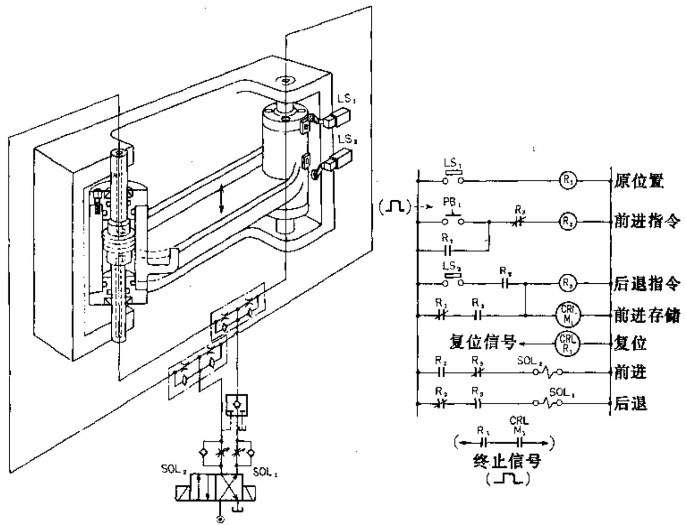

图2-34  
动力：液压  
行程： $1 0 \sim 5 0$ 毫米  
载荷：重

图2-34是利用双液压缸的活塞杆作为导杆的上下运动机构。工作时活塞杆不动，液压缸体运动。

# 设计要点

1．采用分流阀调节左右液压缸的流量，使两个液压缸同步。分流阀的调节误差，在整个行程内，不应对动作产生不良影响。

2．在没有采取机械平衡配重的情况下，

为暂时防止缸体下落，可在液压系统中安装液控单向阀。为确实防止下落，则需要采用机械方式。

# 制造要点

1．因活塞杆即为导杆，所以要特别注意缸体的镗孔。

2．要保证液压缸顶盖的加工精度。

使用实例

移动夹具板等。

其 它

参阅附录一第2类控制回路。

# 顺序夹紧机构

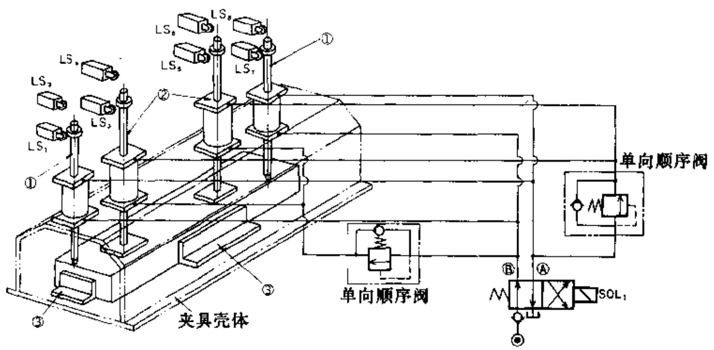

LS:LS,LS.LS.  
L品品 R 上升极限位置PB R R 复位）? 起动HR SOL,H 下降  
品品 R 下降极限位置RHH 终止信号(1) （证实夹紧）  
图2-35  
动力：液压  
行程； $1 0 \sim 5 0$ 毫米  
载荷：重

图2-35是一种简单的液压顺序动作机构。其工作原理如下：工件先靠在定位块3上，按下起动按钮 $\mathbf { P B } _ { 1 }$ ，由SOL，把液压送到管路A。定位液压缸1先将工件定位，其后通过单向顺序阀使液压缸2夹紧工件。在LS证实上述动作完成后，即进入加工周期。

# 设计要点

当工件处在规定位置时，定位块3与工件之间应保持一点间隙。

# 制造要点

限位开关的安装位置,由工件位置来确定。其安装位置应保证液压缸活塞杆能顶动它。

# 维护要点

应经常检查各限位处及定位块的紧固。

# 使用实例

专用机床的工件夹紧装置。

其 它

参阅附录一第2类控制回路

# 压紧机构

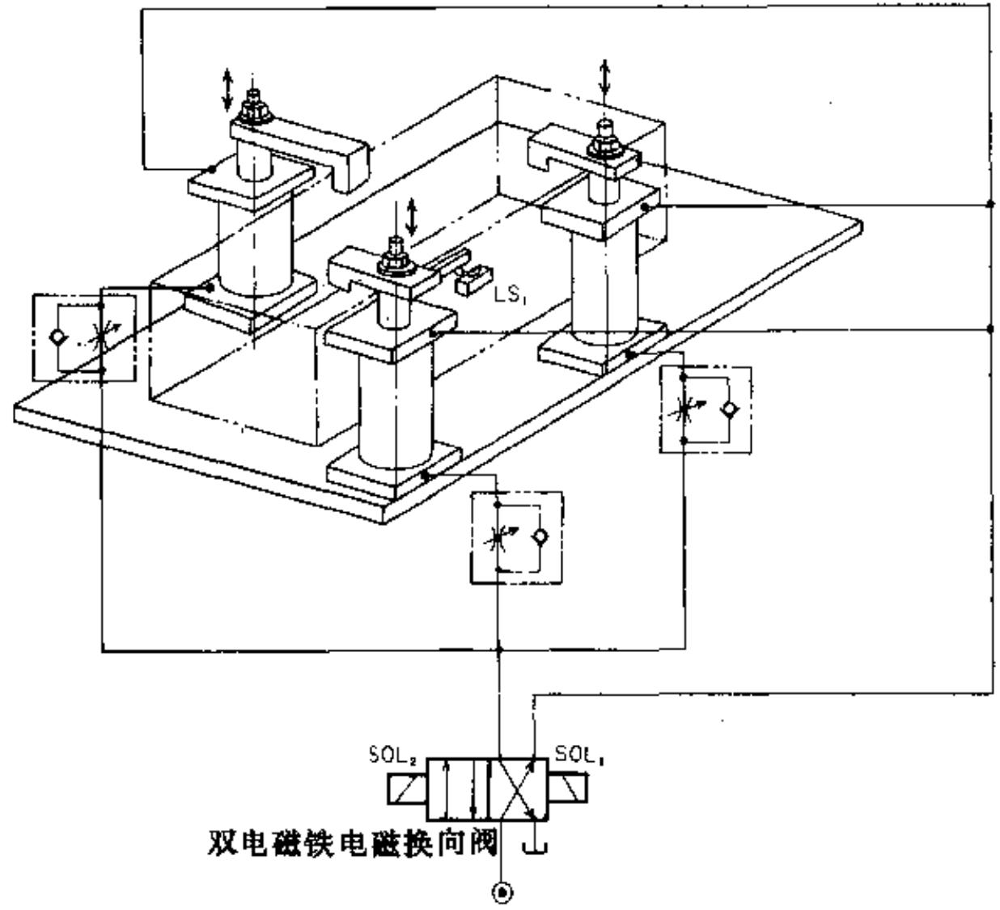  
图2-36动力：液压行程： $1 0 \sim 5 0$ 毫米载荷：重

图2-36是用同一个换向阀控制几个液压缸的压紧机构。由于各液压缸的配管长短不一，以致不能同步。这在夹紧形状复杂以及刚性小的工件时，就成了问题。图中为了解决这个问题，于压板下降时，在管路出口处装入了可调式单向节流阀。

PBR6 开F 压紧指令R PHIH F R 松开指令  
R压紧松开RY 证实压紧R 终止信号(11） （证实压紧）

# 设计要点

压板位置相对于工件要注意分布均匀。

# 组装要点

必须调整可调式单向节流阀，直至确定已

压紧，才算安装完毕。

# 其 它

参阅附录一第2类控制回路。

# 小型液压缸直线运动机构

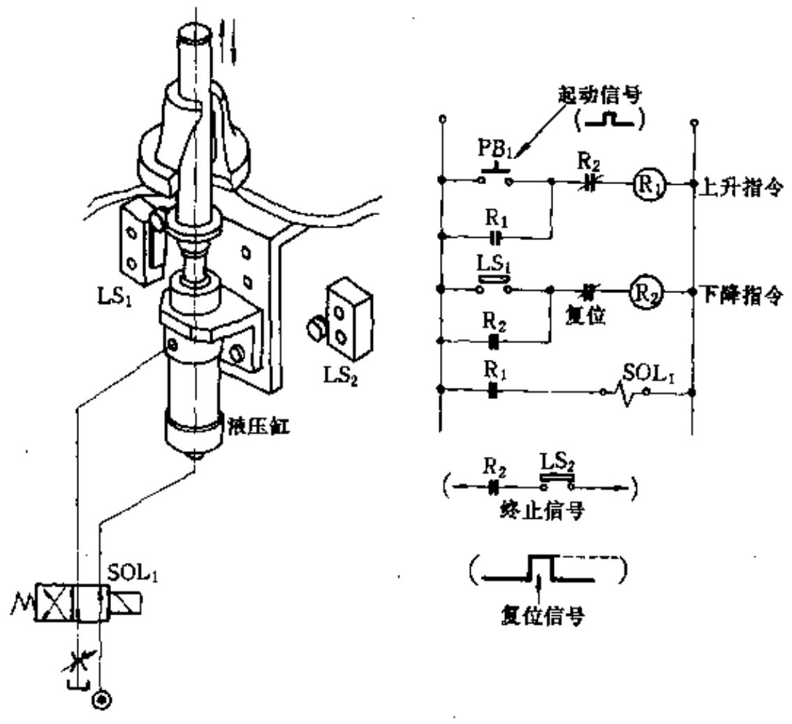

图2-37  
动力：液压  
行程： $1 0 \sim 1 0 0$ 毫米  
载荷：重

图2-37是采用小型液压缸的直线运动机构。

设计要点

1．对于联接器、安装架等有同轴度要求的零件，设计时应注意其公差配合。

2．导杆支承的滑动面最好处在导杆的中间位置。需要防止转动时应加导向键。

制造要点

注意导杆与液压缸活塞杆的同轴度。

# 使用实例

定位销、止动器等。

# 其 它

1。因机构简单，往往忽视了同轴度的要求，这样容易发生卡滞、卡死现象。2．参阅附录一第2类控制回路。

# 液压缸上下运动机构

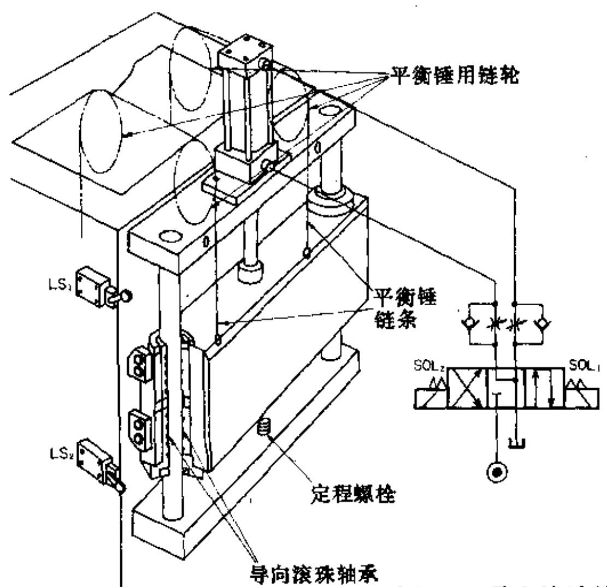  
图2-38是直接连接液压缸的上下运动机构。其导向方式除采用导杆外，还可采用燕尾槽、方形导轨或滚柱导轨等。

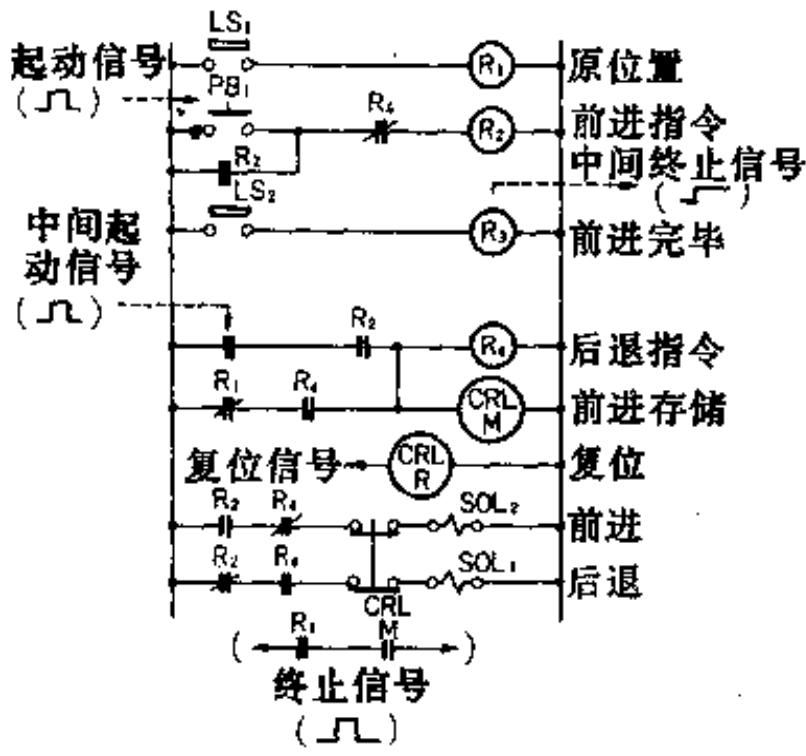  
图2-38动力：液压行程： $5 0 \sim 5 0 0$ 毫米载荷：重

# 设计要点

1．用平衡锤取得平衡。2．工作台下降的极限位置，一般靠定程螺栓限定。这时液压缸应带缓冲器。3．工作台上升位置利用限位开关LS来控制,使工作台中途停止或在液压缸终端停止。在要求停止位置准确时，应安装定程器。4．工作台行程较长时，为安全起见，采用三位换向阀。

# 制造要点

行程较长时，要特别注意导杆与液压缸的平行度。

# 使用实例

加工头的上下运动。

其 它

参阅附录一第3类控制回路。

# 加压直线运动机构

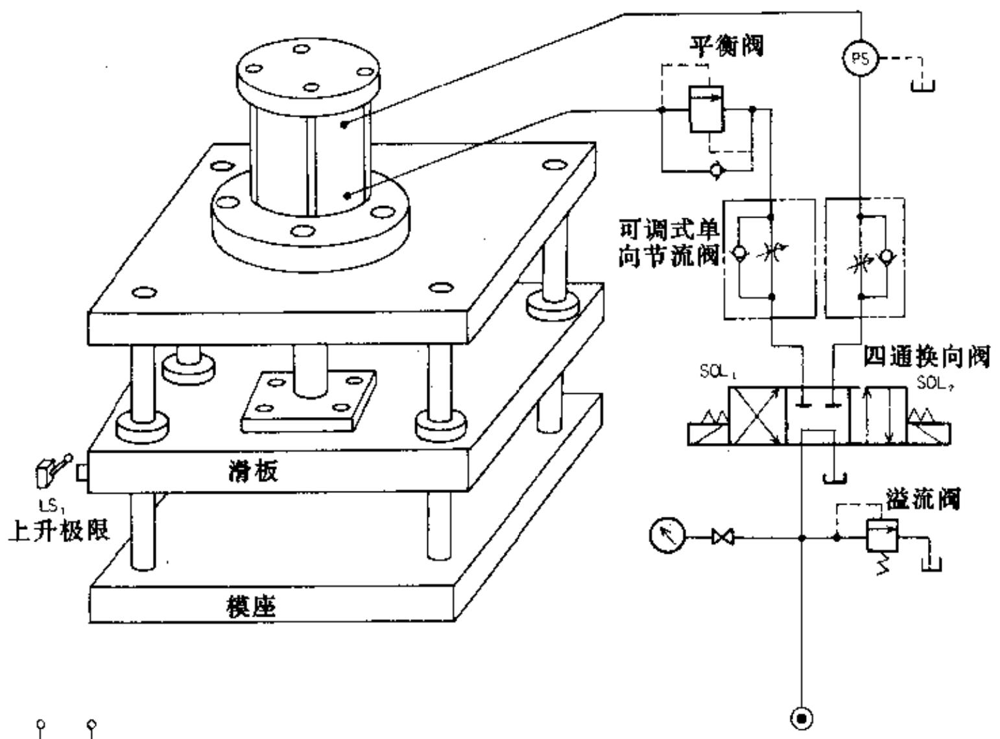

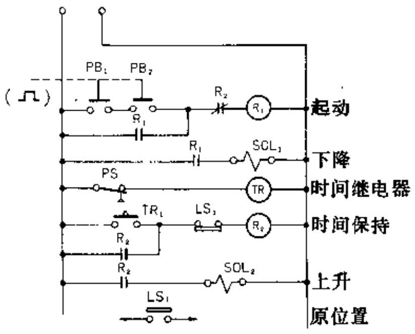  
图2-39动力：液压行程： $1 0 \sim 1 0 0$ 毫米载荷：重

图2-39 所示是在一定压力下，加压一定时间的加压机构。按动按钮 $\mathbf { P B } _ { \mathbf { l } }$ 、 $\mathbf { P B } _ { 2 }$ 后，滑板开始下降，接触工件并开始加压。在压力达到

预先设定值时，通过压力继电器PS起动时间继电器TR。在加压达到规定时间后，滑板上升。用平衡阀防止滑板因自重而降落。

# 设计要点

压力继电器的调定压力，应稍低于溢流阀的设定压力。

# 制造要点

注意滑板与导杆的配合。  
维护要点  
防止压力继电器与溢流阀不准确。使用实例  
小零件的弯曲、压入。

# 其 它

参阅附录一第2类控制回路。

# 长工件直线运动机构

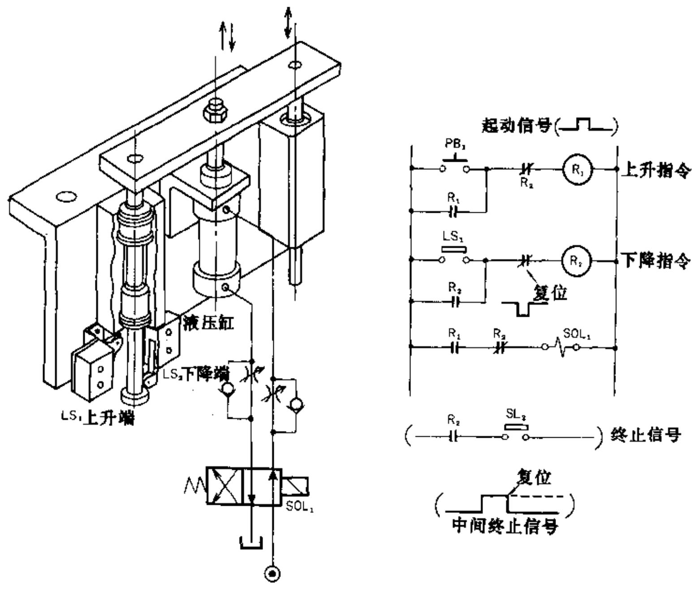

图2-40  
动力：液压  
行程： $1 0 \sim 1 0 0$ 毫米  
载荷：重

图2-40是适用于较长工件的直线运动机构。

# 设计要点

1．采用导杆时，对导杆的间距要求较高，必须在坐标镗床上，上下两件合在一起加工。2．安装液压缸的托架要标注垂直度公差。制造要点如使用滑动轴承，装配时要特别注意。使用实例起重机、分离装置。

# 其 它

1．一般小型液压缸耐压较低,必须注意。  
2．参阅附录一第2类控制回路。

# 齿条、小齿轮直线运动机构

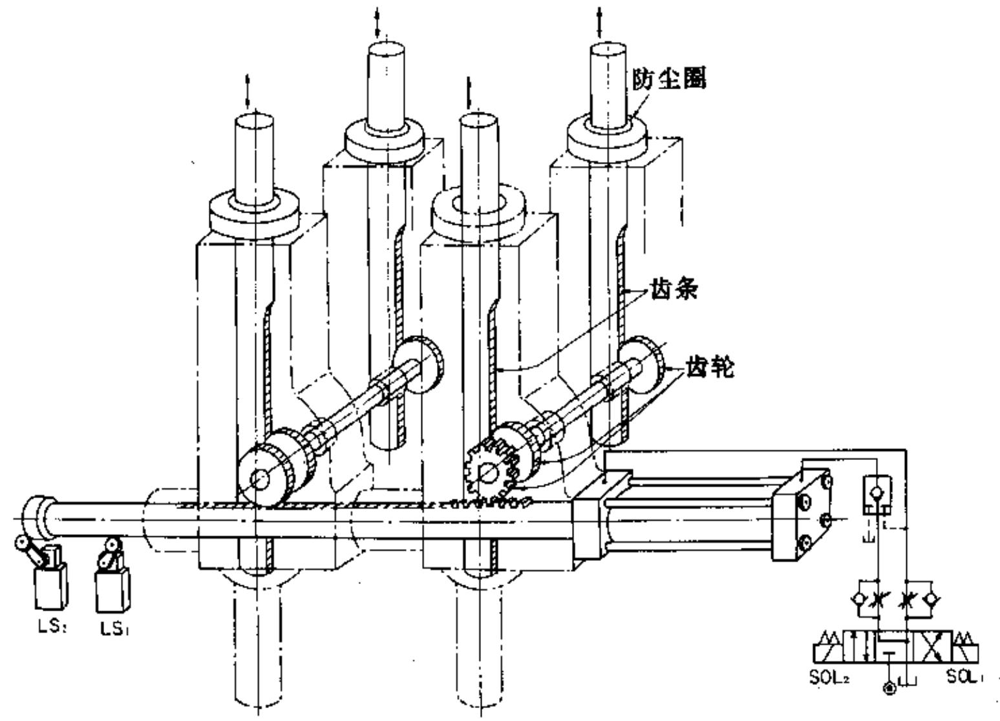

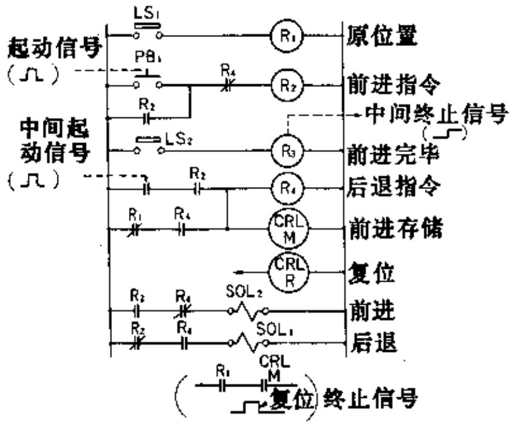  
图2-41动力：液压行程： $5 0 \sim 5 0 0$ 毫米载荷：重  
图2-41是将工件保持在水平状态抬起的机构。四根垂直齿杆由齿条、齿轮联动作上下运动。

# 设计要点

1．要注意齿条、小齿轮齿的安装位置的准确性。2．要考虑齿条、小齿轮的防尘和润滑措施。3．为防止齿杆的突然下降，在液压系统中应设置平衡阀。行程较长时，为了安全，使用三位换向阀较好。由于使用了平衡阀，在齿杆下降时容易发生中途停止。

# 制造要点

要注意小齿轮与齿轮轴的同轴度，齿条与齿轮的齿隙要小。

# 使用实例

工件升降机等。

其 它

参阅附录一第3类控制回路。

# 液压缸直线运动机构

  
图242动力：液压行程： $1 0 \mathrm { - } 1 0 0$ 毫米载荷：重

2、应保证液压缸安装支架的平行度，组装时必须合适。

3．液压管路配管应尽量缩短，以防止机构动作迟缓。

# 使用实例

图2-42是用液压缸直接操纵的上下运动机构。

设计要点

在设计时要考虑液压缸活塞杆与滑块便于装配连接。例如：使用可拆换的连接器。

# 制造要点

1．滑块的配合要十分合适。

压入、铆接、分离装置等。

其 它

1．LS的安装架座，相对于机构本体可以移动，更换LS时，调整较方便。

2．参阅附录一第2类控制回路。

差动齿条、齿轮直线运动机构

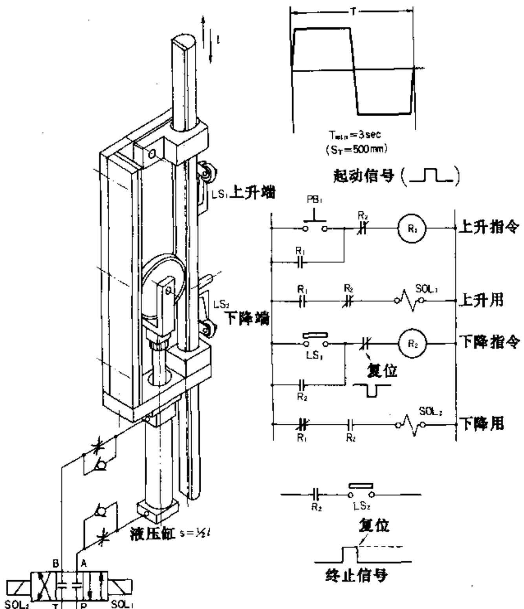  
图2-43动力：液压行程： $1 0 0 \sim 1 0 0 0$ 毫米载荷：中

图2-43是采用液压缸和扩大机构获得长行程的直线运动机构。

# 设计要点

1．齿条、齿轮使用小模数的较好。齿轮的直径则以较大为好。

2.齿轮能防止齿条轴的转动，必要时，还可在齿条轴背面开沟槽，在上下托架处安装两个销子，作为止转键。

3.用润滑脂润滑，使用时较方便。

4.负荷较小时，如要使齿条轴在中间位置停止，或使液压缸速度放慢，以作长时间移动时，就有必要在液压工作口A、B处，装设可调式单向节流阀。

制造要点

要充分注意调整齿轮与齿条的间隙。

使用实例升降机等。

# 其 它

参阅附录一第2类控制回路。

# 可调速的直线运动机构

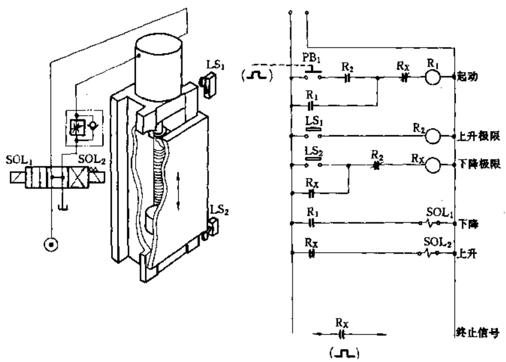

图2-44  
动力：液压  
行程： $1 0 0 \sim 1 0 0 0$ 毫米  
载荷：重

图2-44所示是可调速的直线运动机构。进给丝杠与液压马达连接，而进给丝杠又和固定于滑块的螺母啮合。当液压马达转动时，丝杠随着转动，使滑块作上下移动。

这种机构与直接用液压缸控制进给的机构相比，它的特点是进给微小而均匀，且滑动方向（进给方向）的振动较小。

# 设计要点

进给丝杠与滑块螺母的啮合处，必须装有间隙消除装置。

制造要点

注意丝杠与滑块螺母的同轴度。

维护要点

螺纹部分应充分润滑。

其 它

参阅附录一第2类控制回路。

# 能在两端停止的进给丝杠直线运动机构

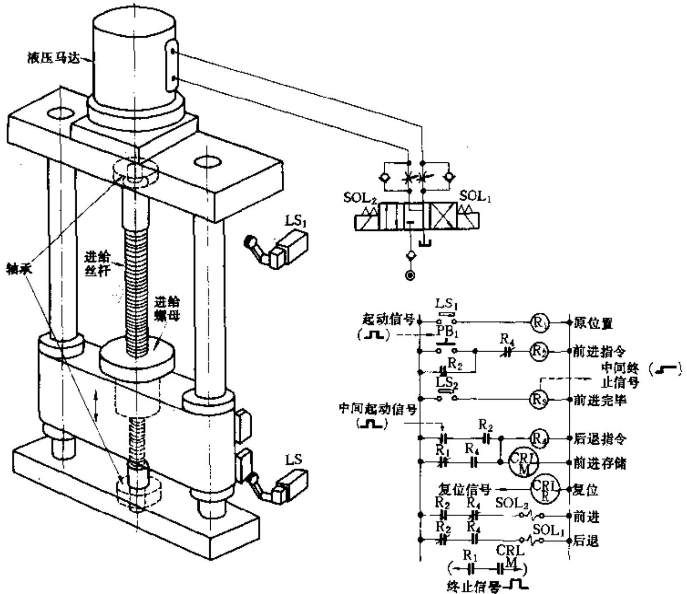  
图2-45动力：液压行程： $1 0 0 \sim \mathrm { i 0 0 0 }$ 毫米载荷：重

图2-45所示是能在两端停止的进给丝杠直线运动机构。由液压马达(或电动机）带动丝杠回转，使得和螺母组合在一起的滑块沿导杆作上下运动。本机构和直接与液压缸连接的方式相比，其长度要短一些。

2.本机构和直接与液压缸连接的机构相比，极限速度较低。

3.传动丝杠、螺母部分应充分润滑。

4.应考虑防止丝杠的振动。

# 设计要点

1.由于丝杠传动效率相当不稳，所以推力不如直接与液压缸连接的机构有把握。配置减压阀等，可使液压源压力得以调整。也可用电动机来代替液压马达。

5.虽然液压油量较直接与液压缸连接的机构要多 (效率低)，但是可得到较大的推力。

6.如有必要，可加配重等来达到平衡。这时滑块不会自行下落，但螺母产生单边磨损。进给丝杠如采用滚珠丝杠时，也要考虑安装制动器等，以防滑块下落。

# 使用实例

升降机等。

其 它

参阅附录一第3类控制川路。

# 偏心轴水平振动机构

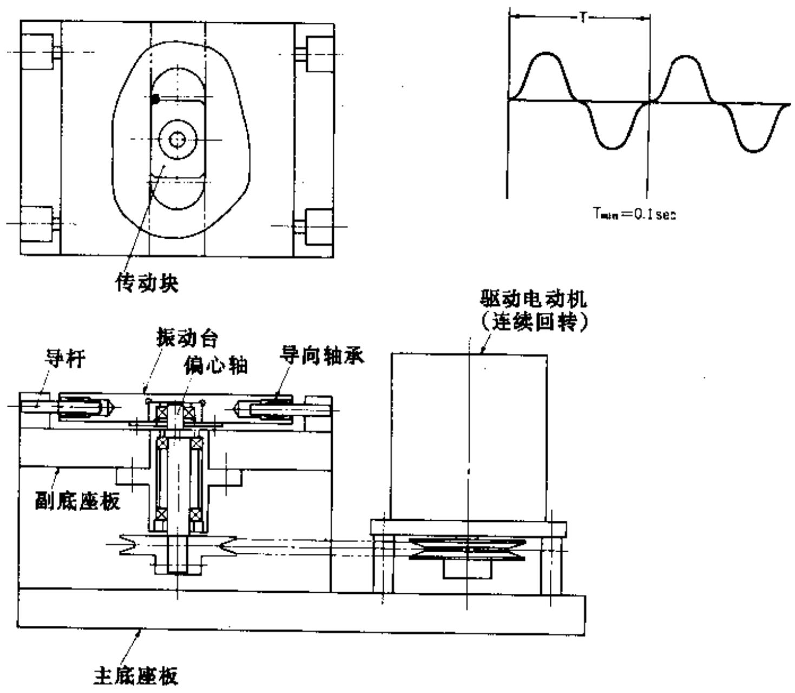  
图2-46动力：电气行程： $0 \sim 5$ 毫米载荷：中

图2-46是没有曲柄的曲柄式小振幅水平振动机构。

# 设计要点

1.活动部分的质量要尽量小，固定部分（主底座板）的质量要大。

2.活动部分的轴须经淬火、磨削。回转部分全部装上滚动轴承。

3.偏心轴应有足够的强度，其轴承部分也

应结构牢靠。

4.可用滑动轴承代替导向轴承，须注意不要成为套筒支承结构。

# 制造要点

1.导向部分导杆的加工精度、热处理、磨削等工序要特别注意。

2.其它轴承与轴，以及轴承与轴承盖之间，不应有松动。

3.螺纹连接部分要完全止动。

# 其 它

参阅附录一第2类控制回路。

# 偏心轴直线振动机构

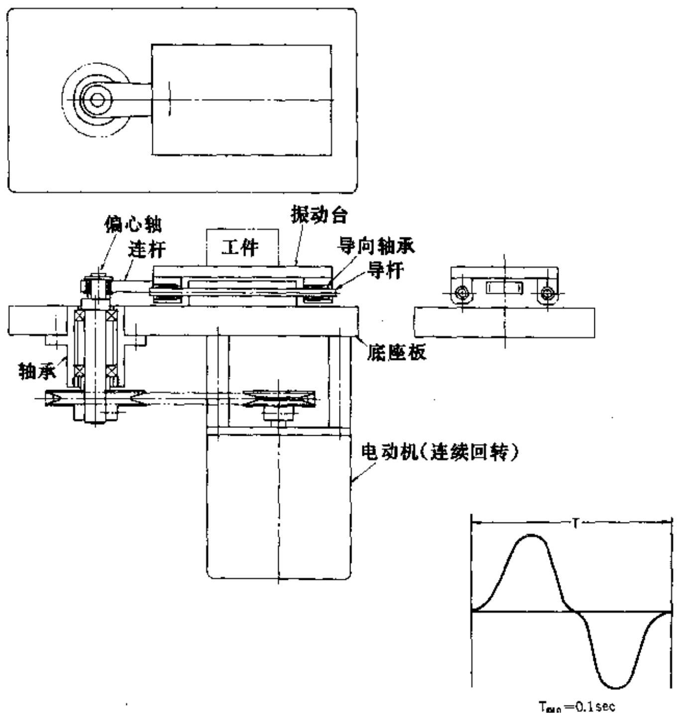  
图2-47动：电气行程： $0 \sim 5$ 毫米载荷：中

图2-47是由偏心轴带动连杆作小振幅水平振动的机构。由于采用皮带传动，对超载能起安全作用。

# 设计要点

1.导向轴承与导杆的配合精度、导杆的淬火硬度，可参考轴承产品样本中的数值确定。

2.转动部分应尽量采用滚动轴承，以保证动作灵活。3.活动部分的质量要尽量减小，固定部分的质量要大，其质量比应尽量大。

# 制造要点

1.注意二导杆的平行度。2.注意各螺纹连接处的松动，为防止螺纹的松动，应加弹簧垫圈或采用螺纹锁紧等方法。

# 其 它

参阅附录一第2类控制回路。

M 中

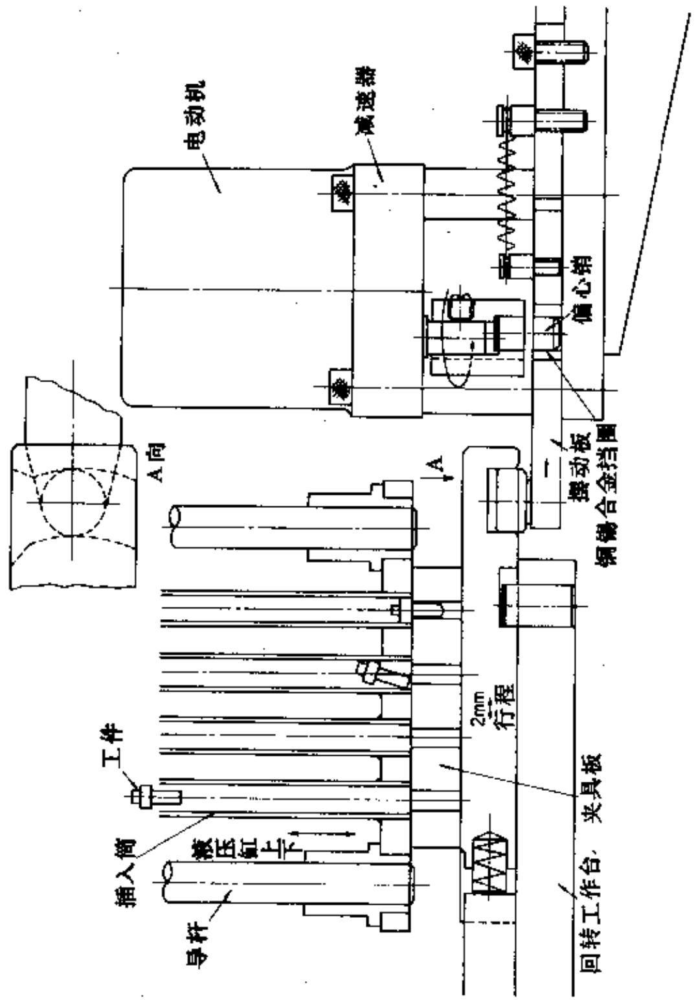

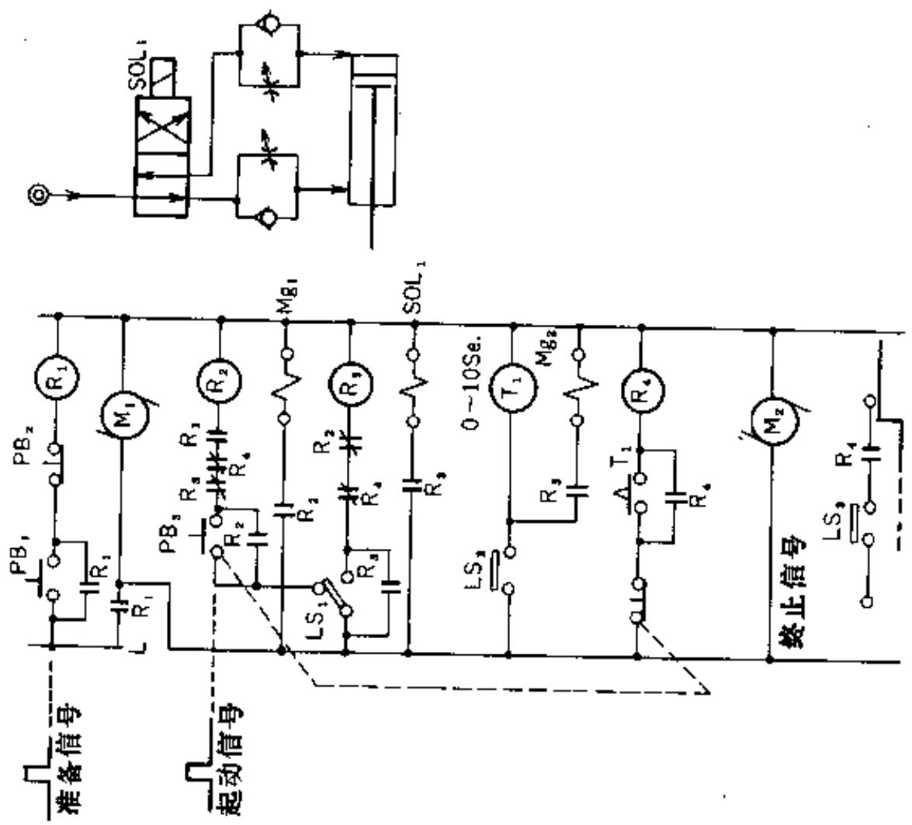

# 电磁铁直线运动机构

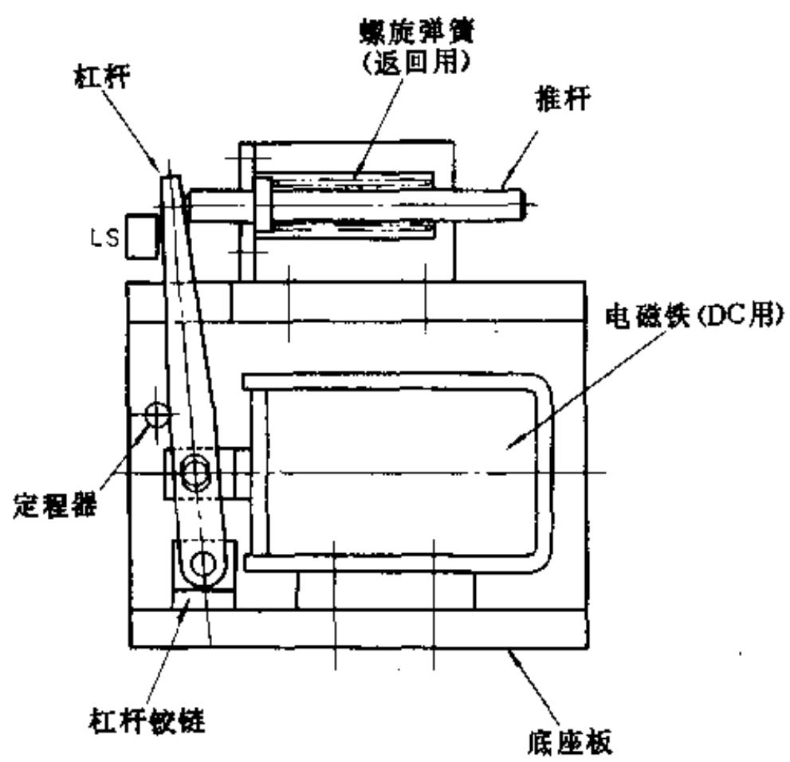  
图2-49

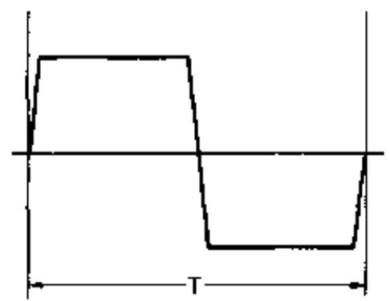  
$\Gamma _ { \sf N I n } = 0 . 5 5 \mathrm { s e c }$

动力：电气

行程： $0 \sim 1 0$ 毫米

载荷：轻

图 $2 \cdot 4 9$ 是通过电磁铁进行小行程直线运动的机构。本例使用的是直流电磁铁，也可使用交流电磁铁。

# 设计要点

1.一般使用电磁铁时，可通过杠杆把电磁铁铁芯的动作范围 $\langle \textbf { l } \sim \mathbf { 2 }$ 毫米）扩大数倍。

2.杠杆与铁芯连接处应稍留间隙。

3.杠杆铰接处要能回转灵活。

# 制造要点

1.杠杆及推杆的动作应很灵活。

2.微调定程器的位置，应使电磁铁处在最有利的电磁动作范围内。

# 其 它

参阅附录一第2类控制回路。

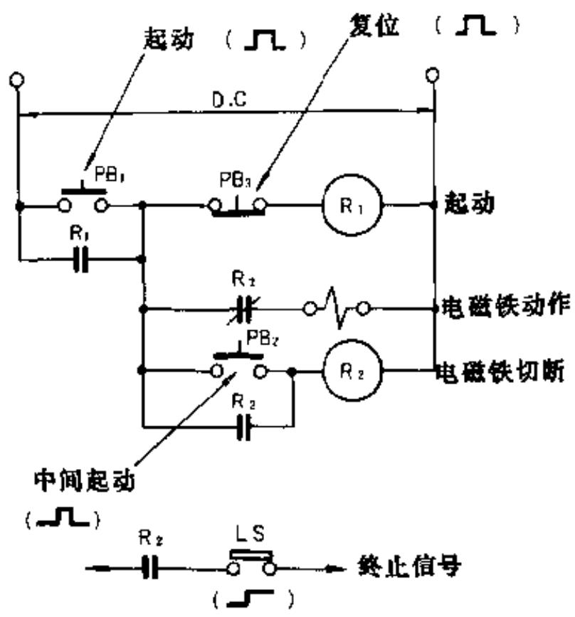

# 凸轮直线运动机构

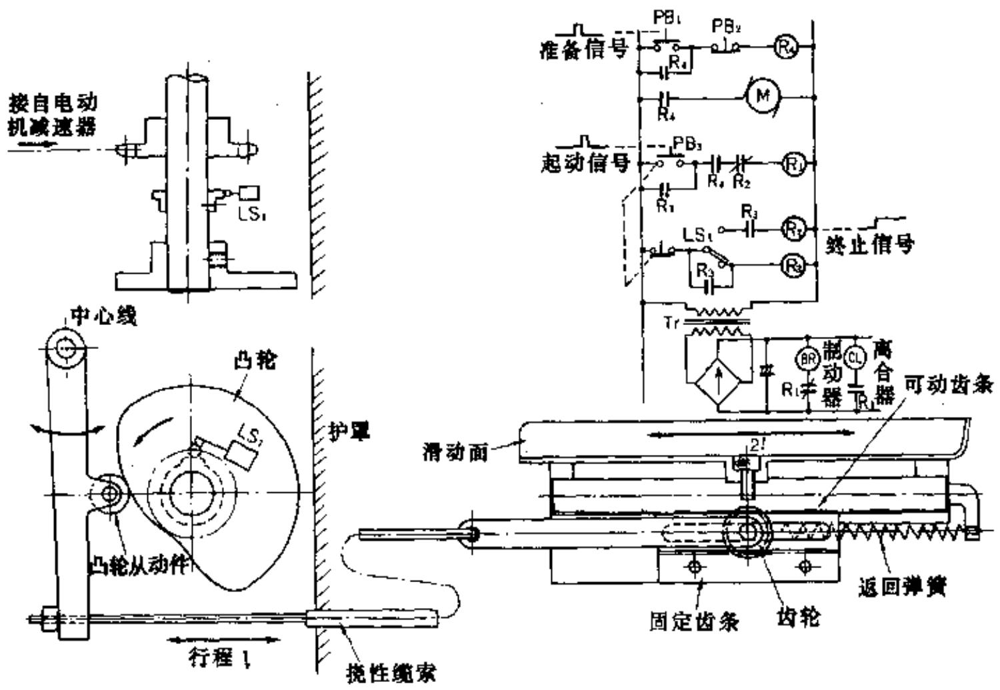

图2-50

$\scriptstyle \mathbf { P B } _ { 1 }$ ：准备按钮

$\hat { \mathbf { P } } \hat { \mathbf { \beta } } _ { z }$ ：停止按钮

$\mathbf { P } \mathbf { \vec { B } } _ { 1 }$ ：起动按钮

$\mathbf { M }$ ：电动机

$\mathbf { L } \pmb { S _ { 1 } }$ ：回转一次停止开关

BR，制动器

CL离合器

动力：电气

行程： $1 0 \sim 3 0$ 毫米

载荷：轻

图2-50是利用凸轮的升程使行程扩大的直线运动机构。

设计要点

1.挠性缆索的弯曲半径不能太小。

2.滑动面的动作要避免特殊的冲击（按行程，往复时间在l.5秒以上)。

3.挠性缆索部分的行程不超过60毫米。

控制方法

离合器动作一次，凸轮轴回转一周按规定的周期，可用附加脉冲等方法控制操作电磁铁，再由电磁铁操纵离合器动作。

维护要点

无特殊要求，只是挠性缆索应有备件。

# 使用要点

多用于自动机上取出工件。常用于下列情况：

1.轻工件(100克以下）。

2.取出位置离凸轮轴较远。

3.在凸轮轴位置已定的情况下，对于所需的行程来说，凸轮外径不能再大（由于护罩等妨碍）。

# 其 它

参阅附录一第5-4类控制回路。

# 偏心凸轮直线运动机构

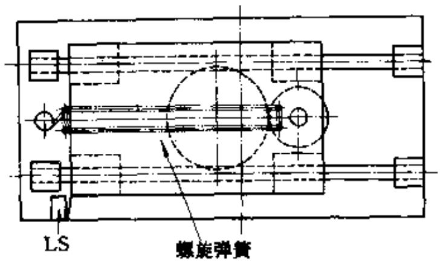

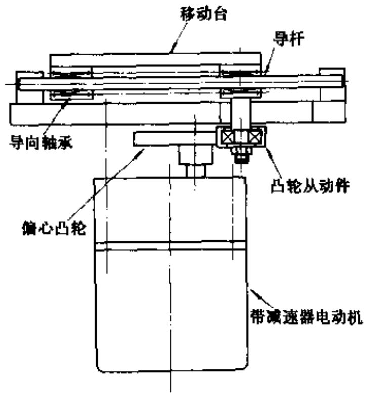  
图2-51动力：电气行程： $\Updownarrow \sim \Im \emptyset$ 毫米载荷：中

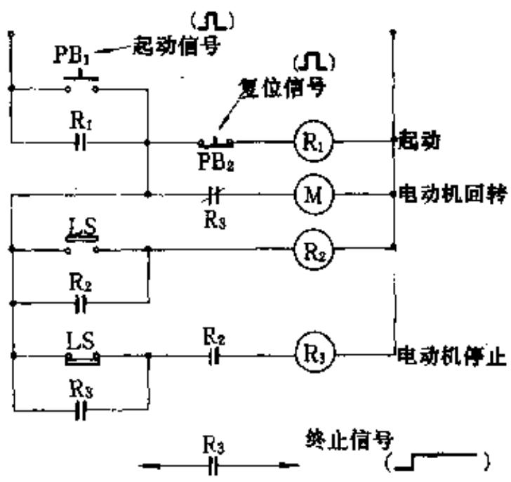

图2-51是通过凸轮进行直线运动的机构。在滑动部分配置导向轴承，使动作灵活。在行程较长的情况下，也可使用滑动轴承。

设计要点

保证回程的可靠。

2.凸轮从动件采用内部压入滚动轴承的淬火圆环。

3.导杆与轴承的配合精度、导杆的材料及淬火硬度等，可参考轴承产品样本中的数值确定。

制造要点

必须保证移动台两根导杆的平行度，动作

1.移动台的返回弹簧要有足够的弹力，以“才能圆滑。

# 曲柄圆盘直线运动机构

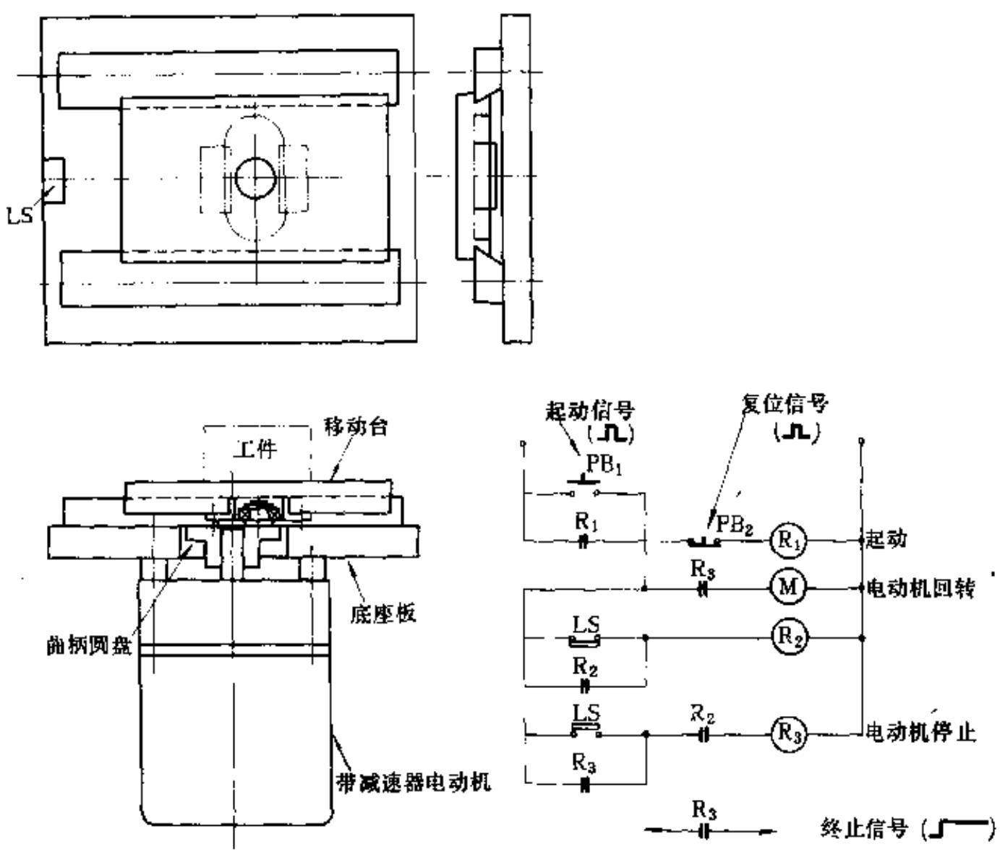

图252  
动力：电气  
行程： $\{ 0 \sim 3 0 $ 毫米  
载荷：中

图2·52是没有曲柄的曲柄式水平运动机构。

# 设计要点

1.燕尾槽部分也可改用导向轴承、滑动轴承或滚动轴承。

2.转部分使用滚动轴承较好。但也可用黄铜、磷青铜、聚四氟乙烯等材料的轴套来代替

制造要点

要保证燕尾槽的加工精度。

# 其 它

1.润滑注油位置在燕尾槽和回转部分。

2.电动机可采用制动电动机、可逆电动机等。如对停止性能有特殊要求，则采用伺服电动机。

3.通过使用机械的一次回转离合器、弹簧离合器或电磁离合器及制动器等，可进行一次回转的控制。

4.参阅附录一第2类控制回路。

# 回转电磁铁直线运动机构

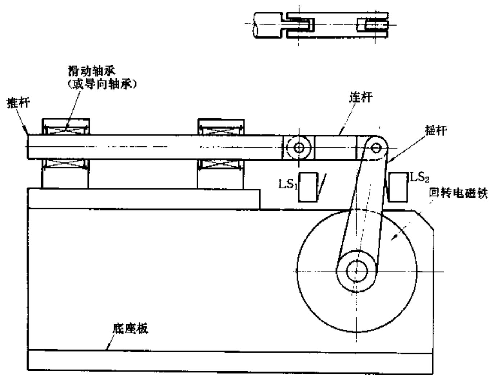  
图2-53动力：电气行程： $0 \sim 5 0$ 毫米载荷：中

图253是利用回转电磁铁进行直线运动的机构。如功率足够，可通过杠杆比使行程扩大到50毫米左右。

# 设计要点

1.推杆与滑动轴承的配合精度、推杆的材料及淬火硬度等，可参考轴承产品样本中的数值确定。

2.设计时应保证连杆与推杆和摇杆的连接处不产生松动。

3.回转电磁铁的轴与摇杆的连接处，由于承受相当大的力，要充分注意，可利用定位销等方法来固定。

起动 B复位RR 回转电磁铁7 L ? 推杆前进R + 中间终止信号R （1）  
中间起动 PB2  
Yo ? 推杆后退Rz 一终止信号（厂）

制造要点

推杆、连杆及摇杆的轴心要一致，如偏差过大，会发生卡顶等现象，动作就不灵活。

两个滑动轴承的同轴度也要保证。

# 其 它

参阅附录一第3类控制回路。

# 槽形凸轮直线运动机构

行程： $1 0 \sim 5 0$ 毫米

载荷：重

图2-54是采用槽形凸轮并通过连杆产生强力的直线运动机构。

  
Tm =0.5sec $1 5 _ { 7 } = 2 0 ( m m )$

# 设计要点

由于连杆是悬臂的，需注意其强度，特别是安装滚子的部位。本机构在用作夹紧时，执行部件必须做成弹性的。

# 制造要点

1.注意槽形凸轮与滚子的跑合。  
2.要特别注意滚子轴在安装后容易松动。

# 维护要点

多用于中速回转运动，按一般标准供油润滑即可。

使用实例

挤压、压力机、冷矫正等。

其 它

参阅附录一第2类控制回路。

# 曲柄直线运动机构

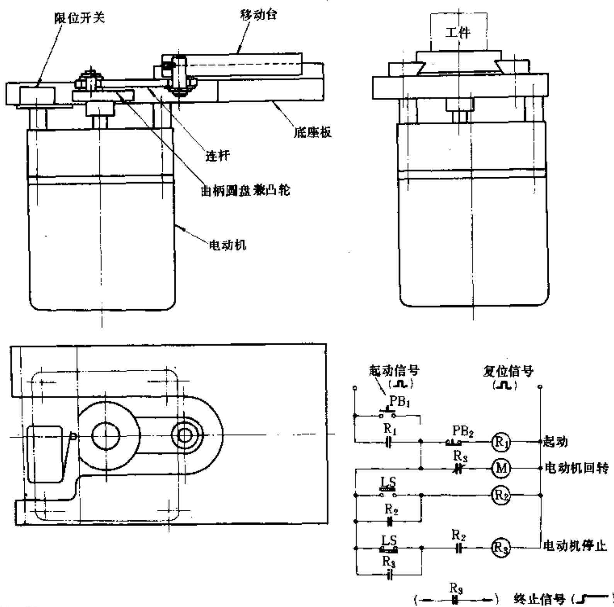  
图2-55动力：电气行程： $1 0 \sim 1 0 0$ 毫米载荷：中

图2-55是靠曲柄的动作，使移动台进行一次往复运动的机构。在图中，把滑动部分做成燕尾槽结构，也可采用导向轴承、滑动轴承或其它滑动结构。另外，如适当配置限位开关，也可使动作中途停止。

# 设计要点

1.连杆的轴承尽量使用滚动轴承。

2.滑动部分如使用导向轴承、滑动轴承等，动作将更灵活。

3.如图2-55所示，应注意移动台燕尾槽的平行度及润滑供油结构。材料可用碳钢铸件或青铜铸件等。

制造要点

注意滑动部分的调整。

# 其 它

参阅附录一第2类控制回路。

# 圆柱形凸轮直线运动机构

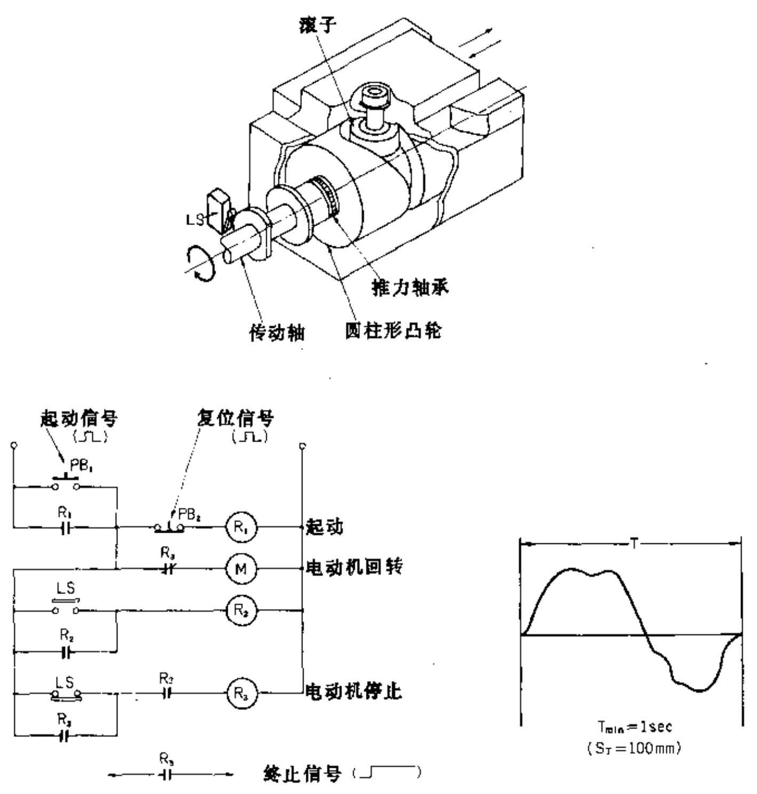  
图256动力：电气行程： $1 0 \sim 1 0 0$ 毫米载荷：中

图2-56是采用圆柱形凸轮以较高速度回转（120转/分）能左右运动的机构。

设计要点

1.壳体结构应牢固，须足以承受轴向推力。

2.采用油浴润滑较好。载荷大时，应注意凸轮的压力角，必要时凸轮应热处理。凸轮槽与滚子直径，要与表面承受的压力相适应。

制造要点

1.凸轮槽与滚子要充分接触。

2.为防止轴向力方向的松动，必须使用轴承架。

# 使用实例

挤压、冲压机等，

# 其 它

1.由于传动轴载荷变化较大，所以应直接与蜗轮减速器连接，不要用链条或皮带等传动。

2.参阅附录一第2类控制回路。

# 杠杆和曲柄直线运动机构

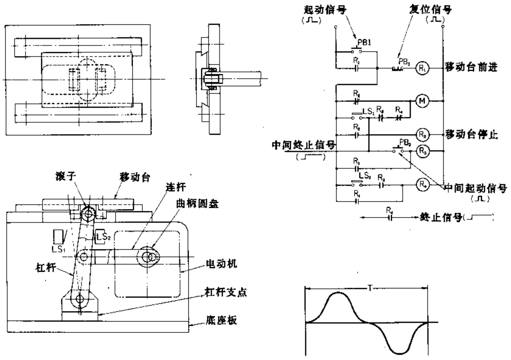  
图2-57动力：电气行程： $0 \sim 1 0 0$ 毫米载荷：中  
Tmn=0.1sec $( \mathsf { S } _ { \mathsf { T } } = 2 0 \mathsf { m m } )$

图2--57 是燕尾槽结构的水平移动机构。由于是在移动台行程的二分之一处，由曲柄传递动力，所以电动机要有足够的功率。为使移动台在行程中的任意位置能停止，应增设限位开关。

# 设计要点

1.移动台的滚子承载部分应考虑耐磨，并应有适当的间隙。

2.滑动燕尾槽要有适当的润滑供油结构，可沿整个滑动面切出油槽。

3.注意移动台燕尾槽的平行度。

制造要点

注意燕尾槽（外侧）的平行度。

# 其 它

参阅附录一第3类控制回路。

# 阿基米德凸轮左右匀速直线运动机构

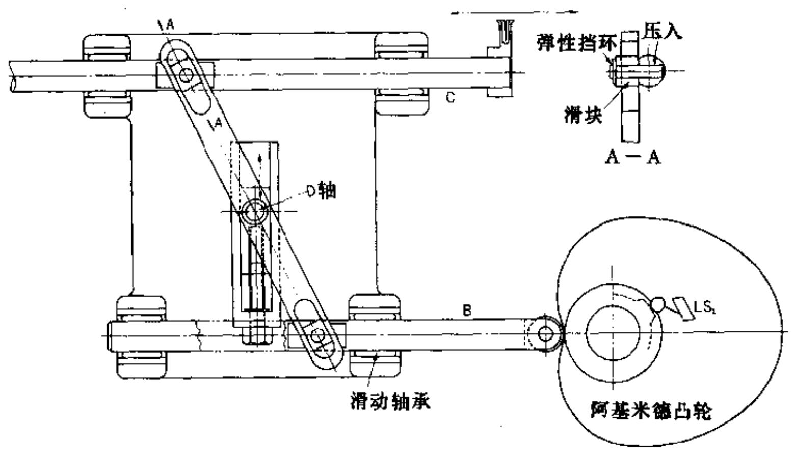

动力：电气  
行程： $1 0 \sim 2 0 0$ 毫米  
载荷：中

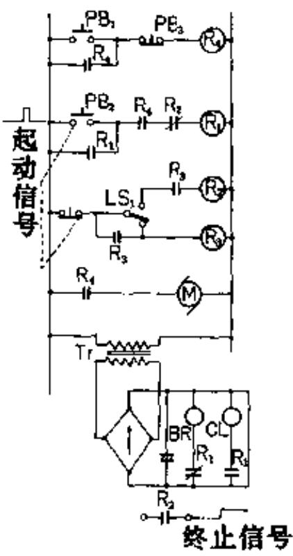  
图2-58

图2-58是通过阿基米德凸轮带动，作左右匀速运动的机构。B轴的运动通过杠杆传给C轴。由于支点轴D上下位置能移动，所以C轴的行程可以改变。

# 设计要点

$\mathbf { P B } _ { 1 }$ ：准备按钮$\bf { P B } _ { 2 }$ ：起动按钮$\mathbf { P B } _ { 3 }$ ：停止按钮$\mathbf { L S } _ { 1 }$ ：旋转一次停止开关

M：电动机

BR：制动器

CL：离合器

1.设计上无特殊之处，要求B、C两轴都能灵活动作，可采用滑动轴承等。另外，如A-A剖面所示，在轴上装配了铜锡合金的滑块，使之能在杠杆的长槽之间滑动。

2.D轴与杠杆之间使用滚针轴承等。

# 使用实例

适用于特轻载荷。多用于绕线机的横向微调等。

# 其 它

参阅附录一第5-4类控制回路。

# 曲柄直线运动机构

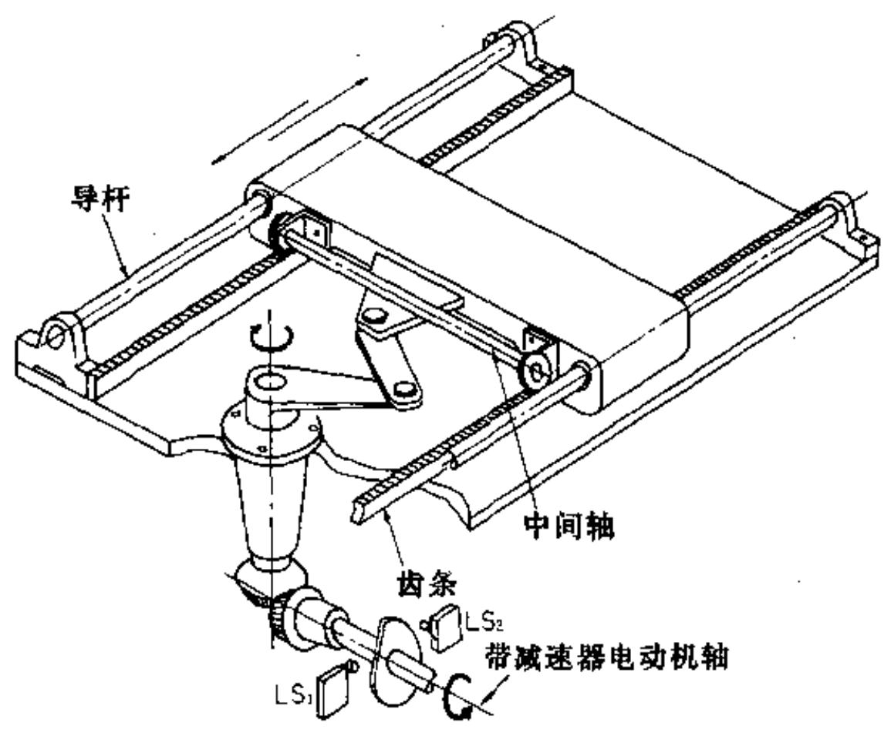  
图2-59动力：电气行程： $1 0 0 \sim 5 0 0$ 毫米载荷：中

# 图2-59是采用曲柄取得长行程的机构。

# 设计要点

1.滑板的宽度在允许范围内应尽量取宽些。2.必要时导杆应增设中间支承。这时，如采用导向滚珠轴套，就一定要用开口型的。3.如行程或移动位置必须变更时，可在铰链销处解决。

# 制造要点

1.中间轴主要用于防止机构被卡死，所以不必精加工。

2.如传动部分有松动，则机构停止时松动将更大，必须注意。

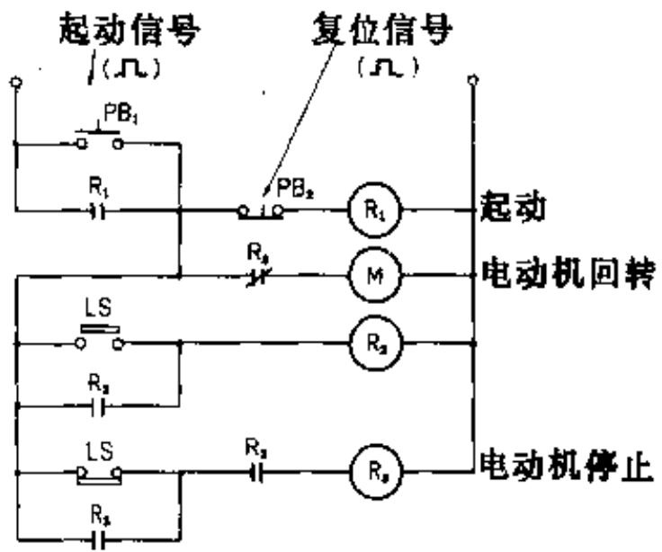

终止信号（）

使用实例

板、轴等的传送装置。

# 其 它

1.本例是宽幅度、长行程的机构，为减少运行中的歪斜，安装时要注意。

2.参阅附录一第2类控制回路。

# 由摆动运动转换的直线运动机构

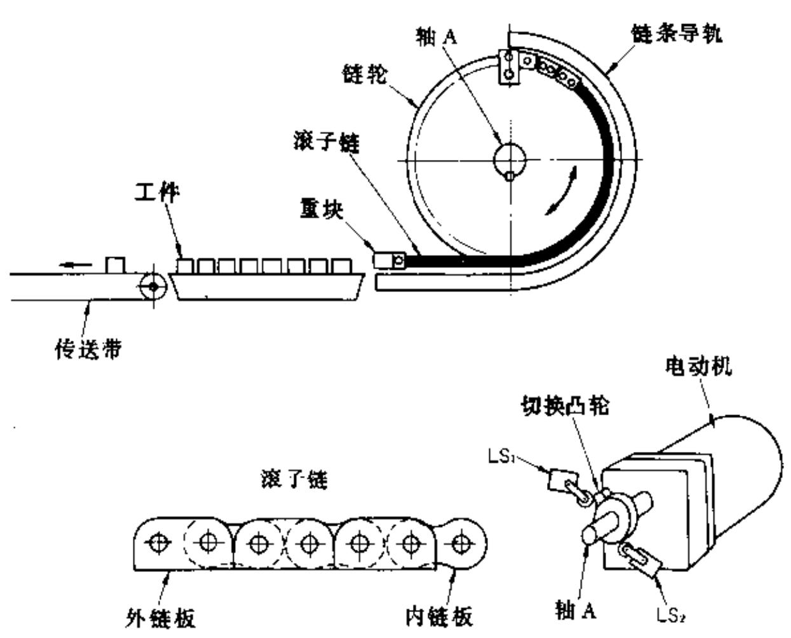  
图2-60动力：电气行程： $1 0 \sim 5 0 0$ 毫米载荷：轻

图2-60是利用一端固定于链轮上的滚子链作水平往复运动的机构。如图2-60所示，滚子链使用了特殊的外链板，形成仅能单方向曲折的结构。

# 使用实例

用于长行程，且对气缸一类传送装置在安装空间受到限制的地方。

其 它

参阅附录一第2类控制回路。

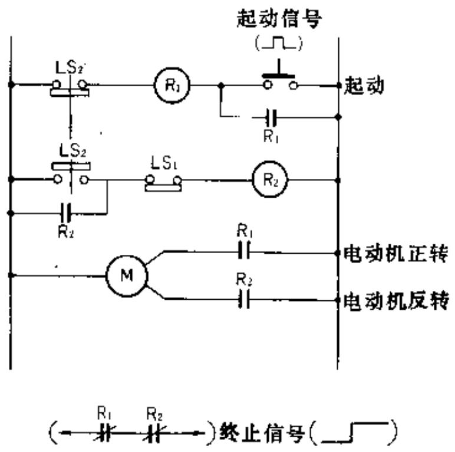

# 进给丝杠直线运动机构

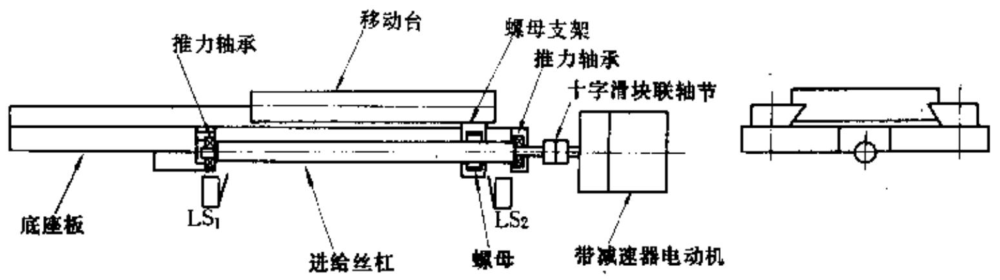  
图2-61动力：电气行程： $1 0 0 \sim 5 0 0$ 毫米载荷：重

图2-61是依靠进给丝杠完成直线运动的机构。其进给速度不能太快，往复基本上是等速的。如果能控制丝杠回转角度，也可进行微量进给。

# 设计要点

1.进给丝杠的推力轴承应安装牢靠。

2.进给丝杠与电动机（带减速器）的连接，希望采用象十字滑块联轴节那样较自由的联轴节。

3.进给螺母和螺母支架之间应按适当的间隙设计，要避免由于进给丝杠的弯曲、偏心等引起对螺母的附加应力(当然螺母要通过销子、键等止转）。

4.燕尾槽应有适当的润滑油槽。

# 制造要点

1.应保证燕尾槽与进给丝杠的平行度，以及两个燕尾槽的平行度。

2.润滑注油位置在燕尾槽、进给丝杠、进给螺母等处。

起动信号PB 8移动台前进\*2↑ R移动台停止前进中间终止信号中间起动 PB 8 中间起动 移动台开始后退RR移动台后退完毕终止信号（）

# 钢带水平运动机构

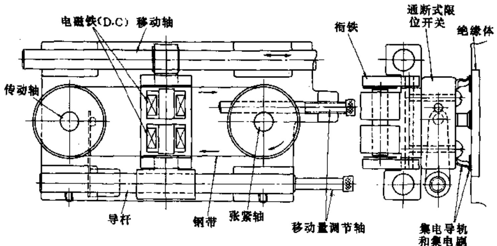

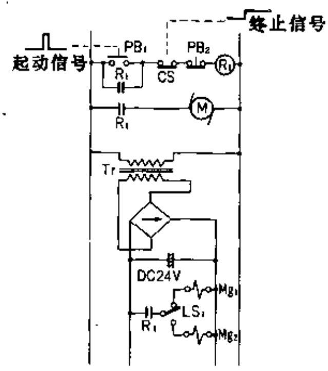  
图2-62

$\bar { \mathbf { P } } \mathbf { B } _ { 1 }$ ：起动按钮$\mathbf { P B } _ { 2 }$ ：停止按钮$\mathbf { M }$ ： 绕线及进给用电动机

$M _ { \ S } ,$ ：前进用电磁铁$\mathbf { M } \mathbf { g } _ { 2 }$ ：后退用电磁铁$\mathbf { L S } _ { 1 }$ ：通断式微动开关

CS：机械分配轴用的输出接点

动力，电气

图2-62是由直流电磁铁和衔铁夹住张紧在传动轮和张紧轮之间的钢带进行左右运动的机构。此左右运动是靠直流电磁铁的交替动作而产生的。LS的触头装在调整轴的左右端部，撞上之后，触点变换，瞬间即能转换为反向进给。

设计要点.

1.集电刷从通断式限位开关LS的三个接头引出，必须以极强的弹性确保与集电导轨的可靠接触。

2.直流电磁铁与衔铁之间的间隙比钢带厚度稍大一点为好。

3.钢带厚度为 $0 . 1 \sim 0 . 1 5$ 毫米，接缝希望用等离子焊接。传动轴与张紧轴的平行度也很重要。

使用实例

# 两组角撑架水平运动机构

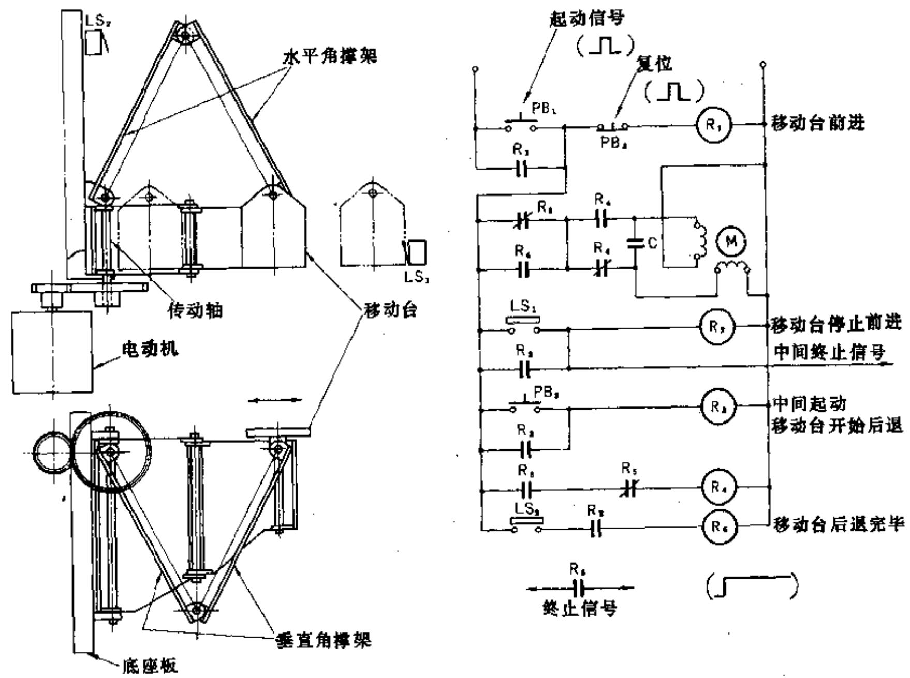  
图2-63动力：电气行程： $1 0 0 \sim 1 0 0 0$ 毫米载荷：中

图2-63是利用两组能够开闭的角撑架(两根为一组，铰接起来)实现水平运动的机构。本机构用在行程1米、载荷 $\mathrm { 1 } \ \sim 2$ 公斤的情况下较适宜。对于行程更大、载荷更重的情况不适用。

# 设计要点

1.底座板和两组角撑架铰接部分的安装要

特别牢固。

2.可在不影响角撑架强度的情况下，适当  
地钻孔，以减轻其重量。3.各回转部位尽可能使用滚动轴承，以使  
动作灵活轻便。4.采用减速比大、且制动性能好的电动机。制造要点注意铰接部分的松动。其它参阅附录一第3类控制回路。

# 滚子链往复直线运动机构

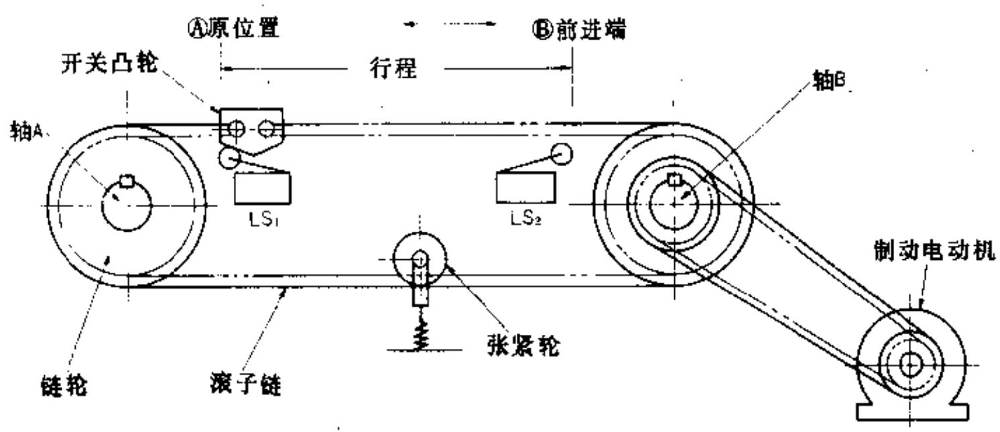

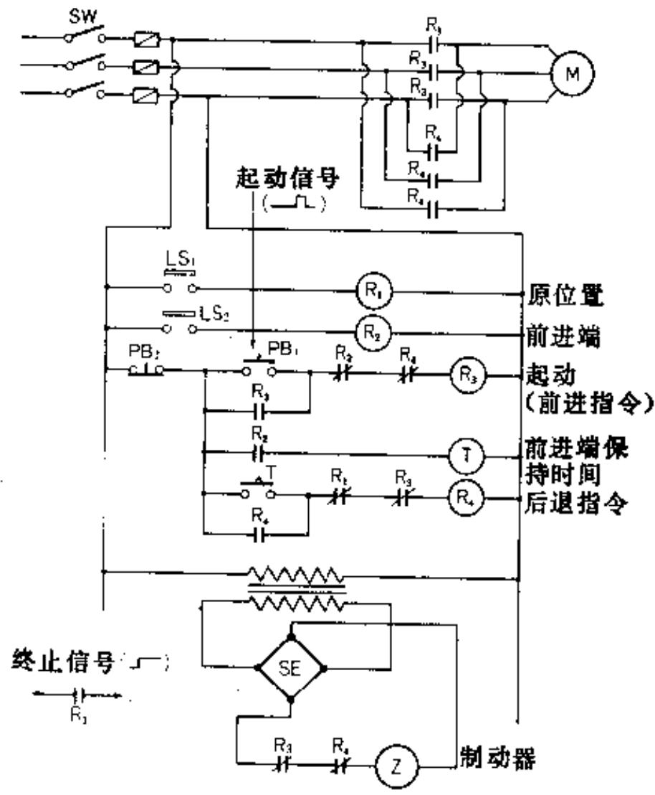  
图2-64

行程： $1 0 0 \sim 1 0 0 0$ 毫米

载荷：中

图2-64是依靠滚子链实现长行程的直线往复运动机构。

# 设计要点

在传送速度较快时，轴A、B上应安装定程器，以提高停止位置精度。

# 使用要点

用于行程长，且对停止位置精度要求不高的地方。

# 链条直线运动机构

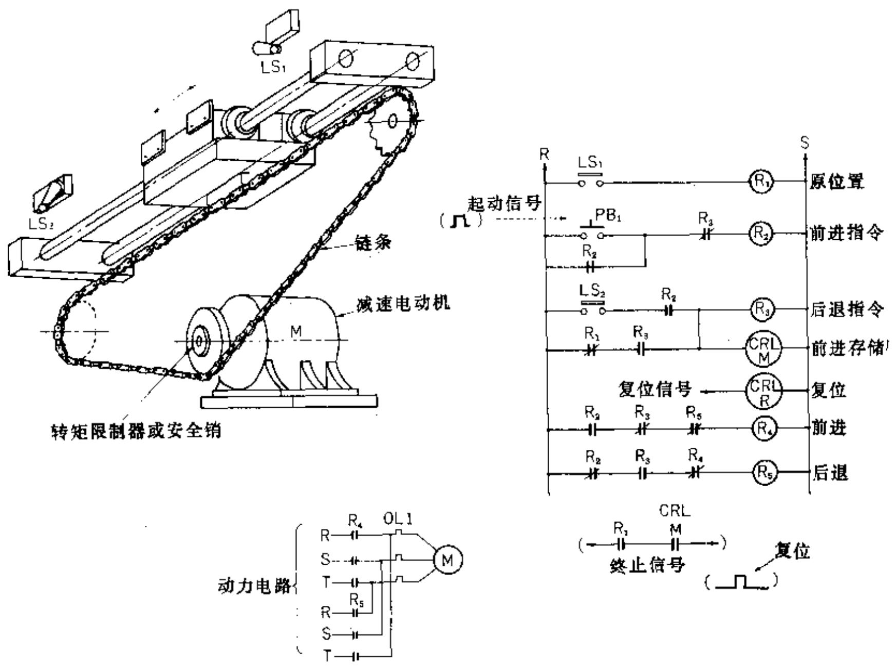

图265  
动力：电气  
行程： $1 0 0 \sim 1 0 0 0$ 毫米  
载荷：重

图2-65所示的机构，适用于沿滑动方向不能突出，因而不适宜于使用气缸或推杆等的地方。

# 设计要点

1.不要忘记应有链条延伸后的张紧装置。

2.在必须保证停止位置精度时，应采用定程器，并用转矩限制器等来减少定程后的滑行，

一般使用能强制停止的电动机。在停止位置精度要求较高时，多采用制动电动机。

3.因为机构的前进、后退是通过电动机的正、反转进行的。所以，对于短周期是不适合的。

4.也可采用液压马达或气动马达来代替电动机。

使用实例

工件的传送等。

其 它

参阅附录一第2类控制回路。

# 进给丝杠快速进给直线运动机构

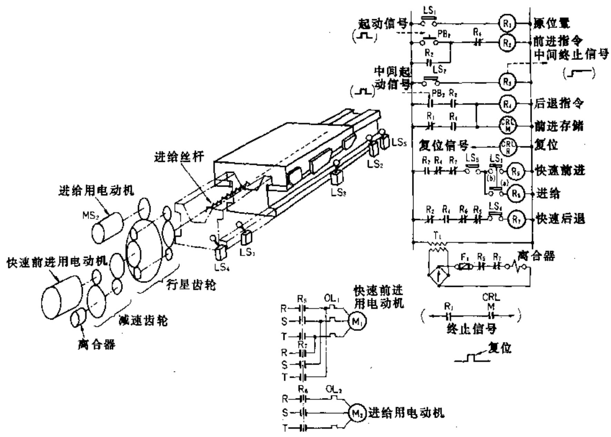

图2-66  
动力：电气  
行程：10～1000毫米  
载荷；重

图2-66所示的这种机构，在希望将前进速度分为两挡，即快速进给和进给时使用。

# 设计要点

1.进给齿轮箱应考虑采用油浴润滑。

2.为安全起见，在前进与后退的行程两端，应安装保险用限位开关。当限位开关失灵时，

可调整电压使离合器打滑。如因力的关系，使离合器不能打滑时，就应考虑使用安全销等保险机构。

3.丝杠螺母应充分润滑。

4.行程长时，有必要制止进给丝杠的振摆，并检查进给丝杠的临界速度。

制造要点

应保证进给丝杠与螺母的同轴度。

使用实例

加工工作头的前进与后退。

# 进给丝杠直线运动机构

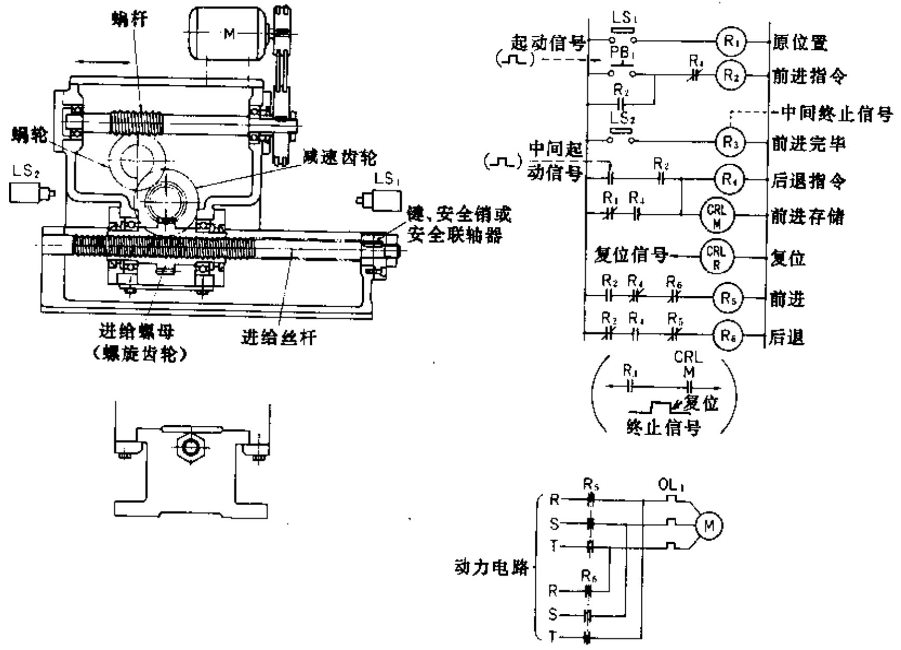

图2-67  
动力：电气  
行程： $1 0 0 \sim 1 0 0 0$ 毫米  
载荷：重

图 2-67是通过电动机使螺母回转，并沿固定的进给丝杠前进或后退的机构。

# 设计要点

1.齿轮和螺母要充分润滑。2.多与加工轴等联动使用，此时应注意回转方向。3.也可通过带制动器的电动机，使固定的进给丝杠回转，以实现快速运动。

4.应考虑超程预防措施（如安全销、安全离合器、保险用限位开关等）。

# 制造要点

1.应尽量减小齿轮以及螺母与丝杠之间的间隙。2.注意丝杠与螺母的同轴度。

# 维护要点

注意螺母磨损后的调整。

使用实例

加工工作头的前进与后退。

# 其 它

参阅附录一第3类控制回路。

# ·力臂比增力直线运动机构

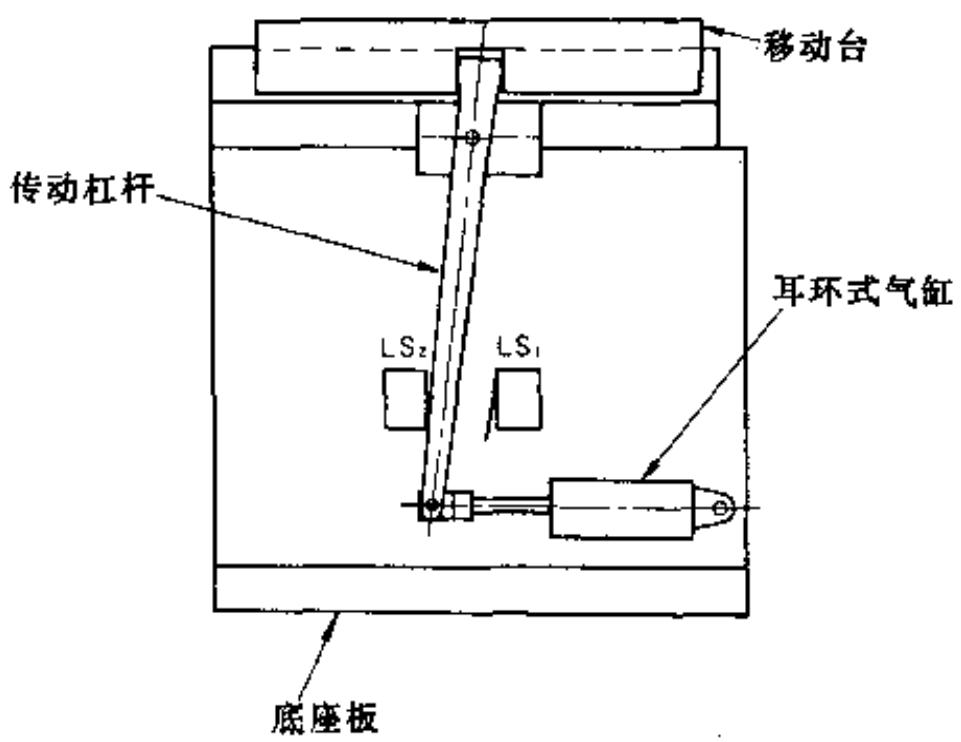

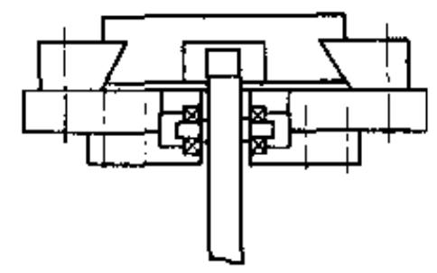

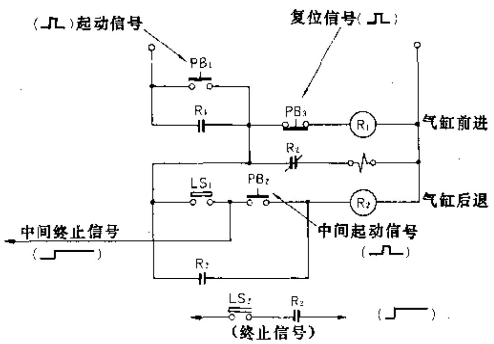

图2-68  
动力：气压  
行程： $\{ \} \sim 1 0$ 毫米  
载荷：重

图268是利用力臂比把气缸力增大，使移动台实现左右运动的机构。这里通过力臂比减小了行程，但却增大了作用力。

# 设计要点

1.杠杆活动部分采用滚动轴承，以使动作灵活。

2.考虑到加在移动台上的力，杠杆应有足够的强度。3.采用耳环式气缸。4.燕尾槽应有适当形状的润滑油槽及注油孔

# 制造要点

1.保证两个燕尾槽的平行度。  
2.气缸与杠杆的中心线应在同一平面。  
3.润滑注油位置在燕尾槽及其它地方。

# 其 它

参阅附录一第3类控制回路。

# 自动定心对向直线运动机构

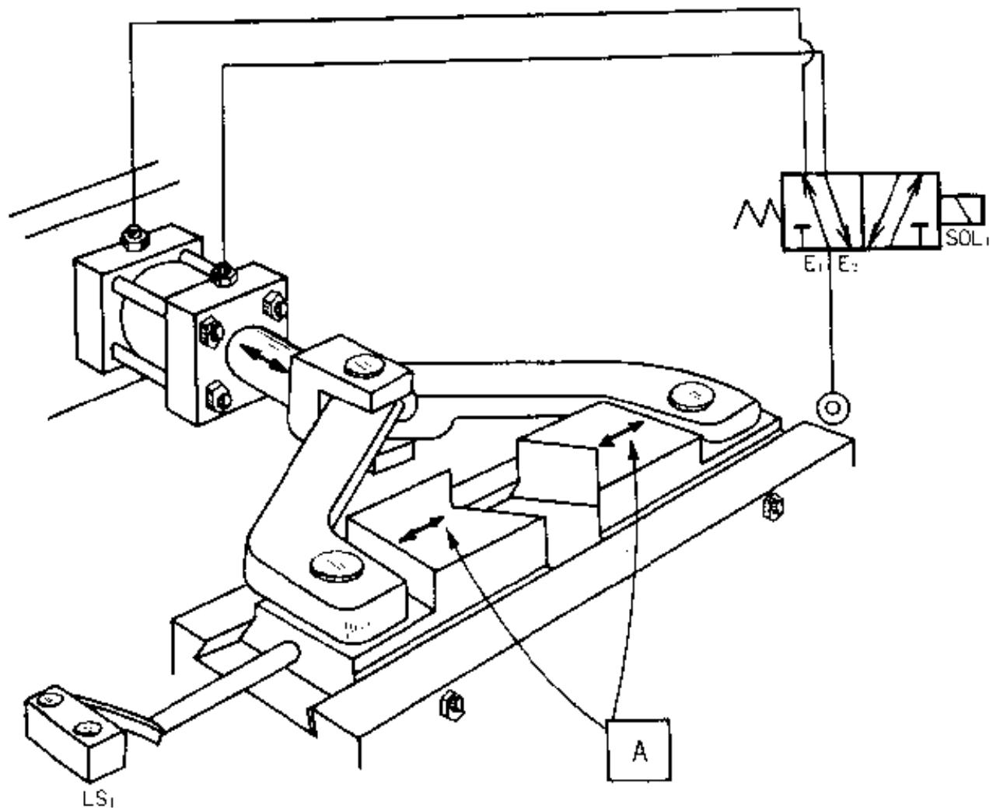  
图269动力：气压行程： $5 \sim 3 0$ 毫米载荷：中

图2-69是通过气缸操纵连杆，使两个V形块A作对向水平运动的机构。图中是用于老虎钳的示例。由于两个V形钳口作对向等距离移动，被夹紧工件的外径虽然有误差，但中心位置仍能保持不变。老虎钳钳口的行程不能太大。

# 设计要点

连杆相对于老虎钳夹紧方向的角度要小，以使动作平稳。此角度在 $3 0 ^ { \circ }$ 以下为宜。

# 制造及维护要点

老虎钳的滑块要有调整镶条。

{ 超动LSP R 证实夹紧R 夹紧Pr SOL1 终止信号

使用实例

用于圆盘或圆柱形工件加工孔时夹紧。虽然工件外径有误差，但因本机构可自动定心，所以仍能保证中心正确。

其 它

参阅附录一第1类控制回路。

# 双行程水平运动机构

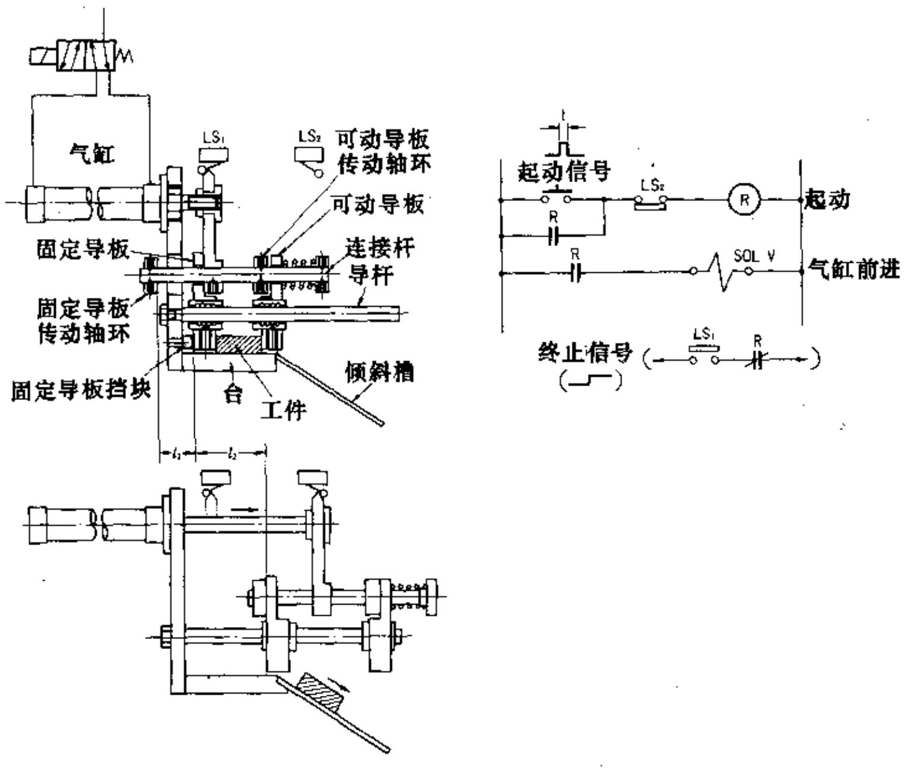  
图2-70动力：气压行程： $1 0 \sim 2 0 0$ 毫米载荷：轻

图2-70是可动导板与固定导板各有不同行程的水平运动机构。开始时，工件承受固定导板和弹簧的挤压力，弹簧通过可动导板使工件定位。动作顺序如下：气缸通过连接杆推动可动导板前进，这时由于固定导板不动，工件也不动；当连接杆继续前进，使固定导板传动轴环接触固定导板时，固定导板便从此位置开始运动，前进距离 $\mathbf { L } _ { 2 }$ 后停止，工件沿倾斜槽滑下。气缸的行程为 $( \mathbf { L } _ { 1 } + \mathbf { L } _ { 2 } )$

# 设计要点

1.气缸与连接杆距离如太大，易发生扭曲。2.连接杆与导杆之间的距离相对于滚珠轴套的有效长度如果太大，也会产生扭曲。3.在采用数个导杆时，要给出平行度要求。

# 使用实例

排出工件。  
其它  
参阅附录一第1类控制回路。

# 串联配置气缸的可变行程直线运动机构

图2-71

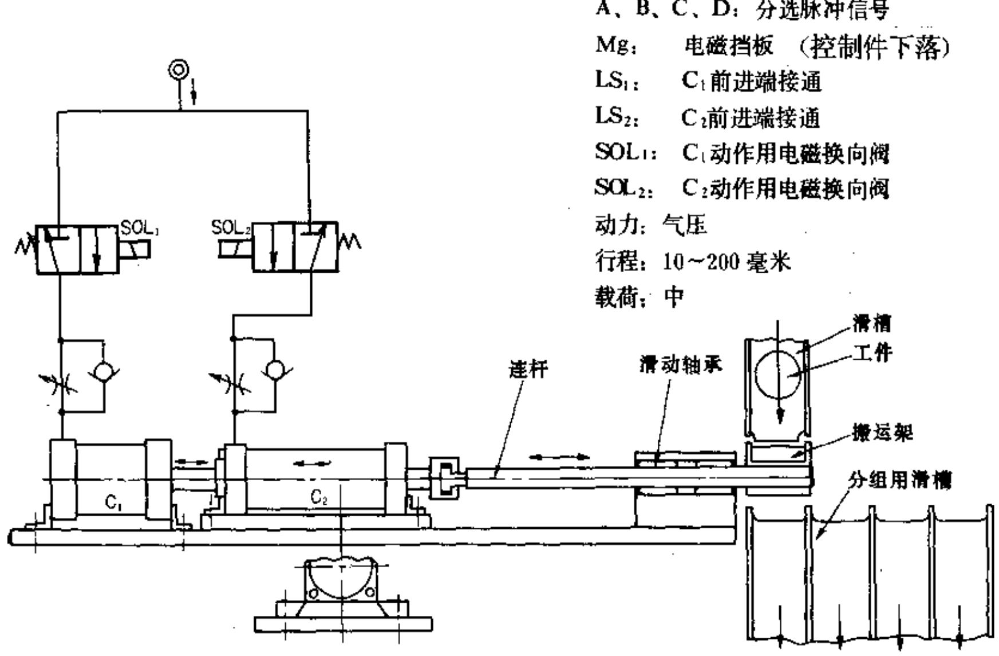  
图2-71是将两个气缸串联起来，以便选择不同行程的直线运动机构。

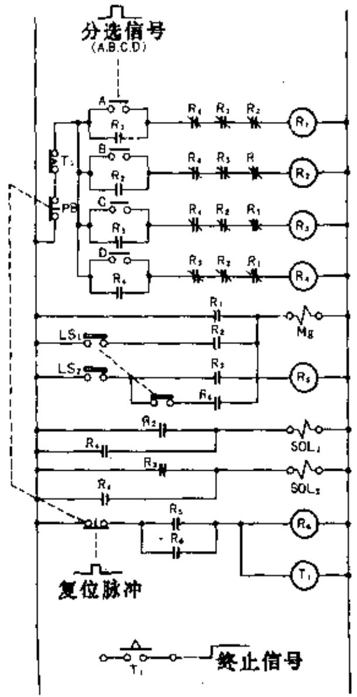

# 设计要点

$1 . 0 \mathfrak { r } \mathfrak { c } _ { \mathfrak { l } }$ 较 $\mathbf { C } _ { 2 }$ 的行程要小（本例为1/2）。这样， $\mathbf { C } _ { 2 }$ 的气压软管的移动量就小了。

2.气压软管挠性要好。

3.以测量工件直径作为电气控制的一个例子：根据工件直径的大小，可以分别向两个电磁阀输送脉冲信号。如图2-71所示，能分为四组。

# 使用实例

对落到滑槽上的工件,可按质量好坏分组，或按其直径大小分类。也用于将传送的一列工件分为四组。

# 气缸直线运动机构

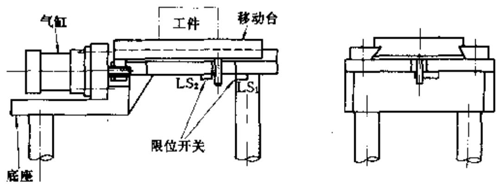

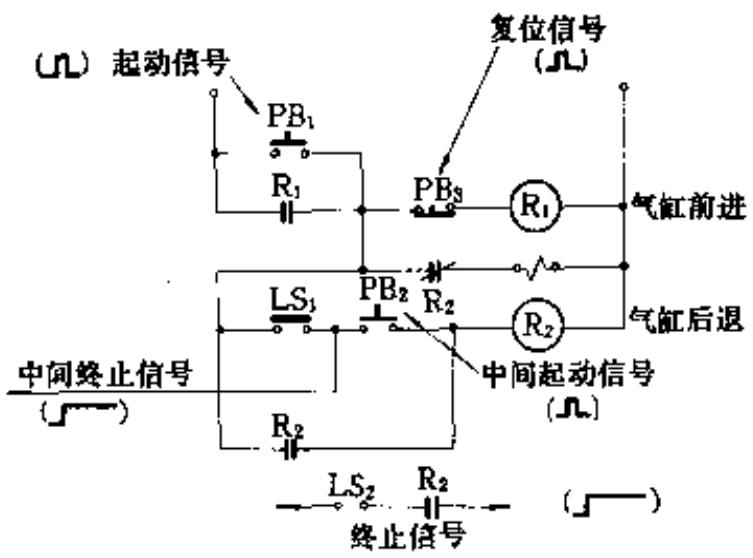

图2-72

动力：气压

行程： $1 0 \sim 2 0 0$ 毫米

载荷：中

图 $2 \cdot 7 2$ 是利用气缸使 $1 0 \sim 3 0$ 公斤的工件作水平往复运动的机构。

# 设计要点

1.滑动部分（燕尾槽）的材料，可用碳钢

铸件，并要开适当的润滑油槽。

2.底座可用板金结构或铸造结构。

制造要点

要注意滑动部分的加工精度，并保证滑动部分中心与气缸中心的平行度，以使动作平滑。

# 其 它

参阅附录一第3类控制回路。

# 齿条、齿轮和连杆直线运动机构

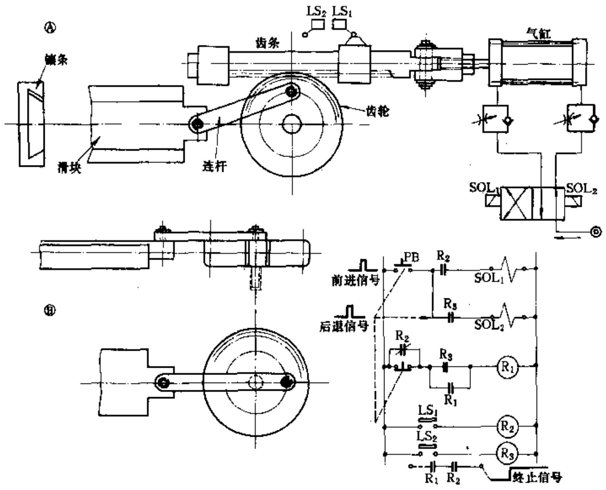

图2-73

PB：起动按钮  
$\mathbf { L } \mathbf { S } _ { \mathbf { l } }$ ：后退端接通  
$\mathbf { L } \pmb { S } _ { 2 }$ ：前进端接通  
$\mathbb { s o r }$ ：气缸动作用电磁换向阀  
动力：气压  
行程： $1 \Updownarrow \sim 2 0 0$ 毫米  
载荷：中

图2-73所示的机构，由气缸带动齿条，使齿轮回转一次，在齿轮上取支点，通过连杆带动滑块左右运动。图A是当气缸向一个方向动作时，滑块从中心出发，或左右、或右左地运动，然后返问中心。图B连杆支点的取法不同，通过气缸左右运动，滑块左右运动的起点和终端，有着冲击较小等优点。

制造要点

齿条滑动部分、齿轮轴和支点轴等处，均采用滚动轴承，滑块滑动部分可采用燕尾槽。

# 使用实例

如图2-73A那样的结构，可考虑用在晶体管和电阻的引线插装到印刷电路版之后，作为夹紧装置。

# 其 它

参阅附录一第3类控制回路。

# 顶端设有过载保护的直线运动机构

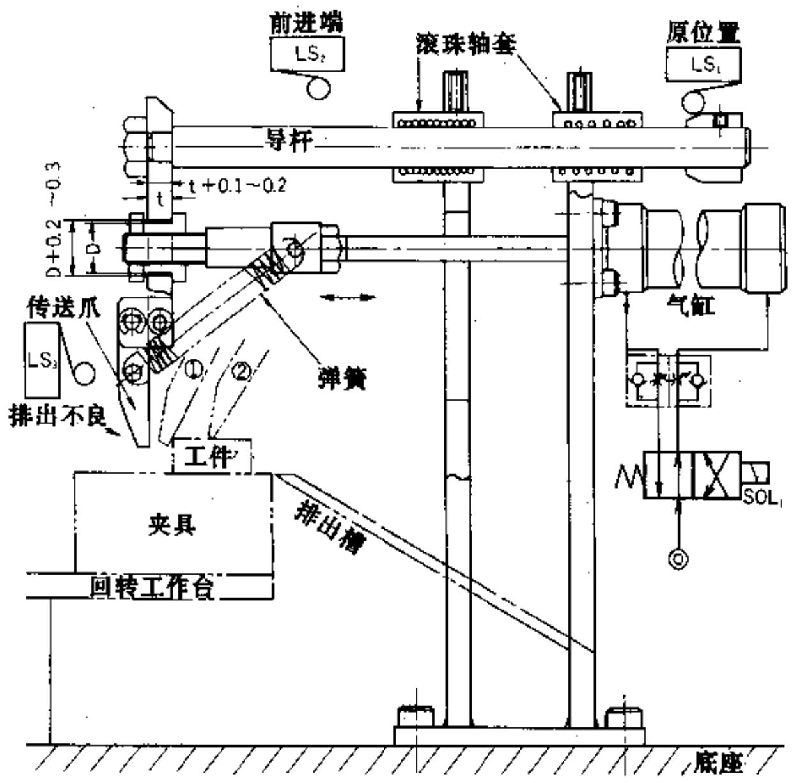

输送时，传送爪如图中 $\textcircled{1} \textcircled{2}$ 那样运动，使 $\mathbf { L } \bar { \mathbf { S } } _ { 3 }$ 动作，并发出情况异常的停止信号，使传送爪直接回到原位置。

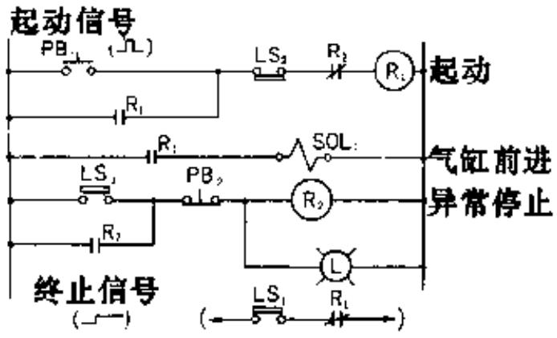  
图2-74动力：气压行程： $1 0 \sim 3 0 0$ 毫米载荷：轻

# 设计要点

1.气缸和导杆的间距要小。2.弹簧要根据工件的重量、传送速度等来设计，使其具有一定的拉力。

图2-74是顶端设有过载保护的直线运动机构。按下起动按钮，气缸向右动作，当触发前端的开关 $\mathbf { L } \bar { \mathbf { S } } _ { 2 }$ 时，发出信号，使气缸返回原位。本例是当工件由于某种原因被卡住，不能

# 制造要点

1.在有几个导杆时，要注意导杆间的平行度。2.注意气缸与导杆的平行度。

使用实例

用在搬运工件时，防止意外的力加到工件上。

# 其 它

参阅附录一第2类控制回路。

# 可调行程的水平运动机构

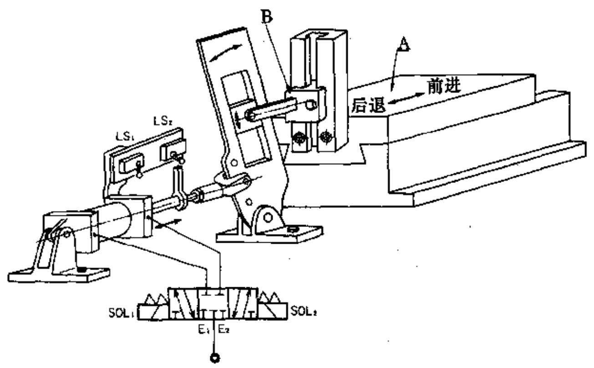

图2-75  
动力：气压  
行程： $1 0 \sim 3 0 0$ 毫米  
载荷：重

图2-75是一种可调行程的水平运动机构。气缸与摆动连杆相连接，通过可调行程的托架B，使工作台A也与摆动连杆相连接。当气缸动作时，工作台A便作左右运动。工作台的行程，可通过调整托架的上下位置而改变；也可通过变更气缸与摆动连杆的连接位置而改变。

设计、制造要点

1.要防止回转销部分的松动。

2.摆动连杆上的方孔为滑动部分，要充分注意其配合情况。

# 其 它

参阅附录一第2类控制回路。

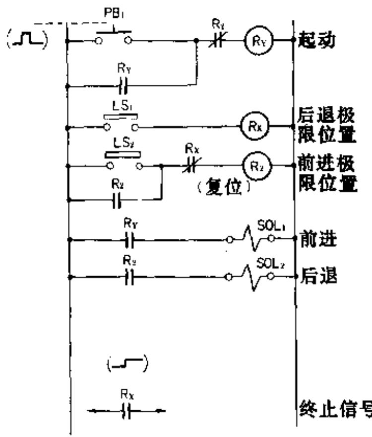

# 齿条、齿轮变换角度的直线运动机构

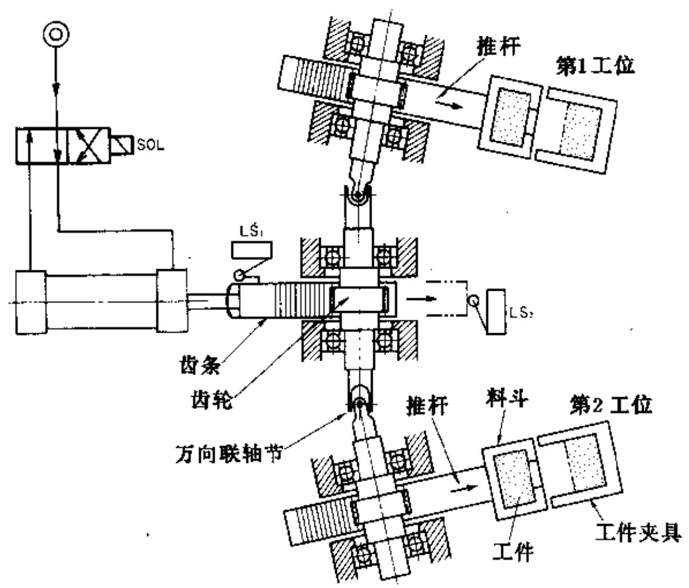  
图 $2 \cdot 7 6$ 动力：气压行程； $1 0 0 \sim 5 0 0$ 毫米载荷：中

图2-76是变换角度的直线运动机构。当起动信号发出后，气缸前进，通过齿条、齿轮带动两个推杆分别向第一、第二两个工位直线前进。当气缸前进到限位开关 $\mathbf { L } \mathbf { S } _ { 2 }$ 时，自保电路被切断，气缸返回原位。本图所示是把料斗中的工件向夹具供料的情况。

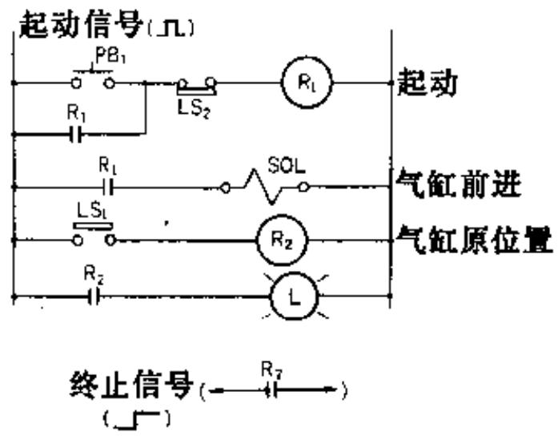

对推杆终端的定位精度，应根据两个工位的不同要求分别设计，并分别调整。

使用实例

# 设计要点

在要求供给方向不平行的场合下，作工件供给等用。

其 它

参阅附录一第1类控制回路。

# 平衡式直线运动机构

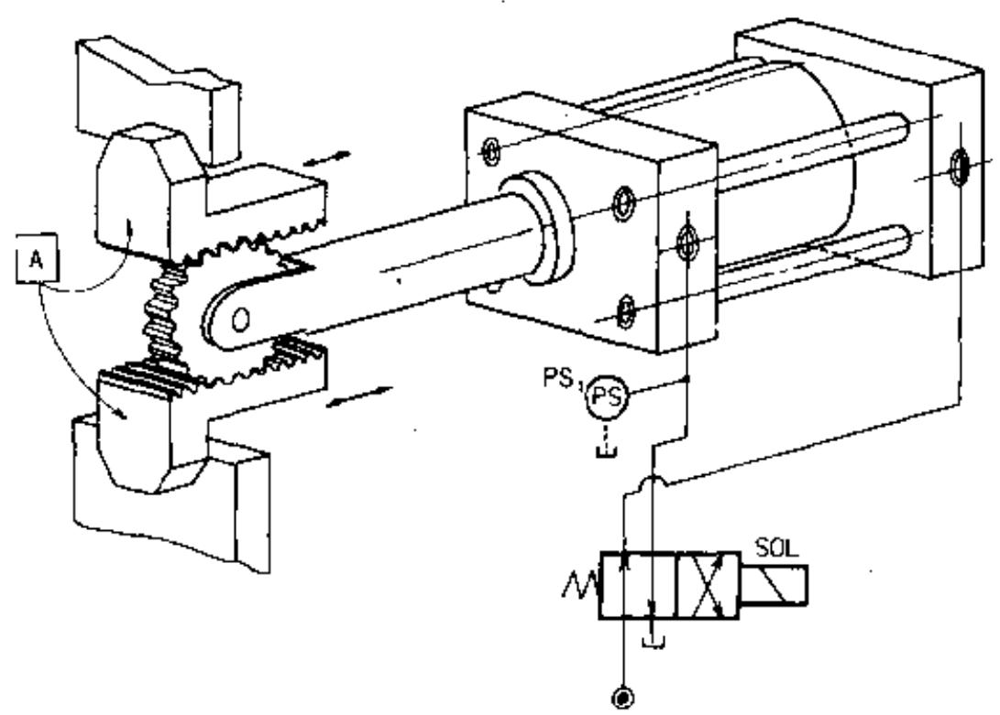

图2-77动力：液压行程； $1 0 \sim 1 0 0$ 毫米

载荷：中

图2·77是使用一个液压缸，通过一对压板A对板厚不同的工件施加相同压力的机构。在液压缸活塞杆的端部装有齿轮，并与两个压板上的齿条相啮合。当自动起动后，齿轮带动齿条压板向右移动，如一压板先接触工件，另--压板仍继续移动，直至第二压板也接触工件，此时两压板同时对工件施加压力，然后通过压力继电器的动作，发出中间起动信号，操纵加工部件前进。加工完毕后，发出终止信号，让液压缸活塞杆带动压板松开，一个工作周期结束。

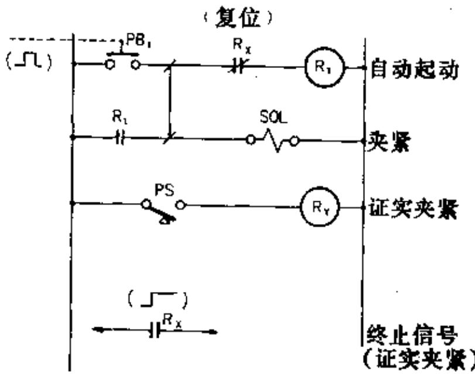  
PS：压力继电器

# 设计要点

为防止作用在压板上的力偶使压板产生扭曲，要考虑压板的导向方法。并且要注意防止切屑进入齿轮、齿条啮合部分。

制造、维护要点

压板导向部分的调整，要达到同时合适为止。

# 其 它

参阅附录一第1类控制回路。

# 小型液压缸直线运动机构

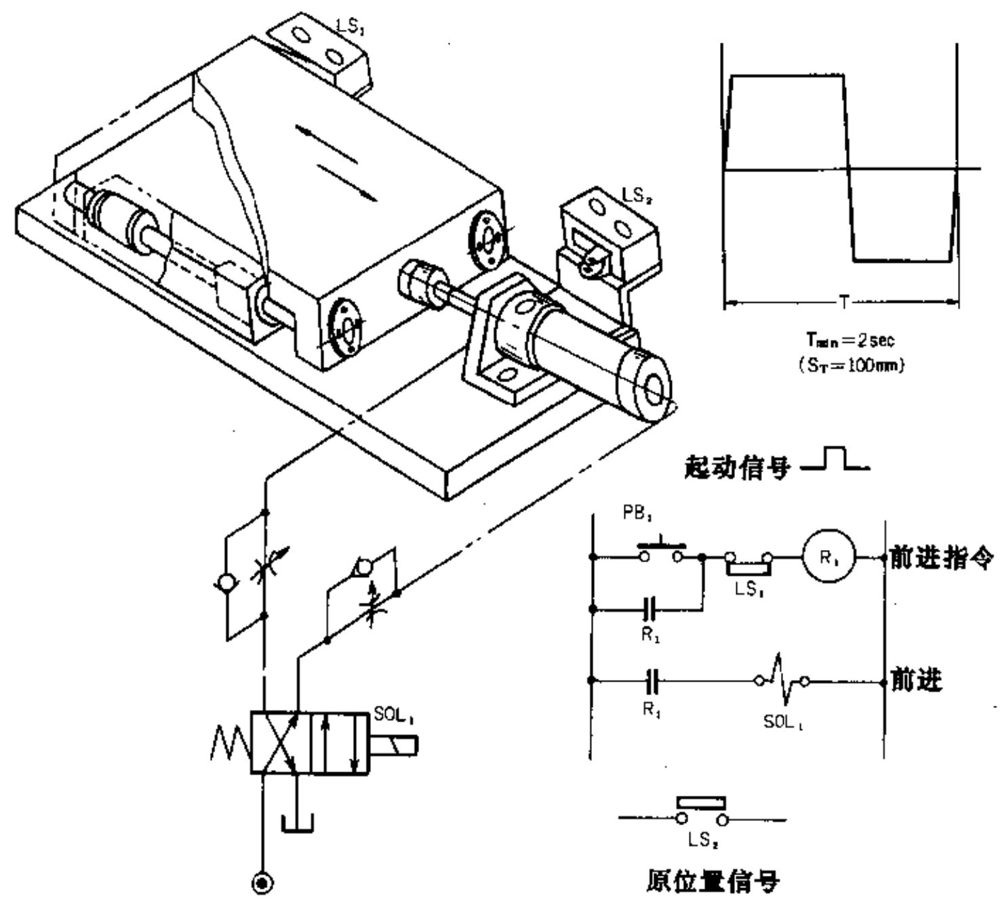

图278  
动力：液压  
行程： $1 0 \sim 1 0 0$ 毫米  
载荷：中

图278是使用小型液压缸并通过滚珠轴套导向的直线运动机构。

# 设计要点

1.一般常用的小型液压缸不耐高压，所以在用于高压时，要另行设计。

2.导杆的托架要有适当的调整量，以保持

导杆与轴套的间隙合适。3.行程终端利用液压缸端部支承，以减少  
导杆安装部分的损伤程度。制造要点保证导杆与液压缸活塞杆的平行度。使用实例小零件的挤压等。

# 其 它

1.移动台要尽量减轻重量。  
2．参阅附录一第1类控制回路

# 止转式液压缸直线运动机构

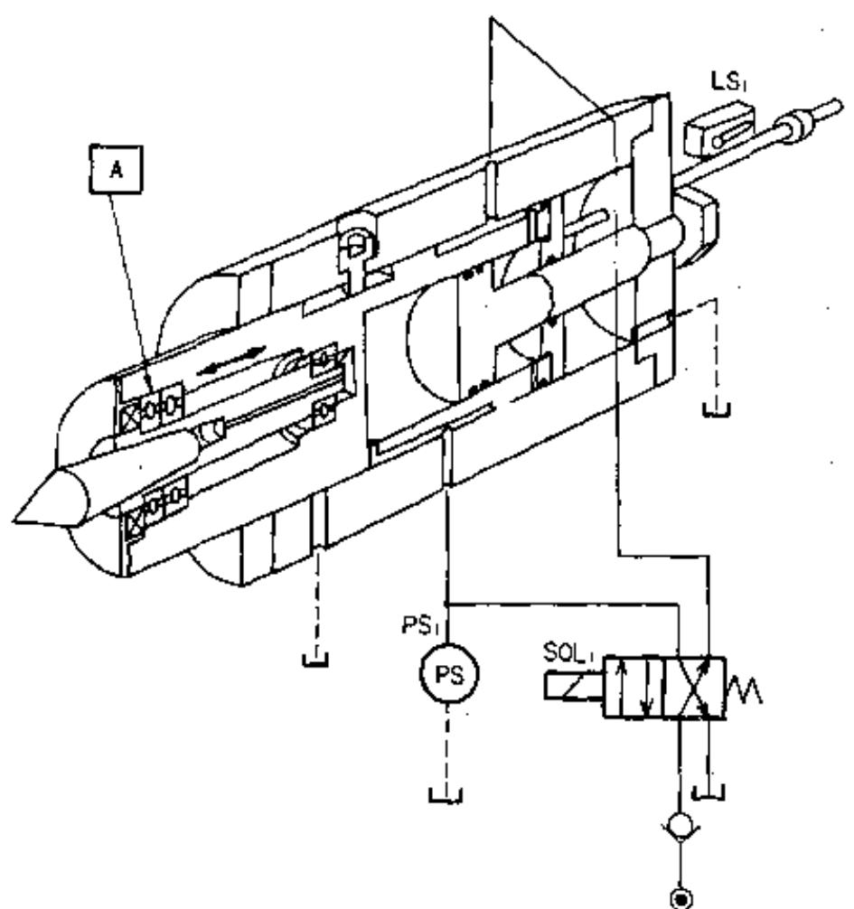  
图279动力：液压行程： $1 0 \sim 1 0 0$ 毫米载荷：重

图2-79是将活塞杆固定，而使液压缸A缸体移动的直线运动机构。液压缸外壁靠键的限制，不能回转。图中所示是用在机床尾架上的情况，活顶尖装在液压缸的一端。本机构能承受径向和轴向的重载荷。

# 设计要点

1.液压缸外壁滑动部分的润滑，可利用高压油一定程度的漏泄，因而有必要作排油处理。

2.活顶尖用润滑脂润滑为好。

# 维护要点

注意定时更换润滑脂及O型密封圈。

# 使用实例

用于比较重的工件或重型切削加工机床的尾架。

其 它

参阅附录一第1类控制回路。

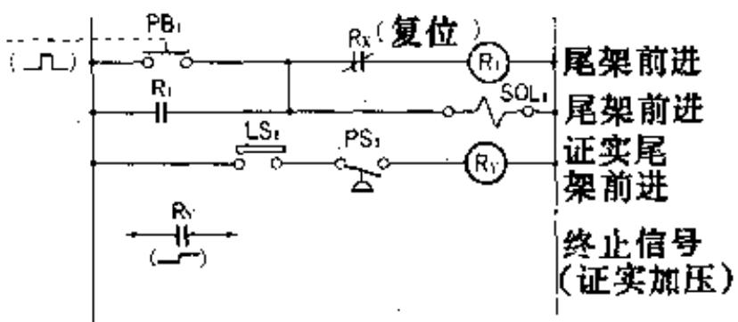  
$\mathbf { P S _ { 1 } } _ { }$ ：压力继电器

# 液压缸直线运动机构

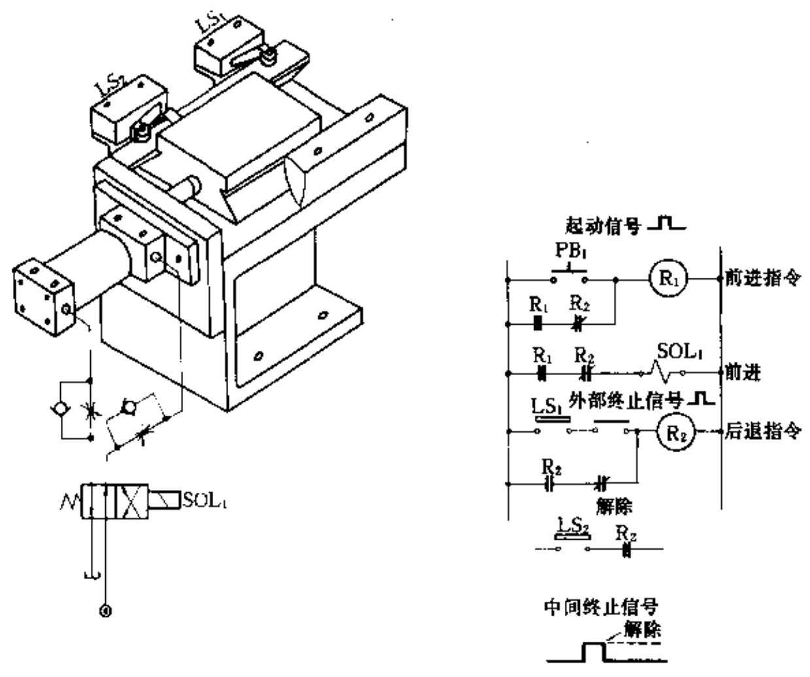

图280  
动力：液压  
行程： $1 0 \sim 2 0 0$ 毫米  
载荷：重

图 $2 \cdot 8 0$ 是直接采用液压缸的往复运动机构。

设计要点

在很多情况下，行程的前进、后退两端，需要调整速度，所以同时在液压缸两端装设缓冲调节阀为好。

制造要点

1.注意液压缸和滑块中心的一致。液压缸的安装面应考虑不要出现直角为好。

2.要注意液压缸固定螺栓、滑块、支座螺栓可能经常发生松动。

使用实例

挤压、加工头移动台等。

# 其 它

1.本例是液压缸往复运动机构一般的形式。

2.参阅附录一第3类控制回路。

# 滚珠滑板水平运动机构

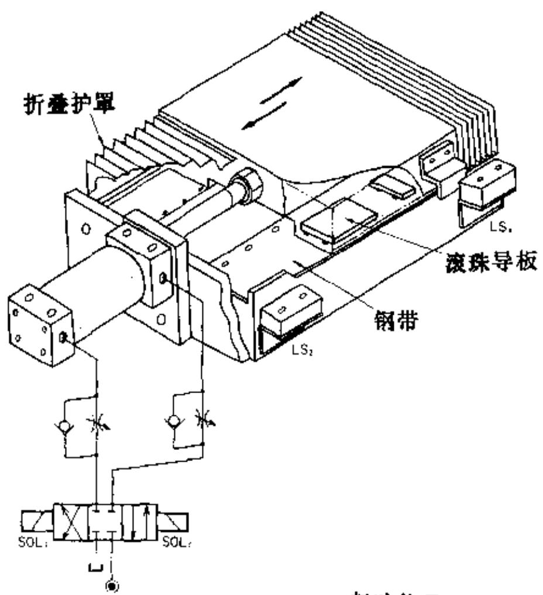  
图2-81动力：液压行程： $1 0 \sim 2 0 0$ 毫米载荷：重

# 设计要点

1.由于采用滚珠滑板来承受载荷，所以底座应进行淬火处理。可用钢带代替底座，但要注意此钢带的不平度。因此，必须采取粘接剂和紧固小螺钉等合并使用的装配方式。

2.由于滑动台与底座左右配合，必须设计成左右能够调整的结构。

3.使用时，如有向上的作用力，应补加压板。

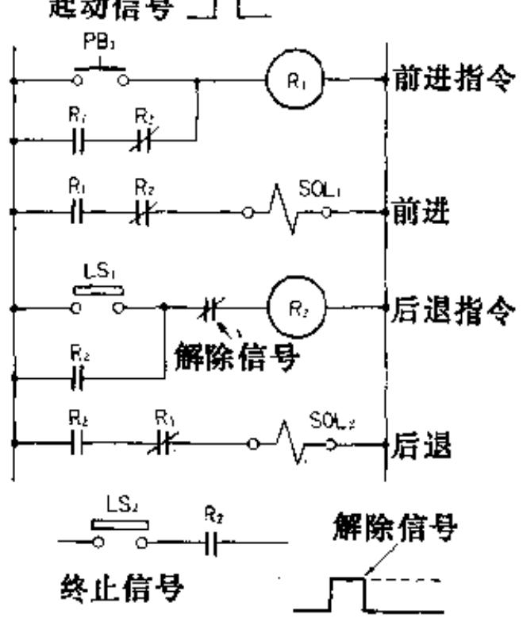  
图2-81是由液压缸直接推动、以钢带和滚珠滑板来承受重载并导向的水平往复运动机构。

4.在液压缸行程的两端，应有缓冲调节阀。

起动信号制造要点

装配钢带时应注意表面不应有凹凸不平的情况。

使用实例切削加工的滑动台。

# 其 它

1.要考虑折叠护罩容易损坏，需有备件。

2.参阅附录一第2类控制回路。

# 固定轴液压缸直线运动机构

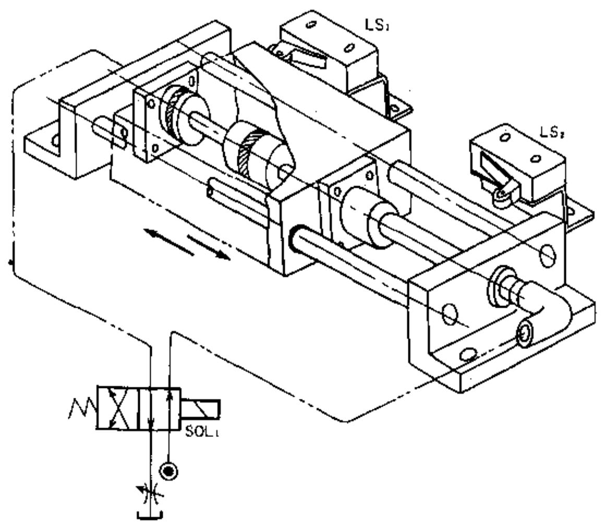  
图2-82动力：液压行程： $1 0 \sim 2 0 0$ 毫米载荷：重

图2-82是采用固定轴液压缸做水平运动的机构。具有占地面积小的特点。

1.行程小时,可将活塞和活塞杆制成整体，这样容易制造。

2.如果导杆之间的间距合适，可加滚珠导套；如不可能，必须以液压缸轴线为基准进行整体设计。

# 设计要点

3.切勿忘记液压系统的排气。

# 制造要点

要充分注意三根轴的平行度，以防液压缸密封件过早磨损。

起动信号

# 使用实例

小零件的输送和排出，刀具工作台等。

# 其 它

1.因为液压缸左右面积相等，所以在等速运动情况下，可以使用T型孔道。

2.参阅附录一第2类控制回路。

# 可调速的直线运动机构

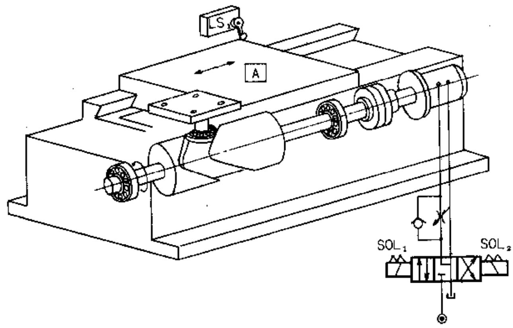  
图2-83.动力：液压行程： $5 0 \sim 3 0 0$ 毫米载荷：中

图2-83是通过联轴节把液压马达和圆柱凸轮连接在一起，使工作台A作左右运动的机构、自动起动后，液压马达开始回转，工作台通过圆柱凸轮前进和后退，然后触动限位开关$\mathbf { L } \mathbf { S } _ { 1 }$ 停止，从而完成一个工作周期。圆柱凸轮的回转速度用流量控制阀调整。本机构与采用电动机的方式相比，前进和后退转换时，冲击很小，且体积也较小。

# 设计要点

工作台的进给速度取决于凸轮形状及液压马达的转速。

制造、维护要点

注意凸轮槽的润滑及磨损。

使用实例

刀架滑动装置等。

其 它

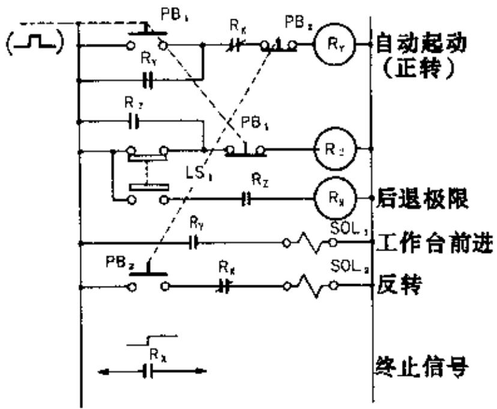

参阅附录一第2类控制回路。

# 连杆直线运动机构

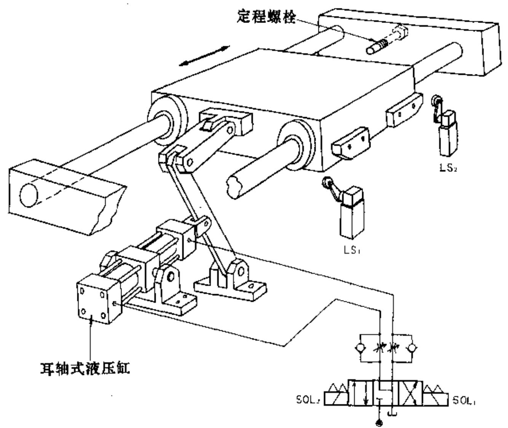

图2-84

动力：液压

行程： $1 0 0 \sim 5 0 0$ 毫米

载荷：重

图2-84是能扩大液压缸行程的直线运动机构。

# 设计要点

1.液压缸为耳轴式，支点应在液压缸的重心附近。

2.摇杆摆动角度大了，即产生使导杆弯曲的分力，从而造成不良影响。

3.采用两端带缓冲调节阀的液压缸，以减小停止时的冲击。

# 制造要点

连杆机构的销子要热处理，以减少磨损。

起动信 T 开中间终止信号  
中间起 前进完毕  
{ R 后退指令前进存储复位信号 复位TITPrl 前进后退CRLR M宁终止信号复位

使用实例工件传送等。

其它参阅附录一第3类控制回路。

# 杠杆式平衡直线运动机构

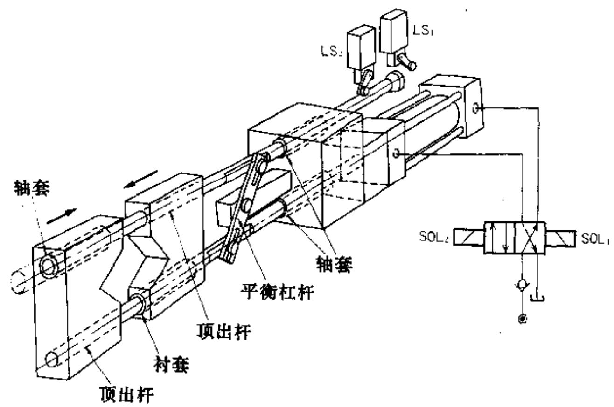  
图2-85动力：液压行程： $1 0 0 \sim \dot { 5 } 0 0$ 毫米载荷：重

设计要点

1.工件的夹板各自固定在一根杆上，当液压缸力较大时，相应的弯矩即作用于杆上，使杆产生挠曲。所以选择杆的直径时，应注意其挠曲量不应对机构的动作有所妨碍。

2.杆的滑动部分润滑较困难，应考虑采用含油轴承。

3.动作中液压如被切断，被夹紧的工件有脱落的危险。为防止这种可能性，应在液压系统中采用储能器，或采用机械闭锁装置。

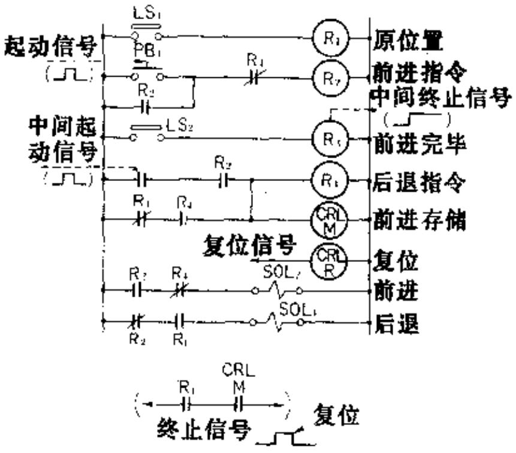  
图2-85是能按工件的中心位置进行夹紧的机构。

# 使用实例

工件的紧固等。

其 它

参阅附录一第3类控制回路。

# 肘节直线运动机构

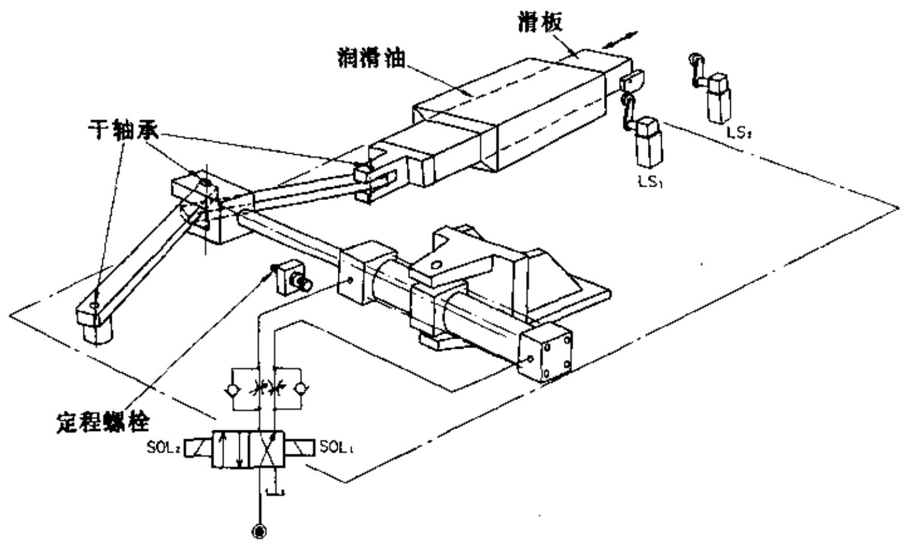  
图2-86动力：液压行程： $1 0 0 \sim 5 0 0$ 毫米载荷：重

图2-86是肘节直线运动机构。在肘节的静止点附近可得到较大的推力。

# 设计要点

1.支点销应有足够的强度。2.如果在稍许越过静止点的位置上设置定程器，以限制前进位置，那么，即使有反作用力，滑板也不会逆向行走。3.用于夹紧时，可根据肘节的长度或滑板的长度来改变夹紧力。如条件允许，可按实物设计。

LS原位置起动信号PR： 前进指令RHHLS R1 R 退后指令前进存储复位信号+ ® 复位SCL 前进中 SOL 后退CRL( 终止信号复位

# 制造要点

1.正确地加工肘杆的孔和保证孔的中心距。2.铰接部分的销子应热处理，使其具有足够的强度。

使用实例

刀具的放松、夹紧等。

其 它

参阅附录一第3类控制回路。

# 钢丝绳高速水平运动机构

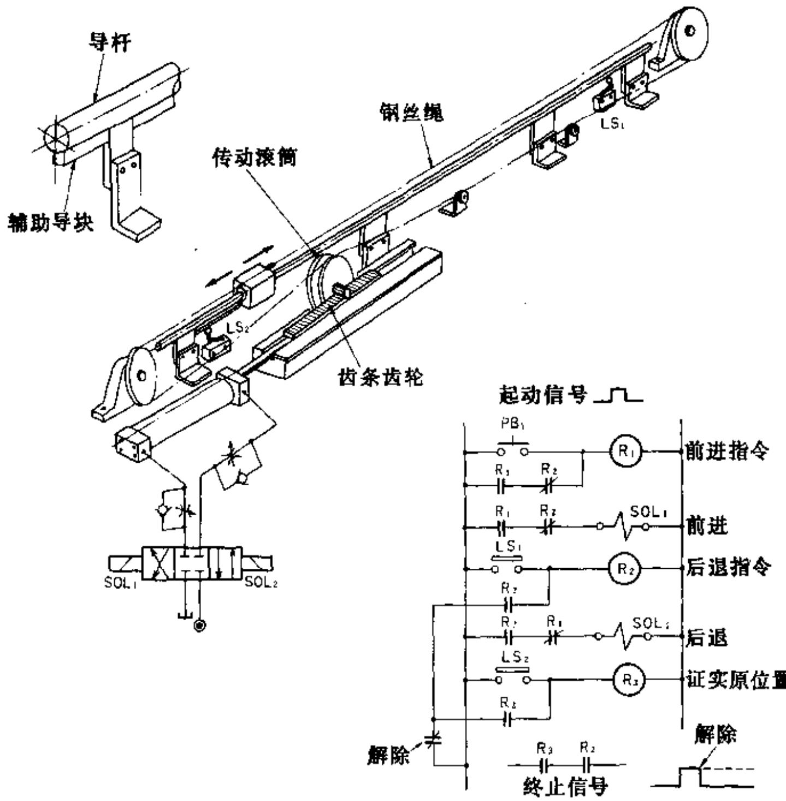  
图2-87动力：液压行程： $1 0 0 \sim 1 0 0 0$ 毫米载荷：轻

图2-87是采用钢丝绳的高速、轻载荷、长行程水平运动机构。

# 设计要点

1.由于钢丝绳是卷绕在滚筒上的，卷绕时，要特别注意钢丝绳不要重叠，以免影响钢丝绳张紧。

2.滑动头如使用滚珠轴套，应采用开口型的。

3.本机构由于停止位置不精确，所以要注意使用场所。

# 制造要点

1.钢丝绳固定部分易被切断，所以锐角处必须倒角或倒圆。

2.导杆在淬火时易发生弯曲，需要特别注意。

使用实例

走刀架等。

其 它

1.因齿条、齿轮负荷大，应采用滚动轴承。

2.参阅附录一第2类控制回路。

# 拼合式滚珠滑块导向的直线运动机构

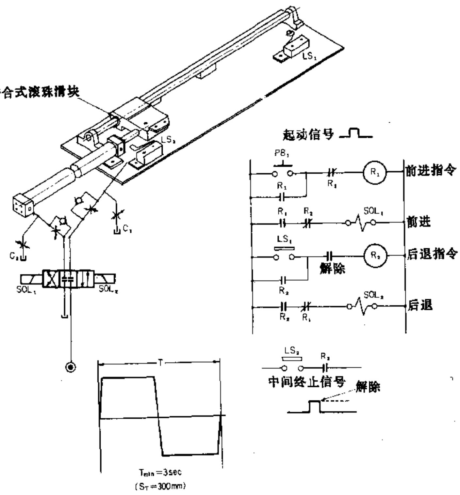

图2-88  
动力：液压  
行程： $1 0 0 \sim 1 0 0 0$ 毫米  
载荷：中

图2-88是由液压缸直接动作的轻载、长行程直线运动机构。

# 设计要点

1.当把载荷加到导杆上时，如果液压缸活塞杆上也承受到载荷，因其头部的抗震力弱，有必要再增加导杆。

2.在轻载荷时，即使用中间封闭式换向阀，由于液压油的泄漏，使液压缸产生移动，这时要有小量油的分流回路。

# 制造要点

一般行程长的机构易发生弯曲，所以必须注意。对出现弯曲的部位，可进行强制矫正。

# 使用实例

工件的进给、下料等。

其它

参阅附录一第2类控制回路。

# 直接连接电磁铁的往复直线运动机构

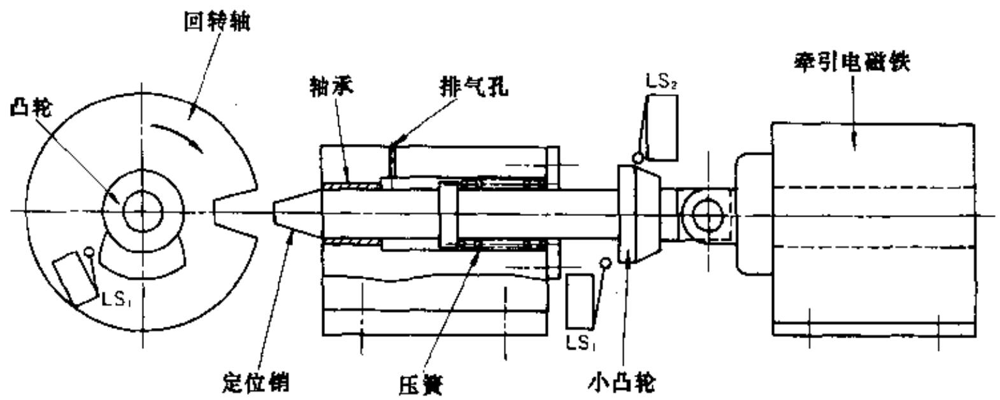

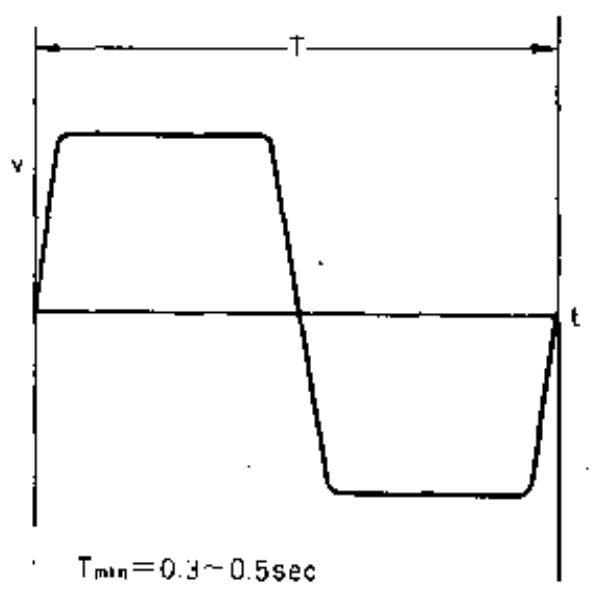  
图2-89动力：电气行程： $5 \sim 2 0$ 毫米载荷：轻

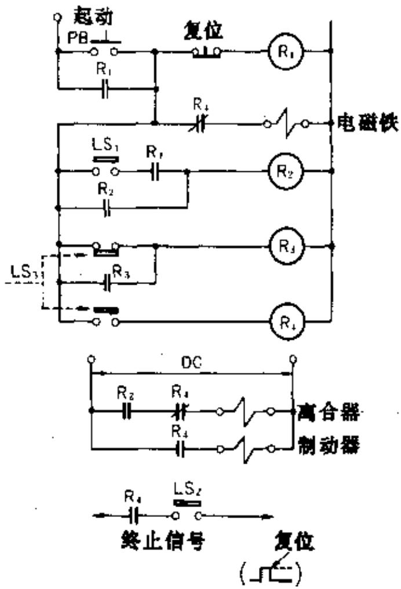

图2-89是利用电磁铁的吸引力拉、拔定位销，进行直线运动的机构。希望轴在一次回转后，停止于固定位置时，可用以把定位销压入和拔出。

设计、制造要点

即使铁芯有所松动，也必须使定位销轴线和电磁铁的中心线保证一定程度的同轴度。另外,在如图所示的位置上，-定要开排气小孔。

图示的结构，显而易见，定位销靠弹簧压入，而由电磁铁的吸引力拔出。

还有，如电气原理图所示：电动机是通过离合器、制动器的联动来驱动回转轴的。回转轴每转一次,通过凸轮和LS3,使销子准确地进入定位槽中。

# 其 它

参阅附录一第2类控制间路。

# 电磁铁、阻尼器快速返回直线运动机构

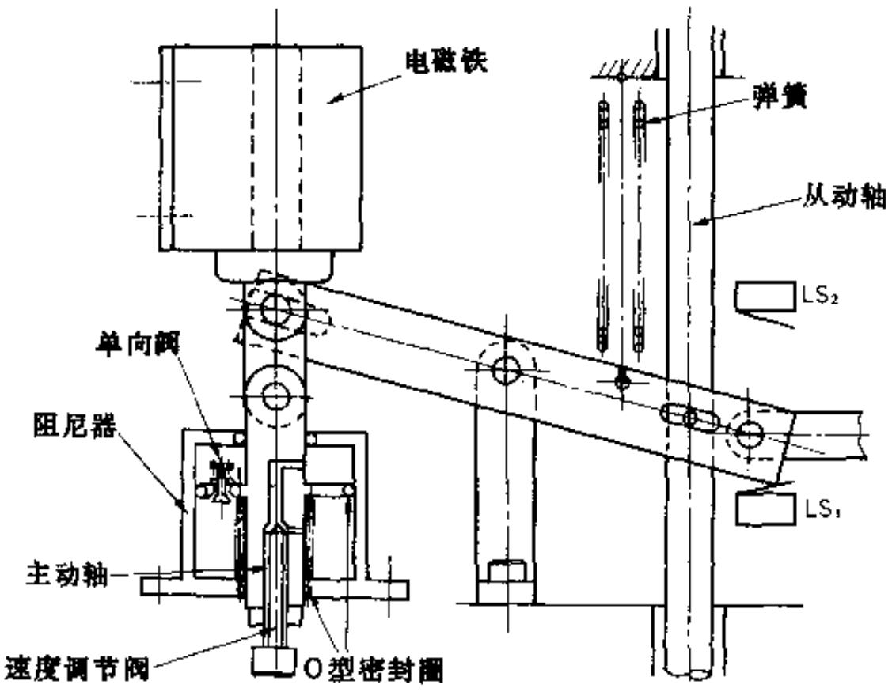  
图290动力：电气行程：5～20毫米载荷：轻

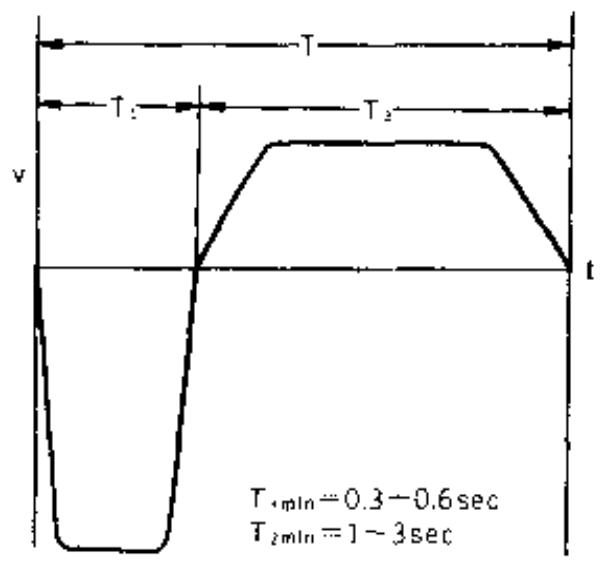  
图2-90是使与电磁铁联动的从动轴进行往（复）慢、复（往）快的直线运动机构。

主动轴在弹簧作用下，向下移动时，单向阀关闭，下室的空气经过调节速度的针形阀进入上室，主动轴下移的速度即有所减慢。当按压起动按钮●电磁铁吸引铁芯时，单向阀打开，空气急速交换，主动轴快速返回。当采用气缸等代替电磁铁时，则用液压油代替阻尼器中的空气。

参阅附录一第2类控制回路。

复位  
关  
PB起动（）R  
HH  
LS R 电磁铁HF R  
R  
HH  
LS R中 业 RR （） 复位终止信号

# 由连杆增大电磁铁行程的直线运动机构

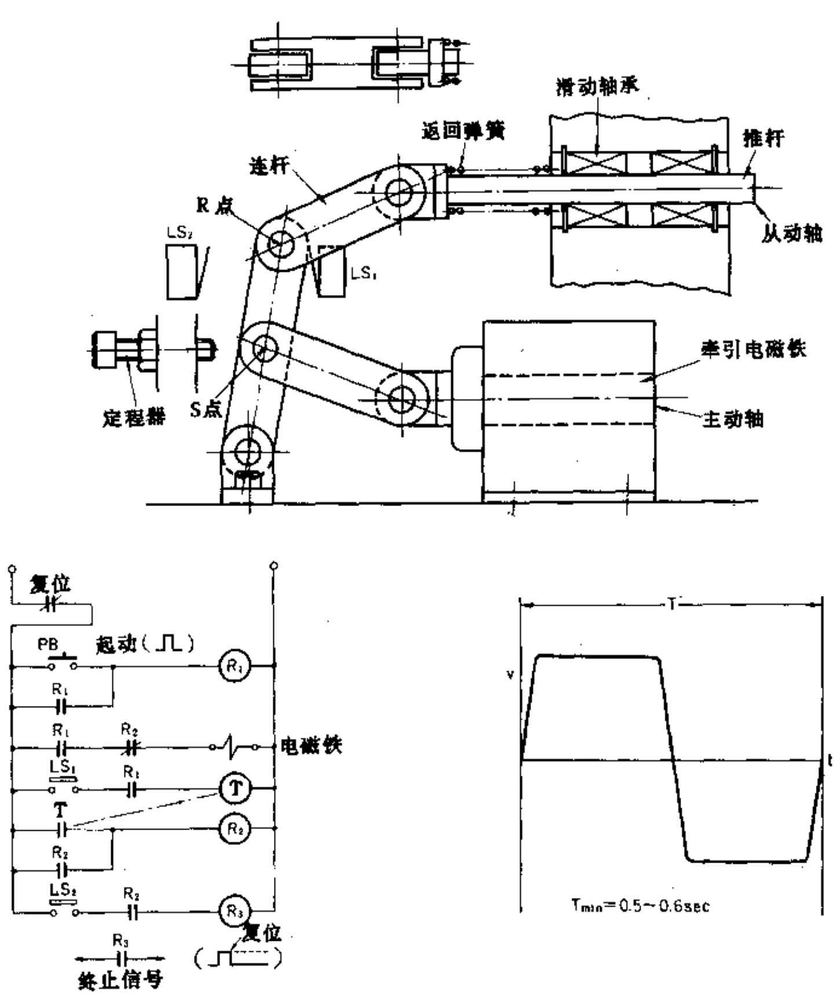  
图291动力：电气行程： $1 0 \sim 5 0$ 毫米载荷：轻

图2-91是增加电磁铁往复行程的杠杆直线运动机构。铁芯的行程经过杠杆、连杆传给推杆。通过移动R点、S点和调整定程器，可以调整推杆的移动量。

设计、制造要点

推杆要淬火并和滑动轴承配合。电磁铁采用交流的、直流的都可以。当采用交流电磁铁时，通电时需要调整使极面经常保持密切接触。

# 使用实例

多用于滑槽中途，作工件的擒纵器；或用作辅助压紧部件。

其 它

参阅附录一第3类控制回路。

# 电磁铁步进后快速返回的直线运动机构

起动  
PB上 复位pLRHHRR步进用电磁铁

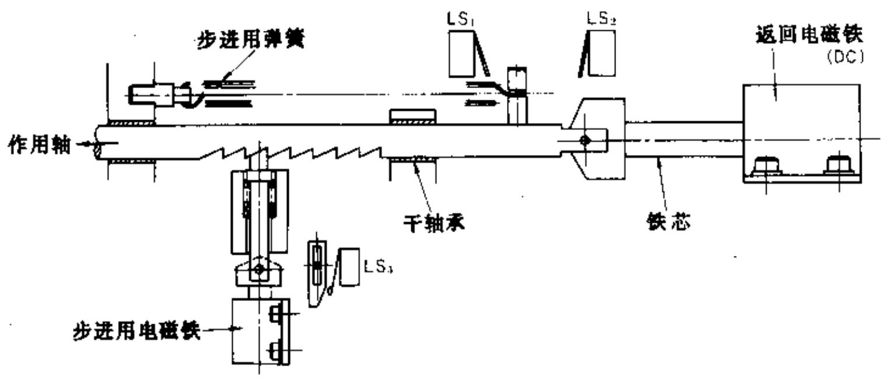  
图2-92动力：电气行程： $1 0 \sim 5 0$ 毫米载荷：轻

# 通过杠杆比提高功率的往复直线运动机构

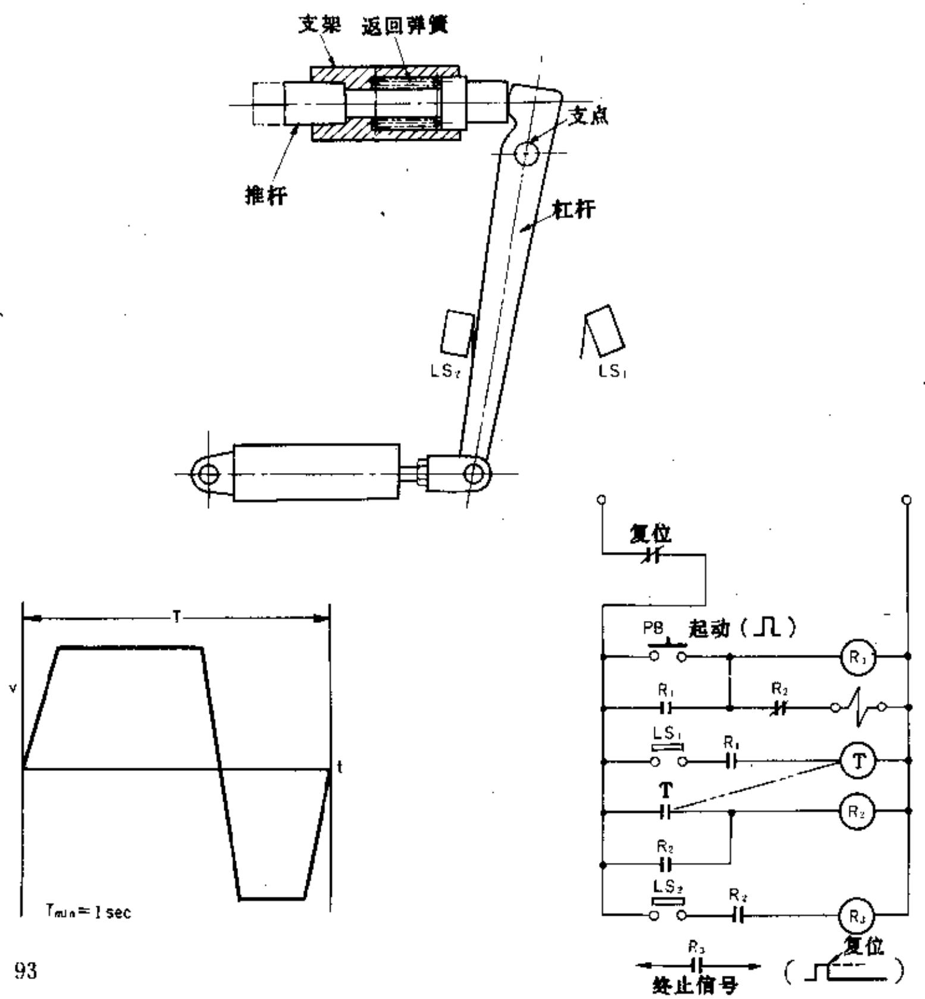  
图293动力：气压行程： $0 \sim 1 0$ 毫米载荷：重

图2-93是由气缸利用杠杆比来缩短行程，以提高功率的直线运动机构。

-般在需要 $\mathrm { ~ \tt ~ I ~ } \sim 5$ 吨功率时，可采用大行程的气缸，如图2-93所示的机构，通过杠杆缩短行程以提高功率。与采用大直径 (内径)气缸直接连接的机构相比较，无论在经济方面还是在空间利用方面均有利得多。但是当输出端行程取得过大时，机构就不合理了。

# 设计、制造要点

推杆和杠杆顶端的加压部位，虽然滑动不大，但还是采用淬火滚子加压较好。在如图所示的情况下，推杆、杠杆的顶端均需淬火，以增加硬度。

在杠杆支点上承受着相当的负荷，在计算强度的同时，必须慎重地设计润滑给油机构。

其它回转部分、滑动部分也要有润滑给油机构。

# 其 它

参阅附录一第3类控制回路。

# 平板凸轮任意变速直线运动机构

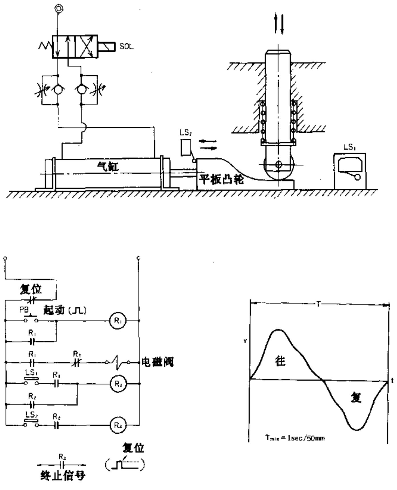  
图2-94动力：气压行程： $\hphantom { 0 0 0 } 1 0 \sim 5 0$ 毫米载荷：中

部分要足够长。要注意平板凸轮与气缸的连接部分，不允许将平板凸轮承受的力直接作用到气缸轴上。

图2-94是利用气缸驱动平板凸轮，并通过滚子获得上下运动的机构。

使用实例

装配机械。

设计、制造要点

其 它

平板凸轮的压力角不能太大。输出轴导向

参阅附录一第2类控制回路。

# 直接连接气缸的等速直线运动机构

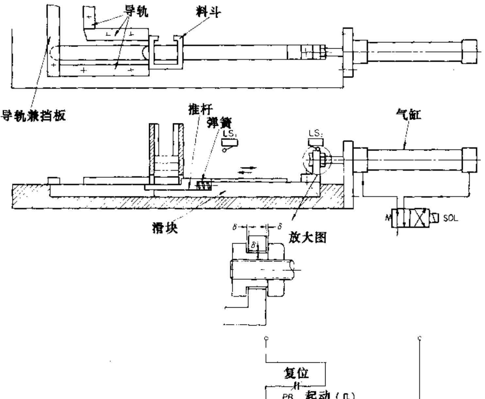  
图2-95动力：气压行程： $1 0 \sim 1 0 0$ 毫米载荷：轻

图2-95是直接连接气缸的输送机构考虑到既能减少前进极限位置的冲击，同时又提高定位精度，在滑块和推杆之间装入了弹簧。

# 设计、制造要点

1．必须按所输送工件的形状、材料及重量等来决定弹簧的压力。

磁阀R:R--LS RrLT R一 （ 二 复位 ）终止信号

2．滑块和活塞杆的连接要有所松动，它们的平行度要求不太严格。

# 使用实例

各种工件的输送装置。

# 其 它

参阅附录一第2类控制回路。

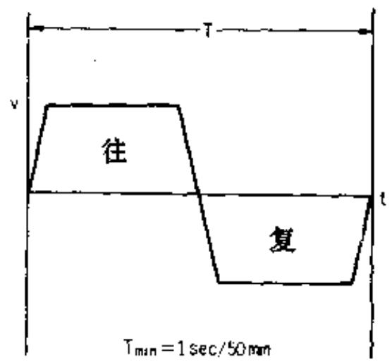

# 改变气缸驱动变换方向的直线运动机构

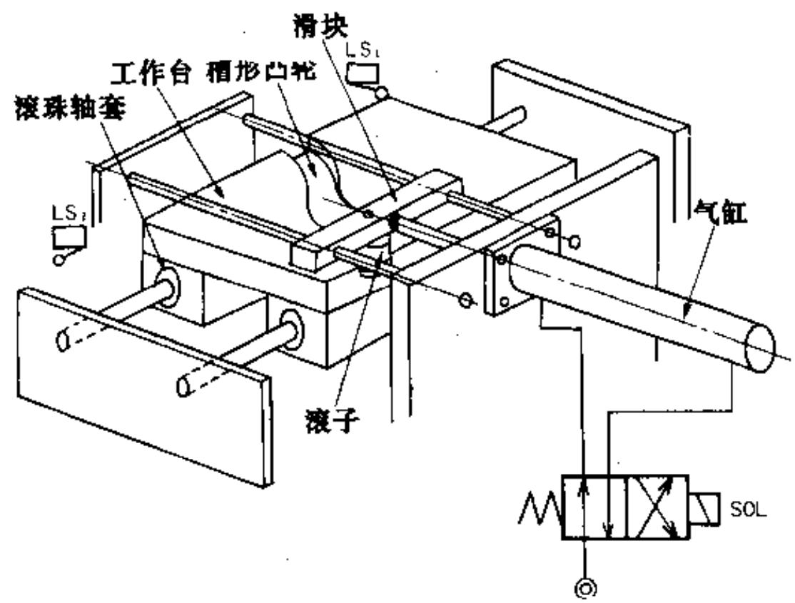

图2-96  
动力：气压  
行程： $1 0 \sim 1 0 0$ 毫米  
载荷：轻

图2-96 是使工作台在行程两端进行平稳减速的直线运动机构。它适用于要求气缸平稳减速的场所。

# 设计、制造要点

1．滑块与工作台的导向轴要有足够的强度。要注意在气缸轴上不能承受过载。

2．停止位置有一定精度要求时，应考虑滚子与槽形凸轮的耐磨性。

3．注意导向轴的平行度。

使用实例

装配机、冲床等的工件供料装置。

# 其 它

参阅附录一第2类控制回路。

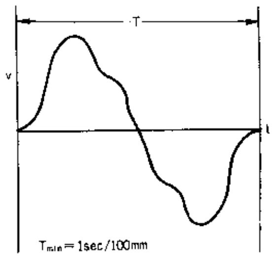

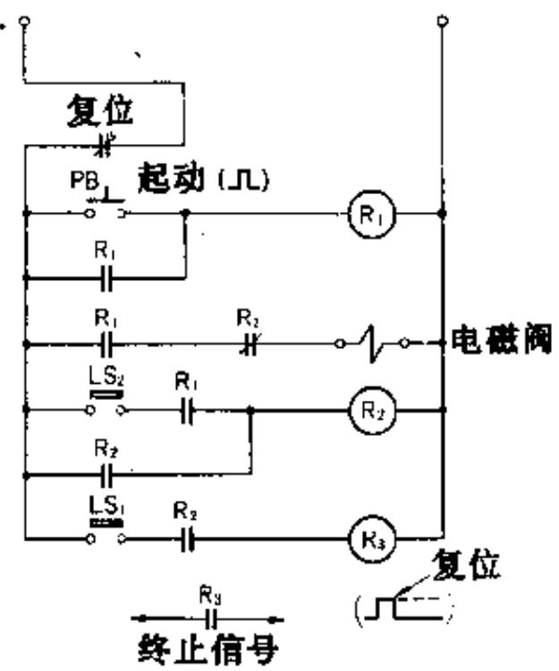

# 使用快速排气阀的快速返回直线运动机构

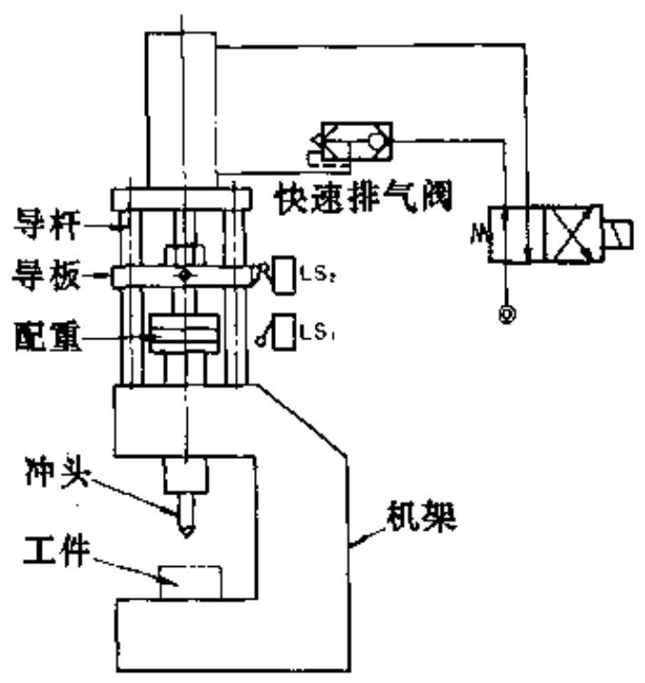  
图2-97动力：气压行程： $1 0 \sim 1 0 0$ 毫米载荷：中

图2-97是使用快速排气阀产生冲击载荷的直线运动机构。常用于铆接机、刻印机上。因为要求输出功率大，所以要使用大直径气缸。如果气压供给不足，会使得节奏减慢，所以必须采用大直径的进气孔。

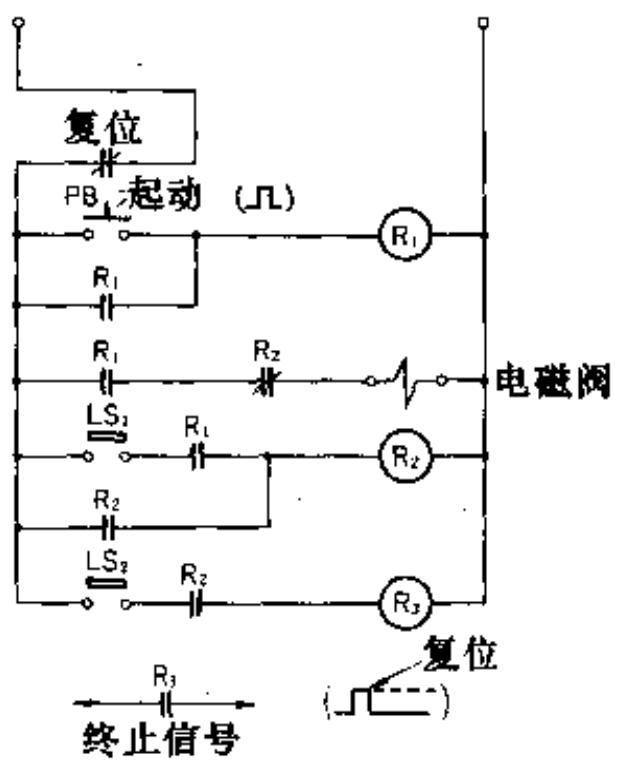

# 设计、制造要点

1．机架要耐冲击，并十分坚固。2，注意导杆与导向板的配合。3．配重要按工件形状、材料及气缸的输出功率来决定。4.注意活塞杆与导向板直线动作的平行度。

使用实例铆接机、刻印机。

其 它

参阅附录一第2类控制回路。

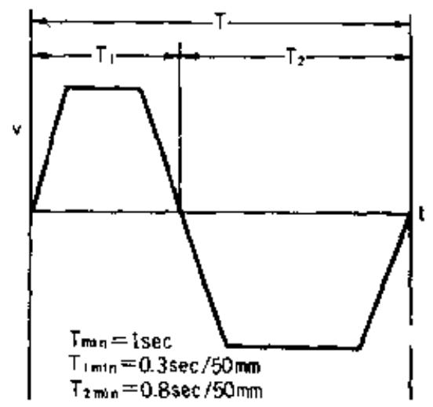

# 直接连接气缸的速度变换直线运动机构

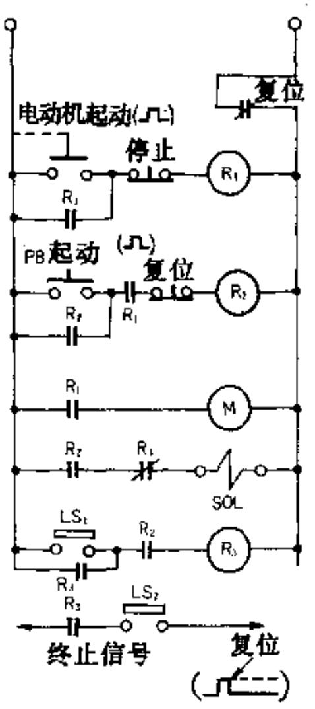  
图2-98

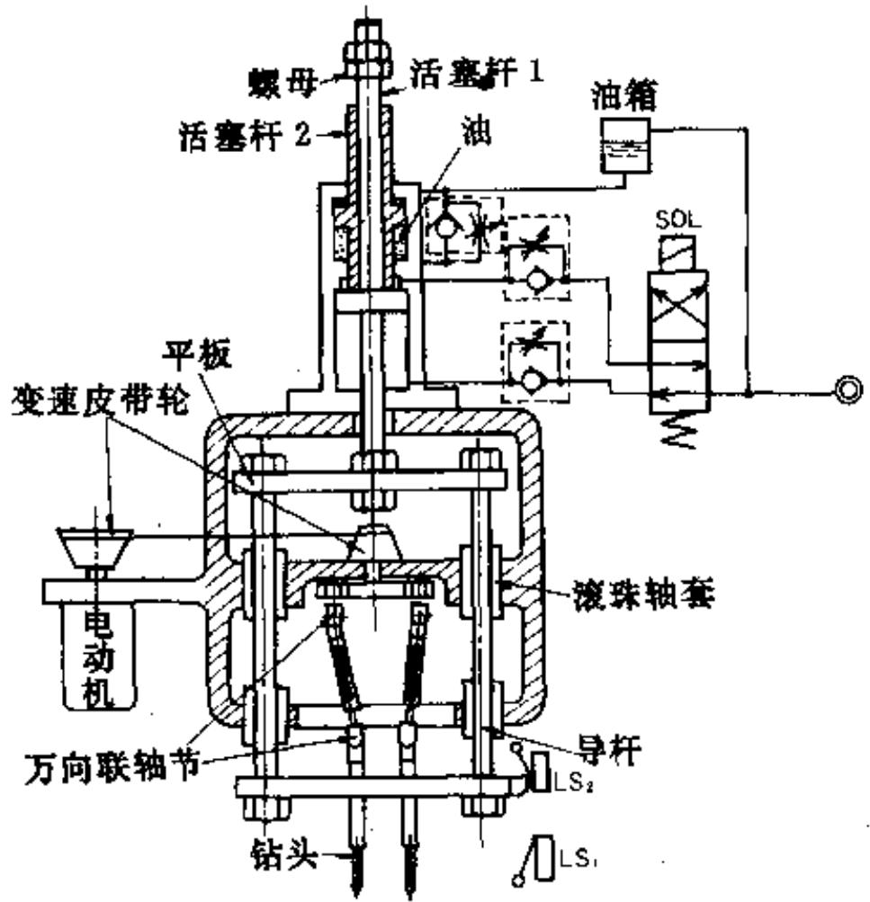

IT: 快速进给 切削进给 快速返 T-min=1sec/50mm 按切削条件设定 T:min=0.5sec/50mm

行程： $5 0 \sim 1 0 0$ 毫米

载荷：中

图2-98是使用气缸和液压、气动联动装置进行快速进给、慢速进给、快速返回的直线运动机构。电磁阀接通后，最初仅是活塞杆1动作，当螺母接触活塞杆2后，转变成慢速进给。慢速进给的速度由单向节流阀调整。

# 设计、制造要点

1．必须注意活塞杆1与平板的垂直度，导杆不能歪扭。

2．要注意活塞杆1与活塞杆2的配合及同轴度。

3．从快速进给变换到慢速进给的位置，可以通过螺母进行调节。

使用实例

攻丝、钻孔等的切削进给。

其 它

参阅附录一第6类控制回路。

# 齿条、齿轮和棘轮间歇直线运动机构

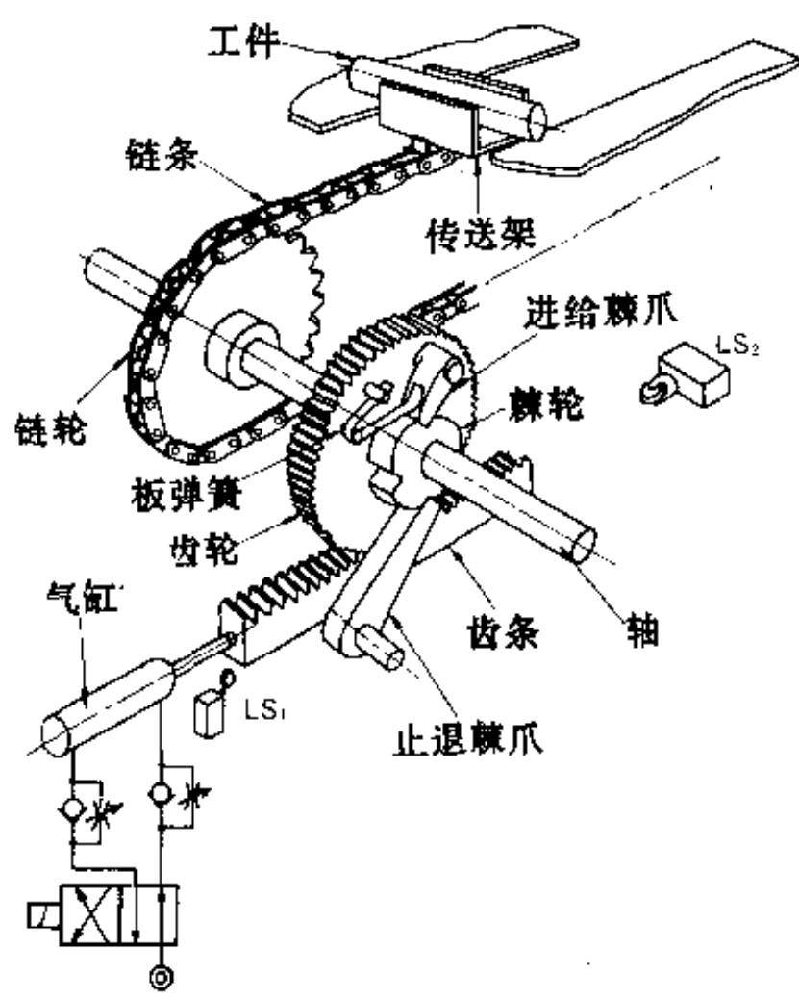  
图2-99动力：气压行程： $5 0 \sim 1 5 0$ 毫米载荷：轻

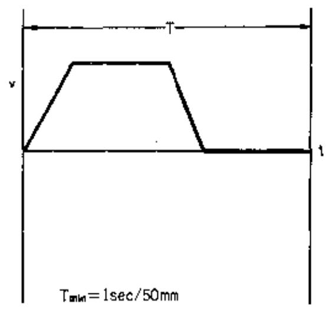

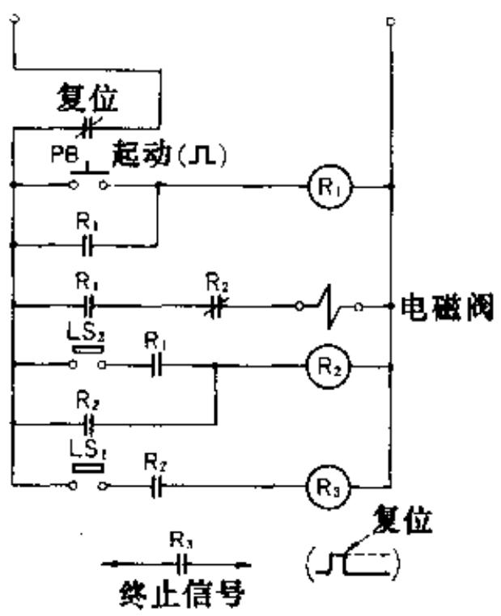

图2-99是由气缸通过齿条、齿轮、棘轮进行间歇直线运动的机构。安装在链条上的传送架，通过直接连接气缸的齿条、齿轮和止退机构进行单向传动。气缸通过起动信号前进，齿轮回转，并带动进给棘爪和棘轮使轴回转。在气缸前进的极限位置， $\mathbf { L S } _ { 2 } \otimes$ 动作，气缸后退，由于止退棘爪的作用使轴不回转。

# 设计、制造要点

1．轴上应有制动器，使在前进极限位置不致因惯性而越程。

2．棘轮、进给棘爪、止退棘爪应有足够的强度。

使用实例

工件的传送。

其 它

参阅附录一第2类控制回路。

# 齿条、齿轮两端减速直线运动机构

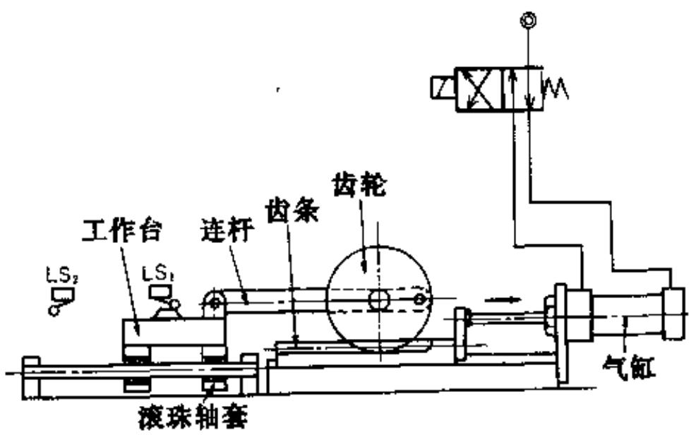

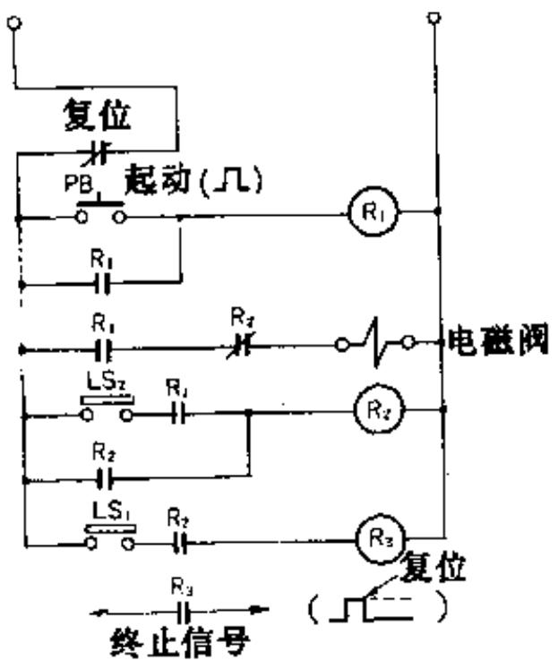

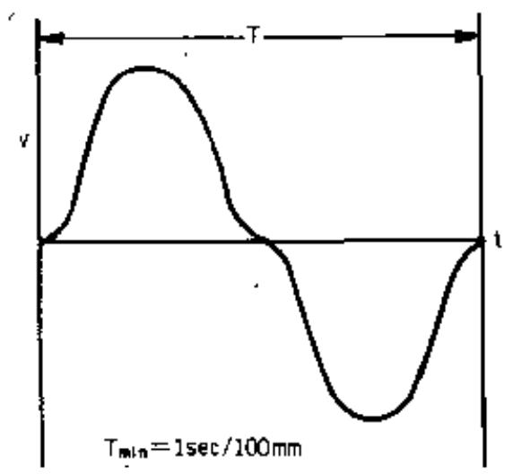

图2·100  
动力：气压  
行程： $5 0 \sim 1 5 0$ 毫米  
载荷：中

图2-100是由气缸驱动齿条及安装在齿轮上的曲柄，再利用曲柄运动实现两端减速的直线运动机构。一般直接连接气缸时，在行程两端减速是困难的。利用图示机构，且用两端带缓冲器的气缸，即能进行相当圆滑的运动。

# 设计、制造要点

1．注意活塞杆与齿条滑动部分的平行度，齿轮的回转要平稳。2．齿轮的回转角必须设计在 $1 8 0 ^ { \circ }$ 以下。两端停止位置有精度要求时，要装有定程器。

3．工作台的动作要平稳。

# 其 它

参阅附录一第2类控制回路。

# 气缸前进端减速直线运动机构

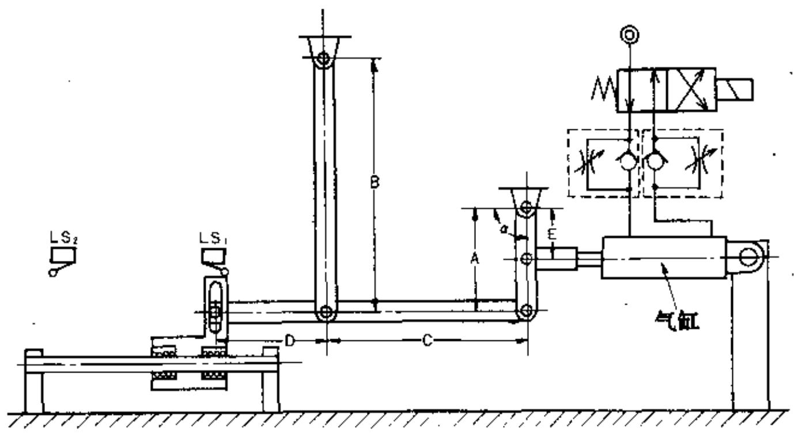

图2-101  
动力：气压  
行程： $5 0 \sim 3 0 0$ 毫米  
载荷：轻

图2-101是用耳环式气缸通过连杆增加行程，并在前进端减速的直线运动机构。

# 设计、制造要点

1．连杆尺寸如果取A比B短、C比D短，则在前进端能得到更有效的减速。

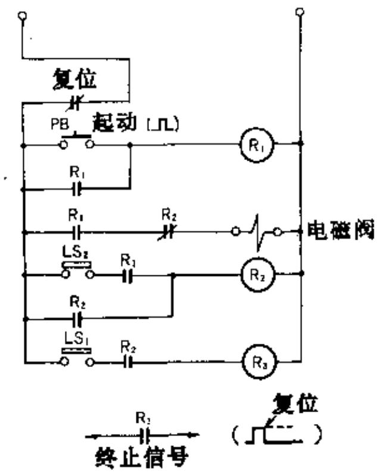

2.根据尽可能小的 $\pmb { \mathrm { a } }$ 角来决定气缸的行程，也能得到更有效地减速。

# 使用实例

装配机。

其 它

参阅附录一第2类控制回路。

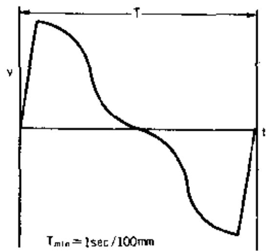

# 气缸与齿条、齿轮步进机构

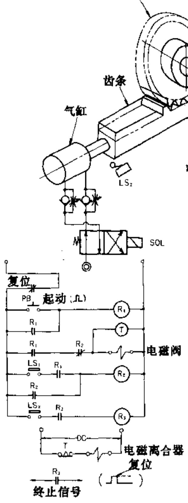  
图2-102动力：气压行程： $1 0 \sim 3 0 0$ 毫米载荷：中

图2-102为利用气缸通过齿条、齿轮的步进机构。本机构在气缸驱动的齿条、齿轮上增加了电磁离合器，电磁离合器的通电时间，由时间继电器给定，由此可以选择输出轴的回转停止位置。通过起动信号、齿条和齿轮，由气缸活塞杆驱动，同时，通过电磁离合器把动力传递给链轮。这时如果改变时间继电器的设定时间，即能够在气缸前进端的任意位置上使链轮停止。

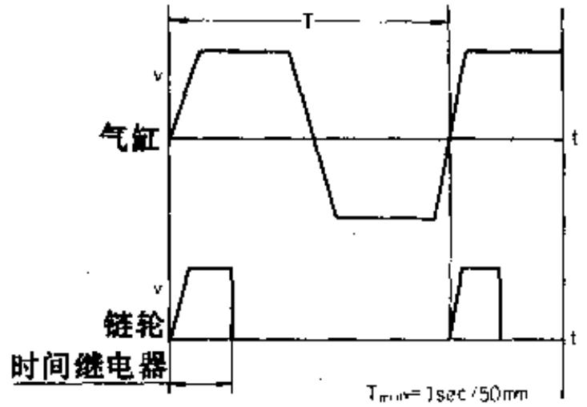

# 设计、制造要点

1．由于停止位置精度取决于时间继电器的切换精度和进给速度，所以进给速度要尽可能慢些。

2．电磁离合器的选择和停止位置精度有关，要注意不能打滑。

# 使用实例

工件的传送（链条、传送带）。

其 它

参阅附录一第2类控制回路。

# 液压、气动联动的变速直线运动机构

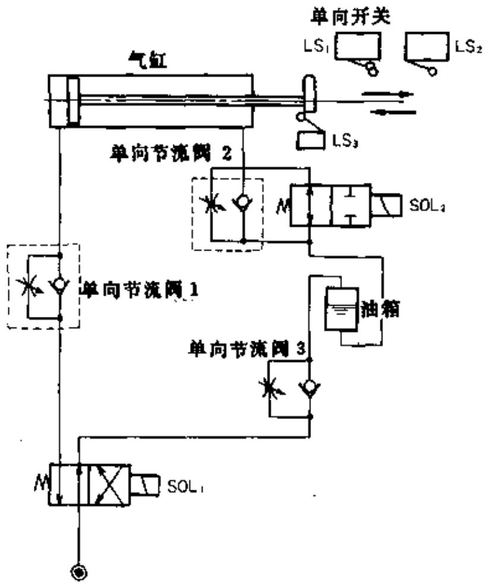  
图2-103动力：气压行程： $5 0 \sim 5 0 0$ 毫米载荷：中

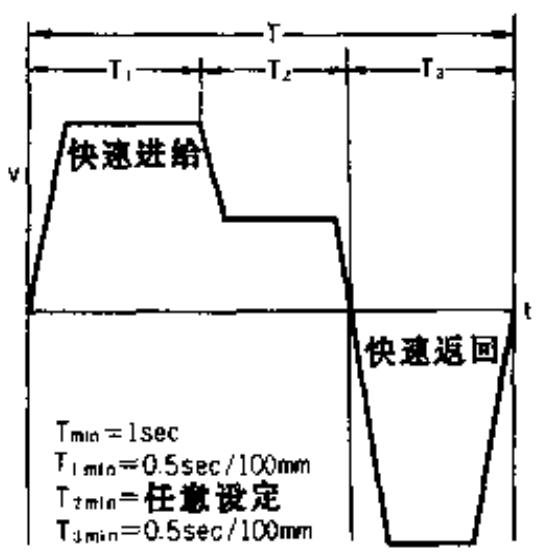

图2-103是以气压为动力，通过气缸进行快速进给、慢速进给及快速返回的往复直线运动机构。通过起动信号使 $\mathrm { { \bf S O L } } _ { 1 }$ 动作，气缸活塞杆由单向节流阀3调节速度，前进到 $\mathbf { L S } _ { 1 }$ 0通过 $\mathbf { L S } _ { \mathsf { I } }$ 使 $\mathbf { S O L } _ { 2 }$ 动作，气缸活塞杆以单向节流阀2调节的减速速度前进到 $\mathbf { L S } _ { 2 }$ ，通过 $\mathbf { L } \mathbf { S } _ { 2 }$ 使SOL：, $\mathbf { S O L } _ { 2 }$ 切断，气缸活塞杆以单向节流阀 $1 \textcircled { \circ }$ 调节的快速返回速度返回到原位置。由此，通过单向节流阀1、2、3组成能任意变速的机构。

# 其 它

参阅附录--第6类控制回路。

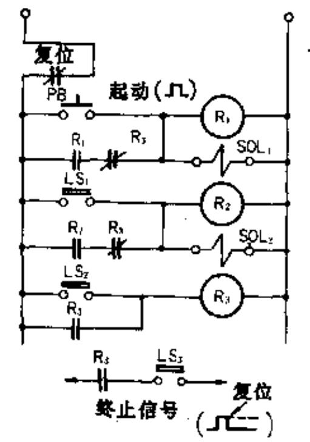

# 由两个齿条得到两倍行程的往复直线运动机构

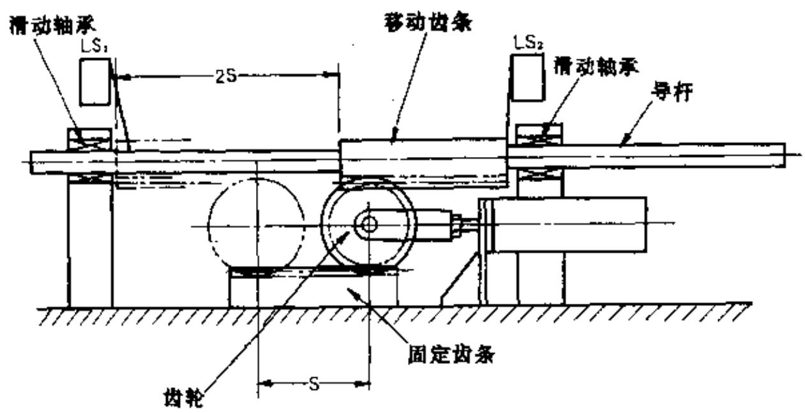

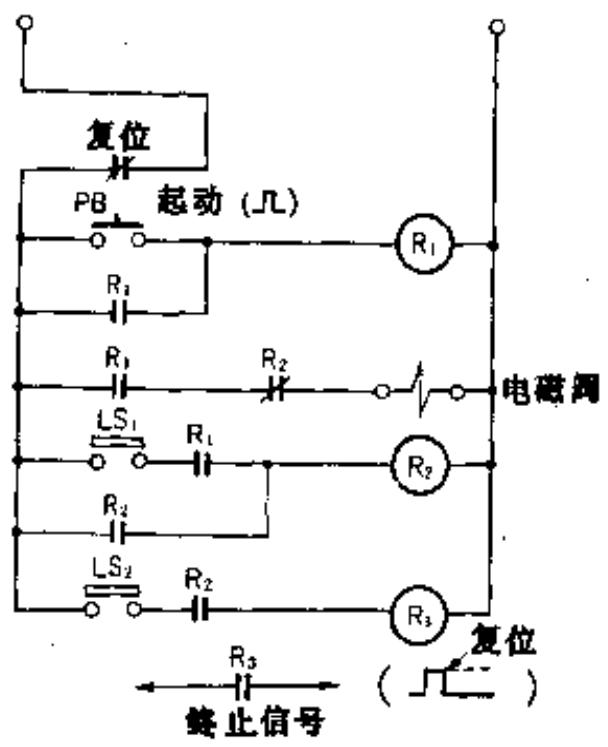

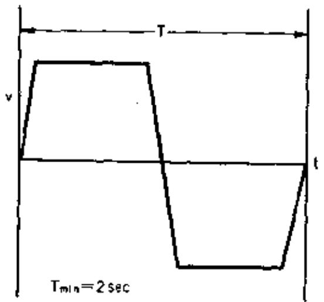  
图2-104动力：气压行程：500毫米载荷：中

图2-104是利用两个齿条和齿轮的啮合，得到两倍行程的往复直线运动机构。其中一个齿条固定在底座上，此齿条与直接连在气缸上并能回转的齿轮相啮合，齿轮又与装在移动台下面的另一齿条相啮合。

本机构的动作能达到两倍于气缸的速度，并能取得两倍于气缸的行程，而与齿轮直径

无关。

设计、制造要点

1．要特别注意两个齿条的节线和移动台导杆、气缸活塞杆的中心线四部分的平行度。否则动作就不合适。

2.气缸行程的终端最好使用缓冲器来缓和冲击，以提高机械耐久性。

3．滑动、回转部位应有适当的润滑给油机构。

# 其 它

参阅附录一第2类控制回路。

# 凸轮任意变速直线运动机构

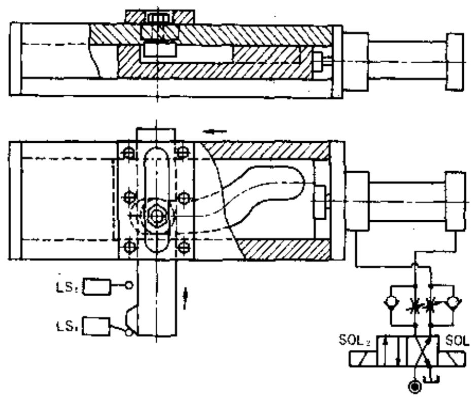

图2-105  
动力：液压  
行程： $\boldsymbol { \mathrm { 0 } } \sim \mathsf { 5 0 }$ 毫米  
载荷：重

图2-105是由切成任意槽的凸轮通过滚子带动平板构成的直线运动机构。凸轮和平板各由矩形导向体导向。通过液压缸使凸轮做等速运动时，平板即根据凸轮的形状而运动。

# 设计、制造要点

1．载荷大时，考虑到承受表面压力的耐久性，凸轮槽要进行表面淬火或加大滚子直径。

2．即使驱动相当重的工件,也能使动作非常平稳。

3．决定气缸输出功率时，必须充分考虑力的效率。

4．导向面必须充分润滑。

5，滚子轴的强度要充分研究。

6．仅凸轮槽与滚子配合部分的尺寸公差要高.其它尺寸公差可取得低些，以便于加工。

# 其 它

参阅附录一第3类控制回路。

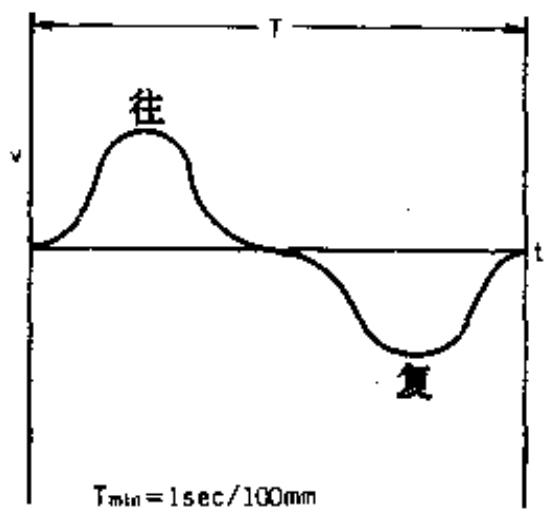

中间终止信号起动信号 LS LSz 原位置 ? () 前进增PB 前进指令R 前进存储HH中间起动信号 复位R ?后退指令R RF前进后退CRLR M复位终止信号

# 杠杆增速直线运动机构

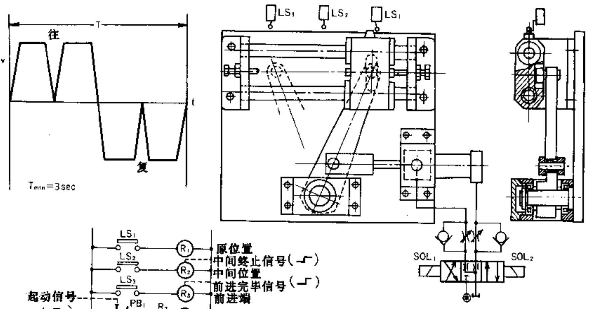

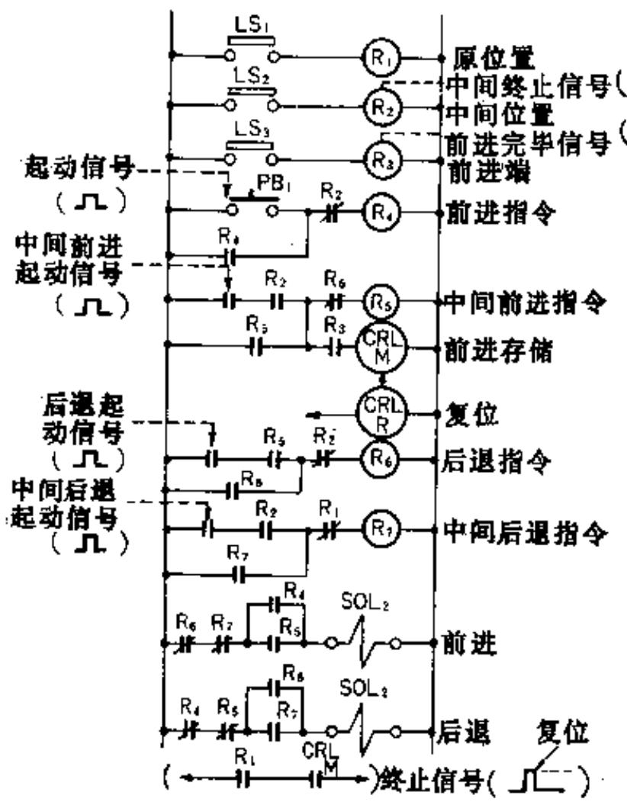  
图2-106动力：液压行程：500毫米载荷：重  
图 $2 \cdot 1 0 6$ 是希望从动体能以超过液压缸的最高速度动作时（外购的液压缸最高速度在300毫米／秒左右)、或希望扩大从动体的行程

时使用的机构。从动部分由两根导杆导向，杠杆顶端的滚子则在从动部分的槽内边回转边移动。由限位开关使三位换向阀处于中间位置时，即能实现机构的中间位置停止。

# 设计、制造要点

1，在液压缸行程中间位置停止时，液压系统必须分如下两种情况考虑。第一、在一定范围内停止，停止期间没有力的作用；第二、在一定精度的位置上停止，停止期间即使有外力作用，仍要保持该位置。图中所示的系统相当于第一种情况，此时，只要外力小于液压油的阻力及机构的动作阻力就不会移动。如采用第二种情况的中间位置停止时，只要不是载荷很轻及速度较低，就必须考虑防震系统或减速系统。

使用实例传送装置的传动。

其 它

参阅附录一第4类控制回路。

# 减速阀变速直线运动机构

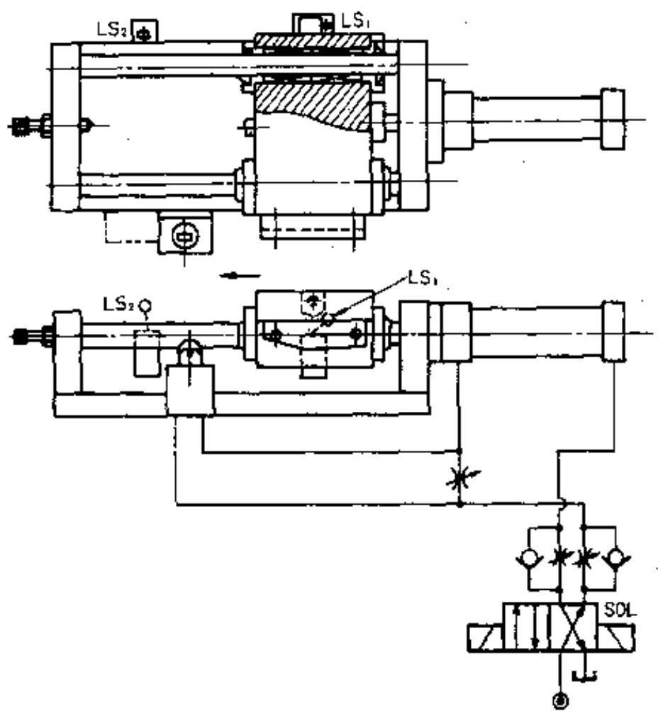  
图2-107动力：液压行程：500毫米载荷：重

图2-107是采用减速阀变速的直线运动机构。在两根导杆导向的从动件上装有平板凸轮，在从动件的动作应该变速的位置上装有减速阀，根据平板凸轮的形状以及三个节流阀的设定，能够平滑地进行两段变速运动。

# 设计、制造要点

1．减速阀、节流阀按压力改变流量特性。特别要求一定速度时，采用压力补偿流量调节阀来代替节流阀。

2．注意两根导杆的平行度。例如：将前后托架和从动部分的孔同时加工：或做成左右分离式的，组装时找正调整。

# 其 它

参阅附录一第3类控制回路。

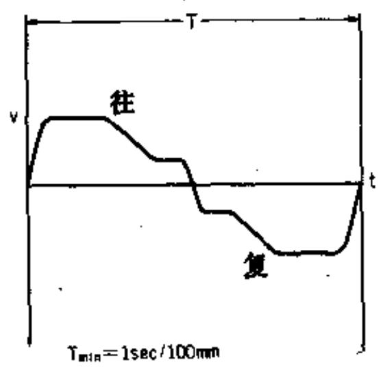

中间终止信号，（）前进端起动信号 原位置）- R 前进指令R 业 CRL 前进存储中间起动信号 CRL 复位后退指令R R4 SOL:前进R R SOL-后退R CL 复位特性蜜 终止信号

# 链条变换方向的直线运动机构

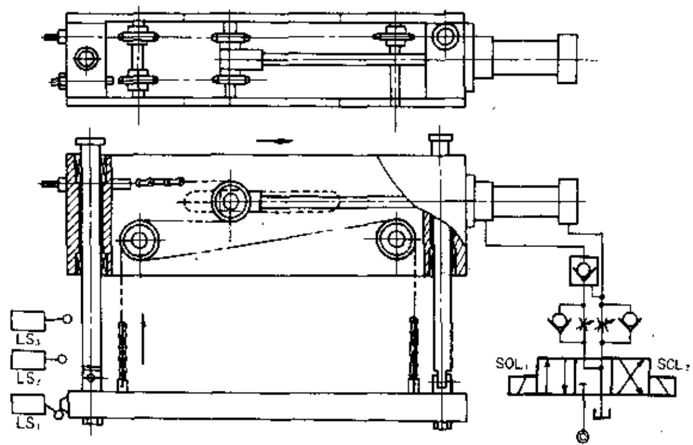

LS□ R 原位置LS 中间终止信号（）? 中间位起动信号 PB ? 上升升完毕信号（厂）往上升中间下隆 复位起动信号 ? 下降指令 CL 复R中间下降 非 ） Tmn=5sec起动信 中间下降指终止信位

图2-108  
动力：液压  
行程：1000毫米  
载荷：重

图2-108是采用链条和导杆将横长的物体平行地上升、下降及中间停止的机构。

有两条链条，每条的一端用以使横梁上升和下降，另一端则固定。通过液压缸活塞杆的左右移动，又通过链轮把链条提升。横梁的上升行程为液压缸行程的2倍。中间停止是通过液压控制单向阀关闭下降管路进行的。

# 设计、制造要点

1．限于能够靠自重下降的重工件使用。2．导杆和横梁的连接部位不允许有歪扭。3．导套也可采用合金轴套，但在间距特别长时，采用滚珠轴套阻力较小，动作灵活。4．注意导杆导向孔的平行度。

# 其 它

参阅附录一第4类控制回路。

# 回转电磁铁往复直线运动机构

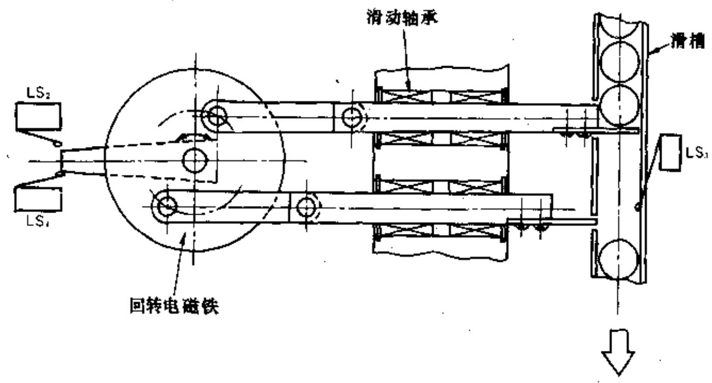

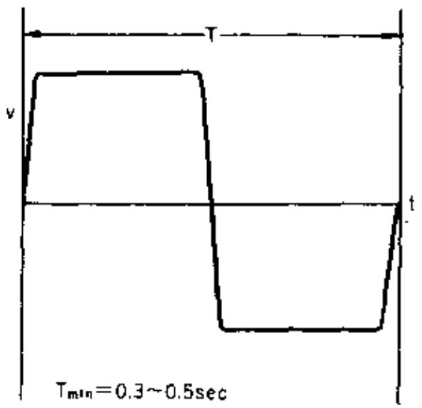  
图2-109动力：电气行程： $5 \sim 1 0$ 毫米载荷：轻

图2-109是在直流回转电磁铁圆盘的对称点上装上连杆和滑动轴，交替进行滑动轴进退的机构。图中所示是应用于滑槽末端的擒纵机构。

各支点要动作灵活，滑动轴使用滑动轴承导向。

参阅附录一第2类控制回路。

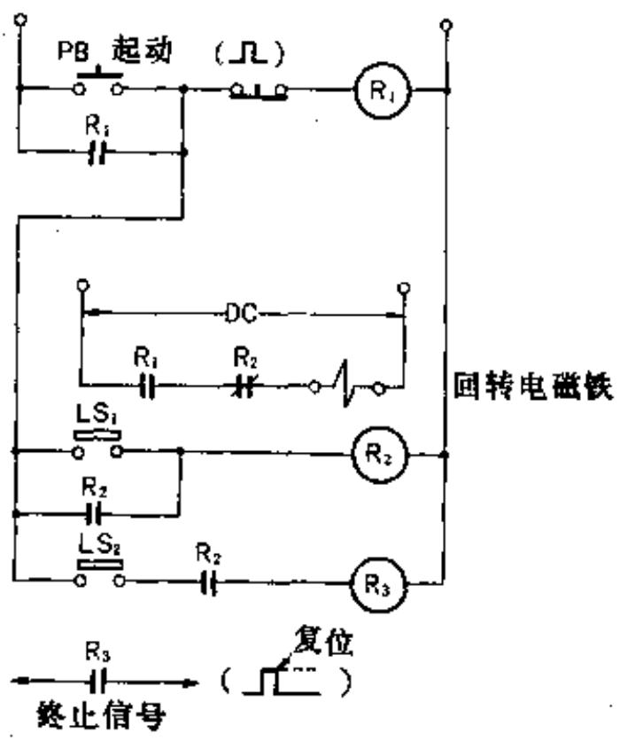

# 回转电磁铁直线运动机构

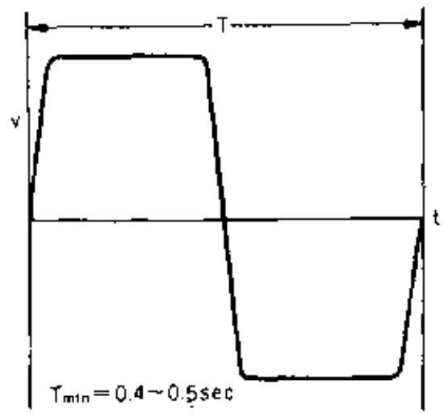

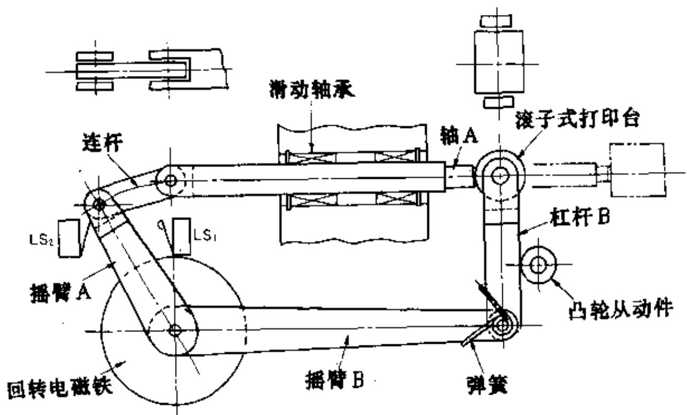  
图2-110动力：电气行程： $5 \sim 3 0$ 毫米载荷：轻

图2-110所示是在直流回转电磁铁上安装摇臂A、B，以进行两种相互垂直运动的机构。将凸轮从动件的位置左右微调，即可调整轴A与杠杆B的接触程度。

# 使用实例

图示是用于打印装置的实例。轴A为打印杆，把杠杆B作为打印装置的滚子式印台架。由于杠杆比的关系，摇臂A的动作相对于摇臂B，有时需要稍微迟缓。大体上滚子式印台依靠其毛毡的弹性压缩，能适当地接触打印杆。

# 其 它

参阅附录-·第2类控制回路。

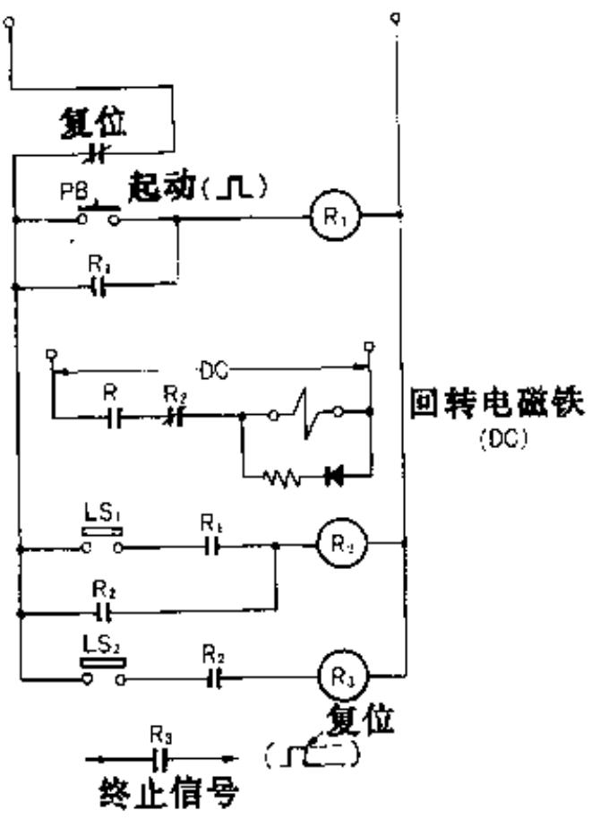

# 回转电磁铁两端减速往复直线运动机构

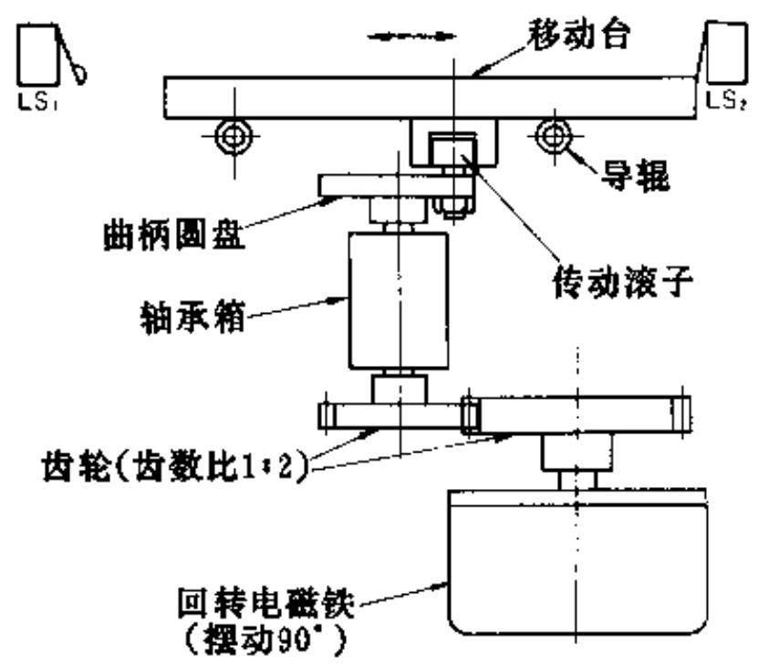

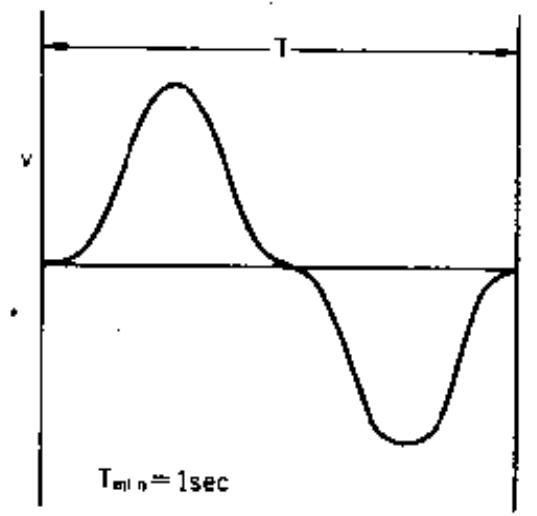  
图2-111动力：电气行程： $( ) \sim 5 0$ 毫米载荷：轻

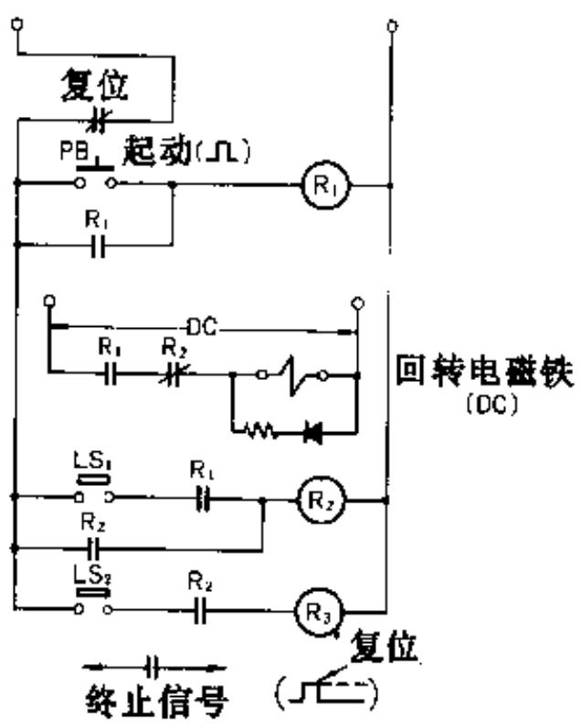

图2-111是把回转角为 $9 0 ^ { \circ }$ 的回转电磁铁的输出轴增速2倍，使与此轴连接的曲柄圆盘回转 $1 8 0 ^ { \circ }$ ，然后通过传动滚子得到两端减速的往复直线运动机构。当然，如果使用回转角为$4 5 ^ { \circ }$ 的回转电磁铁增速4倍、也可得到同样的结果。但由于回转电磁铁的特性，速度控制比较困难，所以采用太大的增速比并不是好方法。

在回转电磁铁的复位力较弱的情况下，可以适当地用螺旋弹簧等来帮助移动台复位。

# 设计、制造要点

1．由于上述机构的运动速度比较快，所以活动部分的质量太大是不合理的。

2．移动台的滑动部分，如把图示结构改成滚珠、燕尾槽等摩擦较小的结构，则效果更好。

3．回转电磁铁输出轴和齿轮的固定，要防止松动，所以要注意固定方法。

# 其 它

参阅附录一第2类控制回路。

# 摆动缸和凸轮往复直线运动机构

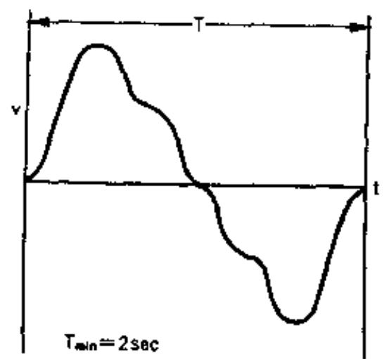

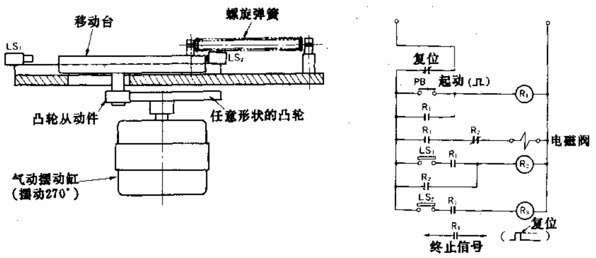  
图2-112动力：气压行程： $0 \sim 5 0$ 毫米载荷：轻

图2-112是在摆动角为 $2 7 0 ^ { \circ }$ 的气动摆动缸的输出轴上安装任意形状的凸轮，使直线导向移动台由摆动运动到直线运动的转换机构。

如图2-112所示，往复运动的返回动作是通过螺旋弹簧牵引的，所以如果周期时间太短，就会产生不合理的现象。为了避免这一情况，需要使螺旋弹簧弹力加强，并使凸轮具有使动作平缓的形状，这样特性就有所改善。但要根本解决问题，最好的办法是加工凸轮不要怕麻烦，采用往复都能强制随动的典型凸轮，例如：导向凸轮，

设计、制造要点

移动台两侧的导轨，也可以采用燕尾槽，如果可能，采用滚珠V形槽那样的支承结构，随动性能较好。无论采用何种结构，都要有润滑给油机构，并给出导轨的平行度要求和加工面的精度要求，希望能完全达到这些机械精度要求。

注意螺旋弹簧的拉力要与活动部分的质量相适应。

# 其 它

参阅附录一第2类控制回路。

# 摆动缸两端减速往复直线运动机构

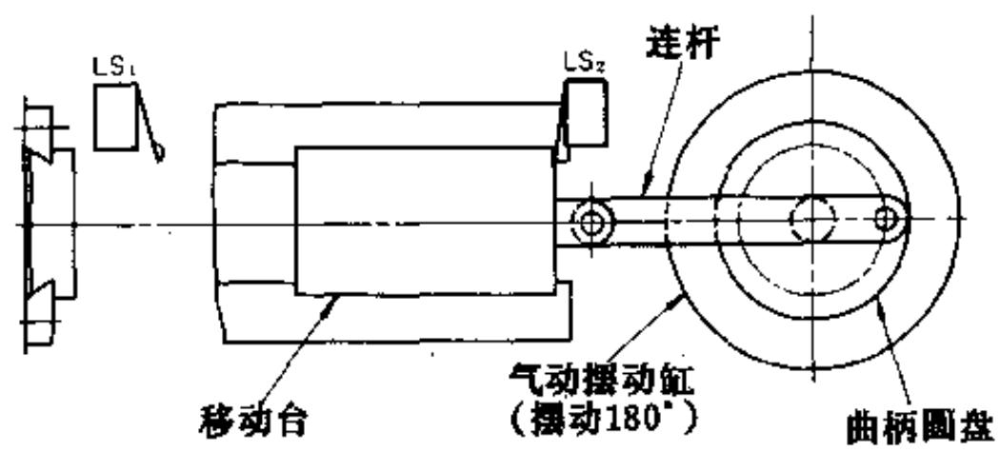  
图2-113动力：气压行程： $0 \sim 1 0 0$ 毫米载荷：中

图2-113是采用气动摆动缸及曲柄圆盘的两端减速往复运动机构。外购的气动摆动缸的摆动角多为 $9 0 ^ { \circ }$ 到 $2 7 0 ^ { \circ }$ ，图示机构使用的是摆动角为 $1 8 0 ^ { \circ }$ 的摆动缸。

利用曲柄机构进行往复运动的特点在于动作两端减速性良好，以及有较高的停位精度。此时，如在摆动缸的动作两端安装定程器，往复的停止位置还可以调整，而且通过在气动系统中附加速度调节器，则可简单地做到快速返回或相反的动作。

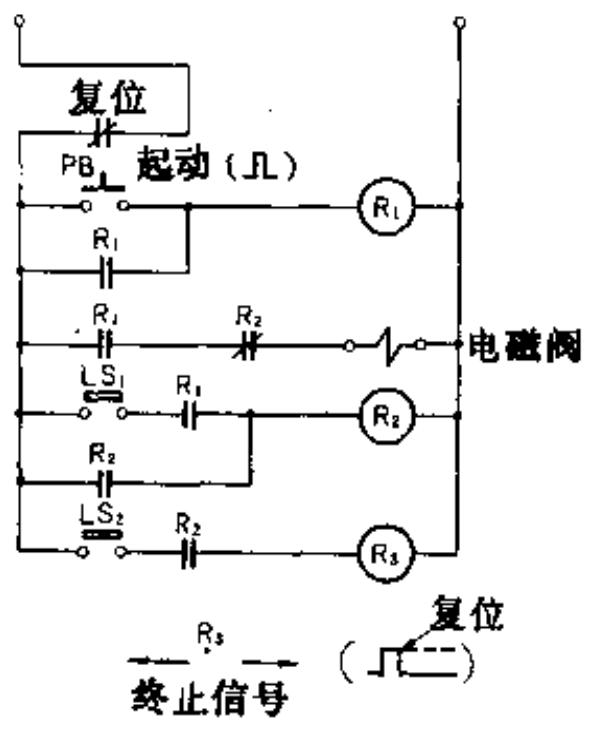

# 设计、制造要点

1。摆动缸与曲柄圆盘的连接部位易于摇动，因此容易出现松动，所以必须充分注意固定的方法。

2．移动台的导轨部分,不用燕尾槽而用其它方式也可以，但是无论采用何种形式，都要有润滑给油机构，并考虑到耐磨性和动作的平稳性。

# 其 它

参阅附录一第2类控制回路。

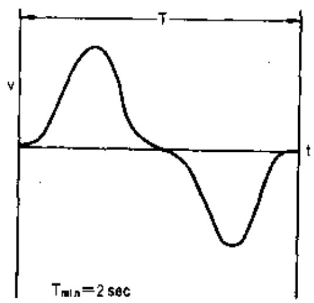

# 摆动缸与齿条、齿轮等速快速返回往复直线运动机构

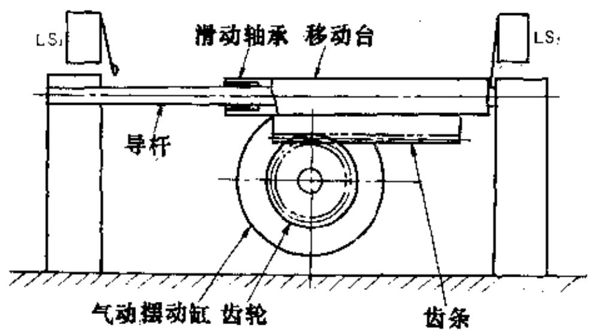

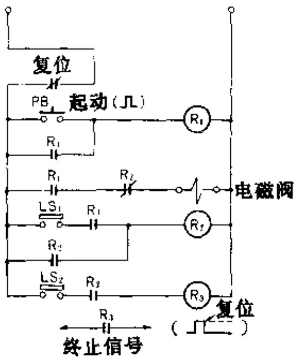  
图2-114动力：气压行程：0～100毫米载荷：中

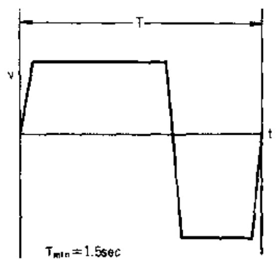

图2-114是在气压摆动缸输出轴上安装齿轮，通过与齿轮啮合的齿条带动移动台进行往复运动的机构。

由于齿轮和齿条齿顶强度的关系，不能过分提高速度。如在摆动缸的动作终端装入一个缓冲器，以缓和冲击，对耐久性来说是有利的。通过在气动系统中使用速度调节器，可任意改变摆动缸往复运动的速度，此优点是电动机所没有的。

# 设计、制造要点

1．摆动缸输出轴和齿轮必须固定牢靠。移 动台的导轨可以采用燕尾槽式、滚珠支承式或 滑动轴承式。

2．需限制移动台行程时，绝对不能在移动台行程的终端直接安装定程器，应在摆动缸的输出轴上安装杠杆，使定程器通过杠杆起作用。

# 其 它

参阅附录一第2类控制回路。

# 摆动缸、凸轮和杠杆任意变速直线运动机构

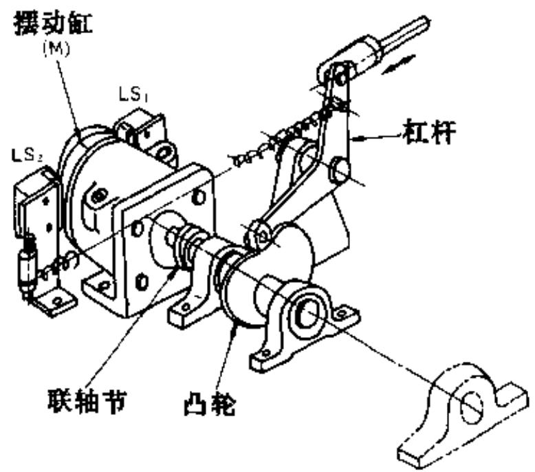  
图2-115动力：液压行程： $1 0 \sim 5 0$ 毫米载荷：中

图2-115 是由摆动缸通过凸轮和杠杆驱动的任意变速直线运动机构。本机构大多在必须利用凸轮机构的局部动作时使用。如与棘轮机构等组合，能在任何情况下使凸轮轴整转。图中仅使用了一个凸轮，如果把凸轮轴延长，就可以使用几个凸轮。由于动作的往复速度采用各自的单向节流阀控制，所以由两个系统来分别设定往复的速度，返回时的动作仍由原凸轮控制。运动特性取决于凸轮的形状，可以获得任意位移曲线。

R业R  
区 中间起动（） 往 SOL-  
SOL: SOL: 15 R 复位终止信号 （）

# 设计、制造要点

设计上没有什么特殊之处，只要符合凸轮机构设计要点即可。由于本机构是使用凸轮进行往复运动的，因而在使用复杂的凸轮时，必须对往复时的动作予以充分注意。

# 使用实例

通过使用二到三个凸轮，作为工件擒纵机构等的传动部分。

其 它

参阅附录一第3类控制回路。

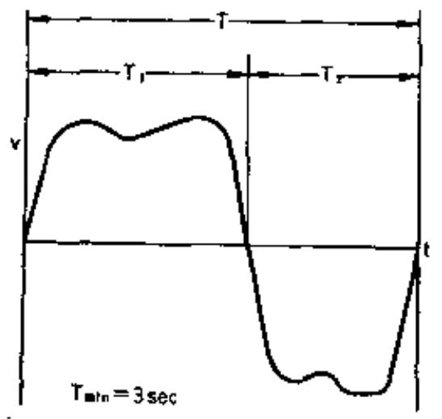

# 摆动缸与齿条、齿轮等速直线运动机构

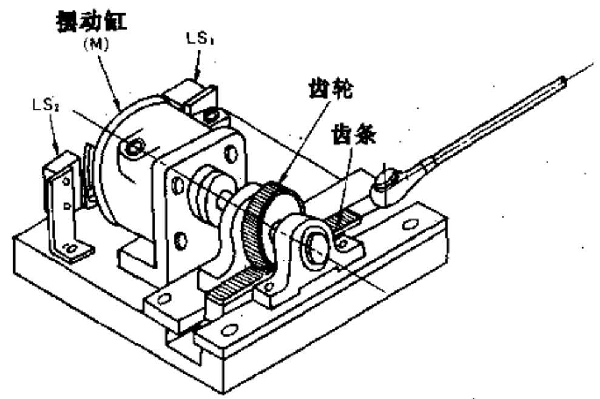

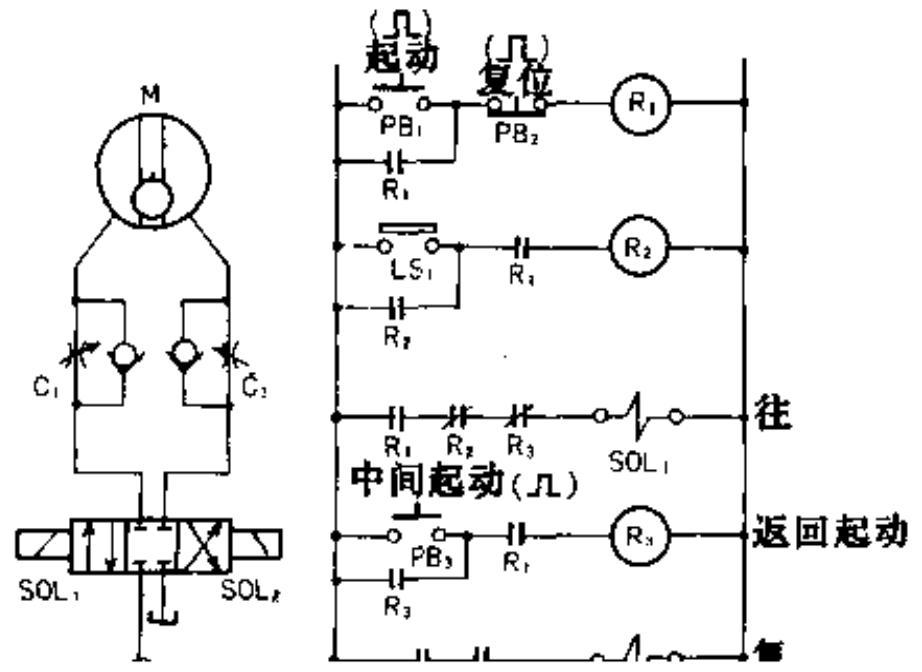

图2-116  
动力：液压  
行程： $1 0 \sim 1 0 0$ 毫米  
载荷：中

图2-116是由摆动运动转换为直线运动的机构。它是这类机构的基本形式之一。

本图所示为中间停止型，无论利用摆动缸端面的任何一方，都可保证位置精度。轻载时虽然对齿轮轴没有必要用双支占轴承，但是从

# 摆动缸、杠杆和连杆快速返回往复直线运动机构

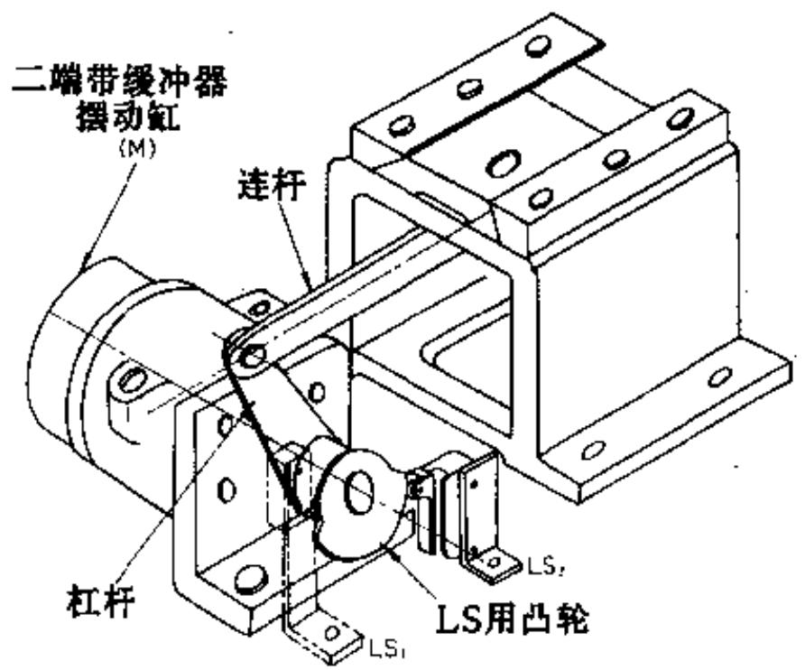

图2-117  
动力：液压  
行程： $3 0 \sim 1 0 0$ 毫米  
载荷：中

图2-117是使用摆动缸实现前进、后退运动的基本装置形式之一。在杠杆回转角为 $1 8 0 ^ { \circ }$ 时，前进、后退运动为正弦曲线，运动特性良好。采用本机构时，可以用液压或气动摆动缸，并推荐使用能够发挥最大优点的 $1 8 0 ^ { \circ }$ 的杠杆摆动角。如用于与本图所示有所不同的场合时，可改变一下杠杆、连杆和LS用凸轮的配置。

# 设计、制造要点

由于摆动缸的轴向承载能力较差，应尽可能使其轴处于水平状态使用。滑动部分也可以不使用燕尾槽，但是必须采用能够适合连杆摆动角较大的结构。

# 使用实例

作为不用凸轮而能得到正弦曲线运动的最简单机构，用于工作台的移动等。

# 其 它

参阅附录一第2类控制回路。

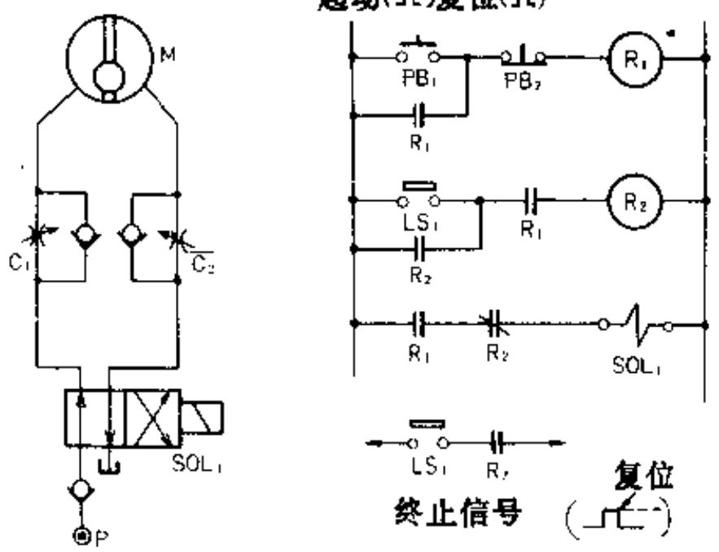  
起动复位（n）

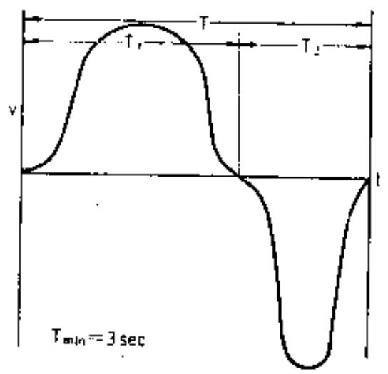

# 摆动缸和杠杆长行程往复直线运动机构

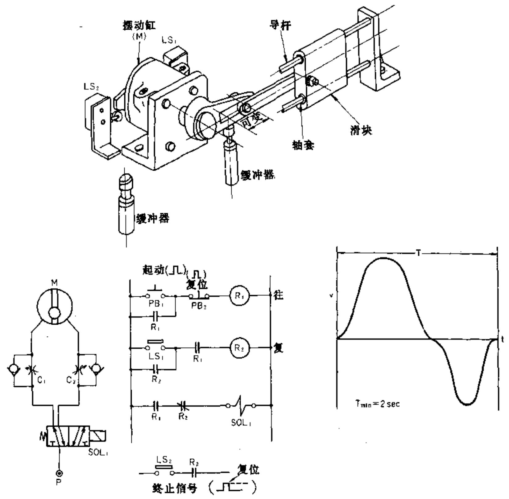  
图2-118动力：气压行程： $1 0 0 \sim 5 0 0$ 毫米载荷：中

图2-118是在希望取得速度较快、行程较长时使用的一种机构。当摆动180°时，滑块的移动为正弦曲线。在杠杆动作的两端装有缓冲器、因为即使在摆动 $1 8 0 ^ { \circ }$ 时，采用定程器会产生冲击，所以必须用缓冲器。本机构大多采用气动，但也可采用液压。

# 设计、制造要点

因为大多数情况下为高速动作，所以要充分注意摆动缸轴与杠杆连接处的键槽，保证不发生松动：导杠的轴套如能使用滚珠导套，则制造时较为方便，

另外，缓冲器的选择，因为它取决于吸收能量的大小，所以使用外购件时，必须对产品了解以后再使用、

使用实例

传送、擒纵机构等的传动部分。

# 其 它

参阅附录一第2类控制回路。

# 摆动缸和链条中间停止往复直线运动机构

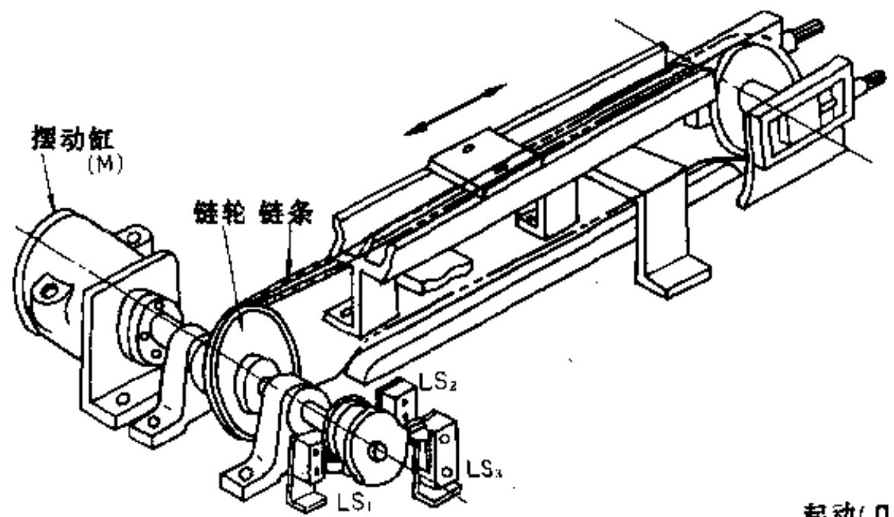  
图2-119动力：液压行程： $1 0 0 \sim 1 0 0 0$ 毫米载荷：中

图2-119是采用摆动缸和链条的往复直线运动机构。本机构大多在空间位置无法容纳液压缸的情况下使用，但其电气原理和液压系统，大体上与采用液压缸时相似。如图2-119所示，电气信号可以从凸轮轴发出，也可从链条部分发出，但是，其停止位置精度以后者为高，其结构则以前者易于解决。为了增加移动距离，也可采用齿轮等来扩大摆动缸的回转角度。

# 设计、制造要点

也可以在摆动缸的轴上直接装配链轮进行传动，但从寿命方面考虑，只推荐本图那样的结构。使用链条时必须张紧。移动台的牵引链条，因为是往复运动，要注意不应与导轨等产生局部摩擦。

# 使用实例

传送带之间的输送，以及在要求行程较长、且需要和其它机构在中间或两端位置保持同步的输送机构。

# 其 它

参阅附录一第3类控制回路。

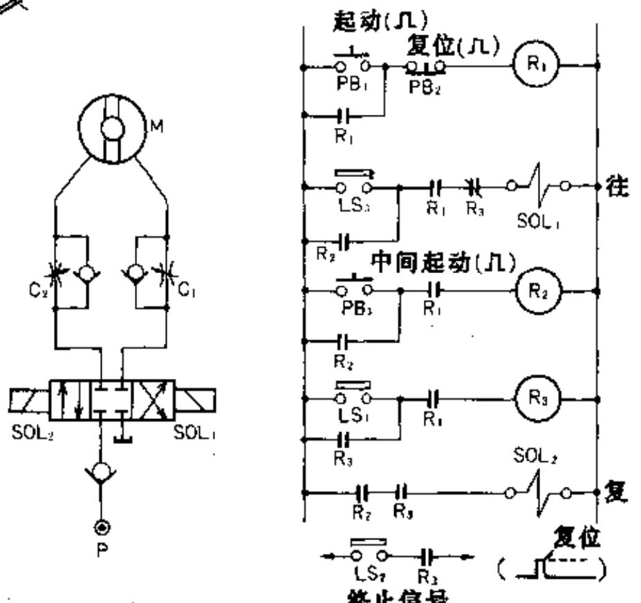  
终止信号

# 齿条、齿轮和机械流量控制阀直线运动机构

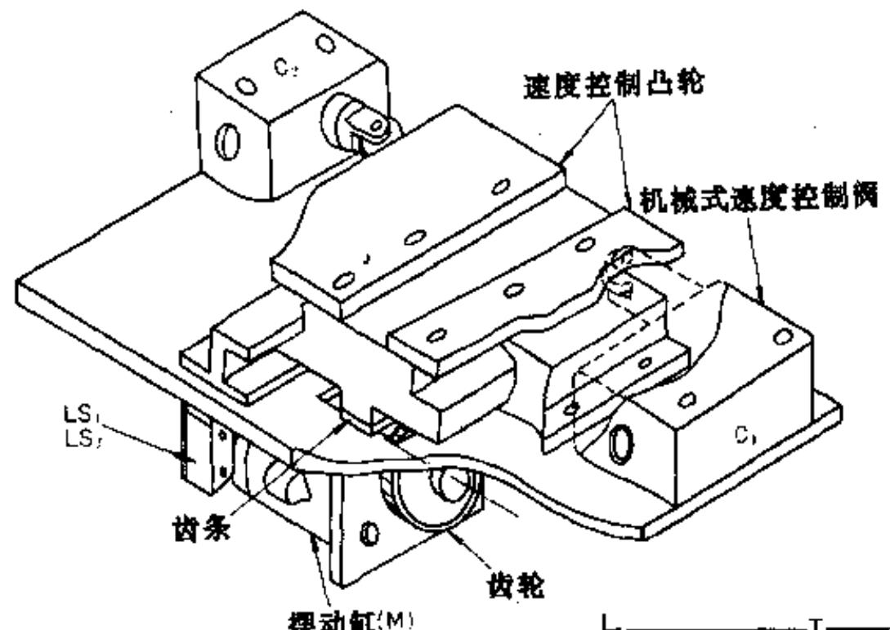

图2-120  
动力：液压  
行程： $3 0 0 \sim 1 0 0 0$ 毫米  
载荷：中

图2-120是使用齿条，齿轮并与机械流量控制阀组合，进行任意变速的直线运动机构。液压系统很简单， $\mathbf { C _ { l } } ^ { \prime }$ 和 $\mathbf { C _ { 2 } } ^ { \prime }$ 似乎看起来没有必要，实际上装入后调整方便。此机构对于短行程调整较难，如果行程不到300毫米，速度又不很低，调整就困难，也就完全失去了任意控制的特点。

# 设计、制造要点

本机构最难解决的是速度控制凸轮部分。用 $\bar { \mathsf { C } } _ { 1 } ^ { \prime } \cdot \mathsf { C } _ { 2 } ^ { \prime }$ 确保最低速度，用 $\mathbf { C } _ { 1 }$ 、 $\mathbb { C } _ { 2 }$ 控制增加流量的大小。事实上可先制造出凸轮的大体形状，然后按实际动作要求调整。但是，与液压马达不同，使用摆动缸是不能获得准确控制的。

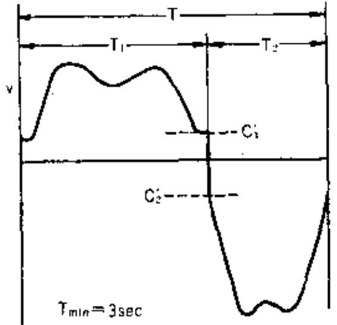

起动（）复位（）? 往1RT R: 复SOL-H 复位终止信号

# 使用实例

从料斗取出工件等机构的一部分，以及要求简单仿形动作的机构。

# 其 它

参阅附录一第2类控制回路。

# 端面凸轮任意变速直线运动机构

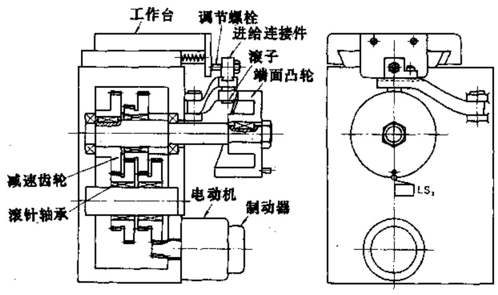  
图2-121动力：电气行程： $1 0 \sim 5 0$ 毫米载荷：中

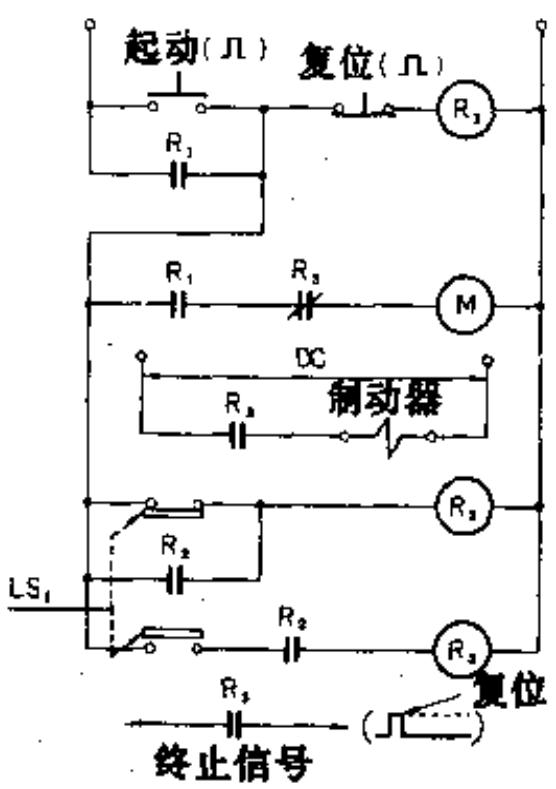

图2-121是由电动机驱动端面凸轮回转，使工作台进行前进和后退的直线运动机构。速度的改变可通过更换不同升程的端面凸轮进行。行程位置的微调，可利用进给连接件上的调节螺栓来调节。

# 设计、制造要点

1．因为在端面凸轮上有轴向载荷，所以要注意轴承的选择。

2．因为凸轮不能决定工作台的位置，所以当工作台原始位置或前进极限位置有精度要求时，如图所示，应装设调节螺栓。

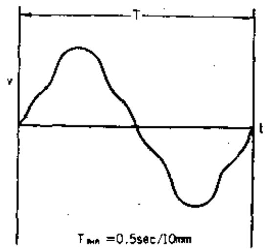

# 使用实例

用于机床、小型精密机床等的工作台进给。

其 它

参阅附录一第2类控制回路。

# 槽形凸轮任意变速直线运动机构

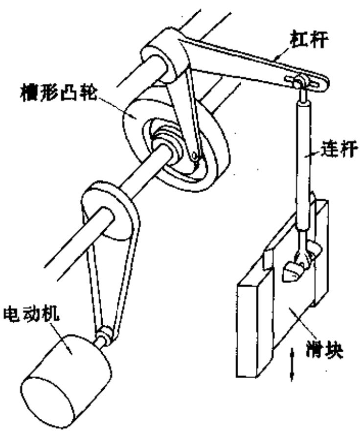

图2-122  
动力：电气  
行程： $1 0 \sim 6 0$ 毫米  
载荷：中

图2-122是利用槽形凸轮的任意变速直线运动机构。凸轮轴由电动机皮带轮传动而回转，装在凸轮轴上的槽形凸轮带动杠杆使滑块动作。通过槽形凸轮的设计，即取得任意的行程和速度。由于使用了槽形凸轮，就可能进行高速运动。

设计、制造要点

1．注意槽形凸轮和滚子的配合。2．连杆制成能伸缩调节的。  
使用实例  
铆接机等的直线进给机构。  
其 它  
参阅附录一第1类控制回路。

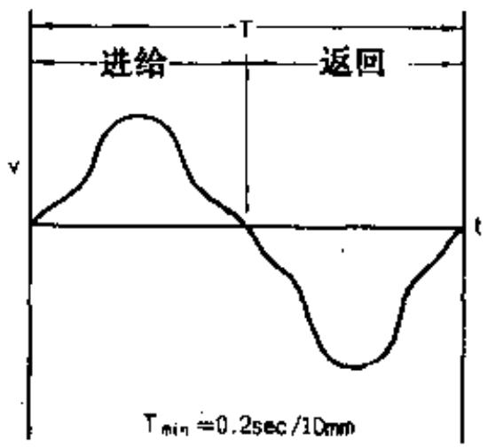

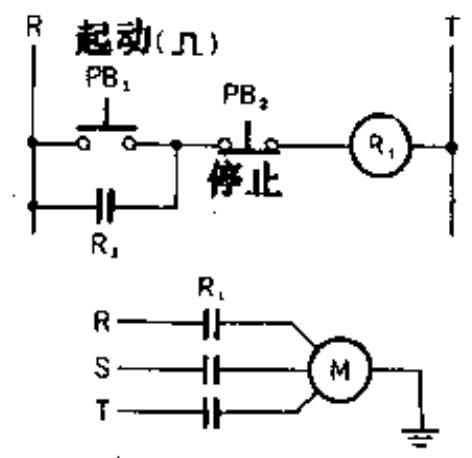

# 曲柄两端减速直线运动机构

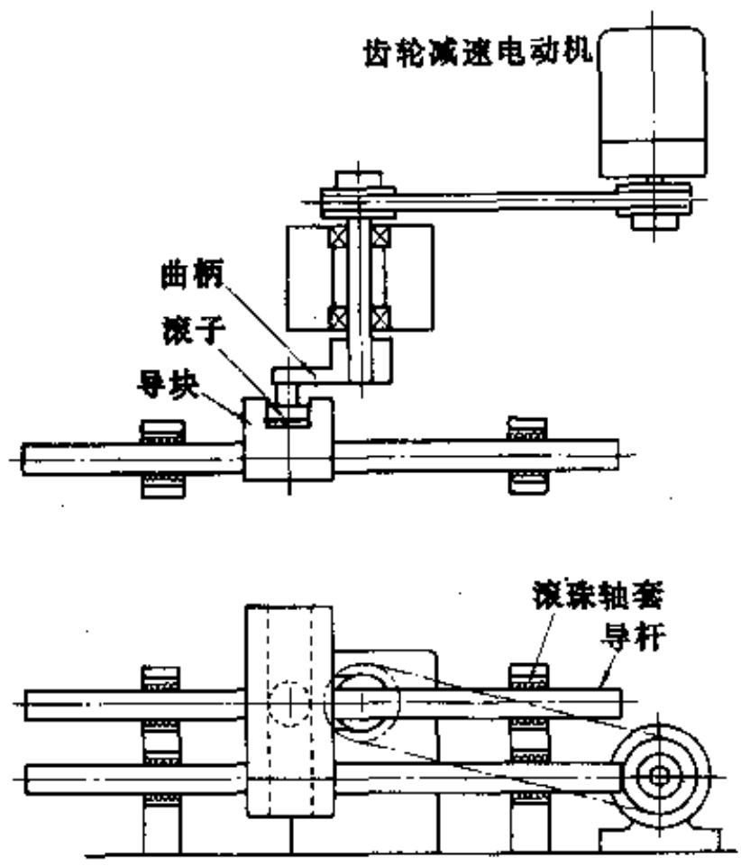

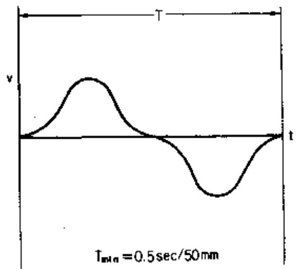

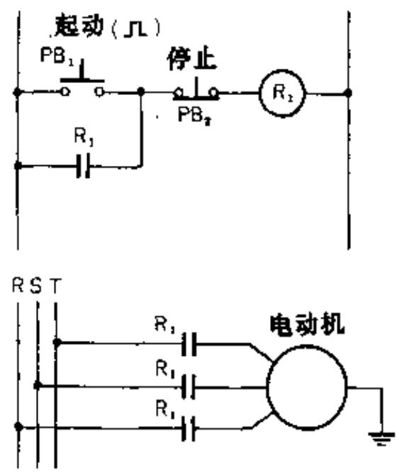

图2-123  
动力：电气  
行程： $5 0 \sim 1 0 0$ 毫米  
载荷：轻

# 设计、制造要点

图2-123是由齿轮减速电动机通过皮带轮使曲柄回转，从而由导块使导杆作两端减速的直线运动机构。

1．注意两根导杆的平行度。  
2．注意滚子与导块的配合及强度。使用实例  
装配机等的工件推进。  
其它  
参阅附录一第1类控制回路。

# 曲柄两端减速直线运动机构

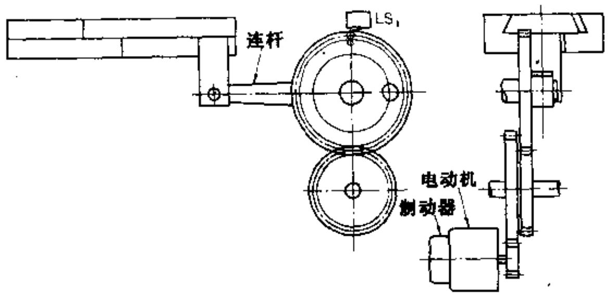

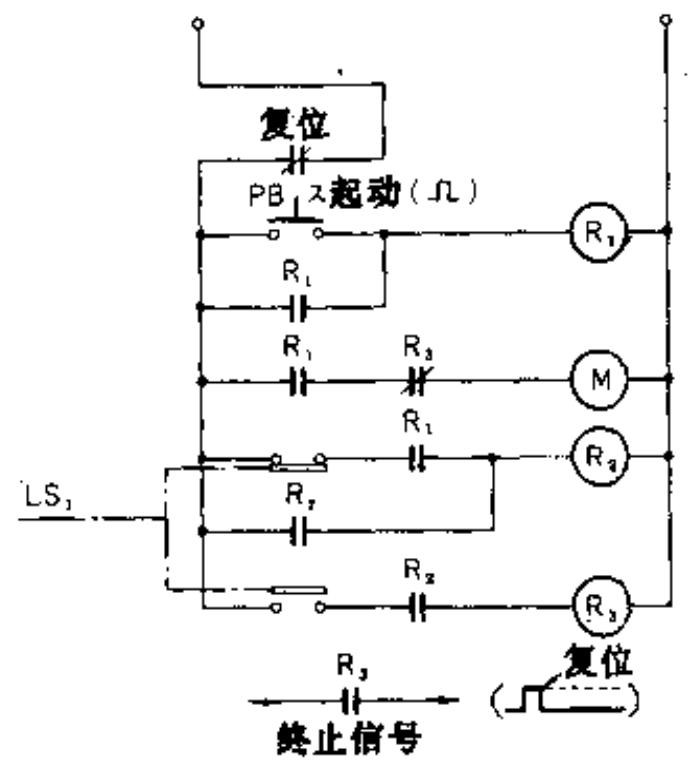  
图2-124动力：电气行程： $5 0 \sim 1 0 0$ 毫米载荷：中

图2-124是通过电动机驱动、齿轮传动，并在齿轮上安装连杆，使滑块进行两端减速的直线运动机构。为了保持停位精度，使用了制动器。

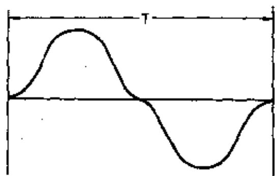  
T1n=0.3sec/50mm

# 设计、制造要点

1．必须注意滑动部分的磨损。2．连杆尽可能长一些为好。使用实例  
装配机、铆接机。  
其它  
参阅附录一第2类控制回路。

# 槽板两端减速直线运动机构

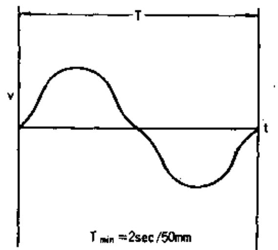

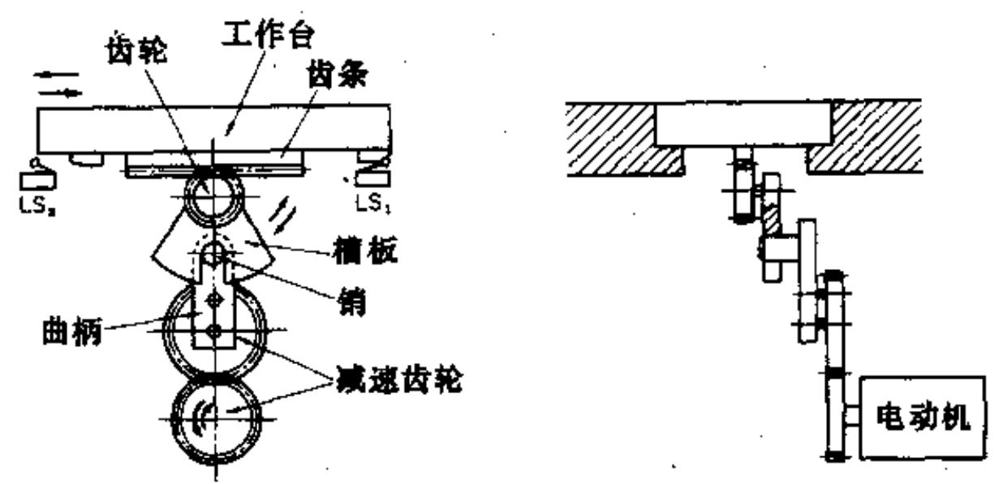  
图2-125动力：电气行程： $5 0 \sim 1 0 0$ 毫米载荷：中

图2-125是由电动机的正反回转通过安装在齿轮上的曲柄，转换为槽板的摆动运动，再用齿轮和齿条使工作台进给的两端减速直线运动机构。

# 设计、制造要点

1．为提高两端的停止位置精度，以及防止电动机正反转换时的过电流，必须安装制动器（也可用电动机短路制动器)。

2．槽板和曲柄销的配合要恰当。

# 使用实例

研磨工作台等的往复。

其 它

参阅附录一第2类控制回路。

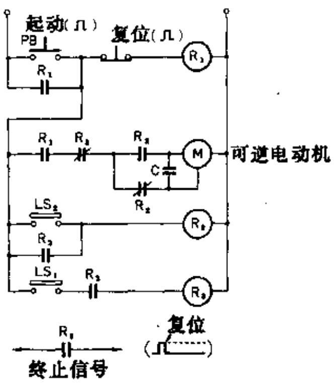

# 单向离合器快速返回直线运动机构

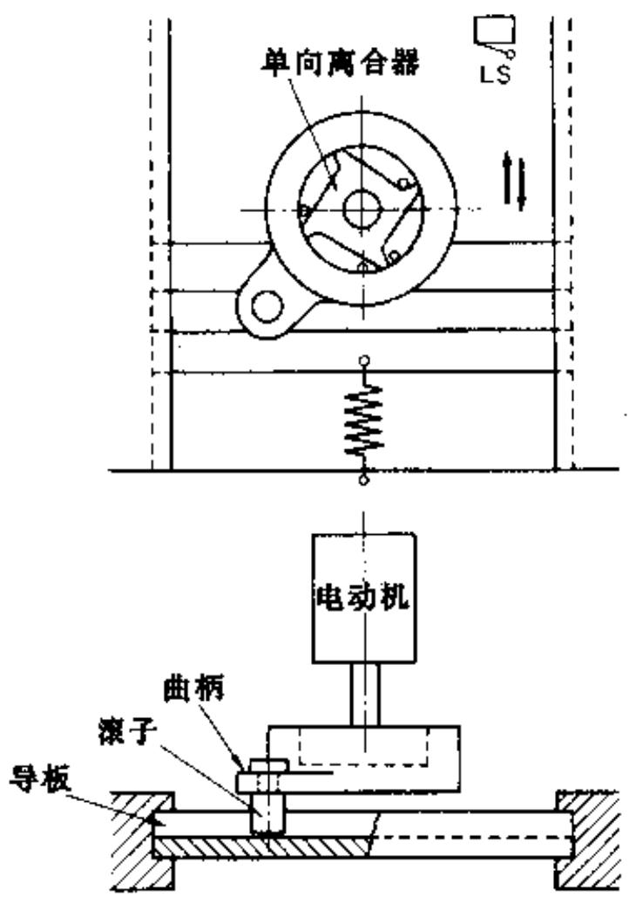

图2-126  
动力：电气  
行程： $5 0 \sim 1 0 0$ 毫米  
载荷：中

图2-126是通过直接连接在电动机轴上的单向离合器，使曲柄回转并带动导板作直线运动的机构。电动机利用限位开关的动作停止，由弹簧使导板快速返回。返回时单向离合器处于脱开状态。

设计、制造要点

1．必须充分注意导板的耐磨性。  
2．要考虑快速返回时的冲击和振动。  
3．导板与滚子之间要有适当的松动。

# 其 它

参阅附录一第1类控制回路。

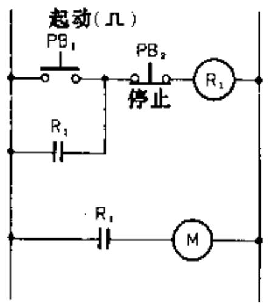

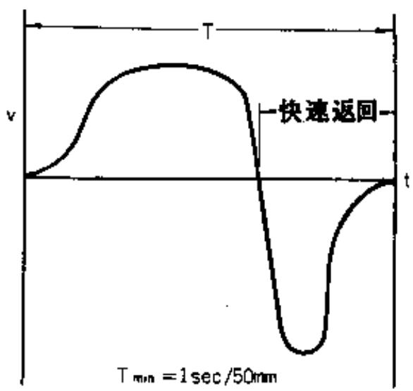

# 缺齿齿轮和皮带间歇传动机构

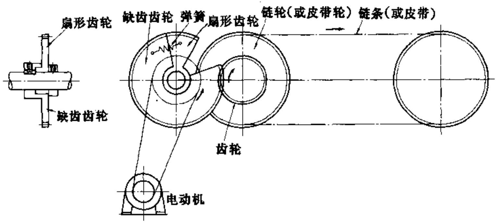

图2-127  
动力：电气  
行程： $5 0 \sim 2 0 0$ 毫米  
载荷：轻

图2-127是通过缺齿齿轮使皮带作间歇传动的机构。缺齿齿轮和齿轮相啮合，扇形齿轮在缺齿齿轮的缺齿部分能以轴心为中心进行摆动；当齿轮与扇形齿轮啮合时传动中断，两者啮合一脱开，扇形齿轮在弹簧的作用下就回到原状。图示机构是把上述运动通过链轮与链条转换成直线前进、中间停止的运动。扇形齿轮是为了防止缺齿齿轮与齿轮的互相干涉而设的。

# 设计、制造要点

必须注意扇形齿轮两端的齿与缺齿齿轮接合时，应形成完整的齿形。

# 使用实例

工件的传送。

# 其 它

参阅附录一第1类控制回路。

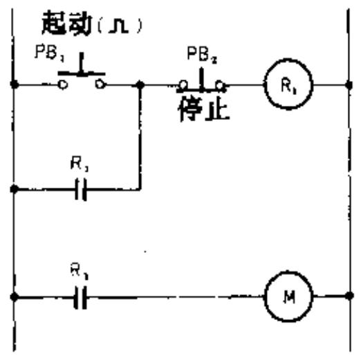

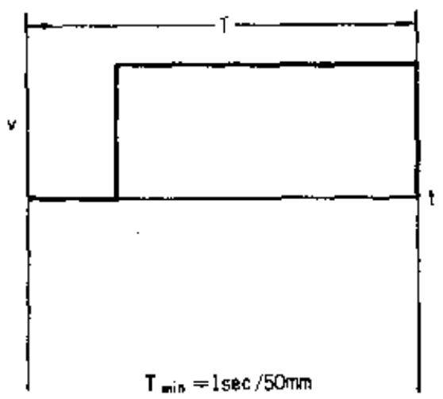

# 十字轮和链条间歇传动机构·

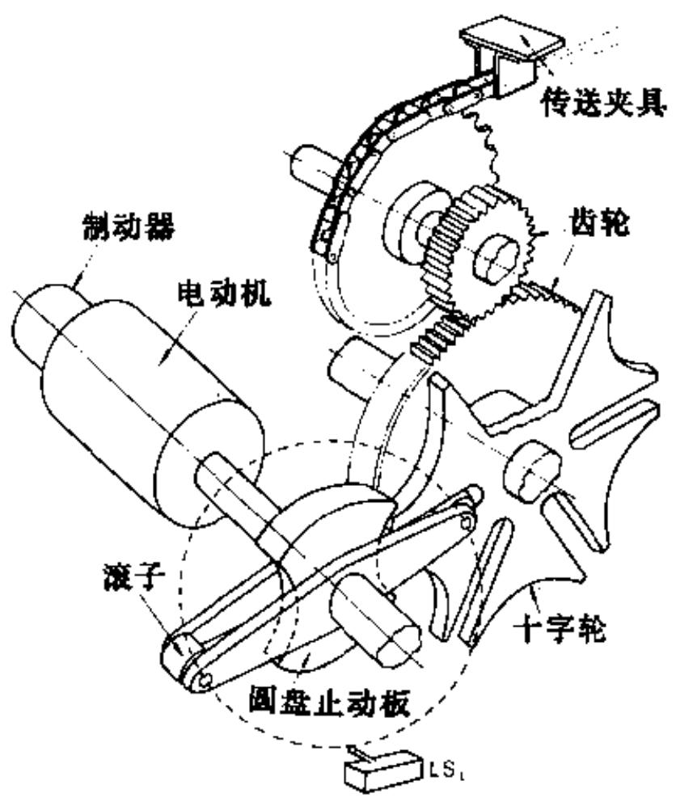  
图2-128动力：电气行程： $5 0 \sim 2 0 0$ 毫米载荷：中

图2-128 是通过十字轮和链条的间歇传动机构。通过制动电动机，用十字轮、齿轮传动链条。因为十字轮机构采用了双销，所以在电动机每回转半周时暂时停止。所传动的行程可由改变传动齿轮的齿数比来调节。

设计、制造要点

要考虑十字轮与传送夹具的位置关系。

使用实例

图示机构是使用于装配机等的工件传送装置。

# 其 它

参阅附录一第2类控制回路。

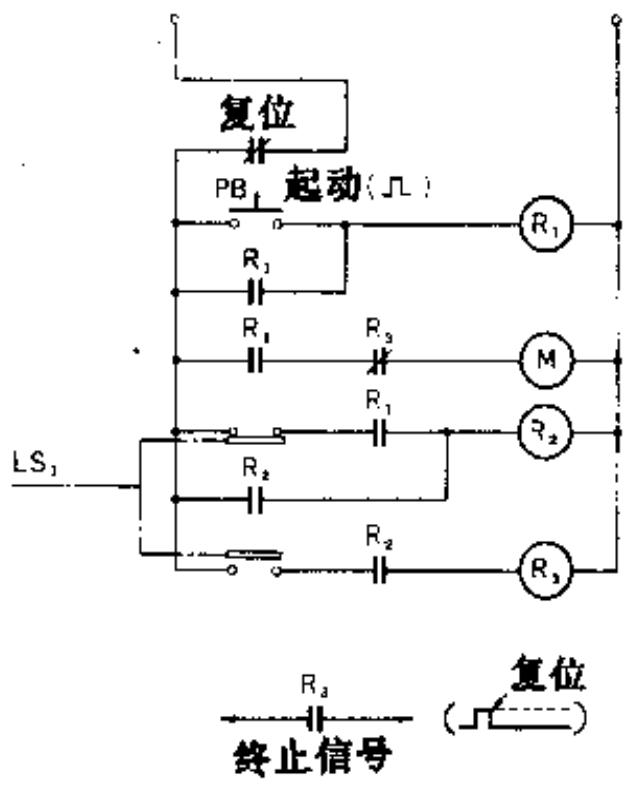

# 齿条和缺齿齿轮快速返回直线运动机构

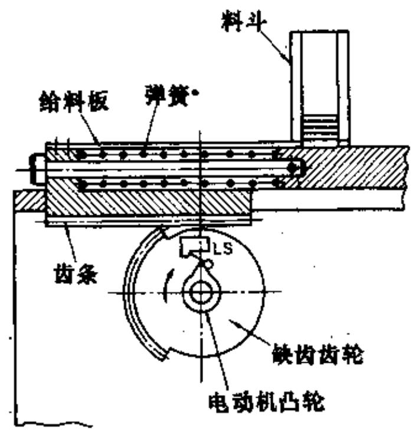  
图2-129动力：电气行程： $5 0 \sim 2 0 0$ 毫米载荷：中

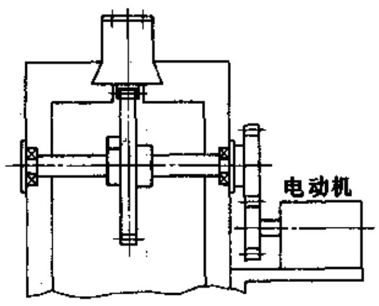

图2-129是通过缺齿齿轮、齿条的快速返回直线运动机构。在齿轮轴上安装有缺齿齿轮，通过缺齿齿轮的回转，传动齿条，返回时利用弹簧进行快速返回。

# 设计、制造要点

1．应考虑到缺齿齿轮开始和齿条啮合时，不能发生干涉。2，必须考虑工件的定位是采用调整给料板，还是别的方法。

# 使用实例

图示为供专用机床、装配机等从料斗中送出工件的机构。

其 它

参阅附录一第2类控制回路。

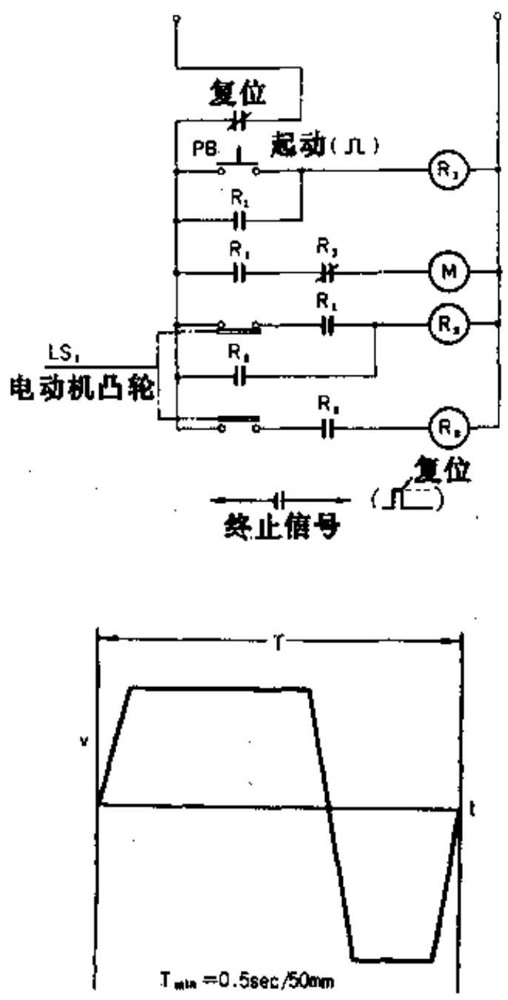

# 曲柄快速返回直线运动机构

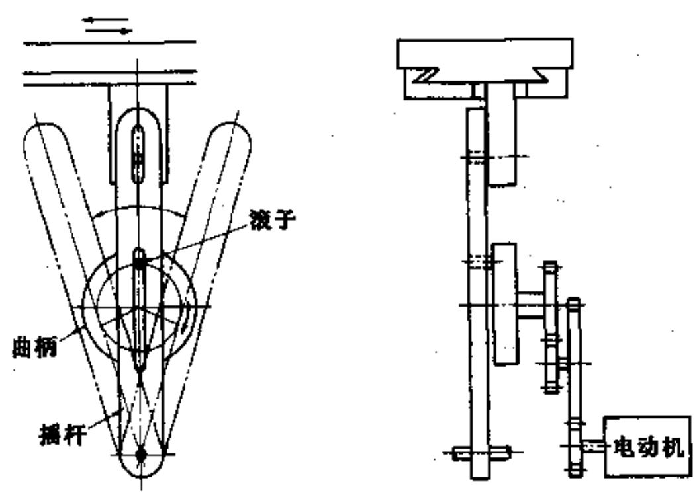  
图2-130动力：电气行程： $5 0 \sim 2 0 0$ 毫米载荷：中

图2-130是由电动机驱动，使装配在齿轮轴上的曲柄回转，然后使摇杆摆动的快速返回机构。

设计、制造要点

1．必须考虑摇杆的耐磨性及强度。

2．滚子与摇杆的配合要恰当。

3．滚子轴要有足够的强度。

4．利用滚子回转半径的移动进行行程调节。

使用实例

机床、牛头刨床的刀具传动等。

其 它

参阅附录一第1类控制回路。

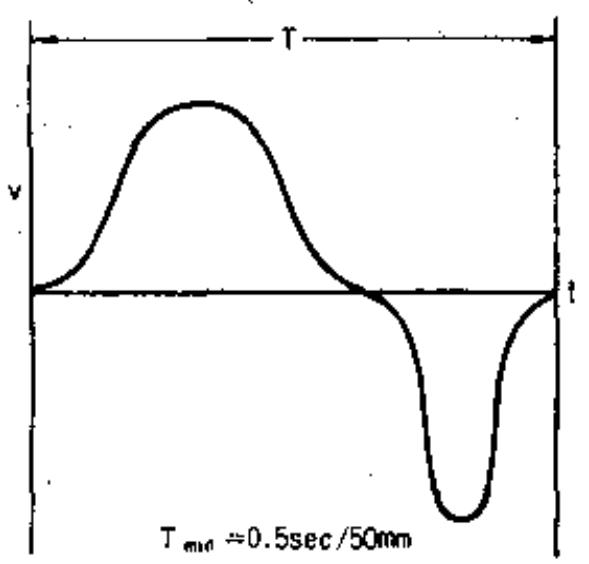

# 丝杠直线运动机构

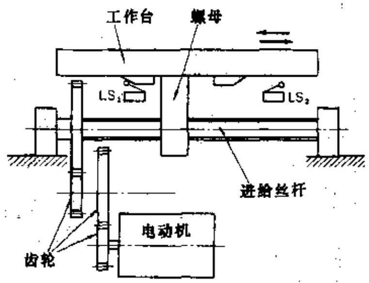

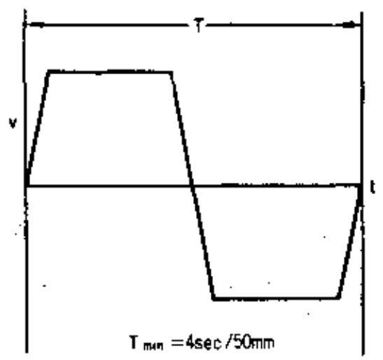

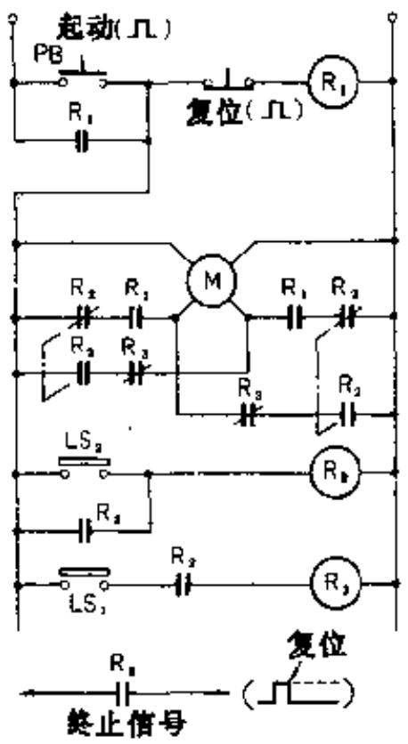

图2-131  
动力：电气  
行程： ${ 5 0 } \sim 2 0 0$ 毫米  
载荷：重

2．如在进给丝杠部分安装间隙消除装置，则对丝杠的磨损就能有某种程度的调整。

图2-131是由电动机驱动，通过齿轮带动进给丝杠回转，使工作台移动的机构。工作台的前进、后退利用电动机的正、反转进行。

设计、制造要点

1．停止位置有精度要求时，必须设置制动器。

3．为防止超程，可在工作台最大移动范围的两端安装限位开关，靠限位开关来控制电动机停转。

使用实例机床工作台。

其 它

参阅附录一第2类控制回路。

# 钢带等速往复直线运动机构

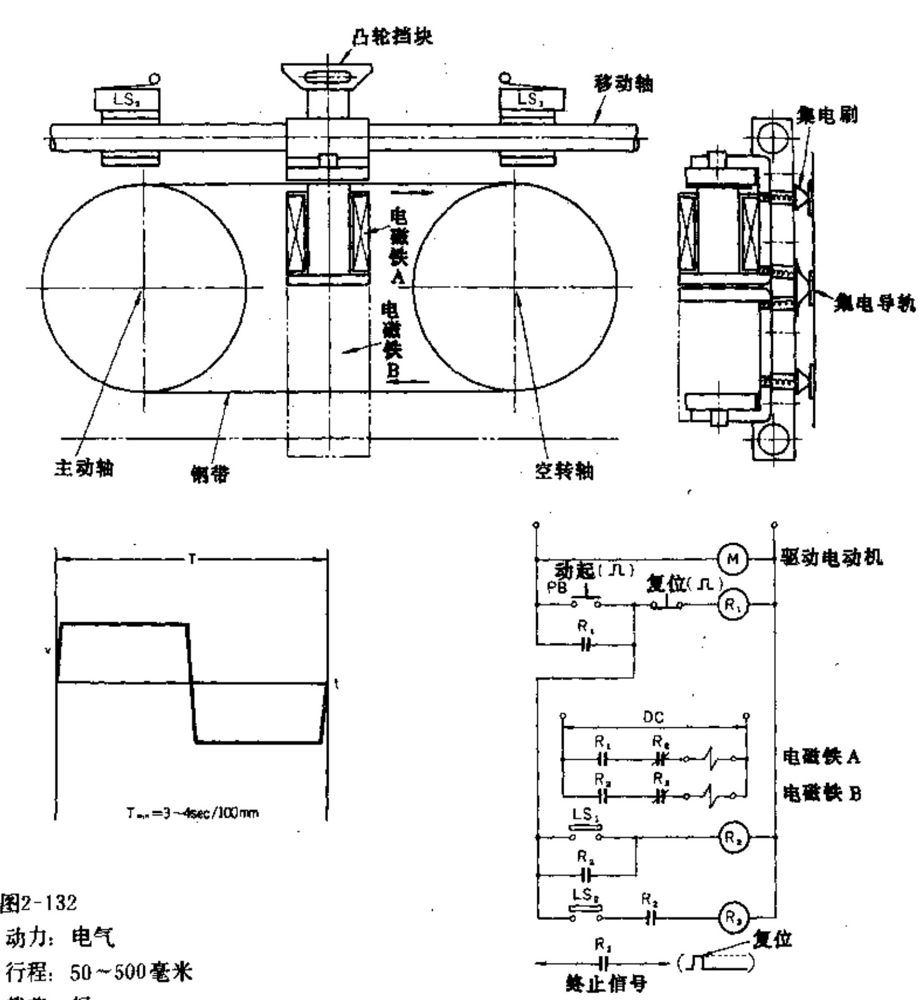

图2-132是使张紧在主动轴和空转轴之间的钢带，用上下两个直流电磁铁和衔铁夹持，由于电磁铁的交替动作，使移动轴进行左右往复直线运动的机构。

设计、制造要点

1，如果不按图中所示那样，而用一个通断式限位开关，三个集电刷从此开关引出，电气线路可以更加简单。

2.钢带厚度为 $\mathbf { 0 . i \sim 0 . 1 5 }$ 毫米，希望焊缝尽可能少(最好用等离子焊接)。

使用实例

适宜轻型工件的左右移动。

其 它

参阅附录一第2类控制回路。

# 缺齿齿轮间歇传动机构

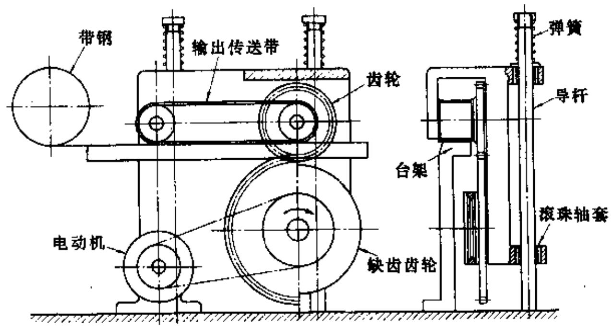

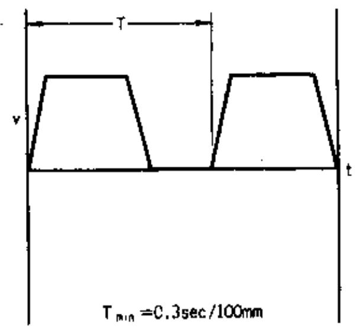

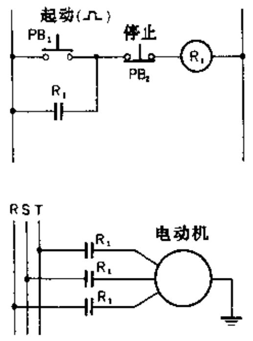

图2-133  
动力：电气  
行程： $1 0 0 \sim 5 0 0$ 毫米  
载荷：轻

图2-133是利用电动机驱动、皮带传动，使缺齿齿轮带动齿轮回转，以进行输出传送带传动和停止的间歇直线运动机构。

图示机构是用来送进钢带，并在停止过程中进行冲压加工的例子。

设计、制造要点

1．应充分考虑输出传送带的材料及台架的磨损。

2．缺齿齿轮和齿轮开始啮合时，不得发生干涉现象。

使用实例

剪切机、冲床等的材料送进机构。

其 它参阅附录一第1类控制回路。

# 内齿轮和外齿轮快速返回直线运动机构

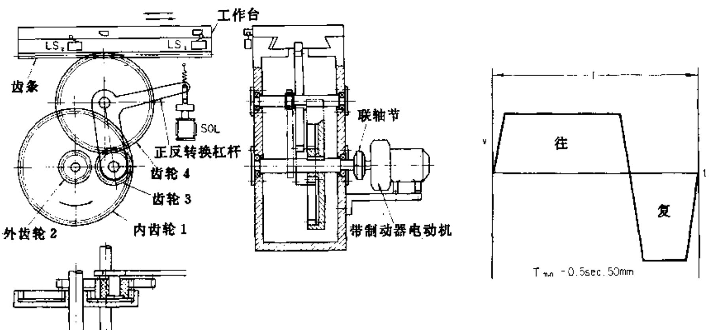

图2-134是反复进行切削进给和快速返回的直线运动机构。它以电动机驱动构成整体的内齿轮1和外齿轮2，用正反转换杠杆进行齿轮3的转换。

# 设计、制造要点

1．在齿轮3转换时,必须注意避免与对应齿轮发生干涉。

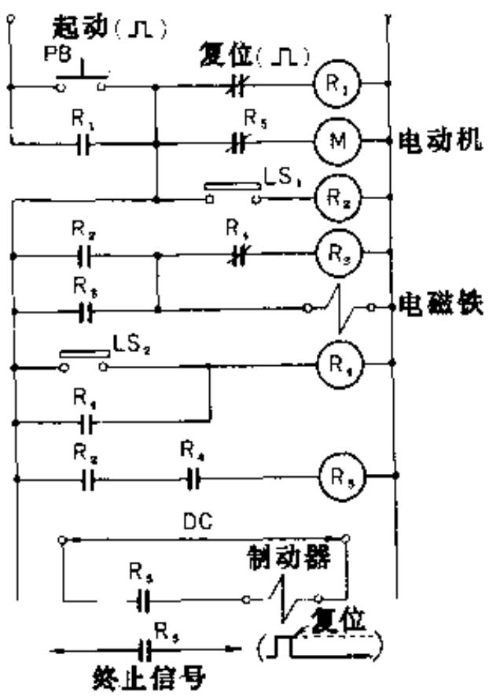  
图2-134动力：电气行程： $5 0 \sim 5 0 0$ 毫米载荷：重

2．如果内外齿轮在整体制造时有困难，可制成单个的，然后组装起来。

3．操纵正反转换杠杆用的电磁铁或弹簧，要按承载能力选定。

# 注意事项

1．如果使正反转换杠杆增加一个空挡，动作顺序也可组合成：切削进给、中间停止、切削进给、快速返回等。

2．工作台承受重载时，不能操作正反转换杠杆。

使用实例

铣床、装配机等工作台的传动。

# 其 它

参阅附录一第6类控制回路。

# 丝杠任意变速直线运动机构

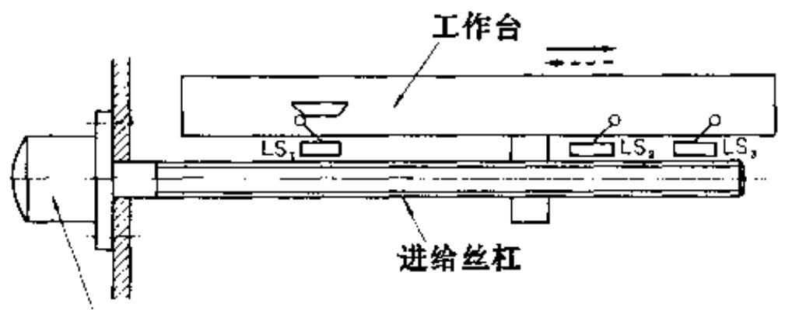  
伺服电动机

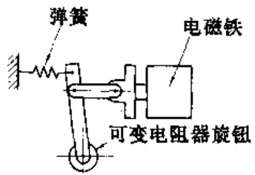

图2-135  
动力：电气  
行程： $5 0 \sim 5 0 0$ 毫米  
载荷：重

图2-135是利用丝杠的任意变速直线运动机构。通过伺服电动机使进给丝杠回转，工作台即移动。工作台的前进与后退靠伺服电动机的正、反转进行。进给速度的改变，用电磁铁转动可变电阻器进行。

# 设计、制造要点

1．要求微量进给时，因伺服电动机的输出功率减少，所以要装入减速齿轮，以提高输出功率。

2．注意丝杠部分的磨损。

# 使用实例

机床等的控制进给。

其 它

参阅附录一第6类控制回路。

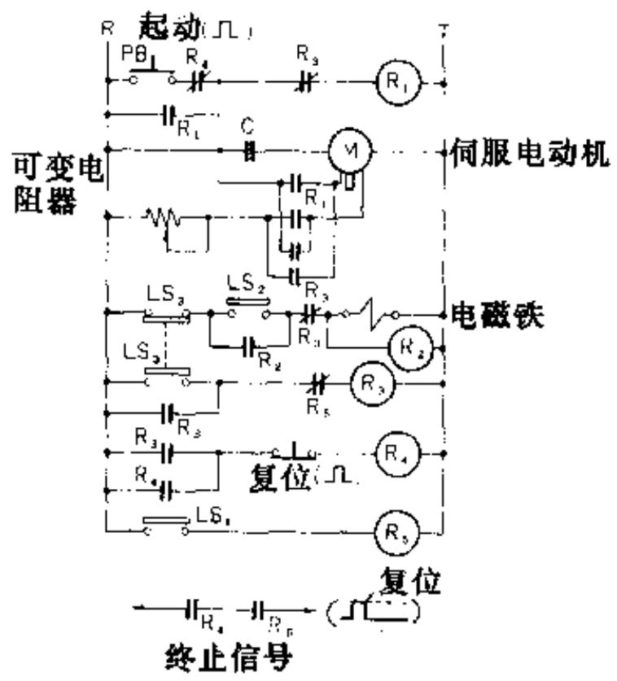

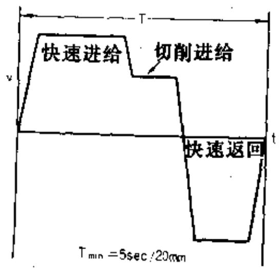

# 曲柄减速直线运动机构

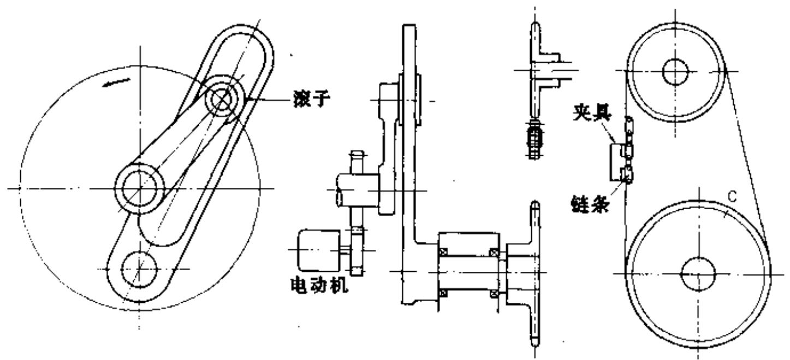

图2-136  
动力：电气  
行程： $1 0 0 \sim 6 0 0$ 毫米  
载荷：中

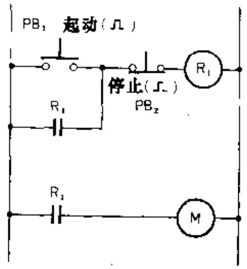

图2-136是通过曲柄使链条进行减速直线运动的机构。用电动机通过齿轮传动，使安装在齿轮轴上的曲柄回转，并通过安装在链条轴上具有长槽的摇臂带动链条得到所需要的运动。

# 设计、制造要点

1．必须充分注意具有长槽的摇臂、曲柄及滚子轴等的强度。

2．必须注意滚子与长槽的配合。

# 使用实例

装配机等的传送装置。

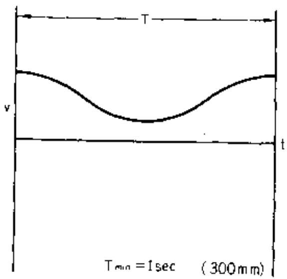

# 其 它

参阅附录一第1类控制回路。

# 丝杠二级变速直线运动机构

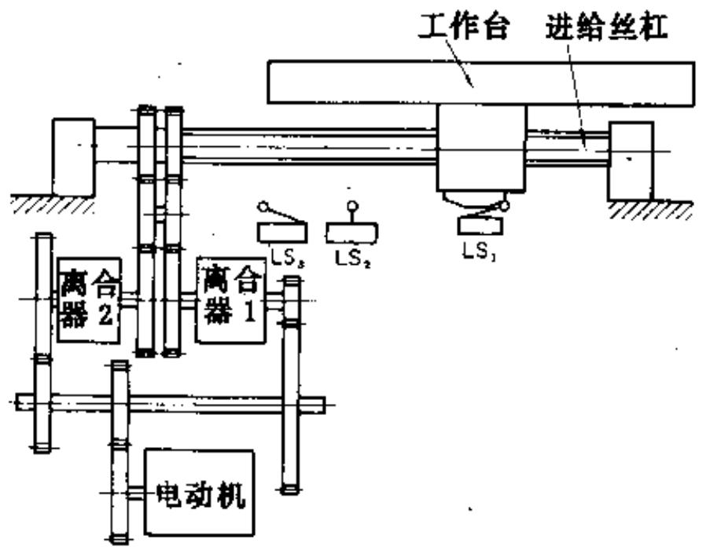

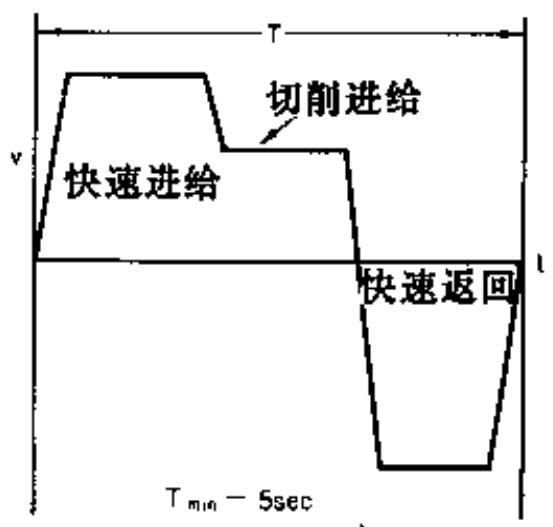

图2-137  
动力：电气  
行程：100～1000毫米  
载荷：重

图2-137是利用丝杠的直线运动机构。电动机通过齿轮传动使丝杠回转，工作台即进行左右移动。通过离合器1和2的转换，可以得到二级变速。工作台的左右移动是利用电动机的正、反转获得的。

# 设计、制造要点

1．注意丝杠部分的磨损，以延长寿命。在丝杠更换困难的场合，使用滚珠丝杠。

2．在周期时间较短的场合，在前进端必须有停止时间。

# 使用实例

机床的进给等。

其 它

参阅附录一第6类控制回路。

LSLSLS  
起动  
P阳 L RR 开  
R ?  
R 离合器离合器2复位?  
R复位  
R I (t）终止信号

# 链条中间停止直线运动机构

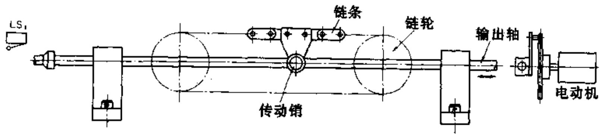

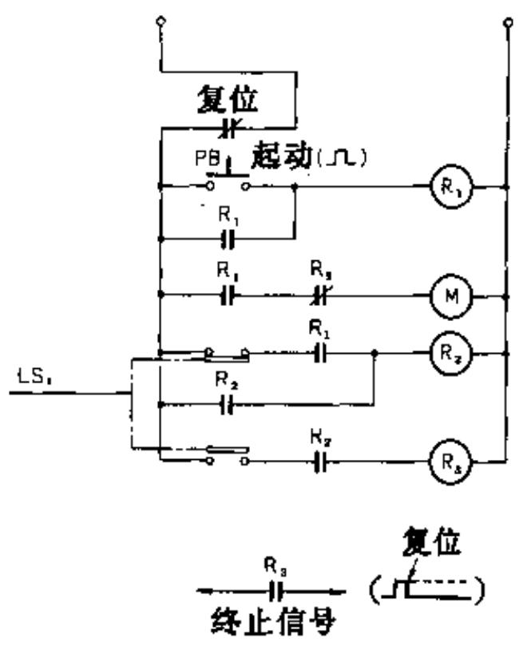

图2-138  
动力：电气  
行程： ${ \bf 3 0 0 } \sim { \bf 2 0 0 0 }$ 毫米  
载荷：轻

图2-138是由电动机驱动直接连接的链轮，通过链条使输出轴进行直线运动的机构。本机构不需要限位开关，即可在中间位置停止。

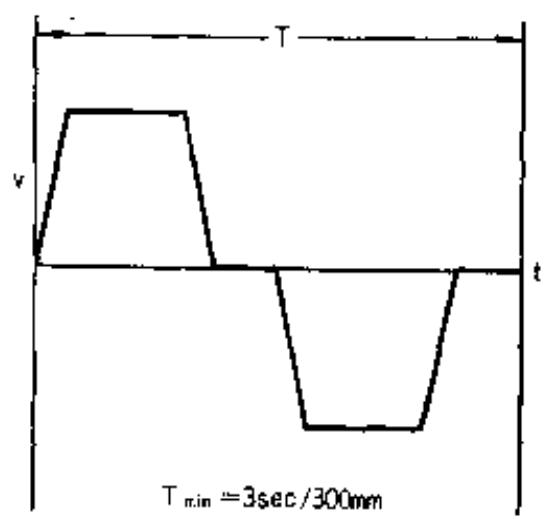

# 设计、制造要点

1．必须充分注意防止输出轴歪扭。

2，通过变换链轮直径，可以得到任意的中间停止时间。

使用实例

装配机的推进机构等。

其 它

参阅附录一第2类控制回路。

# 螺旋轴等速直线运动机构

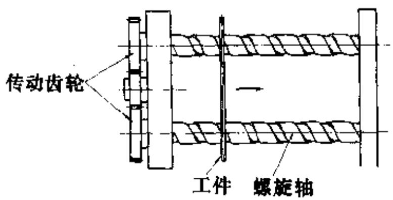

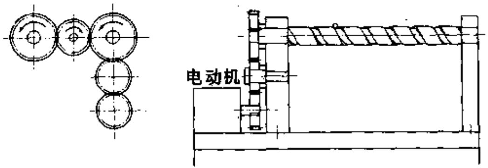  
图2-139动力：电气行程： $5 0 \sim 2 0 0 0$ 毫米载荷：轻

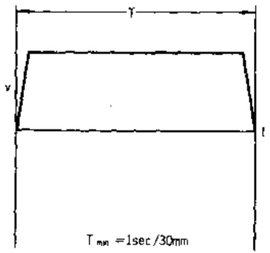

图2-139所示是由电动机通过齿轮和空转齿轮使两根螺旋轴同方向回转，利用两根螺旋轴的螺旋槽来传送线材的机构。

设计、制造要点

1．两根螺旋轴的相位不能偏移。

2．线材的直径和螺旋轴的螺旋槽宽度要合适。

# 使用实例

工件的传送等。

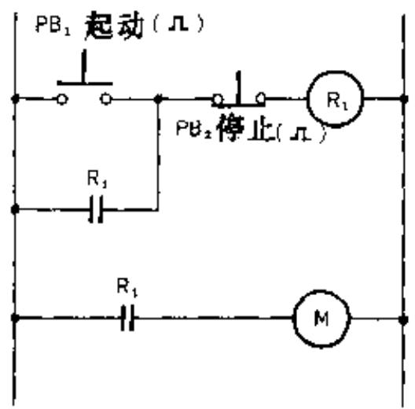

其 它

参阅附录一第1类控制回路。

# 过载打滑等速直线运动机构

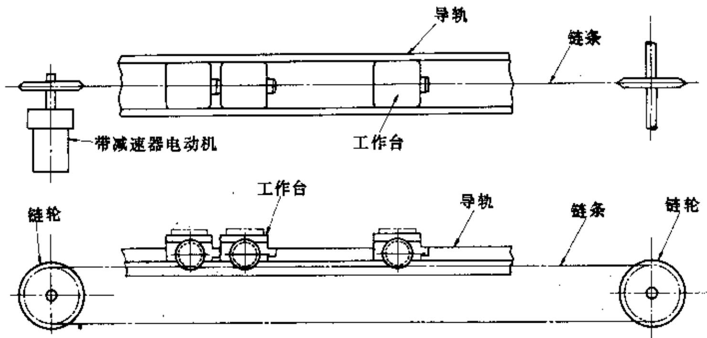

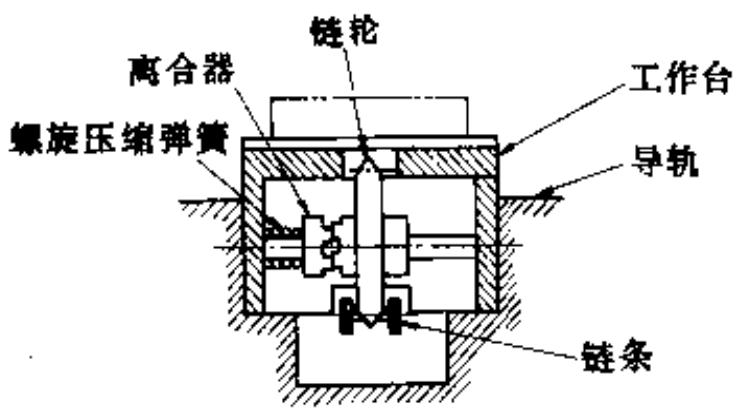

图2-140  
动力：电气  
行程： $5 0 0 \sim 4 0 0 0$ 毫米  
载荷：中

图2-140是能够过载打滑的等速直线运动机构：架在导轨上的工作台由链条带动直线前进，在工作台内装有链轮和离合器，当工作台过载时，离合器打滑，链轮空转，工作台停止移动：

如图所示那样，也能使几个工作台相继停止

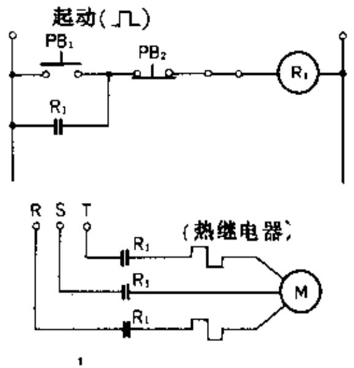

# 设计、制造要点

1，链条在链轮的轴距较大时，由于链条下垂，便与工作台的链轮脱开，所以轴距要合适：

2．工作台内离合器爪的形状、以及螺旋弹簧的作用力要合适。

使用实例

装配机、专用加工机床等的无节奏传送装置

其 它

参阅附录一第1类控制问路。

# 丝杠和楔形螺母直线运动机构

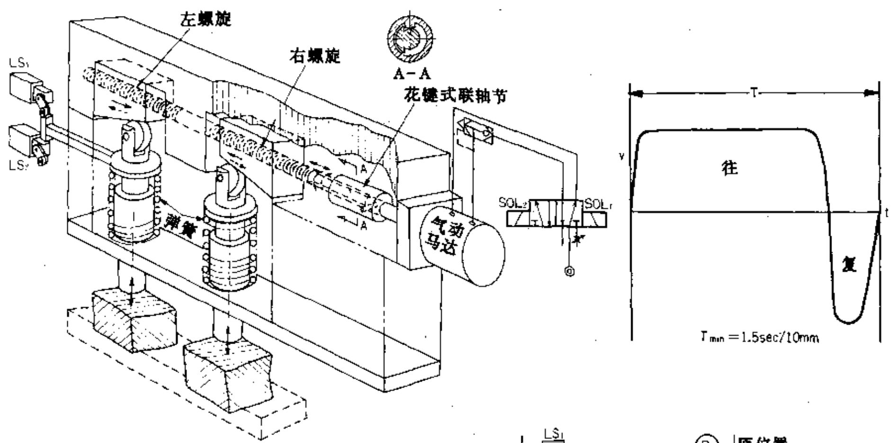  
图2-141动力：气压行程：5～20毫米载荷：重

图2-141是利用丝杠和楔形螺母的直线运动机构。本机构用气动马达使具有左、右螺纹的丝杠回转，从而使楔形螺母沿轴向移动、利用楔形螺母的斜面，使带有滚子的压杆直线前进，压杆靠弹簧返回。

后退完了时，两个螺母接触机架端面后，沿丝杠的轴向位置推压并锁住丝杠。在运动过程中，螺母和丝杠均处于轴向游动状态，当一个螺母首先压紧时，另一个螺母就以2倍的速度沿轴向移动，如果不考虑摩擦阻力，前进停止时，在两个压杆上具有相等的压力。

# 设计、制造要点

1．决定润滑时，既要减小楔形螺母滑动受压面的摩擦，也要兼顾到导向支撑面等的承载情况。

起动信号 ?原位置5- 前进指令R 中国路止信号中间起动信号 前进完毕后退指令复位信号 8 复位 前进存储sL 前进SOL 后退R 复位IT终止信号（

2．在正、反转转换时所用的联轴节具有圆周方向的游隙。压紧停止时，如A-A剖面所示。此联轴节应具有足够的硬度和强度。

3．对于有滚子的压杆要止转。

# 使用实例

工件的压紧等。

其 它

参阅附录一第3类控制回路。

$$
\yen 123,456,7
$$

# 齿条、齿轮平衡式直线运动机构

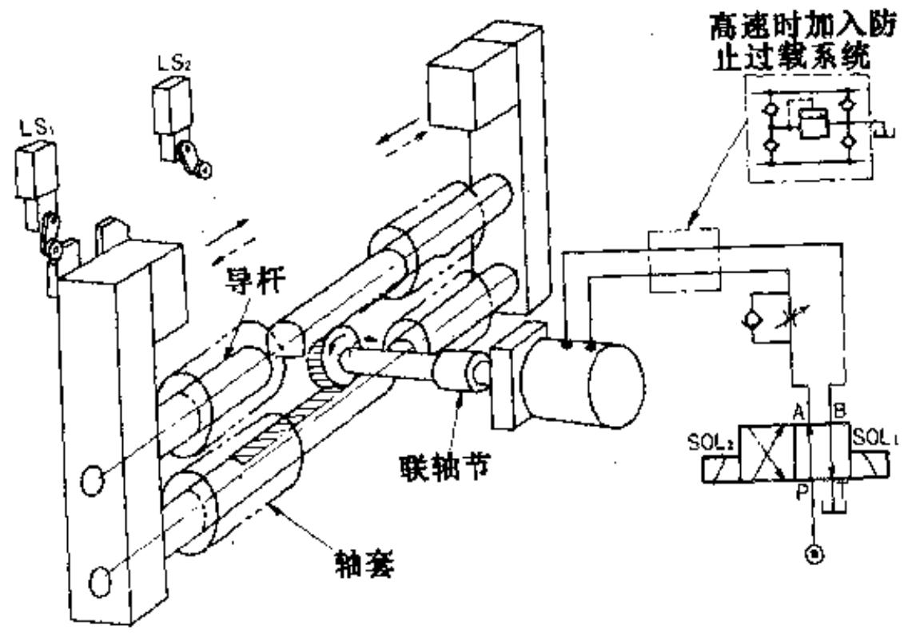  
图2-142动力：液压行程： $2 0 \sim 1 0 0$ 毫米载荷：中

图2-142是利用齿轮放在对置的齿条中，左、右对向地进行直线运动的机构。

# 设计、制造要点

1．设计时必须考虑容易保证齿条和导杆的平行度和间距，刚性也要足够。

2．齿条、齿轮的齿的强度要足够，应能承受液压马达的扭矩和反复冲击载荷。

3．要充分考虑齿条和导杆轴套的润滑和导向长度，不能卡滞。也可以使用滚珠轴套等。

4．要防止因卡滞而引起的动作不良，所以要注意导杆与齿条装配孔的加工和组装。

5。在液压系统中，于快速返回需要较多的流量时，在A、B两路的进出口处都安装单向节流阀，用节流的方法完成快速返回。

# 使用实例

工件的夹紧或工件的抓取等。

# 其 它

参阅附录一第3类控制回路。

原位置起动R 前进信号  
后退起 一前进完毕  
动信号 一后退指令CRL 前进存储M复位信号 复位R 前进R R SOL 一后退L 复位终止信号（

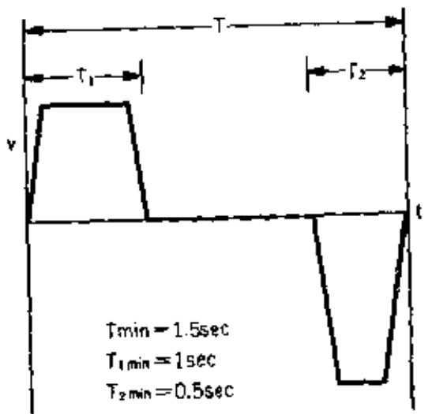

# 凸轮和杠杆直线运动机构

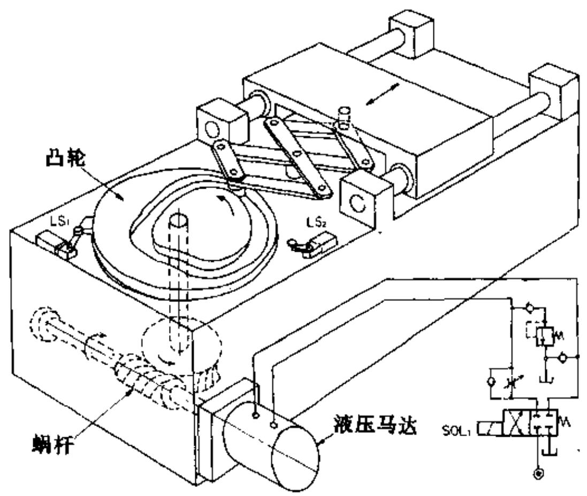

LS0 R 原位置  
PB起动 ? 前进指令井 （运转）? 前进完毕R R 前进存储  
复位信号一 复位L 前进（运转）R 复位终止信号

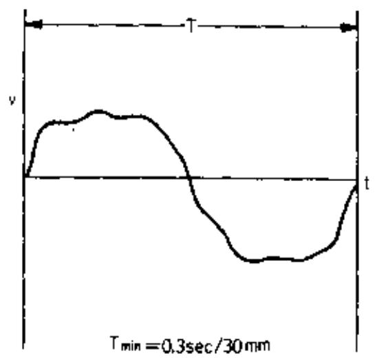  
图2-143

动力：液压行程： $3 0 \sim 2 0 0$ 毫米

载荷：中

图2-143是通过凸轮和杠杆进行直线运动的机构。采用选择杠杆比的方法，能够增减凸轮的行程。

设计、制造要点

1．在蜗杆轴上必须安装推力轴承。

2．与凸轮槽相接触的滚子的轴、固定支点以及滑块上安装的支点，必须在与滑动方向

平行的同一直线上。

3．因为凸轮轴是用蜗轮减速的，液压马达转速相当高，所以在液压系统中必须装入防止过载的制动阀。

4．因为凸轮的回转速度是一定的，所以根据凸轮槽的曲线得到所需的速度。

5．杠杆孔距的加工，必须采用同尺寸的对称件同时加工的方法。

6．必须尽可能减小杠杆各支点处的松动。

# 其 它

参阅附录一第2类控制回路。

# 丝杠和单向离合器慢速进给直线运动机构

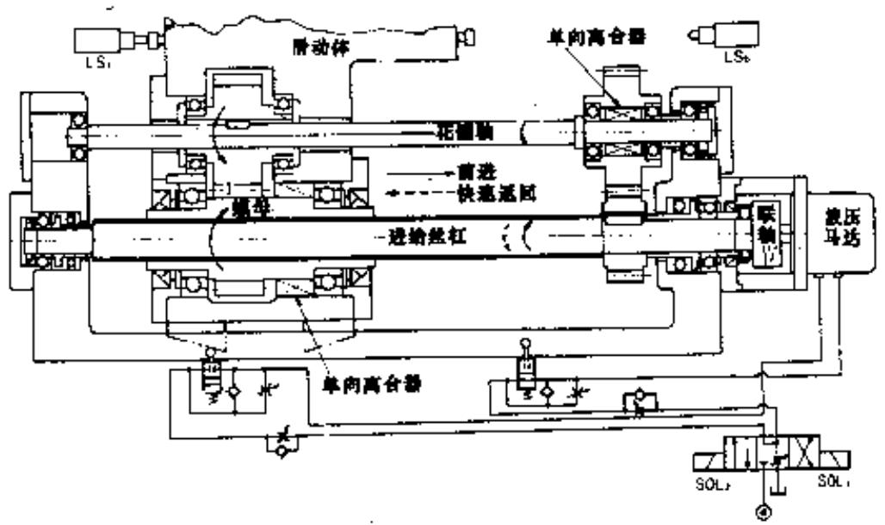

注I）图中箭头表示进给丝杠为右螺旋时的回转和行进方向。2；滑动体的导向部分可用导杆、矩形导軌、燕尾槽等。

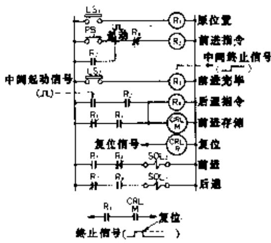

图2-144  
动力：液压  
行程： $5 0 \sim 1 0 0 0$ 毫米  
载荷：重

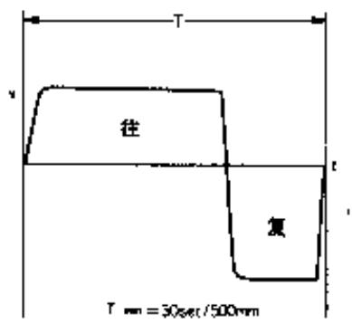

图2-144是通过进给丝杠及单向离合器实现慢速进给的直线运动机构。它是靠螺母与进给丝杠啮合而进行直线运动的，另外，使用了单向离合器，使花键轴仅在前进时回转，此花键轴的回转通过齿轮又传给螺母，由此可用进给丝杠和螺母的转速差给出前进速度。快速返回时，用单向离合器固定螺母的回转，返回速度仅由进给丝杠的转速给出。

前进速度 $\mathbf { \theta } = ( \mathbf { N } - \mathbf { n } ) \mathbf { \theta } \times \mathbf { P }$ 快速返回速度 $\mathbf { \Omega } = \mathbf { \Omega } \mathbf { N } ^ { \prime } \mathbf { \Omega } \times \mathbf { P }$ 式中 $\aleph$ —-前进时进给丝杠的转速；

$\mathbf { N } ^ { \prime }$ ——后退时进给丝杠的转速；  
n-螺母的转速 $( \pmb { \mathbb { N } } > \pmb { \mathbb { n } } )$ ；

P——进给丝杠的螺距。

# 设计、制造要点

1．必须使螺母减速回转(进给丝杠的回转方向和螺母的回转方向相同)。

2．当承受断续可变的重载荷时，应考虑用电磁离合器等来代替单向离合器。

.3．注意滑动体的导向部分和进给丝杠以及花键轴的平行度和位置精度。

使用实例

加工机构或工件的传送等。

其 它

参阅附录一第3类控制回路。

# 进给丝杠任意变速直线运动机构

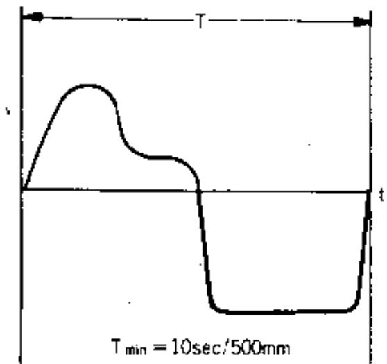

图2-145是通过进给丝杠的任意变速直线运动机构。通过靠模和触头控制流量的变化来控制进给丝杠，使滑块作直线运动的速度。靠模相对于滑块的行程，按一定比例缩小。

# 设计、制造要点

1．靠模行程的缩小应以能保证所需的速度控制为限。

  
图2-145动力：液压行程： $5 0 \sim 1 0 0 0$ 载荷：重

2．通过改变触头位置来改变电阻，由此改变了电磁流量控制阀的电流而使流量得到改变。检查电磁流量控制阀的电流-流量特性和触头的电阻特性或电流特性，按所要求的速度来确定靠模的形状。

3。滑块进给丝杠和靠模进给丝杠都应能够承受轴向力，结构设计时要考虑。

4．靠模的长度必须大于其行程长度。5．齿轮和丝杠的侧隙●是造成速度控制滞后的原因，所以有必要控制其侧隙。6．也可以使触头直接连接机械流量控制阀的调整刻度盘，靠触头的动作来进行速度控制。速度的决定一般是相对的。

# 其 它

参阅附录一第3类控制回路。

# 进给丝杠和导杆直线运动机构

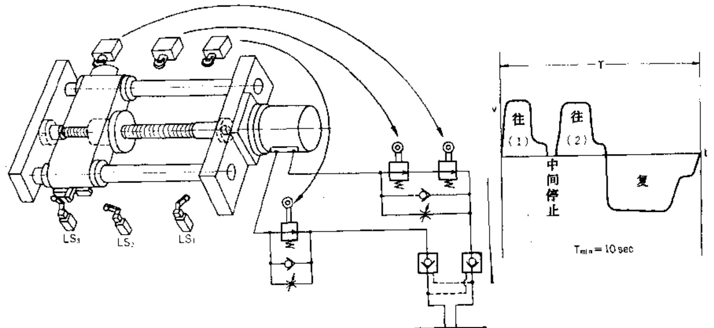

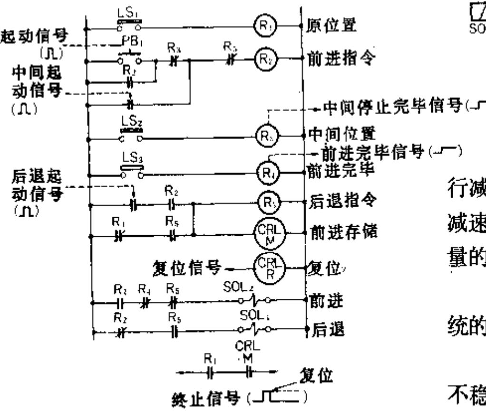  
图2-146

动力：液压

行程： $5 0 \sim 1 0 0 0$ 毫米

载荷：重

图2-146是通过液压马达直接与进给丝杠连接的直线运动机构。

# 设计、制造要点

1．在停止位置之前，使减速阀动作，进行减速。为使减速效果良好，减速曲线圆滑，减速阀碰块的倾斜角要小（由速度和运动体重量的关系决定，在 $5 ^ { \circ } \sim 1 5 ^ { \circ }$ 范围内）。

2．为在充分减速后停止，需调节调速系统的节流。

3．由于液压马达在低速回转时往往产生不稳定现象，所以要根据使用速度来检查液压马达选择是否合理（除扭矩和设定压力外，还要考虑液压马达的使用条件等)。

4．在用于大扭矩和高速时，应考虑在液压马达和进给丝杠的连结处安装安全离合器或安全销等。

5．在通常机构中，使用电动机比液压马达多，但是对于需要插入压力的进给机构、以及需要确定停止位置的场合，多采用液压马达。

# 其 它

参阅附录一第4类控制回路。

# 两根进给丝杠直线运动机构

推力轴承

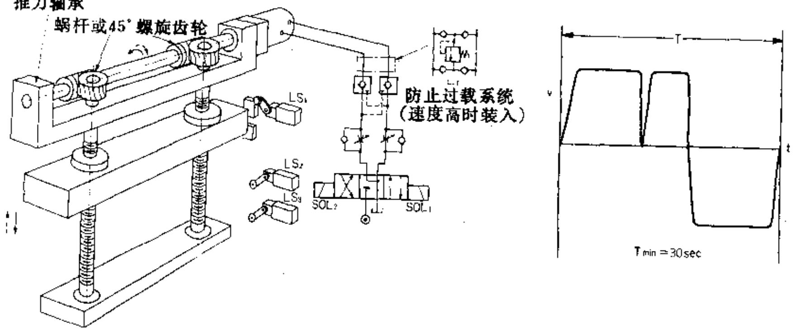  
图2-147动力：液压行程： $1 0 0 \sim 1 0 0 0$ 毫米载荷：重

LS起动信号 R R ® ? 原位置 前进指令  
中间起动信号 中间停止完毕信号（）  
后退起动信号 LS Ls 中间前进完毕7 前进完毕信号H ? 后退指令（不可长时间前进存储中间停止）复位信号复位RRR SOLHHH i 前进sL 后退复位终止信号）

图2-147是通过齿轮使两根进给丝杠联动回转，靠螺母带动台板进行直线运动的机构。进给丝杠兼作台板的导向件，适用于台板跨度较长的场合。在使用较低速度时，周期时间是在行程为500毫米、载荷为10公斤左右时的数值(速度为2米/分左右)。

# 设计、制造要点

1．使进给丝杠联动的辅助轴，因承受轴向力，所以必须安装推力轴承。

2．通过液控单向阀保持中间停止位置的停位精度。因为单向阀多少有些泄漏，所以用于上下运动时，如在上升极限位置和在中间位置停位时间较长，即给使用滚珠丝杠等高效率的丝杠带来了问题。

3，在系统中装入防止过载的元件后，往往使停位精度不好。  
4．蜗杆采用油浴润滑。联动齿轮的齿侧间隙要小。  
5.要保证台板和丝杠的垂直度。并注意两根丝杠的轴向固定及联动齿轮的啮合良好。

# 使用实例

工件的升降机构。

# 其 它

参阅附录一第4类控制回路。

# 导杆、滚子和链条直线运动机构

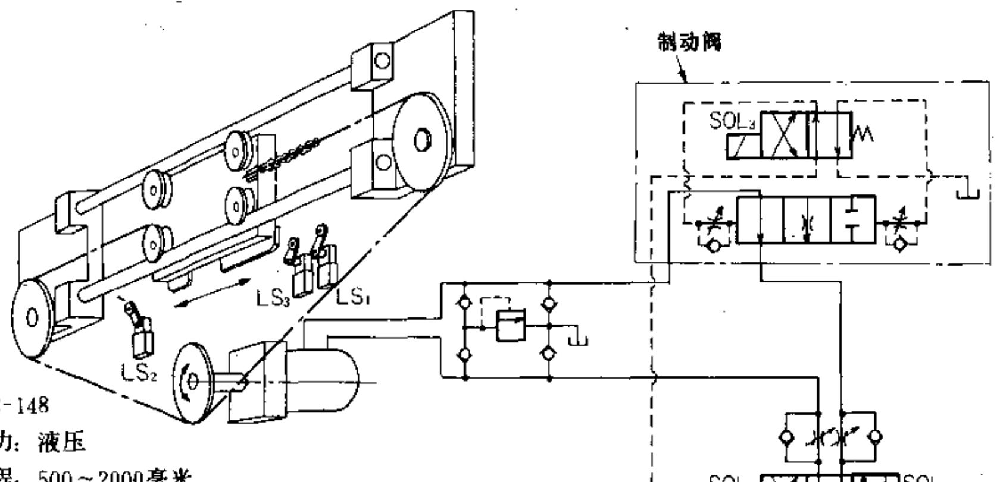  
图2-148行程： $5 0 0 \sim 2 0 0 0$ 毫米载荷：中

图2-148是把链条（或皮带）固定在导杆和滚子的导向滑块上，通过液压马达的正、反转，使链条(或皮带)带动滑块前进、后退的直线运动机构。它适用于行程较长的高速运动。

# 设计、制造要点

1．不能忘记安装消除链条延伸的张紧装置。

2．在用于速度快、行程长时，因链条往往产生振动，所以应有链条的导向装置。

3．本机构不适用于行进方向阻力较大、载荷多变的情况。

4．对快速返回时减速用的制动阀，可通过调节其滑阀的转换速度来调节制动效果。

5．为防止过载及防止产生负压而采用的安全阀，其设定压力应调节得比供给压力高。通过此调节，可决定停止时滑块的移动距离和冲击的大小。

# 使用实例

工件的传送等。

# 其 它

参阅附录一第6类控制回路。

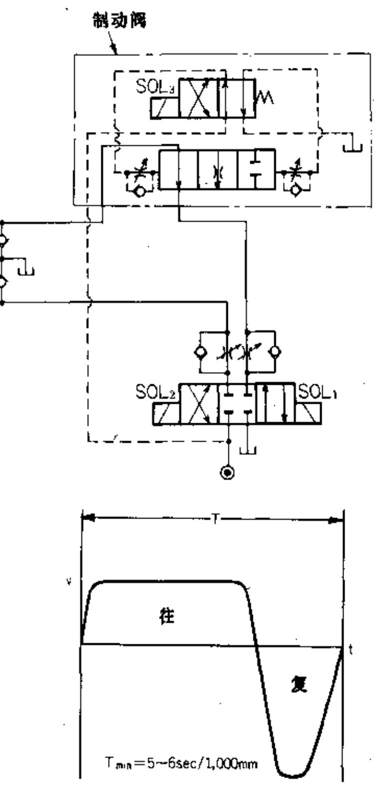

起动信号 原位置5 ?前进指令前进完毕  
L? 前进完毕3 ? 后退指令前进存储s复位信号 复位R 减速指令SOL SOL 前进后退SOL减速R 复位1终止信号（）

# 两个电磁铁终端减速直线运动机构

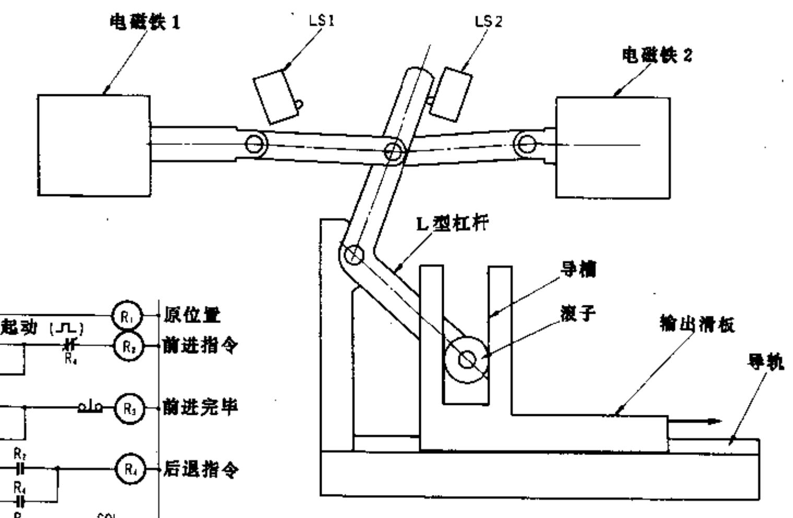

图2-149  
动力：电气  
行程： $\{ \} \sim \pm 0$ 毫米  
载荷：轻

图2-149是用两个电磁铁推拉L形杠杆的一端，使此杠杆另一端的滚子，通过导槽进行传动的直线运动机构。如果变动L形杠杆的角度，就可以改变终端减速的状态。

设计、制造要点

导槽和滚子的配合间隙要恰当，否则不能得到足够的终端减速效果。

输出滑板和导轨之间希望是滚动摩擦。

# 其 它

参阅附录一第2类控制回路。

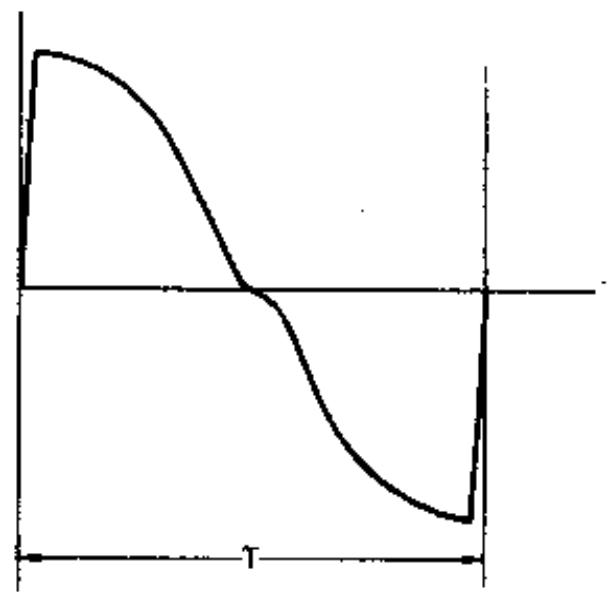  
$T _ { \mathbf { m } \mathbf { n } } = 0 . 5$ sec

# 直角变换运动方向的前进端减速直线运动机构

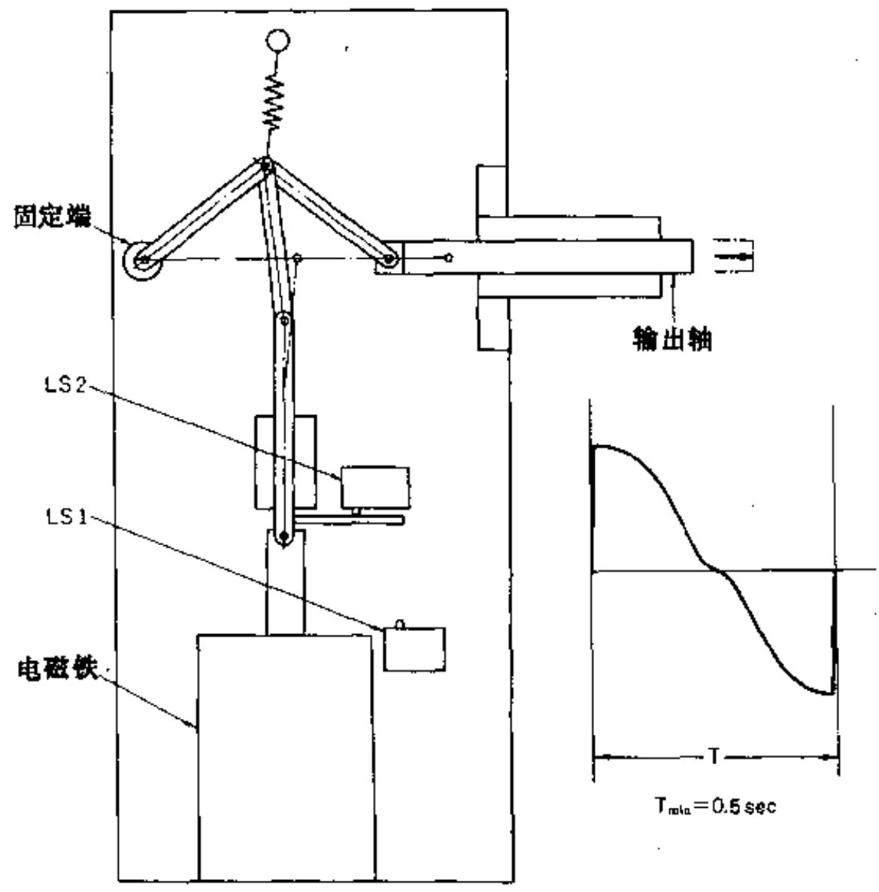  
图2-150动力：电气行程： $0 \sim 2 0$ 毫米载荷：中

图2-150是直角变换运动方向的前进端减速直线运动机构。当两个从动件成为直线时，前进端减速到零，由此产生相当强的力。

# 设计、制造要点

限位开关必须安装在移动量较大的驱动侧，否则动作就不可靠。

还有，因为在前进端的最后极少部分才能产生较强的力，所以利用输出力时，必需充分注意工作位置的设定。

# 其 它

参阅附录一第2类控制回路。

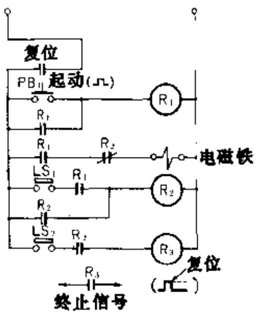

# 浮动液压缸终端减速直线运动机构

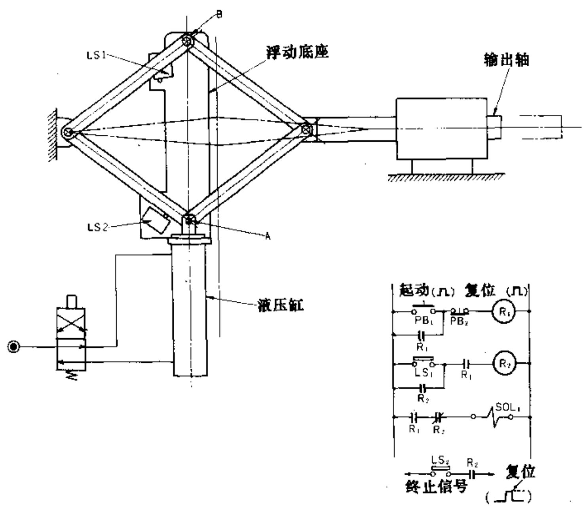  
图2-151动力：液压行程： $0 \sim 3 0 0$ 毫米载荷：中

图2-151是在不能装设耳环式液压缸支点的情况下，使整个液压缸浮动的机构。浮动底座是靠连杆支持的。在前进端A，B重合，即形成完全的终端减速。

# 设计、制造要点

因为是终端减速，所以限位开关如不装设在动作较大的驱动侧，动作就不可靠。

其 它

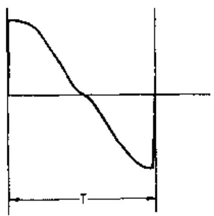  
Tmn=2sec（Sr=200mm）

参阅附录一第2类控制回路。

# 由摆线摆动转换的两端减速直线运动机构

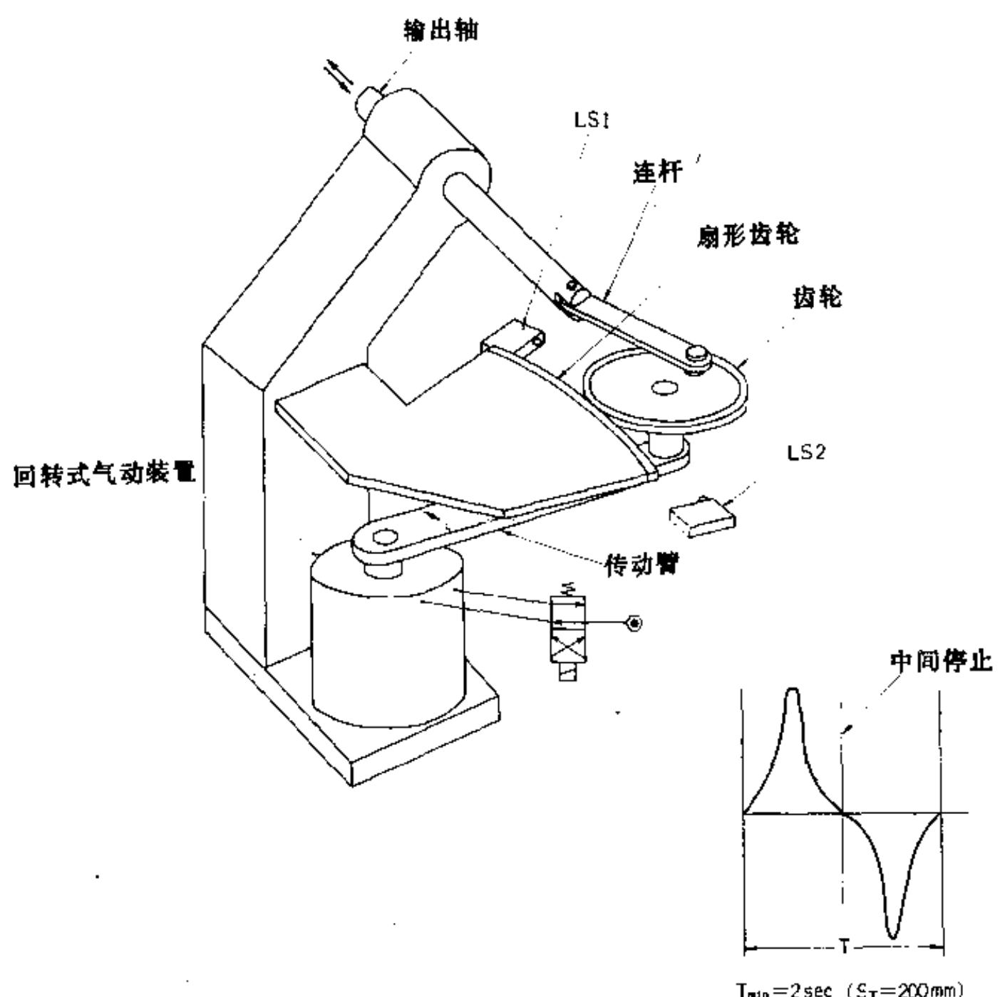  
图 $2 ^ { \cdot . } 1 5 2$ 动力：气压行程： $5 0 \sim 2 0 0$ 毫米载荷：中

图2-152是由与扇形齿轮啮合而摆动的齿轮，通过连杆转换成直线运动的机构。回转式气动装置的摆动大致在使齿轮回转 $1 8 0 ^ { \circ }$ 时形成两端减速。如果改变啮合位置或齿数比，也可使之不在终端减速而获得中间减速。·

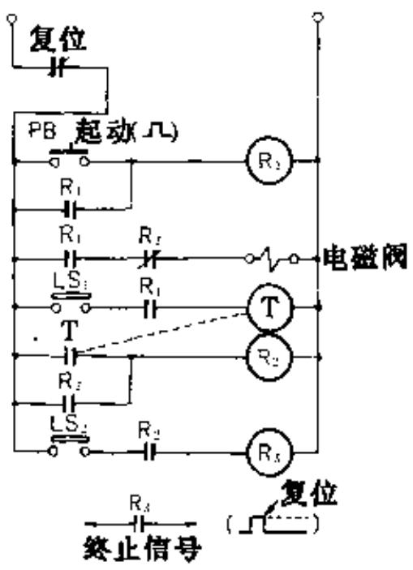

设计、制造要点

必须充分注意扇形齿轮和齿轮的啮合。

其 它

参阅附录…第3类控制回路。

# 由槽形凸轮回转转换的直线运动机构

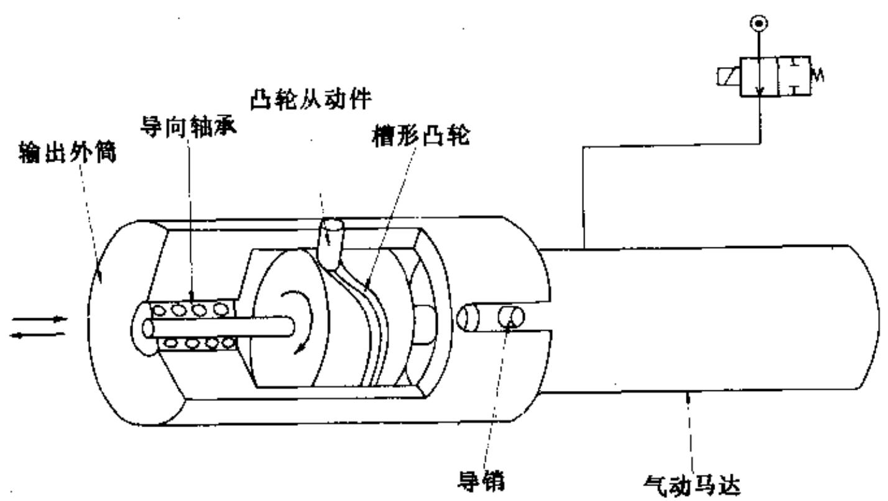

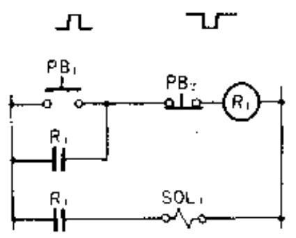

图2-154  
动力：气压  
行程： $0 \sim 3 0$ 毫米  
载荷：轻

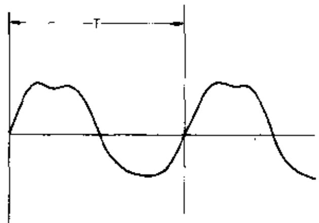  
Tm-0.1sec

图2-154是输出外筒随着气动马达的回转进行往复直线运动的机构。可由槽形凸轮的结构而得到任意的速度曲线。

直线导销固定在气动马达上，用以使输出外筒进行直线运动。输出外筒的前端采用导向轴承支持，以承受回转和直线两方面的作用。

设计、制造要点

凸轮从动件和槽形凸轮、直线导销和导槽要充分润滑。

# 其 它

参阅附录一第1类控制回路。

# 丝杠进给及弹簧快速返回直线运动机构

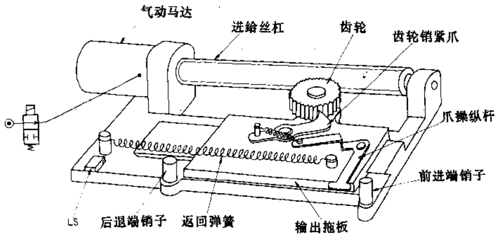

起动信号PB,前进指令LS.H非 1R：HH ASOL 前进RLS原位置信号

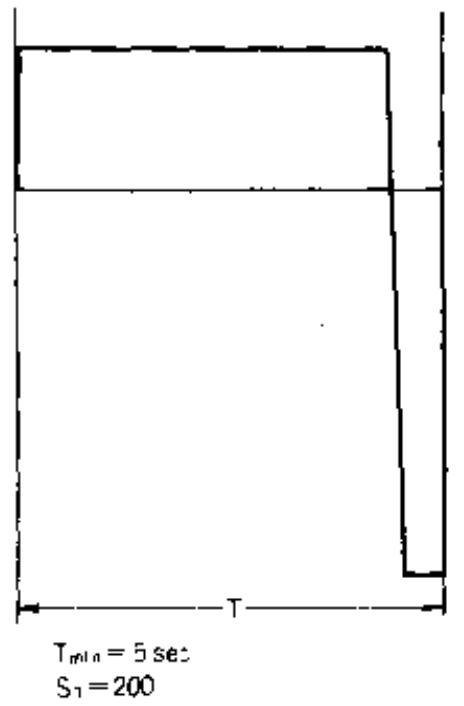  
图2155动力：气压行程： $0 \sim 3 0 0$ 毫米载荷：中

图2-155是采用丝杠进给及利用弹簧快速返回的直线运动机构。以齿轮代替螺母与丝杠啮合，齿轮用爪锁紧，丝杠送进拖板后，前进端销子推动爪操纵杆，爪即脱开，齿轮处于自由状态，拖板在弹簧的作用下快速返回。

在快速返回期间，齿轮和丝杠仍然啮合。

由于通过后退端销子，爪又锁紧齿轮，所以如果气动马达回转，拖板即再次前进。

设计、制造要点

因为利用弹簧返回，所以必须考虑防止在后退端产生冲击的方法。

# 其 它

参阅附录一第1类控制回路。

# 第三章 摆动运动机构

# 偏心重锤摆动运动（振动）机构

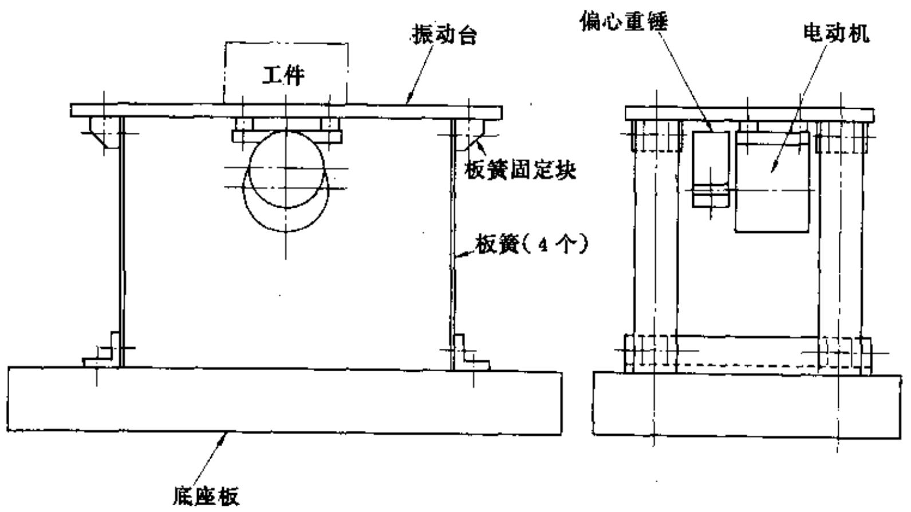  
图3-1动力：电气动作角度： $0 ^ { \circ } \sim 1 0 ^ { \circ }$ 载荷：轻

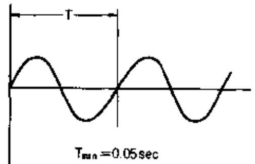

图3-1是通过电动机的回转带动轴上的偏心载荷获得摆动振动的机构。根据电动机的转速及支撑板弹簧的强度，即得出一定振幅的振动。

# 设计要点

1．如上所述，必须根据电动机的转速、偏心重锤以及可动部分的质量等来确定支撑板弹簧的共振点（当然也可以根据实验求出支撑板弹簧的强度）。

2．本机构不适宜用于较大工件的振动。

3.与其它振动机构相似，固定部分与可动部分的质量比必须取得相当大（例如 $1 0 \sim$ 20倍）。

# 制造要点

电动机及支撑板弹簧的紧固处，应考虑加弹簧垫圈等螺栓止动方法，以防松动。

其 它参阅附录一第1类控制回路。

# 曲柄连续摆动运动机构

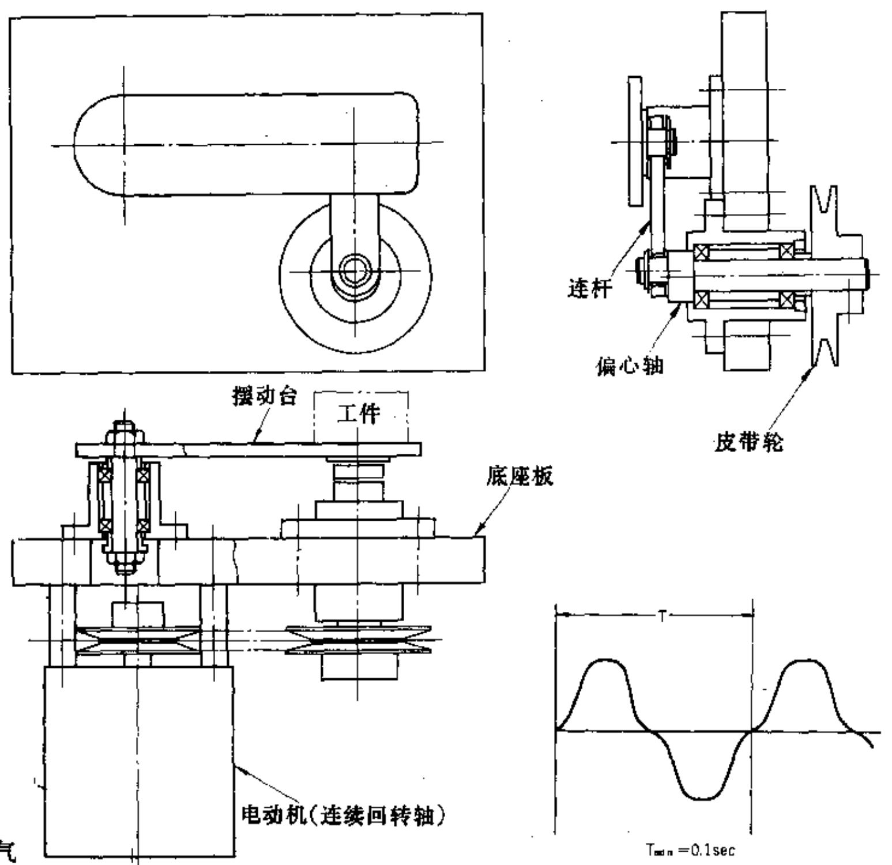  
图3-2动力：电气动作角度： $0 ^ { \circ } \sim 2 0 ^ { \circ }$ 载荷：中  
图3-2是通过曲柄运动获得小振幅的摆动振动机构。可用于较轻工件的振动。

# 设计要点

1．与其它类型的振动机构一样,安装振动部分的底座板比振动部分质量要大（例如 $1 0 \sim$ 20倍）。

2．轴承部分全部采用滚动轴承。偏心轴的强度要大，其轴承部分要结实可靠。

3．可动部分的质量应尽量小。

制造要点

1．应注意轴承部分和其它配合部分的装配精度，松动要小。

2．螺栓、螺母的紧固应可靠，不能因振动而产生松动，必须对固定螺栓采取防止松动的措施。

# 其 它

1．在试运转后，检查紧固螺栓的松动情况，必须再加以紧固。此机构不适用于高频或大振幅的振动。

2．参阅附录一第1类控制回路。

# 曲柄摆动运动机构

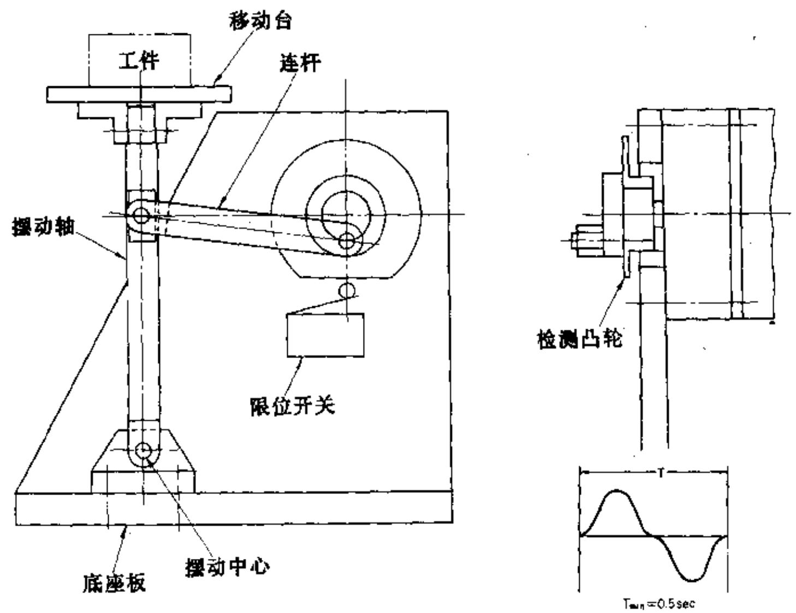  
图3-3是通过曲柄运动获得摆动运动的机构。如按图示那样配置限位开关，就成为摆动一次的往复运动。

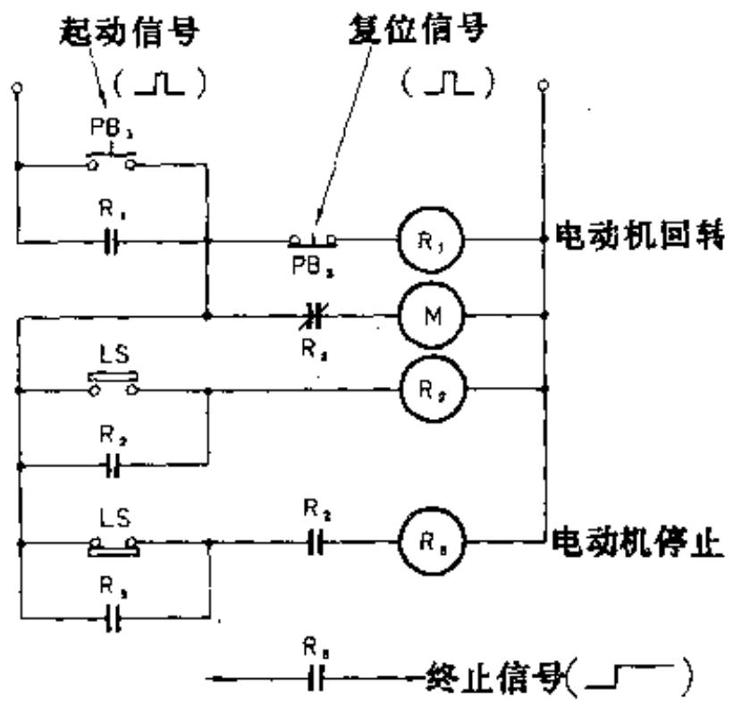  
图3-3动力：电气动作角度： $0 ^ { \circ } \sim 2 0 ^ { \circ }$ 载荷：中

# 设计要点

1．摆动轴（支柱）的轴承部分要采用滚动轴承。如果是轻载荷，也可用滑动轴承。

2．使摆动轴在中间位置停止时(如图所示那样)，需安装专门的锁紧机构。曲柄的轴承部分，最好采用滚动轴承 (图中未示出)。

# 制造要点

必须注意在电动机带动的曲柄上，不能有其它附加载荷。

其 它

参阅附录一第2类控制回路。

# 槽形凸轮摆动运动机构

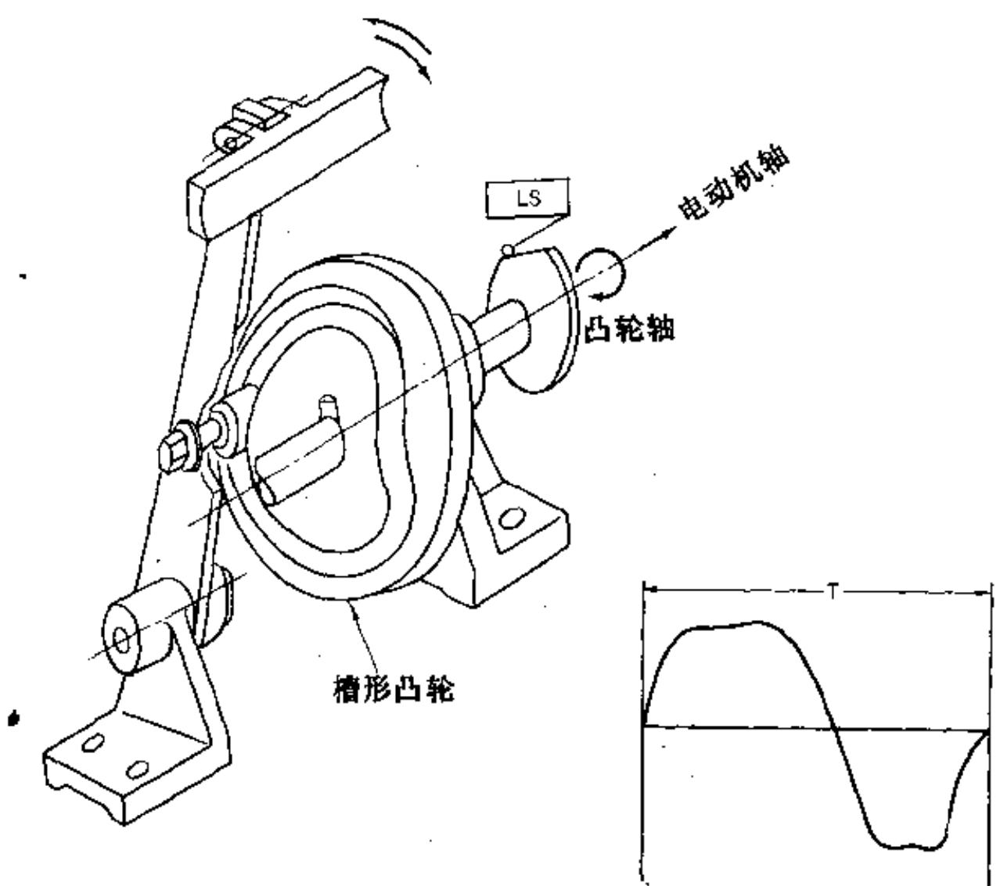  
Tin=I sec

# 设计要点

可根据使用要求来改变槽形凸轮的轮廓，以适应不同的使用场所。

# 制造要点

使用槽形凸轮时，从动滚子与凸轮槽之间容易发生松动，所以往往使用淬火的滚子，这时，与其使用量规来调整修配，不如直接用实物修配较快。

使用实例

挤压、冷矫形及破碎机等。

# 其 它

1，滚子如不回转，凸轮的磨损则很严重，所以要十分重视滚子的回转。

2．参阅附录一第2类控制回路。

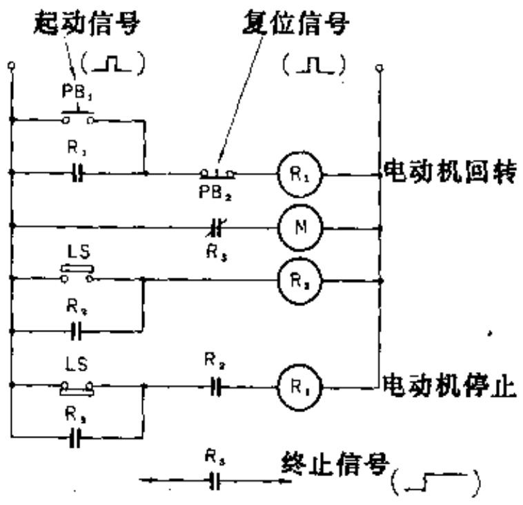  
图3-4是利用固定在摇臂上的从动滚子通过槽形凸轮的作用，使摇臂摆动的机构。  
图3-4动力：电气动作角度： $0 ^ { \circ } \sim 3 0 ^ { \circ }$ 载荷：中

# 偏心和摇臂摆动运动机构

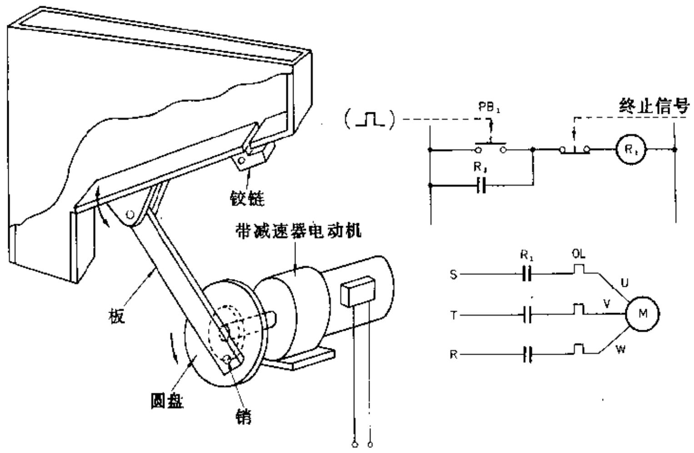

图3-5  
动力：电气  
动作角度： $0 ^ { \circ } \sim 4 5 ^ { \circ }$   
载荷：中

图3-5是利用带减速器的电动机使圆盘回转，通过安装在圆盘上的偏心销，连结摇臂进行连续摆动运动的机构。

# 设计要点

1．应装设安全销或摩擦离合器等，以防过载。

2．因摆动角度、摆动速度和传动力是不能改变的，所以设计时要充分考虑。

3．在要求频繁起动和停止的情况下，可通过电磁离合器、制动器来传动，设计成电动机不停止转动而仍能随时起动和停止的控制电路。

# 使用实例

料斗激振器。

# 其 它

1，使用安全销时要有备件。  
2．应经常检查减速器的润滑情况。  
3．参阅附录一第1类控制回路。

# 大回转半径摆动运动机构

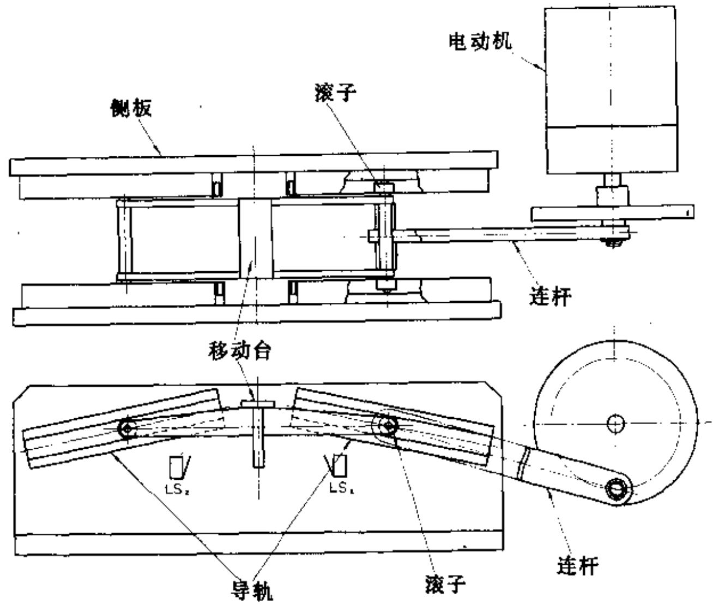  
图3-6动力：电气动作角度： $0 ^ { \circ } \sim 6 0 ^ { \circ }$ 载荷：中

图3-6是回转半径很大的（例如 $1 0 \sim 2 0$ 米摆动运动机构。在理论上极大的半径甚至无限大都是可以实现的，但这时不再是摆动运动，而成为直线运动了。图中左右导轨的相对角度应是可变的，由此使摆动运动的回转半径也能改变。

# 设计要点

1．导轨的槽与滚子的间隙应在 $0 . 0 5 \sim 0 . 1$ 毫米左右。

2．回转部分必须采用滚动轴承，以使动作灵活。

3．对左右导轨的相对角度，如果确定了摆动运动的回转半径，即可简单地计算出来。

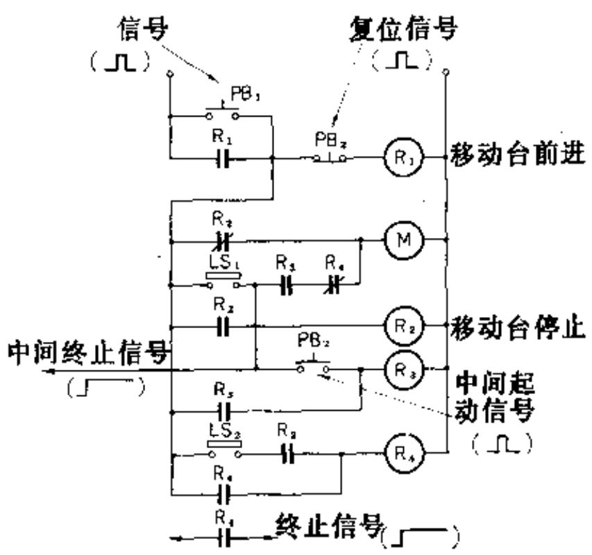

# 制造要点

必须保证左右两组导轨的平行度和两端滚 子轴的平行度。

# 其 它

参阅附录一第2类控制回路。

# 往复速度不同的摆动运动机构

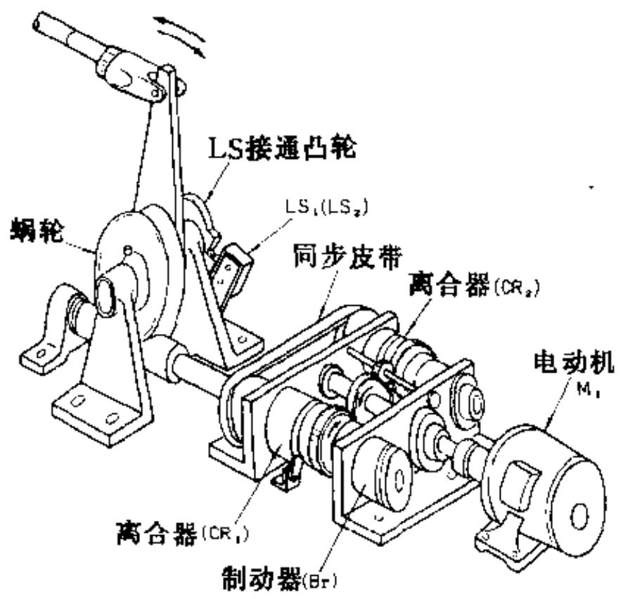

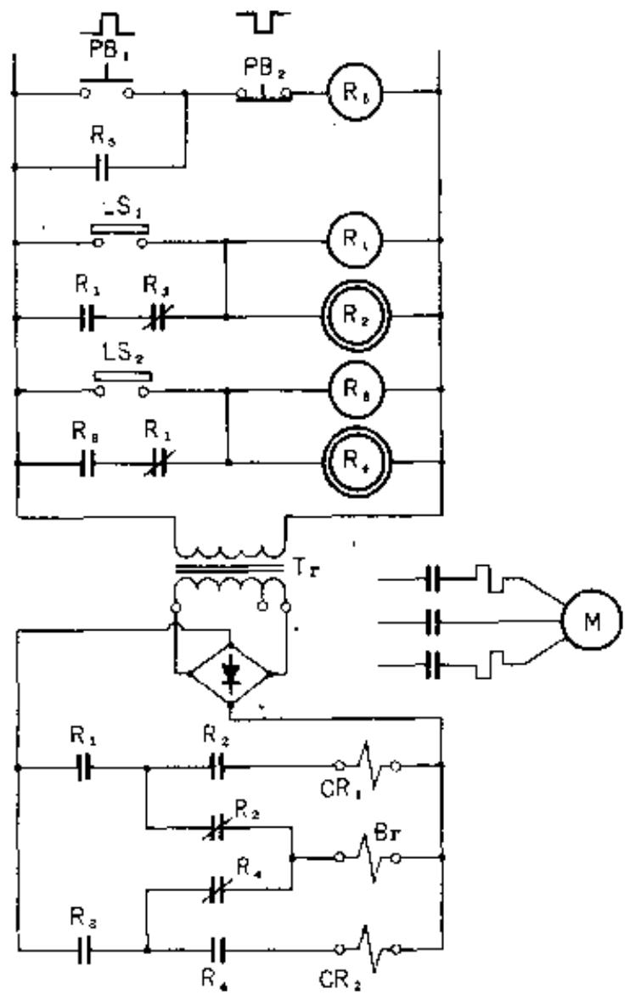

图3-7  
动力：电气  
动作角度： $0 ^ { \circ } \sim 1 0 0 ^ { \circ }$   
载荷：中

图37是通过离合器的转换来改变往复速度的摆动运动机构。 $\mathbf { \vec { C } } \mathbf { \vec { R } } _ { 1 }$ 侧的轴和 $\mathbf { { C R } } _ { 2 }$ 侧的轴，由于齿轮的齿数比不同,回转速度也就不同。

# 设计要点

由于正齿轮高速回转时噪音较大，所以要使用高精度齿轮。负荷较轻时，传动齿轮可使用尼龙等材料制成。

摆动频率较高时，对离合器和制动器，为防止浪涌电压，在控制电路中应加入二极管和电阻等。直流电源变压器最好带有改变电压的抽头。

制造要点

为减小噪音，要注意齿轮的啮合精度。

使用实例分离器等。

其 它

采用干式离合器和制动器。蜗杆采用润滑脂润滑。

# 连动齿轮摆动运动机构

  
图3-8动力：电气动作角度： $0 ^ { \circ } \sim 1 8 0 ^ { \circ }$ 载荷：中

# 设计要点

1．两个摇臂的传动齿轮的齿数必须相同。空转齿轮是为了使摇臂齿轮的回转方向一致而设，其齿数可任意选定。

2．为使上下二摇臂运动时不发生碰撞，必须使之前后错开。

3．对齿轮之间的齿侧间隙，希望能通过空转齿轮的装配位置进行一些调整。

# 制造要点

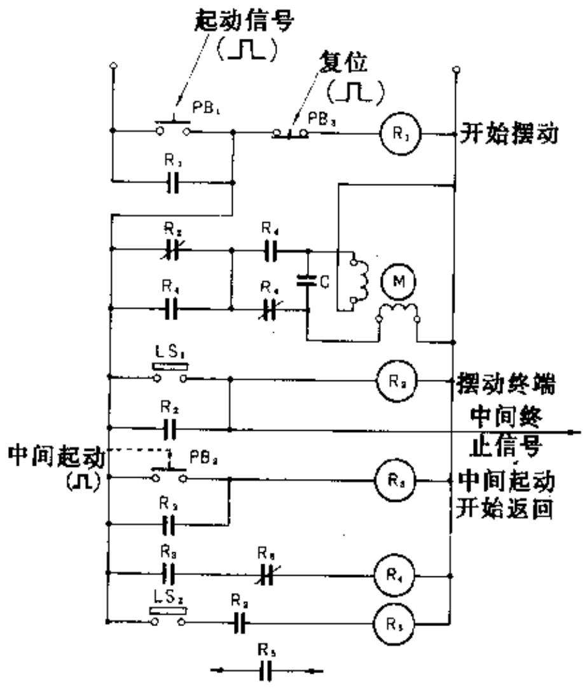  
图3-8是通过两个摇臂使摆杆平行摆动的机构。

必须调整三个啮合齿轮的齿侧间隙，若调整不好，间隙较大，则不能得到平行移动。

使用实例

打印机、胶粘剂的涂敷装置等。

# 其 它

参阅附录--第2类控制回路。

# 滚子支承的圆筒摆动运动机构

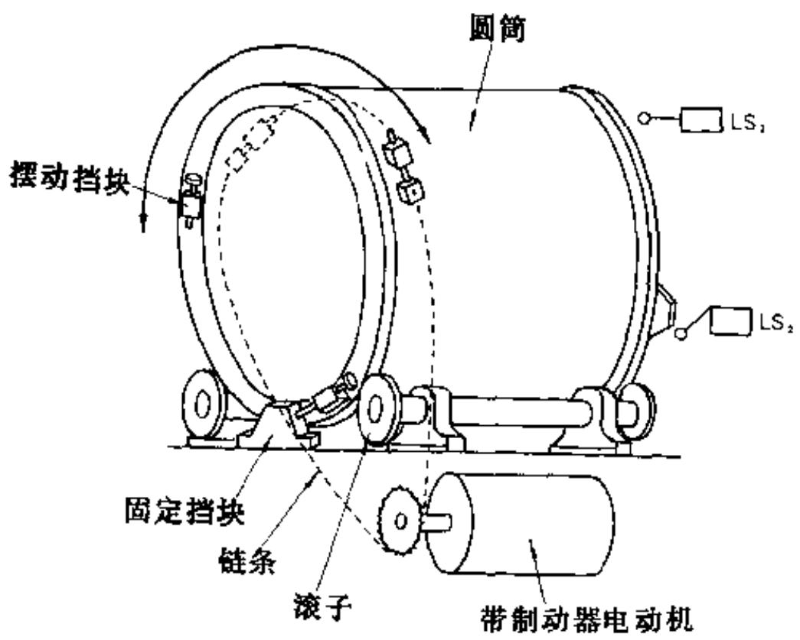  
图3-9动力：电气动作角度： $0 ^ { \circ } \sim 3 5 ^ { \circ }$ 载荷：中

图3-9是以两端开的圆筒的中心为轴心进行摆动运动的机构。由四个滚子支承圆筒外周，通过两端固定在圆筒上的链条进行传动。

# 设计要点

1.在摆动角度的两端安装定程器，以进行准确定位。

2．因为使用了定程器，所以必须考虑电动机和传动部分的连接方式。例如：通过摩擦离合器连接电动机，使用VK电动机·等特殊电动机或使用油马达。

# 使用实例

工件翻转装置。

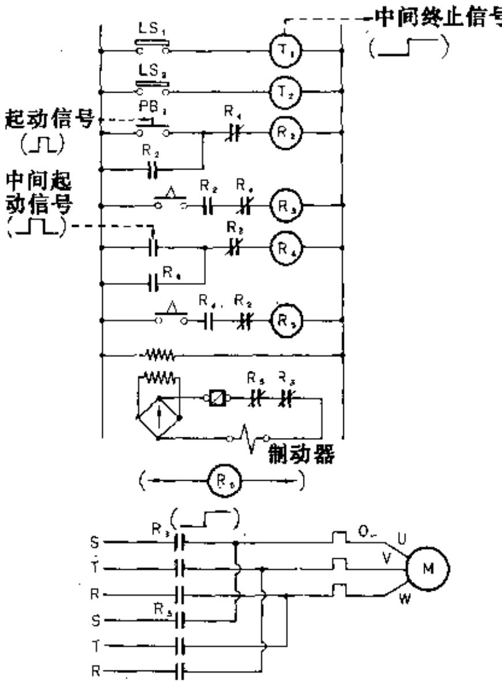

# 扇形齿轮和小齿轮摆动运动机构

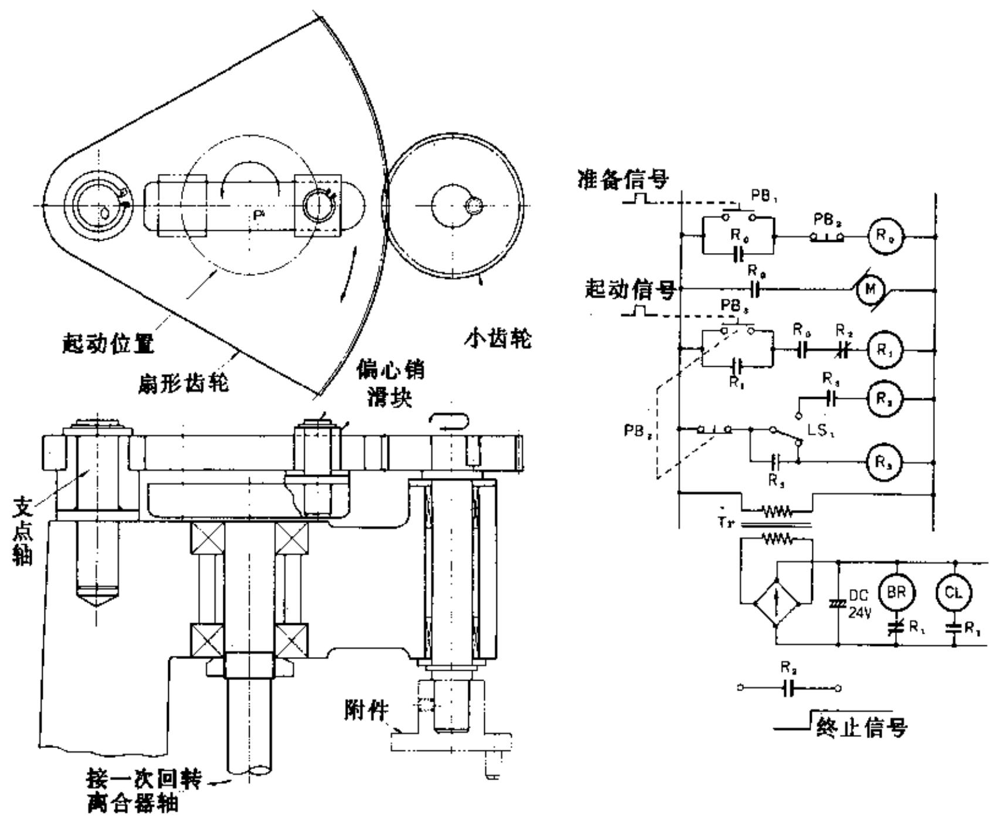  
图3-10

$\mathbf { P B _ { 1 } }$ ：准备按钮  
$\mathbf { P B } _ { 2 } .$ ：停止按钮  
$\pmb { \mathrm { P B } } _ { 3 }$ ：起动按钮  
$\mathbf { L } \pmb { S } _ { 1 }$ ：回转一次接通 (停止位置接通)  
$\pmb { \ 8 } \pmb { \mathrm { R } }$ ：电动机制动器  
$\mathbf { C L } _ { \mathbf { i } }$ 离合器  
动力：电气  
动作角度： $0 ^ { \circ } \sim 3 6 0 ^ { \circ }$   
载荷：中

图3-10是通过传动轴的一次回转,由扇形齿轮使小齿轮进行摆动（约 $2 4 0 ^ { \circ }$ ）的机构。这时，小齿轮顺时针方向的回转速度与返回速度之比约为1：2。

# 设计要点

1．传动轴、支点轴以及小齿轮轴全部使用滚动轴承。2.必须用铜锡合金制的滑块与偏心销和滑动长孔配合。3。根据点和P点之间的距离等来确定小齿轮的齿数。

# 使用实例

加上适当的附件，可用于卷边等工作。在这种情况下，卷边为慢速，反卷为快速。

# 其 它

参阅附录一第5--4类控制回路。

# 薄膜开闭机构

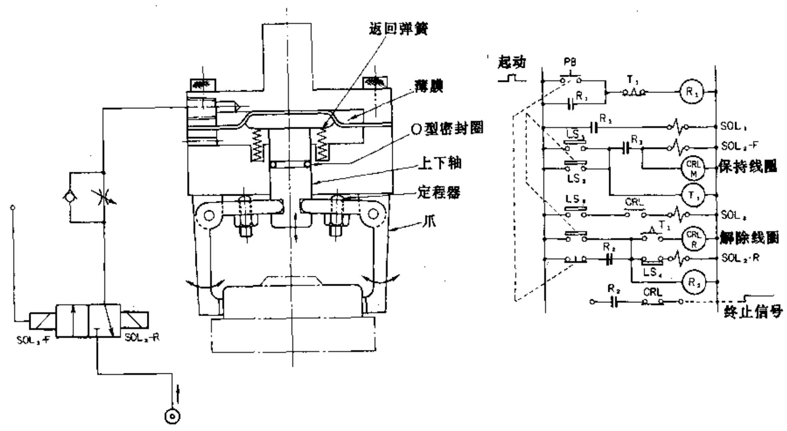  
图3-11是利用气动薄膜的上下运动，使卡爪做开闭动作的机构。

图3-11  
PB: 起动按钮（连动）  
LSi : 下死点接通  
$\mathbf { L } \mathbf { S } _ { 2 }$ ： 摇臂回转完毕接通  
$\mathbf { L } \mathbf { S } _ { 3 }$ ：上死点接通  
CRL：保护继电器  
SOLi：上下用阀  
$\mathbf { S O L } _ { 2 }$ -F、R：卡爪开闭用（双电磁阀）  
$S O L _ { 3 }$ ：摇臂用阀  
${ { \sf T } _ { 1 } }$ ： 时间继电器（延时 $0 , 5 \sim 1$ 秒）  
$\mathbf { L } \mathbf { S _ { 4 } }$ ：摇臂返回接通  
动力：气压  
动作角度： $0 ^ { \circ } \sim 2 0 ^ { \circ }$   
载荷：中

# 设计要点

本机构的动作通常由电信号控制电磁阀来进行。图3-11中所示，在接到外来信号时，卡爪处于打开状态，如将返回弹簧安装在薄膜的上方，即可得到相反的情况，但在此时进气孔必须移到薄膜下方。

制造要点

气动薄膜的橡胶材料强度要好，并且必须耐油。

# 使用要点

本机构几乎不单独使用，常安装在工件搬送臂的顶端。必须设计成重量极轻，所使用的气压软管挠性要好。

# 气缸和凸轮摆动运动机构

  
图3-12动力：气压动作角度： $0 ^ { \circ } \sim 3 0 ^ { \circ }$ 载荷：中

图3-12是利用气缸活塞杆的前后运动，通过凸轮使压板A摆动而夹紧工件的机构。适当地选择凸轮的角度，使压板紧固工件后白锁，这时即使气压供给中断，也不会松开。

# 设计要点

1．凸轮的形状如果是矩形的，比圆柱形的，就不需要止转。2．本体部分(即有剖面线的部分)，因要承受夹紧力而不松开，必须具有一定的强度。3.为了在气压供给中断时机构不致返回，凸轮的倾斜度必须很小。

# 维护要点

1．定期向润滑部分加油，并注意不得落入，切屑。

（中间起动信号）（L）----P Rx夹紧起动R，SOL，Ls证实夹紧IT Ry 中间终(1 止信号

2.使用时必须注意气压不能降低。

# 使用实例

用于要求安全，且在上下方向没有空余位置的情况下夹紧工件。

# 其 它

参阅附录一第2类控制回路。

# 气缸和连杆摆动运动机构

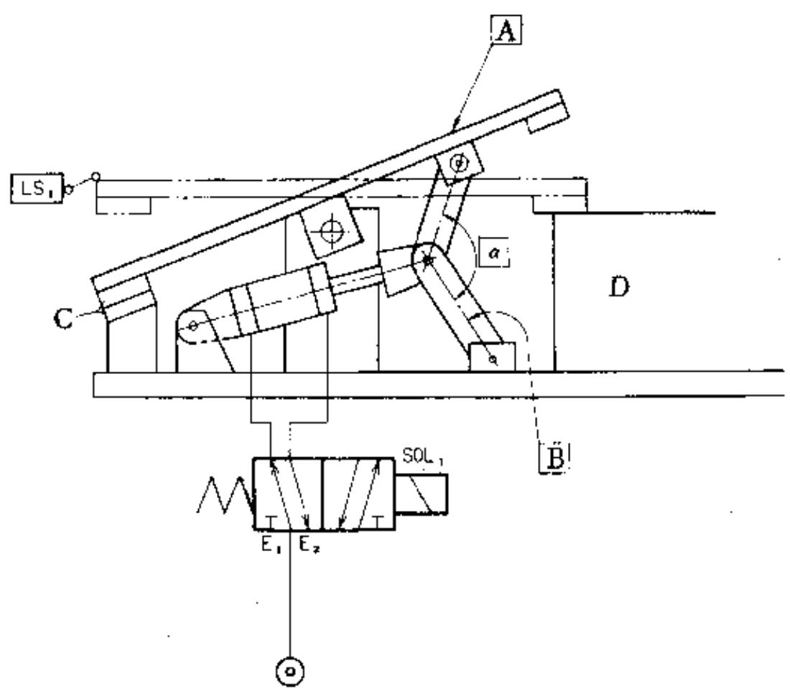

图3-13  
动力：气压  
动作角度： $0 ^ { \circ } \sim 3 0 ^ { \circ }$   
载荷：中

图3-13是利用气缸的行程通过连杆使摇臂摆动的机构。图示是由摇臂A压紧工件D的机构。松开时，摇臂A接触定程器C。

# 设计要点

1．如果气缸活塞杆处在行程前进极限位置时，连杆B的交叉角 $\mathfrak { a }$ 在 $1 8 0 ^ { \circ }$ 以下，就不需要定程器C了。

2．设计时要注意气缸输出功率与压紧力的关系。

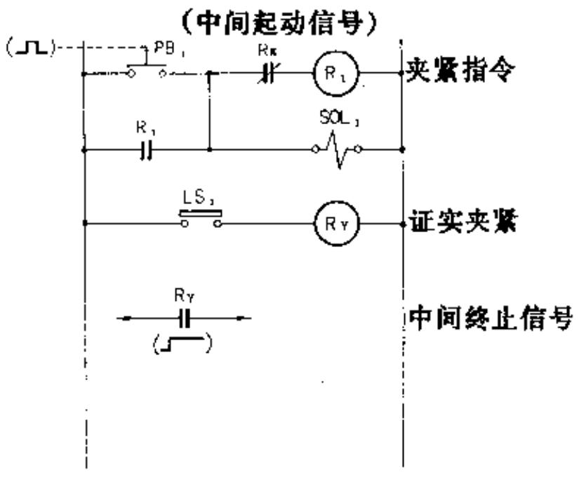

3．必须使各铰接处具有足够的强度。

# 维护要点

必须定期向各回转部分注油。

使用实例

在上下空间位置受限制情况下的工件夹紧。

其 它

参阅附录一第2类控制回路。

# 在前进端停止一定时间

# 的齿条、齿轮摆动运动机构

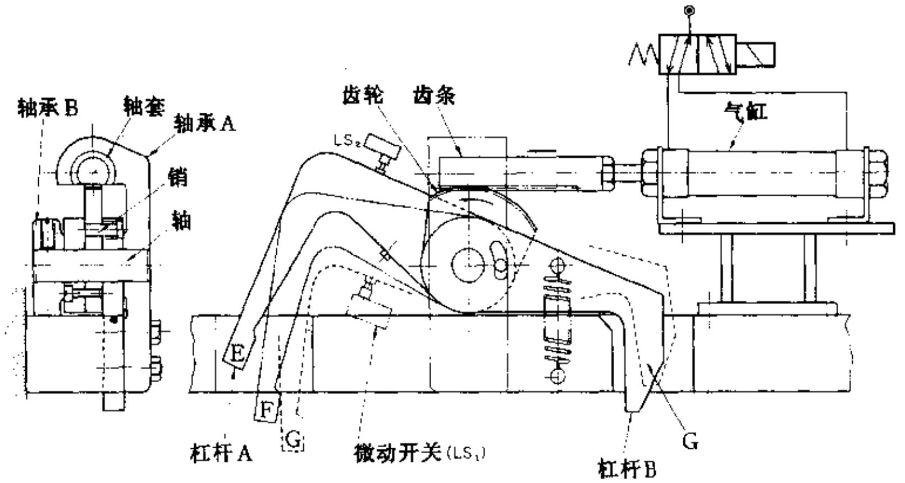  
图3-14动力：气压动作角度： $0 ^ { \circ } \sim 3 0 ^ { \circ }$ 载荷：中

图3-14是由气缸带动齿条及扇形齿轮，并利用时间继电器，在前进端停留一定时间后返回的摆动运动机构。

# 设计要点

若要求摇臂A的停止位置G准确，必须设置定程器。

制造要点

必须保证轴承A、B以及气缸部分的装配精度。

使用实例

1．擒纵机构。  
2．定位装置。

其 它

参阅附录一第2类控制回路。

起动信号TR PBp△ 起动RLS,气缸前进端R SOL 保持时间气缸前进终止信号 LS, R（)（）

# 气缸和摇臂摆动运动机构

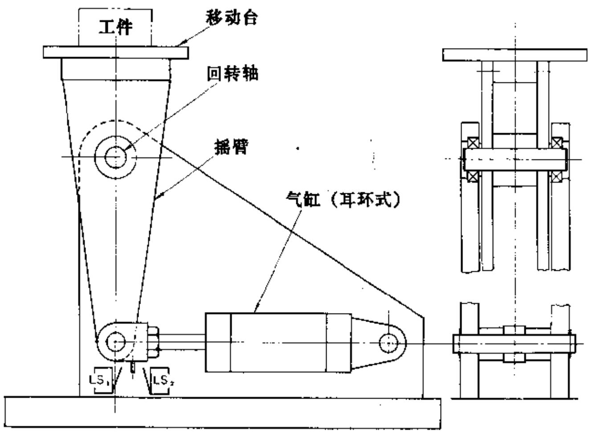

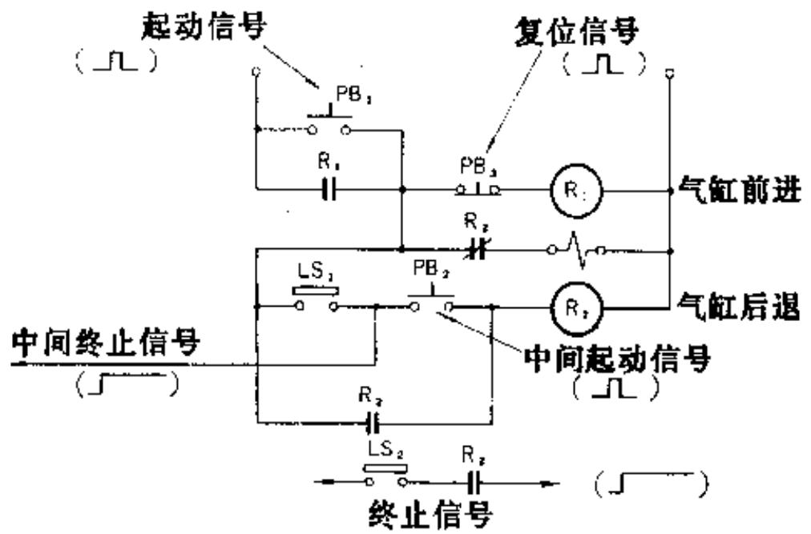  
图3-15动力：气压动作角度： $0 ^ { \circ } \sim 3 0 ^ { \circ }$ 载荷：中

3.轴承部分也可使用轴套，但载荷较大时，使用滚动轴承较安全。

# 制造要点

图3-15是利用气缸使摇臂往复摆动的机构。曲

1，必须注意气缸的活塞杆不能承受扭曲力。

# 设计要点

1.使用耳轴式或耳环式气缸。

2．适当改变限位开关的安装位置，行程可以增大。

2.必须采用单向节流阀来控制气缸的速度。

# 其 它

参阅附录一第3类控制回路。

# 气缸和推杆直线运动和摆动运动机构

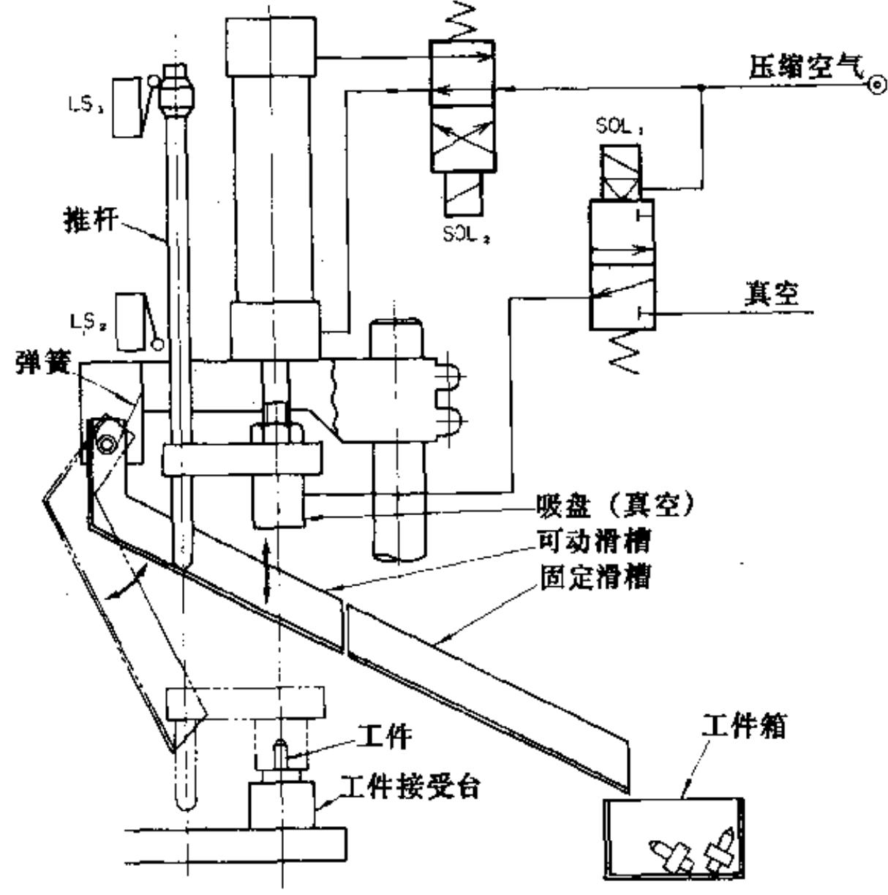

# -起动信号（）

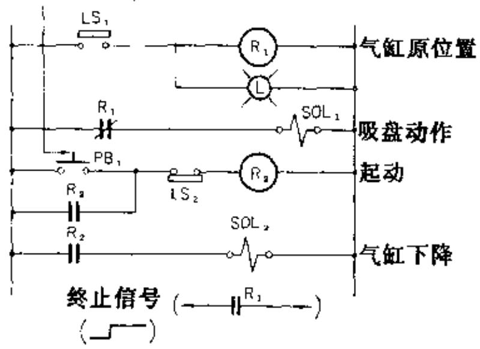  
图3-16动力：气压动作角度： $0 ^ { \circ } \sim 6 0 ^ { \circ }$ 载荷：轻

图3-16是利用气缸活塞杆的上下动作带动推杆推压摇臂的摆动运动机构。图示是用作可动滑槽的实例。工作开始时，气缸活塞杆下降，推杆把可动滑槽打开，真空吸盘到达工件接受台，吸住工件之后返回原位，可动滑槽也自动抬起。当推杆上升到触动LSi后，真空吸盘松开，工件落在可动滑槽上，然后通过固定滑槽落入工件箱内。

# 设计要点

1．由于工件下落时的冲击及其本身的重量，使得可动滑槽不是产生振动就是往下降落，所以要注意弹簧的弹力。

2．弹簧的弹力也不能太大，以防对气缸活塞杆造成不良影响。

# 使用实例

工件的排出。

# 其 它

参阅附录一第5-1类控制回路。

# 导轨摆动运动机构

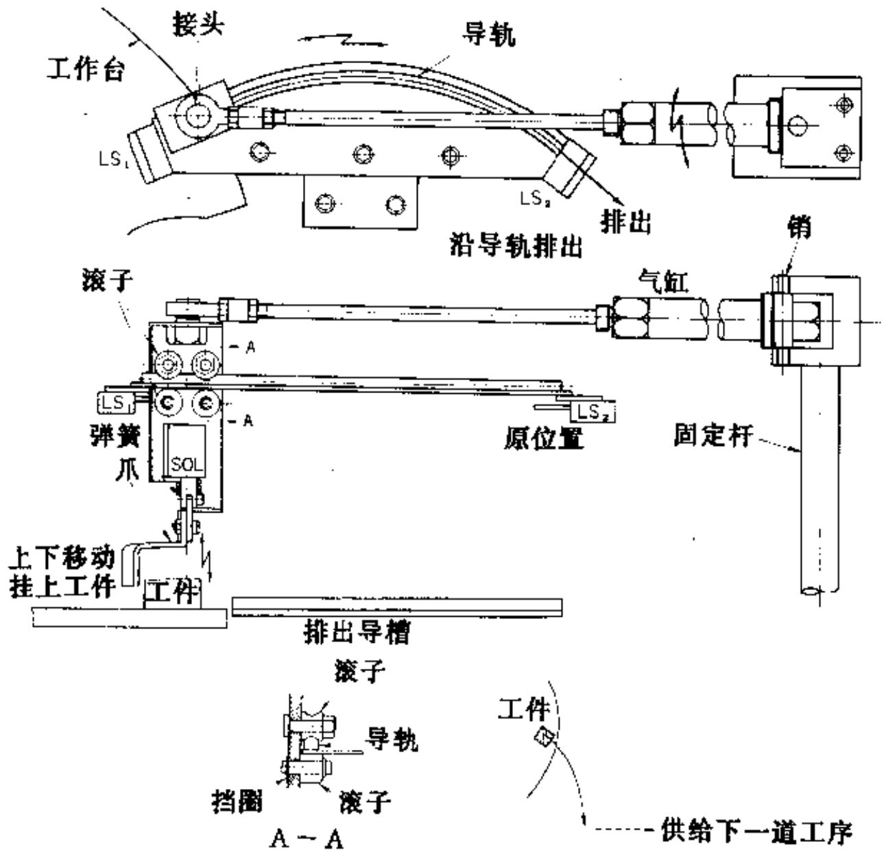  
图3-17是将气缸的直线运动转换成沿导轨摆动的机构。图示是用作工件排出机构的实例。

# 设计要点

l，导轨和气缸之间的距离要短。2．滚子安装间距不要太短。3．要求动作准确时，应考虑导轨的加工工艺性：制造要点导轨要做成平滑的曲线。使用实例用于搬运时改变工件的方向。其它参阅附录一第1类控制回路。

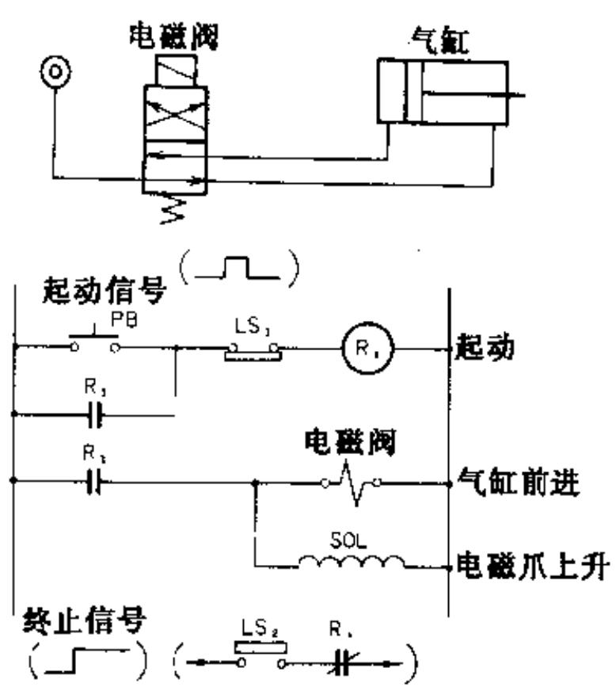  
图3-17

动力：气压  
动作角度： $0 ^ { \circ } \sim 6 0 ^ { \circ }$   
载荷：中

# 四根输出轴同时动作的摆动运动机构

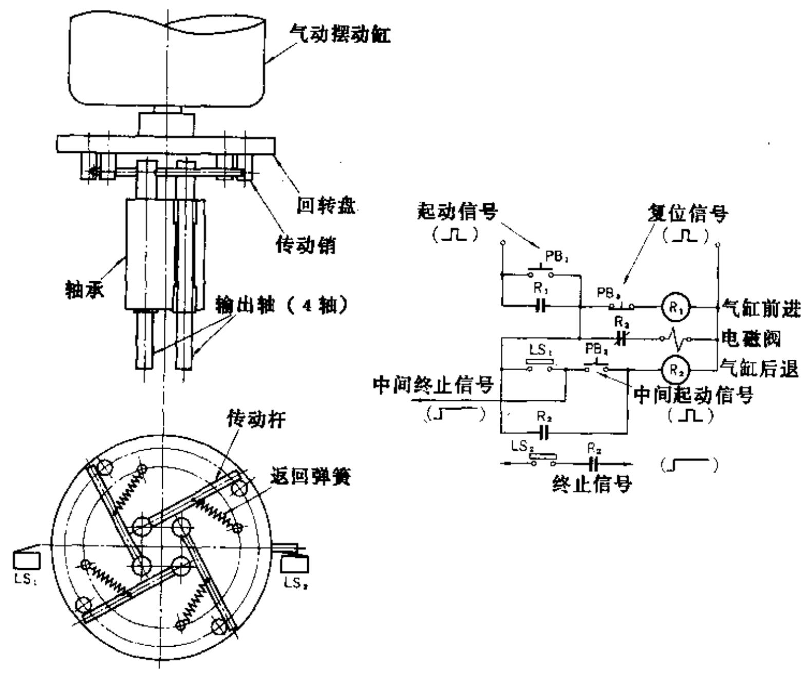  
图3-18动力：气压动作角度： $0 ^ { \circ } \sim 9 0 ^ { \circ }$ 载荷：轻

图3-18是采用气动摆动缸使四根输出轴 同时按同一角度摆动的机构。摆动角度甚至可 达 $1 8 0 ^ { \circ }$

# 设计要点

1．输出轴轴承部分的摩擦应尽量小，并且不应有松动。

2.控制气动摆动缸回转角度的定程器（图中未示出）应尽量安装在半径大的地方，受力较小。

3．复位弹簧固定销的位置，以及传动杆挂弹簧的位置，必须根据摆动角度的大小适当地决定。

制造要点

气动摆动缸通过速度调节系统必须能对整个往复过程进行速度控制。

# 使用实例

四轴同时工作的扭转试验机等。

# 其 它

参阅附录一第3类控制回路。

# 气缸与齿条、齿轮摆动运动机构

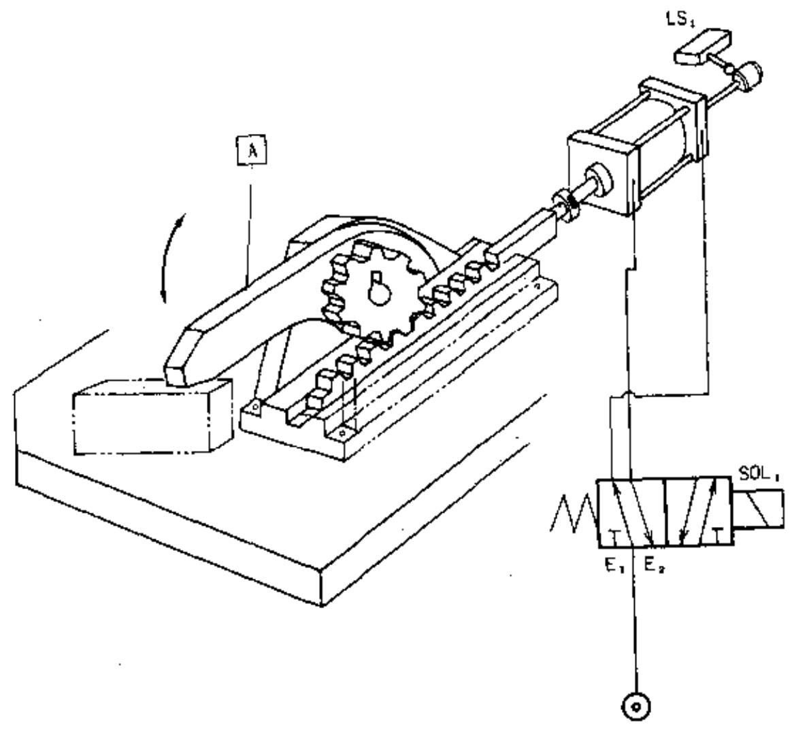

图3-19是靠气缸驱动齿条、齿轮，使压板摆动的简单压紧机构。按动起动按钮，使气缸前后动作，通过与活塞杆上齿条相啮合的齿轮，使压板A进行摆动运动，以完成压紧和松开工作。

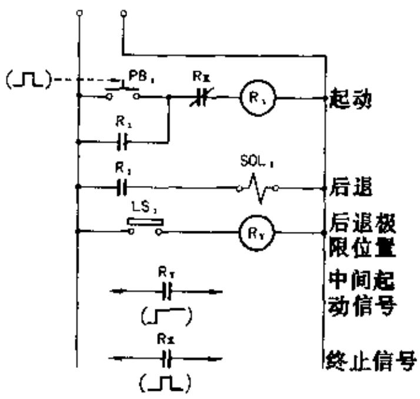  
图3-19动力：气压动作角度： $0 ^ { \circ } \sim 1 8 0 ^ { \circ }$ 载荷：中

# 设计要点

用于切削加工的工件压紧时，为防止切屑落入齿条、齿轮啮合部分及导轨滑动部分，必须考虑装设防护罩。

# 维护要点

用于切削加工时，由于充满了切屑，容易影响动作，所以必须注意。

# 使用实例

于空间位置受限制情况下的铣削、钻削加工的夹紧。

# 其 它

参阅附录一第2类控制回路。

# 往复速度不同的齿条、齿轮摆动运动机构

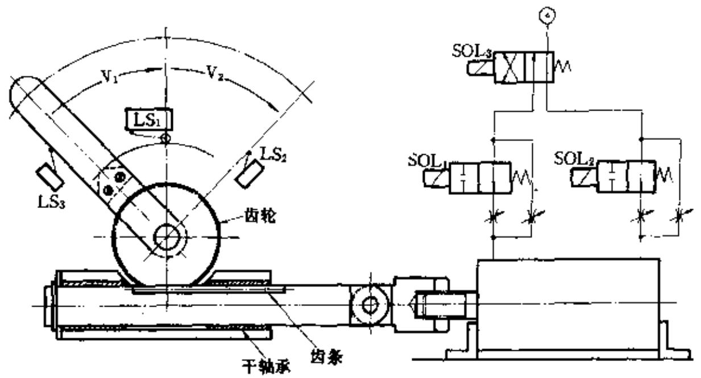  
图3-20

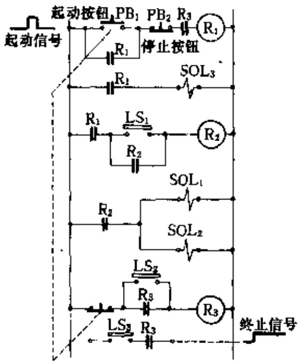

动力；气压  
动作角度： $\vartheta ^ { \circ } \sim 3 0 0 ^ { \circ }$   
载荷：中

图3-20是通过气缸带动齿条、齿轮使摇臂摆动的机构。摇臂在前半行程以一般速度 $( \mathbf { V } _ { 1 } )$ 摆动，而后半行程以极慢的速度 $( \mathbf { V } _ { 2 } )$ 摆动

# 设计要点

1．考虑到惯性力，摇臂重量要轻。2.改变LS的安装位置，可以得到 $\mathrm {  ~ V ~ } _ { 1 } , \mathrm {  ~ V ~ } _ { 2 }$ 行程比例的多种组合。

# 使用实例

用作抓取和装入的摇臂等，要求快速接近，插入时缓慢动作。

# 凸轮摆动运动机构

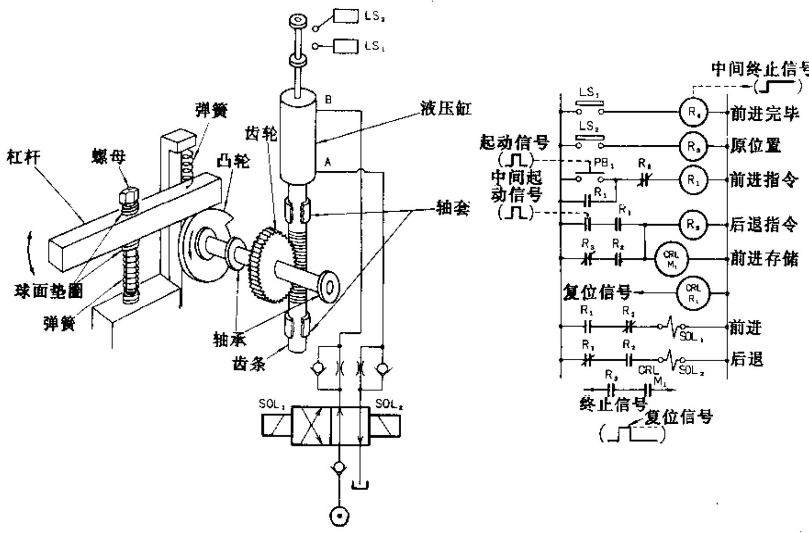  
图3-21动力：液压动作角度： $0 ^ { \circ } \sim 2 0 ^ { \circ }$ 载荷：中

图3-21是通过齿条、齿轮带动凸轮使杠杆摆动的机构。通过凸轮和杠杆可取得比液压缸输出更大的力。

# 设计要点

1．在齿条轴的轴套上要开润滑油槽。

2．当向液压缸A孔供压力油时，凸轮应按图示箭头方向回转。

3．如在换向阀入口处装入单向阀，则更为安全。

制造要点

凸轮轮廓表面以及与凸轮接触的杠杆表面均应进行热处理。

使用实例

工件夹紧装置。

# 其 它

1.螺母固定位置的调整须与凸轮的位置相配合。

2．参阅附录一第3类控制回路。

# 杠杆摆动运动机构

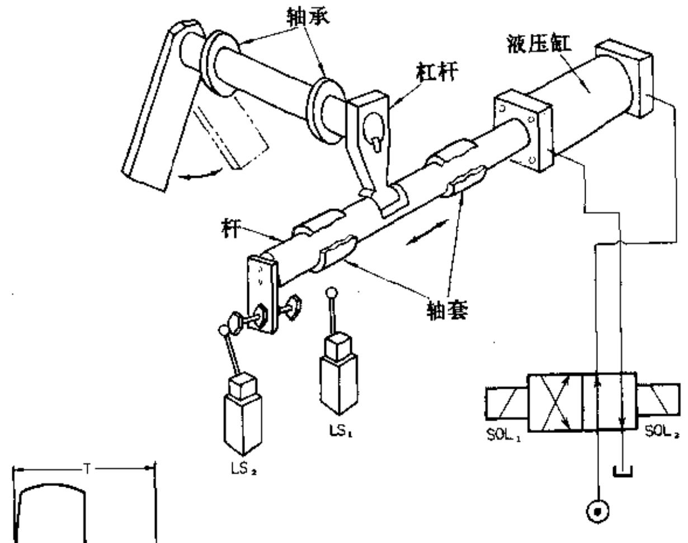

$$
\boxed  \begin{array} { r l } { \boxed { \begin{array} { r l } \end{array} } } & { } \\ { \boxed { \begin{array} { r l } \end{array} } } & { } \end{array}
$$

# 中间终止信号

图3-22动力：液压动作角度： $0 ^ { \because } \sim 2 0 ^ { \circ }$ 载荷：中

图3-22是能在摆动轴上设置数个摇臂的摆动运动机构。可装在一个较小的外壳里。

# 设计要点

1，如图所示，杠杆与活塞杆的凹槽接触部分有摩擦,效率较差。如把杠杆端部改成滚子，就能提高效率。

2．轴套受有载荷，应有润滑油槽。

# 制造要点

杠杆端部和活塞杆的凹槽处均需进行热处理。

(1)前进完毕起动信号 L 原位置(L) 前进指令中间起动信号 (L- R全 后退指令R RH 前进存储复位信号一 C 复位R R SOLH 北 一前进R R SOL，一后退CRLM，HH 宁终止信号复位信号

使用实例  
从夹具上压出工件的机构  
其它  
参阅附录一第3类控制回路。

# 扩大液压缸动作的摆动运动机构

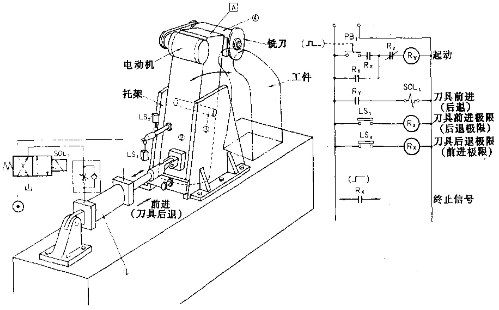  
图3-23动力：液压动作角度： $0 ^ { \circ } \sim 4 5 ^ { \circ }$ 载荷：重

# 设计要点

图3-23是利用耳环式液压缸，使具有回转轴的摇臂摆动的机构。图示是在摇臂上装有铣头进行铣削加工的情况。

按动起动按钮，SOL：使耳环式液压缸1的活塞杆后退。摇臂2以回转轴3为中心进行摆动，使铣刀头4在工件侧面进行加工。当固定在摇臂上的顶杆在后退端碰压限位开关LSi时，SOL，电路切断，液压缸1的活塞杆返回到前进端的极限位置。以上为一个周期。

1．相对于回转轴来说，电动机比铣头要重。2.液压缸采用出口节流调速方式。制造要点摇臂2与托架的间隙应尽量小。维护要点及时向滑动面注油。使用实例铣削加工头的移动。其它参阅附录一第2类控制回路。

# 液压缸和长槽摇臂摆动运动机构

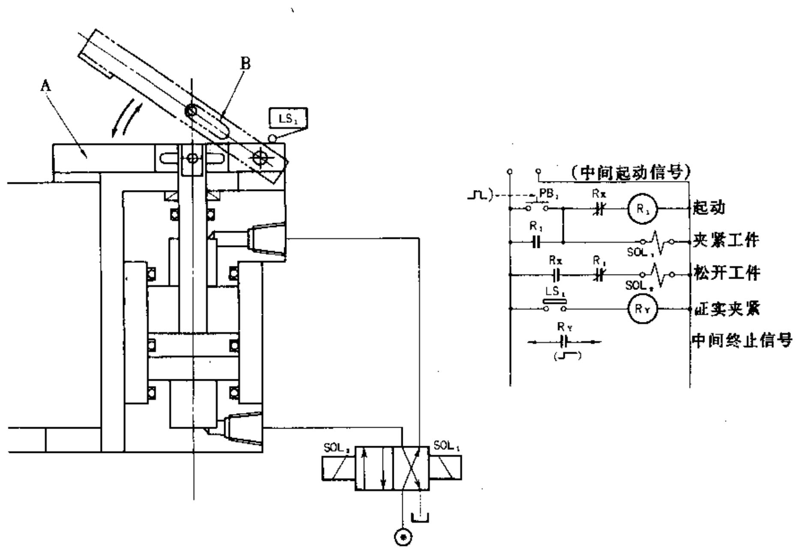

图3-24  
动力：液压  
动作角度： $0 ^ { \circ } \sim 4 5 ^ { \circ }$   
载荷：中

图3-24是使安装在液压缸活塞杆上的滑块或滑销，在摇臂的长槽内滑动的摆动运动机构。本图是通过液压缸活塞杆的上下运动，使具有支点的压板A摆动，以进行夹紧工件的工作。此机构由于支点到活塞杆和支点到工件的距离比，是使液压缸的输出力减小以后来夹紧工件的。

设计要点

1．如上所述，因为工件夹紧力比液压缸的输出力小，所以在需要大的夹紧力时应注意。

2．长槽B对于油缸活塞杆的行程，要留有余量。

制造要点

长槽B和活塞杆端部的滑销作相对滑动时要轻快、灵活。

使用实例工件的夹紧等。

其 它

参阅附录一第2类控制回路。

# 斜面摆动运动机构

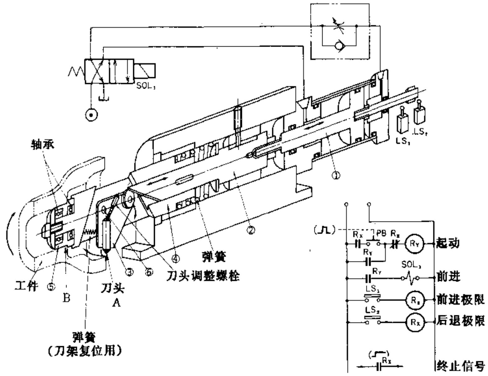  
图3-25动力：液压动作角度： $0 ^ { \circ } \sim 6 0 ^ { \circ }$ 载荷：中

图3-25是由液压缸的直线运动通过斜面推动从动滚子，将直线运动转换为摆动运动的机构。本图是由液压缸使刀架轴向进给，并使刀头A摆动，同时利用工件的回转进行球面加工的装置。工作过程说明如下：

按动起动按钮，通过 $\mathtt { S O L } _ { 1 }$ 使活塞杆1推动带有斜面的杆2前进。与此同时，在弹簧压力的作用下，使带刀架3的机头4也前进。当支承在机头4前端轴承上的外套5碰上工件的B面时，机头4停止前进。这时活塞杆1和斜面杆2仍继续前进，通过滚子使刀架3以支点

6 为中心按顺时针方向摆动，由于工件的回转，刀头A完成球面的切削加工。当活塞杆1前进到碰压LSi后，SOL:切断，活塞杆1带动机头4复位。以上是一个周期。

# 设计要点

1．应防止切屑进入机构内部。2．若加工的球面直径较小，则应注意机头不能太粗。制造要点工件与机构的同轴度很重要。维护要点必须经常用冷却液冲掉切屑。使用实例小批量生产的球面切削加工。其它参阅附录一第2类控制回路。

# 低速液压马达摆动运动机构

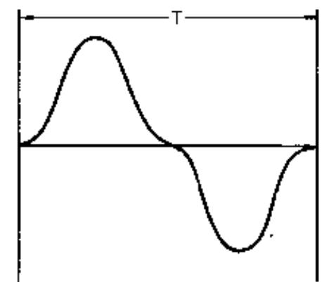  
Tmn =1sec

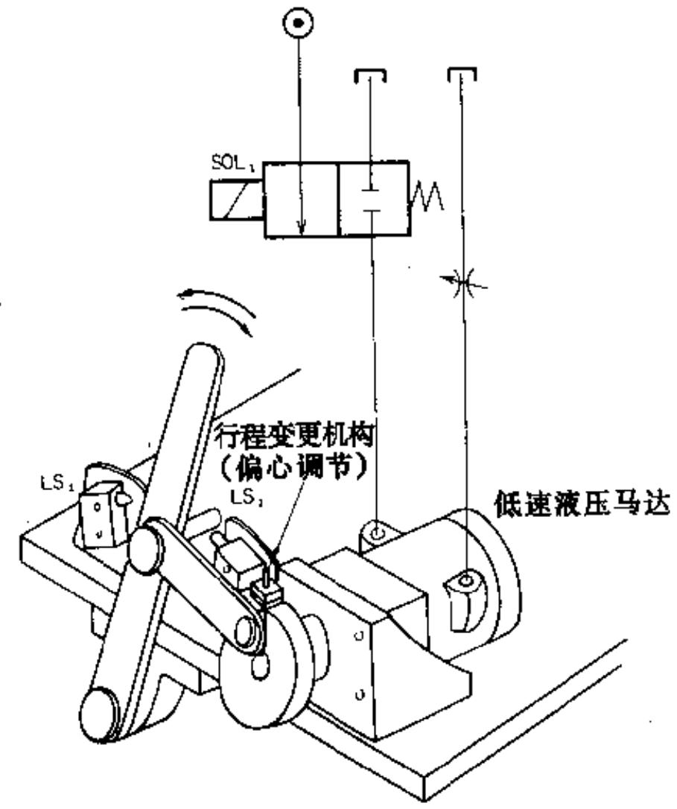  
图326动力：液压动作角度： $0 ^ { \cdot \sim 9 0 ^ { \circ } }$ 载荷：中

起动信号（）  
阳，  
Ll 摆动开  
R， R， 始信号  
非  
LS,(） 复位  
p   
LS RHR， SOL，  
LS复位  
  
R，

图3-26是由低速液压马达将曲柄运动传给杠杆的摆动运动机构。

# 设计要点

1．当机构承受重载荷时，液压马达要补加轴承。

2．在经常需要改变杠杆摆动行程的场合，装设偏心量调节机构较为方便。

3．为了尽可能减小负荷，停止位置最好设计在死点上。

制造要点

1．在装设了行程调节机构的场合，因为容易松动，所以一定要注意紧固。

2．行程调节以后，LS:的位置也应同时调整，否则就会受到损坏，应加注意。

使用实例

破碎机，滑槽等的激振。

# 其 它

1．本机构具有可以小型化的特点。

2．参阅附录一第2类控制回路。

# 杠杆摆动运动机构

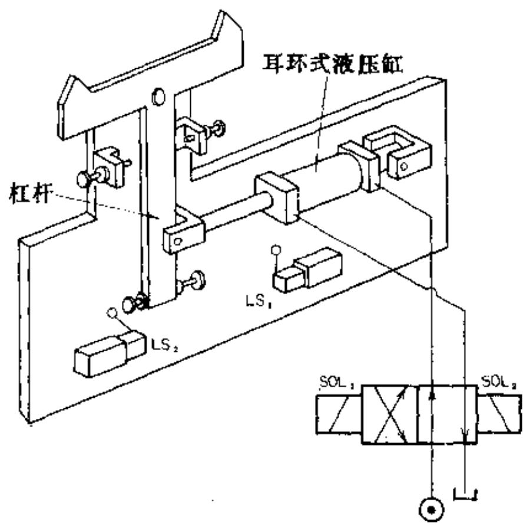

LS, 前进完毕 --中间终止信号R ()LS  
起动信号 5 原位置R 前进指令R.R  
中间起 R 后退指令  
动信号 R， R 进存储前进R 后退一终止信号复位信号L图3-27  
动力：液压  
动作角度； $0 ^ { \circ } \sim 6 0 ^ { \circ }$ 载荷：重

图3-27是由耳环式液压缸与杠杆组合而成的最简单的摆动运动机构。

# 设计要点

1．由于摆动角度大了,效率就要降低，所以在要求摆动角度太大时不宜采用。

2．当杠杆承受较大载荷时,各滑动销处应

采用含油轴承等。

3．为了限制杠杆的摆动角度，在杠杆的两侧安装定程器，由此可消除间隙对摆动角度的影响。

制造要点

定程器与杠杆的接触部分要热处理。

使用实例

工件搬运时的分离用擒纵机构。

# 其 它

参阅附录一第3类控制回路。

# 液压马达和进给丝杠摆动运动机构

图3-28

动力：液压

动作角度： $0 ^ { \circ } \sim 9 0 ^ { \circ }$

载荷：轻

图3-28是靠液压马达带动进给丝杠回转，利用螺母的移动，使杠杆摆动的机构。

# 设计要点

1．液压马达与进给丝杠的连接，必须采用挠性联轴节（链式联轴节）等。

2．进给丝杠两端支承处必须安装推力轴承，以承受轴向力。

3，液压系统配管很长时，如排气不良，

在液压马达停止时会有一定程度的倒转，必须注意。

# 制造要点

1．由于液压马达不能承受轴向载荷，所以要正确安装轴和推力轴承。

2.液压马达轴上也不能承受其它附加载荷，装配时要注意。

使用实例

分选机构、分度机构等。

其 它

丝杠、螺母以及杠杆等处，采用稀润滑油润滑，所以丝杠高速回转时，要注意油的飞溅。

# 齿条、齿轮摆动运动机构

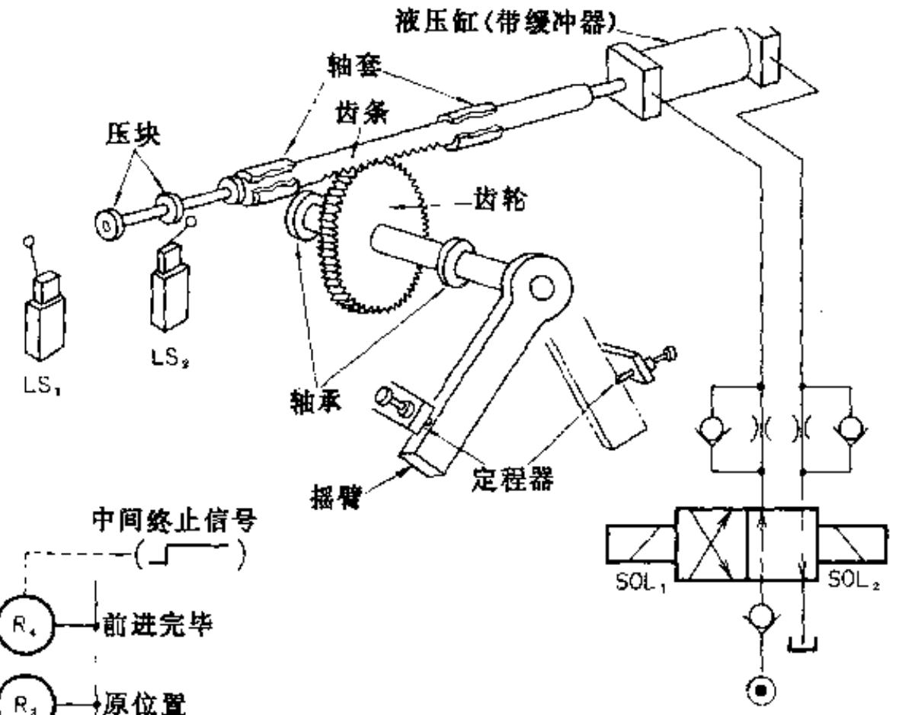  
图3-29是利用齿条、齿轮可任意取较大摆动角度的摆动运动机构。

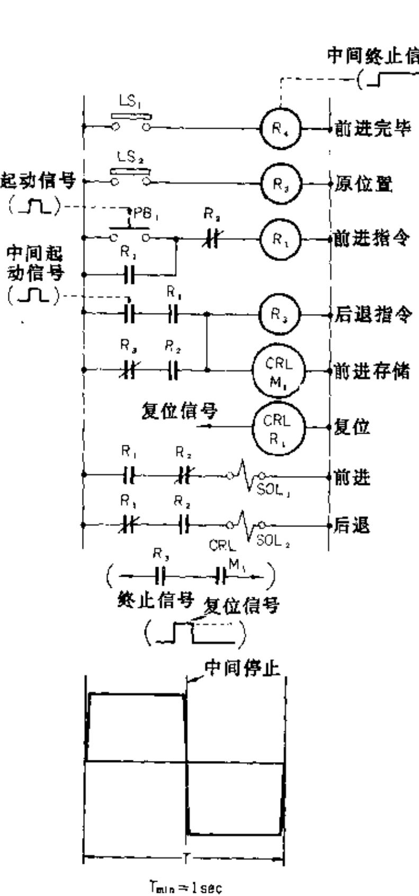  
图3-29

动力：液压  
动作角度：0°\~350"  
载荷：中

# 设计要点

1．在摇臂较长、回转惯性力较大时，必须使用带缓冲结构的液压缸；同时，要特别注意轴和键的强度。

2．在液压系统的压力油进口处，要安装单向阀，以防止液压泵停止时摇臂因自重而下降。操作上必须使用三位换向阀时，在液压缸各进口处，如不安装液控单向阀就不能完全防止摇臂的下降。

3．在液压缸的各出口处，还应安装调节液压缸速度的节流阀。

# 制造要点

控制摇臂摆动角度的定程器接触处，必须进行热处理，以保持停位精度。

# 使用实例

装料器的摇臂。

其 它

参阅附录一第3类控制回路。

# 摆动缸摆动运动机构

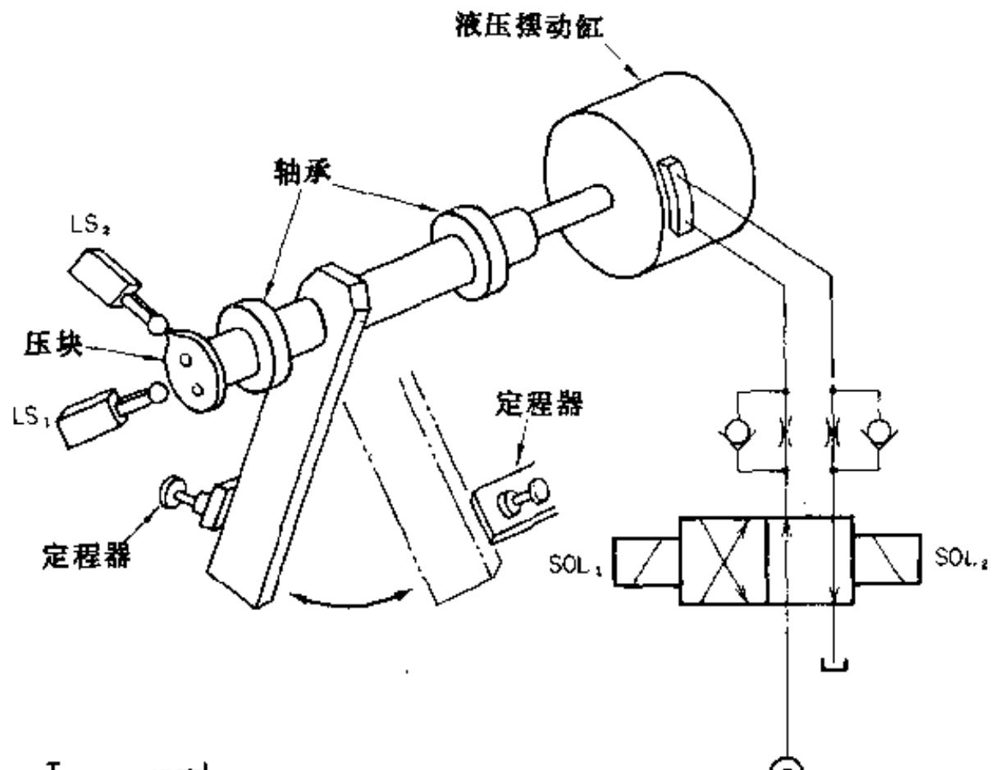

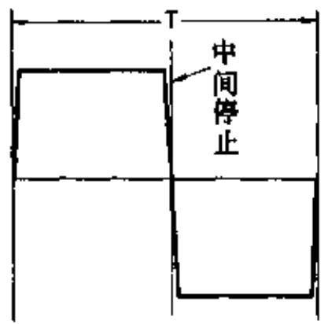  
$T _ { \mathtt { m i n } } { = } 1 \mathfrak { s e c }$

# 设计要点

1．当空间位置受限制时，采用摆动缸的摆动机构最为合适。

2．选用摆动缸时，应查看产品样本，特别要注意惯性载荷。

3．对于直接连接的摆动缸，为使其不受惯性力，必须考虑安装定程器。

# 使用实例

改变组装工件的位置而进行插入的机构。

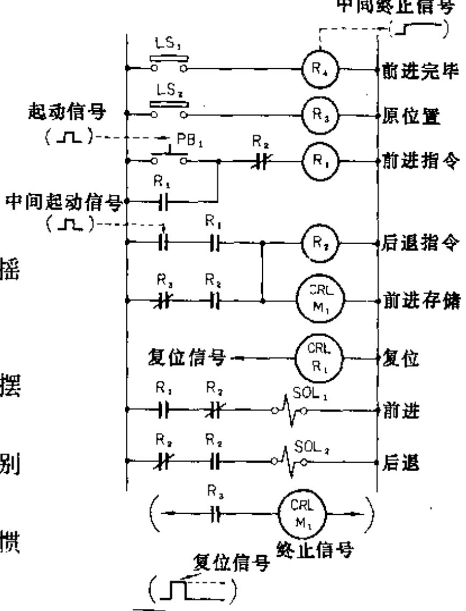  
图3-30是利用外购的摆动缸直接驱动摇臂的摆动运动机构。

其 它

参阅附录一第3类控制回路。

图3-30  
动力：液压  
动作角度： $0 ^ { \circ } \sim 3 5 0 ^ { \circ }$   
载荷：重

# 蜗杆摆动运动机构

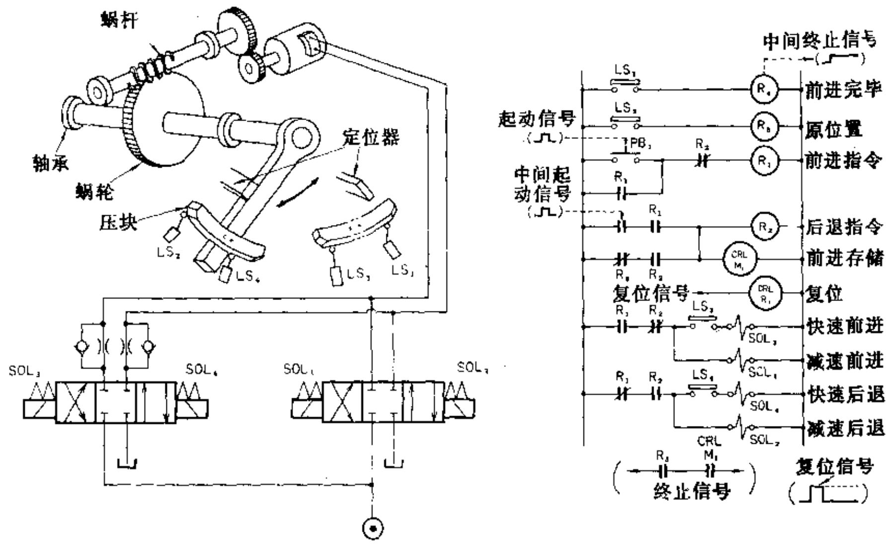  
图3-31动力：液压动作角度： $0 ^ { \circ } \sim 3 5 0 ^ { \circ }$ 载荷：重

图3-31是利用液压马达驱动蜗杆、蜗轮的大角度摆动运动机构。由于采用蜗杆、蜗轮，即使摆动角度很大，也可以装入箱体内。在液压切断时，摇臂被自锁，在反力作用下也不会倒转。

设计要点

用液压马达驱动时，要在液压系统或机构上设法使液压马达停止时不发生冲击。特别是在惯性力较大时更要注意。图示在液压马达停止前，先让 $\mathbb { S } 0 \mathbf { L } _ { 3 }$ 或 $S O L _ { 4 }$ 动作，使之减速。

制造要点

蜗轮用着色法现场装配，其中心平面与蜗杆的轴心线要一致。

使用实例

工件输送装置的一部分。

# 其 它

参阅附录一第3类控制回路。

# 电磁铁和杠杆摆动运动机构

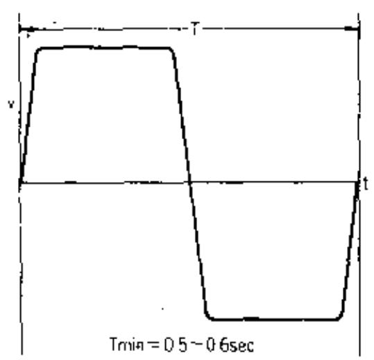

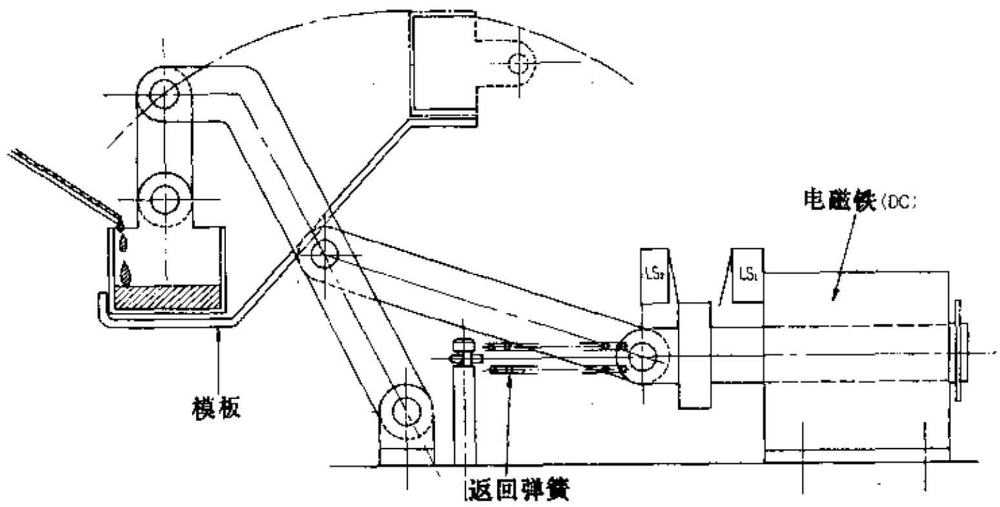  
图3-32动力：电气动作角度： $0 ^ { \circ } \sim 9 0 ^ { \circ }$ 载荷：轻

图3-32是利用杠杆把电磁铁的直线运动转换为摆动运动的机构。在图中摆动杠杆的顶端设有吊杆，此吊杆可自由运动，在吊杆上装有使工件位置移动或方向转变的机构。

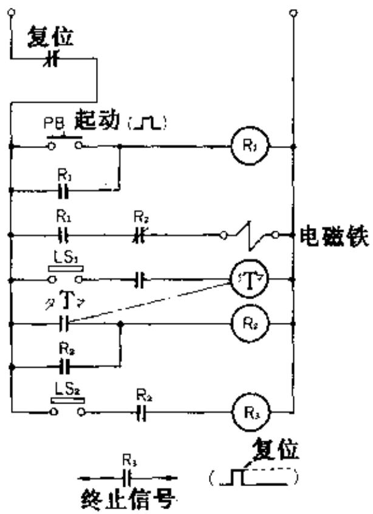

设计、制造要点

各支点轴的配合应保证动作非常灵活，由于电磁铁的吸引速度极快，并伴有冲击，所以对于轻型工件较合适。

# 使用实例

大多在顶端配置夹紧装置，用作移动并转向等。图示是将粉状物料的吊桶举起并转向的实例。

# 其 它

参阅附录一第3类控制回路。

# 电磁铁与齿条、齿轮摆动运动机构

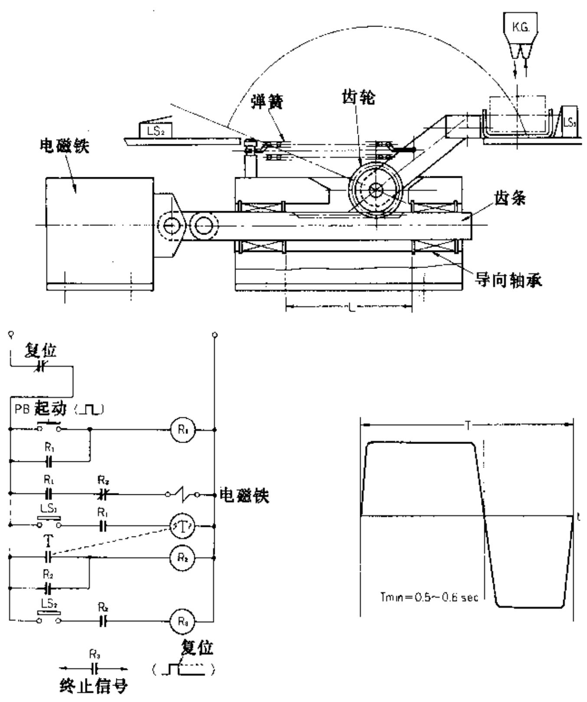  
图3-33动力：电气动作角度： $0 ^ { \mathrm { ~ \tiny ~ \cdot ~ } } \sim 1 . 8 0 ^ { \mathrm { ~ \tiny ~ \cdot ~ } }$ 载荷：轻

图3-33是通过齿条、齿轮把电磁铁的直线运动转换为摆动运动的机构。

# 设计、制造要点

要特别注意回转系统的质量必须极轻，当然工件也限于轻型的。齿条用的轴承，如果是干式的轴套，则可使L（轴承间距）达到最小限度；如果使用导向轴承等，则由于齿条的齿形部分不能进入轴承，L值必须根据此情况来决定。一般导向轴承的滚珠接触部分，按轴的圆周三等分分布，所以在安装轴承时，如果注意把齿条的齿形部分与轴承的接触部分错开，则L值就可设计得短些，但也不能太过分了。

# 使用实例

把工件的方向改变 $1 8 0 ^ { \circ }$ ，同时使之从一边的槽中移到另一边的槽中或输送机上。

# 其 它

参阅附录一第3类控制回路。

# 齿条、齿轮快速返回摆动运动机构

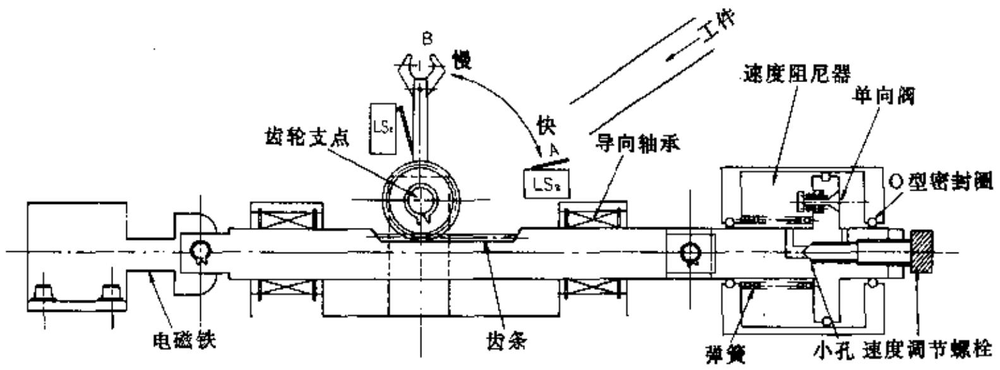

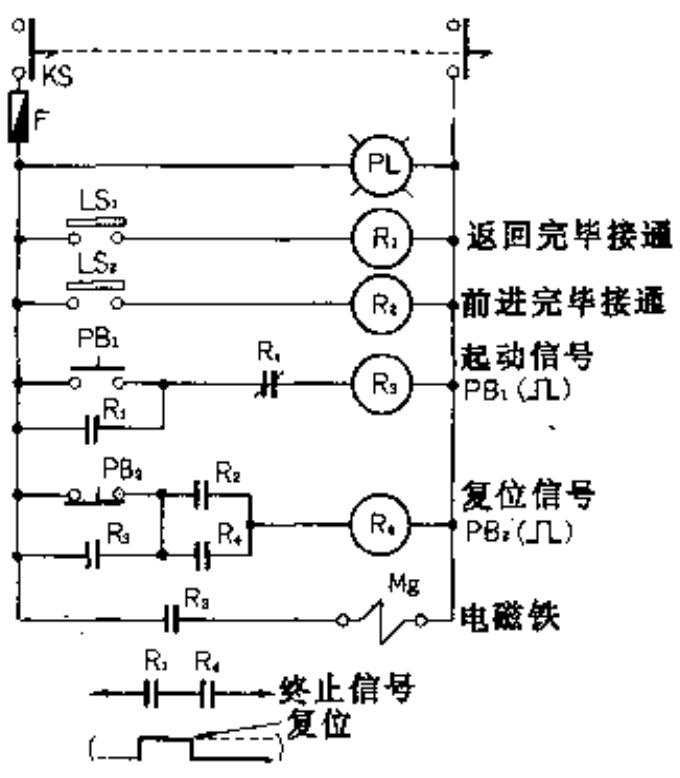

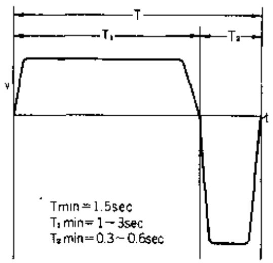  
图3-34动力：电气动作角度： $0 ^ { \circ } \sim 1 8 0 ^ { \circ }$ 载荷：轻

图3-34是通过齿条、齿轮把电磁铁的直线运动转换成摇臂的摆动运动，并使往复速度不同的机构。图中齿条向右方移动时，即摇臂顶端的夹头从A向B时，通过调节速度阻尼器内的小孔，并通过弹簧使移动缓慢，在B位使工件送出后，摇臂由于电磁铁的吸力，向A位快速返回。此时,速度阻尼器内的单向阀打开，以助于快速返回。

设计、制造要点

制造时应注意各支点动作要轻快、灵活。齿条应采用导向轴承。

# 使用实例

轻型工件装夹和移动时的辅助装置。

其 它

参阅附录一第2类控制回路。

# 齿条、齿轮和摇臂摆动运动机构

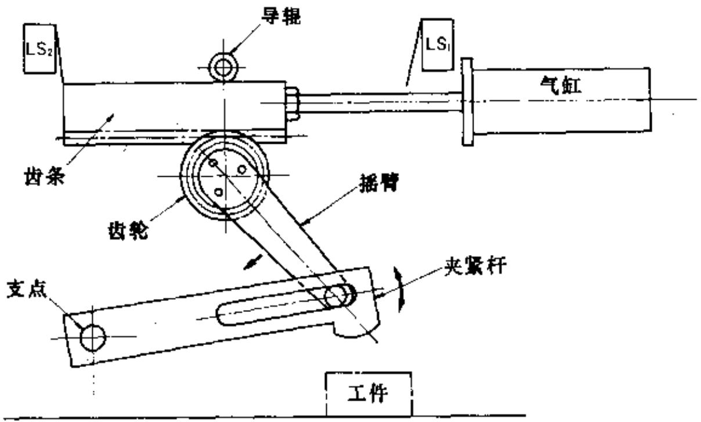

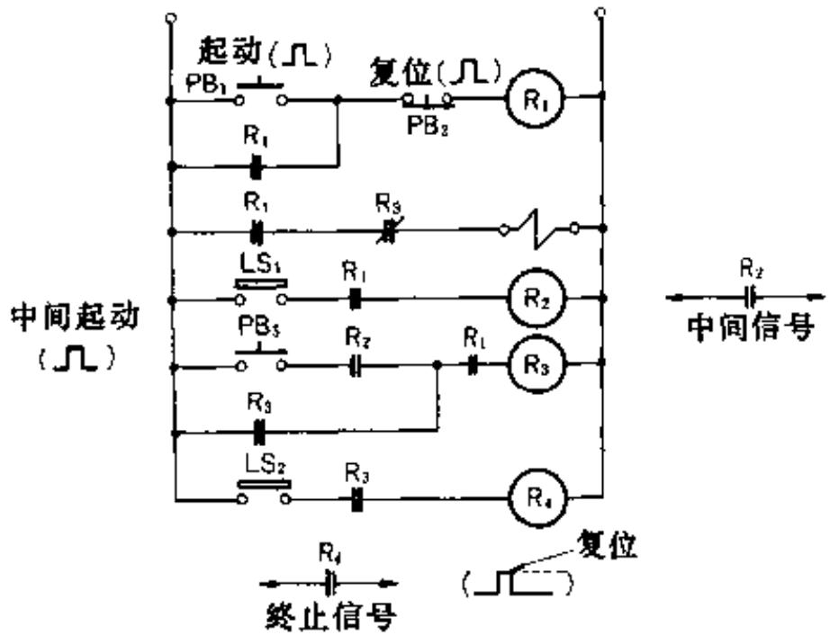  
图3-35动力：气压动作角度： $0 ^ { \circ } \sim 2 0 ^ { \circ }$ 载荷：中

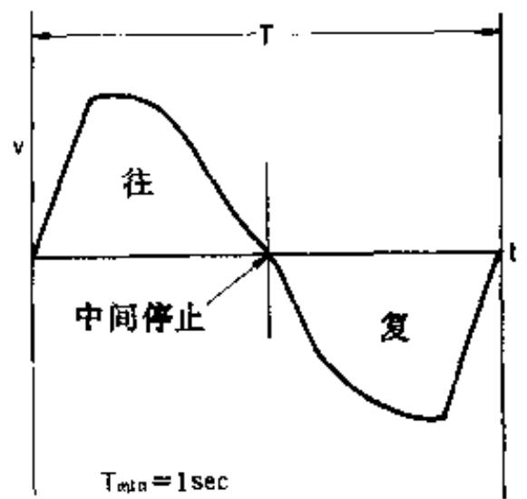

图3-35是利用摇臂的传动销带动夹紧杆的摆动夹紧机构。

利用齿条使固定在齿轮上的摇臂回转，由摇臂的动作使夹紧杆摆动。运动特性属于动作终端减速型，夹紧力与运动量成反比例。理论上在滑动槽和摇臂互相垂直的位置，来紧力最大。

返回动作具有开始时减速的特性。

# 设计、制造要点

1．齿轮和摇臂的固定，必须非常坚固。这个部分是应力集中的地方。

2、摇臂前端的销子最好做成能滚动的，并且要考虑淬火硬度。

3．齿轮的轴承部分受到与夹紧力相等的作用力，由此力的关系，可以估算其足以承受载荷的强度。各部分还必须进行适当的润滑。

使用实例

夹紧机构等。

其 它

参阅附录一第3类控制回路。

# 肘节摆动夹紧机构

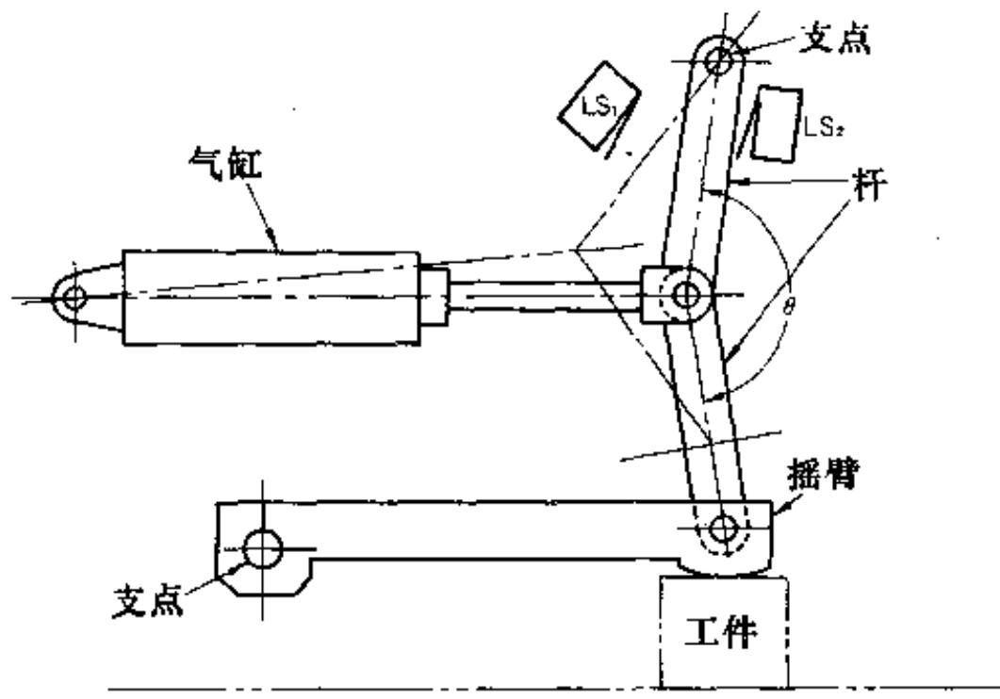

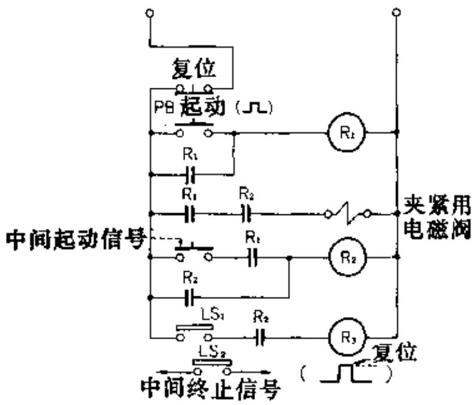

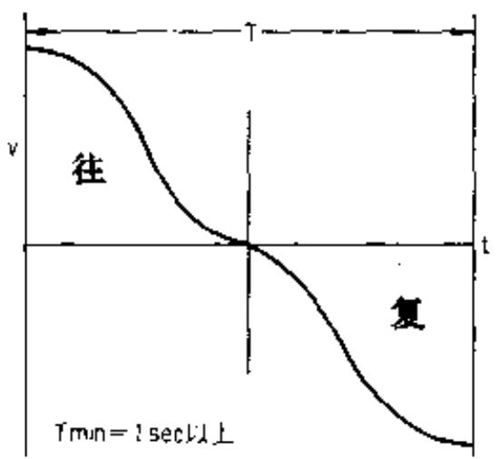  
图3-36动力：气压动作角度： $0 ^ { \circ } \sim 2 0 ^ { \circ }$ 载荷：重

# 设计、制造要点

这时，工件上受到的力P为：

图3-36是利用肘节传动的摆动夹紧机构。在理论上，图中θ角是 $1 8 0 ^ { \circ }$ 时，工件上受到的力 $\mathbf { P }$ 达到无限大。

实际使用时，应使 $\pmb { \theta }$ 角小于 $1 8 0 ^ { \circ }$ ，大约在$1 5 0 ^ { \circ } \sim 1 7 5 ^ { \circ }$ 为合适。

1．要充分注意各部分的刚度。支点及其它回转部分的轴及轴承均需淬火，或装入重载荷用的滚动轴承。

2．必须设置润滑机构。

3．如图示那样的使用情况，工件的高度误差大时,肘节机构的动作点也就有大的变化，这时此机构不适用。

使用实例

工件或其它物件的夹紧机构。小型压力机。

# 其 它

参阅附录一第3类控制回路。

# 曲柄两端减速摆动运动机构

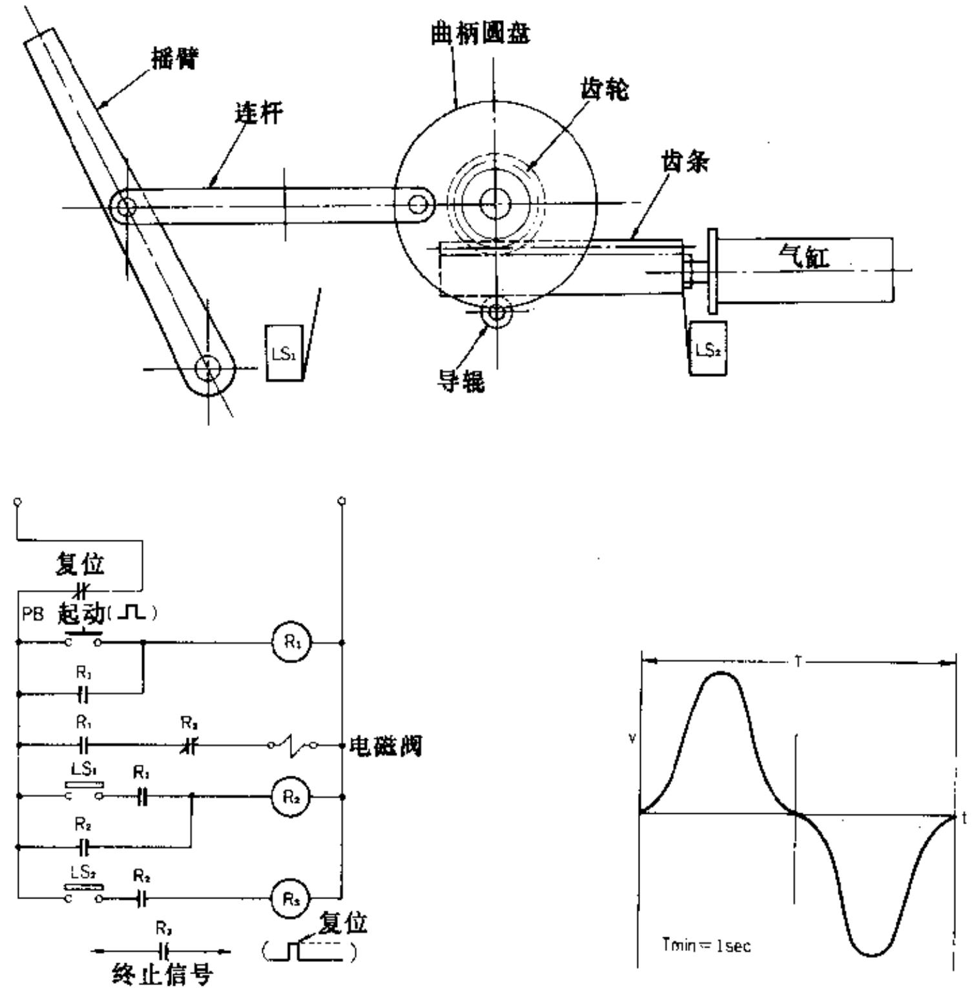  
图3-37动力：气压动作角度： $0 ^ { \circ } \sim 3 0 ^ { \circ }$ 载荷：中

图3-37是由齿条、齿轮、曲柄组成的两端减速摆动运动机构。

一般多采用电动机等使曲柄圆盘回转，这里使用直线运动的气缸，通过齿条、齿轮，把直线运动转换成回转运动。

如果改变控制系统，当然可以使之在摆动的 $1 / 2$ 周期处（按摆动运动的往复）停止，以

充分利用曲柄运动机构的运动特性。

# 设计、制造要点

1．为了减少齿条和齿轮的间隙，必须设置导辊，因而齿条的尺寸精度必须严格。

2.导辊的轴承部分采用滚动轴承较好，不得已采用滑动轴承时，要开适当的润滑油槽，采用完整的润滑机构。其它的回转部分也必须同样考虑。

# 其 它

参阅附录一第2类控制回路。

# 槽形凸轮任意变速摆动运动机构

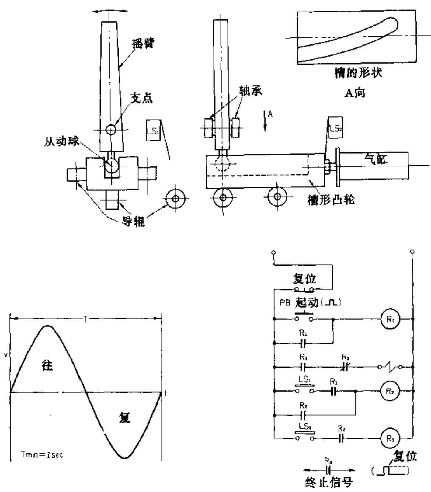  
图3-38动力：气压动作角度： $0 ^ { \circ } \sim 3 0 ^ { \circ }$ 载荷：中

图3-38是利用直线前进式槽形凸轮的摆动运动机构。槽形凸轮由位于凸轮左、右侧和下侧的导辊来导向，并通过气缸的动作进行直线运动。球形从动件在凸轮槽内从动，使摇臂动作。当然，根据凸轮槽的形状，此机构的运动特性可以有各种各样的变化。

# 设计、制造要点

1．槽形凸轮的材料、热处理、加工精度

等，必须充分研究并慎重设计。

2.槽形凸轮采用滚动导向是理想的，要适当地选择导辊的数量、直径和安装位置等。

3．滑动面切出适当的油槽加以润滑为好。

4．球形从动件要装入滚动轴承。

5．球形从动件与凸轮槽接触处，用润滑脂润滑，以防止磨损。

6。在气动系统中加入调速器，以控制合适的速度。

# 其 它

参阅附录一第2类控制回路。

# 齿条、齿轮和凸轮任意变速摆动运动机构

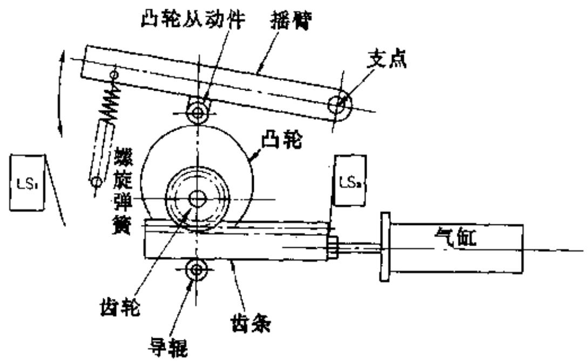

  
图3-39动力：气压动作角度： $0 ^ { \circ } \sim 3 0 ^ { \circ }$ 载荷：中

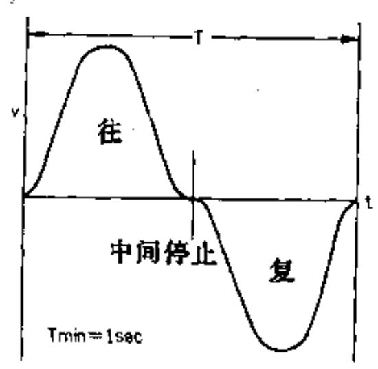

图3-39是通过与齿轮直接连接的任意形状的凸轮，使摇臂从动的摆动运动机构。当然，通过改变凸轮的形状，即能带来必要的运动特性。因为摇臂通过螺旋弹簧对凸轮从动，所以存在对高速摆动动作不能跟踪的缺点。如图所示的机构，减轻可动部分的质量并与合适的螺旋弹簧相组合，最小周期时间大约为 $\mathbf { T } =$

1秒。

设计、制造要点

1．注意可动部分的质量和螺旋弹簧的特性，设计时要考虑不能产生共振、振动等。

2．有必要特别注意齿条的导向方法，齿条的滑动中心与气缸的中心位置必须一致。

3．如果在气缸的气动系统中加入调速器，进行适当的调整，进行快速返回或者相反的运动都是容易的。

# 其 它

参阅附录一第3类控制回路。

# 圆柱凸轮摆动运动机构

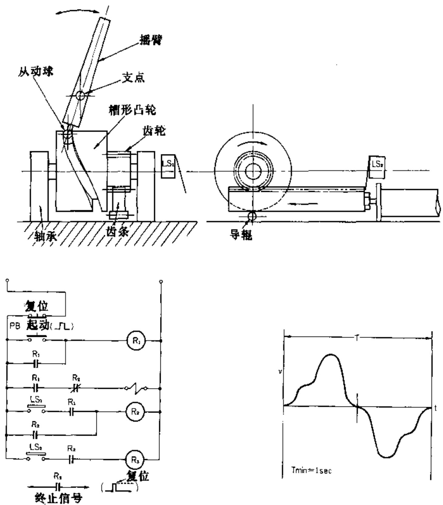  
图3-40动力：气压动作角度： $0 ^ { \circ } \sim 3 0 ^ { \circ }$ 载荷：中

图3-40是由直接与齿轮连接的圆柱凸轮使从动件摆动的机构。能得到任意的运动曲线。

在气动系统中加入速度调节器，通过调节，能获得圆滑的动作。

如果齿轮的直径较小而齿条的长度较大，在齿条的一次行程内，即可多次重复同一的摆动动作。

# 设计、制造要点

1．对齿条的导向方法,如有可能，采用导辊或滚动轴承等方法为好。不得已采用滑动面时，应考虑耐磨性，并设置适当的润滑机构。

2．从动球的轴承与上述同样考虑，希望装入滚动轴承。

3．如有可能，凸轮应淬火；如不能淬火，应充分给以润滑脂，以延长使用寿命。

# 其 它

参阅附录一第2类控制回路。

# 凸轮摆动夹紧机构

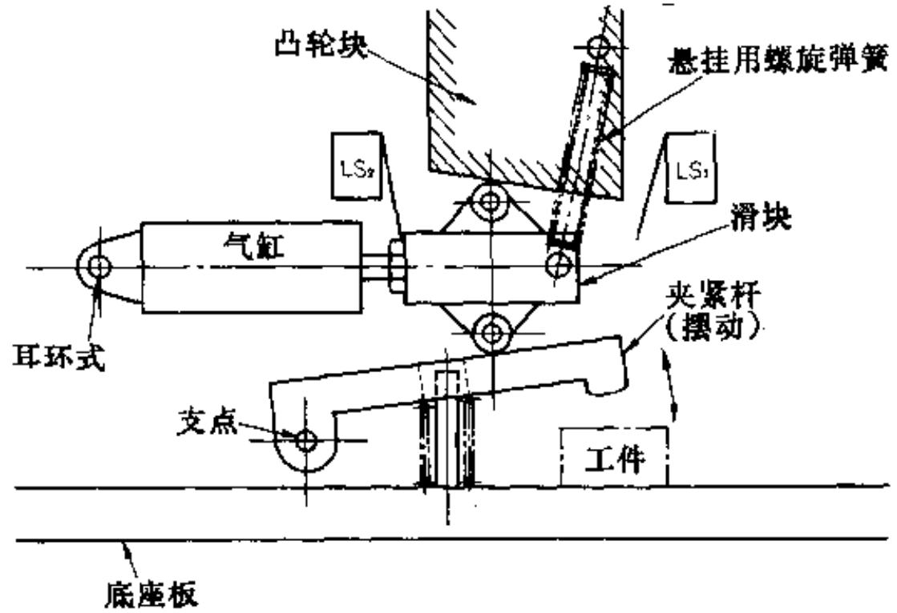

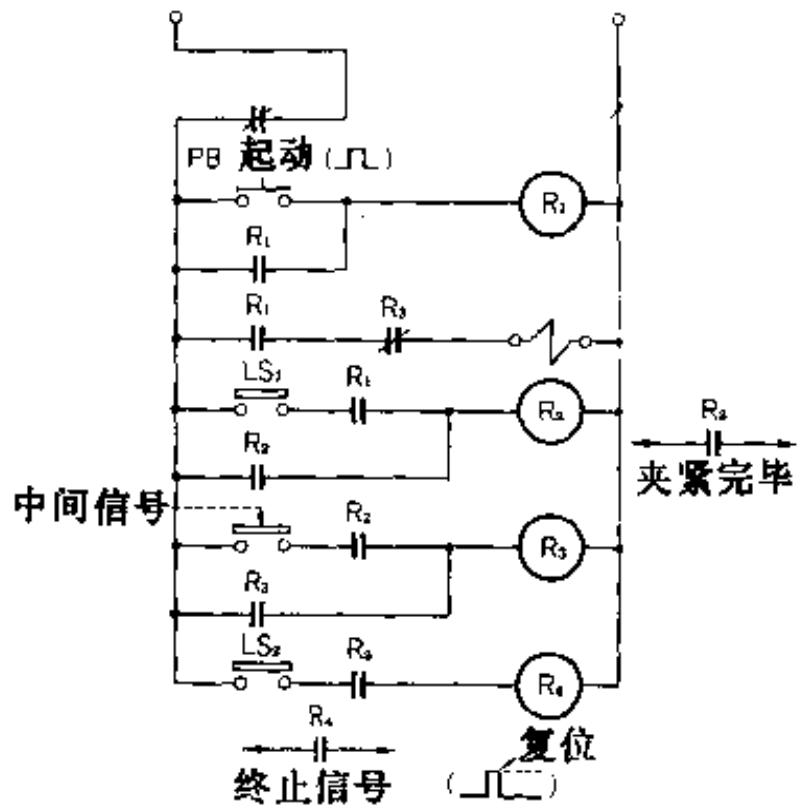

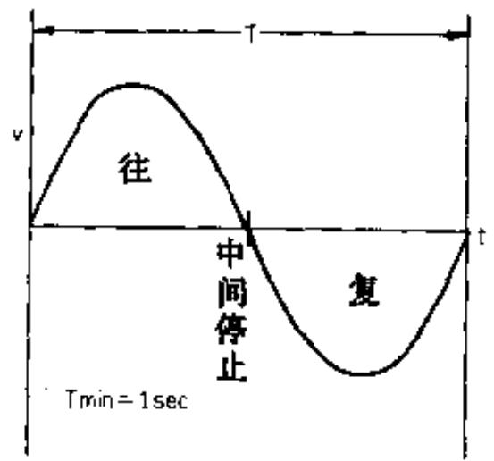

图3-41  
动力：气压  
动作角度： $0 ^ { \circ } \sim 3 0 ^ { \circ }$   
载荷：重

图3-41是通过凸轮块使夹紧杆进行摆动运动的机构。

采用端部自由的耳环式气缸，并用螺旋弹簧把端部向上悬挂起来。另外，夹紧杆也用螺旋压缩弹簧自动复位。

一般如图所示，工件受到的夹紧力为：

式中 $\mathbf { P }$ 一气缸的推力；

$\eth$ —在夹紧动作点上凸轮的切线角。

# 设计、制造要点

1．因为两个从动滚子受到与夹紧力相等的力，所以采用滚动轴承时，要注意轴承的承载能力。

2．凸轮块、夹紧杆的从动接触面必须淬火。

3，夹紧杆和气缸的铰链部分应有适当的润滑油槽。

4．在气动系统中加入速度调节器，以控制速度。

# 其 它

参阅附录一第3类控制回路。

# 齿条、齿轮和曲柄摆动运动机构

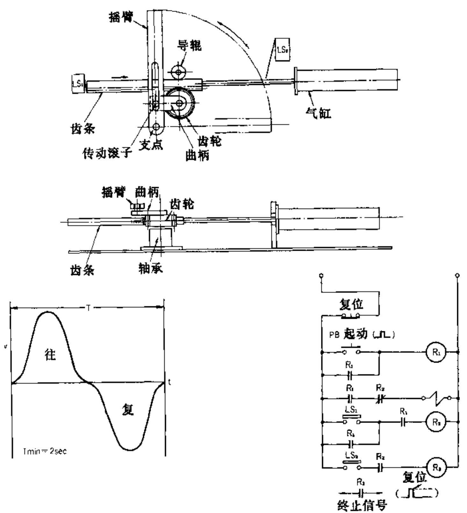  
图3-42动力：气压动作角度： $0 ^ { \circ } \sim 9 0 ^ { \circ }$ 载荷：轻

图 ${ \mathfrak { z } } \mathfrak { - } 4 2$ 是由齿条、齿轮把直线运动转换成回转运动，然后带动曲柄进行两端减速摆动的机构。在齿条或摇臂的行程两端配置限位开关，以进行顺序控制。

在气缸的往复系统中，如加入速度调速器，即能适当地改变往复动作的时间。

周期时间以往复一次在2秒以上为宜，如果采取减轻可动部分的质量、缓冲两端的动作等--切可能的方法，周期时间可以缩短。

# 设计、制造要点

1．要特别注意齿条滑动部分的耐磨性和灵活性。2.曲柄的传动滚子希望装有滚动轴承。3．要注意摇臂滑动槽的耐磨性。

# 使用实例

抓取和装入机构的臂等。

# 其 它

参阅附录一第2类控制回路。

# 气缸摆动运动机构

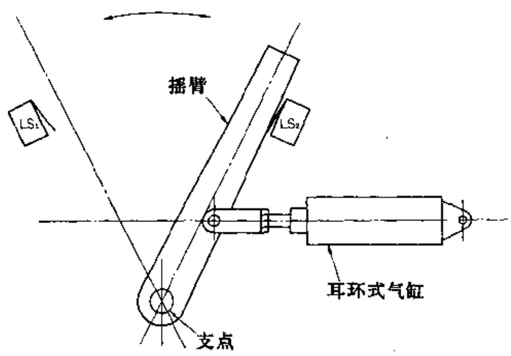

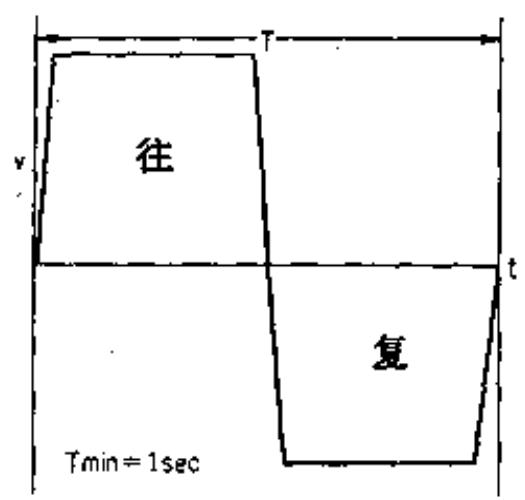

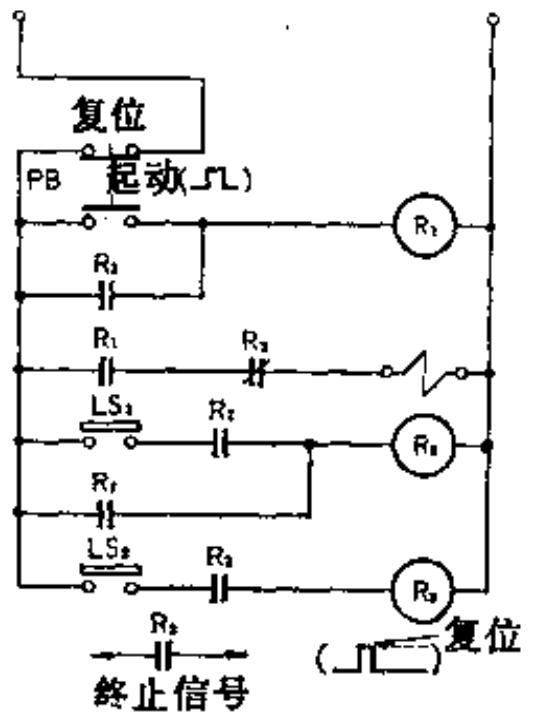  
图3-43动力：气压动作角度： $0 ^ { \circ } \sim 9 0 ^ { \circ }$ 载荷：中

图343是与气缸直接连接的最简单的摆动运动机构。这种情况一定要采用耳环式气缸，气缸的安装方向，也可以与图示相反。

如图所示，动作曲线大体上是等速的，在气动系统中加入速度调节器和缓冲器，可以使动作平稳。

# 设计、制造要点

1．摇臂的支点和摆动驱动轴部分应尽可能使用滚动轴承。如果不能用上述轴承。而用轴套时，应有完整的润滑给油机构。

2．由于气缸在动作两端存在冲击，有时能对机构产生不良的影响，所以应适当地配置缓冲器等。

# 其 它

参阅附录一第2类控制回路。

扩大摆动角的摆动运动机构

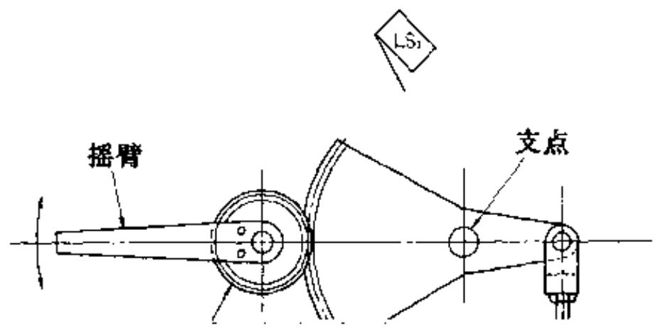

# 齿条、齿轮等速摆动运动机构

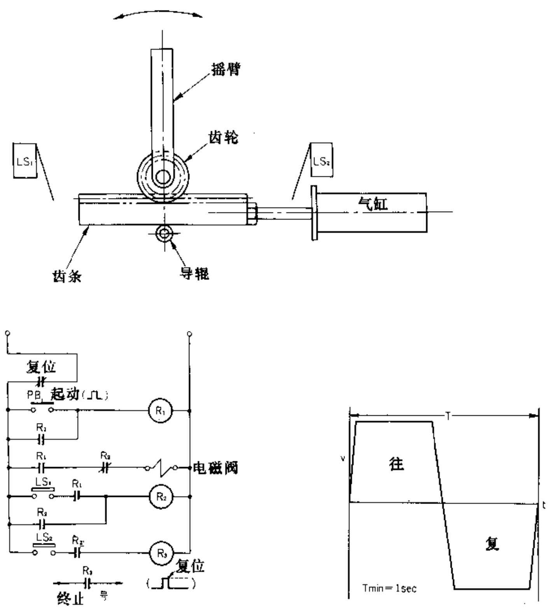  
图3-45动力：气压动作角度： $0 ^ { \circ } \sim 3 6 0 ^ { \circ }$ 载荷：轻  
图3-45是通过齿条、齿轮使摇臂等速摆动 的机构。

齿轮与摇臂直接连接。如果气缸的行程与齿轮的直径比很大，就能够比较简单地得到大角度的摆动运动（例如摆动360"）。

必须快速返回时，可在气动系统中加入速度调节器。

此时，在气缸动作的两端，再加上缓冲器，则动作就更加平稳。

# 设计、制造要点

1．齿条滑动部分，设计时要减少齿侧间隙，并注意动作的平稳性。另外，齿条动作的中心线与气缸的中心线要一致。齿条滑动部分尽可能采用滚动轴承或导辊等滚动支承。

2.在气动系统中，加入速度调节器，缓冲器等，并作适当地调整，效果更好。

# 其 它

参阅附录一第2类控制回路。

# 齿条、齿轮二次传动摆动运动机构

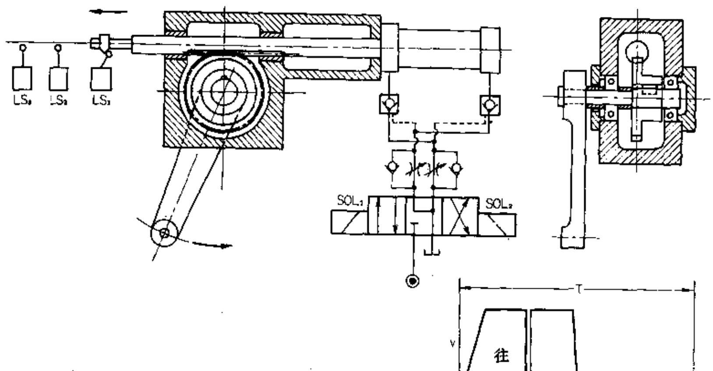  
图346动力：液压动作角度： $0 ^ { \circ } \sim 3 0 ^ { \circ }$ 载荷：重

图3-46是由齿条、齿轮组成的摆动运动机构。在机构的液压系统中，配置了液控单向阀，进行中间位置的锁紧。

# 设计、制造要点

1。加在摇臂上的载荷如发生变化，节流阀的速度特性就发生变化。要注意，特别在摆动过程中，从正载荷向负载荷变化时，动作不平稳。

2．摇臂承受较大的惯性时，要注意摇臂与轴、齿轮与键的连接强度。

3．齿条的导向轴套与齿条之间要加以润滑。

0 原位置LS 0 起动信号P中间有行 R起动信号 7 R 非 中间右行指令右行存储后退起动信号 R + R 复指令中间左行 R起动信号 ? 中间左行指令30L右行R SOL: 左行R CRL 复位HH f ）终止信号

4．载荷重时，凸轮的外表面要淬火。

5．齿条用圆棒料制造。

# 使用实例

用于摆动角度大的场合。

# 其 它

参阅附录一第4类控制回路。

# 柱塞三位停止摆动运动机构

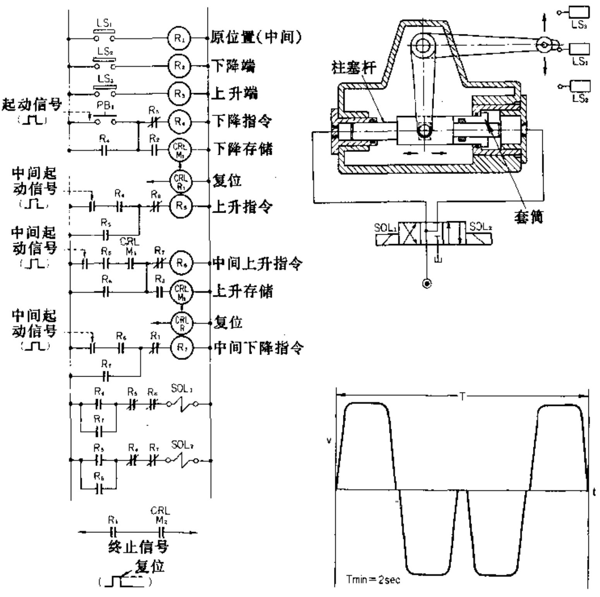  
图3-47动力：液压动作角度： $0 ^ { \circ } \sim 3 0 ^ { \circ }$ 载荷：重

图3-47是把柱塞杆、套筒和液压缸组合，能在行程中间位置准确停止的机构。当柱塞杆的两端与液压油接通时，套筒左行停止，柱塞杆由左侧被推至套筒位置，并在中间位置停止。如果液压缸的左进口或右进口分别与压力油接通，则柱塞杆即向右或向左移动。在柱塞杆的中间有槽。以便带动杠杆一端的滚子动作。

# 设计、制造要点

1．为了不致发生卡死现象，要考虑套筒的长度和直径比。

2．套筒的前端装有密封圈，要考虑套筒的润滑效果。

3．尽可能用于不需要防尘圈的密闭内部。

# 其 它

参阅附录一第4类控制回路。

# 凸轮和杠杆摆动运动机构

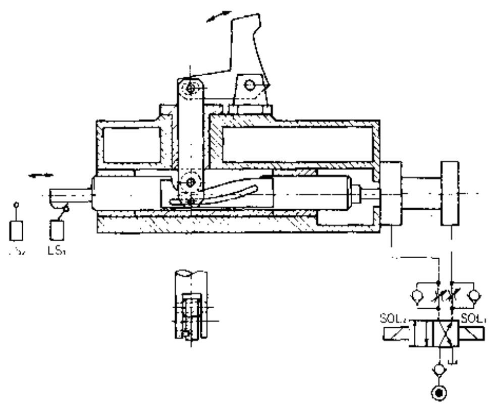  
图3-48动力：液压动作角度： $0 ^ { \circ } \sim \mathfrak { G } \mathfrak { 0 } ^ { \circ }$ 载荷：重

图3-48是通过凸轮和杠杆把力扩大的摆动运动机构。利用把圆棒料削掉一部分的凸轮，带动滚子和滑杆，使杠杆摆动。凸轮下部的槽，用以使杠杆返回，滑杆一端的销子在槽中滑动。主要用作工件的夹紧装置等。

# 设计、制造要点

1．在凸轮楔角取得极小而能摩擦自锁时，如不把液压缸作用面积大的一侧用作返回，就不能动作。

2．对凸轮、滚子、销子的强度要充分研究，并考虑采用热处理。

3．滑杆和凸轮的滑动部分要考虑润滑。

# 使用实例

工件夹紧装置等。

# 其 它

参阅附录一第3类控制回路。

5 中间终止信号R 前进端LS起动信号 R 原位置PB R 前进指令R: RHH HH CL 前进存储M中间起动信号 CRL 复位R 后退指令R RHHR 前进 SOLR R SOL非 后退R 复位HT ← 终止信号

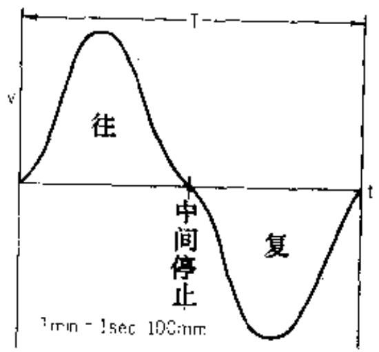

# 齿条、齿轮和凸轮摆动运动机构

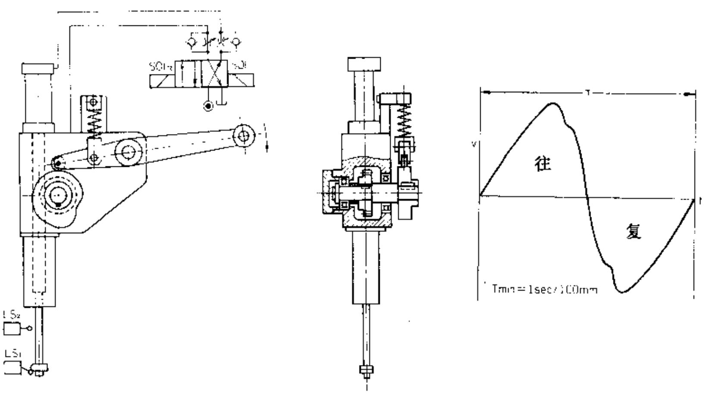

图3-49是由液压缸通过齿条、齿轮和凸轮使杠杆摆动的机构。齿条、齿轮带动凸轮回转。安装于杠杆一端的从动滚子，依靠弹簧压在凸轮的表面。摆动速度能任意变化。

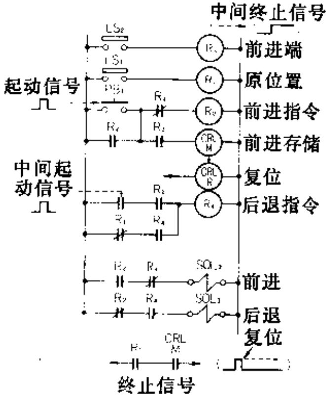  
图3-49动力：液压动作角度： $0 ~ ^ { \circ } \sim \mathfrak { F } 0 ^ { \circ }$ 载荷：重

# 设计、制造要点

1．仅能在载荷的方向使从动滚子压向凸轮时使用。在摆动二方都有载荷时，也可换成槽形凸轮。由于滚子在槽内回转，因此在滚子和槽之间必须有一定的间隙。

2．载荷通过滚子加到凸轮上，要考虑凸轮的耐久性，必须正确决定滚子的直径、凸轮和滚子的材料及热处理。

3．确定弹簧强度时，要考虑凸轮的回转速度及返回作用力。

# 其 它

参阅附录一第3类控制回路。

# 改变杠杆比的摆动角可变摆动运动机构

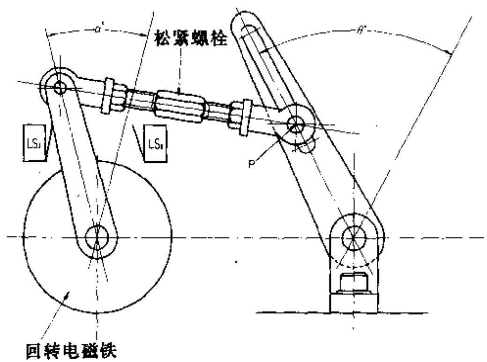

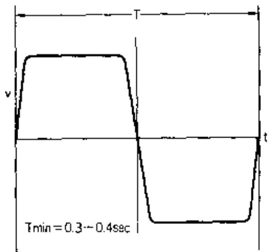  
图3-50动力：电气动作角度： $0 ^ { \circ } \sim 9 0 ^ { \circ }$ 载荷：轻

图3-50是通过改变杠杆比使摆动角也得到改变的摆动运动机构。回转电磁铁的动作角$\pmb { \mathfrak { a } }$ ，通过松紧螺栓传给摇杆，由于松紧螺栓与摇杆连接点P的上下变动，即可得到所希望的摆动角。

设计、制造要点

支点处如使用球形万向节等，则动作也合理，不会扭死。

其 它

参阅附录一第2类控制回路。

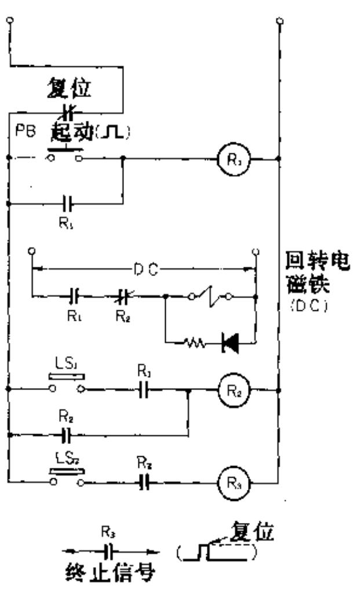

# 回转电磁铁加速的两端减速摆动运动机构

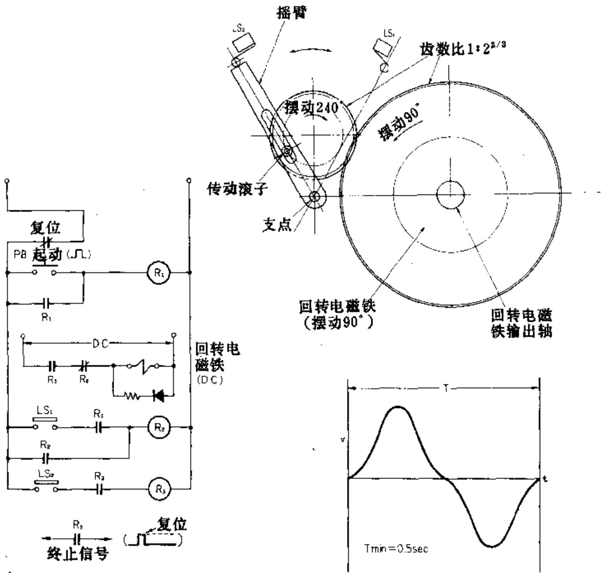  
图3-51动力：电气动作角度： $0 ^ { \circ } \sim 9 0$ 载荷：轻  
图3-51是由回转电磁铁通过齿轮传动的两端减速摆动运动机构。

一般外购回转电磁铁的摆动角大多在 $3 0 ^ { \circ }$ $\sim 9 0 ^ { \circ }$ ，如果把摇臂直接连接在回转电磁铁的轴上，即可简单地制成能达 $9 0 ^ { \circ }$ 的摆动运动机构。但因回转电磁铁的特点是速度难以控制，所以很难消除在行程终端的机械冲击。

．为了使摇臂在行程终端的冲击缓和到最小限度，用齿轮使回转电磁铁轴的回转角加速，并扩大了回转角，就可以通过曲柄运动机构得到摆动运动。

如图3-51所示，当摇臂的摆动角为 $6 0 ^ { \circ }$ 时.齿轮的齿数比为 $1 : 2 ^ { 2 / 3 }$ ：当摆动角为 $\left| 9 0 ^ { \circ } \right.$ 时齿数比则为 $1 : 3$ ：

# 设计、制造要点

由于回转电磁铁的机械冲击大，所以其本身的安装、以及轴和齿轮的安装必须牢固。摇臂的支点、回转轴承也必须有足够的机械强度。特别是传动滚子的设计，要考虑足够的强度，并具有耐磨性。

# 其 它

参阅附录一第2类控制回路。

# 齿条、齿轮摆线摆动运动机构

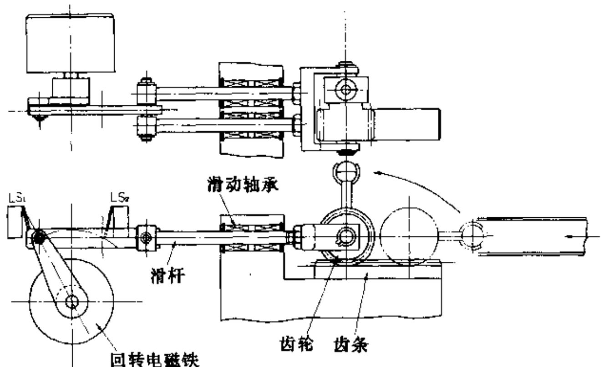

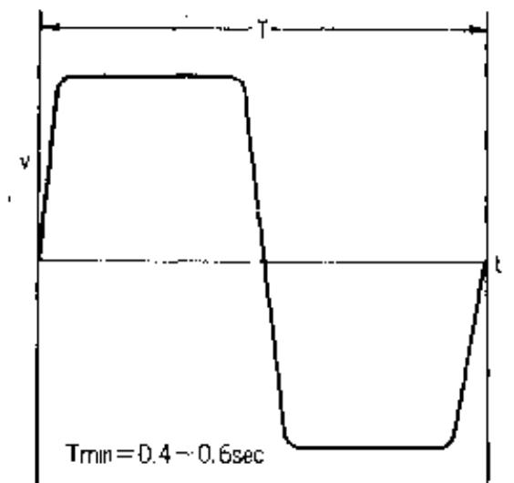  
图3-52动力：电气动作角度： $0 ^ { \sim } \sim 1 8 0 ^ { \circ }$ 载荷：轻

设计、制造要点

齿条、齿轮的齿侧间隙不能太大。在支点轴、回转轴上使用滚动轴承；在滑杆上使用滑动轴承，以减轻负荷。

# 使用实例

在夹头臂的前端配置由其它动力（例如空气）传动的卡爪等，用以改变在滑槽上流动工件的位置及方向。

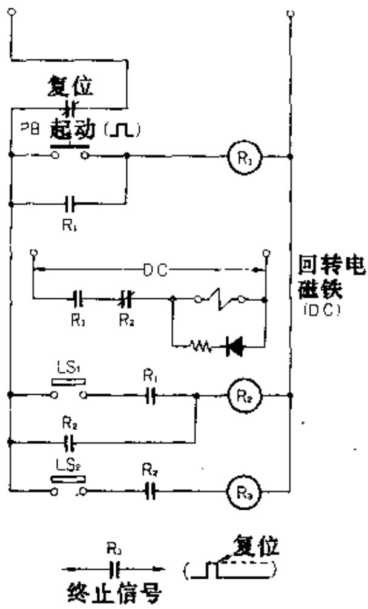  
图3-52 是通过滑杆、齿条、齿轮等，把回转电磁铁的动作转换成夹头臂的摆线摆动运动机构。

# 其 它

参阅附录一第2类控制回路。

# 气动摆动缸和凸轮任意变速摆动运动机构

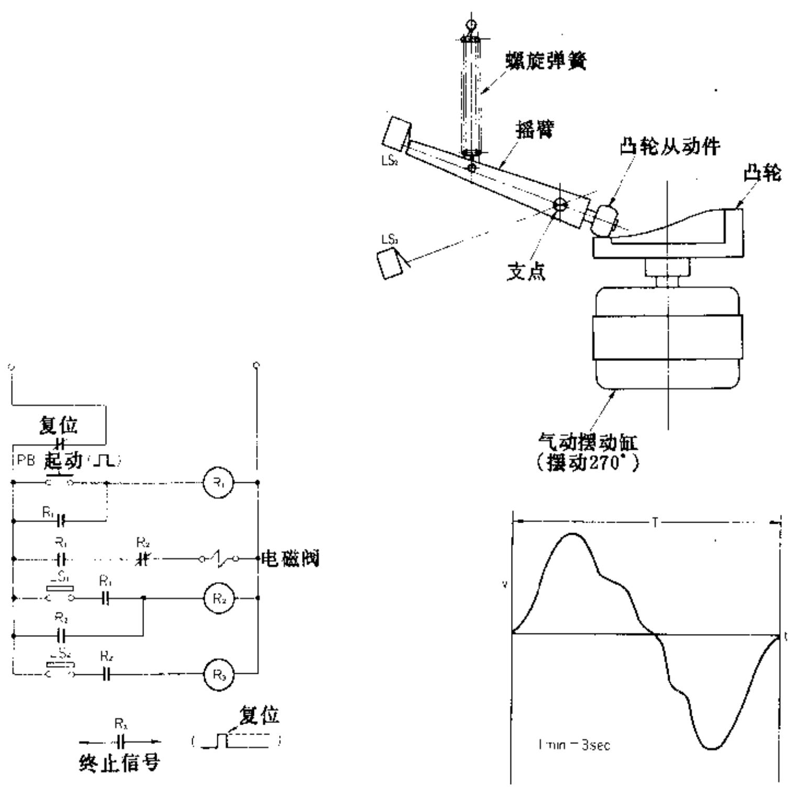  
图3-53动力：气压动作角度： $0 ^ { \circ } \sim 3 0 ^ { \circ }$ 载荷：轻

图3-53是通过摆动 $2 7 0 ^ { \circ }$ 的气动摆动缸和凸轮的任意变速摆动运动机构。

本机构由于仅向一侧采用强制传动，另一侧是依靠螺旋弹簧返回的，所以周期时间不能太短，凸轮的形状要合理。仅适用于重量较轻的工件。

# 设计、制造要点

1．因为摆动缸的回转角是 $2 7 0 ^ { \circ }$ ，所以凸轮的形状设计，必须在 $2 7 0 ^ { \circ }$ 的范围内，使动作吻合。

2．由于摆动运动的往复曲线相同，若在气动系统中加入速度调节器来调节速度，在返回时，即能补偿摇臂对凸轮的从动程度。

3．凸轮从动件要装入滚动轴承。凸轮与从动件用润滑脂润滑。必须注意摆动部分的质量与螺旋弹簧的平衡，螺旋弹簧稍强一些为好。

# 其 它

参阅附录一第2类控制回路。

# 摆动缸和杠杆快速返回摆动运动机构

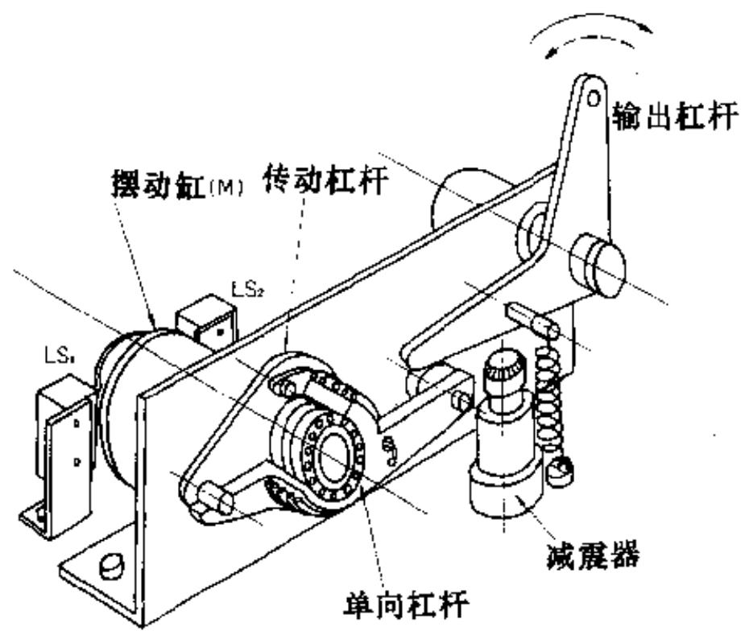

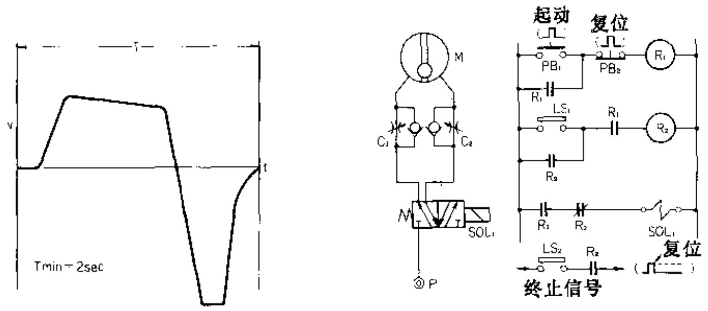  
图3-54动力：气压动作角度： $0 \mathrm { \Omega } ^ { \mathrm { 5 } } \sim 6 0 \mathrm { \Omega } ^ { \mathrm { 5 } }$ 载荷：轻

图3-54是由摆动缸和杠杆组成的快速返回摆动运动机构。本机构适用于较轻的载荷，输出杠杆利用弹簧快速返问。传动杠杆通过轴承和扭簧与单向杠杆连接，顺时针回转时，由销子带动单向杠杆，并由单向杠杆上的滚子，使输出杠杆回转一定角度，当输出杠杆与滚子脱开时，即通过弹簧返回。传动杠杆回转到压动LSi后，开始反转，当滚子碰到输出杠杆时，单向杠杆退让，使滚子回到输出杠杆下面的位置。因此，如速度特性曲线图所示，在起动时，输出杠杆的动作产生了由于单向杠杆退让所必须的行程引起的时间差。

设计、制造要点

由于本机构冲击大，必须有与载荷相适应的简单减震器。对于传动杠杆上的销子，要考虑有足够的强度，应尽可能进行热处理

使用实例

排出装置、定程器等的传动装置，

# 其 它

参阅附录一第2类控制回路。

# 调速凸轮任意变速摆动运动机构

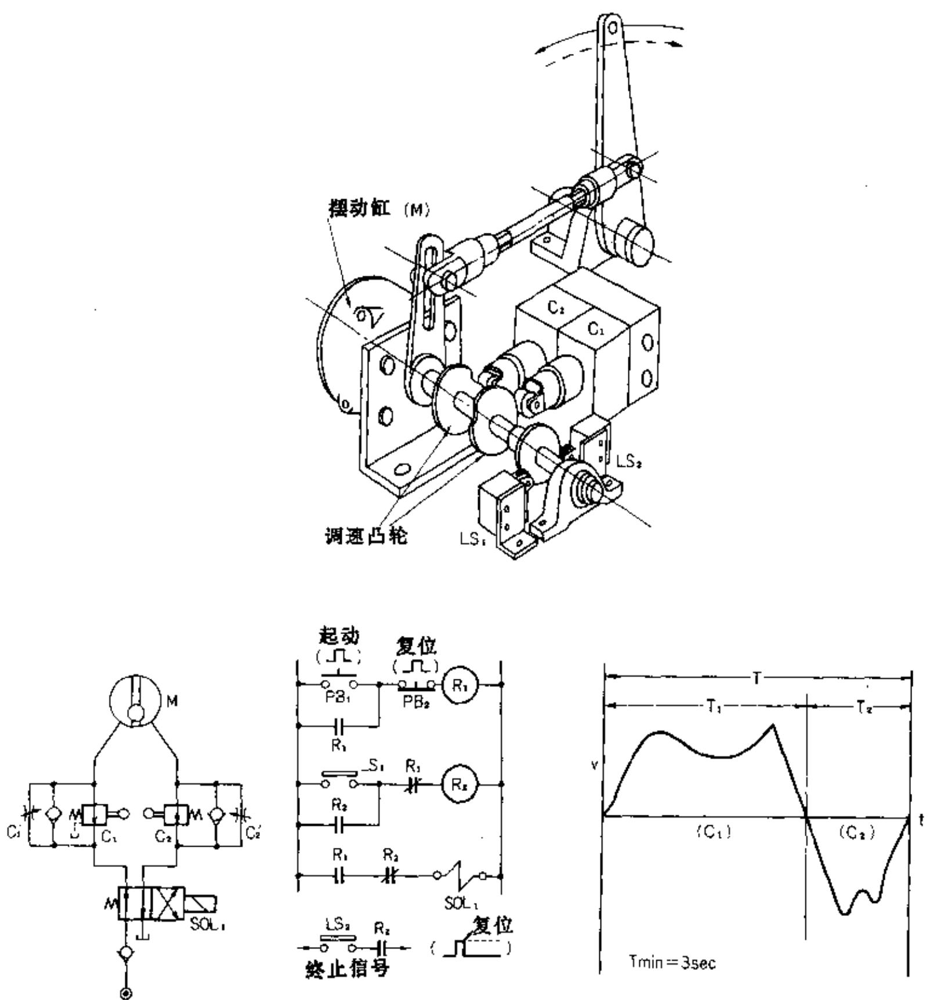  
图3-55动力：液压动作角度： $0 ^ { \circ } \sim 6 0 ^ { \circ }$ 载荷：中

图3-55是利用调速凸轮的任意变速摆动运动机构。本机构是由图2-120机构变化过来的，它把调速凸轮安装在摆动传动轴上，因此，可以认为控制系统比图2-120机构较难调整.实际上大多用于摆动速度控制要求比较简单的场合，具有可以任意调节速度的优点。

设计、制造要点

如上所述，必须考虑调节凸轮安装和修整等工作的方便，可采用拼合式凸轮等方法。另外，在采用这种机构时，还要考虑摆动角度调整的方便。

使用实例

擒纵机构、破碎机等的传动装置。

# 摆动缸和带滑块杠杆的两端减速摆动运动机构

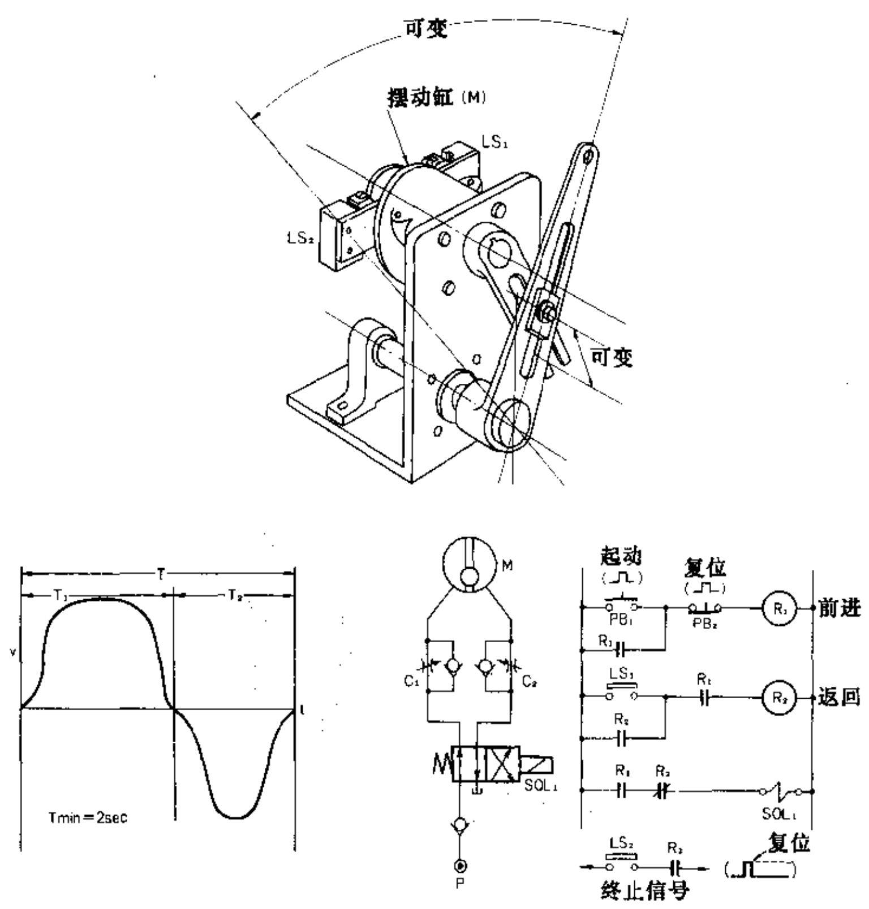  
图3-56动力：液压动作角度： $0 ^ { \circ } \sim 9 0 ^ { \circ }$ 载荷：中

图3-56是由摆动缸通过带滑块的传动杠杆，带动从动杠杆的两端减速摆动运动机构。本机构在摆动缸的摆动角为 $1 8 0 ^ { \circ }$ 时，能得到两端减速的最大效果，由于此角度越小，则两端减速效果越差，所以原则上以 $1 8 0 ^ { \circ }$ 作为摆动缸的摆动角。从动杠杆的摆动角度随传动杠杆长度的改变而改变。也可采用气压作动力，但不

要使速度太快为好。

设计、制造要点

此机构由于使滑块滑动，所以容易发生松动，不适用于要求很精密的场合。希望用于摆动位置稳定的某种操作时，必须另加定位或卡紧机构。

# 使用实例

必须进行可变调整的送出机构等的传动部分。

# 其 它

参阅附录一第2类控制回路。

# 摆动缸和凸轮的三位摆动运动机构

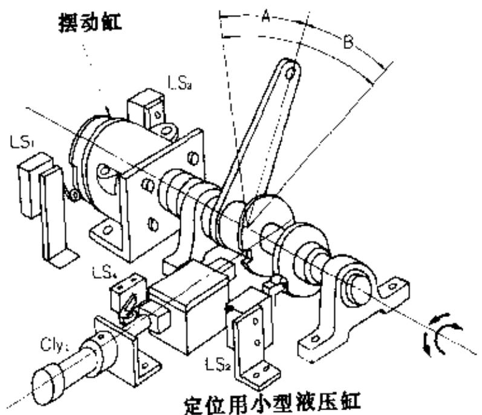

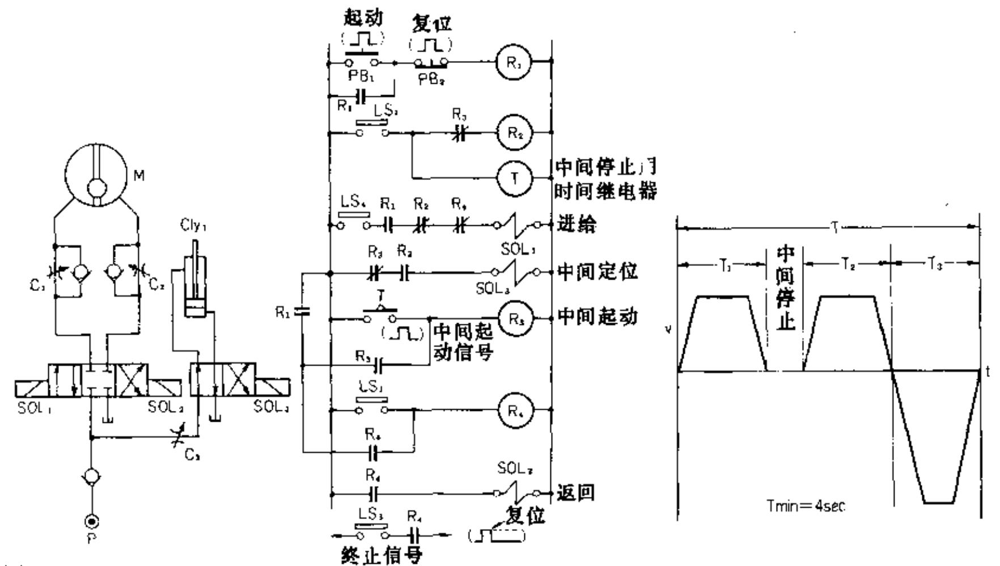  
图357动力：液压动作角度：0\~90载荷：中

图357是由摆动缸通过凸轮控制的三位摆动运动机构：本机构用于往复式传送装置，能简单地进行三个位置的操作。在实际设计时，用作简单操作的辅助传送装置较为合适。原则上在摆动缸的一端进行两端位置的定位，必要时也可用小型液压缸（CIy；）进行两端定位。

# 设计、制造要点

本机构以一定的速度移动，速度不能太高。在两端必须卡紧时，需另加卡紧装置，或使SOL,, $\mathbf { S O L } _ { 2 }$ 常通：设计时要考虑到摆动缸的内部泄漏比一般液压缸要大。

# 使用实例

简易传送装置，辅助传送装置等的传动装置。

# 其 它

参阅附录一第4类控制回路。

# 摆动缸和扇形齿轮等速摆动运动机构

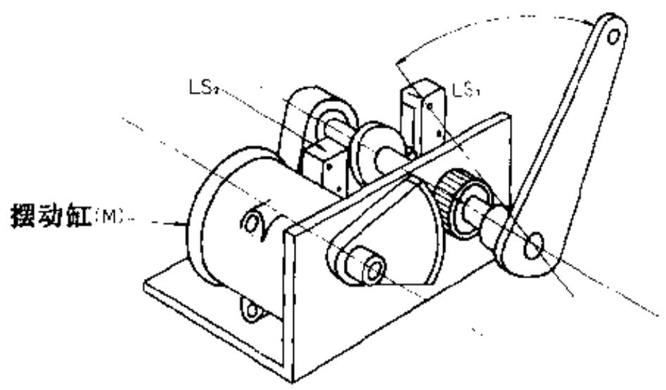

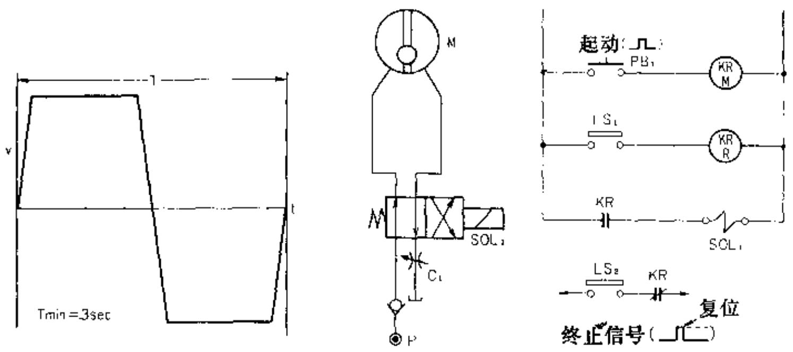  
图3-58动力：液压动作角度： $0 ^ { \circ } \sim 3 6 0 ^ { \circ }$ 载荷：中

图3-58是利用摆动缸进行摆动运动这类机构的基本形式之一。与直接安装摇臂的方法一样，其载荷和摆动角度是一般的。也可采用气压为动力，此时在两端的定程器上要带有缓冲器。

设计、制造要点

如果有必要，用可调式节流阀 $( \mathbf { C } _ { 1 } )$ 进行往复摆动速度的调整，一般采用出口节流式回路较好。因为在扇形齿轮的两端有冲击，所以采用大的齿轮模数较安全。在键等的连接处，也要考虑防止冲击的影响。本机构的电气原理图，因为动作终止信号不能复位，所以可以用作原位置标示，其起动信号幅度，必须不小于保持型继电器（KR）能够动作的最小幅度。此原理图也可以用于一般的电路。

# 使用实例

滑槽的选别机构等。

其 它

参阅附录一第1类控制回路。

# 凸轮锤机构

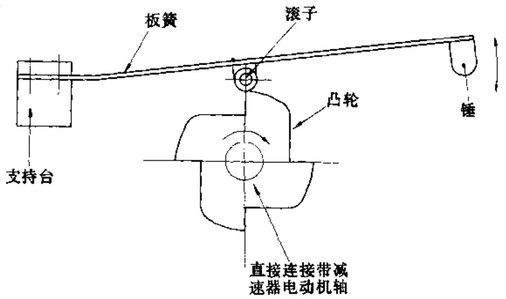

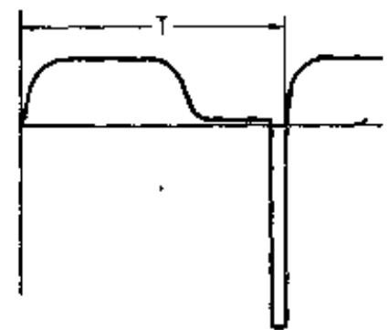  
$\mathsf { T } _ { \mathtt { m i n } } = 0 .$ 5sec

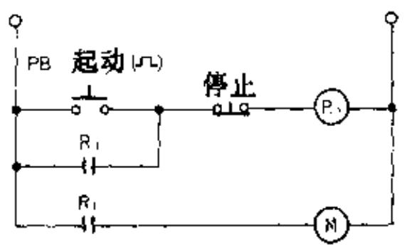  
图3-59动力：电气动作角度： $0 ^ { \circ } \sim 2 0 ^ { \circ }$ 载荷：轻

图3-59是由凸轮带动的摆动锤机构。凸轮具有四处凹部，板簧可靠地固定在支持台上，在板簧的前端，安装具有适当重量的锤，在板簧中部安装滚子，滚子由于凸轮的回转而动作，当到达凸轮的切凹部分时，靠板簧的弹力而返回，使锤动作。

使用板簧的机构不能太大。

# 设计、制造要点

1．板簧要进行整体的热处理。  
2．设计时应考虑防止因板簧的弹簧特性、长度、前端锤重量、每秒动作次数等因素引起共振。  
3．滚子应能回转。为防止板簧沿固定部分安装处断裂，可在上下垫以夹层。  
4．从动滚子及凸轮要热处理。

# 其 它

参阅附录一第1类控制回路。

# 凸轮摆动运动机构

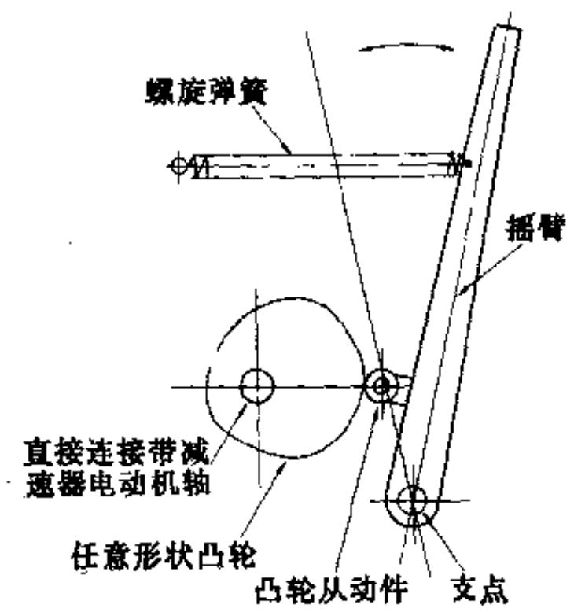

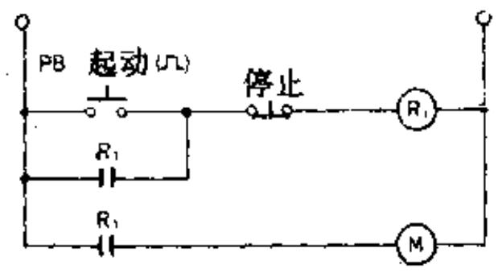

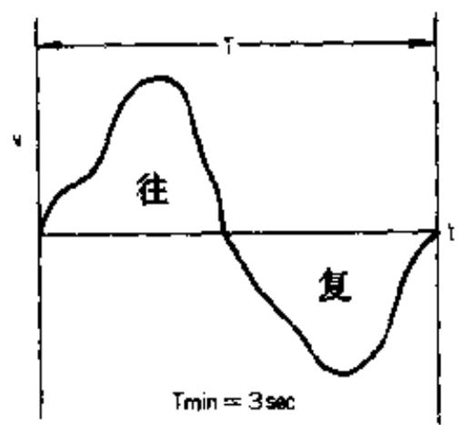  
图3-60动力：电气动作角度： $0 ^ { \circ } \sim 3 0 ^ { \circ }$ 载荷：轻

设计、制造要点

1．凸轮从动件使用滚动轴承，其它回转部分，也尽量使用滚动轴承。

图3-60是通过任意形状的凸轮带动的摆动运动机构。如图所示，依靠弹簧使摇臂从动于凸轮的机构存在一定的缺点，即周期时间不能太短，在加强弹簧以后，又会产生凸轮和凸轮从动件的磨损，以及动作不稳定等。对此，如果设计合适，恰当地考虑凸轮的设计、载荷的确定、可动部分质量的减轻、螺旋弹簧的平衡等，作为简单的摆动机构，还是可靠的。

2．凸轮的形状在动作合理的范围内可自由地选择。要注意摆动角过大，凸轮和凸轮从动件的接触处就会发生干涉，并产生其它问题。

3.要注意可动部分的质量与螺旋弹簧的平衡。另外，螺旋弹簧伸长时和缩短时的长度比，要设计得尽可能小。

# 其 它

参阅附录一第2类控制回路。

# 双凸轮摆动运动机构

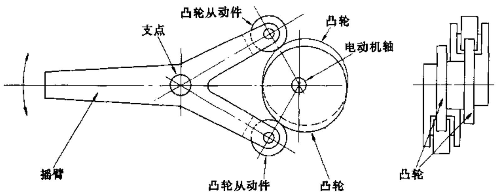

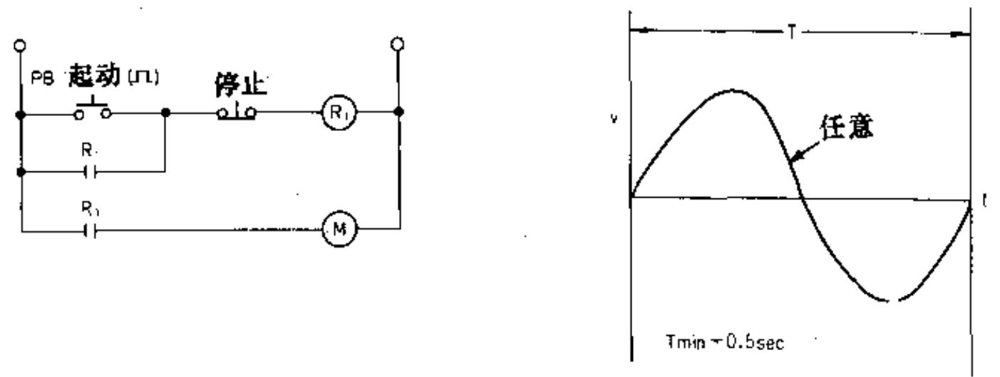  
图3-61动力：电气动作角度： $0 ^ { \circ } \sim 3 0 ^ { \circ }$ 载荷：中

图3-61是由两个相位错开的凸轮，使两个滚子从动的强制摆动运动机构。凸轮的设计稍有些麻烦，但与单侧采用拉伸弹簧的凸轮机构及导引凸轮机构比较，具有间隙小、凸轮工作部分是滚动的、而且高速响应性好等的特征，优点较多。不言而喻，如果改变凸轮的曲线，也可以进行快速返回和暂时停止等动作。

# 设计、制造要点

1。两个从动件的位置相对凸轮回转中心的角度不能太小（图中所示约 $1 2 0 ^ { \circ }$ )。此角度的最小限度大致为 $9 0 ^ { \circ }$ ,小于此数，则不仅摆动振幅不大，而且动作也容易不稳定。

2。装配尺寸设计得不精确，间隙就大，动作甚至不能完成，要加以注意。

3．滚子、凸轮等要淬火。

# 其 它

参阅附录一第1类控制回路。

# 十字轮中间停止摆动运动机构

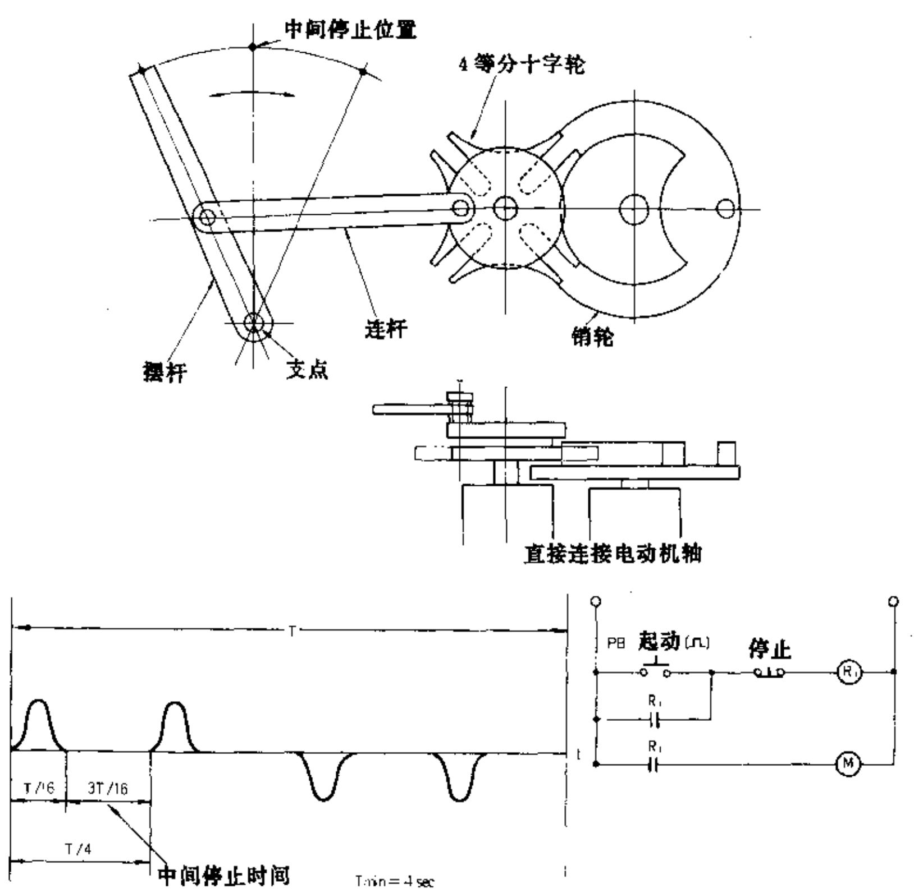  
图3-62动力：电气动作角度： $0 ^ { \circ } \sim 4 0 ^ { \circ }$ 载荷：轻

图3-62是利用直接连接在电动机轴上的销轮，使十字轮回转和中间暂时停止的摆动运动机构。如速度曲线所示，使一个周期的摆动动作时间和停止时间之比为1;3，并且由前进二个动作和返回两个动作共四个动作组成。因此,销轮回转四次摆杆完成一个周期的摆动。如果提高十字轮和销轮的制动精度，则可得到相当好的动作重复性，而且运动特性也能大致上接近两端减速的理想特性。

# 设计、制造要点

1。必须提高十字轮和销轮的加工精度，整体进行热处理。如果可能，销轮的传动销应能转动，最好使用轴承。

2．连杆、摆杆的铰接部分如使用轴承，则更好，如使用轴套，需有润滑给油机构。

3.十字轮的滑动部分用润滑脂润滑，要注意销轮制动器的耐磨性。

# 其 它

参阅附录一第1类控制回路。

# 三角凸轮快速返回摆动运动机构

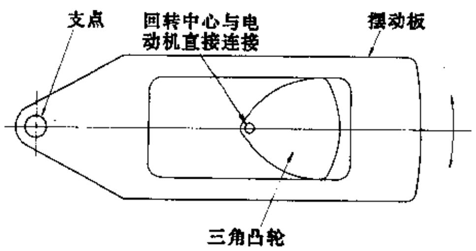

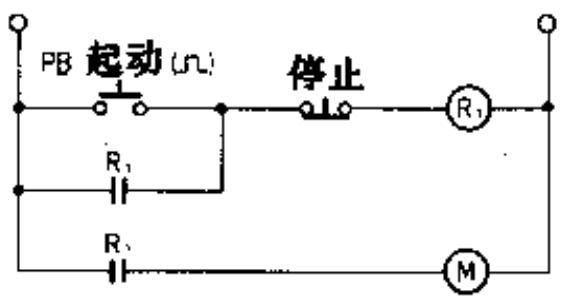  
图3-63动力：电气动作角度： $0 ^ { \circ } \sim 4 5 ^ { \circ }$ 载荷：轻

图3-63是由三角凸轮与电动机直接连接的快速返回摆动运动机构。

在一个周期中，于摆动凸轮两端，有两处大约各有 $\pi / 6$ 的停止时间。摆动动作开始时，速度稍减，此减速取决于三角凸轮的三个角的R的大小，R越大，减速也越大。由于滑动部分范围比较宽的关系，故对太高的速度以及往复频率较高的场所不适用。

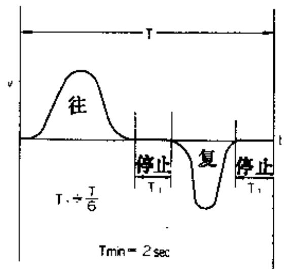

# 设计、制造要点

1.三角凸轮与轴的连接处要有足够的强度。但是这部分如果太大，则如前所述角的R就大 (极大时，三角形近于圆形),摆动动作开始时的减速太过分，动作就没有陡度了。

2.三角凸轮及摆动板上凸轮进入孔的表面要淬火，以充分提高硬度，并要用润滑脂润滑。

3．三角凸轮尽可能设计厚些为好。

# 其 它

参阅附录一第1类控制回路。

# 心形凸轮等速摆动运动机构

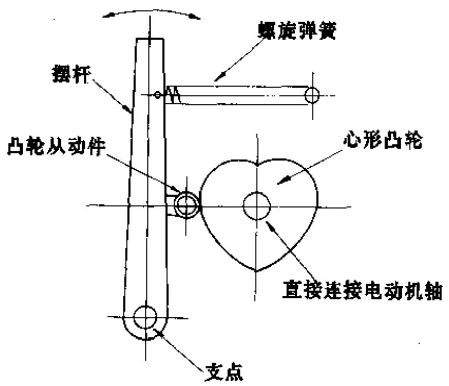

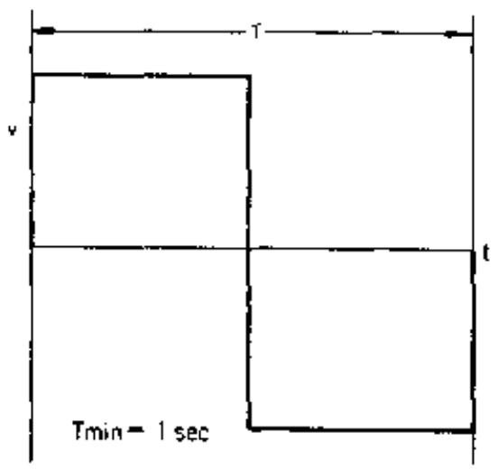  
图3-64动力：电气动作角度： $0 ^ { \circ } \sim 4 5 ^ { \circ }$ 载荷：中

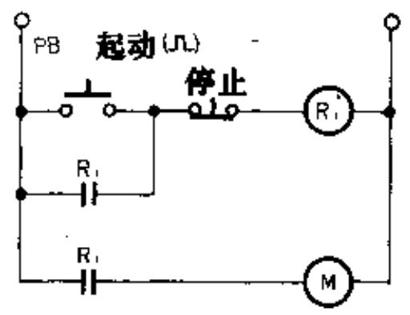  
图3-64是通过心形凸轮的往复等速摆动运动机构。

# 设计、制造要点

1.要充分考虑凸轮和凸轮从动件的热处理及铰接处的耐久使用性能。

摆杆是通过螺旋弹簧返回的，所以速度不能太快。尽可能减轻可动部分的质量，并配以适当强度的弹簧，可以得到良好的动作。

本机构在由回转到摆动的这类转换机构中，可以说是一种比较简单的往复等速摆动运动机构。

2，返回用的螺旋弹簧如弹性太弱，则从动件在凸轮上就不能完全从动，而产生跳动现象；反之，如弹性太强，则动作不平稳，且磨损较快。对于载荷、摆杆的惯性、重量等，在设计时要充分研究。

使用实例

绕线机排线杆的传动等。

其 它

参阅附录一第1类控制回路。

# 十字轮两端减速摆动运动机构

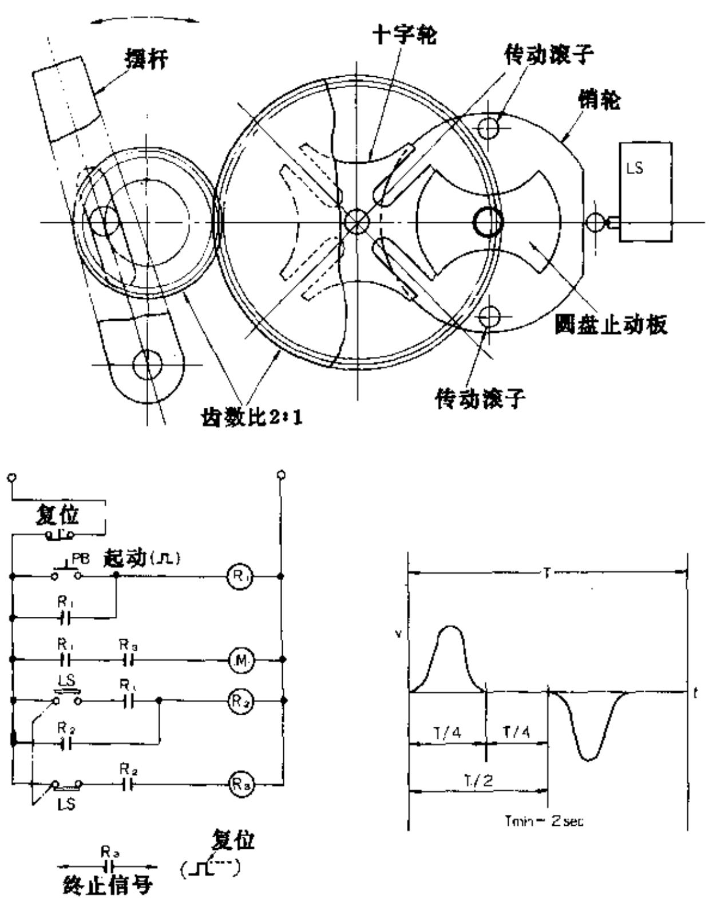  
图3-65动力：电气动作角度： $0 ^ { \circ } \sim 6 0 ^ { \circ }$ 载荷：轻

图3-65是由十字轮机构和曲柄机构组合的带有暂时停止的摆动运动机构。

四等分的十字轮每次的回转角为 $9 0 ^ { \circ }$ ,此回转角由齿轮增速一倍，使摆杆的摆动运动进行1/2 个周期。在暂时停止之后，销轮的另一个传动滚子使余下的1/2个周期完成。图示的情况是综合了卜字轮机构和曲柄机构两端减速效果较好的结构。

如使齿数比为1:1,则形成中间停止。这时，销轮回转一次，摆动运动仅进行1/2个周期动作即终止，电气原理图需稍加改变。

# 设计、制造要点

1．要特别注意十字轮机构的材料、热处理、加工精度等。各轴承部分要有足够的强度。

2．摆杆的传动销与槽的间隙太小，将影响动作的灵活。应根据松动的允许范围，给以适当的间隙。

3.必须在各滑动部分设置润滑给油机构。

# 其 它

参阅附录--第2类控制回路。

# 曲柄摆动运动机构

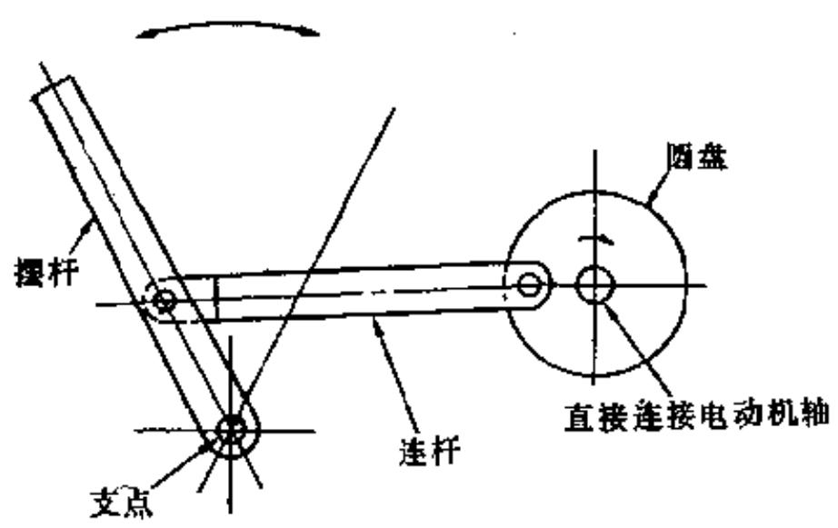

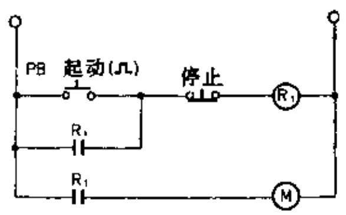

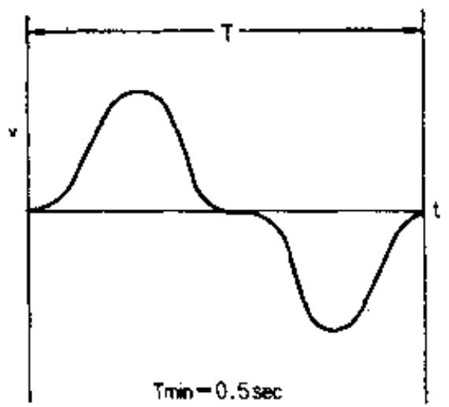  
图3-66动力：电气动作角度： $0 ^ { \circ } \sim 6 0 ^ { \circ }$ 载荷：中

图3-66是由回转运动转换为摆动运动的转换机构中，方法最简单、最一般的机构。

这时的运动特性为两端减速型。如图所示，曲柄圆盘是连续回转的，如果装设一次停止用的凸轮和限位开关，也就成为往复一次的摆动机构。当然，此时驱动电动机要使用伺服电动机或可逆电动机。

设计、制造要点

1．必须使曲柄圆盘具有足够的强度。

2，各回转部分最好使用轴承，如使用轴套，必须有润滑给油机构。可动部分质量的大小对机械的耐久性有很大的影响，所以要尽可能轻。

使用实例

一般机械等的摆动部分。

# 其 它

参阅附录一第1.类控制回路。

齿条、齿轮等速摆动运动机构

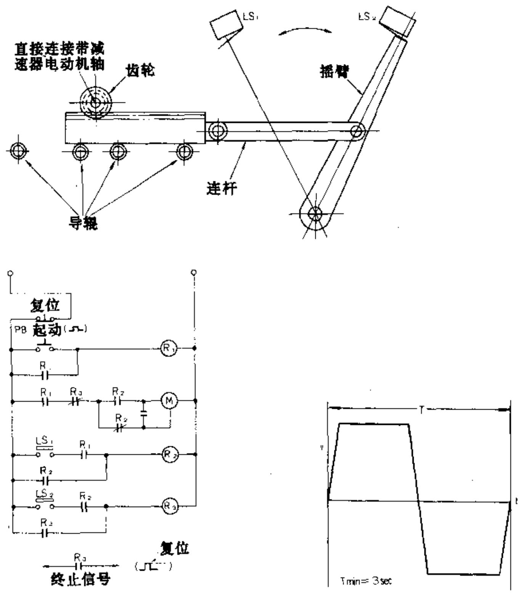  
图3-67动力：电气动作角度： $0 ^ { \circ } \sim 9 0 ^ { \circ }$ 载荷：轻

图3-67是由齿条、齿轮、连杆组成传动系统的等速摆动运动机构。为了使带减速器的可逆电动机进行反转，在摇臂的动作两端配置了两个限位开关，使电动机分别得到反转和停止的控制信号。由于此机构在动作两端的位置上多少存在误差，所以限位开关应安装成压上式，以防止损坏。

# 设计、制造要点

1．驱动电动机必须选择伺服电动机、可逆电动机等。因此在频繁地进行起动、停止、反转等过程中，不会产生发热等故障，而且停止性能也很好。

2．使用一般的感应电动机时，应增加反转用的齿轮系统与电磁离合器合用，即可完成同样的动作。

3．要注意限位开关相对于执行机构的安装位置和方向。设计时还要注意齿条前进方向的导向。

# 其 它

参阅附录一第2类控制回路。

# 扇形齿轮摆动运动机构

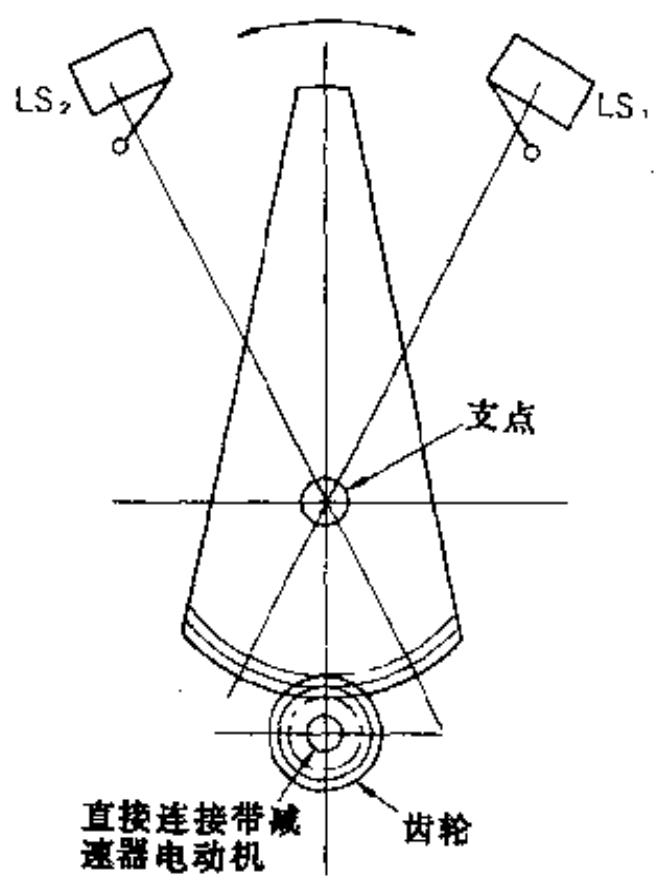  
图3-68是由可逆电动机、齿轮、扇形齿轮组成的摆动运动机构。

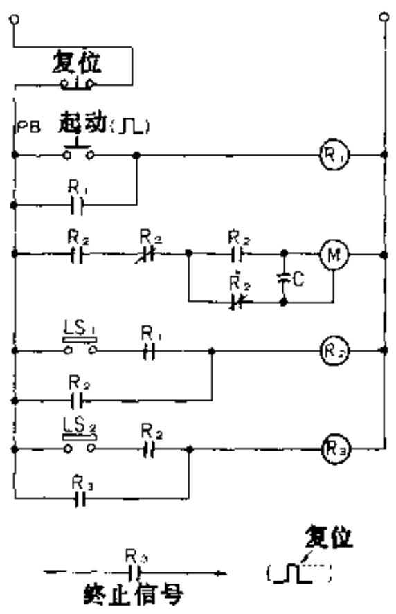

如图所示，把扇形齿轮的中心作为摆动运动的支点，将扇形齿轮的另一侧作较大的延伸，即成为摇臂。摆动动作两端的限位开关装成上压式，可以使用滚子铰接式的限位开关，以免由于摆动两端位置的误差，使限位开关损坏。

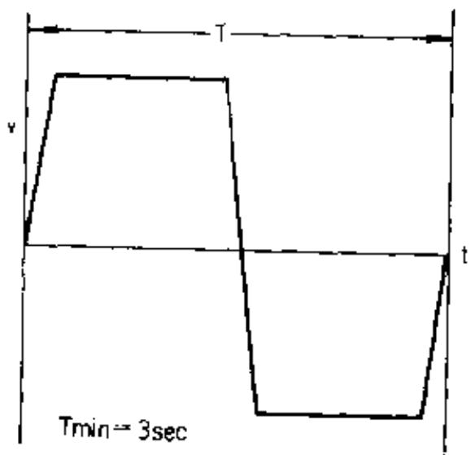  
图3-68动力：电气动作角度： $0 ^ { \circ } \sim 9 0 ^ { \circ }$ 载荷：中

本机构的运动特性为等速的往复运动。

# 设计、制造要点

1．驱动电动机要选择能在起动、停止、反转频率较高时使用的伺服电动机，或可逆电动机。

2．如果对一般电动机采用反转方法，即加入反转齿轮及电磁离合器来转换，也是可以的。

3．要注意限位开关的安装位置和方向，以及执行机构的种类。

# 其 它

参阅附录一第2类控制回路。

# 曲柄快速返回摆动运动机构

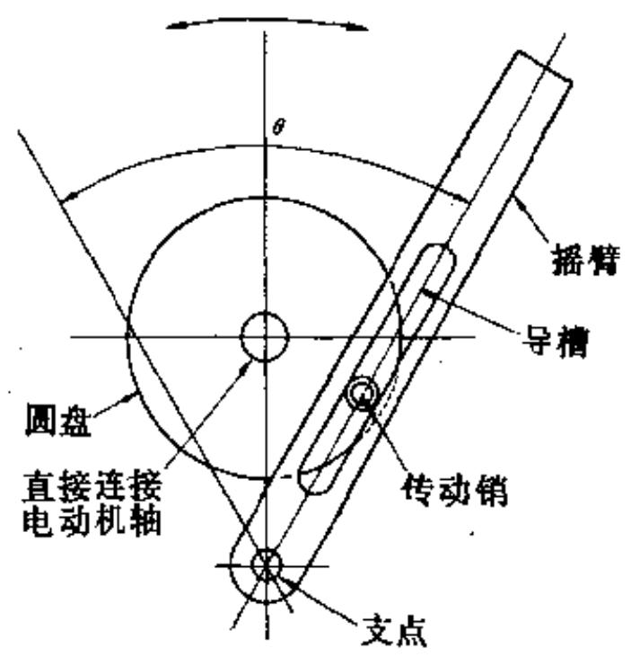

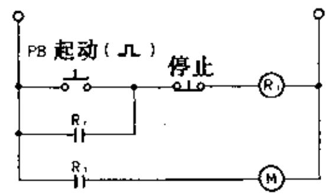  
图3-69动力：电气动作角度： $0 ^ { \circ } \sim 9 0 ^ { \circ }$ 载荷：中

图3-69是通过曲柄动作的快速返回摆动运动机构。由此机构能得到较平滑的运动曲线及合适的动作。如果减轻图中可动部分的质量，能适应高速运动。

快速返回的比率取决于摆动角，可由下式求出：

快速返回时间 ${ \sf T } _ { 1 } = \frac { { \mathrm { ~ T ~ } } ( 1 8 { \sf 0 } ^ { \mathrm { ~ \bar { ~ } - ~ \underline { { ~ \theta ~ } ~ } } } ) } { 3 { \sf 6 } { \mathrm { 0 } } ^ { \mathrm { ~ \bar { ~ } - ~ \bar { ~ } ~ } } }$ 式中摆动角；T—一摆动一次往复所需的时间。

# 设计、制造要点

1．传动销的轴承部分，要考虑耐磨性，可使用滚动轴承。  
2．摇臂的导槽也容易磨损，所以要用可以淬火的材料制成，硬度必须在HRC50以上。  
3．如果减轻图中可动部分的质量，周期时间可大大缩小，此时，要注意传动销的强度。

# 其 它

参阅附录一第1类控制同路。

# 端面槽形凸轮摆动运动机构

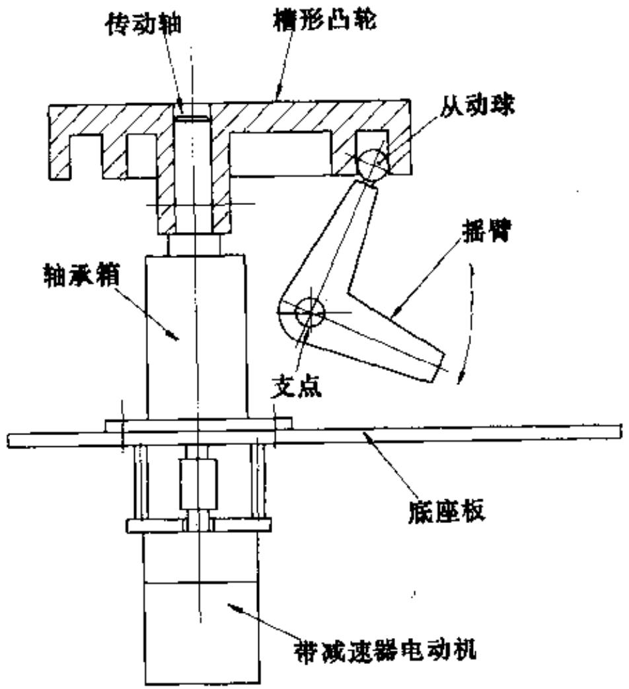

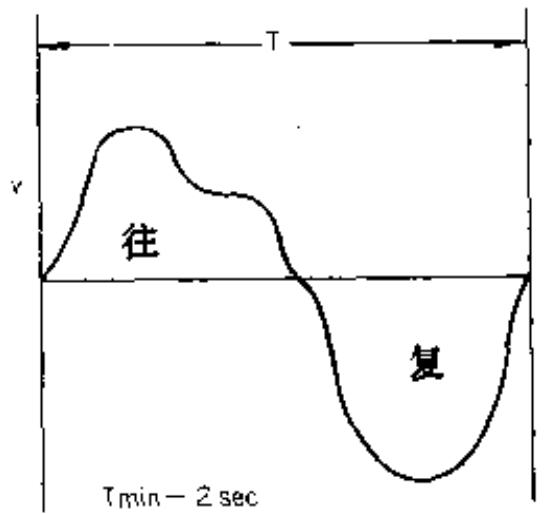  
图3-70动力：电气动作角度： $i ^ { \circ } \sim 9 0 ^ { \circ }$ 载荷：中

图3-70是利用偏心或任意曲线圆板槽形凸轮的摆动运动机构。

如图所示，在几个适当的位置上配置摇臂，能进行各自相位不同的摆动运动。

采用偏心凸轮时，制造容易，运动曲线平滑，性能较好。采用任意曲线凸轮时，若使曲线变化过大，则动作不合理，且机械耐久性不好。

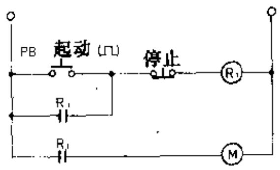

# 设计、制造要点

1．因为圆板凸轮槽的内表面要有足够的硬度，所以要特别注意选择材料和进行热处理。

2，球形从动件的轴承部分，如使用滚动轴承，则耐久性提高。

3.球的材料用高碳含铬轴承钢，硬度必须在 ${ \mathrm { H R C } } \ 6 0 \ { \mathrm { \hat { \Omega } } }$ 以上。凸轮槽与球的间隙要适当，间隙过小会使动作不合理，从而引起球或凸轮槽内壁的损伤。

# 其 它

参阅附录一第1类控制回路。

# 曲柄与齿条、齿轮快速返回摆动运动机构

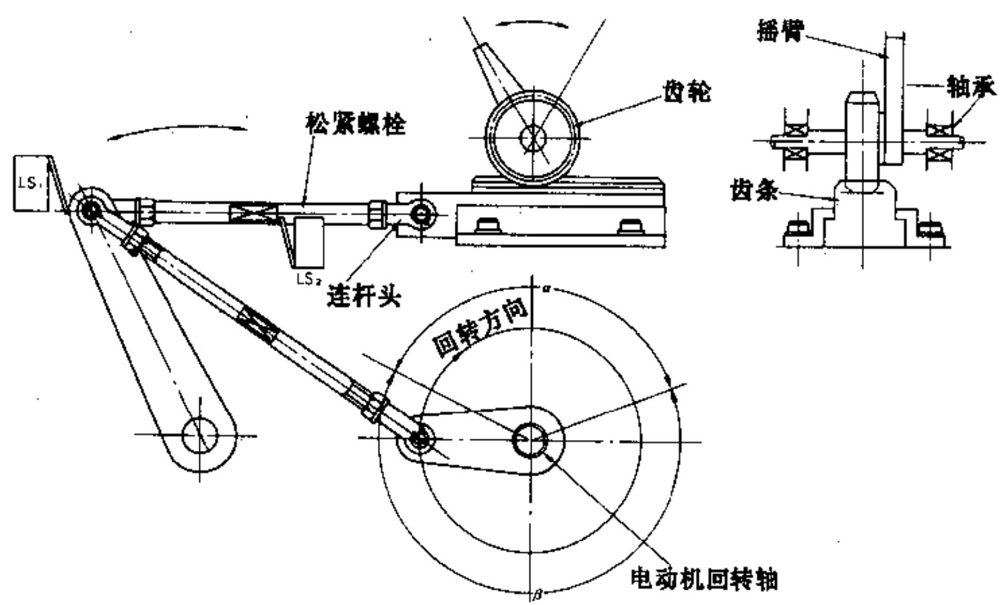

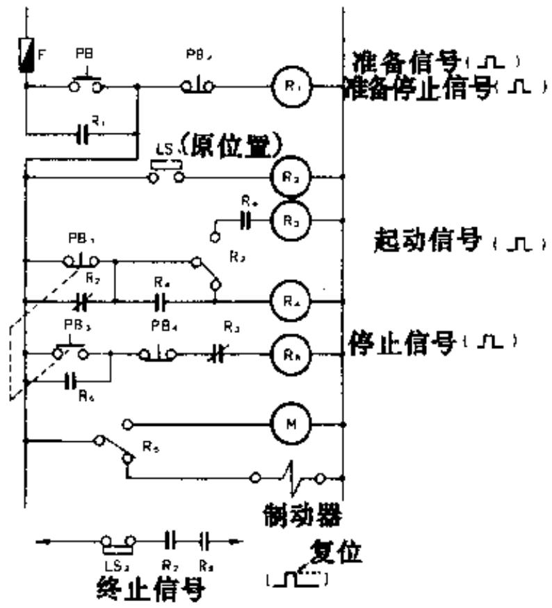  
图3-71动力：电气动作角度： $0 ^ { \circ } \sim 1 2 0 ^ { \circ }$ 载荷：轻

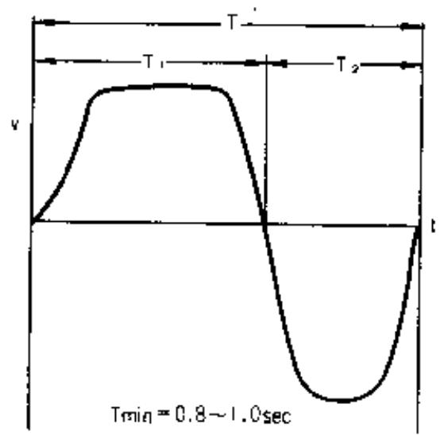

图3-71是由连接于电动机轴上的曲柄，通过连杆、摆杆、齿条使齿轮轴摆动的机构。此时，齿轮轴逆时针方向回转得慢，顺时针方向则快，形成所谓快速返回机构。

设计、制造要点

各支点和轴承部分使用滚动轴承。连杆使用松紧螺栓，以便于调整。

# 蜗轮付摆动运动机构

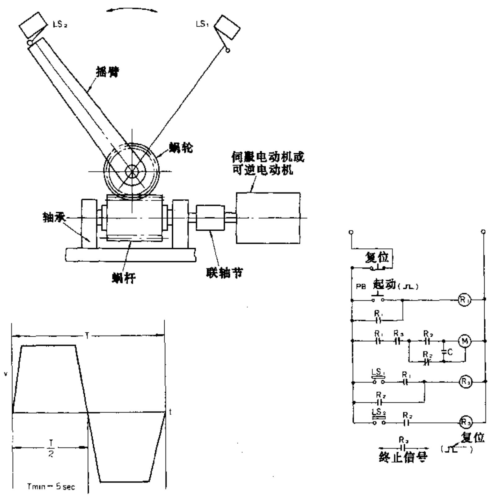  
图3-72动力：电气动作角度： $0 ^ { \circ } \sim 1 8 0$ □载荷：重

图3-72是由可逆电动机和蜗轮付组合而成的摆动运动机构。其运动特性是等速型，在摆动运动的两端，配置两个反转和停止用的限位开关，使之按顺序动作。

此机构的唯一缺点，是在摆动运动两端的转换位置，误差较大，因而，在两端位置的精度有要求时，此机构即不适用。

设计、制造要点

1，蜗杆和蜗轮的轴向支承要使用推力轴承。

2．蜗杆和蜗轮采用强制润滑较理想，用油槽润滑也可以。限位开关的执行件采用滚子式的，要注意其安装位置。

3．采用伺服电动机或可逆电动机等较好。对一般电动机采用反转齿轮和电磁离合器配合转换，也可取得同样的效果。

# 其 它

参阅附录一第2类控制回路。

# 固定凸轮和曲柄摆动运动机构

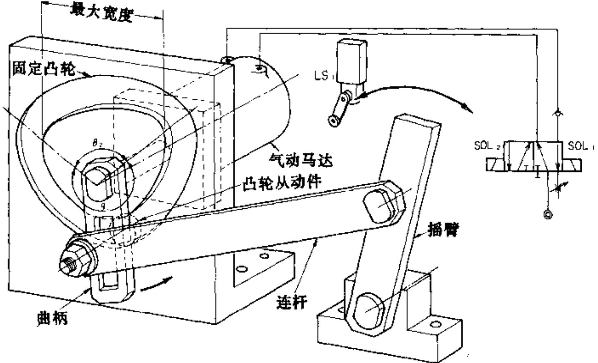

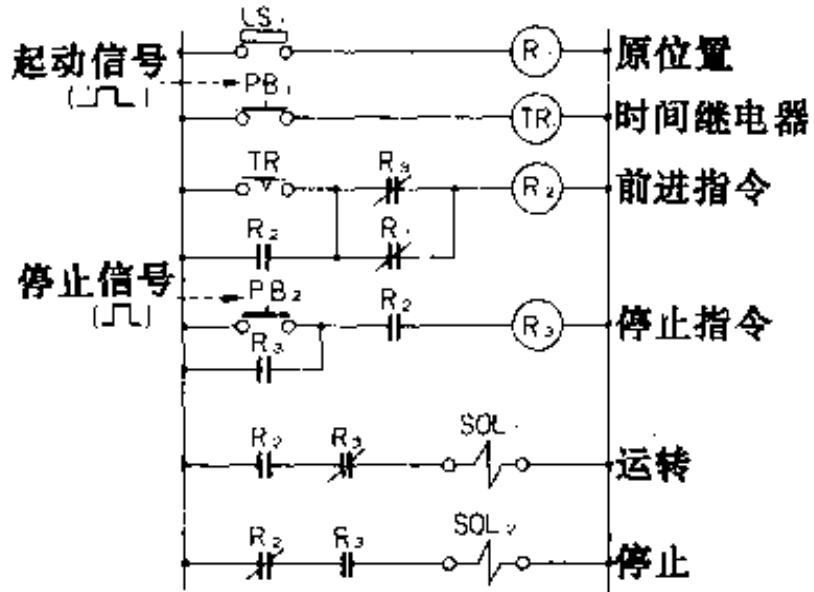  
图3-73动力：气压动作角度： $0 ^ { 5 } \sim 9 0 ^ { \circ }$ 载荷：中

图3-73是在希望得到往复速度不同的连续摆动运动时使用的机构。也可以用电动机驱动，但在要求过载停止的场合，还是使用气动马达较易处理。

由曲柄使凸轮从动件沿着固定凸轮回转，通过连杆使摇臂摆动，固定凸轮的 $\displaystyle \mathfrak { g } _ { 1 } \colon \mathfrak { g } _ { 2 }$ 形成往复时间的比 ${ \mathrm { \bf T } } _ { 1 } \colon { \mathrm { \bf T } } _ { 2 }$ 。周期时间受凸轮从动件的允许转速和凸轮的最大倾斜角的限制，设凸轮的最大宽度为100毫米时，则最小周期时间约为0.2秒 $\displaystyle \vartheta _ { 1 } : \vartheta _ { 2 }$ 值越小，周期时间就越短。

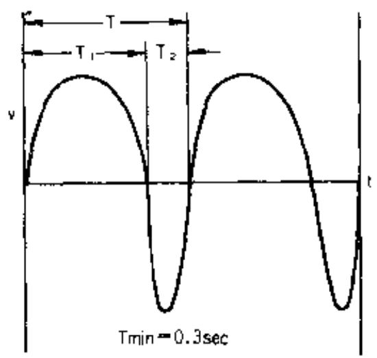

# 设计、制造要点

1。对凸轮从动件的选择，要注意到它的问转速度相当快这-特点。

2，要考虑到当过载而产生卡死时，机构各部分的强度，在加上气动马达最大转矩时，也不会发生问题。

3．要求在原位置停止时(如图中电气原理所示),为了防止因惯性而使限位开关误动作，限位开关的压板要做的大些。但要注意，原位置幅度取得过大，停位精度是不高的。

使用实例搅拌装置等。

其 它

参阅附录一第3类控制回路。

# 偏心滚子和摆杆快速返回摆动运动机构

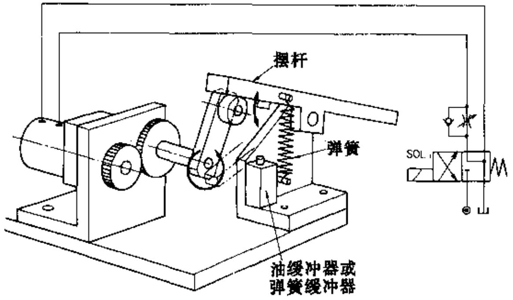

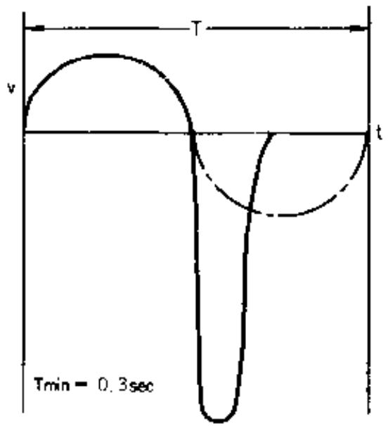  
图3-74动力：液压动作角度： $0 ^ { \circ } \sim 3 0 ^ { \circ }$ 载荷：轻

图3-74是利用偏心滚子和摆杆的快速返·回的摆动运动机构。由回转的偏心滚子使摆杆抬起。当偏心滚子脱开摆杆后，摆杆通过弹簧快速返回，并由油缓冲器吸收冲击而停止。当偏心滚子再次抬起摆杆时，摆杆重复上述的快速返回摆动运动。

# 设计、制造要点

1．偏心滚子使摆杆抬起的位置,应在下死点附近，这样可减小冲击。

PB，起动（） Pbi!i ? 运转指令 PB   
停止 运转

2．摆杆与偏心滚子的接触部分，应安装淬火的平板，这样对减少磨损有利。

3．摆杆正对油缓冲器的接触处，应镶一淬过火的销了。

4.缓冲器的缓冲作用过强，往往会减小摆动幅度。

5．为有效利用过载停止时液压的优点，应保证机构的强度在过载时不发生问题。

6。也可用气动马达代替液压马达。

使用实例局部搅拌装置等。

# 其 它

参阅附录一第1类控制回路。

# 丝杆和摇臂摆动运动机构

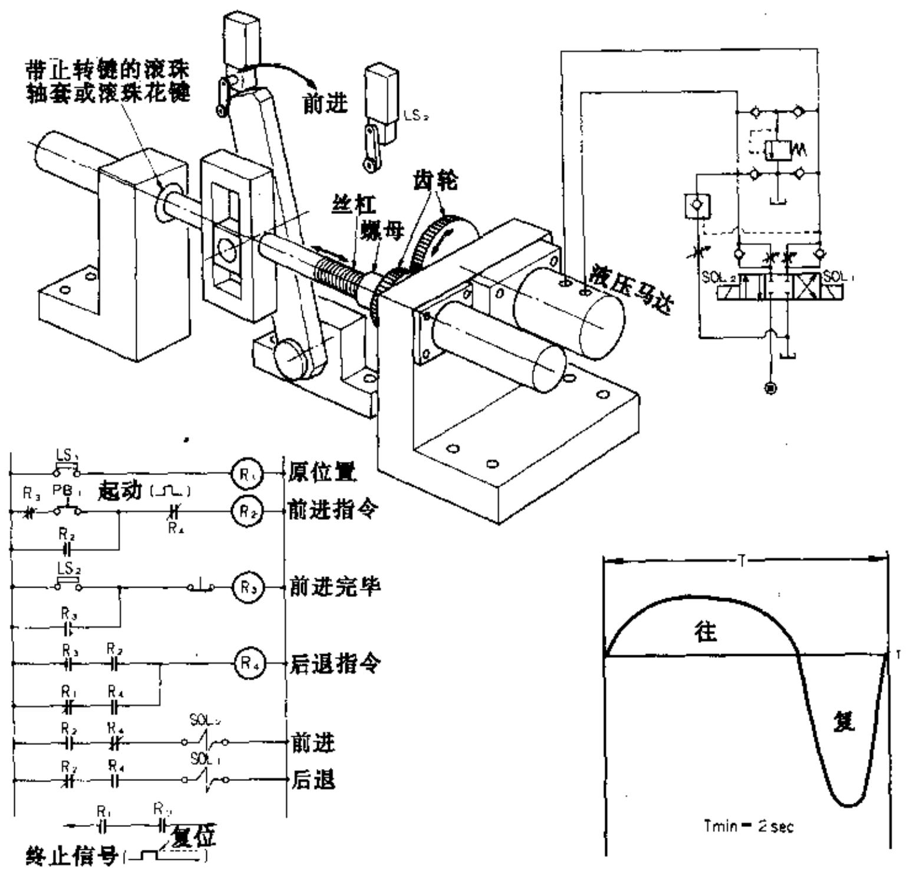  
图3-75动力：液压动作角度： $0 ^ { \circ } \sim 9 0 ^ { \circ }$ 载荷：中

图3-75是由液压马达通过齿轮传动螺母，使丝杆前后运动，带动摇臂作摆动运动的机构。通过节流阀，能使往复速度不同。速度的调节比较容易。

大致上在摆动角为60摇臂长为200毫米、丝杆行程为100毫米、摆动体的重量为2公斤时，最小周期时间为2秒左右。最高速度大多取决于丝杆和螺母的允许速度。

# 设计、制造要点

1．螺母应配置推力轴承等，应足以承受轴向载荷。

2．必须考虑各滑动部分的润滑。为安全起见，齿轮装入外壳为好，甚至丝杆也可装在外壳内，这时可采用油浴润滑。

3．采用滚珠丝杆时，如果导角能够自锁，即可锁紧或按压停止。

4．设计、制造时，必须注意螺母和滚珠轴套的同轴度。

使用实例

部件的夹紧、传送等。

其 它

参阅附录一第2类控制回路。

# 滚子支承圆弧板的摆动运动机构

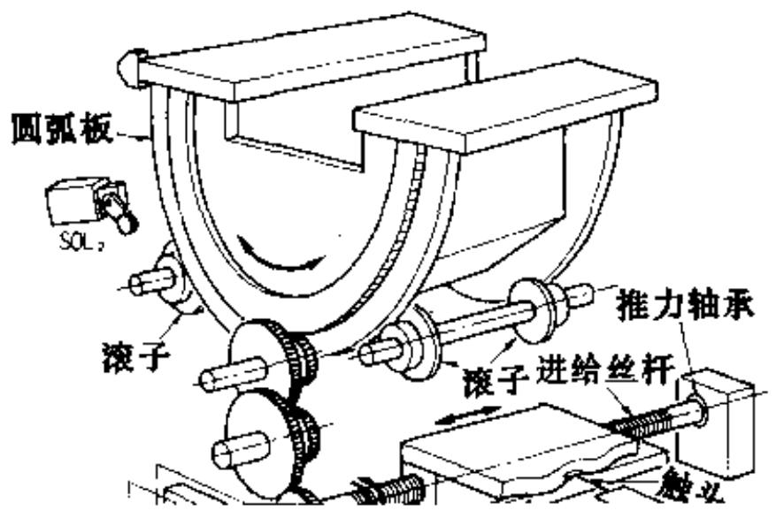

# 蜗杆摆动运动机构

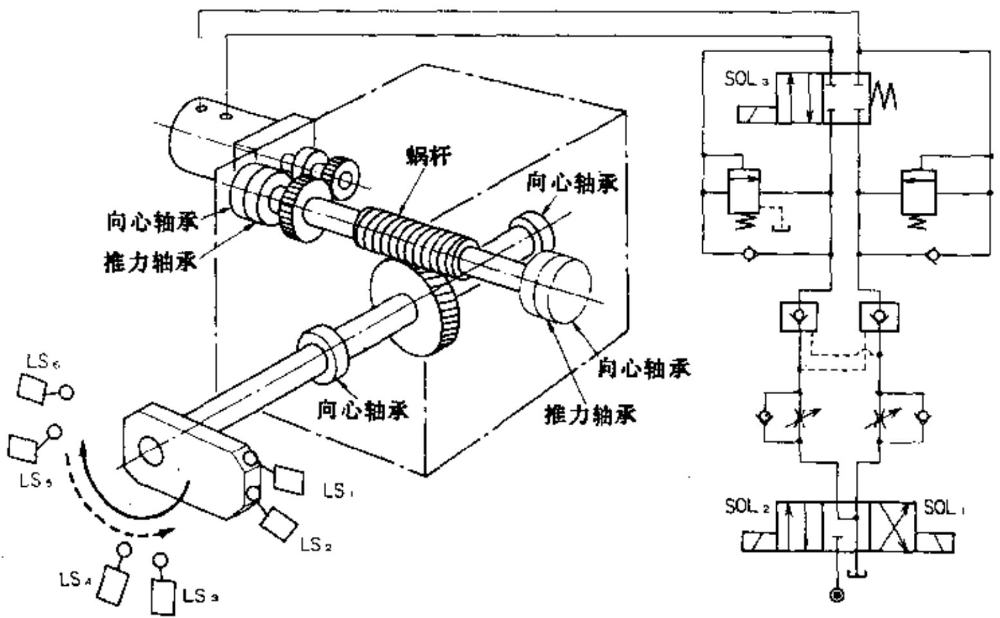

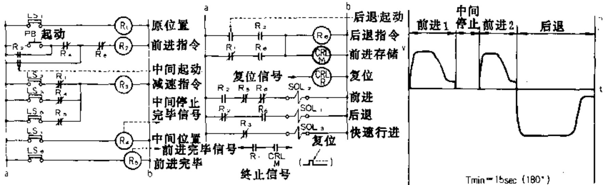  
图3-77动力：液压动作角度： $3 0 ^ { \circ } \sim 3 6 0 ^ { \circ }$ 载荷：重

图3-77是通过蜗杆减速，同时使液压马达减速并转换回转方向，然后传动从动轴的摆动运动机构。因载荷变化或方向改变所引起的速度变化较小：

# 设计、制造要点

1．当从动轴的载荷大、且载荷方向变动时，蜗杆传动的侧隙要小。

2．液压系统的减速是通过限位开关使得

$\mathbf { S O L } _ { 3 }$ 不激磁，并利用溢流阀来进行的，溢流阀的设定压力比供给压力高，可观察冲击和滑动距离而设定。

3，蜗杆轴及蜗杆的轴向必须做到完全无松动。

4，从动轴相对于蜗轮的圆周方向应无游隙(设计上应考虑用锥销固定）。

# 使用实例‘

用于工件的翻转等。使数十公斤的物体在没有平衡器的情况下回转，液压系统往往仍因载荷的急剧变动而发生跳动。

# 其 它

参阅附录一第4类控制回路。

# 滑块和连杆摆动运动机构

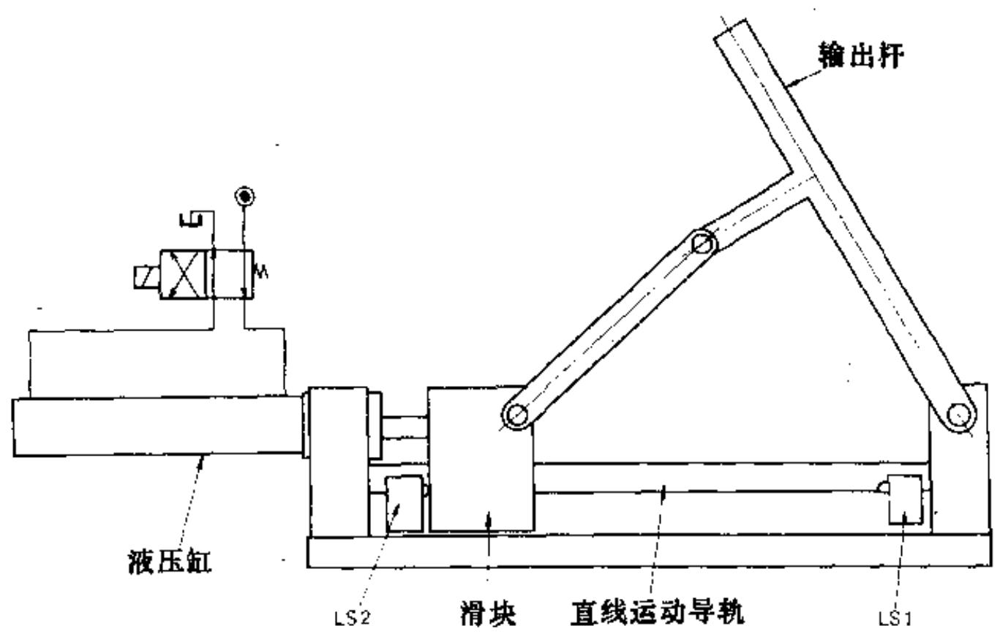

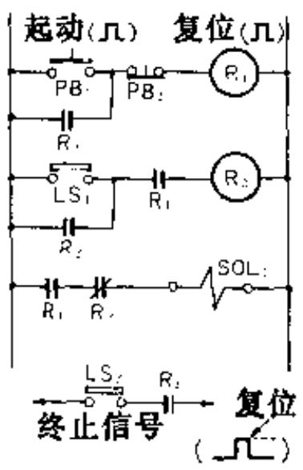  
图3-78动力：液压动作角度： $0 ^ { \circ } \sim 9 0 ^ { \circ }$ 载荷；中

图3-78是使连杆一端滑动的机构。通过各部分的长度比，可以形成完全的终端减速或不完全的终端减速。也可以在摆动运动的终端进

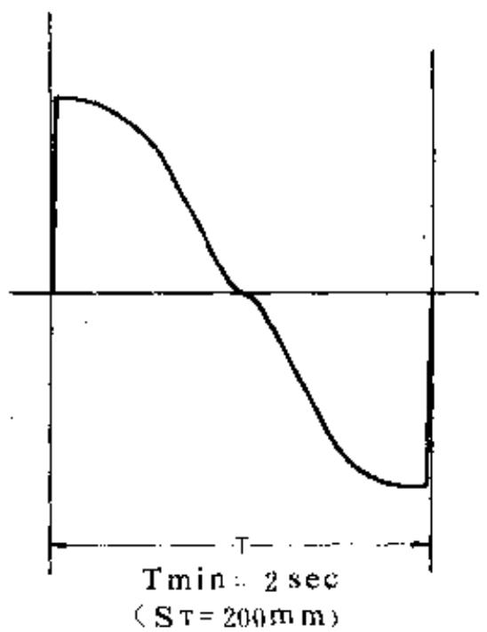

行一部分返回动作。

设计、制造要点

因为滑块往往产生歪扭，所以直线运动导轨与滑块的滑动配合部分要有足够的长度。

# 其 它

参阅附录一第2类控制回路。

# 往复最高速度不同的摆动运动机构

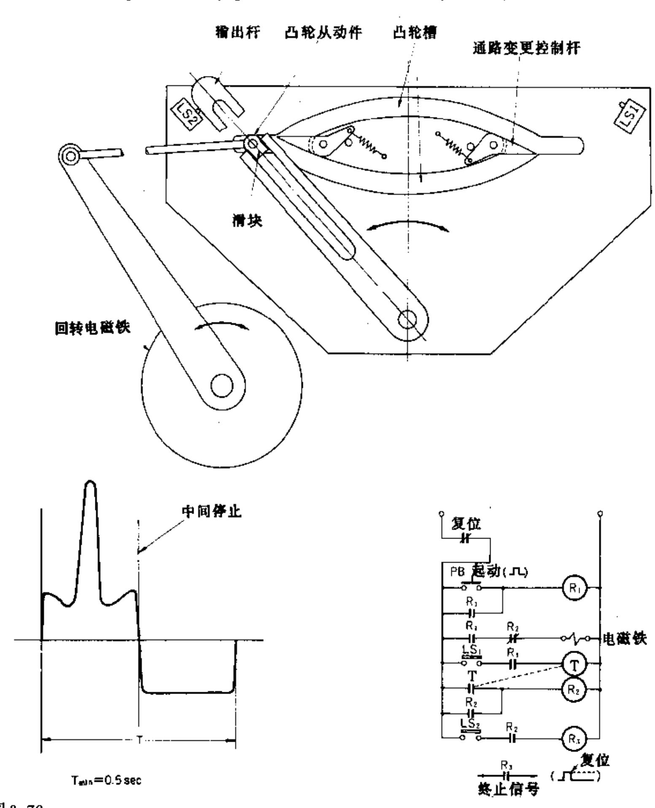  
图3-79动力：电气动作角度： $3 0 ^ { \circ } \sim 9 0 ^ { \circ }$ 载荷：轻

图3-79是往复最高速度不同的摆动运动机构。直接与凸轮从动件连接的滑块在输出杆的长孔中移动，凸轮从动件在凸轮槽中往复运动。

如图所示，从左向右移动时，左侧的通路变更控制杆，接通下侧的凸轮槽，返回则通过上侧的凸轮槽。由此；输出杆的往复最大速度即不同，但往返的时间要相等。

设计、制造要点

每个通路变更控制杆必须形成凸轮槽极为完整的一部分。另外，必须防止其沿回转轴轴向的松动。

# 其 它

参阅附录一第3类控制回路。

# 滑块终端减速摆动运动机构

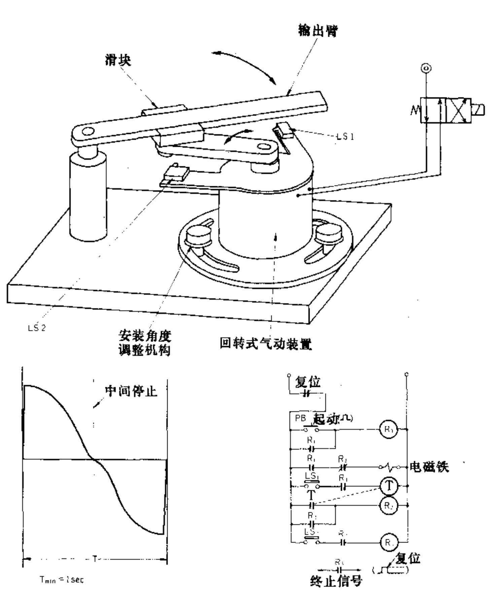  
图3-80动力：气压动作角度： $0 ^ { \circ } \sim 9 0 ^ { \circ }$ 载荷：中

图3-80是把等速摆动转换为终端减速的机构。利用安装于回转式气动装置臂上的滑块传动输出臂，改变一下回转式气动装置的安装

角度，输出臂的摆动角度和速度特性就能大幅度地变化。

设计、制造要点

限位开关与回转式气动装置-体移动，并且安装角度的调整要方便。

# 其 它

参阅附录一第3类控制回路。

# 由锥齿轮变换方向的摆动运动机构

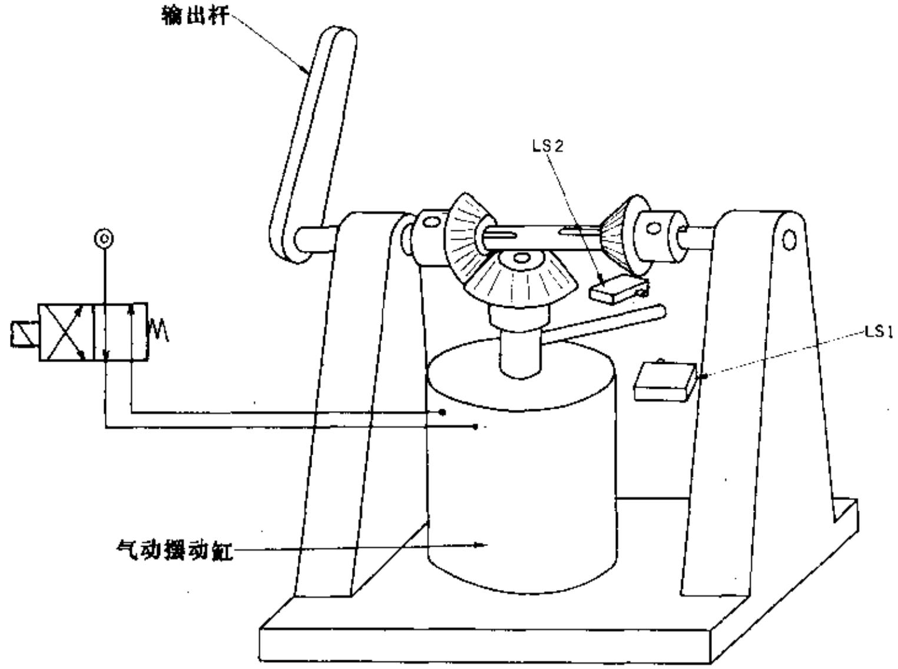

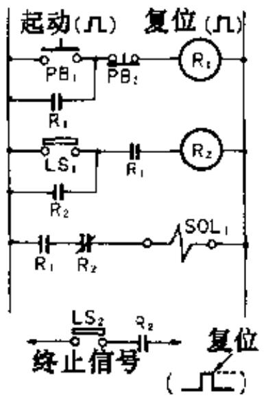  
图3-81动力：气压动作角度： $\mathfrak { i } \hat { \mathbf { \mu } } ^ { \circ } \sim \mathfrak { Z } \mathbf { \delta } 0 \ ^ { \prime }$ 载荷：中

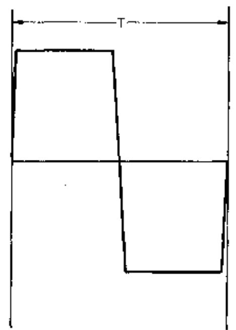  
图3-81是利用锥齿轮变换方向的摆动运动机构。摆动轴与主动轴夹角 $9 0 ^ { \circ }$ ，改变啮合的  
$r _ { \tt N n } = 1 \tt s t$

齿轮能够使往复的方向改变。

采用大的齿数比时，也能够进行 $3 6 0 ^ { \mathfrak { a } }$ 以上的摆动。

其 它

参阅附录一第2类控制回路。

# 直线运动螺母和摆杆摆动运动机构

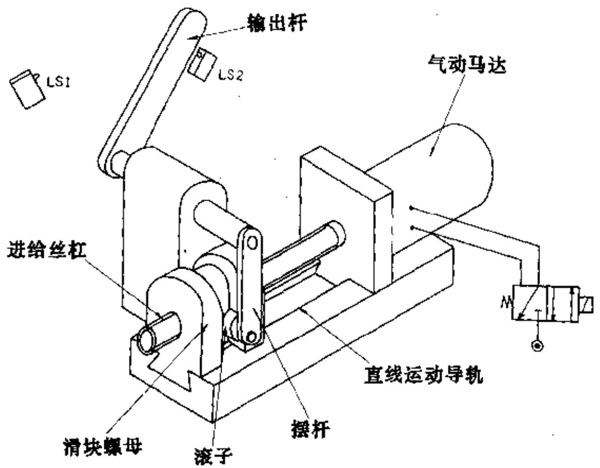

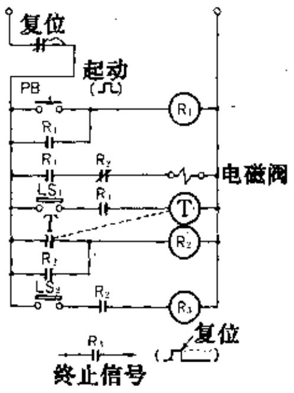

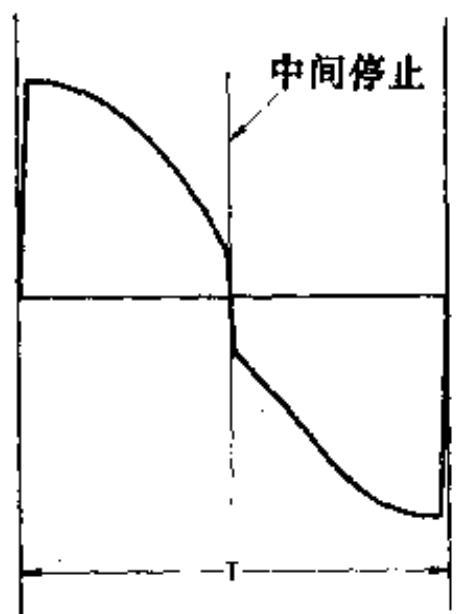  
Tn=sec（S=50mm）  
图3-82动力：气压动作角度： $0 ^ { \circ } \sim 9 0 ^ { \circ }$ 载荷：中

图3-82是由气动马达驱动丝杠，使滑块螺母带动摆杆的机构。因为速度在两端降低，所以稍微具有终端减速运动的特性，但不能成为完全的终端减速型机构。

设计、制造要点

通过变动摆杆相对于输出杆的角度，可使之从接近起始端减速变动到接近终端减速。

必须考虑啮合于螺母槽部滚子的轨迹，并且槽要有足够的深度。

其 它

参阅附录一第3类控制回路。

# 蜗轮终端减速快速返回摆动运动机构

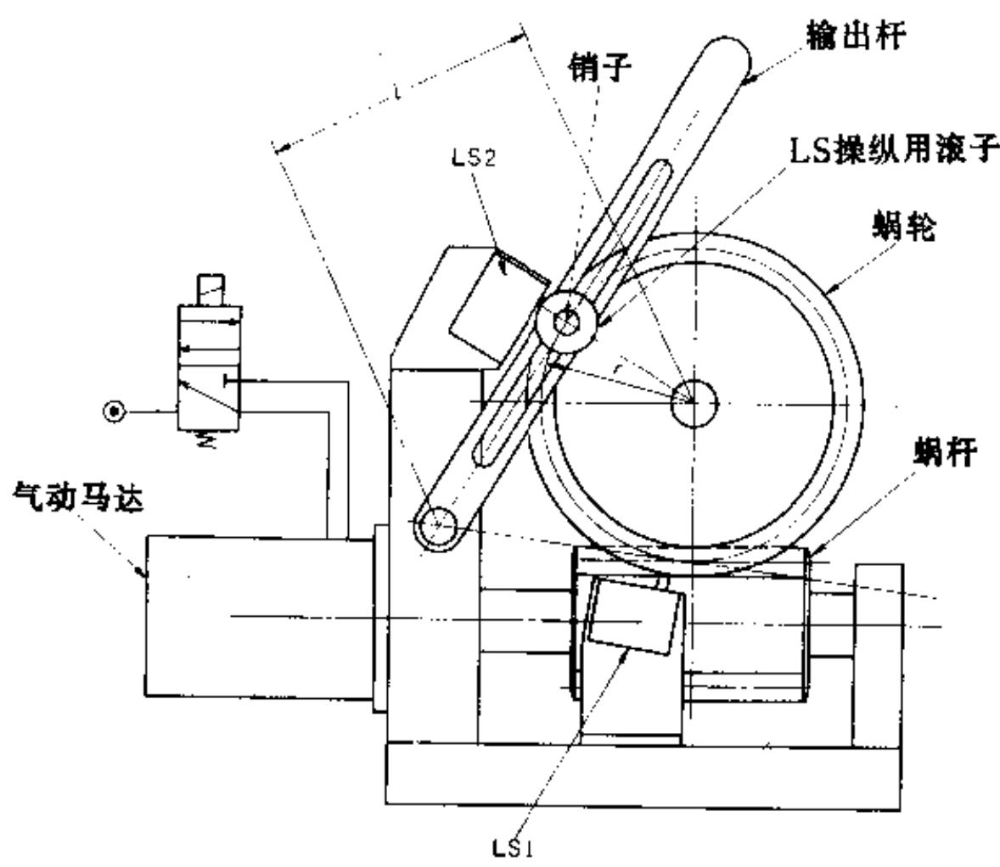

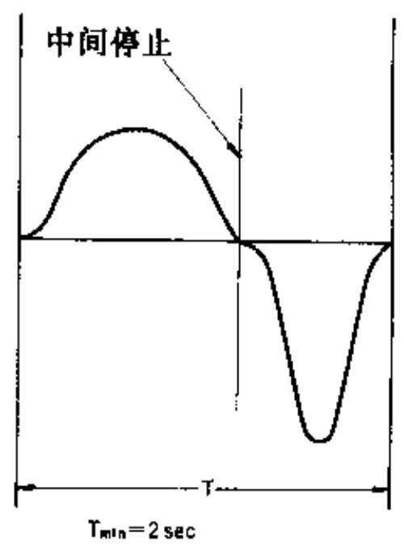

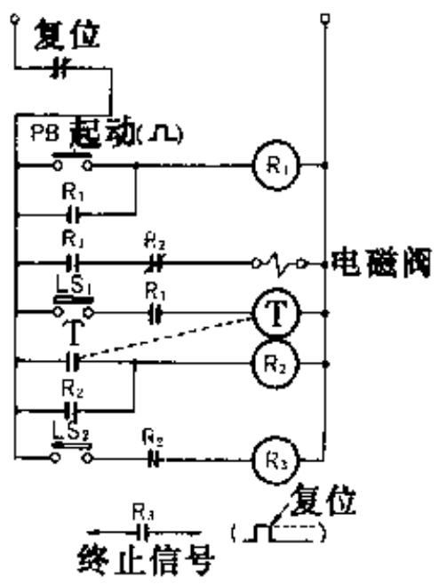  
图3-83动力：气压动作角度： $1 0 ^ { \circ } \sim 9 0 ^ { \circ }$ 载荷：中

图3-83是在蜗轮上装设销子传动输出杆的机构。销子经过输出杆支点这·侧时（在图中左半部分）速度大。

销子的轨迹半径r取得越大，轴间距离|尽量取得越小，前进和快速返回的速比就越大。

设计、制造要点

限位开关不用输出杆而用销子操作（或者在蜗轮上装设凸块等)，停位精度不好。

其 它

参阅附录·第3类控制回路，

# 第四章 回转运动机构

# 棘轮间歇回转运动机构

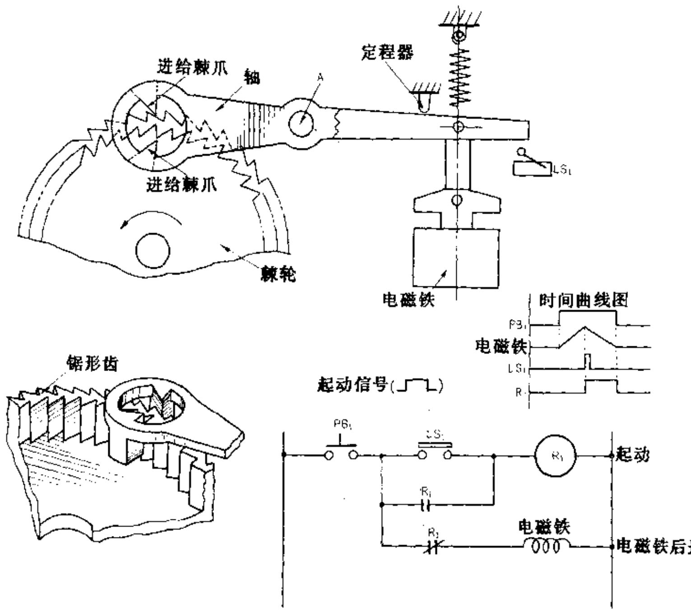  
图4-1动力：电气动作角度： $0 ^ { \circ } \sim 5 ^ { \circ }$ 载荷：轻

图4-1是使棘轮间歇回转的棘轮进给机构。在棘轮轮缘的内外侧，有着相背的锯形齿，内外齿互相错开半个齿距。内外两侧的进给棘爪各与棘轮内外齿相对应。进给棘爪轴以A为支点进行摆动，棘爪交替推压棘轮内外齿的斜面，使棘轮沿箭头方向进给。每当棘爪推压一次，棘轮就间歇回转半个齿距。

# 其 它

参阅附录一第1类控制回路。

# 棘轮间歇回转运动机构

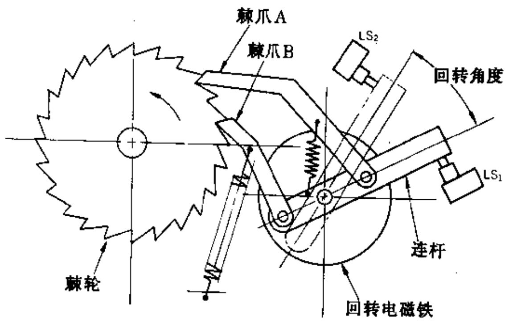  
图4-2动力：电气动作角度： $0 ^ { \circ } \sim 1 0 ^ { \circ }$

载荷：轻

图4-2是棘轮间歇回转运动机构。当回转电磁铁通电时(按下PB)，棘爪A推动棘轮转动一个齿距， $\mathbf { L } \mathbf { S } _ { \mathfrak { Z } }$ 动作，电路断电，回转电磁铁复位，此时，棘爪B又推动棘轮转动一个齿距。即回转电磁铁往复一次，棘轮就转过两个齿距。

# 设计要点

1．连杆和回转电磁铁轴的连接，要求回转时能耐冲击。

2．为防止棘轮回转时因惯性而产生越程，所以要装设制动器。

使用实例

分度盘。

其 它

参阅附录一第1类控制回路。

起动信号（L）

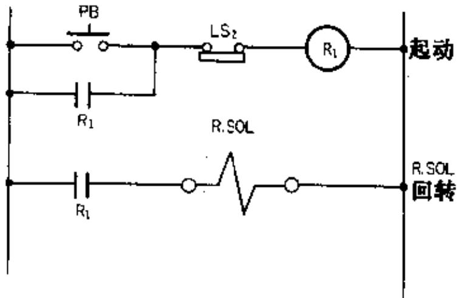

LS:（止信号（）

# 十字轮分度机构

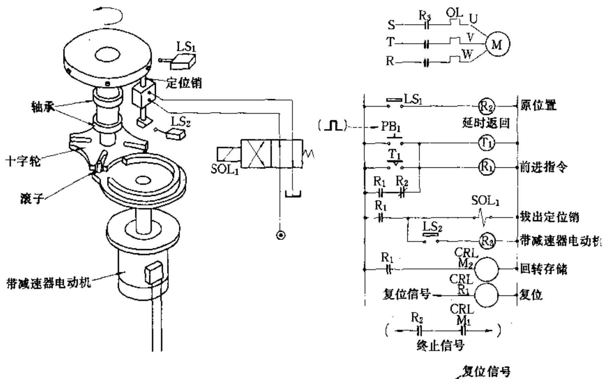  
图4-3动力：电气动作角度： $1 0 ^ { \circ } \sim 9 0 ^ { \circ }$ 载荷：中

图4-3是由带减速器的电动机直接或通过链条等驱动十字轮进行分度的机构。

# 设计要点

1.考虑到十字轮的滚子轴受到惯性力，要  
注意其强度。2.通过 $\mathbf { L } \mathbf { S } _ { 2 }$ 的信号，起动带减速器的电动  
机，进行分度。3.在要求分度精确时，可利用定位销来准

确定位。

# 制造要点

1.十字轮的加工较费工时。2，为了保持十字轮的精度,材料应考虑热处理。3，定位销也应考虑耐磨性。

# 使用实例

工件料斗的换位。

# 缺齿齿轮、小齿轮间歇回转运动机构

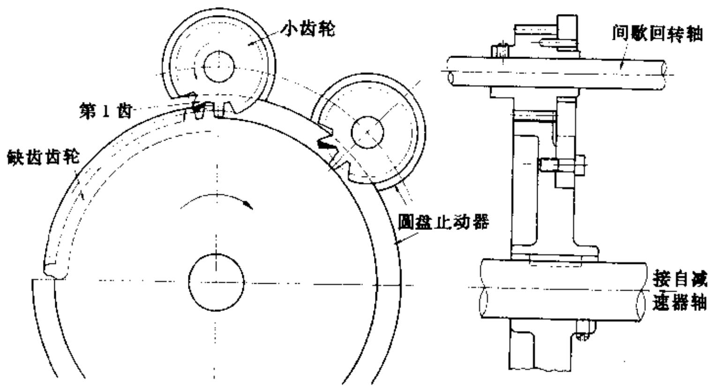

$\mathbf { P B } _ { \mathbf { l } }$ ：起动按钮  
$\hat { \mathbf { P } } \mathbf { B } _ { 2 }$ ：紧急停止按钮  
$\mathbf { P B } _ { 3 }$ ：正常位置停止按钮  
$\mathbf { L } \mathbf { S } _ { 1 }$ ：正常位置断开M：驱动电动机  
BR：电动机制动器  
动力：电气  
动作角度：120；180°，360°  
载荷：轻

图4-4是采用缺齿齿轮使小齿轮作间歇回转的机构。将大齿轮的3/4齿从齿根圆切掉，成为缺齿齿轮。在缺齿齿轮周围配置了若干个相同的小齿轮。为了使各小齿轮不发生啮合相位错乱，故采用了与十字轮相似的圆盘止动器。缺齿齿轮回转一周，各小齿轮就回转一次，在缺齿部分，小齿轮固定不动。改变缺齿和止动器，就可以改变小齿轮的回转角度。

# 设计要点

1.图中小齿轮第一个齿的齿形内涂黑的地方应切掉，缺齿齿轮第一个齿才能比较容易地啮合进去。

# 2．装配时要充分注意第一个齿和圆盘的

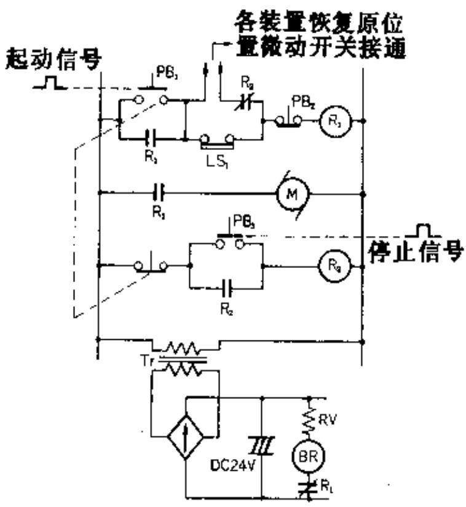

相对位置。

3．齿轮模数取得大一些。如果可能，缺齿齿轮做成双层结构，以获得缓冲。

# 使用要点

在不使用离合器、制动器的情况下，对要求回转一次之后，又停止一定时间的间歇运动，可采用本机构。通过齿数的改变，可以自由地选择回转时间与停止时间之比。

# 恒转矩过载保护回转运动机构

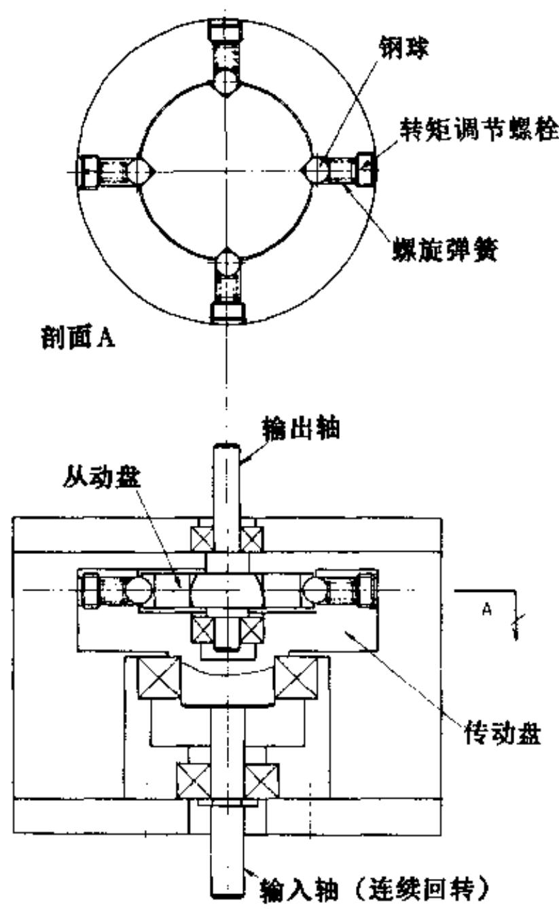  
图4-5动力：电气运动方式：连续回转载荷：轻

图4-5是由钢球和螺旋弹簧构成的转矩过载保护机构。通过弹簧和调节螺栓进行转矩调节。

设计要点

虽说是恒转矩机构，但从结构上来看，不可避免具有一定的误差。

输入轴与输出轴的轴承结构，应是容易保

证同轴的结构。必须使各滚动轴承动作灵活。

制造要点

必须保证从动盘四个V形槽和主动盘钢球孔相对位置的精确度。

必须保证输入轴、输出轴的同轴度。

使用实例

用于自动机工具、刀具的过载保护。

# 其 它

参阅附录一第1类控制回路。

# 修正齿轮减速回转运动机构

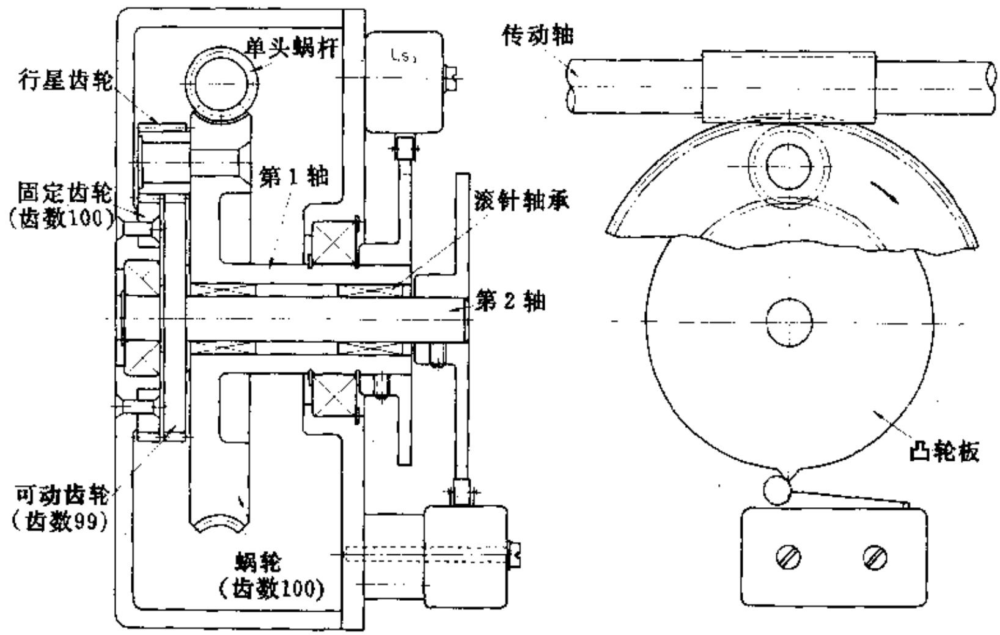

图4-6  
$\mathbf { P B } _ { 1 }$ ：准备按钮  
$\mathbf { P B } _ { 2 }$ ：停止按钮  
$\mathbf { P B } _ { 3 }$ ：起动按钮M：驱动电动机  
$\mathbf { L } \mathbf { S } _ { \mathsf { I } }$ ：第一轴固定位置接通  
$\mathbf { L S } _ { 2 }$ ：第二轴固定位置接通  
BR：制动器  
Cl.：离合器  
动力：电气  
运动方式：连续回转  
载荷：轻

图4-6是采用蜗轮、蜗杆、修正齿轮的连续回转机构。传动轴通过蜗杆和蜗轮使第一轴减速1/100。通过行星齿轮同时与齿数为100和99的齿轮啮合，使第二轴再减速1/100。

制造要点

固定齿轮、可动齿轮及行星齿轮均采用修正齿轮，以保证充分啮合。轴承使用只有冲压外壳的滚针轴承，以保证动作灵活。

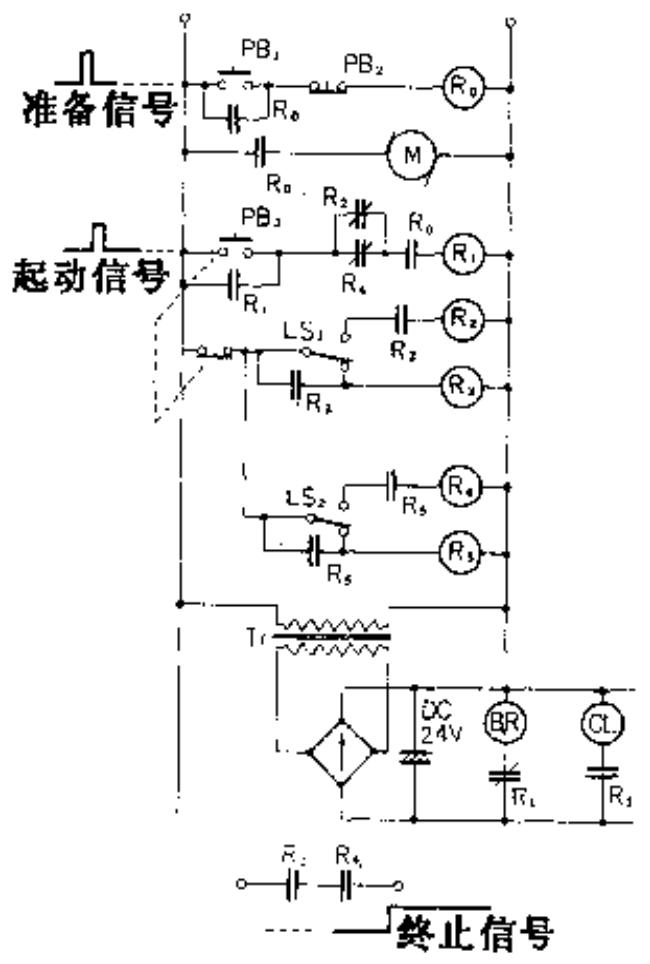

# 使用实例

在第一轴、第二轴上安装凸轮,操纵 $\mathbf { L S } _ { 1 }$ 、$\mathbf { L S } _ { 2 }$ 动作，当回转一定转数后，使其停止。其它参阅附录一第5-4类控制回路。

# 皮带传动大减速比回转运动机构

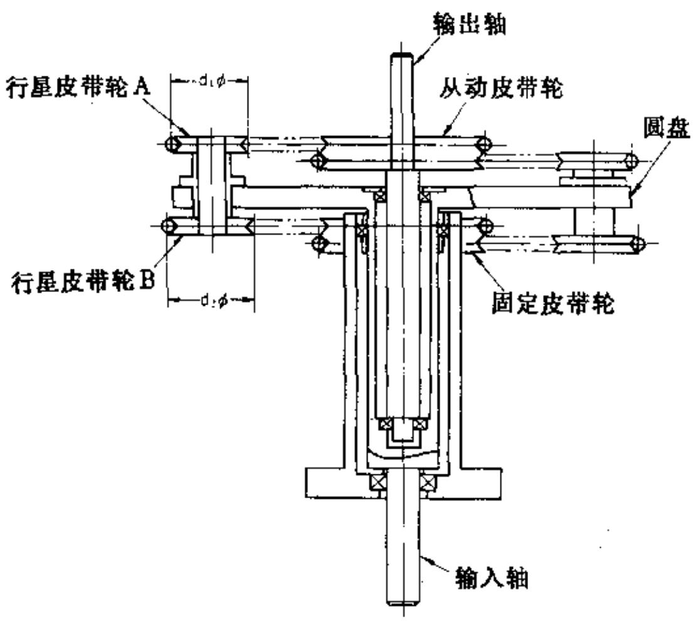  
图4-7动力：电气运动方式：连续回转载荷：中

图4-7是使两个行星皮带轮在输出轴的周围回转，容易取得大减速比的机构。

如果使行星皮带轮A的计算直径为90毫米，行星皮带轮B计算直径为100毫米，则可取得1/100的减速比。反之，则可取得反转方向的减速。如果两个行星皮带轮直径相等，则输出轴不回转。

另外，通过改变从动皮带轮和固定皮带轮的直径比，也可得到同样的结果。

# 设计要点

1．圆盘与行星皮带轮的固定必须牢固。  
2，必须使回转部分平衡。  
3．必须要有皮带的张紧机构。

# 制造要点

必须注意回转部分的动平衡。若平衡不好，工作时会产生振动及其它预料不到的故障。

# 其 它

参阅附录一第1类控制回路。

# 偏心凸轮长板平行回转运动机构

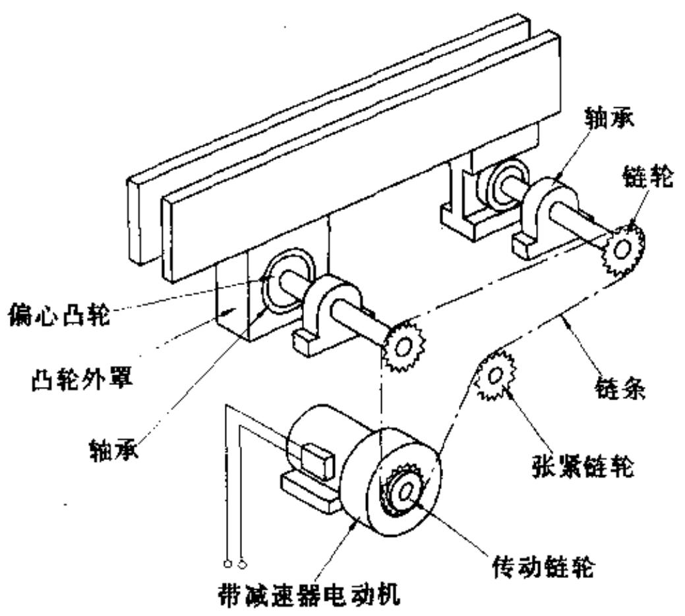  
图4-8动力：电气运动方式：连续回转载荷：中

图4-8是通过偏心凸轮使长板作平行回转运动的机构。两个按偏心方向同步回转的偏心凸轮支撑着横向长板。长板由于凸轮的回转，以凸轮的偏心量为半径做平行回转运动。

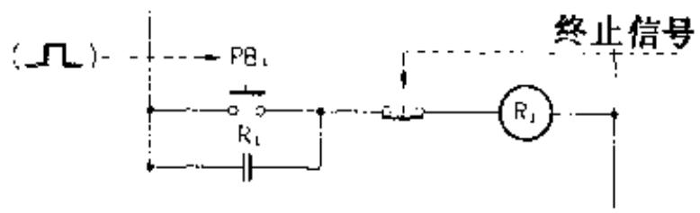

# 设计要点

1.若两个偏心凸轮的偏心方向不同步回转，则两个凸轮将互相牵制，因而必须使一个凸轮沿着板的纵向游动（即使将一个凸轮的外罩开成长槽)。

2.在凸轮的外周装上滚动轴承，效果较好。

3.电动机轴上必须装设摩擦离合器或安全销。

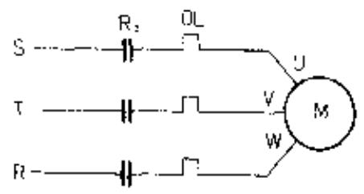

4．当机构用于高速回转时，应进行动平衡，以防工作时产生振动。

5．图中利用链条使两个凸轮同步。如采用伞齿轮，就不必担心链条的伸长。

使用实例工件输送机构。

其 它

参阅附录一第1类控制回路。

# 单向离合器回转运动机构

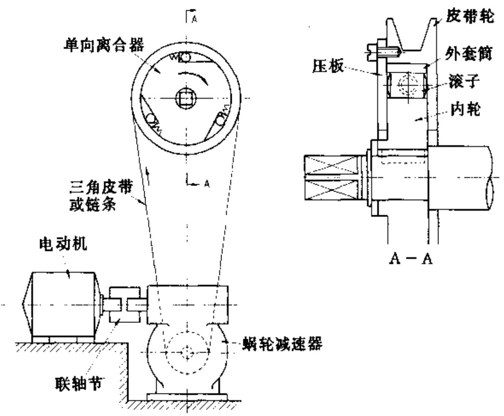

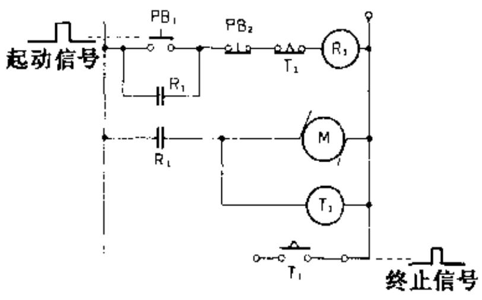

图4-9是采用单向离合器的传动机构：通常采用电动机-蜗轮减速器机构，这时对机械进行手摇调整，往往存在着不能反转的问题。如采用图示那样的单向离合器结构，就可以简单地手摇。

# 制造要点

1．如图A-A剖面所示，滚子、内轮及压入皮带轮的外套筒均要进行充分地淬火及磨削。应尽量减小滚子的直径误差，内轮L形槽的等分必须准确。

图49  
$\mathbf { P B } _ { 1 }$ ：起动按钮  
$\mathbf { P B } _ { 3 }$ ：停止按钮M：电动机  
T．：时间继电器  
动办：电气  
运动方式：连续同转  
载荷：中

2．允许选用外购单向离合器，但转矩必须符合要求。

# 使用实例

除上述情况外，对于任何具有不可反转结构的机器，均可使用。即使不加考虑地接上三相电源，也不会发生故障，用途很广。

# 其 它

参阅附录一第1类控制回路。

# 棘轮分度机构

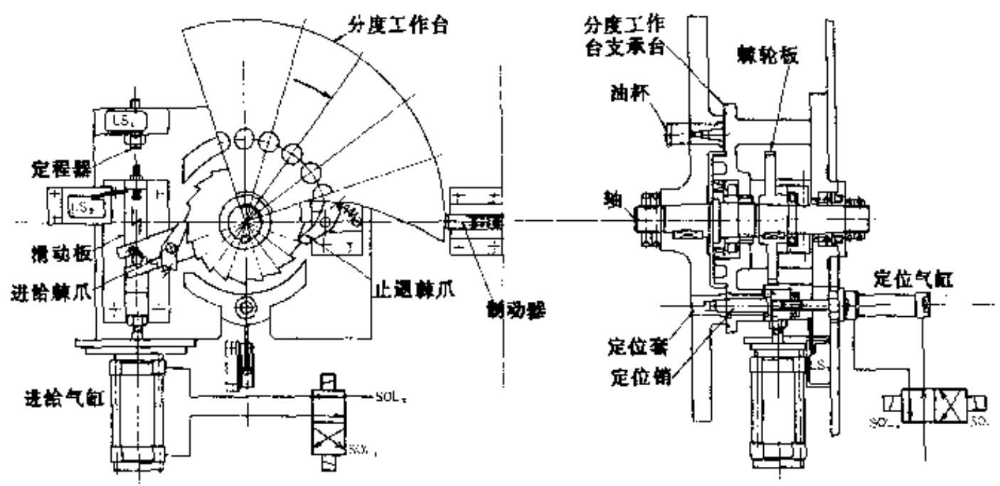

起动信号：品 牛 = 分度起动HHS0.HH 定位气红下降SL，品 进铪气缸前进+P 进给气旺前进端SOLHH M! 进给气缸后退5L定位气证上升终止信号

图 $4 \cdot 1 0$   
动力：气压  
动作角度： $0 ^ { \circ } \sim 3 0 ^ { \circ }$   
载荷：轻

图4-10是由进给棘爪使分度工作台步进，并由定位气缸把定位销压入定位套内，从而达到准确分度的机构。

# 设计要点

1.在分度数小的情况下,加在进给棘爪上

力的方向近于垂直气缸轴。所以必须注意气缸的推力及其零件的强度。

2．分度工作台惯性大时，应考虑制动措施。

3，必须注意定位套位置的精度。

# 使用实例

分度工作台。

# 其 它

参阅附录--第6类控制回路。

# 齿条、齿轮和单向离合器间歇回转运动机构

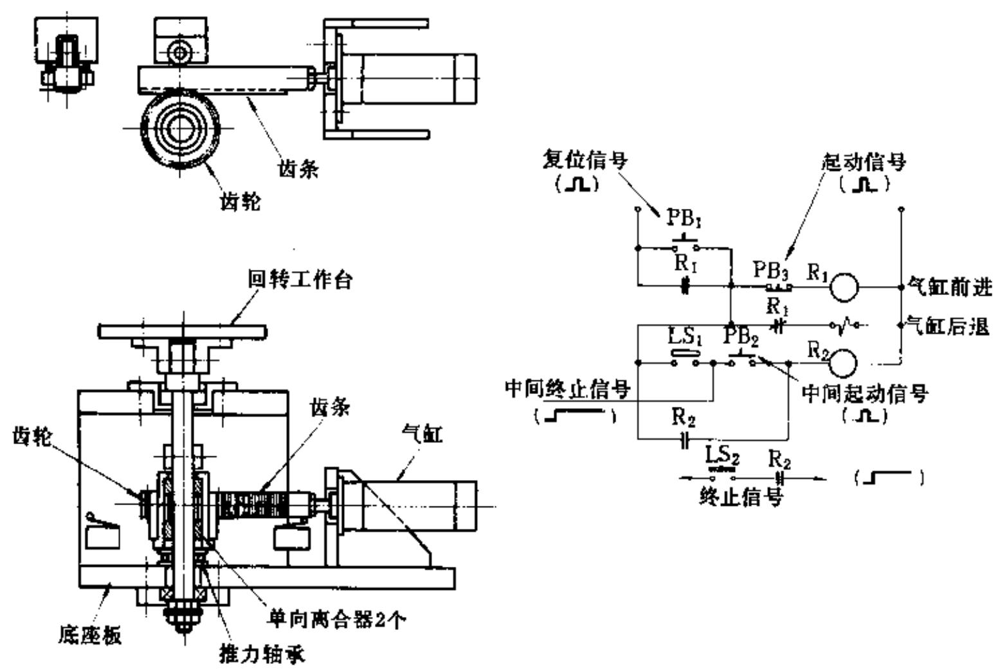  
图4-11动力：气压动作角度： $0 ^ { \circ } \sim 1 8 0 ^ { \circ }$ 载荷：中

2．必须装设齿条、齿轮啮合间隙的微调 机构。 3．也可用棘轮代替单向离合器。但同样要 设置防止反转的制动器。

图4-11是-种进行间歇回转运动的工作台。虽然回转角度的精度不稳定，但机构较简单。

# 设计要点

1.必须注意承受的推力，要估算回转轴、回转工作台和工件的重量(图中装有推力轴承)。

# 制造要点

根据单向离合器的结构要求，回转轴必须淬火处理。对气缸的动作必须充分进行速度控制。

# 其 它

参阅附录一第3类控制回路。

# 定位销微小间歇回转运动机构

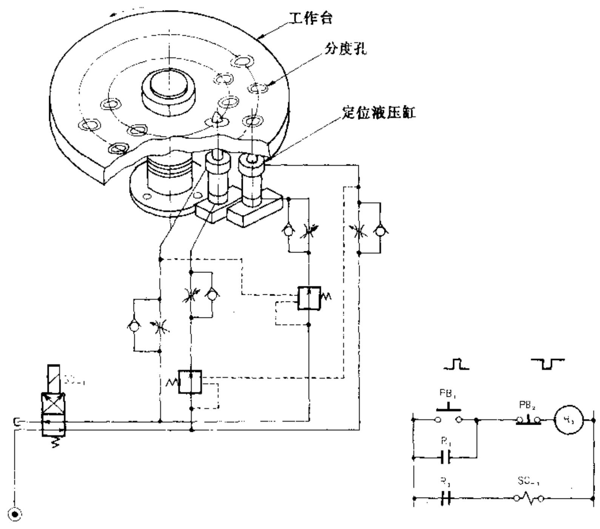  
图 $4 \cdot 1 2$ 动力：液压动作角度： $0 ^ { \circ } \sim 5 ^ { \circ }$ 载荷：轻

图412是把定位销强制压入位置错开很小的分度孔中，使工作台每次作微小角度回转并定位的机构。

# 设计要点

1.工作台分度孔采用座标镗床加[较好。2.衬套经淬火及磨削，从工作台下部压入。3.液压缸活塞杆顶端带锥度，需淬火，由此圆锥部分推动工作台移动、工作台回转载荷不宜过大，

# 制造要点

1.必须注意衬套压入部分，要避免因长时间的运转及冲击而脱落，可考虑并用胶接的方法。

2．注意液压缸活塞杆的垂直度。

3．由于液压系统中使用了顺序阀，所以要注意液压油的净化。

# 使用实例

剪切机的分度工作台。

# 其 它

1.液压缸速度不宜过高。  
2．参阅附录·第1类控制回路、

# 液压缸微小间歇回转运动机构

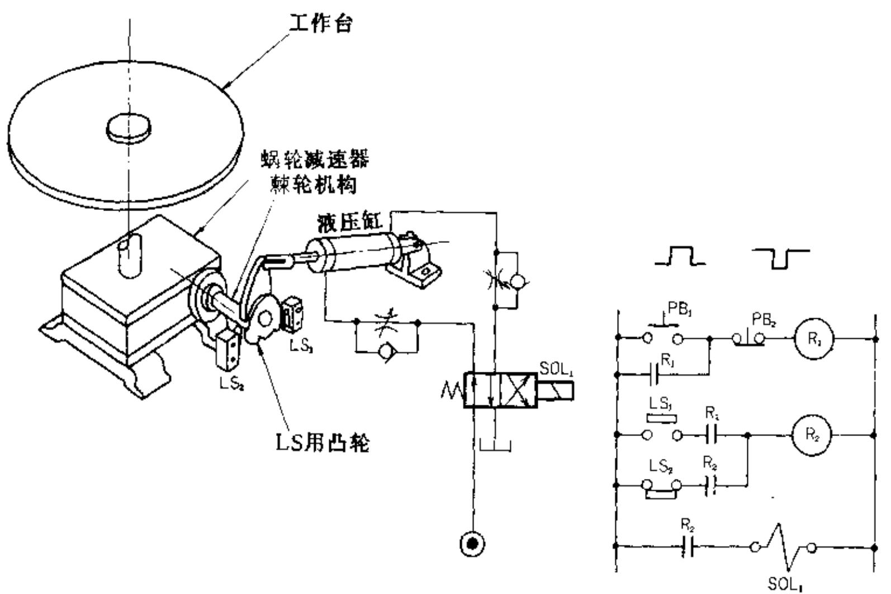

图413  
动力：液压  
动作角度： $0 ^ { \circ } \sim 5 ^ { \circ }$   
载荷：重

图4-13是把液压缸的行程通过棘轮机构传给蜗轮减速器，使工作台作微小角度间歇回转的机构：

# 设计要点

1.蜗轮减速器可以外购，但应选择齿隙较小的。

2.棘轮机构必须热处理。

3．不需定位机构。

制造要点

制造蜗轮减速器时，应尽量减小齿隙，零件加工和装配时均要注意这点。

# 使用实例

剪切机工作台等。

# 其 它

1.进给端采用定程器，或用液压缸端部定位

2.参阅附录一第2类控制回路、

# 棘轮分度机构

图4-14是棘轮分度机构。通过转动刻度盘来改变挡板角度，从而能任意改变棘爪推动棘轮的角度。

设计要点

1。在分度精确度要求较高时，各轴均采用滚动轴承，并尽量消除轴向间隙。

2.挡板外圆与蜗杆的啮合采用斜齿较好。

制造要点

棘轮、棘爪及挡板均需热处理，以保证其耐磨性

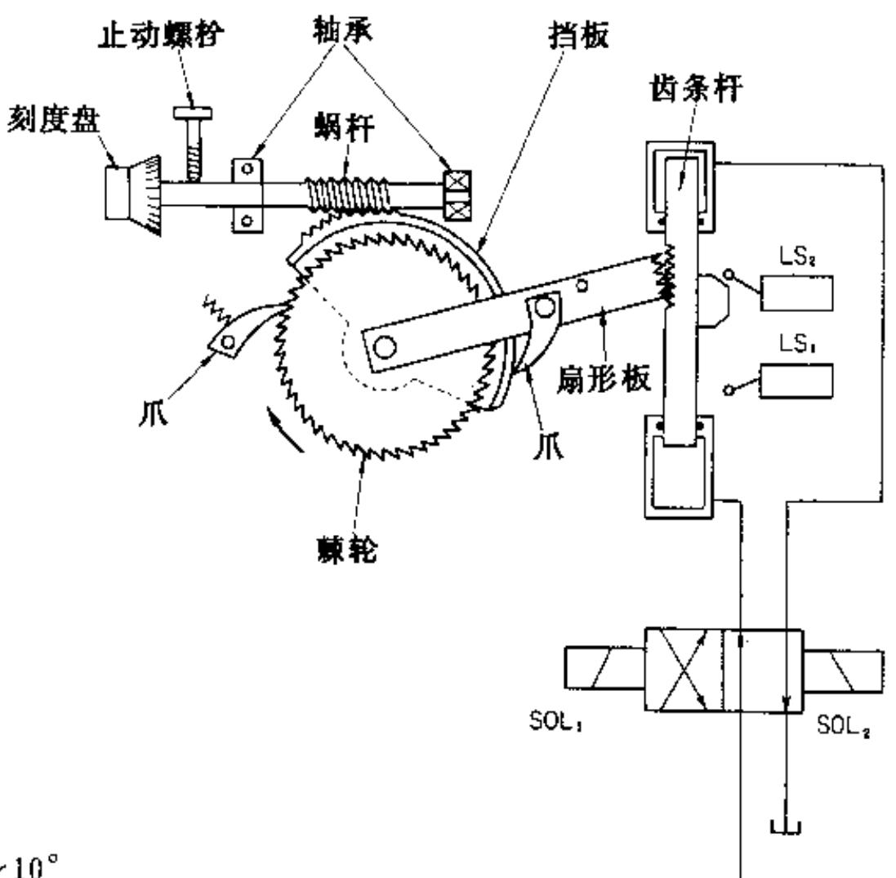  
图4-14动力：液压动作角度： $0 ^ { \circ } \sim 1 0 ^ { \circ }$ 载荷：中

自动进刀机构的丝杆传动。

使用实例

# 其 它

参阅附录一第3类控制回路。

?原位置? 一前进指令  
R，? 后退指令? 前进存储  
复位信号 ? 复位  
前进  
R R   
非- 后退CRLR M-）终止信号复位信号）

# 棘轮立式分度机构

  
图4-15动力：液压动作角度： $0 ^ { \circ } \sim 3 0 ^ { \circ }$ 载荷：中

图4-15是卡盘A的立式分度机构。其分度数在液压缸的一次行程内，可为棘轮齿数的任意等分。下述是一个周期的动作说明：按压起动按钮，SOL；操纵液压缸1的活塞杆前进，通过连接杆2上的棘爪3推动棘轮4回转。同时，分度控制杆5通过连接杆2上的销子，使卡爪与卡盘6脱开。

液压缸1的活塞杆前进到极限位置时，压动LS，使SOLi复位，液压缸1的活塞杆返回。此时，分度控制杆5通过弹簧力锁住卡盘6而定位。

# 设计要点

1。分度数与棘轮齿数有关。

2．由于靠弹簧定位，所以要注意弹簧的拉力。

# 制造要点

因利用分度控制杆的支点定位，所以要保证卡盘6凸出部分间距的精度。

# 维护要点

杆和棘轮中心轴的轴承要润滑。

使用实例

用作圆周等分的钻、铰等切削加工的分度夹具

# 其 它

参阅附录一第2类控制回路。

# 滚子分度机构

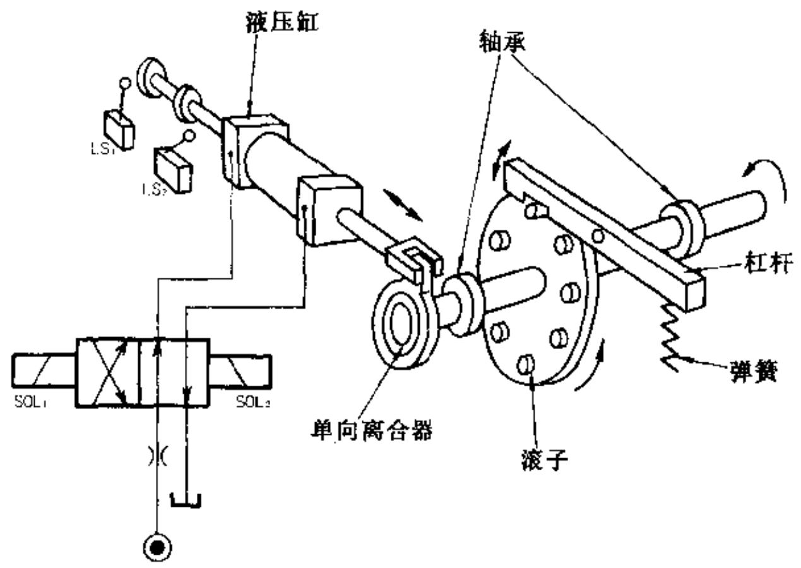

图4-16  
动力：液压  
动作角度： $1 0 ^ { \circ } \sim 6 0 ^ { \circ }$   
载荷：重

图4-16是采用单向离合器进行间歇回转运动的机构。在圆盘上按分度角度装有滚子，当滚子落入凹槽时，圆盘停止转动，以防超程。

# 设计要点

1．本机构在分度精度要求不高的地方使用。2．在圆盘停止状态时，不能承受大的转矩。3.控制杆的凹槽深度与弹簧的强度，应能充分地限制圆盘转动的惯性力，使其不发生超程。

# 制造要点

单向离合器的内座圈应进行热处理，硬度必须在HRC 60以上。

LS 原位置1 PBR 前进指令L R 后退指令前进存储复信号 SL 品 复R， CRLM 后退终止信号 复位信号

使用实例

链条的间歇进给等。

# 其 它

1．单向离合器的内座圈是易损件，应有 备件。

2．单向离合器的润滑可使用润滑油或润滑脂，但不含有耐高压高速润滑油添加剂。

3.参阅附录一第3类控制回路。

# 液压缸和棘轮间歇回转运动机构

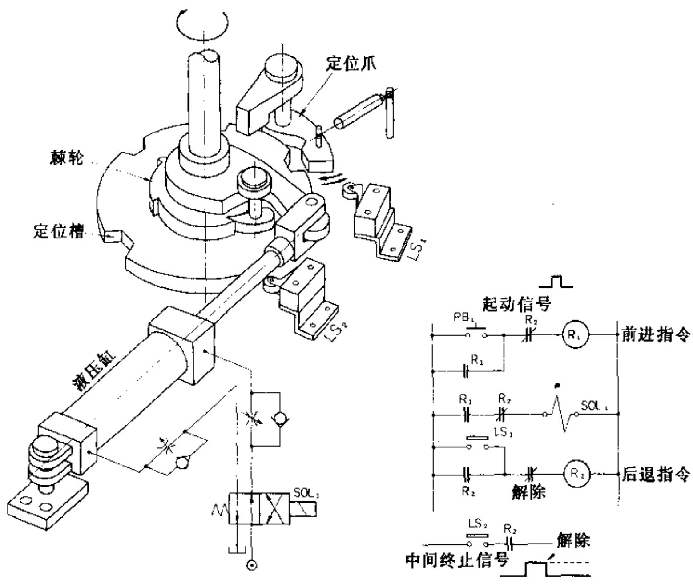  
图4-17动力：液压动作角度： $\lbrace \lbrace \lbrace \mathbf { \Lambda } ^ { \circ } \sim \mathfrak { g } \mathfrak { d } ^ { \odot } \rbrace ^ { \odot }$ 载荷：重

图4-17是将液压缸活塞杆的行程传给棘轮，使之作间歇回转，并通过定位爪进行定位的机构。

# 设计要点

1．棘轮及定位部分必须淬火。

2．采用耳环式液压缸。

3．液压缸的行程要有余量。由于一定要定位，所以棘轮的爪槽按分度数设置。

制造要点

要注意定位爪和槽的加工质量，以保证定位动作准确可靠。

使用实例

料斗的转换及一般的简易分度工作台。

# 其 它

1、如果提高液压缸速度，则需调整定位范围，但在有超程情况时，必须安装带闸，并限制液压缸速度。

2.参阅附录一第2类控制回路。

# 圆弧端齿啮合器分度机构

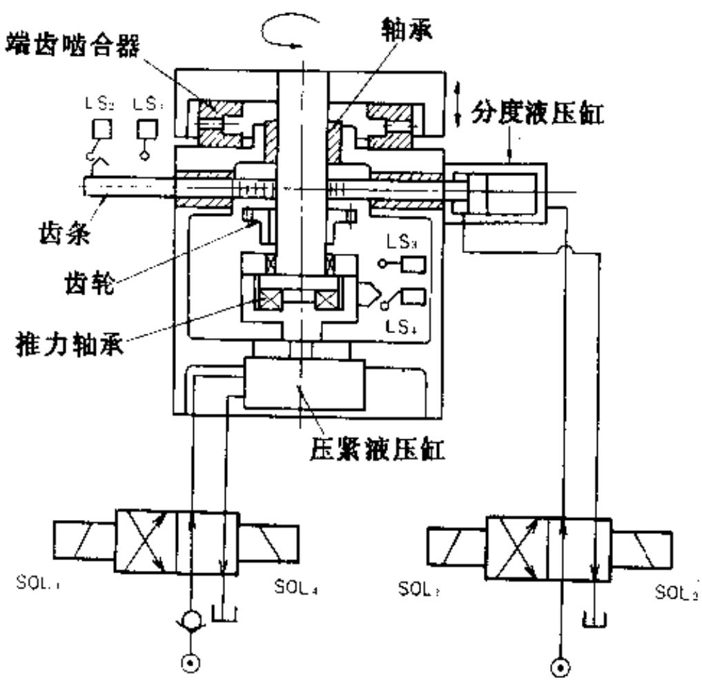  
图4-18动力：液压动作角度： $1 0 ^ { \circ } \sim 9 0 ^ { \circ }$ 载荷：重

图4-18是利用圆弧端齿啮合器的分度机构。采用齿条、齿轮的啮合是不能进行分度的，必须同时使用端齿啮合器，此啮合器的下半侧固定，上半侧与分度轴连接，使二侧的齿互相啮合并压紧，即可进行高精度的分度。

# 设计要点

1.在原理上能够得到啮合器齿距误差以上的分度精度。2.因为啮合器的全部齿都啮合,所以刚性是高的。3．因为分度轴不是与啮合器啮合，就是与齿条啮合，所以分度位置不会发生错误。4，分度液压缸必须带有缓冲结构，以吸收惯性力。5.通过改变液压缸行程，能够得到啮合器齿数的约数分度。

Ls: ? 原位置  
LS ? 松开  
5ILS ? 压紧? 前进指令  
R  
5 BLs R HF 后退指令前进完毕存储复位信号- ? 复位L 松开SOL 分度前进SOL: 压紧oSoL SOL: 分度后退CRL  
( MH 一）终止信号复位信号( ）使用实例  
分度头等的分度。  
其它  
参阅附录一第6类控制回路。

# 齿条、齿轮卧式分度机构

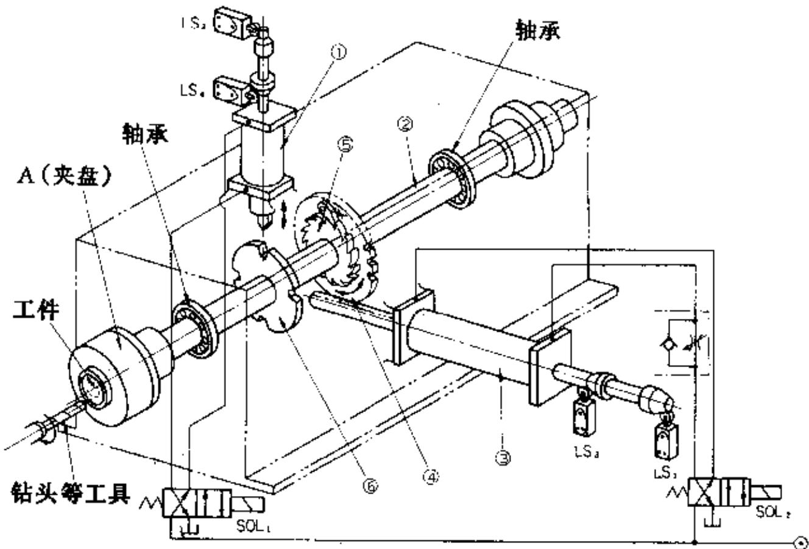  
图4-19动力：液压动作角度： $0 ^ { \circ } \sim 1 8 0 ^ { \circ }$ 载荷：中

图4-19是卡盘A的卧式分度机构。可进行任意等分的分度。

下面说明一个周期的动作过程。

按压起动按钮， $\bf { S O L _ { 1 } }$ 动作，操纵液压缸1提升分度定位销，此时，轴2处于自由状态。当定位销提升至上升极限位置，压动限位开关$\mathbf { L S } _ { 3 }$ 时，则 $\ S 0 L _ { 2 }$ 动作，使带有齿条的液压缸3的活塞杆前进，带动齿轮4转动。当齿轮转动时，连在齿轮上的棘爪推动棘轮5,使轴2回转。当液压缸3的活塞杆前进至极限位置时，压动限位开关 ${ \bf L S } _ { 3 } ,$ 液压缸1推动分度定位销下降，卡在分度盘6的凹槽内，分度盘得到定位。与此同时，压动限位开关 $\mathbf { L S } _ { 4 }$ ， $\mathbf { S O L } _ { 2 }$ 切断，液压缸3活塞杆后退。

# 设计要点

1.分度数与棘轮齿数有关。

2．若齿轮直径较大，则液压缸3活塞杆的行程也要相应加长。

PB(） 起动起动信号R H 上升 SOL-S ?一上升极限前进LS, 前进极限LS 下降极限? 后退极限F （复位）-\~终止信号

制造要点

轴和分度盘要保证安装的配合精度，不得有游隙。

# 维护要点

LS的安装部位不得落入切屑等。

# 使用实例

沿工件圆周进行钻、铰、铣等加工时的分度。

# 齿条、齿轮立式分度机构

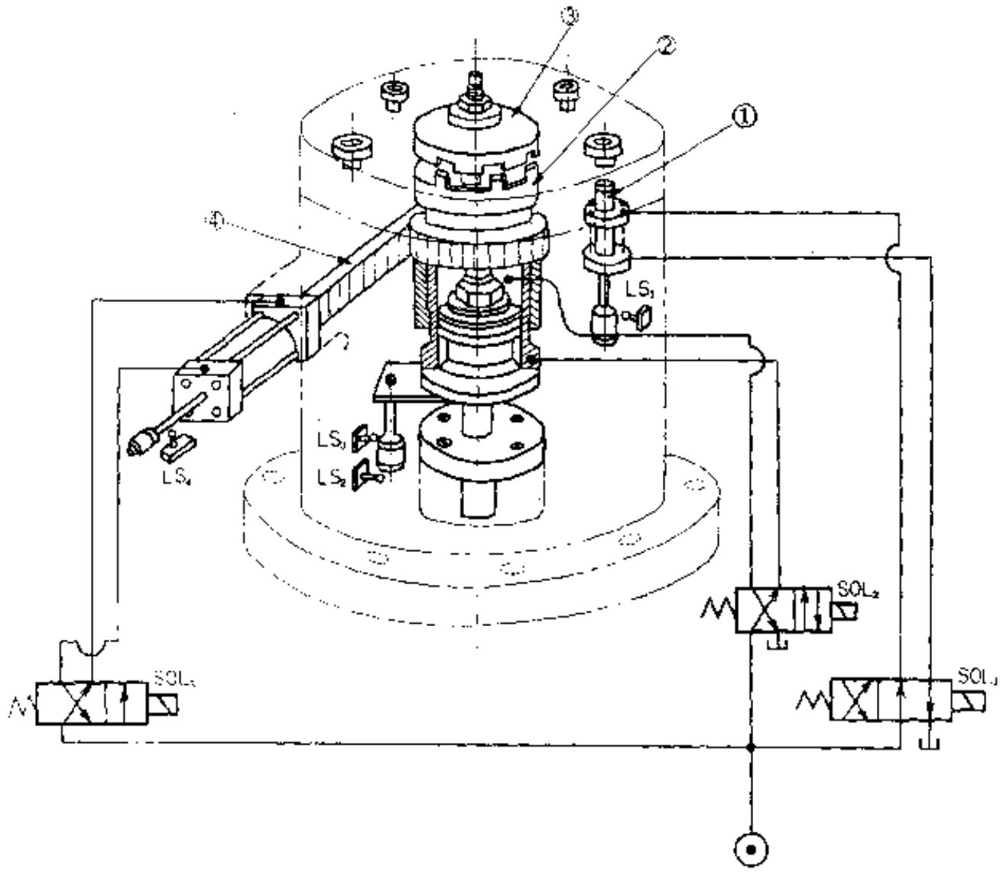  
图 $4 - 2 0$ 动力：液压动作角度： $0 ^ { \circ } \sim 1 8 0 ^ { \circ }$ 载荷：重

图4-20是利用液压缸使端齿啮合器传动工作台的齿条、齿轮式分度机构。

按压起动按钮，定位销1下降，接通限位开关LS，使下半个端齿啮合器2上升，与上半个端齿啮合器3啮合，这时，接通上升端限位开关 ${ \bf L } { \bf S } _ { 3 }$ ，通过 $S ( \mathbb { X } _ { 3 }$ 使液缸活塞杆推动齿条4前进，并带动齿轮使工作台回转。当压动齿条前进端限位开关 $\mathbf { L } \mathbf { S } _ { 4 }$ 后，定位销1上升，端齿啮合器2下降，当压动下降端限位开关 $\mathbf { L } \mathbf { S } _ { 2 }$ 后，使液压缸活塞杆带动齿条4后退，一个周期动作完成。

# 设计要点

分度数与端齿啮合器的齿数要一致。。

（） PB SOL极限  
R Ls sOL 斗极限SOLS R 下降极限（复位） 终止信号

# 制造要点

必须注意端齿的分度精度，如精度不高，换位时冲击就很大。

# 维护要点

工作台滑动面应定时润滑。

# 使用实例

轻便的切削分度机构。

# 液压马达间歇回转运动机构

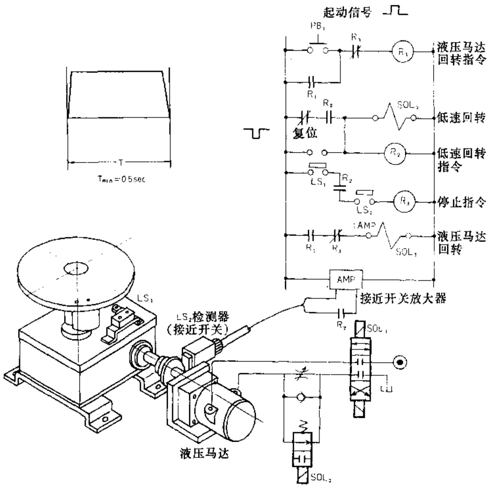

图4-21  
动力：液压  
动作角度： $3 0 ^ { \circ } \sim 3 6 0 ^ { \circ }$   
载荷：重

图4-21是利用凸轮和接近开关发出的信号，使液压马达作间歇回转的往复回转机构。

# 设计要点

1．本机构适用于大回转角度工作,但分度不太精确，使用时必须注意。

2，要注意蜗轮减速器的齿隙。

3。由于使用接近开关发出停止信号，所以应尽量使周围的金属远离。

4液压马达与减速器轴的连接，必须采用 可移性联轴节

制造要点

制造蜗轮减速器时，必须注意齿隙。

# 使用实例

换向装置等。

其 它

1，液压马达停止工作时应先节流，使其速度降低，然后再停止。

2.LS2回路因寿命问题.在高速回转时不需接入。

3.参阅附录一第5-2类控制间路。

# 电磁铁和棘轮回转运动机构

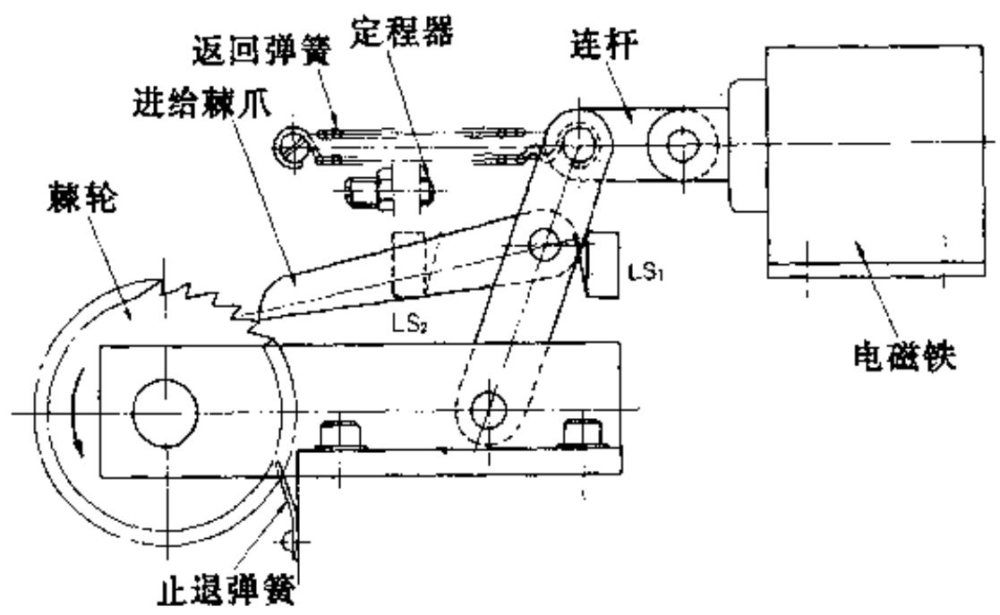

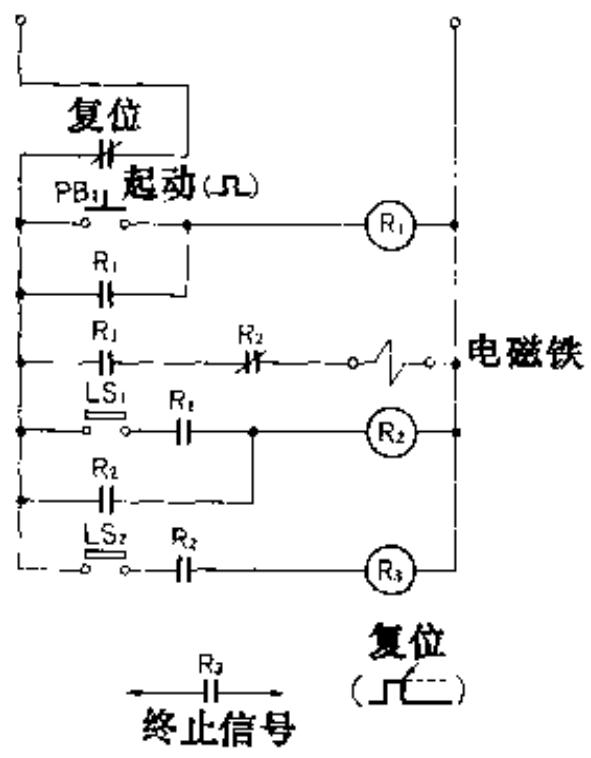

图4-22  
动力：电气  
动作角度： $0 ^ { \circ } \sim 2 0 ^ { \circ }$   
载荷：轻

图422是利用电磁铁的往复运动，通过杠杆、棘爪使棘轮回转的机构。当进给棘瓜向右倒退时，为防止棘轮反转，需对棘轮进行一定程度的制动，图中所示的方法并不可靠。

使用实例

1，设置棘轮同步开关，回转到一定位置后，就自动停止。

2．如与计数开关连动，就能在希望回转的角度处停止。

# 其 它

参阅附录一第2类控制回路。

# 电磁铁和棘轮回转运动机构

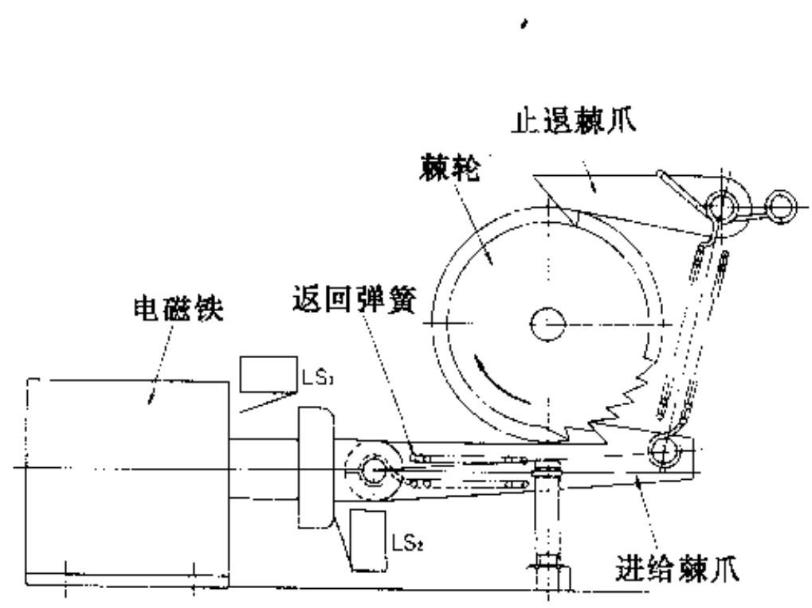

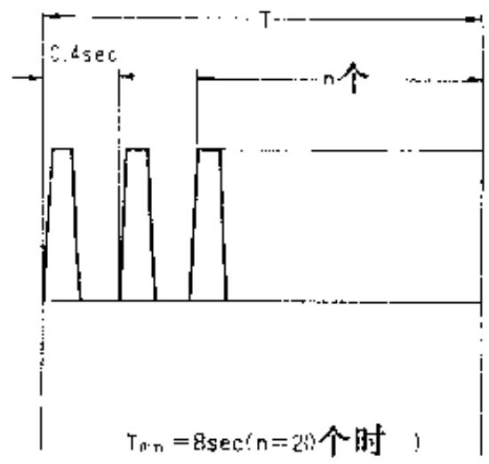

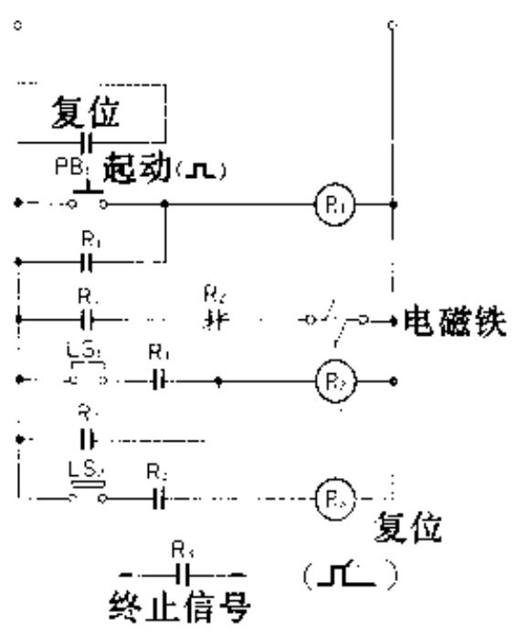  
图4-23动力：电气动作角度： $0 ^ { \circ } \sim 2 0 ^ { \circ }$ 载荷：轻

图4-23与图4-22相同，也是利用电磁铁的往复运动，使棘轮按一定方向回转的机构。二者不同之处在于本图装设了始终压紧的止退

棘爪进行止退。

使用实例

在棘轮轴上装设链轮，使钢带等每次进给定长度。

其 它

参阅附录一第2类控制回路。

# 单向离合器和十字轮回转运动机构

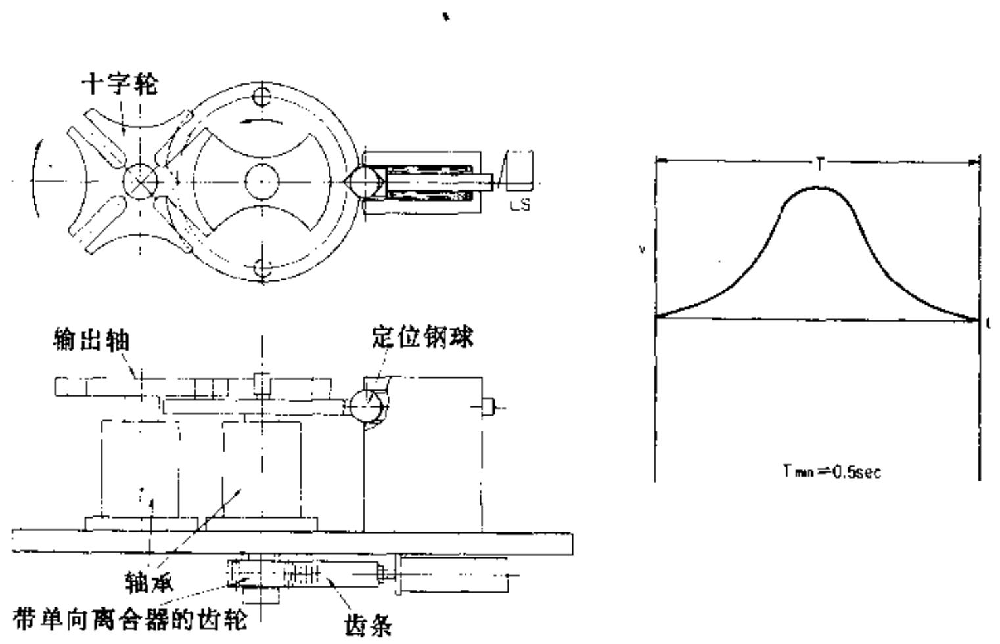  
图424动力：气压动作角度： ${ \mathfrak { g } } { \mathfrak { h } } ^ { \mathfrak { c } }$ 载荷：轻

图4-24是由齿条、带有单向离合器的齿轮、带有定位槽的销轮和十字轮组成，由直线运动转换的间歇回转运动机构，是在回转运动开始和即将停止时平缓减速的两端减速型机构：

在气动系统中具有速度控制部分。如果使气缸的动作前进时慢、返回时快，则能够有效地缩短工作周期的时间。

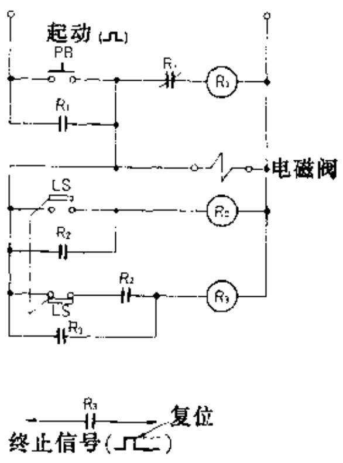

# 设计、制造要点

1.与一般十字轮机构相同，要求认真考虑十字轮、销轮的制动器以及传动销等的耐磨性和疲劳极限。

2，传动销尽量采用能回转的。十字轮滑动工作部位应全部进行淬火和磨削。为确保工作可靠，应设置适当的润滑供油机构。

3．销轮定位机构应完善合理，否则将产生累积误差，导致动作不协调。另外，气缸活塞杆行程应调整到合适的位置，即活塞杆到达行程终端时，应正好使定位钢球进入销轮的定位位置。

# 其 它

参阅附录一第2类控制回路。

# 由单向离合器转换直线运动的回转运动机构

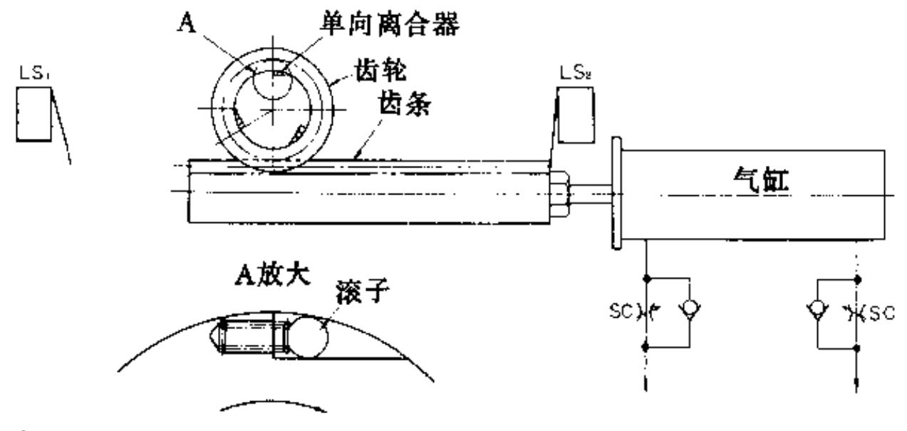

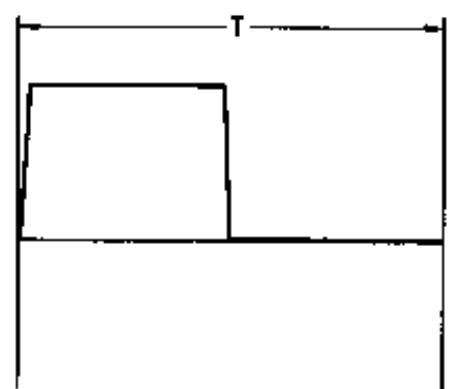  
Tan =Q.5sec

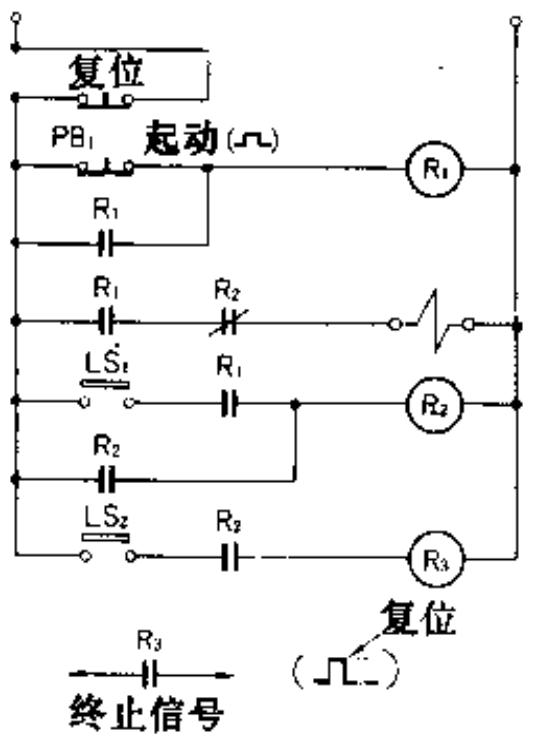  
图4-25动力：气压动作角度： $0 ^ { \circ } \sim 3 6 0 ^ { \circ }$ 载荷：轻

图4-25是利用单向离合器使直线运动转换为回转运动的机构。

单向离合器装在齿轮内，在内轮的三个切口部分，利用螺旋弹簧使滚子压住外壁的方式形成。与棘轮机构等相比，单向离合器的反转冲击力小，如果设计合理，优点很多。

应考虑将齿轮、齿条的间隙限制到最小，并要求齿条的动作非常灵活。

设计、制造要点

单向离合器的内轮、外轮与滚子--样，都要进行淬火，淬火硬度在 $\mathbf { H } \mathbf { R } { \mathsf { C } } { \mathsf { \Omega } } 5 5 ^ { \circ }$ 以上。材料采用合金工具钢或类似材料。必须严格控制尺寸公差在允许范围内。尺寸误差越大，单向离合器的稳定性就越差，而且有导致动作不协调的危险。

# 其 它

参阅附录一第2类控制可路。

# 两个单向离合器的间歇回转运动机构

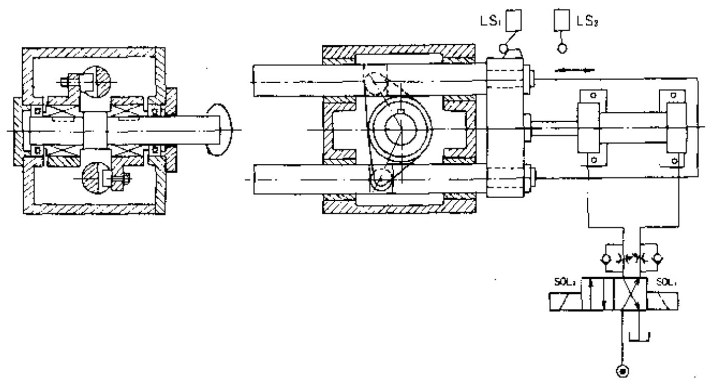

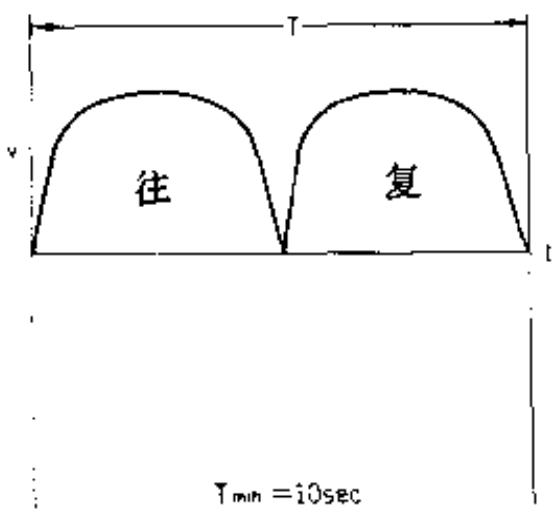  
图4-26动力：液压间转方式：连续回转载荷：重

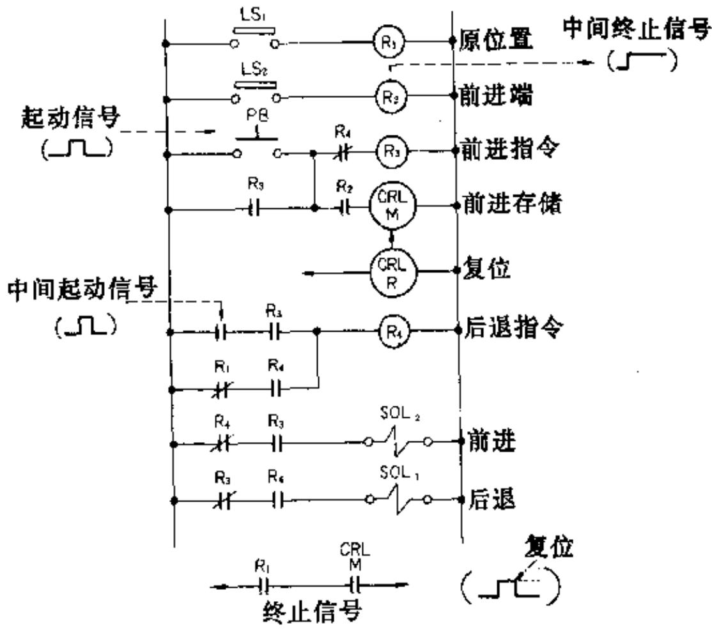

图4-26是靠两个单向离合器获得间歇同转运动的机构。在回转轴的两侧，设置两根用轴套导向的导杆，在导杆上有凹槽，槽内装入单向离合器外轮臂端部的滚子，两个单向离合器的空转方向相同，都通过键固定在回转轴上，单向离合器由外轮臂传动。因为臂的回转方向相对于轴是相反的，所以可使液压缸的直线运动全部转换成为轴的回转运动。

# 设计、制造要点

1．单向离合器可采用外购件。2．回转轴上的惯性大时，液压缸即使停止  
工作，回转轴仍会超程。3，外轮臂端部的滚子，如果阻力小，效率  
就高。其 它参阅附录一第3类控制回路。

# 棘轮步进回转运动机构

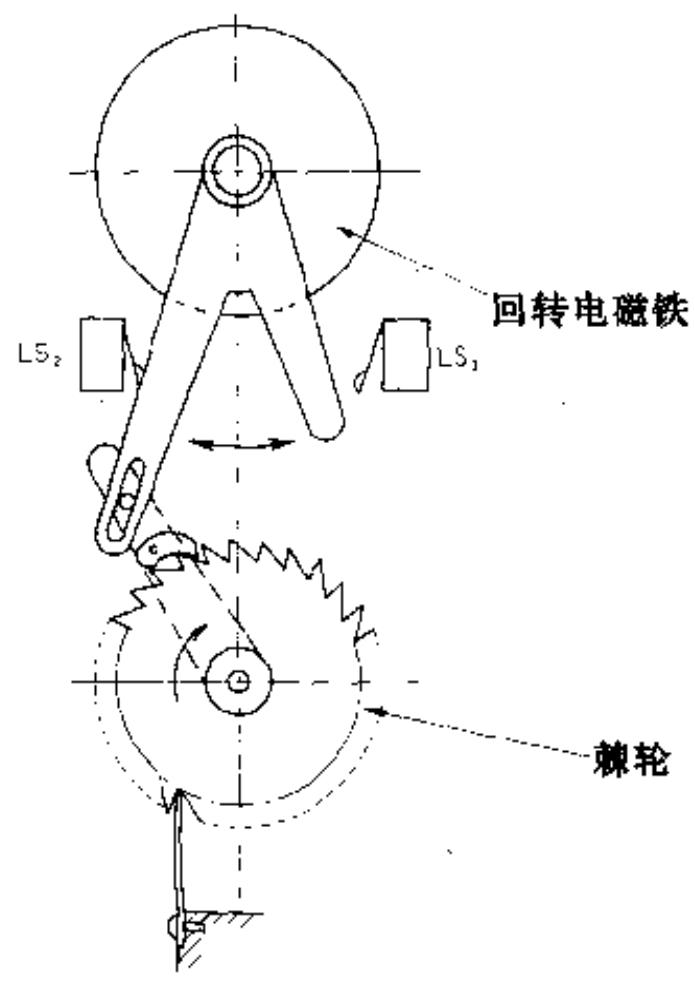  
图4-27动力：电气工作角度： $0 ^ { \circ } \sim 2 0 ^ { \circ }$ 载荷：轻

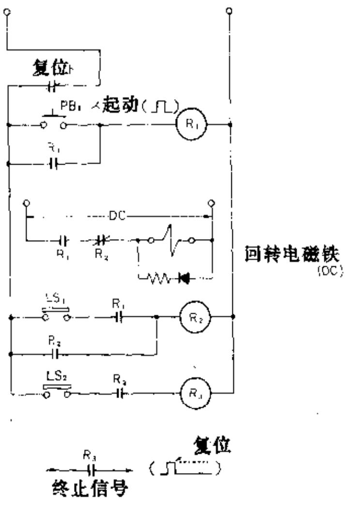

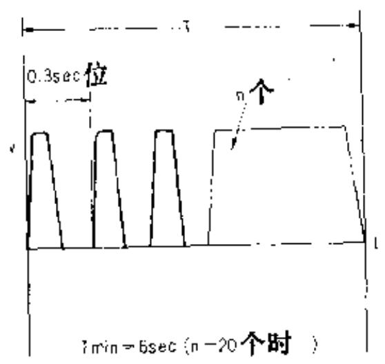

图4-27是靠棘轮步进的回转运动机构。它将回转电磁铁的往复运动，通过摇杆、棘爪和棘轮转换成为间歇回转运动。为了防止棘爪退出时棘轮可能反转，在棘爪的对侧装有压板弹簧。

设计、制造要点

本机构在设计、制造上无特殊要求，唯一要注意的就是棘爪返回时要可靠。

# 其 它

参阅附录一第2类控制回路。

# 回转电磁铁间歇回转运动机构

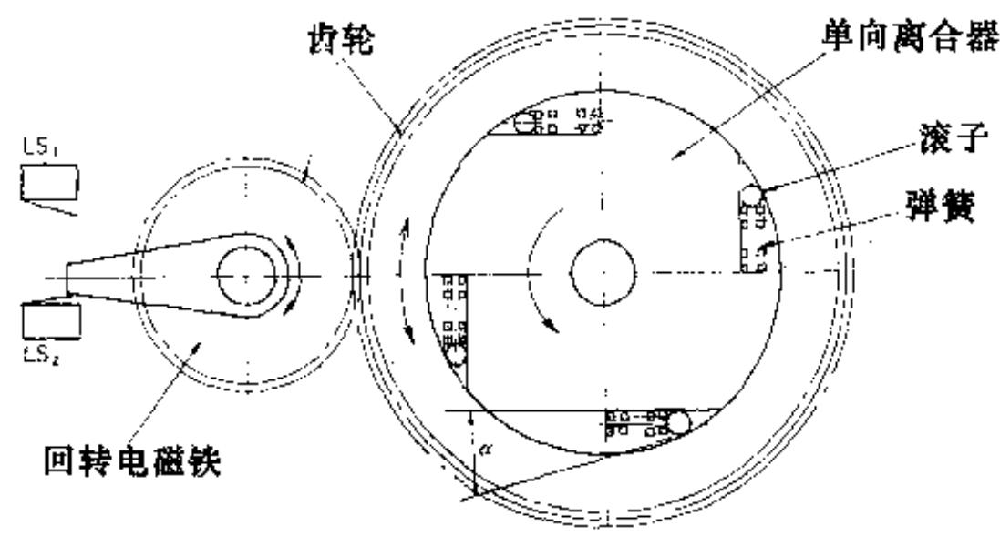

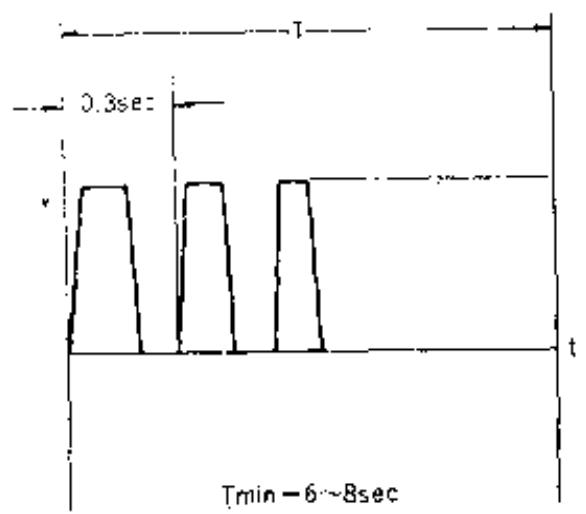  
图 $4 \cdots 2 8$ 动力：电气动作角度： $\updownarrow ^ { \circ } \sim 4 5 ^ { \circ }$ 载荷：轻

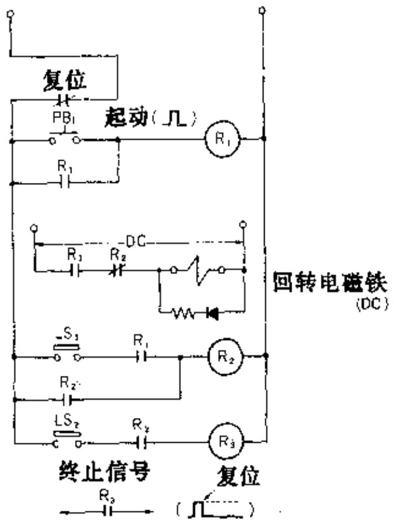

图4-28是通过齿轮和单向离合器，将回转电磁铁的往复运动转换为回转运动的机构。

# 设计、制造要点

1．单向离合器的本体、滚珠以及大齿轮的

内表面需淬火处理。

2.弹簧的强度能使滚珠轻轻地压在楔形槽内即可。3.本机构若适当选择楔形角 $\pmb { \mathscr { a } }$ ，间隙就小，即能得到可靠的单向传动。方便之处在于回转电磁铁的工作角度用不着确定得很准确。

# 其 它

参阅附录一第2类控制回路。

# 摆动缸和棘轮间歇回转运动机构

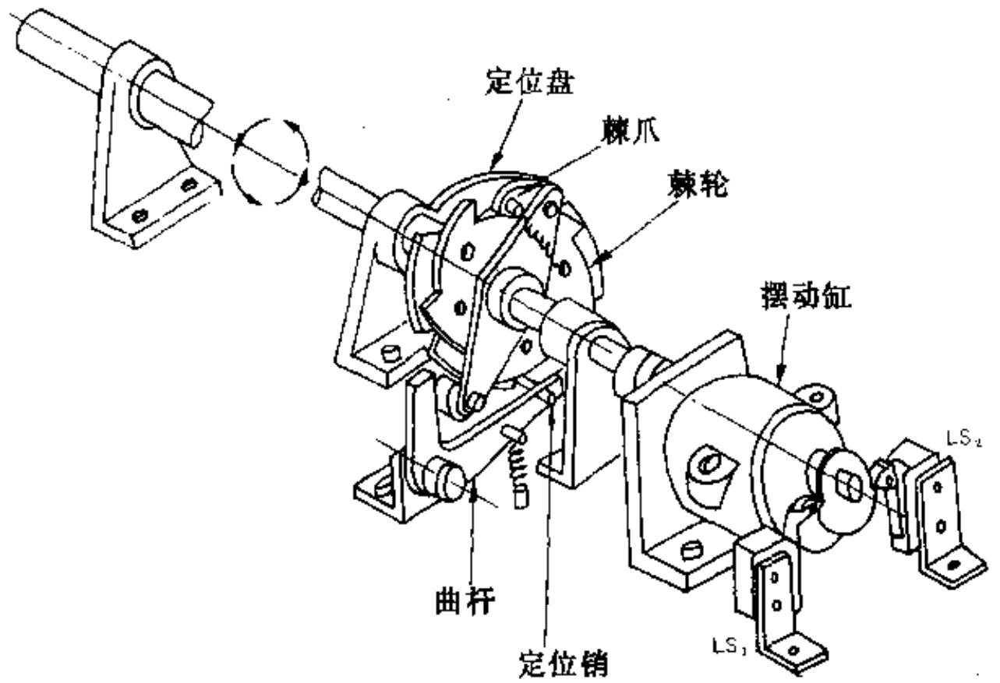

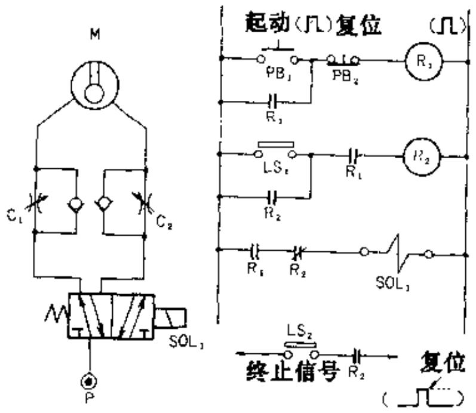  
图4-29动力：气压动作角度： $1 0 ^ { \circ } \sim 6 0 ^ { \circ }$ 载荷：中

图 $4 \not \sim 2 9$ 是气动摆动缸和棘轮机构组合的简易间歇回转运动传动装置。从运动特性来看，它适用于中等以下的载荷。采用棘轮机构的缺点是进给方向无限位点，在输出轴上需安装制动器，才能在一定范围内使用，而从停止位置精度来看，则必须安装定位器。本图所示，在进给棘爪返回时进行定位，机构虽较复杂，但能保证定位。设计者也可根据实际使用要求，自行确定定位方式。

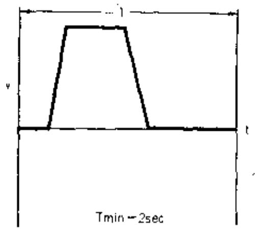

设计、制造要点

要保证棘轮的加工精度及关键部位的热处理。主动轴和从动轴的同轴度要求不高，有一些倾斜也可以,给一个大致的范围，装配时即较方便。

使用实例

传送带传动装置等的回转机构。

# 其 它

参阅附录一第2类控制回路。

# 摆动缸、棘轮和连杆始端减速间歇回转运动机构

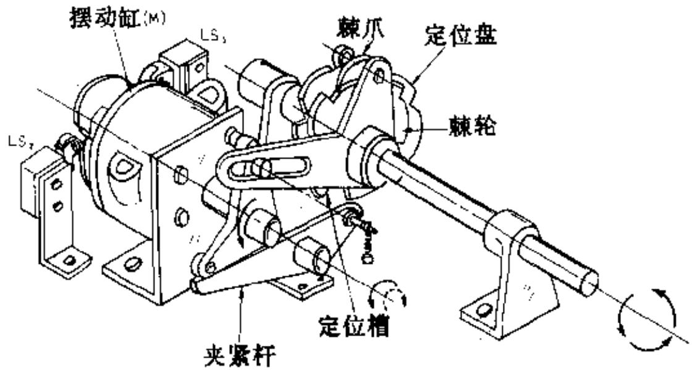

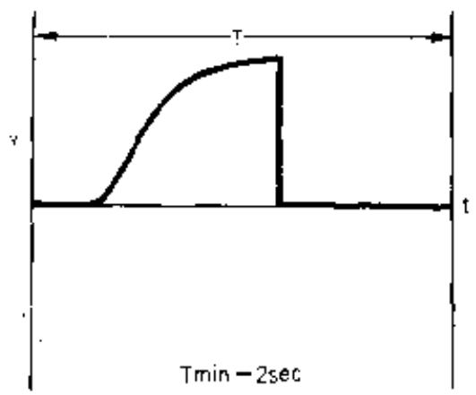  
图4-30动力：气压动作角度： $0 ^ { \circ } \sim 4 5 ^ { \circ }$ 载荷：中

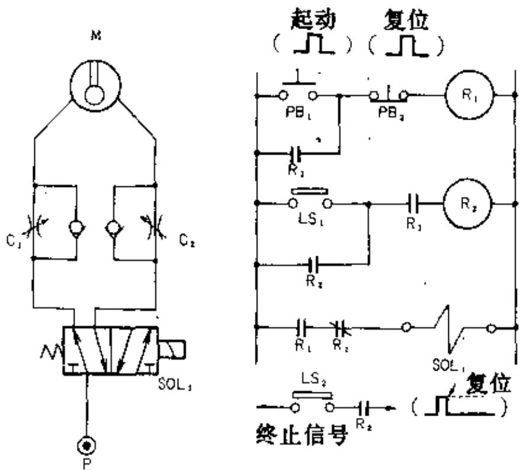

图4-30是改进了图4-29运动特性的一种间歇回转运动机构。它的特点是采用连杆机构，在速度特性曲线的起始端进行减速。为了使速度特性曲线的两端都减速，就要采用摆动 $1 8 0 ^ { \circ }$ 的摆动缸，由于在实际使用中更重视起始端的减速，所以举出本图作为例子。两端完全减速或起始端缓慢增速，都可通过改变连杆机构的相互关系予以变更。这样，与图4-29所示的机构相比，载荷可以较大。

设计、制造要点

如上所述，根据运动要求的速度特性，有必要改变连杆机构的相互关系。滚子和长槽可用连杆代替，如配置上没有什么问题，可适当加强连杆的强度，但用在 $\Omega 0 ^ { \circ }$ 传动时、稍有困难。摆动缸的摆动角度比进给角度必须要有较多的余量，这是首先要注意的。

# 使用实例

间歇传送带的进给装置，简单的转位工作台传动装置等的回转机构。

# 其 它

参阅附录一第2类控制回路。

# 具有任意变速系统的间歇回转运动机构

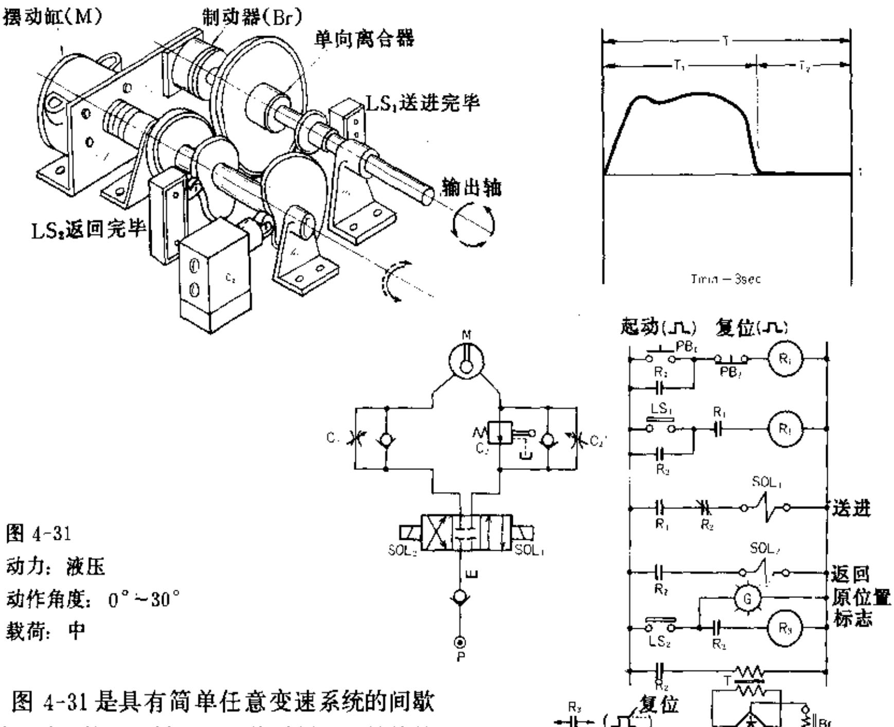

回转运动机构。它被用于不能采用凸轮轴等其它传动装置的场合。这里虽说是任意变速，但变速太复杂了还是不行的，所以是一种能在…定范围内控制中间速度和两端减速的机构和控制系统。由于采用了单向离合器，易产生累积误差，所以采取从输出轴送出端检测的方法来消除累积误差。摆动缸的回转角度要有足够的余量。制动器可采用外购件，在系统送进过程中不能制动，停止时需要制动，而且需要较大的制动力。另外，当采用磁粉离合器●时，可以产生经常要求的制动力，如使开关电路流过适当的电流，还可以增加载荷。

# 设计、制造要点

因为速度控制凸轮在实际调整时必须修正，所以应设计成拼合式的凸轮，以便于装卸。Ci、

Ci的调整要符合最低速度的要求。

# 使用实例

简易分度装置等的回转机构。

其 它

参阅附录一第6类控制回路。

# 单向离合器间歇回转运动机构

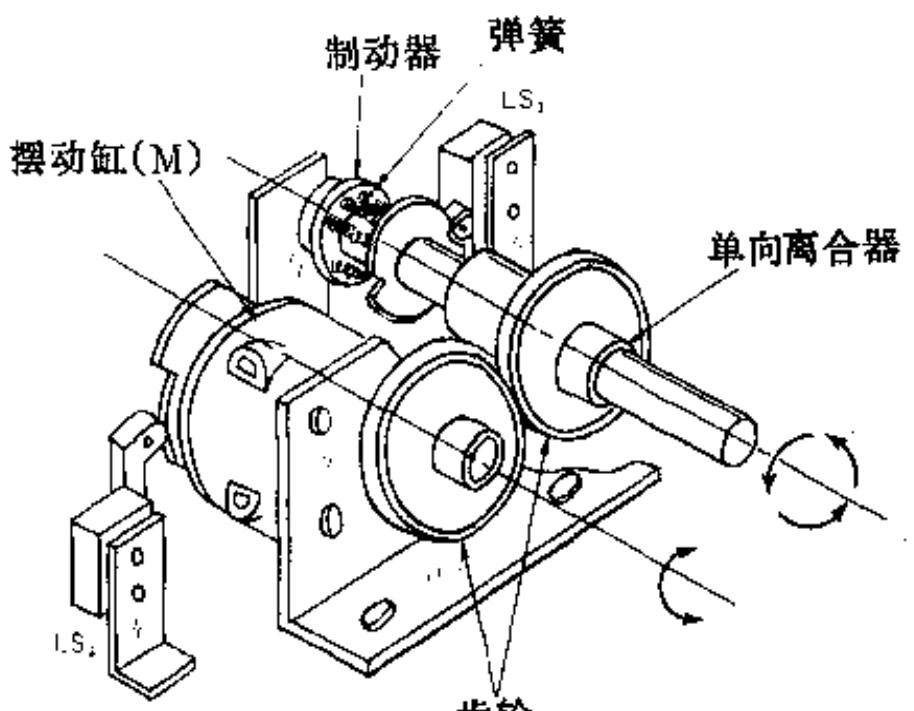  
齿轮

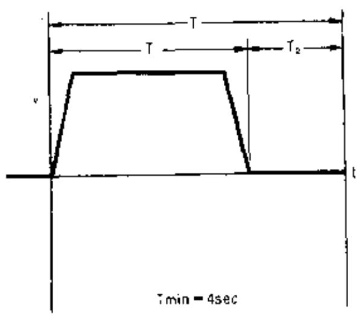  
图4-32动力：液压动作角度： $0 ^ { \circ } \sim 1 8 0 ^ { \circ }$ 载荷：中

M 起动复位PB5 oliPLb RR PBLSRRSOL LS R 复位终止信号

图4-32是采用单向离合器的间歇回转运动传动装置。采用单向离合器时，为消除累积误差，由输出轴上的凸轮凹槽操纵 $\mathbf { L S _ { i } }$ 发出信号，亦即发出主动轴返回信号。单向离合器的缺点之一，是在进给方向无限位点，所以完全有必要附加制动器。因此，周期时间不能太短。

设计、制造要点

设计上应考虑如下问题：防止冲击载荷，即防止键发生松动，以及齿轮可能的局部损伤等。制动器要做成可调整的,也可以使用带闸。另外，输出轴回转一周以上时，除LSi外，在主动轴上可以附加 $\mathbf { L S } _ { 1 }$ 的辅助限位开关。

# 使用实例

间歌传送带及擒纵机构等传动装置的回转机构。

其 它

参阅附录一第2类控制回路。

# 曲柄、连杆和棘轮步进回转运动机构

  
图4-33动力：电气动作角度： $0 ^ { \circ } \sim 1 0 ^ { \circ }$ 载荷：中

图4-33是通过曲柄、连杆、摇杆、棘爪、棘轮等将主动轴的回转运动转换为从动轴的间歇回转运动机构。通过改变曲柄的长度 $\downarrow$ ，可以

改变棘轮的回转角度。

设计、制造要点

为了能做到高速回转，各部分均应采用滚动轴承，以使动作轻快、灵活。

其 它

参阅附录一第1类控制回路。

# 十字轮间歇回转运动机构

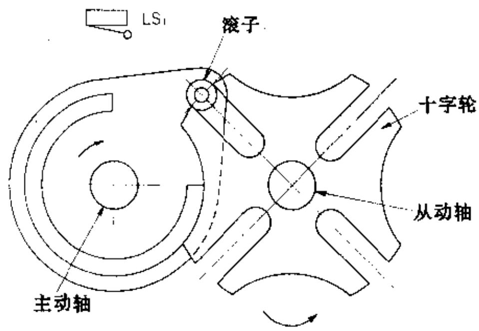

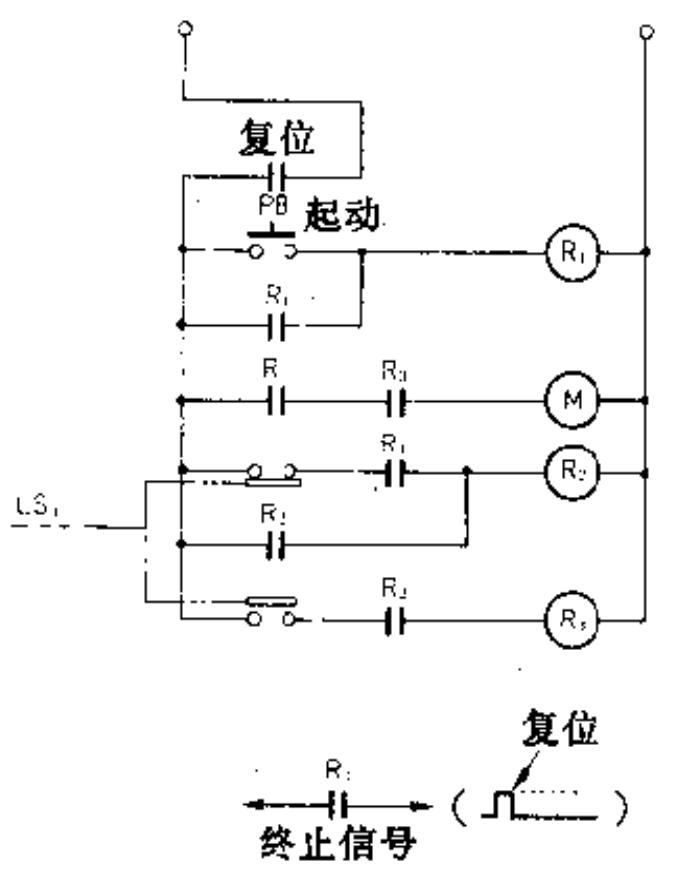

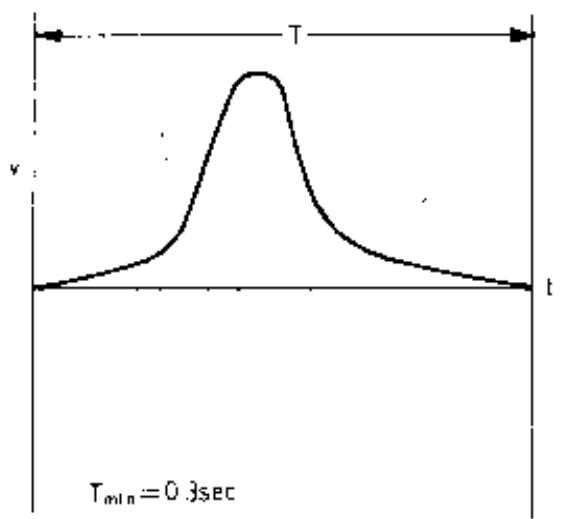  
图4-34动力：电气动作角度： $9 0 ^ { \circ }$ 载荷：中

图4-34是标准的四等分十字轮间歇回转运动机构。

# 设计、制造要点

1．销、滚子及十字轮等均需热处理，使其耐磨性好。2.要求分度精确时,可在从动轴上附加分度盘，用定位销等进行定位。

# 其 它

参阅附录一第2类控制回路。

# 缺齿齿轮和圆盘制动器间歇回转运动机构

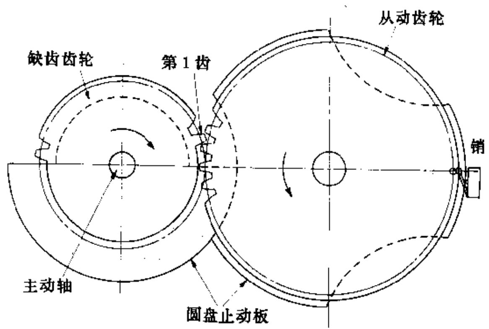

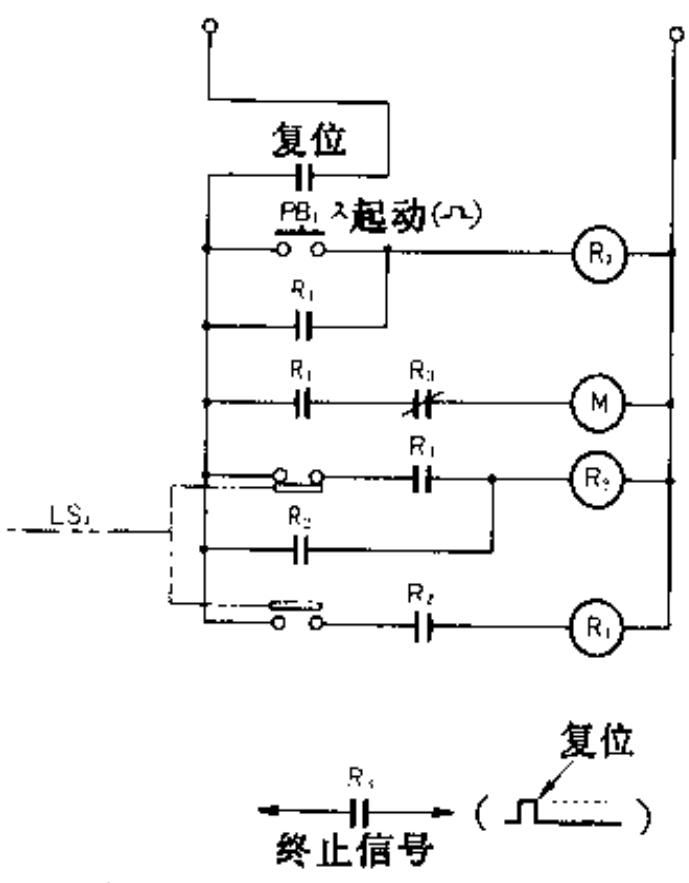  
图4-35动力：电气动作角度： $1 2 0 ^ { \circ }$ 载荷：轻

图4-35是主动轴上有缺齿齿轮和圆盘止动板、从动轴上有齿轮和三等分圆盘止动板的

间歇回转运动机构。

# 设计、制造要点

1。制动板要进行淬火、磨削处理。齿轮的齿面要进行高频淬火处理。此外，由于主动轴上缺齿齿轮部分每次在第一齿进入啮合时有冲击，所以要在主动轴和缺齿齿轮轮毂部分之间设置减震器。

2.按选择齿数的方法,可任意确定回转和停止的时间比。

# 其 它

参阅附录一第2类控制回路。

# 带有暂停动作的缺齿齿轮间歇回转运动机构

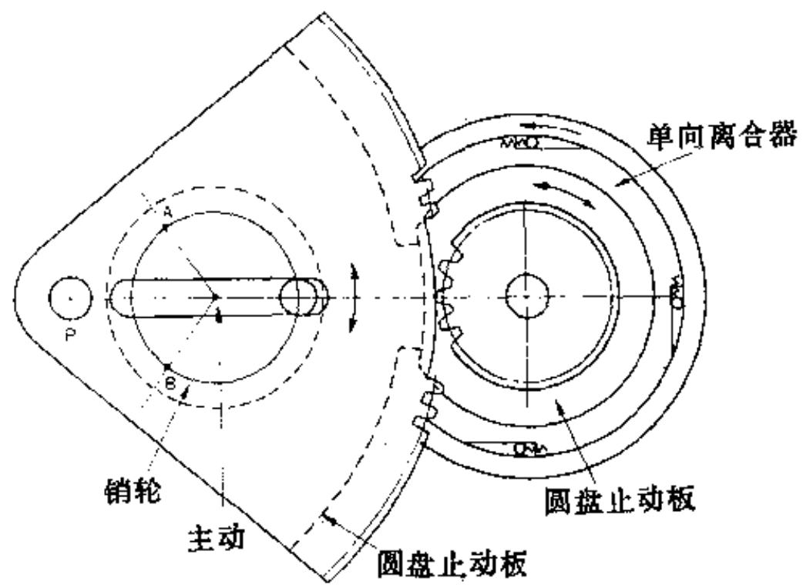

准备中 PB停止PE  
PB, 起动  
l T  
R IEP  
HH PB  
R 复位R 中R WWR M时间继电器M电容起动电动机

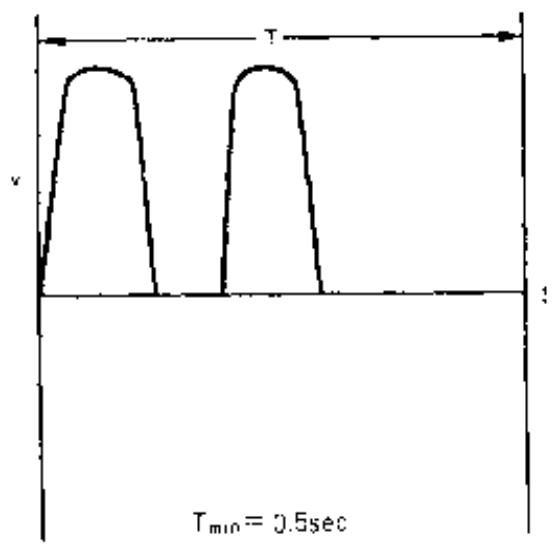  
图4-36动力：电气动作角度： $0 ^ { \circ } \sim 1 8 0 ^ { \circ }$ 载荷：轻

图4-36是一种带有暂停动作的间歇回转运动机构。主动轴的销轮以A点为起点，回转一次后停止。销轮上的销子是嵌配在扇形缺齿齿轮的长槽内的，扇形缺齿齿轮以P点为中心进行摆动，当销子从A点移至B点时，扇形齿轮带动小齿轮作逆时针方向回转，回转中间停止一段时间，同时，外轮轮毂通过单向离合器也进行回转。当销子从B点转至A点时，扇形缺齿齿轮快速返回，小齿轮顺时针方向回转，外轮不动。扇形齿轮的圆盘止动板和小齿轮的圆盘止动板分别安装于各自的轴上。单向离合器应进行淬火、磨削、齿轮的齿面最好进行高频淬火处理。

# 从动轴任意分度回转的同轴线回转运动机构

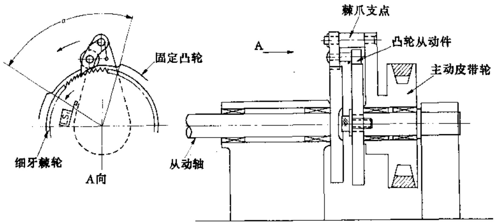

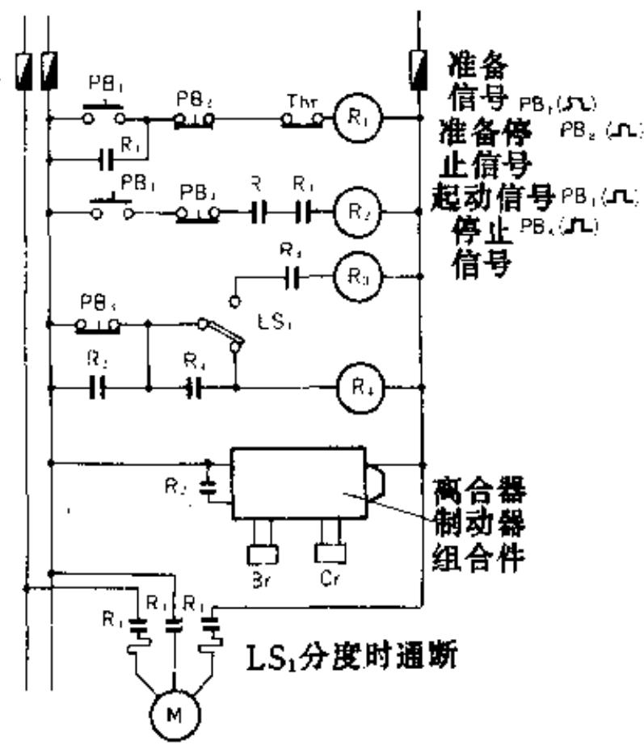  
图4-37动力：电气动作角度： $0 ^ { \circ } \sim 1 8 0 ^ { \circ }$ 载荷：轻

图4-37是可使从动轴在与主动轴同一轴线上回转任意角度的回转运动机构。工作时，棘爪及凸轮滚子随同主动皮带轮一起回转。凸轮滚子一边在固定于主动轴上的凸轮上滚动，一边带动棘爪上下进行与棘轮啮合和脱开的动作。棘爪在凸轮的凹下部位（即 $\mathfrak { a }$ 角度范围内)与棘轮处于啮合状态，从而推动了固定在从动轴上的细牙棘轮。

固定凸轮可以这样来设计，即使主动皮带轮在回转一周内的任意多个部位，使同轴线上的从动轴回转任意的角度。

# 使用实例

在从动轴上配置进给丝杠，可供任意进给时使用。

# 曲柄、连杆与齿条、齿轮单向回转运动机构

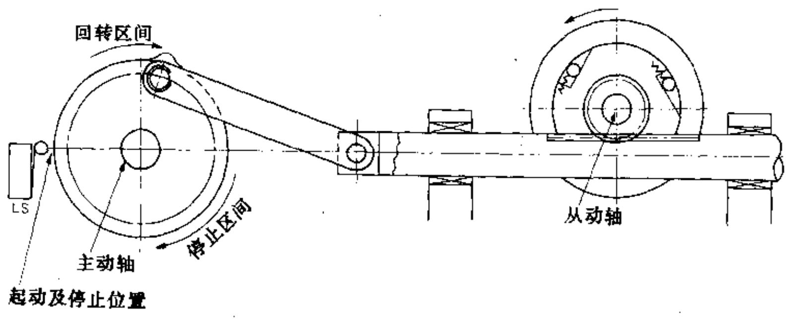

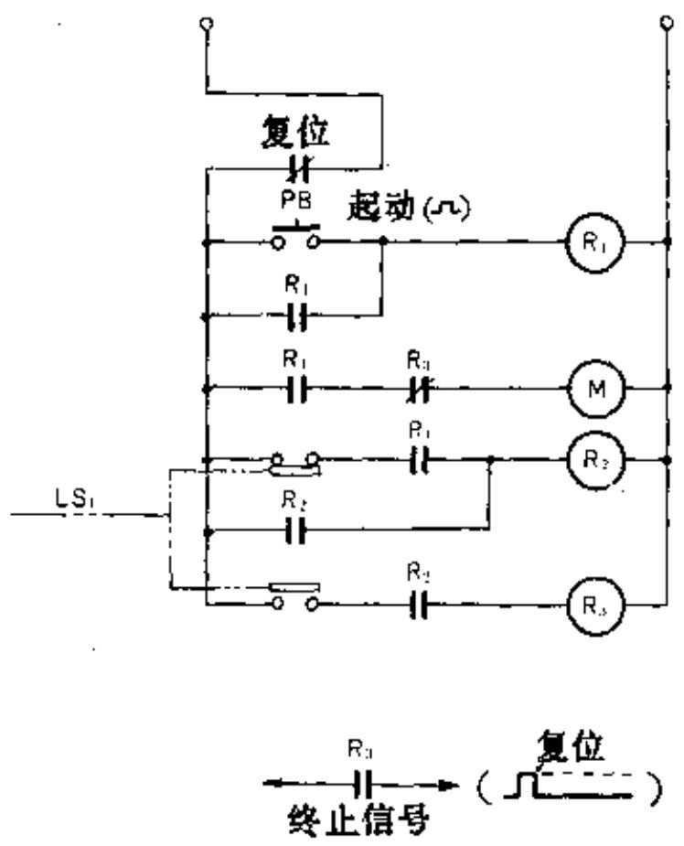

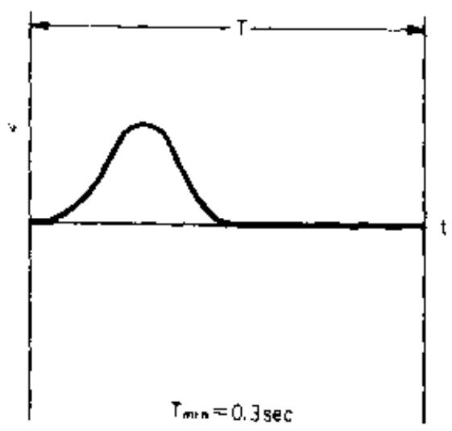  
图4-38动力：电气动作角度： $0 ^ { \circ } \sim 3 6 0 ^ { \circ }$ 载荷：中

次停止之后，动作反复进行。另外，从动轴的回转是两端减速的。

设计、制造要点

图4-38是通过直接与主动轴连接的曲柄圆盘带动连杆、齿条、齿轮及单向离合器，使从动轴作单向回转运动的机构。从动轴回转一

支点轴、回转轴上均采用滚动轴承，齿条轴两端安装滑动轴承。

# 其 它

参阅附录一第2类控制回路。

# 凸轮任意变速间歇回转运动机构

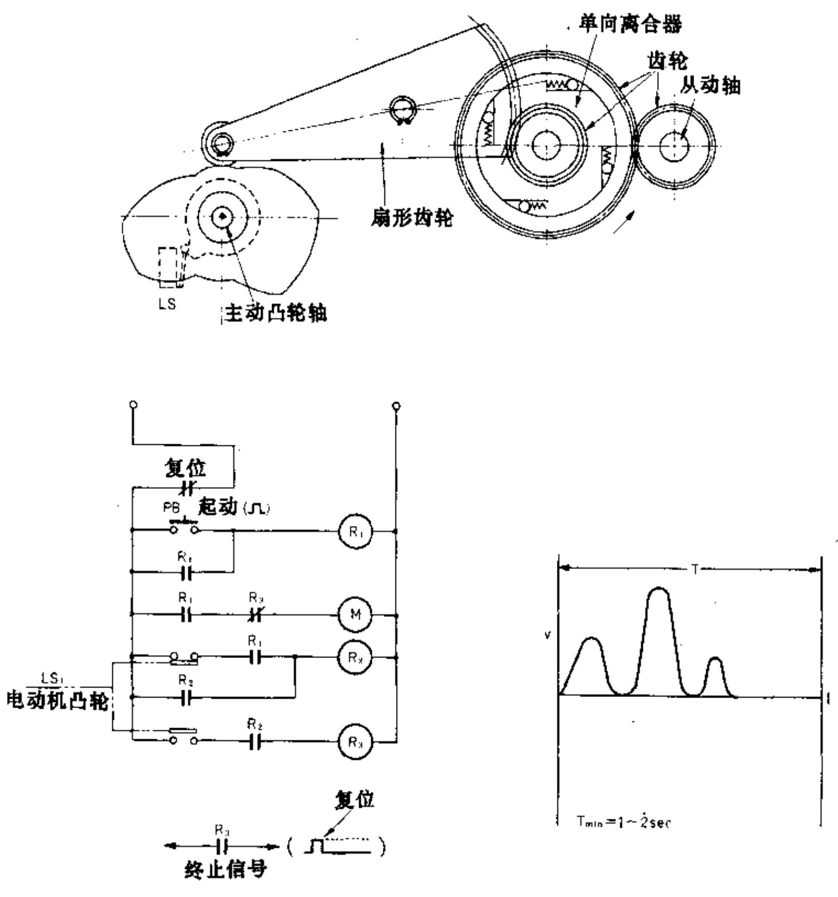  
图4-39动力：电气动作角度： $0 ^ { \circ } \sim 3 6 0 ^ { \circ }$ 载荷：中

图4-39是依靠装在主动轴上的凸轮，带动扇形齿轮，小齿轮，并通过单向离合器，使从动轴进行任意变速及停止的间歇回转运动机构。

设计、制造要点

通过凸轮的形状可使从动轴形成较复杂的动作。但在使用板凸轮时，滚子推杆在凸轮上侧较好。滚子推杆在下侧时要特别注意滚子在凸轮陡角处可能因反作用力而越出凸轮。

# 其 它

参阅附录一第2类控制回路。

# 锥齿轮和球面圆盘变速机构

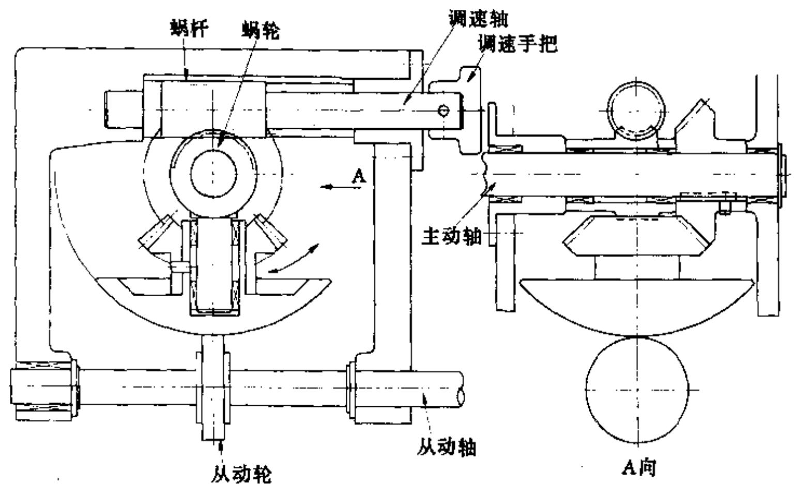

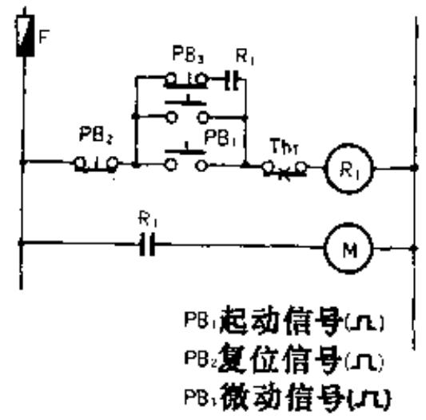  
图4-40动力：电气回转方式：连续回转载荷：轻

图4-40是利用锥齿轮和球面圆盘实现变速的机构。当主动轴通过一对1：1的锥齿轮，把动力传给装在第二轴上的球面圆盘时，球面圆盘便带动从动轮，使从动轴回转(图示位置：从动轮处在球面圆盘中心位置，所以不动)。

当转动图中所示的调速手把时，通过蜗杆、蜗轮，使球面圆盘以P点为中心向左或向右倾斜，从动轮便带动从动轴相应地改变回转方向和改变转速。

# 设计、制造要点

1．为保证传动系统转动灵活,应采用滚动轴承。球面应进行淬火，并保证加工精度和表面光洁度。

2，从动轮采用聚氨脂橡胶等摩擦系数较大的材料制成。本机构的特点是结构较紧凑，优点是由于采用了锥齿轮，轴向推力始终作用在从动轮上，所以不易产生滑动。

其 它

参阅附录一第1类控制回路。

# 摩擦圆盘变速机构

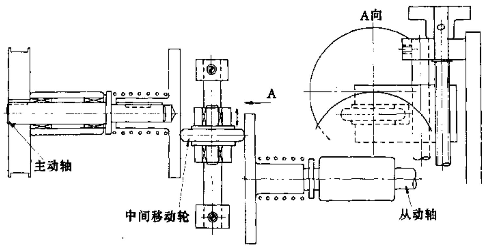

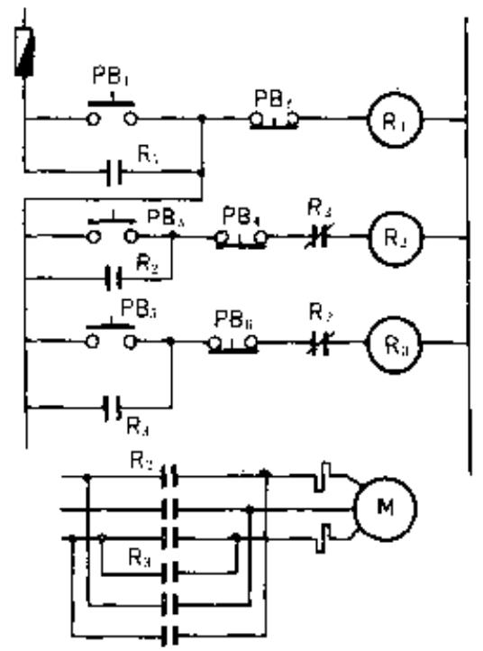  
图4-41动力：电气回转方式：连续回转载荷：轻

圆盘，表面都要加工平滑，而且要保证表面与轴线的垂直度。

2．中间轮接触部分的材料采用聚氨脂橡胶，以减少与摩擦圆盘之间的滑动。

图4-41是利用摩擦圆盘的变速机构。在两个对置的摩擦圆盘之间，有中间移动轮，通过中间移动轮位置的任意改变，能获得无级变速。

# 设计、制造要点

1．无论是主动轴侧的圆盘还是从动轴的

# 使用实例

：在本机构的从动轴上连接进给丝杠等，供绕线机的线作进给微调用。

# 其 它

参阅附录一第2类控制回路。

# 由锥齿轮组合在同轴线上减速1/2的机构

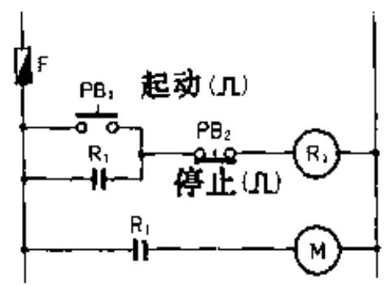

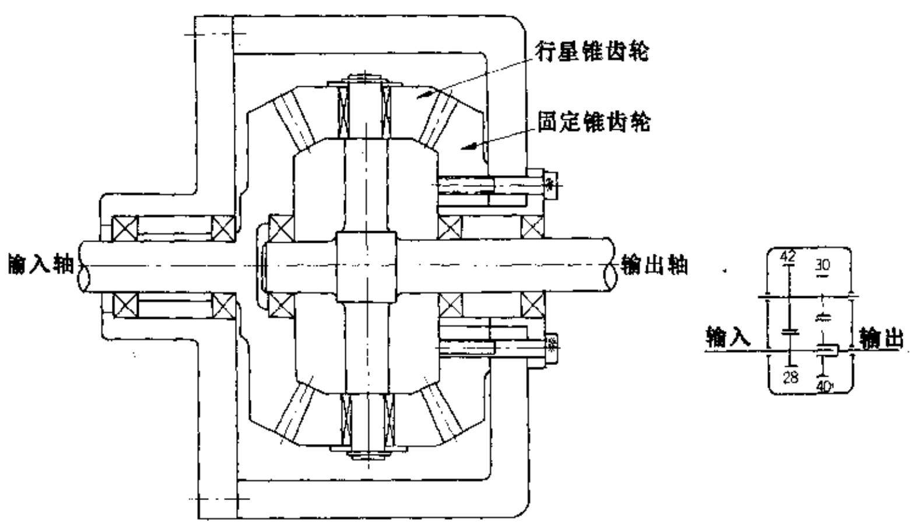  
图4-42动力：电气回转方式：连续回转载荷；中

图4-42是用普通同轴线上的输入轴和输出轴，通过锥齿轮的组合，按图中简图所示那样，选择齿轮的啮合比，构成减速1/2的机构。其特点是结构紧凑。

设计、制造要点

1。齿轮箱采用密闭油浴式,尽量使用油封及滚动轴承等，以保证工作可靠。2．如图所示，采用两个行星齿轮时，主动齿轮与固定齿轮的齿数应当是2的整倍数。

其 它

参阅附录一第1类控制回路。

# 两个行星齿轮高减速机构

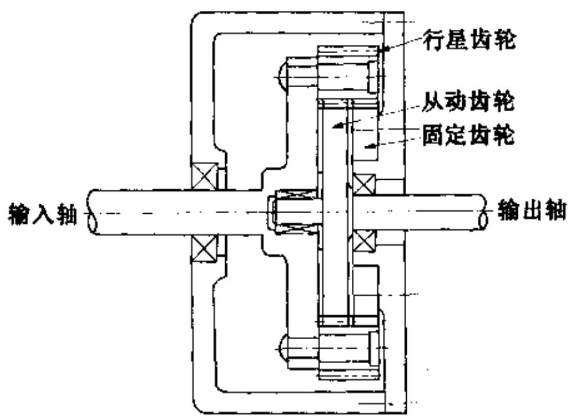

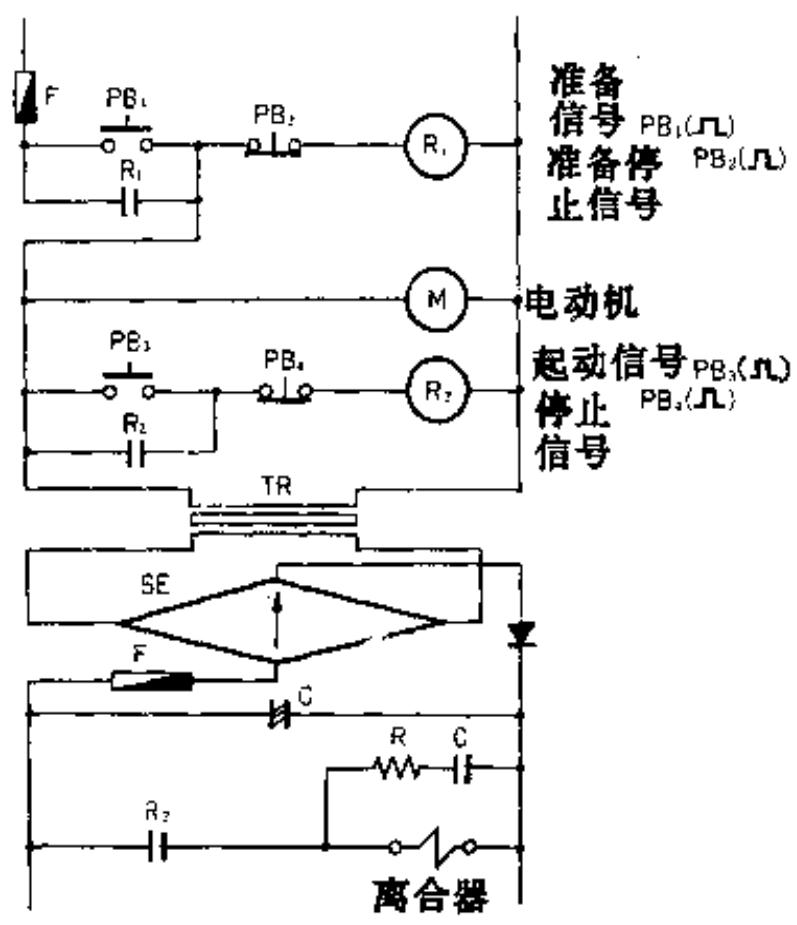  
图4-43动力：电气回转方式：连续回转载荷：重

图 $\mathbf { 4 - 4 3 }$ 是具有两个行星齿轮的高减速机构。输入轴上两个行星齿轮同时与齿数相差为

2的从动齿轮和固定齿轮相啮合。输入轴回转-一周，从动齿轮仅回转两个齿（从动齿轮与固定齿轮的齿数差)。

此时，如固定齿轮的齿数为100，从动齿轮的齿数为98，那么、从动齿轮的转速为：

由此可以看出能够获得高减速比。

# 其它注意事项

箱体采用密封油浴式较好，各部分采用滚动轴承较可靠。

用两个行星齿轮时，在机械原理上，固定齿轮和从动齿轮的齿数差可以是2或是2的整倍数。可是，因为这里要用变位齿轮才能使它们同时啮合，所以大的齿数差是不行的，只能是2。

# 电磁比例式流量控制阀任意变速回转运动机构

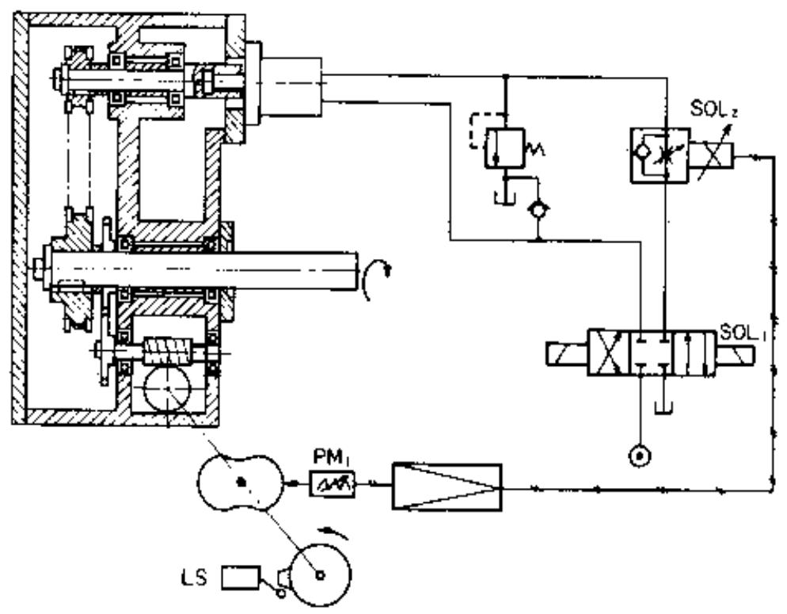

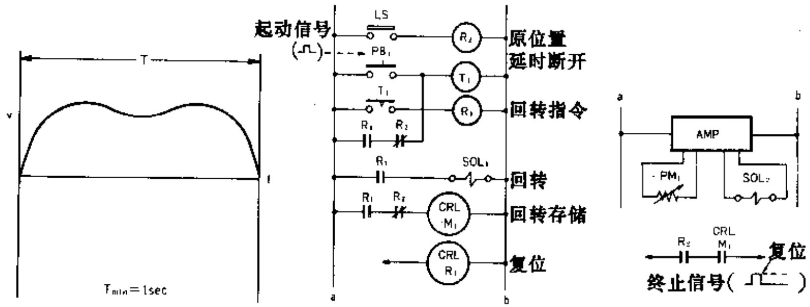  
图 $\mathbf { 4 } - \mathbf { 4 4 }$ 动力：液压回转方式：连续回转载荷：中

图4-44是通过电磁比例式流量控制阀来控制定量液压马达的回转，使从动轴在一定的周期内作任意变速的回转运动机构。控制信号是由从动轴通过齿轮和蜗杆使凸轮回转而发出的，由电位器把凸轮的曲线转换为电气量，然后通过放大器放大。液压马达是通过同步皮带来带动从动轴回转的。

# 设计、制造要点

1．用于转速变化为总回转数的函数的场合。2．电位器的结构力求简单，但如用电刷在  
电阻丝上滑动的方法，调节速度即受到限制。3．电磁比例式流量控制阀和电气控制部  
件均可外购。4．同步皮带传动可由中速到高速。使用实例卷绕装置等的回转机构。其它参阅附录一第2类控制回路。

# 随动装置任意变速回转运动机构

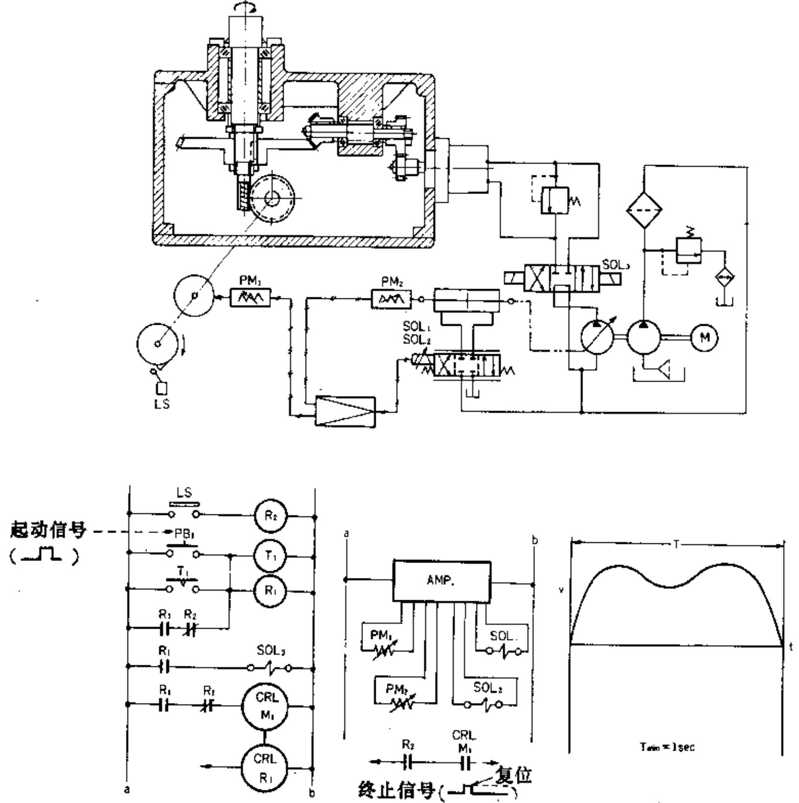  
图4-45动力：液压回转方式：连续回转载荷：重

图4-45是采用随动装置的任意变速回转运动机构。为了使从动轴的回转在一定的周期内任意变化，采用了定量液压马达和变量液压泵组合而成的液压传动系统，并用随动阀来控制液压泵的流量。控制信号分别由从动轴同步凸轮的回转及液压泵流量控制液压缸的位移，通过电位器检测并比较而获得。

# 设计、制造要点

1。随动阀的液压管路要特别注意清洁，并设置过滤器，以防杂质引起随动阀产生故障。

2．供给随动阀的液压要保持恒定。另外，液压油温也必须通过冷却器等保持在一定范围内。

3.锥齿轮必须能通过垫圈等来调整安装位置。

使用实例

卷绕装置等的回转机构。

其 它

参阅附录一第2类控制回路。

# 蜗杆和减速阀回转运动机构

  
图4-46动力：液压回转方式：连续回转载荷：重

图4-46是利用液压马达驱动的蜗杆、蜗轮回转运动机构。在液压系统中，采用电液控制的制动阀来进行减速和停止的操作，具有能减少停止时冲击的优点。另外,由于使用了蜗杆、蜗轮，停止时可以自锁。

设计、制造要点

．1。本机构适用于从动轴的载荷由正变负，并且转速急剧变化的复杂情况。

2．蜗轮减速器采用密闭油浴式润滑。

3．在蜗杆轴上要装有调整垫圈，以供现场装配时调整蜗杆、蜗轮中心。

# 其 它

参阅附录一第3类控制回路。

# 链条和液压减速系统回转运动机构

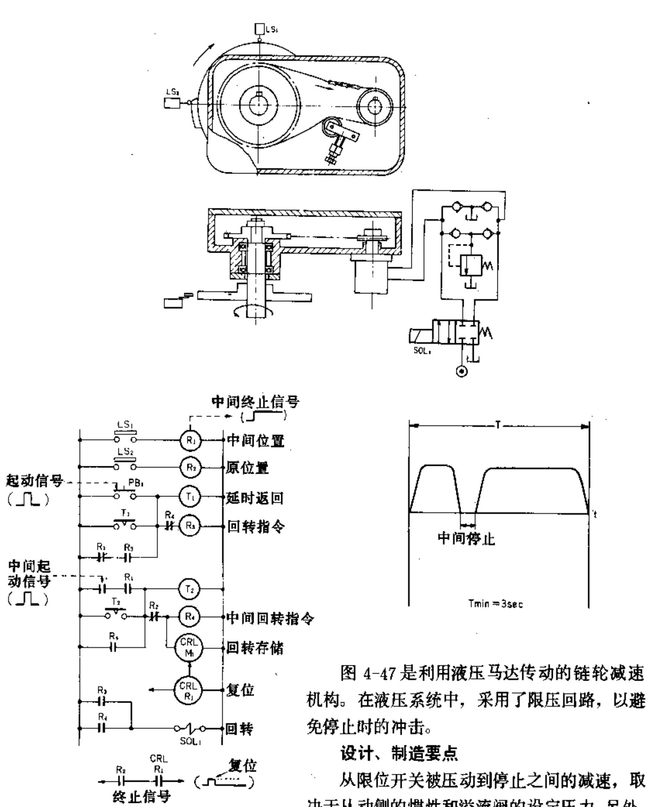  
图4-47动力：液压回转方式：连续回转载荷：重

决于从动侧的惯性和溢流阀的设定压力。另外，在停止过程中，如惯性力过大，则停止位置发生变化。

# 其 它

参阅附录一第3类控制回路。

# 直线运动凸轮任意变速间歇回转运动机构

图4-48  
动力：气压  
动作角度： $0 ^ { \circ } \sim 4 5 ^ { \circ }$   
载荷：重

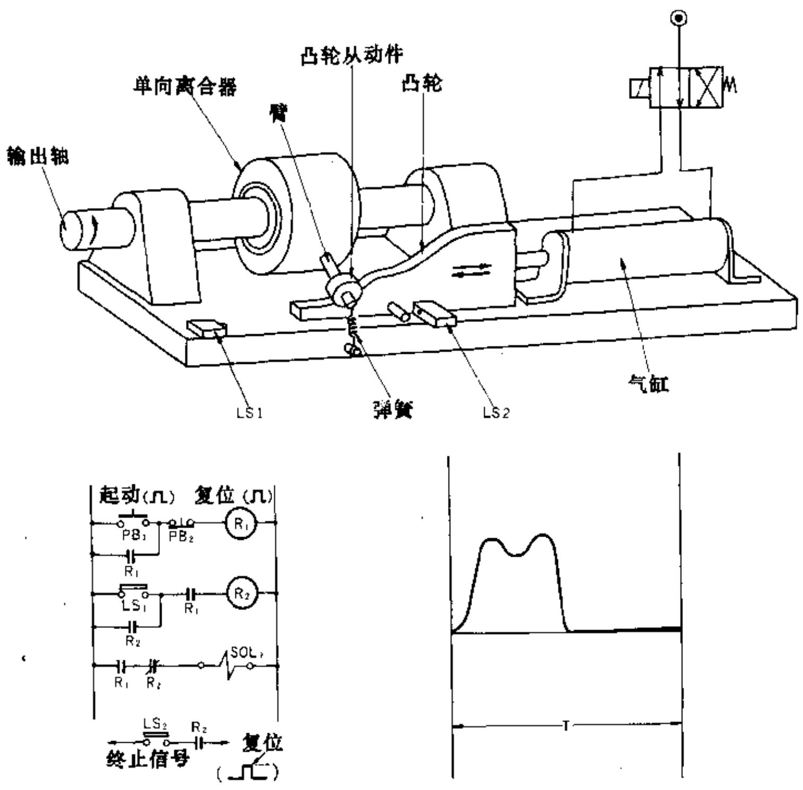  
$T _ { m n } = 1 5 e c$

图 $4 - 4 8$ 是利用直线运动凸轮传动装在单向离合器上的臂，使输出轴得到间歇回转运动的机构。通过凸轮曲线可得到任意的速度特性。

设计、制造要点

凸轮面和凸轮从动件很难接触平滑，尽管沿凸轮面的高度作出相应地倾斜，但也难以做到理想。

# 其 它

参阅附录一第2类控制回路。

# 爪传动销轮的间歇回转运动机构

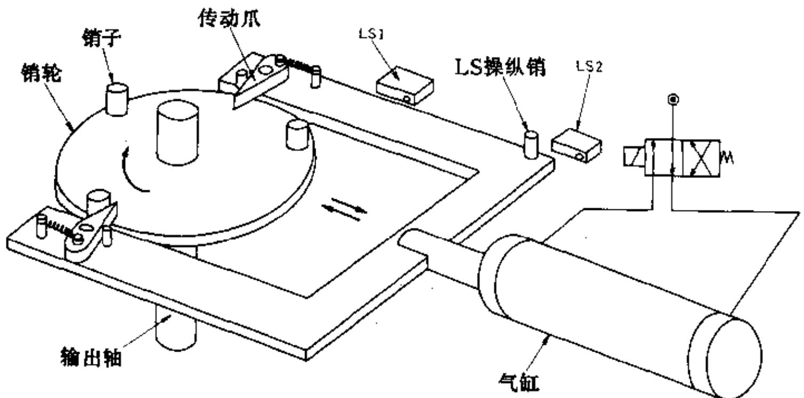

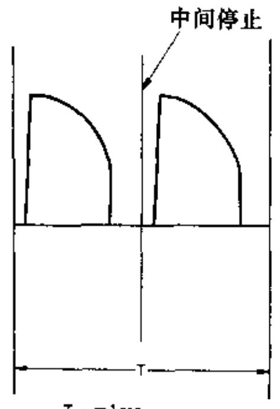  
${ \bar { \mathsf { T } } } _ { \mathsf { P d n } } = 1 \mathsf { s a c }$

复位   
PE 起动 中 电磁阀 8 R 复位 终止信号   
图4-49   
动力：气压   
动作角度： $3 0 ^ { \circ } \sim 6 0 ^ { \circ }$   
载荷：轻

图4-49是由气缸的往返分别用瓜拨动销子的间歇回转运动机构。在一定程度范围内，使销子作不等间距的配置，可使回转角变化。

改变销子的个数，即可改变分度数。

设计、制造要点

为使输出轴在停止位置不发生移动，有必要用摩擦或插销等控制定位。

# 其 它

参阅附录一第3类控制回路。

# 往复凸轮传动销轮的间歇回转运动机构

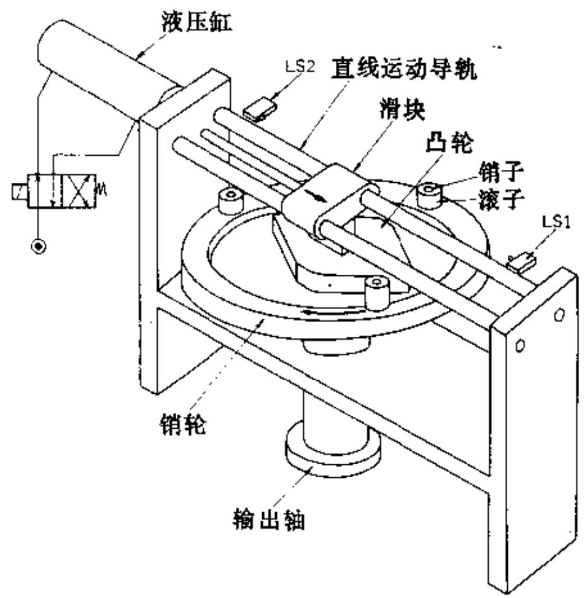

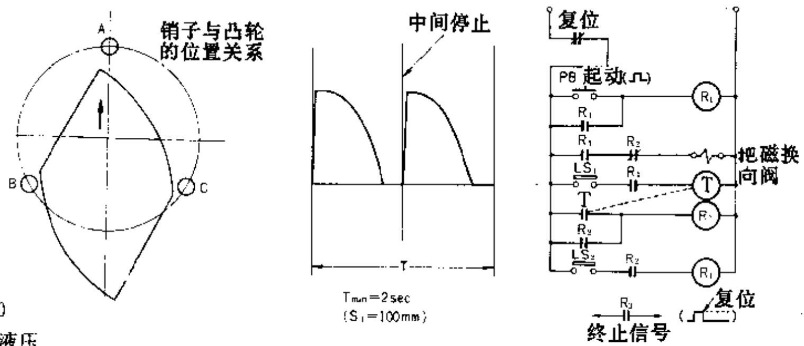  
图4-50动力：液压动作角度： ${ \tt f o } ^ { \circ }$ ， $3 6 ^ { \circ }$ ，25.7°载荷：中

图4-50是利用往复凸轮传动销轮的间歇回转运动机构。每当凸轮往复传动滚子，销轮即进行回转。凸轮的前进和返回，销轮都回转 $6 0 ^ { \circ }$ 。

销子和凸轮的位置关系如简图所示，凸轮按箭头方向移动，就使销子A向右方回转。

设计、制造要点

对于带有凸轮的滑块，其导轨必须十分平直。还有，在销轮不转位时，不得移位。因此，在输出轴上要装有插销式的定位机构。

其 它

参阅附录一第3类控制回路。

# 棘爪和链条间歇回转运动机构

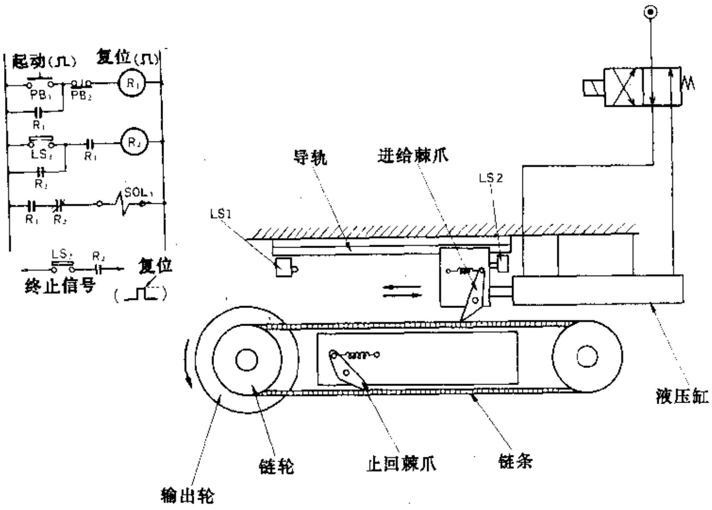  
图4-51动力：液压动作角度： $0 ^ { \circ } \sim 3 6 0 ^ { \circ }$ 载荷：中

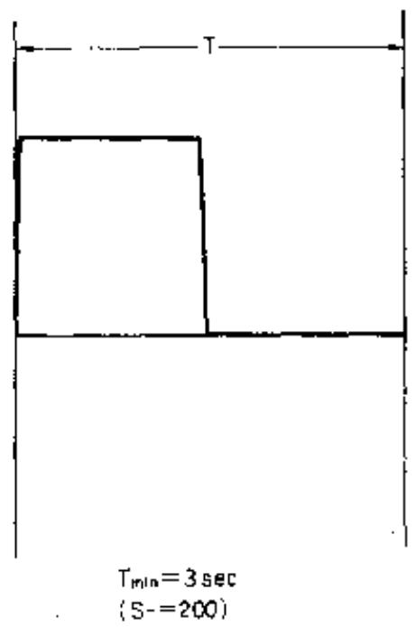

图4-51是利用进给棘爪将张紧于两个链轮之间的链条的直线部位送进，从而使链轮间歇回转的机构。

如果液压缸的行程大于链轮的圆周长，那么一个行程也能回转 $3 6 0 ^ { \circ }$ 以上。

设计、制造要点

进给棘爪部位要有可靠的导轨。另外，止回棘爪的位置必须对应于链条的挠度。

其 它

参阅附录一第2类控制回路。

# 摆杆和棘轮间歇回转运动机构

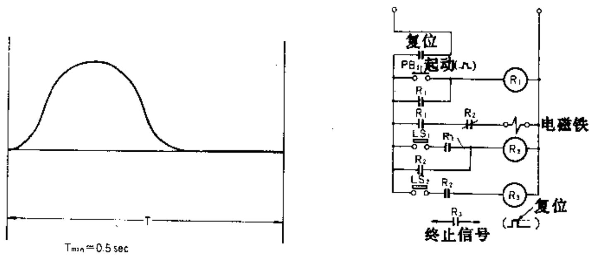  
图4-52动力：电气动作角度： $1 0 ^ { \circ } \sim 6 0 ^ { \circ }$ 载荷：轻

图4-52是把回转电磁铁摇臂的摆动转换为带有进给棘爪摆杆的摆动，从而传动棘轮的机构。带进给棘爪摆杆的摆动角度，可以为棘轮的1个节距到2个节距，通过回转电磁铁位置和角度的变更，可以得到除完全两端减速以外的终端减速、不完全两端减速等的运动特性。

设计、制造要点

改变回转电磁铁的位置时，带有进给棘爪摆杆的动作终端位置就变化，止回棘爪的位置也必然要变化，必须注意这个问题。

# 其 它

参阅附录一第2类控制回路。

# 第五章 复合运动机构

# 垂直和水平分别传动的振动机构

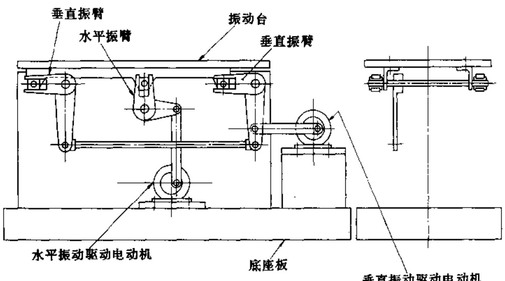  
垂直振动驱动电动机

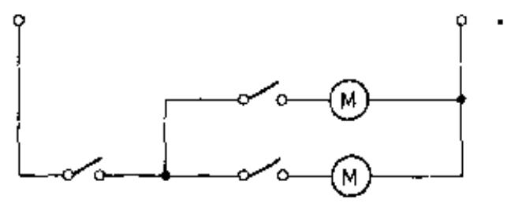  
图5-1动力：电气行程： $0 \sim 3 0$ 毫米载荷：中

图5-1是垂直和水平复合振动机构。如果停止任一驱动电动机，另一振动仍可进行。

# 设计要点

1．注意滑动部分的耐磨性和间隙。

2．可动部分要轻，底板要重（质量比应为$1 0 \sim 2 0 )$ ：

3．要尽量减小轴承处回转时的摩擦力。可采用滚动轴承。在回转角度较小的轴承处，也可采用轴套，但要设置适当的润滑机构。

# 制造要点

1．各螺栓紧固处都要加弹簧垫圈，或采用其它防止松动的措施。

2．滑动部分和轴承处要充分润滑。

# 三角凸轮矩形运动机构

  
图52动力：电气行程： $1 0 \sim 1 0 0$ 毫米载荷：轮

图52是利用三角凸轮传动的机构。三角凸轮外接摆杆的方孔，获得如图中箭头方向所示的矩形运动。在摆杆前端可安装各种用途的机构，以进行相应的工作。

# 设计要点

1．只有使摆杆的铰链销、沿垂直方向的中心位置高度与三角凸轮大半径圆弧相切的方孔线一致时，才能得到水平运动。

2．因为运动轨迹的精度，取决于摆杆铰链销处的松动和三角凸轮与摆杆方孔间的问隙，所以要注意这些部分的结构及公差配合。

# 制造要点

注意三角形凸轮和摆杆方孔的加工精度。

# 其 它

参阅附录-·第2类控制回路。

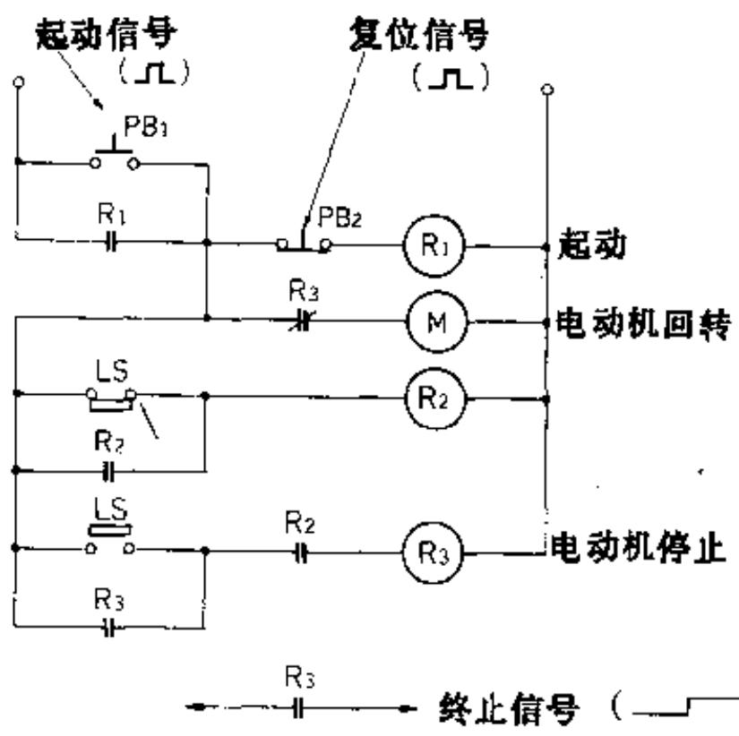

# 双凸轮传动的上下和左右运动机构

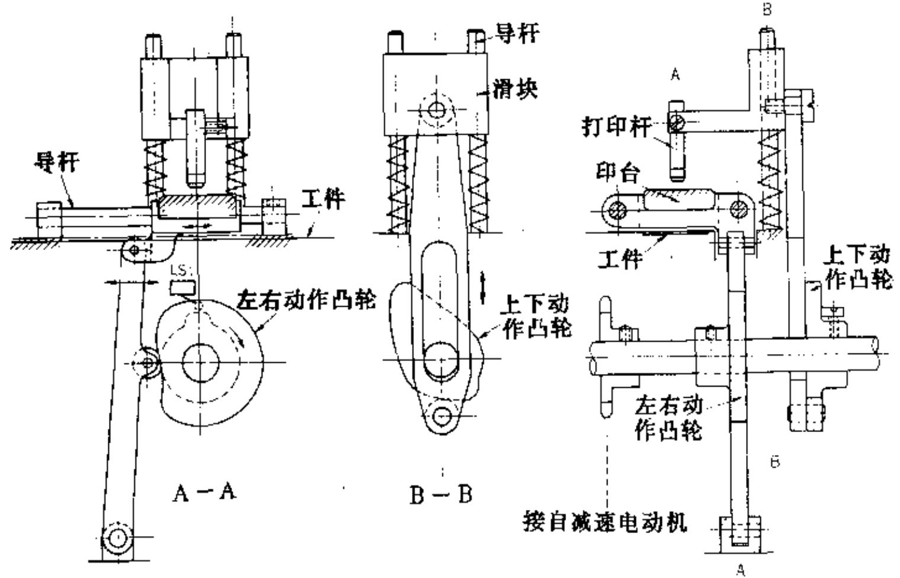

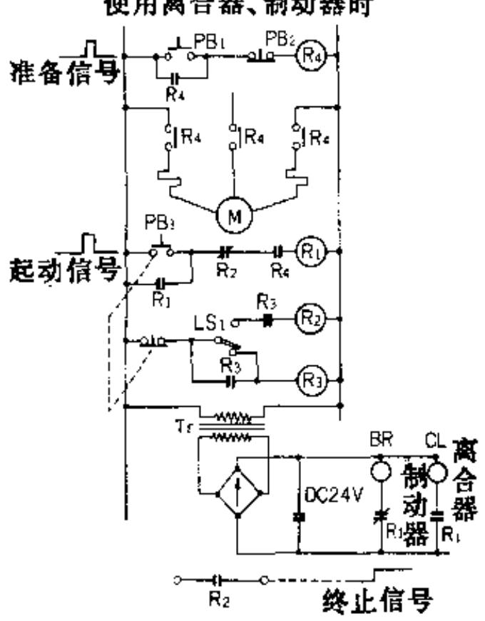  
使用离合器、制动器时  
图5-3

$\mathbf { P B _ { i } }$ ：准备按钮$\bar { \mathbf { P } } \bar { \mathbf { B } } _ { 2 }$ ：停止按钮$\mathbf { P B } _ { 3 }$ ：起动按钮

${ \bf L S } _ { 1 }$ ：一次回转终止开关（原位置接通）

$\pmb { M }$ ：电动机

BR：制动器

CL：离合器

动力：电气  
行程： $1 0 \sim 1 0 0$ 毫米  
载荷：轻

图53是通过在同--轴上的两个凸轮，分别传动各自的工作头做上下和左右运动的机构。如图所示，是对在薄钢带上定量进给的工件进行打印的装置。此机构也可用来完成对特轻工件的抓取和装入动作。

# 设计要点

1．导杆需淬火，滑块内使用含油轴承或滚珠导套。2.工件最好向印台的右方定量进给，也可通过凸轮轴用别的途径传动。

# 使用要点

最近多采用滚子打印法。当打印件的种类变化频繁时，采用此法，只要简单地改变准备工作即可。

# 其 它

参阅附录一第5·4类控制回路。

# 凸轮及电磁铁各自独立传动的左右和前后运动机构

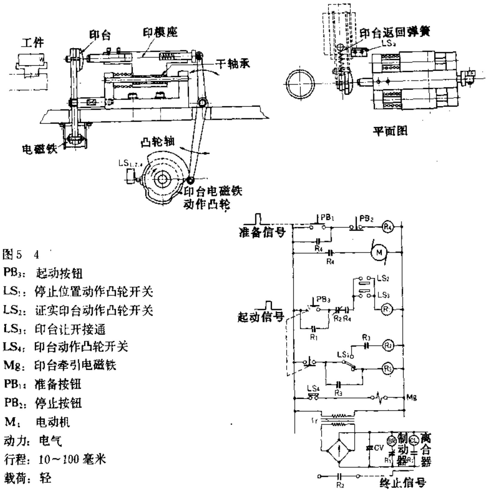

图5-4是一种自动打印机构。印模座通过凸轮左右运动，印台通过电磁铁前后摆动。印模座的动作重复下列过程：

前进上油墨 $\nrightarrow$ 后退 $\twoheadrightarrow$ 前进打印 返回原位。

设计要点

在控制上，必须证实印台移动之后，印模座才能前进打印。一般说来，印台也通过凸轮轴传动较为理想，但是由于印台与凸轮轴的角度，距离以及间隔等关系，存在着难以联动的情况，所以采取凸轮与电磁铁并用，这也是一种方法。

# 使用要点

在实际应用中，对于工件的打印还存在一些其它复杂问题。如油墨的干燥，工件表面凹凸不平对打印的影响等。一般采用橡胶印字时，在橡胶印模和台板之间再贴一层微孔海 绵胶膜，使橡胶印模与工件的表面能很好地接触。

使用实例

组合在自动装置中的打印机。

# 其 它

参阅附录一第5-4类控制回路。

# 往复轨迹不同的直线和摆动运动机构

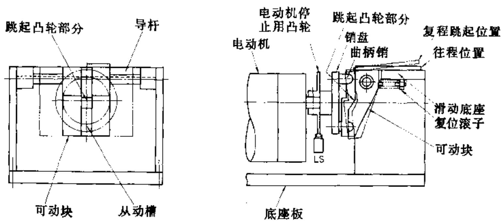

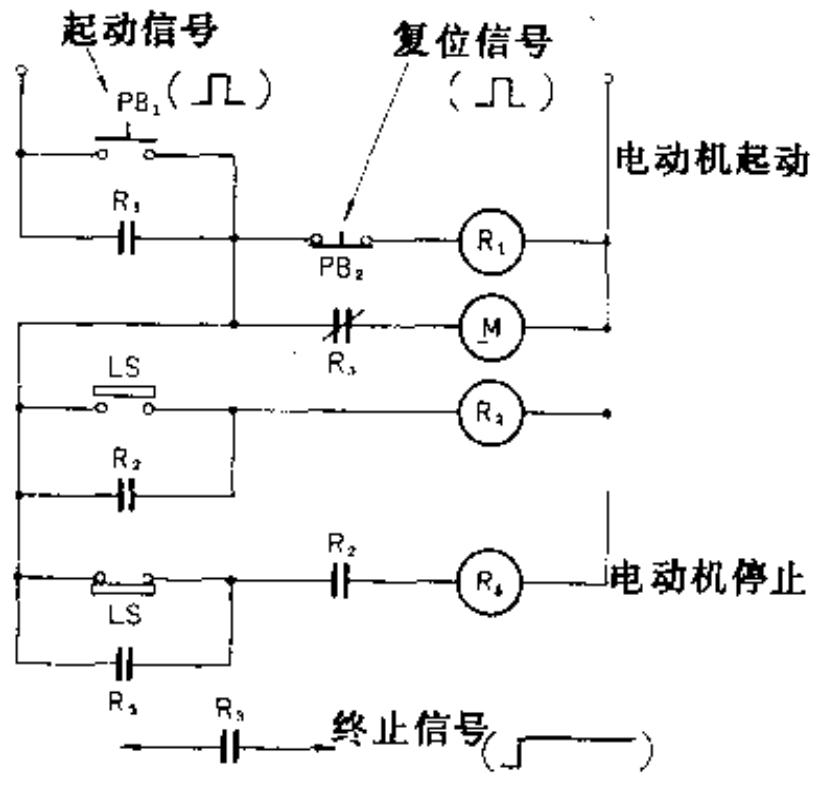  
图5-5动力：电气行程： $1 0 \sim 1 0 0$ 毫米载荷：中  
图5-5是在滑动运动的往复过程中，具有不同轨迹的水平运动机构。如果曲柄销在较大的节圆直径上，则能得到较大的跳起量。当

电动机带动销盘回转时，曲柄销在可动块的从动槽中滑动，使可动块沿导杆左右往复运动，在销盘下半周回转中，当曲柄销接触跳起凸轮部分，就使得可动块跳起。

# 设计要点

1．曲柄销与从动槽的间隙，大约在 $\mathbb { 0 . l ^ { \sim } }$ 0.2毫米为合适。

2．如曲柄销本身能回转，则更为理想。

3．导杆滑动部分也可以使用聚四氟乙烯导套，甚至比使用滑动轴承、导向轴承等时，动作更加灵活。但在此情况下，导杆仍需淬火、磨光。

# 制造要点

1．滑动部分不能发生卡死。要注意导杆部分的同轴度。

2．滑动部分必须润滑。

# 使用实例

用于薄而轻的小工件等的整理输送机构上。

# 其 它

参阅附录一第2类控制回路。

# 工作头边旋转、边上下联动机构

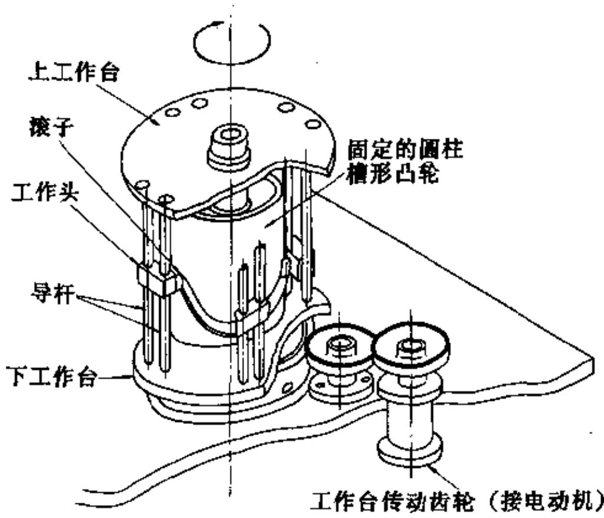

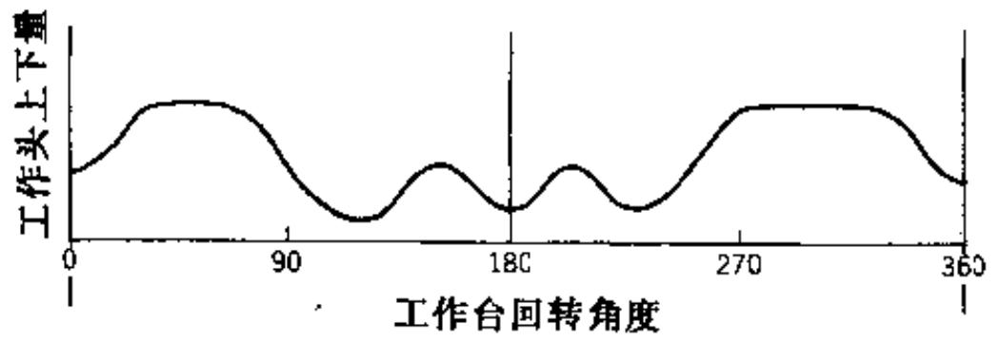

图5-6  
动力：电气  
行程： $1 0 \sim 3 0 0$ 毫米  
载荷：中

设计要点

1．由于工作台的传动来自下部，上工作台靠导杆传动而回转，因此要保证导杆的强度。

2．因圆柱槽形凸轮在很多情况下必须微调，所以应设计调整用的缺口。当上下运动行程较小时，不必采用槽形凸轮。

制造要点

要严格控制滚子外径公差，若滚子直径不一致,各工作头在动作时就产生误差。另外，要注意各导杆的长度及上下工作台的平行度。

使用实例填充机等。

# 其 它

1．由于本机构润滑困难，所以必须在材料表面进行涂复保护。

2.参阅附录一第1类控制回路。

# 由上下运动将水平放置的工件垂直供给的机构

图5-7  
动力：电气  
行程： $5 0 \sim 5 0 0$ 毫米  
载荷：轻

设计要点

图5-7是利用传动杆的上下运动，将水平放置的工件垂直供给的机构。由于两个滚子在导向板的槽中动作，所以滚子与导向槽的松动，影响动作的精度。如果两个滚子分别置于两个导向槽中 (即先行滚子槽和后行滚子槽)，

本机构即可水平放置。

制造要点

导向板与夹具安装板之间不能有松动。要注意在导向板曲面部分容易发生滚子松动。

# 使用实例

轴的插入等。

# 其 它

1．本机构用于轻载荷、中速工作。上下动作的速度，在行程两端采用正弦曲线式的减速。

2．参阅附录一第2类控制回路。

# 前后、左右和上下运动组合机构

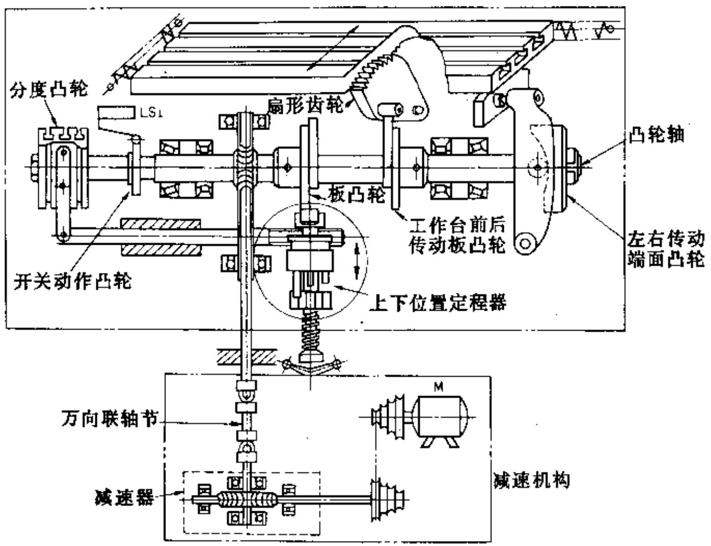

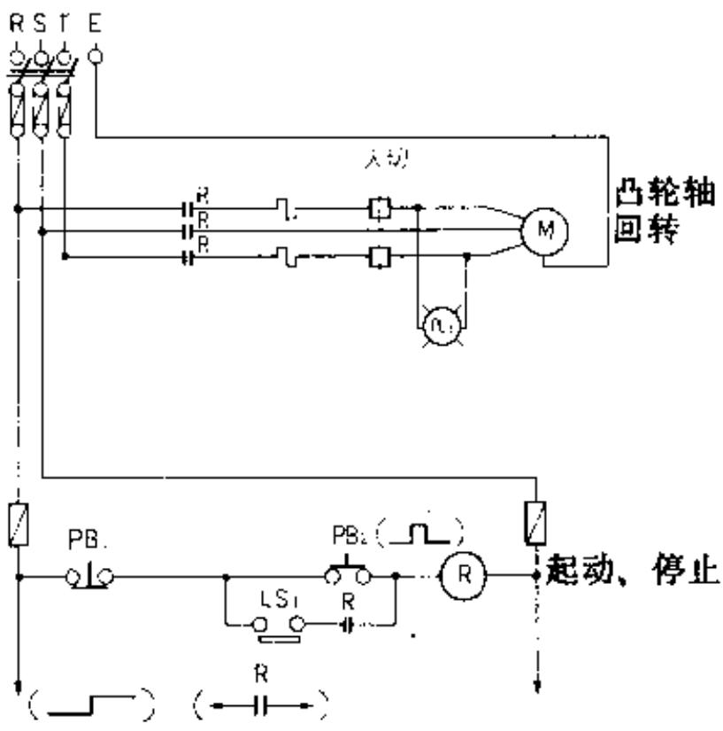  
图5-8动力：电气行程： $1 0 0 \sim 1 0 0 0$ 毫米载荷：重

图5-8是用一个凸轮轴传动，使工作台进行前后、左右及上下运动的机构。

左右运动由凸轮轴上的端面凸轮通过杠杆带动，使工作台左右进给。前后运动由工作台前后传动板凸轮，通过与安装在滑鞍上的齿条相啮合的扇形齿轮带动，使滑鞍前后进给。上下运动由工作台上下板凸轮与工作台支座上的凸轮滚子接触而带动，使整个工作台上下进给。分度凸轮通过安装在凸轮上的卡板移动杠杆，使上下位置定程器的保持体回转，可进行三个位置的定程。

通过以上这些凸轮，工作台能进行左右、上下、前后三个方向的移动。

# 设计要点

工作台通过凸轮向左进给，而依靠弹簧向右返回，所以要考虑弹簧的性能。

# 使用实例

立铣，小批量生产的铣削加工等。

其 它

参阅附录一第1类控制回路。

# 回转轴上下运动机构

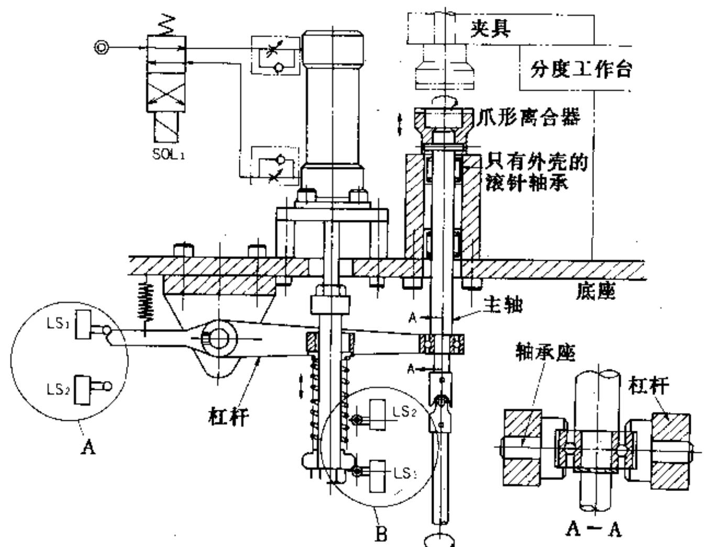  
从电动机轴

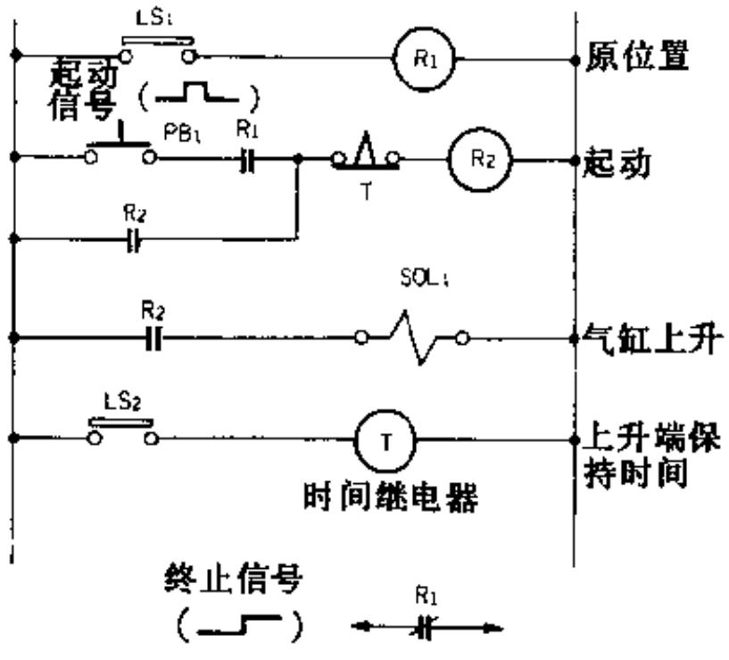  
图5-9动力：气压-电气行程： $0 \sim 5 0$ 毫米载荷：轻  
图5-9 是使回转轴上下运动的机构。按压起动按钮，电动机回转，通过 $\bf { S O L } _ { 1 }$ 使气缸活塞杆上升，杠杆抬起，主轴上升。到上升极

限位置时，接通限位开关 $\mathbf { L S } _ { 2 }$ ，持续一定时间后，时间继电器释放，SOL：电路切断，气缸活塞杆下降，返回原位。

# 设计要点

1．由于杠杆做摆动运动，它和主轴的连接处，如A-A剖面所示,轴承座应能回转，而轴承相对于轴承座应能滑动。

2．限位开关 $\mathbf { L S } _ { 1 }$ 、 $\mathbf { L } \mathbf { S } _ { 2 }$ 的安装位置，若以主轴移动量为前题时，取在A部；若以气缸活塞杆移动量为前题时，取在B部。

# 使用实例

回转轴的上下运动(如钻孔及攻丝加工，离合器连接等）。

# 其 它

参阅附录一第3类控制回路。

# 先作直线运动后作回转运动的机构

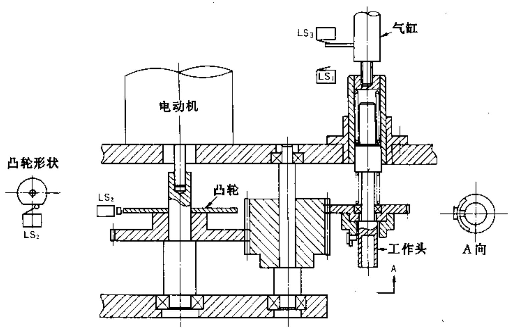

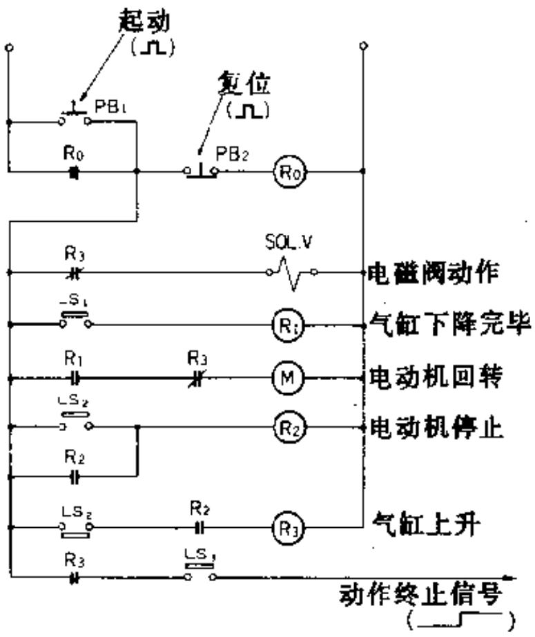  
图5-10动力：气压-电气行程： $1 0 \sim 5 0$ 毫米载荷：中

图5-10是先做直线运动，再做回转运动的机构。动作过程如下：先通过气缸使工作头下降，然后工作头的滑动轴在电动机带动下回转1.5转后停止，最后工作头上升复位，一次动作结束。本机构作为扭转装置，用于自动组合机床的检验部分等。

# 设计要点

1．通过适当地选择齿轮的传动比，可以改变工作头的转数。2．主动齿轮与从动齿轮的齿侧间隙要比正常值稍大一些。

# 制造要点

必须保证工作头滑动轴与气缸中心线的同轴度。

# 其 它

参阅附录一第5-4类控制回路。

# 齿条、齿轮传动的摆动运动与其它传动的上下运动联动机构

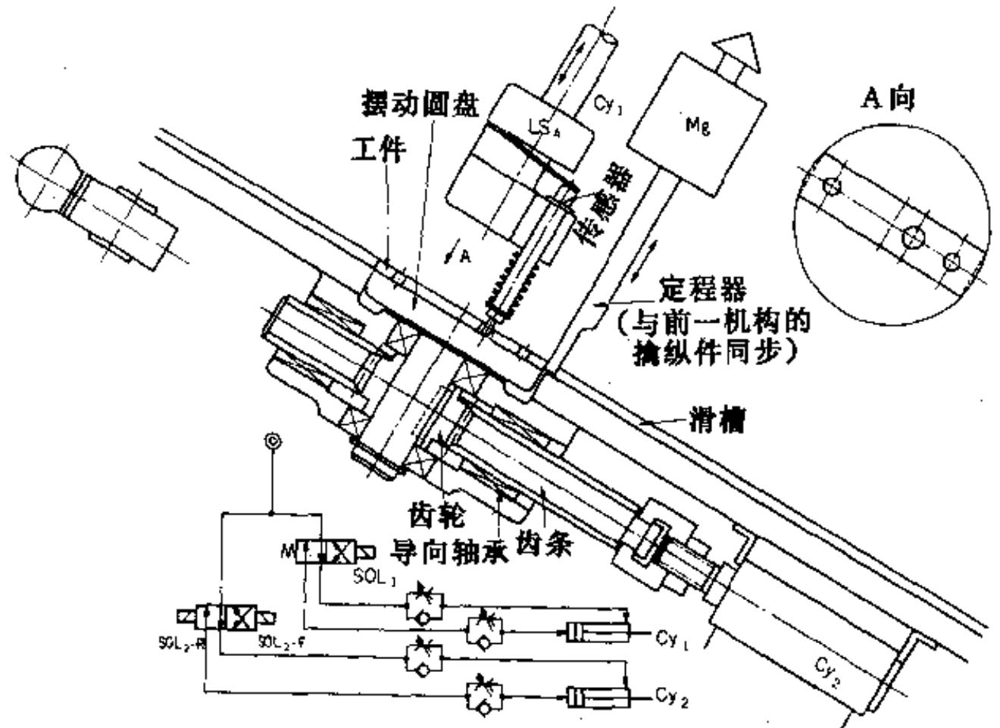

图5-11  
$\mathbf { P B _ { l } }$ ： 起动按钮（联动）  
$\mathbf { P } \mathbf { B } _ { 2 }$ ： 停止按钮  
$\mathbf { L } S _ { 1 }$ ： CY-原位置接通  
$\mathbf { L } \pmb { S } _ { 2 }$ ： $\mathbf { \bar { C Y } } _ { 2 }$ 前进位置接通  
$\mathbf { L S } _ { 3 }$ ： $\mathbf { C Y _ { 3 } }$ 原位置接通  
$\mathbb { S } \mathrm { { O L } } _ { 1 }$ ： $\mathbf { C Y } _ { 1 }$ 动作用  
$\mathbf { s o l } _ { 2 }$ ： $\mathbf { C Y _ { 2 } }$ 动作用  
$\mathbf { M } _ { \mathbf { \delta g } }$ ：定程器  
$\mathbb { R } \mathbb { R } _ { \mathfrak { k } }$ ：棘轮继电器  
$\mathrm { T } _ { \mathfrak { l } } \sim \mathrm { T } _ { \mathfrak { I } } :$ ：时间继电器  
$\mathbf { L S _ { 4 } }$ ：工件正反检测用  
动力：气压  
行程： $1 0 \sim 1 0 0$ 毫米  
载荷：轻起动信号 3 □a  
PB， □ PB 9 R R.:RR、SOL-F RATRRT TT3 SOL-R R  
R ?LS ? LS RRLS 终止信号ba b

# 设计要点

1．采用小型气缸即能满足要求。齿条、齿轮等全部采用滚动轴承，以使工作灵活可靠。图中未表示出的部分，也必须与前一机构的擒纵件等同步。

图5-11是用齿条、齿轮传动的摆动运动与其它传动的上下运动相联动的机构。当经过倾斜滑槽的形状不对称的工件、其方向与要求不一致时，定程器落下，传感器落下，使工件暂停在摆动圆盘上。与此同时，传感器发出信号，气缸立即动作，通过齿条、齿轮使摆动圆盘摆动 $1 8 0 ^ { \circ }$ ，从而使工件的方向与要求一致。

2．根据工件的形状，摆动圆盘动作以后，也可不必返回原位置，这时必须使电磁阀闭锁。

# 使用实例

用来调整一般送料器很难选择和鉴别方向的（无论是重心的，还是形状的）长方形之类工件的换向工作。将工件放在倾斜滑槽上，让它们通过回转，确定前后方向。

# 气动摆动缸回转及上下运动机构

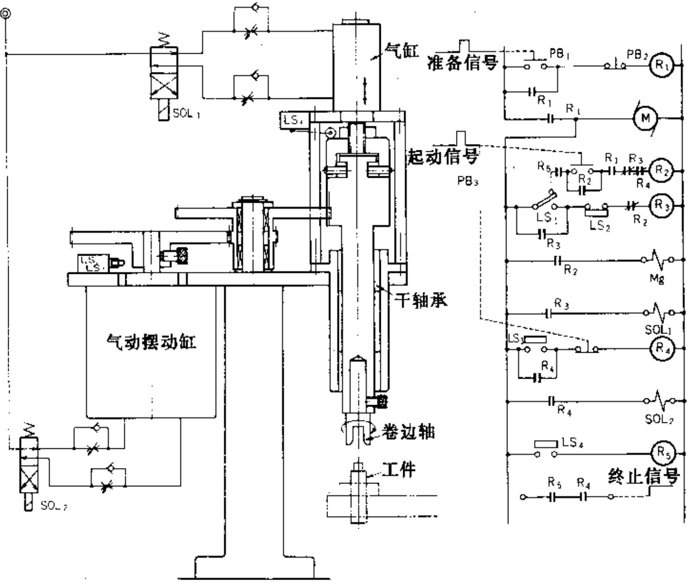  
：图5-12是使用气动摆动缸的回转与直线运动组合机构。它是卷边装置的一例。

图512  
$\mathbf { P B } _ { 1 }$ ：准备按钮  
$\mathrm { P B } _ { 2 }$ ： 停止按钮  
$\hat { \mathbf { P } } \mathbf { B } _ { 3 }$ ： 起动按钮  
$\mathbf { L S } _ { 1 }$ ： [.作台转动完毕接通一下  
$\mathbf { L } \pmb { \mathbb { S } } _ { 2 }$ ： 卷边轴回转完毕接通  
$\mathbf { L S } _ { 3 }$ ： 卷边轴下降完毕接通  
$\mathbf { L S _ { 4 } }$ ： 卷边轴上死点接通  
$\mathbf { M } \mathbf { g }$ ： 电磁离合器 (控制工作台周期转动)  
$\mathbf { M }$ ： 电动机 (控制工作台周期转动)  
${ \bf S O L } _ { 1 }$ ：卷边轴下降用电磁阀  
$\mathbf { S } \mathbf { O } \mathbf { L } _ { 2 }$ ：卷边轴回转用电磁阀  
动力：气压  
行程： $1 0 \sim 1 0 0$ 毫米  
载荷：轻

# 设计要点

中间轴与主轴使用滚针轴承、导向轴承等，以使动作轻快灵活。由于外购摆动缸的摆动范围大致在 $2 7 0 ^ { \circ }$ 左右，所以主轴大约能增加到回转5转。必须保证齿轮传动系统应当无严重歪斜和扭曲现象。本机构一个周期的动作是：卷边轴下降 $\nrightarrow$ 卷边 $\twoheadrightarrow$ 工件固定 $\blacktriangleright$ 上升→返回。

# 使用实例

用于装配机等，作为对板弹簧一类工件的卷边固定。与减速电动机传动的机构比较，它没有正反转时的相位差错。采用气动的优点是容易进行顺序控制。

# 带有自转铆接头的回转和上下运动工作头

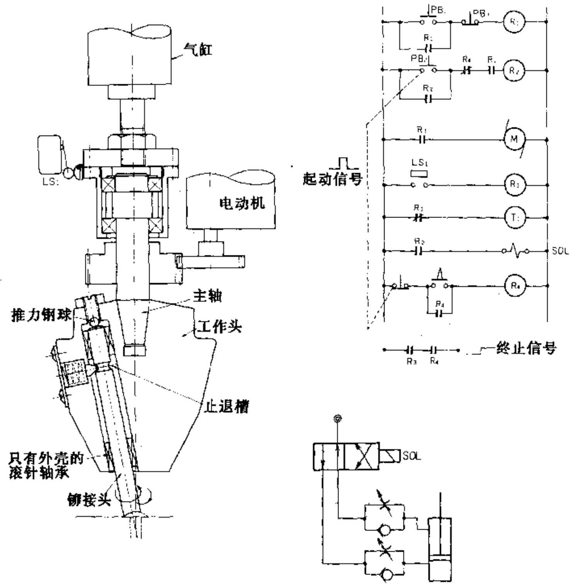

图5-13  
$\mathbb { P B } _ { \sf I }$ ：准备按钮  
$\mathbf { P B } _ { 2 }$ ： 起动按钮  
$\bf { P B _ { 3 } }$ ： 停止按钮  
$\mathbf { M }$ ： 电动机  
$\mathbf { L } \pmb { S } _ { 1 }$ ： 工作头上死点接通  
$\bf s o i$ ：工作头上下用  
${ \boldsymbol { \mathsf { T } } } _ { 1 }$ ： 铆接时间继电器  
动力：气压电气  
行程： $1 0 \sim 1 0 0$ 毫米  
载荷：轻

·图513是一种专供铆接铆钉用的机构。工作时主轴边回转、边下降，铆接头接触铆钉后，因摩擦而自转。图中铆接头的中心线与主轴的中心线具有一定的倾斜角度，铆接头按主轴的回转方向边自转、边进行铆接工作。

# 设计要点

1、铆接头的顶端、外圆及与推力钢球的接触面，必须进行高频淬火及磨削。

2．此旋压铆接法适用于部件组装过程中2至3个零件的紧固连接，与锻铆法同样被广泛应用。如本图所示这样的加工方法，铆接头相对于铆钉滚动而不滑动，从而延长了铆接头的寿命。此外，铆接工件的表面没有粘质，外观漂亮。

# 上下运动和水平回转的抓取和装入机构

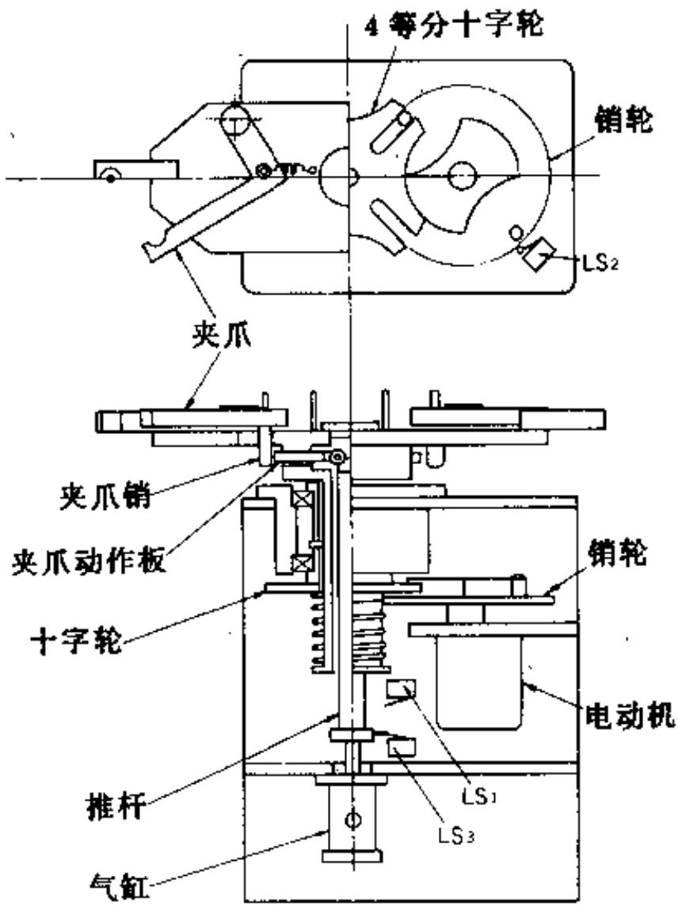  
图5-14动力：气压-电气行程： $1 0 \sim 1 0 0$ 毫米载荷：轻

起动/复位R PSOLV 电磁阀动作气缸上升? 气缸上升完华中 ? 电动机回转LS2? 电动机停止R+1 ? 气缸下降LS2+ 动作终止信号

图5-14是利用推杆顶端的锥面使夹爪将工件夹出的复合运动机构。依靠气缸收紧夹爪，并使夹爪臂上升，接着夹爪臂由十字轮带动回转 $1 8 0 ^ { \circ }$ ，停转后，夹爪下降并放开，动作依次反复进行。这是自动机排出机构的一个实例。

# 设计要点

1．因为要提高夹爪收紧位置的准确度，所

以回转部分十字轮机构的分度精度要高，滑动部分的松动要小。

2．推杆顶端磨损大，必须淬火。

3．带动十字轮的销轮传动销，以 $9 0 ^ { \circ }$ 间隔设置两个，销轮回转一周，十字轮回转 $1 8 0 ^ { \circ }$

# 制造要点

1．推上用的气缸必须严格进行速度控制，以使动作平稳。

2．所有滑动部位均需注油润滑。

# 其 它

参阅附录一第5-4类控制回路。

# 凸轮传动抓取和装入机构

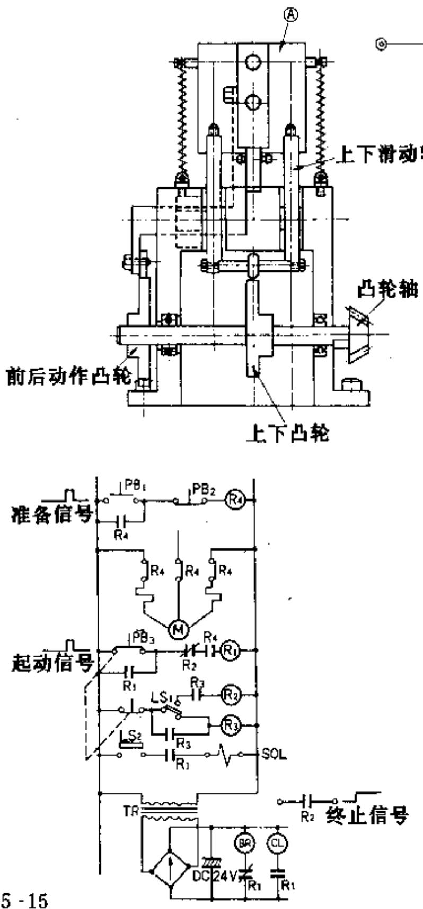  
图5-15

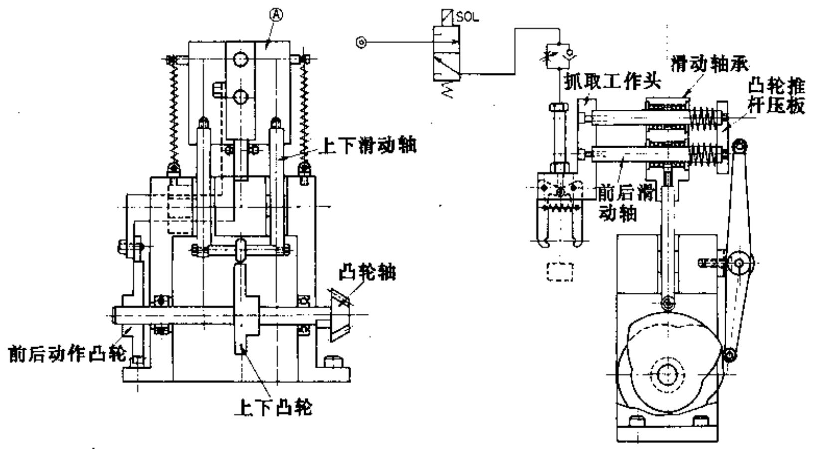  
图5-15是利用凸轮传动的前后和上下运动进行工件抓取和装入的典型机构。两个上下滑动轴支承着部件A；两个前后滑动轴把抓取工作头和凸轮、推杆、压板连接起来。由部件A使上下滑动轴和前后滑动轴连成一体。

$\mathbf { M }$ ： 驱动电动机  
$\mathbf { P B _ { 3 } }$ ：起动按钮  
$\mathbf { L S } _ { 1 }$ ： 停止位置动作的凸轮开关  
$\mathbf { L } \pmb { \mathbb { S } } _ { 2 }$ ： 夹紧松开用凸轮开关  
$\operatorname { s o L }$ ：夹紧松开电磁阀  
$\mathbf { P B } _ { 1 }$ ：准备按钮  
$\mathbf { P B } _ { 2 }$ ： 停止按钮  
$\mathbf { B R }$ ： 制动器  
CL：离合器  
动力：气压·电气  
行程： $1 0 \sim 1 0 0$ 毫米  
载荷：轻

# 设计要点

1．上下滑动轴必须固定在部件A的深孔内，这样才可防止抓取工作头前后运动时的倒斜，并承受工件的重量。

2．为了维护方便，并保证滑动灵活，应使用滚珠轴套或轴承。

3．当有其它物件混入工件中时；或由于抓取失误，为了保护工作头，采用了弹簧作为上下、前后动作的缓冲。但是如果想要加快速度以缩短工作周期的时间，就不能采用这样的凸轮形式，而应采用槽形凸轮，这时就也必须考虑采用其它的方式来保护工作头。

使用实例

用于较轻小工件的抓取和装入。

# 其 它

参阅附录一第5-4类控制回路。

# 气缸和进给爪矩形运动机构

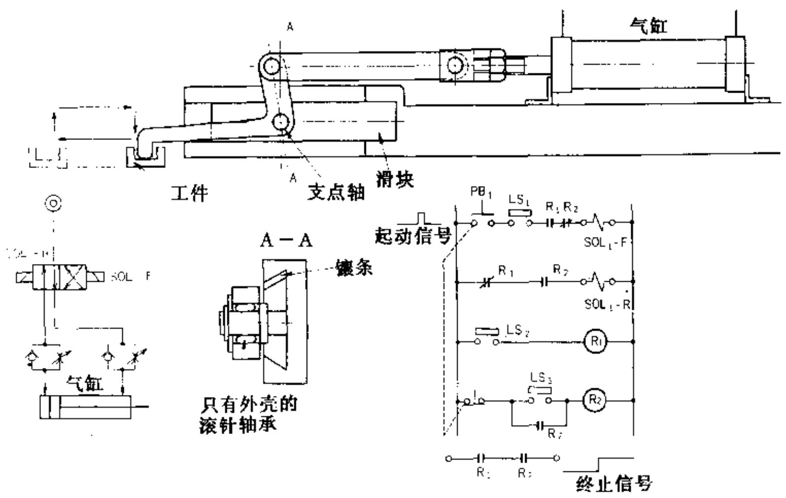

图516  
$\mathbf { P B _ { l } }$ ： 起动按钮  
$\mathbf { L } \mathbf { S } _ { \mathbf { l } }$ ： 有工件时接通  
${ \bf k } \mathbf { S } _ { 2 }$ ： 原位置接通  
${ \bf L } \mathbf S _ { 3 }$ ： 前进极限位置接通  
$\mathrm { \mathbf { S } O L } _ { 1 }$ ：气缸动作用  
动力：气压  
行程： $1 0 \sim 1 0 0$ 毫米  
载荷：轻

图5-16是利用气缸的活塞杆带动进给爪做矩形运动的机构。本机构最适用于浅底碗形1件的输送等。图中所示是进给爪在滑槽终端进入排列着工件的凹部、正向左推动的情况。

# 设计要点

1．A-A剖面表示进给爪的支点轴与进给爪之间采用的是滚针轴承。要用极小的转矩即可使进给爪摆动。

2．滑块采用燕尾槽结构，用镶条调整，使滑动合适，否则进给爪的动作容易产生不稳定现象。

# 使用实例

用于多工序的冲压件生产中，作为中间工序的工件插入。也用于装配机等第一道工序的工件输送。

# 其 它

参阅附录一第2类控制回路。

A B   
1

中

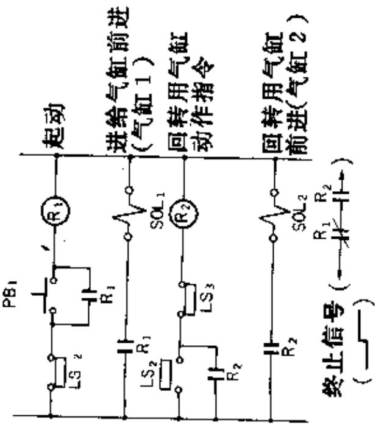

# 摆动和直线往复运动组合机构

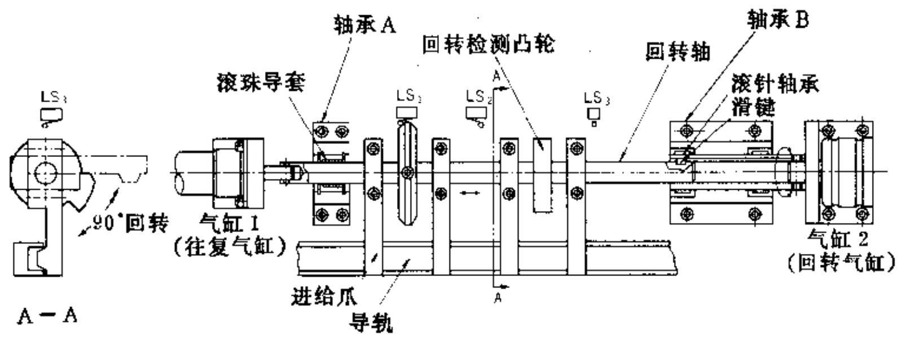

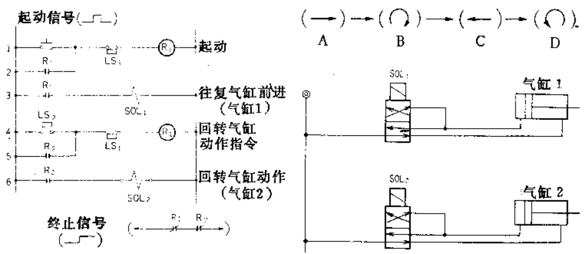

图5·18  
动力：气压  
行程：10～100毫米  
载荷：中

图5、18是摆动和直线往复运动的组合机构。工作过程如下：按压起动按钮，往复气缸活塞杆推动回转轴前进，使限位开关 $\mathbf { L } \boldsymbol { \mathbb { S } } _ { 2 }$ 动作，此信号使同转气缸带动回转轴转动 $\boldsymbol { \vert 9 0 ^ { \circ } }$ 当限位开关 $\mathbf { L S } _ { 3 }$ 被压动，往复气缸开始返回，返回原位后，限位开关 $\operatorname { L } \pmb { S } _ { 1 }$ 被压动，回转气缸也返间，--个周期结束。

# 设计要点

1．滑键要有足够的强度和耐磨性，防止因

磨损和变形影响回转位置的精度。

2．回转轴与往复气缸活塞杆的连接部分，应考虑不把转矩传给往复气缸的活塞杆。

制造要点

必须保证轴承A和B的平行度。

# 使用实例

1．通过回转运动和直线运动的组合，进行输送工件的装置。

2．只以摆动运动进行工件的夹紧或定位的装置。

# 其 它

参阅附录一第2类控制川路。

# 两个直线运动的联动机构

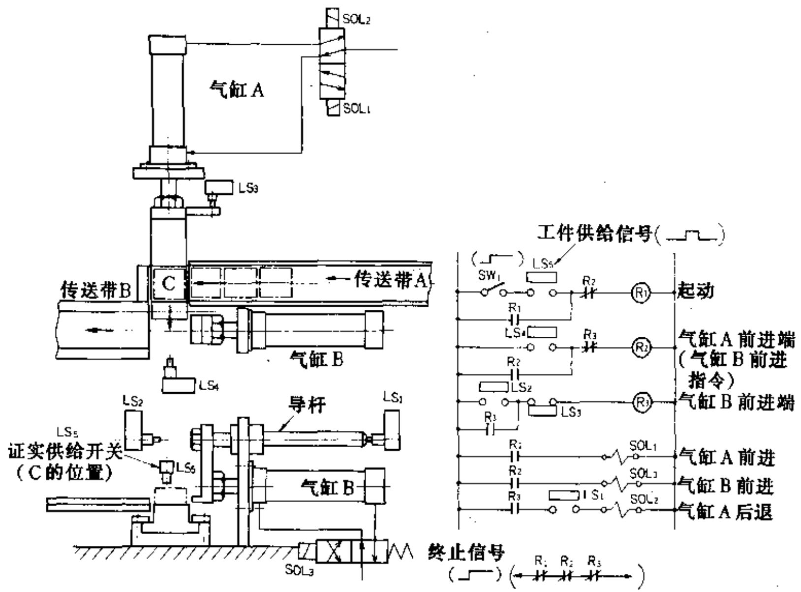  
图5-19动力：气压行程： $1 0 \sim 2 0 0$ 毫米载荷：中

图519是两个直线运动的联动机构。工件由传送带A向C位供给，气缸A的活塞杆前进，当触动 $\mathbf { L S _ { 4 } }$ 后，气缸B的活塞杆前进，把工件推向传送带B。当触动开关 $\mathbf { L } \mathbf { S } _ { 2 }$ 后，气缸B返回原位置，LS被触动，气缸A也返回原位置，一个周期结束。

# 设计要点

1．因为两个气缸的动作交错进行，所以不能因动作失误而冲突，要仔细设计电气-气压控制系统。

2．导杆与气缸B的间距要小。

3．必须在工件完全到达C位之后，才使气缸A动作，所以应考虑 ${ \mathbf { L } } { \mathbf { S } } _ { 5 }$ 的安装位置及安装方法。

使用实例

使工件一个一个地连续流动的场合。

其 它

参阅附录--第5·1类控制回路。

# 组合直线运动的抓取和装入机构

  
图520动力：气压行程： $3 0 \sim 3 0 0$ 毫米载荷：轻

图520是以气压为动力，用气动-电气系统控制的垂直、水平复合运动机构。此机构通过控制系统的组合，可进行多种垂直、水平复合运动。按图520的组合，其动作过程如下：工作开始时 $\mathbf { L S } _ { 1 }$ 、 ${ \bf { \underline { { \bf { L } } } } } { \bf { S } } _ { 3 }$ 处在接通状态。按压起动按钮，气缸2动作，使装有夹头的A部水平运动到达前进极限位置。 $\mathbf { L S _ { 4 } }$ 被压动，气缸1动作，夹头下降，将工件供给夹具后， $\mathbf { L } \mathbf { S } _ { 2 }$ 被压动，气缸2与气缸1同时动作，返回原位置。这时，由于继电器 $\mathbb { R } _ { 8 } , \mathbb { R } _ { 9 }$ 的作用，气缸1推动夹头再次下降，夹取工件， ${ \bf L } { \bf S } _ { 2 }$ 被压动后，由于继电器 $\mathtt { R } _ { 1 0 }$ 的作用，气缸1提升夹头返回原位，恢复到最初状态。

# 设计要点

对气缸2在前进极限位置的悬臂状态，必须采取适当的措施。导杆与导向部分要有足够的强度。

# 使用实例

自动装配机的供料机构。

# 摆动和上下运动组合装卸机构

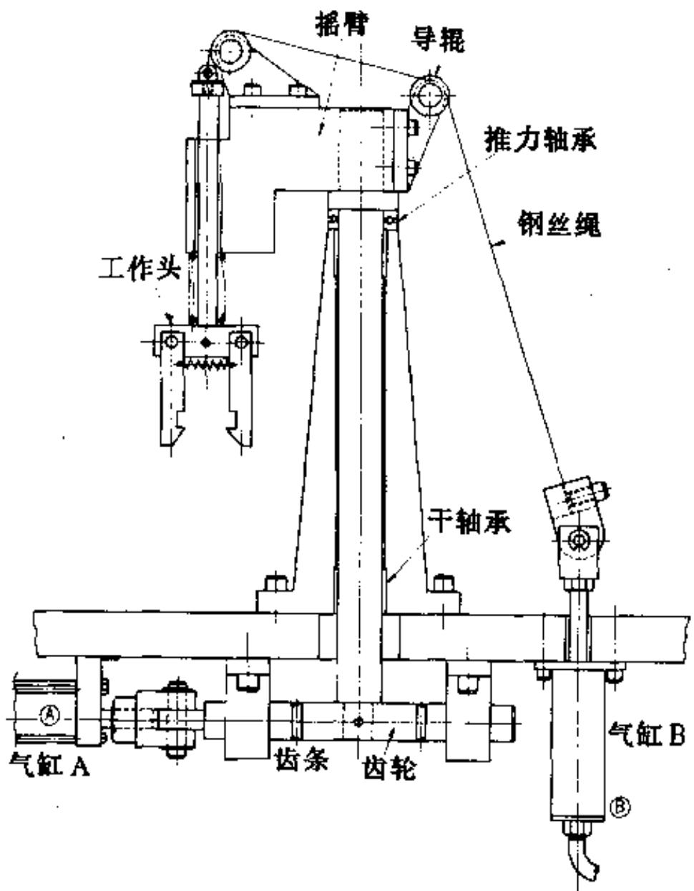  
图5-21

PB：起动按钮  
$\mathbf { L } \pmb { S } _ { 1 }$ ：回转完毕接通  
${ \bf L } S _ { 2 }$ ：夹钳下死点接通${ \bf L } \pmb { S } _ { 3 }$ ：夹钳上死点接通$\mathbf { L S _ { 4 } } ,$ 摇臂返回接通  
动力：气压  
行程： $5 0 \sim 5 0 0$ 毫米  
载荷：中

图 5-21是摆动及上下运动组合的装卸机构。由气缸A带动齿条、齿轮使摇臂摆动。又由气缸B通过钢丝绳使工作头上下运动。通常的摆动或回转和上下的复合运动机构，由于主轴是双重回转轴或与之类似的结构，比较复杂。本图所示的机构，可以不考虑回转对钢丝绳的扭曲，因此非常简单。

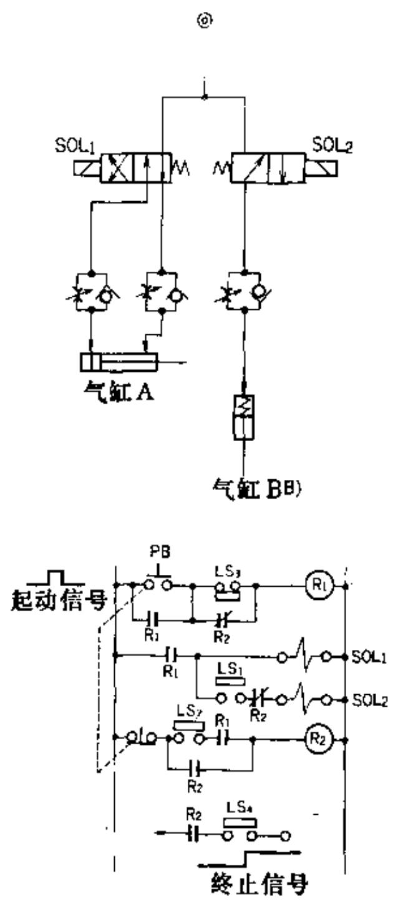

# 设计要点

1．钢丝绳应选用细而软的，要有足够的抗拉强度。导轮的直径应能满足钢丝绳的最小弯曲半径，同时，导轮槽的深度与宽度应保证在摇臂摆动时，钢丝绳不会脱出。

2．由于气缸A是在证实了气缸B操纵的上下动作完成后才动作的，因此 $\mathbf { L S } _ { 1 } \sim \mathbf { L S } _ { 4 }$ 也必须依次动作。

3．像这种气缸或凸轮直接与钢丝绳组装的结构很简单，而且成本也低。但钢丝绳的跟随速度不能太快，周期时间以2秒为限。

# 使用实例

摇臂式的抓取和装入。

# 三个直线运动的组合机构

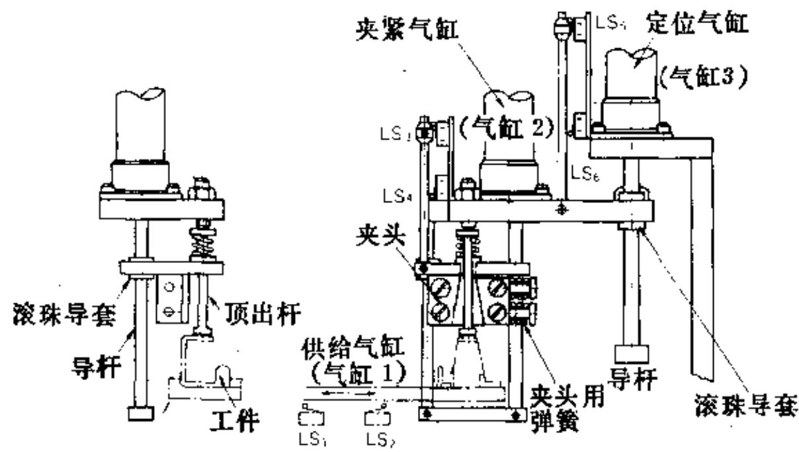

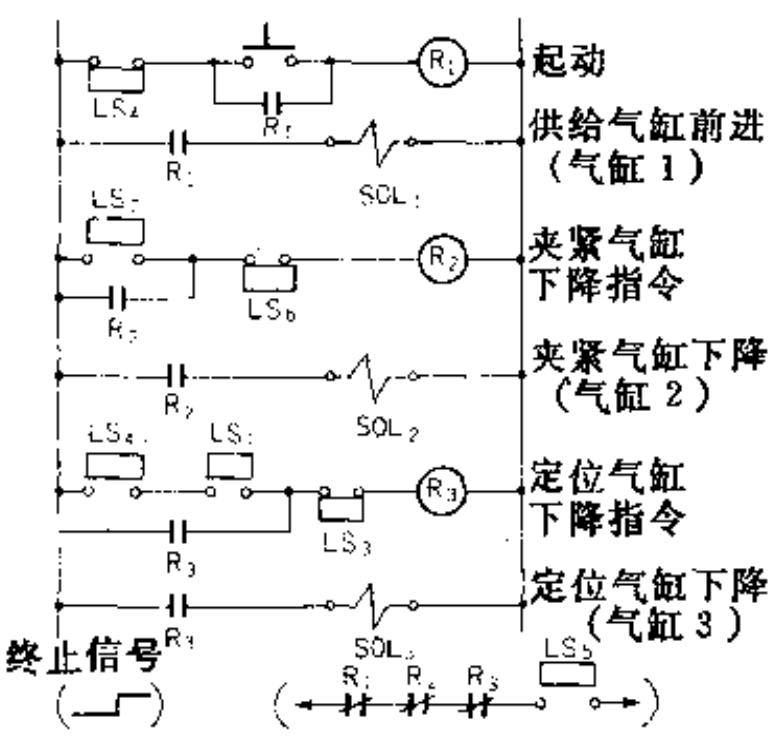  
起动信号（）  
图5-22动力：气压行程： $3 0 \sim 3 0 0$ 毫米载荷：中

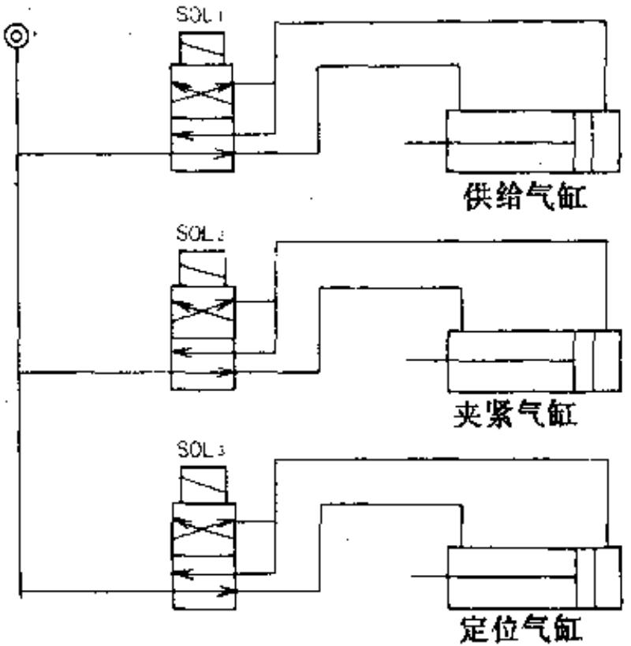

图5-22是通过三个气缸的运动来完成工件的供给、夹紧和定位的机构。动作过程如下：按压起动按钮，供给气缸活塞杆动作，把工件推到夹头下面， $\mathbf { L S } _ { 2 }$ 被压动，夹紧气缸活塞杆动作，工件被夹头夹紧（必须根据工件的形状来考虑夹头的形状和夹紧方法，图中所示是利用工件斜面部分夹紧的)当 $\mathbf { L S _ { 4 } }$ 被压动后，供给气缸活塞杆返回，定位气缸活塞杆下降，将工件在组装位置定位。此后，夹紧气缸活塞杆上升，由顶出杆顶出工件，定位气缸活塞杆上升，返回到最初状态。

# 设计要点

1．气缸与导杆的间距不宜过大，否则易产生歪斜。

2．上述的间距大时，必须设法增加滚珠导套的有效长度（2个或3个并用）。

3．若使用多个导杆时，应注意平行度。

# 使用实例

组装或加工时的工件供给机构。

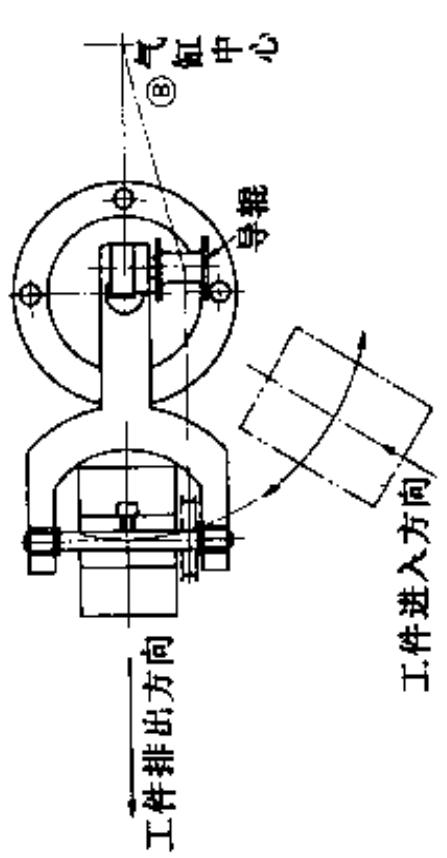

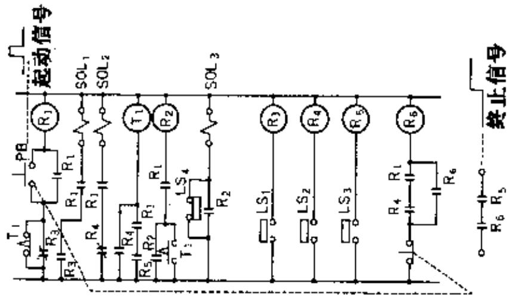

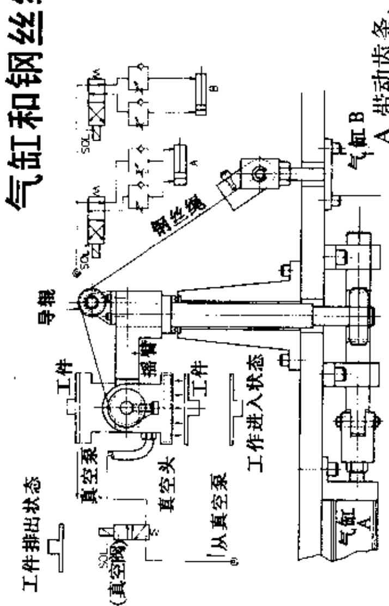

3 中 s s s

# 气缸驱动的直线和摆动复合运动机构

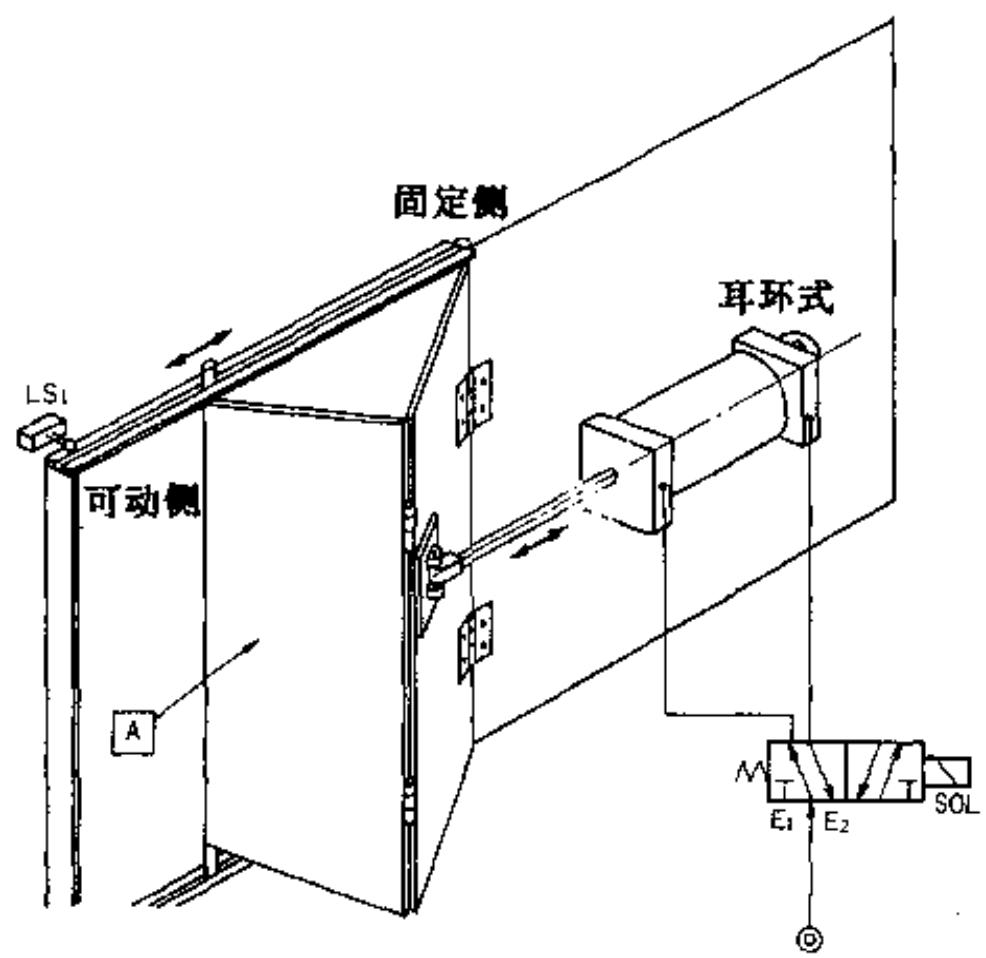  
图5-24动力：气压行程： $3 0 0 \sim 5 0 0$ 毫米载荷：中

图5-24是通过气缸的前进和后退，使门A 进行开闭运动的机构。门A的一侧沿着直线导向槽滑动，用耳环式气缸传动，使门A进行直线和摆动的复合运动。

# 设计要点

1．选择气缸时，应使气缸的行程满足门的开闭需要。

2．气缸的耳环部分不要悬挂在门上，使气缸的重量不致影响门的轻快转动。

3．门的滑动侧在上下二导向槽处要动作圆滑。

# 使用实例

在专用机床上，为防止切屑及冷却液飞溅所用防护罩的开闭。

# 其 它

参阅附录一第2类控制回路。

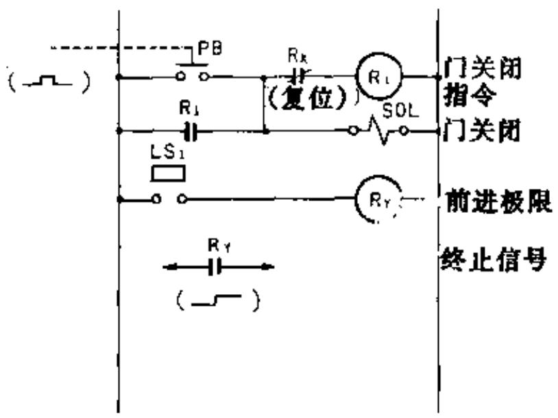

# 光电管控制的摆动和上下运动机构

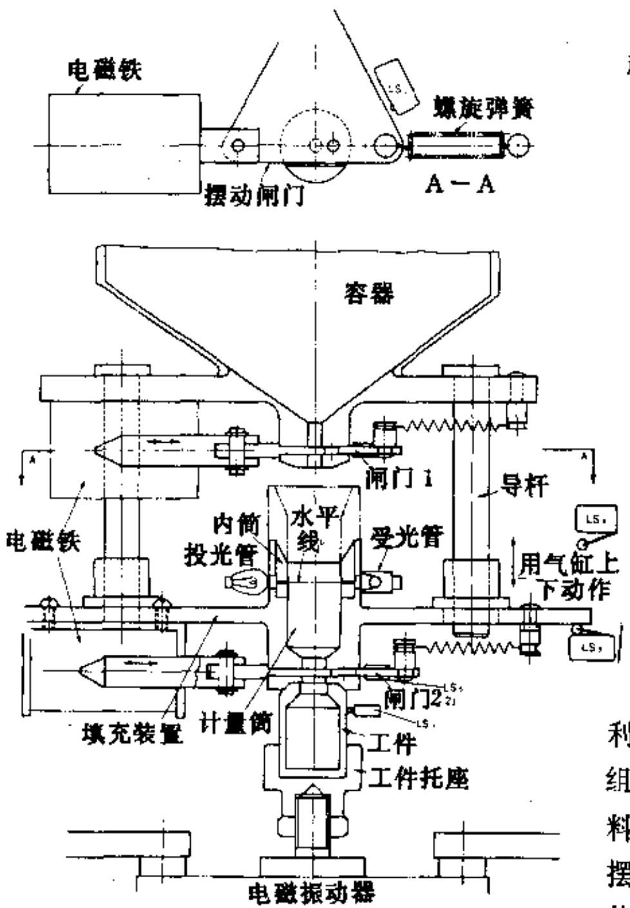  
图5-25

$\mathbf { P B } _ { 1 }$ ： 起动按钮  
$\mathbf { P B _ { 2 } }$ ： 停止按钮  
$\mathbf { M } \mathbf { g } _ { 1 }$ ： 上闸门  
$\mathbf { M } _ { \mathbf { \mathcal { E } } _ { \lambda } }$ ： 下闸门  
$\mathbf { K T }$ ： 光电管  
$S 0 \mathbf { L } _ { 1 }$ ：填充装置上下用电磁阀  
$\mathbf { v }$ ： 电磁振动器  
${ \boldsymbol { \mathsf { T } } } _ { \mathsf { I } }$ ： 时间继电器  
$\mathbf { L S } _ { \mathbf { l } }$ ： 有工件时接通  
$\mathbf { L } \pmb { S } _ { 1 }$ ： 上闸门返回接通  
$\mathbf { L S } _ { 3 }$ ： 填充装置下死点接通  
$\mathbf { L } \pmb { S _ { 4 } }$ ： 填充装置上死点接通  
$\mathbf { L S } _ { 5 }$ ： 下闸门返回接通

动力：气压-电气动作角度： $0 ^ { \circ } \sim 1 0 ^ { \circ }$ 载荷：中

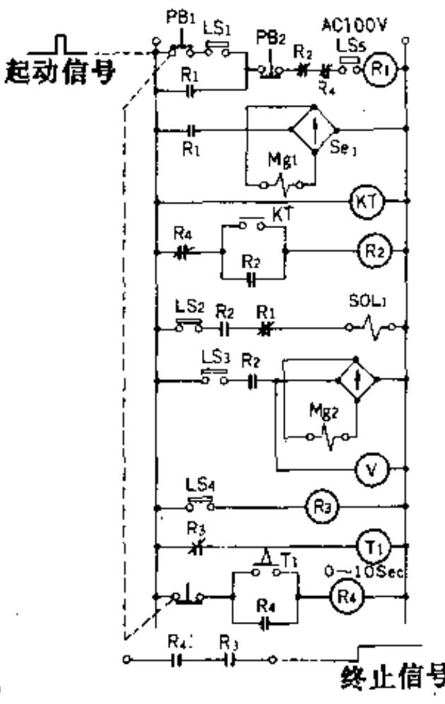

图5-25是一种由整个部件的上下运动与利用光电管的信号控制电磁铁使摆动板摆动的组合机构。本图所示是给罐形工件定量填充粉料的情况。除了填充装置的上下运动及闸门的摆动外,还使用了电磁振动器。先打开上闸门，使计量筒填充定量的粉料，当料面达到定量位置后，靠光电管使上闸门关闭，下闸门打开，与此同时，电磁振动器开始摆动，将粉料填入罐形工件中。

区

# 设计要点

1．闸门采用直流电磁铁切断较可靠。2．计量时，将计量筒用凸轮或气缸等向上推动，使与闸门Ⅰ接近，与此同时，使罐形工件进入工件托座。3．闸门及其导向部分必须淬火。计量筒的内筒，采用透光性好的聚丙烯类物质制成。4，在电磁振动器动作时，可能引起附近小螺栓的松动，所以要特别注意螺栓的锁紧。

使用实例

使用电磁振动器的粉料定量填充机构等。.

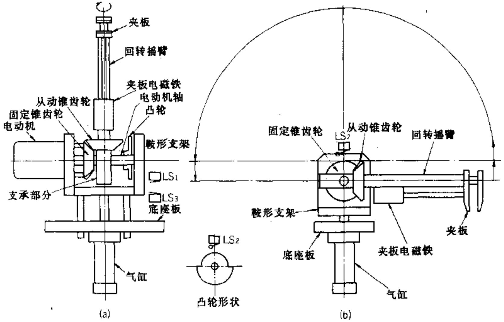  
摇臂自转和公转并带有两端直线运动的机构  
图526动力：气压-电气动作角度： $0 ^ { : } \sim 1 8 0 ^ { : \ i }$ 载荷：轻

图 $5 \cdot 2 6$ 是小型工件的抓取和装入组合机构。用卡爪将工件夹紧，边划弧（公转），边自转半周，使得.I件夹取时的方向与松开时的方向一致。

# 设计要点

当回转摇臂的回转角度为 $1 8 \boldsymbol { \{ \} } ^ { : }$ 时，固定锥齿轮与从动锥齿轮的齿数应相等。因此，如需回转角度为 $9 0 ^ { \because }$ 时，固定齿轮与从动齿轮的齿数比应采用 $1 : 2$

# 制造要点

1．尽量减小锥齿轮的啮合间隙。2．要控制气缸速度，以减少动作时的冲击击。

# 其 它

参阅附录-第5·3类控制回路。

起动复位PB /PBR 板夹板电磁铁动作电磁阀气缸上升□ 中 ?? 电动机回转 摇臂移动中 RR 播臂移动完毕  
间起 LS 夹板电磁铁松开 气缸下降  
动信号 中间终正信号  
（） R6 R R1 H R® Rs HH 一终止信号

# 回转前进机构

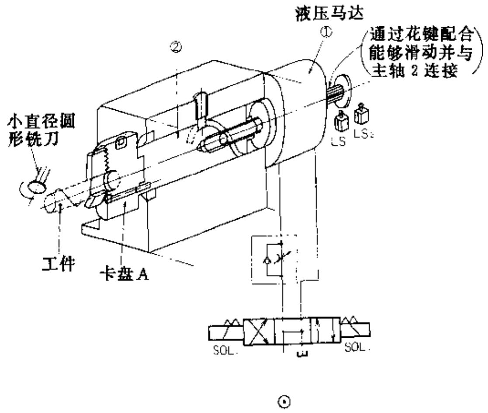  
图5-27动力：液压行程： $1 \sim 5 0$ 毫米载荷：中

图5-27是利用液压马达并通过导槽，将回转运动转换为使卡盘A进行边回转、边前进运动的机构。下面说明一个周期的动作过程。

按下起动按钮，通过 $\infty _ { 1 }$ 使液压马达1正转，并通过花键轴带动外周有导槽的主轴2边正转、边前进。到前进极限位置时，限位开关LS被压动，通过 $\mathbf { S O L } _ { 2 }$ 使液压马达1反转，主轴2边反转、边后退。到达后退极限位置时，限位开关 $\mathbf { L S } _ { 2 }$ 被压动，液压马达停转，一个周期完成。

# 设计要点

螺旋导槽相对于主轴中心线的角度在 $3 0 ^ { \circ }$ 以下较好。

制造要点

螺旋导槽要加工平滑。

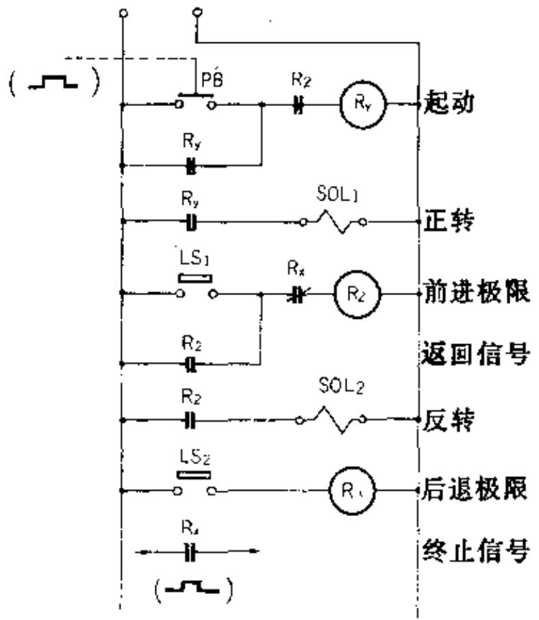

# 维护要点

主轴的滑动面要保证良好的润滑。

# 使用实例

轴类工件的油槽加工。

# 其 它

参阅附录一第2类控制回路。

# 回转轴垂直前进机构

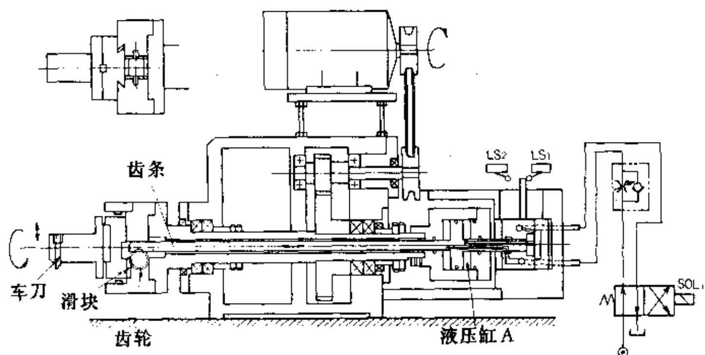  
图5-28动力：液压-电气行程： $1 \sim 5 0$ 毫米载荷：中

图5-28是回转轴的回转运动并带有相对于回转轴垂直前进的机构。其动作过程如下：按压起动按钮，电动机回转，同时 $\displaystyle \mathbf { S } \mathbf { O } \mathbf { L } _ { \mathbf { l } }$ 接通、液压缸活塞杆带动齿条、齿轮推动滑块前进，当到达前进极限位置，压动 $\mathbf { L } \mathbf { S } _ { 2 }$ ，使时间继电器TR接通，开始计时。经过一定时间T以后，$\sin _ { \mathrm { ~ \mathfrak { d } ~ } }$ 切断，液压缸活塞杆返回，当压动 $\mathbf { L S }$ 后，电动机停止转动，一个周期结束。

# 设计要点

1.要考虑头部回转时不平衡的程度不应过 于严重。

2．液压缸截面积不要过小，否则将不利于液压控制。

# 调整要点

组装时应注意滑动部分不能有松动。

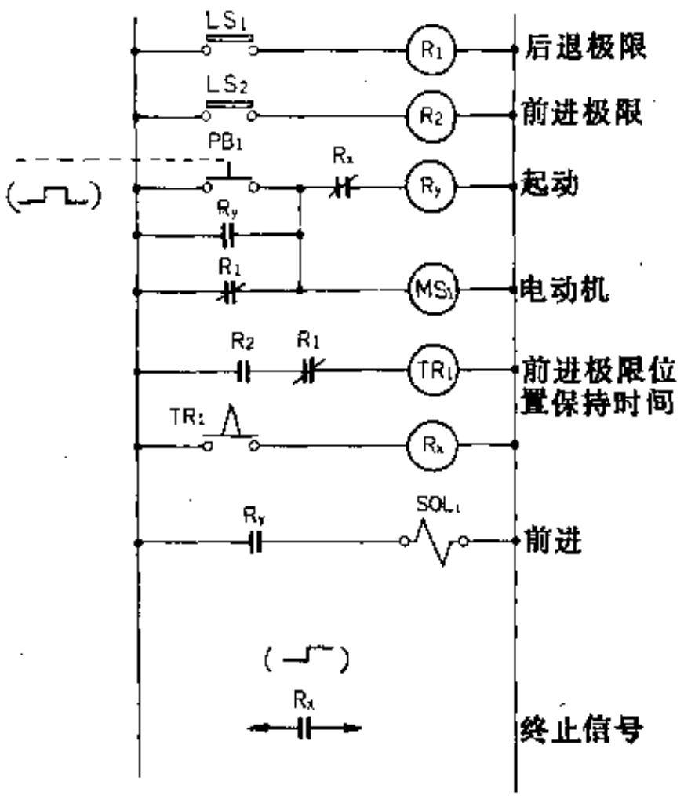

维护要点

滑块部分的润滑不能中断。

# 其 它

参阅附录一第2类控制回路。

# 上下运动和导向槽摆动运动机构

  
图5-29动力：液压行程： $3 0 \sim 1 0 0$ 毫米载荷：重

图5-29是利用液压缸活塞杆的直线运动，使A部进行上下和摆动的复合运动机构。A部是使用液压和导槽进行夹紧的。机构一个周期的动作过程如下所述。

按压起动按钮，SOL：通电，活塞杆开始下降，由于活塞杆上有导槽，所以实际上是边回转、边下降，直至夹紧完毕。返回时动作相反。

设计要点

1．螺旋导槽相对于活塞杆中心线的角度应小于 $3 0 ^ { \circ }$ ，动作才能灵活。

2．必须装设防尘圈，以防切屑进入螺旋导槽。

制造要点

螺旋导槽必须加工光滑，以保证动作灵活。

使用实例

钻孔、镗孔专用机床的夹具等。

# 其 它

参阅附录一第2类控制回路。

# 液压缸和斜面的上下和水平运动机构

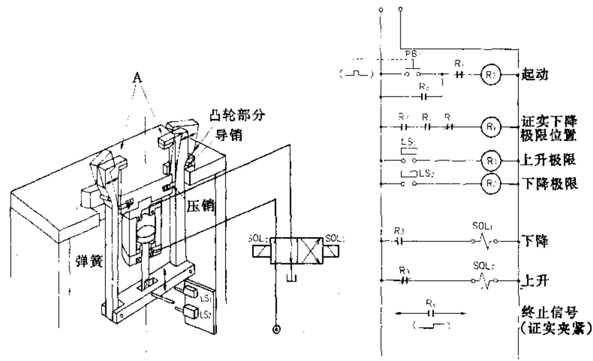

图5·30  
动力：液压  
行程： $3 0 \sim 1 0 0$ 毫米  
载荷：重

图5-30是使用凸轮和液压缸使A部边前进、边下降进行夹紧的机构。按压起动按钮，通过 $S O L _ { 1 }$ 使活塞杆带动支架下降，用支架背后的二个凸轮部分的斜面进行边前进、边夹紧。当夹紧完毕后，向别的机构继续通过Ry发出必要的其它动作信号。当R接受到其它动作的终止信号时，一个周期结束。

# 设计要点

1．设计凸轮部分时，应考虑其斜度便于工件的装卸。

2．为防止由于停电等造成的事故,夹紧用的电磁换向阀应当可以自锁。

制造要点

凸轮部分的斜面应加工平滑。

使用实例

紧固夹具。

# 其 它

参阅附录一第3类控制回路。

# 扩张和反复上下运动机构

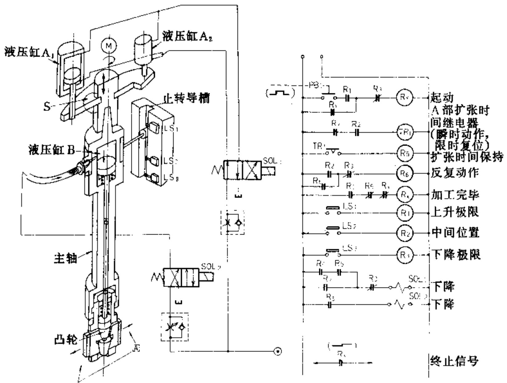  
图5-31动力：液压行程： $5 0 \sim 2 0 0$ 毫米载荷：中

图5-31是利用液压缸进行反复上下运动，同时进行横向进给（扩张）的机构，按压起动按钮PB,, $S O L _ { 1 }$ 接通，液压缸 $\mathbf { A } _ { 1 }$ 和 $\mathbf { \lambda } \cdot \mathbf { A } _ { 2 }$ 的活塞杆推动主轴下降。压动加工位置的限位开关 $\pmb { S } _ { 2 }$ ，时间继电器 $\mathsf { T R } _ { \mathfrak { s } }$ 动作，通过SOL2把压力油供给液压缸B，在液压缸B活塞杆的推动下，A部开始向外扩张，主轴继续下降，至下降极限位置时，压动限位开关 $\mathbf { \bar { L } S } _ { 3 }$ ， $\mathbb { S } \mathbb { O } \mathbb { L } _ { 1 }$ 切断，主轴开始上升，当压动LS后,SOLi又被接通，使主轴再次下降。在这段时间内,A部继续在扩张，直至时间继电器转换，而上下反复运动（在${ \mathrm { I } } . { \mathrm { S } } _ { 2 ^ { * } } {  } { \mathrm { L } } { \mathrm { S } } _ { 3 }$ 之间）也在时间继电器定时完毕转换以后结束，此时主轴返回，一次加工完毕。

# 设计要点

A部扩张的速度由液压缸及凸轮的形状确定。

# 制造要点

必须注意液压缸B液压油进出部分的配合，回转时不能发生漏油。

# 维护要点

图中S部位不得中断润滑，以防烧伤等。

# 使用实例

液压传动的珀磨机，实际应用时应加带动磨头回转的电动机。

# 锥齿轮自转和公转复合运动机构

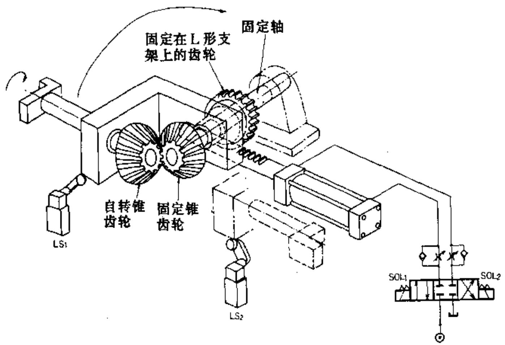  
图5-32动力：液压动作角度： $0 ^ { \circ } \sim 1 8 0 ^ { \circ }$ 载荷：重

图5-32是通过一对锥齿轮同时完成自转和公转的复合运动机构。常用于工件的运送及方向的改变。

# 设计要点

1．根据锥齿轮的齿数比来决定自转和公转回转角度的比率。当回转角度为 $1 8 0 ^ { \circ }$ 比 $1 8 0 ^ { \circ }$ 时，齿数比则为1：1。若只用于运送工件时，则固定锥齿轮与自转锥齿轮的齿数比为 $2 : 1$ 公转为 $1 0 0 ^ { \circ }$ ）。

2．应采用两端带缓冲结构的液压缸，以减小停止时的冲击。

3．如果可能的话，可装设平衡器，使回转体取得平衡。

LS1起动信号 ?-原位置() ? 前进指令中间终止信号（ill）R中间起动信号(i²） ?后退指令R A + ? 前进存储复位信号- ? 复位R中 前进R2 R sOL后退（）终止信号L

# 制造要点

锥齿轮的啮合采用实物选配。齿条和齿轮的啮合间隙要尽量小。

使用实例

机械手等。

其 它

参阅附录一第3类控制回路。

# 附 录

# 控制回路总论

要使自动化机构准确地完成恰当的动作，控制回路是必不可少的，所以在这里有必要介绍一下。

作为控制的方法，可以从极简单地使用一个限位开关或限位阀，到采用复杂的小型计算机。本书所列举的自动化机构，作为重要组件构成自动化装置的一部分，通常在一个机构动作结束之后，再使其它的机构动作。因此，控制回路也是作为一个机构连接于其间，它完成使一个机构收到从别处来的信号而开始有顺序地动作；动作完了之后，又把动作的终止信号向外部发出，作为使其它机构开始动作的信号。这一点对于把一个机构作为一个单元构成自动化装置的一部分是很重要的。在往复运动中，如果仅在单程停止并发出中间终止信号，然后再由中间起动信号使机构进行余下的运动时，尽管只有一个机构，也要有一个单元的控制回路，它处理到中间终止信号，而从中间起动信号到终止信号，则由其它控制回路单元处理，这是很容易做到的。

在控制回路中使用的元、器件，如：电气的有继电器；电子的有集成电路；液压、气动系统的有隔膜阀、滑阀；射流技术的有射流元件等。如按动作分类，其对应情况列于表1。利用限位开关或光电器件等检测，并且只用几个继电器动作这样简单的控制回路，要尽可能和电动机、电磁铁等执行电器协调才好。同样，也可以利用限位阀检测，用几个继动阀动作，与气缸或液压缸、气动马达或液压马达一起组成气动或液压系统，这也是容易做到的。随着继动阀数量的增加，并从对执行元件的要求和合适的检测元件等方面考虑，目前大多采用气动检测以代替电气检测，然后组成顺序，使液压缸动作的方法。

表1 控制回路中各种元、器件的对应  

<table><tr><td rowspan=1 colspan=1></td><td rowspan=1 colspan=3></td><td rowspan=1 colspan=2>电    气</td><td></td><td></td><td></td><td></td><td></td><td rowspan=1 colspan=1>电    子</td><td rowspan=1 colspan=1>液压、气动</td><td rowspan=1 colspan=1>射流</td></tr><tr><td rowspan=1 colspan=1></td><td rowspan=1 colspan=3>回路的变换</td><td rowspan=1 colspan=2>继电器  ！° 触点</td><td></td><td></td><td></td><td></td><td></td><td rowspan=1 colspan=1></td><td rowspan=1 colspan=1>-2 换向阀</td><td rowspan=1 colspan=1>4</td></tr><tr><td></td><td rowspan=1 colspan=3>气门（A与B同时接通时接通）</td><td rowspan=1 colspan=2>HB®</td><td rowspan=1 colspan=2>D1</td><td rowspan=1 colspan=2>1面</td><td></td><td></td><td></td><td rowspan=1 colspan=1>8</td></tr><tr><td></td><td rowspan=1 colspan=3>或门（A或B接通时接通）</td><td rowspan=1 colspan=2>岛</td><td rowspan=1 colspan=2></td><td rowspan=1 colspan=2>B-点</td><td></td><td></td><td></td><td rowspan=1 colspan=1></td></tr><tr><td></td><td rowspan=1 colspan=3>非门</td><td rowspan=1 colspan=2>R</td><td rowspan=1 colspan=2>Vl</td><td rowspan=1 colspan=2></td><td></td><td></td><td></td><td rowspan=1 colspan=1></td></tr><tr><td></td><td rowspan=1 colspan=3>双稳态触发器</td><td rowspan=1 colspan=2>I              ?</td><td></td><td rowspan=1 colspan=2>AFF</td><td rowspan=1 colspan=2></td><td rowspan=1 colspan=5>④</td></tr><tr><td></td><td rowspan=1 colspan=3>时间继电器</td><td rowspan=1 colspan=2>电动机时间继电器</td><td></td><td rowspan=1 colspan=2>电子时间继电器</td><td rowspan=1 colspan=2></td><td rowspan=1 colspan=5></td></tr><tr><td rowspan=1 colspan=3>时间滞后器</td><td rowspan=1 colspan=2>中</td><td rowspan=1 colspan=2>州   0</td><td rowspan=1 colspan=2>ik电</td><td rowspan=1 colspan=5>。里</td></tr><tr><td rowspan=1 colspan=3>计数器</td><td rowspan=1 colspan=2>电磁计数器</td><td rowspan=1 colspan=2>电子计数器</td><td rowspan=1 colspan=2>气压计数器</td><td rowspan=1 colspan=5>紊流计数器等</td></tr><tr><td rowspan=1 colspan=3>按钮</td><td rowspan=1 colspan=2>中中</td><td rowspan=1 colspan=2>同左</td><td rowspan=1 colspan=2>白中</td><td rowspan=1 colspan=5></td></tr><tr><td rowspan=1 colspan=2></td><td rowspan=1 colspan=1>限位开关</td><td rowspan=1 colspan=2>jlrlll</td><td rowspan=1 colspan=2>同左</td><td rowspan=1 colspan=2></td><td rowspan=1 colspan=5></td></tr></table>

下面叙述在利用这些元、器件组成回路时的几点注意事项。

# 1．检测器的选定

当进行自动化装置的控制回路设计和制造时，首先遇到的是检测器的选定问题。譬如，在一定场合必须考虑不用限位开关，而用无触点开关、限位阀等。对于各种各样的检测器列于表2。一般具有触点的限位开关等元件，在粉尘或瓦斯等恶劣气体的环境中寿命较短。而接近开关、光电开关等，则必须附有输出用的继电器。

# 2.逻辑回路

在使用电磁继电器时，要注意周围的环境，有时还必须考虑触点的接触时间等。对液压、气动系统则必须考虑回流管路。在逻辑回路中使用时间继电器时，其控制时间一般采取从完成机构的

表2各种各样的开关   

<table><tr><td rowspan=1 colspan=1></td><td rowspan=1 colspan=1>电气电子</td><td rowspan=1 colspan=1>电气电子</td><td rowspan=1 colspan=1>液压、气动</td><td rowspan=1 colspan=1>射流</td></tr><tr><td rowspan=1 colspan=1>接触型</td><td rowspan=1 colspan=1>限位开关</td><td rowspan=1 colspan=1></td><td rowspan=1 colspan=1>限位阀</td><td rowspan=1 colspan=1></td></tr><tr><td rowspan=1 colspan=1>无接触型</td><td rowspan=1 colspan=1>干簧管（用磁铁）</td><td rowspan=1 colspan=1>无触点开关光电开关超声波开关</td><td rowspan=1 colspan=1>气动测微器</td><td rowspan=1 colspan=1>超声波开关{l冲击流式传感器背压式传感器</td></tr></table>

--个动作到转向下一个动作的时间，然而为了避免发生故障，最好在前一个动作结束一定时间后，再使下一个动作开始。

通往逻辑回路的信号必须有适当的长度。对持续极长的输入信号，例如：使限位开关处于持续按压状态，甚至在这部分的机械动作完了以后，起动信号仍然存在，就必须在顺序的中间切断输入信号。为此目的所使用的回路列于表3。

# 3.执行元件的连接

表3 起动、复位信号与输出的关系  

<table><tr><td></td><td>电 气</td><td>电 子</td><td>液压、气动</td><td></td></tr><tr><td>起动信号在机构动 作终止前消失</td><td>起动 复位 影 --- R 非 R 输出</td><td>起动 一输出 复位 FF</td><td>输出 1 复位 ?</td><td>起动 复位 输出</td></tr><tr><td>起动信号在机构动 作终止后还不消失 ·复位信号应在起 动信号消失后加上</td><td>复位起动 ? -- ? 输 RR R：瞬时动作 Rz：滞后适当的时间 动作</td><td>起动 R 倒相 符号 FF 输出 复位</td><td>m 复位 @ 起动 M ? T</td><td>起动 复位 输出</td></tr></table>

将执行元件连接到顺序回路中去时，采用适当的中间装置是必要的。由继电器电路控制液压缸或气缸动作时，必须要用电磁阀；由电子集成电路控制电磁铁等需要较大功率时，只有利用功率放大器和小型继电器才有可能；而采用小型逻辑继电器的控制电路，也要先起动大的磁力开关，然后才能使大型电动机回转。即使是采用小型低压高速隔膜元件的气动系统，在控制气缸时，一般认为也必须用增压阀来放大功率。包括输入信号变换器在内的这些变换器和放大器等中

表4各种变换器和放大器  

<table><tr><td rowspan=1 colspan=1>输出输入</td><td rowspan=1 colspan=1>电气</td><td rowspan=1 colspan=1>电子</td><td rowspan=1 colspan=1>液压，气动</td><td rowspan=1 colspan=1>射流</td></tr><tr><td rowspan=1 colspan=1>电气</td><td rowspan=1 colspan=1>电磁开关</td><td rowspan=1 colspan=1>触点</td><td rowspan=1 colspan=1>电磁阀</td><td rowspan=1 colspan=1>电磁阀</td></tr><tr><td rowspan=1 colspan=1>电子</td><td rowspan=1 colspan=1>小型继电器可控硅磁放大器</td><td rowspan=1 colspan=1>功率放大器</td><td rowspan=1 colspan=1>力平衡式变换器</td><td rowspan=1 colspan=1></td></tr><tr><td rowspan=1 colspan=1>液压、气动</td><td rowspan=1 colspan=1>压力开关流量开关</td><td rowspan=1 colspan=1>压力开关</td><td rowspan=1 colspan=1>增压阀</td><td rowspan=1 colspan=1></td></tr><tr><td rowspan=1 colspan=1>射流</td><td rowspan=1 colspan=1>压力开关</td><td rowspan=1 colspan=1>压力开关</td><td rowspan=1 colspan=1>增压阀</td><td rowspan=1 colspan=1></td></tr></table>

间装置列于表4。另外，输出动作与执行元件的关系列于表5。

表5 输出动作与执行元件的关系  

<table><tr><td rowspan=1 colspan=1></td><td rowspan=1 colspan=1>电气</td><td rowspan=1 colspan=1>电子</td><td rowspan=1 colspan=1>液压、气动</td><td rowspan=1 colspan=1>射流</td></tr><tr><td rowspan=1 colspan=1>直线运动</td><td rowspan=1 colspan=1>电磁铁直线电动机</td><td rowspan=1 colspan=1></td><td rowspan=1 colspan=1>液压缸或气缸</td><td rowspan=1 colspan=1></td></tr><tr><td rowspan=1 colspan=1>回转运动</td><td rowspan=1 colspan=1>电动机</td><td rowspan=1 colspan=1></td><td rowspan=1 colspan=1>回转式液压缸或气缸</td><td rowspan=1 colspan=1></td></tr><tr><td rowspan=1 colspan=1>吸引</td><td rowspan=1 colspan=1>磁铁</td><td rowspan=1 colspan=1></td><td rowspan=1 colspan=1>真空吸头</td><td rowspan=1 colspan=1></td></tr></table>

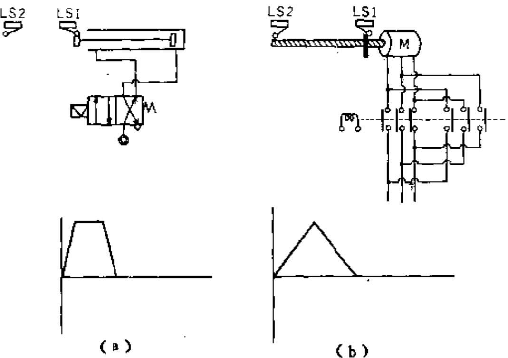  
图1表示往复运动动作的方法

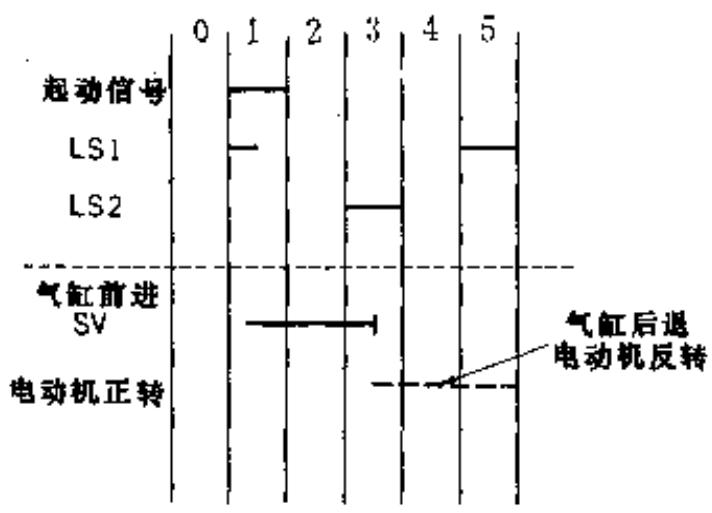  
图2图1的顺序图

# 4.顺序图

汇集在本书各章中的每个自动化机构都附有各种图，这些图在一定程度上

表示了每个机构的动作顺序，但还不是顺序图。例如：图1表示二种机构的机械动作简图，图1a表示利用气缸的前进、压紧和后退：图1b表示利用电动机通过丝杠的前进和后退。在这两个图中，虽然画出了机械的位移，但只有在图2的顺序图中，才能用线条式图表，在表示检测器动作的同时，表示出执行机构或变换器的动作，因而表示了尽管加压的机械位移已停止，但执行机构的动作还在进行。

所以，尽管各个自动化机构的动作图不同，但只要它们的顺序图相同，就可以采用同样的控制系统。

# 5。顺序回路的编排与制造

如果可能，可按顺序图的要求编排成逻辑方框图，再代入单个元件组成控制回路，但这对自动组合机的设计、制造者来说是相当费事的，要化费很多的时间和劳动。本书仅按具有代表性的例子，组合成几类控制回路于后，以供参考；对子比较复杂的，比较大规模的，在设计、制造时，可由专业人员解决。人们购入控制用的通用计算机，为什么不可以外购控制用的通用逻辑部件呢！看来必须使这些部件标准化，从而也就可以促使良好的通用控制逻辑部件的生产和供应。

在此仅就顺序回路制造上的儿点共同之处，说明如下：

5-1 要考虑逻辑回路与执行机构的关系处理信息用的逻辑回路，要使信息的输出功率（能量）与执行机构相适应，如果要求较大的输出功率，就要把逻辑回路输出的信息放大。

虽然说大的输出功率可以兼顾小的输出功率，但如果使用大功率的逻辑元件，整个控制装置就要消耗较大的功率，反应速度也较慢，这是缺点：如果使用小功率的逻辑元件，又往往要击穿。因此，在采用电子集成电路使电磁铁起作用时，就有必要利用继电器。图3是用电子电路带动继电器的回路，这类小型继电器的触点容量大多在1A以下，必须再通过一个大型的继电器操作。因而就构成：电子电路-小型继电器-大型继电器这样的形式，另外，在采用射流技术使气动或液压的执行元件动作时，也必须作同样的考虑。

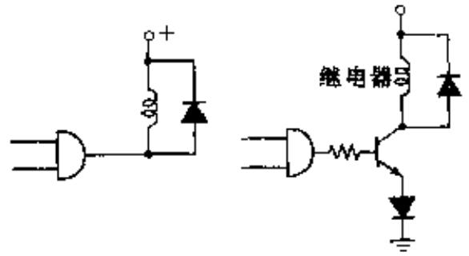  
图3用电子电路带动继电器的方法

表6 所列为可能有效利用的变换元件。

表6信号的变换元件  

<table><tr><td rowspan=1 colspan=1></td><td></td><td></td><td></td><td></td><td></td><td></td><td rowspan=1 colspan=1>电气</td><td rowspan=1 colspan=1>集成电路</td><td rowspan=1 colspan=1>射流元件</td></tr><tr><td rowspan=1 colspan=1>电气</td><td></td><td></td><td></td><td rowspan=1 colspan=5>电磁阀</td><td rowspan=1 colspan=1>电磁阀</td></tr><tr><td rowspan=1 colspan=1>集成电路</td><td></td><td rowspan=1 colspan=1></td><td></td><td rowspan=1 colspan=5></td><td rowspan=1 colspan=1></td></tr><tr><td rowspan=1 colspan=1>射流</td><td rowspan=1 colspan=1>压力开关</td><td rowspan=1 colspan=1>半导体变换器</td><td rowspan=1 colspan=1></td><td rowspan=1 colspan=5>增压阀控制阀</td><td rowspan=1 colspan=1>气动挖制阀</td></tr><tr><td rowspan=1 colspan=1>气动</td><td rowspan=1 colspan=1>压力开关流量开关</td><td rowspan=1 colspan=1>压力开关</td><td rowspan=1 colspan=1>逻辑阀</td><td rowspan=1 colspan=5></td><td rowspan=1 colspan=1>气动控制阀</td></tr><tr><td rowspan=1 colspan=1>液压</td><td rowspan=1 colspan=1>压力开关</td><td rowspan=1 colspan=1>压力开关</td><td rowspan=1 colspan=1>背压开关</td><td rowspan=1 colspan=5>隔膜元件</td><td rowspan=1 colspan=1></td></tr></table>

5-2 输入信号的变换回路的输入部份是由按扭、限位开关或继电器等组成的触点电路时，由于触点的振动而产生的杂音可能使电子电路发生误动作，所以在必要时，可采用图4那样的双稳态电子电路，以保证稳定性。

5-3不能乱用时间继电器利用时间继电器保持一定的动作时间，或在一定的时间以后开始动作，这是非常方便的，但如果误用了，情况就非常严重。例如，组合机床主体的前一个动作时间是3秒钟，后一个动作就应在3.5秒钟后起动，必须大体上使前后二个动作可能干涉的时间延长。如果时间继电器对后一个动作的指令与前一个动作重叠，机械就要损坏。这就是在一个系统中需要使二个时间错开的原因。时间继电器应这样使用，即从前一个动作终止到后一个动作开始之间，有几秒钟的时间间隔、此间隔必须保证动作进行良好。

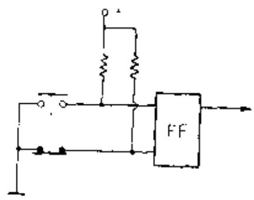  
图4电子的输入触点电路

54顺序编排器在顺序经常需要改变时，使用顺序编排器来控制就非常方便：但对于固定顺序来说，使用顺序编排器成本反而增高。

图5是利用插销板的顺序编排器，其工作原理是当每一个动作终止以后，依次把插销板向前送进一格，通过相应的销子，对执行元件发出输出信号。此插销板如果完全按照顺序图编排，是很可靠的。顺序编排器还有电子式的和气动式的。另外，也可用穿孔纸带，纸带可用电气的方式或气动的方式读出。

5-5 手动操作对于使用者来说，非常希望装上手动操作部分，但是往往由于手动操作使控制回路复杂化，并易于产生误动作。本书中的每一个机构几乎都是可以手动控制的，但在成为自动的以后，操作者对某一动作是否确实完成往往不注意，所以在整个自动控制系统中，虽然附有手动控制，但仍必须要有联锁机构。尽可能不要手动操作，不必要的手动操作有百害而无一利。

5-6 机械发生故障机械总会发生故障，控制装置也是一样，所以必须考虑维护方便。对别人制造的机械不清楚的地方是很多的，特别在带有控制装置时就更难懂。在制造每一个部件的时候都必须检验，要能互换。控制装置最好是标准化的。

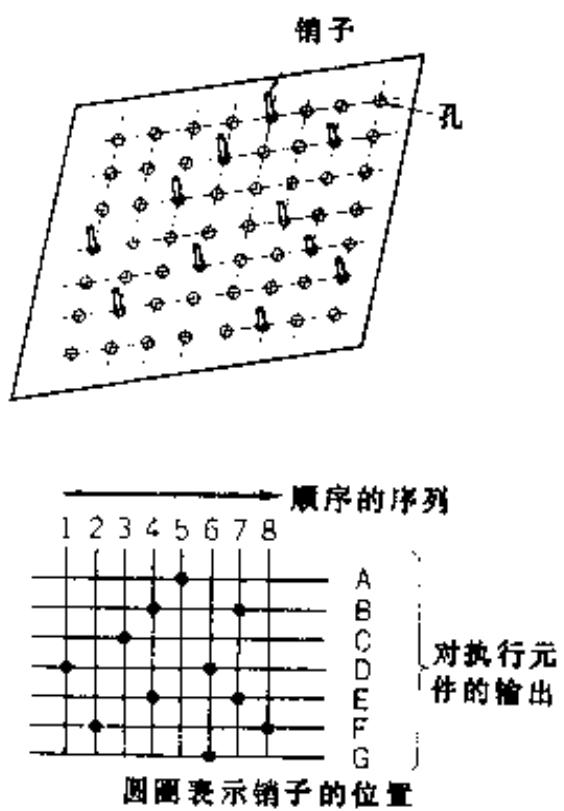  
图5插销板的制造法

# 6.组合机的控制方法

控制方法如前所述，不仅限于电气，也可使用气动或液压。最好不要局限于一种方法。

作为大规模顺序的一环考虑时，组合机本身是否必要？是否一定要自动控制？能否利用机械本身的零、部件作为控制元件等等，并对成熟的控制方法要反复考虑。如果可能使控制完全自动化当然最好，但成本太高也是不相宜的。

下面叙述控制回路的分类方法，先作几点说明：

1）在以下的分类图中，以AC作为执行元件的代号，表示液压缸、气缸、液压马达、气动马达等，或表示电动机、电磁铁、电磁阀等；IO表示电子电路的转换装置；FF表示双稳态元件；R表示继电器； $\langle { \widehat { \bf R } } \rangle$ 表示继电器的线圈。

2）在有的分类图中，动作终止信号或中间终止信号没有标注进去。对这些分类，这类信号从执行元件的动作中取出为好。如果这类信号需要持续较长时间，则按表3中的回路使元件接通即可。

3）在液压或气动系统中，仅以限位阀和按钮式阀表示输入信号检测器。实际中，这.类检测器，必须与使用场所相适应，例如使用背压式检测器。

4）全部液压或气动系统中的执行元件都假定为双向动作的缸，所以对于用弹簧返回的单作用缸，其换向阀可用三通阀。

5）对于用电气操纵的液压、气动执行元件，其电磁阀的线圈示于电气图中。书中各章许多机构都采用了这样的液压、气动系统，它们的系统图是极简单的，如图中没有画出，读者可与分类中的示例对照，试自为之。

第1类控制回路(见图6）

此类属于最简单的顺序。通过起动信号，执行元件开始动作：通过停止信号，动作停止，起动信号大多用按钮加入，停止信号则用按钮或限位开关加入。当然，停止即意味着回复原状（图中AC 表示液压缸、气缸、液动马达、气动马达或电动机、电磁铁、电磁阀、电磁离合器等执行元件）。

第2类控制回路(见图7）

此类在接受起动信号后，执行元件开始前进动作，在到达前进端后发出信号，执行元件开始返回动作，在到达原位置后停止，并发出终止信号，然后通过复位信号使控制系统回复原状。

执行元件的返回动作如通过执行元件内的弹簧来完成，则返回的控制回路就可以不要。

第3类控制回路（见图8）

此类在接受起动信号后，执行元件开始前进动作，在到达前进端后发出中间终止信号，收到此信号后，操作者按压中间起动按钮，或通过时间继电器在一定时间后发出中间起动信号，执行元件开始返回动作，在到达原位置后发出终止信号。操作者根据终止信号使控制回路复位而回复原状。

图中用虚线表示时间继电器的动作。

第4类控制回路（见图9）

此类的动作较前面三类复杂，起动后，在前进行程的中间停止，并通过中间起动（往）信号再继续前进，在到达前进端后停止。之后通过中间起动信号开始返回，与前相同在返回行程的中间--度停止，并通过中间起动（复）信号再继续返回，当到达原位置后停止。

中间起动也可以像第3类那样采用时间继电器的方法。

返回动作如利用执行元件内的弹簧进行时，返回的控制回路就可以不要，仅需要逻辑部分。也就是说，在图中的继电器电路中，仅需要前面7个部分；在液压或气动系统中，控制执行元件的四通阀就可改用三通阀。

第5类控制回路（见图 $1 0 \sim 1 4 )$

此类是前面第 $1 \sim 4$ 类的组合，用来控制二个以上执行元件的动作。

第5-1类（见图10）为1和2二个执行元件同时起动，之后2先停止，其次1停止。前进停止即意味着返回原状。

第5-2类（见图11）为1先起动，其次2起动，在2停止后，1再停止。

第5-3类（见图12）为1先起动，其次2起动，在1停止后，2再停止。

第5-4类（见图13）为1起动后，在1停止的同时，2起动；在2停止的同时，1再次起动，然后1再停止。

第5-5类（见图14）为1先起动，其次2起动，之后1和2同时停止。

第6类控制回路（见图15）

此类为具有三个执行元件的一个例子。出于相当复杂，所以回路图例较难看懂，仅供参考。这类复杂程度以上的控制回路，也可以委托专业者，在此仅作为一例举出。

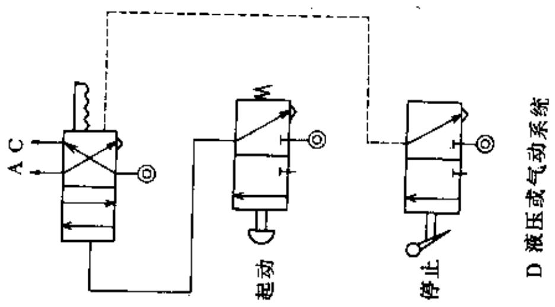

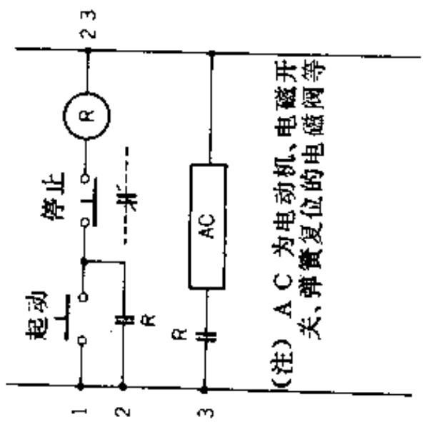

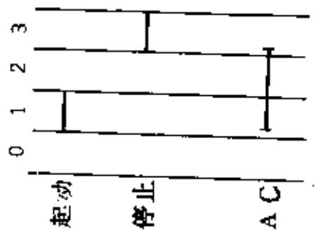

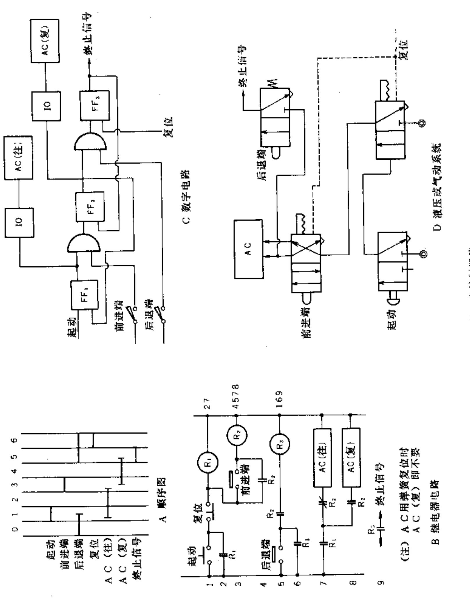  
：

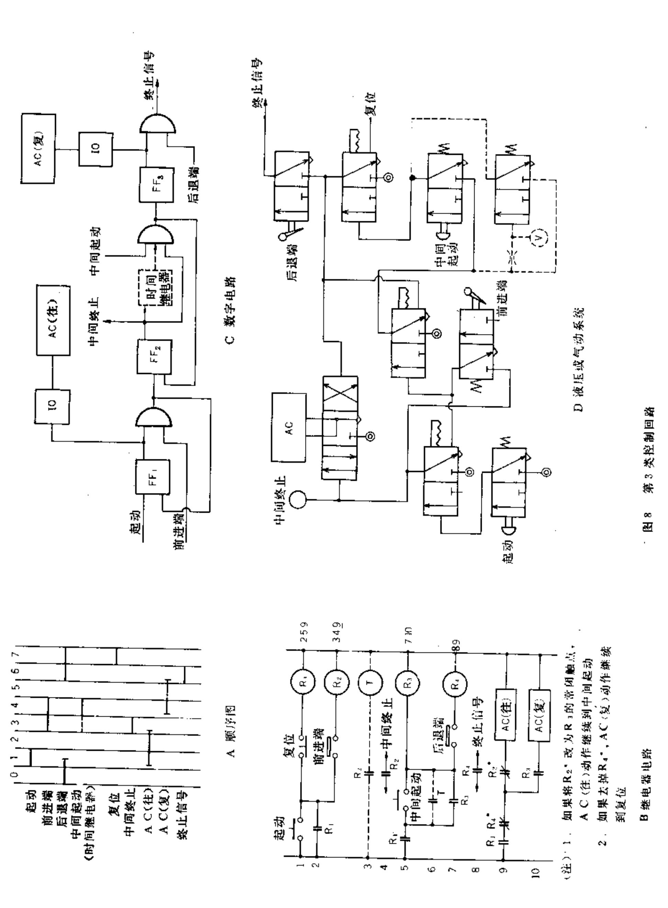

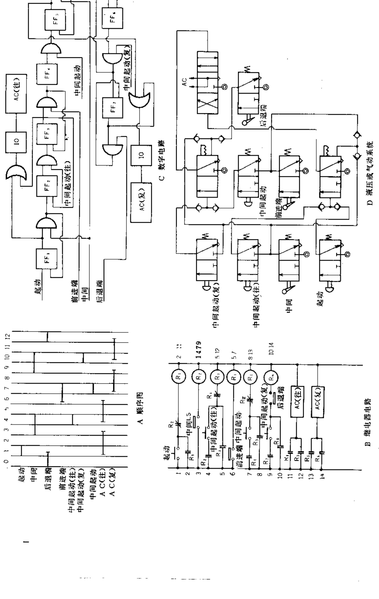

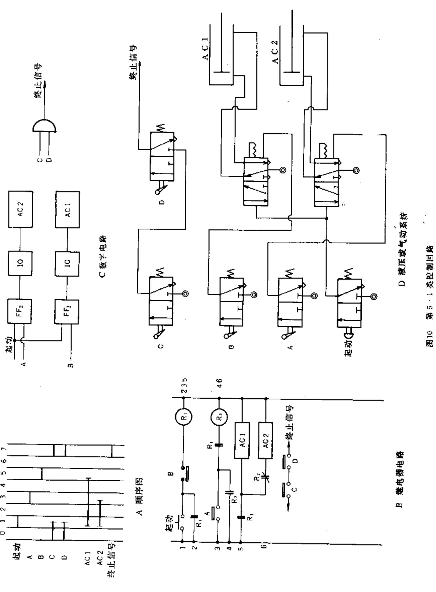

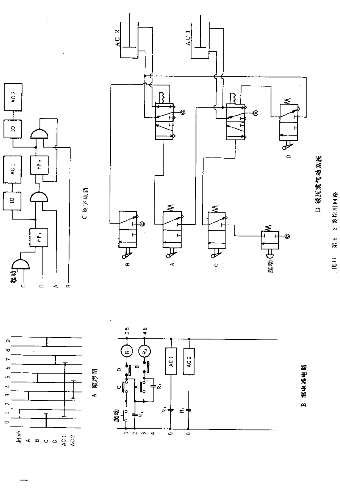

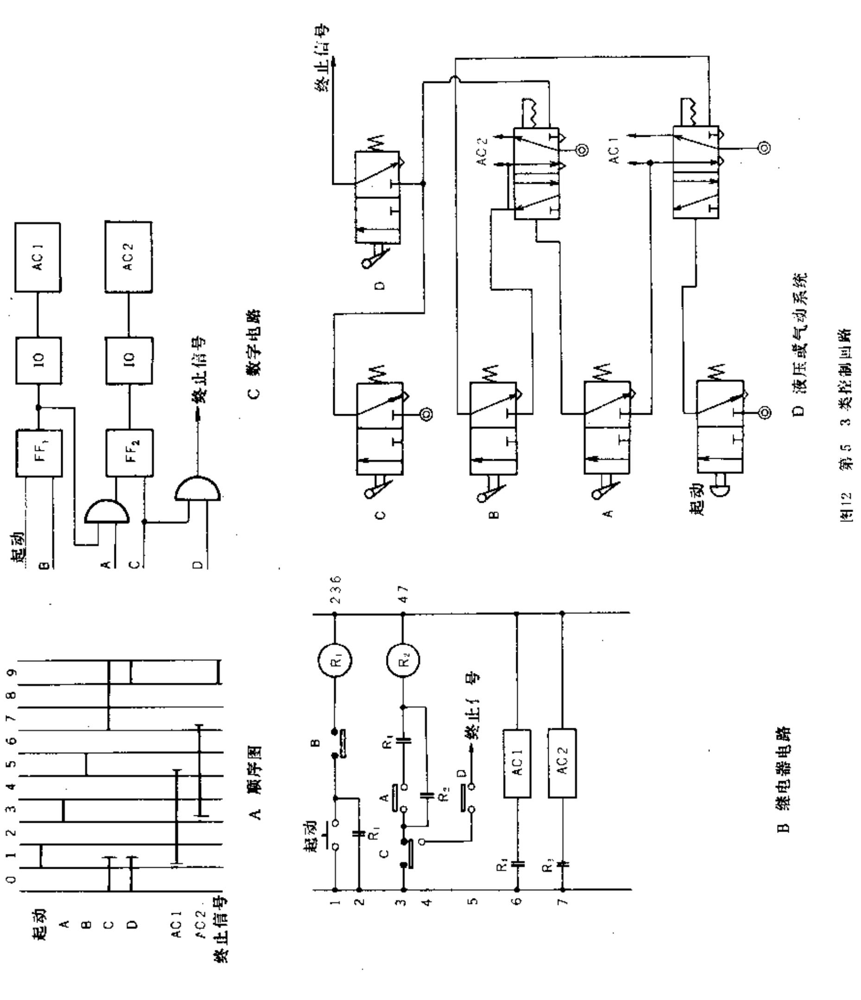

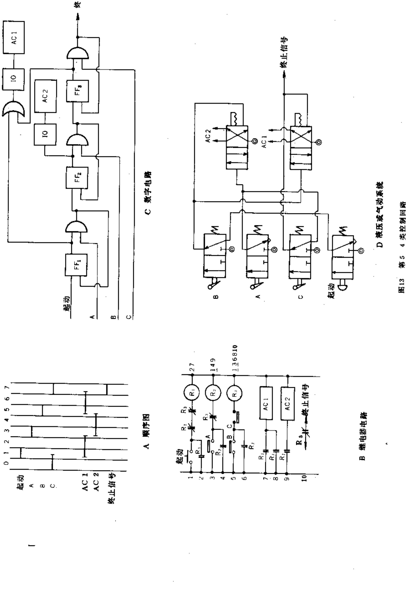

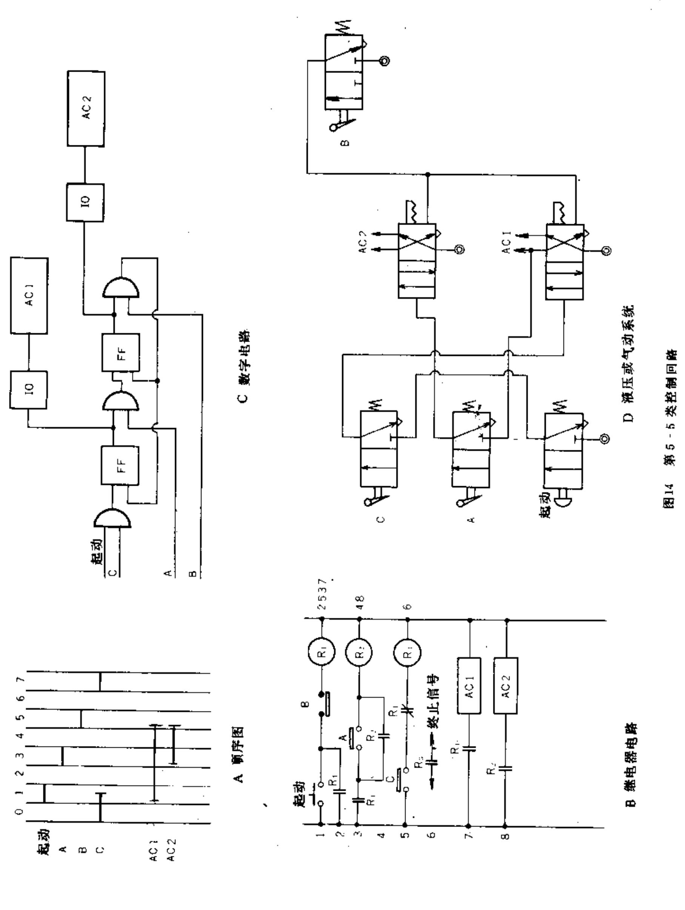

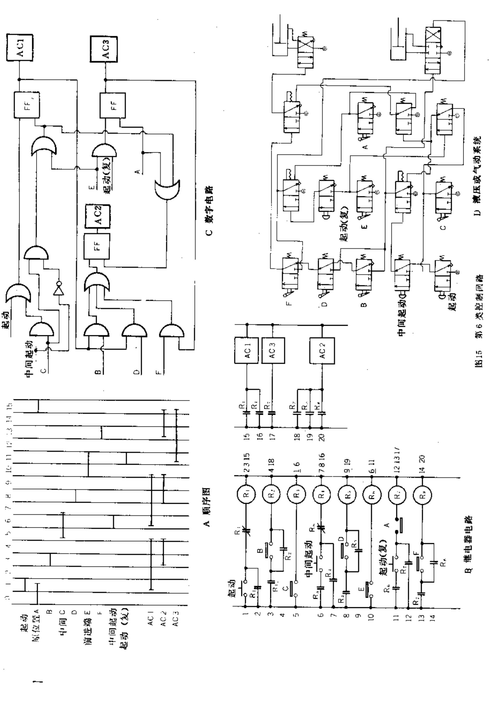

# 书中所用文字代号和缩写字

AMP[amplifier]放大器   
BR（Br）[brake］制动器   
C[condenser]电容器   
c[variable throttle]可调式节流阀   
CL[clutch]离合器   
Cr[clutch］离合器   
CRL[keeprelaymake]保持型继电器接通 M   
CRL[keep relay release］保持型继电器释放   
CRM[keeprelaymake］保持型继电器接通   
CRR［keeprelayrelease］保持型继电器释放   
.CS[contral switch] 控制开关   
DC[direct current]直流   
E[exhaust]排气口   
F[fuse]熔断器   
FF[Flip-Flop]双稳态触发器   
KRM[keeprelaymake]保持型继电器接通   
KRR［keeprelayrelease]保持型继电器释放   
KS[knife switch]闸刀开关   
KT[photo-cell]光电管   
L[lamp]灯   
LS[limit switch]限位开关   
M[motor]电动机   
$\mathbf { M } _ { \pmb { \xi } }$ [magnet]电磁铁   
mm[millimeter］毫米 OL［overload relay］过载继电器   
$\mathbf { P }$ [pressure oil inlet］压力油入口 PB[push button］控制按钮 PC[polar capacitor]电解电容器 PM[potentiometer]电位器   
PS[pressure switch] 压力开关 R[relay]继电器 R[resistor]电阻器 RR[ratchet relay]棘轮继电器 RV[variable resistor］可变电阻器 SE(Se）[rectifier]整流器 sec [second]秒   
SOL[solenoid］电磁线圈   
SOLV[solenoid valve］电磁阀   
$\pmb { S } \mathbf { \tau }$ [period stroke]周期行程   
SW[switch]开关   
$\boldsymbol { \mathsf { T } } _ { 4 } \boldsymbol { \mathsf { t } }$ 、[time]时间   
T[period]周期   
T[timerelay]时间继电器   
$\pmb { \tilde { \mathbf { T } } } _ { \mathbf { h } \mathbf { r } }$ [thermalrelay］热动继电器   
$\pmb { \mathrm { T } } _ { \pmb { \mathrm { m i n } } }$ [minimum period]最小周期时间   
TR[timerelay］时间继电器   
TR（Tr）[transformer]变压器   
$\mathbf { v }$ [velocity］速度   
Z [brake]制动器

# 三 书中所用图形符号

# (一） 电气图形符号

（摘自JISC 0301和JISC 9309）

表1一般  

<table><tr><td rowspan=1 colspan=1>名           称</td><td rowspan=1 colspan=1>图   形符    号</td><td rowspan=1 colspan=1>摘               要</td></tr><tr><td rowspan=1 colspan=1>电阻器</td><td rowspan=1 colspan=1>(1)                    l≥l1(2）</td><td rowspan=1 colspan=1>1．必要时，弯曲次数可以改变2.(2)用以表示无感电阻</td></tr><tr><td rowspan=1 colspan=1>电容器</td><td rowspan=1 colspan=1>+</td><td rowspan=1 colspan=1></td></tr><tr><td rowspan=1 colspan=1>电解电容器</td><td rowspan=1 colspan=1>本</td><td rowspan=1 colspan=1>1.希望表示正，负时，可示为：本2．明显是电解电容器，斜线可以省略，如：牛</td></tr><tr><td rowspan=2 colspan=1>申磁线围</td><td rowspan=1 colspan=1>(1)                   1331(2）                   153?1(3）                    1&gt;（4）                    101</td><td rowspan=1 colspan=1>1，必要时，弯曲次数可以改变2.(3)在不会与电阻器相混时使用3.在(4)的圈中，也可记入CR等代号</td></tr><tr><td rowspan=1 colspan=1>(）                      0(2）</td><td rowspan=1 colspan=1></td></tr></table>

续表1

表2整流器  

<table><tr><td rowspan=1 colspan=1>名           称</td><td rowspan=1 colspan=1>图形符号</td><td rowspan=1 colspan=1>摘               要</td></tr><tr><td rowspan=1 colspan=1>变压器</td><td rowspan=1 colspan=1>(1）                      W馆(2）3W3(3）</td><td rowspan=1 colspan=1>1。必要时，弯曲次数可以改变2．必须表明有铁芯时，可按下示粥</td></tr><tr><td rowspan=1 colspan=1>整流器</td><td rowspan=1 colspan=1>千</td><td rowspan=1 colspan=1>正三角形箭头表示直流通过方向</td></tr><tr><td rowspan=1 colspan=1>电动机</td><td rowspan=1 colspan=1>O</td><td rowspan=1 colspan=1>必须区别交流、直流时，可按下示：8交流直流</td></tr><tr><td rowspan=1 colspan=1>熔断器</td><td rowspan=1 colspan=1>(1）                    !?!：(2）                0</td><td rowspan=1 colspan=1>(1)为开式(2)为闭式</td></tr><tr><td rowspan=1 colspan=1>开关</td><td rowspan=1 colspan=1>(1)                        3(2）                      </td><td rowspan=1 colspan=1></td></tr><tr><td rowspan=1 colspan=1>灯</td><td rowspan=1 colspan=1>(1）                IO!8(2）0(3）</td><td rowspan=2 colspan=1>必须区别颜色和用途时，可按下例将文字记入。例：红色RL，橙色OL，绿色GL，兰色BL，白色WL：指示PL</td></tr><tr><td rowspan=1 colspan=1>指示灯</td><td rowspan=1 colspan=1></td></tr></table>

<table><tr><td>名 称</td><td>图形符号</td><td>摘 要</td></tr><tr><td></td><td>全 (1）</td><td>(2)的箭头表示直流通过方向</td></tr><tr><td>整流器（桥式)</td><td>全</td><td></td></tr><tr><td></td><td>(2）</td><td></td></tr></table>

表3触点  

<table><tr><td rowspan="2">名 称</td><td colspan="2">图 形 符 号</td><td rowspan="2">摘 要</td></tr><tr><td>a触点</td><td>b触点</td></tr><tr><td>触点（一般）或</td><td>3 (1）</td><td>(1)</td><td></td></tr><tr><td>手动触点</td><td>Li （2)</td><td>(2） iiPlol</td><td></td></tr></table>

<table><tr><td rowspan=2 colspan=2>名           称</td><td rowspan=1 colspan=2>图  形符号</td><td rowspan=2 colspan=1>摘               要</td></tr><tr><td rowspan=1 colspan=1>a触点</td><td rowspan=1 colspan=1>b触点</td></tr><tr><td rowspan=1 colspan=2>手动操作自动返回触点</td><td rowspan=1 colspan=1>(1）    7(2）   i1</td><td rowspan=1 colspan=1>（1）  F(2）    rE</td><td rowspan=1 colspan=1>手离开即自动返回，用于按钮开关，操作开关等的触点(按压式、拉拔式、扭转式通用)</td></tr><tr><td rowspan=1 colspan=2>机械触点</td><td rowspan=1 colspan=1>1）   8（2）  jIi</td><td rowspan=1 colspan=1>(1）  C(2） </td><td rowspan=1 colspan=1>由电气以外的原因进行开闭的触点，如限位开关的触点</td></tr><tr><td rowspan=1 colspan=2>继电器触点</td><td rowspan=1 colspan=1>(1）  I(2）    1（3）    {l8（4）</td><td rowspan=1 colspan=1>(1） if(2） 养（3）  iPii（4)广</td><td rowspan=1 colspan=1></td></tr><tr><td></td><td rowspan=1 colspan=1>延时动作触点</td><td rowspan=1 colspan=1>（1）    A(2）  六</td><td rowspan=1 colspan=1>1）    …(2)   !B1</td><td rowspan=1 colspan=1>在必须表示是延时触点时使用</td></tr><tr><td></td><td rowspan=1 colspan=1>延时返回触点</td><td rowspan=1 colspan=1>1）   3(2）   4</td><td rowspan=1 colspan=1>(1）  ！(2）  i</td><td rowspan=1 colspan=1>在必须表示是延时触点时使用</td></tr><tr><td></td><td rowspan=1 colspan=1>手动返回触点</td><td rowspan=1 colspan=1>福(1）(2）   </td><td rowspan=1 colspan=1>（1）    美(2）  ei</td><td rowspan=1 colspan=1>包括人为返回及电磁返回，例如：手动返回的热动继电器触点、电磁返回的电铃继电器触点等</td></tr><tr><td></td><td rowspan=1 colspan=1>电磁接触器触点</td><td rowspan=1 colspan=1>(1）     8(2）   b1③(4）     井</td><td rowspan=1 colspan=1>(1）      (2）      g（3）     米（4）       米</td><td rowspan=1 colspan=1>在不致发生错误的情况下，也可用继电器图形符号</td></tr></table>

# （二） 液压、气动图形符号

（摘自JISB 0125)

表1 管路及连接  

<table><tr><td colspan="1" rowspan="1">名           称</td><td colspan="1" rowspan="1">图形符号</td><td colspan="1" rowspan="1">备              注</td></tr><tr><td colspan="1" rowspan="1">主管路</td><td colspan="1" rowspan="1"></td><td colspan="1" rowspan="1">主管路是指吸入管路、压入管路及回油管路</td></tr><tr><td colspan="1" rowspan="1">控制管路</td><td colspan="1" rowspan="1"></td><td colspan="1" rowspan="1">L&gt;10EL-线长L-线粗</td></tr><tr><td colspan="1" rowspan="1">泄漏箕路</td><td colspan="1" rowspan="1"></td><td colspan="1" rowspan="1">L&gt;5EL-线长E-线粗</td></tr><tr><td colspan="1" rowspan="1">流动方向：油流方向气流方门</td><td colspan="1" rowspan="1">Y    1Y</td><td colspan="1" rowspan="1">也可以在管路旁指示，例：+</td></tr><tr><td colspan="1" rowspan="1">阀内流动方向</td><td colspan="1" rowspan="1">11</td><td colspan="1" rowspan="1"></td></tr><tr><td colspan="1" rowspan="1">通油箱管路管端不进入油中管端进入油中</td><td colspan="1" rowspan="1">山H</td><td colspan="1" rowspan="1">管端不进入油箱边缘的连线</td></tr></table>

表2液压泵、液压马达及气动马达   

<table><tr><td></td><td rowspan=1 colspan=2>名            称</td><td rowspan=1 colspan=2>图形符   号</td><td rowspan=1 colspan=1>备               注</td></tr><tr><td></td><td rowspan=1 colspan=2>定量液压泵</td><td rowspan=1 colspan=2>O(1）O(2）</td><td rowspan=4 colspan=1>三角形表示流体的出口三角形的高度约为圖直径的1/5（1）为单向流动(2）为双向流动</td></tr><tr><td></td><td rowspan=1 colspan=2>变量液压泵</td><td rowspan=1 colspan=2>C(1）?(2）</td></tr><tr><td></td><td rowspan=1 colspan=1>压缩机及鼓风机</td><td></td><td rowspan=1 colspan=2>O</td></tr><tr><td></td><td rowspan=1 colspan=1>真空泵</td><td rowspan=1 colspan=2>?</td><td></td></tr><tr><td rowspan=2 colspan=2>定量液压马达</td><td rowspan=2 colspan=2>③（1）O(2）</td><td></td><td></td></tr><tr><td rowspan=3 colspan=2>三角形表示流体的出口（1）为单向流动(2）为双向流动</td></tr><tr><td rowspan=1 colspan=2>变量液压马达</td><td rowspan=1 colspan=2>Q(1)绿(2）</td></tr><tr><td rowspan=1 colspan=2>气动马达</td><td rowspan=1 colspan=2>(1）                  O(2）                  O</td></tr></table>

表3液压缸及气缸   

<table><tr><td></td><td rowspan=4 colspan=2>名            称</td><td></td><td></td><td></td></tr><tr><td></td><td rowspan=3 colspan=2>图形符号</td><td></td></tr><tr><td></td><td></td></tr><tr><td></td><td rowspan=2 colspan=1>备               注</td></tr><tr><td></td><td rowspan=2 colspan=2>单作用缸</td><td rowspan=2 colspan=2>(1)                     斤(2）                     门</td></tr><tr><td></td><td rowspan=3 colspan=1>(1)为详细符号(2）为简化符号</td></tr><tr><td></td><td rowspan=1 colspan=2>单作用弹簧返回缸</td><td rowspan=1 colspan=2>1）                     南(2）                     国</td></tr><tr><td rowspan=2 colspan=1></td><td rowspan=2 colspan=2>单作用柱塞缸</td><td rowspan=2 colspan=2>园</td></tr><tr><td rowspan=2 colspan=1></td></tr><tr><td></td><td rowspan=2 colspan=2>双作用单活塞杆缸</td><td rowspan=2 colspan=2>国(1）(2）                      国</td><td></td></tr><tr><td></td><td rowspan=3 colspan=2>（1）为详细符号(2）为简化符号</td></tr><tr><td></td><td rowspan=1 colspan=1>双作用双活塞杆缸</td><td rowspan=1 colspan=2>事（(2）                     中</td></tr><tr><td></td><td rowspan=2 colspan=1>双作用单面带可调缓冲式缸</td><td rowspan=2 colspan=2>管(1）(2）                      园</td></tr><tr><td></td><td rowspan=3 colspan=2>在有缓冲符号一侧的行程终了时缓冲，箭头表示从外部可调（1)为详细符号(2)为简化符号</td></tr><tr><td></td><td rowspan=1 colspan=1>双作用双面带可调缓冲式缸</td><td rowspan=1 colspan=2>1)                       冒(2，                      学</td></tr><tr><td rowspan=2 colspan=2>差动缸</td><td rowspan=2 colspan=2>                      馆(2）                      写</td></tr><tr><td rowspan=2 colspan=2>（1）为详细符号(2）为简化符号</td></tr><tr><td></td><td></td><td></td><td></td></tr></table>

表4控制方式  

<table><tr><td rowspan=2 colspan=1>名         称</td><td></td><td></td></tr><tr><td></td><td rowspan=2 colspan=1>备               注</td></tr><tr><td rowspan=2 colspan=1>弹簧控制</td><td rowspan=2 colspan=2>M</td></tr><tr><td rowspan=2 colspan=1></td></tr><tr><td rowspan=2 colspan=1>可调弹簧控制</td><td rowspan=2 colspan=2>A</td></tr><tr><td rowspan=2 colspan=1></td></tr><tr><td rowspan=2 colspan=1>直接压力控制</td><td rowspan=2 colspan=2>（1）                      门(2）                    公</td></tr><tr><td rowspan=3 colspan=1>（1）为加压控制(2）为卸压控制</td></tr><tr><td rowspan=1 colspan=1>先导压力控制</td><td rowspan=1 colspan=2>L</td></tr><tr><td rowspan=2 colspan=1>单作用控制缸控制</td><td rowspan=2 colspan=2>鼎(1）(2）</td></tr><tr><td rowspan=1 colspan=1>（1）为详细符号（2）为简化符号</td></tr></table>

续表4

<table><tr><td rowspan=1 colspan=1>名           称</td><td rowspan=1 colspan=1>图形符号</td><td rowspan=1 colspan=1>备               注</td></tr><tr><td rowspan=1 colspan=1>压力-位移比例控制</td><td rowspan=1 colspan=1>1                   -(2)                    国</td><td rowspan=2 colspan=1>（1)为详细符号(2）为简化符号</td></tr><tr><td rowspan=1 colspan=1>双作用控制缸控制</td><td rowspan=1 colspan=1>面(1）白（2）</td></tr><tr><td rowspan=1 colspan=1>单线圈电磁控制</td><td rowspan=1 colspan=1>品</td><td rowspan=2 colspan=1></td></tr><tr><td rowspan=1 colspan=1>差动电磁线圈控制</td><td rowspan=1 colspan=1>区</td></tr></table>

表5压力控制阀  

<table><tr><td></td><td rowspan=1 colspan=3>农5压方性制阀</td></tr><tr><td></td><td rowspan=1 colspan=1>名           称</td><td rowspan=1 colspan=1>图形符号</td><td rowspan=1 colspan=1>备               注</td></tr><tr><td></td><td rowspan=1 colspan=1>常闭式二通调节阀</td><td rowspan=1 colspan=1>0</td><td rowspan=2 colspan=1>a.符号原则上表示阀在正常位置(即停止位置)上的性能b.加上其它基本符号则形成压力控制阀的符号c.正方形(或长方形)上下边外侧的实线表示管路和出入口的数量d.常闭式阀管路和箭头错开表示管路和阀内通路不连接常开式阀管路和箭头连接表示管路与阀内通路连接</td></tr><tr><td></td><td rowspan=1 colspan=1>常开式二通调节阀</td><td rowspan=1 colspan=1>中</td></tr><tr><td></td><td rowspan=1 colspan=1>直接控制溢流阀</td><td rowspan=1 colspan=1>安（1）           (2）     m</td><td rowspan=2 colspan=1>三角形表示放出大气(1）为液压用(2)、（3）为气动用</td></tr><tr><td></td><td rowspan=1 colspan=1>远程控制溢流阀</td><td rowspan=1 colspan=1>g（1）           (2）     心13）</td></tr><tr><td></td><td rowspan=1 colspan=1>定比压力阀</td><td rowspan=1 colspan=1>中</td><td rowspan=1 colspan=1></td></tr><tr><td></td><td rowspan=1 colspan=1>卸荷阀</td><td rowspan=1 colspan=1>宝</td><td rowspan=1 colspan=1></td></tr><tr><td></td><td rowspan=1 colspan=1>直接控制顺序阀</td><td rowspan=1 colspan=1>电</td><td rowspan=2 colspan=1></td></tr><tr><td></td><td rowspan=1 colspan=1>远程控制顺序阀</td><td rowspan=1 colspan=1>卓</td></tr><tr><td rowspan=1 colspan=2>定压减压阀</td><td rowspan=1 colspan=1>（1）(2）(3）地（4）</td><td rowspan=1 colspan=1>(1)为液压用不带泄油口(2）为液压用带泄油口（3）为气动用带放气□（4）为气动用远程控制</td></tr></table>

表6 流量控制阀  

<table><tr><td>称 名</td><td>图形符 号</td><td>备 注</td></tr><tr><td>动式时调节流阀</td><td>9 （1） 水 (2）</td><td>(1)为详细符号 （2）为简化符号</td></tr><tr><td>机械式可调节流阀</td><td>9m (1） (2！ 水</td><td></td></tr><tr><td>固定式节流阀</td><td></td><td></td></tr><tr><td rowspan="6">可调式节流阀</td><td>中国母电国 11)</td><td>(1)为内部泄漏式</td></tr><tr><td>(2）</td><td>(2）为外部泄漏式 （3）为分路式</td></tr><tr><td>(3）</td><td>（4）为温度补偿式 (5)可调式单向节流阀，对于气动，在不带压力补</td></tr><tr><td>（4）</td><td>偿时，可使用此符号</td></tr><tr><td></td><td></td></tr><tr><td>（5）</td><td></td></tr></table>

表7．方向控制阀  

<table><tr><td>名 称</td><td>图 形 符 号</td><td>备 注</td></tr><tr><td>位通换向阀</td><td></td><td>a.加上基本控制符号则形成换向阀的符号 b.正方形(或长方形)上下边外侧的实线表示管路 和出入口的数量 c.管路原则上连接在表示正常位置(或中间位置） 的正方形(或长方形)上 d.相连的正方形(或长方形)的数量表示阀换向的 位数</td></tr><tr><td>位四通换向阀</td><td>国区</td><td>e.各正方形(或长方形)中的箭头，表示该位置的 流通方向 f.1、下表示内通路关闭 g.与控制动作对应的换向动作连续进行时，在长 方形外侧划平行线，中间的隔线用虚线 h.三位四通换向阀中间位置流通形式的表示，原</td></tr><tr><td>四通节流换向阀</td><td></td><td>则上要用阀内连接的出入口名称来表示，例如： 印 团 BR连接 ABR连接 下面几种情况是例外： 国 国 中间封闭 带节流的中间连接 田 園</td></tr><tr><td>二位二通手动换向 阀</td><td></td><td>中间连接 带节流的ABR连接</td></tr><tr><td>二位二通弹簧复位 向阀</td><td></td><td></td></tr></table>

续表7

<table><tr><td rowspan=1 colspan=1>名           称</td><td rowspan=1 colspan=1>图    形     符    号</td><td rowspan=1 colspan=1>备          注</td></tr><tr><td rowspan=1 colspan=1>二位三通远控换向阀</td><td rowspan=1 colspan=1></td><td rowspan=2 colspan=1>必须表示换向的中间过渡位置时，间隔线用虚线表示</td></tr><tr><td rowspan=1 colspan=1>二位三通弹簧复位电磁换向阀</td><td rowspan=1 colspan=1>亮</td></tr><tr><td rowspan=1 colspan=1>二位五通远控换向阀</td><td rowspan=1 colspan=1></td><td rowspan=1 colspan=1></td></tr></table>

表8单向阀  

<table><tr><td rowspan=1 colspan=1>名           称</td><td rowspan=1 colspan=1>图形符   号</td><td rowspan=1 colspan=1>备               注</td></tr><tr><td rowspan=1 colspan=1>单向阀</td><td rowspan=1 colspan=1>（1）                    点(2）</td><td rowspan=1 colspan=1>（1）为详细符号（21为简化符号</td></tr></table>

表9 附件  

<table><tr><td rowspan=1 colspan=1>名           称</td><td rowspan=1 colspan=1>图    形     符     号</td><td rowspan=1 colspan=1>备               注</td></tr><tr><td rowspan=1 colspan=1>手动截止阀</td><td rowspan=1 colspan=1>{iX!</td><td rowspan=1 colspan=1></td></tr><tr><td rowspan=1 colspan=1>压力维电器</td><td rowspan=1 colspan=1>Dm</td><td rowspan=1 colspan=1></td></tr><tr><td rowspan=1 colspan=1>压力源</td><td rowspan=1 colspan=1>(1）                      0(2）                      0</td><td rowspan=1 colspan=1>（1）为液压用（2）为气动用</td></tr></table>