# 第14章 带传动

# G1 平带传动

胶帆布平带宽  $50\mathrm{mm}$  、胶帆布层3层、带长

# G1.1 胶帆布平带

2240mm：

胶帆布平带  $50 \times 3 \times 2240$

# G1.1 规格（表 G14-1、表 G14-2）

# G1.1.2 设计计算（表G14-3）

标记示例：

表 G14-1 胶帆布平带规格 (mm)

<table><tr><td rowspan="2">胶帆布层数z</td><td rowspan="2">带厚①δ</td><td rowspan="2">宽度范围b</td><td colspan="2">最小带轮直径dmin</td><td rowspan="2">胶帆布层数z</td><td rowspan="2">带厚①δ</td><td rowspan="2">宽度范围b</td><td colspan="2">最小带轮直径dmin</td></tr><tr><td>推荐</td><td>许用</td><td>推荐</td><td>许用</td></tr><tr><td>3</td><td>3.6</td><td>16~20</td><td>160</td><td>112</td><td>11</td><td>13.2</td><td rowspan="2">355~500</td><td>560</td><td>450</td></tr><tr><td>4</td><td>4.8</td><td>20~315</td><td>224</td><td>160</td><td>12</td><td>14.4</td><td>630</td><td>500</td></tr><tr><td>5</td><td>6</td><td>63~315</td><td>280</td><td>200</td><td rowspan="2" colspan="5">宽度系列:16 20 25 32 40 50 63 71 80 90 100 112</td></tr><tr><td>6</td><td>7.2</td><td>63~500</td><td>315</td><td>224</td></tr><tr><td>7</td><td>8.4</td><td rowspan="4">200~500</td><td>355</td><td>280</td><td rowspan="2" colspan="5">125 140 160 180 200 224 250 280 315 355</td></tr><tr><td>8</td><td>9.6</td><td>400</td><td>315</td></tr><tr><td>9</td><td>10.8</td><td>450</td><td>355</td><td rowspan="2" colspan="5">400 450 500</td></tr><tr><td>10</td><td>12</td><td>500</td><td>400</td></tr></table>

① 带厚为参考尺寸。

表 G14-2 平带的接头形式

<table><tr><td colspan="2">接头种类</td><td>简图</td><td>特点及应用</td></tr><tr><td rowspan="2">硫化接头</td><td>胶帆布平带硫化接头</td><td>200~40050~150</td><td rowspan="2">接头平滑、可靠,联接强度高,但联接技术要求高;接头效率80%~90%用于不需经常改接的高速大功率传动和有张紧轮的传动</td></tr><tr><td>锦纶片复合平带硫化接头</td><td>80~15060°</td></tr><tr><td rowspan="2">机械接头</td><td>带扣接头</td><td></td><td>联接迅速、方便,其端部被削弱,运转中有冲击;接头效率85%~90%用于经常改接的中小功率传动,胶帆布平带扣接头v&lt;20m/s,铁丝钩接头v&lt;25m/s</td></tr><tr><td>铁丝钩接头</td><td></td><td></td></tr><tr><td>机械接头</td><td>螺栓接头</td><td></td><td>联接方便,接头强度高,只能单面传动;接头效率30%~65%用于v&lt;10m/s的大功率胶帆布平带传动</td></tr></table>

表 G14-3 胶帆布平带传动的设计计算

<table><tr><td>序号</td><td>计算项目</td><td>符号</td><td>单位</td><td>计算公式和参数选定</td><td>说 明</td></tr><tr><td>1</td><td>选定胶带</td><td></td><td></td><td></td><td></td></tr><tr><td>2</td><td>小带轮直径</td><td>\( {d}_{1} \)</td><td>mm</td><td>\( {d}_{1} = {\left( {1100} \sim  {1350}\right) }^{\sqrt[3]{\frac{P}{n_1}}} \) 或 \( {d}_{1} = \frac{{6000v}}{{\pi }{n}_{1}} \)</td><td>\( P \) 一传递的功率(kW) \( {n}_{1} \) 一小带轮转速 ( \( \mathrm{r}/\mathrm{{min}} \) ) \( v \) 一带速 \( \left( {\mathrm{m}/\mathrm{s}}\right) \) ,最有利的带速 \( v = {10} \sim  {20}\mathrm{\;m}/\mathrm{s} \) \( {d}_{1} \) 应按表 G14-15 选取标准值</td></tr><tr><td>3</td><td>带速</td><td>\( V \)</td><td>m/s</td><td>\( v = \frac{\pi {d}_{1}{n}_{1}}{60 \times  {1000}} \leq  {v}_{\max } \) 胶帆布平带 \( {v}_{\max } = {30}\mathrm{\;m}/\mathrm{s} \)</td><td>应使带速小于最大带速 \( {v}_{\max } \) ,否则应 改变 \( {d}_{1} \) 值</td></tr><tr><td>4</td><td>大带轮直径</td><td>\( {d}_{2} \)</td><td>mm</td><td>\( {d}_{2} = i{d}_{1}\left( {1 - \varepsilon }\right)  = \frac{{n}_{1}}{{n}_{2}}{d}_{1}\left( {1 - \varepsilon }\right) \) \( \varepsilon \) 取 0.01~0.02</td><td>\( {n}_{2} \) 一大带轮转速 ( \( \mathrm{r}/\mathrm{{min}} \) ) \( \varepsilon \) 一弹性滑动率 \( {d}_{2} \) 应按表 G14-16 选取标准值</td></tr><tr><td>5</td><td>轴间距</td><td>\( a \)</td><td>mm</td><td>\( a = \left( {{1.5} \sim  2}\right) \left( {{d}_{1} + {d}_{2}}\right) \) 且 \( {1.5}\left( {{d}_{1} + {d}_{2}}\right)  \leq  a \leq  5\left( {{d}_{1} + {d}_{2}}\right) \)</td><td>或根据结构要求定</td></tr><tr><td>6</td><td>所需带长</td><td>\( L \)</td><td>mm</td><td>开口传动 \( L = {2a} + \frac{\pi }{2}\left( {{d}_{1} + {d}_{2}}\right)  + \frac{{\left( {d}_{2} - {d}_{1}\right) }^{2}}{4a} \) 交叉传动 \( L = {2a} + \frac{\pi }{2}\left( {{d}_{1} + {d}_{2}}\right)  + \frac{{\left( {d}_{2} + {d}_{1}\right) }^{2}}{4a} \) 半交叉传动 \( L = {2a} + \frac{\pi }{2}\left( {{d}_{1} + {d}_{2}}\right)  + \frac{{d}_{1}^{2} + {d}_{2}^{2}}{4a} \)</td><td>未考虑接头长度</td></tr><tr><td>7</td><td>小带轮包角</td><td>\( {\alpha }_{1} \)</td><td>。</td><td>开口传动 \( {\alpha }_{1} = {180}^{ \circ  } - \frac{{d}_{2} - {d}_{1}}{a} \times  {57.3}^{ \circ  } \geq  {150}^{ \circ  } \) 交叉传动 \( {\alpha }_{1} \approx  {180}^{ \circ  } + \frac{{d}_{2} - {d}_{1}}{a} \times  {57.3}^{ \circ  } \) 半交叉传动 \( {\alpha }_{1} \approx  {180}^{ \circ  } + \frac{{d}_{1}}{a} \times  {57.3}^{ \circ  } \)</td><td></td></tr><tr><td>8</td><td>曲挠次数</td><td>\( y \)</td><td>1/s</td><td>\( y = \frac{{1000mV}}{L} \leq  {y}_{\max } \) \( {y}_{\max } = 6 \sim  {10v} \)</td><td>\( m \) 一带轮数</td></tr><tr><td>9</td><td>带厚</td><td>\( \delta \)</td><td>mm</td><td>\( \delta  \leq  \left( {\frac{1}{40} \sim  \frac{1}{30}}\right) {d}_{1} \)</td><td>按表 G14-1 选取标准值</td></tr><tr><td>10</td><td>带的截面积</td><td>\( A \)</td><td>\( {\mathrm{{mm}}}^{2} \)</td><td>\( A = \frac{{100}{K}_{\mathrm{A}}P}{{P}_{0}{K}_{\alpha }{K}_{\beta }} \)</td><td>\( {K}_{\mathrm{A}} \) 一工况系数,查表 G14-8 \( {P}_{0} \) 一胶带单位截面所能传递的基本额定 功率,查表 G14-4 ( \( \mathrm{{kW}}/{\mathrm{{cm}}}^{2} \) ) \( {K}_{\alpha } \) 一包角修正系数,查表 G14-5 \( {K}_{\beta } \) 一传动布置系数,查表 G14-6</td></tr><tr><td>11</td><td>带宽</td><td>\( b \)</td><td>mm</td><td>\( b = \frac{A}{\delta } \)</td><td>按表 G14-1 选取标准值</td></tr><tr><td>12</td><td>作用在轴 上的力</td><td>\( Q \)</td><td>\( \mathrm{N} \)</td><td>\( Q = 2{\sigma }_{0}\operatorname{Asin}\frac{{\alpha }_{1}}{2} \) 推荐 \( {\sigma }_{0} = {1.8}\mathrm{{MPa}} \)</td><td>\( {\sigma }_{0} \) 一带的预紧应力(MPa)</td></tr><tr><td>13</td><td>带轮结构 和尺寸</td><td></td><td></td><td></td><td>见本章 G1.4</td></tr></table>

表 G14-4 胶帆布平带单位截面积传递的基本额定功率  ${P}_{0}$

$(\alpha = 180^{\circ}$  、载荷平稳、预紧应力  $\sigma_0 = 1.8\mathrm{MPa})$  (kW/cm²)

<table><tr><td rowspan="2">d1δ</td><td colspan="11">带速ν(m·s-1)</td></tr><tr><td>5</td><td>6</td><td>7</td><td>8</td><td>9</td><td>10</td><td>11</td><td>12</td><td>13</td><td>14</td><td>15</td></tr><tr><td>30</td><td>1.1</td><td>1.3</td><td>1.5</td><td>1.7</td><td>1.9</td><td>2.1</td><td>2.3</td><td>2.5</td><td>2.7</td><td>2.9</td><td>3.0</td></tr><tr><td>35</td><td>1.1</td><td>1.3</td><td>1.5</td><td>1.7</td><td>2.0</td><td>2.2</td><td>2.4</td><td>2.5</td><td>2.7</td><td>2.9</td><td>3.1</td></tr><tr><td>40</td><td>1.1</td><td>1.3</td><td>1.6</td><td>1.8</td><td>2.0</td><td>2.2</td><td>2.4</td><td>2.6</td><td>2.8</td><td>2.9</td><td>3.1</td></tr><tr><td>50</td><td>1.2</td><td>1.4</td><td>1.6</td><td>1.8</td><td>2.1</td><td>2.3</td><td>2.5</td><td>2.6</td><td>2.8</td><td>3.0</td><td>3.2</td></tr><tr><td>75</td><td>1.2</td><td>1.4</td><td>1.7</td><td>1.9</td><td>2.1</td><td>2.3</td><td>2.5</td><td>2.7</td><td>2.9</td><td>3.1</td><td>3.3</td></tr><tr><td>100</td><td>1.2</td><td>1.4</td><td>1.7</td><td>1.9</td><td>2.1</td><td>2.4</td><td>2.5</td><td>2.8</td><td>2.9</td><td>3.2</td><td>3.4</td></tr><tr><td rowspan="2">d1δ</td><td colspan="11">带速ν/(m·s-1)</td></tr><tr><td>16</td><td>17</td><td>18</td><td>19</td><td>20</td><td>22</td><td>24</td><td>26</td><td>28</td><td>30</td><td></td></tr><tr><td>30</td><td>3.2</td><td>3.3</td><td>3.5</td><td>3.6</td><td>3.7</td><td>4.0</td><td>4.1</td><td>4.3</td><td>4.3</td><td>4.3</td><td></td></tr><tr><td>35</td><td>3.2</td><td>3.4</td><td>3.6</td><td>3.7</td><td>3.8</td><td>4.0</td><td>4.1</td><td>4.3</td><td>4.4</td><td>4.4</td><td></td></tr><tr><td>40</td><td>3.3</td><td>3.4</td><td>3.6</td><td>3.7</td><td>3.9</td><td>4.1</td><td>4.3</td><td>4.4</td><td>4.4</td><td>4.5</td><td></td></tr><tr><td>50</td><td>3.4</td><td>3.5</td><td>3.7</td><td>3.8</td><td>4.0</td><td>4.2</td><td>4.4</td><td>4.5</td><td>4.5</td><td>4.6</td><td></td></tr><tr><td>75</td><td>3.5</td><td>3.6</td><td>3.8</td><td>3.9</td><td>4.1</td><td>4.3</td><td>4.5</td><td>4.6</td><td>4.7</td><td>4.7</td><td></td></tr><tr><td>100</td><td>3.6</td><td>3.7</td><td>3.9</td><td>4.0</td><td>4.1</td><td>4.4</td><td>4.6</td><td>4.7</td><td>4.7</td><td>4.8</td><td></td></tr></table>

注：本表只适用于  $b < 300\mathrm{mm}$  的胶帆布平带。

表 G14-5 平带传动的包角修正系数  ${K}_{\alpha }$

<table><tr><td>α/(°)</td><td>220</td><td>210</td><td>200</td><td>190</td><td>180</td><td>170</td></tr><tr><td>Ka</td><td>1.20</td><td>1.15</td><td>1.10</td><td>1.05</td><td>1.00</td><td>0.97</td></tr><tr><td>α/(°)</td><td>160</td><td>150</td><td>140</td><td>130</td><td>120</td><td></td></tr><tr><td>Ka</td><td>0.94</td><td>0.91</td><td>0.88</td><td>0.85</td><td>0.82</td><td></td></tr></table>

表 G14-6 传动布置系数  ${K}_{\beta }$

<table><tr><td rowspan="3">传动形式</td><td colspan="3">两轮轴连心线与水平线交角β</td></tr><tr><td>0~60°</td><td>60°~80°</td><td>80°~90°</td></tr><tr><td colspan="3">Kβ</td></tr><tr><td>自动张紧传动</td><td>1.0</td><td>1.0</td><td>1.0</td></tr><tr><td>简单开口传动（定期张紧或改缝）</td><td>1.0</td><td>0.9</td><td>0.8</td></tr><tr><td>交叉传动</td><td>0.9</td><td>0.8</td><td>0.7</td></tr><tr><td>半交叉传动、有导轮的角度传动</td><td>0.8</td><td>0.7</td><td>0.6</td></tr></table>

# G1.2 锦纶片复合平带

# G1.2.1 规格

锦纶片复合平带按承载层——锦纶片的传动能力分为轻型L、中型M、重型H和特轻型EL、加重型EH等几种，其尺寸规格见表G14-7。

表 G14-7 锦纶片复合平带规格 (mm)

<table><tr><td>带型</td><td>锦纶片厚δN</td><td>总厚(约)</td><td>宽度范围b</td><td>带轮最小直径dmin</td></tr><tr><td>LL-L</td><td>0.4,0.5</td><td>3</td><td rowspan="2">16</td><td>63</td></tr><tr><td>LL-M</td><td>0.7,0.8</td><td>5</td><td>100</td></tr><tr><td>LL-H</td><td>1.0,1.1</td><td>5.5</td><td rowspan="2">~300</td><td>140</td></tr><tr><td>LL-EH</td><td>1.4,1.5</td><td>6</td><td>200</td></tr><tr><td>LR(LT)-L</td><td>0.4,0.5</td><td>2.5</td><td rowspan="2">16</td><td>63</td></tr><tr><td>LR(LT)-M</td><td>0.7,0.8</td><td>3</td><td>100</td></tr><tr><td>LR(LT)-H</td><td>1.0,1.1</td><td>5</td><td rowspan="2">~300</td><td>140</td></tr><tr><td>LR(LT)-EH</td><td>1.4,1.5</td><td>5.5</td><td>200</td></tr><tr><td>RR-EL</td><td>0.25,0.3</td><td>1,1.5,2.2</td><td>10</td><td>45</td></tr><tr><td>RR-L</td><td>0.4,0.5</td><td>1.5,1.8,2.2,3</td><td>~</td><td>50</td></tr><tr><td>RR-M</td><td>0.7,0.8</td><td>2.2,3,3.5,4</td><td>280</td><td>80</td></tr></table>

(续)

<table><tr><td>带型</td><td>锦纶片厚δN</td><td>总厚(约)</td><td>宽度范围b</td><td>带轮最小直径dmin</td></tr><tr><td>RR-H</td><td>1.0,1.1</td><td>2.5,3,3.5,4</td><td></td><td>112</td></tr><tr><td>RR-EH</td><td>1.4,1.5</td><td>3,3.5,4,4.5,5</td><td></td><td>160</td></tr></table>

注：1.LL——两面贴铬鞣革；

2.LR——一面贴铬鞣革，一面贴橡胶布层；

LT——一面贴铬鞣革，一面贴特殊织物层；

3. RR——两面均贴橡胶布层；

4. 宽度系列与胶帆布平带相同，参见表G14-1。

# G1.2.2 设计计算

锦纶片复合平带的设计计算可参照表G14-3进行。但计算时应考虑下列几点：

1）选择带型时，先根据载荷的大小和变化情况选择类型，对于中载、重载和载荷变化大的传动，宜选用LL或LR、LT型。然后根据设计功率  $P_{\mathrm{d}}$  和小带轮转速  $n_1$  参考图G14-1选择带型。

2) 小带轮直径  $d_{1}$  允许比表 G14-3 的计算值小  $30\% \sim 35\%$  ，但必须大于表 G14-7 规定的  $d_{\mathrm{min}}$  ，并应使

带速  $\nu > 10 \sim 15 \mathrm{~m} / \mathrm{s}$ 。

3）曲挠次数  $\nu$  应小于  $y_{\mathrm{max}} = 15\sim 50$  ，小带轮直径大取高值。

4) 确定带的截面尺寸主要是确定带宽

$$
b = \frac {1 0 P _ {\mathrm {d}}}{K _ {\alpha} K _ {\beta} P _ {0}}
$$

$K_{\alpha}$  ——包角修正系数，查表G14-5；

$K_{\beta}$  ——传动布置系数，查表G14-6；

$P_{0} - - \alpha = 180^{\circ}$  、载荷平稳时，单位宽度的基本额定功率，查表G14-8 $\mathrm{(kW / cm)}$  。

根据上式算出的带宽，按规格选取标准值。

式中  $P_{\mathrm{d}}$  ——设计功率， $P_{\mathrm{d}} = K_{\mathrm{A}} P(\mathrm{kW})$ ；

$P$  ——传递的功率  $(\mathrm{kW})$  ；

$K_{\mathrm{A}}$  ——工况系数，查表G14-8；

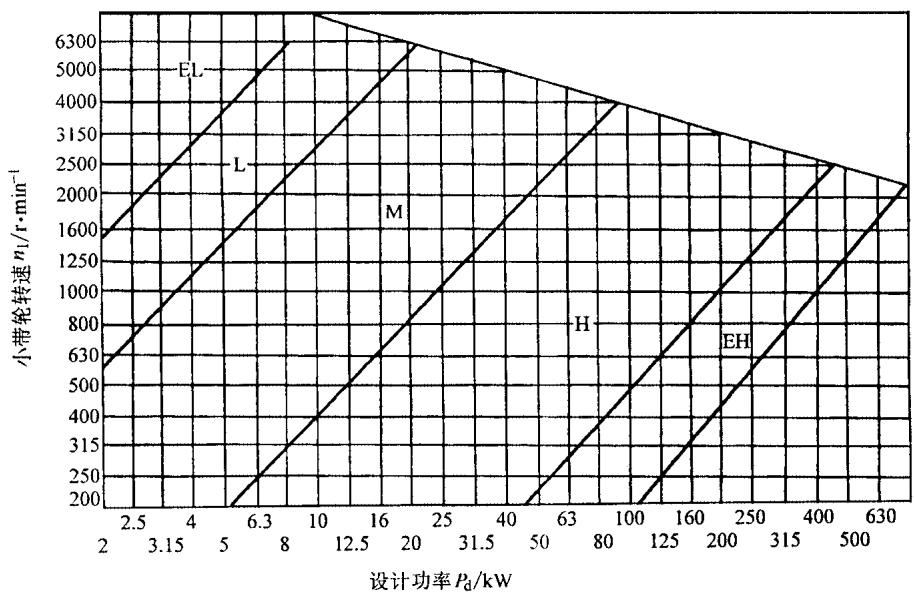

图 G14-1 锦纶片复合平带选型图

表 G14-8 锦纶片复合平带的基本额定功率

$(\alpha = 180^{\circ}$  、载荷平稳、预紧应力  $\sigma_0 = 3\mathrm{MPa})$

(kW/cm)

<table><tr><td rowspan="2">带型</td><td colspan="7">带速v/(m/s)</td></tr><tr><td>10</td><td>15</td><td>20</td><td>25</td><td>30</td><td>35</td><td>40</td></tr><tr><td>EL</td><td>0.36</td><td>0.54</td><td>0.71</td><td>0.87</td><td>1.03</td><td>1.19</td><td>1.32</td></tr><tr><td>L</td><td>0.58</td><td>0.86</td><td>1.13</td><td>1.40</td><td>1.65</td><td>1.90</td><td>2.12</td></tr><tr><td>M</td><td>1.01</td><td>1.51</td><td>1.98</td><td>2.44</td><td>2.89</td><td>3.33</td><td>3.71</td></tr><tr><td>H</td><td>1.44</td><td>2.16</td><td>2.82</td><td>3.49</td><td>4.13</td><td>4.76</td><td>5.30</td></tr><tr><td>EH</td><td>2.02</td><td>3.02</td><td>3.95</td><td>4.88</td><td>5.78</td><td>6.66</td><td>7.42</td></tr></table>

# G1.3 高速带传动

带速  $v > 30\mathrm{m / s}$  、高速轴转速  $n_1 = 10000\sim 50000\mathrm{r / min}$  都属于高速带传动，带速  $v\geq 100\mathrm{m / s}$  称为超高速带传

动。

高速带传动通常都是开口的增速传动，定期张紧时，  $i$  可达到4；自动张紧时，  $i$  可达到6；采用张紧轮传动时，  $i$  可达到8。小带轮直径一般取  $d_{1} = 20\sim 40\mathrm{mm}_{\circ}$

由于要求传动可靠，运转平稳，并有一定寿命，所以都采用重量轻、厚度薄而均匀、曲挠性好的环形平带，如特制的编织带（麻、丝、锦纶等）、薄型锦纶片复合平带，高速环形胶带等。高速带传动若采用硫化接头时，必须使接头与带的曲挠性能尽量接近。

高速带传动的缺点是带的寿命短，个别结构甚至只有几小时，传动效率亦较低。

# G1.3.1 规格

标记示例：

聚氨酯高速带 带厚  $1\mathrm{mm}$  宽  $25\mathrm{mm}$  内周长  $1120\mathrm{mm}$

聚氨酯高速带  $1\times 25\times 1120$

# G1.3.2 设计计算

高速带传动的设计计算，可参照表G14-3进行。但计算时应考虑下列几点：

1）小带轮直径可取  $d_{1} \geq d_{0} + 2\delta_{\mathrm{min}}(d_{0}$  一轴直径； $\delta_{\mathrm{min}}$  一最小轮缘厚度，通常取  $3 \sim 5\mathrm{mm})$  。若带速和安装尺寸允许，  $d_{1}$  应尽可能选较大值。

2) 带速  $\nu$  应小于表 G14-10 的  $\nu_{\mathrm{max}}$ 。

3) 带的曲挠次数  $y$  应小于表 G14-10 的  $y_{\max}$ 。

4) 带厚  $\delta$  可根据  $d_{1}$  和表 G14-10 的  $\frac{\delta}{d_{\mathrm{min}}}$  由表 G14-9 选定。

5）带宽  $b$  由下式计算，并选取标准值

$$
b = \frac {K _ {\mathrm {A}} P}{K _ {\mathrm {f}} K _ {\alpha} K _ {\beta} K _ {\mathrm {i}} \left[ \left[ \sigma \right] - \sigma_ {\mathrm {c}}\right) \delta v},
$$

式中  $P$  ——传递的功率(kW)

表 G14-9 高速带规格 (mm)

<table><tr><td>带宽b</td><td>内周长度Li 范围</td><td>内周长度系列</td></tr><tr><td>20</td><td>450~1000</td><td>450、480、500、530、560、600</td></tr><tr><td>25</td><td>450~1500</td><td>630、670、710、750、800、850</td></tr><tr><td>32</td><td>600~2000</td><td>900、950、1000、1060、1120、1180</td></tr><tr><td>40</td><td>710~3000</td><td>1250、1320、1400、1500、1600、1700</td></tr><tr><td>50</td><td>710~3000</td><td>1800、1900、2000、2120、2240、2350</td></tr><tr><td>60</td><td>1000~3000</td><td>2500、2650、2800、3000</td></tr><tr><td>带厚δ</td><td colspan="2">0.8、1.0、1.2、1.5、2.0、2.5、(3)</td></tr></table>

注：1.编织带带厚无  $0.8\mathrm{mm}$  和  $1.2\mathrm{mm}_{\circ}$

2.括号内的尺寸尽可能不用。

$K_{\mathrm{A}}$  ——工况系数

$K_{\mathrm{f}}$  ——拉力计算系数，当  $i = 1$  、带轮为金属材料时：

纤维编织带0.47

橡胶带 0.67

聚氨酯带 0.79

皮革带 0.72

$K_{\alpha}$  ——包角修正系数，查表G14-11；

$K_{\beta}$  ——传动布置系数，查表G14-6；

$K_{\mathrm{i}}$  ——传动比系数，查表G14-12；

$[\sigma]$  ——带的许用拉应力，查表G14-14(MPa)；

$\sigma_{\mathrm{c}}$  一带的离心拉应力(MPa)

$$
\sigma_ {\mathrm {c}} = m v ^ {2}
$$

$m$  一带的密度，查表  $\mathrm{G}14 - 13(\mathrm{kg / cm^3})$

表 G14-10 高速带传动的  $\frac{\delta}{d_{\min}}$  、  $v_{\max}$  和  $y_{\max}$

<table><tr><td colspan="3">高速带种类</td><td>棉织带</td><td>麻、丝、锦纶织带</td><td>橡胶高速带</td><td>聚氨酯高速带</td><td>薄型锦纶片复合平带</td></tr><tr><td rowspan="2">δdmin</td><td>推荐</td><td rowspan="2">≤</td><td>1/50</td><td>1/30</td><td>1/40</td><td>1/30</td><td>1/100</td></tr><tr><td>许用</td><td>1/40</td><td>1/25</td><td>1/30</td><td>1/20</td><td>1/50</td></tr><tr><td colspan="3">vmax/(m/s)</td><td>40</td><td>50</td><td>40</td><td>50</td><td>80</td></tr><tr><td colspan="3">ymax/(1/s)</td><td>60</td><td>60</td><td>100</td><td>100</td><td>50</td></tr></table>

表 G14-11 高速带传动的包角修正系数  ${K}_{\alpha }$

<table><tr><td>α(°)</td><td>220</td><td>210</td><td>200</td><td>190</td><td>180</td><td>170</td><td>160</td><td>150</td></tr><tr><td>Kα</td><td>1.20</td><td>1.15</td><td>1.10</td><td>1.05</td><td>1.0</td><td>0.95</td><td>0.90</td><td>0.85</td></tr></table>

表 G14-12 传动比系数  ${\mathbf{K}}_{\mathrm{i}}$

<table><tr><td>主动轮转速
从动轮转速</td><td>≥ 1/25</td><td>&lt; 1/1.25 ~ 1/7</td><td>&lt; 1/1.7 ~ 1/2.5</td><td>&lt; 1/2.5 ~ 1/3.5</td><td>&lt; 1/3.5</td></tr><tr><td>Ki</td><td>1</td><td>0.95</td><td>0.90</td><td>0.85</td><td>0.80</td></tr></table>

表 G14-13 高速带的密度  $m$

$\mathrm{(kg / cm^3)}$

<table><tr><td>高速带种类</td><td>无覆胶编织带</td><td>覆胶编织带</td><td>橡胶高速带</td><td>聚氨酯高速带</td><td>薄型皮革高速带</td><td>薄型锦纶片复合平带</td></tr><tr><td>密度m</td><td>0.9×10-3</td><td>1.1×10-3</td><td>1.2×10-3</td><td>1.34×10-3</td><td>1×10-3</td><td>1.13×10-3</td></tr></table>

表 G14-14 高速带的许用拉应力 [σ]

(MPa)

<table><tr><td rowspan="2">高速带种类</td><td rowspan="2">棉、麻、丝编织带</td><td rowspan="2">锦纶编织带</td><td colspan="2">橡胶高速带</td><td rowspan="2">聚氨酯高速带</td><td rowspan="2">薄型锦纶片复合平带</td></tr><tr><td>涤纶绳芯</td><td>棉绳芯</td></tr><tr><td>[σ]</td><td>3.0</td><td>5.0</td><td>6.5</td><td>4.5</td><td>6.5</td><td>20</td></tr></table>

# G1.4 带轮

平带轮的设计要求、材料、轮毂尺寸、静平衡与V带轮相同（见本章1.3)。平带轮的直径、结构形

式和辐板厚度  $S$  见表G14-15。轮缘尺寸见表G14-16，为防止掉带，通常在大带轮轮缘表面制成中凸度，中凸度见表G14-17。

表 G14-15 平带轮的直径、结构形式和辐板厚度

(mm)

<table><tr><td rowspan="9">孔径\(d_0\)</td><td colspan="101">带 轮 直 径 d</td><td></td><td></td><td></td><td></td><td></td><td></td><td></td><td></td><td></td><td></td><td></td><td></td><td></td><td></td><td></td><td></td><td></td><td></td><td></td><td></td><td></td><td></td><td></td><td></td><td></td><td></td><td></td><td></td><td></td><td></td><td></td><td></td><td></td><td></td><td></td><td></td><td></td><td></td><td></td><td></td><td></td><td></td><td></td><td></td><td></td><td></td><td></td><td></td><td></td><td></td><td></td><td></td><td></td><td></td><td></td><td></td><td></td><td></td><td></td><td></td><td></td><td></td><td></td><td></td><td></td><td></td><td></td><td></td><td></td><td></td><td></td><td></td><td></td><td></td><td></td><td></td><td></td><td></td><td></td><td></td><td></td><td></td><td></td><td></td><td></td><td></td><td></td><td></td><td></td><td></td><td></td><td></td><td></td><td></td><td></td><td></td><td></td><td></td><td></td><td></td><td></td><td></td><td></td><td></td><td></td><td></td><td></td><td></td><td></td><td></td><td></td><td></td><td></td><td></td><td></td><td></td><td></td><td></td><td></td><td></td><td></td><td></td><td></td><td></td><td></td><td></td><td></td><td></td><td></td><td></td><td></td><td></td><td></td><td></td><td></td><td></td><td></td><td></td><td></td><td></td><td></td><td></td><td></td><td></td><td></td><td></td><td></td><td></td><td></td><td></td><td></td><td></td><td></td><td></td><td></td><td></td><td></td><td></td><td></td><td></td><td></td><td></td><td></td><td></td><td></td><td></td><td></td><td></td><td></td><td></td><td></td><td></td><td></td><td></td><td></td><td></td><td></td><td></td><td></td><td></td><td></td><td></td><td></td><td></td><td></td><td></td><td></td><td></td><td></td><td></td><td></td><td></td><td></td><td></td><td></td><td></td><td></td><td></td><td></td><td></td><td></td><td></td><td></td><td></td><td></td><td></td><td></td><td></td><td></td><td></td><td></td><td></td><td></td><td></td><td></td><td></td><td></td><td></td><td></td><td></td><td></td><td></td><td></td><td></td><td></td><td></td><td></td><td></td><td></td><td></td><td></td><td></td><td></td><td></td><td></td><td></td><td></td><td></td><td></td><td></td><td></td><td></td><td></td><td></td><td></td><td></td><td></td><td></td><td></td><td></td><td></td><td></td><td></td><td></td><td></td><td></td><td></td><td></td><td></td><td></td><td></td><td></td><td></td><td></td><td></td><td></td><td></td><td></td><td></td><td></td><td></td><td></td><td></td><td></td><td></td><td></td><td></td><td></td><td></td><td></td><td></td><td></td><td></td><td></td><td></td><td></td><td></td><td></td><td></td><td></td><td></td><td></td><td></td><td></td><td></td><td></td><td></td><td></td><td></td><td></td><td></td><td></td><td></td><td></td><td></td><td></td><td></td><td></td><td></td><td></td><td></td><td></td><td></td><td></td><td></td><td></td><td></td><td></td><td></td><td></td><td></td><td></td><td></td><td></td><td></td><td></td><td></td><td></td><td></td><td></td><td></td><td></td><td></td><td></td><td></td><td></td><td></td><td></td><td></td><td></td><td></td><td></td><td></td><td></td><td></td><td></td><td></td><td></td><td></td><td></td><td></td><td></td><td></td><td></td><td></td><td></td><td></td><td></td><td></td><td></td><td></td><td></td><td></td><td></td><td></td><td></td><td></td><td></td><td></td><td></td><td></td><td></td><td></td><td></td><td></td><td></td><td></td><td></td><td></td><td></td><td></td><td></td><td></td><td></td><td></td><td></td><td></td><td></td><td></td><td></td><td></td><td></td><td></td><td></td><td></td><td></td><td></td><td></td><td></td><td></td><td></td><td></td><td></td><td></td><td></td><td></td><td></td><td></td><td></td><td></td><td></td><td></td><td></td><td></td><td></td><td></td><td></td><td></td><td></td><td></td><td></td><td></td><td></td><td></td><td></td><td></td><td></td><td></td><td></td><td></td><td></td><td></td><td></td><td></td><td></td><td></td><td></td><td></td><td></td><td></td><td></td><td></td><td></td><td></td><td></td><td></td><td></td><td></td><td></td><td></td><td></td><td></td><td></td><td></td><td></td><td></td><td></td><td></td><td></td><td></td><td></td><td></td><td></td><td></td><td></td><td></td><td></td><td></td><td></td><td></td><td></td><td></td><td></td><td></td><td></td><td></td><td></td><td></td><td></td><td></td><td></td><td></td><td></td><td></td><td></td><td></td><td></td><td></td><td></td><td></td><td></td><td></td><td></td><td></td><td></td></tr><tr><td>50</td><td>56</td><td>63</td><td>71</td><td>80</td><td>90</td><td>100</td><td>112</td><td>125</td><td>140</td><td>160</td><td>180</td><td>200</td><td>224</td><td>250</td><td>280</td><td>315</td><td>355</td><td>400</td><td>450</td><td>500</td><td>560~2000</td><td></td><td></td><td></td><td></td><td></td><td></td><td></td><td></td><td></td><td></td><td></td><td></td><td></td><td></td><td></td><td></td><td></td><td></td><td></td><td></td><td></td><td></td><td></td><td></td><td></td><td></td><td></td><td></td><td></td><td></td><td></td><td></td><td></td><td></td><td></td><td></td><td></td><td></td><td></td><td></td><td></td><td></td><td></td><td></td><td></td><td></td><td></td><td></td><td></td><td></td><td></td><td></td><td></td><td></td><td></td><td></td><td></td><td></td><td></td><td></td><td></td><td></td><td></td><td></td><td></td><td></td><td></td><td></td><td></td><td></td><td></td><td></td><td></td><td></td><td></td><td></td><td></td><td></td><td></td><td></td><td></td><td></td><td></td><td></td><td></td><td></td><td></td><td></td><td></td><td></td><td></td><td></td><td></td><td></td><td></td><td></td><td></td><td></td><td></td><td></td><td></td><td></td><td></td><td></td><td></td><td></td><td></td><td></td><td></td><td></td><td></td><td></td><td></td><td></td><td></td><td></td><td></td><td></td><td></td><td></td><td></td><td></td><td></td><td></td><td></td><td></td><td></td><td></td><td></td><td></td><td></td><td></td><td></td><td></td><td></td><td></td><td></td><td></td><td></td><td></td><td></td><td></td><td></td><td></td><td></td><td></td><td></td><td></td><td></td><td></td><td></td><td></td><td></td><td></td><td></td><td></td><td></td><td></td><td></td><td></td><td></td><td></td><td></td><td></td><td></td><td></td><td></td><td></td><td></td><td></td><td></td><td></td><td></td><td></td><td></td><td></td><td></td><td></td><td></td><td></td><td></td><td></td><td></td><td></td><td></td><td></td><td></td><td></td><td></td><td></td><td></td><td></td><td></td><td></td><td></td><td></td><td></td><td></td><td></td><td></td><td></td><td></td><td></td><td></td><td></td><td></td><td></td><td></td><td></td><td></td><td></td><td></td><td></td><td></td><td></td><td></td><td></td><td></td><td></td><td></td><td></td><td></td><td></td><td></td><td></td><td></td><td></td><td></td><td></td><td></td><td></td><td></td><td></td><td></td><td></td><td></td><td></td><td></td><td></td><td></td><td></td><td></td><td></td><td></td><td></td><td></td><td></td><td></td><td></td><td></td><td></td><td></td><td></td><td></td><td></td><td></td><td></td><td></td><td></td><td></td><td></td><td></td><td></td><td></td><td></td><td></td><td></td><td></td><td></td><td></td><td></td><td></td><td></td><td></td><td></td><td></td><td></td><td></td><td></td><td></td><td></td><td></td><td></td><td></td><td></td><td></td><td></td><td></td><td></td><td></td><td></td><td></td><td></td><td></td><td></td><td></td><td></td><td></td><td></td><td></td><td></td><td></td><td></td><td></td><td></td><td></td><td></td><td></td><td></td><td></td><td></td><td></td><td></td><td></td><td></td><td></td><td></td><td></td><td></td><td></td><td></td><td></td><td></td><td></td><td></td><td></td><td></td><td></td><td></td><td></td><td></td><td></td><td></td><td></td><td></td><td></td><td></td><td></td><td></td><td></td><td></td><td></td><td></td><td></td><td></td><td></td><td></td><td></td><td></td><td></td><td></td><td></td><td></td><td></td><td></td><td></td><td></td><td></td><td></td><td></td><td></td><td></td><td></td><td></td><td></td><td></td><td></td><td></td><td></td><td></td><td></td><td></td><td></td><td></td><td></td><td></td><td></td><td></td><td></td><td></td><td></td><td></td><td></td><td></td><td></td><td></td><td></td><td></td><td></td><td></td><td></td><td></td><td></td><td></td><td></td><td></td><td></td><td></td><td></td><td></td><td></td><td></td><td></td><td></td><td></td><td></td><td></td><td></td><td></td><td></td><td></td><td></td><td></td><td></td><td></td><td></td><td></td><td></td><td></td><td></td><td></td><td></td><td></td><td></td><td></td><td></td><td></td><td></td><td></td><td></td><td></td><td></td><td></td><td></td><td></td><td></td><td></td><td></td><td></td><td></td><td></td><td></td><td></td><td></td><td></td><td></td><td></td><td></td><td></td><td></td><td></td><td></td><td></td><td></td><td></td><td></td><td></td><td></td><td></td><td></td><td></td><td></td><td></td><td></td><td></td><td></td><td></td><td></td><td></td><td></td><td></td><td></td><td></td><td></td><td></td><td></td><td></td><td></td><td></td><td></td><td></td><td></td><td></td><td></td><td></td><td></td><td></td><td></td><td></td><td></td><td></td><td></td><td></td><td></td><td></td><td></td><td></td><td></td><td></td><td></td><td></td><td></td><td></td><td></td><td></td><td></td><td></td><td></td><td></td><td></td><td></td><td></td><td></td><td></td><td></td><td></td><td></td><td></td><td></td><td></td><td></td><td></td><td></td><td></td><td></td><td></td><td></td><td></td><td></td><td></td><td></td><td></td><td></td><td></td><td></td><td></td><td></td><td></td><td></td><td></td><td></td><td></td><td></td><td></td><td></td><td></td><td></td><td></td><td></td><td></td><td></td><td></td><td></td><td></td><td></td><td></td><td></td><td></td><td></td><td></td><td></td><td></td><td></td><td></td><td></td><td></td><td></td><td></td><td></td><td></td><td></td><td></td><td></td><td></td></tr><tr><td colspan="100">辐 板 厚 度 S</td><td rowspan="2"></td><td rowspan="2"></td><td rowspan="2"></td><td rowspan="2"></td><td rowspan="2"></td><td rowspan="2"></td><td rowspan="2"></td><td rowspan="2"></td><td rowspan="2"></td><td rowspan="2"></td><td rowspan="2"></td><td rowspan="2"></td><td rowspan="2"></td><td rowspan="2"></td><td rowspan="2"></td><td rowspan="2"></td><td rowspan="3"></td><td rowspan="3"></td><td rowspan="3"></td><td rowspan="3"></td><td rowspan="3"></td><td rowspan="3"></td><td rowspan="3"></td><td rowspan="3"></td><td rowspan="3"></td><td rowspan="3"></td><td rowspan="3"></td><td rowspan="3"></td><td rowspan="3"></td><td rowspan="3"></td><td rowspan="3"></td><td rowspan="3"></td><td rowspan="3"></td><td rowspan="3"></td><td rowspan="3"></td><td rowspan="3"></td><td rowspan="3"></td><td rowspan="3"></td><td rowspan="3"></td><td rowspan="3"></td><td rowspan="3"></td><td rowspan="3"></td><td rowspan="3"></td><td rowspan="3"></td><td rowspan="3"></td><td rowspan="3"></td><td rowspan="3"></td><td rowspan="3"></td><td rowspan="3"></td><td rowspan="3"></td><td rowspan="3"></td><td rowspan="3"></td><td rowspan="3"></td><td rowspan="3"></td><td rowspan="3"></td><td rowspan="3"></td><td rowspan="3"></td><td rowspan="3"></td><td rowspan="3"></td><td rowspan="3"></td><td rowspan="3"></td><td rowspan="3"></td><td rowspan="3"></td><td rowspan="3"></td><td rowspan="3"></td><td rowspan="3"></td><td rowspan="3"></td><td rowspan="3"></td><td rowspan="3"></td><td rowspan="3"></td><td rowspan="3"></td><td rowspan="3"></td><td rowspan="3"></td><td rowspan="3"></td><td rowspan="3"></td><td rowspan="3"></td><td rowspan="3"></td><td rowspan="3"></td><td rowspan="3"></td><td rowspan="3"></td><td rowspan="3"></td><td rowspan="3"></td><td rowspan="3"></td><td rowspan="3"></td><td rowspan="3"></td><td rowspan="3"></td><td rowspan="3"></td><td rowspan="3"></td><td rowspan="3"></td><td rowspan="3"></td><td rowspan="3"></td><td rowspan="3"></td><td rowspan="3"></td><td rowspan="3"></td><td rowspan="3"></td><td rowspan="3"></td><td rowspan="3"></td><td rowspan="3"></td><td rowspan="3"></td><td rowspan="3">20~32</td><td rowspan="3"></td><td rowspan="3"></td><td rowspan="3"></td><td rowspan="3"></td><td rowspan="3"></td><td rowspan="3"></td><td rowspan="3"></td><td rowspan="3"></td><td rowspan="3"></td><td rowspan="3"></td><td rowspan="3"></td><td rowspan="3"></td><td rowspan="3"></td><td rowspan="3"></td><td rowspan="3"></td><td rowspan="3"></td><td rowspan="3"></td><td rowspan="2"></td><td rowspan="2"></td><td rowspan="2"></td><td rowspan="2"></td><td rowspan="2"></td><td rowspan="2"></td><td rowspan="2"></td><td rowspan="2"></td><td rowspan="2"></td><td rowspan="2"></td><td rowspan="2"></td><td rowspan="2"></td><td rowspan="2"></td><td rowspan="2"></td><td rowspan="2"></td><td rowspan="2"></td><td rowspan="2"></td><td rowspan="2"></td><td rowspan="2"></td><td rowspan="2"></td><td rowspan="2"></td><td rowspan="2"></td><td rowspan="2"></td><td rowspan="2"></td><td rowspan="2"></td><td rowspan="2"></td><td rowspan="2"></td><td rowspan="2"></td><td rowspan="2"></td><td rowspan="2"></td><td rowspan="2"></td><td rowspan="2"></td><td rowspan="2"></td><td rowspan="2"></td><td rowspan="2"></td><td rowspan="2"></td><td rowspan="2"></td><td rowspan="2"></td><td rowspan="2"></td><td rowspan="2"></td><td rowspan="2"></td><td rowspan="2"></td><td rowspan="2"></td><td rowspan="2"></td><td rowspan="2"></td><td rowspan="2"></td><td rowspan="2"></td><td rowspan="2"></td><td rowspan="2"></td><td rowspan="2"></td><td rowspan="2"></td><td rowspan="2"></td><td rowspan="2"></td><td rowspan="2"></td><td rowspan="2"></td><td rowspan="2"></td><td rowspan="2"></td><td rowspan="2"></td><td rowspan="2"></td><td rowspan="2"></td><td rowspan="2"></td><td rowspan="2"></td><td rowspan="2"></td><td rowspan="2"></td><td rowspan="2"></td><td rowspan="2"></td><td rowspan="2"></td><td rowspan="2"></td><td rowspan="2"></td><td rowspan="2"></td><td rowspan="2"></td><td rowspan="2"></td><td rowspan="2"></td><td rowspan="2"></td><td rowspan="2"></td><td rowspan="2"></td><td rowspan="2"></td><td rowspan="2"></td><td rowspan="2"></td><td rowspan="2"></td><td rowspan="2"></td><td rowspan="2" colspan="100"></td><td>20~50</td><td></td><td></td><td></td><td></td><td></td><td></td><td></td><td></td><td></td><td></td><td></td><td></td><td></td><td></td><td></td><td></td><td></td><td></td><td></td><td></td><td></td><td></td><td></td><td></td><td></td><td></td><td></td><td></td><td></td><td></td><td></td><td></td><td></td><td></td><td></td><td></td><td></td><td></td><td></td><td></td><td></td><td></td><td></td><td></td><td></td><td></td><td></td><td></td><td></td><td></td><td></td><td></td><td></td><td></td><td></td><td></td><td></td><td></td><td></td><td></td><td></td><td></td><td></td><td></td><td></td><td></td><td></td><td></td><td></td><td></td><td></td><td></td><td></td><td></td><td></td><td></td><td></td><td></td><td></td><td></td><td></td><td></td><td></td><td></td><td></td><td></td><td></td><td></td><td></td><td></td><td></td><td></td><td></td><td></td><td></td><td></td><td></td><td></td><td>40~80</td><td></td><td></td><td></td><td></td><td></td><td></td><td></td><td></td><td></td><td></td><td></td><td></td><td></td><td></td><td></td><td></td><td></td><td></td><td></td><td></td><td></td><td></td><td></td><td></td><td></td><td></td><td></td><td></td><td></td><td></td><td></td><td></td><td></td><td></td><td></td><td></td><td></td><td></td><td></td><td></td><td></td><td></td><td></td><td></td><td></td><td></td><td></td><td></td><td></td><td></td><td></td><td></td><td></td><td></td><td></td><td></td><td></td><td></td><td></td><td></td><td></td><td></td><td></td><td></td><td></td><td></td><td></td><td></td><td></td><td></td><td></td><td></td><td></td><td></td><td></td><td></td><td></td><td></td><td></td><td></td><td></td><td></td><td></td><td></td><td></td><td></td><td></td><td></td><td></td><td></td><td></td><td></td><td></td><td></td><td></td><td></td><td></td><td></td></tr><tr><td colspan="100">B</td><td></td><td></td><td></td><td></td><td></td><td></td><td></td><td></td><td></td><td></td><td></td><td></td><td></td><td></td><td></td><td></td><td></td><td></td><td></td><td></td><td></td><td></td><td></td><td></td><td></td><td></td><td></td><td></td><td></td><td></td><td></td><td></td><td></td><td></td><td></td><td></td><td></td><td></td><td></td><td></td><td></td><td></td><td></td><td></td><td></td><td></td><td></td><td></td><td></td><td></td><td></td><td></td><td></td><td></td><td></td><td></td><td></td><td></td><td></td><td></td><td></td><td></td><td></td><td></td><td></td><td></td><td></td><td></td><td></td><td></td><td></td><td></td><td></td><td></td><td></td><td></td><td></td><td></td><td></td><td></td><td></td><td></td><td></td><td></td><td></td><td></td><td></td><td></td><td></td><td></td><td></td><td></td><td></td><td></td><td></td><td></td><td></td><td></td><td></td><td></td><td></td><td></td><td></td><td></td><td></td><td></td><td></td><td></td><td></td><td></td><td></td><td></td><td></td><td></td><td></td><td></td><td></td><td></td><td></td><td></td><td></td><td></td><td></td><td></td><td></td><td></td><td></td><td></td><td></td><td></td><td></td><td></td><td></td><td></td><td></td><td></td><td></td><td></td><td></td><td></td><td></td><td></td><td></td><td></td><td></td><td></td><td></td><td></td><td></td><td></td><td></td><td></td><td></td><td></td><td></td><td></td><td></td><td></td><td></td><td></td><td></td><td></td><td></td><td></td><td></td><td></td><td></td><td></td><td></td><td></td><td></td><td></td><td></td><td></td><td></td><td></td><td></td><td></td><td></td><td></td><td></td><td></td><td></td><td></td><td></td><td></td><td></td><td></td><td></td><td></td><td></td><td></td><td></td><td></td><td></td><td></td><td></td><td></td><td></td><td></td><td></td><td></td><td></td><td></td><td></td><td></td><td></td><td></td><td></td><td></td><td></td><td></td><td></td><td></td><td></td><td></td><td></td><td></td><td></td><td></td><td></td><td></td><td></td><td></td><td></td><td></td><td></td><td></td><td></td><td></td><td></td><td></td><td></td><td></td><td></td><td></td><td></td><td></td><td></td><td></td><td></td><td></td><td></td><td></td><td></td><td></td><td></td><td></td><td></td><td></td><td></td><td></td><td></td><td></td><td></td><td></td><td></td><td></td><td></td><td></td><td></td><td></td><td></td><td></td><td></td><td></td><td></td><td></td><td></td><td></td><td></td><td></td><td></td><td></td><td></td><td></td><td></td><td></td><td></td><td></td><td></td><td></td><td></td><td></td><td></td><td></td><td></td><td></td><td></td><td></td><td></td><td></td><td></td></tr><tr><td>12~14</td><td colspan="4">8</td><td colspan="3">9</td><td>10</td><td colspan="4">10</td><td colspan="3">10</td><td colspan="101">12四</td><td></td><td></td><td></td><td></td><td></td><td></td><td></td><td></td><td></td><td></td><td></td><td></td><td></td><td></td><td></td><td></td><td></td><td></td><td></td><td></td><td></td><td></td><td></td><td></td><td></td><td></td><td></td><td></td><td></td><td></td><td></td><td></td><td></td><td></td><td></td><td></td><td></td><td></td><td></td><td></td><td></td><td></td><td></td><td></td><td></td><td></td><td></td><td></td><td></td><td></td><td></td><td></td><td></td><td></td><td></td><td></td><td></td><td></td><td></td><td></td><td></td><td></td><td></td><td></td><td></td><td></td><td></td><td></td><td></td><td></td><td></td><td></td><td></td><td></td><td></td><td></td><td></td><td></td><td></td><td></td><td></td><td></td><td></td><td></td><td></td><td></td><td></td><td></td><td></td><td></td><td></td><td></td><td></td><td></td><td></td><td></td><td></td><td></td><td></td><td></td><td></td><td></td><td></td><td></td><td></td><td></td><td></td><td></td><td></td><td></td><td></td><td></td><td></td><td></td><td></td><td></td><td></td><td></td><td></td><td></td><td></td><td></td><td></td><td></td><td></td><td></td><td></td><td></td><td></td><td></td><td></td><td></td><td></td><td></td><td></td><td></td><td></td><td></td><td></td><td></td><td></td><td></td><td></td><td></td><td></td><td></td><td></td><td></td><td></td><td></td><td></td><td></td><td></td><td></td><td></td><td></td><td></td><td></td><td></td><td></td><td></td><td></td><td></td><td></td><td></td><td></td><td></td><td></td><td></td><td></td><td></td><td></td><td></td><td></td><td></td><td></td><td></td><td></td><td></td><td></td><td></td><td></td><td></td><td></td><td></td><td></td><td></td><td></td><td></td><td></td><td></td><td></td><td></td><td></td><td></td><td></td><td></td><td></td><td></td><td></td><td></td><td></td><td></td><td></td><td></td><td></td><td></td><td></td><td></td><td></td><td></td><td></td><td></td><td></td><td></td><td></td><td></td><td></td><td></td><td></td><td></td><td></td><td></td><td></td><td></td><td></td><td></td><td></td><td></td><td></td><td></td><td></td><td></td><td></td><td></td><td></td><td></td><td></td><td></td><td></td><td></td><td></td><td></td><td></td><td></td><td></td><td></td><td></td><td></td><td></td><td></td><td></td><td></td><td></td><td></td><td></td><td></td><td></td><td></td><td></td><td></td><td></td><td></td><td></td><td></td><td></td><td></td><td></td><td></td><td></td><td></td><td></td><td></td><td></td><td></td><td></td><td></td><td></td><td></td><td></td><td></td><td></td><td></td><td></td><td></td><td></td><td></td><td></td><td></td><td></td><td></td><td></td><td></td><td></td><td></td><td></td><td></td><td></td><td></td><td></td><td></td><td></td><td></td><td></td><td></td><td></td><td></td><td></td><td></td><td></td><td></td><td></td><td></td><td></td><td></td><td></td><td></td><td></td><td></td><td></td><td></td><td></td><td></td><td></td><td></td><td></td><td></td><td></td><td></td><td></td><td></td><td></td><td></td><td></td><td></td><td></td><td></td><td></td><td></td><td></td><td></td><td></td><td></td><td></td><td></td><td></td><td></td><td></td><td></td><td></td><td></td><td></td><td></td><td></td><td></td><td></td><td></td><td></td><td></td><td></td><td></td><td></td><td></td><td></td><td></td><td></td><td></td><td></td><td></td><td></td><td></td><td></td><td></td><td></td><td></td><td></td><td></td><td></td><td></td></tr><tr><td>16~18</td><td rowspan="4" colspan="2">实</td><td rowspan="4" colspan="2">10</td><td rowspan="4" colspan="2">12</td><td rowspan="4" colspan="2">14</td><td rowspan="4" colspan="2">14</td><td rowspan="4" colspan="2">14</td><td rowspan="4" colspan="2">16</td><td rowspan="4" colspan="2">18</td><td rowspan="4">20</td><td rowspan="4">22</td><td rowspan="4">四椭圆辐轮</td><td rowspan="4">六板</td><td rowspan="4">24轮</td><td rowspan="4">26</td><td rowspan="4">六轴</td><td rowspan="4">22</td><td rowspan="4">24轮</td><td rowspan="4">26</td><td rowspan="4">六轴</td><td rowspan="4">22</td><td rowspan="4">24轮</td><td rowspan="4">26</td><td rowspan="4">六轴</td><td rowspan="4">22</td><td rowspan="4">24轮</td><td rowspan="4">26</td><td rowspan="4">六轴</td><td rowspan="4">22</td><td rowspan="4">24轮</td><td rowspan="4">26</td><td rowspan="4">六轴</td><td rowspan="4">22</td><td rowspan="4">24轮</td><td rowspan="4">26</td><td rowspan="4">六轴</td><td rowspan="4">22</td><td rowspan="4">24轮</td><td rowspan="4">26</td><td rowspan="4">六轴</td><td rowspan="4">22</td><td rowspan="4">24轮</td><td rowspan="4">26</td><td rowspan="4">六轴</td><td rowspan="4">22</td><td rowspan="4">24轮</td><td rowspan="4">26</td><td rowspan="4">八轴</td><td rowspan="4">22</td><td rowspan="4">24轮</td><td rowspan="4">26</td><td rowspan="4">六轴</td><td rowspan="4">22</td><td rowspan="4">24轮</td><td rowspan="4">26</td><td rowspan="4">六轴</td><td rowspan="4">22</td><td rowspan="4">24轮</td><td rowspan="4">26</td><td rowspan="4">六轴</td><td rowspan="4">22</td><td rowspan="4">24轮</td><td rowspan="4">26</td><td rowspan="4">六轴</td><td rowspan="4">22</td><td rowspan="4">24轮</td><td rowspan="4">26</td><td rowspan="4">六轴</td><td rowspan="4">22</td><td rowspan="4">24轮</td><td rowspan="4">26</td><td rowspan="4">六轴</td><td rowspan="4">22</td><td rowspan="4">24轮</td><td rowspan="4">26</td><td rowspan="4">六轴</td><td rowspan="4">22</td><td rowspan="4">24轮</td><td rowspan="4"></td><td rowspan="4"></td><td rowspan="4"></td><td rowspan="4"></td><td rowspan="4"></td><td rowspan="4"></td><td rowspan="4"></td><td rowspan="4"></td><td rowspan="4"></td><td rowspan="4"></td><td rowspan="4"></td><td rowspan="4"></td><td rowspan="4"></td><td rowspan="4"></td><td rowspan="2"></td><td rowspan="2"></td><td rowspan="2"></td><td rowspan="2"></td><td rowspan="2"></td><td rowspan="2"></td><td rowspan="2"></td><td rowspan="2"></td><td rowspan="2"></td><td rowspan="2"></td><td rowspan="2"></td><td rowspan="2"></td><td rowspan="2"></td><td></td><td></td><td></td><td></td><td></td><td></td><td></td><td></td><td></td><td></td><td></td><td></td><td></td><td></td><td></td><td></td><td></td><td></td><td></td><td></td><td></td><td></td><td></td><td></td><td></td><td></td><td></td><td></td><td></td><td></td><td></td><td></td><td></td><td></td><td></td><td></td><td></td><td></td><td></td><td></td><td></td><td></td><td></td><td></td><td></td><td></td><td></td><td></td><td></td><td></td><td></td><td></td><td></td><td></td><td></td><td></td><td></td><td></td><td></td><td></td><td></td><td></td><td></td><td></td><td></td><td></td><td></td><td></td><td></td><td></td><td></td><td></td><td></td><td></td><td></td><td></td><td></td><td></td><td></td><td></td><td></td><td></td><td></td><td></td><td></td><td></td><td></td><td></td><td></td><td></td><td></td><td></td><td></td><td></td><td></td><td></td><td></td><td></td><td></td><td></td><td></td><td></td><td></td><td></td><td></td><td></td><td></td><td></td><td></td><td></td><td></td><td></td><td></td><td></td><td></td><td></td><td></td><td></td><td></td><td></td><td></td><td></td><td></td><td></td><td></td><td></td><td></td><td></td><td></td><td></td><td></td><td></td><td></td><td></td><td></td><td></td><td></td><td></td><td></td><td></td><td></td><td></td><td></td><td></td><td></td><td></td><td></td><td></td><td></td><td></td><td></td><td></td><td></td><td></td><td></td><td></td><td></td><td></td><td></td><td></td><td></td><td></td><td></td><td></td><td></td><td></td><td></td><td></td><td></td><td></td><td></td><td></td><td></td><td></td><td></td><td></td><td></td><td></td><td></td><td></td><td></td><td></td><td></td><td></td><td></td><td></td><td></td><td></td><td></td><td></td><td></td><td></td><td></td><td></td><td></td><td></td><td></td><td></td><td></td><td></td><td></td><td></td><td></td><td></td><td></td><td></td><td></td><td></td><td></td><td></td><td></td><td></td><td></td><td></td><td></td><td></td><td></td><td></td><td></td><td></td><td></td><td></td><td></td><td></td><td></td><td></td><td></td><td></td><td></td><td></td><td></td><td></td><td></td><td></td><td></td><td></td><td></td><td></td><td></td><td></td><td></td><td></td><td></td><td></td><td></td><td></td><td></td><td></td><td></td><td></td><td></td><td></td><td></td><td></td><td></td><td></td><td></td><td></td><td></td><td></td><td></td><td></td><td></td><td></td><td></td><td></td><td></td><td></td><td></td><td></td><td></td><td></td><td></td><td></td><td></td><td></td><td></td><td></td><td></td><td></td><td></td><td></td><td></td><td></td><td></td><td></td><td></td><td></td><td></td><td></td><td></td><td></td><td></td><td></td><td></td><td></td><td></td><td></td><td></td><td></td><td></td><td></td><td></td><td></td><td></td><td></td><td></td><td></td><td></td><td></td><td></td><td></td><td></td><td></td><td></td><td></td><td></td><td></td><td></td><td></td><td></td><td></td><td></td><td></td><td></td><td></td><td></td><td></td><td></td><td></td><td></td><td></td><td></td><td></td><td></td><td></td><td></td><td></td><td></td><td></td><td></td><td></td><td></td><td></td><td></td><td></td><td></td><td></td><td></td><td></td><td></td><td></td><td></td><td></td><td></td><td></td><td></td><td></td><td></td><td></td><td></td><td></td><td></td><td></td><td></td><td></td><td></td><td></td><td></td><td></td><td></td><td></td><td></td><td></td><td></td><td></td><td></td><td></td><td></td><td></td><td></td><td></td><td></td><td></td><td></td><td></td><td></td><td></td><td></td><td></td><td></td><td></td><td></td><td></td><td></td><td></td><td></td><td></td><td></td><td></td><td></td><td></td><td></td><td></td><td></td><td></td><td></td><td></td><td></td><td></td><td></td><td></td><td></td><td></td><td></td><td></td><td></td><td></td><td></td><td></td><td></td><td></td><td></td><td></td><td></td><td></td><td></td><td></td><td></td><td></td><td></td><td></td><td></td><td></td><td></td><td></td><td></td><td></td><td></td><td></td><td></td><td></td><td></td><td></td><td></td><td></td><td></td><td></td><td></td><td></td><td></td><td></td><td></td><td></td><td></td><td></td><td></td><td></td><td></td><td></td><td></td><td></td><td></td><td></td><td></td><td></td><td></td><td></td><td></td><td></td><td></td><td></td><td></td><td></td><td></td><td></td><td></td><td></td><td></td><td></td><td></td><td></td><td></td></tr><tr><td>20~22</td><td></td><td></td><td></td><td></td><td></td><td></td><td></td><td></td><td></td><td></td><td></td><td></td><td></td><td></td><td></td><td></td><td></td><td></td><td></td><td></td><td></td><td></td><td></td><td></td><td></td><td></td><td></td><td></td><td></td><td></td><td></td><td></td><td></td><td></td><td></td><td></td><td></td><td></td><td></td><td></td><td></td><td></td><td></td><td></td><td></td><td></td><td></td><td></td><td></td><td></td><td></td><td></td><td></td><td></td><td></td><td></td><td></td><td></td><td></td><td></td><td></td><td></td><td></td><td></td><td></td><td></td><td></td><td></td><td></td><td></td><td></td><td></td><td></td><td></td><td></td><td></td><td></td><td></td><td></td><td></td><td></td><td></td><td></td><td></td><td></td><td></td><td></td><td></td><td></td><td></td><td></td><td></td><td></td><td></td><td></td><td></td><td></td><td></td><td></td><td></td><td></td><td></td><td></td><td></td><td></td><td></td><td></td><td></td><td></td><td></td><td></td><td></td><td></td><td></td><td></td><td></td><td></td><td></td><td></td><td></td><td></td><td></td><td></td><td></td><td></td><td></td><td></td><td></td><td></td><td></td><td></td><td></td><td></td><td></td><td></td><td></td><td></td><td></td><td></td><td></td><td></td><td></td><td></td><td></td><td></td><td></td><td></td><td></td><td></td><td></td><td></td><td></td><td></td><td></td><td></td><td></td><td></td><td></td><td></td><td></td><td></td><td></td><td></td><td></td><td></td><td></td><td></td><td></td><td></td><td></td><td></td><td></td><td></td><td></td><td></td><td></td><td></td><td></td><td></td><td></td><td></td><td></td><td></td><td></td><td></td><td></td><td></td><td></td><td></td><td></td><td></td><td></td><td></td><td></td><td></td><td></td><td></td><td></td><td></td><td></td><td></td><td></td><td></td><td></td><td></td><td></td><td></td><td></td><td></td><td></td><td></td><td></td><td></td><td></td><td></td><td></td><td></td><td></td><td></td><td></td><td></td><td></td><td></td><td></td><td></td><td></td><td></td><td></td><td></td><td></td><td></td><td></td><td></td><td></td><td></td><td></td><td></td><td></td><td></td><td></td><td></td><td></td><td></td><td></td><td></td><td></td><td></td><td></td><td></td><td></td><td></td><td></td><td></td><td></td><td></td><td></td><td></td><td></td><td></td><td></td><td></td><td></td><td></td><td></td><td></td><td></td><td></td><td></td><td></td><td></td><td></td><td></td><td></td><td></td><td></td><td></td><td></td><td></td><td></td><td></td><td></td><td></td><td></td><td></td><td></td><td></td><td></td><td></td><td></td><td></td><td></td><td></td><td></td><td></td><td></td><td></td><td></td><td></td><td></td><td></td><td></td><td></td><td></td><td></td><td></td><td></td><td></td><td></td><td></td><td></td><td></td><td></td><td></td><td></td><td></td><td></td><td></td><td></td><td></td><td></td><td></td><td></td><td></td><td></td><td></td><td></td><td></td><td></td><td></td><td></td><td></td><td></td><td></td><td></td><td></td><td></td><td></td><td></td><td></td><td></td><td></td><td></td><td></td><td></td><td></td><td></td><td></td><td></td><td></td><td></td><td></td><td></td><td></td><td></td><td></td><td></td><td></td><td></td><td></td><td></td><td></td><td></td><td></td><td></td><td></td><td></td><td></td><td></td><td></td><td></td><td></td><td></td><td></td><td></td><td></td><td></td><td></td><td></td><td></td><td></td><td></td><td></td><td></td><td></td><td></td><td></td><td></td><td></td><td></td><td></td><td></td><td></td><td></td><td></td><td></td><td></td><td></td><td></td><td></td><td></td><td></td><td></td><td></td><td></td><td></td><td></td><td></td><td></td><td></td><td></td><td></td><td></td><td></td><td></td><td></td><td></td><td></td><td></td><td></td><td></td><td></td><td></td><td></td><td></td><td></td><td></td><td></td><td></td><td></td><td></td><td></td><td></td><td></td><td></td><td></td><td></td><td></td><td></td><td></td><td></td><td></td><td></td><td></td><td></td><td></td><td></td><td></td><td></td><td></td><td></td><td></td><td></td><td></td><td></td><td></td><td></td><td></td><td></td><td></td><td></td><td></td><td></td><td></td><td></td><td></td><td></td><td></td><td></td><td></td><td></td><td></td><td></td><td></td><td></td><td></td><td></td><td></td><td></td><td></td><td></td><td></td><td></td><td></td></tr><tr><td>24~25</td><td></td><td></td><td></td><td></td><td></td><td></td><td></td><td></td><td></td><td></td><td></td><td></td><td></td><td></td><td></td><td></td><td></td><td></td><td></td><td></td><td></td><td></td><td></td><td></td><td></td><td></td><td></td><td></td><td></td><td></td><td></td><td></td><td></td><td></td><td></td><td></td><td></td><td></td><td></td><td></td><td></td><td></td><td></td><td></td><td></td><td></td><td></td><td></td><td></td><td></td><td></td><td></td><td></td><td></td><td></td><td></td><td></td><td></td><td></td><td></td><td></td><td></td><td></td><td></td><td></td><td></td><td></td><td></td><td></td><td></td><td></td><td></td><td></td><td></td><td></td><td></td><td></td><td></td><td></td><td></td><td></td><td></td><td></td><td></td><td></td><td></td><td></td><td></td><td></td><td></td><td></td><td></td><td></td><td></td><td></td><td></td><td></td><td></td><td></td><td></td><td></td><td></td><td></td><td></td><td></td><td></td><td></td><td></td><td></td><td></td><td></td><td></td><td></td><td></td><td></td><td></td><td></td><td></td><td></td><td></td><td></td><td></td><td></td><td></td><td></td><td></td><td></td><td></td><td></td><td></td><td></td><td></td><td></td><td></td><td></td><td></td><td></td><td></td><td></td><td></td><td></td><td></td><td></td><td></td><td></td><td></td><td></td><td></td><td></td><td></td><td></td><td></td><td></td><td></td><td></td><td></td><td></td><td></td><td></td><td></td><td></td><td></td><td></td><td></td><td></td><td></td><td></td><td></td><td></td><td></td><td></td><td></td><td></td><td></td><td></td><td></td><td></td><td></td><td></td><td></td><td></td><td></td><td></td><td></td><td></td><td></td><td></td><td></td><td></td><td></td><td></td><td></td><td></td><td></td><td></td><td></td><td></td><td></td><td></td><td></td><td></td><td></td><td></td><td></td><td></td><td></td><td></td><td></td><td></td><td></td><td></td><td></td><td></td><td></td><td></td><td></td><td></td><td></td><td></td><td></td><td></td><td></td><td></td><td></td><td></td><td></td><td></td><td></td><td></td><td></td><td></td><td></td><td></td><td></td><td></td><td></td><td></td><td></td><td></td><td></td><td></td><td></td><td></td><td></td><td></td><td></td><td></td><td></td><td></td><td></td><td></td><td></td><td></td><td></td><td></td><td></td><td></td><td></td><td></td><td></td><td></td><td></td><td></td><td></td><td></td><td></td><td></td><td></td><td></td><td></td><td></td><td></td><td></td><td></td><td></td><td></td><td></td><td></td><td></td><td></td><td></td><td></td><td></td><td></td><td></td><td></td><td></td><td></td><td></td><td></td><td></td><td></td><td></td><td></td><td></td><td></td><td></td><td></td><td></td><td></td><td></td><td></td><td></td><td></td><td></td><td></td><td></td><td></td><td></td><td></td><td></td><td></td><td></td><td></td><td></td><td></td><td></td><td></td><td></td><td></td><td></td><td></td><td></td><td></td><td></td><td></td><td></td><td></td><td></td><td></td><td></td><td></td><td></td><td></td><td></td><td></td><td></td><td></td><td></td><td></td><td></td><td></td><td></td><td></td><td></td><td></td><td></td><td></td><td></td><td></td><td></td><td></td><td></td><td></td><td></td><td></td><td></td><td></td><td></td><td></td><td></td><td></td><td></td><td></td><td></td><td></td><td></td><td></td><td></td><td></td><td></td><td></td><td></td><td></td><td></td><td></td><td></td><td></td><td></td><td></td><td></td><td></td><td></td><td></td><td></td><td></td><td></td><td></td><td></td><td></td><td></td><td></td><td></td><td></td><td></td><td></td><td></td><td></td><td></td><td></td><td></td><td></td><td></td><td></td><td></td><td></td><td></td><td></td><td></td><td></td><td></td><td></td><td></td><td></td><td></td><td></td><td></td><td></td><td></td><td></td><td></td><td></td><td></td><td></td><td></td><td></td><td></td><td></td><td></td><td></td><td></td><td></td><td></td><td></td><td></td><td></td><td></td><td></td><td></td><td></td><td></td><td></td><td></td><td></td><td></td><td></td><td></td><td></td><td></td><td></td><td></td><td></td><td></td><td></td><td></td><td></td><td></td><td></td><td></td><td></td><td></td><td></td><td></td><td></td><td></td><td></td><td></td><td></td><td></td><td></td><td></td><td></td><td></td><td></td><td></td><td></td><td></td><td></td><td></td><td></td><td></td><td></td><td></td><td></td><td></td><td></td><td></td><td></td><td></td><td></td><td></td><td></td><td></td><td></td><td></td><td></td></tr><tr><td>28~30</td><td></td><td></td><td></td><td></td><td></td><td></td><td></td><td></td><td></td><td></td><td></td><td></td><td></td><td></td><td></td><td></td><td></td><td></td><td></td><td></td><td></td><td></td><td></td><td></td><td></td><td></td><td></td><td></td><td></td><td></td><td></td><td></td><td></td><td></td><td></td><td></td><td></td><td></td><td></td><td></td><td></td><td></td><td></td><td></td><td></td><td></td><td></td><td></td><td></td><td></td><td></td><td></td><td></td><td></td><td></td><td></td><td></td><td></td><td></td><td></td><td></td><td></td><td></td><td></td><td></td><td></td><td></td><td></td><td></td><td></td><td></td><td></td><td></td><td></td><td></td><td></td><td></td><td></td><td></td><td></td><td></td><td></td><td></td><td></td><td></td><td></td><td></td><td></td><td></td><td></td><td></td><td></td><td></td><td></td><td></td><td></td><td></td><td></td><td></td><td></td><td></td><td></td><td></td><td></td><td></td><td></td><td></td><td></td><td></td><td></td><td></td><td></td><td></td><td></td><td></td><td></td><td></td><td></td><td></td><td></td><td></td><td></td><td></td><td></td><td></td><td></td><td></td><td></td><td></td><td></td><td></td><td></td><td></td><td></td><td></td><td></td><td></td><td></td><td></td><td></td><td></td><td></td><td></td><td></td><td></td><td></td><td></td><td></td><td></td><td></td><td></td><td></td><td></td><td></td><td></td><td></td><td></td><td></td><td></td><td></td><td></td><td></td><td></td><td></td><td></td><td></td><td></td><td></td><td></td><td></td><td></td><td></td><td></td><td></td><td></td><td></td><td></td><td></td><td></td><td></td><td></td><td></td><td></td><td></td><td></td><td></td><td></td><td></td><td></td><td></td><td></td><td></td><td></td><td></td><td></td><td></td><td></td><td></td><td></td><td></td><td></td><td></td><td></td><td></td><td></td><td></td><td></td><td></td><td></td><td></td><td></td><td></td><td></td><td></td><td></td><td></td><td></td><td></td><td></td><td></td><td></td><td></td><td></td><td></td><td></td><td></td><td></td><td></td><td></td><td></td><td></td><td></td><td></td><td></td><td></td><td></td><td></td><td></td><td></td><td></td><td></td><td></td><td></td><td></td><td></td><td></td><td></td><td></td><td></td><td></td><td></td><td></td><td></td><td></td><td></td><td></td><td></td><td></td><td></td><td></td><td></td><td></td><td></td><td></td><td></td><td></td><td></td><td></td><td></td><td></td><td></td><td></td><td></td><td></td><td></td><td></td><td></td><td></td><td></td><td></td><td></td><td></td><td></td><td></td><td></td><td></td><td></td><td></td><td></td><td></td><td></td><td></td><td></td><td></td><td></td><td></td><td></td><td></td><td></td><td></td><td></td><td></td><td></td><td></td><td></td><td></td><td></td><td></td><td></td><td></td><td></td><td></td><td></td><td></td><td></td><td></td><td></td><td></td><td></td><td></td><td></td><td></td><td></td><td></td><td></td><td></td><td></td><td></td><td></td><td></td><td></td><td></td><td></td><td></td><td></td><td></td><td></td><td></td><td></td><td></td><td></td><td></td><td></td><td></td><td></td><td></td><td></td><td></td><td></td><td></td><td></td><td></td><td></td><td></td><td></td><td></td><td></td><td></td><td></td><td></td><td></td><td></td><td></td><td></td><td></td><td></td><td></td><td></td><td></td><td></td><td></td><td></td><td></td><td></td><td></td><td></td><td></td><td></td><td></td><td></td><td></td><td></td><td></td><td></td><td></td><td></td><td></td><td></td><td></td><td></td><td></td><td></td><td></td><td></td><td></td><td></td><td></td><td></td><td></td><td></td><td></td><td></td><td></td><td></td><td></td><td></td><td></td><td></td><td></td><td></td><td></td><td></td><td></td><td></td><td></td><td></td><td></td><td></td><td></td><td></td><td></td><td></td><td></td><td></td><td></td><td></td><td></td><td></td><td></td><td></td><td></td><td></td><td></td><td></td><td></td><td></td><td></td><td></td><td></td><td></td><td></td><td></td><td></td><td></td><td></td><td></td><td></td><td></td><td></td><td></td><td></td><td></td><td></td><td></td><td></td><td></td><td></td><td></td><td></td><td></td><td></td><td></td><td></td><td></td><td></td><td></td><td></td><td></td><td></td><td></td><td></td><td></td><td></td><td></td><td></td><td></td><td></td><td></td><td></td><td></td><td></td><td></td><td></td><td></td><td></td><td></td><td></td><td></td><td></td><td></td><td></td><td></td><td></td><td></td><td></td><td></td></tr></table>

高速带传动必须使带轮重量轻、质量均匀对称，运转时空气阻力小。通常都采用钢或铝合金制造。各个面都应进行加工，轮缘工作表面的表面粗糙度应为 $R_{\mathrm{a}}3.2\mu \mathrm{m}$ 。为防止掉带，主、从动轮轮缘表面都应制成中凸度。除薄型锦纶片复合平带的带轮外，也可将轮缘表面的两边做成  $2^{\circ}$  左右的锥度，如图G14-2a。为了防止运转时带与轮缘表面间形成气垫，轮缘表面应开环形槽，环形槽间距为  $5\sim 10\mathrm{mm}$ ，如图G14-2b（大轮可不开）。带轮必须按表G14-18的要求进行动平衡。

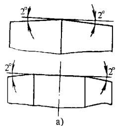

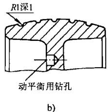

图G14-2 高速带轮轮缘表面

带轮的结构形式可参考图14-5。带轮尺寸较大或因装拆需要（如装在两轴承间），可制成剖分式（图G14-3），剖分面应在轮辐处。

表 G14-16 平带轮轮缘尺寸 (摘自 GB/T11359-1989)

(mm)

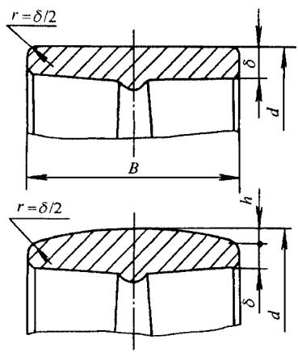

<table><tr><td colspan="2">带宽b</td><td colspan="2">轮缘宽B</td></tr><tr><td>基本尺寸</td><td>偏差</td><td>基本尺寸</td><td>偏差</td></tr><tr><td>16</td><td rowspan="7">±2</td><td>20</td><td rowspan="7">±1</td></tr><tr><td>20</td><td>25</td></tr><tr><td>25</td><td>32</td></tr><tr><td>32</td><td>40</td></tr><tr><td>40</td><td>50</td></tr><tr><td>50</td><td>63</td></tr><tr><td>63</td><td>71</td></tr><tr><td>71</td><td rowspan="6">±3</td><td>80</td><td rowspan="6">±1.5</td></tr><tr><td>80</td><td>90</td></tr><tr><td>90</td><td>100</td></tr><tr><td>100</td><td>112</td></tr><tr><td>112</td><td>125</td></tr><tr><td>125</td><td>140</td></tr><tr><td>140</td><td rowspan="6">±4</td><td>160</td><td rowspan="6">±2</td></tr><tr><td>160</td><td>180</td></tr><tr><td>180</td><td>200</td></tr><tr><td>200</td><td>224</td></tr><tr><td>224</td><td>250</td></tr><tr><td>250</td><td>280</td></tr><tr><td>280</td><td rowspan="7">±5</td><td>315</td><td rowspan="7">±3</td></tr><tr><td>315</td><td>355</td></tr><tr><td>355</td><td>400</td></tr><tr><td>400</td><td>450</td></tr><tr><td>450</td><td>500</td></tr><tr><td>500</td><td>560</td></tr><tr><td>560</td><td>630</td></tr><tr><td colspan="4">δ=0.005d+3</td></tr><tr><td colspan="4">查表G14-17</td></tr></table>

表 G14-17 平带轮轮缘的中凸度

(摘自GB/T11360—1989) (mm)

<table><tr><td>带轮直径</td><td>中凸度hmin</td></tr><tr><td>20~112</td><td>0.3</td></tr><tr><td>125~140</td><td>0.4</td></tr><tr><td>160~180</td><td>0.5</td></tr><tr><td>200~224</td><td>0.6</td></tr><tr><td>250~355</td><td>0.8</td></tr><tr><td>400~500</td><td>1.0</td></tr><tr><td>560~710</td><td>1.2</td></tr><tr><td>800~1000</td><td>1.2~1.5①</td></tr><tr><td>1120~1400</td><td>1.5~2.0①</td></tr><tr><td>1600~2000</td><td>1.8~2.5①</td></tr></table>

① 轮宽  $B > 250\mathrm{mm}$  时，取大值。

表 G14-18 带轮动平衡要求

<table><tr><td>带轮类型</td><td>允许重心偏移量e/μm</td><td>精度等级</td></tr><tr><td>一般机械带轮(n≤1000r/min)</td><td>50</td><td>G6.3</td></tr><tr><td>机床小带轮(n=1500r/min)</td><td>15</td><td>G2.5</td></tr><tr><td>主轴和一般磨头带轮(n=6000~10000r/min)</td><td>3~5</td><td>G2.5</td></tr><tr><td>高速磨头带轮(n=15000~30000r/min)</td><td>0.4~1.2</td><td>G1.0</td></tr><tr><td>精密磨床主轴带轮(n=15000~50000r/min)</td><td>0.08~0.25</td><td>G0.4</td></tr></table>

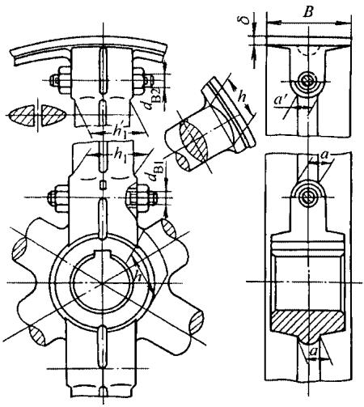

图G14-3 剖分式带轮

$$
d _ {\mathrm {B 1}} = 0. 1 5 d + (8 \sim 1 2) \mathrm {m m} \quad d - \text {轴 径} \mathrm {m m}
$$

$$
d _ {\mathrm {B} 2} = 0. 4 5 \sqrt {B \delta} + 5 \mathrm {m m}
$$

# G2 多楔带传动

# G2.1 规格 (表 G14-19, G14-20)

表 G14-19 多楔带的截面尺寸和长度

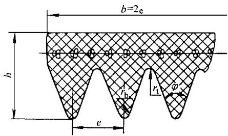

<table><tr><td rowspan="2">带型</td><td colspan="5">截面尺寸</td><td rowspan="2">楔数z</td><td rowspan="2">带的有效长度Le的范围/mm</td></tr><tr><td>e/mm</td><td>φ</td><td>h/mm</td><td>rmax/mm</td><td>rmin/mm</td></tr><tr><td>PJ</td><td>2.34</td><td rowspan="3">40°</td><td>4</td><td>0.2</td><td>0.4</td><td>4,6,8,10,12,16,20</td><td>450~2500</td></tr><tr><td>PL</td><td>4.70</td><td>10</td><td>0.4</td><td>0.6</td><td>6,8,10,12,14,16,18,20</td><td>1250~6000</td></tr><tr><td>PM</td><td>9.40</td><td>17</td><td>0.75</td><td>0.75</td><td>4,6,8,10,12,14,16,1820</td><td>2240~16000</td></tr></table>

表 G14-20 多楔带长度系列

(摘自JB/T5983—1992) (mm)

<table><tr><td colspan="3">长度系列 \( {\mathrm{L}}_{\mathrm{e}} \)</td></tr><tr><td>PJ</td><td>PL</td><td>PM</td></tr><tr><td>450</td><td>1 250</td><td>2 240</td></tr><tr><td>475</td><td>1 320</td><td>2 360</td></tr><tr><td>500</td><td>1 400</td><td>2 500</td></tr><tr><td>560</td><td>1 500</td><td>2 650</td></tr><tr><td>630</td><td>1 600</td><td>2 800</td></tr><tr><td>710</td><td>1 700</td><td>3 000</td></tr><tr><td>750</td><td>1 800</td><td>3 150</td></tr><tr><td>800</td><td>1 900</td><td>3 350</td></tr><tr><td>850</td><td>2000</td><td>3 550</td></tr><tr><td>900</td><td>2120</td><td>3750</td></tr><tr><td>950</td><td>2 240</td><td>4000</td></tr><tr><td>1000</td><td>2 360</td><td>4 250</td></tr><tr><td>1060</td><td>2500</td><td>4 500</td></tr><tr><td>1120</td><td>2 650</td><td>5000</td></tr><tr><td>1 250</td><td>2800</td><td>5 600</td></tr><tr><td>1 320</td><td>3000</td><td>6 300</td></tr><tr><td>1 400</td><td>3150</td><td>6 700</td></tr><tr><td>1500</td><td>3 350</td><td>7100</td></tr><tr><td>1 600</td><td>3550</td><td>8000</td></tr><tr><td>1700</td><td>3750</td><td>9000</td></tr><tr><td>1800</td><td>4000</td><td>10 000</td></tr><tr><td>1900</td><td>4 250</td><td>11 200</td></tr><tr><td>2000</td><td>4 500</td><td>12 500</td></tr><tr><td>2120</td><td>4 750</td><td>13 200</td></tr></table>

(续)

<table><tr><td colspan="3">长度系列 \( {\mathrm{L}}_{\mathrm{c}} \)</td></tr><tr><td>PJ</td><td>PL</td><td>PM</td></tr><tr><td>2 240</td><td>5000</td><td>14 000</td></tr><tr><td>2 360</td><td>5 300</td><td>15 000</td></tr><tr><td>2 500</td><td>5 600</td><td>16 000</td></tr><tr><td>-</td><td>6 000</td><td>-</td></tr></table>

# G2.2 设计计算

多楔带传动的设计计算与V带传动基本相同。典型的多楔带设计问题是，已知：传动功率  $P$  ，主动轮转速  $n_1$  ，从动轮转速  $n_2$  （或传动比  $i$  ），传动形式，工作情况及原动机种类等。

设计要求确定：带的类型、有效长度、楔数、带轮直径、传动中心距、作用在轴上的力并画出带轮工作图。设计方法和步骤见表G14-21。

表 G14-21 多楔带传动设计方法和步骤

<table><tr><td>计算项目</td><td>符号</td><td>单位</td><td>计算公式和参数选择</td><td>说 明</td></tr><tr><td>设计 功率</td><td>\( {P}_{\mathrm{d}} \)</td><td>kW</td><td>\( {P}_{\mathrm{d}} = {K}_{\mathrm{A}}P \)</td><td>\( P \) 一传动功率(kW) \( {K}_{\mathrm{A}} \) 一工作情况系数,见表 G14-22</td></tr><tr><td>带型</td><td></td><td></td><td>根据 \( {P}_{\mathrm{d}} \) 和 \( {n}_{1} \) 由图 G14-4 选取</td><td>\( {n}_{1} \) 一小带轮转速(r/min)</td></tr><tr><td>传动比</td><td>\( i \)</td><td></td><td>\( i = \frac{{n}_{1}}{{n}_{2}} \approx  \frac{{d}_{\mathrm{p}2}}{\left( {1 - \varepsilon }\right) {d}_{\mathrm{p}1}} \) \( {d}_{\mathrm{p}} = {d}_{\mathrm{e}} + {2\Delta e} \) \( \varepsilon  = {0.01} \sim  {0.02} \) \( {\Delta e} \) 值(mm)：PJ 型带 \( {\Delta e} = {1.2} \) ,PL 型带 \( {\Delta e} \) \( = 3,\mathrm{{PM}} \) 型带 \( {\Delta e} = 4 \)</td><td>\( {n}_{2} \) 一大带轮转速(r/min) \( {d}_{\mathrm{p}1}\text{、}{d}_{\mathrm{p}2} \) 一小、大带轮节圆直径 (mm) \( {d}_{\mathrm{e}} \) 一带轮有效直径(mm) \( {\Delta e} \) 一有效线差</td></tr><tr><td>小带轮有效直径</td><td>\( {d}_{\mathrm{e}1} \)</td><td>mm</td><td>由表 G14-23 选取</td><td>为提高带的寿命, 条件允许时, \( {d}_{\mathrm{e}1} \) 尽 量取较大值</td></tr><tr><td>大带轮有效直径</td><td>\( {d}_{\mathrm{e}2} \)</td><td>mm</td><td>\( {d}_{\mathrm{e}2} = \mathrm{i}\left( {{d}_{\mathrm{e}1} + {2\Delta e}}\right) \left( {1 - \varepsilon }\right)  - {2\Delta e} \) ,查表 G14-23 选标准值</td><td></td></tr><tr><td>带速</td><td>\( V \)</td><td>m/s</td><td>\( v = \frac{\pi {d}_{\mathrm{p}1}{n}_{1}}{60 \times  {1000}} \leq  {v}_{\max } \) \( {v}_{\max } \leq  {30}\mathrm{\;m}/\mathrm{s} \)</td><td>若 \( v \) 过高,则应取较小的 \( {d}_{\mathrm{e}1} \) 或选用较 小的多楔带型号</td></tr><tr><td>初定中心距</td><td>\( {a}_{0} \)</td><td>mm</td><td>\( {0.7}\left( {{d}_{\mathrm{e}1} + {d}_{\mathrm{e}2}}\right)  &lt; {a}_{0} &lt; 2\left( {{d}_{\mathrm{e}1} + {d}_{\mathrm{e}2}}\right) \)</td><td>或根据结构定</td></tr><tr><td>带的有效长度</td><td>\( {L}_{\mathrm{e}} \)</td><td>mm</td><td>\( {L}_{\mathrm{e}0} = 2\;{a}_{0} + \frac{\pi }{2}\left( {{d}_{\mathrm{e}1} + {d}_{\mathrm{e}2}}\right)  + \frac{{\left( {d}_{\mathrm{e}2} - {d}_{\mathrm{e}1}\right) }^{2}}{4{a}_{0}} \)</td><td>由 \( {L}_{\mathrm{e}0} \) 按表 G14-20 选取相近的标准 \( {L}_{\mathrm{e}} \) 或按生产厂可购到的规格选用</td></tr><tr><td>计算中心距</td><td>\( a \)</td><td>mm</td><td>\( a = {a}_{0} + \frac{{L}_{\mathrm{e}} - {L}_{\mathrm{e}0}}{2} \)</td><td>为了安装方便和张紧胶带, 尚需给中 心距留有一定的调整余量, 见表 G14-24</td></tr><tr><td>小带轮包角</td><td>\( {\alpha }_{1} \)</td><td>rad</td><td>\( {\alpha }_{1} \approx  \pi  - \frac{{d}_{\mathrm{e}2} - {d}_{\mathrm{e}1}}{a} \)</td><td>一般 \( {\alpha }_{1} \geq  {120}^{ \circ  } \) ,如 \( {\alpha }_{1} \) 较小,应增大 \( \alpha \) 或采用张紧轮</td></tr><tr><td>带每楔所传递的额 定功率及其增量</td><td>\( {P}_{0} \) \( \Delta {P}_{0} \)</td><td>kW kW</td><td>根据带型 \( {d}_{\mathrm{e}1} \) 和 \( {n}_{1} \) 由表 G14-28 选取 根据带型, \( i \) 由表 G14-28 选取</td><td></td></tr><tr><td>带的楔数</td><td>\( z \)</td><td></td><td>\( z = \frac{{P}_{\mathrm{d}}}{\left( {{P}_{0} + \Delta {P}_{0}}\right) {K}_{\alpha } \cdot  {K}_{\mathrm{L}}} \) \( z \) 按表 G14-19 选取</td><td>\( {K}_{\alpha } \) 一包角修正系数,见表 G14-25 \( {K}_{\mathrm{L}} \) 一带长修正系数,见表 G14-26</td></tr><tr><td>有效圆周力</td><td>\( {F}_{\mathrm{t}} \)</td><td>\( \mathrm{N} \)</td><td>\( {F}_{\mathrm{t}} = \frac{{P}_{\mathrm{d}}}{V} \times  {10}^{3} \)</td><td></td></tr><tr><td>作用于轴上之力</td><td>\( {F}_{\mathrm{r}} \)</td><td>\( \mathrm{N} \)</td><td>\( {F}_{\mathrm{r}} = {K}_{\mathrm{r}} \cdot  {F}_{\mathrm{t}} \cdot  \sin \frac{{a}_{1}}{2} \)</td><td>\( {K}_{\mathrm{r}} \) 一带与带轮楔合系数,见表 G14-27</td></tr></table>

表 G14-22 多楔带工作情况系数  ${K}_{\mathrm{A}}$  (摘自 JB/T5983-1992)

注：如使用张紧轮，将下列数值加到  $K_{\mathrm{A}}$  中；

<table><tr><td rowspan="4">工 况</td><td colspan="6">原动机类型</td></tr><tr><td colspan="3">交流电动机(普通转矩、笼型、同步、分相式),直流电动机(并励),内燃机</td><td colspan="3">交流电动机(大转矩、大滑差率、单相、滑环式、串激),直流电动机(复激)</td></tr><tr><td>每天连续运转≤6h</td><td>每天连续运转&gt;6~16h</td><td>每天连续运转&gt;16~24h</td><td>每天连续运转≤6h</td><td>每天连续运转&gt;6~16h</td><td>每天连续运转&gt;16~24h</td></tr><tr><td colspan="6">\(K_{\text{A}}\)</td></tr><tr><td>液体搅拌器;鼓风机和排气装置;离心泵和压缩机;功率在7.5kW以下(含7.5kW)的风扇;轻型输送机</td><td>1.0</td><td>1.1</td><td>1.2</td><td>1.1</td><td>1.2</td><td>1.3</td></tr><tr><td>带式输送机(砂子、尘物等);和面机;功率超过7.5kW的风扇;发电机;洗衣机;机床;冲床、压力机、剪床;印刷机;往复式振动筛;正排量旋转泵</td><td>1.1</td><td>1.2</td><td>1.3</td><td>1.2</td><td>1.3</td><td>1.4</td></tr><tr><td>制砖机;斗式提升机;激磁机;活塞式压缩机;输送机(链板式、盘式、螺旋式);锻压机床;造纸用打浆机;柱塞泵;正排量鼓风机;粉碎机;锯床和木工机械</td><td>1.2</td><td>1.3</td><td>1.4</td><td>1.4</td><td>1.5</td><td>1.6</td></tr><tr><td>破碎机(旋转式、颚式、滚动式);研磨机(球式、棒式、圆筒型式);起重机;橡胶机械(压光机、模压机、轧制机)</td><td>1.3</td><td>1.4</td><td>1.5</td><td>1.6</td><td>1.6</td><td>1.8</td></tr><tr><td colspan="3">交流电动机(普通转矩、笼型、同步、分相式),直流电动机(并激),内燃机</td><td colspan="3">交流电动机(大转矩、大滑差率、单相、滑环式、串激),直流电动机(复激)</td></tr><tr><td>每天连续运转≤6h</td><td>每天连续运转&gt;6~16h</td><td>每天连续运转&gt;16~24h</td><td>每天连续运转≤6h</td><td>每天连续运转&gt;6~16h</td><td colspan="1">每天连续运转&gt;16~24h</td></tr><tr><td colspan="6">\(K_{\text{A}}\)</td></tr><tr><td>节流机械</td><td>2.0</td><td>2.0</td><td>2.0</td><td>2.0</td><td>2.0</td><td>2.0</td></tr></table>

张紧轮位于松边内侧：0；

张紧轮位于松边外侧：0.1；

张紧轮位于紧边内侧：0.1；

张紧轮位于紧边外侧：0.2。

表 G14-23 多楔带轮直径系列 (摘自 JB/T5983-1992)

(mm)

带轮直径系列  $d_{\mathrm{e}}$

<table><tr><td colspan="2">PJ</td><td colspan="2">PL</td><td colspan="2">PM</td></tr><tr><td>20</td><td>95</td><td>75</td><td>280</td><td>180</td><td>750</td></tr><tr><td>22.4</td><td>100</td><td>80</td><td>300</td><td>200</td><td>800</td></tr><tr><td>25</td><td>106</td><td>90</td><td>315</td><td>212</td><td>850</td></tr><tr><td>28</td><td>112</td><td>95</td><td>335</td><td>224</td><td>900</td></tr><tr><td>31.5</td><td>118</td><td>100</td><td>355</td><td>236</td><td>950</td></tr><tr><td>33.5</td><td>125</td><td>106</td><td>375</td><td>250</td><td>1 000</td></tr><tr><td>35.5</td><td>132</td><td>112</td><td>400</td><td>265</td><td>1 120</td></tr><tr><td>37.5</td><td>140</td><td>118</td><td>425</td><td>280</td><td></td></tr><tr><td>40</td><td>150</td><td>125</td><td>450</td><td>300</td><td></td></tr><tr><td>42.5</td><td>160</td><td>132</td><td>470</td><td>315</td><td></td></tr><tr><td>45</td><td>170</td><td>140</td><td>500</td><td>355</td><td></td></tr><tr><td>47.5</td><td>180</td><td>150</td><td>560</td><td>375</td><td></td></tr><tr><td>50</td><td>200</td><td>160</td><td>600</td><td>400</td><td></td></tr><tr><td>53</td><td>212</td><td>170</td><td>630</td><td>425</td><td></td></tr><tr><td>56</td><td>224</td><td>180</td><td>710</td><td>450</td><td></td></tr><tr><td>60</td><td>236</td><td>200</td><td>750</td><td>475</td><td></td></tr><tr><td>63</td><td>250</td><td>212</td><td></td><td>500</td><td></td></tr><tr><td>71</td><td>265</td><td>224</td><td></td><td>560</td><td></td></tr><tr><td>75</td><td>280</td><td>236</td><td></td><td>600</td><td></td></tr><tr><td>80</td><td>300</td><td>250</td><td></td><td>630</td><td></td></tr><tr><td>90</td><td></td><td>265</td><td></td><td>710</td><td></td></tr></table>

注：选择小带轮有效直径时，不应小于表中该类型的最小直径值。

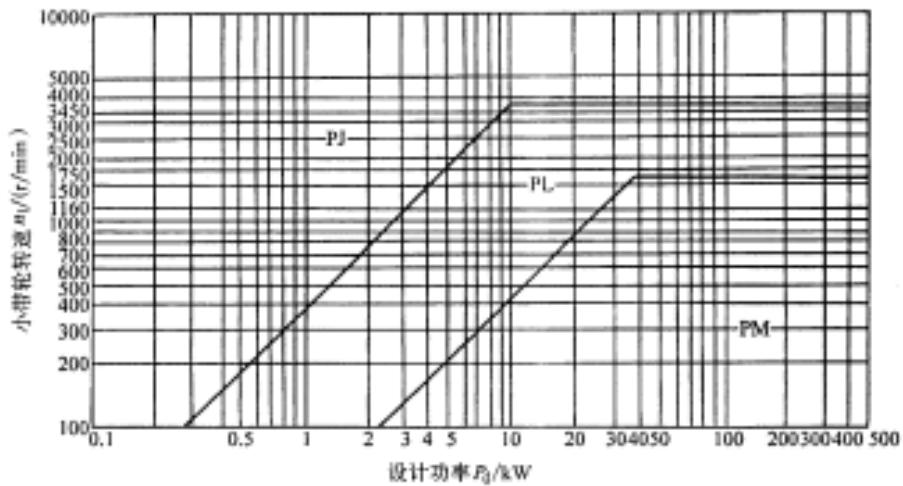

图G14-4 选择多楔带型图

表 G14-24 中心距调整量 (摘自 JB/T5983-1992) (mm)

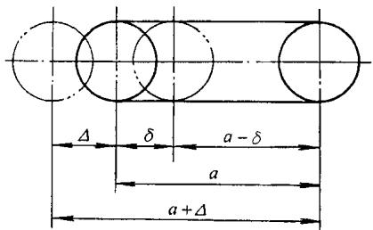

<table><tr><td>有效长度Le</td><td>Δmin</td><td>δmin</td></tr><tr><td colspan="3">PJ</td></tr><tr><td>450~500</td><td>5</td><td>8</td></tr><tr><td>&gt;500~750</td><td>8</td><td>10</td></tr><tr><td>&gt;750~1 000</td><td>10</td><td>11</td></tr><tr><td>&gt;1 000~1 250</td><td>11</td><td>13</td></tr><tr><td>&gt;1 250~1 500</td><td>13</td><td>14</td></tr><tr><td>&gt;1 500~1 800</td><td>16</td><td>16</td></tr><tr><td>&gt;1 800~2 000</td><td>18</td><td>18</td></tr><tr><td>&gt;2 000~2 500</td><td>19</td><td>19</td></tr><tr><td colspan="3">PL</td></tr><tr><td>1 250~1 500</td><td>16</td><td>22</td></tr><tr><td>&gt;1 500~1 800</td><td>19</td><td>22</td></tr><tr><td>&gt;1 800~2 000</td><td>22</td><td>24</td></tr><tr><td>&gt;2 000~2 240</td><td>25</td><td>24</td></tr><tr><td>&gt;2 240~2 500</td><td>29</td><td>25</td></tr><tr><td>&gt;2 500~3 000</td><td>34</td><td>27</td></tr><tr><td>&gt;3 000~4 000</td><td>40</td><td>29</td></tr><tr><td>&gt;4 000~5 000</td><td>51</td><td>34</td></tr><tr><td>&gt;5 000~6 000</td><td>60</td><td>35</td></tr><tr><td colspan="3">PM</td></tr><tr><td>2 240~2 500</td><td>29</td><td>38</td></tr><tr><td>&gt;2 500~3 000</td><td>34</td><td>40</td></tr><tr><td>&gt;3 000~4 000</td><td>40</td><td>42</td></tr><tr><td>&gt;4 000~5 000</td><td>51</td><td>46</td></tr><tr><td>&gt;5 000~6 000</td><td>60</td><td>48</td></tr><tr><td>&gt;6 000~6 700</td><td>76</td><td>54</td></tr><tr><td>&gt;6 700~8 500</td><td>92</td><td>60</td></tr><tr><td>&gt;8 500~10 000</td><td>106</td><td>67</td></tr><tr><td>&gt;10 000~11 800</td><td>134</td><td>73</td></tr><tr><td>&gt;11 800~16 000</td><td>168</td><td>86</td></tr></table>

表 G14-25 包角修正系数 (摘自 JB/T5983-1992)

<table><tr><td>小轮包角α1/(°)</td><td>包角修正系数Kα</td><td>小轮包角α1/(°)</td><td>包角修正系数Kα</td><td>小轮包角α1/(°)</td><td>包角修正系数Kα</td></tr><tr><td>180</td><td>1.00</td><td>148</td><td>0.90</td><td>113</td><td>0.77</td></tr><tr><td>177</td><td>0.99</td><td>145</td><td>0.89</td><td>110</td><td>0.76</td></tr><tr><td>174</td><td>0.98</td><td>142</td><td>0.88</td><td>106</td><td>0.75</td></tr><tr><td>171</td><td>0.97</td><td>139</td><td>0.87</td><td>103</td><td>0.73</td></tr><tr><td>169</td><td>0.97</td><td>136</td><td>0.86</td><td>99</td><td>0.72</td></tr><tr><td>166</td><td>0.96</td><td>133</td><td>0.85</td><td>95</td><td>0.70</td></tr><tr><td>163</td><td>0.95</td><td>130</td><td>0.84</td><td>91</td><td>0.68</td></tr><tr><td>160</td><td>0.94</td><td>127</td><td>0.83</td><td>87</td><td>0.66</td></tr><tr><td>157</td><td>0.93</td><td>125</td><td>0.81</td><td>83</td><td>0.64</td></tr><tr><td>154</td><td>0.92</td><td>120</td><td>0.80</td><td></td><td></td></tr><tr><td>151</td><td>0.91</td><td>117</td><td>0.79</td><td></td><td></td></tr></table>

表 G14-26 有效长度和带长修正系数  ${K}_{\mathrm{L}}$  (摘自 JB/T5983-1992)

<table><tr><td rowspan="2">有效长度 \( {L}_{\mathrm{e}}/\mathrm{{mm}} \)</td><td colspan="3">带长修正系数 \( {K}_{\mathrm{L}} \)</td></tr><tr><td>PJ</td><td>PL</td><td>PM</td></tr><tr><td>450</td><td>0.78</td><td></td><td></td></tr><tr><td>500</td><td>0.79</td><td></td><td></td></tr><tr><td>630</td><td>0.83</td><td></td><td></td></tr><tr><td>710</td><td>0.85</td><td>-</td><td>-</td></tr><tr><td>800</td><td>0.87</td><td></td><td></td></tr><tr><td>900</td><td>0.89</td><td></td><td></td></tr><tr><td>1 000</td><td>0.91</td><td></td><td></td></tr><tr><td rowspan="2">有效长度Le/mm</td><td colspan="3">带长修正系数KL</td></tr><tr><td>PJ</td><td>PL</td><td colspan="1">PM</td></tr><tr><td></td><td></td><td>-</td><td></td></tr><tr><td>1 120</td><td>0.93</td><td></td><td></td></tr><tr><td>1 250</td><td>0.96</td><td>0.85</td><td>-</td></tr><tr><td>1 400</td><td>0.98</td><td>0.87</td><td></td></tr><tr><td>1 600</td><td>1.01</td><td>0.89</td><td></td></tr><tr><td>1 800</td><td>1.02</td><td>0.91</td><td></td></tr><tr><td>2 000</td><td>1.04</td><td>0.93</td><td>0.85</td></tr><tr><td>2 360</td><td>1.08</td><td>0.96</td><td>0.86</td></tr><tr><td>2 500</td><td>1.09</td><td>0.96</td><td>0.87</td></tr><tr><td>2 650</td><td></td><td>0.98</td><td>0.88</td></tr><tr><td>2 800</td><td></td><td>0.98</td><td>0.88</td></tr><tr><td>3 000</td><td></td><td>0.99</td><td>0.89</td></tr><tr><td>3 150</td><td></td><td>1.00</td><td>0.90</td></tr><tr><td>3 350</td><td></td><td>1.01</td><td>0.91</td></tr><tr><td>3 750</td><td></td><td>1.03</td><td>0.93</td></tr><tr><td>4 000</td><td></td><td>1.04</td><td>0.94</td></tr><tr><td>4 500</td><td></td><td>1.06</td><td>0.95</td></tr><tr><td>5 000</td><td></td><td>1.07</td><td>0.97</td></tr><tr><td>5 600</td><td></td><td>1.08</td><td>0.99</td></tr><tr><td>6 300</td><td></td><td>1.11</td><td>1.01</td></tr><tr><td>6 700</td><td>-</td><td></td><td>1.01</td></tr><tr><td>7 500</td><td></td><td></td><td>1.03</td></tr><tr><td>8 500</td><td></td><td></td><td>1.04</td></tr><tr><td>9 000</td><td></td><td></td><td>1.05</td></tr><tr><td>10 000</td><td></td><td></td><td>1.07</td></tr><tr><td>10 600</td><td></td><td></td><td>1.08</td></tr><tr><td>12 500</td><td></td><td></td><td>1.10</td></tr><tr><td>13 200</td><td></td><td></td><td>1.12</td></tr><tr><td>15 000</td><td></td><td></td><td>1.14</td></tr><tr><td>16 000</td><td></td><td></td><td>1.15</td></tr></table>

表 G14-27 多楔带与带轮的楔合系数  ${K}_{\mathrm{r}}$

<table><tr><td>小带轮包角α1</td><td>180°</td><td>170°</td><td>160°</td><td>150°</td><td>140°</td><td>130°</td><td>120°</td><td>110°</td><td>100°</td><td>90°</td><td>80°</td><td>70°</td><td>60°</td></tr><tr><td>楔合系数Kr</td><td>1.50</td><td>1.56</td><td>1.63</td><td>1.71</td><td>1.80</td><td>1.91</td><td>2.04</td><td>2.20</td><td>2.38</td><td>2.61</td><td>2.92</td><td>3.30</td><td>3.82</td></tr></table>

表 G14-28a PJ 型多楔带每楔传递的额定功率(摘自 JB/T5983-1992)

<table><tr><td rowspan="3">小轮转速n1/(r/min)</td><td colspan="19">小带轮有效直径de1/mm</td><td colspan="8">传动比i</td></tr><tr><td>20</td><td>25</td><td>28</td><td>31.5</td><td>35.5</td><td>40</td><td>45</td><td>50</td><td>56</td><td>60</td><td>63</td><td>71</td><td>80</td><td>95</td><td>100</td><td>112</td><td>125</td><td>140</td><td>150</td><td>1.12~1.18</td><td>1.19~1.26</td><td>1.27~1.38</td><td>1.39~1.57</td><td>1.58~1.94</td><td>1.95~3.38</td><td>≥3.39</td><td></td></tr><tr><td colspan="19">包角180°时每楔传递的基本额定功率P1/kW</td><td colspan="8">由传动比i引起的功率增量ΔP1/kW</td></tr><tr><td>200</td><td>0.01</td><td>0.01</td><td>0.01</td><td>0.01</td><td>0.01</td><td>0.02</td><td>0.02</td><td>0.03</td><td>0.03</td><td>0.04</td><td>0.04</td><td>0.04</td><td>0.04</td><td>0.05</td><td>0.06</td><td>0.07</td><td>0.08</td><td>0.09</td><td>0.10</td><td>0</td><td>0</td><td>0</td><td>0</td><td>0</td><td>0</td><td>0</td><td>0</td></tr><tr><td>400</td><td>0.01</td><td>0.01</td><td>0.02</td><td>0.02</td><td>0.03</td><td>0.04</td><td>0.04</td><td>0.05</td><td>0.06</td><td>0.06</td><td>0.07</td><td>0.07</td><td>0.09</td><td>0.10</td><td>0.12</td><td>0.13</td><td>0.15</td><td>0.16</td><td>0.18</td><td>0</td><td>0</td><td>0</td><td>0</td><td>0</td><td>0</td><td>0</td><td>0</td></tr><tr><td>600</td><td>0.01</td><td>0.02</td><td>0.02</td><td>0.03</td><td>0.04</td><td>0.05</td><td>0.06</td><td>0.07</td><td>0.08</td><td>0.09</td><td>0.10</td><td>0.11</td><td>0.13</td><td>0.16</td><td>0.16</td><td>0.19</td><td>0.21</td><td>0.24</td><td>0.25</td><td>0</td><td>0</td><td>0</td><td>0</td><td>0</td><td>0.01</td><td>0.01</td><td>0.01</td></tr><tr><td>800</td><td>0.01</td><td>0.02</td><td>0.03</td><td>0.04</td><td>0.05</td><td>0.07</td><td>0.07</td><td>0.09</td><td>0.10</td><td>0.11</td><td>0.12</td><td>0.14</td><td>0.16</td><td>0.20</td><td>0.22</td><td>0.25</td><td>0.28</td><td>0.31</td><td>0.33</td><td>0</td><td>0</td><td>0.01</td><td>0.01</td><td>0.01</td><td>0.01</td><td>0.01</td><td>0.01</td></tr><tr><td>950</td><td>0.01</td><td>0.03</td><td>0.04</td><td>0.04</td><td>0.06</td><td>0.07</td><td>0.09</td><td>0.10</td><td>0.11</td><td>0.13</td><td>0.14</td><td>0.16</td><td>0.19</td><td>0.23</td><td>0.25</td><td>0.28</td><td>0.32</td><td>0.36</td><td>0.39</td><td>0</td><td>0.01</td><td>0.01</td><td>0.01</td><td>0.01</td><td>0.01</td><td>0.01</td><td>0.01</td></tr><tr><td>1000</td><td>0.01</td><td>0.03</td><td>0.04</td><td>0.05</td><td>0.06</td><td>0.07</td><td>0.09</td><td>0.11</td><td>0.13</td><td>0.13</td><td>0.15</td><td>0.17</td><td>0.19</td><td>0.25</td><td>0.26</td><td>0.30</td><td>0.34</td><td>0.37</td><td>0.40</td><td>0</td><td>0.01</td><td>0.01</td><td>0.01</td><td>0.01</td><td>0.01</td><td>0.01</td><td>0.01</td></tr><tr><td>1200</td><td>0.01</td><td>0.03</td><td>0.04</td><td>0.06</td><td>0.07</td><td>0.09</td><td>0.11</td><td>0.13</td><td>0.15</td><td>0.16</td><td>0.17</td><td>0.20</td><td>0.23</td><td>0.28</td><td>0.31</td><td>0.35</td><td>0.39</td><td>0.44</td><td>0.47</td><td>0</td><td>0.01</td><td>0.01</td><td>0.01</td><td>0.01</td><td>0.01</td><td>0.01</td><td>0.01</td></tr><tr><td>1400</td><td>0.01</td><td>0.04</td><td>0.05</td><td>0.06</td><td>0.08</td><td>0.10</td><td>0.13</td><td>0.14</td><td>0.17</td><td>0.19</td><td>0.20</td><td>0.23</td><td>0.27</td><td>0.35</td><td>0.35</td><td>0.40</td><td>0.45</td><td>0.51</td><td>0.54</td><td>0.01</td><td>0.01</td><td>0.01</td><td>0.01</td><td>0.01</td><td>0.01</td><td>0.01</td><td>0.01</td></tr><tr><td>1500</td><td>0.01</td><td>0.04</td><td>0.05</td><td>0.07</td><td>0.08</td><td>0.10</td><td>0.13</td><td>0.16</td><td>0.18</td><td>0.19</td><td>0.21</td><td>0.23</td><td>0.28</td><td>0.34</td><td>0.37</td><td>0.43</td><td>0.48</td><td>0.54</td><td>0.57</td><td>0.01</td><td>0.01</td><td>0.01</td><td>0.01</td><td>0.01</td><td>0.01</td><td>0.01</td><td>0.01</td></tr><tr><td>1600</td><td>0.01</td><td>0.04</td><td>0.05</td><td>0.07</td><td>0.09</td><td>0.11</td><td>0.14</td><td>0.16</td><td>0.19</td><td>0.21</td><td>0.22</td><td>0.25</td><td>0.30</td><td>0.37</td><td>0.40</td><td>0.45</td><td>0.50</td><td>0.56</td><td>0.60</td><td>0.01</td><td>0.01</td><td>0.01</td><td>0.01</td><td>0.01</td><td>0.01</td><td>0.01</td><td>0.01</td></tr><tr><td>1800</td><td>0.01</td><td>0.04</td><td>0.06</td><td>0.07</td><td>0.10</td><td>0.13</td><td>0.15</td><td>0.18</td><td>0.21</td><td>0.22</td><td>0.25</td><td>0.28</td><td>0.33</td><td>0.40</td><td>0.43</td><td>0.49</td><td>0.55</td><td>0.63</td><td>0.67</td><td>0.01</td><td>0.01</td><td>0.01</td><td>0.01</td><td>0.01</td><td>0.01</td><td>0.01</td><td>0.01</td></tr><tr><td>2000</td><td>0.01</td><td>0.04</td><td>0.06</td><td>0.08</td><td>0.10</td><td>0.14</td><td>0.16</td><td>0.19</td><td>0.23</td><td>0.25</td><td>0.27</td><td>0.31</td><td>0.36</td><td>0.44</td><td>0.48</td><td>0.54</td><td>0.61</td><td>0.68</td><td>0.73</td><td>0.01</td><td>0.01</td><td>0.01</td><td>0.01</td><td>0.01</td><td>0.01</td><td>0.01</td><td>0.01</td></tr><tr><td>2400</td><td>0.01</td><td>0.05</td><td>0.07</td><td>0.10</td><td>0.12</td><td>0.16</td><td>0.19</td><td>0.23</td><td>0.27</td><td>0.29</td><td>0.31</td><td>0.37</td><td>0.42</td><td>0.51</td><td>0.55</td><td>0.63</td><td>0.70</td><td>0.78</td><td>0.84</td><td>0.01</td><td>0.01</td><td>0.01</td><td>0.01</td><td>0.01</td><td>0.01</td><td>0.01</td><td>0.01</td></tr><tr><td>2800</td><td>0.01</td><td>0.05</td><td>0.08</td><td>0.10</td><td>0.14</td><td>0.18</td><td>0.22</td><td>0.26</td><td>0.31</td><td>0.33</td><td>0.36</td><td>0.41</td><td>0.48</td><td>0.58</td><td>0.63</td><td>0.71</td><td>0.79</td><td>0.89</td><td>0.94</td><td>0.01</td><td>0.01</td><td>0.01</td><td>0.01</td><td>0.01</td><td>0.02</td><td>0.02</td><td></td></tr><tr><td>3000</td><td>0.01</td><td>0.06</td><td>0.08</td><td>0.11</td><td>0.15</td><td>0.19</td><td>0.23</td><td>0.28</td><td>0.33</td><td>0.35</td><td>0.38</td><td>0.44</td><td>0.51</td><td>0.62</td><td>0.66</td><td>0.75</td><td>0.84</td><td>0.93</td><td>0.99</td><td>0.01</td><td>0.01</td><td>0.01</td><td>0.01</td><td>0.02</td><td>0.02</td><td>0.02</td><td></td></tr><tr><td>4000</td><td>0.01</td><td>0.07</td><td>0.10</td><td>0.14</td><td>0.18</td><td>0.24</td><td>0.29</td><td>0.34</td><td>0.41</td><td>0.44</td><td>0.48</td><td>0.55</td><td>0.63</td><td>0.81</td><td>0.82</td><td>0.93</td><td>1.01</td><td>1.11*</td><td>1.17*</td><td>0.01</td><td>0.01</td><td>0.02</td><td>0.02</td><td>0.02</td><td>0.03</td><td>0.03</td><td></td></tr><tr><td>5000</td><td>-</td><td>0.07</td><td>0.12</td><td>0.16</td><td>0.22</td><td>0.28</td><td>0.35</td><td>0.41</td><td>0.48</td><td>0.52</td><td>0.57</td><td>0.65</td><td>0.75</td><td>0.90</td><td>0.95</td><td>1.09*</td><td>1.14*</td><td>1.22*</td><td>1.25*</td><td>0.01</td><td>0.02</td><td>0.03</td><td>0.03</td><td>0.03</td><td>0.04</td><td>0.04</td><td></td></tr><tr><td>6000</td><td>-</td><td>0.08</td><td>0.13</td><td>0.19</td><td>0.25</td><td>0.32</td><td>0.40</td><td>0.47</td><td>0.55</td><td>0.60</td><td>0.64</td><td>0.74</td><td>0.84</td><td>0.98*</td><td>1.04*</td><td>1.13*</td><td>1.19*</td><td>1.22*</td><td>1.25*</td><td>0.01</td><td>0.02</td><td>0.03</td><td>0.04</td><td>0.04</td><td>0.04</td><td>0.04</td><td></td></tr><tr><td>7000</td><td>-</td><td>0.08</td><td>0.14</td><td>0.20</td><td>0.27</td><td>0.36</td><td>0.44</td><td>0.52</td><td>0.61</td><td>0.66</td><td>0.71</td><td>0.84*</td><td>0.90*</td><td>1.04*</td><td>1.09*</td><td>1.14*</td><td>1.16*</td><td></td><td></td><td>0.02</td><td>0.03</td><td>0.04</td><td>0.04</td><td>0.04</td><td>0.04</td><td>0.05</td><td></td></tr><tr><td>8000</td><td>-</td><td>0.09</td><td>0.15</td><td>0.22</td><td>0.29</td><td>0.39</td><td>0.48</td><td>0.57</td><td>0.66</td><td>0.71</td><td>0.76</td><td>0.89*</td><td>0.95*</td><td>1.06*</td><td>1.08*</td><td>0.09*</td><td></td><td></td><td></td><td>0.02</td><td>0.03</td><td>0.04</td><td>0.04</td><td>0.05</td><td>0.05</td><td>0.06</td><td></td></tr><tr><td>10000</td><td>-</td><td>0.10</td><td>0.16</td><td>0.24</td><td>0.33</td><td>0.43</td><td>0.54</td><td>0.63</td><td>0.72*</td><td>0.77*</td><td>0.81*</td><td>0.92*</td><td>0.95*</td><td></td><td></td><td></td><td></td><td></td><td></td><td>0.03</td><td>0.04</td><td>0.04</td><td>0.06</td><td>0.07</td><td>0.07</td><td>0.07</td><td></td></tr></table>

注：带轮材料：圆周速度小于  $27\mathrm{m / s}$  时，为正常运转情况，标准带轮用灰铸铁制造；大于  $27\mathrm{m / s}$  时，向制造厂咨询。

带“*”者圆周速度大于  $27\mathrm{m / s}$ 。

表 G14-28b PL 型多楔带每楔传递的额定功率(摘自 JB/T5983-1992)

<table><tr><td rowspan="3">小轮转速n1/(r/min)</td><td colspan="21">小带轮有效直径de1/mm</td><td colspan="8">传动比i</td></tr><tr><td>75</td><td>80</td><td>90</td><td>95</td><td>100</td><td>106</td><td>112</td><td>118</td><td>125</td><td>132</td><td>140</td><td>150</td><td>160</td><td>170</td><td>180</td><td>200</td><td>212</td><td>224</td><td>250</td><td>300</td><td>355</td><td>1.06~1.11</td><td>1.12~1.18</td><td>1.19~1.26</td><td>1.27~1.38</td><td>1.39~1.57</td><td>1.58~1.94</td><td>1.95~3.38</td><td>≥3.39</td></tr><tr><td colspan="21">PL型多楔带包角180°时每楔传递的基本额定功率P1/kW</td><td colspan="8">由传动比i引起的功率增量ΔP1/kW</td></tr><tr><td>100</td><td>0.07</td><td>0.08</td><td>0.10</td><td>0.11</td><td>0.12</td><td>0.13</td><td>0.14</td><td>0.16</td><td>0.17</td><td>0.19</td><td>0.20</td><td>0.22</td><td>0.24</td><td>0.25</td><td>0.28</td><td>0.30</td><td>0.31</td><td>0.37</td><td>0.44</td><td>0.51</td><td>0.00</td><td>0.00</td><td>0.01</td><td>0.01</td><td>0.01</td><td>0.01</td><td>0.01</td><td>0.01</td><td>0.01</td></tr><tr><td>200</td><td>0.11</td><td>0.15</td><td>0.19</td><td>0.20</td><td>0.22</td><td>0.23</td><td>0.25</td><td>0.26</td><td>0.30</td><td>0.31</td><td>0.34</td><td>0.37</td><td>0.40</td><td>0.43</td><td>0.46</td><td>0.52</td><td>0.55</td><td>0.58</td><td>0.67</td><td>0.82</td><td>0.96</td><td>0.00</td><td>0.01</td><td>0.01</td><td>0.01</td><td>0.01</td><td>0.01</td><td>0.01</td><td>0.01</td></tr><tr><td>400</td><td>0.24</td><td>0.27</td><td>0.33</td><td>0.36</td><td>0.39</td><td>0.42</td><td>0.45</td><td>0.48</td><td>0.54</td><td>0.57</td><td>0.63</td><td>0.67</td><td>0.74</td><td>0.80</td><td>0.86</td><td>0.97</td><td>1.02</td><td>1.08</td><td>1.25</td><td>1.51</td><td>1.78</td><td>0.01</td><td>0.01</td><td>0.01</td><td>0.02</td><td>0.02</td><td>0.03</td><td>0.03</td><td>0.03</td></tr><tr><td>600</td><td>0.33</td><td>0.37</td><td>0.46</td><td>0.51</td><td>0.55</td><td>0.60</td><td>0.63</td><td>0.68</td><td>0.76</td><td>0.81</td><td>0.89</td><td>0.97</td><td>1.05</td><td>1.13</td><td>1.22</td><td>1.38</td><td>1.46</td><td>1.54</td><td>1.78</td><td>2.16</td><td>2.54</td><td>0.01</td><td>0.01</td><td>0.02</td><td>0.03</td><td>0.04</td><td>0.04</td><td>0.04</td><td>0.04</td></tr><tr><td>800</td><td>0.42</td><td>0.47</td><td>0.59</td><td>0.64</td><td>0.70</td><td>0.75</td><td>0.81</td><td>0.98</td><td>1.03</td><td>1.14</td><td>1.25</td><td>1.35</td><td>1.46</td><td>1.57</td><td>1.77</td><td>1.87</td><td>1.98</td><td>2.28</td><td>2.76</td><td>3.23</td><td>0.01</td><td>0.02</td><td>0.03</td><td>0.04</td><td>0.04</td><td>0.05</td><td>0.06</td><td>0.06</td><td></td></tr><tr><td>900</td><td>0.46</td><td>0.52</td><td>0.65</td><td>0.71</td><td>0.77</td><td>0.84</td><td>0.90</td><td>0.95</td><td>1.08</td><td>1.14</td><td>1.26</td><td>1.38</td><td>1.50</td><td>1.61</td><td>1.73</td><td>1.96</td><td>2.07</td><td>2.19</td><td>2.51</td><td>3.05</td><td>3.56</td><td>0.01</td><td>0.03</td><td>0.04</td><td>0.04</td><td>0.05</td><td>0.06</td><td>0.07</td><td></td></tr><tr><td>1000</td><td>0.49</td><td>0.57</td><td>0.70</td><td>0.78</td><td>0.84</td><td>0.91</td><td>0.98</td><td>1.04</td><td>1.18</td><td>1.25</td><td>1.38</td><td>1.51</td><td>1.63</td><td>1.77</td><td>1.89</td><td>2.14</td><td>2.27</td><td>2.39</td><td>2.75</td><td>3.32</td><td>3.86</td><td>0.01</td><td>0.03</td><td>0.04</td><td>0.05</td><td>0.06</td><td>0.07</td><td>0.07</td><td></td></tr><tr><td>1200</td><td>0.57</td><td>0.66</td><td>0.82</td><td>0.90</td><td>0.98</td><td>1.06</td><td>1.14</td><td>1.22</td><td>1.37</td><td>1.45</td><td>1.60</td><td>1.76</td><td>1.91</td><td>2.06</td><td>2.21</td><td>2.49</td><td>2.63</td><td>2.78</td><td>3.19</td><td>3.83</td><td>4.44</td><td>0.02</td><td>0.04</td><td>0.05</td><td>0.06</td><td>0.07</td><td>0.08</td><td>0.09</td><td>0.09</td></tr><tr><td>1400</td><td>0.64</td><td>0.74</td><td>0.93</td><td>1.01</td><td>1.11</td><td>1.20</td><td>1.29</td><td>1.38</td><td>1.56</td><td>1.65</td><td>1.83</td><td>2.00</td><td>2.17</td><td>2.33</td><td>2.50</td><td>2.83</td><td>2.98</td><td>3.14</td><td>3.60</td><td>4.30</td><td>4.93</td><td>0.02</td><td>0.04</td><td>0.06</td><td>0.07</td><td>0.08</td><td>0.09</td><td>0.10</td><td>0.10</td></tr><tr><td>1500</td><td>0.68</td><td>0.78</td><td>0.98</td><td>1.07</td><td>1.17</td><td>1.27</td><td>1.37</td><td>1.46</td><td>1.65</td><td>1.75</td><td>1.93</td><td>2.19</td><td>2.29</td><td>2.47</td><td>2.65</td><td>2.98</td><td>3.16</td><td>3.32</td><td>3.79</td><td>4.51</td><td>5.15</td><td>0.02</td><td>0.04</td><td>0.06</td><td>0.07</td><td>0.09</td><td>0.10</td><td>0.10</td><td>0.11</td></tr><tr><td>1600</td><td>0.71</td><td>0.81</td><td>1.03</td><td>1.13</td><td>1.23</td><td>1.34</td><td>1.44</td><td>1.54</td><td>1.74</td><td>1.84</td><td>2.04</td><td>2.22</td><td>2.42</td><td>2.60</td><td>2.78</td><td>3.14</td><td>3.31</td><td>3.48</td><td>3.98</td><td>4.71</td><td>5.35*</td><td>0.03</td><td>0.04</td><td>0.07</td><td>0.08</td><td>0.10</td><td>0.10</td><td>0.11</td><td>0.12</td></tr><tr><td>1800</td><td>0.78</td><td>0.90</td><td>1.13</td><td>1.24</td><td>1.36</td><td>1.47</td><td>1.58</td><td>1.69</td><td>1.91</td><td>2.02</td><td>2.23</td><td>2.42</td><td>2.65</td><td>2.85</td><td>3.05</td><td>3.43</td><td>3.62</td><td>3.80</td><td>4.31</td><td>5.07*</td><td>5.68*</td><td>0.03</td><td>0.05</td><td>0.07</td><td>0.09</td><td>0.10</td><td>0.12</td><td>0.13</td><td>0.13</td></tr><tr><td>2000</td><td>0.84</td><td>0.97</td><td>1.22</td><td>1.35</td><td>1.47</td><td>1.60</td><td>1.72</td><td>1.84</td><td>2.07</td><td>2.19</td><td>2.42</td><td>2.65</td><td>2.87</td><td>3.09</td><td>3.30</td><td>3.71</td><td>3.90</td><td>4.05</td><td>4.62</td><td>5.36*</td><td></td><td>0.04</td><td>0.06</td><td>0.08</td><td>0.10</td><td>0.12</td><td>0.13</td><td>0.14</td><td>0.15</td></tr><tr><td>2200</td><td>0.90</td><td>1.04</td><td>1.31</td><td>1.45</td><td>1.58</td><td>1.72</td><td>1.85</td><td>1.98</td><td>2.23</td><td>2.36</td><td>2.60</td><td>2.85</td><td>3.08</td><td>3.31</td><td>3.54</td><td>3.95</td><td>4.16</td><td>4.35</td><td>4.88*</td><td>5.58*</td><td></td><td>0.04</td><td>0.07</td><td>0.09</td><td>0.11</td><td>0.13</td><td>0.14</td><td>0.16</td><td>0.16</td></tr><tr><td>2400</td><td>0.95</td><td>1.10</td><td>1.40</td><td>1.54</td><td>1.69</td><td>1.84</td><td>1.97</td><td>2.11</td><td>2.39</td><td>2.51</td><td>2.78</td><td>3.03</td><td>3.27</td><td>3.51</td><td>3.74</td><td>4.18</td><td>4.38</td><td>4.57</td><td>5.09</td><td></td><td></td><td>0.04</td><td>0.07</td><td>0.10</td><td>0.12</td><td>0.14</td><td>0.16</td><td>0.17</td><td>0.18</td></tr><tr><td>2600</td><td>1.01</td><td>1.17</td><td>1.48</td><td>1.64</td><td>1.79</td><td>1.94</td><td>2.09</td><td>2.24</td><td>2.53</td><td>2.66</td><td>2.94</td><td>3.21</td><td>3.46</td><td>3.71</td><td>3.94</td><td>4.38</td><td>4.58*</td><td>4.77*</td><td></td><td></td><td></td><td>0.04</td><td>0.08</td><td>0.10</td><td>0.13</td><td>0.15</td><td>0.17</td><td>0.19</td><td>0.19</td></tr><tr><td>2800</td><td>1.06</td><td>1.23</td><td>1.57</td><td>1.73</td><td>1.89</td><td>2.05</td><td>2.21</td><td>2.36</td><td>2.66</td><td>2.80</td><td>3.09</td><td>3.36</td><td>3.63</td><td>3.88</td><td>4.11</td><td>4.54*</td><td>4.74*</td><td>4.92*</td><td></td><td></td><td></td><td>0.05</td><td>0.08</td><td>0.11</td><td>0.14</td><td>0.16</td><td>0.19</td><td>0.20</td><td>0.22</td></tr><tr><td>3000</td><td>1.10</td><td>1.29</td><td>1.64</td><td>1.81</td><td>1.98</td><td>2.15</td><td>2.31</td><td>2.47</td><td>2.78</td><td>2.94</td><td>3.23</td><td>3.51</td><td>3.71</td><td>4.03</td><td>4.27*</td><td>4.68*</td><td>4.87*</td><td>5.04*</td><td></td><td></td><td></td><td>0.05</td><td>0.09</td><td>0.13</td><td>0.15</td><td>0.18</td><td>0.19</td><td>0.22</td><td>0.23</td></tr><tr><td>4000</td><td>1.31</td><td>1.53</td><td>1.96</td><td>2.16</td><td>2.36</td><td>2.56</td><td>2.75</td><td>2.93</td><td>2.37</td><td>3.44*</td><td>3.74*</td><td>4.02*</td><td>4.26*</td><td></td><td></td><td></td><td></td><td></td><td></td><td></td><td></td><td>0.07</td><td>0.12</td><td>0.16</td><td>0.20</td><td>0.23</td><td>0.26</td><td>0.28</td><td>0.31</td></tr><tr><td>5000</td><td>1.45</td><td>1.69</td><td>2.17</td><td>2.39</td><td>2.60</td><td>2.80*</td><td>3.00*</td><td>3.18*</td><td>3.51*</td><td>3.65*</td><td></td><td></td><td></td><td></td><td></td><td></td><td></td><td></td><td></td><td></td><td></td><td>0.09</td><td>0.15</td><td>0.21</td><td>0.25</td><td>0.29</td><td>0.33</td><td>0.36</td><td>0.38</td></tr></table>

注：带轮材料：圆周速度小于  $27\mathrm{m / s}$  时，为正常运转情况，标准带轮用灰铸铁制造；大于  $27\mathrm{m / s}$  时，向制造厂咨询。

带“*”者圆周速度大于  $27\mathrm{m / s_o}$

表 G14-28c PM 型多楔带每楔传递的额定功率(摘自 JB/T5983—1992)

<table><tr><td rowspan="3">小轮转速n1/(r/min)</td><td colspan="17">小带轮有效直径de1/mm</td><td colspan="9">传动比i</td></tr><tr><td>180</td><td>200</td><td>212</td><td>236</td><td>250</td><td>265</td><td>280</td><td>300</td><td>315</td><td>355</td><td>375</td><td>400</td><td>450</td><td>500</td><td>560</td><td>600</td><td>710</td><td>1.02~1.05</td><td>1.06~1.11</td><td>1.12~1.18</td><td>1.19~1.26</td><td>1.27~1.38</td><td>1.39~1.57</td><td>1.58~1.94</td><td>1.95~3.38</td><td>≥3.39</td></tr><tr><td colspan="17">PM型多楔带包角180°时每楔传递的基本额定功率P1/kW</td><td colspan="9">由传动比i引起的功率增量ΔPl/kW</td></tr><tr><td>100</td><td>0.58</td><td>0.72</td><td>0.79</td><td>0.85</td><td>0.99</td><td>1.06</td><td>1.13</td><td>1.26</td><td>1.33</td><td>1.53</td><td>1.60</td><td>1.79</td><td>2.05</td><td>2.31</td><td>2.56</td><td>2.81</td><td>3.05</td><td>0.01</td><td>0.01</td><td>0.02</td><td>0.03</td><td>0.04</td><td>0.04</td><td>0.05</td><td>0.05</td><td>0.06</td></tr><tr><td>200</td><td>1.03</td><td>1.20</td><td>1.42</td><td>1.55</td><td>1.81</td><td>1.93</td><td>2.06</td><td>2.31</td><td>2.44</td><td>2.80</td><td>2.93</td><td>3.30</td><td>3.78</td><td>4.26</td><td>4.73</td><td>5.19</td><td>5.60</td><td>0.01</td><td>0.02</td><td>0.04</td><td>0.06</td><td>0.07</td><td>0.09</td><td>0.10</td><td>0.10</td><td>0.11</td></tr><tr><td>300</td><td>1.43</td><td>1.81</td><td>2.00</td><td>2.19</td><td>2.55</td><td>2.74</td><td>2.92</td><td>3.28</td><td>3.46</td><td>3.99</td><td>4.17</td><td>4.69</td><td>5.39</td><td>6.06</td><td>6.74</td><td>7.39</td><td>8.04</td><td>0.01</td><td>0.04</td><td>0.07</td><td>0.09</td><td>0.11</td><td>0.13</td><td>0.15</td><td>0.16</td><td>0.17</td></tr><tr><td>400</td><td>1.81</td><td>2.30</td><td>2.54</td><td>2.78</td><td>3.26</td><td>3.50</td><td>3.73</td><td>4.20</td><td>4.43</td><td>5.12</td><td>5.34</td><td>6.01</td><td>6.39</td><td>7.76</td><td>8.61</td><td>9.44</td><td>10.25</td><td>0.02</td><td>0.05</td><td>0.09</td><td>0.12</td><td>0.15</td><td>0.17</td><td>0.19</td><td>0.22</td><td>0.22</td></tr><tr><td>500</td><td>2.16</td><td>2.76</td><td>3.06</td><td>3.55</td><td>3.93</td><td>4.21</td><td>4.50</td><td>5.07</td><td>5.35</td><td>6.18</td><td>6.45</td><td>7.26</td><td>8.32</td><td>9.35</td><td>10.35</td><td>11.32</td><td>12.26</td><td>0.02</td><td>0.07</td><td>0.11</td><td>0.16</td><td>0.19</td><td>0.22</td><td>0.25</td><td>0.27</td><td>0.28</td></tr><tr><td>600</td><td>2.50</td><td>3.20</td><td>3.54</td><td>3.89</td><td>4.57</td><td>4.91</td><td>5.24</td><td>5.90</td><td>6.22</td><td>7.19</td><td>7.50</td><td>8.44</td><td>9.65</td><td>10.82</td><td>11.95</td><td>13.04</td><td>14.08</td><td>0.03</td><td>0.07</td><td>0.13</td><td>0.19</td><td>0.22</td><td>0.26</td><td>0.29</td><td>0.32</td><td>0.34</td></tr><tr><td>700</td><td>2.81</td><td>3.62</td><td>4.01</td><td>4.41</td><td>5.18</td><td>5.57</td><td>5.95</td><td>6.69</td><td>7.06</td><td>8.15</td><td>8.50</td><td>9.55</td><td>10.89</td><td>12.18</td><td>13.41</td><td>14.56</td><td>15.65</td><td>0.03</td><td>0.09</td><td>0.16</td><td>0.22</td><td>0.26</td><td>0.31</td><td>0.34</td><td>0.37</td><td>0.40</td></tr><tr><td>800</td><td>3.12</td><td>4.02</td><td>4.16</td><td>4.90</td><td>5.77</td><td>6.19</td><td>6.62</td><td>7.45</td><td>7.86</td><td>9.05</td><td>9.44</td><td>10.59</td><td>12.04</td><td>13.41</td><td>14.70</td><td>15.89</td><td>16.98*</td><td>0.04</td><td>0.10</td><td>0.18</td><td>0.25</td><td>0.30</td><td>0.35</td><td>0.40</td><td>0.43</td><td>0.46</td></tr><tr><td>900</td><td>3.41</td><td>4.40</td><td>4.89</td><td>5.37</td><td>6.33</td><td>6.79</td><td>7.25</td><td>8.15</td><td>8.60</td><td>9.90</td><td>10.32</td><td>11.54</td><td>13.08</td><td>14.50</td><td>15.81</td><td>16.99*</td><td>18.02*</td><td>0.04</td><td>0.12</td><td>0.20</td><td>0.28</td><td>0.34</td><td>0.40</td><td>0.44</td><td>0.48</td><td>0.51</td></tr><tr><td>1000</td><td>3.69</td><td>4.77</td><td>5.30</td><td>5.83</td><td>6.86</td><td>7.36</td><td>7.86</td><td>8.83</td><td>9.30</td><td>10.68</td><td>11.13</td><td>12.41</td><td>14.01</td><td>15.45</td><td>16.73*</td><td>17.84*</td><td>18.76*</td><td>0.04</td><td>0.13</td><td>0.22</td><td>0.31</td><td>0.37</td><td>0.43</td><td>0.49</td><td>0.54</td><td>0.57</td></tr><tr><td>1100</td><td>3.95</td><td>5.12</td><td>5.69</td><td>6.25</td><td>7.36</td><td>7.89</td><td>8.43</td><td>9.46</td><td>9.96</td><td>11.41</td><td>11.88</td><td>13.20</td><td>14.82</td><td>16.23*</td><td>17.44*</td><td>18.42*</td><td></td><td>0.05</td><td>0.14</td><td>0.25</td><td>0.34</td><td>0.41</td><td>0.48</td><td>0.54</td><td>0.59</td><td>0.62</td></tr><tr><td>1200</td><td>4.20</td><td>5.45</td><td>6.06</td><td>6.66</td><td>7.83</td><td>8.40</td><td>8.96</td><td>10.04</td><td>10.57</td><td>12.07</td><td>12.54</td><td>13.89</td><td>15.49*</td><td>16.84*</td><td>17.95*</td><td></td><td></td><td>0.06</td><td>0.16</td><td>0.27</td><td>0.37</td><td>0.45</td><td>0.52</td><td>0.59</td><td>0.64</td><td>0.68</td></tr><tr><td>1300</td><td>4.43</td><td>5.76</td><td>6.41</td><td>7.04</td><td>8.27</td><td>8.87</td><td>9.46</td><td>10.59</td><td>11.12</td><td>12.66</td><td>13.14</td><td>14.49*</td><td>16.03*</td><td>17.26*</td><td></td><td></td><td></td><td>0.06</td><td>0.17</td><td>0.29</td><td>0.40</td><td>0.48</td><td>0.57</td><td>0.63</td><td>0.69</td><td>0.73</td></tr><tr><td>1400</td><td>4.66</td><td>6.06</td><td>6.74</td><td>7.40</td><td>8.69</td><td>9.31</td><td>9.91</td><td>10.70</td><td>11.63</td><td>13.17</td><td>13.66</td><td>14.97*</td><td>16.42*</td><td></td><td></td><td></td><td></td><td>0.07</td><td>0.18</td><td>0.31</td><td>0.43</td><td>0.52</td><td>0.61</td><td>0.69</td><td>0.75</td><td>0.79</td></tr><tr><td>1500</td><td>4.86</td><td>6.33</td><td>7.04</td><td>7.74</td><td>9.07</td><td>9.71</td><td>10.33</td><td>11.51</td><td>12.07</td><td>13.01*</td><td>14.08*</td><td>15.34*</td><td></td><td></td><td></td><td></td><td></td><td>0.07</td><td>0.19</td><td>0.34</td><td>0.46</td><td>0.56</td><td>0.66</td><td>0.73</td><td>0.80</td><td>0.85</td></tr><tr><td>1600</td><td>5.66</td><td>6.59</td><td>7.33</td><td>8.05</td><td>9.42</td><td>10.08</td><td>10.71</td><td>11.90</td><td>11.99</td><td>13.91*</td><td>14.43*</td><td>15.60*</td><td></td><td></td><td></td><td></td><td></td><td>0.07</td><td>0.21</td><td>0.38</td><td>0.49</td><td>0.60</td><td>0.69</td><td>0.78</td><td>0.85</td><td>0.90</td></tr><tr><td>1700</td><td>5.24</td><td>6.83</td><td>7.59</td><td>8.33</td><td>9.74</td><td>10.40</td><td>11.04</td><td>12.22</td><td>12.78*</td><td>14.24*</td><td>14.66*</td><td></td><td></td><td></td><td></td><td></td><td></td><td>0.08</td><td>0.22</td><td>0.38</td><td>0.52</td><td>0.63</td><td>0.74</td><td>0.84</td><td>0.91</td><td>0.96</td></tr><tr><td>1800</td><td>5.41</td><td>7.05</td><td>7.83</td><td>8.59</td><td>10.02</td><td>10.63</td><td>11.32</td><td>12.50*</td><td>13.03*</td><td>14.43*</td><td>14.81*</td><td></td><td></td><td></td><td></td><td></td><td></td><td>0.08</td><td>0.23</td><td>0.40</td><td>0.55</td><td>0.67</td><td>0.78</td><td>0.89</td><td>0.96</td><td>1.01</td></tr><tr><td>2000</td><td>5.70</td><td>7.43</td><td>8.24</td><td>9.02</td><td>10.46</td><td>11.12*</td><td>11.74*</td><td>12.85*</td><td>13.34*</td><td></td><td></td><td></td><td></td><td></td><td></td><td></td><td></td><td>0.10</td><td>0.26</td><td>0.45</td><td>0.61</td><td>0.75</td><td>0.87</td><td>0.98</td><td>1.01</td><td>1.07</td></tr><tr><td>2500</td><td>6.14</td><td>7.97</td><td>8.79*</td><td>9.54*</td><td>10.84*</td><td>11.38*</td><td></td><td></td><td></td><td></td><td></td><td></td><td></td><td></td><td></td><td></td><td></td><td>0.12</td><td>0.32</td><td>0.56</td><td>0.77</td><td>0.93</td><td>1.09</td><td>1.22</td><td>1.34</td><td>1.41</td></tr><tr><td>3000</td><td>6.13*</td><td>7.86*</td><td>8.57*</td><td></td><td></td><td></td><td></td><td></td><td></td><td></td><td></td><td></td><td></td><td></td><td></td><td></td><td></td><td>0.14</td><td>0.39</td><td>0.68</td><td>0.92</td><td>1.11</td><td>1.31</td><td>1.47</td><td>1.60</td><td>1.69</td></tr><tr><td>3500</td><td>5.62*</td><td></td><td></td><td></td><td></td><td></td><td></td><td></td><td></td><td></td><td></td><td></td><td></td><td></td><td></td><td></td><td></td><td>0.16</td><td>0.46</td><td>0.79</td><td>1.07</td><td>1.30</td><td>1.52</td><td>1.72</td><td>1.87</td><td>1.98</td></tr><tr><td>3800</td><td>5.04*</td><td></td><td></td><td></td><td></td><td></td><td></td><td></td><td></td><td></td><td></td><td></td><td></td><td></td><td></td><td></td><td></td><td>0.18</td><td>0.49</td><td>0.86</td><td>1.41</td><td>1.41</td><td>1.66</td><td>1.87</td><td>2.03</td><td>2.15</td></tr></table>

注：带轮材料：圆周速度小于  $27\mathrm{m / s}$  时，为正常运转情况，标准带轮用灰铸铁制造；大于  $27\mathrm{m / s}$  时，向制造厂咨询。

带“*”者圆周速度大于  $27\mathrm{m / s_o}$

# G3 塔轮传动

塔轮传动是一种有级变速的带传动（图 G14-5），变速级数一般为 3~5 级。由于它传动平稳、结构简单、制造容易、对轴的安装精度要求不高，所以在中小功率的变速传动（如磨床的头架、台式车床、台式钻床等）中仍有应用，但其体积较大，调速不便。

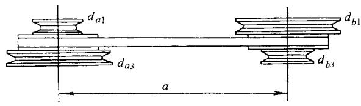

图G14-5 塔轮传动

塔轮传动从动轴的转速通常是按几何级数变化，

设其转速分别为  $n_{\mathrm{b1}}$  、  $n_{\mathrm{b2}}$  、…  $n_{\mathrm{bn}}$  ，公比为  $\varphi$  ，则有

$$
\frac {n _ {\mathrm {b} 2}}{n _ {\mathrm {b} 1}} = \frac {n _ {\mathrm {b} 3}}{n _ {\mathrm {b} 2}} = \dots = \frac {n _ {\mathrm {b n}}}{n _ {\mathrm {b (n - 1)}}} = \varphi
$$

$$
\varphi = n ^ {- 1} \sqrt {\frac {n _ {\mathrm {b n}}}{n _ {\mathrm {b l}}}}
$$

塔轮传动按从动轴最低转速时传递的功率进行设计，计算方法除塔轮直径外，其余和一般带传动相同。各级带轮直径的计算见表G14-29。

确定带轮直径时应满足以下条件：

1）保证传动比要求：  $i_{1}$  、  $i_{2}$  …。

2）保证同一轴间距下各级带长相等。

为了便于制造，通常是使主、从动塔轮尺寸完全相同。

表 G14-29 塔轮各级带轮直径的计算

<table><tr><td>序号</td><td>计算项目</td><td>符号</td><td>单位</td><td>计算公式</td><td>说 明</td></tr><tr><td>1</td><td>第一级主、从 动轮直径</td><td>\( {d}_{\mathrm{a}1} \) \( {d}_{\mathrm{b}1} \)</td><td>mm</td><td>根据结构要求参考表 14-18 或表 G14-15 选 定 \( {d}_{\mathrm{a}1} \) \( {d}_{\mathrm{b}1} = {i}_{1}{d}_{\mathrm{a}1} \)</td><td>此级传动比最大,主动轮直径 最小</td></tr><tr><td>2</td><td>选定轴间距计 算带长</td><td>\( a \) \( L \)</td><td>mm</td><td>根据结构选定 \( a \) \( L = {2a} + \frac{\pi }{2}\left( {{d}_{\mathrm{a}1} + {d}_{\mathrm{b}1}}\right)  + \frac{{\left( {d}_{\mathrm{b}1} - {d}_{\mathrm{a}1}\right) }^{2}}{4a} \)</td><td>采用 \( \mathrm{V} \) 带传动时,要初选 \( {a}_{0} \) , 计算带长 \( {L}_{0} \) ,选取标准带长后, 再计算实际轴间距</td></tr><tr><td>3</td><td>初定第 \( x \) 级带 轮直径</td><td>\( {d}_{\text{ax }}^{\prime } \) \( {d}_{\text{bx }}^{\prime } \)</td><td>mm</td><td>\( {d}_{\text{ax }}^{\prime } = {d}_{\mathrm{a}1}\frac{{i}_{1} + 1}{{i}_{x} + 1} \) \( {d}_{\text{bx }}^{\prime } = {i}_{x}{d}_{\text{ax }}^{\prime } \)</td><td></td></tr><tr><td>4</td><td>带长差</td><td>\( \Delta {L}_{\mathrm{x}} \)</td><td>mm</td><td>\( \Delta {L}_{\mathrm{x}} = \frac{{\left( {d}_{\mathrm{b}1} - {d}_{\mathrm{a}1}\right) }^{2} - {\left( {d}_{\mathrm{b}x}^{\prime } - {d}_{\mathrm{a}x}^{\prime }\right) }^{2}}{4a} \)</td><td>计算值精确到 0.1</td></tr><tr><td>5</td><td>主动轮直径补 偿值</td><td>\( {\varepsilon }_{\mathrm{x}} \)</td><td>mm</td><td>\( {\varepsilon }_{\mathrm{x}} = \frac{{2\Delta }{L}_{\mathrm{x}}}{\pi \left( {{i}_{\mathrm{x}} + 1}\right) } \)</td><td></td></tr><tr><td>6</td><td>第 \( x \) 级实际带 轮直径</td><td>\( {d}_{\text{ax }} \) \( {d}_{\text{bx }} \)</td><td>mm</td><td>\( {d}_{\text{ax }} = {d}_{\text{ax }}^{\prime } + {\varepsilon }_{\mathrm{x}} \) \( {d}_{\mathrm{{bx}}} = {d}_{\mathrm{{bx}}}^{\prime } + {i}_{\mathrm{x}}{\varepsilon }_{\mathrm{x}} \)</td><td></td></tr></table>

注：1.下角标  $\alpha$  一主动轮，  $b$  一从动轮。

2.下角标  $x$  一变速级序号，相应为2、3、4…

$$
a _ {\min } = 5 \left(d _ {2} - B\right)
$$

# G4 半交叉传动

当两轴在空间交错(交角通常为  $90^{\circ}$  )时，如图G14-6，可采用半交叉传动。它只能用于小传动比  $(i<2.5=$  、大轴间距，且

式中  $d_{2}$  ——大带轮直径；

B——带轮宽。

半交叉传动的设计和开口传动基本相同，但应注意下列几点：

1)带进入主动轮和从动轮时，其运动方向必须对准该轮宽的对称平面。正确的相互位置，如图 G14-6 主动边应位于下边，距离  $y$  应小于表 G14-30 列出的值。

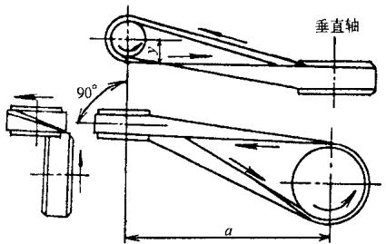

图G14-6 半交叉传动

2)传动的额定功率为开口传动的  $80\%$  。包角修正系数  $K_{\alpha} = 1$  。

3)采用平带时，带轮不做中凸度，轮宽  $B$  应增大，通常  $B = 1.4b + 10\mathrm{mm}(b$  为带宽)，但小于  $2b_{\circ}$  采用V带时，带轮应采用深槽(参见表G14-33)。

4)传动不许逆转。

表 G14-30 距离  $y$  值 (mm)

<table><tr><td>轴间距</td><td>1500</td><td>2000</td><td>2500</td><td>3000</td><td>3500</td><td>4000</td><td>5000</td><td>6000</td></tr><tr><td>y</td><td>60</td><td>70</td><td>76</td><td>100</td><td>130</td><td>165</td><td>225</td><td>300</td></tr></table>

# G5 多从动轮带传动

多从动轮带传动仅适用于速度低的中小功率多根从动轴同时传动的场合。通常采用平带或单根V

带，若有的从动轴和主动轴转向不同时，应采用正反面都能工作的双面V带、平带或圆形带。

图G14-7为一多从动轮带传动，R为主动轮，A、B、C为从动轮，Z为张紧轮。传动中各带轮的位置除满足结构上的需要外，应使主动轮和传递功率较大的从动轮有较大的包角（应大于  $120^{\circ}$ ），其余从动轮的包角应大于  $70^{\circ}$ 。

多从动轮传动的设计见表G14-31，设计时应已知各轮的位置、转向、各从动轮的转速及其传递的功率。

多从动轮带传动常采用双面 V 带, 其带型、截面尺寸和有效长度见表 G14-32。用于开口传动时, 双面 V 带可与相应的普通 V 带带轮配用; 用于非开口传动时, 则应采用深槽带轮, 其轮缘尺寸见表 G14-33。

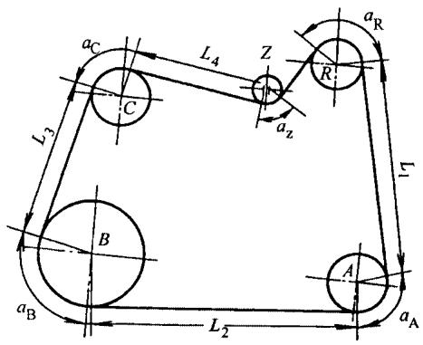

图G14-7 多从动带轮传动

表 G14-31 多从动轮传动设计 (以图 G14-7 为例, 采用单根 V 带)

<table><tr><td>序号</td><td>计算项目</td><td colspan="5">符号</td><td>单位</td><td>计算公式和参数选定</td><td>说 明</td></tr><tr><td rowspan="3">1</td><td rowspan="3">带轮和张紧轮直径</td><td colspan="5">轮 号</td><td rowspan="3">mm</td><td rowspan="3">根据结构要求、dmin、传动比i等条件确定</td><td rowspan="3">带轮直径应按表12-18选取标准值,张紧轮直径dz约等于(0.8~1)小带轮直径</td></tr><tr><td>R</td><td>A</td><td>B</td><td>C</td><td>Z</td></tr><tr><td>dR</td><td>dA</td><td>dB</td><td>dC</td><td>dZ</td></tr><tr><td>2</td><td>包角</td><td>αR</td><td>αA</td><td>αB</td><td>αC</td><td>αZ</td><td>°</td><td></td><td>按比例绘制传动简图,由图中量出</td></tr><tr><td>3</td><td>包角修正系数</td><td>KαR</td><td>KαA</td><td>KαB</td><td>KαC</td><td>KαZ</td><td></td><td>查表14-9</td><td>考虑作图误差,分别按α-15°查表</td></tr><tr><td>4</td><td>工况系数</td><td></td><td>KAA</td><td>KAB</td><td>KAC</td><td></td><td></td><td>查表14-8</td><td></td></tr><tr><td rowspan="2">5</td><td rowspan="2">设计功率</td><td>PdR</td><td>PdA</td><td>PdB</td><td>Pdc</td><td></td><td rowspan="2">kW</td><td rowspan="2">PdA=KAAPa/KaA
PdB=KABPb/KaB
PdC=KACPc/Kac
PdR=PdA+PdB+PdC</td><td rowspan="2">PA、PB、PC-从动轮A、B、C传递的功率(kW)</td></tr><tr><td></td><td></td><td></td><td></td><td colspan="1"></td></tr><tr><td>6</td><td>选带型</td><td colspan="5"></td><td></td><td>按PdR和nR由图14-4选取</td><td>nR-主动轮R的转速(r/min)</td></tr><tr><td>7</td><td>带速</td><td colspan="5">V</td><td>m/s</td><td>v=πdrnr/60×1000</td><td></td></tr><tr><td>8</td><td>初算带长</td><td colspan="5">Ld0</td><td>mm</td><td>Ld0=L1+L2+L3+L4+L5+
aAdA/2+aBdB/2+aCDc/2+aDR/2+
aZdz/2</td><td>按表14-3选取标准值Ld,Ld与L0间的差可调整张紧轮与带轮位置补偿</td></tr><tr><td>9</td><td>主动轮紧边与松边的最小拉力</td><td colspan="5">紧边F1Rmin</td><td>N</td><td>F1Rmin=1.25×1000PdR/V
F2Rmin=(1-0.8KaR)F1Rmin</td><td>当α=180°时紧边与松边的拉力比:
V带或双面V带取F1/F2≈5
平带取F1/F2≈3</td></tr><tr><td>10</td><td>验算A轮传动能力实际松边拉力实际紧边拉力紧边所需最小拉力</td><td colspan="5">F2A</td><td>N</td><td>F2A=F2Rmin
F1A=F2A+1000PdA KcaA/V
F1Amin=1.25×1000PdA/V</td><td>应使F1A&gt;F1Amin,否则将打滑,这时应增大dA或预紧力</td></tr><tr><td>11</td><td>验算B、C轮传动能力</td><td colspan="5">F2B、F1B、F1Bmin</td><td>N</td><td>方法与序号10相同</td><td>应使F1B&gt;F1Bmin
F1C&gt;F1Cmin</td></tr></table>

表 G14-32 双面 V 带的截面尺寸和有效长度

(mm)

<table><tr><td rowspan="2" colspan="2">b</td><td colspan="4">带 型</td></tr><tr><td>HAA</td><td>HBB</td><td>HCC</td><td>HDD</td></tr><tr><td colspan="2">有效长度Le</td><td colspan="4">b×h</td></tr><tr><td>基本尺寸</td><td>极限偏差</td><td>13×10</td><td>17×13</td><td>22×17</td><td>32×25</td></tr><tr><td>1250</td><td rowspan="2">+8 -6</td><td rowspan="23">HAA</td><td rowspan="6"></td><td rowspan="8"></td><td rowspan="23">HDD</td></tr><tr><td>1320</td></tr><tr><td>1400</td><td>+9</td></tr><tr><td>1500</td><td>-18</td></tr><tr><td>1600</td><td>+11</td></tr><tr><td>1700</td><td>-22</td></tr><tr><td>1800</td><td>+13</td><td rowspan="9">HBB</td></tr><tr><td>1900</td><td>-26</td></tr><tr><td>2000</td><td>+15</td><td rowspan="11">HCC</td></tr><tr><td>2120</td><td>-30</td></tr><tr><td>2240</td><td>+18</td></tr><tr><td>2360</td><td>-36</td></tr><tr><td>2500</td><td rowspan="2">+22</td></tr><tr><td>2650</td></tr><tr><td>2800</td><td>-44</td></tr><tr><td>3000</td><td>+26</td><td rowspan="8"></td></tr><tr><td>3150</td><td>-52</td></tr><tr><td>3350</td><td>+32</td></tr><tr><td>3550</td><td>-64</td></tr><tr><td>3750</td><td>+39</td><td></td></tr><tr><td>4000</td><td rowspan="3">+78</td><td></td></tr><tr><td>4250</td><td></td></tr><tr><td>4500</td><td></td></tr></table>

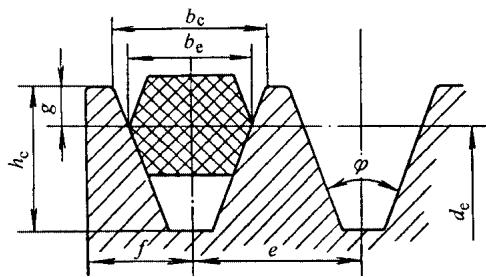

<table><tr><td>槽型</td><td>de</td><td>φ</td><td>be</td><td>bc</td><td>hc</td><td>gmin</td><td>e</td><td>f</td></tr><tr><td rowspan="2">HAA</td><td>≤118</td><td>34°</td><td rowspan="2">12.6</td><td>15.2</td><td rowspan="2">15.8</td><td rowspan="2">4.3</td><td rowspan="2">19.0±0.4</td><td rowspan="2">11.0±21</td></tr><tr><td>&gt;118</td><td>38°</td><td>15.6</td></tr><tr><td rowspan="2">HBB</td><td>≤190</td><td>34°</td><td rowspan="2">16.2</td><td>19.4</td><td rowspan="2">19.6</td><td rowspan="2">5.3</td><td rowspan="2">22.0±0.4</td><td rowspan="2">14.0±21</td></tr><tr><td>&gt;190</td><td>38°</td><td>19.8</td></tr><tr><td rowspan="2">HCC</td><td>≤315</td><td>34°</td><td rowspan="2">22.3</td><td>27.2</td><td rowspan="2">27.1</td><td rowspan="2">7.8</td><td rowspan="2">32.0±0.5</td><td rowspan="2">21.0±21</td></tr><tr><td>&gt;315</td><td>38°</td><td>27.8</td></tr><tr><td rowspan="2">HDD</td><td>≤475</td><td>36°</td><td rowspan="2">32.0</td><td>39.3</td><td rowspan="2">39.2</td><td rowspan="2">11.2</td><td rowspan="2">44.0±0.6</td><td rowspan="2">27.0±31</td></tr><tr><td>&gt;475</td><td>38°</td><td>39.7</td></tr></table>

# G6 带传动的张紧

# G6.1 张紧方法

带传动的张紧方法见表G14-34

# G6.2 张紧力的控制

带的预紧力对其传动能力、寿命和轴压力都有很大影响。预紧力不足，传递载荷的能力降低，效率低且使小带轮急剧发热，胶带磨损；预紧力过大，则会使带的寿命降低，轴和轴承上的载荷增大，轴承发热与磨损。因此，适当的预紧力是保证带传动正常工作的重要因素。

在带传动中，预紧力是通过在带与带轮的切边中点处加一垂直于带边的载荷  $G$  ，使其产生规定的挠度 $f$  来控制（图G14-8）。

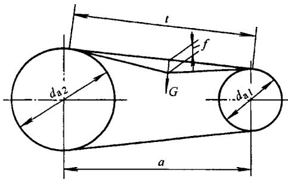

图G14-8 带传动预紧力的控制

切边长  $t$  可以实测，或用下式计算

$$
t = \sqrt {a ^ {2} - \frac {\left(d _ {\mathrm {a} 2} - d _ {\mathrm {a} 1}\right) ^ {2}}{4}}
$$

式中  $a$  ——两轮轴间距  $(\mathrm{mm})$

$$
d _ {\mathrm {a l}} — — \text {小 带 轮 外 径} (\mathrm {m m});
$$

$$
d _ {\mathrm {a} 2} \text {一 一 大 带 轮 外 径 (m m) 。}
$$

表 G14-34 带传动的张紧方法

<table><tr><td colspan="2">张紧方法</td><td colspan="2">简图</td><td>特点和应用</td></tr><tr><td>调节轴间距</td><td>定期张紧</td><td>a)</td><td>b)</td><td>图a多用于水平或接近水平的传动图b多用于垂直或接近垂直的传动是最简单的通用方法</td></tr><tr><td></td><td>自动张紧</td><td>c)</td><td>d)</td><td>图c是靠电动机的自重或定子的反力矩张紧,多用于小功率传动。应使电动机和带轮的转向有利于减轻配重或减小偏心距图d常用于带传动的试验装置</td></tr><tr><td colspan="2">张紧轮</td><td>e)</td><td>f)</td><td>可任意调节预紧力的大小、增大包角,容易装卸;但影响带的寿命,不能逆转张紧轮的直径dz≥(0.8~1)d1应安装在带的松边图e为定期张紧图f为自动张紧,应使a1≥d1+dZ,aZ≤120°</td></tr><tr><td colspan="2">改变带长</td><td colspan="3">对有接头的平带,常采用定期截去带长,使带张紧,截去长度ΔL=0.01L(L一带长)</td></tr></table>

# G6.2.1 V带的预紧力

单根V带的预紧力  $F_{0}(\mathrm{N})$  可按下式计算

$$
F _ {0} = 5 0 0 \left(\frac {2 . 5}{K _ {\alpha}} - 1\right) \frac {P _ {d}}{z V} + m v ^ {2}
$$

式中  $P_{\mathrm{d}}$  ——设计功率  $(\mathrm{kW})$

$z$  ——V带的根数；

$\nu$  ——带速  $(\mathrm{m} / \mathrm{s})$ ；

$K_{\alpha}$  ——包角修正系数，查表14-9；

$m$  ——V带每米长的质量，查表G14-35  $(\mathrm{kg / m})$  。

对于有效宽度制的窄V带，上式中的系数500改为  $450$ 。

为了测定所需的预紧力  $F_{0}$  ，通常是在带的切边中

点加一规定的载荷  $G$ ，使切边长每  $100\mathrm{mm}$  产生  $1.6\mathrm{mm}$  挠度，即  $f = \frac{1.6t}{100}$  来保证。

载荷  $\mathrm{G}(\mathrm{N})$  的值可由下式算出：

新安装的V带  $G = \frac{1.5F_0 + \Delta F_0}{16}$

运转后的V带  $G = \frac{1.3F_0 + \Delta F_0}{16}$

最小极限值  $G_{\mathrm{min}} = \frac{F_0 + \Delta F_0}{16}$

式中  $F_{0}$  ——预紧力 (N);

$\Delta F_{0}$  ——预紧力的修正值(N)，查表G14-35。

表 G14-35 V 带的质量  $m$  和预紧力修正值  $\Delta {F}_{0}$

<table><tr><td colspan="3">带型</td><td>m/(kg/m)</td><td>ΔF0/N</td></tr><tr><td rowspan="7" colspan="2">普通V带</td><td>Y</td><td>0.04</td><td>6</td></tr><tr><td>Z</td><td>0.06</td><td>10</td></tr><tr><td>A</td><td>0.10</td><td>15</td></tr><tr><td>B</td><td>0.17</td><td>20</td></tr><tr><td>C</td><td>0.30</td><td>29</td></tr><tr><td>D</td><td>0.60</td><td>59</td></tr><tr><td>E</td><td>0.87</td><td>108</td></tr><tr><td rowspan="7">窄V带</td><td rowspan="4">基准宽度制</td><td>SPZ</td><td>0.07</td><td>12</td></tr><tr><td>SPA</td><td>0.12</td><td>19</td></tr><tr><td>SPB</td><td>0.20</td><td>32</td></tr><tr><td>SPC</td><td>0.37</td><td>55</td></tr><tr><td rowspan="3">有效宽度制</td><td>9N (3V)</td><td>0.08</td><td>20</td></tr><tr><td>15N (5V)</td><td>0.20</td><td>40</td></tr><tr><td>25N (8V)</td><td>0.57</td><td>100</td></tr><tr><td rowspan="3" colspan="2">联组V带</td><td>9J</td><td>0.122</td><td>20</td></tr><tr><td>15J</td><td>0.252</td><td>40</td></tr><tr><td>25J</td><td>0.693</td><td>100</td></tr></table>

测定预紧力所需的垂直力  $G$  亦可参考表 G14-36 给定。其高值用于新安装的 V 带或必须保持高张紧的严酷传动（如高速、小包角、超载起动、频繁的高转矩起动等）。

表 G14-36 测定预紧力所需垂直力  $G$

(N/根)

<table><tr><td rowspan="2" colspan="2">带型</td><td rowspan="2">小带轮直径\(d_{\text{dl}}/\text{mm}\)</td><td colspan="3">带速 \(v/(m·s^{-1})\)</td></tr><tr><td>0~10</td><td>10~20</td><td>20~30</td></tr><tr><td rowspan="4">普通V带</td><td>Z</td><td>50~100&gt;100</td><td>5~77~10</td><td>4.2~66~8.5</td><td>3.5~5.55.5~7</td></tr><tr><td>A</td><td>75~140&gt;140</td><td>9.5~1414~21</td><td>8~1212~18</td><td>6.5~1010~15</td></tr><tr><td>B</td><td>125~200&gt;200</td><td>18.5~2828~42</td><td>15~2222~33</td><td>12.5~1818~27</td></tr><tr><td>C</td><td>200~400&gt;400</td><td>36~5454~85</td><td>30~4545~70</td><td>25~3838~56</td></tr></table>

(续)

<table><tr><td rowspan="2" colspan="2">带型</td><td rowspan="2">小带轮直径\(d_{\text{dl}}/\text{mm}\)</td><td colspan="3">带速 \(v/m·s^{-1}\)</td></tr><tr><td>0~10</td><td>10~20</td><td>20~30</td></tr><tr><td rowspan="2">普通V带</td><td>D</td><td>355~600&gt;600</td><td>74~108108~162</td><td>62~9494~140</td><td>50~7575~108</td></tr><tr><td>E</td><td>500~800&gt;800</td><td>145~217217~325</td><td>124~186186~280</td><td>100~150150~225</td></tr><tr><td rowspan="4">窄V带</td><td>SPZ</td><td>67~95&gt;95</td><td>9.5~1414~21</td><td>8~1313~19</td><td>6.5~1111~18</td></tr><tr><td>SPA</td><td>100~140&gt;140</td><td>18~2626~38</td><td>15~2121~32</td><td>12~1818~27</td></tr><tr><td>SPB</td><td>160~265&gt;265</td><td>30~4545~38</td><td>26~4040~52</td><td>22~3434~47</td></tr><tr><td>SPC</td><td>224~355&gt;355</td><td>58~8282~106</td><td>48~7272~96</td><td>40~6464~90</td></tr></table>

# G6.2.2 平带的预紧力

平带的预紧力通常是给定合适的预紧应力  $\sigma_{0}$  也可以根据下式计算平带单位宽度的预紧力  $F_{0}^{\prime}$  (N/mm):

$$
F _ {0} ^ {\prime} = 5 0 0 \left(\frac {3 . 2}{K _ {\alpha}} - 1\right) \frac {P _ {\mathrm {d}}}{b V} + m v ^ {2}
$$

式中  $P_{\mathrm{d}}$  ——设计功率  $(\mathrm{kW})$

$b$  ——带宽 (mm)；

$\nu$  ——带速  $(\mathrm{m} / \mathrm{s})$  ；

$K_{\alpha}$  ——包角修正系数，查表G14-5；

$M$  ——单位长度、单位宽度平带的质量  $\left[\mathrm{kg} / (\mathrm{m}\cdot \mathrm{mm})\right]$  。

为了测定所需的预紧力  $F_{0}(F_{0} = F_{0}^{\prime} \times b)$ ，是在带的切边中点加一规定的载荷  $G$ ，使切边长每  $100\mathrm{mm}$  产生  $1.0\mathrm{mm}$  的挠度，即  $f = \frac{t}{100}$  来保证。

表 G14-37 是测定胶帆布平带预紧应力  $\sigma_{0} = 1.8\mathrm{MPa}$  单位宽度所需施加的载荷  $G$  值。

表G14-38是测定锦纶片复合平带预紧应力  $\sigma_0$ $= 3\mathrm{MPa}$  单位宽度所需施加的载荷  $G$  值。

表 G14-37 测定胶帆布平带预紧力的  $G$  值

产生挠度  $f = \frac{t}{100} \mathrm{mm}$  的载荷  $G = G' \times b$

<table><tr><td>帆布胶带层数</td><td>单位带宽的载荷 G&#x27;/(N·mm-1)</td></tr><tr><td>3</td><td>0.26</td></tr><tr><td>4</td><td>0.35</td></tr><tr><td>5</td><td>0.43</td></tr><tr><td>6</td><td>0.52</td></tr><tr><td>7</td><td>0.61</td></tr><tr><td>8</td><td>0.69</td></tr><tr><td>9</td><td>0.78</td></tr><tr><td>10</td><td>0.86</td></tr><tr><td>11</td><td>0.95</td></tr><tr><td>12</td><td>1.04</td></tr></table>

注：1.按本表控制，带的  $\sigma_0 = 1.8\mathrm{MPa}$

2. 轴间距小，倾斜角大于  $60^{\circ}$  时， $G$  值可减小  $10\%$

3. 自动张紧传动G值应增大  $10\%$

4. 新传动带  $G$  值应增大  $30\% \sim 50\%$

表 G14-38 测定锦纶片复合平带预紧力的  $G$  值

产生挠度  $f = \frac{t}{100} \mathrm{mm}$  的载荷  $G = G' \times b$

<table><tr><td>带 型</td><td>单位带宽的载荷 \( {\mathrm{G}}^{1}/\left( {\mathrm{N} \cdot  {\mathrm{{mm}}}^{-1}}\right) \)</td></tr><tr><td rowspan="2">L</td><td>0.055</td></tr><tr><td>0.085</td></tr><tr><td>M</td><td>0.12</td></tr><tr><td>H</td><td>0.17</td></tr><tr><td>EM</td><td></td></tr></table>

注：1.按本表控制，带的  $\sigma_0 = 3\mathrm{MPa}$

2.新传动带  $G$  值应增大  $30\% \sim 50\%$

# G6.2.3 同步带的预紧力

同步带合适的预紧力见表G14-39。

为了测定所需的预紧力  $F_{0}$  ，通常是在带的切边中点加一规定的载荷  $G$  ，使切边长每  $100\mathrm{mm}$  产生  $1.6\mathrm{mm}$  的挠度，即  $f = \frac{1.6t}{100}$  来保证。

表 G14-39 同步带的预紧力  ${\mathbf{F}}_{0}$  值

(N)

<table><tr><td rowspan="2">带型</td><td colspan="2">带宽/mm</td><td>6.4</td><td>7.9</td><td>9.5</td><td>12.7</td><td>19.1</td><td>25.4</td><td>38.1</td><td>50.8</td><td>76.2</td><td>101.6</td><td>127.0</td></tr><tr><td colspan="13">\(F_{0}\).Y值</td></tr><tr><td rowspan="3">XL</td><td rowspan="2">\(F_{0}\)</td><td>最大值</td><td>29.40</td><td>37.30</td><td>44.70</td><td rowspan="2" colspan="8"></td></tr><tr><td>推荐值</td><td>13.70</td><td>19.60</td><td>25.50</td></tr><tr><td colspan="2">Y</td><td>0.40</td><td>0.55</td><td>0.77</td><td colspan="8"></td></tr><tr><td rowspan="3">L</td><td rowspan="2">\(F_{0}\)</td><td>最大值</td><td rowspan="2" colspan="3"></td><td>76.5</td><td>125</td><td>175</td><td colspan="5"></td></tr><tr><td>推荐值</td><td>52</td><td>87</td><td>123</td><td colspan="5"></td></tr><tr><td colspan="2">Y</td><td colspan="3"></td><td>4.5</td><td>7.7</td><td>11</td><td colspan="5"></td></tr><tr><td rowspan="3">H</td><td rowspan="2">\(F_{0}\)</td><td>最大值</td><td rowspan="2" colspan="4"></td><td>293</td><td>421</td><td>646</td><td>890</td><td>1392</td><td rowspan="2" colspan="2"></td></tr><tr><td>推荐值</td><td>222</td><td>312</td><td>486</td><td>668</td><td>1047</td></tr><tr><td colspan="2">Y</td><td colspan="4"></td><td>14.5</td><td>21</td><td>32</td><td>43</td><td>69</td><td colspan="2"></td></tr><tr><td rowspan="3">XH</td><td rowspan="2">\(F_{0}\)</td><td>最大值</td><td rowspan="2" colspan="7"></td><td>1009</td><td>1583</td><td>2242</td><td rowspan="2"></td></tr><tr><td>推荐值</td><td>909</td><td>1427</td><td>2021</td></tr><tr><td colspan="2">Y</td><td colspan="7"></td><td>86</td><td>139</td><td>200</td><td></td></tr><tr><td rowspan="3">XXH</td><td rowspan="2">\(F_{0}\)</td><td>最大值</td><td rowspan="2" colspan="7"></td><td>2471.5</td><td>3884</td><td>5507</td><td>7110</td></tr><tr><td>推荐值</td><td>1114</td><td>1750</td><td>2479</td><td>3203</td></tr><tr><td colspan="2">Y</td><td colspan="7"></td><td>141</td><td>227</td><td>322</td><td>418</td></tr></table>

载荷  $G$  由下式算出：

$$
G = \frac {F _ {0} + \frac {t}{L _ {\mathrm {P}}} \times Y}{1 6}
$$

式中  $F_{0}$  ——预紧力  $\mathrm{N}$ ，查表G14-39；

$t$  一切边长  $(\mathrm{mm})$

$L_{\mathrm{P}}$  ——同步带的节线长  $(\mathrm{mm})$  ；

Y——修正系数，查表G14-39。

# G6.2.4 多楔带的预紧力

多楔带的预紧力  $F_{0}$  可按单根  $\mathrm{V}$  带的预紧力计算出每楔所需的预紧力乘以楔数  $z$  ，其中  $m$  为多楔带每楔每米长的质量  $\mathrm{kg} / (\mathrm{m}\cdot \mathrm{z})$  ，可查表G14-40。

测定多楔带的预紧力也和V带相同。在切边中点所加的载荷  $G$  ：

对于新安装的多楔带

$$
G = \frac {1 . 5 F _ {0} + \Delta F _ {0}}{1 6}
$$

运转后的多楔带

$$
G = \frac {1 . 3 F _ {0} + \Delta F _ {0}}{1 6}
$$

最小极限值

$$
G _ {\min } = \frac {F _ {0} + \Delta F _ {0}}{1 6}
$$

式中  $F_{0}$  ——所需的预紧力 (N);

$\Delta F_{0}$  ——预紧力修正值(N)，查表G14-40。

表 G14-40 多楔带的质量  $m$  和预紧力修正值  $\Delta {F}_{0}$

<table><tr><td>带型</td><td>每楔、每米长的重量 /[kg/(m·z)]</td><td>ΔF0/N</td></tr><tr><td>J</td><td>0.01</td><td>42</td></tr><tr><td>L</td><td>0.05</td><td>122</td></tr><tr><td>M</td><td>0.16</td><td>302</td></tr></table>