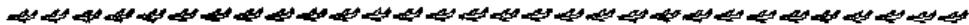
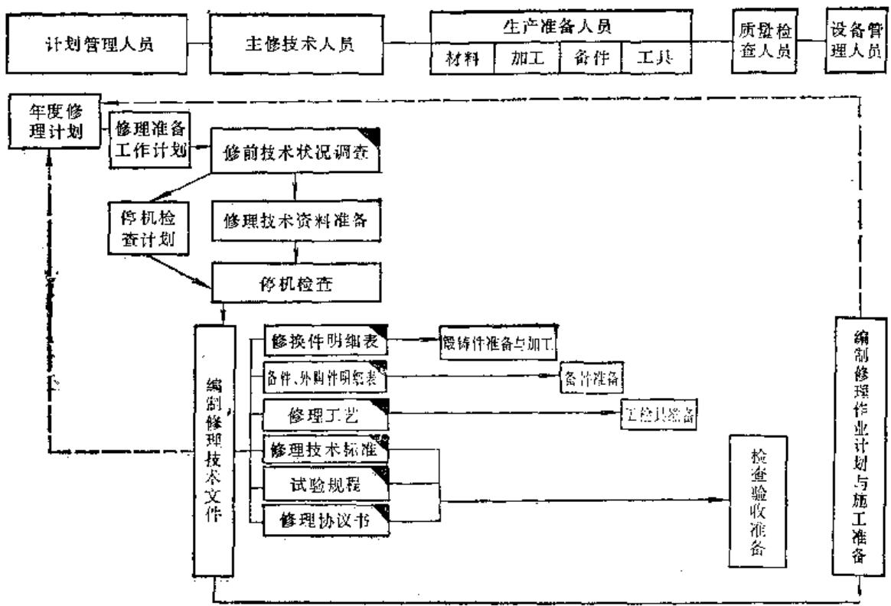
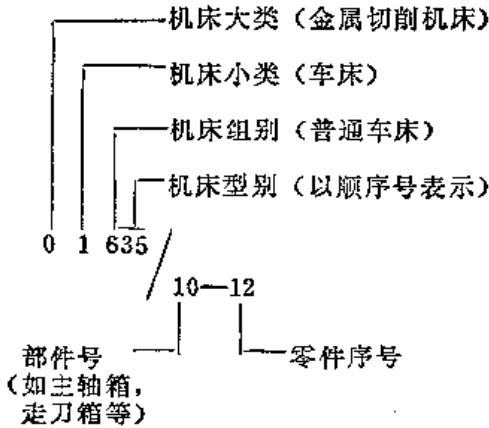
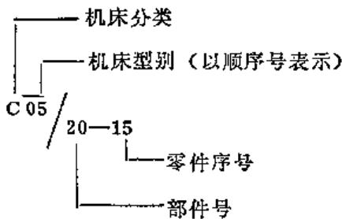
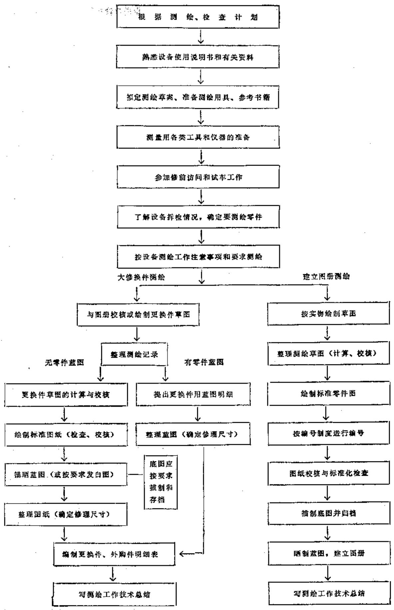
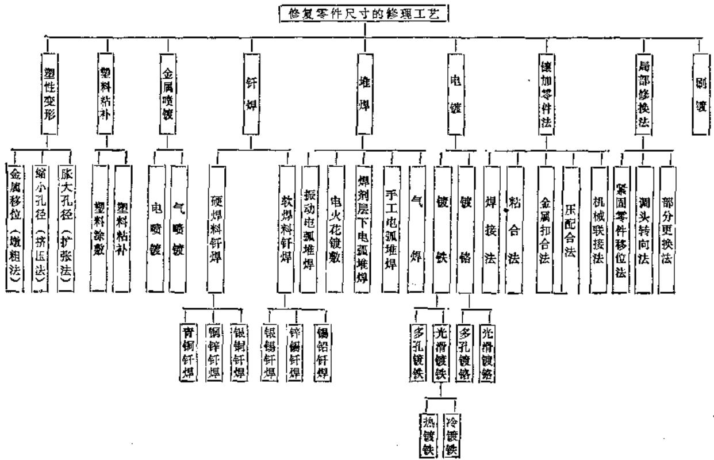

# 主编单位

# 中国机械工程学会设备维修专业学会

# 《机修手册》第3版编委会

主任（兼主编） 郑国伟

顾问陈凤才 潘大连

副主任（兼副主编） 吴关昌 高克勤 文德邦 冯永亨（常务）

委员（按姓氏笔划为序）马福安 陈长雄 李炳禄 何家森

林亨耀 姚家瑞 唐经武 章义求 喻明受

# 第1卷编委会

主任（兼主编） 高克勤

副主任（兼副主编） 王秩信 陈长雄

委员（按姓氏笔划为序）仇注衡 王振民 冯永亨 孙庆华

祝允武 葛希章

# 《机修手册》第3版编辑组

冯永亨 温莉芳（以下按姓氏笔划为序） 冯宗青 孙本绪

吴柏青 何富源 贺懿愈 徐彤 熊万武

# 第3版前言

《机修手册》第2版（即修订第一版）各篇陆续出版后，深受读者欢迎，曾多次重印。近10年来，随着科学技术的飞速发展，维修技术的不断提高，以及各项标准的更新，《机修手册》第2版已不能适应机修行业的需求，为此，我们组织出版第3版，以满足广大读者的需要。

本次修订，我们主要做了如下补充和调整：

（1）调整手册结构 我们根据需要与可能，对一些设备类型进行了补充和调整，以求做到门类齐全、重点突出，内容充实。将第2版的7篇调整为8卷，即第1卷：设备修理设计；第2卷：修理技术基础；第3卷：金属切削机床修理；第4卷：铸造、锻压设备与工业炉修理；第5卷：动力设备修理；第6卷：电气设备修理；第7卷：通用设备与工业仪表修理；第8卷：设备润滑。  
（2）增加先进设备的维修技术 近年来，我国工业企业的生产装备水平有了较大的提高，精密、大型、自动化、机电一体化先进设备日益增多。掌握这类设备的维修技术，是提高我国机修行业技术水平的关键。我们在有关卷内分别增加了这类设备的维修技术。  
（3）重点补充设备改造技术 我国企业生产设备日益老化，更新资金不足，因此，对老旧设备进行技术改造已成为提高我国设备水平的重要途径。为此，我们重点补充了利用新技术改造老旧设备的经验。  
（4）增加了设备诊断技术 设备诊断技术是在设备运行中或基本不拆卸设备的情况下，掌握设备运行状况，预测故障的部位和原因的新技术，本次修订新增了这部分内容。  
（5）采用了最新标准 从第2版出版以来，机电标准大部分进行了修订，并制订了不少新标准，本次修订采用了最新标准。

在本次修订中，编者们进行了广泛的调查研究，收集了大量的资料，认真研究了读者意见，力求使内容的广度和深度都有一个新的提高。由于水平所限，本手册中错误和不足之处在所难免，恳请读者予以指正。

在本次修订中，北京、上海、辽宁、吉林、四川、广东等省市的中国机械工程学会设备维修专业学会和各卷主编所在单位，如北京汽车工业联合公司、第一汽车制造厂、上海机床厂、沈阳重型机器厂、第二重型机器厂、机械电子工业部广州机床研究所等给予了大力支持，长期关注本手册编写出版工作的老一辈专家和领导给予了热情的指导，一些未参加本次修订工作的原编者也提出了宝贵意见。在此，我们一并表示感谢。

《机修手册》第3版编委会

# 本卷修订说明

北京市机械工程学会设备维修专业委员会为了做好这次修订工作，组成了“机修手册第3版第1卷编委会”，以集中各方面的力量，力求修订后的第1卷能为设备修理设计工作者提供既先进又适用的参考资料。

本卷的修订是以“修订第一版”第一篇为基础进行的。在保持原有优点的前提下，我们主要作了如下的修改和补充：

1）从内容完整性和读者需要考虑，新增加了“设备修理技术准备”和“气压传动”两章。  
2）从先进性和适用性两方面出发，对保留的15章均作了不同程度的修改和补充，还按合理顺序作了调整。  
3）根据机修的特点，除采用最新颁布的技术标准之外，又适当地保留一定数量的经常要参考的旧标准，还收集一些有用的国外标准，以适应修理国产旧设备和进口设备的需要。  
4）贯彻国务院发布的“关于在我国统一实行法定计量单位的命令”，采用以国际单位制为基础的我国法定计量单位。

在这次修订中，我们印发了修订提纲给有关单位和同志广泛征求意见，分析了广大读者对前两版的意见和要求，在初稿完成之后，又进行了审查和修改，尽管如此，不足或错误之处仍在所难免。我们热情欢迎广大读者不吝指正，以便在重印或下次修订时改正。

北京汽车工业联合公司、北京汽车摩托车制造公司、北京齿轮总厂、北京首都机械厂、北京重型电机厂、北京炼焦化学厂、北京开关厂、北京内燃机总厂、北京第二机床厂、机械电子工业部精密机床修理总站、机械电子工业部计算机工业局、机械电子工业部洛阳轴承研究所、成都量具刃具总厂和洛阳工学院等单位，对本卷的编写与审查工作给予了大力支持，特此表示感谢。

此次修订基本上是以前两版的编写班子为基础组织起来的，少数同志由于各种原因未能继续参加这次修订。对于他们曾为本手册作出的贡献，维修战线上的广大工作者是不会遗忘的。借本卷即将出版之际，我们谨向他们表示敬意。

《机修手册》第3版第1卷编委会

# 目录

# 第1篇 基础资料

# 第1章 设备修理技术准备

# 第1节 设备修理前预检与修理技术文件编制

# （一）设备修理前的预检 1-1

1. 预检的技术准备 ………………………………………… 1-1  
2. 预检的内容 ………………………………………… 1-2  
3. 对预检的要求… 1-2

# （二）设备修理技术文件编制 1-2

# 第2节 设备图册的编制与整理 ……………………1-7

# （一）设备图册的编制 1-7

1. 设备图册的主要内容 ………………………………………… 1-7  
2.零件图的编制· 1-7

# （二）设备图册的编制方法和要求 1-8

# （三）设备图册的编号 ………………………………………… 1-8

# 第3节 机械零件的测绘 …………………………………………1-17

# （一）测绘工作的程序… 1-17

# （二）测绘工作应注意的事项… 1-17

# 第4节 磨损零件的修换原则和一般规定 ………………………………………… 1-19

# （一）磨损零件的修换· 1-19

1.磨损零件的修换原则 1-19  
2.磨损零件修换的一般规定 1-20

# （二）磨损零件的修复原则· 1-24

# （三）磨损零件的修理尺寸 …………………………………………1-24

1. 标准尺寸修理法 ………………………………………… 1-24  
2. 修理尺寸修理法 …………………………………………1-25

# 参考文献· 1-26

# 第2章 设备修理常用资料

# 第1节 一般资料 …………………………………………2-1

# （一）字母与代号 2-1

1.汉语拼音字母… 2-1  
2.拉丁字母… 2-1

3.希腊字母… 2-2  
4. 俄文字母 ………………………………………… 2-2  
5.罗马数字… 2-3  
6. 化学元素符号 …………………… 2-3  
7. 国家、部（局）标准代号…2-4  
8. 国际标准化组织和其他国家标准代号…2-5

# （二）常用数学 2-6

1. 优先数和优先数系 ……………………2~6  
2. 常用数学常数 … 2-6  
3. 常用数学符号 … 2-7  
4. 常用数学公式 ……………………2-10

# （三）单位及其换算… 2-32

1. 单位制及物理量单位 ……………………2-32  
2. 长度单位换算 …………………… 2-46  
3.英寸与毫米对照 2-47  
4. 度与分秒对照 ……………………2-48  
5. 度与弧度对照 ……………………2-49  
6. 面积单位换算 ……………………2-50  
7. 体积、容积单位换算 ……………………2-50  
8. 质量单位换算 ……………………2-50  
9. 密度单位换算 ……………………2-51  
10. 力的单位换算 …………………… 2-51  
11.力矩单位换算· 2-51  
12. 压力、应力单位换算… 2-52  
13. 功、热、能单位换算… 2-52  
14. 功率单位换算… 2-53  
15. 速度单位换算 …………………… 2-53  
16. 温度值换算 …………………… 2-53  
17. 黑色金属硬度及强度换算… 2-54  
18.粘度单位换算· 2-59  
19. 线规对照 … 2-61

# （四）其他 2-62

# Vf

1. 常用力学公式 ……………………2-62  
2. 常用材料密度 …………………… 2-76  
3. 常用材料弹性模量、切变模量及泊松比 ……………………2-76  
4. 常用材料线膨胀系数 ……………………2-77  
5. 常用金属材料熔点、导热系数及比热容 ……………………2-77  
6. 常用材料滑动摩擦系数 ……………………2-78  
7. 机械传动效率概略数值 ……………………2-79

# 第2节 公差与配合 2-80

（一）术语及定义· 2-80  
（二）标准公差… 2-80  
（三）基本偏差… 2-80

1. 基本偏差数值 ……………………2-80  
2. 基本偏差的选用（基孔制）… 2-88

（四）配合的选用… 2-89

1. 基孔制优先、常用配合 ……………………2-89  
2. 基轴制优先、常用配合 ……………………2-90  
3. 优先配合的选用 ……………………2-91

（五）公差与配合数值… 2-92

1.尺寸至500mm孔，轴极限偏差…2-92  
2.尺寸大于500至3150mm孔、轴极限偏差 2-92  
3.尺寸至  $18\mathrm{mm}$  孔、轴极限偏差 2-93  
4. 未注公差尺寸的极限偏差 ……………………2-93  
5. 配制配合 … 2-12t

（六）公差与配合新旧国家标准对照 2-121

# 第3节 形状和位置公差… 2-124

（一）形状和位置公差符号及其注法 ……2-124

1. 形位公差符号 …………………… 2-124  
2. 形位公差注法 … 2-124

（二）形状和位置公差术语及定义 ……………………2-124

1.术语· 2-124  
2. 形状和位置公差带定义 …………………… 2-135

（三）公差原则 2-148

1. 独立原则 … 2-148  
2. 相关原则 … 2-149  
3. 形状和位置公差间的关系……2-150

（四）形状和位置公差值 2-152

1. 注出公差的公差值… 2-152  
2. 未注公差的公差值 ……………………2-155

# 第4节 表面粗糙度 2-156

# （一）表面粗糙度评定参数及数值系列…2-156

1.表面粗糙度评定参数… 2-156  
2. 表面粗糙度评定参数数值系列… 2-156

# （二）表面粗糙度符号 2-157

1. 表面粗糙度符号 …………………… 2-157  
2. 表面粗糙度符号注法 …………………… 2-157

# （三）表面粗糙度与配合间隙或过盈的关系 2-158

# （四）表面粗糙度与光洁度对照 2-158

# 第5节 零件结构要素… 2-159

# （一）标准尺寸 2-159

# （二）锥度 2-159

1. 锥度与锥角系列 ……………………2-159  
2. 公制圆锥 ………………………………………… 2-161  
3. 莫氏圆锥 … 2-162  
4.莫氏短圆锥… 2-163  
5. 强制传动莫氏圆锥 …………………… 2-164  
6.7:24圆锥… 2-165

# （三）糟 2-166

1. T形槽… 2-166  
2. 润滑槽 2-170  
3. 砂轮越程槽 … 2-172  
4. 弧形槽端部半径 ……………………2-174  
5. 燕尾槽 … 2-175

# （四）其他 2-175

1.棱体的角度与斜度系列… 2-175  
2. 中心孔 … 2-177  
3. 中心孔（90°） ……………………2-178  
4. 球面半径 … 2-178  
5. 滚花 … 2-179  
6. 零件倒圆与倒角 …………………… 2-179  
7. 刻度 … 2-180  
8. 圆柱形轴伸 …………………… 2-181  
9. 圆锥形轴伸 ………………………………………… 2-182

# 第6节 机械制图… 2-184

# （一）幅面与图线 2-184

1. 图纸幅面 ………………………………………… 2-184  
2. 比例 … 2-184  
3. 图线 ………………………………………… 2-184  
4. 剖面符号 ……………………2-186

# （二）机械零件画法 2-187

1. 螺纹及螺纹紧固件画法 ……………………2-187  
2.齿轮画法· 2-187  
3. 花键画法 ………………………………………… 2-187

# 钮

4. 弹簧画法 … 2-187  
5. 滚动轴承画法 ………………………………………… 2-194

# （三）焊缝代号 2-198

1. 焊缝基本符号 … 2-198  
2. 焊缝辅助符号 …………………… 2-199  
3. 补充符号 … 2-200  
4. 指引线 … 2-200  
5. 焊缝尺寸符号 ……………………2-201

# 参考文献 2-203

# 第3章 设备修理常用材料

# 第1节 黑色金属材料… 3-1

（一）金属材料力学性能代号 3-1  
（二）合金元素在钢中的主要作用 3-2  
（三）我国钢铁产品牌号的命名 3-5

# （四）钢的牌号、成分、性能及应用 ……………………3-8

1. 碳素结构钢 …………………… 3-8  
2. 优质碳素结构钢 ……………………3-10  
3. 易切削结构钢 …………………… 3-11  
4. 低合金结构钢 ……………………3-11  
5. 合金结构纲 ……………………3-13  
6. 保证淬透性结构钢 ……………………3-21  
7. 碳素工具钢 …………………… 3-21  
8.合金工具钢 3-22  
9. 高速工具钢 …………………… 3-25  
10. 不锈钢 … 3-27  
11. 耐热钢 … 3-34  
12. 铬轴承钢 …………………… 3-39  
13.渗碳轴承钢 3-40  
14. 高碳铬不锈轴承钢……3-40  
15. 弹簧钢 … 3-41

# （五）铸铁及铸钢· 3-42

1. 铸铁牌号表示方法 ……………………3-42  
2.铸钢牌号表示方法 3-43  
3.灰铸铁件及机床灰铸铁 3-44  
4. 球墨铸铁件 …………………… 3-46  
5. 可锻铸铁件 …………………… 3-46  
6. 耐热铸铁件 …………………… 3-47  
7.耐磨铸铁件 3-47  
8. 一般工程用铸造碳钢 ……………………3-53  
9. 高锰钢铸件 …………………… 3-53  
10. 不锈耐酸钢铸件 …………………… 3-54

# （六）钢铁的热处理· 3-57

1. 钢铁的常用热处理方法 ……………………3-57

2. 钢的热处理方法代号 ……………………3-61  
3.铸铁件热处理状态的名称、定义及代号 3-62  
4. 铸钢件热处理状态的名称、定义及代号 ……………………3-63

# （七）钢材… 3-64

1.轧制薄钢板品种 3-64  
2. 热轧钢板 …………………… 3-65  
3. 优质碳素结构钢薄钢板 ……………………3-66  
4. 连续热镀锌薄钢板和钢带 ……………………3-66

5. 制造锅炉用碳素钢及普通低合金钢钢板 ……………………3-67  
6. 不锈钢冷轧钢板 …………………… 3-68  
7．花纹钢板 3-69  
8. 热轧圆钢和方钢 …………………… 3-69  
9. 热轧六角钢 …………………… 3-70  
10. 热轧扁钢 …………………… 3-71  
11.冷拉圆钢、方钢及六角钢… 3-71  
12. 电焊钢管 ……………………3-73  
13.低压流体输送用镀锌焊接钢管及焊接钢管· 3-74  
14. 结构用无缝钢管… 3-74  
15.冷拔或冷轧精密无缝钢管… 3-75  
16. 不锈钢无缝钢管 …………………… 3-76  
17. 低中压锅炉用无缝钢管……3-77  
18. 热轧等边角钢 …………………… 3-77  
19. 热轧不等边角钢 …………………… 3-81  
20. 热轧普通槽钢 …………………… 3-84  
21. 热轧轻型槽钢 …………………… 3-85  
22. 热轧工字钢 …………………… 3-86  
23. 热轧轻型工字钢 …………………… 3-87  
24. 起重机钢轨 …………………… 3-88  
25. 钢轨 … 3-89

# （八）我国与其他国家钢号对照… 3-90

1.部分国家钢的命名编号 3-90  
2. 我国与其他国家主要钢号对照……3-114

# 第2节 有色金属材料… 3-122

# （一）有色金属及合金产品牌号表示

方法 3-122

1. 治炼产品 … 3-124  
2. 纯金属加工产品 … 3-124  
3.合金加工产品 3-124  
4.硬质合金· 3-124

# X

5. 焊料 … 3-124  
6. 金属粉末 …………………… 3-125  
7. 复合材料 … 3-125  
8.稀土产品 3-125  
9.铸造合金… 3-125

# （二）有色金属及其合金产品的牌号、成分、性能及应用 ……………………3-128

1.加工黄铜· 3-128  
2.加工青铜 3-132  
3. 铝及铝合金加工产品 …………………… 3-137  
4.铸造铝合金· 3-141  
5.铸造轴承合金· 3-147  
6.铸造铜合金· 3-148  
7.有色金属型材· 3-152

# （三）我国与其他国家有色金属牌号对照 3-154

# 第3节 非金属材料… 3-162

# （一）橡胶及其制品 3-162

1. 工业用硫化橡胶板 …………………… 3-162  
2.方、圆橡皮条… 3-164  
3. 夹布胶管 …………………… 3-164  
4.棉线编织（缠绕）胶管… 3-165  
5. 钢丝编织液压胶管 …………………… 3-166  
6. 运输胶带 …………………… 3-166

# （二）石棉及其制品 3-168

1. 石棉橡胶板及耐油石棉橡胶板……3-168  
2. 石棉刹车带、石棉制动摩擦片、石棉离合器摩擦片……3-168

# （三）工业用毛毡、皮革、纸板 3-169

1. 工业用毛毡 …………………… 3-169

2. 植鞣黄牛轮带革 …………………… 3-169  
3. 软钢纸板 … 3-169

# （四）塑料及其制品 3-170

1. 常用工程塑料的特性和应用 …………………… 3-170  
2. 常用工程塑料的性能 …………………… 3-172  
3.酚醛层压布板· 3-176  
4. 工业有机玻璃 … 3-176  
5. 硬聚氯乙烯板 …………………… 3-177  
6，硬聚氯乙烯管· 3-177  
7. 硬聚氯乙烯薄片、硬聚氯乙烯棒、硬聚氯乙烯焊条……3-178  
8. 软质聚氯乙烯挤出板 …………………… 3-178  
9. 软聚氯乙烯管 …………………… 3-178  
10. 聚四氟乙烯板 3-179  
11. 聚四氯乙烯棒 …………………… 3-179  
12. 聚四氟乙烯管 ……………………3-179  
13. 层压棒 …………………… 5-186

# 第4节 其它材料… 3-180

# （一）粉末冶金材料 3-180

1. 粉末冶金铁基结构材料 …………………… 3-180  
2. 粉末冶金摩擦材料 …………………… 3-181  
3. 粉末冶金轴承材料 …………………… 3-182

# （二）焊条 3-183

1. 碳钢焊条 …………………… 3-183  
2. 低合金钢焊条… 3-183  
3. 不锈钢焊条 …………………… 3-185  
4. 堆焊焊条 …………………… 3-187  
5.镍基铸铁焊条· 3-190  
6. 焊接用钢丝 …………………… 3-190

# 参考文献 3-192

# 第2篇 机械零件

# 第4章螺纹

# 第1节 螺纹的种类、特点和应用 ……………………4-1

（一）螺纹的分类 4-1  
（二）螺纹的种类、特点和应用 4-1

# 第2节 螺纹的名词术语和定义 4-3

# 第3节 螺纹的基本尺寸 4-5

（一）普通螺纹 4-5  
（二）威氏（Whitworth）螺纹… 4-10  
（三）英国BA螺纹 4-12

# （四）美国标准螺纹… 4-12

1. UN和UNR螺纹牙型 4-12  
2. 螺纹标准系列 4-12

# （五）管螺纹 4-15

1. 用螺纹密封的管螺纹 ……………………4-15  
2.  $60^{\circ}$  布锥管螺纹… 4-17  
3.非螺纹密封的管螺纹 4-18  
4. 管路旋入端用普通螺纹 ……………………4-19  
5. 米制锥螺纹 …………………… 4-20

# X

6. 美国标准管螺纹 …………………… 4-21

# （六）梯形螺纹 4-24

1. 梯形螺纹 … 4-24  
2. 英围梯形螺纹 …………………… 4-28  
3. 日本梯形螺纹 …………………… 4-29  
4. 德国梯形螺纹 …………………… 4-31  
5. 法国梯形螺纹 ………………………………………… 4-32

# （七）矩形螺纹 4-33

# （八）锯齿形螺纹· 4-33

1.普通锯齿形螺纹 4-33  
2.压力机用锯齿形螺纹 4-36  
3. 英国锯齿形螺纹 ……………………4-37  
4.德国锯齿形螺纹 4-38  
5. 法国锯齿形螺纹 ……………………4-40  
6.美国锯齿形螺纹 4-41

# （九）过渡和过盈配合螺纹… 4-42

1. 过渡配合螺纹（旋入铸铁，钢体）……4-42  
2. 过渡配合螺纹（旋入铝体）……4-42  
3. 过盈配合螺纹（旋入铝体）……4-42

# 第4节 螺纹公差与配合 4-46

（一）普通螺纹公差与配合· 4-46  
（二）威氏螺纹公差… 4-53  
（三）英国BA螺纹公差 4-56  
（四）管螺纹公差 4-57  
（五）梯形螺纹公差… 4-58

1. 基本偏差和公差等级 ……………………4-58  
2. 旋合长度 ……………………4-58  
3.螺纹精度与公差带的选用 4-63  
4. 多线螺纹 …………………… 4-63

（六）锯齿形螺纹公差… 4-64

# 第5节 螺纹的中径测量 4-65

（一）用螺纹千分尺测量螺纹中径… 4-65  
（二）螺纹中径的三线测量… 4-66

# 第6节 螺纹联接的强度校核 4-67

（一）螺纹紧固件联接的基本类型及其应用· 4-67

（二）螺栓组受力分析… 4-68  
（三）螺纹联换的防松方法· 4-70  
（四）螺纹紧固件联接的强度核算… 4-72

# 第7节 螺纹紧固件的常用材料和力学性能 4-74

# （一）螺纹紧固件的性能等级… 4-74

# （二）螺纹紧固件的常用材料和力学性能· 4-75

# 第8节 螺纹零件结构要素 4-78

（一）外螺纹零件的末端· 4-78  
（二）螺栓和螺钉通孔… 4-79  
（三）螺纹紧固件开口销孔和金属丝孔…4-80  
（四）螺纹收尾、肩距、退刀槽、倒角…4-82  
（五）螺纹余量· 4-86

（六）粗牙螺栓、螺钉的拧入深度，攻丝深度及钻孔深度· 4-87  
（七）螺纹攻丝前底孔的尺寸… 4-88  
（八）圆锥管螺纹联接尺寸· 4-90  
（九）紧固件通孔及沉头座尺寸 4-91  
（十）地脚螺栓孔和凸缘… 4-93  
（十一）扳手空间… 4-93

# 第5章 标准件

# 第1节 紧固件… 5-1

（一）紧固件品种索引 5-1  
（二）螺栓与螺柱… 5-16  
（三）螺钉… 5-26  
（四）螺母 5-46  
（五）垫圈· 5-64  
（六）挡圈· 5-80  
（七）销 5-107  
（八）紧固件技术条件 5-118

# 第2节 操作件… 5-124

（一）操作件品种索引 5-124  
（二）手柄 5-129  
（三）手轮 5-147  
（四）把手 5-158  
（五）嵌套 5-162  
（六）操作件技术条件 5-163

# 第3节 管接头 ……………………5-165

（一）管接头品种索引 5-165  
（二）卡套式管接头 5-165

1. 卡套式管接头结构及尺寸……5-169  
2.卡套式管接头技术条件… 5-216  
3. 卡套式管接头装配方法 …………………… 5-218  
4. 卡套式管接头的使用说明……5-218

# （三）扩口式管接头 5-218

1. 扩口式管接头结构及尺寸………5-218  
2. 扩口式管接头技术条件 ……………………5-253

# （四）G类管件 5-256

1. 管接头 …………………… 5-256  
2. 油塞 … 5-274  
3. 管夹 … 5-280  
4. 扎压式钢丝编织胶管接头技术条件…5-288

# 第4节 润滑件… 5-288

# （一）润滑件品种索引 5-288

# （二）油杯 5-288

1.油杯结构及尺寸· 5-288  
2.油杯技术条件… 5-292

# （三）油标 5-293

# 第6章 弹簧

# 第1节 弹簧的种类及其应用…6-1

# 第2节 圆柱螺旋弹簧… 6-3

# （一）圆柱螺旋弹簧的型式和分类 6-3

# （二）圆柱螺旋弹簧的标记方法 6-3

1. 圆柱螺旋弹簧端部结构型式 ……………………6-3  
2. 圆柱螺旋弹簧的标记方法 …………………… 6-4

# （三）圆柱螺旋弹簧常用术语名称及代号…6-5

# （四）圆柱螺旋弹簧计算的基本公式 6-5

# （五）圆柱螺旋弹簧参数选择 6-9

# （六）圆柱螺旋压缩弹簧的设计计算…6-13

# （七）圆柱螺旋拉伸弹簧的设计计算…6-30

# （八）圆柱螺旋扭转弹簧的设计计算…6-32

# （九）圆柱螺旋组合压缩弹簧的设计计算…6-34

# （十）圆柱螺旋弹簧技术条件… 6-40

# （十一）液压件圆柱螺旋压缩弹簧… 6-43

1. 液压件弹簧的负荷分类和弹簧分类 ……6-43  
2. 液压件弹簧的材料 ……………………6-44  
3. 液压件弹簧参数选择及设计要求 ……6-45  
4. 液压件弹簧的设计计算 ……………………6-46  
5. 液压件弹簧的尺寸偏差和技术要求 ……6-50  
6. 液压件弹簧的热处理和表面处理 ……6-52  
7. 液压件弹簧检查项目 ……………………6-53

# （十二）圆柱螺旋弹簧典型工作图… 6-53

1.压缩弹簧典型工作图 6-53  
2.拉伸弹簧典型工作图 6-53  
3.扭转弹簧典型工作图 6-54

# 第3节 截锥螺旋压缩弹簧 ………………6-54

# 第4节 碟形弹簧 ……………………6-58

# （一）碟形弹簧的型式及其主要尺寸…6-58

# （二）碟形弹簧的组合型式和特性… 6-58

# （三）碟形弹簧计算… 6-63

# （四）碟形弹簧的材料及许用应力…6-69

# （五）碟形弹簧的尺寸偏差和技术要求…6-71

# 第5节 环形弹簧 ……………………6-73

# （一）环形弹簧的特性… 6-73

# （二）环形弹簧参数的选择… 6-73

# （三）环形弹簧的设计计算… 6-74

# 第6节 片弹簧 …………………… 6-76

# 第7节 平面涡卷弹簧 ………………6-78

# 第8节 弹簧材料 ……………………6-81

1. 弹簧材料的一般要求 ……………………6-81  
2. 弹簧制造工艺对型材的要求 ……………………6-81  
3. 弹簧材料分类和性能 ……………………6-81

# 参考文献· 6-89

# 第7章 联轴器

# 第1节 联轴器的分类与特征…7-1

# （一）联轴器的分类

# （二）各种联轴器的特征 7-2

# 第2节 联轴器的形式和结构尺寸 ……7-4

# （一）套筒联轴器 7-4

1. 套筒联轴器的公称转矩、形式和结构尺寸……7-4  
2. 套筒联轴器的强度验算 ……………………7-8

# （二）齿式联轴器 7-9

1. CL型齿式联轴器 7-9  
2. CLZ型齿式联轴器 ……………………7-12

# （三）滑块联轴器… 7-16

# （四）滚子链联轴器· 7-17

# （五）万向联轴器… 7-2?

1. 小尺寸万向联轴器 ……………………7-21  
2.SWP型十字轴式万向联轴器…7-22

# （六）轮胎式联轴器· 7-27

# （七）弹性套柱销联轴器… 7-31

# （八）简单型弹性套柱销联轴器…7-36

# （九）梅花形弹性联轴器… 7-39

# （十）弹性柱销联轴器… 7-51

# （十一）弹性柱销齿式联轴器…7-59

# （十二）挠性爪型联轴器… 7-74

# 第3节 联轴器轴孔和键槽型式及

# 尺寸 7-75

# XII

参考文献… 7-80

# 第8章 滚动轴承

# 第1节 滚动轴承的分类及性能 ……………………8-1

（一）滚动轴承 8-1  
（二）直线运动滚动支承… 8-13

# 第2节 滚动轴承的代号 ……………………8-13

（一）滚动轴承的代号表示方法… 8-13

1. 前置代号 ……………………8-13  
2.基本代号 8-13  
3. 补充代号 ……………………8-15

# （二）向心度针和保持架组件的代号表示方法· 8-16

（三）滚轮滚针轴承的代号表示方法…8-16  
（四）带座外球面球轴承的代号表示方法…8-16

# 第3节 滚动轴承的公差 ……………………8-17

（一）轴承公差分级… 8-17  
（二）各类型轴承的公差值· 8-17

1. 向心轴承的公差值 ……………………8-17  
2. 圆锥滚子轴承的公差值 ……………………8-22  
3. 圆锥孔（锥度1:12）公差值 ……………………8-26  
4. 推力轴承的公差值 ……………………8-26

# 第4节 滚动轴承的游隙 ……………………8-28

（一）向心轴承的原始游隙… 8-28  
（二）可调整型轴承的游隙· 8-34  
（三）轴承的预负荷及其施加方法…8-35

1. 轴承的预负荷 ……………………8-35  
2. 预负荷的施加方法 ……………………8-35

# 第5节 滚动轴承的选用 ……………………8-38

（一）滚动轴承类型和公差等级的选择…8-38  
（二）滚动轴承的寿命计算… 8-40

1. 寿命计算 ……………………8-40  
2. 当量动负荷的计算 ……………………8-46  
3. 轴承负荷的计算 ……………………8-48

4. 轴承负荷和转速变化时的当量动负荷 ……………………8-49

# （三）按额定静负荷选择轴承… 8-50

1. 额定静负荷  $C_0$  ……………………8-51  
2. 选择轴承时的安全系数  $S_{0}$  ……………………8-51

（四）极限转速… 8-52  
（五）轴承选用示例· 8-52  
（六）滚动轴承的代用… 8-56

# 第6节 滚动轴承的配合… 8-102

（一）选择轴承配合应考虑的因素 8-102  
（二）轴承的配合 8-103  
（三）轴承配合应用举例 8-103  
（四）与轴承配合的零件表面的粗糙度…8-103  
（五）与轴承配合的零件表面的形状和位置公差 8-103

# 第7节 滚动轴承的配置与紧固…8-118

（一）滚动轴承的配置 8-118  
（二）轴承的装配倒角及轴与外壳孔的圆角半径 8-120

（三）滚动轴承的轴向紧固 8-120

# 第8节 滚动轴承的密封……8-125

# 第9节 滚动轴承的安装和拆卸……8-131

（一）滚动轴承的安装 8-13f

1. 安装前的准备 …………………… 8-131  
2. 圆柱孔轴承的安装… 8-132  
3. 圆锥孔轴承的安装 …………………… 8-133  
4. 角接触轴承的安装 …………………… 8-136  
5. 推力轴承的安装 …………………… 8-136

# （二）滚动轴承的拆卸 8-137

1. 不可分离型轴承的拆卸……8-137  
2.分离型轴承的拆卸… 8-138  
3.带紧定套轴承的拆卸… 8-139  
4. 带退卸套轴承的拆卸………8-139  
5. 便于拆卸的几项措施……8-139  
6. 感应加热安装拆卸法 ……………………8-140  
7. 液压安装拆卸法 ……………………8-140

# 第10节 滚动轴承的失效… 8-142

（一）轴承失效的判别方式 8-142  
（二）轴承失效分析前的注意事项 8-142  
（三）轴承失效的标志及原因 8-142

1. 疲劳 … 8-142  
2.磨损… 8-142  
3. 塑性变形（压痕） ……………………8-143  
4. 腰振痕 … 8-143  
5. 裂纹和崩缺 …………………… 8-144  
6. 腐蚀损坏 … 8-144  
7. 烧伤（咬伤）和烧结（咬死）……8-145  
8.色斑… 8-145  
9. 聊点 ………………………………………… 8-145  
10. 保持架损坏 ……………………8-145  
11. 安装不当 ……………………8-145

# 附录 8-146

参考文献 8-192

# 第9章滑动轴承

# 第1节 滑动轴承的特征与材料选用…9-3

# （一）滑动轴承的分类及其特征 9-3

# （二）常用滑动轴承材料及其选择 9-5

1. 常用滑动轴承材料的性能 ……………………9-5  
2. 滑动轴承磨损性能的验算 …………………… 9-5

# 第2节 不完全润滑轴承… 9-8

# （一）径向滑动轴承 9-8

1. 径向不完全润滑轴承座 ……………………9-8  
2. 径向滑动轴承选用原则 ……………………9-8  
3.轴套与轴瓦 9-13  
4. 轴套的连接 ……………………9-19

# （二）平面推力滑动轴承… 9-19

1. 平面推力滑动轴承的常用型式和结构 ……………………9-19  
2. 平面推力滑动轴承对轴交材料的选择 ……………………9-19

# 第3节 液体动压润滑轴承 9-21

# （一）动压润滑原理· 9-21

1. 动压润滑的形成 ……………………9-21  
2. 实现动压润滑的条件 ……………………9-21  
3. 形成泊楔的过程 ……………………9-21  
4. 油楔结构参数对油膜承载力的影响 ……9-22

# （二）草油楔径向动压轴承… 9-23

1. 结构及分类 …………………… 9-23  
2. 轴承性能计算 ……………………9-26

# （三）多油楔动压轴承… 9-41

1. 分体多瓦式径向动压轴承 ……………………9-44  
2. 成型面多油楔径向轴承 ……………………9-46  
3. 整体瓦薄壁变形轴承 ……………………9-66  
4. 成型面推力轴承 ……………………9-70  
5. 多油楔动压轴承材料及其选择 ……………………9-73

# 第4节 液体静压轴承 9-74

# （一）概述· 9-74

1. 静压轴承系统的组成 ……………………9-74  
2.静压轴承系统的分类 9-74  
3. 静压轴承系统的特点 ……………………9-74

# （二）外部节流的静压轴承… 9-76

1. 径向静压轴承的原理、结构及应用 ……9-76  
2. 等面积四油腔径向静压轴承的设计计算

3. 其它型式径向静压轴承的设计计算 ……9-99  
4. 推力静压轴承 …………………… 9-109  
5. 节流器的结构与应用 ……………………9-113

# （三）内部节流器静压轴承 9-116

1. 内部节流器静压轴承的原理和结构型式·  
2. 内部节流器静压轴承的计算及举例…9-119  
3. 内部节流器静压轴承应用中应注意的问题… 9-124

# （四）供油系统的设计及其元件选择 9-125

1. 供油系统的设计与组成…9-125  
2.油箱设计要求… 9-125  
3. 油泵的选择 9-126  
4. 滤油器选择 9-126  
5. 蓄能器和压力继电器选择… 9-128  
6. 对油路管道的要求 …………………… 9-128  
7.供油压力的选择… 9-128  
8. 润滑油的选用 …………………… 9-128

# （五）静压轴承的调整与维修 9-128

1. 节流比和油膜刚度的调整 ……………………9-128  
2. 装配调整时应注意的事项………9-130  
3. 静压轴系的正确使用… 9-130  
4. 常见故障及其消除方法 …………………… 9-131

# 第5节 液体动静压轴承… 9-131

# （一）概述 9-131

1. 液体动静压轴承基本承载原理……9-131  
2. 液体动静压轴承的特点 ……………………9-132

# （二）液体动静压轴承结构及应用 9-132

1. 液体动静压轴承结构型式………9-132  
2. 应用实例简介 …………………… 9-135

# （三）液体动静压轴承结构设计 9-145

1. 液体动静压轴承结构的选用……9-145  
2.轴承结构参数… 9-145  
3. 节流形式的选择与计算 ……………………9-146  
4. 液体动静压轴承承载能力计算……9-147  
5. 液体动静压轴承供油装置…9-151

# 第6节 滑动轴承的轴系设计和动态特性… 9-151

# （一）轴系的系统刚度 9-151

1.支承在二个轴承上主轴挠度及系统位移的计算… 9-151  
2.支承在多个轴承上主轴挠度及系统位移的计算… 9-152

# XIV

# （二）轴系的总体设计 9-155

1. 主轴部件的布局形式 …………………… 9-155  
2. 轴承类型的选择 …………………… 9-156

# （三）滑动轴承的动态特性 9-158

1. 动压轴承的动态特性 …………………… 9-158  
2.静压轴承的动态特性… 9-161

# （四）提高轴承系统稳定性的措施 9-162

1. 提高动压轴承系统的稳定性… 9-162  
2. 提高静压轴承系统的稳定性 ……………………9-162

# 第7节 含油轴承… 9-163

# （一）含油轴承的分类及其性能 9-163

1.非金属类含油轴承… 9-164  
2. 金属类含油轴承… 9-165  
3. 金属塑料复合材料轴承… 9-174

# （二）含油轴承的维护和润滑 9-176

1. 含油轴承的维护 …………………… 9-176

2. 含油轴承的润滑 …………………… 9-176

# 第8节 轴承的润滑… 9-177

# （一）润滑油的选用 9-177

# （二）动压滑动轴承的油槽选择 9-180

1. 开油槽的原则 …………………… 9-180  
2. 油槽的形状、尺寸和选择… 9-181  
3. 润滑方法 … 9-181

# 第9节 滑动轴承测绘… 9-185

# （一）测绘准备工作 9-185

1. 对测绘场地的要求 …………………… 9-185  
2.测绘常用工具及仪器设备… 9-185

# （二）滑动轴承的测绘 9-186

1. 滑动轴承系统的精度检查内容……9-186  
2. 滑动轴承测绘重点的确定 ……………………9-186

# 参考文献 9-186

《机修手册》卷目  

<table><tr><td>第1卷
设备修理设计</td><td>上册: 第1篇 基础资料 第2篇 机械零件 下册; 第3篇 机械传动</td></tr><tr><td>第2卷
修理技术基础</td><td>第1篇 零件修复和强化技术
第2篇 设备诊断技术 第3篇
微电子技术</td></tr><tr><td>第3卷
金属切削机床修理</td><td>上册: 第1篇 机床通用修理技术 第2篇 普通机床的修理 下册; 第3篇 普通齿轮加工机床的修理 第4篇 精密及大(重)型机床的修理 第5篇 机床改装</td></tr><tr><td>第4卷
铸锻设备与工业炉修理</td><td>第1篇 铸造设备的修理 第2篇 锻压设备的修理 第3篇 工业炉的修理</td></tr><tr><td>第5卷
动力设备修理</td><td>第1篇 工业锅炉房设备的修理
第2篇 制氧站设备的修理 第3篇 煤气站设备的修理 第4篇 乙炔站设备的修理 第5篇 空气压缩机的修理 第6篇 工业管道的修理</td></tr><tr><td>第6卷
电气设备修理</td><td>第1篇 电气设备修理的常用技术资料 第2篇 电机及低压电器的修理 第3篇 机床电气设备的修理 第4篇 常用成套电气设备的修理</td></tr><tr><td>第7卷
通用设备与工业仪表修理</td><td>第1篇 运输机械的修理 第2篇 辅助设备的修理 第3篇 工业仪表的修理</td></tr><tr><td>第8卷
设备润滑</td><td>第1篇 摩擦、磨损与润滑 第2篇 润滑材料 第3篇 润滑技术及管理</td></tr></table>

# 第1章 设备修理技术准备

# 祝允武

设备修理技术准备是设备修理工作的第一个环节，也是最基本的环节。技术准备工作做得好坏，对设备的修理质量、费用和停歇修理时间都有直接的影响。

设备修理技术准备工作是一套比较完整、细致、综合的组织工作，它的主要内容和程序示于图1-0-1。

图1-0-1 设备修理技术准备工作程序  
  
注：粗实线部分为技术准备的主要内容；箭头所指为传递程序；表示有文件、报表记录等（份数根据各自情况决定）

# 第1节 设备修理前预检与修理技术文件编制

# （一）设备修理前的预检

预检是设备大修前技术准备工作的第一步，其目的在于掌握设备的技术状况（包括几何精度、性能、缺损件等），了解生产上对被修设备的工艺要求，以便为设备大修理准备更换件和修理专用的工、检，研具图纸，为确定修理工艺等准备原始资

料。通过预检还可以对被修设备是否需要进行改装加以论证，并确定修理方案。

何时进行预检应根据被修设备的技术复杂程度而定。预检过早，可能使更换件确定不准，修理工艺编制失当；预检过晚，会使生产准备时间不足。一般中小型设备应在修前  $3\sim 4$  个月进行，大型复杂设备因其生产准备周期较长，可在修前的  $8\sim 12$  个月进行。

# 1. 预检的技术准备

为了搞好设备的预检工作，设备主修技术员或

# 1-2

工程师应先做好以下工作：

1）阅读设备使用说明书和部件装配图，熟悉设备的结构和性能。  
2）查看设备档案，掌握设备的安装、故障及历次修理情况的记录。  
3）查看设备的备件图册和专用工、检、研具图册，如无备件图册和设备图纸时，应通过预检进行积累。  
4）查看设备的日常点检卡片和设备监测、诊断记录。  
5）确定预检项目，根据设备的结构特点制订预检的拆卸工艺和准备专用的拆卸工具。

# 2. 预检的内容

设备修前的预检工作由主修技术员主持，大修钳工、电工负责拆、检、安装工作，并要求设备操作者、维修工人、质量检查员、和车间机械员配合做好预检工作。其具体内容如下：

1）了解设备的技术状态。先由操作工人介绍设备的精度能否保证产品生产工艺的要求，设备的技术性能，泄漏情况，附件、工具缺损情况等，加工工艺要求和设备使用情况。然后由维修工人介绍设备事故、故障情况及现存的主要缺陷。  
2）进行设备外观检查。主要是检查各导轨、滑动面的磨损和研伤情况，外露零部件的磨损和缺件情况。  
3）进行设备的运行检查。主要是检查设备各运行部位在高速运动时的运行平稳性、振动、噪声，低速运动时的爬行情况，设备的变速档次及操纵系统的灵活性和准确性。对液压系统则检查运转有无发热现象和泄漏情况。  
4）进行设备精度检查。主要是检查设备的主要几何精度和工作运动精度，并结合产品工艺要求与说明书要求的出厂精度相比较。  
5）进行部分解体检查。目的在于掌握设备零部件的磨损情况，以确定更换件。它是预检工作的主要内容。其中包括对零件的清洗、调整，对磨损件修换的确定，图纸的核对与测绘，并认真填写设备换件明细表和外购件明细表，以便安排制造或外购。  
6）进行安全装置检查。包括对设备的各类指示仪表、安全联锁装置、挡块及限位装置的检查，确定有无缺损和是否灵敏可靠，以保证设备能在安全状态下运行。  
7）进行电气部分检查。主要是检查信号系

统、控制线路是否完好、灵敏可靠。

8）向操作人员，使用单位机械员了解待修设备有无改进和改装要求。  
9）设备预检完毕后，应进行组装、调试。对预检中发现的故障隐患应加以排除，使之保持在拆修前能正常运行。  
10）预检技术资料的编制和整理。设备修前预检结束后，主修技术员应根据预检中发现的问题，编制和整理出恢复设备工作能力所必要的全套技术资料。

# 3. 对预检的要求

1）全面准确地确定更换件和修复件。预检中提出更换零件的数量应占大修复检时更换零件数的 $80\%$  以上，特别是锻铸件、加工工序长的零件以及需要外协加工的零件不得漏提。  
大修前的复检是在生产准备工作（包括更换件，工、检、研具，修理方案的准备）基本完成情况下进行的设备解体检查。这时原则上只提预检中不能确定最后尺寸的零件（如铜套、轴瓦等）和修复的零件。  
2）对更换件、修复件的图纸资料，无论是校对或测绘，都应保证提供可靠的配件制造施工图纸，诸如零件的各部尺寸、公差与配合、材料及热处理要求，以及其它技术文件，都要准确齐全，经济合理。  
3）复检后应认真填写各种技术文件，如设备修前状况调查表、修理改装协议、大修理技术任务书等。并放入设备档案袋中或由专门部门保管，待大修复验时使用。

# （二）设备修理技术文件编制

设备修理技术文件的质量直接影响着修理工作的进度和修理质量，因而要求修理技术人员必须了解设备修前的技术状态，并能针对存在问题能准确、及时提供出来。

修理用技术文件可分为两部分：一部分是通用的由国家有关部门、生产厂家制订的标准，或企业积累或编制的技术文件，详见表1-1-1所列；另一部分是由设备主修技术员根据预检和复检以及修理需要而编制的，详见设备大修理技术任务书明细表（表1-1-2）。它包括：

1）修前技术状况调查表（表1-1-3）。  
（2）修理方案（表1-1-4）。这需要根据情况填

表1-1-1 设备维修用主要技术资料  

<table><tr><td>序号</td><td>名称</td><td>基本内容</td><td>用途</td></tr><tr><td>1</td><td>设备使用说明书</td><td>设备的规格、性能,机械传动系统图,液压传动系统图,电气系统图,原理图,基础图,润滑卡片,设备安装、使用、维修要点</td><td>指导设备的安装、调整、使用和维修</td></tr><tr><td>2</td><td>操作规程</td><td>设备的规格、性能,操作要领,使用时应注意的事项和遵守的规定</td><td>指导操作工人正确使用设备</td></tr><tr><td>3</td><td>设备完好标准及实施细则</td><td>设备的精度、性能、运转状态,能耗、安全防护</td><td>考核设备技术状态是否完好</td></tr><tr><td>4</td><td>厂区、车间动力管网图</td><td>厂区及车间动力管网图,变电所、空气压缩机站、锅炉房、水泵房等动力站房的布置图</td><td>检查维修用</td></tr><tr><td>5</td><td>设备图册</td><td>总装配图、部件装配图、各种原理系统图、备件图、滚动轴承、密封件、链条、带、液压元件明细表、电气、电子元件明细表</td><td>供维修人员熟悉设备结构特点,分析、排除故障,制定修理方案,制造和外购备件用</td></tr><tr><td>6</td><td>设备修理工艺或修理指导书</td><td>设备拆卸程序及注意事项,主要零部件的检查修理工艺及质量要求,主要部件装配及总装工艺,修理中所需的工检量具等</td><td>指导修理工人进行维修作业</td></tr><tr><td>7</td><td>备件加工工艺</td><td>备件加工、检查方法及所需工、卡、量具</td><td>指导备件加工</td></tr><tr><td>8</td><td>维修专用工、研检具图</td><td>维修用各种专用工具、研具、检具图纸</td><td>制造专用工、研、检具</td></tr><tr><td>9</td><td>修理质量标准</td><td>零部件修理、装配的通用质量标准,空运转试车、负载试车标准,几何精度和工作精度标准</td><td>作设备修理质量检查和验收的依据</td></tr><tr><td>10</td><td>试验规程</td><td>试验的目的和技术要求,试验程序、方法及所需量具、仪器,安全防护措施</td><td>鉴定设备的性能及能力</td></tr><tr><td>11</td><td>其它参考资料</td><td>设备的改装设计资料,各种通用标准、工厂标准,各种手册,国内外维修先进技术经验,有关新技术、新材料、新工艺的资料</td><td>供执行维修技术工作及改装设备时参考</td></tr></table>

表1-1-2 设备大修理技术任务说明书细表  

<table><tr><td>序号</td><td>技术文件名称</td><td>页数</td><td>备注</td></tr><tr><td>1</td><td>修前技术状况调查表</td><td></td><td></td></tr><tr><td>2</td><td>修理方案</td><td></td><td></td></tr><tr><td>3</td><td>修换件明细表</td><td></td><td></td></tr><tr><td>4</td><td>外购件明细表</td><td></td><td></td></tr><tr><td>5</td><td>专用工、检、研具明细表</td><td></td><td></td></tr><tr><td>6</td><td>精度标准及检查记录</td><td></td><td></td></tr><tr><td>7</td><td>试车记录</td><td></td><td></td></tr><tr><td>8</td><td>修理竣工验收单</td><td></td><td></td></tr><tr><td>9</td><td>修后总结</td><td></td><td></td></tr></table>

修理技术任务书编制说明：  
1.主要生产设备在大修前，必须编制本任务书，作为修理技术准备工作的依据和指导修理工作的技术文件，并供下次修理时参考  
2.本任务书一式三份，设备动力科、承修工段（班组）及检查员各一份  
3.对于普通设备的正带大修，本任务书由主修技术员负责编制。对于有特殊要求或关键设备的大修，本任务书由设备动力科、主修技术员、主修工人、设备质检检查员及使用单位参加，共同研究、确定、会签，由设备动力科负责人审核  
4.修理完工后，承修工段（班组），检查员应将任务书交回设备动力科整理归档

第页共页

表1-1-3 修前技术状况调查表  

<table><tr><td colspan="2">设备编号</td><td colspan="2"></td><td>出厂日期</td><td colspan="2"></td><td colspan="2">修理类别</td><td colspan="2"></td></tr><tr><td colspan="2">设备名称</td><td colspan="2"></td><td>投产日期</td><td colspan="2"></td><td colspan="2">工作令号</td><td colspan="2"></td></tr><tr><td colspan="2">型 号</td><td colspan="2"></td><td>制造厂及编号</td><td colspan="2"></td><td colspan="2">使用单位</td><td colspan="2"></td></tr><tr><td colspan="2">复杂系数</td><td colspan="2"></td><td>上次大修日期</td><td colspan="2"></td><td colspan="2">操作者</td><td colspan="2"></td></tr><tr><td rowspan="3">工艺要求</td><td colspan="10"></td></tr><tr><td colspan="10"></td></tr><tr><td colspan="10"></td></tr><tr><td rowspan="4">精度状况</td><td colspan="2">检查项目</td><td colspan="2">允 差</td><td>实 测</td><td colspan="2">检查项目</td><td colspan="2">允 差</td><td>实测</td></tr><tr><td colspan="2"></td><td colspan="2"></td><td></td><td colspan="2"></td><td colspan="2"></td><td></td></tr><tr><td colspan="2"></td><td colspan="2"></td><td></td><td colspan="2"></td><td colspan="2"></td><td></td></tr><tr><td colspan="2"></td><td colspan="2"></td><td></td><td colspan="2"></td><td colspan="2"></td><td></td></tr><tr><td>序号</td><td colspan="4">调 查 内 容</td><td colspan="3">日 前 状 况</td><td colspan="3">修 理 要 求</td></tr><tr><td>1</td><td colspan="4">噪声、振动</td><td colspan="3"></td><td colspan="3"></td></tr><tr><td>2</td><td colspan="4">机件结构</td><td colspan="3"></td><td colspan="3"></td></tr><tr><td>3</td><td colspan="4">手柄摇重</td><td colspan="3"></td><td colspan="3"></td></tr><tr><td>4</td><td colspan="4">导轨伤痕</td><td colspan="3"></td><td colspan="3"></td></tr><tr><td>5</td><td colspan="4">润滑、冷却</td><td colspan="3"></td><td colspan="3"></td></tr><tr><td>6</td><td colspan="4">漏油、漏水、漏气</td><td colspan="3"></td><td colspan="3"></td></tr><tr><td>7</td><td colspan="4">外观、标牌</td><td colspan="3"></td><td colspan="3"></td></tr><tr><td>8</td><td colspan="4">电气装置</td><td colspan="3"></td><td colspan="3"></td></tr><tr><td>9</td><td colspan="4">安全防护装置</td><td colspan="3"></td><td colspan="3"></td></tr><tr><td>10</td><td colspan="4">日常发生的故障</td><td colspan="3"></td><td colspan="3"></td></tr><tr><td>11</td><td colspan="4">随机附件</td><td colspan="3"></td><td colspan="3"></td></tr><tr><td>12</td><td colspan="4">其它</td><td colspan="3"></td><td colspan="3"></td></tr></table>

共页第页

设备编号 设备名称 设备型号 修理类别

1.主要修理内容：  
2.修理方法：  
3.质量要求：

表1-1-4 修理方案  

<table><tr><td>设备动力科长</td><td></td><td>技术组长</td><td></td><td>主修技术员(机、电)</td><td></td><td>送修车间机械员</td><td></td></tr></table>

写，通常要对大修理工艺加以简要说明。编制大修理工艺时，应针对加工产品的工艺要求，结合设备本身的技术状态和存在的主要缺陷提出明确的修理项目和修理方法，基础件和关键件的修复工艺，精度检验标准，试车标准，以及工、检、研具清单等。各类主要设备的大修理工艺可参阅本手册第 $3\sim 7$  卷。大修理工艺应尽可能采用新技术、新材料、新工艺，以保证设备的修理质量，缩短停修时间和降低修理成本。对于需要改装的设备，通常还要附上技术和经济的可行性论证。

3）修理件明细表（表1-1-5）。通常要附上更换件和修复件的图纸，并编制其加工工艺。  
4）外购件明细表（表1-1-6）。  
5）专用工、检、研具明细表（表1-1-7）。决定时应尽量考虑其通用性，并提出制造图纸和加工工艺。  
6）精度标准及检查记录（表1-1-8）。  
7）试车记录（表1-1-9）。  
8）修理竣工验收单（表1-1-10）。  
9）修后总结（表1-1-11）。

表1-1-5 修换件明细表  
第页共页  

<table><tr><td>设备编号</td><td></td><td>设备名称</td><td></td><td>设备型号</td><td></td><td>复杂系数</td><td colspan="2"></td><td>修理类别</td><td colspan="2"></td></tr><tr><td rowspan="2">序号</td><td rowspan="2">零件图号</td><td rowspan="2">名称</td><td rowspan="2">材料</td><td rowspan="2">换或修</td><td rowspan="2">数量</td><td colspan="3">储备形式</td><td rowspan="2" colspan="2">金额</td><td rowspan="2">备注</td></tr><tr><td>成品</td><td>半成品</td><td>毛坯</td></tr><tr><td></td><td></td><td></td><td></td><td></td><td></td><td></td><td></td><td></td><td colspan="2"></td><td></td></tr><tr><td></td><td></td><td></td><td></td><td></td><td></td><td></td><td></td><td></td><td colspan="2"></td><td></td></tr><tr><td></td><td></td><td></td><td></td><td></td><td></td><td></td><td></td><td></td><td colspan="2"></td><td></td></tr><tr><td></td><td></td><td></td><td></td><td></td><td></td><td></td><td></td><td></td><td colspan="2"></td><td></td></tr><tr><td></td><td></td><td></td><td></td><td></td><td></td><td></td><td></td><td></td><td colspan="2"></td><td></td></tr></table>

表1-1-6 外购件明细表  
第页共页  

<table><tr><td>设备编号</td><td></td><td>设备名称</td><td></td><td>设备型号</td><td></td><td>复杂系数</td><td></td><td>修理类别</td><td></td></tr><tr><td>序号</td><td>零件图号</td><td>名称</td><td colspan="2">规格</td><td colspan="2">数量</td><td>金额</td><td colspan="2">备注</td></tr><tr><td></td><td></td><td></td><td colspan="2"></td><td colspan="2"></td><td></td><td colspan="2"></td></tr><tr><td></td><td></td><td></td><td colspan="2"></td><td colspan="2"></td><td></td><td colspan="2"></td></tr><tr><td></td><td></td><td></td><td colspan="2"></td><td colspan="2"></td><td></td><td colspan="2"></td></tr><tr><td></td><td></td><td></td><td colspan="2"></td><td colspan="2"></td><td></td><td colspan="2"></td></tr><tr><td></td><td></td><td></td><td colspan="2"></td><td colspan="2"></td><td></td><td colspan="2"></td></tr></table>

表1-1-7 专用工、检、研具明细表  
第页共页  

<table><tr><td>序号</td><td>工具编号</td><td>名称</td><td>规格</td><td>数量</td><td>用途</td><td>准备方法</td><td>备注</td></tr><tr><td></td><td></td><td></td><td></td><td></td><td></td><td></td><td></td></tr><tr><td></td><td></td><td></td><td></td><td></td><td></td><td></td><td></td></tr><tr><td></td><td></td><td></td><td></td><td></td><td></td><td></td><td></td></tr></table>

第页共页

表1-1-8 精度标准及检查记录  

<table><tr><td>序号</td><td>检查项目</td><td>标准允差</td><td>实测误差</td><td>结论</td></tr><tr><td></td><td></td><td></td><td></td><td></td></tr><tr><td></td><td></td><td></td><td></td><td></td></tr><tr><td></td><td></td><td></td><td></td><td></td></tr><tr><td></td><td></td><td></td><td></td><td></td></tr><tr><td></td><td></td><td></td><td></td><td></td></tr><tr><td>承修者</td><td>检查员</td><td colspan="3">日期 年 月 日</td></tr></table>

表1-1-9 试车记录  

<table><tr><td rowspan="10">空运转与负载试验</td><td rowspan="2" colspan="2">项 目</td><td colspan="2">低 速</td><td colspan="2">中 速</td><td colspan="2">高 速</td><td rowspan="2" colspan="2">结 论</td><td rowspan="2" colspan="2">备 注</td></tr><tr><td>空</td><td>负</td><td>空</td><td>负</td><td>空</td><td>负</td></tr><tr><td colspan="2">噪声情况</td><td></td><td></td><td></td><td></td><td></td><td></td><td colspan="2"></td><td colspan="2"></td></tr><tr><td colspan="2">振动情况</td><td></td><td></td><td></td><td></td><td></td><td></td><td colspan="2"></td><td colspan="2"></td></tr><tr><td colspan="2">各部温度</td><td></td><td></td><td></td><td></td><td></td><td></td><td colspan="2"></td><td colspan="2"></td></tr><tr><td colspan="2">润滑系统</td><td></td><td></td><td></td><td></td><td></td><td></td><td colspan="2"></td><td colspan="2"></td></tr><tr><td colspan="2">冷却系统</td><td></td><td></td><td></td><td></td><td></td><td></td><td colspan="2"></td><td colspan="2"></td></tr><tr><td colspan="2">电气设备</td><td></td><td></td><td></td><td></td><td></td><td></td><td colspan="2"></td><td colspan="2"></td></tr><tr><td colspan="2">安全防护</td><td></td><td></td><td></td><td></td><td></td><td></td><td colspan="2"></td><td colspan="2"></td></tr><tr><td colspan="2">其它</td><td></td><td></td><td></td><td></td><td></td><td></td><td colspan="2"></td><td colspan="2"></td></tr><tr><td>试件简图</td><td colspan="2">试件材料</td><td colspan="10">试件硬度</td></tr><tr><td rowspan="5">加工质量要求</td><td colspan="2">项 目</td><td colspan="3">标准</td><td colspan="3">实际</td><td colspan="2">结论</td><td colspan="2">备注</td></tr><tr><td colspan="2"></td><td colspan="3"></td><td colspan="3"></td><td colspan="2"></td><td colspan="2"></td></tr><tr><td colspan="2"></td><td colspan="3"></td><td colspan="3"></td><td colspan="2"></td><td colspan="2"></td></tr><tr><td colspan="2"></td><td colspan="3"></td><td colspan="3"></td><td colspan="2"></td><td colspan="2"></td></tr><tr><td colspan="2"></td><td colspan="3"></td><td colspan="3"></td><td colspan="2"></td><td colspan="2"></td></tr><tr><td>检验员</td><td colspan="2"></td><td colspan="2">日期</td><td colspan="3"></td><td colspan="2">使用单位</td><td></td><td>日期</td><td></td></tr></table>

验收 年月 日

设备编号  
设备型号  
制造厂  
工作令号

设备名称  
主要规格  
设备所属车间  
复杂系数

我们根据______修理件缺损明细表及______精度标准规定项目进行检查和空运转、负载、精度试验，认为设备可以投入生产使用，并做如下结论：

1. 设备空运转试验及工作试验结果：  
2.缺陷消除情况和设备仍存在的问题及处理意见：

保用期限 月

表1-1-10 修理竣工验收单  

<table><tr><td>承修者</td><td>修理工长(组长)__________修理工者__________机修车间主任__________</td><td>验收者</td><td>使用车间主任__________使用车间工长__________设备检验员__________</td></tr></table>

表1-1-11 设备修后总结  

<table><tr><td rowspan="2">修 理</td><td colspan="2">日 期</td><td colspan="4">工 时</td><td rowspan="2">停歇日数</td><td rowspan="2">修理费用</td></tr><tr><td>开始</td><td>完工</td><td>钳 工</td><td>电 工</td><td>机 工</td><td>其 它</td></tr><tr><td>计 划</td><td></td><td></td><td></td><td></td><td></td><td></td><td></td><td></td></tr><tr><td>实 际</td><td></td><td></td><td></td><td></td><td></td><td></td><td></td><td></td></tr></table>

对本次修理（技术准备工作、修理质量、机电改装情况等）的意见：

遗留问题及对下次修理的建议：

<table><tr><td>修理技术总结资料编号:</td><td>名称:</td></tr><tr><td>主修技术员 技术组长</td><td>年 月 日</td></tr></table>

# 第2节 设备图册的编制与整理

编制设备图册是设备维修技术准备的基础性工作，也是一项经常性的工作。设备图册编制得齐全和准确，对于维修技术准备工作的快慢和质量都有直接影响，必须予以重视。

设备图册的编制和积累的主要作用有：

1）减少技术人员的重复测绘制图工作，有助于缩短检查时间。  
2）了解同类零件的结构，提高了同类型设备零件的通用化和标准化工作。  
3）便于熟悉设备的结构和传动系统，有利于设备的精度研究和故障分析工作。  
4）便于修理工人拆检、装配、维修和调试，并为设备的改装提供依据。  
5）可以提前制造和储备备件及易损件。  
6）有利于外购件和标准件的储备。  
7）便于行业间的技术经验交流。

# （一）设备图册的编制

# 1. 设备图册的主要内容

设备修理用图册通常应包括下列主要内容：

1）设备主要技术数据如加工范围，加工精度，设备性能等。  
2）设备原理图（传动系统图，液压系统图、电气原理图、气动系统图、各种管路系统图等）。  
3）润滑系统图。

4）滚动轴承位置图。  
5）总图及各重要部件装配图。  
6）地基图。  
7）零件图（备件及易损件图）  
8）标准件目录。  
9）外购件目录（包括滚动轴承，链条，三角皮带，密封件，液压系统外购部件等）。  
10）有色金属零件目录。  
11）重要零件毛坯图。

# 2. 零件图的编制

零件图是设备图册的主要组成部分。根据修理特点，设备图册中所收集的零件图主要是机械备件和易损件。零件图的编制原则是：

1）使用期限不超过修理间隔期（在用设备是指相邻两次修理“不论大、中、小修”之间的时间；对新设备是指开始使用到第一次修理的时间）的易损零件。  
2）制造过程比较复杂，需用专门刀具、夹具或设备，而又易磨损的零件如蜗轮、蜗杆、花键轴等。  
3）加工时花费劳动量大的零件（如锻压设备的锤杆及偏心轴等），大型复杂的铸锻件以及需要向厂外订货的零件。  
4）对设备精度和性能有直接影响的精密关键零件或因偶然故障造成停机综合损失较大的精密关键零件。  
5）使用期限虽大于修理间隔期，但在设备上相同零件很多或同型设备数量多的零件。

可以在建立图册后再逐步充实。

6）负荷较大或经常受冲击载荷或交变载荷的零件。

根据上述原则，在编制图册时具体应包括下列各种零件项目：①齿轮，齿条；②轴瓦；③衬套；④离合器零件；⑤制动器零件；⑥丝杠及螺母；⑦主轴，花键轴；⑧镶条；⑨蜗轮，蜗杆；⑩皮带轮；⑪弹簧；⑫密封圈；⑬油缸、活塞环、活塞销、活塞；⑭曲轴、连杆、阀门、阀门座；⑮冲床的滑块，偏心轴、棘轮、棘爪等……。

# （二）设备图册的编制方法和要求

设备图册编制的先后次序应根据具体情况而定。对不同类型和具有不同要求的设备应进行分类，一般可按下列次序逐台建立图册：

1）同类型数量较多的设备。

2）精加工设备（一般为最后一道工序加工的设备。

3）关键设备。

4）稀有及重型设备。

5）其它设备。

这个次序仅是一般性的程序，实际工作中应该考虑图纸资料来源的可能性，加以具体安排或交叉进行。图纸的来源有：①自行测绘；②向原制造厂、晒图厂索取；③与兄弟厂互相交换；④由部（局、公司）组织有关工厂进行分工测绘。

国内生产的各种型号设备图册，原则上均应尽可能向原制造厂索取，也可到晒图厂购买。由于原制造厂所供给的备件及易损件图纸都系原设计单位提出，往往与维修单位的要求相差较大。因此，在向制造厂索取图纸时，应该首先索取总图及各部件装配图，然后再根据装配图挑选配件和易损件，并根据图号向原制造厂索取。

在编制设备图册时应注意的事项：

1）同型号设备由于出厂年份不同或制造厂家不同，其结构和零部件可能有局部改进。因此，凡不是本企业自行测绘和经过验证得来的技术资料在使用时应与本企业的设备实物进行核实。对于经过多次修理的设备，在图纸上还应分别注明历次修理中的不同之处。此外，应尽量使同型号设备的备件标准化、通用化。

2）尽可能地利用维修的机会进行测绘和核对技术资料，并要严格执行测绘、审查和标准化等程序。

3）注意积累液压元件、密封件、滚动轴承、皮带、链条和标准件的统计资料和螺旋锥齿轮副、高精度蜗轮副等关键件的资料。

4）设备改装后，应及时将改进后的零部件图纸，按照设计修改工作程序编入设备图册。

5）编入图册中的图纸应达到以下要求：

① 图纸要有统一编号（编号方法见下述）。

② 图纸大小规格要符合国家标准(GB4457.1—84)。

③ 图面图样画法要符合国家标准(GB4458.1—84)。

④ 视图要清晰，不致使用图者产生错觉。

⑤ 尺寸一律采用基本尺寸，不写修理尺寸（可在蓝图基本尺寸旁或适当位置用括号注出修理尺寸和采用的设备编号）。

⑥ 图纸上的技术要求，配合公差、形位公差、表面粗糙度、热处理和表面处理等要求，均应标注齐全。

⑦ 尺寸公差的标注，以标注公差数值为主；装配图可标注公差代号。

6）对某些复杂零件的测绘应由两人共同进行，一人测量，一人绘制草图，然后相互交换检查，核实尺寸。

# （三）设备图册的编号

设备图纸的编号工作是建立图册中不可忽视的一环，是技术资料管理的基础，对技术准备的各项工作都会有所影响。对于不同生产规模和设备拥有量不同的企业，根据本企业维修的方式和水平，可采取适宜本企业的编号方法。编号应便于管理和使用，为设备修理提供可靠的依据。根据维修的发展趋势，要求备品配件逐步实行行业或地区性集中管理和供应的特点，一些企业自制备件数量有所减少，因而在编制图册时，对于制造厂图纸的编号应给予重视。应在编制本厂编号时，在适当位置（如图纸左上角）注出原厂编号。以便以后查考和订购备件。

这里介绍的编号方法，是根据设备的结构特点，一般由技术部门统一完成编号工作的。这种编号方法对自制设备和没有原厂图纸而自行测绘时，有一定的使用价值。如果企业维修用的大部分图册是由原生产单位或从描图厂（社）购置的，备品配件也大部分靠外购的。采用本手册的编号方法，则

<table><tr><td colspan="2">a型玻璃钢丝</td></tr><tr><td colspan="2">a型玻璃钢丝</td></tr></table>

（续）  

<table><tr><td rowspan="2">分项</td><td rowspan="2">大 类 别</td><td rowspan="2">组 别 类 别</td><td colspan="9">5</td><td colspan="8">6</td><td colspan="7">7</td><td colspan="8">8</td><td colspan="6">9</td><td></td><td></td><td></td><td></td><td></td><td></td><td></td><td></td><td></td><td></td><td></td></tr><tr><td colspan="9">齿轮加工及螺丝加工机床</td><td colspan="8">铣 床</td><td colspan="7">刨、插、拉床</td><td colspan="8">切 断 机 床</td><td colspan="6">其他金属切割机床</td><td></td><td></td><td></td><td></td><td></td><td></td><td></td><td></td><td></td><td></td><td></td></tr><tr><td>机</td><td>0金屑切削机床</td><td>0螺丝切削机</td><td>1插齿机</td><td>2铣齿轮铣齿机</td><td>3滚齿铣齿机</td><td>4蜗杆加工机床</td><td>5齿轮倒角机</td><td>6螺丝及花键铣床</td><td>7齿轮精加工机床</td><td>8齿轮及螺丝磨床</td><td>9其他齿轮及螺丝机床</td><td>0</td><td>1立式铣床</td><td>2双轴立式转台铣床</td><td>3万能工具铣床</td><td>4仿形铣床</td><td>5立式万能铣床</td><td>6龙门铣床</td><td>7卧式万能升降台铣床</td><td>8卧式升降台铣床</td><td>9其他铣床</td><td>0</td><td>1单臂刨床</td><td>2龙门刨床</td><td>3牛头刨床</td><td>4插床</td><td>5卧式拉床</td><td>6立式拉床</td><td>7仿形刨床</td><td>8其他刨、插、拉床</td><td>0</td><td>1金属切断机床</td><td>2校直切精机</td><td>3金属锯床</td><td>4</td><td>5</td><td>6</td><td>7</td><td>8</td><td>9其他切断用机床</td><td>0</td><td>1管子加工机床</td><td>2刹锥机</td><td>3砂轮机</td><td>4钻锤机</td><td>56刻线打字机</td><td>7电火花加工机床</td><td>8自动镗床</td><td>9其他金属切削机床</td><td></td><td></td></tr><tr><td rowspan="4">械设备</td><td rowspan="2">1锻压设备</td><td colspan="10">冷冲机</td><td colspan="8">剪切机</td><td colspan="7">整形机</td><td colspan="8">弹簧加工机</td><td colspan="6">其他锻压冷作设备</td><td></td><td></td><td></td><td></td><td></td><td></td><td></td><td></td><td></td><td></td><td></td></tr><tr><td>0</td><td>1自动冷镦机</td><td>2自动制钉机</td><td>3</td><td>4</td><td>5</td><td>6</td><td>7</td><td>8</td><td>9其他冷冲机</td><td>0</td><td>1</td><td>2板料直线剪切机</td><td>3鳄鱼式剪断机</td><td>4型钢剪断机</td><td>5板料曲线剪切机</td><td>6手剪床</td><td>7联合冲剪机</td><td>8其他剪切机</td><td>0</td><td>1板料弯曲机</td><td>2辅料校平机</td><td>3卷边机</td><td>4型材校直机</td><td>5弯板机</td><td>6型材弯曲机</td><td>7</td><td>8</td><td>9其他整形机</td><td>0</td><td>1卷货机</td><td>2弹夹成形机</td><td>3弹簧加压机</td><td>4缓冲弹簧压力机</td><td>5</td><td>6</td><td>7</td><td>8</td><td>9其他弹簧加工机</td><td>0</td><td>1接丝机</td><td>2</td><td>3</td><td>4</td><td>5</td><td>6</td><td>6</td><td>7</td><td>8</td><td>9其他锻压冷作设备</td></tr><tr><td rowspan="2">2起重运输设备</td><td colspan="10">移车</td><td colspan="8">升降机</td><td colspan="7">船 舶</td><td colspan="8"></td><td colspan="6">其他起重运输设备</td><td></td><td></td><td></td><td></td><td></td><td></td><td></td><td></td><td></td><td></td><td></td></tr><tr><td>0</td><td>1迁车台</td><td>2转车台</td><td>3</td><td>4</td><td>5</td><td>6</td><td>7</td><td>8</td><td>9</td><td>0</td><td>1升降机</td><td>2</td><td>3</td><td>4</td><td>5</td><td>6</td><td>7</td><td>8</td><td>9</td><td>0</td><td>1机动船</td><td>2非机动船</td><td>3</td><td>4</td><td>5</td><td>6</td><td>7</td><td>8</td><td>9</td><td>0</td><td>1</td><td>2</td><td>3</td><td>4</td><td>5</td><td>6</td><td>7</td><td>8</td><td>9其他起重运输设备</td><td></td><td></td><td></td><td></td><td></td><td></td><td></td><td></td><td></td><td></td></tr></table>

（续）  

<table><tr><td rowspan="2">分项</td><td rowspan="2" colspan="2">组 别 类别人 类别</td><td colspan="101">0</td><td colspan="100">4</td><td></td><td></td><td></td><td></td><td></td><td></td><td></td><td></td><td></td><td></td><td></td><td></td><td></td><td></td><td></td><td></td><td></td><td></td><td></td><td></td><td></td><td></td><td></td><td></td><td></td><td></td><td></td><td></td><td></td><td></td><td></td><td></td><td></td><td></td><td></td><td></td><td></td><td></td><td></td><td></td><td></td><td></td><td></td><td></td><td></td><td></td><td></td><td></td><td></td><td></td><td></td><td></td><td></td><td></td><td></td><td></td><td></td><td></td><td></td><td></td><td></td><td></td><td></td><td></td><td></td><td></td><td></td><td></td><td></td><td></td><td></td><td></td><td></td><td></td><td></td><td></td><td></td><td></td><td></td><td></td><td></td><td></td><td></td><td></td><td></td><td></td><td></td><td></td><td></td><td></td><td></td><td></td><td></td><td></td><td></td><td></td><td></td><td></td><td></td><td></td><td></td><td></td><td></td><td></td><td></td><td></td><td></td><td></td><td></td><td></td><td></td><td></td><td></td><td></td><td></td><td></td><td></td><td></td><td></td><td></td><td></td><td></td><td></td><td></td><td></td><td></td><td></td><td></td><td></td><td></td><td></td><td></td><td></td><td></td><td></td><td></td><td></td><td></td><td></td><td></td><td></td><td></td><td></td><td></td><td></td><td></td><td></td><td></td><td></td><td></td><td></td><td></td><td></td><td></td><td></td><td></td><td></td><td></td><td></td><td></td><td></td><td></td><td></td><td></td><td></td><td></td><td></td><td></td><td></td><td></td><td></td><td></td><td></td><td></td><td></td><td></td><td></td><td></td><td></td><td></td><td></td><td></td><td></td><td></td><td></td><td></td><td></td><td></td><td></td><td></td><td></td><td></td><td></td><td></td><td></td><td></td><td></td><td></td><td></td><td rowspan="2"></td><td></td><td></td><td></td><td></td><td></td><td></td><td></td><td></td><td></td><td></td><td></td><td></td><td></td><td></td><td></td><td></td><td></td><td></td><td></td><td></td><td></td><td></td><td></td><td></td><td></td><td></td><td></td><td></td><td></td><td></td><td></td><td></td><td></td><td></td><td></td><td></td><td></td><td></td><td></td><td></td><td></td><td></td><td></td><td></td><td></td><td></td><td></td><td></td><td></td><td></td><td></td><td></td><td></td><td></td><td></td><td></td><td></td><td></td><td></td><td></td><td></td><td></td><td></td><td></td><td></td><td></td><td></td><td></td><td></td><td></td><td></td><td></td><td></td><td></td><td></td><td></td><td></td><td></td><td></td><td></td><td></td><td></td><td></td><td></td><td></td><td></td><td></td><td></td><td></td><td></td><td></td><td></td><td></td><td></td><td></td><td></td><td></td><td></td><td></td></tr><tr><td colspan="100"></td><td colspan="99"></td><td></td><td></td><td></td><td></td><td></td><td></td><td></td><td></td><td></td><td></td><td></td><td></td><td></td><td></td><td></td><td></td><td></td><td></td><td></td><td></td><td></td><td></td><td></td><td></td><td></td><td></td><td></td><td></td><td></td><td></td><td></td><td></td><td></td><td></td><td></td><td></td><td></td><td></td><td></td><td></td><td></td><td></td><td></td><td></td><td></td><td></td><td></td><td></td><td></td><td></td><td></td><td></td><td></td><td></td><td></td><td></td><td></td><td></td><td></td><td></td><td></td><td></td><td></td><td></td><td></td><td></td><td></td><td></td><td></td><td></td><td></td><td></td><td></td><td></td><td></td><td></td><td></td><td></td><td></td><td></td><td></td><td></td><td></td><td></td><td></td><td></td><td></td><td></td><td></td><td></td><td></td><td></td><td></td><td></td><td></td><td></td><td></td><td></td><td></td><td></td><td>3</td><td colspan="100">钻孔””””””””””””””””””””””””””””””””””””””””””””””””””””””””””””””””””””””””””””””””””””””””””””””””””””&quot;”””””””””””””””””””””””””””””””””””””””””””””””””””””””””””””””””””””””””””””””””””””””””””””””””””“其他”木工”转设备</td><td></td><td></td><td></td><td></td><td></td><td></td><td></td><td></td><td></td><td></td><td></td><td></td><td></td><td></td><td></td><td></td><td></td><td></td><td></td><td></td><td></td><td></td><td></td><td></td><td></td><td></td><td></td><td></td><td></td><td></td><td></td><td></td><td></td><td></td><td></td><td></td><td></td><td></td><td></td><td></td><td></td><td></td><td></td><td></td><td></td><td></td><td></td><td></td><td></td><td></td><td></td><td></td><td></td><td></td><td></td><td></td><td></td><td></td><td></td><td></td><td></td><td></td><td></td><td></td><td></td><td></td><td></td><td></td><td></td><td></td><td></td><td></td><td></td><td></td><td></td><td></td><td></td><td></td><td></td><td></td><td></td><td></td><td></td><td></td><td></td><td></td><td></td><td></td><td></td><td></td><td></td><td></td><td></td><td></td><td></td><td></td><td></td><td></td><td></td></tr><tr><td rowspan="14">机械设备</td><td rowspan="14" colspan="2">3木工、铸造设备</td><td rowspan="14">0</td><td rowspan="14">1</td><td rowspan="14">2</td><td rowspan="14">3</td><td rowspan="14">4</td><td rowspan="14">5</td><td rowspan="14">6</td><td rowspan="14">7</td><td rowspan="14">8</td><td rowspan="14">9</td><td rowspan="14">0</td><td rowspan="14">1</td><td rowspan="14">2</td><td rowspan="14">3</td><td rowspan="14">4</td><td rowspan="14">5</td><td rowspan="14">6</td><td rowspan="14">7</td><td rowspan="14">8</td><td rowspan="14">9</td><td rowspan="14">0</td><td rowspan="14">1</td><td rowspan="14">2</td><td rowspan="14">3</td><td rowspan="14">4</td><td rowspan="14">5</td><td rowspan="14">6</td><td rowspan="14">7</td><td rowspan="14">8</td><td rowspan="14">9</td><td rowspan="14" colspan="4">其他木工机械</td><td rowspan="14">0</td><td rowspan="14">1</td><td rowspan="14">造型与制芯设备</td><td rowspan="14">2特种铸造设备</td><td rowspan="14">3型砂处理、落砂、清理设备</td><td rowspan="14">4</td><td rowspan="14">5</td><td rowspan="14">6</td><td rowspan="14">7</td><td rowspan="14">8</td><td rowspan="14">9</td><td rowspan="14">其他铸造设备</td><td rowspan="14">0</td><td rowspan="14">1</td><td rowspan="14">2</td><td rowspan="14">3</td><td rowspan="14">4</td><td rowspan="14">5</td><td rowspan="14">6</td><td rowspan="14">7</td><td rowspan="14">8</td><td rowspan="14">9</td><td rowspan="14">其他铸造设备</td><td rowspan="14">0</td><td rowspan="14">1</td><td rowspan="14">2</td><td rowspan="14">3</td><td rowspan="14">4</td><td rowspan="14">5</td><td rowspan="14">6</td><td rowspan="14">7</td><td rowspan="14">8</td><td rowspan="14">9</td><td rowspan="14">其他铸造设备</td><td rowspan="14">0</td><td rowspan="14">1</td><td rowspan="14">2</td><td rowspan="14">3</td><td rowspan="14">4</td><td rowspan="14">5</td><td rowspan="14">6</td><td rowspan="14">7</td><td rowspan="14">8</td><td rowspan="14">9</td><td rowspan="14">其他铸造设备</td><td rowspan="14">0</td><td rowspan="14">1</td><td rowspan="14">2</td><td rowspan="14">3</td><td rowspan="14">4</td><td rowspan="14">5</td><td rowspan="14">6</td><td rowspan="14">7</td><td rowspan="14">8</td><td rowspan="14">9</td><td rowspan="14">其他铸造设备</td><td rowspan="14">0</td><td rowspan="14">1</td><td rowspan="14">2</td><td rowspan="14">3</td><td rowspan="14">4</td><td rowspan="14">6</td><td rowspan="14">7</td><td rowspan="14">8</td><td rowspan="14">9</td><td rowspan="14">其他铸造设备</td><td rowspan="14">0</td><td rowspan="2">1</td><td rowspan="2">2</td><td rowspan="2">3</td><td rowspan="2">4</td><td rowspan="2">5</td><td rowspan="2">6</td><td rowspan="2">7</td><td rowspan="2">8</td><td rowspan="2">9</td><td rowspan="2">其他铸造设备</td><td rowspan="2">0</td><td rowspan="2">1</td><td rowspan="2">2</td><td rowspan="2">3</td><td rowspan="2">4</td><td rowspan="2">5</td><td rowspan="2">6</td><td rowspan="2">7</td><td rowspan="2">8</td><td rowspan="2">9</td><td rowspan="2">其他铸造设备</td><td rowspan="2">0</td><td rowspan="2">1</td><td rowspan="2">2</td><td rowspan="2">3</td><td rowspan="2">4</td><td rowspan="2">5</td><td rowspan="2">6</td><td rowspan="2">7</td><td rowspan="2">8</td><td rowspan="2">9</td><td rowspan="2">其他铸造设备</td><td rowspan="2">0</td><td rowspan="2">1</td><td rowspan="2">2</td><td rowspan="2">3</td><td rowspan="2">4</td><td rowspan="2">5</td><td rowspan="2">6</td><td rowspan="2">8</td><td rowspan="2">9</td><td rowspan="2">其他铸造设备</td><td rowspan="2">0</td><td rowspan="2">1</td><td rowspan="2">2</td><td rowspan="2">3</td><td rowspan="2">4</td><td rowspan="2">5</td><td rowspan="2">6</td><td rowspan="2">7</td><td rowspan="2">8</td><td rowspan="2">9</td><td rowspan="2">其他铸造设备</td><td rowspan="2">0</td><td rowspan="2">1</td><td rowspan="2">2</td><td rowspan="2">3</td><td rowspan="2">4</td><td rowspan="2">5</td><td rowspan="2">6</td><td rowspan="2">7</td><td rowspan="2">8</td><td rowspan="2">9</td><td rowspan="2">其他铸造设备</td><td rowspan="2">0</td><td rowspan="2">1</td><td rowspan="2">2</td><td rowspan="2">3</td><td rowspan="2">4</td><td rowspan="2">5</td><td rowspan="2">6</td><td rowspan="2">7</td><td rowspan="2">8</td><td rowspan="2">9</td><td rowspan="2">其他铸造设备</td><td rowspan="2">0</td><td rowspan="2">1</td><td rowspan="2">2</td><td rowspan="2">3</td><td rowspan="2">4</td><td rowspan="2">5</td><td rowspan="2">6</td><td rowspan="2">7</td><td rowspan="2">8</td><td rowspan="2">8</td><td rowspan="2">9</td><td rowspan="2">其他铸造设备</td><td rowspan="2">0</td><td rowspan="2">1</td><td rowspan="2">2</td><td rowspan="2">3</td><td rowspan="2">4</td><td rowspan="2">5</td><td rowspan="2">6</td><td rowspan="2">7</td><td rowspan="2">8</td><td rowspan="2">9</td><td rowspan="2">其他铸造设备</td><td rowspan="2">0</td><td rowspan="2">1</td><td rowspan="2">2</td><td>3</td><td>4</td><td>5</td><td>6</td><td>7</td><td>8</td><td>9</td><td>其他铸造设备</td><td>0</td><td>1</td><td>2</td><td>3</td><td>4</td><td>5</td><td>6</td><td>7</td><td>8</td><td>9</td><td>其他铸造设备</td><td>0</td><td>1</td><td>2</td><td>3</td><td>4</td><td>5</td><td>6</td><td>7</td><td>8</td><td>10</td><td>11</td><td>12</td><td>13</td><td>4</td><td>5</td><td>6</td><td>7</td><td>8</td><td>9</td><td>其他铸造设备</td><td>0</td><td>1</td><td>2</td><td>3</td><td>4</td><td>5</td><td>6</td><td>7</td><td>8</td><td>9</td><td>其他铸造设备</td><td>0</td><td>1</td><td>2</td><td>3</td><td>4</td><td>5</td><td>6</td><td>7</td><td>8</td><td>9</td><td>其他铸造设备</td><td>0</td><td>1</td><td>2</td><td>3</td><td>4</td><td>5</td><td>6</td><td>7</td><td>8</td><td>9</td><td>其他铸造设备</td><td>0</td><td>1</td><td>2</td><td>3</td><td>4</td><td></td><td></td><td></td><td></td><td></td><td></td><td></td><td></td><td></td><td></td><td></td><td></td><td></td><td></td><td></td><td></td><td></td><td></td><td></td><td></td><td></td><td></td><td></td><td></td><td></td><td></td><td></td><td></td><td></td><td></td><td></td><td></td><td></td><td></td><td></td><td></td><td></td><td></td><td></td><td></td><td></td><td></td><td></td><td></td><td></td><td></td><td></td><td></td><td></td><td></td><td></td><td></td><td></td><td></td><td></td><td></td><td></td><td></td><td></td><td></td><td></td><td></td><td></td><td></td><td></td><td></td><td></td><td></td><td></td><td></td><td></td><td></td><td></td><td></td><td></td><td></td><td></td><td></td><td></td><td></td><td></td><td></td><td></td><td></td><td></td><td></td><td></td><td></td><td></td><td></td><td></td><td></td><td></td><td></td><td></td><td></td><td></td><td></td><td></td><td></td><td></td><td></td><td></td><td></td><td></td><td></td><td></td><td></td><td></td><td></td><td></td><td></td><td></td><td></td><td></td><td></td><td></td><td></td><td></td><td></td><td></td><td></td><td></td><td></td><td></td><td></td><td></td><td></td><td></td><td></td><td></td><td></td><td></td><td></td><td></td><td></td><td></td><td></td><td></td><td></td><td></td><td></td><td></td><td></td><td></td><td></td><td></td><td></td><td></td><td></td><td></td><td></td><td></td><td></td><td></td><td></td><td></td><td></td><td></td><td></td><td></td><td></td><td></td><td></td><td></td><td></td><td></td><td></td><td></td><td></td><td></td><td></td><td></td><td></td><td></td><td></td><td></td><td></td><td></td><td></td><td></td><td></td><td></td><td></td><td></td><td></td><td></td><td></td><td></td><td></td><td></td><td></td><td></td><td></td><td></td><td></td><td></td><td></td><td></td><td></td><td></td><td></td><td></td><td></td><td></td><td></td><td></td><td></td><td></td><td></td><td></td><td></td><td></td><td></td><td></td><td></td><td></td><td></td><td></td><td></td><td></td></tr><tr><td></td><td></td><td></td><td></td><td></td><td></td><td></td><td></td><td></td><td></td><td></td><td></td><td></td><td></td><td></td><td></td><td></td><td></td><td></td><td></td><td></td><td></td><td></td><td></td><td></td><td></td><td></td><td></td><td></td><td></td><td></td><td></td><td></td><td></td><td></td><td></td><td></td><td></td><td></td><td></td><td></td><td></td><td></td><td></td><td></td><td></td><td></td><td></td><td></td><td></td><td></td><td></td><td></td><td></td><td></td><td></td><td></td><td></td><td></td><td></td><td></td><td></td><td></td><td></td><td></td><td></td><td></td><td></td><td></td><td></td><td></td><td></td><td></td><td></td><td></td><td></td><td></td><td></td><td></td><td></td><td></td><td></td><td></td><td></td><td></td><td></td><td></td><td></td><td></td><td></td><td></td><td></td><td></td><td></td><td></td><td></td><td></td><td></td><td></td><td></td><td></td><td></td><td></td><td></td><td></td><td></td><td></td><td></td><td></td><td></td><td></td><td></td><td></td><td></td><td></td><td></td><td></td><td></td><td></td><td></td><td></td><td></td><td></td><td></td><td></td><td></td><td></td><td></td><td></td><td></td><td></td><td></td><td></td><td></td><td></td><td></td><td></td><td></td><td></td><td></td><td></td><td></td><td></td><td></td><td></td><td></td><td></td><td></td><td></td><td></td><td></td><td></td><td></td><td></td><td></td><td></td><td></td><td></td><td></td><td></td><td></td><td></td><td></td><td></td><td></td><td></td><td></td><td></td><td></td><td></td><td></td><td></td><td></td><td></td><td></td><td></td><td></td><td></td><td></td><td></td><td></td><td></td><td></td><td></td><td></td><td></td><td></td><td></td><td></td><td></td><td></td><td></td><td></td><td></td><td></td><td></td><td></td><td></td><td></td><td></td><td></td><td></td><td></td><td></td><td></td><td></td><td></td><td></td><td></td><td></td><td></td><td></td><td></td><td></td><td></td><td></td><td></td><td></td><td></td><td></td><td></td><td></td><td></td><td></td><td></td><td></td><td></td><td></td><td></td><td></td><td></td><td></td><td></td><td></td><td></td><td></td><td></td><td></td><td></td><td></td><td></td><td></td><td></td><td></td><td></td><td></td><td></td><td></td><td></td><td></td><td></td><td></td><td></td><td></td><td></td><td></td><td></td><td></td><td></td><td></td><td></td><td></td><td></td><td></td><td></td><td></td><td></td><td></td><td></td><td></td><td></td><td></td><td></td><td></td><td></td><td></td><td></td><td></td><td></td><td></td><td></td><td></td><td></td><td></td><td></td><td></td><td></td><td></td><td></td><td></td><td></td><td></td><td></td><td></td><td></td><td></td><td></td><td></td></tr><tr><td></td><td></td><td></td><td></td><td></td><td></td><td></td><td></td><td></td><td></td><td></td><td></td><td></td><td></td><td></td><td></td><td></td><td></td><td></td><td></td><td></td><td></td><td></td><td></td><td></td><td></td><td></td><td></td><td></td><td></td><td></td><td></td><td></td><td></td><td></td><td></td><td></td><td></td><td></td><td></td><td></td><td></td><td></td><td></td><td></td><td></td><td></td><td></td><td></td><td></td><td></td><td></td><td></td><td></td><td></td><td></td><td></td><td></td><td></td><td></td><td></td><td></td><td></td><td></td><td></td><td></td><td></td><td></td><td></td><td></td><td></td><td></td><td></td><td></td><td></td><td></td><td></td><td></td><td></td><td></td><td></td><td></td><td></td><td></td><td></td><td></td><td></td><td></td><td></td><td></td><td></td><td></td><td></td><td></td><td></td><td></td><td></td><td></td><td></td><td></td><td></td><td></td><td></td><td></td><td></td><td></td><td></td><td></td><td></td><td></td><td></td><td></td><td></td><td></td><td></td><td></td><td></td><td></td><td></td><td></td><td></td><td></td><td></td><td></td><td></td><td></td><td></td><td></td><td></td><td></td><td></td><td></td><td></td><td></td><td></td><td></td><td></td><td></td><td></td><td></td><td></td><td></td><td></td><td></td><td></td><td></td><td></td><td></td><td></td><td></td><td></td><td></td><td></td><td></td><td></td><td></td><td></td><td></td><td></td><td></td><td></td><td></td><td></td><td></td><td></td><td></td><td></td><td></td><td></td><td></td><td></td><td></td><td></td><td></td><td></td><td></td><td></td><td></td><td></td><td></td><td></td><td></td><td></td><td></td><td></td><td></td><td></td><td></td><td></td><td></td><td></td><td></td><td></td><td></td><td></td><td></td><td></td><td></td><td></td><td></td><td></td><td></td><td></td><td></td><td></td><td></td><td></td><td></td><td></td><td></td><td></td><td></td><td></td><td></td><td></td><td></td><td></td><td></td><td></td><td></td><td></td><td></td><td></td><td></td><td></td><td></td><td></td><td></td><td></td><td></td><td></td><td></td><td></td><td></td><td></td><td></td><td></td><td></td><td></td><td></td><td></td><td></td><td></td><td></td><td></td><td></td><td></td><td></td><td></td><td></td><td></td><td></td><td></td><td></td><td></td><td></td><td></td><td></td><td></td><td></td><td></td><td></td><td></td><td></td><td></td><td></td><td></td><td></td><td></td><td></td><td></td><td></td><td></td><td></td><td></td><td></td><td></td><td></td><td></td><td></td><td></td><td></td><td></td><td></td><td></td><td></td><td></td><td></td><td></td><td></td><td></td><td></td><td></td><td></td><td></td><td></td><td></td><td></td><td></td><td></td><td></td><td></td><td></td><td></td><td></td><td></td><td></td><td></td><td></td><td></td><td></td><td></td><td></td><td></td><td></td><td></td><td></td><td></td><td></td><td></td><td></td><td></td><td></td><td></td><td></td><td></td><td></td><td></td><td></td><td></td><td></td><td></td><td></td><td></td><td></td><td></td><td></td><td></td><td></td><td></td><td></td><td></td><td></td><td></td><td></td><td></td><td></td><td></td><td></td><td></td><td></td><td></td><td></td><td></td><td></td><td></td><td></td><td></td><td></td><td></td><td></td><td></td><td></td><td></td><td></td><td></td><td></td><td></td><td></td><td></td><td></td><td></td><td></td><td></td><td></td><td></td><td></td><td></td><td></td><td></td><td></td><td></td><td></td><td></td><td></td><td></td><td></td><td></td><td></td><td></td><td></td><td></td><td></td><td></td><td></td><td></td><td></td><td></td><td></td></tr><tr><td></td><td></td><td></td><td></td><td></td><td></td><td></td><td></td><td></td><td></td><td></td><td></td><td></td><td></td><td></td><td></td><td></td><td></td><td></td><td></td><td></td><td></td><td></td><td></td><td></td><td></td><td></td><td></td><td></td><td></td><td></td><td></td><td></td><td></td><td></td><td></td><td></td><td></td><td></td><td></td><td></td><td></td><td></td><td></td><td></td><td></td><td></td><td></td><td></td><td></td><td></td><td></td><td></td><td></td><td></td><td></td><td></td><td></td><td></td><td></td><td></td><td></td><td></td><td></td><td></td><td></td><td></td><td></td><td></td><td></td><td></td><td></td><td></td><td></td><td></td><td></td><td></td><td></td><td></td><td></td><td></td><td></td><td></td><td></td><td></td><td></td><td></td><td></td><td></td><td></td><td></td><td></td><td></td><td></td><td></td><td></td><td></td><td></td><td></td><td></td><td></td><td></td><td></td><td></td><td></td><td></td><td></td><td></td><td></td><td></td><td></td><td></td><td></td><td></td><td></td><td></td><td></td><td></td><td></td><td></td><td></td><td></td><td></td><td></td><td></td><td></td><td></td><td></td><td></td><td></td><td></td><td></td><td></td><td></td><td></td><td></td><td></td><td></td><td></td><td></td><td></td><td></td><td></td><td></td><td></td><td></td><td></td><td></td><td></td><td></td><td></td><td></td><td></td><td></td><td></td><td></td><td></td><td></td><td></td><td></td><td></td><td></td><td></td><td></td><td></td><td></td><td></td><td></td><td></td><td></td><td></td><td></td><td></td><td></td><td></td><td></td><td></td><td></td><td></td><td></td><td></td><td></td><td></td><td></td><td></td><td></td><td></td><td></td><td></td><td></td><td></td><td></td><td></td><td></td><td></td><td></td><td></td><td></td><td></td><td></td><td></td><td></td><td></td><td></td><td></td><td></td><td></td><td></td><td></td><td></td><td></td><td></td><td></td><td></td><td></td><td></td><td></td><td></td><td></td><td></td><td></td><td></td><td></td><td></td><td></td><td></td><td></td><td></td><td></td><td></td><td></td><td></td><td></td><td></td><td></td><td></td><td></td><td></td><td></td><td></td><td></td><td></td><td></td><td></td><td></td><td></td><td></td><td></td><td></td><td></td><td></td><td></td><td></td><td></td><td></td><td></td><td></td><td></td><td></td><td></td><td></td><td></td><td></td><td></td><td></td><td></td><td></td><td></td><td></td><td></td><td></td><td></td><td></td><td></td><td></td><td></td><td></td><td></td><td></td><td></td><td></td><td></td><td></td><td></td><td></td><td></td><td></td><td></td><td></td><td></td><td></td><td></td><td></td><td></td><td></td><td></td><td></td><td></td><td></td><td></td><td></td><td></td><td></td><td></td><td></td><td></td><td></td><td></td><td></td><td></td><td></td><td></td><td></td><td></td><td></td><td></td><td></td><td></td><td></td><td></td><td></td><td></td><td></td><td></td><td></td><td></td><td></td><td></td><td></td><td></td><td></td><td></td><td></td><td></td><td></td><td></td><td></td><td></td><td></td><td></td><td></td><td></td><td></td><td></td><td></td><td></td><td></td><td></td><td></td><td></td><td></td><td></td><td></td><td></td><td></td><td></td><td></td><td></td><td></td><td></td><td></td><td></td><td></td><td></td><td></td><td></td><td></td><td></td><td></td><td></td><td></td><td></td><td></td><td></td><td></td><td></td><td></td><td></td><td></td><td></td><td></td><td></td><td></td><td></td><td></td><td></td><td></td><td></td><td></td><td></td><td></td><td></td><td></td><td></td><td></td><td></td><td></td><td></td><td></td></tr><tr><td></td><td></td><td></td><td></td><td></td><td></td><td></td><td></td><td></td><td></td><td></td><td></td><td></td><td></td><td></td><td></td><td></td><td></td><td></td><td></td><td></td><td></td><td></td><td></td><td></td><td></td><td></td><td></td><td></td><td></td><td></td><td></td><td></td><td></td><td></td><td></td><td></td><td></td><td></td><td></td><td></td><td></td><td></td><td></td><td></td><td></td><td></td><td></td><td></td><td></td><td></td><td></td><td></td><td></td><td></td><td></td><td></td><td></td><td></td><td></td><td></td><td></td><td></td><td></td><td></td><td></td><td></td><td></td><td></td><td></td><td></td><td></td><td></td><td></td><td></td><td></td><td></td><td></td><td></td><td></td><td></td><td></td><td></td><td></td><td></td><td></td><td></td><td></td><td></td><td></td><td></td><td></td><td></td><td></td><td></td><td></td><td></td><td></td><td></td><td></td><td></td><td></td><td></td><td></td><td></td><td></td><td></td><td></td><td></td><td></td><td></td><td></td><td></td><td></td><td></td><td></td><td></td><td></td><td></td><td></td><td></td><td></td><td></td><td></td><td></td><td></td><td></td><td></td><td></td><td></td><td></td><td></td><td></td><td></td><td></td><td></td><td></td><td></td><td></td><td></td><td></td><td></td><td></td><td></td><td></td><td></td><td></td><td></td><td></td><td></td><td></td><td></td><td></td><td></td><td></td><td></td><td></td><td></td><td></td><td></td><td></td><td></td><td></td><td></td><td></td><td></td><td></td><td></td><td></td><td></td><td></td><td></td><td></td><td></td><td></td><td></td><td></td><td></td><td></td><td></td><td></td><td></td><td></td><td></td><td></td><td></td><td></td><td></td><td></td><td></td><td></td><td></td><td></td><td></td><td></td><td></td><td></td><td></td><td></td><td></td><td></td><td></td><td></td><td></td><td></td><td></td><td></td><td></td><td></td><td></td><td></td><td></td><td></td><td></td><td></td><td></td><td></td><td></td><td></td><td></td><td></td><td></td><td></td><td></td><td></td><td></td><td></td><td></td><td></td><td></td><td></td><td></td><td></td><td></td><td></td><td></td><td></td><td></td><td></td><td></td><td></td><td></td><td></td><td></td><td></td><td></td><td></td><td></td><td></td><td></td><td></td><td></td><td></td><td></td><td></td><td></td><td></td><td></td><td></td><td></td><td></td><td></td><td></td><td></td><td></td><td></td><td></td><td></td><td></td><td></td><td></td><td></td><td></td><td></td><td></td><td></td><td></td><td></td><td></td><td></td><td></td><td></td><td></td><td></td><td></td><td></td><td></td><td></td><td></td><td></td><td></td><td></td><td></td><td></td><td></td><td></td><td></td><td></td><td></td><td></td><td></td><td></td><td></td><td></td><td></td><td></td><td></td><td></td><td></td><td></td><td></td><td></td><td></td><td></td><td></td><td></td><td></td><td></td><td></td><td></td><td></td><td></td><td></td><td></td><td></td><td></td><td></td><td></td><td></td><td></td><td></td><td></td><td></td><td></td><td></td><td></td><td></td><td></td><td></td><td></td><td></td><td></td><td></td><td></td><td></td><td></td><td></td><td></td><td></td><td></td><td></td><td></td><td></td><td></td><td></td><td></td><td></td><td></td><td></td><td></td><td></td><td></td><td></td><td></td><td></td><td></td><td></td><td></td><td></td><td></td><td></td><td></td><td></td><td></td><td></td><td></td><td></td><td></td><td></td><td></td><td></td><td></td><td></td><td></td><td></td><td></td><td></td><td></td><td></td><td></td><td></td><td></td><td></td><td></td><td></td><td></td><td></td><td></td><td></td></tr><tr><td></td><td></td><td></td><td></td><td></td><td></td><td></td><td></td><td></td><td></td><td></td><td></td><td></td><td></td><td></td><td></td><td></td><td></td><td></td><td></td><td></td><td></td><td></td><td></td><td></td><td></td><td></td><td></td><td></td><td></td><td></td><td></td><td></td><td></td><td></td><td></td><td></td><td></td><td></td><td></td><td></td><td></td><td></td><td></td><td></td><td></td><td></td><td></td><td></td><td></td><td></td><td></td><td></td><td></td><td></td><td></td><td></td><td></td><td></td><td></td><td></td><td></td><td></td><td></td><td></td><td></td><td></td><td></td><td></td><td></td><td></td><td></td><td></td><td></td><td></td><td></td><td></td><td></td><td></td><td></td><td></td><td></td><td></td><td></td><td></td><td></td><td></td><td></td><td></td><td></td><td></td><td></td><td></td><td></td><td></td><td></td><td></td><td></td><td></td><td></td><td></td><td></td><td></td><td></td><td></td><td></td><td></td><td></td><td></td><td></td><td></td><td></td><td></td><td></td><td></td><td></td><td></td><td></td><td></td><td></td><td></td><td></td><td></td><td></td><td></td><td></td><td></td><td></td><td></td><td></td><td></td><td></td><td></td><td></td><td></td><td></td><td></td><td></td><td></td><td></td><td></td><td></td><td></td><td></td><td></td><td></td><td></td><td></td><td></td><td></td><td></td><td></td><td></td><td></td><td></td><td></td><td></td><td></td><td></td><td></td><td></td><td></td><td></td><td></td><td></td><td></td><td></td><td></td><td></td><td></td><td></td><td></td><td></td><td></td><td></td><td></td><td></td><td></td><td></td><td></td><td></td><td></td><td></td><td></td><td></td><td></td><td></td><td></td><td></td><td></td><td></td><td></td><td></td><td></td><td></td><td></td><td></td><td></td><td></td><td></td><td></td><td></td><td></td><td></td><td></td><td></td><td></td><td></td><td></td><td></td><td></td><td></td><td></td><td></td><td></td><td></td><td></td><td></td><td></td><td></td><td></td><td></td><td></td><td></td><td></td><td></td><td></td><td></td><td></td><td></td><td></td><td></td><td></td><td></td><td></td><td></td><td></td><td></td><td></td><td></td><td></td><td></td><td></td><td></td><td></td><td></td><td></td><td></td><td></td><td></td><td></td><td></td><td></td><td></td><td></td><td></td><td></td><td></td><td></td><td></td><td></td><td></td><td></td><td></td><td></td><td></td><td></td><td></td><td></td><td></td><td></td><td></td><td></td><td></td><td></td><td></td><td></td><td></td><td></td><td></td><td></td><td></td><td></td><td></td><td></td><td></td><td></td><td></td><td></td><td></td><td></td><td></td><td></td><td></td><td></td><td></td><td></td><td></td><td></td><td></td><td></td><td></td><td></td><td></td><td></td><td></td><td></td><td></td><td></td><td></td><td></td><td></td><td></td><td></td><td></td><td></td><td></td><td></td><td></td><td></td><td></td><td></td><td></td><td></td><td></td><td></td><td></td><td></td><td></td><td></td><td></td><td></td><td></td><td></td><td></td><td></td><td></td><td></td><td></td><td></td><td></td><td></td><td></td><td></td><td></td><td></td><td></td><td></td><td></td><td></td><td></td><td></td><td></td><td></td><td></td><td></td><td></td><td></td><td></td><td></td><td></td><td></td><td></td><td></td><td></td><td></td><td></td><td></td><td></td><td></td><td></td><td></td><td></td><td></td><td></td><td></td><td></td><td></td><td></td><td></td><td></td><td></td><td></td><td></td><td></td><td></td><td></td><td></td><td></td><td></td><td></td><td></td><td></td><td></td><td></td><td></td><td></td><td></td><td></td></tr><tr><td></td><td></td><td></td><td></td><td></td><td></td><td></td><td></td><td></td><td></td><td></td><td></td><td></td><td></td><td></td><td></td><td></td><td></td><td></td><td></td><td></td><td></td><td></td><td></td><td></td><td></td><td></td><td></td><td></td><td></td><td></td><td></td><td></td><td></td><td></td><td></td><td></td><td></td><td></td><td></td><td></td><td></td><td></td><td></td><td></td><td></td><td></td><td></td><td></td><td></td><td></td><td></td><td></td><td></td><td></td><td></td><td></td><td></td><td></td><td></td><td></td><td></td><td></td><td></td><td></td><td></td><td></td><td></td><td></td><td></td><td></td><td></td><td></td><td></td><td></td><td></td><td></td><td></td><td></td><td></td><td></td><td></td><td></td><td></td><td></td><td></td><td></td><td></td><td></td><td></td><td></td><td></td><td></td><td></td><td></td><td></td><td></td><td></td><td></td><td></td><td></td><td></td><td></td><td></td><td></td><td></td><td></td><td></td><td></td><td></td><td></td><td></td><td></td><td></td><td></td><td></td><td></td><td></td><td></td><td></td><td></td><td></td><td></td><td></td><td></td><td></td><td></td><td></td><td></td><td></td><td></td><td></td><td></td><td></td><td></td><td></td><td></td><td></td><td></td><td></td><td></td><td></td><td></td><td></td><td></td><td></td><td></td><td></td><td></td><td></td><td></td><td></td><td></td><td></td><td></td><td></td><td></td><td></td><td></td><td></td><td></td><td></td><td></td><td></td><td></td><td></td><td></td><td></td><td></td><td></td><td></td><td></td><td></td><td></td><td></td><td></td><td></td><td></td><td></td><td></td><td></td><td></td><td></td><td></td><td></td><td></td><td></td><td></td><td></td><td></td><td></td><td></td><td></td><td></td><td></td><td></td><td></td><td></td><td></td><td></td><td></td><td></td><td></td><td></td><td></td><td></td><td></td><td></td><td></td><td></td><td></td><td></td><td></td><td></td><td></td><td></td><td></td><td></td><td></td><td></td><td></td><td></td><td></td><td></td><td></td><td></td><td></td><td></td><td></td><td></td><td></td><td></td><td></td><td></td><td></td><td></td><td></td><td></td><td></td><td></td><td></td><td></td><td></td><td></td><td></td><td></td><td></td><td></td><td></td><td></td><td></td><td></td><td></td><td></td><td></td><td></td><td></td><td></td><td></td><td></td><td></td><td></td><td></td><td></td><td></td><td></td><td></td><td></td><td></td><td></td><td></td><td></td><td></td><td></td><td></td><td></td><td></td><td></td><td></td><td></td><td></td><td></td><td></td><td></td><td></td><td></td><td></td><td></td><td></td><td></td><td></td><td></td><td></td><td></td><td></td><td></td><td></td><td></td><td></td><td></td><td></td><td></td><td></td><td></td><td></td><td></td><td></td><td></td><td></td><td></td><td></td><td></td><td></td><td></td><td></td><td></td><td></td><td></td><td></td><td></td><td></td><td></td><td></td><td></td><td></td><td></td><td></td><td></td><td></td><td></td><td></td><td></td><td></td><td></td><td></td><td></td><td></td><td></td><td></td><td></td><td></td><td></td><td></td><td></td><td></td><td></td><td></td><td></td><td></td><td></td><td></td><td></td><td></td><td></td><td></td><td></td><td></td><td></td><td></td><td></td><td></td><td></td><td></td><td></td><td></td><td></td><td></td><td></td><td></td><td></td><td></td><td></td><td></td><td></td><td></td><td></td><td></td><td></td><td></td><td></td><td></td><td></td><td></td><td></td><td></td><td></td><td></td><td></td><td></td><td></td><td></td><td></td><td></td><td></td><td></td><td></td><td></td><td></td><td></td></tr><tr><td></td><td></td><td></td><td></td><td></td><td></td><td></td><td></td><td></td><td></td><td></td><td></td><td></td><td></td><td></td><td></td><td></td><td></td><td></td><td></td><td></td><td></td><td></td><td></td><td></td><td></td><td></td><td></td><td></td><td></td><td></td><td></td><td></td><td></td><td></td><td></td><td></td><td></td><td></td><td></td><td></td><td></td><td></td><td></td><td></td><td></td><td></td><td></td><td></td><td></td><td></td><td></td><td></td><td></td><td></td><td></td><td></td><td></td><td></td><td></td><td></td><td></td><td></td><td></td><td></td><td></td><td></td><td></td><td></td><td></td><td></td><td></td><td></td><td></td><td></td><td></td><td></td><td></td><td></td><td></td><td></td><td></td><td></td><td></td><td></td><td></td><td></td><td></td><td></td><td></td><td></td><td></td><td></td><td></td><td></td><td></td><td></td><td></td><td></td><td></td><td></td><td></td><td></td><td></td><td></td><td></td><td></td><td></td><td></td><td></td><td></td><td></td><td></td><td></td><td></td><td></td><td></td><td></td><td></td><td></td><td></td><td></td><td></td><td></td><td></td><td></td><td></td><td></td><td></td><td></td><td></td><td></td><td></td><td></td><td></td><td></td><td></td><td></td><td></td><td></td><td></td><td></td><td></td><td></td><td></td><td></td><td></td><td></td><td></td><td></td><td></td><td></td><td></td><td></td><td></td><td></td><td></td><td></td><td></td><td></td><td></td><td></td><td></td><td></td><td></td><td></td><td></td><td></td><td></td><td></td><td></td><td></td><td></td><td></td><td></td><td></td><td></td><td></td><td></td><td></td><td></td><td></td><td></td><td></td><td></td><td></td><td></td><td></td><td></td><td></td><td></td><td></td><td></td><td></td><td></td><td></td><td></td><td></td><td></td><td></td><td></td><td></td><td></td><td></td><td></td><td></td><td></td><td></td><td></td><td></td><td></td><td></td><td></td><td></td><td></td><td></td><td></td><td></td><td></td><td></td><td></td><td></td><td></td><td></td><td></td><td></td><td></td><td></td><td></td><td></td><td></td><td></td><td></td><td></td><td></td><td></td><td></td><td></td><td></td><td></td><td></td><td></td><td></td><td></td><td></td><td></td><td></td><td></td><td></td><td></td><td></td><td></td><td></td><td></td><td></td><td></td><td></td><td></td><td></td><td></td><td></td><td></td><td></td><td></td><td></td><td></td><td></td><td></td><td></td><td></td><td></td><td></td><td></td><td></td><td></td><td></td><td></td><td></td><td></td><td></td><td></td><td></td><td></td><td></td><td></td><td></td><td></td><td></td><td></td><td></td><td></td><td></td><td></td><td></td><td></td><td></td><td></td><td></td><td></td><td></td><td></td><td></td><td></td><td></td><td></td><td></td><td></td><td></td><td></td><td></td><td></td><td></td><td></td><td></td><td></td><td></td><td></td><td></td><td></td><td></td><td></td><td></td><td></td><td></td><td></td><td></td><td></td><td></td><td></td><td></td><td></td><td></td><td></td><td></td><td></td><td></td><td></td><td></td><td></td><td></td><td></td><td></td><td></td><td></td><td></td><td></td><td></td><td></td><td></td><td></td><td></td><td></td><td></td><td></td><td></td><td></td><td></td><td></td><td></td><td></td><td></td><td></td><td></td><td></td><td></td><td></td><td></td><td></td><td></td><td></td><td></td><td></td><td></td><td></td><td></td><td></td><td></td><td></td><td></td><td></td><td></td><td></td><td></td><td></td><td></td><td></td><td></td><td></td><td></td><td></td><td></td><td></td><td></td><td></td><td></td><td></td><td></td><td></td><td></td></tr><tr><td></td><td></td><td></td><td></td><td></td><td></td><td></td><td></td><td></td><td></td><td></td><td></td><td></td><td></td><td></td><td></td><td></td><td></td><td></td><td></td><td></td><td></td><td></td><td></td><td></td><td></td><td></td><td></td><td></td><td></td><td></td><td></td><td></td><td></td><td></td><td></td><td></td><td></td><td></td><td></td><td></td><td></td><td></td><td></td><td></td><td></td><td></td><td></td><td></td><td></td><td></td><td></td><td></td><td></td><td></td><td></td><td></td><td></td><td></td><td></td><td></td><td></td><td></td><td></td><td></td><td></td><td></td><td></td><td></td><td></td><td></td><td></td><td></td><td></td><td></td><td></td><td></td><td></td><td></td><td></td><td></td><td></td><td></td><td></td><td></td><td></td><td></td><td></td><td></td><td></td><td></td><td></td><td></td><td></td><td></td><td></td><td></td><td></td><td></td><td></td><td></td><td></td><td></td><td></td><td></td><td></td><td></td><td></td><td></td><td></td><td></td><td></td><td></td><td></td><td></td><td></td><td></td><td></td><td></td><td></td><td></td><td></td><td></td><td></td><td></td><td></td><td></td><td></td><td></td><td></td><td></td><td></td><td></td><td></td><td></td><td></td><td></td><td></td><td></td><td></td><td></td><td></td><td></td><td></td><td></td><td></td><td></td><td></td><td></td><td></td><td></td><td></td><td></td><td></td><td></td><td></td><td></td><td></td><td></td><td></td><td></td><td></td><td></td><td></td><td></td><td></td><td></td><td></td><td></td><td></td><td></td><td></td><td></td><td></td><td></td><td></td><td></td><td></td><td></td><td></td><td></td><td></td><td></td><td></td><td></td><td></td><td></td><td></td><td></td><td></td><td></td><td></td><td></td><td></td><td></td><td></td><td></td><td></td><td></td><td></td><td></td><td></td><td></td><td></td><td></td><td></td><td></td><td></td><td></td><td></td><td></td><td></td><td></td><td></td><td></td><td></td><td></td><td></td><td></td><td></td><td></td><td></td><td></td><td></td><td></td><td></td><td></td><td></td><td></td><td></td><td></td><td></td><td></td><td></td><td></td><td></td><td></td><td></td><td></td><td></td><td></td><td></td><td></td><td></td><td></td><td></td><td></td><td></td><td></td><td></td><td></td><td></td><td></td><td></td><td></td><td></td><td></td><td></td><td></td><td></td><td></td><td></td><td></td><td></td><td></td><td></td><td></td><td></td><td></td><td></td><td></td><td></td><td></td><td></td><td></td><td></td><td></td><td></td><td></td><td></td><td></td><td></td><td></td><td></td><td></td><td></td><td></td><td></td><td></td><td></td><td></td><td></td><td></td><td></td><td></td><td></td><td></td><td></td><td></td><td></td><td></td><td></td><td></td><td></td><td></td><td></td><td></td><td></td><td></td><td></td><td></td><td></td><td></td><td></td><td></td><td></td><td></td><td></td><td></td><td></td><td></td><td></td><td></td><td></td><td></td><td></td><td></td><td></td><td></td><td></td><td></td><td></td><td></td><td></td><td></td><td></td><td></td><td></td><td></td><td></td><td></td><td></td><td></td><td></td><td></td><td></td><td></td><td></td><td></td><td></td><td></td><td></td><td></td><td></td><td></td><td></td><td></td><td></td><td></td><td></td><td></td><td></td><td></td><td></td><td></td><td></td><td></td><td></td><td></td><td></td><td></td><td></td><td></td><td></td><td></td><td></td><td></td><td></td><td></td><td></td><td></td><td></td><td></td><td></td><td></td><td></td><td></td><td></td><td></td><td></td><td></td><td></td><td></td><td></td><td></td><td></td><td></td><td></td><td></td></tr><tr><td></td><td></td><td></td><td></td><td></td><td></td><td></td><td></td><td></td><td></td><td></td><td></td><td></td><td></td><td></td><td></td><td></td><td></td><td></td><td></td><td></td><td></td><td></td><td></td><td></td><td></td><td></td><td></td><td></td><td></td><td></td><td></td><td></td><td></td><td></td><td></td><td></td><td></td><td></td><td></td><td></td><td></td><td></td><td></td><td></td><td></td><td></td><td></td><td></td><td></td><td></td><td></td><td></td><td></td><td></td><td></td><td></td><td></td><td></td><td></td><td></td><td></td><td></td><td></td><td></td><td></td><td></td><td></td><td></td><td></td><td></td><td></td><td></td><td></td><td></td><td></td><td></td><td></td><td></td><td></td><td></td><td></td><td></td><td></td><td></td><td></td><td></td><td></td><td></td><td></td><td></td><td></td><td></td><td></td><td></td><td></td><td></td><td></td><td></td><td></td><td></td><td></td><td></td><td></td><td></td><td></td><td></td><td></td><td></td><td></td><td></td><td></td><td></td><td></td><td></td><td></td><td></td><td></td><td></td><td></td><td></td><td></td><td></td><td></td><td></td><td></td><td></td><td></td><td></td><td></td><td></td><td></td><td></td><td></td><td></td><td></td><td></td><td></td><td></td><td></td><td></td><td></td><td></td><td></td><td></td><td></td><td></td><td></td><td></td><td></td><td></td><td></td><td></td><td></td><td></td><td></td><td></td><td></td><td></td><td></td><td></td><td></td><td></td><td></td><td></td><td></td><td></td><td></td><td></td><td></td><td></td><td></td><td></td><td></td><td></td><td></td><td></td><td></td><td></td><td></td><td></td><td></td><td></td><td></td><td></td><td></td><td></td><td></td><td></td><td></td><td></td><td></td><td></td><td></td><td></td><td></td><td></td><td></td><td></td><td></td><td></td><td></td><td></td><td></td><td></td><td></td><td></td><td></td><td></td><td></td><td></td><td></td><td></td><td></td><td></td><td></td><td></td><td></td><td></td><td></td><td></td><td></td><td></td><td></td><td></td><td></td><td></td><td></td><td></td><td></td><td></td><td></td><td></td><td></td><td></td><td></td><td></td><td></td><td></td><td></td><td></td><td></td><td></td><td></td><td></td><td></td><td></td><td></td><td></td><td></td><td></td><td></td><td></td><td></td><td></td><td></td><td></td><td></td><td></td><td></td><td></td><td></td><td></td><td></td><td></td><td></td><td></td><td></td><td></td><td></td><td></td><td></td><td></td><td></td><td></td><td></td><td></td><td></td><td></td><td></td><td></td><td></td><td></td><td></td><td></td><td></td><td></td><td></td><td></td><td></td><td></td><td></td><td></td><td></td><td></td><td></td><td></td><td></td><td></td><td></td><td></td><td></td><td></td><td></td><td></td><td></td><td></td><td></td><td></td><td></td><td></td><td></td><td></td><td></td><td></td><td></td><td></td><td></td><td></td><td></td><td></td><td></td><td></td><td></td><td></td><td></td><td></td><td></td><td></td><td></td><td></td><td></td><td></td><td></td><td></td><td></td><td></td><td></td><td></td><td></td><td></td><td></td><td></td><td></td><td></td><td></td><td></td><td></td><td></td><td></td><td></td><td></td><td></td><td></td><td></td><td></td><td></td><td></td><td></td><td></td><td></td><td></td><td></td><td></td><td></td><td></td><td></td><td></td><td></td><td></td><td></td><td></td><td></td><td></td><td></td><td></td><td></td><td></td><td></td><td></td><td></td><td></td><td></td><td></td><td></td><td></td><td></td><td></td><td></td><td></td><td></td><td></td><td></td><td></td><td></td><td></td><td></td><td></td><td></td></tr><tr><td></td><td></td><td></td><td></td><td></td><td></td><td></td><td></td><td></td><td></td><td></td><td></td><td></td><td></td><td></td><td></td><td></td><td></td><td></td><td></td><td></td><td></td><td></td><td></td><td></td><td></td><td></td><td></td><td></td><td></td><td></td><td></td><td></td><td></td><td></td><td></td><td></td><td></td><td></td><td></td><td></td><td></td><td></td><td></td><td></td><td></td><td></td><td></td><td></td><td></td><td></td><td></td><td></td><td></td><td></td><td></td><td></td><td></td><td></td><td></td><td></td><td></td><td></td><td></td><td></td><td></td><td></td><td></td><td></td><td></td><td></td><td></td><td></td><td></td><td></td><td></td><td></td><td></td><td></td><td></td><td></td><td></td><td></td><td></td><td></td><td></td><td></td><td></td><td></td><td></td><td></td><td></td><td></td><td></td><td></td><td></td><td></td><td></td><td></td><td></td><td></td><td></td><td></td><td></td><td></td><td></td><td></td><td></td><td></td><td></td><td></td><td></td><td></td><td></td><td></td><td></td><td></td><td></td><td></td><td></td><td></td><td></td><td></td><td></td><td></td><td></td><td></td><td></td><td></td><td></td><td></td><td></td><td></td><td></td><td></td><td></td><td></td><td></td><td></td><td></td><td></td><td></td><td></td><td></td><td></td><td></td><td></td><td></td><td></td><td></td><td></td><td></td><td></td><td></td><td></td><td></td><td></td><td></td><td></td><td></td><td></td><td></td><td></td><td></td><td></td><td></td><td></td><td></td><td></td><td></td><td></td><td></td><td></td><td></td><td></td><td></td><td></td><td></td><td></td><td></td><td></td><td></td><td></td><td></td><td></td><td></td><td></td><td></td><td></td><td></td><td></td><td></td><td></td><td></td><td></td><td></td><td></td><td></td><td></td><td></td><td></td><td></td><td></td><td></td><td></td><td></td><td></td><td></td><td></td><td></td><td></td><td></td><td></td><td></td><td></td><td></td><td></td><td></td><td></td><td></td><td></td><td></td><td></td><td></td><td></td><td></td><td></td><td></td><td></td><td></td><td></td><td></td><td></td><td></td><td></td><td></td><td></td><td></td><td></td><td></td><td></td><td></td><td></td><td></td><td></td><td></td><td></td><td></td><td></td><td></td><td></td><td></td><td></td><td></td><td></td><td></td><td></td><td></td><td></td><td></td><td></td><td></td><td></td><td></td><td></td><td></td><td></td><td></td><td></td><td></td><td></td><td></td><td></td><td></td><td></td><td></td><td></td><td></td><td></td><td></td><td></td><td></td><td></td><td></td><td></td><td></td><td></td><td></td><td></td><td></td><td></td><td></td><td></td><td></td><td></td><td></td><td></td><td></td><td></td><td></td><td></td><td></td><td></td><td></td><td></td><td></td><td></td><td></td><td></td><td></td><td></td><td></td><td></td><td></td><td></td><td></td><td></td><td></td><td></td><td></td><td></td><td></td><td></td><td></td><td></td><td></td><td></td><td></td><td></td><td></td><td></td><td></td><td></td><td></td><td></td><td></td><td></td><td></td><td></td><td></td><td></td><td></td><td></td><td></td><td></td><td></td><td></td><td></td><td></td><td></td><td></td><td></td><td></td><td></td><td></td><td></td><td></td><td></td><td></td><td></td><td></td><td></td><td></td><td></td><td></td><td></td><td></td><td></td><td></td><td></td><td></td><td></td><td></td><td></td><td></td><td></td><td></td><td></td><td></td><td></td><td></td><td></td><td></td><td></td><td></td><td></td><td></td><td></td><td></td><td></td><td></td><td></td><td></td><td></td><td></td><td></td><td></td><td></td><td></td></tr><tr><td rowspan="3"></td><td rowspan="3"></td><td rowspan="3"></td><td rowspan="3"></td><td rowspan="3"></td><td rowspan="3"></td><td></td><td></td><td></td><td></td><td></td><td></td><td></td><td></td><td></td><td></td><td></td><td></td><td></td><td></td><td></td><td></td><td></td><td></td><td></td><td></td><td></td><td></td><td></td><td></td><td></td><td></td><td></td><td></td><td></td><td></td><td></td><td></td><td></td><td></td><td></td><td></td><td></td><td></td><td></td><td></td><td></td><td></td><td></td><td></td><td></td><td></td><td></td><td></td><td></td><td></td><td></td><td></td><td></td><td></td><td></td><td></td><td></td><td></td><td></td><td></td><td></td><td></td><td></td><td></td><td></td><td></td><td></td><td></td><td></td><td></td><td></td><td></td><td></td><td></td><td></td><td></td><td></td><td></td><td></td><td></td><td></td><td></td><td></td><td></td><td></td><td></td><td></td><td></td><td></td><td></td><td></td><td></td><td></td><td></td><td></td><td></td><td></td><td></td><td></td><td></td><td></td><td></td><td></td><td></td><td></td><td></td><td></td><td></td><td></td><td></td><td></td><td></td><td></td><td></td><td></td><td></td><td></td><td></td><td></td><td></td><td></td><td></td><td></td><td></td><td></td><td></td><td></td><td></td><td></td><td></td><td></td><td></td><td></td><td></td><td></td><td></td><td></td><td></td><td></td><td></td><td></td><td></td><td></td><td></td><td></td><td></td><td></td><td></td><td></td><td></td><td></td><td></td><td></td><td></td><td></td><td></td><td></td><td></td><td></td><td></td><td></td><td></td><td></td><td></td><td></td><td></td><td></td><td></td><td></td><td></td><td></td><td></td><td></td><td></td><td></td><td></td><td></td><td></td><td></td><td></td><td></td><td></td><td></td><td></td><td></td><td></td><td></td><td></td><td></td><td></td><td></td><td></td><td></td><td></td><td></td><td></td><td></td><td></td><td></td><td></td><td></td><td></td><td></td><td></td><td></td><td></td><td></td><td></td><td></td><td></td><td></td><td></td><td></td><td></td><td></td><td></td><td></td><td></td><td></td><td></td><td></td><td></td><td></td><td></td><td></td><td></td><td></td><td></td><td></td><td></td><td></td><td></td><td></td><td></td><td></td><td></td><td></td><td></td><td></td><td></td><td></td><td></td><td></td><td></td><td></td><td></td><td></td><td></td><td></td><td></td><td></td><td></td><td></td><td></td><td></td><td></td><td></td><td></td><td></td><td></td><td></td><td></td><td></td><td></td><td></td><td></td><td></td><td></td><td></td><td></td><td></td><td></td><td></td><td></td><td></td><td></td><td></td><td></td><td></td><td></td><td></td><td></td><td></td><td></td><td></td><td></td><td></td><td></td><td></td><td></td><td></td><td></td><td></td><td></td><td></td><td></td><td></td><td></td><td></td><td></td><td></td><td></td><td></td><td></td><td></td><td></td><td></td><td></td><td></td><td></td><td></td><td></td><td></td><td></td><td></td><td></td><td></td><td></td><td></td><td></td><td></td><td></td><td></td><td></td><td></td><td></td><td></td><td></td><td></td><td></td><td></td><td></td><td></td><td></td><td></td><td></td><td></td><td></td><td></td><td></td><td></td><td></td><td></td><td></td><td></td><td></td><td></td><td></td><td></td><td></td><td></td><td></td><td></td><td></td><td></td><td></td><td></td><td></td><td></td><td></td><td></td><td></td><td></td><td></td><td></td><td></td><td></td><td></td><td></td><td></td><td></td><td></td><td></td><td></td><td></td><td></td><td></td><td></td><td></td><td></td><td></td><td></td><td></td><td></td><td></td><td></td><td></td><td></td><td></td><td></td><td></td><td></td><td></td></tr><tr><td rowspan="2"></td><td rowspan="2"></td><td rowspan="2"></td><td rowspan="2"></td><td></td><td></td><td></td><td></td><td></td><td></td><td></td><td></td><td></td><td></td><td></td><td></td><td></td><td></td><td></td><td></td><td></td><td></td><td></td><td></td><td></td><td></td><td></td><td></td><td></td><td></td><td></td><td></td><td></td><td></td><td></td><td></td><td></td><td></td><td></td><td></td><td></td><td></td><td></td><td></td><td></td><td></td><td></td><td></td><td></td><td></td><td></td><td></td><td></td><td></td><td></td><td></td><td></td><td></td><td></td><td></td><td></td><td></td><td></td><td></td><td></td><td></td><td></td><td></td><td></td><td></td><td></td><td></td><td></td><td></td><td></td><td></td><td></td><td></td><td></td><td></td><td></td><td></td><td></td><td></td><td></td><td></td><td></td><td></td><td></td><td></td><td></td><td></td><td></td><td></td><td></td><td></td><td></td><td></td><td></td><td></td><td></td><td></td><td></td><td></td><td></td><td></td><td></td><td></td><td></td><td></td><td></td><td></td><td></td><td></td><td></td><td></td><td></td><td></td><td></td><td></td><td></td><td></td><td></td><td></td><td></td><td></td><td></td><td></td><td></td><td></td><td></td><td></td><td></td><td></td><td></td><td></td><td></td><td></td><td></td><td></td><td></td><td></td><td></td><td></td><td></td><td></td><td></td><td></td><td></td><td></td><td></td><td></td><td></td><td></td><td></td><td></td><td></td><td></td><td></td><td></td><td></td><td></td><td></td><td></td><td></td><td></td><td></td><td></td><td></td><td></td><td></td><td></td><td></td><td></td><td></td><td></td><td></td><td></td><td></td><td></td><td></td><td></td><td></td><td></td><td></td><td></td><td></td><td></td><td></td><td></td><td></td><td></td><td></td><td></td><td></td><td></td><td></td><td></td><td></td><td></td><td></td><td></td><td></td><td></td><td></td><td></td><td></td><td></td><td></td><td></td><td></td><td></td><td></td><td></td><td></td><td></td><td></td><td></td><td></td><td></td><td></td><td></td><td></td><td></td><td></td><td></td><td></td><td></td><td></td><td></td><td></td><td></td><td></td><td></td><td></td><td></td><td></td><td></td><td></td><td></td><td></td><td></td><td></td><td></td><td></td><td></td><td></td><td></td><td></td><td></td><td></td><td></td><td></td><td></td><td></td><td></td><td></td><td></td><td></td><td></td><td></td><td></td><td></td><td></td><td></td><td></td><td></td><td></td><td></td><td></td><td></td><td></td><td></td><td></td><td></td><td></td><td></td><td></td><td></td><td></td><td></td><td></td><td></td><td></td><td></td><td></td><td></td><td></td><td></td><td></td><td></td><td></td><td></td><td></td><td></td><td></td><td></td><td></td><td></td><td></td><td></td><td></td><td></td><td></td><td></td><td></td><td></td><td></td><td></td><td></td><td></td><td></td><td></td><td></td><td></td><td></td><td></td><td></td><td></td><td></td><td></td><td></td><td></td><td></td><td></td><td></td><td></td><td></td><td></td><td></td><td></td><td></td><td></td><td></td><td></td><td></td><td></td><td></td><td></td><td></td><td></td><td></td><td></td><td></td><td></td><td></td><td></td><td></td><td></td><td></td><td></td><td></td><td></td><td></td><td></td><td></td><td></td><td></td><td></td><td></td><td></td><td></td><td></td><td></td><td></td><td></td><td></td><td></td><td></td><td></td><td></td><td></td><td></td><td></td><td></td><td></td><td></td><td></td><td></td><td></td><td></td><td></td><td></td><td></td><td></td><td></td><td></td><td></td><td></td><td></td><td></td><td></td><td></td></tr><tr><td></td><td></td><td></td><td></td><td></td><td></td><td></td><td></td><td></td><td></td><td></td><td></td><td></td><td></td><td></td><td></td><td></td><td></td><td></td><td></td><td></td><td></td><td></td><td></td><td></td><td></td><td></td><td></td><td></td><td></td><td></td><td></td><td></td><td></td><td></td><td></td><td></td><td></td><td></td><td></td><td></td><td></td><td></td><td></td><td></td><td></td><td></td><td></td><td></td><td></td><td></td><td></td><td></td><td></td><td></td><td></td><td></td><td></td><td></td><td></td><td></td><td></td><td></td><td></td><td></td><td></td><td></td><td></td><td></td><td></td><td></td><td></td><td></td><td></td><td></td><td></td><td></td><td></td><td></td><td></td><td></td><td></td><td></td><td></td><td></td><td></td><td></td><td></td><td></td><td></td><td></td><td></td><td></td><td></td><td></td><td></td><td></td><td></td><td></td><td></td><td></td><td></td><td></td><td></td><td></td><td></td><td></td><td></td><td></td><td></td><td></td><td></td><td></td><td></td><td></td><td></td><td></td><td></td><td></td><td></td><td></td><td></td><td></td><td></td><td></td><td></td><td></td><td></td><td></td><td></td><td></td><td></td><td></td><td></td><td></td><td></td><td></td><td></td><td></td><td></td><td></td><td></td><td></td><td></td><td></td><td></td><td></td><td></td><td></td><td></td><td></td><td></td><td></td><td></td><td></td><td></td><td></td><td></td><td></td><td></td><td></td><td></td><td></td><td></td><td></td><td></td><td></td><td></td><td></td><td></td><td></td><td></td><td></td><td></td><td></td><td></td><td></td><td></td><td></td><td></td><td></td><td></td><td></td><td></td><td></td><td></td><td></td><td></td><td></td><td></td><td></td><td></td><td></td><td></td><td></td><td></td><td></td><td></td><td></td><td></td><td></td><td></td><td></td><td></td><td></td><td></td><td></td><td></td><td></td><td></td><td></td><td></td><td></td><td></td><td></td><td></td><td></td><td></td><td></td><td></td><td></td><td></td><td></td><td></td><td></td><td></td><td></td><td></td><td></td><td></td><td></td><td></td><td></td><td></td><td></td><td></td><td></td><td></td><td></td><td></td><td></td><td></td><td></td><td></td><td></td><td></td><td></td><td></td><td></td><td></td><td></td><td></td><td></td><td></td><td></td><td></td><td></td><td></td><td></td><td></td><td></td><td></td><td></td><td></td><td></td><td></td><td></td><td></td><td></td><td></td><td></td><td></td><td></td><td></td><td></td><td></td><td></td><td></td><td></td><td></td><td></td><td></td><td></td><td></td><td></td><td></td><td></td><td></td><td></td><td></td><td></td><td></td><td></td><td></td><td></td><td></td><td></td><td></td><td></td><td></td><td></td><td></td><td></td><td></td><td></td><td></td><td></td><td></td><td></td><td></td><td></td><td></td><td></td><td></td><td></td><td></td><td></td><td></td><td></td><td></td><td></td><td></td><td></td><td></td><td></td><td></td><td></td><td></td><td></td><td></td><td></td><td></td><td></td><td></td><td></td><td></td><td></td><td></td><td></td><td></td><td></td><td></td><td></td><td></td><td></td><td></td><td></td><td></td><td></td><td></td><td></td><td></td><td></td><td></td><td></td><td></td><td></td><td></td><td></td><td></td><td></td><td></td><td></td><td></td><td></td><td></td><td></td><td></td><td></td><td></td><td></td><td></td><td></td><td></td><td></td><td></td><td></td><td></td><td></td><td></td><td></td><td></td><td></td><td></td><td></td><td></td><td></td><td></td><td></td></tr></table>

（续）  

<table><tr><td rowspan="2">分项</td><td rowspan="2">大 类 别</td><td rowspan="2">组 别 类 别</td><td colspan="101">5</td><td></td><td></td><td></td><td></td><td></td><td></td><td></td><td></td><td></td><td></td><td></td><td></td><td></td><td></td><td></td><td></td><td></td><td></td><td></td><td></td><td></td><td></td><td></td><td></td><td></td><td></td><td></td><td></td><td></td><td></td><td></td><td></td><td></td><td></td><td></td><td></td><td></td><td></td><td></td><td></td><td></td><td></td><td></td><td></td><td></td><td></td><td></td><td></td><td></td><td></td><td></td><td></td><td></td><td></td><td></td><td></td><td></td><td></td><td></td><td></td><td></td><td></td><td></td><td></td><td></td><td></td><td></td><td></td><td></td><td></td><td></td><td></td><td></td><td></td><td></td><td></td><td></td><td></td><td></td><td></td><td></td><td></td><td></td><td></td><td></td><td></td><td></td><td></td><td></td><td></td><td></td><td></td><td></td><td></td><td></td><td></td><td></td><td></td><td></td><td></td><td></td><td></td><td></td><td></td><td></td><td></td><td></td><td></td><td></td><td></td><td></td><td></td><td></td><td></td><td></td><td></td><td></td><td></td><td></td><td></td><td></td><td></td><td></td><td></td><td></td><td></td><td></td><td></td><td></td><td></td><td></td><td></td><td></td><td></td><td></td><td></td><td></td><td></td><td></td><td></td><td></td><td></td><td></td><td></td><td></td><td></td><td></td><td></td><td></td><td></td><td></td><td></td><td></td><td></td><td></td><td></td><td></td><td></td><td></td><td></td><td></td><td></td><td></td><td></td><td></td><td></td><td></td><td></td><td></td><td></td><td></td><td></td><td></td><td></td><td></td><td></td><td></td><td></td><td></td><td></td><td></td><td></td><td></td><td></td><td></td><td></td><td></td><td></td><td></td><td></td><td></td><td></td><td></td><td></td><td></td><td></td><td></td><td></td><td></td><td></td><td></td><td></td><td></td><td></td><td></td><td></td><td></td><td></td><td></td><td></td><td></td><td></td><td></td><td></td><td></td><td></td><td></td><td></td><td></td><td></td><td></td><td></td><td></td><td></td><td></td><td></td><td></td><td></td><td></td><td></td><td></td><td></td><td></td><td></td><td></td><td></td><td></td><td></td><td></td><td></td><td></td><td></td><td></td><td></td><td></td><td></td><td></td><td></td><td></td><td></td><td></td><td></td><td></td><td></td><td></td><td></td><td></td><td></td><td></td><td></td><td></td><td></td><td></td><td></td><td></td><td></td><td></td><td></td><td></td><td></td><td></td><td></td><td></td><td></td><td></td><td></td><td></td><td></td><td></td><td></td><td></td><td></td><td></td><td></td><td></td><td></td><td></td><td></td><td></td><td></td><td></td><td></td><td></td><td></td><td></td><td></td><td></td><td></td><td></td><td></td><td></td><td></td><td></td><td></td><td></td><td></td><td></td><td></td><td></td><td></td><td></td><td></td><td></td><td></td><td></td><td></td><td></td><td></td><td></td><td></td><td></td><td></td><td></td><td></td><td></td><td></td><td></td><td></td><td></td><td></td><td></td><td></td><td></td><td></td><td></td><td></td><td></td><td></td><td></td><td></td><td></td><td></td><td></td><td></td><td></td><td></td><td></td><td></td><td></td><td></td><td></td><td></td><td></td><td></td><td></td><td></td><td></td><td></td><td></td><td></td><td></td><td></td><td></td><td></td><td></td><td></td><td></td><td></td><td></td><td></td><td></td><td></td><td></td><td></td><td></td><td></td><td></td><td></td><td></td><td></td><td></td><td></td><td></td><td></td><td></td><td></td><td></td><td></td><td></td><td></td><td></td><td></td><td></td><td></td><td></td><td></td><td></td><td></td><td></td><td></td><td></td><td></td><td></td><td></td><td></td><td></td><td></td><td></td><td></td><td></td><td></td><td></td><td></td><td></td><td></td><td></td><td></td><td></td><td></td><td></td><td></td><td></td><td></td><td></td><td></td><td></td><td></td><td></td><td></td><td></td><td></td><td></td><td></td><td></td><td></td><td></td><td></td><td></td><td></td><td></td><td></td><td></td><td></td><td></td><td></td><td></td><td></td><td></td><td></td><td></td><td></td><td></td><td></td><td></td><td></td><td></td><td></td><td></td><td></td><td></td><td></td><td></td><td></td><td></td><td></td><td></td><td></td><td></td><td></td><td></td><td></td><td></td><td></td><td></td><td></td><td></td><td></td><td></td><td></td><td></td><td></td><td></td><td></td><td></td><td></td><td></td><td></td><td></td><td></td><td></td><td></td><td></td><td></td><td></td><td></td><td></td><td></td><td></td><td></td><td></td><td></td><td></td><td></td><td></td><td></td><td></td><td></td><td></td><td></td><td></td><td></td><td></td><td></td><td></td><td></td><td></td><td></td><td></td><td></td><td></td><td></td><td></td><td></td><td></td><td></td><td></td><td></td><td></td><td></td><td></td><td></td><td></td><td></td><td></td><td></td><td></td><td></td><td></td><td></td><td></td><td></td><td></td><td></td><td></td><td></td><td></td><td></td><td></td><td></td><td></td><td></td><td></td><td></td><td></td><td></td><td></td><td></td><td></td><td></td><td></td><td></td><td></td><td></td><td></td><td></td><td></td><td></td><td></td><td></td><td></td><td></td><td></td><td></td><td></td><td></td><td></td><td></td><td></td><td></td><td></td><td></td><td></td><td></td><td></td><td></td><td></td><td></td><td></td><td></td><td></td><td></td><td></td><td></td><td></td><td></td><td></td><td></td><td></td><td></td><td></td><td></td><td></td><td></td><td></td><td></td><td></td><td></td><td></td><td></td><td></td><td></td><td></td><td></td><td></td><td></td><td></td><td></td><td></td><td></td><td></td><td></td><td></td><td></td><td></td><td></td><td></td><td></td><td></td><td></td><td></td><td></td><td></td><td></td><td></td><td></td><td></td><td></td><td></td><td></td><td></td><td></td><td></td><td></td><td></td><td></td><td></td><td></td><td></td><td></td><td></td><td></td><td></td><td></td><td></td><td></td><td></td><td></td><td></td><td></td><td></td><td></td><td></td><td></td><td></td><td></td><td></td><td></td><td></td><td></td><td></td><td></td><td></td><td></td><td></td><td></td><td></td><td></td><td></td><td></td><td></td><td></td><td></td><td></td><td></td><td></td><td></td><td></td><td></td><td></td><td></td><td></td><td></td><td></td><td></td><td></td><td></td><td></td><td></td><td></td><td></td><td></td><td></td><td></td><td></td><td></td><td></td><td></td><td></td><td></td><td></td><td></td><td></td><td></td><td></td><td></td><td></td><td></td><td></td><td></td><td></td><td></td><td></td><td></td><td></td><td></td><td></td><td></td><td></td><td></td><td></td><td></td><td></td><td></td><td></td><td></td><td></td><td></td><td></td><td></td><td></td><td></td><td></td><td></td></tr><tr><td colspan="100"></td><td colspan="99"></td><td></td><td></td><td></td><td></td><td></td><td></td><td></td><td></td><td></td><td></td><td></td><td></td><td></td><td></td><td></td><td></td><td></td><td></td><td></td><td></td><td></td><td></td><td></td><td></td><td></td><td></td><td></td><td></td><td></td><td></td><td></td><td></td><td></td><td></td><td></td><td></td><td></td><td></td><td></td><td></td><td></td><td></td><td></td><td></td><td></td><td></td><td></td><td></td><td></td><td></td><td></td><td></td><td></td><td></td><td></td><td></td><td></td><td></td><td></td><td></td><td></td><td></td><td></td><td></td><td></td><td></td><td></td><td></td><td></td><td></td><td></td><td></td><td></td><td></td><td></td><td></td><td></td><td></td><td></td><td></td><td></td><td></td><td></td><td></td><td></td><td></td><td></td><td></td><td></td><td></td><td></td><td></td><td></td><td></td><td></td><td></td><td></td><td></td><td></td><td></td><td></td><td></td><td></td><td></td><td></td><td></td><td></td><td></td><td></td><td></td><td></td><td></td><td></td><td></td><td></td><td></td><td></td><td></td><td></td><td></td><td></td><td></td><td></td><td></td><td></td><td></td><td></td><td></td><td></td><td></td><td></td><td></td><td></td><td></td><td></td><td></td><td></td><td></td><td></td><td></td><td></td><td></td><td></td><td></td><td></td><td></td><td></td><td></td><td></td><td></td><td></td><td></td><td></td><td></td><td></td><td></td><td></td><td></td><td></td><td></td><td></td><td></td><td></td><td></td><td></td><td></td><td></td><td></td><td></td><td></td><td></td><td></td><td></td><td></td><td></td><td></td><td></td><td></td><td></td><td></td><td></td><td></td><td></td><td></td><td></td><td></td><td></td><td></td><td></td><td></td><td></td><td></td><td></td><td></td><td></td><td></td><td></td><td></td><td></td><td></td><td></td><td></td><td></td><td></td><td></td><td></td><td></td><td></td><td></td><td></td><td></td><td></td><td></td><td></td><td></td><td></td><td></td><td></td><td></td><td></td><td></td><td></td><td></td><td></td><td></td><td></td><td></td><td></td><td></td><td></td><td></td><td></td><td></td><td></td><td></td><td></td><td></td><td></td><td></td><td></td><td></td><td></td><td></td><td></td><td></td><td></td><td></td><td></td><td></td><td></td><td></td><td></td><td></td><td></td><td></td><td></td><td></td><td></td><td></td><td></td><td></td><td></td><td></td><td></td><td></td><td></td><td></td><td></td><td></td><td></td><td></td><td></td><td></td><td></td><td></td><td></td><td></td><td></td><td></td><td></td><td></td><td></td><td></td><td></td><td></td><td></td><td></td><td></td><td></td><td></td><td></td><td></td><td></td><td></td><td></td><td></td><td></td><td></td><td></td><td></td><td></td><td></td><td></td><td></td><td></td><td></td><td></td><td></td><td></td><td></td><td></td><td></td><td></td><td></td><td></td><td></td><td></td><td></td><td></td><td></td><td></td><td></td><td></td><td></td><td></td><td></td><td></td><td></td><td></td><td></td><td></td><td></td><td></td><td></td><td></td><td></td><td></td><td></td><td></td><td></td><td></td><td></td><td></td><td></td><td></td><td></td><td></td><td></td><td></td><td></td><td></td><td></td><td></td><td></td><td></td><td></td><td></td><td></td><td></td><td></td><td></td><td></td><td></td><td></td><td></td><td></td><td></td><td></td><td></td><td></td><td></td><td></td><td></td><td></td><td></td><td></td><td></td><td></td><td></td><td></td><td></td><td></td><td></td><td></td><td></td><td></td><td></td><td></td><td></td><td></td><td></td><td></td><td></td><td></td><td></td><td></td><td></td><td></td><td></td><td></td><td></td><td></td><td></td><td></td><td></td><td></td><td></td><td></td><td></td><td></td><td></td><td></td><td></td><td></td><td></td><td></td><td></td><td></td><td></td><td></td><td></td><td></td><td></td><td></td><td></td><td></td><td></td><td></td><td></td><td></td><td></td><td></td><td></td><td></td><td></td><td></td><td></td><td></td><td></td><td></td><td></td><td></td><td></td><td></td><td></td><td></td><td></td><td></td><td></td><td></td><td></td><td></td><td></td><td></td><td></td><td></td><td></td><td></td><td></td><td></td><td></td><td></td><td></td><td></td><td></td><td></td><td></td><td></td><td></td><td></td><td></td><td></td><td></td><td></td><td></td><td></td><td></td><td></td><td></td><td></td><td></td><td></td><td></td><td></td><td></td><td></td><td></td><td></td><td></td><td></td><td></td><td></td><td></td><td></td><td></td><td></td><td></td><td></td><td></td><td></td><td></td><td></td><td></td><td></td><td></td><td></td><td></td><td></td><td></td><td></td><td></td><td></td><td></td><td></td><td></td><td></td><td></td><td></td><td></td><td></td><td></td><td></td><td></td><td></td><td></td><td></td><td></td><td></td><td></td><td></td><td></td><td></td><td></td><td></td><td></td><td></td><td></td><td></td><td></td><td></td><td></td><td></td><td></td><td></td><td></td><td></td><td></td><td></td><td></td><td></td><td></td><td></td><td></td><td></td><td></td><td></td><td></td><td></td><td></td><td></td><td></td><td></td><td></td><td></td><td></td><td></td><td></td><td></td><td></td><td></td><td></td><td></td><td></td><td></td><td></td><td></td><td></td><td></td><td></td><td></td><td></td><td></td><td></td><td></td><td></td><td></td><td></td><td></td><td></td><td></td><td></td><td></td><td></td><td></td><td></td><td></td><td></td><td></td><td></td><td></td><td></td><td></td><td></td><td></td><td></td><td></td><td></td><td></td><td></td><td></td><td></td><td></td><td></td><td></td><td></td><td></td><td></td><td></td><td></td><td></td><td></td><td></td><td></td><td></td><td></td><td></td><td></td><td></td><td></td><td></td><td></td><td></td><td></td><td></td><td></td><td></td><td></td><td></td><td></td><td></td><td></td><td></td><td></td><td></td><td></td></tr><tr><td>机械设备</td><td>3铸造设备</td><td>0</td><td>1</td><td>2</td><td>3</td><td>4</td><td>5</td><td>6</td><td>7</td><td>8</td><td>9</td><td>0</td><td>1</td><td>2</td><td>3</td><td>4</td><td>5</td><td>6</td><td>7</td><td>8</td><td>9</td><td>0</td><td>1</td><td>2</td><td>3</td><td>4</td><td>5</td><td>6</td><td>7</td><td>8</td><td>9</td><td>0</td><td>1</td><td>2</td><td>3</td><td>4</td><td>5</td><td>6</td><td>7</td><td>8</td><td>9</td><td>0</td><td>1</td><td>2</td><td>3</td><td>4</td><td>5</td><td>6</td><td>7</td><td>8</td><td>9</td><td>0</td><td>1</td><td>2</td><td>3</td><td>4</td><td>5</td><td>6</td><td>7</td><td>8</td><td>8</td><td>9</td><td>0</td><td>1</td><td>2</td><td>3</td><td>4</td><td>5</td><td>6</td><td>7</td><td>8</td><td>9</td><td>0</td><td>1</td><td>2</td><td>3</td><td>4</td><td>5</td><td>6</td><td>7</td><td>8</td><td>9</td><td>0</td><td>1</td><td>2</td><td>3</td><td>4</td><td>5</td><td>6</td><td>7</td><td>8</td><td>9</td><td>0</td><td>1</td><td>2</td><td>3</td><td>4</td><td>5</td><td>6</td><td>7</td><td>8</td><td>9</td><td>0</td><td>1</td><td>2</td><td>3</td><td>4</td><td>5</td><td>6</td><td>6</td><td>7</td><td>8</td><td>9</td><td>0</td><td>1</td><td>2</td><td>3</td><td>4</td><td>5</td><td>6</td><td>7</td><td>8</td><td>9</td><td>0</td><td>1</td><td>2</td><td>3</td><td>4</td><td>5</td><td>6</td><td>7</td><td>8</td><td>9</td><td>0</td><td>1</td><td>2</td><td>3</td><td>4</td><td>5</td><td>6</td><td>7</td><td>8</td><td>9</td><td>0</td><td>1</td><td>2</td><td>3</td><td>4</td><td>5</td><td>6</td><td>7</td><td>8</td><td>9</td><td>0</td><td>1</td><td>2</td><td>3</td><td>4</td><td>4</td><td>5</td><td>6</td><td>7</td><td>8</td><td>9</td><td>0</td><td>1</td><td>2</td><td>3</td><td>4</td><td>5</td><td>6</td><td>7</td><td>8</td><td>9</td><td>0</td><td>1</td><td>2</td><td>3</td><td>4</td><td>5</td><td>6</td><td>7</td><td>8</td><td>9</td><td>0</td><td>1</td><td>2</td><td>3</td><td>4</td><td>5</td><td>6</td><td>7</td><td>8</td><td>9</td><td>0</td><td>1</td><td>2</td><td>3</td><td>4</td><td>5</td><td>6</td><td>7</td><td>8</td><td>9</td><td>0</td><td>1</td><td>2</td><td>2</td><td>3</td><td>4</td><td>5</td><td>6</td><td>7</td><td>8</td><td>9</td><td>0</td><td>1</td><td>2</td><td>3</td><td>4</td><td>5</td><td>6</td><td>7</td><td>8</td><td>9</td><td>0</td><td>1</td><td>2</td><td>3</td><td>4</td><td>5</td><td>6</td><td>7</td><td>8</td><td>9</td><td>0</td><td>1</td><td>2</td><td>3</td><td>4</td><td>5</td><td>6</td><td>7</td><td>8</td><td>9</td><td>0</td><td>1</td><td>2</td><td>3</td><td>4</td><td>5</td><td>6</td><td>7</td><td>8</td><td>9</td><td>0</td><td>2</td><td>3</td><td>4</td><td>5</td><td>6</td><td>7</td><td>8</td><td>9</td><td>0</td><td>1</td><td>2</td><td>3</td><td>4</td><td>5</td><td>6</td><td>7</td><td>8</td><td>9</td><td>0</td><td>1</td><td>2</td><td>3</td><td>4</td><td>5</td><td>6</td><td>7</td><td>8</td><td>9</td><td>0</td><td>1</td><td>2</td><td>3</td><td>4</td><td>5</td><td>6</td><td>7</td><td>8</td><td>9</td><td>0</td><td>1</td><td>2</td><td>3</td><td>4</td><td>5</td><td>6</td><td>7</td><td>8</td><td>9</td><td>0</td><td>3</td><td>4</td><td>5</td><td>6</td><td>7</td><td>8</td><td>9</td><td>0</td><td>1</td><td>2</td><td>3</td><td>4</td><td>5</td><td>6</td><td>7</td><td>8</td><td>9</td><td>0</td><td>1</td><td>2</td><td>3</td><td>4</td><td>5</td><td>6</td><td>7</td><td>8</td><td>9</td><td>0</td><td>1</td><td>2</td><td>3</td><td>4</td><td>5</td><td>6</td><td>7</td><td>8</td><td>9</td><td>0</td><td>1</td><td>2</td><td>3</td><td>4</td><td>5</td><td>6</td><td>7</td><td>8</td><td>9</td><td>0</td><td>1</td><td>3</td><td>4</td><td>5</td><td>6</td><td>7</td><td>8</td><td>9</td><td>0</td><td>1</td><td>2</td><td>3</td><td>4</td><td>5</td><td>6</td><td>7</td><td>8</td><td>9</td><td>0</td><td>1</td><td>2</td><td>3</td><td>4</td><td>5</td><td>6</td><td>7</td><td>8</td><td>9</td><td>0</td><td>1</td><td>2</td><td>3</td><td>4</td><td>5</td><td>6</td><td>7</td><td>8</td><td>9</td><td>0</td><td>1</td><td>2</td><td>3</td><td>4</td><td>5</td><td>6</td><td>7</td><td>8</td><td>9</td><td>0</td><td>1</td><td>4</td><td>5</td><td>6</td><td>7</td><td>8</td><td>9</td><td>0</td><td>1</td><td>2</td><td>3</td><td>4</td><td>5</td><td>6</td><td>7</td><td>8</td><td>9</td><td>0</td><td>1</td><td>2</td><td>3</td><td>4</td><td>5</td><td>6</td><td>7</td><td>8</td><td>9</td><td>0</td><td>1</td><td>2</td><td>3</td><td>4</td><td>5</td><td>6</td><td>7</td><td>8</td><td>9</td><td>0</td><td>1</td><td>2</td><td>3</td><td>4</td><td>5</td><td>6</td><td>7</td><td>8</td><td>9</td><td>0</td><td>1</td><td>2</td><td>4</td><td>5</td><td>6</td><td>7</td><td>8</td><td>9</td><td>0</td><td>1</td><td>2</td><td>3</td><td>4</td><td>5</td><td>6</td><td>7</td><td>8</td><td>9</td><td>0</td><td>1</td><td>2</td><td>3</td><td>4</td><td>5</td><td>6</td><td>7</td><td>8</td><td>9</td><td>0</td><td>1</td><td>2</td><td>3</td><td>4</td><td>5</td><td>6</td><td>7</td><td>8</td><td>9</td><td>0</td><td>1</td><td>2</td><td>3</td><td>4</td><td>5</td><td>6</td><td>7</td><td>8</td><td>9</td><td>0</td><td>1</td><td>2</td><td>5</td><td>6</td><td>7</td><td>8</td><td>9</td><td>0</td><td>1</td><td>2</td><td>3</td><td>4</td><td>5</td><td>6</td><td>7</td><td>8</td><td>9</td><td>0</td><td>1</td><td>2</td><td>3</td><td>4</td><td>5</td><td>6</td><td>7</td><td>8</td><td>9</td><td>0</td><td>1</td><td>2</td><td>3</td><td>4</td><td>5</td><td>6</td><td>7</td><td>8</td><td>9</td><td>0</td><td>1</td><td>2</td><td>3</td><td>4</td><td>5</td><td>6</td><td>7</td><td>8</td><td>9</td><td>0</td><td>1</td><td>2</td><td>3</td><td>5</td><td>6</td><td>7</td><td>8</td><td>9</td><td>0</td><td>1</td><td>2</td><td>3</td><td>4</td><td>5</td><td>6</td><td>7</td><td>8</td><td>9</td><td>0</td><td>1</td><td>2</td><td>3</td><td>4</td><td>5</td><td>6</td><td>7</td><td>8</td><td>9</td><td>0</td><td>1</td><td>2</td><td>3</td><td>4</td><td>5</td><td>6</td><td>7</td><td>8</td><td>9</td><td>0</td><td>1</td><td>2</td><td>3</td><td>4</td><td>5</td><td>6</td><td>7</td><td>8</td><td>9</td><td>0</td><td>1</td><td>2</td><td>3</td><td>6</td><td>7</td><td>8</td><td>9</td><td>0</td><td>1</td><td>2</td><td>3</td><td>4</td><td>5</td><td>6</td><td>7</td><td>8</td><td>9</td><td>0</td><td>1</td><td>2</td><td>3</td><td>4</td><td>5</td><td>6</td><td>7</td><td>8</td><td>9</td><td>0</td><td>1</td><td>2</td><td>3</td><td>4</td><td>5</td><td>6</td><td>7</td><td>8</td><td>9</td><td>0</td><td>1</td><td>2</td><td>3</td><td>4</td><td>5</td><td>6</td><td>7</td><td>8</td><td>9</td><td>0</td><td>1</td><td>2</td><td>3</td><td>4</td><td>6</td><td>7</td><td>8</td><td>9</td><td>0</td><td>1</td><td>2</td><td>3</td><td>4</td><td>5</td><td>6</td><td>7</td><td>8</td><td>9</td><td>0</td><td>1</td><td>2</td><td>3</td><td>4</td><td>5</td><td>6</td><td>7</td><td>8</td><td>9</td><td>0</td><td>1</td><td>2</td><td>3</td><td>4</td><td>5</td><td>6</td><td>7</td><td>8</td><td>9</td><td>0</td><td>1</td><td>2</td><td>3</td><td>4</td><td>5</td><td>6</td><td>7</td><td>8</td><td>9</td><td>0</td><td>1</td><td>2</td><td>3</td><td>4</td><td>7</td><td>8</td><td>9</td><td>0</td><td>1</td><td>2</td><td>3</td><td>4</td><td>5</td><td>6</td><td>7</td><td>8</td><td>9</td><td>0</td><td>1</td><td>2</td><td>3</td><td>4</td><td>5</td><td>6</td><td>7</td><td>8</td><td>9</td><td>0</td><td>1</td><td>2</td><td>3</td><td>4</td><td>5</td><td>6</td><td>7</td><td>8</td><td>9</td><td>0</td><td>1</td><td>2</td><td>3</td><td>4</td><td>5</td><td>6</td><td>7</td><td>8</td><td>9</td><td>0</td><td>1</td><td>2</td><td>3</td><td>4</td><td>5</td><td>5
(1)</td><td></td><td></td><td></td><td></td><td></td><td></td><td></td><td></td><td></td><td></td><td></td><td></td><td></td><td></td><td></td><td></td><td></td><td></td><td></td><td></td><td></td><td></td><td></td><td></td><td></td><td></td><td></td><td></td><td></td><td></td><td></td><td></td><td></td><td></td><td></td><td></td><td></td><td></td><td></td><td></td><td></td><td></td><td></td><td></td><td></td><td></td><td></td><td></td><td></td><td></td><td></td><td></td><td></td><td></td><td></td><td></td><td></td><td></td><td></td><td></td><td></td><td></td><td></td><td></td><td></td><td></td><td></td><td></td><td></td><td></td><td></td><td></td><td></td><td></td><td></td><td></td><td></td><td></td><td></td><td></td><td></td><td></td><td></td><td></td><td></td><td></td><td></td><td></td><td></td><td></td><td></td><td></td><td></td><td></td><td></td><td></td><td></td><td></td><td></td></tr></table>

1-13  
华  

<table><tr><td rowspan="2">分项</td><td rowspan="2">组别类别大类别</td><td colspan="101">0</td><td></td><td></td><td></td><td></td><td></td><td></td><td></td><td></td><td></td><td></td><td></td><td></td><td></td><td></td><td></td><td></td><td></td><td></td><td></td><td></td><td></td><td></td><td></td><td></td><td></td><td></td><td></td><td></td><td></td><td></td><td></td><td></td><td></td><td></td><td></td><td></td><td></td><td></td><td></td><td></td><td></td><td></td><td></td><td></td><td></td><td></td><td></td><td></td><td></td><td></td><td></td><td></td><td></td><td></td><td></td><td></td><td></td><td></td><td></td><td></td><td></td><td></td><td></td><td></td><td></td><td></td><td></td><td></td><td></td><td></td><td></td><td></td><td></td><td></td><td></td><td></td><td></td><td></td><td></td><td></td><td></td><td></td><td></td><td></td><td></td><td></td><td></td><td></td><td></td><td></td><td></td><td></td><td></td><td></td><td></td><td></td><td></td><td></td><td></td><td></td><td></td><td></td><td></td><td></td><td></td><td></td><td></td><td></td><td></td><td></td><td></td><td></td><td></td><td></td><td></td><td></td><td></td><td></td><td></td><td></td><td></td><td></td><td></td><td></td><td></td><td></td><td></td><td></td><td></td><td></td><td></td><td></td><td></td><td></td><td></td><td></td><td></td><td></td><td></td><td></td><td></td><td></td><td></td><td></td><td></td><td></td><td></td><td></td><td></td><td></td><td></td><td></td><td></td><td></td><td></td><td></td><td></td><td></td><td></td><td></td><td></td><td></td><td></td><td></td><td></td><td></td><td></td><td></td><td></td><td></td><td></td><td></td><td></td><td></td><td></td><td></td><td></td><td></td><td></td><td></td><td></td><td></td><td></td><td></td><td></td><td></td><td></td><td></td><td></td><td></td><td></td><td></td><td></td><td></td><td></td><td></td><td></td><td></td><td></td><td></td><td></td><td></td><td></td><td></td><td></td><td></td><td></td><td></td><td></td><td></td><td></td><td></td><td></td><td></td><td></td><td></td><td></td><td></td><td></td><td></td><td></td><td></td><td></td><td></td><td></td><td></td><td></td><td></td><td></td><td></td><td></td><td></td><td></td><td></td><td></td><td></td><td></td><td></td><td></td><td></td><td></td><td></td><td></td><td></td><td></td><td></td><td></td><td></td><td></td><td></td><td></td><td></td><td></td><td></td><td></td><td></td><td></td><td></td><td></td><td></td><td></td><td></td><td></td><td></td><td></td><td></td><td></td><td></td><td></td><td></td><td></td><td></td><td></td><td></td><td></td><td></td><td></td><td></td><td></td><td></td><td></td><td></td><td></td><td></td><td></td><td></td><td></td><td></td><td></td><td></td><td></td><td></td><td></td><td></td><td></td><td></td><td></td><td></td><td></td><td></td><td></td><td></td><td></td><td></td><td></td><td></td><td></td><td></td><td></td><td></td><td></td><td></td><td></td><td></td><td></td><td></td><td></td><td></td><td></td><td></td><td></td><td></td><td></td><td></td><td></td><td></td><td></td><td></td><td></td><td></td><td></td><td></td><td></td><td></td><td></td><td></td><td></td><td></td><td></td><td></td><td></td><td></td><td></td><td></td><td></td><td></td><td></td><td></td><td></td><td></td><td></td><td></td><td></td><td></td><td></td><td></td><td></td><td></td><td></td><td></td><td></td><td></td><td></td><td></td><td></td><td></td><td></td><td></td><td></td><td></td><td></td><td></td><td></td><td></td><td></td><td></td><td></td><td></td><td></td><td></td><td></td><td></td><td></td><td></td><td></td><td></td><td></td><td></td><td></td><td></td><td></td><td></td><td></td><td></td><td></td><td></td><td></td><td></td><td></td><td></td><td></td><td></td><td></td><td></td><td></td><td></td><td></td><td></td><td></td><td></td><td></td><td></td><td></td><td></td><td></td><td></td><td></td><td></td><td></td><td></td><td></td><td></td><td></td><td></td><td></td><td></td><td></td><td></td><td></td><td></td><td></td><td></td><td></td><td></td><td></td><td></td><td></td><td></td><td></td><td></td><td></td><td></td><td></td><td></td><td></td><td></td><td></td><td></td><td></td><td></td><td></td><td></td><td></td><td></td><td></td><td></td><td></td><td></td><td></td><td></td><td></td><td></td><td></td><td></td><td></td><td></td><td></td><td></td><td></td><td></td><td></td><td></td><td></td><td></td><td></td><td></td><td></td><td></td><td></td><td></td><td></td><td></td><td></td><td></td><td></td><td></td><td></td><td></td><td></td><td></td><td></td><td></td><td></td><td></td><td></td><td></td><td></td><td></td><td></td><td></td><td></td></tr><tr><td colspan="98">0</td><td></td><td></td><td></td><td></td><td></td><td></td><td></td><td></td><td></td><td></td><td></td><td></td><td></td><td></td><td></td><td></td><td></td><td></td><td></td><td></td><td></td><td></td><td></td><td></td><td></td><td></td><td></td><td></td><td></td><td></td><td></td><td></td><td></td><td></td><td></td><td></td><td></td><td></td><td></td><td></td><td></td><td></td><td></td><td></td><td></td><td></td><td></td><td></td><td></td><td></td><td></td><td></td><td></td><td></td><td></td><td></td><td></td><td></td><td></td><td></td><td></td><td></td><td></td><td></td><td></td><td></td><td></td><td></td><td></td><td></td><td></td><td></td><td></td><td></td><td></td><td></td><td></td><td></td><td></td><td></td><td></td><td></td><td></td><td></td><td></td><td></td><td></td><td></td><td></td><td></td><td></td><td></td><td></td><td></td><td></td><td></td><td></td><td></td><td></td><td></td><td></td><td></td><td></td><td></td><td></td><td></td><td></td><td></td><td></td><td></td><td></td><td></td><td></td><td></td><td></td><td></td><td></td><td></td><td></td><td></td><td></td><td></td><td></td><td></td><td></td><td></td><td></td><td></td><td></td><td></td><td></td><td></td><td></td><td></td><td></td><td></td><td></td><td></td><td></td><td></td><td></td><td></td><td></td><td></td><td></td><td></td><td></td><td></td><td></td><td></td><td></td><td></td><td></td><td></td><td></td><td></td><td></td><td></td><td></td><td></td><td></td><td></td><td></td><td></td><td></td><td></td><td></td><td></td><td></td><td></td><td></td><td></td><td></td><td></td><td></td><td></td><td></td><td></td><td></td><td></td><td></td><td></td><td></td><td></td><td></td><td></td><td></td><td></td><td></td><td></td><td></td><td></td><td></td><td></td><td></td><td></td><td></td><td></td><td></td><td></td><td></td><td></td><td></td><td rowspan="2"></td><td></td><td></td><td></td><td></td><td></td><td></td><td></td><td></td><td></td><td></td><td></td><td></td><td></td><td></td><td></td><td></td><td></td><td></td><td></td><td></td><td></td><td></td><td></td><td></td><td></td><td></td><td></td><td></td><td></td><td></td><td></td><td></td><td></td><td></td><td></td><td></td><td></td><td></td><td></td><td></td><td></td><td></td><td></td><td></td><td></td><td></td><td></td><td></td><td></td><td></td><td></td><td></td><td></td><td></td><td></td><td></td><td></td><td></td><td></td><td></td><td></td><td></td><td></td><td></td><td></td><td></td><td></td><td></td><td></td><td></td><td></td><td></td><td></td><td></td><td></td><td></td><td></td><td></td><td></td><td></td><td></td><td></td><td></td><td></td><td></td><td></td><td></td><td></td><td></td><td></td><td></td><td></td><td></td><td></td><td></td><td></td><td></td><td></td><td></td><td rowspan="2"></td><td rowspan="2"></td><td rowspan="2"></td><td rowspan="2"></td><td rowspan="2"></td><td rowspan="2"></td><td rowspan="2"></td><td rowspan="2"></td><td rowspan="2"></td><td rowspan="2"></td><td rowspan="2"></td><td rowspan="2"></td><td rowspan="2"></td><td rowspan="2"></td><td rowspan="2"></td><td rowspan="2"></td><td rowspan="2"></td><td rowspan="2"></td><td rowspan="2"></td><td rowspan="2"></td><td rowspan="2"></td><td rowspan="2"></td><td rowspan="2"></td><td rowspan="2"></td><td rowspan="2"></td><td rowspan="2"></td><td rowspan="2"></td><td rowspan="2"></td><td rowspan="2"></td><td rowspan="2"></td><td rowspan="2"></td><td rowspan="2"></td><td rowspan="2"></td><td rowspan="2"></td><td rowspan="2"></td><td rowspan="2"></td><td rowspan="2"></td><td rowspan="2"></td><td rowspan="2"></td><td rowspan="2"></td><td rowspan="2"></td><td rowspan="2"></td><td rowspan="2"></td><td rowspan="2"></td><td rowspan="2"></td><td rowspan="2"></td><td rowspan="2"></td><td rowspan="2"></td><td rowspan="2"></td><td rowspan="2"></td><td rowspan="2"></td><td rowspan="2"></td><td rowspan="2"></td><td rowspan="2"></td><td rowspan="2"></td><td rowspan="2"></td><td rowspan="2"></td><td rowspan="2"></td><td rowspan="2"></td><td rowspan="2"></td><td rowspan="2"></td><td rowspan="2"></td><td rowspan="2"></td><td rowspan="2"></td><td rowspan="2"></td><td rowspan="2"></td><td rowspan="2"></td><td rowspan="2"></td><td rowspan="2"></td><td rowspan="2"></td><td rowspan="2"></td><td rowspan="2"></td><td rowspan="2"></td><td rowspan="2"></td><td rowspan="2"></td><td rowspan="2"></td><td rowspan="2"></td><td rowspan="2"></td><td rowspan="2"></td><td rowspan="2"></td><td rowspan="2"></td><td rowspan="2"></td><td rowspan="2"></td><td rowspan="2"></td><td rowspan="2"></td><td rowspan="2"></td><td rowspan="2"></td><td rowspan="2"></td><td rowspan="2"></td><td rowspan="2"></td><td rowspan="2"></td><td rowspan="2"></td><td rowspan="2"></td><td rowspan="2"></td><td rowspan="2"></td><td rowspan="2"></td><td rowspan="2"></td><td rowspan="2"></td><td rowspan="2"></td><td rowspan="2"></td><td rowspan="2"></td><td rowspan="2"></td><td rowspan="2"></td><td rowspan="2"></td><td rowspan="2"></td><td rowspan="2"></td><td rowspan="2"></td><td rowspan="2"></td><td rowspan="2"></td><td rowspan="2"></td><td rowspan="2"></td><td rowspan="2"></td><td rowspan="2"></td><td rowspan="2"></td><td rowspan="2"></td><td rowspan="2"></td><td rowspan="2"></td><td rowspan="2"></td><td rowspan="2"></td><td rowspan="2"></td><td rowspan="2"></td><td rowspan="2"></td><td rowspan="2"></td><td rowspan="2"></td><td rowspan="2"></td><td rowspan="2"></td><td rowspan="2"></td><td rowspan="2"></td><td rowspan="2"></td><td rowspan="2"></td><td rowspan="2"></td><td rowspan="2"></td><td rowspan="2"></td><td rowspan="2"></td><td rowspan="2"></td><td rowspan="2"></td><td rowspan="2"></td><td rowspan="2"></td><td rowspan="2"></td><td rowspan="2"></td><td rowspan="2"></td><td rowspan="2"></td><td rowspan="2"></td><td rowspan="2"></td><td rowspan="2"></td><td rowspan="2"></td><td rowspan="2"></td><td rowspan="2"></td><td rowspan="2"></td><td rowspan="2"></td><td rowspan="2"></td><td rowspan="2"></td><td rowspan="2"></td><td rowspan="2"></td><td rowspan="2"></td><td rowspan="2"></td><td rowspan="2"></td><td rowspan="2"></td><td rowspan="2"></td><td rowspan="2"></td><td rowspan="2"></td><td rowspan="2"></td><td rowspan="2"></td><td rowspan="2"></td><td rowspan="2"></td><td rowspan="2"></td><td rowspan="2"></td><td rowspan="2"></td><td rowspan="2"></td><td rowspan="2"></td><td rowspan="2"></td><td rowspan="2"></td><td rowspan="2"></td><td rowspan="2"></td><td rowspan="2"></td><td rowspan="2"></td><td rowspan="2"></td><td rowspan="2"></td><td rowspan="2"></td><td rowspan="2"></td><td rowspan="2"></td><td rowspan="2"></td><td rowspan="2"></td><td rowspan="2"></td><td rowspan="2"></td><td rowspan="2"></td><td rowspan="2"></td><td rowspan="2"></td><td rowspan="2"></td><td rowspan="2"></td><td rowspan="2"></td><td rowspan="2"></td><td rowspan="2"></td><td rowspan="2"></td><td rowspan="2"></td><td rowspan="2"></td><td rowspan="2"></td><td rowspan="2"></td><td rowspan="2"></td><td rowspan="2"></td><td rowspan="2"></td></tr><tr><td rowspan="5">动力设备</td><td rowspan="5">7气动</td><td>0123456789012345678901234567890123456789012345678901234567890123456789012345678901234567890123456789012345678</td><td colspan="100">熔炼炉</td><td colspan="100">高低压配电设备</td><td colspan="200"></td></tr><tr><td rowspan="4">8工业炉窑</td><td colspan="96">熔炼炉</td><td rowspan="2"></td><td rowspan="2"></td><td rowspan="2"></td><td rowspan="2"></td><td rowspan="2"></td><td rowspan="2"></td><td></td><td></td><td></td><td></td><td></td><td></td><td></td><td></td><td></td><td></td><td></td><td></td><td></td><td></td><td></td><td></td><td></td><td></td><td></td><td></td><td></td><td></td><td></td><td></td><td></td><td></td><td></td><td></td><td></td><td></td><td></td><td></td><td></td><td></td><td></td><td></td><td></td><td></td><td></td><td></td><td></td><td></td><td></td><td></td><td></td><td></td><td></td><td></td><td></td><td></td><td></td><td></td><td></td><td></td><td></td><td></td><td></td><td></td><td></td><td></td><td></td><td></td><td></td><td></td><td></td><td></td><td></td><td></td><td></td><td></td><td></td><td></td><td></td><td></td><td></td><td></td><td></td><td></td><td></td><td></td><td></td><td></td><td></td><td></td><td></td><td></td><td></td><td></td><td></td><td></td><td></td><td></td><td></td><td></td><td></td><td></td><td></td><td></td><td></td><td></td><td></td><td></td><td></td><td></td><td></td><td></td><td></td><td></td><td></td><td></td><td></td><td></td><td></td><td></td><td></td><td></td><td></td><td></td><td></td><td></td><td></td><td></td><td></td><td></td><td></td><td></td><td></td><td></td><td></td><td></td><td></td><td></td><td></td><td></td><td></td><td></td><td></td><td></td><td></td><td></td><td></td><td></td><td></td><td></td><td></td><td></td><td></td><td></td><td></td><td></td><td></td><td></td><td></td><td></td><td></td><td></td><td></td><td></td><td></td><td></td><td></td><td></td><td></td><td></td><td></td><td></td><td></td><td></td><td></td><td></td><td></td><td></td><td></td><td></td><td></td><td></td><td></td><td></td><td></td><td></td><td></td><td></td><td></td><td></td><td></td><td></td><td></td><td></td><td></td><td></td><td></td><td></td><td></td><td></td><td></td><td></td><td></td><td></td><td></td><td></td><td></td><td></td><td></td><td></td><td></td><td></td><td></td><td></td><td></td><td></td><td></td><td></td><td></td><td></td><td></td><td></td><td></td><td></td><td></td><td></td><td></td><td></td><td></td><td></td><td></td><td></td><td></td><td></td><td></td><td></td><td></td><td></td><td></td><td></td><td></td><td></td><td></td><td></td><td></td><td></td><td></td><td></td><td></td><td></td><td></td><td></td><td></td><td></td><td></td><td></td><td></td><td></td><td></td><td></td><td></td><td></td><td></td><td></td><td></td><td></td><td></td><td></td><td></td><td></td><td></td><td></td><td></td><td></td><td></td><td></td><td></td><td></td><td></td><td></td><td></td><td></td><td></td><td></td><td></td><td></td><td></td><td></td><td></td><td></td><td></td><td></td><td></td><td></td><td></td><td></td><td></td><td></td><td></td><td></td><td></td><td></td><td></td><td></td><td></td><td></td><td></td><td></td><td></td><td></td><td></td><td></td><td></td><td></td><td></td><td></td><td></td><td></td><td></td><td></td><td></td><td></td><td></td><td></td><td></td><td></td><td></td><td></td><td></td><td></td><td></td><td></td><td></td><td></td><td></td><td></td><td></td><td></td><td></td><td></td><td></td><td></td><td></td><td></td><td></td><td></td><td></td><td></td><td></td><td></td><td></td><td></td><td></td><td></td><td></td><td></td><td></td><td></td><td></td><td></td><td></td><td></td><td></td><td></td><td></td><td></td><td></td><td></td><td></td><td></td><td></td><td></td><td></td><td></td><td></td><td></td><td></td><td></td><td></td><td></td><td></td><td></td><td></td><td></td><td></td><td></td><td></td><td></td><td></td><td></td><td></td><td></td><td></td><td></td><td></td><td></td><td></td><td></td><td></td><td></td><td></td><td></td><td></td><td></td><td></td><td></td><td></td><td></td><td></td><td></td><td></td><td></td><td></td><td></td><td></td><td></td><td></td><td></td><td></td><td></td><td></td><td></td><td></td><td></td><td></td><td></td><td></td><td></td><td></td><td></td><td></td><td></td><td></td><td></td><td></td><td></td><td></td><td></td><td></td><td></td><td></td><td></td><td></td><td></td><td></td><td></td><td></td><td></td><td></td><td></td><td></td><td></td><td></td><td></td><td></td><td></td><td></td><td></td><td></td><td></td><td></td><td></td><td></td><td></td><td></td><td></td><td></td><td></td><td></td><td></td><td></td><td></td><td></td><td></td><td></td><td></td><td></td><td></td><td></td><td></td><td></td><td></td><td></td><td></td><td></td><td></td><td></td><td></td><td></td><td></td><td></td><td></td><td></td><td></td><td></td><td></td><td></td><td></td><td></td><td></td><td></td><td></td><td></td><td></td><td></td></tr><tr><td>6123456789012345678901234567890123456789012345678901234567890123456789012345678901234567890123456789</td><td>123456789012345678901234567890123456789012345678901234567890123456789012345678901234567890123456789</td><td></td><td></td><td></td><td></td><td></td><td></td><td></td><td></td><td></td><td></td><td></td><td></td><td></td><td></td><td></td><td></td><td></td><td></td><td></td><td></td><td></td><td></td><td></td><td></td><td></td><td></td><td></td><td></td><td></td><td></td><td></td><td></td><td></td><td></td><td></td><td></td><td></td><td></td><td></td><td></td><td></td><td></td><td></td><td></td><td></td><td></td><td></td><td></td><td></td><td></td><td></td><td></td><td></td><td></td><td></td><td></td><td></td><td></td><td></td><td></td><td></td><td></td><td></td><td></td><td></td><td></td><td></td><td></td><td></td><td></td><td></td><td></td><td></td><td></td><td></td><td></td><td></td><td></td><td></td><td></td><td></td><td></td><td></td><td></td><td></td><td></td><td></td><td></td><td></td><td></td><td></td><td></td><td></td><td></td><td></td><td></td><td></td><td></td><td></td><td></td><td></td><td></td><td></td><td></td><td></td><td></td><td></td><td></td><td></td><td></td><td></td><td></td><td></td><td></td><td></td><td></td><td></td><td></td><td></td><td></td><td></td><td></td><td></td><td></td><td></td><td></td><td></td><td></td><td></td><td></td><td></td><td></td><td></td><td></td><td></td><td></td><td></td><td></td><td></td><td></td><td></td><td></td><td></td><td></td><td></td><td></td><td></td><td></td><td></td><td></td><td></td><td></td><td></td><td></td><td></td><td></td><td></td><td></td><td></td><td></td><td></td><td></td><td></td><td></td><td></td><td></td><td></td><td></td><td></td><td></td><td></td><td></td><td></td><td></td><td></td><td></td><td></td><td></td><td></td><td></td><td></td><td></td><td></td><td></td><td></td><td></td><td></td><td></td><td></td><td></td><td></td><td></td><td></td><td></td><td></td><td></td><td></td><td></td><td></td><td></td><td></td><td></td><td></td><td></td><td></td><td></td><td></td><td></td><td></td><td></td><td></td><td></td><td></td><td></td><td></td><td></td><td></td><td></td><td></td><td></td><td></td><td></td><td></td><td></td><td></td><td></td><td></td><td></td><td></td><td></td><td></td><td></td><td></td><td></td><td></td><td></td><td></td><td></td><td></td><td></td><td></td><td></td><td></td><td></td><td></td><td></td><td></td><td></td><td></td><td></td><td></td><td></td><td></td><td></td><td></td><td></td><td></td><td></td><td></td><td></td><td></td><td></td><td></td><td></td><td></td><td></td><td></td><td></td><td></td><td></td><td></td><td></td><td></td><td></td><td></td><td></td><td></td><td></td><td></td><td></td><td></td><td></td><td></td><td></td><td></td><td></td><td></td><td></td><td></td><td></td><td></td><td></td><td></td><td></td><td></td><td></td><td></td><td></td><td></td><td></td><td></td><td></td><td></td><td></td><td></td><td></td><td></td><td></td><td></td><td></td><td></td><td></td><td></td><td></td><td></td><td></td><td></td><td></td><td></td><td></td><td></td><td></td><td></td><td></td><td></td><td></td><td></td><td></td><td></td><td></td><td></td><td></td><td></td><td></td><td></td><td></td><td></td><td></td><td></td><td></td><td></td><td></td><td></td><td></td><td></td><td></td><td></td><td></td><td></td><td></td><td></td><td></td><td></td><td></td><td></td><td></td><td></td><td></td><td></td><td></td><td></td><td></td><td></td><td></td><td></td><td></td><td></td><td></td><td></td><td></td><td></td><td></td><td></td><td></td><td></td><td></td><td></td><td></td><td></td><td></td><td></td><td></td><td></td><td></td><td></td><td></td><td></td><td></td><td></td><td></td><td></td><td></td><td></td><td></td><td></td><td></td><td></td><td></td><td></td><td></td><td></td><td></td><td></td><td></td><td></td><td></td><td></td><td></td><td></td><td></td><td></td><td></td><td></td><td></td><td></td><td></td><td></td><td></td><td></td><td></td><td></td><td></td><td></td><td></td><td></td><td></td><td></td><td></td><td></td><td></td><td></td><td></td><td></td><td></td><td></td><td></td><td></td><td></td><td></td><td></td><td></td><td></td><td></td><td></td><td></td><td></td><td></td><td></td><td></td><td></td><td></td><td></td><td></td><td></td><td></td><td></td><td></td><td></td><td></td><td></td><td></td><td></td><td></td><td></td><td></td><td></td><td></td><td></td><td></td><td></td><td></td><td></td><td></td><td></td><td></td><td></td><td></td><td></td><td></td><td></td><td></td><td></td><td></td><td></td><td></td><td></td><td></td><td></td><td></td><td></td><td></td><td></td><td></td><td></td><td></td><td></td><td></td><td></td><td></td><td></td><td></td><td></td><td></td><td></td><td></td><td></td><td></td><td></td><td></td><td></td><td></td><td></td><td></td><td></td><td></td><td></td><td></td><td></td><td></td><td></td><td></td><td></td><td></td><td></td><td></td><td></td><td></td><td></td><td></td><td></td><td></td><td></td><td></td><td></td><td></td><td></td><td></td><td></td><td></td><td></td><td></td><td></td><td></td><td></td><td></td><td></td><td></td><td></td><td></td><td></td><td></td><td></td><td></td><td></td><td></td><td></td><td></td><td></td><td></td><td></td><td></td><td></td><td></td><td></td><td></td><td></td><td></td><td></td><td></td><td></td><td></td><td></td><td></td><td></td><td></td><td></td><td></td><td></td><td></td><td></td><td></td><td></td><td></td><td></td><td></td><td></td><td></td><td></td><td></td><td></td><td></td><td></td><td></td></tr><tr><td>9其他动力设备</td><td>9其他动力设备</td><td>9其他动力设备</td><td>9其他动力设备</td><td>9其他动力设备</td><td>9其他动力设备</td><td>9其他动力设备</td><td>9其他动力设备</td><td>9其他动力设备</td><td>9其他动力设备</td><td>9其他动力设备</td><td>9其他动力设备</td><td>9其他动力设备</td><td>9其他动力设备</td><td>9其他动力设备</td><td>9其他动力设备</td><td>9其他动力设备</td><td>9其他动力设备</td><td>9其他动力设备</td><td>9其他动力设备</td><td>9其他动力设</td><td>9其他动力设</td><td>9其他动力设</td><td>9其他动力设</td><td>9其他动力设</td><td>9其他动力设</td><td>9其他动力设</td><td>9其他动力设</td><td>9其他动力设</td><td>9其他动力设</td><td>9其他动力设</td><td>9其他动力设</td><td>9其他动力设</td><td>9其他动力设</td><td>9其他动力设</td><td>9其他动力设</td><td>9其他动力设</td><td>9其他动力设</td><td>9其他动力设</td><td>9其他动力设</td><td>9其他动力 设</td><td>9其他动力设</td><td>9其他动力设</td><td>9其他动力设</td><td>9其他动力设</td><td>9其他动力设</td><td>9其他动力设</td><td>9其他动力设</td><td>9其他动力设</td><td>9其他动力设</td><td>9其他动力设</td><td>9其他动力设</td><td>9其他动力设</td><td>9其他动力设</td><td>9其他动力设</td><td>9其他动力设</td><td>9其他动力设</td><td>9其他动力设</td><td>9其他动力设</td><td>9其他动力设</td><td>9其他动力设施</td><td>9其他动力设</td><td>9其他动力设</td><td>9其他动力设</td><td>9其他动力设</td><td>9其他动力设</td><td>9其他动力设</td><td>9其他动力设</td><td>9其他动力设</td><td>9其他动力设</td><td>9其他动力设</td><td>9其他动力设</td><td>9其他动力设</td><td>9其他动力设</td><td>9其他动力设</td><td>9其他动力设</td><td>9其他动力设</td><td>9其他动力设</td><td>9其他动力设</td><td>9其他动力设</td><td>9其他动力设计</td><td>9其他动力设</td><td>9其他动力设</td><td>9其他动力设</td><td>9其他动力设</td><td>9其他动力设</td><td>9其他动力设</td><td>9其他动力设</td><td>9其他动力设</td><td>9其他动力设</td><td>9其他动力设</td><td>9其他动力设</td><td>9其他动力设</td><td>9其他动力设</td><td>9其他动力设</td><td>9其他动力设</td><td>9其他动力设</td><td>9其他动力设</td><td>9其他动力设</td><td>9其他动力设</td><td>9其他动力设定</td><td>9其他动力设</td><td>9其他动力设</td><td>9其他动力设</td><td>9其他动力设</td><td>9其他动力设</td><td>9其他动力设</td><td>9其他动力设</td><td>9其他动力设</td><td>9其他动力设</td><td>9其他动力设</td><td>9其他动力设</td><td>9其他动力设</td><td>9其他动力设</td><td>9其他动力设</td><td>9其他动力设</td><td>9其他动力设</td><td>9其他动力设</td><td>9其他动力设</td><td>9其他动力设</td><td>9其他动力定</td><td>9其他动力设</td><td>9其他动力设</td><td>9其他动力设</td><td>9其他动力设</td><td>9其他动力设</td><td>9其他动力设</td><td>9其他动力设</td><td>9其他动力设</td><td>9其他动力设</td><td>9其他动力设</td><td>9其他动力设</td><td>9其他动力设</td><td>9其他动力设</td><td>9其他动力设</td><td>9其他动力设</td><td>9其他动力设</td><td>9其他动力设</td><td>9其他动力设</td><td>9其他动力设</td><td>9其他动力役</td><td>9其他动力设</td><td>9其他动力设</td><td>9其他动力设</td><td>9其他动力设</td><td>9其他动力设</td><td>9其他动力设</td><td>9其他动力设</td><td>9其他动力设</td><td>9其他动力设</td><td>9其他动力设</td><td>9其他动力设</td><td>9其他动力设</td><td>9其他动力设</td><td>9其他动力设</td><td>9其他动力设</td><td>9其他动力设</td><td>9其他动力设</td><td>9其他动力设</td><td>9其他动力设</td><td>9其他动力没</td><td>9其他动力设</td><td>9其他动力设</td><td>9其他动力设</td><td>9其他动力设</td><td>9其他动力设</td><td>9其他动力设</td><td>9其他动力设</td><td>9其他动力设</td><td>9其他动力设</td><td>9其他动力设</td><td>9其他动力设</td><td>9其他动力设</td><td>9其他动力设</td><td>9其他动力设</td><td>9其他动力设</td><td>9其他动力设</td><td>9其他动力设</td><td>9其他动力设</td><td>9其他动力设</td><td>9其他动力的</td><td>9其他动力设</td><td>9其他动力设</td><td>9其他动力设</td><td>9其他动力设</td><td>9其他动力设</td><td>9其他动力设</td><td>9其他动力设</td><td>9其他动力设</td><td>9其他动力设</td><td>9其他动力设</td><td>9其他动力设</td><td>9其他动力设</td><td>9其他动力设</td><td>9其他动力设</td><td>9其他动力设</td><td>9其他动力设</td><td>9其他动力设</td><td>9其他动力设</td><td>9其他动力设</td><td>9其他动力設</td><td>9其他动力设</td><td>9其他动力设</td><td>9其他动力设</td><td>9其他动力设</td><td>9其他动力设</td><td>9其他动力设</td><td>9其他动力设</td><td>9其他动力设</td><td>9其他动力设</td><td>9其他动力设</td><td>9其他动力设</td><td>9其他动力设</td><td>9其他动力设</td><td>9其他动力设</td><td>9其他动力设</td><td>9其他动力设</td><td>9其他动力设</td><td>9其他动力设</td><td>9其他动力设</td><td>9其他动力</td><td></td><td></td><td></td><td></td><td></td><td></td><td></td><td></td><td></td><td></td><td></td><td></td><td></td><td></td><td></td><td></td><td></td><td></td><td></td><td></td><td></td><td></td><td></td><td></td><td></td><td></td><td></td><td></td><td></td><td></td><td></td><td></td><td></td><td></td><td></td><td></td><td></td><td></td><td></td><td></td><td></td><td></td><td></td><td></td><td></td><td></td><td></td><td></td><td></td><td></td><td></td><td></td><td></td><td></td><td></td><td></td><td></td><td></td><td></td><td></td><td></td><td></td><td></td><td></td><td></td><td></td><td></td><td></td><td></td><td></td><td></td><td></td><td></td><td></td><td></td><td></td><td></td><td></td><td></td><td></td><td></td><td></td><td></td><td></td><td></td><td></td><td></td><td></td><td></td><td></td><td></td><td></td><td></td><td></td><td></td><td></td><td></td><td></td><td></td><td></td><td></td><td></td><td></td><td></td><td></td><td></td><td></td><td></td><td></td><td></td><td></td><td></td><td></td><td></td><td></td><td></td><td></td><td></td><td></td><td></td><td></td><td></td><td></td><td></td><td></td><td></td><td></td><td></td><td></td><td></td><td></td><td></td><td></td><td></td><td></td><td></td><td></td><td></td><td></td><td></td><td></td><td></td><td></td><td></td><td></td><td></td><td></td><td></td><td></td><td></td><td></td><td></td><td></td><td></td><td></td><td></td><td></td><td></td><td></td><td></td><td></td><td></td><td></td><td></td><td></td><td></td><td></td><td></td><td></td><td></td><td></td><td></td><td></td><td></td><td></td><td></td><td></td><td></td><td></td><td></td><td></td><td></td><td></td><td></td><td></td><td></td><td></td><td></td><td></td><td></td><td></td><td></td><td></td><td></td><td></td><td></td><td></td><td></td><td></td><td></td><td></td><td></td><td></td><td></td><td></td><td></td><td></td><td></td><td></td><td></td><td></td><td></td><td></td><td></td><td></td><td></td><td></td><td></td><td></td><td></td><td></td><td></td><td></td><td></td><td></td><td></td><td></td><td></td><td></td><td></td><td></td><td></td><td></td><td></td><td></td><td></td><td></td><td></td><td></td><td></td><td></td><td></td><td></td><td></td><td></td><td></td><td></td><td></td><td></td><td></td><td></td><td></td><td></td><td></td><td></td><td></td><td></td><td></td><td></td><td></td><td></td><td></td><td></td><td></td><td></td><td></td><td></td><td></td><td></td><td></td><td></td><td></td><td></td><td></td><td></td><td></td><td></td><td></td><td></td><td></td><td></td><td></td><td></td><td></td><td></td><td></td><td></td><td></td><td></td><td></td><td></td><td></td><td></td><td></td><td></td><td></td><td></td><td></td><td></td><td></td><td></td><td></td><td></td><td></td><td></td><td></td><td></td><td></td><td></td><td></td><td></td><td></td><td></td><td></td><td></td><td></td><td></td><td></td><td></td><td></td><td></td><td></td><td></td><td></td><td></td><td></td><td></td><td></td><td></td><td></td><td></td><td></td><td></td><td></td><td></td><td></td><td></td><td></td><td></td><td></td><td></td><td></td><td></td><td></td><td></td><td></td><td></td><td></td><td></td><td></td><td></td><td></td><td></td><td></td><td></td><td></td><td></td><td></td><td></td><td></td><td></td><td></td><td></td><td></td><td></td><td></td><td></td><td></td><td></td><td></td><td></td><td></td><td></td><td></td><td></td><td></td><td></td><td></td><td></td><td></td></tr><tr><td>01234567890123456789012345678901234567890123456789012345678901234567890123456789012345678901234567 890123456789012345678901234567890123456789012345678901234567890123456789012345678901234567890123456 789012345678901234567890123456789012345678901234567890123456789012345678901234567890123456789012345 678901234567890123456789012345678901234567890123456789012345678901234567890123456789012345678901234 567890123456789012345678901234567890123456789012345678901234567890123456789012345678901234567890123 456789012345678901234567890123456789012345678901234567890123456789012345678901234567890123456789012 345678901234567890123456789012345678901234567890123456789012345678901234567890123456789012345678901 234567890123456789012345678901234567890123456789012345678901234567890123456789012345678901234567890 23456789012345678901234567890123456789012345678901234567890123456789012345678901234567890123456789</td><td>熔风采煤机</td><td>12345678901234567890123456789012345678901234567890123456789012345678901234567890123456789012345678 901234567890123456789012345678901234567890123456789012345678901234567890123456789012345678901234567 123456789012345678901234567890123456789012345678901234567890123456789012345678901234567890123456789 12345678901234567890123456789012345678901234567890123456789012345678901234567890123456789012345678 123456789012345678901234567890123456789012345678 12345678901234567890123456789012345678 1234567890123456789012345678 1234567890123456789012345678 123456789012345678 123456789012345678 123456789012345678 123456789012345678 123456789012345678 1234 56789012345678 123456789012345678 123456789012345678 12345678 12345678 12345678 12345678 12345678 12345678 12345678 12345678 12345678 12345678 12345678  12345678 12345678 12345678 12345678 12345678 12345678 12345678 12345678 12345678 12345678 1234567812345678 12345678 12345678 12345678 12345678 12345678 12345678 12345678 12345678 12345678 12345678  空冷式风机</td><td>熔风采煤机</td><td>123456789012345678901234567890123456789012345678 12345678 12345678 12345678 12345678 12345678 12345678 12345678 12345678 1234567812345678 1 2345678 12345678 12345678 12345678 12345678 12345678 12345678 12345678 12345678 12345678 12345678 1 2345678 12345678 12345678 12345678 12345678 12345678 12345678 12345678 12345678 1234567812345678 12 345678 12345678 12345678 12345678 12345678 12345678 12345678 12345678 12345678 12345678 12345678 12 345678 12345678 12345678 12345678 12345678 12345678 12345678 12345678 12345678 1234567812345678 12 2345678 12345678 12345678 12345678 12345678 12345678 12345678 12345678 12345678 12345678 12345678  2345678 12345678 12345678 12345678 12345678 12345678 12345678 12345678 12345678 12345678 12345678  突破通风机</td><td>熔风采煤机</td><td>12345678901234567890123456789012345678 12345678 12345678 12345678 12345678 12345678 12345678 123456 7 8 9 0 1 2 3 4 5 6 7 8 9 0 1 2 3 4 5 6 7 8 9 0 1 2 3 4 5 6 7 8 9 0 1 2 3 4 5 6 7 8 9 0 1 2 3 4 5 6 7 8 9 0 1 2 3 4 5. 6 7 8 9 0 1 2 3 4 5. 6 7 8 9 0 1 2 3 4 5. 6 7 8 9 0 1 2 3 4 5. 6 7 8 9 0 1 2 3 4 5. 6 7 8 9 0 1 2 三通风机</td><td>恒温设施</td><td>恒温设施</td><td>恒温设施</td><td>恒温设施</td><td>恒温设施</td><td>恒温设施</td><td>恒温设施</td><td>恒温设施</td><td>恒温设施</td><td>恒温设施</td><td>恒温设施</td><td>恒温设施</td><td>恒温设施</td><td>恒温设施</td><td>恒温设施</td><td>恒温设施</td><td>恒温设施</td><td>恒温设施</td><td>恒温设施</td><td>恒温设施</td><td>恒温设施</td><td>恒温设施</td><td>恒温设施</td><td>恒温设施</td><td>恒温设施</td><td>恒温措施</td><td>恒温设施</td><td>恒温设施</td><td>恒温设施</td><td>恒温设施</td><td>恒温设施</td><td>恒温设施</td><td>恒温设施</td><td>恒温设施</td><td>恒温设施</td><td>恒温设施</td><td>恒温设施</td><td>恒温设施</td><td>恒温设施</td><td>恒温设施</td><td>恒温设施</td><td>恒温设施</td><td>恒温设施</td><td>恒温设施</td><td>恒温设施</td><td>恒温设施</td><td>恒温设施</td><td>恒温设施</td><td>恒温设施</td><td>恒温设施</td><td>恒温处理</td><td>恒温设施</td><td>恒温设施</td><td>恒温设施</td><td>恒温设施</td><td>恒温设施</td><td>恒温设施</td><td>恒温设施</td><td>恒温设施</td><td>恒温设施</td><td>恒温设施</td><td>恒温设施</td><td>恒温设施</td><td>恒温设施</td><td>恒温设施</td><td>恒温设施</td><td>恒温设施</td><td>恒温设施</td><td>恒温设施</td><td>恒温设施</td><td>恒温设施</td><td>恒温设施</td><td>恒温设施</td><td>恒温设施</td><td>恒温设施</td><td>恒温施設</td><td>恒温设施</td><td>恒温设施</td><td>恒温设施</td><td>恒温设施</td><td>恒温设施</td><td>恒温设施</td><td>恒温设施</td><td>恒温设施</td><td>恒温设施</td><td>恒温设施</td><td>恒温设施</td><td>恒温设施</td><td>恒温设施</td><td>恒温设施</td><td>恒温设施</td><td>恒温设施</td><td>恒温设施</td><td>恒温设施</td><td>恒温设施</td><td>恒温设施</td><td>恒温设施</td><td>恒温设施</td><td>恒温设施</td><td>恒温设施</td><td>恒温/施設</td><td>恒温/施設</td><td>恒温/施設</td><td>恒温/施設</td><td>恒温/施設</td><td>恒温/施設</td><td>恒温/施設</td><td>恒温/施設</td><td>恒温/施設</td><td>恒温/施設</td><td>恒温/施設</td><td>恒温/施設</td><td>恒温/施設</td><td>恒温/施設</td><td>恒温/施設</td><td>恒温/施設</td><td>恒温/施設</td><td>恒温 / 施設</td><td>恒温/施設</td><td>恒温/施設</td><td>恒温/施設</td><td>恒温/施設</td><td>恒温/施設</td><td>恒温/施設</td><td>恒温/施設</td><td>恒温/施設</td><td>恒温/施設</td><td>恒温/施設</td><td>恒温/施設</td><td>恒温/施設</td><td>恒温/施設</td><td>恒温/施設</td><td>恒温/施設</td><td>恒温/施設</td><td>恒溫/施設</td><td>恒温/施設</td><td>恒温/施設</td><td>恒温/施設</td><td>恒温/施設</td><td>恒温/施設</td><td>恒温/施設</td><td>恒温/施設</td><td>恒温/施設</td><td>恒温/施設</td><td>恒温/施設</td><td>恒温/施設</td><td>恒温/施設</td><td>恒温/施設</td><td>恒温/施設</td><td>恒温/施設</td><td>恒温/施設</td><td></td><td></td><td></td><td></td><td></td><td></td><td></td><td></td><td></td><td></td><td></td><td></td><td></td><td></td><td></td><td></td><td></td><td></td><td></td><td></td><td></td><td></td><td></td><td></td><td></td><td></td><td></td><td></td><td></td><td></td><td></td><td></td><td></td><td></td><td></td><td></td><td></td><td></td><td></td><td></td><td></td><td></td><td></td><td></td><td></td><td></td><td></td><td></td><td></td><td></td><td></td><td></td><td></td><td></td><td></td><td></td><td></td><td></td><td></td><td></td><td></td><td></td><td></td><td></td><td></td><td></td><td></td><td></td><td></td><td></td><td></td><td></td><td></td><td></td><td></td><td></td><td></td><td></td><td></td><td></td><td></td><td></td><td></td><td></td><td></td><td></td><td></td><td></td><td></td><td></td><td></td><td></td><td></td><td></td><td></td><td></td><td></td><td></td><td></td><td></td><td></td><td></td><td></td><td></td><td></td><td></td><td></td><td></td><td></td><td></td><td></td><td></td><td></td><td></td><td></td><td></td><td></td><td></td><td></td><td></td><td></td><td></td><td></td><td></td><td></td><td></td><td></td><td></td><td></td><td></td><td></td><td></td><td></td><td></td><td></td><td></td><td></td><td></td><td></td><td></td><td></td><td></td><td></td><td></td><td></td><td></td><td></td><td></td><td></td><td></td><td></td><td></td><td></td><td></td><td></td><td></td><td></td><td></td><td></td><td></td><td></td><td></td><td></td><td></td><td></td><td></td><td></td><td></td><td></td><td></td><td></td><td></td><td></td><td></td><td></td><td></td><td></td><td></td><td></td><td></td><td></td><td></td><td></td><td></td><td></td><td></td><td></td><td></td><td></td><td></td><td></td><td></td><td></td><td></td><td></td><td></td><td></td><td></td><td></td><td></td><td></td><td></td><td></td><td></td><td></td><td></td><td></td><td></td><td></td><td></td><td></td><td></td><td></td><td></td><td></td><td></td><td></td><td></td><td></td><td></td><td></td><td></td><td></td><td></td><td></td><td></td><td></td><td></td><td></td><td></td><td></td><td></td><td></td><td></td><td></td><td></td><td></td><td></td><td></td><td></td><td></td><td></td><td></td><td></td><td></td><td></td><td></td><td></td><td></td><td></td><td></td><td></td><td></td><td></td><td></td><td></td><td></td><td></td><td></td><td></td><td></td><td></td><td></td><td></td><td></td><td></td><td></td><td></td><td></td><td></td><td></td><td></td><td></td><td></td><td></td><td></td><td></td><td></td><td></td><td></td><td></td><td></td><td></td><td></td><td></td><td></td><td></td><td></td><td></td><td></td><td></td><td></td><td></td><td></td><td></td><td></td><td></td><td></td><td></td><td></td><td></td><td></td><td></td><td></td><td></td><td></td><td></td><td></td><td></td><td></td><td></td><td></td><td></td><td></td><td></td><td></td><td></td><td></td><td></td><td></td><td></td><td></td><td></td><td></td><td></td><td></td><td></td><td></td><td></td><td></td><td></td><td></td><td></td><td></td><td></td><td></td><td></td><td></td><td></td><td></td><td></td><td></td><td></td><td></td><td></td><td></td><td></td><td></td><td></td><td></td><td></td><td></td><td></td><td></td><td></td><td></td><td></td><td></td><td></td><td></td><td></td><td></td><td></td><td></td><td></td><td></td><td></td><td></td><td></td><td></td><td></td><td></td><td></td><td></td><td></td><td></td><td></td><td></td><td></td><td></td><td></td><td></td><td></td><td></td><td></td><td></td><td></td><td></td><td></td><td></td><td></td><td></td><td></td><td></td><td></td><td></td><td></td><td></td><td></td><td></td><td></td><td></td><td></td><td></td><td></td><td></td><td></td><td></td><td></td><td></td><td></td><td></td><td></td><td></td><td></td><td></td><td></td><td></td><td></td><td></td><td></td><td></td><td></td><td></td><td></td><td></td><td></td><td></td><td></td><td></td><td></td><td></td><td></td><td></td><td></td><td></td><td></td><td></td><td></td><td></td><td></td><td></td><td></td></tr></table>

1-14  
（续）  

<table><tr><td rowspan="3">分项</td><td rowspan="3">大 类 别</td><td colspan="11">5</td><td colspan="9">6</td><td colspan="17">7</td><td colspan="10">8</td><td colspan="8">9</td><td></td><td></td><td></td><td></td><td></td><td></td><td></td><td></td><td></td><td></td><td></td><td></td><td></td><td></td><td></td><td></td><td></td><td></td><td></td><td></td><td></td><td></td><td></td><td></td><td></td><td></td><td></td><td></td><td></td><td></td><td></td><td></td><td></td><td></td><td></td><td></td><td></td><td></td><td></td><td></td><td></td><td></td><td></td><td></td><td></td><td></td><td></td><td></td><td></td><td></td><td></td><td></td><td></td><td></td><td></td><td></td><td></td><td></td><td></td><td></td><td></td><td></td><td></td><td></td><td></td><td></td><td></td><td></td><td></td><td></td><td></td><td></td><td></td><td></td><td></td><td></td><td></td><td></td><td></td><td></td><td></td><td></td><td></td><td></td><td></td><td></td><td></td><td></td><td></td><td></td><td></td><td></td><td></td><td></td><td></td><td></td><td></td><td></td><td></td><td></td><td></td><td></td><td></td><td></td><td></td><td></td><td></td><td></td><td></td><td></td><td></td><td></td><td></td><td></td><td></td><td></td><td></td><td></td><td></td><td></td><td></td><td></td><td></td><td></td><td></td><td></td><td></td><td></td><td></td><td></td><td></td><td></td><td></td><td></td><td></td><td></td><td></td><td></td><td></td><td></td><td></td><td></td><td></td><td></td><td></td><td></td><td></td><td></td><td></td><td></td><td></td><td></td><td></td><td></td><td></td><td></td><td></td></tr><tr><td colspan="11">焊 切 设 备</td><td colspan="101">电 气 线 路</td><td></td><td></td><td></td><td></td><td></td><td></td><td></td><td></td><td></td><td></td><td></td><td></td><td></td><td></td><td></td><td></td><td></td><td></td><td></td><td></td><td></td><td></td><td></td><td></td><td></td><td></td><td></td><td></td><td></td><td></td><td></td><td></td><td></td><td></td><td></td><td></td><td></td><td></td><td></td><td></td><td></td><td></td><td></td><td></td><td></td><td></td><td></td><td></td><td></td><td></td><td></td><td></td><td></td><td></td><td></td><td></td><td></td><td></td><td></td><td></td><td></td><td></td><td></td><td></td><td></td><td></td><td></td><td></td><td></td><td></td><td></td><td></td><td></td><td></td><td></td><td></td><td></td><td></td><td></td><td></td><td></td><td></td><td></td><td></td><td></td><td></td><td></td><td></td><td></td><td></td><td></td><td></td><td></td><td></td><td></td><td></td><td></td><td></td><td></td><td></td></tr><tr><td>0</td><td colspan="2">1直流电焊机</td><td colspan="2">2交流电焊机</td><td colspan="2">3点焊机</td><td colspan="2">4对焊机</td><td>5缝焊机</td><td>6氩弧焊机</td><td>7电渣焊机</td><td>8焊切设备</td><td colspan="100">9其他摩切设备</td><td colspan="99">其他电气设备</td></tr></table>

注：1.电动机都附属于主机统一作为附件编号，个别大型的备用电机如列为固定资产的，可列其他电气设备类。  
2.动力设备中的风机、水泵等通用设备，能与主机成套的，随主机作为附件编号，不单独编号。

表1-2-2 机床部件编号表  

<table><tr><td colspan="2">编号 机床类别</td><td>00</td><td>10</td><td>20</td><td>30</td><td>40</td><td>50</td><td>60</td><td>70</td><td>80</td><td>90</td></tr><tr><td>011</td><td>自动车床</td><td>总图及传动系统图</td><td>主轴及传动部分</td><td>纵进给机构凸轮轴</td><td>横进给机构</td><td>纵、横刀架</td><td>转塔及其定位</td><td>床身及附件</td><td>润滑、冷却系统</td><td>电气系统</td><td>其他</td></tr><tr><td>013</td><td>转塔车床</td><td>总图及传动系统图</td><td>主轴箱</td><td>走刀箱</td><td>溜板箱</td><td>横刀架</td><td>转塔及其定位</td><td>床身及附件</td><td>润滑、冷却系统</td><td>电气系统</td><td>其他</td></tr><tr><td>015</td><td>立式车床</td><td>总图及传动系统图</td><td>主轴箱</td><td>走刀部分</td><td>溜板箱</td><td>侧刀架</td><td>转塔部分</td><td>床身及横梁</td><td>润滑、冷却系统</td><td>电气系统</td><td>其他</td></tr><tr><td>016</td><td>普通车床</td><td>总图及传动系统图</td><td>主轴箱</td><td>走刀箱,柱轮</td><td>溜板箱</td><td>刀架</td><td>尾座</td><td>床身,中心架,限刀架</td><td>润滑、冷却系统</td><td>电气系统</td><td>其他</td></tr><tr><td>021</td><td>立式钻床</td><td>总图及传动系统图</td><td>主轴箱</td><td>进给机构</td><td>工作台</td><td></td><td>虎钳</td><td>床身、立柱</td><td>润滑、冷却系统</td><td>电气系统</td><td>其他</td></tr><tr><td>024</td><td>坐标铣床</td><td>总图及传动系统图</td><td>主轴箱</td><td>工作台及纵进给机构</td><td>横进给机构</td><td>垂直升降机构</td><td>校正及读数机构</td><td>床身、立柱、底座</td><td>润滑、冷却系统</td><td>电气系统</td><td>其他</td></tr><tr><td>025</td><td>摇臂钻床</td><td>总图及传动系统图</td><td>主轴箱</td><td>进给机构</td><td>摇臂及升降机构</td><td>工作台</td><td></td><td>立柱、底座</td><td>润滑、冷却系统</td><td>电气系统</td><td>其他</td></tr><tr><td>026</td><td>卧式镗床</td><td>总图及传动系统图</td><td>主轴箱</td><td>工作台及纵进给机构</td><td>花盘、径向进给、主轴箱升降机构</td><td>横进给机构</td><td>尾立柱</td><td>床身及底座</td><td>润滑、冷却系统</td><td>电气系统</td><td>其他</td></tr><tr><td>027</td><td>立式镗床</td><td>总图及传动系统图</td><td>主轴箱及升降传动部分</td><td>纵进给机构</td><td>工作台</td><td>横进给机构</td><td></td><td>床身及底座</td><td>润滑、冷却系统</td><td>电气系统</td><td>其他</td></tr><tr><td>031</td><td>外圆磨床</td><td>总图及传动系统图</td><td>头架</td><td>工作台及纵进给机构</td><td>溜板及横进给机构</td><td>砂轮架及内圆磨具</td><td>尾座及中心架</td><td>床身及附件</td><td>液压、冷却系统</td><td>电气系统</td><td>其他</td></tr><tr><td>032</td><td>内圆磨床</td><td>总图及传动系统图</td><td>头架</td><td>工作台及纵进给机构</td><td>溜板及横进给机构</td><td>砂轮架及内圆磨具</td><td>尾座及中心架</td><td>床身及附件</td><td>液压、冷却系统</td><td>电气系统</td><td>其他</td></tr><tr><td>034</td><td>无心磨床</td><td>总图及传动系统图</td><td>砂轮轴及传动部分</td><td>导轮轴及传动部分</td><td>托架</td><td>砂轮修整装置</td><td></td><td>床身</td><td>液压、冷却系统</td><td>电气系统</td><td>其他</td></tr><tr><td>036</td><td>工具磨床</td><td>总图及传动系统图</td><td>头架</td><td>工作台及纵进给机构</td><td>横进给及垂直进给机构</td><td></td><td></td><td>床身</td><td>液压、冷却系统</td><td>电气系统</td><td>其他</td></tr><tr><td>037</td><td>平面磨床</td><td>总图及传动系统图</td><td>砂轮轴及传动部分</td><td>工作台及纵进给机构</td><td>手动进给机构</td><td></td><td></td><td>床身</td><td>液压、冷却系统</td><td>电气系统</td><td>其他</td></tr><tr><td colspan="2">编号\部件编号 机床类别</td><td>00</td><td>10</td><td>20</td><td>30</td><td>40</td><td>50</td><td>60</td><td>70</td><td>80</td><td>90</td></tr><tr><td>051</td><td>齿轮插床</td><td>总图及传动系统图</td><td>插刀往复传动机构</td><td>工作台传动及让刀机构</td><td>刀具径向进给凸轮机构</td><td></td><td></td><td>床身及附件</td><td>润滑、冷却系统</td><td>电气系统</td><td>其他</td></tr><tr><td>052</td><td>锥齿轮加工机床</td><td>总图及传动系统图</td><td>刨刀往复传动机构</td><td>工作台传动及让刀机构</td><td>刀具径向进给凸轮机构</td><td>分齿退刀机构</td><td></td><td>床身及附件</td><td>液压、冷却润滑系统</td><td>电气系统</td><td>其他</td></tr><tr><td>053</td><td>滚齿机</td><td>总图及传动系统图</td><td>刀具轴传动机构</td><td>工作台及传动部分</td><td>刀具进给机构</td><td>差动机构</td><td>横梁、悬臂、支柱</td><td>床身及附件</td><td>润滑、冷却系统</td><td>电气系统</td><td>其他</td></tr><tr><td>058</td><td>齿轮及螺纹磨床</td><td>总图及传动系统图</td><td>砂轮轴及传动部分</td><td>工作台及传动部分</td><td>分齿展成机构</td><td>校正及测量机构</td><td></td><td>床身及附件</td><td>液压、冷却、润滑系统</td><td>电气系统</td><td>其他</td></tr><tr><td>065</td><td>立式铣床</td><td>总图及传动系统图</td><td>主轴箱,主轴变速箱</td><td>走刀变速箱</td><td>工作台传动、横溜板、升降台</td><td>刀具轴支承架</td><td>分度头、立铣头</td><td>床身及横梁</td><td>润滑、冷却系统</td><td>电气系统</td><td>其他</td></tr><tr><td>066</td><td>龙门铣床</td><td>总图及传动系统图</td><td>主轴箱,主轴变速箱</td><td>走刀变速箱</td><td>工作台及传动部分</td><td>横梁及升降部分</td><td>刀架及传动部分</td><td>床身、立柱</td><td>液压、冷却、润滑系统</td><td>电气系统</td><td>其他</td></tr><tr><td>067</td><td>卧式铣床</td><td>总图及传动系统图</td><td>主轴箱,主轴变速箱</td><td>走刀变速箱</td><td>工作台传动、横溜板、升降台</td><td>刀具轴支承架</td><td></td><td></td><td></td><td></td><td></td></tr><tr><td>072</td><td>双柱龙门刨床</td><td>总图及传动系统图</td><td>工作台及传动部分</td><td>走刀变速箱</td><td>横梁及升降部分</td><td>横、垂直刀架</td><td></td><td>床身、立柱、横梁</td><td>液压、冷却、润滑系统</td><td>电气系统</td><td>其他</td></tr><tr><td>073</td><td>牛头刨床</td><td>总图及传动系统图</td><td>滑枕及传动部分</td><td>横梁横走刀部分</td><td>工作台及垂直升降部分</td><td>刀架</td><td>虎钳</td><td>床身及底座</td><td>液压、冷却、润滑系统</td><td>电气系统</td><td>其他</td></tr><tr><td>074</td><td>插床</td><td>总图及传动系统图</td><td>滑枕及传动部分</td><td>阀及操纵机构</td><td>工作台及传动部分</td><td>刀架</td><td>分度盘</td><td>床身</td><td>液压、冷却、润滑系统</td><td>电气系统</td><td>其他</td></tr><tr><td>111</td><td>蒸气锤(自由锻)</td><td>总图及传动系统图</td><td>锤杆,气缸,活塞</td><td>阀及操纵机构</td><td>滑道、锤头、砧座</td><td></td><td></td><td>锤身及底座</td><td>润滑系统</td><td>电气系统</td><td>其他</td></tr><tr><td>113</td><td>空气锤</td><td>总图及传动系统图</td><td>传动部分、活塞、锤杆</td><td>阀及操纵机构</td><td>锤头、砧座</td><td></td><td></td><td>锤身及底座</td><td>润滑系统</td><td>电气系统</td><td>其他</td></tr><tr><td>123</td><td>曲轴压力机</td><td>总图及传动系统图</td><td>传动部分、曲轴、连杆、滑块</td><td>离合器、刹车、操纵机构</td><td></td><td></td><td></td><td>床身</td><td>竹路、润滑系统</td><td>电气系统</td><td>其他</td></tr><tr><td>125</td><td>摩擦压力机</td><td>总图及传动系统图</td><td>传动部分、丝杠、滑块</td><td>操纵机构</td><td></td><td></td><td></td><td>床身</td><td>管路、润滑系统</td><td>电气系统</td><td>其他</td></tr></table>

需要花费一定精力重新进行编号。因此，应根据企业的特点，采取适宜的编号方法。

下面推荐两种编号方法供参考。第一种方法适用于设备种类较多的工厂，第二种方法适用于设备种类较少的工厂。

一般图纸的编号可用分式表示。分子为机床设备的分类号，分母为零件号。

第一种编号方法举例如下：

设备统一分类及编号目录列于表1-2-1。

表1-2-2列出了机床部件的编号。

第二种编号方法举例如下：

机床分类号如下：

C一车床 Z一钻床 M一磨床 T一镗床

B一刨床 L一拉床 X一铣床 Y一齿轮加

工机床 S一螺纹加工机床

D—电加工机床 Q—其它

编号时应注意的事项有：

1）部件中的小组件可按其所隶属的部件号进行编号，如主轴箱的结构比较复杂，可将其中的皮带轮轴组件编为11—00，离合器轴组件编为12—00，主轴部分组件编为13—00等。  
2）总图及部件装配图号的末尾二位数字均为00，如主轴箱装配图号为10—00。  
3）总图及部件装配图如有一张以上时，应在零件序号的右边加上a，b，c等字母，以示区别。  
4）应尽可能地在适当的地方注出原制造厂图

纸的编号。

# 第3节 机械零件的测绘

机修测绘工作与设计测绘工作有共性，但也有不同之处：

1）设计测绘的对象是新的设备，而机修测绘的对象一般都是磨损的零件，因此，测绘时要分析磨损的原因，并采取适当的措施。  
2）设计测绘的尺寸是基本尺寸，而机修测绘的是实际所需要的尺寸。这个尺寸要保证零件的配合间隙和设备的精度要求。此外，对于哪些尺寸应该配作，也需作恰当的分析，否则容易造成废品。  
3）机修测绘工作要了解和掌握修理技术。要善于应用修理技术，以缩短修理时间，降低修理费用。  
4）机修测绘技术人员，不仅要对修换零件提供可靠的图纸，还应根据磨损情况，积累知识找出规律，对原设备提出改进方案，扩大设备的使用性能，提高产品的加工质量。

# （一）测绘工作的程序

测绘工作的程序如图1-3-1所示。

# （二）测绘工作应注意的事项

1）进行测绘前，必须对该设备的结构性能、动作原理、使用情况等作初步了解；对被测绘的每一个零件，要搞清它在整机或某个部件中的地位和作用、受力状态和接触介质、以及与其它零件的关系。此外，还要大体了解它们的加工方法。  
2）先绘制传动系统图及装配草图，再测绘零件图。绘制装配图时要根据零件实际安装位置及方向进行测绘，对于复杂的部件，不便绘制整个装配图时，可以分为几个小部件进行。必须指出，装配图及零件图的图形位置尽可能的要与其安装位置一致。对于一些重要的装配尺寸也应在部件拆卸前加以测量，作为以后装配时参考。  
3）测量零件尺寸时，要正确地选择基准面。基准面确定后，所有要测量的尺寸均以此为准进行测量，尽量避免尺寸的换算，减少错误。对于零件长度尺寸链的尺寸测量，也要考虑装配关系，尽避避免分段测量。分段测量的尺寸只能作为核对尺寸的参考。

  
图1-3-1 测验工作程序

4）测量磨损零件时，对于测量位置的选择要特别注意，尽可能地选择在未磨损或磨损较少的部位。如果整个配合表面均已磨损，在草图上应加注明。  
5）对零件的磨损原因应加分析，以便在修理时加以改进。  
6）测绘零件的某一尺寸时，必须同时也要测量配合零件的相应尺寸，尤其是在只更换一个零件时更应如此。这样，一则可以校对测量尺寸是否正确，减少错误；二则亦可作为决定修理尺寸的根据。  
7）测量孔径时，采用4点测量法，即在零件孔的两端各测量两处。  
8）测量轴的外径时，要选择适当部位进行，以便判断零件的形状误差，对于转动部分更应注意。  
9）测量曲轴及偏心轴时，要注意其偏心方向和偏心距离。轴类零件的键槽要注意其圆周方向的位置。  
10）测量零件的锥度或斜度时，首先要看它是否是标准锥度或斜度。如果不是标准的，要仔细测量，并分析其原因。  
11）齿轮尽可能要成对测量。对于变位齿轮及斜齿轮必须测量中心距，对于斜齿轮还要测量螺旋角并注意螺旋方向。对于滑移齿轮应注意其倒角的位置。  
12）蜗轮及蜗杆的测绘，要注意蜗杆的头数、螺旋方向和中心距。  
13）测绘螺纹及丝杠时，要注意其螺纹头数，螺旋方向，螺纹形状和螺距。对于锯齿形螺纹更要注意方向。  
14）测绘花键轴和花键套时，应注意其定心方式、花键齿数和配合性质。  
15）对于零件的配合公差，热处理，表面处理，材料及表面粗糙度要求，在测绘草图时，都要注明。特殊零件要测量硬度，当零件表面已经磨损或者表面烧伤时，测量的硬度只能作为参考，应根据使用情况进行确定。  
16）机床经过大（中）修理后，其中个别零件或个别尺寸已与原出厂尺寸不符，而无法恢复的，测绘时必须在图纸上加以说明，这样便于今后查考或做为制作备件的根据。这对于机床的基础件及主要零件尤为重要，如气锤的气缸，镗缸后的直径必须在图册里加以注明。

17）测量进口设备的零件时，测绘前必须搞清设备的制造国别（因为世界各国采用的设计标准和计量制度不同），以便确定零件尺寸的计量单位，或进行必要的单位换算。  
18）在缺乏必要资料的情况下，要确定零件的材质是一项重要的工作。根据零件在设备中的部位、作用、接触介质和受力状态，以及对零件色泽、轻重、碰击声等的判别，可凭经验大致推断零件的材质类别。但是对于特殊零件，如含油轴承、高强度和重要部位零件，为了确知材质成分和性能指标，还须进行火花鉴别或金相试验。但应注意不要破坏零件。在确定材质后还须选择恰当的热处理方式，以便保证材料的使用性能。  
19）对测绘图纸必须严格审核（包括草图的现场校对），以确保图纸质量。

# 第4节 磨损零件的修换原则和一般规定

# （一）磨损零件的修换

修前检查时对磨损零件是否需要修换是一项很重要的工作。不该修的零件修了，不该换的零件换了，没有充分利用零件的使用寿命，会造成浪费；该修的零件不修，该换的零件不换，会影响设备精度、性能，使以后的故障增加。

确定设备零件是否修换的标准是一个较复杂的问题。到目前为止还没有一个具体的标准。决定零件是否修换，不能单以零件本身的尺寸精度，表面粗糙度及表面相互位置精度为标准。实践证明，同一零件在不同的使用部位，有不同的要求。在什么情况下磨损零件可以继续使用；在什么情况下必须修换，主要是决定于零件的磨损程度及其对设备精度、性能的影响。

# 1.磨损零件的修换原则

在确定修换磨损零件时可按下列6个原则来考虑：

（1）对设备精度的影响 有些零件磨损后影响设备精度而不能达到零件加工质量要求时，就应该考虑修复或更换。如滚齿机分度系统中的蜗杆副，直接影响分度的精确度，这些零件磨损超过公差时，就应修换。又如设备主轴轴承及导轨等基础零件磨损时，就会影响加工零件的几何形状。此

外，当基础零件间隙增大，啮合不良时，增加了设备的振动，影响零件表面粗糙度。此时，磨损零件就应该修复或更换；一般零件磨损尚未超过规定公差，估计继续使用到下一个设备修理间隔期，且不会影响设备精度时，可以不必修换。但对于某些影响设备精度的主要零件（如主轴），或是拆卸不便，修复或更换的工作量较大的零件（如箱体），当设备大、中修发现其磨损量虽未超过规定公差而估计又维持不到下一次中修期时，应该修换或事先准备备件。

（2）对完成预定使用功能的影响 当设备零件磨损而不能完成预定的使用功能时，如离合器失去传递动力的作用，液压机构不能达到预定的压力或压力的分配值，凸轮机构不能保持预定的运动规律时，就该修换。

（3）对设备性能和操作的影响 当设备零件磨损，虽然还能够完成预定使用功能，但是降低了设备的性能。例如设备传动装置中的齿轮，在某些场合虽有磨损但仍能完成它的使用功能（传递预定的转矩和速度），但是这时噪声增大，效率下降，传递工作的平稳性逐渐遭到破坏。又如刀架溜板的燕尾槽，表面磨损后，通常以调整夹条来保证间隙，由于零件的磨损，刀架溜板对于导轨产生了偏移，由于丝杠和丝杠螺母的同轴度超差，刀架溜板的移动就比较费劲，影响设备的使用性能。这时要根据其磨损程度而决定其是否修换。

（4）对设备生产率的影响 当设备零件磨损时，由于不能利用较高的切削用量进行工作，或者增加设备空行程的时间，或者增加工人的精力消耗，从而降低设备的生产率，应根据磨损情况决定

是否修换。如导轨磨损时，同隙增加，配合零件表面研伤，丝杠的表面磨损等。

（5）对零件强度的影响 在某些场合，零件的磨损可允许达到零件强度所决定的数值。例如，作为传递动力的低速蜗轮副，由于蜗轮轮齿的不断磨损，齿厚逐渐减薄，强度降低，最后发展到断裂或崩齿的程度。又如轴向移动的离合器拨叉，拨叉端面和离合器槽磨损时产生了间隙，当拨叉往复直线运动时就会产生撞击，撞击程度取决于间隙的大小。这种撞击可能使拨叉在弯矩最大的区域发生断裂。这种情况，磨损零件的修换原则是按零件材料的强度极限来考虑的。

零件表面产生裂纹，继续使用可能迅速发生变化，可能引起严重事故的，必须修换。如锻压设备的曲轴、锤杆，发现有裂纹时，必须加以修理方可再用。

（6）对磨损条件恶化的影响 磨损零件继续使用，除磨损加剧外，一般还会出现效率下降、发热、表面剥蚀等现象而引起咬住和断裂等事故的，必须修换，例如渗碳主轴的渗碳层被磨去，如继续再使用就会引起剧烈的磨损。

以上6个原则，前4个原则是根据机床零件的磨损对整台机床工作的影响而订出的，后两个原则是确定机床零件正常工作的条件。因此，在确定磨损零件是否需要修换时，如果零件磨损程度没有超过后两个原则时，就必须按前4个原则进行考虑。

# 2. 慰损零件修换的一般规定

表1-4-1列出磨损零件修换的一般规定，可供参考。

表1-4-1 磨损零件修换的一般规定  

<table><tr><td colspan="2">零件名称</td><td colspan="5">磨损情况</td><td colspan="3">修换规定及要求</td></tr><tr><td colspan="2">床身、箱体等主要铸件</td><td colspan="5">1.床身导轨面磨损、研伤或变形,破坏了机床精度2.床身、箱体等有裂纹或漏油等缺陷3.箱体上有配合关系的孔,其形位公差(圆度、圆柱度等)超过孔的本身尺寸公差时4.箱体上安装滚动轴承的孔,其配合精度超过原定次一种配合。如原孔为K7、磨损后测量为J7</td><td colspan="3">1.导轨面正常磨损或变形在0.2mm以内,可用刮研修复;在0.2~0.5mm范围内时,可用磨削修复;&gt;0.5mm时可用刨削后刮研(或磨削)方法修复,当伤痕较深时,可用塑料填补等方法修复2.缺陷不影响设备强度,刚度及精度时,可采用适当修复方法。影响正常使用时则需换新3.超差时应修复4.一般情况应采用适当方法修复</td></tr><tr><td colspan="2">零件名称</td><td colspan="5">磨 损 情 况</td><td colspan="3">修 换 规 定 及 要 求</td></tr><tr><td colspan="2">主轴</td><td colspan="5">1.主轴支承表面有如下缺陷:(1)表面轮廓算术平均偏差(Ra)低于原设计一级,或表面粗糙度大于Ra0.8μm值(2)装滚动轴承的轴颈,直径尺寸精度低于原设计要求的次一种配合或形位公差超过本身尺寸公差(3)装滑动轴承的轴颈,形位公差超过原定公差(4)主轴前面、后面两个支承轴颈的径向跳动,或其它有配合关系的轴颈的径向跳动,超过原定公差的50%(5)对氮化、氰化、渗碳、淬火的主轴,经多次修磨不能保持原来的硬度或轴颈尺寸小于原设计的基本尺寸1mm2.主轴装法兰盘的定心轴颈与法兰盘的配合,超过规定公差,有晃动3.主轴出现严重伤痕、弯曲、扭曲裂纹影响使用4.主轴前端螺纹磨损5.主轴锥孔磨损或研伤</td><td colspan="3">1.有缺陷之一者均应进行修复或更换。可采用如下修复方法:装滑动轴承的,可修磨轴颈,配换轴承,轴的直径在50mm以内的,可减少1mm;轴径为50~150mm的可减少2mm;轴径在150~250mm的可减少3mm(应注意轴的表面硬度应保持在规定范围内)。如轴颈不能减小尺寸,而制做新件又受材料、技术和时间等条件限制时可采用局部镀硬铬或金属喷镀等方法来修复。对高速主轴的滑动轴颈不允许用镀铬方法修复。装滚动轴承的,可用局部镀硬铬的方法恢复尺寸,对于渗碳淬火的主轴,最大的修磨量一般不大于0.5mm,对于氮化、氰化的主轴,最大的修磨量为0.1mm,修磨后表面硬度不低于原设计要求的下限值采用镀硬铬及金属喷镀修复主轴时,镀铬层不宜超过0.2mm,金属喷镀不宜超过5mm,对于承受冲击负荷或振动较大的主轴(断续切割)不准采用金属喷镀法2.更换法兰盘3.更换新主轴4.可采取修理螺纹,配制新螺母5.可适当修磨,但锥度必须符合标准锥度。修磨后端面的位移量允许:莫氏№1 1.5mm No2 2mmNo3 3mm No4 4mmNo5 5mm No6 6mm[对安装带扁尾锥体锥孔,修磨前应考虑修磨后标准工具(如锥套、带锥柄的钻头)是否还能安装]</td></tr><tr><td colspan="2">花键轴</td><td colspan="5">1.花键轴出现扭曲,变形超过键侧与轴中心线平行度公差或有裂纹2.花键轴花键部分对两支承轴颈的弯曲度超差3.花键锁定心直径超差4.花键轴键侧精度超差</td><td colspan="3">1.应当换新件2.超过径向联动允差的50%可采取校直方法3.定心轴颈的表面粗糙度不大于R。1.6μm值,配合精度不超过次一级配合标准、键侧间隙小于0.1μm时可继续使用,否则换新件4.键侧表面粗糙度不大于R。3.2μm值,磨损量不大于键厚的1/50时,可继续使用,否则换新件</td></tr><tr><td colspan="2">一般轴类零件</td><td colspan="5">1.轴出现弯曲,扭曲超差或裂纹2.轴颈磨损、配合精度超差</td><td colspan="3">1.应当换新件2.一般小轴及轴套磨损后,可按原设计更换新件,或修磨小轴配做轴套一般传动轴,应根据磨损程度、结构尺寸和工艺要求确定修理或更换轴类零件采用修理尺寸修复时,其减小尺寸,一般在直径方向上不超过基本尺寸的10~15%,重要零件采用修理尺寸时,必须验算强度。修磨轴颈时也要考虑到轴颈的热处理情况,修磨后的尺寸不应小于原设计基本尺寸的数值为:高频淬火 2mm 氧化 0.2mm渗碳淬火 0.5mm 氧化 0.2mm</td></tr><tr><td colspan="2">零件名称</td><td colspan="5">磨损情况</td><td colspan="3">修 换 规 定 及 要 求</td></tr><tr><td colspan="2">一般轴类零件</td><td colspan="5">3.轴的键槽损坏</td><td colspan="3">采用修理尺寸时,还应注意,修磨后的轴颈,不应小于装配时装入方向前端有大于该尺寸的凸台及固定键等3.可将键槽修复。在强度许可时,可将键槽修宽或在适当位置另铣一槽</td></tr><tr><td colspan="2">光杠</td><td colspan="5">1.光杠的弯曲度超过0.1/1000mm(不包括自重而引起的下垂量)2.光杠的外径在有效长度上相等性超差3.光杠的键槽宽度不等性超过0.3mm</td><td colspan="3">1.应当校直修复2.超过下列数值,应加修复Φ18 Φ18~30 Φ30~550.06 0.07 0.08 (单位mm)3.应加修理</td></tr><tr><td colspan="2">轴承、轴套与轴瓦</td><td colspan="5">1.滚动轴承的滚道,滚动体表面出现锈蚀、伤痕、裂纹、剥落或保持架损坏2.滚动轴承转动时,噪声超差或滚动体有过分松动现象3.轴套外径松动或转动,表面有研伤,套孔磨损超差4.轴瓦支承表面有较严重划伤、研伤或烧伤5.轴瓦调整量不能维持到下一个修理期6.轴瓦变形与瓦座接触不良7.双金属轴瓦有裂纹或松动现象8.静压轴承间隙超过原设计间隙或油封拉伤、撞坏、丧失封油作用</td><td colspan="3">1.应当换新件2.应当换新件(在有测量条件的地方可用仪器,如轴承状态测量仪和量具测量轴承精度,判别是否需要更换3.应当换新件4.可采取刮研修复方法,无法修复应换新件5.应当换新件6.根据轴瓦磨损情况,并考虑经济性,更换轴瓦或瓦座7.应当换新件8.应当换新件</td></tr><tr><td colspan="2">齿轮</td><td colspan="5">1.齿轮齿部断裂2.齿面磨损引起左右两侧齿形显著不同或齿形变尖3.齿厚均匀磨损减薄量超过原齿厚的10~15%(m&gt;8齿轮减薄量达30%)4.齿面有严重凹痕5.齿面有粘着现象6.齿面有点蚀现象</td><td colspan="3">1.应当换新。对于特殊齿轮,如椭圆齿轮及m&gt;6齿轮,可酌情修复使用(如采取镶齿修复)2.应当换新件3.如无法采用变位齿轮修理时,则换新件4.应当换新件5.用油石或刮刀修光6.局部或轻度点蚀,可以不换,如齿面有疲劳点蚀,且占长度1/3和高度1/2时应更换</td></tr><tr><td colspan="2">蜗轮与蜗杆</td><td colspan="5">1.蜗轮、蜗杆的齿面粗糙度大于R。3.2μm2.蜗轮、蜗杆的接触偏移,接触不良3.蜗轮或蜗杆齿面磨损、齿厚减薄到原齿厚的80%</td><td colspan="3">1.应当换新件2.接触面积少于下列数值应当修换7级精度 长度上65% 高度上60%8级精度 长度上50% 高度上50%3.应当更换新件对精密蜗杆副箱按原设计要求修换</td></tr><tr><td colspan="2">皮带轮</td><td colspan="5">1.皮带轮轮缘及轮辐有损坏和断裂现象2.皮带轮工作表面的表面粗糙度大于Ra1.6μm,平面凸凹不平3.三角皮带轮槽底与皮带轮底面的间隙小于标准间隙的1/24.皮带轮(D&gt;250mm)的径向圆跳动大于0.2mm或端面圆跳动大于0.3mm</td><td colspan="3">1.在不影响精度条件下可采用修复方法,否则换新件2.应加修复3.应加修复4.应加修复</td></tr><tr><td colspan="2">离合器传动与器</td><td colspan="5">1.爪式离合器的爪部有裂纹,端面磨损或倒角R大于齿高的1/42.爪形离合器的爪部厚度(圈周向)磨损后减薄</td><td colspan="3">1.应当换新2.均匀磨损减薄量不大于原设计的20%尚可使用,否则换新件</td></tr><tr><td colspan="2">零件名称</td><td colspan="5">磨损情况</td><td colspan="3">修换规定及要求</td></tr><tr><td colspan="2">离合器与制动器</td><td colspan="6">3.片式离合器的摩擦片的平面度超过0.2mm或出现不均匀的光亮斑点4.片式摩擦离合器的摩擦片表面有裂纹或因烧伤而丧失硬度5.片式摩擦离合器的摩擦片表面有研伤6.锥体摩擦离合器的锥体研痕或接触面积小于70%7.超越离合器的滚柱、外套和星轮的表面出现较明显的磨损8.锻压设备上圆盘摩擦制动器的摩擦片磨损减薄后,已经没有调整量或调整量很小时9.制动轮表面磨损或研伤</td><td colspan="2">3.应当换新件4.应当换新件5.研伤较轻,可修磨平面,但减薄量不得大于原厚度的1/4,同时因减薄而增加的片数不应超过两片,修磨的平面应保证技术要求6.可采用修复方法,无法修复的则换新7.修复或换新件8.应当换新件9.应当修复,但修复后的壁厚不得小于原设计的50%</td></tr><tr><td colspan="2" rowspan="4">丝杠、刚瓦或丝杠螺母</td><td colspan="5">1.丝杠的弯曲度超过0.1/1000mm(不包括白面引起 的下通量)2.丝杠局部磨损如下表,或表面粗糙度大于Ra1.6μm(mm)</td><td colspan="2">1.应当校直修复(精密丝杠不允许校直)2.可修复或调头使用(1)修复后螺纹厚度(中径名义厚度)减薄量不得大于左表所列数值(2)当减小外径来恢复标准螺纹厚度时,丝杠外径减小量不得大于原外径的1/20,必要时应验算强度及制度3.应当换新件</td><td rowspan="4"></td></tr><tr><td>螺距</td><td>2</td><td>3</td><td>4</td><td>5</td><td>6</td><td></td></tr><tr><td>车床大丝杠</td><td>0.35</td><td>0.50</td><td>0.60</td><td>0.75</td><td>0.85</td><td></td></tr><tr><td colspan="6">3.刚瓦的内螺纹表面粗糙度大于Rα1.6μm值,螺纹厚度减薄量超过原螺距尺寸的10%</td><td></td></tr><tr><td colspan="2">链条与链轮</td><td colspan="5">1.链条的节距有误差2.链轮的齿形局部磨损,或齿形偏斜</td><td colspan="2">1.一般按10至15个节距测量,节距超过公称尺寸3%应当换新件2.应当换新件</td><td></td></tr><tr><td rowspan="4">液压元件</td><td>通用件</td><td colspan="5">1.主要铸件如阀体、泵体有裂纹2.液压件中所用橡胶密封件已失去弹性,老化变质3.液压元件中所用弹簧有异常变形,弯曲或达不到技术要求</td><td colspan="2">1.应当换新件2.应当换新件3.应当换新件</td><td></td></tr><tr><td>齿轮泵</td><td colspan="5">4.齿轮泵体内腔及齿轮工作面的表面粗糙度,低于原设计要求5.齿轮泵体与齿轮外径之间隙超差,或轴向间隙超差6.油泵齿轮齿面磨损,齿侧间隙超差7.油泵齿轮两端面的平行度超过0.005mm,两啮合齿的齿宽差超过0.005mm</td><td colspan="2">4.降低一级,可继续使用。低于两级时应当修复或换新件5.径向间隙超过原规定的10%时应换新件。轴向间隙超过原规定30%时应加修复6.齿轮泵的合理侧隙一般为0.08m(模数),超过下表数值时应换新件(mm)</td><td></td></tr><tr><td>叶片泵</td><td colspan="5">8.定子、转子及叶片的表面粗糙度低于原设计要求9.叶片与转子的槽配合间隙低于原设计要求的50%10.定子的工作表面拉毛或有棱</td><td colspan="2">齿轮模数m&gt;4 4~7 7~10齿侧间隙Jm 0.2 0.3 0.4</td><td></td></tr><tr><td>柱塞泵</td><td colspan="5">11.柱塞滚道、柱塞及转子的柱塞孔的表面粗糙度降低12.柱塞及柱塞孔的间隙超过原设计要求的50%</td><td colspan="2">11.降低一级可继续使用,降低两级应当修复或换新件9.应当换新件10.应当换新件</td><td></td></tr></table>

（续）  

<table><tr><td colspan="2">零件名称</td><td>磨损情况</td><td>修 换 规 定 及 要 求</td></tr><tr><td rowspan="3">液压元件</td><td>工作油缸</td><td>13.工作油缸内表面粗糙度低于原设计要求14.轴径的圆度及不等性(在全长上)的误差,超过原设计要求的50%</td><td>13.降低一级可继续使用,降低两级时应加修复14.应加修复</td></tr><tr><td>活塞及活塞杆</td><td>15.活塞、活塞杆的表面粗糙度低于原设计要求16.不带密封环的活塞与油缸的径向间隙超过原设计要求的50%</td><td>15.降低一级可继续使用,降低两级时应加修复16.应加修复或更换</td></tr><tr><td>操纵阀</td><td>17.阀体与阀杆的表面粗糙度低于原设计要求两级时18.阀体与阀杆的间隙超过原设计要求的50%</td><td>17.应加修复18.应加修复(对溢流阀可适当放宽)</td></tr><tr><td colspan="2">其它零件</td><td>1.套筒表面出现拉伤或配合间隙超差2.变速手把、手轮、手柄等零件与轴的连接有松动3.变速拨叉,搬把,在机床开动时有摆动</td><td>1.可采取修复方法,如拉伤过重或无法修复时应换新件2.应加修复3.应加修复</td></tr></table>

# （二）磨损零件的修复原则

磨损零件在能够保证设备精度和使用性能的条件下，能修复的尽量修复，避免更换新件。零件能否修复要根据下列6个原则考虑：

（1）修理的经济性磨损零件是否应该修换，首先要考虑的是设备精度问题，而对磨损零件选择修复或是换新，则首先必须考虑经济问题。必须既保证维修质量又要降低修理费用。在判断修复旧件或更换新件的经济性时，不能单从零件的修理费用与制造费用的多少进行比较，应以二者的费用与其使用寿命之比值进行比较，即是  $\frac{S_{\text{维}}(\text{元})}{T_{\text{维}}(\text{月})} < \frac{S_{\text{新}}(\text{元})}{T_{\text{新}}(\text{月})}$  才为经济合理。  
（2）修理后要能保持或恢复零件的原有技术要求包括零件尺寸公差、形位公差、表面粗糙度和硬度等。  
（3）修理后零件还必须保持或恢复足够的强度与刚度如轴类零件修磨后，外径减小；轴套镗孔，孔径加大，都会影响零件的强度与刚度。如抗压及抗拉强度与轴径的平方成比例，抗弯与抗扭的截面系数与直径的立方成比例，抗弯刚度是承载截面惯性矩与材料弹性模量的乘积，抗扭刚度是承载截面惯性矩与材料剪切弹性模量的乘积，而惯性矩又与轴径的四次方成比例。  
（4）修理后要考虑零件的使用寿命 零件修理后的寿命至少应该能够维持一个修理间隔期（应

做到属于小修范围的零件，修理后要维持一个小修间隔期，属于中（大）修范围的零件，修理后最好能维持一个中（大）修间隔期）。

（5）工厂现有的修理工艺技术水平 它直接影响修理方法的选择，在某些情况下，也影响磨损零件的修理或更换的选择。  
（6）磨损零件的修理周期一般中等零件的修理均应比重新制作的周期要短些，否则就要考虑更换。对于一些重要零件，一时无法换新的，要另行考虑。

# （三）磨损零件的修理尺寸

磨损零件的修理，有标准尺寸修理法和修理尺寸修理法两种。采用哪一种修理尺寸，主要决定于磨损零件的配合尺寸要求。同时也应考虑本单位的修理条件和修理技术水平。如果修理单位已经掌握了金属喷镀、塑料喷镀、刷镀、塑料粘接等工艺技术并拥有相应的设备时，就可扩大标准尺寸修理法的应用范围。否则会造成浪费。

# 1. 标准尺寸修理法

所谓标准尺寸修理法，就是零件在修复时，尽可能采用各种修理工艺使磨损零件恢复到原有的尺寸。采用标准尺寸修理的磨损零件，一般与外购标准件（如滚动轴承、链条）有配合关系或与标准刀具有关（如自动车床刀盘上的刀具孔）。采用标准尺寸修理法，可以使零件尺寸标准化，充分利用备品配件。

# 2. 修理尺寸修理法

采用修理尺寸修理法，零件可以不必恢复到原有尺寸，而借助于配合零件或补偿件来恢复机床精度。

例如机床原设计中有的设有作为尺寸链中补偿环的补偿件，有的没有单独的补偿件。因此，在修理时要进行分析，选择最合适的零件作为补偿件：

（1）充分利用原有的补偿件进行修理 例如刀架溜板导轨副的尺寸链，一般以夹条作为补偿件。磨损时，以修理或更换夹条的厚度尺寸（补偿环）来保证导轨副间隙（终结环）的精度要求。又如车床主轴与滑动轴承的尺寸链，是以滑动轴承作为补偿件。磨损时，修磨主轴轴颈，调整或更换滑动轴承来保证主轴与滑动轴承间隙（终结环）的精度要求。

（2）增加一个补偿件磨损零件尺寸链中各组成环的尺寸，修理后无法恢复原尺寸或者当可调补偿件已经没有调整量时，可在尺寸链中增加一个补偿件作为补偿环，借以恢复机床的精度要求。例如：螺孔磨损而又不可能用加大尺寸的螺栓时，则可增加一个螺塞套作为补偿件来修理。又如轴肩磨损而不能用其它方法来恢复尺寸链时，则可增加一个垫圈以补偿其磨损量。

（3）更换一个零件作为补偿件磨损零件尺寸链中各组成环的尺寸，修理后都无法恢复原有尺寸，同时又不能增加补偿件时，必须更换其中一个零件作为补偿件。更换新的零件时，尽量选择尺寸链中简单的零件作为补偿件，以减小修理工作量。例如：一对啮合齿轮磨损时，一般采用变位方法修理大齿轮，更换小齿轮。又如液压油缸和活塞磨损时，一般采用修复油缸，更换活塞的修理方法。又如阀体和阀杆磨损时，一般选择阀杆作为补偿件。

（4）修理中选择补偿环时不要变动尺寸链中的公共基面。这样，可以避免修改这个尺寸而影响其它尺寸链的精度。例如：车床床身及溜板导轨磨损后，使溜板箱位置下降。为了使溜板箱上的丝杠孔和光杠孔的中心线，恢复到与走刀箱和丝杠架原来同轴的位置，不能采用修刨溜板和溜板箱的任何一个接合面（公共基面）的方法，因为这样就破坏了溜板与溜板箱上横向丝杠传动齿轮副的尺寸链，应该采取在溜板导轨面上粘衬一层导轨板作为一个补偿环。

（5）选择尺寸链的单一环作为补偿件不要选择几个尺寸链的公共环，以免修改一个尺寸而影响其它尺寸链。

  
图1-4-1 修复工艺分类

（6）选择便于测量和容易拆装的零件作为补偿件有些尺寸链的补偿环要在其它组成环修理装配后，根据测量结果才能确定。这时要选择便于测量和容易拆装的零件作为补偿件。例如：普通车床的移动溜板中的走刀齿轮与齿条的尺寸链，选择走刀齿轮作为补偿件要比选择齿条更加合理些。  
（7）有些尺寸链终结环的精度可由机床本身加工来达到的补偿环 因而，应该选择在能用机床本身加工的零件上。例如：要保证六角车床主轴中心线与转塔刀具孔中心线的同轴度，可以选择转塔作为补偿件，其刀具孔由机床本身加工而成。相似的情况还有卧式铣床的刀杆支架的支承孔，刨床工作台台面等。

采用修理尺寸修理法，零件修理后的尺寸也应有所规定。可采用3、7或2、5、8修理尺寸系列。例如，轴零件原尺寸为  $\phi 50$  ，可分别修磨至

$\phi 49.8,\phi 49.5,\phi 49.2_{\bullet}$

随着机械工业的发展，目前国内外已经广泛地采用了各种修理技术和工艺。我国推广了“焊、补、喷、镀、铆、镶、配、改、校、涨、缩和粘等”十几种修理方法。正确地使用修理技术已成为修理工作中的重要手段。现将常用的修复方法归纳为图1-4-1所示。供修理时参考。具体修复工艺的选择和修复方法，请参阅本手册第2卷第2篇。

# 参考文献

[1] 机械工业企业管理手册编辑委员会，机械工业企业管理手册（设备管理篇）。北京：机械工业出版社，1988  
[2] 高克勒，李敏主编. 设备管理与维修. 北京：机械工业出版社，1987