# 第10章 分度蜗轮副的修复技术

# 刘弹军

分度蜗轮副主要用于机床的分度机构、读数机构或类似的机构中，分度蜗轮副精度要求极高，且制造周期长、成本高，需用一系列专用高精度刀具和机床来制造，因此，蜗轮副的修复就显得格外重要。

# 第1节 分度蜗轮副的测量

# （一）分度蜗轮副的综合测量

# 1. 用试切样品齿轮来估计分度蜗轮副的运动精度

这种方法实质上是对机床分齿传动链的传动误差的鉴定。在机床分度传动链的误差中，蜗轮副的运动误差占很大比例。若在试切过程中尽力消除其他工艺因素（如刀具、夹具、轮坯的制造和安装误差等）对样品加工的质量影响，仍可按试切样品齿轮的误差规律来分析和估算切齿机床分度系统的运动误差。所以这种方法还广泛用于机床的修前预检和修后验收工作中。

样品齿轮选用什么检验组合，要视工厂具备的检验仪器类别和精度等级，按新齿标GB10095—88的规定，在每个公差组中选一个检验组来检定。

测得的样品齿轮的径向误差，主要是由齿坯的制造偏差及切齿时齿坯在机床上的安装几何偏心  $\pmb{e}_{j}$  造成的。几何偏心  $\pmb{e}_{j}$  与齿圈径向跳动  $\Delta F_{r}$  的关系如下

$$
\Delta F _ {r} = 2 e _ {f}
$$

所以，要严格控制齿坯的安装精度，使齿坯基准孔几何轴线与切齿机工作台旋转轴线近于绝对重合，以减小  $\Delta F_{r}$  值。反之，提高安装精度后，切齿后仍有以一转为周期的  $\Delta F_{r}$  存在时，则说明工作台旋转存在周期性摆动。

测得的样品齿轮的切向误差，主要是由切齿机床的分度蜗轮制造精度和它在工作台（或主轴）上的安装精度引起的。

因分度蜗轮不可避免地存在着齿距累积误差  $\Delta F_{p}$ ，在装配中存在着安装偏心误差。所以当它工作时在一转内角速度会发生变化，此时刀具的转速不变，因而破坏了原有的正常展或关系，这时便会引起被切齿轮公法线长度变动。这种因切齿机床运动链误差而引起的偏心被称为运动偏心  $e_{k}$ 。

运动偏心不同于几何偏心，有运动偏心的齿轮，其基圆对它的基准孔并无偏心，只是公法线长度产生变动。故运动偏心只是说它相当于存在偏心，而不是一个实际的几何量，关于这个问题将在后面篇章中说明。

存在运动偏心的切齿机床在试切样件齿轮时，产生公法线长度变动  $\Delta F_{\mathrm{w}}$  ，而不产生齿圈径向误差  $\Delta F_{r_0}$  运动偏心  $e_{k}$  与  $\Delta F_{\mathrm{w}}$  的关系式为：

$$
\Delta F _ {w} = 4 e _ {k} \sin a _ {0}
$$

上述介绍说明选用  $\Delta F_{\tau}$  和  $\Delta F_{w}$  的检验组，不仅检测简便，其检测数据还较直接地反映了工艺因素和机床误差，建议优先选取。

测量公法线长度变动时，应严格地按图10-1-1将两个平行测量平面与齿轮左右齿廓相切，测量法

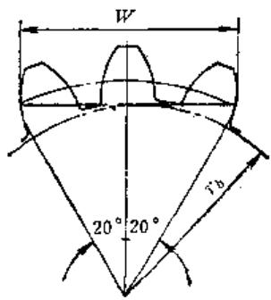

图10-1-1 齿轮公法线长度

线长度变动。若样品为  $\alpha = 20^{\circ}$  的非变位直齿轮，理论的跨越齿数应为  $z / 9 + 0.5$  ，否则不是增大就是缩小了公法线长度变动误差，导致做出错误的判断。

样品齿轮的齿形误差不仅与机床的周期误差有关，而且受切齿刀具等工艺因素的影响较大，要辨别引起误差的原因及各因素的影响程度很不容易。

对于连续滚切的机床，它的周期误差是指分度链中分度蜗杆在转一转内重复出现的误差，即以分度蜗杆一转为周期性的转角误差。具有周期误差的机床，在切制直齿齿轮时会引起波形齿形误差，切斜齿轮时会引起螺旋面波形误差。为使样品齿轮能充分反映机床的周期误差，宜选用直径较大的试切齿坯。

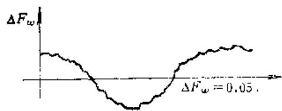

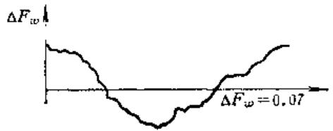

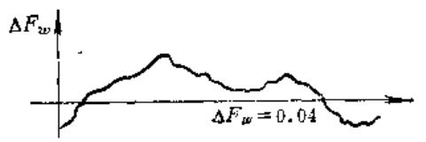

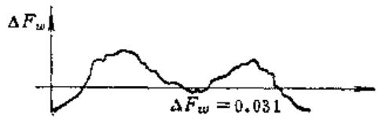

公法线长度变动量曲线

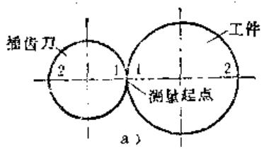

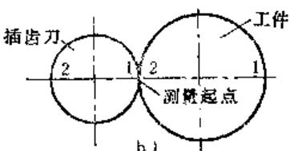

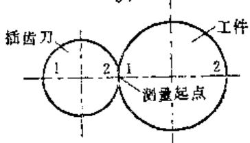

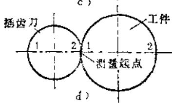

切削开始位置图

图10-1-2 插齿误差分析图

为了使滚齿机分度链的周期误差能充分反映到样品齿轮上去，所选样品齿轮的齿数应与分度蜗轮的齿数成2、2/3、2/5、2/7等倍数。

滚齿机分度链的传动误差，反映在样品齿轮上时，一般产生以一转为周期的（如正弦波）切向误差，它主要是由分度蜗轮的齿距累积误差造成的。若测得的样品齿轮累积误差曲线在  $360^{\circ}$  范围内有周期为  $2\sim 4$  次波时，主要是由于工作台转动时定位不准（如晃动）造成的。

圆锥齿轮的检验通常采用综合测量及评定接触质量和噪音的方法，有条件时，也可做齿距累积误差和齿距偏差的检验。

插齿机切出的样品齿轮的  $\Delta F_{p}$  ，除受分度蜗轮的影响外，还受插齿刀和插刀分齿蜗轮的齿距累积误差的影响。尽管在插齿时选用了合格的插齿刀及精确的装夹，要区分样品齿轮的累积误差是由那个蜗轮引起的，仍需在插齿时变动装夹位置及两蜗轮的相互位置，做数次试切才能做到。

图16 1-2是插制四件样品齿轮时刀具和工作台相对位置互相变更的情况。a、b图中的加工开始

点，在工作台上的位置相差  $180^{\circ}$ ；a、c图中的加工开始点，在刀具上的位置相差  $180^{\circ}$ ；c、d图的切削开始点完全相同。以刀具与工件的接触开始点为原点，按同一方向逐齿量出样品齿轮的公法线长度变动量，绘出左侧曲线图。

比较四条曲线可以看出：在a、b图中虽然工作台位置相差  $180^{\circ}$ ，但误差曲线外形基本相似，说明工作台蜗轮副对公法线长度变动量影响不大。比较a、c图外形，由于刀具蜗轮起始位置相差  $180^{\circ}$ ，曲线外形便反过来了，说明刀具蜗轮副的误差是影响公法线长度变动量的主要因素。故应将其当作机床修理的重点。比较c、d图可看出，刀具及蜗轮副位置完全不变，但曲线有波动，说明刀轴刚性不好（间隙超差）、让刀不稳，也应列为修理项目。

为减小插齿刀安装径向偏心和插齿刀分齿蜗轮的运动偏心对试切样件公法线长度最大变动误差的影响，应将插齿刀的齿数  $z_{0}$  尽量取大。最好在  $1 > z / z_{0} > 1 / 5$  范围内。

现将各主要工艺误差因素对齿轮误差的影响列入表10-1-1，供分析误差时参考。

表10-1-1 主要工艺误差因素对齿轮误差的影响

<table><tr><td>序号</td><td>工艺误差因素</td><td>齿距累积误差</td><td>基节偏差</td><td>齿形误差</td><td>齿向误差</td><td>齿厚偏差</td></tr><tr><td colspan="7">机床 方 面</td></tr><tr><td>1</td><td>分度蜗轮运动偏心和分齿盘偏心</td><td>△</td><td></td><td></td><td></td><td></td></tr><tr><td>2</td><td>分度蜗杆的周期误差</td><td></td><td>△</td><td>△</td><td></td><td></td></tr><tr><td>3</td><td>分度链传动齿轮偏心</td><td></td><td>△</td><td>△</td><td></td><td></td></tr><tr><td>4</td><td>工作台周期性游动</td><td>△</td><td></td><td></td><td></td><td></td></tr><tr><td>5</td><td>工作台的工件安装心轴偏心</td><td>△</td><td></td><td></td><td></td><td></td></tr><tr><td>6</td><td>插齿机进给凸轮形状误差</td><td>△</td><td>△</td><td>△</td><td></td><td></td></tr><tr><td>7</td><td>刀架导轨倾斜、进给丝杠周期误差</td><td></td><td></td><td></td><td>△</td><td></td></tr><tr><td colspan="7">刀具方 面</td></tr><tr><td>1</td><td>齿形误差</td><td></td><td></td><td>△</td><td></td><td></td></tr><tr><td>2</td><td>基节偏差</td><td></td><td>△</td><td></td><td></td><td></td></tr><tr><td>3</td><td>齿距偏差</td><td></td><td>△</td><td>△</td><td></td><td></td></tr><tr><td>4</td><td>齿厚偏差</td><td>△</td><td></td><td></td><td></td><td></td></tr><tr><td>5</td><td>磨具(砂轮)磨损</td><td>△</td><td></td><td></td><td></td><td></td></tr><tr><td colspan="7">安 装 方 面</td></tr><tr><td>1</td><td>齿坯安装偏心</td><td>△</td><td></td><td></td><td></td><td></td></tr><tr><td>2</td><td>齿坯安装倾斜</td><td>△</td><td></td><td></td><td>△</td><td></td></tr><tr><td>3</td><td>刀具安装径向和轴向跳动</td><td></td><td></td><td>△</td><td></td><td></td></tr><tr><td>4</td><td>分度挂轮误差</td><td></td><td>△</td><td>△</td><td></td><td></td></tr><tr><td>5</td><td>差动挂轮误差</td><td></td><td>△</td><td>△</td><td></td><td></td></tr><tr><td>6</td><td>切深误差</td><td></td><td></td><td></td><td></td><td>△</td></tr></table>

从表10-1-1可以看出，用试切样品齿轮的方法虽不能确切的获得蜗轮副的运动误差，但这种方法能有效的鉴定齿轮机床的工作精度，显示出机床缺陷所在，克服修理工作中的盲目性。

因样品齿轮的直径一般不等于分齿蜗轮的直径，按样品齿轮的误差折算成分齿蜗轮的误差时，应将两者的直径比计入。

样品齿轮的齿坯一般经正火处理，以消除材质硬度不均的影响。

# 2. 蜗轮副分度精度的静态综合测量法

静态综合测量法是将蜗轮副装入机床部件，调整各部间隙及跳动符合技术条件后，用仪器测出蜗杆准确的旋转一整转，蜗轮所转过的实际角度（或弦长）对理论值的偏差。量出蜗轮全部齿的偏差数

值后，通过计算得出蜗轮副的分度误差。

因测量时所用方法及所用计量仪器不同，误差计算分为相对法和绝对法两种。误差的计算方法与单个要素测量的计算法完全相同。

综合测量所测得的偏差是蜗轮蜗杆在啮合状态下的传动精度和工作台（或主轴）旋转精度在某瞬间的综合值。除了包含蜗杆蜗轮本身的制造误差，还包含了工作台的精度、蜗轮蜗杆的安装精度及旋转精度。

这种测量方法，虽不能连续的反映出蜗轮副的运动误差，但比单个要素的测量更接近于蜗轮副的实际工作状态。在缺乏分度蜗轮副动态精度测量仪器的情况下，应用这种方法能简便地测出蜗轮副的综合静态分度误差，为蜗轮副的修前及修后检验。

估计它们的动态工作精度创造了条件。

蜗轮轮齿两面的分度精度应分别测量和计算。测量时为了不使非测量齿面参与啮合影响测量精度，应将蜗轮蜗杆调成单面啮合，并使啮合间隙略小于工作间隙，施加不大的旋转反力矩，保证被测齿面与蜗杆齿面密合。

图10-1-3所示为测量滚齿机工作台分度精度的示意图。左侧为输入转角定位部分，右侧为输出转角计量部分。

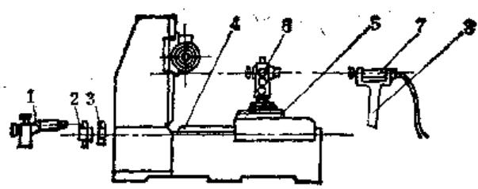

图10-1-3 静态综合测量示意图

1—读数显微镜 2—高精度度盘 3—微调蜗杆 4—蜗杆中心线 5—工作台 6—经纬仪 7—平行光管 8—支架

（1）输入转角定位方法 蜗杆每次转角的准确性，可用多种办法达到。目前常用的有：

1）刻度盘-读数显微镜定位法（参见图10-1-4）使用时将度盘固定在分度蜗杆轴3上，用读数显微镜对准度盘进行找正，转动分度蜗杆  $n$  转的准确数值，便可从显微镜中读出。微动蜗杆1可带动度盘4转动实现微调。

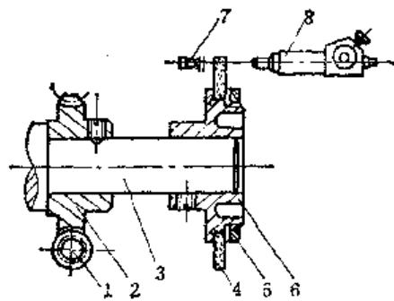

图10-1-4 刻度盘-读数显微镜定位法

1—微动蜗杆 2—蜗轮 3—一分度蜗杆轴

4—高精度度盘 5—螺母 6—度盘支架

7-光源 8-读数显微镜

2）光学准直仪-多面体（或一面体）定位法（参见图10-1-5）测量时将多面体固定在分度蜗杆轴上，在侧面距轴心约  $1\mathrm{m}$  处安放准直仪。转动蜗

杆轴，变动准直仪的安放位置，使准直仪发出的十字象能准确的返回目镜。每当蜗杆转动  $360 / n$  （ $n$  ——多面体面数）转时，在准直仪目镜中十字象与目镜分划板刻线对中，便可控制蜗杆每次转角的一致性。

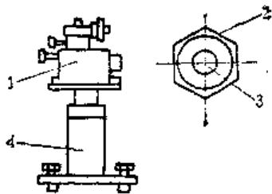

图10-1-5 光学准直仪-多面体定位法

1—准直仪 2—多面体 3—分度蜗杆轴 4—支架

3）水平仪定位法（参见图10-1-6）测量时使水平仪随蜗杆每转动一转后，水平仪水泡均停在同一位置上。

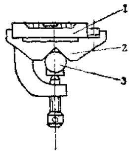

图10-1-6 水平仪定位法

1—水平仪 2—支架 3—分度蜗杆轴

除上述定位方法外，还可以采用千分表-杠杆定位和地震仪测头定位。

因综合测量时轮齿处于单面啮合状态，故定位瞬间转向只能是单方向的。如果过定位了（转多了），应退回一个适当的转角，再按原方向重新定位。为了减少过定位现象，在实际应用中，还需增添微调机构。

（2）蜗轮转角的计量方法 蜗轮每次转角的准确性，代表了蜗轮的分度精度。因而需按所测精度，选取合适精度等级的计量仪器。常用的计量方法有：

1）经纬仪计量法（参见图10-1-3）用夹具把经纬仪固定在蜗轮的旋转中心，并使经纬仪的回转层中心严格与蜗轮回转中心重合（误差一般小于  $0.005\sim 0.015\mathrm{mm}$ ），回转层平面与蜗轮旋转平面平行（误差小于  $0.02 / 1000\mathrm{mm}$ ）。

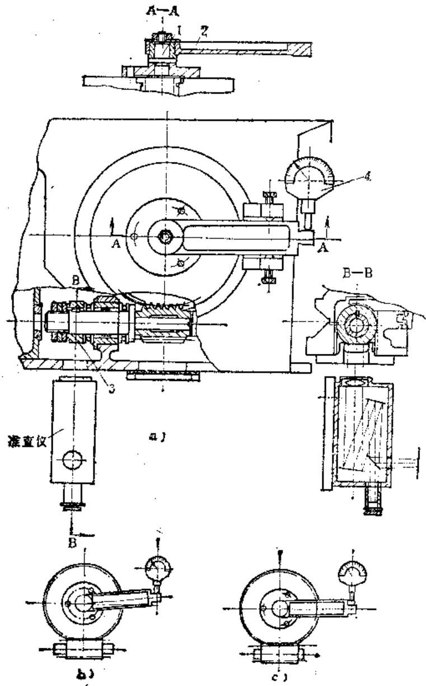

图10-1-7 比较仪计量法

经纬仪读数的定位基标，最好用平行光管或光学准直仪，也可在测量点适当远的地方（约  $30\sim$ $100\mathrm{m}$  ），悬一根细金属丝作为定位基标。调整平行光管位置（或金属丝）和经纬仪焦距，使平行光管发出的十字线在经纬仪望远镜分划板上成像并对中（或使金属丝在望远镜分划板上成像并对中），这时再将经纬仪水平度盘对准0位。测量时，蜗杆转过 $\frac{1}{z_1}$  转  $(z_{1}$  为蜗杆头数)，蜗轮便转过一个齿角，经纬仪随之偏离基标。松开经纬仪垂直轴的锁紧手把，转动经纬仪直至成像近似重合时锁紧，调微调手轮直至成像图完全重合对中。摇动经纬仪光学千分尺手轮，使正像与倒像刻度线完全重合，在读数目镜中便可读出该位置的实际角度值。依次重复操

作，直至全部齿测量完，并记录全部实际角度值。

上述计量方法属于绝对测量法，经纬仪上测出的角度值与理论角值之差就是分度误差。

2）杠杆-比较仪计量法（参见图10-1-7）芯轴1经严格找正后，用螺钉固定在机床工作台中心，测量杠杆2套在芯轴1上，可绕轴心旋转。为提高测量精度，它们的配合间隙要尽可能小。测量时先转动杠杆2，使其与固定在工作台外壳上的比较仪测头垂直，对上0位后，旋紧杠杆用螺帽将件1、2紧固成一体，见图10-1-7b。蜗轮转  $\frac{1}{z_2}$  转定位后（  $z_{2}$  为蜗轮齿数），杠杆随工作台转过一个齿角。选用近似蜗轮弦齿厚的块规塞入杠杆与比较仪触头之间，见图10-1-7c，记下比较仪的读数。下一次测量前，先松开杠杆2并返向转动，使其与比较仪重新对0后紧固杠杆2，为下一次测量做好准备。依次重复操作，直至测完全部齿。

这种计量方法量出的误差为相对值，故应按相对法计算其相邻及累积误差。因杠杆2的长度不一定等于蜗轮的分度圆半径，所得误差值应按比例折算。

除上述两种方法外，也可用双准直仪来计量。

图10-1-4为用刻度盘-读数显微镜和经纬仪-平行光管组成的测量系统。图10-1-8为用水平仪-杠杆和双比较仪组成的测量系统。两个比较仪中一个用于定位，另一个用来读数。使用时先将第一个齿角选为基准，将一个比较仪转动前对0，另一个比较仪转过第一个齿角后也对0。以后操作同上。但不需用块规来塞，操作误差较小。

图10-1-7为用光学准直仪-单面体和杠杆-比较仪组成的测量系统。图10-1-9为用静态测量法来测量整台机床的运动误差的示意图。两者用分度盘-显微镜作为输入转角的定位机构，用准直仪-经纬仪来计量蜗轮实际转角。当需测量机床的运动偏心时多用该法。

实践证明：用准直仪作为经纬仪的定位基标

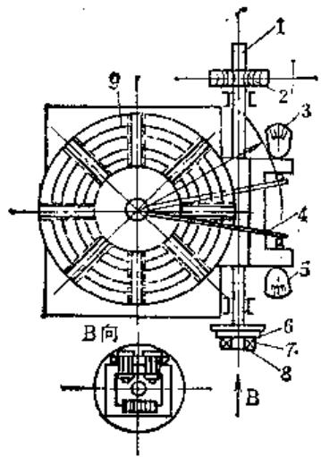

图10-1-8 分度精度精态测量法

1—分度蜗杆轴2—微调机构3—比较仪4—杠杆  $\pmb{\mathcal{O}}$  测微仪6—水平仪7—螺钉8—压板9—度盘

图10-7-9 用经纬仪测量机床的静态分度误差

时，所引起的测量误差较小。所用经纬仪的刻度盘分度值为1秒较好。

静态综合测量的缺点是间歇测量，不能连续地反映运动误差，因而改变输入转角起始点的相位时，几次测量结果可能不一致，同时也比较费工费时。在有条件的情况时，要尽量选用动态综合测量。

# 3.蜗轮副分度精度的动态综合测量法

蜗轮副的动态测量可在各种单面啮合检查仪上进行。一对相配的蜗轮蜗杆在中心距一定的条件下进行单面啮合测量，是很接近使用情况的，而且能较真实地反映蜗轮副的运动误差、累积误差和周期误差三项综合指标。从而能较准确的反映蜗轮副制造精度，分析机床及各项工艺因素对制件的影响。

各种单面啮合检查仪不能适应大尺寸蜗轮副的检查，更不能用于装配好的蜗轮副的测量。

图10-1-10为动态综合测量蜗轮副运动误差的

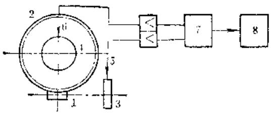

图10-1-10 磁分度检查仪原理图

磁分度检查仪原理图。

在蜗杆轴上接入连续旋转运动后，磁分度盘便连续分度。故可在机床运转过程中，测量蜗轮副的运动误差。

在蜗杆轴1上和工作台2上分别装上磁分度盘，其电磁波数的比值等于其传动比。由于磁头5、6拾取信号的相位差是不变的，运动中每一个不均匀的运动，都将使两个磁盘的比值发生变化。通过磁头记录下来并改变信号的相位，经过比相仪7以后，相位差用相位表示出来，由记录器8记录下来，从而可得到一个周期的误差曲线。

这种方法的优点在于：可在机床运动过程中测量出运动误差，测量精度高（ $\leqslant 1^{\prime \prime}$ ）。同时一个周期的测量可在很短的时间内完成。这种测量方法的缺点是对周期误差反映不灵感。因此，也可以用较灵感的地震仪测量它们的周期误差。

# （二）分度蜗轮单个要素的测量

当切齿机或分度机构经试切样品检查、静态或动态综合测量，发现其精度丧失，无法用调整方法恢复时，应将部件拆开（非必要时一般不将蜗轮从工作台上拆下来），按精度规范对蜗轮作单个要素测量：即确定蜗轮某一单项误差的大小及误差的分布规律。

由于大部分蜗轮的直径尺寸较大，无法进行单啮综合测量，在修理部门多用单个要素的测量代替综合测量。它虽不及综合测量能完整地反映蜗轮的质量，但能明确的反映出引起误差的工艺因素，因此这种方法应用广泛。

因蜗轮在齿宽方向呈圆弧形，齿形测量十分困难。在生产中常用检查刀具（或珩磨蜗杆）影响蜗轮齿形误差的因素如：齿距、齿形角等，以保证蜗轮的精度，最后用检验接触质量的方法来验证。

# 1. 蜗轮齿距偏差和齿距累积误差的测量及计算方法

齿距偏差  $(\Delta f_{p1})$  和齿距累积误差  $(\Delta F_{p})$  是

评定蜗轮精度的重要指标。前者影响运动平稳性，后者影响运动精度，测量方法大致与圆柱齿轮的测量相同。

对于模数  $1 \sim 10 \mathrm{~mm}$ ，直径不大于  $400 \mathrm{~mm}$  的蜗轮可在万能周节仪上用相对法测量。对于  $600 \mathrm{~mm}$  以内的蜗轮，可将周节仪用垫块垫高测量。直径更大的蜗轮，因其重量较大，不宜用周节仪测量。

用周节仪测量时，首先应将蜗轮孔及齿面用洗涤剂清洗干净，装在振摆小于  $2\mu \mathrm{m}$  的检验芯轴上，经恒温后装在顶尖上，并检验校准基面跳动合格后方可检验。

大直径蜗轮可在滚齿机精滚齿后，借助夹具将周节仪架起来测量，即用两只千分表定位读数进行组合测量。测星时每次将一个千分表对零，另一表读数。也可将蜗轮放在大型精密平板上（图10-1-11），用测微计校准备检验基面后，用垫块将周节仪垫高，使测头过蜗轮中心平面。用上述方法测量时，所选用的测量定位基准和校准基面，均需预先经过精密加工，保证与蜗轮的回转中心严格同心、垂直。

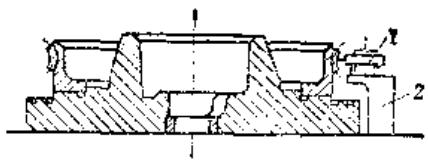

图10-1-11 在平板上用周节仪测量 1—周节仪 2—垫块

常用的测量定位基准如图10-1-12所示。图10-1-12a选用径向校准基准，图10-1-12b选用蜗轮的喉径外圆，图10-1-12c选用检验机的定位基准，图10-1-12a、b适用于在平板上测量大直径的蜗轮，图10-1-12c用于小直径的蜗轮。由于精密蜗轮常用剖削、珩磨来精加工，故齿根与旋转中心不同心，不宜将齿根圆选为基准。

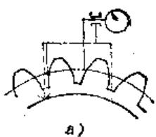

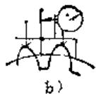

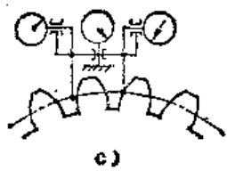

图10-1-12 用周节仪测量的基准

周节仪一般只用来检查各齿距是否一致，只在极少数情况下，才用来测量齿距值与理论值之差。

测量时先任选两个齿的同名齿面为“基准”，将读数表和定位表调整为零，依次测量比较其它各齿距的大小。这种测量方法称为相对测量法。按每次测量时跨越齿数多少，又分为单齿测量和跨齿测量两种方法。

利用一个测量头和分度装置直接测量齿距角的大小并与理论值相比较，来确定相邻齿距偏差和齿距累积误差的方法称为齿距的绝对测量法。

# （1）相对测量法及误差计算

1）单齿相对量法 选定“基准”之后，将仪器调整为零，依次测量其余各齿对所选“基准”齿距的相对偏差  $\delta$ ，并将读数  $\delta_{1}, \delta_{2}, \delta_{3}, \ldots, \delta_{n}$ ， $\delta_{s}$  记录下来。误差计算程序如下：

① 计算全部齿的实测相对误差累积值  $\sum \delta_{\mathrm{a}}$

第一齿  $\Sigma \delta_{1} = \delta_{1}$

第二齿  $\Sigma \delta_{2} = \delta_{1} + \delta_{2}$

第三齿  $\Sigma \delta_{s} = \delta_{i} + \delta_{2} + \delta_{3}$

#

第  $\pmb{n}$  齿  $\Sigma \delta_{n} = \delta_{1} + \delta_{2} + \delta_{3}\dots \dots +\delta_{n}$

第  $\pmb{z}$  齿  $\Sigma \delta_{x} = \delta_{1} + \delta_{2} + \delta_{3}\dots +\delta_{n} + \delta_{r}$

② 计算实测累积误差平均值  $\pmb{K}$

$$
K = \frac {1}{z} \Sigma \delta_ {z}
$$

③ 计算各齿的理论误差累积值

$$
\frac {n}{z} \Sigma \delta_ {z} = K \cdot \text {齿 序 号}
$$

④ 计算各齿的齿距累积误差

$$
\Delta F _ {p} = \Sigma \delta_ {n} - \frac {n}{z} \Sigma \delta_ {z} = \Sigma \delta_ {u} - K \cdot \text {齿 序 号} \tag {10-1-1}
$$

⑤ 算出齿距最大累积误差  $\Delta F_{\text{pmax}}$  各个齿距累积误差中的最大正负绝对值之和即为它的最大累积误差。

计算举例：

将齿数为40的蜗轮用单齿相对量法测量，所得仪器读数  $\delta_{z}$  列入表10-1-2第2栏。表中第3栏为第2栏中前后两读数的差值即任意两齿相邻齿距差，其中第35号齿差值为10，便是最大相邻周节差。表中第4栏是第2栏各值按序号的累积数。表中第5栏是序号与  $K$  的乘积。第6栏的值是同行第4栏值减去同行第5栏值而得。第7栏的两个数值是第6栏中的最大正值和最小负值。最大齿距累积误差列在表的下方。

表10-1-2 单齿相对量法的测量结果

(μm)

<table><tr><td>齿序号z(1)</td><td>仪器的读数δ(2)</td><td>相邻齿距误差Δfpl(3)</td><td>齿距相对误差累积值Σδn(4)</td><td>理论误差累积值n/σΣδx(5)</td><td>齿距累积误差ΔFp(6)</td><td>齿距累积误差中的极限值(7)</td></tr><tr><td>1</td><td>0</td><td>0</td><td>0</td><td>-1</td><td>+1</td><td></td></tr><tr><td>2</td><td>+2</td><td>2</td><td>+2</td><td>-2</td><td>+4</td><td></td></tr><tr><td>3</td><td>+3</td><td>1</td><td>+5</td><td>-3</td><td>+8</td><td></td></tr><tr><td>4</td><td>+1</td><td>2</td><td>+6</td><td>-4</td><td>+10</td><td></td></tr><tr><td>5</td><td>+4</td><td>3</td><td>+10</td><td>-5</td><td>+15</td><td></td></tr><tr><td>6</td><td>0</td><td>4</td><td>+10</td><td>-6</td><td>+16</td><td></td></tr><tr><td>7</td><td>+5</td><td>5</td><td>+15</td><td>-7</td><td>+22</td><td></td></tr><tr><td>8</td><td>0</td><td>5</td><td>+15</td><td>-8</td><td>+23</td><td></td></tr><tr><td>9</td><td>-2</td><td>2</td><td>+13</td><td>-9</td><td>+22</td><td></td></tr><tr><td>10</td><td>-3</td><td>1</td><td>+10</td><td>-10</td><td>+20</td><td></td></tr><tr><td>11</td><td>0</td><td>3</td><td>+10</td><td>-11</td><td>+21</td><td></td></tr><tr><td>12</td><td>+3</td><td>3</td><td>+13</td><td>-12</td><td>+25</td><td></td></tr><tr><td>13</td><td>-1</td><td>4</td><td>+12</td><td>-13</td><td>+25</td><td>+25</td></tr><tr><td>14</td><td>-2</td><td>1</td><td>+10</td><td>-14</td><td>+25</td><td></td></tr><tr><td>15</td><td>-5</td><td>3</td><td>+5</td><td>-15</td><td>+20</td><td></td></tr><tr><td>16</td><td>-2</td><td>3</td><td>+3</td><td>-16</td><td>+19</td><td></td></tr><tr><td>17</td><td>-3</td><td>1</td><td>0</td><td>-17</td><td>+17</td><td></td></tr><tr><td>18</td><td>-5</td><td>2</td><td>-5</td><td>-18</td><td>+13</td><td></td></tr><tr><td>19</td><td>-4</td><td>1</td><td>-9</td><td>-19</td><td>+10</td><td></td></tr><tr><td>20</td><td>-6</td><td>2</td><td>-15</td><td>-20</td><td>+5</td><td></td></tr><tr><td>21</td><td>0</td><td>6</td><td>-15</td><td>-21</td><td>+6</td><td></td></tr><tr><td>22</td><td>-3</td><td>3</td><td>-18</td><td>-22</td><td>+4</td><td></td></tr><tr><td>23</td><td>-5</td><td>2</td><td>-23</td><td>-23</td><td>0</td><td></td></tr><tr><td>24</td><td>-5</td><td>0</td><td>-28</td><td>-24</td><td>-4</td><td></td></tr><tr><td>25</td><td>-5</td><td>0</td><td>-33</td><td>-25</td><td>-8</td><td></td></tr><tr><td>26</td><td>0</td><td>5</td><td>-33</td><td>-26</td><td>-7</td><td></td></tr><tr><td>27</td><td>-3</td><td>3</td><td>-36</td><td>-27</td><td>-9</td><td></td></tr><tr><td>28</td><td>-5</td><td>2</td><td>-41</td><td>-28</td><td>-13</td><td></td></tr><tr><td>29</td><td>-5</td><td>0</td><td>-46</td><td>-29</td><td>-17</td><td></td></tr><tr><td>30</td><td>-5</td><td>0</td><td>-51</td><td>-30</td><td>-21</td><td></td></tr><tr><td>31</td><td>-2</td><td>3</td><td>-53</td><td>-31</td><td>-22</td><td></td></tr><tr><td>32</td><td>-3</td><td>1</td><td>-56</td><td>-32</td><td>-24</td><td></td></tr><tr><td>33</td><td>-5</td><td>2</td><td>-61</td><td>-33</td><td>-28</td><td></td></tr><tr><td>34</td><td>-5</td><td>0</td><td>-66</td><td>-34</td><td>-32</td><td>-32</td></tr><tr><td>35</td><td>+5</td><td>10</td><td>-61</td><td>-35</td><td>-26</td><td></td></tr><tr><td>36</td><td>+7</td><td>2</td><td>-54</td><td>-36</td><td>-18</td><td></td></tr><tr><td>37</td><td>+3</td><td>4</td><td>-51</td><td>-37</td><td>-14</td><td></td></tr><tr><td>38</td><td>+4</td><td>1</td><td>-47</td><td>-38</td><td>-9</td><td></td></tr><tr><td>39</td><td>+6</td><td>2</td><td>-41</td><td>-39</td><td>-2</td><td></td></tr><tr><td>40</td><td>+1</td><td>5</td><td>-40</td><td>-40</td><td>-0</td><td></td></tr><tr><td colspan="4">实测累积误差平均值 (μm):K = 1/σ Σδn= 1/40 (-40)=-1</td><td colspan="3">最大齿距累积误差 (μm):ΔFpmax = | +25| + | -22| = 57</td></tr></table>

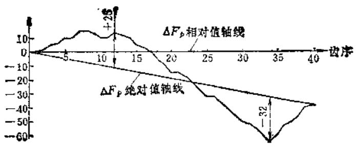

图10-1-13 齿距累积误差图解法

上述计算法较繁琐，不能反映出误差的分布状况，不便于分析误差产生的原因，在生产中习惯用图解法来求齿距累积误差。图10-1-13是上例的图解法。

根据仪器的读数，可把坐标点直接标在坐标纸上。其方法是以齿序号1的读数为0点，以后的齿序号均以上一齿序号为0点画出其坐标点，然后用直尺依次把各点连接起来，并将首末两点连一直线，即为齿距累积值的绝对值计算轴线。曲线上距轴线最远的上下两点（曲线上侧下侧各选一点）的坐标值的绝对值之和，便是所求的齿距最大累积误差。

用单齿测量时，存在着仪器示值误差。由仪器误差造成的测量误差  $\delta_{\Sigma}$  的大小可按下式确定：

$$
\delta_ {\Sigma} = \frac {1}{2} \sqrt {z} \sigma
$$

式中  $\sigma$  ——仪器精度；

$z$  ——被测齿数（测量次数）。

从上式可知，使用同样精度的仪器，减少测量次数，可提高测量精度。故跨齿（每次跨几个齿）测量已被逐渐广泛运用。

# 2）跨齿测量法及误差计算

跨齿测量就是指用相对法测量齿距时，两测头间跨越的齿数不少于2，图10-1-14所示为跨齿测量的示意图。为此，应将被测齿数  $z$  分为  $J$  组，每组  $Q$  个齿，即

$$
z = Q J
$$

式中，  $Q$  应为一个能整除  $\pmb{z}$  的正整数。若  $\pmb{z}$  为质数时，我们可以多测几个齿，即被测的总齿数超过 $\pmb{z}$  ，以便获得一个整除数。设多测齿数为  $\pmb{y}$  （其值应尽量小），则

$$
J = (z + y) / Q
$$

跨越齿数  $Q$  的选择，应该使测量误差  $\delta_{\mathrm{g}}$  最小，

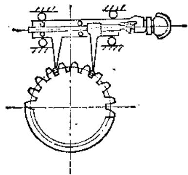

图10-1-14 跨凸测量法

推荐  $Q$  的选取范围为：

$$
0. 5 \sqrt {z} \leqslant Q \leqslant 1. 0 \sqrt {z} \tag {10-1-2}
$$

如果在上式范围内存在能够整除  $z$  的正数，就可将其选为跨越齿数；如果在此范围内仍然不存在整除  $z$  的正数，还可将  $Q$  的范围扩大为

$$
0. 3 5 \sqrt {z} \leqslant Q \leqslant 1. 5 \sqrt {z} \tag {10-1-3}
$$

如图10-1-15中虚线所示。

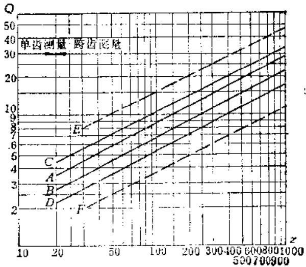

图10-1-15 跨越齿数  $Q$  选取范围

根据齿数  $z$  ，就可在图10-1-15上找出Q的范围。选取  $A$  、  $B$  直线间所包容的齿数为  $Q$  时，测量误差  $\delta_{\Sigma}$  最小；  $C$  、  $D$  间的  $Q$  值，测量误差增加  $10\%$  以内；  $E$  、  $F$  间的  $Q$  值，测量误差增加  $20\%$  。

$Q$  的选取步骤如下：

① 分解出齿数  $z$  的因子。

② 列出所有能整除  $z$  的正数，并按大小排列；

③ 在能整除  $z$  的正数中，找出符合公式（10-1-2）或（10-1-3）条件的数。

举例：  $z = 105$  ，求  $\mathbb{Q}$  ?

① 分解齿数  $z$  的因子， $z = 105 \approx 3 \times 5 \times 7$ ；

② 所有能整除  $z$  的正数，并按大小排列如下：3、5、7、15、21、35；

$③$  按公式（10-1-2）求得  $Q$  的选取范围为： $5.125\leqslant Q\leqslant 10.25$

若有几个数都符合条件，最好优先选取图中  $AB$  两线间的数，故本例中选取7。

对于质数齿应按  $z + y$  之和来选取  $Q$ 。

当选取跨越齿数  $Q$  时，还应顾及到分组数  $J$  的大小，使每次跨测角度  $\varphi$  时，触头和齿廓不发生干涉。从图10-1-16可以看出，欲使触头和齿廓表面不发生干涉，其条件是跨测的半角  $\varphi /2$  不大于分度圆处的压力角  $\alpha$  ，即

$$
\begin{array}{l} \frac {\varphi}{2} = \frac {3 6 0 ^ {\circ}}{2 J} \leqslant a \\ \therefore \quad J \geqslant \frac {1 8 0 ^ {\circ}}{\alpha} \\ \end{array}
$$

当  $\alpha = 20^{\circ}$  时，  $J\geqslant 9$  或  $z / Q\geqslant 9$

跨齿测量包括：分组测量和单齿补点测量两部分。前者是按上述方法选取  $Q$  后，每次测量时都跨

越齿数  $Q$  ，其测量方法与单齿量法一样。单齿补点测量是将每组齿均做单齿测量，测时把每组的第一个齿选为“基准”来测量其余的齿，将分组及单齿补点测量所得的偏差，经数学处理求得最大累积误差。

因数学处理很繁琐，生产中常用图解法配合来确定补测组别及简化计算，其步骤如下：

① 根据被测齿数  $z$  选取  $Q$  后，校对  $J$  是否在允许范围内。

② 在被测轮上分组，并编上组别号。

③ 将分组的第1组选为“基准”，把仪器调整为零，依次测量其余各组，并记录仪器读数。

④ 将分组测量的结果用图解法绘制曲线。把曲线的最大正值和最小负值处的相邻组（共4个组）找出来，选做补点测量组并做单齿补点测量。补测时把每组的第一个齿选为“基准”依次测量组内其余齿，记录全部仪器读数。

$⑤$  用计算法或图解法求出最大累积误差。

计算举例：被测件齿数为40；  $a = 14^{\circ}30^{\prime}$  ，按图10-1-15取  $Q = 5$  ，共测8次，所得读数列入表10-1-3中。

绘其曲线如图10-1-17实线所示。

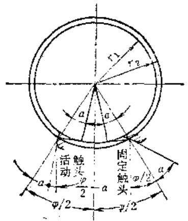

图10-1-16 测头与齿廓的干涉情况

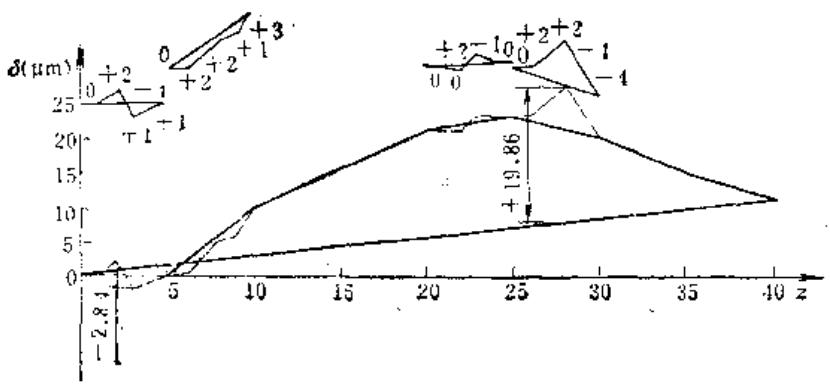

图10-1-17

表10-1-3 跨齿相对量法的测量结果

(μm)

<table><tr><td>组序</td><td>仪器示值</td><td>齿距相对误差累积值</td><td>理论误差累积值</td><td>齿距累积误差值</td></tr><tr><td>J</td><td>Y</td><td>ΣYJ</td><td>J/NΣYN</td><td>ΔFp</td></tr><tr><td>(1)</td><td>(2)</td><td>(3)</td><td>(4)</td><td>(5)</td></tr><tr><td>1</td><td>0</td><td>0</td><td>+2.4</td><td>-1.4</td></tr><tr><td>2</td><td>+10</td><td>+10</td><td>+2.8</td><td>+7.2</td></tr><tr><td>3</td><td>+5</td><td>+15</td><td>+4.1</td><td>+10.9</td></tr><tr><td>4</td><td>+6</td><td>+21</td><td>+5.5</td><td>+15.5</td></tr><tr><td>5</td><td>+2</td><td>+23</td><td>+6.9</td><td>+16.5</td></tr><tr><td>6</td><td>-3</td><td>+20</td><td>+8.3</td><td>+11.7</td></tr><tr><td>7</td><td>-5</td><td>+15</td><td>+9.6</td><td>+5.4</td></tr><tr><td>8</td><td>-4</td><td>+11</td><td>+11</td><td>0</td></tr></table>

表10-1-4 跨齿相对置法的单齿补点测量结果

(μm)

<table><tr><td rowspan="2">组序J(1)</td><td colspan="2">齿序号</td><td rowspan="2">仪貌示值δ(4)</td><td colspan="2">齿距相对误差累积值</td><td rowspan="2">理论误差累积值n/ΣγN(7)</td><td rowspan="2">齿距累积误差值ΔFp(8)</td></tr><tr><td>补测组K(2)</td><td>全齿轮n(3)</td><td>ΣδK(5)</td><td>Σγn&#x27;(6)</td></tr><tr><td rowspan="5">1</td><td>1</td><td>1</td><td>0</td><td>0</td><td>0</td><td>+0.28</td><td>-0.28</td></tr><tr><td>2</td><td>2</td><td>+2</td><td>+2</td><td>+2</td><td>+0.56</td><td>+1.44</td></tr><tr><td>3</td><td>3</td><td>-4</td><td>-2</td><td>-2</td><td>+0.84</td><td>-2.84</td></tr><tr><td>4</td><td>4</td><td>+1</td><td>-1</td><td>-1</td><td>+1.12</td><td>-2.12</td></tr><tr><td>5</td><td>5</td><td>+1</td><td>0</td><td>0</td><td>+1.4</td><td>-1.4</td></tr><tr><td rowspan="5">2</td><td>1</td><td>6</td><td>0</td><td>0</td><td>+0.4</td><td>+1.68</td><td>-1.28</td></tr><tr><td>2</td><td>7</td><td>+2</td><td>+2</td><td>+2.8</td><td>+1.96</td><td>+0.84</td></tr><tr><td>3</td><td>8</td><td>+2</td><td>+4</td><td>+5.2</td><td>+2.24</td><td>+2.96</td></tr><tr><td>4</td><td>9</td><td>+1</td><td>+5</td><td>+6.6</td><td>+2.52</td><td>+4.08</td></tr><tr><td>5</td><td>10</td><td>+3</td><td>+8</td><td>+10</td><td>+2.80</td><td>+7.20</td></tr><tr><td rowspan="5">5</td><td>1</td><td>21</td><td>0</td><td>0</td><td>+21.2</td><td>+5.78</td><td>+15.42</td></tr><tr><td>2</td><td>22</td><td>0</td><td>0</td><td>+21.4</td><td>+6.06</td><td>+15.34</td></tr><tr><td>3</td><td>23</td><td>+2</td><td>+2</td><td>+23.6</td><td>+6.34</td><td>+17.26</td></tr><tr><td>4</td><td>24</td><td>-1</td><td>+1</td><td>+22.8</td><td>+6.62</td><td>+16.18</td></tr><tr><td>5</td><td>25</td><td>0</td><td>+1</td><td>+23</td><td>+6.90</td><td>+16.10</td></tr><tr><td rowspan="5">6</td><td>1</td><td>26</td><td>0</td><td>0</td><td>+23.2</td><td>+7.18</td><td>+16.02</td></tr><tr><td>2</td><td>27</td><td>+2</td><td>+2</td><td>+25.4</td><td>+7.46</td><td>+17.94</td></tr><tr><td>3</td><td>28</td><td>+2</td><td>+4</td><td>+27.6</td><td>+7.74</td><td>+19.86</td></tr><tr><td>4</td><td>29</td><td>-4</td><td>0</td><td>+23.2</td><td>+8.02</td><td>+15.18</td></tr><tr><td>5</td><td>30</td><td>-4</td><td>-4</td><td>+20.0</td><td>+8.30</td><td>+11.70</td></tr></table>

从图中可看出：最大正值在第25齿处，最小负值在第5齿处，故应在第1、2和5、6组进行单齿补点测量，结果列于表10-1~4中。现分别用计算法及图解法求其最大累积误差。

# $①$  用计算法求最大累积误差

a. 实测齿距相对误差累积值的计算 由单齿补点测量得出的误差累积值是将补测组中第一个齿距作为0测得的，但在跨齿测量时，这一点的误差累积值一般不是0（除同时是跨齿测量的起点外）。同时补测组的误差累积值（即该补测组末齿的误差累积值）和由跨齿测量得到的该组的误差值不一致，如表10-1-4中第5组第5齿的误差累积值为1，而跨齿测量时该组的误差值为2。所以计算各补测齿的误差累积值时，应计入两者之间的差值。

根据上述情况，可列出计算补测组各齿从跨齿测量起点开始计算的实测齿距相对误差累积值的公式：

$$
\Sigma \gamma_ {n} ^ {\prime} = \Sigma \gamma_ {j - 1} + \Sigma \delta_ {K} + \frac {K \times D}{Q} \tag {10-1-4}
$$

式中  $\Sigma \gamma_{n}^{\prime}$  ——齿轮第  $n$  个齿的实测齿距相对误差累积值；

$\Sigma Y_{I-1}$  ——补测组起点（即补测组前一组）的实测齿距相对误差累积值；

$\Sigma \delta_{K}$  ——单齿补测组内第  $K$  齿的实测齿距相对误差累积值；

$Q$  ——跨测齿数；

$D$  ——补测组  $J$  的齿距误差值（即仪器示值）与补测组末齿的误差累积值的差，即  $D = \gamma_{f} - \Sigma \delta_{Q}$ 。

b. 理论误差累积值的计算 单齿补测组各齿的理论误差累积值应根据跨齿测量时对整个齿轮所测得的结果来计算，即

$$
\frac {n}{z} \Sigma Y _ {N} = \frac {J - 1}{N} \Sigma Y _ {N} + \frac {K}{Q} \left(\frac {J}{N} \Sigma Y _ {N} - \frac {J - 1}{N}\right) \Sigma Y _ {N} \tag {10-1-5}
$$

式中  $\frac{n}{z} \Sigma Y_{N}$  ——齿轮第  $n$  个齿的理论误差累积值；

$\frac{J}{N}\Sigma \gamma_{N}$  补测组的理论误差累积值；

$\frac{J - 1}{N}\Sigma Y_{N}$  补测组前一组的理论误差累积值。

按式(10-1-4)，（10-1-5)计算出  $\Sigma Y_{n}^{\prime}$  和  $\frac{n}{2}\Sigma Y_{N}$  后，再按式（10-1-1）算出各补测齿的齿距最大累积误差。

对上例中第1和第2组及第5和第6组的实际误差累积值计算如下：

$1\sim 5$  齿：

$$
\Sigma \gamma_ {1} ^ {\prime} = 0 + 0 + \frac {1}{5} (0 - 0) = 0
$$

$$
\Sigma Y _ {2} ^ {\prime} = 0 + 5 + \frac {2}{5} (0 - 0) = 2
$$

$$
\Sigma \gamma_ {3} ^ {\prime} = 0 + (- 2) + \frac {3}{5} (0 - 0) = - 2
$$

$$
\Sigma \gamma^ {\prime} = 0 + (- 1) + \frac {4}{5} (0 - 0) = - 1
$$

$$
\Sigma \gamma_ {5} ^ {\prime} = 0 + 0 + \frac {5}{5} (0 - 0) = 0
$$

$6\sim 10$  齿：

$$
\Sigma \gamma_ {8} ^ {\prime} = 0 + 0 + \frac {1}{5} (1 0 - 8) = 0. 4
$$

$$
\Sigma \gamma_ {7} ^ {\prime} = 0 + 2 + \frac {2}{5} (1 0 - 8) = 2. 8
$$

$$
\Sigma Y _ {8} ^ {\prime} = 0 + 4 + \frac {3}{5} (1 0 - 8) = 5. 2
$$

$$
\Sigma \gamma_ {9} ^ {\prime} = 0 + 5 + \frac {4}{5} (1 0 - 8) = 6. 6
$$

$$
\Sigma Y _ {1 0} ^ {\prime} = 0 + 8 + \frac {5}{5} (1 0 - 8) = 1 0
$$

$21\sim 25$  齿：

$$
\Sigma Y _ {2 1} ^ {\prime} = 2 1 + 0 + \frac {1}{5} (2 - 1) = 2 1. 2
$$

$$
\Sigma \gamma_ {2 2} ^ {\prime} = 2 1 + 0 + \frac {2}{5} (2 - 1) = 2 1. 4
$$

$$
\Sigma Y _ {2 4} ^ {\prime} = 2 1 + 2 + \frac {3}{5} (2 - 1) = 2 3. 6
$$

$$
\Sigma \gamma_ {2 4} ^ {\prime} = 2 1 + 1 + \frac {4}{5} (2 - 1) = 2 2. 8
$$

$$
\Sigma Y _ {2 5} ^ {\prime} = 2 1 + 1 + \frac {5}{5} (2 - 1) = 2 3
$$

$26\sim 30$  齿：

$$
\Sigma Y _ {2 0} ^ {\prime} = 2 3 + 0 + \frac {1}{5} (- 3 + 4) = 2 3. 2
$$

$$
\Sigma \gamma_ {2 7} ^ {\prime} = 2 3 + 2 + \frac {2}{5} (- 3 + 4) = 2 5. 4
$$

$$
\Sigma \gamma_ {2 8} ^ {\prime} = 2 3 + 2 + \frac {3}{5} (- 3 + 4) = 2 7. 6
$$

$$
\Sigma \gamma_ {2 9} ^ {\prime} = 2 3 + 0 + \frac {4}{5} (- 3 + 4) = 2 3. 2
$$

$$
\Sigma \gamma_ {3 0} ^ {\prime} = 2 3 + (- 4) + \frac {5}{5} (- 3 + 4) = 2 0
$$

对上例中第1、第2和第5、第6组的理论误差累积值计算如下：

$1\sim 5$  齿：

$$
\frac {1}{z} \Sigma Y _ {1} = 0 + \frac {1}{5} (1. 4 - 0) = 0. 2 8
$$

$$
\frac {2}{z} \Sigma \gamma_ {2} = 0 + \frac {2}{5} (1. 4 - 0) = 0. 5 6
$$

$$
\frac {3}{z} \Sigma \gamma_ {3} = 0 + \frac {3}{5} (1. 4 - 0) = 0. 8 4
$$

$$
\frac {4}{z} \Sigma Y _ {4} = 0 + \frac {4}{5} (1. 4 - 0) = 1. 1 2
$$

$$
\frac {5}{2} \Sigma \gamma_ {5} = 0 + \frac {5}{5} (1. 4 - 0) = 1. 4
$$

6～10齿：

$$
\frac {6}{z} \Sigma Y _ {3} = 1. 4 + \frac {1}{5} (2. 8 - 1. 4) = 1. 6 8
$$

$$
\frac {7}{z} \Sigma Y _ {7} = 1. 4 + \frac {2}{5} (2. 8 - 1. 4) = 1. 9 6
$$

$$
\frac {3}{2} \Sigma Y _ {8} = 1. 4 + \frac {3}{5} (2. 8 - 1. 4) = 2. 2 4
$$

$$
\frac {9}{z} \Sigma \gamma_ {9} = 1, 4 + \frac {4}{5} (2. 8 - 1. 4) = 2. 5 2
$$

$$
\frac {1 0}{z} \Sigma \gamma_ {1 0} = 1. 4 + \frac {5}{5} (2. 8 - 1. 4) = 2. 8 0
$$

$21\sim 25$  齿：

$$
\frac {2 1}{z} \Sigma Y _ {2 1} = 5. 5 + \frac {1}{5} (6. 9 - 5. 5) = 5. 7 8
$$

$$
\frac {2 2}{z} \Sigma \gamma_ {2 2} = 5. 5 + \frac {2}{5} (6. 9 - 5. 5) = 6. 0 6
$$

$$
\frac {2 3}{z} \Sigma r _ {2 3} = 5. 5 + \frac {3}{5} (6. 9 - 5. 5) = 6. 3 6
$$

$$
\frac {2 4}{2} \Sigma \gamma_ {2 4} = 5. 5 + \frac {4}{5} (6. 9 - 5. 5) = 6. 9
$$

$$
\frac {2 5}{z} \Sigma \gamma_ {2 5} = 5. 5 + \frac {5}{5} (6. 9 - 5. 5) = 6. 9
$$

$26\sim 30$  齿：

$$
\frac {2 6}{z} \Sigma Y _ {2 0} = 6. 9 + \frac {1}{5} (8. 3 - 6. 9) = 7. 1 8
$$

$$
\frac {2 7}{z} \Sigma Y _ {2 7} = 6. 9 + \frac {2}{5} (3. 3 - 6. 9) = 7. 4 6
$$

$$
\frac {2 8}{z} \Sigma Y _ {2 8} = 6. 9 + \frac {3}{5} (8. 3 - 6. 9) = 7. 7 4
$$

$$
\frac {2 9}{z} \Sigma \gamma_ {2 9} = 6. 9 + \frac {4}{5} (8. 3 - 6. 9) = 8. 0 2
$$

$$
\frac {3 0}{z} \Sigma \gamma_ {3 0} = 6. 9 + \frac {5}{5} (8. 3 - 6. 9) = 8. 3 0
$$

将上述计算结果填在表10-1-4中。从表中可知该蜗轮的齿距累积误差  $\Delta F_{p}$  为：

最小负值为-2.84

最大正值为  $+19.86$

$$
\Delta F _ {p} = \left| - 2. 8 4 \right| + 1 9. 8 6 = 2 2. 7 \mu \mathrm {m}
$$

② 用图解法求最大累积误差 分组测量的曲线画法完全同单齿测量的画法相同。补测组各齿的误差按下述方法补到分组测量所绘的曲线上，

将补测组测得的全部数据，用绘分组测量曲线相同的比例，标在坐标纸上。将各点连线后把首末两点连线，求出补测组各点的累积误差值（图10-1-17上部的小图），然后将各齿坐标值补画在分组测量的曲线上（图中虚线所示），曲线上下两部分距

计算轴线最远两点的坐标值的代数和，即为最大累积误差。其值与计算法完全相同。

齿数为质数时的图解法 先测出各分组的相对偏差，用作图法画出分组齿距累积误差曲线图，然后对曲线距计算轴线的最大和最小两点的相邻组和最后一组，进行单齿补点测量，并绘出补充曲线。绝对值计算轴线的末点应取实际齿数的点，以排除多测的那几个齿对计算误差的影响。

举例：测量齿数为47齿的蜗轮，选跨测齿数为5，分组数为：

$$
J = (z + y) / Q = (4 7 + 3) / 5 = 1 0
$$

分组测量所得数据列入表10-1-5。

将上述数值绘成图10-1-18所示实线图。

分析曲线后应对第2、3、8、9及最末一组（第十组）做单齿补点测量。所测数据列入表10-1-6。

表10-1-5 分组测量结果

(μm)

<table><tr><td>组序</td><td>1</td><td>2</td><td>3</td><td>4</td><td>5</td><td>6</td><td>7</td><td>8</td><td>9</td><td>10</td></tr><tr><td>示值</td><td>0</td><td>+4</td><td>-6</td><td>-6</td><td>-2</td><td>-2</td><td>-4</td><td>-4</td><td>+1</td><td>+3</td></tr></table>

表10-1-6 单齿补点测盘结果

(μm)

<table><tr><td>K\组 序</td><td>2</td><td>3</td><td>8</td><td>9</td><td>末 组</td></tr><tr><td>1</td><td>0</td><td>0</td><td>0</td><td>0</td><td>0</td></tr><tr><td>2</td><td>+2.5</td><td>-5.5</td><td>+1</td><td>+3</td><td>+3</td></tr><tr><td>3</td><td>+2.5</td><td>-4</td><td>+1</td><td>+3</td><td>-3</td></tr><tr><td>4</td><td>0</td><td>-1.5</td><td>0</td><td>+2.5</td><td>-3</td></tr><tr><td>5</td><td>+1</td><td>-4</td><td>+1</td><td>+1.5</td><td>+1</td></tr></table>

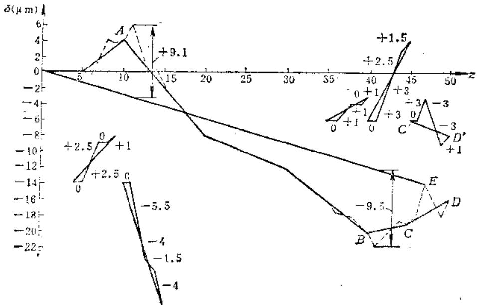

图 10-1-18

将第十组补测值绘成以  $C^{\prime}D^{\prime}$  为绝对值计算轴线的误差曲线，然后将  $C^{\prime}D^{\prime}$  误差曲线各齿号的坐标值，描绘到分组测量的误券曲线的CD段上，连接原点0和47齿的误差累积值点  $\pmb{E}$  ，此OE直线即为该47齿蜗轮的齿距累积误差值的绝对值轴线。

按上例将2、3、6、8各补测组的误差补描在分组测量曲线上（虚线所示）。该蜗轮的齿距最大累积误差为

$$
\Delta F _ {\text {p m a x}} = \left| + 9. 1 \right| \div \left| - 9. 5 \right| = 1 8. 6 \mu \mathrm {m}
$$

# （2）绝对测量法及误差计算

绝对测量法是利用一个测头和分度装置直接测量齿距角的大小，来确定相邻齿距偏差和累积误差的方法，工作原理如图10-1-19所示。

图10-1-19 绝对测量法原理

分度装置有万能显微镜分度盘、光学分度头和经纬仪等。

定位装置有机械定位装置（千分表、测微仪）、光学定位装置（显微镜）和光电定位装置（光电准直仪）等。

测量时利用分度装置，将蜗轮每次转过  $2\pi / z_{1}$  角，然后用测量仪器测出角度值差（图10-1-20）。任意两个同名齿形间的实际距离与公称距离的最大误差，为其最大累积误差。

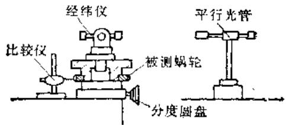

图10-1-20 绝对测量法

当得到的误差是角度值时，可按下式换算为线值  $(\mu \mathrm{m})$

$$
\Delta F _ {p} = \Delta_ {p \Sigma} \cdot r _ {2} / 2 0 6. 2 6 5
$$

式中  $\Delta_{p}x$  ——以角度值表示的齿距累积误差（ $(^{\prime \prime})$ ）；

$$
r _ {2} \text {一 蜗 轮 分 度 圆 半 径 (m m) 。}
$$

表10-1-7是以绝对法测量  $m = 1$  ，  $z = 40$  的蜗轮的齿距累积误差的结果，误差以角度值表示。第

表10-1-7 绝对法测量周节计算表

<table><tr><td>齿 序</td><td>理论角距值</td><td>实际角距值</td><td>角距值的累积误差</td><td>角距值的相邻误差</td><td>相邻角距差</td></tr><tr><td>0</td><td>0°</td><td>0°</td><td>-</td><td>-</td><td></td></tr><tr><td>1</td><td>9°</td><td>9°2'</td><td>+2'</td><td>+2'</td><td></td></tr><tr><td>2</td><td>18°</td><td>18°2'</td><td>+2'</td><td>0</td><td>(2')</td></tr><tr><td>3</td><td>27°</td><td>27°2'</td><td>+2'</td><td>0</td><td>0</td></tr><tr><td>4</td><td>36°</td><td>36°3'</td><td>+3'</td><td>+1'</td><td>1</td></tr><tr><td>5</td><td>45°</td><td>45°3'</td><td>+3'</td><td>0</td><td>1</td></tr><tr><td>6</td><td>54°</td><td>54°2'</td><td>+2'</td><td>-1'</td><td>1</td></tr><tr><td>7</td><td>63°</td><td>63°2'</td><td>+2'</td><td>0</td><td>1</td></tr><tr><td>8</td><td>72°</td><td>72°4'</td><td>(+4')</td><td>+2'</td><td>2</td></tr><tr><td>9</td><td>81°</td><td>81°4'</td><td>+4'</td><td>0</td><td>2</td></tr><tr><td>10</td><td>90°</td><td>90°4'</td><td>+4'</td><td>0</td><td>0</td></tr><tr><td>11</td><td>99°</td><td>99°4'</td><td>+4'</td><td>0</td><td>0</td></tr><tr><td>12</td><td>108°</td><td>108°3'</td><td>+3'</td><td>-1'</td><td>1</td></tr><tr><td>13</td><td>117°</td><td>117°3'</td><td>+3'</td><td>0</td><td>1</td></tr><tr><td>14</td><td>126°</td><td>126°3'</td><td>+3'</td><td>0</td><td>0</td></tr><tr><td>15</td><td>135°</td><td>135°2'</td><td>+3'</td><td>0</td><td>0</td></tr><tr><td>16</td><td>144°</td><td>144°2'</td><td>+2'</td><td>-1'</td><td>1</td></tr><tr><td>17</td><td>153°</td><td>153°2'</td><td>+2'</td><td>0</td><td>1</td></tr><tr><td>18</td><td>162°</td><td>162°2'</td><td>+2'</td><td>0</td><td>0</td></tr><tr><td>19</td><td>171°</td><td>171°</td><td>0</td><td>-2'</td><td>2</td></tr><tr><td>20</td><td>180°</td><td>180°</td><td>0</td><td>0</td><td>2</td></tr><tr><td>21</td><td>189°</td><td>189°</td><td>0</td><td>0</td><td>0</td></tr><tr><td>22</td><td>198°</td><td>198°</td><td>0</td><td>0</td><td>0</td></tr><tr><td>23</td><td>207°</td><td>206°59'</td><td>-1'</td><td>-1'</td><td>1</td></tr><tr><td>24</td><td>215°</td><td>215°59'</td><td>-1'</td><td>0</td><td>1</td></tr><tr><td>25</td><td>225°</td><td>224°59'</td><td>-1'</td><td>0</td><td>0</td></tr><tr><td>26</td><td>234°</td><td>223°58'</td><td>-2'</td><td>-1'</td><td>1</td></tr><tr><td>27</td><td>243°</td><td>242°58'</td><td>-2'</td><td>0</td><td>1</td></tr><tr><td>28</td><td>252°</td><td>251°57'</td><td>(-3')</td><td>-1'</td><td>1</td></tr><tr><td>29</td><td>261°</td><td>260°57'</td><td>-3'</td><td>0</td><td>1</td></tr><tr><td>30</td><td>270°</td><td>269°57'</td><td>-3'</td><td>0</td><td>0</td></tr><tr><td>31</td><td>279°</td><td>278°57'</td><td>-3'</td><td>0</td><td>0</td></tr><tr><td>32</td><td>288°</td><td>287°57'</td><td>-3'</td><td>0</td><td>0</td></tr><tr><td>33</td><td>297°</td><td>296°58'</td><td>-2'</td><td>+1'</td><td>1</td></tr><tr><td>34</td><td>306°</td><td>305°59'</td><td>-1'</td><td>+1'</td><td>0</td></tr><tr><td>35</td><td>315°</td><td>314°59'</td><td>-1'</td><td>0</td><td>0</td></tr><tr><td>36</td><td>324°</td><td>323°59'</td><td>-1'</td><td>0</td><td>0</td></tr><tr><td>37</td><td>333°</td><td>332°59'</td><td>-1'</td><td>0</td><td>0</td></tr><tr><td>38</td><td>342°</td><td>342°</td><td>0</td><td>+1'</td><td>1</td></tr><tr><td>39</td><td>351°</td><td>351°</td><td>0</td><td>0</td><td>1</td></tr><tr><td>40</td><td>360°</td><td>360°</td><td>0</td><td>0</td><td>0</td></tr></table>

# 二、三排为角距的理论值和实际值。二、三排相减得第四排误差值。

$$
\Delta_ {p \Sigma} = | + 4 ^ {\prime} | - | - 3 ^ {\prime} | = 7 ^ {\prime} = 4 2 0 ^ {\prime \prime}
$$

换算为线值：

$$
\begin{array}{l} \Delta F _ {p} = \Delta_ {p 2} r _ {2} / 2 0 6. 2 6 5 = 4 2 0 \times 2 0 / 2 0 6. 2 6 5 \\ = 4 0. 7 \mu m \\ \end{array}
$$

相邻齿距偏差：

$$
\Delta F _ {p t} = 2 ^ {\prime} = 1 2 0 ^ {\prime \prime}
$$

换算为线值误差：

$$
\Delta F _ {p i} = 1 2 0 \times 2 0 / 2 0 6. 2 6 5 = 1 1. 6 \mu \mathrm {m}
$$

用绝对法测量时，通常是逐齿测量一周，但也可用跨齿测量。如用跨齿测量时，补测齿的基准仍要以分组测量时的起始点的零位为基准，误差计算方法同上。

用分度盘等角度仪器计量时，随着被测蜗轮直径的增大，分度误差所引起的线值误差将增大，故应选用分度定位精度较高的仪器；同时被测蜗轮的安装中心也应该与分度旋转中心严格同心，蜗轮的安装平面亦应与分度盘回转平面平行，以减少安装偏心以及测量轴线与分度旋转中心不重合所造成的测量误差。

# 2. 蜗轮齿圈径向跳动的测量

齿圈径向跳动  $\Delta F_{\mathrm{r}}$  影响蜗轮装配后的运动精度和啮合侧隙的一致性，是评定蜗轮质量的重要指标。

新蜗轮齿圈的径向跳动是由切齿加工时齿坯安装几何偏心，滚齿机工作台的径向跳动及其它局部径向误差引起的。

蜗轮装配后回转中心与分度圆不同心，以及蜗轮安装面有间隙（松动），也会引起齿圈跳动。

切齿机床在运转中，因回转导轨（或轴颈）严重磨损，或因齿坯材质不好磨损不均以及蜗轮局部参与工作（如铣齿机摇台等），同样会引起齿圈跳动。

在生产厂和修理部门一般都对蜗轮齿圈径向跳动进行检查。

小直径的蜗轮可用检验正齿轮的方法和仪器测量。较大尺寸的蜗轮可放在精密分度圆盘上测量。大型蜗轮可放在精密立车的工作台上测量（图10-1-21），球形测头插入齿沟后，由立车工作台带动它绕  $O^{\prime}$  轴旋转，当  $OA^{\prime}$  处于同一直线上时，千分表上的读数最小，即为所测相对读数。依次测量所有

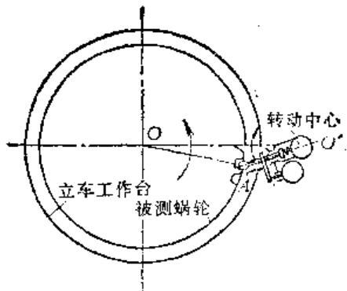

图10-1-21 在立车工作台上测量大型蜗轮的齿圈径向跳动

齿沟并记录其数值。

径向跳动量以所测全部齿沟读数的最大变动量计算。为了较形象的反映出径向跳动规律，可绘制极坐标图。

图10-1-22所示为测量  $z = 32$  齿的蜗轮齿圈径向跳动所绘极坐标图。用作曲线内接圆的方法可近似求得几何偏心量及其相位角，以供修理回转中心时参考。

测量蜗轮的  $\Delta F_{r}$  时，应用球形测头。球形测头要接触在蜗轮中央平面上，不能沿齿长方向移动。为减少齿形误差对径向跳动的影响，球形测头直径可按直齿圆柱齿轮选取，即力求它能在齿的固定弦位置与齿廓接触，这时测头直径  $d_{p}$  为：

$$
d _ {p} = \frac {\pi m}{2} - \cos \alpha + 2 \sin a \xi
$$

若  $\alpha = 20^{\circ}$  时；

$$
d _ {p} = 1. 4 7 6 m + 0. 6 8 4 5
$$

工厂中也有使球头在分度圆处与齿廓相接触，

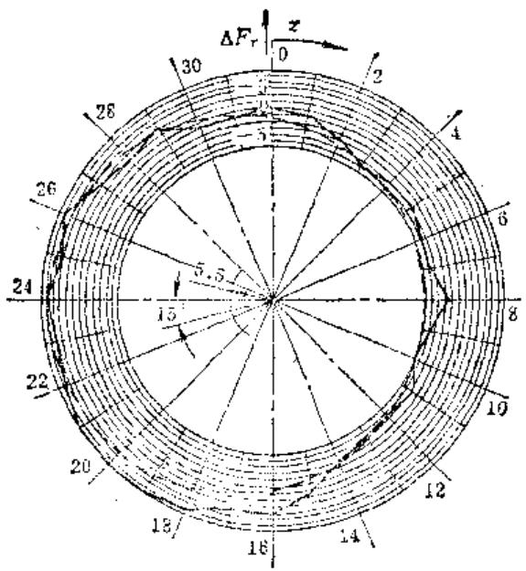

图10-1-22 路径向跳动坐标图

此时球头直径为：

$$
d _ {p} = \frac {\pi m}{2 \cos \alpha_ {f}}
$$

若  $a_{f} = 20^{\circ}$  时；  $d_{p} = 1.68\pi$

# 3. 接触斑点的检验

接触斑点是接触精度指标之一，分度蜗轮副均需做该项检验。

接触斑点是指安装好的蜗杆副中，在轻微力的制动下，蜗杆与蜗轮啮合运行后在蜗轮齿面上分布的接触痕迹。接触斑点以接触面积大小、形状和分布位置表示。

接触面积大小按接触痕迹的百分比计算，参见图10-1-23。

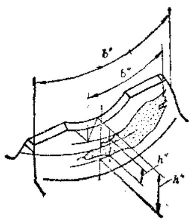

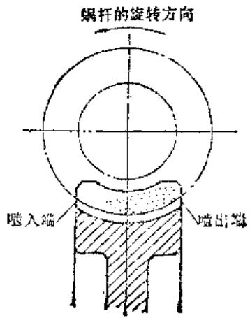

图10-1-23 接触斑点计算及位置图

沿齿长方向，接触痕迹的长度  $b^{\prime \prime}$  与工作长度  $b^{\prime}$  之比（在确定接触痕迹  $b^{\prime \prime}$  时，应扣除超过模数值的断开部分），

即  $b^{\prime \prime} / b^{\prime}\times 100\%$

沿齿高方向；接触痕迹的平均高度  $h^{\prime \prime}$  与工作高度  $h^{\prime}$  之比，

即  $h^{\prime \prime} / h^{\prime}\times 100\%$

接触形状以齿面接触痕迹总的几何形状的状态确定。接触位置以接触痕迹距齿面啮入、啮出端或齿顶齿根的位置确定。

对于分度蜗轮来说，齿高方向的接触尤为重要，因为它影响蜗轮旋转的平稳性，影响运动精度。

从理论上分析，在轮齿高度和长度上都具有 $100\%$ 接触的可能性。但由于切齿刀具与蜗杆齿形的不一致，径向跳动，基节及螺旋线偏差，以及安装偏差等，均影响加工后齿面接触斑点的大小、连续性及位置变化。因而在加工修复过程中要仔细排除上述因素。

修理中，接触斑点的检验多在装配时进行。小尺寸及中等尺寸的蜗轮，可在齿轮检验机或蜗轮配对机上检验，见图10-1-24。

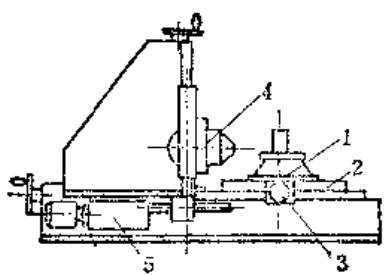

图10-1-24 配对机

1一夹具2一工作台3一施加阻力矩手轮

4一刀架 5一蜗杆驱动机构

检验前，应保证蜗杆中心线对蜗轮中央平面平行，对蜗轮中央平面偏移值尽量减少，以及中心距与加工中心距相等。在蜗杆齿面上涂一层很薄的显示剂，以利于分辨接触质量。

在检验接触质量的同时，要测量啮合侧隙。接触质量及啮合侧隙必须同时满足技术要求。

在修理中常用珩磨及刮研齿面的方法来提高接触质量。也可用配磨蜗杆齿形角来改善齿高方向的接触质量，用配磨齿厚的方法来改善齿长接触质量（可调中心距）及啮合侧隙。

# 4. 蜗轮齿厚的测量

小直径的蜗轮齿厚可用测量度量中心距极限偏差来代替。大直径蜗轮公称齿厚多用齿轮卡尺测量。

分度蜗轮副多是小批或成对制造的，不具有互换性。在生产中常用控制滚刀齿厚及加工中心距的方法加工，所以对齿厚并不做严格检查。当用标准齿厚的滚刀切向修正蜗轮齿厚时，可用控制轴向窜刀量的方法切齿厚至预定值。

# （三）蜗杆的测量

蜗杆的精度检验项目，在GB10089—88中规定，对于单头蜗杆检验组为  $\Delta f_{h}$  、  $\Delta f_{hL}$  ，多头蜗杆为  $\Delta f_{px}$  、  $\Delta f_{hL}$  ，或  $\Delta f_{px}$  ，  $\Delta f_{px1}$  ，  $\Delta f_{r_0}$

这些检验项目能综合反映蜗杆的轴向齿距偏差、螺旋线偏差和齿槽径向跳动，是评定传动精度比较合理和完善的指标。但需在万能显微镜（图10-1-25）或其它专用仪器上测量，如蜗杆导程仪（图10-1-26）、蜗杆滚刀检查仪、蜗杆螺旋线比较仪等。

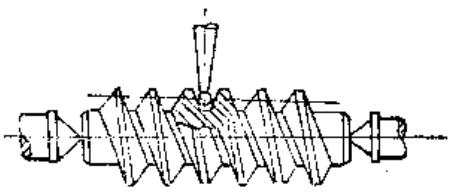

图10-1-25 用万能显微镜测量

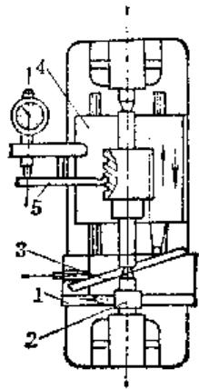

图10-1-26 用蜗杆导程仪测量

1—直尺 2—圆盘 3—正弦尺

4—滑板 5—杠杆

在万能显微镜上测量时，一般把被测蜗杆置于两顶尖之间，使测头触于齿面中部，对准双刻线，记下纵横坐标读数。退出测头后把分度头转过一给定

角度  $\theta$  ，并把纵托架相应地移动一距离  $l$  ，测头重又插入齿沟，并在原横坐标位置固定。这时双刻线的最大最小变化范围，即为螺旋线偏差。在蜗杆一转中应测量6～10点，其与理论值的最大差值，即为一转中的螺旋线误差  $\Delta f_{\mathrm{A}}$  ，在全长上测量为 $\Delta f_{\mathrm{AL}}$

在蜗杆滚刀检查仪上测量螺旋线的情况同用万能显微镜相似。转角用精密分齿盘，轴向移动用块规来调正实现。

在蜗杆导程仪上测量时，移动直尺1，由钢带或摩擦力带动圆盘2，使蜗杆旋转；在固定直尺1的滑板上，安放有正弦尺3；当1与3一块移动时，正弦尺斜面推动滑板4移动；调整正弦尺角度，可使滑板按理论螺旋线导程移动，故蜗杆的旋转运动与滑板的直线运动由圆盘——直尺——正弦尺联系在一起，插入齿沟的杠杆5便把蜗杆实际螺旋面与理论值的偏差反映在千分表上读出。

对于多头蜗杆的螺旋线偏差，应分别测量每条螺旋线。

在工厂中常用第二组检查项目来控制大型蜗杆的制造精度。

轴向齿距可在大型工具显微镜上测量。用顶尖或V形铁将蜗杆支起来，用投影法或量刀法测量。

在轴向截面内，蜗杆轴向齿距偏差值为  $\Delta f_{px}$  蜗杆轴向齿距累积误差  $\Delta f_{px10}$

造成轴向齿距偏差的主要因素是切削机床的运动精度，如挂轮误差，机床校正板误差，及其它工艺因素；温度、磨轮钝化、振摆等。

测量旧蜗杆时，因蜗杆在参与啮合的过程中，每齿在齿高方向上的磨损是不等的。故应在齿高方向的不同位置上多次测量，这时测出的误差值包括了齿形的磨损量，在分析时应予注意。

齿形误差是影响传动平稳性和接触质量的主要因素。齿形误差是齿形半角偏差和齿面直线度误差的总和。在公差标准中只给出了齿形误差，要单独计算半角偏差及直线度误差时，可取齿形公差的2/3为半角公差，其余1/3为齿面直线度偏差。

齿形误差可在工具显微镜上测量。阿基米德蜗杆用量刀法，延长渐开线蜗杆用投象法测量。

在修理中，遇到不需更换蜗杆仅更换蜗轮时，要测量蜗杆齿形左右两面的半角实际值，作为切削刀具的齿形角，以便获得较好的接触质量。若以配磨蜗杆齿形来调整接触面时，半角可不测量，仅测

量齿面的不直度，作为修正磨轮的依据。

齿槽径向跳动影响传动的平稳性和啮合齿隙的变化，引起机床传动链的短周期误差，可在万能显微镜（图10-1-27）或滚刀检查仪上测量。在加工及装配中，常用检查蜗杆旁边的径向校正基面振摆的方法来代替，以克服无检验仪器的困难。为此，在加工工艺中要严格保证径向校正基面与蜗杆节径同心。

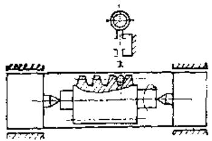

图10-1-27 在万能显微镜上测量  $\Delta f$

# 第2节 蜗轮修复方案的选择

# （一）磨损状态分析

1）齿面烧伤与粘结 因润滑不良或因滑动面在高速高压下（超过允许的  $PV$  值）油膜烧坏而造成金属直接接触，温度不断升高将齿面烧伤。烧伤严重时，滑动表面焊接后又撕开，产生金属转移而发生粘结。粘在蜗杆齿面上的金属很快将蜗轮齿面划伤，使齿厚显著变薄而报废。

出现烧伤或粘结时，蜗轮齿面均被硬化和擦伤。蜗杆表层硬度下降，渗碳蜗杆齿面常有龟裂现象。

磨损不大的蜗轮具有修复的可能性，但精加工前应将硬化层切去，以免损伤精加工刀具。因龟裂均发生在蜗杆齿面的啮合带上，这样的蜗杆应更换。

2）化学点蚀 所用的润滑油酸值过高，或长期使用而氧化以及油中含有腐蚀性溶质将齿面腐蚀出很多点粒小坑，随着受蚀时间增长坑增深。坑中的锈斑脱落后容易研坏齿面。发生这类情况时，应认真查明原因，仔细清除坑中的化合物，换入含水少酸值低的润滑油。

蜗杆啮合带（啮合面）上有点蚀时，增加传动的周期误差，加快蜗轮的磨损，有条件时可将蜗杆轴向移位或调头使用，达到改变啮合位置的目的。

修复蜗轮时，可不必将坑完全修去，用珩磨较方便。在做单个要素的检验时要注意排除坑的影响，应用综合量法测量。

3）低速磨损因速度过低或润滑不充分，齿面上无法建立油膜，金属直接接触，产生类似研磨的机械磨损现象。随着磨损程度增大，蜗轮蜗杆齿面产生轻重不一的划痕，齿厚减薄，啮合侧隙增大。用径向位移消除侧隙时，蜗轮齿根处出现线接触，破坏传动的平稳性。修复这类蜗轮副的同时，应改善润滑情况。

4）精度下降 蜗轮副外观检查时并无上述磨损情况，但精度超差。造成精度下降的原因除蜗轮副的定位精度下降外，主要是制造质量不高（材质不均、应力没消除、安装误差等）和不合理的修理（刮研时将圆形导轨刮偏、拆装时没找正、碰伤等）引起的。因此，要对这类蜗轮做认真的检查，按误差分布规律查明起因。

# （二）修复方案的选择

选择蜗轮副的修理方案时，要根据它们的磨损状态及修理部门的工艺技术装备情况和蜗轮副传动的结构形式（固定中心距或可调中心距传动）来确定。然后按蜗轮副的检验结果，计算出修理加工尺寸，绘出修理图。

各种加工方法的修理余量可按下值选取（不包括磨损量）：

滚齿时蜗轮齿厚减薄量：  $0.25\sim 0.5\mathrm{mm}$

剃齿时蜗轮齿厚减薄量：  $0.1\sim 0.2\mathrm{mm}$

磨削蜗杆齿厚的磨量：  $0.15\sim 0.3\mathrm{mm}$

配磨蜗杆时齿厚修配量：  $0.1\sim 0.15\mathrm{mm}$

修复蜗轮副时，是修复蜗轮报废蜗杆，还是修复蜗杆报废蜗轮，或者两件都修复？除根据它们的损坏程度外，还应考虑传动的结构形式：

1）固定中心距传动修复时，蜗轮的加工中心距必须严格与装配中心距一致，同时不允许装配后啮合侧隙超过允许值。

这类零件在修复时应采用切向变位的方法。在蜗轮蜗杆中，只能修复一件，新制一件。被修件的齿厚减薄量由增厚新件的齿厚来补偿，以免啮合齿隙增大。从考虑齿强度的观点出发，不宜减薄蜗轮齿厚，故应优先选用修复蜗杆的方法。若蜗杆为渗碳淬火件，修磨齿面量不宜过大，又考虑现有滚刀齿厚大于修后蜗杆的齿厚，便无法施工，则宜选用

修复蜗轮的方法。

由于蜗轮及蜗杆的齿厚无论在计算和测量中均不易做到精确，修后蜗轮副的啮合侧隙不易保证，故常用严格控制蜗轮加工中心距、刀具齿厚及轴向窜刀量的方法，来确定相配蜗杆齿厚的实际尺寸。修复蜗杆新做蜗轮时，应使蜗杆齿厚略小于刀具齿厚，其值约为允许的啮合侧隙。若滚齿后用珩磨精加工时，可使蜗杆齿厚等于刀具齿厚。若滚后剃齿时，蜗杆齿厚应大于刀具齿厚（留剃量）。

为了使切向修正量尽可能减小，可采用先修复一件后，按修后的实际尺寸来确定相配件的尺寸。这种方法特别适用于修复大直径的蜗轮。

当修复多头双导程蜗轮副时，因蜗轮几乎无修复可能，故应以修复蜗杆为主。

2）可调中心距传动 因中心距可以缩小，这类传动在修复时宜用径向负变位修正蜗轮，也可用切向变位修正（滚刀齿厚小于蜗杆实际齿厚时）或两种变位兼用（两个零件均修复）。

当修复蜗轮齿面，并按滚刀的实际尺寸来制造蜗杆时，蜗轮的径向修正系数可按下式近似求出：

$$
x _ {2} = - \frac {\pi m \cos \lambda - \bar {s} _ {\text {实}} - \bar {s} _ {\text {刀}} + \Delta_ {1} + \Delta_ {2}}{2 m t g a}
$$

式中  $\bar{s}_{\text{实}}$  ——实测蜗轮分度圆弦齿厚；

$\bar{s}_{\text{刀}}$  ——实测刀具分度圆弦齿厚；

$\Delta_{1}$  ——蜗轮修复的齿厚减薄量；

$\pmb{A}_{2}$  ——蜗杆修复的齿厚减薄量。

当蜗杆修磨后，齿厚仍大于刀具或等于刀具相应齿厚时，蜗轮蜗杆均可修复。

计算出  $x_{2}$  后，便可算出修后蜗轮的全部几何尺寸，这时应验算  $x_{2}m$  值是否超出机床结构的允许调整范围，并验算  $\Delta_{1},\Delta_{2}$  是否够加工。

蜗轮作径向负变位修正时，啮合节点移向蜗杆齿根，应保证节点不超出蜗杆的啮合齿高，若不能满足上述要求时，应采用切向修正变位。

# （三）保证接触斑点及啮合侧隙的方法

# 1. 影响接触斑点的因素

在阿基米德齿形蜗轮副的啮合中，除蜗轮中心平面上的啮合可以看作是圆柱齿轮与齿条的啮合，其啮合线是一根直线外，其它平行于蜗轮中心平面的任何截面上的蜗轮齿形，均不是渐开线齿形，并且它们的啮合线是各不相同的，故其啮合情况比较

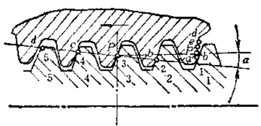

图10-2-1 蜗杆中心平面截面图

第3图

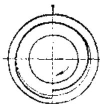

第2图

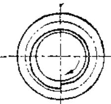

第1图

图10-2-2 蚗杆的接触带

复杂。下面就中心平面上的啮合情况，分析影响接触斑点的一些因素，参见图10-2-1。

螺杆若按图示转向推动蜗轮旋转。它们开始进入的啮合的起点，是从蜗杆齿1上的1点与蜗轮齿顶a点接触，随着蜗杆的转动，螺旋面推动蜗轮轮齿逐渐转过一个角度，而由蜗杆齿2与蜗轮同一齿面上的b点接触，依次经过3齿P点，4齿4点、5齿5点分别与蜗轮齿上的P、c、d点直至接触终了。

蜗杆齿面上各接触点的轨迹是从1点开始沿齿面逐渐上升的螺旋线。但由于其它平行于蜗轮中心平面的各截面上的齿，此时也参与了啮合，并且它们的啮合线是根曲线，所以蜗杆齿面上的接触线便不再是一根螺旋线，而是一条不太宽的螺旋带。图10-2-2所示为三个蜗杆齿参与啮合时的螺旋接触带示意图。

在啮合终了后，蜗轮齿高方向上留下了一条自  $a$  开始经  $\textit{\textbf{b}}$  、  $\pmb{P}$  、  $\pmb{c}$  、  $\pmb{d}$  的连续接触线，也由于其它截面参与啮合，接触线便扩展成齿长方向的接触面。

从以上分析可见，蜗轮齿高上的及蜗杆齿面上

的接触轨迹的连续性，直接影响到蜗轮副的运动周期误差，在评定接触质量时，应比齿长方向的接触比例，更应予以重视。假定无安装误差时，影响蜗杆接触带宽度均匀及连续的主要因素是：蜗杆导程与加工蜗轮刀具导程的一致性，蜗杆轴向齿距偏差 $(\Delta f_{px})$  和蜗杆轴向齿距累积误差  $(\Delta f_{pxl})$  、蜗杆齿槽径向跳动  $(\Delta f_r)$  ；其中  $\Delta f_{px}$  、  $\Delta f_{pxl}$  、  $\Delta f_r$  在制造及装配中是可以通过检验来保证的。

影响蜗轮齿高方向接触线长短及连续的主要因素是：蜗杆齿形与蜗轮切齿刀具齿形的一致性、蜗杆轴向齿距偏差  $(\Delta f_{px})$  、蜗轮齿距偏差  $(\Delta f_{pl})$  、蜗杆副的轴交角偏差  $(\Delta f_{z})$  。其中  $\Delta f_{px}$  、  $\Delta f_{pl}$  、  $\Delta f_{z}$  也是可在制造及装配中通过检验予以保证。

影响沿齿长接触线长短的主要因素是：加工中心距与安装中心距的一致性，加工和安装时蜗轮中心平面偏移的不一致性和蜗杆副轴交角偏差。这些都可以通过调整给予补偿的。对于可调中心距的传动，加工中心距和安装中心距的一致性也具有可调性，但此时应保证啮合侧隙。

蜗杆制造误差对蜗轮接触斑点的影响见表10-2-1。

表10-2-1 蜗杆制造误差对蜗轮接触斑点的影响

<table><tr><td>序号</td><td colspan="2">误 差 名 称</td><td>蜗轮接触面简图</td><td>说 明</td></tr><tr><td>1</td><td rowspan="2">齿形误差</td><td>压力角大了(即蜗杆齿形角大于蜗轮加工刀具齿形角)</td><td></td><td>只在齿根处有接触斑点</td></tr><tr><td>2</td><td>压力角小了(即蜗杆齿形角小于蜗轮加工刀具齿形角)</td><td></td><td>只在齿顶处有接触斑点</td></tr><tr><td>3</td><td rowspan="2">齿形误差</td><td>齿形母线凹了(即蜗杆齿形比蜗轮加工刀具齿形稍凹)</td><td></td><td>只在齿顶及齿根处有接触斑点,中间出现空白区</td></tr><tr><td>4</td><td>齿形母线凸了(即蜗杆齿形比加工蜗轮刀具齿形稍凸)</td><td></td><td colspan="1">只在齿节圆处有接触斑点,齿根及齿顶处出现空白区</td></tr><tr><td>5</td><td>螺旋角大于刀具螺旋角(啮合时)</td><td>1.蜗杆导程大于刀具导程2.蜗杆齿厚小于刀具齿厚</td><td>1'90°</td><td>蜗杆安装无轴心线偏斜的情况下,出现对角接触(齿高上接触面较好)属第二种原因时,安装中心距小于加工中心距(保证齿隙的情况下)</td></tr><tr><td>6</td><td>螺旋角小于刀具螺旋角(啮合时)</td><td>1.蜗杆导程小于刀具导程2.蜗杆齿厚大于刀具齿厚</td><td>&lt;90°</td><td>蜗杆安装无轴心线偏斜的情况下,出现对角接触(齿高上接触较好)属于第二种原因时,安装中心距大于加工中心距(保证齿隙的情况下)</td></tr><tr><td>7</td><td>齿厚偏差</td><td>蜗杆齿厚比滚刀齿厚大</td><td></td><td>齿两端接触,啮合中心距大于加工中心距,蜗杆齿厚了,使螺旋面的曲率半径大于蜗轮螺旋面曲率半径</td></tr></table>

# 2. 保证接触斑点的工艺方法

综合上述情况可见，将蜗杆螺旋面制造成与加工蜗轮的刀具螺旋面相一致，用刀具去范成的蜗轮，必然与蜗杆能很好的啮合，从而可不必去追求理论齿形，这样便能简化制造和计量中的困难。为保证刀具及蜗杆螺旋面的一致性，目前广泛运用两种方法。

（1）同磨法即将刀具及蜗杆的螺旋面，在最后精加工时，放在同一台机床、同一次调整、同一次修整砂轮等完全相同的条件下进行加工，以保证两者的一致性。该法适用于将剃齿、滚剃齿或珩磨作为蜗轮最后精加工时使用。为避免两侧齿形角不一致，防止配错方向，可用单面磨削法调头磨削两侧齿形。用该法磨削后，常由于刀具、蜗杆材质不

一样，磨削抗力不等，弹性变形不等，以及操作误差等因素不能获得预期效果。同时，该法不适用于用精滚法及刮研法修复蜗轮，因为很难克服数次测量和调整砂轮所带来的偏差。

（2）修配法即按加工蜗轮刀具的实际数据来配磨蜗杆的齿形角、齿厚、导程及齿廓直线达到接触斑点指标，因而无需同磨。

因加工蜗轮的刀具左右两侧的齿形角及齿廓直线不可能完全相同，故在加工时应按照蜗轮副的实际安装位置来配研接触面（且不可弄错安装方向）。

研配接触斑点可在蜗轮配对机、简易夹具或被修机床的壳体上进行。每修磨一次蜗杆都要研一次接触点，根据痕迹的分布位置，确定下一步的修磨部位，见表10-2-1。

用新蜗杆来配磨接触区时，首先要配齿高方向的接触斑点。因为，此时蜗杆齿厚大于刀具相应齿厚，故在配对机上的配研中心距大于蜗轮加工中心距（即安装中心距）。根据研痕的位置判别齿形角的大小，参照表10-2-1，修磨蜗杆的齿形角，达到齿高方向的接触指标。然后逐步磨小蜗杆齿厚，减小研配中心距，达到节圆处螺旋角一致，实现齿长方向的接触。在这一过程中，也是按研痕的位置来判别齿厚大小的。

固定中心距传动的蜗轮副在机床壳体上配研接触斑点时，可将旧蜗杆作试件或新作一件齿厚小于刀具相应齿厚的试件来配磨。待配好接触斑点以后，测出试件的齿厚加上侧隙作为新蜗杆的齿厚，并用同磨的方法来磨削新蜗杆齿面，达到新蜗杆与试磨蜗杆螺旋面的一致性。

为了减少修磨蜗杆齿形角的次数，可用图10-2-3所示的齿形样板测量刀具和蜗杆的齿形角。它是在一V形块上安放一悬臂量块，量块的安装斜角应等于  $\beta$  （等于螺旋角），悬臂  $L$  与  $A$  值应保证严格的几何关系  $\mathrm{tg}\beta = A / L$  。测量时V形块骑在滚刀的刀杆和蜗杆内孔的芯轴上，若两孔不一致时，应设计专用芯轴。由钳工修配悬臂测头使其与刀具切削刃吻合。用此样板去控制磨削蜗杆的齿形。

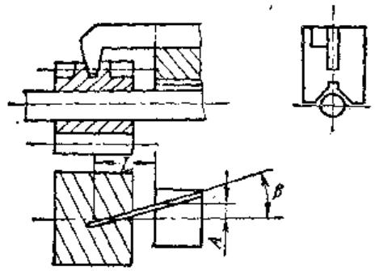

图10-2-3 磨削齿形用样板

当出现表10-2-1序号3、4接触时，可将砂轮工作面修凸或凹的方法来纠正，参见图10-2-4。图中1是带有金钢石的滑动杆，它能够通过铰链来改变  $\alpha$  角度，2是砂轮，3是磨头，4是打砂轮座。修整时，滑动杆两面靠在两个圆销钉上，移动滑动杆即可在砂轮面上打出带有凸起曲线的型面。沿右侧销钉转动打砂轮座时，可调节砂轮型面的角度。欲获得凹曲线的型面时，只须将滑动杆  $\alpha$  角调到大于 $180^{\circ}$  即可。在配磨过程中，凸起或凹下的数值应逐步试配获得，也可从齿形样板上用直尺漏光法估计。

图10-2-4 修整砂轮工作面的工具

修配法能够消除蜗轮副加工中诸工艺因素所造成的接触不良现象，具有较大的适应性和灵活性。

在GB10089—88中，对接触斑点的要求，作了明确的规定。要求接触斑点痕迹的分布位置趋近齿面中部，允许略偏于啮入端。在齿顶和啮入、啮出端的棱边处不允许接触。

# 3. 保证啮合侧隙的加工方法

侧隙是指蜗杆螺牙和蜗轮齿的结合面间的间隙，用来补偿蜗轮副在制造及装配中产生的误差、温升及弹性变形等影响，并给润滑油加入创造条件。

精密蜗轮副的侧隙必须在接触斑点合格的安装条件下测量。因为中心距的改变，将引起接触斑点的变化。其侧隙值应视它们的制造精度、工作情况和传动要求而异。一般可在机床说明书中查取。

制造及修复蜗轮副时，保证侧隙的问题必须充分注意，在制订加工方案时应加考虑。

用同磨法磨削刀具及蜗杆的螺旋面时，常用控制它们分度圆弦齿厚差值的方法（将蜗杆齿厚磨小），使蜗轮安装后产生齿侧隙。用切向修正法加工蜗轮或蜗杆时，还需将窜刀量计入。

在蜗轮配对机上用修磨法配接触斑点时，因操作是在双面啮合的条件下进行。这时可以有意识地将最终的配研中心距调到小于蜗轮的加工中心距（其值约为平均侧隙  $\times \frac{1}{2} \lg \gamma_{f}$ ）。但此时的接触斑点并不理想，齿顶及齿两端研痕较硬。蜗轮装配后，中心距恢复至加工中心距，接触斑点变好，同时产生侧隙满足传动要求。可调中心距蜗轮副在箱体中配接触斑点时，也可应用上述办法。

# 4. 安装调整中应注意的问题

在安装中除应满足径向及轴向跳动等基本精度、侧隙、接触斑点等要求之外，还需注意下述问题：

1）载荷的影响 考虑到负载后的变形及油膜对工作台的浮起，蜗杆中心应略高或略低于蜗轮的中心平面，见图10-2-5，补偿变形量或浮起量。图中虚线为蜗轮浮起后的位置，此时蜗杆中心与蜗轮中心平面共面，安装误差最小。

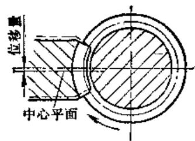

图10-2-5 位移补偿示意

2）保证轮齿承载面易导入润滑油这是保持精度寿命的关键。为使润滑油导入承载面中，需使蜗杆螺牙开始滑入蜗轮齿沟的一侧，形成一个小的楔形。实现这一要求的方法，可根据蜗轮副传动的结构形式及蜗杆的旋向和转向，选用使安装中心距稍大于加工中心距的方法，见图10-2-6，或将蜗杆中心安装成稍高或稍低于蜗轮中心平面的方法，见图10-2-7。

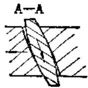

图10-2-6 加大中心距造成导油楔示意

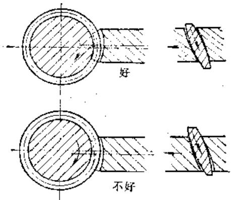

图10-2-7 平面位移造成导油楔示意

必须指出，平面位移仅适用于单向旋转的蜗轮副，且平面位移需控制在允许的范围内。因为安装误差对采用一般对偶法加工的蜗轮副的周期误差影响是很大的。只有当它们的接触斑点集中在齿部

中间时，其影响才小些。

3）将进入啮合的齿端倒角即将有效齿长的一端切去一部分，以利润滑油导入。这种方法适用于蜗轮齿冠面角较大、模数较大的反正向旋转的蜗轮副。

# 5. 侧隙的检查和调整方法

（1）单蜗杆传动的侧隙检查方法有（图10-2-8）

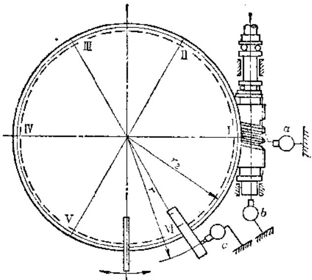

图10-2-8 侧隙检查方法示意图

1）直接测量法 将万能百分表  $a$  的测头直接触到蜗杆轴向齿面上，表  $b$  触到蜗杆的轴端（蜗杆的轴向窜动），表  $c$  触到固定在工作台上的方铁侧面。检查时，轻微反正转动蜗杆，在保证表  $c$  示值无变化的情况下，读出表  $a$ 、 $b$  两次读数的代数差  $j_{a}$  和  $j_{b}$ 。轴向侧隙  $j_{t} = j_{a} - j_{b}$ 。

2）间接测量法 表b仍触在蜗杆的轴端，表c仍触在方铁侧面，用杠杆左右扳动工作台，在确保蜗杆不发生转动的情况下，读出表b、c两次读数的代数差  $j_{\mathrm{b}}$  和  $j_{\circ}$  ，侧隙即为  $j_{\mathrm{n}} = j_{\mathrm{o}} - j_{\mathrm{b}}$  （此时  $r_2 = r$  ）。若  $r_2 \neq r$  时，侧隙则为  $j_{\mathrm{n}} = \frac{r}{r_2} j_{\mathrm{c}} - j_{\mathrm{b}}$  。

检查侧隙时应考虑到蜗杆及蜗轮精度的影响，因而蜗杆每转动  $45^{\circ}$  后测量一次，并应在蜗轮全周内至少测量六处。各处的间隙及间隙变动量，均需满足技术要求。

（2）双蜗杆传动的侧隙检查和调整程序

1）先将一个蜗杆脱开啮合。

2）将蜗轮最大齿距累积误差  $A$  点和最小累积误差  $B$  点的连线  $AB$  与蜗杆中心线平行（实际操作时可用摇动蜗轮旋转感觉最松和最紧的两点连线代

替), 按图10-2-9所示测出仍然处于啮合的蜗杆侧隙。计量方法与单个蜗杆传动相同。

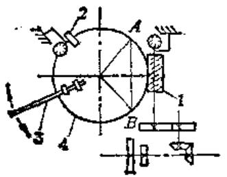

图10-2-9 双蜗杆传动侧隙检查法

1—第一个蜗杆 2—方铁 3—杠杆

4一蜗轮节圆

3）检查完第一个蜗杆后，将工作台旋转  $\pi$  角，拆下第一个蜗杆，装上第二个蜗杆进行检查，方法同上。

4）调整两个蜗杆的传动链总间隙相等，以免两蜗杆不同步咬坏蜗轮。由总传动轴Ⅰ至蜗轮之间全部传动链的总间隙可用下述方法之一检查和调整，见图10-2-10：

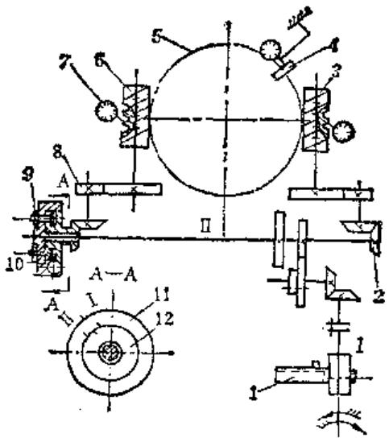

图10-2-10 双蜗杆传动调整示意图

1—角度水平仪 2—锥齿轮 3—第一个蜗杆

4一方铁 5一蜗轮节圆 6—第二个蜗杆

7一杠杆百分表 8一圆柱斜齿轮 9一离合器

螺母 10—离合器小蜗杆 11—离合器外法

兰盘 12-离合器内法兰盘

① 用两个百分表分别触在两蜗杆的左、右齿面上，先用扳手向左转动轴I，这时把两个百分表的指针对在0位上。然后用扳手向右转动轴I，同时观察记录两个百分表的读数，两读数差即为两蜗杆传动链总间隙差。差值一般不应超过  $0.03\mathrm{mm}$  。

如超差时，则必需调大或调小轴上一对锥齿轮的齿侧间隙补偿（也可用调整圆柱斜齿轮齿侧间隙补偿）。直至反复测量达到规定值为止。

② 另一方法是用图10-2-11所示之角度水平仪来检查和调整由总传动轴I至蜗轮的总传动间隙。这种方法比较精确，能够调整两间隙之差在  $0.02\mathrm{mm}$  之内。检查和调整的步骤是：先装上第一个蜗杆，转动蜗轮使AB直线平行于蜗杆轴线。在工作台上等于蜗轮节圆半径处固定一块方铁，在不动的支架上安放百分表座，使表的触头触在方铁上。然后向任一方向转动轴]直至百分表指针摆动后停止转动，但不要立即释放，保持一定的外力以免弹性恢复。把表针调整对0。这时再将角度水平仪固定在轴I上，并将水泡也调整到0位。向反向缓慢转动轴I，在百分表开始摆动的瞬间（即指针0位似动不动）停止转动，但仍需施加适当外力防止弹性恢复。这时读出水平仪读数。此转角值即为传动间隙所产生。

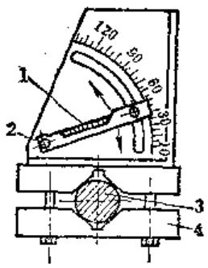

图10-2-11 角度水平仪装置

1—水平仪气泡 2—水平仪转轴

3—传动轴I 4—支架

检完第一个蜗杆后，拆下角度水平仪，反时针转动蜗轮  $180^{\circ}$ ，拆下第一个蜗杆，装上第二个蜗杆，并把轴Ⅱ上可调离合器螺帽9紧固好（可调离合器是调整两个蜗杆的相对位置或使两蜗杆与蜗轮同时接触）。检查第二个蜗杆的总传动间隙的方法同上。如间隙值不相等时，补偿方法与上一种相同。

5）两个蜗杆同时啮合的调整 由于蜗轮副受加工及安装误差的影响，要使两个蜗杆同时啮合实际上是很困难的，一般仅能达到同时啮合和交替啮合交错进行。

两个蜗杆分别调至合格齿隙后，将传动装配好，按图10-2-10用杠杆左右扳动工作台，测量同

时啮合时的齿侧隙，若数值小于最小平均啮合侧隙，说明两蜗杆的相对位置不能保证同时啮合。这时需调整轴Ⅰ上的可调离合器，使啮合间隙等于一个蜗杆单独啮合侧隙的中间值，方能实现同时啮合的目的。

调整时，把离合器紧固螺母9松开，转动小蜗杆10，离合器的法兰盘随之转动，直至蜗杆与蜗轮无啮合侧隙。此时小蜗杆10也转不动了，用杠杆左右转动工作台，百分表指针不动。转动小蜗杆10及转动工作台均不得用力过大，以免损坏蜗杆10。然后在可调离合器内外法兰盘上用细针划一根直线作为标记。再反向转动小蜗杆10，使蜗轮副产生少量侧隙，紧固可调离合器内外法兰。转动总传动轴使蜗轮旋转  $180^{\circ}$  停止。再松开可调离合器，这时按与上次相反的方向转动小蜗杆10，直到蜗轮副间无侧隙为止。用细针以上次划在内法兰盘上的线为基准，在外法兰盘上划一条细直线。回转可调离合器使内法兰上的刻线对准外法兰两次刻线的中间，此时把可调离合器紧固牢靠。再用杠杆转动工作台，检查两个蜗杆同时啮合的侧隙，应等于单个蜗杆啮合侧隙的平均值或最小值。

上述调整和检验合格后，还需在工作台圆周每隔  $60^{\circ}$  处，测量其啮合间隔的一致性，一般不相等公差为  $0.04\mathrm{mm}$  。如果超差时应重调离合器进行修正。

若蜗轮副的运动误差在蜗轮一转中是按正弦规律变化，并且波数为奇数次时，双蜗杆交替啮合，可提高运动精度一倍。

# 第3节 分度蜗轮的修复方法

蜗轮磨损状态及误差分布情况检查以后，便可根据修理部门的工艺技术装备情况，选取适当的修复方法。

# （一）修复齿形的加工方法

# 1. 精滚齿面

即用精滚刀将齿面重新切削加工，恢复其全部精度指标。

滚切加工的精度，取决于机床的运动精度、几何精度、刀具精度及夹具定位精度。

精切时应选用精密滚齿机或经过校正提高了运动精度和几何精度的滚齿机。必要时应事先对机床

进行试切测定，采取适当的工艺措施如易位加工，偏置安装等方法，减少机床运动误差在工件上的反映，提高加工精度。为消除其它工艺因素对加工质量的影响，滚前应调整机床、刀具和轮坯的安装精度，达到：

① 滚齿机分度蜗杆及刀具主轴的窜动<0.002~0.005mm;

② 刀具的径向跳动  $< 0.002 \sim 0.005 \mathrm{~mm}$

③ 滚刀轴线对机床工作台回转平面平行度误差  $< 0.005 / 300 \sim 0.01 / 300 \mathrm{~mm}$

④ 工件装夹校正误差：径向和端面跳动小于  $0.003 \sim 0.01 \mathrm{~mm}$ 。

为避免蜗轮的加工基准和装配安装基准不一致，产生附加安装误差，分度蜗轮应装在工作台上后滚齿，见图10-3-1。无法装在工作台上滚齿时，应装在牢固的夹具体上滚齿，见图10-3-2。装夹找正后的偏差值，用钢字打在偏差的极限位置上，供装配调整或抵消误差时参考。

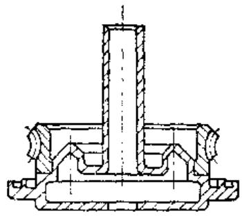

图10-3-1 装在工作台上装齿

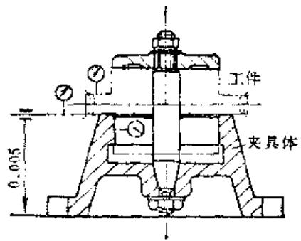

图10-3-2 在夹具体上液面

精滚法适用于加工5级以下的蜗轮，所用滚刀精度一般应高于被切工件精度一级。

精滚所用滚刀按进给方法不同，分为径向进给和切向进给滚刀，精滚刀较普通蜗轮滚刀具有如下特征：

表10-3-1 分度蜗轮精滚刀与普通蜗轮滚刀的比较 (mm)

<table><tr><td>项目名称</td><td>刃沟数</td><td>铲背量</td><td>侧刃后角</td><td>刃沟等分误差0.04时,螺旋线偏差</td><td>蜗轮齿面包络线误差</td></tr><tr><td>普通滚刀</td><td>8</td><td>6.5</td><td>2°55&#x27;</td><td>0.00204</td><td>0.00067</td></tr><tr><td>精密滚刀</td><td>12</td><td>1</td><td>40&#x27;18&quot;</td><td>0.00047</td><td>0.00031</td></tr></table>

# （1）径向进给滚刀

1）具有较多的刃沟数及较小的铲背量 刃沟数的增多，减少了齿面包络误差，降低了齿面粗糙度，提高了齿面接触质量。铲背量减小，减少了刃沟等分及导程等分误差对螺旋面误差的影响。表10-3-1所示为Y38A分度蜗轮精滚刀与普通蜗轮滚刀的比较情况。

2）提高刀具的定位和校正基面精度，以减少安装误差，各安装轴颈及校正轴颈的端面和径向跳动要控制在  $0.002 \sim 0.005 \mathrm{~mm}$  以内（精度高者选小值）。

为提高安装精度，增加刀杆刚性，刀具内孔小于  $\phi 22$  的滚刀可制成连轴式，见图10-3-3，内孔大于  $\phi 22$  的滚刀，可制成带专用刀杆的结构，见图10-3-4。后者应在装配后精磨各基准面及齿形，磨后及使用中不得拆卸。

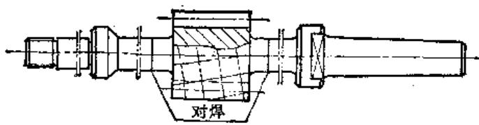

图10-3-3 连轴式结构

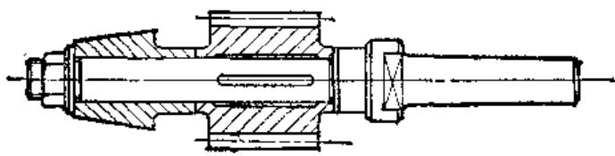

图10-3-4 专用刀杆结构

3）多数情况下，分度蜗轮蜗杆是配制的，不具有互换性，刀具刃磨后齿厚减小。故精密滚刀的齿形角、齿厚、导程可不必要求其绝对值误差，只需严格控制其同名齿面各值的均匀性及螺旋线偏差在规定范围内，就可按滚刀的实际偏差配磨出蜗杆齿形。一般齿形角的均匀性误差为  $2^{\prime} \sim 3^{\prime}$ ，齿距偏差与累积误差以负值为佳。

4）精滚刀长度较一般滚刀短，其长度可按齿轮齿条啮合的公式计算，并加适量的窜刀量。这样可以克服按工作蜗杆螺纹部分长度  $+$  轴向齿距来计算滚刀长度时滚刀过长，增加制造困难的缺点。

（2）切向进给滚刀 由于多头蜗轮一般直径较小而  $\gamma$  较大，用径向进给滚切时除易产生面切外，还因啮合线较短，齿廓包络线数减少，切齿后棱面很高，齿形误差大，配接触面十分困难，故多头蜗轮均应切向进给滚切。

表10-3-2为常用的三种切向滚刀结构及其特点比较。

精滚刀的制造比较困难，刀具的诸项制造误差，如轴向齿距、齿形角、前刃而非径向性、前刃面非轴向性、刃沟数齿距累积误差均影响被切蜗轮的齿形及基节。蜗轮切齿后配接触面时出现鳞状斑点接触，当制造3、4级蜗轮时，应在滚齿后再自

由剃齿或自由珩齿，以提高齿形精度和接触质量，降低齿面粗糙度。

被修蜗轮在精滚齿前，要先用粗滚刀或飞刀，将齿面硬化层切去，以免硬化层损伤精加工刀具的切削刃。

# 2. 刺削齿面

这是利用蜗杆形剃刀对蜗轮齿形做精加工的方法。

剃齿一般在精滚齿后进行，能进一步降低齿面粗糙度、提高齿形精度、相邻误差及接触质量。剃齿留量按剃齿方法不同，自由剃削时0.08 $\sim 0.15\mathrm{mm}$ ；强迫剃削时为  $0.15\sim 0.25\mathrm{mm}$ 。

图10-3-5为YG3780高精度滚齿机分度蜗轮剃齿刀结构。蜗轮精度3级。

为提高安装精度及减少制造误差，剃齿刀也可制或连轴式或带专用刀杆的结构。

剃齿刀的标准截形和尺寸与蜗杆一致，切削刃带是螺旋面上的一小段，刀齿前面上的前角约为  $6^{\circ} \sim 7^{\circ}$ ，刃带部分通常没有后角。因剃齿刀不象滚刀那样需要开刃沟槽，不需铲磨齿形，剃齿刀的齿形

表10-3-2 切向滚刀的结构及其特点

<table><tr><td>结构类型</td><td>结构草图</td><td>说明</td><td>切削情况</td><td>优缺点</td></tr><tr><td>带切削锥度的结构</td><td></td><td>锥角:φ=11°~13°粗切部分长度: l2≈10模数精切部分长度: l1≈6模数</td><td>带切削锥度的结构</td><td>优点:可一次滚出齿面,生产率较变齿厚高缺点:齿面是由不同刀齿切割的,因刀齿具有误差,故齿面有花纹</td></tr><tr><td>变齿厚的结构</td><td></td><td>粗切部分长度: l2≈10模数精切部分长度: l1≈6模数左导程: P左=Px-0.25右导程: P右=Pz+0.25Pz:蜗杆导程</td><td>变齿厚的结构</td><td>优点:蜗轮齿面由最后的精切齿切出,避免了上述缺陷缺点:要先径向进刀切削,后改为切向进刀,生产率较低</td></tr><tr><td>带切削锥及变齿厚的结构</td><td></td><td>l1、l2同上P左、P右同上是上两种结构的组合,实践表明:下列数值较好l2≈5~9模数l1≈1~2T(大模数者取大值)</td><td>带切削锥度及变齿厚的结构</td><td>综合了上述两种的优点,精切齿以1~2个为最好</td></tr></table>

角可与相配蜗杆在同一台机床上用相同磨法加工，易于保证两者的一致性。故用剃齿刀剃齿后的蜗轮与蜗杆啮合时，能获得较好的接触精度及运动精度。

剃齿刀的齿数，一般比精滚刀多  $3\sim 5$  倍，可大大减小剃后齿面的包络误差，并获得极低的粗糙度。接触质量在齿长及齿高上均可达到  $85\%$

剃刀重磨时只需磨螺旋面刃口，精度保持性较好。剃刀刃磨后齿厚减小，需按摩后的尺寸配制蜗杆。

剃齿刀的几何参数均与相配蜗杆的尺寸一致。剃齿刀的外径比蜗杆大（但小于精滚刀），外径可按下式计算：

$$
D _ {\text {利 方}} = D _ {\text {横 打}} + (0. 1 \sim 0. 2) m
$$

剃齿刀刃口槽的形状如图10-3-6所示，直线部分能保证重磨后刃带宽度不变，斜面部分能增加刃

口的强度防止淬火裂纹。刃带的宽度：加工铜件时为  $0.1 \sim 0.15 \mathrm{~mm}$ ；加工铸铁件时为  $0.3 \sim 0.4 \mathrm{~mm}$ 。

剃齿分强迫剃齿及自由剃齿两种方式，均可在滚齿机上进行，自由剃齿也可在配对机上进行。两种剃齿方式的区别在于被剃蜗轮是否有强迫的“创成”运动。强迫剃齿时，刀具-工件间的传动链不断开，刀具与工件仍保持“创成”的关系，故剃齿的精度除受剃齿刀精度和机床的几何精度影响外，还受机床传动精度的影响。因为被剃蜗轮的齿距累积误差是直接受机床分度蜗轮齿距累积误差影响，欲减小被剃蜗轮的齿距累积误差，就必须将被剃蜗轮装在比精滚齿的机床更精密的机床上剃齿。自由剃齿时，刀具-工件间的传动链被断开，由剃齿刀转动带动蜗轮旋转，所以剃齿不受机床传动精度的影响。剃齿精度主要取决于剃齿刀精度及被剃蜗轮剃齿时的旋转精度，剃后蜗轮的齿距累积误差取决

<table><tr><td>模 数</td><td>m=3</td><td>模 数</td><td>m=3</td></tr><tr><td>齿数</td><td>1</td><td>理论节圆直径</td><td>100</td></tr><tr><td>螺旋方向</td><td>右</td><td>齿节距误差</td><td>±0.001</td></tr><tr><td>导程角</td><td>1°43&#x27;6&quot;</td><td>齿形</td><td>延长渐开线</td></tr><tr><td>导程</td><td>9.428</td><td>累积误差</td><td>±0.003</td></tr></table>

技术条件：

1.装上滚刀后，精磨外圆和轴台，跳动小于  $0.005\mathrm{mm}$ 。

2. 精磨齿形必须与磨蜗杆同一机床，同一调整。

3.齿前面应在淬火后研磨，然后磨齿形。

4. 刃带必须垂直通过轴心，只允许前倾  $1^{\circ}$  以内，对孔跳动小于  $0.005\mathrm{mm}$ 。

5.淬火后，检查硬度、金相组织和缺陷。

6.两端32H6孔，同轴度公差为0.003mm。

7.淬火：HRC62~65

图10-3-5 剃齿刀结构

图10-2-6 刃刀刃口槽的形状

于精浚后的累积误差，剃后无明显提高。自由剃齿仅能降低齿面粗糙度，提高齿形精度，并减小齿距相邻误差。

由于剃齿能有效地消除前道工序中因刀具误差所造成的基节、齿形以及机床短周期误差引起的齿廓上的短周期误差，而对机床运动偏心所引起的齿距累积误差无显著纠正能力，在制造及修理中多用于5级以下蜗轮的精加工。

强迫剃齿不需制造专用工夹具，仅以剃齿刀代替滚刀即可在滚齿机上进行。自由剃齿需制造专门的工夹具，保证蜗轮有较高的旋转精度。

自由剃齿的速度  $v = 10 \sim 12 \mathrm{~m} / \mathrm{min}$ ， $n = 40$  r/min，进给量  $f = 0.02 \mathrm{~mm} / \mathrm{min}$ 。剃齿时用  $90\%$  的煤油掺入  $10\%$  透平油作为润滑冷却剂，不断冲洗切削区，既能防止切屑夹入而破坏齿面粗糙度，又延长剃齿刀的使用寿命。

# 3.滚剃齿面

滚剃法适用于单件小批生产，是一种介于精滚齿和剃齿的加工方法。所用刀具是滚剃刀，其刀齿数较多（与精滚刀相近），有刃沟槽和较大的铲背量，因此具有精滚刀的特征；但在切削刃处有一条  $0.1\sim 0.3\mathrm{mm}$  宽的刃带，它是蜗杆螺旋面上的一段，刃带处无后角，故又具有剃刀的特征，见图10-3-7。

图10-3-7 滚剃刀刃带

刃带处的齿形角可与相配蜗杆在同一台机床，同一次调整，同一次修整砂轮等完全相同的条件下磨出，这样易于保证两者的一致性。同时，由于具有刃带，就不存在精滚刀各制造误差（如刀沟槽累积误差，前刃面非轴向性误差，前刃面非径向性误差等）对刀具精度的影响。所以滚剃刀较精滚刀易于制造。

由于滚剃刀的刃沟槽比剃齿刀的大得多，可以容纳较多的切屑，故能比剃齿刀切去更厚的金属层。

滚剃刀的结构形式与精滚刀相同，也可制成套装式、连轴式及专用刀杆式。加工时的技术要求与精滚齿完全相同。

因滚剃刀刃带处后角为零，切削有硬化层的齿面时，刃带易钝和拉毛，并引起机床负载增加，齿面不光等缺陷。减小刃带宽度可提高切削性能，但刃带过窄（ $0.05 \sim 0.1\mathrm{mm}$ ）制造很困难。

# 4. 珩磨齿面

这是一种用珩磨蜗杆作为切削工具对蜗轮齿面作精加工的方法。

珩磨时将珩磨蜗杆与蜗轮正常啮合，并在蜗轮上施加阻力矩，当珩磨蜗杆带动蜗轮旋转时，利用齿面的相对滑动，磨料便产生切削作用。

珩磨蜗杆的齿面是一连续螺旋面，可用与滚刀（或蜗杆）同磨来获得较高的加工精度和一致性。珩后蜗轮的周期误差及接触精度均有显著的提高，并对降低齿面粗糙度有显著效果。采用变制动力矩珩磨时，对蜗轮的齿距累积误差也有较好的改善。由于珩磨蜗杆制造方便，费用也较低，故珩磨在修理部门得到广泛应用。

珩磨通常作为精滚齿后的精加工，或是刮研修

复后的精加工，但也可作为修复蜗轮的单独工艺方法使用。珩磨可在滚齿机上或配对机上进行。在修理工作中，常将珩磨蜗杆与蜗轮按装配图要求组合装配后，直接在机床箱体中珩磨，以消除部分加工和装配误差。

因珩磨蜗杆磨料层基体硬度较低，切削性能较差，故珩前不需留珩磨余量。

# （1）珩磨蜗杆的设计与制造

1）珩磨蜗杆的设计 珩磨蜗杆由铁芯和磨料层组合而成。珩磨蜗杆的基本参数（模数、头数、齿形角、螺旋角、分度圆、弦齿厚）均按精浓刀或相配的蜗杆尺寸来确定。

① 珩磨蜗杆的外径应比滚刀的实测外径小  $0.1 \sim 0.2 \mathrm{~mm}$ ；比蜗杆的外径大  $0.2 \mathrm{~m}$ 。

② 珀磨蜗杆的小径应略小于蜗杆小径，以获得较好的齿形。

③ 当不需更换蜗杆，仅珩磨修复蜗轮时，珩磨蜗杆的齿厚要小于蜗杆的齿厚，以免珩后在总装时产生过大的啮合侧隙。

④ 计算珩磨蜗杆铁芯的尺寸时，要保证磨料层的厚度在  $0.5 \sim 1.5 \mathrm{~mm}$  之间（大模数选大值）。

珩磨蜗杆可设计成连轴式或套装式，见图10-3-8和图10-3-9，安装和校正基准应经过精密加工，并具有较高的几何精度。套装珩磨蜗杆的孔与刀杆的配合间隙小于  $0.005\mathrm{mm}$ ，应在套装后精磨齿形、安装基面和校正基面。

图10-3-8 连轴式珩磨蜗杆

图10-3-9 套装式对磨蜗杆

2）珩磨蜗杆的制造 珩杆的铁芯可选用调质钢制造。

$①$  麻料层材料

a. 磨料 珩磨中应用最广的是白刚玉  $\left(\mathrm{Al}_{2} \mathrm{O}_{3}\right)$  和氧化铬  $\left(\mathrm{Cr}_{2} \mathrm{O}_{3}\right)$  。前者用于粗珩，后者用于精珩及抛光。粒度范围：粗珩为  $120^{\#} \sim 180^{\#}$ ，精珩及抛光为： $280^{\#} \sim W5$ 。

b. 粘结剂 通常选用环氧树脂。因它具有很强的粘结性能，并可在常温下不加压固化，收缩性好（小于  $0.2\%$ ），成形精度高，力学强度较好，可在  $-20\sim 100^{\circ}\mathrm{C}$  的温度范围内保证耐湿、酸、油等的稳定性，对金属无腐蚀作用。环氧树脂的国产牌号有101、610、604、618、628、634。

c. 硬化剂 常用乙二胺，用量为树脂的  $6\% \sim 8\%$ .

d. 稀释剂 稀释剂的用量不宜过多，多了会降低材料的力学性能。应在保证适用的粘度情况下尽量少用，一般为树脂的  $5\% \sim 10\%$  。常用的稀释剂为苯二甲酸二丁脂。

② 珩磨材料的配制与浇注 浇注法——适用于大模数大直径的珩杆。将上述材料的液体混合物注入模具，珩杆的齿沟铸出，减少材料消耗易于珩杆加工，但需设计对开或正体的铸模。涂抹法——多用于小型珩杆的制造。将半流体的混合物直接涂抹在铁芯上，涂抹后用聚氯乙烯薄膜将珩杆缠好，防止磨料层流动。

几种常见的磨料层成分配方列于表10-3-3～表10-3-6。

③ 磨料层材料的配制及浇注程序

a. 先后用汽油及四氧化碳将铁芯洗涤数次，凉干后放入恒温干燥箱内预热至  $35 \sim 40^{\circ} \mathrm{C}$  。浇注模经洗涤后与铁芯同时预热。

b. 按配方比将所需材料称量好，将磨料及环氧树脂和苯二甲酸二丁脂的混合物搅拌后，放入箱内预热至  $35 \sim 40^{\circ} \mathrm{C}$ 。

表10-3-3 珀磨蜗杆配料（一）

<table><tr><td>组 成</td><td>名 称</td><td>规 格</td><td>重 量 比</td></tr><tr><td>粘结剂</td><td>环氧树脂</td><td>101*</td><td>100</td></tr><tr><td>硬化剂</td><td>乙二胺</td><td>含量不低于70%</td><td>7.5</td></tr><tr><td>磨料</td><td>氧化铝(白Al2O3)</td><td>180*</td><td>180</td></tr><tr><td>稀释剂</td><td>苯二甲酸二丁脂</td><td>化学纯</td><td>15</td></tr></table>

表10-3-4 珀廖蜗杆配料（二）

<table><tr><td>组 成</td><td>名 称</td><td>规 格</td><td>质 量 比</td></tr><tr><td>粘结剂</td><td>环氧树脂</td><td>101°</td><td>100</td></tr><tr><td>硬化剂</td><td>乙二胺</td><td>含量不低于70%</td><td>7.5</td></tr><tr><td>磨料</td><td>绿色碳化硅(SiC)</td><td>120°</td><td>160</td></tr><tr><td>稀释剂</td><td>苯二甲酸二丁脂</td><td>化学纯</td><td>10</td></tr></table>

表10-3-5 珩磨蜗杆配料（三）

<table><tr><td>组 成</td><td>名 称</td><td>规 格</td><td>重 量 比</td></tr><tr><td>粘结剂</td><td>环氧树脂</td><td>624*</td><td>100</td></tr><tr><td>硬化剂</td><td>乙二胺</td><td>含量不低于70%</td><td>8</td></tr><tr><td>磨料</td><td>氧化铝(白Al2O3)</td><td>120*</td><td>230</td></tr><tr><td>稀释剂</td><td>磷酸三苯脂</td><td>化学纯</td><td>30</td></tr></table>

表10-3-6 珩磨蜗杆配料（四）

<table><tr><td>组 成</td><td>名 称</td><td>规 格</td><td>顶 量 比</td></tr><tr><td>粘结剂</td><td>环氧树脂</td><td>6101</td><td>100</td></tr><tr><td>硬化剂</td><td>乙二胺</td><td>含量不低于70%</td><td>6~8</td></tr><tr><td>磨料</td><td>氧化铝(白Al2O3)</td><td>180°~280°</td><td>250~300</td></tr><tr><td>稀释剂</td><td>磷苯二甲酸二丁脂</td><td>化学纯</td><td>20</td></tr></table>

e. 将预热后的浇注模涂以脱模剂。脱模剂可用聚苯乙烯（无色透明固体）按5:100溶于苯制成，或用硅橡胶和苯的溶液，浓度  $10\%$  。

d. 将预热后的环氧树脂和苯二甲酸丁二脂的混合液中注入硬化剂（乙二胺）并搅匀。这时混合液的温度不应超过  $35^{\circ} \mathrm{C}$  。搅拌前的初始温度过高，加上树脂和乙二胺的放热反应，会造成硬化过快，气泡来不及析出，影响成品质量。待混合液搅匀后，把磨料倒入搅拌至成分均匀，气泡减少后便可浇注。

e. 把混合料从浇注模内壁一侧倒入，并轻微敲击模具使气泡放出，直至浇实为止。将模具封好垂直置于室内平台上，在室温下自然硬化  $24 \mathrm{~h}$  。

f. 将反应完毕的塑性混合物烘干。温度规范：2h内缓慢升温至  $150^{\circ}\mathrm{C}$ ，保温2h后与炉同冷。

④ 珩磨蜗杆的加工工艺 现以套装珩磨蜗杆为例，见图10-3-9，列出其加工工艺于表10-3-7。

（2）珩磨方法 珩磨蜗轮时，以自由的或强迫的运动来带动蜗轮旋转，珩磨可分为下列几种

1）强迫珩磨修复法 蜗轮的强迫珩磨最好在高精度的滚齿机上进行，此时，珩磨蜗杆与工件间仍需保持严格的传动比。也可在加入误差校正装置普通滚齿机上进行。机床几何精度应达到下列数值：工作台顶尖的径向跳动  $< 5\mu \mathrm{m}$ ；上下顶尖同轴度  $< 5\mu \mathrm{m}$ ；珩磨蜗杆安装在刀轴上后径向及轴向跳动  $< 5\mu \mathrm{m}$ ，

强迫珩磨的效果，取决于滚齿机的传动精度，这种方法多用来纠正精滚后所造成的齿面不光和齿形误差，在单件和小批生产中代替剃削。珩磨时珩杆逐渐作径向进刀，直至珩齿的中心距与装配中心距一致。珩杆的线速度为  $10\sim 15\mathrm{m / min}$  ，每次径向送进约  $0.02\sim 0.05\mathrm{mm}$  ，进刀一次后蜗轮旋转  $2\sim$ $5r$  。为降低珩齿的粗糙度，珩磨时要充分加入润滑冷却液。

2）自由珩磨修复法 自由珩磨可在滚齿机上（要求同上，但不需加误差校正装置）进行，也可在安装蜗轮副的箱体上进行。

直接在安装蜗轮副的箱体上珩磨时，必须先修复工作台（或轴承）的回转导轨，使蜗轮的径向跳动小于  $0.005 \sim 0.01 \mathrm{~mm}$ ，端面跳动  $0.01 \sim 0.02 \mathrm{~mm}$ ，珩磨蜗杆安装后径向和轴向跳动小于  $0.005 \sim 0.01 \mathrm{~mm}$ 。用着色法调整珩磨蜗杆与蜗轮的接触质量达

表10-3-7 珩磨蜗杆的加工工艺 (mm)

<table><tr><td>序号</td><td>工序</td><td>工序内容</td></tr><tr><td>1</td><td rowspan="2">锯车</td><td>下料</td></tr><tr><td>2</td><td>粗车全部外圆及内孔,直径留余量2~3mm。粗车各端面,每面留1~1.5螺旋面不车出</td></tr><tr><td>3</td><td rowspan="2">热处理车</td><td>调质240~260HBS</td></tr><tr><td>4</td><td>半精车全部外圆及内孔,定位孔留磨0.35~0.45mm,校正轴颈留0.3~0.4mm。车全部端面至尺寸,车螺旋面至尺寸</td></tr><tr><td>5</td><td rowspan="3">划线铣削</td><td rowspan="3">划端面槽铣端面槽至尺寸倒角,去毛刺,锉去螺旋面两端弦齿厚小于1/3齿厚的不完正齿</td></tr><tr><td>6</td></tr><tr><td>7</td></tr><tr><td>8</td><td>浇注磨料</td><td>浇注珩磨蜗杆磨料层。浇注时按铁芯端面及径向定位,保证磨料层厚度均匀</td></tr><tr><td>9</td><td>内磨</td><td>按找正基面找正,磨内孔,留研磨量0.02~0.03mm,靠平一端面</td></tr><tr><td>10</td><td>平磨</td><td>以磨过的面为基准,磨平另一端面,平行度公差0.01mm</td></tr><tr><td>11</td><td>外磨</td><td>用芯棒磨找正基面,留0.2~0.3mm</td></tr><tr><td>12</td><td>车</td><td>在芯棒上车珩磨蜗杆外圆,留0.2~0.3mm。从齿的两侧面均匀车削螺旋面,齿厚留0.4~0.6mm</td></tr><tr><td>13</td><td>钳</td><td>研孔与专用芯轴配,间隙小于0.005mm。用专用研棒研两外端面保证对孔的垂直度。将珩杆组合装在专用芯棒上,紧固后磨外圆</td></tr><tr><td>14</td><td>外磨</td><td>按找正基面找正,精研两端中心孔,磨刨珩磨蜗杆外圆、芯棒两端支承轴颈外圆及找正基面至要求</td></tr><tr><td>15</td><td>螺纹磨</td><td>在螺纹磨床上磨试验用蜗杆齿形,装在珩磨装置上与蜗轮配接触区。初步合格后,磨削蜗杆螺旋面到齿厚尺寸(机床停止待用)。珩磨中如发现珩杆齿形磨损,则再上机床修磨,磨后再磨,直至合格。按所测蜗杆数据,在同一磨床上磨蜗杆齿面,控制齿厚,保证安装后接触精度及刻磨</td></tr></table>

注：连轴式珩磨蜗杆的制造工序基本同此表。

到较好的状态，即可将蜗杆支架定位销重铰并固定。若安装蜗轮的工作台不平衡，要增添配重作静平衡。为提高珩磨效率，珩磨时可在蜗轮上施加均衡的不大的阻力矩。

图10-3-10为在滚齿机上珩磨所用的夹具。芯轴1用滚齿机上下顶尖顶住，胶木块2和弹簧3组

成阻力矩机构。调整弹簧的压紧力可改变阻力矩的大小。阻力矩越大，珩磨效率越高，但阻力矩过大会引起珩磨热增加，磨粒脱落，磨料层变形及振动等。故珩磨中应逐渐增加阻力矩，直至珩磨工作稳定进行为止。

图10-3-10 自由斯摩夹具

1—芯轴 2—胶木夹持块 3—弹簧

4—项针 5—支架

珩磨时珩磨蜗杆的线速度一般在  $1\sim 7.5\mathrm{m / s}$  。 珩磨蜗杆的转数  $\pmb{n}$  可按下式计算：

$$
n = \frac {1 0 0 0 \times \cos \beta \times v _ {\text {丙}} \times 6 0}{\pi d}
$$

式中  $\pmb{n}$  —— 珀磨蜗杆转数（r/min）；

$\pmb{v}_{\text{第}}$  ——珩磨蜗杆线速度  $(\mathrm{m} / \mathrm{s})$ ；

$\beta$  ——珩磨蜗杆分度圆上的螺旋角；

4 珀磨蜗杆分度圆直径  $(\mathrm{mm})$  。

为了提高珩磨蜗杆的耐用度和扩散珩磨热，珩磨蜗杆最好有切向进给运动，切向进给线速度选用  $60\sim 150\mathrm{mm / min}$ 。

图10-3-11为在滚齿机上自由珩磨蜗轮而设计的具有切向进给运动的珩磨头结构示意图。由电动机1经皮带轮2、3及方孔法兰9，轴套11带动珩磨蜗杆旋转。珩磨蜗杆的另一端插在与左端结构相同的支承座中，装拆方便可靠。轴套11、12的支承采用D36208型精密轴承，并施加预加负荷，以保证其回转精度  $< 0.005\mathrm{mm}$  。珩磨蜗杆的切向进给运动由电机13、蜗轮副14、15，齿轮16、17，丝杠6使滑板7沿滑座8的导轨上移动。珩杆行程方向的改变是由碰块5、行程开关4控制电机的反正向来达到。滑座的固定方法与滚齿机刀架完全相同。

表10-3-8为成批生产Y5120A型插齿机刀具分度蜗轮自由珩磨前后精度的对比。从表中可以看出，累积误差的改善并不显著。在修理工作中，可根据蜗轮测量的结果，找出超差的齿，在蜗轮上标出记号，有意识的先纠正这些齿的误差（即在这些齿处先反复珩磨）并反复测量，直至累积误差基本合格后，再连续回转珩磨纠正相邻误差，可以获得较好的效果，见表10-3-9。

3）变制动力矩珩磨法 这是通过液压伺服装置，改变施加在被珩蜗轮上的阻力，从而改变齿面上的珩磨压力。压力大的地方，便多珩去一些金属，压力小的地方少珩去一些，以消除累积误差。对滚齿机运动偏心所造成的按正弦曲线分布的切向误差，有较显著的纠正能力。

珩磨装置如图10-3-12所示，由珩杆装置、驱动珩杆旋转能源、阻尼装置、阻尼的控制部分组

图10-3-11 具有切向进给运动的磨头结构示意图

表10-3-8 分度蜗轮自由珩磨前后精度对比

（mm）

<table><tr><td colspan="2">蜗轮参数:齿形 延长渐开线模数 2.75</td><td>齿数 90压力角 15°螺旋角 3°11&#x27;</td><td colspan="2">对 比</td></tr><tr><td colspan="2">项 目</td><td>公 差</td><td>珩 磨 前</td><td>珩 磨 后</td></tr><tr><td colspan="2">齿距偏差</td><td>0.012</td><td>0.01</td><td>0.002</td></tr><tr><td colspan="2">散布范围</td><td></td><td>0.004~0.012</td><td>0.002~0.006</td></tr><tr><td colspan="2">齿距累积误差</td><td>0.03</td><td>0.024</td><td>0.012</td></tr><tr><td colspan="2">散布范围</td><td></td><td>0.012~0.036</td><td>0.007~0.025</td></tr><tr><td rowspan="2">接触精度</td><td>沿齿长</td><td>75%</td><td>50%</td><td>75%</td></tr><tr><td>沿齿高</td><td>60%</td><td>接触不明显</td><td>60%以上</td></tr><tr><td colspan="2">齿面粗糙度</td><td>Ra0.46μm</td><td>Ra1.60μm</td><td>稳定在 Ra0.40μm</td></tr></table>

表10-3-9

<table><tr><td rowspan="2" colspan="2">参 数</td><td colspan="2">齿数 71 模数 4 头 数 2</td><td colspan="2">齿数 90 周节 9 头 数 1</td></tr><tr><td>修 环 前</td><td>珩 磨 后</td><td>修 环 前</td><td>珩 磨 后</td></tr><tr><td rowspan="2">项 目</td><td>齿距偏差</td><td>0.0245</td><td>0.0049</td><td>0.045</td><td>0.0084</td></tr><tr><td>齿距累积误差</td><td>0.0368</td><td>0.0147</td><td>0.082</td><td>0.0198</td></tr></table>

图10-3-12 变制动力矩形磨装置

# 10-34

威。

① 珩杆装置 珩杆装在蜗杆座上，为了便于更换蜗杆，将其齿部和转动部分分成芯轴1，珩杆2、套3和螺母4。珩杆2、轴套3与芯轴的配合是h5/H6，其端部用键联接，用螺母4压紧在芯轴1上。珩杆装配后的精度：径向及轴向跳动均在0.005mm以内。

② 驱动蜗杆旋转的能源 电机、减速器5、锥齿轮6、7带动蜗杆旋转。转向的变换由电机实现。

③ 阻尼装置 摩擦圆盘8用螺钉固定在工作台上。阻尼座9中的活塞10在压力油的作用下，通过铜摩擦块12夹紧摩擦盘的上下面产生制动矩。固定支架11是用来限制阻尼座9沿工作台圆周移动。由于制动力矩的存在，杆齿面和蜗轮齿面间便产生一定的接触压力。该压力的大小，可用改变活塞10中的油压来实现。

④ 阻尼控制部分 油泵16的压力油，经定压阀调压后，一路通入阻尼座9的活塞10上端，产生制动力矩。一路通过节流阀流回油池。系统压力由定压阀调整，工作油压由节流阀来控制。油从节流阀的c孔进入槽a，通过节流槽d和b孔流回油池。因而系统压力便随节流槽开口的大小而变化。开口的大小是由控制板15推动阀杆14来实现的。控制板15的形状是根据蜗轮齿距误差曲线的分布状态制造的，因而可在蜗轮圆周的不同部位，通过使阀杆14移动的多少，对蜗轮施加不同的阻力矩，达到不均匀珩磨，从而实现减小累积误差的目的。

在现代加工中，蜗轮的累积误差主要是滚齿机的运动偏心造成的，并且误差总是以正弦曲线形式分布的。所以控制板的圆周可做成圆形，只要在安装时将其圆心与工作台旋转圆心装成偏心（不同心），便可达到上述目的。偏心量应为节流阀最大调整行程之半。偏心方向可按下述方法确定：当蜗轮圆周上最小的齿距（即正弦曲线下半波的最低点）与图示珩磨蜗杆啮合时，控制板的偏心应偏向阻尼阀的一边（因啮合位置与节流阀控制位置相差 $90^{\circ}$ ）。这样，节流阀关闭最多，系统压力升高最多，制动力矩最大，珩去量也最多。原为小的齿距逐步增大，从而与较大的齿距渐渐一致，达到减小累积误差的目的。

图10-3-13所示，为在四种特殊情况下，按  $0^{\circ} \rightarrow 180^{\circ} \rightarrow 360^{\circ}$  次序测量的蜗轮累积误差曲线图与

安装控制板的偏心关系。图a为环杆在  $90^{\circ}$  处与蜗轮上最小周节啮合时，控制板应向  $0^{\circ}$  偏心；图b为在  $180^{\circ}$  处啮合，控制板应向  $90^{\circ}$  偏心；图c应向 $180^{\circ}$  ；图d应向  $270^{\circ}$  偏心。

图10-3-13 累积误差曲线与控制盘偏心的关系  $O$  一工作台中心  $O^{\prime}$  一控制板圆心

# （二）刮研修复法

刮研修复分度蜗轮是最经济的方法。该方法工艺装备要求简单，适用于各种情况。刮研时应先将安装蜗轮副的工作台或主轴的几何精度、旋转精度、配合间隙修好，便可将蜗杆装入，调整至啮合位置研刮。操作的步骤为：先将蜗轮每个齿用白漆写上顺序号，用静态综合测量的方法，测出蜗杆每正转一转时（或  $1 / z_{2}$  转）蜗轮的分度误差，然后算出每个齿面的刮研量。如果蜗轮的左右齿面都是工作面时，则左右齿面均需测量计算。

计算刮研量的程序如下：

1）根据测量所得的分度角度误差  $\Delta T(\theta)$ ，换算成蜗轮齿距偏差  $\Delta f_{pI}(\mu \mathrm{m})$ 。

$$
\Delta f _ {p t} = \frac {\Delta T \times 1 0 0 0}{5 7 . 3 2 4 \times 3 6 0 0} \times \frac {d _ {2}}{2}
$$

式中  $d_{2}$  ——蜗轮分度圆直径  $(\mathrm{mm})$ 。

2）绘制齿距累积误差曲线图，计算累积误差值。

3）在同名齿面中，选取一个基准齿面作为刮削其余齿面的基准，即一般将齿距值最小的齿面（反映在曲线上是最低点）作为基准，其余的齿面相对这个基准齿面便具有正值刮研量。基准确定以后，便可算出其余各齿的刮研量。根据刮量的大小，将全部齿分成若干个组，分批一组一组的依次刮研。

刮研时用力要均匀，并测量出每刮一次齿面误差能纠正多少。按刮研量的大小，可初步算出每齿的刮削次数。刮点以着色法研点为准，并应交叉刮削。刮痕要浅，应无尖锐的凸凹痕迹。花纹要相互细密排列，见图10-3-14，有利于提高蜗轮的寿命。刮点数要控制在20点/  $25 \times 25\mathrm{mm}$  ，模数小的蜗轮点数还应适当增多。

图10-3-14 刮点分布

为了减少蜗杆及测量仪器的拆装，可通过蜗轮箱体上的观察孔进刮削。无观察孔者，在不影响机床刚性的情况下，可以开个方孔。

因刮点的接触面是断续的，刮后的齿面接触区，在齿高和齿长上均应大于  $2 / 3$

可调中心距传动的蜗轮副在刮研过程中，应在

初刮后逐步将中心距调小。精刮时，齿的啮合间隙要尽可能小，但非刮削面的齿面决不应参加啮合，以免影响研点及测量的准确性。只要蜗杆的精度合格，刮后一般不需更换蜗杆。

固定中心距传动的蜗轮副，刮后啮合间隙增大，故需重配蜗杆。

刮削用刮刀如图10-3-15所示。

图10-3-15 刮刀

用静态综合测量时，所反映的误差是几个参加啮合齿中误差最大者的误差，难于确定误差是那个齿引起的。刮后如再用珩磨法来进一步提高相邻齿距精度及接触质量，则更能保证质量。

表10-3-10为某些机床用刮研法修复前后的精度对照。

现将上述计算及划分尺寸组举例如下：

测量  $m = 4$ 、 $z = 33$  的分度蜗轮（单头）每个齿的角度误差为  $\Delta T$ ，欲分三次刮研，计算每次各齿的刮量值。

将测量结果及所绘齿距累积误差曲线图制成表10-3-11和图10-3-16。第一次刮削  $EF$  线以上所包含各齿，第二次刮削  $EF$  和  $CD$  线间所包含各齿，

表10-3-10 刮研法修复前后的精度对照

<table><tr><td>精度对比
项目</td><td colspan="2">机床型号</td><td>5310</td><td>526</td><td>OF-10</td><td>RS-3</td><td>530A</td></tr><tr><td rowspan="2">修前</td><td>齿距偏差</td><td>17&quot;</td><td>17&quot;</td><td>18&quot;</td><td>19&quot;</td><td>1&#x27;15&quot;</td><td></td></tr><tr><td>齿距角累积误差</td><td>65&quot;</td><td>48&quot;</td><td>36&quot;</td><td>62&quot;</td><td>2&#x27;37&quot;</td><td></td></tr><tr><td rowspan="2">修后</td><td>齿距偏差</td><td>5&quot;</td><td>6&quot;</td><td>8&quot;</td><td>7&quot;</td><td>15&quot;</td><td></td></tr><tr><td>齿距角累积误差</td><td>10&quot;</td><td>15&quot;</td><td>22&quot;</td><td>26&quot;</td><td>47&quot;</td><td></td></tr></table>

表10-3-11

<table><tr><td rowspan="2">序号</td><td rowspan="2">\(\Delta T\)</td><td colspan="2">总刮研量</td><td colspan="2">第三次刮研量(CD和AB线间)</td><td colspan="2">第二次刮研量(EF和CD线间)</td><td colspan="2">第一次刮研量(EF线以上)</td></tr><tr><td>角值(&quot;)</td><td>线值(μm)</td><td>角值(&quot;)</td><td>线值(μm)</td><td>角值(&quot;)</td><td>线值(μm)</td><td>角值(&quot;)</td><td>线值(μm)</td></tr><tr><td>1</td><td>-17</td><td>+43</td><td>+14</td><td>+43</td><td>+14</td><td></td><td></td><td></td><td></td></tr><tr><td>2</td><td>+24</td><td>+67</td><td>+21</td><td>+50</td><td>+16</td><td>+17</td><td>+5</td><td></td><td></td></tr><tr><td>3</td><td>+22</td><td>+89</td><td>+28</td><td>+50</td><td>+16</td><td>+39</td><td>+12</td><td></td><td></td></tr><tr><td>4</td><td>+15</td><td>+104</td><td>+33</td><td>+50</td><td>+16</td><td>+50</td><td>+16</td><td>+4</td><td>+1</td></tr><tr><td>5</td><td>0</td><td>+104</td><td>+33</td><td>+50</td><td>+16</td><td>+50</td><td>+16</td><td>+4</td><td>+1</td></tr><tr><td>6</td><td>+16</td><td>+120</td><td>+39</td><td>+50</td><td>+16</td><td>+50</td><td>+16</td><td>+20</td><td>+7</td></tr><tr><td>7</td><td>-24</td><td>+96</td><td>+31</td><td>+50</td><td>+16</td><td>+46</td><td>+15</td><td></td><td></td></tr><tr><td>8</td><td>-12</td><td>+84</td><td>+27</td><td>+50</td><td>+16</td><td>+34</td><td>+11</td><td></td><td></td></tr><tr><td>9</td><td>+24</td><td>+108</td><td>+35</td><td>+50</td><td>+16</td><td>+50</td><td>+16</td><td>+8</td><td>+3</td></tr><tr><td>10</td><td>+13</td><td>+121</td><td>+39</td><td>+50</td><td>+16</td><td>+50</td><td>+16</td><td>+21</td><td>+7</td></tr><tr><td>11</td><td>+21</td><td>+142</td><td>+46</td><td>+50</td><td>+16</td><td>+50</td><td>+16</td><td>+42</td><td>+14</td></tr><tr><td>12</td><td>+10</td><td>+152</td><td>+49</td><td>+50</td><td>+16</td><td>+50</td><td>+16</td><td>+52</td><td>+17</td></tr><tr><td>13</td><td>0</td><td>+152</td><td>+49</td><td>+50</td><td>+16</td><td>+50</td><td>+16</td><td>+52</td><td>+17</td></tr><tr><td>14</td><td>+3</td><td>+155</td><td>+50</td><td>+50</td><td>+16</td><td>+50</td><td>+16</td><td>+53</td><td>+18</td></tr><tr><td>15</td><td>+10</td><td>+165</td><td>+53</td><td>+50</td><td>+16</td><td>+50</td><td>+16</td><td>+65</td><td>+21</td></tr><tr><td>16</td><td>-16</td><td>+149</td><td>+48</td><td>+50</td><td>+16</td><td>+50</td><td>+16</td><td>+49</td><td>+16</td></tr><tr><td>17</td><td>-29</td><td>+120</td><td>+39</td><td>+50</td><td>+16</td><td>+50</td><td>+16</td><td>+20</td><td>+7</td></tr><tr><td>18</td><td>-9</td><td>+111</td><td>+36</td><td>+50</td><td>+16</td><td>+50</td><td>+16</td><td>+11</td><td>+4</td></tr><tr><td>19</td><td>-24</td><td>+87</td><td>+28</td><td>+50</td><td>+16</td><td>+37</td><td>+12</td><td></td><td></td></tr><tr><td>20</td><td>-32</td><td>+54</td><td>+17.5</td><td>+50</td><td>+16</td><td>+4</td><td>+1.5</td><td></td><td></td></tr><tr><td>21</td><td>-19</td><td>+34</td><td>+11</td><td>+50</td><td>+11</td><td></td><td></td><td></td><td></td></tr><tr><td>22</td><td>+3</td><td>+41</td><td>+13</td><td>+34</td><td>+13</td><td></td><td></td><td></td><td></td></tr><tr><td>23</td><td>+12</td><td>+53</td><td>+17</td><td>+41</td><td>+17</td><td></td><td></td><td></td><td></td></tr><tr><td>24</td><td>-23</td><td>+30</td><td>+12</td><td>+30</td><td>+12</td><td></td><td></td><td></td><td></td></tr><tr><td>25</td><td>-19</td><td>+11</td><td>+4</td><td>+11</td><td>+4</td><td></td><td></td><td></td><td></td></tr><tr><td>26</td><td>+10</td><td>+21</td><td>+7</td><td>+21</td><td>+7</td><td></td><td></td><td></td><td></td></tr><tr><td>27</td><td>-15</td><td>+6</td><td>+1.9</td><td>+6</td><td>+1.9</td><td></td><td></td><td></td><td></td></tr><tr><td>28</td><td>0</td><td>+6</td><td>+1.9</td><td>+6</td><td>+1.9</td><td></td><td></td><td></td><td></td></tr><tr><td>29</td><td>-6</td><td>0</td><td>0</td><td>0</td><td>0</td><td></td><td></td><td></td><td></td></tr><tr><td>30</td><td>+20</td><td>+20</td><td>+6</td><td>+20</td><td>+6</td><td></td><td></td><td></td><td></td></tr><tr><td>31</td><td>+19</td><td>+39</td><td>+12</td><td>+39</td><td>+12</td><td></td><td></td><td></td><td></td></tr><tr><td>32</td><td>+28</td><td>+67</td><td>+21</td><td>+50</td><td>+16</td><td>+17</td><td>+5</td><td></td><td></td></tr><tr><td>33</td><td>-7</td><td>+60</td><td>+19</td><td>+50</td><td>+16</td><td>+10</td><td>+3</td><td></td><td></td></tr></table>

图10-3-16 距距累积误差曲线图

第三次刮削  $CD$  和  $AB$  线间所包含各齿。

从图10-3-16可以看出，第三次刮研时，除第29齿不需刮研外，其余各齿均需刮研，这样便使刮研量增大。因此，如果第二次刮后精度已满足技术要求，可不进行第三次刮研。

# 第4节 提高蜗轮副运动精度的方法

运动精度是衡量蜗轮制造质量的主要指标。在制造和修理工作中，蜗轮的误差可以通过自由珩磨、剃齿等工艺方法得到提高，在缺少精密蜗轮加工机床的情况下，如何提高蜗轮运动精度的问题，就变得尤为重要。

# （一）引起运动误差的因素

# 1. 几何偏心引起的齿距累积误差规律

在加工齿廓时，轮坯安装不准确。造成齿圈定位孔  $O_{1}$  偏离机床工作台中心  $O$  ，产生偏心量  $\pmb{e}_{j}$  ，此值称为“几何偏心”。这样切出的齿，假定没有其它误差影响的话，对  $O$  是均匀正确分布的。但在检验或装配时，是以  $O_{1}$  为旋转中心的，故切削时的分度圆与测量时的分度圆间便产生  $\pmb{e}_{j}$  的偏心量，造成了齿距累积误差。

如图10-4-1所示，设在切削分度圆的  $\theta$  角内均匀分布  $k$  个齿，分析齿的左齿商在测量分度圆的实际位置与理论位置的差值。

图10-4-1 几何偏心引起的误差

$o$  一机床工作台旋转中心  $Q_{1}$  一工件孔心

第一齿的实际位置与其理论位置相距的弧长可近似地认为等于  $\pmb{e}_{j}t\mathbf{g}\pmb{\alpha}$  （  $a$  为分度圆压力角，因 $e_j$  值一般很小，已相当精确），第  $\pmb{k}$  齿则为

$$
\Delta F _ {p h} = e _ {j} \sin \theta + e _ {j} \cos \theta \text {f g} a \tag {10-4-1}
$$

式中  $e_{j}\cos \theta$  是沿半径  $ok$  方向两个分度圆间的距离，当  $e_{j}$  很小时是相当接近的。

令上式等于0，可得  $\Delta F_{\phi k} = 0$  时的  $\theta$  值，即齿的理论位置与实际位置相重合。

解上式得  $\tan \theta = -\tan a$ ，因此，当  $\theta$  值为  $\theta = -a$  或  $\theta = 180^\circ - a$  时， $\Delta F_{ph} = 0$ 。

对上式微分并令其等于0，可求得  $\Delta F_{\phi h}$  为最大值和最小值时的  $\theta$  值，即：

$$
\frac {d \left(\Delta F _ {p k}\right)}{d \theta} = e _ {j} (\cos \theta - \sin \theta \operatorname {i g} a) = 0
$$

得  $\mathrm{tg}\theta = \frac{1}{\cos\alpha}$

因此，当  $\theta = 90^{\circ} - \alpha$  或  $\theta = 270^{\circ} - \alpha$  时，则  $\Delta F_{ph}$  为最大值或最小值。其数值为：

当  $\theta = 90^{\circ} - a$  时， $\sin \theta = \cos a$ ，而  $\cos \theta = \sin a$ ，代入（10-4-1）式得：

$$
\begin{array}{l} \Delta F _ {p k m n} = e _ {j} (\cos \alpha + \sin \alpha t g \alpha) \\ = e _ {j} \frac {1}{\cos a} \tag {10-4-2} \\ \end{array}
$$

当  $\theta = 270^{\circ} - \alpha$  时， $\sin \theta = -\cos \alpha$ ，而  $\cos \theta = -\sin \alpha$ ，代入（10-4-1）式得

$$
\Delta F _ {p k \min} = - e _ {j} \frac {1}{\cos \alpha} \tag {10-4-3}
$$

所以由几何偏心引起的齿距累积误差为

$$
\begin{array}{l} \Delta F _ {p} = \left| \Delta F _ {p h o a x} \right| + \left| \Delta F _ {p h o i n} \right| \\ = 2 e _ {j} \frac {1}{\cos a} \tag {10-4-4} \\ \end{array}
$$

将(10-4-2)式的  $e_j$  值代入(10-4-1)式，可得：

$$
\begin{array}{l} \Delta F _ {p k} = \Delta F _ {p k \max } (\cos a \sin \theta + \cos \theta \sin a) \\ = \Delta F _ {p k m a x} \sin (\theta + a) \tag {10-4-5} \\ \end{array}
$$

上式可用图10-4-2a中的正弦曲线表示，这个曲线表示各齿左齿面的累积误差，即它们在测量分度圆上的实际位置与其理论位置之间相距的弧长。

用同样方法可以说明各齿右齿面的累积误差为：

$$
\Delta F _ {p h} = \Delta t _ {\max } \sin (\theta - a) \tag {10-4-6}
$$

式中  $\Delta F_{jk\max} = e_j\frac{1}{\cos a}$ ，上式可用图10-4-2b中的正弦曲线表示。

从图10-4-1可以看出，当用齿条形或球形测头去测量齿圈径向跳动时，其跳动量为  $2e_{j}$ ，为我们区分工件的累积误差是否由几何偏心所引起时提供了依据。

图10-4-2 几何偏心引起的  $\Delta F_{p\theta}$  与  $\theta$  的关系曲线a）左齿面 b）右齿面

出的齿也具有运动误差。我们把这种情况下切出的齿轮，就叫做有了“运动偏心”，其偏心量：

$$
\epsilon_ {k} = \frac {r _ {\max} - r _ {\min}}{2}
$$

由于切齿时刀具和工件间的中心距不发生变化，只是分度系统的转速变化造成齿的分布不均（即沿切线方向齿的一侧多切去一些，另一面少切去一些）。故用检验被切

由几何偏心所引起的运动误差，又称做“径向误差”。

# 2. 运动偏心引起的齿距累积误差规律

因机床分度蜗轮存在齿距累积误差或因装配不准造成偏心等原因，致使分度蜗轮存在运动误差。在该机床上加工齿廓时，刀具和工件间虽没有径向距离变化，但由于分度蜗轮的运动误差使分度系统的转速产生以一转为周期的波动。此时，所切齿轮的分度圆半径就不是固定值了。这个变化着的圆称为“齿轮的瞬心线”。

设切齿刀具以等速  $v$  移动，当蜗轮转速为最慢  $(\omega_{\mathrm{ma}})$  时，瞬心线在切削区中点处（图10-4-3a）的半径为：

$$
r _ {\max } = v / \omega_ {\min }
$$

反之，当蜗轮转速为最快  $(\omega_{\mathrm{max}})$  时，瞬心线在切削区中点处（图10-4-3b）的半径为：

$$
r _ {\min } = v / \omega_ {\max }
$$

由于分度系统转速存在以一转为周期的波动，故用这样的机床切出的齿廓显然不会均布了，即切

齿轮的中心距变动量  $(\Delta_{z}a)$  或齿圈径向跳动  $(\Delta F_{r})$  的方法（此时  $\Delta_{z}a = 0, \Delta F_{r} = 0$ ），不能反映出其分度误差，即运动偏心。

由运动偏心所引起运动误差，又叫做“切向误差”。

齿轮瞬心线的旋转中心就是机床工作台的旋转中心  $O$ ，见图10-4-4。这个瞬心线上各点到中心  $O$  的向量半径  $r$  是各不相同的。设齿轮的分度圆半径为  $r$ ，机床运动偏心是  $\pmb{\varepsilon}_{k}$ ，则瞬心线的最大向量半径（它出现在机床最慢转速  $\omega_{\min}$  时工件与刀具接触处）为：

$$
r _ {m n k} = r + e _ {k}
$$

此时齿轮转角  $\theta = 0^{\circ}$ 。

瞬心线的最小向量半径（它出现在机床最快转速  $\omega_{\mathrm{max}}$  时工件与刀具接触处）为：

$$
r _ {\min } = r - e _ {k}
$$

此时齿轮转角为  $\theta = 180^{\circ}$ 。

所以齿轮的瞬心线可以近似用下式表示：

$$
\tau = r + \varepsilon_ {k} \cos \theta
$$

图10-4-3 运动偏心

图10-4-4 有运动偏心时，齿轮和齿条的瞬心线

与这样的齿轮瞬心线互相纯滚动的齿条瞬心线就不是直线了，而是一条波形曲线，如图中LMN-RSTUVL所示。其方程式为：

$$
\left. \begin{array}{l} x = r \theta + e _ {k} \sin \theta \\ y = r + e _ {k} \cos \theta \end{array} \right\} \tag {10-4-7}
$$

在图示位置上，齿轮瞬心线和齿条瞬心线在  $L$  点接触，其坐标是  $\theta = 0$  ，  $r = r_{\max}$  ；或  $x = 0$  ， $y = r_{\max}$  。当齿轮反时针转过  $\pi /2$  角后，齿条也向左移动，其瞬心线上的  $R$  点与齿轮瞬心线上的  $R_{1}$  点在  $P$  点接触，所以  $R$  点的坐标为：

$$
\left. \begin{array}{l} x = r \frac {\pi}{2} + e _ {k} \sin \frac {\pi}{2} = \frac {\pi r}{2} + e _ {k} \\ y = r + e _ {k} \cos \frac {\pi}{2} = r \end{array} \right\}
$$

故  $\pmb{L}_{1}$  等于

$$
L _ {1} = \frac {\pi r}{2} + e _ {k}
$$

当齿轮转过  $\pi$  角后，齿条瞬心线上的  $T$  点与齿轮瞬心线上的  $T_{1}$  点在  $K$  点接触；转过  $\frac{3\pi}{2}$  角后，则  $U$  点与  $U_{1}$  点在  $P$  点接触；转过一转后，齿条瞬心线上的另一  $L$  点又与齿轮瞬心线上的  $L$  点接触。

由于  $l_{3}$  对称于  $I_{1}$ ，所以  $l_{2} = l_{1} = -\frac{\pi r}{2} + e_{k}$ 。

在生产中所用齿条形刀具的刀齿是等距分布的，用它来形成有运动偏心  $e_{k}$  的齿轮时，所产生的周节累积误差的计算如下：

设沿齿条长度方向（直线  $L - L$ ）在  $2\pi r$  长度内均布1、2、3、4个刀齿。并令第1齿右齿面过齿轮理论分圆上  $\theta = 0^{\circ}$  的点  $P$ ，显然，齿面与齿

条瞬心线的交点  $M$  在  $L$  点的右边。由于  $L - P (= \varepsilon_{k})$  实际上非常小，所以  $L$  和  $M$  两点之间的齿条瞬心线长度非常接近于  $\varepsilon_{k} \tan \alpha$ 。

第2齿与齿条瞬心线交于  $N$  点，因  $\mathcal{L}_1 - \frac{\pi r}{2} = e_k$  ，故  $N$  点在  $R$  点左边，且两点间的瞬心线长度非常接近  $e_{k}$

第3齿与齿条瞬心线交于  $s$  点。  $s$  点在  $\pmb{T}$  点左边，且两点间的瞬心线长度非常接近于  $\pmb{e}_{\pmb{k}}\mathbf{tg}\pmb{a}_{\bullet}$

第4齿与齿条瞬心线交于  $V$  点，因  $L_{3} - \frac{\pi r}{2} = e_{k}$  故  $V$  点在  $U$  点右边。且两点间的瞬心线长度非常接近于  $e_{k}$

当齿条瞬心线与齿轮瞬心线纯滚动时，图10-4-4 4个交点（M、N、S、V）就会反映到齿轮瞬心上去，如图10-4-5中的  $M_{1}, N_{1}, S_{1}, V_{1}$  所示。

图10-4-5 运动偏心引起的齿轮累积误差

由于  $L_{1}M_{1} = LM = e_{k}\tan a$  ，而  $L_{1}P = e_{k}$  ，所以在  $\theta = 0^{\circ}$  处所形成的齿轮齿形可以认为是通过  $P$  点的。同样  $S_{1}T_{1} = ST = e_{k}\cos a$  ，而  $\overline{T_1Q} = c_k$  ，所以在  $\theta = 180^{\circ}$  处所形成的齿形可以认为是通过理论分度圆上的  $Q$  点，在这两处所形成的齿形都同它们的理论位置重合，即它们的累积误差  $\Delta F_{jk} = 0$  。

但由于  $R_{1}N_{2}\approx R_{1}N_{1} = e_{k}$  而  $N_{1}N_{2}\approx 0$  ，所以在  $\theta = 90^{\circ}$  时所形成的实际齿形就落后于理论位置一个距离  $\pmb{e}_{k}$  ，这就是：

$$
\Delta F _ {p k m i n} = - e _ {k}
$$

同样，由于  $U_{1}V_{2}\approx U_{1}V_{1} = e_{k}$  ，而  $V_{1}V_{2}\approx 0$  所以在  $\theta = 270^{\circ}$  时所形成的实际齿形就超前于理论位置一个  $\pmb{e}_{k}$  ，这就是：

$$
\Delta F _ {p k i n a x} = + e _ {k}
$$

因之齿轮的最大齿距累积误差为：

$$
\Delta F _ {p} = \left| \Delta F _ {p k m a x} \right| + \left| \Delta F _ {p k m i n} \right| = 2 e _ {k} \tag {10-4-8}
$$

运动偏心所引起的误差  $\Delta F_{p k}$  与齿轮转角  $\theta$  的关系如图10-4-6所示。其方程式为

$$
\Delta F _ {p h} = - c _ {h} \sin \theta
$$

图10-4-6 运动偏心引起的齿轮左右齿面的  $\triangle F_{\phi k}$  与  $\theta$  关系曲线

当用齿条的左齿面来形成齿轮的右齿面时，也得到同样结果。所以，当有运动偏心  $\varepsilon_{\lambda}$  时，齿轮的左右两齿面累积误差是一样的。

# 3. 两种偏心误差的抵消方法

从上面的分析可知，两种偏心所引起的齿距累积误差均按正弦曲线分布，而对一台具体机床来说运动偏心的大小和方向是一定的。若改变几何偏心的大小和它对运动偏心的相位角，便可达到用几何偏心产生的误差来抵消运动偏心产生的误差，以提高切齿机床的加工精度。

1）几何偏心引起的左齿面的累积误差当  $\theta = -\alpha$  和  $\theta = 180^{\circ} - \alpha$  时，  $\Delta F_{ph} = 0$  ；当  $\theta = 90^{\circ} - \alpha$  时，  $\Delta F_{ph} = \Delta F_{phmax} = e_j / \cos \alpha$  ；而当  $\theta = 270^{\circ} - \alpha$  时，  $\Delta F_{ph} = \Delta F_{phmin} = -e_j / \cos \alpha$

2）几何偏心引起的右齿面的累积误差当  $\theta = a$  和  $\theta = 180^{\circ} + a$  时， $\Delta F_{pk} = 0$ ；当  $\theta = 90^{\circ} + a$  时， $\Delta F_{pk} = \Delta F_{pk\max} = e_j / \cos \alpha$ ；而当  $\theta = 270^{\circ} + a$  时， $\Delta F_{pk} = \Delta F_{pk\min} = -e_j / \cos \alpha$ 。

以上情况表示在示意图10-4-7中。

图10-4-7 几何偏心引起的累积误差分布情况 0一机床工作台旋转中心 01一工件内孔中心

3）运动偏心引起的左、右齿面的累积误差当  $\theta = 0^{\circ}$  和  $\theta = 180^{\circ}$  时， $\Delta F_{ph} = 0$ ；当  $\theta = 90^{\circ}$  时， $\Delta F_{ph} = \Delta F_{pkmin} = -e_k$ ；而当  $\theta = 270^{\circ}$  时， $\Delta F_{ph} = \Delta F_{pkmax} = +e_{ko}$

以上情况表示在示意图10-4-8中。

图10-4-8 运动偏心引起的累积误差分布情况

为了抵消两种偏心引起的累积误差，应使某一种偏心引起的  $\Delta F_{p\lambda = \lambda x}$  与另一种偏心引起的  $\Delta F_{p\lambda m}$  的绝对值相等，即：

$$
\frac {e _ {j}}{\cos \alpha} = e _ {k}
$$

或  $e_{f} = e_{k}\cos \alpha$  (10-4-9)

上式中的  $\pmb{e}_{j}$  是为了抵消累积误差而故意安装的几何偏心量。

抵消误差时，根据两种偏心方向间的夹角（相位角）不同，可分为：

1）一侧抵消法即将齿的一侧的误差完全抵消掉。从图10-4-7和图10-4-8中可看出，为使两种偏心在该齿面上产生的误差正负抵消，应使  $\varepsilon_{j} = \varepsilon_{k}$ $\times \cos \alpha$  ，两偏心间的夹角为  $\pm a$  （以机床工作台上表示出的运动偏心方向为准）。抵消左齿面误差时为  $+\alpha$  （顺时针），抵消右齿面误差时为  $-a$  。

图10-4-9a所示为抵消左侧误差时的曲线，各处的  $\Delta F_{ph}$  正好是“正负相消”，即误差为0；此时，右齿面的误差曲线如图10-4-9b所示，右齿面的误差不能全部抵消掉，只能使原来误差最大的齿得到的综合误差减小些。而原来误差较小的齿，则因两种偏心所引起的误差叠加反而增大了。

图10-4-9 两种误差的抵消

用一侧抵消法抵消右侧误差时，右侧误差为零。左侧情况同上。

由此可见，在一次加工中，要将两侧的误差同时抵消掉是不可能的。

2）两侧抵消法 即使齿的两侧误差同时得到部分抵消，并使两侧剩余的误差比较均匀。此时，几何偏心应与运动偏心同向即夹角为零，  $e_{j} =$

$\pmb{e}_{1}\cos \pmb{a}$  。其误差曲线的相位关系如图  $10 - 4 - 9c$  所示。两侧抵消法是较有益的方法。

# （二）误差抵消法的应用

应用误差抵消法能有效的提高蜗轮的加工和装配质量，为在修理中恢复齿轮加工机床的精度创造了条件。但过大的几何偏心造成接触斑点和侧隙的变化，并带来工作台运转不均，使产品周期误差增加等缺陷。故施行抵消法后，最好用自由珩磨、剃削等工艺措施，以消除径向误差的影响，进一步提高蜗轮的运动精度。

# 1. 运动偏心  $e_{z}$  的大小及方向的确定

综前所述，机床工作台转角误差遗传给工件后，带来工件的运动偏心，对于不同分度圆的工件，都有它们各自的  $e_{k}$  值。

1）被切工件  $e_{k}$  的确定  $e_{k}$  与工作台转角误差关系如下：

$$
c _ {k} = \frac {\Delta \varphi_ {2}}{2} r
$$

式中  $\Delta \varphi_{\Sigma}$  ——工作台最大累积转角误差(sad);

被切工件的分度圆半径  $(\mathrm{mm})$  。

若  $\Delta \varphi_{\Sigma}$  以角度秒计，  $\epsilon_{\lambda}$  以  $\mu$  计，  $r$  以mm计，则

$$
e _ {k} = \frac {\Delta \varphi_ {E}}{4 1 2 . 7 2} r \tag {10-4-10}
$$

若用在机床上试切样品齿轮，检验样品齿轮的累积误差，间接求得另一工件的  $e_{i}$  时，因样品齿轮的节径一般不等于另一工件的节径，故应折算：

$$
e _ {k} = \frac {\Delta F _ {p (\text {样 品})}}{2} \times \frac {r _ {(\text {工 件})}}{r _ {(\text {样 品})}}
$$

式中  $\Delta F_{\text{样品}}$  ——样品齿轮的齿距累积误差；

$\pmb{\tau}_{(\text{样品})}$  ——样品齿轮的分度圆半径；

$r_{(\text{工件})}$  ——工件的分度圆半径。

2）  $e_{k}$  方向的确定 测量时，在工作台与平行光管相对应的起点处作记号  $\pmb{A}$ ，见图10-4-10，平

图10-4-10 用经纬仪测量工作台运动偏心方向

行光管发出的十字像在经纬仪目镜中成像后，将水平度盘调至零位。按静态综合测量法测出蜗杆每转后，蜗轮实际转角与理论转角的差值，绘出工作台转角累积误差曲线，见图10-4-11。由于  $A$  点是任意选的，故曲线与横坐标可能不对称。为此，尚需在  $\frac{\Delta\varphi_{S}}{2}$  处画出它的平均水平坐标线（虚线所示），它与曲线交于  $M$  、  $S$  点。  $M$  点的相位角为  $\theta$  ，在工作台上划出  $M$  点。当  $M$  点过  $A$  点时，  $\Delta t = 0$  ，  $M$  点即处于图10-4-10中的  $0^{\circ}$  位置。但由于刀具位置与测量位置不一致，故实际的  $0^{\circ}$  位置应为  $M$  点转至  $A$  点时，刀具在工作台上的投影位置  $K$  （即  $M$  点转至  $A$  点时，从刀具对工作合作垂线的交点  $K$  )。由中心  $O$  指向  $K$  的连线  $OK$  ，即是  $\pmb{e}_{k}$  的方向。

若以检验样品齿轮累积误差的方法来确定运动偏心  $e_{k}$  的方向时，取下齿轮前应分别在工作台及样品上作记号  $A$  、  $A^{\prime}$  ，见图10-4-12。检验齿轮时，最好将  $A$  点选为起点，按图示  $\varphi$  方向依次检查齿的左侧（也可检查右侧，图例为左侧）  $\Delta t$  ，并绘出齿距累积误差曲线图，如图10-4-13。因所选  $A$  点齿距不等于理论值，并且是任意选取的，故曲线的波形不对称于首末两点连线ON。为此需求出其平均计算轴线  $FK$  ，它与曲线交于  $B$  、  $C$  两点。检查  $B$  、  $C$  两点的相位角差为  $180^{\circ}$  ，  $FK$  两侧波形近似（由

于其它工艺因素的影响波形只能近似于理论形状), 故可认为所选计算轴线  $FK$  基本正确。根据  $B$ 、 $C$  相位角  $(135^{\circ}$  和  $315^{\circ})$ , 在工作台上划出  $B'$ 、 $C'$  两点, 见图10-4-12。参照运动偏心引起的累积误差一节,  $B'$  点应为相应的  $0^{\circ}$  位置,  $C'$  点应为相应的  $180^{\circ}$  位置, 运动偏心方向应从  $0$  指向  $B'$  。

# 2. 误差抵消法在加工及装配中的应用

按分析计算，当  $a = 20^{\circ}$  时，用几何安装偏心的方法（即将齿圈中心有意偏离旋转中心）能消减原误差的2/3。若将滚切蜗轮的机床或制造好的蜗轮，按综合检验的结果，在确定它们偏心的方向后，可运用抵消法来提高蜗轮副的制造精度和运动精度。

对于工作台转角误差基本上接近于正弦曲线变化，并以一转为周期的滚齿机来说，可用工件安装成几何偏心的方法消减切向误差，滚齿后只保留径向误差，以后经过自由珩磨或剃齿来消除。这就为在普通滚轮机上加工分度蜗轮创造了条件。

用一侧抵消法，可获得单侧高运动精度。另一侧可用单面剃刀或单面珩杆，以高精度的一侧为基准，来珩磨或剃削另一齿面，从而可获得类似单面易位剃齿的效果，获得较高的加工精度，见图10-4-14。

图10-4-11 工作台转角累积误差曲线

图10-4-13 用累积误差曲线确定运动偏心相位角

图10-4-12 月试切法确定运动偏心方向

图10-4-74 单面剃齿（牙齿）示意图

如果新蜗轮或被修蜗轮的齿距累积误差超差基本上是按一转为周期的正弦规律分布时，用安装几何偏心抵消误差的步骤如下：

（1）检验齿距累积误差及齿圈径向跳动，绘出误差曲线图若齿圈径向跳动符合  $\Delta F_{p} = 2.13e_{j}$  时，说明累积误差是由齿圈径向跳动（即几何偏心）引起的。若齿圈径向跳动接近零，则误差是由运动偏心引起的。

图10-4-15所示为修前以工作台旋转中心O为测量中心，来测量一台532型滚齿机齿距误差后绘制的误差曲线，并检查其齿圈跳动接近零。图中粗实线代表实测曲线，曲线基本上呈正弦规律分布。说明误差主要是由于导轨偏心磨损不均引起的。在齿号3、34、48、53四个地方因局部缺陷，曲线发

图10-4-15 532工作台蜗轮误差曲线

图10-4-16 抵消误差曲线

图10-4-17 用作图法确定  $\pmb{\varepsilon}_{j}$

生突变。图a为左齿面，图b为右齿面。

（2）确定安装几何偏心方向及偏心量 用安装几何偏心产生的齿距累积误差来抵消上述误差时，前者误差曲线波形应与图示波形相反。故几何偏心的方向应从  $0^{\circ}$  指向  $180^{\circ}$ ，即应往工作台中心  $O$  左方移位，如图10-4-16所示。

在确定调整方向时，要注意测量顺序（即  $\varphi$  的转向）同所给抵消误差曲线图的一致性，如方向弄错，会得出相反的结果。

求出齿两侧的累积误差后，便可计算平均几何偏心量。但在实际工作中，常因齿面的局部缺陷和局部磨损不均，累积误差曲线与正弦曲线的理论值并不相符，按最大累积误差抵消后的剩余误差并不一定是最小值。因而需对误差曲线进行分析，最简捷的方法是用作图法来选取最优的  $e_j$  值。

现以一个16个齿的例子说明，图10-4-17上曲线I为实测误差曲线，若以理论误差曲线A来抵消时（为计算方便误差曲线画在同一侧），将曲线A在各齿号处的坐标值减去曲线I相应点坐标值，差数为正值者画在横坐标下面，负值者划在上面，得剩余误差曲线①；若以曲线B来抵消时，剩余误差曲线为②；比较曲线①和②可见，①的误差大于②。应按B线的最大坐标值，来确定偏心  $e_{j_0}$

图10-4-15所示误差曲线，经作图选取最优安装几何偏心  $e_{f} = 0.06\mathrm{mm}$  。抵消后的剩余误差曲线如细线所示，提高精度约4倍。

（3）获得安装几何偏心的方法 确定偏心方向及偏心量后，使可根据蜗轮的结构形式，选取合理的加工方法来获得偏置安装的调整量。对于直接安装在主轴上的蜗轮，可用磨大定位孔的方法，使孔中心对齿圈径向校正基面产生  $2\sigma_{j}$  的跳动量。对于安装在工作台上齿圈状的蜗轮，应将定位孔车大，按照偏心方向装配后，重新钻铰全部销孔，并检验销孔的接触面积，防止打入销钉后引起变形。因齿圈内孔车大后会失去定心作用，必要时要适当增多销钉数。

# 3. 易位法及其应用

易位法的实质是，利用滚齿机分度蜗轮副分度误差的遗传性和周期性两种特性，逐次改变工件与分度蜗轮的相对位置，使分度误差得到补偿。这种方法为在精度稍差的滚齿机上加

工分度蜗轮创造条件。在生产中，也可用易位滚齿和易位强迫剃齿作为分度蜗轮的最后工序。

易位的方法是，在精滚（刺）完一刀后，将刀具退出，利用可转动的滚齿夹具，使轮坯相对于工作台（工作台不转）极准确的转动一角度。转动角度可为  $180^{\circ}$  、  $90^{\circ}$  、  $45^{\circ}$  、  $22.5^{\circ}$  ……。如果易位次数愈多，易位角愈小，则加工出来的工件齿距精度会愈高。每易位一次以后，刀具重又进至易位前的切削位置，在与上一次完全相同（刀具位置不变，机床传动链的任何环节的位置均不变）的条件下重新切削齿面。

图10-4-18所示为按次序易位  $180^{\circ}, 90^{\circ}, 180^{\circ}$  滚切加工后，工件齿距累积误差递减的情形。图a表示易位前滚齿机分度蜗轮齿距累积误差遗传给工件的齿距累积误差曲线。图b表示工件相对于工作台易位  $180^{\circ}$  之后，滚齿机分度蜗轮的齿距累积误差（图中虚线表示）与工件的齿距累积误差（以实线表示）错位  $180^{\circ}$  的情形。易位  $180^{\circ}$  并经过滚切后，滚齿机分度蜗轮的齿距累积误差再次遗传到工件上。此时，机床分度蜗轮齿距累积误差为正值的部分恰好对应工件负值的部分，这一部分有余量可切削，机床分度蜗轮的误差又遗传在工件上。而另半周，则因工件的误差为正值，机床分度蜗轮为负值，刀具刀刃不可能与工件这半周的齿相接触，因而易位前的误差得以保留。易位  $180^{\circ}$  滚切后工件的齿距累积误差如图c所示。第一次易位滚切后的齿

图10-4-18 易位加工时工件周节累积误差分布和递减情况

距累积误差  $\Delta F_{p1}$  较易位前减少了一半。图d为再次易位  $90^{\circ}$  以后，工件的齿距累积误差（实线）与机床分度蜗轮齿距累积误差（虚线）相对位置情况。图e为滚切后工件上的齿距累积误差情况，此时  $\Delta F_{p2}$  并未减少，几乎和  $\Delta F_{p1}$  相等。再继续易位  $180^{\circ}$ ，工件与机床误差分布情况如f图。在滚切后，工件上的齿距累积误差大大地减小，如图g所示。

图10-4-18所示的工件齿距累积误差的递减情况，是假定机床遗传给工件的齿距累积误差按理论正弦规律分布的。但实际上工件齿距累积误差往往不符合理论曲线，因而在选取易位角度时，必须根据工件或机床分度蜗轮齿距累积误差的分布特点，来选取合理的易位角度。

易位角度选取的主要原则，是力求以最少的易位修切次数，达到最大限度地减少工件的齿距累积误差。因为易位次数愈少，则易位过程中的其它误差（仪器、操作）掺入的可能性就少，就易于保证质量。

通常是用作图法来选取易位角度，先将工件试滚一次（留精加工余量），测量后画出其齿距累积误差曲线。再在其上覆上一张透明纸，将曲线描下来，并沿计算轴线移动透明纸，看移动到什么位置其误差降低到最小，每移动一次即等于易位滚齿一次。观察共需易位几次，才能降低到公差范围之内。每次易位角度，可从坐标纸的横坐标方向量出来。

为保证每次易位后刀具能进入切削位置，易位角内所含齿数必须是整数齿，故量出的易位角应近似取为：

$$
a = n \frac {3 6 0 ^ {\circ}}{z}
$$

式中  $z$  ——被切工件的齿数；

$n$  ——易位齿数。

算出每次易位角度后，将试滚的工件按原位装在机床上（为此，取下前应在工件齿与工作台的相对位置上做划线记号），滚齿至尺寸后，经易位加工达到累积误差精度指标。

易位的目的在于将机床分度蜗轮制造和装配中引起的齿距累积误差均匀地分布在被切工件上，故每次易位角度必须是非常精确的。下面介绍两种保证易位角精确的方法。

（1）用经纬仪作为易位置具（图10-4-19）

图10-4-19 用经纬仪易位加工的装置

1—双层易位夹具的下层

1  $A$  一双层易位夹具的上层

2、5、6一锁紧螺钉 3—滚柱轴

承4一定位轴7一工件

8—经纬仪支承座 9、10—调正经纬仪用的角铁和螺钉 11—调

节盘 12—经纬仪 13—

14-微动螺钉的支承块 15-微动块 16-微动摩擦

17—千分表 18—滚齿机工作台 19—螺钉

使用前将机床开动，校圆工件在  $0.003\mathrm{mm}$  内和校平校正平面在  $0.005\mathrm{mm}$  内，并分别作好实际数据的记录。然后松开螺钉5转动易位夹具上层复校工件是否和开车校正的记录相符。如果不符，应当重新校正，以避免易位转动中心与机床转动中心不重合而增加工件累积误差。校正后用螺钉5锁紧易位夹具的上下层，再将夹具座8紧固在工件顶部，用螺钉19将经纬仪12紧固在调节盘11上，并一起装入支承座8。在经纬仪上层（转动层）装一专用杠杆千分表，校正经纬仪对工件的同心和平行要求与开动机床校正的记录相符。校正后紧固螺钉10。

易位前，用千分表17准确定好加工中心距  $L$  并用平行光管作为经纬仪读数时的定位基标。当滚切至中心距后，经过三至四整圈的无进给修正切削，即将刀具退离工件，进行易位，步骤如下：

1）调整经纬仪标称线和基标重合，刻度调整到零位。

2）旋转经纬仪至所需易位角（从水平度盘上读出）。

3）松开锁紧螺钉5，借助微动螺钉13，微动支承块14、15和微动搬手16，转动易位夹具上层1A至经纬仪的标称线与基标完全重合为止。

4）将螺钉5锁紧，再校检经纬仪标称线对基标是否变动。如有变动，应当重新调整到重合位置。

5）将退出的刀具重新进到移位前的中心距位置（用千分表17来鉴定），开动机床进行修整切削。此时，在工件圆周的局部地方有切屑出现，而有些部位则无切屑切下，这说明易位效果较好。

（2）用标准多边棱形块和自动准直仪作为易位量具（图10-4-20）开动机床将上下夹具体及工件找正后，将标准多边棱形块固定在工件的上方。并用支架将自动准直仪固定在机床旁边。易位前调整准直仪使射出的光束经棱体平面的反射作用，回

图10-4-20 用多边棱形块和自动准直仪易位加工的装置

1一自动准直仪2一被切工件3一上夹具体

4一定心转轴5一下夹具体6一滚齿机工作台

7一锁紧螺钉 8一多边棱形块

到准直仪的视准板上。然后松开锁紧螺钉7，转动上夹具体使工件转过  $\frac{360^{\circ}}{n}$  （  $n$  ——多边体面数），利用微调螺丝微调夹具转角，直至准直仪射出的光束，经棱体平面重新反射到视准板上，其读数同易位前相同为止。

所用标准多边棱形块的面数，应视所需最小易位角而定，一般为4、6和8面，各面等分角精度为  $1\sim 3^{\prime \prime}$  。

比较上述两种易位角测量方法，可以看出用经纬仪来计量具有更大的灵活性。它能作任意角度的易位测量，适应机床分度蜗轮齿距累积误差不是按理论正弦曲线规律分布的情况。用多边棱形块来控制易位角时，一般只能实现等分对称易位，只适应机床分度蜗轮的累积误差基本符合正弦曲线的情况。