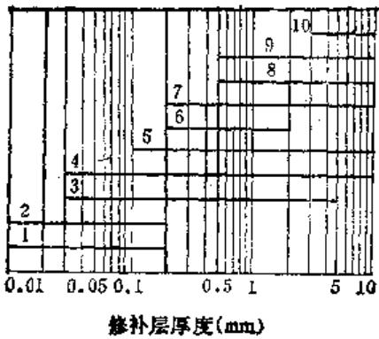
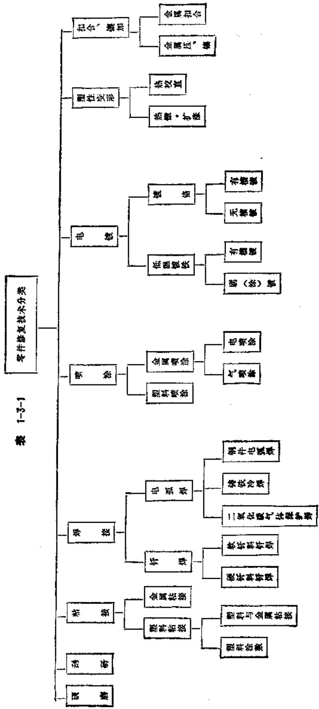

# 目录

# 第1篇 零件修复和强化技术

# 第1章 零件修复工艺的选择

第1节 概述

第2节 零件的磨损极限和修换的一般规定

（一）零件磨损对机床的影响 1-2

（二）磨损零件修换的一般规定 1-2

第3节 修复工艺的选择…

（一）修复工艺的分类 1-5

（二）修复工艺的选择 1-5

I. 选择修复工艺时应考虑的因素……1-5

2.典型零件修复工艺的选择… 1-7

# 第2章 金属扣合和塑性变形修复技术

第1节 金属扣合法…

（一）强固扣合法 2-1

1. 波形键的选择和制造… 2-1

2. 波形槽的布置和加工 …………………… 2-2

3. 钥击工艺 ………………………………………… 2-3

（二）强密扣合法 2-4

（三）加强扣合法 2-5

1. 加强件的形式 …………………… 2-5

2. 加强件的加工 ………………………………………… 2-6

（四）热扣合法 2-6

1. 熬扣合件的形状 …………………… 2-6

2. 热扣合件的强度计算 …………………… 2-6

第2节 塑性变形修复法… 2-7

（一）利用塑性变形修复零件 2-7

1. 镀粗法 … 2-7

2. 挤压法 … 2-7

3. 扩张法 … 2-8

（二）轴类零件的热校直 2-8

1. 热校直简介 … 2-8

2. 轴的热校直举例 …………………… 2-8

# 第3章 零件电镀修复技术

第1节 镀铬· 3-1

（一）锗镀层的特性及其使用范围 3-1

（二）镀铬工艺 3-2

1. 镀铬的一般工艺 …………………… 3-2

2. 镀铬新工艺 … 3-2

第2节 不对称交流-直流低温镀铁 ……………………3-3

（一）不对称交流-直流镀铁的特点及性能 3-3

（二）镀铁工艺 3-3

1.准备工作… 3-3

2. 镀铁规范 … 3-4

（三）电解液 3-4

1.电解液的选用· 3-4

2. 电解液的配制 …………………… 3-5

3.电解液的处理… 3-5

4. 电解液的维护 …………………… 3-5

（四）典型低温镀铁电源 3-5

（五）无刻蚀低温镀铁新工艺 3-6

1. 无刻蚀镀铁电源 …………………… 3-7

2. 无刻蚀镀铁镀液 ……………………3-7

3. 无刻蚀镀铁工艺参数 …………………… 3-7

第3节 电刷镀技术·

（一）电刷镀原理 3-7

（二）电刷镀技术的特点 3-8

（三）电刷镀的应用范围 3-8

（四）电刷镀的工艺装备 3-8

1. 电刷镀专用电源… 3-8

# VI

2. 电刷镀溶液 …………………… 3-10

3. 镀具 … 3-11

4. 辅具和辅助材料 …………………… 3-11

（五）电刷镀工艺 …………………… 3-15

（六）工艺说明· 3-17

（七）镀层剥离的原因及防止措施… 3-19

（八）电刷缝的应用举例· 3-19

1. C650车床主轴的修复 …………………… 3-19

2. 修补镀铬层缺陷 ……………………3~20

3. 花键轴的修复 …………………… 3-21

4. 夹钎镀修复导轨的划伤 ……………………3-21

5. 轴承外环的修复 …………………… 3-22

# 第4章 热喷涂修复技术

# 第1节 概述· 4-1

（一）热喷涂的分类及特点 4-1

（二）热喷涂在机修中的应用 4-2

# 第2节 热喷涂设备及工艺装备… 4-2

（一）电弧喷涂设备 4-2

（二）等离子喷涂设备 4-3

（三）丝火焰喷涂设备 4-5

（四）粉末火焰喷涂（喷熔）设备 4-6

（五）热喷涂工艺装备 4-9

# 第3节 热喷涂工艺 4-9

（一）工件表面的准备 4-9

1. 凹切 … 4-9

2. 清理 … 4-10

3. 表面粗化 ……………………4-10

4.非喷涂部位的屏蔽保护 4-11

# （二）热喷涂的工艺参数· 4-11

（三）热喷涂操作 4-12

1. 电弧喷涂 …………………………………………4-12

2.丝火焰喷涂（简称气喷涂） 4-13

3. 粉末氧炔焰喷涂 4-16

4. 粉末氧炔焰喷熔 4-17

5. 等离子喷涂 4-20

# 第4节 热喷涂的安全技术 4-27

（一）热喷涂时的金属蒸发气体和粉末· 4-27

（二）电喷枪的安全技术· 4-27

（三）等离子喷涂的劳动保护… 4-27

# 第5节 热喷涂应用实例 4-28

# （一）电弧喷涂修复曲… 4-28

（二）丝火焰喷涂修复机床导轨… 4-30

（三）粉末氯炔焰喷涂 4-31

（四）等离子喷涂修复实例 4-31

# 第5章 焊接修复技术

# 第1节 铸铁零件的冷焊修复… 5-1

（一）概述

# （二）铸铁件破坏形式及其相应修复措施

1. 裂缝件的冷焊修复… 5-1

2.磨损件的焊补修复… 5-5

3. 断件的焊接修复 …………………… 5-6

4. 残缺铸铁件的焊补修复……5-8

5. 水密性铸铁件的焊接修复… 5-9

# 第2节 铸铁件的钎焊修复… 5-9

（一）铸铁件的黄铜钎焊修复 ……………………5-9

（二）导轨划伤的钎焊修复… 5-10

1. 无槽化学镀铜工艺 ……………………5-10

2. 锡铋合金钎焊工艺 ……………………5-10

3. 锡铋合金钎焊的缺陷及排除方法 ……………………5-11

# 第3节 钢制零件的焊接修复 ……………………5-11

（一）概述… 5-11

（二）钢件焊接修复工艺措施… 5-11

1. 焊前检查和焊前准备 ……………………5-11

2. 选择最佳焊修方案，严守工艺操作规程……5-12

3. 焊后冷却和焊后热处理 ……………………5-13

4. 焊后检查及机械加工 ……………………5-14

# （三）修复实例… 5-14

1. 离合器楔牙（渗碳淬火件）的焊接修复 ……………………5-14

2. 精密及大型轴类零件（调质处理）的手工电弧焊修复 ……………………5-15

3. 大偏心齿轮断齿的焊接修复 ……………………5-20

4. 大压床滑块裂缝的焊接修复 ……………………5-21

# 第4节 细焊丝二氧化碳气体保护电磁振动电弧堆焊 5-24

（一）概述· 5-24

（二）细焊丝堆焊设备的工作原理……5-25

（三）细焊丝堆焊设备的主要装置… 5-25

（四）细焊丝堆焊主要参数的选择… 5-28

（五）细焊丝堆焊的应用范围 5-29

# （六）细焊丝堆焊的修复实例… 5-29

# 第6章 工件表面的强化技术

# 第1节 机床导轨表面电接触加热自冷淬火…

# （一）基本原理 6-1

# （二）电石墨棒式电极及手工操作 6-1

1. 电极 ……………………6-1

2.低压变压器的制造… 6-1

3. 操作方法 … 6-2

4. 处理后工作表面情况 …………………… 6-2

5. 影响淬火质量因素 …………………… 6-2

# （三）机械化操作的滚轮式电极 ……………………6-3

1.铜滚轮电极的主要参数对淬火效果的影响… 6-3

2.冷却方式对淬火效果的影响… 6-4

# （四）电接触加热自冷淬火设备 6-4

1. 行星差动传动淬火机 ……………………6-4

2. 可移式自动往复淬火机 ……………………6-5

3. 无级变速式淬火机 …………………… 6-6

4. 简易机械化淬火 …………………… 6-6

# （五）电接触加热自冷淬火过程中应注意的问题 6-7

# （六）电接触表面淬火工艺的扩大应用 6-7

1. 轴类零件 … 6-7

2. 长薄零件 … 6-7

3. 形状复杂零件 … 6-7

# 第2节 机床导轨表面高频感应淬火·

（一）概述 6-8

（二）淬火设备及工艺装备 6-8

1. 加热设备 … 6-8

2. 淬火装置 … 6-8

3. 感应器 … 6-8

（三）工艺参数 6-10

（四）减小导轨淬火变形的措施… 6-10

# 第3节 工件表面的电火花强化工艺 ……6-10

# 第7章 工程塑料在修理中的应用

第1节 概述

（一）工程塑料的特性 7-1

（二）工程塑料在设备修理及设备

VII

改装中的应用 7-8

# 第2节 铸型尼龙零件的制造…7-10

# （一）铸型尼龙的制备方法… 7-10

1. 一般浇注成型 ……………………7-10

2. 离心浇注聚合成型 ……………………7-11

# （二）铸型尼龙的改性… 7-12

1. 铸型尼龙的热处理 ……………………7-12

2. 添加填充料改性 ……………………7-12

# 第3节 塑料涂敷 ……………………7-12

（一）沸腾熔敷法… 7-12

（二）火焰喷涂法… 7-14

1. 以二氧化碳  $\left(\mathrm{CO}_{2}\right)$  为喷粉气体的方法……7-14

2. 以压缩空气为喷粉气体的方法 ……………………7-15

# （三）热熔敷法… 7-15

# 第4节 聚四氟乙烯及填充聚四氟乙烯 7-16

# （一）聚四氟乙烯及填充聚四氟乙烯的性能… 7-16

1. 聚四氟乙烯的性能 ……………………7-16

2. 填充聚四氟乙烯的性能 ……………………7-16

3.辐射接枝填充聚四氟乙烯的性能7-17

# （二）聚四氟乙烯及填充聚四氟乙烯在机修中的应用· 7-17

1. 机械密封上的应用 ……………………7-17

2.填充聚四氟乙烯活塞环及导向环7-18

3.填充聚四氟乙烯塑料轴承…7-18

4.辐射接枝填充聚四氟乙烯在机床导轨修理中的应用 7-18

# 第8章 粘接修复技术

# 第1节 概述… 8-1

（一）粘接的特点 8-1

（二）粘接的应用 8-1

# 第2节 粘接方法… 8-1

（一）热熔粘换法 8-1

（二）溶剂粘接法 8-1

（三）粘接剂粘接法 8-2

# 第3节 粘接技术… 8-4

（一）胶粘剂的选用 8-4

（二）粘接接头的设计 8-7

1.粘接接头设计的原则… 8-7

2.粘接接头的类型与形式… 8-7

# 国

# （三）粘接工艺 8-8

# 第4节 零件修复常用胶粘剂及其应用 ……………………8-12

# （一）环氧胶粘剂… 8-12

# （二）丙烯酸酯胶粘剂… 8-14

1.α-氟基丙烯酸酯胶粘剂（FGA）…8-14

2.厌氧胶 8-15

3. 第二代丙烯酸酯胶粘剂（SGA）……8-15

# （三）氯丁胶粘剂… 8-17

（四）聚氨酯胶粘剂· 8-13

（五）酚醛-丁腈胶粘剂 8-20

（六）先机胶粘剂· 8-22

1. 无机胶粘剂的特点 ……………………8-22

2. 氧化铜无机胶粘剂 ……………………8-22

# 第5节 常用材料对胶粘剂的选用 ……………………8-23

（一）金属的粘接… 8-23

（二）塑料的粘接… 8-23

（三）橡胶的粘接… 8-25

# 第6节 胶粘剂使用注意事项 ……………………8-26

（一）环氧胶… 8-26

（二）502胶 ……………………8-26

（三）氯丁胶… 8-27

（四）厌氧胶… 8-27

（五）101胶 8-27

# 第7节 德国钻石牌胶粘剂简介 ……………………8-28

（一）满誉奥胶的特点… 8-28

（二）满替美胶的分类及性能… 8-28

（三）滴管美胶的粘接工艺… 8-29

# 第9章 研磨技术

# 第1节 研磨原理

# 第2节 材料的可加工性与研磨余量·

（一）研磨性与工件材料的关系 9-2

（二）研磨对预加工的要求 9-2

（三）研磨余量 9-3

# 第3节 磨料与研磨剂… 9-3

（一）磨料 9-3

1. 磨料的种类、特性及用途 ……………………9-3

2. 磨料的粒度及其选择 … 9-6

3.磨料的研磨性能… 9-7

（二）研磨膏 9-8

# （三）研磨液 9-9

# 第4节 研磨工具 9-10

# （一）手工研建工具… 9-10

1. 平面研磨工具 ……………………9-10

2. 外圆研磨工具 ……………………9-10

3. 内圆柱表面研磨工具 ……………………9-10

4. 圆锥体研磨工具 ……………………9-11

5.球面研磨工具 9-20

6.螺纹研磨工具 9-20

# （二）机械研磨设备… 9-22

1. 单盘研磨机和双盘研磨机 ……………………9-22

2. 内圆研磨机 …………………… 9-22

3. 钢球研磨机 …………………… 9-22

4.齿轮研磨机 9-22

# 第5节 研磨工具的材料 ……………………9-24

# 第6节 研磨方法 ……………………9-25

（一）平面研磨… 9-25

（二）外国研

（三）内孔研磨… 9-27

（四）锥体研磨… 9-27

（五）球面研磨… 9-27

（六）螺纹研磨… 9-28

（七）齿轮研磨… 9-29

# 第7节 影响研磨精度的因素 ……………………9-29

# 第10章 分度蜗轮副的修复技术

# 第1节 分度蜗轮副的测量 ……………………10-1

# （一）分度蜗轮副的综合测量… 10-1

1. 用试切样品齿轮来估计分度蜗轮副的运动精度 ………………………………………… 10-1

2.蜗轮副分度精度的静态综合测量法 10-3

蜗轮剖分度精度的动态综合测量法 10-6

# （二）分度蜗轮单个要素的测量… 10-6

1. 蜗轮齿距偏差和齿距累积误差的测量及计算方法 ………………………………………… 10-6

2. 蜗轮齿圈径向跳动的测量 … 10-15

3. 接触斑点的检验 ………………………………………… 10-16

4. 蜗轮齿厚的测量 ………………………………………… 10-17

# （三）蜗杆的测量 10-17

# 第2节 蜗轮修复方案的选择… 10-18

（一）磨损状态分析 10-18

（二）修复方案的选择 10-19

（三）保证接触斑点及啮合侧隙的方法…10-19

1. 影响接触斑点的因素………10-19

2. 保证接触斑点的工艺方法 ………………………………………… 10-21

3. 保证啮合侧隙的加工方法 …………………………………………10-22

4. 安装调整中应注意的问题 …………………… 10-22

5. 侧隙的检查和调整方法 …………………………………………10-23

# 第3节 分度蜗轮的修复方法……10-25

# （一）修复齿形的加工方法 10-25

1. 精浓齿面 … 10-25

2. 削削齿面 … 10-26

3.滚剃齿面… 10-28

4. 玷磨齿面 ………………………………………… 10-29

# （二）割研修复法 10~34

# 第4节 提高蜗轮副运动精度的方法 ………………………………………… 10-37

# （一）引起运动误差的因素 10-37

1. 几何偏心引起的齿距累积误差规律 ………………………………………… 10-37

2. 运动偏心引起的齿距累积误差规律· 10-38

3. 两种偏心误差的抵消方法 ……………………10-40（二）误差抵消法的应用 ……………………10-41

1. 运动偏心  $e_{k}$  的大小及方向的确定……10-41

2. 误差抵消法在加工及装配中的应用 ………………………………………… 10-42

3. 易位法及其应用 ………………………………………… 10-43

# 第2篇 设备诊断技术

# 第11章 设备诊断技术基础

# 第1节 设备诊断的类型和设备状态信号 …………………………………………11-1

# （一）设备故障诊断的类型……11-1

1.简易诊断和精密诊断 11-1

2. 功能诊断和运行诊断 ………………………………………… 11-1

3. 定期诊断和连续监控 ………………………………………… 11-1

4. 直接诊断和间接诊断 ………………………………………… 11-1

# （二）设备状态信号及其获取 ………………………………………… 11-2

1. 传递设备状态的信号 …………………………………………11-2

2. 信号的获取 ………………………………………… 11-2

# 第2节 各种故障现象及其诊断方法

（一）异常振动 ………………………………………… 11-3

（二）异常声音

（三）异常温度… 11-3

（四）泄漏

（五）裂纹… 11-4

（六）腐蚀… 11-4

（七）材质劣化 11-5

（八）松动… 11-5

（九）润滑油劣化 ………………………………………… 11-5

（十）电气系统的异常… 11-5

# 第3节 设备诊断技术的构成 …………………………………………11-6

# （一）检查测量技术 ………………………………………… 11-6

1.应力参数的测量技术 11-6

2. 征兆参数的测量技术 ………………………………………… 11-7

# （二）信号处理技术 11-10

1. 诊断信号处理技术体系 ………………………………………… 11-19

2. 对若干设备诊断有效的信号处理技术概述

# （三）识别技术 11-13

1.决定论的识别法 11-13

2. 概率论的识别法 ………………………………………… 11-14

# （四）预测技术 11-15

1. 决定论的预测技术 ………………………………………… 11-15

2. 概率论的预测技术 ………………………………………… 11-18

# 参考文献· 11-18

# 第12章 课动传感器

# 第1节 传感器的种类、原理和性能

# （一）传感器的种类和原理… 12-1

1. 加速度传感器 ………………………………………… 12-1

2. 速度传感器 ………………………………………… 12-2

3. 位移传感器 ………………………………………… 12-2

# （二）传感器的性能指标… 12-3

# 第2节 传感器的选择 …………………………………………12-3

（一）电涡流位移传感器 12-3

（二）速度传感器… 12-4

（三）加速度计 12-4

# X

第3节 传感器的安装要点 ……………………12-4

（一）加速度计安装位置的选择… 12-4

（二）加速度计安装方法的选择… 12-5

# 第13章 振动诊断方法

第1节 振动及其分析方法 ………………………………………… 13-1

（一）振动的基本概念 13-1

1. 振动的基本参数 ………………………………………… 13-1

2. 振动的三个基本量的意义及应用 …………………… 13-1

（二）异常振动的分析方法 ………………………………………… 13-2

1. 频率分析法 ………………………………………… 13-3

2. 振动形态分析 ………………………………………… 13-3

3. 相位分析 ………………………………………… 13-3

4. 振动方向分析 ………………………………………… 13-4

5. 振摆旋转方向分析 ………………………………………… 13-4

6. 异常振动的一般分析法 ………………………………………… 13-4

第2节 信号处理技术 …………………………………………13-4

（一）信号的分类… 13-5

1. 周期信号 ………………………………………… 13-5

2. 瞬变信号 ………………………………………… 13-5

3. 随机信号 ………………………………………… 13-5

（二）信号的预处理技术 13-5

1. 滤波处理 ………………………………………… 13-5

2.包络线法（共振解调技术） 13-7

3.同步时间平均法 13-8

（三）时域的信号处理 13-8

1. 平均值 ………………………………………… 13-8

2. 离散 … 73-8

3. 均方值、有效值 ………………………………………… 13-8

4. 峰值 ………………………………………… 13-8

5. 波峰系数 ………………………………………… 13-8

6. 概率密度函数 ………………………………………… 13-8

（四）频域的信号处理 ………………………………………… 13-9

1. 傅里叶级数 ………………………………………… 13-9

2. 相关函数 … 13-10

3. 功率谱密度 ………………………………………… 13-17

4. 傅里叶变换 ………………………………………… 13-12

5.抽样定理和快速傅里叶变换 (FFT) 13-13

6. 频谱分析 ……………………………… 13-13

7. 倒频谱分析 ………………………………………… 13-14

第3节 旋转机械的诊断方法 …………………………………………13-15

（一）旋转机械的简易诊断 13-15

1. 诊断设备和测定方法的选定……13-15

2. 测定参数的选定 … 13-15

3.测定点的选定… 13-15

4. 测定周期的确定 … 13-17

5. 判断标准的确定 ………………………………………… 13-18

6.简易判断标准制订实例… 13-21

7.劣化监控表的编制… 13-26

（二）旋转机械的精密诊断 13-28

参考文献 13-29

# 第14章 超声波与声发射监测技术

第1节 超声波技术 ………………………………………… 4-1

（一）超声波及其性质 14-1

1. 超声波的发生和种类 ………………………………………… 14-1

2. 超声波的性质 ………………………………………… 14-1

（二）超声波技术在设备诊断中的应用…14-3

1. 超声波探伤 ………………………………………… 14-3

2. 超声波测厚 ………………………………………… 14-4

第2节 声发射检测 14-5

（一）声发射及其检测特点 14-5

1. 声发射的基本原理 …………………… 14-5

2. 声发射检测的特点 ………………………………………… 14-5

（二）声发射的测量参数及测量仪器14-6

1. 事件计数和振铃计数 ………………………………………… 14-6

2. 幅度和幅度分布 ………………………………………… 14-7

3. 能量和能量率 ………………………………………… 14-7

4.声发射的测量仪器 14-7

（三）声发射在设备诊断中的应用… 14-8

1. 保护冲床 ………………………………………… 14-8

2. 检查飞机要害部位的锈蚀情况 …………………… 14-8

3. 其他 … 14-8

参考文献 14-9

# 第15章 温度监测与诊断方法

第1节 温度监测与诊断的原理及其适用范围 …………………………………………15-1

（一）基本原理 15-1

1.物质的热运动 15-1

2. 温度的标定 ………………………………………… 15-1

3. 温度的测量 ………………………………………… 15-2

（二）常预测温装置及其适用范围…15-2

# X

1. 接触式测温装置 ………………………………………… 15-2

2. 非接触式测温装置 ……………………15-3

3. 测温仪的主要技术指标及选用方式 …………………………………………15-5

# 第2节 红外辐射及红外测温 15-6

# （一）红外辐射基本特点 15-6

1.红外辐射 15-6

2.红外辐射在大气中的传播 15-7

# （二）红外测温基本原理· 15-7

1.反射率、透射率、吸收率和比辐射率 15-8

2.普朗克与维恩定律 15-8

3. 基尔霍夫和斯蒂芬-波兹曼定律……15-9

# 第3节 测温方法及手段 ……………………15-9

（一）温度测定的简易诊断方法… 15-9

（二）温度測定的精密診断方法 15-10

（三）红外热成像技术及装置结构原理 15-10

1. 红外热成像技术 ………………………………………… 15-10

2.红外测温仪器的指标参数 15-11

# （四）典型红外热成像设备（红外热像仪） 15-11

# 第4节 国内外设备温度诊断典型实例· 15-14

（一）设备温度诊断的应用范围 15-14

（二）设备温度诊断的典型实例 15-14

1. 机床主轴箱温升对热变形影响的检测 ………………………………………… 15-14

2. 金属胶接结构热特性检测 …………………… 15-15

3. 火车车轴箱不停车温度检测……15-15

4.大型电机的故障诊断及其指导检修· 15-15

5. 电气设备各种裸露接头热故障的红外诊断……15-16

# 参考文献· 15-16

# 第16章 旋转组件和元件的诊断

# 第1节 旋转机器转轴组件的振动诊断 ………………………………………… 16-1

# （一）结构方面的故障… 16-1

1. 转子的临界转速 ………………………………………… 16-1

2. 结构共振 ………………………………………… 16-2

3. 滑动轴承油膜振荡 …………………… 16-2

4. 次谐波（分数谐波）共振 ……………………16-3

5. 轴流式气体压缩机的旋转脱流和喘振 16-3

6. 电磁力引起的振动 …………………………………………16-4（二）零部件缺陷的故障 …………………………………………16-4

1. 不平衡振动 ………………………………………… 16-4

2. 转轴不对中误差 …………………………………………16-5

3. 基座松动 ………………………………………… 16-6

4. 密封间隙不均匀引起的自激振动（气流激振） 16-6

5. 接触碰撞引起的自激振动 ……………………16-6

# 第2节 滚动轴承的诊断 16-7（一）滚动轴承的寿命 16-7

1. 额定寿命 ………………………………………… 16-7

2. 轴承的耐用时间 …………………… 16-9

# （二）滚动轴承异常的类型及其原因…16-9

# （三）轴承异常诊断方法… 16-9

1. 振动 ………………………………………… 16-9

2.噪声 16-9

3. 温度 ………………………………………… 16-9

4.磨损微粒的分析… 16-10

5. 轴承的间隙测定 ………………………………………… 16-10

6. 油膜的电阻 ………………………………………… 16-10

# （四）根据振动诊断轴承的异常 16-11

1. 滚动轴承的振动发生机理和固有振动频率……16-11

2. 滚动轴承的简易诊断方法（使用振动计）

3. 用冲击脉冲解调式轴承故障诊断仪诊断滚动轴承……16-15

4. 滚动轴承的精密诊断法 ………………………………………… 16-17

# 第3节 齿轮的诊断 16-20

# （一）齿轮异常的类型和原因 16-20

# （二）齿轮的诊断原理 16-21

1.齿轮旋转机构… 16-21

2. 齿轮造成的振动 ………………………………………… 16-21

# （三）齿轮的诊断法 16-25

1.齿轮的简易诊断法 16-25

2.齿轮的精密诊断法 16-27

# 参考文献· 16-32

# 第17章 金属切削机床的诊断

# 第1节 误差相关与误差分离技术 ……17-1

# （一）环节与系统… 17-2

# XH

（二）系统、输入、输出与卷积… 17-3

（三）误差分离技术… 17-6

1.分离随机误差 17-6

2.分离高低频段数据 17-6

3.分离机床和工件的误差 17-7

（四）用误差分离技术诊断螺纹键误差…17-8

1. 螺纹链误差 ………………………………………… 17~8

2. 检测方法一误差分离法 ………………………………………… 17-9

3. 信号处理过程 ………………………………………… 17-10

4. 螺距误差来源的诊断 ………………………………………… 17-10

第2节 机床的综合诊断法 …………………………………………17-14

（一）多种传感器同时采用 17-14

（二）解调技术的应用 17-14

（三）诊断实例 17-15

参考文献· 17-18

# 第18章 电气设备的诊断技术

第1节 电力变压器的诊断技术 ……………………13-1

（一）电力变压器绕组绝缘油温程度的测定

1. 绝缘油受潮程度的测定 ……………………18-1

2. 绕组绝缘电阻的测定 …………………… 18-7

3. 绕组介质损失角正切值tgδ的测定… 18-11

4. 诊断电力变压器绝缘潮湿程度的电容法 ………………………………………… 18-14

（二）绝缘的工频交流耐压试验 18-15

1. 调压方式的选择 ………………………………………… 18-15

2. 试验变压器 ………………………………………… 18-16

3. 试验电压的测量 ………………………………………… 18-16

4. 保护设备 ………………………………………… 18-17

5. 升压速度及其他注意事项 ………………………………………… 18-17

（三）绕组直流电阻的测定 18-17

1. 加快测量直流电阻的方法……18-18

2. 温度的影响 ………………………………………… 18-19

3. 比较标准 ………………………………………… 18-20

4. 分接开关指示器 ………………………………………… 18-20

第2节 电机的故障诊断 …………………………………………18-21

（一）电机的噪声故障 18-21

1. 电磁噪声 ………………………………………… 18-21

2. 机械振动噪声 ………………………………………… 18-22

（二）电机的温升故障 …………………………………………18-22

（三）定子绕组三相电流不平衡的

故障诊断 18-23

1. 绕组引线标记的检查 ………………………………………… 18-23

2. 绕组接线的检查 ………………………………………… 18-24

（四）电机绝缘的故障诊断 18-24

1. 电机绕组绝缘的介电强度 …………………… 18-24

2. 电机绝缘的诊断方法 ………………………………………… 18-24

3. 冷态绝缘电阻的容许值 ………………………………………… 18-24

（五）电机绕组直流电阻的测定 18-25

1. 绕组直流电阻的测量方法 …………………… 18-25

2. 故障分析 … 18-26

（六）电机的振动诊断 18-26

1. 振动测试前的检查 ………………………………………… 18-26

2. 振动测试及其限值 … 18-26

第3节 微电子控制设备的故障 18-27

（一）故障测试诊断程序的编制 18-28

（二）故障诊断程序实例 18-28

1.CPU故障诊断程序… 18-28

2. RAM及总线诊断程序 18-29

3. EPROM中的故障诊断程序 18-30

（三）微型计算机电路的故障诊断 18-30

（四）微型计算机故障诊断所用设备与器件 18-31

1. 逻辑笔 ………………………………………… 18-31

2. 逻辑脉冲发生器（笔） …………………………………………18-32

3. 电流跟踪器 ………………………………………… 18-33

4. 逻辑电路测试夹 ………………………………………… 18-33

5. 逻辑电平比较器 ………………………………………… 18-33

（五）故障诊断的基本方法 18-34

1. 基本的故障诊断法 ………………………………………… 18-34

2. 用逻辑分析仪进行故障诊断……18-35

参考文献· 18-36

# 第19章 设备诊断仪器的选用

第1节 国产主要诊断仪器的原理与性能

（一）振动测试仪器 19-1

1. 207、217电子听诊器 ………………………………………… 19-1

2. CHJ-1冲击脉冲计、JK8241A轴承齿轮故障分析仪 19-2

3. HB-1轴承故障检查仪、CCL-2251多功能轴承故障测试仪……19-4

4. MD-2型便携式机械振动检测仪、

# X

BZ-4200型机械故障诊断仪 19-5

5.DZ-2振动测量仪、DZ-5振动测量分析仪 19-8

6. DF4074W多通道FFT信号分析仪，200型机器故障分析仪 19-10

7. HZ-8500型轴运动监视仪、JX-1型加速度校准仪 ……………………………… 19-12

8. ZH911测振表/数据采集器 19-14

9.JGZY-1型机械故障综合诊断仪 19-17（二）温度测试仪器 19-19

1. SW-2型便携式数显表面温度计… 19~19

2.IRT-1200型手持式快速红外测温仪· 19-20

3. 841型热像仪 ………………………………………… 19-21

（三）油液分析仪器 19-23

1. YTC-1型油液含铁量检测仪（铁量仪） ………………………………………… 19-23

2.ZTP-1型直读式轶谱仪 19-23

3. TPF-1型分析式铁谱仪………19-24（四）其他诊断仪器 …………………………………………19-25

1. MC-100电动机故障检测仪 19-25

2.CCH-12型超声波测厚仪 19-26

第2节 几种国外诊断仪器简介…19-28

1. 4912型便携式频闪仪 ………………………………………… 19-28

2. VM-64机械状态检测仪 ………………………………………… 19-29

3. IRD890型数据采集器及分析器 19-31

4. 2515型振动分析仪 ………………………………………… 19-32

5. MR-10C/30C盒式磁带数据记录器

6. 870型热像仪 …………………………………………19-35

7. ENTEK交流异步电动机故障诊断系统· 19-36

参考文献· 19-38

# 第3篇 微电子技术

# 第20章 单片，机

第1节 单片机概述 20-1

第2节 MCS-51系列单片机结构及原理 20-4

（一）概述… 20-4

（二）基本结构… 20-4

1. 引脚及功能 ……………………20-4

2. 内部结构 …………………… 20-5

（三）指令系统 20-9

（四）定时器 20-15

1. 定时器结构 …………………… 20-15

2.定时器专用寄存器… 20-15

3. 定时器的工作方式 20~15

4. 定时/计时器的应用举例 ……………………20~17

（五）串行口 20-18

（六）中断系统 20-23

第3节 MCS-51系统配置及接口技术· 20-25

（一）ROM程序存储器扩展 20-26

（二）RAM数据寄存器扩展 20-33

（三）1/0口扩展 20-36

1. 8255A可编程并行I/O扩展接口 ……………………20-36

2. 8155可编程并行I/O扩展接口 ……………………20~41

（四）键盘、显示器接口 20-45

1.键盘的接口技术… 20-45

2. 显示器接口技术 …………………… 20-46

3. 键盘、显示器应用举例……20-46

第4节 单片机应用系统的设计、开发和故障诊断… 20-48

（一）单片机应用系统的设计 20-48

（二）单片机应用系统的开发调试 20-48

（三）单片机应用系统的故障诊断及维护 20-49

1. 主机板的故障诊断 ……………………20-50

2. 使用单片仿真机对主机板进行逻辑故障诊断… 20-51

3. 其他故障诊断 ……………………20-52

（四）单片机应用系统的抗干扰措施 20-53

# 第21章 可编程序控制器

第1节 PC的发展概况 21-1

（一）国外PC动态 21-1

（二）国内PC技术的发展 2f-1

（三）PC在工业自动化中的位置 21-2

第2节 PC的基本结构、使用及

# XV

选型 21-2

# （一）PC的基本结构和工作原理 21-2

1. 系统构成 ……………………21-2

2. 工作原理 …………………… 21-3

# （二）典型PC简介 21-3

1. C200H PC (OMRON, 立石公司) ……21-3

2. S5-115U PC（西门子公司） 21-7

3. PLC-2/30 PC（美国A、B公司）………21-9

4. F-40 PC（日本三菱公司）… 21-10

5. T-40 PC（日本富士公司）… 21-17

# （三）PC的使用方法 21-20

1. PC的程序编制 21-20

2. 梯形图符号意义 …………………… 21-20

3. 梯形图的优化 …………………… 21-20

# （四）PC的选型… 21-23

1. 选型原则 ………………………………………… 21-23

2. PC 选型举例 …………………… 21-24

# 第3节 编程和应用技巧… 21-26

# （一）外部应用技巧 21-26

1. 减多多撞块开关方式 …………………… 21-26

2. 输入地线转换法 …………………… 21-27

3. 编码输入方式 …………………… 21-27

4.拨码盘输入方法 21-27

5. 比较器转换输入法 … 21-28

6. 扫描控制数码管显示… 21-28

7. 减少PC输出点数的方法 ……………………21-28

# （二）程序应用技巧 21-29

1.基准时间的应用 21-29

2. 微分电路 … 21-29

3. 自动追踪电路 … 21-30

4. 可递移位寄存器 … 21-31

5. 信号设置回路 …………………… 21-32

6. 正、反转和方向的检测 …………………… 21-32

7. 加、减计数器 … 21-33

8. 故障报警回路 … 21-33

9. Y-△变换起动 21-36

10. 外部设定时间常数 ……………………21-36

# 第4节 PC电源与故障分析 21-37

# （一）开关电源的分类与电路分析 21-37

1. 开关稳压电源的分类 …………………… 21-37

2. 电路分板 ………………………………………… 21-37

# （二）开关电源的原理与故障分析 21-39

1. 单端自励式开关稳压电源………21-39

2. 他励式脉冲调宽稳压电源 …………………… 21-40

3. 故障分析 … 21-43

4.噪声及其抑制… 21-44

# 第5节 数字IC（集成电路）的

故障分析 21-45

（一）内部故障分析 21-45

（二）外部故障分析 21-46

（三）数字IC故障诊断示例 21-47

（四）使用电流跟踪器诊断数字IC电路故障 21-48

# 第6节 PC的应用及维修 21-49

（一）PC应用实例 21-49

1. 库门自动控制 ……………………21-49

2. 自动注油装置 21-50

3. 传送带电动机控制 …………………… 21-51

4. 汽车自动清洗机 …………………… 21-51

5. 瓶签检测 … 21-53

6. 自动车床控制 … 21-54

7. 工业电炉温度控制 …………………… 21-55

8. 车轮焊机控制 …………………… 21-57

# （二）维修实例 21-58

1. PC主机 21-58

2. PC电源 21-59

3.输入口 21-60

4. 输出口 … 21-61

# 第22章 数显技术

# 第1节 感应同步器的基本原理 ……………………22-1

（一）输出电路与位移的关系… 22-1

（二）输出电动势的误差平均效应和细分…22-2

（三）测量输出信号的方法 22-3

# 第2节 感应同步器的用途及种类… 22-3

（一）感应同步器的用途及优点… 22-3

（二）感应同步器的种类… 22-3

（三）感应同步器的型号 22-5

（四）感应同步器的技术指标… 22-5

# 第3节 感应同步器的安装和

接长技术 22-5

（一）阿贝原则及安装位置的选定… 22-5

（二）标准直线感应同步器的安装… 22-5

1. 安装要求 …………………… 22~5

2. 定尺尺座、滑尺尺座和防护罩 ……………………22-6

3. 定尺尺座及滑尺尺座的安装 ……………………22-8

4. 安装工艺要求 22-9

（三）标准式感应同步器的接长… 22-9

（四）标准式直线感应同步器接长及排尺原则… 22-9

（五）接长方法 22-10

1. 块规接长 … 22-10

2. 金属线纹尺接长 …………………… 22-11

3. 双滑尺接长 ………………………………………… 22-11

第4节 感应同步器数显表基本工作原理· 22-12

（一）鉴幅型数量表 22-12

（二）脉冲调宽式数显衰 22-14

第5节 数显表的使用与维修… 22-14

（一）数显表的正确使用 22-14

1. 使用条件与系统连接 … 22-14

2. 使用程序及有关问题 … 22-14

3. 正确读数 … 22-15

（二）数重表的故障排除 22-15

1. 故障检查方法 … 22-15

2. 常见故障的排除 … 22-16

第6节 光棚 22-17

（一）计量光栅的原理 22-17

（二）光栅测量装置 22-18

第7节 磁尺 … 22-20

（一）磁性标尺 22-20

（二）磁头 22-21

（三） 碗尺数显表 22-21

（四）磁尺的安装 22-22

（五）磁尺数显表的安装与调整 22-22

（六）磁尺的维护 22-23

# 第23章 数控技术

第1节 概述 23-1

（一）数控机床的产生及特点… 23-1

（二）数控机床的一些基本概念… 23-1

1. 什么是数控机床 ……………………23-1

2. 数控机床的组成 …………………… 23-1

3. 数控系统的分类 …………………… 23-1

（三）数控机床维修… 23-2

1. 使用与维修注意事项 ……………………23-2

2.维修方法 23-2

# 第2节 数控机床控制原理及其

程序编制 23-3

（一）数控机床的控制原理… 23-3

（二）数控装置的工作原理 23-3

1. 数控装置的运算功能 …………………… 23-3

2. 数控装置的工作过程 …………………… 23-3

（三）数控机床的程序编制… 23-4

1. 程序编制的一般步骤与方法 ……………………23-4

2. 程序编制的有关指令代码及程序格式 23-4

（四）常用准备功能指令 23-10

第3节 数控机床的输入输出设备…23-11

（一）NC操作控制面板… 23-11

1. NC操作面板（MDI） 23-11

2. NC工程控制面板 23-13

3.键盘译码电路及输入接口电路… 23-13

4. 数控机床操作指示形象化符号……23-14

5. 键盘的维护 … 23-20

（二）读带机 23-20

（三）手摇脉冲发生器 23-21

（四）显示器 23-22

（五）通用串行接口 23-24

第4节 直流伺服系统原理及

应用实例· 23-26

（一）单闭环直流调速系统 23-26

（二）不可逆双闭环直流调速系统 23-29

（三）直流可逆调速系统 23-32

（四）直流电动机晶体管脉宽调制系统 23-43

（五）数控机床的直流伺服系统实例 23~45

第5节 数控机床中的常用电机… 23-54

（一）直流伺服电动机 23-54

1. 概述 … 23-54

2. FANUC-BESK直流伺服电动机的技术规格… 23-54

（二）交流伺服电动机 23-54

1.概述 23-54

2. 交流伺服电动机的技术规格… 23-57

（三）主轴电动机 23-57

1. 概述 … 23-57

2. FANUC-BESK直流主轴电动机的技术规格… 23-57

# XV

3. FANUC交流主轴电动机的技术规格… 23-57

4. SIEMENS交流主轴电动机的技术规格… 23-66

第6节 数控机床中的检测元件… 23-66

（一）测速发电机 23-66

（二）旋转变压器 23-67

（三）编码器 23-68

附录 23-71

信息处理交换用七位编码字符集在穿孔

纸带上的表示方法（GB1991—80）……23-71

参考文献· 23-71

《机修手册》卷目

<table><tr><td>第1卷
设备修理设计</td><td>上册: 第1篇 基础资料 第2篇 机械零件 下册; 第3篇 机械传动</td></tr><tr><td>第2卷
修理技术基础</td><td>第1篇 零件修复和强化技术
第2篇 设备诊断技术 第3篇
微电子技术</td></tr><tr><td>第3卷
金属切削机床修理</td><td>上册: 第1篇 机床通用修理技术 第2篇 普通机床的修理 下册; 第3篇 普通齿轮加工机床的修理 第4篇 精密及大(重)型机床的修理 第5篇 机床改装</td></tr><tr><td>第4卷
铸锻设备与工业炉修理</td><td>第1篇 铸造设备的修理 第2篇 锻压设备的修理 第3篇 工业炉的修理</td></tr><tr><td>第5卷
动力设备修理</td><td>第1篇 工业锅炉房设备的修理
第2篇 制氧站设备的修理 第3篇 煤气站设备的修理 第4篇 乙炔站设备的修理 第5篇 空气压缩机的修理 第6篇 工业管道的修理</td></tr><tr><td>第6卷
电气设备修理</td><td>第1篇 电气设备修理的常用技术资料 第2篇 电机及低压电器的修理 第3篇 机床电气设备的修理 第4篇 常用成套电气设备的修理</td></tr><tr><td>第7卷
通用设备与工业仪表修理</td><td>第1篇 运输机械的修理 第2篇 辅助设备的修理 第3篇 工业仪表的修理</td></tr><tr><td>第8卷
设备润滑</td><td>第1篇 摩擦、磨损与润滑 第2篇 润滑材料 第3篇 润滑技术及管理</td></tr></table>

# 第1章 零件修复工艺的选择

# 谭可生

# 第1节概述

经正常运转而磨损的零件或因事故而损坏的零件，大部分可以应用各种修复技术修复后重新使用。修旧利废是我国勤俭办企业的光荣传统，几十年来，各行各业都总结了这方面的丰富经验，比如：70年代，大庆油田的广大机修人员，通过生产实践，总结出的“十二字”修旧利废作业法，即：焊、补、喷、镀、铆、镶、配、改、校、涨、缩、粘，已在全国广泛应用，收到了很好的效果。科学技术的飞速发展，促进了修复技术的提高。电、化等新科学技术已广泛地应用到修复工艺中，使修复技术在焊、镀（涂）、喷、粘等方面有了突破性的发展，例如：用铸铁冷焊修复研伤的导轨和空压机缸体裂缝，用电涂镀修复磨损的孔或轴颈，用经过放射性照射处理过的接枝聚四氟乙烯板粘接导轨（提高其耐磨性），用金属喷涂修复磨损的轴颈并提高其表面硬度等等，这些都是在修复工艺中得到实践证明的成功方法。在科学技术不断发展的将来，修复

件，在从经济、质量和时间三方面综合衡量利弊后确定，否则将会适得其反。一般应从以下几方面考虑：

1）修复费用应低于新件制造的成本，即：

$$
\frac {S _ {\text {修}}}{T _ {\text {修}}} <   \frac {S _ {\text {钢}}}{T _ {\text {钢}}}
$$

式中  $S_{\text{修}}$  ——修复旧件的费用（元）；

$T_{\text{修}}$  ——修复零件的使用期（月）；

$S_{\text{新}}$  ——新件的制造成本（元）；

$T_{\text{新}}$  ——新件的使用期（月）。

一般情况下，修复费用  $\leqslant \frac{2}{3}$  制造新件的成本，即可视为经济的。

2）已掌握的修复工艺必须能够充分满足该零件的修复要求。

3）修复后能保持零件原有技术要求。

4）修复后零件必须保持足够的强度和刚度，并不影响其使用寿命和性能，对于关键零件，修前应作必要的计算。

5）核糖体与DNA的结合

使以后的故障或修理工作量增加。这样就出现了如何确定机床零件极限磨损的标准问题。

确定机床零件极限磨损的标准，是一个复杂的问题。实践证明，零件是否修换，不能单纯以零件的尺寸精度、表面粗糙度及表面相互位置精度为标准，因为同一零件在不同的使用部位有不同的要求。在什么情况下磨损零件可以继续使用，在什么情况下必须修换，目前，机修部门一般主要是根据零件的磨损程度及其对机床精度、性能的影响等多方面因素来决定的。

# （一）零件磨损对机床的影响

（1）对机床精度的影响 机床零件磨损后影响到机床精度使加工零件质量达不到要求时，就应该考虑修复或更换。如滚齿机分度系统中的蜗轮副，直接影响分度的精确度，这些零件磨损超过公差时，就应该修复。又如机床主轴轴承及导轨等基础零件磨损时，就会改变工件几何形状；当基础零件间隙增大，啮合不良时，会增加机床的振动和传动不良，影响加工零件表面粗糙度，也应进行修复或更换。

一般零件磨损尚未超过规定公差，估计继续使用到下一个机床修理期，还不会影响机床精度时，可以暂不修换。但对于某些影响机床精度的主要零件（如主轴），或是拆卸不便和修复劳动量很大的零件（如箱体），虽发现其磨损量未超差，而估计其难以维持到下次大修期的，如不加修换，则应事先准备好备件。

一般过渡配合零件对机床精度影响不大者，其磨损程度虽已超过公差，但未超过次一种配合公差（如原来为第一种过渡配合公差，使用后其实际尺寸在第二种过渡配合公差范围内），这种零件还可继续使用。对于动配合零件，一般磨损未超过次一级的配合公差时（即如二级精度降为三级）亦可继续使用。

（2）对完成预定使用功能的影响 当零件磨损而不能完成预定的使用功能时，如离合器失去传递动力的作用，液压机构不能达到预定的压力或压力分配，凸轮机构不能保持预定的运动规律时，就该修换。

（3）对机床性能和操作的影响 当机床零件虽已磨损，还能够完成使用功能，但是降低了机床的性能，例如机床传动装置中的齿轮，在某些情况

下有磨损，但仍能完成它的使用功能（传递预定的扭矩和速度），可是这时噪音增大，效率下降，传递工作的平稳性渐渐遭到破坏。又如刀架溜板的燕尾槽表面磨损后，通常以调整楔铁来保证间隙，由于零件的磨损，则刀架溜板对于下导轨产生了偏移，这时作用于丝杠和丝杠螺母的力也随之加大。刀架溜板的移动就比较费劲，影响机床的使用性能。这时要根据其磨损程度来决定是否修换。

（4）对机床生产率的影响 当机床零件磨损时，由于不能利用较高的切削用量进行工作，或者增加机床空行程的时间，或者增加工人的精力消耗，从而降低机床的生产率，应根据磨损情况决定是否修换。如导轨磨损时间隙增加，配合零件表面研伤，丝杠的表面磨损等均应修换。

（5）对零件强度的影响 在某些场合，零件的磨损可允许达到零件强度所决定的数值。例如作为传递动力的低速蜗轮副，由于蜗轮齿的不断磨损，齿厚逐渐减少，强度降低，最后发展到断裂或剥蚀的程度。又如轴向移动的离合器拨叉，拨叉端面和离合器槽磨损时产生了间隙，当拨叉往复直线运动时就会产生撞击，撞击程度取决于间隙的大小，这种撞击可能使拨叉在弯矩最大的区域发生断裂。这种场合，磨损零件的修换原则，可按零件材料的强度极限来考虑的。

零件表面产生裂纹，继续使用可能迅速发生变化，引起严重事故者，必换。

（6）对磨损条件恶化的影响 磨损零件继续使用，除磨损加剧外，一般还会出现效率下降，发热，表面剥蚀等现象而引起咬住和断裂等事故者，必须修换。例如渗碳主轴的渗碳层被磨去，如继续再使用就会引起剧烈的磨损。

以上只是简略地举例，前四个原则是根据机床零件的磨损对整台机床工作的影响而提出的，后两个原则是确定机床零件正常工作的条件。因此，在确定磨损零件是否需要修换时，如果零件磨损程度没有超过后两个原则时，就必须按前四个原则进行考虑。

# （二）磨损零件修换的一般规定

国家及机械工业部对磨损零件修换标准无统一规定，以下介绍中的有关数据为修理行业普遍应用的数据，仅供参考。

（1）床身、箱体等主要铸件

1）机床导轨面由于磨损或研伤而破坏机床精度时，应该修复。

2）床身、箱体等有裂纹或漏油等缺陷，在不影响机床设备的强度、刚度及精度条件下，可以采用修复而不换新。

3）箱体上有配合关系的孔，其几何精度（不圆度、锥度）超过孔的本身公差时，要修复。

4）箱体上安装滚动轴承的孔，其配合精度不能超过原定的次一种配合公差，如原孔为K7，磨损后为Js6，可不修换，若发现轴承孔与轴承外圈有滑动痕迹或配装后轴承外圈松动者，孔径必须修复。

# （2）主轴及轴瓦

1）主轴支承有下列缺陷之一者，均应修复：

① 表面粗糙度高于原设计一级或在  $R_{\mathrm{a}}0.8\mu \mathrm{m}$  以上者。

② 对于装滚动轴承的轴颈，其直径尺寸精度超过原设计要求的次一种配合公差时，或者其圆度及锥度超过规定公差时。

③ 对于装滑动轴承的轴颈，其圆度和锥度超过原定公差时。

④ 主轴前面后面两个支承轴颈的径向跳动，或其它有配合关系的轴颈对支承轴颈的径向跳动超过原定公差  $50\%$  时。

⑤ 在修复氮化、氰化、渗碳淬火的主轴时，必须考虑保持主轴的硬度和一定的硬度层。

2）主轴前端装法兰盘的定心轴颈与法兰盘的配合要符合规定公差，不能有晃动，否则要修复轴颈更换法兰盘。

3）主轴锥孔磨损、研伤后，可以适当修磨，但锥度必须符合原标准。修磨后，其端面的位移量允许：

莫氏No1 1.5mm

No 2 2mm

No 3 3mm

No 4 m m

No5 5mm

No 6 m.m.

对安装带扁尾锥体工具（如麻花钻头）的锥孔，修磨后应保证达到配合要求。

4）轴瓦修刮或主轴修磨后，两者的配合必须保持有一定的调整余量，至少能维持到下次大修理。

# （3）花键轴

1）花键轴花键部分对两支承轴颈的同轴度超过  $0.05\mathrm{mm}$  时，应加校直。

2）花键定心直径：动配合降低到E8时应加修复，降低到E8、E9，应加更换。

3）花键侧面对定心直径中心线的对称度超过GB1144—87的数值  $50\%$  时，应加修复。

4）非键侧定心的花键，其侧面有显著凸台而影响平稳地滑动时，应修复平滑。修理后配合间隙超过  $0.15\mathrm{mm}$  （对于键宽  $6\sim 10\mathrm{mm}$  ）时应换新件。

# （4）光杠

1）光杠的宽线度超过  $0.1 / 1000\mathrm{mm}$  时，应该校直（不包括自重而引起的下垂）。

2）光杠的外径在有效长度上应该一致，其圆柱度误差超过下列数值（mm）者，应加修复：

0.06

$\phi 18\sim 30$  0.07

$\phi 30\sim 55$  0.08

3）光杠的键槽宽度尺寸误差超过  $0.30\mathrm{mm}$  者应修复。

# （5）一般轴类零件与轴套

1）轴类零件的动配合和过渡配合的轴颈与轴套配合，其精度超过原设计公差的  $50\%$  ，应修复。

2）轴类零件修复时，在直径上的尺寸减量一般不得超过原设计尺寸的1/20。对重要零件要进行强度验算。

3）轴类零件的键槽损坏后，一般可以将键槽适当加大，最大可按键宽标准尺寸增加一级，强度许可并能保证原结构时，可在适当位置另铣一槽。

4）长轴类零件的直线度超过  $0.1 / 1000\mathrm{mm}$  应校直修复。

5）轴套外径配合精度超过原设计规定，或内孔尺寸超过本段第一条规定时，应加更换。

# （6）丝杠、闸瓦、丝杠螺母

1）长丝杠直线度超过  $0.1 / 1000\mathrm{mm}$  （不包括丝杠自垂量）时，应加修复。

2）丝杠螺纹局部磨损，或表面粗糙度大于 $R_{\mathrm{a}}1.6\mu \mathrm{m}$  时，应修复。修复后螺纹牙厚（中径的名义牙厚）减薄量不得大于下列数值（表1-2-1）。

3）当减小外径来恢复标准螺纹牙厚时，丝杠外径减小量不得大于原外径的1/20，必要时应验算其强度及刚度。

# 4）阿瓦与瓦胎的轴向窜动量不得超过

1-4

表1-2-1 丝杠螺纹牙厚的减薄量（mm）

<table><tr><td>螺 距</td><td>直 径</td><td>减 薄 量</td></tr><tr><td>2</td><td>10~28</td><td>0.35</td></tr><tr><td rowspan="2">3</td><td>10~14</td><td>0.45</td></tr><tr><td>30~60</td><td>0.50</td></tr><tr><td rowspan="2">4</td><td>16~20</td><td>0.60</td></tr><tr><td>65~82</td><td>0.65</td></tr><tr><td rowspan="2">5</td><td>22~28</td><td>0.75</td></tr><tr><td>85~110</td><td>0.80</td></tr><tr><td>6</td><td>30~42</td><td>0.85</td></tr></table>

0.05mm.

5）闸瓦的内螺纹表面粗糙度不大于  $R_{\mathrm{a}}1.6\mu \mathrm{m}$  螺纹牙厚减薄量为原螺距的  $10\%$  时，应换新件。

# （7）齿轮

1）齿轮的齿部断裂，一般均须更新。但对于特殊齿轮，如椭圆齿轮及大模数（ $m > 6$ ）齿轮，根据强度许可条件，可用镶齿和镶齿圈或焊接方法来修复。

2）齿面磨损引起左右两侧齿形有显著不同时，应更换。

3）齿形均匀磨损，按公法线长度测量，误差数值大于下列数值时，应加更换：

主传动齿轮

0.10mm

进给齿轮

0.15mm

辅助齿轮

0.20mm

4）齿面有严重凹痕时，应加更换。

5）齿面有粘着现象时，可用油石或刮刀修光。

6）齿面有局部点蚀或轻蚀者，可以不换。

7）齿形严重变形面左、右不对称时，必须更换。

8）滑动齿轮的倒角有严重飞刺，要将飞刺修光。磨损严重的齿幅，修理后有效长度不到原来的 $80\%$ 者，应换新件。重要齿轮要经强度验算。

9）齿轮接触面偏斜，引起严重磨损者，应找出原因，排除故障。

# （8）蜗轮与蜗杆

1）蜗轮、蜗杆的齿面粗糙度大于  $R_{\mathrm{a}}3.2\mu \mathrm{m}$  的应修换。

2）蜗轮、蜗杆的接触偏移，其接触面积少于下列数值应修换：

7级精度

长度上  $65\%$

高度上  $60\%$

8级精度

长度上  $50\%$

高度上  $50\%$

3）蜗轮或蜗杆齿面磨损，齿厚减少量减至原齿厚的  $80\%$  的应修换。

4）精密蜗轮副必须按原设计要求修换。

# （9）离合器

1）爪式离合器的爪部有裂纹，或端面磨损大于齿高  $1 / 4$  者，应更换。

2）片式离合器的摩擦片的平行度超过  $0.2\mathrm{mm}$ ，或出现不均匀的光亮斑点时，应更换。

# (10).带轮

1）带轮轮缘及轮幅有损坏及断裂现象应加更换，在不影响精度要求时，可以补焊修复。

2）带轮工作面的粗糙度大于  $R_{\circ}1.6\mu \mathrm{m}$  ，平面凹凸不平时，应加修复。三角带轮槽底与传动带底面的间隙小于标准间隙的1/2时，应修复。

3）带轮（  $>250\mathrm{mm}$  ）的径向跳动及端面振摆大于  $0.3\mathrm{mm}$  时，应修复。

# （11）液压元件

# 1）齿轮泵

① 齿轮泵体内腔及齿轮工作面的粗糙度高于原设计要求的一级时，可以继续使用，高于二级时，应加修复或换新。

齿轮泵体与齿轮外径之间隙超过原规定的 $100\%$  时，应换新件。其轴向间隙超过  $30\%$  时，应加修复。

# 2）叶片泵

① 定子、转子及叶片的粗糙度高于原设计要求的一级时，可以继续使用，高于二级时，应加修复或换新。

② 叶片与转子的槽配合间隙超过原设计的要求  $50\%$  时，应换新件。

③ 定子的工作表面拉毛或有棱时，应加修复。

# 3）柱塞泵

① 柱塞滚道、柱塞及转子的柱塞孔的粗糙度高于原设计要求的一级时，可以继续使用，高于二级时，应加修复。

② 柱塞及柱塞孔的间隙超过原设计要求的  $100\%$  时，应更换柱塞、修配柱塞孔。

# 4）工作油缸

① 工作油缸内表面粗糙度高于原设计要求的一级时，可以继续使用，高于二级，应加修复。

② 缸径的圆度及圆柱度超过原设计要求的  $50\%$  时，应加修复。

5）活塞及活塞杆

① 活塞、活塞杆的粗糙度高于原设计要求的一级时，可以继续使用，高于二级时，应加修复。

② 活塞（不带密封环的活塞）与油缸的径向间隙超过原设计要求的  $50\%$  ，应更换活塞。

6）操纵阀

① 阀体及阀杆的粗糙度高于原设计要求二级时，应加修复。

② 阀体与阀杆的间隙超过原要求的  $50\%$  时，应更换阀杆，对溢流阀还可适当放宽些。

（12）其他零件

1）变速手把、手轮、手柄等零件与轴的连接不应松动，否则要修复。

2）变速拨叉扳把在机床开动时，不允许有轻微的摆动，否则要修复。

# 第3节 修复工艺的选择

# （一）修复工艺的分类

用来修复零件的工艺很多，现将较普遍使用的分类列于表1-3-1。

# （二）修复工艺的选择

# 1. 选择修复工艺时应考虑的因素

在设备修理中，合理地选择修复工艺，是提高修理质量，降低修理成本，加快修理速度的有效措施。在选择修复工艺时，要根据修理要求和修理工艺的特点来考虑。一般来说，主要是从下列几个方面来考虑：

（1）修复工艺对零件材质的适应性 在现有修理工艺中，任何一种都不能完全适应各种材料，总有它的局限性。例如，有的工艺用来修复钢质零件效果很好。但用来修复铸铁件，则其效果不一定好。所以，了解各种工艺对材质的适应情况，对于合理选择工艺具有重要意义。现将一些修复工艺对常用材料的适应性列于表1-3-2，供选择工艺时参考。

（2）各种修复工艺能达到的修补层厚度 各种零件由于磨损程度不同，要求的修复层厚度也不一样。所以，了解各种工艺所能达到的修补层厚度

图1-3-1 几种主要修复工艺能达到的修补层厚度 1—镀铬 2—滚花 3—钎焊 4—振动电弧堆焊 5—手工电弧堆焊 6—镀铁 7—粘补 8—熔剂 层下电弧堆焊 9—金属喷涂 10—镶加零件

对选择工艺具有重要意义。图1-3-1示出几种主要修复工艺能达到的修补层厚度。

（3）零件构造对工艺选择的影响 例如，内轴颈就不宜于用镶套法修复。又如，轴上螺纹车成直径小一级的螺纹时，要考虑到螺母的拧入是否受到临近轴直径尺寸较大的限制。用镶螺塞法修理螺纹孔及用镶套法修理孔时，孔壁厚度与临近螺纹孔的距离尺寸是主要的限制因素。如电动机端盖轴承孔与临近的轴承盖螺纹孔很近，一般不采用镶套法修理。

（4）零件修理后的强度 修补层的强度，修补层与零件的结合强度，以及零件修理后的强度变化情况，是修理质量的重要指标。而各种工艺在一般条件下达到的修补层强度相差很大。表1-3-3列出几种修理工艺所得到的修补层本身强度，修补层与45号钢的结合强度以及疲劳强度降低的百分数和修复后的硬度，可供选择工艺时参考。

（5）修复工艺过程对零件物理性能的影响修补层的物理性质，如硬度、加工性、耐磨性及密实性等，在选择工艺时必须考虑。如硬度高，则加工困难；硬度低，在一般情况下，磨损较快；硬度不均，加工表面不光滑。至于摩擦面的耐磨性，不仅与表面硬度有关系，也与金相组织、结合情况及表面吸附润滑油的能力有关系。如多孔镀铬、多孔镀铁、振动电弧堆焊及金属喷镀等工艺能获得多孔隙的构造，孔隙中能储存润滑油，在短时间缺油的情况下亦不会发生研伤。而修补层的密实性要求，对

表1-3-2 各种修复工艺对常用材料的适应性

<table><tr><td>序号</td><td>修理工艺</td><td>低碳钢</td><td>中碳钢</td><td>高碳钢</td><td>合金钢</td><td>不锈钢</td><td>灰铸铁</td><td>铜合金</td></tr><tr><td>1</td><td>镀铬</td><td>+</td><td>+</td><td>+</td><td>-</td><td>-</td><td>+</td><td></td></tr><tr><td>2</td><td>镀铁</td><td>+</td><td>+</td><td>+</td><td>+</td><td>+</td><td>+</td><td></td></tr><tr><td>3</td><td>气焊</td><td>+</td><td>+</td><td></td><td>+</td><td></td><td>-</td><td></td></tr><tr><td>4</td><td>手工电弧堆焊</td><td>+</td><td>+</td><td>-</td><td>+</td><td>+</td><td>-</td><td></td></tr><tr><td>5</td><td>焊剂层下电弧堆焊</td><td>+</td><td>+</td><td></td><td></td><td></td><td></td><td></td></tr><tr><td>6</td><td>振动电弧堆焊</td><td>+</td><td>+</td><td>+</td><td>+</td><td>+</td><td>-</td><td></td></tr><tr><td>7</td><td>钎焊</td><td>+</td><td>+</td><td>+</td><td>+</td><td>+</td><td>+</td><td>-</td></tr><tr><td>8</td><td>金属喷镀</td><td>+</td><td>+</td><td>+</td><td>+</td><td>+</td><td>+</td><td>+</td></tr><tr><td>9</td><td>塑料粘补</td><td>+</td><td>+</td><td>+</td><td>+</td><td>+</td><td>+</td><td>+</td></tr><tr><td>10</td><td>塑性变形</td><td>+</td><td>+</td><td></td><td></td><td></td><td>+</td><td>+</td></tr><tr><td>11</td><td>金属扣合</td><td></td><td></td><td></td><td></td><td>+</td><td></td><td></td></tr></table>

注： $\text{一} ^ { \prime \prime }$  为修理效果良好；“-”为修理效果不好。

修补可能发生液体及气体渗漏的设备部件很重要，修补层出现砂眼及裂纹，在流体压力作用下可能发生渗漏。所有这些，在选择工艺时都应注意。

在修理过程中还应注意，工艺过程对修理零件的精度及物理性能有不同的影响。大部分零件在修复过程中，温度都比常温高。电镀、金属喷镀、电火花镀敷及振动电弧堆焊等工艺过程，零件温度低于  $100^{\circ}\mathrm{C}$ ，对零件渗碳层及淬硬组织几乎没有影响，零件因受热而产生的变形很小。各种钎焊的温度都低于被焊金属的熔化温度，用锡、铅、锌、镉、银等金属制成的软焊料，钎焊温度约在  $250\sim 400^{\circ}\mathrm{C}$  之间，对零件的热影响很小。以银、铜、锌、铁、锰、镍等金属为主成分组成的硬焊料，熔化温度约在

表1-3-3 各种修补膜的力学性质

<table><tr><td>序号</td><td>修理工艺</td><td>修补层本身拉力强度(N/mm²)</td><td>修补层与45号钢的结合强度(N/mm²)</td><td>零件修理后疲劳强度降低的百分数(%)</td><td>硬度</td></tr><tr><td>1</td><td>镀铬</td><td>400~600</td><td>300</td><td>25~30</td><td>600~1000HV</td></tr><tr><td>2</td><td>低温镀铁</td><td></td><td>450</td><td>25~30</td><td>45~65HRC</td></tr><tr><td>3</td><td>手工电弧堆焊</td><td>300~450</td><td>300~450</td><td>36~40</td><td>210~420HBS</td></tr><tr><td>4</td><td>焊剂层下电弧堆焊</td><td>350~500</td><td>350~500</td><td>36~40</td><td>170~200HBS</td></tr><tr><td>5</td><td>振动电弧堆焊</td><td>620</td><td>560</td><td>与45号钢相近</td><td>25~60HRC</td></tr><tr><td>6</td><td>银焊(含银45%)</td><td>400</td><td>400</td><td></td><td></td></tr><tr><td>7</td><td>铜焊</td><td>287</td><td>287</td><td></td><td></td></tr><tr><td>8</td><td>镀育铜钎焊</td><td>350~450</td><td>350~450</td><td></td><td>217HBS</td></tr><tr><td>9</td><td>金属喷镀</td><td>80~110</td><td>40~95</td><td>45~50</td><td>200~240HBS</td></tr><tr><td>10</td><td>环氧蜡脂粘补</td><td></td><td>热粘20~40</td><td></td><td>80~120HBS</td></tr><tr><td></td><td></td><td></td><td>冷粘10~20</td><td></td><td></td></tr></table>

$600\sim 1000^{\circ}C$  之间，硬焊料钎焊时，披焊零件要预热或同时加热到较高温度。  $800^{\circ}C$  以上的温度就会使零件退火、淬火组织破坏、热变形增大。填充金属与被焊金属熔合的堆焊法如电弧焊，铸铁焊条气焊等，由于零件要受到高温，热影响区内金属组织及机械性质发生变化，故只适用于修理焊后加工整形的零件，未硬化的零件及堆焊后进行热处理的零件。

由上可见，选择修复工艺时，往往不能从一个方面，而是综合地从几个方面来分析比较，才能得到较合理的方案。

# 2.典型零件修复工艺的选择

（1）轴的修复工艺选择 轴的修复工艺选择见表1-3-4。

表1-3-4 轴的修复工艺选择

<table><tr><td rowspan="2">序号</td><td rowspan="2">零件磨损部分</td><td colspan="2">修理方法</td></tr><tr><td>达到公称尺寸</td><td>达到修配尺寸</td></tr><tr><td>1</td><td>滑动轴承的轴颈及外圆柱面</td><td>镀铬、镀铁、金属喷涂、堆焊,并加工至公称尺寸</td><td>车削或磨削恢复几何形状精度</td></tr><tr><td>2</td><td>装滚动轴承的轴颈及静配合面</td><td>镀铬、镀铁、堆焊、滚花、化学镀铜(0.05mm以下)</td><td></td></tr><tr><td>3</td><td>轴上铣槽</td><td>堆焊修理键槽,转位新铣键槽</td><td>键槽加宽,不大于原宽度的1/7,重配键</td></tr><tr><td>4</td><td>花键</td><td>堆焊直铣或镀铁后磨(最好用振动焊)</td><td></td></tr><tr><td>5</td><td>轴上螺纹</td><td>堆焊,重车螺纹</td><td>车成小一级螺纹</td></tr><tr><td>6</td><td>外圆锥面</td><td>刷银、喷涂、加工</td><td>刷到较小尺寸,恢复几何精度</td></tr><tr><td>7</td><td>圆锥孔</td><td>刷镀、加工</td><td>磨到较大尺寸，恢复几何精度</td></tr><tr><td>8</td><td>轴上销孔</td><td></td><td>重新铰孔</td></tr><tr><td>9</td><td>扇头、方头及球面</td><td>堆焊</td><td>加工修整几何形状</td></tr><tr><td>10</td><td>一端损坏</td><td>切去损坏的一段，焊接一段，加工至标称尺寸</td><td></td></tr><tr><td>11</td><td>弯曲</td><td>校正并进行低温稳化处理</td><td></td></tr></table>

（2）孔的修复工艺选择 孔的修复工艺选择见表1-3-5。

表1-3-5 孔的修复工艺选择

<table><tr><td rowspan="2">序号</td><td rowspan="2">零件磨损部分</td><td colspan="2">修理方法</td></tr><tr><td>达到公称尺寸</td><td>达到修配尺寸</td></tr><tr><td>1</td><td>孔径</td><td>镗大镗套、堆焊、刷镀、粘补</td><td>镗孔或磨孔,恢复几何精度</td></tr><tr><td>2</td><td>键槽</td><td>堆焊修理,转位另插键槽</td><td>加宽键槽、另配键</td></tr><tr><td>3</td><td>螺纹孔</td><td>镗螺塞,可改变位置的零件转位重钻孔</td><td>加大螺纹孔至大一级的标准螺纹</td></tr><tr><td>4</td><td>圆锥孔</td><td>镗孔后镗套</td><td>刮研或磨削恢复几何精度</td></tr><tr><td>5</td><td>销孔</td><td>移位重钻,铰销孔</td><td>铰孔、另配销子</td></tr><tr><td>6</td><td>凹坑、球面窝及小槽</td><td>铣掉重偏</td><td>扩大修整形状</td></tr><tr><td></td><td>平面组成的导槽</td><td>镗垫板、堆煤、</td><td>加大梯形</td></tr></table>

表1-3-6 齿轮的修复工艺选择

<table><tr><td rowspan="2">序号</td><td rowspan="2">零件磨损部分</td><td colspan="2">修理方法</td></tr><tr><td>达到公称尺寸</td><td>达到修配尺寸</td></tr><tr><td>1</td><td>轮齿</td><td>1.利用花键孔,镶新轮圈插齿2.齿轮局部断裂,堆焊加工成形3.内孔镀铁后磨</td><td>大齿轮加工成负修正齿轮(硬度低,可加工者)</td></tr><tr><td>2</td><td>齿角</td><td>1.对称形状的齿轮调头倒角使用2.堆焊齿角后加工</td><td>锥磨齿角</td></tr><tr><td>3</td><td>孔径</td><td>镶套、镀铬、镀镍、刷镀、堆焊、后加工</td><td>磨孔配轴</td></tr><tr><td>4</td><td>键槽</td><td>堆焊加工或转位另开键槽</td><td>加宽键槽、另配键</td></tr><tr><td>5</td><td>离合器爪</td><td>堆焊后加工</td><td></td></tr></table>

表1-3-7 其它典型零件的修复工艺选择

<table><tr><td rowspan="2">序号</td><td rowspan="2">零件名称</td><td rowspan="2">磨损部分</td><td colspan="2">修理方法</td></tr><tr><td>达到公称尺寸</td><td>达到修配尺寸</td></tr><tr><td>1</td><td>导轨、滑板</td><td>滑动面研伤</td><td>粘或镶板后加工</td><td>电弧冷焊补、钎焊、粘补、刮、磨削</td></tr><tr><td rowspan="3">2</td><td rowspan="3">丝杠</td><td>螺纹磨损</td><td>1.调头使用</td><td>1.校直后车削螺纹进行稳化处理、另配螺母</td></tr><tr><td rowspan="2">轴颈磨损</td><td>2.切除损坏的非螺纹部分,焊接一段后重车</td><td rowspan="2">2.轴颈部分车细或磨削</td></tr><tr><td>3.堆焊轴颈后加工</td></tr><tr><td>3</td><td>滑移拨叉</td><td>拨叉侧面磨损</td><td>钢焊,堆焊后加工</td><td></td></tr><tr><td>4</td><td>楔铁</td><td>滑动面磨损</td><td></td><td>钢焊接长、粘接及钎焊巴氏合金、镀铁</td></tr><tr><td></td><td></td><td>外径磨</td><td>移位,车活塞环</td><td>喷枪金属,磨刀</td></tr></table>

（续）

<table><tr><td rowspan="2">序号</td><td rowspan="2">零件磨损部分</td><td colspan="2">修理方法</td></tr><tr><td>达到公称尺寸</td><td>达到修配尺寸</td></tr><tr><td>7</td><td>圆锥孔</td><td>刷镀、加工</td><td>磨到较大尺寸，恢复几何精度</td></tr><tr><td>8</td><td>轴上销孔</td><td></td><td>重新铰孔</td></tr><tr><td>9</td><td>扇头、方头及球面</td><td>堆焊</td><td>加工修整几何形状</td></tr><tr><td>10</td><td>一端损坏</td><td>切去损坏的一段，焊接一段，加工至标称尺寸</td><td></td></tr><tr><td>11</td><td>弯曲</td><td>校正并进行低温稳化处理</td><td></td></tr></table>

（2）孔的修复工艺选择 孔的修复工艺选择见表1-3-5。

表1-3-5 孔的修复工艺选择

<table><tr><td rowspan="2">序号</td><td rowspan="2">零件磨损部分</td><td colspan="2">修理方法</td></tr><tr><td>达到公称尺寸</td><td>达到修配尺寸</td></tr><tr><td>1</td><td>孔径</td><td>镗大镗套、堆焊、刷镀、粘补</td><td>镗孔或磨孔,恢复几何精度</td></tr><tr><td>2</td><td>键槽</td><td>堆焊修理,转位另插键槽</td><td>加宽键槽、另配键</td></tr><tr><td>3</td><td>螺纹孔</td><td>镗螺塞,可改变位置的零件转位重钻孔</td><td>加大螺纹孔至大一级的标准螺纹</td></tr><tr><td>4</td><td>圆锥孔</td><td>镗孔后镗套</td><td>刮研或磨削恢复几何精度</td></tr><tr><td>5</td><td>销孔</td><td>移位重钻,铰销孔</td><td>铰孔、另配销子</td></tr><tr><td>6</td><td>凹坑、球面窝及小槽</td><td>铣掉重偏</td><td>扩大修整形状</td></tr><tr><td></td><td>平面组成的导槽</td><td>镗垫板、堆煤、</td><td>加大梯形</td></tr></table>

表1-3-6 齿轮的修复工艺选择

<table><tr><td rowspan="2">序号</td><td rowspan="2">零件磨损部分</td><td colspan="2">修理方法</td></tr><tr><td>达到公称尺寸</td><td>达到修配尺寸</td></tr><tr><td>1</td><td>轮齿</td><td>1.利用花键孔,镶新轮圈插齿2.齿轮局部断裂,堆焊加工成形3.内孔镀铁后磨</td><td>大齿轮加工成负修正齿轮(硬度低,可加工者)</td></tr><tr><td>2</td><td>齿角</td><td>1.对称形状的齿轮调头倒角使用2.堆焊齿角后加工</td><td>锥磨齿角</td></tr><tr><td>3</td><td>孔径</td><td>镶套、镀铬、镀镍、刷镀、堆焊、后加工</td><td>磨孔配轴</td></tr><tr><td>4</td><td>键槽</td><td>堆焊加工或转位另开键槽</td><td>加宽键槽、另配键</td></tr><tr><td>5</td><td>离合器爪</td><td>堆焊后加工</td><td></td></tr></table>

表1-3-7 其它典型零件的修复工艺选择

<table><tr><td rowspan="2">序号</td><td rowspan="2">零件名称</td><td rowspan="2">磨损部分</td><td colspan="2">修理方法</td></tr><tr><td>达到公称尺寸</td><td>达到修配尺寸</td></tr><tr><td>1</td><td>导轨、滑板</td><td>滑动面研伤</td><td>粘或镶板后加工</td><td>电弧冷焊补、钎焊、粘补、刮、磨削</td></tr><tr><td rowspan="3">2</td><td rowspan="3">丝杠</td><td>螺纹磨损</td><td>1.调头使用</td><td>1.校直后车削螺纹进行稳化处理、另配螺母</td></tr><tr><td rowspan="2">轴颈磨损</td><td>2.切除损坏的非螺纹部分,焊接一段后重车</td><td rowspan="2">2.轴颈部分车细或磨削</td></tr><tr><td>3.堆焊轴颈后加工</td></tr><tr><td>3</td><td>滑移拨叉</td><td>拨叉侧面磨损</td><td>钢焊,堆焊后加工</td><td></td></tr><tr><td>4</td><td>楔铁</td><td>滑动面磨损</td><td></td><td>钢焊接长、粘接及钎焊巴氏合金、镀铁</td></tr><tr><td></td><td></td><td>外径磨</td><td>移位,车活塞环</td><td>喷枪金属,磨刀</td></tr></table>

（续）

<table><tr><td rowspan="2">序号</td><td rowspan="2">零件磨损部分</td><td colspan="2">修理方法</td></tr><tr><td>达到公称尺寸</td><td>达到修配尺寸</td></tr><tr><td>7</td><td>圆锥孔</td><td>刷镀、加工</td><td>磨到较大尺寸，恢复几何精度</td></tr><tr><td>8</td><td>轴上销孔</td><td></td><td>重新铰孔</td></tr><tr><td>9</td><td>扇头、方头及球面</td><td>堆焊</td><td>加工修整几何形状</td></tr><tr><td>10</td><td>一端损坏</td><td>切去损坏的一段，焊接一段，加工至标称尺寸</td><td></td></tr><tr><td>11</td><td>弯曲</td><td>校正并进行低温稳化处理</td><td></td></tr></table>

（2）孔的修复工艺选择 孔的修复工艺选择见表1-3-5。

表1-3-5 孔的修复工艺选择

<table><tr><td rowspan="2">序号</td><td rowspan="2">零件磨损部分</td><td colspan="2">修理方法</td></tr><tr><td>达到公称尺寸</td><td>达到修配尺寸</td></tr><tr><td>1</td><td>孔径</td><td>镗大镗套、堆焊、刷镀、粘补</td><td>镗孔或磨孔,恢复几何精度</td></tr><tr><td>2</td><td>键槽</td><td>堆焊修理,转位另插键槽</td><td>加宽键槽、另配键</td></tr><tr><td>3</td><td>螺纹孔</td><td>镗螺塞,可改变位置的零件转位重钻孔</td><td>加大螺纹孔至大一级的标准螺纹</td></tr><tr><td>4</td><td>圆锥孔</td><td>镗孔后镗套</td><td>刮研或磨削恢复几何精度</td></tr><tr><td>5</td><td>销孔</td><td>移位重钻,铰销孔</td><td>铰孔、另配销子</td></tr><tr><td>6</td><td>凹坑、球面窝及小槽</td><td>铣掉重偏</td><td>扩大修整形状</td></tr><tr><td></td><td>平面组成的导槽</td><td>镗垫板、堆煤、</td><td>加大梯形</td></tr></table>

表1-3-6 齿轮的修复工艺选择

<table><tr><td rowspan="2">序号</td><td rowspan="2">零件磨损部分</td><td colspan="2">修理方法</td></tr><tr><td>达到公称尺寸</td><td>达到修配尺寸</td></tr><tr><td>1</td><td>轮齿</td><td>1.利用花键孔,镶新轮圈插齿2.齿轮局部断裂,堆焊加工成形3.内孔镀铁后磨</td><td>大齿轮加工成负修正齿轮(硬度低,可加工者)</td></tr><tr><td>2</td><td>齿角</td><td>1.对称形状的齿轮调头倒角使用2.堆焊齿角后加工</td><td>锥磨齿角</td></tr><tr><td>3</td><td>孔径</td><td>镶套、镀铬、镀镍、刷镀、堆焊、后加工</td><td>磨孔配轴</td></tr><tr><td>4</td><td>键槽</td><td>堆焊加工或转位另开键槽</td><td>加宽键槽、另配键</td></tr><tr><td>5</td><td>离合器爪</td><td>堆焊后加工</td><td></td></tr></table>

表1-3-7 其它典型零件的修复工艺选择

<table><tr><td rowspan="2">序号</td><td rowspan="2">零件名称</td><td rowspan="2">磨损部分</td><td colspan="2">修理方法</td></tr><tr><td>达到公称尺寸</td><td>达到修配尺寸</td></tr><tr><td>1</td><td>导轨、滑板</td><td>滑动面研伤</td><td>粘或镶板后加工</td><td>电弧冷焊补、钎焊、粘补、刮、磨削</td></tr><tr><td rowspan="3">2</td><td rowspan="3">丝杠</td><td>螺纹磨损</td><td>1.调头使用</td><td>1.校直后车削螺纹进行稳化处理、另配螺母</td></tr><tr><td rowspan="2">轴颈磨损</td><td>2.切除损坏的非螺纹部分,焊接一段后重车</td><td rowspan="2">2.轴颈部分车细或磨削</td></tr><tr><td>3.堆焊轴颈后加工</td></tr><tr><td>3</td><td>滑移拨叉</td><td>拨叉侧面磨损</td><td>钢焊,堆焊后加工</td><td></td></tr><tr><td>4</td><td>楔铁</td><td>滑动面磨损</td><td></td><td>钢焊接长、粘接及钎焊巴氏合金、镀铁</td></tr><tr><td></td><td></td><td>外径磨</td><td>移位,车活塞环</td><td>喷枪金属,磨刀</td></tr></table>

（续）

<table><tr><td rowspan="2">序号</td><td rowspan="2">零件磨损部分</td><td colspan="2">修理方法</td></tr><tr><td>达到公称尺寸</td><td>达到修配尺寸</td></tr><tr><td>7</td><td>圆锥孔</td><td>刷镀、加工</td><td>磨到较大尺寸，恢复几何精度</td></tr><tr><td>8</td><td>轴上销孔</td><td></td><td>重新铰孔</td></tr><tr><td>9</td><td>扇头、方头及球面</td><td>堆焊</td><td>加工修整几何形状</td></tr><tr><td>10</td><td>一端损坏</td><td>切去损坏的一段，焊接一段，加工至标称尺寸</td><td></td></tr><tr><td>11</td><td>弯曲</td><td>校正并进行低温稳化处理</td><td></td></tr></table>

（2）孔的修复工艺选择 孔的修复工艺选择见表1-3-5。

表1-3-5 孔的修复工艺选择

<table><tr><td rowspan="2">序号</td><td rowspan="2">零件磨损部分</td><td colspan="2">修理方法</td></tr><tr><td>达到公称尺寸</td><td>达到修配尺寸</td></tr><tr><td>1</td><td>孔径</td><td>镗大镗套、堆焊、刷镀、粘补</td><td>镗孔或磨孔,恢复几何精度</td></tr><tr><td>2</td><td>键槽</td><td>堆焊修理,转位另插键槽</td><td>加宽键槽、另配键</td></tr><tr><td>3</td><td>螺纹孔</td><td>镗螺塞,可改变位置的零件转位重钻孔</td><td>加大螺纹孔至大一级的标准螺纹</td></tr><tr><td>4</td><td>圆锥孔</td><td>镗孔后镗套</td><td>刮研或磨削恢复几何精度</td></tr><tr><td>5</td><td>销孔</td><td>移位重钻,铰销孔</td><td>铰孔、另配销子</td></tr><tr><td>6</td><td>凹坑、球面窝及小槽</td><td>铣掉重偏</td><td>扩大修整形状</td></tr><tr><td></td><td>平面组成的导槽</td><td>镗垫板、堆煤、</td><td>加大梯形</td></tr></table>

表1-3-6 齿轮的修复工艺选择

<table><tr><td rowspan="2">序号</td><td rowspan="2">零件磨损部分</td><td colspan="2">修理方法</td></tr><tr><td>达到公称尺寸</td><td>达到修配尺寸</td></tr><tr><td>1</td><td>轮齿</td><td>1.利用花键孔,镶新轮圈插齿2.齿轮局部断裂,堆焊加工成形3.内孔镀铁后磨</td><td>大齿轮加工成负修正齿轮(硬度低,可加工者)</td></tr><tr><td>2</td><td>齿角</td><td>1.对称形状的齿轮调头倒角使用2.堆焊齿角后加工</td><td>锥磨齿角</td></tr><tr><td>3</td><td>孔径</td><td>镶套、镀铬、镀镍、刷镀、堆焊、后加工</td><td>磨孔配轴</td></tr><tr><td>4</td><td>键槽</td><td>堆焊加工或转位另开键槽</td><td>加宽键槽、另配键</td></tr><tr><td>5</td><td>离合器爪</td><td>堆焊后加工</td><td></td></tr></table>

表1-3-7 其它典型零件的修复工艺选择

<table><tr><td rowspan="2">序号</td><td rowspan="2">零件名称</td><td rowspan="2">磨损部分</td><td colspan="2">修理方法</td></tr><tr><td>达到公称尺寸</td><td>达到修配尺寸</td></tr><tr><td>1</td><td>导轨、滑板</td><td>滑动面研伤</td><td>粘或镶板后加工</td><td>电弧冷焊补、钎焊、粘补、刮、磨削</td></tr><tr><td rowspan="3">2</td><td rowspan="3">丝杠</td><td>螺纹磨损</td><td>1.调头使用</td><td>1.校直后车削螺纹进行稳化处理、另配螺母</td></tr><tr><td rowspan="2">轴颈磨损</td><td>2.切除损坏的非螺纹部分,焊接一段后重车</td><td rowspan="2">2.轴颈部分车细或磨削</td></tr><tr><td>3.堆焊轴颈后加工</td></tr><tr><td>3</td><td>滑移拨叉</td><td>拨叉侧面磨损</td><td>钢焊,堆焊后加工</td><td></td></tr><tr><td>4</td><td>楔铁</td><td>滑动面磨损</td><td></td><td>钢焊接长、粘接及钎焊巴氏合金、镀铁</td></tr><tr><td></td><td></td><td>外径磨</td><td>移位,车活塞环</td><td>喷枪金属,磨刀</td></tr></table>

（续）

<table><tr><td rowspan="2">序号</td><td rowspan="2">零件磨损部分</td><td colspan="2">修理方法</td></tr><tr><td>达到公称尺寸</td><td>达到修配尺寸</td></tr><tr><td>7</td><td>圆锥孔</td><td>刷镀、加工</td><td>磨到较大尺寸，恢复几何精度</td></tr><tr><td>8</td><td>轴上销孔</td><td></td><td>重新铰孔</td></tr><tr><td>9</td><td>扇头、方头及球面</td><td>堆焊</td><td>加工修整几何形状</td></tr><tr><td>10</td><td>一端损坏</td><td>切去损坏的一段，焊接一段，加工至标称尺寸</td><td></td></tr><tr><td>11</td><td>弯曲</td><td>校正并进行低温稳化处理</td><td></td></tr></table>

（2）孔的修复工艺选择 孔的修复工艺选择见表1-3-5。

表1-3-5 孔的修复工艺选择

<table><tr><td rowspan="2">序号</td><td rowspan="2">零件磨损部分</td><td colspan="2">修理方法</td></tr><tr><td>达到公称尺寸</td><td>达到修配尺寸</td></tr><tr><td>1</td><td>孔径</td><td>镗大镗套、堆焊、刷镀、粘补</td><td>镗孔或磨孔,恢复几何精度</td></tr><tr><td>2</td><td>键槽</td><td>堆焊修理,转位另插键槽</td><td>加宽键槽、另配键</td></tr><tr><td>3</td><td>螺纹孔</td><td>镗螺塞,可改变位置的零件转位重钻孔</td><td>加大螺纹孔至大一级的标准螺纹</td></tr><tr><td>4</td><td>圆锥孔</td><td>镗孔后镗套</td><td>刮研或磨削恢复几何精度</td></tr><tr><td>5</td><td>销孔</td><td>移位重钻,铰销孔</td><td>铰孔、另配销子</td></tr><tr><td>6</td><td>凹坑、球面窝及小槽</td><td>铣掉重偏</td><td>扩大修整形状</td></tr><tr><td></td><td>平面组成的导槽</td><td>镗垫板、堆煤、</td><td>加大梯形</td></tr></table>

表1-3-6 齿轮的修复工艺选择

<table><tr><td rowspan="2">序号</td><td rowspan="2">零件磨损部分</td><td colspan="2">修理方法</td></tr><tr><td>达到公称尺寸</td><td>达到修配尺寸</td></tr><tr><td>1</td><td>轮齿</td><td>1.利用花键孔,镶新轮圈插齿2.齿轮局部断裂,堆焊加工成形3.内孔镀铁后磨</td><td>大齿轮加工成负修正齿轮(硬度低,可加工者)</td></tr><tr><td>2</td><td>齿角</td><td>1.对称形状的齿轮调头倒角使用2.堆焊齿角后加工</td><td>锥磨齿角</td></tr><tr><td>3</td><td>孔径</td><td>镶套、镀铬、镀镍、刷镀、堆焊、后加工</td><td>磨孔配轴</td></tr><tr><td>4</td><td>键槽</td><td>堆焊加工或转位另开键槽</td><td>加宽键槽、另配键</td></tr><tr><td>5</td><td>离合器爪</td><td>堆焊后加工</td><td></td></tr></table>

表1-3-7 其它典型零件的修复工艺选择

<table><tr><td rowspan="2">序号</td><td rowspan="2">零件名称</td><td rowspan="2">磨损部分</td><td colspan="2">修理方法</td></tr><tr><td>达到公称尺寸</td><td>达到修配尺寸</td></tr><tr><td>1</td><td>导轨、滑板</td><td>滑动面研伤</td><td>粘或镶板后加工</td><td>电弧冷焊补、钎焊、粘补、刮、磨削</td></tr><tr><td rowspan="3">2</td><td rowspan="3">丝杠</td><td>螺纹磨损</td><td>1.调头使用</td><td>1.校直后车削螺纹进行稳化处理、另配螺母</td></tr><tr><td rowspan="2">轴颈磨损</td><td>2.切除损坏的非螺纹部分,焊接一段后重车</td><td rowspan="2">2.轴颈部分车细或磨削</td></tr><tr><td>3.堆焊轴颈后加工</td></tr><tr><td>3</td><td>滑移拨叉</td><td>拨叉侧面磨损</td><td>钢焊,堆焊后加工</td><td></td></tr><tr><td>4</td><td>楔铁</td><td>滑动面磨损</td><td></td><td>钢焊接长、粘接及钎焊巴氏合金、镀铁</td></tr><tr><td></td><td></td><td>外径磨</td><td>移位,车活塞环</td><td>喷枪金属,磨刀</td></tr></table>

（续）

<table><tr><td rowspan="2">序号</td><td rowspan="2">零件磨损部分</td><td colspan="2">修理方法</td></tr><tr><td>达到公称尺寸</td><td>达到修配尺寸</td></tr><tr><td>7</td><td>圆锥孔</td><td>刷镀、加工</td><td>磨到较大尺寸，恢复几何精度</td></tr><tr><td>8</td><td>轴上销孔</td><td></td><td>重新铰孔</td></tr><tr><td>9</td><td>扇头、方头及球面</td><td>堆焊</td><td>加工修整几何形状</td></tr><tr><td>10</td><td>一端损坏</td><td>切去损坏的一段，焊接一段，加工至标称尺寸</td><td></td></tr><tr><td>11</td><td>弯曲</td><td>校正并进行低温稳化处理</td><td></td></tr></table>

（2）孔的修复工艺选择 孔的修复工艺选择见表1-3-5。

表1-3-5 孔的修复工艺选择

<table><tr><td rowspan="2">序号</td><td rowspan="2">零件磨损部分</td><td colspan="2">修理方法</td></tr><tr><td>达到公称尺寸</td><td>达到修配尺寸</td></tr><tr><td>1</td><td>孔径</td><td>镗大镗套、堆焊、刷镀、粘补</td><td>镗孔或磨孔,恢复几何精度</td></tr><tr><td>2</td><td>键槽</td><td>堆焊修理,转位另插键槽</td><td>加宽键槽、另配键</td></tr><tr><td>3</td><td>螺纹孔</td><td>镗螺塞,可改变位置的零件转位重钻孔</td><td>加大螺纹孔至大一级的标准螺纹</td></tr><tr><td>4</td><td>圆锥孔</td><td>镗孔后镗套</td><td>刮研或磨削恢复几何精度</td></tr><tr><td>5</td><td>销孔</td><td>移位重钻,铰销孔</td><td>铰孔、另配销子</td></tr><tr><td>6</td><td>凹坑、球面窝及小槽</td><td>铣掉重偏</td><td>扩大修整形状</td></tr><tr><td></td><td>平面组成的导槽</td><td>镗垫板、堆煤、</td><td>加大梯形</td></tr></table>

表1-3-6 齿轮的修复工艺选择

<table><tr><td rowspan="2">序号</td><td rowspan="2">零件磨损部分</td><td colspan="2">修理方法</td></tr><tr><td>达到公称尺寸</td><td>达到修配尺寸</td></tr><tr><td>1</td><td>轮齿</td><td>1.利用花键孔,镶新轮圈插齿2.齿轮局部断裂,堆焊加工成形3.内孔镀铁后磨</td><td>大齿轮加工成负修正齿轮(硬度低,可加工者)</td></tr><tr><td>2</td><td>齿角</td><td>1.对称形状的齿轮调头倒角使用2.堆焊齿角后加工</td><td>锥磨齿角</td></tr><tr><td>3</td><td>孔径</td><td>镶套、镀铬、镀镍、刷镀、堆焊、后加工</td><td>磨孔配轴</td></tr><tr><td>4</td><td>键槽</td><td>堆焊加工或转位另开键槽</td><td>加宽键槽、另配键</td></tr><tr><td>5</td><td>离合器爪</td><td>堆焊后加工</td><td></td></tr></table>

表1-3-7 其它典型零件的修复工艺选择

<table><tr><td rowspan="2">序号</td><td rowspan="2">零件名称</td><td rowspan="2">磨损部分</td><td colspan="2">修理方法</td></tr><tr><td>达到公称尺寸</td><td>达到修配尺寸</td></tr><tr><td>1</td><td>导轨、滑板</td><td>滑动面研伤</td><td>粘或镶板后加工</td><td>电弧冷焊补、钎焊、粘补、刮、磨削</td></tr><tr><td rowspan="3">2</td><td rowspan="3">丝杠</td><td>螺纹磨损</td><td>1.调头使用</td><td>1.校直后车削螺纹进行稳化处理、另配螺母</td></tr><tr><td rowspan="2">轴颈磨损</td><td>2.切除损坏的非螺纹部分,焊接一段后重车</td><td rowspan="2">2.轴颈部分车细或磨削</td></tr><tr><td>3.堆焊轴颈后加工</td></tr><tr><td>3</td><td>滑移拨叉</td><td>拨叉侧面磨损</td><td>钢焊,堆焊后加工</td><td></td></tr><tr><td>4</td><td>楔铁</td><td>滑动面磨损</td><td></td><td>钢焊接长、粘接及钎焊巴氏合金、镀铁</td></tr><tr><td></td><td></td><td>外径磨</td><td>移位,车活塞环</td><td>喷枪金属,磨刀</td></tr></table>

（续）

<table><tr><td rowspan="2">序号</td><td rowspan="2">零件磨损部分</td><td colspan="2">修理方法</td></tr><tr><td>达到公称尺寸</td><td>达到修配尺寸</td></tr><tr><td>7</td><td>圆锥孔</td><td>刷镀、加工</td><td>磨到较大尺寸，恢复几何精度</td></tr><tr><td>8</td><td>轴上销孔</td><td></td><td>重新铰孔</td></tr><tr><td>9</td><td>扇头、方头及球面</td><td>堆焊</td><td>加工修整几何形状</td></tr><tr><td>10</td><td>一端损坏</td><td>切去损坏的一段，焊接一段，加工至标称尺寸</td><td></td></tr><tr><td>11</td><td>弯曲</td><td>校正并进行低温稳化处理</td><td></td></tr></table>

（2）孔的修复工艺选择 孔的修复工艺选择见表1-3-5。

表1-3-5 孔的修复工艺选择

<table><tr><td rowspan="2">序号</td><td rowspan="2">零件磨损部分</td><td colspan="2">修理方法</td></tr><tr><td>达到公称尺寸</td><td>达到修配尺寸</td></tr><tr><td>1</td><td>孔径</td><td>镗大镗套、堆焊、刷镀、粘补</td><td>镗孔或磨孔,恢复几何精度</td></tr><tr><td>2</td><td>键槽</td><td>堆焊修理,转位另插键槽</td><td>加宽键槽、另配键</td></tr><tr><td>3</td><td>螺纹孔</td><td>镗螺塞,可改变位置的零件转位重钻孔</td><td>加大螺纹孔至大一级的标准螺纹</td></tr><tr><td>4</td><td>圆锥孔</td><td>镗孔后镗套</td><td>刮研或磨削恢复几何精度</td></tr><tr><td>5</td><td>销孔</td><td>移位重钻,铰销孔</td><td>铰孔、另配销子</td></tr><tr><td>6</td><td>凹坑、球面窝及小槽</td><td>铣掉重偏</td><td>扩大修整形状</td></tr><tr><td></td><td>平面组成的导槽</td><td>镗垫板、堆煤、</td><td>加大梯形</td></tr></table>

表1-3-6 齿轮的修复工艺选择

<table><tr><td rowspan="2">序号</td><td rowspan="2">零件磨损部分</td><td colspan="2">修理方法</td></tr><tr><td>达到公称尺寸</td><td>达到修配尺寸</td></tr><tr><td>1</td><td>轮齿</td><td>1.利用花键孔,镶新轮圈插齿2.齿轮局部断裂,堆焊加工成形3.内孔镀铁后磨</td><td>大齿轮加工成负修正齿轮(硬度低,可加工者)</td></tr><tr><td>2</td><td>齿角</td><td>1.对称形状的齿轮调头倒角使用2.堆焊齿角后加工</td><td>锥磨齿角</td></tr><tr><td>3</td><td>孔径</td><td>镶套、镀铬、镀镍、刷镀、堆焊、后加工</td><td>磨孔配轴</td></tr><tr><td>4</td><td>键槽</td><td>堆焊加工或转位另开键槽</td><td>加宽键槽、另配键</td></tr><tr><td>5</td><td>离合器爪</td><td>堆焊后加工</td><td></td></tr></table>

表1-3-7 其它典型零件的修复工艺选择

<table><tr><td rowspan="2">序号</td><td rowspan="2">零件名称</td><td rowspan="2">磨损部分</td><td colspan="2">修理方法</td></tr><tr><td>达到公称尺寸</td><td>达到修配尺寸</td></tr><tr><td>1</td><td>导轨、滑板</td><td>滑动面研伤</td><td>粘或镶板后加工</td><td>电弧冷焊补、钎焊、粘补、刮、磨削</td></tr><tr><td rowspan="3">2</td><td rowspan="3">丝杠</td><td>螺纹磨损</td><td>1.调头使用</td><td>1.校直后车削螺纹进行稳化处理、另配螺母</td></tr><tr><td rowspan="2">轴颈磨损</td><td>2.切除损坏的非螺纹部分,焊接一段后重车</td><td rowspan="2">2.轴颈部分车细或磨削</td></tr><tr><td>3.堆焊轴颈后加工</td></tr><tr><td>3</td><td>滑移拨叉</td><td>拨叉侧面磨损</td><td>钢焊,堆焊后加工</td><td></td></tr><tr><td>4</td><td>楔铁</td><td>滑动面磨损</td><td></td><td>钢焊接长、粘接及钎焊巴氏合金、镀铁</td></tr><tr><td></td><td></td><td>外径磨</td><td>移位,车活塞环</td><td>喷枪金属,磨刀</td></tr></table>