# 第2章 金属扣合和塑性变形修复技术

谭可生

# 第1节 金属扣合法

金属扣合法是利用金属材料（波形键）的塑性变形来完成扣合作用，以达到修复铸件裂纹和断裂的目的。该方法可用于不易焊补的钢件、不允许有较大变形的铸件，以及有色金属件的修复，对于大型铸件的修复效果更突出。

金属扣合法的特点是：整个过程完全在常温下进行，排除了热变形的不利因素；波形槽分散排列，波形键分层装入，逐片铆击，避免了应力集中；方法简便，不需要特殊设备，可完全采用手工作业，便于就地（现场）修理，具有快速修理的特点。

金属扣合法分强固扣合法、强密扣合法、加强扣合法和热扣合法，在修理中可针对铸件损坏的不同情况、技术要求和具体条件，选用其中一种或多种方法联合使用，以达到最佳效果。

# （一）强固扣合法

这种方法适用于修复壁厚  $8\sim 40\mathrm{mm}$  的一般强度要求的薄壁机件。先在垂直于损坏机件的裂纹或折断面上，铣或钻出具有一定形状和尺寸的波形槽，然后把形状与波形槽相吻合的波形键镶入，并在常温下铆击，使波形键产生塑性变形而充满波形槽腔，甚至使其嵌入铸铁基体之内。这样，由于波形键的凸缘和波形槽相互扣合，便将开裂的两边重新牢固的联接为一整体（图2-1-1）。

# 1. 波形键的选择和制造

（1）波形键尺寸的确定 波形键（图2-1-2）是由凸缘部分  $d$  、宽度  $b$  、间距  $l$  、厚度  $t$  等组成，通常将  $d$  、  $b$  、  $l$  归纳成标准尺寸，设计时根据机件受力大小和铸件壁厚仅分别决定波形键的凸

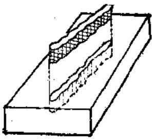

图2-1-1 强固扣合法

缘个数，每个断裂部位安装波形键数和波形槽之间

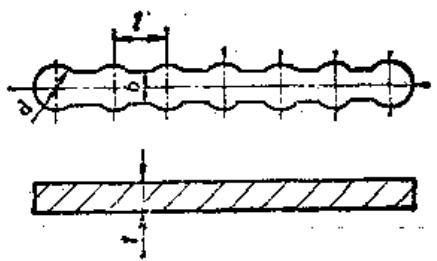

图2-1-2 波形键

距离等项。

$$
\begin{array}{l} d = (1. 4 \sim 1. 6) b \\ l = (2 \sim 2. 2) b \\ t \leqslant b \\ \end{array}
$$

波形键凸缘个数通常分别选用5、7、9个（凸缘越多，则波形稍各凹洼断面上应力越小，并可使最大应力远离裂缝处。但凸缘过多，使波形键镶配工作增加难度）。

为使金属扣合法应用更为方便，上海汽轮机厂

# 2-2

在实践经验的基础上，拟订出波形键的系列规格标准尺寸（表2-1-1）可供选用参考，并可作为波形键标准件生产用。

表2-1-1 波形键的系列规格标准尺寸

<table><tr><td rowspan="2">波形 镀 规 格</td><td colspan="5">公 称 尺 寸 (mm)</td></tr><tr><td>\( d \)</td><td>\( b \)</td><td>\( l \)</td><td>\( t \)</td><td>\( L \) ①</td></tr><tr><td>3</td><td>3</td><td>2</td><td>3.1</td><td>2.5~3.5</td><td>300</td></tr><tr><td>4</td><td>4</td><td>2.5</td><td>4.1</td><td>3.5~5.0</td><td>300</td></tr><tr><td>6</td><td>6</td><td>4</td><td>6.2</td><td>5.0~7.0</td><td>300</td></tr><tr><td>8</td><td>8</td><td>5</td><td>8.2</td><td>6.0~8.0</td><td>300</td></tr><tr><td>12</td><td>12</td><td>8</td><td>12.2</td><td>6.0~8.0</td><td>300</td></tr></table>

①  $L$  为生产标准波形键采用。

（2）波形键的材料 对波形键材料要求如下：

1）韧性好，经热处理后，性很软而便于铆紧。

2）冷硬化倾向大，而且不发脆，使铆紧后的

波形键具有很高的强度。

3）对受热机件的扣合波形键材料的膨胀系数要约低于或和机件一致。

一般扣合用波形键材料常采用1Cr18Ni9或1Cr-18Ni9Ti的奥氏体镍铬钢。在修复高温机件时，须采用含镍量高的膨胀系数与铸铁相近的高温合金。

制造波形键常用材料的化学成分、力学性能，及其线膨胀系数分别见表  $2-1-2\sim 2-1-4$ 。

（3）波形键的制造工艺

1）根据波形锐外形下料。

2）在油压机上用图2-1-3所示模具，将二侧的波形冷挤压成型。

3）创平二平面。

4）修二端凸缘之圆弧。

5）热处理：用  $1\mathrm{Cr}18\mathrm{Ni}9$  制造的波形键在 $1010\sim 1150^{\circ}\mathrm{C}$  中保温  $20\sim 30\mathrm{min}$ ，然后空气冷却或水冷却，要求硬度在140HBS左右。

# 2. 波形槽的布置和加工

（1）波形槽尺寸的确定 按照所选用的波形键各部尺寸相配合，留  $0.1 \sim 0.2 \mathrm{~mm}$  间隙。波形槽

表2-1-2 制造波形键常用材料的化学成分（%） (GB1220—84)

<table><tr><td>牌号\成分</td><td>C</td><td>Mn</td><td>Si</td><td>Cr</td><td>N1</td><td>T1</td><td>S</td><td>P</td></tr><tr><td>1Cr18Ni9</td><td>≤0.15</td><td>≤2.0</td><td>≤1.0</td><td>17.0~19.0</td><td>8.0~10.0</td><td></td><td>≤0.030</td><td>≤0.035</td></tr><tr><td>1Cr18Ni9Ti</td><td>≤0.12</td><td>≤2.0</td><td>≤1.0</td><td>17.0~19.0</td><td>8.0~11.0</td><td>≤0.8</td><td>≤0.030</td><td>≤0.035</td></tr></table>

表2-1-3 制造波形键常用材料的力学性能

<table><tr><td rowspan="2">牌号\性能</td><td rowspan="2">σb(N/mm2)</td><td rowspan="2">σ0.2(N/mm2)</td><td rowspan="2">δ5(%)</td><td rowspan="2">ψ(%)</td><td rowspan="2">HBS</td><td colspan="2">热处理</td></tr><tr><td>湿度(℃)</td><td>冷却剂</td></tr><tr><td>1Cr18Ni9</td><td>520</td><td>206</td><td>≥40</td><td>&gt;60</td><td>≤187</td><td>1010~1150</td><td>水</td></tr><tr><td>1Cr18Ni9Ti</td><td>539</td><td>206</td><td>≥40</td><td>55</td><td>≤187</td><td>1000~1100</td><td>水</td></tr></table>

表2-1-4 各种材料的线膨胀系数  $(\times 10^{-6})$

<table><tr><td>牌号\温度范围</td><td>20~100°C</td><td>20~200°C</td><td>20~300°C</td><td>20~400°C</td><td>20~500°C</td></tr><tr><td>1Cr18Ni9</td><td>16</td><td>16.8</td><td>17.6</td><td>18.1</td><td>18.5</td></tr><tr><td>N136</td><td>2.1</td><td>3.2</td><td>6.1</td><td>8.9</td><td>10.1</td></tr></table>

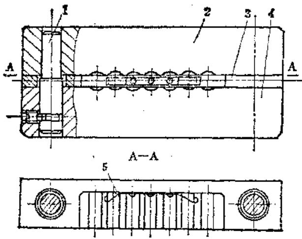

图2-1-3 压制波形键的模具 1—导向柱 2—上模 3—定位块 4—下模 5—弹簧

的深度  $T$  ，可视机件壁厚（H）（图2-1-4）决定，一般按  $T = (0.7\sim 0.8)H$  选用。

（2）机体上波形槽的布置 为使最大应力分

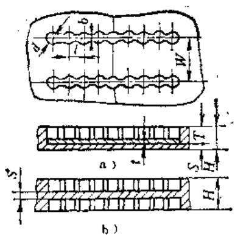

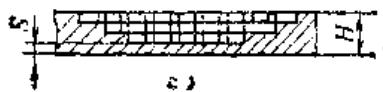

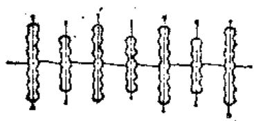

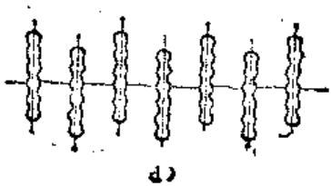

图2-1-4. 被形槽的尺寸与布置方式

布在较大范围内，在布置波形槽时，可采用一前一后或是一长一短的方式（图2-1-4d）。

用于承受弯曲载荷的机件，因机件外层受有最大拉应力，往里逐渐减少，将波形槽设计成阶梯（图2-1-4c），能使机件内壁因开槽而受削弱的影响减小。

波形槽应尽可能垂直于裂纹，槽间的距离W（图2-1-4a）可根据经验法或计算法确定。

对受载荷不大的普通铸铁件，各波形槽之间的距离可选用波形键宽  $\pmb{\delta}$  （图2-1-2）的  $5\sim 6$  倍，即

$$
\mathcal {W} = (5 \sim 6) \times b
$$

对受载荷较大的高强度铸铁件，可采用波形键和损坏铸件原有承载能力等强度条件计算出波形槽间距尺寸，即：

$$
\sigma_ {G} [ H W - b (H - S) ] = \sigma_ {R} b (H - S)
$$

由上式变换为

$$
W = \frac {b (H - S)}{H} \left(\frac {\sigma_ {E}}{\sigma_ {G}} + 1\right)
$$

式中  $S$  ——波形槽下剩余壁厚  $(\mathrm{mm})$ ；

$H$  ——机件壁厚（mm）；

$\pmb{b}$  波形件宽度  $(\mathbf{mm})$

$\sigma_{E}$  一波形键材料经铆击后的抗拉强度极限，如选用1Cr18Ni9材料，可按900  $\mathrm{N / mm^2}$  计算；

$\sigma_{G}$  ——损坏机件的抗拉强度极限（N/mm²）。

（3）波形槽的加工工艺 波形槽可以在镗床、铣床等设备上直接加工成型，但采用钻模、手电钻等简便工具就地加工的工艺具有更大的实用价值，因为大型机件的拆卸和搬运是非常困难的。表2-1-5列出波形槽就地加工的工艺过程。

若裂纹为曲面，则制成曲面的钻模，波形键可用钻模的成形面进行敲弯，然后放在压模中加压成型。对曲面上的孔，事先应量好钻模上孔的深度，或钻削时在钻头上作出记号，以便控制钻头钻入的深度（图2-1-5）。

# 3. 锋击工艺

1）铆接工作应用频率高、冲击力小的小型铆钉枪，压缩空气压力可在  $0.2\sim 0.4\mathrm{MPa}$  范围内。

2）铆击时务使铆击杆垂直于铆击面，先铆波形键两端的凸缘，然后再逐渐向中间凸缘推进，并轮换对称铆击，最后铆裂纹上的凸缘，并且不宜铆

表2-1-5 波形糟就地加工工艺过程

<table><tr><td>步骤</td><td>说明</td><td>简图</td></tr><tr><td>1</td><td>1.根据修复设计的安排,划出各波形槽的位置线2.在各波形槽位置的裂纹上钻波形槽中间的凹洼孔d,深度比壁厚浅2~3毫米</td><td></td></tr><tr><td>2</td><td>用定位销将钻模中间孔固定在裂纹上的孔d内,对准位置钻任何一端之凹洼孔,插入第二只定位销,然后钻完所有的凹洼孔</td><td>定位销钻模机件</td></tr><tr><td>3</td><td>用直径等于宽度b的钻头钻各凹洼之间的金属(用钻模)</td><td>钻模</td></tr><tr><td>4</td><td>用平底钻锪平各孔之底至深度T</td><td></td></tr><tr><td>5</td><td>用宽度等于b的凿子修正波形槽宽度上的二平面(用模具)</td><td></td></tr></table>

图2-1-5 钻曲面上的孔

得太紧，以免将裂纹撑开。凸缘部分铆紧后，再铆各凸缘的连接部分，并要在第一层铆紧后再铆第二层、第三层。

3）正确掌握铆紧度很重要，根据机件要求，壁厚等因素分别掌握，一般情况下，以每层波形键铆低  $0.5\mathrm{mm}$  的尺度来控制其铆紧度。

4）为使波形键得到充分的冷硬化，以提高其抗拉强度极限，每个部位应先用圆弧面冲头1铆击其中心，然后再用平面的冲头2铆各部位的边缘（图2-1-6）。

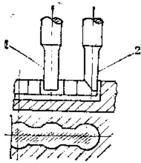

图2-1-6 波形键的铆击 1—圆弧冲头 2—平面冲头

# （二）强密扣合法

在应用了强固扣合法以保证一定强度条件之外，对于有密封要求的机件，如承受高压的汽缸和高压容器等防渗漏的零件，还应采用强密扣合法（图2-1-7）。这种修复法的施工程序是先把损坏的机件用波形键将它联结成为一牢固的整体。然后在两波形键之间、裂纹或折断面的结合线上，每间隔一定距离加工缀缝栓孔，并使第二次钻的缀缝栓孔稍微切入已装好的波形键和缀缝栓，使形成一条密封的“金属钮带”，达到阻止流体受压渗漏。

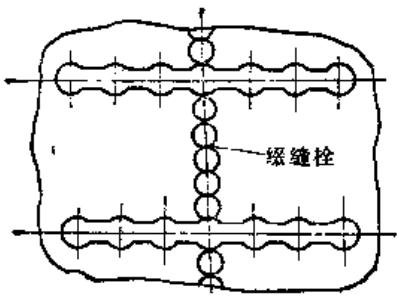

图2-1-7 强密扣合法

缀缝栓有两种形式，一种是螺栓形，用于承受较低压力的断裂件修复，另一种是圆柱形，用于承受较高压力，密封性要求高的机件。

缀缝栓的尺寸主要是参考波形键和波形槽的尺寸选用，螺栓形可参照波形键凸缘  $d$  （图2-1-2）采用  $\mathbf{M}3\sim \mathbf{M}8$  。圆柱形可采用  $\phi 3\sim \phi 8\mathrm{mm}$  ，其厚度 $t$  与波形键  $t$  （图2-1-2）一致。缀缝栓直径（或螺纹）的选择都考虑到两波形键之间的裂缝或拆断间的长度，以保证缀缝栓能密布于缝的全长上，两级缝栓应互相相割，相割量为  $0.5\sim 1.5\mathrm{mm}_{\circ}$

缀缝栓的材料选用与波形键相同，在一般非重要机件上或螺栓形缀缝栓可用低碳钢，也可采用紫铜等软性材料。

缀缝栓与机件的联结和波形键相同，采用圆柱形时，分片装入，逐片铆紧。采用螺栓时，也可涂以环氧树脂或无机粘接剂后一件件旋入，使之更为紧固。

# （三）加强扣合法

加强扣合法主要用以修复在工作过程中要求承受高载荷的厚壁机件，如水压机横梁，轧钢机主架，辊筒等，因为单采用波形键扣合，不能得到可靠的修复质量，而须在垂直于裂纹或折断面上镶入钢制的砖形加强件，使载荷能分布到更多的面积和更远离裂纹或折断处（图2-1-8）。

# 1. 加强件的形式

钢制砖形加强件和机件的联接，大多采用缀缝栓。缀缝栓的中心安排在它们的结合线上，使一半嵌在加强件上，另一半则留在机件基体之内。如有必要，联结时可以再加入波形键。

加强件的形式除可制成如图2-1-8所示的砖形之外，在修复铸钢机件时也可设计成图2-1-9所示的形式。

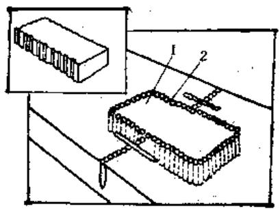

图2-1-8 加强扣合法 1—加强件 2—级缝栓

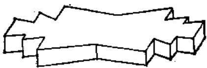

图2-1-9 加强件

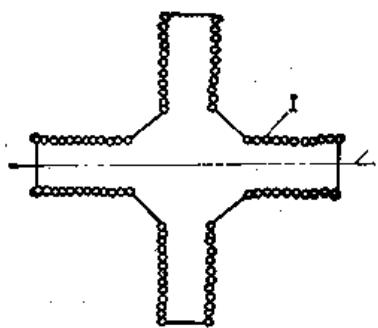

图2-1-10 十字形加强件 1—级锻栓 2—裂纹

对受多方面载荷的机件，加强件可设计成十字形，在四个垂直边的两面用缀缝栓联接（图2-1-10）。采用双X形的加强件，在铆击过程中还能使裂纹开裂处不断拉紧和使加强件长度缩短（图2-1-11）。

修复机件如是要受冲击负荷，在加强件靠近裂纹附近则不用缀缝栓固定，以使修复区域能保持一定的弹性作用（图2-1-12）。

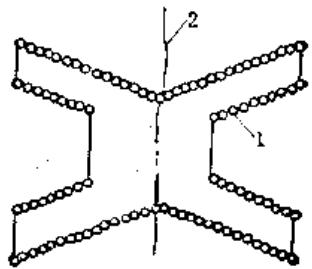

图2-1-11 X形加强件 1—一般螺栓 2—裂纹

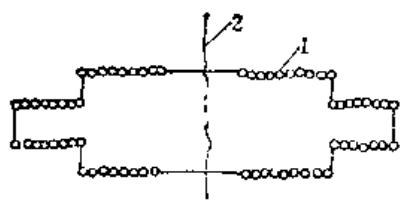

图2-1-12 加强件

1—级缝栓 2—裂纹

弯角附近的裂纹往往是因弯曲载荷而引起的，修复时必须考虑使修复部件具有抵抗弯曲载荷的能力。

在机件裂纹上加工一排凹槽。凹槽的底面1、2与机件两垂直面平行，并留有适当的基底，凹槽内装入和它正确配合的加强件3，并用缀缝栓4将其扣合(图2-1-13)。

# 2. 加强件的加工

在加强件的坏料（钢板或锻件）上按设计形状划线，然后将坏料贴于机件破裂的适当部位上（参看图2-1-8、10、11、12），用压板压紧，并在不影响钻级缝栓孔的四个角上钻定位销孔，拉入定位销后，按所划外形线钻出全部缀缝栓孔（孔的中心必须在线上）。取下坏料按线铣成设计的加强件外形，机件也同样按孔中心线的连线取掉。

以外。在接触面之间尚需保持剩余压力，热扣合件的强度为：

$$
\sigma_ {p} \geqslant \frac {P (1 + \beta)}{F _ {1}}
$$

式中  $\sigma_{p}$  ——热扣合件材料的许用应力  $(\mathrm{N} / \mathrm{mm}^2)$ ;

$P$  ——扣合力(N)；

$\beta$  —系数，  $0.2\sim 0.4$

$F_{1}$  ——扣合件断面面积  $(\mathrm{mm}^{2})$ 。

设热扣合作长度为  $L_{1}$  ，损坏部位长度  $L_{2}$  ，修复后长度为  $L_{0}$  ，则：

热扣合件的变形量为  $\Delta L_{\mathrm{f}} = L_{0} - L_{\mathrm{f}}$

机件损坏部位的变形量为  $\Delta L_{2} = L_{2} - L_{0}$

总变形量为  $\delta = \Delta L_{1} + \Delta L_{2} = L_{2} - L_{1}$

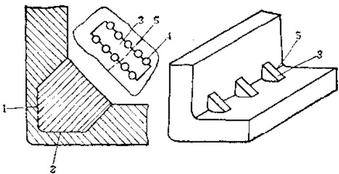

图2-1-13 弯角裂纹的加强

1、2—四棱底面 3—加强件 4—级缝柱 5—裂纹

# （四）热扣合法

热扣合法是利用金属热涨冷缩原理来修复铸件破裂的一种方法，是将选定的一定形状的扣合件经加热后放入机件损坏处已加工好的与扣合件相同的凹槽中，扣合件冷却过程中产生收缩，从而将破裂的机件重新密合。这种方法对某些不同情况的机件上使用，比其它扣合法更为简便实用。这种方法多用来修复大型飞轮、齿轮和重型设备的机身等。

# 1. 热扣合件的形状

根据机件损坏部位的形状和安装可能性，热扣合件可设计成不同的式样。图2-1-14的圆环状扣合件适用于修复轮廓部分的损坏，图2-1-15的工字形扣合件适用于机件壁部的裂纹或断裂。

# 2. 热扣合件的强度计算

由于热扣法的扣紧程度是依靠扣合件的冷缩所产生的压力，因此热扣合件在工作时承受载荷部位

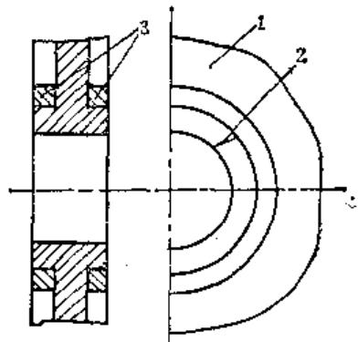

图2-1-14 圆环状热扣合件

1—机件 2—裂纹 3—扣合件

把伸长量和压缩量用应力与应变的关系表示，则得出：

$$
\begin{array}{l} \delta = \Delta L _ {1} + \Delta L _ {2} = \frac {P (1 + \beta) L}{E _ {1} F _ {1}} + \frac {\beta P L}{E _ {2} F _ {2}} \\ = \frac {P L}{E _ {1} F _ {1}} (1 + \beta) \left(1 + \frac {\beta E _ {1} F _ {1}}{E _ {2} F _ {2} (1 + \beta)}\right) \\ \end{array}
$$

式中  $L$  ——热扣合件和损坏部位的名义尺寸

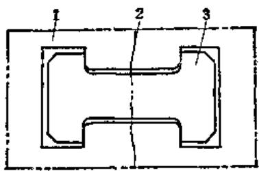

图2-1-15 工字形热扣合件 1—机件 2—裂纹 3—扣合件

(mm);

$\pmb{E}_{1}$  、  $\pmb{E}_{2}$  ——热扣合件和损坏件材料的弹性模数  $(\mathrm{N} / \mathrm{mm}^{2})$

$F_{1}$  ——热扣合件的横断面积  $(\mathrm{mm}^2)$ ;

$F_{2}$  ——损坏机件的接触面积  $(\mathrm{mm}^2)$  。

按上式计算所得热扣件的过盈值，未曾考虑损坏机件裂纹的开裂程度。在实际使用中必须加入此开裂数值。

热扣合件加热所必需的最低温度计算：

$$
t _ {2} = \frac {\delta}{L _ {2} a} + t
$$

式中  $\alpha$  ——选择热扣合件材料的线膨胀系数； $t$  ——工作场所的温度（ $^{\circ}\mathrm{C}$ ）。

考虑到机件的笨重和热扣合时操作的困难，加热时实际温度应比计算温度高  $100\sim 200^{\circ}C_{\circ}$

# 第2节 塑性变形修复法

零件的塑性变形修复法是利用金属或合金的塑性变形性能，使零件在一定外力作用的条件下改变其几何形状而不损坏。

塑性变形修复使用的方法，也是一般压力加工的方法，但其工作对象不是毛坯，而是具有一定尺寸和形状的磨损零件。这个方法系将零件不工作部位的部分金属转移到零件的磨损的工作部位，以恢复其名义尺寸。因此，用这种方法不单改变零件的外形，而且改变金属的机械性质和组织结构。

对未经热处理的含碳量低于  $0.3\%$  的钢件或有色金属件进行塑性变形修复时，可不加热；对含碳量大于  $0.3\%$  的钢件或合金钢件进行塑性变形修复时，由于变形阻力大，则需要加热；对淬火件进行塑性修复时，要经高温回火或退火。

# （一）利用塑性变形修复零件

# 1. 稀粗法

这种方法是借助压力来增加零件的外径，以补偿外径的磨损部分，主要用来修复有色金属套筒和滚柱形零件。

用镦粗法修复零件，零件被压缩后的缩短长度不应超过其原长度的  $15\%$  。为使全长上镦粗均匀，其长度与直径比例不应大于2，否则不适宜采用这种方法。

镦粗法可修复内径或外径磨损量小于  $0.6\mathrm{mm}$  的零件，对必须保持内外径尺寸的零件，可以采用镦粗法补偿其中一项磨损量后，再采用别的修复方法保证另一项恢复到原来尺寸。

根据零件具体形状及技术要求，可做简易模具以保证所需的尺寸要求，尤其是对批量零件的修复更为有利，可提高效率，保证质量。设备一般可采用压床、手压床或用锤手工敲击。

# 2. 挤压法

这种方法是利用压力将零件不需严格控制尺寸部分的材料挤压到受磨损的部分，主要适用于筒形零件内径的修复。一般都需利用模具（图2-2-1）进行挤压，挤压零件的外径，以缩小其内径，再进行加工以达到恢复原尺寸的目的。根据材料塑性变形性的大小和需挤压量数值的大小，来确定模具入口斜度的大小。模具也可做成分段，如图2-2-1b中所示I、Ⅱ、Ⅲ，这样更便于挤压成形。

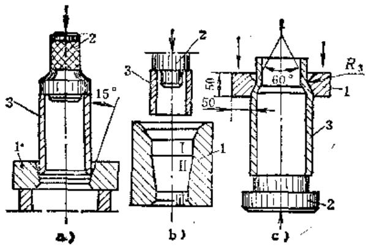

图2-2-1 挤压法 1—模子 2—冲头 3—零件

当金属的塑性变形性质低时，挤压段的锥度可采用  $10^{\circ} \sim 20^{\circ}$  （当挤压值大时）或  $30^{\circ} \sim 40^{\circ}$  （当挤压值小时）；对塑性变形性质高的材料，斜度可采

用  $60^{\circ} \sim 70^{\circ}$  。当挤压值很大时，也可使用两个模子。图2-2-1c所示的模子形状，最适于挤压青铜套筒。模子孔内径尺寸为套筒外径值减去两倍的套筒磨损值及挤压储备值（约  $0.2\mathrm{mm}$ ）。挤压时可使用压床或用锤均匀敲击，达到要求为止。

# 3. 扩张法

这种方法的原理与挤压法相同，不同的是零件受压向外扩张，以增大外形尺寸，补偿磨损部分。主要应用于外径磨损的套筒形零件。根据具体情况可做简易模具和在冷或热的状态下进行，使用设备和操作方法都与以上两种方法相同。

# （二）轴类零件的热校直

# 1. 热校直简介

热校直的简单原理是在轴类零件弯曲的最高点加热，由于加热区受热膨胀，使轴两端向下弯曲（更增加了弯曲度），但当轴冷却时，加热区就产生较大的缩应力，使零件两端往上挠，而且超过了加热时的弯曲度，这个超过部分也就是校直的部分。

应用这种方法对弯曲变形的大型轴类零件进行修复后可重新使用，降低了修理费用，缩短了修理时间，尤其是在无加工大型轴类零件设备的情况下，具有更为重要的作用。

对于负荷大的设备如冲床、压床、冷镦机、压延机的主轴热校直时，多采用自然冷却。热校直轴的一般操作规范如下（看图2-2-2）：

1）利用车床或V形铁，找出弯曲零件的最高点，确定加热区。

2）加热用的氧-乙炔火焰喷嘴，按零件直径决定其大小。

3）加热区的形状有：

① 条状 在均匀变形和扭曲时常用。

② 蛇形 在变形严重，需要热区面积大时采用。

③ 圆点状 用于精加工后的细长轴类零件。

4）若弯曲量较大时，可分数次加热校直，不可一次加热过长，以免烧焦工件表面。

热校直的关键在于弯曲的位置及方向必须找正确，加热的火焰也要和弯曲的方向一致，否则会出现扭曲或更多的弯曲。

# 2. 轴的热校直举例

（1）立钻及横臂钻主轴的热校直 立钻及横臂钻的主轴在使用一定时间后，由于日常受力单边或受径向冲击力过大，使主轴锥孔上面的轴承档发生弯曲。因它是阶梯轴，用机械法校直比较困难，可以将轴置于平板上的两只V形铁中(图2-2-3)找正方向。然后用气孔  $0.5\sim 1\mathrm{mm}$  的气焊枪，调节氧压 $0.05\mathrm{MPa}$ ，乙炔压力  $0.02\sim 0.03\mathrm{MPa}$ ，以类似焊铸铁的火头在钻轴弯曲的凸面位置，用火焰的白心尖，离加热表面  $2\sim 3\mathrm{mm}$ ，加热  $\phi 3\sim 4\mathrm{mm}$  的圆面。

在轴的锥孔中插一长  $200 \sim 300 \mathrm{~mm}$  试棒，用表测量加热的相对面，这时由于热胀关系，轴往弯曲的方向迅速增加弯曲，待新增加弯曲数为原弯曲的  $1 \sim$  5倍时，关掉气枪，立刻将冷水浇上使其迅速冷却，造成局部淬火。这时轴由于冷缩关系，轴心线迅速往弯曲的反方向位移（校正），约  $1 \sim 2 \mathrm{~min}$  后稳定

下来。如果一次未达到预定的要求，可参考前一次加热校正的数值，计算它热胀冷缩的比率，在原加热点附近沿轴心线方向再热一点。有时第一次加热时弯曲的方向未找正，校正后发生扭曲等情况，根据扭曲情况在原热点的左边或右边，再热一点校正扭曲。

轴校好后悬挂在空中，隔  $24\mathrm{h}$  后再测量一次。由于轴在点热时，其他部位也受到了热的影响，待其冷却

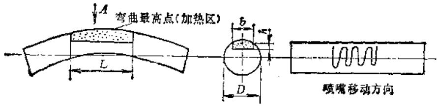

图2-2-2 轴类零件的热校直

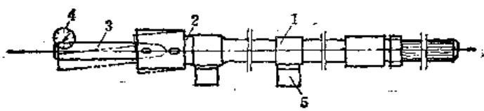

图2-2-3

1—钻轴 2—点热处

3一试锋 4-千分表5一V形铁

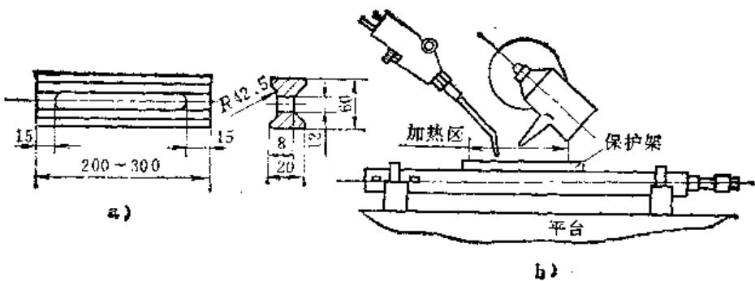

图2-2-4 镗杆的热校直

后轴心线往原弯曲方向有  $0.01 \sim 0.02 \mathrm{~mm}$  的位移（按原来测量方法），所以校正时最好往原弯曲的反方向多校正  $0.01 \sim 0.02 \mathrm{~mm}$ 。

（2）镗杆的热校直 若镗杆磨损较少，变形弯曲不超过  $0.4\mathrm{mm}$ ，并且是活弯时，可采用热校直。操作较易，效果较好。下面以某厂修复T68镗床镗杆为例：校直前弯曲  $0.05\sim 0.06\mathrm{mm}$ ，火焰校直后弯曲在  $0.01\sim 0.015\mathrm{mm}$  之间。其校直工艺如下：

1）校直用工具

① 保护架（图2-2-4a）。

② 焊枪  $1^{*} \sim 2^{*}$  焊枪，焊嘴孔径0.8~2.2 $\mathrm{mm}$ 。

③ 冷却水管 用自来水或水壶。

2）选择加热区

① 按图2-2-4b所示，将镗杆的弯曲峰顶向上，并将保护架放置在峰顶的上端。

② 将加热区快速加热至  $150 \sim 250^{\circ} \mathrm{C}$ ，然后用水冷却加热部分，其冷却速度越快，效果越好。待锤杆冷却至常温时，进行测量，并根据变形情况，选择下一次的加热位置，加热温度，依次进行即可。

3）注意事项

① 加热时，动作要敏捷，尽量缩短加热时间，并保证在加热区的温度随镗杆的变形曲线成正比（即峰顶温度最高，两端温度逐渐降低）。

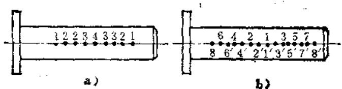

图2-2-5 推杆的热校直

② 加热时，在保证能使锻杆恢复变形的前提下，尽可能降低加热温度（加热温度最高不超过  $250^{\circ}\mathrm{C}$ ），减少加热次数，不应重复加热和有局部过热现象产生。

（3）轧机推杆的热校直（推杆材料为45号锻钢）

1）检查弯曲情况 在车床上把推杆一端夹住，另一端用顶尖顶好，并检查其挠曲值为  $4\mathrm{mm}$ 。部位是中心大至两边渐小。

图2-2-5a为缺陷情况，1、2、2、3、4、3、3、2、1为在该点测量挠度时的测量值。

图2-2-5b为矫直顺序示意，自中点1向两端，每点间隔为  $300\mathrm{mm}$ 。

2）校直方法 由于工件已精加工，校直后不允许表面损伤，故加热温度不宜过高。为避免重复加热产生反向弯曲（校直过量），选用点状加热，温度为  $650\sim 700^{\circ}\mathrm{C}$ ，加热圆点为  $\phi 25\sim \phi 30\mathrm{mm}$ 。

3）校直过程

① 松开顶尖把紧螺丝（两扣）使校直过程中工件有自由余地。

② 第一次按图2-2-5b跳跃加热1、2、3、4、5、6、7等七点。

$③$  检查校直效果。

④ 第二次按图2-2-5b加热  $1^{\prime}$  、  $2^{\prime}$  、  $3^{\prime}$  、  $4^{\prime}$  、  $5^{\prime}$  、  $6^{\prime}$  、  $7^{\prime}$  、  $8^{\prime}$  、8等九点。

⑤ 检查第二次校直效果，获得反向弯曲，其挠度为  $0.4\mathrm{mm}$ ，达到公差要求。

（4）细长半光轴的电热校直加工中的细长轴，有时由于切削力关系，在加工过程中发生弯曲。这种情况因校正后还需要加工，故不能提高点热处的硬度，可采用电弧点焊方法来校正（图2-2-6）。

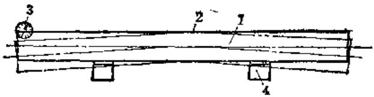

图2-2-6 用电弧点焊校直

1—学光棒料 2—焊热点 3—千分表

4-V形铁

将电焊机电流调节到  $2\sim 4\mathrm{A}$  ，用  $\phi 2\sim 3\mathrm{mm}$  的

上焊12电焊条，在弯曲处的凸面上点焊一点或数点，空气冷却。由于这种方法加热迅速，受热面积小，深度较浅，冷却快，故点热时轴心线只有一个位移方向，即一见弧光时轴就往校正方向位移。如一点不够，可沿轴线方向多加热数点。焊条与轴接触时间不宜过长，一见弧光后就要离开轴表面。点热面积用  $\phi 3\mathrm{mm}$  焊条时，其受热面为  $\phi 4\sim 5\mathrm{mm}$ ；用  $\phi 2\mathrm{mm}$  焊条时，其受热面为  $\phi 3\sim 4\mathrm{mm}$ 。