# 第5章 焊接修复技术

# 柳台夫

机械零部件在服役过程中，免不了发生磨损或破裂，这些破损零件的大部分都是可以通过焊接的方法进行修复。按照零件的材质主要分为铸铁件的焊修和钢件的焊修，下面分别进行介绍。至于铜、铝等零件的焊修这里不作叙述。

# 第1节 铸铁零件的冷焊修复

# （一）概述

铸铁件的焊修方法，就手工电弧焊而言，主要有热焊法、半热焊法和冷焊法，本节着重介绍冷焊法。冷焊法即铸铁件的整体温度不高于  $200^{\circ}\mathrm{C}$  时进行焊修的方法。其特点是方法简便、修复速度快、劳动条件好、变形较小；缺点是易产生淬硬组织而白口化，操作技艺要求较高，稍不慎则易产生裂纹、气孔等缺陷。其焊接修复的难点主要在以下几方面：

1）铸铁含碳量高，从熔化状态遇到骤冷易白口化，白口化则收缩率大；铸铁本身塑性小、脆性大，焊接时的残余应力与铸造残余应力集中作用到厚壁部分或角隅，易形成裂缝以至剥离；铸铁中含硫、磷量较高，这给焊接也带来一定的困难。

2）铸铁中的碳以片状石墨形式存在，焊接时石墨被高温氧化生成CO气体，在焊缝金属中，易产生气孔或咬边。

3）铸铁组织疏松（尤其是长期需润滑的零部件），组织浸透油脂，焊修时只靠简单的机械除油、化学除油是远远不够的，即使是例行公事似的火焰烘烤，也不易把油彻底除掉，这些是焊缝气孔的主要成因。

4）铸铁件服役时经长期高温加热的环境影响，石墨粗大，石墨与基体产生间隙，其近处的油

和水渗进去，形成氧化皮。该氧化皮妨碍焊接时的熔合，极易造成夹渣或裂纹。

5）铸铁件原有气孔、缩松、砂眼、铁粘砂等缺陷也易造成焊接缺陷。

6）机修中的铸铁件除破损部位外，其余部分几何精度均较高，如工艺措施和保护方法不当，极易变形过大或电弧划伤而使工件报废。

机修中铸铁件的焊修工艺除克服上述困难外，最主要的还是提高焊缝和熔合区的可切削性，提高焊补处的防裂性能、防渗漏性能和提高焊接接头的强度系数。

# （二）铸铁件破坏形式及其相应修复措施

铸铁件在服役过程中，由于各种原因会产生破损现象，其形式常见的有：磨损、裂纹、断裂、残缺掉肉、孔洞、泄漏等，下面各举典型实例分别介绍其相应修复措施。

# 1. 裂缝件的冷焊修复

通用焊修裂缝件的冷焊工艺如下：

1）找出裂源，在裂纹末端的前方  $3\sim 5\mathrm{mm}$  处钻止延孔，止延孔的直径按表5-1-1选择。

表5-1-1 铸铁冷焊时止延孔的直径

（mm）

<table><tr><td>壁厚尺寸</td><td>4~8</td><td>8~15</td><td>15~25</td><td>&gt;25</td></tr><tr><td>止延孔径</td><td>3~4</td><td>4~6</td><td>6~8</td><td>8~10</td></tr></table>

如裂缝很浅，彻底除油并打磨干净后即可施焊修复。

2）开坡口。以机械方法开坡口质量容易保证。开坡口以不影响准确合拢为原则，既要除尽裂纹又要确保强度；

① 对精密性要求高的完全断开的工件，为了复原定位可靠和方便，焊前暂不开坡口。焊接时，用适当工具使其断口合拢复原，在夹固后，点焊住，然后开一段坡口，焊接一段。

② 对于承受强烈冲击负荷的大型厚壁铸铁件，在未完全断开的情况下，最好先热压扣合键，使裂纹强迫合拢一些后，再开坡口（参见后面的图5-1-13、图5-1-14、图5-1-15及其说明）。

③ 当只允许焊接壁厚的一面时，则采用开单面坡口而且开通内面的方法（焊接时为了防止铁水下流，可垫上紫铜板或石墨板）。

④ 对能进行壁厚方向两面焊的，先开一面坡口，等焊好后，再开另一面坡口焊接。

⑤ 薄壁（6mm以下）铸铁件的坡口开法：壁厚为  $3\sim 4\mathrm{mm}$  的，可不开坡口，只须把裂纹部位的表面磨光或铲光即可。壁厚为  $5\sim 8\mathrm{mm}$  的，可开成角度稍大的浅坡口，应适当的留点钝边（即不要开通）。焊完一面后，再开另一面（为了焊透裂纹，坡口深度要见到已焊面的焊缝金属），再行焊接（图5-1-1）。

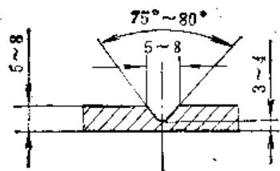

图5-1-1 薄壁件开放口

⑥ 厚壁开单面坡口的常见形式如图5-1-2所示，开双面坡口的如图5-1-4所示。坡口尺寸可参考表5-1-2。

如条件允许，建议在坡口面上开几条与裂纹长

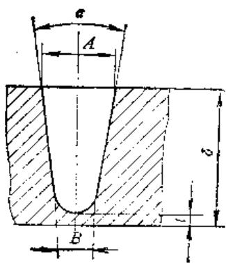

图5-1-2 单面坡口

表5-1-2 坡口尺寸

<table><tr><td>δ (mm)</td><td>B (mm)</td><td>A (mm)</td><td>a</td></tr><tr><td>15~40</td><td>10</td><td>15~20</td><td>16°~18°</td></tr><tr><td>40~80</td><td>15</td><td>30~50</td><td>28°~30°</td></tr></table>

度方向平行的纵向槽，旨在消除部分残余铸造应力，增加焊缝与母材的结合强度。单面V型坡口开槽示意图如图5-1-3。开槽方法可用机械或电弧法。

图5-1-3 铸铁冷焊坡口面上开模示意图

为减少焊接应力及保证焊接质量，若条件许可，采用双面坡口较好，如图5-1-4。下端的坡口，应在上端的坡口焊好后再开。图5-1-5所示的坡口（尖角坡口）应尽量不采用，因为尖角处不易焊透，并且焊接应力会促使裂纹扩展。

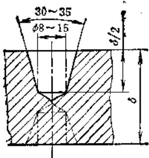

图5-1-4 双面坡口

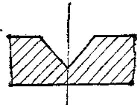

图5-1-5 尖角坡口

⑦ 电弧开坡口 用电弧开坡口，如用得恰当，不仅不会影响焊接质量，而且简单易行，效率很高。但只能用于结构简单，并能自由伸缩的厚壁铸铁零件的某些有裂纹的部位上。有些变质的，或

铸造时就形成的石墨片粗大的铸铁件，在采用电弧开坡口的情况下，还会改善焊接性能。电弧开坡口时采用碳弧或采用交、直流两用焊条，将工件坡口立式放置，从上面下地开较好。也有的采用碳弧气刨或铸208焊条开坡口。

3）较深坡口的焊接，应先进行挂面焊，然后进行退步短段多层焊和分散断续焊，即如图5-1-6那样，先把第一段焊满填足坡口后，再退步施焊第二段。每段的长度  $50\mathrm{mm}$  左右，层间温度和接续焊温度为  $60^{\circ}C$  左右。焊道方向与裂纹走向垂直。

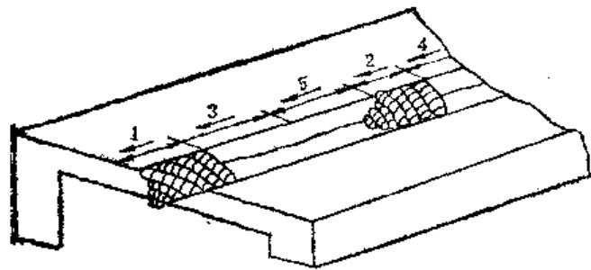

图5-1-6 深坡口的分散退步短段多层焊法

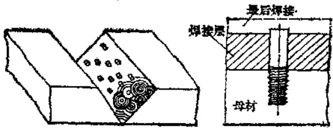

螺钉直径：  $d = 6\sim 10\mathrm{mm}$  值入深度：  $1\sim 2.5d$

外漏长度：  $6\sim 10\mathrm{mm}$  螺丝间距：4d

图5-1-7 钻丝焊法

4）对于壁厚允许有较多焊层的裂缝的补焊，必要时需进行裁丝处理，如图5-1-7。以免应力过大造成焊缝剥离。

# 5）施焊操作要点

① 预热 焊前用氧炔焰对施焊部位进行稍大范围的烘烤，预热温度为  $200^{\circ} \mathrm{C}$  左右。冬季从室外来的铸件，应在室内放置  $24 \mathrm{~h}$  以上，使应力松弛后再焊。一般说来，油污不大的工件经  $200^{\circ} \mathrm{C}$  左右温度的烘烤后，一可除油，二可预热，可有效的防裂。

② 焊条的选择 焊条的选择要根据工件的作用及要求。国产常用铸铁冷焊用电焊条见表5-1-3所示。经碳钢焊条焊后的工件不能再加工，但其突

出的特点是，用镍基焊条几乎不能施焊的氧化或腐蚀很甚的铸铁件，有时倒可使用低碳钢焊条；此外，多层焊时，以碳钢焊条打底焊第一层，熔合效果较好。常用的碳钢焊条有Z117、Z116、Z100等碳钢芯铸铁焊条，以及J506（结506）、J507（结507）、J427（结427）等结构钢碱性焊条。

使用较为广泛的还是镍基铸铁焊条，牌号主要有Z308、Z408、Z508。经长期实践证明，铸408效果较好，应限用铸308、淘汰铸508焊条。

焊条直径越细越好。焊条应按说明书要求烘干后再用，通常烘干温度为  $150\sim 250^{\circ}\mathrm{C}$ ，保温  $2\mathrm{h}$ 。

值得指出的是，在碳钢焊缝上可用镍基焊条施焊，但不可在镍基焊缝上用碳钢焊条施焊，因那样做将会熔进大量镍、钼，使焊缝硬度极高，使切削性能不良，容易致裂。

③ 电流和极性的选择 铸铁冷焊法以细径焊条，线能量小为特点，因此常用较低电流施焊，以减少母材熔入量。一般说，冷焊铸铁用的焊接电流比焊接钢结构的焊接电流要小  $10\% \sim$ $25\%$  左右。

冷焊法宜选择直流焊机，并以反接法即焊条接正极进行焊接效果为好。

引弧和收弧 引弧处易出现白口现象，为避免焊接对切削性能、防裂性能的变坏，应尽量在不加工处引弧，重要工件则应利用引弧板引弧，若直接引弧时，必须在焊道中心线上距起焊点约  $20\mathrm{mm}$  处进行引弧，以便及时利用电弧来回火。

收弧时则要在压低电弧填满弧坑后再把电弧拉向一侧熄弧，这样可防止弧坑裂纹的产生。

⑤ 运条 底层的焊接只能采用直线型运条，不得采用划圈法运条，以免增大熔合比。直线型运条每个焊段不超过  $50\mathrm{mm}$ ，若焊缝较长，宜用退步分散成短段施焊，这样能减少应力集中现象。

并行焊道应往前段焊道压入  $1 / 3\sim 1 / 2$  见图5-1-8，这样可以减少母材的熔入量。而且焊缝平齐美观。

整个施焊操作均以短弧施焊，每次焊前必须把熔渣清除干净，必要时用砂轮打磨光滑。接续焊温度、层间温度均为  $60^{\circ}\mathrm{C}$  （不烫手）为原则。

经过栽丝处理的工件，应先环绕预先拧好的无头螺钉的根部焊一圈，此时选用塑性好的奥氏体不锈钢焊条；然后再按冷焊法施焊。

表5-1-3 国产铸铁电弧焊焊条

<table><tr><td>焊条名称</td><td>统一牌号</td><td>焊芯组成</td><td>药皮类型</td><td>焊缝金属</td><td>电源种类</td><td>用途</td></tr><tr><td>氧化型钒芯铸铁焊条</td><td>Z100(铸100)</td><td>碳钢</td><td>氧化型</td><td>碳 钢45HRC</td><td>交直流</td><td>一般灰口铸铁件非加工面焊补</td></tr><tr><td>高钒铸铁焊条</td><td>Z116(铸116)</td><td>碳钢(高钒药皮)或高钒钢</td><td>低氢型</td><td>高钒钢</td><td>直流(反接)或交流</td><td>高强度灰口铸铁及球墨铸铁焊补</td></tr><tr><td>高钒铸铁焊条</td><td>Z117(铸117)</td><td>碳钢(高钒药皮)或高钒钢</td><td>低氢型</td><td>高钒钢</td><td>直流(反接)</td><td>高强度灰口铸铁及球墨铸铁焊补</td></tr><tr><td>铁粉型冷焊铸铁焊条</td><td>Z122Fe(铸122铁)</td><td>碳钢(药皮中加铁粉)</td><td>钛钙型</td><td>碳 钢</td><td>交直流</td><td>多用于一般灰口铸铁件非加工面焊补</td></tr><tr><td>钢芯石墨化型铸铁焊条</td><td>Z208(铸208)</td><td>碳 钢</td><td>石墨型</td><td>灰 铸 铁35HRC</td><td>交直流</td><td>一般灰口铸铁件焊补</td></tr><tr><td>钢芯球墨铸铁焊条</td><td>Z238(铸238)Z238SnCu(铸238锡铜)</td><td>碳钢(药皮中加球化剂)</td><td>石墨型</td><td>球墨铸铁</td><td>交直流</td><td>球墨铸铁件焊补</td></tr><tr><td>铸铁芯铸铁焊条</td><td>Z248(铸248)Z258(铸258)</td><td>铸铁芯</td><td>石墨型</td><td>灰铸铁220HBS</td><td>交直流</td><td>灰口铸铁件焊补</td></tr><tr><td>纯镍铸铁焊条</td><td>Z308(铸308)</td><td>纯镍</td><td>石墨型</td><td>镍120HBS</td><td>直流(正接)或交流</td><td>重要灰口铸铁薄壁件和加工面焊补</td></tr><tr><td>镍铁铸铁焊条</td><td>Z408(铸408)</td><td>镍铁合金</td><td>石墨型</td><td>镍铁合金180HBS</td><td>直流(正接)或交流</td><td>重要高强度灰口铸铁件及球墨铸铁件焊补</td></tr><tr><td>镍钢铸铁焊条</td><td>Z508(铸508)</td><td>镍铁合金</td><td>石墨型</td><td>镍铜合金140HBS</td><td>直流(正接)或交流</td><td>强度要求不高的灰口铸铁件焊补</td></tr><tr><td>铜铁铸铁焊条</td><td>Z607(铸607)</td><td>紫 铜</td><td>低氢型</td><td>铜-铁混合</td><td>直流(反接)</td><td>一般灰口铸铁件非加工面焊补</td></tr><tr><td>铜包钢芯铸铁焊条</td><td>Z612(铸612)</td><td>铜芯铁皮或铜包铁芯</td><td>钛钙型</td><td>铜-铁混合</td><td>交直流</td><td>一般灰口铸铁件非加工面焊补</td></tr><tr><td>贝氏体马氏体铸铁焊条</td><td>铸8-1</td><td></td><td></td><td>B+M</td><td>直流</td><td>薄壁非加工面焊补</td></tr><tr><td>奥氏体型铸铁焊条</td><td>球408</td><td>镍铁合金</td><td>石墨型</td><td>A</td><td>交、直流</td><td>球铁、灰铁的焊接抗裂性好,可代铸308</td></tr><tr><td>低碳钢芯铸铁焊条</td><td>铸DF</td><td>低碳钢</td><td>石墨、合金型</td><td>F+P170~220HRC</td><td>直流</td><td>冷焊大型铸铁件</td></tr></table>

注：1.Z308、Z408、Z508有时统称镍基铸铁焊条。

2. Z607、Z612，以及铜管不锈钢芯或铜管镍铬合金芯铸铁焊条，统称钢钢焊条。

3.铸铁芯石墨化型铸铁焊条，目前多为单位自制，暂时尚未成批生产。

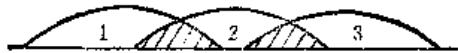

图5-1-8 焊道相互覆盖可减少母材熔入

为提高焊缝切削性能，焊缝表层应施以退火焊道（该焊道的两侧均不与母材接触）。

⑥ 锤击 每段焊完后，立即用细尖头（顶端  $R3 \sim R5$  圆角）的小锤在焊道上连续敲打锤击，锤击要适度、均匀。裂缝一般发生在焊后十秒钟左右，故锤击就必须在这一段时间进行完毕。锤击后的焊道表面应以布满密密麻麻的小坑为宜。锤击能减轻焊道的收缩应力，并可使镍基金属结晶细化、韧性增强。待焊道温度降为  $300^{\circ} \mathrm{C}$  以下时就不得再锤击。

⑦ 加热减应区法 铸铁冷焊防裂的措施除了上述的焊前预热与焊后缓冷、选用细径非铸铁型焊条、选用小线能量与合理的焊序、短焊道锤击和裁丝处理等外，还有加热减应区法。

所谓加热减应区法，即在焊件上选择适当的区域进行加热，使焊接区域有自由热胀冷缩的可能，以减小焊接应力，如图5-1-9所示，然后及时施焊。

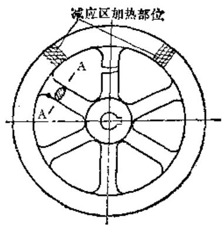

图5-1-9 加热减压区法

减应区的选择原则为：应在阻碍焊缝膨胀收缩的部位；应与其它部位联系不多，且强度较大；该区的变形对其它部位应不产生很大的影响。减应区的加热温度一般不超过  $750^{\circ}\mathrm{C}$  。

③ 焊后处理 焊后应注意保温缓冷，以免冷却速度过快形成白口现象。保温措施是：小工件可用热砂或保温灰覆盖掩埋，大工件则可用石棉布覆盖，若能及时放入回火炉则更好。

为保证焊接质量，焊接场地应选择干热无风

处。箱体类工件的裂纹焊接后最好进行退火或振动时效处理，以减少工件的变形和残余应力。重要箱体焊补后应进行几何精度复核，必要时进行相应的技术处理。

⑨ 焊缝补强 为保证重要工件工作焊缝的强度，焊接后应进行补强。补强方法主要有加焊钢筋法和覆盖钢板法。

加焊钢筋法即在垂直于焊缝方向上焊接钢筋，以通过钢筋把负荷传递到更大区域。加焊钢筋的方法有表面加焊和镶入式加焊法，如图5-1-10所示。

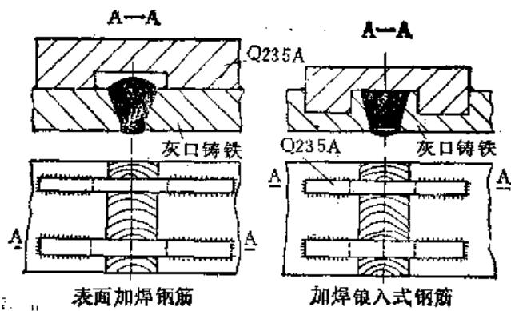

图5-1-10 加焊钢筋对焊缝补强

覆盖钢板法的步骤是先把补焊缝磨平，然后再在焊缝两边各覆以钢板，与铸铁母材配钻螺纹孔，把钢板与铸铁件用螺栓联在一起，最后将钢板与母材板的坡口处焊起来。这样，便可使原铸铁的补焊缝受到附加的压应力，从而增加了焊修后的强度，如图5-1-11所示。

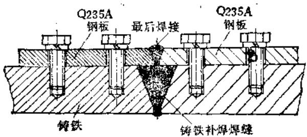

图5-1-11 覆盖钢板法补强

# 2. 建损件的焊补修复

我们以车床导轨划伤的焊补工艺为例，叙述磨损件的焊补修复。若用冷焊法通常工艺修复划伤的导轨，在焊后粗打磨加工时，会发现导轨上有较多有时甚至是密集的小圆气孔，这是导轨划伤处吸油

过多所致。导轨虽经除油并且是预热后施焊，但在焊接高温下，油脂又会从母材深处虹吸上来，而冷焊法的冷却速度大，气体来不及逸出而滞留于焊缝中以致形成气孔。为此，除油是个关键。实验可知，采用短段热焊法焊补导轨的划伤部位可圆满解决气孔问题。所谓短段热焊法即是：对将施焊的焊段进行  $600\sim 700^{\circ}\mathrm{C}$  的预热，然后趁热施焊，再预热下个焊段（  $600\sim 700^{\circ}\mathrm{C})$  ，再施焊，依此类推。由于每个焊段长度控制在  $25\sim 40\mathrm{mm}$  ，且焊前预热温度高，能及时彻底除净虹吸上来的油脂，因此，焊缝磨削后几乎不产生气孔等缺陷。此焊法其它施焊要点与前述的冷焊法完全相同。

短段热焊法修复导轨划伤的分散退步施焊焊序及焊接方向如图5-1-12所示。

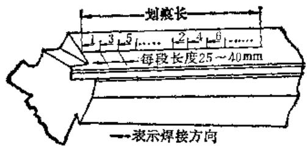

图5-1-12 分散退步短段热焊法示意图

焊补处的精加工宜在导轨磨床上完成。如为现场焊修，则用手动砂轮打磨至平后，用油石精修成形即可。

采用短段热焊法修复工件，工件的整体温度仍较低，故短段热焊法仍属冷焊法范畴。短段热焊法要求气焊工紧密配合，预热和施焊交替进行，再加上锤击、缓冷保温等，操作比较繁冗。另外，由于碳的烧蚀而生成CO气体，极易产生咬边现象，这就要求选择的焊接电流要合适，焊接手法、焊条角度、运条方法要正确，以保证熔化金属与母材均匀过渡，焊缝成形美观。

# 3. 断件的焊接修复

断裂件的焊修工艺是：利用相应手段使原件吻合良好，然后点固焊几处，尺寸和精度符合要求后，其它补焊措施及要点与修复裂缝件相同。值得注意的是，坡口要开一段焊一段，且两面交替进行，切不可贸然地一次把坡口全部开出，那样保证不了尺寸精度。有条件的话可用刚性固定法夹持施焊。下面讲述两例断件焊接修复工艺。

（1）虎钳芯（要求具有较高强度和较好加工性）完全折断的焊接修复 焊修工艺参见图5-1-

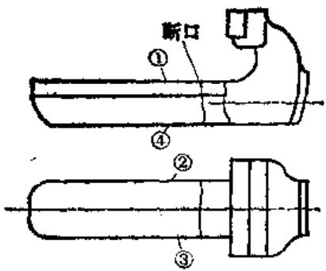

图5-1-13 虎钳芯折断的焊接修复

13.

1）将工件清洗干净后，在电炉内预热至  $50\sim$ $60^{\circ}C;$

2）将平面4靠在铸铁平板上，将断口合拢复原并夹固，然后将断口四周点焊住；

3）开1面上的坡口（不开通，留钝边  $3\sim$ $4\mathrm{mm}$  ），然后用  $\phi 4$  奥氏体铁铜焊条或Z100，J507一类焊条焊好。再开2面或3面上的坡口，并以同样方法依次焊好；

4）将4面翻朝上，夹固后，开出虎钳芯U形断口内面的坡口（必须开到见外坡口上的焊缝金属），然后用间上方法焊好。最后用刨削或磨削进行加工。

（2）承受强烈冲击负荷的大型厚壁铸铁件严重断裂的冷焊修复 这类零件如100t冲床曲轴前孔裂成三瓣的焊接修复；剪切  $13\mathrm{mm}$  钢板用的冲剪机装置刀板的大梁完全折断的焊接修复；160t和200t摩擦压力机锤头严重裂损的焊接修复等等。现以100t冲床曲轴前孔裂成三瓣的焊接修复为例，参见图5-1-14。

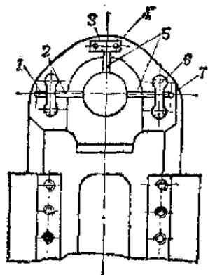

图5-1-14 100t冲床曲轴前孔破裂的焊接修复  
1—焊缝 2、5—裂纹 3—加强板 4—锥形销  
6—扣合销 7—止裂孔

为使焊缝承受强烈的冲击负荷，焊缝强度应同于或大于母材强度。这就要求焊缝具有很好的焊接质量，并且还必须采取机械加强的技术措施。较好的方法是采用热压半圆头扣合键与焊接相结合，如图5-1-15所示。这种工艺方法由于键和键槽的加工比较容易，使用比较可靠，能收到较好的效果。热镶这种键的主要作用，是让键代替焊缝承受很大一部分负荷，并把这种负荷传递到受力比较有利的母材上去，同时键在焊缝上起了一个“老树根”的作用，让焊缝生在它上面，得到很大的加强，并且不易形成裂纹。

图5-1-15 半圆头扣合键

现将冷焊修复方法说明于下，参见图5-1-16；

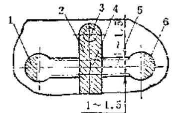

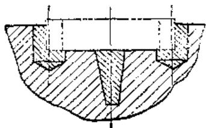

图5-1-16 加扣合键的焊接修复

1、2、6—焊缝 3—止裂孔 4—裂纹 5—扣合件

1）找出所有裂纹（用煤油浸湿裂纹部位后用氧乙炔熔烤的方法）及其端点位置。

2）钻止裂孔（钻至无裂纹处为止）。

3）根据裂纹处的具体位置，初步拟定链的外形尺寸及断面尺寸，然后根据裂纹长度、深度、铸

铁壁厚、铸铁材料牌号及其强度，及冲床最大工作负荷等条件，验算键的断面尺寸，要求键断面所能承受的负荷应大于或等于工件键键处的断裂面所能承受的负荷。选键材料为45号钢（因45号钢比 $40\mathrm{Cr}$  使用方便，只要加热到要求的温度便可镶入键槽，而  $40\mathrm{Cr}$  加热方法较难掌握，而且加热需要保温，否则一打就碎）。

4）在与裂纹成垂直的适当位置，按确定的键尺寸，划键槽加工线，注意要使键的两个半圆头对称于裂纹。

5）加工两个键槽（可用小悬臂钻床加工）。

6）开出键槽底面上的裂纹坡口。

7）用  $\phi 4$  奥氏体铁铜焊条或Z408、Z308焊条焊平键槽底面上的裂纹坡口，并同时焊平加工键槽圆孔时遗留下来的钻坑。焊完后，将两处的焊缝铲至与键槽底一样平滑。

8）计算键两半圆头中心距的实际使用尺寸键槽两圆孔的中心距为  $223.5\mathrm{mm}$  ，当把键加热至 $850^{\circ}C$  （暗红色）时，键圆头中心距膨胀后的长度也应为223.5，则实际使用尺寸  $L_{0}$  可按下式计算：

$$
L _ {0} = \frac {L}{1 + a t}
$$

式中  $L$  ——键加热后膨胀至总长度  $(\mathrm{mm})$ ；

$\pmb{a}$  ——键材料膨胀系数（1/度）；

$t$  ——温差  $(^{\circ}\mathrm{C})$  。

将以上数据代入则得：

$$
\begin{array}{l} L _ {0} = \frac {2 2 3 . 5}{1 + 0 . 0 0 0 0 1 1 0 (8 5 0 - 2 0)} = \frac {2 2 3 . 5}{1 . 0 0 9} \\ \approx 2 2 1. 3 \mathrm {m m} \\ \end{array}
$$

9）制造扣合键。

10）热压扣合键 将键在盐炉（或电炉）中加热至  $850^{\circ} \mathrm{C}$  后，马上放在键槽中，用大锤打下去。

11）将键焊死在工件上 将装键后空剩下来的半圆形孔，用交叉、分散的焊法（即轮换着焊）填焊满（采用焊条同前），然后空出键圆头上承受夹紧力的部分（不开坡口也不焊），而将其余部分开一段坡口焊一段（这样做可不影响键的夹紧效果），一直焊至与键齐为止。

12）沿其余未焊的裂纹开坡口（可用长把钻头和长柄立铣刀在小摇臂钻床上开）坡口尺寸应以将裂纹完全除尽、焊接操作方便、爆的少，并能保证焊缝强度为原则。

13）用氧乙炔焰将焊缝部位及其附近加热至

$50\sim 60^{\circ}C$  ，然后按图5-1-6所示的焊接顺序轮换焊接所有的坡口（共三处）。由一个人专门在熄弧后立即锤击焊缝（先用长方形冲子快速地普遍冲击，后用圆锥头冲子仔细锤击）。工件温度不应大于 $60^{\circ}C$  ，焊缝不允许存在任何大小裂纹及其它任何明显的焊接缺陷。工人休息时，工件要盖上保湿材料以缓冷。这样，直到把坡口焊满为止，最后把止裂孔焊死。

14）镶加强板 将曲轴前孔正上方的焊缝铲平，并用手动砂轮磨光，镶上如图5-1-17所示的加强板（因为该处裂纹较轻，并且位置受限制）。加强板用10号钢制成，厚度为  $20\mathrm{mm}$  。在加强板上装置两个  $\phi 18\mathrm{mm}$  的锥销，锥销的下端应进入铸铁  $25\sim 30\mathrm{mm}$ ，然后将加强板用上述方法焊在母材上，如图5-1-18所示（先在母材上焊一层焊缝，然后再把加强板和已焊焊缝联起来焊），最后，将锥销端头焊死在加强板上。

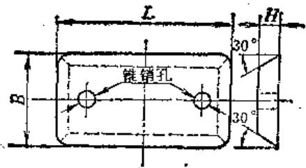

图5-1-17 加强板

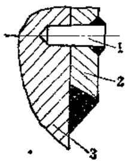

图5-1-18 加强板的焊接

1—锥销 2—加强板 3—工件

15）分别将每个焊缝的交接区用手动砂轮打磨光，仔细检查有无裂纹及其它缺陷。没有问题后，再把曲轴孔放平，用手动砂轮打磨曲轴孔的焊缝，在接近打磨光时，在孔中的焊缝上涂红丹粉后用样板的圆弧面摩擦焊缝，找出凸高显示点来，然后把显示点磨去，用此法直到把焊缝加工至和原来孔表面一样平滑，且尺寸合格为止。

16）装配试车 经手动试车无问题，才逐渐地

加负荷试车，直到将负荷加到原设计值，冲压20件以上无问题为止。

# 4. 残缺铸铁件的焊补修复

残缺不全是铸铁件损坏的常见形式，应根据不同情况进行相应处理。

1）对于无加工要求的工件，允许用相应的铸铁或低碳钢材料制成缺掉部分的形状（俗成补块）后开好相应坡口，然后进行镶补。因补块是碳钢的，所以以奥氏体不锈钢焊条施焊为宜，其施焊方法应遵守冷焊要点。

2）对焊后有切削加工要求的铸铁件，应尽量采用铸铁补块，用Z408或Z508焊条施焊，并在表面堆焊足够后进行退火处理，最后将焊道大致打磨平整后机械加工成形。

3）对残缺较大，且残缺位于角隅的铸铁件，应进行栽丝处理后，再冷焊修复。图5-1-19的螺钉孔缺口的焊补工艺如下：

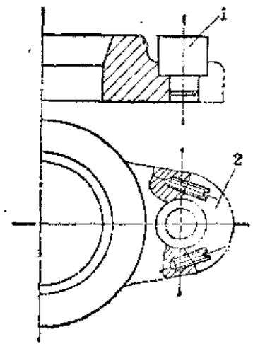

图5-1-19 螺钉孔缺口的焊补 1—紫铜或石墨模芯 2—缺口

① 首先在垂直于断面的中心位置栽丝。

$②$  用紫铜或石墨棒按螺孔配车好塞棒。

③ 用Z508或Z408焊条在与塞棒接触的坡口边缘焊一层。

④ 按冷焊法或短段热焊法堆满后打磨成形。

$⑤$  拔出塞棒，打磨螺孔内径成形。

4）对中间碎掉一个大洞的铸铁件采取的修复措施如下：

① 将四块低碳钢板制拼成碎落掉的形状，钢板厚为铸铁件的  $1 / 3$  ，在拼接对口时要考虑焊接收缩的影响。如图5-1-20所示，邻近铸铁部分的补

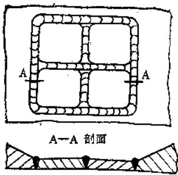

图5-1-20 铸铁件补大洞螺钢板示意图

块应加工成斜坡，逐渐减薄形成过渡区，这样能减少应力集中。

② 铸铁与钢板的连接焊缝，用Z117等焊条在铸铁面上用短弧施焊打底挂面。

③ 用Z408或Z308焊条将挂面焊道与钢板焊接起来，也可用不锈钢焊条。施焊时，焊段长度控制在  $30\mathrm{mm}$  左右，超过这个长度就应移动位置改变焊接方向，如图5-1-21所示。

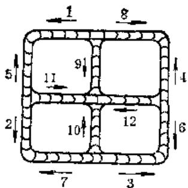

图5-1-21 铸铁件补洞钢板焊接顺序示意图

④ 两块钢板之间的焊缝最后再焊，焊条选用J422焊条即可。

# 5. 水密性铸铁件的焊接修复

以M3180磨床床身的焊修为例，叙述水密性铸铁件的修复工艺。该床身因铁粘砂渗漏严重，影响主轴润滑，焊修的重点是保证水密性需要，焊修工艺如下：

1）将渗漏部位查清，并画出区域。

2）将打磨泄漏区直至露出金属光泽。由于原铸件铁粘砂严重，所画区域仅是最严重的部位，因

此根本不能达到完全无粘砂现象。

3）用Z117焊条以频繁引弧的方式点焊渗漏部位的边界线，然后及时锤击（锤击要轻），将各圆球形熔滴锤扁，使之相互尽量搭接。

4）最后用Z408焊条进行盖面焊。每段焊接长度也不要过长，以  $30\sim 40\mathrm{mm}$  为宜。

5）按冷焊要点施焊完毕后，将焊缝，尤其是焊缝边缘打磨干净，发现吻合不良处进行补焊，然后再打磨，不中意则再补焊，直至满意为止。

6）试水，如稍微有些渗漏，则查明其部位，用錾子等捻冲，直至满意为止。若渗漏仍较严重，将焊补区通盘打磨干净，用丙酮去除油脂（擦拭至脱脂棉不变黑为止），然后涂敷一层胶粘剂，注意焊缝边缘与母材的交界处胶膜要成形良好。为使胶液浸润良好，冬季施工最好用小热风机吹拂，使其在  $25\sim 60^{\circ}C$  温度内固化成膜。

# 第2节 铸铁件的钎焊修复

采用比母材熔点低的金属材料作钎料，将焊件和钎料加热到高于钎料熔点、低于母材熔点的温度，利用液态钎料润湿母材，填充接头间隙并与母材相互扩散实现连接焊件方法叫钎焊。钎焊分为硬钎焊和软钎焊，钎料熔点高于  $450^{\circ}\mathrm{C}$  的钎焊称为硬钎焊，而钎料熔点低于  $450^{\circ}\mathrm{C}$  的钎焊则叫软钎焊。机修中常见的有铸铁件的黄铜钎焊（硬钎焊）和铸铁导轨的锡铋合金钎焊（软钎焊）。

# （一）铸铁件的黄铜钎焊修复

小型铸铁件或大型铸铁件的局部修复往往采用黄铜钎焊。钎焊过程中，利用氧炔焰加热，因母材不熔化，接头不会产生白口组织，不易产生裂纹。黄铜钎焊的缺点是钎料与母材颜色不一致。

下面，以铸铁拨叉为例，说明黄铜钎焊的堆焊修复过程：

1）去除待焊部位的疲劳层、油污、铁锈等，最好是将之打磨光亮。

2）选HS221（丝221）、HS221（丝222）或HS224（丝224）或HL103（料103）等为钎料，该钎料熔点  $860\sim 890^{\circ}\mathrm{C}$

3）选无水硼砂或硼砂与硼酸混合物（成分各半）作钎剂。

4）选用较大的火焰能率，以弱氧化焰进行堆

焊钎焊。注意焊前要先将工件表面的石墨烧掉。

5）要留有足够的加工余量，钎焊后进行成形加工。

# （二）导轨划伤的钎焊修复

铸铁导轨里含有大量的片状石墨，它们对钎焊有阻碍作用，影响母材的润湿和流布。为此，用快速无槽化学镀铜的方法，在洁净的导轨划伤部位沉积一层薄薄的铜层（ $0.02 \sim 0.05 \mathrm{~mm}$ ），可保证钎料牢固地焊在导轨面上。钎焊钎料有铜合金、银合金、锡基轴承合金、锡铋合金等，其中锡铋合金是在轴承合金的基础上发展而来。因锡铋合金有冷胀作用，对划伤表面的钎焊效果最佳。其具体工艺如下：

# 1. 无槽化学镀铜工艺

# 1）镀铜液的配制

① 1号镀铜液配方为浓盐酸  $30\%$ ；锌  $(Zn)4\%$ ；硫酸铜  $\left(\mathrm{CuSO}_{4}\right)4\%$ ；蒸馏水  $62\%$ 。配制方法是按重量比将上述成分分别称好后，先把锌加入浓盐酸中，待全部溶解后，加入硫酸铜，用玻璃棒搅拌均匀后把蒸馏水加入，再搅拌均匀即可。

② 2号镀铜液 配方为硫酸铜  $\left(\mathrm{CuSO}_{4}\right)$ $75\%$ ；蒸馏水  $25\%$ 。配制方法是，按重量比将上述成分称好后，把硫酸铜加入蒸馏水中，搅拌后，硫酸铜只要溶解约  $80\%$  左右即可使用（硫酸铜不加热不会完全溶解于蒸馏水中，但加热后的硫酸铜水溶液，对金属的腐蚀性较大，故一般不加热）。

# 2）镀铜操作

① 把需要镀铜的表面用煤油粗洗一遍，再用丙酮擦洗，并用细砂布打光，然后用细钢丝刷反复擦拭以清除掉表面上的石墨粉，最后用丙酮擦洗至脱脂棉不变黑时为止，使待镀铜表面真正露出金属光泽，并无油污。无油的标志是：滴上清水时，水珠立即摊开，不形成细小水珠。

② 用新脱脂棉蘸浸1号镀铜液，反复涂擦待镀铜表面，接着用同样方法涂擦2号镀铜液。根据要求的镀层厚度决定涂擦的次数，要求的镀层越厚，则涂擦的次数应越多。但该法所镀铜镀层厚度最多仅  $0.05\mathrm{mm}$  左右，再多镀层就会因腐蚀性增大而脱落。

③ 铜层镀毕，待自然晾干后即可用铜丝刷刷去铜层上的白灰，并查看镀层是否脱落。无脱落现

象，则镀层质量合格，否则应重新另镀。

若不在待镀工件上先涂  $1^{*}$  镀铜液，而直接涂 $2^{*}$  镀铜液则得到的镀层不牢固，用脱脂棉一擦即掉。总起来说，先涂  $1^{*}$  镀铜液的作用有三：一是酸洗作用；二是弱腐蚀作用，使工件表面稍微粗糙；三是预镀打底的作用。由于酸洗与预镀是同时进行的，所以工件表面被氧化的可能性大大减少。

无槽化学镀铜这一过程也可用电火花强化机以紫铜为电极来完成，质量更为可靠。

# 2. 锡铋合金钎焊工艺

1）锡铋合金焊条的制作 焊条的配方重量比为：锡（Sn）， $55\%$  （密度为  $7.5 \times 10^{3} \mathrm{~kg} / \mathrm{m}^{2}$ ，熔点为  $231.85^{\circ} \mathrm{C}$ ）；铋（Bi）， $45\%$  （密度为  $9.8 \times 10^{3} \mathrm{~kg} / \mathrm{m}^{2}$ ，熔点为  $271^{\circ} \mathrm{C}$ ）。按配比重量分别称取锡与铋后一起放入铁制容器内，加热至完全熔融，然后迅速注入倾斜放置的角钢槽内（角钢槽预先要除油除锈）冷凝后，便成断面为三角形的条状焊条。

2）焊剂的配制 取氯化锌（ $\mathrm{ZnCl_2}$ ） $36\%$ ，氯化亚锡（ $\mathrm{SnCl_2}$ ） $64\%$ ，再加上两者总重量三倍的蒸馏水，用玻璃棒搅拌至完全溶解后即可使用。

# 3）钎焊操作

① 将  $500 \sim 800 \mathrm{~W}$  电烙铁接上电源使之预热；如无电烙铁，则将自制的紫铜烙铁（图5-2-1）用氧炔焰的中性焰进行加热至  $300^{\circ} \mathrm{C}$  左右。

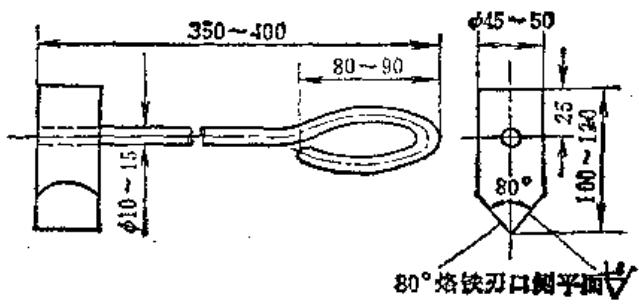

图5-2-1 钎焊用紫铜烙铁

② 将焊剂涂于钎焊处。

③ 用烙铁切下少量焊条涂于施焊部位，并用烙铁的侧刃口轻轻压住，趁焊条在熔化状态时，迅速地在镀铜面上往复移动涂擦，至整个镀铜表面均匀地焊上一层较薄的焊料。最后将已焊上去的焊料重新熔化和整理一遍，直至焊缝表面平整光滑为止。

表5-2-1 锡铋合金钎焊常见缺陷的原因及排除方法

<table><tr><td>缺陷种类</td><td>产生原因</td><td>排除方法</td></tr><tr><td>焊不牢及焊不上</td><td>1.锡,铋原料不纯2.焊接温度过高3.镀铜质量不合格4.清洗不净5.第一层挂面焊质量不好</td><td>不得用焊锡代替纯锡工作冷至室温再焊1*镀铜液尽花少用即少除几次,注意剔除剩有的余碳;或改用电火花强化机镀钢彻底除去油脂,以丙酮擦拭至脱脂棉不变黑为止第一层挂面要薄而均匀,操作要认真、适当</td></tr><tr><td>气孔</td><td>1.烙铁温度过高2.钎焊速度过快</td><td>严控烙铁表面温度在350℃以下,工件温度控制在35~40℃以下认真整理焊缝,缓速进行钎焊以利气体逸出</td></tr><tr><td>黑浆</td><td>1.烙铁过热2.焊剂激烈蒸发</td><td>控制工件温度及烙铁温度出现黑浆后必须彻底剔除掉,从头开始</td></tr><tr><td>烙铁烧蚀</td><td>1.烙铁浆面因粘上钎料而熔融2.烙铁表面不平整</td><td>每次焊毕刮净烙铁表面至平焊毕,将烙铁头浸蘸酒精洗净</td></tr></table>

④ 焊好后，空冷至室温，然后进行刮削或磨削加工至要求。

# 3. 锡锐合金钎焊的缺陷及排除方法

锡铋合金钎焊修复工艺及装备简单，可进行现场修复；由于作业温度低，工件开变形，焊后易于加工。但是如不认真操作，也会产生缺陷。常见缺陷产生原因及排除方法见表5-2-1。

# 第3节 钢制零件的焊接修复

# （一）概述

机修中，需要焊接修复的钢制机械零件的主要是：

1）违章作业的事故件，

2）设计不合理或长期受交变载荷作用的零件，大型铸锻设备中产生的疲劳裂纹的厚大件。

3）在零件加工过程中，因各种原因造成尺寸超差而又允许进行补救的回用件。

4）为恢复名义尺寸而必须堆靠修复的正常磨损件。

在日常修复中，磨损件数量最多，破断件层次，回用件间或有之，厚大件偶而出现，但往往属急性及关键件零件，必须认真对待。焊接修复时经常遇到的困难是：

1）焊件一般多为工作力的传递件，材质为

优质碳钢、低合金渗碳钢、中碳调质钢、低合金高强度钢等，碳当量均较高，故可焊性不良。

2）磨损件的原表面状态一般都经过热处理，硬度较高。焊修时，如不进行相应的预热及后热处理，势必满足不了工艺需要。

3）由于是旧件修复，除需焊修部位外，其余部位的几何精度仍很高，而焊接热的循环极易令其变形超差。此外，如对非焊修部位保护不善，极易因焊滴飞溅、电弧划伤而使其致废。

4）厚大件破裂的修复困难较多，有复位困难，去除残余应力困难，有的部位因狭窄而使施焊操作也困难。

总之，焊修的技术困难较多，其它诸如焊工对焊修工艺及手法的陌生，对操作规程及工艺守则的似是而非的态度，同样不容忽视。

# （二）钢件焊接修复工艺措施

如前所述，由于焊接修复的特殊困难，故有其固有的焊接特点，针对具体零件也应有其独特的针对措施。但概括起来，通用的工艺措施如下：

# 1. 焊前检查和焊前准备

焊前要全面了解工件的工作状态、破损原因，破损部位的形状尺寸，必要时还要对工件进行测绘及计算。对裂缝一定要找出裂源，以便治根除本，对症焊修。

# 5-12

焊前准备即把焊修部位预先进行脱脂去锈，并去除疲劳层，使之漏出金属光泽；对非焊修部位进行可靠的屏蔽防护；对易变形的工件放平垫好，有的还应采用浸水散热法；对施焊处狭小不便引弧的要设引弧板；开敷合适的坡口，对断裂件要精确复位的同时，注意尽量避免存有过大的拘束应力，对碳当量高的材料必须进行合理的预热，预热温度见表5-3-1。

表5-3-1 焊接修复件预热温度荐用表

<table><tr><td>母材碳当量(%)</td><td>推荐的预热温度(℃)</td></tr><tr><td>&lt;0.40</td><td>25~100</td></tr><tr><td>0.4~0.55</td><td>100~200</td></tr><tr><td>0.55~0.65</td><td>200~250</td></tr><tr><td>&gt;0.65</td><td>250~350</td></tr></table>

注：碳当量计算公式；

$$
C _ {E Q} = C + \frac {M n}{6} + \frac {C r + M o + V}{5} + \frac {N i + C u}{1 5}
$$

# 2. 选择最佳焊修方案，严守工艺操作规程

同一工件，往往有几个不同的焊修方案，这就需要权衡利弊，根据工况及条件，优化选择一个最佳方案，以求获得完美的焊修质量并获得最大的经济效益。

根据不同工况，选择相应的焊接材料和焊接方法。常用的焊接修复手弧焊焊条的性能及规范见表5-3-2。焊条用前必须按说明书要求进行烘干，然后置于保温筒中，随取随用，注意不得多次反复烘干焊条。

磨损件的堆焊，要尽量降低稀释率，这是堆焊工艺的重要工艺守则。此外，注意使硬相结晶方向垂直于堆焊层，控制线能量要小；多层焊时，底层的线能量宜大些，以增加焊修层的韧性；层间焊及接续焊温度应控制在  $60^{\circ}\mathrm{C}$  左右。

对磨粒磨损的工件，焊修时要做到使表层焊道方向与磨粒运动方向平行。

对摩擦磨损的工件，因相同或相似材料之间的

表5-3-2 几种常用准焊焊条

<table><tr><td rowspan="2">序号</td><td rowspan="2">堆焊合金类型</td><td rowspan="2">合金系统</td><td colspan="8">堆焊金属化学成分(%)</td></tr><tr><td>C</td><td>Mn</td><td>Si</td><td>Cr</td><td>Ni</td><td>Mo</td><td>W</td><td>其它</td></tr><tr><td rowspan="2">1</td><td rowspan="2">低碳低合金钢</td><td>1Mn3Si</td><td>~0.15</td><td>≤3.5</td><td>≤1.5</td><td></td><td></td><td></td><td></td><td></td></tr><tr><td>2Mn4Si</td><td>≤0.30</td><td>≤4.5</td><td>≤1.5</td><td></td><td></td><td></td><td></td><td></td></tr><tr><td rowspan="3">2</td><td rowspan="3">中碳低合金钢</td><td>3Cr2Mo</td><td>0.31~0.6</td><td></td><td></td><td>≤2.5</td><td></td><td>≤1.5</td><td></td><td></td></tr><tr><td>4Cr2Mo</td><td>0.31~0.6</td><td></td><td></td><td>≤2.5</td><td></td><td>≤1.5</td><td></td><td></td></tr><tr><td>5Cr3Mo2</td><td>0.31~0.6</td><td></td><td></td><td>≥0.3</td><td></td><td>≤2.0</td><td></td><td></td></tr><tr><td>3</td><td>高锰钢</td><td>Mn13Mo2</td><td>≤1.2</td><td>11~16</td><td></td><td></td><td></td><td>≤2.5</td><td></td><td>≤1.00</td></tr><tr><td>4</td><td>高速钢</td><td>W18Cr4V</td><td>0.7~1.0</td><td></td><td></td><td>3.8~4.5</td><td></td><td></td><td>17~19</td><td>V:1.0~1.5P:≤0.04S:≤0.035</td></tr><tr><td rowspan="3">5</td><td rowspan="3">钴基合金</td><td>Co基Cr30W5</td><td>0.7~1.4</td><td>≤1.0</td><td>≤2.0</td><td>26~32</td><td>-</td><td>Co余量</td><td>3~8</td><td>Fe≤2</td></tr><tr><td>Co基Cr30W8</td><td>1.0~1.7</td><td>≤1.0</td><td>≤2.0</td><td>26~32</td><td>3~4</td><td>Co余量</td><td>7~10</td><td>Fe≤2</td></tr><tr><td>Co基Cr30W12</td><td>1.7~3.0</td><td>≤1.0</td><td>≤2.0</td><td>25~33</td><td>≤4</td><td>Co余量</td><td>11~14</td><td>Fe≤2</td></tr></table>

摩擦最大，故制定焊修工艺时要求焊接材料避免含有两摩擦件所共溶的元素，以免产生粘着现象，使焊修效果变坏。

对大面积堆焊件，后面的焊道要往前面的焊道压入，重迭幅度以  $\frac{1}{3} \sim \frac{1}{2}$  为宜，以求焊缝光滑平整，减少母材熔入量。

对表面要求硬度较高的堆焊件，除选择合适的焊条外，还应严控焊缝冷速，避免高温停留时间太长，必要时要采用压缩空气强制冷却及水浸工件（焊接部位除外）散热法，以避免过大变形和获得硬相工作表面。

焊缝要求具有调质硬度的堆焊件，施焊的最后，要追加退火焊道，该焊过的两缘均不与工件母材接触，以获得良好的机械加工性能，当然，焊条的选择及线能量的选择均要匹配。

堆焊后要求进行整体热处理的工件，为保证焊

接材料，如D172、J857等。

对易变形的工件，要采用空冷或水冷散热法，施焊时要采取短段间歇、退步对称、短道锤击的措施，并要合理安排焊序。

对淬硬倾向大、可焊性不好的材料的焊修，应注意充分利用过渡层，即先用塑性韧性好的焊条（如奥氏体不锈钢焊条）打底层，以防剥离。

对厚大件的焊修，要用短段多层退步施焊法，注意焊根要透，焊缝要够，平滑过渡，要进行消氢处理和去应力处理（如温差拉伸、锤击、振动时效）等。

# 3. 焊后冷却和焊后热处理

焊接线能量的大小及焊后冷却速度的快慢，决定着熔敷金属的硬度，而焊后热处理能有效地克服脆性，提高堆焊层的韧性，因此，正确控制焊后的冷却速度及适时进行焊后热处理，是提高焊修质量的关键。这方面需要根据不同要求，具体的取向包括

# 5-14

性，增加可靠性。

# 4. 焊后检查及机械加工

焊修毕，将施焊部位打磨光滑至平，然后对照图纸技术要求全面进行检查，以鉴定焊修效果并做出结论。质量不合格的可重新返修。

硬度较高的堆焊层的加工，一般需用碳化硅刀具，进给量要小，速度要慢，主切削刃不要倾斜，加工圆柱面回转类零件时，刀具应置于中心线以下。若需进行磨削加工，则要选用绿色碳化硅砂轮，粗磨用粒度  $20\sim 60$  号砂轮，精磨用粒度100号以下的砂轮。砂轮要勤修整，保持砂轮锋利。硬度较低的堆焊层的铣刨加工时，进刀方向应注意与焊道方向呈一定角度。手工打磨时亦然。

# （三）修复实例

1. 离合器楔牙（渗碳淬火件）的焊接修复

X63W型万能铣床离合器扇形楔牙的两侧工作面磨损，工作时互相打滑，不能正常传递扭矩，需进行焊接修复。扇形楔牙的材料牌号为  $20\mathrm{Cr}$ ，经渗碳淬火（渗碳深度  $0.9 \sim 1.2\mathrm{mm}$ ），硬度为HRC56～62，各主要配合面的精度为二级。

焊接修复磨损的楔牙齿常用二种方法，即水浸法气焊修复和手工电弧焊耐磨堆焊法，下面分别进行介绍。

（1）水浸法气焊修复

1）用手动砂轮磨掉已磨损了的疲劳层，使其漏出金属光泽，再用丙酮去除油脂。

2）将零件浸入水中，只露出楔牙的待焊部分。注意盛水容器不可太小，内孔的水也不能被垫铁阻隔为死水，以免影响散热及冷却。参见图5-3-1。

3）选  $\phi 3\mathrm{mm}$  的  $65\mathrm{Mn}$  钢丝为焊丝，焊前火烤除油；选用H01-6焊炬的适当焊嘴；以粉301（无水硼砂）为焊剂；选取中性火焰，焊炬倾角尽可能保持在  $70^{\circ} \sim 90^{\circ}$  之间。

4）焊补楔牙时，注意要对称施焊，焊接速度在保证质量的前提下稍快些为好。堆焊焊缝的加高量为  $0.6 \sim 1.5 \mathrm{~mm}$ ，以备修整。

5）每焊完一个楔牙齿后，立即将该齿全部均匀加热至  $850^{\circ}\mathrm{C}$  （亮樱红色）左右进行正火，然后迅速涂一层硼砂加以保护。

6）待所有楔牙齿全部焊补完毕并正火处理

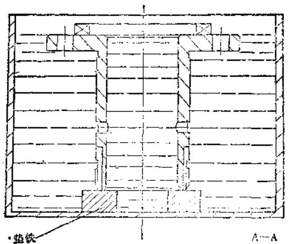

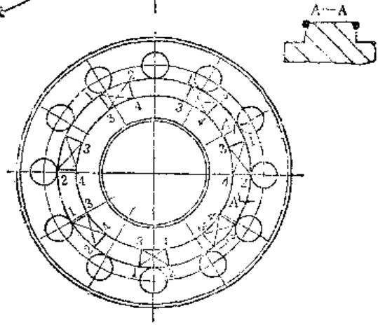

图5-3-1 棋牙离合器焊修楔牙示意图

后，再逐齿进行火焰淬火。淬火温度为  $730 \sim 800^{\circ} \mathrm{C}$  （樱红色）左右，油冷却，油温宜在  $60 \sim 80^{\circ} \mathrm{C}$  左右。如采用水冷，应取淬火温度的下限。

7）淬火后的零件应立刻放入炉温为  $80\sim$ $100^{\circ}\mathrm{C}$  的电炉中保温一小时，进行低温回火处理，以便提高零件的韧性。

8）工件冷至室温后，用手动砂轮粗磨，注意应留有  $0.5\mathrm{mm}$  的精加工余量，然后检查（最好用放大镜观察）有无焊接缺陷，如发现有微裂纹，应重复上述步骤补焊好为止。粗磨至平的工件就可进行硬度检查，如发现硬度不足或脆性太强时，可对楔牙齿进行正火后，再重新进行火焰淬火，直至满意为止。

9）硬度符合要求的工件便可送到外圆磨床上或工具磨床上按图纸要求加工齿型。

水浸法气焊修复楔牙工艺简单、方便灵活，工件基本上不变形，可保证工件应有的力学性能。

（2）手工电弧耐磨堆焊修复

1）用手动砂轮打磨掉楔牙上的疲劳层，使其

漏出金属光泽，然后进行  $100\sim 150^{\circ}\mathrm{C}$  的预热。注意去脂除油只限待焊部位。

2）选用细径（ $\phi 3.2\mathrm{mm}$  以下）D822（堆822）焊条，且事前进行  $150\sim 200^{\circ}C\times 1h$  的烘干。用石棉布屏蔽工件非焊处。

3）设置紫铜引弧板。先焊楔牙的四个角（如图5-3-1的1、2、3、4位置），每点焊毕，立即趁焊缝温度在  $850\sim 950^{\circ}C$  时锤击，并清除熔渣。然后分别交叉地将每个楔牙侧面两顶角之间堆焊填满（即图5-3-1的1到3、2到4之间），并及时锤击焊缝、清除熔渣。

4）待每个楔牙堆焊完毕并留有  $2\sim 3\mathrm{mm}$  加工余量，趁红热状态时，立即用压缩空气强制冷却，这样可稍许提高其硬度。待冷至  $200^{\circ}C$  以下（或室温后）送入  $80\sim 100^{\circ}C$  的回火炉中随炉缓冷。

5）工件冷至室温后出炉，粗磨堆焊处至平，留足精加工余量，检查有无焊接缺陷，如有气孔、裂纹，则重新按既定工艺补焊至满意为止。

6）送相应机床加工成型。用该法修复的楔牙硬度为HRC  $50\sim 55$  。

7）为防止熔滴飞溅，可将工件置于水槽中进行手工电弧焊修复。

用手工电弧焊修复方法简便易行，只是有时细径焊条难见，用稍粗焊条则操作困难，且因粗径焊条线能量大而降低焊缝硬度，也应引起重视。此外，手工电弧焊时引、收弧困难，应同时设置引弧板及收弧板，以免弧坑裂纹及气孔影响焊修质量。

# 2. 精密及大型轴类零件（调质处理）的手工电弧焊修复

在机修中，经常遇到各式各样的轴型零件需要修复，有的是局部被磨损（如花键部分，或螺纹部分，或与轴承配合的轴颈部分），有的是备件制造加工过程中出现的超差亏损，有的是大型轴件的精密加工表面在运输过程中受到严重损伤，或是在工作中由于事故造成的严重断裂，还有的是精度很高的机床主轴与滑动轴承配合的轴颈表面由于“抱瓦”退火后引起的局部裂纹等等。这类零件的共同特点是：

1）具有较高的几何精度，而且大都是成品旧件，没有加工余量。

2）材料大都是中碳钢（有少部分是合金结构钢），一般都经过一定的热处理（常化或调质），有的还有较高的硬度要求。

3）结构上“长径比”较大。

由于上述特点，在焊接修复技术上有很多困难，如以中碳钢制成的轴型零件而言：

1）由于零件材料中的含碳量较高，所以在焊接过程中容易产生淬火脆性组织，加上在较大的收缩应力作用下，在临近焊缝区很容易形成冷裂缝。同时由于含碳量高，在一次结晶组织的情况下，焊缝容易产生热裂缝。

2）由于材料中含碳量较高，在焊接时碳易向熔池过渡，当熔渣脱氧不足时，氧化亚铁与碳相互作用所产生的一氧化碳气体来不及逸出，而造成气孔。若气孔较多，就会大大削弱焊缝强度。

3）零件材料的膨胀系数较大，结构上“长径比”也比较大，在不均匀的焊接热影响下，很容易引起弯曲变形。而变形后，一般都较难于校正复原。

下面就摸索出的电焊修复各类精密轴型零件的工艺方法介绍如下。

（1）300HBS以下的45号钢精密轴型零件的堆焊修复

1）焊接修复技术要求

① 焊后必须保证零件不变形，切削加工后几何精度与原设计一致。

② 焊缝强度必须与母材强度相等，或相近于母材强度；不能存在明显的焊接缺陷，如气孔、裂缝、夹渣和未焊透等。

③ 焊缝硬度必须满足原设计要求，或稍高于原设计硬度，但要保证能够进行切削加工。

2）焊条的选用 在保证焊缝强度及硬度综合要求的前提下，采用的焊条应有利于减少焊缝的含碳量及氢的来源，并有利于减少母材的熔入量。同时，还应使工件在焊接过程中受热最少，避免引起变形。即选用焊芯为低碳钢丝（08），直径较细，药皮中含碳很低，并含有相当的强脱氧剂“钛”及氧化性较小的一种低氢型涂料的焊条（如J507）。

经过多次试验及长时间的生产实践，选用下述的“中碳堆焊焊条”堆焊修复这类零件效果较好。这种焊条在提高脱氧性能、消除因电阻大焊接时易发生粘住和烧坏等方面，均有所改进。

3）中碳堆焊焊条的制作

$①$  焊芯材料：08号钢丝；

直径：  $\phi 1.6\mathrm{mm}$  及  $\phi 2\mathrm{mm}$

长度：  $\phi 1.6\mathrm{mm}$  的为  $180\pm 3\mathrm{mm}$

$\phi 2 \mathrm{~mm}$  的为  $200 \pm 3 \mathrm{~mm}$ ;

全长内的弯曲度不大于  $0.2\mathrm{mm}$ 。

② 药皮配方见表5-3-3所示。

表5-3-3 中碳堆焊焊条的药皮配方

<table><tr><td>药粉名称</td><td>配比(%)</td><td>粒度(孔/厘米2)</td></tr><tr><td>大理石</td><td>53</td><td>2500~3600</td></tr><tr><td>萤石</td><td>17</td><td>1040~1600</td></tr><tr><td>石英</td><td>9</td><td>1040~1600</td></tr><tr><td>硅铁(含硅45%)</td><td>3</td><td>763~918</td></tr><tr><td>锰铁(高碳的)</td><td>5</td><td>763~918</td></tr><tr><td>钛铁</td><td>13</td><td>763~918</td></tr><tr><td>粘土(外加)</td><td>1</td><td>1600</td></tr></table>

水玻璃（钠水玻璃，A级，密度  $= 1.36\sim 1.38\mathrm{g / cm^3}$ ），每公斤干混合料加入  $500\sim 520\mathrm{g}$ ，最好是按浸涂两次达到要求的药皮厚度而酌加

也可以用钾钠水玻璃混合物，密度  $= 1.28\sim 1.30\mathrm{g / cm}^3$

③ 药皮外径尺寸：

$\phi 1.6\mathrm{mm}$  —药皮外径为：  $\phi 2.5\sim \phi 2.7\mathrm{mm}$

$\phi 2\mathrm{mm}$  —药皮外径为：  $\phi 3\sim \phi 3.3\mathrm{mm}$

烘干规范及制作的具体方法和要求，均同于“奥氏体铁铜焊条”。

4）焊接方法

① 焊接方法及焊条尺寸根据工件的堆焊要求及结构、精度、刚性、热处理状态等情况来决定。工件直径较小（在  $\phi 50\mathrm{mm}$  以下），刚性较小（长细比较大）、精度较高时，选用  $\phi 1.6\mathrm{mm}$  的“中碳堆焊焊条”；工件直径在  $\phi 50\mathrm{mm}$  以上、刚性较大时选用  $\phi 2\mathrm{mm}$  的“中碳堆焊焊条”。

② 将整个零件清洗干净，堆焊部位最好用丙酮精洗，彻底除尽油污。

③ 用破布或石棉绳将堆焊部位邻近的轴表面包扎好，以免熔化金属飞溅到上面去。

④ 将工件浸泡在盛满冷水的铁质容器中（最好是长方形的铁皮制成的大盆），工件架在适当高度的V形垫铁上，应能任意沿圆周方向转动。将要堆焊的部位局部露出水平，并且置于水平位置。

⑤ 为了使工件受热少，采用直流反极性电源。为了减少氢的来源，焊前应将焊条充分烘干（放在  $150\sim 200^{\circ}\mathrm{C}$  的电炉中烘焙  $30\sim 60\mathrm{min}$ ）。

⑥ 为了尽量减少母材的熔化量，使工件受热少，在保证能焊透的情况下，应尽量采用较小的电

值（一般比焊低碳钢小  $10\% \sim 15\%$ ），同时焊接速度应尽量快些。堆焊圆柱形表面（非花键）时，应先分别在轴的两端各焊一环形焊缝。焊环形焊缝时，每次只能焊  $25\sim 30\mathrm{mm}$  长（或圆周的  $1 / 8\sim$  1/4)，而且必须对称地进行焊接。环形焊缝焊好后，才依次沿轴心线方向堆焊圆柱表面，每焊一次均在已焊的环形焊缝上起弧和落弧，并且由轴的大头焊向小头，焊条成直线移动。焊完一道焊缝，必须对称地转  $180^{\circ}$  后再焊另一道焊缝。每焊一次，焊长不超过  $40\mathrm{mm}$  。每次熄弧后，必须彻底清除焊渣，并使工件冷到  $30^{\circ}C$  以下（与工件接触的水面不起气泡，也不发出“兹兹”响声时刚好）。在整个圆柱表面堆焊完一层之后，才用同样方法堆焊第二层或第三层，直至焊够尺寸，并有  $2\sim 3\mathrm{mm}$  的加工余量时为止。为了使两端焊缝整齐和有足够的加工余量，最好是象开始焊那样，分别在每一轴端再薄薄地焊上一道环形焊缝。

⑦ 当工件焊完并冷却后，仔细检查有无焊接缺陷。若有缺陷，必须补焊好，才能进行机械加工。加工前应将工件顶在检验台或夹在车床两顶针之间用千分表检查。若有很小的变形，可以通过修正顶针孔的方法进行校正。加工时，先将焊缝粗车一遍再检查，若有未焊透处或发现严重焊接缺陷，应将其补焊好后再进行精加工。

（2）承受冲击负荷的45号钢大型轴型零件的焊接修复

1）焊接修复的特点 由于工件轴径较大，裂口又深（有的仅剩下轴颈的1/3没有裂透），为了把裂纹全部彻底地除掉，坡口只能在龙门铣床上用较大尺寸的立铣刀铣削加工，因此坡口尺寸较大，使焊接工作量也相应增加。尤其是单面大型坡口，已不象前述的那样属于堆焊性质，而是近于对接焊缝的性质，因此引起的技术问题就更多。如焊条熔敷金属量较多，焊接的持续时间较长，加上工件比较笨重，翻转和移动困难，在局部地方焊接热比较集中，因此必然引起很大的收缩应力，裂缝和变形倾向就会大大增加。加上工件在断裂时就存在一部分塑性变形，因此焊后必有较大的变形量，这种变形，在加工焊缝时必须完全将它克服，否则工件就有报废的危险。由于裂纹位置是在曲轴偏心部分的轴肩上，该处是个强度薄弱的环节，也是应力比较集中的地方，所以要求焊缝上不能存在任何焊接缺陷。

2）焊条的选用 在焊接修复的各个技术要求中，保证焊缝强度不低于母材原来的强度是一个最主要的问题。而工件含碳量高、不利的坡口形式及焊接条件对焊接强度都有影响，其中含碳量高对焊缝强度的影响最大。所以，选择焊条应有利于克服由于母材含碳量高而引起对焊缝强度有致命影

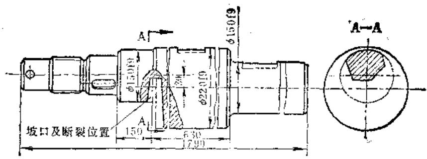

图5-3-2 曲轨的断裂情形

响的裂缝与气孔。经过多次试验，用国产  $\phi 2.5\mathrm{mm}$  的J507（结507型）标准焊条，配合适当的焊接工艺方法，能收到较好效果。

选用  $\phi 2.5\mathrm{mm}$  的J507焊条的优点是：

① 焊条药皮属于碱性低氢型，有利于减少焊缝气孔。

② 焊条较细，有利于减小焊接电流，限制母材的熔化量及减少气孔，对减少淬火倾向及工件的变形也很有利。

③ 焊缝具有良好的塑性、韧性及优良的抗裂性能。

④ 焊缝金属的机械性能基本上与母材一致。

3）焊接方法 为了克服近缝区由于淬火倾向引起的冷裂，我们在焊接之前把整个工件放入井式电炉中，立挂着进行预热（在  $200\sim 250^{\circ}\mathrm{C}$  范围内保温  $3\sim 4\mathrm{h}$ ），以减慢焊缝的冷却速度，有效地减少或消除淬火倾向。同时，为采用细焊条、小电流造成有利条件。

另外，为了有效地降低焊缝收缩应力，防止产生裂纹，在操作方法上采取了短段、分层及注意焊接顺序和方向，以使接头有较大自由伸缩性，焊后采用了缓冷的技术措施。例如：在焊接过程中，中间停焊时，就将工件放入  $150\sim 200^{\circ}\mathrm{C}$  的井式电炉中进行保温。在全部焊完后，立即将工件放入  $200\sim$ $250^{\circ}\mathrm{C}$  的井式电炉中挂着保温  $3\sim 4\mathrm{h}$ ，然后随炉缓冷至  $60^{\circ}\mathrm{C}$  左右取出空冷（最好是随炉缓冷至室温才取出）。

为了克服气孔，除了采取上述减少母材熔化量的办法外，还采取如下措施：焊前将焊条充分烘干，坡口彻底除尽油污及铁锈，在无风的场地焊接，并用保护性较好的短弧焊接，以减少氢及氧的来源。

4）焊接修复实例 现以焊接修复的一根

100 t 冲床的曲轴为例说明。参见图 5-3-2。

该轴由于事故，在  $\phi 150f9$  的偏心轴肩部分严重断裂，仅剩下  $\phi 150f9$  轴径的  $1 / 3$  没有裂透。

该轴材料为45号钢，经过调质处理，表面硬度为  $179\sim 207\mathrm{HBS}$  。其焊接修复步骤如下：

① 开坡口 在龙门铣床上用立铣刀沿裂纹铣削坡口。坡口大小以把裂纹全部除尽为准。裂纹位置的寻找，以着色探伤法为最简捷但也可用“王水”（25%的硝酸，75%的盐酸）腐蚀裂纹部位的方法寻找裂纹。先将有裂纹但不很明显的坡口底面用很细的水磨砂纸打光，再用脱脂棉浸湿“王水”涂擦，然后立即用脱脂棉浸沾清水擦洗坡口底面，把涂上去的“王水”洗去，最后用脱脂棉浸沾酒精擦洗，直至坡口底面有点发白色为止。这时裂纹处由于受到“王水”的剧烈腐蚀，并且又无法洗净，所以便呈现出一条黑色的印迹（用  $5\sim 7$  倍的放大镜便可看得很清楚）。一边找裂纹，一边跟踪铣削，直至把裂纹完全除尽为止。其坡口大小及形状，以使裂纹除尽、便于焊接操作、尺寸越小越好为原则，坡口两侧应稍带一点斜度。为了将焊缝交接区（即半熔化区）移开应力集中的轴肩圆角部位，特将工件  $\phi 220f9$  的端面（靠裂纹端）沿轴心线方向多铣去约  $20\mathrm{mm}$ ，作为加大坡口之用。坡口在焊接之前，应彻底除去油污和锈蚀。

② 工件预热 先在曲轴的小端小孔内焊上一个吊运曲轴用的长形挂钩（封闭的），将工件放入井式炉内（立式挂着），在  $200 \sim 250^{\circ} \mathrm{C}$  的范围内保温  $3 \sim 4 \mathrm{~h}$  。然后取出工件放在靠近炉子无风的地方的V形垫铁上。然后用两层以上的石棉布将曲轴除了坡口及与V形铁接触的部位外全部包扎好，以免热量过快散失。

③ 在焊接之前，将焊条放在  $150 \sim 200^{\circ} \mathrm{C}$  的电炉中烘焙  $1 \mathrm{~h}$  以上。

④ 施焊 采用直流反极性电源。为了减少工件焊接变形量，在尚未裂开的部位外圈上先堆焊几层，使其产生反向预弯曲，然后翻转  $180^{\circ}$ ，焊接对称的坡口部位。焊接时，电流应尽量小，但要保证母材焊透。采用线性焊（直线式运条），焊速尽量快，电弧尽量压低些，短段、分层、对称地或交叉地进行焊接。每焊一层时，先分别焊坡口的边缘，（如图5-3-3所示的1、2、4、5位置），然后分别从坡口的中间收拢，（如图中所示的3、6、7位置）。

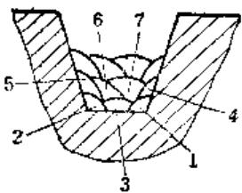

图5-3-3 线性焊的顺序

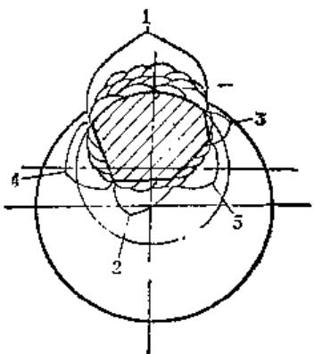

图5-3-4 对称焊的顺序

关于对称焊的顺序如图5-3-4所示。

1、2、3、4为四个焊接方位。在方位1焊完一层后，将方位2转向水平位置，然后再焊接方位2，依此类推，循环往复地进行，直至将坡口焊满并有  $3\sim 4\mathrm{mm}$  的加工余量为止。焊接中每次熄弧后，必须把焊渣清除干净再起弧，每次焊接长度不宜超过  $50\mathrm{mm}$  。

焊接过程最好连续进行，这样可保持工件的温度不致下降过多，可节省中途再次入炉保温加热的时间。中途停焊在  $3\mathrm{h}$  以上时，应把工件放入  $150\sim$ $200^{\circ}C$  的井式电炉中进行保温。

⑤ 焊后处理 焊完后，趁工件尚未冷下来时，为了尽量有效地消除部分焊接应力，及节省一部分加热时间，必须立即进行低温回火处理。反

之，若在工件完全冷却下来后才进行回火，一则焊缝收缩应力较大，二则采用低温回火的效果不是很理想。若采用高温回火，虽然消除应力的效果会好一些，但工件在  $450\sim 650^{\circ}\mathrm{C}$  的温度下会产生变形和起严重的氧化皮，破坏原有加工表面的精度。

⑥ 变形检查 工件完全冷至室温后，用氧乙炔焰割断吊环的一边，取下吊环，将工件的一端夹在车床的夹盘上，在  $\phi 220\mathrm{f}9$  的适当位置支上中心架，以非偏心的大头端为基准（因这段直径较大，刚性较好，又无变形现象）找正后，按偏心距 $30\mathrm{mm}$  ，用千分表测量偏心部分（小头端）各段的弯曲变形量，并作好记录。在有变形的各段，按由大头向小头的方向，分别沿圆柱表面堆焊一层或两层，保证把变形纠正过来并有  $3\sim 4\mathrm{mm}$  的加工余量就行。焊接时，须用石墨键把各个键槽保护起来，这样焊完后就可节省加工键槽的工序。焊每段圆柱表面时，先在轴段两端头的圆柱面上各焊一条环形焊缝，然后才沿轴芯线方向堆焊圆柱表面。每次起弧可将轴段全长一次焊完，起弧和落弧要在环形焊缝上，注意由大头焊向小头，采用直线式运条，焊速要快些，电弧要低，每焊完一条焊缝必须把渣清除干净，并把工件翻到另一对称位置，再起弧焊另一道焊缝。

⑦ 检查焊接缺陷 将被堆焊的各圆柱表面，按图进行租车，留下精车余量  $0.3 \sim 0.5 \mathrm{~mm}$ ，仔细检查各堆焊面有无严重的气孔及未焊透处（一般不会有裂纹）。若有上述缺陷，可不拆下工件、就地（在装夹位置）进行局部补焊（也不必进行预热及焊后回火处理）。当缺陷补焊好后，再继续进行精加工工序。加工完毕，尺寸精度及硬度检验完全合格后才进行装配试车。

⑧ 负荷试验 机床装配完毕，经手动转动无问题后，才逐渐加负荷试车，最后可用相当100t冲压力的工件进行冲压（至少冲压  $10\sim 20$  件），然后观察曲轴焊接部位有无问题。若无问题，才交付使用。

（3）大型轴型零件精密表面损伤的焊接修复

1）焊条的选用 采用自制的“特制镍铜合金焊条”（制造方法为细不锈钢丝穿入软铜管为焊芯，外涂Z117焊条的药皮）对这类零件进行电焊修复，收到很好的效果。原因是：

① 这种焊缝都是奥氏体组织，不产生相变作用，所以在半熔化区没有硬而脆的淬火组织。同

时，由于奥氏体能很好地溶解碳，使焊缝中不会产生很硬的渗碳体组织，而熔敷金属中所含  $60\% \sim 70\%$  的镍及  $25\% \sim 30\%$  的铜，都是塑性很好的金属（尤其是钢），所以焊缝具有很优良的加工性能；

② 由于焊条中含有  $25\% \sim 30\%$  的铜，而铜的导电性能好，熔点又比较低（ $1083^{\circ}\mathrm{C}$ ），加上焊条又很细（ $\phi 1.5\mathrm{mm}$ ），所以焊接电流较低（ $30\sim 35\mathrm{A}$ ），这对于减少母材熔化量和减少工件受热，保证工件不易变形具有很重要的作用。

这种焊接修复方法主要不足之处就是焊缝硬度低于母材硬度。但由于补焊处只是个局部，对使用没有什么影响。

2）修复实例 2000t水压机立柱及提升缸，系45号钢制成，经过调质处理，表面硬度约HRC21 $\sim 26$  ，表面粗糙度  $R_{a}0.8\mu \mathrm{m}$  。该零件在运输过程中，其精密的圆柱表面上被拉伤成许多沟槽。沟槽长度  $1\sim 1.5\mathrm{m}$  ，宽  $3\sim 5\mathrm{mm}$  ，深  $1\sim 4\mathrm{mm}$  。四根立柱上都有不同程度的拉伤，甚至是成片的。采用的修复方法如下：

$①$  把拉伤部位及其附近清洗干净。

② 不开坡口，对工件也不作任何的预热就直接在拉伤的沟槽上堆焊。用直流正极性电源，采用逆向分段焊法，焊条成直线移动，用短弧和较快的焊速连续焊接（这样工件保持较高的温度）。一根长  $120\mathrm{mm}$  的焊条可一次起弧焊完，由一个人专门配合

焊工，在每一熄弧后立刻轻快地锤击焊缝，以消除焊缝收缩应力，同时使焊缝组织致密。锤击完毕，必须把焊渣清理干净，把个别成形不良的焊缝修整之后，才再次起弧焊接另一段。焊满被拉伤的沟槽后，注意留出  $2\sim 3\mathrm{mm}$  的加工余量，并且检查一下有无焊接缺陷，若有缺陷，必须在加工之前排除。

③ 加工方法为，先用手工锉削，与未焊处的工件表面接近齐平后，用油石和机油将焊缝磨至与原来表面一致平滑光洁为止。

# （4）机床主轴裂纹的焊接修复

1）主要特点 这类零件，最大的特点是硬度高、精度高。焊接时必须保证：焊后不热处理，硬度就达到原设计要求；焊缝附近不允许有明显的退火现象；必须保证焊后零件一点不能变形；焊缝强

度不低于母材强度，不允许存在焊接缺陷等。

2）选用的焊条 经过实验和生产实践，采用自制的  $\phi 1.5\mathrm{mm}$  的“高合金耐磨1号焊条”，配合适当的工艺方法，收到了较好的效果。

3）焊接修复实例“3714型”（或M7140型）大平面磨床的砂轮主轴与滑动轴承配合的轴颈，因“抱瓦”退火时引起一道长约  $40\mathrm{mm}$  、深约  $10\mathrm{mm}$  的裂纹。该轴是用低合金结构钢“12CrNi3A”制成，轴颈部分经过渗碳淬火，硬度HRC53~58，并且有较高的几何精度。在开坡口时，裂纹部位的实际硬度仅为HRC29。采用的焊接修复方法如下：

① 将整个工件清洗干净。

② 了解工件的技术要求。

③ 测量裂纹处的实际硬度。

④ 采用“X光”探伤方法（或用磁力探伤方法），找出确切的裂纹位置。在裂纹的两端点，各钻一个  $\phi 3\sim \phi 4\mathrm{mm}$  的止裂孔（深钻至没有裂纹为止）。

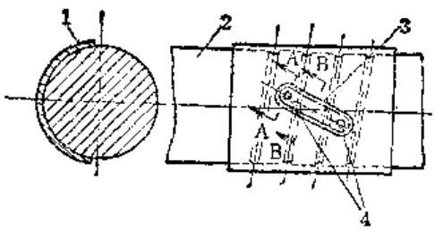

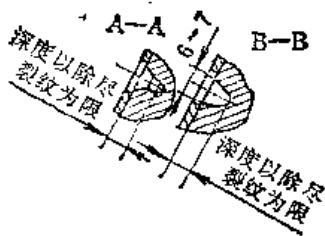

图5-3-5 磨床砂轮主轴的爆复

1—紫铜瓦片（作保护未焊表面和引弧用） 2—主轴 3—裂纹 4—止裂孔

⑤ 沿裂纹用较硬的高速钢制成的扁铲，开U形坡口（图5-3-5），并将每个止裂孔的孔端修成“喇叭”形。

⑥ 用厚为  $3\mathrm{mm}$  、长为  $120\sim 150\mathrm{mm}$  、宽为 $150\mathrm{mm}$  的紫铜板，以工件裂纹处的圆柱面为模子，弯制一个如图中所示的“盖瓦”。在“盖瓦”中央部分，开一条形状完全和工件坡口外形一致的（外缘尺寸比坡口外形大  $1\sim 2\mathrm{mm}$  ）空心槽，以便焊接时保护焊缝附近的工件精密表面，同时作为引弧和落弧之用。

为了防止工件变形，特将工件浸泡在冷水中，仅露坡口部分来进行施焊。焊接时，采用直流反极性电源，通过试验来选用电流最小值（35～40A），用分层焊法，每次焊长为整个坡口的长度

（为了便于在紫铜盖瓦上起弧和落弧）。焊条成直线移动，焊速要快，但母材要熔化良好。每焊完一次，必须将熔渣仔细清理干净，并等到不烫手时（ $25^{\circ} \mathrm{C}$  以下）才再次起弧另焊。当坡口焊满，并有 $2 \sim 3 \mathrm{~mm}$  的加工余量后，才分别焊止裂孔（焊法与上例相同）。焊缝上不允许有任何明显的焊接缺陷。

⑧ 加工方法 先用手工打磨（用风动手砂轮机），留有精磨量约  $0.5\mathrm{mm}$ ，再仔细检查焊缝，无焊接缺陷（裂纹、气孔或未焊透处）之后，在外圆磨床上，经装夹找正，仔细检查有无焊接变形情况。若精度没有问题，才在原装夹位置上，用外圆磨床磨削焊缝，将焊缝磨光至符合原精度为止（这时裂纹所在的整个轴颈外圆面都将被磨小  $0.05 \sim 0.06\mathrm{mm}$ ）。然后从磨床上取下工件，用小三角油石将被焊缝所盖的螺旋油槽打磨出来。

为了保持轴颈与滑动轴承的配合精度，将滑动轴承上的弹性槽适当收拢一些，然后按修磨后的轴颈尺寸，做一根空心“假轴”，镗削滑动轴承孔，镗好后，再利用“假轴”作楔胚，刮研滑动轴承孔至符合图纸要求的光洁度（包括“刮研显点”的数量与分布均匀度）及需要的配合间隙。经检验合格后，才装配使用。

# 3. 大偏心齿轮断齿的焊接修复

DN1250/1000吨单点压力机的偏心齿轮是由两个直齿圈镶装在偏心轮体上的装配部件。该齿轮  $m = 22$ ， $z = 100$  。由于运行中落入异物使一齿沿齿长方向断掉  $2/3$ ，并波及相邻的两齿均有变形，参见图5-3-6。

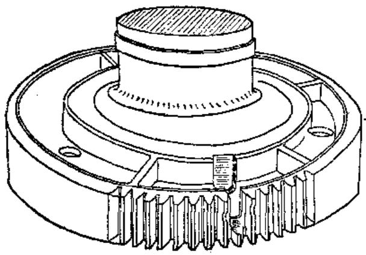

图5-3-6 大偏心齿轮断齿情况示意图

该大偏心齿轮的修复工艺如下：

1）气割除去断齿部分，再利用  $20\mathrm{t}$  油压千

斤顶消除齿的径向变形及齿面变形。

2）找正齿圈端面及断齿的剩余部分的齿顶中心，将断齿部位用落地镗床开成定位槽，将余下的1/3齿仍保留，但把断裂的截面镗修平整，以求与配制的新齿部分吻合良好。待焊部分的周边加工成 $10\times 30^{\circ}$  的坡口。预配新齿部位的齿根部分镗成供镶装的标准直槽（基孔制二级精度公差）。除齿圈部铣开外，将标准直槽延伸至齿轮内轮毂处，注意使此段槽为深约  $20\mathrm{mm}$  ，宽约  $40\mathrm{mm}$  ，以与原齿圈幅板处加强肋相似（参见图5-3-7）。延伸槽的目的是加强新齿的抗扭强度。

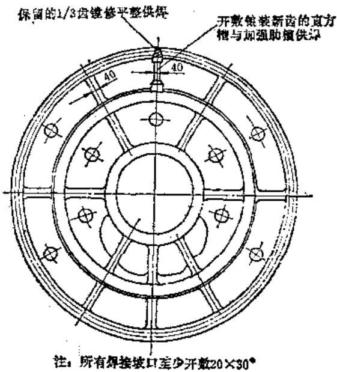

图5-3-7 配焊新齿前的键修补工示意图

3）按割除的齿部大小配制一个镶块，参见图5-3-8，除齿形部分相同外，还应含加强筋部分。镶块材料与齿圈的材料相同（35号钢），并经调质处理。注意待焊部分均应刨出坡口，坡口尺寸不小于  $10 \times 30^{\circ}$  。

4）将镶块装入断齿处，使与保留的齿吻合良好，然后点固焊。焊前要预热，起焊部位预热温度 $100\sim 150^{\circ}C$  ，采用  $\phi 3.2\mathrm{mm}$  J507焊条，焊条用前进行  $350\sim 450^{\circ}C\times 2h$  的烘干，烘干后的焊条及时放入焊条保温筒，随用随取。点固焊缝不得有裂纹、夹渣、气孔等缺陷。

5）去除点固焊熔渣后，采用退步短段多层焊法将新齿焊固于母体上。每段焊前均需  $100\sim 150^{\circ}\mathrm{C}$  的预热，焊段取  $60\sim 100\mathrm{mm}$ ，每个焊段均焊3层或4层，每层焊毕要立即趁焊道在红热状态下迅速

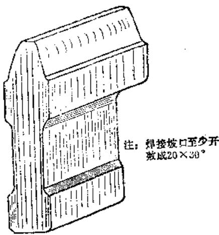

图5-3-8 带加强筋板的齿形镶块

锤击，锤头重  $0.5\mathrm{kg}$ ，锤尖要有  $\mathbb{R}3\sim \mathbb{R}5$  的圆角。层间温度不得低于  $360^{\circ}\mathrm{C}$ 。最终焊毕，要敷以石棉布蒙盖，冷至室温。

总之，短段多层焊法既能避免焊缝各点在高温停留过长，又能减缓冷却速度，从而能有效地防止淬硬组织的产生。这是因为第二层焊道由于紧接进

行，这就相当于对前一层焊道的回火，同时也等于对后一层焊道的预热。

6）断齿的相邻两齿，虽经千斤顶消除了齿面变形及径向变形，但齿形部分仍有缺少焊缝材料，用补焊加厚的方法可使其恢复沿齿宽方向的正确齿形。补焊加厚要留有足够的加工余量。焊接方法仍如前述：焊前预热、短段锤击、焊后缓冷等。

7）焊毕，冷至室温后，用手动砂轮粗磨修整，并检查有无焊接缺陷，如发现缺陷，按原规范进行返修。

8）按未变形部分的齿形找正，在落地镗床上精修齿顶及齿根。注意严格找正齿圈端面及未变形齿的侧母线，用圆柱铣刀修整成标准齿条状直线齿形，应注意一定使镗修后

的齿形尽量接近于原设计齿形（包容）。

9）按样板边检查边用风砂轮修磨，将直线齿打磨成渐开线齿形。

# 4. 大压床滑块裂缝的焊接修复

德制DN1000/4000型双支架曲臂拉伸压力机的内滑块是大型铸焊结构件（图5-3-9），重  $17\text{t}$  ，其两厢各设有两个压白的是各重6t的复杂铸钢件，用于紧固上凸模用的底板是厚  $90\mathrm{mm}$  的铝板，其余幅板及隔筋均为  $36\mathrm{mm}$  厚的钢板，材质相当于我国的35号钢。此压床运行三十年后，发现明显的宏观裂缝，被迫停产焊修。裂缝发生在正面和背面的辊板凸字形的折点处，两面各一条，并以内滑块的对角线为对称。裂缝总长  $1100\mathrm{mm}$  ，宽度逐渐递减，口端宽  $4\mathrm{mm}$  ，尾端宽仅  $0.5\mathrm{mm}$  左右，整个裂缝呈折线状，贯穿至底。这段穿透的纵裂缝位于凸字板折点的T型接头焊缝的热影响区，属主裂缝。在幅板与下底板的T型接头焊缝的中心线处还发现长为  $1\mathrm{m}$  左右的微细裂缝，肉眼依稀可见，数

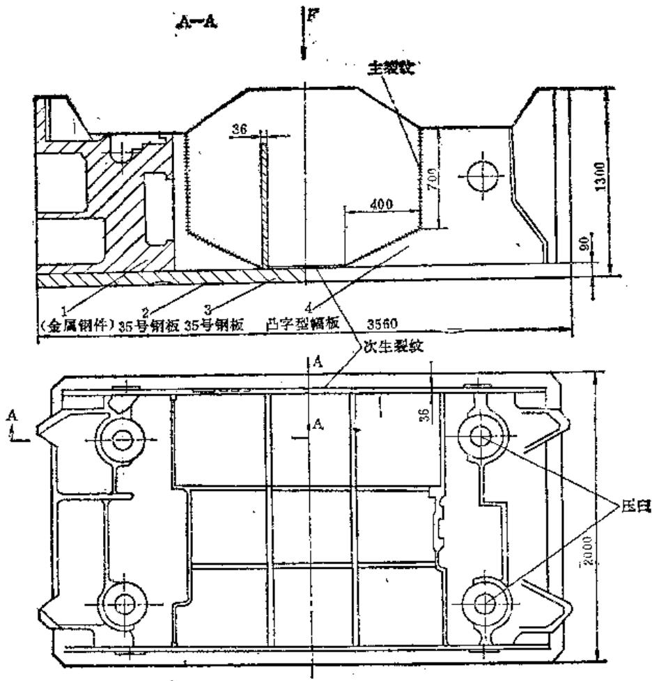

图5-3-9 内滑块及裂缝示意图

是也是两面各一条，它是主裂缝贯穿到底派生而致，我们称其为次生裂缝。

按裂缝形成时间，上述裂纹属运行裂缝。修复工艺如下：

（1）焊前裂缝复位 为使开裂了的内滑块恢复到原有几何尺寸，即实现焊前定位，在裂缝两畔上缘各加焊一块弧形板，弧形板上预铣方孔，然后打入方键靠楔合力实现复位。参见图5-3-10。注意为提高楔合效率，事先将配合的方孔四壁铣光并涂以黄干油。实践证明，此复位方法非常理想，原裂缝口端仅有缝隙  $0.2\sim 0.5\mathrm{mm}$  。复位后为防止蠕动，适时予以焊接强固。此套楔合结构待焊修完毕冷至室温后方准镗掉，并要求镗口圆滑过渡，以避免缺口效应而提高抵抗强大的外拘束应力的能力。

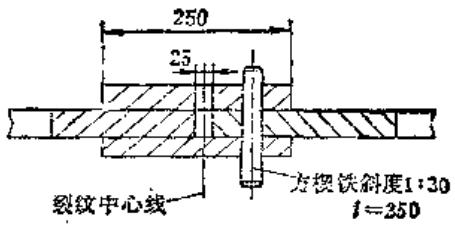

图5-3-10 裂缝的组合复位法

# （2）焊接工艺及操作

# 1）主裂缝的焊接修复

① 开敷坡口、烘烤除油 为方便焊接及减少熔敷金属，我们循裂纹的走向，镗铣了单面U型坡口（图5-3-11）。加工坡口时要保证钝边尺寸，保证坡口中心线与裂缝中心线的基本重合。整个坡口表面应平整光滑，不得有明显尖角，以利于最大限度地减少焊接应力。

坡口加工好后，用氧炔中性焰将坡口区统统烘烤二至三遍，以不冒油烟，除尽油污为准。目的是

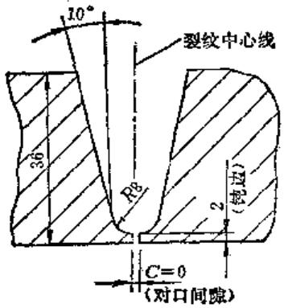

图5-3-11 竹口示意图

减少焊缝中的氢源。

② 选烘焊条、焊前预热鉴于材质相当于我国的35号钢，抗拉强度为  $540\mathrm{N} / \mathrm{mm}^2$  ，我们选用了J506碱性低氢型焊条。焊前焊条需烘干  $400^{\circ}\mathrm{C}\times 2\mathrm{h}$  ，烘后随用随取，若4小时露天放置未用则需重新烘干。

焊前预热的做法是：每段起焊前（包括停歇后的接续焊），都对起焊段的坡口区进行温度  $250^{\circ}\mathrm{C}$  以上的预热。坡口区即包括比坡口两缘再宽  $3\mathrm{mm}$  的焊缝区。预热用工具是大型焊炬，选用氧炔焰的中性焰往复均匀加热，注意不得使坡口任何部位过热及过烧。

③ 退步、对称、短段多层焊法 所谓对称焊，就是针对两条主裂缝的位置对称的现状，两名焊工同时在两条主裂缝的相对应位置一起施焊。对称施焊能有效地降低焊接应力及减小变形。

退步焊即：第一段施焊完毕后，后遇到下段起焊，即第二段的尾端与第一段的首始端相衔接。依此类推，如图5-3-12。退步施焊的优点是能把焊缝的整体拘束应力化整为零，这就能有效地降低焊缝应力的峰值。

短段多层焊法的关键是选择合适的焊段长度。如选焊段过短，连续进行的多层焊，势必造成焊接接头的过热，导致晶粒严重长大，降低焊缝抗拉强度；如焊段过长，焊第二层时，前一层焊道已冷至很低的温度，以至形成马氏体组织，成为裂纹的隐患，也就达不到短段多层焊的目的。按照焊接传热理论及推荐的公式，决定焊段长度取  $120\mathrm{mm}$  左右。当然，各焊段并非绝对均等，如焊了几段，工件温升提高后，可适当增加焊段长度，以提高熔敷效率。

第一个焊段之所以选择在图5-3-12示的部位，那是出于考虑到第一焊段的施焊条件（包括预热温度，冷却速度，焊工对此焊法的熟练程度等）比其它焊段可能稍差些，再加上考虑到外拘束应力，因此有意避开了承载大、应力大的原裂源部位——凸字幅板的折点。

施焊要领是：第一层焊道焊肉要足够，钝边要熔透，最好是一次施焊背面也成形。各层焊道的堆砌断面应呈外凸缓坡形，参见图5-3-13。

为提高焊接速度，以便于连续堆焊，施焊时采取立焊操作。立焊的焊接电流（ $\phi 4 \mathrm{~mm}$  焊条）选用  $180 \sim 200 \mathrm{~A}$  左右。立焊时注意运条到坡口两缘

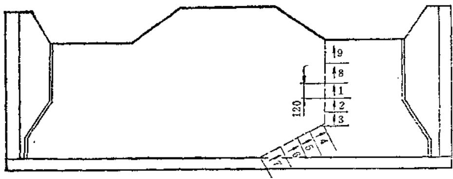

图5-3-12 退步短段多层焊顺序示意图

相当于对前一层焊道的回火，同时也等于对后一层焊道的预热。所以，该焊法既能避免焊缝各点在高温停留过长，又能减缓冷却速度，从而能有效地防止淬硬组织的产生。

$④$  锤击焊道，跟踪回火每焊完一层焊道后，就要刻不容缓地进行锤击。锤击工具是自制的

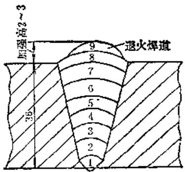

图5-3-13 主焊缝堆焊断面示意图

时要稍作停留，以减小熔合区的冷却速度和避免焊缝中心产生爆瘤。

坡口堆满后，要施以退火焊道，加强高  $2\sim 3$  mm。退火焊道的作用是避免最上层焊道产生白口组织。

各焊段的同层焊道以采取阶梯法衔接为宜，参见图5-3-14。目的是避免段与段相邻部位焊内过厚和减小焊接应力，但必须严防淬硬组织的产生。

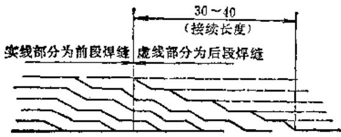

图5-3-14 阶梯形同层焊道接续法

层间焊温度和接续焊温度均控制在  $400^{\circ}\mathrm{C}$  以上。至于诸如倒退法熔化引弧点，收弧时填满弧坑以谨防火口裂纹，要杜绝咬边现象，焊前必须刨净熔渣和用钢丝刷清净焊道等，与常规施焊相同，就不在此赘述。

短段多层焊法由于第二层焊道紧接进行，这就

头部带有圆弧的创锤（图5-3-15），重  $0.5\mathrm{kg}$  左右，锤击要均匀适度，方法如图5-3-16。注意避免在兰脆区间进行锤击。锤击目的是及时释放相变时产生的组织应力。锤击后整个焊道表面要均匀地布满密密麻麻的小坑。

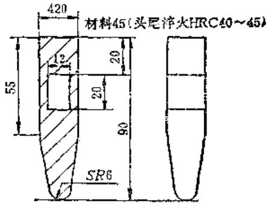

图5-3-15 自创刨法锯（锯齿焊道用）

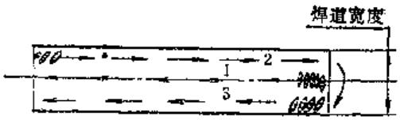

图5-3-16 锤击方法示意图

跟踪回火就是将刚焊完锤毕的焊道再均匀地用氧炔中性焰重新加热一次，回火温度为  $850\sim$ $950^{\circ}C$  。跟踪回火的作用是进一步减缓冷却速度，以利扩散氢能充分地从焊缝逸出。

⑤ 封底焊及加焊角筋 主焊缝U型坡口正面全部施焊完毕后，即将工件翻转至封底焊的平焊位置。封底焊的方法是先用气割除掉因施焊不当产生的焊瘤，然后将焊根均匀烘烤，烘烘一段，退步法焊一段。封底焊缝的要求是焊波美观齐整，无气孔夹渣，尤其严禁咬边。封底焊的目的是消除几何缺

口和冶金缺口。

封底焊后，选适当位置加数块焊角筋，目的是改变原设计的断面突变的状态，增加焊缝系数。加焊角筋的方法仍为短段多层焊法。各焊脚筋不得小于  $15\mathrm{mm}$ 。

2）次生裂缝的焊接修复 主裂缝的焊修质量如能得到保证，次生裂缝的裂源亦告消除。但为保证次生裂缝在交变载荷作用下不再继续扩展，也应对次生裂缝进行全面焊修。

具体做法是，先循裂纹走向找出次生裂缝的尾端，然后再往前取  $15\sim 20\mathrm{mm}$  的距离，用气割或气刨方法除掉带有裂纹的全部焊缝，然后按退步短段多层焊法由尾端向口端施焊。焊条宜用对油锈不太敏感的J422焊条，采用平焊操作，焊接电流选用（  $\phi$  4焊条）  $180\sim 200\mathrm{A}$  左右，要对称施焊，修复的焊缝的焊脚不小于  $15\mathrm{mm}$  。

（3）温差拉伸法消除焊接余应力 因内滑块焊后不允许整体高温回火，因此我们采用温差拉伸法进一步消除焊接余应力。具体做法是：在焊缝两侧用一对宽  $100 \sim 150 \mathrm{~mm}$ ，中心距为  $120 \sim 270 \mathrm{~mm}$  的氧炔中性焰（最好用火焰淬火用的喷嘴），加热到  $200^{\circ} \mathrm{C}$  左右，造成加热区母材和焊缝区之间的一定温度差，然后在火焰喷嘴后面一定距离（一般取  $100 \mathrm{~mm}$  左右）喷水冷却，从而使焊缝区产生拉应力，达到部分消除焊缝拉伸应力的目的。此法能降低焊缝区的残余应力的峰值，从而能减小残余应力的破坏作用。

（4）焊接盖板 应该指出，主裂缝最初被发现时，凸字幅板除张开一定间隙外，还有平面上的少许错位。这可以说明，内滑块在承受拉伸应力的同时，还存在着剪切应力，为加强主焊缝的抗剪切应力的能力，我们决定在整个凸字幅板上横向搭焊厚为  $28\mathrm{mm}$  的盖板。盖板宽  $250\mathrm{mm}$ ，长度不与幅板等长，旨在避免焊缝重迭和减少焊接应力。焊接前的清理要彻底，要使盖板与幅板的表面吻合良好，施焊方法和电流选择如主焊缝的焊修。具体焊序及分段情况如前述，各焊脚不得小于  $20\mathrm{mm}$  。盖板焊缝断面应呈内凹缓坡形。

无论哪道焊缝的施焊过程中，如一旦因手法不当而产生焊接缺陷，则应剔掉或磨掉缺陷，根除裂源后严格按原定规范重新补焊。

（5）焊后检查 焊修毕并冷至室温后，检查内滑块焊接变形，参见图5-3-17，  $\pmb{a}$  角变形的最

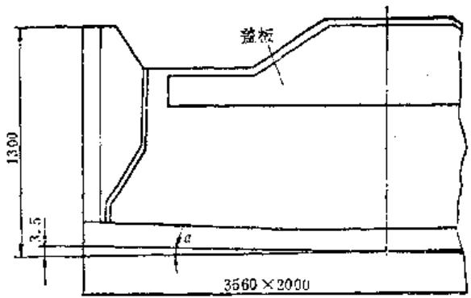

图5-3-17 焊后角变形示意图

大翘曲量  $3.5\mathrm{mm}$  。变形的原因是没有对下底板进行强固夹持，但通过机械加工，可使下底板平直如初。

几何尺寸检查毕，对焊缝进行了全面的磁粉探伤，以检查有无任何焊接缺陷。

# 第4节 细焊丝二氧化碳气体保护电磁振动电弧堆焊

# （一）概述

细焊丝二氧化碳气体保护电磁振动电弧堆焊是利用电弧热量来熔化焊丝和工件金属，在二氧化碳气体保护介质中进行的自动电弧焊，并在较高的振动频率下，焊丝以很小的溶滴向工件表面过渡，从而获得薄而均匀的堆焊层。

细焊丝二氧化碳保护振动焊具有以下的优点：

1）它采用二氧化碳气体作保护介质，成功地解决了液体介质经常产生轴颈裂缝的问题，保证了堆焊质量。此外，二氧化碳气体价廉，焊接操作易于掌握，焊丝的利用率也高。

2）采用细焊丝，可用较小的电流进行堆焊（如用  $0.8\mathrm{mm}$  焊丝时，其焊接电流为  $60\sim 70\mathrm{A}$ ），且焊接过程稳定，熔敷系数高，工件热变形小，对高碳合金钢丝和不锈钢丝的合金元素烧损也小。

3）具有较高的振动频率（100次/秒）和稳定的振动过程，从而保证获得良好的堆焊质量。

4）与金属喷涂比较，堆焊前工件不需特殊的表面处理，堆焊层与工件金属熔接良好，可以一次或多次获得所需的堆焊厚度。工件堆焊后的力学性能远较金属喷涂高。

# （二）细焊丝堆焊设备的工作原理

细焊丝堆焊装置见图5-4-1。三相  $380\mathrm{V}$  交流电源通过三相降压变压器1，由硅整流器2整流，供给焊接用直流低压电源，并经过可调整的电抗器3，将电源的正极接于焊丝12，负极接于工件4，以直流反极性法进行堆焊。

被堆焊的工件夹持在车床的卡盘上，另一端用尾架或中心架支撑，并随车头主轴按一定的转速转动。

射出，由于  $\mathrm{CO}_{2}$  气体的流动性特性，从气体罩中射出时可以有效地保护着燃烧避免遭受空气的污染，同时气体的接通和关闭，均由电气系统控制，保证在焊接回路接通前提前送气，而在断开焊接回路后延时关闭。这样保证堆焊的始末均有很好的气体保护，从而获得了优质的堆焊层。

# （三）细焊丝堆焊设备的主要装置

（1）堆焊机头部分 见图5-4-2，堆焊机头包括送丝机构、振动系统和支架等部件。送丝速度要

求为无级调速，且有较大的调节范围（调节幅度由0至  $14\mathrm{m}/$  min)，送丝方式为推丝式，送丝应均匀、稳定，并能可靠地做到立即停送。为此选用DQ型他励式直流电动机11作送丝动力（规范为  $135\mathrm{V}$  产 $0.5\mathrm{A},2800r / \min ,$  ，他激18V）。电动机用法兰盘竖直连接于由一对蜗轮副和两对直齿轮组成的减速器10上，通过减速器的主动送轮9及压紧送丝轮8，将焊丝按照一定的速度推出。送丝速度的无级控制由旋转送丝的调压变压器借调节电枢电压来改变电动机的转速。

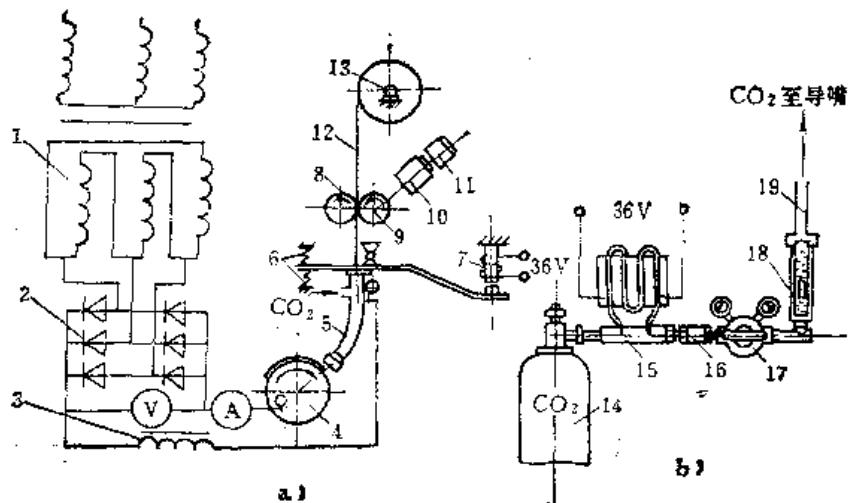

图5-4-1 细焊丝二氧化碳气体保护电磁振动堆焊装置示意图

1—降压变压器 2—硅整流器 3—可调电抗器 4—工件 5—振动导嘴

6—调压弹簧 7—电磁铁 8—压紧送丝轮 9—主动送丝轮 10—减速

箱11一他励式直流电动机12一焊丝13一绕丝盘架14一二氧化碳

气瓶 15—预热器 16—干燥器 17—减压表 18—转子流量计 19—气管

焊丝12由主动送丝轮9及压紧送丝轮8，从绕丝盘架13经过振动导嘴5送向工件表面。主动送丝轮9由他励式直流电动机11通过减速箱10带动，送丝速度为无级调速，且有步进、步退等送丝动作。鉴于振动导嘴在电磁铁7和调压弹簧6平衡力的作用，焊丝在送进过程中以100次/秒的频率振动。焊丝末端振幅的大小和振动力的强度可通过调压弹簧和调压器，调节其电磁引力来达到。

整个堆焊机头通过升降托架固定于刀架托板上，沿床身导轨作纵向移动，并配合工件的转速和进给量获得一定的堆焊螺距。在堆焊过程中，为了保护电弧区和焊接熔池不受空气的侵入，利用价格便宜的  $\mathrm{CO}_{2}$  气体作为保护介质，气路系统有  $\mathrm{CO}_{2}$  气瓶14，气体预热器15，干燥器16，减压表17，转子流量计18和气管19等所组成。气体按上述顺序由气瓶均匀地按一定的流量从振动导嘴气体罩中

振动系统由电磁铁7、振动板2、调压弹簧6等组成。电磁铁的振动频率为100次/秒，电压 $36\mathrm{V}$  。电磁铁全部吸合时的吸合力约为  $1500\mathrm{N}$  。输出电压由自耦变压器调节，借以控制振幅的大小。振动板的转动支承部分是利用滚动轴承支承，这样既保证振动板的两侧窜动，又减轻振动时的阻力。调压弹簧可采用解放牌汽车转向横拉杆弹簧。整个振动系统可由以下两个方面进行调节：一是用两个调压弹簧的压力差来调节振幅的大小；另一为调节电磁吸力的变化幅度来调节振幅的强烈程度。通常，在调好弹簧压力差后，只须改变自耦变压器的输出电压即可进行控制。

焊丝沿送丝导管14进入送丝轮，推送入振动导嘴。振动导嘴（图5-4-3）外层是一紫铜管4，中间贯穿一内孔为  $2\mathrm{mm}$  直径的导丝钢管3，上端用绝缘法兰加以固定，下端用分气环5和气体罩6

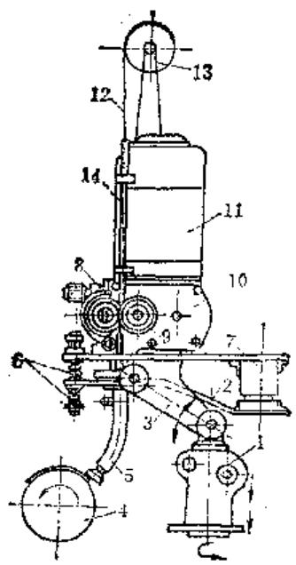

图5-4-2 堆垛机头

1—升降座 2—振动板 3—支架 4—工件 5—振

劲导嘴 6—调压弹簧 7—电磁铁 8—压紧送

轮 9一主动送丝轮 10一减速器 11一他励式

直流电动机 12—焊丝 13—绕丝盘架

14—送丝导管

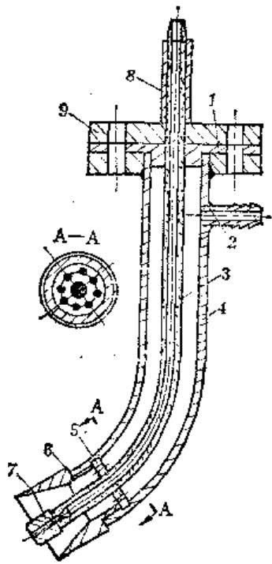

图5-4-3 振动导频

1—绝缘法兰 2—进气管 3—导丝钢管 4—浆

钢管 5—分气环 6—气体罩 7—导电嘴

8—绝缘套管 9—导电板

固定于紫钢管的末端，以减少涡流和使具有良好的气体保护层。位于导丝钢管尾部的导电嘴7可以随

焊丝直径不同而更换，内孔与焊丝的配合间隙不宜大于  $0.1\mathrm{mm}$ ，太大了影响焊丝偏摆，太小则又增加送丝阻力。二氧化碳气体由进气管2进入紫铜管内部空隙后沿分气环的一圈小孔中射出。

绕丝盘及DQ型他励式直流电动机与减速器都固定在支架3的上面，整个支架可沿升降座1的转动点转动，升降座本身由齿条齿轮副作升降运动，而整个机座本体还可在刀架托板上作水平旋转运动。因此可根据实际需要来调节，保证焊丝与工件表面的距离和堆焊时焊丝的送进角度。

（2）电源部分 其线路图见图5-4-4。

1）鉴于细焊丝堆焊设备要求具有足够大的空载电压来恢复速度，并且有合适短路电流来增加速度的电源特性，因此，一般的电焊发电机、直流发电机并联小容量的硒整流器，或硒整流器作为直流电源都不能满足要求。而硅整流器在额定电流时的压降非常小，直流电源的伏安特性很平，用于电磁振动电弧堆焊是非常理想的。

整流元件  $\mathbf{V}_{1}$  采用6个  $200\mathrm{V}$  、100A2DGZ系列的硅整流器，接成三相桥式进行整流。整流后的电压仅为  $16\sim 28\mathrm{V}$  ，而整流元件选用  $200\mathrm{V}$  ，是因为硅整流器对过电压非常敏感，会因过电压而造成雪崩式的瓦穿。一般瞬时过电压最大可能达到额定电压的6倍，因此选用  $200\mathrm{V}$  能对过电压有足够的保护作用。硅整流器对过电流也非常敏感，因此在变压器初级采用快速过流继电器FA-GL作过电流保护装置，防止因短路过电流而使硅整流器损坏。

2）三相电源变压器TM1为  $\mathbf{Y} / \Delta$  接法，初级为多抽头的，通过一个三刀11掷转换开关QS1改变三相初级线圈的匝数，而使次级得到从13.5至 $22\mathrm{V}$  范围内的升降变化。

三刀11掷转换开关QS1接于线圈的中性点，使运行时安全可靠。此开关由于额定电流较小（5A），不适宜作带负荷电压调节，只适用于无载调压。

3）采用电源总开关QS，其目的是便于调整焊接电源及便于维护检修。

（3）焊丝进给机构（图5-4-4）焊丝进给动力采用他励式直流电动机M。它具有硬的外特性，能可靠地使焊丝送进速度不受外来影响。电动机馈电电源采用输入  $160\sim 240\mathrm{V}$  、输出  $220\mathrm{V}\pm$ $1\%$  、容量500VA的磁饱和稳压器TS。

电动机M的电枢回路由40片  $60 \times 60$  砸整流片

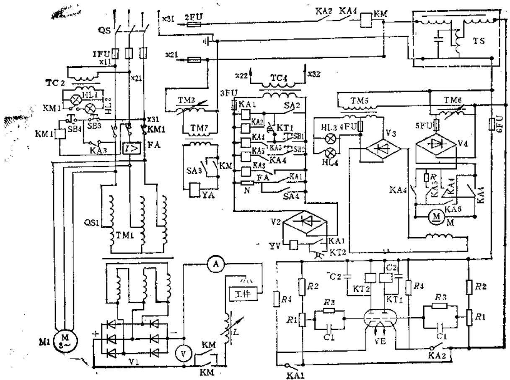

图5-4-4 细焊丝堆焊设备电气线路图

V1—三相硅整流器 V2、V3、V4—单相硅整流桥 M-2Q型135V、0.5A、2800r/min、他励式18V送丝直流电动机 KM1-CJO-20型380V交流接触器 KM-QC1-4/1型380V交流接触器 TS—激饱和稳压器 TM1—三相Y/△接法380/13.5~22V、9.1/265A电源变压器TC2-380V/6V、50VA指示灯变压器 TM3-0~250V、1.5kVA电磁铁调压变压器 TC4-380/36V 500VA控制变压器 TM5-220/(27/6)V、50VA送丝励磁变压器 TM6-0~250V、15kVA送丝调压变压器 TM7-250/36V、500VA电磁铁降压变压器 YA-36V、吸力为1500N电磁铁 L—可调电抗器 M1—三相0.35kW、4级风冷电扇电机 YV—电磁气阀 N-36V、16Ω二氧化碳气体预热器 QS1—三刀11掷转换开关 QS—电源开关 SA1-HZ1-10/3型控制通断转换开关 SA2—LS2型送丝开关 SA3—HZ1-10电磁铁调整开关 FA—GL-11型5~20A过电流继电器 KA1～KA5—D1144型36V中间继电器 KT1、KT2-5kΩ延时继电器IFU-6FU—RL1型熔断器 R-250Ω50W绕线式制动电阻 SB1、SB2—LA2型 500V5A送丝步退和步进按钮 A-0~300A直流电流表 Y-0~30V直流电压表 HL1~HL4—红绿指示灯 R1-390kΩ电位器 R2、R3、R4—分别为220kΩ、50MΩ、50kΩ电阻 C1、C2—分

别为1μF、10μF（250V）电容器

组成的单相全波整流器V4馈电，而V4由调压变压器TM6馈电。通过继电器KA4及KA5对电枢回路的控制，使电机正反转及停转时立即产生能耗制动。能耗制动通过制动电阻来实现。

电动机M的励磁回路同样由8片  $60 \times 60$  硒整流片组成的单相全波整流器V3馈电，而V3由降压变压器TM5馈电。

（4）电磁气阀（图5-4-4）采用直流电磁

气阀YV控制二氧化碳气体的供应与切断，它的直流电源由36V交流经过由4个50V、2A的硅整流器组成的单相桥式全波整流器供给。二氧化碳气阀由于直流供电，工作可靠，线圈不会因气阀卡住而烧坏。

电磁气阀YV由延时继电器KT1及KT2分别提前送气和延时断气，通过对电位器的调节，时间都可以在  $0\sim 90s$  内连续调节。为了使延时稳定，

延时继电器也由前述的磁饱和式稳压器馈电。

（5）堆焊车床 可用老旧车床改装，车头主轴转速最好是无级变速，转速的变换范围可为  $0.4 \sim 20 \mathrm{r} / \mathrm{min}$ ，螺距进给范围可为  $1 \sim 4 \mathrm{~mm} / \mathrm{r}$ 。

尾架后顶尖应装有弹性后顶尖，以防止工件热变形弯曲。导轨表面上装有活动防护挡板，以免金属飞溅，损坏导轨面。

# （四）细焊丝堆焊主要参数的选择

在修复磨损零件时要获得稳定的堆焊质量，必须正确选用堆焊参数。

（1）电压细焊丝（直径小于  $1.2\mathrm{mm}$  ）二氧化碳气体保护堆焊对电弧电压比较敏感，电弧电压在不大的范围内变化都会引起堆焊过程的不稳定。  $0.8\mathrm{mm}$  焊丝的电弧电压应采用  $18\sim 20\mathrm{V}$  之间，且以  $20\mathrm{V}$  为佳。如电弧电压过低，焊层表面成型粗糙，出现凹痕，常有断弧现象，堆焊过程不稳定；如电弧电压过高，金属大量飞溅，堆焊过程也不稳定。对高碳钢焊丝，电弧电压宜偏下限，低碳钢焊丝宜偏上限。

（2）电流和焊丝送进速度 焊丝的送进速度在很大程度上取决于焊丝直径和堆焊时的保护介质。在二氧化碳气体保护电磁振动电弧堆焊中，它的电流调节幅度比较广阔，同直径的焊丝可在较广的电流范围内适用，即在焊丝送进速度与保证焊丝及时熔化并且保持电弧长度稳定所需电流大小之间，存在着一个近似直线的关系。这关系称为“熔化特性”，是焊丝成分和直径的特性。从图5-4-5可见，堆焊电流的增加和焊丝送进速度的增加是成比例的。  $0.8\mathrm{mm}$  直径焊丝，送进速度由  $3\mathrm{m / min}$  增加至  $9\mathrm{m / min}$  时，它可以在65A到160A广阔的范围内使用。

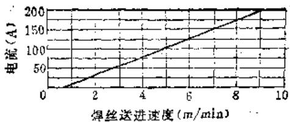

图5-4-5 细焊丝堆焊，  $\phi 0.8\mathrm{mm}$  焊丝的熔化特性

一定直径和一定材料成分的焊丝，在一定的焊丝伸出长度下具有一定的极限电流密度。超过此极限值时，焊丝即大段大段地熔化，无法进行堆焊。

另一方面，焊丝送进速度也不能小于某一极限值，如焊接电流太小，会因电弧功率小而使焊丝无法连续熔化，只能形成断续的熔滴，使堆焊表面恶化。 $0.8\mathrm{mm}$  直径的焊丝，其最大送进速度为  $9\mathrm{m / min}$ ，最小送进速度为  $2.5\mathrm{m / min}$  。这仅是一个调节范围，最佳的焊丝送进速度必须根据“熔化特性”选用。

（3）电感直流回路中电抗器主要用来调节合适的短路电流增长速度和滤波作用。电感为零时，短路电流增长速度最快，焊丝末端形成较大的熔滴，爆炸断裂的粒子很大，造成电弧不稳定并增大飞溅。增加电感时，短路电流增长速度减慢，过小的短路电流增长速度而使点弧困难，而且飞溅严重。所以过大或过小的电感值均对堆焊过程的稳定性不利。实践证明，采用  $0.40 \sim 0.575 \mathrm{~mH}$  的电感值能适应细焊丝堆焊过程的稳定性。

（4）堆焊速度 堆焊速度快（超过  $1\mathrm{m}/\mathrm{min}$ ），工件金属熔化不良，结合强度降低，焊层还会出现气孔甚至堆焊过程不稳定。而堆焊速度慢，则增大变形。通常，工作转速可由决定合适转速的诺模图中查得。一般在  $0.45 \sim 0.8\mathrm{m/min}$  之间选用。

（5）焊丝选择和直径 由于堆焊时焊丝中合金元素在弧柱和熔池中受到损耗，并从减少气孔飞溅考虑，都希望采用具有较高Si，Mn合金的焊丝，以增强还原能力提高焊缝力学性能。

目前多采用  $0.8\mathrm{mm}$  直径焊丝，常用牌号有 $08\mathrm{MnSi}$  ，  $08\mathrm{Mn}_2\mathrm{SiA}$  ，还有10MnSi，OBC，70，50钢丝，50CrV以及其它合金钢丝等。其中以 $08\mathrm{Mn}_2\mathrm{SiA}$  焊丝所焊焊缝的硅、锰量最高，10MnSi焊丝所含Si，  $\mathbf{M}\mathbf{n}$  量低，而C量高，所以10MnSi所焊的焊缝强度高而塑性差，  $08\mathrm{Mn}_2\mathrm{SiA}$  及08MnSi所焊的焊缝强度低，但塑性较好。

（6）堆焊螺距 堆焊螺距的值按焊丝直径、电弧电压、送丝，堆焊速度等参数决定。当焊丝直径  $0.8\mathrm{mm}$  、电弧电压为  $20\mathrm{V}$  时，应选用的螺距为 $2\sim 3\mathrm{mm}$  左右。

（7）振幅 振幅的调节与焊丝直径和电弧电压有关。当焊丝直径减小和电弧电压降低时，振幅也要相应减少，当  $\beta$  角选用在  $40^{\circ}$  左右，焊丝直径为  $0.8\mathrm{mm}$  和电弧电压为  $20\mathrm{V}$  的情况下，其振幅的大小通常控制在  $0.5\sim 2\mathrm{mm}$  之间。

（8）焊丝伸出长度 焊丝的伸出长度对堆焊

过程中的稳定性有一定影响。焊丝伸出过短，会使气罩、焊嘴粘上较多飞溅金属，不但使  $\mathrm{CO}_{2}$  气体保护变坏，而且会导致堆焊过程不稳定。飞溅的金属过多，甚至使焊丝炸断及使焊嘴烧坏。焊丝伸出过长，由于堆焊时的振动附加焊丝的幌动，对堆焊的稳定性不利。实践证明， $\phi 0.5 \sim 1.2$  焊丝伸出长度以在  $6 \sim 12 \mathrm{~mm}$  为佳，堆焊半径差  $2 \mathrm{~mm}$  的变截面零件时，应注意及时调整焊丝伸出。

（9） $\mathrm{CO}_{2}$  气体纯度 保护气体  $\mathrm{CO}_{2}$  的纯度应不低于  $99.11\%$  。 $\mathrm{CO}_{2}$  气体不纯是焊缝产生气孔的主要原因之一。

# （五）细焊丝堆焊的应用范围

1）可用于轴类零件滑动摩擦面修复，如滑动

轴承轴颈，齿轮在轴上空转造成的轴颈磨损等。

2）可用于轴类零件固定配合表面修复，如大小电机转子轴颈装滚动轴承轴颈，C620主轴卡盘法兰轴颈等。

3）可用于花键轴的修复。

4）可用于螺纹修复。

5）可用于修复处在较大变动载荷条件下进行工作的零件，如各种大小冲床曲轴，各种车辆及柴油机曲轴等。

6）可堆焊不锈钢及在碳钢上堆焊不锈钢。

# （六）细焊丝堆焊的修复实例

细焊丝  $\mathrm{CO}_{2}$  气体保护电磁振动堆焊修复零件实例的工艺参数见表5-4-1。

表5-4-1 细焊丝堆焊修复实例工艺参数

<table><tr><td colspan="3">堆焊零件</td><td colspan="2">焊丝</td><td colspan="2">电压(V)</td><td rowspan="2">电流(A)</td><td rowspan="2">电感(mH)</td><td rowspan="2">车头转速(n/min)</td><td rowspan="2">送丝速度(m/min)</td><td rowspan="2">堆焊螺距(mm/r)</td><td rowspan="2">振幅(mm)</td><td rowspan="2">CO2气体消耗量(L/min)</td><td rowspan="2">焊丝伸出长度(mm)</td></tr><tr><td>名称</td><td>材料</td><td>直径(mm)</td><td>牌号</td><td>直径(mm)</td><td>空载</td><td>负载</td></tr><tr><td>组合机动力头主轴</td><td>45</td><td>80</td><td>08Mn2Si</td><td>0.8</td><td>21</td><td>20</td><td>80~90</td><td>0.575</td><td>3</td><td>3.6</td><td>2.5</td><td>0.5~1</td><td>8</td><td>8</td></tr><tr><td>柴油机曲轴</td><td>45</td><td>75</td><td>08Mn2Si</td><td>0.8</td><td>21</td><td>20</td><td>80~90</td><td>0.575</td><td>3.2</td><td>3.5</td><td>2</td><td>0.5</td><td>8</td><td>7</td></tr><tr><td>试棒</td><td>45</td><td>200</td><td>08Mn2Si</td><td>0.8</td><td>22</td><td>21</td><td>100~110</td><td>0.575</td><td>0.9</td><td>4.2</td><td>2.5</td><td>0.5~1</td><td>8</td><td>11</td></tr></table>