# 第6章 工件表面的强化技术

# 柳台夫

为了使工件表面更好地适应工况需要，往往要通过相应的工艺方法，进一步提高工件表面的硬度、强度、耐磨性、耐腐蚀性等，这些相应的工艺方法即被称为工件表面的强化技术。关于表面热处理、化学热处理、火焰喷涂、等离子喷涂（喷焊）、镀铬、低温镀铁、电刷镀、振动堆焊、手工耐磨堆焊等强化技术，请参阅有关章节及有关书籍，下面仅重点介绍机床导轨电接触加热自冷淬火、机床导轨表面高频感应淬火、电火花强化工艺。

# 第1节 机床导轨表面电接触加热自冷淬火

# （一）基本原理

工件表面电接触加热自冷淬火法与高频和火焰表面淬火一样，均是使被处理工件表面硬化，而工件内部不发生变化。它的不同点是利用电接触电阻热来加热，而利用工件本身的导热性来冷却。

电接触加热自冷淬火的设备由调压器、变压器、电极等部分组成。

当电极与工件表面接触时，电极与工件表面接触处产生很大的接触电阻。因此，当回路中通有相当强度电流时，电流能量即转变为热量（电阻热）消耗在接触部位，这就是淬火的热源，在处理的工作过程中，电阻  $R$  、电流  $I$  是有些波动变化的，它随着接触的时间！延长，在接触部位产生的总接触电阻热  $Q$  为：

$$
Q = 0. 2 4 \int_ {0} ^ {t} R I ^ {2} d t
$$

接触电阻热快速加热工件表面在一定的深度内达到高温。调节电流强度  $I$ ，使其产生的接触电阻热将工件接触部分的一定范围内的温度达到该金属基体的相变温度，随后将电极移开，加热部位依靠

工件本身的导热作用和空冷（已大于临界冷却速度）迅速冷至室温。这样，接触部位的金属基体即形成了马氏体组织，从而使工件表面淬硬。

# （二）电石墨棒式电极及手工操作

用碳精棒（电石墨）为电极的手工操作方法，是一种很简单的表面电接触淬火的方法。

# 1. 电极

对于表面电接触淬火来说，电极是一个很重要的组成部分。电极材料的优劣对淬火质量有直接的影响。对电极材料的要求是：

1）具有优良的导电性能。

2）具有足够的强度，特别是在接触加热的高温情况下不软化，不粘滞。

3）具有足够的耐磨性，特别是在接触移动加热时不易损耗。

4）有较好的润滑性，便于接触加热时移动。

经试验比较，以电石墨电极最为优良，其次是铜。电石墨电极具有良好的导电性，具有足够的强度，优良的润滑性，不起火花，淬火后工件表面花纹宽而清晰等等。美中不足的是其耐磨性较差。尽管如此，石墨电极的实用价值还是很高的。

# 2.低压变压器的制造

低压变压器亦是电接触表面淬火设备中的一个重要组成部分。它的主要作用是保证供给电极部分的高强度电流。

这种变压器是非标准的，需自己制造。不过，它的结构很简单，自己制造并不困难。

变压器的铁芯形状如图6-1-1，采用一般的硅钢片制造，连接端用角铁紧固而成。

容量：石墨电极用300W；铁芯截面积：  $40 \times 90 = 3600\mathrm{mm}^2$ ；磁通密度取0.1T；匝数计算：

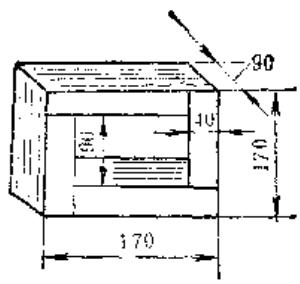

图6-1-1 变压器的铁芯形状图

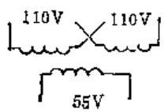

图6-1-2 变压器接线线路图

$$
W = \frac {V 1 0 ^ {3}}{0 . 4 4 4 B f \phi}
$$

式中  $\nu$  ——线电压（V）；

B——铁芯截面积  $(\mathbf{m}\mathbf{m}^2)$

$f$  ——电源频率  $(\mathrm{Hz})$ ；

$\phi$  ——磁通密度（T）；

$W$  ——绕组匝数。

初级线圈匝数300匝  $(150\times 2)$  ，采用导线截面积  $1.5\mathrm{mm}^2$  ，次级线圈匝数  $3\sim 5$  匝，采用导线面积  $80\mathrm{mm}^2$  。接线线路如图6-1-2。

3. 操作方法 参见图6-1-3

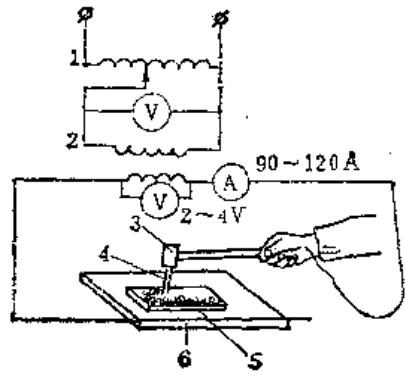

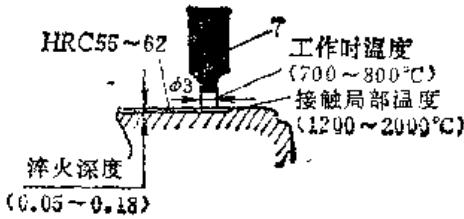

图6-1-3 接线线路和操作示意图

1—调压变压器（1kW220～110/0～250V/1kW） 2—低压变压器（220V/2～5.5V） 3—炭精装夹手柄 4—软炭精棒 5—工件 6—工作台电极 7—炭精棒

1）调压器原通  $220\mathrm{V}$  的电源，逐渐调节调压器，使变压器的二次开路电压在  $2\sim 3\mathrm{V}$ ；电极与工件之间的短路电流控制在  $80\sim 160\mathrm{A}$ 。

2）手持石墨电极，在所处理的导轨平面上，以大约1圈/秒的速度匀速移动。移动方式见图6-

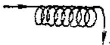

图6-1-4 石墨电极的移动方式

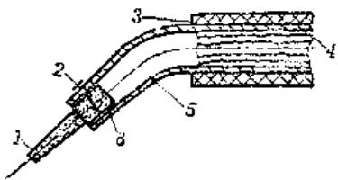

图6-1-5 电极的装卡方法

1—电极 2—螺钉 3—手把 4—导线 5—螺管 6—垫片

1-4。

3）处理前，导轨表面先涂一层薄机油，以助石墨电极移动。

4）电极的装卡方法如图6-1-5。

# 4. 处理后工件表面情况

1）工件表面 由于接触电极在工件表面是以螺旋式均匀移动，故在工件表面上形成了如图6-1-4形式分布的硬化层。凡是电极直接接触的区域，均可得到马氏体组织，其它部位仍为原来组织。

2）工件断面 硬化层呈弧形。

3）硬化层深度 当变压器二次电流控制在  $80\sim 160\mathrm{A}$  时，硬化层一般在  $0.07\sim 0.13\mathrm{mm}$ 。

4）硬化层硬度 760HV，相当于HRC59～60。

5）硬化层组织 隐针状马氏体。

值得一提的是，这种处理不会使导航产生变形。

# 5. 影响淬火质量因素

（1）变压器二级线圈电气参数的影响 增加二级电压，容易产生接触电火花，破坏工件粗糙度，同时也降低了二级电流，影响加热深度。因而应采用最大可能

的低压，一般控制在  $2 \sim 3\mathrm{V}$ ，最大不得超过5 $\mathbf{V}_{\circ}$

增加二级电流，即增加功率  $I^2 R$ ，这样，虽然能增加接触部位的温度，从而提高硬化层深度，但容易造成工件表面接触熔化而增大工件表面粗糙

度，故一般二级电流控制在  $80\sim 60\mathrm{A}$  。此时石墨电极端部温度在  $900\sim 1100^{\circ}C$  ，硬化层深度达  $0.07\sim$ $0.13\mathrm{mm}_{\circ}$  经打磨后的工件表面粗糙度比原来略有增高（由  $R_{a}0.4\mu \mathrm{m}$  增至  $R_{a}0.8\mu \mathrm{m})$  。

当电流增大到300A以上，石墨电极端部温度达  $1200^{\circ}C$  以上，硬化层深达  $0.24\mathrm{mm}$  ，但表面熔化深达  $0.01\sim 0.02\mathrm{mm}$  ，较严重地影响了表面粗糙度；当电流降至80A以下，虽然能保持工件表面的粗糙度要求，但硬化层深度只有  $0.005\sim 0.01\mathrm{mm}$  。

（2）石墨电极的影响 试验证明，作为电极的石墨块，应该是愈软愈好。愈软移动愈平稳，愈不容易产生接触电火花。

作为电极的石墨块，以制成锥形者为最佳。这样，上部截面积大，电流密度低，发热量小。直接与工件表面接触部分面积小，电流密度大，加热部位集中。

一般石墨电极接触端面制成  $2 \sim 3 \mathrm{~mm}^{2}$  。但使用过程中，石墨磨损和烧损较快，端面面积逐渐增加，这样就会影响接触端的电流密度。因此，根据磨损情况，随时修复电极是非常必要的。

根据公式  $Q = 0.24\int_{0}^{t}I^{2}R\mathrm{d}t$  ，石墨电极沿工件表面的移动速度，即标志着电极与工件接触的时间  $t$  的长短，对其加热温度和淬硬深度有影响，随着移动速度的降低，淬硬深度将有所增加。

（3）润滑介质的影响 为了探讨润滑介质对淬火性质有无影响，曾用稀释剂（硫化亚铁 + 稀硫酸），炭精粉，机油和不加润滑剂作试验。据观察，并没有什么明显的渗硫或渗碳的作用，其淬硬深度和硬度亦无明显的差别。不过，用铜电极和石墨电极分别在低碳钢件上做过试验，铜电极淬不上火，而石墨电极却能使其表面硬化，说明还是有渗碳作用。有无淬渗的可能，要依工件材质而定。

另外，石墨电极与工件表面接触应以倾斜一定的角度为宜（象用铅笔在纸上写字的姿势一样）。这样便于电极移动，以防电极滑动时的弹动有碍淬火质量。

对于基体为珠光体的铸铁或基体中具有大量铁素体的低级铸铁，用此法处理，均能获得一定深度的硬化层。结构钢的滑动工件表面亦可以实施这种方法来提高其表面硬度。

总之，利用软的石墨块（老型号  $\Pi \Gamma 14$  最佳，其它均次之）作为接触电极，二级电压控制在  $2\sim 3\mathrm{V}$

电流控制在  $80\sim 160\mathrm{A}$  （不润滑也可以），平稳均匀移动石墨电极，可以在工件表面得到深度为 $0.07\sim 0.13\mathrm{mm}$  的硬化层，其硬度可达HRC59～60。但工件表面的粗糙度略受破坏（粗糙度大约要提高一级)，需用油石进行打磨光后方能使用。

经生产试验，采用分段硬化导轨表面，处理后导轨变形很小，表面用油石稍一打磨，并不影响使用粗糙度。如果能设法使电极移动轨迹整齐美观，这样不但使导轨表面耐磨性提高，淬火的花纹也是能与刮花媲美的。

用电石墨棒为电极的手工操作方法，虽然效率较低，但用于维修单个机床导轨或滑动体，无论从处理质量和经济效果上看都是适用的。

# （三）机械化操作的滚轮式电极

电石墨电极的耐磨性较差，电极与工件接触端部的锥度不易保持，淬火质量受到影响，电极需要经常修复，故生产效率太低。如用滚轮式电极（特别是用铜滚轮电极）无论从提高淬硬质量，还是提高淬火效率，都是比较理想的。

经过试验，以滚轮为电极时，铜是很合适的材料。其中：使用硬拔紫铜要比退火软紫铜和黄铜更为理想。虽然硬拔紫铜的导电率（ $98\%$ ）不如软紫铜（ $\sim 100\%$ ），但前者的硬度（ $80 \sim 90\mathrm{HBS}$ ）远高于后者（40HBS），很显然，硬拔紫铜的综合性能是比软紫铜或黄铜更好了。

硬拔紫铜缺少，亦可以用冷锻紫铜代之。

# 1.铜滚轮电极的主要参数对淬火效果的影响

钢滚轮一般直径为  $\phi 50\sim 60\mathrm{mm}$  ，轮缘花纹宽 $0.8\sim 1\mathrm{mm}$  ，如图6-1-6所示。

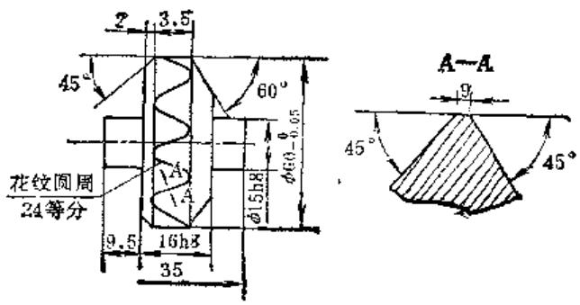

图6-1~6 铜滚轮

（1）滚轮电极上每毫米宽的电流密度与淬火层深度的关系 如前所述，随着电流强度的增加，

淬硬深度增加，其规律性如图6-1-7所示，建议选用的电流强度为  $400\sim 600\mathrm{A}$  （次级开路电压小于5V）.

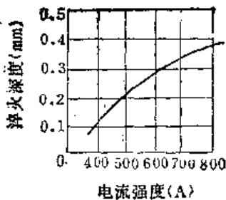

图-1-7 电流强度对淬硬深度的影响

实验条件：导电支架用滚动配合

滚轮直径：  $\phi 68\mathrm{mm}$

滚轮宽度：0.6mm

滚轮回转速度：  $2.5\mathrm{m / min}$

滚轮对工件压力：40N

（2）滚轮回转速度与淬火深度的关系 如前所述，电极滚轮回转速度意味着电极与工件接触时间，回转速度与淬硬层深度的关系如图6-1-8所示，建议使用的回转速度为  $2 \sim 3 \mathrm{~m} / \mathrm{min}$ 。

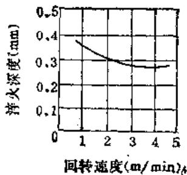

图6-1-8 流轮回转速度对淬硬深度的影响

实验条件：导电支架用滚动配合

滚轮直径：  $\phi 68\mathrm{mm}$

滚轮宽度：0.6mm

滚轮对工件压力：40N

（3）滚轮电极部分施加给工件的压力与淬火层深度的关系 接触压力加大，对淬火深度有着不良的影响，见图6-1-9。

所以，①铜极滚轮在高温条件下，接触部位变软，受到较大压力后，表面发生塑性变形，因而使接触面增加；②电极与工件被压得紧密接触后，接触电阻减小了。以上两个原因均使得接触时的接触电流密度减少，必然要导致淬火深度的降低。

反之，如果压力过小，就会使得电极回转不平稳，致使打弧现象发生。建议  $\phi 50\sim 60$  滚轮加在电

极上的压力为  $20 \sim 40 \mathrm{~N}$  。

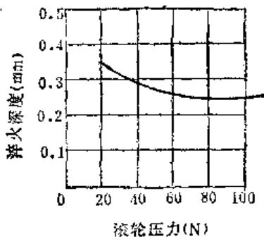

图6-1-9 液轮压力对淬硬深度的影响

实验条件：导电支架用滚动配合

滚轮直径：  $\phi 68\mathrm{mm}$

滚轮宽度：0.6mm

滚轮回转速度：  $2\mathrm{m / min}$

电流强度：650A

（4）二滚轮电极之间距离对淬火效果的影响（指二电极串联而言）为提高淬火效率，一般的都是安装两个并行的电极滚轮（必要时亦可安装多板头）。两个电极可以并联，亦可以串联。串联线路比并联线路简单，无须再加辅助电极，两个电极通过金属工件即构成导电回路。

串联的两电极之间的距离对淬火质量有影响。随着距离的增加，淬火层深度减小，这是由于距离加大使电流能量消耗在金属工件上的无益损耗加大所致。

串联联接时，使用的距离可为  $35\mathrm{mm}$ 。

综合以上措施，淬火深度可达  $0.20\sim 0.25\mathrm{mm}$  硬度可达HRC54以上。

淬火层基体组织为隐针状马氏体（指灰铸铁件而言）。

# 2. 冷却方式对淬火效果的影响

冷却方式对被处理的工件表面层的硬度和深度有着较大的影响。

在  $50^{\circ} \mathrm{C}$  水中冷却时工件表面层硬度为 HRC58~60，而在  $15^{\circ} \mathrm{C}$  水中冷却时，硬度可达 HRC60~65。

# （四）电接触加热自冷淬火设备

# 1. 行星差动传动淬火机

这种淬火机的结构比较简单，如图6-1-10所示。使用时比较轻便、灵活，对各种形状的机床导轨均能进行淬火。

其传动结构为：由一个0.125kW2790r/min的

图5-1-10 行尾振动传动碎火机结构简图 1—铜轮 2—弹性导线 3—导纹接变压器 4—风门 5—行星减速器（进比1:400） 6—绝缘垫 7—电木座

油泵电机直接带动蜗杆，蜗杆再带动装置在淬火机两个轮架之间的蜗轮，其速比为25:1，在蜗轮内部装置一套行星式差动减速机构。

行星差动减速机构如图6-1-11所示。其主要原理为：  $z30$  齿轮固定于轴架之上，由蜗轮带动  $z12$  小齿轮围绕  $z30$  齿轮转动，同时，带动  $z32$  齿轮向相同方向转动。因为  $z32$  齿轮与  $z30$  齿轮相差2个齿，所以当蜗轮围绕  $z30$  齿轮旋转一圈时，  $z32$  齿轮只转动2个齿，即  $2 / 32 = 1 / 16$  圈。也就是说：蜗轮转16圈，  $z32$  齿轮才转动1圈。因此，蜗轮与 $z32$  齿轮的速比为  $16:1$  。反之，当  $z32$  齿轮固定不动，则蜗轮围绕  $z32$  齿轮转一圈，  $z30$  齿轮向相反方向转2个齿，即  $2 / 30 = 1 / 15$  圈。也就是说：蜗轮

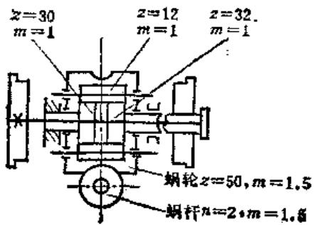

图6-1-11 行星卷动减速器示意图

转动15圈，  $z30$  齿轮转动1圈，因此，蜗轮与  $\pmb{z}30$

齿轮的速比为15:1。

由于  $z32$  齿轮与  $z30$  齿轮同在一根轴上，并同时与行星齿轮  $z12$  相啮合，为了使它们尽量接近正确的啮合，又不使齿的强度降低太多，因而采用了特殊的变位齿轮，其变位系数为：  $z32 = -0.5,$  （20 $z30 = +0.5,z12 = +0.4_{\circ}$

现在生产实际中使用的淬火机的行星差动齿轮减速机构的速比为  $400:1$ ，淬火机轮直径为  $\phi 100\mathrm{mm}$ ，实际速度为  $2.4\mathrm{m} / \mathrm{min}$ 。

淬火机的本身是由一块钢板制成的，其两端各装一块可以升降的端板，淬火头（由滑板与铜轮架等组成）可装在机身两端的任何一端。必要时可以在两端都装上淬火头进行多轮淬火，铜轮架与装在机身上的接线柱之间用弹性导线连接，铜轮架和接线柱均与机身绝缘。

淬火机的铜轮架中开有风孔，淬火时通入压缩空气冷却铜轮。

淬火机的变压器容量为  $3\mathrm{kW}$ ，硅钢片铁芯截面积为  $63\mathrm{cm}^2$ ，一次绕组导线直径为  $1.68\mathrm{mm}$ ，二次绕组导线面积为  $30 \times 6 = 180\mathrm{mm}^2$ 。在一次绕组上有12个抽头，变换抽头可以获得不同的电流。由于实际进行淬火时，要求电流（二次电流）能控制在一个要求的范围内，而二次电流的大小又受各种因素的影响。例如，两个铜轮电极之间的距离，铜轮电极的数量，以及施加于铜轮电极上的压力，导线的长短等。因此变压器设计成可调整的。

变压器硅钢片铁芯为矩形，外方尺寸为  $280 \times 210 \times 105$  ，内方尺寸为  $160 \times 90 \times 105$  。

变压器初级线圈在矩形铁芯两长边上绕线，每个抽头对应的匝数如表6-1-1中所列，次级线圈为3匝，绕在铁芯之一长边上。

图6-1-12为淬火设备的电路图。在操纵台上装有电流表，电源指示灯，电机换向开关，电流开关。当电机停止时，降压器电流切断，铜轮电极间无电流，以防烧伤导轨面。

# 2. 可移式自动性复淬火机

表6-1-1 变压器初级线圈的数据

<table><tr><td rowspan="2">电源电压(V)</td><td>抽头号</td><td>1</td><td>2</td><td>3</td><td>4</td><td>5</td><td>6</td><td>7</td><td>8</td><td>9</td><td>10</td><td>11</td><td>12</td></tr><tr><td>匝数</td><td>570</td><td>507</td><td>456</td><td>415</td><td>380</td><td>351</td><td>326</td><td>304</td><td>285</td><td>268</td><td>253</td><td>240</td></tr><tr><td>380</td><td>U2(V)</td><td>2</td><td>2.25</td><td>2.5</td><td>2.75</td><td>3</td><td>3.25</td><td>3.5</td><td>3.75</td><td>4</td><td>4.25</td><td>4.5</td><td>4.75</td></tr><tr><td>220</td><td>U2(V)</td><td>1.15</td><td>1.3</td><td>1.45</td><td>1.5</td><td>1.75</td><td>1.9</td><td>2</td><td>2.15</td><td>2.3</td><td>2.45</td><td>2.6</td><td>2.75</td></tr></table>

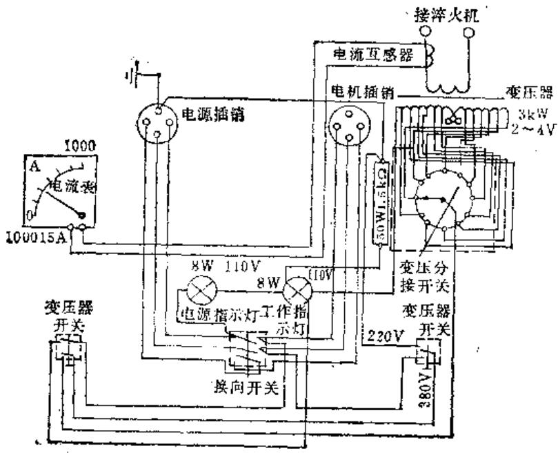

图6-1-12 行星差动传动淬火机电路图

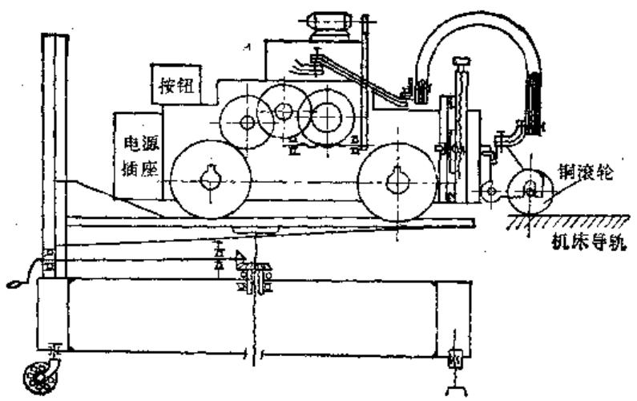

图6-1-13 可移式自动往复淬火机结构简图

这种淬火设备本身备有辅助导轨，且可升降调幅，以适应不同宽度的导轨。此外，淬火机上还设有限位开关、延时继电器，能自动往复，实现了淬火半自动化。整套设备（包括淬火机、变压器、电器、辅助导轨等）都安装在一个可移动的箱子里，运到工作地点后，稍加调整，即可开始工作，使用方便。

这种淬火机的结构简图如图6-1-13所示。其往返运动由一台  $0.25\mathrm{kW}$  电机驱动，通过蜗轮副和齿轮变速机构以每分钟  $1.5\sim 2\mathrm{m}$  的速度往返运行。由于被淬火机床导轨的高度和宽度不同，淬火机设置

了工作台的升降和轨道宽度的调整机构。在一般情况下，淬火机的V型导轨轮是固定的，而平面导轨轮是可调节宽度的，调整范围可以适应C616，C620，C630，C650车床的淬火。在其它形状导轨上淬火，则采用不同形状的行走轮。宽度较大时，也可另行变换。钢滚轮的操纵机构是一套小型的“龙门刀架”装置，可以适应各种形状导轨的淬火，回转灵活，调整方便。

# 3. 无级变速式淬火机

这种淬火机采用可控硅无级变速，淬火机轻巧、灵便。

淬火机由电动机通过两级蜗轮减速，带动车轮在导轨上运动（图6-114），速度为  $0\sim 2\mathrm{m / min}$  （可无级变速）。为使用方便这套设备的小车导轨可装在两台能升降的小车上。

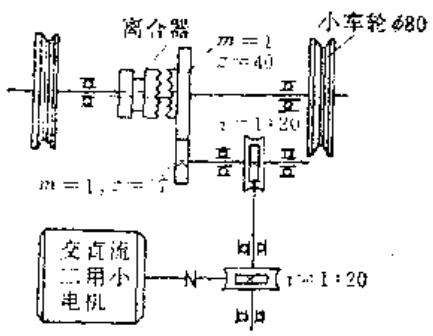

图6-1-24 无级变速淬火机机械变动图

# 4. 简易机械化淬火

如果没有条件制造或者没有必要制造一套专用淬火设备的话，导轨件

表面电接触淬火可以在龙门刨床或导轨磨床上进行。即把一个滚轮架安装到龙门刨床刀架或导轨磨床磨头支架上，使工件随工作台移动，每淬完一行，移动刀架或支架  $2\sim 2.5\mathrm{mm}$  ，电气箱放到工作台旁边，使电刷与工作台接触。这种方法简单、经济，与专用淬火设备相比能达到同样效果。

以上淬火设备以行星差动传动双轮淬火机为例，其操作顺序如下：

1）探净导轨表面。

2）安放淬火机，按导轨面宽度调好淬火机车轮跨距。

3）接好风管和电源，尤其注意要接好地线，各接触部位要拧紧。

4）装铜轮，注意不要磕碰，弹簧压力要适当，调整两铜轮之间的距离，一般为导轨面宽度的  $1 / 2$ 。

5）摇动铜轮进给丝杠，使铜轮之一紧靠欲淬火面的一边。

6）工作开始，先开电流开关，再开电机开关，记住开关转动方向。

7）淬完一行后，摇动铜轮进给手柄两圈（注意方向），对好花纹，再淬下一行。

8）淬火完毕，用硬油石加洗油打磨光滑即可使用。

# （五）电接触加热自冷淬火过程中应注意的问题

1）滚轮电极在工件表面上滚过以后，应当观察花纹的优劣。正常的花纹应当是平滑明显的，它的颜色应该是银白色。花纹的优劣标志着工件表面淬火层的深度和硬度，以及粗糙度的问题。如果花纹呈黑色，说明电流密度太大，造成工件表面的接触熔化严重，这样虽然硬度提高了，但粗糙度大；如果花纹是紫黄色，这说明电流密度太小，或者是由于滚轮电极回转的速度太快所致，这样会降低淬火层的深度和硬度。碰到上述问题应当立即调整有关参数加以纠正。

2）机床导轨淬硬面积一般约占  $20\% \sim 30\%$  。沿导轨运动方向应避免出现连续的未淬火带，否则在两条淬火花纹间隙处容易擦伤磨损。

当淬火花纹经常出现间断或变粗，则说明铜轮烧损或磨损太大，铜轮与导轨面接触不良，应更换新轮。

3）工作过程如发现铜轮打滑，花纹拉出直线，说明滚轮内孔与轴咬毛，应停车将轴用细砂纸擦光，滚轮内孔用油石磨光。烧伤严重时应更换新轴，滚轮内孔与轴配合间隙应为  $0.3\mathrm{mm}$  左右，最好加  $\mathrm{MoS_2}$  粉润滑。

4）淬火过程，如电流选择适当，铜轮在行进中和导轨相接触的地方，有连续的小火花出现，这是正常的。当偶然出现较大的火花，即通常所谓的“打火”现象，则说明导轨表面不干净或有砂眼等，应清除导轨面污垢。如发现周期性“打火”，说明铜轮上有毛刺或已粘上烧熔的铸铁斑点，应停车用油石修磨，否则会造成导轨面烧伤，形成凹坑。

# （六）电接触表面淬火工艺的扩大应用

目前，电接触表面淬火工艺的应用范围正在日益扩大。某些厂不但将导轨电接触表面淬火纳入机床修理工艺，而且用于碳钢、合金钢零件的平面和外圆，以及气缸的内孔的淬火。

# 1. 轴类零件

某厂一台1600t曲柄压力机，曲轴重两吨多，零件尺寸如图6-1-15所示。在使用过程中多次发生轴颈与轴瓦“咬死”现象，后将  $\phi 430$  轴颈用电接触淬火淬硬，使用情况良好。

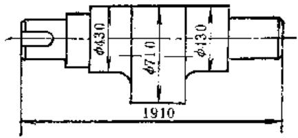

图6-1-15 1600t曲柄压力机曲轴简图

曲轴电接触表面淬火的具体工艺是：在  $3.4\mathrm{m}$  立车上将零件的一头夹住，另一头顶住，将直线滚轮（轮缘宽  $1\mathrm{mm}$  ）装在刀架上，开动工作台，刀架自动走刀（工件线速度  $1.5\mathrm{m / min}$ ，走刀量  $1\mathrm{mm / r}$ ），两极通电（电流600A，电压2V），就可进行淬硬。淬硬后，表面用细砂布打光，再用氧化铬抛光。由于连续淬火，铜轮表面温度较高，所以在轮孔中加入二硫化钼润滑脂，并用压缩空气冷却。

# 2. 长薄零件

某厂一台  $1.5 \mathrm{~m}$  扳边机，由于刀片太薄而无法进行热处理，在使用时经常发生刀口卷曲。后来采用电接触淬火对刀口进行淬硬，使用效果较好（淬火工艺同上）。

# 3. 形状复杂零件

2450坐标镗床光学分度盘的盘体形状复杂，导轨是在分度盘体本身上加工出来的。使用不久，导轨就被滚珠压出一凹槽，影响分度盘精度。后用电接触法淬硬，使用效果很好。淬火工艺是：将分度盘放在  $3.4\mathrm{m}$  立车上卡住，用直线紫铜滚轮进行表面淬火，淬火电流、电压、走刀量、工件线速度同上。

此外，某厂还对  $100\mathrm{m}^3$  空压机气缸及立车工作台传动齿轮齿面（用炭棒）进行了电接触表面淬火。使用效果也很好。

电接触表面淬火工艺，由于本身具有设备简单能“以小干大”及淬火变形很小等特点，因此应用范围正在不断扩大。

# 第2节 机床导轨表面高频感应淬火

# （一）概论

高频淬火是使工件在高频交变电磁场作用下表面产生感应电流而加热，然后再冷却的淬火工艺方法。这种工艺加热速度快、生产效率高、淬火质量稳定、工艺参数易于调整。机床导轨表面经过高频淬火后，其耐磨性比铸态提高两倍多，并显著改善了抗擦伤能力。

表6-2-1列出机床导轨经电接触表面淬火和高频表面淬火处理的比较。

表6-2-1 电接触淬火和高频表面淬火的比较

<table><tr><td rowspan="2">热处理名称</td><td rowspan="2">淬火所需时间</td><td rowspan="2">淬硬层深度</td><td rowspan="2">淬火后硬度</td><td rowspan="2">淬火后的加工</td><td rowspan="2">淬火后的变形</td><td rowspan="2">耐磨性</td><td colspan="2">费用</td><td rowspan="2">设备维修</td></tr><tr><td>设备</td><td>工艺</td></tr><tr><td>电接触淬火</td><td>长</td><td>浅</td><td>高</td><td>简</td><td>小</td><td>低</td><td>低</td><td>低</td><td rowspan="2">易难</td></tr><tr><td>高频淬火</td><td>短</td><td>深</td><td>低</td><td>繁</td><td>大</td><td>高</td><td>高</td><td>高</td></tr></table>

经高频淬火后，导轨变形较大，一般常达  $0.10 \sim 0.30 \mathrm{~mm}$  （电接触淬火导轨变形往往只有  $0.01 \sim 0.05 \mathrm{~mm}$ ），因此，导轨经高频淬火后，需用磨削来达到精度要求。

适用于高频淬火的铸铁材料有HT300, HT200。 HT300经淬火后硬度达53HRC以上（或70HS以上）；HT200铸铁淬火后，硬度达HRC48以上（HS65以上）。

经高频淬火后，导轨平面和斜面处淬硬层深度为  $1.5 \sim 2.5 \mathrm{~mm}$ ，峰部的淬硬层深度不大于  $4 \mathrm{~mm}$ ，棱边的不大于  $6 \mathrm{~mm}$ 。

机床导轨的高频淬火工艺装备不太复杂，对于具有高频加热设备的工厂，只要自制一台床身移动装置，再作一个感应器浮动装置，即可实行机床导轨的高频淬火。

需淬火的导轨面必须精刨，表面粗糙度应在  $R_{\mathrm{a}}3.2\mu \mathrm{m}$  以下，表面不允许有砂眼、气孔、疏松等铸造缺陷，所有尖角必须倒钝。

# （二）淬火设备及工艺装备

# 1. 加热设备

高频淬火可用频率为  $200\sim 300\mathrm{kHz}$  ，输出功率为60或100kW的灯式高频加热设备。

# 2. 淬火装置

由于床身导轨表面高频淬火的感应器是固定式，靠移动床身来实现连续淬火，因此移动床身的装置必须运动平稳、速度均匀，并具有在  $1.2\sim 1.4\mathrm{mm / s}$  内进行调整的变速机构。这种移动装置，有以丝杠传动和钢丝绳绞动的方式；也有设计成如图6-2-1所示的台车结构形式。前两种传动方式，虽能实现移动平稳，速度均匀，但其行程有限。而台车式移动装置则很容易加大行程（只要铺设足够的轨道，甚至可以开到高频室外，便于淬火床身的装卸），其平稳性能也能满足淬火要求。

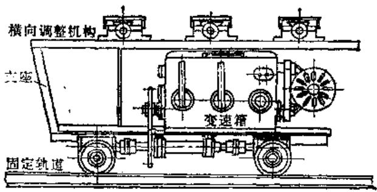

图6-2-1 台车式高频淬火移动装置

# 3. 感应器

感应器用方形铜管制造，以便通水使其冷却，多作成与导轨形状相似的双回线。其中，一条导线起预热作用，不装导磁体；另一条导线加热，装有导磁体。两条导线的间距为  $8\sim 12\mathrm{mm}$  。

考虑到导轨断面形状对热量接受与传导的影响，感应器与导轨面之间的间隙需要按导轨断面形状来确定，不能做成等距的，否则会引起峰部及棱边过热，以致熔化。各种类型导轨感应器的设计要点如下述：

（1）山形导轨 导轨峰部与感应器的间隙  $5 \sim 7 \mathrm{~mm}$ ；导轨斜面与感应器间隙  $2 \sim 2.5 \mathrm{~mm}$ ；感应器内夹角  $\alpha = 72^{\circ} \sim 76^{\circ}$  （山形夹角为  $90^{\circ}$  时）见图6-2-2a。

（2）V形导轨 导轨底部与感应器的间隙应当小，取  $1.5\sim 2\mathrm{mm}$ ；感应器内夹角  $\alpha = 60^{\circ}\sim 65^{\circ}$

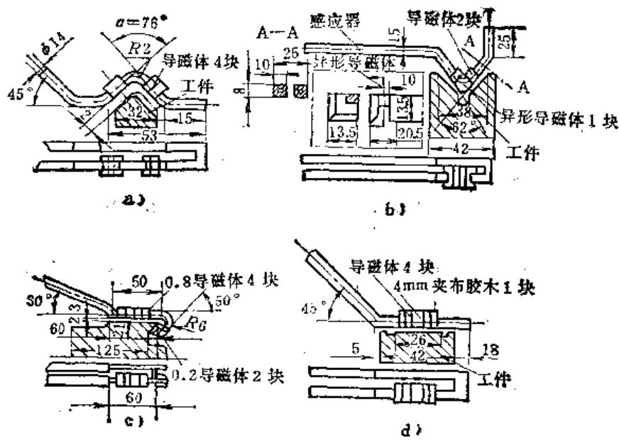

图6-2-2 各种类型的导轨淬火感应器

（V形夹角为  $90^{\circ}$  时），槽越深，  $\pmb{a}$  越小。使用时应在预热导线前加风嘴，向后吹，以防止冷却水进入加热区，见图6-2-2b。

（3）燕尾形导轨 导轨平面与感应器间的间隙  $2 \sim 3 \mathrm{~mm}$ ；燕尾尾部的感应器导线作成圆弧形，半径  $R = 5 \sim 7 \mathrm{~mm}$ ；燕尾越长， $R$  越大；内夹角  $\alpha = 50^{\circ}$ 。必要时可在预热导线上钻两三个预冷孔，对燕尾尾部喷射。感应器应尽可能伸到燕尾斜面根部，以增大斜面淬硬面积，见图6-2-2c。

（4）平面导轨 在接近淬硬面两边  $5\sim 10\mathrm{mm}$  处，使感应器与淬硬面成  $\alpha = 15^{\circ}\sim 30^{\circ}$  夹角，淬硬面越宽，  $\pmb{\alpha}$  越大。也可以通过导磁体的数量与位置进行调整，见图6-2-2d。

为便于感应器的制造，可以将感应器作成与导轨面等距的（尤其是用于大导轨的感应器），通过调整导磁体的位置来避免棱边及峰部的过热。对于不同类型的导轨，应选择不同形状的导磁体，见表6-2-2。

较小的床身导轨淬火感应器，一般设计成双导轨型，同时加热，生产效率较高。而较大的床身导轨，因受设备功率

所限，则采用单导轨加热。

感应器内需通入足够的冷却水进行冷却，水压为  $0.15\mathrm{MPa}$  左右。在加热导线的斜下方均匀地钻一排孔距  $3 \sim 4\mathrm{mm}$  、直径  $0.8 \sim 1.5\mathrm{mm}$  的小孔，冷却水由此与导轨面成  $40^{\circ} \sim 45^{\circ}$  的方向向后喷出，对加热表面进行淬硬。

为了得到均匀的淬硬层，在淬火过程中应使感应器与导轨间的间隙保持不变。不少单位采用了如

表6-2-2 高频表面感应淬火用导磁体

<table><tr><td>形状</td><td colspan="5">A型 B型</td><td colspan="5">A型 B型</td><td colspan="3">45° A型 B型</td><td colspan="3">1.5° A B°</td></tr><tr><td rowspan="5">尺寸</td><td>a±0.25</td><td>b±0.25</td><td>A</td><td>B</td><td>n</td><td>a±0.25</td><td>b±0.25</td><td>A</td><td>B</td><td>H±0.25</td><td>a±0.25</td><td>b±0.25</td><td>A</td><td>B</td><td></td><td></td></tr><tr><td>6.5</td><td>6</td><td>15</td><td>12</td><td>5</td><td>6.5</td><td>6</td><td>15</td><td>12</td><td>10.75</td><td>6.5</td><td>6</td><td>15</td><td>12</td><td></td><td></td></tr><tr><td>8.5</td><td>7</td><td>17</td><td>13</td><td>5</td><td>8.5</td><td>7</td><td>17</td><td>13</td><td>12.75</td><td>8.5</td><td>7</td><td>17</td><td>13</td><td></td><td></td></tr><tr><td>10.5</td><td>8</td><td>20</td><td>14</td><td>5</td><td>10.5</td><td>8</td><td>20</td><td>14</td><td>15.25</td><td>10.5</td><td>8</td><td>20</td><td>14</td><td></td><td></td></tr><tr><td>12.5</td><td>10</td><td>23</td><td>17</td><td>5</td><td></td><td></td><td></td><td></td><td></td><td>12.5</td><td>10</td><td>23</td><td>17</td><td></td><td></td></tr><tr><td>使用说明</td><td colspan="5">A型用于直线、外圆感应器B型用于内孔、内圆感应器</td><td colspan="5">用于直角的一个内面带有预热圈的感应器(如床身、滑座、底面淬火)</td><td colspan="4">用于直角的两内面淬火感应器</td><td></td><td></td></tr></table>

注：大连机床厂使用的导磁体为磁性数。

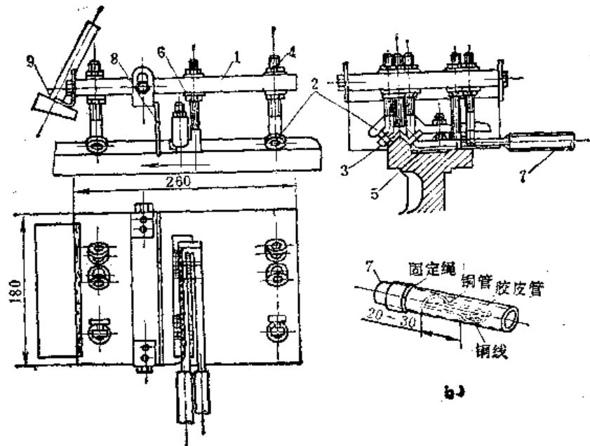

a）

图6-2-3 高频淬火感应器浮动装置

1—胶木板 2—滚轮 3—感应器 4—滚轮调节螺栓 5—导轨

6一间隙调节螺栓7一软带母线8一挡水板9一压缩空气喷射器

图6-2-3所示的机构，即将感应器紧固在一个浮动装置上，而该装置借小滚珠轴承作滚轮使感应器与导轨保持固定不变的距离。

感应器与导轨间的间隙大小由铜螺栓来调节。感应器与高频设备的连接通过软带母线，即用1500根左右（直径  $0.08\sim 0.10\mathrm{mm}$  ）的细铜丝绞成软带，其长度为  $100\sim 150\mathrm{mm}$ ，如图6-2-3所示的办法扎紧在铜管上，以保证冷却水畅通。由于浮动装置的定位和随动作用，克服了床身移动时因装卡而造成的微小摆动和振动，使感应器与导轨间的间隙保持不变。浮动装置在纵向用铁丝固定，使之不随导轨作纵向移动，而可在横向摆动。

# （三）工艺参数

（1）导轨移动速度 导轨淬火时的移动速度应根据铸铁的原始组织、导轨形状、尺寸、要求的淬硬层深度以及高频设备所输出的有效功率而定。一般取  $2 \sim 4 \mathrm{~mm} / \mathrm{s}$  。移动速度快，淬硬层深度浅；移动速度慢，淬硬层深度深。但用过慢的移动速度，生产效率低，甚至会产生自行退火，使淬火部位达不到要求的硬度。

（2）淬火温度  $900\sim 950^{\circ}C$

（3）冷却 连续喷水冷却。

（4）回火 一般多采用自行回火。必要时也

可在浮动装置上安一挡水板，调整挡水板与加热导线的距离（大约  $20\sim 30\mathrm{mm}$ ），以控制回火程度。

# （四）减小导轨淬火变形的措施

导轨高频淬火时，由于热应力与组织应力的影响，总是要产生一定量的变形。如果变形量过大，一方面增加磨加工工时，降低生产率，同时也不能保证磨加工后仍有足够的有效淬硬层深度，影响使用性能。减少导轨淬火变形的主要措施有：

1）为保证在淬火后获得均匀一致的淬硬表面，要求导轨移动平稳，速度均匀，导轨

与感应器之间的间隙在淬火过程中始终保持不变。因此，床身移动装置必须设计合理，制造、安装精确，浮动装置的滚轮导向灵活，纵向稳固。必要时，可在浮动装置上加适当的重量，以保持其稳固性。此外，还要求高频设备的输出功率尽可能稳定。

2）感应器的设计很重要，尽量采用双导轨同时淬火的感应器。对于淬火面尺寸较大，不能实现双导轨同时淬火的工件，则设计的感应器应保证在两导轨上淬火时移动方向一致，否则将增加扭曲变形。

3）机床导轨的变形规律一般都是中间下凹，最大值多在导轨中间位置。因此可在精刨时，加一个使床身中间向下弯曲的预应力。精刨后，撤去预应力，使中间向上凸起  $0.1 \sim 0.2 \mathrm{~mm}$ ，以抵消淬火后的下凹。也可在淬火时，加一个使床身向上凸起的预应力（一般二米长的凸起量约  $0.1 \sim 0.2 \mathrm{~mm}$ ），以抵消淬火时引起的下凹。

# 第3节 工件表面的电火花强化工艺

电火花强化工艺是一种简便灵活的金属表面处理方法，它通过火花放电的作用把一种导电材料涂

覆熔渗到另一种导电材料的表面，从而改变后者的理化性能。

# （1）电火花强化工艺的优点

1）设备轻巧、操作简便、成本低廉，不需要昂贵庞大的真空和电子设备（与离子氮化、等离子喷涂、导轨表面高频淬火等比较），并且不涉及复杂的处理方法，有利于推广应用。

2）强化处理时，工件置于空气介质中，因火花放电时间短，放电点面积小，且又局限于工件表面上，就整体工件来说处于冷态，因而不会引起变形、退火、剥落、热裂等现象，同时强化表面光洁，一般不要再抛光，可作为末道工序。如加工件粗糙度值要求很低，可用金相砂纸、金刚砂粉或研磨膏研磨抛光。

3）根据工件表面的不同要求，可选择不同材料为电极，强化层厚度在一定范围内可以控制。此外，振动器为手持式，可在工件表面的任何部位灵活地进行局部强化处理。

4）由于强化层是由原工件材料和电极材料组成的新合金，与工件基体结合牢固，不会剥落，且耐冲击、耐腐蚀、耐高温，受热到  $700\sim 800^{\circ}\mathrm{C}$  时，红硬性保持不变。

# （2）电火花强化工艺的用途

1）各种冲裁、弯曲、拉伸、挤压、热锻、压铸及塑料等模具的强化。

2）各种车、刨、铣、铰等刀具和钻头丝锥及木工工具、五金工具、农机具的强化。

3）各种机械零件磨损部位的强化和微量修补，以及量具修复、金属表面标记书写等。

4）带穿孔装置的强化机还可用于打盲孔，取出折断丝锥、钻头等。

总之，经电火花强化工艺处理的工件表面硬度可达  $70 \sim 72\mathrm{HRC}$ ，耐磨性、耐腐蚀性增强，使用寿命一般可提高  $1 \sim 3$  倍。

（3）电火花强化机型号及技术参数电火花强化机型号及技术参数见表6-3-1。

表6-3-1 电火花强化机型号及技术参数

<table><tr><td>电火花强化机 型 号</td><td>容量 (W)</td><td>电 源</td><td>最高涂覆 厚 度 (μm)</td><td>最低粗糙度 \( {R}_{\mathrm{a}}\left( {\mu \mathrm{m}}\right) \)</td></tr><tr><td>D 9105A</td><td>50</td><td>\( {220}\mathrm{\;V},{50}\mathrm{{Hz}} \)</td><td>20</td><td>0.3</td></tr><tr><td>D 9110 A</td><td>100</td><td>\( {220}\mathrm{\;V},{50}\mathrm{{Hz}} \)</td><td>35</td><td>1.6</td></tr><tr><td>D 9180 A</td><td>300</td><td>\( {220}\mathrm{\;V},{50}\mathrm{{Hz}} \)</td><td>60</td><td>3.2</td></tr></table>