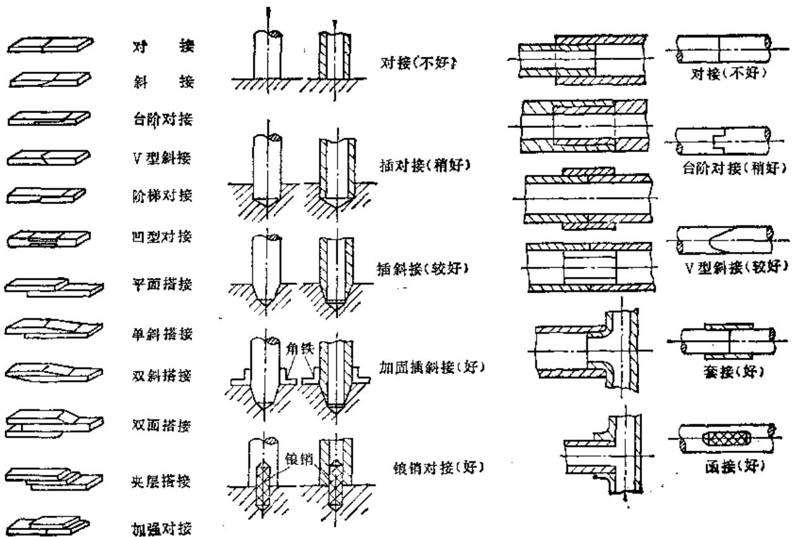
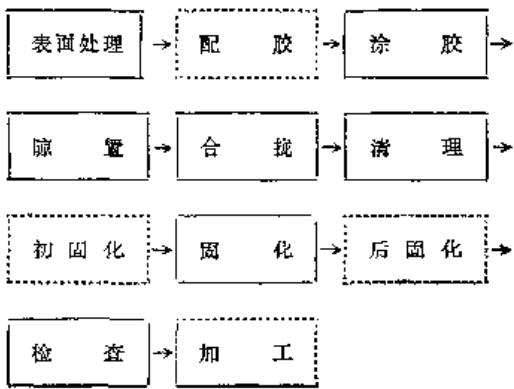
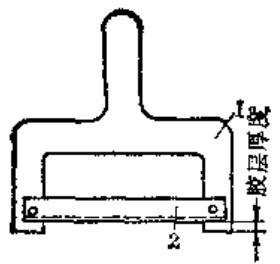
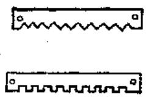

# 第8章 粘接修复技术

# 柳台夫

# 第1节概述

借助胶粘剂把相同或不同的材料或损坏的零件连接成为一个连续牢固整体的方法叫粘接或胶接。从实质上讲，粘接是一种表面现象。是靠粘接剂与被联接件中间的化学的、物理的和机械的力粘接起来，并使粘接接头具有一定的使用性能。

# （一）粘接的特点

粘接有下述优点：

1）不受材质的限制，相同材料或异种材料均可粘接。两种不同的金属粘接后，因间隔有一层胶，还可防止电化学腐蚀（微电池反应）。金属和非金属也能顺利粘接。  
2）粘接的工艺温度不高，因而可以粘补铸铁件、铝合金件和薄件、微小件，而不会出现变形和裂纹等。  
3）粘接时不破坏原件的强度，不易产生局部应力集中。  
4）胶缝有不漏泄、耐腐蚀、耐磨和绝缘等性能，有的还具隔热、防潮、防震减震性能。  
5）节省能源，工艺简便，工装夹具简单，成本低廉，经济工期短。

一定限制。

# （二）粘接的应用

从机械产品制造到设备维修，几乎无处不可利用粘接来满足工艺需要。如以粘代焊、以粘代铆、以粘代螺、以粘代固等。举例如下：

1）以环氧胶代替锡焊、点焊，省锡节电。  
2）合金刀具的粘接代替黄铜钎焊，既减小了刀具的变形又保证性能。  
3）量具的以胶代固，代替过盈配合。  
4）用结构胶粘接修复断裂件。  
3）用粘接剂恢复磨损导轨的名义尺寸。  
4）油箱（缸）、管路、接缝可用胶密封。  
5）铸件砂眼，孔洞等可用胶填充堵塞而不漏泄。  
6）现场粘接配作密封圈。

此外，粘接是塑料与橡胶，金属与塑料、金属与橡胶的连接最简便的方法。

粘接用于电气电子工业、航天工业等效益更大。

第2节 粘接方法

胶接处，待溶剂使其变软，再合拢施加一定压力，溶剂挥发后便可牢固，如处理得当，效果也能令人满意。为便于控制，更常用的却是将溶剂与被粘塑料相同或结构相似的树脂，预先配制成一定浓度的溶液，再行胶接。该法使用方便，强度较高。但溶剂选择必须得当，一般说来，使用二元或三元混合溶剂效果更好。

一些热塑性塑料的粘接所用的溶剂及其高聚物的溶液。列于表8-2-1。

# （三）胶粘剂粘接法

利用胶粘剂将两种材料或两个制件粘合在一起，并在粘接接头上施以足够的粘接力，使之成为牢固的接头的粘接法叫胶粘剂粘接法。该法用之最广，可以粘结各种材料，如金属与金属，金属与非金属，非金属与非金属等。

胶粘剂品种繁多，分类方法很多。按粘料的物性属类分为有机胶粘剂和无机胶粘剂；按原料来源

表8-2-1 溶剂粘接时常用的溶剂及其配方  

<table><tr><td>序号</td><td>塑料名称</td><td>溶剂</td><td>配方举例</td></tr><tr><td rowspan="6">1</td><td rowspan="6">聚甲基丙烯酸甲酯(有机玻璃)</td><td>二氯甲烷</td><td>1.二氯甲烷60份</td></tr><tr><td rowspan="5">三氯甲烷</td><td>有机玻璃单体40份</td></tr><tr><td>过氧化二苯甲酰0.2份</td></tr><tr><td>有机玻璃少量</td></tr><tr><td>2.三氯甲烷100份</td></tr><tr><td>有机玻璃10份</td></tr><tr><td rowspan="3">2</td><td rowspan="3">聚氯乙烯(硬)PVC</td><td rowspan="3">环己酮,四氢呋喃</td><td>环己酮50份</td></tr><tr><td>四氢呋喃50份</td></tr><tr><td>PVC5份</td></tr><tr><td rowspan="10">3</td><td rowspan="10">聚氯乙烯(软)PVC</td><td rowspan="10">四氢呋喃,甲乙酮,甲异丁酮等</td><td>1.PVC(中分子量)100份</td></tr><tr><td>四氢呋喃100份</td></tr><tr><td>甲乙酮200份</td></tr><tr><td>月桂酸二丁基锡15份</td></tr><tr><td>邻苯二甲酸二辛酯20份</td></tr><tr><td>甲异丁酮25份</td></tr><tr><td>2.环己酮90份</td></tr><tr><td>聚氯乙烯10份</td></tr><tr><td>3.二氯乙烷100份</td></tr><tr><td>过氯乙烯10份</td></tr><tr><td rowspan="5">4</td><td rowspan="5">氯乙烯-醋酸乙烯共聚物</td><td rowspan="5">对二氧六酮,甲乙酮,甲醇</td><td>对二氧六酮20份</td></tr><tr><td>甲醇12份</td></tr><tr><td>甲乙酮60份</td></tr><tr><td>邻苯二甲酸二辛酯3份</td></tr><tr><td>异沸尔酮3份</td></tr><tr><td rowspan="6">5</td><td rowspan="6">聚苯乙烯,改性聚苯乙烯,ABS</td><td rowspan="6">甲苯,二甲苯,醋酸乙酯,甲乙酮,二氯甲烷,四氯乙烯,三氯乙烯</td><td>1.甲乙酮60份</td></tr><tr><td>ABS40份</td></tr><tr><td>甲苯50份</td></tr><tr><td>2.甲苯50份</td></tr><tr><td>二氯甲烷50份</td></tr><tr><td>ABS10份</td></tr><tr><td rowspan="5">6</td><td rowspan="5">聚酰胺(尼龙)</td><td rowspan="5">苯酚,甲酸</td><td>1.苯酚100份</td></tr><tr><td>尼龙15份</td></tr><tr><td>水10份</td></tr><tr><td>2.甲酸100份</td></tr><tr><td>尼龙10~15份</td></tr><tr><td rowspan="5">7</td><td rowspan="5">聚碳酸酯</td><td>二氯甲烷,三氯乙烷</td><td>1.二氯甲烷 147份</td></tr><tr><td>三氯甲烷,三氯乙烯</td><td colspan="1">二氯乙烷 80份</td></tr><tr><td rowspan="3">二氯乙烷</td><td colspan="1">聚碳酸酯 40份</td></tr><tr><td colspan="1">2.三氯甲烷 50份</td></tr><tr><td colspan="1">聚碳酸酯 40份</td></tr><tr><td rowspan="2">8</td><td rowspan="2">氮化聚醚</td><td rowspan="2"></td><td>三氯乙烯 50份</td></tr><tr><td colspan="1">氯化聚醚 5~9份</td></tr><tr><td>9</td><td>线型聚酯</td><td>邻氟苯酚</td><td>-</td></tr><tr><td rowspan="2">10</td><td rowspan="2">聚苯醚</td><td>二氯甲烷,三氯乙烷,三氯甲烷</td><td rowspan="2">同聚碳酸酯</td></tr><tr><td colspan="1">三氯乙烯,二氯乙烷</td></tr><tr><td rowspan="2">11</td><td rowspan="2">聚砜</td><td>二氯甲烷,三氯乙烷,三氯甲烷</td><td rowspan="2">同聚碳酸酯</td></tr><tr><td colspan="1">三氯乙烯,二氯乙烷</td></tr><tr><td rowspan="6">12</td><td rowspan="6">聚酰亚胺</td><td rowspan="6">甲乙酮,甲苯,吡啶,二甲基甲酰胺</td><td>1.甲乙酮 70份</td></tr><tr><td colspan="1">二甲基甲酰胺 30份</td></tr><tr><td colspan="1">酰亚胺 10~20份</td></tr><tr><td colspan="1">2.二甲基甲酰胺 70份</td></tr><tr><td colspan="1">甲苯 30份</td></tr><tr><td colspan="1">酰亚胺 5~10份</td></tr><tr><td rowspan="6">13</td><td rowspan="6">纤维素塑料</td><td rowspan="6">丙酮,醋酸乙酯,乙醇</td><td>1.乙醇 80份</td></tr><tr><td colspan="1">醋酸乙酯 20份</td></tr><tr><td colspan="1">纤维素塑料 10份</td></tr><tr><td colspan="1">2.丙酮 40份</td></tr><tr><td colspan="1">醋酸乙酯 20份</td></tr><tr><td colspan="1">纤维素塑料 20份</td></tr><tr><td>14</td><td>聚乙烯醇</td><td>水中加10%~20%甘油</td><td>-</td></tr><tr><td>15</td><td>聚苯醚砜</td><td>二甲基甲酰胺,丁丙酯N-甲基吡咯烷酮</td><td>-</td></tr></table>

分为天然胶粘剂和合成胶粘剂；按粘接接头的强度特性分为结构胶粘剂和非结构胶粘剂；按胶粘剂状态分为液态胶粘剂与固体胶粘剂；胶粘剂的形态有粉状、棒状、薄膜、糊状及液体等；按热性能分为热塑性胶粘剂与热固性胶粘剂，等等。参见表8-2-2。

天然胶粘剂组成简单。合成胶粘剂大都由多种成分配合而成，主要包括粘料、固化剂、增塑剂、增韧剂、稀释剂、填充剂、偶联剂、溶剂、防老剂等。

胶粘剂的组成除了粘料必不可少外，其余成分视需要决定取舍。

表8-2-2 胶粘剂的分类  

<table><tr><td>分类</td><td>天然胶粘剂</td><td colspan="6">合 成 胶 粘 剂</td></tr><tr><td rowspan="8">结构胶粘剂</td><td rowspan="8"></td><td rowspan="8">无机胶粘剂</td><td colspan="2">合成树脂胶粘剂</td><td colspan="2">热塑性树脂胶粘剂</td><td>多组分胶粘剂</td></tr><tr><td>品种</td><td>用途</td><td>品种</td><td>用途</td><td>用途</td></tr><tr><td>环氧树脂</td><td>粘接金属、木材、塑料玻 璃等</td><td rowspan="2">丙烯酸酯</td><td rowspan="2">粘接金属、塑料</td><td>酚醛-缩醛</td></tr><tr><td>聚氨酯</td><td>粘接金属、木材、塑料橡 胶等</td><td>酚醛-丁腈 橡胶</td></tr><tr><td>有机硅</td><td>用于金属面 高温粘合</td><td>用于金属耐 高温粘合</td><td>用于金属耐 高温粘合</td><td>酚醛-环氧 酚醛-缩醛 有机硅</td></tr><tr><td>聚酰亚胺</td><td>用于金属耐 高温粘合</td><td rowspan="2">用于金属耐 高温粘合</td><td rowspan="2">用于金属耐 高温粘合</td><td>环氧-酚醛 环氧-缩醛 环氧-尼龙 尼龙-酚醛</td></tr><tr><td>聚苯并咪唑</td><td>用于金属耐 高温粘合</td><td>用于金属耐热胶合</td></tr><tr><td></td><td></td><td></td><td></td><td>粘接金属为主</td></tr><tr><td rowspan="6">非结构胶粘剂</td><td rowspan="6">动物胶植物胶 用于木材、皮革、 纸张、纤维胶合</td><td rowspan="6"></td><td>脲素甲酸</td><td>粘接木材、 纸张、软木</td><td>纤维素塑料</td><td>粘接纤维、 纸张等</td><td rowspan="3">酚醛-氯丁 橡胶</td></tr><tr><td>三聚氰胺</td><td>粘接未经改 性纤维素物质</td><td>乙烯类聚合 物</td><td>粘接纤维、 木材、塑料等</td></tr><tr><td>苯酚甲醛</td><td>粘接金属、 木材、塑料</td><td>合成橡胶</td><td>粘接橡胶制 品</td></tr><tr><td>间苯二酚甲 醛</td><td>粘接金属与 木材、石棉、 水泥</td><td>聚酰胺(尼 龙)</td><td>粘接金属、 皮革、纸等</td><td>粘接金属、 皮革、纸等</td></tr><tr><td>聚酯树脂</td><td>粘接聚酯薄 膜皮革光学设 备</td><td></td><td></td><td></td></tr><tr><td>呋喃树脂</td><td>粘接热塑性 塑料及橡胶</td><td></td><td></td><td></td></tr></table>

# 第3节 粘接技术

# （一）胶粘剂的选用

胶粘剂的选用得当与否，是粘接及粘接修复成败的关键。一般说来，选用胶粘剂应遵循以下原则。

（1）被粘物的种类和性质 必须搞清被粘物的种类，是金属还是非金属；是金属的哪类，化学成分虽不必太详尽，但应区分是钢、铁、铜、铝、铬；如是非金属，更要弄清是橡胶还是塑料；是橡

胶，属何种橡胶；是塑料属热固性还是热塑性，热塑性塑料可用溶剂、热熔法、胶粘剂三种方法粘接，而热固性塑料只能用胶粘剂粘接，尤其是聚乙烯、聚丙烯、聚四氟乙烯属难粘塑料，未经特殊的表面处理，不能用一般胶粘剂粘接。

此外，被粘物的线胀系数如何，粘接物表面状态如何，缝隙的大小，接触性及接触面积怎样，都应了解。

胶粘剂选用参考表8-3-1。

（2）胶粘剂的性能 各类胶粘剂因组成及成分不同，其性能各异。因此要在选用时注意胶粘剂的粘度、粘接强度、使用温度、收缩率、线膨胀系数

表8-3-1 胶粘剂选择表  

<table><tr><td>材 料 名 称</td><td>纸</td><td>织物</td><td>皮 草</td><td>木 材</td><td>尼 龙</td><td>塑料A、B、S</td><td>增强塑料</td><td>聚氯乙烯PVC</td><td>橡 胶</td><td>玻璃陶瓷</td><td>金 属</td></tr><tr><td>金 属</td><td>12、16</td><td>10、1216、18</td><td>10、12、16、18、19</td><td>1、2、4、5、6、10、12、16</td><td>1、6、7、11、18、19</td><td>5、6</td><td>6、7、9</td><td>5、6、8</td><td>4、5、10、15、18</td><td>2、3、5、4、6</td><td>2、3、5、6、15</td></tr><tr><td>玻璃陶瓷</td><td>12、16</td><td>10、12、16、18</td><td>6、10、12、18</td><td>2、4、5、6、10、12</td><td>7、11</td><td>4、5、6</td><td>2、5、6</td><td>4、5、10</td><td>4、5、10、15</td><td>2、4、5、6、15</td><td rowspan="10"></td></tr><tr><td>橡 胶</td><td>16</td><td>10、18、17</td><td>10、16、18</td><td>4、5、10、18</td><td>6</td><td>4、6、10</td><td>5、10、19</td><td>4、5、10</td><td>4、5、10、15、16</td><td rowspan="9"></td></tr><tr><td>苯氯乙烯PVC</td><td>6、12</td><td>6、10、14</td><td>4、5、10、12</td><td>5、12</td><td>5、7、19</td><td>4、5</td><td>5、7、19</td><td>8、18</td><td rowspan="8"></td></tr><tr><td>增强塑料</td><td>5、6、12、14</td><td>4、5、12、14</td><td>5、6</td><td>6、5</td><td>5、7</td><td>6、6</td><td>5、6、9</td><td rowspan="7"></td></tr><tr><td>塑料A、B、S</td><td>6、12</td><td>4、5</td><td>4、5</td><td>4、5</td><td>7、5</td><td>5、10、14</td><td rowspan="6"></td></tr><tr><td>尼 龙</td><td>5、11</td><td>5、7、11、19</td><td>5、11</td><td>5、6、7、11</td><td>3、5、10、11、14、15</td><td rowspan="5"></td></tr><tr><td>木 材</td><td>13、16</td><td>10、16、17</td><td>10、16、17、18</td><td>1、5、6、10、12</td><td rowspan="4"></td></tr><tr><td>皮 苹</td><td>16、17、18</td><td>10、16、17、18</td><td>10、12、13、16、17、18</td><td rowspan="3"></td></tr><tr><td>织 物</td><td>12、13</td><td>10、12、14、16</td><td rowspan="2"></td></tr><tr><td>纸</td><td>12、13、14</td><td></td></tr></table>

注：表中胶粘剂代号；  
1—酚醛-尿醛 2—酚醛-缩醛 3—酚醛-聚酰胺 4—酚醛-氯丁橡胶 6—酚醛-丁腈 7—环氧 8—过氧乙烯 9—不饱和巨酯 10—聚胺酯 11—改性  
12-聚醋酸乙烯 13-聚乙烯醇 14-苯丙烯酸酯 15-氨基丙烯酸酯 16-天然橡胶 17-丁苯橡胶 18-氯丁橡胶 19-丁腈橡胶

表8-3-2 结构胶粘剂的品种与性能  

<table><tr><td rowspan="2">序号</td><td rowspan="2">胶粘剂</td><td colspan="2">固化条件</td><td rowspan="2">使用温度(℃)</td><td rowspan="2">剪切强度(kN/cm2)(RT)</td><td rowspan="2">T-剥离强度(N/cm2)</td><td rowspan="2">抗冲击</td><td rowspan="2">抗蠕变</td><td rowspan="2">耐介质</td><td rowspan="2">防潮湿</td><td rowspan="2">耐老化</td><td rowspan="2">主要特点</td></tr><tr><td>温度,℃</td><td>压力(104Pa)</td></tr><tr><td>1</td><td>环氧-脂肪胺</td><td>RT~100</td><td>接触</td><td>-40~60</td><td>1.50~2.0</td><td>&lt;10</td><td>差</td><td>好</td><td>中</td><td>中</td><td>中</td><td>室温固化,脆性较大</td></tr><tr><td>2</td><td>环氧-芳香胺</td><td>120~160</td><td>接触</td><td>-40~150</td><td>1.50~2.50</td><td>&lt;10</td><td>差</td><td>好</td><td>好</td><td>中</td><td>好</td><td>耐中温,脆性较大</td></tr><tr><td>3</td><td>环氧-酸酐</td><td>150~200</td><td>接触</td><td>-50~150</td><td>2.10~3.50</td><td>&lt;10</td><td>差</td><td>好</td><td>中</td><td>中</td><td>中</td><td>电性能好,脆性较大,高温固化</td></tr><tr><td>4</td><td>环氧-聚酰胺</td><td>RT~100</td><td>接触</td><td>-150~80</td><td>2.0~3.0</td><td>10~20</td><td>好</td><td>好</td><td>中</td><td>差</td><td>中</td><td>室温固化,韧性较好,耐低温,耐湿热差</td></tr><tr><td>5</td><td>环氧-聚硫</td><td>RT~100</td><td>接触</td><td>-73~80</td><td>2.10~3.15</td><td>20~30</td><td>好</td><td>中</td><td>中</td><td>好</td><td>好</td><td>剪切、剥离强度较高,耐油</td></tr><tr><td>6</td><td>环氧-尼龙</td><td>130~180</td><td>3~50</td><td>-253~120</td><td>2.80~4.50</td><td>90~270</td><td>好</td><td>好</td><td>中</td><td>差</td><td>差</td><td>剪切、剥离强度高,韧性好,耐湿热老化差</td></tr><tr><td>7</td><td>环氧-丁腈</td><td>80~170</td><td>0~30</td><td>-70~150</td><td>2.80~4.0</td><td>30~60</td><td>好</td><td>好</td><td>好</td><td>好</td><td>好</td><td>强度高、韧性好、耐油、耐老化</td></tr><tr><td>8</td><td>环氧-酚醛</td><td>140~150</td><td>30~150</td><td>-253~260</td><td>2.20</td><td>&lt;9</td><td>差</td><td>好</td><td>好</td><td>好</td><td>好</td><td>耐高温、高低温循环性好,耐老化,脆性大</td></tr><tr><td>9</td><td>环氧-缩醛</td><td>RT~150</td><td>接触</td><td>-60~110</td><td>1.70~3.10</td><td>30~60</td><td>中</td><td>中</td><td>中</td><td>好</td><td>好</td><td>强度高,韧性较好,耐老化,耐热差</td></tr><tr><td>10</td><td>环氧-聚砜</td><td>170~180</td><td>5~50</td><td>-60~180</td><td>5.0~6.50</td><td>20~30</td><td>好</td><td>好</td><td>中</td><td>中</td><td>中</td><td>强度高、韧性好,耐高温,耐湿热老化差</td></tr><tr><td>11</td><td>环氧-有机硅</td><td>RT~200</td><td>3~5</td><td>-80~300</td><td>1.50~2.50</td><td>10~20</td><td>中</td><td>好</td><td>好</td><td>好</td><td>好</td><td>耐高温、耐湿热老化性好</td></tr><tr><td>12</td><td>酚醛-丁腈</td><td>150~180</td><td>30~150</td><td>-73~200</td><td>2.0~3.50</td><td>50~100</td><td>好</td><td>好</td><td>好</td><td>好</td><td>好</td><td>强度高、韧性好、耐油、耐老化,需高温固化</td></tr><tr><td>13</td><td>酚醛-缩醛</td><td>140~170</td><td>30~150</td><td>-60~120</td><td>2.0~3.30</td><td>40~80</td><td>好</td><td>中</td><td>中</td><td>好</td><td>好</td><td>强度高,耐大气老化好,耐热差</td></tr><tr><td>14</td><td>酚醛-氯丁</td><td>150~170</td><td>140~210</td><td>-57~90</td><td>1.75~2.45</td><td>20~50</td><td>好</td><td>好</td><td>好</td><td>好</td><td>中</td><td>强度较高,耐溶剂、耐冲击</td></tr><tr><td>15</td><td>聚氨酯</td><td>RT~100</td><td>5~10</td><td>-253~80</td><td>1.80~3.50</td><td>20~80</td><td>好</td><td>好</td><td>中</td><td>差</td><td>中</td><td>强度较高、韧性好、耐疲劳、耐超低温,耐水差</td></tr><tr><td>16</td><td>a-氟基丙烯酸酯</td><td>RT</td><td></td><td>-51~100</td><td>1.55~2.40</td><td>&lt;5</td><td>差</td><td>中</td><td>差</td><td>差</td><td>差</td><td>强度较高,固化快,脆性大,耐水差</td></tr><tr><td>17</td><td>第二代丙烯酸酯</td><td>RT</td><td></td><td>-51~150</td><td>2.30~3.50</td><td>90</td><td>好</td><td>好</td><td>中</td><td>中</td><td>好</td><td>固化快、强度高,适应性强,分离使用,气味较大</td></tr><tr><td>18</td><td>聚酰亚胺</td><td>200~300</td><td>2000~3000</td><td>-60~300</td><td>1.80~2.40</td><td>&lt;20</td><td>差</td><td>好</td><td>好</td><td>好</td><td>好</td><td>耐高温、耐老化、耐介质,需高温固化</td></tr></table>

注：RT一室温。

数、耐蚀性、耐水性、耐介质性、耐老化性等，各种结构胶粘剂的性能参见表8-3-2。

（3）粘接的目的及用途 粘接兼具连接、密封、固定、定位、修补、填充、堵漏、嵌缝、防腐以及满足某种特殊要求等多种功能，但应用胶接时，往往是某一方面的功能占主导地位。如目的是连接，则应选强度高些的胶粘剂；如目的是密封，则选用密封胶，如目的是定位、装配以及修补，则应选用室温下快速固化的粘胶剂；如需导电，则应选导电胶；大型扁平或略带弯曲的表面，选用胶膜最为方便。总之据粘接用途和粘接目的选用不同胶粘剂。  
（4）粘接件的受力情况 粘接件的外力可归纳为拉伸、剪切、撕裂、剥离四种类型，同时应考虑其力的大小、方向、频率、时间。粘接接头的特点是拉伸、剪切、抗压强度较高，而弯曲、冲击、撕裂强度较低，剥离强度更小。对受力复杂的工件或结构的粘接，要选用综合强度性能好的弹性体和热固树脂组成的胶粘剂，如环氧-丁腈胶。  
（5）粘接件的使用环境 常见的环境因素有温度、湿度、介质、真空、辐射、户外老化等。

虽然胶粘剂一般都有一定的耐介质性，但胶粘剂不同，耐介质性也不同，有的甚至是矛盾的。如耐酸者往往不能耐碱，反之亦然。因此，必须按产品说明书进行合理选择。  
（6）工艺上的可能性 使用结构胶粘剂时，不能只考虑胶粘剂的强度、性能，还要考虑工艺的可行性。如酚醛-丁腈胶综合性能好，但需加压  $0.3\sim$ $0.5\mathrm{MPa}$  ，并在  $150^{\circ}C$  高温固化，不允许加热或无条件加热的情况下则不能选用。

对大型设备及异形工件来说，加热与加压都难以实现，粘接时只宜选用室温固化胶粘剂。

（7）经济性与来源的难易 成本与来源不可忽视，对粘接修复虽然没有制造生产时那么重要，但同样应予考虑。

# （二）粘接接头的设计

选用的胶粘剂强度很高，但如果胶接接头设计不合理，同样达不到预期效果。因此，要合理地设计胶接接头，并首先要从力学性能角度考虑。

# 1.粘接接头设计的原则

1）尽可能使粘接接头承受或大部分承受剪切力。  
2）尽可能避免剥离和不均匀扯离力的作用，确实不可避免的，可采取适当的加固措施，如端部包边，端部加宽加固或加铆加螺钉。  
3）尽可能增大粘接面积，提高接头承载能力，如V型斜接和台阶对接。  
4）尽可能防止层压材料的层间剥离，如玻璃钢板材、纤维板、石棉板等宜用斜接。  
5）尽可能地制备容易、简单实用，经济可靠。

# 2.粘接接头的类型与形式

接头大致分为四种类型：对接、角接、T接、平接。实际所用接头型式都是这四种类型的任意组合，参见图8-3-1。

（1）对接粘接强度低，效果不好，修复时非万不得已时不可采用此形式，如采用应有补救措施。  
（2）斜接 这种接头承受剪切力，且分布较均匀，粘接面积大，承载能力高，但制备稍为困难。斜接角越小越好，不得大于  $45^{\circ}$  。这种形式用途较广。  
（3）搭接 接头宜宽不宜长，胶层宜薄不宜厚，在端部倒角或挖槽可减少应力集中，端部加铆加螺钉可防剥离。斜搭接效果很好。该接头应用较多。  
（4）套接 将一端插入另一孔中，或是加外套管的对接，粘胶面积大，受力情况好，承载能力强，粘接强度高，适用于圆管圆棒的粘接。但胶层厚度不宜控制，中心位置不好对正。  
（5）嵌接即槽接、镶接，粘接效果很好，但制备麻烦。  
（6）函接又称镶销连接，是于两粘接管中插入管或棒，或于两棒粘接时插入销子，使其粘接面积大增。该法粘接强度很高，且不改变外部形状。  
（7）补接 又叫加强对接，可提高对接的可能性，能增大粘接面积。  
（8）缠接即在对接后，外面用棉、玻璃布或其它纤维缠绕，再涂胶紧固加强，适用于弯曲应力作用的部位。

  
图8-3-1 常用的板、管、棒接头的形式

# （三）粘接工艺

粘接工艺的方框图如下  $\Theta$

# （1）表面处理

表面处理的目的是获得清洁、干燥、粗糙、新鲜、活性的表面，以获得牢固的粘接接头。

表面处理的方法最常用的有两种：一般处理方法和化学处理方法。

# 1）一般处理方法

① 表面清理 即用于布、棉纱等除尘清去厚油脂。

② 脱脂去油 以丙酮、汽油、三氯乙烯等有机溶剂擦拭，或采用碱液处理。化学除油的简单配方见表8-3-3。常用脱脂溶剂的性质见表8-3-4及8-3-5。  
③ 除锈粗化 用锉削、打磨、粗车、喷砂等方法除去锈蚀及金属氧化物，并可粗化表面。其中喷砂效果为最好。金属件的表面粗糙度以  $R_{\sigma}12.5\mu \mathrm{m}$  为宜。  
④ 清洁干燥 经除锈粗化的机械处理后，再用毛刷、干布或压缩空气清除表面的砂粒或残屑，并再次用溶液擦拭，以再除去油污、干燥待用。

对普通工件，按上述办法进行表面处理就足够了。若要求粘接强度很高、耐久性好及特殊环境使用，应进行化学方法处理。

2）化学处理方法 化学方法在上述一般方法处理后紧接着进行，其中有酸蚀法，阳极化法等等。对于金属材料，采用电刷镀工艺中的表面处理方法（电净和活化）为最有效。

总之，表面处理的标准是，往处理后的工件表面洒水，水膜均匀摊开则证明表面已无油污，可认

虚线表示可有可无。

表8-3-3 化学除油剂的配方  

<table><tr><td>编号</td><td rowspan="2">被粘物</td><td colspan="2">钢 铁</td><td colspan="2">铝镁及其合金</td></tr><tr><td>配方(重量份)</td><td>一</td><td>二</td><td>三</td><td>四</td></tr><tr><td>硅酸钠(Na2SiO3)</td><td></td><td>10</td><td>5</td><td>30</td><td></td></tr><tr><td>重铬酸钠(Na2Cr2O7)</td><td></td><td>30</td><td></td><td></td><td></td></tr><tr><td>磷酸三钠(Na3PO4)</td><td></td><td>30</td><td></td><td></td><td></td></tr><tr><td>氢氧化钠(NaOH)</td><td></td><td>30</td><td>10</td><td></td><td></td></tr><tr><td>碳酸钠(Na2CO3)</td><td></td><td></td><td>50</td><td>30</td><td>25</td></tr><tr><td>肥皂(NaCl7H30)</td><td></td><td></td><td></td><td></td><td>10</td></tr><tr><td>水(H2O)</td><td></td><td>1000</td><td>1000</td><td>1000</td><td>1000</td></tr><tr><td rowspan="3">处理方法</td><td>温度(℃)</td><td>80-100</td><td>80-100</td><td>80-100</td><td>80-100</td></tr><tr><td>时间(min)</td><td>10~15</td><td>20~30</td><td>10~20</td><td>30</td></tr><tr><td>后处理</td><td colspan="4">水洗干燥</td></tr></table>

表 8-3-4 常用脱脂溶剂的性质  

<table><tr><td>名 称</td><td>分 子 式</td><td>分 子 量</td><td>密 度 (20℃/4℃)</td><td>沸 点 (℃)</td><td>闪 点 (℃)</td></tr><tr><td>甲醇</td><td>CH3OH</td><td>32</td><td>0.7915</td><td>64.7</td><td>6.5</td></tr><tr><td>乙醇</td><td>CH3CH2OH</td><td>46</td><td>0.7893</td><td>73.4</td><td>14.0</td></tr><tr><td>异丙醇</td><td>CH3CH(OH)CH3</td><td>60</td><td>0.786</td><td>82.3</td><td>12.0</td></tr><tr><td>正丁醇</td><td>CH3CH2(CH2)CH2</td><td>74</td><td>0.8098</td><td>117.7</td><td>35</td></tr><tr><td>丙酮</td><td>CH2COCH3</td><td>58</td><td>0.7906</td><td>56.2</td><td>17</td></tr><tr><td>丁酮</td><td>CH3COCH2CH3</td><td>72</td><td>0.8061</td><td>79.6</td><td>-5.5</td></tr><tr><td>醋酸乙酯</td><td>CH3COOC2H5</td><td>88</td><td>0.9005</td><td>77.2</td><td>-2</td></tr><tr><td>苯</td><td>C8H8</td><td>78</td><td>0.8791</td><td>80.1</td><td>8</td></tr><tr><td>甲苯</td><td>C6H5CH3</td><td>92</td><td>0.8668</td><td>110.8</td><td>7</td></tr><tr><td>三氯乙烯</td><td>ClCH = CCl3</td><td>131</td><td>1.4649</td><td>87.0</td><td>不燃</td></tr><tr><td>四氯化碳</td><td>CCl4</td><td>152</td><td>1.595</td><td>76.8</td><td>不燃</td></tr><tr><td>二氯甲烷</td><td>CH2Cl2</td><td>85</td><td>1.3295</td><td>40.0</td><td>不燃</td></tr><tr><td>汽油</td><td>C6H12~C8H20</td><td>85~140</td><td>0.68~0.73</td><td>80~120</td><td></td></tr></table>

表8-3-5 表面处理所用的溶剂  

<table><tr><td>被 粘 物</td><td>可 用 溶 剂</td><td>最 佳 溶 剂</td></tr><tr><td>钢铁</td><td>丙酮、三氯乙烯、甲苯</td><td>三氯乙烯</td></tr><tr><td>铝及其合金</td><td>丙酮、三氯乙烯、丁酮</td><td>丁酮</td></tr><tr><td>铜及其合金</td><td>丙酮、三氯乙烯</td><td>三氯乙烯</td></tr><tr><td>不锈钢</td><td>丙酮、三氯乙烯</td><td>三氯乙烯</td></tr><tr><td>镁及其合金</td><td>丙酮、三氯乙烯</td><td>三氯乙烯</td></tr><tr><td>钛及其合金</td><td>丙酮、丁酮、异丙醇、甲苯</td><td>丁酮</td></tr><tr><td>环氧玻璃钢</td><td>丙酮、丁酮</td><td>丙酮</td></tr><tr><td>酚醛塑料</td><td>丙酮、丁酮</td><td>丙酮</td></tr><tr><td>尼龙</td><td>丙酮、丁酮</td><td>丙酮</td></tr><tr><td>聚碳酸酯</td><td>甲醇、丙酮</td><td>丙酮</td></tr><tr><td>有机玻璃</td><td>甲醇、异丙醇、无水乙醇</td><td>无水乙醇</td></tr><tr><td>聚氯乙烯</td><td>三氯乙烯、丁酮</td><td>三氯乙烯</td></tr><tr><td>聚乙烯、聚丙烯</td><td>丙酮、丁酮</td><td>丙酮</td></tr><tr><td>聚酯</td><td>丙酮、丁酮</td><td>丙酮</td></tr><tr><td>聚苯乙烯</td><td>无水乙醇、甲醇、丙酮</td><td>无水乙醇</td></tr><tr><td>ABS</td><td>甲醇、乙醇、丙酮</td><td>乙醇</td></tr><tr><td>氟塑料</td><td>三氯乙烯</td><td>三氯乙烯</td></tr><tr><td>天然橡胶</td><td>甲苯、甲醇、异丙醇、乙醇、汽油</td><td>甲醇</td></tr><tr><td>氯丁橡胶</td><td>甲苯、甲醇、异丙醇</td><td>甲苯</td></tr><tr><td>丁腈橡胶</td><td>甲醇、醋酸乙酯</td><td>甲醇</td></tr><tr><td>丁基橡胶</td><td>甲苯</td><td>甲苯</td></tr><tr><td>丁苯橡胶</td><td>甲苯</td><td>甲苯</td></tr><tr><td>乙丙橡胶</td><td>丙酮、丁酮</td><td>丙酮</td></tr><tr><td>硅橡胶</td><td>丙酮、甲醇</td><td>甲醇</td></tr><tr><td>聚氨酯胶</td><td>甲醇、丙酮</td><td>甲醇</td></tr><tr><td>氯磺化聚乙烯</td><td>丙酮 丁酮</td><td>丙酮</td></tr><tr><td>玻璃</td><td>丙酮、丁酮</td><td>丙酮</td></tr><tr><td>陶瓷</td><td>乙醇、丙酮</td><td>丙酮</td></tr><tr><td>赛璐珞</td><td>甲醇、异丙醇</td><td>异丙醇</td></tr><tr><td>聚氯乙烯人造革</td><td>120号汽油、二甲基甲酰胺、丁酮、醋酸乙酯</td><td>丁酮</td></tr></table>

定合格，否则则应再仔细清理之。

表面处理合格后最好及时粘接，不要搁置太久，以免重新污染。金属表面处理的有效期参见表8-3-6。

表8-3-6 金属表面处理的有效期  

<table><tr><td>材料</td><td>处理方法</td><td>有效期</td></tr><tr><td>铝</td><td>湿法喷砂</td><td>3d</td></tr><tr><td>铝</td><td>硫酸-重铬酸盐处理</td><td>6d</td></tr><tr><td>铝</td><td>阳极化处理</td><td>30d</td></tr><tr><td>钢</td><td>喷砂</td><td>4h</td></tr><tr><td>不锈钢</td><td>硫酸腐蚀</td><td>30d</td></tr><tr><td>黄铜</td><td>湿法喷砂</td><td>8h</td></tr></table>

# （2）配胶

对多组分或双组分的液态胶，使用前应按规定

比例现用现配，据使用期长短确定配胶量大小。配胶用器皿必须清洁干燥，未用的组分切忌掺混。

对单液型液体胶虽无须配制，但如含有密度大易沉淀的填料，如氯丁-酚醛胶使用前应搅拌均匀。

# （3）涂胶

胶粘剂按其形态不同，可有不同的涂布方法。对热熔胶可用热熔胶枪；对粉状胶可进行喷撒；对胶膜应在溶剂未完全挥发前贴上滚压；对液状或糊状膏状则可刷胶、注胶、浸胶、刮胶、漏胶等，其中刷胶用的最普遍。

应注意用刷子刷胶时，最好顺着一个方向，不要往复；刷胶速度要慢，以防带进气泡；刷胶尽量均匀一致，中间可借多些，边缘可少点；平均厚度控制在  $0.05 \sim 0.25 \mathrm{~mm}$  为宜。

涂胶次数因胶粘剂和被粘物不同而异。无溶剂的环氧胶只涂一遍即可，而多数的溶液胶粘剂都要涂胶  $2\sim 3$  遍。多次涂胶时，头遍胶尽量薄一些，待溶剂基本挥发尽后，再涂下次胶。

刮胶时用图8-3-2所示自制刮胶刀为宜，其大小自行设计。

  
图8-3-2 刮胶刀和刀片（刀杆上的孔是椭圆孔）1一刀杆 2一刀片

# （4）廓置

无溶剂液态胶在涂胶后，以晾置少许时间为好，有利于排除空气，流匀胶层，增加粘性。

有的胶粘剂必须晾置片刻，如502胶，以吸收空气中微量水分，引发聚合，实现固化。

含溶剂的胶粘剂必须晾置一定时间，以挥除溶剂，否则固化后胶层结构松散，有气孔，降低粘接强度。

晾置时间的长短，温度的高低，环境湿度大小都因胶而异，但晾置切忌过度，否则易失去粘性。

# （5）合拢

合拢又称胶合、装配。即紧接前步工序，将晾置适宜的工件表面与被粘物表面紧密迭合在一起，并对正位置。对于无溶液胶粘剂，合拢后最好来回错动几次，以增加接触，排除空气，调匀胶层，如发现缺胶或有缝，应及时补充。合拢之后以沿周边能压出胶梗而不流淌为宜。

对橡胶型胶粘剂，合拢时应一次对准位置，不可错动，并用圆棒滚压或木锤敲打，压平排除空气，使之紧密接触。

# （6）清理

粘接过程难免有些残胶，不仅外观不好，而且会影响装配尺寸，因此宜及时在合拢固化前将残胶及余胶清除掉。

# （7）初固化

初固化即凝胶。对于在室温固化的胶粘剂，凝胶与固化是合二而一的。对于高温固化胶粘剂，则

应有初固化之步骤，以防止合拢后立刻固化，使胶液粘度骤降，流淌缺胶，甚至使装配位置错动。

# （8）固化

固化即是胶粘剂通过溶剂挥发，熔体冷却、或缩聚、交联等化学反应或物理作用，使其变为固体，并具有一定强度的过程。只有完全固化，强度才会最大。

温度、压力、时间是固化的三个重要参数。一般说来，固化温度高，则时间用的短；但低于规定的固化温度，时间再长也枉然。固化速度太快，胶层硬脆，性能变坏。

总之，室温固化的胶粘剂如有条件进行加温固化，不仅缩短时间，强度也可大大提高。

加热固化的胶粘剂应阶梯分段升温，固化结束后也要缓慢降温冷却，以减少内应力及变形。这一点，对薄件或线膨胀系数相差较大的被粘物尤为必要。

固化时施加压力总是有益的。加压有利于被粘物的紧密接触及胶液的扩散渗透；加压有益于胶层均匀和位置的固定；加压有利于排除气体防止空洞或气孔产生等。

加压大小视胶粘剂而定。对酚醛树脂及其改性胶粘剂，固化时有低分子水产生，至少加  $0.3\mathrm{MPa}$  的压力；而环氧胶因不含溶剂，只需接触压力已够。

加压时为防止不必要的粘接，应涂油脂或脱模剂隔离。常用脱模剂有硅油、汽车蜡、凡士林等。

# （9）后固化

后固化又称热处理。即将固化后的粘接件于一定的温度下保持一段时间，起补充固化的作用，并可消除内应力，提高粘接强度。对粘接性能要求较高的粘接件，一定要进行后固化。

# （10）检查

粘接固化后，应对粘接件进行全面检查，观察有无裂纹、裂缝、气孔、缺胶等，也必须注意位置是否错动，还可进行必要的密封性检查等。

对要求甚严的粘接件，应进行X射线或超声波无损探伤检查。对批量粘接的粘接件，可随机抽样做破坏性试验，测定有关数据，以检查粘接是否牢固。

# （11）加工

有的粘接件粘接后还可进行机械加工。在加工前应进行必要的倒角、打磨。注意打磨方向应背胶

进行，严禁使用剥离力进行修整。

综上所述，要获得牢固的粘接，胶粘剂是基本因素，接头是重要因素，工艺是关键因素，三者密切相关，互相制约，必须兼顾。

# 第4节 零件修复常用胶粘剂及其应用

# （一）环氧胶粘剂

环氧胶是由环氧树脂，固化剂、增韧剂、填料、稀释剂、促进剂、偶联剂等组成。设备修理除特殊情况外，一般以采用市售的环氧胶为宜，常用市售环

氧胶见表8-4-1。若自行配制，常用配方见表8-4-2。

环氧胶配制程序是：准备原材料及器具  $\rightarrow$  按配方准确称量  $\rightarrow$  混合搅拌均匀  $\rightarrow$  检查与检验。

如果环氧树脂太稠，可用水浴法（温度控制在  $50\sim 60^{\circ}C$  ）降低粘度，增加流动性，便于取出。无机固体填料应先  $110\sim 120^{\circ}C$  烘干  $2h$  ，以除去水份及所吸附的气体。

配制少量的环氧胶所用容器应是聚烯烃塑料或橡皮器皿，配胶用的搅拌器等要洁净干燥，取用不同组份的工具不得串用。称量要准确无误，混合要均匀。填料加热到  $50\sim 60^{\circ}C$  后再进行热混，这有利于环氧树脂对填料的浸润。搅拌时不要留死角。

所配的环氧胶在外观上应无混合不均的现象，

表8-4-1 常用市值环氧胶粘剂的典型配方  

<table><tr><td>牌号</td><td colspan="2">配方(重量份)</td><td>固化条件</td><td>特点</td><td>应用</td></tr><tr><td>农机二号</td><td colspan="2">甲组分:E-44环氧树脂 100邻苯二甲酸二丁酯 15生石灰(200目) 30乙组分:农机二号固化剂 20农机二号固化剂二乙烯三胺 50DMP-30 31.4</td><td>25℃/2~3h或60℃/1h固化</td><td>室温固化速度快,工艺简便。不需特殊的加压、加热设备。粘接强度高、密封性能好。耐水、耐油、耐一般化学介质。成本较低</td><td>适用于工频设备的快速粘接修补</td></tr><tr><td>J-18</td><td colspan="2">甲组分:E-51环氧树脂 100聚乙烯醇缩丁醛 20乙组份:200聚酰胺 100KH-550 2无水乙醇 130甲:乙=1:1.5</td><td>室温/24~36h</td><td>-60~60℃使用。此胶无毒,无臭味。操作方便,初粘力高。耐水性和耐候性较好</td><td>用于金属与各种非金属(如人造革、布、皮革、木材、橡胶和聚氨酯泡沫塑料等)的粘接</td></tr><tr><td>J-19</td><td colspan="2">E-51环氧树脂 100聚砜树脂(粘度=0.4~0.7) 50双氰双胺 11二甲基甲酰胺 25三氯甲烷 150</td><td>压力0.05~0.1MPa180℃/3h</td><td>适用于工作温度在120℃以下的各种刀具及工具的胶接</td><td>用于各种金属结构件、刀具及其它工具的粘接</td></tr><tr><td>703</td><td colspan="2">E-51环氧树脂 100200聚酰胺 100</td><td>室温/24h或70℃/4h</td><td>韧性好</td><td>用于金属或非金属的粘接</td></tr><tr><td>KH-520</td><td colspan="2">甲:E-44环氧树脂 100B-83环氧树脂 50JLY-124聚硫橡胶 20Z:300聚酰胺 80703固化剂 5甲:乙=2:1</td><td>室温/24h</td><td>粘接强度高,韧性好,室温剪切强度大于3kV/cm²。耐油、耐水、耐溶剂</td><td>用于粘接金属、玻璃、陶瓷、硬质塑料等</td></tr><tr><td>牌号</td><td colspan="2">配方(重量份)</td><td>固化条件</td><td>特点</td><td>应用</td></tr><tr><td rowspan="10">HY-914</td><td>甲:711环氧树脂</td><td>70</td><td rowspan="10">室温/3~5h</td><td rowspan="10">固化速度快,粘接强度较高,耐水、耐油</td><td rowspan="10">用于粘接金属、玻璃、陶瓷、木材、竹材、层压塑料等。还可用于应急修补</td></tr><tr><td>712环氧树脂</td><td>30</td></tr><tr><td>E-20环氧树脂</td><td>20</td></tr><tr><td>JLY-124聚硫橡胶</td><td>20</td></tr><tr><td>石英粉(270目)</td><td>40</td></tr><tr><td>白碳黑</td><td>2</td></tr><tr><td>乙:703固化剂</td><td>36</td></tr><tr><td>KH-50</td><td>2</td></tr><tr><td>DMP-30</td><td>1</td></tr><tr><td>甲:乙=4~6:1</td><td></td></tr><tr><td rowspan="8">KH-914</td><td>甲: E-51环氧树脂</td><td>102</td><td rowspan="8">室温/48h或60℃/3h</td><td rowspan="8"></td><td rowspan="8">用作金属结构胶粘剂</td></tr><tr><td>D-17环氧树脂</td><td>18</td></tr><tr><td>乙:650聚酰胺</td><td>48</td></tr><tr><td>间苯二胺:二氨基</td><td>36</td></tr><tr><td>二苯甲烷=3:2</td><td>20</td></tr><tr><td>DMP-30</td><td>1</td></tr><tr><td>KH-950</td><td>1</td></tr><tr><td>甲:乙=1.2:0.7</td><td></td></tr><tr><td rowspan="5">J-11</td><td>甲: E-44环氧树脂</td><td>120</td><td rowspan="5">20~25℃/24~36h</td><td rowspan="5">胶层有一定的韧性,用量范围较大,不需准确称量,挥发性毒性低</td><td rowspan="5">用于金属与非金属的粘接,也可以用于仪器组装、螺栓铆钉固定、齿轮滚刀胶合亦可用于静态密封</td></tr><tr><td>600稀释剂</td><td>24</td></tr><tr><td>乙:200聚酰胺</td><td>100</td></tr><tr><td>间苯二胺</td><td>6.5</td></tr><tr><td>KH-n50</td><td>2.5</td></tr></table>

表8-4-2 环氟胶常用配方  

<table><tr><td>序号</td><td colspan="2">配方(重量份)</td><td>性能</td><td>应用</td></tr><tr><td rowspan="4">1</td><td>6101(E-44)环氧树脂</td><td>100</td><td rowspan="4">室温固化或100℃固化2h有一定韧性</td><td rowspan="4">模铁粘接钢与玻璃纤维层压板的粘接</td></tr><tr><td>650聚酰胺</td><td>100</td></tr><tr><td>邻苯二甲酸二丁酯</td><td>10</td></tr><tr><td>二乙氨基丙胺</td><td>7</td></tr><tr><td rowspan="3">2</td><td>6101环氧树脂</td><td>100</td><td rowspan="3">室温固化配方简单,价廉固化快耐温低(&lt;80℃)</td><td rowspan="3">只适于不重要的小面积粘接及填充</td></tr><tr><td>乙二胺(含量77%)</td><td>6~8</td></tr><tr><td>邻苯二甲酸二丁酯</td><td>15~20</td></tr><tr><td rowspan="4">3</td><td>618(E-51)环氧树脂</td><td>100</td><td rowspan="4">室温固化24h或80℃固化2~3h胶层性能脆</td><td rowspan="4">不宜大面积粘接适于±60℃工况的金属或硬质非金属材料的粘接或铸件砂眼修复</td></tr><tr><td>邻苯二甲酸二丁酯</td><td>15</td></tr><tr><td>氧化铝粉(300目)</td><td>20~40</td></tr><tr><td>多乙烯多胺</td><td>12~14</td></tr><tr><td rowspan="2">4</td><td>618(E-51)环氧树脂</td><td>100</td><td rowspan="2">室温24h固化或80℃固化3h韧性好</td><td rowspan="2">粘接金属和硬橡胶</td></tr><tr><td>650聚酰胺</td><td>100</td></tr></table>

# 8-14

也不允许有分层、沉淀、疙瘩、杂质等存在。

# （二）丙烯酸酯胶粘剂

丙烯酸酯胶粘剂品种很多，性能各异，主要有a-氰基丙烯酸酯胶粘剂、厌氧密封胶和第二代丙烯酸酯胶粘剂等。

# 1.  $\alpha$ -氟基丙烯酸酯胶粘剂（FGA）

$\alpha$  一氟基丙烯酸酯胶粘剂是第一代丙烯酸酯胶粘剂，常用的牌号有501胶、502胶，特点如下：  
1）单液型。无需混合，使用方便。  
2）粘度低。便于涂布，容易浸润，用量很少。  
3）固化快。室温下数秒钟即可粘接牢固。  
4）强度高。几乎所有材料均可牢固粘接。

5）透明好。胶层无色透明，粘接面清洁美观。  
6）毒性小。无溶剂，百分之百的聚合作用。  
7）易使用。不要加热或加压，轻微指压即可。  
8）脆性大。不能耐冲击和振动。  
9）耐久差。耐热、耐水、耐溶剂、耐候性较差，因而粘接不耐久。  
10）易白化。若环境湿度过大，粘接时易出现结霜白化。  
11）价格贵。与其它胶粘剂相比，价格贵些。

501胶、502胶的组成配方、性能及工艺参见表8-4-3，502胶对各种材料粘接的固化速度见表8-4-4。

表8-4-3  $a$  -氰基丙烯酸酯胶粘剂  

<table><tr><td colspan="2">配方(重量份)</td><td>工艺</td><td>性能和用途</td></tr><tr><td>501胶</td><td></td><td rowspan="7">用丙酮去油室温晾置,涂胶合拢,在室温下十几分钟后能达到比较高的强度,最好室温放置数小时再用</td><td rowspan="7">501胶在室温下仅能贮存3个月,502胶为18个月粘度较低,流动性大,不宜粘接粗糙表面或多孔表面零件,虽然固化速度快,但胶层较脆,耐热性差,不耐碱和有机溶剂,一般作临时粘接之用用于粘接金属、橡胶、玻璃、塑料(不含聚烯烃塑料和聚四氟乙烯)</td></tr><tr><td>α-氟基丙烯酸乙酯</td><td>&gt;94</td></tr><tr><td>聚α-氟基丙烯酸异丁酯</td><td>0~3</td></tr><tr><td>邻苯二甲酸二丁酯</td><td>3</td></tr><tr><td>对苯二酚</td><td>微量</td></tr><tr><td>二氧化硫</td><td>微量</td></tr><tr><td>KH-550(2%无水乙醇溶液)</td><td>少量</td></tr><tr><td>502胶</td><td></td><td></td><td></td></tr><tr><td>α-氟基丙烯酸乙酯</td><td>94</td><td></td><td></td></tr><tr><td>甲基丙烯酸甲酯与丙烯酸甲酯共聚体</td><td>3</td><td></td><td></td></tr><tr><td>磷酸三甲酚酯</td><td>3</td><td></td><td></td></tr><tr><td>对苯二酚</td><td>微量</td><td></td><td></td></tr><tr><td>二氧化硫</td><td>微量</td><td></td><td></td></tr><tr><td>502胶</td><td></td><td></td><td></td></tr><tr><td>α-氟基丙烯酸乙酯</td><td>100</td><td></td><td></td></tr><tr><td>聚甲基丙烯酸甲酯粉末</td><td>7.5</td><td></td><td></td></tr><tr><td>磷酸三甲酚酯</td><td>15</td><td></td><td></td></tr><tr><td>对苯二酚</td><td>微量</td><td></td><td></td></tr><tr><td>二氧化硫</td><td>微量</td><td></td><td></td></tr></table>

表8-4-4 502胶对各种材料粘接的固化速度  

<table><tr><td>被粘材料</td><td>固化时间(s)</td><td>被粘材料</td><td>固化时间(s)</td></tr><tr><td>玻璃</td><td>3~10</td><td>聚酯</td><td>10~15</td></tr><tr><td>丁基橡胶</td><td>5~15</td><td>酚醛塑料</td><td>10~15</td></tr><tr><td>天然橡胶</td><td>10~15</td><td>聚碳酸酯</td><td>10~15</td></tr><tr><td>氯丁橡胶</td><td>10~15</td><td>三聚氰胺甲醛塑料</td><td>10~30</td></tr><tr><td>丁晴橡胶</td><td>10~15</td><td>尼龙</td><td>20~30</td></tr><tr><td>ABS</td><td>7~10</td><td>钢</td><td>30~60</td></tr><tr><td>硬聚氯乙烯</td><td>10~15</td><td>铝</td><td>45~60</td></tr><tr><td>有机玻璃</td><td>10~15</td><td>铝合金</td><td>90~180</td></tr><tr><td>聚苯乙烯</td><td>10~15</td><td>铬</td><td>120~180</td></tr></table>

# 2.厌氧胶

厌氧胶又叫嫌气胶、螺纹胶等，是一种新型密封粘合剂，它与氧气或空气接触时不会固化，是故得名。厌氧胶的特点如下：

1）单液型，粘度低，易浸润渗透。  
2）无溶剂，毒性小，公害微。  
3）不需称量、混合、配胶，使用方便。  
4）室温固化，速度快，强度高。  
5）密封性好，耐高压（可达  $30\mathrm{MPa}$ ）。  
6）低温（  $0^{\circ}C$  ）仍能快速固化。  
7）性能优异，耐热、耐溶剂、耐酸、耐碱。  
8）残胶易清除，周化易拆卸。  
9）使用期长，贮存稳定。

10）用途广泛，粘接、密封、锁紧等作用。如管道螺纹、法兰面及机械箱体结合面的密封防漏；螺栓的锁固防松；轴承等轴套、齿轮与轴、插件、嵌件等的装配固定；铸件砂眼气孔填堵；各种产品零件的结构粘接等。

厌氧胶的实际配方见表8-4-5。

厌氧胶国产牌号有XQ-1、XQ-2，Y-150、Y-82，铁锚300、301、302、322、342、350、351、352、353、370、372、YY301、101、102；性能较先进的GY系列见表8-4-6，其中GY340已达世界水平。

# 3. 第二代丙烯酸酯胶粘剂（SGA）

第二代丙烯酸酯胶粘剂的特点如下：

1）室温固化，且  $5\sim 10\mathrm{min}$  便可固化。

表8-4-5 厌氧胶的实际配方  

<table><tr><td colspan="2">配方(重量份)</td><td>工艺</td><td>用途</td></tr><tr><td>XQ-1胶</td><td></td><td rowspan="7">胶液隔绝空气28~30℃时固化</td><td rowspan="7">使用温度范围为100℃以内,用于振动、冲击条件下工作的机器,如不经常拆卸的螺钉、螺母紧固、防松及密封防漏;用于管道螺纹连接处及一些平面法兰、接合面的耐压密封和紧固</td></tr><tr><td>309树脂(含聚氯剂)</td><td>100</td></tr><tr><td>异丙苯过氧化氢(70%)</td><td>5</td></tr><tr><td>精精</td><td>0.3</td></tr><tr><td>丙烯酸</td><td>2</td></tr><tr><td>三乙胺</td><td>2</td></tr><tr><td>白碳黑</td><td>0.5</td></tr><tr><td>601胶</td><td></td><td rowspan="6">胶液隔绝空气1~5min就凝胶,1~2天完全固化</td><td rowspan="6">用于钢、铝、铜等金属材料和陶瓷、玻璃、硬质塑料等非金属材料的粘接,使用方便,固化速度快,强度高,并具有较好的密封性能,但胶层较脆</td></tr><tr><td>1号甲基丙烯酸酯</td><td>40</td></tr><tr><td>4号甲基丙烯酸酯</td><td></td></tr><tr><td>甲基丙烯酸羟丙酯</td><td>30</td></tr><tr><td>甲基丙烯酸</td><td>2</td></tr><tr><td>过氧化异丙苯</td><td>4</td></tr><tr><td>三乙胺</td><td>1</td><td rowspan="5"></td><td rowspan="5"></td></tr><tr><td>二甲基苯胺</td><td>0.5</td></tr><tr><td>精精</td><td>0.5</td></tr><tr><td>对苯醛</td><td>0.04</td></tr><tr><td>促进剂(1%甲基丙烯酸铁丙酮溶液)</td><td>2~3</td></tr><tr><td>双甲基丙烯酸三缩乙二醇酯</td><td>100</td><td rowspan="6">室温固化</td><td rowspan="6">用于螺栓的密封M10钢栓与每10min后脱出力矩11.7N·m,30min后达33.8N·m</td></tr><tr><td>异丙苯过氧化氢</td><td>2~3</td></tr><tr><td>1,2,3,4-四氢喹啉</td><td>0.5</td></tr><tr><td>对苯二酚</td><td>200~400ppm</td></tr><tr><td>糖精</td><td>0.5</td></tr><tr><td>增稠剂</td><td></td></tr><tr><td>YY-923胶</td><td></td><td rowspan="6">两个粘接面去油污后,一面涂胶粘剂,另一面涂促进剂,两个面粘接后迅速搓动,然后合拢,十几分钟即凝胶,两分钟后达到一定强度</td><td rowspan="6">电性能符合要求,使用情况良好,用于铁氧体的粘接。促进剂配方:N,N'-二甲基对甲苯胺 2甲基丙烯酸甲酯 10南大-42偶联剂 2</td></tr><tr><td>618-丙烯酸-癸二酸环氧丙烯酸酯</td><td>10</td></tr><tr><td>313聚酯树脂</td><td>3</td></tr><tr><td>过氧化苯甲酰</td><td>0.3</td></tr><tr><td>甲基丙烯酸甲酯</td><td>2.7</td></tr><tr><td>丙烯酸</td><td>1</td></tr><tr><td>双甲基丙烯酸乙二醇酯</td><td>93</td><td rowspan="4">混合后,涂胶,合拢,室温固化</td><td rowspan="4">粘接钢制螺栓,扭矩可达20N·m</td></tr><tr><td>过氧化异丙苯</td><td colspan="1">2</td></tr><tr><td>糖桥</td><td colspan="1">4</td></tr><tr><td>N,N-二乙基对甲苯胺</td><td colspan="1">1</td></tr><tr><td>双甲基丙烯酸丁二醇酯</td><td>100</td><td rowspan="5">混合后,涂胶室温固化</td><td rowspan="5">粘接钢片,合拢7min后,剪切强度为1.22kN/cm²</td></tr><tr><td>过氧化二异丙苯</td><td colspan="1">10</td></tr><tr><td>对苯二酚</td><td colspan="1">0.1</td></tr><tr><td>氢化亚铜</td><td colspan="1">0.1</td></tr><tr><td>氨基酸钠</td><td colspan="1">0.2</td></tr></table>

表8-4-6 GY系列厌氧胶部分产品  

<table><tr><td rowspan="2">牌号</td><td rowspan="2">应用特点</td><td rowspan="2">粘度(Pa·s)</td><td colspan="2">M20扭矩(N·m)</td><td rowspan="2">静剪切(kN/cm2)</td><td colspan="3">固化速度</td><td rowspan="2">相应美军标MIL</td><td rowspan="2">近似国外产品</td></tr><tr><td>破坏</td><td>松出平均</td><td>固化(min)</td><td>实用(h)</td><td>基本完成(h)</td></tr><tr><td>GY-340</td><td>通用装配固定螺纹件锁固密封(&lt;M20)</td><td>0.15~0.3</td><td></td><td>&gt;25</td><td>&gt;2.0</td><td>20</td><td>1</td><td>2~6</td><td>RC-I</td><td>801AV271</td></tr><tr><td>GY-280</td><td>渗入型密封与锁固</td><td>0.91~0.25</td><td>2.5~11.5</td><td>17.5~35</td><td></td><td>≤20</td><td>0.5~1</td><td>2~6</td><td>R</td><td>290AA</td></tr><tr><td>GY-260</td><td>高强度锁固(&lt;M36)</td><td>触1~3</td><td>20~40</td><td>10~25</td><td></td><td>20</td><td>1</td><td>6</td><td>O</td><td>262</td></tr><tr><td>GY-255</td><td>高强度锁固密封(&lt;M58)</td><td>4~7</td><td>20~35</td><td>15~30</td><td></td><td>20</td><td>1~1.5</td><td>6</td><td>L</td><td>277AVX</td></tr><tr><td>GY-250</td><td>高强度锁固密封(&lt;M20)</td><td>约0.5</td><td>20~30</td><td>25~45</td><td></td><td>20</td><td>1</td><td>6</td><td>K</td><td>271270AY</td></tr><tr><td>GY-230</td><td>中强度锁固密封(&lt;M12)</td><td>0.1~0.15</td><td>10~23</td><td>2~7</td><td></td><td>20</td><td>1</td><td>6</td><td>J</td><td>241CV</td></tr><tr><td>GY-168</td><td>为弹性体密封通用型(平面、螺纹)</td><td>触15(168A为箭状)</td><td>约10</td><td>&lt;10</td><td>搭接约0.5</td><td>&lt;60</td><td>2~6</td><td>12~24</td><td></td><td>515</td></tr><tr><td>GY-190</td><td>配管密封(含聚四氟乙烯)</td><td>膏状</td><td>&lt;5</td><td></td><td></td><td>60</td><td>6</td><td>24</td><td></td><td>592PS/T</td></tr><tr><td>GY-240</td><td></td><td></td><td></td><td></td><td></td><td></td><td></td><td></td><td></td><td></td></tr></table>

注：1.阳化速度为用钢试样、室温、不用促进剂（剂底）。  
2.粘度中“触”字为具有触变性，如GY-260等，应用前辐匀。  
3. 美军标MI-S-48163、MIL-R-46082A（MR）。

2）使用方便，不必严格计量，两组份可分别涂刷，恰如单液型胶一样方便，适用期长。  
3）强度较高，粘接金属的室温剪切强度大于  $2.5\mathrm{kN} / \mathrm{cm}^2$  ，韧性好，剥离强度高，耐冲击振动性能优良。  
4）可进行油面粘接，既使附有薄油层，粘接强度仍较大。  
5）耐介质性好，尤其耐水性较好，耐油性甚佳。  
6）耐老化好，耐湿热和大气老化，耐久性好。  
7）容易清除，该胶有一定的热塑性，可通过加热（ $150\sim 200^{\circ}C$ ）或二氯甲烷溶剂拆开粘接面。  
8）用途广泛，除了紫铜、黄铜、铬、锌、赛

璐珞、聚四氟乙烯等不能粘接外，其它金属和非金属均能获得牢固的粘接。

9）耐热性较差，只能在  $120^{\circ}\mathrm{C}$  长期使用。  
10）气味较大，贮存期较短。

自1982年开发第二代丙烯酸酰胺粘剂以来，现品种有J-39、SA-100、SA-101、SA-102、SA-200、801、802、SGA-404等牌号。

# （三）氯丁胶粘剂

一般氯丁胶粘剂由氯丁橡胶、金属氧化物、树脂、防老剂、溶剂、填充剂、交联剂、促进剂等组成。因用途不同，组份也不尽相同。

氯丁胶粘剂的品种很多，除表8-4-7所示外还有XY-406、XY-6、FN303、FN304、FN305、

表8-4-7 部分氯丁胶粘剂  

<table><tr><td>牌号</td><td colspan="2">配方(重量份)</td><td>工艺</td><td>性能与用途</td></tr><tr><td rowspan="10">XY-401胶</td><td>LDJ-230氯丁橡胶</td><td>100</td><td rowspan="10">表面进行清洁打磨处理,均匀涂胶两遍,室温晾置3~4min再涂下遍胶,晾置5~6min,合拢后加压0.5MPa,室温24h固化</td><td rowspan="10">韧性好,粘接力大,用于橡胶、皮革、木材等自身或其与金属的粘接</td></tr><tr><td>氧化锌</td><td>5</td></tr><tr><td>氧化镁</td><td>8</td></tr><tr><td>促进剂D</td><td>1</td></tr><tr><td>促进剂TMTD</td><td>1</td></tr><tr><td>防老剂D</td><td>1</td></tr><tr><td>硫磺</td><td>0.5</td></tr><tr><td>2402酚醛树脂</td><td>100</td></tr><tr><td>醋酸乙酯</td><td>300</td></tr><tr><td>120号汽油</td><td>150</td></tr><tr><td rowspan="7">XY-402胶</td><td>LDJ-240氯丁橡胶</td><td>100</td><td rowspan="7">表面打磨及清洁处理,涂胶两遍,第一遍晾置4~5分钟再涂第二遍胶,之后晾晾5~10min,合拢后滚压,室温放置固化24h</td><td rowspan="7">固化速度快,胶膜柔软用于粘接皮革、胶胶、泡沫塑料、棉布、纸张等</td></tr><tr><td>氧化锌</td><td>5</td></tr><tr><td>氧化镁</td><td>8</td></tr><tr><td>防老剂D</td><td>2</td></tr><tr><td>2402酚醛树脂</td><td>30</td></tr><tr><td>醋酸乙酯</td><td>320</td></tr><tr><td>120号汽油</td><td>160</td></tr><tr><td rowspan="11">XY-403胶</td><td>甲组分:LDJ-240氯丁橡胶</td><td>100</td><td rowspan="11">使用前将甲乙组分按比例混合均匀,涂胶2~3遍,每次需晾置5~10min,最后一次晾置后合拢液压或锤打,以剩充分接触,室温放置24h盾使用</td><td rowspan="11">结固速度快,胶膜柔软,剪切强度大于190N/cm²(橡胶-橡胶)可粘接橡胶、织物等,主要用于氨水胶卷、排灌胶管、胶布围衣等制品的粘接修补</td></tr><tr><td>防老剂D</td><td>1</td></tr><tr><td>混气炭黑</td><td>35</td></tr><tr><td>醋酸乙酯</td><td>264</td></tr><tr><td>120号汽油</td><td>176</td></tr><tr><td>乙组分:丁腈橡胶-26</td><td>10</td></tr><tr><td>氧化锌</td><td>5</td></tr><tr><td>氧化镁</td><td>4</td></tr><tr><td>乙酰硫脲</td><td>1.7</td></tr><tr><td>醋酸乙酯</td><td>74.3</td></tr><tr><td>甲:乙=6:1</td><td></td></tr></table>

（续）  

<table><tr><td>牌号</td><td>配方(重量份)</td><td>工艺</td><td>性能与用途</td></tr><tr><td>室温硫化氢丁胶</td><td>甲组分:氯丁橡胶 100氧化锌 5氧化镁 4防老剂D 2溶剂 $30乙组分:JQ-1胶使用时,甲、乙组分按100:6~10混合、搅拌均匀</td><td>粘接面经济洁,打毛处理后,均匀涂胶,晾置30min,再涂一次胶,晾置10min后合拢,滚压或锤压,室温/24h固化</td><td>对皮革、织物和天然橡胶等有较好的粘接强度</td></tr><tr><td>长城303胶</td><td>甲组分:酚醛树脂,JQ-1胶乙组分:氯丁混炼胶溶液使用时,甲、乙组分按1:2混合,搅拌均匀</td><td>粘接面清洁,打磨处理后,均匀涂胶,晾置30min后,再涂一次胶,晾置5~10min后合拢,锤压或在0.2MPa压力下,室温24h固化</td><td>与一般氯丁胶相比,它具有较高的粘接强度。适用于对粘接强度要求较高的橡胶,织物、皮革和人造革等的粘接,用途与XY-401胶相同</td></tr><tr><td>氯丁橡胶-甲基丙烯酸甲酯接枝共聚胶</td><td>甲组分:氯丁橡胶-甲基丙烯酸甲酯接枝共聚物 30防老剂D 0.5~1溶剂(甲苯:乙酸乙酯=1.5:1) 70乙组分:JQ-1胶使用时,甲、乙组分按100:10混合,搅拌均匀</td><td>粘接面清洁,干燥处理后,均匀涂胶,晾置5~10min,合拢压平,室温/24h固化</td><td>对软聚氯乙烯制品(人造革、聚氯乙烯薄膜等)有较高的粘接强度,适用于软聚氯乙烯制品的粘接</td></tr><tr><td>JX-15胶</td><td>LDJ-240型氯丁橡胶 70丁腈橡胶-26 302402酚醛树脂预反应物 90活性氧化锌 6活性氧化镁 6防老剂A 1防老剂4010 1.5促进剂M 1四乙烯五胺 4.2溶剂(甲苯:乙酸乙酯=1:1) 800</td><td>粘接面清洁,打毛处理后,均匀涂胶,在室温下晾置30min,再涂一次胶,晾置15min后合拢,在0.2MPa压力下,室温/24h以上固化</td><td>对金属和橡胶均有较高的粘接强度。胶层耐热老化,耐油、耐水等性能都较好。适用于橡胶及橡胶与金属的粘接</td></tr></table>

FN309、801、802、CR-202、长城202接枝氯丁胶的牌号有CX-406、XY-407、8104等。

氯丁胶粘剂使用方便、价格低廉，并且弹性良好，耐冲击与振动，对多种材料都有较好的粘接性能，主要用于橡胶与金属、软聚氯乙烯与金属等的粘接。

# （四）聚氨酯胶粘剂

聚氨酯胶粘剂是由多异氰酸酯和聚合物改性的异氰酸酯配成的胶粘剂。

聚氨酯胶粘剂又称乌利当胶，通常双组分，甲组分是含端羟基的聚酯、聚醚等多羟基化合物或用异氰酸酯改性的端羟基聚酯聚醚；乙组分是多异氰酸酯，或用端羟基化合物（聚酯聚醚等）改性的异氰酸酯封端的预聚体。使用时按一定的比例进行调配，可室温固化，也可加热固化。

聚氨酯胶粘接力大，适应性强，粘接材料很广泛，用于金属、橡胶、塑料、纤维、木材、陶瓷、玻璃、皮革等自身或相互之间的粘接。但粘接金属时强度不如环氧胶等。因此主要用途是软质材料、

表8-4-8 聚氨酯胶粘剂的牌号  

<table><tr><td>牌 号</td><td>组 成</td><td>工 艺</td><td>性 能\( \tau_{RT} \)(室温下剪切强度,MPa)</td></tr><tr><td>JQ-2</td><td>24°聚酯(苯酐、己二酸、甘油缩聚物) 4份2,4-甲苯二异氰酸酯 4份</td><td>适用期2h压力:0.2MPa温度:105±5°C固化时间:4h</td><td>铝合金:14</td></tr><tr><td>JQ-3</td><td>羟端基线型聚酯多异氰酸酯</td><td>压力:0.05MPa100°C/2h</td><td></td></tr><tr><td>101</td><td>羟端基线型聚酯聚氨酯丙酮溶液 100份聚酯改性甲苯二异氰酸酯醋酸乙酯溶液 10份</td><td>压力:0.03~0.05MPa室温/5~7d或100°C/1.5~2h或130°C/0.5h</td><td>铝合金:6~9钢:5~6硬聚氯乙烯:4.8~5.5木材:6~10</td></tr><tr><td>AZ-1</td><td>烯羟基聚酯改性多异氰酸酯(TDI) 100份改性多异氰酸酯(MDI) 500份</td><td>压力:0.05MPa60°C/5h</td><td>铝合金:18.5黄铜:12.0不锈钢:17.6</td></tr><tr><td>AZ-2</td><td>烯羟基聚酯改性多异氰酸酯(MDI) 500份</td><td>压力:0.05MPa60°C/5h</td><td>铝合金:25.0紫铜:12.3不锈钢:33.0</td></tr><tr><td>长城牌 404</td><td>聚酯型聚氨酯 1份蓖麻油聚酯树脂 0.7~1份</td><td>室温/24h</td><td>铝:6.0钢:5.4</td></tr><tr><td>长城牌 405</td><td>改性多异氰酸酯(TDI) 50份羟端基线型聚酯 100份</td><td>室温/48h</td><td>铝:4.7钢:4.6钢:4.8</td></tr><tr><td>长城牌 717</td><td>末端为异氰酸酯的聚醚型聚氨酯(单液型、无溶剂)</td><td>室温/2~3d</td><td>铝:7.1钢:4.9</td></tr></table>

耐冲击振动和低温场合的粘接。

聚氨酯胶主要特点是有优异的耐寒性，有较高的弹性，耐冲击振动、耐疲劳性，有良好的电气性能及气密性，有较好的耐油、耐溶剂、耐臭氧性能，但耐水、耐湿、热老化性能较差，耐强酸强碱性能也不太好，尤其是耐热性不高，仅  $60\sim 80^{\circ}C$ 。

聚氨酯的品种很多，国产牌号及其性能、工艺见表8-4-8。

其中101胶用的最普遍。101胶分为甲乙两组分，甲组分为白色或红色半透明稠液，乙组分为黄色粘稠液体。粘接用途不同，甲乙组分配比也有差异。参见表8-4-9。

101胶调配后必须密闭保存，适用期为  $6\sim$ $72\mathrm{h}$  。粘接前，粘接物表面须清洁处理，木材、织物、纸张表面可不必处理。

101胶粘接各种材料的室温剪切强度如表8-4-

10所示，各种因素对剪切强度的作用效果见表8-4-11所示。

表8-4-9 101胶甲乙组分配比及用途  

<table><tr><td>用 这</td><td>甲/乙比例</td></tr><tr><td>纸张、皮革、木材等软质材料</td><td>100/10~15</td></tr><tr><td>一般材料</td><td>100/20</td></tr><tr><td>金属的粘接</td><td>100/20~50</td></tr></table>

表8-4-10 各种材料的剪切强度  
（甲：乙=100:10）  $(N / cm^2)$  

<table><tr><td>材料</td><td>铝合金</td><td>软钢</td><td>木材</td><td>硬聚氯乙烯</td><td>玻璃钢</td><td>层压板</td><td>皮革</td></tr><tr><td rowspan="2">剪切强度</td><td>736</td><td>550</td><td>875</td><td>623</td><td>680</td><td>755</td><td rowspan="2">&gt;400</td></tr><tr><td>680~700</td><td>480~620</td><td>640~1110</td><td>550~700</td><td>600~760</td><td>730~780</td></tr></table>

(N/cm²)

表8-4-11 101胶粘接铝合金的剪切强度  

<table><tr><td rowspan="2">影响因素</td><td colspan="2">表面处理(甲:乙=100:50)</td><td colspan="2">胶液配比</td><td colspan="2">固化条件</td></tr><tr><td>丙酮脱脂</td><td>砂布打磨</td><td>甲:乙=100:10</td><td>甲:乙=100:50</td><td>室温/5d</td><td>100℃/2h</td></tr><tr><td>剪切强度</td><td>542</td><td>919</td><td>736</td><td>1227</td><td>1113</td><td>1220</td></tr></table>

# （五）酚醛-丁腈胶粘剂

酚醛-丁腈胶粘剂由酚醛树脂、丁腈橡胶、添加剂、溶剂、偶联剂等组成。该胶有单组份，双组份和三组份，还可以制成胶膜与胶液配合使用。

酚醛-丁腈胶有很高的粘接强度，尤其剥离强

度较高，使用温度范围宽广（ $-55 \sim 260^{\circ} \mathrm{C}$ ），耐热、耐寒、耐久，耐盐雾、耐油、抗振、坚韧。是目前综合性能优异、用途广泛的一种重要的结构胶。

酚醛-丁腈胶可用于粘接金属、玻璃、皮革、纸张、木材、聚氯乙烯、尼龙、酚醛塑料、脲醛塑料、蜂窝结构、丁腈橡胶等。该胶品种见表8-4-12。

表8-4-12 酚醛-丁腈胶粘剂品种  

<table><tr><td>牌号</td><td>配方(重量份)</td><td>工艺</td><td>性能</td><td>用途</td></tr><tr><td>J-01</td><td>酚醛-丁腈共聚物 20钡酚醛树脂 7设食子酸丙酯 0.95醋酸乙酯 适量</td><td>涂胶,80℃烘30min,趁热粘接。在0.8~0.5MPa压力下,160℃/3h固化</td><td>剪切强度(kN/cm²)-45°C 2.8~3.020°C 2.2~2.4150°C 1.0~1.2200°C 0.8~1.0不均匀扯离强度500~600N/cm,弯曲冲击韧度0.5~0.6N·m/cm²,90℃剥离强度≥80N/cm</td><td>-60~200℃使用。用于金属结构件及金属和非金属的粘接。耐介质、耐候性、耐疲劳、耐蠕变性能均良好</td></tr><tr><td>J-02</td><td>酚醛-丁腈共聚物 100E-42环氧树脂 100乙二胺 10丙酮 100</td><td>涂胶后60℃烘30min,趁热粘接。在0.1~0.2MPa压力下,80℃/3~6h固化</td><td>剪切强度(kN/cm²)-45°C 1.4~1.620°C 2.0~2.260°C 0.8~1.0不均匀扯离强度400~500N/cm,抗拉弧度(kN/cm²);20°C 3.0~3.360°C 1.0~1.2弯曲冲击韧度为0.2~0.3N·m/cm²</td><td>-60~60℃使用。用于各种金属、金属与非金属的粘接。固化温度低,耐介质、耐疲劳性能良好</td></tr><tr><td>J-03</td><td>氯酚醛树脂 150丁腈混炼胶-40 100氯化亚锡 0.7没食子酸丙酯 2醋酸乙酯 500</td><td>工件80℃预热10min,涂胶。在0.3~0.5MPa压力下,160~170℃/3h固化</td><td>剪切强度(kN/cm²)20°C &gt;2.0150°C &gt;7.0不均匀扯离强度0.55~1.0kN/cm</td><td>-60~150℃使用。用于各种金属、金属及非金属的粘接。强度高,韧性好,并有较好的耐热老化、耐大气老化性能</td></tr><tr><td>J-04</td><td>丁腈混炼胶 1钡酚醛树脂 3醋酸乙酯 5丁腈混炼胶:丁腈-40炭黑(硬质) 10氧化锌 5硫磺 2促进剂M 1硬酯酸 0.5没食子酸丙酯 1</td><td>涂胶后80℃烘50~60min,趁热粘接。在0.3MPa压力F160~170℃/3h固化</td><td>剪切强度(kN/cm²)(铝合金)-45°C 2.5~3.020°C 2.0~2.4150°C 1.0~1.2250°C 0.7~0.9不均匀扯离强度500~600N/cm,弯曲冲击韧0.4~0.5N·m/cm²,90°剥离强度≥80N/cm</td><td>-60~250℃使用。用于各种金属,金属与非金属的粘接。具有耐热老化、耐候性、耐介质等性能</td></tr></table>

（续）  

<table><tr><td>牌号</td><td>配方(重量份)</td><td>工艺</td><td>性能与用途</td></tr><tr><td>KH-506</td><td>钡酚醛树脂 40丁腈混炼胶 30醋酸乙酯:醋酸丁酯=1:1 14.2丁腈混炼胶丁腈-40 100古马隆树脂 3投食子酸丙酯 3氧化锌 5DM促进剂 1TMTD促进剂 3炭黑 50</td><td>将处理好的表面均匀涂胶两次,每次晾置20~30min。于80℃预热1小时取出趁热粘接。在0.3MPa压力下,180℃/2h固化,待冷至100℃以下,即可取出</td><td>该胶具有很好的韧性、耐水、耐油、耐磨和耐老化性能。能在-60~200℃长期使用。在印刷线路板的制造过程中,用于铜箔与玻璃钢的粘接</td></tr><tr><td>J-10</td><td>丁腈-酚醛接枝共聚物 20锌酚醛树脂 6没食子酸丙酯 0.95醋酸乙酯 适量</td><td>于0.5~0.4MPa压力下,160℃/3h固化</td><td>-120~120℃使用。用于各种金属结构件,金属与非金属的粘接。耐候性、耐久性、耐疲劳性、耐腐蚀性均较好</td></tr><tr><td>JX-5</td><td>丁腈橡胶-40 100正硅酸乙酯 38氨酚醛树脂 100氧化镁 35过氧化二异丙苯 3醋酸乙酯 640</td><td>涂胶三次,前二次涂胶后,晾置30min,最后一次涂胶后,晾置40min。然后合拢在0.2MPa压力下,160℃/4h或180℃/2h固化</td><td>用于多种金属材料和玻璃钢、丁腈橡胶等非金属材料的粘接。粘接铝时,表面不需化学处理。该胶可在150℃时长期使用。胶层韧性、耐冲击和耐剥离、耐水、耐油、耐老化性能较好,但耐酸性较差</td></tr><tr><td>8号胶液</td><td>甲组分:丁腈橡胶-40 100古马隆树脂 10酚醛树脂 110醋酸乙酯 650乙组分:多苯基多次甲基多异氰酸酯甲:乙=100:16</td><td>胶液适用期4h,室温/48h固化</td><td>在-55~150℃时使用。用于阳极氧化,不阳极氧化的铝、碱喷涂环氧锌黄底漆的铝结构件,不锈钢、镀锌钢件与丁晴橡胶板的粘接。初使粘接力较高,耐油、耐水性能好</td></tr><tr><td>J-15</td><td>甲组分:80%锌酚醛树脂磺酸乙酯溶液乙组分:40%混炼丁腈橡胶醋酸乙酯溶液丙组分:催化剂-对氟苯甲酸甲:乙:丙=1:4:0.1</td><td>涂胶二次,每次晾置20min固化条件:压力:0.3~0.5MPa温度:160~170℃时间:3~2h</td><td>在-60~260℃时使用。用于各种金属结构件的粘接,该胶除具有较高的静态强度外,其疲劳强度、持久强度和耐热性,耐大气老化等综合性能也很好</td></tr><tr><td>JF-2</td><td>丁腈模炼胶(25%醋酸乙酯溶液) 20101酚醛树脂(70%乙醇溶液) 18氯化亚锡 0.1</td><td>涂胶二次,每次晾置20min。75~80℃加热70min,趁热粘接。170℃/(2~3h)固化</td><td>用于铜、铜件的粘接。耐热、耐油性能良好</td></tr></table>

# （六）无机胶粘剂

无机胶粘剂是由无机的盐、酸、碱和金属氧化物、氢氧化物等组成的一类应用范围相当广泛的胶粘剂，种类有磷酸盐、硅酸盐等等。

无机胶广泛用于机修行业中。粘接钢时，粘接强度较高，而粘接铸铁和其它金属时则较低。该胶粘剂可用于导轨啃伤，轴的断裂、缸体箱盖的裂纹等的粘接修复。

# 1. 无机胶粘剂的特点

1）无机胶大部分是由固液两相混合而成的一种糊状物。  
2）通常是水溶性的，无公害、毒性小、不燃烧。  
3）耐温性能好（-183～3000°C）。  
4）耐油性较好，耐辐射，不老化。  
5）可室温固化，基本不收缩，略有膨胀。  
6）套接槽接强度高，不宜平接。  
7）原料易得，价格低廉，使用方便。  
8）不耐酸、碱，耐水性较差。  
9）脆性较大，不耐冲击，拆卸困难。

# 2. 氯化铜无机胶粘剂

广泛应用的磷酸盐胶粘剂是以氧化铜粉和磷酸为主的胶粘剂。特制的氧化铜粉和特殊处理的磷酸铝（浓磷酸加少量氢氧化铝）溶液分别包装，现用现配。

# （1）成分与配比

甲组分：氧化铜粉  $(CuO)$  ，（g）；

乙组分：磷酸铝溶液（在  $\mathrm{H_3PO_4}$  加入  $5\%$  的氢氧化铝），（ml）。

$$
\text {配 比} R = \frac {\mathrm {C u O}}{\mathrm {H} _ {3} \mathrm {P O} _ {4}} = 4
$$

$\pmb{R}$  越大，粘接强度越好，凝固速度越快；但  $R > 5$  ，凝固过速，往往来不及使用。

（2）配比方法 先将氧化铜粉按配比置于铜板上，中间留一凹坑，然后将量好的磷酸铝溶液倒入，（或滴入），再用竹片由内向外缓慢调和均匀，约  $2\sim 3\mathrm{min}$  后，使成浓胶状，并能拉出  $10\mathrm{mm}$  以上长度的丝条即可使用。

# （3）无机胶的使用注意事项：

1）粘接件接头结构必须是套接、丁字接、燕尾槽、U型槽等。

2）胶粘剂调和量不宜过多，每次调  $4\sim 20$  g，否则用的过程中易凝固。  
3）粘接间隙为  $0.1\sim 0.15\mathrm{mm}$  
4）粘接件表面粗糙度  $R_{\mathrm{a}}12.5 \sim 50 \mu \mathrm{m}$ ，不可太光。  
5）用丙酮清洗工件表面，干燥后再涂布胶液。  
6）调和胶粘剂时，环境温度应在  $20\sim 25^{\circ}C$  不要过高。  
7）由于该胶粘剂干燥过快，粘接表面易因收缩急剧致裂，所以，粘接件涂胶后最好先在  $20\sim 30^{\circ}\mathrm{C}$  自然干燥几小时再到  $60\sim 80^{\circ}\mathrm{C}$  的烘箱烘干。  
8）在粘接凝固及干燥过程中，不能磕碰粘接件。  
9）因粘接后拆胶较难，故该胶只能用于固定结构的粘接。如特别需要拆胶，可浸泡于氨水之中。

氧化铜无机胶的性能见表8-4-13所示。

表8-4-13 氧化铜无机胶的性能  

<table><tr><td rowspan="6">物理性能</td><td>比热容</td><td>586J/(kg·K)</td></tr><tr><td>密度</td><td>3.2~3.4g/cm³</td></tr><tr><td>硬度（HBS）</td><td>45~65</td></tr><tr><td>熔点</td><td>950℃</td></tr><tr><td>导热系数</td><td>1.1W/(m·K)</td></tr><tr><td>线膨胀系数</td><td>0.74×10-6/℃</td></tr><tr><td rowspan="7">粘接强度</td><td>45钢平面粘接抗拉强度</td><td>0.80~3.0kN/cm²</td></tr><tr><td>剪切强度</td><td>0.60~1.5kN/cm²</td></tr><tr><td>槽接剪切强度</td><td>4.5~6kN/cm²</td></tr><tr><td>套接压缩剪切强度</td><td>9~11kN/cm²</td></tr><tr><td>拉伸剪切强度</td><td>5~8kN/cm²</td></tr><tr><td>扭转剪切强度</td><td>4~5.2kN/cm²</td></tr><tr><td>固化产物抗压强度</td><td>&gt;13.59kN/cm²</td></tr><tr><td rowspan="4">耐温性能</td><td>耐热温度</td><td>950℃</td></tr><tr><td>耐寒温度</td><td>-183℃</td></tr><tr><td>套接600℃强度保持率</td><td>&gt;85%</td></tr><tr><td colspan="2">100g氧化铜粉加入5g氧化钴耐热1000℃，加入少量氧化铝耐1500℃</td></tr><tr><td rowspan="4">耐蚀性能</td><td colspan="2">胶层不溶于水，耐油</td></tr><tr><td colspan="2">不耐酸、碱</td></tr><tr><td colspan="2">13%氨水浸60h完全溶解</td></tr><tr><td colspan="2">机械加工的乳化液对胶层有腐蚀，可涂硅树脂保护</td></tr><tr><td rowspan="3">电气性能</td><td colspan="2">基本为绝缘体，体积电阻率均为6×10^6Ω·cm</td></tr><tr><td colspan="2">加入适量的陶瓷粉或云母粉可提高绝缘性</td></tr><tr><td colspan="2">加入一定量的银粉、铜粉、铁粉等可导电</td></tr><tr><td rowspan="2">密封性</td><td colspan="2">气密性可达1.33(10^-1~10^-5)Pa</td></tr><tr><td colspan="2">采用更细氧化铜粉（400~500目）密封性可提高</td></tr><tr><td>耐久性</td><td colspan="2">室温放置5年，胶层外露部分变色，但粘接强度基本不变</td></tr></table>

# 第5节 常用材料对胶粘剂的选用

# （一）金属的粘接

金属材料的粘接见表8-5-1所示。

# （二）塑料的粘接

塑料的粘接包括塑料与塑料、塑料与金属和塑料与非金属的粘接。粘接前必须首先弄清塑料的种类，然后选用合理的胶粘剂，并施行相应的粘接工艺。

塑料与塑料的粘接见表8-5-2，塑料与其他材

表8-5-1 金属材料的粘接  

<table><tr><td>金属种类</td><td>可用胶粘剂种类</td><td>说明事项</td></tr><tr><td rowspan="6">钢、铁</td><td>环氧胶</td><td>1.先脱脂后粗化</td></tr><tr><td>改性环氧胶</td><td rowspan="2">2.粗化方法:机械法、砂布砂轮打磨法,喷砂法佳</td></tr><tr><td>改性酚醛胶</td></tr><tr><td>502胶</td><td rowspan="3">3.底胶宜稀</td></tr><tr><td>厌氧胶</td></tr><tr><td>聚氨酯胶</td></tr><tr><td rowspan="4">铜及铝合金</td><td>环氧胶(乙二胺、二乙烯三胺等脂肪胶作固化剂的除外)</td><td rowspan="4">脱脂后用100号金刚砂布粗化</td></tr><tr><td>改性酚醛胶</td></tr><tr><td>聚氨酯胶</td></tr><tr><td>502胶</td></tr><tr><td rowspan="3">铝及铝合金</td><td>改性环氧胶</td><td rowspan="3">脱脂后化学处理为佳</td></tr><tr><td>聚氨酯胶</td></tr><tr><td>502胶等</td></tr><tr><td rowspan="3">不锈钢</td><td>环氧胶</td><td rowspan="3">脱脂后用100号金刚砂布粗化</td></tr><tr><td>酚醛胶</td></tr><tr><td>聚氨酯胶</td></tr></table>

注：1. 电刷镀表面处理法脱脂非常适宜于金属材料的粘前处理。  
2.表面粗化并非越粗糙越好，一般以  $R_{\mathrm{a}}12.5\mu \mathrm{m}$  为宜。

表8-5-2 塑料的粘接  

<table><tr><td colspan="2">塑 料 种 类</td><td>脱脂溶剂</td><td>粗化方法</td><td>溶剂</td><td>溶液胶</td><td>胶粘剂</td></tr><tr><td colspan="2">有机玻璃(聚甲基丙烯酸甲酯、代号PMMA)</td><td>无水乙醇甲醇三氯乙烯异丙醇</td><td>中粗砂布打磨或锉削</td><td>丙酮二氯乙烷三氯甲烷二氯甲烷冰醋酸</td><td>10%的有机玻璃二氯乙烷溶液(为避免应力开裂和提高强度粘前应进行退火处理0°C×2h)</td><td>502胶J-39胶SA-102胶厌氧胶等</td></tr><tr><td colspan="2">尼龙(聚酰胺,代号PA)</td><td>丙酮丁酮</td><td>100号金刚砂布打磨</td><td>苯酚甲酸苯酚水溶液10%</td><td>乙醇(95%浓度100重量份)、间苯二酚100、尼龙5</td><td>聚氨酯胶环氧-聚酰胺胶</td></tr><tr><td rowspan="2">聚氯乙烯(代号PVC)</td><td>硬聚氯乙烯</td><td>丙酮丁酮三氯乙烯</td><td>100号金刚砂布打磨</td><td>环己酮二氯甲烷四氢呋喃</td><td>二氯乙烷80(重量份)、过氯乙烯20</td><td>聚氨酯胶氯丁胶SA-102胶</td></tr><tr><td>软聚氯乙烯</td><td>三氯乙烯丁酮丙酮甲醇</td><td>中号砂布打磨</td><td>环己酮丁酮四氢呋喃</td><td>醋酸丁酸31(重量份)、丙酮28、甲苯26、过氯乙烯13PMMA粉末2</td><td>聚氨酯胶接枝氯丁胶丁氟橡胶</td></tr><tr><td>塑料种类</td><td>脱脂溶剂</td><td>组化方法</td><td>溶剂</td><td>溶液胶</td><td>胶粘剂</td></tr><tr><td>热固性塑料(酚醛、环氧、不饱和聚酯)</td><td>丙酮丁酮</td><td></td><td></td><td></td><td>环氧胶酚醛胶聚氨酯胶502胶</td></tr><tr><td>ABS</td><td>丙酮无水乙醇甲醇</td><td>220号金刚砂布打磨</td><td>丁酮甲苯二氯甲烷四氢呋喃</td><td>丁酮6(重成份)、甲苯6、ABS4</td><td>502胶101胶环氧-聚酰胺</td></tr><tr><td>聚苯乙烯</td><td>甲醇异丙醇</td><td>100号金刚砂布打磨</td><td>二氯乙烷三氯乙烯甲苯二甲苯丙酮</td><td>甲苯6(重成份)醋酸乙酯4氟苯乙烯3</td><td>502胶J-301101厌氧胶</td></tr></table>

表8-5-3 常用塑料的感观鉴别情况  

<table><tr><td>塑 料 名 称</td><td>看</td><td>摸</td><td>听</td><td>掂</td></tr><tr><td>聚乙烯</td><td>乳白色半透明体</td><td>有蜡状滑腻感质轻柔软能弯曲</td><td>声音绵软</td><td>轻,浮于水面</td></tr><tr><td>聚丙烯</td><td>乳白色半透明(加颜料例外)</td><td>滑润无油腻感</td><td></td><td>轻、浮于水面</td></tr><tr><td>聚四氟乙烯</td><td>乳白色</td><td>滑润</td><td></td><td>沉入水中</td></tr><tr><td>聚苯乙烯</td><td>光泽透明(加颜料例外)</td><td></td><td>敲击清脆似金属声</td><td></td></tr><tr><td>有机玻璃</td><td>光亮透明</td><td>表面光滑</td><td>声音发闷</td><td></td></tr><tr><td>硬聚氯乙烯</td><td>平滑坚硬</td><td>表面光滑无蜡感</td><td>声音闷而不脆</td><td>放水中后下沉</td></tr><tr><td>软聚氯乙烯</td><td>柔软而有弹性</td><td>表面光滑</td><td>声音软绵</td><td></td></tr><tr><td>尼龙</td><td>乳白带黄</td><td>光滑坚硬似角质</td><td>敲击声不滑脆</td><td>放入水中下沉</td></tr><tr><td>酚醛塑料</td><td>深色不透明</td><td>表面坚硬</td><td>敲击声似木板</td><td></td></tr></table>

料的粘接见表8-5-4。

塑料的品种很多，利用加热烘烤或溶剂溶解的方法可区分出热塑性或热固性塑料：热塑性塑料可溶、可熔，热固性塑料不溶、不熔。对热塑性塑料可用热熔、溶剂、胶粘剂等三种方法粘接，而热固性塑料只能用胶粘剂粘接。

判断塑料的具体品种的可靠方法，当然是仪器分析，如红外光谱、核磁共振等，但一般单位不能实施此法。简易的鉴定方法是经验法、溶剂法、燃烧法。

机修行业常用的是经验法。如众所周知，设备上的齿轮是尼龙的；仪表壳是酚醛热固塑料；透明的油标罩是有机玻璃的；汽车和自行车灯罩大多数是聚苯乙烯的；塑料桶，食用塑料水管是聚乙烯

表8-5-4 塑料与其他材料的粘接  

<table><tr><td>待粘接的材料</td><td>胶粘剂</td></tr><tr><td>[ABS或聚苯乙烯]-金属</td><td>502胶J-39胶改性环氧胶</td></tr><tr><td>有机玻璃-金属</td><td>502胶J-39胶101胶聚氨酯胶</td></tr><tr><td>尼龙-金属</td><td>101胶环氧-聚酰胺胶</td></tr><tr><td>玻璃钢-金属</td><td>环氧胶</td></tr><tr><td>软PVC-金属</td><td>XY401胶聚氨酯胶</td></tr><tr><td>硬PVC-金属</td><td>SA-102</td></tr></table>

或聚丙烯的：灰色塑料管或板材是聚氯乙烯的。常用塑料感观鉴别参照表8-5-3。

燃烧法鉴别也很适用。具体鉴别方法是把样品用镊子夹住，慢慢伸向酒精灯火焰边缘，观察可燃性、自燃性、火焰色泽、烟尘浓淡、闻其气味，判断是何种塑料。样品不燃烧的是氟塑料或硅塑料；很难点燃，形状不变或慢慢变焦，有甲醛味或又有些苯酚气味的，则为无填料的酚醛树脂；离开火焰缓慢燃烧并胃黑烟，又有刺鼻酚味，则为环氧树

脂；兰色火焰，尖端为黄白色，有浓的水果气味的为有机玻璃；有烧芹菜般气味，熔化并可抽丝的为尼龙。

# （三）橡胶的粘接

橡胶分为天然橡胶与合成橡胶两大类。弄清橡胶种类后，才能合理地粘接。橡胶的燃烧特征见表8-5-5，橡胶粘接见表8-5-6，橡胶周其它材料的粘接见表8-5-7。

表8-5-5 橡胶的燃烧特征  

<table><tr><td>橡胶名称</td><td>燃烧难易</td><td>高火情况</td><td>火焰特征</td><td>表面状态</td><td>产物气味</td></tr><tr><td>天然橡胶</td><td>易</td><td>仍燃</td><td>橙黄色,冒浓黑烟</td><td>软化起泡发粘</td><td>臭味</td></tr><tr><td>环化橡胶</td><td>易</td><td>仍燃</td><td>橙黄色、冒浓黑烟</td><td>软化起泡发粘</td><td>臭味</td></tr><tr><td>1,4-丁二烯(顺式)</td><td>易</td><td>仍燃</td><td>橙黄色、冒浓黑烟</td><td>有残渣无粘性</td><td>臭味</td></tr><tr><td>丁钠橡胶</td><td>易</td><td>仍燃</td><td>橙黄色、冒浓黑烟</td><td>有残渣无粘性</td><td>臭味</td></tr><tr><td>丁腈橡胶</td><td>易</td><td>仍燃</td><td>橙黄色、冒浓黑烟</td><td>咯膨胀,无粘性</td><td>臭味</td></tr><tr><td>丁苯橡胶</td><td>易</td><td>仍燃</td><td>橙黄色、冒浓黑烟</td><td>咯膨胀,无粘性</td><td>臭味</td></tr><tr><td>丁基橡胶</td><td>易</td><td>仍燃</td><td>根部蓝色,黑烟少</td><td>熔化、起泡</td><td></td></tr><tr><td>异丁橡胶</td><td>易</td><td>仍燃</td><td>根部蓝色,黑烟少</td><td>-</td><td></td></tr><tr><td>乙丙橡胶</td><td>易</td><td>仍燃</td><td></td><td></td><td>石蜡味</td></tr><tr><td>聚氨酯橡胶</td><td>易</td><td>仍燃</td><td>根部蓝色,无黑烟</td><td></td><td>有味</td></tr><tr><td>聚丙烯酸酯橡胶</td><td>易</td><td>仍燃</td><td>根部蓝色,无黑烟</td><td></td><td></td></tr><tr><td>氯丁橡胶</td><td>可燃</td><td>自熄</td><td>根部绿色,黑烟</td><td>软化、无粘性</td><td>稍氯化氢味</td></tr><tr><td>氧化天然橡胶</td><td>难</td><td>自熄</td><td>根部绿色,黑烟</td><td>稍膨胀、无粘性</td><td>有味</td></tr><tr><td>氯磺化聚乙烯橡胶</td><td>可燃</td><td>自熄</td><td>根部绿色,黑烟</td><td></td><td>有味</td></tr><tr><td>氯化丁基橡胶</td><td>可燃</td><td>自熄</td><td>根部绿色,黑烟</td><td>软化、无粘性</td><td>有味</td></tr><tr><td>氟26-橡胶</td><td>极难</td><td>不燃</td><td>根部蓝色</td><td>软化、无粘性</td><td>无味</td></tr><tr><td>硅橡胶</td><td>可燃</td><td>仍燃</td><td>白色白烟</td><td>软化、无粘性</td><td>有味</td></tr><tr><td>聚硫橡胶</td><td>易</td><td>仍燃</td><td>蓝紫色,外砖红色</td><td>软化、起泡</td><td>硫化氢味</td></tr></table>

表8-5-6 橡胶的粘接  

<table><tr><td>橡胶名称</td><td>脱脂溶剂</td><td>粗化方法</td><td>胶粘剂</td></tr><tr><td rowspan="3">天然橡胶</td><td>甲醇</td><td rowspan="3">木槌、砂布、钢丝刷打毛</td><td>氯丁胶</td></tr><tr><td>甲苯</td><td>502胶</td></tr><tr><td>异丙醇</td><td>丁腈胶等</td></tr><tr><td rowspan="5">氯丁橡胶</td><td>甲醇</td><td rowspan="5">打毛</td><td>88号胶</td></tr><tr><td>甲苯</td><td>801胶</td></tr><tr><td rowspan="3">异丙醇</td><td>101胶</td></tr><tr><td>502胶</td></tr><tr><td>丁晴胶</td></tr><tr><td rowspan="5">聚氨酯橡胶</td><td rowspan="5">甲醇</td><td rowspan="5">打毛</td><td>101胶</td></tr><tr><td>502胶</td></tr><tr><td>氯丁胶</td></tr><tr><td>丁晴胶</td></tr><tr><td>丁晴胶</td></tr><tr><td rowspan="6">丁腈橡胶</td><td rowspan="6">甲醇</td><td rowspan="6">同天然橡胶</td><td>丁晴胶</td></tr><tr><td>氯丁胶</td></tr><tr><td>101胶</td></tr><tr><td>酚醛-丁腈胶</td></tr><tr><td>环氧-聚酰胺胶</td></tr><tr><td>502胶</td></tr></table>

表8-5-7 橡胶同其它材料的粘接  

<table><tr><td>待粘材料名称</td><td>胶 粘 剂</td></tr><tr><td>天然橡胶-金属</td><td>硫化橡胶：801胶，101胶、J-39胶、环氧-聚酰胺（160:100）胶
汞硫化橡胶：将多异氰酸酯胶液（JQ-1）涂于金属表面上，合拢后热硫化</td></tr><tr><td>橡胶-皮革</td><td>氯丁胶</td></tr><tr><td>橡胶-硬PVC板</td><td>氯丁胶（XY-401或801胶）</td></tr><tr><td>橡胶-人造革</td><td>甲基丙烯酸甲酯接枝氯丁胶</td></tr></table>

# 第6节 胶粘剂使用注意事项

# （一）环氧胶

环氧胶有一般环氧胶、改性环氧胶，无溶剂环氧胶和含溶剂环氧胶，使用时都要注意如下事项：

1）以往常用乙二胺为固化剂，其毒性大，而且胶层脆，应用多乙烯多胺代之。  
2）胺类室温固化剂调配的环氧胶，涂胶后晾置时间不可过长，否则会大大降低剪切强度。  
3）双组份的环氧胶，必须依规定比例混合均匀后才准使用。  
4）含溶剂环氧胶，应在溶剂挥发后才得合拢，切不可过早合拢。  
5）以低分子聚酰胺为固化剂的环氧胶，如J-11胶，在低于  $15^{\circ}C$  的条件下很难固化。  
6）室温固化的胶，若有条件加热固化，可能大大提高粘接强度。  
7）加热固化的环氧胶，应在凝胶之后再升温，最好是阶梯升温，固化结束时也要缓慢降温。  
8）被粘物表面分别涂胶合拢时，最好来回错动几次，以便胶层厚度均匀、排除气体。  
9）未固化的环氧胶可用丙酮擦拭除掉。  
10）环氧胶的基本成分环氧树脂，一般用E-51和E-44，E-51粘度低，粘性大，而E~44价格低、强度大。E~51和E-44按一定比例（30:50、40:60、50:50）混合使用，具有综合效果。  
11）结构粘接时，采用中温或高温固化剂，如二氨基二苯甲烷、间苯二胺、双氰双胺等。  
12）要求韧性好和低温性能好的可用低分子聚

酰胺固化剂，如200、300、203、650、651等等，但同时应加入少量的DMP-30，以促进固化反应。

13）应急修补和要求快速固化的，可用703固化剂或二乙烯三胺、DMP-30、硫脲的反应物。  
14）粘接钢及其合金时，不能用二乙烯三胺、三乙烯四胺、多乙烯多胺等脂肪胺固化剂，以防腐蚀基体金属。  
15）粘铝合金最好采用  $80\sim 120^{\circ}\mathrm{C}$  固化剂。  
16）以DMP-30为固化剂时，加入量为  $5\mathrm{phr}$  （每百克树脂的份数）粘接强度最高。

# （二）502胶

502胶是  $a-$  氰基丙烯酸乙酯为主要成分的“醇于胶”，以室温快速固化著称。

502胶与同类的501胶比较，502胶比501胶固化快，但501胶比502胶耐热性略好。

502胶用途很大，使用时应注意下列事项：

1）胶层越薄，强度越高，每滴  $0.02\mathrm{g}$  胶可涂覆  $8 \sim 10\mathrm{cm}^2$  。若涂层过厚，中间不易固化，强度反而下降。  
2）涂胶后应晾置几秒钟，吸收空气中的微量水份后再合拢，要控制好合拢时间。  
3）合拢后  $10\mathrm{min}$ ，粘接强度可达完全固化时的  $50\% \sim 60\%$ ，完全固化需  $24\mathrm{h}$ 。  
4）在未完全固化前最好加点压力。  
5）如能在  $60^{\circ} \mathrm{C}$  进行粘后处理，可提高粘接强度。  
6）粘接操作时以相对湿度  $50\%$  为好，切忌干燥与潮湿。  
7）被粘物表面涂覆KH-570后，可改善耐水性能。  
8）该胶不能用于大面积粘接。  
9）不能用于接触缝隙很大的被粘物和多孔材料的粘接。  
10）不耐高温，使用温度  $-50\sim 70^{\circ}C$  
11）不能用于受震动和冲击的粘接。  
12）粘接金属耐大气老化性能差，粘接碳钢大气老化6个月，其强度仅保持原剪切强度的  $60\% \sim 70\%$ 。  
13）耐水性差，粘接物不能在潮湿环境下工作。  
14）适用于装配定位与应急修补，不可用于产品的制造。

15）与101胶混合使用效果较好（101胶一甲， $100\mathrm{g}$ ，101胶一乙： $15\sim 20\mathrm{g}$ ，502胶  $1\sim 3\mathrm{g}$ ）。  
16）被粘物表面不必经过打磨，尽量光滑些即可。  
17）冬天室外施工时，应先将被粘物在室内预热至  $30\sim 50^{\circ}C_{\circ}$  
18）502胶用后应严密封好，避免水汽侵入。  
19）如果粘接物出现白化物，可用干布擦除，或用二甲基甲酰胺清除。  
20）因不慎将手指粘合时，可用丙酮轻揉拆胶。若胶溅入眼睛，要立即用大量水冲洗，并挤入油脂眼膏，不能用溶剂洗，也不可揉目。

# （三）氟丁胶

氯丁胶粘剂是橡胶型胶粘剂中产量最大用途最多的一个主要品种，如能正确使用，便能获良好效果。

1）胶层应均匀，不可太厚，一般应涂  $2\sim 3$  遍，每遍均须晾置足够时间，但晾置时间不能过度。第二遍胶必须在上遍胶基本干后才可涂布，切勿操之过急。涂胶前应摇晃胶桶后再取出胶，以使胶液均匀。  
2）合拢的最佳时刻，以指感确定，用手指轻触胶层，感到有粘性，又不沾起胶液时合拢最佳，过早过晚皆不好。  
3）合拢时要一次对准，不能错动。  
4）按压平整后用圆棒碾压或木锤敲打，直至压实无气泡为止。  
5）合拢时最好能稍加压力。  
6）合拢后须放置一定时间才能使用，一般  $24\mathrm{h}$  后可达最大强度的  $90\%$ 。  
7）若在氯丁胶中加入  $5\% \sim 10\%$  的JQ-1（列克纳），粘后  $2\mathrm{h}$  即可达最大强度的  $90\%$  ，不仅强度可以提高，而且耐热性好。若加7900（聚四异氰酸酯）固体粉末代替列克纳，可使氯丁胶室温快速固化，胶层无色，强度很高。  
8）若胶液太稠，可用甲苯、醋酸乙酯混合剂稀释。  
9）溶剂稍有毒性，并且易燃，应注意操作时通风与防火。  
(10) 贮存温度不能低于  $15^{\circ} \mathrm{C}$ , 否则会凝胶。

# （四）厌氧胶

厌氧胶是一种具有厌氧固化特性的新型粘合密

封剂，使用注意事项如下：

1）不能用于大间隙的粘接与密封，一般小于 $0.25\mathrm{mm}$ 。若间隙过大，中间加金属垫片后，仍可使用厌氧胶。  
2）不适于疏松或多孔材料的粘接。  
3）一般粘接面积越大，间隙越小，固化越快。  
4）厌氧胶的固化速度和粘接强度与被粘物的性能有关。活性表面（洁净的钢、铁、铜、锰、铝合金等）固化快，粘接强度高；惰性表面（纯铝、不锈钢、锌、镉、钛、银、金、玻璃、陶瓷、热固塑料等）固化慢、粘接强度低；滞性表面（阳极化、氧化或电镀的表面）能抑制固化，只有涂促进剂后才能粘接。  
5）低温使用时需在被粘物表面上涂促进剂。  
6）单面涂促进剂较好，涂促进剂后  $5\mathrm{min}$  后再涂胶。  
7）被粘物表面含油时，粘接扭矩降半。  
8）被粘物以溶剂汽油清洗两遍后再进行粘接较为理想。  
9）粘接45钢和黄铜的强度相差不大，而粘接硬铝合金如LY-12的强度则仅为45钢的  $\frac{1}{2} \sim \frac{3}{4}$ 。  
10）适当打毛粘接面有利于提高粘接强度，以  $R_{\bullet}12.5\mu \mathrm{m}$  为宜。  
11）合适的单面间隙为  $0.01\sim 0.05\mathrm{mm}$ 。  
12）粘接时尽量保持环境干燥，相对湿度应小于  $60\%$  。  
13）固化  $3\mathrm{h}$  后，粘接强度达到额定值的  $50\% \sim 65\%$  ，  $24\mathrm{h}$  达到最大值。  
14）随环境温度升高，固化时间缩短，粘接强度提高。低温（ $5\sim 10^{\circ}\mathrm{C}$ ）时，固化时间延长到  $48\mathrm{h}$ ，粘接强度也达不到额定值。  
15）应避免在碱性介质中使用该胶。  
16）密封耐压可达  $40\mathrm{MPa}$ 。  
17）用有机溶剂如二氯甲烷等混合溶剂可拆胶；或加热到  $150 \sim 200^{\circ} \mathrm{C}$ ，或用较大力矩，也可拆胶。  
18）该胶不能用金属容器盛装，用其他容器也不能装满。

# （五）101胶

101胶在聚氨酯胶的品种中性能比较优异，其注意事项如下：

1）乙组分对水、醇、胺等含活泼氢化合物的物质非常敏感，使用时避免接触之。乙组分越多，胶膜越硬但不得超过50份。  
2）一般要涂二遍胶，第一次涂胶后晾置  $5\sim$ $10\mathrm{min}$  后再涂第二遍，然后，室温下晾置  $20\mathrm{min}$  ，合拢加压  $0.03\sim 0.05\mathrm{MPa}$  ，环境温度不同，固化时间也不同：

$< 15^{\circ}C$  2周

$25^{\circ}C$  1周

30°C 2~3d

100°C 1.5~2h

130°C 0.5h

为加速固化，提高粘接性能，可加入  $1\% \sim 3\%$  的三乙醇胺或502胶。

3）甲组分如果太稠，可用丙酮加以稀释。  
4）低温时，若甲组分凝结，用水浴法  $(40^{\circ}\mathrm{C})$  或红外线灯加热法熔化之，加热时瓶盖要启封留小缝以防意外。

# 第7节 德国钻石牌胶粘剂简介

德国钻石（DIAMANT）牌胶粘剂种类很多。其中适于机修的胶种主要有：被称为化学冷焊的滴替美（Multimetal）胶、修补层能与母材完全对色的补的类（Plasticmetal）胶、浸渗力很强的敌去透（Dichtol）密封胶、节能耐磨的导轨补偿材料磨利使（Moglice）胶等。现只对应用最广的滴替美胶作些介绍。

# （一）满替美胶的特点

满替美胶是现代科学研究产生的金属置换材料，室温下分子的合成达到理想的化学键结合的程度，故被称为化学冷焊胶。该胶特点如下：

1）配比简单、操作简便。满薯美胶由A与B两组份组成，只须按说明书规定的比例（体积比或重量比）配胶，并迅速调匀即可使用。一般以刮或抹的方式进行胶的涂敷，十分方便。  
2）该胶在竖直工作面上涂敷能控制得不流滴。膏状胶甚至可用手揉团造型，可随意粘接修复缺角掉肉、残缺不全的铸铁件，并能做到与铸铁等强度。  
3）因属化学冷焊，粘补层不会产生热应力

缝、损坏或变形等。

4）适用范围广。对常用材料（钢、铁、紫铜、青铜、黄铜、铝、玻璃、尼龙等）都有很高的粘接强度。虽然根据不同的被粘材料，应有相应的A、B组份。但如果不要求与母材对色，完全可以一胶多用。即铁粉满替美胶除能对铸铁粘换外，亦能粘接铜和铝等，只是色泽差异较大，粘接强度的差异并不大。  
5）胶层固化后，可象金属一样进行车、刨、铣、磨、钻孔攻丝等机械加工。

# （二）满替美胶的分类及性能

如上所述，随着被粘材料的种类不同，就有其相应的滴替美胶，如铁粉滴替美胶、钢粉滴替美胶、钢粉滴替美胶、陶瓷粉滴替美胶，等等。

无论何种粉的满替类胶，为适应不同的工况，产品供货形态可分为三种：标准类（膏状）、液体类及快速固化类。表8-7-1为铁粉满替类胶的分类及相应技术参数，表8-7-2为常用铁粉、钢粉、铝粉标准类满替类胶的技术性能。

表8-7-1 铁粉滴管美胶的分类及技术数据  

<table><tr><td colspan="2">类别</td><td>标准类(膏状)</td><td>液体类</td><td>快速溶化类</td></tr><tr><td rowspan="2">A:B调胶配比</td><td>体积比</td><td>2:1</td><td>3:1</td><td>1:1</td></tr><tr><td>重量比</td><td>4:1</td><td>13:1</td><td>1:1</td></tr><tr><td colspan="2">20℃时胶的活性时间(min)</td><td>60</td><td>60</td><td>5</td></tr><tr><td colspan="2">固化时间(h)</td><td>10</td><td>10</td><td>0.5</td></tr><tr><td colspan="2">抗压强度(MPa)</td><td>185</td><td>165</td><td>170</td></tr><tr><td colspan="2">抗磨强度(MPa)</td><td>80</td><td>82</td><td>76</td></tr><tr><td colspan="2">抗拉强度(MPa)</td><td>76</td><td>78</td><td>72</td></tr><tr><td colspan="2">胶粘剂的包装(kg)</td><td>1</td><td>1</td><td>0.5</td></tr></table>

表8-7-2 标准类满带美胶的技术性能  

<table><tr><td>胶种</td><td>铁粉</td><td>钢粉</td><td>铝粉</td></tr><tr><td>抗压强度(MPa)</td><td>185</td><td>195</td><td>165</td></tr><tr><td>抗弯强度(MPa)</td><td>89</td><td>88</td><td>82</td></tr><tr><td>抗拉强度(MPa)</td><td>76</td><td>74</td><td>72</td></tr><tr><td>硬度(HBS)</td><td>95</td><td>97</td><td>82</td></tr><tr><td>密度(g/cm³)</td><td colspan="3">2.8</td></tr><tr><td>抗热性</td><td colspan="3">~250℃</td></tr><tr><td>耐介质性</td><td colspan="3">耐酸、碱、水、机油、汽油等</td></tr><tr><td>胶层的切削性能</td><td colspan="3">象金属一样进行任何机加工</td></tr><tr><td>收缩量</td><td colspan="3">胶层基本不涨不缩，可以不计</td></tr><tr><td>储存期</td><td colspan="3">长期存放（若长期低温储存有的组份结晶，可用水浴法1h便复原）</td></tr></table>

# （三）满替美胶的粘接工艺

（1）标准类（骨状）满替美胶的粘接工艺

1）除净工件表面油脂。

2）粗化工件表面。

3）按体积比（或重量比）将A、B两组分调配均匀。调胶合格的标准是见不到灰白相间的颜色和粗质颗粒状的单组分。注意取胶的工具不得混用，取胶后应及时将盖密封好。  
4）涂敷时先以调好的稀胶打底层，然后用稠胶补充尺寸至要求。注意每  $2\sim 3\mathrm{mm}$  厚的胶层要以洁净的玻璃纤维带进行加固。如进行造型粘接时，必须使用分离剂，以防将不需粘接的表面误粘。固化后进行加工的工件，要预先留足加工余量。值得指出的是：必须注意胶的活性期，超过活性期的胶则不得再进行胶的涂敷整形等工作。表8-7-1中所列活性期系指按规定配比在  $20^{\circ}C$  时的活性时间。如

需快速固化，标准类胶按1:1配比时，其活性期在 $20^{\circ}\mathrm{C}$  时仅  $10\sim 15\mathrm{min}$  左右。

5）固化后进行机加工时，注意胶层与母材的过渡线上的让刀现象，要控制好胶层与母材同一尺寸精度。  
（2）液体类满替美胶的粘接工艺 基本工艺与标准类满替美胶大体相同。只是该胶有一组分为液态剂。注意配胶一定要均匀。胶在涂敷后，其化学反应速度随环境温度而改变，高温时反应快，反之亦然。若环境温度太低，配胶后最好在室温下预先作用，然后再让胶在低温下固化。  
（3）快速固化类满替美胶的粘接工艺 该胶特别适于带压下的容器管道类泄漏的粘接修复。必须注意配胶与涂敷必须在  $5\mathrm{min}$  内完成。如修补面积较大，可分段进行。胶在涂敷后立刻用玻璃纤维布绑捆，直至固化。此外，还必须在此基础上涂敷标准类满替美胶，这样才能保证使用性能。