# 第9章 研磨技术

# 刘弹军

# #

研磨是精密及超精密级零件精加工的主要方法之一。研磨可获得极高的尺寸精度（如  $10 \pm 0.00007\mathrm{mm}$ ）、几何形状精度（如平面度为  $1/3$  条光干涉带）和位置精度（如两平面间的平行度为  $0.00007\mathrm{mm}$ ）。研磨较其他加工方法更容易达到极低的工件表面粗糙度（ $R_{a}0.008\mu \mathrm{m}$ ）。

零件的外表面、内表面、平面、圆锥面、斜面、螺纹面、齿轮的齿面以及其他特殊表面都可用研磨方法来精加工。无论是淬火或未淬火的碳钢、合金钢、硬质合金、铸铁和钢等金属材料，还是玻璃、水晶、塑料等非金属材料都可以研磨。

在机修工作中，研磨主要用于下列几个方面：

1）降低滑动轴颈的表面粗糙度，因研磨切削量很小，研后不会造成过大的配合间隙，从而使研伤的滑动副具有修复的可能性。  
2）降低孔的表面粗糙度、提高圆度和圆柱度，以及前后轴承孔的同轴度。研后可获得较高的精度，而不必在精密坐标镗床上加工。  
3）提高精密主轴的锥孔摆差，避免重磨锥孔尺寸增大和必须在精密磨床上加工所带来的困难。  
4）提高零件表面的平面度、直线度、平行度。  
5）纠正机床导轨的局部误差，降低表面粗糙度，降低运动阻力，避免爬行。  
6）提高配偶件的接触质量和运动平稳性，减少运动阻力等。

综合上述，熟练灵活地运用研磨技术，是克服机修部门精密设备短缺，提高零件修复率，降低修理成本，缩短修理周期和提高修理质量的有效方法。

# 第1节 研磨原理

研磨加工的特点是工件与研磨工具在无强制性

引导的情况下作相对滑动或滚动，借助加入在两者之间的研磨剂（嵌入或敷涂在研具表面的磨料及润滑剂）而起切削作用。同时，由于研磨液与工件表面发生的化学反应，在工件表面形成一层很容易被磨料刮去的氧化薄膜而加速研磨的作用。因此，一般认为研磨的切削原理是机械与化学联合作用的结果。

研磨工具和工件之间的相对运动应包括下列几个方面：

1）两者不受外力的引导，处于浮动状态，以免特殊的机械力而引起误差或缺陷。  
2）运动方向必须周期性的变更，以促使研磨剂均匀分布，工件表面的研痕纵横交叉，工具表面磨损均匀，工件被研面研去量一致。  
3）必须使工件被研表面上各点相对于工具表面上的滑动路程相等，使各点的切削均匀。

研磨压力对研磨效率的影响见图9-1-1a。由图可见，在实际应用的压力范围内，研磨效率是随着研磨压力的增加而提高的，因为研磨压力增加以后，磨料颗粒嵌入研具表面较深，切削能力增强，切除金属较多。但若研具硬度较高而研磨压力过大时，磨料磨粒会由于过大的负载而被压碎，使切削能力降低，研磨作用反而减小，并使工件表面的划痕加深，影响表面粗糙度。反之，研磨压力过小，会使切削能力降低。因此，研磨压力应在合理的数值以内。研磨压力的具体范围是由工件的材料性质、研磨工具材料性质以及外加压力等因素，通过实验的方法获得的。一般常用的压力范围为  $0.05\sim$  0.3MPa。粗研磨时宜用  $0.1\sim 0.2\mathrm{MPa}$  ，精研磨时宜用  $0.01\sim 0.1\mathrm{MPa}$  。

研磨速度与研磨效率的关系如图9-1-1b。在一定条件下，研磨效率是随着研磨速度的增加而提高的。研磨速度增加以后，在单位时间内工件表面

A)  
图9-1-1 研磨压力及研磨速度对研磨效率的影响  
  
1—单盘研磨机，研磨速度  $7\mathrm{m / min}$  2—双盘研磨机，研磨速度  $27.5\mathrm{m / min}$

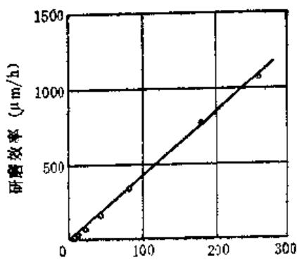  
研磨速度（m/min）  
b)

能够通过较多的磨粒，因此，便切下更多的金属，而使研磨的效率提高。

选择研磨速度时应考虑工件的加工精度、材质、硬度、重量、研磨面积等因素。研磨速度一般在  $10\sim 150\mathrm{m / min}$  之间。对于精密零件不宜超过30 $\mathrm{m / min}$  。速度过高时将产生较高的研磨热，引起零件变形和表面退火（通常称为发黄），并引起零件尺寸膨胀，很难控制零件尺寸精度，此外，还会使被研表面留有较显眼的磨粒划痕。一般手工粗研磨每分钟约往复  $30\sim 60$  次左右；精研则为  $20\sim 40$  次。合理的研磨速度必须通过实验来确定。

研磨时间同样是研磨要素之一。在研磨的开始阶段，由于磨料的磨粒锋利，对被研零件的几何形状误差和表面粗糙度有较快的纠正能力，随着研磨时间增加，磨粒钝化，磨粒切削能力降低，研磨效果就不够明显了。研磨时间过长，不仅加工精度不再提高，反会因研磨热导致零件变形，丧失精度。

粗研磨的研磨时间，取决于所选磨粒的切削性能。为获得高研磨效率，待磨粒钝化效果慢时，便应立即更换磨料。可通过实验来确定研磨时间。精研磨的研磨时间约为  $1\sim 3\mathrm{min}$  ，超过  $3\mathrm{min}$  ，研磨效果的提高没有显著变化。

总之，研磨时一般先用较粗的磨料、较高的压力和较低的速度进行粗研磨，以期能较快的纠正零件的几何形状误差和切去多余的加工余量，然后，再用较细的磨料、较小的压力和较高的速度进行精研磨，获得精确的零件尺寸和低的表面粗糙度。

# 第2节 材料的可加工性与研磨余量

# （一）研磨性与工件材料的关系

影响工件材料加工性（即研磨性）的因素很多。工件材料较硬时，具有良好的抛光性，但切削性能较差，研磨效率较低，研磨时一般选用较硬的铸铁研具和相应的磨料。工件材料较软时，切削性能较好，有较高的研磨效率，研磨时为避免磨粒嵌入工件表面，一般选用比工件硬度低的材料制作研具，或采用嵌砂研磨。

所有碳素工具钢及中碳低合金钢，淬硬以后都宜于研磨；低碳钢表面经渗碳淬硬后也宜于研磨；油淬的合金工具钢韧性好，研磨阻力大；氮化钢研磨效率低，但可获得较低的表面粗糙度；硬质合金通常不能采用一般的研磨剂，常用碳化硼作粗研磨，用金刚石粉研磨膏精研磨，故研磨效率较低。

# （二）研磨对预加工的要求

为了提高研磨效果，零件在研磨前都需进行预加工。实践表明，预加工精度直接影响研磨加工精度、研磨余量大小和研磨效率。故零件在预加工中必须达到较好的尺寸精度、几何形状精度和表面粗糙度。

研前预加工应满足下列要求：使研磨余量尽可能小，能满足精研前的预研磨工序余量即可；几何

形状精度要基本符合零件最终精度要求；表面粗糙度不高于  $R_{\mathrm{a}}1.6\mu \mathrm{m}$ ，无明显的走刀痕迹，烧伤、龟裂等缺陷。

一般淬硬钢及渗碳钢零件的研前预加工多采用精磨工序，以获得较好的尺寸精度和形状精度，使研磨余量减小。

软金属件和不宜磨削的工件的研前预加工可采用精车、精铣等工序，此时应适当留大研磨余量，方能达到预期研磨效果。

# （三）研磨余量

确定零件的研磨余量时，除考虑预加工所达到的精度外，还要结合零件的材质、尺寸大小、研磨方法（手工或机动）和最终精度要求等因素。表9-2-1所示为经过精密磨削后的零件研磨余量。对于尺寸小或短的零件建议选用表中较大的数值；尺寸大或长的零件采用较小的数值；不淬硬的零件研磨余量应增加约  $1 / 3$  。

表9-2-2至表9-2-4分别示出外圆，内孔、平面的研磨余量，其他表面可参照表9-2-5所列数据。

表9-2-1 经过精磨的工件的  
研磨余量 (μm)  

<table><tr><td rowspan="2">研磨种类</td><td colspan="2">研磨平面</td><td>研磨外圆</td><td>研磨内孔</td></tr><tr><td>按每面</td><td>按厚度</td><td>直径</td><td>直径</td></tr><tr><td>手工研磨</td><td>3~5</td><td>6~10</td><td>3~8</td><td>5~10</td></tr><tr><td>机械研磨</td><td>5~10</td><td>10~20</td><td>8~15</td><td>-</td></tr></table>

表9-2-2 外圆的研磨余量 (mm)  

<table><tr><td>直径</td><td>余量</td></tr><tr><td>≤10</td><td>0.005~0.008</td></tr><tr><td>11~18</td><td>0.006~0.008</td></tr><tr><td>19~30</td><td>0.007~0.010</td></tr><tr><td>31~50</td><td>0.008~0.010</td></tr><tr><td>51~80</td><td>0.008~0.012</td></tr><tr><td>81~120</td><td>0.010~0.014</td></tr><tr><td>121~180</td><td>0.012~0.016</td></tr><tr><td>181~260</td><td>0.015~0.020</td></tr></table>

表8-2-3 内孔的研磨余量 (mm)  

<table><tr><td>孔径</td><td>铸铁</td><td>钢</td></tr><tr><td>25~125</td><td>0.020~0.100</td><td>0.010~0.040</td></tr><tr><td>150~275</td><td>0.030~0.160</td><td>0.020~0.050</td></tr><tr><td>800~500</td><td>0.120~0.200</td><td>0.040~0.060</td></tr></table>

表9-2-4 平面的研磨余量 (mm)  

<table><tr><td rowspan="2">平面长度</td><td colspan="3">平 面 宽 度</td></tr><tr><td>25以下</td><td>26~75</td><td>75~150</td></tr><tr><td>≤25</td><td>0.005~0.007</td><td>0.007~0.010</td><td>0.010~0.014</td></tr><tr><td>26~75</td><td>0.007~0.010</td><td>0.010~0.014</td><td>0.016~0.020</td></tr><tr><td>76~150</td><td>0.010~0.014</td><td>0.014~0.020</td><td>0.020~0.024</td></tr><tr><td>151~260</td><td>0.014~0.018</td><td>0.020~0.024</td><td>0.020~0.030</td></tr></table>

表9-2-5 其他表面的研磨余量 (mm)  

<table><tr><td>研磨面</td><td>余量</td></tr><tr><td>圆锥面</td><td>0.01~0.02</td></tr><tr><td>内螺纹面</td><td>0.06~0.10</td></tr><tr><td>外螺纹面</td><td>0.003~0.005</td></tr><tr><td>部分球面</td><td>0.02~0.05</td></tr><tr><td>正球面</td><td>0.01~0.05</td></tr><tr><td>齿轮齿面</td><td>0.01~0.04</td></tr></table>

# 第3节 磨料与研磨剂

# （一）磨料

# 1. 蘑料的种类、特性及用途

常用磨料简述如下：

棕刚玉（A）以铝矾土和无烟煤为主要原料，在电弧炉内经高温冶炼而成，主要化学成分为 $\mathrm{Al}_{2}\mathrm{O}_{3}$ ，韧性高、价格便宜，可用于加工普通钢、合金钢、可锻铸铁、硬青铜等材料。

白刚玉（WA）以铝粉为原料，在电弧炉内炼成， $\mathrm{Al}_{2}\mathrm{O}_{3}$  的含量一般高于  $98\%$  ，与棕刚玉相比韧性稍低，有较好的切削性能，适于合金钢、淬火钢零件和刀具的精加工。

黑碳化硅（C）以硅砂和石油焦碳为原料，在电阻炉内经高温冶炼而成，呈黑色结晶，显微硬度较高，性脆而锋利，并具有一定的导电性和导热性，适合铸铁、铜、大理石、花岗岩、玻璃的加工。

绿碳化硅（GC） 制法与黑碳化硅相同，但所用材料较纯，结晶呈鲜绿色，性硬脆而锋利，适用于硬质合金和各种高硬度材料的加工。

铬刚玉（PA）是白刚玉的派生品种之一，呈玫瑰红色，由于结晶中含有少量  $\mathrm{Cr_2O_3}$ ，比白刚玉有较好的韧性，适于加工韧性大的材料。

立方碳化硅（SC）结晶呈黄绿色，强度大，棱角锋利，多用于高硬度精密零件的加工。

碳化硼（BC）是一种从工业硼酸  $\left(\mathrm{B}_{2} \mathrm{O}_{3}\right)$  和低灰分炭素原料（石油焦炭）的混合物中熔炼得到的，硬度仅次于金刚石，粉碎后的磨粒几乎都带有锋利的刃尖，切削能力与金刚石相近，常作为天然金刚石的代用磨料，主要用来加工硬质合金、淬硬钢、光学玻璃和宝石等。

人造金刚石（JR）以石墨为原料，在触媒的作用下，于高温高压下转化而成的一种高硬度材料，密度为  $3.3\sim 3.5$  ，莫氏硬度为10，显微硬度为  $10600\sim 11000\mathrm{kgf / mm^2}$  。它的硬度与天然金刚石基本接近，但比天然金刚石略脆，强度稍低，颗粒表面粗糙，棱角锋利，但自锐性较天然金刚石佳。人造金刚石是至令人造磨料中最硬的一种，广泛用来代替天然金刚石研磨硬质合金，光学玻璃等高硬度工件。

氧化铬、氧化铁、氧化镁、氧化铈 这类磨料

的硬度最低，磨粒软而细，仅用于工件表面的光整加工的精研磨及抛光工作。氧化铬特别适用于淬硬钢件的精研和抛光，氧化铁、氧化镁、氧化铈多用于抛光硬脆材料如光学玻璃、水晶等。

单晶刚玉（SA）颜色因含杂质不同而有差异，一般呈浅黄色或白色。它与棕刚玉和白刚玉相比，有较高的强度和韧性以及抗破碎性，宜用来加工韧性较大、硬度较高的钢材。

微晶刚玉（MA）颜色和化学成分与棕刚玉相似，但它的磨粒是由许多微小尺寸的晶体组成，具有强度高、韧性和自锐性良好的特点，适于加工不锈钢、碳素钢、轴承钢和特种球墨铸铁等。

常用磨料的种类及用途见表9-3-1。

各国磨料代号对照见表9-3-2。

各类磨料的生产范围与化学成分和磨料的常用物理性质（第一砂轮厂）列入表9-3-3和9-3-4；

表9-3-1 常用磨料的种类及用途  

<table><tr><td rowspan="2">名 称</td><td rowspan="2">代号</td><td rowspan="2">主要化学成分</td><td rowspan="2">颜 色</td><td rowspan="2">硬度和强度</td><td colspan="2">用途</td></tr><tr><td>加工方法</td><td>工件材料</td></tr><tr><td>棕刚玉</td><td>A</td><td>92.5%~97% \( {\mathrm{{Al}}}_{2}{\mathrm{O}}_{3} \)</td><td>棕褐,灰 褪,暗红</td><td>具有较高的硬度,韧性 高,承受力大,锋利</td><td>粗研磨</td><td>各种碳钢、合金钢、铸 铁,硬青铜</td></tr><tr><td>白刚玉</td><td>WA</td><td>97%~98.5% \( {\mathrm{{Al}}}_{2}{\mathrm{O}}_{3} \)</td><td>白色</td><td>比棕刚三硬,但韧性稍 低, 锋利、切削性好</td><td>粗研和精 研磨</td><td>淬硬钢、高速钢、铸铁</td></tr><tr><td>黑碳化硅</td><td>C</td><td>97%~98.5% SiC</td><td>黑色(半 透明)深兰</td><td>比白刚玉硬,性脆, 锋 利</td><td>粗研磨</td><td>青铜、黄铜、铸铁、大理 石、玻璃等非金属材料</td></tr><tr><td>绿碳化硅</td><td>GC</td><td>94%~99% SiC</td><td>绿色(半 透明)</td><td>比黑碳化硅硬,但次于 人造金刚石和碳化硼, 锋 利, 性脆</td><td>粗研磨和 精研磨</td><td>淬硬钢,硬质合金,硬 铬,金刚石,硬度高的非 金属材料</td></tr><tr><td>铬刚玉</td><td>PA</td><td>97.5%~98% \( {\mathrm{{Al}}}_{2}{\mathrm{O}}_{3} \)</td><td>玫瑰红色</td><td>比白刚玉韧性好</td><td>粗研磨和 精研磨</td><td>淬硬钢,工具钢,合金 钢等韧性大的材料</td></tr><tr><td>立方碳化硅</td><td>SC</td><td>87%~92% SiC</td><td>黄绿色</td><td>强度大,棱角锋利</td><td>精研磨</td><td>轴承钢,淬硬钢</td></tr><tr><td>碳化硼</td><td>BC</td><td>85%~95% B,C</td><td>灰色至黑 色</td><td>比绿碳化硅硬而脆,但 次于人造金刚石颗粒能自 行修磨保持锋利。高温易 氧化</td><td>粗研磨和 精研磨</td><td>硬质合金,硬铬,宝石、 淬硬钢</td></tr><tr><td>人造金刚石</td><td>JR</td><td></td><td>灰色至黄 白色</td><td>硬度仅次于天然金刚 石,强度也稍低,自锐性 较好</td><td>粗研磨和 精研磨</td><td>硬质合金,光学玻璃</td></tr><tr><td>氧化铬</td><td></td><td>\( {\mathrm{{Cr}}}_{2}{\mathrm{O}}_{3} \)</td><td>深绿色</td><td>质软,是极细抛光剂</td><td>精研磨及 抛光</td><td>铜,青铜,淬硬钢和铸 铁</td></tr><tr><td>氧化铁</td><td></td><td>\( {\mathrm{{Fe}}}_{2}{\mathrm{O}}_{3} \) (或 \( {\mathrm{{Fe}}}_{2}{\mathrm{O}}_{3},{\mathrm{{Fe}}}_{2}{\mathrm{O}}_{3} \) )</td><td>红色,暗 红</td><td>比氧化铬软,是极细抛 光剂</td><td>抛光</td><td>淬硬钢,玻璃,水晶, 铜</td></tr><tr><td>氧化镁</td><td></td><td></td><td>白色</td><td>质软</td><td>抛光</td><td>淬硬钢、玻璃,水晶, 铜</td></tr><tr><td>氧化铈</td><td></td><td></td><td>土黄色</td><td>原款</td><td>抛光</td><td>淬硬钢、玻璃,水晶, 铜</td></tr></table>

表9-3-2 各国磨料代号对照表  

<table><tr><td>磨料</td><td>中国(GB 2476-83)</td><td>日本(JIS R6111-1974)</td><td>美国诺登公司(Norton)</td><td>英国Universal Co.</td><td>德国GFR</td><td>前苏联(TOCT 2424-75)</td><td>ISO</td></tr><tr><td>棕刚玉</td><td>A</td><td>A</td><td>A</td><td>A</td><td>NK</td><td>316A~12A</td><td>A</td></tr><tr><td>白刚玉</td><td>WA</td><td>WA</td><td>38A, WA</td><td>WA</td><td>EK</td><td>3E25A~22A</td><td>WA</td></tr><tr><td>微晶屑玉</td><td>MA</td><td>TA(昭和)</td><td>44A, SH</td><td>T</td><td></td><td></td><td></td></tr><tr><td>铬刚玉</td><td>PA</td><td>PA</td><td>PA, PW</td><td></td><td>FA</td><td>3X34A~32A</td><td></td></tr><tr><td>单晶刚玉</td><td>SA</td><td>HA</td><td>32A, DA</td><td></td><td></td><td>M45A~43A</td><td></td></tr><tr><td>锆刚玉</td><td>ZA</td><td>RGRA</td><td>ZFZS</td><td>Z</td><td></td><td></td><td></td></tr><tr><td>黑刚玉</td><td>BA</td><td></td><td></td><td></td><td></td><td></td><td></td></tr><tr><td>黑碳化硅</td><td>C</td><td>C</td><td>37C</td><td>BC</td><td>SC</td><td>K355C~52C</td><td>C</td></tr><tr><td>绿碳化硅</td><td>GC</td><td>GC</td><td>39C</td><td>C</td><td>SCG</td><td>K364C~62C</td><td>GC</td></tr><tr><td>立方碳化硅</td><td>SC</td><td></td><td></td><td></td><td></td><td></td><td></td></tr><tr><td>铈碳化硅</td><td>CC</td><td></td><td></td><td></td><td></td><td></td><td></td></tr><tr><td>碳化硼</td><td>BC</td><td></td><td></td><td></td><td></td><td>B4C</td><td></td></tr></table>

表9-3-3 各类磨料的生产范围与化学成分  

<table><tr><td rowspan="2">磨料类别</td><td rowspan="2">粒度范围</td><td colspan="6">化学成 分 重 量 (%)</td><td></td></tr><tr><td>SiC</td><td>F, C</td><td>Fe2O3</td><td>Al2O3</td><td>TiO2</td><td>Na2O</td><td>Cr2O3</td></tr><tr><td rowspan="3">棕刚玉A</td><td>4°~90°</td><td></td><td></td><td></td><td>94.50~97.00</td><td>1.50~3.80</td><td></td><td></td></tr><tr><td>100°~180°</td><td></td><td></td><td></td><td>≥93.50</td><td>1.50~3.80</td><td></td><td></td></tr><tr><td>220°~240°</td><td></td><td></td><td></td><td>≥92.50</td><td>1.50~3.80</td><td></td><td></td></tr><tr><td rowspan="4">白刚玉WA</td><td>12°~90°</td><td></td><td></td><td></td><td>≥93.50</td><td></td><td>≤0.50</td><td></td></tr><tr><td>100°~240°</td><td></td><td></td><td></td><td>≥98.50</td><td></td><td>≤0.70</td><td></td></tr><tr><td>W63~W14</td><td></td><td></td><td></td><td>≥98.00</td><td></td><td>≤0.80</td><td></td></tr><tr><td>W10~W5</td><td></td><td></td><td></td><td>≥97.00</td><td></td><td>≤0.80</td><td></td></tr><tr><td rowspan="2">铬刚玉PA</td><td>16°~90°</td><td></td><td></td><td></td><td>≥98.00</td><td></td><td></td><td>0.8~1.5</td></tr><tr><td>100~240</td><td></td><td></td><td></td><td>≥97.50</td><td></td><td></td><td>0.8~1.5</td></tr><tr><td rowspan="3">黑碳化硅C</td><td>12°~90°</td><td>≥98.50</td><td>≤0.20</td><td>≤0.60</td><td></td><td></td><td></td><td></td></tr><tr><td>100°~180°</td><td>≥98.00</td><td>≤0.30</td><td>≤0.80</td><td></td><td></td><td></td><td></td></tr><tr><td>220°~240°</td><td>≥97.00</td><td>≤0.30</td><td>≤1.20</td><td></td><td></td><td></td><td></td></tr><tr><td>SiC</td><td>F1C</td><td>Fe2O3</td><td>Al2O3</td><td>TiO2</td><td>Na2O</td><td colspan="1">Cr2O3</td></tr><tr><td rowspan="6">碳化硅QC</td><td>20*~90°</td><td>≥99.00</td><td>≤0.20</td><td>≤0.20</td><td></td><td></td><td></td><td></td></tr><tr><td>100*~180°</td><td>≥98.50</td><td>≤0.25</td><td>≤0.50</td><td></td><td></td><td></td><td colspan="1"></td></tr><tr><td>220*~240°</td><td>≥97.50</td><td>≤0.25</td><td>≤0.70</td><td></td><td></td><td></td><td colspan="1"></td></tr><tr><td>W63~W20</td><td>≥97.00</td><td>≤0.30</td><td>≤0.70</td><td></td><td></td><td></td><td colspan="1"></td></tr><tr><td>W14~W10</td><td>≥95.50</td><td>≤0.30</td><td>≤0.70</td><td></td><td></td><td></td><td colspan="1"></td></tr><tr><td>W7~W5</td><td>≥94.00</td><td>≤0.50</td><td>≤0.70</td><td></td><td></td><td></td><td colspan="1"></td></tr><tr><td rowspan="5">立方碳化硅SC</td><td>90*及以粗</td><td>≥87.00</td><td>≤0.50</td><td>≤1.50</td><td></td><td></td><td></td><td></td></tr><tr><td>100*~240°</td><td>≥90.00</td><td>≤0.50</td><td>≤1.20</td><td></td><td></td><td></td><td colspan="1"></td></tr><tr><td>W63~W20</td><td>≥91.00</td><td>≤0.80</td><td>≤0.80</td><td></td><td></td><td></td><td colspan="1"></td></tr><tr><td>W14~W10</td><td>≥92.00</td><td>≤1.0</td><td>≤0.50</td><td></td><td></td><td></td><td colspan="1"></td></tr><tr><td>W7~W5</td><td>≥90.00</td><td>≤1.5</td><td>≤0.50</td><td></td><td></td><td></td><td colspan="1"></td></tr></table>

表 3-3-4 磨料的常用物理性质  

<table><tr><td>磨 料 性质</td><td>A</td><td>WA</td><td>PA</td><td>C</td><td>GC</td><td>SC</td></tr><tr><td>基本矿物</td><td>\( \alpha -\mathrm {Al}_{2}\mathrm {O}_{3} \)</td><td>\( a-A1_{2}O_{8} \)</td><td>\( a-A1_{2}O_{8} \)</td><td>\( \alpha-SiC \)</td><td>\( \alpha-SiC \)</td><td>\( \beta-SiC \)</td></tr><tr><td>晶 系</td><td>六 方</td><td>六 方</td><td>六 方</td><td>六 方</td><td>六 方</td><td>立 方</td></tr><tr><td>色 泽</td><td>棕 色</td><td>白 色</td><td>玫瑰红</td><td>黑 色</td><td>绿 色</td><td>黄绿色</td></tr><tr><td>密 度</td><td>\( \geq 3.9 \)</td><td>\( \geq 3.9 \)</td><td>\( \geq 3.9 \)</td><td>\( \geq 3.12 \)</td><td>\( \geq 3.18 \)</td><td>\( 3\sim 3.21 \)</td></tr><tr><td>显微硬度 \( (kg/mm^{2}) \)</td><td>1800~2200</td><td>2200~2300</td><td>2200~2300</td><td>2987~3105</td><td>2875~3231</td><td>2987~3364</td></tr><tr><td>韧性(%)</td><td>80.80</td><td>80.30</td><td>82.6</td><td>84.5</td><td>90.1</td><td></td></tr><tr><td>热传导系数J/(cm·s·°C)</td><td colspan="2">0.209~0.059(200~1000°C)</td><td>0.209~0.059(200~1000°C)</td><td colspan="2">1.005~0.209(200~1000°C)</td><td></td></tr></table>

# 2. 磨料的粒度及其选择

磨料的粒度是指磨料颗粒尺寸大小。按磨料颗粒尺寸范围，磨料可分为磨粒、磨粉、微粉和超微粉四组，见表9-3-5。

对于用筛分法获得的磨粒来说，粒度号是根据一英寸长度上有多少个孔的筛网来命名的。例如：粒度120号是指一英寸筛网长度上有120个网孔，而以WXX表示的微粉和超微粉，其数字则表示磨粒的平均实际尺寸。如：W20，是表示磨料颗粒尺寸在  $20\sim 14\mu \mathrm{m}$  之间。

颗粒尺寸较大的磨粒，不适于研磨加工。研磨仅使用粒度号100以上的磨料，通常将用于研磨的磨料称作研磨粉。

表9-3-5 磨料粒度号及对应的磨粒公称尺寸  

<table><tr><td>组别</td><td>粒度号</td><td>基本颗粒尺寸范围(μm)</td></tr><tr><td rowspan="11">磨粒</td><td>12</td><td>2000~1500</td></tr><tr><td>14</td><td>1600~1250</td></tr><tr><td>16</td><td>1250~1000</td></tr><tr><td>20</td><td>1000~800</td></tr><tr><td>24</td><td>800~630</td></tr><tr><td>30</td><td>630~500</td></tr><tr><td>36</td><td>500~400</td></tr><tr><td>46</td><td>400~315</td></tr><tr><td>60</td><td>315~250</td></tr><tr><td>70</td><td>250~200</td></tr><tr><td>80</td><td>200~160</td></tr><tr><td rowspan="6">磨粉</td><td>100</td><td>160~125</td></tr><tr><td>120</td><td colspan="1">125~100</td></tr><tr><td>150</td><td colspan="1">100~80</td></tr><tr><td>180</td><td colspan="1">80~69</td></tr><tr><td>240</td><td colspan="1">63~50</td></tr><tr><td>280</td><td colspan="1">50~40</td></tr><tr><td rowspan="9">微粉</td><td>W63</td><td>63~50</td></tr><tr><td>W50</td><td colspan="1">50~40</td></tr><tr><td>W40</td><td colspan="1">40~28</td></tr><tr><td>W28</td><td colspan="1">28~20</td></tr><tr><td>W20</td><td colspan="1">20~14</td></tr><tr><td>W14</td><td colspan="1">14~10</td></tr><tr><td>W10</td><td colspan="1">10~7</td></tr><tr><td>W7</td><td colspan="1">7~5</td></tr><tr><td>W5</td><td colspan="1">6~3.5</td></tr><tr><td rowspan="5">精微粉</td><td>W3.5</td><td>3.5~2.5</td></tr><tr><td>W2.5</td><td colspan="1">2.5~1.5</td></tr><tr><td>W1.5</td><td colspan="1">1.5~1.0</td></tr><tr><td>W1.0</td><td colspan="1">1.0~0.5</td></tr><tr><td>W0.5</td><td colspan="1">0.5及更细</td></tr></table>

研磨时磨料粒度的选择，一般视研磨的生产率、工件材料性质、研磨方式和种类、粗糙度要求及研磨余量的大小来决定。表9-3-6和表9-3-7所列数据供选择时参考。

表9-3-6 研磨常用磨料粒度范围  

<table><tr><td>加工方法</td><td>粒度</td><td>应用</td></tr><tr><td>粗研磨</td><td>100°~220°</td><td rowspan="2">一般产品零件的研磨</td></tr><tr><td>精研磨</td><td>220°~W14</td></tr><tr><td>粗研磨</td><td>W14~W10</td><td rowspan="3">精密零件、量具、刃具的精密研磨</td></tr><tr><td>半精研</td><td>W7~W5</td></tr><tr><td>精研磨</td><td>W5以下</td></tr></table>

表9-3-7 常用磨料粒度能达到的加工表面粗糙度  

<table><tr><td>加工方法</td><td colspan="2">磨料粒度</td><td>能达到的表面粗糙度</td></tr><tr><td rowspan="2">粗研磨</td><td rowspan="2">磨粉</td><td>240~280°</td><td>R0.20μm</td></tr><tr><td>280°~W40</td><td>R0.10μm</td></tr><tr><td rowspan="3">半精研磨</td><td rowspan="5">微粉</td><td>W28~W20</td><td>R0.10μm</td></tr><tr><td>W20~W14</td><td>R0.05μm</td></tr><tr><td>W14~W10</td><td>R0.025μm</td></tr><tr><td rowspan="2">精研磨</td><td>W7</td><td>R0.012μm</td></tr><tr><td>W5</td><td>R0.008μm</td></tr></table>

# 3. 磨料的研磨性能

磨料的研磨性能除与粒度有关外，还与它的硬度、强度有关。

磨料的硬度是指磨粒表面抵抗局部外力的能力。研磨加工就是利用磨料与被研工件的硬度差来实现的，所以，磨料的硬度越高，它的切削能力越强，研磨性能愈好。

磨料颗粒承受外加压力而不被压碎的能力称为强度。强度差的磨料颗粒在研磨中易粉碎，切削能力下降，使用寿命较短。

若以金刚石的研磨能力为1，其他磨料的研磨能力如下：

<table><tr><td>碳化硼</td><td>0.5</td></tr><tr><td>绿碳化硅</td><td>0.28</td></tr><tr><td>黑碳化硅</td><td>0.25</td></tr><tr><td>白刚玉</td><td>0.12</td></tr><tr><td>棕刚玉</td><td>0.10</td></tr></table>

研磨效率与磨料的粒度、强度、硬度的关系，可以通过下列研磨实验得到。图9-3-1是钢制工件在圆盘研磨机上进行平面研磨实验所得的数据绘制的。从图中曲线可以看出，研磨刚开始的一段时间内，各种磨料在单位时间内的研削量大致相等，但经较长时间的使用，由于磨料颗粒的细化，单位时间内的研削量便降低。同时也可看出，不同硬度的磨料在相同时间内研削量不等，硬度高的磨料有较高的效率。

图9-3-1 各种研磨剂的研磨效率  
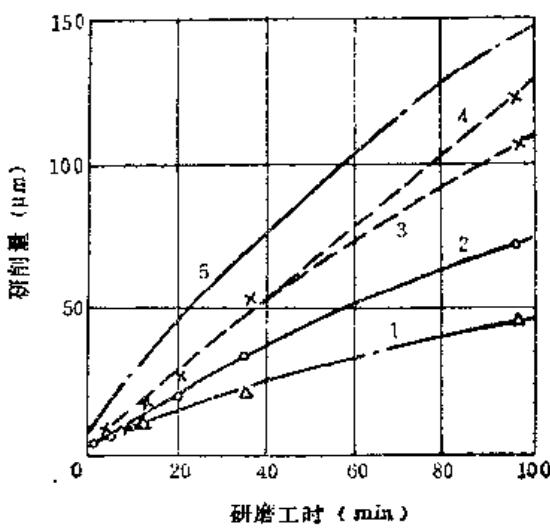  
1—橡刚玉 2—白刚玉 3—碳化硅 4—碳化硼 5—碳化硅（粗粒度）

# （二）研磨膏

研磨膏是在研磨粉中加入辅助材料而制成的一种混合剂。常用的辅助材料见表9-3-8。

表9-3-8 配研磨膏用辅助材料  

<table><tr><td></td><td>油溶性辅助材料</td><td>水溶性辅助材料</td></tr><tr><td>分散剂</td><td>煤油,机油</td><td>一缩二乙二醇,丙三醇,聚乙二醇(400)等</td></tr><tr><td>载体</td><td>猪油,柏子油,液体石蜡,油酸,研磨硬脂,硬脂酸,石蜡,蜂蜡,地蜡,凡士林</td><td>十六醇,硬脂酸,聚氧乙烯硬脂酸,三乙醇胺相酸皂,三乙醇胺油酸皂</td></tr><tr><td>着色剂芳香剂防腐剂</td><td></td><td>各种染料香精尼伯金乙酯等</td></tr><tr><td>技术条件</td><td>硬脂酸为二压或三压,其他为工业纯</td><td>化学纯或工业纯</td></tr></table>

表9-3-8中的分散剂的作用是湿润磨料表面，使其均匀分布在膏体内。载体的作用是当它溶于分散

剂中时，能增加分散剂的粘度，降低磨料的沉淀，同时起冷却、润滑和促进氧化的作用。

研磨膏有油溶性和水溶性两大类。油溶性研磨膏是由磨粉和油溶性材料配制而成。使用时需用煤油或其他油类稀释。用这类研磨膏研磨可获得极低的加工表面粗糙度和精确的尺寸，尤其适用于不能用水溶性研磨膏研磨的工件。水溶性研磨膏是以磨粉和水溶性材料配制而成，使用时用水、甘油等稀释剂稀释，研磨后工件能用水、酒精等洗涤干净。该类研磨膏使用安全，贮藏方便，一般无刺激性。

研磨膏是一种重要的表面光整加工材料，广泛应用于仪器、仪表、光学玻璃镜头、量具和精密机械零件的精密研磨和抛光。为满足各种不同材质工件的加工特点，一些专业生产厂家制造了多种研磨膏，如金刚石研磨膏，氧化铬、氧化铝、碳化硼、碳化硅、氧化铁等研磨膏，以及各种抛光膏，可根据产品说明书选用。表9-3-9所示为白鸽牌普通磨料研磨膏。

随着硬质合金等高硬度脆性材料的普遍采用，生产中越来越广泛的选人造金刚石研磨膏来精研磨。表9-3-10列出某厂用金刚石微粉和硬脂、石蜡、煤油配制的金刚石研磨膏。

表9-3-9 普通研磨膏的品种、规格及应用范围  

<table><tr><td>产品名称</td><td>颜色</td><td>磨料代号</td><td>粒度范围</td><td>应用范围</td></tr><tr><td>氧化铬研磨膏</td><td>深绿</td><td>Cr2O3</td><td>W3.5以下</td><td>用于金属镀件的精抛和钢件的最后表面抛光</td></tr><tr><td>氧化铁研磨膏</td><td>深红</td><td>Fe2O3</td><td>W3.5以下</td><td>用于贵金属,如金银制品以及有机玻璃和玻璃制品的抛光</td></tr><tr><td>棕刚玉研磨膏</td><td>棕色</td><td>A</td><td>60°~280°</td><td>用于普通碳钢、合金钢、可锻铸铁、硬青铜的研磨</td></tr><tr><td>白瓯玉研磨膏</td><td>白色</td><td>WA</td><td>60°~W1</td><td>用于淬火钢、高速钢、轴承钢、不锈钢等材料的研磨、抛光</td></tr><tr><td>绿碳化硅研磨膏</td><td>淡绿</td><td>GC</td><td>60°~W5</td><td>用于钢、铝等有色金属及硬质合金、玻璃等材料的研磨、抛光</td></tr><tr><td>碳化硼研磨膏</td><td>褐黑色</td><td>BC</td><td>60°~280°</td><td>用于硬质合金、陶瓷、宝石、光学玻璃等材料的研磨抛光</td></tr></table>

注：除磨粒磨粉  $60^{\circ} \sim 280^{\circ}$  为软膏外，微粉和蜡微粉均为硬膏。

表9-3-10 金刚石研磨膏  

<table><tr><td colspan="2">粒度</td><td rowspan="2">颜色标志</td><td rowspan="2">可达到加工表面粗糙度\( R_{\mathrm{a}} \)\( (\mu m) \)</td></tr><tr><td>标注号</td><td>颗粒尺寸(\( \mu m \))</td></tr><tr><td>\( 280^{\circ} \)</td><td>50~40</td><td>草绿</td><td>0.1~0.2</td></tr><tr><td>W40</td><td>40~28</td><td>白</td><td>0.1~0.2</td></tr><tr><td>W28</td><td>28~20</td><td>草黄</td><td>0.1~0.2</td></tr><tr><td>W20</td><td>20~14</td><td>绿</td><td>0.1~0.2</td></tr><tr><td>W14</td><td>14~10</td><td>黑</td><td>0.05~0.1</td></tr><tr><td>W10</td><td>10~7</td><td>灰</td><td>0.05~0.1</td></tr><tr><td>W7</td><td>7~5</td><td>紫</td><td>0.025~0.05</td></tr><tr><td>W5</td><td>5~3.5</td><td>天兰</td><td>0.025~0.05</td></tr><tr><td>W3.5</td><td>3.5~2.5</td><td>珠红</td><td>0.012~0.025</td></tr><tr><td>W2.5</td><td>2.5~1.5</td><td>玫瑰红</td><td>0.012~0.025</td></tr><tr><td>W1.5</td><td>1.5~1</td><td>黄棕</td><td>0.012~0.025</td></tr><tr><td>W1</td><td>1~0.5</td><td>撒黄</td><td>0.008~0.012</td></tr><tr><td>W0.5</td><td>0.5</td><td>艳红</td><td>0.008~0.012</td></tr></table>

若市场上销售的研磨膏不能满足加工质量和效率时，可根据生产需要自行配制研磨膏。此时要根据工件的材质，研磨方式、加工余量、粗糙度和生产率的要求，综合考虑选取磨粉的种类和粒度。研磨膏中磨料的浓度，可按磨料的价格和粒度选取，价昂者取浓度低些，价廉可选高些。一般来说，粒

度越粗，浓度越高；粒度越细，浓度越低。表9-3-11介绍了数种研磨膏的成分。

# （三）研磨液

研磨粉或研磨膏需用研磨液稀释后才能用于研磨。研磨液需具有一定粘度和稀释能力才能粘吸磨料并使磨料均匀；研磨液需具有较好的润滑和冷却能力，以防止磨料过早失效，减少工件和研具的发热变形。此外，为加速研磨的化学作用，研磨液还需有化学活性和无腐蚀性，便于清除和洗涤。

研磨液的表面张力及粘度大时，在工件和研具间会形成厚油膜，磨料压入较浅，切削作用减小，研磨效率下降，但加工表面粗糙度较低；表面张力及粘度过小时，磨料易压碎，同样保证不了较高的研磨效率。因而，需针对具体工件的研磨工艺，选取适中的研磨液。

稀释研磨膏时，还需按研磨膏的类型选用相应的油溶或水溶性研磨液。

常用的研磨液有下列几种：

1）航空汽油 与研磨膏混合后，涂于铸铁或玻璃研具上，用于研磨高精度的圆柱或平面。  
2）煤油多用于粗研磨，要求研磨速度较快，工件表面粗糙度要求不高的情况。  
3）机械油 应用较普遍，一般研磨使用10号机油或一份机油与三份煤油混合使用。  
4）含硬脂煤油 用于研磨直孔内表面。

表9-3-11 研磨膏的成分  

<table><tr><td rowspan="2">加工种类</td><td colspan="2">研磨粉末</td><td rowspan="2">单位</td><td colspan="2">研磨粉末的比例</td><td colspan="2">油酸的比例</td><td colspan="2">混合脂的比例</td><td colspan="2">凡士林的比例</td><td colspan="2">煤油的比例</td></tr><tr><td>规格</td><td>名称</td><td>重量</td><td>%</td><td>重量</td><td>%</td><td>重量</td><td>%</td><td>重量</td><td>%</td><td>重量</td><td>%</td></tr><tr><td>粗研</td><td>W14~W10</td><td>Al2O3</td><td>kg</td><td>0.437</td><td>52</td><td>0.062</td><td>7</td><td>0.218</td><td>26</td><td>0.128</td><td>15</td><td></td><td></td></tr><tr><td>半精研</td><td>W7</td><td>Al2O3</td><td>kg</td><td>0.625</td><td>45</td><td>0.320</td><td>22.4</td><td>0.437</td><td>31.5</td><td></td><td></td><td>0.015</td><td>1.1</td></tr><tr><td rowspan="2">精研</td><td>W5</td><td>Al2O3</td><td>kg</td><td>0.320</td><td>40.8</td><td>0.156</td><td>20.5</td><td>0.281</td><td>36.7</td><td></td><td></td><td>0.015</td><td>2</td></tr><tr><td>W5</td><td>Al2O3</td><td rowspan="2">kg</td><td>0.031</td><td rowspan="2">19.4</td><td rowspan="2">0.140</td><td rowspan="2">29</td><td rowspan="2">0.218</td><td rowspan="2">45.1</td><td rowspan="2"></td><td rowspan="2"></td><td rowspan="2">0.031</td><td rowspan="2">6.5</td></tr><tr><td rowspan="5">抛光</td><td>W3.5</td><td>Cr2O3</td><td>0.062</td></tr><tr><td>W1~W3.5</td><td>Cr2O3</td><td>kg</td><td>0.046</td><td>11.6</td><td>0.128</td><td>31</td><td>0.218</td><td>54</td><td></td><td></td><td>0.015</td><td>3.4</td></tr><tr><td>W1~W3.5</td><td>Cr2O3</td><td>kg</td><td>0.093</td><td>19.4</td><td>0.156</td><td>32.2</td><td>0.218</td><td>45.1</td><td></td><td></td><td>0.015</td><td>3.3</td></tr><tr><td>W1~W3.5</td><td>Cr2O3</td><td>kg</td><td>70</td><td>56</td><td>10</td><td>8</td><td>15</td><td>12</td><td>30</td><td>24</td><td></td><td></td></tr><tr><td>W2.5~W5</td><td>Cr2O3</td><td>kg</td><td>0.109</td><td>23.3</td><td>0.628</td><td>26.7</td><td>0.218</td><td>46.7</td><td></td><td></td><td>0.015</td><td>3.3</td></tr></table>

注：煤油的加入星视天气而定，天暖时少放些，天冷时可多加一些；油酸与混合脂的比例应对立，例如油酸少放  $5\%$  ，则混合脂应多增加  $5\%$  ；粉末在任何天气下比例不变。

# 9-10

5）含腊煤油 用于研磨硬质合金。  
6）油脂 用于研磨螺纹。  
7）猪油因含有油酸，有助于研磨作用，降低表面粗糙度效果好，应用于极精密的研磨。

在研磨液中加入少量的石蜡、蜂蜡等填料和化学活性较强的油酸  $(C_{17}H_{33}\cdot COOH)$  、脂肪酸 $(C_{17}H_{31}\cdot COOH)$  、硬脂酸  $(C_{17}H_{35}\cdot COOH)$  、工业用甘油等，在特种工件的研磨中能获更佳的效果。

# 第4节研磨工具

研具是研磨的重要要素之一。由于在研磨过程中，工件与研具表面接触并相对滑动，研具本身的几何形状精度将传递给工件，所以，研具的制造精度应符合被研工件的质量要求。除此之外，研具还需具备良好的耐磨性，合理的形体结构和足够的刚度。以保证研磨质量和效率。

研具分手工研磨工具和机械研磨工具两类；按它的形状又可分为研磨平板、研磨尺、研磨盘、研磨棒，研磨套，研磨环等；按它的用途又可分为平面研磨工具、外圆研磨工具、内圆柱表面研磨工具、锥体研磨工具、球面研磨工具、螺纹研磨工具等。

# （一）手工研磨工具

# 1. 平面研磨工具

平面研磨工具有研磨平板、研磨平尺和旋转研磨盘三种，都是用铸铁制成。

1）研磨平板如图9-4-1所示。在工作面上可以开些纵向横向的沟槽，以便把多余的研究剂刮去，使平板与工件接触均匀，提高工件的平面性，同时，可以使研磨时发生的热量从沟槽中散去。当工件长度在  $150\mathrm{mm}$  以下时，研磨平板上可以铣成  $60^{\circ}$  V形槽，见图9-4-1a，研磨板的小方格面积约 $20\mathrm{cm}^2$ ；工件长度大于  $150\mathrm{mm}$  时，研磨板要铣成

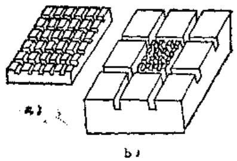  
图9-4-1 研磨平面的研磨板

$60\mathrm{cm}^2$  的大方块，在大方块中再铣成  $15\mathrm{cm}^2$  的小方格，见图9-4-1b。但对于极精细的研磨，由于要获得很低的表面粗糙度，这时平板不能开槽。

2）研磨平尺是扁平的矩形铸铁块，其规格为：长  $200\sim 300 \mathrm{~mm}$  、宽  $100\sim 150 \mathrm{~mm}$  、厚  $10\sim 20 \mathrm{~mm}$  。在工作面上同样可以开些小沟槽。上、下工作面须经过很细致的研磨，以保持其平直性。研磨直尺是研磨外圆时消除工件锥度的主要工具。

3）旋转研磨盘一般常用的直径为  $150\sim 200\mathrm{mm}$  ，特殊情况下可达到  $400\mathrm{mm}$  。

# 2. 外国研磨工具

外圆研磨工具常用的为研磨套，一般做成可调节的，用锥度来补偿磨损如图9-4-2a。常用的锥度为1:10、1:25和1:30等几种。此外，还有锯开式的研磨套，利用研磨套本身的弹性来实现调节，如图9-4-2b。一般研磨套的长度与孔径之比为1～2.5。研磨套是研磨中提高轴颈圆度及圆柱度的主要工具。

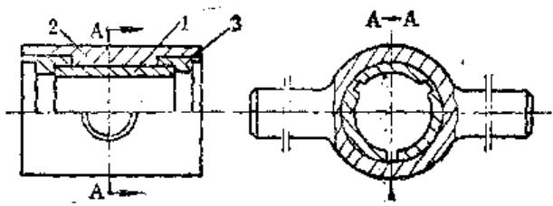  
1

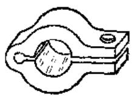  
6）  
图9-4-2 外圆研磨工具

a）锥度调节的外圆研磨套 b）弹性调节的外圆研磨套1—研磨套2—研磨套夹具 3—调节螺母

# 3. 内圆柱表面研磨工具

所用工具为研磨棒，其结构有整体式和可调式两种。

整体式研磨棒如图9-4-3和图9-4-4所示。前者适用于研磨孔径大的孔，后者用于  $\phi 5\sim \phi 8$  的小孔。

整体式研磨棒制造简单，精度高，适用于精密孔（如坐标镗床主轴箱孔等）和小直径孔的研磨。

为使磨料和研磨液导入和均匀分布，研棒工作部分外圆通常车有左右旋两条油沟如图9-4-3，其导程约为直径的  $1 / 3 \sim 1 / 2$  。为保证被研孔的圆柱度要求，研棒工作部分长度可取为孔深的  $1 \sim 1.5$  倍。

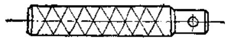  
图9-4-3 整体式研磨棒

整体式研磨棒磨损后尺寸无法补偿。图9-4-5和图9-4-6所示可调式研磨棒，可利用锥度使研磨环涨大来补偿磨损量，常用的锥度为1:50（用于  $\phi 20\mathrm{mm}$  以下的小孔）和1:20（用于  $\phi 14\sim \phi 90\mathrm{mm}$  孔）。

图  $9 - 4 - 7\sim 9 - 4 - 9$  为一些工厂的标准研磨棒，可供选用。

# 4. 圆锥体研磨工具

这类研磨工具也分整体式及可调式两种。为保证研后锥体素线的直线性，这种研磨工具必须有准确的几何形状。

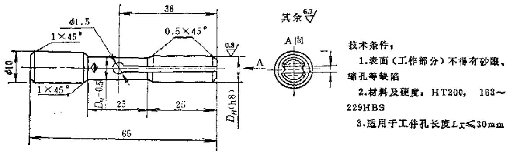  
图9-4-4 整体式研磨棒  $(D_H = 5\sim 8)$

图9-4-5 小孔径用可调研磨棒  
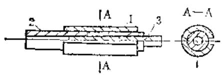  
1—研磨环 2—研磨棒托架 3—锥子

  
图9-4-6 大孔径用可调研磨棒

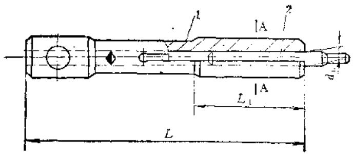  
1—研磨环 2—芯轴 3—调节螺母 4—套圈

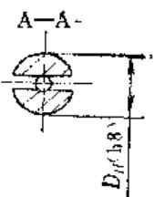  
技术条件：  
1.材料：HT200  
2.适用于工件孔长度：L工≤1 1

（mm）  

<table><tr><td rowspan="2" colspan="4">名 义 尺寸</td><td colspan="3">基 本 尺寸</td></tr><tr><td>L</td><td>L1</td><td>d0</td></tr><tr><td>9</td><td>10</td><td>12</td><td></td><td>90</td><td>35</td><td>4</td></tr><tr><td>14</td><td>15</td><td>16</td><td></td><td>105</td><td>40</td><td>6</td></tr><tr><td>17</td><td>18</td><td>19</td><td>20</td><td>115</td><td>45</td><td>8</td></tr></table>

图9-4-7 链子可调式研磨棒

1—芯轴 2—锥子

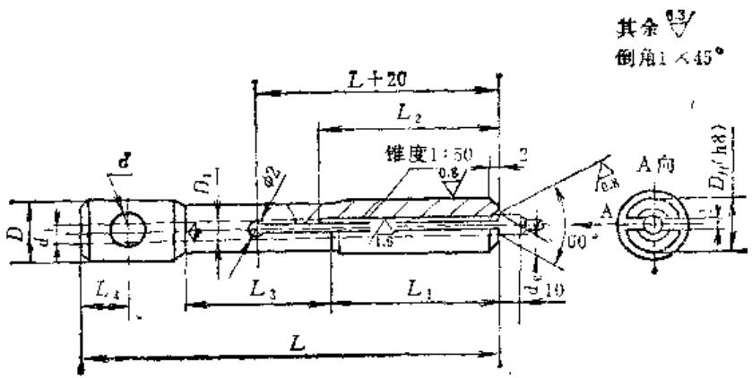  
图9-4-7/1 集子可调式研磨棒的芯轴

# 技术条件：

1.材料：HT200  
2. 工作部分的  $L_{1}$  表面不得有砂眼、缩孔等缺陷  
3. 工作部分的表面硬度为  $163 \sim 229\mathrm{HBS}$  
4.外径  $\pmb{D_H}$  （h3）装上锥子后磨至尺寸

（mm）  

<table><tr><td>序号</td><td colspan="4">名 义 尺 寸DH</td><td>L</td><td>L1</td><td>d0</td></tr><tr><td>1</td><td>9</td><td>10</td><td>12</td><td></td><td>90</td><td>35</td><td>4</td></tr><tr><td>2</td><td>14</td><td>15</td><td>16</td><td></td><td>105</td><td>40</td><td>6</td></tr><tr><td>3</td><td>17</td><td>18</td><td>19</td><td>20</td><td>115</td><td>45</td><td>8</td></tr><tr><td>序号</td><td>L2</td><td>L3</td><td>L4</td><td>D</td><td>D1</td><td>d</td><td>d1</td></tr><tr><td>1</td><td>40</td><td>35</td><td>8</td><td>16</td><td rowspan="3">DH-1</td><td rowspan="3">8</td><td>3.2</td></tr><tr><td>2</td><td>45</td><td>40</td><td>10</td><td>18</td><td>5.1</td></tr><tr><td>3</td><td>50</td><td>45</td><td>12</td><td>20</td><td>7</td></tr></table>

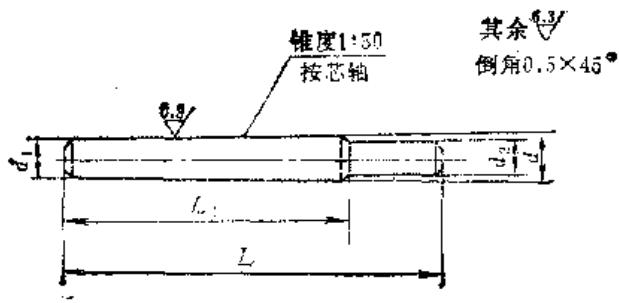

# 技术条件：

1.材料：45  
2.热处理：C45

（m）  

<table><tr><td>序号</td><td>名义尺寸D_H</td><td>L</td><td>L1</td><td>d</td><td>d1(参考)</td><td>d2</td></tr><tr><td>1</td><td>9~12</td><td>50</td><td>35</td><td>4.4</td><td>3.4</td><td>4</td></tr><tr><td>2</td><td>&gt;12~16</td><td>55</td><td>40</td><td>6.4</td><td>5.3</td><td>6</td></tr><tr><td>3</td><td>&gt;16~20</td><td>60</td><td>45</td><td>8.4</td><td>7.2</td><td>8</td></tr></table>

图9-4-7/2 锥子可调式研磨棒的锥子

  
图9-4-8 芯轴可调式研磨棒

# 选用方法：

按被加工工件孔径及长短  $\left(L_{\text{工}} \leqslant 1 \frac{1}{3} L_{1}\right.$ ，其中  $L_{\text{工}}$  为工件孔长， $L_{1}$  为研磨环长）选定研磨环，然后按研磨环配选研磨芯轴。

1—研磨环 2—芯轴 3—左垫套 4—右垫套 5—螺帽

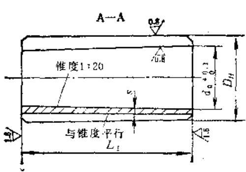  
图9-4-8/1 芯轴可调式研磨棒的研磨环

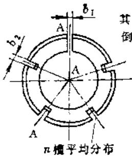

其余

倒角1×45

# 技术条件：

1.材料：HT200  
2.硬度：  $163\sim 229\mathrm{HBS}$  
3. 铸铁表面不得有砂眼、缩孔等  
4.锥体着色检查应≥60%  
5.外径  $D_H$  装在芯轴上磨至尺寸  
6.选用条件：  $L_{\text{工件}} \leqslant 1 \frac{1}{3} L_{\mathrm{f}}$

（m）  

<table><tr><td rowspan="2">序号</td><td rowspan="2">d+0.1</td><td colspan="6">DH(t7)</td><td rowspan="2">L1</td><td rowspan="2">b1</td><td rowspan="2">b2</td><td rowspan="2">n</td><td rowspan="2">x</td></tr><tr><td colspan="5">尺寸</td><td>公差</td></tr><tr><td>1</td><td>7.5</td><td></td><td></td><td></td><td>14</td><td>15</td><td rowspan="2">-0.016-0.033</td><td rowspan="2">35</td><td rowspan="9">1</td><td rowspan="9">2</td><td rowspan="3">3</td><td>2.5</td></tr><tr><td>2</td><td>9.5</td><td>16</td><td></td><td>18</td><td></td><td></td><td></td></tr><tr><td>3</td><td>11.5</td><td>20</td><td></td><td>22</td><td></td><td>24</td><td rowspan="2">-0.020-0.040</td><td rowspan="2">45</td><td rowspan="5">3</td></tr><tr><td>4</td><td>16.5</td><td>25</td><td>26</td><td></td><td>28</td><td></td><td rowspan="4">5</td></tr><tr><td>5</td><td>21.5</td><td>30</td><td></td><td>32</td><td></td><td>34</td><td rowspan="4">-0.025-0.050</td><td rowspan="3">55</td></tr><tr><td>6</td><td>26.5</td><td>35</td><td>36</td><td></td><td>38</td><td></td></tr><tr><td>7</td><td>31.5</td><td>40</td><td></td><td>42</td><td></td><td>44</td></tr><tr><td>8</td><td>36.5</td><td>45</td><td></td><td>47</td><td>48</td><td></td><td rowspan="3">66</td><td rowspan="10">6</td><td rowspan="10">4</td></tr><tr><td>9</td><td>41.5</td><td>50</td><td></td><td>52</td><td></td><td></td><td rowspan="7">-0.030-0.060</td></tr><tr><td>10</td><td>46.5</td><td>55</td><td></td><td></td><td>58</td><td></td><td rowspan="8">1.5</td><td rowspan="8">3</td></tr><tr><td>11</td><td>51.5</td><td>60</td><td></td><td>62</td><td></td><td></td><td rowspan="3">75</td></tr><tr><td>12</td><td>56.5</td><td>65</td><td></td><td></td><td>68</td><td></td></tr><tr><td>13</td><td>61.5</td><td>70</td><td></td><td>72</td><td></td><td></td></tr><tr><td>14</td><td>66.5</td><td>75</td><td></td><td></td><td></td><td></td><td rowspan="4">85</td></tr><tr><td>15</td><td>71.5</td><td>80</td><td></td><td></td><td></td><td></td></tr><tr><td>16</td><td>76.5</td><td>85</td><td></td><td></td><td></td><td></td><td rowspan="2">-0.040-0.075</td></tr><tr><td>17</td><td>81.5</td><td>90</td><td></td><td></td><td></td><td></td></tr></table>

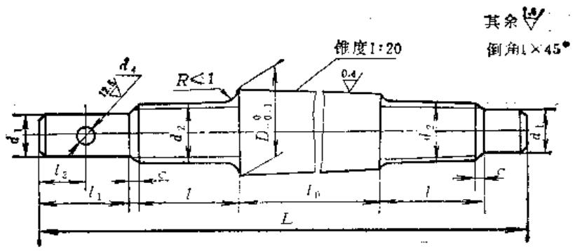  
图9-4-8/2 芯轴可调式研磨棒的芯轴

技术条件：

1.材料及热处理：45-C45（螺纹不淬火）  
2.锥体着色检查≥60%  
3.中心孔按GB145—59、B型

（m）  

<table><tr><td>序号</td><td>D-0.1</td><td>L</td><td>l0</td><td>l</td><td>l1</td><td>i2</td><td>d2</td><td>d1</td><td>d4</td><td>C</td></tr><tr><td>1</td><td>8</td><td>140</td><td rowspan="2">50</td><td rowspan="4">30</td><td>15</td><td rowspan="3">-</td><td>M5</td><td>3.5</td><td rowspan="3">-</td><td rowspan="3">1</td></tr><tr><td>2</td><td>10</td><td>155</td><td rowspan="2">25</td><td>M6</td><td>4.8</td></tr><tr><td>3</td><td>12</td><td>170</td><td rowspan="2">60</td><td>M8</td><td>6</td></tr><tr><td>4</td><td>17</td><td>180</td><td rowspan="2">30</td><td rowspan="4">12</td><td>M12</td><td>10</td><td rowspan="2">5</td><td rowspan="2">1.5</td></tr><tr><td>5</td><td>22</td><td>190</td><td rowspan="3">70</td><td rowspan="4">35</td><td>M16x1.5</td><td>13</td></tr><tr><td>6</td><td>27</td><td rowspan="2">200</td><td rowspan="2">35</td><td rowspan="2">M20x1.5</td><td rowspan="2">16</td><td rowspan="2">6</td><td rowspan="12">2</td></tr><tr><td>7</td><td>32</td></tr><tr><td>8</td><td>37</td><td rowspan="2">220</td><td rowspan="3">80</td><td rowspan="10">40</td><td rowspan="10">20</td><td rowspan="2">M24x1.5</td><td rowspan="2">20</td><td rowspan="2">8</td></tr><tr><td>9</td><td>42</td><td rowspan="9">40</td></tr><tr><td>10</td><td>47</td><td>230</td><td rowspan="2">M30x1.5</td><td rowspan="2">27</td><td rowspan="2">10</td></tr><tr><td>11</td><td>52</td><td rowspan="3">240</td><td rowspan="3">90</td></tr><tr><td>12</td><td>57</td><td rowspan="2">M36x1.5</td><td rowspan="2">33</td><td rowspan="2">12</td></tr><tr><td>13</td><td>62</td></tr><tr><td>14</td><td>67</td><td rowspan="4">260</td><td rowspan="4">100</td><td rowspan="4">M42x1.5</td><td rowspan="4">39</td><td rowspan="4">14</td></tr><tr><td>15</td><td>72</td></tr><tr><td>16</td><td>77</td></tr><tr><td>17</td><td>82</td></tr></table>

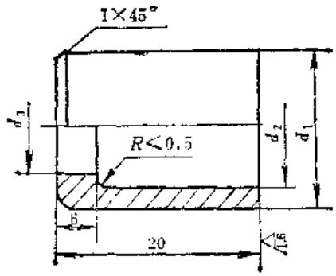  
其余  
锐边修光  
图9-4-8/3芯轴可调式研磨棒的左垫圈

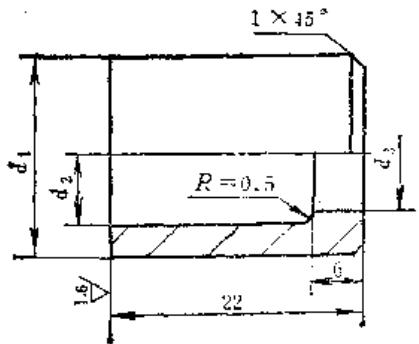  
其余  
锐边修光  
图9-4-8/4芯轴可调式研磨棒的右垫圈

# 技术条件：

1.材料：35  
2.热处理；发蓝

（mm）  

<table><tr><td>序号</td><td>d1</td><td>d2</td><td>d3</td></tr><tr><td>1</td><td>13.5</td><td>8.5</td><td>5.5</td></tr><tr><td>2</td><td>15.5</td><td>10.5</td><td>6.5</td></tr><tr><td>3</td><td>19</td><td>12.5</td><td>8.5</td></tr><tr><td>4</td><td>24</td><td>17.5</td><td>12.5</td></tr><tr><td>5</td><td>29</td><td>22.5</td><td>16.5</td></tr><tr><td>6</td><td>34</td><td>27.5</td><td rowspan="2">20.5</td></tr><tr><td>7</td><td>39</td><td>32.5</td></tr><tr><td>8</td><td>44</td><td>37.5</td><td rowspan="2">24.5</td></tr><tr><td>9</td><td>49</td><td>42.5</td></tr><tr><td>10</td><td>54</td><td>47.5</td><td rowspan="2">30.5</td></tr><tr><td>11</td><td>59</td><td>52.5</td></tr><tr><td>12</td><td>64</td><td>57.5</td><td rowspan="2">36.5</td></tr><tr><td>13</td><td>69</td><td>62.5</td></tr><tr><td>14</td><td>74</td><td>67.5</td><td rowspan="4">42.5</td></tr><tr><td>15</td><td>79</td><td>72.5</td></tr><tr><td>16</td><td>84</td><td>77.5</td></tr><tr><td>17</td><td>89</td><td>82.5</td></tr></table>

# 技术条件：

1.材料：35  
2.热处理：发蓝

（mm）  

<table><tr><td>序号</td><td>d1</td><td>d2</td><td>d3</td></tr><tr><td>1</td><td>13.5</td><td>7</td><td>6.5</td></tr><tr><td>2</td><td>15.5</td><td>9</td><td>8.5</td></tr><tr><td>3</td><td>19</td><td>11</td><td>8.5</td></tr><tr><td>4</td><td>24</td><td>16</td><td>12.5</td></tr><tr><td>5</td><td>29</td><td>20</td><td>16.5</td></tr><tr><td>6</td><td>34</td><td>25</td><td rowspan="2">20.5</td></tr><tr><td>7</td><td>39</td><td>30</td></tr><tr><td>8</td><td>44</td><td>35</td><td rowspan="2">24.5</td></tr><tr><td>9</td><td>49</td><td>40</td></tr><tr><td>10</td><td>54</td><td>45</td><td rowspan="2">30.5</td></tr><tr><td>11</td><td>59</td><td>49</td></tr><tr><td>12</td><td>64</td><td>54</td><td rowspan="2">36.5</td></tr><tr><td>13</td><td>69</td><td>59</td></tr><tr><td>14</td><td>74</td><td>64</td><td rowspan="4">42.5</td></tr><tr><td>15</td><td>79</td><td>69</td></tr><tr><td>16</td><td>84</td><td>74</td></tr><tr><td>17</td><td>89</td><td>79</td></tr></table>

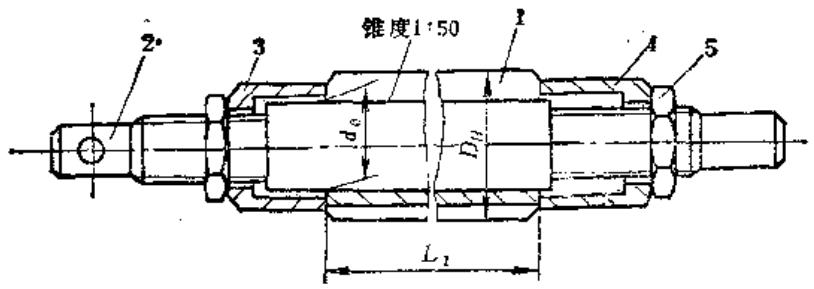  
图9-4-9 芯轴可调式研磨筛

选用方法：

按被加工工件孔径及长短  $\left(L_{\text{工}} \leqslant 1 \frac{1}{3} L_{1}\right.$ ，其中  $L_{\text{工}}$  为工件孔长， $L_{1}$  为研磨环长）选定研磨环，然后按研磨环配选芯轴

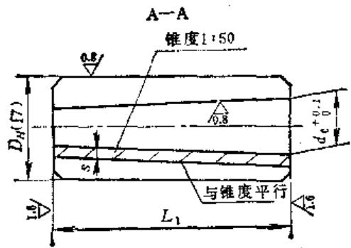  
1—芯轴 2—左垫套 3—研磨环 4—右垫套 5—螺帽

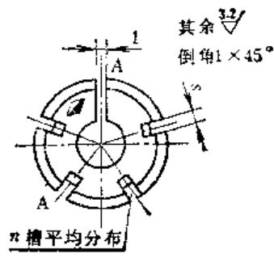  
图9-4-9/1芯轴可调式研磨棒的研磨环

技术条件：

1.材料：HT200  
2.硬度：  $163\sim 229\mathrm{HBS}$  
3. 铸件表面不得有砂眼、缩孔  
4.锥体着色检查≥60%  
5.使用条件：工件长  $L_{\pm}\leqslant 1\frac{1}{3} L_{1}$  
6.外径  $\pmb{D}$  装上芯轴后磨至尺寸

（mm）  

<table><tr><td rowspan="2">序号</td><td rowspan="2">d+0.10</td><td colspan="6">D_H(f7)</td><td rowspan="2">L1</td><td rowspan="2">s</td><td rowspan="2">n</td></tr><tr><td colspan="5">尺寸</td><td>公差</td></tr><tr><td>1</td><td>12</td><td>20</td><td></td><td>22</td><td></td><td>24</td><td>-0.020</td><td rowspan="2">110</td><td rowspan="5">3</td><td rowspan="5">5</td></tr><tr><td>2</td><td>17</td><td>25</td><td>26</td><td></td><td>28</td><td></td><td>-0.040</td></tr><tr><td>3</td><td>22</td><td>30</td><td></td><td>32</td><td></td><td>34</td><td rowspan="3">-0.025</td><td rowspan="3">140</td></tr><tr><td>4</td><td>27</td><td>35</td><td>36</td><td></td><td>38</td><td></td></tr><tr><td>5</td><td>32</td><td>40</td><td></td><td>42</td><td></td><td>44</td></tr><tr><td>6</td><td>37</td><td>45</td><td></td><td>47</td><td>48</td><td></td><td></td><td rowspan="3">160</td><td rowspan="5">4</td><td rowspan="5">6</td></tr><tr><td>7</td><td>42</td><td>50</td><td></td><td>52</td><td></td><td></td><td>-0.030</td></tr><tr><td>8</td><td>47</td><td>55</td><td></td><td></td><td>58</td><td></td><td>-0.060</td></tr><tr><td>9</td><td>32</td><td>60</td><td></td><td>62</td><td></td><td></td><td></td><td>180</td></tr><tr><td>10</td><td>57</td><td>65</td><td></td><td></td><td></td><td></td><td></td><td></td></tr></table>

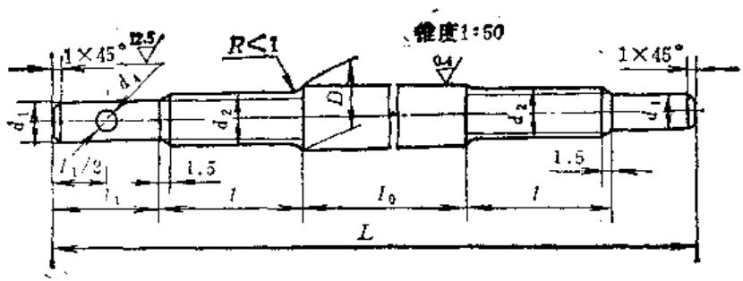  
图9-4-9/2 芯轴可调式研磨棒的芯轴

# 技术条件：

1.材料及热处理：45-C45（螺纹部分不淬火）  
2.锥体着色检查≥60%

（mm）  

<table><tr><td>序号</td><td>D-9.1</td><td>L</td><td>l0</td><td>t</td><td>l1</td><td>d1</td><td>d2</td><td>d4</td></tr><tr><td>1</td><td>12.3</td><td>230</td><td rowspan="2">125</td><td rowspan="2">30</td><td>25</td><td>6</td><td>M18</td><td>-</td></tr><tr><td>2</td><td>17.3</td><td>250</td><td rowspan="2">30</td><td>10</td><td>M12</td><td rowspan="2">5</td></tr><tr><td>3</td><td>22.3</td><td>270</td><td rowspan="3">155</td><td rowspan="5">35</td><td>13</td><td>M16×1.5</td></tr><tr><td>4</td><td>27.3</td><td rowspan="2">290</td><td rowspan="2">35</td><td rowspan="2">16</td><td rowspan="2">M20×1.5</td><td rowspan="2">6</td></tr><tr><td>5</td><td>32.3</td></tr><tr><td>6</td><td>37.3</td><td rowspan="2">320</td><td rowspan="3">175</td><td rowspan="5">40</td><td rowspan="2">20</td><td rowspan="2">M24×1.5</td><td rowspan="2">8</td></tr><tr><td>7</td><td>42.3</td></tr><tr><td>8</td><td>47.3</td><td>330</td><td rowspan="3">40</td><td rowspan="2">27</td><td rowspan="2">M30×1.5</td><td rowspan="2">10</td></tr><tr><td>9</td><td>52.3</td><td rowspan="2">350</td><td rowspan="2">195</td></tr><tr><td>10</td><td>57.3</td><td>33</td><td>M36×1.5</td><td>12</td></tr></table>

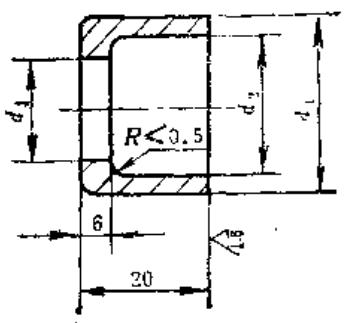  
其余 说边修光  
图9-4-9/3芯轴可调式研磨棒的左垫圈

# 技术条件：

1.材料：35  
2.热处理：发蓝

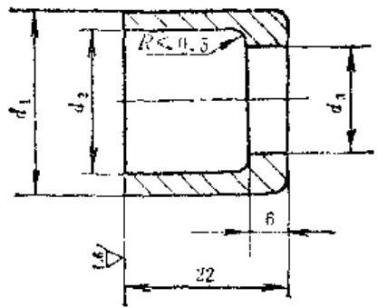  
其余 3锐达修光  
图9-4-9/4芯轴可调式研磨棒的右翼面

# 技术条件：

1.材料：35  
2.热处理：发蓝

（mm）  

<table><tr><td>序号</td><td>d1</td><td>d2</td><td>d3</td></tr><tr><td>1</td><td>19</td><td>13</td><td>8.5</td></tr><tr><td>2</td><td>24</td><td>18</td><td>12.5</td></tr><tr><td>3</td><td>29</td><td>23</td><td>16.5</td></tr><tr><td>4</td><td>34</td><td>28</td><td rowspan="2">20.5</td></tr><tr><td>5</td><td>39</td><td>33</td></tr><tr><td>6</td><td>44</td><td>38</td><td rowspan="2">24.5</td></tr><tr><td>7</td><td>49</td><td>43</td></tr><tr><td>8</td><td>54</td><td>48</td><td rowspan="2">36.5</td></tr><tr><td>9</td><td>59</td><td>53</td></tr><tr><td>10</td><td>64</td><td>58</td><td>34.5</td></tr></table>

（m）  

<table><tr><td>序号</td><td>d1</td><td>d2</td><td>d3</td></tr><tr><td>1</td><td>19</td><td>11</td><td>8.5</td></tr><tr><td>2</td><td>24</td><td>16</td><td>12.5</td></tr><tr><td>3</td><td>29</td><td>20</td><td>16.5</td></tr><tr><td>4</td><td>34</td><td>25</td><td rowspan="2">20.5</td></tr><tr><td>5</td><td>39</td><td>30</td></tr><tr><td>6</td><td>44</td><td>35</td><td rowspan="2">24.5</td></tr><tr><td>7</td><td>49</td><td>40</td></tr><tr><td>8</td><td>54</td><td>45</td><td rowspan="2">30.5</td></tr><tr><td>9</td><td>59</td><td>50</td></tr><tr><td>10</td><td>64</td><td>55</td><td>36.5</td></tr></table>

研磨外圆锥体时，为防止研具磨损后轴向位移与锥体轴肩相碰，可采用可调式研磨套，如图9-4-10。研磨内锥孔时，一般用整体式研磨棒，亦可用可调式研磨棒，如图9-4-11，这种研磨棒主要用来降低孔的表面粗糙度。当用研磨来消除锥孔的径向跳动时，应将整体式研磨棒改为非整圆锥式，如图9-4-12，待径向跳动消除后，再用整体式研磨棒研磨，以提高锥孔的几何精度。

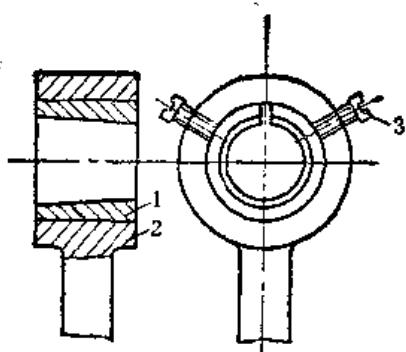  
图9-4-10 可调节的外圆锥研磨套 1—锥形研磨套 2—夹板 3—调节螺钉

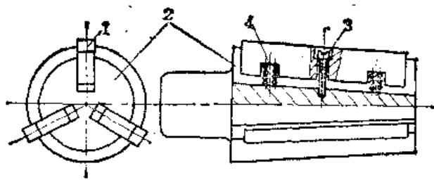  
图9-4-11 可调节的内锥孔研磨棒 1—研磨直尺 2—基体 3—调节螺钉 4—弹簧

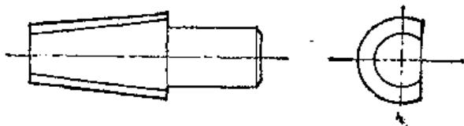  
图9-4-12 非整圆锥研磨棒

# 5. 球面研磨工具

这种工具的几何形状要求非常准确，应与工件的几何形状完全一致。图9-4-13为各种球形表面的研磨工具。

由于在车床上加工球面不可能达到很高的精度，所以一般是同时加工一对凹凸的工具，将它们的工作面互相配研，以达到所需精度。

# 6.螺纹研磨工具

研磨内螺纹时用研磨棒；研磨外螺纹时用研磨

  
图9-4-13 球面研磨工具

环。这类研磨工具通常是用铸铁做成，但研磨小直径螺纹可用软钢制成。工件螺孔直径小于  $\phi 20\mathrm{mm}$  时，可用图9-4-14的研磨棒。棒1上开有小槽，只需用小锤敲调节锥棒3就可以调节锥度（1:50和1:20两种）。工件螺孔直径大于  $\phi 20\mathrm{mm}$  时，可采用与图9-4-6相似的研磨棒，只要在外径上加车螺纹即可。调节锥度为1:20和1:30。

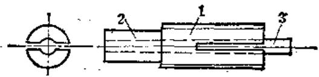  
图9-4-14 用于  $\phi 20\mathrm{mm}$  以下的研磨棒  
1—研磨棒 2—研磨棒托棒 3—调节锥棒

研磨外螺纹时，采用与图9-4-10相同的结构，只是将锥形研磨套改成螺纹研磨环即可。

用研磨来修复精密丝杠时，需将丝杠作细致的精度检查。检查项目包括中径尺寸变动量、螺距及螺距的累积误差、左右齿形半角、大径和小径尺寸。并绘出磨损曲线。

根据测得的大径、中径、小径及齿形半角来设计和制造丝杠研磨套和丝锥。研磨套和丝锥的数量，应根据中径尺寸变动量来决定：中径差 $\leqslant 0.2\mathrm{mm}$ 时，需要两个尺寸不同的丝锥及两种尺寸的研磨套各两个（丝杠长度大于  $1\mathrm{m}$  以上者需各三个）；中径差  $\leqslant 0.4\mathrm{mm}$  时，需要三个不同尺寸的丝锥及三种尺寸的研磨套各两个（丝杠长度大于1米以上者需各三个）。各种不同尺寸的研磨套上的螺纹，由相应尺寸的丝锥攻出，丝锥的齿形半角应与被修丝杠严格一致。尺寸最小的丝锥除了精攻最后一组研磨套上的螺纹外，还作精攻修后螺母用。

（1）外螺纹研磨套的设计 研磨套在结构上一般有两种，它们都可以在研磨过程中调节螺纹的中径尺寸，如图9-4-15和图9-4-16。

研磨套的各部尺寸如下：

$$
L = (1 4 \sim 1 8) P
$$

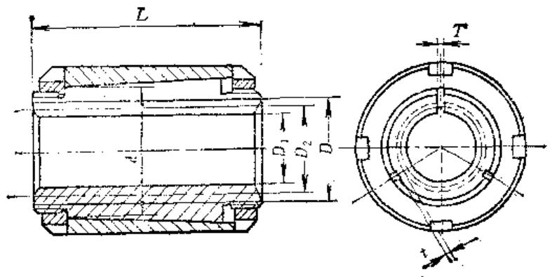  
图9-4-15 研磨套（一）

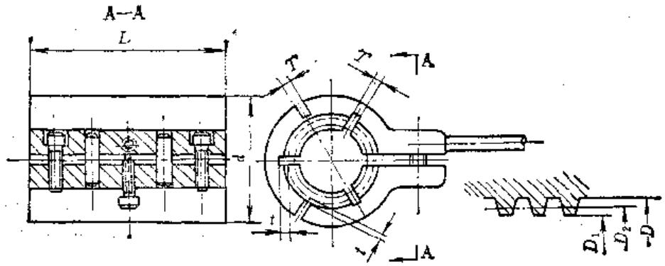  
图9-4-16 研磨套（二）

$$
\begin{array}{l} D = \text {丝 杠 大 径} + 2 C, \\ D _ {1} = \text {丝 杠 小 径} + C, \\ \end{array}
$$

$$
\text {当} P = 3 \sim 4 \mathrm {m m} \text {时 ，} C = 0. 2 5 \mathrm {m m},
$$

$$
\text {当} P \geqslant 5 \mathrm {m m} \text {时 ,} C = 0. 5 \mathrm {m m},
$$

$$
\begin{array}{l} \begin{array}{r l} d & = D + (2 \sim 4) F, T = 3 \sim 4 \mathrm {m m}, t = \\ & 1 \sim 3 \mathrm {m m}, \end{array} \\ D _ {2 1} = \text {实 测 的 丝 杠 最 大 中 径} + (0. 0 0 5 \sim 0. 0 0 8 \mathrm {m m}), \\ D _ {2 2} = d _ {\text {中 径} 1} - (0. 1 4 \sim 0. 2 0 \mathrm {m m}), \\ D _ {2 3} = d _ {\text {中 总} 2} - (0. 1 4 \sim 0. 2 \mathrm {m m}), \\ \end{array}
$$

$$
D _ {2} ^ {\prime} = \text {实 测 的 丝 杠 最 小 中 径} - (0. 0 0 5 \sim 0. 0 1 \mathrm {m m}) 。
$$

式中  $L$  ——研磨套长度；

$\pmb{d}$  ——研磨套外径；

$D$  ——螺纹大径；

$D_{1}$  ——螺纹小径；

$P$  ——螺纹螺距；

$\pmb{T}$  ——开槽的槽宽；

$i$  ——槽底与螺纹外径的距离；

$D_{21}$  ——第一组研磨套的中径尺寸；

$D_{22}$  ——第二组研磨套的中径尺寸；

$\pmb{D}_{23}$  ——第三组研磨套的中径尺寸；

$D_2^{\prime}$  最后一组研磨套的中径尺寸；

$C$  ——常数。

研磨套材料为HT150铸铁，不得有砂眼、气孔、裂痕和疏松现象。

（2）丝锥的设计 丝锥刃部的螺纹由导向、切削及校正三个部分组成，如图9-4-17所示，其技术要求如下：

1）每个螺距公差  $\pm 0.003\mathrm{mm}$ ； $25\mathrm{mm}$  上螺距的累积公差  $0.005\mathrm{mm}$ ；全长上螺距累积公差  $0.008\mathrm{mm}$ 。  
2）螺纹半角允许  $\pm 10^{\prime}$  
3）螺纹中径圆柱度公差  $0.005\mathrm{mm}$ 。  
4）丝锥的中径、大径、小径及齿形半角都根据不同尺寸的研磨套设计。

  
图9-4-17 丝锥

5）材料W18Cr4V，刃部热处理HRC62～63；柄部HRC30～40。

# （二）机械研磨设备

# 1. 单盘研磨机和双盘研磨机

图9-4-18为研磨平面用的光学单盘研磨机。研磨盘1由转轴5带动旋转，压力盘4由曲柄连杆机构10驱动，连杆8、9以0点为旋转中心而产生滑动从而获得必要的研磨速度。研磨盘和曲柄的转速以及曲柄的冲程都可以作无级调节。由于杆8可以绕杆9摆动，同时压力盘是球面支承，故可使工件和工具互相自由滑动。压力盘的压力借增减重锤7的重量来调节。

图9-4-18 光学平面单盘研磨机  
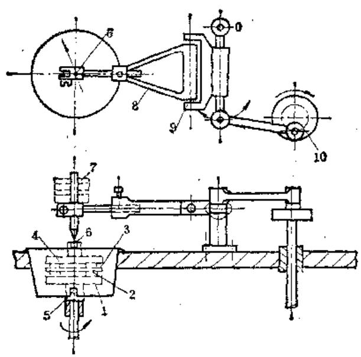  
1—研磨盘 2—工件 3—隔板 4—压力  
盘5一轴6一钢球（摆动装置）7一重锤  
8.9-连杆 10-曲柄连杆机构

这种单盘研磨机也可以研磨外圆和球面。

图9-4-19为研磨平行平面和圆柱形工件用的双盘研磨机。上研磨盘1和下研磨盘2以同向或反向转动；隔板3由偏心轴5传动，以获得所需要的滑动速度；下研磨盘2不能调节，用一根空心轴传动；上研磨盘1安装在一个可向两旁转动的悬臂之中，以便于工件的装卸，并可沿轴向升降，以获得所需要的工作压力。

图9-4-20为研磨外圆锥面用的双盘研磨机。下研磨盘2做成与工件3的锥形一致。这种双盘研磨机与上面一种不同之点在于，偏心轴4是位于上研

图9-4-19 双盘研磨机  
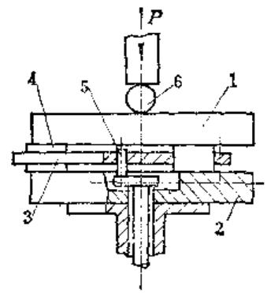  
1—上研磨盘 2—下研磨盘 3—隔板 4—工件

图9-4-20 双盘外圆锥研磨机  
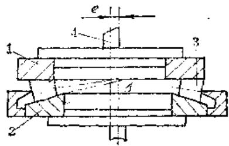  
5—偏心轴 6—上研磨盘可摆动装置  
1—上研磨盘 2—下研磨盘 3—工件 4—偏心轴  
A一研磨盘旋转中心

磨盘1的中心线上，隔板不作附加的运动，而与下研磨盘作同圆心转动，在研磨盘上加装一环形刀口支承以保证工件大头的尺寸一致。

# 2. 内圆研磨机

内圆研磨机的结构与立式内孔珩磨机相似，见图9-4-21。主轴可以作上下的往复运动和旋转运动，研磨棒的冲程可以无级调节，工具和工件的装夹机构均采用可以调心的夹头，可以摆动，能够加工出较满意的内圆。这种研磨机可用现有机床如立式珩磨机或钻床等改装。

# 3. 钢球研磨机

图9-4-22为研磨钢球的研磨机，是根据图9-4-20的结构制成，上研磨盘1一般不转动，由下研磨盘2带动作自由转动。上研磨盘可以摆动，以获得所需的滑动速度。

# 4. 齿轮研磨机

圆柱齿轮研磨机有平行轴及交叉轴两种。

（1）平行轴线研齿机 此种研磨机具有下列三种运动，参见图9-4-23；  
1）工件齿轮和研轮的对滚运动，正转和反转交替进行。

图9-4-21 内圆研磨机  
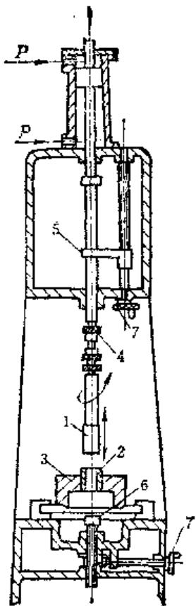  
1—研磨棒 2—工件 3—可摆动的 工件夹头 4—研磨棒可摆动夹头 5、6—楔块 7—手轮

图9-4-22 球面研磨机  
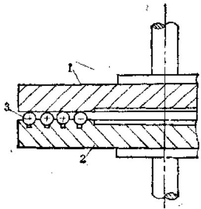  
1—上研磨盘 2—下研磨盘 3—工件

2）研轮快速轴向摆动。  
3）工件齿轮的径向摆动。

由于工件齿面和研轮齿面同时有相对滚动和滑动，从而产生切削作用。但滑移量在整个齿面高度上是不均匀的（分度圆附近滑移小，齿顶及齿根部分滑移大），附加的轴向及径向摆动就是为了使相对滑移比较均匀。

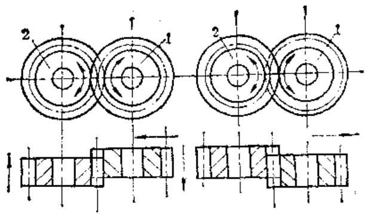  
图9-4-23 平行轴线研齿运动示意图 1—工件 2—研轮

平行轴线研齿机结构简单，可用旧机床改装而成。

（2）交叉轴线研齿机 研轮和工件齿轮轴线交叉成一角度，构成螺旋齿轮副的啮合，见图9-4-24，三个研轮是螺旋角为  $3^{\circ} \sim 10^{\circ}$  的螺旋齿轮。这种研齿法的优点是：齿面的相对滑动增大，加速了研磨作用，共轭齿形的接触轨迹沿齿侧面逐渐改变位置，保证齿面研去量均匀，故在精度及生产率方面均优于平行轴线的研齿法。

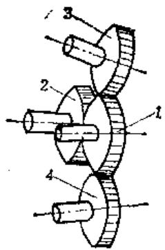  
图9-4-24 交叉轴线研齿运动示意图1一工作2、3、4一研轮

锥齿轮研磨多在锥齿轮研齿机或专用夹具上进行。研磨时，多采用对研的方法，即将相啮的一对齿轮互相对研。对研旋转运动由主动齿轮传给轻微制动的被动齿轮，由于齿表面间的滑动作用及连续加入研磨剂引起齿面的研磨作用，为了使研磨后的齿轮接触区的位置能符合切齿时预先规定的齿面接触区位置，就需要有一个均匀的在整个齿面上的研磨动作，为此，被动轮应有一个附加的摆动动作，见图9-4-25。

在研磨过程中，通过靠模板使被动轴在垂直位置  $V$  、水平位置  $H$  和轴向位置  $J$  在规定的范围内移

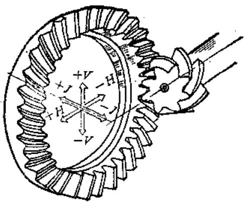  
图9-4-25 锥齿轮研赛机动作原理

动，从而实现被动轮的摆动动作。

附加摆动动作的范围要通过  $V \sim H \sim J$  的测定来得到。测定可在检验机或研磨机本身上进行。调整接触区使之符合要求，此时称“0”位。然后利用改变垂直位移  $V$  ，水平位移  $H$  及轴向位移  $J$  的办法，来获得在齿侧隙不变的情况下，被动轮齿凸面接触区位置尽可能靠近齿面小端（不跑出齿面小端）时的  $V$  、  $H$  、  $J$  的变化方向和数值。利用同样方法，来获得接触区移向齿面大端时，轮齿凹面的  $V$  、  $H$  、  $J$  的变化方向和数值，  $V$  向上为“+”，向下为“-”。  $H$  和  $J$  使两轮分开方向为“+”，接近方向为“-”，这样共可获得12个安装数据作为确定摆动运动的数据。

将上述数据通过靠模板输入机床后，从而使制动主轴在垂直、水平和相对轴向产生联合动作，即在运转中，使接触区沿齿长上往复移动，构成研磨运动。

由于“0”位时的接触区不一定在齿长的中间，研磨中齿两端采用等量的研磨时间，势必造成齿面的研磨作用出现轻重不一的结果，为此研齿机中设有研磨时间控制系统，实现齿面的均匀研磨。

# 第5节 研磨工具的材料

确定研磨工具的材质时应遵循下列原则：1）研具材料应比被研工件材料软，组织均匀，具有一定弹性。2）耐磨性高，易于加工，寿命长，变形小。3）表面光滑无裂纹和斑点等缺陷。

研具材料较工件软，可避免在研磨过程中磨粒被嵌入工件表面而影响使用。但研具材质太软，磨粒将大量嵌入研具表层内，使磨料失去切削作用，

凡研具容易丧失精度，影响工件的加工精度。反之，研具太硬会加快磨粒的粉碎及细化，也会降低切削性能及磨料的使用寿命。

粗研磨应选用质地较软、结晶较粗的材料，以便嵌入较粗的磨粒，可提高研磨效率；精研磨则应选用质地较硬，结晶细密的材料。例如有资料推荐。嵌砂研磨量块用的铸铁研具，在粗研时，嵌入白刚玉研磨粉的粒度是W3.5，选用硬度为  $110\sim$  140HBS为佳；在精研时，嵌入W1～W1.5白刚玉研磨粉，选用硬度为  $130\sim 180\mathrm{HBS}$  为佳。

用白刚玉和碳化硼研磨常选用铸铁、软钢及铜制造研具；用氧化铬研磨则常选用玻璃、沥青、铸铁、牛皮及毛毡制造研具；用金刚石磨料研磨时多用玻璃及铸铁研具。

常用的研具材料有下列几种：

1）灰铸铁 由于含有片状石墨，有较好的嵌砂性能，良好的耐磨性、润滑性；铸铁研具制造费用低，精度保持性好；控制其成分可获得多种性能及结晶的铸件，能满足多种材质工件对研具的要求。  
灰铸铁研具适用于粗精研磨，常用的硬度范围为  $140\sim 200\mathrm{HBS}$  ，以细颗粒珠光体铸铁效果较好。在精密研磨中，选用高磷铸铁制造研具，可获得很低的加工表面粗糙度，其硬度范围为  $130\sim 180\mathrm{HBS}$  表面硬度差小于5HBS。  
2）软钢 常用牌号为10钢、20钢；因软钢较铸铁强度好，可制成形状复杂和细小的研具，多用于螺纹、锥孔及小直径孔的研具。  
3）铜易嵌入大尺寸磨粒，适于粗研余量较大的工作研具，研磨效率较高，但研具磨损较快。研磨  $\phi 5\sim \phi 15$  的孔时，宜用铜或黄铜制造研棒。如研磨时加入硫酸铜液能作化学粗研磨加工。  
4）铝 用于研磨软钢及其它软金属。  
5）铅 用于研磨软钢及其它软金属，如研磨轴瓦等。  
6）木材、皮革 用于研磨铜及其它软金属，并可用于抛光。  
7）沥青 用于玻璃、水晶和其它透明材料的研磨和抛光。  
8）玻璃因玻璃研具硬度较高，只适于敷砂研磨和抛光工件。将氧化铬研磨膏敷于玻璃研具上可研磨淬硬工件的平面或轴颈，能获得极高的精度和较低的加工表面粗糙度。

9）棉布、丝绸、毛毡 用于制做抛光轮及抛光带来抛光圆表面及平面。

# 第6节 研磨方法

研磨方法一般分为手工研磨和机械研磨两种，根据磨料是否嵌入研具的情况，研磨又可分为嵌砂研磨和敷砂研磨两种。

# 1）嵌砂研磨

① 自由嵌砂法 磨料直接加在工作区域内，在研磨过程中磨料被挤压而自动地嵌入研具。  
② 强迫嵌砂法 在研磨零件前，用压砂机或其他工具事先将磨料挤压到研具表面上，然后将浮在研具表面上的磨料洗去，将零件放在嵌砂研具上研磨。强迫嵌砂法主要用来研磨量具、检具和精密度极高的零件。  
2）敷砂研磨 研磨时，选用较软的磨料（如氧化铬等），而研具则用较硬的材料，如淬硬钢、镜面玻璃等。研磨过程中，磨粒处于自由状态，不嵌入研具表面。

# （一）平面研磨

（1）研磨方法 当零件的尺寸较小，研磨要求不太高时，可用精确的研磨平板进行研磨。先将研磨平板和零件表面清洗，抹拭干净后均匀涂上研磨剂，把零件放在研磨平板上，用手按住进行研磨。研磨时，零件按8字形轨迹运动，见图9-6-1，使磨痕交叉以降低表面粗糙度。每研磨一段时间后，要变动零件在研磨平板上的位置，并不断将零件调头研磨（一般圆形零件调转  $120^{\circ}$ ，方形  $90^{\circ}$ ，长条形  $180^{\circ}$ ），使研磨平板磨损均匀和使零件被研面上研去量相等。

图9-6-1 零件按8字形轨迹研磨  
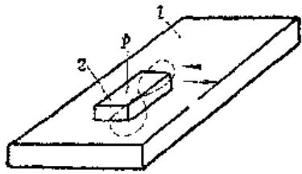  
1—研磨平板 2—工件  
$P$  一研磨压力

研磨长的零件平面时，因无大型研磨平板，可采用研磨平尺见图9-6-2，象锉刀一样操作，按检

图9-6-2 长零件的平面研磨  
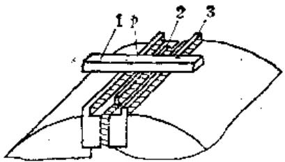  
1—研磨平尺 2—工件 3—虎钳钳口和导尺  
$\pmb{P}$  一研磨压力

验记录或误差记录曲线针对性研磨。

特殊形状的零件研磨可采用旋转研磨盘，研磨时用手握住零件，将被研表面靠在研磨盘平面上，作径向往复运动。

在大批生产中，可采用机械研磨法，在平面研磨机上研磨平面。

# （2）研磨平面举例

# 1）工件和技术要求

零件名称：大型研磨平尺  $600 \times 30 \times 40 \mathrm{~mm}$

材料及热处理：GCr15，淬硬HRC62~64；

技术要求：精度零级，工作表面粗糙度  $R_{\mathrm{a}}0.012\mu \mathrm{m}$ 。

2）研前的精磨应用白色氯化铝中软1、粒度为  $60^{\#}$  砂轮磨削。为保证工件平直，防止裂纹，切削用量要小，最后精磨进给量为  $2\sim 3\mu \mathrm{m}$ ，表面粗糙度  $R_{\mathrm{a}}0.20\mu \mathrm{m}$  。此外，还应退磁（在电磁工作台上加工的零件），去毛刺、倒棱。  
3）粗研用嵌砂研磨。平板尺寸  $500 \times 500\mathrm{mm}$ ，压入W5白刚玉。粗研用湿研法，为防止热变形，在平尺上镶上护板绝热。粗研表面粗糙度达到  $R_{\mathrm{a}}0.100\mu \mathrm{m}$ ，直线性用刀口样板平尺以光隙法检查，光隙不大于  $3 \sim 5\mu \mathrm{m}$ 。  
4）半精研平尺清洗后在恒温间内恒温  $2\mathrm{h}$  用嵌砂研磨，在  $500\times 500\mathrm{mm}$  研磨平板上压入W3.5白刚玉。半精研用干研法，施加压力为  $\mathbf{0.01MPa}$  。平尺应支撑在距两端  $2 / 9$  处，用  $\phi 80$  平晶检查干涉带应基本无弯曲，研后表面粗糙度要达到 $R_{\phi}0.050\mu \mathrm{m}_{\circ}$  
5）精研平尺洗净后经恒温  $3\sim 4\mathrm{h}$  ，用嵌砂法研磨，在  $500\times 500\mathrm{mm}$  零级研磨平板上压入W2.5白刚玉。先用天然油石打去镶嵌在平板上的W2.5白刚玉微粒的高峰，再用航空汽油把平板洗净，加少量硬脂，以降低研磨粗糙度。在研磨过程中，压力

约  $5\mathrm{kPa}$ ，施力要大小均匀，研磨速度约为  $5\mathrm{m} / \mathrm{min}$ ，还要注意清洁，温度恒定。研后表面粗糙度应在  $R_{a}$  0.012μm以下，用  $\phi 150\mathrm{mm}1$  级平晶分段检查。

# （二）外圆研磨

# （1）手工研磨外圆的一般程序

1）先仔细清除工件和研具上的毛刺并用煤油清洗擦干。检查被研表面的几何形状误差（圆柱度、粗糙度）及尺寸，调整研磨套与零件的相配尺寸，做到研前心中有数。

2）将工件装在车床主轴时，要防止装夹变形及顶的过紧。

3）按研磨速度，初选出主轴转数。

4）用软刷将研磨剂分别均匀涂在工件及研具孔中，套入研具后启动机床进行研磨。研时应先注意纠正圆柱度偏差，这时可用短研磨套或研磨平尺来局部研磨，待圆柱度误差基本消除后，再在被研表面上均匀研磨。研磨时用手或用机床带动研具作轴向往复运动。用手研时，凭阻力大小的感觉来判别研磨效果。

5）研磨过程中要经常添加研磨剂，以提高研磨效率，并不断调节研具与工件的配合，保持适当的研磨阻力。

6）当即将达到工件尺寸要求时，应停止添加研磨剂，利用颗粒细化的作用继续研一段时间，以得到较低的表面粗糙度。

7）研后，停止机床，取下工件及研具，清洗后进行技术测量。若不符要求，应继续研磨。

对于精度要求较高及表面粗糙度低的工件，粗研和精研及抛光应分别进行，研磨剂不可混用。

对于中间有槽的零件如滑阀等，为避免研后引起形状误差，要尽量减小研磨余量。

滑阀外圆研磨后易产生如图9-6-3所示的误差，其原因是由于研磨剂往两端堆积，以及研具配合太松引起摆动，使两端研磨较快。消除方法是在研磨过程中经常注意研具与工件的配合松紧程度，以及尽量减小研磨余量和磨料堆积现象。

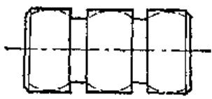  
图9-6-3 外圆研磨后易产生的误差

研磨滚子或滚针之类的小零件时，可在双盘研磨机上进行。此时零件放在上下研磨盘之间的隔板槽内。为了使滚子研磨后不出现腰鼓形，增加相对滑动速度，隔板槽的中心线应与研磨盘半径偏斜一个角度  $\gamma$  ，见图9-6-4，  $\gamma$  值一般为  $10^{\circ} \sim 25^{\circ}$  。隔板可用钢板或塑料板制造，其厚度比工件直径要小些。小直径的隔板可做成整体的，大直径的可用几块板拼合组成。滚子或滚针之类零件多用合金钢淬火制造，研磨余量的大小大致与滚子直径无关，而与研后降低的表面粗糙度等级数有关；粗糙度研前研后同级者，余量约为  $0.005 \sim 0.03 \mathrm{~mm}$  ；降低粗糙度  $1 \sim 2$  级者，余量为  $0.01 \sim 0.05 \mathrm{~mm}$  ；降低  $3 \sim 4$  级者，余量为  $0.05 \sim 0.17 \mathrm{~mm}$  。

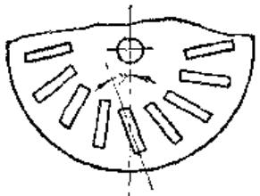  
图9-6-4 研磨滚子类零件的情况

# （2）研磨外圆举例

# 1）螺纹磨床主轴的研磨

① 粗研 转数  $210 \sim 350 \mathrm{r} / \mathrm{min}$ ，磨料为白色氧化铝，粒度  $280^{\circ}$ ；研磨工具为研磨平尺和可调研磨套；粗研时要基本消除轴颈的几何形状误差，研后达到：圆柱度误差小于  $0.002 \mathrm{~mm}$ ，两轴颈尺寸差不大于  $0.002 \mathrm{~mm}$ ，且只许带凸缘端轴颈大。

② 精研 用W28（或W14）研磨膏和研磨直尺研磨，转数为  $350 \sim 500 \mathrm{r} / \mathrm{min}$ 。

③ 初抛光 用皮及W10、W7、W5研磨膏，转数为  $800\pi / \min$ ；表面粗糙度可达到 $R_{a}0.025\mu m$  以下。

④ 精抛光 用W1.5研磨膏及猪油和白绸，抛后应达到镜面。

# 2）镗杆的研磨

① 适用范围 修前镗杆圆柱度误差不超过  $0.03\mathrm{mm}$ 。  
② 研磨工艺 研具用铸铁套（HT200），磨料为棕刚玉，粗研用  $240^{\circ} \sim 280^{\circ}$ ，精研用W28～W20，研磨速度为  $15 \sim 20 \mathrm{~m} / \mathrm{min}$ 。  
③ 粗研时要基本上消除镗杆的圆柱度误差；精研时要达到粗糙度  $R_{\mathrm{a}}0.050\mu \mathrm{m}$  ；用牛皮轮加氧化铬（W7、W5）抛光。

# （三）内孔研磨

（1）手工研磨内孔的一般程序 手工研磨套状零件的内孔时，操作方法大致同研磨外圆一样，使研棒在机床上旋转，工件套在研棒上，用手或机动令套往复运动进行研磨。研磨箱体孔的一般程序如下：

1）清除工件及研棒的毛刺并用煤油洗涤擦净，检查孔的几何精度偏差。  
2）将工件固定在平台上，使被研孔中心线垂直于自然水平面。固定时支承要合理，避免引起装夹变形，并使孔径小端朝下。  
3）调整研磨棒外圆尺寸使其与孔配合适当。  
4）将研磨棒放入孔中试研一次，检查有无卡住现象。往复运动自如后，用软刷将研磨剂涂于研磨棒表面，用手反正转动研磨棒同时作往复运动进行研磨。  
5）在研磨过程中要不断添加适量的研磨剂，以保持切削作用，并注意清除孔两端堆积的研磨剂，以免工件产生喇叭口现象。

孔锥度较大时，应先用短研磨棒集中研磨孔径小的部位，待孔径扩大后再换长研磨棒研磨整个孔径。

研磨棒磨损后，应更换新棒或调整研磨棒与孔的配合松紧程度。太紧时易使表面刮毛，太松时会出现椭圆及孔素线不直等现象。

为纠正被研两孔的同轴度偏差时，两孔可用一根整体研磨棒同时研磨。如孔较长，研磨阻力较大时，也可分别研磨，但需在另一孔中装入支承扶套使研棒定心。扶套与研棒的配合应为g5。

研磨带有沉割槽的孔（图9-6-5）时，要注意由于研磨剂向两端堆积，易出现两头大中间小的鼓形误差，故应尽可能减小研磨余量。此外，研孔前应尽可能提高孔的形位（几何）精度，如采用拉、铰、磨等工艺。

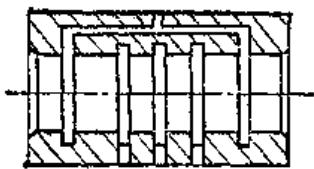  
图9-6-5 研磨带有沉割槽的孔

研磨铸铁件上的精密孔时，为防止磨料嵌入孔壁，应采用嵌砂法研磨。嵌砂时将研棒放在车床

上，用玻璃平尺或研磨套将磨粒压入研棒表面，使用时要洗去浮动的磨料。

精研孔后可达到下列精度：圆度  $0.001\sim$ $0.004\mathrm{mm}$  、圆柱度  $0.001\sim 0.003\mathrm{mm}$  、粗糙度 $R_{c}0.20\sim 0.025\mu \mathrm{m}_{\circ}$

（2）研磨内孔举例 修复螺纹磨床砂轮轴前后轴瓦。轴瓦材料为双金属（外套（钢背）为20钢，衬瓦为磷青铜  $10\sim 0.5$ ）。轴瓦尚有调整余量，内表面较好没有严重的划痕和擦伤。

1）研磨棒材料 铸铁HT200。  
2）研磨方法 用嵌砂法手工研磨。  
3）研磨剂 粗研用W28研磨膏，精研用W7及W3.5研磨膏。研磨液用煤油加入少量20号机械油。  
4）操作研磨后孔径应等于主轴轴颈尺寸，公差  $\pm 0.005\mathrm{mm}$  ，圆度及圆柱度误差小于  $0.002\mathrm{mm}$  研棒长度大于两轴承外端距离  $150\mathrm{mm}$  ，沿全长车有左右旋两条油沟，并倒去沟槽棱边上的毛刺。研磨时垂直安放研磨棒，并做上下及旋转运动。工作地及研磨剂应清洁，严禁混入脏物。

# （四）锥体研磨

（1）内锥孔研磨 用研磨棒研磨内锥孔时，为保证研后锥孔几何形状的准确性，应用环规检验研磨棒的接触质量，合格后方可用来研磨。研磨时，用手来回旋转研磨棒，并经常将研磨棒稍微向外拔出，以使研磨剂分布均匀后再推入研磨。如果锥孔有摆差，则应根据偏差方向，确定研磨部位及单面施力方向。研时先用非整圆研磨棒（或单面施力）纠正锥孔的摆差，待摆差基本合格后，再用合格的研磨棒来研磨，以提高锥孔的几何精度。在研磨过程中，要经常用标准常规检验锥孔的接触质量，发现接触不好时，可在研磨棒局部涂上研磨剂来研磨纠正。  
（2）外锥体的研磨 可在车床上手动进行，锥度偏差用研磨平尺纠正。锥体的圆度误差，则用锥形研磨套来纠正。研磨时，研磨套应作适量的轴向往复运动，以便使研磨剂均匀分布。

# （五）球面研磨

非全球面（例如球形接头）绝大部分用手工研磨，将工件安装在机床主轴上转动，手握工具进行研磨。所用研磨工具应与工件的形状一致。

球面粗精研磨时所用的研磨剂为200号粒度的白色氧化铝  $\left(\mathrm{Al}_{2} \mathrm{O}_{3}\right)$ ，抛光用粒度为  $2 \sim 5 \mu \mathrm{m}$  的绿油  $\left(\mathrm{Cr}_{2} \mathrm{O}_{3}\right)$  或氧化铁（铁丹粉）。

# （六）螺纹研磨

# （1）研磨螺纹的一般方法

1）研磨内螺纹时用表面具有相当螺纹的研磨棒，工具安装在机床主轴上作正反转运动，用手握工件在研磨棒上往复运动；研磨外螺纹时用表面具有内螺纹的研磨环，工件安装在机床主轴上作正反转运动，用手握工具在工件螺纹表面上作往复移动。  
2）螺纹在研磨前必须经过精密预加工，否则工件精度和表面粗糙度均达不到要求。外螺纹的预加工可用精磨或精车，内螺纹的预加工一般用精车或用丝锥加工。内螺纹预加工后的研磨余量为  $0.06 \sim 0.10 \mathrm{~mm}$ ，外螺纹为  $0.003 \sim 0.005 \mathrm{~mm}$ 。  
3）螺纹研磨的速度一般在  $20\sim 100\mathrm{m / min}$  ，工件转数（或工具转数）与螺距及螺纹的直径有关，见表9-6-1。

表9-6-1 研磨螺纹的特数 (r/mio)  

<table><tr><td rowspan="2">螺纹直径 (mm)</td><td colspan="4">螺 距 (mm)</td></tr><tr><td>0.5~0.8</td><td>1~2</td><td>2.5~3.5</td><td>4~6</td></tr><tr><td>&lt;6</td><td>600</td><td>500</td><td>-</td><td>-</td></tr><tr><td>6~30</td><td>500</td><td>500</td><td>400</td><td>300</td></tr><tr><td>30~60</td><td>400</td><td>350</td><td>300</td><td>200</td></tr><tr><td>60~120</td><td>-</td><td>350</td><td>250</td><td>150</td></tr></table>

（2）研磨螺纹举例 用研磨来修复精密丝杠

1）以丝杠的轴颈为基准，研磨丝杠的两端中心孔至粗糙度  $R_{\mathrm{a}}0.100\mu \mathrm{m}$  ，轴颈的径向跳动在 $0.005\mathrm{mm}$  以内。

2）粗研

① 将丝杠顶在车床的两顶尖间，以鸡心夹头带动丝杠转动。研磨时，丝杠中径上的研削速度为  $3.5 \sim 4 \mathrm{~m} / \mathrm{min}$ ，研磨套涂研磨剂（ $\mathrm{Al}_{2} \mathrm{O}_{3}$  研磨粉W10加上  $30 \%$  油酸， $5 \%$  煤油）后旋在丝杠上。研磨时，根据丝杠不同的磨损情况，采用不同的方法：对于两工作面都磨损的丝杠，在丝杠的正反研磨时，对研磨套都施加阻力（作用于研磨套移动的相反方向），对于一个工作面磨损较多的丝杠，在正反研磨时，仅对磨损较多的一面施加阻力；也可以

只对需要研磨的丝杠一个工作面上涂研磨剂，另一面不涂，并只对一面施加压力。

② 在研磨一段时期后，需用煤油清洗丝杠，更换研磨剂。随着丝杠中径被研小，调整研磨套，使研磨套的中径减小，保持研磨套手柄上的阻力约  $10 \sim 30 \mathrm{~N}$  。  
③ 丝杠螺纹经一定时间研磨后，用三针测量法测量研磨部分的中径在研磨前后的变化，当中径减  $0.07 \sim 0.1 \mathrm{~mm}$  时，需更换一个同组内的研磨套（尺寸与上一个相同）。  
④ 研磨套的行程长短要根据中径曲线图决定，把中径差分为若干区域，如图9-6-6中1为粗研的区域（第1组研磨套），2为半精研的区域（第二组研磨套），3及4为精研区域。

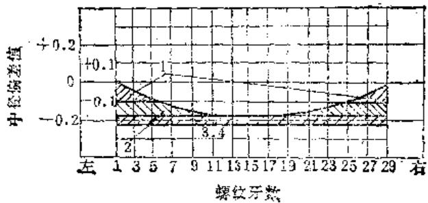  
图9-6-5 中径曲线图

⑤ 也可以根据螺距误差曲线按研磨量每  $0.004\mathrm{mm}$  纵坐标分为若干区域，见图9-6-7。如二面磨损的丝杠螺距累积误差曲线，其左工作面的螺距自第1牙至29牙系逐渐增加的，而自31牙至55牙系逐渐减少的。图顶部系左工作面的研磨分区，1区需研磨去  $0.004\mathrm{mm}$ ，2区需研磨去  $0.008\mathrm{mm}$ ，3区需研磨去  $0.012\mathrm{mm}$ ，4区需研磨去  $0.016\mathrm{mm}$ ，0区不需研磨，因此将丝杠全长上的左工作面上涂研

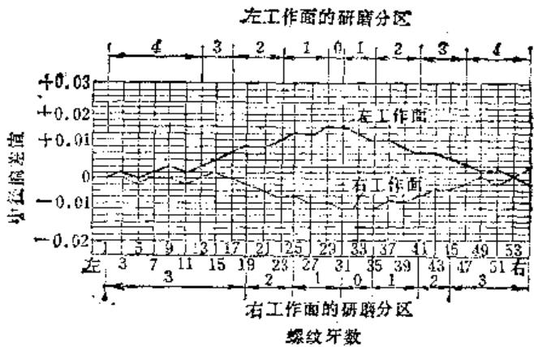  
图9-6-7 弹距误差曲线图

磨剂，用研磨套自4至1区域内单面研磨一定次数（约  $10\sim 20$  次），在4至2区域内单面研磨相同次数，在4至3区域内单面研磨相同次数，在4区域内单面研磨相同次数，待清洗丝杠后交计量部门测量修复情况，如左工作面仍成中凸现象，仍可按测量结果进行如上的分区研磨，直至研磨到精度为止。右工作面也同样分为3个区域进行单面分区研磨修复。

如果右工作面的螺距累积误差曲线出现如图9-6-7的左工作面的中凸现象时，则4区需研磨去  $0.004\mathrm{mm}$ ，3区需研磨去  $0.008\mathrm{mm}$ ，2区需研磨去  $0.012\mathrm{mm}$ ，1区及0区需研磨去  $0.016\mathrm{mm}$ ，也即研磨区域需按研磨量来分区进行。

同样，如果左工作面的螺距累积误差曲线出现中凹现象时，也如上述方法进行。因此在研磨修复丝杠时必须注意误差曲线形状和螺纹的那一面才能正确决定研磨方法。

⑥ 在研磨过程中，随时注意丝杠的温度，勿使温升过高（一般以手摸丝杠没有热的感觉为度），以免影响螺距精度。同时，应经常检查中径的振摆，不使丝杠弯曲。

⑦ 送计量室检查丝杠左右两工作面上的各螺距误差，根据研磨前后的变化，进一步考虑研磨的方法。

⑧ 重复上述的粗研工作，直至丝杠的中径尺寸接近一致，螺距精度接近恢复原有精度时，再进行精研。

3）精研 研磨剂是  $\mathrm{Al}_{2}\mathrm{O}_{3}$ （M4）研磨粉加  $30\%$  油酸及  $5\%$  煤油。精研前将丝杠及最小尺寸的一组研磨套清洗好，将研磨膏稀释，再分别涂在丝杠及研磨套上，在丝杠的全长上研磨。精研时，更应注意丝杠的温度。精研工作直至研磨套在全长上移动时的阻力均匀，仔细清洗后，交计量室检查合格为止。如研磨方法得当，研磨修复丝杠的精度：每个螺距及  $25\mathrm{mm}$  累积螺距误差为  $0.002\mathrm{mm}$ ， $300\mathrm{mm}$  累积螺距误差为  $0.008\mathrm{mm}$ 。

# （七）齿轮研磨

齿轮研磨后能增加齿面的接触面积，降低齿面粗糙度，降低运转噪音，并在一定程度上对齿圈径向跳动、齿距和齿形误差有所改善。研齿对齿轮误差的修正能力与研前工序的加工精度有密切关系。因研齿只能去掉很小的余量  $(0.01\sim 0.03\mathrm{mm})$  ，如

果研前齿轮精度为  $7 \sim 6$  级，淬火后变形不大，研后可以保证  $7 \sim 6$  级，但当齿形误差大于  $0.04 \sim 0.05 \mathrm{~mm}$  时，则研齿效果很低，只能降低齿面粗糙度。

因研齿对齿轮误差的纠正能力很有限，通常并不作为一个独立的齿形加工工序。仅在某些特殊情况下，例如内齿、不能剃和磨的齿轮以及锥齿轮，研齿才作为齿形的最后加工工序运用。

研磨圆柱齿轮所用研轮的精度应与被研齿轮精度相适应。研磨高精度齿轮时，研轮精度不低于6级。

研齿一般在齿轮研磨机或配对机上进行，亦可利用现有设备进行改造或装上夹具来研齿。研齿使用的磨料粒度一般为  $200^{*} \sim 250^{*}$ ，研齿过程经历下列三个阶段：

第一阶段——除去齿面的不平、伤痕及不大的热处理变形的阶段。在此阶段中，可以提高表面质量和降低表面粗糙度，亦可稍为提高齿形精度。

第二阶段——均匀磨损阶段。此时齿形既不变好，也不变坏。

第三阶段——由不均匀的相对滑动而使齿形变坏阶段。

从上述研齿过程中可以看出，真正有利的是第一阶段，故必须尽可能加以利用，而避免第二、三阶段。

# 第7节 影响研磨精度的因素

影响研磨精度的因素很复杂，综合起来，大致有以下几个主要方面：

1）研磨运动的准确性。  
2）研磨剂的性质（种类、粒度等）。

3）研磨工具材料的性能（硬度、耐磨性、机械性能等）及其制造质量。  
4）工件的材料性能（材料种类、硬度等）。  
5）研磨用量（研磨速度与研磨压力）。  
6）前道工序预加工精度的准确性及表面质量。  
7）研磨余量的均匀性。  
8）研磨液的性质（种类，纯洁性）。

9）操作工人的技术水平。  
10）工作地点的清洁程度、温度等。

表9-7-1列出研磨时常见的缺陷及消除方法，可供参考。

表9-7-1 研磨时常见的缺陷及消除方法  

<table><tr><td>缺陷</td><td>主要原因</td><td>消除方法</td></tr><tr><td>发黑</td><td>工件材料硬度不均匀</td><td>通过适当的热处理来消除</td></tr><tr><td>不光洁</td><td>1.研磨剂中有粗颗粒或其他污秽2.工件不洁,预加工时有灰尘和切屑未除去3.工件有毛刺4.工具和机器不清洁5.粗研磨剂和精研磨剂用得不当6.工件材料硬度不均匀7.研磨液不清洁,有杂质8.研磨速度太快9.工作地点不清洁,有灰尘</td><td>使用较均匀的研磨剂,严格保管研磨剂,防止尘埃混入工件在研磨之前进行清洗去毛刺或把边上磨光清洗工具和机器,把粗研磨和精研磨的工具严格分开使用粒度要选择得可使磨度被后来的研磨剂很快地磨去通过适当的热处理来消除充分地过滤减低研磨速度与易产生灰尘的机器(例如磨床)远离</td></tr><tr><td>表面粗糙、暗淡</td><td>1.研磨工具不适合2.研磨剂太粗3.研磨剂太硬4.研磨液不适合</td><td>注意研磨工具表面是否光滑使用较细的研磨剂使用较软的研磨剂试用其他研磨液</td></tr><tr><td>形状误差</td><td>1.需要研磨的面积太小2.预加工不准确3.研磨工具有缺陷4.研磨工具有跳动5.研磨速度太高6.研磨压力太大7.研磨剂膜太厚8.研磨剂粒度太粗9.研磨运动不准确10.工件材料硬度不均匀11.前道工序不准确,使余量分布不均匀12.研磨时间太长</td><td>用支承夹具研磨或把几个工件拼合起来进行研磨尽可能使预加工准确修整工具重新调整减小研磨速度减小研磨压力减少研磨剂添加量,或使用稀释的研磨液不断地将较厚处的研磨剂均匀去掉试用细粒度的研磨剂重新调整,经常调头研用适当的热处理来消除使预加工余量尽可能均匀准确地预加工,减小研磨余量</td></tr><tr><td>研磨工具耗损太快</td><td>1.预加工不准确2.研磨余量太大3.研磨工具太软4.研磨运动不准确</td><td>准确地预加工,减小研磨余量准确地预加工,减小研磨余量试用其他较硬的材料尽可能使工具表面均匀参与研磨</td></tr><tr><td>研磨上的太长</td><td>1.研磨剂不适宜,太软2.研磨剂太细3.研磨速度太低4.研磨压力太小5.预加工不良6.研磨余量太大7.工件形状不宜研磨8.研磨剂用量不恰当</td><td>试用其他研磨剂,使用较硬的研磨剂试用较粗粒度的研磨剂加大研磨速度加大研磨压力正确地预加工减小研磨余量改进工件形状减少或增加研磨剂添加量</td></tr></table>