# 第13章 振动诊断方法

# 姚家瑞

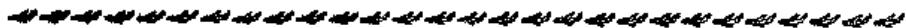

# 第1节 振动及其分析方法

通常把在设定某坐标系中某一量的大小随着时间的推移相对一基准值的增减现象叫振荡。在机械系统的运动中，这类振荡就叫振动。

机械内部发生异常时，一般均会出现振动量和振动波形的变化。以振动信息为依据，进行检测和解析，不用停机和解体，就可对机械的劣化状态作定量的掌握。这就是在设备诊断中广泛应用机械振动作为特征参数的原因。

# （一）振动的基本概念

# 1. 涨动的基本参数

为了说明振动的性质，大多使用振幅、频率、相位三种参数。由于用这些参数表示振动，可以对振动的激烈程度、振动的原因及不良部位等进行定量的观测。

（1）振幅 是表示振动体或质点距离其平均中心的幅。

振幅有位移振幅、速度振幅和加速度振幅之

分。表示方法有单振幅、双振幅两种。也有以最大值、平均值、有效值三种来表示振幅的。图13-1-1所示，是它们之间的相互关系。

（2）频率 重物从中间位置开始运动，经过最高位置、中间位置、最低位置，再返回到中间位置，这一个往返所需的时间叫做振动周期（图13-1-2）。每秒发生的振动周期次数叫做频率。周期和频率之间的关系式是：

$$
\text {频 率} (\mathrm {H z}) = 1 / \text {周 期}
$$

（3）相位所谓相位，就是表示振动部分相对于其它振动部分或其它固定部分处于什么位置关系的一种度量（图13-1-3）。这个量在找出发生异常的位置方面具有很重要的意义。

（4）振动参数的一般关系上面表示的振动，是正弦波的周期振动，它被称为简谐振动。如果用计算式表示这种简谐振动，使如表13-1-1所示。

# 2. 振动的三个基本量的意义及应用

设备在旋转运动和往复运动时，流体冲突时以及零件产生缺陷时，常常会发生振动。振动诊断就是根据振动量的测定、解析以查明振动的主要原

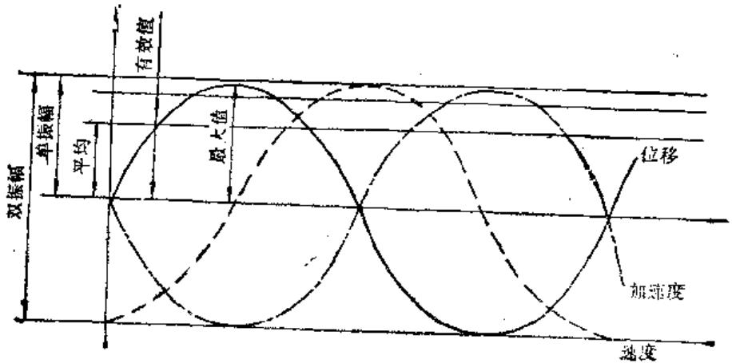

图13-1-1 振幅

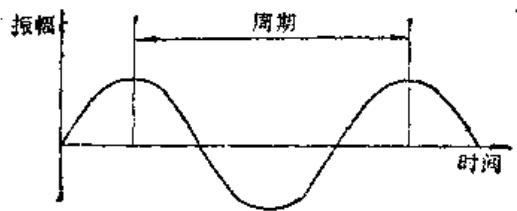

图13-1-2 振幅周期

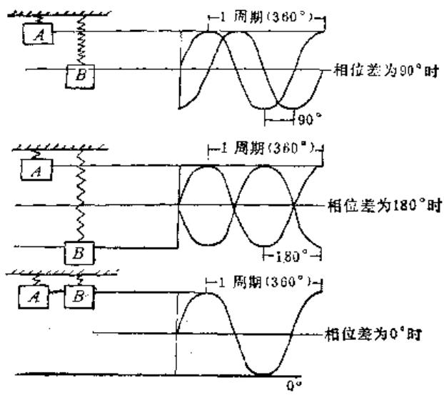

图13-1-3 相位

因。现将频率、振幅、相位三个基本量如何应用叙述如下：

（1）频率 是发现哪个零件由于何种原因而振动的重要量。如后述当滚动轴承、齿轮等发生异常，转子发生不平衡、联轴节不对中时，如果知道其频率就可了解振动的主要原因。

（2）振动值 振动值对了解设备的劣化度非常重要。但是位移、速度、加速度三种振动值的应

用因对象要求振动的严格程度而异。

1）位移 振动中的位移如前述是重物的移动量，根据这个移动量，支承重物的材料承受拉伸和压缩会导致破损，因而位移只是在不考虑与力成比例的频率的低频时应用。

2）速度 过去振动标准多采用位移为单位，现在一般采用速度单位为振动标准。产生振动的能与振动速度的平方成比例，由于振动能在设备内部传递扩散的过程产生磨损和缺陷，所以振动的速度是表示设备磨损劣化程度的有效量。从材料疲劳方面考虑，应以速度来评价。因为速度的公式是位移  $\times$  频率，而材料因反复应力所产生的疲劳破损，由应力振动（与位移成比例）和反复次数（频率）决定。因此，振动速度是磨损和疲劳的一个比较适当的评价值。

3）加速度 由于振动引起的动负荷与振动的平均加速度成比例。特别是高速机械小的振动引起的动负荷会造成支承部位和零件的破损，有产生大事故的危险性。由于加速度在高频领域敏感度好，可检出微小缺陷中产生的应力波。

（3）相位差 机械的两点间，例如两个轴承间的振动如有相位差，可以从频率或振动值的变化中检测出来。若两轴承间对中不好，则相位差大；若地脚螺栓有裂纹或松动，那末，机械地脚部和基础间的振动亦会产生相位差。

# （二）异常振动的分析方法

图13-1-4是一般旋转机械的轴承产生振动现象的波形图。一般来说，所观察到的振动是很复杂

表13-1-1 简谐振动参数间的基本关系

<table><tr><td>x = x0sinωt</td><td>x: 在时间t的位移量（mm或μ）</td></tr><tr><td>v = x0ωcosωt</td><td>x0: 最大位移，即峰值（mm或μ）</td></tr><tr><td>A = -x0ω2sinωτ</td><td>ω: 角速度（≈2xf Rad/s）</td></tr><tr><td>G = A/g</td><td>f: 频率（=ω/2πHz）</td></tr><tr><td>v0 = x0ω = 2πf x0</td><td>v: 速度（cm/s）</td></tr><tr><td>A0 = (2πf)2x0</td><td>u0: 最大速度（cm/s）</td></tr><tr><td>G0 = { (2πf)2·x0} / g</td><td>A: 加速度（cm/s2）</td></tr><tr><td></td><td>A0: 最大加速度（cm/s2）</td></tr><tr><td></td><td>g: 重力加速度（=980m/s2）</td></tr><tr><td></td><td>G: 以重力加速度为单位表示的加速度（=A/980）</td></tr><tr><td></td><td>C0: 以重力加速度为单位表示的最大加速度（=A0/980）</td></tr></table>

的，很难成为简单的振动。也就是说，其中包含着转动体的不平衡、偏心以及滑动引起的异常振动等各种成分。

异常振动的测定可使用第12章第1节的加速传感器、速度传感器和涡流传感器。

# 1. 频率分析法

频率分析法是最常用的方法，它被广泛用于进行振动分析。

我们所能够观测的振动，一般都是图13-1-5最右侧那种波形，并把这种波形称为在时间领域的振动现象。必须从该波形中，找出哪种异常所占的比例最大。

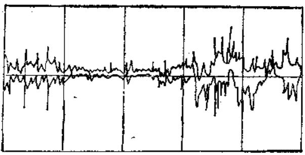

图13-1-4 轴承的振动波形

各种异常振动都具有各自特征所对应的频率（表13-1-2）。

表13-1-2 缺陷和发生的频率

<table><tr><td>诊断对象</td><td>缺陷</td><td>发生的频率</td></tr><tr><td>机械整体的诊断</td><td>不平衡、不对中、轴弯曲、松动轴承座的刚性差，轴的异形、基础承压差，油膜涡动、电动机的电气部分异常</td><td>数百赫以下</td></tr><tr><td>滚动轴承的诊断</td><td>伤痕，润滑油不良灰尘</td><td>数万赫至约十万赫</td></tr><tr><td>滑动轴承的诊断</td><td>油膜涡动干摩擦</td><td>数十赫至数万赫</td></tr><tr><td>齿轮的诊断</td><td>磨损、点蚀，碎片</td><td>数万赫</td></tr><tr><td>阀门的诊断</td><td>泄漏裂纹</td><td>数万赫至约10万赫</td></tr></table>

因此，如图13-1-5所示，现在是反过来把所观察到的波形作为组合起来的谐波振动进行分析。这

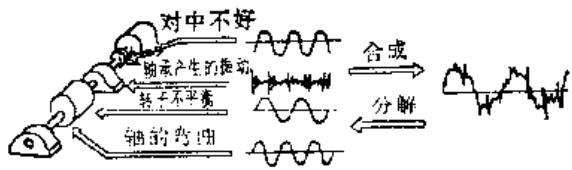

图13-1-5 频率分析的原理

个方法称为频率分析。

# 2. 振动形态分析

根据频率分析，虽然可对观测到的振动频率分布情况作出判断。但是，只用这个方法，有时还不能清楚地知道产生振动的原因。

在这种情况下，就需要查明发生的是哪一种异常振动，再决定修理方法。就是说，需辨明是由机械异常引起的振动，还是由电气原因引起的振动。如果是由于机械异常产生的振动，还要区别开由外面的强制力引起的振动，以及共振和自激振动。从而根据原因，决定其修复方法。

当诊断对象是旋转机械时，可变更转速，或者从停止过程及启动过程的振幅变化来决定振动的种类。图13-1-6所示就是其例子。

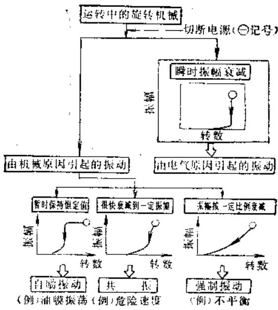

图13-1-6 振动形态分析的例子

# 3. 相位分析

在寻找振动的原因方面，相位分析也具有很重要的作用。也就是说，按照同一频率的振动相位差，检查相互间作了什么样的相对运动。从而就可以决定应进行什么样的加固。图13-1-7就是这种例子。

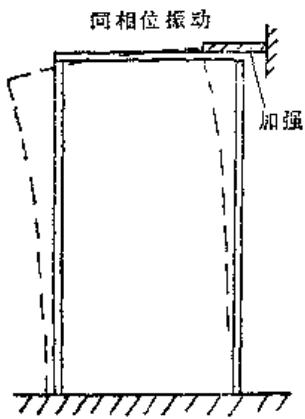

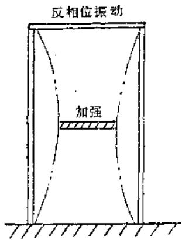

图13-1-7 相位分析示意图

此外，当旋转机械发生异常振动时，为了正确辨别相当于旋转数整倍数的频率，往往还使用周期加算分析法（见本章第2节信号预处理技术的同步时间平均法）。

# 4. 振动方向分析

某些机械产生异常振动的原因，可以从振动方向的特征中进行判断。因此，探讨振动的方向也是一种有效的方法。

例如，不平衡具有发生径向振动的特点，对中不良具有产生轴向振动的特点。

# 5. 摆摆旋转方向分析

这是用于对旋转机械的异常振动进行诊断的方法，如图13-1-8所示。我们把旋转轴围绕轴承中心，作一定方向的振摆旋转现象称为振摆旋转。这是用于分析振摆旋转的方向相对于旋转轴旋转的那个方向的方法。根据这个分析，就可以从特性参数运动方向中知道是哪种振动。例如，由不平衡产生

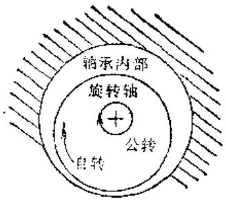

图13-1-8 振摆旋转现象

的振动是同一方向的，由于摩擦产生的自激振动是相反方向的。

# 6. 异常振动的一般分析法

前面，分别介绍了为了分析异常振动而最常使用的方法。虽然分析方法是多种多样的，但是归根结底可分为以下两类：

1）时间领域的分析方法。

2）频率领域的分析方法。

# 第2节 信号处理技术

测出的振动波形虽然可以在振动计上直接读取，但是，为了正确了解设备的状态，一般要用数据记录器等将波形记录下来，然后用各种信号处理技术加以分析，抽出具有典型性的离散值（图13-2-1）。

对于采集到的振动原有波形，首先要除掉各种无意义而有害的噪声（干扰），同时加工成便于进行精密分析的信号，这叫做信号的预处理。经过预处理的信号在时域和频域内分析，可对诊断所需的各

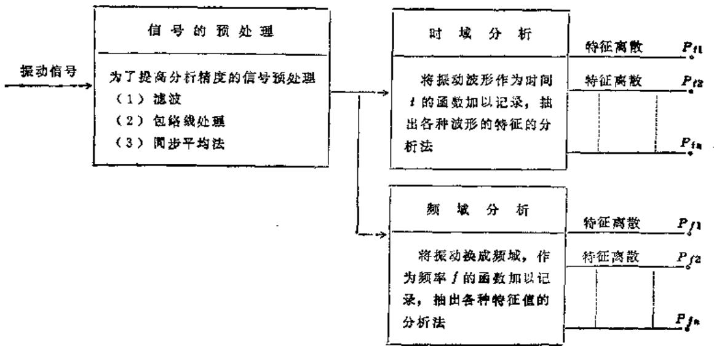

图13-2-1 信号处理技术的种类

离散值进行计算。

# （一）信号的分类

机器或机组在运行过程中，由于各种各样的原因产生了振动，因而蕴含了各种随时间而变化的动态信息。经过振动动态测试仪器拾取，并用记录仪器记录下来，即可用作诊断机械故障的原始依据。我们把记录下来的综合有动态信息的这类振动叫做信号。

# 1.周期信号

波形在一定时间重复一次的信号称为周期信号。工程上常常遇到很多的周期信号其中最为典型的有正弦信号，即  $x(t) = A\sin \omega t$  和三角形波。

图13-2-2表示了该两种信号的图形。

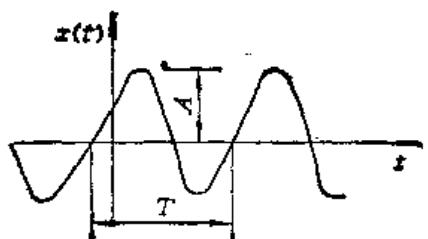

a）

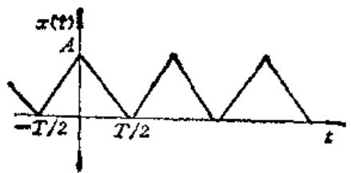

b

图13-2-2 周期信号

# 2. 瞬变信号

这种信号的特点是在某一时刻出现，而到某个时刻消失。工程上常碰到的如机器受到突加载荷而引起的振动（图13-2-3）。

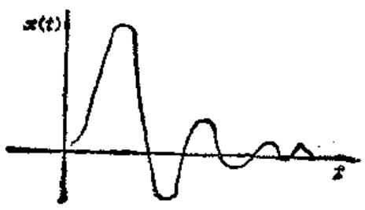

图13-2-3 瞬时信号

# 3. 随机信号

随机信号的幅值、形状、峰值出现的时刻都是不规则的。它不能用确定的数学关系式来描述，不能预测它未来任何瞬时的精确值（图13-2-4）。

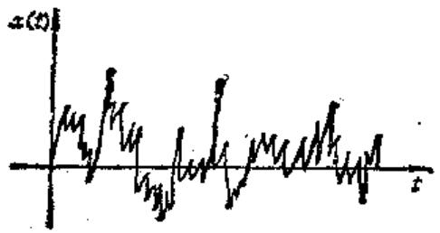

图13-2-4 随机信号

机器振动测试遇到的往往是上述三种的组合，因此一般机械的信号图象可称为随机信号图象。随机信号值的变动服从统计规律，所以描述随机信号时必须用概率和数理统计方法。

# （二）信号的预处理技术

在信号的预处理中有：①滤波；②包络线处理；③平均法及其它很多方法。这里只介绍几种最常用的处理法及其基本性质。

# 1.滤波处理

图13-2-5为带通滤波器的原理。带通滤波器是一种“放大”器，对于所需的频带宽度  $f_{L} \leqslant f \leqslant f_{h}$ ，它的“放大”率为1，对于其它的频带宽度，则“放大”率均为0。

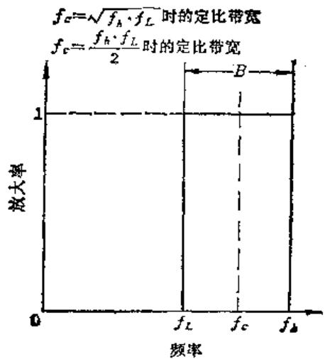

图13-2-5 带通滤波器的原理

相当于通过带宽中心的  $f_{\circ}$  为中心频率，上限的 $f_{L}$  为高频截止频率，下限的  $f_{L}$  为低频截止频率。当

$f_{A}, f_{L}, f_{0}$  之间存在如下关系

$$
f _ {c} = \sqrt {f _ {L} f _ {L}} \tag {13-2-1}
$$

时，这个滤波器称为恒百分比带通滤波器，用于扫描型的频率分析等。此时，这个滤波器通过频带  $B = f_{\mathrm{b}} - f_{\mathrm{L}}$  和中心频率  $f_{\mathrm{c}}$  之比

$$
\frac {B}{f _ {c}} = \frac {f _ {1} - f _ {L}}{f _ {0}} \tag {13-2-2}
$$

来描述它的百分比（相对）带宽，并且意味着经常保持固定的比率。

对音响分析等经常使用的倍频滤波器，  $B / f_{\mathrm{c}} \approx 0.7$  。这种恒百分比的带通滤波器用于分析共振现象时非常方便。

此外，当  $f_{h}, f_{L}, f_{o}$  之间存在相加平均关系，即

$$
f _ {c} = \frac {f _ {h} + f _ {L}}{2} \tag {13-2-3}
$$

时，称为恒带宽带通滤波器。由于这种情况下频带宽  $B = f_{k} - f_{L}$  保持一定，对旋转机械的高次谐波分析非常方便。

恒带宽滤波器因在线性频率刻度上具有一定的分辨能力，对谐振特性曲线可易于测定。不过，线性频率刻度只有两个十进位频率范围，这是它的缺点。

此外，恒百分比带通滤波器在对数刻度的频率轴上有一定的分辨能力，可以分析十进位以上的范围。恒百分比带通滤波器的另一个特点是选择性  $S$  为一定。所以，分析结构体的共振频率时，利用这种型式的滤波器是很自然的，也是有效的。为了便于理解上述情况，请参阅图13-2-6。“十进位”（decade）意味着10倍，由图可以了解其含意。

图13-2-7表示对中心频率  $f_{c}$  、频带宽  $B = f_{k} - f_{L}$  的带通滤波器输入频带宽  $W$  的随机振动时的输出概念。如图所示，具有宽频带的随机振动通过带通滤波器时，即变成频率为  $f_{c}$  、振幅为  $B$  的周期变动

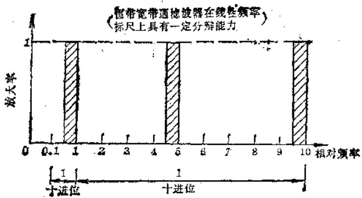

a）磁带宽带通滤波器的特性

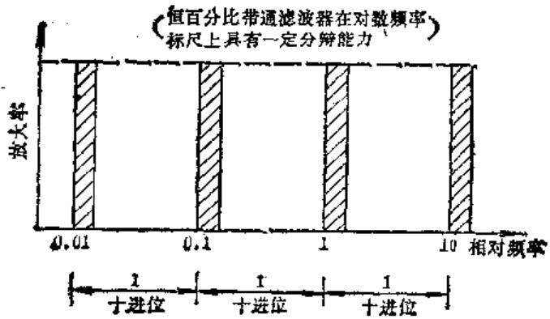

b) 似百分比带通滤波器的特性

图13-2-6 恒带宽和恒百分比带通滤波器的特性

的缓慢信号而输出。这种输出波形的振动称为窄频带随机信号，在旋转机械的振动中是很常见的。

带通滤波器并没有图13-2-5那样理想的截止性能，它的实际性能如图13-2-8a的实线所示。即严格地说，频带中的放大率  $A$  并不等于1，而是存在某些波动。还有，因衰减率也不是无限大，截止频率  $f_{k}$  和  $f_{L}$  并不明显，一般降低到放大率的  $70\%$  ，即  $f_{h}$  和  $f_{L}$  的值下降3dB。

还有，如图13-2-8b所示的窄频带通滤波器，放大率  $A$  下降3dB点的频带宽  $B_{3}$  与下降60dB点的频带宽  $B_{60}$  之比表示选择性。表示选择性的指标为波

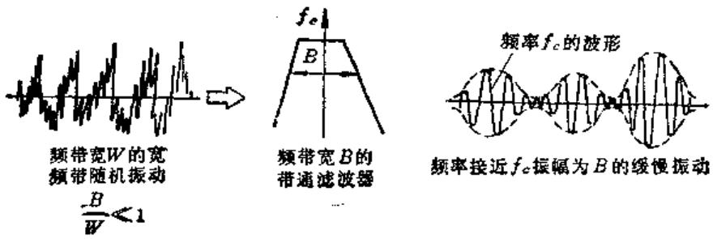

图13-2-7 带通滤波器的效果

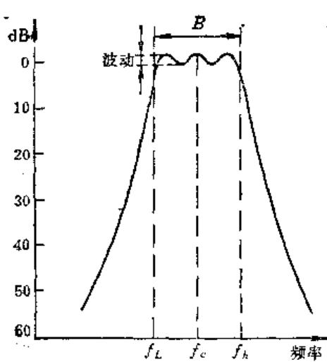

4）宽频带通滤波器

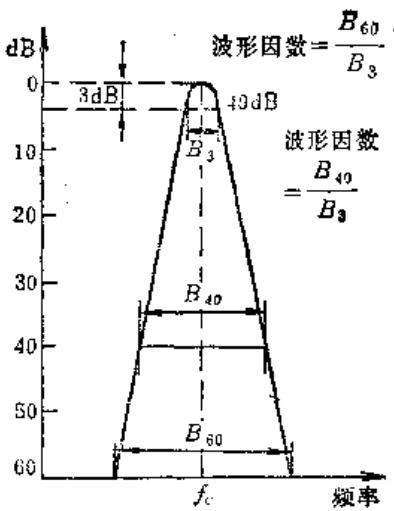

b）窄频带通滤波器

图13-2-8 带通滤波器的实际特性

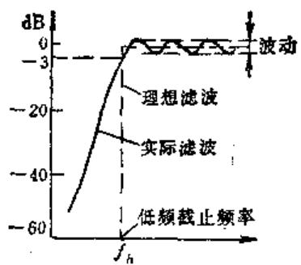

（3）高通滤波器的特性

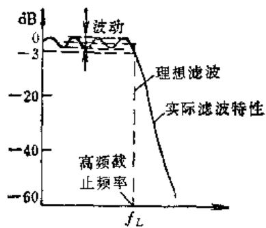

b）低通滤波器的特性

图13-2-9 高通滤波器和低通滤波器的特性举例

形因数，所以波形因数  $s$  的定义如下：

$$
S = \frac {B _ {6 0}}{B _ {3}} \tag {13-2-4}
$$

$S$  值愈大，选择性越好。

如使带通滤波器的高频截止频率  $f_{\lambda}$  无限大，实际上便是只定低频截止频率  $f_{L}$ ，这种滤波器称为高通滤波器。这种滤掉低频的情况对于滚动轴承是常常需要的。反之，如使低频的截止频率  $f_{L} = 0$ ，实际上只定高频截止频率  $f_{h}$  的滤波器，则称为低通滤波器。

对于旋转机械的不平衡和不同轴（不对中）的诊断，常常需要这样来除掉高频信号。图13-2-9所示为高通滤波器和低通滤波器的特性。

当使用各种滤波器时，必须选用截止频率  $f_{k}$  和 $f_{L}$  、中心频率  $f_{\circ}$  、衰减特性[dB/oc]、波形因数S等，应注意要同目的相符。

# 2.包络线法（共振解调技术）

将振动波形的包络线（图13-2-10）看作新的振动波形并据以进行频率分析的方法，可用于轴承齿轮等的故障诊断。在信号的预处理中，特别是当分析高频冲击振动时，包络线处理（又称共振解调技术或IFD技术）是一项重要而有效的技术。

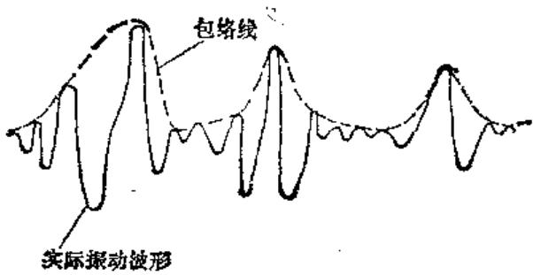

图13-2-10 振动波形的包络线

# 3. 同步时间平均法

是解决周期振动问题的一种信号处理方法。它把周期的振动信号进行分段，将相同位置的信号逐个地加在一起然后再进行平均。这样，由于周期振动总是在相同的位置上相加，因而突出了异常的振动信号。受外界干扰的非周期振动，由于在不规则的位置相加，因而被削弱。随着累加平均次数的增多，就增进了突出异常信号的效果。

# （三）时域的信号处理

在振动诊断中，由于测得的振动是时间的函数，掌握信号在时域的特征是最基本的信号处理。在此情况下，对下述的各种量应引起充分注意。

对随机信号来说，可以分为平稳的、非平稳的和弱平稳的3种。正常工作的机械系统，其信号是平稳和弱平稳的。对于过渡状态和异常状态下的机械系统，其信号往往是非平稳的。三种类型的随机信号是这样区分的：如果在时间的某一瞬间，信号的平均值、方差和高次统计特征（包括峭度偏斜度指标等）都保持不变，则信号是平稳的；如果不考虑高次矩，只考虑平均值和方差，这两个参数保持不变，则称信号是弱平稳的。

# 1. 平均值

它和一般的平均值一样，是由测定值之和被测定值的个数相除得到的。当为连续信号时，把观测到的值进行积分，并除以观测时间。平均值是一个表示信号在什么样的值附近变化的量。如果仅把过去某一时间范围的值不断地平均下去，或者大致考虑一下过去的值，并乘以重叠系数，然后再进行平均，那么，便可以检测出随时间而变化的平均值。

# 2. 离散

从所测到的值中，减去上述的平均值，并将减去后所得值的平方和以值的个数除之，得到的就是离散值。当为连续信号时，它同平均值一样，只要把和变成积分就能求出来了。它是表示信号究竟在平均值附近多大范围内变动的一个量。

# 3. 均方值、有效值

均方值是测定值平方和除以测值数的值。从均方值中减去平均值的平方所得到的值应等于离散值，所以当平均值为0时，均方值和离散值相等。均方值具有相当于信号的平均能量这一物理意义。同时，把均方值的平方根称为有效值（RMB值）。

如果波形是正弦波，那么一目了然，有效值便等于振幅的  $1 / \sqrt{2}$  。但是，如果周期信号不是正弦波，在这种情况下，关系就变化得相当复杂了。

实用上，蓄取

有效值（估计）  $= \frac{1}{T}\int_{0}^{T}x^{2}(t)dt$  (13-2-5)

其中  $\pmb{T}$  应足够大。

# 4. 峰值

把某一信号时间范围内的最大值称为峰值。在冲击条件下，信号总是以很锋利的波形出现（图13-2-11）。这时，峰值便成为信号的一个重要特征。在测定有“裂纹”的旋转体的振动时，每当通过裂纹处，其振动即出现一个尖锐的峰值。

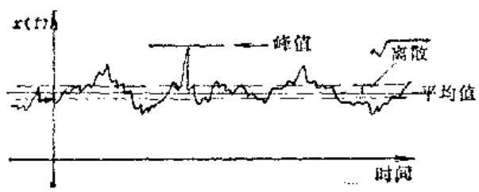

图13-2-11 峰值

# 5. 波峰系数

波峰系数值，也可称为波形系数值，它等于峰值/有效值。由于波峰系数是波峰值与信号的有效值比较的相对值，所以，在设备运转状态下，即使有效值变化时，也可以正确地掌握住峰值的特征。

# 6. 概率密度函数

随机信号的概率密度函数（图13-2-12）是表示信号幅值落在指定区间的概率。

概率密度函数提供了随机信号沿幅值域分布的信息，是随机信号主要特征参数之一。不同的随机信号有不同的概率密度函数的图形，可以借此来识别信号的性质。图13-2-13是常见的3种信号的概率密度函数图形。

概率密度的三次矩与四次矩分别称为偏度系数和峭度系数，用于和正态分布曲线进行比较，能定量地确定偏离正态分布的程度。

$a_{3}$  （偏度系数）  $\int_{-\infty}^{\infty}x^{3}P(x)\mathrm{d}x$  (13-2-6)

$a_{4}$  （硝度系数）  $\int_{-\infty}^{\infty}x^{4}P(x)\mathrm{d}x$  (13-2-7)

图13-2-12 概率密度函数

# （四）频域的信号处理

一般直接观测或记录的信号是随时间变化的物理量，即以时间作为独立变量，称为信号的时域描述。信号的时域描述只能反映信号的幅值随时间变化的特征，而不能明确揭示信号的频率组成成分。实际上，在一台最简单减速机上所测得信号，也是由轴承、齿轮、机座松动等引起多种振动的综合结果（图13-2-14）。在故障诊断中，则需要在这一综合振动信号中分离出各元件所引起的振动频率成分。

为了研究信号的频率结构和各频率成分幅值大小，应对信号进行频谱分析，把时域信号通过处理变成频域信号，即对信号作频域描述。简单地说，时域描述是指描述信号的坐标图中横坐标为时间  $t$  ，频域描述的横坐标为频率  $f$  （或圆频率  $\omega$  ）。

把时域信号通过处理变为频域信号，对周期信号来讲是用傅里叶级数；对随机信号来讲可用傅里叶变换获得。

# 1. 傅里叶级数

当信号  $x(t)$  为周期  $T(S)$  的周期函数时，把

$$
f _ {0} = 1 / T (\mathrm {H z})
$$

作为基本频率，就可以用其整数倍的频率周期函数之和表示  $x(t)$ 。也就是说，可以用下面的式子表示：

$$
\begin{array}{l} x (t) = \frac {a _ {0}}{2} + a _ {1} \cos 2 \pi f _ {0} t + a _ {2} \cos 2 \pi (2 f _ {0} t) + \dots \dots \\ + b _ {1} \sin 2 \pi f _ {0} t + b _ {2} \sin 2 \pi (2 f _ {0} t) + \dots \dots \\ = A _ {0} + A _ {1} \sin (2 \pi f _ {0} t + \phi_ {1}) \\ + A _ {2} \sin (4 \pi f _ {0} t + \phi_ {2}) \\ + A _ {3} \sin (6 \pi f _ {0} t + \phi_ {3}) + \dots \dots \tag {13-2-8} \\ \end{array}
$$

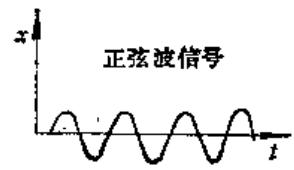

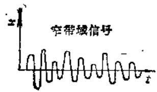

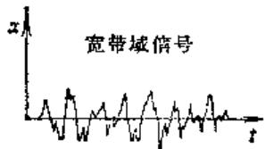

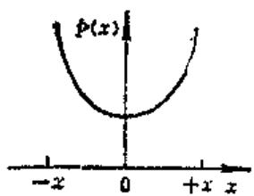

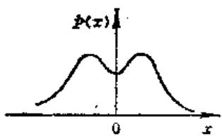

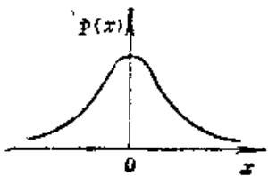

图13-2-13 正弦盘、窄带、宽带信号的频率分布函数

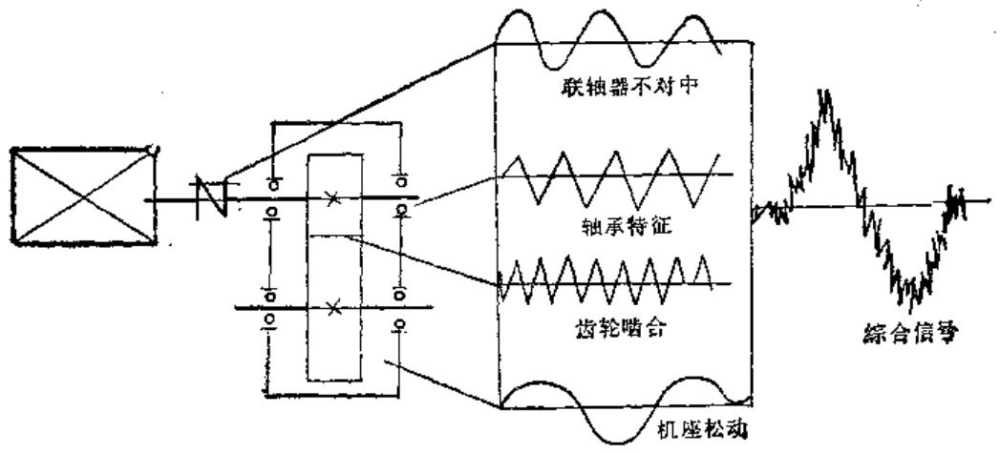

图13-2-14 简单减速机振动的各种信号

从上式变成下式，便合成了单振动。

$$
A _ {K} = \sqrt {a K ^ {2} + b K ^ {2}}, \quad \tan \phi_ {K} = a _ {K} / b _ {K} \tag {13-2-9}
$$

式中，  $A_{0} = a_{0} / 2$  。同时，  $a_{K}, b_{K}$  值是由一个周期的波形决定的常数，它可以由下式计算出来：

$$
\begin{array}{l} a _ {K} = \frac {2}{T} \int_ {0} ^ {T} x (t) \cos 2 \pi K f _ {0} t d t (13-2-10) \\ (K = 0, 1, 2 \dots \dots) \\ \mathbf {b} _ {k} = \frac {2}{T} \int_ {0} ^ {T} x (t) \sin 2 \pi K f _ {0} t d t (13-2-11) \\ (K = 1, 2 \dots \dots) \\ \end{array}
$$

把周期函数  $x(t)$  分解为各种频率成分的式子，叫做傅里叶级数。

在此，相当重要的问题，是当把周期  $T(S)$  的周期函数分解为傅里叶级数时，只出现  $f_{0} = 1 / T(\mathrm{Hz})$  和直流分量（常数）及频率为  $f_{0},2f_{0},3f_{0}\dots \dots$  这些成分，  $f_{0} / 2$  等的频率成分不出来。

# 2. 相关函数

相关函数是评定振动信号幅值变化剧烈程度的指标，它有自相关函数和互相关函数两种。

（1）自相关函数 自相关函数可用下式来定义，即

$$
R _ {x} (\tau) = \lim  _ {T \rightarrow \infty} \frac {1}{T} \int_ {0} ^ {T} x (t) x (t + \tau) d t \tag {13-2-12}
$$

自相关函数是检查信号中周期分量的重要手段。例如当取得某个信号是由周期信号  $S(t)$  和随机信号  $\pmb{m}(t)$  两部分组成时，即

$$
x (t) = S (t) + m (t) \tag {13-2-13}
$$

则

$$
\begin{array}{l} R _ {n} (\tau) = \frac {1}{T} \int_ {0} ^ {T} [ S (t) + m (t) ] \\ \times [ S (t + \tau) + m (t + \tau) ] d t \tag {13-2-14} \\ \end{array}
$$

由于  $E[S(t)m(t + \tau)] = 0$  (13-2-15)

$$
E [ S (t + \tau) m (t) ] = 0 \tag {13-2-16}
$$

故

$$
\begin{array}{l} R _ {x} (\tau) = \frac {1}{T} \int_ {0} ^ {T} S (t) S (t + \tau) d t \\ + \frac {1}{T} \int_ {0} ^ {T} m (t) m (t + \tau) d t \tag {13-2-17} \\ \end{array}
$$

随机信号的自相关函数迅速衰减为零，而周期信号的自相关函数仍为周期函数。因而利用自相关函数，可以很容易地检出信号中的周期成分。

（2）互相关函数  $R_{xy}(\tau)$  互相关函数可用下式来定义，即

$$
R _ {x y} (\tau) = \lim  _ {T \rightarrow \infty} \frac {1}{T} \int_ {0} ^ {T} x (t) y (t + \tau) d t \tag {13-2-18}
$$

互相关函数可用来测量随机干扰的平均传布的方向和时间，或表示两信号间相似的程度，设  $x(t)$  和  $y(t)$  是输入和输出，则  $R_{xy}(\tau)$  反映了信号经过系统的时间和系统性能所引起的信号变化。如图13-3-15表示它们的互相关函数。 $\tau_0$  表示了流经该系统的时间。若将  $x(t), y(t)$  看作为两个

独立取得的信号，则  $R_{xy}(\tau)$  反映了该两信号线性关系的程度。

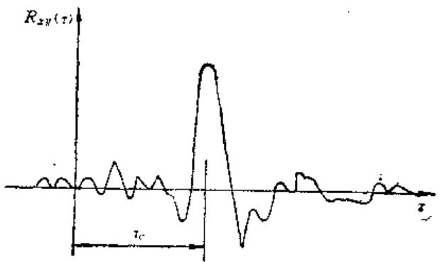

图13-2-15 互相关函数

# 3. 功率谱密度

如果被观测到的信号是周期函数，那么，便可根据傅里叶级数进行频率成分的分析。但是，当没有周期函数时，例如是随机波形的信号，因为这时不出现傅里叶级数那种恰当的频率成分，那么，这时分析频率成分最简单的方法是考虑信号某频率范围内的功率。也就是说，最理想的是滤波器只通过从频率  $f_{1}$  到频率  $f_{2}$  之间的成分。这种滤波器，也可由数字计算机组成。如果用模拟回路，完全理想是不可能的，然而做得非常近似是可能的。因此，这种指导思想实际上是和现实能实现的技术紧密地联系在一起的。如果作为该滤波器的输入加进信号，求出输出的均方值，那么，这个值就是信号中包含有频率  $f_{1}$  到频率  $f_{2}$  之间的频率成分的功率（图13-2-16）。

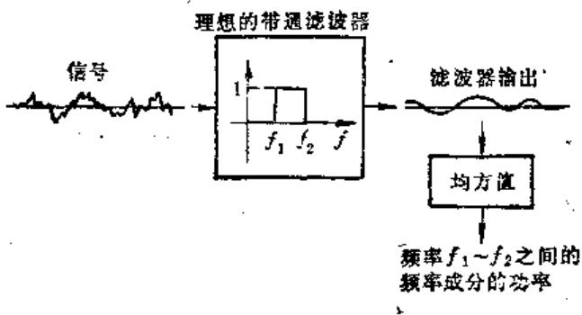

图13-2-16 用理想的带通滤波器得到频率  $f_{1} - f_{2}$  之间的频率成分的功率

为了求出信号各频率成分的功率，在原理上，对滤波器要极其注意。也就是说，需要把每一个频率  $\Delta f$  ，隔开成  $O_{\setminus}\Delta f_{\setminus}2\Delta f_{\setminus}\dots \dots n\Delta f_{\setminus}$  。并把滤波器设计成只通过  $0\sim \Delta f$  的频率范围、  $\Delta f\sim 2\Delta f$  的

频率范围……（ $n - 1$ ） $\Delta f \sim n\Delta f$  的频率范围这种结构。如果求出上述各滤波器输出的均方值，那么，该值就成为在信号中包括各自频率范围的功率。但是，实际上这是不可能实现的。如果各自的功率除以  $\Delta f$ ，并取  $\Delta f \rightarrow 0$  的极限值，便可得到频率的功率密度。这就叫做功率谱密度。这样，我们就把频率成分的分解叫做频谱分解（图13-2-17）。

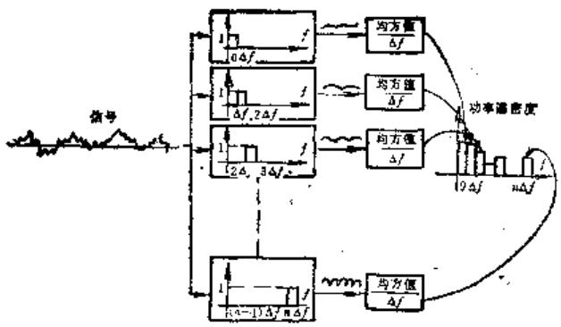

图13-2-17 功率谱密度与频谱分解

功率谱密度的概念，如上所述，它是从滤波器所输出的功率，这一角度来考虑。但实际采用的方法稍有不同。所介绍的是一直沿用的方法叫做布莱克曼一图基法（Blackman-Tukey）。

这种方法是首先从被观测到的信号  $x(t)$  中，计算自相关函数  $\phi (t)$ ，如果用下式：

$$
\phi (t) = 4 \int_ {0} ^ {\infty} \phi (\tau) \cos 2 x f \tau d \tau \tag {13-2-19}
$$

进行计算，那么便可得到功率谱密度。在这个计算式子望，和上节所介绍用滤波器考虑功率谱密度的指导思想是一样的。所示的式子为了简化计算而有所省略。

在此，需首先注意的问题，是当考虑频率领域时应当考虑到频率为负的这一情况，这种情况经常出现。功率谱密度频率正负相同，功率也分为两半。并把考虑在负频率的功率谱叫做双边频谱，相反，把那种只考虑正频率的频谱叫做单边频谱，一般情况下，只出现双边频谱中正频率的部分，这时单边频谱就变成1/2，对此，请加以注意。

自相关函数是由数值计算求出，所以，相关图谱密度也由数值计算求出。如计算出自相关函数的每一个  $h$  值，也就是说计算  $\phi(0), \phi(h), \phi(2h), \dots, \phi(mh)$  的值，那么，把所计算出的功率谱密度的积分，作近似于梯形的处理：

$$
\begin{array}{l} \phi (f) = 4 \left\{\frac {\phi (0) \cos 0 - \phi (h) \cos 2 \pi f h}{2} h \right\} + \frac {(h) \cos 2 \pi f h + b (2 h) \cos 4 \pi f h}{2} h + \dots \\ = \frac {\phi [ (m - 1) h ] \cos 2 \pi (m - 1) f h + \phi (\pi h) \cos 2 \pi m f h}{2} h + \dots \\ = 2 h \left\{\phi (0) + 2 \sum_ {r = 1} ^ {m - 1} \phi (r h) \cos (2 \pi f 1 - h) + \phi (m h) \cos (2 \pi f m h) \right\} \tag {13-2-20} \\ \end{array}
$$

上式中的  $\phi (f)$  叫做相关图（图13-2-18）。

在上面的计算中，理论上来说，对功率谱密度的计算必须从  $\tau = 0$  ，一直计算到  $\tau = \infty$  。可在实际上，自相关函数只能计算到最大错开时间  $\tau = m h$  。另外，最好能把自相关函数计到几乎为0的地方。可是这样一来，便有很多数据，使计算工作量很大，因此在实际使用中，当计算到适当的  $\tau$  值便必须停止计算。

为了减少由此所引起的不良影响，所以作窗处理（Hanning Window）。

设  $f = 0, f_{1}, f_{2}, \dots, f_{n}$ ，计算  $\phi(f)$

$$
\phi \left(f _ {0}\right) = 0. 5 \phi \left(f _ {0}\right) + 0. 5 \phi \left(f _ {1}\right) \tag {13-2-21}
$$

$$
\begin{array}{l} \phi \left(f _ {K}\right) = 0. 2 5 \phi \left(f _ {K - 1}\right) + 0. 5 \phi \left(f _ {K}\right) + 0. 2 5 \phi \\ \times \left(f _ {k + 1}\right) (K = 1, 2 \dots \dots m - 1) \tag {13-2-22} \\ \end{array}
$$

$$
\begin{array}{l} \phi (f _ {m}) = 0. 5 \phi (f _ {m - 1}) + 0. 5 \phi (f _ {m}) \\ \end{array} \tag {13-2-23}
$$

这样一来，只计算到了中途的影响，所以相关函数还很不完善。

# 4. 傅里叶变换

关于对某一信号  $x(t)$  进行频率成分的分析这一概念，前面已作过介绍，是用滤波器进行分析的。可是，当集中在有信号产生的时间幅度，并且是在  $\int_{-\infty}^{\infty}\{x(t)\} \mathrm{d}t < \infty$  的情况下时，便可以用

傅里叶变换的计算来进行频率成分的分析。

$$
\begin{array}{l} X (j f) = \int_ {- \infty} ^ {\infty} x (t) e ^ {- j 2 \pi f t} d t \\ = \int_ {- \infty} ^ {\infty} x (t) [ \cos (2 \pi f t) \\ + j \sin (2 \pi f t) ] d t \tag {13-2-24} \\ \end{array}
$$

我们把上面从  $x(i)$ ，变为  $X(jf)$  的这一积分过程称为傅里叶变换。式中， $j = \sqrt{-1}$  是虚数单位。

也许有人想，上面导出的式子是很难的式子，可是，如把不相同的频率成分的值相乘，并对相当于两者的周期的整倍数的时间进行积分（当作是与平均值相同的量），如果已知道其为0时的性质，那么，就能有某种程度的理解。

试用上面的计算式，考虑一下当  $x(t)$  是偶数函数时的情况吧。因为  $\sin (2\pi ft)$  的函数是奇数，所以， $x(t)$  与  $\sin (2\pi ft)$  的积分就变成了 0。自相关函数因为是偶数，所以，自相关函数  $\phi(\tau)$  的傅里叶变换就变成了下式那样：

$$
\begin{array}{l} \phi^ {n} (f) = \int_ {- \infty} ^ {\infty} \phi (\tau) \cos (2 \pi f \tau) d \tau \\ = 2 \int_ {0} ^ {\infty} \phi (\tau) \cos (2 \pi f \tau) d \tau \tag {13-2-25} \\ \end{array}
$$

上式中，没有出现虚数部分。它是由自相关函数计

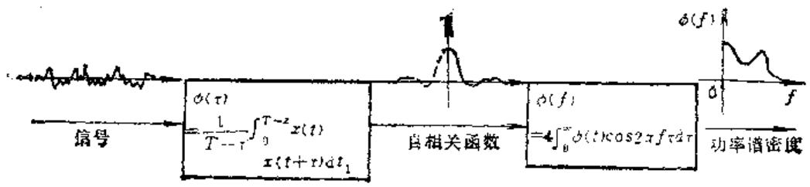

图13-2-18 相关图

算功率谱密度的式子；其实，是把自相关函数作了傅里叶变换的式子。在此，系数不是4，而是2。傅里叶变换可以给出两侧频谱。认为只有当  $f > 0$  时，  $\phi(f) = 2\phi(f)$ 。

信号  $x(t)$  的傅里叶变换  $X(jf)$ ，因为是表示信号  $x(t)$  的频率  $f$  的频率成分，所以，信号  $x(t)$  的功率频率  $f$  的平均大小，即功率谱密度即使作  $|X(jf)|^2$  的平均值，也可能计算。

# 5.抽样定理和快速傅里叶变换（FFT）

为了求出功率谱密度，必须进行数值计算。为此，应在各个时间间隔中取出信号。这种仅把连续函数在各个时间间隔的值取出来叫做抽样。那么，怎样决定抽样的间隔时间为好呢？

这一决定过程，最好这样考虑，即当把信号中包含的最高频率作为  $W(\mathrm{Hz})$  时，在  $1 / 2W(s)$  处进行抽样是最佳的，这就叫做抽样定理。最高频率可由信号监测仪器的频率特性决定，当从该仪器中怎样也弄不清楚时，可把信号进行一次滤波，滤除高频部分的频率即可。

如果在比较长的间隔中进行抽样，那么，不仅不知道高的频率成分，而且高的频率成分会折返到低频率成分的范围中去，从而使低频率成分的值变大，这一现象，就叫做混淆。

当对功率谱密度进行数值计算时，尤其是傅里叶变换的数值计算，其计算量相当大。因此，当进行完自相关函数的计算后，就进行傅里叶变换是便利的。于是，找出了效率非常高的进行傅里叶变换的数值计算方法，这种方法叫做快速傅里叶变换(FFT)。

快速傅里叶变换，不是引入特别的理论而总结出的方法。它只是对傅里叶变换的数值计算作整理，使相乘的次数变得很少一种变换方法。可是，由于这一发现，频谱分析方法也大多从以前采用的方法，变成了快速傅里叶变换方法。现在，市面上所看到的频谱分析仪，几乎都是采用快速傅里叶变换进行计算的。使用快速傅里叶变换来进行计算，如果不遵守下述的注意点。同样会得出很不理想的结果。

用快速傅里叶变换求功率谱密度的方法，是按图13-2-19的程序把观测到的信号进行抽样，用快速傅里叶变换方法进行傅里叶变换。这里面最重要的一点，是必须把其变换结果进行平均。在使用快速傅里叶变换的频谱分析仪时，该平均次数应根据

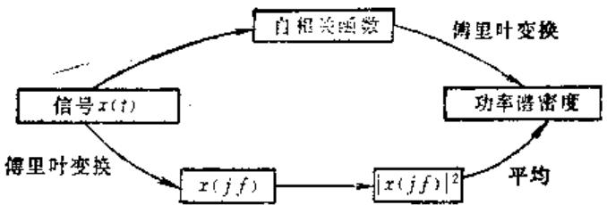

图13-2-19 通过任何计算回路计算，其值也是相同的

情况的不同而酌情指定。可是，最少应进行数次以上的平均。

还有一种方法，是定出频率的分解幅度，并在其幅度内将所求出的值进行平均的方法。如果频率分解幅度还太宽，那么，重要频率范围的峰值也会变得不清楚。

# 6. 频谱分析

如果求出信号的功率谱密度，那么就知道和哪个装置的固有振动关系最大，这样就很容易和物理的机构联系起来，但是对复杂装置就没有那么简单了。

一般来说，在考虑功率谱密度的特征时，是着眼于形状上所表现出的显著峰值。构成装置的部分越振动，那么峰值就越大。各种振动都是和功率谱密度的各种峰值对应起来的。所以，看各种各样的信号，分析是哪个部位产生的什么样的振动，测定各个振动值是很有必要的。同时，在检测声音时，除考虑全部声音的功率谱密度外，也必须调查各个部位所发生的声音，并判断出是由哪里发出的以及是什么类型的声音。

另外，旋转机械经常采用的方法，是变更转速，计算出在各种转速下的功率谱密度，并且如果把这些功率谱密度重叠起来看的话，那么，随转速而变化的那部分功率谱密度便被分离出去了，这就叫做可靠性性能测量技术图象（图13-2-20）。采用这种

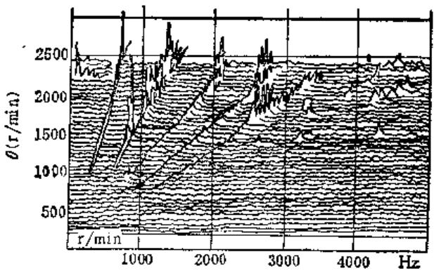

图13-2-20 可靠性性能测量技术图象

方法往往相当有效。如果只求出功率谱密度，是不可能立刻进行设备诊断的。

即使把装置的各部分和所观测到的信号的功率谱密度联系起来，实际上，当发生某种程度的异常及故障时，也不清楚究竟是由哪种变化所产生的功率谱密度。

因此，当发生某种异常或故障时，预知功率谱密度所引起的变化是很重要的。进行一下这种实验便很容易理解。这时，即使不是每次都检查作为对象的装置，同类型装置会发生什么异常或故障也可以大致地估计出来。例如对旋转机械的诊断等，因为对这类设备接触很多，所以，如果在哪个部位作了什么测定，那么，就能相当清楚地知道，会发生什么样的异常以及发生的程度如何。可是，当为批量生产的新机械或装置时，最好事先详细地检查一台。

我们知道，某一测定量的功率谱密度，同某种异常或故障是相对应的，而在特定的频率范围内，其变化则相当大。在这种情况下，把信号进行滤波处理，只考虑其频率成分的功率就行了。这样的异常检测器，叫做功率级别计，它已应用于设备的诊断中。

# 7. 倒频谱分析

如果一实测信号  $y(t)$  是由两个分量  $x(t)$  和  $s(t)$  迭加形成的，即  $y(t) = x(t) + s(t)$ ，则当两个分量的能量分别集中在不同的频率里时，可用频域分析中的线性滤波或功率谱分析。当所要提取的分量以一定的形状作周期性重复，而另一个分量是随时间变化的噪声时，可用时域分析中的信号平均方法或相关分析。这些方法都可有效地处理线性迭加信号。

但是，有的信号不是由其分量的线性迭加。例如，机床振动的输出信号是  $y(t)$ ，激发振动的输入是切削力  $x(t)$ ，机床的动力特性是由脉冲响应  $h(t)$  描述的，则有如下关系

$$
y (t) = x (t) h (t)
$$

(13-2-26)

即输出  $y(t)$  是输入  $x(t)$  与脉冲响应  $h(t)$  的卷积，这时用处理线性迭加信号的上述方法，就不够了，而倒频谱（也称逆谱）能很好地处理这类问题。

倒频谱可将输入信号与传递函数区分开来，便于识别。还能区别出因调制引起的功率谱中的周期

分量，诊断出调制源。

倒频谱的基本原理如下：

给出时间信号  $y(t)$  的功率谱  $S_{y}(f)$  表达式

$$
S _ {y} (f) = \left| F \left\{y (t) \right\} \right| ^ {2} \tag {13-2-27}
$$

式中  $F\{\cdot \}$  表示傅里叶正变换，|表示取模。

所谓倒频谱，就是对功率谱  $S_{y}(f)$  的对数值进行傅里叶逆变换的结果，用  $C_{y}(\tau)$  来表示功率谱  $S_{y}(f)$  的倒频谱，有：

$$
C _ {y} (\tau) = F ^ {- 1} \left\{\ln S _ {y} (f) \right\} \tag {13-2-28}
$$

式中  $F^{-1}\{\} \text{表示傅里叶逆变换，} \tau \text{表示倒频谱的时间变量。}$

这里指出，由式（13-2-28）联系到  $y(t)$  的自相关函数  $R_{y}(\tau)$

$$
R _ {y} (\tau) = F ^ {- 1} \left\{S _ {y} (f) \right\} \tag {13-2-29}
$$

可以看到，倒频谱  $C_{y}(\tau)$  的变量  $\pmb{\tau}$  与自相关函数 $R_{y}(\tau)$  的时间变量  $\pmb{\tau}$  在量纲上是一致的。我们称 $\pmb{\tau}$  为倒频率(quefrecy)。

此外，有文献用“功率谱的对数谱的模”来定义倒频谱，即

$$
C _ {A y} (\tau) = \left[ F \left\{\ln S _ {y} (t) \right\} \right\} \tag {13-2-30}
$$

称为幅值倒频谱（Amplitude Cepstrum），也就是说，在进行傅里叶正变换后，不考虑相位信息。

对功率谱作倒频谱变换，其根本原因是在倒频谱上可以较容易地识别信号的组成分量，便于提取其中我们所关心的信号成分。例如一个系统的脉冲响应函数是  $h(t)$ ，输入为  $x(t)$ ，那么输出信号  $y(t)$  等于  $x(t)$  和  $h(t)$  的卷积，有如图13-2-21所示的关系式。倒频谱的作用就是将上述式（13-2-26）的卷积变成简单的迭加。

$$
\xrightarrow [ X (f) ]{x (t)} \boxed { \begin{array}{c} h (t) \\ H (f) \end{array} } \boxed { \begin{array}{c} y (t) = x (t) * h (t) \\ Y (f) = X (f) \cdot H (f) \end{array} }
$$

图13-2-21 系统的输入、输出和传递函数

对式（13-2-26）两边取傅里叶正变换，时域中的卷积，转换成频域中的相乘（卷积定理）

$$
Y (f) = X (f) \cdot H (f) \tag {13-2-31}
$$

将式（13-2-31）取幅值平方，便得到功率谱的关系式：

$$
S _ {y} (f) = S _ {x} (f) \cdot | H (f) | ^ {2} \tag {13-2-32}
$$

两边取对数，

$$
\ln S _ {y} (f) = \ln S _ {x} (f) + \ln | H (f) | ^ {2}
$$

由于傅里叶变换的线性性质，这个相加关系保留在倒频谱中：

$$
F ^ {- 1} \left\{\ln S _ {y} (f) \right\} = F ^ {- 1} \left\{\ln S _ {x} (f) \right\}
$$

$$
+ F ^ {- 1} \{l n | H (f) | ^ {2} \}
$$

(13-2-33)

即  $C_{y}(\tau) = C_{x}(\tau) + C_{A}(\tau)$  (13-2-34)

上式含意是，如果输入信号  $x(t)$  或系统的脉冲响应  $h(t)$  中有一个已知，就可以从输出信号  $y(t)$  的倒频谱  $C_y(\tau)$  中除去，得到另一分量的倒频谱，例如  $C_k(\tau)$ ，对之进行傅里叶正变换可得到  $\ln |H(f)|^2$ ，再进行指数运算，便得到传递函数的幅值  $|H(f)|$ 。

利用倒频谱对信息进行分解的基本步骤如图13-2-22所示。

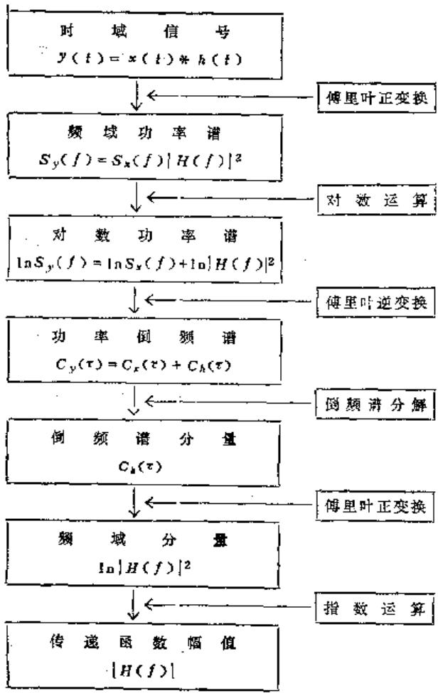

图13-2-22 利用倒频谱对信息进行分解的基本步骤

# 第3节 旋转机械的诊断方法

对于旋转机械来说， $60\%$  以上把振动参数作为特征加以利用。

# （一）旋转机械的简易诊断

# 1. 诊断设备和测定方法的选定

（1）诊断设备的选定 列为诊断对象的设备应为：

1）直接生产设备，

2）虽是附属设备，但停机后预期会发生很大损失者，

3）发生故障后预期会发生二次公害的设备，

4）维修费用高的设备。

（2）测定方法的选定须根据对象设备的需要决定。

1）由人进行定期测定的方法，

2）由于安全原因不能靠近对象设备时，在安全的地方设置能获得检测信号的联接箱，由人定期测定，

3）以长期设置的测头定期或实时自动采集判断数据的方法，适用于测定条件不稳定的设备和劣化速度非常快的设备。

# 2. 测定参数的选定

对于旋转机械发生的振动，有位移、速度、加速等三种测定方法。通过测定最大范围的振动来监控设备的劣化状态时，需要很好地利用这三种参数。

在一般情况下，低频以位移或速度，中频以速度，高频以加速度为测定参数的情况居多。

其理由很明显，若单纯考虑正弦波的位移、速度、加速度，其间的关系为

$$
D = \frac {V}{\omega} = \frac {A}{\omega^ {2}} \tag {13-3-1}
$$

这是因为频率越低则位移的测定灵敏度越高，频率越高则加速度的测定灵敏度越高。此外，随劣化类别而定的测定参数列于表13-3-1。

当劣化种类或测定频带不同时，必须改变测定的参数（离散值）。一般如图13-3-1所示，应根据频带来测定各种参数。

# 3. 测定点的选定

以一般旋转机械为例，振动的测定方法有测轴

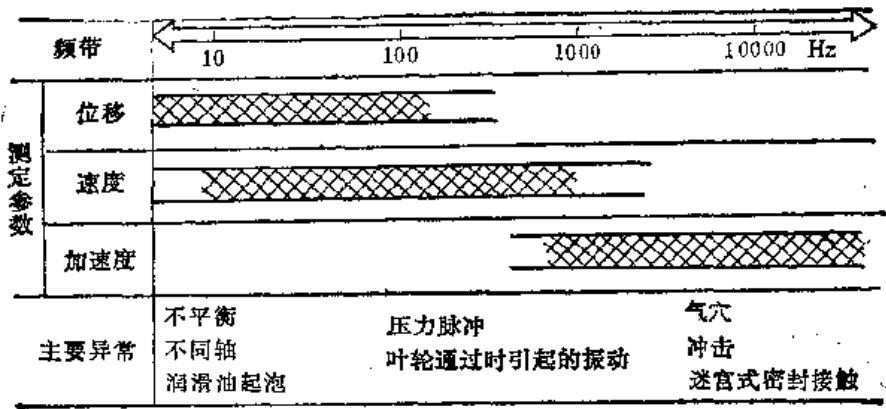

图13-3-1 按频带选定测定参数

表13-3-1 适用于各类异常的测定参数

<table><tr><td>测定参数</td><td>异常种类</td><td>举例</td></tr><tr><td>位移</td><td>位移量或活动量成为问题的异常</td><td>加工机床的振动现象,旋转轴的摆动</td></tr><tr><td>速度</td><td>振动能量和疲劳成为问题的异常</td><td>旋转机械的振动</td></tr><tr><td>加速度</td><td>冲击力等力的大小成为问题的异常</td><td>轴承和齿轮的缺陷引起的振动</td></tr></table>

振动和测轴承振动两种。

一般，对于非高速旋转体以测定轴承的振动为多。越接近于高速，则测定轴的位移者为多，这是因为高速时轴承振动的测定灵敏度有所降低，表13~

3~2列出了轴振动和轴承振动的特性比较。

图13-3-2为测定轴承振动时推荐的测定位置。对于轴承，需要从3个方向测定，即轴向、水平方向、垂直（上下）方向。测定位置以在轴中心高度处测定轴向、水平方向的振动为好。

这里，重要的事情是尽量在3个方向上进行测定。因为根据劣化种类所发生的方向不同，对于低频振动的监控是重要事项（对于高频，一般因无方向性，通常只从一个方向进行监控者多）。例如，不平衡等在水平方向上，不同轴性在轴向上，松动（摆动）在垂直方向上容易发生。

对于数量多的测定点，测定时要考虑到效率；对于对象设备，主要应根据容易产生的劣化现象为

表13-3-2 轴承振动与轴振动的特性比较

<table><tr><td></td><td>轴承振动</td><td>轴振动</td></tr><tr><td>设备</td><td>1.测定仪器便于安装、拆卸2.容易测定振动3.振动计测定装置价低</td><td>1.安装方法受到限制2.测定振动时比轴承困难3.振动计测定装置价高</td></tr><tr><td>性能上的特点</td><td>1.测振灵敏度小(当轴轻而主体刚度大时,测出过渡振动变化和异常振动的灵敏度低)2.有关资料(数据)丰富,掌握的界限值范围广3.测定仪器的可靠性高</td><td>1.测振灵敏度高(在任何情况下,测出过渡振动变化和异常振动的灵敏度高)2.可直接测出基本界限值(例如不平衡,轴承的内应力)3.界限值不能通用(仅限于指定的机械)4.测定仪器(特别是传感器)的可靠性低</td></tr><tr><td>测定点的效应</td><td>测振点容易确定,周围环境的影响小</td><td>测定场所对测定值的影响大</td></tr><tr><td>用途</td><td>可监测机械的所有各种振动</td><td>能比轴承较为详细地监测振动,可作为精度较高的现场平衡用数据</td></tr><tr><td>实例</td><td>由于干扰激振力(不平衡)</td><td>激振力(不平衡)</td></tr></table>

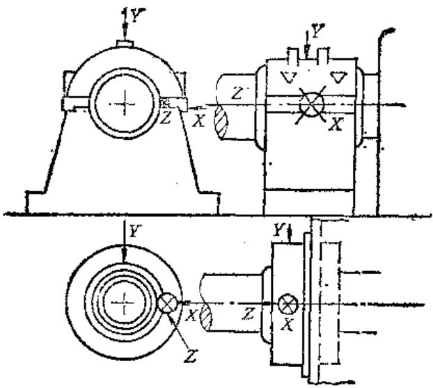

图13-3-2 轴承振动测定位置和方向

重点来考虑测定的方法。这样，能够限定测定的方向。

轴振动通常的测定法如图13-3-3a所示，在轴承处装设非接触型位移计（一般为涡流式），常用的方法是监控位移计与轴表面的间隙，也就是监控轴承与轴之间相对位移的方法（也有如图13-3-3b所示测定绝对位移的，但很少采用）。

所取的测定方向多数仍然是三个。对于径向振动，一般如图13-3-4所示，习惯的办法是在水平、垂直方向上进行测定，但也有如图13-3-5所示的情况，即错开某个角度进行测定。

在轴振动的测定中，由于测定用的传感器是固定安装的，故可测出大量数据。图13-3-6是轴振动的监测程序图。对已安装的设备设置监测装置时，必须注意轴的表面精度和加工状况，以免因其影响而检测不出正确的轴位移量。

测定点一经确定之后，就要经常在同一点进行测定。例如，测高频振动时往往出现下述问题：由于测定点偏移了几个mm，测定值的离散度将达到6倍。

# 4. 测定周期的确定

下面通过轴承振动和轴振动监控旋转机械的劣化状态来说明如何确定测定周期的问题。确定测定周期时，最重要之点是对劣化速度进行充分的研究。

例如，对于磨损劣化发展缓慢的，可以采用较长的周期；又如当高速旋转体异变后可能立即造成故障的设备，则需要进行实时监测。此外，对于一般由人工操作进行的测定，规定的测定周期必须能

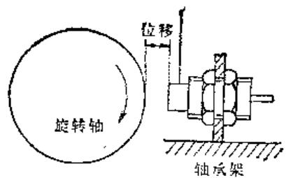

a）测定轴与轴承的相对位移

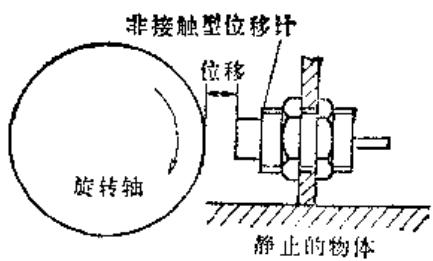

b）测定铀的绝对位移

图13-3-3 轴振动的测定方法

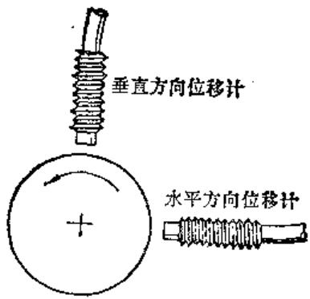

图13-3-4 轴振动的测定方向（1）

g13-3-5 轴振动的测定方向（2）

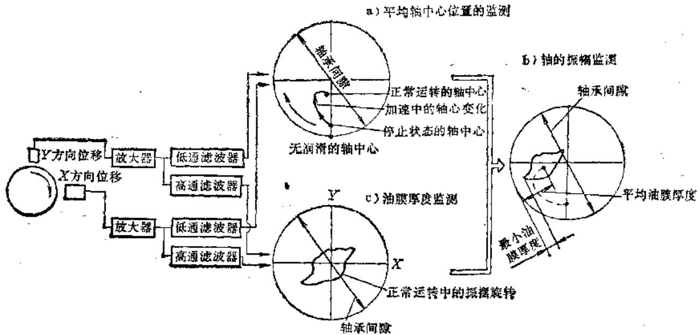

图13-3-6 轴振动的监测

充分反映机械的劣化程度。表13-3-3为各类设备的标准测定周期的例子。

表13-3-5 测定周期的典型例子

<table><tr><td>高速旋转机械</td><td>气轮压缩机、燃气轮机、蒸汽轮机</td><td>每日测定</td></tr><tr><td>一般能转机械</td><td>水泵、风扇、鼓风机、蒸汽轮机</td><td>每周测定</td></tr></table>

还要指出，所能确定的测定周期毕竟只是基本的测定周期，例如，一旦发现测定数据的变化征兆，就须开始缩短测定周期。图13-3-7是根据现在的测定值和过去的测定值来确定下一次检测日期的实例，可供参考。这种一面进行劣化预测，同时定量地确定检测日期的方法，应该认为是比较好的。

# 5. 判断标准的确定

表13-3-4列出的判断标准共有3种，须按对象设备来确定采用哪一种。

表13-3-4 判断标准实例

<table><tr><td>绝对判断标准</td><td>在同一部位（主要在轴承上）测定的值与“判断标准”相比较，判断的结果为良好/注意/不良</td></tr><tr><td>相对判断标准</td><td>对同一部位定期测定，按时间先后进行比较。将正常情况的值定为初始值，根据实测值达到的倍数进行判断</td></tr><tr><td>类比判断标准</td><td>有数台机型相同的机械时，按相同条件将它们进行测定，经过相互比较作出判断</td></tr></table>

到目前为止，还没有能适用于所有设备的通用判断标准。为了研究设备的老化状态、危险程度、重要程度等，必须按照设备各自的情况来确定标准。

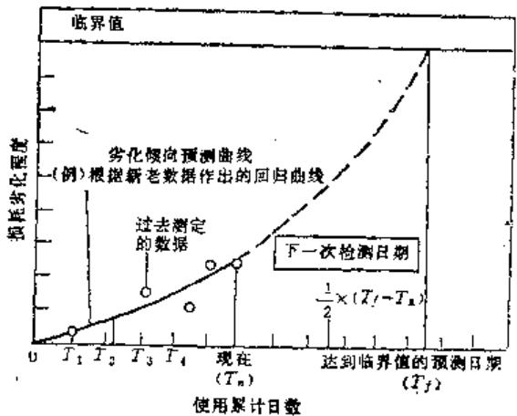

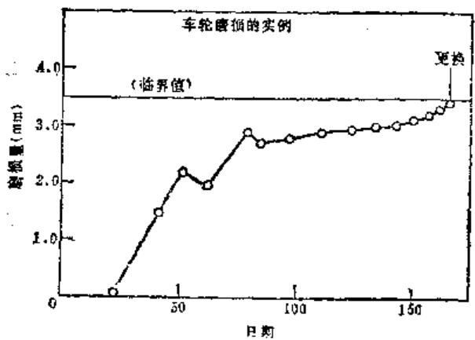

图13-3-7 根据过去的测定值确定检测日期的实例

（1）绝对判断标准 绝对判断标准是在规定了正确的测定方法后方可制定的标准。所以，必须掌握标准的适用频率范围和测定方法等，才能加以选用。还需注意，绝对判断标准也包括轴承振动与轴振动两种。

首先研究轴承振动标准。图13-3-8是对低频振动标准实例的说明。由图所示的判断标准可见，转速越高，与之成反比的允许位移量便越小。其它的位移标准值情况也是如此。如为普通的旋转机械，必须注意在一定速度下制定判断标准。所以，根据表13-3-5的依据，近来已从位移标准逐渐改为速度标准。

表13-3-5 制定速度标准的依据

<table><tr><td>项目</td><td>内容</td></tr><tr><td>设备破坏</td><td>1.振动部件材料的疲劳与振动速度成正比2.振动发生的能量与振动速度的平方成比例,能量传递的结果造成磨损和缺陷</td></tr><tr><td>感觉</td><td>3.人体的感觉程度一般与振动速度成比例4.根据过去的经验标准值,大体上速度为一定</td></tr><tr><td>其它</td><td>5.可以设定与转速无关的标准值</td></tr></table>

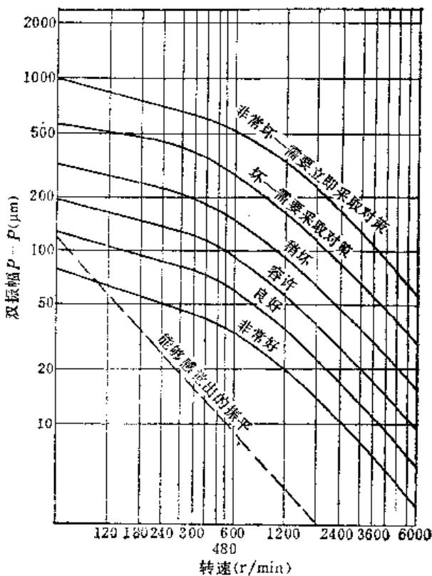

图13-3-8 大型旋转机械的振动标准（根据T.C.RAthbana资料）

图13-3-9为根据上述见解制定的速度标准的实例。此外，还有在速度标准的基础上按设备或频率进一步细分的标准，其实例如图13-3-10所示。测定轴振动时的绝对判断标准的实例如图13-3-11所示。这是根据轴承与轴的相对位移进行监控时的位移标准。

<table><tr><td colspan="2">振 动 速 度</td><td colspan="4">ISO 2372</td><td colspan="2">ISO 3945</td></tr><tr><td>范围</td><td>速度有效值(mm/s)</td><td>I级</td><td>II级</td><td>III级</td><td>IV级</td><td>刚性基础</td><td>柔软基础</td></tr><tr><td>0.28</td><td>0.28—</td><td rowspan="3">A</td><td rowspan="3">A</td><td rowspan="3">A</td><td rowspan="3">A</td><td rowspan="3">优</td><td rowspan="3">优</td></tr><tr><td>0.45</td><td>0.45—</td></tr><tr><td>0.71</td><td>0.71—</td></tr><tr><td>1.12</td><td>1.12—</td><td>B</td><td>—</td><td>—</td><td>—</td><td rowspan="3">良</td><td rowspan="3">—</td></tr><tr><td>1.8</td><td>1.8—</td><td>B</td><td>—</td><td>—</td><td>—</td></tr><tr><td>2.8</td><td>2.8—</td><td>C</td><td>—</td><td>B</td><td>—</td></tr><tr><td>4.5</td><td>4.5—</td><td rowspan="7">D</td><td rowspan="2">—</td><td rowspan="2">C</td><td rowspan="2">—</td><td rowspan="2">可</td><td rowspan="2">良</td></tr><tr><td>7.1</td><td>7.1—</td></tr><tr><td>11.2</td><td>11.2—</td><td rowspan="5">D</td><td rowspan="5">D</td><td rowspan="5">C</td><td rowspan="5">不可</td><td rowspan="5">可</td></tr><tr><td>18</td><td>18—</td></tr><tr><td>28</td><td>28—</td></tr><tr><td>45</td><td>45—</td></tr><tr><td>71</td><td></td></tr></table>

I级小型机械（例如15kW以下电机）Ⅱ级中型机械（例如  $15\sim 75\mathrm{kW}$  电机和300kW以下机械）Ⅲ级大型机械（安装在坚固重型基础）转速600 $\sim 12000\mathrm{rpm}$  振动测定范围  $10\sim 1000\mathrm{Hz}$  Ⅳ级大型机械（安装在较软的基础上）

图13-3-9 速度标准的实例

关于高频振动，例如图13-3-12所举的例子，必须注意其中的每一项都是加速度标准。但是，对于高频域振动，使用便携式振动计测定绝对物理量是很困难的，所以，最好用普通的螺钉或粘接剂固定后再测定，否则容易发生测头的接触共振和局部共振。

此外，传感器的频率特性也会影响测定值，故需在频率特性的平缓区域进行测定。但是，对于趋向监控类的测定，没有必要测定绝对物理量，如能够确认频率特性是平缓的就可测定。在这个意义上，用便携式振动计监控高频振动时，所用的仪表必须能消除因手持而产生的接触共振。

严重程度因数（SF）

<table><tr><td>设备</td><td>SF</td></tr><tr><td>离心泵、电动机、风机</td><td>1</td></tr><tr><td>蒸汽叶轮、叶轮、叶轮压缩机</td><td>1~1.6</td></tr><tr><td>性质不明的旋转机械</td><td>1~2</td></tr><tr><td>离心分离机</td><td>2</td></tr><tr><td>联杆机构</td><td>3.3</td></tr></table>

A A一一危险

$A$  ——预计将提前发生故障

B一一注意

C小故障

D良好

图13-3-10 分级的振动允许曲线

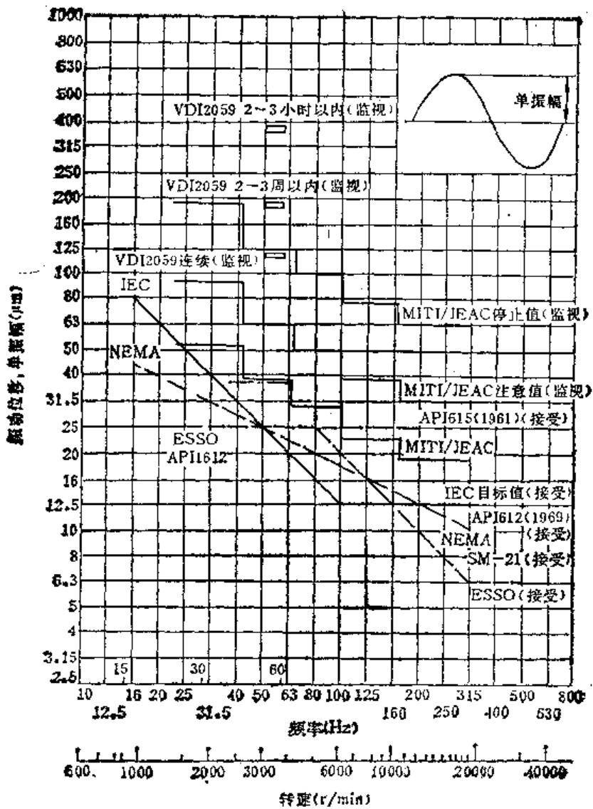

图13-3-11 轴振动允许值（蒸汽叶轮和叶轮发电机）

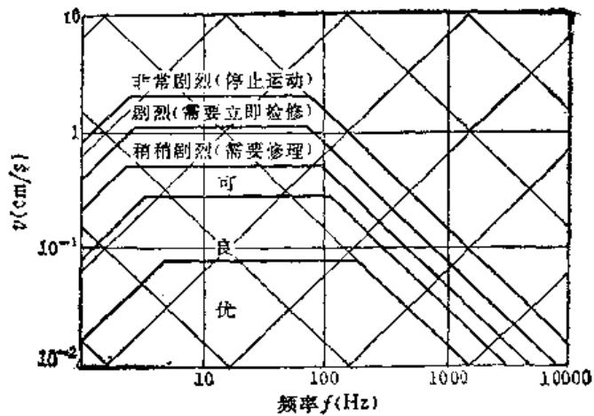

图13-3-12 加速度标准的举例

下面，作为位移标准的实例，表13-3-6列出加工机床的振动标准。对于加工机床，因为刀具与工件的相对运动对加工产品的尺寸精度有直接影响，故可理解为位移标准。

（2）相对判断标准 相对判断标准是对同一部位定期进行测定，并按时间先后进行比较，以正常情况下的值为原始值，根据实测值与该值的倍数比来进行判断的方法。

对于低频振动，按照过去的经验值和人的感觉，当振动值的变化达到4dB时，即可知道已经发生变化。所以，通常多将标准定为：实测值达到原始值的  $1.5\sim 2$  倍时为注意区域，约4倍时为异常值。对于高频振动，根据机件（零件）的强制劣化实验结果，将原始值的3倍定为注意区域，6倍左右应为异常区域。图13-3-13便是这种判断标准的实例。

<table><tr><td rowspan="2">诊断对象</td><td colspan="9">与正常值(初始值)的比(倍数)</td></tr><tr><td>1</td><td>2</td><td>3</td><td>4</td><td>5</td><td>6</td><td>7</td><td>8</td><td></td></tr><tr><td>旋转机构</td><td></td><td></td><td></td><td></td><td></td><td></td><td></td><td></td><td></td></tr><tr><td>齿轮</td><td></td><td></td><td></td><td></td><td></td><td></td><td></td><td></td><td></td></tr><tr><td>滚动轴承</td><td></td><td></td><td></td><td></td><td></td><td></td><td></td><td></td><td></td></tr><tr><td>滑动轴承</td><td></td><td></td><td></td><td></td><td></td><td></td><td></td><td></td><td></td></tr></table>

图13-3-13 类比判断标准的举例

（3）类比判断标准所谓类比判断标准，是指数台同样规格的设备在相同条件下运行时，通过对各台设备的同一部位进行测定和相互比较来掌握

表13-3-6 加工机床的振动标准的示例

<table><tr><td>内容</td><td>标准值[μm]P-P</td></tr><tr><td>飘纹磨床</td><td>0.25~1.5</td></tr><tr><td>仿形磨床</td><td>0.76~2.0</td></tr><tr><td>外圆磨床</td><td>0.76~5.0</td></tr><tr><td>平面磨床</td><td>1.27~5.0</td></tr><tr><td>无心磨床</td><td>1.00~2.5</td></tr><tr><td>搪床</td><td>1.52~2.5</td></tr><tr><td>车床</td><td>5.00~25.4</td></tr></table>

异常程度的方法。图13-3-14便是这种标准的实例。

使用上述三种判断标准时，应优先考虑绝对判断。

# 6.简易判断标准制订实例

某轴承厂根据生产设备的精度和产品加工的特点，采用以下3种方法制定了该厂各类设备的振值标准。

（1）概率统计法 采用的条件是：

1）同一类型的机床，随机振源的频率相等。

2）批量较大的同型号机床。

3）正在运行的空负荷机床。

根据对80台πz类滚道磨床的砂轮电机所取得的100个Ⅲ频道测值，通过统计分组而作出图13-3-15。

直方图大致画出了随机振值  $x_{i}$  的分布密度曲线，它基本上属于正态分布。

概率统计分析的关键是数学期望值  $\overline{X}$  和方差值  $S$  的计算：

$$
\begin{array}{l} \bar {X} = \frac {1}{n} (x _ {1} + x _ {2} + \dots x _ {i}) \\ = \frac {\sum_ {i = 1} ^ {n} x _ {j}}{n} \tag {13-3-2} \\ \end{array}
$$

$$
\begin{array}{l} S = \sqrt {\frac {(x _ {1} - \bar {x}) ^ {2} + (x _ {2} - x) ^ {2} + \cdots \cdots (x _ {1} - \bar {x}) ^ {2}}{n - 1}} \\ = \sqrt {\frac {1}{n - 1} \sum_ {i = 1} ^ {n} (x _ {i} - \bar {x}) ^ {2}} \tag {13-3-3} \\ \end{array}
$$

式中  $n$  ——表示随机振值  $x_{1}$  的分布数量。

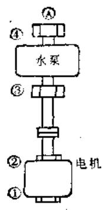

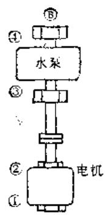

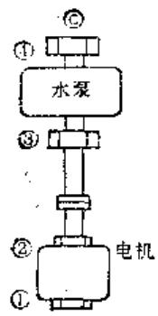

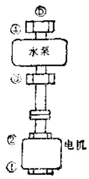

①～④的各位部位的水平方向振动记录

<table><tr><td rowspan="2">测定部位 聚名</td><td colspan="4">速度/(m/s)</td></tr><tr><td>①H</td><td>②H</td><td>③H</td><td>④H</td></tr><tr><td>⑤</td><td>0.05</td><td>0.07</td><td>0.06</td><td>0.07</td></tr><tr><td>⑥</td><td>0.06</td><td>0.05</td><td>0.07</td><td>0.06</td></tr><tr><td>⑦</td><td>0.05</td><td>0.07</td><td>0.14</td><td>0.17</td></tr><tr><td>⑧</td><td>0.06</td><td>0.07</td><td>0.05</td><td>0.07</td></tr></table>

图13-3-14 类比判断标准示例

<table><tr><td>分 组</td><td>出现频数</td><td>直 方 图</td></tr><tr><td>0.09~0.51</td><td>19</td><td rowspan="10">2010</td></tr><tr><td>0.51~0.93</td><td>20</td></tr><tr><td>0.93~1.35</td><td>22</td></tr><tr><td>1.35~1.77</td><td>14</td></tr><tr><td>1.77~2.19</td><td>9</td></tr><tr><td>2.19~2.61</td><td>6</td></tr><tr><td>2.61~3.03</td><td>5</td></tr><tr><td>3.03~3.15</td><td>3</td></tr><tr><td>3.15~3.87</td><td>1</td></tr><tr><td>3.87~1.29</td><td>1</td></tr></table>

图13-3-15 直方图

经计算得：  $\overline{X} = 1.33$  ，  $S = 0.85$

理论正态分布函数可用下式表示：

$$
F (x) = \frac {1}{0 . 8 5 \sqrt {2 x}} e ^ {- \frac {(x - 1 . 3 3) ^ {2}}{2 \times 0 . 7 2}} \tag {13-3-4}
$$

理论分布的验证从略。

其它型号的机床和频道的随机振值同样遵从正态分布，正态分布的数据比率见图13-3-16及表13-3-7。

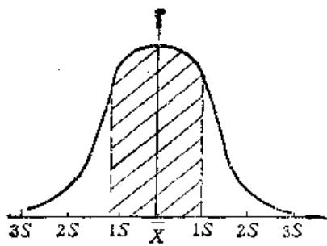

图13-3-16

表 13-3-7

<table><tr><td>区间</td><td>区间内占比率</td><td>区间外占比率</td></tr><tr><td>(X-1S)~ (X+1S)</td><td>68%</td><td>32%</td></tr><tr><td>(X-2S)~ (X+2S)</td><td>95%</td><td>5%</td></tr><tr><td>(X-3S)~ (X+3S)</td><td>99.7%</td><td>0.3%</td></tr></table>

根据正态分布的比率，各类磨床振动的诊断标准应遵从表13-3-8的规定。据此，已制定了13个机型的诊断标准。通过统计分析和诊断标准的确定，我们认为：

表 13-3-8

<table><tr><td rowspan="2">频率 评价 频道</td><td>II</td><td>III</td><td>IV</td></tr><tr><td>1 Hz~200Hz</td><td>200Hz~1 kHz</td><td>1 kHz~10kHz</td></tr><tr><td>合格</td><td>X2-1S2</td><td>X3-1S3</td><td>X4-1S4</td></tr><tr><td>好</td><td>X2</td><td>X3</td><td>X4</td></tr><tr><td>合格</td><td>X2+1S2</td><td>X3+1S3</td><td>X4+1S4</td></tr><tr><td>不合格</td><td>大于(X2+1S2)</td><td>大于(X3+1S3)</td><td>大于(X4+1S4)</td></tr><tr><td>不允许</td><td>(3~5)X2</td><td>(3~5)X3</td><td>(3~5)X4</td></tr></table>

1）数学期望值  $\overline{x}$  在正态分布曲线上是概率密度最大的一点，即峰值点，它符合长期实践中得出的统计规律，故将此值定为诊断标准的最佳值。

2） $(\overline{X} - 1S) \sim (\overline{X} + 1S)$  范围内的数值占样本总体的  $68\%$  ，这一区间属于稳定区间。有时不能把  $(\overline{X} - 1S)$  规定为诊断标准的原因是一台设备的随机振值不可能是0或很小。若要求设备的振动值很小，则制造设备的代价就很高，且加工工艺并不要求机床无振动。

3）目前，国外规定设备振动的不允许值为新设备初始振值的  $3 \sim 10$  倍，而我们将  $3 \sim 5\overline{X}$  规定为设备振动的不允许值。理由是将设备的初始值作为诊断依据有其不足之处，因为振动的初始值是随机变量，以其数学期望值  $\overline{X}$  作为诊断标准的依据比较科学。

（2）回归分析法 对于型号单一而台数少，担负生产任务重的大型精密关键设备，根据定期检测的随机振值  $X$  与时间变量  $t$  之间的关系，可用一元线性回归分析法找出相应设备的振值规范。

下面以法国立式磨床VG180砂轮轴的定期检测值为例进行回归分析，测点1在Ⅱ频道上的测值如表13-3-9所列。

定期检测随机振值的分布如图13-3-17所示。

从分布的散点图中可见，随机振值大体上散布在某条直线的周围，即随机振动值  $X$  与时间  $\pmb{t}$  大致成线性关系：

$$
\hat {X} = a + b t
$$

这里，在  $X$  上方加“ $\wedge$ ”是为了区别实际值  $X$ ，因为随机振值  $X$  和检测时间  $t$  之间一般不存在

表 13-3-9

<table><tr><td>检测时间(月)</td><td>随机振值V(mm/s)</td><td>检测时间(月)</td><td>随机振值V(mm/s)</td></tr><tr><td>1</td><td>0.1</td><td>6</td><td>0.35</td></tr><tr><td>2</td><td>0.3</td><td>7</td><td>0.5</td></tr><tr><td>3</td><td>0.3</td><td>8</td><td>0.3</td></tr><tr><td>4</td><td>0.4</td><td>9</td><td>0.6</td></tr><tr><td>5</td><td>0.45</td><td>10</td><td>0.5</td></tr></table>

图13-3-17

函数关系。

上述方程为回归方程，要找出散点图的所谓线性经验公式，需确定回归方程中的  $a$  和  $b$  （ $b$  叫做回归系数）。

从散点图来看，找出  $a$  和  $b$  并不困难。可以在散点图上画出无数条直线，并找出一条总体上最接近这些散点的直线，该直线在  $X$  轴上的截距便是所求的  $a$ ，其斜率则为所求的  $b$ 。

图13-3-18是VG180砂轮轴的2、3测点在Ⅰ频道上的随机振值分布图。由图可见，2点处振动值的平均值大约是  $0.23\mathrm{cm}^2/\mathrm{s}$ ；3点处振动值的平

# 13-24

均值大约是  $0.2\mathrm{mm / s}$  。因此，可将2、3点在频道上的理想振值规定为  $0.23\mathrm{mm / s}$  和  $0.2\mathrm{mm / s}$  。以此作为相应点在近阶段的最佳诊断标准。

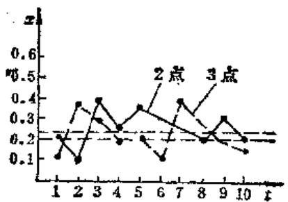

图13-3-18

现在，回过头来讨论测点1的振值规范。

设在  $x - y$  坐标上分布的散点有  $\pmb{n}$  个，如图13-3-19：

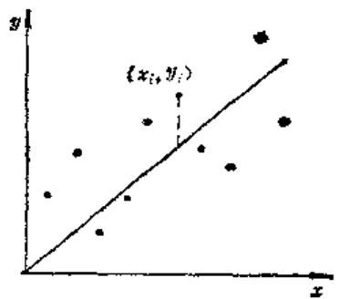

图13-3-19

$$
(x _ {1} y _ {1}), (x _ {2} y _ {2}), \dots \dots (x _ {n} y _ {n})
$$

则对于平面上任意一条直线  $i$

$$
y = a + b x \tag {13-3-5}
$$

我们用数量  $[y_i - (a + bx_i)]^2$  来表征点  $(x_i y_i)$  到直线  $l$  的远近程度，不难看出： $|y_i - (a + bx_i)|$  的几何意义是点  $(x_i y_i)$  沿平行于  $y$  轴的方向到  $l$  的垂直距离，而不是垂直于  $l$  方向到  $l$  的最短距离，于是：

$$
\sum_ {i = 1} ^ {n} \left[ y _ {i} - (a + b x _ {i}) \right] ^ {2} \tag {13-3-6}
$$

即定量地描述了直线  $l$  与这几个点的总的远近程度。这个量是随不同的  $a$  和  $b$  而变化的，即为  $a$ 、 $b$  的二元函数，记为  $Q(a, b)$ ，则：

$$
Q (a, b) = \sum_ {i = 1} ^ {n} [ y _ {i} - (a + b x _ {i}) ] ^ {2} \tag {13-3-7}
$$

为了找出一条总体上最“接近”这几个点的直线，就要找出两个数  $\hat{a}$  和  $\hat{b}$ ，使二元函数  $Q(a, b)$  在  $a = \hat{a}$ 、 $b = \hat{b}$  处达到最小。

对函数  $Q(a, b)$  求偏导得：

$$
\left\{ \begin{array}{r l} \frac {\partial Q}{\partial a} = - 2 \sum_ {i = 1} ^ {n} [ y _ {i} - (a + b x _ {i}) ] \\ = 0 & (1 3 - 3 - 8) \\ \frac {\partial Q}{\partial b} = - 2 \sum_ {i = 1} ^ {n} x _ {i} [ y _ {i} - (a + b x _ {i}) ] \\ = 0 & (1 3 - 3 - 9) \end{array} \right.
$$

从式13-3-8得：

$$
\begin{array}{l} \text {设} a = \sum_ {i = 1} ^ {n} y _ {i} - b \sum_ {i = 1} ^ {n} x _ {i} \\ a = \bar {y} - b \bar {x} \tag {13-3-10} \\ \end{array}
$$

从式13-3-9得：

$$
\sum_ {i = 1} ^ {n} x _ {i} y _ {i} - a \sum_ {i = 1} ^ {n} x _ {i} - b \sum_ {i = 1} ^ {n} x _ {i} ^ {2} = 0
$$

将  $a = \overline{y} - b\overline{x}$  代入解得  $b_{1}$

$$
\begin{array}{l} \phi = \frac {\sum_ {i = 1} ^ {n} x _ {i} y _ {i} - \overline {{n x y}}}{\sum_ {i = 1} ^ {n} x _ {i} ^ {2} - n x ^ {2}} \\ = \frac {\sum_ {i = 1} ^ {n} \left(x _ {i} - \bar {x}\right) \left(y _ {i} - \bar {y}\right)}{\sum_ {i = 1} ^ {n} \left(x _ {i} - \bar {x}\right) ^ {2}} \tag {13-3-11} \\ \end{array}
$$

根据式（13-3-10和13-3-11）求出  $a, b$ ，便得到了所要找的直线：

$$
y = a + b x
$$

因此，根据法国立磨VG180在测点I的随机检测值算得：

$$
a = 0. 3 4, \quad b = 0. 0 3
$$

求得线性回归方程为：

$$
x = 0. 3 4 + 0. 0 3 t \tag {13-3-12}
$$

即随着时间  $t$  的变化，随机振值应基本遵循此回归方程。

（3）波纹法 根据产品加工的工艺要求和磨削后工件表面的波纹度，也可以制定出设备振动的诊断标准。

1）工件表面的波纹度与产品质量的关系 工件表面的波纹度对产品质量的影响很大，波纹度愈大引起的振动和噪声也愈大，轴承的回转精度和使用寿命就会降低。

轴承振动值和轴承内外滚道表面的波纹度关系如下：

$$
V _ {\max } = V _ {j} \frac {2 \pi}{\lambda} H = K _ {1} \frac {H}{\lambda} \tag {13-3-13}
$$

$$
a _ {\max } = K _ {2} \frac {H}{\lambda} \tag {13-3-14}
$$

式中  $V_{\text{max}}$  ——轴承振动的最大速度；

$a_{\max}$  ——轴承振动的最大加速度；

$V_{j}$  ——轴承内套的恒定转速；

$H$  ——滚道表面的波纹高度；

$\lambda$  ——滚道表面的波纹波距。

从上式可知，轴承振动的速度、加速度值与轴承工作表面波纹的幅值成正比，与波距成反比。

表13-3-10为滚道磨床3263（23*）的振动测值与工件加工表面波纹值的对比情况（数值为Ⅱ频道时的最大测值）：

从表13-3-9所列的测量值可知，砂轮电机的振动对工件表面的波纹度有直接影响，即工件表面波纹的幅值随电机振动幅值的增大而增高，但工件表面振纹的波距不变。

2）加工产品的波纹度和机床受迫振动的关系通过分析工件表面的波纹度和机床受迫振动的关系，进而了解机床受迫振动的物理过程，可以改善不利因素，使工件表面的波纹度达到理想的标准。

通过分析可知：

① 当砂轮轴或电机的幅值增加时，机床振动的幅值也随着增加。

② 如果振动力按正弦规律变化，系统的响应稳态为简谐振动，振动频率与振源的频率一致。

③ 当激振频率与系统的固有频率接近时，系统的振幅急剧增加。

因此，为了减小机床的受迫振动，保证产品质量，必须采取以下措施：

① 减小使砂轮轴或电机振动幅值增大的激振力。

表13-3-10

<table><tr><td>砂轮电机振值V(mm/s)</td><td>1</td><td>1.1</td><td>1.9</td><td>2.6</td><td>备注</td></tr><tr><td>工件表面波纹度(μm)</td><td>7</td><td>8</td><td>12</td><td>14</td><td>nG=48.3 (r/s)</td></tr><tr><td>工件表面大棱子个数(个)</td><td>12</td><td>12</td><td>12</td><td>12</td><td>nS=1 (r/s)</td></tr></table>

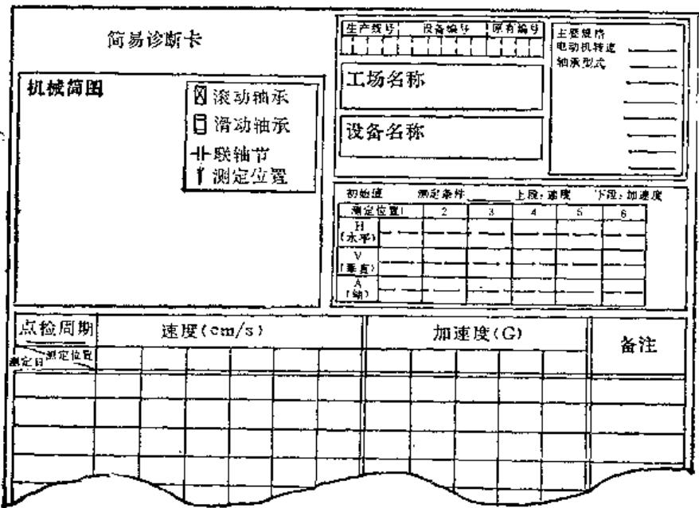

图13-3-20

简易数据记录卡实例（1）

② 提高系统的刚度，增大系统的质量。

③ 加大系统的阻尼。

④ 改变系统的固有振荡频率或改变激振频率。

在实际工作中，我们以工件表面波纹能最理想地满足工艺要求的机床的振值，作为对此类机床的诊断标准。

根据产品的工艺要求，磨削后工件表面的波纹度，即最大波纹高度：

$$
W _ {\max } = \frac {2 \mathrm {m m} \times 1 0 0 0}{\beta} h \leqslant 3 \mu \mathrm {m} \tag {13-3-15}
$$

式中  $\beta$  ——圆度仪的放大倍数，

$\pmb{\mathcal{H}}$  最大谷峰之间的同心圆格数。

按照波纹度这一工艺要求，通过多次测量比较，磨床3263和MIII77两类磨床砂轮电机的振值规范列如表13-3-11。

表 13-3-11

<table><tr><td rowspan="2">频率范围</td><td colspan="2">带轮上传动带</td><td rowspan="2">GB2607-8</td></tr><tr><td>3263</td><td>M1H17</td></tr><tr><td>10~200Hz</td><td>0.9mm/s</td><td>0.8mm/s</td><td>1.6mm/s</td></tr></table>

注：为电机装在机床上空运转测定。

# 7.劣化监控表的编制

根据测定标准进行测定，将测定值作成记录加以保存，其目的是为了今后制订维修计划时需参照

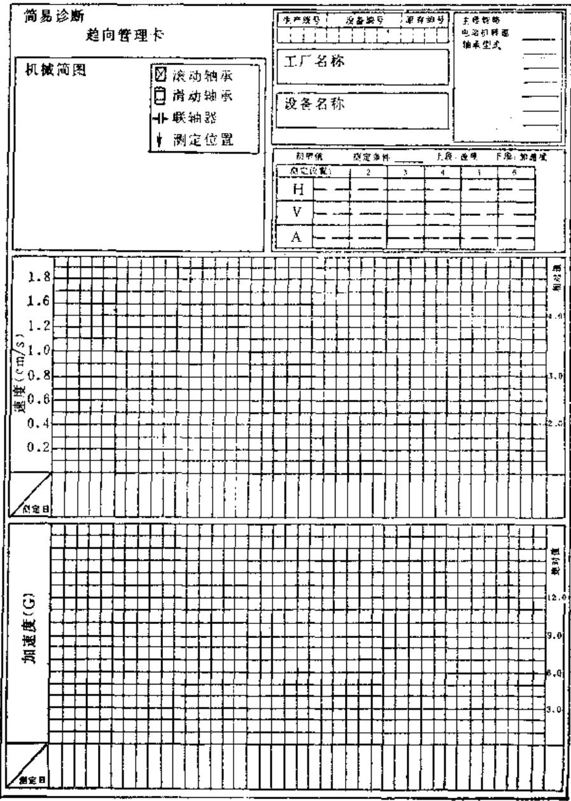

图13-3-21 简易数据记录卡实例（2）

a）硬件流程

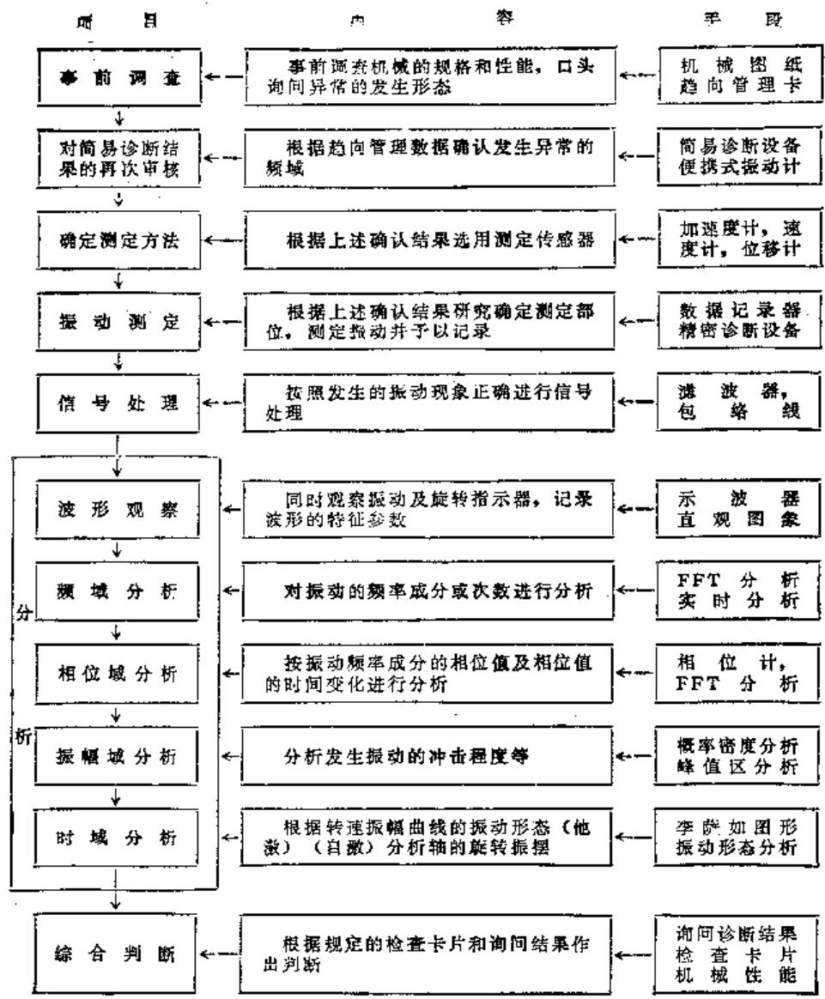

b）诊断流程

图13-3-22 旋转机械的精密诊断流程

过去的测定记录。为了便于管理，必须编制劣化趋向监控表。表中必须记录的项目如下：

1）工厂车间名称。

2）设备名称。

3）设备主要规格（例如：转速，出力，轴承型式）。

4）设备结构简图。

5）测定参数（离散值）。

6）测定的位置和方向。

7）测定周期。

8）判断标准。

9）原始值（正常值也可）。

10）测定条件。

11）测定值（测定日，测定值）。

12）维修的实际情况。

13）劣化倾向监控图表。

以上各项目均须记载，当中途更换测定人员和发生异常时，它们对实施精密诊断是非常有用的。图13-3-20～21为其实例。

# （二）旋转机械的精密诊断

旋转机械的精密诊断，是经简易诊断判断存在异常而需进一步探明原因时所用的方法。

在简易诊断中，利用振动作为特征参数（离散

<table><tr><td>主要分析方法</td><td>概要</td><td>举例</td></tr><tr><td rowspan="3">(1)频率分析(次数比分析)</td><td>检查发生振动的频率</td><td>①不平衡成分</td></tr><tr><td rowspan="2">①②③次数(频率)</td><td>②不同轴成分</td></tr><tr><td>③压力脉动成分</td></tr><tr><td rowspan="2">(2)相位分析</td><td rowspan="2">检查所发生的振动与旋转指示器的同步性</td><td>①不变化(同步)强迫振动</td></tr><tr><td>②变化的(不同步)自激振动,其他振动</td></tr><tr><td rowspan="3">(3)振动形态分析</td><td rowspan="3">改变转速并检查振幅的变化</td><td>①强迫振动</td></tr><tr><td>②共振</td></tr><tr><td>③电力引起的振动</td></tr><tr><td rowspan="2">(4)概率密度分析</td><td rowspan="2">检查所发生振动的振幅概率</td><td>①流体噪声振动</td></tr><tr><td>②冲击振动</td></tr></table>

图13-3-23 主要分析方法概要

值), 进行精密诊断时, 也通过振动来说明问题。图13-3-22表示以旋转机械为对象进行精密诊断时使用的测定和分析方法的简要流程。

精密诊断需要从多方面对异常现象进行分析，即：异常现象是骤然发生还是缓慢发生的？是重复发生过的还是比较稳定的异常？待经过询问诊断来进行定性分析也是需要的。还有，为了正确解释所发生的异常现象，对对象设备的设计性能需要加以确定。

下一步骤是要正确收集所发生的振动，然后进行正确的分析。过去一提振动分析，很容易认为就是频率分析。但只作一项分析是不全面的，对于振动要从频率、相位、振幅、时间等各领域进行分析，必须最大限度地测定异常振动的各种性质。

图13-3-23是按图13-3-22实施的主要分析内容和典型实例。下面根据这些分析结果对原因作出推断的方法。

通常使用的方法如下：预先准备好按异常机理分别表示其振动性质的检查卡片，将这些卡片同分析所得的结果进行对照；另一方面，由诊断人员根据提问（口头）的结果和经验来作出判断。

近来逐渐采用如下的方法：按各种异常机理分别预先确定其劣化指标的标准值，再根据异常现象

的振动分析结果计算出各项劣化指标值，将此值与预先定出的标准值对比，从而可自行推断出异常的原因。

作为劣化指标值的例子有：

1）基本成分的比例（或称占有率）。

2）高次谐波成分的比例。

3）冲击指数。

#

例如，基本成分的比例表示正在发生的振动中基本旋转频率  $(f_r)$  所占的比例。如利用这种方法能使从作出分析结果到确定诊断结果的流程充分定量化，今后也可作为自动诊断方法加以运用。

# 参考文献

[1][日]暨田利夫著，设备现场诊断的展开方法。高克勋，李敏译.北京：机械工业出版社，1985

[2]豐田利夫著，振动解析にマ機械の異常診断．日本設備工程師協會，1980

[3]秋月影雄著，信号处理技術。日本設備工程師協會，1980