# 第14章 超声波与声发射监测技术

# 姚家瑞

# 第1节 超声波技术

# （一）超声波及其性质

# 1. 超声波的发生和种类

在设备诊断方面应用的是  $400\mathrm{kHz} \sim 25\mathrm{MHz}$  的超声波，其中，用得最多的是  $1 \sim 5\mathrm{MHz}$  的超声波。

为了能发出用于设备诊断的超声波，要使用压电材料。这种材料在加上电压之后会产生机械变形，而在发生机械变形之后会产生电压。一般是使用水晶、钛酸钡，锆钛酸铅（也称之为PZT）等材料。

错钛酸铅的音电变换特性非常良好，因此，尤其被人们所广泛使用。而水晶则由于其机械特性和化学特性均较稳定，所以也应用于部分的设备诊断之中。

将这些压电材料进行加工，使其能在特定的频率下产生共振，这就叫振子。在这种振子的两面加上电极，并在电极上通上高频电压之后，振子便在较厚的方向上伸缩，也就是电气的振动转换为机械振动。这种传导到检查材料的机械振动就是超声波（图14-1-1）。

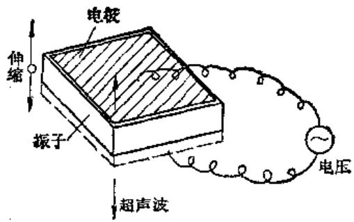  
图14-1-1 超声波的发生

实际上加给振子的是数百伏的电脉冲。振子就如音叉一样自己发生振动，但为了使其能在一定的时间后停止振动，要给它加上阻尼器之类的元件，并装配成适当的形状，称之为探头。在使探头产生机械振动后，便会在振子的电极间产生与机械振动的频率相等、与振动的振幅成比例的电压。

超声波的种类：

在空气中传播的声波是疏密波，这种波也叫纵波（图14-1-2）。所谓纵波，是振动的方向与波的传播方向相一致的波。在空气或液体中，只有纵波才能传播，而在固体中，除了纵波之外，还可传播横波。所谓横波是振动的方向与波的传播方向垂直的波。

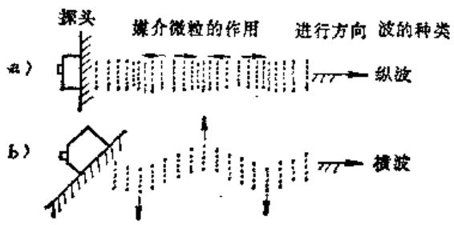  
图14-1-2 超声波的种类

除此之外，还有在表面上传播的表面波（海面上的波也是表面波的一种）和薄板上传播的板波，这些波均可用于设备诊断。

垂直探头可以造成纵波，而斜角探头则可以造成横波，两种探头的结构图示于图14-1-3。

# 2. 超声波的性质

（1）声速在空气中，声速是每秒约  $340\mathrm{m}$  （温度  $20^{\circ}\mathrm{C}$  ），超声波也是声音，所以其速度是一样的。

声速是由传播介质的弹性率和密度所决定的。对于纵波和横波来说，纵波较快，其速度约为横波

表14-1-1 声速和波长  

<table><tr><td rowspan="2">项目 介 质</td><td rowspan="2">纵波声速 (m/s)</td><td rowspan="2">横波声速 (m/s)</td><td colspan="3">纵 波 波 长 (mm)</td></tr><tr><td>100kHz</td><td>1MHz</td><td>10 MHz</td></tr><tr><td>空气</td><td>340</td><td>-</td><td>5.4</td><td>0.34</td><td>0.034</td></tr><tr><td>水</td><td>1500</td><td>-</td><td>15</td><td>1.5</td><td>0.15</td></tr><tr><td>玻 璃</td><td>3700</td><td>2180</td><td>37</td><td>3.7</td><td>0.37</td></tr><tr><td>铝</td><td>6300</td><td>3100</td><td>63</td><td>6.3</td><td>0.63</td></tr><tr><td>钢</td><td>5900</td><td>3200</td><td>50</td><td>5.9</td><td>0.59</td></tr></table>

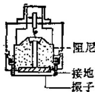  
a>垂直探头

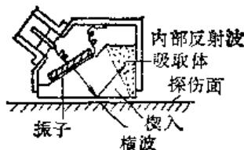  
b）倾斜探头  
图14-1-3 垂直、斜角探头

的2倍。由于在空气中不存在横波，所以，约340 $\mathbf{m} / \mathbf{s}$  是纵波的速度。在金属中声音的传播要比在水和空气中快（表14-1-1）。

（2）频率和波长 在声波的频率  $(f)$  、波长  $(\lambda)$  、传播速度  $(C)$  之间，存在着如下关系：

$$
\boldsymbol {c} = f \lambda
$$

某种物质，在一定的温度条件下，声速是一定的。因此，如果提高频率，波长就要变短，而如果降低频率，则波长又要变长。

超声波是频率很高的波，因此，与一般的声音比较，可以说是一种波长较短的波。关于波长，列于表14-1-1。

（3）衰减和频率 声音的频率变高后，它就不能传到远处了，也就是发生了衰减现象。

产生这种衰减的原因，诸如物质的粘性、错位、散射等等，总而言之，当频率变高后，声音就要急剧的衰减，从而缩短传播的距离，这种性质就成为决定要使用超声波的上限的理由之一。

（4）超声波与壳 超声波的波长较短，所以，与光很相近，具有直线传播性。在说明超声波这种现象方面，可以使用说明光现象的几何光学的方法。而且，由于会发生与光相同的折射（向周围衍射的性质）和干涉（由于彼此互相重合而互相抵消或互相激励）等现象，这样，超声波的传导现象就复杂了。

（5）指向性 高频的超声波具有一种声音向一个方向传导的指向性。如图14-1-4所示，从探头发生的超声波开始基本上与在探头的面积相同的范围内传播，到一定的程度后，便扩大了范围向前传播。频率越高，并且探头越大，图14-1-4中的指向角0越小。

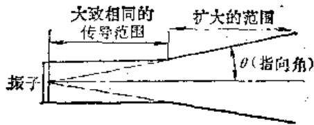

<table><tr><td></td><td colspan="6">纵波</td></tr><tr><td>频率(MHz)</td><td>1</td><td>2</td><td colspan="2">2.25</td><td>4</td><td>5</td></tr><tr><td>振子直径(mm)</td><td>30</td><td>20</td><td>18</td><td>28</td><td>20</td><td>20</td></tr><tr><td>铝</td><td>15</td><td>11</td><td>11</td><td>7.0</td><td>5.5</td><td>4.4</td></tr><tr><td>钢</td><td>14</td><td>10</td><td>10</td><td>6.6</td><td>5.2</td><td>4.1</td></tr><tr><td>丙烯树脂</td><td>6.3</td><td>4.8</td><td>4.6</td><td>3.0</td><td>2.3</td><td>1.9</td></tr><tr><td>水</td><td>3.5</td><td>2.6</td><td>2.6</td><td>1.6</td><td>1.3</td><td>1.0</td></tr></table>

图14-1-4 指向性和指向角  $\theta$  （度）

对于设备诊断来说，指向性是一种很重要的性质，也是使用高频超声波的理由之一。

（6）声阻抗和反射物质的密度（ $\pmb{\rho}$ ）和声速（C）的乘积称为声阻抗  $(Z_{s})$ ，单位为 Pa·s/m³。

当超声波垂直入射到阻抗不同的物质（ $Z_{a1}$ ， $Z_{a2}$ ）相邻接的部位时，其中一部分发生反射，而另一部分却透射过了。这可按下式计算：

反射率  $r = \left|\frac{Z_{\alpha 1} - Z_{\alpha 2}}{Z_{\alpha 1} + Z_{\alpha 2}}\right| \times 100 (\%)$

透射率  $T = 1 - r$

例如将超声波射到钢和空气相邻的界面时，由于  $r \approx 1$  ，  $T \approx 0$  。于是从钢的一侧传来的超声波几乎百分之百地返回到钢。同样，从空气一侧传来的超声波几乎百分之百地回到空气之中（图14-1-5）。

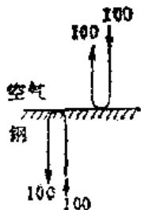  
a)空气和钢  
图14-1-5 超声波的反射和透过

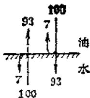  
b）水和油

如果钢棒中存有裂纹，那么，传到钢棒上的超声波碰到这种间隙，又会反射回去。

由于间歇、伤痕的形状以及方向等因素的影响，实际中的超声波的反射会发生很大的变化。仅仅根据反射回来的超声波的量，还不能确定伤痕的大小。而且，缺陷的大小，小于超声波波长的  $\frac{1}{2}$  时，由于折射现象，超声波不反射回去。所以，长度为超声波波长  $\frac{1}{2}$  的缺陷，是检测的极限（图14-1-6）。

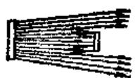

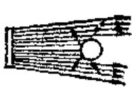

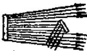

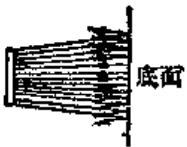  
图14-1-6 由小物体进行超声波的反射

# （二）超声波技术在设备诊断中的应用

# 1. 超声波探伤

（1）超声波探伤的原理 图14-1-7说明了超声波探伤的原理。对探头施加电压后，探头便发生振动并产生超声波。发生的超声波入射到被检测物的内部，并遇到缺陷。由于被检测物的声阻抗不同，所以，超声波的一部分便产生反射。超声波进

一步传播，当到达被检测物的底面时，遇到空气几乎全部反射回来，反射回来的超声波被称之为反射波。反射波到达探头后，便产生了电压。

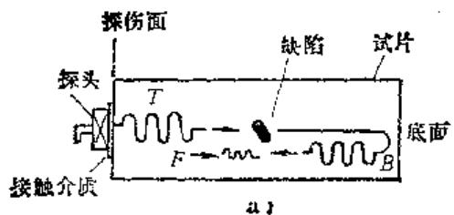

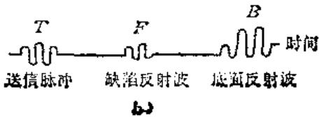

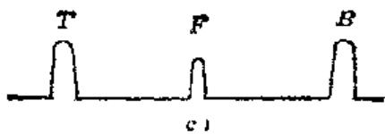  
图14-1-7 超声波探伤的原理

超声波的传播速度，对于每种材质来说，都是一定的。因此，根据超声波发生之后到反射回来的时间，可以知道缺陷的位置。同时，也能够区别出缺陷和底面。

在超声波探伤仪的中心部有荧光屏，荧光屏的横坐标是时间，而纵坐标则是表示将超声波变成电压的大小。图14-1-7c表示荧光屏所显示的波形。 $F$  是从缺陷处反射回来的波形，而  $B$  则是从底面反射回来的波形。

在探伤仪上，带有一个调节  $B$  的高度一致的旋钮，使用这个旋钮使  $B$  与荧光屏的纵向高度一致后， $F$  的高度就能表示缺陷的大小。但是，在实际中，由于缺陷的形状和方向的不同， $F$  也发生很大的变化。因此，预先要使用按照不同缺陷制成的标准试样，来校正探伤仪的探伤灵敏度。

（2）超声波探伤的标准回路 图14-1-8是超声波探伤仪的方块图。

同步电路部分是控制整个系统时间的时钟，它会激励发射电路产生激励脉冲。这种脉冲传到探头中的晶片上，从而产生了超声波。另一方面，缺陷反射波和底面反射波也是通过同一个晶片所接收的。为了使这些在荧光屏上显示出来，要通过放大回路部分来将电压放大。此外，还有为了调节灵敏

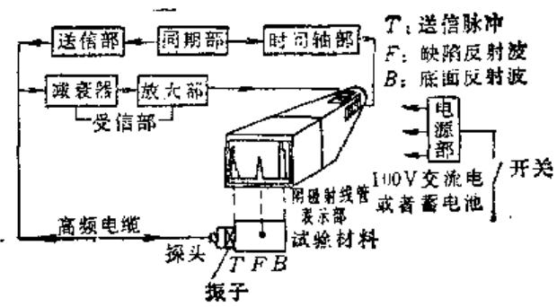  
图14-1-8

度的衰减回路，为此，还要使用标准试样来设定探伤仪的灵敏度。

探伤仪的灵敏度，是用下式的分贝值（dB）来表示的：

$$
\begin{array}{r l} & \mathbf {d B} = 2 0 \log 1 0 N \\ & \left(N = \frac {\text {来 自 缺 陷 反 射 波 的 大 小}}{\text {来 自 标 准 试 样 的 反 射 波 的 大 小}}\right) \end{array}
$$

$N$  如果是10倍的话则是  $20\mathrm{dB}$ ，如果是100倍的话则是  $40\mathrm{dB}$ ，1000倍的话是  $60\mathrm{dB}$ 。之所以使用  $\mathrm{dB}$ ，是由于在进行超声波检查时，需肯定一种相对的检查，并且大的缺陷和小的缺陷所接收的电压有数千倍的差别。所以，如果不使用对数的话，是极为不便的。

上面介绍了超声波探伤仪的主要组成部分，出于其它目的，还可以追加其它各种功能，在进行超声波探伤之际则将会更加方便。

# （3）附加功能

1）扫描迟延一将时间轴的一部分放大，并加以显示。  
2）选通电路—这种回路是只将缺陷波抽取出来，如果超过与波高或比例的记录用输出功率，或者超过预先规定的水平，就将使警报灯有所显示。  
3）DAC—即距离振幅补偿，由于超声波的衰减，远距离的缺陷波会变小，该回路是对此加以补偿，使得同样大小的缺陷，显示的波形具有同样高度的补偿回路。  
（4）斜角探伤 图14-1-9表示焊缝探伤的情况。这种探伤是用斜角探头倾斜发射超声波。在这种情况下；如果横波和纵波混在一起的话，对于结果的判断会带来一定的麻烦。因此，要使入射角保持在适当的范围  $(35^{\circ} \sim 80^{\circ})$  ，只让横波入射到被检测物上。

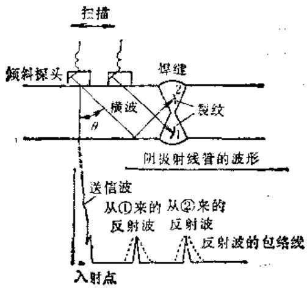  
图14-1-9 焊缝探伤

其灵敏度要用斜角探伤用试样来进行校正。

（5）表面探伤 在用设备有时会产生疲劳裂纹，这种裂纹往往是从表面向纵深发展，要想发现这种裂纹，就要使用表面波探伤仪。表面波是波的能量集中于表面的一种波，探头要使用表面波用斜角探头。

如果被测物的表面附着有水或油的话，就会形成与裂纹相同的反射波。所以，需对表面加以清理，如果表面不平滑的话，也不能应用表面探伤仪。

# 2. 超声波剥厚

超声波测厚仪已广泛使用在各种槽、罐、压力容器和热交换器的维修点检方面。

超声波测厚仪的原理与超声波探伤仪是一样的（参照图14-1-10）。因此，用超声波探伤仪也能够测定厚度。但是，目前多数已采用那种不使用示波管，而是用数字来显示的小型轻便量的专用厚度测定仪（参见本篇19章）。

超声波测厚仪的指示，与试样的声速有关。因此，如果是测定不同的材料，需要校正声速后再加以使用。在一般的测厚仪上，都带有声速调整旋钮，可以根据所测定的材料来校正声速。

测厚仪在制造时要考虑使用方便，但由于只是表示厚度，所以有时即使是错误的操作也不易觉察。这样，在使用时需充分注意：

1）由于气体与金属二者的声阻抗相差太大，为了改善超声波探头和被检零件间的透射率，应尽量减少界面上空气间隙的反射作用。为此，要在零件表面安置探头的地方涂敷接触润滑脂；  
2）先要了解原始厚度，然后将测得的厚度与原始厚度相比较，才能知道厚度减少了多少。

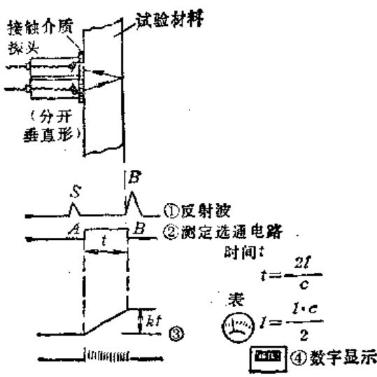  
图14-1-10 超声波测厚仪的原理

将油、甘油之类的声耦合剂涂在被测试物上，然后使探头从上面靠近它，超声波作为一种反射波从被测试物底面返回。

① 是反射波，  $S$  是表面间波，  $B$  是底面波。  
$②$  用与被测试物同种材质的试样来校正，根据底面法  $B$  求出测定时间。  
③ 把它的积分表示在计量表中。  
$④$  或用时钟脉冲表示数字。

在有缺陷和孔蚀时，由此会出现异常值。而且，有时还会把这种异常值误认为是正常的厚度。当出现与周围的厚度不同的异常值时，最好用一般的超声波探伤仪来测量一下缺陷波和底波。

3）在显示总是为0或者总是满刻度时，可能是由于厚度过厚或者过薄。此外，当底面有严重的腐蚀或者倾斜度较大时，有时底波也会消失。  
4）当测定面有凸凹或者表面经过涂装时，要将所要测定的部位锉平或将涂层去掉。  
5）当被测试物的温度很高时，为了不损坏探头，要将被测试物的表面和探头冷却。而当被测试物的温度和校正试样的温度不同时，由于声速会发生变化，相应地要造成误差。

测厚仪的应用虽然非常简便，但在实际使用时，却要充分加以注意。应当指出，无论使用何种超声波仪器，要达到熟练掌握的程度，都需要花费相当多的功夫。否则就不能获得可靠的测定值。

# 第2节 声发射检测

# （一）声发射及其检测特点

# 1. 声发射的基本原理

受力固体，由于其内部缺陷的存在，或微观结构的不均匀，会导致局部的应力集中，造成不稳定的应变，从而形成裂纹产生、扩展、直至断裂。这是一种应变能的释放过程，其中一部分是以应力波的形式快速释放的弹性能，即形成声发射。声发射

频率范围从次声、可听声直至数十兆赫的超声。不过，大多数金属材料声发射信号的频谱在  $100\mathrm{kHz}$  到  $500\mathrm{kHz}$ ，因此，声发射检测的频率窗口设在这一频率范围是十分合适的。同时，在这个频率范围内，又能克服机械噪声的干扰，这为声发射技术从实验室过渡到现场打下了良好的基础。

产生声发射的单个事件的持续时间很短，通常在  $10^{-4}$  到  $10^{-8}$  秒左右，事件的持续时间越短，其频率分量越高。由于，由材料发射出来的每一个声信号都包含着反映材料内部的缺陷性质和材料应变的信息。因此，通过声发射检测，接收到这些信号，加以处理、分析和研究，就有可能判断出材料内部发生的变化。

材料的塑性变形和裂纹扩展是不可逆的，由此而引起的声发射也是不可逆的。对材料施加载荷，开始有声发射发生。卸去载荷后第2次加载，在载荷未超过第1次的最大载荷之前没有声发射，只有当载荷超过这个值时才开始发生声发射。这一现象称为声发射的不可逆效应，也称凯瑟效应。在声发射检测中，常常利用凯瑟效应验证声发射信号的性质，区分声发射信号和噪声。

# 2. 声发射检测的特点

在常规的无损检测中，总是先以某种方式向被测对象发出特定信号，然后再由仪器检测被测对象对该信号的反应，从中识别缺陷的存在及其性质。例如，超声波探伤是先向材料发出一束超声波，超声波遇到缺陷时即被反射回来，根据收到的反射超声波以推断缺陷的存在和其位置。而在声发射检测

中，信号是缺陷在应力作用下自发产生的，从接收到来自缺陷的声信号推知缺陷的存在和其所处的状态。因此是缺陷主动参与检测。这是声发射检测与其它无损检测法的最大区别和常规无损检测相比较，声发射检测有下述特点：

1）声发射检测时需要对构件外加应力。  
2）声发射检测是一种动态检测，它提供的是加载状态下缺陷活动的信息。一般常规的无损检测法只能反映缺陷的位置、大小等静态参数，无法辨认加载后缺陷是急剧扩展，还是处于稳定状态。比如材料中的裂纹，用常规无损检测法不易发现，但在施加低载荷时，由于应力集中，裂纹的起始和扩展往往会产生大量声发射信号，用声发射仪器很容易就检查出，并能监测其发展趋势。从某个角度看，声发射可更客观地评价运行中设备的安全性和可靠性。  
3）声发射检测灵敏度高，表14-2-1列出声发射与其他无损检测法的比较。  
4）声发射检查复盖面积大，不会漏检，可以远距离监测。常规无损检测往往要用人工对构件依次扫描来检查整个构件。人为的作用对检测结果影响很大。另外，在有辐射或其它危险性因素的场合，检测会受到极大的限制。而声发射检测只需在构件上安装适当的传感器，测试者不必长时间接近试验体，在对构件加载同时就能全面检查。复盖率达到  $100\%$  ，不会漏检。同时对那些危险装置的监测也有了可能。声发射检测特别适合对大型复杂构件进行整体评价。  
5）声发射检测使设备可在运行状态下进行。  
6）声发射检测不能反映静态缺陷的情况，因

此在现场应用中，往往还要借助于其它方法一起对构件做出评价。但它们之间不是相互排斥，而是相互补充，取长补短。

# （二）声发射的测量参数及测量仪器

在声发射的测量中，常用的测试参数有事件计数，振铃计数、幅度分布与能量率等。

# 1.事件计数和振铃计数

在声发射测试中，为了提高检测灵敏度，通常使用谐振式窄带传感器。裂纹每向前扩展一步，产生一个声发射信号就激发传感器，使传感器振荡，输出一个声发射波形，称为一个声发射事件。记录声发射事件的次数称为事件计数。

一个声发射事件，实际上是一种阻尼振荡波形，如图14-2-1所示。事件计数是这样进行的：对图14-2-1的阻尼振荡波形，先进行包络检波，取出包络线，如图中虚线所示。假定  $V_{t}$  为检测门槛电压，从  $t_1$  到  $t_2$

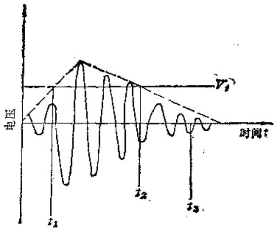  
图14-2-1 声发射信号计数图示

表14-2-1 声发射与其他无损探伤的比较  

<table><tr><td>方法\裂纹(mm)</td><td>宽</td><td>长</td><td>深</td><td>说明</td></tr><tr><td>目视</td><td>10-1</td><td>2</td><td></td><td>和表面状态、光导手段有关</td></tr><tr><td>渗透法</td><td>10-2</td><td>1</td><td>0.1</td><td>和表面状态有关</td></tr><tr><td>磁粉</td><td>10-2</td><td>1</td><td>0.2</td><td>仅适用于铁磁材料,且与磁化、照明有关</td></tr><tr><td>磁粉感应</td><td>10-2</td><td>1</td><td>0.2</td><td></td></tr><tr><td>电位探针法</td><td>10-2</td><td>2</td><td>0.2</td><td></td></tr><tr><td>超声波</td><td>10-2</td><td>2</td><td>1</td><td>和反射条件有关</td></tr><tr><td>x射线</td><td>0.3</td><td>5</td><td>0.3</td><td>垂直于表面,和材料厚度有关</td></tr><tr><td>声发射</td><td>10-3</td><td>10-3</td><td>10-3</td><td>只有发展中的裂纹才有信号</td></tr></table>

为声发射事件的持续时间。考虑到在实际构件中，由于反射，频散等影响，一个原始的声发射信号可能分裂成几个声发射事件的情况，从  $t_2$  后，又延长一段时间至  $t_3$  ，这样，从  $t_1$  到  $t_2$  记为一个声发射事件。

所示，越过门栏电压的振铃有3个，因此，振铃记数为3。容易理解，当波形的衰减分数不变时，振铃计数在一定程度上也反映了声发射信号的幅度。

# 2. 幅度和幅度分布

一个振荡质点所具有的能量与质量振荡幅度的平方成比例。因此，可以把声发射信号的幅度大小作为声源事件释放能量的量度。幅度分布分析就是按信号峰值幅度的大小范围分别对声发射信号进行事件计数。譬如，采用直方图，进行幅度分布分析，其中，横坐标为幅度大小等级坐标，纵坐标为对应于某个幅度大小等级的事件计数数目。通过这样的直方图，能很方便地看出声发射事件数目随幅度的分布情况，以便于进一步的分析。

# 3. 能量和能量率

在上述的计数和幅度分布中，对声发射事件的描述均带有明显的片面性。实际上，信号的幅度与信号持续的时间长短都反映了事件所包含的能量大小。如图14-2-2所示，可以把声发射事件所包含的能量用它的面积来进行度量。能量的度量也是用计数来表示的，图14-2-2中作出了形象化的说明。

图d的计数数目，对应于图c中的面积大小。若图c中面积大，计数就多。因此，能量计数表示了事件中所包含的能量大小，它同时考虑到了幅度和延续时间两个因素。能量测量中有能量率和总能量两种方式。能量率表示单位时间内的声发射信号

的能量，总能量表示从试验开始到某一特定时间的声发射总能量。

# 4. 声发射的测量仪器

（1）单通道声发射仪 它只有一个信号通道，由3个基本部分组成：

1）信号接收部分 即传感器部分。  
2）信号处理部分即包括前置放大器，滤波器、主放大器及事件信号和振铃信号形成第4个单元。  
3）测量和显示部分即包括计数器、时基和 $x - y$  记录仪。其工作过程：试样受载荷作用，产生声发射信号，被耦合在试样表面的传感器接收，转变为电信号。经前置放大器放大，滤波器除去机械噪声，主放大器将信号进一步放大。送入信号形成单元，形成振铃计数信号和事件计数信号，供计数器计数。由时基单元提供测量时基，计数器测量计数率。计数器的测量结果以数字显示，并转变为直流电压，供  $x - y$  记录仪绘图。

单通道声发射仪可用于实验室一般情况下的声发射检测。当在现场评价大型构件的完整性时，就必须确定声发射源（即缺陷）的位置，这就要使用多通道声发射仪。

（2）多通道声发射仪 利用两个以上的通道，将传感器按一定方式配置，构成阵列，利用声源发出的声波到达几个传感器的时差来确定声发射源的位置。其工作原理如下：

如板状构件中有一裂纹，位于  $(x, y)$  位置。在裂纹周围任意布置3个传感器1，2，3（图14-2-3）。当裂纹扩展时，以弹性波形式释放出能量。弹性波在此材料中的传播速度为  $C$ ，那末，在平板零件中，弹性波的波形相当于一个圆向外传播，首先

a）  
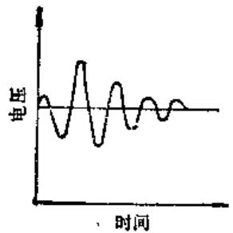  
a）放大器输出信号波形b）幅度平方后的信号c）检出包络线，并对时间积分

b）  
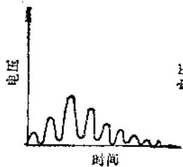  
d）正比于（c）中面积大小的能量计数

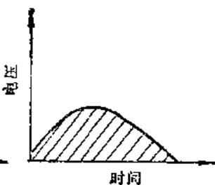  
）

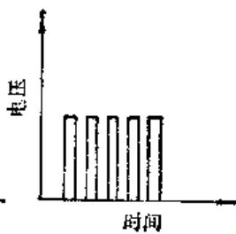  
#  
图14-2-2 声发射信号的能量表示方法

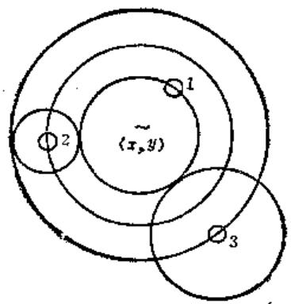  
图14-2-3 声源定位原理

到达第1号传感器，相继到达第2号和第3号传感器。也就是说：1、2、3号传感器接收到同一个声发射信号有时间差，设：时间差分别为  $\Delta t_{12}$  和  $\Delta t_{13}$ ，这两个时间差可以用仪器测量出来。如果，以第2，3号传感器为圆心，分别以  $\Delta t_{12}C$  和  $\Delta t_{13}C$  为半径，可以画出两个圆。如果再作第3个圆，使之与前两个圆相切，并经过第1号传感器，如图14-2-3所示。那末第3个圆的圆心就是声发射源的位置。

在进行现场实验时，由于机构结构复杂，声发射源又很多，数据量很大，因此，用作图法求声发射源的位置并没有实用价值。但是，利用上述原理，使用不同的数学方法，并且同时将传感器构成适当的阵列，使用计算机实时处理声发射数据，还是有可能找出声发射源的位置的。多通道声发射仪通常均备有计算机装置。

# （三）声发射在设备诊断中的应用

# 1. 保护冲床

冲床发生的重大故障多半是由冲模引起的。为了有效地保护冲床，必须对模具的工作情况进行监测。声发射监测系统在这里所起的作用，便是监测模具在工作冲程中发出的声音。其原理如下：首先定出一个标准，或者叫做临界参考；然后将实际测出的声音与之作比较。如两者相符，说明模具的工作情况正常。如果有出入，并且其差别达到了一定的程度，即说明模具发生了某种故障。此时，可通过控制系统发出报警信号，或将冲床关停。

通常，用来保护冲床的这种系统是自动“感知”的模式，它能自动地将良好模具在最初几个工作循环中发出的信号储存到电子控制逻辑电路中，以之

作为临界参考。这样，可免得操作人员在每次更换模具时均需调整控制系统。

# 2. 检查飞机要客部位的锈蚀情况

声发射监测具有某些引人注意的特征，其中最重要的是：从发生源所产生的声作为应力波可以通过结构传播，并被放置在离发生源几米远的结构部位上的传感器所测出。因此，整个结构可由若干个传感器来检测，并根据信号到达各传感器的不同时间确定发生源的位置。第二个重要的优点，是可以通过它测出缺陷的动态发展。因此，声发射监测装置能够指出何时何处产生了这种发展过程，从而可据以判定结构是否完整。

由于声发射检测法具有上述优点，它在美国空军中被用来检查喷气战斗机的锈蚀情况。当机身、机翼上的铝受到锈蚀时，凝结的水汽和金属化合，从而生成氢氧化铝并放出氢气。技术上先进的“电子耳”系统能够探测出氢气泡形成、成长和破裂时发出的声音。

在巨型运输机上，也装有这种监测系统，用来监测机翼在飞行过程中发生的破裂。这些翼面板是用强度高但很脆的铝合金制成的，它们有可能在飞行应力的作用下破裂。由于金属在破裂时会产生频带很宽的声能，而且在分子键破坏时产生的这种能量是在较低的  $\mathbf{MHz}$  范围内传播的，因此，很容易被监测系统测出。在翼段上装着若干个传感器，它们由同轴电缆导通到信号处理机组，由此机组鉴别破裂信号和非破裂信号。信号处理机控制着驾驶舱内操纵盘上的一个报警灯，通过它可将翼段发生破裂的情况及时通知驾驶员，并同时将资料记录到“黑盒子”内。

# 3. 其他

声发射监测系统目前已被用来检查各种大型结构，其中除了飞机以外，还包括核反应堆的压力容器、石油化工用的大型容器和管道、航空和宇航用的燃油箱、大桥、地铁等等。利用监测系统对结构的缺陷发出提前报警，不仅可以增加使用的安全程度，同时还能减少维修的工作量及其费用。

声发射监测技术目前已在我国应用，并取得了成效。如上海某石化厂有一台引进的TD-201氧化反应器，是生产涤纶的关键设备。壳体高  $25\mathrm{m}$  直径最大处约  $6\mathrm{m}$  ，由容器钢与纯钛分段爆炸复合后焊接的。此壳体未安装时自行发出声响，成为一个疑难问题。为了查清原因，外方派来了专业测试

人员，用二通道加速度仪进行了一个多月的测试，断定为12号支撑杆摩擦所引起，作了反应器质量无问题的结论。但根据我方分析，外方提供的数据是硬凑的，不能成立，如我方提不出测试结果和数据，就难以同外方进行谈判。为此，我方用声发射测试系统对异常声响的可能产生部位和原因进行实测和分析，查出了声源部位，否定了外方所作的结论。

# 参考文献

[1] 屈梁生，何正嘉编著. 机械故障诊断学. 上海：上海科技出版社，1986  
[2] 山下重之著，超聲波に上設備診断．日本設備工程師協會，1981  
[3]牧修一著，振动法、音響法には不設備診断。日本設備工程師協會，1980