# 第15章 温度监测与诊断方法

# 黄昭毅

温度、振动和润滑油是三种基本的通用监测技术，这三种技术有一个共同点，即被监测参数所包含的信息都是通过设备传输出来的，也即是所谓来自系统运行的“二次效应”。在监测点上所测出的变化，可以由很多零部件的任一个所引起，因此只有把采集到的信息，与故障所在的零件找到其相应的关系后，才能更好地做出正确的识别和判断。

利用温度测量对设备的热状态进行监测是一种历史很久的监测方法，尽管人们常认为振动监测的方法是最为普遍和有效的，甚至认为至少可以解决 $60\%$  的机械故障问题。但是热态监测确也有其不可取代的优势，例如在高低压电器、化工设备、热工设备、工业窑炉以及电子设备等方面就是这样。

# 第1节 温度监测与诊断的原理及其适用范围

# （一）基本原理

# 1. 物质的热运动

组成物体的分子、原子和更小的基本粒子，都处在不停的运动状态中。而其中分子与原子的运动，尽管属于无规则状态，但却是和物体的冷热程度密切相关。这类物质运动常称为热运动。

一般说来，分子与原子的热运动愈剧烈，物体就愈热；而分子与原子的无规则运动愈缓慢，物体就愈冷。这种分子与原子的永不停息的无规则运动，是属于物质运动的最基本形式。而热态监测和红外诊断的基础，就正是建立在人们长期对热运动理论研究的成果上的。

# 2. 温度的标定

温度是反映物体冷热程度的物理量。定量地确定温度是通过引入温标来实现的。所谓温标就是温

度的数量表示法，它是物体冷热程度的一个客观标志。

大量实验表明，物体的温度改变时，它的许多特性也会发生变化，例如体积、压力和电阻率等。有时随着物体温度的变化，它的状态也会改变。一般认为，只要物体的特性或状态能随着温度变化而产生既定的显著变化，那么它就有可能用来确定温标。例如，常用的水银温度计便是根据水银的体积随温度变化的规律而制成的。在日常生活和工程技术中，常用的温标是摄氏温标。而在红外技术中除使用摄氏温标外，还要使用绝对温标。

摄氏温标是这样规定的：把冰和水在一个大气压下达到平衡的温度定为零度（ $0^{\circ}\mathrm{C}$ ），而把水和水蒸汽在蒸汽压为一个大气压下达到平衡时的温度定为100度（ $100^{\circ}\mathrm{C}$ ）。将这两个刻度之间的水银柱均匀划分为100等分，每一等分就是1度（ $1^{\circ}\mathrm{C}$ ），就叫摄氏温标1度。

由于温度不但描述了物体的冷热程度，而且也描述了分子与原子无规则剧烈运动的程度。因此物体中分子与原子运动得愈缓慢，它的温度便愈低。照此推算，在某一最低温度，其分子和原子的运动总会停止，这个最低的温度就是绝对零度。

实践证明，物体的温度虽可使之十分接近绝对零度，但总还难以完全达到，通过理论分析，可推算出绝对零度相当于摄氏温标  $-273^{\circ} \mathrm{C}$ 。

以绝对零度  $(-273^{\circ}C)$  为零度，又按摄氏温标分度的温标，叫做绝对温标。常用于红外技术，通常用  ${}^{\circ}\mathbf{K}$  表示绝对温标的数值。

绝对温标（ $^{\circ}\mathbf{K}$ ）和摄氏温标（ $^{\circ}\mathbf{C}$ ）之间，存在以下换算关系：

$$
T ^ {\circ} \mathrm {K}) = t ^ {\circ} \mathrm {C}) + 2 7 3
$$

式中  $T$  ——绝对温度；

t 摄氏温度。

# 3. 温度的测量

传统的接触测温方法是根据热平衡这个物理现象进行的。所谓热平衡是指两个不同温度的物体接触在一起时，它们的分子之间便产生了相互作用与影响，动能大的分子将其一部分动能传递给动能小的分子，而动能小的分子在接受一部分动能之后，将会具有较大的动能。只要这种动能交换与转移的过程足够长，这两个物体内分子运动的剧烈程度就会逐渐趋向于一致，并最后达到相同的温度。

用温度计进行接触测温，就是使温度计和被测物体达到热平衡。这时温度计指示的温度便是物体的温度。但是，严格地说，温度计总不可能与物体达到完全理想的热平衡。因此，传统的接触测温方法总存在着相当大的测量误差。另一方面在进行热平衡的过程中，温度高的物体经过一段时间之后，其温度将降低；而另一个物体将升高。这样在达到热平衡之后，它们都不再保持原来的温度了。这是传统测温方法的另一个缺点，而且被测物体愈小，这种测量误差将愈大。

由上可见，使用温度计进行测温的传统方法，不仅会出现一些较大误差，而且在一些场合还无法进行测温，于是后来人们研究了利用红外技术进行测温并取得了良好的效果。

# （二）常规测温装置及其适用范围

常规测温装置通常按测量方式分为接触式和非接触式两大类，而且根据测温目的和部位的不同，还可分为两种：一种是监测设备内部的温度，如循环水温度；一种是监测表面温度，如轴承座外壁温度。总的说来，表面测温可获得较多的信息，据以了解设备内部的热量变化以及传导途径的异常等，但远较内部测温要困难，因为表面上通常会有明显的温度分布间断点，以及在装上温度传感器后，温度分布和间断点位置都会发生变化。

# 1. 接触式测温装置

使用比较普遍，工作原理是使测温元件与被测对象有良好接触。通过传导和对流达到热平衡进行测温，并把这一信息表示出来。根据传感器的输出信息，既可在测温地点，也可在较远距离指示温度，必要时还可自动巡检和进行控制。

接触式传感器的精度及其反应时间受连接方法的影响很大，故需确保良好的热接触。在表面测温时，应将感温元件嵌入或焊到被测对象上，而反应

时间和传感器的热容量有关，装置愈小，反应愈快。

一个完整的接触式测温装置通常包括：由感温元件组成的传感器，能反映输出信息的显示仪表，以及某些盘式或桶式的记录器组成。

常用接触式测温仪表精度等级和分度值为：

仪表名称 精度等级 分度值（℃）

1）液体膨胀式  $0.5\sim 2.5$  0.1\~10  
2）压力推动式 1、1.5、2.5 0.5~20  
3）热电阻式 0.5～3 1～10  
4）热电偶式 0.5~1 5~20

其工作原理，使用特点及注意事项如下：

（1）液体膨胀式温度计 通常以水银或酒精为测温物质，精度较高，但易损坏。常用水银温度计可测  $-35\sim +350^{\circ}C$  范围。而有机液体温度计最高可测  $+200^{\circ}C$  ，最低可测  $-200^{\circ}C$  ，其精度优于水银温度计。此类温度计在使用时要避免骤热骤冷，注意断液、液中气泡和视差，在精密测量时还必须对露出部分进行修正。  
（2）压力推动式温度计 它是利用在封闭温包中的液体、气体或低沸点液体的饱和蒸汽受热及体积膨胀或压力变化推动传动机构，带动指针在刻度盘上显示出温度值。温度范围随充灌介质不同而异。小型的压力推动式温度计常用于内燃机及机械设备的冷却水、润滑油系统的测温，温包应全部插入被测介质中，以减少测量误差。  
（3）热电阻温度计 它是利用电阻与温度呈一定函数关系的金属导体或半导体材料制成感应元件，当温度变化时，电阻随温度变化，通过测量回路的转换，在显示器上示出温度值。金属导体的感温元件多由铂、铜、镍制成，而半导体感温元件则多为热敏电阻。两种感温元件通常粘于被测表面。

金属热电阻元件与温度有较好的线性度，复现性好，但热惯性较大，不能测点温，不利于动态测试，常制成部位监测专用的轴承测温计等，其传感器输出为  $1\mathrm{mV} / \mathrm{^\circ C}$  ，而半导体热电阻元件可做成小型，灵敏度高，可测点温，但电阻温度关系是非线性，复现性也差，其传感器输出为  $10\mathrm{mV} / \mathrm{^\circ C}$  。

（4）热电偶温度计 它是利用两种导体接触部位的温度差所产生的热电势来测量温度，其大小和温度成正比，这一电势可用普通电压表、电位差计或电子电压表测出。常用的热电偶如：铜/康铜，镍铬合金/镍钼合金等，灵敏度约为  $40\mu \mathrm{V} / ^{\circ}\mathrm{C}$  ，精

度  $0.5^{\circ} \mathrm{C}$  左右，可在温度梯度很陡的场合使用，热电偶温度计常用于测高温，为防腐蚀多用铜制铠装护套予以封装。

（5）示温片、示温漆、示温涂料这是当测温要求不高，或在测定复杂形体、运动或旋转体的表面温度时，也常采用的一种快速而经济的方法。通常利用视觉式测温材料制成示温片、涂料等，把它们粘贴或涂抹在被测物体表面。当物体表面温度变化上升，示温片或涂料的颜色随之变化，人们根据变色程度，便可知道物体表面温度。

常用的粘贴式示温片有示温标纸（标签或纸条）和示温胶带两类，按其工作状况和效能又可分为可逆性与不可逆性，单温度显示和顺序温度显示等，标带中的显示图案在未达变色前的固有颜色称为原色。当温度上升至某一临界温度时，原色变化成为新的颜色称为变色，该临界温度点也就是显示的变色温度。不可逆性与可逆性不同：当温升使其变色后，在温度回降时，仍保持变色，从而起到永久记录作用；不可逆产品可示  $30\sim 600^{\circ}C$  的变化，而可逆产品示温多在  $40\sim 70^{\circ}C$  范围内，精度误差约为  $\pm 1^{\circ}C$  。

常用的涂抹式示温产品主要有示温漆和示温涂料两种，它们可涂抹在被测物体表面，很快干固而显出原色。而当温升超过变色温度，就会改变颜色。示温涂料主要把涂料做成“墨水”，有利于携带使用。两种产品也分为可逆与不可逆性，后者示温可达  $40\sim 1350^{\circ}\mathrm{C}$ ，误差  $\pm 5^{\circ}\mathrm{C}$ 。

不可逆性粘贴产品可贴于晶体管、变压器、电机和电缆上，而且可在不同位置粘贴多枚，以利温升比较。可逆性产品与温度计功能相似，可对各种电器和机械设备作经常性温度监测。涂抹式产品特点是可用于大面积，表面凹凸不平和形状复杂的产品，如交换器、锅炉及内燃机等。

图15-1-1所示是一种不可逆顺序温度显示式标纸。其应用温度范围列于表15-1-1。

# 2. 非接触式测温装置

测温元器件与被测对象不需接触，是通过接收热辐射的能量实现测温。由于非接触式测温仪不会破坏被测对象的温度场，也不必与被测对象达到热平衡，故仪器温度可大大低于被测介质的温度，而且动态特性较好，可测运动物体、小目标及热容量

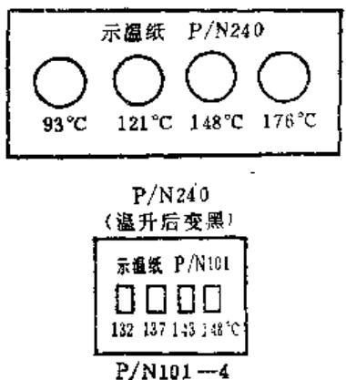  
图15-1-1 示温标纸

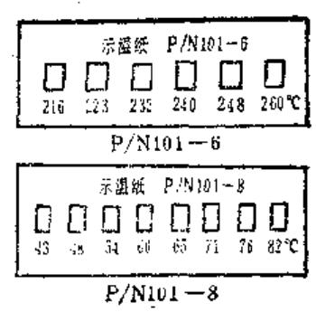

表15-1-1 不同型号的应用温度范围  

<table><tr><td>型号</td><td>温度 (°C)</td></tr><tr><td rowspan="17">P/N240</td><td>37-43-48-54</td></tr><tr><td>43-48-54-60</td></tr><tr><td>65-71-76-82</td></tr><tr><td>82-93-110-121</td></tr><tr><td>87-93-98-104</td></tr><tr><td>93-98-104-110</td></tr><tr><td>93-121-148-176</td></tr><tr><td>110-115-121-126</td></tr><tr><td>132-137-143-148</td></tr><tr><td>154-160-165-171</td></tr><tr><td>176-182-187-193</td></tr><tr><td>176-204-232-260</td></tr><tr><td>198-210-223-232</td></tr><tr><td>260-274-288-316</td></tr><tr><td>316-343-371-399</td></tr><tr><td>399-427-454-482</td></tr><tr><td>510-538-566-593</td></tr><tr><td rowspan="14">P/N430</td><td>43-48-54</td></tr><tr><td>60-65-71</td></tr><tr><td>76-82-87</td></tr><tr><td>82-93-104</td></tr><tr><td>93-98-104</td></tr><tr><td>110-115-121</td></tr><tr><td>126-132-137</td></tr><tr><td>143-148-154</td></tr><tr><td>160-165-171</td></tr><tr><td>176-182-187</td></tr><tr><td>193-198-201</td></tr><tr><td>210-215-223</td></tr><tr><td>232-240-248</td></tr><tr><td>248-254-260</td></tr></table>

小或温度变化迅速的对象表面温度，也还可以测温度场的温度分布。但由于它易受物体的辐射率、周

图15-1-2 WGG2-323结构原理和灯丝对比  
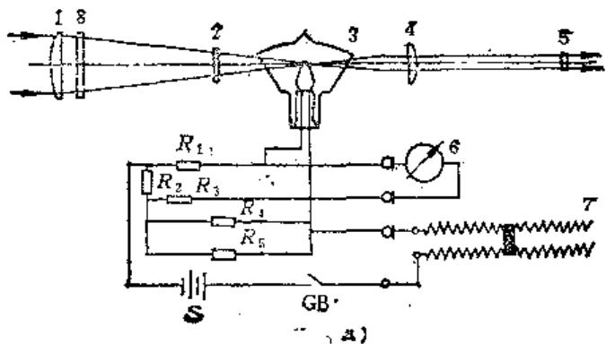  
1—物镜 2—吸收玻璃 3—高温计灯泡 4—目镜 5—红滤光镜 6—测量电表 7—滑线电阻

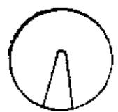  
电流过低

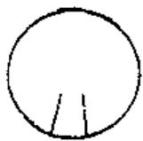  
正确

电流过高  
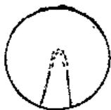  
8一高盘程吸收玻璃K一按钮开关E一干电池  $R_{1},R_{2},R_{3},R_{4},R_{5}$  一电阻

园环境状况的影响，难以使测温达到高的精度。

应用辐射原理进行温度测量的测温仪器品种繁多，但根据测取温度的不同，辐射测温仪常分为亮度测温仪和比色测温仪两大基本类别。亮度测温仪测取的温度是亮温，它是由被测对象在某一波段内辐亮度的大小来确定的。最早的亮度测温仪是光学高温计，其工作段处于可见光范围，波段宽度较窄；全辐射测温仪则是其极端，它是根据被测对象在从  $0 \sim \infty$  全部波长范围的辐亮度大小来确定其温度，并主要用于测量辐射功率。比色温度仪测取的是色温，它是根据被测对象辐亮度的波长分布规律来确定其温度的；近年来利用红外探测器制成的辐射测温仪发展极快。为突出其波长特点，常称为红外测温仪。

常用非接触式测温仪表精度等级和分度值如下：

仪表名称

稽度等级

分度值  $(^{\circ}C)$

1）光学高温计

$1\sim 1.5$

$5\sim 20$

2）全辐射温度计

1.5

$5\sim 20$

3）比色温度计

$1\sim 1.5$

1\~20

4）红外测温仪

$1\sim 1.5$

$1\sim 20$

（1）光学高温计 它是亮度测温仪的一种，

利用物体在  $500^{\circ} \mathrm{C}$  左右，使热辐射进入可见光的范围，将物体表面颜色同仪器内加热的灯丝作亮度对比，即可测出温度值，其误差小于  $2\%$  。它装有光学镜头构成的物镜和目镜，适用于被测温度高于热电偶所能使用的范围，以及热电偶难以装置的场所，测温范围  $700 \sim 3200^{\circ} \mathrm{C}$ ，仪器物镜与目标距离不得小于  $700 \mathrm{~mm}$ ，其结构原理与灯丝对比示于图15-1-2。

当调整滑线电阻，并观察目镜中所现灯丝形

状。如电流过低则灯丝全现，电流过高则顶部闪烁，只有在电流正确时，灯丝才仅现下部，此时的仪表读数即为正确温度。

（2）全辐射温度计 它也是亮度测温仪的一种，利用热电元件或硫化铅元件来测量发热物体表面的辐射能，其频率范围是整个光谱范围，精度误差约为  $2\%$  ，测温范围  $40 \sim 4000^{\circ} \mathrm{C}$  ，它常需要带有窗口、透镜和滤光片等光学零件，仪器视场角  $3^{\circ} \sim 15^{\circ}$  ，仪表一般固定安装使用，探测器可在  $10 \sim 80^{\circ} \mathrm{C}$  的环境下使用，当超过  $80^{\circ} \mathrm{C}$  或空气介质中有水汽、烟雾时需借助水冷和通风。其原理框图如图15-1-3所示。

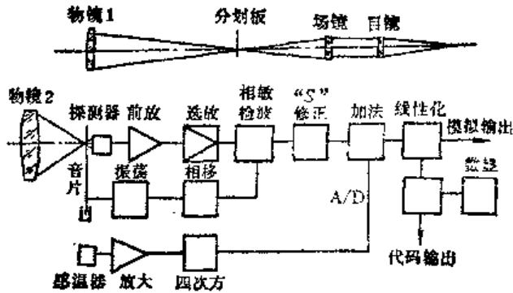  
图15-1-3 全辐射温度计原理框图

（3）比色测温仪 它又叫做颜色高温计、双色测温仪和多色测温仪等。它与光学高温计和全辐射温度计不同，它不是根据所接收的辐射功率的大小来测定物体的温度的，而是根据物体辐射功率随光滑波长的变化规律来测定温度的，所测得的温度为色温。这类测温仪受发射率的影响比以上两种要小，而且还能有效地克服目标不能充满视场和烟尘

水汽吸收所引起的误差。当前应用较广的比色测温仪是双色测温仪，它分别接收两个窄波段处的目标辐射率。由此产生的探测器输出信号，通过电路系统进行比较，不同的比值就代表被测物体的不同温度。其原理框图如图15-1-4所示。

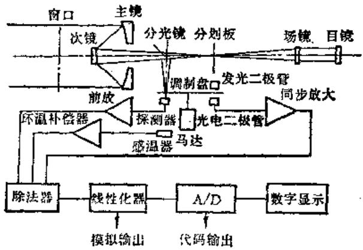  
图15-1-4 比色测温计原理框图

（4）红外测温仪 它是近年来发展较快的新型测量仪表，是以检测物体红外线波段的辐射能来实现测温，是部分辐射测温的主要仪表。其工作原理是：被测物体发出红外线，通过透镜聚集后入射到红外探测器上，在红外辐射的作用下产生一个正比于辐射能量的电信号，由放大器放大并进行处理和变换，在显示器上显示温度值。这种仪器具有体积小、重量轻、可便携、灵敏度高、响应快、操作易的优点，常用于现场热态监测和红外诊断。

# 3. 测温仪的主要技术指标及选用方式

# （1）主要技术指标

1）精度就是对温度标准值（国际通用温标）的不确定度或误差。同一型号、同一规格的每一台仪器的实际误差各不相同，在产品说明书上给出的是实际误差的极限值。精度又常被称为允许误差，它的表示方法通常有三种：

绝对误差  $=$  实测值-标准值

相对误差  $=$  （绝对误差/实测值）  $\times 100\%$

引用误差  $=$  （绝对误差/量程上限值）  $\times 100\%$

例如：某一测温仪的测温范围是  $800\sim 1400^{\circ}\mathrm{C},$  以绝对误差形式表示的精度是  $\pm 14^{\circ}\mathrm{C}$  ，这表明在任何测量值中所含有误差的绝对值小于或等于  $14^{\circ}\mathrm{C}_{\circ}$  若以相对误差形式表示的精度是  $\pm 1\%$  （测量值），这表明测量值为  $800^{\circ}\mathrm{C}$  时的误差不超过  $\pm 8^{\circ}\mathrm{C},$ $1400^{\circ}\mathrm{C}$  时的误差不超出  $\pm 14^{\circ}\mathrm{C}_{\circ}$  若以引用误差表示的精度是  $\pm 1\%$  （满度值）时，这表明任何测量值的误差都不会超出  $\pm 14^{\circ}\mathrm{C}_{\circ}$

2）稳定性 就是在一定时间间隔内其示值的最大可能变化值。它是一项重要指标，表明测温仪示值的稳定性和可靠程度，有时又称做复现性。稳定性常分为短期和长期两种，前者时间间隔一般规定24小时、一月等。后者时间间隔一般规定为半年、一年等。

3）温度分辨率 它是表示其辨别被测温度变化的能力。温度分辨率与测温仪的温度灵敏度、噪声电压以及显示机构的误差有关，温度分辨率总是小于精度，而精度中含有的误差是固定的，必要时还可进行修正。当用户了解被测温度的变化比了解其真实温度更重要时，就必须知道温度分辨率。

4）响应时间 它是被测温度从室温变为测温范围上限温度时，统一模拟信号输出或测温示值达到稳定值的某一百分数时的时间，如1秒（63%）等。显示机构通常也存在一个响应时间，这个时间是否计入总的响应时间需要根据具体情况确定。

5）距离系数 它是测温仪探头到被测目标的距离与垂直于探头光轴方向的投影圆面积的最小允许直径之比。有时距离系数也用测温仪探头中心对被测目标最小允许的投影直径的张角表示。这个张角通常叫做视场，单位为弧度或度。

（2）测温仪表选用方式 首先是根据作业条件选择是接触式还是非接触式（表15-1-2），然后是根据其测温范围选定合适的产品，区分精度等级及分度值范围，最后是根据需要对其主要技术指标进行了解。

图15-1-5示出测温仪表及其测温范围，可供选

表15-1-2 接触式与非接触式测温方法比较  

<table><tr><td>项 目</td><td>接 触 系 统</td><td>非 接 触 系 统</td></tr><tr><td>保证精确测量的主要要求</td><td>(1)测温设备与被测物体间要良好的热接触(2)测温设备与被测物体接触时,物体温度不发生变化</td><td>(1)要知道被测物体的发射率(2)物体的辐射能充分抵达检测器(或充分吸收)(3)要消除背底噪声</td></tr><tr><td rowspan="2">特 点</td><td>缺 点(1)由于测温器的接触,小物体的温度会发生变化,此外因测温器的尺寸受到限制,小于一定限制的物体不能测温(2)运动物体不能测(3)响应慢不适于测瞬态现象(4)测量范围宽时需要较多的检测器(5)在生产过程中,同时测量多个物体时不实用</td><td>优 点(1)由于是非接触,对物体无影响,且仅有10μm的微小表面即可测量(2)易于测量运动物体(3)响应时间快,适于测量温度的瞬间变化(4)机械式扫描,易于线或面的测温(5)对同种材料,可以反复测温,对相对温度测量也能适用</td></tr><tr><td>优 点(1)可测物体内部温度(2)测量精度要求相对简单</td><td colspan="1">缺 点(1)仅限于表面温度测量(2)当要求精度时,测量过程必须严格</td></tr></table>

<table><tr><td>测量方式</td><td>温度计名称</td><td>测温物质</td><td>测温原理</td><td>测量范围</td></tr><tr><td rowspan="13">接触式</td><td>水银温度计</td><td>汞</td><td>液体热膨胀</td><td rowspan="13">常用温度可能使用温度</td></tr><tr><td>有机溶液温度计</td><td>酒精等</td><td>液体热膨胀</td></tr><tr><td>液体压力式温度计</td><td>二甲苯、甲醇等</td><td>液体热膨胀</td></tr><tr><td>气体压方式温度计</td><td>氮气、丙酮等</td><td>气体热膨胀</td></tr><tr><td>双金属温度计</td><td>金属</td><td>固体热膨胀</td></tr><tr><td>铂电阻温度计</td><td>铂</td><td>金属热电阻变化</td></tr><tr><td>镍电阻温度计</td><td>镍</td><td>金属热电阻变化</td></tr><tr><td>铜电阻温度计</td><td>铜</td><td>金属热电阻变化</td></tr><tr><td>热敏电阻温度计</td><td>半导体</td><td>半导体热敏电阻变化</td></tr><tr><td>铂铑热电偶</td><td>铂铑</td><td>热电势变化</td></tr><tr><td>镍铬-镍钼热电偶</td><td>镍铬-镍铝</td><td>热电势变化</td></tr><tr><td>铁-康铜热电偶</td><td>铁-康铜</td><td>热电势变化</td></tr><tr><td>铜-康铜热电偶</td><td>铜-康铜</td><td>热电势变化</td></tr><tr><td rowspan="4">非接触式</td><td>红外线辐射温度计</td><td>红外探测器</td><td>热辐射变化</td><td rowspan="4">-200 0 200 400 600 800 1000 1200 1400 1600 1800 2000</td></tr><tr><td>全辐射温度计</td><td>热电堆</td><td>热辐射变化</td></tr><tr><td>比色温度计</td><td>光电元件</td><td>热辐射变化</td></tr><tr><td>光学高温计</td><td>光学系统</td><td>热辐射变化</td></tr></table>

图15-1-5 测温仪表及其测温范围

用时参考。

# 第2节 红外辐射及红外测温

# （一）红外辐射基本特点

# 1.红外辐射

1800年英国物理学家威廉·侯舍勒（W·Her- schel）在光学试验室里发现，在太阳光谱的红色

光外存在着热效应较高的辐射，这种不可见的辐射按照它在光谱中的位置就叫作红外辐射。红外辐射是太阳光谱中红色光外面的不可见的光。而光是具有一定波长的电磁波，电磁波的波长范围很广泛，从  $10^{-4} \sim 10^{8} \mathrm{~m}$  。其中  $3 \times 10^{16} \sim 3 \times 10^{12} \mathrm{Hz}$  相当于  $10^{-4} \mathrm{~m}$  波长，是红外辐射范围，如图15-2-1所示。

通常为了研究方便，把红外辐射分为3个波段：

1）近红外 波长为  $0.78 \sim 3.6 \mu \mathrm{m}$ 。

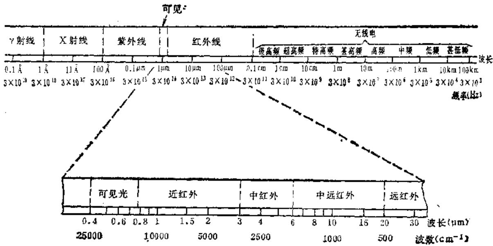  
图15-2-1 电磁光谱中的红外辐射范围

2）中红外 波长为  $3.0\sim 20\mu \mathrm{m}$  
3）远红外 波长为  $20\sim 1000\mu \mathrm{m}$ 。

自然界中任何物质，当温度高于绝对零度时，都将有一部分能量以波动的方式或向外发射红外辐射，或向内吸收红外辐射，其中以波长为  $0.8 \sim 4\mu \mathrm{m}$  的红外辐射最强，人们习惯把这部分能量辐射称为热辐射。电机、轴承甚至冰都具有红外辐射能力。

# 2.红外辐射在大气中的传播

红外辐射在大气中传播时，常由于以下两个原因有衰减：一是由于大气中的二氧化碳和水蒸汽，产生强烈吸收作用，阻止红外辐射的通过；二是在大气中的悬浮微粒也对红外辐射产生散射作用，使红外辐射偏离原来方向。两者均会影响测量的精确程度。

通常把通过1海里后剩余辐射功率与原始辐射功率之比叫为大气透射比或传导率。图15-2-2表示了在  $300\mathrm{m}$  大气层下的传导率，从中可以明显的看出水蒸汽与二氧化碳气的吸收带，并且只有在  $1\sim$

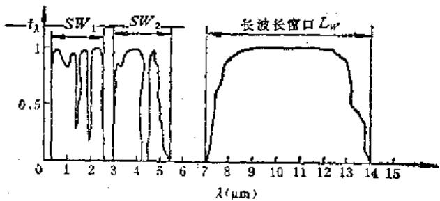  
图15-2-2  $300\mathrm{m}$  大气层下的传导率

2.5，  $3\sim 5$  ，  $8\sim 13\mu \mathrm{m}$  这3个“大气窗口”，才能使红外辐射顺利通过，达到红外热成相的目的。前两个为短波窗，后一个是长波窗。探测器的接收波段都应选在“大气窗口”内。

# （二）红外测温基本原理

要测量红外辐射的强弱，是通过它所引起的效应来观测的。红外辐射照射某些物体时会发生热效应，如温度升高、体积膨胀等。而温度和体积都是可以测量的，因而利用红外辐射的热效应可以度量红外辐射的强弱。红外辐射到另一些物体时还会发生所谓“光电效应”，即引起物体电学性质的改变。而电学性质也是可以测量的，因而利用红外辐射的光电效应也可以度量红外辐射的强弱。通过查明目标物体的热状态，即可实现设备故障诊断的目的。

通过红外辐射的热效应和光电效应实现测温的重要原件叫“红外探测器”，这是科学家们在1952年发明的，它是能把红外辐射能量转变成另一种便于测量的物理量（电量）的一种测温器件。

利用物体因红外辐射产生“热效应”的原理而制造的红外探测器，叫作“热敏探测器”。它利用的是热敏元件，其温度升高较慢，响应时间较长，一般在毫秒数量级以上。

利用物体因红外辐射产生“光电效应”的原理而制造的红外探测器，叫做“光电探测器”。它利用物体中的电子吸收红外辐射而改变运动状态，从

而造成物体电学性质的改变，这种过程比较快，而且响应时间也短，最短可达毫微秒（ $10^{-9}$  秒）数量级。

然而要掌握红外测温还必须了解红外辐射的一些基本定律：

# 1. 反射率、透射率、吸收率和比辐射率

从辐射能的分配看，设落到物件上的总辐射量为  $Q_{\mathrm{D}}$ 。 $Q_{A}$  被吸收，一部分  $Q_{R}$  被反射，还有一部分  $Q_{D}$  穿透物体，如图15-2-3所示。

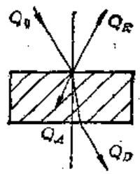  
图15-2-3 物体辐射图

根据能量守恒定律

$$
Q _ {0} = Q _ {A} + Q _ {R} + Q _ {D} \tag {15-2-1}
$$

将上式变形

$$
\frac {Q _ {A}}{Q _ {0}} + \frac {Q _ {R}}{Q _ {0}} + \frac {Q _ {D}}{Q _ {0}} = 1 \tag {15-2-2}
$$

式15-2-2左边三项分别称为吸收率  $A$  ，反射率 $R$  和透射率  $\pmb{D}$  ，因而

$$
A + R + D = 1 \tag {15-2-3}
$$

当测得某物体的反射和透射能量时，就可以求得它吸收了多少能量。

当  $D = 0$  时，  $A + R = 1$  ：即物体是不透明体，如金属、耐火砖等。善于反射的物体其吸收性差，而吸收性强的物体反射率就小。

当  $A = 0$  ，  $R = 0$  时，  $D = 1$  ：即物体是透明体时，所有的辐射能量全部可以穿透过去，如纯净空气可算透明体。而由于水蒸汽、二氧化碳及尘灰的存在，则使大气成为半透明体。

当  $A = 1$  时，  $\pmb {R} = \pmb {D} = \pmb{0}$  ：即全部能量都被吸收而无反射和透射，这类物体就称作黑体。绝对黑体是不存在的，而人工制造的近似黑体，即吸收比等于1的黑体。它所发出的辐射称为黑体辐射，可作为辐射研究的标准源。

比辐射率也称发射率或黑度系数，它是物体的辐射功率与同温度、波长下的黑体辐射功率之比，常用  $\varepsilon_{(2T)}$  表示：

$$
\mathbf {s} _ {(\lambda T)} = \frac {W _ {(\lambda T)}}{W _ {0 (\lambda T)}}. \tag {15-2-4}
$$

式中  $W_{(1T)}$  ——物体辐射功率；

$W_{0(\lambda T)}$  ——黑体辐射功率。

常见物体的比辐射率数值列于表15-2-1。

表15-2-1 不同材料的比辐射率  

<table><tr><td>材料</td><td>温度 (℃)</td><td>比辐射率 (ε)</td></tr><tr><td>人的皮肤</td><td>30</td><td>0.98</td></tr><tr><td>无光的黑漆</td><td>100</td><td>0.97</td></tr><tr><td>白漆</td><td>100</td><td>0.92</td></tr><tr><td>冰块</td><td>20,-10</td><td>0.96</td></tr><tr><td>红砖</td><td>20</td><td>0.93</td></tr><tr><td>抛毛玻璃</td><td>20</td><td>0.94</td></tr><tr><td>油漆</td><td>100</td><td>0.94</td></tr><tr><td>白底纸张</td><td>20</td><td>0.93</td></tr><tr><td>刨光橡木</td><td>20</td><td>0.90</td></tr><tr><td>混凝土</td><td>20</td><td>0.92</td></tr><tr><td>纤维玻璃</td><td>20</td><td>0.75</td></tr><tr><td>抛光铝板</td><td>100</td><td>0.05</td></tr><tr><td>阳极处理铝板</td><td>100</td><td>0.55</td></tr><tr><td>抛光钢件</td><td>100</td><td>0.05</td></tr><tr><td>强氧化铜件</td><td>100</td><td>0.78</td></tr><tr><td>抛光铸铁</td><td>40</td><td>0.21</td></tr><tr><td>氧化铸铁</td><td>100</td><td>0.64</td></tr><tr><td>抛光钢件</td><td>100</td><td>0.07</td></tr><tr><td>氧化铝件</td><td>100</td><td>0.85</td></tr><tr><td>抛光不锈钢件</td><td>20</td><td>0.16</td></tr><tr><td>氧化不锈钢件</td><td>60</td><td>0.85</td></tr></table>

# 2. 普朗克与维恩定律

（1）普朗克定律 普朗克是量子力学奠基人。他利用光量子理论，推导出了红外辐射能量与温度和波长的定量关系，从而奠定了红外测温的基础。

普朗克定律指出了来自一个黑体辐射的谱分析。

$$
W _ {0 (1 T)} = C _ {1} \lambda^ {- 5} \left(e ^ {\frac {C _ {2}}{\lambda T}} - 1\right) ^ {- 1} \tag {15-2-5}
$$

式中  $W_{0(2T)}$  ——单位面积发射出来的辐射功率，

它是波长  $\pmb{\lambda}$  和绝对温度  $\pmb{T}$  的函数

$$
\left(W \cdot c m ^ {- 2} \cdot \mu m ^ {- 1}\right),
$$

$\pmb{\lambda}$  一波长  $(\mu \mathrm{m})$

$$
C _ {1} - 3. 7 4 1 5 \times 1 0 ^ {4} \left(W \cdot c m ^ {- 2} \cdot \mu m ^ {4}\right),
$$

$$
\mathbf {C} _ {2} - 1. 4 3 8 8 \times 1 0 ^ {4} (\mu \mathrm {m} \cdot \mathrm {K});
$$

$\pmb{T}$  ——绝对黑体温度（K）。

图15-2-4是根据上式画出的曲线，它有3个特

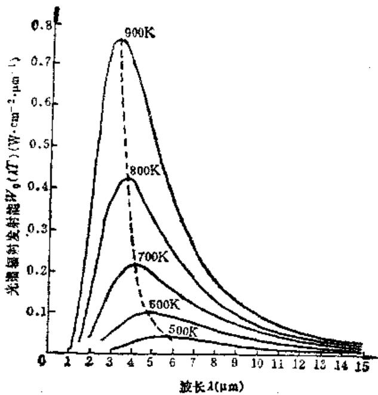  
图15-2-4 各种温度下的晶体光谱辐射（根据普朗克定律）

点。

1）对任何一个确定的温度值，都会得到一条黑体辐射度随波长变化的曲线，每条曲线有单一峰值，不同温度的曲线互不相交。  
2）随温度升高曲线向上移动，曲线所包络的面积代表辐射总功率，温度越高，辐射功率越大，红外测温正是利用了辐射量与温度的关系。  
3）随温度升高，  $W_{0(1T)}$  曲线最大值点向短波方向移动，说明短波成分增加，但在800K以下，最大辐射波长都在红外区域。  
（2）维恩定律 亦称维恩峰值位移定律。从辐射分谱曲线图15-2-4可知，随温度上升，辐射强度急速增加，而对应最大辐射能的波长向短波方向移动。

将普朗克定律公式对  $\lambda$  微分，令微商等于“0”，即可得到最大辐射功率时的波长  $\lambda_{\pi}$ ，而

$$
\lambda_ {m} T = k \tag {15~2~6}
$$

式中  $\lambda_{\pi}$  ——单位为  $\mu \mathrm{m}$ ;

$\pmb{T}$  ——单位为  $\mathbf{K}$ ；

$$
k = 2 8 9 7 (\mu \mathrm {m} \cdot \mathrm {K}) 。
$$

该式即是维恩定律，它表示了黑体辐射能达峰值时的波长  $\lambda_{\mathrm{m}}$  与它的绝对温度的乘积为一个常数。从而以数学方式说明了随温度  $T$  上升，其波长向短波方向移动的现象。

# 3. 基尔霍夫和斯蒂芬-波兹曼定律

（1）基尔霍夫定律 它是辐射传输方面的基本定律之一，1859年基尔霍夫指出：任何物体处于热平衡时，它吸收的能量等于它所发射的总能量，也就是说物体在向周围发射红外辐射能量的同时，也吸收周围物体所发射的红外辐射能量。用公式表达：

$$
\boldsymbol {W} _ {1} = a \boldsymbol {W} _ {0}
$$

式中  $W_{1}$  ——物体在单位面积、单位时间内发射出的红外辐射能量；

$\pmb{\alpha}$  该物体对红外辐射的吸收系数；

$W_{0}$  ——黑体在同一温度下的发射常数。

这个公式指明，物体单位面积、单位时间内所发出的辐射能量  $W_{\lambda}$  和吸收系数的比值即  $W_{\lambda} / a$  与物体性质无关，都等于同一温度下绝对黑体的辐射能量。而且任何材料的发射率，在一定波长和温度下，数值上等于同一温度下的吸收率，即：

$$
t _ {(\lambda \tau)} = \alpha_ {(\lambda \tau)}
$$

# （2）斯蒂芬-波兹曼定律

1819年斯蒂芬根据试验总结出一条经验定律，1884年经波兹曼推导得出同样结果，即黑体的全部发射功率与它的绝对温度的四次方成正比，这就是红外辐射的基本定理，用公式表达：

$$
W _ {0 (T)} = \sigma T ^ {4} \tag {15-2-7}
$$

式中  $W_{0(T)}$  ——单位面积红外辐射总功率；

$\pmb{\alpha}$  ——斯蒂芬-波兹曼常数  $(5.6697\times$

$$
1 0 ^ {- 2} \mathrm {W} \cdot \mathrm {c m} ^ {- 2} \cdot \mathrm {K} ^ {- 4}),
$$

$\pmb{T}$  ——绝对温度  $(\mathbf{K})$ 。

以上公式是就黑体而言，对于常规物体则

$$
W _ {(\lambda T)} = \varepsilon \sigma T ^ {4}
$$

式中  $\varepsilon$  ——发射率或比辐射率。

从斯蒂芬-波兹曼定律公式可知，只要物体的单位面积辐射总功率  $W_{(1T)}$  测出，并且确定了物体的发射率  $\varepsilon$  ，就可以计算出物体温度  $\pmb{T}$  的数值，即

$$
T = \sqrt [ 4 ]{\frac {W _ {(1 T)}}{s * a}} \tag {15-2-8}
$$

# 第3节 测温方法及手段

# （一）温度测定的简易诊断方法

简易诊断一般系指使用便携式仪器，在工作现场由操作人员进行测试和分析，其目的在于发现热

故障并作出初步的判断。一般的常规测温装置如接触式的测温装置，不论是液体膨胀式或压力推动式温度计、热电阻或热电偶式温度计，以及示温片、示温漆、示温涂料等，都是适用于简易诊断。而非接触式测温装置的光学高温计、全辐射温度计、比色高温计的应用，虽测温原理不同，但也属于同一范围。

根据我国有关电力部门的推荐：一台性能合适的红外测温仪和一台红外热电视也可组成一个简易诊断系统。这种系统的特点是价格低、使用方便，可以在广阔的生产现场推广应用。在使用该系统时，可以首先用红外热电视对设备进行高效率的普查，查出设备热状态异常或潜伏性故障的部位。然后再用红外测温仪对这些部位进行精确测温，实现设备的诊断。

此外，一台红外测温仪也可以构成一个良好的红外简易诊断系统，例如，使用固定安装的红外测温仪连续测量设备关键部位的温度，也可起到在线诊断作用。

# （二）温度测定的精密诊断方法

精密诊断一般系指使用精度较高的测试分析仪器，在工作现场由专职的诊断人员对设备采样和初步分析后，再在实验室中进行精确分析和识别。其目的在于确切地分析和判断经过简易诊断而仍难以判断和识别的热故障问题。

通常使用或套的红外热成像系统即可以构成一个温度测定的精密诊断系统，进行采集、存贮、处理、和分析设备表面的温度分布场，诊断出设备的热状态的异常原因。但这种系统一般价格贵，体积与重量较大，功率消耗也大，只适合在实验室中使用，或在对大型关键设备的诊断研究中使用。

由于常用的红外点温仪是一种非扫描型的红外诊断仪器，它只能测定设备表面上确定面积的平均温度。这对于远处目标的测定，就存在寻找上的困难，因而需要使用扫描型仪器进行普查诊断，以便有效地捕捉热点，然后再由红外热像仪进行精密诊断。

能够区别简易诊断、普查诊断和精密诊断的红外诊断系统的构成配置和功能方案列于表15-3-1。

# （三）红外热成像技术及装置结构原理

# 1.红外热成像技术

各种红外探测器一般只是把目标物体入射的红外辐射变成电信号输出的器件，它并不能显示出目标物体的形状和各种温度分布，而在实际工作中却需要解决这个问题，才好做出精确的诊断。70年代以来由于生产技术的高度发展，在世界范围已较好的解决了。

（1）光机扫描成像装置（红外热像仪）在众多的红外热成像装置中，实际应用最为广泛的就是光机扫描成像装置，其结构原理示于图15-3-1。

表15-3-1 红外诊断系统的构成配置和功能方案  

<table><tr><td>系统名称</td><td>简易诊断</td><td>普 班 诊 断</td><td>精 密 诊 断</td></tr><tr><td>系统构成</td><td>通用测温仪一台</td><td>远距离测温仪一台红外热电视</td><td>红外热像仪一台,数据采集、处理、分析配套系统一套</td></tr><tr><td>主要功能</td><td>测温范围:0~500℃测温精度:±0.6%</td><td>灵敏度:0.5℃测温范围:0~200℃测温精度:±0.5%</td><td>灵敏度:0.2℃实时数字采集、处理功能和齐全计算处理系统</td></tr><tr><td>主要用途</td><td>不接触测定带电、运动、高空设备的温度</td><td>快速、大面积普查设备过热潜伏故障,并测出过热点实际温度</td><td>对重大设备进行热分布精确分析、及有无损探伤、环保监测多重用途</td></tr><tr><td>系统价格(国外产品)</td><td>0.15万美元(8千人民币)</td><td>1.5万美元(3万人民币)</td><td>10万美元(55万人民币)</td></tr><tr><td>国内生产厂家、型号</td><td>西北光学仪器厂IRT-1200</td><td>北京电力自动化设备厂PTV-2</td><td>中国科学院上海技术物理所虹光841</td></tr><tr><td>配置方案</td><td>小型厂每厂一台大型厂按需要每车间一台</td><td>地区或大企业配一台</td><td>地区、或行业诊断中心一台重点企业按需要配一台</td></tr></table>

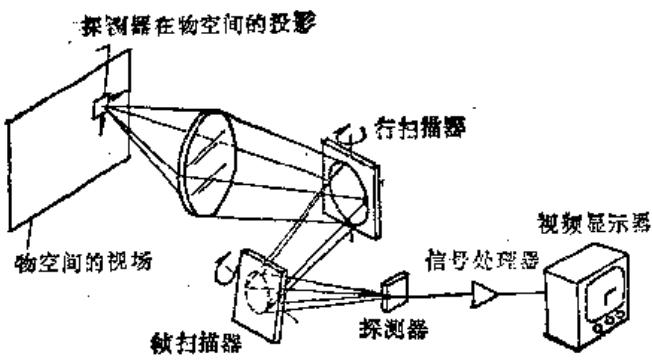  
图15-3-1 光机扫描成像装置示意图

这种光机扫描热像仪通常由望远聚焦系统、行扫描镜、帧扫描镜、红外探测器、电子信号处理系统和视频显示器所组成。

由目标发出的红外辐射经聚焦系统、行扫描镜和帧扫描镜，投射到液氮冷却的红外探测器上，通过探测器把红外辐射信号转变成电信号，经电子系统放大处理，送到显像管上转变成可见图象。由于物体发射的红外辐射与它的温度有关，因此所显示的图像即是经过转换后的热图像。

在黑白热像图上，物体温度高的部分呈白色，而温度低的部分呈黑色；在彩色热图像上，温度的高低可按预选的彩色分布。

（2）热释电摄象管成像装置（红外热电视）也称热电视。它与光机扫描不同之处是前者为机械扫描，而后者是电子扫描。和电视机的原理一样，它由成像镜头、热释电摄像管、摄像机电路、显示器和温度标定电路组成，其中关键元件是摄像管。其结构原理示于图15-3-2。

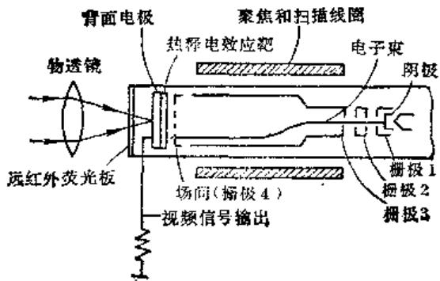  
图15-3-2 热释电摄像管结构示意图

当热成像镜头把来自目标的红外线呈现在热释电效应靶面上之后，由于靶面材料的热释电效应，便在材料的一面产生了与红外辐射通量成比例的电荷分布。这种表面电荷与扫描电子束相互作用，产

生视频信号输出。视频信号经过放大处理后，在显像管上显示出来，即为被测目标的热像。

此热像所呈的不同亮度或颜色，即代表了设备相应部分的温度。通过温度标定电路，可以测量并显示温度高低，以利进行故障诊断。

# 2.红外测温仪器的指标参数

红外辐射测温仪器的常见指标有测温范围、测温精度、响应时间、温度分辨率、稳定性、距离系数、距离范围、空间分辨率及发射系数修正范围等。几乎所有的仪器都要检测其测温范围、测温精度、响应时间、稳定性等指标，而其它指标则由仪器结构自身保证，通常不再进行检验。

属于热成像参数的主要是温度分辨率和空间分辨率。温度分辨率标志着整机的热成像灵敏度，它可以用主观参数或客观参数来表示。目前常用的主观参数为最小可分辨温差（MRTD）和最小可探测温差（MDTD），它是通过观察人员对特定的目标进行主观判断，以临界显示为标准，来确定目标与背景的最小温差。这种主观参数误差较大，因人而异。温度分辨率的客观参数是噪声等效温差（NETD），它是通过仪器的定量测量来计算出整机的温度分辨率，从而排除了测量过程中的主观因素，因而可使用噪声等效温差作为温度分辨率的标准。

热成像仪器的分辨率通常是在零空间频率下测定的。在任意空间频率下的温度分辨率，不仅取决于噪声等效温差，而且与它的调制传递函数（MTF）有关，因此，当噪声等效温差确定以后，任意空间频率下的温度分辨率，就由调制传递函数予以决定。通常整机的空间分辨率参数是概括了物镜、摄像管、视频电路和显像管各个分辨率影响的综合参数。

# （四）典型红外热成像设备（红外热像仪）

热成像设备包括有机械扫描器的红外摄相机和可产生电输出信号（模拟电视信号）的致冷式点红外探测器，该信号可以灰度热谱图显示于监视器上，以及附加的图像处理单元。

在原理上，机械扫描器是一个在点探测器处扫描出景物红外图像并产生出电子信号的回转光学元件（棱镜或镜面），在信号放大后控制一个阴极射线管（监视器）的电子束。电子束则以与图像扫描的同样形式扫描在屏幕上，于是一个热图（热谱图）

就在监视器屏幕上形成。而该处具有等发射率（和温度）的面积是以等灰度（或等彩色）表示出来，较热的区域被显示成亮（或淡色）区。

在图15-3-3中说明了被叫做扫描器的热成像摄相机的光学系统。扫描器单元包括有：透镜、光电扫描机构、有红外探测器的液氮杜瓦瓶、控制电路及前置放大器。来自被扫描物体的红外辐射由红外透镜聚焦在一个垂直棱镜上，该棱镜由一直流电机带动以  $180\mathrm{rpm}$  的转速回转。来自垂直棱镜的光学输出则通过一个以  $18000\mathrm{rpm}$  转速回转的水平棱镜。

来自水平棱镜的输出，则通过由具有可选光圈的瞄准棱镜（当测量高温物体的辐射时用作标定的阻尼器）及滤光器（如果需要）最后聚焦于内装于杜瓦瓶室壁上的一个点红外探测器。液氮冷却液可保持该室的温度为  $77\mathrm{K}(-196^{\circ}\mathrm{C})$  ，以满足约2小时的测量需要。探测器产生一个正比于得自物体（点）扫描元件辐射的电输出信号，该信号在扫描器内被放大和在显示单元进一步处理，最后对黑白监视器用为视频信号，以便在其屏幕上产生以灰度尺标表示的图片，在该图片上辐射最强的点表现最为明亮（最热面积）。两个棱镜的回转由在同一轴上转动的两个有槽盘来分别控制。回转槽盘由光电效应产生脉冲，并用于对垂直和水平棱镜电机的控制和同步，以及对监视器提供必要的水平和垂直的触发脉冲。棱镜以这种方法进行同步，即每一垂直扫描场是伴随有1/25秒以及包含着70条水平作用图线（实际上有  $100^{1}/4$  线，每场仅仅70在用），四个连续场是略有位移（隔行扫描）以使它们形成一帧画面。在这方面图片中的闪烁被压制。四个场的隔行扫描所组成的画面绘出每秒0.25帧完整画面的画面

频率。通常全幅画面显示了可给予监视器以最好的图片质量，而使用磁带记录信号的视场显示则可对快速的温度现象给予较好的观查。

在扫描系统中，透镜是一个重要的元件。他们决定了视场以及影响在任何已定距离下设备的空间分辨率。对不同的用途需要不同的棱镜。几何分辨率指出了在热成像画面（ $b \times b$ ）上，多小的细部 $\delta_{b}$ 可被分辨及再现。这是有赖于棱镜的分辨率 $\delta_{a}$ （mrad）、物体至相机的距离 $d$ 以及探测器的型号大小。沿每一水平线可以分辨100个画面点。表15-3-2给出当物体至相机距离 $d = 10m$ 时的热像仪棱镜数据。

表15-3-2 热像仪的棱镜  

<table><tr><td rowspan="2">棱 镜 \( \alpha \)</td><td rowspan="2">棱镜分辨率 \( {\delta }_{\alpha } \) (mrad)</td><td colspan="2">\( d = {10}\mathrm{\;m} \)</td></tr><tr><td>\( b\left( m\right) \)</td><td>\( {\delta }_{b}\left( m\right) \)</td></tr><tr><td>\( {40}^{ \circ  } \)</td><td>5.8</td><td>7.3</td><td>0.058</td></tr><tr><td>\( {20}^{ \circ  } \)</td><td>3.4</td><td>3.6</td><td>0.036</td></tr><tr><td>\( {12}^{ \circ  } \)</td><td>1.9</td><td>2.1</td><td>0.019</td></tr><tr><td>\( {7}^{ \circ  } \)</td><td>1.1</td><td>1.2</td><td>0.011</td></tr><tr><td>\( {3.5}^{ * } \)</td><td>0.5</td><td>0.6</td><td>0.005</td></tr></table>

如图15-3-4所示是瑞典AGEMA-782SW型热像仪的系统构成：它包括有扫描器及带小型黑白监视器的显示单元，经磁带图像记录仪，可在现场进行热图像的采集工作，并在室内通过红外连接组件与台式计算机、磁盘驱动器及彩色显示器相连接，以进行图像处理，并最后在彩色打印机上记录下来。

表15-3-3则列出6种国内在用的主流热像仪的性能比较。

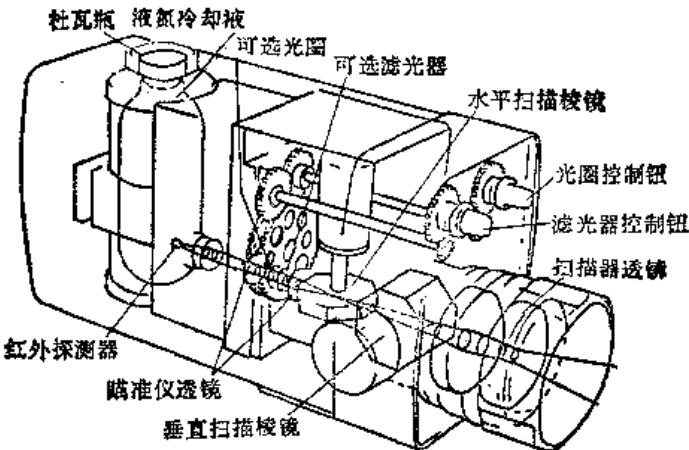  
图15-3-3红外热像仪光学系统

表15-3-3 几种国内在用热像仪性能比较  

<table><tr><td>型 号性能参数</td><td>AGA-782瑞典 AGEMA 公司</td><td>AGA-870瑞典 AGEMA 公司</td><td>TVS-3300美国 HUGHES 公司</td><td>6 T61日本电气三荣公司</td><td>虹光 841上海技术物理所</td><td>PTV-12北京电力试验设备厂</td></tr><tr><td>1.探测器</td><td>单元磅锅录</td><td>单元磅锅录</td><td>10元锑化铟</td><td>单元碲镉汞</td><td>77K 单元碲镉汞</td><td>热释电摄像管</td></tr><tr><td>2.致冷方式</td><td>液 氮</td><td>电致冷</td><td>氩 气</td><td>液 氮</td><td>液 氮</td><td>不 渗</td></tr><tr><td>3.连续工作时间(h)</td><td>2</td><td></td><td>4</td><td>4.5</td><td></td><td></td></tr><tr><td>4.测温范围(℃)</td><td>-20~1000加滤光片可至1600</td><td>-20~500加滤光片可至1500</td><td>-20~950</td><td>-50~200,120~800,700~2000</td><td>-30~1500</td><td>40~130</td></tr><tr><td>5.光谱范围(μm)</td><td>8~12</td><td>2~5</td><td>2~5.6</td><td>8~13</td><td>8~12</td><td>8~14</td></tr><tr><td>6.温度分辨率</td><td>0.1℃</td><td>0.1℃</td><td>0.1℃</td><td>0.1℃</td><td>0.1℃</td><td>1°</td></tr><tr><td>7.空间分辨率</td><td>7°视场 1.1mrad20°视场 3.4mrad</td><td>7°视场 1.1mrad20°视场 3.4mrad</td><td>2.18mrad</td><td>1场/0.5、1.2s</td><td>20°×20°</td><td>4°~31°</td></tr><tr><td>8.场频(Hz)</td><td>25</td><td>25</td><td>16</td><td>1场/0.5、1.2s</td><td>10</td><td>25</td></tr><tr><td>9.行频(Hz)</td><td>2500</td><td>2500</td><td></td><td></td><td></td><td></td></tr><tr><td>10.每帧线数</td><td>280线(4:1隔行)</td><td>280线(4:1隔行)</td><td>200线</td><td>248线</td><td>128</td><td></td></tr><tr><td>11.每行像元数</td><td>100</td><td>100</td><td>119</td><td>300</td><td>128</td><td></td></tr><tr><td>12.输出信号</td><td>非电视标准</td><td>非电视标准</td><td>电视标准</td><td>非电视标准</td><td>电视标准</td><td></td></tr><tr><td>13.显示方式</td><td>实时黑白显示</td><td>实时黑白显示</td><td>实时伪彩色显示</td><td>非实时伪彩色显示</td><td>实时伪彩色、黑白</td><td>实时黑白显示</td></tr><tr><td>14.处理方式</td><td>全数字化处理</td><td>全数字化处理</td><td>全数字化处理</td><td>全数字化处理</td><td>全数字化处理</td><td></td></tr><tr><td>15.摄像头重量(kg)</td><td>1.6</td><td>2.5</td><td>2.7</td><td>7</td><td>2.6</td><td>2.4</td></tr><tr><td>16.显示器重量(kg)</td><td>4.5</td><td>4.5</td><td>9.3</td><td>17.5</td><td>4.1</td><td>4.4</td></tr></table>

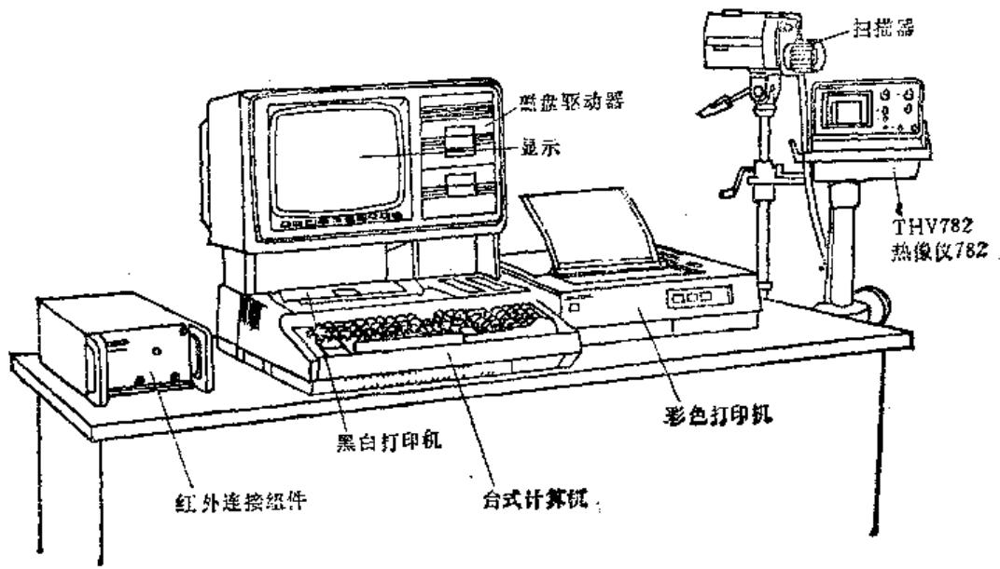  
图15-3-4 AGEMA-782SW热像仪系统

# 第4节 国内外设备温度诊断典型实例

# （一）设备温度诊断的应用范围

温度诊断除可用于检查工艺过程内的温度变化，据以判断控制过程是否良好，是否存在故障外，还可以直接用来检查下列各种普通故障。

1）轴承损坏 由于滚动轴承零件损坏，接触表面擦伤或动压轴承损坏等原因，发热量必然会有增加。这种变化可用热电偶等传感器测量出来，也可以用两套传感器，一套测轴承座温度，另一套测距轴承座不远处的机体温度，两者温度之差更能反映轴承的发热情况。对于由磨损引起的面接触，所产生热量会散逸至外表面，也可由此检查出来。  
2）冷却系统故障 润滑或冷却系统的故障会使某些零件的表面温度上升，因此很易检查到。故障原因可为：油泵故障；传动不良；管线、阀或滤清器阻塞；热交换器损坏等。  
3）发热量不正常 在内燃机或燃油锅炉内燃烧不正常时，外壳表面的温度分布将不均匀。如在适当部位装有一定数量的传感器，对其输出扫描记载，就可知道分布的不均匀性或变化过程。示温漆或红外热像仪可用于大面积、快速的温度监测。  
4）有害物质聚积 例如管内有水垢，锅炉或烟道结灰渣，形成腐蚀性副产物等。它们都可用温

度扫描方法检查出来，因为隔热层厚度的改变，使表面温度的分布有了变化。

5）保温材料的损坏 对于工业窑炉和制冷设备，使用红外热象仪可以很容易地找到保温材料的损坏部位。耐火材料衬里的开裂和保温层的破损，将表现为局部的过热点或过冷点。  
6）电器元件故障 电气元件的接触不良意味着接触电阻增加，通过电流时发热量就大，这种局部过热也可用红外热像仪或红外点温计查出。例如，可以对高压线路的电缆、接头、绝缘子等进行快速检查；而另一方面与此相反，如整流器、可控硅等器件，如出现不发热的冷点，也表示已经损坏。

近年来随同红外技术的迅速发展，使得红外测温技术在设备诊断上的应用也已取得一些显著成效，并且形成了一套红外诊断技术。它具有：非接触、无干扰，有较高灵敏度、较好空间分辨率；可提供快速实时测量；可进行数据储存和图像处理；以及现场使用方便的优点，从而大大推进了我国的设备诊断工作，当前已在铁路、冶金、水电和石化等工业方面取得了较大成效。

# （二）设备温度诊断的典型实例

# 1. 机床主轴箱温升对热变形影响的检测

简化的车床主轴箱模型如图15-4-1所示。主轴箱的主要热源是主轴的前后轴承。轴承在运行中因摩擦产生的热量，部分传给主轴并散入空间，另一部分传给箱体。车床主轴箱体受热后，由于各部分

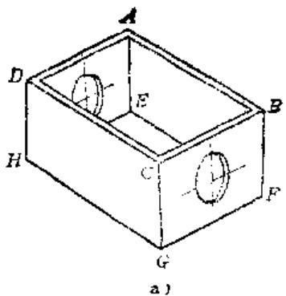  
图15-4-1 机床主轴箱及前后面温度场

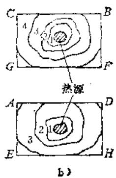  
图15-4-2 车床主轴承面的等温度场分布图

温升不同而产生不同程度的热膨胀，导致箱体发生热变形。直接测量这种变形是困难的，因此可以利用红外辐射实测箱体轴承孔四周的具体温度。主轴箱运行热稳定后，用热像仪测得BCGF面的温度场，靠近热源最内圈温度为  $56.5^{\circ}\mathrm{C}$ ，第二圈温度为  $40.5^{\circ}\mathrm{C}$ ，第三圈为  $39^{\circ}\mathrm{C}$ ，第四圈为  $34^{\circ}\mathrm{C}$ ；测到AE-HD面内圈温度为  $45^{\circ}\mathrm{C}$ ，第二圈温度为  $40^{\circ}\mathrm{C}$ ，第三圈为  $35.5^{\circ}\mathrm{C}$ 。由图15-4-1可见，主轴箱前后两面温度场分布大致相同，由计算BCGF面的前轴承中心平均升高  $34.2\mu \mathrm{m}$ ，AEHD面的后轴承中心平均升高  $27.7\mu \mathrm{m}$ ，即在  $400\mathrm{mm}$  长度内，主轴轴线倾斜  $6.5\mu \mathrm{m}$ 。

# 2. 金属胶接结构热特性检测

随着高强度结构胶（如环氧树脂 + 聚酰胺，环氧树脂 + 40% 顺酐及 araldite2007 等）的出现，胶接在机床制造中的应用不仅限于零部件的设计制造，而且进入了全胶接结构机床的设计制造阶段。全胶接结构机床不仅静刚度好，而且动刚度性能也有很大提高。由于胶接剂的存在，改善了机床结构阻尼，提高了机床抗振性，也提高了机床的加工精度，降低切削时的噪声。正因为胶接剂的使用，胶接结构的热特性如何？对热变形的影响如何？是必须要搞滑的问题，现代的红外热像技术正提供了很好的识别办法。

图15-4-2是胶接结构车床主轴箱主轴承所在面的热像图，靠近热源（图中小块阴影部分）最内圈的温度为  $47.5^{\circ}C$  ，依次向外的温度为  $46.5^{\circ}C, 45^{\circ}C, 42^{\circ}C, 41.3^{\circ}C, 40.6^{\circ}C, 39.8^{\circ}C, 38^{\circ}C$  和  $36.3^{\circ}C$  。该图表示的是主轴承所在面的等温分布图。所用的热像仪是AGA-750型热像仪。从图15-4-2温度场分布图中可看出，主轴承所在面的温度分布是完全按传热学规律分布的。其左右方向的温度梯度基本

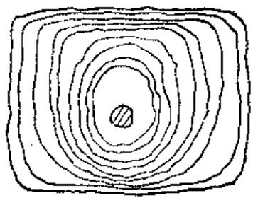

对称，下部温度则因箱底散热而较上部为低。胶接部分在主轴承所在面的底部和两侧，从热像图中可看出，胶接箱体并未因胶接剂的存在而使温度积聚，对传热的影响不明显，证明其热特性较好。同时，也说明红外测温技术为新型胶接机床的设计制造提供了有效的诊断手段。

# 3. 火车车轴箱不停车温度检测

铁路车辆的轴箱轴承在运行过程中，车轴与轴承之间发生摩擦，在各种外力作用下，将使轴箱发热。如果轴温超过正常的运转热就称为热轴故障。热轴故障必须及时地发现和处理，以免发生重大事故。

过去我国铁路系统主要采用手摸轴箱的落后方法。自1978年以来已大力推广我国首创的红外线检测车辆轴温的新技术。红外线轴温探测器正是利用在车辆运行中轴端发出的红外辐射的强弱不同，对热轴故障进行监测和预告报警。红外线轴温探测器安装在铁路两侧，红外探头中的光学系统将车辆轴箱的红外热辐射聚集到红外探测元件上，把红外辐射转变成微弱的电脉冲信号。经过电子线路放大处理后，白仪表记录显示出来。

我国目前使用的红外轴温探测器采用相对温度测量法，即以环境温度为背景，红外探头输出的是轴箱温度和环境温度的差值电脉冲信号。轴的温度越高，输出的电脉冲信号也越大。红外线值班员根据所记录的轴温脉冲信号进行同轴、同侧、同转向架等比较来判定一列车中是否有热轴。一旦有热轴信息，值班员便将热轴所处的车辆位数、轴位置准确地通知现场及时处理，就能有效地保证红外轴温探测区段的安全行车。

# 4. 大型电机的故障诊断及其指导检修

1986年7月，太原钢铁公司发电厂一台专为高

炉供风的D900风机的电动机（YK2500-2/1180型， $2500\mathrm{kW}$ ）发生超温故障。经检查分析，判断为定子铁芯有问题，请电机制造厂来人会诊，提出了大修方案，不仅费用高，而且周期长，势将严重影响生产。后经公司领导和有关部门研究决定，由本公司电力厂来检修，但苦于无法确定故障源。太钢机械处设备诊断室通过了解情况之后，决定应用AGEMA80点温仪和AGEMA782红外热像仪，进行温度分布测定。先将电机拆卸轴芯，用模拟升温的方法将定子感应加热，然后用点温仪和热像仪配合测量温度，准确地获取了定子铁芯的热分布图。从而确定了故障部位，并作了现场标定，又与有关部门一起研究确定具体的检修方案。结果，只用3天时间的小修，就排除了故障，使该电机恢复正常运行。

# 5. 电气设备各种裸露接头热故障的红外诊断

裸露接点的热故障主要由于导体接触不良与大电流作用下引起的。热故障点的发热功率，同接触电阻与通过电流的平方成正比。其红外热像是以故障点为中心的热场分布图。从热图像中可以直观地判断设备是否存在热故障，并可准确地判定故障位置。

在现场常出现的隔离刀闸接点发热、高压断路器引线接点发热、母线接头发热、电缆接头发热等等，都是一种最简单的高压带电设备热故障点。一

般用测温仪与红外热像仪都可以直观地测试出。如广州芳村变电站用AGA-782热像仪测出芳佛Ⅰ线 $220\mathrm{kV}$ ，SW6-220高压断路器B相两Y柱之间的引线接头温度达 $109^{\circ}\mathrm{C}$ ，而A、C相相同部位温度仅 $50.6^{\circ}\mathrm{C}$ 。芳山线 $110\mathrm{kV}$ 进线A相引线V型线夹接头最高温度 $88.3^{\circ}\mathrm{C}$ ，在佛山变电站发现芳佛Ⅰ线C相CT近线路侧刀闸接头最高温度为 $91.5^{\circ}\mathrm{C}$ ，而A、B相同一部位最高温度仅 $40^{\circ}\mathrm{C}$ 。湖北电研所对GW系列隔离开关进行红外热像图分析后，发现其过热故障的起因不是滚动触头接触不良，而是接线端的线夹松动造成的。因而使滚动触头的弹簧在接线端的高温热传导作用下退火，造成接触压力减少，接触电阻增大，温度急骤上升。伴随着滚动触头被氧化变黑。而接线端发热线夹部位又多是出线端，这是由于引线过长，如有的长达 $3\mathrm{m}$ 以上，受风吹摇动导致线夹的压接点松动而发热。

# 参考文献

[1] [英]A.凯利，M.J.哈仑斯，工业生产的维修管理，蒋云庭译，北京：机械工业出版社，1982  
[2] 屈梁生，何正嘉主编. 机械故障诊断学. 上海：上海科学技术出版社，1986  
[3] 华北电力企协设备诊断技术专业协会. 诊断技术通讯, 1988 (10)