# 第16章 旋转组件和元件的诊断

# 姚家瑞

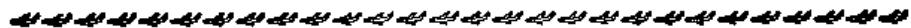

# 第1节 旋转机器转轴组件的振动诊断

旋转机器如汽轮机、发电机、压缩机、风机等的转轴组件产生振动的原因是很复杂的，不但有机械方面的，还有气流或油膜方面的原因。现仅就一些常见的故障及诊断判别方法作简要介绍。

# （一）结构方面的故障

# 1. 转子的临界转速

旋转机器在启动升速过程中，往往在某个（或某些）转速下出现振动急剧增大的现象，有的机器甚至在工作转速下振动也比较剧烈。在这种情况下，振动原因可能是由于转子系统处在临界转速下产生共振所致，但也可能是由其它异常原因引起，为此必须进行判别。

# （1）转子临界转速的特征

1）在临界转速时振动幅值最大，当转速偏离临界转速时振幅下降。  
2）振动的相位角在临界转速区域有较显著的变化。  
3）振动的频率一般和转速的频率一致，在某些条件下（例如转子刚度各向异性）也可能是转速频率的倍数。  
4）在振动波形方面，随着接近临界转速，振动波形呈现较好的正弦波形。据此可测量和记录转速、轴承座振动或转子振动的幅值和相位来判别。

为了较准确地测定临界转速。画出“振型圆”图（或称乃奎斯特图）是一个很有效的办法。现简单介绍一下“振型圆”的概念。设有一个单圆盘转子在质量偏心力作用下的运动方程为：

$$
m Z + c Z + K Z = m a \omega^ {2} e ^ {i n t}
$$

式中  $m$  ——圆盘质量；

Z——圆盘中心的振动位移矢量（用复数表示）；

$\pmb{\omega}$  ——转子旋转角速度；

$K$  ——刚度系数；  
$c$  ——阻尼系数；  
$\alpha$  ——圆盘质量偏心。

从中可解出：  $Z = \frac{a\omega^2e^{i(\omega - \varphi)}}{[(Q^2 - \omega^2) + 4\mu^2\omega^2Q^2]^{\frac{1}{2}}}$

其中，相位角  $\varphi = \mathrm{tg}^{-1}\frac{2\mu\omega\Omega}{\Omega^2 - \omega^2}$  无阻尼的临界转速  $\Omega = \sqrt{\frac{k}{m}}$

阻尼比：  $\mu = \frac{c}{2m\Omega}$  品质因数；  $Q = \frac{1}{2\mu}$

令  $Z = (X + iY)\omega^i$  ，可得到  $X$  与  $Y$  的关系：

$$
X ^ {2} + \left(Y + \frac {\alpha \omega^ {2}}{4 \mu \omega Q}\right) ^ {2} = \left(\frac {\alpha \omega^ {2}}{4 \mu \omega Q}\right) ^ {2}
$$

设在临界转速附近  $\omega Q \approx \omega^2$  有：

$X^{2} + \left(Y^{2} + \frac{aQ}{2}\right)^{2} = \left(\frac{aQ}{2}\right)^{2}$  成为圆的方程式。典型的单自由度系统的振型如图16-1-1。

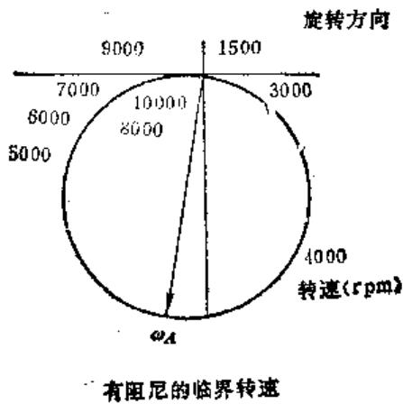  
振动偏心  
图16-1-1 单自由度系统损题图

它含有许多物理意义。其特点之一是在同样的转速间隔下，在临界转速附近时振型圆上的弧长最长，而远离临界转速时弧长较短。对于高阶临界转速也具有此特点，只不过振型圆的图形较复杂而已。

为此，可测出与转速同频的轴承或转子振动位移的分量幅值和相位，画成极坐标图（振型圆）而加以判明。这特别适用于相邻振型影响较大，从振幅-转速图上难以判别临界转速的情况。另外，它还可以在缓慢升速过程中连续测量，并能迅速测量，从而可以减少由转速不稳定及工况变化带来的测量误差，以提高测量精度。

# （2）消除共振的措施

1）使工作转速避开临界转速区域。

2）调开临界转速，改变转子尺寸或轴承、支承座的动特性。

3）增加外阻尼。

# 2. 结构共振

结构共振是由于作用在某个构件（例如轴承座、台板、机壳等）上的激振力频率和构件固有频率相同而引起的，其本质和转子临界转速时共振相同。激振力的频率可以由计算分析或由实测的振动信号进行频谱分析得到，而构件的固有频率通常用激振的办法来确定。对构件激振常用的方法有正弦波激振、正弦波扫描激振、冲击激振和随机激振。可根据频响曲线，相频曲线或用“导纳圆”来判明共振点。通常用改变构件的动特性（例如改变构件的刚度），改变激振力的频率或增加外阻尼及减振器等方法来消除或减少共振的危害。

# 3. 滑动轴承油膜振荡

油膜振荡现象是滑动轴承油膜引起的一种自激振动，在高速旋转机器上也常遇到。对于高速轻载轴承表现为半速涡动，即轴颈中心以旋转角速度的一半进行涡动。而对于重型转子则表现为油膜共振，即轴颈中心以转子的固有频率涡动。有的情况下可能先出现半速涡动然后发展为油膜共振。半速涡动振幅较小，而油膜共振振幅较大。一般称油膜共振为油膜振荡，半速涡动为油膜涡动，以示区别。

# （1）油膜振荡的特征

1）油膜振荡（共振）在一阶临界转速的二倍以上时发生。一旦发生振荡，振幅急剧加大，即使再提高转速，振幅也不会下降，如图16-1-2所示。  
2）油膜共振时，轴颈中心的涡动频率为转子一阶固有频率。

3）半速涡动可能在一阶临界转速的2倍以下发生，涡动频率为转速的一半，如图16-1-3所示。

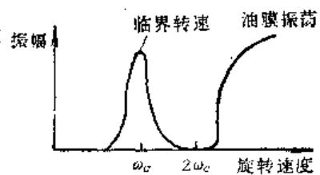  
图16-1-2 油膜振荡

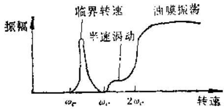  
图16-1-3 半速涡动与油膜共振

4）油膜振荡具有惯性效应，升速时产生油膜振荡的转速和降速时油膜振荡消失的转速不相同，如图16-1-4所示。

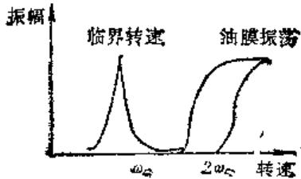  
图16-1-4 油膜振荡的惯性效应

5）油膜振荡开始发生，但还未发展为剧烈的自激振动时，轴心轨迹图形呈现紊乱。  
6）油膜振荡时轴心涡动的方向与转子旋转方向相同。

# （2）消除油膜振荡的措施

1）增加转子系统的刚度。转子固有频率愈高，产生油膜振荡的失稳转速也愈高。  
2）选择合适的轴承型式和轴承参数。圆柱轴承抗振性最差；椭圆轴承、三油楔及多油楔轴承次之，可倾瓦轴承最好。如用圆柱轴承时，偏心比大于0.8也不会产生油膜振荡问题。

3）增加外阻尼。

4）增加轴承比压。例如切短轴瓦长度，在下瓦中部开环形槽，把轴承中心抬高。  
5）改变进油温度或换油（即改变油粘度）。  
6）改变轴承间隙。  
7）改变进油压力。

# 4. 次谐波（分数谐波）共摄

次谐波共振发生在非线性比较严重的系统，振动频率为激振力频率的  $1 / 2$ 、 $1 / 3$ 、 $1 / 4$  等。次谐波振动的特点是：

1）次谐波振动只在强迫振动频率的某个有限区域内产生，如果强迫振动力小于某个值则次谐波振动不会发生，如图16-1-5所示。

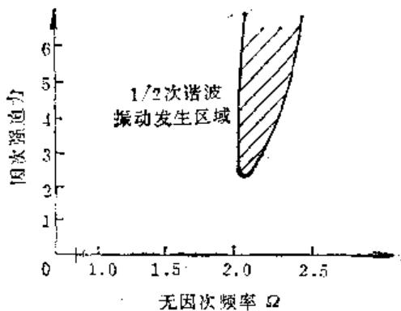  
图16-1-5 单自由度非线性系统次谐波振动区域

2）对于对称形非线性系统可能产生1/3、1/5…等奇次分数谐波振动，而不易发生偶次分数谐波振动。  
3）对于非对称形非线性系统可能发生偶次分数谐波振动，而不易产生奇次分数谐波振动。  
4）在固有频率附近，振幅有跳跃现象。  
5）分数谐波振动的发生区域在很大程度上受阻尼和无因次外力的影响。  
6)  $1 / \lambda$  次分数谐波振动的发生区域位于无因次频率（激振频率与固有频率之比）等于  $\lambda$  的附近。

在其它方面例如主要有裂纹引起的振动、电磁振动、水力振动、滚动轴承振动、齿轮啮合振动等比较专门的问题在旋转机器上也可能会遇到。

对机组振动进行分析时，若发现振动频谱中含有低频成分则是发生了自激振动或分谐波共振。要区分分谐波共振，只需稍变转速共振即会消失。而自激振动则不然，其低频数值一般与第一阶固有频相接近。

# 5. 轴流式气体压缩机的旋转脱流和喘振

压气机组实际运行时，不可能只在特定的设计工况下工作，而经常会在偏离设计工况点的变工况下运行。例如因外界负荷、转速、大气条件等的变化，使得其运行工况在一个比较宽的范围内变化。

在压气机的特性曲线（如图16-1-6）上有一条喘振边界线，当流量减少到一定程度时，即运行

工况点位于喘振边界线的左上方，压气机工作不稳定，流量和压力会产生强烈的波动，并且发生低频风似的喘振声，机组强烈振动，严重时将出现破坏事故。图16-1-7和图16-1-8是在喘振前和喘振工况下压力、流速的波动情况。喘振与压气机后面的工作系统有关，工作的容积愈大，则喘振时流量和压力的振荡周期也愈长。喘振的频率一般为 $1 / 10\sim 10\mathrm{Hz}$

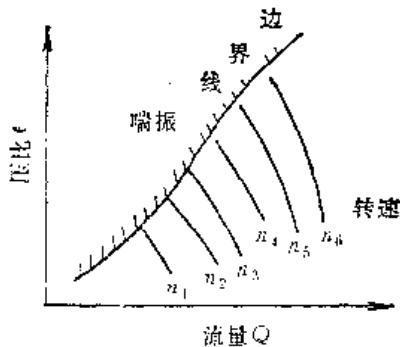  
图16-1-6 压气机特性曲线

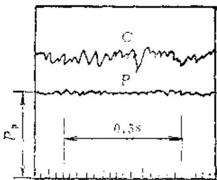  
图16-1-7 喘振前压力  $P$  和速度  $C$  的波动

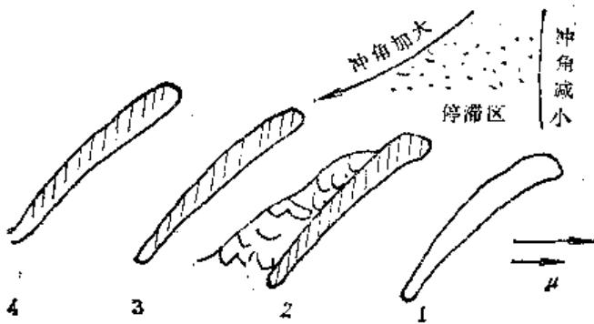  
图16-1-8 旋转脱流现象

根据国外文献介绍，喘振是由于旋转脱流现象而引起的。如图16-1-9所示，压气机叶栅以速度  $u$  向右侧方向移动，若流量减少，在叶片2的背弧面上将首先出现脱流现象，处于叶片2和3的通道就会部分或全部堵塞，则在这个通道的进口部分形成一个气流停滞区，在其附近的气流方向将逐

渐改变，使叶片1处的气流冲角减少，脱流现象逐渐消失，而叶片3处的气流冲角加大，而促使叶片3的背弧开始发生脱流。这样，脱流从叶片2转移到叶片3，并以速度  $u_{1}$  向叶栅运动相反的方向移动，旋转脱流的转速大约为叶栅转速的  $50\% \sim 70\%$  左右。

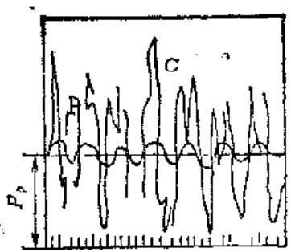  
图16-1-9 嘱振工况下的压力和速度波动

旋转脱流多发生在压气机转速低的区域，脱流区域的数目可能不同，如图16-1-10。

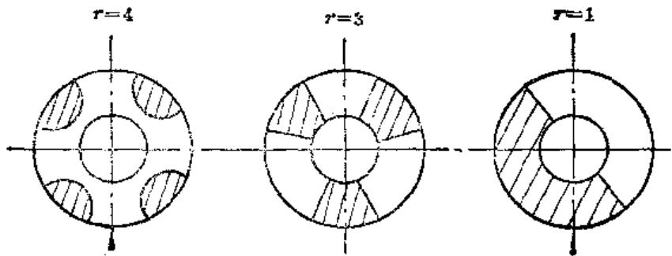  
图16-1-10 脱流区的数目

旋转脱流加给叶片的激振频率：

1）对于静止叶片  $f_{S} = vaf_{N}$  
2）对于动叶片  $f_{V} = v(1 - a)f_{N}$

式中  $\pmb{\nu}$  ——脱流区数目；

$a$  ——旋转脱流的转速与压气机转速之比； $f_{N}$  ——压气机转速。

如果激振频率正好和叶片的固有频率重合，则叶片发生共振而可能产生疲劳破坏。

旋转脱流进一步发展将成为喘振现象，在压气机和工作系统之间引起流量。压力的低频周期性振荡，泵类旋转机器也会出现类似的问题。为了进行判别，可测量机组振动的大小并进行频谱分析，根据旋转脱流和喘振的频率特征来进行判别，但是机组强烈振动也可能由其他原因引起。为了确诊，直接监测压力的变化，并对压力波动进行频谱分析是一种有效方法。

防止压气机发生喘振现象的措施是：①设计时合理选择各级之间流量系数；②装设可转动导叶。③安装防喘放气阀。

# 6. 电磁力引起的振动

电磁力引起的振动，它的基本频率就是电源的周波数。电源周波数  $50\mathrm{Hz}$  的电机  $3000\mathrm{r / min}$  时，如有电气异常，则发生  $50\mathrm{Hz}$  或  $100\mathrm{Hz}$  的振动。

以上列举了十几种常见的旋转机器转轴组件故障与其特征，实际遇到的问题要复杂得多，有时几种故障同时发生，如何进行判别？有的故障如转子失稳，也很难判别究竟是油膜引起还是间隙引起。这就要求根据各种故障特征进一步分析，应用一些新的技术，如模糊数学方法、概率统计方法等；此外，还必须辅以丰富的实践经验。

# （二）零部件缺陷的故障

# 1. 不平衡振动

在旋转机器中，常由于转子材质不均匀、结构不对称、加工和装配误差等原因而产生质量偏心。当转子旋转时，质量偏心的不平衡力将激起转子振动。这是旋转机器最常见的振动，如果这种振动超过允许的范围则机器可能发生故障。为此，当机器振动强烈时必须判别是由于转子不平衡而引起，还是由于别的原因所

引起。不平衡振动的特征是：

1）对于刚性转子或转子在比第一阶临界转速低很多的转速下运行时，由于不平衡产生的离心力与转速的平方成正比，轴承座的振动随转速增高而加大，但不一定与转速的平方成正比。这是因为轴承。支承座的动刚度也是转速的函数所致。  
2）在临界转速附近，振幅和相位有明显的变化（见临界转速的判别）。  
3）振动频率和转速的频率一致。特别是在临界转速附近，振动波形是比较规则的正弦波形，其频率就是转速频率。

根据上述特征，可采用选频器（或跟踪滤波器）测出与转速间频的振动分量大小，并与总振动的大小和波形进行比较，从而作出判定。

不平衡振动除了由于质量偏心引起外，还可能与热不平衡、转子初始弯曲、对中不良、叶片脱

落、联轴器联接面倾斜和不同心等因素有关；

（1）热不平衡 由于转子受热不均匀产生热弯曲而引起，有两种型式：一种是达到一定的负荷后振动矢量随时间而变化；另一种是随负荷的改变而变化。为了判定是否由于热弯曲而引起的不平衡振动，可在某一定转速下改变负荷，并测量振动矢量随负荷和时间改变的变化。图16-1-11为热不平衡下振动矢量变化用极坐标图表示的示例。

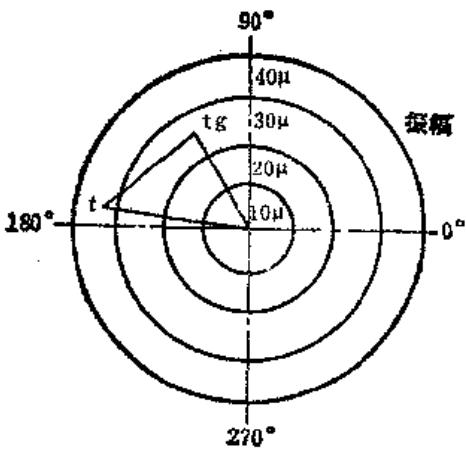  
图16-1-11 热不平衡的示例

（2）转子初始弯曲 由于加工不良，残余应力或碰撞等原因，转子本身在未旋转时已经弯曲，因而在旋转时产生不平衡振动。应在低速转动下检查转子各部位的径向跳动量予以鉴别。  
（3）联轴器误差 当两个转子用刚性联轴器联接时，由于联轴器不同心或者联接面与轴线不垂直，将使转子产生弯曲（如图16-1-12）而激起不平衡振动。为此应检查联轴器的加工、装配误差，必要时将联轴器解开，检查每个转子的平衡状态，从而采取相应的措施，例如更换联轴器或转子重新平衡等。

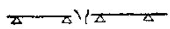

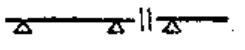  
a）联轴器端面偏斜 b）联轴器不同心

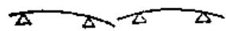  
a)

  
b）  
图16-1-12 联轴器误差

（4）轴系对中不良 两个或两个以上转子联成轴系时，如果对中不良将产生与转速同频的不平衡振动，还可能会出现为转速频率二倍的振动。轴

系对中不良可能有两种情况：一种是在室温下（即转子在冷态下）对中不良；另一种是冷态对中良好，但由于在运行过程中机器受热膨胀或机壳、基础不均匀变形等原因，使轴系中的各轴承中心位置发生变化，各轴承的负荷重新分配，改变了轴系的动力学特性，从而激起不平衡振动，可能还会激起非线性的次谐波（分数谐波）振动。因此，在冷态找中心时应考虑热态的影响，为了进行判别，直接监测轴承负荷随运行工况改变而变化的情况是有效的。

（5）轴系不平衡 若两个或两个以上挠性转子刚性联接成轴系前每个转子都已平衡合格，联轴器及对中也在允差范围内，但联成轴系后还可能出现不平衡振动。这可能是由于联成轴系之前和之后转子的振型发生了变化，因而不平衡状态也变化了。

为消除转子或轴系质量偏心引起的不平衡振动，可在平衡试验机上或在现场整机上进行平衡。在有些情况下，转子上的零部件松动，构件联接螺栓没有紧固或者支承刚度太小也可能会引起强烈的振动。用平衡的办法也可减少由各种原因造成的转子弯曲而引起的不平衡振动，但理论上只能完全消除某一转速下由转子弯曲引起的不平衡振动，而不能消除所有转速下的不平衡振动。

（6）叶片脱落 将使转子不平衡状态突然发生变化，会引起轴振动中速频分量突变，其效果与不平衡量相对方位有关。有时叶片脱落引起轴振动相位变化，而振幅保持基本不变。

# 2. 转轴不对中误差

转轴不对中误差是由于相邻两个轴承调整不当导致中心线有偏移引起的，而联轴节误差则是平面误差或中心误差（图16-1-12）引起的。当转轴连

表16-1-1 转轴不对中振动的特征  

<table><tr><td>参数</td><td>性质</td></tr><tr><td>振动的方向</td><td>易发生轴向振动,如发生的轴向振动在径向振动的50%以上,则存在不对中</td></tr><tr><td>发生的频率</td><td>在普通的联轴节上以基频f1为主体,如激烈时则发生2fr、3fr</td></tr><tr><td>相位</td><td>经常保持一定的角度</td></tr><tr><td>振动形态</td><td>与转速降低无关,位移量或者一定,或者增加,不趋近于零</td></tr></table>

接后会出现强迫作用力，该力也随转轴而旋转。当转轴不对中时，也会对轴承附加一个作用力，然而它不随转轴旋转，其作用大小也是不随转速变化的。表16-1-1列举了转轴不对中误差引起的振动特征。

# 3. 基座松动

松动现象是螺栓紧固不牢引起的，其振动特点是易发生上下方向的振动。

松动现象具有一定的非线性特性，所以除了旋转成分的基频外，还会发生高频振动，其振动特征列于表16-1-2。

表16-1-2 松动引起的振动的特征  

<table><tr><td>参数</td><td>性质</td></tr><tr><td>振动的方向</td><td>易发生上下方向的振动</td></tr><tr><td>发生的频率</td><td>除基频f外,可发生高次谐波(2fr、3fr,···)成分,也会发生1/2fr,1/3fr等分数谐波共振</td></tr><tr><td>相位</td><td>无变化(同步)</td></tr><tr><td>振动形态</td><td>如使转速增减,位移会突然变大或变小(跳跃现象)</td></tr></table>

# 4. 密封间隙不均匀引起的自激振动（气流激振）

对于高压汽轮机或者高压透平压缩机，如果圆周密封间隙不均匀，在径向密封间隙最小处气体泄漏最少，而通过该处叶片的气流最大，但在间隙最大处则相反，因此气流冲击叶片引起的圆周力也不同，由于圆周力不匀，在叶轮上除了作用扭矩外还有一个合力，它使转子中心作与旋转方向同向的涡动；如果转子系统的阻尼较小，则有可能激起低频自激振动。

另一种情况是密封部分由于间隙不均匀，产生对气体挤压的动态力，此力的切向分力将使转子中心产生涡动，也可能引起自激振动。

这种自激振动的特征是涡动频率为转子的一阶固有频率，这一点和油膜振荡相同，但不同点是：

1）油膜振荡在转子一阶临界转速的2倍以上发生，而间隙不均匀引起的自激振动可能在转子一阶临界转速的1/2以下发生。

2）间歇不匀的自激与负荷有关。从理论上

说，自激力和两级之间的压差与流体密度乘积的平方根成正比。而油膜振荡和机器负荷的关系不大。

3）密封间隙的大小对间隙不匀的自激影响很大，对油膜振荡则不大敏感。  
4）间隙不匀引起的自激大多在高压流体机械上产生。

解决的措施是：①增加转子刚性、提高临界转速；②改变运行时阀门开启的顺序，减压运行；③加大密封间隙；④增大轴承的阻尼，改变轴承型式及轴承参数；⑤增加外阻尼，例如采用挤压油膜阻尼器等。

转子位移也会使叶顶间隙周向变化，从而造成蒸汽作功的转矩沿圆周不均衡而形成自激。间隙激振的危险主要存在于汽轮机的大功率区段及短叶片和叶轮直径较小的转子上。

# 5. 接触碰撞引起的自激振动

在旋转机器中，由于转子与固定件接触碰撞（例如轴承润滑不良或密封间隙过小），引起异常振动的事例也很多。接触的特征是：

1）振动频带很宽，既有与转速频率有关的低频成分，也有与固有频率有关的高次谐波分量，并伴随有异常噪声，可根据振动频谱和声谱进行判别。  
2）振动随时间而变。转速、负荷工况一定时，由于旋转部件和固定部件接触局部发热而引起振动矢量的变化，其相位变化与旋转方向相反，但振动矢量的这种变化是比较缓慢的。  
3）如果发生接触摩擦，从转子上的相位标记轨迹图形看，将出现跳跃、不连续，严重时其轨迹不稳定。由于摩擦还可能出现自激振动，自激的涡动频率为转子一阶固有频率，但涡动方向与转子旋转方向相反。

另外，根据转子和固定件的摩擦痕迹，也可判别振动原因，如图16-1-13。

根据上述，作为自激振动的例子有油膜振荡、气流激振、摩擦涡动，此外尚有弹性滞后和转轴截面刚度不等引起的自激振动等。汽轮发电机组振动的诊断首先要确定是强迫振动抑或自激振动。汽轮发电机组上最常见的强迫振动是振动频率或转速一致的振动，但尚有一些强迫振动的频率并不等于转子的转速频率，它们是：①电磁激振；②高次谐波共振；③分谐波共振；④随机振动；⑤拍振；⑥撞击振动。

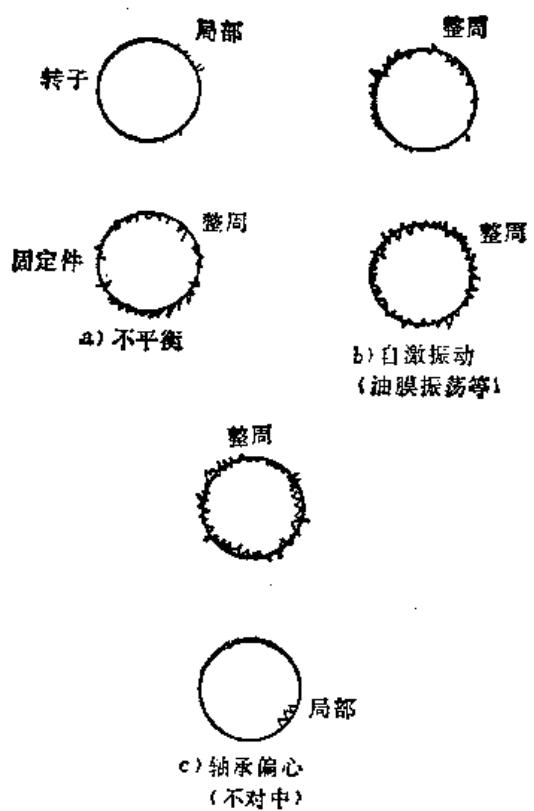  
图16-1-13 磨痕情况和振动原因

自激振动的特点是振动频率为转轴的固有频率。表16-1-3列出了自激振动的特征。表16-1-4列出了强迫振动和自激振动的比较。

表16-1-3 自激振动的特征  

<table><tr><td>参数</td><td>性质</td></tr><tr><td>振动的方向</td><td>无特殊方向性</td></tr><tr><td>发生的频率</td><td>与转速无关的固有频率</td></tr><tr><td>相位</td><td>有变化（非同步）</td></tr><tr><td>振动形态</td><td>在某一转速下振幅突然变大之后，即使转速有较大增减，振幅变化不大</td></tr></table>

表16-1-4 强迫振动和自激振动的比较  

<table><tr><td>内容</td><td>强迫振动</td><td>自激振动</td></tr><tr><td>频率与转速的关系</td><td>振动频率与转速频率相同或者为其n倍或1/n倍 (n为正整数)</td><td>频率与转速无关,大体固定</td></tr><tr><td>振幅与转速的关系</td><td>在某一固定转速下振幅出现峰值,多以临界速度及其n倍来表示</td><td>在某转速下振幅突然增大,随后即使增大或缩小转速,振幅也不减小</td></tr></table>

（续）  

<table><tr><td>内容</td><td>强迫振动</td><td>自激振动</td></tr><tr><td>减震器的效果</td><td>可使峰值减小,对于出现峰值的转速无影响</td><td>如加减震器,则造成振幅加大的转速提高,加大后振幅值不变</td></tr><tr><td>异常原因</td><td>振幅的大小随异常程度而变,异常大则增大,小则变小</td><td>振幅值一定,它与异常程度无关</td></tr><tr><td>发生的频率</td><td>为旋转频率或其n、1/n倍,或为自然振频</td><td>旋转轴的自然振动频率</td></tr><tr><td>防止办法</td><td>1.使运行转速在临界速度的范围以外2.尽可能减小强制外力3.必须在临界速度的范围内运转时,利用减震器减小临界速度下的振幅</td><td>1.将运行转速限定在发生自激振动的转速以下2.减少不稳定的主要因素3.安装减震器使发生自激振动的转速提高</td></tr></table>

# 第2节 滚动轴承的诊断

# （一）滚动轴承的寿命

滚动轴承（以下称轴承）运转后，其内、外圈的滚道面和转动体的表面，由于材质的疲劳生成鳞状屑而剥落下来，这种现象叫做表面剥落。不论怎样正确使用轴承，早晚也要发生异常，所以表面剥落是不可避免的。因此，将轴承的寿命定义如下。

所谓轴承的寿命，是指轴承开始运转到其滚道圈或转动体中的任一个产生最初的表面剥落以前的总旋转数。

# 1. 额定寿命

轴承的寿命与人和电灯泡相同，有长也有短，也就是应该作为一种统计量的使用性质。因此，当许多相同型号规格的轴承在相同条件运转时，其中 $90\%$  的轴承不发生表面剥落，把这时能旋转的总转数称为额定寿命，它可用下式求出：

球轴承  $L = \left(\frac{c}{P}\right)^{3}$

滚子轴承  $L = \left(\frac{c}{p}\right)^{\frac{10}{3}}$

式中  $L$  ——额定寿命（10 $^{6}$  旋转单位）；

表16-2-1 滚动轴承的失效类型及其原因  

<table><tr><td>项目</td><td>1 滚动体与滚道剥落</td><td>2 滚动体及滚道接触边缘剥落</td><td>3 受力表面较大面积压光和微观剥落</td><td>4 滚动体和滚道严重污痕和变色</td><td>5 滚动体和滚道产生椭圆形凹痕、平斑、和摩擦腐蚀</td><td>6 滚道上出现长划痕和摩擦腐蚀</td><td>7 保持架严重磨损和断裂</td><td>8 内部豁隙增加表面变形、微观凹痕、摩擦</td><td>9 滚动体和滚道点蚀和锈斑腐蚀</td><td>10 温升,轴承变色,咬合烧伤</td><td>11 配合面上有锈蚀带变色、发光、微振磨损</td><td>12 轴承圈与滚动体裂纹</td><td>13 轴承上有刻痕凹痕和划伤</td><td>14 圆锥滚子轴承挡边磨损过大</td></tr><tr><td>A.重载持续性载荷</td><td>大大加速疲劳损伤</td><td>轴向力使滚动体侧移</td><td>引起薄的油膜破裂</td><td></td><td>负载超过静承载能力</td><td></td><td></td><td></td><td></td><td></td><td></td><td></td><td></td><td></td></tr><tr><td>B.冲击载荷</td><td></td><td></td><td></td><td></td><td>能引起永久性凹痕</td><td></td><td></td><td></td><td></td><td></td><td></td><td>浮透钢轮胎</td><td></td><td></td></tr><tr><td>C.对中不良</td><td>引起重载</td><td>边缘受到重载。大大增加接触应力</td><td>滚子使滚道边缘部分油膜破裂</td><td>引起滚子滑动和螺旋运动</td><td></td><td></td><td>使保持架受到破坏性载荷</td><td></td><td></td><td></td><td></td><td></td><td></td><td></td></tr><tr><td>D.振动</td><td></td><td></td><td></td><td></td><td></td><td>内部有间隙面油膜阻尼小时可能出现</td><td></td><td></td><td></td><td></td><td></td><td></td><td></td><td></td></tr><tr><td>E.载荷过轻</td><td></td><td></td><td></td><td>牵引不足导致滚动体打滑</td><td></td><td></td><td></td><td></td><td></td><td></td><td></td><td></td><td></td><td></td></tr><tr><td>F.润滑不足或润滑剂不良</td><td></td><td></td><td>油膜强度丧失引起金属-金属接触</td><td>滚动体不能在油膜上滑动</td><td></td><td></td><td>保持架引导面无油膜分隔</td><td></td><td>油中的腐蚀物或氧化物侵袭表面引起损伤</td><td>散热能力不足</td><td></td><td></td><td></td><td>引起金属滑动接触</td></tr><tr><td>G.速度过高</td><td>增加应力周期加速表面疲劳</td><td></td><td></td><td>轻载时增加打滑趋势</td><td></td><td></td><td>保持架引导面承受离心力</td><td></td><td></td><td>增加所产生的热笔</td><td></td><td></td><td></td><td></td></tr><tr><td>H.油封不良</td><td></td><td></td><td></td><td></td><td></td><td></td><td></td><td>沾染金属引起接触表面摩擦损伤</td><td>腐蚀剂如水等损坏表面</td><td></td><td></td><td></td><td></td><td></td></tr><tr><td>I.制造或材料不当</td><td>软金属晶粒大小和排列不良增加疲劳趋势</td><td></td><td>表面粗糙度大造成表面油膜破坏</td><td></td><td></td><td></td><td></td><td></td><td></td><td></td><td></td><td>热处理不当</td><td></td><td></td></tr><tr><td>J.设计不正确</td><td>承缓能力不当引起疲劳损伤</td><td></td><td></td><td>内部游离过大的导致打滑</td><td>抗摩擦腐蚀能力差</td><td></td><td></td><td></td><td></td><td></td><td></td><td></td><td></td><td>控制端部游离配合制定不正确或预加载荷不当</td></tr><tr><td>K.装配不当</td><td></td><td></td><td></td><td></td><td></td><td></td><td></td><td></td><td></td><td></td><td>配合过松导致松动和被振腐蚀</td><td>配合过紧使轴承产生裂纹</td><td></td><td>配合不正确使滚子端部受载增加</td></tr><tr><td>L.操作不当</td><td></td><td></td><td></td><td></td><td></td><td></td><td></td><td></td><td></td><td></td><td></td><td></td><td>粗暴处理导致损伤、缩短寿命</td><td></td></tr><tr><td>M.环境温度过高</td><td></td><td></td><td>丧失油膜强度</td><td></td><td></td><td></td><td></td><td></td><td></td><td>使轴承散热不良</td><td></td><td></td><td></td><td></td></tr><tr><td>N.有电流通过</td><td></td><td></td><td></td><td></td><td></td><td></td><td></td><td></td><td>表面大面积点蚀</td><td></td><td></td><td></td><td></td><td></td></tr></table>

# $p$  —轴承荷重（10N）；

c——基本动定额荷重（10N）。

但是，这终究是统计量，例如30个同种类的轴承在同一运转条件下试验，其寿命的最大值和最小值之间相差数十倍。滚动轴承有必要进行异常诊断的理由之一，就是轴承具有这样的基本特性，即寿命具有很大的离散性。

# 2. 轴承的耐用时间

在使用轴承时，使用目的、使用条件各不相同。因而实际上，在轴承到达寿命之前，往往就不能使用了。这样，一般称轴承到达不能使用的总时间为耐用时间，与所谓寿命是有区别的。

表面剥落以外的异常不叫做寿命，除表面剥落对轴承在使用上具有不能防止的性质外，其它的异常，由于轴承有润滑和密封装置，所以在某种程度上可防止异常发生。但也有音响的劣化，由于磨损引起的精度下降以及润滑脂的劣化等不能防止的情况，作为广义的轴承寿命，往往把这些称作“音响寿命”，“磨耗寿命”或“润滑脂寿命”。

# （二）滚动轴承异常的类型及其原因

由于使用条件和使用环境的不同，滚动轴承会出现磨损、压痕、裂纹、表面剥落、胶着、烧损、电蚀、锈蚀、变色等各种异常现象。表16-2-1对轴承异常的类型及其原因加以说明。

# （三）轴承异常诊断方法

现在，轴承异常诊断的方法，实际上正在使用的有以下几种

1）振动。  
2）噪声。  
3）温度。  
4）磨损微粒的分析。  
5）轴承的间隙测定。  
6）油膜的电阻。

这些诊断方法不一定对轴承的种种异常现象全部有效，而是根据异常的种类改变各自的检出适应能力。各种诊断方法对轴承的种种异常现象的有效性概略地列于表16-2-2。以下对这些诊断方法进行说明。

# 1. 摆动

从表16-2-1看出，振动法是在各种诊断滚动轴承故障方法中最常用的方法。

表16-2-2 轴承的损伤现象与可测信号  

<table><tr><td>可测方法
损伤现象</td><td>振动</td><td>噪声</td><td>温度</td><td>磨损
微粒</td><td>轴承间隙</td><td>油膜电阻</td></tr><tr><td>表面剥离</td><td>☆</td><td>☆</td><td>×</td><td>☆</td><td>×</td><td>×</td></tr><tr><td>裂纹</td><td>☆</td><td>☆</td><td>×</td><td>△</td><td>×</td><td>×</td></tr><tr><td>压痕</td><td>☆</td><td>☆</td><td>×</td><td>×</td><td>×</td><td>×</td></tr><tr><td>磨损</td><td>☆</td><td>☆</td><td>△</td><td>☆</td><td>☆</td><td>☆</td></tr><tr><td>电蚀</td><td>☆</td><td>☆</td><td>△</td><td>☆</td><td>☆</td><td>☆</td></tr><tr><td>油蚀</td><td>☆</td><td>☆</td><td>△</td><td>☆</td><td>☆</td><td>☆</td></tr><tr><td>翘角</td><td>☆</td><td>☆</td><td>△</td><td>☆</td><td>△</td><td>☆</td></tr><tr><td>烧伤</td><td>☆</td><td>☆</td><td>☆</td><td>△</td><td>×</td><td>☆</td></tr><tr><td>生锈</td><td>△</td><td>△</td><td>×</td><td>☆</td><td>×</td><td>△</td></tr><tr><td>保持架损坏</td><td>△</td><td>△</td><td>×</td><td>△</td><td>×</td><td>×</td></tr><tr><td>蠕变</td><td>△</td><td>△</td><td>△</td><td>△</td><td>×</td><td>×</td></tr><tr><td>能否在旋转中测试</td><td>能</td><td>能</td><td>能</td><td>困难</td><td>困难</td><td>能</td></tr></table>

注：表中☆——强相关项；△——弱相关项；×——不相关项。

# 2. 噪声

由于噪声是轴承振动产生的，从本质上来说，它和振动一样，可以说是轴承异常的很好信息媒介。可是，由于外部杂音的影响，所以在实际应用中，用耳朵或送话器捕捉轴承的异常声音还是很困难的。

另外，用听音棒直接听取固体中传送的声音，从过去很早就进行了使用。由于它不受外部杂音的影响，而且便宜，所以还被广泛利用。但是，要进行正确的判定，需要相当熟练的技术，同时，有异常音级别不能定量化的缺点。

# 3. 温度

考虑轴承若产生某种异常，轴承的温度便会发生变化。因此，从过去很早就已采用对轴承温度进行监视的方法。但是不能期待温度的异常检出能力很大，特别是表面剥落或裂纹、压痕等轴承转动面上的局部损伤，在初期阶段几乎不可能检查出来。

此外，即使对效果最有希望的烧损类异常，在初期阶段也很难检出，在出现明确的温度上升时，异常大多已相当严重了。

为此，根据温度变化的诊断法，对异常预知的目的只给予低的评价。可是轴承由于受轴承材料或润滑剂等使用温度界限的制约，监视是否超出这个温度，对防止轴承的异常是重要的。

表 16-2-3 是根据温度确定的轴承运转界限值

的一个例子。这是西德阿里昂兹机械保险公司的事故调查研究所根据经验值制订的。这些数值，必须根据轴承箱的构造和润滑剂的种类变化而变化，并分别进行严密的管理。

表16-2-3 轴承的极限运转温度  

<table><tr><td rowspan="2">测定部位</td><td colspan="2">运转界限温度(℃)</td></tr><tr><td>注意</td><td>停止</td></tr><tr><td>轴承箱</td><td>70</td><td>90</td></tr><tr><td>轴承本体</td><td>90</td><td>120</td></tr><tr><td>轴承内的润滑剂</td><td>80</td><td>100</td></tr><tr><td>排出后的润滑剂</td><td>80</td><td>100</td></tr></table>

# 4.磨损微粒的分析

关于分析润滑剂中的磨粒以调查机械状态的方法，在第13章中已做了详细介绍。它不仅对轴承而且对齿轮或活塞等的诊断也已付诸实用。

# 5. 轴承的间隙测定

滚动轴承（圆锥滚动轴承除外）的内圈或外圈，即使固定了一个，由于内部有间隙，所以未固定的滚道圈能稍微向一面动一动，这个量就叫做轴承的间隙。

若轴承的滚道圈或转动体磨损，当然轴承的间隙会增加。从而，和新轴承时测定的间隙值相比较，即可掌握磨耗量。但是轴承是在装入机械的状态下，所以测定非常困难，旋转中测定就更加困难了。代之以直接测定轴承的间隙，最好使用轴的位置检出方法。在这些方法中，有检查轴的振摆或轴端的移动量等方法，并统称为间接的轴承间隙测定法。

根据轴承的间隙测定，对磨耗或电蚀、滚道面或转动面全圈的异常诊断是有效的。但对诊断表面剥落或压痕等的局部异常不适用。

# 6. 油膜的电阻

旋转中的滚动轴承，由于在滚道面与转动体之间形成油膜，所以在内圈和外圈之间有很大的电阻。在润滑状态恶化或滚道面或转动面上如果产生破损，油膜就破断而使电阻变小。若利用这个性质，就可对轴承的润滑状态进行诊断。

可是，这个油膜的有无，对电阻值的变化是非常大的，在油膜形成时，至少是兆欧以上，破断时，电阻降到零欧附近。为此，在油膜时有时无的

边界润滑状态时，电阻值毫无规律地激烈变动而无法正确测定。这样，一般是求得有油膜的时间和无油膜时间的比例，并大多是从其比例进行轴承的异常诊断。

油膜电阻的测量如图16-2-1所示，在内圈和外圈之间加微小的电压，检查其电压降，这是一种简便的检出方法。为避免对转动面的不良影响，附加电压希望低些，0.1V以下可谓是安全的。另外，在测定  $S / N$  的比值来看，电压高有利，在实际应用中，一般是1V左右。

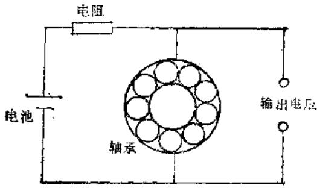  
图16-2-1 油膜电阻的测定回路

当轴承的尺寸或运转条件改变时，能用一定的判定标准是油膜电阻法的魅力。此外，由于及时知道润滑剂的劣化，所以能确切判断给油、给脂的时间。因而，如果由于给油、给润滑脂仍使油膜不得恢复时，说明轴承的转动面已经损坏，而轴承必需更换。

这样，根据油膜的电阻法进行诊断，是简单而且明确迅速的诊断法，但它也有以下缺点：

1）旋转数变低时，即使正常的轴承，由于其油膜也产生破坏，因而不能使用此法。  
2）为使电极在旋转轴上接触，轴必须是露出的。此外，旋转轴和外壳必须在电气上绝缘。  
3）在同一轴上有多数轴承时，不能判别是哪一个轴承恶化。  
4）对表面剥落和裂纹、压痕等的异常检出能力不好。

因而必须注意，根据油膜电阻进行的诊断，若不充分理解上述各点，有时会成为错误的诊断。

关于油膜电阻式轴承故障诊断仪器有国产的HB-1型轴承故障诊断仪（见第19章），瑞典的SPM-BEA-52型油膜厚度测定仪，以及日本的NSK轴承异常预知装置，虽然结构有所不同，但原理上则相类似。

# （四）根据振动诊断轴承的异常

轴承诊断大多使用振动法，主要有以下5个理由：

① 可以检出轴承多种类型的异常现象。  
② 在初期可发现异常。  
③ 可在旋转中测定。  
④ 由于振动发生自轴承本身，不需特别的信号源。  
⑤ 测试以及信号处理比较简单。

# 1. 滚动轴承的振动发生机理和固有振动频率

（1）振动的发生机理 由滚动轴承发生的振动可分为两大类：①与轴承的弹性有关的振动；②与轴承转动面的形状误差（光洁度或波纹、伤痕等）有关的振动。前者的振动代表滚动体的通过振动，由于不管轴承正常，还是异常，这种振动都要发生，所以与轴承的异常诊断无关。

和轴承异常有关系的是第②种振动；这就是在转动体表面上以某种形式出现的异常。这种振动的发生机理，一般如图16-2-2所示。

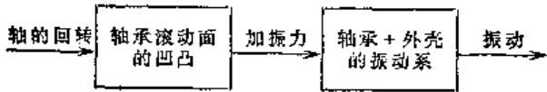  
图16-2-2 振动的发生机理

首先，由于轴的旋转，滚动体便在内、外圈之间滚动。轴承的滚动面作为机械零件的表面加工得非常平滑，但从微观来看，仍有小的凹凸面。滚动体在这些凹凸面上转动时，产生交替力，而成为加振力。通常，由于滚动面的凹凸形状是无规则的，所以加振力也是随机性质的，它会有多种频率成分，由轴承（主要是外圈）和外壳形成的振动系，由于这个加振力的激振，发生的振动是由各种频率成分组成的随机振动。可是，由轴承和外壳构成的振动系的固有振动成分是起支配作用的。  
（2）异常与振动频率的关系 了解由于轴承转动面的形状误差产生的振动机理，就有可能根据异常对振动的频率作某种程度的考察。

首先，根据转动面产生损伤部分的形态和轴的旋转速度，决定加振力的频谱。其次，根据轴承和外壳所形成振动系的传递特性，叠加或加振力的频谱。其结果，振动系的固定频率成分被强调了，并形成最终的振动频谱。

因而可知，由于轴承异常所引起的振动频率，受轴的旋转速度和损伤部分的形状以及轴承和外壳振动系统的传递特性三者所左右。

一般，轴的旋转速度越高，而且损伤的形态表现得越显著时，振动的频率就变高。关于轴承的振动系，是轴承的尺寸越小，其固有振动频率越高。因此，由于异常所产生的振动，对所有轴承共同具有的特定频率是没有的。另外，即使对一个轴承，当产生异常时，几乎也不会发生单一频率的振动。

此处列出滚珠轴承的主要零件球和滚道圈（假定为自由圆环）的固有振动频率的计算公式，以供参考。

钢球的固有振动频率（椭圆的模式）：

$$
f _ {b} = - \frac {0 . 4 2 4}{r} \times \sqrt {\frac {E}{2 \rho}}
$$

滚道圈的固有振动频率（圆环面的模式）

$$
f _ {r} = \frac {n (n ^ {2} - 1)}{2 \pi \sqrt {n ^ {2} + 1}} \times \sqrt {\frac {E I}{m R ^ {4}}}
$$

在上式中，  $r$  ：球的半径；  $E$  ：杨氏率（弹性模数）；  $\rho$  ：密度；  $I$  ：滚道圈断面的平方；  $R$  ：滚道圈的中心线半径；  $m$  ：滚道圈的单位长度平均质量；  $n$  ：变形的波数。

（3）为诊断异常所采取的振动测定方式为了大致明确由于异常而产生的振动频率的性质，可以举出为测定这个振动的几个基本事项：  
1）因异常所产生的振动频率谱，由于是根据损伤的种类或形态、轴承尺寸、旋转速度等的不同而变化的。所以，振动测定应在某频率带域进行。  
2）把从轴承和外壳形成的振动系的固有振动频率，作为对象进行测定。  
3）把如轴振动、滚动体通过振动等，与异常无直接关系的振动排去以后进行评价。

轴承振动系的主要固有振动频率一般为高频振动，在轴承零件中具有比较低的固有振动频率的外圈的频率，也分布在数百赫至数万赫之间。另外，所幸由于轴振动和滚动体通过振动，几乎在1千赫以下的低频内，用1千赫左右的高通滤波器可以把它滤除掉。此外，作为振动的测定方式，从原理上讲，测定高频振动最适于采用先进的加速度型传感器。

（4）轴承中振动信号的特有频率和各种因素之间的关系表16-2-4，表16-2-5和表16-2-6

列出了轴承中振动信号的特有频率和各种因素之间的关系。这些特有频率一般都在  $0 \sim 20\mathrm{kHz}$  的音频范围内。

表16-2-4 滚动轴承旋转中产生的特有频  
率（按无间隙刚性纯滚动计算）  

<table><tr><td>序号</td><td>说 明</td><td>特 有 频 率</td></tr><tr><td>1</td><td>转轴频率</td><td>\( {f}_{0} = n/{60} \)</td></tr><tr><td>2</td><td>内环上一点与一 个滚动体的接触频 率</td><td>\( {f}_{\mathrm{t}} = \frac{{f}_{0}}{2}\left( {1 + \frac{d}{D}\cos \phi }\right) \)</td></tr><tr><td>3</td><td>外环上一点与一 个滚动体的接触频 率</td><td>\( {f}_{\mathrm{e}} = \frac{{f}_{0}}{2}\left( {1 - \frac{d}{D}\cos \phi }\right) \)</td></tr><tr><td>4</td><td>滚动体上一点与 内环或外环的接触 频率</td><td>\( {f}_{\mathrm{b}} = \frac{{f}_{0}D}{2d}\left\lbrack  {1 - {\left( \frac{d}{D}\cos \phi \right) }^{2}}\right\rbrack \)</td></tr></table>

注：  $n$  ——转轴转速  $(r / \min)$  ；  $d$  ——滚动体直径；  $D$  ——轴承节径；  $\phi$  ——轴承接触角。

表16-2-5 精加工表面波纹度引起的滚动轴承低频脉动频率  

<table><tr><td rowspan="2">序号</td><td rowspan="2">元件\波纹数</td><td colspan="2">波纹度峰谷数</td><td colspan="2">脉动频率</td></tr><tr><td>径向、角向</td><td>轴向</td><td>径向、角向</td><td>轴向</td></tr><tr><td>1</td><td>内环</td><td>mZ±1</td><td>mZ</td><td>mZf1±f0</td><td>mZf1</td></tr><tr><td>2</td><td>外环</td><td>mZ±1</td><td>mZ</td><td>mZf0</td><td>mZf0</td></tr><tr><td>3</td><td>滚动体</td><td>2m</td><td>2m</td><td>2mf0±f0</td><td>2mf0</td></tr></table>

注：一正整数；Z一一滚动体数；其余各符号同表16-2-4.

表18-2-6 滚动轴承因构造、装配和损伤引起的脉动频率  

<table><tr><td>序号</td><td>异 常 原 因</td><td>特有的脉动频率</td></tr><tr><td>1</td><td>轴弯曲</td><td>f0±2f0</td></tr><tr><td>2</td><td>轴承装配</td><td>f0±2f0</td></tr><tr><td>3</td><td>滚动体直径不一致</td><td>f0及f0±mf0</td></tr><tr><td>4</td><td>两个轴承不对中</td><td></td></tr><tr><td>5</td><td>轴承架内表面划伤或进入异物</td><td>1/2f0</td></tr><tr><td>6</td><td>轴承架装配部分松动</td><td></td></tr><tr><td>7</td><td>轴承本身装配不良</td><td></td></tr><tr><td>8</td><td>内环面的圆度差</td><td></td></tr><tr><td>9</td><td>轴径圆度差</td><td>2f0</td></tr><tr><td>10</td><td>轴径表面划伤或进入异物</td><td></td></tr></table>

（续）  

<table><tr><td>序号</td><td>异 常 原 因</td><td>特有的脉动频率</td></tr><tr><td>11</td><td>内环有偏心</td><td>m f0</td></tr><tr><td>12</td><td>内环有点蚀</td><td>m Zf i
m Zf i ± f0
m Zf i ± f0</td></tr><tr><td>13</td><td>外环有缺陷、点蚀、剥落…</td><td>m Zf e</td></tr><tr><td>14</td><td>转动体有缺陷、点蚀、剥落…</td><td>2 m f0
2 m f b ± f0</td></tr><tr><td>15</td><td>轴承间隙过大</td><td>f0或随机</td></tr></table>

注：  $f_{0},f_{1},f_{2},f_{3}$  同表16-2-4，  $\pmb{\pi}$  ，Z同表16-2-5.

# 2. 滚动轴承的简易诊断方法（使用振动计）

（1）诊断对象的轴承和测定位置 作为简易诊断对象的滚动轴承，通常是用于轴转速约为  $100\mathrm{r / min}$  以上的轴承，和可以用低速轴承诊断器来诊断低转速的轴承。可作为诊断对象的轴承种类列举如下：

1）球轴承。  
2）圆柱滚子轴承。  
3）圆锥滚子轴承。  
4）自动调心滚子轴承。  
5）滚针轴承。

对于被选定为诊断对象的滚动轴承，要考虑宜于在什么部位进行简易诊断。最理想的测定（诊断）部位列于表16-2-7。但是，测定值会因检测头的测定位置而不同，请注意每次测定时不要改变位置并作出记号。此外，测定（测头接触）部分的表面应该是光滑的。

进行简易诊断时，应按表16-2-7所列部位装置检测头。不论使用何种（检测）器械，都必须在水平  $(X)$  、垂直  $(Y)$  、轴向  $(Z)$  三个方向上测定。图16-2-3所示为测定方向（点）的实例。但是，由于设备的构造或安全方面等原因的限制，前述三个方向上的测定有时不能都进行。

表16-2-7 滚动轴承振动的测定位置  

<table><tr><td>轴承的装置情况</td><td>测定位置</td><td>对象设备例子</td></tr><tr><td>轴承座露在外面</td><td>轴承座</td><td>普通轴承</td></tr><tr><td>轴承座装在内部※</td><td>轴承座刚性高的部分或基础</td><td>减速器等</td></tr></table>

※ 在判定标准中，绝对值判定标准与推荐值不同。

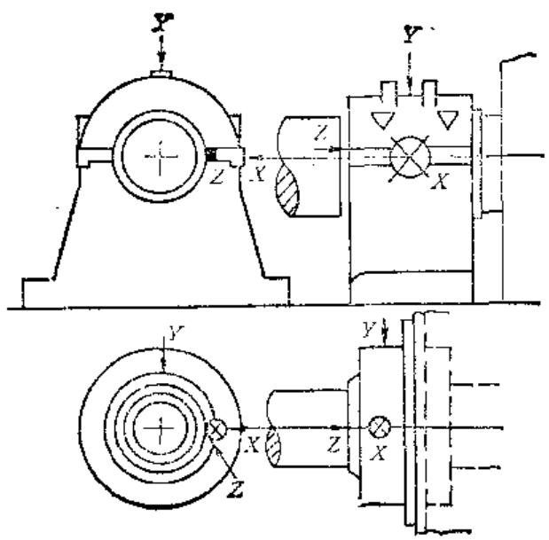  
图16-2-3 测定位置和测定方向的例子

在那种情况下，可在水平与轴向或垂直与轴向两个方向上测定。特别是如后面所讲的测定高频振动时，也可以只在最容易测定的方向上进行，（一般为垂直方向）。其理由是，可以认为滚动轴承所产生的振动是在所有方向上传播的。

（2）测定参数根据异常的种类，滚动轴承所发生的振动包含  $1\mathrm{kHz}$  以下频率成分的振动（低频振动时可参照表16-2-6中序号  $1\sim 10$ ），和数千赫乃至数十千赫频率成分的振动（高频振动可参照表16-2-6中序号  $11\sim 15$ ），或者同时包含上述两类成分的振动。利用包含这些频率成分的振动进行诊断时，应根据哪些参数为宜呢？

这里，介绍一种可用来确定测定参数的线索，即美国齿轮制造协会（AGMA）所提出的预防损伤曲线（图16-2-4）。利用AGMA的这种预防损

伤曲线，可根据如下的有关测定参数加以连结表示最近似（实际）的情况。也就是，在机械（此时为滚动轴承）发生的振动频率中，在低频域（10Hz以下）内以振动的一定位移级作为诊断的判定标准，中频域（10Hz乃至1kHz）内以一定速度级作为诊断的判定标准，而高频域（1kHz以上）内则以一定加速度级为诊断的判定标准。

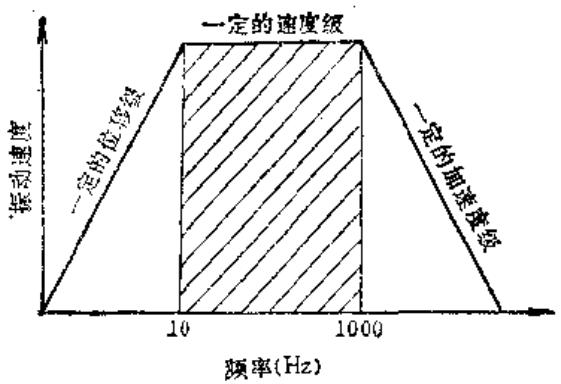  
图16-2-4 预防损伤曲线

所以，当利用振动进行滚动轴承的简易诊断时，通常选用振动速度和振动加速度作为测定参数。当进行实际测定时，为了对振动速度在  $1\mathrm{kHz}$  以下，振动加速度在  $1\mathrm{kHz}$  以上的频率成分也能进行诊断，可利用滤波器等只取出各种必需的频率成分。特别是测定振动加速度时，为了去掉其它机械振动的频率成分，多数将测定频域设定在  $10\mathrm{kHz}$  以上。

但是，这里必须注意，利用振动速度和振动加速度所能检测出来的异常种类是不同的。用各类参数所能检测出的异常种类请参阅本章第3节。

（3）测定周期 为了发现处于初期状态的异常，需要进行定期测定。很重要的一点是，规定的周期应不致于忽略严重的异常情况，并尽可能缩短（周期）。  
（4）简易诊断的原理（高频）如果滚动轴承的内外环和转动体有损伤，则由于轴的旋转，这些零件在接触过程中会发生机械冲击。这时，会产生被称为冲击脉冲的变动幅度极大的力（图16-2-5a）。

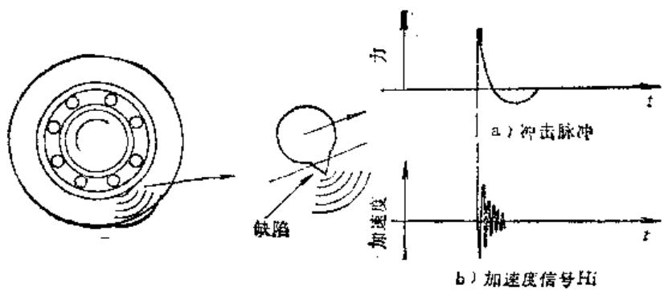  
图16-2-5 振动轴承冲击振动发生的原理

如异常处在初期阶段，此冲击脉冲的增大是与异常程度成正比的。如能测出这种振动，便可得到如图16-2-5b所示的高频衰减振动波形（此时的频率是轴承的固有振动频率）。所以，轴承的损伤可根据振动加速度进行检测诊断。

振动加速度的振幅大小和异常程度成比例。所以，或者用图16-2-6a所示的冲击波形最大值 $(P)$ ，或者用如图16-2-6b所示将冲击波形以绝对值处理后的波形平均值（A），用哪一种进行异常判定时基本都是一样的。但考虑到指示值的稳定性，通常根据均值来诊断。然而，轴的转速较低 $(300\mathrm{r / min}$  以下）时，均值很小，据以判定正常或异常时很困难。在这种情况下，可根据最大值进行诊断。

还有，将最大值和均值组合在一起，即利用

$(P / A)$  值，也可以判别异常的大概原因（判定异常原因的详细方法，将在下节说明）。如图16-2-7a，  $(P / A)$  值大时表示轴承有损伤；又如图16-2-7b，  $(P / A)$  值小时则表示发生了润滑不良和磨损等异常。

对于这些异常，如其发展会产生低频振动，就必须予以注意。此外，因高频振动特别易受测定位置的影响，故应在机械接触良好、刚性高的部位进行测定。

（5）判定标准 为了判定滚动轴承是否正常，要以所测定的振动的振幅为根据；而为了作出判定，又必须有标准加以对照。有了判定标准，才能知道测定值是表示设备（现为滚动轴承）状态良好，还是必须对其注意监测，或者继续使用下去将会招致设备重大事故等等。标准是用来作出定量判断的。

判定的标准大致分为以下两种：

1）绝对值判定标准。  
2）相对值判定标准。

所谓绝对值判定标准，是将同一部位测定的量值（不加变动）本身作为评价的判定标准。所谓相对值判定标准，是将几个判定值或和给定值进行比较的标准。

作为判定方法，有将同型号轴承在相同条件下的测定值作比较的互相判定法，和在同一位置定期进行测定，以测得值同正常值（初始值）对比的倍数作为判定依据的相对判定法。上述以绝对值为判定标准的方法，也称为绝对判定法。

这里有一点是必须注意的，即适用于所有轴承的绝对值判定标准是没有的。所以，从维修的角度最好是兼用绝对值判定标准和相对值判定标准，从两个方面进行研究。

（6）简易诊断的注意事项为了正确地进行滚动轴承的简易诊断，在此将前面讲过的重要

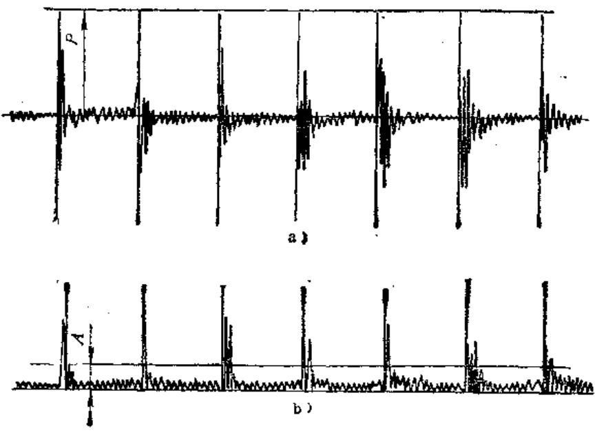  
图16-2-8 冲击振动的最大值和均值

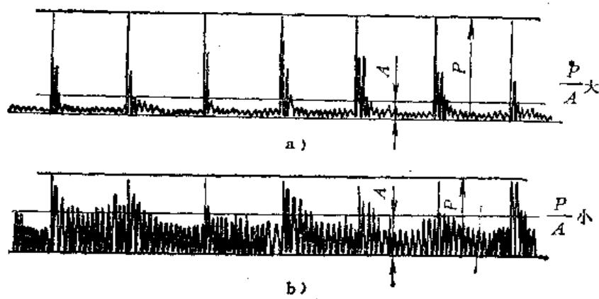  
图16-2-7 各种损伤所引起的滚动轴承的冲击振动

事项和应注意的问题归纳如下：

1）由于滚动轴承的异常种类的不同，会产生低频和高频振动。因此，对滚动轴承进行诊断时，对低频振动用速度进行测定，对高频振动则用加速度进行测定，要点则是根据两者的结果进行诊断。  
2）测定部位以轴承座最为理想，测定振动速度时要注意测水平、垂直、轴向三个方向，测定振动加速度时则测定三个方向中的任何一个均可。  
3）如果只根据绝对值判定标准或相对值判定标准来判定维修的需要并加以实施，这是不可靠的，应尽可能参考两个判定标准。此外，对于不露在外面的特殊减速器等轴承座，需要根据各自的情况制定出专门的绝对值标准。  
4）再如，假设滚动轴承本体虽然没有异常，但如润滑状态不良，振平的变化会很大，尤其是高频振平。在这种情况下，振动虽然增大，但不要立即判定为异常，而首先要检查它的润滑状态。如发现缺少润滑油，就应在加油（脂）之后再作测定。这时，比较理想的作法是在加油后数小时乃至数天再进行测定。

# 3. 用冲击脉冲解调式轴承故障诊断仪诊断滚动轴承

瑞典的SPM43A和国产的CMJ-1冲击脉冲解调式轴承故障诊断仪的工作原理，是当滚动轴承因损伤或制造装配不良等原因引起周期性冲击时（该周期性冲击近似于矩形脉冲，而且损伤越多越大，冲击也越烈），由于传感器（本身固有频率  $f_{n}$  ）的响应特性，其输出的时域波形将如图16-2-8c，即成为频率为  $f_{n}$  的高频周期性减幅振荡。这类仪表中，该高频减幅振荡信号一般都需经解调、滤波方能成为图16-2-8c，然后再作合适的电量或无因次量（例如dB）显示。

研究表明，按照赫兹理论，这种周期性冲击引起的纵波在轴承材料尚未发生形变之前就以声速向外发射，并具有陡峭的前沿和极丰富的高频频谱。随着材料形变的发生，这种纵波急剧衰减，因此冲击所发射至传感器的冲击脉冲常常极短促，甚至是脉宽不足  $1\mu \mathrm{s}$  的窄脉冲。

当然，轴承中冲击脉冲的强弱不但取决于轴承内损伤的多少和大小，还决定于轴承零件在冲击点的相对线速度，而线速度又取决于轴深的大小及转速。所以即使是表面状况很好的轴承，在几何尺寸及转速不同时，也会有不同的冲击脉冲值，这个值

图16-2-8  
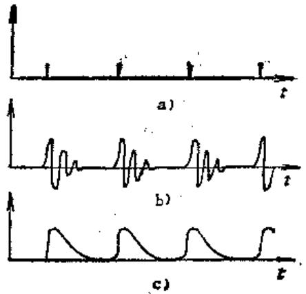  
a）轴承局部缺损引起的冲击b）传感器的冲击响应c）解调后的输出

叫做初始值，记作  $i$  ，以分贝值表示为  $\mathrm{dB}_i$  ，对于滚动轴承，国际上通常用下述关系式来联系  $\mathrm{dB}_i$  与轴承内径  $d(\mathrm{mm})$  和转速  $n(\mathrm{r} / \mathrm{min})$

$$
\mathrm {d B} _ {i} = 2 0 (\lg n + 0. 6 1 \lg d - \lg 2 1 5 0)
$$

换言之，初始值  $i = \frac{nd^{0.61}}{2150}$  是一个经验公式。

冲击脉冲解调方法还规定，当冲击脉冲值（又称冲击绝对值，记作  $SV$ ，其分贝值以  $\mathrm{dB}_{SV}$  表示）高达初始值  $i$  的1000倍，即  $\mathrm{dB}_{SV}$  由初始值升高60dB时，轴承寿命就算终止了。这一国际上通用的规定来自大量的试验和统计，适用于所有的滚动轴承。

由于规格不同，转速互异，各工作轴承的初始值  $i$  （或  $\mathrm{dB}_i$  ）不同，它的千倍值  $SV$  （或  $\mathrm{dB}_{SV}$  ）也不同，就无法对不同规格和工况的轴承作出是否处于同一寿命阶段的评价。为此，规定了一个相对指标，称为故障级（又叫标准级）  $N$  ，其分贝值记作  $\mathrm{dB}_N$  ，它们的关系式为

$$
N = \frac {S V}{i} \qquad \text {即} \qquad \mathrm {d B} _ {S V} = \mathrm {d B} _ {i} + \mathrm {d B} _ {N}
$$

任何滚动轴承，不管规格和线速度如何，只要 $\mathrm{dB}_N$ 相同，就算处于相同的寿命阶段。图16-2-9表达了这类仪器的  $\mathrm{dB}_{SV}$  、  $\mathrm{dB}_N$  示值与轴承损伤和寿命之间的大致关系。根据大量试验数据的归纳，通常认为当  $\mathrm{dB}_N$  值在  $20\mathrm{dB}$  以下时，轴承基本无损伤（或仅有极细小的损伤）而处于良好状态，此时表头指示处于绿区；  $\mathrm{dB}_N$  值在  $20\sim 35\mathrm{dB}$  之间时，轴承已出现了较明显的损伤并处在不断劣化的过程中，此时表头指示进入黄区；  $\mathrm{dB}_N$  在35dB以上时，轴承实际上因损伤过大而进入了破坏期，此时

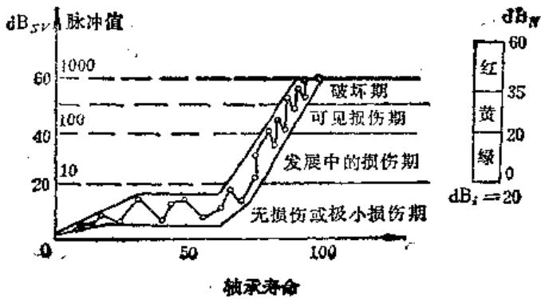  
图16-2-9

表头的指示进入了红区。

表16-2-8所示的就是使用冲击脉冲式诊断仪对某台水泵的4个滚动轴承进行定期状态监察的记录一例。先就表中第二行轴承②的情况作说明：该行记录表明轴承内径  $d = 100\mathrm{mm}$  ，  $n = 1450r / \min$  由此调节度盘知其初始分贝值为  $\mathrm{dB}_i = 20\mathrm{dB}$  。从该年5月2日起，大约每月点检一次，至9月15日，  $\mathbf{dB}_N$  值虽有上升，但均在绿区内。10月3日再点检时，发现  $\mathbf{dB}_N$  值增高，进入黄区。经对设备

检查，发现是转轴外壳摩擦所致。作调整后再测，  $\mathrm{dB}_N$  即回落进入绿区，表明状态正常。同样表中第三行轴承③在11月20日  $\mathrm{dB}_N$  值进入红区，已经损坏，应更换新轴承。而①和④轴承工作良好，始终处于无故障状态。

表中有一项  $\mathrm{dB}_C$  的示值记录。  $\mathbf{d}\mathbf{B}_C$  即“地毯分贝值”，是滚动体与滚道表面因粗糙度而引起的基本背景式脉冲量所对应的  $\mathrm{dB}_N$  读数，即是点检测量时，耳机监听到的脉冲声从连续到不连续交界处的  $\mathrm{dB}_N$  值。通常若  $\mathrm{dB}_C > 10$  (dB)，则轴承可能有因润滑不足的小损伤，或者因设备中泵的气穴现象，机械摩擦，传动齿轮有损伤等。 $\mathrm{dB}_N$  和  $\mathrm{dB}_C$  值都大，意味着轴承有故障。

冲击脉冲仪的检测点应满足以下要求：

1）轴承应带负荷测量，检测点应选在负荷范围之内。  
2）轴承和检测点间的信号过路只能包含一个机械交界面，并为紧密结合。在信号传递经过的物体上，有其它轴承安装在其上时，不宜使用此法检

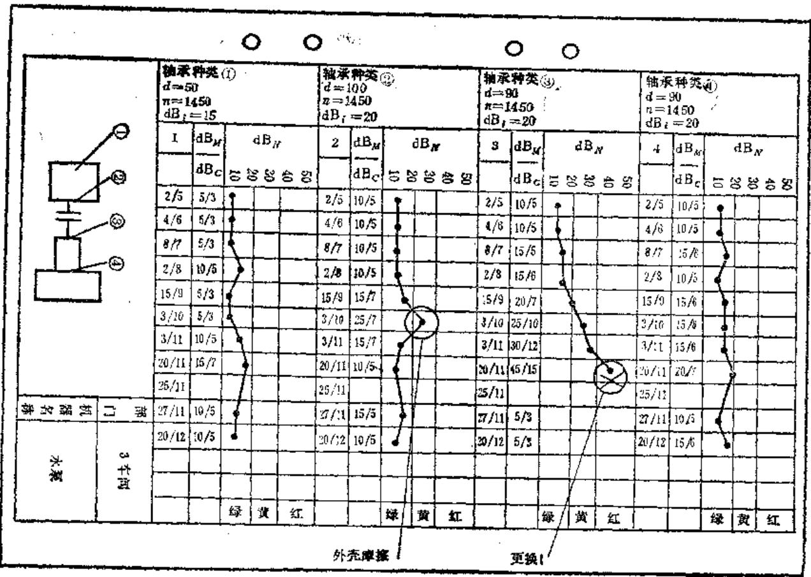  
表16-2-8 用CMJ冲击脉冲故障诊断仪点检和监察轴承的记录

测。金切机床的很多部位不大容易满足测试条件。

3）轴承和检测点间的距离应尽可能靠近。

金属切削机床，特别是精加工机床的轴承（主轴轴承）在所反映的读数还较低时，有些机床已出现了明显的精度下降，这一般是由于正常磨损而影响了精度。因此，不能绝对依赖脉冲仪上所表示的红、黄、绿三个区间，但也不能否认其价值。有时，要针对不同的设备进行不同的读数评定。

# 4. 滚动轴承的精密诊断法

如果滚动轴承发生异常，会产生其频率如本节所说的振动[见（四）小节第1点]。精密诊断是抓住各种异常所特有的频率来探明异常原因。下面，分别说明对于各频带的精密诊断方法。

（1）利用低频振动的精密诊断如简易诊断中所述，诊断滚动轴承构造上的异常时，要根据测定的振动速度加以分析。下面，按图16-2-10加以说明。由加速度振动传感器触头测出振动加速度的电信号，经电荷放大器再通过积分器得出振动速度，然后再通过  $1\mathrm{kHz}$  的低通滤波器，对除去高频成分后的信号进行频率分析。

其中的一例如图16-2-11a所示，内环有波纹

时出现如图b的振动。所以，将这个振动加以分析后可知包含有如表16-2-6序号  $4\sim 7$  的频率成分，由此结果可了解异常的原因。

但是，当旋转机构有异常（不平衡，不同轴等）时也会产生低频振动，在查明原因时应予充分注意。

（2）利用高频振动的精密诊断 如滚动轴承有损伤，会发生高频振动。利用这个领域可以判明异常的原因。

图16-2-12所示为诊断程序。用加速度计测出振动加速度，经电荷放大器后再通过  $1\mathrm{kHz}$  的高通滤波器，只抽出高频成分。然后，将这个经过滤波的波形作绝对值处理。

经过上述处理，在冲击振动波形间隔中所表示的各种异常特征，将在振动的频率成分中得到反映。

按图16-2-13所示的状态。根据绝对值处理后的波形进行频率分析，可以判明各种异常的原因。有关各种异常的频率成分，请参阅表16-2-5。

滚动轴承有点蚀时所产生的频率（严格地说是冲击振动的间隙），并不是旋转频率的整倍数，如图16-2-14所示，它和旋转轴的间转信号之间的关

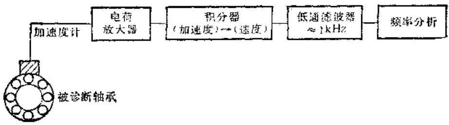  
图16-2-10 滚动轴承的简易诊断程序（低频域）

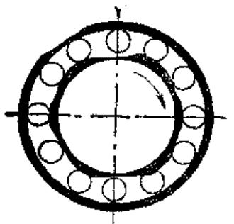  
a）内环的波纹  
图16-2-11 内环有波纹时的振动

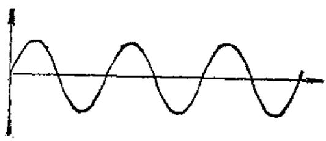  
6）发生的振动

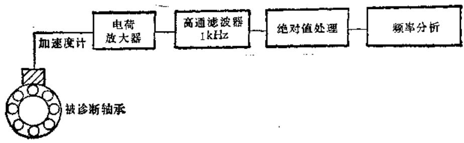  
图16-2-12 滚动轴承的精密诊断程序（高频域）

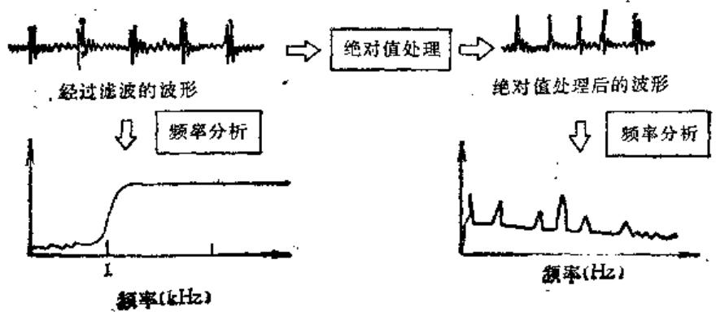  
图16-2-13 振动波形的绝对值处理

  
图16-2-14 相位分析

系不是一定的。

通常，旋转机械发生异常时这些位置关系是一定的，因此，能将滚动轴承的异常和旋转机械的其它异常区别开来。一般，将这种位置关系称为相位，而这种分析方法则称为相位分析或同步分析。

图16-2-15所示为进行精密诊断的实例。频率分析的结果是： $n z f_{0} (n = 1, 2, 3 \cdots)$  为与之相对应的旋转频率  $f_{0}$  的3.03倍，6.06倍，等频率的振动；又由相位分析可知，相位不是一定的。由此可得出滚动轴承的外环有点蚀的诊断结论。拆开轴承检查，发现外环发生了剥落。

作为滚动轴承的诊断法，除频率分析、相位分析之外，还有其它几种有效的诊断方法。这里只介绍其中的典型方法。如图16-2-16所示，滚动轴承有损伤时即产生冲击振动。

在此振动中，冲击波型的高度和非冲击波部分高度比值的大小，可以用作表示滚动轴承损伤程度的指标。

具体的方法有：简易诊断中所述的计算出最大值和均值之比的方法，或如图16-2-17所示运用振幅的概率密度，冲击波的最大值和非冲击波部分的振平直接进行比较的方法等。

<table><tr><td colspan="2">精密诊断结果</td></tr><tr><td>测定日期
S51.8.10</td><td>诊断者
×××</td></tr><tr><td>设备名称
第一台剪断机</td><td>机械名称
电动发电机组
(电动机)</td></tr><tr><td colspan="2">诊断时的状况
电动机运行中发生异音,进行了精密
诊断,与此同时对电动机的机械异常
进行了诊断.</td></tr><tr><td colspan="2">○滚动轴承+测定位置
○滑动轴承H水平方向
○联轴节V垂直方向
A轴向方向</td></tr></table>

<table><tr><td>振动原因</td><td></td></tr><tr><td>控制盘侧轴盘:</td><td>强制振动_</td></tr><tr><td>(6322)外环有伤</td><td></td></tr><tr><td>产生异常振动</td><td>共振_</td></tr><tr><td>另一侧的轴承</td><td></td></tr><tr><td>(NU322)内环有伤</td><td>自振_</td></tr><tr><td>产生异常振动</td><td></td></tr></table>

<table><tr><td>必要的处理对策</td></tr><tr><td>控制盘侧轴承(6322)虽在标准值的“注意”范围内,但异常振动很明显,最好予以更换</td></tr><tr><td>另一侧的轴承(NU322)已超过标准值,最好立即更换</td></tr></table>

测定和分析方法  

<table><tr><td>使用测定仪器</td><td>分析方法</td></tr><tr><td>传感器名</td><td>20dB</td></tr><tr><td>加速度计4343</td><td>20dB 1:1</td></tr><tr><td>数据记录器</td><td rowspan="2">记录器1-CHP 1:ABS</td></tr><tr><td>R-200</td></tr><tr><td>1分析器</td><td rowspan="2">1分析</td></tr><tr><td>UA-6B</td></tr><tr><td>旋转机械诊断装置</td><td></td></tr></table>

<table><tr><td>设备状况图</td><td>主要规格</td></tr><tr><td>制备示例</td><td>转速</td></tr><tr><td>①6322</td><td>1800rpm</td></tr><tr><td>①6322</td><td>②NU322</td></tr></table>

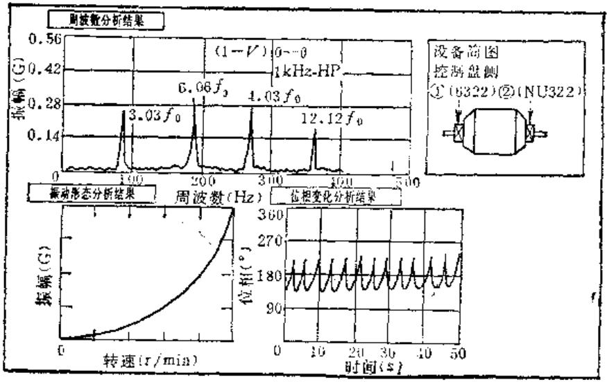  
图16-2-15 滚动轴承精密诊断的例子

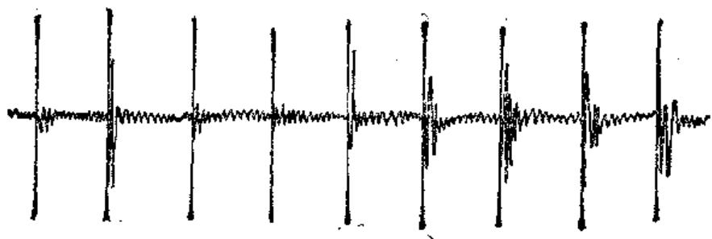  
图16-2-16 滚动轴承产生的冲击振动

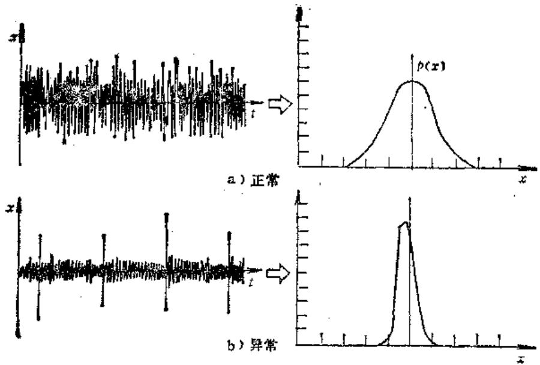  
图16-2-17 利用概率密度诊断冲击特性

# 第3节 齿轮的诊断

# （一）齿轮异常的类型和原因

齿轮异常的类型和原因列于表16-3-1。

表16-3-1 齿轮异常的类型和原因分析  

<table><tr><td></td><td>1.持续重载</td><td>2.撞击载荷</td><td>3.对中不良</td><td>4.润滑不足</td><td>5.油封不完善</td><td>6.制造和材料缺陷</td><td>7.齿轮设计不正确</td><td>8.操作不当</td><td>9.安装不当</td><td>10.环境温度过高</td></tr><tr><td>A.齿面剥落</td><td>接触应力增大造成疲劳</td><td></td><td>增加疲劳损伤的可能性</td><td></td><td></td><td>材料过软、晶粒过大、排列不良可能引起齿面剥落</td><td>齿轮几何曲线不良造成应力过高</td><td></td><td></td><td></td></tr><tr><td>B.滑动方向上擦伤</td><td></td><td></td><td></td><td>油膜强度不足,会引起金属滑动接触</td><td></td><td>表面粗糙度过高,引起油膜破裂</td><td></td><td></td><td>侧隙不当能造成齿轮失效</td><td>可能造成泄漏破裂</td></tr><tr><td>C.齿面上局部和外廓线上有疲劳裂纹</td><td></td><td>可能超过弯曲应力允许值</td><td></td><td></td><td></td><td></td><td>运行状态下弯曲应力不足</td><td></td><td></td><td></td></tr><tr><td>D.齿尖断裂</td><td></td><td></td><td>引起过大的局部弯曲应力</td><td></td><td></td><td></td><td></td><td></td><td>使齿轮的对中不良</td><td></td></tr><tr><td>E.齿轮上有裂纹</td><td></td><td></td><td></td><td></td><td></td><td>热处理不良</td><td></td><td></td><td></td><td></td></tr><tr><td>F.向轮毂方向碎裂和扭曲</td><td></td><td>明显严重时会损坏齿轮本体</td><td></td><td></td><td></td><td>齿轮体太薄、心部太软造成损坏</td><td>齿轮体厚度不足</td><td></td><td></td><td></td></tr><tr><td>G.齿顶上有辊压、撞击引起的波浪形隆起</td><td>引起塑性流动</td><td></td><td>可能有局部的塑性流动</td><td></td><td></td><td></td><td></td><td></td><td></td><td></td></tr><tr><td>H.表面变粗糙、有细微压痕、齿侧磨损</td><td></td><td></td><td></td><td></td><td>金属杂质可能造成轮齿磨料磨损</td><td></td><td></td><td></td><td></td><td></td></tr><tr><td>I.齿面腐蚀造成锈斑和点蚀</td><td></td><td></td><td></td><td>润滑油中的腐蚀性介质和氧化物可能侵蚀齿面</td><td>由于水一类的杂质引起的腐蚀损坏表面</td><td></td><td></td><td></td><td></td><td></td></tr><tr><td>J.齿轮温升、变色和软化</td><td></td><td></td><td></td><td>散热能力不足</td><td></td><td></td><td></td><td></td><td></td><td>变成散热困难</td></tr><tr><td>K.齿面上有刻痕、凹痕和划痕</td><td></td><td></td><td></td><td></td><td></td><td></td><td></td><td>粗糙和错误的操作可能引起损伤</td><td></td><td></td></tr></table>

# （二）齿轮的诊断原理

本节介绍利用振动进行齿轮的诊断时所必需的基础知识、齿轮旋转机构和由齿轮所产生的振动的种类及特点。本节主要介绍直齿圆柱齿轮。

# 1. 齿轮旋转机构

（1）齿轮的啮合 图16-3-1所示为一对齿轮副，大、小齿轮互相啮合，旋转时大齿轮的齿1与小齿轮的齿A相啮合，进行到大齿轮的齿2与小齿轮的齿B相啮合为止的时间称为啮合周期。啮合周期的倒数称为齿轮的啮合频率。

图16-3-1 齿轮副  
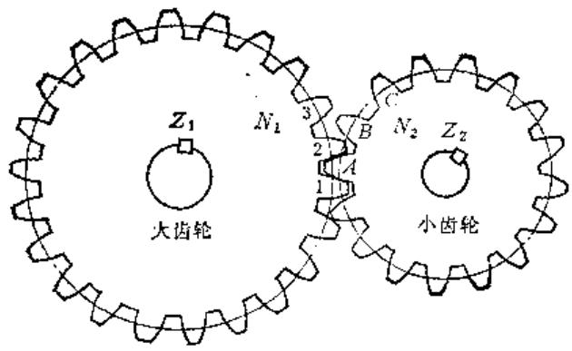  
Z1一大齿轮齿数  $Z_{2}$  一小齿轮齿数  $N_{1}$  一大齿轮转速(rpm）  $N_{2}$  小齿轮转速(rpm)

啮合频率  $f_{m}$  的表达式为

$$
f _ {z} = Z _ {1} \times \frac {N _ {1}}{6 0} \quad (\mathrm {H z})
$$

或  $f_{n} = Z_{2}\times \frac{N_{2}}{60} (\mathrm{Hz})$

式中，  $Z_{1}$  为大齿轮的齿数，  $N_{1}$  为大齿轮的转速（  $\mathrm{rpm}$  ），  $Z_{2}$  为小齿轮的齿数，  $N_{2}$  为小齿轮的转速（  $\mathrm{rpm}$  ）。如  $Z_{1}, Z_{2}$  未知，可由下式求出：

$$
Z = \frac {D}{m}
$$

式中  $D$  ——齿轮的节圆直径；

$m$  ——模数。

（2）齿轮发生振动的原理 齿轮是传递动力的机械元件，传动力由齿面承受。当齿面被加上了这个传动力时，可以认为齿相当于悬臂梁，微观可作为弯曲变形来考虑，其原理如图16-3-2所示。

齿的挠度  $\delta$  包括由弯曲力、剪力、径向压力使齿面沿法线方向产生的挠度  $\delta_{1}$  和齿根部的挠度  $\delta_{2}$ ，其表达式如下：

$$
\delta = \delta_ {t} + \delta_ {z}
$$

  
图16-3-2 齿轮所承受的力

另外，有的齿轮因轮齿相互接触而产生接触应力，因而除  $\delta$  外还出现挠度  $\delta_{\bullet}$  。

对齿轮进行仔细观察时可发现，在某一瞬间有一对齿在啮合，有时则有两对齿在啮合。如果一个齿轮的受力是一定的，可认为一个齿所受的力有时为1，有时为  $\frac{1}{2}$ 。

所以，前述各项挠度的综合值也随之而变化。对于这种情况，可以认为是整个齿轮的弹性刚度在变化。

当齿轮旋转时，一个齿所承受的传递力作周期变化。由于这种变化具有冲击性，故轮齿产生振动，这便是轮齿发生振动的基本原理。在图16-3-3上，表示了加在轮齿上的力、齿的挠度及齿轮发生的振动。

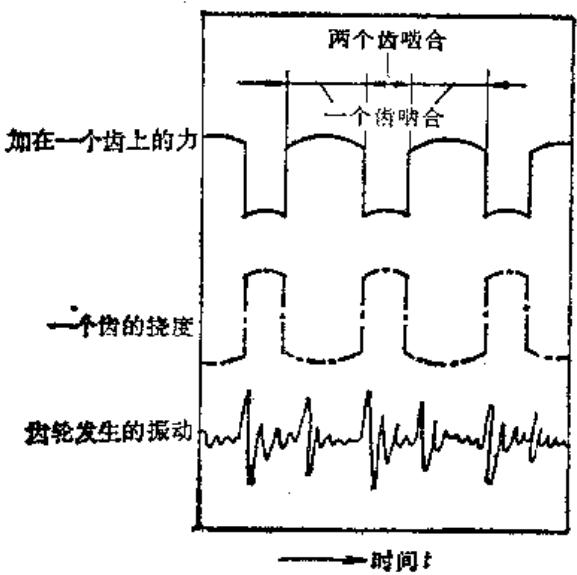  
图16-3-3 齿轮发生振动的原理

# 2. 齿轮造成的振动

如前所述，齿轮因作旋转运动或由于轮齿啮合而产生振动。对齿轮的诊断，便是靠抓住这些振动

的变化来进行的。因此，搞清楚由齿轮产生的振动现象是齿轮诊断的第一步。下面讲一下齿轮啮合时所发生的振动，和齿轮异常振动的特点。

（1）齿轮的固有振动 齿轮啮合过程中产生的振动基本上如图16-3-3所示，它是轮齿承受冲击载荷时发生的自由振动。实际的振动是衰减振动，为了简化起见，这里不考虑衰减而只考虑齿的固有振动。

固有振动（自由振动）在齿轮处于正常和异常状态下时都产生。根据齿轮的振动形态，能对齿轮作出诊断。所以，对齿轮进行诊断时必需知道固有振动频率。

求固有振动频率的方法有几种，这里只介绍其中的典型例子。图16-3-1所示的一对齿轮的固有振动频率  $f_{\circ}$  可由下式求出：

$$
f _ {o} = \frac {1}{2 x} \sqrt {\frac {K}{m}}
$$

上式， $\pmb{\pi}$  和  $\pmb{K}$  为齿轮副的等效质量和弹簧常数。这些计算方法在图16-3-4～16-3-6上关于固有振动频率的计算流程中一并表示，实际的自由振动频率比固有振动频率稍低。

但是，能够适用这种计算法的仅限于直齿圆柱齿轮，并且是实心的齿轮。至于其它类型的齿轮的固有振动频率，现在尚无计算公式，尤其是常用的斜齿轮，其弹簧常数的近似计算法尚未确定。

齿轮（齿）的固有振动频率多为  $1 \sim 10 \mathrm{kHz}$  的高频，当这种振动传递到齿轮箱等时，高频冲击振动已衰减，多数情况下只能测到齿轮的啮合频率。

（2）齿轮异常引起的振动 无论齿轮发生了

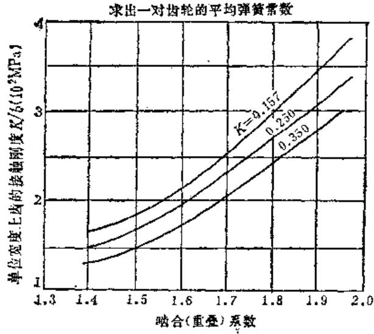  
图16-3-5 齿轮副的平均弹簧常数的计算法

异常或未发生异常，由于齿的啮合，都会发生冲击啮合振动（自由振动），但随着齿轮状态的不同，冲击的大小会有变化。下面将要讲到，抓住这个变化便可查出齿轮发生异常的原因。

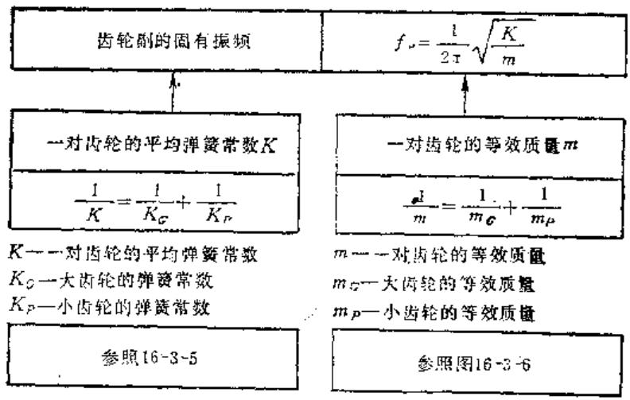  
图16-3-4 齿轮副的固有振动频率计算流程

当齿轮所有的齿均匀磨损而使齿隙增大时，会造成或者一端接触，或者在齿面上有裂痕、点蚀、剥落等损伤，则如图16-3-7所示，因啮合而产生的冲击振动的振幅（固有振动频率成分）和其它振动成分相比是非常大的。并且，冲击振动的振幅具有几乎相同的振平。如前所述，此时发生的冲击振动频率为  $1\mathrm{kHz}$  以上的高频。

与此同时，正弦波中低频啮合的频率成分也增大。此外，随着磨损的发展，齿的刚性（弹簧常数）表现

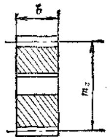  
a）

$$
m _ {i} = (1. 8 2 m z _ {i}) ^ {2 b _ {i}} \times 1 0 ^ {- 1 6} (\mathrm {k g} \cdot \mathrm {s} ^ {2} / \mathrm {m m})
$$

$$
i = G _ {1} P
$$

$m$  一模数

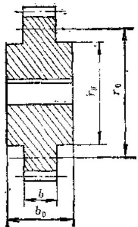  
#

$$
m _ {i} = m _ {a i} + m _ {a i}
$$

$$
m _ {a i} = (1. 8 2 m z _ {i}) ^ {2} b _ {i} \times 1 0 ^ {- 1 0} (\mathrm {k g} \cdot \mathrm {s} ^ {3} / \mathrm {m m})
$$

$$
m _ {o i} = \frac {\pi p}{4} \times \cdot \frac {\left(b _ {o i} - b _ {i}\right) ^ {2}}{r _ {g i} ^ {2}} r _ {o i} ^ {2} (\mathrm {k g} \cdot \mathrm {s} / \mathrm {m m})
$$

$$
i - G, P
$$

$$
m - \text {密 度} (k g \cdot s ^ {2} / m m ^ {4})
$$

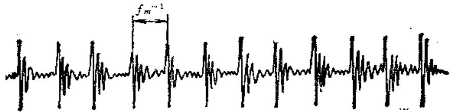  
图16-3-6 齿轮副的等效质量计算法（根据应用机械工学）

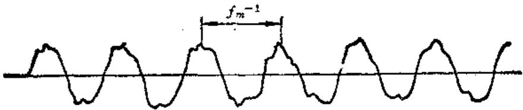  
图16-3-7 齿轮磨损后引起的振动（高频） $f_{\mathrm{m}}$  一啮合频率  
图16-3-8 齿轮磨损后引起的振动（低频） $f_{\text{基}}$  一啮合频率

出非线性的特点，振动波形作如图16-3-8所示的变化，在频率成分中产生出为啮合频率2倍、3倍……的高次谐波或为其  $1 / 2$  、  $1 / 3$  ……的分数谐波。还有，在齿轮加减速时有时也会出现如图16-3-9所示的具有非线性振动特点的跳跃现象。

当齿轮有偏心或齿距误差时，高频域的振动波形如图16-3-10所示，啮合的冲击振动的振幅偏移，或者有齿距误差的齿轮成为受旋转频率调制的波形。所以，高频振动的绝对值处理波形（后面将详加说明）包含旋转频率的一次  $(f_0)$  和高次谐波

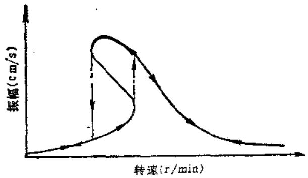  
图16-3-9 跳跃现象

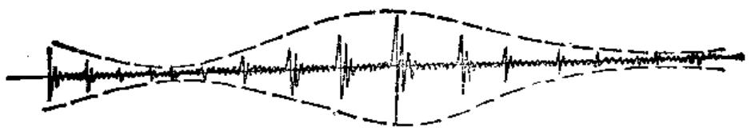  
周节有误差的齿轮的旋转  
偏心齿轮的旋转

<table><tr><td>发生频率</td><td>内容</td></tr><tr><td>fz±nfo(波形处理后)</td><td>啮合频率成分分为偏心或周节误差的旋转频率的调制</td></tr><tr><td>fo(波形处理后)</td><td>如有周节误差,旋转角速度发生变化,产生类似敲击的现象.</td></tr></table>

$(n f_{0}, n = 2, 3, \cdots)$  成分、啮合频率  $(f_{z})$  成分及其边带  $(f_{z} \pm n f_{0})$ 。

对于低频域的啮合频率成分，情况也是一样，在振动的原波形中包含旋转频率成分、啮合频率成分和边带波。

当齿轮不同轴时，会发生低频、高频的啮合频率及其边带波（高频振动经绝对值处理后）。图16-3-11所示为低频域振动波形。

  
图16-3-11 轮轴不同轴时的振动（低频）  
$f_{\text{一}}$  唾合频率

当存在如图16-3-12所示的轮齿折损、局部的齿面磨损等局部异常时，会在高频域发生如图16-

3-13 所示的振动。这是因为只有异常齿在啮合时才产生较大的冲击振动，经绝对值处理后的波形中含有更多的旋转频率成分。

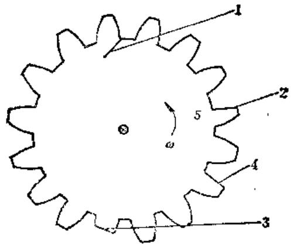  
图16-3-10 有偏心、周节误差的齿轮发生的振动（高频）  
图16-3-12 齿轮的局部异常

1—齿根都有大型纹2—局部的齿面磨损3—缺陷造成齿折断4—局部的周节误差、齿形误差5—齿轮间隙增加时转速的变动

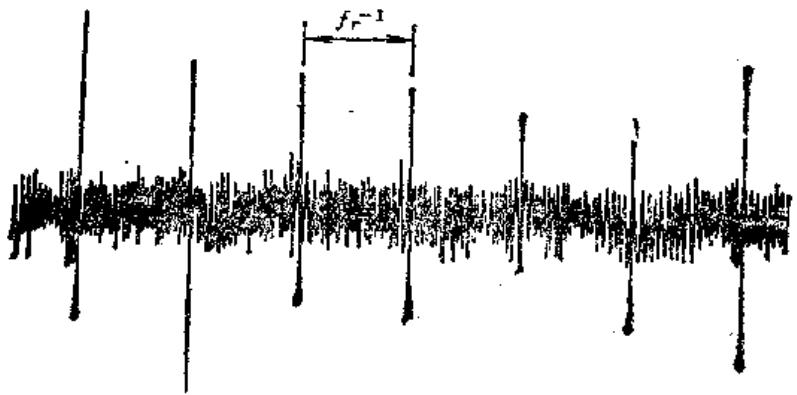  
图16-3-13 局部有异常的齿轮发生的振动（f一啮合频率）

图16-3-14 高速旋转齿轮发生的振动  
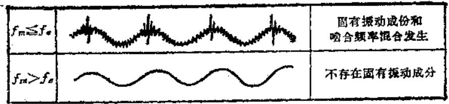  
$f_{\text{一}}$  一啮合频率  $f_{\text{一}}$  一齿轮的固有频率

由此可见，齿轮会产生低频、高频两个频域的振动，如果齿轮有异常，则每个频域都会出现变化。

（3）高速旋转齿轮发生的振动 高速涡轮增 速机中所用的齿轮，其啮合频率高达  $5\mathrm{kHz}$  以上， 这是非常高的频率，随着情况的不同，齿的固有频 率有时向上移动。在常速齿轮所发生的振动中，有 如图16-3-14所示的冲击的固有振动成分和正弦波 的啮合频率成分。

然而，当啮合频率比齿的固有频率高时，就不存在固有振动成分而只发生啮合频率成分。所以，发生的振动频带只有高频域，振动也不只是冲击性的，而是平滑的啮合频率的正弦波振动。

# （三）齿轮的诊断法

# 1.齿轮的简易诊断法

（1）作为诊断对象的齿轮及测定部位 利用振动对齿轮进行诊断时，能作为对象者主要是转速在  $100\mathrm{r / min}$  以上的齿轮，如图16-3-15所示，有如下几种：

1）直齿圆柱齿轮  
2）斜齿圆柱齿轮  
3）人字齿轮  
4）直齿锥齿轮

蜗轮不能作为利用振动诊断的对象。对于（1）～（4）四种齿轮，简易诊断的项目主要是齿轮的偏心、周节误差、齿形误差、齿面磨损、齿根部较大的裂纹等，抓住齿轮啮合所发生的异常现象来进行诊断。

实际进行齿轮诊断时，其测定部位是普通减速器的轴承座盖，对于高速增速器等，如轴承座在机罩内部，则选择轴承座附近刚性好的部位，或测量基础的振动。

但是，若传感器的安装位置（测定点）不同，得到的测定值便有差异，为了保持每次测定的部位不变，需要作出记号。此外，如测定部位安排在钢

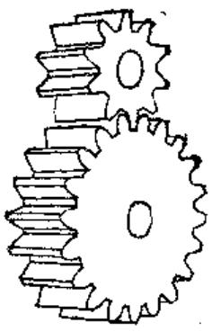  
a）直齿圆柱齿轮

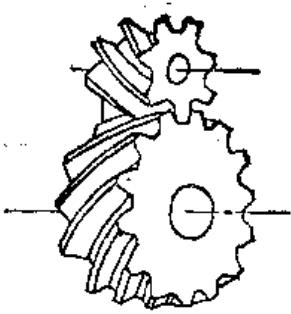  
b)斜齿圆柱齿轮

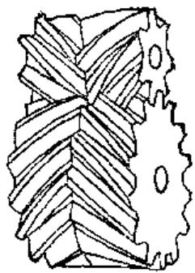  
c）人字齿轮  
图16-3-15 作为简易诊断对象的几种齿轮

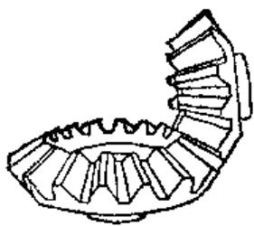  
d）直齿锥齿轮

铁件上，测定部位的表面应是光滑的。齿轮发生的异常是各种各样的，随着异常种类的不同，发生最大振动的方向也不同。

按表16-3-2所列位置进行测定时，应尽可能地沿水平、垂直、轴向三个方向进行测定。

表16-3-2 测定齿轮振动的部位  

<table><tr><td>轴承的设置状况</td><td>测定部位</td><td>对象设备举例</td></tr><tr><td>轴承座在外面</td><td>轴承座</td><td>通常的减速器</td></tr><tr><td>轴承座在内部</td><td>轴承座上刚性好的部位或基础</td><td>高速用增速器</td></tr></table>

如根据设备的结构或安全方面的要求不能在三个方向上测定，那末，由于水平方向和垂直方向发

生的振动大致相同，故可取其中之一再加上轴向，在此两个方向上测定。特别是高频振动，它在所有的方向上同样传递，利用这种频率的振动进行诊断时，只取最容易测定的方向就可以了。

（2）测定参数 前面已经讲过，齿轮发生的振动中有  $1\mathrm{kHz}$  以上的高频固有振动，和齿轮的旋转频率或与啮合频率相关的低频振动。

利用包含这种宽频带频率成分的振动进行诊断时，要把所测的振动按频带分类，然后根据各类振动进行诊断。美国齿轮制造协会（AGMA）推荐，在诊断中利用如图16-2-4与预防损伤曲线相对应的测定参数，即振动频率在  $10\mathrm{Hz}$  以下时，将振动的一定位移级作为诊断的判定标准。

对于从  $10\mathrm{Hz}$  到  $1\mathrm{kHz}$  的振动频带，推荐以一定的速度级为判定标准；对于  $1\mathrm{kHz}$  以上的振动，则以一定的加速度级为判定标准。所以，利用振动对齿轮进行诊断时，对于与齿轮的旋转频率或啮合频率相关的低频振动，利用振动速度作为测定参数；对于与固有振动相关的高频振动，则利用振动加速度。

实际进行测定时，对于频率在  $1\mathrm{kHz}$  以下的振动，考虑振动加速度时包括齿的固有振动频率，只采用  $1 - 10\mathrm{kHz}$  的频率，故有滤波的必要。

但是，这里必须注意的是，按振动速度、振动加速度分别检测出的异常种类会有所不同，因此，不应只用一种方法进行诊断，而是要考虑用两种方法同时进行诊断。

（3）测定周期 为了能及时发现处于初期状态的异常，需要定期进行测定。而且，不要忽略那些周期性异常较显著的部位。

测定周期并非总是规定得很死板的，对照判定标准，在处于很正常的情况时可保持固定周期，而当振动增大或达到“注意”范围时，则最好采取缩短周期的对策。此外，作为诊断对象的齿轮的总数也必须增加。

（4）判定标准 齿轮通过振动诊断，是处于正常状态还是发生了异常，需要有判定的标准。根据判定标准，才能知道测定值所表示的是齿轮处于理想状态呢？还是到了必须注意监测的状态，或是表示继续使用下去将会招致设备发生故障和重大事故状态等等。它们是为了定量判断而制订的标准。

判定标准大致分为两种：

① 绝对值判定标准。

$②$  相对值判定标准。

绝对值判定标准，是将在同一部位测得的数值封不动地作为评价的依据。

相对值判定标准，是将多数测定值相互之间或与已定值作比较而进行判定，判定的方法有：将同类型齿轮在相同条件下的测定值进行比较的互相判定法，和对同一部位定期进行测定、按实测值与正常值（初始值）相比的倍数作出判定的相对判定法。

利用绝对值判定标准进行判定的方法，称为绝对判定法。

下面列举各种判定标准。

1）绝对值判定标准。制订齿轮的绝对值判定标准的依据为：

① 对异常振动现象的理论研究；  
② 根据实验对振动现象所作的分析；  
③ 对测得的数据的统计评价；  
④ 参考国内外的有关文献和标准。

图16-3-16~16-3-18为绝对值判定标准的实例。图16-3-16是按振动位移诊断的判定标准的例子，对于频率在  $1\mathrm{kHz}$  以下的振动，表示安装齿轮的旋转轴所发生振动的范围；对于  $1\mathrm{kHz}$  以上的振动，表示安装齿轮轴的轴承座的振动。图16-3-17是按振动速度作出诊断的判定标准例子。

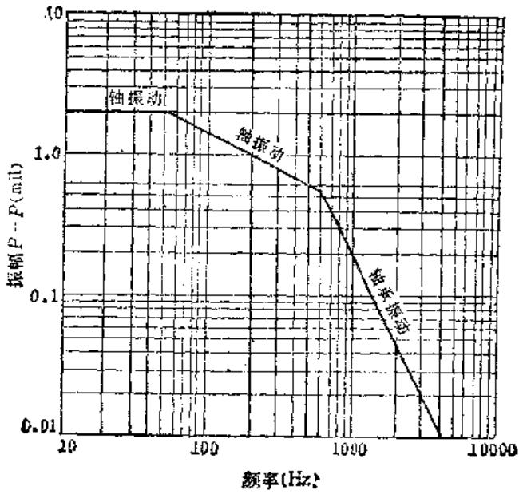  
图16-3-16 按振动位移诊断齿轮异常的判定标准例子（AGMA）

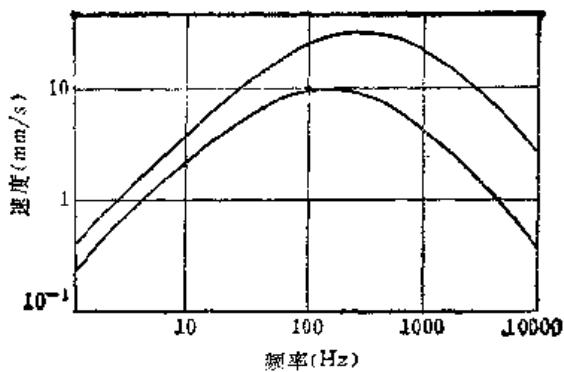  
图16-3-17 按振动速度诊断齿轮异常的判定标准例子

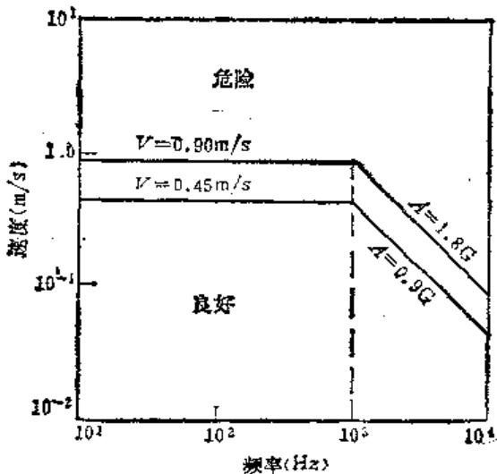  
图16-3-18 考虑振动频率的判定标准例子

由以上两例可知，按一个测定参数对宽频带的振动作出判断时，标准值一定要依频率而改变。

建议使用如图16-3-18的判定标准。这个判定标准对于频率在  $1\mathrm{kHz}$  以下的振动按速度判定，对于  $1\mathrm{kHz}$  以上的振动则按加速度判定。

应该指出，事实上并不存在能适用于一切齿轮的绝对值判定标准。不言而喻，当齿轮的大小或类型不同时，例如直齿圆柱齿轮和锥齿轮，它们的标准是不相同的。

2）相对值判定标准 对于还没有制定出绝对值判定标准的齿轮，适于使用过去的实际统计资料。例如，相对值判定标准规定实测值达到正常值的2倍时要引起注意，达到4倍时则表示危险。此外，若只根据绝对值判定标准就进行维修，则所冒的风险较大，故在通常情况下，以同时参考两种判定标准为宜。

（5）简易诊断的实施方法 测定时必须注意

的是，利用振动加速度测定的  $1 \sim 10 \mathrm{kHz}$  频率是机械的局部共振频域，除齿轮以外，水泵、轴承、电机等也会发生同样频率的振动。特别是使用滚动轴承时，会发生误诊为轴承异常的情况，故应按下述方法进行诊断。

如图16-3-19所示，对齿轮和滚动轴承进行诊断时，A～D各滚动轴承座的测定值如图16-3-20a所示，若所有各值的大小相同，说明齿轮异常（但不能判定齿轮1、2中何者异常）。若4个点上测得的数值中有某个值大于其它值，即表示此值测定部位的滚动轴承异常。图16-3-20b表示轴承C异常。

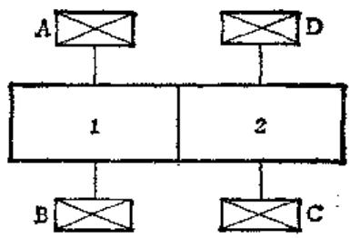  
图16-3-19 类比判定法的例子

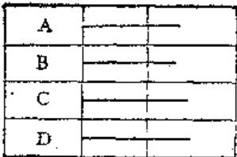  
a）齿轮异常时  
图16-3-20 用类比判定法作出的诊断

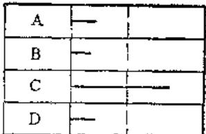  
1、2一齿轮 A、B、C、D一滚动轴承  
b)轴承异常时

还有，齿轮的固有振动频率比滚动轴承要低一些，所以，适当选择测定振动的频域，也能将齿轮和滚动轴承的异常区分开来。

为了提高简易诊断的效率，需要考虑最适宜的数据收集法。测定数据是为了编制作为诊断对象的齿轮的判定标准，它同时又是查明异常原因的重要资料，因此，必须尽可能地详细记载并力求正确。

# 2. 齿轮的精密诊断法

图16-3-21所示是直齿轮的刚度变化。由图可见，轮齿刚度在单齿啮合和双齿啮合的情况下差别很大，几乎是矩形周期函数。由于有齿轮误差  $e_{i}(t)$  和振动幅值  $\pmb{x}$  的影响，由单齿向双齿啮合的实际过渡点不同于理论上的几何过渡点。图中还用点划线表明了摩擦力对弹簧刚度的影响。这种影响

实际上是很微小的。此外，由于齿面的相对滑动速度改变方向，摩擦力也在节点处改变方向，这由图上也可以看到。图16-3-22所示是斜齿轮啮合情况，其刚度幅值几乎呈正弦变化，比直齿轮的小得多。

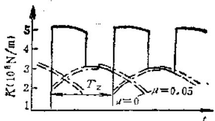  
图16-3-21 直齿轮一对啮合齿的弹簧刚度变化

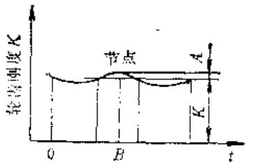  
图16-3-22 斜齿轮一对啮合齿的弹簧刚度变化

如图所示，由于轮齿的弹簧刚度  $K$  是随参与啮合的齿数，即随啮合系数而变化的，一个矩形波可以分解为许多正弦波之和，这些正弦波中，有基频 $f_{\pi}$  、高次谐波  $2f_{\pi},3f_{\pi}$  等。如果齿轮误差  $\varepsilon_{i}(t)$  也含有频率为  $f_{\pi}$  的分量，即以每一个齿为重复周期的误差，则齿轮的振动谱就是以该基频波和高次谐波组成的谱。因此，啮合频率的  $f_{\pi}$  在齿轮箱故障诊断中具有重要的意义。

以下叙述各类故障在频域中的表现，以作为齿轮传动精密诊断时的参考。当某些异常齿轮工作时，齿面上所受的周期冲击力无论其强度和形态都将产生变化，在该力的激励下，齿轮的  $f_{0}, f_{\pi}$  和  $f_{\alpha}$  及其谐频分量都将在综合谱图中发生相应的变化。归纳起来，大致有：

1）当齿轮磨损时，啮合频率  $f_{\mathrm{m}}$  及其谐频分量保持不变，但幅值大小会有所变化，高次频率分量的幅值将明显增大。  
2）当齿廓有变形或齿根有裂纹时，啮合频率  $f_{n}$  的幅值变大，其谐频分量也增加。换言之，将较正常的频谱多出现新的频率成分，这说明时域上冲击脉冲变窄或出现了新的冲击脉冲。  
3）当齿轮中出现断齿时，由于断齿间隔影响了与齿数有关的啮合周期（啮合频率  $f_{\pi}$  的倒数），也因为类似的原因会引起旋转频率  $f_{0}$  和啮合频率

$f_{\bullet}$  及其频率分量的变化。

4）当齿轮（含所在轴）出现平衡不佳，对中不良和机械松动等缺陷时，将出现旋转频率  $f_{0}$  的低次谐波。  
5）当齿轮因在切齿过程中留有切齿时复映的制造误差时，该复映误差的相应频率必反映原加工齿轮机床的某个例如分度蜗轮齿数，即必表现为一个特定的转频谐波，且可能在跑合磨损后降低其幅值。  
6）当齿圈有偏心时，除振幅增大外，将出现以与偏心有关的以转频  $f_{0}$  为低频和以啮合频率  $f_{m}$  为高频的调幅信号，而在谱图上出现  $f_{m} \pm f_{0}$  及其谐频的边频带。  
7）当传动齿轮有角速度（转速）波动时，由于  $\omega = 2\pi f$  ，将出现调频现象。如果齿轮轮齿的节距不等，也同样会产生调频现象而产生边频带。

实际上，由于多个齿轮组成传动链，所反映的总信号相当复杂，是既有调幅，又有调频，还有附加脉冲的综合信号。图16-3-23是为了表示可把总信号分成附加脉冲和调幅两部分的直观表达。类似地当然也可把复杂的总信号分解为调频、调幅和附加脉冲这三部分。

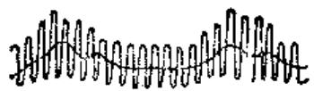  
a）总信号

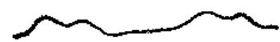  
b3附加部分

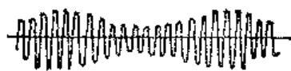  
1 调幅部分  
图16-3-23 将齿轮箱振动信号分解出附加脉冲

此外，谱图上的边频带不象纯调幅和纯调频那样常作对称状。例如当齿轮存在偏心时，在由于齿面载荷变化引起调幅现象的同时，又会因齿轮转速不均匀而引起调频现象。图16-3-24a是考虑相位后的调频谱，b是调频谱上第2，3和4阶边频的调幅谱，c是综合了调频、调幅对三阶边频影响的结果，d、e是两种现象综合影响下在谱图上形成的不对称边频带。

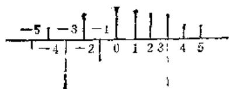  
a）

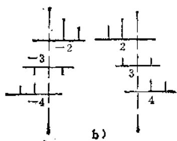

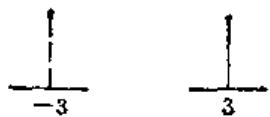  
c）

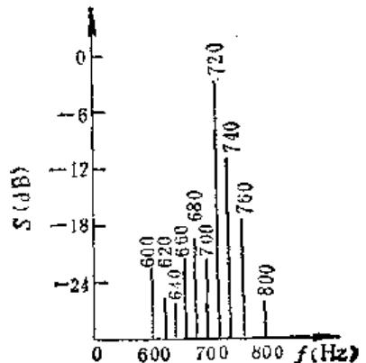  
d）

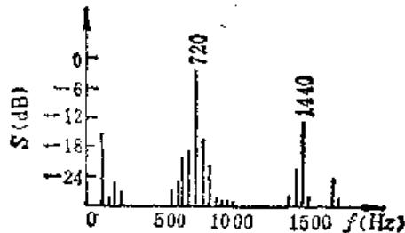  
e）

作为一个具体实例，表16-3-3中表达了从Y3150滚齿机中检测到的总信号（传动误差）的时域波形和谱图的对照，并列出了故障原因。该Y3150滚齿机的传动图见图16-3-25。

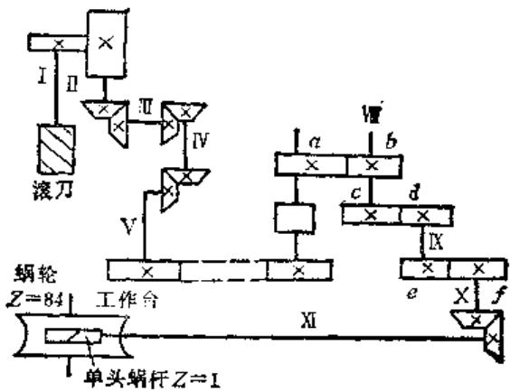  
图16-3-25

总之，齿轮啮合中的缺陷，有局部的，也有均布的。前者发生在一个或数个齿上，例如缺损，变形等；均布缺陷发生在整个啮合周期中，例如由于偏心引起的轮齿载荷不均匀。监察齿轮有无缺陷相对说来是较容易的，但因具有相应频率表现的许多齿轮和许多不同缺陷的传递与叠现，要在一张综合的时域波形或谱图上一一分离判断，就相当复杂了。鉴于倒频谱有能卷积和使谱线定位明确突出的优点，对于复杂齿轮传动系统的多种频率成分的边频带调制信号分析尤其有利，因此，常常成为齿轮箱精密诊断的基本处理手段。

以图16-3-26所示的高速精密车床的床头箱作为齿轮箱的精密诊断实例。

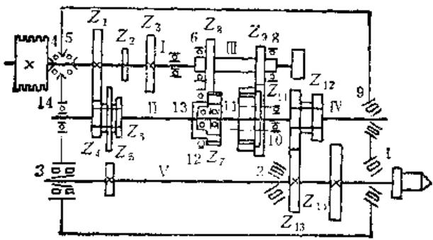  
图16-3-24 由于调幅和调频的综合作用，在谱上形成不对称的边频带  
图16-3-26

诊断目的——确诊各传动件包括传动齿轮、轴承、传动轴以及关联传动件有无设计、制造、装配中的不足，特别是这些不足之处对床头箱-主轴系统振动的影响。

依据——车床整体，床头箱传动图和具体结构的设计、制造、工艺图纸等技术文件。

表16-3-3 常见几种误差运动时频特征一例（Y3150）  

<table><tr><td colspan="3">时域</td><td colspan="2">频域</td><td rowspan="2">故障情况</td></tr><tr><td colspan="2">波形</td><td>主要特征</td><td>谱线分布情况</td><td>主要特征</td></tr><tr><td>1</td><td>t</td><td>1.短周期超差2.短周期变化均匀</td><td>0 1 84 168 f/f</td><td>频次以1,84为主频次168也明显增加</td><td>1.蜗杆轴向窜动2.蜗杆轴弯曲式偏心</td></tr><tr><td>2</td><td>t</td><td>1.少数短周期超差,而且是周期性重复2.大多数短周期合乎标准</td><td>0 1 84 f/f0</td><td>频次以1,84为主,但调制上边带与下边带明显增加</td><td>1.蜗轮连续有几个牙齿因“咬死”而损坏2.蜗轮副安装时碰伤</td></tr><tr><td>3</td><td>0 t</td><td>1.总误差超差2.小部分短周期突跳,但能恢复原来变化趋势</td><td>0 1 84 f/f</td><td>频次以1,84为主,但调制上边带增加</td><td>1.挂轮系松动2.挂轮个别牙齿碰伤</td></tr><tr><td>4</td><td>0 t</td><td>1.出现拍频现象2.短周期超差</td><td>0 1 84 f/f</td><td>频次以1,84,(f1-f2)/2,(f1+f2)/2,f1,f2为主</td><td>轴置,N,V上的两对键齿轮精度下降</td></tr><tr><td>5</td><td>0 t</td><td>工作台一转,平均误差出现三个周期</td><td>0 3 84 f/f0</td><td>频次以3,84为主</td><td>蜗轮加工偏差。蜗轮呈三角形。若是椭圆则出现频次为2</td></tr><tr><td>6</td><td>0 t</td><td>突跳,但不能恢复原来变化趋势</td><td>0 1 84 f/f0</td><td>频次以1,84为主,调制下边带增加</td><td>1.低转速爬行2.齿轮与轴有相对窜动</td></tr><tr><td>7</td><td>0 t</td><td>1.个别短周期突跳2.每个长周期出现的部位不同。无变化规律</td><td>0 1 84 f/f0</td><td>频次以1,84为主,调制上、下边带同时增加,但不明显</td><td>1.挂轮上有杂物2.外界击次影响3.润滑油有杂物</td></tr></table>

实施步骤如下：

1）依次对床头箱的传动件（齿轮、轴承、轴）编号，根据技术文件、图纸或实物（设备）给定的齿数、轴承参数等，计算出各轴的旋转频率  $f_{\theta i}$ ，啮合频率  $f_{\pi i}$  和其它表列的各项特有脉动频率。一般可以先按主轴或挑选的其它主要传动轴为基准计算频次（相对频率），然后乘以实测的某一传动轴的转速来换算得到。

2）根据事先的调查和对对象振动信号的强弱、敏感部位以及疑为故障传动件的关系等的估计，配置和选择测试系统进行试测，调整后进行正式测试。本例中，采取了在床头箱主要是主轴端部处安装加速度计测振的办法，其测试框图如图16-3-27所示。

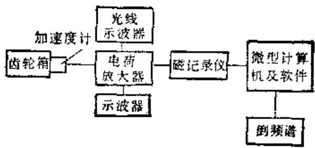  
图 16-3-27

3）在对测振结果经过预处理并证实测试可靠后，按事先计划好的工况（例如不同的转速和传动路线），按适当的取样长度段和适当的采样频率，在尽可能保留模拟记录的同时，将该信号离散化记入计算机磁盘或其它存储器。值得注意的是，对这种有多种变速档次的复杂齿轮箱，设置与某一转轴的机械同步信号经常是必要的。它常常为合理截取样本段，进行多样本段平滑以提高信号纯度所必需。在设备故障诊断中，用机械同步信号截取多个时域信号样本段组成总体，然后进行总体平滑的过程称为同步平均。

4）将所得的对应于一定传动路线的已提纯了的信号送入计算机，进行功率谱和倒谱计算并确定谱峰频率。谱峰频率就是谱图上幅值较高处的频率。若齿轮或其它传动件具有某种缺陷，通常在工作中会引起运转的不平稳，而较正常状态更易于振动、发生噪声、发热……，也就必然要从动力源中获取更多的功率或能量，因此具有某种特有频率的传动件，如该频率处取功率谱或倒频谱的高幅值（谱峰），往往意味着所在频率处传动件体现了故障引起的能量消耗。

5）比较和计算谱峰频率，比照实测谱峰频率和计算所得的特有频率，比照传动件的结构、工艺等寻障并列出寻障指示表。寻障时要综合观察时域波形、功率谱（或幅值谱）和倒频谱等。前者较完整地反映信号的整体频率结构，后者比较清楚地具有分开信号与传递信道的能力，二者不可偏废。考虑时频谱图现状，结合工况、结构、工艺等具体分析，才可作出判断。这一判断具有一定程度的科学性和经验性。当然，如果积累并建立了数据库，知识库，完成了推理系统，这一判断也可在智能化了的计算机辅助下完成。

以经过传动路线  $\frac{Z_{3}}{Z_{6}} -\frac{Z_{7}}{Z_{8}} = \frac{39}{51} -\frac{18}{57}$  为例，列出计算过程和与实质谱峰频率的对照过程：

齿轮  $Z_{8}$  所在轴  $\mathbf{I}$  （参见图16-3-26）的实测转速为  $1364\mathrm{r / min}$ ，即该  $\mathbf{I}$  轴的基本旋转频率为

$$
f _ {0 3} = n _ {f} / 6 0 = 1 3 5 4 / 6 0 = 2 2. 7 3 \mathrm {H z}
$$

因此，  $Z_{3}$  和  $Z_{e}$  的啮合频率同为

$$
\begin{array}{l} f _ {m 3} = f _ {m 6} = Z _ {3} f _ {0 3} = 3 9 \times 2 2. 7 3 = Z _ {0} f _ {0 6} \\ = 8 8 6. 4 9 \mathrm {H z} \\ \end{array}
$$

于是

$$
f _ {0 6} = \frac {8 8 6 . 4 9}{5 1} = 1 7. 3 8 \mathrm {H z}
$$

$Z_{3}$  齿轮的二阶下边带

$$
f _ {m 3} - 2 f _ {0 3} = 8 8 6. 4 9 - 2 \times 2 2. 7 3 = 8 4 1. 0 1 \mathrm {H z}
$$

该二阶下边带恰巧与图16-3-28倒频谱中编号为1的取峰值时的倒频率  $\tau = 1.2ms$  的下列回算频率相近

$$
1 0 0 0 \times \frac {1}{\tau} = 1 0 0 0 \times \frac {1}{1 . 2} = 8 3 3. 3 3 \mathrm {H z}
$$

两者的相对误差仅为

$$
\frac{841.01 - 833.33}{841.01}\times 100\% = 0.91\%
$$

考虑到不可避免的例如齿侧间隙变化和实测转速的误差等因素，可见图16-3-28倒频谱上的第1号谱峰频率确实可以认为是齿轮  $Z_{3}$  所在轴的转频与齿轮啮合频率的二阶下边带。类似地，可以以图16-3-28中的其它编号谱峰频率为序，列出寻障表16-3-4。

由表16-3-4可见：

1）振动主要发生在No.7，No.8，No.12，No.13，No.14各轴承的有关元件上。  
2）齿轮振动主要是  $z_{3}$  及  $z_{8}$  各自啮合时引起的。齿轮  $z_{8}$  的二阶下边带峰值频率指示了齿轮

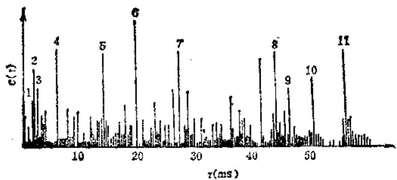  
图16-3-28 齿轮箱振动的倒频谱

表16-3-4 寻障表  

<table><tr><td>序号</td><td>倒频谐峰值(10-8)</td><td>倒频率τ(ms)</td><td>回算频率(Hz)</td><td>计算频率(Hz)</td><td>相对误差%</td><td>说明</td><td>所指示的故障体(含相关件)</td></tr><tr><td>1</td><td>43.03</td><td>1.2</td><td>833.33</td><td>841.01</td><td>0.91</td><td>Z3的二阶下边带</td><td>Z3</td></tr><tr><td>2</td><td>58.19</td><td>1.6</td><td>625.0</td><td>312.84×2</td><td>0.20</td><td>倍频</td><td>Z8</td></tr><tr><td>3</td><td>70.88</td><td>1.8</td><td>555.56</td><td></td><td></td><td></td><td></td></tr><tr><td>4</td><td>85.48</td><td>5.6</td><td>178.57</td><td>97.88×2</td><td>8.8</td><td>倍频</td><td>轴承No.14内环</td></tr><tr><td>5</td><td>75.92</td><td>14</td><td>71.43</td><td>35.57×2</td><td>0.4</td><td>倍频</td><td>轴承No.14滚动体</td></tr><tr><td>6</td><td>104.4</td><td>19.2</td><td>52.88</td><td>13.01×4</td><td>0.08</td><td>4倍频</td><td>轴承No.8外环</td></tr><tr><td>7</td><td>75.21</td><td>24.8</td><td>40.32</td><td>39.31</td><td>2.5</td><td>基频</td><td>轴承No.12外环</td></tr><tr><td>8</td><td>54.92</td><td>42.8</td><td>23.36</td><td>13.01×2</td><td>10.2</td><td>2倍频</td><td>轴承No.17外环</td></tr><tr><td>9</td><td>62.16</td><td>46.0</td><td>21.74</td><td>11.23×2</td><td>4.9</td><td>2倍频</td><td>轴承No.7滚动体</td></tr><tr><td>10</td><td>50.18</td><td>52.0</td><td>19.23</td><td>20.49</td><td>6.1</td><td>基频</td><td>轴承No.13滚动体</td></tr><tr><td>11</td><td>64.07</td><td>58.0</td><td>17.24</td><td>17.38</td><td>0.8</td><td>转频</td><td>轴Ⅱ</td></tr><tr><td>:</td><td>:</td><td>:</td><td>:</td><td>:</td><td>:</td><td>:</td><td>:</td></tr></table>

$z_{3}$  有缺陷。此外，另一传动路线  $(z_{2} / z_{3})(z_{7} / z_{8})$  实测的倒频谱谱峰频率中也出现同一个下边带频率值，指明  $z_{2}$  也有缺陷。  
3）轴  $\mathbf{X}$  的旋转频率处出现谱峰，有可疑之处。

经对该床头箱的结构、工艺（加工和安装）作检查分析后发现：

1）结构上的原因：齿轮  $z_{2}$  和  $z_{3}$  存在缺陷，是因为齿轮箱与皮带轮之间无卸荷装置，致使Ⅰ轴挠曲，不仅造成与Ⅰ轴的中心距发生变化，而且使  $x_{0}$  与  $x_{0}$ ， $x_{1}$  与  $x_{3}$  喷合状态恶化。 $z_{7}$  位于轴Ⅱ的右悬伸端，处于强斜状态，使  $x_{7}$  与  $x_{8}$  喷合状态变坏。  
2）工艺上的原因：经查，花键轴Ⅱ的安装No.12（6308）轴齿轴径处，未注明圆柱度公差，使轴承No.12内环缝轴径形状变形，造成滚动体

与内滚道接触不均匀的冲击振动。  
3）轴上恰装有三联滑移齿轮，花键轴加工时精度规定不高，极易引起三联齿轮的偏心。

值得注意的是，寻隙指示的某传动件振动过大，往往是该传动件的相关零件不良而引起的。

# 参考文献

[1] [日]暨田利夫著. 设备现场诊断的开展方法. 高克勋, 李敏译. 北京: 机械工业出版社, 1985  
[2] 屈梁生，何正嘉编著. 机械故障诊断学. 上海：上海科学技术出版社，1985  
[3] 洪迈生，吴正毅，周汉安主编. 机械工程测试技术. 机械工程师进修大学，1987  
[4] 郑国伟，文德邦主编. 设备管理与维修工作手册. 长沙：湖南科技出版社，1989