# 第17章 金属切削机床的诊断

# 洪迈生 安邦健 李锦西 姚家瑞

一般机械设备的故障诊断，多着眼于部件零件的破损、磨损、接触不良、泄漏、尘埃吸附等原因引起的工作不正常，偏向于动力型的或者刚度型的。但是对于金属切削机床的故障诊断则不然，除了与一般机械设备共同的故障诊断的重迭面外，还牵涉到难度更高的“精度诊断”的内容。

“精度诊断（Accuracy Diagnostic）”一词，国外文献上出现于80年代初，指的是对机床静态几何精度和动态运动精度，特别是加工状态下的运动精度的诊断。由于相当多数机床的加工精度最终取决于工件-刀具系统的相对运动和相对位置，因而一台机床是否工作正常，是否需要大修，是否能够修复，最终亦取决于精度的诊断。随着机床结构日趋复杂、价格日趋昂贵，维修监测内容日趋丰富，精度诊断的重要性也越来越突出。可以说，不包含精度诊断的任何机床设备的故障诊断，是初级的和不完善的。

机械故障诊断和机床精度诊断的异同可以通过变速齿轮箱和机床传动齿轮系统来说明：一般使用的变速齿轮箱，对承载能力、疲劳寿命、系统效率的关心甚于其他，而机床中齿轮传动比（有时是瞬时传动比）的正确与否直接关系到加工对象的精度，自然就成了最注目的内容之一。同样是齿轮，前者多着眼于磨损、点蚀，不平衡和齿轮轴的弯曲、变形和支承刚度，而后者虽亦关心这些项目，但尤为关心的却是齿轮本身的制造精度和齿轮与轮轴以及关联轴之间形状位置精度（如同轴度、平行度等）。通常在机床中由于传动路线较多，较长，关联轴以及轴上传动件的情况错综复杂，精度诊断也就因而不易。

刀具和工件的介入被诊断系统，亦给机床的精度诊断带来困难。汽油机和柴油机只要负载平稳、发火正常、无异常振动或噪声就属正常无故障。但对

于切削机床来说，切削过程平稳，无异常振动或噪声并不表征机床精度良好。而切后工件精度或表面质量不合格，相当多的因素并不取决于机床设备，却取决于刀具或工件。有时候在加工情况下要检测和分析工件的不圆度和机床主轴的旋转运动误差都会发生困难。

# 第1节 误差相关与误差分离技术

一台机床如果有故障，必然有故障症状（现象）的显示。这些症状是机器内外发生了某种故障的表现，两者有必然的内在联系，也就是说他们是“相关”的。对机床的诊断来说，任何产品（加工件）上显示的尺寸偏差超差，粗糙度超差，振纹或是走刀纹理的出现或紊乱，都表征着机床或刀具系统有了某些精度方面的异常；或者是零部件本身丧失了精度，或者是在加工过程中机床传动系统的相互传动关系或位置关系异常。由于精度与误差只是一件事情的两种说法，精度高就是误差小，而工件又是经机床各传动系统和运动部件变化与刀具相对运动而切削形成的。因此工件与刀具作为始终两端相对运动和动力作用下形成的工件尺寸和上述其它结果，综合反映了金属切削机床各传动系统和运动部件的精度、特征以及切削过程中工件一刀具之间的切削过程特征，也就是说综合反映了参与工作的所有零部件的静态和动态误差，包括因刀具磨损、钝化和自激振动效应等带来的误差。这当然意味着机床及加工工件的精度与这误差是相关的。表17-1-1列出了与机床精度诊断强相关的项目。

精度诊断工作者以为，机床空载或切削状态下的运转，必然因力效应，几何效应和热效应面伴随有振动（位移、角位移、速度、角速度、加速度、

表17-1-1 一般金属切削机床故障的监控和诊断项目  

<table><tr><td rowspan="8">基本监控和诊断内容</td><td rowspan="3">机床工作和控制部件及装置的状态</td><td>功能</td><td>○运动平稳 ○控制正常</td></tr><tr><td>现象</td><td>振动(广义振动)、热、噪</td></tr><tr><td>○工作精度</td><td>相对运动、直线运动、旋转运动、相对位置</td></tr><tr><td rowspan="3">切削状态</td><td rowspan="2">刀具</td><td>○磨损、损伤、断裂</td></tr><tr><td>○钝化、未入位</td></tr><tr><td>切削状态</td><td>切削力、切削力矩、切削功率○切割振动、切削温度、切削形状</td></tr><tr><td rowspan="2">工件质量</td><td>○精度</td><td>尺寸、形状、位置精度</td></tr><tr><td>○表面质量</td><td>表面粗糙度、表面温度、表面纹理</td></tr><tr><td rowspan="2">内附风险、诊</td><td>切削处理</td><td colspan="2">断屑、排屑、屑液分离</td></tr><tr><td>工件上、下料</td><td colspan="2">输送到位、定位夹紧正常、装卸正常</td></tr></table>

注：标有“O”者为强相关项目。

角加速度和力）、噪声和热传导、热变形等现象。通过拾取与这些现象有关的信号就可以得到与各工作部、零件误差和运动误差相关的综合信息。如果精度方面异常，不管是哪一环节误差过大（有了精

度“故障”），这一环节的误差必然反映到综合了各种信息的信号中去，只要根据综合了各种信息的综合误差信号与各环节误差的相关性，并将其分离出误差来自那一个环节，就可以诊断精度丧失的部位。从综合误差信号中分离出各种环节的误差的过程，就是误差分离技术。

误差分离技术（EST）和误差相关技术（ECT）是不可分离的精度诊断的支柱。精度诊断的过程就是立足于误差相关性而进行有效的误差分离的过程。图17-1-1和图17-1-2分别显示了这一关系和流程。

# （一）环节与系统

金属切削机床上任一个传动单元或支承单元，在机床运转中都可以看作是一个基本的具有输入、输出和单元特性这三者关系的小系统。

这些小系统又组成了大系统。例如，轴上的振动量  $x(t)$  经过轴承传递后转化为  $y(t)$  这样的输出，则通过拾振器拾得的振动信号中既有  $x(t)$  的影响，又有轴承本身小系统特性（记作大  $(t)$ ）的影响（图17-1-3a）。输入角运动  $x(t)$  经过一对齿轮副传动后得到轴上的角运动输出  $y(t)$  （图17-1-3b）的情况亦相同，不过此时的  $h(t)$  应该是传动齿轮副（含传动轴）各瞬时传动比变化

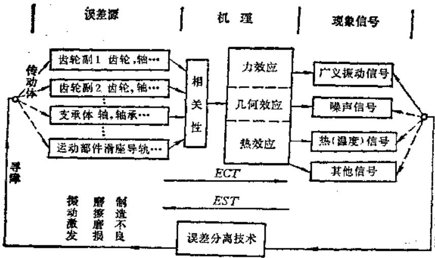  
图17-1-1 精度诊断与误差相关、分离的关系

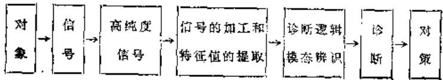  
图17-1-2 精度诊断的流程

的反映。显然，掌握了  $x(t)$  和 $y(t)$  无异等于掌握了  $h(t)$  。当输入  $x(t)$  正常时，  $y(t)$  的异常必表征了  $k(t)$  的某种异常。

由于机床的传动关系十分复杂，一个环节的输出又同时是下一环节的输入（图17-1-4）作为现象的观察或信号的拾取，往往是从某一中间环节或末端环节拾得的。如果  $h_1(t), h_2(t) \dots h_i(t)$  各反映了传动或支承环节的误差传递特性，则在  $x_i(t)$  这一用以作为精密诊断的信号中，必然既反映  $x_0(t)$  又反映各  $h_i(t), h_2(t) \dots h_i(t)$  或各  $x_i(t), x_2(t) \dots x_{i-1}(t)$ 。

精度诊断的任务，多半是根据  $x_{i}(t)$  或  $y(t)$ ，诊断出

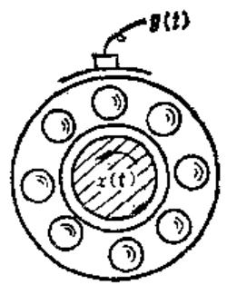  
a]

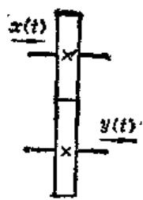  
#

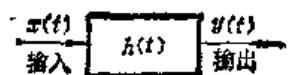  
特性  
c）

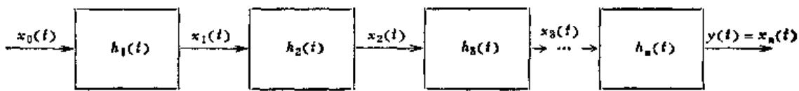  
图17-1-3 机床各工作单元（环节）在运转时的输出与输入  
图1-1-4 复杂系统中各个环节的输入与输出

各异常传动件或其他环节的部位即确定那一个  $h(f)$  异常来。以下为方便叙述计，均以图17-1-3c中的环节为各个小单位（环节）为代表加以讨论。

# （二）系统、输入、输出与卷积

（1）表征系统特性的  $h(t)$  不同的系统有不同的特性，称为系统特性或传递特性。实用上把单位脉冲函数  $\delta (t)$  输入到系统后得到的系统输出  $y\delta (t)$  就叫做  $h(t)$ ，即脉冲响应函数。因输入同为标准的  $\delta (t)$ ，就便于通过比较不同的  $h_{i}(t)$  来推断系统的传递特性。  
（2）系统对任意输入  $x(t)$  的响应  $y(t)$  根据图17-1-5和图17-1-6展示的系统对单位脉冲  $\delta (t)$  的响应[这个响应  $h(t)$  就作为系统特性的时域描述了，可以把任意输入信号  $x(t)$  看作是宽度为  $\Delta t$  ，面积为  $x(n\Delta t)\Delta t$  的许多窄脉冲

分别输入同一系统的响应，同时要考虑各窄脉冲的“时延”。如图17-1-7所示，于是有表17-1-2。

表17-1-2  

<table><tr><td>脉冲号</td><td>输入脉冲</td><td>输出响应</td></tr><tr><td>n=0</td><td>x(0)δ(t)Δt</td><td>x(0)h(t)Δt</td></tr><tr><td>1</td><td>x(Δt)δ(t-Δt)Δt</td><td>x(Δt)h(t-Δt)Δt</td></tr><tr><td>2</td><td>x(2Δt)δ(t-2Δt)Δt</td><td>x(2Δt)h(t-2Δt)Δt</td></tr><tr><td></td><td>……</td><td>……</td></tr><tr><td>n</td><td>+x(nΔt)δ(t-nΔt)</td><td>+x(nΔt)h(t-nΔt)</td></tr><tr><td></td><td>×Δt</td><td>×Δt</td></tr><tr><td></td><td>∑x(nΔt)δ(t-nΔt)Δt</td><td>∑x(nΔt)h(t-nΔt)Δt</td></tr><tr><td></td><td>Δt→0</td><td>Δt→0</td></tr><tr><td></td><td>=x(t)</td><td>=y(t)</td></tr></table>

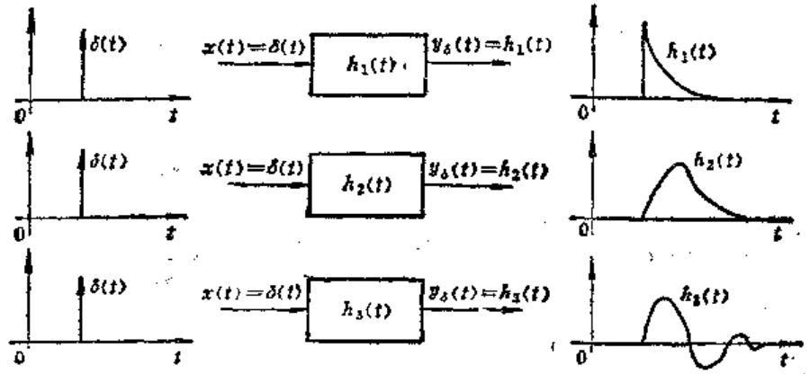  
图17-1-5 不同的小系统（环节）对同一标准的单位脉冲信号的输入呈现不同的响应

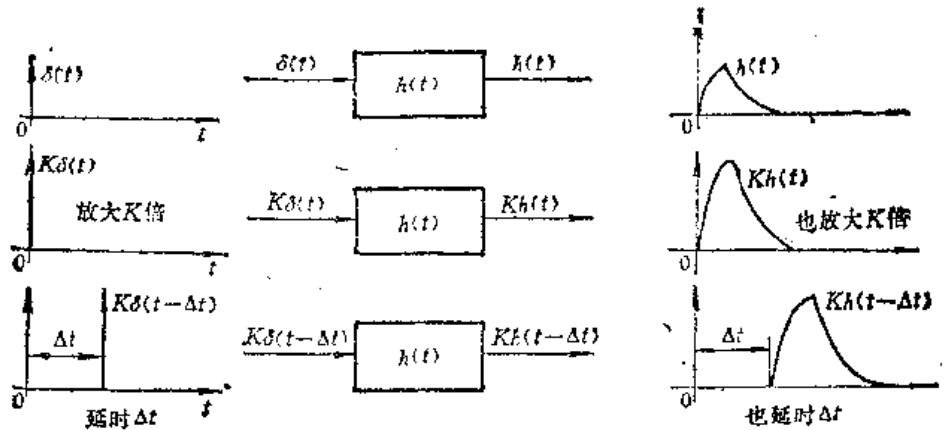  
图17-1-6同一环节对“放大”和“延迟”了的单位脉冲信号输入呈现有相应变化的响应

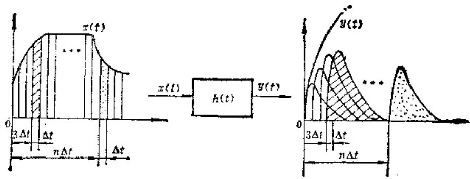  
图17-1-7 具有  $h(t)$  的系统对任意输入  $\pmb{x}(t)$  的响应

当脉冲个数  $n \to \infty$ ，同时脉宽  $\Delta t \to 0$  时，和式中， $n \Delta t \to \tau$ （ $\tau$  为连续时延量，也就是第  $n$  个脉冲时延了  $\tau$ ），于是和式就成为积分， $\Delta t \to d\tau$ ，此时

$$
\begin{array}{l} y (t) = \lim  _ {\Delta t \rightarrow 0} \sum_ {n \rightarrow \infty} ^ {N} x (n \Delta t) h (t - n \Delta t) \Delta t \\ \rightarrow \int_ {0} ^ {t} x (\tau) h (t - \tau) d \tau \tag {17-1-1} \\ \end{array}
$$

常常把积分  $\int_{0}^{t} x(\tau) h(t - \tau) \, \mathrm{d}\tau$  作变量置换，并记作  $x(t) * h(t)$ ，称为  $x(t)$  和  $h(t)$  的“卷积”：

$$
\begin{array}{l} y (t) = x (t) * h (t) \\ = \int_ {0} ^ {t} x (\tau) h (t - \tau) d \tau \\ = \int_ {0} ^ {\tau} x (t) h (- t + \tau) d t \tag {17-1-2} \\ \end{array}
$$

比较相关中的积分式

$$
R _ {x y} \tau = \int_ {0} ^ {T} x (t) \mathcal {Y} (t + t) d t \tag {17-1-3}
$$

和上述卷积式

$$
y (t) = \int_ {0} ^ {\tau} x (t) h (- t + \tau) d t \tag {17-1-4}
$$

就不难发现，如果  $y(t) = y(-t)$  或  $h(-t) = h(t)$ ，则两者是等价的。

也就是说，输出  $y(t)$  与输入  $x(t)$  和系统特性都有某种程度的相关（联系）。

# （3）各种相关

1）误差信号和单位直流量相关，取出均值，即分离出直流分量。  
2）误差信号和单位正（余）弦或单位旋转矢量相关分离出该正（余）弦或单位旋转矢量同频的交流分量，即作傅里叶变换。  
3）误差信号自己和自己相关，且取  $\tau = 0$  的值，等价于对误差信号  $x(t)$  作强度表征。

这显然因为在精度诊断中，误差信号多半通过

非电量-电量变换而转换为电压（或电流）信号  $v(t)$  [或  $i(t)$ ] 于是：

$$
\begin{array}{l} R _ {x x} (0) = \frac {1}{T} \int_ {0} ^ {T} x (t) x (t + 0) d t (17-1-5) \\ \rightarrow \frac {1}{T} \int_ {0} ^ {T} \frac {v ^ {2} (t)}{R} d t | x (t) \rightarrow v (t), R = 1 (17-1-6) \\ \rightarrow \frac {1}{T} \int_ {0} ^ {T} i ^ {2} (t) R d t | x (t) \rightarrow i (t), R = 1 (17-1-7) \\ \end{array}
$$

（4）功率谱一信号的二重相关

1）自功率谱

$$
\begin{array}{l} S _ {x} (\omega) = F \left[ R _ {x x} (\tau) \right] \\ = \int_ {- \infty} ^ {\infty} R _ {n n} (\tau) e ^ {- j \omega \tau} d \tau \tag {17-1-8} \\ \end{array}
$$

它是两重相关，即先是信号  $x(t)$  自己对自己相关，得到  $R_{xx}(\tau)$ ，然后再作  $FT$  （与各不同频率的简弦信号密度相关）。由于

$$
\begin{array}{l} R _ {x x} (\tau) = F ^ {- 1} \left[ S _ {x x} (\omega) \right] \\ = \frac {1}{2 x} \int_ {- \infty} ^ {\infty} S _ {x x} (\omega) e ^ {j \pi \epsilon} d \omega \tag {17-1-9} \\ \end{array}
$$

在  $\pmb{\tau} = \pmb{0}$  时，取强度表征

$$
\psi_ {x} ^ {2} = R _ {x x} (0) = \frac {1}{2 x} \int_ {- \infty} ^ {\infty} S _ {x x} (\omega) d \omega \tag {17-1-10}
$$

即  $S_{xx}(\omega)$  曲线下面积（对  $\omega$  的积分）代表了信号的强度（功率）。

2）互功率谱 也是二重相关。

$$
\begin{array}{l} S _ {x y} (\omega) = \int_ {- \infty} ^ {\infty} R _ {x y} (\tau) e ^ {- j \omega \tau} d \tau \\ = F \left[ R _ {x y} (\tau) \right] \tag {17-1-11} \\ \end{array}
$$

$$
\begin{array}{l} R _ {x y} (\omega) = \frac {1}{2 \pi} \int_ {- \infty} ^ {\infty} S _ {x y} (\omega) e ^ {j \tau \omega} d \omega \\ = F ^ {- 3} \left[ S _ {x y} (\omega) \right] \tag {17-1-12} \\ \end{array}
$$

（5）通过相关卷积联系系统的输入输出

$$
1) R _ {s p} (t) > h (t) * R _ {s s} (t) \tag {17-1-13}
$$

这是因为  $h(t) \neq R_{xx}(t) \int h(t) R_{xx}(\tau - t) dt$

$$
\begin{array}{l} = \int h (\lambda) R _ {x z} (\tau - \lambda) d \lambda \quad \text {变 量 置 换} \\ = \int h (\lambda) \left[ \int x (t) x (t + \tau - \lambda) d t \right] d \lambda \\ \end{array}
$$

展开相关项

$$
= \int x (t) \left[ \int h (\lambda) x (t + \tau - \lambda) d \lambda \right] d t
$$

交换积分项

$$
= \int x (t) y (t + \tau) d t = \int x (\lambda) y (\lambda + t) d \lambda
$$

合并相关项兼作变量置换

$$
= R _ {x y} (t) \tag {17-1-14}
$$

2）对式  $R_{xy}(t) = h(t)*R_{xx}(t)$  两边作傅里叶变换，即作各频率分量相关，就有

$$
\begin{array}{l} S _ {x y} (\omega) = H (\omega) S _ {x x} (\omega) \\ H (\omega) = \frac {S _ {x y} (\omega)}{S _ {x x} (\omega)} \tag {17-1-15} \\ \end{array}
$$

类似地有  $[H(\omega)]^2 = \frac{S_{yy}(\omega)}{S_{xx}(\omega)}$  (17-1-16)

这是通过两个二重相关求取系统特性  $h(t)$  的对应频率特性  $H(\omega)$  （又叫频率传递函数或频率响应函数）。

（6）相关系数  $\rho_{xy}^2 (\tau)$  和相干函数  $\gamma_{xy}^2 (\omega)$

信号  $x(t)$  和  $y(t)$  的相关系数  $\rho_{xy}(\tau)$  和相干函数  $\gamma_{xy}(\omega)$  是相关和二重相关再运算，他们既立足于相关，又几乎有相同的形式：

$$
\begin{array}{l} \rho_ {x y} ^ {2} (\tau) = \frac {R _ {x y} ^ {2} (\tau)}{R _ {x x} (0) R _ {y y} (0)} (17-1-17) \\ \gamma_ {x y} ^ {\prime} (\omega) = \frac {\left| S _ {x y} (\omega) \right| ^ {2}}{S _ {x x} (\omega) S _ {y y} (\omega)} (17-1-18) \\ \end{array}
$$

$\rho_{xy}^2 (\tau)$  和  $\gamma_{xy}^{2}(\omega)$  的大小，将反映出  $x(t)$  和  $y(t)$  的相关性，前者是时延或时差域  $\tau$  上的相关，后者是频域上的相关。一般地且有

$\rho_{xy}(\tau) \approx 1$  或  $\gamma_{xy}(\omega) \approx 1$  则  $x(t), y(t)$  或该  $X(\omega), Y(\omega)$  全相关

$p_{xy}(\tau) \approx 0$  或  $\gamma_{xy}(\omega) \approx 0$  不相关

$0 < \rho_{xy}(\tau)$  或  $\gamma_{xy}(\omega) < 1$  部分相关

实际上，相干就是频域上的频率相关。相干或相关分析对于精度诊断中分析、检测可靠性、信噪比和故障源都十分有用。如果综合信号中没有故障源的力效应，几何效应或热效应所反映的信息，则

两者不相关和不相干。这时，要么是故障源轻微而对综合效果影响不大，要么是赖以作为诊断依据的检测数据并不可靠。

（7）倒频谱  $C(\tau)$  把前述的  $S_{yy}(\omega) = S_{xx}(\omega)|H(\omega)|^2$  中的  $\omega$  变量更换为  $f$ ，两边取对数后再作  $FT^{-1}$ （傅里叶反变换），就有

$$
F ^ {- 1} \left[ \log S _ {y y} (f) \right] = F ^ {- 1} \left[ \log S _ {x x} (\omega) \right]
$$

$$
+ F ^ {- 1} [ 2 \log H (f) ]
$$

(17-1-19)

并分别记作

$$
C _ {x} (\tau) = C _ {x} (\tau) + C _ {h} (\tau) \tag {17-1-20}
$$

并分别称为信号  $y(t)$ ， $x(t)$  和频率传递函数  $H(f)$  的倒频谱， $\tau$  为倒频率，其单位一般以毫秒计（kHz）的倒数。

不难理解，倒频谱  $C_{y}(\tau), C_{x}(\tau)$  和  $C_{h}(\tau)$  也是立足于  $x(t), y(t)$  之相关运算的（图17-1-8）。倒频谱是功率谱作了对数加权后的结果，这是它与作为功率谱偶对的自相关函数最大的不同之处。作对数加权的目的在于：

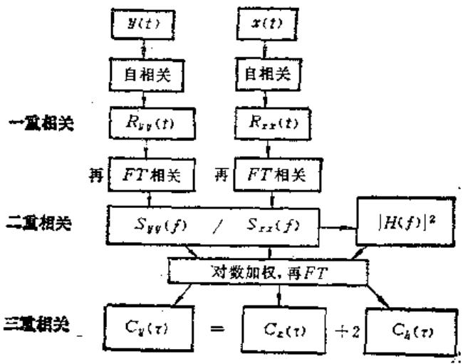  
图17-1-8 根据相关运算求倒频谱

1）使再变换（再  $FT$  相关）以后的信号能量格外集中，从而使谱线定位准确、幅值更加突出。  
2）可以解开卷积积分  $y(t) = x(t) * h(t)$  （时域），变乘法  $Y(f) = X(f) \times H(f)$  为加法， $C_y(\tau) = C_x(\tau) + 2C_h(\tau)$ ，这就使倒频谱更易于识别故障源信号或传动系统的特性（前者一般在高倒频区，后者一般在低倒频区）。  
3）对于齿轮或其他传动件各故障误差源间形成的复杂频域调制信号兼有调幅和调频（即调相）的边频带调制信号，倒频谱能更好地分辨出边频带

成分。

总之，经过各种包含多重相关后得到的信息，实际上再相关过程中已寓误差信息的分离之意。所得到的结果要精细、明朗一些。如果有故障（有误差），必经由合适的各种相关反映者有关的广义均值，时差域  $(\tau)$ ，频域  $(\omega$  或  $f$  ）或倒频域  $(\tau)$  上面得以显示，即因相关而可以诊断。

# （三）误差分离技术

误差的相关，提示了力效应，几何效应，导热效应中拾得的信号中存在的故障源和误差源相关的内容，据而可以寻找故障，光知道两者或多相关是不够的，就如要根治癌症，首先需要分离出癌细胞来一样，从复合信号中能否分离出各种误差，也是精度诊断中十分重要的事情。这是误差分离技术（EST）和误差相关技术（ECT）同步发展的一个重要原因。两者实际上是互有联系的。

# 1. 分离随机误差

实际所得到的赖以诊断的误差信号，不仅内涵着机床各传动和工作部件的（一般是系统的）误差，而且受许多外界干扰的污染。这些干扰一般是随机的。分离随机误差，提纯信号使之只反映机床或工件系统误差的办法之一是平滑信号。这里介绍的是同步时间法，属于总体平滑法。如图17-1-9所示，把记录下来的综合误差信号按同步周期  $T$  截断  $N$  个，使每段始终端处于同一位置上，按所得的  $N$  段平均平滑，即：

$$
x _ {n} = \frac {1}{N} \sum_ {i = 1} ^ {N} x _ {i} \tag {17-1-21}
$$

同步周期  $T$  ，可以是以分度蜗轮一转为同步周期，也可以以刀具转一周为同步周期，也可以是传动光杠一转为一个同步周期，视需处理信号的要求而不同。因此，精度诊断中十分重视同步信号。一般说来，同步截断的数据样本数  $N$  越多，平滑的结果亦即分离随机误差的结果越满意。由图17-1-9可见，  $N = 64$  和  $N = 256$  ，分离所得结果，差异已经不大。

# 2. 分离高低频段数据

1）相当多数的随机噪声幅值，高低频段基本平直相同。而作为系统误差（确定性）信号，其幅值随频率的增高而降低，这就使得信号在低频段信噪比高，高频段信噪比低。频率高到一定程度后，

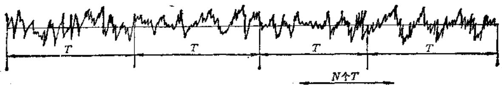

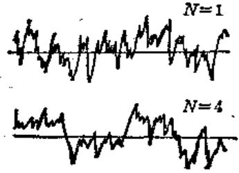

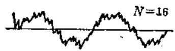

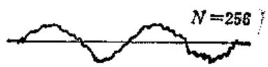

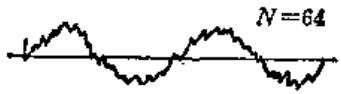  
图17-1-9 同步时间平滑

此后的频率分置已和噪声接近，留之无益。这时就可以用滤波器滤去高频噪声。

2）机床诊断中，传动件和工件的轴频和啮合频率各不相同，前者是低频大周期，后者是高频短周期。有时就需要选取某一频段来分析，寻找故障。此时，可采取低通、高通或带通滤波器来实现。分离所得的低频、高频或有限带宽信号后，可分别针对不同频段作出相应的数据处理长度、采样频率和采样点数的选择，以及频率分解率是否合适的选择，细化（Zoom）是否必要等等，有利于正确寻找故障。

# 3. 分离机床和工件的误差

精度诊断中，有时需要在带载或借助于工件的条件下拾取综合误差信号，例如通过芯棒“径跳”诊断，主轴径向误差运动及相关部件的故障。通过加工的斜齿轮诊断齿轮加工机床差动链的传动误差及相关部件故障。通过磨削或切削工件直线度来诊断刀架-导轨副的精度等等。此时因工件误差和机床误差交织在一起，如不分离就无法寻找故障，即使查到故障，也易误诊。相反，如能分离出两者各自的误差即证实机床误差对工件误差的影响率，则更有助于寻找故障。为此，需要进行两者的误差分离。

工件-机床误差分离的重要依据仍然是傅里叶变换、即频率相关法。按一重相关的傅里叶变换公式有

$$
\begin{array}{l} F [ x (t) ] = \int_ {- \infty} ^ {\infty} x (t) e ^ {- j \omega t} \\ \mathrm {d} t = X (\omega) \tag {17-1-22} \\ \end{array}
$$

于是有  $F[x(t \pm \tau)]$

$$
\begin{array}{l} = \left[ \int_ {- \infty} ^ {\infty} x (t - \tau) e ^ {- j \omega (t - \tau)} d (t - \tau) \right] e ^ {+ j \omega t} \\ = X (\omega) e ^ {* j \omega} \tag {17-1-23} \\ \end{array}
$$

简略地可写成  $x(t)\frac{FT}{FT^{-1}} X(\omega)$

$$
(1 7 - 1 - 2 4) \tag {17-1-24}
$$

$$
x (t \pm \tau) \underset {F T ^ {- 1}} {\stackrel {F T} {\rightleftharpoons}} X (\omega) e ^ {\pm j \omega \tau}
$$

$$
(1 7 - 1 - 2 5) \tag {17-1-25}
$$

此即信号时移一相移性质。

以通过在机床上临床测量加工工件螺纹误差来诊断机床、螺纹链误差和工件螺旋形状误差为例。如图17-1-10。目的是通过检测测头与工件表面相对位移的变化来诊断传动关系，即螺旋运动是否正确，即是否存在着运动误差  $\delta (\theta)$  [机床的]，其值如何，源于何方。但检测时，加工后工件上的螺旋形状误差  $h(\theta)$  [工件的]亦同时存在于位移综合信号中，为了正确分离出总的综合信号  $x(\theta)$  中的  $h(\theta)$  与  $\delta (\theta)$ ，可以基于前述  $FT$  相关的时移一相移性质而用转位法分离之。它等价地有两种办法（均转过  $\alpha$  角）：

（1）工件转位法 转位前，测头从  $A$  基点出发，测得

$$
x _ {A} (\theta) = h (\theta) + \delta (\theta) \tag {17-1-26}
$$

转位后，测头从  $B$  点出发，  $A$  、  $B$  之间为转位角  $\alpha$  ，测得

$$
x _ {E} (\theta) = h (\theta + a) + \delta (\theta) \tag {17-1-27}
$$

（2）传动元件转位法 转动传动链中某一传

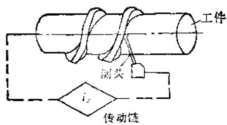

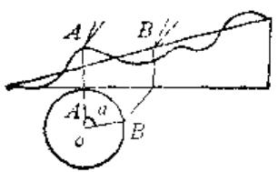  
图17-1-10

动件。

转位前得  $x_{A}(\theta) = y(\theta) + z(\theta)$

转位后得  $x_{E}(\theta) = y(\theta) + z(\theta + \alpha)$

式中  $z(\theta)$  ——转位元件的误差；

$y(\theta)$  ——非转位元件及工件、螺旋形状误差之和。

统一上述两式的形式，可得

$$
x _ {A} (\theta) = U (\theta) + V (\theta) \tag {17-1-28}
$$

$$
x _ {B} (\theta) = U (\theta + a) + V (\theta) \tag {17-1-29}
$$

对以上两式两边作傅里叶变换（注意实际上是在作相关），并利用傅里叶变换时频关系中的一个性质一时移即相移定理，即若  $[U(\theta)] = U(\omega)$

则  $F[U(\theta + a)] = U(a)e^{i\phi a}$

而得到

$$
\left\{ \begin{array}{l l} x _ {A} (\omega) = U (\omega) + V (\omega) & (1 7 - 1 - 3 0) \\ x _ {B} (\omega) = U (\omega) e ^ {j \omega a} + V (\omega) & (1 7 - 1 - 3 1) \end{array} \right.
$$

式中  $x_{A}(\omega), x_{B}(\omega), U(\omega), V(\omega)$  分别是检测所得信号；

$x_{A}(\theta), x_{B}(\theta)$  和  $U(\theta), V(\theta)$  ——傅氏变换。

解联立方程式，就可以得到

$$
\left\{ \begin{array}{l} U (\omega) = \frac {x _ {A} (\omega) - x _ {B} (\omega)}{1 - e ^ {i \omega}} \\ V (\omega) = x _ {A} (\omega) - U (\omega) \end{array} \right. \tag {17-1-32}
$$

和

$$
\left\{ \begin{array}{l l} U (\theta) = F ^ {- 1} \left[ \frac {x _ {A} (\omega) - x _ {B} (\omega)}{1 - e ^ {j \omega t}} \right] \\ V (\theta) = x _ {A} (\theta) - U (\theta) \end{array} \right. \tag {17-1-34}
$$

分离所得的  $U(\theta)$  、  $V(\theta)$  可分别任意代表

工件或机床传动链的螺旋线或差动链运动误差，并进一步作各类相关分析以寻求故障元件和对加工的影响。这个方法，特别是传动元件转位法的妙处还在于理论上可在实际参加工作的传动元件中任意选择其中的一个转位，只要转角适当，总可以在总信号和及其组合信号的各种相关分析中探讨该传动件的转位影响和其它参加啮合、传动的所有传动件的影响。这无疑为精度诊断提供了有力的基础。

显然，支持精度诊断的误差分离技术也是立足于相关的。

综上所述，相关分析是故障诊断和精度诊断的主要理论根据，凡有故障，必与故障源（部、零件）相关；凡需寻找故障，亦必须从总信号中进行相关分析。

# （四）用误差分离技术诊断螺纹链误差

在机床领域里，具有螺纹链的机床约占机床总量的一半以上，然而工程界对螺纹链误差的测量分析和控制远不及滚齿机分度链那么普遍。这是因为螺纹链本身的特殊困难所致。

# 1.螺纹链误差

选主轴间转作为螺纹链误差的输出，将各传动元件之转角误差传递到主轴端，换算成主轴的转角误差  $\Delta \varphi$  ，而后折算为工件的导程误差  $\Delta S$  的波动部分  $\Delta S^{\prime}$  ，螺纹链误差可写成

$$
\begin{array}{l} x (t) = a + b t + \Delta S ^ {\prime} \\ = a + b t + \sum_ {j = 1} ^ {m} k _ {j} \Delta_ {j} \sin \left(i _ {j m} \omega_ {m} t + a _ {j}\right) \\ \times \frac {S _ {\text {总}}}{2 \pi} \tag {17-1-36} \\ \end{array}
$$

式中  $\Delta S^{\prime}$  由传动元件转角误差所形成的螺纹链误差时波动部分  $a + bt$  （线性误差部分）；

$S_{g}$  ——螺纹链被调整的导程；

$\pmb{a}_{j}$  、  $\alpha_{j}$  ——分别为第  $j$  传动元件的转角误差幅值和初相角；

$\omega_{i}, \omega_{m}$  分别为第  $j$  和第  $m$  传动元件的角频率；

$h_{j} = \omega_{m} / \omega_{j}$  第  $j$  传动元件的误差传递系数；

$\mathbf{i}_{j_m} = \omega_j / \omega_m = yk_j$  第  $j$  传动元件与传动链末端角频率之比。

# 2. 检测方法一误差分离法

用磁栅和磁尺，光栅和光栅尺等精密元件组成的基准系统进行螺纹键误差的测量早已获得应用。这里介绍比较实用的误差分离技术。

图17-1-11是误差信息的采集系统，主轴至刀架的一串齿轮和传动轴为被测传动链，测量元件置于机床的头尾顶尖间。由主轴通过夹头带动同转。误差信号是由传感器的测头1拾取，经放大、滤波，A/D转换输给微机。图中代号“10”为反光片。当测量元件回转时，它使光电感应器感应出脉冲信号，后者用作起动微机开始采样，所以“反光片”起着时标“原点”的作用。

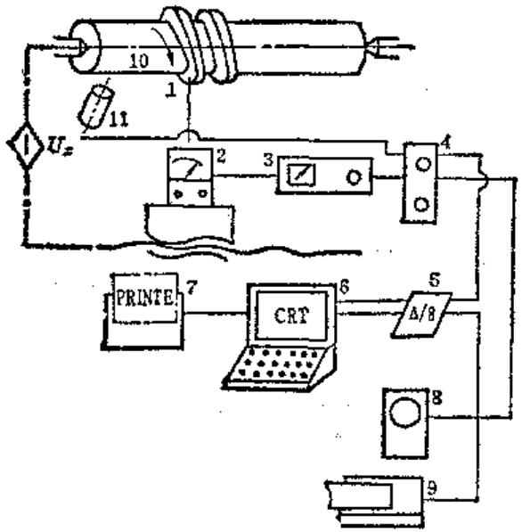  
图17-1-11 螺纹链数据采集系统

1一测头2—DIS-20C/A小型电感比较仪3一数

据放大器 4—高低通组合滤波器 5—A/D转换板

6—散处理机 7—打印机 8—示波器 9—函数记

录仪 10—反光片 11—光电感应器

设被测元件螺旋面上的螺旋线误差为  $y(t)$  机床螺纹链误差为  $\omega (t)$  ，则传感器的测头1所拾取的信号  $z(t)$  是

$$
z _ {1} (t) = \omega (t) + y (t) \tag {17-1-37}
$$

现令传动链相对测量元件位移使测头1所拾取的信号为

$$
z _ {2} (t) = x (t + \Delta t) + y (t) \tag {17-1-38}
$$

再令式（17-1-38）-（17-1-37）得

$$
\Delta z (t) = \omega (t + \Delta t) - x (t) \tag {17-1-39}
$$

可见（17-1-39）式已分离掉了被测元件误差  $y(t)$ 。

记：  $\Delta z(k) - \Delta z(t)$  的离散量化的数字

信号： $x(k)$  ——  $x(t)$  的离散量化的数字信号；

$x(k + \Delta k) - x(t + \Delta t)$  的离散量化的数字信号；

$$
k = 0, 1, 2, \dots \dots , 2 N - 1.
$$

代入（17-1-39）式，再交换到频域，可得

$$
\begin{array}{l} \Delta z (x) = \frac {1}{N} \sum_ {k = 0} ^ {2 N - 1} \Delta z (k) e ^ {- i x N k j N} \\ = \frac {1}{N} \sum_ {k = 0} ^ {2 N - 1} \Delta z (k) \omega_ {N} ^ {- n k} \tag {17-1-40} \\ \end{array}
$$

和第  $n$  次谐波的幅值

$$
\begin{array}{l} C (n) = \Delta z (n) / (\varepsilon^ {l x n \Delta k / N} - 1) \\ = \Delta z (n) / G (n) \tag {17-1-41} \\ \end{array}
$$

从而可求得螺纹链误差。

$$
x (k) = \sum_ {n = 0} ^ {N - 1} C (n) \omega_ {N} ^ {\pi^ {h}} \tag {17-1-42}
$$

若要分析被测元件误差，则在获得第一道信号（17-1-37）式之后，令工件相对传动链位移。则可把传动链误差分离掉而有求解被测量元件误差的相似于（17-1-39）～（17-1-42）式的计算式。

从误差信号  $z(t)$  里，若已知某项（例如  $\pi = m$  次）谐波的幅值较大，而要求其幅值  $A_{m}$  之值时，可采用转位法使  $A_{m}\sin (m\omega +\varphi_{m})$  从误差信号 $x(t)$  中分离出来，此时先记录

$$
\begin{array}{l} z _ {1} (t) = y (t) + \omega (t) = y (t) + A _ {1} \sin (\omega t + \varphi_ {1}) \\ + A _ {2} \sin (2 \omega t + \varphi_ {2}) + \dots + A _ {m} \sin (m \omega t \\ + \varphi_ {n}) + \dots + A _ {N} \sin (N \omega t + \varphi_ {N}) \tag {17-1-43} \\ \end{array}
$$

然后将第  $m$  次谐波所对应的传动元件相对其它元件转过  $\pmb{\alpha}$  角度，再采集第2道信号  $z_{i}(t)$

$$
\begin{array}{l} z _ {2} (t) = y (t) + A _ {1} \sin (\omega t + \varphi_ {1}) + A _ {2} \sin (2 \omega t \\ + \varphi_ {2}) + \dots + A _ {n} \sin (m \omega t + \varphi_ {m} + a) \\ + \dots + A _ {N} (N \omega t + \varphi_ {N}) \tag {17-1-44} \\ \end{array}
$$

令（17-1-44）、（17-1-43）两式相减，得

$$
\Delta z _ {n} (t) = 2 A _ {n} \sin \frac {a}{2} \sin \left(m \omega t + \varphi_ {m} + \frac {a}{2} + \frac {\pi}{2}\right) \tag {17-1-45}
$$

由此，可从时域里直接求得第  $m$  次谐波的  $A_{m}$  值。与此同理，可作同次谐波误差的分离。

# 3. 信号处理过程

据前述的误差分离原理，可以实现：传动链误差与测量元件误差之间的分离；传动链误差中谐波间的分离；同次谐波间各传动元件误差的分离。不论那种分离，它们的数据采集和处理过程是相同的，如图17-1-12所示。其中  $z_{1}(t)$  和  $z_{2}(t)$  为

两道信号；数据预处理是使两道数据中和去倾斜；时域里差值处理是指二道数据相减，即执行（17-1-39）式；TPW是指由FFT求得的  $\Delta z(n)$  频谱再除以权函数  $G(n)$  （即执行（17-1-41）式，获得传动链误差的频域信息  $C(n)$  ； $I_{\mathrm{FFT}}$  一求螺纹链误差  $x(k)$  。

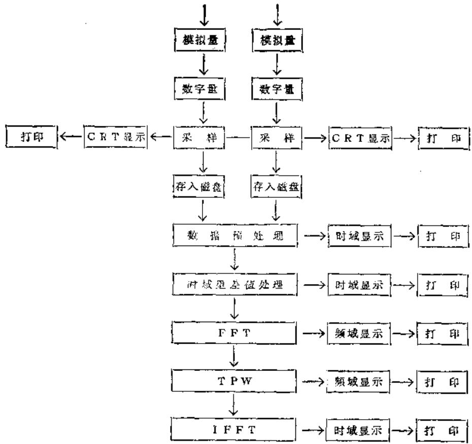  
图17-1-12 误差数据采集和数据处理流程图

# 4. 螺距误差来源的诊断

（1）要分析的问题 图17-1-13是某机床的螺纹链。由20余个齿轮及若干传动轴，丝杆螺母副所组成。该机床是某工厂的产品。出厂前在试切

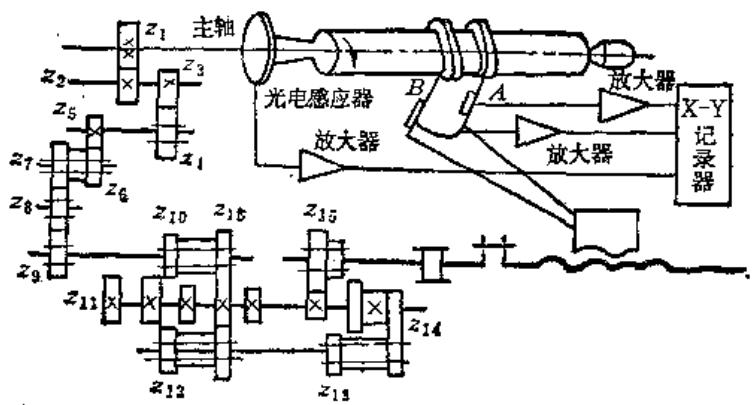  
图17-1-13某车床螺纹链及传动误差测量原理

螺纹时，常出现螺距误差过大或超差现象。为提高产品质量，需查出螺距误差过大的主源，给产品设计和工艺提供改进的依据。

（2）螺距误差规律 解决问题的第一步，是摸清螺距误差所显示的特征，将经该机床切试好的工件，送螺纹螺距测量仪检测。测得其螺距误差序列如图17-1-14所示。它显示出：同截面内的螺距误差大小相间；不同截面的螺距大小不等，但有相似的规律。

（3）试件螺距误差来源的内外分离据工艺学原理：螺距误差的形成，关系到：工艺系统热变形的影响；工件前道工序误差的复映；工艺系统中几何误差，受力变形的影响等方面。螺距误

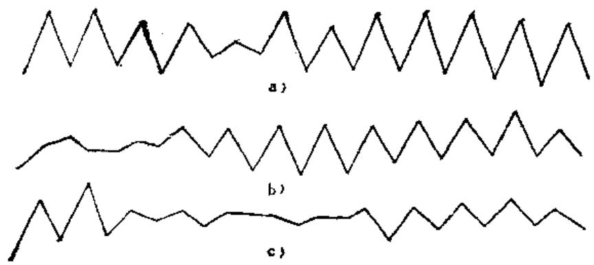  
图17-1-14 试切工件（ $S_{g} = 6\mathrm{mm}$ ）螺距误差（曲线  $a$ ， $b$ ， $c$  为三等分截面内获得的数据）

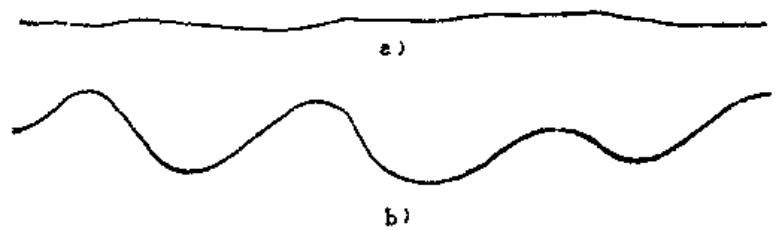  
图17-1-15

差是否主要来自于传动误差之外呢？

可以这样识别，试件经该机床精切后，立即就进行临床测试，测头  $A$  与刀具置换，此时若测头  $A$  所得的误差信号  $z(t)$  变动（波动）甚微，如图17-1-15a，那么表明

$$
z (t) = x (t) + y (t) \approx 0
$$

其中  $x(t) \neq 0$

因而有近似的

$$
x (t) \approx - y (t)
$$

即试件上的误差绝大部分来自传动链或是传动误差的“遗传”，若测头  $A$  输出的波形  $\pmb{z}(t)$  如图17-1-15b所示，则表明了非传动误差的影响不可忽视。造成后一情况的因素，可能与试件在机床上的

定位不良或切削不均匀等有关。本例在多数情况下所得信号呈现图a形态。因此，螺距误差过大的主源应从传动误差里寻找。

（4）传动误差主源的寻找找出主源，就是查出哪项谐波的幅值最大。

1）被分析的传动误差里有几项谐波？将试件  $(S_{\mathrm{g}} = 6\mathrm{mm})$  和主轴视为传动链之末端。据此，可求得各传动元件的误差传动系数  $k_{j}$  记于表17-1-3中。它们分别为  $k_{j} = 1$  ，1.8，1.87和2。由此可以认为传动误差里主要含有4项谐波。

为使信号的长度符合4项谐波的公共周期，主轴和试件要传过60整转。此时传动误差中的4项谐波的频次算得为  $n = 60$

33、32和30（见表17-1-3）。传动误差可写成

$$
\begin{array}{l} x (t) = A _ {3 0} \sin (3 0 \omega t + \varphi_ {3 0}) + A _ {3 2} \sin (3 2 \omega t \\ + \varphi_ {3 2}) + A _ {3 3} \sin (3 3 \omega t + \varphi_ {3 8}) \\ + A _ {6 0} \sin (6 0 f \omega + \varphi_ {0 0}) \tag {17-1-46} \\ \end{array}
$$

2）4项谐波中何项最大？按（17-1-37）和（17-1-38）式相近似的过程，由测头  $A$  （17-1-13）获得信号

$$
z _ {1} (t) = x (t) + y (t) \approx 0
$$

之后，再由测头  $B$  拾取信号（注意工件并不转位）

$$
\begin{array}{l} z _ {2} (t) = x (t) + y (t + \Delta t) \\ = y (t + \Delta t) - y (t) \\ \end{array}
$$

$$
\text {或} \quad \approx x (t + \Delta t) - x (t) \tag {17-1-47}
$$

表 17-1-3  

<table><tr><td rowspan="2" colspan="2">传动元件</td><td>z1</td><td>z4</td><td>z6</td><td>z8</td><td>z9</td><td colspan="5">z11</td><td colspan="2">z12</td><td colspan="2">z13</td><td colspan="2">z14</td><td colspan="2">z15</td><td></td></tr><tr><td>z3</td><td>z5</td><td>z7</td><td>z7</td><td>z10</td><td>40</td><td>36</td><td>36</td><td>35</td><td>33</td><td>26</td><td>39</td><td>19</td><td>28</td><td>28</td><td>38</td><td>19</td><td>19</td><td>38</td></tr><tr><td rowspan="2">Sg=6</td><td>kj</td><td>1</td><td>1.87</td><td>1.87</td><td>1.8</td><td>2</td><td></td><td></td><td>1.87</td><td></td><td></td><td></td><td>2</td><td></td><td>2</td><td>2</td><td></td><td>1</td><td></td><td>1</td></tr><tr><td>n</td><td>60</td><td>32</td><td>32</td><td>33</td><td>30</td><td></td><td></td><td>32</td><td></td><td></td><td></td><td>30</td><td></td><td>30</td><td>30</td><td></td><td>60</td><td></td><td>60</td></tr><tr><td rowspan="2">Sg=3.5</td><td>kj</td><td>1</td><td>1.87</td><td>1.87</td><td>1.8</td><td>2</td><td>3.0</td><td></td><td></td><td>3.0</td><td></td><td></td><td>3.4</td><td></td><td>3.4</td><td>3.4</td><td></td><td>1.7</td><td></td><td>1.7</td></tr><tr><td>n</td><td>60</td><td>32</td><td>32</td><td>33</td><td>30</td><td>19</td><td></td><td></td><td>19</td><td></td><td></td><td>17</td><td></td><td>17</td><td>17</td><td></td><td>35</td><td></td><td>35</td></tr></table>

# 17-12

与（17-1-39）式作比较。等式的右边是相同的。我们可以引用  $(17 - 1 - 39)\sim (17 - 1 - 41)$  式，求出传动误差中的各次谐波的幅值  $C(n)$

$$
C (n) = \Delta z (n) / G (n)
$$

这里我们想直接从时域里识别哪项谐波最大，据前文“误差分离原理”把（17-1-47）式的时延  $\Delta t$  转换为试件转位角  $"a"$  ，则据（17-7-43）\~（17-1-45）式，（17-1-47）式又可写成

$$
\begin{array}{l} z _ {2} (t) = x (t) + y (t + \Delta t) \\ \approx - a (t + \Delta t) + b (t) \\ = \sum_ {n = 1} ^ {N} - 2 A _ {n} \sin \frac {n a}{2} \\ \times \sin \left(n \omega t + \varphi_ {n} + \frac {n \alpha}{2} + \frac {\pi}{2}\right) \tag {17-1-48} \\ \end{array}
$$

其中有效的  $A_{6}$  为  $A_{30}, A_{32}, A_{33}$  和  $A_{69}$ 。

现在我们可以通过选择不同的  $a$  （即  $\Delta t$ ），使  $z_{2}(t)$  中的4项谐波的某一项或某两项分离掉，而余下其它项。

选  $a = 2n / 60$  ，测头拾取的  $z_{\varepsilon}(i)$  中，  $\pmb{u} =$  60次谐波为0。

因为  $\sin \frac{n\alpha}{2} = \sin \left(\frac{60}{2}\times \frac{2\pi}{60}\right) = 0$  ，此时

$$
\begin{array}{l} z _ {2} (t) = - 2 A _ {3 0} \sin \left(\frac {3 0 2 \pi}{2 6 0}\right) \\ \times \sin \left(3 0 \omega t + \varphi_ {3 0} + \frac {3 0 \pi}{2 3 0} + \frac {\pi}{2}\right) \\ = 2 A _ {3 2} \sin \left(\frac {3 2}{2} \times \frac {\pi}{3 0}\right) \\ \times \sin \left(3 2 \omega t + \varphi_ {2 2} + \frac {3 2}{2} \times \frac {\pi}{3 0} + \frac {\pi}{2}\right) \\ - 2 A _ {3 3} \sin \left(\frac {3 3}{2} \times \frac {\pi}{3 0}\right) \\ \times \sin \left(3 3 \omega t + \varphi_ {3 3} + \frac {3 3}{2} \times \frac {\pi}{3 0} + \frac {\pi}{2}\right) \\ \end{array}
$$

是三项谐波之和。

选  $a = \frac{2\pi}{30}$  则输出的  $z_{x}(t)$  中， $n = 30$  和60次谐波消失了，因为  $\sin \left(\frac{30}{2} \times \frac{2\pi}{30}\right) = \sin \left(\frac{60}{2} \times \frac{2\pi}{30}\right) = 0$ ，与上同理。 $z_{x}(t)$  是两项谐波的迭加。

我们还可以选  $a = \pi / 60$ ，使  $A_{60} \sin (60\omega t + \varphi_{60})$  谐波反映在  $z_s(t)$  里。但是，从螺距误差

出现的规律，大小相间，每两牙有一短周期的特征（图17-1-14）。可知，  $A_{60}$  是微小的（实测也证实了这一分析）。

图17-1-16所示的波形：  $a$  一系测头  $\pmb{A}$  所反映的  $z_{1}(t)$  ；  $b$  一主轴每一转的时标，两脉冲间距离代表试件的一个导程；  $c$  三项谐波之和的  $z_{2}(t)$  ；  $d$  两项谐波和的波形。

对比波形  $c$  和  $d$ ，不难看出，4项谐波中以  $A_{20}\sin (30\omega t + \varphi_{30})$  的幅值最大，是传动误差中的主源。波形  $c$  表明了：主轴转30转（合60转的1/2）时，恰有15个波形且其幅值较大，如果将具有波形  $c$  的试件，用螺距误差量仪离散地测量它的螺距误差，不就显示了螺距误差序列正好是：大小相间、各截面大小不一，但却相似这三个特征。

（5）找误差最大的传动元件从图（17-1-13）和表17-1-3可知：  $A_{80}\sin (30\omega t + \varphi_{90})$  的这项谐波所对应的传动元件为6个齿轮及其传动轴。这6个齿轮是：  $z_{9}, z_{10}, z_{12}(39$  齿）、  $z_{13}(28$  齿）、  $z_{14}(28$  齿、38齿）和  $z_{11}(36$  齿）。一般而言，传动元件越多，组成的同一谐波的幅值亦越大，即使是各传动元件的误差均在容许公差之内，但也不能排除此环节中有一或二只元件误差较大的可能。

按照前文“同次谐波内的误差分离”原理，将  $z_{9}, z_{10}$  及其传动轴一起转位，当其它元件和测头位置不变时，将  $z_{9}, z_{10}$  轴向离开啮合区，然后连同传动轴转过  $\alpha = 2\pi /3$  ，再将它们轴向退回到原来轴向啮合区，然后开动机床进行检测，两个测头都可以使用。图17-1-17a是由测头A给出的两个波形  $z_{1}(t)$  和  $z_{2}(t)$  。由此图和（17-1-14）式，可求得转位元件误差的幅值。

$$
\begin{array}{l} 2 A _ {i 0} = \frac {\Delta z _ {m a x} - \Delta z _ {m i p}}{2 \sin \frac {a}{2}} = \frac {0 . 0 0 8 8}{2 \sin \frac {1 2 0 ^ {\circ}}{2}} \\ = 0. 0 0 5 \mathrm {m m} \\ \end{array}
$$

将  $z_{0}$  恢复原位，再行测量，得  $z_{10}$  和传动轴二者转位（ $a = 2\pi / 3$ ）前后的误差曲线如图17-1-17。同理，可求得

$$
2 A _ {8 0} = \frac {\Delta x _ {\max} - \Delta z _ {\min}}{2 \sin \frac {1 2 0 ^ {\circ}}{2}} = 0. 0 0 4 6 \mathrm {m m}
$$

由上可知， $z_{10}$  及其传动轴是  $A_{30}$  谐波的误差最大源，在极限情况下，它要造成工件螺距误差达  $\pm 0.0046\mathrm{mm}$  之大。

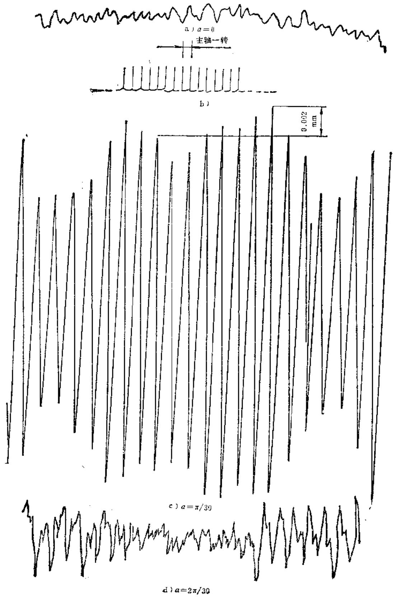  
图17-1-16 异次谐波分离的结果

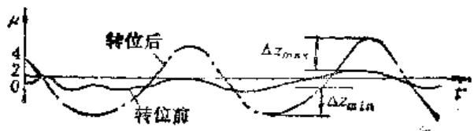  
a）z和z10转位前后的曲线

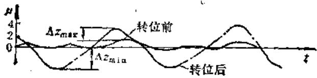  
b）  $z_{10}$  转位前后曲线  
图17-1-17 转位前后拾取的误差信号

（6）验证为了证实这一结论，再取试件  $S_{g} = 3.5\mathrm{mm}$  。此时，取信号长度为主轴转过60转的时间，这样传动误差  $z_{2}(t)$  里也包含6项谐波（见表17-1-3）。而其中  $A_{28}$  谐波仅仅对应传动元件  $z_{9}$  和  $z_{10}$  及传动轴。按前述的（4）步骤，记录此种情况的  $z_{1}(t)$  和  $z_{2}(t)$  。从  $z_{2}(t)$  里仍显示出  $A_{28}$  的幅值最大的特征，可见  $z_{10}$  及其传动轴误差最大。

现在，再临床测量  $\pmb{\varepsilon}_{10}$  齿轮的节圆跳动，发现径向跳动  $0.2\mathrm{mm}$  之大，再测量传动轴之径向跳动，又发现误差达  $0.1\mathrm{mm}$ ，二者超过了机床图纸所规定的公差。

（7）启示在延用误差分离原理寻找螺距误差主要源所进行的分析中，给产品的设计和工艺二点重要启示：

1）当机床调整为加工  $S_{g} = 6 \mathrm{~mm}$  工件时，传动误差里存在着  $n = 30$  ，32和33三项谐波频次接近各自又包含多个传动元件的误差情况，这易于造成工件的某处螺距误差特大。因为此处正是3项谐波的迭加，这如同振动现象中两项频率接近的振动必然形成“拍频”的形态一样，机床设计者应注意在传动误差里预防“拍频”的存在。  
2）误差最大元件是  $z_{10}$  及其传动轴。究其原因，并非偶然，因为  $z_{10}$  是带内花键孔的双联齿轮，而传动轴为外花键。花键的加工和齿轮节圆与花键孔同心问题没有引起工艺的重视。

# 第2节 机床的综合诊断法

这里所指的综合诊断法，就是选用多种传感器从运行的机床中拾取多种状态信号进行分析处理，

然后进行综合评定运行的性能，并判定劣化与故障真实部位的方法。

# （一）多种传感器同时采用

运行中发生异常的机床表现出的症状往往具有“综合症”，例如一台车床往往同时出现床身振动、噪声以及工件表面的乱刀纹（振纹），而每种现象都对各自相关的状态发生变化量。这些状态量间存在一定的内在联系，却具有不同的变化规律。

一台复杂机械可能出现激励的响应——受迫振动的特征频率，往往可以从万分之几赫兹至几十千赫兹，即频率范围可以覆盖高、中、低三个频段，而为一般单种传感器的频响范围所无法满足。又如车床上溜板箱内的故障特征频率极低，长期以来还缺乏简便、有效的方法在线作出诊断。

刀具功能传感器是一种可直接从切削加工微区采集振动信号的传感器。所以它是一种既与影响加工质量的劣化及故障源密切相关，又与工件表面加工质量密切相关的灵敏传感器。又由于该种传感器所采集热电势动态信号时具有极为宽广的频率范围，所以它对于走刀链系统的回转部件的运行状态具有特殊的敏感性。刀具功能传感器的这一可贵特性，常作为诊断工件表面振纹产生的故障源的有效手段。

# （二）解调技术的应用

在机床故障诊断中，各特征频率都可以作为载波，这些特征频率的基频不一定在频谱图上都出现，所以无法象无线电技术中那样找出载波的幅值与频率，然后解调。这里采用的是另一种幅值解调技术。

在机床上往往由于零部件的损坏而在运行中产生周期性冲击作用，从而会引起该零部件乃至整机的各阶共振响应。于是振动的能量大多集中在高频域，在所采集信号处理后所得的频谱图上将可看到由于高频域许多连续的高峰使它的低频域内，共振部件的特征基频——例如轴频与啮合频率上无明显幅值。所以尽管谱图上有共振频率峰群出现，但苦于无法知道它们分别是发自于哪个零部件的共振。虽然共振频率  $(f_{\mathrm{e}})$  峰旁有许多个边频带——边频带间隔  $\Delta f$  ，即为调制频率——但由于多个调制频率交迭作用，很难判出究竟是哪个零部件上的特征频率对它的共振频率进行调制。

有时候在机床传动链中出现几个相同特征频率，例如相同的轴频或啮合频率，那末就有必要借助于其上的调制频率是轴上某轴承或某轴特征频率，得以判断故障的确切部位。

再譬如，某一齿轮对的啮合频率出现峰值，为判断哪个齿的问题最为严重时，也要借助于齿轮所在轴的频率调制幅值大小来进行。

因而必须在故障诊断中信号提纯，并在这一重要环节处理上采用解调技术。

这种解调技术，就是对信号进行高通滤波——绝对值处理  $\longrightarrow$  低通滤波过程，将信号中某频段内的调制信号的频率成分提取出来的过程。

关于解调技术及其综合评定故障技术，将在下面的实例分析中加以说明。

# （三）诊断实例

某一SR1600车床，据称在运输过程中曾摔过，现已经过几年使用。现要求寻找加工工件表面出现倾角为  $60^{\circ}$  状环振纹的原因以及其它损坏的零件。

测试装置框图如图17-2-1。

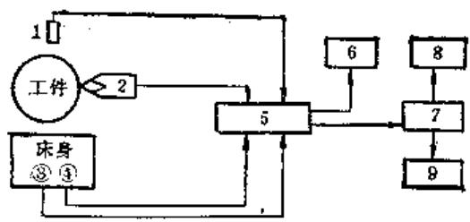  
图17-2-1 测试装置框图

1—光电传感器 2—刀具传感器 3—加速度传感器

器 4—噪声传感器 5—2F-1综合诊断仪 6—示

波器7一计算机8一屏幕显示9一打印机

测试工况：

刀具材料：YT15；

工件材料：34CrMoV；

工件直径：  $610\mathrm{mm}$

主轴转速：  $n = 35.5r / \min$

进给量：  $S = 0.18\mathrm{mm / r}$

切削深度：  $t = 0.05\mathrm{mm}$  。

由光电传感器从主轴花盘上取光脉冲信号后经分析处理得出主轴实际回转频率  $f_{\text{主}} = 0.625 \mathrm{~Hz}$  。加速度传感器置于床头箱前侧两个手柄间振动最大位置上；噪声传感器置床头箱右侧近走刀箱附近。

刀具传感器同于普通刀具夹持在刀架上在切削过程拾取信号。上述三种传感器在车床这一工况下同时采集信号经自制的FZ-1“综合放大器”，最后进入计算机处理后打印出幅值频谱图（图17-2-2）。为分析方便计，将所得谱图的右上角编号作统一编号说明，例如：

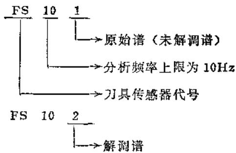

也就是说，最前面的字母是所用传感器代号（A——加速度传感器、N——噪声传感器，FS——刀具功能传感器）。数字的最后一位：1——表示该谱图为信号原始谱，2——为信号解调谱。前面的几个数字表示谱图的上限分析频率。

该转速下的主传动链为：

I轴-16/34--30/38--21/41--N-21/42-V-22/82—V轴（即主轴）

该进给量下走刀链为：

VII—76/65—65/47—47/50—56/91—91/120—114/114—37/28—24/27—18/27—15/39—13/40—4/37—25/60—15/60—15/60—13/1—齿条

频谱图的综合分析如下：

1）首先看FS501、N501、A501与A502因张谱图。三个不同传感器的原始谱图是不同的，然而可看到FS501、N501与A502上有明显的周期性频率特征谱线：

FS501上主要以  $7\mathrm{Hz}$  为基频与它的  $1\sim 5$  倍频。这  $7\mathrm{Hz}$  为主轴前轴承外滚道的点缺陷产生的特征频率。表明该轴承外滚道至少有5个坑。1/7.0秒正与工件周向环纹分布周期相吻合，表明主轴承外滚道上的冲击坑是造成工件上环纹的主要原因。

N501上虽也有  $7\mathrm{Hz}$  的  $3\sim 5$  倍频，但主要表现的是走刀链  $z_{15} / z_{39}$  齿轮对啮合频率  $5\mathrm{Hz}$  及其高阶倍频，表明该对齿轮已明显有磨损。

在A501上只出现  $7\mathrm{Hz}$  的4倍频与5倍频谱线，更没有  $5\mathrm{Hz}$  的信号线。而在A502解调谱上主要出现的是  $9.9\mathrm{Hz}$  及其高阶倍频的谱线，  $9.9\mathrm{Hz}$

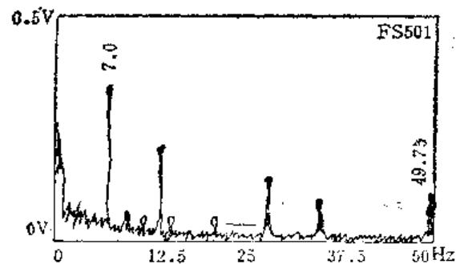

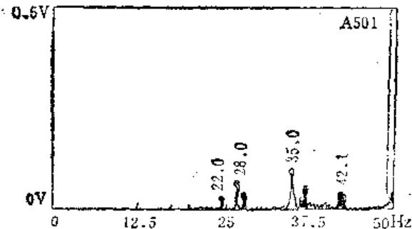

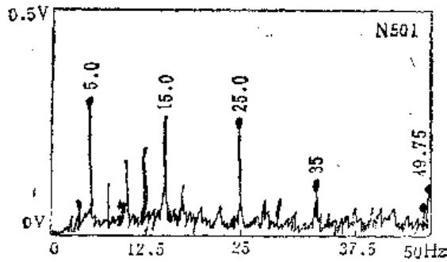

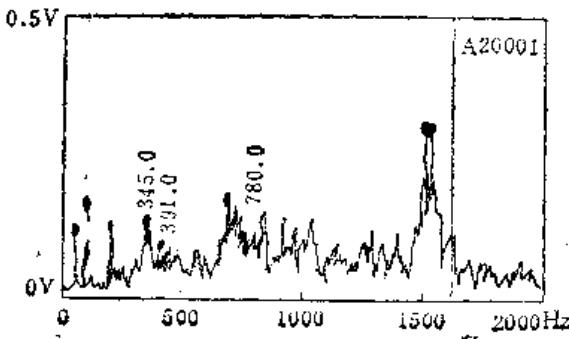

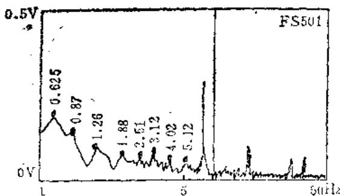

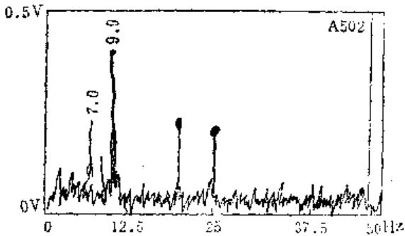

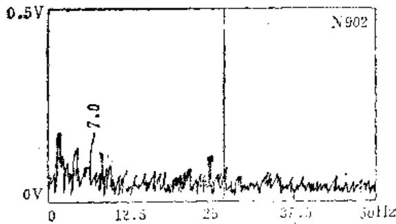

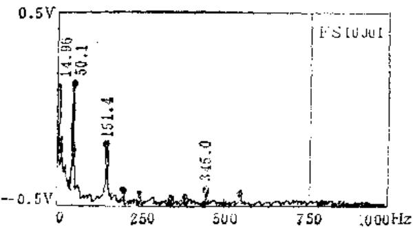  
图17-2-2 由不同

是轴前轴承保持架的倍频。表明该轴承至少有二个滚子破损严重而引起的冲击将调制轴系上的其它振动。

可见三种不同传感器在相同频段却反映了机床运行中问题的各个侧面。

2）从N20001、A20001与FS10001三个谱图，并配合N502、A502与FS501图可以看出：同一故障源的信号在三种传感器上的响应都是不同的，并显示解调谱对分析起到的作用。

床头箱中  $z_{90} / z_{88}$  齿轮对的啮合频率为  $345\mathrm{Hz}$ ，它及其高倍倍频高峰，它受Ⅰ轴前轴承保持架两倍频  $9.9\mathrm{Hz}$  的边带调制，这在N20001与A20001都可见到，但在FS10001上都反映微小。另一齿轮对  $z_{16} / z_{24}$  的啮合频率为  $391\mathrm{Hz}$  在三个原始谱图上都有不同反映。分析表明：这两对齿轮磨损都较大，但对表面加工质量影响却都很小。由解调谱中可见  $9.9\mathrm{Hz}$  的调制幅值很大，所以主要是由Ⅰ轴该轴承上有二个滚子损坏失圆严重引起对  $z_{90} / z_{24}$

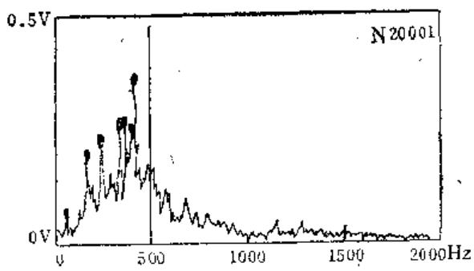

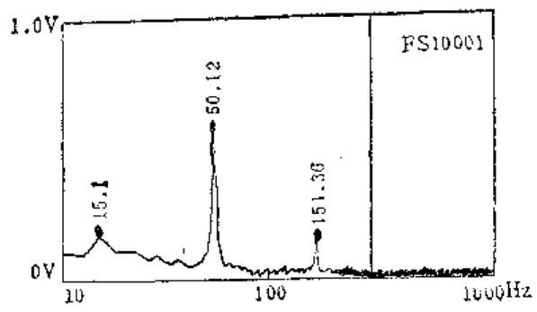

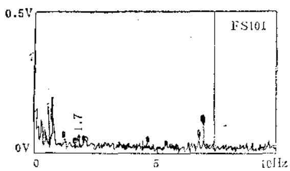

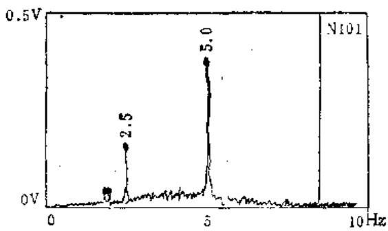

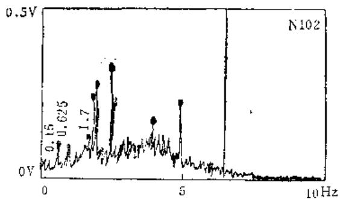

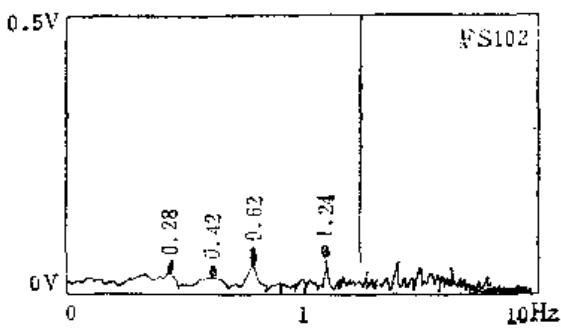

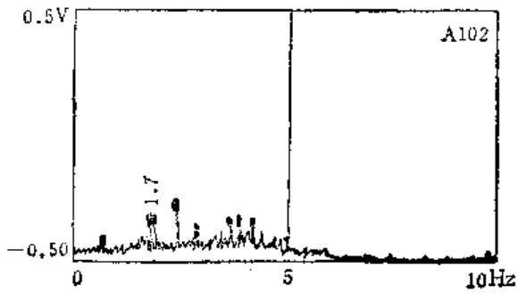

# 传感器测得的谱图

齿轮啮合时冲击大。其中  $z_{34}$  与  $z_{80}$  同在Ⅱ轴上，后者有局部损坏，两者都有严重磨损。

3）挂轮  $z_{114} / z_{114}$  之啮合频率为  $49.75\mathrm{Hz}$ 、在N501与FS501图上有一不小的峰值。挂轮所在轴轴回转频率为  $0.42\mathrm{Hz}$  在N101与N102上无显著反映，但在FS101及FS102展开图上都有明显峰值。这表明：挂轮所在轴的铜套（或称滑动轴承）已磨损，故引起松动而产生挂轮啮合不良，从而也已对表面加工质量产生很大影响。

另外，在FS101与FS102谱图上见到溜板箱中  $z_{13} / z_{40}$  齿轮对的啮合频率为  $1.7\mathrm{Hz}$  峰值较小（而在N102上很大），而  $z_{18}$  齿轮所在轴回转频率为  $0.15\mathrm{Hz}$  及其倍频  $0.30\mathrm{Hz}$  在FS101展开谱上却峰值很大（在N102上也可见到  $0.15\mathrm{Hz}$  ），而  $z_{13}$  齿轮与  $z_{16} / z_{39}$  的  $z_{39}$  齿轮同在这轴上。所以可断定是该轴装配的不同轴引起冲击波两对齿轮啮合不良而齿轮有磨损。

上述分析可见，在刀具传感器测出信号的原始

谱上就可显示这些甚低频的故障信号，而在噪声解调谱上可见到这种磨损引起振动的低频信号。

4）床头箱  $z_{22} / z_{82}$  齿轮对中  $z_{82}$  齿轮在主轴上，其啮合频率为  $51.2\mathrm{Hz}$  。在前面的FS10001、A20001与N20001三图上都有它的基频（图上为 $50.1\mathrm{Hz}$  ）及其高阶倍频。那末是否因为这对齿轮已影响加工精度而必须拆换呢？

主轴回转频率为  $0.625\mathrm{Hz}$ ，在FS101本谱图上有它的高阶倍频，而在FS102、A102与N102解调谱上也有  $0.625\mathrm{Hz}$  出现，甚至有它的4或5倍频出现。这表明主轴前轴承内滚道上也有  $4\sim 5$  个冲击坑，造成对主轴周向为主的振动。而在高频谱A20001上有二个（高频段）的峰，峰的边频带丰富，且在  $50.1\mathrm{Hz}$  峰两边也有丰富边带。那末解调谱上  $0.625\mathrm{Hz}$  正是上述冲击对这对齿轮的啮合以及齿轮系的共振进行调制频率。于是，我们可以认为：主要故障为主轴前轴承内滚道的冲击坑引起轴

系的振动，造成  $z_{82}$  局部损伤以及  $z_{30} / z_{82}$  齿轮对啮合不良与磨损，并严重影响工件的表面质量。所以只需拆换该轴承即可基本解决问题。

上述实例分析过程可清楚地看到：

1）解调技术的采用，对全面正确判定机床真正故障中具有重要作用。  
2）不同传感器分别对不同性质的故障具有特殊的敏感性，故可分别反映机床运行中的不同侧面。  
3）综合分析不同传感器所得谱图才可较全面正确地判出机床的主要故障源。

# 参考文献

[1] 刘林祥，姚家瑞主编，现代设备管理，上海：上海科普出版社，1988  
[2] 洪迈生，吴正毅，周汉安主编. 机械工程测试技术. 机械工程师进修大学，1987