# 第15章齿轮传动

# G1齿轮测量几何尺寸计算表格.(表G15-1\~表G15-9)

表G15-1 公法线长度 $\boldsymbol { W } ^ { * }$ ( 、 

<table><tr><td colspan="3">表G15-1</td><td rowspan="2">公法线长度W（m=mn=1mm、</td><td rowspan="2"></td><td colspan="6">a=an=20)</td></tr><tr><td>假想 齿数</td><td>跨测 公法线 长度</td><td>假想 齿数</td><td>跨测 齿数</td><td>公法线 假想 长度 齿数</td><td>跨测 齿数</td><td>公法线 长度</td><td>假想 齿数</td><td>(mm) 跨测 齿数</td><td>公法线长 度</td></tr><tr><td>~`</td><td>齿数 k</td><td>W</td><td>\</td><td>k 2</td><td>W 4.7644</td><td>3</td><td>k 2</td><td>W 4.8903</td><td>3</td><td>k</td><td>W 4.9884</td></tr><tr><td>8</td><td>2</td><td>4.5402</td><td></td><td>3</td><td>7.7165 10.6686</td><td>33</td><td>3</td><td>7.8425 10.7946</td><td rowspan="4"></td><td>2 3 4</td><td>7.9406</td></tr><tr><td>9</td><td>2</td><td>4.5542</td><td>24</td><td>4 5</td><td>13.6207</td><td>4</td><td>13.7468</td><td>40</td><td>10.8927 13.8448</td></tr><tr><td>10</td><td>2</td><td>4.5683</td><td></td><td>2 4.7784</td><td></td><td>5 6</td><td>16.6989</td><td>5 6</td><td>16.7969</td></tr><tr><td>11 12</td><td>2 2</td><td>4.5823 4.5963</td><td>25</td><td>3 7.7305</td><td></td><td>2</td><td>4.9043</td><td>7</td><td>19.7491</td></tr><tr><td></td><td></td><td>4.6103</td><td></td><td>4 10.6826 5</td><td rowspan="5"></td><td>34</td><td>3 4</td><td>7.8565 10.8086</td><td rowspan="5">3 4</td><td rowspan="5"></td><td>7.9546 10.9067 13.8588</td></tr><tr><td rowspan="2">13</td><td>2 3</td><td>7.5624</td><td></td><td>13.6347 4.7924</td><td>5</td><td>13.7608</td><td>5</td></tr><tr><td></td><td></td><td></td><td>2</td><td></td><td>6 16.7129</td><td>41 6</td><td>16.8110</td></tr><tr><td>14</td><td>2</td><td>4.6243 7.5764</td><td>3 4</td><td>7.7445 10.6966</td><td>2</td><td>4.9184</td><td>7 19.7631 22.7152</td></tr><tr><td rowspan="2">15</td><td>3 2</td><td>4.6383</td><td>26</td><td>5</td><td>13.6487 35</td><td>3</td><td>7.8705 10.8227</td><td rowspan="2"></td><td rowspan="2">8</td></tr><tr><td>3</td><td></td><td>7.5904</td><td>2 3</td><td>4.8064 7.7585</td><td>4 5</td><td>13.7748</td><td>3 4</td></tr><tr><td>16</td><td>2</td><td>4.6523 7.6044</td><td>27</td><td>4 5</td><td>10.7106 13.6627</td><td>36</td><td>6 2 3</td><td>16.7269 4.9324 7.8845</td><td>42</td><td>5 6 7 8</td><td>7.9686 10.9207 13.8728 16.8250 19.7771</td></tr><tr><td>17</td><td>3 2 3</td><td>4.6663 7.6184</td><td>28</td><td>2 3 4</td><td>4.8204 7.7725 10.7246 13.6767</td><td rowspan="5"></td><td>4 5 6</td><td>10.8367 13.7888</td><td rowspan="5"></td><td rowspan="5"></td><td>3 7.9826 10.9347 19.7911</td></tr><tr><td rowspan="3">18</td><td>4</td><td>10.5706</td><td></td><td>5</td><td></td><td>16.7409 19.6931</td><td>43</td><td>4 5 13.8868 16.8390</td></tr><tr><td>2</td><td>4.6803</td><td></td><td>4.8344</td><td>7.7865</td><td>7</td><td>4.9464</td><td>6 7</td></tr><tr><td>3 4</td><td>7.6324 10.5846</td><td>29</td><td>2 3</td><td></td><td>2 3</td><td>7.8985</td><td>8</td></tr><tr><td rowspan="3">19</td><td>2</td><td>4.6943</td><td></td><td>4</td><td>10.7386 13.6908</td><td></td><td>4</td><td>10.8507</td><td>3 4 5</td><td>22.7432 7.9966 10.9487</td></tr><tr><td>3</td><td>7.6464</td><td></td><td>5 2</td><td>4.8484</td><td>37</td><td>5 6</td><td>13.8028 16.7549</td><td rowspan="2"></td><td>13.9008</td></tr><tr><td></td><td></td><td></td><td>3</td><td>7.8005</td><td></td><td>19.7071</td><td>44</td><td>6</td></tr><tr><td rowspan="3">20</td><td>4</td><td>10.5986</td><td></td><td>4</td><td>10.7526</td><td rowspan="3"></td><td>7 2</td><td>4.9604</td><td rowspan="3"></td><td rowspan="3"></td><td>16.8530 19.8051</td></tr><tr><td>2</td><td>4.7083</td><td>30</td><td></td><td></td><td></td><td>7</td></tr><tr><td>3</td><td></td><td></td><td></td><td>3</td><td>7.9125</td><td>8</td></tr><tr><td rowspan="3"></td><td></td><td>7.6604</td><td></td><td>5</td><td>13.7048</td><td rowspan="3"></td><td></td><td></td><td rowspan="3"></td><td></td><td>22.7572</td></tr><tr><td>4</td><td>10.6126</td><td></td><td>6</td><td>16.6669</td><td>4 5</td><td>10.8647 13.8168</td><td>3</td><td>8.0106</td></tr><tr><td>2</td><td>4.7223</td><td></td><td></td><td>38</td><td>6</td><td>16.7689</td><td>4</td><td>10.9627</td></tr><tr><td rowspan="4">21</td><td>3</td><td>7.6744</td><td>31</td><td>2 3</td><td>4.8623 7.8145</td><td></td><td>7</td><td>19.7211</td><td rowspan="4"></td><td>5</td><td>13.9148</td></tr><tr><td></td><td></td><td></td><td>4</td><td>10.7666</td><td></td><td></td><td>45</td><td>6</td><td>16.8670</td></tr><tr><td>4 2</td><td>10.6266 4.7364</td><td></td><td>5</td><td></td><td></td><td>2</td><td>4.9744</td><td>7</td><td>19.8191</td></tr><tr><td>3</td><td>7.6885</td><td></td><td>6</td><td>13.7188</td><td>3</td><td></td><td></td><td>8</td><td>22.7712</td></tr><tr><td rowspan="3">22</td><td>4</td><td>10.6406</td><td></td><td>2</td><td>16.6709</td><td></td><td></td><td>7.9265 10.8787</td><td></td><td>3</td><td>8.0246</td></tr><tr><td></td><td></td><td></td><td></td><td>4.8763</td><td></td><td>4</td><td></td><td></td><td>4</td><td>10.9767</td></tr><tr><td>2</td><td>4.7504</td><td></td><td>3</td><td>7.8285</td><td>39</td><td>5</td><td>13.8308</td><td></td><td>5</td><td>13.9288</td></tr><tr><td rowspan="5">23</td><td>3</td><td>7.7025</td><td>32 10.6546</td><td>4 5</td><td>10.7806</td><td></td><td>6</td><td>16.7829</td><td>46</td><td>6 7</td><td>16.8810</td></tr><tr><td colspan="13" rowspan="1">(续)</td></tr><tr><td colspan="1" rowspan="1">假想齿数<`</td><td colspan="1" rowspan="1">跨测齿数k</td><td colspan="1" rowspan="1">公法线长度W</td><td colspan="1" rowspan="1">假想齿数~`</td><td colspan="1" rowspan="1">跨测齿数k</td><td colspan="1" rowspan="1">公法线长度W</td><td colspan="1" rowspan="1">假想齿数<`</td><td colspan="1" rowspan="1">跨测齿数k</td><td colspan="1" rowspan="1">公法线长度W</td><td colspan="2" rowspan="1">假想齿数~</td><td colspan="1" rowspan="1">跨测齿数k</td><td colspan="1" rowspan="1">公法线长度W</td></tr><tr><td colspan="1" rowspan="2">47</td><td colspan="1" rowspan="2">345678</td><td colspan="1" rowspan="2">8.038610.990713.942916.895019.847122.7992</td><td colspan="1" rowspan="2">54</td><td colspan="1" rowspan="2">456789</td><td colspan="1" rowspan="2">11.088814.040916.993019.945222.897325.8494</td><td colspan="1" rowspan="2">61</td><td colspan="1" rowspan="2">5678910</td><td colspan="1" rowspan="2">14.138917.091120.043222.995325.947528.8996</td><td colspan="2" rowspan="2">68</td><td colspan="1" rowspan="2">67891011</td><td colspan="1" rowspan="1">17.1891</td></tr><tr><td colspan="1" rowspan="1">20.141223.093426.045528.997631.9498</td></tr><tr><td colspan="1" rowspan="2">48</td><td colspan="1" rowspan="2">45678</td><td colspan="1" rowspan="2">11.004713.956916.909019.861122.8133</td><td colspan="1" rowspan="2">55</td><td colspan="1" rowspan="2">456789</td><td colspan="1" rowspan="2">11.102814.054917.007019.959222.911325.8634</td><td colspan="1" rowspan="2">62</td><td colspan="1" rowspan="2">5678910</td><td colspan="1" rowspan="2">14.152917.105120.057223.009325.961528.9136</td><td colspan="2" rowspan="2">69</td><td colspan="1" rowspan="2">67891011</td><td colspan="1" rowspan="1">17.2031</td></tr><tr><td colspan="1" rowspan="1">20.155223.107426.059529.011631.9638</td></tr><tr><td colspan="1" rowspan="5">49</td><td colspan="1" rowspan="5">456789</td><td colspan="1" rowspan="1">11.0187</td><td colspan="1" rowspan="1"></td><td colspan="1" rowspan="1">5</td><td colspan="1" rowspan="1">14.0689</td><td colspan="1" rowspan="1"></td><td colspan="1" rowspan="1">5</td><td colspan="1" rowspan="1">14.1669</td><td colspan="2" rowspan="1"></td><td colspan="1" rowspan="1">6</td><td colspan="1" rowspan="1">17.2171</td></tr><tr><td colspan="1" rowspan="2">13.970916.923019.8751</td><td colspan="1" rowspan="2">56</td><td colspan="1" rowspan="1">6</td><td colspan="1" rowspan="2">17.021019.973222.9253</td><td colspan="1" rowspan="1"></td><td colspan="1" rowspan="1">6</td><td colspan="1" rowspan="1">17.1191</td><td colspan="2" rowspan="2">70</td><td colspan="1" rowspan="1">7</td><td colspan="1" rowspan="2">20.169223.121426.0735</td></tr><tr><td colspan="1" rowspan="1">78</td><td colspan="1" rowspan="1">63</td><td colspan="1" rowspan="1">78</td><td colspan="1" rowspan="1">20.071223.0233</td><td colspan="1" rowspan="1">89</td></tr><tr><td colspan="1" rowspan="2">22.827325.7794</td><td colspan="1" rowspan="2"></td><td colspan="1" rowspan="2">910</td><td colspan="1" rowspan="2">25.877428.8296</td><td colspan="1" rowspan="1"></td><td colspan="1" rowspan="1">9</td><td colspan="1" rowspan="1">25.9755</td><td colspan="2" rowspan="2"></td><td colspan="1" rowspan="2">1011</td><td colspan="1" rowspan="2">29.025631.9778</td></tr><tr><td colspan="1" rowspan="1"></td><td colspan="1" rowspan="1">10</td><td colspan="1" rowspan="1">28.9276</td></tr><tr><td colspan="1" rowspan="1"></td><td colspan="1" rowspan="1">4</td><td colspan="1" rowspan="1">11.0327</td><td colspan="1" rowspan="1"></td><td colspan="1" rowspan="1">5</td><td colspan="1" rowspan="1">14.0829</td><td colspan="1" rowspan="1"></td><td colspan="1" rowspan="1">6</td><td colspan="1" rowspan="1">17.1331</td><td colspan="2" rowspan="1"></td><td colspan="1" rowspan="1">6</td><td colspan="1" rowspan="1">17.2311</td></tr><tr><td colspan="1" rowspan="4">50</td><td colspan="1" rowspan="4">56789</td><td colspan="1" rowspan="2">13.984916.937019.8891</td><td colspan="1" rowspan="2">57</td><td colspan="1" rowspan="2">678</td><td colspan="1" rowspan="1">17.0350</td><td colspan="1" rowspan="1"></td><td colspan="1" rowspan="1">7</td><td colspan="1" rowspan="1">20.0852</td><td colspan="2" rowspan="2">71</td><td colspan="1" rowspan="2">789</td><td colspan="1" rowspan="2">20.183223.135426.0875</td></tr><tr><td colspan="1" rowspan="1">19.987222.9393</td><td colspan="1" rowspan="1">64</td><td colspan="1" rowspan="1">89</td><td colspan="1" rowspan="1">23.037325.9895</td></tr><tr><td colspan="1" rowspan="1">22.8413</td><td colspan="1" rowspan="1"></td><td colspan="1" rowspan="1">9</td><td colspan="1" rowspan="1">25.8914</td><td colspan="1" rowspan="1"></td><td colspan="1" rowspan="1">10</td><td colspan="1" rowspan="1">28.9416</td><td colspan="2" rowspan="2"></td><td colspan="1" rowspan="1">10</td><td colspan="1" rowspan="1">29.0396</td></tr><tr><td colspan="1" rowspan="1">25.7934</td><td colspan="1" rowspan="1"></td><td colspan="1" rowspan="1">10</td><td colspan="1" rowspan="1">28.8436</td><td colspan="1" rowspan="1"></td><td colspan="1" rowspan="1">11</td><td colspan="1" rowspan="1">31.8937</td><td colspan="1" rowspan="1">11</td><td colspan="1" rowspan="1">31.9918</td></tr><tr><td colspan="1" rowspan="1"></td><td colspan="1" rowspan="3">4567</td><td colspan="1" rowspan="1">11.0467</td><td colspan="1" rowspan="1"></td><td colspan="1" rowspan="1">5</td><td colspan="1" rowspan="1">14.0969</td><td colspan="1" rowspan="1"></td><td colspan="1" rowspan="1">6</td><td colspan="1" rowspan="1">17.1471</td><td colspan="2" rowspan="1"></td><td colspan="1" rowspan="1">6</td><td colspan="1" rowspan="1">17.2451</td></tr><tr><td colspan="1" rowspan="2">51</td><td colspan="1" rowspan="2">13.998916.951019.9031</td><td colspan="1" rowspan="2">58</td><td colspan="1" rowspan="1">6</td><td colspan="1" rowspan="1">17.0490</td><td colspan="1" rowspan="1"></td><td colspan="1" rowspan="1">7</td><td colspan="1" rowspan="1">20.0992</td><td colspan="2" rowspan="2">72</td><td colspan="1" rowspan="1"></td><td colspan="1" rowspan="2">789</td><td colspan="1" rowspan="1">20.1973</td></tr><tr><td colspan="1" rowspan="1">78</td><td colspan="1" rowspan="1">20.001222.9533</td><td colspan="1" rowspan="1">65</td><td colspan="1" rowspan="1">89</td><td colspan="1" rowspan="1">23.051326.0035</td><td colspan="1" rowspan="1">23.149426.1015</td></tr><tr><td colspan="1" rowspan="2"></td><td colspan="1" rowspan="2">89</td><td colspan="1" rowspan="2">22.855325.8074</td><td colspan="1" rowspan="2"></td><td colspan="1" rowspan="2">910</td><td colspan="1" rowspan="1">25.9054</td><td colspan="1" rowspan="1"></td><td colspan="1" rowspan="1">10</td><td colspan="1" rowspan="1">28.9556</td><td colspan="2" rowspan="1"></td><td colspan="1" rowspan="1">10</td><td colspan="1" rowspan="1">29.0536</td></tr><tr><td colspan="1" rowspan="1">28.8576</td><td colspan="1" rowspan="1"></td><td colspan="1" rowspan="1">11</td><td colspan="1" rowspan="1">31.9077</td><td colspan="2" rowspan="1"></td><td colspan="1" rowspan="1">11</td><td colspan="1" rowspan="1">32.0058</td></tr><tr><td colspan="1" rowspan="3">52</td><td colspan="1" rowspan="5">456789</td><td colspan="1" rowspan="1">11.0607</td><td colspan="1" rowspan="1"></td><td colspan="1" rowspan="1">5</td><td colspan="1" rowspan="1">14.1109</td><td colspan="1" rowspan="1"></td><td colspan="1" rowspan="1">6</td><td colspan="1" rowspan="1">17.1611</td><td colspan="2" rowspan="1"></td><td colspan="1" rowspan="1">7</td><td colspan="1" rowspan="1">20.2113</td></tr><tr><td colspan="1" rowspan="1">14.0129</td><td colspan="1" rowspan="1"></td><td colspan="1" rowspan="1">6</td><td colspan="1" rowspan="1">17.0630</td><td colspan="1" rowspan="1"></td><td colspan="1" rowspan="1">7</td><td colspan="1" rowspan="1">20.1132</td><td colspan="2" rowspan="1"></td><td colspan="1" rowspan="1">8</td><td colspan="1" rowspan="1">23.1634</td></tr><tr><td colspan="1" rowspan="1">16.966019.9171</td><td colspan="1" rowspan="1">59</td><td colspan="1" rowspan="1">78</td><td colspan="1" rowspan="1">20.015222.9673</td><td colspan="1" rowspan="1">66</td><td colspan="1" rowspan="1">89</td><td colspan="1" rowspan="1">23.065426.0175</td><td colspan="2" rowspan="1">73</td><td colspan="1" rowspan="1">910</td><td colspan="1" rowspan="1">26.115529.0677</td></tr><tr><td colspan="1" rowspan="2"></td><td colspan="1" rowspan="2">22.869325.8214</td><td colspan="1" rowspan="2"></td><td colspan="1" rowspan="2">910</td><td colspan="1" rowspan="1">25.9194</td><td colspan="1" rowspan="2"></td><td colspan="1" rowspan="1">10</td><td colspan="1" rowspan="1">28.9696</td><td colspan="2" rowspan="2"></td><td colspan="1" rowspan="2">1112</td><td colspan="1" rowspan="1">32.0198</td></tr><tr><td colspan="1" rowspan="1">28.8716</td><td colspan="1" rowspan="1">11</td><td colspan="1" rowspan="1">31.9217</td><td colspan="1" rowspan="1">34.9719</td></tr><tr><td colspan="1" rowspan="3">53</td><td colspan="1" rowspan="3">4567</td><td colspan="1" rowspan="1">11.0748</td><td colspan="1" rowspan="1"></td><td colspan="1" rowspan="1">5</td><td colspan="1" rowspan="1">14.1249</td><td colspan="1" rowspan="1"></td><td colspan="1" rowspan="1">6</td><td colspan="1" rowspan="1">17.1751</td><td colspan="2" rowspan="1"></td><td colspan="1" rowspan="1">7</td><td colspan="1" rowspan="1">20.2253</td></tr><tr><td colspan="1" rowspan="1">14.0269</td><td colspan="1" rowspan="1"></td><td colspan="1" rowspan="1">6</td><td colspan="1" rowspan="1">17.0771</td><td colspan="1" rowspan="1"></td><td colspan="1" rowspan="1">7</td><td colspan="1" rowspan="1">20.1272</td><td colspan="2" rowspan="1"></td><td colspan="1" rowspan="1">8</td><td colspan="1" rowspan="1">23.1774</td></tr><tr><td colspan="1" rowspan="1">16.979019.9311</td><td colspan="1" rowspan="1">60</td><td colspan="1" rowspan="1">78</td><td colspan="1" rowspan="1">20.029222.9813</td><td colspan="1" rowspan="1">67</td><td colspan="1" rowspan="1">89</td><td colspan="1" rowspan="1">23.079426.0315</td><td colspan="2" rowspan="1">74</td><td colspan="1" rowspan="1">910</td><td colspan="1" rowspan="1">26.129529.0817</td></tr><tr><td colspan="1" rowspan="4"></td><td colspan="1" rowspan="3">8</td><td></td><td></td><td></td><td></td><td></td><td></td><td></td><td></td><td></td><td></td><td colspan="1"></td></tr><tr><td colspan="1" rowspan="3">89</td><td></td><td></td><td></td><td></td><td></td><td></td><td></td><td></td><td></td><td></td><td colspan="1"></td></tr><tr><td colspan="1" rowspan="1">22.8833</td><td colspan="1" rowspan="1"></td><td colspan="1" rowspan="1">9</td><td colspan="1" rowspan="1">25.9334</td><td colspan="1" rowspan="1"></td><td colspan="1" rowspan="1">10</td><td colspan="1" rowspan="1">28.9836</td><td colspan="2" rowspan="1"></td><td colspan="1" rowspan="1">11</td><td colspan="1" rowspan="1">32.0338</td></tr><tr><td colspan="1" rowspan="1">25.8354</td><td colspan="1" rowspan="1"></td><td colspan="1" rowspan="1">10</td><td colspan="1" rowspan="1">28.8856</td><td colspan="1" rowspan="1"></td><td colspan="1" rowspan="1">11</td><td colspan="1" rowspan="1">31.9358</td><td colspan="2" rowspan="1"></td><td colspan="1" rowspan="1">12</td><td colspan="1" rowspan="1">34.9859</td></tr></table>

<table><tr><td rowspan=1 colspan=15>(续)</td></tr><tr><td rowspan=1 colspan=1>假想齿数~</td><td rowspan=1 colspan=1>跨测齿数k</td><td rowspan=1 colspan=1>公法线长度W*</td><td rowspan=1 colspan=1>假想齿数~`</td><td rowspan=1 colspan=1>跨测齿数k</td><td rowspan=1 colspan=1>公法线长度W</td><td rowspan=1 colspan=1>假想齿数~`</td><td rowspan=1 colspan=1>跨测齿数k</td><td rowspan=1 colspan=1>公法线长度W*</td><td rowspan=1 colspan=4>假想齿数<</td><td rowspan=1 colspan=1>跨测齿数k</td><td rowspan=1 colspan=1>公法线长度W</td></tr><tr><td rowspan=7 colspan=1>75</td><td rowspan=7 colspan=1>789101112</td><td rowspan=7 colspan=1>20.239323.191426.143529.095732.047834.9999</td><td rowspan=7 colspan=1>82</td><td rowspan=3 colspan=1>891011</td><td rowspan=2 colspan=1>23.289426.2416</td><td rowspan=2 colspan=1></td><td rowspan=2 colspan=1>89</td><td rowspan=2 colspan=1>23.387526.3396</td><td rowspan=3 colspan=4>96</td><td rowspan=3 colspan=1>9101112</td><td rowspan=1 colspan=1>26.4376</td></tr><tr><td rowspan=1 colspan=1>29.3898</td></tr><tr><td rowspan=1 colspan=1>29.193732.1458</td><td rowspan=1 colspan=1>89</td><td rowspan=1 colspan=1>1011</td><td rowspan=1 colspan=1>29.291732.2439</td><td rowspan=1 colspan=1>32.341935.2940</td></tr><tr><td rowspan=4 colspan=1>1213</td><td rowspan=3 colspan=1>35.0980</td><td rowspan=3 colspan=1></td><td rowspan=3 colspan=1>12</td><td rowspan=3 colspan=1>35.1960</td><td rowspan=3 colspan=2></td><td rowspan=1 colspan=2></td><td></td><td></td><td></td></tr><tr><td rowspan=2 colspan=3></td><td></td><td></td></tr><tr><td rowspan=1 colspan=2></td><td rowspan=1 colspan=1>13</td><td rowspan=1 colspan=1>38.2462</td></tr><tr><td rowspan=1 colspan=1>33.0501</td><td rowspan=1 colspan=1></td><td rowspan=1 colspan=1>13</td><td rowspan=1 colspan=1>38.1481</td><td rowspan=1 colspan=4></td><td rowspan=1 colspan=1>14</td><td rowspan=1 colspan=1>41.1983</td></tr><tr><td rowspan=5 colspan=1>76</td><td rowspan=5 colspan=1>789101112</td><td rowspan=3 colspan=1>20.253323.205426.157529.1097</td><td rowspan=1 colspan=1></td><td rowspan=1 colspan=1>8</td><td rowspan=1 colspan=1>23.3034</td><td rowspan=1 colspan=1></td><td rowspan=1 colspan=1>8</td><td rowspan=1 colspan=1>26.3536</td><td rowspan=1 colspan=4></td><td rowspan=1 colspan=1>9</td><td rowspan=1 colspan=1>26.4517</td></tr><tr><td rowspan=2 colspan=1>83</td><td rowspan=1 colspan=1>9</td><td rowspan=1 colspan=1>26.2556</td><td rowspan=1 colspan=1></td><td rowspan=1 colspan=1></td><td rowspan=1 colspan=1>29.3057</td><td rowspan=1 colspan=4></td><td rowspan=1 colspan=1>10</td><td rowspan=1 colspan=1>29.4038</td></tr><tr><td rowspan=1 colspan=1>1011</td><td rowspan=1 colspan=1>29.207732.1598</td><td rowspan=1 colspan=1>90</td><td rowspan=1 colspan=1>1011</td><td rowspan=1 colspan=1>32.257935.2100</td><td rowspan=1 colspan=4>97</td><td rowspan=1 colspan=1>1112</td><td rowspan=1 colspan=1>32.355935.3080</td></tr><tr><td rowspan=1 colspan=1>32.0618</td><td rowspan=1 colspan=1></td><td rowspan=1 colspan=1>12</td><td rowspan=1 colspan=1>35.1120</td><td rowspan=1 colspan=1></td><td rowspan=1 colspan=1>12</td><td rowspan=1 colspan=1>38.1621</td><td rowspan=1 colspan=4></td><td rowspan=1 colspan=1>13</td><td rowspan=1 colspan=1>38.2602</td></tr><tr><td rowspan=1 colspan=1>35.0139</td><td rowspan=1 colspan=1></td><td rowspan=1 colspan=1>13</td><td rowspan=1 colspan=1>38.0641</td><td rowspan=1 colspan=1></td><td rowspan=1 colspan=1>13</td><td rowspan=1 colspan=1>41.1143</td><td rowspan=1 colspan=4></td><td rowspan=1 colspan=1>14</td><td rowspan=1 colspan=1>41.2123</td></tr><tr><td rowspan=1 colspan=1></td><td rowspan=1 colspan=1>7</td><td rowspan=1 colspan=1>20.2673</td><td rowspan=1 colspan=1></td><td rowspan=1 colspan=1>8</td><td rowspan=1 colspan=1>23.3175</td><td rowspan=1 colspan=1></td><td rowspan=1 colspan=1>9</td><td rowspan=1 colspan=1>26.3676</td><td rowspan=1 colspan=4></td><td rowspan=1 colspan=1>9</td><td rowspan=1 colspan=1>26.4657</td></tr><tr><td rowspan=2 colspan=1>77</td><td rowspan=2 colspan=1>8910</td><td rowspan=1 colspan=1>23.2194</td><td rowspan=1 colspan=1></td><td rowspan=1 colspan=1>9</td><td rowspan=1 colspan=1>26.2696</td><td rowspan=1 colspan=1></td><td rowspan=1 colspan=1>10</td><td rowspan=1 colspan=1>29.3198</td><td rowspan=1 colspan=4></td><td rowspan=1 colspan=1>10</td><td rowspan=1 colspan=1>29.4178</td></tr><tr><td rowspan=1 colspan=1>26.171529.1237</td><td rowspan=1 colspan=1>84</td><td rowspan=1 colspan=1>1011</td><td rowspan=1 colspan=1>29.221732.1738</td><td rowspan=1 colspan=1>91</td><td rowspan=1 colspan=1>1112</td><td rowspan=1 colspan=1>32.271935.2240</td><td rowspan=1 colspan=4>98</td><td rowspan=1 colspan=1>1112</td><td rowspan=1 colspan=1>32.369935.3221</td></tr><tr><td rowspan=1 colspan=1></td><td rowspan=1 colspan=1>11</td><td rowspan=1 colspan=1>32.0758</td><td rowspan=1 colspan=1></td><td rowspan=1 colspan=1>12</td><td rowspan=1 colspan=1>35.1260</td><td rowspan=1 colspan=1></td><td rowspan=1 colspan=1>13</td><td rowspan=1 colspan=1>38.1761</td><td rowspan=1 colspan=4></td><td rowspan=1 colspan=1>13</td><td rowspan=1 colspan=1>38.2742</td></tr><tr><td rowspan=1 colspan=1></td><td rowspan=1 colspan=1>12</td><td rowspan=1 colspan=1>35.0279</td><td rowspan=1 colspan=1></td><td rowspan=1 colspan=1>13</td><td rowspan=1 colspan=1>38.0781</td><td rowspan=1 colspan=1></td><td rowspan=1 colspan=1>14</td><td rowspan=1 colspan=1>41.1283</td><td rowspan=1 colspan=4></td><td rowspan=1 colspan=1>14</td><td rowspan=1 colspan=1>41.2263</td></tr><tr><td rowspan=2 colspan=1></td><td rowspan=1 colspan=1>7</td><td rowspan=1 colspan=1>20.2813</td><td rowspan=1 colspan=1></td><td rowspan=1 colspan=1>8</td><td rowspan=1 colspan=1>23.3315</td><td rowspan=1 colspan=1></td><td rowspan=1 colspan=1>9</td><td rowspan=1 colspan=1>26.3816</td><td rowspan=1 colspan=4></td><td rowspan=1 colspan=1>10</td><td rowspan=1 colspan=1>29.4318</td></tr><tr><td rowspan=1 colspan=1>8</td><td rowspan=1 colspan=1>23.2334</td><td rowspan=1 colspan=1></td><td rowspan=1 colspan=1>9</td><td rowspan=1 colspan=1>26.2836</td><td rowspan=1 colspan=1></td><td rowspan=1 colspan=1>10</td><td rowspan=1 colspan=1>29.3338</td><td rowspan=1 colspan=4></td><td rowspan=1 colspan=1>11</td><td rowspan=1 colspan=1>32.3839</td></tr><tr><td rowspan=1 colspan=1>78</td><td rowspan=1 colspan=1>910</td><td rowspan=1 colspan=1>26.185529.1377</td><td rowspan=1 colspan=1>85</td><td rowspan=1 colspan=1>1011</td><td rowspan=1 colspan=1>29.235732.1879</td><td rowspan=1 colspan=1>92</td><td rowspan=1 colspan=1>1112</td><td rowspan=1 colspan=1>32.285935.2380</td><td rowspan=1 colspan=4>99</td><td rowspan=1 colspan=1>1213</td><td rowspan=1 colspan=1>35.336138.2882</td></tr><tr><td rowspan=2 colspan=1></td><td rowspan=1 colspan=1>11</td><td rowspan=1 colspan=1>32.0898</td><td rowspan=1 colspan=1></td><td rowspan=1 colspan=1>12</td><td rowspan=1 colspan=1>35.1400</td><td rowspan=1 colspan=1></td><td rowspan=1 colspan=1>13</td><td rowspan=1 colspan=1>38.1902</td><td rowspan=1 colspan=4></td><td rowspan=1 colspan=1>14</td><td rowspan=1 colspan=1>41.2403</td></tr><tr><td rowspan=1 colspan=1>12</td><td rowspan=1 colspan=1>35.0419</td><td rowspan=1 colspan=1></td><td rowspan=1 colspan=1>13</td><td rowspan=1 colspan=1>38.0921</td><td rowspan=1 colspan=1></td><td rowspan=1 colspan=1>14</td><td rowspan=1 colspan=1>41.1423</td><td rowspan=1 colspan=4></td><td rowspan=1 colspan=1>15</td><td rowspan=1 colspan=1>44.1925</td></tr><tr><td rowspan=1 colspan=1></td><td rowspan=1 colspan=1>7</td><td rowspan=1 colspan=1>20.2953</td><td rowspan=1 colspan=1></td><td rowspan=1 colspan=1>8</td><td rowspan=1 colspan=1>23.3455</td><td rowspan=1 colspan=1></td><td rowspan=1 colspan=1>9</td><td rowspan=1 colspan=1>26.3956</td><td rowspan=1 colspan=4></td><td rowspan=1 colspan=1>10</td><td rowspan=1 colspan=1>29.4458</td></tr><tr><td rowspan=2 colspan=1>79</td><td rowspan=2 colspan=1>8910</td><td rowspan=1 colspan=1>23.2474</td><td rowspan=1 colspan=1></td><td rowspan=1 colspan=1>9</td><td rowspan=1 colspan=1>26.2976</td><td rowspan=1 colspan=1></td><td rowspan=1 colspan=1>10</td><td rowspan=1 colspan=1>39.3478</td><td rowspan=1 colspan=4></td><td rowspan=1 colspan=1>11</td><td rowspan=1 colspan=1>32.3979</td></tr><tr><td rowspan=1 colspan=1>26.199629.1517</td><td rowspan=1 colspan=1>86</td><td rowspan=1 colspan=1>1011</td><td rowspan=1 colspan=1>29.249732.2019</td><td rowspan=1 colspan=1>93</td><td rowspan=1 colspan=1>1112</td><td rowspan=1 colspan=1>32.299935.2520</td><td rowspan=1 colspan=4>100</td><td rowspan=1 colspan=1>1213</td><td rowspan=1 colspan=1>35.350138.3022</td></tr><tr><td rowspan=2 colspan=1></td><td rowspan=2 colspan=1>1112</td><td rowspan=1 colspan=1>32.1038</td><td rowspan=1 colspan=1></td><td rowspan=1 colspan=1>12</td><td rowspan=1 colspan=1>35.1540</td><td rowspan=1 colspan=1></td><td rowspan=1 colspan=1>13</td><td rowspan=1 colspan=1>38.2042</td><td rowspan=1 colspan=4></td><td rowspan=1 colspan=1>14</td><td rowspan=1 colspan=1>41.2543</td></tr><tr><td rowspan=1 colspan=1>35.0559</td><td rowspan=1 colspan=1></td><td rowspan=1 colspan=1>13</td><td rowspan=1 colspan=1>38.1061</td><td rowspan=1 colspan=1></td><td rowspan=1 colspan=1>14</td><td rowspan=1 colspan=1>41.1563</td><td rowspan=1 colspan=4></td><td rowspan=1 colspan=1>15</td><td rowspan=1 colspan=1>44.2065</td></tr><tr><td rowspan=5 colspan=1>80</td><td rowspan=3 colspan=1>78910</td><td rowspan=1 colspan=1>20.3093</td><td rowspan=1 colspan=1></td><td rowspan=1 colspan=1>8</td><td rowspan=1 colspan=1>23.3595</td><td rowspan=1 colspan=1></td><td rowspan=1 colspan=1>9</td><td rowspan=1 colspan=1>26.4096</td><td rowspan=1 colspan=4></td><td rowspan=1 colspan=1>10</td><td rowspan=1 colspan=1>29.4598</td></tr><tr><td rowspan=1 colspan=1>23.2614</td><td rowspan=1 colspan=1></td><td rowspan=1 colspan=1>9</td><td rowspan=1 colspan=1>26.3116</td><td rowspan=1 colspan=1></td><td rowspan=1 colspan=1>10</td><td rowspan=1 colspan=1>29.3618</td><td rowspan=1 colspan=4></td><td rowspan=1 colspan=1>11</td><td rowspan=1 colspan=1>32.4119</td></tr><tr><td rowspan=1 colspan=1>26.213629.1657</td><td rowspan=1 colspan=1>87</td><td rowspan=1 colspan=1>1011</td><td rowspan=1 colspan=1>29.263732.2159</td><td rowspan=1 colspan=1>94</td><td rowspan=1 colspan=1>1112</td><td rowspan=1 colspan=1>32.313935.2660</td><td rowspan=1 colspan=4>101</td><td rowspan=1 colspan=1>1213</td><td rowspan=1 colspan=1>35.364138.3192</td></tr><tr><td rowspan=2 colspan=1>1112</td><td rowspan=2 colspan=1>32.117835.0700</td><td rowspan=2 colspan=1></td><td rowspan=2 colspan=1>1213</td><td rowspan=1 colspan=1>35.1680</td><td rowspan=1 colspan=1></td><td rowspan=1 colspan=1>13</td><td rowspan=1 colspan=1>38.2182</td><td rowspan=1 colspan=4></td><td rowspan=1 colspan=1>14</td><td rowspan=1 colspan=1>41.2683</td></tr><tr><td rowspan=1 colspan=1>38.1201</td><td rowspan=1 colspan=1></td><td rowspan=1 colspan=1>14</td><td rowspan=1 colspan=1>41.1703</td><td rowspan=1 colspan=4></td><td rowspan=1 colspan=1>15</td><td rowspan=1 colspan=1>44.2205</td></tr><tr><td rowspan=1 colspan=1></td><td rowspan=1 colspan=1>8</td><td rowspan=1 colspan=1>23.2754</td><td rowspan=1 colspan=1></td><td rowspan=1 colspan=1>8</td><td rowspan=1 colspan=1>23.3735</td><td rowspan=1 colspan=1></td><td rowspan=1 colspan=1>9</td><td rowspan=1 colspan=1>26.4236</td><td rowspan=1 colspan=4></td><td rowspan=1 colspan=1>10</td><td rowspan=1 colspan=1>29.4738</td></tr><tr><td rowspan=2 colspan=1>81</td><td rowspan=1 colspan=1>9</td><td rowspan=1 colspan=1>26.2276</td><td rowspan=2 colspan=1>88</td><td rowspan=1 colspan=1>9</td><td rowspan=1 colspan=1>26.3256</td><td rowspan=1 colspan=1></td><td rowspan=1 colspan=1>10</td><td rowspan=1 colspan=1>29.3758</td><td rowspan=1 colspan=4></td><td rowspan=1 colspan=1>11</td><td rowspan=1 colspan=1>32.4259</td></tr><tr><td rowspan=1 colspan=1>1011</td><td rowspan=1 colspan=1>29.179732.1318</td><td rowspan=1 colspan=1>1011</td><td rowspan=1 colspan=1>29.277732.2299</td><td rowspan=1 colspan=1>95</td><td rowspan=1 colspan=1>1112</td><td rowspan=1 colspan=1>32.327935.2800</td><td rowspan=1 colspan=4>102</td><td rowspan=1 colspan=1>1213</td><td rowspan=1 colspan=1>35.378138.3302</td></tr><tr><td rowspan=2 colspan=1></td><td rowspan=1 colspan=1>12</td><td rowspan=1 colspan=1>35.0840</td><td rowspan=1 colspan=1></td><td rowspan=1 colspan=1>12</td><td rowspan=1 colspan=1>35.1820</td><td rowspan=1 colspan=1></td><td rowspan=1 colspan=1>13</td><td rowspan=1 colspan=1>38.2322</td><td rowspan=1 colspan=4></td><td rowspan=1 colspan=1>14</td><td rowspan=1 colspan=1>41.2823</td></tr><tr><td rowspan=1 colspan=1>13</td><td rowspan=1 colspan=1>38.0361</td><td rowspan=1 colspan=1></td><td rowspan=1 colspan=1>13</td><td rowspan=1 colspan=1>38.1341</td><td rowspan=1 colspan=1></td><td rowspan=1 colspan=1>14</td><td rowspan=1 colspan=1>41.1843</td><td rowspan=1 colspan=4></td><td rowspan=1 colspan=1>15</td><td rowspan=1 colspan=1>44.2345</td></tr></table>

<table><tr><td rowspan=1 colspan=16>(续)</td></tr><tr><td rowspan=1 colspan=1>假想齿数<`</td><td rowspan=1 colspan=1>跨测齿数k</td><td rowspan=1 colspan=1>公法线长度W*</td><td rowspan=1 colspan=2>假想齿数`</td><td rowspan=1 colspan=1>跨测齿数k</td><td rowspan=1 colspan=1>公法线长度W</td><td rowspan=1 colspan=1>假想齿数~`</td><td rowspan=1 colspan=1>跨测齿数k</td><td rowspan=1 colspan=1>公法线长度W</td><td rowspan=1 colspan=4>假想齿数<`</td><td rowspan=1 colspan=1>跨测齿数k</td><td rowspan=1 colspan=1>公法线长度W</td></tr><tr><td rowspan=4 colspan=1>103</td><td rowspan=4 colspan=1>101112131415</td><td rowspan=4 colspan=1>29.487832.440035.392138.344241.296344.2485</td><td rowspan=4 colspan=2>110</td><td rowspan=2 colspan=1>11121314</td><td rowspan=1 colspan=1>32.5380</td><td rowspan=1 colspan=1></td><td rowspan=1 colspan=1>12</td><td rowspan=2 colspan=1>35.588238.540341.492444.4446</td><td rowspan=2 colspan=4>124</td><td rowspan=2 colspan=1>12131415</td><td rowspan=1 colspan=1>35.6862</td></tr><tr><td rowspan=1 colspan=1>35.490138.442341.3944</td><td rowspan=1 colspan=1>117</td><td rowspan=1 colspan=1>131415</td><td rowspan=1 colspan=1>38.638341.590544.5426</td></tr><tr><td rowspan=2 colspan=1>1516</td><td rowspan=2 colspan=1>44.346547.2986</td><td rowspan=2 colspan=1></td><td rowspan=2 colspan=1>1617</td><td rowspan=2 colspan=1>47.396750.3488</td><td rowspan=2 colspan=4></td><td rowspan=2 colspan=1>1617</td><td rowspan=1 colspan=1>47.4947</td></tr><tr><td rowspan=1 colspan=1>50.4469</td></tr><tr><td rowspan=5 colspan=1>104</td><td rowspan=5 colspan=1>101112131415</td><td rowspan=5 colspan=1>29.501832.454035.406138.358241.310444.2625</td><td rowspan=4 colspan=2>111</td><td rowspan=1 colspan=1>11</td><td rowspan=1 colspan=1>32.5520</td><td rowspan=1 colspan=1></td><td rowspan=1 colspan=1>12</td><td rowspan=1 colspan=1>35.6022</td><td rowspan=2 colspan=4></td><td rowspan=1 colspan=1>13</td><td rowspan=1 colspan=1>38.6523</td></tr><tr><td rowspan=1 colspan=1>12</td><td rowspan=1 colspan=1>35.5041</td><td rowspan=1 colspan=1></td><td rowspan=1 colspan=1>13</td><td rowspan=2 colspan=1>38.554341.506444.4586</td><td rowspan=2 colspan=4>125</td><td rowspan=1 colspan=1>14</td><td rowspan=1 colspan=1>41.6045</td></tr><tr><td rowspan=1 colspan=1>1314</td><td rowspan=1 colspan=1>38.456341.4084</td><td rowspan=1 colspan=1>118</td><td rowspan=1 colspan=1>1415</td><td rowspan=1 colspan=1>1516</td><td rowspan=1 colspan=1>44.556647.5087</td></tr><tr><td rowspan=2 colspan=2></td><td rowspan=1 colspan=1>15</td><td rowspan=1 colspan=1>44.3605</td><td rowspan=1 colspan=1></td><td rowspan=1 colspan=1>16</td><td rowspan=1 colspan=1>47.4107</td><td rowspan=1 colspan=4></td><td rowspan=1 colspan=1>17</td><td rowspan=1 colspan=1>50.4609</td></tr><tr><td rowspan=1 colspan=1>16</td><td rowspan=1 colspan=1>47.3127</td><td rowspan=1 colspan=1></td><td rowspan=1 colspan=1>17</td><td rowspan=1 colspan=1>50.3628</td><td rowspan=1 colspan=4></td><td rowspan=1 colspan=1>18</td><td rowspan=1 colspan=1>53.4130</td></tr><tr><td rowspan=7 colspan=1>105</td><td rowspan=7 colspan=1>101112131415</td><td rowspan=1 colspan=1>29.5158</td><td rowspan=1 colspan=2></td><td rowspan=1 colspan=1>11</td><td rowspan=1 colspan=1>32.5660</td><td rowspan=1 colspan=1></td><td rowspan=1 colspan=1>12</td><td rowspan=1 colspan=1>35.6162</td><td rowspan=1 colspan=4></td><td rowspan=1 colspan=1>13</td><td rowspan=1 colspan=1>38.6663</td></tr><tr><td rowspan=4 colspan=1>32.468035.420138.3722</td><td rowspan=4 colspan=2>112</td><td rowspan=3 colspan=1>12</td><td rowspan=3 colspan=1>35.5181</td><td rowspan=3 colspan=1></td><td rowspan=3 colspan=1>13</td><td rowspan=3 colspan=1>38.5683</td><td rowspan=3 colspan=3></td><td></td><td></td><td></td></tr><tr><td rowspan=2 colspan=1></td><td></td><td></td><td></td></tr><tr><td rowspan=1 colspan=1></td><td rowspan=1 colspan=1>14</td><td rowspan=1 colspan=1>41.6185</td></tr><tr><td rowspan=1 colspan=1>1314</td><td rowspan=1 colspan=1>38.470341.4224</td><td rowspan=1 colspan=1>119</td><td rowspan=1 colspan=1>1415</td><td rowspan=1 colspan=1>41.520444.4726</td><td rowspan=1 colspan=4>126</td><td rowspan=1 colspan=1>1516</td><td rowspan=1 colspan=1>44.570647.5227</td></tr><tr><td rowspan=2 colspan=1>41.324444.2765</td><td rowspan=2 colspan=2></td><td rowspan=1 colspan=1>15</td><td rowspan=1 colspan=1>44.3745</td><td rowspan=1 colspan=1></td><td rowspan=1 colspan=1>16</td><td rowspan=1 colspan=1>47.4247</td><td rowspan=1 colspan=4></td><td rowspan=1 colspan=1>17</td><td rowspan=1 colspan=1>50.4749</td></tr><tr><td rowspan=1 colspan=1>16</td><td rowspan=1 colspan=1>47.3267</td><td rowspan=1 colspan=1></td><td rowspan=1 colspan=1>17</td><td rowspan=1 colspan=1>50.3768</td><td rowspan=1 colspan=4></td><td rowspan=1 colspan=1>18</td><td rowspan=1 colspan=1>53.4270</td></tr><tr><td rowspan=5 colspan=1>106</td><td rowspan=5 colspan=1>101112131415</td><td rowspan=1 colspan=1>29.5298</td><td rowspan=1 colspan=2></td><td rowspan=1 colspan=1>11</td><td rowspan=1 colspan=1>32.5800</td><td rowspan=1 colspan=1></td><td rowspan=1 colspan=1>12</td><td rowspan=1 colspan=1>35.6302</td><td rowspan=1 colspan=4></td><td rowspan=1 colspan=1>13</td><td rowspan=1 colspan=1>38.6803</td></tr><tr><td rowspan=4 colspan=1>32.482035.434138.386241.338444.2905</td><td rowspan=1 colspan=2></td><td rowspan=1 colspan=1>12</td><td rowspan=1 colspan=1>35.5321</td><td rowspan=1 colspan=1></td><td rowspan=1 colspan=1>13</td><td rowspan=1 colspan=1>38.5823</td><td rowspan=1 colspan=4></td><td rowspan=1 colspan=1>14</td><td rowspan=1 colspan=1>41.6325</td></tr><tr><td rowspan=1 colspan=2>113</td><td rowspan=1 colspan=1>1314</td><td rowspan=1 colspan=1>38.484341.4364</td><td rowspan=1 colspan=1>120</td><td rowspan=1 colspan=1>1415</td><td rowspan=1 colspan=1>41.534444.4866</td><td rowspan=1 colspan=4>127</td><td rowspan=1 colspan=1>1516</td><td rowspan=1 colspan=1>44.584647.5367</td></tr><tr><td rowspan=2 colspan=2></td><td rowspan=2 colspan=1>1516</td><td rowspan=2 colspan=1>44.388547.3407</td><td rowspan=1 colspan=1></td><td rowspan=1 colspan=1>16</td><td rowspan=1 colspan=1>47.4387</td><td rowspan=2 colspan=4></td><td rowspan=1 colspan=1>17</td><td rowspan=1 colspan=1>50.4889</td></tr><tr><td rowspan=1 colspan=1></td><td rowspan=1 colspan=1>17</td><td rowspan=1 colspan=1>50.3908</td><td rowspan=1 colspan=1>18</td><td rowspan=1 colspan=1>53.4410</td></tr><tr><td rowspan=5 colspan=1>107</td><td rowspan=5 colspan=1>101112131415</td><td rowspan=5 colspan=1>29.543832.496035.448138.400241.352444.3045</td><td rowspan=1 colspan=2></td><td rowspan=1 colspan=1>11</td><td rowspan=1 colspan=1>32.5940</td><td rowspan=1 colspan=1></td><td rowspan=1 colspan=1>12</td><td rowspan=1 colspan=1>35.6442</td><td rowspan=1 colspan=4></td><td rowspan=1 colspan=1>13</td><td rowspan=1 colspan=1>38.6944</td></tr><tr><td rowspan=1 colspan=2></td><td rowspan=1 colspan=1>12</td><td rowspan=1 colspan=1>35.5461</td><td rowspan=1 colspan=1></td><td rowspan=1 colspan=1>13</td><td rowspan=1 colspan=1>38.5963</td><td rowspan=1 colspan=4></td><td rowspan=1 colspan=1>14</td><td rowspan=1 colspan=1>41.6465</td></tr><tr><td rowspan=1 colspan=2>114</td><td rowspan=1 colspan=1>1314</td><td rowspan=1 colspan=1>38.498341.4504</td><td rowspan=1 colspan=1>121</td><td rowspan=1 colspan=1>1415</td><td rowspan=1 colspan=1>41.548444.5006</td><td rowspan=1 colspan=4>128</td><td rowspan=1 colspan=1>1516</td><td rowspan=1 colspan=1>44.598647.5507</td></tr><tr><td rowspan=2 colspan=2></td><td rowspan=1 colspan=1>15</td><td rowspan=1 colspan=1>44.4025</td><td rowspan=1 colspan=1></td><td rowspan=1 colspan=1>16</td><td rowspan=1 colspan=1>47.4527</td><td rowspan=1 colspan=4></td><td rowspan=1 colspan=1>17</td><td rowspan=1 colspan=1>50.5029</td></tr><tr><td rowspan=1 colspan=1>16</td><td rowspan=1 colspan=1>47.3547</td><td rowspan=1 colspan=1></td><td rowspan=1 colspan=1>17</td><td rowspan=1 colspan=1>50.4048</td><td rowspan=1 colspan=4></td><td rowspan=1 colspan=1>18</td><td rowspan=1 colspan=1>53.4550</td></tr><tr><td rowspan=5 colspan=1>108</td><td rowspan=5 colspan=1>111213141516</td><td rowspan=1 colspan=1>32.5100</td><td rowspan=1 colspan=2></td><td rowspan=1 colspan=1>11</td><td rowspan=1 colspan=1>32.6080</td><td rowspan=1 colspan=1></td><td rowspan=1 colspan=1>12</td><td rowspan=1 colspan=1>35.6582</td><td rowspan=1 colspan=4></td><td rowspan=1 colspan=1>13</td><td rowspan=1 colspan=1>38.7084</td></tr><tr><td rowspan=4 colspan=1>35.462138.414241.366444.318547.2706</td><td rowspan=4 colspan=2>115</td><td rowspan=1 colspan=1></td><td rowspan=1 colspan=1>12</td><td rowspan=1 colspan=1>35.5601</td><td rowspan=1 colspan=1></td><td rowspan=1 colspan=1>13</td><td rowspan=1 colspan=1>38.6103</td><td rowspan=1 colspan=3></td><td rowspan=2 colspan=2>129</td><td rowspan=1 colspan=1></td><td rowspan=1 colspan=1>14</td></tr><tr><td rowspan=1 colspan=1>1314</td><td rowspan=1 colspan=1>38.512341.4644</td><td rowspan=1 colspan=1>122</td><td rowspan=1 colspan=1>1415</td><td rowspan=1 colspan=1>41.562544.5146</td><td></td><td></td><td rowspan=1 colspan=1>1516</td><td rowspan=1 colspan=1>44.612647.5648</td></tr><tr><td rowspan=2 colspan=1>1516</td><td rowspan=2 colspan=1>44.416547.3687</td><td rowspan=1 colspan=1></td><td rowspan=1 colspan=1>16</td><td rowspan=1 colspan=1>47.4667</td><td rowspan=2 colspan=4></td><td rowspan=2 colspan=1>1718</td><td rowspan=1 colspan=1>50.5169</td></tr><tr><td rowspan=1 colspan=1></td><td rowspan=1 colspan=1>17</td><td rowspan=1 colspan=1>50.4188</td><td rowspan=1 colspan=1>53.4690</td></tr><tr><td rowspan=3 colspan=1>109</td><td rowspan=1 colspan=1>11</td><td rowspan=1 colspan=1>32.5240</td><td rowspan=1 colspan=2></td><td rowspan=1 colspan=1>11</td><td rowspan=1 colspan=1>32.6220</td><td rowspan=1 colspan=1></td><td rowspan=1 colspan=1>12</td><td rowspan=1 colspan=1>35.6722</td><td rowspan=1 colspan=4></td><td rowspan=1 colspan=1>13</td><td rowspan=1 colspan=1>38.7224</td></tr><tr><td rowspan=2 colspan=1>121314</td><td rowspan=1 colspan=1>35.4761</td><td rowspan=1 colspan=2></td><td rowspan=1 colspan=1>12</td><td rowspan=1 colspan=1>35.5742</td><td rowspan=1 colspan=1></td><td rowspan=1 colspan=1>13</td><td rowspan=1 colspan=1>38.6243</td><td rowspan=1 colspan=4></td><td rowspan=1 colspan=1>14</td><td rowspan=1 colspan=1>41.6745</td></tr><tr><td rowspan=1 colspan=1>38.428241.3804</td><td rowspan=1 colspan=2>116</td><td rowspan=1 colspan=1>1314</td><td rowspan=1 colspan=1>38.526341.4784</td><td rowspan=1 colspan=1>123</td><td rowspan=1 colspan=1>1415</td><td rowspan=1 colspan=1>41.576544.5286</td><td rowspan=1 colspan=4>130</td><td rowspan=1 colspan=1>1516</td><td rowspan=1 colspan=1>44.626647.5788</td></tr><tr><td rowspan=2 colspan=1></td><td rowspan=2 colspan=1>1516</td><td rowspan=1 colspan=1>44.3325</td><td rowspan=1 colspan=2></td><td rowspan=1 colspan=1>15</td><td rowspan=1 colspan=1>44.4305</td><td rowspan=1 colspan=1></td><td rowspan=1 colspan=1>16</td><td rowspan=1 colspan=1>47.4807</td><td rowspan=1 colspan=4></td><td rowspan=1 colspan=1>17</td><td rowspan=1 colspan=1>50.5309</td></tr><tr><td rowspan=1 colspan=1>47.2846</td><td rowspan=1 colspan=2></td><td rowspan=1 colspan=1>16</td><td rowspan=1 colspan=1>47.3827</td><td rowspan=1 colspan=1></td><td rowspan=1 colspan=1>17</td><td rowspan=1 colspan=1>50.4329</td><td rowspan=1 colspan=4></td><td rowspan=1 colspan=1>18</td><td rowspan=1 colspan=1>53.4830</td></tr></table>

<table><tr><td rowspan=1 colspan=17>(续)</td></tr><tr><td rowspan=1 colspan=1>假想齿数3</td><td rowspan=1 colspan=2>跨测齿数k</td><td rowspan=1 colspan=1>公法线长度W</td><td rowspan=1 colspan=2>假想齿数</td><td rowspan=1 colspan=1>跨测齿数k</td><td rowspan=1 colspan=1>公法线长度W</td><td rowspan=1 colspan=3>假想齿数“</td><td rowspan=1 colspan=1>跨测齿数k</td><td rowspan=1 colspan=1>公法线长度W</td><td rowspan=1 colspan=2>假想齿数~</td><td rowspan=1 colspan=1>跨测齿数k</td><td rowspan=1 colspan=1>公法线长度W</td></tr><tr><td rowspan=4 colspan=1>131</td><td rowspan=4 colspan=2>131415161718</td><td rowspan=4 colspan=1>38.736441.688544.640647.592850.544953.4970</td><td rowspan=4 colspan=2>138</td><td rowspan=4 colspan=1>141516171819</td><td rowspan=2 colspan=1>41.786544.738747.690850.6429</td><td rowspan=4 colspan=3>145</td><td rowspan=2 colspan=1>15161718</td><td rowspan=2 colspan=1>44.836747.788850.741053.6931</td><td rowspan=4 colspan=2>152</td><td rowspan=4 colspan=1>161718192021</td><td rowspan=1 colspan=1>47.8869</td></tr><tr><td rowspan=1 colspan=1>50.839053.791156.7433</td></tr><tr><td rowspan=2 colspan=1>53.595156.5472</td><td rowspan=2 colspan=1>1920</td><td rowspan=2 colspan=1>56.645259.5974</td><td rowspan=1 colspan=1>59.6954</td></tr><tr><td rowspan=1 colspan=1>62.6475</td></tr><tr><td rowspan=5 colspan=1>132</td><td rowspan=5 colspan=2>131415161718</td><td rowspan=5 colspan=1>38.750441.702544.654647.606850.558953.5110</td><td rowspan=3 colspan=2>139</td><td rowspan=2 colspan=1>1415</td><td rowspan=1 colspan=1>41.8005</td><td rowspan=1 colspan=3></td><td rowspan=1 colspan=1>15</td><td rowspan=2 colspan=1>44.850747.8028</td><td rowspan=2 colspan=2></td><td rowspan=1 colspan=1>16</td><td rowspan=1 colspan=1>47.9009</td></tr><tr><td rowspan=1 colspan=1>44.7527</td><td rowspan=1 colspan=2></td><td rowspan=1 colspan=2></td><td rowspan=1 colspan=1>16</td><td rowspan=1 colspan=1></td><td rowspan=1 colspan=1>17</td><td rowspan=1 colspan=1>50.8530</td></tr><tr><td rowspan=1 colspan=1>1617</td><td rowspan=1 colspan=1>47.704850.6569</td><td rowspan=1 colspan=3>146</td><td rowspan=1 colspan=1>1718</td><td rowspan=1 colspan=1>50.755053.7071</td><td rowspan=1 colspan=2>153</td><td rowspan=1 colspan=1>1819</td><td rowspan=1 colspan=1>53.805156.7573</td></tr><tr><td rowspan=2 colspan=2></td><td rowspan=1 colspan=1>18</td><td rowspan=1 colspan=1>53.6091</td><td rowspan=1 colspan=3></td><td rowspan=1 colspan=1>19</td><td rowspan=1 colspan=1>56.6592</td><td rowspan=1 colspan=2></td><td rowspan=1 colspan=1>20</td><td rowspan=1 colspan=1>59.7094</td></tr><tr><td rowspan=1 colspan=1>19</td><td rowspan=1 colspan=1>56.5612</td><td rowspan=1 colspan=3></td><td rowspan=1 colspan=1>20</td><td rowspan=1 colspan=1>59.6114</td><td rowspan=1 colspan=2></td><td rowspan=1 colspan=1>21</td><td rowspan=1 colspan=1>62.6615</td></tr><tr><td rowspan=3 colspan=1>133</td><td rowspan=3 colspan=2>13141516</td><td rowspan=3 colspan=1>38.764441.716544.668647.6208</td><td rowspan=3 colspan=2>140</td><td rowspan=1 colspan=1>14</td><td rowspan=1 colspan=1>41.8145</td><td rowspan=1 colspan=3></td><td rowspan=1 colspan=1>15</td><td rowspan=1 colspan=1>44.8647</td><td rowspan=1 colspan=2></td><td rowspan=1 colspan=1>16</td><td rowspan=1 colspan=1>47.9149</td></tr><tr><td rowspan=1 colspan=1>15</td><td rowspan=1 colspan=1>44.7667</td><td rowspan=1 colspan=3></td><td rowspan=1 colspan=1>16</td><td rowspan=1 colspan=1>47.8169</td><td rowspan=1 colspan=2></td><td rowspan=1 colspan=1>17</td><td rowspan=1 colspan=1>50.8670</td></tr><tr><td rowspan=1 colspan=1>1617</td><td rowspan=1 colspan=1>47.718850.6709</td><td rowspan=1 colspan=3>147</td><td rowspan=1 colspan=1>1718</td><td rowspan=1 colspan=1>50.769053.7211</td><td rowspan=1 colspan=2>154</td><td rowspan=1 colspan=1>1819</td><td rowspan=1 colspan=1>53.819256.7713</td></tr><tr><td rowspan=2 colspan=1></td><td rowspan=2 colspan=2>1718</td><td rowspan=2 colspan=1>50.572953.5250</td><td rowspan=2 colspan=2></td><td rowspan=2 colspan=1>1819</td><td rowspan=1 colspan=1>53.6231</td><td rowspan=1 colspan=3></td><td rowspan=1 colspan=1>19</td><td rowspan=1 colspan=1>56.6732</td><td rowspan=1 colspan=2></td><td rowspan=1 colspan=1>20</td><td rowspan=1 colspan=1>59.7234</td></tr><tr><td rowspan=1 colspan=1>56.5752</td><td rowspan=1 colspan=3></td><td rowspan=1 colspan=1>20</td><td rowspan=1 colspan=1>59.6254</td><td rowspan=1 colspan=2></td><td rowspan=1 colspan=1>21</td><td rowspan=1 colspan=1>62.6755</td></tr><tr><td rowspan=5 colspan=1>134</td><td rowspan=5 colspan=2>141516171819</td><td rowspan=1 colspan=1>41.7305</td><td rowspan=1 colspan=2></td><td rowspan=1 colspan=1>14</td><td rowspan=1 colspan=1>41.8286</td><td rowspan=1 colspan=3></td><td rowspan=1 colspan=1>15</td><td rowspan=1 colspan=1>44.8787</td><td rowspan=1 colspan=2></td><td rowspan=1 colspan=1>16</td><td rowspan=1 colspan=1>46.9289</td></tr><tr><td rowspan=2 colspan=1>44.682647.634850.5869</td><td rowspan=2 colspan=2>141</td><td rowspan=1 colspan=1></td><td rowspan=1 colspan=1>15</td><td rowspan=1 colspan=1>44.7807</td><td rowspan=1 colspan=3></td><td rowspan=1 colspan=1>16</td><td rowspan=1 colspan=1>47.8309</td><td rowspan=1 colspan=2></td><td rowspan=1 colspan=1>17</td><td rowspan=1 colspan=1>50.8810</td></tr><tr><td rowspan=1 colspan=1>1617</td><td rowspan=1 colspan=1>47.732850.6849</td><td rowspan=1 colspan=3>148</td><td rowspan=1 colspan=1>1718</td><td rowspan=1 colspan=1>50.783053.7351</td><td rowspan=1 colspan=2>155</td><td rowspan=1 colspan=1>1819</td><td rowspan=1 colspan=1>53.833256.7853</td></tr><tr><td rowspan=2 colspan=1>53.539056.4912</td><td rowspan=2 colspan=2></td><td rowspan=1 colspan=1></td><td rowspan=1 colspan=1>18</td><td rowspan=1 colspan=1>53.6371</td><td rowspan=1 colspan=3></td><td rowspan=1 colspan=1>19</td><td rowspan=1 colspan=1>56.6873</td><td rowspan=1 colspan=2></td><td rowspan=1 colspan=1>20</td><td rowspan=1 colspan=1>59.7374</td></tr><tr><td rowspan=1 colspan=1>19</td><td rowspan=1 colspan=1>56.5892</td><td rowspan=1 colspan=3></td><td rowspan=1 colspan=1>20</td><td rowspan=1 colspan=1>59.6394</td><td rowspan=1 colspan=2></td><td rowspan=1 colspan=1>21</td><td rowspan=1 colspan=1>62.6896</td></tr><tr><td rowspan=5 colspan=1>135</td><td rowspan=5 colspan=2>141516171819</td><td rowspan=3 colspan=1>41.744544.696747.648850.6009</td><td rowspan=3 colspan=2>142</td><td rowspan=1 colspan=1>14</td><td rowspan=1 colspan=1>41.8426</td><td rowspan=1 colspan=3></td><td rowspan=1 colspan=1>15</td><td rowspan=1 colspan=1>44.8927</td><td rowspan=1 colspan=2></td><td rowspan=1 colspan=1>16</td><td rowspan=1 colspan=1>47.9429</td></tr><tr><td rowspan=1 colspan=1>15</td><td rowspan=1 colspan=1>44.7947</td><td rowspan=1 colspan=3></td><td rowspan=1 colspan=1>16</td><td rowspan=1 colspan=1>47.8449</td><td rowspan=1 colspan=2></td><td rowspan=1 colspan=1>17</td><td rowspan=1 colspan=1>50.8950</td></tr><tr><td rowspan=1 colspan=1>1617</td><td rowspan=1 colspan=1>47.746850.6990</td><td rowspan=1 colspan=3>149</td><td rowspan=1 colspan=1>1718</td><td rowspan=1 colspan=1>50.797053.7491</td><td rowspan=1 colspan=2>156</td><td rowspan=1 colspan=1>1819</td><td rowspan=1 colspan=1>53.847256.7993</td></tr><tr><td rowspan=2 colspan=1>53.553056.5052</td><td rowspan=2 colspan=2></td><td rowspan=1 colspan=1>18</td><td rowspan=1 colspan=1>53.6511</td><td rowspan=1 colspan=3></td><td rowspan=1 colspan=1>19</td><td rowspan=1 colspan=1>56.7013</td><td rowspan=1 colspan=2></td><td rowspan=1 colspan=1>20</td><td rowspan=1 colspan=1>59.7514</td></tr><tr><td rowspan=1 colspan=1>19</td><td rowspan=1 colspan=1>56.6032</td><td rowspan=1 colspan=3></td><td rowspan=1 colspan=1>20</td><td rowspan=1 colspan=1>59.6534</td><td rowspan=1 colspan=2></td><td rowspan=1 colspan=1>21</td><td rowspan=1 colspan=1>62.7036</td></tr><tr><td rowspan=5 colspan=1>136</td><td rowspan=5 colspan=2>141516171819</td><td rowspan=5 colspan=1>41.758544.710747.662850.614953.567156.5192</td><td rowspan=5 colspan=2>143</td><td rowspan=1 colspan=1>15</td><td rowspan=1 colspan=1>44.8087</td><td rowspan=1 colspan=3></td><td rowspan=1 colspan=1>15</td><td rowspan=1 colspan=1>44.9067</td><td rowspan=1 colspan=2></td><td rowspan=1 colspan=1>16</td><td rowspan=1 colspan=1>47.9569</td></tr><tr><td rowspan=1 colspan=1>16</td><td rowspan=1 colspan=1>47.7608</td><td rowspan=1 colspan=3></td><td rowspan=1 colspan=1>16</td><td rowspan=1 colspan=1>47.8589</td><td rowspan=1 colspan=2></td><td rowspan=1 colspan=1>17</td><td rowspan=1 colspan=1>50.9090</td></tr><tr><td rowspan=1 colspan=1>1718</td><td rowspan=1 colspan=1>50.713053.6651</td><td rowspan=1 colspan=3>150</td><td rowspan=1 colspan=1>1718</td><td rowspan=1 colspan=1>50.811053.7631</td><td rowspan=1 colspan=2>157</td><td rowspan=1 colspan=1>1819</td><td rowspan=1 colspan=1>53.861256.8133</td></tr><tr><td rowspan=2 colspan=1>1920</td><td rowspan=1 colspan=1>56.6172</td><td rowspan=1 colspan=3></td><td rowspan=1 colspan=1>19</td><td rowspan=1 colspan=1>56.7153</td><td rowspan=1 colspan=2></td><td rowspan=1 colspan=1>20</td><td rowspan=1 colspan=1>59.7654</td></tr><tr><td rowspan=1 colspan=1>59.5694</td><td rowspan=1 colspan=3></td><td rowspan=1 colspan=1>20</td><td rowspan=1 colspan=1>59.6674</td><td rowspan=1 colspan=2></td><td rowspan=1 colspan=1>21</td><td rowspan=1 colspan=1>62.7176</td></tr><tr><td rowspan=3 colspan=1>137</td><td rowspan=3 colspan=2>14151617</td><td rowspan=1 colspan=1>41.7725</td><td rowspan=2 colspan=2></td><td rowspan=1 colspan=1>15</td><td rowspan=1 colspan=1>44.8227</td><td rowspan=1 colspan=3></td><td rowspan=1 colspan=1>15</td><td rowspan=1 colspan=1>44.9207</td><td rowspan=1 colspan=2></td><td rowspan=1 colspan=1>16</td><td rowspan=1 colspan=1>47.9709</td></tr><tr><td rowspan=2 colspan=1>44.724747.676850.6289</td><td rowspan=2 colspan=2>144</td><td rowspan=1 colspan=1>16</td><td rowspan=1 colspan=1>47.7748</td><td rowspan=1 colspan=3></td><td rowspan=1 colspan=1>16</td><td rowspan=1 colspan=1>47.8729</td><td rowspan=1 colspan=2></td><td rowspan=1 colspan=1>17</td><td rowspan=1 colspan=1>50.9230</td></tr><tr><td rowspan=1 colspan=1>1718</td><td rowspan=1 colspan=1>50.727053.6791</td><td rowspan=1 colspan=3>151</td><td rowspan=1 colspan=1>1718</td><td rowspan=1 colspan=1>50.825053.7771</td><td rowspan=1 colspan=2>158</td><td rowspan=1 colspan=1>1819</td><td rowspan=1 colspan=1>53.875256.8273</td></tr><tr><td rowspan=2 colspan=1></td><td rowspan=2 colspan=2>1819</td><td rowspan=1 colspan=1>18</td><td rowspan=1 colspan=2>53.5811</td><td rowspan=1 colspan=1></td><td rowspan=1 colspan=1>19</td><td rowspan=1 colspan=2>56.6312</td><td rowspan=1 colspan=2></td><td rowspan=1 colspan=1>19</td><td rowspan=1 colspan=2>56.7293</td><td rowspan=1 colspan=1></td><td rowspan=1 colspan=1>20</td></tr><tr><td rowspan=1 colspan=1>56.5332</td><td rowspan=1 colspan=2></td><td rowspan=1 colspan=1>20</td><td rowspan=1 colspan=1>59.5834</td><td rowspan=1 colspan=3></td><td rowspan=1 colspan=1>20</td><td rowspan=1 colspan=1>59.6814</td><td rowspan=1 colspan=2></td><td rowspan=1 colspan=1>21</td><td rowspan=1 colspan=1>62.7316</td></tr></table>

<table><tr><td rowspan=1 colspan=15>(续)</td></tr><tr><td rowspan=1 colspan=1>假想齿数\</td><td rowspan=1 colspan=1>跨测齿数k</td><td rowspan=1 colspan=1>公法线长度W</td><td rowspan=1 colspan=2>假想齿数3</td><td rowspan=1 colspan=1>跨测齿数k</td><td rowspan=1 colspan=1>公法线长度W</td><td rowspan=1 colspan=2>假想齿数3</td><td rowspan=1 colspan=1>跨测齿数k</td><td rowspan=1 colspan=1>公法线长度W</td><td rowspan=1 colspan=2>假想齿数、</td><td rowspan=1 colspan=1>跨测齿数k</td><td rowspan=1 colspan=1>公法线长度W</td></tr><tr><td rowspan=2 colspan=1>159</td><td rowspan=2 colspan=1>161718192021</td><td rowspan=2 colspan=1>47.984950.937053.889256.841359.793462.7456</td><td rowspan=2 colspan=2>166</td><td rowspan=1 colspan=1>17181920</td><td rowspan=2 colspan=1>51.035153.987256.939459.891562.843665.7957</td><td rowspan=2 colspan=2>173</td><td rowspan=1 colspan=1>18192021</td><td rowspan=2 colspan=1>54.085357.037459.989562.941765.893868.8459</td><td rowspan=2 colspan=2>180</td><td rowspan=2 colspan=1>192021222324</td><td rowspan=2 colspan=1>57.135460.087663.039765.991868.944071.8961</td></tr><tr><td rowspan=1 colspan=1>2122</td><td rowspan=1 colspan=1>2223</td></tr><tr><td rowspan=3 colspan=1>160</td><td rowspan=3 colspan=1>161718192021</td><td rowspan=3 colspan=1>47.998950.951153.903256.855359.807462.7596</td><td rowspan=3 colspan=2>167</td><td rowspan=3 colspan=1>171819202122</td><td rowspan=2 colspan=1>51.049154.001256.953459.9055</td><td rowspan=2 colspan=2>174</td><td rowspan=2 colspan=1>18192021</td><td rowspan=2 colspan=1>54.099357.051460.003562.9557</td><td rowspan=2 colspan=2>181</td><td rowspan=2 colspan=1>19202122</td><td rowspan=1 colspan=1>57.149460.1016</td></tr><tr><td rowspan=1 colspan=1>63.053766.0058</td></tr><tr><td rowspan=1 colspan=1>62.857665.8098</td><td rowspan=1 colspan=2></td><td rowspan=1 colspan=1>2223</td><td rowspan=1 colspan=1>65.907868.8599</td><td rowspan=1 colspan=2></td><td rowspan=1 colspan=1>2324</td><td rowspan=1 colspan=1>68.958071.9101</td></tr><tr><td rowspan=5 colspan=1>161</td><td rowspan=5 colspan=1>171819202122</td><td rowspan=3 colspan=1>50.965153.917256.869359.8215</td><td rowspan=3 colspan=2>168</td><td rowspan=2 colspan=1>1718</td><td rowspan=1 colspan=1>51.0631</td><td rowspan=3 colspan=2>175</td><td rowspan=1 colspan=1>18</td><td rowspan=2 colspan=1>54.113357.0654</td><td rowspan=3 colspan=2>182</td><td rowspan=4 colspan=1>1920212223</td><td rowspan=2 colspan=1>57.163460.1156</td></tr><tr><td rowspan=1 colspan=1>18</td><td rowspan=2 colspan=1>54.015256.967459.9195</td><td rowspan=1 colspan=1>19</td></tr><tr><td rowspan=1 colspan=1>1920</td><td rowspan=1 colspan=1>2021</td><td rowspan=1 colspan=1>60.017562.9697</td><td rowspan=1 colspan=1>63.067766.0198</td></tr><tr><td rowspan=2 colspan=1>62.773665.7257</td><td rowspan=2 colspan=2></td><td rowspan=2 colspan=1>2122</td><td rowspan=2 colspan=1>62.871665.8238</td><td rowspan=2 colspan=2></td><td rowspan=1 colspan=1>22</td><td rowspan=1 colspan=1>65.9218</td><td rowspan=2 colspan=2></td><td rowspan=2 colspan=1>2324</td><td rowspan=1 colspan=1>68.9720</td></tr><tr><td rowspan=1 colspan=1>23</td><td rowspan=1 colspan=1>68.8739</td><td rowspan=1 colspan=1>71.9241</td></tr><tr><td rowspan=5 colspan=1>162</td><td rowspan=5 colspan=1>171819202122</td><td rowspan=5 colspan=1>50.979153.931256.883359.835562.787665.7397</td><td rowspan=5 colspan=2>169</td><td rowspan=3 colspan=1>17181920</td><td rowspan=1 colspan=1>51.0771</td><td rowspan=3 colspan=2>176</td><td rowspan=1 colspan=1>18</td><td rowspan=1 colspan=1>54.1273</td><td rowspan=3 colspan=2>183</td><td rowspan=3 colspan=1>19202122</td><td rowspan=3 colspan=1>57.177460.129663.081766.0338</td></tr><tr><td rowspan=2 colspan=1>54.029256.981459.9335</td><td rowspan=1 colspan=1>19</td><td rowspan=1 colspan=1>57.0794</td></tr><tr><td rowspan=3 colspan=1>56.981459.933562.885665.8378</td><td rowspan=1 colspan=1>2021</td><td rowspan=1 colspan=1>60.031562.9837</td></tr><tr><td rowspan=2 colspan=1>2122</td><td rowspan=2 colspan=2></td><td rowspan=1 colspan=1>22</td><td rowspan=1 colspan=1>65.9358</td><td rowspan=2 colspan=2></td><td rowspan=2 colspan=1>2324</td><td rowspan=1 colspan=1>68.9860</td></tr><tr><td rowspan=1 colspan=1>23</td><td rowspan=1 colspan=1>68.8879</td><td rowspan=1 colspan=1>71.9381</td></tr><tr><td rowspan=5 colspan=1>163</td><td rowspan=5 colspan=1>171819202122</td><td rowspan=5 colspan=1>50.993153.945256.897359.849562.801665.7537</td><td rowspan=5 colspan=2>170</td><td rowspan=2 colspan=1>1819</td><td rowspan=2 colspan=1>54.043256.9954</td><td rowspan=2 colspan=2></td><td rowspan=1 colspan=1>18</td><td rowspan=2 colspan=1>54.141357.0934</td><td rowspan=2 colspan=2></td><td rowspan=2 colspan=1>1920</td><td rowspan=2 colspan=1>57.191560.1436</td></tr><tr><td rowspan=1 colspan=1>19</td></tr><tr><td rowspan=1 colspan=1>2021</td><td rowspan=1 colspan=1>59.947562.8996</td><td rowspan=1 colspan=2>177</td><td rowspan=1 colspan=1>2021</td><td rowspan=1 colspan=1>60.045562.9977</td><td rowspan=1 colspan=2>184</td><td rowspan=1 colspan=1>2122</td><td rowspan=1 colspan=1>63.095766.0478</td></tr><tr><td rowspan=2 colspan=1>2223</td><td rowspan=1 colspan=1>65.8518</td><td rowspan=2 colspan=2></td><td rowspan=1 colspan=1>22</td><td rowspan=1 colspan=1>65.9498</td><td rowspan=2 colspan=2></td><td rowspan=1 colspan=1>23</td><td rowspan=1 colspan=1>69.0000</td></tr><tr><td rowspan=1 colspan=1>68.8039</td><td rowspan=1 colspan=1>23</td><td rowspan=1 colspan=1>68.9019</td><td rowspan=1 colspan=1>24</td><td rowspan=1 colspan=1>71.9521</td></tr><tr><td rowspan=5 colspan=1>164</td><td rowspan=5 colspan=1>171819202122</td><td rowspan=3 colspan=1>51.007153.959256.911359.8635</td><td rowspan=3 colspan=2>171</td><td rowspan=2 colspan=1>1819</td><td rowspan=2 colspan=1>54.057257.0094</td><td rowspan=2 colspan=2></td><td rowspan=1 colspan=1>18</td><td rowspan=2 colspan=1>54.155357.1074</td><td rowspan=2 colspan=2></td><td rowspan=2 colspan=1>1920</td><td rowspan=2 colspan=1>57.205560.1576</td></tr><tr><td rowspan=1 colspan=1></td><td rowspan=1 colspan=1>19</td></tr><tr><td rowspan=1 colspan=1>2021</td><td rowspan=1 colspan=1>59.961562.9136</td><td rowspan=1 colspan=2>178</td><td rowspan=1 colspan=1>2021</td><td rowspan=1 colspan=1>60.059563.0117</td><td rowspan=1 colspan=2>185</td><td rowspan=1 colspan=1>2122</td><td rowspan=1 colspan=1>63.109766.0619</td></tr><tr><td rowspan=2 colspan=1>62.815665.7677</td><td rowspan=2 colspan=2></td><td rowspan=2 colspan=1>2223</td><td rowspan=2 colspan=1>65.865868.8179</td><td rowspan=2 colspan=2></td><td rowspan=1 colspan=1>22</td><td rowspan=2 colspan=1>65.963868.9159</td><td rowspan=2 colspan=2></td><td rowspan=1 colspan=1>23</td><td rowspan=1 colspan=1>69.0140</td></tr><tr><td rowspan=1 colspan=1>23</td><td rowspan=1 colspan=1>24</td><td rowspan=1 colspan=1>71.9661</td></tr><tr><td rowspan=5 colspan=1>165</td><td rowspan=3 colspan=1>17181920</td><td rowspan=1 colspan=1>51.0211</td><td rowspan=1 colspan=2></td><td rowspan=1 colspan=1>18</td><td rowspan=1 colspan=1>54.0713</td><td rowspan=1 colspan=2></td><td rowspan=1 colspan=1>19</td><td rowspan=1 colspan=1>57.1214</td><td rowspan=2 colspan=2></td><td rowspan=1 colspan=1>19</td><td rowspan=1 colspan=1>57.2195</td></tr><tr><td rowspan=2 colspan=1>53.973256.925359.8775</td><td rowspan=2 colspan=2>172</td><td rowspan=1 colspan=1></td><td rowspan=1 colspan=1>19</td><td rowspan=1 colspan=1>57.0234</td><td rowspan=1 colspan=2></td><td rowspan=1 colspan=1>20</td><td rowspan=1 colspan=1>60.0736</td><td rowspan=1 colspan=1></td><td rowspan=1 colspan=1>20</td><td rowspan=1 colspan=1>60.1716</td></tr><tr><td rowspan=1 colspan=1>2021</td><td rowspan=1 colspan=1>59.975562.9276</td><td rowspan=1 colspan=2>179</td><td rowspan=1 colspan=1>2122</td><td rowspan=1 colspan=1>63.025765.9778</td><td rowspan=1 colspan=2>186</td><td rowspan=1 colspan=1>2122</td><td rowspan=1 colspan=1>63.123766.0759</td></tr><tr><td rowspan=1 colspan=1>21</td><td rowspan=1 colspan=1>62.8269</td><td rowspan=1 colspan=2></td><td rowspan=1 colspan=1>22</td><td rowspan=1 colspan=1>65.8798</td><td rowspan=1 colspan=2></td><td rowspan=1 colspan=1>23</td><td rowspan=1 colspan=1>68.9299</td><td rowspan=1 colspan=2></td><td rowspan=1 colspan=1>23</td><td rowspan=1 colspan=1>69.0280</td></tr><tr><td rowspan=1 colspan=1>22</td><td rowspan=1 colspan=1>65.7817</td><td rowspan=1 colspan=2></td><td rowspan=1 colspan=1>23</td><td rowspan=1 colspan=1>68.8319</td><td rowspan=1 colspan=2></td><td rowspan=1 colspan=1>24</td><td rowspan=1 colspan=1>71.8821</td><td rowspan=1 colspan=2></td><td rowspan=1 colspan=1>24</td><td rowspan=1 colspan=1>71.9801</td></tr></table>

(续)

<table><tr><td>假想</td><td>跨测</td><td>公法线</td><td>假想</td><td>跨测</td><td>公法线</td><td>假想</td><td>跨测</td><td>公法线</td><td>假想</td><td>跨测</td><td>公法线</td></tr><tr><td rowspan="3">齿数 ~</td><td>齿数</td><td>长度</td><td>齿数</td><td>齿数</td><td>长度</td><td>齿数</td><td>齿数</td><td>长度</td><td>齿数</td><td>齿数</td><td>长度</td></tr><tr><td>k</td><td>W</td><td>“</td><td>k</td><td>W</td><td>7</td><td>k</td><td>W</td><td>~</td><td>k</td><td>W</td></tr><tr><td>19</td><td>57.2335</td><td>190</td><td>23</td><td>69.0840</td><td rowspan="6">194</td><td>20</td><td>60.2836</td><td>197</td><td>24</td><td>72.1342</td></tr><tr><td rowspan="5">187</td><td>20</td><td>60.1856</td><td rowspan="2"></td><td>24</td><td>72.0361</td><td rowspan="5"></td><td>21</td><td rowspan="2">63.2358 66.1879</td><td>25</td><td>75.0863</td></tr><tr><td>21</td><td>63.1377</td><td>25</td><td>74.9883</td><td>22</td><td>26</td><td>78.0384</td></tr><tr><td>22</td><td>66.0899</td><td>20</td><td>60.2416</td><td>23</td><td>69.1400</td><td>21</td><td>63.2918</td></tr><tr><td>23</td><td>69.0420</td><td>21</td><td>63.1938</td><td>24</td><td>72.0922</td><td>22</td><td>66.2439</td></tr><tr><td>24</td><td>71.9941</td><td>22</td><td>66.1459</td><td>25</td><td>75.0443</td><td>23</td><td>69.1961</td></tr><tr><td rowspan="5">188</td><td>20</td><td>60.1996</td><td rowspan="3">191</td><td>23</td><td>69.0980</td><td rowspan="5"></td><td>20</td><td>60.2976</td><td>198 24</td><td></td><td>72.1482</td></tr><tr><td>21</td><td>63.1517</td><td>24</td><td>72.0501</td><td rowspan="5">195</td><td>21</td><td>63.2498</td><td>25</td><td>75.1003</td></tr><tr><td>22</td><td>66.1039</td><td>25</td><td>75.0023</td><td>22</td><td>66.2019</td><td>26</td><td>78.0524</td></tr><tr><td>23</td><td>69.0560</td><td>20</td><td>60.2556</td><td>23</td><td>69.1540</td><td>21</td><td>63.3058</td></tr><tr><td>24</td><td>72.0081</td><td>21</td><td>63.2078</td><td>24</td><td>72.1062</td><td>22</td><td>66.2579</td></tr><tr><td rowspan="5"></td><td>25</td><td>74.9603</td><td rowspan="5">192</td><td>22</td><td>66.1599</td><td></td><td>25 75.0583</td><td>199</td><td>23</td><td>69.2101</td></tr><tr><td>20</td><td>60.2186</td><td>23</td><td>69.1120</td><td rowspan="5">196</td><td>20</td><td>60.3116</td><td>24</td><td>72.1622</td></tr><tr><td>21</td><td>63.1657</td><td>24</td><td>72.0642</td><td>21</td><td>63.2638</td><td>25</td><td>75.1143</td></tr><tr><td>22</td><td>66.1179</td><td>25</td><td>75.0163</td><td>22</td><td>66.2159</td><td>26</td><td>78.0665</td></tr><tr><td>23</td><td>69.0700</td><td>20</td><td>60.2696</td><td>23</td><td>69.1680</td><td>21</td><td>63.3198</td></tr><tr><td>25</td><td>24 72.0221</td><td rowspan="5">193</td><td rowspan="5"></td><td>21</td><td>63.2218</td><td rowspan="5"></td><td>24</td><td>72.1202</td><td rowspan="5">200</td><td>22</td><td>66.2719</td></tr><tr><td>20</td><td>74.9743</td><td>22</td><td>86.1739</td><td>25</td><td>75.0723</td><td>23</td><td>69.2241</td></tr><tr><td>190</td><td>60.2276</td><td>23</td><td>69.1260</td><td>21 197</td><td>63.2778</td><td>24</td><td>72.1762</td></tr><tr><td>21</td><td>63.1797</td><td>24</td><td>72.0782</td><td>22</td><td>66.2299</td><td>25</td><td>75.1283</td></tr><tr><td>22</td><td>66.1319</td><td>25</td><td>75.0303</td><td>23</td><td>69.1820</td><td></td><td>26 78.0805</td></tr></table>

注:1.本表可用于 $\scriptstyle \mathbf { a } = \mathbf { a } _ { \mathrm { n } } = 2 0 ^ { \circ }$ 的外啮合和内啮合的直齿轮和斜齿轮。

2.对直齿轮 $z ^ { \prime } = z$ ,对斜齿轮 $z { \prime } = z$ $\frac { \mathrm { i n v } a _ { \mathrm { t } } } { \mathrm { i n v } a _ { \mathrm { n } } }$ 。

3.对内齿轮 $k$ 为跨测齿槽数。

4.黑体字是标准齿轮 $\scriptstyle x = x _ { \mathrm { n } } = 0$ 的跨测齿数 $k$ 和公法线长度 $\boldsymbol { W } ^ { * }$ 。

5.本表的 $\boldsymbol { W } ^ { * }$ 为 $\scriptstyle m = 1 { \mathrm { m m } }$ 的公法线长度,当 $m \neq 1 \mathrm { m m }$ 时,其公法线长度 $\boldsymbol { W } \boldsymbol { = } \boldsymbol { W } ^ { * } \boldsymbol { m } _ { \circ }$ 

6.比值 $\mathrm { i n v } a _ { \mathrm { i } } / \mathrm { i n v } a _ { \mathrm { n } }$ 见表G15-2。按此式算出的 $z$ 分整数部分和小数部分,其整数部分公法线长度值查表G15-1,而小数部分的公法线长度可利用表G15-3用插入法进行补偿计算。

7.例4\~标准斜齿轮( $\scriptstyle x _ { \mathrm { n } } = 0$ 、 $\mathbf { a } _ { \mathrm { n } } = 2 0 ^ { \circ }$ 。已知 $z { = } 1 7$ , $m _ { \mathrm { n } } { = } 5 \mathrm { m m }$ , $\beta { = } 1 2 \textrm { \textdegree } 1 8 \textrm { : }$ ,试确定其公法线长度 $W _ { \diamond }$ 

1)按 $\pmb { b = } 1 2 \ ^ { \circ } \ 1 8 \ ^ { \prime }$ ,由表G15-2查出 inva/invan=1.068511, $z { \bf \zeta } ^ { \prime } = { \bf z } $ inva/inva $_ { \cdot \mathrm { n } } { = } 1 7$ X1.068511=18.16(取小数后两位)。

2)跨测齿数由图15-6,查得 $k { = } 3$ 

3)按 $z \prime = 1 8$ , $k { = } 3$ 由表G15-1查得 $\boldsymbol { W } ^ { * } { = } 7 . 6 3 2 4$ 。按 $z$ '的尾数 $\triangle z$ $\begin{array} { r } { \prime = 0 . 1 6 . } \end{array}$ 由表G15-3查得 $\scriptstyle { \mathrm { s } } = 0 . 0 0 2 2$ 。则$\scriptstyle w ^ { * } = 7 . 6 3 2 4 + 0 . 0 0 2 2 = 7 . 6 3 4 6 _ { 0 }$ 

4)公法线长度

表 $\mathbf { G 1 5 - } 2 \frac { \mathrm { i n v } \ : \pmb { q } } { \mathrm { i n v } \ : \pmb { q } _ { \mathrm { h } } }$ inv值(an=20°)

<table><tr><td>b</td><td>invat</td><td>差值</td><td>1 b</td><td>invat</td><td>差值</td><td>b</td><td>invat inv20°</td><td>差值</td><td>b</td><td>invat inv20°</td><td>差值</td></tr><tr><td></td><td>inv20°</td><td></td><td></td><td>inv20°</td><td></td><td></td><td></td><td></td><td></td><td></td><td></td></tr><tr><td>8</td><td>1.0283</td><td>0.0025</td><td>17° 17920 &#x27;</td><td>1.1358 1.1417</td><td>0.0059</td><td>25° 25°20&#x27;</td><td>1.3227 1.3330</td><td>0.0103</td><td>32° 32920&#x27;</td><td>1.5952 1.6116</td><td>0.0164</td></tr><tr><td>820&#x27;</td><td>1.0308</td><td>0.0025</td><td>17940&#x27;</td><td>1.1476</td><td>0.0059</td><td>25°40&#x27;</td><td>1.3435</td><td>0.0105</td><td>3240&#x27;</td><td>1.6285</td><td>0.0169</td></tr><tr><td>840&#x27;</td><td>1.0333</td><td>0.0027</td><td>18°</td><td>1.1537</td><td>0.0061</td><td>26</td><td>1.3542</td><td>0.0107</td><td>330</td><td>1.6457</td><td>0.0172</td></tr><tr><td>9 920&#x27;</td><td>1.0360 1.0388</td><td>0.0028</td><td>1820&#x27;</td><td>1.1600</td><td>0.0063</td><td>26°20&#x27;</td><td>1.3652</td><td>0.0110</td><td>3320&#x27;</td><td>1.6634</td><td>0.0177</td></tr><tr><td>940&#x27;</td><td>1.0417</td><td>0.0029</td><td>1840&#x27;</td><td>1.1665</td><td>0-.0065</td><td>26°40&#x27;</td><td>1.3765</td><td>0.0113</td><td>3340&#x27;</td><td>1.6814</td><td>0.0180</td></tr><tr><td>10</td><td>1.0447</td><td>0.0030</td><td>19</td><td>1.1731</td><td>0.0066</td><td>27°</td><td>1.3880</td><td>0.0115</td><td>34°</td><td>1.6999</td><td>0.0185</td></tr><tr><td>1020 &#x27;</td><td>1.0478</td><td>0.0031</td><td>1920&#x27;</td><td>1.1798</td><td>0.0067</td><td>27920&#x27;</td><td>1.3997</td><td>0.0117</td><td>3420&#x27;</td><td>1.7188</td><td>0.0189</td></tr><tr><td>1040&#x27;</td><td>1.0510</td><td>0.0032</td><td>1940&#x27;</td><td>1.1867</td><td>0.0069</td><td>27°40&#x27;</td><td>1.4117</td><td>0.0120</td><td>3440&#x27;</td><td>1.7381</td><td>0.0193</td></tr><tr><td>11°</td><td>1.0544</td><td>0.0034</td><td>20°</td><td>1.1938</td><td>0.0071</td><td>28°</td><td>1.4240</td><td>0.0123</td><td>35°</td><td>1.7579</td><td>0.0198</td></tr><tr><td>1120&#x27;</td><td>1.0578</td><td>0.0034</td><td>2020&#x27;</td><td>1.2011</td><td>0.0073</td><td>28°20&#x27;</td><td>1.4366</td><td>0.0126</td><td>35°20&#x27;</td><td>1.7782</td><td>0.0203</td></tr><tr><td>1140&#x27;</td><td>1.0614</td><td>0.0036</td><td>20940&#x27;</td><td>1.2085</td><td>0.0074</td><td>28°40&#x27;</td><td>1.4494</td><td>0.0128</td><td>35°40&#x27;</td><td>1.7989</td><td>0.0207</td></tr><tr><td>12</td><td>1.0651</td><td>0.0037</td><td>21</td><td>1.2162</td><td>0-0077</td><td>290</td><td>1.4626</td><td>0.0132</td><td>36</td><td>1.8201</td><td>0.0212</td></tr><tr><td>120 &#x27;</td><td>1.0689</td><td>0.0038</td><td>2120&#x27;</td><td>1.2240</td><td>0.0078</td><td>2920&#x27;</td><td>1.4760</td><td>0.0134</td><td>3620&#x27;</td><td>1.8419</td><td>0.0218</td></tr><tr><td>12940&#x27;</td><td>1.0728</td><td>0.0039</td><td>2140&#x27;</td><td>1.2319</td><td>0.0079</td><td>29940&#x27;</td><td>1.4898</td><td>0.0138</td><td>36°40&#x27;</td><td>1.8641</td><td>0.0222</td></tr><tr><td>13°</td><td>1.0769</td><td>0.0041</td><td>22°</td><td>1.2401</td><td>0.0082</td><td>30°</td><td>1.5038</td><td>0.0140</td><td>370</td><td>1.8869</td><td>0.0228</td></tr><tr><td>1320 &#x27;</td><td>1.0811</td><td>0.0042</td><td>2220 &#x27;</td><td>1.2485</td><td>0.0084</td><td>3020&#x27;</td><td>1.5182</td><td>0.0144</td><td>3720&#x27;</td><td>1.9102</td><td>0.0233</td></tr><tr><td>1340&#x27;</td><td>1.0854</td><td>0.0043</td><td>22040&#x27;</td><td>1.2570</td><td>0.0085</td><td>30°40&#x27;</td><td>1.5329</td><td>0.0147</td><td>37940&#x27;</td><td>1.9341</td><td>0.0239</td></tr><tr><td>14</td><td>1.0898</td><td>0.0044</td><td>23°</td><td>1.2658</td><td>0.0088</td><td>31</td><td>1.5479</td><td>0.0150</td><td>38°</td><td>1.9586</td><td>0.0245</td></tr><tr><td>14920&#x27;</td><td>1.0944</td><td>0.0046</td><td>23°20&#x27;</td><td>1.2747</td><td>0.0089</td><td>3120&#x27;</td><td>1.5633</td><td>0.0154</td><td>3820&#x27;</td><td>1.9837</td><td>0.0251</td></tr><tr><td>1440&#x27;</td><td>1.0991</td><td>0.0047 0.0048</td><td>2340&#x27;</td><td>1.2839</td><td>0.0092 0.0094</td><td>3140&#x27;</td><td>1.5791</td><td>0.0158 0.0161</td><td>3840&#x27;</td><td>2.0093</td><td>0.0256</td></tr><tr><td>15°</td><td>1.1039</td><td>0.0050</td><td>24</td><td>1.2933</td><td>0.0096</td><td>32°</td><td>1.5952</td><td></td><td>39</td><td>2.0356</td><td>0.0263</td></tr><tr><td>1520 &#x27;</td><td>1.1089</td><td></td><td>24.20&#x27;</td><td>1.3029</td><td></td><td></td><td></td><td></td><td></td><td></td><td></td></tr><tr><td>15°40&#x27;</td><td>1.1140</td><td>0.0051</td><td>24940 &#x27;</td><td>1.3127</td><td>0.0098</td><td></td><td></td><td></td><td></td><td></td><td></td></tr><tr><td>16</td><td>1.1192</td><td>0.0052</td><td>25°</td><td>1.3227</td><td>0.0100</td><td></td><td></td><td></td><td></td><td></td><td></td></tr><tr><td>1620&#x27;</td><td>1.1246</td><td>0.0054</td><td></td><td></td><td></td><td></td><td></td><td></td><td></td><td></td><td></td></tr><tr><td>1640&#x27;</td><td>1.1302</td><td>0.0056</td><td></td><td></td><td></td><td></td><td></td><td></td><td></td><td></td><td></td></tr><tr><td></td><td></td><td>0.0056</td><td></td><td></td><td></td><td></td><td></td><td></td><td></td><td></td><td></td></tr><tr><td>17</td><td>1.1358</td><td></td><td></td><td></td><td></td><td></td><td></td><td></td><td></td><td></td><td></td></tr></table>

:G15-3假想齿数的小数部分的公法线长度 $m _ { \mathrm { n } } { = } 1 \mathrm { m m }$ 、 $\pmb { a } _ { \mathrm { n } } \mathrm { = } 2 0 ^ { \circ } )$ (mm)

<table><tr><td colspan="1" rowspan="1">“</td><td colspan="1" rowspan="1">0.00</td><td colspan="1" rowspan="1">0.01</td><td colspan="1" rowspan="1">0.02</td><td colspan="1" rowspan="1">0.03</td><td colspan="1" rowspan="1">0.04</td><td colspan="1" rowspan="1">0.05</td><td colspan="1" rowspan="1">0.06</td><td colspan="1" rowspan="1">0.07</td><td colspan="1" rowspan="1">0.08</td><td colspan="1" rowspan="1">0.09</td></tr><tr><td colspan="1" rowspan="2">0.00.10.2</td><td colspan="1" rowspan="2">0.00000.00140.0028</td><td colspan="1" rowspan="2">0.00010.00150.0029</td><td colspan="1" rowspan="2">0.00030.00170.0031</td><td colspan="1" rowspan="2">0.00040.00180.0032</td><td colspan="1" rowspan="2">0.00060.00200.0034</td><td colspan="1" rowspan="1">0.00070.0021</td><td colspan="1" rowspan="2">0.00080.00220.0036</td><td colspan="1" rowspan="2">0.00100.00240.0038</td><td colspan="1" rowspan="2">0.00130.00250.0039</td><td colspan="1" rowspan="2">0.00270.0041</td></tr><tr><td colspan="1" rowspan="1">0.0035</td></tr><tr><td>3`</td><td>0.00</td><td>0.01</td><td>0.02</td><td>0.03</td><td>0.04</td><td>0.05</td><td>0.06</td><td>0.07</td><td>0.08</td><td>0.09</td></tr><tr><td>0.3</td><td>0.0042</td><td>0.0043</td><td>0.0045</td><td>0.0046</td><td>0.0048</td><td>0.0049</td><td>0.0050</td><td>0.0052</td><td>0.0053</td><td>0.0055</td></tr><tr><td>0.4</td><td>0.0056</td><td>0.0057</td><td>0.0059</td><td>0.0060</td><td>0.0062</td><td>0.0063</td><td>0.0064</td><td>0.0066</td><td>0.0067</td><td>0.0069</td></tr><tr><td>0.5</td><td>0.0070</td><td>0.0071</td><td>0.0073</td><td>0.0074</td><td>0.0076</td><td>0.0077</td><td>0.0078</td><td>0.0080</td><td>0.0081</td><td>0.0083</td></tr><tr><td>0.6</td><td>0.0084</td><td>0.0085</td><td>0.0087</td><td>0.0088</td><td>0.0090</td><td>0.0091</td><td>0.0092</td><td>0.0094</td><td>0.0095</td><td>0.0097</td></tr><tr><td>0.7</td><td>0.0098</td><td>0.0099</td><td>0.0101</td><td>0.0102</td><td>0.0104</td><td>0.0105</td><td>0.0106</td><td>0.0108</td><td>0.0109</td><td>0.0111</td></tr><tr><td>0.8</td><td>0.0112</td><td>0.0113</td><td>0.0115</td><td>0.0116</td><td>0.0118</td><td>0.0119</td><td>0.0120</td><td>0.0122</td><td>0.0123</td><td>0.0125</td></tr><tr><td>0.9</td><td>0.0126</td><td>0.0127</td><td>0.0129</td><td>0.0130</td><td>0.0132</td><td>0.0133</td><td>0.0134</td><td>0.0136</td><td>0.0137</td><td>0.0139</td></tr></table>

表G15-4变位齿轮的公法线长度附加量 $\Delta W ^ { * } ( m { = } m _ { \mathrm { n } } { = } 1 \mathrm { m m } .$ 、 $\pmb { a } { = } \pmb { a } _ { \mathrm { n } } { = } 2 0 ^ { \circ } ,$ 

<table><tr><td></td><td rowspan=1 colspan=2>x(或xn）</td><td rowspan=1 colspan=1>0.00</td><td rowspan=1 colspan=1>0.01</td><td rowspan=1 colspan=1>0.02</td><td rowspan=1 colspan=1>0.03</td><td rowspan=1 colspan=1>0.04</td><td rowspan=1 colspan=1>0.05</td><td rowspan=1 colspan=1>0.06</td><td rowspan=1 colspan=1>0.07</td><td rowspan=1 colspan=1>0.08</td><td rowspan=1 colspan=1>0.09</td></tr><tr><td></td><td rowspan=1 colspan=2>0.0</td><td rowspan=1 colspan=1>0.0000</td><td rowspan=1 colspan=1>0.0068</td><td rowspan=1 colspan=1>0.0137</td><td rowspan=1 colspan=1>0.0205</td><td rowspan=1 colspan=1>0.0274</td><td rowspan=1 colspan=1>0.0342</td><td rowspan=1 colspan=1>0.0410</td><td rowspan=1 colspan=1>0.0479</td><td rowspan=1 colspan=1>0.0547</td><td rowspan=1 colspan=1>0.0616</td></tr><tr><td></td><td rowspan=1 colspan=2>0.1</td><td rowspan=1 colspan=1>0.0684</td><td rowspan=1 colspan=1>0.0752</td><td rowspan=1 colspan=1>0.0821</td><td rowspan=1 colspan=1>0.0889</td><td rowspan=1 colspan=1>0.0958</td><td rowspan=1 colspan=1>0.1026</td><td rowspan=1 colspan=1>0.1094</td><td rowspan=1 colspan=1>0.1163</td><td rowspan=1 colspan=1>0.1231</td><td rowspan=1 colspan=1>0.1300</td></tr><tr><td></td><td rowspan=1 colspan=2>0.2</td><td rowspan=1 colspan=1>0.1368</td><td rowspan=1 colspan=1>0.1436</td><td rowspan=1 colspan=1>0.1505</td><td rowspan=1 colspan=1>0.1573</td><td rowspan=1 colspan=1>0.1642</td><td rowspan=1 colspan=1>0.1710</td><td rowspan=1 colspan=1>0.1779</td><td rowspan=1 colspan=1>0.1847</td><td rowspan=1 colspan=1>0.1915</td><td rowspan=1 colspan=1>0.1984</td></tr><tr><td></td><td rowspan=1 colspan=2>0.3</td><td rowspan=1 colspan=1>0.2052</td><td rowspan=1 colspan=1>0.2121</td><td rowspan=1 colspan=1>0.2189</td><td rowspan=1 colspan=1>0.2257</td><td rowspan=1 colspan=1>0.2326</td><td rowspan=1 colspan=1>0.2394</td><td rowspan=1 colspan=1>0.2463</td><td rowspan=1 colspan=1>0.2531</td><td rowspan=1 colspan=1>0.2599</td><td rowspan=1 colspan=1>0.2668</td></tr><tr><td></td><td rowspan=1 colspan=2>0.40.5</td><td rowspan=1 colspan=1>0.27360.3420</td><td rowspan=1 colspan=1>0.28050.3489</td><td rowspan=1 colspan=1>0.28730.3557</td><td rowspan=1 colspan=1>0.29410.3625</td><td rowspan=1 colspan=1>0.30100.3694</td><td rowspan=1 colspan=1>0.30780.3762</td><td rowspan=1 colspan=1>0.31470.3831</td><td rowspan=1 colspan=1>0.32150.3899</td><td rowspan=1 colspan=1>0.32830.3967</td><td rowspan=1 colspan=1>0.33520.4036</td></tr><tr><td></td><td rowspan=1 colspan=2>0.6</td><td rowspan=1 colspan=1>0.4104</td><td rowspan=1 colspan=1>0.4173</td><td rowspan=1 colspan=1>0.4241</td><td rowspan=1 colspan=1>0.4309</td><td rowspan=1 colspan=1>0.4378</td><td rowspan=1 colspan=1>0.4446</td><td rowspan=1 colspan=1>0.4515</td><td rowspan=1 colspan=1>0.4583</td><td rowspan=1 colspan=1>0.4651</td><td rowspan=1 colspan=1>0.4720</td></tr><tr><td></td><td rowspan=1 colspan=2>0.7</td><td rowspan=1 colspan=1>0.4788</td><td rowspan=1 colspan=1>0.4857</td><td rowspan=1 colspan=1>0.4925</td><td rowspan=1 colspan=1>0.4993</td><td rowspan=1 colspan=1>0.5062</td><td rowspan=1 colspan=1>0.5130</td><td rowspan=1 colspan=1>0.5199</td><td rowspan=1 colspan=1>0.5267</td><td rowspan=1 colspan=1>0.5336</td><td rowspan=1 colspan=1>0.5404</td></tr><tr><td></td><td rowspan=1 colspan=2>0.8</td><td rowspan=1 colspan=1>0.5472</td><td rowspan=1 colspan=1>0.5541</td><td rowspan=1 colspan=1>0.5609</td><td rowspan=1 colspan=1>0.5678</td><td rowspan=1 colspan=1>0.5746</td><td rowspan=1 colspan=1>0.5814</td><td rowspan=1 colspan=1>0.5883</td><td rowspan=1 colspan=1>0.5951</td><td rowspan=1 colspan=1>0.6020</td><td rowspan=1 colspan=1>0.6088</td></tr><tr><td rowspan=2 colspan=3>0.91.0</td><td rowspan=1 colspan=1>0.9</td><td rowspan=1 colspan=1>0.6156</td><td rowspan=1 colspan=1>0.6225</td><td rowspan=1 colspan=1>0.6293</td><td rowspan=1 colspan=1>0.6362</td><td rowspan=1 colspan=1>0.6430</td><td rowspan=1 colspan=1>0.6498</td><td rowspan=1 colspan=1>0.6567</td><td rowspan=1 colspan=1>0.6635</td><td rowspan=1 colspan=1>0.6704</td></tr><tr><td rowspan=1 colspan=1>0.6840</td><td rowspan=1 colspan=1>0.6909</td><td rowspan=1 colspan=1>0.6977</td><td rowspan=1 colspan=1>0.7046</td><td rowspan=1 colspan=1>0.7114</td><td rowspan=1 colspan=1>0.7182</td><td rowspan=1 colspan=1>0.7251</td><td rowspan=1 colspan=1>0.7310</td><td rowspan=1 colspan=1>0.7388</td><td></td></tr><tr><td rowspan=1 colspan=2></td><td rowspan=1 colspan=1>1.1</td><td rowspan=1 colspan=1>0.7524</td><td rowspan=1 colspan=1>0.7593</td><td rowspan=1 colspan=1>0.7661</td><td rowspan=1 colspan=1>0.7730</td><td rowspan=1 colspan=1>0.7798</td><td rowspan=1 colspan=1>0.7866</td><td rowspan=1 colspan=1>0.7935</td><td rowspan=1 colspan=1>0.8003</td><td rowspan=1 colspan=1>0.8072</td><td rowspan=1 colspan=1>0.8140</td></tr><tr><td rowspan=1 colspan=2></td><td rowspan=1 colspan=1>1.2</td><td rowspan=1 colspan=1>0.8208</td><td rowspan=1 colspan=1>0.8277</td><td rowspan=1 colspan=1>0.8345</td><td rowspan=1 colspan=1>0.8414</td><td rowspan=1 colspan=1>0.8482</td><td rowspan=1 colspan=1>0.8551</td><td rowspan=1 colspan=1>0.8619</td><td rowspan=1 colspan=1>0.8687</td><td rowspan=1 colspan=1>0.8756</td><td rowspan=1 colspan=1>0.8824</td></tr><tr><td rowspan=1 colspan=2></td><td rowspan=1 colspan=1>1.3</td><td rowspan=1 colspan=1>0.8893</td><td rowspan=1 colspan=1>0.8961</td><td rowspan=1 colspan=1>0.9029</td><td rowspan=1 colspan=1>0.9098</td><td rowspan=1 colspan=1>0.9166</td><td rowspan=1 colspan=1>0.9235</td><td rowspan=1 colspan=1>0.9303</td><td rowspan=1 colspan=1>0.9371</td><td rowspan=1 colspan=1>0.9440</td><td rowspan=1 colspan=1>0.9508</td></tr><tr><td rowspan=2 colspan=3>1.41.5</td><td rowspan=1 colspan=1>1.4</td><td rowspan=1 colspan=1>0.9577</td><td rowspan=1 colspan=1>0.9645</td><td rowspan=1 colspan=1>0.9713</td><td rowspan=1 colspan=1>0.9782</td><td rowspan=1 colspan=1>0.9850</td><td rowspan=1 colspan=1>0.9919</td><td rowspan=1 colspan=1>0.9987</td><td rowspan=1 colspan=1>1.0055</td><td rowspan=1 colspan=1>1.0124</td></tr><tr><td rowspan=1 colspan=1>1.0261</td><td rowspan=1 colspan=1>1.0329</td><td rowspan=1 colspan=1>1.0397</td><td rowspan=1 colspan=1>1.0466</td><td rowspan=1 colspan=1>1.0534</td><td rowspan=1 colspan=1>1.0603</td><td rowspan=1 colspan=1>1.0671</td><td rowspan=1 colspan=1>1.0739</td><td rowspan=1 colspan=1>1.0808</td><td></td></tr><tr><td rowspan=1 colspan=2></td><td rowspan=1 colspan=1>1.6</td><td rowspan=1 colspan=1>1.0945</td><td rowspan=1 colspan=1>1.1013</td><td rowspan=1 colspan=1>1.1081</td><td rowspan=1 colspan=1>1.1150</td><td rowspan=1 colspan=1>1.1218</td><td rowspan=1 colspan=1>1.1287</td><td rowspan=1 colspan=1>1.1355</td><td rowspan=1 colspan=1>1.1423</td><td rowspan=1 colspan=1>1.1492</td><td rowspan=1 colspan=1>1.1560</td></tr><tr><td rowspan=1 colspan=3>1.7</td><td rowspan=1 colspan=1>1.1629</td><td rowspan=1 colspan=1>1.1697</td><td rowspan=1 colspan=1>1.1765</td><td rowspan=1 colspan=1>1.1834</td><td rowspan=1 colspan=1>1.1902</td><td rowspan=1 colspan=1>1.1971</td><td rowspan=1 colspan=1>1.2039</td><td rowspan=1 colspan=1>1.2108</td><td rowspan=1 colspan=1>1.2176</td><td rowspan=1 colspan=1>1.2244</td></tr><tr><td rowspan=1 colspan=3>1.8</td><td rowspan=1 colspan=1>1.2313</td><td rowspan=1 colspan=1>1.2381</td><td rowspan=1 colspan=1>1.2450</td><td rowspan=1 colspan=1>1.2518</td><td rowspan=1 colspan=1>1.2586</td><td rowspan=1 colspan=1>1.2655</td><td rowspan=1 colspan=1>1.2723</td><td rowspan=1 colspan=1>1.2792</td><td rowspan=1 colspan=1>1.2860</td><td rowspan=1 colspan=1>1.2928</td></tr><tr><td rowspan=1 colspan=3>1.9</td><td rowspan=1 colspan=1>1.2997</td><td rowspan=1 colspan=1>1.3065</td><td rowspan=1 colspan=1>1.3134</td><td rowspan=1 colspan=1>1.3202</td><td rowspan=1 colspan=1>1.3270</td><td rowspan=1 colspan=1>1.3339</td><td rowspan=1 colspan=1>1.3407</td><td rowspan=1 colspan=1>1.3476</td><td rowspan=1 colspan=1>1.3544</td><td rowspan=1 colspan=1>1.3612</td></tr></table>

表G15-5外啮合标准齿轮分度圆弦齿厚 $\overline { { s ^ { * } } } ( \sigma _ { \bf ~ n } ^ { * } )$ 和弦齿高 $\overline { { h _ { \mathrm { ~ a } } ^ { * } } } ( \overline { { h _ { \mathrm { ~ a n } } ^ { * } } } ) ( m _ { \mathrm { n } } \mathrm { = } m \mathrm { = } \mathrm { 1 m m ) }$ 

$$
( { \pmb a } _ { \mathrm { n } } { = } { \pmb a } { = } 2 0 ^ { \circ } , h _ { \mathrm { \ a n } } ^ { \ast } { = } h _ { \mathrm { \ a } } ^ { \ast } { = } 1 )
$$

<table><tr><td>齿数 z（z)</td><td>分度圆 弦齿厚 </td><td>分度圆 弦齿高 h(hn）</td><td>齿数 z（z）</td><td>分度圆 弦齿厚 s</td><td>分度圆 弦齿高 hh</td><td>齿数 x（z）</td><td>分度圆 弦齿厚 </td><td>分度圆 弦齿高 h（h）</td><td>齿数 x（z）</td><td>分度圆 弦齿厚 </td><td>分度圆 弦齿高 h（han）</td></tr><tr><td>6</td><td>1.5529</td><td>1.1022</td><td>11</td><td>1.5654</td><td>1.0559</td><td>16</td><td>1.5683</td><td>1.0385</td><td>21</td><td>1.5694</td><td>1.0294</td></tr><tr><td>7</td><td>1.5568</td><td>1.0873</td><td>12</td><td>1.5663</td><td>1.0514</td><td>17</td><td>1.5686</td><td>1.0362</td><td>22</td><td>1.5695</td><td>1.0281</td></tr><tr><td>8</td><td>1.5607</td><td>1.0769</td><td>13</td><td>1.5670</td><td>1.0474</td><td>18</td><td>1.5688</td><td>1.0342</td><td>23</td><td>1.5696</td><td>1.0268</td></tr><tr><td>9</td><td>1.5628</td><td>1.0684</td><td>14</td><td>1.5675</td><td>1.0440</td><td>19</td><td>1.5690</td><td>1.0324</td><td>24</td><td>1.5697</td><td>1.0257</td></tr><tr><td>10</td><td>1.5643</td><td>1.0616</td><td>15</td><td>1.5679</td><td>1.0411</td><td>20</td><td>1.5692</td><td>1.0308</td><td>25</td><td>1.5698</td><td>1.0247</td></tr><tr><td colspan="12" rowspan="1">(续)</td></tr><tr><td colspan="1" rowspan="1">齿数z(zv)</td><td colspan="1" rowspan="1">分度圆弦齿厚</td><td colspan="1" rowspan="1">分度圆弦齿高hh</td><td colspan="1" rowspan="1">齿数（z）</td><td colspan="1" rowspan="1">分度圆弦齿厚5</td><td colspan="1" rowspan="1">分度圆弦齿高ha（han）</td><td colspan="1" rowspan="1">齿数z（z）</td><td colspan="1" rowspan="1">分度圆弦齿厚</td><td colspan="1" rowspan="1">分度圆弦齿高hh</td><td colspan="1" rowspan="1">齿数 （z）</td><td colspan="1" rowspan="1">分度圆弦齿厚3</td><td colspan="1" rowspan="1">分度圆弦齿高hh</td></tr><tr><td colspan="1" rowspan="1">26</td><td colspan="1" rowspan="1">1.5698</td><td colspan="1" rowspan="1">1.0237</td><td colspan="1" rowspan="1">56</td><td colspan="1" rowspan="1">1.5706</td><td colspan="1" rowspan="1">1.0110</td><td colspan="1" rowspan="1">86</td><td colspan="1" rowspan="1">1.5707</td><td colspan="1" rowspan="1">1.0072</td><td colspan="1" rowspan="1">116</td><td colspan="1" rowspan="1">1.5707</td><td colspan="1" rowspan="1">1.0053</td></tr><tr><td colspan="1" rowspan="1">27</td><td colspan="1" rowspan="1">1.5699</td><td colspan="1" rowspan="1">1.0228</td><td colspan="1" rowspan="1">57</td><td colspan="1" rowspan="1">1.5706</td><td colspan="1" rowspan="1">1.0108</td><td colspan="1" rowspan="1">87</td><td colspan="1" rowspan="1">1.5707</td><td colspan="1" rowspan="1">1.0071</td><td colspan="1" rowspan="1">117</td><td colspan="1" rowspan="1">1.5707</td><td colspan="1" rowspan="1">1.0053</td></tr><tr><td colspan="1" rowspan="2">2829</td><td colspan="1" rowspan="1">1.5700</td><td colspan="1" rowspan="1">1.0220</td><td colspan="1" rowspan="1">58</td><td colspan="1" rowspan="1">1.5706</td><td colspan="1" rowspan="1">1.0106</td><td colspan="1" rowspan="1">88</td><td colspan="1" rowspan="1">1.5707</td><td colspan="1" rowspan="1">1.0070</td><td colspan="1" rowspan="1">118</td><td colspan="1" rowspan="1">1.5707</td><td colspan="1" rowspan="1">1.0053</td></tr><tr><td colspan="1" rowspan="1">1.5700</td><td colspan="1" rowspan="1">1.0213</td><td colspan="1" rowspan="1">59</td><td colspan="1" rowspan="1">1.5706</td><td colspan="1" rowspan="1">1.0105</td><td colspan="1" rowspan="1">89</td><td colspan="1" rowspan="1">1.5707</td><td colspan="1" rowspan="1">1.0069</td><td colspan="1" rowspan="1">119</td><td colspan="1" rowspan="1">1.5707</td><td colspan="1" rowspan="1">1.0052</td></tr><tr><td colspan="1" rowspan="3">3031</td><td colspan="1" rowspan="3">1.57011.5701</td><td colspan="1" rowspan="3">1.02051.0199</td><td colspan="1" rowspan="2">60</td><td colspan="1" rowspan="2">1.5706</td><td colspan="1" rowspan="3">1.01021.0101</td><td colspan="1" rowspan="3">9091</td><td colspan="1" rowspan="1">1.5707</td><td colspan="1" rowspan="2">1.0068</td><td colspan="1" rowspan="3">120121</td><td colspan="1" rowspan="3">1.57071.5707</td><td colspan="1" rowspan="3">1.00521.0051</td></tr><tr><td colspan="1" rowspan="1"></td></tr><tr><td colspan="1" rowspan="1">61</td><td colspan="1" rowspan="1">1.5706</td><td colspan="1" rowspan="1">1.5707</td><td colspan="1" rowspan="1">1.0068</td></tr><tr><td colspan="1" rowspan="1">32</td><td colspan="1" rowspan="1">1.5702</td><td colspan="1" rowspan="1">1.0193</td><td colspan="1" rowspan="1">62</td><td colspan="1" rowspan="1">1.5706</td><td colspan="1" rowspan="1">1.0100</td><td colspan="1" rowspan="1">92</td><td colspan="1" rowspan="1">1.5707</td><td colspan="1" rowspan="1">1.0067</td><td colspan="1" rowspan="1">122</td><td colspan="1" rowspan="1">1.5707</td><td colspan="1" rowspan="1">1.0051</td></tr><tr><td colspan="1" rowspan="1">33</td><td colspan="1" rowspan="1">1.5702</td><td colspan="1" rowspan="1">1.0187</td><td colspan="1" rowspan="1">63</td><td colspan="1" rowspan="1">1.5706</td><td colspan="1" rowspan="1">1.0098</td><td colspan="1" rowspan="1">93</td><td colspan="1" rowspan="1">1.5707</td><td colspan="1" rowspan="1">1.0067</td><td colspan="1" rowspan="1">123</td><td colspan="1" rowspan="1">1.5707</td><td colspan="1" rowspan="1">1.0050</td></tr><tr><td colspan="1" rowspan="1">34</td><td colspan="1" rowspan="1">1.5702</td><td colspan="1" rowspan="1">1.0181</td><td colspan="1" rowspan="1">64</td><td colspan="1" rowspan="1">1.5706</td><td colspan="1" rowspan="1">1.0097</td><td colspan="1" rowspan="1">94</td><td colspan="1" rowspan="1">1.5707</td><td colspan="1" rowspan="1">1.0066</td><td colspan="1" rowspan="1">124</td><td colspan="1" rowspan="1">1.5707</td><td colspan="1" rowspan="1">1.0050</td></tr><tr><td colspan="1" rowspan="3">3536</td><td colspan="1" rowspan="2">1.5702</td><td colspan="1" rowspan="2">1.0176</td><td colspan="1" rowspan="2">65</td><td colspan="1" rowspan="2">1.5706</td><td colspan="1" rowspan="1">1.0095</td><td colspan="1" rowspan="1">95</td><td colspan="1" rowspan="1">1.5707</td><td colspan="1" rowspan="2">1.0065</td><td colspan="1" rowspan="3">125126</td><td colspan="1" rowspan="3">1.57071.5707</td><td colspan="1" rowspan="3">1.00491.0049</td></tr><tr><td colspan="1" rowspan="1"></td><td colspan="1" rowspan="1"></td><td colspan="1" rowspan="1"></td></tr><tr><td colspan="1" rowspan="1">1.5703</td><td colspan="1" rowspan="1">1.0171</td><td colspan="1" rowspan="1">66</td><td colspan="1" rowspan="1">1.5706</td><td colspan="1" rowspan="1">1.0094</td><td colspan="1" rowspan="1">96</td><td colspan="1" rowspan="1">1.5707</td><td colspan="1" rowspan="1">1.0064</td></tr><tr><td colspan="1" rowspan="1">37</td><td colspan="1" rowspan="1">1.5703</td><td colspan="1" rowspan="1">1.0167</td><td colspan="1" rowspan="1">67</td><td colspan="1" rowspan="1">1.5706</td><td colspan="1" rowspan="1">1.0092</td><td colspan="1" rowspan="1">97</td><td colspan="1" rowspan="1">1.5707</td><td colspan="1" rowspan="1">1.0064</td><td colspan="1" rowspan="1">127</td><td colspan="1" rowspan="1">1.5707</td><td colspan="1" rowspan="1">1.0049</td></tr><tr><td colspan="1" rowspan="1">38</td><td colspan="1" rowspan="1">1.5703</td><td colspan="1" rowspan="1">1.0162</td><td colspan="1" rowspan="1">68</td><td colspan="1" rowspan="1">1.5706</td><td colspan="1" rowspan="1">1.0091</td><td colspan="1" rowspan="1">98</td><td colspan="1" rowspan="1">1.5707</td><td colspan="1" rowspan="1">1.0063</td><td colspan="1" rowspan="1">128</td><td colspan="1" rowspan="1">1.5707</td><td colspan="1" rowspan="1">1.0048</td></tr><tr><td colspan="1" rowspan="1">39</td><td colspan="1" rowspan="1">1.5704</td><td colspan="1" rowspan="1">1.0158</td><td colspan="1" rowspan="1">69</td><td colspan="1" rowspan="1">1.5707</td><td colspan="1" rowspan="1">1.0090</td><td colspan="1" rowspan="1">99</td><td colspan="1" rowspan="1">1.5707</td><td colspan="1" rowspan="1">1.0062</td><td colspan="1" rowspan="1">129</td><td colspan="1" rowspan="1">1.5707</td><td colspan="1" rowspan="1">1.0048</td></tr><tr><td colspan="1" rowspan="2">40</td><td colspan="1" rowspan="2">1.5704</td><td colspan="1" rowspan="2">1.0154</td><td colspan="1" rowspan="1">70</td><td colspan="1" rowspan="1">1.5707</td><td colspan="1" rowspan="1">1.0088</td><td colspan="1" rowspan="1">100</td><td colspan="1" rowspan="1">1.5707</td><td colspan="1" rowspan="1">1.0061</td><td colspan="1" rowspan="2">130</td><td colspan="1" rowspan="2">1.5707</td><td colspan="1" rowspan="2">1.0017</td></tr><tr><td colspan="1" rowspan="1"></td><td colspan="1" rowspan="1"></td><td colspan="1" rowspan="1"></td><td colspan="1" rowspan="1"></td><td colspan="1" rowspan="1"></td><td colspan="1" rowspan="1"></td></tr><tr><td colspan="1" rowspan="1">41</td><td colspan="1" rowspan="1">1.5704</td><td colspan="1" rowspan="1">1.0150</td><td colspan="1" rowspan="1">71</td><td colspan="1" rowspan="1">1.5707</td><td colspan="1" rowspan="1">1.0087</td><td colspan="1" rowspan="1">101</td><td colspan="1" rowspan="1">1.5707</td><td colspan="1" rowspan="1">1.0061</td><td colspan="1" rowspan="1">131</td><td colspan="1" rowspan="1">1.5708</td><td colspan="1" rowspan="1">1.0017</td></tr><tr><td colspan="1" rowspan="1">42</td><td colspan="1" rowspan="1">1.5704</td><td colspan="1" rowspan="1">1.0147</td><td colspan="1" rowspan="1">72</td><td colspan="1" rowspan="1">1.5707</td><td colspan="1" rowspan="1">1.0086</td><td colspan="1" rowspan="1">102</td><td colspan="1" rowspan="1">1.5707</td><td colspan="1" rowspan="1">1.0060</td><td colspan="1" rowspan="1">132</td><td colspan="1" rowspan="1">1.5708</td><td colspan="1" rowspan="1">1.0017</td></tr><tr><td colspan="1" rowspan="1">43</td><td colspan="1" rowspan="1">1.5705</td><td colspan="1" rowspan="1">1.0143</td><td colspan="1" rowspan="1">73</td><td colspan="1" rowspan="1">1.5707</td><td colspan="1" rowspan="1">1.0085</td><td colspan="1" rowspan="1">103</td><td colspan="1" rowspan="1">1.5707</td><td colspan="1" rowspan="1">1.0060</td><td colspan="1" rowspan="1">133</td><td colspan="1" rowspan="1">1.5708</td><td colspan="1" rowspan="1">1.0047</td></tr><tr><td colspan="1" rowspan="1">44</td><td colspan="1" rowspan="1">1.5705</td><td colspan="1" rowspan="1">1.0140</td><td colspan="1" rowspan="1">74</td><td colspan="1" rowspan="1">1.5707</td><td colspan="1" rowspan="1">1.0084</td><td colspan="1" rowspan="1">104</td><td colspan="1" rowspan="1">1.5707</td><td colspan="1" rowspan="1">1.0059</td><td colspan="1" rowspan="1">134</td><td colspan="1" rowspan="1">1.5708</td><td colspan="1" rowspan="1">1.0046</td></tr><tr><td colspan="1" rowspan="2">45</td><td colspan="1" rowspan="1">1.5705</td><td colspan="1" rowspan="1">1.0137</td><td colspan="1" rowspan="1">75</td><td colspan="1" rowspan="1">1.5707</td><td colspan="1" rowspan="1">1.0083</td><td colspan="1" rowspan="1">105</td><td colspan="1" rowspan="1">1.5707</td><td colspan="1" rowspan="1">1.0059</td><td colspan="1" rowspan="1">135</td><td colspan="1" rowspan="1">1.5708</td><td colspan="1" rowspan="1">1.0046</td></tr><tr><td colspan="1" rowspan="1"></td><td colspan="1" rowspan="1"></td><td colspan="1" rowspan="1"></td><td colspan="1" rowspan="1"></td><td colspan="1" rowspan="1"></td><td colspan="1" rowspan="1"></td><td colspan="1" rowspan="1"></td><td colspan="1" rowspan="1"></td><td colspan="1" rowspan="1"></td><td colspan="1" rowspan="1"></td><td colspan="1" rowspan="1"></td></tr><tr><td colspan="1" rowspan="1">46</td><td colspan="1" rowspan="1">1.5705</td><td colspan="1" rowspan="1">1.0134</td><td colspan="1" rowspan="1">76</td><td colspan="1" rowspan="1">1.5707</td><td colspan="1" rowspan="1">1.0081</td><td colspan="1" rowspan="1">106</td><td colspan="1" rowspan="1">1.5707</td><td colspan="1" rowspan="1">1.0058</td><td colspan="1" rowspan="1">140</td><td colspan="1" rowspan="1">1.5708</td><td colspan="1" rowspan="1">1.0044</td></tr><tr><td colspan="1" rowspan="1">47</td><td colspan="1" rowspan="1">1.5705</td><td colspan="1" rowspan="1">1.0131</td><td colspan="1" rowspan="1">77</td><td colspan="1" rowspan="1">1.5707</td><td colspan="1" rowspan="1">1.0080</td><td colspan="1" rowspan="1">107</td><td colspan="1" rowspan="1">1.5707</td><td colspan="1" rowspan="1">1.0058</td><td colspan="1" rowspan="1">145</td><td colspan="1" rowspan="1">1.5708</td><td colspan="1" rowspan="1">1.0042</td></tr><tr><td colspan="1" rowspan="1">48</td><td colspan="1" rowspan="1">1.5705</td><td colspan="1" rowspan="1">1.0129</td><td colspan="1" rowspan="1">78</td><td colspan="1" rowspan="1">1.5707</td><td colspan="1" rowspan="1">1.0079</td><td colspan="1" rowspan="1">108</td><td colspan="1" rowspan="1">1.5707</td><td colspan="1" rowspan="1">1.0057</td><td colspan="1" rowspan="1">150</td><td colspan="1" rowspan="1">1.5708</td><td colspan="1" rowspan="1">1.0041</td></tr><tr><td colspan="1" rowspan="1">49</td><td colspan="1" rowspan="1">1.5705</td><td colspan="1" rowspan="1">1.0126</td><td colspan="1" rowspan="1">79</td><td colspan="1" rowspan="1">1.5707</td><td colspan="1" rowspan="1">1.0078</td><td colspan="1" rowspan="1">109</td><td colspan="1" rowspan="1">1.5707</td><td colspan="1" rowspan="1">1.0057</td><td colspan="1" rowspan="1">齿条</td><td colspan="1" rowspan="1">1.5708</td><td colspan="1" rowspan="1">1.0000</td></tr><tr><td colspan="1" rowspan="2">50</td><td colspan="1" rowspan="2">1.5705</td><td colspan="1" rowspan="2">1.0123</td><td colspan="1" rowspan="2">80</td><td colspan="1" rowspan="1">1.5707</td><td colspan="1" rowspan="1">1.0077</td><td colspan="1" rowspan="1">110</td><td colspan="1" rowspan="1">1.5707</td><td colspan="1" rowspan="1">1.0056</td><td colspan="1" rowspan="3"></td><td colspan="1" rowspan="3"></td><td colspan="1" rowspan="3"></td></tr><tr><td colspan="1" rowspan="1"></td><td colspan="1" rowspan="1"></td><td colspan="1" rowspan="1"></td><td colspan="1" rowspan="1"></td><td colspan="1" rowspan="1"></td></tr><tr><td colspan="1" rowspan="1">51</td><td colspan="1" rowspan="1">1.5706</td><td colspan="1" rowspan="1">1.0121</td><td colspan="1" rowspan="1">81</td><td colspan="1" rowspan="1">1.5707</td><td colspan="1" rowspan="1">1.0076</td><td colspan="1" rowspan="1">111</td><td colspan="1" rowspan="1">1.5707</td><td colspan="1" rowspan="1">1.0056</td></tr><tr><td colspan="1" rowspan="1">52</td><td colspan="1" rowspan="1">1.5706</td><td colspan="1" rowspan="1">1.0119</td><td colspan="1" rowspan="1">82</td><td colspan="1" rowspan="1">1.5707</td><td colspan="1" rowspan="1">1.0075</td><td colspan="1" rowspan="1">112</td><td colspan="1" rowspan="1">1.5707</td><td colspan="1" rowspan="1">1.0055</td><td colspan="1" rowspan="1"></td><td colspan="1" rowspan="1"></td><td colspan="1" rowspan="1"></td></tr><tr><td colspan="1" rowspan="1">53</td><td colspan="1" rowspan="1">1.5706</td><td colspan="1" rowspan="1">1.0117</td><td colspan="1" rowspan="1">83</td><td colspan="1" rowspan="1">1.5707</td><td colspan="1" rowspan="1">1.0074</td><td colspan="1" rowspan="1">113</td><td colspan="1" rowspan="1">1.5707</td><td colspan="1" rowspan="1">1.0055</td><td colspan="1" rowspan="1"></td><td colspan="1" rowspan="1"></td><td colspan="1" rowspan="1"></td></tr><tr><td colspan="1" rowspan="1">54</td><td colspan="1" rowspan="1">1.5706</td><td colspan="1" rowspan="1">1.0114</td><td colspan="1" rowspan="1">84</td><td colspan="1" rowspan="1">1.5707</td><td colspan="1" rowspan="1">1.0074</td><td colspan="1" rowspan="1">114</td><td colspan="1" rowspan="1">1.5707</td><td colspan="1" rowspan="1">1.0054</td><td colspan="1" rowspan="1"></td><td colspan="1" rowspan="1"></td><td colspan="1" rowspan="2"></td></tr><tr><td colspan="1" rowspan="1">55</td><td colspan="1" rowspan="1">1.5706</td><td colspan="1" rowspan="1">1.0112</td><td colspan="1" rowspan="1">85</td><td colspan="1" rowspan="1">1.5707</td><td colspan="1" rowspan="1">1.0073</td><td colspan="1" rowspan="1">115</td><td colspan="1" rowspan="1">1.5707</td><td colspan="1" rowspan="1">1.0054</td><td colspan="1" rowspan="1"></td><td colspan="1" rowspan="1"></td></tr></table>

注:1.对于斜齿圆柱齿轮和圆锥齿轮,本表也可以用,所不同的是齿数要按照当量齿数 $z _ { \mathrm { v } \circ }$ 2.如果当量齿数带小数,就要用比例插入法,把小数部分考虑进去。3.当模数 $m ($ 或 $m _ { \mathrm { n } } ) { \neq } 1 \mathrm { m m }$ 时,应将查得的 $\overline { { s } } ^ { * } ( s _ { \mathrm { ~ n ~ } } ^ { * } )$ 和 $h _ { \mathrm { a } } ^ { * }$ 或 $h _ { \mathrm { ~ a n } , } ^ { * }$ 乘以 $m ($ 或 $m _ { \mathrm { n } } .$ 0。

表G15-6外啮合变位齿轮的分度圆弦齿厚 $\overline { { \pmb { s } } } ^ { * } ( { \pmb { s } } ^ { * } { \bf \Pi } _ { \bf n } )$ 和分度圆弦齿高 $\overline { { { \pmb { h } } } } ^ { * } ( { \boldsymbol { h } } _ { \mathrm { a } } ^ { * } )$ 

<table><tr><td rowspan=1 colspan=17>(a=an=20°,m=mn=1mm、ha=h an=1)                             (mm)</td></tr><tr><td rowspan=1 colspan=1>）</td><td rowspan=1 colspan=2>10</td><td rowspan=1 colspan=2>11</td><td rowspan=1 colspan=2>12</td><td rowspan=1 colspan=2>13</td><td rowspan=1 colspan=2>14</td><td rowspan=1 colspan=2>15</td><td rowspan=1 colspan=2>16</td><td rowspan=1 colspan=2>17</td></tr><tr><td rowspan=1 colspan=1>x（x）</td><td rowspan=1 colspan=1>了面</td><td rowspan=1 colspan=1>H</td><td rowspan=1 colspan=1>了</td><td rowspan=1 colspan=1>H</td><td rowspan=1 colspan=1>了</td><td rowspan=1 colspan=1>HH</td><td rowspan=1 colspan=1>了面</td><td rowspan=1 colspan=1>FH</td><td rowspan=1 colspan=1>了面</td><td rowspan=1 colspan=1>F面</td><td rowspan=1 colspan=1>7面</td><td rowspan=1 colspan=1>Fm</td><td rowspan=1 colspan=1>了</td><td rowspan=1 colspan=1>HH</td><td rowspan=1 colspan=1>了</td><td rowspan=1 colspan=1>FH</td></tr><tr><td rowspan=1 colspan=1>0.020.050.080.10</td><td rowspan=1 colspan=1></td><td rowspan=1 colspan=1></td><td rowspan=1 colspan=1></td><td rowspan=1 colspan=1></td><td rowspan=1 colspan=1></td><td rowspan=1 colspan=1></td><td rowspan=1 colspan=1></td><td rowspan=1 colspan=1></td><td rowspan=1 colspan=1>1.639</td><td rowspan=1 colspan=1>1.148</td><td rowspan=1 colspan=1>1.6041.6261.640</td><td rowspan=1 colspan=1>1.0931.1241.145</td><td rowspan=1 colspan=1>1.6041.6261.641</td><td rowspan=1 colspan=1>1.0901.1211.142</td><td rowspan=1 colspan=1>1.5831.6051.6261.641</td><td rowspan=1 colspan=1>1.0521.0881.1191.140</td></tr><tr><td rowspan=1 colspan=1>0.120.150.180.20</td><td rowspan=1 colspan=1></td><td rowspan=1 colspan=1></td><td rowspan=1 colspan=1></td><td rowspan=1 colspan=1></td><td rowspan=1 colspan=1>1.710</td><td rowspan=1 colspan=1>1.261</td><td rowspan=1 colspan=1>1.6751.6971.711</td><td rowspan=1 colspan=1>1.2041.2361.257</td><td rowspan=1 colspan=1>1.6541.6761.6981.712</td><td rowspan=1 colspan=1>1.1691.2001.2321.253</td><td rowspan=1 colspan=1>1.6551.6771.6981.713</td><td rowspan=1 colspan=1>1.1661.1971.2281.249</td><td rowspan=1 colspan=1>1.6551.6771.6991.713</td><td rowspan=1 colspan=1>1.1631.1941.2251.246</td><td rowspan=1 colspan=1>1.6551.6771.6991.713</td><td rowspan=1 colspan=1>1.1601.1921.2231.243</td></tr><tr><td rowspan=1 colspan=1>0.220.25</td><td rowspan=1 colspan=1>1.744</td><td rowspan=2 colspan=1>1.3271.3591.380</td><td rowspan=2 colspan=1>1.7451.7671.781</td><td rowspan=2 colspan=1>1.3201.3511.373</td><td rowspan=2 colspan=1>1.7251.7461.7681.782</td><td rowspan=2 colspan=1>1.2821.3141.3461.367</td><td rowspan=2 colspan=1>1.7261.7471.7691.783</td><td rowspan=2 colspan=1>1.2781.3091.3411.362</td><td rowspan=2 colspan=1>1.7261.7481.7701.784</td><td rowspan=2 colspan=1>1.2731.3051.3361.357</td><td rowspan=2 colspan=1>1.7271.7491.7701.785</td><td rowspan=2 colspan=1>1.2701.3011.3321.353</td><td rowspan=2 colspan=1>1.7281.7491.7711.785</td><td rowspan=2 colspan=1>1.2671.2981.3291.350</td><td rowspan=2 colspan=1>1.7281.7501.7711.786</td><td rowspan=2 colspan=1>1.2641.2951.3261.347</td></tr><tr><td rowspan=1 colspan=1>0.280.30</td><td rowspan=1 colspan=1>1.7651.780</td></tr><tr><td rowspan=1 colspan=1>0.32</td><td rowspan=3 colspan=1>1.7941.8151.8371.851</td><td rowspan=3 colspan=1>1.4011.4331.4651.486</td><td rowspan=3 colspan=1>1.7961.8171.8391.853</td><td rowspan=2 colspan=1>1.3941.426</td><td rowspan=1 colspan=1>1.797</td><td rowspan=3 colspan=1>1.3881.4191.4511.472</td><td rowspan=3 colspan=1>1.7981.8201.8411.856</td><td rowspan=3 colspan=1>1.3831.4141.4461.467</td><td rowspan=3 colspan=1>1.7981.8201.8421.857</td><td rowspan=3 colspan=1>1.3781.4101.4411.462</td><td rowspan=3 colspan=1>1.7991.8211.8431.857</td><td rowspan=3 colspan=1>1.3741.4051.4371.458</td><td rowspan=3 colspan=1>1.8001.8221.8431.858</td><td rowspan=3 colspan=1>1.3711.4021.4331.454</td><td rowspan=3 colspan=1>1.8001.8221.8441.853</td><td rowspan=3 colspan=1>1.3681.3991.4301.451</td></tr><tr><td rowspan=1 colspan=1>0.35</td><td rowspan=1 colspan=1>1.426</td><td rowspan=2 colspan=1>1.8191.8411.855</td></tr><tr><td rowspan=1 colspan=1>0.380.40</td><td rowspan=1 colspan=1>1.4571.479</td></tr><tr><td rowspan=1 colspan=1>0.420.45</td><td rowspan=1 colspan=1>1.8661.887</td><td rowspan=1 colspan=1>1.5081.540</td><td rowspan=1 colspan=1>1.8671.889</td><td rowspan=1 colspan=1>1.5001.532</td><td rowspan=1 colspan=1>1.8701.891</td><td rowspan=1 colspan=1>1.4931.525</td><td rowspan=1 colspan=1>1.8701.892</td><td rowspan=2 colspan=1>1.4881.5191.5511.572</td><td rowspan=2 colspan=1>1.8711.8931.9141.929</td><td rowspan=2 colspan=1>1.4831.5141.5461.567</td><td rowspan=2 colspan=1>1.8721.8931.9151.929</td><td rowspan=2 colspan=1>1.4791.5101.5411.562</td><td rowspan=2 colspan=1>1.8721.8941.9161.930</td><td rowspan=2 colspan=1>1.4751.5061.5381.558</td><td rowspan=2 colspan=1>1.8731.8951.9161.931</td><td rowspan=2 colspan=1>1.4721.5031.5341.555</td></tr><tr><td rowspan=1 colspan=1>0.480.50</td><td rowspan=1 colspan=1>1.9081.923</td><td rowspan=1 colspan=1>1.5721.593</td><td rowspan=1 colspan=1>1.9101.925</td><td rowspan=1 colspan=1>1.5641.585</td><td rowspan=1 colspan=1>1.9171.926</td><td rowspan=1 colspan=1>1.5571.578</td><td rowspan=1 colspan=1>1.9131.928</td></tr><tr><td rowspan=2 colspan=1>0.520.55</td><td rowspan=2 colspan=1>1.9371.959</td><td rowspan=2 colspan=1>1.6151.647</td><td rowspan=2 colspan=1>1.9391.961</td><td rowspan=1 colspan=1>1.606</td><td rowspan=2 colspan=1>1.9411.962</td><td rowspan=2 colspan=1>1.5991.631</td><td rowspan=2 colspan=1>1.9421.961</td><td rowspan=3 colspan=1>1.5931.6251.6561.677</td><td rowspan=3 colspan=1>1.9431.9651.9862.001</td><td rowspan=3 colspan=1>1.5881.6201.6511.673</td><td rowspan=3 colspan=1>1.9441.9661.9872.002</td><td rowspan=3 colspan=1>1.5831.6151.6461.667</td><td rowspan=3 colspan=1>1.9451.9661.9882.002</td><td rowspan=3 colspan=1>1.5791.6111.6421.663</td><td rowspan=3 colspan=1>1.9451.9671.9882.003</td><td rowspan=3 colspan=1>1.5761.6071.6381.659</td></tr><tr><td rowspan=1 colspan=1>1.638</td></tr><tr><td rowspan=1 colspan=1>0.580.60</td><td rowspan=1 colspan=1>1.9801.994</td><td rowspan=1 colspan=1>1.6791.700</td><td rowspan=1 colspan=1>1.9821.990</td><td rowspan=1 colspan=1>1.6701.691</td><td rowspan=1 colspan=1>1.9841.998</td><td rowspan=1 colspan=1>1.6631.684</td><td rowspan=1 colspan=1>1.9851.999</td></tr><tr><td rowspan=1 colspan=1></td><td rowspan=1 colspan=1></td><td rowspan=1 colspan=1></td><td rowspan=1 colspan=1>19</td><td rowspan=1 colspan=1></td><td rowspan=1 colspan=1></td><td rowspan=1 colspan=1>20</td><td rowspan=1 colspan=1></td><td rowspan=1 colspan=1>21</td><td rowspan=1 colspan=1></td><td rowspan=1 colspan=1>22</td><td rowspan=1 colspan=1></td><td rowspan=1 colspan=1>23</td><td rowspan=1 colspan=1></td><td rowspan=1 colspan=1>24</td><td rowspan=1 colspan=1></td><td rowspan=1 colspan=1>25</td></tr><tr><td rowspan=1 colspan=1>x(xn）</td><td rowspan=1 colspan=1>了面</td><td rowspan=1 colspan=1>H面</td><td rowspan=1 colspan=1>s面</td><td rowspan=1 colspan=1>h</td><td rowspan=1 colspan=1>S面</td><td rowspan=1 colspan=1>H面</td><td rowspan=1 colspan=1>了面</td><td rowspan=1 colspan=1>H面</td><td rowspan=1 colspan=1>了面</td><td rowspan=1 colspan=1>H</td><td rowspan=1 colspan=1>T面</td><td rowspan=1 colspan=1>H面</td><td rowspan=1 colspan=1>T面</td><td rowspan=1 colspan=1>h</td><td rowspan=1 colspan=1>T面</td><td rowspan=1 colspan=1>H面</td></tr><tr><td rowspan=3 colspan=1>-0.1210.1010.0810.0510.02</td><td rowspan=3 colspan=1>1.5331.554</td><td rowspan=3 colspan=1>0.9831.014</td><td rowspan=3 colspan=1>1.4961.5111.5331.554</td><td rowspan=1 colspan=1>0.9300.950</td><td rowspan=3 colspan=1>1.4821.4971.5111.5331.555</td><td rowspan=3 colspan=1>0.9080.9280.9490.9791.010</td><td rowspan=1 colspan=1>1.4821.4971.511</td><td rowspan=1 colspan=1>0.9060.9270.947</td><td rowspan=1 colspan=1>1.4821.4971.511</td><td rowspan=1 colspan=1>0.9050.9250.946</td><td rowspan=1 colspan=1>1.4821.4971.511</td><td rowspan=1 colspan=1>0.9040.9240.945</td><td rowspan=1 colspan=1>1.4881.4971.511</td><td rowspan=1 colspan=1>0.9030.9230.944</td><td rowspan=1 colspan=1>1.4831.4971.512</td><td rowspan=1 colspan=1>0.9020.9220.943</td></tr><tr><td rowspan=2 colspan=1>0.9811.012</td><td rowspan=2 colspan=1>1.5331.555</td><td rowspan=2 colspan=1>0.9781.009</td><td rowspan=2 colspan=1>1.5331.555</td><td rowspan=2 colspan=1>0.9771.008</td><td rowspan=1 colspan=1>1.533</td><td rowspan=2 colspan=1>0.9761.006</td><td rowspan=2 colspan=1>1.5341.555</td><td rowspan=2 colspan=1>0.9751.005</td><td rowspan=2 colspan=1>1.5341.555</td><td rowspan=2 colspan=1>0.9741.004</td></tr><tr><td rowspan=1 colspan=1>1.555</td></tr><tr><td rowspan=1 colspan=1>0.000.02</td><td rowspan=1 colspan=1>1.5691.583</td><td rowspan=2 colspan=1>1.0341.0551.0861.1171.138</td><td rowspan=2 colspan=1>1.5691.5841.6051.6271.642</td><td rowspan=1 colspan=1>1.0321.053</td><td rowspan=1 colspan=1>1.5691.584</td><td rowspan=1 colspan=1>1.0311.051</td><td rowspan=1 colspan=1>1.5691.584</td><td rowspan=2 colspan=1>1.0291.0501.0811.1121.132</td><td rowspan=2 colspan=1>1.5691.5841.6061.6281.642</td><td rowspan=2 colspan=1>1.0281.0491.0791.1101.131</td><td rowspan=2 colspan=1>1.5691.5841.6061.6281.642</td><td rowspan=2 colspan=1>1.0271.0471.0781.1091.130</td><td rowspan=2 colspan=1>1.5701.5841.6061.6281.642</td><td rowspan=2 colspan=1>1.0261.0461.0771.1081.128</td><td rowspan=2 colspan=1>1.5701.5841.6061.6281.642</td><td rowspan=2 colspan=1>1.0251.0451.0761.1071.127</td></tr><tr><td rowspan=1 colspan=1>0.050.080.10</td><td rowspan=1 colspan=1>1.6051.6271.641</td><td rowspan=1 colspan=1>1.0841.1151.136</td><td rowspan=1 colspan=1>1.6051.6271.642</td><td rowspan=1 colspan=1>1.0821.1131.134</td><td rowspan=1 colspan=1>1.6061.6271.642</td></tr><tr><td rowspan=1 colspan=1>0.120.15</td><td rowspan=2 colspan=1>1.6561.6781.6991.714</td><td rowspan=2 colspan=1>1.1581.1891.2201.241</td><td rowspan=2 colspan=1>1.6561.6781.7001.714</td><td rowspan=1 colspan=1>1.1561.187</td><td rowspan=1 colspan=1>1.6561.678</td><td rowspan=1 colspan=1>1.1541.185</td><td rowspan=2 colspan=1>1.6561.6781.7001.714</td><td rowspan=2 colspan=1>1.1531.1841.2151.235</td><td rowspan=2 colspan=1>1.6571.6781.7001.715</td><td rowspan=2 colspan=1>1.1151.1821.2131.234</td><td rowspan=2 colspan=1>1.6571.6781.7001.715</td><td rowspan=2 colspan=1>1.1501.1811.2121.232</td><td rowspan=2 colspan=1>1.6571.6791.7001.715</td><td rowspan=2 colspan=1>1.1491.1791.2101.231</td><td rowspan=2 colspan=1>1.6571.6791.7011.715</td><td rowspan=2 colspan=1>1.1471.1781.2091.229</td></tr><tr><td rowspan=1 colspan=1>0.180.20</td><td rowspan=1 colspan=1>1.2181.239</td><td rowspan=1 colspan=1>1.7001.714</td><td rowspan=1 colspan=1>1.2161.237</td></tr><tr><td rowspan=1 colspan=1>0.220.25</td><td rowspan=1 colspan=1>1.7281.750</td><td rowspan=1 colspan=1>1.2621.293</td><td rowspan=1 colspan=1>1.7291.750</td><td rowspan=1 colspan=1>1.2591.290</td><td rowspan=1 colspan=1>1.7291.750</td><td rowspan=1 colspan=1>1.2571.288</td><td rowspan=1 colspan=1>1.7291.751</td><td rowspan=1 colspan=1>1.2561.287</td><td rowspan=1 colspan=1>1.7291.751</td><td rowspan=1 colspan=1>1.2541.285</td><td rowspan=1 colspan=1>1.7291.751</td><td rowspan=3 colspan=1>1.2531.2831.3141.335</td><td rowspan=3 colspan=1>1.7291.7511.7731.788</td><td rowspan=3 colspan=1>1.2511.2811.3131.333</td><td rowspan=3 colspan=1>1.7301.7511.7731.788</td><td rowspan=3 colspan=1>1.2501.2801.3111.332</td></tr><tr><td rowspan=1 colspan=1>0.28</td><td rowspan=1 colspan=1>1.772</td><td rowspan=1 colspan=1>1.324</td><td rowspan=1 colspan=1>1.772</td><td rowspan=1 colspan=1>1.321</td><td rowspan=1 colspan=1>1.772</td><td rowspan=1 colspan=1>1.319</td><td rowspan=1 colspan=1>1.773</td><td rowspan=1 colspan=1>1.318</td><td rowspan=1 colspan=1>1.773</td><td rowspan=1 colspan=1>1.316</td><td rowspan=1 colspan=1>1.773</td></tr><tr><td rowspan=1 colspan=1>0.30</td><td rowspan=1 colspan=1>1.786</td><td rowspan=1 colspan=1>1.344</td><td rowspan=1 colspan=1>1.787</td><td rowspan=1 colspan=1>1.342</td><td rowspan=1 colspan=1>1.787</td><td rowspan=1 colspan=1>1.340</td><td rowspan=1 colspan=1>1.787</td><td rowspan=1 colspan=1>1.338</td><td rowspan=1 colspan=1>1.787</td><td rowspan=1 colspan=1>1.336</td><td rowspan=1 colspan=1>1.787</td></tr></table>

<table><tr><td rowspan=1 colspan=25>续</td></tr><tr><td rowspan=1 colspan=1>z）</td><td rowspan=1 colspan=2>18</td><td rowspan=1 colspan=3>19</td><td rowspan=1 colspan=2>20</td><td rowspan=1 colspan=3>21</td><td rowspan=1 colspan=4>22</td><td rowspan=1 colspan=4>23</td><td rowspan=1 colspan=4>24</td><td rowspan=1 colspan=2>25</td></tr><tr><td rowspan=2 colspan=1>x</td><td rowspan=2 colspan=1>5</td><td rowspan=2 colspan=1>h</td><td rowspan=2 colspan=2>5s</td><td rowspan=2 colspan=1>h</td><td rowspan=2 colspan=1></td><td rowspan=2 colspan=1>h</td><td rowspan=2 colspan=1>s</td><td rowspan=2 colspan=2>h</td><td rowspan=2 colspan=2>s*s</td><td rowspan=2 colspan=2>h）</td><td rowspan=2 colspan=2>s</td><td rowspan=2 colspan=2>H</td><td rowspan=2 colspan=2>广心</td><td rowspan=2 colspan=2>h</td><td rowspan=2 colspan=1>s</td><td rowspan=1 colspan=1>H</td></tr><tr><td rowspan=1 colspan=1>n</td></tr><tr><td rowspan=1 colspan=1>0.32</td><td rowspan=1 colspan=1>1.801</td><td rowspan=1 colspan=1>1.365</td><td rowspan=1 colspan=2>1.801</td><td rowspan=1 colspan=1>1.363</td><td rowspan=1 colspan=1>1.801</td><td rowspan=1 colspan=1>1.361</td><td rowspan=1 colspan=1>1.802</td><td rowspan=1 colspan=2>1.359</td><td rowspan=1 colspan=2>1.802</td><td rowspan=1 colspan=2>1.357</td><td rowspan=2 colspan=2>1.8021.824</td><td rowspan=2 colspan=2>1.3551.386</td><td rowspan=2 colspan=2>1.8021.824</td><td rowspan=2 colspan=2>1.3541.385</td><td rowspan=2 colspan=1>1.8021.824</td><td rowspan=2 colspan=1>1.3531.383</td></tr><tr><td rowspan=1 colspan=1>0.35</td><td rowspan=1 colspan=1>1.822</td><td rowspan=1 colspan=1>1.396</td><td rowspan=1 colspan=2>1.823</td><td rowspan=1 colspan=1>1.394</td><td rowspan=1 colspan=1>1.823</td><td rowspan=1 colspan=1>1.392</td><td rowspan=1 colspan=1>1.823</td><td rowspan=1 colspan=2>1.390</td><td rowspan=1 colspan=2>1.824</td><td rowspan=1 colspan=2>1.388</td></tr><tr><td rowspan=1 colspan=1>0.38</td><td rowspan=1 colspan=1>1.844</td><td rowspan=1 colspan=1>1.427</td><td rowspan=2 colspan=2>1.8441.859</td><td rowspan=1 colspan=1>1.425</td><td rowspan=1 colspan=1>1.845</td><td rowspan=1 colspan=1>1.423</td><td rowspan=1 colspan=1>1.845</td><td rowspan=1 colspan=2>1.421</td><td rowspan=1 colspan=2>1.845</td><td rowspan=1 colspan=2>1.419</td><td rowspan=2 colspan=2>1.8451.860</td><td rowspan=2 colspan=2>1.4171.438</td><td rowspan=2 colspan=2>1.8461.860</td><td rowspan=1 colspan=2>1.415</td><td rowspan=1 colspan=1>1.846</td><td rowspan=1 colspan=1>1.414</td></tr><tr><td rowspan=1 colspan=1>0.40</td><td rowspan=1 colspan=1>1.858</td><td rowspan=1 colspan=1>1.448</td><td rowspan=1 colspan=1>1.446</td><td rowspan=1 colspan=1>1.859</td><td rowspan=1 colspan=1>1.443</td><td rowspan=1 colspan=1>1.859</td><td rowspan=1 colspan=2>1.441</td><td rowspan=1 colspan=2>1.860</td><td rowspan=1 colspan=2>1.439</td><td rowspan=1 colspan=2>1.436</td><td rowspan=1 colspan=1>1.860</td><td rowspan=1 colspan=1>1.435</td></tr><tr><td rowspan=1 colspan=1>0.42</td><td rowspan=1 colspan=1>1.873</td><td rowspan=1 colspan=1>1.469</td><td rowspan=1 colspan=2>1.873</td><td rowspan=1 colspan=1>1.466</td><td rowspan=1 colspan=1>1.874</td><td rowspan=1 colspan=1>1.464</td><td rowspan=1 colspan=1>1.874</td><td rowspan=1 colspan=2>1.462</td><td rowspan=1 colspan=2>1.874</td><td rowspan=1 colspan=2>1.460</td><td rowspan=2 colspan=2>1.8741.806</td><td rowspan=2 colspan=2>1.4581.489</td><td rowspan=2 colspan=2>1.8751.896</td><td rowspan=2 colspan=2>1.4571.488</td><td rowspan=2 colspan=1>1.8751.897</td><td rowspan=2 colspan=1>1.4551.486</td></tr><tr><td rowspan=1 colspan=1>0.45</td><td rowspan=1 colspan=1>1.895</td><td rowspan=1 colspan=1>1.500</td><td rowspan=1 colspan=2>1.895</td><td rowspan=1 colspan=1>1.497</td><td rowspan=1 colspan=1>1.896</td><td rowspan=1 colspan=1>1.495</td><td rowspan=1 colspan=1>1.896</td><td rowspan=1 colspan=2>1.493</td><td rowspan=1 colspan=2>1.896</td><td rowspan=1 colspan=2>1.491</td></tr><tr><td rowspan=1 colspan=1>0.480.50</td><td rowspan=1 colspan=1>1.9161.931</td><td rowspan=1 colspan=1>1.5311.552</td><td rowspan=1 colspan=2>1.9171.931</td><td rowspan=1 colspan=1>1.5291.549</td><td rowspan=1 colspan=1>1.9171.932</td><td rowspan=1 colspan=1>1.5261.547</td><td rowspan=1 colspan=1>1.9181.932</td><td rowspan=1 colspan=2>1.5241.545</td><td rowspan=1 colspan=2>1.9181.932</td><td rowspan=1 colspan=2>1.5221.543</td><td rowspan=1 colspan=2>1.9181.933</td><td rowspan=1 colspan=2>1.5201.541</td><td rowspan=1 colspan=2>1.9181.933</td><td rowspan=1 colspan=1>1.5181.539</td><td></td><td rowspan=1 colspan=1>1.9181.933</td><td rowspan=1 colspan=1>1.5171.537</td></tr><tr><td rowspan=1 colspan=1>0.52</td><td rowspan=2 colspan=1>1.9451.967</td><td rowspan=2 colspan=1>1.5731.604</td><td rowspan=2 colspan=2>1.9461.968</td><td rowspan=1 colspan=1>1.570</td><td rowspan=1 colspan=1>1.946</td><td rowspan=1 colspan=1>1.568</td><td rowspan=3 colspan=1>1.9471.9681.9902.005</td><td rowspan=3 colspan=2>1.5651.5961.6271.648</td><td rowspan=3 colspan=2>1.9471.9691.9902.005</td><td rowspan=3 colspan=2>1.5631.5941.6251.646</td><td rowspan=3 colspan=2>1.9471.9691.9912.005</td><td rowspan=3 colspan=2>1.5621.5931.6241.645</td><td rowspan=3 colspan=2>1.9471.9691.9912.005</td><td rowspan=3 colspan=1>1.5601.5911.6211.642</td><td></td><td rowspan=3 colspan=1>1.9471.9691.9912.005</td><td rowspan=3 colspan=1>1.5581.5891.6201.641</td></tr><tr><td rowspan=1 colspan=1>0.55</td><td rowspan=1 colspan=1>1.601</td><td rowspan=1 colspan=1>1.968</td><td rowspan=1 colspan=1>1.599</td><td></td></tr><tr><td rowspan=1 colspan=1>0.580.60</td><td rowspan=1 colspan=1>1.9892.003</td><td rowspan=1 colspan=1>1.6351.656</td><td rowspan=1 colspan=2>1.9892.004</td><td rowspan=1 colspan=1>1.6321.653</td><td rowspan=1 colspan=1>1.9902.004</td><td rowspan=1 colspan=1>1.6301.650</td><td></td></tr><tr><td rowspan=1 colspan=1></td><td rowspan=1 colspan=1>26-30</td><td rowspan=1 colspan=1>31~69</td><td rowspan=1 colspan=2>70~200</td><td rowspan=1 colspan=1>26</td><td rowspan=1 colspan=1>28</td><td rowspan=1 colspan=1>30</td><td rowspan=1 colspan=1>40</td><td rowspan=1 colspan=2>50</td><td></td><td rowspan=1 colspan=2>60</td><td rowspan=1 colspan=2>70</td><td rowspan=1 colspan=2>80</td><td rowspan=1 colspan=2>90</td><td rowspan=1 colspan=2>100</td><td></td><td rowspan=1 colspan=1>150</td><td rowspan=1 colspan=1>200</td></tr><tr><td rowspan=1 colspan=1>xxn）</td><td rowspan=1 colspan=1>了面</td><td rowspan=1 colspan=1>福</td><td rowspan=1 colspan=2>1面</td><td rowspan=1 colspan=1>H</td><td rowspan=1 colspan=1>Hh</td><td rowspan=1 colspan=1>H</td><td rowspan=1 colspan=1>Hm</td><td rowspan=1 colspan=2>H</td><td></td><td rowspan=1 colspan=2>H</td><td rowspan=1 colspan=2>H</td><td rowspan=1 colspan=2>H</td><td rowspan=1 colspan=2>H</td><td rowspan=1 colspan=2>H</td><td></td><td rowspan=1 colspan=1>Hh</td><td rowspan=1 colspan=1>Hh</td></tr><tr><td rowspan=1 colspan=1>10.60</td><td rowspan=2 colspan=1>1.1341.148</td><td rowspan=2 colspan=1>1.1341.149</td><td rowspan=2 colspan=2>1.1341.149</td><td rowspan=1 colspan=1>0.413</td><td rowspan=1 colspan=1>0.412</td><td rowspan=1 colspan=1>0.411</td><td rowspan=1 colspan=1>0.408</td><td rowspan=1 colspan=2>0.406</td><td></td><td rowspan=1 colspan=2>0.405</td><td rowspan=1 colspan=2>0.405</td><td rowspan=2 colspan=2>0.4040.424</td><td rowspan=3 colspan=2>0.4040.4240.454</td><td rowspan=3 colspan=2>0.4030.4230.454</td><td rowspan=3 colspan=2>0.4030.4230.453</td><td rowspan=3 colspan=1>0.4020.4220452</td></tr><tr><td rowspan=1 colspan=1>10.58</td><td rowspan=1 colspan=1>0.433</td><td rowspan=1 colspan=1>0.432</td><td rowspan=1 colspan=1>0.431</td><td rowspan=1 colspan=1>0.428</td><td rowspan=1 colspan=2>0.427</td><td></td><td rowspan=1 colspan=2>0.426</td><td rowspan=1 colspan=2>0.425</td></tr><tr><td rowspan=1 colspan=1>10.55</td><td rowspan=1 colspan=1>1.170</td><td rowspan=1 colspan=1>1.170</td><td rowspan=1 colspan=2>1.170</td><td rowspan=1 colspan=1>0.463</td><td rowspan=1 colspan=1>0.462</td><td rowspan=1 colspan=1>0.461</td><td rowspan=1 colspan=1>0.459</td><td rowspan=1 colspan=2>0.457</td><td></td><td rowspan=1 colspan=2>0.456</td><td rowspan=1 colspan=2>0.455</td><td rowspan=1 colspan=2>0.454</td></tr><tr><td rowspan=1 colspan=1>-0.52</td><td rowspan=2 colspan=1>1.1921.206</td><td rowspan=2 colspan=1>1.1921.207</td><td rowspan=2 colspan=2>1.1921.207</td><td rowspan=1 colspan=1>0.494</td><td rowspan=1 colspan=1>0.493</td><td rowspan=1 colspan=1>0.492</td><td rowspan=1 colspan=1>0.489</td><td></td><td rowspan=1 colspan=2>0.487</td><td rowspan=1 colspan=2>0.486</td><td rowspan=1 colspan=2>0.485</td><td rowspan=2 colspan=2>0.4850.505</td><td rowspan=2 colspan=2>0.4840.504</td><td rowspan=2 colspan=2>0.4840.504</td><td rowspan=2 colspan=2>0.4830.503</td><td rowspan=2 colspan=1>0.4820.502</td></tr><tr><td rowspan=1 colspan=1>-0.50</td><td rowspan=1 colspan=1>0.514</td><td rowspan=1 colspan=1>0.513</td><td rowspan=1 colspan=1>0.512</td><td rowspan=1 colspan=1>0.509</td><td></td><td rowspan=1 colspan=2>0.507</td><td rowspan=1 colspan=2>0.506</td><td rowspan=1 colspan=2>0.505</td></tr><tr><td rowspan=1 colspan=1>10.48</td><td rowspan=1 colspan=1>1.221</td><td rowspan=2 colspan=1>1.2211.243</td><td rowspan=2 colspan=2>1.2211.243</td><td rowspan=1 colspan=1>0.534</td><td rowspan=2 colspan=1>0.5330.564</td><td rowspan=2 colspan=1>0.5320.563</td><td rowspan=2 colspan=1>0.5290.560</td><td></td><td rowspan=2 colspan=2>0.5280.558</td><td rowspan=2 colspan=2>0.5260.557</td><td rowspan=2 colspan=2>0.5250.556</td><td rowspan=2 colspan=2>0.5250.555</td><td rowspan=2 colspan=2>0.5240.554</td><td rowspan=2 colspan=2>0.5240.554</td><td rowspan=2 colspan=2>0.5230.553</td><td rowspan=2 colspan=1>0.5220.552</td></tr><tr><td rowspan=1 colspan=1>10.45</td><td rowspan=1 colspan=1>1.243</td><td rowspan=1 colspan=1>0.565</td><td></td></tr><tr><td rowspan=1 colspan=1>10.4210.40</td><td rowspan=1 colspan=1>1.2651.279</td><td rowspan=1 colspan=1>1.2651.280</td><td rowspan=1 colspan=2>1.2661.280</td><td rowspan=1 colspan=1>0.5950.616</td><td rowspan=1 colspan=1>0.5940.615</td><td rowspan=1 colspan=1>0.5930.614</td><td rowspan=1 colspan=1>0.5900.610</td><td></td><td rowspan=1 colspan=2>0.5880.608</td><td rowspan=1 colspan=2>0.5870.607</td><td rowspan=1 colspan=2>0.5860.606</td><td rowspan=1 colspan=2>0.5850.605</td><td rowspan=1 colspan=2>0.5840.605</td><td rowspan=1 colspan=2>0.5840.604</td><td rowspan=1 colspan=2>0.5830.603</td><td rowspan=1 colspan=1>0.5820.602</td></tr><tr><td rowspan=1 colspan=1>10.38</td><td rowspan=1 colspan=1>1.294</td><td rowspan=1 colspan=1>1.294</td><td rowspan=1 colspan=2>1.294</td><td rowspan=1 colspan=1>0.636</td><td rowspan=1 colspan=1>0.635</td><td rowspan=1 colspan=1>0.634</td><td rowspan=1 colspan=1>0.630</td><td></td><td rowspan=1 colspan=2>0.628</td><td rowspan=1 colspan=2>0.627</td><td rowspan=1 colspan=2>0.626</td><td rowspan=3 colspan=2>0.6250.6550.6860.706</td><td rowspan=3 colspan=2>0.6250.6550.6850.706</td><td rowspan=2 colspan=2>0.6240654</td><td rowspan=2 colspan=2>0.6230.653</td><td rowspan=3 colspan=1>0.6220.6520.6820.702</td></tr><tr><td rowspan=1 colspan=1>10.35</td><td rowspan=1 colspan=1>1.316</td><td rowspan=1 colspan=1>1.316</td><td rowspan=1 colspan=2>1.316</td><td rowspan=1 colspan=1>0.667</td><td rowspan=1 colspan=1>0.665</td><td rowspan=1 colspan=1>0.664</td><td rowspan=1 colspan=1>0.661</td><td></td><td rowspan=1 colspan=2>0.659</td><td rowspan=1 colspan=2>0.657</td><td rowspan=1 colspan=2>0.656</td></tr><tr><td rowspan=1 colspan=1>-0.32-0.30</td><td rowspan=1 colspan=1>1.3371.352</td><td rowspan=1 colspan=1>1.3381.352</td><td rowspan=1 colspan=2>1.3381.352</td><td rowspan=1 colspan=1>0.6970.718</td><td rowspan=1 colspan=1>0.6960.716</td><td rowspan=1 colspan=1>0.6950.715</td><td rowspan=1 colspan=1>0.6910.711</td><td></td><td rowspan=1 colspan=2>0.6890.709</td><td rowspan=1 colspan=2>0.6870.708</td><td rowspan=1 colspan=2>0.6860.707</td><td rowspan=1 colspan=2>0.6850.705</td><td rowspan=1 colspan=2>0.6830.703</td></tr><tr><td rowspan=1 colspan=1>10.28</td><td rowspan=1 colspan=1>1.366</td><td rowspan=1 colspan=1>1.367</td><td rowspan=1 colspan=2>1.367</td><td rowspan=1 colspan=1>0.738</td><td rowspan=1 colspan=1>0.737</td><td rowspan=1 colspan=1>0.736</td><td rowspan=1 colspan=1>0.732</td><td></td><td rowspan=1 colspan=2>0.729</td><td rowspan=1 colspan=2>0.728</td><td rowspan=1 colspan=2>0.727</td><td rowspan=3 colspan=2>0.7260.7560.7860.806</td><td rowspan=3 colspan=2>0.7250.7550.7860.806</td><td rowspan=1 colspan=2>0.725</td><td rowspan=3 colspan=2>0.7230.7530.7840.804</td><td rowspan=3 colspan=1>0.7220.7520.7830.803</td></tr><tr><td rowspan=1 colspan=1>10.25</td><td rowspan=2 colspan=1>1.3881.4101.425</td><td rowspan=2 colspan=1>1.3891.4111.425</td><td rowspan=2 colspan=2>1.3890.4111.425</td><td rowspan=1 colspan=1>0.769</td><td rowspan=1 colspan=1>0.767</td><td rowspan=1 colspan=1>0.766</td><td rowspan=1 colspan=1>0.762</td><td></td><td rowspan=1 colspan=2>0.760</td><td rowspan=1 colspan=2>0.758</td><td rowspan=1 colspan=2>0.757</td><td rowspan=2 colspan=2>0.7550.7850.805</td></tr><tr><td rowspan=1 colspan=1>10.22-0.20</td><td rowspan=1 colspan=1>0.7990.819</td><td rowspan=1 colspan=1>0.7980.818</td><td rowspan=1 colspan=1>0.7970.817</td><td rowspan=1 colspan=1>0.7920.813</td><td></td><td rowspan=1 colspan=2>0.7900.810</td><td rowspan=1 colspan=2>0.7880.809</td><td rowspan=1 colspan=2>0.7870.807</td></tr><tr><td rowspan=1 colspan=1>10.18</td><td rowspan=2 colspan=1>1.4391.461</td><td rowspan=2 colspan=1>1.4401.462</td><td rowspan=2 colspan=2>1.4401.462</td><td rowspan=2 colspan=1>0.8400.871</td><td rowspan=2 colspan=1>0.8380.869</td><td rowspan=4 colspan=1>0.8370.8680.8980.919</td><td rowspan=4 colspan=1>0.8330.8630.8940.914</td><td></td><td rowspan=4 colspan=2>0.8300.8610.8910.911</td><td rowspan=2 colspan=2>0.8290.859</td><td rowspan=4 colspan=2>0.8270.8580.8880.908</td><td rowspan=4 colspan=2>0.8260.8570.8870.907</td><td rowspan=4 colspan=2>0.8260.8560.8860.906</td><td rowspan=4 colspan=2>0.8250.8550.8860.906</td><td rowspan=4 colspan=2>0.8240.8540.8840.904</td><td rowspan=4 colspan=1>0.8230.8530.8830.903</td></tr><tr><td rowspan=1 colspan=1>10.15</td><td></td></tr><tr><td rowspan=2 colspan=1>-0.12-0.10</td><td rowspan=2 colspan=1>1.4831.497</td><td rowspan=2 colspan=1>1.4831.497</td><td rowspan=2 colspan=2>1.4831.498</td><td rowspan=1 colspan=1>1.483</td><td rowspan=1 colspan=1>0.901</td><td rowspan=2 colspan=1>0.8990.920</td><td></td><td rowspan=2 colspan=2>0.8890.909</td></tr><tr><td rowspan=1 colspan=1>0.922</td><td></td><td></td></tr><tr><td rowspan=1 colspan=1>10.08</td><td rowspan=1 colspan=1>1.512</td><td rowspan=1 colspan=1>1.513</td><td rowspan=1 colspan=2>1.513</td><td rowspan=1 colspan=1>0.942</td><td rowspan=1 colspan=1>0.940</td><td rowspan=1 colspan=1>0.939</td><td rowspan=1 colspan=1>0.934</td><td></td><td rowspan=1 colspan=2>0.931</td><td rowspan=1 colspan=2>0.929</td><td rowspan=1 colspan=2>0.928</td><td rowspan=1 colspan=2>0.927</td><td rowspan=1 colspan=2>0.926</td><td rowspan=1 colspan=2>0.926</td><td rowspan=1 colspan=2>0.924</td><td rowspan=1 colspan=1>0.923</td></tr><tr><td rowspan=2 colspan=1>10.1510.02</td><td rowspan=2 colspan=1>1.5341.555</td><td rowspan=2 colspan=1>1.5341.555</td><td rowspan=2 colspan=2>1.5341.556</td><td rowspan=2 colspan=1>0.9731.003</td><td rowspan=2 colspan=1>0.9711.001</td><td rowspan=2 colspan=1>0.9701.000</td><td rowspan=2 colspan=1>0.9650.995</td><td></td><td rowspan=1 colspan=2>0.962</td><td rowspan=1 colspan=2>0.960</td><td rowspan=1 colspan=2>0.959</td><td rowspan=2 colspan=2>0.9570.988</td><td rowspan=2 colspan=2>0.9570.987</td><td rowspan=2 colspan=2>0.9560.986</td><td rowspan=2 colspan=2>0.9540.984</td><td rowspan=2 colspan=1>0.9530.983</td></tr><tr><td></td><td rowspan=1 colspan=2>0.992</td><td rowspan=1 colspan=2>0.990</td><td rowspan=1 colspan=2>0.989</td></tr></table>

(续)

<table><tr><td></td><td>26~30</td><td>31-69</td><td>70-200</td><td>26</td><td>28</td><td>30</td><td>40</td><td>50</td><td>60</td><td>70</td><td>80</td><td>90</td><td>100</td><td>150</td><td>200</td></tr><tr><td>xx）</td><td>5</td><td>5</td><td>5</td><td>H</td><td>E</td><td>h</td><td>h</td><td>h</td><td>E</td><td>h</td><td>h</td><td>h</td><td>h</td><td>h</td><td>H</td></tr><tr><td>0.00</td><td>面 1.570</td><td>面 1.571</td><td>面 1.571</td><td>1.024</td><td>1.022</td><td>1.021</td><td></td><td></td><td></td><td></td><td></td><td></td><td></td><td></td><td></td></tr><tr><td>0.02</td><td>1.685</td><td>1.585</td><td>1.585</td><td>1.044</td><td>1.042</td><td>1.041</td><td>1.015 1.026</td><td>1.012 1.033</td><td>1.010 1.031</td><td>1.009 1.029</td><td>1.008 1.058</td><td>1.007 1.027</td><td>1.006 1.026</td><td>1.004 1.025</td><td>1.003 1.023</td></tr><tr><td>0.05</td><td>1.606</td><td>1.607</td><td>1.607</td><td>1.075</td><td>1.073</td><td>1.072</td><td>1.066</td><td>1.063</td><td>1.061</td><td>1.059</td><td>1.058</td><td>1.057</td><td>1.057</td><td>1.055</td><td>1.053</td></tr><tr><td>0.08</td><td>1.628</td><td>1.629</td><td>1.629</td><td>1.106</td><td>1.104</td><td>1.102</td><td>1.097</td><td>1.093</td><td>1.091</td><td>1.089</td><td>1.088</td><td>1.088</td><td>1.087</td><td>1.085</td><td>1.083</td></tr><tr><td>0.10</td><td>1.643</td><td>1.643</td><td>1.644</td><td>1.126</td><td>1.124</td><td>1.122</td><td>1.117</td><td>1.114</td><td>1.111</td><td>1.110</td><td>1.108</td><td>1.108</td><td>1.107</td><td>1.105</td><td>1.103</td></tr><tr><td>0.12</td><td>1.657</td><td>1.658</td><td>1.658</td><td>1.147</td><td>1.145</td><td>1.143</td><td>1.137</td><td>1.134</td><td>1.132</td><td>1.130</td><td>1.129</td><td>1.128</td><td>1.127</td><td>1.125</td><td>1.124</td></tr><tr><td>0.15</td><td>1.679</td><td>1.679</td><td>1.680</td><td>1.177</td><td>1.175</td><td>1.173</td><td>1.168</td><td>1.164</td><td>1.162</td><td>1.160</td><td>1.159</td><td>1.158</td><td>1.157</td><td>1.155</td><td>1.154</td></tr><tr><td>0.18</td><td>1.701</td><td>1.702</td><td>1.702</td><td>1.208</td><td>1.206</td><td>1.204</td><td>1.198</td><td>1.195</td><td>1.192</td><td>1.190</td><td>1.189</td><td>1.188</td><td>1.187</td><td>1.186</td><td>1.184</td></tr><tr><td>0.20</td><td>1.715</td><td>1.716</td><td>1.716</td><td>1.228</td><td>1.226</td><td>1.224</td><td>1.218</td><td>1.215</td><td>1.212</td><td>1.210</td><td>1.209</td><td>1.208</td><td>1.207</td><td>1.206</td><td>1.204</td></tr><tr><td>0.22</td><td>1.730</td><td>1.731</td><td>1.731</td><td>1.249</td><td>1.247</td><td>1.245</td><td>1.239</td><td>1.235</td><td>1.233</td><td></td><td></td><td></td><td></td><td></td><td>1.224</td></tr><tr><td>0.25</td><td>1.752</td><td>1.753</td><td>1.753</td><td>1.280</td><td>1.278</td><td>1.276</td><td>1.269</td><td>1.265</td><td>1.263</td><td>1.231</td><td>1.229</td><td>1.228</td><td>1.228</td><td>1.226</td><td></td></tr><tr><td>0.28</td><td>1.774</td><td>1.774</td><td>1.775</td><td>1.310</td><td>1.308</td><td>1.306</td><td>1.300</td><td>1.296</td><td>1.293</td><td>1.261</td><td>1.260</td><td>1.259</td><td>1.258</td><td>1.256</td><td>1.254 1.234</td></tr><tr><td>0.30</td><td>1.788</td><td>1.789</td><td>1.789</td><td>1.331</td><td>1.329</td><td>1.327</td><td>1.320</td><td>1.316</td><td>1.313</td><td>1.291</td><td>1.290</td><td>1.289</td><td>1.288</td><td>1.286</td><td></td></tr><tr><td></td><td></td><td></td><td></td><td></td><td></td><td></td><td></td><td></td><td></td><td>1.311</td><td>1.310</td><td>1.309</td><td>1.308</td><td>1.306</td><td>1.304</td></tr><tr><td>0.32</td><td>1.803</td><td>1.804</td><td>1.804</td><td>1.351</td><td>1.349</td><td>1.347</td><td>1.340</td><td>1.336</td><td>1.334</td><td>1.332</td><td>1.330</td><td>1.329</td><td>1.328</td><td>1.326</td><td>1.324</td></tr><tr><td>0.35</td><td>1.824</td><td>1.825</td><td>1.826</td><td>1.382</td><td>1.380</td><td>1.378</td><td>1.371</td><td>1.367</td><td>1.364</td><td>1.362</td><td>1.360</td><td>1.359</td><td>1.358</td><td>1.356</td><td>1.354</td></tr><tr><td>0.38</td><td>1.846</td><td>1.847</td><td>1.847</td><td>1.413</td><td>1.410</td><td>1.408</td><td>1.401</td><td>1.397</td><td>1.394</td><td>1.392</td><td>1.391</td><td>1.389</td><td>1.389</td><td>1.386</td><td>1.384</td></tr><tr><td>0.40</td><td>1.861</td><td>1.862</td><td>1.862</td><td>1.433</td><td>1.431</td><td>1.429</td><td>1.422</td><td>1.417</td><td>1.414</td><td>1.412</td><td>1.411</td><td>1.410</td><td>1.409</td><td>1.407</td><td>1.404</td></tr><tr><td>0.42</td><td>1.875</td><td>1.876</td><td>1.877</td><td>1.454</td><td>1.451</td><td>1.449</td><td>1.442</td><td>1.438</td><td>1.435</td><td>1.433</td><td>1.431</td><td>1.430</td><td>1.429</td><td>1.427</td><td>1.424</td></tr><tr><td>0.45</td><td>1.897</td><td>1.898</td><td>1.898</td><td>1.485</td><td>1.482</td><td>1.480</td><td>1.473.</td><td>1.468</td><td>1.465</td><td>1.463</td><td>1.461</td><td>1.460</td><td>1.459</td><td>1.457</td><td>1.455</td></tr><tr><td>0.48</td><td>1.919</td><td>1.920</td><td>1.920</td><td>1.516</td><td>1.513</td><td>1.511</td><td>1.503</td><td>1.498</td><td>1.495</td><td>1.493</td><td>1.492</td><td>1.490</td><td>1.489</td><td>1.487</td><td>1.485</td></tr><tr><td>0.50</td><td>1.933</td><td>1.934</td><td>1.935</td><td>1.536</td><td>1.533</td><td>1.531</td><td>1.523</td><td>1.519</td><td>1.516</td><td>1.513</td><td>1.512</td><td>1.510</td><td>1.509</td><td>1.507</td><td>1.505</td></tr><tr><td>0.52</td><td>1.948</td><td>1.949</td><td>1.949</td><td>1.557</td><td>1.554</td><td>1.552</td><td>1.544</td><td>1.539</td><td>1.536</td><td>1.534</td><td>1.532</td><td>1.531</td><td>1.530</td><td>1.527</td><td>1.525</td></tr><tr><td>0.55</td><td>1.970</td><td>1.970</td><td>1.971</td><td>1.587</td><td>1.585</td><td>1.582</td><td>1.574</td><td>1.569</td><td>1.566</td><td>1.564</td><td>1.562</td><td>1.561</td><td>1.560</td><td>1.557</td><td>1.555</td></tr><tr><td>0.58</td><td>1.992</td><td>1.993</td><td>1.993</td><td>1.618</td><td>1.615</td><td>1.613</td><td>1.605</td><td>1.600</td><td>1.597</td><td>1.594</td><td>1.592</td><td>1.591</td><td>1.590 1.610</td><td>1.587 1.608</td><td>1.585 1.605</td></tr><tr><td>0.60</td><td>2.006</td><td>2.007</td><td>2.008</td><td>1.639</td><td>1.636</td><td>1.634</td><td>1.625</td><td>1.620</td><td>1.617</td><td>1.614</td><td>1.613</td><td>1.611</td></table>

注:1.本表可直接用于高变位齿轮 $\scriptstyle ( h _ { \mathrm { a } } = m$ 或 $h _ { \mathrm { a n } } { = } m _ { \mathrm { n } } ,$ ),对角变位齿轮,应将表中查出的 ${ \overline { { h ( h _ { \mathrm { n } } } } ) }$ 减去齿顶高变动系数 $\triangle y ( \triangle y _ { \mathrm { n } } ) _ { \circ }$ 2.当模数 $m ( m _ { \mathrm { n } } ) { \neq } 1 \mathrm { m m }$ 时,应将查得的 $\overline { { s ^ { * } ( s ^ { * } n } } ) h$ 和 $\overline { { ( \boldsymbol h _ { \mathrm { ~ n ~ } } ^ { * } } } )$ 乘以 $m ( m _ { \mathrm { n } } ) _ { \circ }$ 3.对斜齿轮,用 $z _ { \mathrm { v } }$ 查表, $z _ { \mathrm { v } }$ 有小数时,按插入法计算。

表G15-7标准直齿内齿圆柱齿轮测量圆柱直径 $d _ { \mathrm { p } }$ 及圆柱测量距 $M$ 值

<table><tr><td rowspan=2 colspan=2>圆柱直径dp</td><td rowspan=1 colspan=8>测量跨距值 M(a=20°,m=1mm,dp=1.44m)</td></tr><tr><td rowspan=2 colspan=1></td><td rowspan=1 colspan=2>齿数</td><td rowspan=2 colspan=1>M</td><td rowspan=2 colspan=1></td><td rowspan=1 colspan=2>齿数</td><td rowspan=2 colspan=1>M</td></tr><tr><td rowspan=1 colspan=1>模数m</td><td rowspan=1 colspan=1>dp=1.44m</td><td rowspan=1 colspan=1>单数</td><td rowspan=1 colspan=1>双数</td><td rowspan=1 colspan=1>单数</td><td rowspan=1 colspan=1>双数</td></tr><tr><td rowspan=1 colspan=1>1</td><td rowspan=1 colspan=1>1.44</td><td rowspan=1 colspan=1>13.5801</td><td rowspan=1 colspan=1>15</td><td rowspan=1 colspan=1>14</td><td rowspan=3 colspan=1>12.662714.663016.6633</td><td rowspan=1 colspan=1>67.6469</td><td rowspan=1 colspan=1>69</td><td rowspan=1 colspan=1>68</td><td rowspan=5 colspan=1>66.664968.664970.664972.664974.6649</td></tr><tr><td rowspan=1 colspan=1>1.25</td><td rowspan=1 colspan=1>1.80</td><td rowspan=1 colspan=1>15.5902</td><td rowspan=1 colspan=1>17</td><td rowspan=1 colspan=1>16</td><td rowspan=2 colspan=1>69.647571.6480</td><td rowspan=2 colspan=1>7173</td><td rowspan=1 colspan=1>70</td></tr><tr><td rowspan=1 colspan=1>1.5</td><td rowspan=1 colspan=1>2.16</td><td rowspan=1 colspan=1>17.5981</td><td rowspan=1 colspan=1>19</td><td rowspan=1 colspan=1>18</td><td rowspan=1 colspan=1>72</td></tr><tr><td rowspan=1 colspan=1>1.75</td><td rowspan=1 colspan=1>2.52</td><td rowspan=1 colspan=1>19.6045</td><td rowspan=1 colspan=1>21</td><td rowspan=1 colspan=1>20</td><td rowspan=1 colspan=1>18.6635</td><td rowspan=1 colspan=1>73.6484</td><td rowspan=1 colspan=1>75</td><td rowspan=1 colspan=1>74</td></tr><tr><td rowspan=1 colspan=1>2</td><td rowspan=1 colspan=1>2.88</td><td rowspan=1 colspan=1>21.6099</td><td rowspan=1 colspan=1>23</td><td rowspan=1 colspan=1>22</td><td rowspan=1 colspan=1>20.6636</td><td rowspan=1 colspan=1>75.6489</td><td rowspan=1 colspan=1>77</td><td rowspan=1 colspan=1>76</td></tr><tr><td rowspan=1 colspan=1>2.25</td><td rowspan=1 colspan=1>3.24</td><td rowspan=1 colspan=1>23.6143</td><td rowspan=1 colspan=1>25</td><td rowspan=1 colspan=1>24</td><td rowspan=1 colspan=1>22.6638</td><td rowspan=1 colspan=1>77.6493</td><td rowspan=1 colspan=1>79</td><td rowspan=1 colspan=1>78</td><td rowspan=3 colspan=1>76.664978.664980.6649</td></tr><tr><td rowspan=1 colspan=1>2.5</td><td rowspan=1 colspan=1>3.60</td><td rowspan=1 colspan=1>25.6181</td><td rowspan=1 colspan=1>27</td><td rowspan=1 colspan=1>26</td><td rowspan=1 colspan=1>24.6639</td><td rowspan=1 colspan=1>79.6497</td><td rowspan=1 colspan=1>81</td><td rowspan=1 colspan=1>80</td></tr><tr><td rowspan=1 colspan=1>3</td><td rowspan=1 colspan=1>4.32</td><td rowspan=1 colspan=1>27.6214</td><td rowspan=1 colspan=1>29</td><td rowspan=1 colspan=1>28</td><td rowspan=1 colspan=1>26.6640</td><td rowspan=1 colspan=1>81.6501</td><td rowspan=1 colspan=1>83</td><td rowspan=1 colspan=1>82</td></tr></table>

表G15-8外啮合标准齿轮固定弦齿厚 $\overline { { s _ { \mathrm { c } } } } ( \overline { { s } } _ { \mathrm { c n } } )$ 和固定弦齿高 $\overline { { h } } _ { \mathrm { c } } ( \overline { { h } } _ { \mathrm { c n } } )$ 

<table><tr><td rowspan=2 colspan=2>圆柱直径dp</td><td rowspan=1 colspan=8>测量跨距值M(α=20°,m=1m m,dp=1.44m)</td></tr><tr><td rowspan=2 colspan=1></td><td rowspan=1 colspan=2>齿数</td><td rowspan=2 colspan=1>M</td><td rowspan=2 colspan=1></td><td rowspan=1 colspan=2>齿数</td><td rowspan=2 colspan=1>M</td></tr><tr><td rowspan=1 colspan=1>模数m</td><td rowspan=1 colspan=1>dp=1.44m</td><td rowspan=1 colspan=1>单数</td><td rowspan=1 colspan=1>双数</td><td rowspan=1 colspan=1>单数</td><td rowspan=1 colspan=1>双数</td></tr><tr><td rowspan=1 colspan=1>3.5</td><td rowspan=1 colspan=1>5.04</td><td rowspan=1 colspan=1>29.6242</td><td rowspan=1 colspan=1>31</td><td rowspan=1 colspan=1>30</td><td rowspan=1 colspan=1>28.6641</td><td rowspan=1 colspan=1>83.6505</td><td rowspan=1 colspan=1>85</td><td rowspan=1 colspan=1>84</td><td rowspan=2 colspan=1>82.664984.6650</td></tr><tr><td rowspan=1 colspan=1>4</td><td rowspan=1 colspan=1>5.76</td><td rowspan=1 colspan=1>31.6267</td><td rowspan=1 colspan=1>33</td><td rowspan=1 colspan=1>32</td><td rowspan=1 colspan=1>30.6642</td><td rowspan=1 colspan=1>85.6508</td><td rowspan=1 colspan=1>87</td><td rowspan=1 colspan=1>86</td></tr><tr><td rowspan=1 colspan=1>4.5</td><td rowspan=1 colspan=1>6.48</td><td rowspan=1 colspan=1>33.6289</td><td rowspan=1 colspan=1>35</td><td rowspan=1 colspan=1>34</td><td rowspan=1 colspan=1>32.6642</td><td rowspan=1 colspan=1>87.6511</td><td rowspan=1 colspan=1>89</td><td rowspan=1 colspan=1>88</td><td rowspan=2 colspan=1>86.665088.6650</td></tr><tr><td rowspan=1 colspan=1>5</td><td rowspan=1 colspan=1>7.20</td><td rowspan=1 colspan=1>35.6310</td><td rowspan=1 colspan=1>37</td><td rowspan=1 colspan=1>36</td><td rowspan=1 colspan=1>34.6643</td><td rowspan=1 colspan=1>89.6514</td><td rowspan=1 colspan=1>91</td><td rowspan=1 colspan=1>90</td></tr><tr><td rowspan=1 colspan=1>5.5</td><td rowspan=1 colspan=1>7.92</td><td rowspan=1 colspan=1>37.6327</td><td rowspan=1 colspan=1>39</td><td rowspan=1 colspan=1>38</td><td rowspan=1 colspan=1>36.6643</td><td rowspan=1 colspan=1>91.6517</td><td rowspan=1 colspan=1>93</td><td rowspan=1 colspan=1>92</td><td rowspan=1 colspan=1>90.6650</td></tr><tr><td rowspan=1 colspan=1>6</td><td rowspan=1 colspan=1>8.64</td><td rowspan=1 colspan=1>39.6343</td><td rowspan=1 colspan=1>41</td><td rowspan=1 colspan=1>40</td><td rowspan=1 colspan=1>38.6644</td><td rowspan=1 colspan=1>93.6520</td><td rowspan=1 colspan=1>95</td><td rowspan=1 colspan=1>94</td><td rowspan=1 colspan=1>92.6650</td></tr><tr><td rowspan=1 colspan=1>7</td><td rowspan=1 colspan=1>10.08</td><td rowspan=1 colspan=1>41.6357</td><td rowspan=1 colspan=1>43</td><td rowspan=1 colspan=1>42</td><td rowspan=1 colspan=1>40.6644</td><td rowspan=1 colspan=1>95.6523</td><td rowspan=1 colspan=1>97</td><td rowspan=1 colspan=1>96</td><td rowspan=1 colspan=1>94.6650</td></tr><tr><td rowspan=1 colspan=1>8</td><td rowspan=1 colspan=1>11.52</td><td rowspan=1 colspan=1>43.6371</td><td rowspan=1 colspan=1>45</td><td rowspan=1 colspan=1>44</td><td rowspan=1 colspan=1>42.6645</td><td rowspan=1 colspan=1>97.6526</td><td rowspan=1 colspan=1>99</td><td rowspan=1 colspan=1>98</td><td rowspan=1 colspan=1>96.6650</td></tr><tr><td rowspan=1 colspan=1>9</td><td rowspan=1 colspan=1>12.96</td><td rowspan=1 colspan=1>45.6383</td><td rowspan=1 colspan=1>47</td><td rowspan=1 colspan=1>46</td><td rowspan=1 colspan=1>44.6645</td><td rowspan=1 colspan=1>99.6528</td><td rowspan=1 colspan=1>101</td><td rowspan=1 colspan=1>100</td><td rowspan=1 colspan=1>98.6650</td></tr><tr><td rowspan=1 colspan=1>10</td><td rowspan=1 colspan=1>14.40</td><td rowspan=1 colspan=1>47.6394</td><td rowspan=1 colspan=1>49</td><td rowspan=1 colspan=1>48</td><td rowspan=1 colspan=1>46.6646</td><td rowspan=1 colspan=1>101.6531</td><td rowspan=1 colspan=1>103</td><td rowspan=1 colspan=1>102</td><td rowspan=1 colspan=1>100.6650</td></tr><tr><td rowspan=1 colspan=1>12</td><td rowspan=1 colspan=1>17.28</td><td rowspan=1 colspan=1>49.6404</td><td rowspan=1 colspan=1>51</td><td rowspan=1 colspan=1>50</td><td rowspan=1 colspan=1>48.6646</td><td rowspan=1 colspan=1>103.6533</td><td rowspan=1 colspan=1>105</td><td rowspan=1 colspan=1>104</td><td rowspan=1 colspan=1>102.6650</td></tr><tr><td rowspan=1 colspan=1>14</td><td rowspan=1 colspan=1>20.16</td><td rowspan=1 colspan=1>51.6414</td><td rowspan=1 colspan=1>53</td><td rowspan=1 colspan=1>52</td><td rowspan=1 colspan=1>50.6646</td><td rowspan=1 colspan=1>105.6535</td><td rowspan=1 colspan=1>107</td><td rowspan=1 colspan=1>106</td><td rowspan=1 colspan=1>104.6650</td></tr><tr><td rowspan=1 colspan=1>16</td><td rowspan=1 colspan=1>23.04</td><td rowspan=1 colspan=1>53.6422</td><td rowspan=1 colspan=1>55</td><td rowspan=1 colspan=1>54</td><td rowspan=1 colspan=1>52.6647</td><td rowspan=1 colspan=1>107.6537</td><td rowspan=1 colspan=1>109</td><td rowspan=1 colspan=1>108</td><td rowspan=1 colspan=1>106.6650</td></tr><tr><td rowspan=1 colspan=1>18</td><td rowspan=1 colspan=1>25.92</td><td rowspan=1 colspan=1>55.6431</td><td rowspan=1 colspan=1>57</td><td rowspan=1 colspan=1>56</td><td rowspan=1 colspan=1>54.6647</td><td rowspan=1 colspan=1>109.6539</td><td rowspan=1 colspan=1>111</td><td rowspan=1 colspan=1>110</td><td rowspan=1 colspan=1>108.6651</td></tr><tr><td rowspan=1 colspan=1>20</td><td rowspan=1 colspan=1>28.80</td><td rowspan=1 colspan=1>57.6438</td><td rowspan=1 colspan=1>59</td><td rowspan=1 colspan=1>58</td><td rowspan=1 colspan=1>56.6648</td><td rowspan=1 colspan=1>111.6541</td><td rowspan=1 colspan=1>113</td><td rowspan=1 colspan=1>112</td><td rowspan=1 colspan=1>110.6651</td></tr><tr><td rowspan=1 colspan=1>22</td><td rowspan=1 colspan=1>31.68</td><td rowspan=1 colspan=1>59.6445</td><td rowspan=1 colspan=1>61</td><td rowspan=1 colspan=1>60</td><td rowspan=1 colspan=1>58.6648</td><td rowspan=1 colspan=1>113.6543</td><td rowspan=1 colspan=1>115</td><td rowspan=1 colspan=1>114</td><td rowspan=1 colspan=1>112.6651</td></tr><tr><td rowspan=1 colspan=1>25</td><td rowspan=1 colspan=1>36.00</td><td rowspan=1 colspan=1>61.6452</td><td rowspan=1 colspan=1>63</td><td rowspan=1 colspan=1>62</td><td rowspan=1 colspan=1>60.6648</td><td rowspan=1 colspan=1>115.6545</td><td rowspan=1 colspan=1>117</td><td rowspan=1 colspan=1>116</td><td rowspan=1 colspan=1>114.6651</td></tr><tr><td rowspan=1 colspan=1>28</td><td rowspan=1 colspan=1>40.32</td><td rowspan=1 colspan=1>63.6458</td><td rowspan=1 colspan=1>65</td><td rowspan=1 colspan=1>64</td><td rowspan=1 colspan=1>62.6648</td><td rowspan=1 colspan=1>117.6547</td><td rowspan=1 colspan=1>119</td><td rowspan=1 colspan=1>118</td><td rowspan=1 colspan=1>116.6651</td></tr><tr><td rowspan=1 colspan=1>30</td><td rowspan=1 colspan=1>43.20</td><td rowspan=1 colspan=1>65.6464</td><td rowspan=1 colspan=1>67</td><td rowspan=1 colspan=1>66</td><td rowspan=1 colspan=1>64.6649</td><td rowspan=1 colspan=1>119.6548</td><td rowspan=1 colspan=1>121</td><td rowspan=1 colspan=1>120</td><td rowspan=1 colspan=1>118.6651</td></tr></table>

$$
( { \bf a } _ { \mathrm { n } } { = } { \bf a } { = } 2 0 { \mathrm { \Omega } } ^ { \circ } \ , h _ { \mathrm { a n } } { = } h _ { \mathrm { a } } { = } 1 . 0 )
$$

<table><tr><td rowspan=1 colspan=1>m(mn)</td><td rowspan=1 colspan=1>sc(Scn)</td><td rowspan=1 colspan=1>he(hcn)</td><td rowspan=1 colspan=1>m(mn)</td><td rowspan=1 colspan=1>sc(scn)</td><td rowspan=1 colspan=1>hc(hcn)</td><td rowspan=1 colspan=1>m(mn)</td><td rowspan=1 colspan=1>Sc(Sen)</td><td rowspan=1 colspan=1>hc(hen)</td><td rowspan=1 colspan=1>m(mn)</td><td rowspan=1 colspan=1>sc(scn)</td><td rowspan=1 colspan=1>h(hcn)</td></tr><tr><td rowspan=1 colspan=1>1</td><td rowspan=1 colspan=1>1.387</td><td rowspan=1 colspan=1>0.748</td><td rowspan=1 colspan=1>3.5</td><td rowspan=1 colspan=1>4.855</td><td rowspan=1 colspan=1>2.617</td><td rowspan=1 colspan=1>12</td><td rowspan=1 colspan=1>16.645</td><td rowspan=1 colspan=1>8.971</td><td rowspan=1 colspan=1>30</td><td rowspan=1 colspan=1>41.612</td><td rowspan=1 colspan=1>22.427</td></tr><tr><td rowspan=1 colspan=1>1.25</td><td rowspan=1 colspan=1>1.734</td><td rowspan=1 colspan=1>0.934</td><td rowspan=1 colspan=1>4</td><td rowspan=1 colspan=1>5.548</td><td rowspan=1 colspan=1>2.990</td><td rowspan=1 colspan=1>14</td><td rowspan=1 colspan=1>19.419</td><td rowspan=1 colspan=1>10.466</td><td rowspan=1 colspan=1>33</td><td rowspan=1 colspan=1>45.773</td><td rowspan=1 colspan=1>24.670</td></tr><tr><td rowspan=1 colspan=1>1.5</td><td rowspan=1 colspan=1>2.081</td><td rowspan=1 colspan=1>1.121</td><td rowspan=1 colspan=1>5</td><td rowspan=1 colspan=1>6.935</td><td rowspan=1 colspan=1>3.738</td><td rowspan=1 colspan=1>16</td><td rowspan=1 colspan=1>22.193</td><td rowspan=1 colspan=1>11.961</td><td rowspan=1 colspan=1>36</td><td rowspan=1 colspan=1>49.934</td><td rowspan=1 colspan=1>26.913</td></tr><tr><td rowspan=2 colspan=1>1.752</td><td rowspan=1 colspan=1>2.427</td><td rowspan=1 colspan=1>1.308</td><td rowspan=1 colspan=1>6</td><td rowspan=1 colspan=1>8.322</td><td rowspan=1 colspan=1>4.485</td><td rowspan=1 colspan=1>18</td><td rowspan=1 colspan=1>24.967</td><td rowspan=1 colspan=1>13.456</td><td rowspan=1 colspan=1>40</td><td rowspan=1 colspan=1>55.482</td><td rowspan=2 colspan=1>29.90333.641</td></tr><tr><td rowspan=1 colspan=1>2.774</td><td rowspan=1 colspan=1>1.495</td><td rowspan=1 colspan=1>7</td><td rowspan=1 colspan=1>9.709</td><td rowspan=1 colspan=1>5.233</td><td rowspan=1 colspan=1>20</td><td rowspan=1 colspan=1>27.741</td><td rowspan=1 colspan=1>14.952</td><td rowspan=1 colspan=1>45</td><td rowspan=1 colspan=1>62.417</td></tr><tr><td rowspan=1 colspan=1>2.25</td><td rowspan=1 colspan=1>3.121</td><td rowspan=1 colspan=1>1.682</td><td rowspan=1 colspan=1>8</td><td rowspan=1 colspan=1>11.096</td><td rowspan=1 colspan=1>5.981</td><td rowspan=1 colspan=1>22</td><td rowspan=1 colspan=1>30.515</td><td rowspan=1 colspan=1>16.447</td><td rowspan=1 colspan=1>50</td><td rowspan=2 colspan=1>69.353</td><td rowspan=3 colspan=1>37.379</td></tr><tr><td rowspan=1 colspan=1>2.5</td><td rowspan=1 colspan=1>3.468</td><td rowspan=1 colspan=1>1.869</td><td rowspan=1 colspan=1>9</td><td rowspan=1 colspan=1>12.483</td><td rowspan=1 colspan=1>6.728</td><td rowspan=1 colspan=1>25</td><td rowspan=1 colspan=1>34.676</td><td rowspan=1 colspan=1>18.690</td><td rowspan=1 colspan=1></td><td rowspan=2 colspan=1></td></tr><tr><td rowspan=1 colspan=1>3</td><td rowspan=1 colspan=1>4.161</td><td rowspan=1 colspan=1>2.243</td><td rowspan=1 colspan=1>10</td><td rowspan=1 colspan=1>13.871</td><td rowspan=1 colspan=1>7.476</td><td rowspan=1 colspan=1>28</td><td rowspan=1 colspan=1>38.837</td><td rowspan=1 colspan=1>20.932</td><td rowspan=1 colspan=1></td></tr></table>

注: $\overline { { s _ { \mathrm { c } } } } = 1 . 3 8 7 0 m ( \overline { { s _ { \mathrm { c n } } } } = 1 . 3 8 7 6 m _ { \mathrm { n } } )$ $; \overline { { h } } _ { \mathrm { c } } = 0 . 7 4 7 6 m ( \overline { { h } } _ { \mathrm { c n } } = 0 . 7 4 7 6 m _ { \mathrm { n } } ) _ { \circ }$ 

表G15-9外啮合变位齿轮固定弦齿厚 $\overline { { s } } _ { \mathrm { ~ c } } ^ { * } ( s _ { \mathrm { ~ c n } } ^ { * } )$ 和固定弦齿高 $\overline { { { h } } } ^ { \ast } \overline { { { { \bf { c } } ( h } } } ^ { \ast } \mathrm { _ { c n } } ) ( m _ { \mathrm { { n } } } \mathrm { = } m { = } 1 \mathrm { m m } )$ 

<table><tr><td rowspan=1 colspan=12>(an=d=20,han=na =1)                                      (mm)</td></tr><tr><td rowspan=1 colspan=1>x(xn)</td><td rowspan=1 colspan=1>（s</td><td rowspan=1 colspan=1>h（(hcn）</td><td rowspan=1 colspan=1>x(xn)</td><td rowspan=1 colspan=1></td><td rowspan=1 colspan=1>hh</td><td rowspan=1 colspan=1>x(xn)</td><td rowspan=1 colspan=1></td><td rowspan=1 colspan=1>h（(hn）</td><td rowspan=1 colspan=1>x(xn)</td><td rowspan=1 colspan=1></td><td rowspan=1 colspan=1>h(hn）)</td></tr><tr><td rowspan=1 colspan=1>10.40</td><td rowspan=1 colspan=1>1.1299</td><td rowspan=1 colspan=1>0.3944</td><td rowspan=1 colspan=1>-0.11</td><td rowspan=1 colspan=1>1.3163</td><td rowspan=1 colspan=1>0.6504</td><td rowspan=1 colspan=1>0.18</td><td rowspan=1 colspan=1>1.5027</td><td rowspan=1 colspan=1>0.9065</td><td rowspan=1 colspan=1>0.47</td><td rowspan=1 colspan=1>1.6892</td><td rowspan=1 colspan=1>1.1162</td></tr><tr><td rowspan=1 colspan=1>-0.39</td><td rowspan=1 colspan=1>1.1364</td><td rowspan=1 colspan=1>0.4032</td><td rowspan=1 colspan=1>-0.10</td><td rowspan=1 colspan=1>1.3228</td><td rowspan=1 colspan=1>0.6593</td><td rowspan=1 colspan=1>0.19</td><td rowspan=1 colspan=1>1.5092</td><td rowspan=1 colspan=1>0.9154</td><td rowspan=1 colspan=1>0.48</td><td rowspan=1 colspan=1>1.6956</td><td rowspan=1 colspan=1>1.7146</td></tr><tr><td rowspan=1 colspan=1>-0.38</td><td rowspan=1 colspan=1>1.1428</td><td rowspan=1 colspan=1>0.4120</td><td rowspan=1 colspan=1>10.09</td><td rowspan=1 colspan=1>1.3292</td><td rowspan=1 colspan=1>0.6681</td><td rowspan=1 colspan=1>0.20</td><td rowspan=1 colspan=1>1.5156</td><td rowspan=1 colspan=1>0.9242</td><td rowspan=1 colspan=1>0.49</td><td rowspan=1 colspan=1>1.7020</td><td rowspan=1 colspan=1>1.1803</td></tr><tr><td rowspan=1 colspan=1>-0.37</td><td rowspan=1 colspan=1>1.1492</td><td rowspan=1 colspan=1>0.4209</td><td rowspan=1 colspan=1>10.08</td><td rowspan=1 colspan=1>1.3356</td><td rowspan=1 colspan=1>0.6769</td><td rowspan=1 colspan=1>0.21</td><td rowspan=1 colspan=1>1.5220</td><td rowspan=1 colspan=1>0.9330</td><td rowspan=1 colspan=1>0.50</td><td rowspan=1 colspan=1>1.7084</td><td rowspan=1 colspan=1>0.1891</td></tr><tr><td rowspan=1 colspan=1>-0.36</td><td rowspan=1 colspan=1>1.1556</td><td rowspan=1 colspan=1>0.4297</td><td rowspan=1 colspan=1>10.07</td><td rowspan=1 colspan=1>1.3421</td><td rowspan=1 colspan=1>0.6858</td><td rowspan=1 colspan=1>0.22</td><td rowspan=1 colspan=1>1.5285</td><td rowspan=1 colspan=1>0.9418</td><td rowspan=1 colspan=1>0.51</td><td rowspan=1 colspan=1>1.7149</td><td rowspan=1 colspan=1>1.1979</td></tr><tr><td rowspan=1 colspan=1>-0.35</td><td rowspan=1 colspan=1>1.1621</td><td rowspan=1 colspan=1>0.4385</td><td rowspan=1 colspan=1>-0.06</td><td rowspan=1 colspan=1>1.3485</td><td rowspan=1 colspan=1>0.6946</td><td rowspan=1 colspan=1>0.23</td><td rowspan=1 colspan=1>1.5349</td><td rowspan=1 colspan=1>0.9507</td><td rowspan=1 colspan=1>0.52</td><td rowspan=1 colspan=1>1.7213</td><td rowspan=1 colspan=1>1.2068</td></tr><tr><td rowspan=1 colspan=1>-0.34</td><td rowspan=1 colspan=1>1.1685</td><td rowspan=1 colspan=1>0.4474</td><td rowspan=1 colspan=1>-0.05</td><td rowspan=1 colspan=1>1.3549</td><td rowspan=1 colspan=1>0.7034</td><td rowspan=1 colspan=1>0.24</td><td rowspan=1 colspan=1>1.5413</td><td rowspan=1 colspan=1>0.9595</td><td rowspan=1 colspan=1>0.53</td><td rowspan=1 colspan=1>1.7277</td><td rowspan=1 colspan=1>1.2156</td></tr><tr><td rowspan=1 colspan=1>-0.33</td><td rowspan=1 colspan=1>1.1749</td><td rowspan=1 colspan=1>0.4562</td><td rowspan=1 colspan=1>10.04</td><td rowspan=1 colspan=1>1.3613</td><td rowspan=1 colspan=1>0.7123</td><td rowspan=1 colspan=1>0.25</td><td rowspan=1 colspan=1>1.5477</td><td rowspan=1 colspan=1>0.9683</td><td rowspan=1 colspan=1>0.54</td><td rowspan=1 colspan=1>1.7342</td><td rowspan=1 colspan=1>1.2244</td></tr><tr><td rowspan=1 colspan=1>-0.32</td><td rowspan=1 colspan=1>1.1814</td><td rowspan=1 colspan=1>0.4650</td><td rowspan=1 colspan=1>10.03</td><td rowspan=1 colspan=1>1.3678</td><td rowspan=1 colspan=1>0.7211</td><td rowspan=1 colspan=1>0.26</td><td rowspan=1 colspan=1>1.5542</td><td rowspan=1 colspan=1>0.9772</td><td rowspan=1 colspan=1>0.55</td><td rowspan=1 colspan=1>1.7406</td><td rowspan=1 colspan=1>1.2332</td></tr><tr><td rowspan=1 colspan=1>-0.31</td><td rowspan=1 colspan=1>1.1873</td><td rowspan=1 colspan=1>0.4738</td><td rowspan=1 colspan=1>10.02</td><td rowspan=1 colspan=1>1.3742</td><td rowspan=1 colspan=1>0.7299</td><td rowspan=1 colspan=1>0.27</td><td rowspan=1 colspan=1>1.5606</td><td rowspan=1 colspan=1>0.9860</td><td rowspan=1 colspan=1>0.56</td><td rowspan=1 colspan=1>1.7470</td><td rowspan=1 colspan=1>1.2421</td></tr><tr><td rowspan=1 colspan=1>10.30</td><td rowspan=1 colspan=1>1.1942</td><td rowspan=1 colspan=1>0.4827</td><td rowspan=1 colspan=1>-0.01</td><td rowspan=1 colspan=1>1.3806</td><td rowspan=1 colspan=1>0.7387</td><td rowspan=1 colspan=1>0.28</td><td rowspan=1 colspan=1>1.5670</td><td rowspan=1 colspan=1>0.9948</td><td rowspan=1 colspan=1>0.57</td><td rowspan=1 colspan=1>1.7534</td><td rowspan=1 colspan=1>1.2509</td></tr><tr><td rowspan=1 colspan=1>-0.29</td><td rowspan=1 colspan=1>1.2006</td><td rowspan=1 colspan=1>0.4915</td><td rowspan=1 colspan=1>0.00</td><td rowspan=1 colspan=1>1.3870</td><td rowspan=1 colspan=1>0.7476</td><td rowspan=1 colspan=1>0.29</td><td rowspan=1 colspan=1>1.5735</td><td rowspan=1 colspan=1>1.0037</td><td rowspan=1 colspan=1>0.58</td><td rowspan=1 colspan=1>1.7599</td><td rowspan=1 colspan=1>1.2597</td></tr><tr><td rowspan=1 colspan=1>10.28</td><td rowspan=1 colspan=1>1.2071</td><td rowspan=1 colspan=1>0.5003</td><td rowspan=1 colspan=1>0.01</td><td rowspan=1 colspan=1>1.3935</td><td rowspan=1 colspan=1>0.7564</td><td rowspan=1 colspan=1>0.30</td><td rowspan=1 colspan=1>1.5799</td><td rowspan=1 colspan=1>1.0125</td><td rowspan=1 colspan=1>0.59</td><td rowspan=1 colspan=1>1.7663</td><td rowspan=1 colspan=1>1.2686</td></tr><tr><td rowspan=1 colspan=1>-0.27</td><td rowspan=1 colspan=1>1.2135</td><td rowspan=1 colspan=1>0.5092</td><td rowspan=1 colspan=1>0.02</td><td rowspan=1 colspan=1>1.3999</td><td rowspan=1 colspan=1>0.7652</td><td rowspan=1 colspan=1>0.31</td><td rowspan=1 colspan=1>1.5863</td><td rowspan=1 colspan=1>1.0213</td><td rowspan=1 colspan=1>0.60</td><td rowspan=1 colspan=1>1.7727</td><td rowspan=1 colspan=1>1.2774</td></tr><tr><td rowspan=1 colspan=1>-0.26</td><td rowspan=1 colspan=1>1.2199</td><td rowspan=1 colspan=1>0.5180</td><td rowspan=1 colspan=1>0.03</td><td rowspan=1 colspan=1>1.4063</td><td rowspan=1 colspan=1>0.7741</td><td rowspan=1 colspan=1>0.32</td><td rowspan=1 colspan=1>1.5927</td><td rowspan=1 colspan=1>1.0301</td><td rowspan=1 colspan=1>0.61</td><td rowspan=1 colspan=1>1.7791</td><td rowspan=1 colspan=1>1.2862</td></tr><tr><td rowspan=1 colspan=1>-0.25</td><td rowspan=1 colspan=1>1.2263</td><td rowspan=1 colspan=1>0.5268</td><td rowspan=1 colspan=1>0.04</td><td rowspan=1 colspan=1>1.4128</td><td rowspan=1 colspan=1>0.7829</td><td rowspan=1 colspan=1>0.33</td><td rowspan=1 colspan=1>1.5992</td><td rowspan=1 colspan=1>1.0390</td><td rowspan=1 colspan=1>0.62</td><td rowspan=1 colspan=1>1.7856</td><td rowspan=1 colspan=1>1.2951</td></tr><tr><td rowspan=1 colspan=1>-0.24</td><td rowspan=1 colspan=1>1.2328</td><td rowspan=1 colspan=1>0.5357</td><td rowspan=1 colspan=1>0.05</td><td rowspan=1 colspan=1>1.4192</td><td rowspan=1 colspan=1>0.7917</td><td rowspan=1 colspan=1>0.34</td><td rowspan=1 colspan=1>1.6065</td><td rowspan=1 colspan=1>1.0478</td><td rowspan=1 colspan=1>0.63</td><td rowspan=1 colspan=1>1.7920</td><td rowspan=1 colspan=1>1.3039</td></tr><tr><td rowspan=1 colspan=1>-0.23</td><td rowspan=1 colspan=1>1.2392</td><td rowspan=1 colspan=1>0.5445</td><td rowspan=1 colspan=1>0.06</td><td rowspan=1 colspan=1>1.4256</td><td rowspan=1 colspan=1>0.8006</td><td rowspan=1 colspan=1>0.35</td><td rowspan=1 colspan=1>1.6120</td><td rowspan=1 colspan=1>1.0566</td><td rowspan=1 colspan=1>0.64</td><td rowspan=1 colspan=1>1.7984</td><td rowspan=1 colspan=1>1.3127</td></tr><tr><td rowspan=1 colspan=1>-0.22</td><td rowspan=1 colspan=1>1.2456</td><td rowspan=1 colspan=1>0.5533</td><td rowspan=1 colspan=1>0.07</td><td rowspan=1 colspan=1>1.4320</td><td rowspan=1 colspan=1>0.8094</td><td rowspan=1 colspan=1>0.36</td><td rowspan=1 colspan=1>1.6185</td><td rowspan=1 colspan=1>1.0655</td><td rowspan=1 colspan=1>0.65</td><td rowspan=1 colspan=1>1.8049</td><td rowspan=1 colspan=1>1.3215</td></tr><tr><td rowspan=1 colspan=1>-0.21</td><td rowspan=1 colspan=1>1.2521</td><td rowspan=1 colspan=1>0.5621</td><td rowspan=1 colspan=1>0.08</td><td rowspan=1 colspan=1>1.4385</td><td rowspan=1 colspan=1>0.8182</td><td rowspan=1 colspan=1>0.37</td><td rowspan=1 colspan=1>1.6249</td><td rowspan=1 colspan=1>1.0743</td><td rowspan=1 colspan=1>0.66</td><td rowspan=1 colspan=1>1.8113</td><td rowspan=1 colspan=1>1.3304</td></tr><tr><td rowspan=1 colspan=1>10.20</td><td rowspan=1 colspan=1>1.2585</td><td rowspan=1 colspan=1>0.5710</td><td rowspan=1 colspan=1>0.09</td><td rowspan=1 colspan=1>1.4449</td><td rowspan=1 colspan=1>0.8271</td><td rowspan=1 colspan=1>0.38</td><td rowspan=1 colspan=1>1.6313</td><td rowspan=1 colspan=1>1.0831</td><td rowspan=1 colspan=1>0.67</td><td rowspan=1 colspan=1>1.8177</td><td rowspan=1 colspan=1>1.3392</td></tr><tr><td rowspan=1 colspan=1>-0.19</td><td rowspan=1 colspan=1>1.2649</td><td rowspan=1 colspan=1>0.5798</td><td rowspan=1 colspan=1>0.10</td><td rowspan=1 colspan=1>1.4513</td><td rowspan=1 colspan=1>0.8359</td><td rowspan=1 colspan=1>0.39</td><td rowspan=1 colspan=1>1.6377</td><td rowspan=1 colspan=1>1.0920</td><td rowspan=1 colspan=1>0.68</td><td rowspan=1 colspan=1>1.8241</td><td rowspan=1 colspan=1>1.3480</td></tr><tr><td rowspan=1 colspan=1>-0.18</td><td rowspan=1 colspan=1>1.2713</td><td rowspan=1 colspan=1>0.5886</td><td rowspan=1 colspan=1>0.11</td><td rowspan=1 colspan=1>1.4578</td><td rowspan=1 colspan=1>0.8447</td><td rowspan=1 colspan=1>0.40</td><td rowspan=1 colspan=1>1.6442</td><td rowspan=1 colspan=1>1.1008</td><td rowspan=1 colspan=1>0.69</td><td rowspan=1 colspan=1>1.8306</td><td rowspan=1 colspan=1>1.3569</td></tr><tr><td rowspan=1 colspan=1>-0.17</td><td rowspan=1 colspan=1>1.2778</td><td rowspan=1 colspan=1>0.5975</td><td rowspan=1 colspan=1>0.12</td><td rowspan=1 colspan=1>1.4642</td><td rowspan=1 colspan=1>0.8535</td><td rowspan=1 colspan=1>0.41</td><td rowspan=1 colspan=1>1.6506</td><td rowspan=1 colspan=1>1.1096</td><td rowspan=1 colspan=1>0.70</td><td rowspan=1 colspan=1>1.8370</td><td rowspan=1 colspan=1>1.3657</td></tr><tr><td rowspan=1 colspan=1>-0.16</td><td rowspan=1 colspan=1>1.2842</td><td rowspan=1 colspan=1>0.6063</td><td rowspan=1 colspan=1>0.13</td><td rowspan=1 colspan=1>1.4706</td><td rowspan=1 colspan=1>0.8624</td><td rowspan=1 colspan=1>0.42</td><td rowspan=1 colspan=1>1.6570</td><td rowspan=1 colspan=1>1.1184</td><td rowspan=1 colspan=1>0.71</td><td rowspan=1 colspan=1>1.8434</td><td rowspan=1 colspan=1>1.3745</td></tr><tr><td rowspan=1 colspan=1>-0.15</td><td rowspan=1 colspan=1>1.2906</td><td rowspan=1 colspan=1>0.6151</td><td rowspan=1 colspan=1>0.14</td><td rowspan=1 colspan=1>1.4770</td><td rowspan=1 colspan=1>0.8712</td><td rowspan=1 colspan=1>0.43</td><td rowspan=1 colspan=1>1.6634</td><td rowspan=1 colspan=1>1.1273</td><td rowspan=1 colspan=1>0.72</td><td rowspan=1 colspan=1>1.8499</td><td rowspan=1 colspan=1>1.3834</td></tr><tr><td rowspan=1 colspan=1>-0.14</td><td rowspan=1 colspan=1>1.2971</td><td rowspan=1 colspan=1>0.6240</td><td rowspan=1 colspan=1>0.15</td><td rowspan=1 colspan=1>1.4835</td><td rowspan=1 colspan=1>0.8800</td><td rowspan=1 colspan=1>0.44</td><td rowspan=1 colspan=1>1.6699</td><td rowspan=1 colspan=1>1.1361</td><td rowspan=1 colspan=1>0.73</td><td rowspan=1 colspan=1>1.8563</td><td rowspan=1 colspan=1>1.3922</td></tr><tr><td rowspan=1 colspan=1>-0.13</td><td rowspan=1 colspan=1>1.3035</td><td rowspan=1 colspan=1>0.6328</td><td rowspan=1 colspan=1>0.16</td><td rowspan=1 colspan=1>1.4899</td><td rowspan=1 colspan=1>0.8889</td><td rowspan=1 colspan=1>0.45</td><td rowspan=1 colspan=1>1.6763</td><td rowspan=1 colspan=1>1.1449</td><td rowspan=1 colspan=1>0.74</td><td rowspan=1 colspan=1>1.8627</td><td rowspan=1 colspan=1>1.4010</td></tr><tr><td rowspan=1 colspan=1>-0.12</td><td rowspan=1 colspan=1>1.3099</td><td rowspan=1 colspan=1>0.6416</td><td rowspan=1 colspan=1>0.17</td><td rowspan=1 colspan=1>1.4963</td><td rowspan=1 colspan=1>0.8977</td><td rowspan=1 colspan=1>0.46</td><td rowspan=1 colspan=1>1.6827</td><td rowspan=1 colspan=1>1.1538</td><td rowspan=1 colspan=1>0.75</td><td rowspan=1 colspan=1>1.8691</td><td rowspan=1 colspan=1>1.4098</td></tr></table>

注:1.模数 $m { \neq } 1 \mathrm { m m } ( m { \neq } 1 \mathrm { m m } )$ 时的 $\overline { { s } } _ { \mathrm { c } } ( \overline { { s } } _ { \mathrm { c n } } )$ 和 $\overline { { h } } _ { \mathrm { c } } ( \overline { { h } } _ { \mathrm { c n } } )$ ,应将表中数值乘以模数 $m$ $( m _ { \mathrm { n } } )$ c2.对角变位齿轮,表中的 $\overline { { h } } _ { \mathrm { c } } ( \overline { { h } } _ { \mathrm { c n } } )$ 数值应减去 $\cdot \Delta y ( \Delta y _ { \mathrm { n } } )$ , $\Delta y ( \Delta y _ { \mathrm { n } } )$ 为齿高变动系数。

# G2渐开线圆柱齿轮的精度

# G.2.1齿轮、齿轮副误差和侧隙的定义和代号(表G15-10)

表G15-10齿轮、齿轮副误差和侧隙的定义和代号

<table><tr><td>序号</td><td>名 称</td><td>代号</td><td>定义</td></tr><tr><td></td><td>切向综合误差</td><td>△F'i</td><td>被测齿轮与理想精确的测量齿轮①单面啮合时，</td></tr><tr><td>1</td><td></td><td></td><td>在被测齿轮一转内，实际转角与公称转角之差的</td></tr><tr><td></td><td>切向综合公差</td><td>F'i</td><td>总幅度值，以分度圆弧长计值</td></tr><tr><td></td><td></td><td></td><td></td></tr><tr><td colspan="4" rowspan="1">(续)</td></tr><tr><td colspan="1" rowspan="1">序号</td><td colspan="1" rowspan="1">名      称</td><td colspan="1" rowspan="1">代号</td><td colspan="1" rowspan="1">定义</td></tr><tr><td colspan="1" rowspan="1">2</td><td colspan="1" rowspan="1">一齿切向综合误差一齿切向综合公差</td><td colspan="1" rowspan="1">Affi</td><td colspan="1" rowspan="1">被测齿轮与理想精确的测量齿轮单面啮合时，在被测齿轮一齿距角内，实际转角与公称转角之差的最大幅度值。以分度圆弧长计值</td></tr><tr><td colspan="1" rowspan="1">3</td><td colspan="1" rowspan="1">径向综合误差径向综合公差</td><td colspan="1" rowspan="1">△FF</td><td colspan="1" rowspan="1">被测齿轮与理想精确的测量齿轮双面啮合时，在被测齿轮一转内，双啮中心距的最大变动量</td></tr><tr><td colspan="1" rowspan="1">4</td><td colspan="1" rowspan="1">一齿径向综合误差一齿径向综合公差</td><td colspan="1" rowspan="1">△ff</td><td colspan="1" rowspan="1">被测齿轮与理想精确的测量齿轮双面啮合时，在被测齿轮一齿距角内，双啮中心距的最大变动量</td></tr><tr><td colspan="1" rowspan="1">5</td><td colspan="1" rowspan="1">齿距累积误差k个齿距累积误差齿距累积公差k个齿距累积公差</td><td colspan="1" rowspan="1">△Fp△FpkFPFpk</td><td colspan="1" rowspan="1">在分度圆上③，k个齿距的实际弧长与公称弧长之差的最大绝对值，k为2到小于的整数</td></tr><tr><td colspan="1" rowspan="1">6</td><td colspan="1" rowspan="1">齿圈径向跳动齿圈径向跳动公差</td><td colspan="1" rowspan="1">△FF</td><td colspan="1" rowspan="1">在齿轮一转范围内，测头在齿槽内于齿高中部双面接触，测头相对于齿轮轴线的最大变动量</td></tr><tr><td colspan="1" rowspan="1">7</td><td colspan="1" rowspan="1">公法线长度变动公法线长度变动公差</td><td colspan="1" rowspan="1">△FwFw</td><td colspan="1" rowspan="1">在齿轮一周范围内，实际公法线长度最大值与最小值之差△Fw=Wmax-Wmin</td></tr><tr><td colspan="1" rowspan="1">8</td><td colspan="1" rowspan="1">齿形误差齿形公差</td><td colspan="1" rowspan="1">fifi</td><td colspan="1" rowspan="1">在端截面上③，齿形工作部分内(齿顶倒棱部分除外),包容实际齿形且距离为最小的两条设计齿形间的法向距离设计齿形可以是修正的理论渐开线，包括修缘齿形、凸齿形等</td></tr><tr><td colspan="1" rowspan="1">9</td><td colspan="1" rowspan="1">齿距偏差齿距极限偏差</td><td colspan="1" rowspan="1">fpt士fpt</td><td colspan="1" rowspan="1">在分度圆上，实际齿距与公称齿距之差公称齿距是指所有实际齿距的平均值</td></tr><tr><td colspan="1" rowspan="1">10</td><td colspan="1" rowspan="1">基节偏差基节极限偏差</td><td colspan="1" rowspan="1">fpb士fpb</td><td colspan="1" rowspan="1">实际基节与公称基节之差实际基节是指基圆柱切平面所截两相邻同侧齿面的交线之间的法向距离</td></tr><tr><td colspan="1" rowspan="1">11</td><td colspan="1" rowspan="1">齿向误差齿向公差</td><td colspan="1" rowspan="1">△FBFB</td><td colspan="1" rowspan="1">在分度圆柱面上，齿宽有效部分范围内(端部倒角部分除外),包容实际齿线且距离为最小的两条设计齿线之间的端面距离设计齿线可以是修正的圆柱螺旋线，包括鼓形线、齿端修薄及其他修形曲线</td></tr><tr><td colspan="1" rowspan="1">12</td><td colspan="1" rowspan="1">接触线误差接触线公差</td><td colspan="1" rowspan="1">△FbF</td><td colspan="1" rowspan="1">在基圆柱的切平面内，平行于公称接触线并包容实际接触线的两条直线间的法向距离</td></tr><tr><td colspan="1" rowspan="1">13</td><td colspan="1" rowspan="1">轴向齿距偏差轴向齿距极限偏差</td><td colspan="1" rowspan="1">△FpxFpx</td><td colspan="1" rowspan="1">在与齿轮基准轴线平行而大约通过齿高中部的一条直线上，任意两个同侧齿面间的实际距离与公称距离之差，沿齿面法线方向计值</td></tr><tr><td colspan="1" rowspan="1">14</td><td colspan="1" rowspan="1">螺旋线波度误差螺旋线波度公差</td><td colspan="1" rowspan="1">fpfi</td><td colspan="1" rowspan="1">宽斜齿轮齿高中部实际齿线波纹的最大波幅。沿齿面法线方向计值</td></tr><tr><td colspan="4"></td></tr><tr><td>序号</td><td>名 称</td><td>代 号</td><td>(续) 定义</td></tr><tr><td rowspan="4">15</td><td>齿厚偏差</td><td>Es</td><td rowspan="4">分度圆柱面上，齿厚实际值与公称值之差对于斜 齿轮，指法向齿厚</td></tr><tr><td>齿厚极限偏差</td><td colspan="1"></td></tr><tr><td>上偏差 下偏差</td><td colspan="1">Ess</td></tr><tr><td></td><td colspan="1">E</td></tr><tr><td rowspan="5">16</td><td>公差</td><td>Ts</td><td rowspan="5"></td></tr><tr><td>公法线平均长度偏差 公法线平均长度极限偏差</td><td colspan="1">△Ewm</td></tr><tr><td></td><td colspan="1"></td></tr><tr><td>上偏差</td><td colspan="1">Ewms</td></tr><tr><td>下偏差</td><td colspan="1">Ewmi</td></tr><tr><td rowspan="3">17</td><td>公差</td><td>Twm</td><td>安装好的齿轮副，在啮合转动足够多的转数内，一</td></tr><tr><td>齿轮副的切向综合误差</td><td>△F c</td><td colspan="1">个齿轮相对于另一个齿轮的实际转角与公称转角之</td></tr><tr><td>齿轮副的切向综合公差</td><td>Fc</td><td colspan="1">差的总幅度值，以分度圆弧长计值</td></tr><tr><td rowspan="2">18</td><td>齿轮副的一齿切向综合误差</td><td></td><td>安装好的齿轮副，在啮合足够多的转数内，一个齿</td></tr><tr><td>齿轮副的一齿切向综合公差</td><td>△f fie</td><td colspan="1">轮相对于另一个齿轮，一个齿距的实际转角与公称转</td></tr><tr><td rowspan="8">19</td><td></td><td></td><td>角之差的最大幅度值，以分度圆弧长计值</td></tr><tr><td></td><td></td><td colspan="1">装配好的齿轮副，在轻微的制动下，运转后齿面上</td></tr><tr><td></td><td></td><td colspan="1">分布的接触擦亮痕迹 接触痕迹的大小在齿面展开图上用百分数计算</td></tr><tr><td>齿轮副的接触斑点</td><td></td><td colspan="1">沿齿长方向：接触痕迹的长度b"(扣除超过模数</td></tr><tr><td></td><td></td><td colspan="1"></td></tr><tr><td></td><td></td><td colspan="1">值的断开部分c)与工作长度b'之比的百分数， 即</td></tr><tr><td></td><td></td><td colspan="1">-x100% b</td></tr><tr><td></td><td></td><td colspan="1">沿齿高方向:接触痕迹的平均高度h"与工作高度</td></tr><tr><td rowspan="6">20</td><td></td><td></td><td>K h‘之比的百分数，即 ×100%</td></tr><tr><td></td><td>j</td><td colspan="1">装配好的齿轮副，当一个齿轮固定时，另一个齿轮 的圆周晃动量，以分度圆上弧长计值</td></tr><tr><td>齿轮副的侧隙</td><td>jn</td><td colspan="1">装配好的齿轮副，当工作齿面接触时，非工作齿面</td></tr><tr><td>最大极限侧隙</td><td>jtmax</td><td colspan="1"></td></tr><tr><td>最小极限侧隙</td><td>Jnmax</td><td colspan="1">之间的最小距离</td></tr><tr><td></td><td>jmin jmin</td><td colspan="1">jn= ji cos βb cos a βb—-基圆螺旋角</td></tr><tr><td rowspan="2">21</td><td>齿轮副的中心距偏差</td><td>f</td><td>在齿轮副的齿宽中间平面内，实际中心距与公称中</td></tr><tr><td>齿轮副的中心距极限偏差</td><td>士f</td><td colspan="1">心距之差</td></tr></table>

(续)

<table><tr><td rowspan=1 colspan=1>序号</td><td rowspan=1 colspan=1>名       称</td><td rowspan=1 colspan=1>代号</td><td rowspan=1 colspan=1>定义</td></tr><tr><td rowspan=1 colspan=1>22</td><td rowspan=1 colspan=1>轴线的平行度误差x方向轴线的平行度误差y方向轴线的平行度误差X方向轴线的平行度公差Y方向轴线的平行度公差</td><td rowspan=1 colspan=1>fx△fyffy</td><td rowspan=1 colspan=1>一对齿轮的轴线在其基准平面[H]上投影的平行度误差在等于齿宽的长度上测量一对齿轮的轴线，在垂直于基准平面，并且平行于基准轴线的平面[V]上投影的平行度误差在等于齿宽的长度上测量注：包含基准轴线，并通过由另一轴线与齿宽中间平面相交的点所形成的平面，称为基准平面。两条轴线中任何一条轴线都可作为基准轴线</td></tr></table>

$\textcircled{1}$ 允许用齿条、蜗杆、测头等测量元件代替测量齿轮。$\textcircled{2}$ ${ \pmb { D } } F _ { \mathrm { P } } ( { \pmb { D } } F _ { \mathrm { p k } } )$ 允许在齿高中部测量,但仍按分度圆上计值。$\textcircled{3}$ 允许用检查被测齿轮和测量蜗杆啮合时齿轮面上的接触迹线(可称为啮合齿形)代替,但应按基圆切线方向计值。$\textcircled{4}$ 允许在齿高中部测量,但仍按分度圆上计值。

# G2.2精度等级及其选择(表G15-11\~表G15-13)

GB10095-1988对齿轮及齿轮副规定了12个精度等级,其中1级精度最高,12级精度最低。齿轮副中两个齿轮的精度等级一般取成相同,也允许取成不相同。齿轮的各项公差和极限偏差分成三个组(见表15-49)。

根据使用要求不同,允许各公差组选用不同的精度等级,但在同一公差组内,各项公差与极限偏差应保持相同的精度等级。

表G15-11 齿轮公差组

<table><tr><td rowspan=1 colspan=1>公差组</td><td rowspan=1 colspan=1>公差与极限偏差项目</td><td rowspan=1 colspan=1>误差特性</td><td rowspan=1 colspan=1>对传动性能的主要影响</td></tr><tr><td rowspan=1 colspan=1>1</td><td rowspan=1 colspan=1>F&#x27;i、Fp、FpkFi"、F、Fw</td><td rowspan=1 colspan=1>以齿轮一转为周期的误差</td><td rowspan=1 colspan=1>传递运动的准确性</td></tr><tr><td rowspan=1 colspan=1>I</td><td rowspan=1 colspan=1>f&#x27;ifi fptfob、fi"、f</td><td rowspan=1 colspan=1>在齿轮一周内，多次周期地重复出现的误差</td><td rowspan=1 colspan=1>传动的平稳性、噪声、振动</td></tr></table>

(续)

<table><tr><td rowspan=1 colspan=1>公差组</td><td rowspan=1 colspan=1>公差与极限偏差项目</td><td rowspan=1 colspan=1>误差特性</td><td rowspan=1 colspan=1>对传动性能的主要影响</td></tr><tr><td rowspan=1 colspan=1>三I</td><td rowspan=1 colspan=1>Fβ、Fpx、Fb</td><td rowspan=1 colspan=1>齿向线的误差</td><td rowspan=1 colspan=1>载荷分布的均匀性</td></tr></table>

# 表G15-12各类机器传动中所应用的齿轮

精度等级(非 GB10095-1988内容)

<table><tr><td>产品类型</td><td>精度等级</td><td>产品类型</td><td>精度等级</td></tr><tr><td>测量齿轮</td><td>2~5</td><td>航空发动机</td><td>4~7</td></tr><tr><td>透平齿轮</td><td>3~6</td><td>拖拉机</td><td>6~9</td></tr><tr><td>金属切削机床</td><td>3~8</td><td>通用减速器</td><td>6~9</td></tr><tr><td>内燃机车</td><td>6~7</td><td>轧钢机</td><td>6~10</td></tr><tr><td>汽车底盘</td><td>5~8</td><td>矿用绞车</td><td>8~10</td></tr><tr><td>轻型汽车</td><td>5~8</td><td>起重机械</td><td>7~10</td></tr><tr><td>载重汽车</td><td>6~9</td><td>农业机械</td><td>8~11</td></tr></table>

表G15-13圆柱齿轮传动各级精度的加工方法及应用范围(非GB10095-1988内容)

<table><tr><td rowspan=2 colspan=1>分级要素</td><td rowspan=1 colspan=6>精度等级</td></tr><tr><td rowspan=1 colspan=1>4</td><td rowspan=1 colspan=1>5</td><td rowspan=1 colspan=1>6</td><td rowspan=1 colspan=1>7</td><td rowspan=1 colspan=1>8</td><td rowspan=1 colspan=1>9</td></tr><tr><td rowspan=1 colspan=1>切齿方法</td><td rowspan=1 colspan=1>在周期误差很小的精密机床上用范成法加工</td><td rowspan=1 colspan=1>在周期误差小的精密机床上用范成法加工</td><td rowspan=1 colspan=1>在精密机床上用范成法加工</td><td rowspan=1 colspan=1>在精密机床上用范成法加工</td><td rowspan=1 colspan=1>用范成法或分度法(用按齿轮实际齿数设计齿形的刀具)加工</td><td rowspan=1 colspan=1>任何方法</td></tr><tr><td rowspan=1 colspan=1>工作表面（齿面）的最后加工</td><td rowspan=1 colspan=1>精密磨齿，对大齿轮用精密滚刀滚齿和研齿或剃齿</td><td rowspan=1 colspan=1>精密磨齿，对大齿轮用精密滚刀滚齿和研齿或剃齿</td><td rowspan=1 colspan=1>精密磨齿或剃齿</td><td rowspan=1 colspan=1>对于未经热处理的齿轮用精密刀具加工；对于淬硬齿轮，必须作最后加工 (磨齿、研齿、衔齿)</td><td rowspan=1 colspan=1>齿不用磨，必要时剃齿或研齿</td><td rowspan=1 colspan=1>不需要特殊的精加工工序</td></tr><tr><td rowspan=1 colspan=1>工作条件及应用范围</td><td rowspan=1 colspan=1>用于特殊精密分度机构的齿轮；在极高速度下工作的、需要最大的平稳性及无噪声的齿轮传动；特殊精密的分度机构的齿轮；高速涡轮传动的齿轮；检验7级精度齿轮的测量齿轮</td><td rowspan=1 colspan=1>用于精密分度机构的齿轮；在高速下工作、需要高的平稳性及无噪声③的齿轮；精密分度机构的齿轮；高速涡轮传动的齿轮；检验8~9级精度齿轮的测量齿轮</td><td rowspan=1 colspan=1>用于高速下平稳工作、需要最高效率及无噪声②的齿轮；分度机构的齿轮；航空制造业中特别重要的小齿轮；读数装置中特别精密传动的齿轮</td><td rowspan=1 colspan=1>在高速和适度功率或大功率和适度速度条件下工作的齿轮；金属切削机床中需要运动协调性的进给齿轮；高速减速器齿轮；航空制造业的齿轮；读数装置的传动及具有非直齿的速度传动</td><td rowspan=1 colspan=1>不需要特殊精度的普通机器制造的齿轮；分度链以外的机床齿轮；航空及汽车拖拉机制造中不重要的小齿轮；起重机构的齿轮；农业机器重要的小齿轮；普通减速器的齿轮</td><td rowspan=1 colspan=1>用于粗糙工作的、对它不提正常精度要求的齿轮；因结构理由制作的、受载低于计算载荷的传动</td></tr><tr><td rowspan=1 colspan=1>圆周速度/(m/s)直齿轮斜齿轮</td><td rowspan=1 colspan=1>大于35大于70</td><td rowspan=1 colspan=1>大于20大于40</td><td rowspan=1 colspan=1>至15至30</td><td rowspan=1 colspan=1>至10至15</td><td rowspan=1 colspan=1>至6至10</td><td rowspan=1 colspan=1>至2至4</td></tr><tr><td rowspan=1 colspan=1>效率</td><td rowspan=1 colspan=1>不低于0.99（在机器的减速器中包括轴承不低于0.985)</td><td rowspan=1 colspan=1>不低于0.99（包括轴承不低于0.985)</td><td rowspan=1 colspan=1>不低于0.99(包括轴承不低于0.985)</td><td rowspan=1 colspan=1>不低于0.98（包括轴承不低于0.985)</td><td rowspan=1 colspan=1>不低于0.97（包括轴承不低于0.965)</td><td rowspan=1 colspan=1>不低于0.96(包括轴承不低于0.95)</td></tr></table>

$\textcircled{1}$ 第Ⅱ公差组的精度等级可以低一级。$\textcircled{2}$ 如果不是多级传动,则第I公差组的精度等级可以低一级。

# G2.3齿坏要求(表G15-14)

表G15-14 齿坏公差

<table><tr><td rowspan=1 colspan=2>齿轮精度等级</td><td rowspan=1 colspan=1>1</td><td rowspan=1 colspan=1>2</td><td rowspan=1 colspan=1>3</td><td rowspan=1 colspan=1>4</td><td rowspan=1 colspan=1>5</td><td rowspan=1 colspan=1>6</td><td rowspan=1 colspan=1>7</td><td rowspan=1 colspan=1>8</td><td rowspan=1 colspan=1>9</td><td rowspan=1 colspan=1>10</td><td rowspan=1 colspan=1>11</td><td rowspan=1 colspan=1>12</td></tr><tr><td rowspan=2 colspan=1>孔轴</td><td rowspan=1 colspan=1>尺寸公差形状公差</td><td rowspan=1 colspan=1>IT4IT1</td><td rowspan=1 colspan=1>IT4IT2</td><td rowspan=1 colspan=1>IT4IT3</td><td rowspan=1 colspan=1>IT4</td><td rowspan=1 colspan=1>IT5</td><td rowspan=1 colspan=1>IT6</td><td rowspan=1 colspan=2>IT7</td><td rowspan=1 colspan=2>IT8</td><td rowspan=1 colspan=2>IT8</td></tr><tr><td rowspan=1 colspan=1>尺寸公差形状公差</td><td rowspan=1 colspan=1>IT4IT1</td><td rowspan=1 colspan=1>IT4IT2</td><td rowspan=1 colspan=1>IT4IT3</td><td rowspan=1 colspan=1>IT4</td><td rowspan=1 colspan=2>IT5</td><td rowspan=1 colspan=2>IT6</td><td rowspan=1 colspan=2>IT7</td><td rowspan=1 colspan=2>IT8</td></tr><tr><td rowspan=1 colspan=2>顶圆直径</td><td rowspan=1 colspan=2>IT6</td><td rowspan=1 colspan=3>IT7</td><td rowspan=1 colspan=3>IT8</td><td rowspan=1 colspan=2>IT9</td><td rowspan=1 colspan=2>IT11</td></tr><tr><td rowspan=1 colspan=2>基准面的径向圆跳动③</td><td rowspan=2 colspan=12>见表G15-15</td></tr><tr><td rowspan=1 colspan=2>基准面的端面圆跳动</td></tr></table>

$\textcircled{1}$ 当三个公差组的精度等级不同时,按最高的精度等级确定公差值。$\textcircled{2}$ 当顶圆不作测量齿厚的基准时,尺寸公差按IT11给定,但不大于 $0 . 1 m _ { \mathrm { n } \odot }$ $\textcircled{3}$ 当以顶圆作基准面时,本栏就指顶圆的径向跳动。

(um) 

表G15-15齿轮基准面径向和端面圆跳动公差

<table><tr><td rowspan=1 colspan=2>分度圆直径/mm</td><td rowspan=1 colspan=5>精度等级</td></tr><tr><td rowspan=1 colspan=1>大于</td><td rowspan=1 colspan=1>到</td><td rowspan=1 colspan=1>1和2</td><td rowspan=1 colspan=1>3和4</td><td rowspan=1 colspan=1>5和6</td><td rowspan=1 colspan=1>7和8</td><td rowspan=1 colspan=1>9到12</td></tr><tr><td rowspan=1 colspan=1>二</td><td rowspan=1 colspan=1>125</td><td rowspan=1 colspan=1>2.8</td><td rowspan=1 colspan=1>7</td><td rowspan=1 colspan=1>11</td><td rowspan=1 colspan=1>18</td><td rowspan=1 colspan=1>28</td></tr><tr><td rowspan=1 colspan=1>125</td><td rowspan=1 colspan=1>400</td><td rowspan=1 colspan=1>3.6</td><td rowspan=1 colspan=1>9</td><td rowspan=1 colspan=1>14</td><td rowspan=1 colspan=1>22</td><td rowspan=1 colspan=1>36</td></tr><tr><td rowspan=1 colspan=1>400</td><td rowspan=1 colspan=1>800</td><td rowspan=1 colspan=1>5</td><td rowspan=1 colspan=1>12</td><td rowspan=1 colspan=1>20</td><td rowspan=1 colspan=1>32</td><td rowspan=1 colspan=1>50</td></tr><tr><td rowspan=1 colspan=1>800</td><td rowspan=1 colspan=1>1600</td><td rowspan=1 colspan=1>7</td><td rowspan=1 colspan=1>18</td><td rowspan=1 colspan=1>28</td><td rowspan=1 colspan=1>45</td><td rowspan=1 colspan=1>71</td></tr><tr><td rowspan=1 colspan=1>1600</td><td rowspan=1 colspan=1>2500</td><td rowspan=1 colspan=1>10</td><td rowspan=1 colspan=1>25</td><td rowspan=1 colspan=1>40</td><td rowspan=1 colspan=1>63</td><td rowspan=1 colspan=1>100</td></tr><tr><td rowspan=1 colspan=1>2500</td><td rowspan=1 colspan=1>4000</td><td rowspan=1 colspan=1>16</td><td rowspan=1 colspan=1>40</td><td rowspan=1 colspan=1>63</td><td rowspan=1 colspan=1>100</td><td rowspan=1 colspan=1>160</td></tr></table>

表G15-16齿轮各主要表面粗糙度 $\pmb { R _ { \mathrm { a } } }$ 的推荐值(非 GB10095-1988 内容)

<table><tr><td rowspan=2 colspan=1>部位</td><td rowspan=1 colspan=5>齿轮精度等级</td></tr><tr><td rowspan=1 colspan=1>5</td><td rowspan=1 colspan=1>6</td><td rowspan=1 colspan=1>7</td><td rowspan=1 colspan=1>8</td><td rowspan=1 colspan=1>9</td></tr><tr><td rowspan=1 colspan=1>工作齿面</td><td rowspan=1 colspan=1>0.2~0.4</td><td rowspan=1 colspan=1>0.4</td><td rowspan=1 colspan=1>0.4~0.8</td><td rowspan=1 colspan=1>0.8~1.6</td><td rowspan=1 colspan=1>1.6~3.2</td></tr><tr><td rowspan=1 colspan=1>齿轮基准孔</td><td rowspan=1 colspan=1>0.2~0.8</td><td rowspan=1 colspan=2>0.8~1.6</td><td rowspan=1 colspan=2>1.6~3.2</td></tr><tr><td rowspan=1 colspan=1>齿轮轴的基准轴颈</td><td rowspan=1 colspan=1>0.2~0.4</td><td rowspan=1 colspan=2>0.4~0.8</td><td rowspan=1 colspan=2>0.8~1.6</td></tr><tr><td rowspan=1 colspan=1>齿轮基准端面</td><td rowspan=1 colspan=1>0.4~0.8</td><td rowspan=1 colspan=1>0.8~1.6</td><td rowspan=1 colspan=2>0.8~3.2</td><td rowspan=1 colspan=1>3.2~6.3</td></tr><tr><td rowspan=1 colspan=1>齿轮顶圆</td><td rowspan=1 colspan=1>0.8~1.6</td><td rowspan=1 colspan=3>1.6~3.2</td><td rowspan=1 colspan=1>3.2~6.3</td></tr></table>

注:1.如果齿轮采用组合精度,按其中精度最高的等级选用 $R _ { \mathrm { a } }$ 值。2.如用齿轮顶圆作基准时,要适当减小顶圆表面的 $R _ { \mathrm { a } }$ 值。

# G 2.4齿轮检验与公差 (表G15-17\~表G15-23)

表G15-17齿轮的检验组 (非GB10095-1988内容)

<table><tr><td rowspan=2 colspan=1>序号</td><td rowspan=1 colspan=3>公差组</td><td rowspan=2 colspan=1>适用范围</td><td rowspan=2 colspan=1>测量仪器</td></tr><tr><td rowspan=1 colspan=1>一</td><td rowspan=1 colspan=1>=</td><td rowspan=1 colspan=1>川</td></tr><tr><td rowspan=1 colspan=1>1</td><td rowspan=1 colspan=1>△Fi</td><td rowspan=1 colspan=1>△f&#x27;i</td><td rowspan=1 colspan=1>△FB</td><td rowspan=1 colspan=1>3~6</td><td rowspan=1 colspan=1>单面啮合仪，齿向仪 (万能测齿仪)</td></tr><tr><td rowspan=1 colspan=1>2</td><td rowspan=1 colspan=1>△Fp</td><td rowspan=1 colspan=1>△f与△fpt</td><td rowspan=1 colspan=1>△FB</td><td rowspan=1 colspan=1>3~8</td><td rowspan=1 colspan=1>周节仪，齿形仪，齿向仪</td></tr><tr><td rowspan=1 colspan=1>3</td><td rowspan=1 colspan=1>△FP</td><td rowspan=1 colspan=1>△f与△fpb</td><td rowspan=1 colspan=1>△FB</td><td rowspan=1 colspan=1>3~8</td><td rowspan=1 colspan=1>周节仪，基节仪，齿形仪，齿向仪</td></tr><tr><td rowspan=1 colspan=1>4</td><td rowspan=1 colspan=1>△Fp</td><td rowspan=1 colspan=1>△f与△fpb</td><td rowspan=1 colspan=1>△FB</td><td rowspan=1 colspan=1>7~9</td><td rowspan=1 colspan=1>万能测齿仪 (周节仪，基节仪)，齿向仪</td></tr><tr><td rowspan=1 colspan=1>5</td><td rowspan=1 colspan=1>△F "i与△Fw</td><td rowspan=1 colspan=1>△f"</td><td rowspan=1 colspan=1>△FB</td><td rowspan=1 colspan=1>6~9</td><td rowspan=1 colspan=1>双面啮合仪，公法线千分尺，齿向仪</td></tr><tr><td rowspan=1 colspan=1>6</td><td rowspan=1 colspan=1>△F与△Fw</td><td rowspan=1 colspan=1>△f与△fpb</td><td rowspan=1 colspan=1>△FB</td><td rowspan=1 colspan=1>6~8</td><td rowspan=1 colspan=1>跳动仪,齿形仪，基节仪，齿向仪，公法线千分尺</td></tr><tr><td rowspan=1 colspan=1>7</td><td rowspan=1 colspan=1>△F与△Fw</td><td rowspan=1 colspan=1>△fp与△fpb</td><td rowspan=1 colspan=1>△FB</td><td rowspan=1 colspan=1>7~9</td><td rowspan=1 colspan=1>跳动仪，公法线千分尺，周节仪，基节仪，齿向仪</td></tr><tr><td rowspan=1 colspan=1>8</td><td rowspan=1 colspan=1>△Fp</td><td rowspan=1 colspan=1>△fp与△fi</td><td rowspan=1 colspan=1>△Fpx与△Fb</td><td rowspan=1 colspan=1>3~6@</td><td rowspan=1 colspan=1>周节仪，齿形仪，波度仪，轴向齿距仪</td></tr><tr><td rowspan=1 colspan=1>9</td><td rowspan=1 colspan=1>△F</td><td rowspan=1 colspan=1>fpt</td><td rowspan=1 colspan=1>△FB</td><td rowspan=1 colspan=1>9~12</td><td rowspan=1 colspan=1>周节仪，跳动仪，齿向仪</td></tr></table>

$\textcircled{1}$ 可用接触斑点替代检验 $\triangle F _ { \beta \circ }$ $\textcircled{2}$ $\pmb { \varepsilon } _ { \beta } > 1 . 2 5$ 的齿向线不作修正的斜齿轮或人字齿轮。

表G15-18齿距累积公差 $\mathbf { F _ { p } }$ 及 $\pmb { K }$ 个周节累积公差 $F _ { \mathbf { p } \mathbf { k } }$ 值

注:L-分度圆弧长

<table><tr><td colspan="2">L/mm</td><td colspan="7">精度等级</td></tr><tr><td>大于</td><td>到</td><td>4</td><td>5</td><td>6</td><td>7</td><td>8</td><td>9</td><td>10</td></tr><tr><td>1</td><td>11.2</td><td>4.5</td><td>7</td><td>11</td><td>16</td><td>22</td><td>32</td><td>45</td></tr><tr><td>11.2</td><td>20</td><td>6</td><td>10</td><td>16</td><td>22</td><td>32</td><td>45</td><td>63</td></tr><tr><td>20</td><td>32</td><td>8</td><td>12</td><td>20</td><td>28</td><td>40</td><td>56</td><td>80</td></tr><tr><td>32</td><td>50</td><td>9</td><td>14</td><td>22</td><td>32</td><td>45</td><td>63</td><td>90</td></tr><tr><td>50</td><td>80</td><td>10</td><td>16</td><td>25</td><td>36</td><td>50</td><td>71</td><td>100</td></tr><tr><td>80</td><td>160</td><td>12</td><td>20</td><td>32</td><td>45</td><td>63</td><td>90</td><td>125</td></tr><tr><td>160</td><td>315</td><td>18</td><td>28</td><td>45</td><td>63</td><td>90</td><td>125</td><td>180</td></tr><tr><td>315</td><td>630</td><td>25</td><td>40</td><td>63</td><td>90</td><td>125</td><td>180</td><td>250</td></tr><tr><td>630</td><td>1000</td><td>32</td><td>50</td><td>80</td><td>112</td><td>160</td><td>224</td><td>315</td></tr><tr><td>1000</td><td>1600</td><td>40</td><td>63</td><td>100</td><td>140</td><td>200</td><td>280</td><td>400</td></tr><tr><td>1600</td><td>2500</td><td>45</td><td>71</td><td>112</td><td>160</td><td>224</td><td>315</td><td>450</td></tr><tr><td>2500</td><td>3150</td><td>56</td><td>90</td><td>140</td><td>200</td><td>280</td><td>400</td><td>560</td></tr><tr><td>3150</td><td>4000</td><td>63</td><td>100</td><td>160</td><td>224</td><td>315</td><td>450</td><td>630</td></tr><tr><td>4000</td><td>5000</td><td>71</td><td>112</td><td>180</td><td>250</td><td>355</td><td>500</td><td>710</td></tr><tr><td>5000</td><td>7200</td><td>80</td><td>125</td><td>200</td><td>280</td><td>400</td><td>560</td><td>800</td></tr></table>

表G15-19公法线长度变动公差 $F _ { \mathrm { w } }$ 值

<table><tr><td rowspan=1 colspan=2>分度圆直径/mm</td><td rowspan=1 colspan=7>精度等级</td></tr><tr><td rowspan=1 colspan=1>大于</td><td rowspan=1 colspan=1>到</td><td rowspan=1 colspan=1>4</td><td rowspan=1 colspan=1>5</td><td rowspan=1 colspan=1>6</td><td rowspan=1 colspan=1>7</td><td rowspan=1 colspan=1>8</td><td rowspan=1 colspan=1>9</td><td rowspan=1 colspan=1>10</td></tr><tr><td rowspan=1 colspan=1>1</td><td rowspan=1 colspan=1>125</td><td rowspan=1 colspan=1>8.0</td><td rowspan=1 colspan=1>12</td><td rowspan=1 colspan=1>20</td><td rowspan=1 colspan=1>28</td><td rowspan=1 colspan=1>40</td><td rowspan=1 colspan=1>56</td><td rowspan=1 colspan=1>80</td></tr><tr><td rowspan=1 colspan=1>125</td><td rowspan=1 colspan=1>400</td><td rowspan=1 colspan=1>10</td><td rowspan=1 colspan=1>16</td><td rowspan=1 colspan=1>25</td><td rowspan=1 colspan=1>36</td><td rowspan=1 colspan=1>50</td><td rowspan=1 colspan=1>71</td><td rowspan=1 colspan=1>100</td></tr><tr><td rowspan=1 colspan=1>400</td><td rowspan=1 colspan=1>800</td><td rowspan=1 colspan=1>12</td><td rowspan=1 colspan=1>20</td><td rowspan=1 colspan=1>32</td><td rowspan=1 colspan=1>45</td><td rowspan=1 colspan=1>63</td><td rowspan=1 colspan=1>90</td><td rowspan=1 colspan=1>125</td></tr><tr><td rowspan=1 colspan=1>800</td><td rowspan=1 colspan=1>1600</td><td rowspan=1 colspan=1>16</td><td rowspan=1 colspan=1>25</td><td rowspan=1 colspan=1>40</td><td rowspan=1 colspan=1>56</td><td rowspan=1 colspan=1>80</td><td rowspan=1 colspan=1>112</td><td rowspan=1 colspan=1>160</td></tr><tr><td rowspan=1 colspan=1>1600</td><td rowspan=1 colspan=1>2500</td><td rowspan=1 colspan=1>18</td><td rowspan=1 colspan=1>28</td><td rowspan=1 colspan=1>45</td><td rowspan=1 colspan=1>71</td><td rowspan=1 colspan=1>100</td><td rowspan=1 colspan=1>140</td><td rowspan=1 colspan=1>200</td></tr><tr><td rowspan=1 colspan=1>2500</td><td rowspan=1 colspan=1>4000</td><td rowspan=1 colspan=1>25</td><td rowspan=1 colspan=1>40</td><td rowspan=1 colspan=1>63</td><td rowspan=1 colspan=1>90</td><td rowspan=1 colspan=1>125</td><td rowspan=1 colspan=1>180</td><td rowspan=1 colspan=1>250</td></tr></table>

(um) 

表G15-20齿向公差 $\boldsymbol { F } _ { \mathfrak { B } }$ 值

<table><tr><td rowspan=1 colspan=2>齿轮宽度/mm</td><td rowspan=1 colspan=7>精度等级</td></tr><tr><td rowspan=1 colspan=1>大于</td><td rowspan=1 colspan=1>到</td><td rowspan=1 colspan=1>4</td><td rowspan=1 colspan=1>5</td><td rowspan=1 colspan=1>6</td><td rowspan=1 colspan=1>7</td><td rowspan=1 colspan=1>8</td><td rowspan=1 colspan=1>9</td><td rowspan=1 colspan=1>10</td></tr><tr><td rowspan=1 colspan=1>1</td><td rowspan=1 colspan=1>40</td><td rowspan=1 colspan=1>5.5</td><td rowspan=1 colspan=1>7</td><td rowspan=1 colspan=1>9</td><td rowspan=1 colspan=1>11</td><td rowspan=1 colspan=1>18</td><td rowspan=1 colspan=1>28</td><td rowspan=1 colspan=1>45</td></tr><tr><td rowspan=1 colspan=1>40</td><td rowspan=1 colspan=1>100</td><td rowspan=1 colspan=1>8.0</td><td rowspan=1 colspan=1>10</td><td rowspan=1 colspan=1>12</td><td rowspan=1 colspan=1>16</td><td rowspan=1 colspan=1>25</td><td rowspan=1 colspan=1>40</td><td rowspan=1 colspan=1>63</td></tr><tr><td rowspan=2 colspan=1>100160</td><td rowspan=1 colspan=1>160</td><td rowspan=1 colspan=1>10</td><td rowspan=1 colspan=1>12</td><td rowspan=1 colspan=1>16</td><td rowspan=1 colspan=1>20</td><td rowspan=1 colspan=1>32</td><td rowspan=1 colspan=1>50</td><td rowspan=1 colspan=1>80</td></tr><tr><td rowspan=1 colspan=1>250</td><td rowspan=1 colspan=1>12</td><td rowspan=1 colspan=1>16</td><td rowspan=1 colspan=1>19</td><td rowspan=1 colspan=1>24</td><td rowspan=1 colspan=1>38</td><td rowspan=1 colspan=1>60</td><td rowspan=1 colspan=1>105</td></tr><tr><td rowspan=1 colspan=1>250</td><td rowspan=1 colspan=1>400</td><td rowspan=1 colspan=1>14</td><td rowspan=1 colspan=1>18</td><td rowspan=1 colspan=1>24</td><td rowspan=1 colspan=1>28</td><td rowspan=1 colspan=1>45</td><td rowspan=1 colspan=1>75</td><td rowspan=1 colspan=1>120</td></tr><tr><td rowspan=1 colspan=1>400</td><td rowspan=1 colspan=1>630</td><td rowspan=1 colspan=1>17</td><td rowspan=1 colspan=1>22</td><td rowspan=1 colspan=1>28</td><td rowspan=1 colspan=1>34</td><td rowspan=1 colspan=1>55</td><td rowspan=1 colspan=1>90</td><td rowspan=1 colspan=1>140</td></tr></table>

(μm) 

表G15-21 齿圈径向跳动公差 $\boldsymbol { F _ { \mathrm { r } } }$ 值和径向综合公差 $\pmb { F _ { \mathrm { i } } } ^ { \prime \prime }$ 值

<table><tr><td rowspan="2" colspan="2">分度圆直径 /mm</td><td rowspan="2">法向模数 /mm</td><td colspan="7">F</td><td colspan="7">F</td></tr><tr><td></td><td></td><td></td><td></td><td></td><td></td><td></td><td>精度等级</td><td></td><td></td><td></td><td></td><td></td><td></td></tr><tr><td>大于</td><td>到</td><td></td><td>4</td><td>5</td><td>6</td><td>7</td><td>8</td><td>9</td><td>10</td><td>4</td><td>5</td><td>6</td><td>7</td><td>8</td><td>9</td><td>10</td></tr><tr><td rowspan="3"></td><td>125</td><td>≥1~3.5</td><td>10</td><td>16</td><td>25</td><td>36</td><td>45</td><td>71</td><td>100</td><td>14</td><td>22</td><td>36</td><td>50</td><td>63</td><td>90</td><td>140</td></tr><tr><td></td><td>>3.5~6.3</td><td>11</td><td>18</td><td>28</td><td>40</td><td>50</td><td>80</td><td>125</td><td>16</td><td>25</td><td>40</td><td>56</td><td>71</td><td>112</td><td>180</td></tr><tr><td></td><td>>6.3~10</td><td>13</td><td>20</td><td>32</td><td>45</td><td>56</td><td>90</td><td>140</td><td>18</td><td>28</td><td>45</td><td>63</td><td>80</td><td>125</td><td>200</td></tr><tr><td rowspan="5">125</td><td rowspan="4">400</td><td>≥1~3.5</td><td>15</td><td>22</td><td>36</td><td>50</td><td>63</td><td>80</td><td>112</td><td>20</td><td>32</td><td>50</td><td>71</td><td>90</td><td>112</td><td>160</td></tr><tr><td>>3.5~6.3</td><td>16</td><td>25</td><td>40</td><td>56</td><td>71</td><td>100</td><td>140</td><td>22</td><td>36</td><td>56</td><td>80</td><td>100</td><td>140</td><td>200</td></tr><tr><td>>6.3~10</td><td>18</td><td>28</td><td>45</td><td>63</td><td>86</td><td>112</td><td>160</td><td>25</td><td>40</td><td>63</td><td>90</td><td>112</td><td>160</td><td>224</td></tr><tr><td>>10~16</td><td>20</td><td>32</td><td>50</td><td>71</td><td>90</td><td>125</td><td>180</td><td>28</td><td>45</td><td>71</td><td>100</td><td>125</td><td>180</td><td>250</td></tr><tr><td></td><td>>16~25</td><td>22 36</td><td>56</td><td>80</td><td>100</td><td></td><td>160</td><td>224</td><td>32</td><td>50</td><td>80</td><td>112</td><td>140 224</td><td>315</td><td></td></tr><tr><td rowspan="6">400</td><td rowspan="6">800</td><td>≥1~3.5</td><td>18</td><td>28</td><td>45</td><td>63</td><td>80</td><td>100</td><td>125</td><td>25</td><td>40</td><td>63</td><td>90</td><td>112</td><td>140</td><td>180</td></tr><tr><td>>3.5~6.3</td><td>20</td><td>32</td><td>50</td><td>71</td><td>90</td><td>112</td><td>140</td><td>28</td><td>45</td><td>71</td><td>100</td><td>125</td><td>160</td><td>200</td></tr><tr><td>>6.3~10</td><td>22</td><td>36</td><td>56</td><td>80</td><td>100</td><td>125</td><td>160</td><td>32</td><td>50</td><td>80</td><td>112</td><td>140</td><td>180</td><td>224</td></tr><tr><td>>10~16</td><td>25</td><td>40</td><td>63</td><td>90</td><td>112</td><td>160</td><td>200</td><td>36</td><td>56</td><td>90</td><td>125</td><td>160</td><td>224</td><td>280</td></tr><tr><td>>16~25</td><td>28</td><td>45</td><td>71</td><td>100</td><td>125</td><td>200</td><td>250</td><td>40</td><td>63</td><td>100</td><td>140</td><td>180</td><td>280</td><td>355</td></tr><tr><td>>25~40</td><td>32</td><td>50</td><td>80</td><td>112</td><td>140</td><td>250</td><td>315</td><td>45</td><td>71</td><td>112</td><td>160</td><td>200</td><td>355</td><td>450</td></tr></table>

(续)

<table><tr><td rowspan=2 colspan=2>分度圆直径/mm</td><td rowspan=3 colspan=1>法向模数/mm</td><td rowspan=1 colspan=7>F</td><td rowspan=1 colspan=7>F"</td></tr><tr><td rowspan=1 colspan=14>精度等级</td></tr><tr><td rowspan=1 colspan=1>大于</td><td rowspan=1 colspan=1>到</td><td rowspan=1 colspan=1>4</td><td rowspan=1 colspan=1>5</td><td rowspan=1 colspan=1>6</td><td rowspan=1 colspan=1>7</td><td rowspan=1 colspan=1>8</td><td rowspan=1 colspan=1>9</td><td rowspan=1 colspan=1>10</td><td rowspan=1 colspan=1>4</td><td rowspan=1 colspan=1>5</td><td rowspan=1 colspan=1>6</td><td rowspan=1 colspan=1>7</td><td rowspan=1 colspan=1>8</td><td rowspan=1 colspan=1>9</td><td rowspan=1 colspan=1>10</td></tr><tr><td rowspan=6 colspan=1>800</td><td rowspan=6 colspan=1>1600</td><td rowspan=1 colspan=1>≥1~3.5</td><td rowspan=1 colspan=1>20</td><td rowspan=1 colspan=1>32</td><td rowspan=1 colspan=1>50</td><td rowspan=1 colspan=1>71</td><td rowspan=1 colspan=1>90</td><td rowspan=1 colspan=1>112</td><td rowspan=1 colspan=1>140</td><td rowspan=1 colspan=1>28</td><td rowspan=1 colspan=1>45</td><td rowspan=1 colspan=1>71</td><td rowspan=1 colspan=1>100</td><td rowspan=1 colspan=1>125</td><td rowspan=1 colspan=1>160</td><td rowspan=1 colspan=1>200</td></tr><tr><td rowspan=1 colspan=1>>3.5~6.3</td><td rowspan=1 colspan=1>22</td><td rowspan=1 colspan=1>36</td><td rowspan=1 colspan=1>56</td><td rowspan=1 colspan=1>80</td><td rowspan=1 colspan=1>100</td><td rowspan=1 colspan=1>125</td><td rowspan=1 colspan=1>160</td><td rowspan=1 colspan=1>32</td><td rowspan=1 colspan=1>50</td><td rowspan=1 colspan=1>80</td><td rowspan=1 colspan=1>112</td><td rowspan=1 colspan=1>140</td><td rowspan=1 colspan=1>180</td><td rowspan=2 colspan=1>224250</td></tr><tr><td rowspan=4 colspan=1>>6.3~10>10~16>16~25>25~40</td><td rowspan=2 colspan=1>2528</td><td rowspan=1 colspan=1>40</td><td rowspan=1 colspan=1>63</td><td rowspan=1 colspan=1>90</td><td rowspan=1 colspan=1>112</td><td rowspan=1 colspan=1>140</td><td rowspan=1 colspan=1>180</td><td rowspan=1 colspan=1>36</td><td rowspan=1 colspan=1>56</td><td rowspan=1 colspan=1>90</td><td rowspan=1 colspan=1>125</td><td rowspan=1 colspan=1>160</td><td rowspan=1 colspan=1>200</td></tr><tr><td rowspan=1 colspan=1>45</td><td rowspan=1 colspan=1>71</td><td rowspan=1 colspan=1>100</td><td rowspan=1 colspan=1>125</td><td rowspan=1 colspan=1>160</td><td rowspan=1 colspan=1>200</td><td rowspan=1 colspan=1>40</td><td rowspan=1 colspan=1>63</td><td rowspan=1 colspan=1>100</td><td rowspan=1 colspan=1>140</td><td rowspan=1 colspan=1>180</td><td rowspan=1 colspan=1>224</td><td rowspan=1 colspan=1>280</td></tr><tr><td rowspan=1 colspan=1>32</td><td rowspan=1 colspan=1>50</td><td rowspan=1 colspan=1>80</td><td rowspan=1 colspan=1>112</td><td rowspan=1 colspan=1>140</td><td rowspan=1 colspan=1>200</td><td rowspan=1 colspan=1>250</td><td rowspan=1 colspan=1>45</td><td rowspan=1 colspan=1>71</td><td rowspan=1 colspan=1>112</td><td rowspan=1 colspan=1>160</td><td rowspan=1 colspan=1>200</td><td rowspan=1 colspan=1>280</td><td rowspan=1 colspan=1>355</td></tr><tr><td rowspan=1 colspan=1>36</td><td rowspan=1 colspan=1>56</td><td rowspan=1 colspan=1>90</td><td rowspan=1 colspan=1>125</td><td rowspan=1 colspan=1>160</td><td rowspan=1 colspan=1>250</td><td rowspan=1 colspan=1>315</td><td rowspan=1 colspan=1>50</td><td rowspan=1 colspan=1>80</td><td rowspan=1 colspan=1>125</td><td rowspan=1 colspan=1>180</td><td rowspan=1 colspan=1>224</td><td rowspan=1 colspan=1>355</td><td rowspan=1 colspan=1>450</td></tr><tr><td rowspan=6 colspan=1>1600</td><td rowspan=1 colspan=1></td><td rowspan=1 colspan=1>≥1~3.5</td><td rowspan=1 colspan=1>22</td><td rowspan=1 colspan=1>36</td><td rowspan=1 colspan=1>56</td><td rowspan=1 colspan=1>80</td><td rowspan=1 colspan=1>100</td><td rowspan=1 colspan=1>125</td><td rowspan=1 colspan=1>160</td><td rowspan=1 colspan=1>32</td><td rowspan=1 colspan=1>50</td><td rowspan=1 colspan=1>80</td><td rowspan=1 colspan=1>112</td><td rowspan=1 colspan=1>140</td><td rowspan=1 colspan=1>180</td><td rowspan=1 colspan=1>224</td></tr><tr><td rowspan=5 colspan=1>2500</td><td rowspan=1 colspan=1>>3.5~6.3</td><td rowspan=1 colspan=1>25</td><td rowspan=1 colspan=1>40</td><td rowspan=1 colspan=1>63</td><td rowspan=1 colspan=1>90</td><td rowspan=1 colspan=1>112</td><td rowspan=1 colspan=1>140</td><td rowspan=1 colspan=1>180</td><td rowspan=1 colspan=1>36</td><td rowspan=1 colspan=1>56</td><td rowspan=1 colspan=1>90</td><td rowspan=1 colspan=1>125</td><td rowspan=1 colspan=1>160</td><td rowspan=1 colspan=1>200</td><td rowspan=1 colspan=1>250</td></tr><tr><td rowspan=2 colspan=1>>6.3~10>10~16</td><td rowspan=2 colspan=1>2832</td><td rowspan=1 colspan=1>45</td><td rowspan=1 colspan=1>71</td><td rowspan=1 colspan=1>100</td><td rowspan=1 colspan=1>125</td><td rowspan=1 colspan=1>160</td><td rowspan=1 colspan=1>200</td><td rowspan=1 colspan=1>40</td><td rowspan=1 colspan=1>63</td><td rowspan=1 colspan=1>100</td><td rowspan=1 colspan=1>140</td><td rowspan=1 colspan=1>180</td><td rowspan=1 colspan=1>224</td><td rowspan=1 colspan=1>280</td></tr><tr><td rowspan=1 colspan=1>50</td><td rowspan=1 colspan=1>80</td><td rowspan=1 colspan=1>112</td><td rowspan=1 colspan=1>140</td><td rowspan=1 colspan=1>180</td><td rowspan=1 colspan=1>224</td><td rowspan=1 colspan=1>45</td><td rowspan=1 colspan=1>71</td><td rowspan=1 colspan=1>112</td><td rowspan=1 colspan=1>160</td><td rowspan=1 colspan=1>200</td><td rowspan=1 colspan=1>250</td><td rowspan=1 colspan=1>315</td></tr><tr><td rowspan=1 colspan=1>>16~25</td><td rowspan=1 colspan=1>36</td><td rowspan=1 colspan=1>56</td><td rowspan=1 colspan=1>90</td><td rowspan=1 colspan=1>125</td><td rowspan=1 colspan=1>160</td><td rowspan=1 colspan=1>224</td><td rowspan=1 colspan=1>280</td><td rowspan=1 colspan=1>50</td><td rowspan=1 colspan=1>80</td><td rowspan=1 colspan=1>125</td><td rowspan=1 colspan=1>180</td><td rowspan=1 colspan=1>224</td><td rowspan=1 colspan=1>315</td><td rowspan=1 colspan=1>400</td></tr><tr><td rowspan=1 colspan=1>>25~40</td><td rowspan=1 colspan=1>40</td><td rowspan=1 colspan=1>63</td><td rowspan=1 colspan=1>100</td><td rowspan=1 colspan=1>140</td><td rowspan=1 colspan=1>190</td><td rowspan=1 colspan=1>280</td><td rowspan=1 colspan=1>355</td><td rowspan=1 colspan=1>56</td><td rowspan=1 colspan=1>90</td><td rowspan=1 colspan=1>140</td><td rowspan=1 colspan=1>200</td><td rowspan=1 colspan=1>280</td><td rowspan=1 colspan=1>400</td><td rowspan=1 colspan=1>500</td></tr><tr><td rowspan=6 colspan=1>2500</td><td rowspan=5 colspan=1>4000</td><td rowspan=1 colspan=1>≥1~3.5</td><td rowspan=1 colspan=1>25</td><td rowspan=1 colspan=1>40</td><td rowspan=1 colspan=1>63</td><td rowspan=1 colspan=1>90</td><td rowspan=1 colspan=1>112</td><td rowspan=1 colspan=1>140</td><td rowspan=1 colspan=1>180</td><td rowspan=1 colspan=1>36</td><td rowspan=1 colspan=1>56</td><td rowspan=1 colspan=1>90</td><td rowspan=1 colspan=1>125</td><td rowspan=1 colspan=1>160</td><td rowspan=1 colspan=1>200</td><td rowspan=1 colspan=1>250</td></tr><tr><td rowspan=1 colspan=1>>3.5~6.3</td><td rowspan=1 colspan=1>28</td><td rowspan=1 colspan=1>45</td><td rowspan=1 colspan=1>71</td><td rowspan=1 colspan=1>100</td><td rowspan=1 colspan=1>125</td><td rowspan=1 colspan=1>160</td><td rowspan=1 colspan=1>200</td><td rowspan=1 colspan=1>40</td><td rowspan=1 colspan=1>63</td><td rowspan=1 colspan=1>100</td><td rowspan=1 colspan=1>140</td><td rowspan=1 colspan=1>180</td><td rowspan=1 colspan=1>224</td><td rowspan=1 colspan=1>280</td></tr><tr><td rowspan=2 colspan=1>>6.3~10>10~16</td><td rowspan=1 colspan=1>32</td><td rowspan=1 colspan=1>50</td><td rowspan=1 colspan=1>80</td><td rowspan=1 colspan=1>112</td><td rowspan=1 colspan=1>140</td><td rowspan=1 colspan=1>180</td><td rowspan=1 colspan=1>224</td><td rowspan=1 colspan=1>45</td><td rowspan=1 colspan=1>71</td><td rowspan=1 colspan=1>112</td><td rowspan=1 colspan=1>160</td><td rowspan=1 colspan=1>200</td><td rowspan=1 colspan=1>250</td><td rowspan=1 colspan=1>315</td></tr><tr><td rowspan=1 colspan=1>36</td><td rowspan=1 colspan=1>56</td><td rowspan=1 colspan=1>90</td><td rowspan=1 colspan=1>125</td><td rowspan=1 colspan=1>160</td><td rowspan=1 colspan=1>200</td><td rowspan=1 colspan=1>250</td><td rowspan=1 colspan=1>50</td><td rowspan=1 colspan=1>80</td><td rowspan=1 colspan=1>125</td><td rowspan=1 colspan=1>180</td><td rowspan=1 colspan=1>224</td><td rowspan=1 colspan=1>280</td><td rowspan=1 colspan=1>355</td></tr><tr><td rowspan=1 colspan=1>>16~25</td><td rowspan=1 colspan=1>40</td><td rowspan=1 colspan=1>63</td><td rowspan=1 colspan=1>100</td><td rowspan=1 colspan=1>140</td><td rowspan=1 colspan=1>180</td><td rowspan=1 colspan=1>224</td><td rowspan=1 colspan=1>280</td><td rowspan=1 colspan=1>56</td><td rowspan=1 colspan=1>90</td><td rowspan=1 colspan=1>140</td><td rowspan=1 colspan=1>200</td><td rowspan=1 colspan=1>250</td><td rowspan=1 colspan=1>315</td><td rowspan=1 colspan=1>400</td></tr><tr><td rowspan=1 colspan=1></td><td rowspan=1 colspan=1>>25~40</td><td rowspan=1 colspan=1>50</td><td rowspan=1 colspan=1>80</td><td rowspan=1 colspan=1>125</td><td rowspan=1 colspan=1>180</td><td rowspan=1 colspan=1>224</td><td rowspan=1 colspan=1>280</td><td rowspan=1 colspan=1>355</td><td rowspan=1 colspan=1>71</td><td rowspan=1 colspan=1>112</td><td rowspan=1 colspan=1>180</td><td rowspan=1 colspan=1>250</td><td rowspan=1 colspan=1>315</td><td rowspan=1 colspan=1>400</td><td rowspan=1 colspan=1>500</td></tr></table>

表G15-22 齿形公差 $f _ { \mathbf { f } }$ 值和齿距极限偏差 $\pm f _ { \mathrm { p t } }$ 值

<table><tr><td rowspan=2 colspan=3>分度圆直径/mm</td><td rowspan=3 colspan=1>法向模数/mm</td><td rowspan=1 colspan=7>f</td><td rowspan=1 colspan=7>fpt</td></tr><tr><td rowspan=1 colspan=14>精度等级</td></tr><tr><td rowspan=1 colspan=2>大于</td><td rowspan=1 colspan=1>到</td><td rowspan=1 colspan=1>4</td><td rowspan=1 colspan=1>5</td><td rowspan=1 colspan=1>6</td><td rowspan=1 colspan=1>7</td><td rowspan=1 colspan=1>8</td><td rowspan=1 colspan=1>9</td><td rowspan=1 colspan=1>10</td><td rowspan=1 colspan=1>4</td><td rowspan=1 colspan=1>5</td><td rowspan=1 colspan=1>6</td><td rowspan=1 colspan=1>7</td><td rowspan=1 colspan=1>8</td><td rowspan=1 colspan=1>9</td><td rowspan=1 colspan=1>10</td></tr><tr><td rowspan=3 colspan=2></td><td rowspan=3 colspan=1>125</td><td rowspan=3 colspan=1>≥1~3.5>3.5~6.3>6.3~10</td><td rowspan=2 colspan=1>4.85.3</td><td rowspan=1 colspan=1>6</td><td rowspan=1 colspan=1>8</td><td rowspan=1 colspan=1>11</td><td rowspan=1 colspan=1>14</td><td rowspan=1 colspan=1>22</td><td rowspan=1 colspan=1>36</td><td rowspan=1 colspan=1>4.0</td><td rowspan=1 colspan=1>6</td><td rowspan=1 colspan=1>10</td><td rowspan=1 colspan=1>14</td><td rowspan=2 colspan=1>2025</td><td rowspan=2 colspan=1>2836</td><td rowspan=1 colspan=1>40</td></tr><tr><td rowspan=1 colspan=1>7</td><td rowspan=1 colspan=1>10</td><td rowspan=1 colspan=1>14</td><td rowspan=1 colspan=1>20</td><td rowspan=1 colspan=1>32</td><td rowspan=1 colspan=1>50</td><td rowspan=1 colspan=1>5.0</td><td rowspan=1 colspan=1>8</td><td rowspan=1 colspan=1>13</td><td rowspan=1 colspan=1>18</td><td rowspan=1 colspan=1>50</td></tr><tr><td rowspan=1 colspan=1>6.0</td><td rowspan=1 colspan=1>8</td><td rowspan=1 colspan=1>12</td><td rowspan=1 colspan=1>17</td><td rowspan=1 colspan=1>22</td><td rowspan=1 colspan=1>36</td><td rowspan=1 colspan=1>56</td><td rowspan=1 colspan=1>5.5</td><td rowspan=1 colspan=1>9</td><td rowspan=1 colspan=1>14</td><td rowspan=1 colspan=1>20</td><td rowspan=1 colspan=1>28</td><td rowspan=1 colspan=1>40</td><td rowspan=1 colspan=1>56</td></tr><tr><td rowspan=5 colspan=2>125</td><td rowspan=1 colspan=1></td><td rowspan=1 colspan=1>≥1~3.5</td><td rowspan=1 colspan=1>5.3</td><td rowspan=1 colspan=1>7</td><td rowspan=1 colspan=1>9</td><td rowspan=1 colspan=1>13</td><td rowspan=1 colspan=1>18</td><td rowspan=1 colspan=1>28</td><td rowspan=1 colspan=1>45</td><td rowspan=1 colspan=1>4.5</td><td rowspan=1 colspan=1>7</td><td rowspan=1 colspan=1>11</td><td rowspan=1 colspan=1>16</td><td rowspan=1 colspan=1>22</td><td rowspan=1 colspan=1>32</td><td rowspan=1 colspan=1>45</td></tr><tr><td rowspan=4 colspan=1>400</td><td rowspan=1 colspan=1>>3.5~6.3</td><td rowspan=1 colspan=1>6.0</td><td rowspan=1 colspan=1>8</td><td rowspan=1 colspan=1>11</td><td rowspan=1 colspan=1>16</td><td rowspan=1 colspan=1>22</td><td rowspan=1 colspan=1>36</td><td rowspan=1 colspan=1>56</td><td rowspan=1 colspan=1>5.5</td><td rowspan=1 colspan=1>9</td><td rowspan=1 colspan=1>14</td><td rowspan=1 colspan=1>20</td><td rowspan=1 colspan=1>28</td><td rowspan=1 colspan=1>40</td><td rowspan=1 colspan=1>56</td></tr><tr><td rowspan=1 colspan=1>>6.3~10</td><td rowspan=1 colspan=1>6.5</td><td rowspan=1 colspan=1>9</td><td rowspan=1 colspan=1>13</td><td rowspan=1 colspan=1>19</td><td rowspan=1 colspan=1>28</td><td rowspan=1 colspan=1>45</td><td rowspan=1 colspan=1>71</td><td rowspan=1 colspan=1>6.0</td><td rowspan=1 colspan=1>10</td><td rowspan=1 colspan=1>16</td><td rowspan=1 colspan=1>22</td><td rowspan=1 colspan=1>32</td><td rowspan=1 colspan=1>45</td><td rowspan=1 colspan=1>63</td></tr><tr><td rowspan=1 colspan=1>>10~16</td><td rowspan=1 colspan=1>7.5</td><td rowspan=1 colspan=1>11</td><td rowspan=1 colspan=1>16</td><td rowspan=1 colspan=1>22</td><td rowspan=1 colspan=1>32</td><td rowspan=1 colspan=1>50</td><td rowspan=1 colspan=1>80</td><td rowspan=1 colspan=1>7.0</td><td rowspan=1 colspan=1>11</td><td rowspan=1 colspan=1>18</td><td rowspan=1 colspan=1>25</td><td rowspan=1 colspan=1>36</td><td rowspan=1 colspan=1>50</td><td rowspan=1 colspan=1>71</td></tr><tr><td rowspan=1 colspan=1>>16~25</td><td rowspan=1 colspan=1>9.5</td><td rowspan=1 colspan=1>14</td><td rowspan=1 colspan=1>20</td><td rowspan=1 colspan=1>30</td><td rowspan=1 colspan=1>45</td><td rowspan=1 colspan=1>71</td><td rowspan=1 colspan=1>112</td><td rowspan=1 colspan=1>9</td><td rowspan=1 colspan=1>14</td><td rowspan=1 colspan=1>22</td><td rowspan=1 colspan=1>32</td><td rowspan=1 colspan=1>45</td><td rowspan=1 colspan=1>63</td><td rowspan=1 colspan=1>90</td></tr><tr><td rowspan=4 colspan=2>400</td><td rowspan=2 colspan=1></td><td rowspan=1 colspan=1>≥1~3.5</td><td rowspan=1 colspan=1>6.5</td><td rowspan=1 colspan=1>9</td><td rowspan=1 colspan=1>12</td><td rowspan=1 colspan=1>17</td><td rowspan=1 colspan=1>25</td><td rowspan=1 colspan=1>40</td><td rowspan=1 colspan=1>63</td><td rowspan=1 colspan=1>5.0</td><td rowspan=1 colspan=1>8</td><td rowspan=1 colspan=1>13</td><td rowspan=1 colspan=1>18</td><td rowspan=1 colspan=1>25</td><td rowspan=1 colspan=1>36</td><td rowspan=1 colspan=1>50</td></tr><tr><td rowspan=1 colspan=1>>3.5~6.3</td><td rowspan=1 colspan=1>7.0</td><td rowspan=1 colspan=1>10</td><td rowspan=1 colspan=1>14</td><td rowspan=1 colspan=1>20</td><td rowspan=1 colspan=1>28</td><td rowspan=1 colspan=1>45</td><td rowspan=1 colspan=1>71</td><td rowspan=1 colspan=1>5.5</td><td rowspan=1 colspan=1>9</td><td rowspan=1 colspan=1>14</td><td rowspan=1 colspan=1>20</td><td rowspan=1 colspan=1>28</td><td rowspan=1 colspan=1>40</td><td rowspan=1 colspan=1>56</td></tr><tr><td rowspan=2 colspan=1>800</td><td rowspan=1 colspan=1>>6.3~10</td><td rowspan=1 colspan=1>7.5</td><td rowspan=1 colspan=1>11</td><td rowspan=1 colspan=1>16</td><td rowspan=1 colspan=1>24</td><td rowspan=1 colspan=1>36</td><td rowspan=1 colspan=1>56</td><td rowspan=1 colspan=1>90</td><td rowspan=1 colspan=1>7.0</td><td rowspan=1 colspan=1>11</td><td rowspan=1 colspan=1>18</td><td rowspan=1 colspan=1>25</td><td rowspan=1 colspan=1>36</td><td rowspan=1 colspan=1>50</td><td rowspan=1 colspan=1>71</td></tr><tr><td rowspan=1 colspan=1>>10~16</td><td rowspan=1 colspan=1>9.0</td><td rowspan=1 colspan=1>13</td><td rowspan=1 colspan=1>18</td><td rowspan=1 colspan=1>26</td><td rowspan=1 colspan=1>40</td><td rowspan=1 colspan=1>63</td><td rowspan=1 colspan=1>100</td><td rowspan=1 colspan=1>8.0</td><td rowspan=1 colspan=1>13</td><td rowspan=1 colspan=1>20</td><td rowspan=1 colspan=1>28</td><td rowspan=1 colspan=1>40</td><td rowspan=1 colspan=1>56</td><td rowspan=1 colspan=1>80</td></tr><tr><td rowspan=1 colspan=1></td><td></td><td rowspan=1 colspan=1></td><td rowspan=1 colspan=1>>16~25</td><td rowspan=1 colspan=1>10.5</td><td rowspan=1 colspan=1>16</td><td rowspan=1 colspan=1>24</td><td rowspan=1 colspan=1>36</td><td rowspan=1 colspan=1>56</td><td rowspan=1 colspan=1>90</td><td rowspan=1 colspan=1>140</td><td rowspan=1 colspan=1>10</td><td rowspan=1 colspan=1>16</td><td rowspan=1 colspan=1>25</td><td rowspan=1 colspan=1>36</td><td rowspan=1 colspan=1>50</td><td rowspan=1 colspan=1>71</td><td rowspan=1 colspan=1>100</td></tr><tr><td rowspan=1 colspan=2></td><td rowspan=1 colspan=1></td><td rowspan=1 colspan=1>>25~40</td><td rowspan=1 colspan=1>14</td><td rowspan=1 colspan=1>21</td><td rowspan=1 colspan=1>30</td><td rowspan=1 colspan=1>48</td><td rowspan=1 colspan=1>71</td><td rowspan=1 colspan=1>112</td><td rowspan=1 colspan=1>180</td><td rowspan=1 colspan=1>13</td><td rowspan=1 colspan=1>20</td><td rowspan=1 colspan=1>32</td><td rowspan=1 colspan=1>45</td><td rowspan=1 colspan=1>63</td><td rowspan=1 colspan=1>90</td><td rowspan=1 colspan=1>125</td></tr></table>

(续)

<table><tr><td rowspan=2 colspan=2>分度圆直径/mm</td><td rowspan=3 colspan=1>法向模数/mm</td><td rowspan=1 colspan=7>f</td><td rowspan=1 colspan=7>fpt</td></tr><tr><td rowspan=1 colspan=14>精度等级</td></tr><tr><td rowspan=1 colspan=1>大于</td><td rowspan=1 colspan=1>到</td><td rowspan=1 colspan=1>4</td><td rowspan=1 colspan=1>5</td><td rowspan=1 colspan=1>6</td><td rowspan=1 colspan=1>7</td><td rowspan=1 colspan=1>8</td><td rowspan=1 colspan=1>9</td><td rowspan=1 colspan=1>10</td><td rowspan=1 colspan=1>4</td><td rowspan=1 colspan=1>5</td><td rowspan=1 colspan=1>6</td><td rowspan=1 colspan=1>7</td><td rowspan=1 colspan=1>8</td><td rowspan=1 colspan=1>9</td><td rowspan=1 colspan=1>10</td></tr><tr><td rowspan=6 colspan=1>800</td><td rowspan=2 colspan=1></td><td rowspan=1 colspan=1>≥1~3.5</td><td rowspan=1 colspan=1>8.0</td><td rowspan=1 colspan=1>11</td><td rowspan=1 colspan=1>17</td><td rowspan=1 colspan=1>24</td><td rowspan=1 colspan=1>36</td><td rowspan=1 colspan=1>56</td><td rowspan=1 colspan=1>90</td><td rowspan=1 colspan=1>5.5</td><td rowspan=1 colspan=1>9</td><td rowspan=1 colspan=1>14</td><td rowspan=1 colspan=1>20</td><td rowspan=1 colspan=1>28</td><td rowspan=1 colspan=1>40</td><td rowspan=1 colspan=1>56</td></tr><tr><td rowspan=1 colspan=1>>3.5~6.3</td><td rowspan=1 colspan=1>9.0</td><td rowspan=1 colspan=1>13</td><td rowspan=1 colspan=1>18</td><td rowspan=1 colspan=1>28</td><td rowspan=1 colspan=1>40</td><td rowspan=1 colspan=1>63</td><td rowspan=1 colspan=1>100</td><td rowspan=1 colspan=1>6.0</td><td rowspan=1 colspan=1>10</td><td rowspan=1 colspan=1>16</td><td rowspan=1 colspan=1>22</td><td rowspan=1 colspan=1>32</td><td rowspan=1 colspan=1>45</td><td rowspan=1 colspan=1>63</td></tr><tr><td rowspan=4 colspan=1>1600</td><td rowspan=2 colspan=1>>6.3~10>10~16</td><td rowspan=2 colspan=1>9.510.5</td><td rowspan=2 colspan=1>1415</td><td rowspan=1 colspan=1>20</td><td rowspan=1 colspan=1>30</td><td rowspan=1 colspan=1>45</td><td rowspan=1 colspan=1>71</td><td rowspan=1 colspan=1>112</td><td rowspan=1 colspan=1>7.0</td><td rowspan=1 colspan=1>11</td><td rowspan=1 colspan=1>18</td><td rowspan=1 colspan=1>25</td><td rowspan=1 colspan=1>36</td><td rowspan=1 colspan=1>50</td><td rowspan=1 colspan=1>71</td></tr><tr><td rowspan=1 colspan=1>22</td><td rowspan=1 colspan=1>34</td><td rowspan=1 colspan=1>50</td><td rowspan=1 colspan=1>80</td><td rowspan=1 colspan=1>125</td><td rowspan=1 colspan=1>8.0</td><td rowspan=1 colspan=1>13</td><td rowspan=1 colspan=1>20</td><td rowspan=1 colspan=1>28</td><td rowspan=1 colspan=1>40</td><td rowspan=1 colspan=1>56</td><td rowspan=1 colspan=1>80</td></tr><tr><td rowspan=2 colspan=1>>16~25>25~40</td><td rowspan=2 colspan=1>1215</td><td rowspan=1 colspan=1>19</td><td rowspan=1 colspan=1>28</td><td rowspan=1 colspan=1>42</td><td rowspan=1 colspan=1>63</td><td rowspan=1 colspan=1>100</td><td rowspan=1 colspan=1>160</td><td rowspan=1 colspan=1>10</td><td rowspan=1 colspan=1>16</td><td rowspan=1 colspan=1>25</td><td rowspan=1 colspan=1>36</td><td rowspan=1 colspan=1>50</td><td rowspan=1 colspan=1>71</td><td rowspan=1 colspan=1>100</td></tr><tr><td rowspan=1 colspan=1>28</td><td rowspan=1 colspan=1>36</td><td rowspan=1 colspan=1>53</td><td rowspan=1 colspan=1>80</td><td rowspan=1 colspan=1>125</td><td rowspan=1 colspan=1>200</td><td rowspan=1 colspan=1>13</td><td rowspan=1 colspan=1>20</td><td rowspan=1 colspan=1>32</td><td rowspan=1 colspan=1>45</td><td rowspan=1 colspan=1>63</td><td rowspan=1 colspan=1>90</td><td rowspan=1 colspan=1>125</td></tr><tr><td rowspan=6 colspan=1>1600</td><td rowspan=2 colspan=1></td><td rowspan=1 colspan=1>≥1~3.5</td><td rowspan=1 colspan=1>11</td><td rowspan=1 colspan=1>16</td><td rowspan=1 colspan=1>24</td><td rowspan=1 colspan=1>36</td><td rowspan=1 colspan=1>50</td><td rowspan=1 colspan=1>80</td><td rowspan=1 colspan=1>125</td><td rowspan=1 colspan=1>6.0</td><td rowspan=1 colspan=1>10</td><td rowspan=1 colspan=1>16</td><td rowspan=1 colspan=1>22</td><td rowspan=1 colspan=1>32</td><td rowspan=1 colspan=1>45</td><td rowspan=1 colspan=1>63</td></tr><tr><td rowspan=1 colspan=1>>3.5~6.3</td><td rowspan=1 colspan=1>11.5</td><td rowspan=1 colspan=1>17</td><td rowspan=1 colspan=1>25</td><td rowspan=1 colspan=1>38</td><td rowspan=1 colspan=1>56</td><td rowspan=1 colspan=1>90</td><td rowspan=1 colspan=1>140</td><td rowspan=1 colspan=1>7.0</td><td rowspan=1 colspan=1>11</td><td rowspan=1 colspan=1>18</td><td rowspan=1 colspan=1>25</td><td rowspan=1 colspan=1>36</td><td rowspan=1 colspan=1>50</td><td rowspan=1 colspan=1>71</td></tr><tr><td rowspan=4 colspan=1>2500</td><td rowspan=2 colspan=1>>6.3~10>10~16</td><td rowspan=2 colspan=1>1213</td><td rowspan=1 colspan=1>18</td><td rowspan=1 colspan=1>28</td><td rowspan=1 colspan=1>40</td><td rowspan=1 colspan=1>63</td><td rowspan=1 colspan=1>100</td><td rowspan=1 colspan=1>160</td><td rowspan=1 colspan=1>8.0</td><td rowspan=1 colspan=1>13</td><td rowspan=1 colspan=1>20</td><td rowspan=1 colspan=1>28</td><td rowspan=1 colspan=1>40</td><td rowspan=1 colspan=1>56</td><td rowspan=1 colspan=1>80</td></tr><tr><td rowspan=1 colspan=1>20</td><td rowspan=1 colspan=1>30</td><td rowspan=1 colspan=1>45</td><td rowspan=1 colspan=1>71</td><td rowspan=1 colspan=1>112</td><td rowspan=1 colspan=1>180</td><td rowspan=1 colspan=1>9.0</td><td rowspan=1 colspan=1>14</td><td rowspan=1 colspan=1>22</td><td rowspan=1 colspan=1>32</td><td rowspan=1 colspan=1>45</td><td rowspan=1 colspan=1>63</td><td rowspan=1 colspan=1>90</td></tr><tr><td rowspan=1 colspan=1>>16~25</td><td rowspan=1 colspan=1>15</td><td rowspan=1 colspan=1>22</td><td rowspan=1 colspan=1>36</td><td rowspan=1 colspan=1>53</td><td rowspan=1 colspan=1>80</td><td rowspan=1 colspan=1>125</td><td rowspan=1 colspan=1>200</td><td rowspan=1 colspan=1>11</td><td rowspan=1 colspan=1>18</td><td rowspan=1 colspan=1>28</td><td rowspan=1 colspan=1>40</td><td rowspan=1 colspan=1>56</td><td rowspan=1 colspan=1>80</td><td rowspan=1 colspan=1>112</td></tr><tr><td rowspan=1 colspan=1>>25~40</td><td rowspan=1 colspan=1>18</td><td rowspan=1 colspan=1>28</td><td rowspan=1 colspan=1>42</td><td rowspan=1 colspan=1>63</td><td rowspan=1 colspan=1>100</td><td rowspan=1 colspan=1>160</td><td rowspan=1 colspan=1>250</td><td rowspan=1 colspan=1>14</td><td rowspan=1 colspan=1>22</td><td rowspan=1 colspan=1>36</td><td rowspan=1 colspan=1>50</td><td rowspan=1 colspan=1>71</td><td rowspan=1 colspan=1>100</td><td rowspan=1 colspan=1>140</td></tr><tr><td rowspan=6 colspan=1>2500</td><td rowspan=4 colspan=1>4000</td><td rowspan=1 colspan=1>≥1~3.5</td><td rowspan=1 colspan=1>14</td><td rowspan=1 colspan=1>21</td><td rowspan=1 colspan=1>32</td><td rowspan=1 colspan=1>50</td><td rowspan=1 colspan=1>71</td><td rowspan=1 colspan=1>112</td><td rowspan=1 colspan=1>180</td><td rowspan=1 colspan=1>7.0</td><td rowspan=1 colspan=1>11</td><td rowspan=1 colspan=1>18</td><td rowspan=1 colspan=1>25</td><td rowspan=1 colspan=1>36</td><td rowspan=1 colspan=1>50</td><td rowspan=1 colspan=1>71</td></tr><tr><td rowspan=1 colspan=1>>3.5~6.3</td><td rowspan=1 colspan=1>15</td><td rowspan=1 colspan=1>22</td><td rowspan=1 colspan=1>34</td><td rowspan=1 colspan=1>53</td><td rowspan=1 colspan=1>80</td><td rowspan=1 colspan=1>125</td><td rowspan=1 colspan=1>200</td><td rowspan=1 colspan=1>8.0</td><td rowspan=1 colspan=1>13</td><td rowspan=1 colspan=1>20</td><td rowspan=1 colspan=1>28</td><td rowspan=1 colspan=1>40</td><td rowspan=1 colspan=1>56</td><td rowspan=1 colspan=1>80</td></tr><tr><td rowspan=2 colspan=1>>6.3~10>10~16</td><td rowspan=1 colspan=1>16</td><td rowspan=1 colspan=1>24</td><td rowspan=1 colspan=1>36</td><td rowspan=1 colspan=1>56</td><td rowspan=1 colspan=1>90</td><td rowspan=1 colspan=1>140</td><td rowspan=1 colspan=1>224</td><td rowspan=1 colspan=1>9.0</td><td rowspan=1 colspan=1>14</td><td rowspan=1 colspan=1>22</td><td rowspan=1 colspan=1>32</td><td rowspan=1 colspan=1>45</td><td rowspan=1 colspan=1>63</td><td rowspan=1 colspan=1>90</td></tr><tr><td rowspan=1 colspan=1>17</td><td rowspan=1 colspan=1>25</td><td rowspan=1 colspan=1>38</td><td rowspan=1 colspan=1>60</td><td rowspan=1 colspan=1>90</td><td rowspan=1 colspan=1>140</td><td rowspan=1 colspan=1>224</td><td rowspan=1 colspan=1>10</td><td rowspan=1 colspan=1>16</td><td rowspan=1 colspan=1>25</td><td rowspan=1 colspan=1>36</td><td rowspan=1 colspan=1>50</td><td rowspan=1 colspan=1>71</td><td rowspan=1 colspan=1>100</td></tr><tr><td rowspan=1 colspan=1></td><td rowspan=1 colspan=1>>16~25</td><td rowspan=1 colspan=1>19</td><td rowspan=1 colspan=1>28</td><td rowspan=1 colspan=1>45</td><td rowspan=1 colspan=1>67</td><td rowspan=1 colspan=1>100</td><td rowspan=1 colspan=1>160</td><td rowspan=1 colspan=1>250</td><td rowspan=1 colspan=1>11</td><td rowspan=1 colspan=1>18</td><td rowspan=1 colspan=1>28</td><td rowspan=1 colspan=1>40</td><td rowspan=1 colspan=1>56</td><td rowspan=1 colspan=1>80</td><td rowspan=1 colspan=1>112</td></tr><tr><td rowspan=1 colspan=1></td><td rowspan=1 colspan=1>>25~40</td><td rowspan=1 colspan=1>22</td><td rowspan=1 colspan=1>34</td><td rowspan=1 colspan=1>50</td><td rowspan=1 colspan=1>80</td><td rowspan=1 colspan=1>125</td><td rowspan=1 colspan=1>200</td><td rowspan=1 colspan=1>315</td><td rowspan=1 colspan=1>14</td><td rowspan=1 colspan=1>22</td><td rowspan=1 colspan=1>36</td><td rowspan=1 colspan=1>56</td><td rowspan=1 colspan=1>71</td><td rowspan=1 colspan=1>100</td><td rowspan=1 colspan=1>140</td></tr></table>

(um) 

表G15-23基节极限偏差 $\pm f _ { \mathbf { p b } }$ 和径向齿综合公差fi"值

<table><tr><td rowspan=2 colspan=2>分度圆直径/mm</td><td rowspan=3 colspan=1>法向模数/mm</td><td rowspan=1 colspan=7>fpb</td><td rowspan=1 colspan=7>f</td></tr><tr><td rowspan=1 colspan=14>精度等级</td></tr><tr><td rowspan=1 colspan=1>大于</td><td rowspan=1 colspan=1>到</td><td rowspan=1 colspan=1>4</td><td rowspan=1 colspan=1>5</td><td rowspan=1 colspan=1>6</td><td rowspan=1 colspan=1>7</td><td rowspan=1 colspan=1>8</td><td rowspan=1 colspan=1>9</td><td rowspan=1 colspan=1>10</td><td rowspan=1 colspan=1>4</td><td rowspan=1 colspan=1>5</td><td rowspan=1 colspan=1>6</td><td rowspan=1 colspan=1>7</td><td rowspan=1 colspan=1>8</td><td rowspan=1 colspan=1>9</td><td rowspan=1 colspan=1>10</td></tr><tr><td rowspan=3 colspan=1></td><td rowspan=3 colspan=1>125</td><td rowspan=1 colspan=1>≥1~3.5</td><td rowspan=1 colspan=1>3.6</td><td rowspan=1 colspan=1>5</td><td rowspan=1 colspan=1>9</td><td rowspan=1 colspan=1>13</td><td rowspan=1 colspan=1>18</td><td rowspan=1 colspan=1>25</td><td rowspan=1 colspan=1>36</td><td rowspan=1 colspan=1>7</td><td rowspan=1 colspan=1>10</td><td rowspan=1 colspan=1>14</td><td rowspan=1 colspan=1>20</td><td rowspan=2 colspan=1>2836</td><td rowspan=1 colspan=1>36</td><td rowspan=1 colspan=1>45</td></tr><tr><td rowspan=2 colspan=1>>3.5~6.3>6.3~10</td><td rowspan=2 colspan=1>4.55.0</td><td rowspan=1 colspan=1>7</td><td rowspan=1 colspan=1>11</td><td rowspan=1 colspan=1>16</td><td rowspan=1 colspan=1>22</td><td rowspan=1 colspan=1>32</td><td rowspan=1 colspan=1>45</td><td rowspan=1 colspan=1>9</td><td rowspan=1 colspan=1>13</td><td rowspan=1 colspan=1>18</td><td rowspan=1 colspan=1>25</td><td rowspan=2 colspan=1>4550</td><td rowspan=2 colspan=1>5663</td></tr><tr><td rowspan=1 colspan=1>8</td><td rowspan=1 colspan=1>13</td><td rowspan=1 colspan=1>18</td><td rowspan=1 colspan=1>25</td><td rowspan=1 colspan=1>36</td><td rowspan=1 colspan=1>50</td><td rowspan=1 colspan=1>10</td><td rowspan=1 colspan=1>14</td><td rowspan=1 colspan=1>20</td><td rowspan=1 colspan=1>28</td><td rowspan=1 colspan=1>40</td></tr><tr><td rowspan=5 colspan=1>125</td><td rowspan=5 colspan=1>400</td><td rowspan=5 colspan=1>≥1~3.5>3.5~6.3>6.3~10>10~16>16~25</td><td rowspan=2 colspan=1>4.25.0</td><td rowspan=1 colspan=1>6</td><td rowspan=1 colspan=1>10</td><td rowspan=1 colspan=1>14</td><td rowspan=1 colspan=1>20</td><td rowspan=1 colspan=1>30</td><td rowspan=1 colspan=1>40</td><td rowspan=1 colspan=1>8</td><td rowspan=1 colspan=1>11</td><td rowspan=1 colspan=1>16</td><td rowspan=1 colspan=1>22</td><td rowspan=1 colspan=1>32</td><td rowspan=1 colspan=1>40</td><td rowspan=1 colspan=1>50</td></tr><tr><td rowspan=1 colspan=1>8</td><td rowspan=1 colspan=1>13</td><td rowspan=1 colspan=1>18</td><td rowspan=1 colspan=1>25</td><td rowspan=1 colspan=1>36</td><td rowspan=1 colspan=1>50</td><td rowspan=1 colspan=1>10</td><td rowspan=1 colspan=1>14</td><td rowspan=1 colspan=1>20</td><td rowspan=1 colspan=1>28</td><td rowspan=1 colspan=1>40</td><td rowspan=1 colspan=1>50</td><td rowspan=1 colspan=1>63</td></tr><tr><td rowspan=1 colspan=1>5.5</td><td rowspan=1 colspan=1>9</td><td rowspan=1 colspan=1>14</td><td rowspan=1 colspan=1>20</td><td rowspan=1 colspan=1>30</td><td rowspan=1 colspan=1>40</td><td rowspan=1 colspan=1>60</td><td rowspan=1 colspan=1>11</td><td rowspan=1 colspan=1>16</td><td rowspan=1 colspan=1>22</td><td rowspan=1 colspan=1>32</td><td rowspan=1 colspan=1>45</td><td rowspan=1 colspan=1>56</td><td rowspan=1 colspan=1>71</td></tr><tr><td rowspan=1 colspan=1>6.5</td><td rowspan=1 colspan=1>10</td><td rowspan=1 colspan=1>16</td><td rowspan=1 colspan=1>22</td><td rowspan=1 colspan=1>32</td><td rowspan=1 colspan=1>45</td><td rowspan=1 colspan=1>63</td><td rowspan=1 colspan=1>13</td><td rowspan=1 colspan=1>18</td><td rowspan=1 colspan=1>25</td><td rowspan=1 colspan=1>36</td><td rowspan=1 colspan=1>50</td><td rowspan=1 colspan=1>63</td><td rowspan=1 colspan=1>80</td></tr><tr><td rowspan=1 colspan=1>8.5</td><td rowspan=1 colspan=1>13</td><td rowspan=1 colspan=1>20</td><td rowspan=1 colspan=1>30</td><td rowspan=1 colspan=1>40</td><td rowspan=1 colspan=1>60</td><td rowspan=1 colspan=1>80</td><td rowspan=1 colspan=1>16</td><td rowspan=1 colspan=1>22</td><td rowspan=1 colspan=1>32</td><td rowspan=1 colspan=1>45</td><td rowspan=1 colspan=1>63</td><td rowspan=1 colspan=1>80</td><td rowspan=1 colspan=1>100</td></tr><tr><td rowspan=6 colspan=1>400</td><td rowspan=6 colspan=1>800</td><td rowspan=2 colspan=1>≥1~3.5>3.5~6.3</td><td rowspan=1 colspan=1>4.5</td><td rowspan=1 colspan=1>7</td><td rowspan=1 colspan=1>11</td><td rowspan=1 colspan=1>16</td><td rowspan=1 colspan=1>22</td><td rowspan=1 colspan=1>32</td><td rowspan=1 colspan=1>45</td><td rowspan=1 colspan=1>9</td><td rowspan=1 colspan=1>13</td><td rowspan=1 colspan=1>18</td><td rowspan=1 colspan=1>25</td><td rowspan=1 colspan=1>36</td><td rowspan=1 colspan=1>45</td><td rowspan=1 colspan=1>56</td></tr><tr><td rowspan=1 colspan=1>5.0</td><td rowspan=1 colspan=1>8</td><td rowspan=1 colspan=1>13</td><td rowspan=1 colspan=1>18</td><td rowspan=1 colspan=1>25</td><td rowspan=1 colspan=1>36</td><td rowspan=1 colspan=1>50</td><td rowspan=1 colspan=1>10</td><td rowspan=1 colspan=1>14</td><td rowspan=1 colspan=1>20</td><td rowspan=1 colspan=1>28</td><td rowspan=1 colspan=1>40</td><td rowspan=1 colspan=1>50</td><td rowspan=1 colspan=1>63</td></tr><tr><td rowspan=2 colspan=1>>6.3~10>10~16</td><td rowspan=2 colspan=1>6.57.5</td><td rowspan=1 colspan=1>10</td><td rowspan=1 colspan=1>16</td><td rowspan=1 colspan=1>22</td><td rowspan=1 colspan=1>32</td><td rowspan=1 colspan=1>45</td><td rowspan=1 colspan=1>63</td><td rowspan=1 colspan=1>11</td><td rowspan=1 colspan=1>16</td><td rowspan=1 colspan=1>22</td><td rowspan=1 colspan=1>32</td><td rowspan=1 colspan=1>45</td><td rowspan=1 colspan=1>56</td><td rowspan=1 colspan=1>71</td></tr><tr><td rowspan=1 colspan=1>11</td><td rowspan=1 colspan=1>18</td><td rowspan=1 colspan=1>25</td><td rowspan=1 colspan=1>36</td><td rowspan=1 colspan=1>50</td><td rowspan=1 colspan=1>71</td><td rowspan=1 colspan=1>14</td><td rowspan=1 colspan=1>20</td><td rowspan=1 colspan=1>28</td><td rowspan=1 colspan=1>40</td><td rowspan=1 colspan=1>56</td><td rowspan=1 colspan=1>71</td><td rowspan=1 colspan=1>90</td></tr><tr><td rowspan=1 colspan=1>>16~25</td><td rowspan=1 colspan=1>9.5</td><td rowspan=1 colspan=1>14</td><td rowspan=1 colspan=1>22</td><td rowspan=1 colspan=1>32</td><td rowspan=1 colspan=1>45</td><td rowspan=1 colspan=1>63</td><td rowspan=1 colspan=1>90</td><td rowspan=1 colspan=1>18</td><td rowspan=1 colspan=1>25</td><td rowspan=1 colspan=1>36</td><td rowspan=1 colspan=1>50</td><td rowspan=1 colspan=1>71</td><td rowspan=1 colspan=1>90</td><td rowspan=1 colspan=1>112</td></tr><tr><td rowspan=1 colspan=1>>25~40</td><td rowspan=1 colspan=1>11</td><td rowspan=1 colspan=1>18</td><td rowspan=1 colspan=1>30</td><td rowspan=1 colspan=1>40</td><td rowspan=1 colspan=1>60</td><td rowspan=1 colspan=1>80</td><td rowspan=1 colspan=1>112</td><td rowspan=1 colspan=1>22</td><td rowspan=1 colspan=1>32</td><td rowspan=1 colspan=1>45</td><td rowspan=1 colspan=1>63</td><td rowspan=1 colspan=1>90</td><td rowspan=1 colspan=1>112</td><td rowspan=1 colspan=1>140</td></tr></table>

(续)

<table><tr><td rowspan=2 colspan=2>分度圆直径/mm</td><td rowspan=3 colspan=1>法向模数/mm</td><td rowspan=1 colspan=7>fpb</td><td rowspan=1 colspan=7>f</td></tr><tr><td rowspan=1 colspan=14>精度等级</td></tr><tr><td rowspan=1 colspan=1>大于</td><td rowspan=1 colspan=1>到</td><td rowspan=1 colspan=1>4</td><td rowspan=1 colspan=1>5</td><td rowspan=1 colspan=1>6</td><td rowspan=1 colspan=1>7</td><td rowspan=1 colspan=1>8</td><td rowspan=1 colspan=1>9</td><td rowspan=1 colspan=1>10</td><td rowspan=1 colspan=1>4</td><td rowspan=1 colspan=1>5</td><td rowspan=1 colspan=1>6</td><td rowspan=1 colspan=1>7</td><td rowspan=1 colspan=1>8</td><td rowspan=1 colspan=1>9</td><td rowspan=1 colspan=1>10</td></tr><tr><td rowspan=6 colspan=1>800</td><td rowspan=1 colspan=1></td><td rowspan=1 colspan=1>≥1~3.5</td><td rowspan=1 colspan=1>5.0</td><td rowspan=1 colspan=1>8</td><td rowspan=1 colspan=1>13</td><td rowspan=1 colspan=1>18</td><td rowspan=1 colspan=1>25</td><td rowspan=1 colspan=1>36</td><td rowspan=1 colspan=1>50</td><td rowspan=1 colspan=1>10</td><td rowspan=1 colspan=1>14</td><td rowspan=1 colspan=1>20</td><td rowspan=1 colspan=1>28</td><td rowspan=1 colspan=1>40</td><td rowspan=1 colspan=1>50</td><td rowspan=1 colspan=1>63</td></tr><tr><td rowspan=5 colspan=1>1600</td><td rowspan=1 colspan=1>>3.5~6.3</td><td rowspan=1 colspan=1>5.5</td><td rowspan=1 colspan=1>9</td><td rowspan=1 colspan=1>14</td><td rowspan=1 colspan=1>20</td><td rowspan=1 colspan=1>30</td><td rowspan=1 colspan=1>40</td><td rowspan=1 colspan=1>60</td><td rowspan=1 colspan=1>11</td><td rowspan=1 colspan=1>16</td><td rowspan=1 colspan=1>22</td><td rowspan=1 colspan=1>32</td><td rowspan=1 colspan=1>45</td><td rowspan=1 colspan=1>56</td><td rowspan=1 colspan=1>71</td></tr><tr><td rowspan=2 colspan=1>>6.3~10>10~16</td><td rowspan=2 colspan=1>6.57.0</td><td rowspan=1 colspan=1>10</td><td rowspan=1 colspan=1>16</td><td rowspan=1 colspan=1>22</td><td rowspan=1 colspan=1>32</td><td rowspan=1 colspan=1>45</td><td rowspan=1 colspan=1>67</td><td rowspan=1 colspan=1>13</td><td rowspan=1 colspan=1>18</td><td rowspan=1 colspan=1>25</td><td rowspan=1 colspan=1>36</td><td rowspan=1 colspan=1>50</td><td rowspan=1 colspan=1>63</td><td rowspan=1 colspan=1>80</td></tr><tr><td rowspan=1 colspan=1>11</td><td rowspan=1 colspan=1>18</td><td rowspan=1 colspan=1>25</td><td rowspan=1 colspan=1>36</td><td rowspan=1 colspan=1>50</td><td rowspan=1 colspan=1>71</td><td rowspan=1 colspan=1>14</td><td rowspan=1 colspan=1>20</td><td rowspan=1 colspan=1>28</td><td rowspan=1 colspan=1>40</td><td rowspan=1 colspan=1>56</td><td rowspan=1 colspan=1>71</td><td rowspan=1 colspan=1>90</td></tr><tr><td rowspan=1 colspan=1>>16~25</td><td rowspan=1 colspan=1>9.5</td><td rowspan=1 colspan=1>14</td><td rowspan=1 colspan=1>22</td><td rowspan=1 colspan=1>32</td><td rowspan=1 colspan=1>45</td><td rowspan=1 colspan=1>63</td><td rowspan=1 colspan=1>90</td><td rowspan=1 colspan=1>18</td><td rowspan=1 colspan=1>25</td><td rowspan=1 colspan=1>36</td><td rowspan=1 colspan=1>50</td><td rowspan=1 colspan=1>71</td><td rowspan=1 colspan=1>90</td><td rowspan=1 colspan=1>112</td></tr><tr><td rowspan=1 colspan=1>>25~40</td><td rowspan=1 colspan=1>11</td><td rowspan=1 colspan=1>18</td><td rowspan=1 colspan=1>30</td><td rowspan=1 colspan=1>40</td><td rowspan=1 colspan=1>60</td><td rowspan=1 colspan=1>80</td><td rowspan=1 colspan=1>112</td><td rowspan=1 colspan=1>25</td><td rowspan=1 colspan=1>36</td><td rowspan=1 colspan=1>50</td><td rowspan=1 colspan=1>71</td><td rowspan=1 colspan=1>100</td><td rowspan=1 colspan=1>125</td><td rowspan=1 colspan=1>160</td></tr><tr><td rowspan=6 colspan=1>1600</td><td rowspan=2 colspan=1></td><td rowspan=1 colspan=1>≥1~3.5</td><td rowspan=1 colspan=1>5.5</td><td rowspan=1 colspan=1>9</td><td rowspan=1 colspan=1>14</td><td rowspan=1 colspan=1>20</td><td rowspan=1 colspan=1>30</td><td rowspan=1 colspan=1>40</td><td rowspan=1 colspan=1>60</td><td rowspan=1 colspan=1>11</td><td rowspan=1 colspan=1>16</td><td rowspan=1 colspan=1>22</td><td rowspan=1 colspan=1>32</td><td rowspan=1 colspan=1>45</td><td rowspan=1 colspan=1>56</td><td rowspan=1 colspan=1>71</td></tr><tr><td rowspan=1 colspan=1>>3.5~6.3</td><td rowspan=1 colspan=1>6.5</td><td rowspan=1 colspan=1>10</td><td rowspan=1 colspan=1>16</td><td rowspan=1 colspan=1>22</td><td rowspan=1 colspan=1>32</td><td rowspan=1 colspan=1>45</td><td rowspan=1 colspan=1>67</td><td rowspan=1 colspan=1>13</td><td rowspan=1 colspan=1>18</td><td rowspan=1 colspan=1>25</td><td rowspan=1 colspan=1>36</td><td rowspan=1 colspan=1>50</td><td rowspan=1 colspan=1>63</td><td rowspan=1 colspan=1>80</td></tr><tr><td rowspan=4 colspan=1>2500</td><td rowspan=2 colspan=1>>6.3~10>10~16</td><td rowspan=1 colspan=1>7.0</td><td rowspan=1 colspan=1>11</td><td rowspan=1 colspan=1>18</td><td rowspan=1 colspan=1>25</td><td rowspan=1 colspan=1>36</td><td rowspan=1 colspan=1>50</td><td rowspan=1 colspan=1>71</td><td rowspan=1 colspan=1>14</td><td rowspan=1 colspan=1>20</td><td rowspan=1 colspan=1>28</td><td rowspan=1 colspan=1>40</td><td rowspan=1 colspan=1>56</td><td rowspan=1 colspan=1>71</td><td rowspan=1 colspan=1>90</td></tr><tr><td rowspan=1 colspan=1>8.5</td><td rowspan=1 colspan=1>13</td><td rowspan=1 colspan=1>20</td><td rowspan=1 colspan=1>30</td><td rowspan=1 colspan=1>40</td><td rowspan=1 colspan=1>60</td><td rowspan=1 colspan=1>80</td><td rowspan=1 colspan=1>16</td><td rowspan=1 colspan=1>22</td><td rowspan=1 colspan=1>32</td><td rowspan=1 colspan=1>45</td><td rowspan=1 colspan=1>63</td><td rowspan=1 colspan=1>80</td><td rowspan=1 colspan=1>100</td></tr><tr><td rowspan=2 colspan=1>>16~25>25~40</td><td rowspan=2 colspan=1>1013</td><td rowspan=2 colspan=1>1620</td><td rowspan=2 colspan=1>2532</td><td rowspan=2 colspan=1>3645</td><td rowspan=1 colspan=1>50</td><td rowspan=1 colspan=1>71</td><td rowspan=1 colspan=1>100</td><td rowspan=1 colspan=1>20</td><td rowspan=1 colspan=1>28</td><td rowspan=1 colspan=1>40</td><td rowspan=2 colspan=1>5671</td><td rowspan=1 colspan=1>80</td><td rowspan=1 colspan=1>100</td><td rowspan=1 colspan=1>125</td></tr><tr><td rowspan=1 colspan=1>63</td><td rowspan=1 colspan=1>90</td><td rowspan=1 colspan=1>125</td><td rowspan=1 colspan=1>25</td><td rowspan=1 colspan=1>36</td><td rowspan=1 colspan=1>50</td><td rowspan=1 colspan=1>100</td><td rowspan=1 colspan=1>125</td><td rowspan=1 colspan=1>160</td></tr><tr><td rowspan=6 colspan=1>2500</td><td rowspan=6 colspan=1>4000</td><td rowspan=2 colspan=1>≥1~3.5>3.5~6.3</td><td rowspan=2 colspan=1>6.57.5</td><td rowspan=1 colspan=1>10</td><td rowspan=1 colspan=1>16</td><td rowspan=1 colspan=1>22</td><td rowspan=1 colspan=1>32</td><td rowspan=1 colspan=1>45</td><td rowspan=1 colspan=1>63</td><td rowspan=1 colspan=1>13</td><td rowspan=1 colspan=1>18</td><td rowspan=1 colspan=1>25</td><td rowspan=1 colspan=1>36</td><td rowspan=1 colspan=1>50</td><td rowspan=1 colspan=1>63</td><td rowspan=1 colspan=1>80</td></tr><tr><td rowspan=1 colspan=1>11</td><td rowspan=1 colspan=1>18</td><td rowspan=1 colspan=1>25</td><td rowspan=1 colspan=1>36</td><td rowspan=1 colspan=1>50</td><td rowspan=1 colspan=1>71</td><td rowspan=1 colspan=1>14</td><td rowspan=1 colspan=1>20</td><td rowspan=1 colspan=1>28</td><td rowspan=1 colspan=1>40</td><td rowspan=1 colspan=1>56</td><td rowspan=1 colspan=1>71</td><td rowspan=1 colspan=1>90</td></tr><tr><td rowspan=2 colspan=1>>6.3~10>10~16</td><td rowspan=2 colspan=1>8.59.5</td><td rowspan=1 colspan=1>13</td><td rowspan=1 colspan=1>20</td><td rowspan=1 colspan=1>30</td><td rowspan=1 colspan=1>40</td><td rowspan=1 colspan=1>60</td><td rowspan=1 colspan=1>80</td><td rowspan=1 colspan=1>16</td><td rowspan=1 colspan=1>22</td><td rowspan=1 colspan=1>32</td><td rowspan=1 colspan=1>45</td><td rowspan=1 colspan=1>63</td><td rowspan=1 colspan=1>80</td><td rowspan=1 colspan=1>100</td></tr><tr><td rowspan=1 colspan=1>14</td><td rowspan=1 colspan=1>22</td><td rowspan=1 colspan=1>32</td><td rowspan=1 colspan=1>45</td><td rowspan=1 colspan=1>67</td><td rowspan=1 colspan=1>90</td><td rowspan=1 colspan=1>18</td><td rowspan=1 colspan=1>25</td><td rowspan=1 colspan=1>36</td><td rowspan=1 colspan=1>50</td><td rowspan=1 colspan=1>71</td><td rowspan=1 colspan=1>90</td><td rowspan=1 colspan=1>112</td></tr><tr><td rowspan=2 colspan=1>>16~25>25~40</td><td rowspan=2 colspan=1>1013</td><td rowspan=2 colspan=1>1620</td><td rowspan=2 colspan=1>2532</td><td rowspan=2 colspan=1>3645</td><td rowspan=2 colspan=1>5063</td><td rowspan=1 colspan=1>71</td><td rowspan=1 colspan=1>100</td><td rowspan=1 colspan=1>20</td><td rowspan=1 colspan=1>28</td><td rowspan=2 colspan=1>4050</td><td rowspan=2 colspan=1>5671</td><td rowspan=2 colspan=1>80100</td><td rowspan=2 colspan=1>100125</td><td rowspan=2 colspan=1>125160</td></tr><tr><td rowspan=1 colspan=1>90</td><td rowspan=1 colspan=1>125</td><td rowspan=1 colspan=1>25</td><td rowspan=1 colspan=1>36</td></tr></table>

# G2.5齿轮副的检验与公差(表 $G 1 5 \ – 2 4 \sim$ 表G15-26)

表G15-24轴线平行度公差

<table><tr><td>x方向轴线平行度公差fx=Fβ</td><td rowspan="3">Fp值见表15-36</td></tr><tr><td>y方向轴线平行度公差fy= 1 F</td></tr><tr><td></td></tr></table>

注:中心距极限偏差土f值见表 $1 4 { - } 9 0 _ { \circ }$ 

表G15-25中心距极限偏差±fa $( \mu \mathrm { m } )$ 

<table><tr><td rowspan=1 colspan=3>第I公差组精度等级</td><td rowspan=1 colspan=1>3~4</td><td rowspan=1 colspan=1>5~6</td><td rowspan=1 colspan=1>7~8</td><td rowspan=1 colspan=1>9~10</td></tr><tr><td rowspan=1 colspan=3>f</td><td rowspan=1 colspan=1>1IT6</td><td rowspan=1 colspan=1>1IT7</td><td rowspan=1 colspan=1>1IT8</td><td rowspan=1 colspan=1>1IT9</td></tr><tr><td rowspan=3 colspan=1>Ga/mm</td><td rowspan=1 colspan=1>大于6</td><td rowspan=1 colspan=1>到10</td><td rowspan=1 colspan=1>4.5</td><td rowspan=1 colspan=1>7.5</td><td rowspan=1 colspan=1>11</td><td rowspan=1 colspan=1>18</td></tr><tr><td rowspan=1 colspan=1>10</td><td rowspan=1 colspan=1>18</td><td rowspan=1 colspan=1>5.5</td><td rowspan=1 colspan=1>9</td><td rowspan=1 colspan=1>13.5</td><td rowspan=1 colspan=1>21.5</td></tr><tr><td rowspan=1 colspan=1>18</td><td rowspan=1 colspan=1>30</td><td rowspan=1 colspan=1>6.5</td><td rowspan=1 colspan=1>10.5</td><td rowspan=1 colspan=1>16.5</td><td rowspan=1 colspan=1>26</td></tr></table>

(续)

<table><tr><td rowspan=1 colspan=3>第I公差组精度等级</td><td rowspan=1 colspan=1>3~4</td><td rowspan=1 colspan=1>5~6</td><td rowspan=1 colspan=1>7~8</td><td rowspan=1 colspan=1>9~10</td></tr><tr><td rowspan=1 colspan=3>fa</td><td rowspan=1 colspan=1>1IT62</td><td rowspan=1 colspan=1>1IT72</td><td rowspan=1 colspan=1>1IT82</td><td rowspan=1 colspan=1>1IT92</td></tr><tr><td rowspan=16 colspan=1>轮副的中心距a/mm</td><td rowspan=1 colspan=1>30</td><td rowspan=1 colspan=1>50</td><td rowspan=1 colspan=1>8</td><td rowspan=1 colspan=1>12.5</td><td rowspan=1 colspan=1>19.5</td><td rowspan=1 colspan=1>31</td></tr><tr><td rowspan=1 colspan=1>50</td><td rowspan=1 colspan=1>80</td><td rowspan=1 colspan=1>9.5</td><td rowspan=1 colspan=1>15</td><td rowspan=1 colspan=1>23</td><td rowspan=1 colspan=1>37</td></tr><tr><td rowspan=1 colspan=1>80</td><td rowspan=1 colspan=1>120</td><td rowspan=1 colspan=1>11</td><td rowspan=1 colspan=1>17.5</td><td rowspan=1 colspan=1>27</td><td rowspan=1 colspan=1>43.5</td></tr><tr><td rowspan=1 colspan=1>120</td><td rowspan=1 colspan=1>180</td><td rowspan=1 colspan=1>12.5</td><td rowspan=1 colspan=1>20</td><td rowspan=1 colspan=1>31.5</td><td rowspan=1 colspan=1>50</td></tr><tr><td rowspan=1 colspan=1>180</td><td rowspan=1 colspan=1>250</td><td rowspan=1 colspan=1>14.5</td><td rowspan=1 colspan=1>23</td><td rowspan=1 colspan=1>36</td><td rowspan=1 colspan=1>57.5</td></tr><tr><td rowspan=1 colspan=1>250</td><td rowspan=1 colspan=1>315</td><td rowspan=1 colspan=1>16</td><td rowspan=1 colspan=1>26</td><td rowspan=1 colspan=1>40.5</td><td rowspan=1 colspan=1>65</td></tr><tr><td rowspan=1 colspan=1>315</td><td rowspan=1 colspan=1>400</td><td rowspan=1 colspan=1>18</td><td rowspan=1 colspan=1>28.5</td><td rowspan=1 colspan=1>44.5</td><td rowspan=1 colspan=1>70</td></tr><tr><td rowspan=1 colspan=1>400</td><td rowspan=1 colspan=1>500</td><td rowspan=1 colspan=1>20</td><td rowspan=1 colspan=1>31.5</td><td rowspan=1 colspan=1>48.5</td><td rowspan=1 colspan=1>77.5</td></tr><tr><td rowspan=1 colspan=1>500</td><td rowspan=1 colspan=1>630</td><td rowspan=1 colspan=1>22</td><td rowspan=1 colspan=1>35</td><td rowspan=1 colspan=1>55</td><td rowspan=1 colspan=1>87</td></tr><tr><td rowspan=1 colspan=1>630</td><td rowspan=1 colspan=1>800</td><td rowspan=1 colspan=1>25</td><td rowspan=1 colspan=1>40</td><td rowspan=1 colspan=1>62</td><td rowspan=1 colspan=1>100</td></tr><tr><td rowspan=1 colspan=1>800</td><td rowspan=1 colspan=1>1000</td><td rowspan=1 colspan=1>28</td><td rowspan=1 colspan=1>45</td><td rowspan=1 colspan=1>70</td><td rowspan=1 colspan=1>115</td></tr><tr><td rowspan=1 colspan=1>1000</td><td rowspan=1 colspan=1>1250</td><td rowspan=1 colspan=1>33</td><td rowspan=1 colspan=1>52</td><td rowspan=1 colspan=1>82</td><td rowspan=1 colspan=1>130</td></tr><tr><td rowspan=1 colspan=1>1250</td><td rowspan=1 colspan=1>1600</td><td rowspan=1 colspan=1>39</td><td rowspan=1 colspan=1>62</td><td rowspan=1 colspan=1>97</td><td rowspan=1 colspan=1>155</td></tr><tr><td rowspan=1 colspan=1>1600</td><td rowspan=1 colspan=1>2000</td><td rowspan=1 colspan=1>46</td><td rowspan=1 colspan=1>75</td><td rowspan=1 colspan=1>115</td><td rowspan=1 colspan=1>185</td></tr><tr><td rowspan=1 colspan=1>2000</td><td rowspan=1 colspan=1>2500</td><td rowspan=1 colspan=1>50</td><td rowspan=1 colspan=1>87</td><td rowspan=1 colspan=1>140</td><td rowspan=1 colspan=1>220</td></tr><tr><td rowspan=1 colspan=1>2500</td><td rowspan=1 colspan=1>3150</td><td rowspan=1 colspan=1>67.5</td><td rowspan=1 colspan=1>105</td><td rowspan=1 colspan=1>165</td><td rowspan=1 colspan=1>270</td></tr></table>

表G15-26齿轮接触斑点

<table><tr><td rowspan=2 colspan=1>接触斑点</td><td rowspan=1 colspan=7>精度等级</td></tr><tr><td rowspan=1 colspan=1>4</td><td rowspan=1 colspan=1>5</td><td rowspan=1 colspan=1>6</td><td rowspan=1 colspan=1>7</td><td rowspan=1 colspan=1>8</td><td rowspan=1 colspan=1>9</td><td rowspan=1 colspan=1>10</td></tr><tr><td rowspan=1 colspan=1>按高度不小于</td><td rowspan=1 colspan=1>60</td><td rowspan=1 colspan=1>55(45)</td><td rowspan=1 colspan=1>50(40)</td><td rowspan=1 colspan=1>45(35)</td><td rowspan=1 colspan=1>40(30)</td><td rowspan=1 colspan=1>30</td><td rowspan=1 colspan=1>25</td></tr><tr><td rowspan=1 colspan=1>按长度不小于</td><td rowspan=1 colspan=1>90</td><td rowspan=1 colspan=1>80</td><td rowspan=1 colspan=1>70</td><td rowspan=1 colspan=1>60</td><td rowspan=1 colspan=1>50</td><td rowspan=1 colspan=1>40</td><td rowspan=1 colspan=1>30</td></tr></table>

注:括号内数值,用于轴向重合度 $\pmb \varepsilon _ { \beta } { > } 0 . 8$ 的斜齿轮。

# G2.6齿轮副的侧隙

齿轮副的最小极限侧隙 $j _ { \mathrm { n m i n } }$ 按下式计算

$$
j _ { \mathrm { n m i n } } { \ge } j _ { \mathrm { n l } } { + } j _ { \mathrm { n 2 } }
$$

式中 $j _ { \mathrm { n 1 } }$ 一一保证正常润滑条件的最小侧隙值,通常

可按表G15-27选用;

$j _ { \mathrm { n } 2 }$ 一一补偿箱体和齿轮副温升的侧隙值。

$$
{ j _ { \mathrm { n } 2 } } \mathrm { { = } } a \ ( a _ { 1 } \pmb { \Delta } t _ { 1 } \mathrm { { - } } a _ { 2 } \pmb { \Delta } t _ { 2 } ) \times 2 \mathrm { s i n } \pmb { a } _ { \mathrm { n } }
$$

式中 $a$ 一一齿轮副的中心距;

$a _ { 1 }$ 、 $a _ { 2 }$ 一一齿轮、箱体的线膨胀系数;$\pmb { \Delta } _ { \mathrm { t l } }$ 、 $\pmb { \Delta } _ { \mathrm { t } 2 }$ 一一齿轮、箱体工作时相对于基准温度$. 2 0 ^ { \circ } \mathrm { C } )$ )的温升;$\mathbf { a } _ { \mathrm { n } }$ ----法向齿形角。

表G15-27保证润滑条件的最小侧隙值(非GB10095-1988内容)

<table><tr><td rowspan="2">润滑方式</td><td>齿轮圆周速度</td><td> Jn1/mm</td></tr><tr><td>V/m·s~1</td><td></td></tr><tr><td>油池润滑</td><td>各种速度 V≤10</td><td>(0.005~0.01)mn 0.01 mn</td></tr><tr><td rowspan="3">喷油润滑</td><td></td><td></td></tr><tr><td>10<v<25 25<v<60</td><td>0.02 mn</td></tr><tr><td>v>60</td><td>0.03 mn (0.03~0.05) mn</td></tr></table>

无严格要求的一般情况,可参考表G15-28选用齿轮副的最小侧隙值。

表G15-28 最小侧隙 $j _ { \mathrm { n m i n } }$ 参考值

<table><tr><td></td><td colspan="16">中心 距 a/mm</td></tr><tr><td>类别</td><td>/</td><td>>80 ~125</td><td>> 125</td><td>> 180</td><td>> 250</td><td>> 315</td><td>> 400</td><td>> 500</td><td>> 630</td><td>>800 ~1000</td><td>> 1000</td><td>> 1250</td><td>> 1600</td><td>> 2000</td><td>> 2500</td></tr><tr><td>较小</td><td>80</td><td></td><td>~180</td><td>~250</td><td>315</td><td>~400</td><td>~500</td><td>~630</td><td>~800</td><td></td><td>~1250</td><td>~1600</td><td>~2000</td><td>~2500</td><td>~4000</td></tr><tr><td>侧隙</td><td>74</td><td>87</td><td>100</td><td>115</td><td>130</td><td>140</td><td>155</td><td>175</td><td>200</td><td>230</td><td>260</td><td>310</td><td>370</td><td>440</td><td>600</td></tr><tr><td>中等 侧隙</td><td>120</td><td>140 220</td><td>160 250</td><td>185 290</td><td>210 320</td><td>230 360</td><td>250 400</td><td>280 440</td><td>320 500</td><td>360 550</td><td>420 660</td><td>500 780</td><td>600 920</td><td>700 1100</td><td>950 1500</td></tr><tr><td>较大</td><td>190</td><td></td><td></td><td></td><td></td><td></td><td></td><td></td><td></td><td></td><td></td><td></td><td></td><td></td><td></td></tr><tr><td>侧隙</td><td></td><td></td><td></td><td></td><td></td><td></td><td></td><td></td><td></td><td></td><td></td><td></td><td></td><td></td><td></td></tr></table>

注:中等侧隙所规定的最小侧隙,对于钢或铸铁传动,当齿轮和壳体温差为 $2 5 ^ { \circ } \mathbf { C }$ 时,不会由于发热而卡住。

# 齿轮副的最大侧隙可用下式计算

$$
\begin{array} { r } { j _ { \mathrm { n m a x } } { = } j _ { \mathrm { n m i n } } { + } T _ { \mathrm { j } } } \end{array}
$$

式中 $T _ { \mathrm { j } }$ 一一侧隙公差。

$$
T _ { \mathrm { j } } \mathrm { = } \sqrt { \left( T _ { \mathrm { s 1 } } \cos \mathbf { a } _ { \mathrm { n } } \right) ^ { 2 } + \left( T _ { \mathrm { s 2 } } \cos \mathbf { a } _ { \mathrm { n } } \right) ^ { 2 } + \left( 2 f _ { \mathrm { a } } \times 2 \sin \mathbf { a } _ { \mathrm { n } } \right) ^ { 2 } }
$$

式中 $T _ { \mathrm { s l } }$ 、 $T _ { \mathrm { s } 2 }$ —一小、大齿轮的齿厚公差;

对于一般用途的齿轮 (不频繁正反转),其最大

极限侧隙没有严格要求。

# G2.7齿厚极限偏差

齿轮副的实际侧隙决定于齿轮中心距偏差和两齿轮的齿厚偏差。在齿轮中心距公差 $f _ { \mathrm { a } }$ (表G15-26)确定后,齿轮的侧隙决定于齿厚极限偏差。

GB10095—88中规定了14种齿厚极限偏差,用字母C、D、EP、R、S代表(图G15-1)。每一种齿厚极限偏差值均为齿距偏差 $f _ { \mathrm { p t } }$ 的倍数(表G15-29)。例如,上偏差 $E _ { \mathrm { s s } }$ 选用 $\mathrm { F }$ (等于 $- 1 4 \ f _ { \mathrm { p t } } )$ ,下偏差 $E _ { \mathrm { s i } }$ 选用 $\mathrm { L }$ (等于 $- 1 6 f _ { \mathrm { p t } } )$ ,则齿厚极限偏差用代号FL表示。齿厚公差 $T _ { \mathrm { s } } { = } 1 2 f _ { \mathrm { p t } }$ (图G15-1)。

齿厚极限偏差可用计算法或经验表格法确定。

(1)用计算法确定齿厚极限偏差

由于侧隙是在齿轮副安装好后度量的,因此除了齿厚的上偏差 $E _ { \mathrm { s s } }$ 影响齿轮副的最小侧隙外,还要考虑中心距偏差 $f _ { \mathrm { a } }$ 以及加工和安装误差的影响,由此得齿厚上偏差

表G15-29齿厚极限偏差

<table><tr><td>C=+1fpt</td><td>G=-6fpt</td><td>L=-16fpt</td><td>R=-40fpt</td></tr><tr><td>D=0</td><td>H=-8fpt</td><td>M=-20fpt</td><td>S=-50fpt</td></tr><tr><td>E=-2fpt</td><td>J=-10fpt</td><td>N=-25fpt</td><td></td></tr><tr><td>F=-4fpt</td><td>K=-12fpt</td><td>P=-32fpt</td><td></td></tr></table>

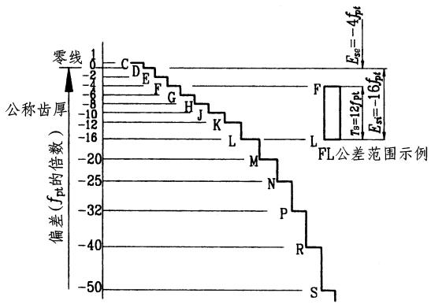

图G15-1 14种齿厚极限偏差

$$
E _ { \mathrm { s s } } { = } { - } f _ { \mathrm { a } } \mathrm { t a n } { \mathbf { a } _ { \mathrm { n } } } { - } \frac { j _ { \mathrm { n } \mathrm { m i n } } + J _ { \mathrm { n } } } { 2 \mathrm { c o s } { \mathbf { a } _ { \mathrm { n } } } }
$$

$$
\begin{array} { c }  { J _ { \mathrm { n } } = \sqrt { { f _ { \mathrm { p b l } } } ^ { 2 } + { f _ { \mathrm { p b 2 } } } ^ { 2 } + 2 { ( F _ { \mathrm {  B } } \cos { \bf { a } } _ { \mathrm { n } } ) } ^ { 2 } + } } \\ { { ( f _ { \mathrm { x } } \sin { \bf { a } } _ { \mathrm { n } } ) ^ { 2 } + { ( f _ { \mathrm { y } } \cos { \bf { a } } _ { \mathrm { n } } ) } ^ { 2 } } } \end{array}
$$

如果 $\scriptstyle \mathbf { a } _ { \mathrm { n } } = 2 0 ^ { \circ }$ , $F _ { 8 } { = } f _ { \mathrm { x } } { = } 2 f _ { \mathrm { y } }$ ,则上式简化为

$$
J _ { \mathrm { n } } { = } \sqrt { { f _ { \mathrm { p b l } } } ^ { 2 } + { f _ { \mathrm { p b 2 } } } ^ { 2 } + 2 . 1 0 4 { F _ { \mathrm { B } } } ^ { 2 } }
$$

式(G15-4)是根据两个齿轮提供等量齿厚上偏差 $( | E _ { \mathrm { s s } 1 } | = | E _ { \mathrm { s s } 2 } | = | E _ { \mathrm { s s } } | )$ 推出的;在实际设计中,如有必要可根据具体情况,调整 $E _ { \mathrm { s s 1 } }$ 和 $E _ { \mathrm { s s } 2 }$ 值。

通常,齿厚下偏差可利用齿厚公差 $T _ { \mathrm { s } }$ 求得,即

齿厚公差 $T _ { \mathrm { s } }$ 的大小反映了切齿工艺的难易程度,其值可用下式计算

$$
| E _ { \mathrm { s i } } | { = } | E _ { \mathrm { s s } } | { + } T _ { \mathrm { s } }
$$

$$
T _ { \mathrm { s } } { = } 2 \mathrm { t a n } \ \pmb { \alpha } _ { \mathrm { n } } \sqrt { F _ { \mathrm { r } } ^ { 2 } + b _ { \mathrm { r } } ^ { 2 } }
$$

式中 $F _ { \mathrm { r } }$ 一一齿圈径向跳动公差,按第I公差组精度等级查表G15-21;

$b _ { \mathrm { r } }$ —一切齿径向进刀公差,可按表G15-30 选用。

式中, $J _ { \mathrm { n } }$ 是补偿齿轮副加工和安装误差所引起的侧隙减小所需的值,即

按以上计算法求得的 $E _ { \mathrm { s s } }$ 和 $E _ { \mathrm { s i } }$ 值,可以直接标注在齿轮工作图上;但是,如果没有特殊要求,最好将$E _ { \mathrm { s s } }$ 和 $E _ { \mathrm { s i } }$ 折算成 $f _ { \mathrm { p t } }$ 的倍数,再利用表G15-29,就近值确定齿厚极限偏差的代号。

(2)用经验表格法确定齿厚极限偏差

对于一般要求的齿轮,可根据经验利用表G15-31选用齿厚极限偏差。

用经验表格确定 $E _ { \mathrm { s s } } , \ E _ { \mathrm { s i } }$ 值后,如果要在齿轮传动装配图上标出最小侧隙 $j _ { \mathrm { n m i n } }$ 值,则应利用式G15-4计算得 $j _ { \mathrm { n m i n } }$ 值。

在实际设计中为了保证侧隙,除了规定齿厚极限偏差这种方式外,还可以规定公法线平均长度极限偏差 $E _ { \mathrm { w m s } } .$ $E _ { \mathrm { w m i } }$ ,双啮中心距极限偏差 $E { \bf \Phi } ^ { \prime \prime } { _ { \mathrm { a s } } } \bullet E { \bf \Phi } ^ { \prime \prime } { _ { \mathrm { a i } } }$ ,或量柱测量距极限偏差 $E _ { \mathrm { M s } } , ~ E _ { \mathrm { M i } } \circ$ 其值可利用 $E _ { \mathrm { s s } } .$ $E _ { \mathrm { s i } }$ 值换算而得,换算式列于表G15-32。

表G15-30切齿径向进刀公差 $b _ { \mathbf { r } }$ 值

<table><tr><td rowspan=1 colspan=1>第I公差组精度等级</td><td rowspan=1 colspan=1>4</td><td rowspan=1 colspan=1>5</td><td rowspan=1 colspan=1>6</td><td rowspan=1 colspan=1>7</td><td rowspan=1 colspan=1>8</td><td rowspan=1 colspan=1>9</td></tr><tr><td rowspan=1 colspan=1>b</td><td rowspan=1 colspan=1>1.26IT7</td><td rowspan=1 colspan=1>IT8</td><td rowspan=1 colspan=1>1.26IT8</td><td rowspan=1 colspan=1>IT9</td><td rowspan=1 colspan=1>1.26IT9</td><td rowspan=1 colspan=1>IT10</td></tr></table>

表G15-31 齿厚极限偏差 $\mathbf { { { E } } _ { s } }$ 参考值(非GB10095-1988内容)

<table><tr><td rowspan="2">Ⅱ组 精度</td><td rowspan="2">法向模 数</td><td colspan="12"></td></tr><tr><td></td><td>> >125</td><td>>180</td><td>>250</td><td>>315</td><td>>400</td><td>分度圆直径/mm >500</td><td>>630</td><td>V800</td><td>>1000</td><td>>1250</td><td>>1600</td><td>>2000</td></tr><tr><td>等级 5</td><td>/mm >1~35 >35-63</td><td>≤80 LM</td><td>80 ~125 LM</td><td>~180 LM</td><td>~250 MN</td><td>~315 MN</td><td>~400</td><td>~500</td><td>~630</td><td>~800</td><td>~1000</td><td>~1250</td><td>~1600</td><td>~2000</td><td>~2500 RS</td></tr><tr><td></td><td>>63~10 >10~16</td><td>JK JK</td><td>KL JK</td><td>KL KL</td><td>LM KL</td><td>LM KM</td><td>NP LM LM</td><td>NP MN LM</td><td>NP MN LM</td><td>NP MN LM</td><td>NP NP MN</td><td>NP NP NP</td><td>PR PR PR</td><td>RS PR PR</td><td>RS PR</td></tr><tr><td>6</td><td>>16-25 >1~35</td><td></td><td></td><td>JK HJ</td><td>KL JK</td><td>KL JL</td><td>LM KL</td><td>LM KL</td><td>LM KL</td><td>LM LM</td><td>MN LM</td><td>MN LM</td><td>NP MN</td><td>NP MN</td><td>PR NP</td></tr><tr><td></td><td>>35-63</td><td>JK GJ</td><td>JL HK</td><td>JL</td><td>KM</td><td>KM</td><td>LN</td><td>LN</td><td>LN</td><td>LN</td><td>LN</td><td>MP</td><td>NR</td><td>NR</td><td>PS</td></tr><tr><td></td><td>>63-10</td><td>GJ</td><td>HK</td><td>HK HK</td><td>JL HK</td><td>JL HK</td><td>KM JL</td><td>KM JL</td><td>LN JL</td><td>LN KM</td><td>LN LN</td><td>MP LN</td><td>MP MP</td><td>NR MP</td><td>NR NR</td></tr><tr><td></td><td>>10~16 >16-25</td><td></td><td></td><td>GJ</td><td>HK</td><td>HK</td><td>HK</td><td>HL</td><td>JL</td><td>KM</td><td>KM</td><td>LN</td><td>LN</td><td>MP</td><td>MP</td></tr><tr><td>7</td><td>>1~35</td><td>HK</td><td></td><td>GJ</td><td>GJ</td><td>HK</td><td>HJ</td><td>HK</td><td>HK</td><td>HK</td><td>JL</td><td>KL</td><td>LM</td><td>LN</td><td>LN</td></tr><tr><td></td><td>>35-63</td><td>GJ</td><td>HK GJ</td><td>HK GJ</td><td>HK HK</td><td>JM HK</td><td>KM HK</td><td>JL JL</td><td>KM JL</td><td>KM KM</td><td>LN KM</td><td>LN LN</td><td>MP LN</td><td>MP LN</td><td>NP MN</td></tr><tr><td></td><td>>63-10 >10-16</td><td>GJ</td><td>GJ</td><td>GJ</td><td>GJ</td><td>HK</td><td>HK</td><td>HK</td><td>HK</td><td>JL</td><td>KM</td><td>KM</td><td>LN</td><td>LN</td><td>MN</td></tr><tr><td>8</td><td>>16-25</td><td></td><td></td><td>GJ FG</td><td>GJ FH</td><td>GJ</td><td>HK</td><td>HK</td><td>HK</td><td>HK</td><td>JL</td><td>KL</td><td>KM</td><td>LM</td><td>LM ML</td></tr><tr><td></td><td>>1-35</td><td>GJ</td><td>GJ</td><td>GK</td><td>HL</td><td>GJ HL</td><td>GJ</td><td>GJ</td><td>GJ</td><td>HK</td><td>HK</td><td>HK</td><td>JL LN</td><td>KL LN</td><td>LN</td></tr><tr><td></td><td>>35-63</td><td>FH</td><td>GJ</td><td>GJ</td><td>GJ</td><td>GJ</td><td>HL GJ</td><td>HL HK</td><td>HL HK</td><td>JM H</td><td>JM</td><td>KM JM</td><td>KM</td><td>KM</td><td>LN</td></tr><tr><td></td><td>>63~10 >10-16</td><td>FH</td><td>FH</td><td>FH</td><td>GJ</td><td>GJ</td><td>GJ</td><td>GJ</td><td>GJ</td><td>HK</td><td>H HL</td><td>HL</td><td>JM</td><td>KM</td><td>KM</td></tr><tr><td>9</td><td>>16-25</td><td></td><td></td><td>FH</td><td>FH</td><td>GJ</td><td>GJ</td><td>GJ</td><td>GJ</td><td>GJ</td><td>HL</td><td>HL</td><td>JL</td><td>JL</td><td>KM</td></tr><tr><td></td><td>>1~35</td><td></td><td></td><td>FG</td><td>FG</td><td></td><td></td><td></td><td></td><td></td><td></td><td></td><td>HK</td><td>HK</td><td>JL</td></tr><tr><td></td><td>>35-63</td><td>FH</td><td>GJ</td><td></td><td></td><td>FG</td><td>FG</td><td>FH</td><td>GJ</td><td>GH</td><td>GJ</td><td>GJ</td><td></td><td></td><td></td></tr><tr><td></td><td>>63-10</td><td>FG</td><td></td><td>GJ</td><td>GJ</td><td>GJ</td><td>HK</td><td>HK</td><td>HK</td><td>HK</td><td>JK</td><td>JM</td><td>KM</td><td>KM</td><td>KM</td></tr><tr><td></td><td></td><td>FG</td><td>FG</td><td>FH</td><td>FH</td><td>GJ</td><td>GJ</td><td>GJ</td><td>GJ</td><td>HK</td><td>HK</td><td>HK</td><td>JL</td><td>JL</td><td>KM</td></tr><tr><td></td><td></td><td></td><td>FG</td><td>FG</td><td>FH</td><td></td><td></td><td></td><td>GJ</td><td>GJ</td><td>HK</td><td>HK</td><td>HK</td><td>JL</td><td>JL</td></tr><tr><td></td><td>>10-16</td><td></td><td></td><td></td><td></td><td>FH</td><td>GJ</td><td>GJ</td><td></td><td></td><td></td><td></td><td></td><td></td><td></td></tr><tr><td></td><td>>16-25</td><td></td><td></td><td>FG</td><td>FG</td><td>FH</td><td>FH</td><td>FG</td><td>GH</td><td>GH</td><td>GJ</td><td>GJ</td><td>HK</td><td>HL</td><td>JL</td></tr><tr><td>10</td><td></td><td></td><td></td><td>FG</td><td>FG</td><td>FG</td><td>FG</td><td>FG</td><td>FG</td><td>FG</td><td>GH</td><td>GJ</td><td>GJ</td><td>GJ</td><td>HK</td></tr><tr><td></td><td>>1~35</td><td>FH</td><td>FH</td><td>FH</td><td>FH</td><td>GJ</td><td>GJ</td><td>GK</td><td>GK</td><td>GK</td><td>GK</td><td>HK</td><td>HK</td><td>JL</td><td>JL</td></tr><tr><td></td><td>>35-63</td><td>FG</td><td>FG</td><td>FH</td><td>FH</td><td>FH</td><td>FH</td><td>GJ</td><td>GJ</td><td>GK</td><td>GK</td><td>GK</td><td>HK</td><td>HK</td><td>JL</td></tr><tr><td></td><td>>63-10</td><td>EF</td><td>FG</td><td>FG</td><td>FG</td><td>FG</td><td>FH</td><td></td><td></td><td></td><td></td><td></td><td>GJ</td><td>HK</td><td>HK</td></tr><tr><td></td><td>>10~16</td><td></td><td></td><td>FG</td><td>FG</td><td>FG</td><td>FG</td><td>FH FH</td><td>FH FH</td><td>FH FH</td><td>GJ FH</td><td>GJ GJ</td><td>GJ</td><td>GJ</td><td>HK</td></tr><tr><td></td><td>>16-25</td></table>

表G15-32 $E _ { \mathrm { s } }$ 与 $E _ { \mathrm { w m } } .$ $\setminus E ^ { \prime \prime } { \mathrm { a } } ^ { }$ $E _ { \mathbf { M } }$ 的换算式

<table><tr><td rowspan=1 colspan=1></td><td rowspan=1 colspan=1>公法线平均长度极限偏差</td><td rowspan=1 colspan=1>双啮中心距极限限偏差</td><td rowspan=1 colspan=2>量柱测量距极限偏差</td></tr><tr><td rowspan=2 colspan=1>中</td><td rowspan=2 colspan=1>Ewms=Esscosa-0.72Frsin aEwmi=Esicos a-0.72Frsin aTw=Tscosa-1.44Frsin a</td><td rowspan=2 colspan=1>E"a=Esscos α/sin α啮E"ai=Esicos α/2sin a啮Ta=Tscos a/2sin d啮</td><td rowspan=1 colspan=1>数齿</td><td rowspan=1 colspan=1>EMs 偶=Ewms/sin amcos βbEMi偶=Ewmi/sin aMcos βb</td></tr><tr><td rowspan=1 colspan=1></td><td rowspan=1 colspan=1>90°EMs奇=EMs偶COS790°EMi奇=EMi偶COS7</td></tr><tr><td rowspan=2 colspan=1>内齿轮</td><td rowspan=2 colspan=1>Ewms 内=-Ewmi外Ewmi内=-Ewms内</td><td rowspan=2 colspan=1></td><td rowspan=1 colspan=1>偶</td><td rowspan=1 colspan=1>EMs 偶内=一EMi偶外EMi偶内=-EMs偶外</td></tr><tr><td rowspan=1 colspan=1>奇</td><td rowspan=1 colspan=1>EMs奇内=一EMi奇外EMi奇内=一EMs奇外</td></tr></table>

注: $\pmb { \alpha } _ { \mathbb { R } }$ 一一双啮检查时的法向压力角;${ \pmb { q } } _ { \mathrm { { M } } }$ 一一量柱中心处的端面压力角。

# G2.8精度等级的图样标注

在齿轮零件工作图上,应标注齿轮的精度等级和齿厚极限偏差的字母代号。

标注示例:

(1)齿轮的三个公差组精度同为7级,其齿厚上偏差为F,下偏差为L:

GB/T10095—1988  
/ F L齿厚下偏差齿厚上偏差  
第I、Ⅱ、Ⅲ公差组的精度等级

(2)齿轮第I公差组精度为7级,第I公差组精度为6级,第I公差组精度为6级,齿厚上偏差为G,齿厚下偏差为M:

7-6-6M齿厚下偏差齿厚上偏差第Ⅲ公差组的精度等级第Ⅱ公差组的精度等级  
第I公差组的精度等级

(3)齿轮的三个公差组精度同为4级,其齿厚上偏差为 $- 3 3 0 \mu \mathrm { m }$ ,下偏差为 $- 4 9 5 \mu \mathrm { m }$ :

(-0.330)GB10095—19884-0.495齿厚上偏差、齿厚下偏差第I、Ⅱ、Ⅲ公差组的精度等级

G2.9 渐开线圆柱齿轮工作图(图G15-2,图G15-3)

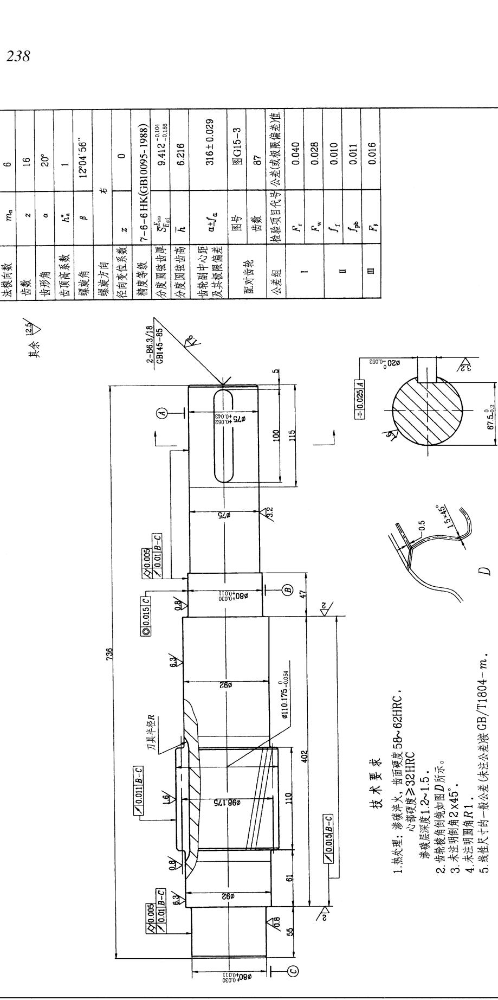

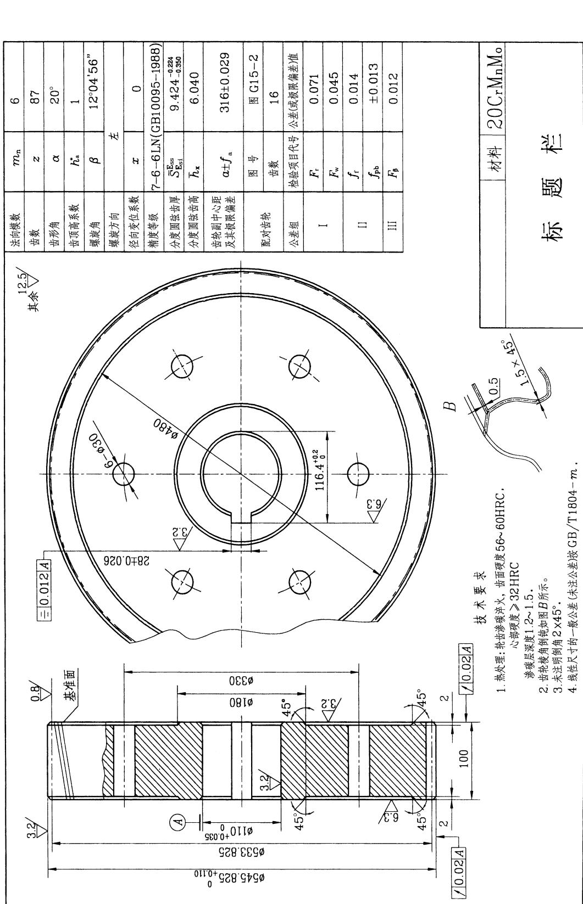

# G3圆弧圆柱齿轮传动

# G3.1圆弧齿轮的基本齿廓和模数系列

圆弧齿轮的基本齿廓是指基齿条的法面齿形。同渐开线齿轮比较,圆弧齿轮的齿形参数较多,因此有较大的调整灵活性。我国已有了统一的基本齿廓

(JB929-1967和GB12759-1991),供设计制造中采用。

# G3.1.1 单圆弧齿轮的基本齿廓

JB929-1967型单圆弧齿轮基本齿廓见表G15-33。

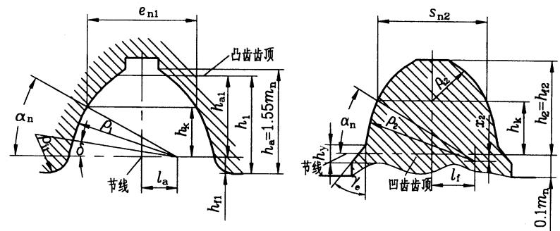

表G15-33“67型”圆弧齿轮滚刀的法面齿廓及其参数 (摘自JB929-1967)

<table><tr><td rowspan="2">原始齿廓参数名称</td><td rowspan="2">代号</td><td>凸齿</td><td colspan="2">凹齿</td></tr><tr><td>mn=2~32mm</td><td>mn=2~6mm</td><td>mn=7~32mm</td></tr><tr><td>压力角</td><td>an</td><td>30°</td><td>30°</td><td>30°</td></tr><tr><td>接触点移距</td><td>1</td><td>1.5mm</td><td></td><td></td></tr><tr><td>接触点离节线高度</td><td>hk</td><td>0.75mm</td><td>0.75mn</td><td>0.75mm</td></tr><tr><td>齿廓半径</td><td>p</td><td>1.5 mm</td><td>1.65 mm</td><td>1.55 m +0.6</td></tr><tr><td>凹凸齿廓半径差</td><td>△p</td><td></td><td>0.15 mm</td><td>0.05 mn +0.6</td></tr><tr><td>工作齿高</td><td>h&#x27;</td><td>1.2 mm</td><td>1.2 mn</td><td>1.2 mm</td></tr><tr><td>齿顶高</td><td>ha</td><td>1.2 mm</td><td>0</td><td>0</td></tr><tr><td>齿根高</td><td>hi</td><td>0.3mn</td><td>1.36 mn</td><td>1.36 mm</td></tr><tr><td>全齿高 (切深)</td><td>h</td><td>1.5mn</td><td>1.36 mm</td><td>1.36 mm</td></tr><tr><td>齿廓圆心偏移量</td><td>la、</td><td>0.5290 mn</td><td>0.6289 mn</td><td>0.5523 mn +0.5196</td></tr><tr><td>齿廓圆心移距量</td><td>X2</td><td>0</td><td>0.075 mn</td><td>0.025 mn +0.3</td></tr><tr><td>接触点处槽宽</td><td>en1</td><td>1.54 mm</td><td>1.5416 mm</td><td>1.5616 mm</td></tr><tr><td>接触点处齿厚</td><td>Sn2</td><td>1.6016 mn</td><td>1.60 mm</td><td>1.58 mm</td></tr><tr><td>接触点处侧隙</td><td>Cy</td><td></td><td>0.06 mn</td><td>0.04 mm</td></tr><tr><td>齿顶倒角高度</td><td>hy</td><td></td><td>0.26 mn</td><td>0.26 mm</td></tr><tr><td>齿顶倒角</td><td>re</td><td></td><td>30°</td><td>30°</td></tr><tr><td></td><td></td><td></td><td></td><td></td></tr><tr><td>工艺角 齿根圆角半径</td><td>8 Pi</td><td>8°47 &#x27; 34" 0.6248 mn</td><td>0.6227 mm</td><td>5 r+h+x</td></tr></table>

# 表G15-34 双圆弧齿轮的基本齿廓及其参数(摘自GB 12759-1991)

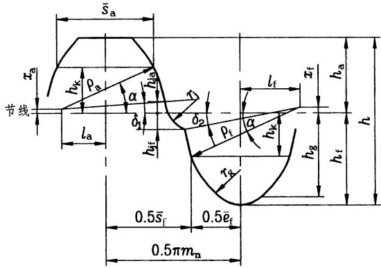

代号: $\propto$ 一压力角; $h$ 一全齿高; $h _ { \mathrm { a } }$ 一齿顶高; $h _ { \mathrm { f } }$ 一齿根高; $\pmb { r } _ { \mathrm { a } }$ 一凸齿齿廓圆弧半径; $\pmb { r } _ { \mathrm { f } }$ 一凹齿齿廓圆弧半径; $x _ { \mathrm { a } }$ 一凸齿齿廓圆心移距量; $x _ { \mathrm { f } }$ 一凹齿齿廓圆心移距量; $\overline { { s } } _ { \mathrm { a } }$ 一凸齿接触点处弦齿厚; $h _ { \mathrm { k } }$ 一接触点到节线的距离; $l _ { \mathrm { a } }$ -凸齿齿廓圆心偏移量; $l _ { \mathrm { f } } -$ 一凹齿齿廓圆心偏移量; $h _ { \mathrm { j a } }$ 一过渡圆弧和凸齿圆弧的切点到节线的距离; $h _ { \mathrm { j f } } .$ -过渡圆弧和凹齿圆弧的交点到节线的距离; $\overline { { e } } _ { \mathrm { f } }$ 一凹齿接触点处齿槽宽;sf一凹齿接触点处弦齿厚; $\pmb { d } _ { 1 }$ 一凸齿工艺角; $\pmb { d } _ { 2 }$ 一凹齿工艺角; $r _ { \mathrm { j } }$ 一过渡圆弧半径; $r _ { \mathrm { g } }$ 一齿根圆弧半径;$h _ { \mathrm { g } }$ 一齿根圆弧和凹齿圆弧的切点到节线的距离;j一侧向间隙

G3.1.3圆弧齿轮的模数系列(表G15-35)

<table><tr><td rowspan=2 colspan=1>法向模数m/mm</td><td rowspan=1 colspan=11>基本齿廓的参数</td></tr><tr><td rowspan=1 colspan=1>α</td><td rowspan=1 colspan=1>h</td><td rowspan=1 colspan=1>ha</td><td rowspan=1 colspan=1>h</td><td rowspan=1 colspan=1>r</td><td rowspan=1 colspan=1>r</td><td rowspan=1 colspan=1>xa</td><td rowspan=1 colspan=1>x</td><td rowspan=1 colspan=1>品</td><td rowspan=1 colspan=1>hk</td><td rowspan=1 colspan=1>1</td></tr><tr><td rowspan=1 colspan=1>15~3</td><td rowspan=1 colspan=1>24°</td><td rowspan=1 colspan=1>2</td><td rowspan=1 colspan=1>0.9</td><td rowspan=1 colspan=1>1.1</td><td rowspan=1 colspan=1>13</td><td rowspan=1 colspan=1>1.420</td><td rowspan=1 colspan=1>0.0163</td><td rowspan=1 colspan=1>0.0325</td><td rowspan=1 colspan=1>1.1173</td><td rowspan=1 colspan=1>05450</td><td rowspan=1 colspan=1>0.6289</td></tr><tr><td rowspan=1 colspan=1>>3~6</td><td rowspan=1 colspan=1>24</td><td rowspan=1 colspan=1>2</td><td rowspan=1 colspan=1>0.9</td><td rowspan=1 colspan=1>1.1</td><td rowspan=1 colspan=1>13</td><td rowspan=1 colspan=1>1.410</td><td rowspan=1 colspan=1>0.0163</td><td rowspan=1 colspan=1>0.0285</td><td rowspan=1 colspan=1>1.1173</td><td rowspan=1 colspan=1>0.5450</td><td rowspan=1 colspan=1>0.6289</td></tr><tr><td rowspan=1 colspan=1>>6~10</td><td rowspan=1 colspan=1>24°</td><td rowspan=1 colspan=1>2</td><td rowspan=1 colspan=1>09</td><td rowspan=1 colspan=1>11</td><td rowspan=1 colspan=1>13</td><td rowspan=1 colspan=1>1.395</td><td rowspan=1 colspan=1>0.0163</td><td rowspan=1 colspan=1>0.0224</td><td rowspan=1 colspan=1>1.1173</td><td rowspan=1 colspan=1>05450</td><td rowspan=1 colspan=1>0.6289</td></tr><tr><td rowspan=1 colspan=1>>10~16</td><td rowspan=1 colspan=1>24°</td><td rowspan=1 colspan=1>2</td><td rowspan=1 colspan=1>09</td><td rowspan=1 colspan=1>1.1</td><td rowspan=1 colspan=1>13</td><td rowspan=1 colspan=1>1.380</td><td rowspan=1 colspan=1>0.0163</td><td rowspan=1 colspan=1>0.0163</td><td rowspan=1 colspan=1>1.1173</td><td rowspan=1 colspan=1>0.5450</td><td rowspan=1 colspan=1>0.6289</td></tr><tr><td rowspan=1 colspan=1>>16~32</td><td rowspan=1 colspan=1>24°</td><td rowspan=1 colspan=1>2</td><td rowspan=1 colspan=1>09</td><td rowspan=1 colspan=1>1.1</td><td rowspan=1 colspan=1>13</td><td rowspan=1 colspan=1>1.360</td><td rowspan=1 colspan=1>0.0163</td><td rowspan=1 colspan=1>0.0081</td><td rowspan=1 colspan=1>1.1173</td><td rowspan=1 colspan=1>0.5450</td><td rowspan=1 colspan=1>0.6289</td></tr><tr><td rowspan=1 colspan=1>>32~50</td><td rowspan=1 colspan=1>24°</td><td rowspan=1 colspan=1>2</td><td rowspan=1 colspan=1>0.9</td><td rowspan=1 colspan=1>1.1</td><td rowspan=1 colspan=1>13</td><td rowspan=1 colspan=1>1.340</td><td rowspan=1 colspan=1>0.0163</td><td rowspan=1 colspan=1>0.000</td><td rowspan=1 colspan=1>1.1173</td><td rowspan=1 colspan=1>05450</td><td rowspan=1 colspan=1>0.6289</td></tr><tr><td rowspan=1 colspan=1>15~3</td><td rowspan=1 colspan=1>0.7086</td><td rowspan=1 colspan=1>0.16</td><td rowspan=1 colspan=1>0.20</td><td rowspan=1 colspan=1>1.1773</td><td rowspan=1 colspan=1>1.9643</td><td rowspan=1 colspan=1>6°20 &#x27;52"</td><td rowspan=1 colspan=1>925 &#x27;31"</td><td rowspan=1 colspan=1>0.5049</td><td rowspan=1 colspan=1>0.4030</td><td rowspan=1 colspan=1>1.0186</td><td rowspan=1 colspan=1>0.06</td></tr><tr><td rowspan=1 colspan=1>>3~6</td><td rowspan=1 colspan=1>0.6994</td><td rowspan=1 colspan=1>0.16</td><td rowspan=1 colspan=1>0.20</td><td rowspan=1 colspan=1>1.1773</td><td rowspan=1 colspan=1>1.9643</td><td rowspan=1 colspan=1>6°20 &#x27;52"</td><td rowspan=1 colspan=1>919&#x27;30"</td><td rowspan=1 colspan=1>0.5043</td><td rowspan=1 colspan=1>0.4004</td><td rowspan=1 colspan=1>1.0168</td><td rowspan=1 colspan=1>0.06</td></tr><tr><td rowspan=1 colspan=1>>6~10</td><td rowspan=1 colspan=1>0.6957</td><td rowspan=1 colspan=1>0.16</td><td rowspan=1 colspan=1>0.20</td><td rowspan=1 colspan=1>1.1573</td><td rowspan=1 colspan=1>1.9843</td><td rowspan=1 colspan=1>6°20 &#x27;52"</td><td rowspan=1 colspan=1>910 &#x27;21"</td><td rowspan=1 colspan=1>0.4884</td><td rowspan=1 colspan=1>03710</td><td rowspan=1 colspan=1>1.0236</td><td rowspan=1 colspan=1>0.04</td></tr><tr><td rowspan=1 colspan=1>>10~16</td><td rowspan=1 colspan=1>0.6820</td><td rowspan=1 colspan=1>0.16</td><td rowspan=1 colspan=1>0.20</td><td rowspan=1 colspan=1>1.1573</td><td rowspan=1 colspan=1>1.9843</td><td rowspan=1 colspan=1>620 &#x27;52"</td><td rowspan=1 colspan=1>990&#x27;59"</td><td rowspan=1 colspan=1>0.4877</td><td rowspan=1 colspan=1>0.3663</td><td rowspan=1 colspan=1>1.0210</td><td rowspan=1 colspan=1>0.04</td></tr><tr><td rowspan=1 colspan=1>>16~32</td><td rowspan=1 colspan=1>0.6638</td><td rowspan=1 colspan=1>0.16</td><td rowspan=1 colspan=1>0.20</td><td rowspan=1 colspan=1>1.1573</td><td rowspan=1 colspan=1>1.9843</td><td rowspan=1 colspan=1>6°20 &#x27;52"</td><td rowspan=1 colspan=1>8°48 &#x27; 11 "</td><td rowspan=1 colspan=1>0.4868</td><td rowspan=1 colspan=1>0.3595</td><td rowspan=1 colspan=1>1.0176</td><td rowspan=1 colspan=1>0.04</td></tr><tr><td rowspan=1 colspan=1>V32~50</td><td rowspan=1 colspan=1>0.6455</td><td rowspan=1 colspan=1>0.16</td><td rowspan=1 colspan=1>0.20</td><td rowspan=1 colspan=1>1.1573</td><td rowspan=1 colspan=1>1.9843</td><td rowspan=1 colspan=1>6°20 &#x27;52"</td><td rowspan=1 colspan=1>8°35 &#x27;01"</td><td rowspan=1 colspan=1>0.4858</td><td rowspan=1 colspan=1>0.3520</td><td rowspan=1 colspan=1>1.0145</td><td rowspan=1 colspan=1>0.04</td></tr></table>

注:表中带\*号的尺寸参数,是指该尺寸与法向模数 $m _ { \mathrm { n } }$ 的比值,用这些比值,乘以法向模数 $m _ { \Pi }$ 即得该尺寸值,例如$h ^ { * } m _ { n } { = } r _ { \mathrm { ~ a ~ } } ^ { * } m _ { \mathrm { n } } { = } r _ { \mathrm { a } }$ 等。

表G15-35圆弧齿轮模数 $( m _ { \mathrm { n } } )$ 系列 (GB1840-1989)

<table><tr><td rowspan=1 colspan=1>第一系列</td><td rowspan=1 colspan=1>1.5</td><td rowspan=1 colspan=1>2</td><td rowspan=1 colspan=1></td><td rowspan=1 colspan=1>2.5</td><td rowspan=1 colspan=1></td><td rowspan=1 colspan=1>3</td><td rowspan=1 colspan=1></td><td rowspan=1 colspan=1>4</td><td rowspan=1 colspan=1>5</td></tr><tr><td rowspan=1 colspan=1>第二系列</td><td rowspan=1 colspan=1></td><td rowspan=1 colspan=1></td><td rowspan=1 colspan=1>2.25</td><td rowspan=1 colspan=1></td><td rowspan=1 colspan=1>2.75</td><td rowspan=1 colspan=1></td><td rowspan=1 colspan=1>3.5</td><td rowspan=1 colspan=1>4.5</td><td rowspan=1 colspan=1></td></tr><tr><td rowspan=1 colspan=1>第一系列</td><td rowspan=1 colspan=1></td><td rowspan=1 colspan=1>6</td><td rowspan=1 colspan=1></td><td rowspan=1 colspan=1>8</td><td rowspan=1 colspan=1></td><td rowspan=1 colspan=1>10</td><td rowspan=1 colspan=1>12</td><td rowspan=1 colspan=1></td><td rowspan=1 colspan=1>16</td></tr><tr><td rowspan=1 colspan=1>第二系列</td><td rowspan=1 colspan=1>5.5</td><td rowspan=1 colspan=1></td><td rowspan=1 colspan=1>7</td><td rowspan=1 colspan=1></td><td rowspan=1 colspan=1>9</td><td rowspan=1 colspan=1></td><td rowspan=1 colspan=1></td><td rowspan=1 colspan=1>14</td><td rowspan=1 colspan=1></td></tr><tr><td rowspan=1 colspan=1>第一系列</td><td rowspan=1 colspan=1></td><td rowspan=1 colspan=1>20</td><td rowspan=1 colspan=1></td><td rowspan=1 colspan=1>25</td><td rowspan=1 colspan=1>32</td><td rowspan=1 colspan=1></td><td rowspan=1 colspan=1>40</td><td rowspan=1 colspan=1></td><td rowspan=1 colspan=1>50</td></tr><tr><td rowspan=1 colspan=1>第二系列</td><td rowspan=1 colspan=1>18</td><td rowspan=1 colspan=1></td><td rowspan=1 colspan=1>22</td><td rowspan=1 colspan=1>28</td><td rowspan=1 colspan=1></td><td rowspan=1 colspan=1>36</td><td rowspan=1 colspan=1></td><td rowspan=1 colspan=1>45</td><td rowspan=1 colspan=1></td></tr></table>

# G3.2圆弧齿轮传动的几何尺寸计算

JB929-1967型单圆弧齿轮传动(图G15-4)和

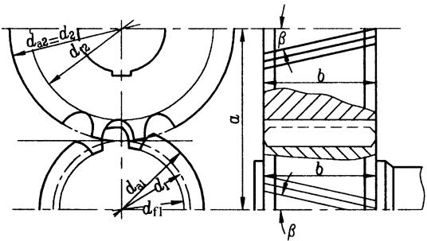

GB12759-1991型双圆弧齿轮传动(图G15-5)的几何尺寸计算式列于表G15-36中。

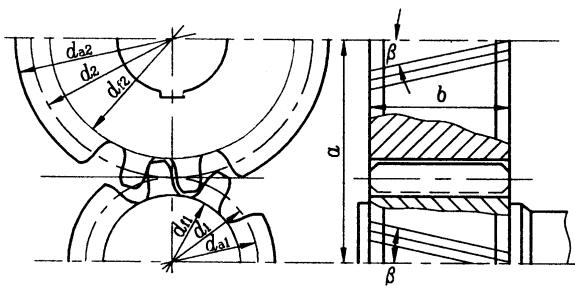

图G15-5双圆弧齿轮传动

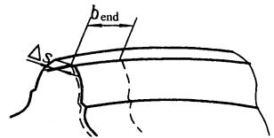

图G15-4单圆弧齿轮传动

图G15-6齿端修薄量及修薄宽度

表G15-36圆弧齿轮传动的几何尺寸计算

<table><tr><td rowspan=2 colspan=1>名称</td><td rowspan=2 colspan=1>代号</td><td rowspan=1 colspan=2>计算公式</td></tr><tr><td rowspan=1 colspan=1>“67”型单圆弧齿轮</td><td rowspan=1 colspan=1>“91”型双圆弧齿轮</td></tr><tr><td rowspan=1 colspan=1>齿数</td><td rowspan=1 colspan=1>Z</td><td rowspan=1 colspan=2>z=dcosb/mn</td></tr><tr><td rowspan=1 colspan=1>当量齿数</td><td rowspan=1 colspan=1>Zv</td><td rowspan=1 colspan=2>Zv=z/cos²b</td></tr><tr><td rowspan=1 colspan=1>法向模数</td><td rowspan=1 colspan=1>mn</td><td rowspan=1 colspan=2>由轮齿弯曲强度计算或结构设计确定，应取为标准值</td></tr><tr><td rowspan=1 colspan=1>端面模数</td><td rowspan=1 colspan=1>m</td><td rowspan=1 colspan=2>mnm=cosb</td></tr><tr><td rowspan=1 colspan=1>螺旋角</td><td rowspan=1 colspan=1>b</td><td rowspan=1 colspan=2>mn    mn(z1+z2)cosb=m        2a</td></tr><tr><td rowspan=1 colspan=1>中心距</td><td rowspan=1 colspan=1>a</td><td rowspan=1 colspan=2>1         mt(z1+z2)    mn(z1+z2)a=(d+d2)=22cosb由强度计算或结构设计确定，减速器a应取标准值</td></tr><tr><td rowspan=1 colspan=1>轴向齿距</td><td rowspan=1 colspan=1>Px</td><td rowspan=1 colspan=2>Px=πmn/sinb</td></tr><tr><td rowspan=1 colspan=1>齿宽</td><td rowspan=1 colspan=1>b</td><td rowspan=1 colspan=2>b=faa=fad=πmneβ/sinb</td></tr><tr><td rowspan=1 colspan=1>纵向重合度</td><td rowspan=1 colspan=1>e</td><td rowspan=1 colspan=2>b    bsinbeβ=Px    πmn</td></tr><tr><td rowspan=1 colspan=1>接触点距离系数</td><td rowspan=1 colspan=1>1</td><td rowspan=1 colspan=2>qTA1=Px</td></tr><tr><td rowspan=1 colspan=1>总重合度</td><td rowspan=1 colspan=1>e</td><td rowspan=1 colspan=1>e=eβ</td><td rowspan=1 colspan=1>e=eβ+1</td></tr><tr><td rowspan=1 colspan=1>同一齿上凸齿和凹齿两接触点的距离</td><td rowspan=1 colspan=1>qTA</td><td rowspan=1 colspan=1></td><td rowspan=1 colspan=1>0.5(πmn-jn)+2(la+xacotan)qTA=sinbxa-2(ra+)     )cosansinb sinan</td></tr></table>

(续)

<table><tr><td rowspan=2 colspan=1>名称</td><td rowspan=2 colspan=1>代号</td><td rowspan=1 colspan=2>计算公式</td></tr><tr><td rowspan=1 colspan=1>“67”型单圆弧齿轮</td><td rowspan=1 colspan=1>“91”型双圆弧齿轮</td></tr><tr><td rowspan=2 colspan=1>齿顶高</td><td rowspan=1 colspan=1>ha1</td><td rowspan=1 colspan=1>1.2 mm</td><td rowspan=2 colspan=1>0.9 mn</td></tr><tr><td rowspan=1 colspan=1>ha2</td><td rowspan=1 colspan=1>0</td></tr><tr><td rowspan=2 colspan=1>齿根高</td><td rowspan=1 colspan=1>h</td><td rowspan=1 colspan=1>0.3mm</td><td rowspan=2 colspan=1>1.1 mn</td></tr><tr><td rowspan=1 colspan=1>h2</td><td rowspan=1 colspan=1>1.36 mn</td></tr><tr><td rowspan=2 colspan=1>全齿高</td><td rowspan=1 colspan=1>h1</td><td rowspan=1 colspan=1>1.5mm</td><td rowspan=2 colspan=1>2mn</td></tr><tr><td rowspan=1 colspan=1>h</td><td rowspan=1 colspan=1>1.36mm</td></tr><tr><td rowspan=2 colspan=1>分度圆直径</td><td rowspan=1 colspan=1>d</td><td rowspan=1 colspan=2>mnz1/cosb= mz1</td></tr><tr><td rowspan=1 colspan=1>d</td><td rowspan=1 colspan=2>mnz2/cosb= mz2</td></tr><tr><td rowspan=2 colspan=1>齿顶圆直径</td><td rowspan=1 colspan=1>da1</td><td rowspan=1 colspan=1>d1+2.4 mm</td><td rowspan=1 colspan=1>d1+1.8mn</td></tr><tr><td rowspan=1 colspan=1>da2</td><td rowspan=1 colspan=1>d</td><td rowspan=1 colspan=1>d2+1.8mn</td></tr><tr><td rowspan=2 colspan=1>齿根圆直径</td><td rowspan=1 colspan=1>di</td><td rowspan=1 colspan=1>d1-0.6mn</td><td rowspan=1 colspan=1>d1-2.2 mm</td></tr><tr><td rowspan=1 colspan=1>d</td><td rowspan=1 colspan=1>d-2.72 mm</td><td rowspan=1 colspan=1>d-2.2 mm</td></tr><tr><td rowspan=1 colspan=1>齿端修薄量修薄宽度②</td><td rowspan=1 colspan=1>△bend</td><td rowspan=1 colspan=2>△s =(0.01～0.03)mn，对于高精度或大模数齿轮取小值,反之取大值。bend=(0.1～0.2)pxeβ≥3时小齿轮齿端必须修薄，修薄量和修薄宽度啮入端稍大;螺旋角大时取较大系数。不修薄的有效齿宽应保证总重合度稍大于某一整数</td></tr></table>

$\textcircled{1}$ 式中各参数见表G15-34。$\textcircled{2}$ 尖端修薄量和修薄宽度如图G15-5所示。

# G3.3圆弧齿轮测量尺寸计算(表G15-37)

表G15-37圆弧齿轮测量尺寸计算

<table><tr><td rowspan="2">名称</td><td rowspan="2"></td><td colspan="2">计算公式</td></tr><tr><td>"67"型单圆弧齿轮</td><td>“91”型双圆弧齿轮</td></tr><tr><td rowspan="3">接触点处弦齿厚 Sak 过 接触点处弦齿高</td><td>1 Sk</td><td>凸齿Sak=2racos(a+dak)-(zvmn+2xa)sindak 凹齿=nsin(+dk）-2(rf Zv 2l 式中dak= dk =2(f-x cota) zvmn +2xa</td><td rowspan="3">xf sina Zv zvmn</td></tr><tr><td>hk</td><td>以上公式对于单、双圆弧齿轮均适用 (0.5sak）² 凸齿h ak=ha-hk+ zvmn +2hk 1.688 k= 0.545+- mn zv+1.5</td></tr><tr><td>kx=（0.75+ hk=</td><td>1.498 mn zv +1.09 （0.55fk）² 凹齿h k=ha+hk+ zvmn-2hk 1.688 1.498 mn hk = 0.545- mn v-1.5 zv-1.09</td></tr></table>

<table><tr><td colspan="4">(续)</td></tr><tr><td colspan="4">计算公式</td></tr><tr><td>名称</td><td>“67"型单圆弧齿轮</td><td></td><td>“91”型双圆弧齿轮</td></tr><tr><td>弦齿深 (法面) 创创</td><td>h h=h-hg+</td><td>1 (d-da) 2</td><td></td></tr><tr><td></td><td></td><td></td><td></td></tr><tr><td></td><td></td><td>h-一全齿高</td><td></td></tr><tr><td>h h</td><td>式中</td><td>da、d—-齿顶圆直径及其实测值</td><td></td></tr><tr><td></td><td></td><td>hg-弓高对于单圆弧齿轮凸齿和双圆弧齿轮</td><td></td></tr><tr><td></td><td></td><td>2</td><td></td></tr><tr><td>dal 01</td><td>1 hg=</td><td>P S (zvmn +2ha) Zv zvmn+2ha</td><td></td></tr><tr><td></td><td>式中</td><td>Sa一一齿顶厚，随齿数减少而变窄，可拟合如下：</td><td></td></tr><tr><td>包 3</td><td></td><td>单圆弧齿轮凸齿sa =</td><td>0.43 0.742- mn</td></tr><tr><td>5 h</td><td></td><td></td><td>Zv</td></tr><tr><td></td><td></td><td>双圆弧齿轮sa=</td><td>0.61 0.6491- mn</td></tr><tr><td>32</td><td></td><td></td><td>Zv</td></tr><tr><td></td><td></td><td>ha——凸齿齿顶高</td><td></td></tr><tr><td></td><td></td><td>对于单圆弧齿轮四齿hg2=（r²-(hy+x）2+hytang-）2 1.285mn cos³ b</td><td>1 Zvmn</td></tr><tr><td></td><td>当 mn=2~6mm时，</td><td>hg2= 22 (1.25mn +0.08)cos³b</td><td></td></tr><tr><td>公法线跨齿数</td><td>k</td><td>at(rad)+</td><td>2 l xacota +1取整数 p mn mn</td></tr><tr><td rowspan="10">公法线长度 乡</td><td rowspan="10">凹齿k = 1 1tan²Bsin 2a 2 4 a(rad)+</td><td rowspan="10">2 p</td><td rowspan="10">xf cota 取整数</td></tr><tr><td>当mn=7~32mm时 hg2= 41</td></tr><tr><td></td></tr><tr><td>凸齿ka= 1</td></tr><tr><td rowspan="3">P (mn</td></tr><tr><td>mn 式中ai为理论接触点处的端面压力角，tanat tana</td></tr><tr><td>cosb</td></tr><tr><td>sinan dsin²af +2xf-2?f</td></tr><tr><td>凹齿Wkf = sinan</td></tr><tr><td>式中αn一-测点法向压力角，tanαn=tanαcos β</td></tr><tr><td rowspan="2">a一一测点端面压力角，求解超越方程</td></tr><tr><td rowspan="4"></td></tr><tr><td></td><td>凸齿ata=Ma-Bsin2 ata-Qacot ata 凹齿au=Mf-Bsin2 atf-Qicot atf</td></tr><tr><td>式中Ma= (ka-1)p- Z</td><td>2 1 1 2</td></tr><tr><td>tan2b</td><td>Mf= kfp+ mn Z mn 2xa 2xf</td></tr><tr><td></td><td>B= Qa= Qf = 2 zmncosb zmncosb</td></tr><tr><td></td><td></td></tr><tr><td></td><td>用选代法解上述超越方程时，可取公式右边的αi的初值为αto。计算出</td></tr><tr><td></td><td>公式左边的α，再取作公式右边α的值，重复计算，直到误差在1"以内</td></tr><tr><td></td><td>为止，计算精度应为小数第五位</td></tr><tr><td></td><td>公法线长度测量时，工作齿宽b应大于bmin bmin = 1 d sin² at tanb +5mm</td></tr></table>

(续)

<table><tr><td rowspan="2">名称</td><td rowspan="2"></td><td colspan="2">计算公式</td></tr><tr><td>"67"型单圆弧齿轮</td><td>“91”型双圆弧齿轮</td></tr><tr><td>齿根圆斜径 Lf</td><td>Lf</td><td>当齿数为奇数时，测量齿根圆斜径Lf 90° Lf=df cos 7</td><td></td></tr><tr><td>df 螺旋线坡度的波长 理论齿向螺旋线 波度 波长</td><td></td><td>沿螺旋线测量螺旋线波度时，按下式计算波长 l=1 式中k—-滚齿机分度蜗轮齿数 d—-工作分度圆直径</td><td>pd 2pmnz Zk sin b Zk sin²b</td></tr></table>

注:表中诸式中的参数见表G15-34和表 ${ \mathrm { G 1 } } 5 { - } 3 6 _ { \circ }$ 

# G3.4圆弧齿轮传动主要参数的选择

齿数 $z _ { \uparrow }$ 、模数 $m _ { \mathrm { n } } .$ 、纵向重合度 $\varepsilon _ { \beta }$ 、螺旋角 $\pmb { \beta }$ 和齿宽(或齿宽系数 $\phi _ { \mathrm { a } } , ~ \phi _ { \mathrm { d } } )$ 是圆弧齿轮的主要参数。它们关系密切,相互制约 (见以下算式),并且对传动的承载性能影响很大,在设计时可能有多种选择,因此要特别注意。

$$
d _ { \mathrm { 1 } } \mathrm { = } z _ { \mathrm { 1 } } m _ { \mathrm { n } } / \cos \beta
$$

$$
\bullet _ { \mathrm { B } } = { \frac { b \sin b } { \mathtt { p } m _ { \mathrm { n } } } } = { \frac { { f } _ { \mathrm { a } } ( z _ { 1 } + z _ { 2 } ) { \mathrm { t a n } } b } { 2 \mathrm { p } } }
$$

$$
f _ { \mathrm { d } } = b / d _ { 1 } = \frac { \mathrm { \bf ~ p } \bullet _ { \mathrm { \tiny ~ B } } } { z _ { 1 } \tan { \cal b } } = 0 . 5 f _ { \mathrm { a } } ( 1 + u )
$$

$$
\displaystyle \mathbf { \Delta } \mathbf { f } _ { \mathrm { a } } = b / a = \frac { 2 \mathrm { p } \mathbf { e } _ { \mathrm { B } } } { ( z _ { 1 } + z _ { 2 } ) \tan b }
$$

主要参数的具体选择原则见表G15-38。

表G15-38圆弧齿轮主要参数选择

<table><tr><td>主要参数</td><td>选择原则</td></tr><tr><td>小齿轮齿数</td><td>圆弧齿轮没有根切现象，z1不受根切齿数的限制，但受到轴的强度和刚度的制约，z1不能太少。在满足抗弯强</td></tr><tr><td>71</td><td>度的条件下，取较多的z为好。对中低速传动，可取zi=20~35，对高速传动，可取z1=30~50</td></tr><tr><td>法向模数mn</td><td>mn通常决定于齿轮的抗弯强度或结构条件，并按表G15-35取标准值。当d、b一定时，取较小的mn，能使εβ 增加,有利于提高传动的平稳性,并且能减小齿面的滑动,提高抗胶合的能力。一般工业齿轮可取mn=(0.01~0.02) a;通用减速器靠取mn=(0.0133~0.016)a；有冲击载荷的传动，如轧机齿轮座等，常取mm=（0.025~0.04）a。对于</td></tr><tr><td>主要</td><td>选择原则</td></tr><tr><td>参数 纵向</td><td>ε由整数部分με和尾数△ε组成，即εβ=μβ+△ε。当εβ为整数倍时噪声有所下降。一般取με=1~6；对于精度高，β</td></tr><tr><td>重合 度</td><td>大的齿轮，可取较大的μ值，以提高传动的平稳性和承载能力，但必须严格控制齿轮误差、齿向误差、轴线平行度误差和 轴系变形量。△ε不能太小，否则啮入冲击大，齿端部齿根应力大，易崩角；但当△ε>0.4以后，作用就不大了。通常可取</td></tr><tr><td>ε</td><td>△ε=0.2~0.4。双圆弧齿轮的εβ与单圆弧齿轮同样取。当εβ≥3时，应采用修端，以避免崩角。齿宽的非修薄部分是εβ的 整数部分μ</td></tr><tr><td>螺旋 角</td><td>当εβ一定时，增大β，齿面瞬时接触迹宽度减小，接触应力增大，对接触强度不利。在齿轮圆周速度一定的条件下，β 增大，齿面滚动速度减小，不利于动压润滑，同时轴承所受的轴向力也大。但当b和mn一定时，β增大，εβ也增大，能使 传动平稳，并能提高弯曲强度和接触强度，特别对弯曲强度更有利。一般的推荐值：单斜齿β=10°~20°；人字齿β=25°</td></tr><tr><td>β</td><td>~35°</td></tr><tr><td>齿宽</td><td></td></tr><tr><td>系数</td><td>Φ和Φd值可参考渐开线齿廓圆柱齿轮选用。推荐的值为:0.2、0.25、0.3、0.4、0.5、0.6、0.8、1.0、1.2。通常，减速</td></tr><tr><td>、</td><td>器采用𝜙a=0.4~0.8，对人字齿轮单侧Φa=0.3~0.6</td></tr><tr><td>Φd</td><td></td></tr></table>

在具体设计时,可采用以下几种方法和步骤,来确定圆弧齿轮的主要参数:

1)先选定 $\pmb { \phi } _ { \mathrm { a } }$ ,再用式(G15-12)来调整 $z _ { 1 }$ 、 $\pmb { \beta }$ 和 $\mathbf { e _ { \beta \circ } }$ 2)先选定 $z _ { 1 }$ 、 $\pmb { \beta }$ 和 $\pmb { \varepsilon } _ { \beta }$ ,再用式(G15-11)或式(G15-12)来校核 $\pmb { \phi } _ { \mathrm { d } }$ 或 $\phi _ { \mathrm { a } \circ }$ 

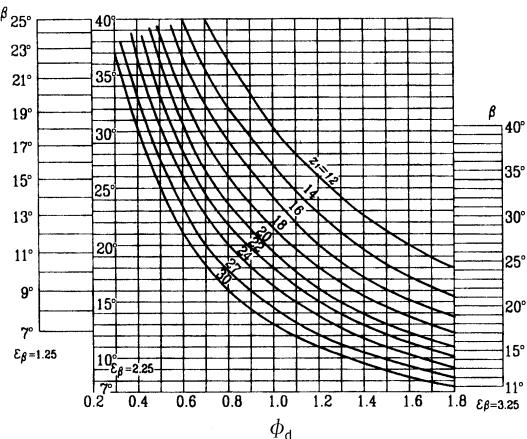

图G15-7 $\pmb { \beta }$ 、 $\pmb { \beta }$ 、 $\phi _ { \mathsf { d } }$ 、z之间的关系

3)对于常用的 $\pmb { \varepsilon } _ { \beta }$ 值(1.25、2.25和3.25),可用图G15-7来选取一组合适的 $\phi _ { \mathrm { d } } , ~ z _ { 1 }$ 和 $\pmb { \beta }$ 值。

4)采用优化方法,选定目标函数,用计算机计算,获得最合适的参数值。

# G3.5圆弧齿轮承载能力计算

# G3.5.1 圆弧齿轮承载能力计算公式

圆弧齿轮的齿形和工作时的应力状态都比渐开线齿轮复杂,但齿轮试验和工业应用的结果都显示,圆弧齿轮的主要失效形式与渐开线齿轮的相似,仍然是轮齿折断、齿面点蚀(剥落)和齿面胶合,此外还有塑性变形和磨损等。由于研究和应用圆弧齿轮的时间不长,目前还只有齿根弯曲疲劳和齿面接触疲劳的强度计算公式可供实际使用。表G15-39所列是单圆弧齿轮的承载能力计算公式;表G15-40所列是双圆弧齿轮的承载能力计算公式(按GB/T13799-1992)。不过要注意,这些计算式中的许多参数,如Kv、 $Z _ { \mathrm { N } ^ { \bullet } }$ $Y _ { \mathrm { N } } .$ ${ \pmb \sigma } _ { \mathrm { F l i m } }$ 和 ${ \pmb \sigma } _ { \mathrm { H l l i m } }$ 等,目前还研究得很不够,计算时需慎重选用。

表G15-39单圆弧齿轮传动承载能力计算公式

<table><tr><td>顶目</td><td colspan="3">齿根弯曲疲劳强度</td><td colspan="2">齿面接触疲劳强度</td></tr><tr><td>强度条件</td><td colspan="3">σ≤σp或S>Smin</td><td colspan="2">σ≤σp或S>Smin</td></tr><tr><td rowspan="2">计算应力 /MPa</td><td>凸齿SF1</td><td>0.79 TKKvKKF2 m+Ke</td><td>YE1Yu1YpaYF1Yend1 2m237</td><td rowspan="2">(TKAKvKKH2 SH= m+Ke</td><td rowspan="2">0.7 ZEZuZBZa 2m1</td></tr><tr><td>凹齿SF2</td><td>TKAKKKF2 m+Ke</td><td>0.73 YE2Yu2YB2YF2Yend2 z1m219</td></tr><tr><td rowspan="2">法向模数 /mm</td><td>凸齿mn≥</td><td>TKAKvKKF2 1/3 m+Ke</td><td>YE1Yu1Yβ1YFiYend1 1/2.37 ZS FP1</td><td rowspan="2">(TKAKvKK H2 m≥ m+Ke</td><td rowspan="2">1/3 ZEZuZBZa 1/2.1 ZS HP</td></tr><tr><td>凹齿mn M</td><td>(TKKvKKF2 m+K△ε</td><td>YE2Yu2YB2YF2Yend2 1/2.19 Z1S FP2</td></tr><tr><td>小齿轮(凸 齿) 转矩 /N·m</td><td colspan="2" rowspan="2">m+Ke 凸齿T1 = KAKvKKF2 m+Kε KAKvK1KF2</td><td rowspan="2">1/0.79 ZSFPI YE1Yu1YB1YF1Yend1 1/0.37 Z1SFP2 YE2Yu2YB2YF2Yend2</td><td rowspan="2">m+K△e T= KAKvKKH2</td><td rowspan="2">1/0.7 ZSHP ZEZuZBZa</td></tr><tr><td>凹齿T1</td></tr><tr><td>许用应力 /MPa</td><td colspan="3">OFP=OFlimYNYx/SFmin</td><td colspan="2">SHP =SHlimZNZLZv/SHmin</td></tr><tr><td>安全系数</td><td colspan="3">SF=OFlimYNYx/OF</td><td colspan="2">SH=SHlimZNZLZv /SH</td></tr></table>

注:1.表中长度单位为 $\mathrm { m m }$ ,力的单位为 $\Nu _ { \circ }$ 2.对于人字齿轮, $T _ { 1 }$ 按额定(名义)转矩的一半计算, $( { \pmb m } _ { \bf e } + K _ { \Delta \bf e } )$ 按全齿宽(不包括空刀槽宽)的一半计算。

表G15-40双圆弧齿轮传动承载能力计算公式

<table><tr><td>项目</td><td colspan="4">齿根弯曲疲劳强度</td><td colspan="4">齿面接触疲劳强度</td></tr><tr><td>强度条件</td><td colspan="4">SF≤SFP或 SF≥S Fmin</td><td colspan="4">SH≤S HP或 SH≥SHmin</td></tr><tr><td>计算应力 /MPa</td><td>sF=</td><td>TKAKvKKF2 0.86 2m+K△e</td><td>YEYuYB YFYend 21m2.58</td><td>SH=</td><td>TKAKvKKH2 2m+K△e</td><td>0.73</td><td>ZEZuZBZa</td><td></td></tr><tr><td>法向模数 /mm</td><td>m≥</td><td>TKAKvKKF2 1/3 2m+K△e</td><td>YEYuYBYFYend ZSFP 1/0.86</td><td>1/2.58 m≥</td><td>TKAKvKKH2 2m+K△e</td><td>1/3</td><td>ZEZuZBZa ZSHP</td><td>1/2.19 1/0.73</td></tr><tr><td>小齿轮转矩 /N·mm</td><td colspan="4">2m+K△e ZSFP T1 = KAKvKiKF2 YEYuYBYFYend</td><td colspan="4">2m+K△e ZSHP T= KAKvKKH2 ZEZuZBZa</td></tr><tr><td>许用应力 /MPa</td><td colspan="4">S FP= FlimYNYx/SFmin</td><td colspan="4">S HP=S HlimZNZ_Zv/SHmin</td></tr><tr><td>安全系数</td><td colspan="4">SF=S FlimYNYx/SF</td><td colspan="4">SH=S HlimZNZLZv/S H</td></tr></table>

注:1.表中长度单位为 $\mathrm { m m }$ ,力的单位为 $\Nu _ { \circ }$ 2.对于人字齿轮, $T _ { 1 }$ 按额定(名义)转矩一半计算, $\left( 2 \mu _ { \mathrm { e } } { + } K _ { ? \mathrm { e } } \right)$ 按全齿宽(不包括空刀槽宽)的一半计算。

表G15-41 表G15-40中各符号的意义

<table><tr><td rowspan=1 colspan=1>类别</td><td rowspan=1 colspan=1>符号</td><td rowspan=1 colspan=1>意    义</td><td rowspan=1 colspan=1>单位</td><td rowspan=1 colspan=1>所用图表</td></tr><tr><td rowspan=2 colspan=1>R</td><td rowspan=2 colspan=1>SHSFSHP、SFPSH、SFSHmin、SFminT171mnHeSHlimSFlim</td><td rowspan=2 colspan=1>计算接触应力和计算弯曲应力许用接触应力和许用弯曲应力接触强度和弯曲强度的计算安全系数接触强度和弯曲强度的最小安全系数小齿轮传递的名义转矩小齿轮齿数法面模数重合度的整数部分试验齿轮的接触疲劳极限试验齿轮的弯曲疲劳极限</td><td rowspan=2 colspan=1>MPaMPaN·mmmmMPaMPa</td><td rowspan=1 colspan=1>表G15-39、表G15-40</td></tr><tr><td rowspan=1 colspan=1>表G15-39、表G15-40表 G15-39、表G15-40表G15-11表G15-31表G15-38表G15-39、表G15-40表G15-38图G15-17~图G15-20图G15-17~图G15-24</td></tr><tr><td rowspan=1 colspan=1>n</td><td rowspan=1 colspan=1>KAKvKpKHB、KFBKe</td><td rowspan=1 colspan=1>使用系数动载系数接触迹间载荷分配系数接触迹内载荷分布系数 (接触、弯曲)接触迹系数</td><td rowspan=1 colspan=1></td><td rowspan=1 colspan=1>表G15-39图G15-8图G15-9表G15-42图G15-10</td></tr><tr><td rowspan=1 colspan=1>DR</td><td rowspan=1 colspan=1>ZEYEZu、YuZ、YBZYFYEndK?eYE1、YE2、YE、ZE</td><td rowspan=1 colspan=1>弹性系数 (接触)弹性系数 (弯曲)齿数比系数 (接触、弯曲)螺旋角系数 (接触、弯曲)接触弧长系数齿形系数齿端系数接触迹系数弹性系数</td><td rowspan=1 colspan=1>MPa0.27MPa0.14</td><td rowspan=1 colspan=1>表G15-43表G15-43图G15-11图G15-12图G15-14图G15-13图G15-15、图G15-16图G15-10表G15-43</td></tr><tr><td rowspan=1 colspan=1>D</td><td rowspan=1 colspan=1>ZNYNZLZvYx</td><td rowspan=1 colspan=1>寿命系数 (接触)寿命系数 (弯曲)润滑剂系数速度系数尺寸系数</td><td rowspan=1 colspan=1></td><td rowspan=1 colspan=1>图G15-25图G15-26图G15-29图G15-30图G15-27、图G15-28</td></tr></table>

# G3.5.2计算公式中各参数和系数的确定

承载能力计算公式(表G15-39、表G15-40)中的各参数和系数及其取值用的图表号列于表G15-41中。计算式中的小齿轮齿数 $z _ { 1 }$ 、重合度的整数部分 $\mu _ { \mathrm { e } }$ ,按预选参数确定。 $T _ { 1 }$ 取小齿轮的额定(名义)转矩值。

其他参数和系数证明如下:

(1)使用系数 $K _ { \mathrm { A } }$ $K _ { \mathrm { A } }$ 是考虑由于啮合外部因素引起附加动载前影响的系数,可参考表G15-39查取。(2)动载系数 $K _ { \mathrm { v } }$ $K _ { \mathrm { v } }$ 是考虑轮齿接触迹在啮合过程中的冲击和由

# 此引起齿轮副的振动而产生的内部附加动载荷影响的系数,可参考图G15-8查取。

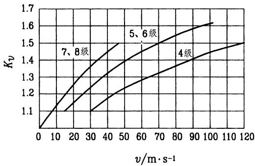

图G15-8动载系数 $\pmb { \kappa }$ 

(3)接触迹间载荷分配系数 $K _ { \mathrm { p } }$ 

$K _ { \mathrm { p } }$ 是考虑由于齿向及齿距误差、轮齿和轴系受载变形等引起载荷沿齿宽方向在各接触迹之间分配不均匀的影响系数,可参考图G15-9查取。

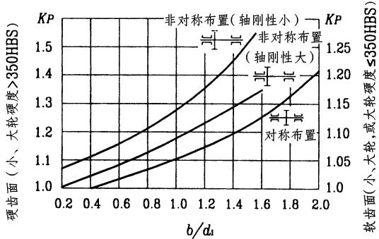

图G15-9接触迹间载荷分配系数 $\pmb { K } _ { \mathfrak { p } }$ (4)接触迹内载荷分布系数 $K _ { \mathrm { H B } }$ 、 $K _ { \mathrm { F B } }$ 

$K _ { \mathrm { H B } } , K _ { \mathrm { F B } }$ 是分别考虑由于齿面接触迹位置沿齿高的偏移而引起应力分布状态改变对接触强度和弯曲强度的影响系数,可由表G15-42查取。

表G15-42接触迹内载荷分布系数

<table><tr><td rowspan=1 colspan=2>川组精度等级</td><td rowspan=1 colspan=1>5</td><td rowspan=1 colspan=1>6</td><td rowspan=1 colspan=1>7</td><td rowspan=1 colspan=1>8</td></tr><tr><td rowspan=1 colspan=2>KFB</td><td rowspan=1 colspan=2>1.08</td><td rowspan=1 colspan=2>1.1</td></tr><tr><td rowspan=2 colspan=1>KHB</td><td rowspan=1 colspan=1>双圆弧齿轮</td><td rowspan=1 colspan=1>1.15</td><td rowspan=1 colspan=1>1.23</td><td rowspan=1 colspan=1>1.39</td><td rowspan=1 colspan=1>1.49</td></tr><tr><td rowspan=1 colspan=1>单圆弧齿轮</td><td rowspan=1 colspan=1>1.16</td><td rowspan=1 colspan=1>1.24</td><td rowspan=1 colspan=1>1.41</td><td rowspan=1 colspan=1>1.52</td></tr></table>

(5)接触迹系数 $K _ { ? }$ 

$K _ { \mathrm { ? e } }$ 是考虑重合度尾数?e对轮齿应力的影响系数,可由图14-65查取。当齿端修薄时,应根据减去齿端修薄长度后的有效齿长部分的?e来查图G15-10。当 $2 0 \ ^ { \circ } < \mathrm { B } < 2 5 \ ^ { \circ }$ 时,用插值法查取。

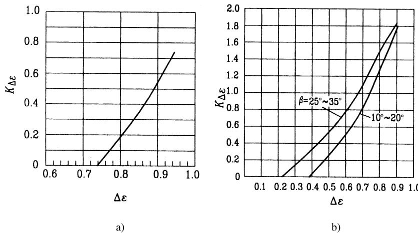

图G15-10接触迹系数 $\pmb { K } _ { \Delta }$ 

a)单圆弧齿轮b)双圆弧齿轮

(6)弹性系数 $Z _ { \mathrm { E } }$ 、 $Y _ { \mathrm { E } }$ 对齿轮接触应力和弯曲应力影响的系数,可由表$Z _ { \mathrm { E } }$ 、 $Y _ { \mathrm { E } }$ 是分别考虑材料的弹性模量 $E$ 及泊桑比? G15-43查取。

表G15-43弹性系数

<table><tr><td rowspan=1 colspan=1>齿型</td><td rowspan=1 colspan=1>符号</td><td rowspan=1 colspan=1>单位</td><td rowspan=1 colspan=1>锻钢-锻钢</td><td rowspan=1 colspan=1>锻钢-铸钢</td><td rowspan=1 colspan=1>锻钢-球墨铸铁</td><td rowspan=1 colspan=1>其他材料</td></tr><tr><td rowspan=3 colspan=1>单圆弧齿轮</td><td rowspan=1 colspan=1>YE1</td><td rowspan=1 colspan=1>MPa0.21</td><td rowspan=1 colspan=1>6.580</td><td rowspan=1 colspan=1>6.567</td><td rowspan=1 colspan=1>6.456</td><td rowspan=1 colspan=1>0.494E0.21</td></tr><tr><td rowspan=1 colspan=1>YE2</td><td rowspan=1 colspan=1>MPa0.27</td><td rowspan=1 colspan=1>16.748</td><td rowspan=1 colspan=1>16.703</td><td rowspan=1 colspan=1>16.341</td><td rowspan=1 colspan=1>0.600E0.27</td></tr><tr><td rowspan=1 colspan=1>ZE</td><td rowspan=1 colspan=1>MPa0.30</td><td rowspan=1 colspan=1>31.436</td><td rowspan=1 colspan=1>31.343</td><td rowspan=1 colspan=1>30.589</td><td rowspan=1 colspan=1>0.778E0.30</td></tr><tr><td rowspan=2 colspan=1>双圆弧齿轮</td><td rowspan=1 colspan=1>YE</td><td rowspan=1 colspan=1>MPa0.14</td><td rowspan=1 colspan=1>2.079</td><td rowspan=1 colspan=1>2.076</td><td rowspan=1 colspan=1>2.053</td><td rowspan=1 colspan=1>0.370E0.14</td></tr><tr><td rowspan=1 colspan=1>ZE</td><td rowspan=1 colspan=1>MPa0.27</td><td rowspan=1 colspan=1>31.346</td><td rowspan=1 colspan=1>31.263</td><td rowspan=1 colspan=1>30.584</td><td rowspan=1 colspan=1>1.123E0.27</td></tr></table>

注:1.表中 $E$ -一诱导弹性模量, $\mathbf { M P a }$ ;

2.脚标1、2分别代表小齿轮 (凸齿廓)和大齿轮 (凹齿廓)。

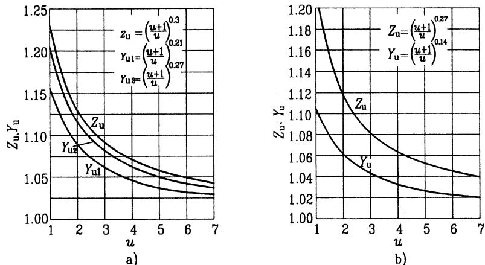

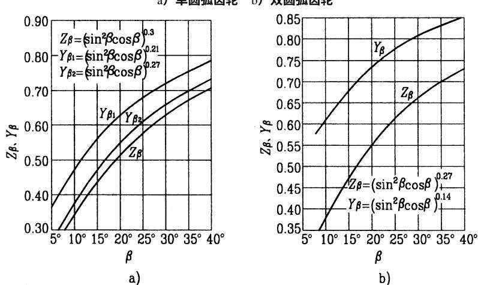

图G15-11 齿数比系数Zu、 $\pmb { Y } _ { \parallel }$ a)单圆弧齿轮b)双圆弧齿轮

图G15-12螺旋角系数 ${ \cal Z } _ { \mathrm { B } } ,$ $\pmb { \gamma } _ { \mathrm { _ { \mathrm { _ { B } } } } }$ a)单圆弧齿轮b)双圆弧齿轮

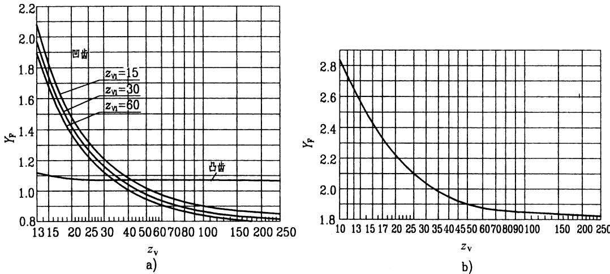

图G15-13齿形系数 $\pmb { \gamma _ { \mathtt { F } } }$ a)单圆弧齿轮b)双圆弧齿轮

(7)齿数比系数 $Z _ { \mathrm { u } } , \ Y _ { \mathrm { u } }$ 

$Z _ { \mathrm { u } } , \ Y _ { \mathrm { u } }$ 是分别考虑齿数比 $u$ 对接触应力和弯曲应力影响的系数,可由图G15-11中查取。

(8)螺旋角系数 $Z _ { \mathrm { B } } , \ Y _ { \mathrm { B } }$ 

$Z _ { \mathrm { B } }$ 、 $Y _ { \mathrm { B } }$ 是分别考虑螺旋角对接触应力和弯曲应力影响的系数,可从图G15-12中查取。

(9)齿形系数 $Y _ { \mathrm { F } }$ 

$Y _ { \mathrm { F } }$ 是考虑由于轮齿几何形状不同对齿根应力影响的系数,其值可从图G15-13中查取。

(10)接触弧长系数 $Z _ { \mathrm { a } }$ 

应力影响的系数。其值可由图G15-14查取。对于双圆弧齿轮传动,当 $u \neq 1$ 时,一个齿轮的上齿面和下齿面的接触弧长不一样,所以 $Z _ { \mathrm { a } }$ 应取两个齿轮的平均值,即 $Z _ { \mathrm { a } } { = } 0 . 5 \ : \ : ( Z _ { \mathrm { a l } } { + } Z _ { \mathrm { a } 2 } ) _ { \circ } \ : \ : Z _ { \mathrm { a l } }$ 和 $Z _ { \mathrm { a } 2 }$ 值可按小齿轮和大齿轮的当量齿数 $Z _ { \mathrm { v 1 } }$ 和 $Z _ { \mathrm { v } 2 }$ 查图 $6 1 5 \text{ - } 1 4 6 _ { \textdegree }$ 

(11)齿端系数 $Y _ { \mathrm { E n d } }$ 

$Y _ { \mathrm { E n d } }$ 是考虑接触迹在齿轮端部时,端面以外没有齿根来参与承担弯曲力矩,以致端部齿根应力增大的影响系数。单圆弧齿轮的 $Y _ { \mathrm { E n d } }$ 可查图G15-15;双圆弧齿轮的 $Y _ { \mathrm { E n d } }$ 可查图 $G 1 5 \mathrm { - } 1 6 _ { \circ }$ 以上两图适用于未修端的齿轮;对于修端的齿轮,取 $\scriptstyle Y _ { \mathrm { E n d } } = 1 _ { \circ }$ 

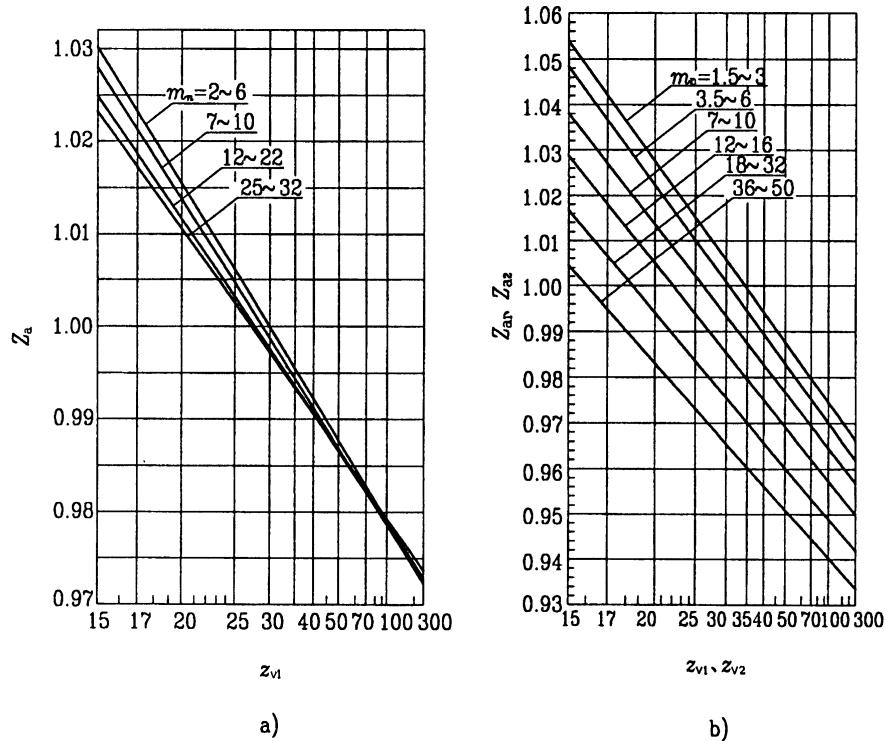

$Z _ { \mathrm { a } }$ 是考虑齿面接触弧的有效工作长度对齿面接触

图G15-14接触弧长系数 $\pmb { Z _ { \mathrm { a } } }$ 

a)单圆弧齿轮b)双圆弧齿轮(12)试验齿轮的接触疲劳极限 $s _ { \mathrm { H l i m } }$ 

$s _ { \mathrm { H l i m } }$ 值是试验齿轮经过负荷运转试验或由使用经验得到的,当缺乏资料时,可参考图G15-17\~图G15-20根据齿面硬度查取。只有齿轮的内在质量(材料、热处理等)有充分保证时,才可以取大值,通常取所给范围的中间值。

# (13)试验齿轮的弯曲疲劳极限 $s _ { \mathrm { F l i m } }$ 

$s _ { \mathrm { F l i m } }$ 值是试验齿轮经过试验或由使用经验得到的,当缺乏资料时,可参考图G15-21\~图G15-24根据齿面硬度查取。通常取所给范围的中间值,只有齿轮的内在质量(材料、热处理等)有充分保证时,可以取大值。对于受对称双向弯曲的齿轮,应将图中查得的 $s _ { \mathrm { F l i m } }$ 乘 $0 . 7 \circ$ 

# (14)寿命系数 $Z _ { \mathrm { N } } , ~ Y _ { \mathrm { N } }$ 

$Z _ { \mathrm { N } } , Y _ { \mathrm { N } }$ 是分别考虑所设计的齿轮只要求有限寿命时,其许用接触应力和许用弯曲应力可以提高的系数。 $Z _ { \mathrm { N } }$ 和 $Y _ { \mathrm { N } }$ 可根据应力循环数 $N _ { \mathrm { L } }$ 分别从图G15-25和图G15-26中查取。此 $Z _ { \mathrm { N } }$ 和 $Y _ { \mathrm { N } }$ 均适用于单圆弧齿

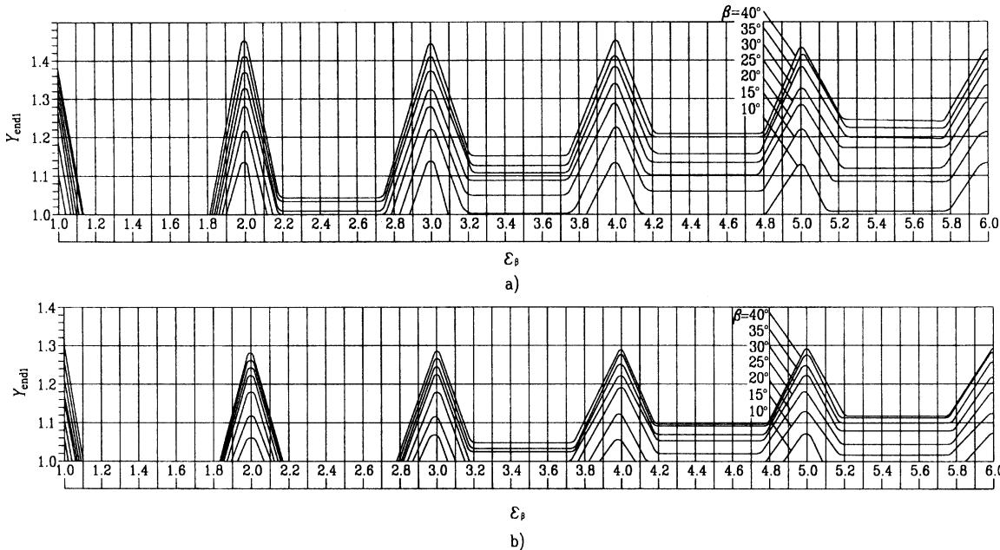

图G15-15单圆弧齿轮的齿端系数 $\pmb { \gamma } _ { \mathtt { E n d } }$ 

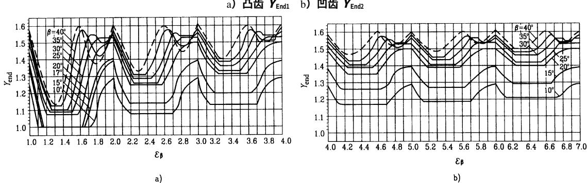

图G15-16双圆弧齿轮的齿端系数 $\pmb { \gamma } _ { \mathtt { E n d } }$ 

图G15-17调质钢齿轮的 $S \mathsf { H l i m }$ a)单圆弧齿轮b)双圆弧齿轮

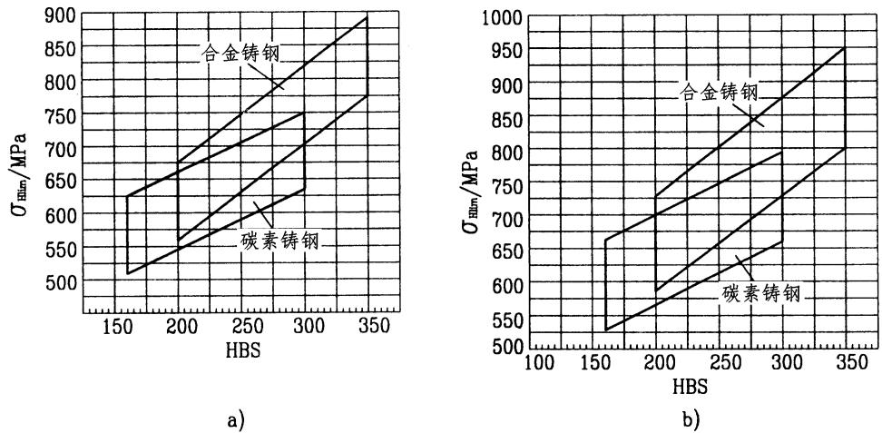

图G15-18 铸钢齿轮的 $s \mathsf { H l i m }$ 

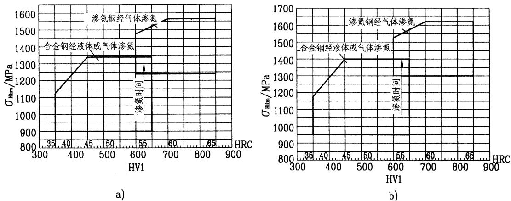

a)单圆弧齿轮b)双圆弧齿轮

图G15-19氮化齿轮的 $s \mathsf { H l i m }$ 

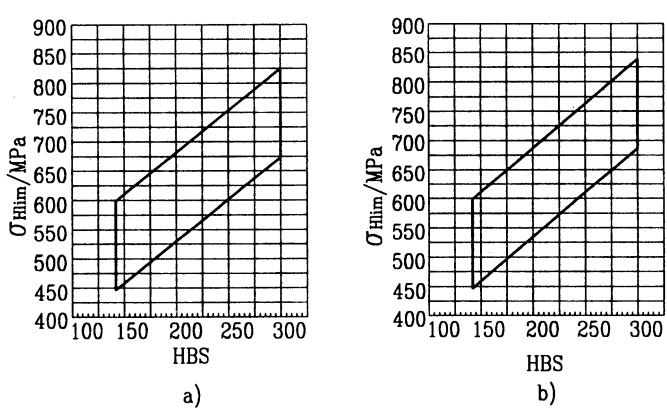

a)单圆弧齿轮b)双圆弧齿轮

图G15-20 球墨铸铁齿轮的 $s \mathsf { H l i m }$ a)单圆弧齿轮b)双圆弧齿轮

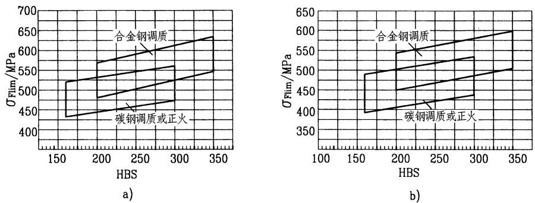

图G15-21 调质钢齿轮的 $s \models \dim$ a)单圆弧齿轮b)双圆弧齿轮

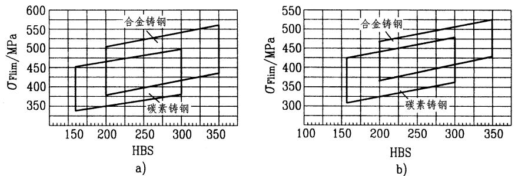

图G15-22 铸钢齿轮的 $S F { \mathrm { l i m } }$ a)单圆弧齿轮b)双圆弧齿轮

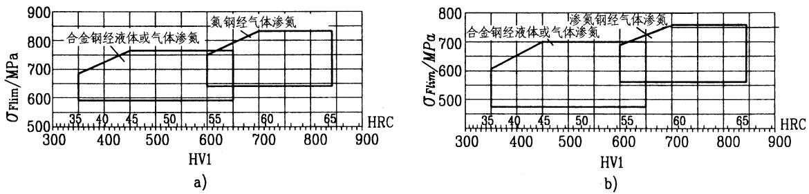

图G15-23氮化钢齿轮的 ${ \mathcal { S } } _ { \mathsf { F l i m } }$ a)单圆弧齿轮b)双圆弧齿轮

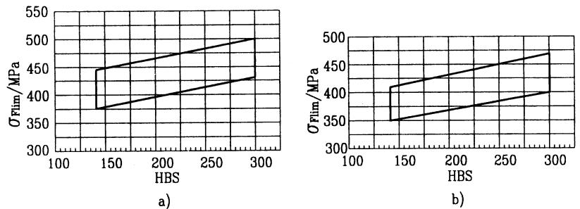

图G15-24球墨铸铁齿轮的 ${ \cal { S } } \mathsf { F l i m }$ a)单圆弧齿轮b)双圆弧齿轮

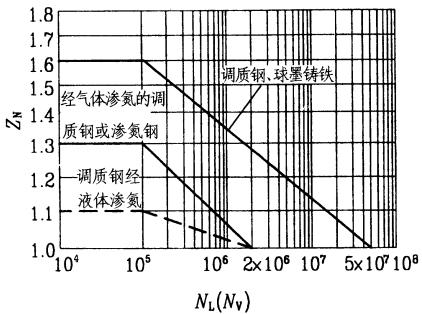

图G15-25寿命系数 $\pmb { Z } _ { N }$ 

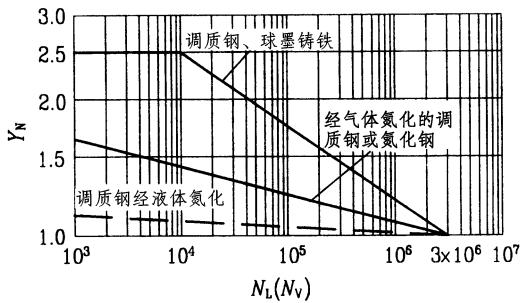

图G15-26寿命系数 $\pmb { \gamma _ { \mathsf { N } } }$ 

对于稳定载荷 (小齿轮转矩 $T _ { 1 }$ 基本不变),轮齿的应力循环数 $N _ { \mathrm { L } }$ ,可用式(15-16)计算而得,然后从图中查取 $Z _ { \mathrm { N } }$ 和 $Y _ { \mathrm { N } }$ 值。

对于不稳定载荷 (阶梯载荷 $T _ { 1 } \bullet \ T _ { 2 } \bullet \ T _ { 3 } \cdots )$ ,可按式(G15-13)计算当量应力循环次数 $N _ { \mathrm { v } }$ ,然后从图G15-25或图G15-26中查取 $Z _ { \mathrm { N } }$ 或 $Y _ { \mathrm { N } }$ 值。

$$
N _ { \mathrm { v } } = \sum N _ { \mathrm { i } } \Biggl ( \frac { T _ { \mathrm { i } } } { T _ { \mathrm { m a x } } } \Biggr ) ^ { e }
$$

式中 $T _ { \mathrm { m a x } }$ --载荷图 (小齿轮转矩 $T _ { 1 }$ 图)中最大转

矩(即 $T _ { \mathrm { 1 m a x } } )$ , $\mathrm { ~ N ~ } ^ { \cdot } \mathrm { ~ m ~ }$ ,强度计算时,

将此 $T _ { \mathrm { m a x } }$ 代替表G15-39和表G15-40

公式中的 $T _ { 1 } K _ { \mathrm { A } }$ ;

$T _ { \mathrm { i } }$ -一载荷图中各级转矩 $( \Nu \cdot \mathrm { _ m } )$ ;

$N _ { \mathrm { i } }$ —一相应于各级转矩 $T _ { \mathrm { i } }$ 的应力循环数,

$$
N _ { \mathrm { i } } { = } 6 0 j n _ { \mathrm { i } } t _ { \mathrm { i } }
$$

j—一齿轮每一转同一齿侧面啮合的次数;$n _ { \mathrm { i } } ,$ $t _ { \mathrm { i } }$ -一相应于 $T _ { \mathrm { i } }$ 的齿轮转速 $\mathrm { { ( r / m i n ) } }$ )和工作

时间(h);

e一一齿轮疲劳试验所得的指数,可从表G15-44查取。

(15)尺寸系数 $Y _ { \mathrm { x } }$ 

$Y _ { \mathrm { x } }$ 是考虑所计算齿轮的模数大于试验齿轮的模数而使齿根弯曲疲劳极限应力降低的影响系数。单圆弧齿轮和双圆弧齿轮的 $Y _ { \mathrm { x } }$ 值可分别从图G15-27和图G15-28 中查得。

表G15-44指数 $_ e$ 值

<table><tr><td rowspan=1 colspan=3>项   目</td><td rowspan=1 colspan=3>材料和热处理</td></tr><tr><td rowspan=1 colspan=1>计算类别</td><td rowspan=1 colspan=2>齿型</td><td rowspan=1 colspan=1>调质钢球墨铸铁</td><td rowspan=1 colspan=1>经气体氮化的调质钢或氮化钢</td><td rowspan=1 colspan=1>调质钢经液体氮化</td></tr><tr><td rowspan=2 colspan=1>接触强度</td><td rowspan=1 colspan=2>双圆弧齿轮</td><td rowspan=1 colspan=1>9.65</td><td rowspan=1 colspan=1>8.34</td><td rowspan=1 colspan=1>22.96</td></tr><tr><td rowspan=1 colspan=2>单圆弧齿轮</td><td rowspan=1 colspan=1>9.25</td><td rowspan=1 colspan=1>8.00</td><td rowspan=1 colspan=1>22.02</td></tr><tr><td rowspan=3 colspan=1>弯曲强度</td><td rowspan=1 colspan=2>双圆弧齿轮</td><td rowspan=1 colspan=1>5.38</td><td rowspan=1 colspan=1>14.58</td><td rowspan=1 colspan=1>71.66</td></tr><tr><td rowspan=2 colspan=1>单圆弧齿轮</td><td rowspan=1 colspan=1>凹齿</td><td rowspan=1 colspan=1>4.94</td><td rowspan=1 colspan=1>13.39</td><td rowspan=1 colspan=1>65.83</td></tr><tr><td rowspan=1 colspan=1>凸齿</td><td rowspan=1 colspan=1>4.56</td><td rowspan=1 colspan=1>12.37</td><td rowspan=1 colspan=1>60.83</td></tr></table>

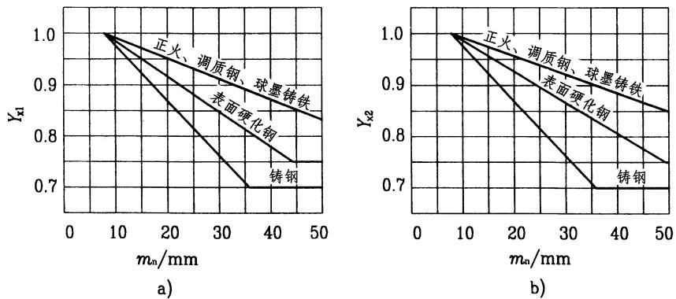

图G15-27单圆弧齿轮的尺寸系数 $\pmb { Y _ { \mathrm { x } } }$ 

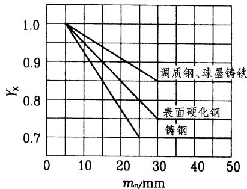

图G15-28双圆弧齿轮的尺寸系数 $\pmb { Y _ { \mathrm { x } } }$ 

(16)润滑剂系数 $Z _ { \mathrm { L } }$ 

$Z _ { \mathrm { L } }$ 是考虑所用的润滑油黏度 $? _ { 4 0 }$ 对齿面接触应力影响的系数。其值可从图G15-29中查取。

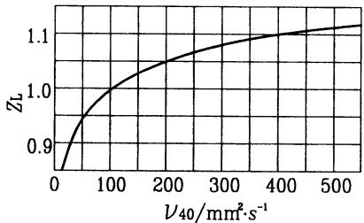

图G15-29润滑剂系数 $z _ { \mathrm { l } }$ 

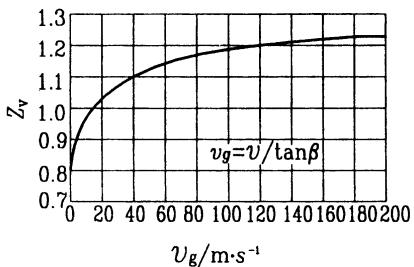

图G15-30速度系数 $z _ { v }$ 

# (17)速度系数 $Z _ { \mathrm { v } }$ 

$Z _ { \mathrm { v } }$ 是考虑齿面间相对速度 $V _ { \mathrm { g } }$ 对齿面接触应力影响的系数。其值可从图G15-30中查取。

(18)最小安全系数 $S _ { \mathrm { H m i n } } \ \cdot \ S _ { \mathrm { F m i n } }$ 

由于对圆弧齿轮的研究和使用经验还不够,因此圆弧齿轮的最小安全系数取得比渐开线齿轮的大,其参考值见表G15-45所列。

表G15-45最小安全系数的参考值

<table><tr><td rowspan=1 colspan=1>类别</td><td rowspan=1 colspan=1>参考值</td><td rowspan=1 colspan=1>说明</td></tr><tr><td rowspan=1 colspan=1>SHmin</td><td rowspan=1 colspan=1>1.3</td><td rowspan=2 colspan=1>对于重要的齿轮传动，或动力参数掌</td></tr><tr><td rowspan=1 colspan=1>SFmin</td><td rowspan=1 colspan=1>1.6</td></tr></table>

# G3.6圆弧圆柱齿轮的精度

我国现行的圆弧齿轮精度标准是GB/T15753-$1 9 9 5 _ { \circ }$ 本节是GB/T15753-1995《圆弧圆柱齿轮精度》的主要内容。

# G3.6.1适用范围

GB/T15753-1995适用于法向模数 $m _ { \mathrm { n } } { = } 1 . 5 { \sim } 4 0 \mathrm { m m }$ ,分度圆直径小于 $4 0 0 0 \mathrm { m m }$ ,有效齿宽小于 $6 3 0 \mathrm { m m }$ 的圆弧圆柱齿轮及其齿轮副。齿轮的基本齿廓符合GB12759-1991《双圆弧圆柱齿轮基本齿廓》,或JB929一1967《圆弧圆柱齿轮滚刀的法面齿形》的规定。

当齿轮尺寸规格超出上述范围时,可按GB/T15753-1995的附录A规定处理。

# G3.6.2定义和代号

圆弧齿轮、齿轮副的误差、侧隙的定义和代号列于表 ${ \mathrm { G } } 1 5 { \mathrm { - } } 4 6 _ { \circ }$ 

表G15-46圆弧齿轮、齿轮副的误差及侧隙的定义和代号

<table><tr><td colspan="1" rowspan="1">序号</td><td colspan="1" rowspan="1">名称</td><td colspan="1" rowspan="1">代号</td><td colspan="1" rowspan="1">定义</td></tr><tr><td colspan="1" rowspan="1">1</td><td colspan="1" rowspan="1">切向综合误差切向综合公差</td><td colspan="1" rowspan="1">？FF</td><td colspan="1" rowspan="1">被测齿轮与理想精确的测量齿轮单面啮合时，在被测齿轮一转内，实际转角与公称转角之差的总幅度值，以分度圆弧长计值</td></tr><tr><td colspan="1" rowspan="1">2</td><td colspan="1" rowspan="1">一齿切向综合误差一齿切向综合公差</td><td colspan="1" rowspan="1">?fifi</td><td colspan="1" rowspan="1">被测齿轮与理想精确的测量齿轮单面啮合时，在被测齿轮一齿距角内，实际转角与公称转角之差的最大幅度值，以分度圆弧长计</td></tr><tr><td colspan="4" rowspan="1">257(续)</td></tr><tr><td colspan="1" rowspan="1">序号</td><td colspan="1" rowspan="1">名       称</td><td colspan="1" rowspan="1">代号</td><td colspan="1" rowspan="1">定        义</td></tr><tr><td colspan="1" rowspan="1">3</td><td colspan="1" rowspan="1">齿距累积误差实际弧长实际齿形公称齿形山     B检查圆k个齿距累积误差5S0123       齿序齿距累积公差k个齿距累积公差</td><td colspan="1" rowspan="1">？Fp？FpkFPFpk</td><td colspan="1" rowspan="1">在检查圆①上，任意两个同侧齿面间实际弧长与公称弧长之差的最大差值在检查圆上，k个齿距间的实际弧长与公称弧长之差的最大差值。k为2到小于z/2的整数</td></tr><tr><td colspan="1" rowspan="1">4</td><td colspan="1" rowspan="1">齿圈径向跳动齿圈径向跳动公差</td><td colspan="1" rowspan="1">？FF</td><td colspan="1" rowspan="1">在齿轮一转范围内，测头在齿槽内，于凸齿或凹齿中部双面接触，测头相对于齿轮轴线的最大变动量</td></tr><tr><td colspan="1" rowspan="1">5</td><td colspan="1" rowspan="1">公法线长度变动A公法线长度变动公差</td><td colspan="1" rowspan="1">？FwFw</td><td colspan="1" rowspan="1">在齿轮一周范围内，实际公法线长度最大值与最小值之差?Fw=Wmax-Wmin</td></tr><tr><td colspan="1" rowspan="1">6</td><td colspan="1" rowspan="1">齿距偏差实际齿距   △fpt公称齿距山A齿距极限偏差</td><td colspan="1" rowspan="1">?fpt士f</td><td colspan="1" rowspan="1">在检查圆上，实际齿距与公称齿距之差用相对法测量时，公称齿距是指所有实际齿距的平均值</td></tr><tr><td colspan="2" rowspan="1">7                        齿向误差一个轴向齿距内的齿向误差四山齿向公差一个轴向齿距内的齿向公差</td><td colspan="1" rowspan="1">？FB?fFBf</td><td colspan="1" rowspan="1">在检查圆柱面上，在有效齿宽范围内 (端部倒角部分除外),包容实际齿向线的两条最近的设计齿线之间的端面距离在有效齿宽中，任一轴向齿距范围内，包容实际齿线的两条最近的设计齿线之间的端面距离设计齿线可以是修正的圆柱螺旋线，包括齿端修薄及其它修形曲线齿宽两端的齿向误差只允许逐渐偏向齿体内</td></tr><tr><td colspan="4" rowspan="1">(续)</td></tr><tr><td colspan="1" rowspan="1">序号</td><td colspan="1" rowspan="1">名       称</td><td colspan="1" rowspan="1">代号</td><td colspan="1" rowspan="1">定        义</td></tr><tr><td colspan="1" rowspan="1">8</td><td colspan="1" rowspan="1">轴向齿距偏差一个轴向齿距偏差实际齿距公称齿距轴向齿距极限偏差一个轴向齿距极限偏差</td><td colspan="1" rowspan="1">？Fpx?fpx±Fpxfpx</td><td colspan="1" rowspan="1">在有效齿宽范围内，与齿轮基准轴线平行而大约通过凸齿或凹齿中部的一条直线上,任意两个同侧齿面间的实际距离与公称距离之差。沿齿面法线方向计值在有效齿宽范围内，与齿轮基准轴线平行而大约通过凸齿或凹齿中部的一条直线上，任一轴向齿距内，两个同侧齿面间的实际距离与公称距离之差。沿齿面法线方向计值</td></tr><tr><td colspan="1" rowspan="1">9</td><td colspan="1" rowspan="1">螺旋线波度误差山螺旋线波度公差</td><td colspan="1" rowspan="1">?fBf</td><td colspan="1" rowspan="1">在有效齿宽范围内，凸齿或凹齿中部实际齿线波纹的最大波幅。沿齿面法线方向计值</td></tr><tr><td colspan="1" rowspan="1">10</td><td colspan="1" rowspan="1">弦齿深偏差T弦齿深极限偏差</td><td colspan="1" rowspan="1">？Eh+E</td><td colspan="1" rowspan="1">在齿轮一周内,实际弦齿深减去实际外圆直径偏差后与公称弦齿深之差在法面中测量</td></tr><tr><td colspan="1" rowspan="1">11</td><td colspan="1" rowspan="1">齿根圆直径偏差Lf山齿根圆直径极限偏差</td><td colspan="1" rowspan="1">？Edf±Edf</td><td colspan="1" rowspan="1">齿根圆直径实际尺寸和公称尺寸之差对于奇数齿可用齿根圆斜径代替。斜径公称尺寸Lf为90°Lf=dfcos7</td></tr><tr><td colspan="1" rowspan="1">12</td><td colspan="1" rowspan="1">齿厚偏差公称齿厚上偏差齿厚极限偏差下偏差齿厚公差</td><td colspan="1" rowspan="1">？EsEssEsiTs</td><td colspan="1" rowspan="1">接触点所在圆柱面上，法向齿厚实际值与公称值之差</td></tr><tr><td colspan="1" rowspan="1">13</td><td colspan="1" rowspan="1">公法线长度偏差上偏差公法线长度极限偏差下偏差公法线长度公差</td><td colspan="1" rowspan="1">？EwEwsEwiTw</td><td colspan="1" rowspan="1">在齿轮一周内，公法线实际长度值与公称值之差</td></tr></table>

<table><tr><td colspan="8">(续)</td></tr><tr><td>序号</td><td colspan="2">名</td><td></td><td>代号</td><td colspan="2">定</td><td>义</td></tr><tr><td>14</td><td colspan="2">齿轮副的切向综合误差</td><td></td><td>？Fi</td><td colspan="2">在设计中心距下安装好的齿轮副，在啮合转动足够</td><td></td></tr><tr><td></td><td colspan="4">齿轮副的切向综合公差</td><td>Fic</td><td colspan="2">多的转数内，一个齿轮相对于另一个齿轮的实际转角 与公称转角之差的总幅度值。以分度圆弧长计值</td></tr><tr><td>15</td><td colspan="4">齿轮副的一齿切向综合误差</td><td>？fi</td><td colspan="2">安装好的齿轮副，在啮合足够多的转数内，一个齿</td></tr><tr><td>16</td><td colspan="4" rowspan="2">齿轮副的一齿切向综合公差 齿轮副的接触迹线</td><td rowspan="2">fie</td><td colspan="2">轮相对于另一个齿轮，一个齿距的实际转角与公称转</td></tr><tr><td rowspan="8"></td></tr><tr><td></td><td rowspan="8">2 德</td><td rowspan="8">接触迹线位置偏差</td><td rowspan="8">6 6"</td><td rowspan="8">成的挤压痕迹</td><td>角之差的最大幅度值。以分度圆弧长计值 凸凹齿面瞬时接触时，由于齿面接触弹性变形而形</td></tr><tr><td></td></tr><tr><td>装配好的齿轮副，跑合之前，着色检验，在轻微制</td></tr><tr><td>动下，齿面实际接触迹线偏离名义接触迹线的高度 对于双圆弧齿轮：</td></tr><tr><td></td></tr><tr><td>1.498 凸齿：h 名义= 0.355- zv+1.09</td></tr><tr><td>1.498 凹齿：h 名义= 1.445- mn v-1.09</td></tr><tr><td rowspan="3">6</td><td rowspan="3"></td><td>对于单圆弧齿轮：</td></tr><tr><td>凸齿：h 名义= 0.45- 1.688 mn Zv+1.5</td></tr><tr><td colspan="2">1.688 凹齿：h名义= 0.75- mn zv-1.5 当量齿数 7 Zv Zv=</td></tr><tr><td>17</td><td rowspan="6">h 龙 "_</td><td rowspan="6">齿轮副的接触斑点 6 16 国 C b&#x27; b" C 南 6</td><td rowspan="6"></td><td>cosb 沿齿长方向，接触迹线的长度b"与工作长度b‘之比即</td></tr><tr><td>b</td></tr><tr><td></td></tr><tr><td>装配好的齿轮副，经空载检验，在名义接触迹线位</td></tr><tr><td>置附近齿面上分布的接触擦亮痕迹</td></tr><tr><td>接触痕迹的大小在齿面展开图上用百分数计算 沿齿长方向：接触痕迹的长度b”(扣除超过模数的</td></tr></table>

(续)

<table><tr><td rowspan=1 colspan=1>序号</td><td rowspan=1 colspan=1>名       称</td><td rowspan=1 colspan=1>代号</td><td rowspan=1 colspan=1>定        义</td></tr><tr><td rowspan=1 colspan=1>18</td><td rowspan=1 colspan=1>齿轮副的侧隙w圆周侧隙法向侧隙最大极限侧隙最小极限侧隙</td><td rowspan=1 colspan=1>jjnjtmaxJnmaxjuminjnmin</td><td rowspan=1 colspan=1>装配好的齿轮副，当一个齿轮固定时，另一个齿轮的圆周晃动量，以接触点所在圆的弧长计值装配好的齿轮副，当工作齿面接触时，非工作齿面之间的最小距离</td></tr><tr><td rowspan=1 colspan=1>19</td><td rowspan=1 colspan=1>齿轮副的中心距偏差齿轮副的中心距极限偏差</td><td rowspan=1 colspan=1>?fa±f</td><td rowspan=1 colspan=1>在齿轮副的齿宽中间平面内，实际中心距与公称中心距之差</td></tr><tr><td rowspan=1 colspan=1>20</td><td rowspan=1 colspan=1>轴线的平行度误差x方向轴线的平行度误差y方向轴线的平行度误差齿宽b H实际中心距中点基准轴线（H)   实际中心距轴线在（H）平面上的投影轴线在（V）平面上的投影x方向轴线的平行度公差y方向轴线的平行度公差</td><td rowspan=1 colspan=1>？fx?fyfxfy</td><td rowspan=1 colspan=1>一对齿轮的轴线在其基准平面[H]上投影的平行度误差。在等于齿宽的长度上测量一对齿轮的轴线，在垂直于基准平面，并且平行于基准轴线的平面[V]上投影的平行度误差。在等于齿宽的长度上测量注：包含基准轴线，并通过由另一轴线与齿宽中间平面相交的点所形成的平面，称为基准平面，两条轴线中任何一条轴线都可以作为基准轴线</td></tr></table>

注:检查圆是指位于凸齿中部(对于单圆弧齿轮则为凸齿或凹齿中部)与分度圆同心的圆。

# G3.6.3精度等级及其选择 (表G15-47、表G15-48)

# G3.6.4齿坏要求 (表G15-49\~表G15-51)

表G15-47圆弧齿轮公差与极限偏差分组

<table><tr><td rowspan=1 colspan=1>公差组</td><td rowspan=1 colspan=1>公差与极限偏差项目</td><td rowspan=1 colspan=1>误差特性</td><td rowspan=1 colspan=1>对传动性能的主要影响</td></tr><tr><td rowspan=1 colspan=1>1</td><td rowspan=1 colspan=1>F&#x27;i,Fp,Fpk,Fr,Fw</td><td rowspan=1 colspan=1>以齿轮一转为周期的误差</td><td rowspan=1 colspan=1>传递运动的准确性</td></tr><tr><td rowspan=1 colspan=1>=</td><td rowspan=1 colspan=1>f&#x27;i,fpt， f,fB,fpx</td><td rowspan=1 colspan=1>在齿轮一周内，多次周期地重复出现的误差</td><td rowspan=1 colspan=1>传动的平稳性、噪声、振动</td></tr><tr><td rowspan=1 colspan=1>三</td><td rowspan=1 colspan=1>FB,Fpx，Edf,Eh</td><td rowspan=1 colspan=1>齿向误差，轴向齿距偏差，齿形的径向位置误差</td><td rowspan=1 colspan=1>载荷沿齿宽分布的均匀性,齿高方向的接触部位和承载能力</td></tr></table>

表G15-48圆弧齿轮精度选择

<table><tr><td rowspan=1 colspan=1>精度等级</td><td rowspan=1 colspan=1>加工方法</td><td rowspan=1 colspan=1>工作情况</td><td rowspan=1 colspan=1>圆周速度/m·s-1</td></tr><tr><td rowspan=1 colspan=1>5级(高精度级)</td><td rowspan=1 colspan=1>在高精度滚齿机上用高精度滚刀切齿。淬硬齿轮必须磨齿</td><td rowspan=1 colspan=1>要求工作平稳，振动、噪声小，速度高及载荷较大的齿轮。例如，透平齿轮</td><td rowspan=1 colspan=1>超过75</td></tr><tr><td rowspan=1 colspan=1>6级(精密级)</td><td rowspan=1 colspan=1>在精密滚齿机上，用精密滚刀切齿。淬硬齿轮必须磨齿。氮化处理齿轮允许研齿</td><td rowspan=1 colspan=1>对于工作平稳性有一定要求，转速高或载荷较大的齿轮。例如中小型汽轮机、透平机械用齿轮</td><td rowspan=1 colspan=1>至75</td></tr><tr><td rowspan=1 colspan=1>7级(中等精度级)</td><td rowspan=1 colspan=1>在较精密滚齿机上，用较精密滚刀切齿。表面硬化处理齿轮，应作适当研齿</td><td rowspan=1 colspan=1>速度较高的中等载荷齿轮。例如轧钢机齿轮</td><td rowspan=1 colspan=1>至25</td></tr><tr><td rowspan=1 colspan=1>8级(低精度级)</td><td rowspan=1 colspan=1>在普通滚齿机上，用普通级滚刀切齿</td><td rowspan=1 colspan=1>普通机器制造业中精度要求一般的齿轮。例如，标准减速器，矿山、冶金设备用齿轮</td><td rowspan=1 colspan=1>至10</td></tr></table>

注:本表不属于GB/T15753-1995,仅供参考。

# 表G15-49齿坏公差

$\textcircled{1}$ 当三个公差组的精度等级不同时,按最高的精度等级确定公差值。  
$\textcircled{2}$ 当顶圆不作测量齿深和齿厚的基准时,尺寸公差按IT11给定,但不大于 $0 . 1 m _ { \mathfrak { n } \mathfrak { o } }$ 

注:IT—一标准公差单位。

表G15-51圆弧齿轮各主要表面的

<table><tr><td rowspan=1 colspan=2>齿轮精度等级</td><td rowspan=1 colspan=1>4</td><td rowspan=1 colspan=1>5</td><td rowspan=1 colspan=1>6</td><td rowspan=1 colspan=1>7</td><td rowspan=1 colspan=1>8</td></tr><tr><td rowspan=1 colspan=1>孔</td><td rowspan=1 colspan=1>尺寸公差形状公差</td><td rowspan=1 colspan=1>IT4</td><td rowspan=1 colspan=1>IT5</td><td rowspan=1 colspan=1>IT6</td><td rowspan=1 colspan=2>IT7</td></tr><tr><td rowspan=1 colspan=1>轴</td><td rowspan=1 colspan=1>尺寸公差形状公差</td><td rowspan=1 colspan=1>IT4</td><td rowspan=1 colspan=2>IT5</td><td rowspan=1 colspan=2>IT6</td></tr><tr><td rowspan=1 colspan=2>顶圆直径</td><td rowspan=1 colspan=1>IT6</td><td rowspan=1 colspan=4>IT7</td></tr></table>

表G15-50 齿轮基准面径向和端面圆跳动公差$( \mu \mathrm { m } )$ 

<table><tr><td rowspan=1 colspan=2>分度圆直径/mm</td><td rowspan=1 colspan=3>精度等级</td></tr><tr><td rowspan=1 colspan=1>大于</td><td rowspan=1 colspan=1>到</td><td rowspan=1 colspan=1>4</td><td rowspan=1 colspan=1>5和6</td><td rowspan=1 colspan=1>7和8</td></tr><tr><td rowspan=1 colspan=1>二</td><td rowspan=1 colspan=1>125</td><td rowspan=1 colspan=1>7/2.8</td><td rowspan=1 colspan=1>11/7</td><td rowspan=1 colspan=1>18/11</td></tr><tr><td rowspan=1 colspan=1>125</td><td rowspan=1 colspan=1>400</td><td rowspan=1 colspan=1>9/3.6</td><td rowspan=1 colspan=1>14/9</td><td rowspan=1 colspan=1>22/14</td></tr><tr><td rowspan=1 colspan=1>400</td><td rowspan=1 colspan=1>800</td><td rowspan=1 colspan=1>12/5</td><td rowspan=1 colspan=1>20/12</td><td rowspan=1 colspan=1>32/20</td></tr></table>

(续)

<table><tr><td rowspan=1 colspan=2>分度圆直径/mm</td><td rowspan=1 colspan=3>精度等级</td></tr><tr><td rowspan=1 colspan=1>大于</td><td rowspan=1 colspan=1>到</td><td rowspan=1 colspan=1>4</td><td rowspan=1 colspan=1>5和6</td><td rowspan=1 colspan=1>7和8</td></tr><tr><td rowspan=1 colspan=1>800</td><td rowspan=1 colspan=1>1600</td><td rowspan=1 colspan=1>18/7</td><td rowspan=1 colspan=1>28/18</td><td rowspan=1 colspan=1>45/28</td></tr><tr><td rowspan=1 colspan=1>1600</td><td rowspan=1 colspan=1>2500</td><td rowspan=1 colspan=1>25/10</td><td rowspan=1 colspan=1>40/25</td><td rowspan=1 colspan=1>63/40</td></tr><tr><td rowspan=1 colspan=1>2500</td><td rowspan=1 colspan=1>4000</td><td rowspan=1 colspan=1>40/16</td><td rowspan=1 colspan=1>63/40</td><td rowspan=1 colspan=1>100/63</td></tr></table>

注:分子是径向的圆跳动公差,分母是端面的圆跳动公差。

粗糙度值 (非GB/T 15753—1995内容)

<table><tr><td rowspan=1 colspan=2>精度等级</td><td rowspan=1 colspan=2>4和5</td><td rowspan=1 colspan=2>6和7</td><td rowspan=1 colspan=2>8</td></tr><tr><td rowspan=1 colspan=2>法面模数mn/mm</td><td rowspan=1 colspan=1>2~10</td><td rowspan=1 colspan=1>>10</td><td rowspan=1 colspan=1>2~10</td><td rowspan=1 colspan=1>>10</td><td rowspan=1 colspan=1>2~10</td><td rowspan=1 colspan=1>>10</td></tr><tr><td rowspan=5 colspan=1>表</td><td rowspan=1 colspan=1>跑合前齿面</td><td rowspan=1 colspan=1>0.8</td><td rowspan=1 colspan=1>1.25</td><td rowspan=1 colspan=1>1.6</td><td rowspan=1 colspan=1>2.5</td><td rowspan=1 colspan=1>3.2</td><td rowspan=1 colspan=1>5</td></tr><tr><td rowspan=1 colspan=1>齿轮基准孔</td><td rowspan=1 colspan=2>1.25</td><td rowspan=1 colspan=2>2.5</td><td rowspan=1 colspan=2>5</td></tr><tr><td rowspan=1 colspan=1>齿轮轴基准轴颈</td><td rowspan=1 colspan=2>0.8</td><td rowspan=1 colspan=2>1.25</td><td rowspan=1 colspan=2>2.5</td></tr><tr><td rowspan=1 colspan=1>齿轮基准端面</td><td rowspan=1 colspan=2>1.25</td><td rowspan=1 colspan=2>2.5</td><td rowspan=1 colspan=2>5</td></tr><tr><td rowspan=1 colspan=1>齿轮顶圆</td><td rowspan=1 colspan=2>1.25~2.5</td><td rowspan=1 colspan=2>5</td><td rowspan=1 colspan=2>5</td></tr></table>

注:如果齿轮公差组为不同精度等级时,按其中最高的精度等级查表。

# G3.6.5齿轮与齿轮副的检验与公差(表G15-52、表G15-63)

表G15-52推荐的检验项目

<table><tr><td rowspan=1 colspan=2>1组精度</td><td rowspan=1 colspan=1>?Fi&#x27;;？Fp （？Fp）；F,与？F</td></tr><tr><td rowspan=1 colspan=2>Ⅱ组精度</td><td rowspan=1 colspan=1>？fi&#x27;；?fpr、?fB（或?fpx）；?fpt，对于6级及高于6级精度的斜齿轮或人字齿轮，检验fpt时，推荐加检？fB</td></tr><tr><td rowspan=1 colspan=2>川组精度</td><td rowspan=1 colspan=1>?FB与？Edr（或?En）③;？Fpx与？Ear（或？En）③</td></tr><tr><td rowspan=1 colspan=2>齿轮箱</td><td rowspan=1 colspan=1>检验？fa、？fx、?fy三项</td></tr><tr><td rowspan=2 colspan=1>装配检验</td><td rowspan=1 colspan=1>川组精度</td><td rowspan=1 colspan=1>接触迹线长度及位置偏差；接触斑点</td></tr><tr><td rowspan=1 colspan=1>传动侧隙</td><td rowspan=1 colspan=1>用百分表测量圆周侧隙j，传动侧隙jn=jcosβ</td></tr></table>

$\textcircled{1}$ ? $F _ { \mathrm { p k } }$ 仅在必要时加检;$\textcircled{2}$ 当其中有一项超差时,应按? $F _ { \mathrm { p } }$ 检定和验收齿轮精度;$\textcircled{3}$ 对不便于测量齿根圆直径的大直径齿轮,可检查? $\cdot _ { E _ { \mathrm { h e } } }$ 

<table><tr><td rowspan=3 colspan=1>精度等级</td><td rowspan=1 colspan=13>L/mm</td></tr><tr><td rowspan=2 colspan=1>~32</td><td rowspan=2 colspan=1>>32~50</td><td rowspan=2 colspan=1>>50~80</td><td rowspan=2 colspan=1>V80~160</td><td rowspan=2 colspan=1>>160~315</td><td rowspan=2 colspan=1>>315~630</td><td rowspan=1 colspan=1>>630</td><td rowspan=1 colspan=1>>1000</td><td rowspan=1 colspan=1>>1600</td><td rowspan=1 colspan=1>>2500</td><td rowspan=2 colspan=1>>3150~4000</td><td rowspan=2 colspan=1>>4000~5000</td><td rowspan=2 colspan=1>>5000~7200</td></tr><tr><td rowspan=1 colspan=1>~1000</td><td rowspan=1 colspan=1>~1600</td><td rowspan=1 colspan=1>~2500</td><td rowspan=1 colspan=1>~3150</td></tr><tr><td rowspan=1 colspan=1>4</td><td rowspan=1 colspan=1>8</td><td rowspan=1 colspan=1>9</td><td rowspan=1 colspan=1>10</td><td rowspan=1 colspan=1>12</td><td rowspan=1 colspan=1>18</td><td rowspan=1 colspan=1>25</td><td rowspan=1 colspan=1>32</td><td rowspan=1 colspan=1>40</td><td rowspan=1 colspan=1>45</td><td rowspan=1 colspan=1>56</td><td rowspan=1 colspan=1>63</td><td rowspan=1 colspan=1>71</td><td rowspan=1 colspan=1>80</td></tr><tr><td rowspan=1 colspan=1>5</td><td rowspan=1 colspan=1>12</td><td rowspan=1 colspan=1>14</td><td rowspan=1 colspan=1>16</td><td rowspan=1 colspan=1>20</td><td rowspan=1 colspan=1>28</td><td rowspan=1 colspan=1>40</td><td rowspan=1 colspan=1>50</td><td rowspan=1 colspan=1>63</td><td rowspan=1 colspan=1>71</td><td rowspan=1 colspan=1>90</td><td rowspan=1 colspan=1>100</td><td rowspan=1 colspan=1>112</td><td rowspan=1 colspan=1>125</td></tr><tr><td rowspan=1 colspan=1>6</td><td rowspan=1 colspan=1>20</td><td rowspan=1 colspan=1>22</td><td rowspan=1 colspan=1>25</td><td rowspan=1 colspan=1>32</td><td rowspan=1 colspan=1>45</td><td rowspan=1 colspan=1>63</td><td rowspan=1 colspan=1>80</td><td rowspan=1 colspan=1>100</td><td rowspan=1 colspan=1>112</td><td rowspan=1 colspan=1>140</td><td rowspan=1 colspan=1>160</td><td rowspan=1 colspan=1>180</td><td rowspan=1 colspan=1>200</td></tr><tr><td rowspan=1 colspan=1>7</td><td rowspan=1 colspan=1>28</td><td rowspan=1 colspan=1>32</td><td rowspan=1 colspan=1>36</td><td rowspan=1 colspan=1>45</td><td rowspan=1 colspan=1>63</td><td rowspan=1 colspan=1>90</td><td rowspan=1 colspan=1>112</td><td rowspan=1 colspan=1>140</td><td rowspan=1 colspan=1>160</td><td rowspan=1 colspan=1>200</td><td rowspan=1 colspan=1>224</td><td rowspan=1 colspan=1>250</td><td rowspan=1 colspan=1>280</td></tr><tr><td rowspan=1 colspan=1>8</td><td rowspan=1 colspan=1>40</td><td rowspan=1 colspan=1>45</td><td rowspan=1 colspan=1>50</td><td rowspan=1 colspan=1>63</td><td rowspan=1 colspan=1>90</td><td rowspan=1 colspan=1>125</td><td rowspan=1 colspan=1>160</td><td rowspan=1 colspan=1>200</td><td rowspan=1 colspan=1>224</td><td rowspan=1 colspan=1>280</td><td rowspan=1 colspan=1>315</td><td rowspan=1 colspan=1>355</td><td rowspan=1 colspan=1>400</td></tr></table>

注 $: 1 . F _ { \mathrm { p } }$ 和 $F _ { \mathrm { p k } }$ 按分度圆弧长 $L$ 查表;

查 $F _ { \mathrm { p } }$ 时,取 $L { = } \frac 1 2 \mathsf { p } d = \frac { \mathsf { p } m _ { \mathrm { n } } z } { 2 \cos { \pmb b } }$ pmn;查Fpk时,取L= $L { = } \frac { k \pi m _ { \mathrm { n } } } { \cos b }$ $( k$ 为2到小于 $z / 2$ 的整数)

2.除特殊情况外,对于 $F _ { \mathrm { p k } }$ , $k$ 值规定取为小于 $z / 6$ 或 $z / 8$ 的最大整数。

式中 $d$ 一分度圆直径; $m _ { \mathfrak { n } }$ 一法向模数;z一齿数; $\beta$ 一分度圆螺旋角。

表G15-54齿圈径向跳动公差 $F _ { \mathrm { r } }$ 值

<table><tr><td rowspan=2 colspan=2>精度等级</td><td rowspan=2 colspan=1>法向模数/mm</td><td rowspan=1 colspan=6>分度圆直径/mm</td></tr><tr><td rowspan=1 colspan=1>~125</td><td rowspan=1 colspan=1>>125~400</td><td rowspan=1 colspan=1>>400~800</td><td rowspan=1 colspan=1>>800~1600</td><td rowspan=1 colspan=1>>1600~2500</td><td rowspan=1 colspan=1>>2500~4000</td></tr><tr><td rowspan=1 colspan=2></td><td rowspan=1 colspan=1>>1.5~3.5</td><td rowspan=1 colspan=1>9</td><td rowspan=1 colspan=1>10</td><td rowspan=1 colspan=1>11</td><td rowspan=1 colspan=1>1</td><td rowspan=1 colspan=1>1</td><td rowspan=1 colspan=1>1</td></tr><tr><td rowspan=1 colspan=2></td><td rowspan=1 colspan=1>>3.5~6.3</td><td rowspan=1 colspan=1>11</td><td rowspan=1 colspan=1>13</td><td rowspan=1 colspan=1>13</td><td rowspan=1 colspan=1>14</td><td rowspan=1 colspan=1>1</td><td rowspan=1 colspan=1>1</td></tr><tr><td rowspan=2 colspan=2>4</td><td rowspan=1 colspan=1>>6.3~10</td><td rowspan=1 colspan=1>13</td><td rowspan=1 colspan=1>14</td><td rowspan=1 colspan=1>14</td><td rowspan=1 colspan=1>16</td><td rowspan=1 colspan=1>18</td><td rowspan=1 colspan=1>1</td></tr><tr><td rowspan=1 colspan=1></td><td rowspan=1 colspan=1>>10~16</td><td rowspan=1 colspan=1>1</td><td rowspan=1 colspan=1>16</td><td rowspan=1 colspan=1>18</td><td rowspan=1 colspan=1>18</td><td rowspan=1 colspan=1>20</td><td rowspan=1 colspan=1>22</td></tr><tr><td rowspan=2 colspan=2></td><td rowspan=1 colspan=1></td><td rowspan=1 colspan=1>>16~25</td><td rowspan=1 colspan=1>1</td><td rowspan=1 colspan=1>20</td><td rowspan=1 colspan=1>22</td><td rowspan=1 colspan=1>22</td><td rowspan=1 colspan=1>25</td></tr><tr><td rowspan=1 colspan=1>>25~40</td><td rowspan=1 colspan=1>二</td><td rowspan=1 colspan=1>二</td><td rowspan=1 colspan=1>28</td><td rowspan=1 colspan=1>28</td><td rowspan=1 colspan=1>32</td><td rowspan=1 colspan=1>32</td></tr><tr><td rowspan=1 colspan=2></td><td rowspan=1 colspan=1>>1.5~3.5</td><td rowspan=1 colspan=1>14</td><td rowspan=1 colspan=1>16</td><td rowspan=1 colspan=1>18</td><td rowspan=1 colspan=1>1</td><td rowspan=1 colspan=1>1</td><td rowspan=1 colspan=1>1</td></tr><tr><td rowspan=1 colspan=2></td><td rowspan=1 colspan=1>>3.5~6.3</td><td rowspan=1 colspan=1>16</td><td rowspan=1 colspan=1>18</td><td rowspan=1 colspan=1>20</td><td rowspan=1 colspan=1>22</td><td rowspan=1 colspan=1>1</td><td rowspan=1 colspan=1>1</td></tr><tr><td rowspan=1 colspan=2></td><td rowspan=1 colspan=1>>6.3~10</td><td rowspan=1 colspan=1>20</td><td rowspan=1 colspan=1>22</td><td rowspan=1 colspan=1>22</td><td rowspan=1 colspan=1>25</td><td rowspan=1 colspan=1>28</td><td rowspan=1 colspan=1>1</td></tr><tr><td rowspan=1 colspan=2>5</td><td rowspan=1 colspan=1>>10~16</td><td rowspan=1 colspan=1>22</td><td rowspan=1 colspan=1>25</td><td rowspan=1 colspan=1>28</td><td rowspan=1 colspan=1>28</td><td rowspan=1 colspan=1>32</td><td rowspan=1 colspan=1>36</td></tr><tr><td rowspan=1 colspan=2></td><td rowspan=1 colspan=1>>16~25</td><td rowspan=1 colspan=1>1</td><td rowspan=1 colspan=1>32</td><td rowspan=1 colspan=1>36</td><td rowspan=1 colspan=1>36</td><td rowspan=1 colspan=1>40</td><td rowspan=1 colspan=1>40</td></tr><tr><td rowspan=1 colspan=2></td><td rowspan=1 colspan=1>>25~40</td><td rowspan=1 colspan=1>二</td><td rowspan=1 colspan=1>二</td><td rowspan=1 colspan=1>45</td><td rowspan=1 colspan=1>45</td><td rowspan=1 colspan=1>50</td><td rowspan=1 colspan=1>50</td></tr><tr><td rowspan=1 colspan=2></td><td rowspan=1 colspan=1>>1.5~3.5</td><td rowspan=1 colspan=1>22</td><td rowspan=1 colspan=1>25</td><td rowspan=1 colspan=1>28</td><td rowspan=1 colspan=1>1</td><td rowspan=1 colspan=1>1</td><td rowspan=1 colspan=1>1</td></tr><tr><td rowspan=1 colspan=2></td><td rowspan=1 colspan=1>>3.5~6.3</td><td rowspan=1 colspan=1>28</td><td rowspan=1 colspan=1>32</td><td rowspan=1 colspan=1>32</td><td rowspan=1 colspan=1>36</td><td rowspan=1 colspan=1>1</td><td rowspan=1 colspan=1>1</td></tr><tr><td rowspan=2 colspan=2>6</td><td rowspan=1 colspan=1>>6.3~10</td><td rowspan=1 colspan=1>32</td><td rowspan=1 colspan=1>36</td><td rowspan=1 colspan=1>36</td><td rowspan=1 colspan=1>40</td><td rowspan=1 colspan=1>45</td><td rowspan=1 colspan=1>1</td></tr><tr><td rowspan=1 colspan=1>>10~16</td><td rowspan=1 colspan=1>36</td><td rowspan=1 colspan=1>40</td><td rowspan=1 colspan=1>45</td><td rowspan=1 colspan=1>45</td><td rowspan=1 colspan=1>50</td><td rowspan=1 colspan=1>56</td></tr><tr><td rowspan=1 colspan=2></td><td rowspan=1 colspan=1>>16~25</td><td rowspan=1 colspan=1>1</td><td rowspan=1 colspan=1>50</td><td rowspan=1 colspan=1>56</td><td rowspan=1 colspan=1>56</td><td rowspan=1 colspan=1>63</td><td rowspan=1 colspan=1>63</td></tr><tr><td rowspan=1 colspan=2></td><td rowspan=1 colspan=1>>25~40</td><td rowspan=1 colspan=1>1</td><td rowspan=1 colspan=1>二</td><td rowspan=1 colspan=1>71</td><td rowspan=1 colspan=1>71</td><td rowspan=1 colspan=1>80</td><td rowspan=1 colspan=1>80</td></tr><tr><td rowspan=1 colspan=2></td><td rowspan=1 colspan=1>>1.5~3.5</td><td rowspan=1 colspan=1>36</td><td rowspan=1 colspan=1>40</td><td rowspan=1 colspan=1>45</td><td rowspan=1 colspan=1>1</td><td rowspan=1 colspan=1>1</td><td rowspan=1 colspan=1>1</td></tr><tr><td rowspan=1 colspan=2></td><td rowspan=1 colspan=1>>3.5~6.3</td><td rowspan=1 colspan=1>45</td><td rowspan=1 colspan=1>50</td><td rowspan=1 colspan=1>50</td><td rowspan=1 colspan=1>56</td><td rowspan=1 colspan=1>1</td><td rowspan=1 colspan=1>1</td></tr><tr><td rowspan=1 colspan=2></td><td rowspan=1 colspan=1>>6.3~10</td><td rowspan=1 colspan=1>50</td><td rowspan=1 colspan=1>56</td><td rowspan=1 colspan=1>56</td><td rowspan=1 colspan=1>63</td><td rowspan=1 colspan=1>71</td><td rowspan=1 colspan=1>1</td></tr><tr><td rowspan=1 colspan=2>7</td><td rowspan=1 colspan=1>>10~16</td><td rowspan=1 colspan=1>56</td><td rowspan=1 colspan=1>63</td><td rowspan=1 colspan=1>71</td><td rowspan=1 colspan=1>71</td><td rowspan=1 colspan=1>80</td><td rowspan=1 colspan=1>90</td></tr><tr><td rowspan=2 colspan=2></td><td rowspan=1 colspan=1>>16~25</td><td rowspan=1 colspan=1>1</td><td rowspan=1 colspan=1>80</td><td rowspan=1 colspan=1>90</td><td rowspan=1 colspan=1>90</td><td rowspan=1 colspan=1>100</td><td rowspan=1 colspan=1>100</td></tr><tr><td rowspan=1 colspan=1>>25~40</td><td rowspan=1 colspan=1>二</td><td rowspan=1 colspan=1>二</td><td rowspan=1 colspan=1>112</td><td rowspan=1 colspan=1>112</td><td rowspan=1 colspan=1>125</td><td rowspan=1 colspan=1>125</td></tr><tr><td rowspan=1 colspan=2></td><td rowspan=1 colspan=1>>1.5~3.5</td><td rowspan=1 colspan=1>50</td><td rowspan=1 colspan=1>56</td><td rowspan=1 colspan=1>63</td><td rowspan=1 colspan=1>1</td><td rowspan=1 colspan=1>1</td><td rowspan=1 colspan=1>1</td></tr><tr><td rowspan=1 colspan=2></td><td rowspan=1 colspan=1>>3.5~6.3</td><td rowspan=1 colspan=1>63</td><td rowspan=1 colspan=1>71</td><td rowspan=1 colspan=1>71</td><td rowspan=1 colspan=1>80</td><td rowspan=1 colspan=1>1</td><td rowspan=1 colspan=1>1</td></tr><tr><td rowspan=2 colspan=2>8</td><td rowspan=1 colspan=1>>6.3~10</td><td rowspan=1 colspan=1>71</td><td rowspan=1 colspan=1>80</td><td rowspan=1 colspan=1>80</td><td rowspan=1 colspan=1>90</td><td rowspan=1 colspan=1>100</td><td rowspan=1 colspan=1>1</td></tr><tr><td rowspan=1 colspan=1>>10~16</td><td rowspan=1 colspan=1>80</td><td rowspan=1 colspan=1>90</td><td rowspan=1 colspan=1>100</td><td rowspan=1 colspan=1>100</td><td rowspan=1 colspan=1>112</td><td rowspan=1 colspan=1>125</td></tr><tr><td rowspan=2 colspan=2></td><td rowspan=2 colspan=1>>16~25>25~40</td><td rowspan=1 colspan=1>1</td><td rowspan=1 colspan=1>112</td><td rowspan=1 colspan=1>125</td><td rowspan=1 colspan=1>125</td><td rowspan=1 colspan=1>140</td><td rowspan=1 colspan=1>140</td></tr><tr><td rowspan=1 colspan=1>1</td><td rowspan=1 colspan=1></td><td rowspan=1 colspan=1>160</td><td rowspan=1 colspan=1>160</td><td rowspan=1 colspan=1>180</td><td rowspan=1 colspan=1>180</td></tr></table>

(um) 

表G15-55齿距极限偏差 $( \pm f _ { \mathrm { p t } } ) f _ { \mathrm { p t } }$ 值

<table><tr><td rowspan=2 colspan=1>精度等级</td><td rowspan=2 colspan=1>法向模数/mm</td><td rowspan=1 colspan=6>fpt值分度圆直径/mm</td></tr><tr><td rowspan=1 colspan=1>~125</td><td rowspan=1 colspan=1>>125~400</td><td rowspan=1 colspan=1>>400~800</td><td rowspan=1 colspan=1>>800~1600</td><td rowspan=1 colspan=1>>1600~2500</td><td rowspan=1 colspan=1>>2500~4000</td></tr><tr><td rowspan=1 colspan=1></td><td rowspan=1 colspan=1>>1.5~3.5</td><td rowspan=1 colspan=1>4</td><td rowspan=1 colspan=1>4.5</td><td rowspan=1 colspan=1>5</td><td rowspan=1 colspan=1>1</td><td rowspan=1 colspan=1>1</td><td rowspan=1 colspan=1>1</td></tr><tr><td rowspan=1 colspan=1></td><td rowspan=1 colspan=1>>3.5~6.3</td><td rowspan=1 colspan=1>5</td><td rowspan=1 colspan=1>5.5</td><td rowspan=1 colspan=1>5.5</td><td rowspan=1 colspan=1>6</td><td rowspan=1 colspan=1>1</td><td rowspan=3 colspan=1>1110</td></tr><tr><td rowspan=3 colspan=1>4</td><td rowspan=1 colspan=1>>6.3~10</td><td rowspan=1 colspan=1>5.5</td><td rowspan=1 colspan=1>6</td><td rowspan=1 colspan=1>7</td><td rowspan=1 colspan=1>7</td><td rowspan=1 colspan=1>8</td></tr><tr><td rowspan=1 colspan=1>>10~16</td><td rowspan=1 colspan=1>1</td><td rowspan=1 colspan=1>7</td><td rowspan=1 colspan=1>9</td><td rowspan=1 colspan=1>8</td><td rowspan=1 colspan=1>9</td></tr><tr><td rowspan=1 colspan=1>>16~25</td><td rowspan=1 colspan=1>1</td><td rowspan=2 colspan=1>9二</td><td rowspan=1 colspan=1>10</td><td rowspan=1 colspan=1>10</td><td rowspan=1 colspan=1>11</td><td rowspan=1 colspan=1>11</td></tr><tr><td rowspan=1 colspan=1></td><td rowspan=1 colspan=1>>25~40</td><td rowspan=1 colspan=1>一</td><td rowspan=1 colspan=1>13</td><td rowspan=1 colspan=1>13</td><td rowspan=1 colspan=1>14</td><td rowspan=1 colspan=1>14</td></tr><tr><td rowspan=1 colspan=1></td><td rowspan=1 colspan=1>>1.5~3.5</td><td rowspan=1 colspan=1>6</td><td rowspan=1 colspan=1>7</td><td rowspan=1 colspan=1>8</td><td rowspan=1 colspan=1>1</td><td rowspan=1 colspan=1>1</td><td rowspan=1 colspan=1>1</td></tr><tr><td rowspan=1 colspan=1></td><td rowspan=1 colspan=1>>3.5~6.3</td><td rowspan=1 colspan=1>8</td><td rowspan=1 colspan=1>9</td><td rowspan=1 colspan=1>9</td><td rowspan=1 colspan=1>10</td><td rowspan=1 colspan=1>1</td><td rowspan=1 colspan=1>1</td></tr><tr><td rowspan=2 colspan=1>5</td><td rowspan=2 colspan=1>>6.3~10>10~16</td><td rowspan=1 colspan=1>9</td><td rowspan=1 colspan=1>10</td><td rowspan=1 colspan=1>10</td><td rowspan=1 colspan=1>11</td><td rowspan=1 colspan=1>13</td><td rowspan=1 colspan=1>1</td></tr><tr><td rowspan=1 colspan=1>10</td><td rowspan=1 colspan=1>11</td><td rowspan=1 colspan=1>11</td><td rowspan=1 colspan=1>13</td><td rowspan=1 colspan=1>14</td><td rowspan=1 colspan=1>16</td></tr><tr><td rowspan=2 colspan=1></td><td rowspan=2 colspan=1>>16~25>25~40</td><td rowspan=1 colspan=1>1</td><td rowspan=1 colspan=1>14</td><td rowspan=1 colspan=1>13</td><td rowspan=1 colspan=1>16</td><td rowspan=1 colspan=1>18</td><td rowspan=1 colspan=1>18</td></tr><tr><td rowspan=1 colspan=1>二</td><td rowspan=1 colspan=1>二</td><td rowspan=1 colspan=1>16</td><td rowspan=1 colspan=1>20</td><td rowspan=1 colspan=1>22</td><td rowspan=1 colspan=1>22</td></tr><tr><td rowspan=1 colspan=1></td><td rowspan=1 colspan=1>>1.5~3.5</td><td rowspan=1 colspan=1>10</td><td rowspan=1 colspan=1>11</td><td rowspan=1 colspan=1>13</td><td rowspan=1 colspan=1>1</td><td rowspan=1 colspan=1>1</td><td rowspan=1 colspan=1>1</td></tr><tr><td rowspan=1 colspan=1></td><td rowspan=1 colspan=1>>3.5~6.3</td><td rowspan=1 colspan=1>13</td><td rowspan=1 colspan=1>14</td><td rowspan=1 colspan=1>14</td><td rowspan=1 colspan=1>16</td><td rowspan=1 colspan=1>1</td><td rowspan=1 colspan=1>1</td></tr><tr><td rowspan=2 colspan=1>6</td><td rowspan=1 colspan=1>>6.3~10</td><td rowspan=1 colspan=1>14</td><td rowspan=1 colspan=1>16</td><td rowspan=1 colspan=1>18</td><td rowspan=1 colspan=1>18</td><td rowspan=1 colspan=1>20</td><td rowspan=1 colspan=1>1</td></tr><tr><td rowspan=1 colspan=1>>10~16</td><td rowspan=1 colspan=1>16</td><td rowspan=1 colspan=1>18</td><td rowspan=1 colspan=1>20</td><td rowspan=1 colspan=1>20</td><td rowspan=1 colspan=1>22</td><td rowspan=1 colspan=1>25</td></tr><tr><td rowspan=2 colspan=1></td><td rowspan=2 colspan=1>>16~25>25~40</td><td rowspan=1 colspan=1>1</td><td rowspan=2 colspan=1>22二</td><td rowspan=1 colspan=1>25</td><td rowspan=1 colspan=1>25</td><td rowspan=1 colspan=1>28</td><td rowspan=1 colspan=1>28</td></tr><tr><td rowspan=1 colspan=1>二</td><td rowspan=1 colspan=1>32</td><td rowspan=1 colspan=1>32</td><td rowspan=1 colspan=1>36</td><td rowspan=1 colspan=1>36</td></tr><tr><td rowspan=1 colspan=1></td><td rowspan=1 colspan=1>>1.5~3.5</td><td rowspan=1 colspan=1>14</td><td rowspan=1 colspan=1>16</td><td rowspan=1 colspan=1>18</td><td rowspan=1 colspan=1>1</td><td rowspan=1 colspan=1>1</td><td rowspan=1 colspan=1>1</td></tr><tr><td rowspan=1 colspan=1></td><td rowspan=1 colspan=1>>3.5~6.3</td><td rowspan=1 colspan=1>18</td><td rowspan=1 colspan=1>20</td><td rowspan=1 colspan=1>20</td><td rowspan=1 colspan=1>22</td><td rowspan=1 colspan=1>1</td><td rowspan=1 colspan=1>1</td></tr><tr><td rowspan=2 colspan=1>7</td><td rowspan=2 colspan=1>>6.3~10>10~16</td><td rowspan=1 colspan=1>20</td><td rowspan=1 colspan=1>22</td><td rowspan=1 colspan=1>25</td><td rowspan=1 colspan=1>25</td><td rowspan=1 colspan=1>28</td><td rowspan=1 colspan=1>1</td></tr><tr><td rowspan=1 colspan=1>22</td><td rowspan=1 colspan=1>25</td><td rowspan=1 colspan=1>28</td><td rowspan=1 colspan=1>28</td><td rowspan=1 colspan=1>32</td><td rowspan=1 colspan=1>36</td></tr><tr><td rowspan=2 colspan=1></td><td rowspan=2 colspan=1>>16~25>25~40</td><td rowspan=1 colspan=1>1</td><td rowspan=2 colspan=1>32二</td><td rowspan=2 colspan=1>36二</td><td rowspan=1 colspan=1>36</td><td rowspan=1 colspan=1>40</td><td rowspan=1 colspan=1>40</td></tr><tr><td rowspan=1 colspan=1>1</td><td rowspan=1 colspan=1>45</td><td rowspan=1 colspan=1>50</td><td rowspan=1 colspan=1>50</td></tr><tr><td rowspan=1 colspan=1></td><td rowspan=1 colspan=1>>1.5~3.5</td><td rowspan=1 colspan=1>20</td><td rowspan=1 colspan=1>22</td><td rowspan=1 colspan=1>25</td><td rowspan=1 colspan=1>1</td><td rowspan=1 colspan=1>1</td><td rowspan=2 colspan=1>11</td></tr><tr><td rowspan=1 colspan=1></td><td rowspan=1 colspan=1>>3.5~6.3</td><td rowspan=1 colspan=1>25</td><td rowspan=1 colspan=1>28</td><td rowspan=1 colspan=1>28</td><td rowspan=1 colspan=1>32</td><td rowspan=1 colspan=1>1</td></tr><tr><td rowspan=2 colspan=1>8</td><td rowspan=1 colspan=1>>6.3~10</td><td rowspan=1 colspan=1>28</td><td rowspan=1 colspan=1>32</td><td rowspan=1 colspan=1>36</td><td rowspan=1 colspan=1>36</td><td rowspan=1 colspan=1>40</td><td rowspan=1 colspan=1>1</td></tr><tr><td rowspan=1 colspan=1>>10~16</td><td rowspan=1 colspan=1>32</td><td rowspan=1 colspan=1>36</td><td rowspan=1 colspan=1>40</td><td rowspan=1 colspan=1>40</td><td rowspan=1 colspan=1>45</td><td rowspan=1 colspan=1>50</td></tr><tr><td rowspan=2 colspan=1></td><td rowspan=2 colspan=1>>16~25>25~40</td><td rowspan=1 colspan=1>1</td><td rowspan=1 colspan=1>45</td><td rowspan=1 colspan=1>50</td><td rowspan=1 colspan=1>50</td><td rowspan=1 colspan=1>56</td><td rowspan=1 colspan=1>56</td></tr><tr><td rowspan=1 colspan=1>1</td><td rowspan=1 colspan=1>二</td><td rowspan=1 colspan=1>63</td><td rowspan=1 colspan=1>63</td><td rowspan=1 colspan=1>71</td><td rowspan=1 colspan=1>71</td></tr></table>

(um) 

表G15-56公法线长度变动公差 $F _ { \mathrm { w } }$ 值

<table><tr><td rowspan=2 colspan=1>精度等级</td><td rowspan=1 colspan=6>分度圆直径/mm</td></tr><tr><td rowspan=1 colspan=1>~125</td><td rowspan=1 colspan=1>>125~400</td><td rowspan=1 colspan=1>>400~800</td><td rowspan=1 colspan=1>>800~1600</td><td rowspan=1 colspan=1>>1600~2500</td><td rowspan=1 colspan=1>>2500~4000</td></tr><tr><td rowspan=1 colspan=1>4</td><td rowspan=1 colspan=1>8</td><td rowspan=1 colspan=1>10</td><td rowspan=1 colspan=1>12</td><td rowspan=1 colspan=1>16</td><td rowspan=1 colspan=1>18</td><td rowspan=1 colspan=1>25</td></tr><tr><td rowspan=1 colspan=1>5</td><td rowspan=1 colspan=1>12</td><td rowspan=1 colspan=1>16</td><td rowspan=1 colspan=1>20</td><td rowspan=1 colspan=1>25</td><td rowspan=1 colspan=1>28</td><td rowspan=1 colspan=1>40</td></tr><tr><td rowspan=1 colspan=1>6</td><td rowspan=1 colspan=1>20</td><td rowspan=1 colspan=1>25</td><td rowspan=1 colspan=1>32</td><td rowspan=1 colspan=1>40</td><td rowspan=1 colspan=1>45</td><td rowspan=1 colspan=1>63</td></tr><tr><td rowspan=1 colspan=1>7</td><td rowspan=1 colspan=1>28</td><td rowspan=1 colspan=1>36</td><td rowspan=1 colspan=1>45</td><td rowspan=1 colspan=1>56</td><td rowspan=1 colspan=1>71</td><td rowspan=1 colspan=1>90</td></tr><tr><td rowspan=1 colspan=1>8</td><td rowspan=1 colspan=1>40</td><td rowspan=1 colspan=1>50</td><td rowspan=1 colspan=1>63</td><td rowspan=1 colspan=1>80</td><td rowspan=1 colspan=1>100</td><td rowspan=1 colspan=1>125</td></tr></table>

表G15-57齿向公差 $F _ { \mathrm { B } }$ 值(一个轴向齿距内齿向公差 $\pmb { f _ { \beta } }$ 值)

<table><tr><td rowspan=2 colspan=1>精度等级</td><td rowspan=1 colspan=6>齿轮宽度 (轴向齿距)/mm</td></tr><tr><td rowspan=1 colspan=1>~40</td><td rowspan=1 colspan=1>>40~100</td><td rowspan=1 colspan=1>>100~160</td><td rowspan=1 colspan=1>>160~250</td><td rowspan=1 colspan=1>>250~400</td><td rowspan=1 colspan=1>>400~630</td></tr><tr><td rowspan=1 colspan=1>4</td><td rowspan=1 colspan=1>5.5</td><td rowspan=1 colspan=1>8</td><td rowspan=1 colspan=1>10</td><td rowspan=1 colspan=1>12</td><td rowspan=1 colspan=1>14</td><td rowspan=1 colspan=1>17</td></tr><tr><td rowspan=1 colspan=1>5</td><td rowspan=1 colspan=1>7</td><td rowspan=1 colspan=1>10</td><td rowspan=1 colspan=1>12</td><td rowspan=1 colspan=1>16</td><td rowspan=1 colspan=1>18</td><td rowspan=1 colspan=1>22</td></tr><tr><td rowspan=1 colspan=1>6</td><td rowspan=1 colspan=1>9</td><td rowspan=1 colspan=1>12</td><td rowspan=1 colspan=1>16</td><td rowspan=1 colspan=1>19</td><td rowspan=1 colspan=1>24</td><td rowspan=1 colspan=1>28</td></tr><tr><td rowspan=1 colspan=1>7</td><td rowspan=1 colspan=1>11</td><td rowspan=1 colspan=1>16</td><td rowspan=1 colspan=1>20</td><td rowspan=1 colspan=1>24</td><td rowspan=1 colspan=1>28</td><td rowspan=1 colspan=1>34</td></tr><tr><td rowspan=1 colspan=1>8</td><td rowspan=1 colspan=1>18</td><td rowspan=1 colspan=1>25</td><td rowspan=1 colspan=1>32</td><td rowspan=1 colspan=1>38</td><td rowspan=1 colspan=1>45</td><td rowspan=1 colspan=1>55</td></tr></table>

注:一个轴向齿距内齿向公差按轴向齿距查表。

表G15-58轴线平行度公差

<table><tr><td>x方向轴线平行度公差fx=FB</td><td></td></tr><tr><td>y方向轴线平行度公差f= 1 FB 2</td><td>FB见表</td></tr></table>

表G15-59中心距极限偏差 $( \pm f _ { \mathrm { a } } ) f _ { \mathrm { a } }$ 值

<table><tr><td rowspan=2 colspan=1>精度等级</td><td rowspan=1 colspan=14>中心距/mm</td></tr><tr><td rowspan=1 colspan=1>~120</td><td rowspan=1 colspan=1>>120~180</td><td rowspan=1 colspan=1>>180~250</td><td rowspan=1 colspan=1>>250~315</td><td rowspan=1 colspan=1>>315~400</td><td rowspan=1 colspan=1>>400~500</td><td rowspan=1 colspan=1>>500~630</td><td rowspan=1 colspan=1>>630~800</td><td rowspan=1 colspan=1>>800~1000</td><td rowspan=1 colspan=1>>1000~1250</td><td rowspan=1 colspan=1>>1250~1600</td><td rowspan=1 colspan=1>>1600~2000</td><td rowspan=1 colspan=1>V2000~2500</td><td rowspan=1 colspan=1>>2500~3150</td></tr><tr><td rowspan=1 colspan=1>4</td><td rowspan=1 colspan=1>11</td><td rowspan=1 colspan=1>12.5</td><td rowspan=1 colspan=1>14.5</td><td rowspan=1 colspan=1>16</td><td rowspan=1 colspan=1>18</td><td rowspan=1 colspan=1>20</td><td rowspan=1 colspan=1>22</td><td rowspan=1 colspan=1>25</td><td rowspan=1 colspan=1>28</td><td rowspan=1 colspan=1>33</td><td rowspan=1 colspan=1>39</td><td rowspan=1 colspan=1>46</td><td rowspan=1 colspan=1>55</td><td rowspan=1 colspan=1>67.5</td></tr><tr><td rowspan=1 colspan=1>5、6</td><td rowspan=1 colspan=1>17.5</td><td rowspan=1 colspan=1>20</td><td rowspan=1 colspan=1>23</td><td rowspan=1 colspan=1>26</td><td rowspan=1 colspan=1>28.5</td><td rowspan=1 colspan=1>31.5</td><td rowspan=1 colspan=1>35</td><td rowspan=1 colspan=1>40</td><td rowspan=1 colspan=1>45</td><td rowspan=1 colspan=1>52</td><td rowspan=1 colspan=1>62</td><td rowspan=1 colspan=1>75</td><td rowspan=1 colspan=1>87</td><td rowspan=1 colspan=1>105</td></tr><tr><td rowspan=1 colspan=1>7、8</td><td rowspan=1 colspan=1>27</td><td rowspan=1 colspan=1>31.5</td><td rowspan=1 colspan=1>36</td><td rowspan=1 colspan=1>40.5</td><td rowspan=1 colspan=1>44.5</td><td rowspan=1 colspan=1>48.5</td><td rowspan=1 colspan=1>55</td><td rowspan=1 colspan=1>62</td><td rowspan=1 colspan=1>70</td><td rowspan=1 colspan=1>82</td><td rowspan=1 colspan=1>97</td><td rowspan=1 colspan=1>115</td><td rowspan=1 colspan=1>140</td><td rowspan=1 colspan=1>165</td></tr></table>

(um) 

表G15-60弦齿深极限偏差 $\pm E _ { \mathrm { h } } ) \ : E _ { \mathrm { h } }$ 值

<table><tr><td rowspan="2">精度 等级</td><td rowspan="2">法向模数 /mm</td><td colspan="11">分度圆直径/mm</td></tr><tr><td>≤50</td><td>>50 ~80</td><td>>80 ~120</td><td>>120 ~200</td><td>>200 ~320</td><td>>320 ~500</td><td>>500 ~800</td><td>>800 ~1250</td><td>>1250 ~2000</td><td>>2000 ~3150</td><td>>3150 ~4000</td></tr><tr><td>4</td><td>1.5~3.5 >3.5~6.3 >6.3~10 >10~16</td><td>10 12 1 1</td><td>11 13 15</td><td>12 14 17</td><td>13 15 18</td><td>15 17 20</td><td>17 18 21</td><td>18 27 23</td><td>、 23 25</td><td>1 25 27</td><td>1 27 30</td><td>1 30 36</td></tr><tr><td rowspan="2">5、6</td><td>1.5~3.5 >3.5~6.3</td><td>12 15</td><td>1 14 16</td><td>1 15 18</td><td>1 16 19</td><td>1 18 21</td><td>1 21 23</td><td>1 23 26</td><td>1 1 28</td><td>1 1 31</td><td>1 1 34</td><td>1 1 38</td></tr><tr><td>>6.3~10</td><td>1</td><td>19</td><td>21</td><td>23</td><td>24</td><td>26</td><td>28</td><td>31</td><td>34</td><td>38</td><td>45</td></tr><tr><td rowspan="5">7、8</td><td>1.5~3.5</td><td>15</td><td>17</td><td>18</td><td>21</td><td>23</td><td>24</td><td>1</td><td>1</td><td>1</td><td>1</td><td>1</td></tr><tr><td>>3.5~6.3</td><td>19</td><td>20</td><td>21</td><td>23</td><td>26</td><td>27</td><td>30</td><td>34</td><td>38</td><td>/</td><td>1</td></tr><tr><td>>6.3~10</td><td>1</td><td>24</td><td>26</td><td>27</td><td>30</td><td>32</td><td>34</td><td>38</td><td>42</td><td>45</td><td>49</td></tr><tr><td>>10~16</td><td>1</td><td>1</td><td>32</td><td>34</td><td>36</td><td>38</td><td>42</td><td>45</td><td>49</td><td>53</td><td>57</td></tr><tr><td>>16~32</td><td>1</td><td>1</td><td>1</td><td>49</td><td>53</td><td>57</td><td>57</td><td>60</td><td>68</td><td>68</td><td>75</td></tr></table>

注:对于单圆弧齿轮,弦齿深极限偏差取土 $E _ { \mathrm { h } } / 0 . 7 5 _ { \circ }$ 

<table><tr><td rowspan=3 colspan=1>精度等级</td><td rowspan=3 colspan=1>法向模数/mm</td><td rowspan=1 colspan=11>分度圆直径/mm</td></tr><tr><td rowspan=2 colspan=1>≤50</td><td rowspan=2 colspan=1>V50~80</td><td rowspan=2 colspan=1>V80~120</td><td rowspan=2 colspan=1>>120~200</td><td rowspan=2 colspan=1>>200~320</td><td rowspan=2 colspan=1>>320~500</td><td rowspan=2 colspan=1>>500~800</td><td rowspan=1 colspan=1>>800</td><td rowspan=2 colspan=1>>1250~2000</td><td rowspan=2 colspan=1>>2000~3150</td><td rowspan=1 colspan=1>>3150</td></tr><tr><td rowspan=1 colspan=1>~1250</td><td rowspan=1 colspan=1>~4000</td></tr><tr><td rowspan=1 colspan=1>4</td><td rowspan=1 colspan=1>1.5~3.5>3.5~6.3>6.3~10</td><td rowspan=1 colspan=1>15191</td><td rowspan=1 colspan=1>172127</td><td rowspan=1 colspan=1>192329</td><td rowspan=1 colspan=1>222632</td><td rowspan=1 colspan=1>242934</td><td rowspan=1 colspan=1>273238</td><td rowspan=1 colspan=1>323641</td><td rowspan=1 colspan=1>41461</td><td rowspan=1 colspan=1>4811</td><td rowspan=1 colspan=1>6011</td><td rowspan=1 colspan=1>111</td></tr><tr><td rowspan=2 colspan=1>5、6</td><td rowspan=2 colspan=1>1.5~3.5>3.5~6.3>6.3~10</td><td rowspan=2 colspan=1>19241</td><td rowspan=2 colspan=1>212634</td><td rowspan=2 colspan=1>242836</td><td rowspan=2 colspan=1>273239</td><td rowspan=2 colspan=1>303642</td><td rowspan=2 colspan=1>343948</td><td rowspan=2 colspan=1>394551</td><td rowspan=1 colspan=1>151</td><td rowspan=2 colspan=1>1160</td><td rowspan=2 colspan=1>1175</td><td rowspan=2 colspan=1>、11</td></tr><tr><td rowspan=1 colspan=1>57</td></tr><tr><td rowspan=2 colspan=1></td><td rowspan=1 colspan=1>1.5~3.5</td><td rowspan=1 colspan=1>23</td><td rowspan=1 colspan=1>26</td><td rowspan=1 colspan=1>29</td><td rowspan=1 colspan=1>33</td><td rowspan=1 colspan=1>38</td><td rowspan=1 colspan=1>42</td><td rowspan=1 colspan=1>1</td><td rowspan=1 colspan=1>1</td><td rowspan=2 colspan=1>11</td><td rowspan=2 colspan=1>11</td><td rowspan=2 colspan=1>11</td></tr><tr><td rowspan=1 colspan=1>>3.5~6.3</td><td rowspan=1 colspan=1>30</td><td rowspan=1 colspan=1>33</td><td rowspan=1 colspan=1>36</td><td rowspan=1 colspan=1>38</td><td rowspan=1 colspan=1>42</td><td rowspan=1 colspan=1>50</td><td rowspan=1 colspan=1>53</td><td rowspan=1 colspan=1>60</td></tr><tr><td rowspan=1 colspan=1>7、8</td><td rowspan=1 colspan=1>>6.3~10</td><td rowspan=1 colspan=1>、</td><td rowspan=1 colspan=1>42</td><td rowspan=1 colspan=1>45</td><td rowspan=1 colspan=1>49</td><td rowspan=1 colspan=1>53</td><td rowspan=1 colspan=1>57</td><td rowspan=1 colspan=1>60</td><td rowspan=1 colspan=1>68</td><td rowspan=1 colspan=1>75</td><td rowspan=1 colspan=1>1</td><td rowspan=1 colspan=1>1</td></tr><tr><td rowspan=1 colspan=1></td><td rowspan=1 colspan=1>>10~16</td><td rowspan=1 colspan=1>1</td><td rowspan=1 colspan=1>1</td><td rowspan=1 colspan=1>57</td><td rowspan=1 colspan=1>60</td><td rowspan=1 colspan=1>64</td><td rowspan=1 colspan=1>68</td><td rowspan=1 colspan=1>75</td><td rowspan=1 colspan=1>83</td><td rowspan=1 colspan=1>90</td><td rowspan=1 colspan=1>105</td><td rowspan=1 colspan=1>120</td></tr><tr><td rowspan=1 colspan=1></td><td rowspan=1 colspan=1>>16~32</td><td rowspan=1 colspan=1>1</td><td rowspan=1 colspan=1>1</td><td rowspan=1 colspan=1>1</td><td rowspan=1 colspan=1>90</td><td rowspan=1 colspan=1>94</td><td rowspan=1 colspan=1>98</td><td rowspan=1 colspan=1>105</td><td rowspan=1 colspan=1>113</td><td rowspan=1 colspan=1>120</td><td rowspan=1 colspan=1>135</td><td rowspan=1 colspan=1>150</td></tr></table>

注:对于单圆弧齿轮,齿根圆直径极限偏差取土 $E _ { \mathrm { h } } / 0 . 7 5 _ { \circ }$ 

表G15-62接触迹线长度和位置偏差

<table><tr><td rowspan=3 colspan=1>精度等级</td><td rowspan=1 colspan=2>单圆弧齿轮</td><td rowspan=1 colspan=3>双圆弧齿轮</td></tr><tr><td rowspan=2 colspan=1>接触迹线位置偏差</td><td rowspan=2 colspan=1>按齿长不少于工作齿长(%)</td><td rowspan=2 colspan=1>接触迹线位置偏差</td><td rowspan=1 colspan=2>按齿长不少于工作齿长(%)</td></tr><tr><td rowspan=1 colspan=1>第一条</td><td rowspan=1 colspan=1>第二条</td></tr><tr><td rowspan=1 colspan=1>4</td><td rowspan=1 colspan=1>±0.15mm</td><td rowspan=1 colspan=1>95</td><td rowspan=1 colspan=1>±0.11mm</td><td rowspan=1 colspan=1>95</td><td rowspan=1 colspan=1>75</td></tr><tr><td rowspan=2 colspan=1>56</td><td rowspan=2 colspan=1>±0.20mn</td><td rowspan=2 colspan=1>90</td><td rowspan=2 colspan=1>±0.15mm</td><td rowspan=1 colspan=1>90</td><td rowspan=1 colspan=1>70</td></tr><tr><td rowspan=1 colspan=1>90</td><td rowspan=1 colspan=1>60</td></tr><tr><td rowspan=2 colspan=1>78</td><td rowspan=2 colspan=1>±0.25mn</td><td rowspan=2 colspan=1>85</td><td rowspan=2 colspan=1>±0.18mm</td><td rowspan=1 colspan=1>85</td><td rowspan=1 colspan=1>50</td></tr><tr><td rowspan=1 colspan=1>80</td><td rowspan=1 colspan=1>40</td></tr></table>

# 表G15-63接触斑点

<table><tr><td colspan="1" rowspan="3">精度等级</td><td colspan="2" rowspan="1">单圆弧齿轮</td><td colspan="3" rowspan="1">双圆弧齿轮</td></tr><tr><td colspan="1" rowspan="2">按齿高不少于工作齿高(%)</td><td colspan="1" rowspan="2">按齿长不少于工作齿长(%)</td><td colspan="1" rowspan="2">按齿高不少于工作齿高(%)</td><td colspan="2" rowspan="1">按齿长不少于工作齿长(%)</td></tr><tr><td colspan="1" rowspan="1">第一条</td><td colspan="1" rowspan="1">第二条</td></tr><tr><td colspan="1" rowspan="1">4</td><td colspan="1" rowspan="1">60</td><td colspan="1" rowspan="1">95</td><td colspan="1" rowspan="1">60</td><td colspan="1" rowspan="1">95</td><td colspan="1" rowspan="1">90</td></tr><tr><td colspan="1" rowspan="1">5</td><td colspan="1" rowspan="1">55</td><td colspan="1" rowspan="1">95</td><td colspan="1" rowspan="1">55</td><td colspan="1" rowspan="1">95</td><td colspan="1" rowspan="1">85</td></tr><tr><td colspan="1" rowspan="1">6</td><td colspan="1" rowspan="1">50</td><td colspan="1" rowspan="1">90</td><td colspan="1" rowspan="1">50</td><td colspan="1" rowspan="1">90</td><td colspan="1" rowspan="1">80</td></tr><tr><td colspan="1" rowspan="1">7</td><td colspan="1" rowspan="1">45</td><td colspan="1" rowspan="1">85</td><td colspan="1" rowspan="1">45</td><td colspan="1" rowspan="1">85</td><td colspan="1" rowspan="1">70</td></tr><tr><td colspan="1" rowspan="1">8</td><td colspan="1" rowspan="1">40</td><td colspan="1" rowspan="1">80</td><td colspan="1" rowspan="1">40</td><td colspan="1" rowspan="1">80</td><td colspan="1" rowspan="1">60</td></tr></table>

注:对于齿面硬度>300HBS的齿轮副,其接触斑点沿齿高方向应为 ${ \mathrm { > } } 0 . 3 m _ { \mathrm { n } }$ 

# G3.6.6齿轮副的侧隙

圆弧齿轮传动的侧隙基本上由基准齿形决定,不能依靠加工时刀具的径向变位和改变中心距的偏差来获得各种侧隙的配合。如果有的齿轮副对侧隙有特殊要求,可以用标准刀具借助切向移距来增加所需的侧隙;也可以提出设计要求,采用具有特殊侧隙的刀具加工齿轮,以获得要求的侧隙。按GB12759规定(表G15-34)标准侧隙数值为:当 $m _ { \mathrm { n } } { = } 1 . 5 { \sim } 6 \mathrm { m m }$ 时,$\scriptstyle j _ { \mathrm { n } } = 0 . 0 6 m _ { \mathrm { n } }$ ;当 $m _ { \mathrm { n } } { = } 7 { \sim } 5 0 \mathrm { m m }$ 时, $\scriptstyle { j _ { \mathrm { n } } = 0 . 0 4 m _ { \mathrm { n } } } 0$ 传动的实际侧隙数一般不作检查,只要求齿轮副能灵活转动即可;如果切齿深度偏差、中心距偏差较大,需检查侧隙时,实际侧隙不得小于标准侧隙的 $2 / 3 \text{ _ { ‰} }$ 

在齿轮工作图上,应标注齿轮的精度等级和侧隙系数。

标注示例:

1)齿轮的三个公差组精度同为7级,采用标准齿形的滚刀时,可不标注侧隙系数。

7GB/T15753-1995第I、I、公差组的精度等级

2)齿轮第I公差组精度为7级,第I、I公差组精度均为6级,采用标准齿形滚刀时,可不标注侧隙系数。

7 6 6 GB/T15753-1995第I公差组的精度等级第Ⅱ公差组的精度等级第Ⅲ公差组的精度等级

3)齿轮的三个公差组精度同为4级,侧隙有特殊要求, $j _ { \mathrm { n } } { = } 0 . 1 0 m _ { \mathrm { n } }$ ,则需标注侧隙系数。

4 (0.10) GB/T15753-1995侧隙系数第I、Ⅱ、Ⅲ公差组的精度等级

# G3.7圆弧圆柱齿轮设计实例及零件工作图

例设计冷轧钢筋轧机传动箱高速级软齿面双圆弧齿轮传动。已知小齿轮传递的额定功率$P _ { 1 } { = } 2 5 0 \mathrm { k W }$ ,转速 $n _ { \mathrm { 1 } } { = } 1 5 0 0 \mathrm { r / m i n }$ ,传动比 $i { = } 5 . 4 3 8$ ,单向运转,有轻微冲击,满载工作寿命 $4 0 0 0 0 \mathrm { { h } }$ ,单件生产,一般可靠度要求。

解按以下步骤进行设计

(1)选择齿轮材料和热处理方法,确定齿轮的疲劳极限应力

由于要求采用软齿面齿轮,故参考表G15-27至表G15-30,采用:

小齿轮40CrMnMo,调质,轮齿硬度260\~290HBS大齿轮:35CrMo,调质,轮齿硬度220\~250HBS

# 齿轮的疲劳极限应力可以从图G15-21和图G15-17b中查得 (约取框图的中限)

$$
\begin{array} { r } { \pmb { s } _ { \mathrm { F l i m 1 } } = 5 2 0 \mathrm { M P a } , \pmb { s } _ { \mathrm { H l i m 1 } } = 8 3 0 \mathrm { M P a } } \\ { \pmb { s } _ { \mathrm { F l i m 2 } } = 5 0 0 \mathrm { M P a } , \pmb { s } _ { \mathrm { H l i m 2 } } = 7 7 0 \mathrm { M P a } } \end{array}
$$

# (2)初选齿轮参数

参考表G15-38,取 $Z _ { 1 } = 2 1$ , $Z _ { 2 } = u$ $Z _ { 1 } { = } 5 . 4 3 8 \times$ $2 1 { = } 1 1 4 . 1 2$ ,取 $Z _ { 2 } { = } 1 1 4$ ,则 $u { = } Z _ { 2 } / Z _ { 1 } { = } 1 1 4 / 2 1 { = } 5 . 4 2 8 6 _ { \circ }$ 

暂取螺旋角 $\beta { = } 1 5 ^ { \circ }$ 和齿宽系数 $\pmb { f } _ { \mathrm { a } } \mathrm { = } 0 . 4$ (表G15-38)。

$$
\pmb { e _ { b } } = \frac { \pmb { f _ { \mathrm { a } } } ( Z _ { \mathrm { 1 } } + Z _ { \mathrm { 2 } } ) \tan \pmb { b } } { 2 \mathbf { p } } = \frac { 0 . 4 \times ( 2 1 + 1 1 4 ) \tan 1 5 ^ { \circ } } { 2 \mathbf { p } } = 2 . 3 0 3
$$

即 $\begin{array} { r } { \pmb { m } _ { \mathrm { ~ \tiny ~ = ~ } } 2 , ~ \Delta \pmb { e } ^ { \mathrm { ~ \tiny ~ = ~ } } 0 . 3 0 3 , } \end{array}$ 符合要求(表G15-38)。

$$
{ \pmb f } _ { \mathrm { d } } = 0 . 5 { \pmb f } _ { \mathrm { a } } \left( 1 + u \right) = 0 . 5 \times 0 . 4 \times ( 1 + 5 . 4 2 8 6 ) = 1 . 2 8 5 7 _ { \circ }
$$

当量齿数: $Z _ { \mathrm { v 1 } } = Z _ { 1 } / \mathrm { c o s } ^ { 3 } \beta { = } 2 1 / \cos ^ { 3 } 1 5 ^ { \circ } { = } 2 3 . 3$ 

$$
Z _ { \mathrm { v } 2 } \mathrm { = } Z _ { 2 } / \mathrm { c o s } ^ { 3 } \beta \mathrm { = } 1 1 4 / \mathrm { c o s } ^ { 3 } 1 5 ^ { \circ } \mathrm { = } 1 2 6 . 5
$$

(3)按齿根弯曲疲劳强度初定模数按表G15-40中公式,计算法面模数

$$
m _ { \mathrm { n } } \ge \left( \frac { T _ { \mathrm { l } } K _ { \mathrm { A } } K _ { \mathrm { v } } K _ { \mathrm { p } } K _ { \mathrm { F B } } } { 2 \mu _ { \mathrm { e } } + K _ { \mathrm { ? e } } } \right) ^ { 1 / 3 } \left( \frac { Y _ { \mathrm { E } } Y _ { \mathrm { u } } Y _ { \mathrm { B } } Y _ { \mathrm { F } } Y _ { \mathrm { E n d } } } { Z _ { \mathrm { l } } s _ { \mathrm { F p } } } \right) ^ { 1 / 2 . 5 8 }
$$

# 式中各参数的确定:

# 小齿轮额定转矩

$$
T _ { 1 } = 9 . 5 4 9 { \times } 1 0 ^ { 6 } \frac { p _ { 1 } } { n _ { 1 } } = 9 . 5 4 9 { \times } 1 0 ^ { 6 } \frac { 2 5 0 } { 1 5 0 0 } \mathrm { N } { \cdot } \mathrm { m m }
$$

$$
= 1 . 5 9 1 5 { \times } 1 0 ^ { 6 } \mathrm { N } \cdot \mathrm { m m }
$$

取使用系数 (表15-39) $K _ { \mathrm { A } } { = } 1 . 2 5 _ { \circ }$ 

根据 $\pmb { f } _ { \mathrm { d } } { = } 1 . 2 8 5 7$ 和轴的刚度较小,查图G15-9,得接触迹间载荷分配系数 $K _ { \mathrm { p } } { = } 1 . 2 \circ$ 

估计齿轮的圆周速度 $V { \le } 1 0 \mathrm { m / s }$ ,根据表G15-48,一般选用8级精度即可,但为了提高传动的质量,降低噪声和振动,改善现场工作环境,选用7级精度齿轮。据此,接触迹内载荷分布系数可从表G15-42中查得, $K _ { \mathrm { F B } } { = } 1 . 1 0 _ { \circ }$ 

按估计的 $\nu { = } 1 0 \mathrm { m / s }$ 和7级精度,从图G15-8中查得动载系数, $K _ { \mathrm { v } } { = } 1 . 1 3 _ { \circ }$ 

当 $\beta { = } 1 5 ^ { \circ }$ , $ \pmb { \varepsilon } { = } 0 . 3 0 3$ 时,查图G15-10,得接触迹系数 $K _ { ? \mathrm { e } } { = } 0 _ { \circ }$ 

弹性系数(表G15-43) $Y _ { \mathrm { E } } { = } 2 . 0 7 9 \mathbf { M } \mathbf { P } \mathrm { a } ^ { 0 . 1 4 } ,$ 齿数比系数(图G15-11) $Y _ { \mathrm { u } } { = } 1 . 0 2 3 _ { \circ }$ 螺旋角系数 (图G15-12),当 $\beta { = } 1 5 ^ { \circ }$ 时, $Y _ { \mathrm { B } } { = } 0 . 6 8 _ { \circ }$ 

齿形系数(图G15-13)根据大小齿轮的当量齿数查得 $Y _ { \mathrm { F 1 } } { = } 2 . 1 2$ , $Y _ { \mathrm { F } 2 } { = } 1 . 8 3 _ { \circ }$ 

齿端系数(图G15-16a), $Y _ { \mathrm { E n d } } { = } 1 . 1 4$ (齿端不修薄)。齿轮许用弯曲应力按表G15-40中公式计算

$$
\begin{array} { r l } & { \pmb { s } _ { \mathrm { F p } } = \frac { \pmb { S } _ { \mathrm { F l i m } } Y _ { \mathrm { N } } } { S _ { \mathrm { F m i n } } } Y _ { \mathrm { x } } } \\ & { N _ { L 1 } = 6 0 j n _ { 1 } t = 6 0 \times 1 \times 1 5 0 0 \times 4 0 0 0 = 3 . 6 \times 1 0 ^ { 9 } } \\ & { N _ { L 2 } = N _ { L 1 } / u = 3 . 6 \times 1 0 ^ { 9 } / 5 . 4 3 8 = 6 . 6 2 \times 1 0 ^ { 8 } } \end{array}
$$

故可取抗弯强度寿命系数 $Y _ { \mathrm { N 1 } } { = } Y _ { \mathrm { N 2 } } { = } 1$ (图G15-26)。

暂取尺寸系数 $Y _ { \mathrm { x } } { = } 1 _ { \circ }$ 

取最小安全系数(表G15-45) $S _ { \mathrm { F m i n } } { = } 2 _ { \circ }$ 

$$
{ \pmb S } _ { \mathrm { F p 1 } } = \frac { { \pmb S } _ { \mathrm { F l i m 1 } } Y _ { \mathrm { N 1 } } Y _ { \mathrm { x } } } { S _ { \mathrm { F m i n } } } { = } \frac { 5 2 0 { \times } 1 { \times } 1 } { 2 } { \bf M P a } = 2 6 0 { \bf M P a }
$$

$$
s _ { \mathrm { { F p 2 } } } = { \frac { s _ { \mathrm { { F l i m } } 2 } Y _ { \mathrm { { N } } 2 } Y _ { \mathrm { { x } } } } { S _ { \mathrm { { F m i n } } } } } = { \frac { 5 0 0 \times 1 \times 1 } { 2 } } { \mathrm { { M P a } } } = 2 5 0 { \mathrm { { M P a } } }
$$

因 $Y _ { \mathrm { F } 1 } / s _ { \mathrm { F p } 1 } = 2 . 1 2 / 2 6 0 = 0 . 0 0 8 1 5 > Y _ { \mathrm { F } 2 } / s _ { \mathrm { F p } 2 } = 1 . 8 3 / 2 5 0$ 

$= 0 . 0 0 7 3 2$ ,所以按小齿轮计算模数

$$
\begin{array} { r l } & { m _ { n } \geq \left( \frac { 1 5 9 1 5 \times 1 0 ^ { 2 } \times 1 . 2 5 \times 1 . 1 3 \times 1 . 2 \times 1 . 1 } { 2 \times 2 + 0 } \right) ^ { 1 / 3 } } \\ & { \times \left( \frac { 2 . 0 7 9 \times 1 . 0 2 3 \times 0 . 6 8 \times 2 . 1 2 \times 1 . 1 4 } { 2 1 \times 2 6 0 } \right) ^ { 1 / 2 . 5 8 } = 5 . 2 3 5 \mathrm { m m } } \end{array}
$$

取 $m _ { \mathrm { n } } { = } 5 . 5 \mathrm { m m }$ (表G15-35,第二系列)。

# (4)初定齿轮传动参数

$$
a = { \frac { m _ { \mathrm { n } } ( Z _ { 1 } + Z _ { 2 } ) } { 2 \cos b } } = { \frac { 5 . 5 ( 2 1 + 1 1 4 ) } { 2 \cos 1 5 ^ { \circ } } } = 3 8 4 . 3 4 6 { \mathrm { m m } }
$$

取非标准中心距 $a { = } 3 8 5 \mathrm { m m } _ { \odot }$ 

$$
\begin{array} { r l } & { b = \operatorname { a r c c o s } { \frac { m _ { \mathrm { n } } ( Z _ { 1 } + Z _ { 2 } ) } { 2 a } } = \operatorname { a r c c o s } { \frac { 5 . 5 \times ( 2 1 + 1 1 4 ) } { 2 \times 3 8 5 } } = 1 5 ^ { \circ } 2 1 ^ { \prime } 3 1 ^ { \prime } } \\ & { d _ { 1 } = { \frac { m _ { \mathrm { n } } Z _ { 1 } } { \cos b } } = { \frac { 5 . 5 \times 2 1 } { \cos 1 5 ^ { \circ } 2 1 ^ { \prime } 3 1 ^ { \prime } } } = 1 1 9 . 7 7 8 \mathrm { m m } } \\ & { d _ { 2 } = { \frac { m _ { \mathrm { n } } Z _ { 2 } } { \cos b } } = { \frac { 5 . 5 \times 1 1 4 } { \cos 1 5 ^ { \circ } 2 1 ^ { \prime } 3 1 ^ { \prime } } } = 6 5 0 . 2 2 2 \mathrm { m m } } \\ & { b = { \frac { e _ { \mathrm { D } } p _ { \mathrm { n } } } { \sin b } } = { \frac { 2 . 3 \times 9 \times 5 . 5 } { \sin 1 5 ^ { \circ } 2 1 ^ { \prime } 3 1 ^ { \prime } } } = 1 5 0 . 0 4 4 \mathrm { m m } } \end{array}
$$

取 $b { = } 1 5 0 \mathrm { m m }$ 。取此值对 $e _ { \mathrm { B } }$ 影响极小,可仍认为$e _ { \mathrm { B } } { = } 2 . 3 _ { \circ }$ 

$\pmb { \phi } _ { \mathrm { d } } = b / d _ { 1 } = 1 5 0 / 1 1 9 . 7 7 8 = 1 . 2 5 2 3$ ,与初选的 $\pmb { \phi } _ { \mathrm { d } }$ $= 1 . 2 8 5 7$ 相差不多。

# (5)齿根弯曲疲劳强度校核

按表G15-40中公式计算齿根弯曲应力

$$
{ \pmb S } _ { \mathrm { F } } = \left( \frac { T _ { \mathrm { l } } K _ { \mathrm { A } } K _ { \mathrm { v } } K _ { \mathrm { p } } K _ { \mathrm { \scriptscriptstyle { F B } } } } { 2 { \pmb m } _ { \mathrm { \ell } } + K _ { \mathrm { \uparrow e } } } \right) ^ { 0 . 8 6 } \frac { Y _ { \mathrm { E } } Y _ { \mathrm { u } } Y _ { \mathrm { B } } Y _ { \mathrm { F } } Y _ { \mathrm { E n d } } } { Z _ { \mathrm { l } } m _ { \mathrm { n } } ^ { 2 . 5 8 } }
$$

因为圆周速度 $V { = } \frac { \mathrm { p } d _ { 1 } n _ { 1 } } { 6 0 { \times } 1 0 0 0 } { = } \frac { \mathrm { p } { \times } 1 1 9 . 7 7 8 { \times } 1 5 0 0 } { 6 0 { \times } 1 0 0 0 }$ $= 9 . 4 0 7 \mathrm { m / s } < 1 0 \mathrm { m / s }$ ,与原估计的速度相同,故所选精度等级(7级)可以不变。

初定模数时采用的面校核时可以不变动的参数有:

$K _ { \mathrm { A } } { = } 1 . 2 5$ ; $K _ { \mathrm { p } } { = } 1 . 2 0$ (因 $\pmb { \phi } _ { \mathrm { d } }$ 变动很小); $K _ { \mathrm { F B } } { = } 1 . 1 0$ ;$K _ { ? \mathrm { e } } { = } 0$ ; $Y _ { \mathrm { E } } { = } 2 . 0 7 9 \mathrm { M P a } ^ { 0 . 1 4 }$ ; $Y _ { \mathrm { u } } { = } 1 . 0 2 3$ ; $Y _ { \mathrm { B } } { = } 0 . 6 8$ (因 $\beta$ 变动很小); $Y _ { \mathrm { E n d } } { = } 1 . 1 4$ 。

需要稍作变动的参数:

因 $V { = } 9 . 4 0 7 \mathrm { m } / \mathrm { s }$ ,故 $K _ { \mathrm { v } } { = } 1 . 1 2$ (图G15-8)。

$$
Z _ { \mathrm { V } 2 } \mathrm { = } Z _ { 2 } / \mathrm { c o s } ^ { 3 } \beta \mathrm { = } 1 1 4 / \mathrm { c o s } ^ { 3 } 1 5 ^ { \circ } 2 1 ^ { \prime } 3 2 ^ { \prime \prime } \mathrm { = } 1 2 7 . 1
$$

故从图G15-13查得 $Y _ { \mathrm { F 1 } } { = } 2 . 1 1$ , $Y _ { \mathrm { F } 2 } { = } 1 . 8 2 _ { \circ }$ 

$$
\pmb { S } _ { \mathrm { F l } } = \left( \frac { 1 5 9 1 5 { \times } 1 0 ^ { 2 } { \times } 1 . 2 5 { \times } 1 . 1 2 { \times } 1 . 2 { \times } 1 . 1 } { 2 { \times } 2 + 0 } \right) ^ { 0 . 8 6 }
$$

$$
\times \frac { 2 . 0 7 9 \times 1 . 0 2 3 \times 0 . 6 8 \times 2 . 1 1 \times 1 . 1 4 } { 2 1 \times 5 . 5 ^ { 2 . 5 8 } } { \bf M P a } = 2 2 6 { \bf M P a } ?
$$

$$
{ \pmb S } _ { \mathrm { F } 2 } = { \pmb S } _ { \mathrm { F l } } \frac { Y _ { \mathrm { F } 2 } } { Y _ { \mathrm { F } 1 } } = 2 2 6 \times \frac { 1 . 8 2 } { 2 . 1 1 } \mathrm { M P a } = 1 9 4 . 9 \mathrm { M P a } 2 
$$

# 按表14-106中公式计算安全系数

$$
S _ { \mathrm { F } = } \frac { \pmb { S } _ { \mathrm { F l i m } } Y _ { \mathrm { N } } Y _ { \mathrm { x } } } { \pmb { S } _ { F } }
$$

由前已知寿命系数 $\scriptstyle Y _ { \mathrm { N 1 } } = Y _ { \mathrm { N 2 } } 1 _ { \circ }$ 

尺寸系数按 $m _ { \mathrm { n } } { = } 5 . 5 \mathrm { m m }$ 查图G15-28,得 $Y _ { \mathrm { x } } { = } 0 . 9 9 _ { \circ }$ 

$$
S _ { \mathrm { F 1 } } = \frac { \mathbf { s _ { \mathrm { \tiny ~ F l i m 1 } } } Y _ { \mathrm { N 1 } } Y _ { \mathrm { x } } } { \mathbf { s _ { \mathrm { \tiny ~ F 1 } } } } = \frac { 5 2 0 \times 1 \times 0 . 9 9 } { 2 2 6 } = 2 . 2 8 > S _ { \mathrm { F m i n } } = 2 _ { \circ }
$$

$$
S _ { \mathrm { F 2 } } = \frac { \mathbf { s _ { \mathrm { \tiny ~ F l i m 2 } } } Y _ { \mathrm { N 2 } } Y _ { \mathrm { x } } } { \pmb { s _ { \mathrm { \tiny ~ F l } } } } = \frac { 5 0 0 \times 1 \times 0 . 9 9 } { 1 9 4 . 9 } = 2 . 5 4 > S F _ { \mathrm { m i n } } = 2 _ { \circ }
$$

故弯曲疲劳强度足够。

(6)齿面接触疲劳强度校核

按表14-106中公式计算齿面接触应力

$$
{ \pmb s } _ { \mathrm { H } } = \left( \frac { T 1 K _ { \mathrm { A } } K _ { \mathrm { v } } K _ { \mathrm { p } } K _ { \mathrm { H B } } } { 2 { \pmb m } _ { \mathrm { H } } + K _ { \mathrm { ? ~ e } } } \right) ^ { 0 . 7 3 } \frac { Z _ { \mathrm { E } } Z _ { \mathrm { u } } Z _ { \mathrm { B } } Z _ { \mathrm { a } } } { Z _ { \mathrm { 1 } } m _ { \mathrm { n } } ^ { 2 . 1 9 } }
$$

查表G15-42, $K _ { \mathrm { H B } } { = } 1 . 3 9 _ { \circ }$ 查表G15-43, $Z _ { \mathrm { E } } { = } 3 1 . 3 4 6 \mathbf { M } \mathbf { P } \mathrm { a } ^ { 0 . 2 7 } { \mathrm { c } }$ 查图G15-11, $Z _ { \mathrm { u } } { = } 1 . 0 4 5 _ { \circ }$ 查图G15-12, $Z _ { \mathrm { B } } { = } 0 . 4 7 5 _ { \circ }$ 

查图G15-14, $Z _ { \mathrm { a l } } { = } 1 . 0 1 4$ , $Z _ { \mathrm { a } 2 } { = } 0 . 9 6 8$ ,故 $Z _ { \mathrm { a } } { = } 0 . 5$ $\begin{array} { r l } { \left( Z _ { \mathrm { a l } } + Z _ { \mathrm { a 2 } } \right) } & { { } = 0 . 5 \times ( 1 . 0 1 4 + 0 . 9 6 8 ) = 0 . 9 9 _ { \circ } } \end{array}$ 

将以上数据代入 $s _ { \mathrm { H } }$ 计算式

$$
s _ { \mathrm { H } } { = } \left( \frac { 1 5 9 1 5 { \times } 1 0 ^ { 2 } { \times } 1 . 2 5 { \times } 1 . 1 2 { \times } 1 . 2 { \times } 1 . 3 9 } { 2 { \times } 2 + 0 } \right) ^ { 0 . 7 3 }
$$

$$
\times \frac { 3 1 . 3 4 6 \times 1 . 0 4 5 \times 0 . 4 7 5 \times 0 . 9 9 } { 2 1 \times 5 . 5 ^ { 2 . 1 9 } } { \mathrm { M P a } } = 3 9 8 . 8 { \mathrm { M P a } } { \cdot }
$$

# 按表G15-40中公式计算安全系数

$$
S _ { \mathrm { { H } } } = \frac { \pmb { s } _ { \mathrm { { H } \mathrm { { l i m } } } } Z _ { \mathrm { { N } } } Z _ { \mathrm { { L } } } Z _ { \mathrm { { v } } } } { \pmb { s } _ { \mathrm { { H } } } }
$$

查图G15-25,因 $Z _ { \mathrm { N L 1 } }$ 和 $Z _ { \mathrm { L } 2 }$ 均大于图中的循环基数 $5 \times 1 0 ^ { 7 }$ ,故寿命系数 $\scriptstyle Z _ { \mathrm { N 1 } } = Z _ { \mathrm { N 2 } } = 1 ,$ 

齿轮采用320 号中负荷工业齿轮油(GB5903一1986),运动黏度 $V _ { 4 0 } { = } 2 8 8 { \sim } 3 5 2 \mathrm { m m } ^ { 2 } / \mathrm { s }$ 按 $3 2 0 \mathrm { m m } ^ { 2 } / \mathrm { s }$ 查图G15-29, $Z _ { \mathrm { L } } { = } 1 . 0 8 _ { \circ }$ 

按 $V _ { \mathrm { g } } { = } V / \mathrm { t a n } \beta { = } 9 . 4 0 7 / \mathrm { t a n } 1 5 ~ ^ { \circ } ~ 2 1 ~ ^ { \prime } ~ 3 2 ~ ^ { \prime \prime } = 3 4 . 2 5 \mathrm { m / s }$ ,查图G15-30,得 $Z _ { \mathrm { v } } { = } 1 . 0 8 _ { \circ }$ 

接触疲劳强度安全系数

$$
S _ { \mathrm { H 1 } } = { \frac { s _ { \mathrm { H 1 i m 1 } } Z _ { \mathrm { N 1 } } Z _ { \mathrm { L } } Z _ { \mathrm { v } } } { s _ { \mathrm { H } } } } = { \frac { 8 3 0 \times 1 \times 1 . 0 8 \times 1 . 0 8 } { 3 9 8 . 8 } } = 2 . 4 3 \ ;
$$

$$
S _ { \mathrm { H 2 } } = \frac { s _ { \mathrm { H 1 i m 2 } } Z _ { \mathrm { N 2 } } Z _ { \mathrm { L } } Z _ { \mathrm { v } } } { s _ { \mathrm { H } } } = \frac { 7 7 0 \times 1 \times 1 . 0 8 \times 1 . 0 8 } { 3 9 8 . 8 } = 2 . 2 5 _ { \circ }
$$

查表G15-45,取 $S _ { \mathrm { H m i n } } { = } 1 . 3 _ { \circ }$ 

因 $S _ { \mathrm { H 1 } }$ 和 $S _ { \mathrm { H } 2 }$ 均大于 $S _ { \mathrm { H m i n } }$ ,故安全。

# (7)最后确认的几何尺寸和参数

$m _ { \mathrm { n } } { = } 5 . 5 \mathrm { m m }$ , $Z _ { 1 } = 2 1$ , $Z _ { 2 } { = } 1 1 4$ , $u { = } 5 . 4 2 8 6$ , $\beta { = } 1 5$ 。   
$2 1 \cdot 3 2 \ "$ , $d _ { 1 } { = } 1 1 9 . 7 7 8 \mathrm { m m }$ , $d _ { 2 } { = } 6 5 0 . 2 2 2 \mathrm { m m }$ , $a { = } 3 8 5 \mathrm { m m }$ ,   
$b _ { 2 } { = } 1 5 0 \mathrm { m m }$ , $b _ { 1 } { = } 1 6 0 \mathrm { m m } _ { \mathrm { c } }$ $d _ { \mathrm { a l } } = d _ { \mathrm { l } } + 1 . 8 m _ { \mathrm { n } } { = } 1 1 9 . 7 7 8 { + } 1 . 8 \times 5 . 5 { \mathrm { m m } } { = } 1 2 9 . 6 7 8 { \mathrm { m m } }$ , $d _ { \mathrm { a } 2 } \mathrm { = } d _ { 2 } \mathrm { + } 1 . 8 m _ { \mathrm { n } } \mathrm { = } 6 5 0 . 2 2 2 \mathrm { + } 1 . 8 \times 5 . 5 \mathrm { m m } \mathrm { = } 6 6 0 . 1 2 2 \mathrm { m m } \mathrm { _ { \mathrm { o } } }$ $d _ { \mathrm { f l } } \mathrm { = } d _ { 1 } \mathrm { - } 2 . 2 m _ { \mathrm { n } } \mathrm { = } 1 1 9 . 7 7 8 \mathrm { - } 2 . 2 \times 5 . 5 \mathrm { m m } \mathrm { = } 1 0 7 . 6 7 8 \mathrm { m m }$ , $d _ { \Omega } { = } d _ { 2 } { - } 2 . 2 m _ { n } { = } 6 5 0 . 2 2 2 { - } 2 . 2 { \times } 5 . 5 { \mathrm { m m } } { = } 6 3 8 . 1 2 2 { \mathrm { m m } } { _ { \circ } }$ 

# (8)齿轮的零件工作图

本例题的圆弧齿轮零件工作图如图G15-31和图G15-32所示。

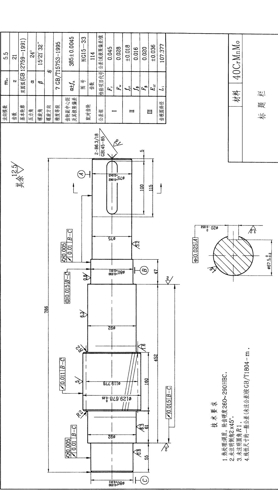

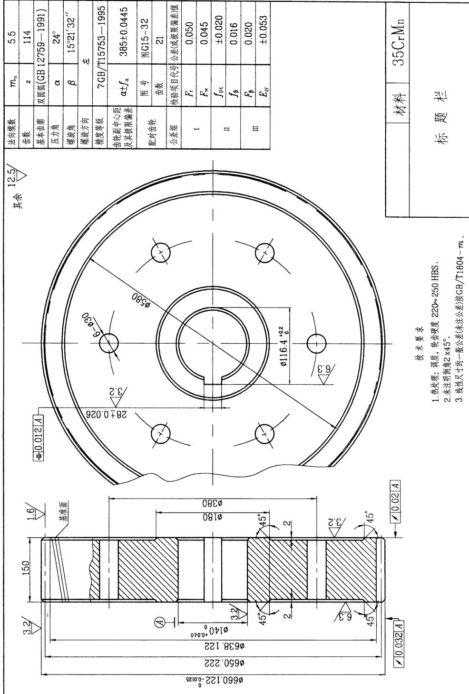
